{0}------------------------------------------------

# **UNITED STATES SECURITIES AND EXCHANGE COMMISSION**

**Washington, D.C. 20549**

# **FORM 10-K**

**(Mark One)**

☒ **ANNUAL REPORT PURSUANT TO SECTION 13 OR 15(d) OF THE SECURITIES EXCHANGE ACT OF 1934**

**For the fiscal year ended December 31, 2022**

**OR**

☐ **TRANSITION REPORT PURSUANT TO SECTION 13 OR 15(d) OF THE SECURITIES EXCHANGE ACT OF 1934**

**For the transition period from to**

**Commission File Number: 001-38492**

# **Kiniksa Pharmaceuticals, Ltd.**

#### (Exact name of registrant as specified in its charter)

**Bermuda 98-1327726**

(I.R.S. Employer Identification Number)

(State or other jurisdiction of incorporation or organization)

**Kiniksa Pharmaceuticals, Ltd. Clarendon House 2 Church Street Hamilton HM11, Bermuda + (44) 808-189-6257**

(Address, zip code and telephone number, including area code of principal executive offices)

**Kiniksa Pharmaceuticals Corp.**

**100 Hayden Avenue Lexington, MA, 02421**

**(781) 431-9100** (Address, zip code and telephone number, including area code of agent for service)

**N/A**

(Former name, former address and former fiscal year, if changed since last report)

**Securities registered pursuant to Section 12(b) of the Act:**

| Title of each class   | Trading Symbol(s) | Name of each exchange on which registered                 |  |  |
|-----------------------|-------------------|-----------------------------------------------------------|--|--|
| Class A Common Shares | KNSA              | The Nasdaq Stock Market LLC (Nasdaq Global Select Market) |  |  |
|                       |                   |                                                           |  |  |

Indicate by check mark if the registrant is a well-known seasoned issuer, as defined in Rule 405 of the Securities Act. Yes ☐ No ☒

Indicate by check mark if the registrant is not required to file reports pursuant to Section 13 or Section 15(d) of the Act. Yes ☐ No ☒

Indicate by check mark whether the registrant (1) has filed all reports required to be filed by Section 13 or 15(d) of the Securities Exchange Act of 1934 during the preceding 12 months (or for such shorter period that the registrant was required to file such reports), and (2) has been subject to such filing requirements for the past 90 days. Yes ☒ No ☐

Indicate by check mark whether the registrant has submitted electronically every Interactive Data File required to be submitted pursuant to Rule 405 of Regulation S-T during the preceding 12 months (or for such shorter period that the registrant was required to submit such files). Yes ☒ No ☐

Indicate by check mark whether the registrant is a large accelerated filer, an accelerated filer, a non-accelerated filer, a smaller reporting company, or an emerging growth company. See the definitions of "large accelerated filer," "accelerated filer", "smaller reporting company" and "emerging growth company" in Rule 12b-2 of the Exchange Act.

Large Accelerated Filer ☐ Accelerated Filer ☐ Non-accelerated Filer ☒ Smaller Reporting Company ☒ Emerging Growth Company ☐ If an emerging growth company, indicate by check mark if the registrant has elected not to use the extended transition period for complying with any new or revised financial accounting

standards provided pursuant to Section 13(a) of the Exchange Act. ☐ Indicate by check mark whether the registrant has filed a report on and attestation to its management's assessment of the effectiveness of its internal control over financial reporting under Section 404(b) of the Sarbanes-Oxley Act (15 U.S.C. 7262(b)) by the registered public accounting firm that prepared or issued its audit report. ☐

If securities are registered pursuant to Section 12(b) of the Act, indicate by check mark whether the financial statements of the registrant included in the filing reflect the correction of an error to previously issued financial statements. ☐

Indicate by check mark whether any of those error corrections are restatements that required a recovery analysis of incentive-based compensation received by any of the registrant's executive officers during the relevant recovery period pursuant to §240.10D-1(b). ☐

Indicate by check mark whether the registrant is a shell company (as defined in Rule 12b-2 of the Exchange Act). Yes ☐ No ☒

The aggregate market value of the voting and non-voting common equity held by non-affiliates of the Registrant, based on the closing price of the common shares on The Nasdaq Global Select Market on June 30, 2022, was approximately \$346.7 million.

As of February 28, 2023, there were 69,753,123 common shares outstanding in aggregate, comprised of:

34,806,180 Class A common shares, par value \$0.000273235 per share

1,813,457 Class B common shares, par value \$0.000273235 per share

17,075,868 Class A1 common shares, par value \$0.000273235 per share

16,057,618 Class B1 common shares, par value \$0.000273235 per share

**DOCUMENTS INCORPORATED BY REFERENCE**

Portions of the registrant's definitive proxy statement for its 2023 Annual Meeting of Shareholders, which the registrant intends to file with the Securities and Exchange Commission pursuant to Regulation 14A within 120 days after the end of the registrant's fiscal year ended December 31, 2022, are incorporated by reference into Part III of this Annual Report on Form 10-K.

{1}------------------------------------------------

## **Kiniksa Pharmaceuticals, Ltd.**

## **FORM 10-K**

## **FOR THE YEAR ENDED DECEMBER 31, 2022**

## **TABLE OF CONTENTS**

| PART I                             |     |
|------------------------------------|-----|
| Item 1. Business                   | 6   |
| Item 1A. Risk Factors              | 44  |
| Item 1B. Unresolved Staff Comments | 123 |
| Item 2. Properties                 | 123 |
| Item 3. Legal Proceedings          | 123 |
| Item 4. Mine Safety Disclosures    | 123 |

## **[PART](#page-123-0) II**

| Item 5. Market for Registrant's Common Equity, Related Stockholder Matters and Issuer Purchases of Equity |     |  |
|-----------------------------------------------------------------------------------------------------------|-----|--|
| Securities                                                                                                | 124 |  |
| Item 6. Reserved.                                                                                         | 124 |  |
| Item 7. Management's Discussion and Analysis of Financial Condition and Results of Operations             | 125 |  |
| Item 7A. Quantitative and Qualitative Disclosures About Market Risk                                       | 139 |  |
| Item 8. Financial Statements and Supplementary Data                                                       | 139 |  |
| Item 9. Changes in and Disagreements with Accountants on Accounting and Financial Disclosure              | 139 |  |
| Item 9A. Controls and Procedures                                                                          | 139 |  |
| Item 9B. Other Information                                                                                | 140 |  |
| Item 9C. Disclosure Regarding Foreign Jurisdictions that Prevent Inspections.                             | 140 |  |
| PART III                                                                                                  |     |  |
| Item 10. Directors, Executive Officers and Corporate Governance                                           | 141 |  |
| Item 11. Executive Compensation                                                                           | 141 |  |
| Item 12. Security Ownership of Certain Beneficial Owners and Management and Related Stockholder Matters   | 141 |  |
| Item 13. Certain Relationships and Related Transactions, and Director Independence                        |     |  |
| Item 14. Principal Accounting Fees and Services                                                           | 141 |  |
| PART IV                                                                                                   |     |  |
| Item 15. Exhibits and Financial Statement Schedules                                                       | 142 |  |
| Item 16. Form 10-K Summary                                                                                | 147 |  |

{2}------------------------------------------------

## **SPECIAL NOTE REGARDING FORWARD-LOOKING STATEMENTS**

This Annual Report on Form 10-K (this "Annual Report"), contains forward-looking statements. All statements other than statements of historical facts contained in this Annual Report including statements regarding our products' commercial sales, future results of anticipated products, future results of operations and financial position, expected timeline for our cash, cash equivalents and short-term investments, business strategy, product development, prospective products and product candidates, their expected properties, performance, market opportunity and competition, supply of drug products at acceptable cost and quality, collaborators, license and other strategic arrangements, the expected timeline for achievement of our clinical milestones, the timing of, and potential results from, clinical and other trials, potential marketing authorization from the FDA or regulatory authorities in other jurisdictions, potential and ongoing coverage and reimbursement for our products and product candidates, if approved, commercial strategy and pre-commercial activities, research and development costs, timing of regulatory filings and feedback, timing and likelihood of success and plans and objectives of management for future operations and funding requirements, are forward-looking statements.

These statements involve known and unknown risks, uncertainties and other important factors that may cause our actual results, performance or achievements to be materially different from any future results, performance or achievements expressed or implied by the forward-looking statements.

In some cases, you can identify forward-looking statements by terms such as "may," "will," "should," "expect," "plan," "anticipate," "could," "intend," "goal," "design," "target," "project," "contemplate," "believe," "estimate," "predict," "potential" or "continue" or the negative of these terms or other similar expressions, although not all forwardlooking statements contain these identifying words. The forward-looking statements in this Annual Report are only predictions. We have based these forward-looking statements largely on our current expectations and projections about future events and financial trends that we believe may affect our business, financial condition and results of operations. These forward-looking statements speak only as of the date of this Annual Report and are subject to a number of risks, uncertainties and assumptions described under the sections in this Annual Report entitled "Summary Risk Factors", "Risk Factors" and "Management's Discussion and Analysis of Financial Condition and Results of Operations" and elsewhere in this Annual Report. These forward-looking statements are subject to numerous risks and uncertainties, including, without limitation, the following:

- our continued ability to commercialize ARCALYST (rilonacept) and to develop and commercialize our current and future product candidates, if approved;
- our status as a small commercial stage biopharmaceutical company and our expectation to incur losses for the foreseeable future;
- our future capital needs and our need to raise additional funds;
- our ability to manufacture sufficient quantities of our products and product candidates to meet patient and partner demand;
- the market acceptance of our products and product candidates;
- competitive and potentially competitive products and technologies;
- prescriber awareness and adoption of our products and product candidates, if approved;
- the size of the market for our products and product candidates, if approved;
- our ability to meet the quality expectations of prescribers or patients;

{3}------------------------------------------------

- the decision of third-party payors not to cover or maintain coverage of or to establish burdensome requirements prior to covering ARCALYST or any of our current or future product candidates, if approved, or to require extensive or independently performed clinical trials prior to covering or maintaining coverage of our product candidates, if approved;
- the lengthy and expensive clinical development process with its uncertain outcomes and potential for clinical failure or delay, including due to the COVID-19 pandemic and global political turmoil, including the ongoing war in Ukraine;
- the decision by any applicable regulatory authority whether to clear our current or future product candidates for clinical development and, ultimately, whether to approve them for marketing and sale;
- our ability to anticipate and prevent adverse events caused by our products and product candidates;
- our ability to improve our product candidates;
- our ability to identify, in-license, acquire, discover or develop additional product candidates;
- our ability to undertake and execute on business combinations, out-licensing activities, collaborations or other strategic transactions and our ability to realize value therefrom;
- our ability to have our products and product candidates manufactured in accordance with regulatory requirements and at acceptable cost and quality specifications;
- our ability to successfully manage our growth;
- our ability to avoid product liability claims and maintain adequate product liability insurance;
- our ability to obtain regulatory exclusivity;
- federal, state and foreign regulatory requirements applicable to our products and product candidates;
- our ability to obtain, maintain, protect and enforce our intellectual property rights related to our products and product candidates;
- ownership concentration of our executive officers, directors, certain members of senior management and affiliated shareholders may prevent our shareholders from influencing significant corporate decisions; and
- our ability to attract and retain skilled personnel.

Because forward-looking statements are inherently subject to risks and uncertainties, some of which cannot be predicted or quantified and some of which are beyond our control, you should not rely on these forward-looking statements as predictions of future events. The events and circumstances reflected in our forward-looking statements may not be achieved or occur and actual results could differ materially from those projected in the forward-looking statements. Moreover, we operate in an evolving environment. New risk factors and uncertainties may emerge from time to time, and it is not possible for management to predict all risk factors and uncertainties. As a result of these factors, we cannot assure you that the forward-looking statements in this Annual Report will prove to be accurate. Except as required by applicable law, we do not plan to publicly update or revise any forward-looking statements contained herein, whether as a result of any new information, future events, changed circumstances or otherwise.

You should read this Annual Report and the documents that we reference in this Annual Report completely and with the understanding that our actual future results may be materially different from what we expect. We qualify all of our forward-looking statements by these cautionary statements.

{4}------------------------------------------------

## **SUMMARY RISK FACTORS**

Our business is subject to numerous risks and uncertainties, including those described in Part I, Item 1A. "Risk Factors" in this Annual Report. You should carefully consider these risks and uncertainties when investing in our Class A common shares. The principal risks and uncertainties affecting our business include the following:

- we have only recently begun generating product revenue, have incurred significant operating losses in the past, expect to incur significant operating losses for the foreseeable future and may never achieve corporate profitability on a sustained basis;
- we will require significant additional funding to develop our portfolio, commercialize our products and product candidates, if approved, and to identify, discover, develop or acquire additional product candidates, and if we are unable to secure financing on acceptable terms when needed, or at all, we could be forced to delay, reduce or cease one or more of our product development plans, research and development programs or other operations or commercialization efforts;
- we depend heavily on the commercial success of ARCALYST and may be unsuccessful in our efforts to commercialize ARCALYST on a sustained basis, support our sales, marketing, and distribution activities and maintain applicable infrastructure for these activities either directly and/or through agreements with third parties; as a result, we may not be able to sustain the commercialization of ARCALYST, or successfully commercialize any future products;
- we depend heavily on the success of one or more of our product candidates, which are in various stages of development; such success is dependent upon us advancing our product candidates in clinical development, obtaining regulatory approval and ultimately commercializing one or more of our product candidates on a timely basis;
- ARCALYST in recurrent pericarditis, as well as our current or future product candidates, if approved, may not gain sustained market acceptance by prescribers, patients, or third-party payors, in which case our ability to generate product revenues will be impaired;
- successful commercialization of our products and product candidates, if approved, will depend in part on the extent to which third-party payors provide funding, establish favorable coverage and pricing policies, respond to price increases and set adequate reimbursement levels for our products and product candidates, if approved, and failure to obtain or maintain coverage and adequate reimbursement for our products and product candidates, if approved, could limit our ability to market those products and decrease our ability to generate revenue;
- the market opportunities for our products and product candidates, if approved, may be smaller than we estimate, or any approval that we obtain may be based on a narrower definition of our targeted patient population, either of which may materially adversely affect our revenue and ability to achieve profitability;
- clinical development of our product candidates is a lengthy and expensive process with uncertain timelines, costs and outcomes;
- we may encounter substantial delays in our current or planned preclinical and/or clinical trials, including as a result of delays in obtaining regulatory approvals for indications, activating sites, enrolling participants, and conducting trials, which could delay or prevent our product development activities;
- we rely on third parties, including contract research organizations ("CROs") to activate our sites and conduct or otherwise support our research activities, preclinical studies and clinical trials for our product candidates, and these third parties may not perform satisfactorily, which could delay, prevent or impair our product development activities;

{5}------------------------------------------------

- we rely on third parties, including independent contract manufacturing organizations ("CMOs") to manufacture our product candidates for preclinical and clinical development, to manufacture our commercial supply of ARCALYST, and supply of drug substance and drug product for ARCALYST and our product candidates; and if these third parties do not perform satisfactorily, including by producing insufficient supply of commercial and clinical stock to meet patient demand or clinical trial requirements, or are impacted by delays or supply shortages, our product development activities, regulatory approval, and commercialization efforts may be delayed, prevented or impaired;
- all of our products and current product candidates have been licensed or acquired from other parties; if those parties did not adequately protect and we are unable to adequately protect such products and product candidates, or to secure and maintain freedom to operate, others could preclude us from commercializing our products and product candidates, if approved, or compete against us more directly;
- we face significant competition from other biotechnology and pharmaceutical companies, which may result in others discovering, developing or commercializing drugs before or more successfully than us;
- we may not successfully execute our growth strategy to identify, discover, develop, license or acquire additional product candidates or technologies, and our strategy may not deliver anticipated results or we may refine or otherwise alter our growth strategy;
- we may seek to acquire businesses or undertake business combinations, collaborations or other strategic transactions which may not be successful or on favorable terms, if at all, and we may not realize the intended benefits of such transactions;
- we have entered into and may seek to enter into collaboration, licensing or other transactions to further develop, commercialize or otherwise realize value from one or more of our product candidates, and the expected value we hope to realize, including through milestone, royalty or other payments may be less than we expect; and
- concentration of ownership of the voting power of our common shares may prevent new investors from influencing significant corporate decisions and may have an adverse effect on the price of our Class A common shares.

### **INDUSTRY AND OTHER DATA**

Unless otherwise indicated, certain industry data and market data included in this Annual Report were obtained from independent third-party surveys, market research, publicly available information, reports of governmental agencies and industry publications and surveys. All of the market data used in this Annual Report involve a number of assumptions and limitations, and you are cautioned not to give undue weight to such estimates. We believe that the information from these industry publications and surveys included in this Annual Report is reliable.

ARCALYST® is a registered trademark of Regeneron Pharmaceuticals, Inc. ("Regeneron").

## **PART I**

# **ITEM 1. BUSINESS.**

## **Overview**

We are a biopharmaceutical company focused on discovering, acquiring, developing and commercializing therapeutic medicines for patients suffering from debilitating diseases with significant unmet medical need. Our portfolio of immune-modulating assets, ARCALYST® (rilonacept), KPL-404 and mavrilimumab, are based on strong biologic rationale or validated mechanisms, target a spectrum of underserved cardiovascular and autoimmune conditions, and offer the potential for differentiation.

{6}------------------------------------------------

*ARCALYST* is an interleukin-1α and interleukin-1β cytokine trap. In 2017, we licensed ARCALYST from Regeneron, who discovered and initially developed the drug. Our exclusive license to ARCALYST from Regeneron includes worldwide rights, excluding the Middle East and North Africa, for all applications other than those in oncology and local administration to the eye or ear.

We received U.S. Food and Drug Administration (the "FDA") approval of ARCALYST for the treatment of recurrent pericarditis and reduction in risk of recurrence in adults and children 12 years and older in March 2021. Recurrent pericarditis is a painful inflammatory cardiovascular disease with an estimated U.S. prevalent population of approximately 40,000 patients seeking and receiving medical treatment. ARCALYST is commercially available across the United States through a network of distributors. ARCALYST is also approved in the United States for the treatment of Cryopyrin-Associated Periodic Syndromes ("CAPS") specifically Familial Cold Autoinflammatory Syndrome and Muckle-Wells Syndrome in adults and children 12 years and older, and the maintenance of remission in Deficiency of Interleukin-1 Receptor Antagonist ("DIRA") in adults and children weighing 10 kg or more. We are responsible for sales and distribution of ARCALYST in all approved indications in the United States, and evenly split profits on sales as well as third-party proceeds with Regeneron.

In February 2022, we granted Hangzhou Zhongmei Huadong Pharmaceutical Co., Ltd. ("Huadong") exclusive rights to develop and commercialize ARCALYST in the Asia Pacific region, excluding Japan.

*KPL-404* is an investigational monoclonal antibody inhibitor of CD40-CD154 interaction. In 2019, we acquired all of the outstanding securities of Primatope Therapeutics, Inc. ("Primatope"), the company that owned or controlled the intellectual property related to KPL-404. In connection with our acquisition of Primatope, we acquired an exclusive worldwide license to KPL-404 from Beth Israel Deaconess Medical Center, Inc. ("BIDMC").

The CD40-CD154 interaction is a key T-cell co-stimulatory signal critical for B-cell maturation, immunoglobulin class switching and Type 1 immune response. We believe disrupting the CD40-CD154 interaction is an attractive approach to address multiple autoimmune disease pathologies such as rheumatoid arthritis ("RA"), Sjogren's syndrome, Graves' disease and systemic lupus erythematosus.

In May 2021, we announced positive final data from our Phase 1 single-ascending-dose clinical trial of KPL-404 in healthy volunteers, which evaluated safety and pharmacokinetics, as well as receptor occupancy and T-cell dependent antibody response. In December 2021, we initiated a Phase 2 clinical trial of KPL-404 in RA, which is designed to evaluate pharmacokinetics, safety and efficacy with subcutaneous administration. In January 2023, we announced that we had completed enrollment of the second and final cohort of the multiple ascending dose portion of such trial. Following completion of this portion of the trial, the proof-of-concept portion will begin. We expect data from the trial in the first half of 2024.

*Mavrilimumab* is an investigational monoclonal antibody inhibitor targeting granulocyte-macrophage colony stimulating factor receptor alpha ("GM-CSFRα"). In 2017, we licensed exclusive worldwide rights in all indications to mavrilimumab from MedImmune, Limited ("MedImmune").

We are pursuing collaborative study agreements to evaluate the potential of mavrilimumab in rare cardiovascular diseases where the GM-CSF mechanism has been implicated. We previously evaluated mavrilimumab in giant cell arteritis ("GCA"), a chronic inflammatory disease of the medium-to-large arteries, and COVID-19-related acute respiratory distress syndrome ("ARDS").

In February 2022, we granted Huadong exclusive rights to develop and commercialize mavrilimumab in the Asia Pacific region, excluding Japan.

*Vixarelimab* is an investigational monoclonal antibody inhibitor of signaling through oncostatin M receptor beta ("OSMRβ"), which was previously part of our portfolio of immune-modulating assets. In September 2022, we closed an agreement granting Genentech, Inc. and F. Hoffmann-La Roche Ltd (collectively, "Genentech") an exclusive worldwide license to develop and commercialize vixarelimab. Pursuant to such agreement, we have agreed to complete our inprogress Phase 2b dose-ranging clinical trial of vixarelimab for the treatment of prurigo nodularis, a chronic inflammatory skin condition.

{7}------------------------------------------------

The following table summarizes our current pipeline of products and product candidates:

| Program                                    | Target                                                    | Preclinical                          | Phase 1 | Phase 2 | Phase 3 | Commercial |
|--------------------------------------------|-----------------------------------------------------------|--------------------------------------|---------|---------|---------|------------|
| CARDIOVASCULAR FRANCHISE                   |                                                           |                                      |         |         |         |            |
| ARCALYST® (rilonacept)1,2 IL-1a & IL-1B | Recurrent Pericarditis                                    |                                      |         |         |         |            |
| Mavrilimumab3 GM-CSFRa                  | Evaluating Development in Rare Cardiovascular Diseases |                                      |         |         |         |            |
| AUTOIMMUNE FRANCHISE                       |                                                           |                                      |         |         |         |            |
| KPL-404 CD40/CD154                      | Rheumatoid Arthritis                                      |                                      |         |         |         |            |
|                                            |                                                           |                                      |         |         |         |            |
| Program                                    | Licensee                                                  | Exclusive Licensed Territory         |         |         |         |            |
| OUT-LICENSING AGREEMENTS                   |                                                           |                                      |         |         |         |            |
| ARCALYST® (rilonacept)1,2 IL-1a & IL-1B | Huadong Medicine                                          | Asia Pacific Region, Excluding Japan |         |         |         |            |
| Mavrilimumab3 GM-CSFRa                  | Huadong Medicine                                          | Asia Pacific Region, Excluding Japan |         |         |         |            |
| Vixarelimab OSMRB                       | Roche and Genentech                                       | Worldwide                            |         |         |         |            |

(1) Approved in the U.S.; ARCALYST is also approved for cryopyrin-associated periodic syndromes (CAPS) and deficiency of the interleukin-1 receptor antagonist (DIRA);

- (2) The FDA granted Breakthrough Therapy designation to ARCALYST for recurrent pericarditis in 2019; the FDA granted Orphan Drug exclusivity to ARCALYST in March 2021 for the treatment of recurrent pericarditis and reduction in risk of recurrence in adults and pediatric patients 12 years and older. The European Commission granted Orphan Drug designation to ARCALYST for the treatment of idiopathic pericarditis in 2021;
(3) Phase 2 clinical trials of mavrilimumab in rheumatoid arthritis and giant cell arteritis achieved their primary and secondary endpoints with statistical significance;

IL-1α = interleukin-1α; IL-1β = interleukin-1β; GM-CSFRα = granulocyte macrophage colony stimulating factor receptor alpha; OSMRβ = oncostatin M receptor beta.

Using a data-centric approach, our team considers a wide variety of metrics to drive informed capital allocation strategies and generate value from our portfolio of immune-modulating assets, including by analyzing potential additional indications for ARCALYST, KPL-404 and mavrilimumab, being opportunistic in our business development activities to inlicense or acquire programs, considering appropriate opportunities to partner or out-license our programs and conducting internal research to discover and develop molecules to expand our portfolio.

## **Our Strategy**

We are a biopharmaceutical company focused on discovering, acquiring, developing and commercializing therapeutic medicines for patients suffering from debilitating diseases with significant unmet medical need. Our portfolio of immune-modulating assets, ARCALYST, KPL-404 and mavrilimumab, are based on strong biologic rationale or validated mechanisms, target a spectrum of underserved cardiovascular and autoimmune conditions, and offer the potential for differentiation.

Critical components of our business strategy include the following:

- **Commercialize ARCALYST and Our Product Candidates, if Approved**. In connection with our commercial launch of ARCALYST for the treatment of recurrent pericarditis, we have built a specialty cardiology sales team that we expect will continue to effectively reach patients and prescribers and successfully leverage ARCALYST's commercial potential. We also expect that we will be able to leverage our existing commercial infrastructure to launch and commercialize our other current and future product candidates, if approved.

{8}------------------------------------------------

- **Advance Our Product Candidates Through the Development Process**. We are pursuing multiple product candidates in parallel and have advanced these programs with the goal of delivering differentiated therapies to patients. We believe that each of our product candidates has the potential to address significant unmet medical needs and intend to develop them efficiently in a data-driven manner.
- **Explore Opportunities to Drive Value and Maximize the Potential of Our Existing Portfolio.** We believe that our product candidates have potential in multiple indications. Our assets are designed to modulate immunological signaling pathways that are implicated across a spectrum of diseases. We may also seek collaborations, licenses and other strategic relationships to assist in advancing and expanding our current programs, as appropriate, to drive value.
- **Work to Identify, Discover, Acquire and Develop New Therapies.** We evaluate a variety of factors for potential product candidates, technologies and discovery targets, including biologic rationale for addressing the disease, potential for regulatory approval, commercial viability, intellectual property position, prospects for favorable pricing and reimbursement and the impact of competition. We also look at assets that could potentially address multiple indications. We intend to continue to be opportunistic in our business development activities.

## **Our Products**

### **ARCALYST**

## *Overview*

ARCALYST is an interleukin-1α and interleukin-1β cytokine trap. Cytokines are small proteins that play a role in cell signaling.

We received FDA approval of ARCALYST for the treatment of recurrent pericarditis and reduction in risk of recurrence in adults and children 12 years and older in March 2021. ARCALYST is also approved in the United States for the treatment of CAPS, specifically Familial Cold Autoinflammatory Syndrome and Muckle-Wells Syndrome in adults and children 12 years and older, and the maintenance of remission in DIRA in adults and children weighing 10 kg or more. ARCALYST was sold by Regeneron in the United States for the treatment of CAPS from 2008 and DIRA from 2020 until we assumed responsibility for sales in such indications in March 2021.

Recurrent pericarditis is a painful autoinflammatory cardiovascular disease with an estimated U.S. prevalent population of approximately 40,000 patients seeking and receiving medical treatment. We received Breakthrough Therapy designation from the FDA for ARCALYST for the treatment of recurrent pericarditis in 2019, Orphan Drug designation from the FDA for ARCALYST for the treatment of pericarditis, which includes the treatment of recurrent pericarditis, in 2020 and FDA approval of ARCALYST for the treatment of recurrent pericarditis and reduction in risk of recurrence in adults and pediatric patients 12 years and older in March 2021. Additionally, in 2021, the European Commission granted Orphan Drug designation to ARCALYST for the treatment of idiopathic pericarditis.

In June 2020, we reported final results from RHAPSODY, our global, double-blind, placebo-controlled, randomized-withdrawal design, pivotal Phase 3 clinical trial of ARCALYST in subjects with recurrent pericarditis. RHAPSODY met its prespecified primary and all major secondary efficacy endpoints with statistical significance, showing that ARCALYST improved clinically meaningful outcomes associated with unmet medical need in recurrent pericarditis. RHAPSODY data were also published in *The New England Journal of Medicine* simultaneously with a late-breaking scientific presentation at the American Heart Association's Scientific Sessions 2020. In November 2022, data from the long-term extension portion of the RHAPSODY trial were presented at the American Heart Association's Scientific Sessions which demonstrated, among other things, that continued ARCALYST treatment beyond 18 months resulted in continued treatment response.

In February 2022, we granted Huadong exclusive rights to develop and commercialize ARCALYST in the Asia Pacific region, excluding Japan.

{9}------------------------------------------------

## *Mechanism of Action*

ARCALYST is an inhibitor of IL-1α and IL-1β. IL-1α and IL-1β have been demonstrated to play a key role in inflammatory diseases. IL-1α and IL-1β provoke potent, proinflammatory events by engaging the IL-1α and IL-1β receptor. Following tissue insult, the release of IL-1α acts as the primary initiating signal to coordinate the mobilization of immune cells to the damaged area, while IL-1β is secreted mostly by macrophages and is a prototypical cytokine of the canonical NLRP-3 inflammasome. IL-1α and IL-1β signaling results in a dramatic increase in the production of cytokines that orchestrate the proliferation and recruitment of phagocytes to the site of damage, resulting in inflammation. Moreover, IL-1α and IL-1β signaling also affects other immune system cells, such as T-cells and B-cells.

IL-1β's role in the inflammation process has been extensively studied, while, in comparison, much is still unknown about the independent function of IL-1α in disease pathology. Despite driving similar immunological outcomes, IL-1α and IL-1β differ substantially in their expression and regulation, and non-redundant roles for IL-1α or IL-1β have been demonstrated in multiple inflammatory diseases. There are disease states in which IL-1β inhibition alone does not appear to be sufficient for disease remission in the absence of IL-1α inhibition. Published studies suggest certain autoinflammatory diseases may, in fact, be pathologically driven primarily by IL-1α.

We believe that inhibiting both IL-1α and IL-1β signaling is important for treating recurrent pericarditis. In a published case study, a patient with a refractory form of recurrent pericarditis, who was well controlled on anakinra, was switched from anakinra to canakinumab, which inhibits only IL-1β, for tolerability reasons. The patient's disease returned despite further dose escalation of canakinumab. When the patient was switched back to anakinra, which inhibits ILα and ILβ, the disease promptly went back into remission. These data, together with clinical data from our pivotal Phase 3 clinical trial of ARCALYST, indicate that IL-1α and IL-1β play unique roles in recurrent pericarditis and other autoinflammatory diseases in which the pathology may be driven primarily by IL-1α.

Beyond recurrent pericarditis, we believe there is significant potential for ARCALYST to address additional indications. For example, we believe there are other diseases of the cardiovascular system where tissue inflammation may be driven by IL-1α or IL-1β. More generally, we believe there may be many diseases characterized by painful serosal inflammation that may be driven by IL-1α, and we intend to consider development of ARCALYST in these indications and in others where we believe IL-1α and/or IL-1β plays a key role in disease pathophysiology.

#### *Background and Market Opportunity for Recurrent Pericarditis*

Pericarditis is the most common disorder involving the pericardium, the two-layered sac that surrounds the heart. Pericarditis is an inflammation of this sac and is typically characterized by significant chest pain, shortness of breath, coughing and fatigue and is often misconstrued by patients as a heart attack. In addition, typical signs of pericarditis include pericardial friction rub, electrocardiogram changes or pericardial effusion, which is a buildup of fluid around the heart. Pericarditis is described as recurrent if, following an initial occurrence of pericarditis, it recurs after a symptom-free period of about four to six weeks. Pericarditis is considered chronic if symptoms of any one episode last longer than three months, typically causing significant pain and frustration. If pericarditis is left untreated, patients can develop thickening and scarring of the pericardium, potentially requiring invasive surgical stripping. Pericardial effusion, if large enough, can compress the heart extrinsically, requiring emergent drainage.

In March 2021, we received FDA approval to market ARCALYST for the treatment of recurrent pericarditis and reduction in risk of recurrence in adults and children 12 years of age and older, and we are exploring opportunities for potential expansion into other countries. Claims analysis, cross validated with published estimates, support a prevalent population of patients with recurrent pericarditis seeking and receiving medical treatment to be approximately 40,000 patients in the United States per year. Within this estimated diagnosed and treated recurrent pericarditis patient population, there are certain subgroups of patients totaling approximately 14,000 in the U.S. who suffer from persistent underlying disease, multiple recurrences and an inadequate response to conventional therapy who serve as our core target patient population.

{10}------------------------------------------------

#### *Current Treatment Landscape for Recurrent Pericarditis and Our Solution*

ARCALYST, a weekly, subcutaneously injected, recombinant fusion protein that blocks IL-1α and IL-1β signaling, is the first and only FDA-approved therapy for recurrent pericarditis. A patient's initial acute episode of pericarditis is typically treated with over-the-counter or prescription NSAIDs or colchicine, both of which are used offlabel. Prior to ARCALYST's approval, episodes of recurrent pericarditis would usually have been treated in a similar manner or by adding systemic corticosteroids which were also used off-label. Both colchicine and corticosteroids often have deleterious effects when used at high doses or for long periods of time, including, for colchicine, gastrointestinal distress and neutropenia and, for corticosteroids, glaucoma, fluid retention, hypertension, mood changes, memory changes, other psychological effects, weight gain and diabetes.

#### *Clinical Trials*

In June 2020, we reported final results from RHAPSODY, our global, double-blind, placebo-controlled, randomized-withdrawal design, pivotal Phase 3 clinical trial of ARCALYST in subjects with recurrent pericarditis. RHAPSODY met its prespecified primary and all major secondary efficacy endpoints with statistical significance. Median [95% CI] time to pericarditis recurrence for ARCALYST recipients in the randomized withdrawal period could not be estimated due to the low number of recurrences in the ARCALYST treatment arm. The median time-to-recurrence for placebo recipients was 8.6 [4.0-11.7] weeks (Hazard Ratio = 0.04, p<0.0001). ARCALYST recipients experienced a 96% reduction in risk of recurrent pericarditis events. 81% of ARCALYST recipients maintained clinical response at Week 16 of the randomized withdrawal period, compared to 20% of placebo recipients (p=0.0002). Consistent results were observed at Week 8 and Week 24 and were also highly statistically significant (p<0.0001 and p=0.0022, respectively). The proportion of ARCALYST recipients with absent or minimal pericarditis symptoms at Week 16 of the randomized withdrawal period was 81% compared to 25% for placebo recipients (p=0.0006). Finally, consistent results were observed at Week 8 and Week 24 and were also highly statistically significant (p<0.0001 and p=0.0002, respectively). We believe these data show that ARCALYST demonstrates clinically meaningful outcomes associated with unmet medical need in recurrent pericarditis.

In November 2022, data from the long-term extension ("LTE") portion of the RHAPSODY trial were presented at the American Heart Association Scientific Sessions 2022. LTE data included in the presentation demonstrated continued ARCALYST treatment beyond 18 months resulted in continued treatment response. The median [maximum at end of LTE] duration of continuous rilonacept therapy for all patients in RHAPSODY was 23 [35] months; the median [maximum at end of LTE] duration of continuous rilonacept therapy was 18 months [27] months for US patients (n=45) and 29 [35] months for non-US patients (n=29). The annualized incidence of pericarditis recurrences while on therapy for all patients (n=74) during the first 18 months of the LTE portion of the trial was 0.04 events per patient-year (compared to 4.4 events per patient-year prior to study entry). Patients (n = 52) were given the option at 18 months from their most recent pericarditis recurrence to continue or suspend rilonacept treatment for observation. There were 33 patients who elected to continue ARCALYST treatment, and the only recurrence in this group was associated with a treatment interruption of 4 weeks. Of the patients who suspended treatment (n=8), 75% (n=6) experienced pericarditis recurrences. The median [interquartile range (IQR)] time-to-event was 11.8 [3.7, Not-Estimable (NE)] weeks. The 98% reduction in risk of recurrent pericarditis events in patients who continued rilonacept treatment beyond 18 months (Hazard Ratio = 0.02, p<0.0001) was consistent with the results of the randomized withdrawal period.

## *Commercial Strategy for ARCALYST*

Since our commercial launch of ARCALYST for the treatment of recurrent pericarditis in 2021, we have developed a focused and targeted commercial strategy that vertically integrates multiple key functions. Our specialty salesforce of approximately 50 representatives as of December 31, 2022 calls on high-volume accounts and prescribers. Our salesforce is complemented by our medical affairs, payor and patient services teams who work to ensure broad patient access to ARCALYST, educate communities, collaborate with patient advocacy groups and drive scientific understanding of recurrent pericarditis. Further, we have established an efficient marketing effort intended to help spread awareness of ARCALYST and recurrent pericarditis among prescribers and patients.

{11}------------------------------------------------

Through a data-driven market assessment, we have developed what we believe to be an efficient commercial model built around four key strategic imperatives. The first strategic imperative is establishing the unmet need for recurrent pericarditis patients and working to ensure recurrent pericarditis is viewed as a serious, debilitating disease that is driven primarily by IL-1. The second strategic imperative is working to ensure ARCALYST is viewed as the product of choice for the treatment and reduction in risk of recurrent pericarditis in patients over 12 years of age. The third strategic imperative relates to reimbursement and working to ensure broad patient access at a price that reflects ARCALYST's value as the first and only FDA-approved therapy for recurrent pericarditis. The fourth and final strategic imperative is building robust patient support programs to optimize patient experiences with ARCALYST and Kiniksa. Overall, our efforts are focused on programs and tactics to help with uptake and adoption of ARCALYST as well as ensuring a positive patient experience.

### **Our Product Candidates**

#### *KPL-404*

### *Overview*

KPL-404 is an investigational monoclonal antibody inhibitor of CD40-CD154 interaction. CD40-CD154 interaction is a key T-cell co-stimulatory signal critical for B-cell maturation, immunoglobulin class switching, and Type 1 immune response.

In May 2021, we reported positive final data from our randomized, double-blind, placebo-controlled, singleascending-dose Phase 1 single-ascending-dose clinical trial of KPL-404 in healthy volunteers which evaluated safety and pharmacokinetics, as well as RO, and TDAR in these subjects. KPL-404 showed dose-dependent increases in concentration across cohorts. All dose escalations occurred as per protocol with no dose-limiting safety findings. KPL-404 was welltolerated, and there were no serious adverse reactions. Subjects dosed with KPL-404 10 mg/kg IV showed full RO through at least Day 71 and complete suppression of TDAR after keyhole limpet hemocyanin ("KLH"), challenge and re-challenge through at least Day 57. Subjects dosed subcutaneously with KPL-404 5 mg/kg showed full RO through Day 43 and suppression of TDAR after KLH challenge through at least Day 29.

We are enrolling and dosing participants in a Phase 2 clinical trial of KPL-404 in rheumatoid arthritis, which is designed to enable its potential development in a spectrum of autoimmune diseases believed to be mediated by the CD40- CD154 co-stimulatory interaction. In January 2023, we announced that we had completed enrollment of the second and final cohort of the multiple ascending dose portion of such trial. Following completion of this portion of the trial, the proofof-concept portion will begin. We expect data from the trial in the first half of 2024.

## *Mechanism of Action*

KPL-404 is designed to block CD40-CD154 interaction by binding to and inhibiting signaling through the CD40 receptor. CD40 is a member of the Tumor Necrosis Factor Receptor superfamily which is constitutively or inducibly expressed on the surface of a variety of immune and non-immune cell types including B cells, macrophages, dendritic cells, microglia, endothelial cells, epithelial cells, and keratinocytes and can also be upregulated on other cell types in the context of autoimmune disease. Interactions between B cell-expressed CD40 and its binding partner, CD40L, mainly expressed on activated CD4+ T cells, play a critical role in promoting germinal center formation and the production of class-switched antibodies. The role of CD40 in B cells has been extensively characterized and has been shown to be essential for productive primary and secondary humoral immune responses to T dependent antigens. External clinical data that point to the broad potential power of the mechanism has been established in RA, systemic lupus erythematosus, primary Sjogren's syndrome and Graves' disease. Ongoing Phase 2 trials from competitors implicate additional indications for potential development, including type 1 diabetes, prevention of liver transplant rejection, hidradenitis suppurativa, lupus nephritis and multiple sclerosis.

{12}------------------------------------------------

## *Our Solution*

KPL-404 inhibits CD40-CD154 interaction with low-single digit nanomolar affinity *in vitro*. The presentation of KPL-404 is as a high-concentration, liquid formulation, which we believe may allow for a higher delivered dose in one subcutaneous injection than all other competitors whose formulations are limited mainly to high dose IV or lower-dose subcutaneous administration. We believe some competitor assets do not fully antagonize signaling as evidenced by efficacy failures and the generation of anti-drug antibodies even at maximum delivered and/or attainable dose levels.

## *Clinical and Preclinical Trials*

### *Preclinical Development*

In preclinical development, KPL-404 has been observed to have a favorable pharmacokinetic and toxicology profile and has shown activity in multiple non-human primate models of organ transplant rejection, as well as in multiple TDAR models. The data in the graphs below show in a non-human primate TDAR model that KPL-404 had linear pharmacokinetics with low variability which translated into complete suppression of antibody responses to a novel antigen (KLH) at drug levels achieving 100% receptor occupancy.

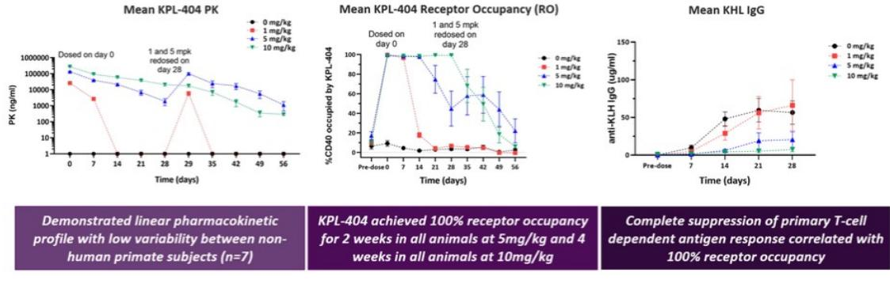

## *Phase 1 Clinical Trial*

We previously conducted a Phase 1 single-ascending-dose clinical trial of KPL-404, which was a randomized, double-blind, placebo-controlled, single-ascending-dose, first-in-human study that was divided into two parts: a single dose of KPL-404 0.03 mg/kg, 0.3 mg/kg, 1 mg/kg, 3 mg/kg or 10 mg/kg IV and a single dose of KPL-404 1 mg/kg or 5 mg/kg subcutaneously administered to separate cohorts of healthy volunteers. The primary objective was to assess the safety and tolerability of KPL-404. Secondary endpoints included pharmacokinetics, CD40 RO, the immune response to the novel test antigen KLH in clinically relevant dose cohorts, and the anti-drug antibody response.

In May 2021, we reported final results from this Phase 1 trial of KPL-404, which met both its primary objective and secondary endpoints. Results from the trial included the following:

{13}------------------------------------------------

- KPL-404 showed dose-dependent increases in concentration across cohorts. All dose escalations occurred as per protocol with no dose-limiting safety findings.
- KPL-404 was well-tolerated, and there were no serious adverse events.
- Subjects dosed with KPL-404 10 mg/kg IV showed full RO through at least Day 71 and complete suppression of TDAR after KLH challenge and re-challenge through at least Day 57.
- Subjects subcutaneously dosed with KPL-404 5 mg/kg showed full RO through Day 43 and suppression of TDAR after KLH challenge through at least Day 29. These data confirm and extend previously-reported 3 mg/kg IV cohort data, in which RO and suppression of TDAR after KLH challenge were demonstrated through Day 29.
- The 3 mg/kg IV dose level had previously demonstrated complete suppression of memory TDAR response to a re-challenge on Day 29.
- Anti-drug antibodies to KPL-404 were suppressed for at least 57 days at 10 mg/kg IV; the suppression of antibody responses to the drug itself is an independent indicator of target engagement and pharmacodynamic effect.

## *Phase 2 Trial in Rheumatoid Arthritis*

In December 2021, we commenced a Phase 2 clinical trial of KPL-404 in RA. The Phase 2 trial is a randomized, double-blind, placebo-controlled study designed to provide pharmacokinetic data and early signal of efficacy with chronic administration, and optionality to evaluate KPL-404 across a range of other autoimmune diseases. The trial is expected to enroll participants with active RA who have an inadequate response to or are intolerant to a Janus kinase inhibitor (a "JAKi") or at least one biologic disease-modifying anti-rheumatic drug (a "bDMARD"). Subjects who have failed both bDMARD and JAKi are excluded from the study. Cohorts 1 and 2 will each sequentially randomize eight participants in a 6:2 ratio to receive KPL-404 (2mg/kg or 5mg/kg, respectively) or placebo as a subcutaneous injection every 2 weeks for 12 weeks. The primary efficacy endpoints for Cohorts 1 and 2 will be to evaluate pharmacokinetic data across dosing levels and to collect the incidence of treatment-emergent adverse events. In November, 2022, we disclosed that we had amended the trial to (a) eliminate a 10 mg/kg biweekly subcutaneous dose arm from the multiple-ascending dose portion of the trial (i.e., removing the original Cohort 3 from the trial) and (b) replace the 10 mg/kg biweekly subcutaneous dose arm of the proof-of-concept portion of the trial with a 5 mg/kg weekly subcutaneous dose arm (the revised Cohort 3). Cohort 3 will randomize up to 75 participants in a 1:1:1 ratio to receive KPL-404 5 mg/kg or placebo as a subcutaneous injection every week or 5 mg/kg every 2 weeks for 12 weeks. The participants receiving KPL-404 5 mg/kg every 2 weeks will receive weekly administrations of alternating active investigational product and matching blinded placebo. The primary efficacy endpoint for Cohort 3 will be the change in baseline in DAS28-CRP at Week 12. Secondary endpoints for Cohort 3 will be the incidence of treatment-emergent adverse events and to evaluate pharmacokinetic data across dose levels. We expect data from the trial in the first half of 2024.

## **Mavrilimumab**

## *Overview*

Mavrilimumab is a fully-human monoclonal antibody that is designed to antagonize GM-CSF signaling by binding to the alpha subunit of the GM-CSF receptor.

We are pursuing collaborative study agreements to evaluate the potential of mavrilimumab in rare cardiovascular diseases where the GM-CSF mechanism has been implicated.

{14}------------------------------------------------

We previously evaluated mavrilimumab in COVID-19-related ARDS. Following the announcement that the Phase 3 portion of our global, double-blind, placebo-controlled clinical trial of mavrilimumab in COVID-19-related ARDS did not meet its primary efficacy endpoint in December 2021, we decided not to progress mavrilimumab in such indication at that time.

We also previously evaluated mavrilimumab in GCA, a chronic inflammatory disease of the medium-to-large arteries with an estimated U.S. prevalence of approximately 75,000 to 150,000 patients. In October 2020, we announced that our global, randomized, double-blind, placebo-controlled Phase 2 proof-of-concept clinical trial for the study of mavrilimumab in GCA achieved both the primary efficacy endpoint of time-to-first adjudicated GCA flare by Week 26 in all treated participants and the secondary efficacy endpoint of sustained remission at Week 26 in all treated participants with statistical significance. Additionally, while the trial was not powered for individual disease cohorts, there was a consistent trend of efficacy across the new onset and relapsing/refractory cohorts. In September 2020, the FDA granted Orphan Drug designation for mavrilimumab for the treatment of GCA. In February 2022, we announced that we do not plan to initiate a Phase 3 trial of mavrilimumab in GCA.

Before we licensed mavrilimumab in 2017, MedImmune was developing mavrilimumab for the treatment of RA. MedImmune had received authorization to conduct clinical trials for RA in Europe and executed an extensive Phase 1 and Phase 2 clinical program in which the company studied mavrilimumab in over 550 participants with RA through Phase 2b. MedImmune's clinical trials in RA through Phase 2b achieved their prospectively defined endpoints of efficacy or safety.

In February 2022, we granted Huadong exclusive rights to develop and commercialize mavrilimumab in the Asia Pacific region, excluding Japan.

#### *Mechanism of Action*

Literature data implicate GM-CSF as a key player in the immune system: enhancing trafficking of myeloid cells through activated endothelium of blood vessels and contributing to monocyte and macrophage accumulation in blood vessels during inflammation; promoting activation, differentiation, survival and proliferation of monocytes and macrophages, as well as resident tissue macrophages in inflamed tissues; promoting the differentiation of effector T cells at inflamed sites and draining lymph nodes; and regulating the phenotype of antigen presenting cells in inflamed tissues by promoting the differentiation of infiltrating monocytes into M1 macrophages and monocyte derived dendritic cells ("MoDCs"). These studies have demonstrated that with GM-CSF overexpression, pathological changes almost always follow.

## *Our Solution*

Mavrilimumab is designed to inhibit the signaling of GM-CSF, a growth factor that stimulates the production of certain types of white blood cells. In an *ex vivo* GCA artery culture model, mavrilimumab inhibited inflammatory molecules characteristic of GCA pathophysiology: Inhibition of the GM-CSFR pathway was confirmed by significant decreases in PU.1 mRNA levels; inhibition of related immune pathways was demonstrated by significant decreases in mRNA for TNFα and CXCL10 mRNA as well as decreases in CXCL10 protein and mRNA levels. The observed significant decrease in IL-6 protein levels was consistent with the decrease in IL-6 mRNA levels observed with mavrilimumab treatment in RA participants in Phase 2.

## **Discovery Activities**

We conduct internal discovery activities directed toward wholly owned molecules for the treatment of debilitating disease targets where we believe there to be a strong mechanistic rationale and potential for clear differentiation from existing approved agents or those in development.

{15}------------------------------------------------

## **License and Acquisition Agreements**

## *Out-Licensing Agreements*

#### *Genentech Agreement*

In August 2022 we entered into a license agreement (the "Genentech License Agreement") with Genentech, pursuant to which we granted Genentech exclusive worldwide rights to develop, manufacture and commercialize vixarelimab and related antibodies (each, a "Genentech Licensed Product"). The Genentech License Agreement became effective in September 2022 following termination of the statutory waiting period under the Hart-Scott Rodino Act.

Under the Genentech License Agreement, we received an upfront payment of \$80.0 million for the license. In the first quarter of 2023, following our last delivery of certain drug supplies to Genentech, Genentech became obligated to make an additional cash payment of \$20.0 million. In addition, we will be eligible to receive up to approximately \$600.0 million in contingent payments, including specified development, regulatory and sales-based milestones, before fulfilling our upstream financial obligations. We will also be eligible to receive tiered percentage royalties on a Genentech Licensed Product-by-Genentech Licensed Product basis ranging from low-double digits to mid-teens on annual net sales of each Genentech Licensed Product, subject to certain customary reductions, with an aggregate minimum floor, before fulfilling our upstream financial obligations. Royalties will be payable on a Genentech Licensed Product-by-Genentech Licensed Product and country-by-country basis until the latest to occur of the expiration of certain patents that cover a Genentech Licensed Product, the expiration of regulatory exclusivity for such Genentech Licensed Product, or the tenth anniversary of first commercial sale of such Genentech Licensed Product in such country.

Pursuant and subject to the terms of the Genentech License Agreement, Genentech has the exclusive worldwide right to conduct development and commercialization activities for Genentech Licensed Products at its sole cost. Notwithstanding the foregoing, we are responsible, at our sole cost, for continuing to conduct and finalize our Phase 2b clinical trial assessing the efficacy, safety and tolerability of vixarelimab in reducing pruritis in prurigo nodularis. We and Genentech participate in a joint transition committee, which coordinates and oversees the technology and inventory transition activities relating to the development of the Genentech Licensed Products and our conduct and finalization of the Phase 2b clinical trial.

Genentech has the right, for a specified period of time, to purchase an additional batch of vixarelimab drug substance under the Genentech License Agreement at cost plus a markup. Under the Genentech License Agreement, Genentech has the right to assume manufacturing responsibilities for Genentech Licensed Products.

Absent early termination, the Genentech License Agreement will continue until there are no more royalty or other payment obligations owed to us. Genentech has the right to terminate the Genentech License Agreement at its discretion with prior written notice and either party may terminate the Genentech License Agreement in the event of an uncured material breach of the other party or in the case of insolvency of the other party. In addition, the Genentech License Agreement will terminate upon termination of the Biogen Agreement (as defined below).

#### *Huadong Collaboration Agreements*

In February 2022 we entered into two collaboration and license agreements (each, a "Huadong Collaboration Agreement" and together, the "Huadong Collaboration Agreements") with Huadong, pursuant to which we granted Huadong exclusive rights to develop and commercialize ARCALYST and develop, manufacture and commercialize mavrilimumab (each, a "Huadong Licensed Product" and together, the "Huadong Licensed Products") in the following countries: People's Republic of China, Hong Kong SAR, Macao SAR, Taiwan Region, South Korea, Indonesia, Singapore, The Philippines, Thailand, Australia, Bangladesh, Bhutan, Brunei, Burma, Cambodia, India, Laos, Malaysia, Maldives, Mongolia, Nepal, New Zealand, Sri Lanka, and Vietnam (collectively, the "Huadong Territory"). We otherwise retain our current rights to the Huadong Licensed Products outside the Huadong Territory.

Under the Huadong Collaboration Agreements, we received a total upfront cash payment of \$22.0 million, which includes \$12.0 million for the Huadong Territory license of ARCALYST and \$10.0 million for the Huadong

{16}------------------------------------------------

Territory license of mavrilimumab. We will be eligible to receive up to approximately \$70.0 million in payments for ARCALYST, and up to approximately \$576.0 million in payments for mavrilimumab, including specified development, regulatory and sales-based milestones. Huadong will also be obligated to pay us tiered percentage royalties on a Huadong Licensed Product-by-Huadong Licensed Product basis ranging from the low-teens to low-twenties on annual net sales of each Huadong Licensed Product in the Huadong Territory, subject to certain reductions tied to ARCALYST manufacturing costs and certain other customary reductions, with an aggregate minimum floor. Royalties will be payable on a Huadong Licensed Product-by-Huadong Licensed Product and country-by-country or region-by-region basis until the later of (i) 12 years after the first commercial sale of the applicable Huadong Licensed Product in such country or region in the Huadong Territory, (ii) the date of expiration of the last valid patent claim of our patent rights or any joint collaboration patent rights that covers the applicable Huadong Licensed Product in such country or region in the Huadong Territory, and (iii) the expiration of the last regulatory exclusivity for the applicable Huadong Licensed Product in such country or region in the Huadong Territory.

Pursuant and subject to the terms of the Huadong Collaboration Agreements, Huadong has the exclusive right to conduct Huadong Territory-specific development activities for the Huadong Licensed Products in the Huadong Territory, the first right to support global development of the Huadong Licensed Products by serving as the sponsor of the global clinical trials conducted in the Huadong Territory and the exclusive right to commercialize the Huadong Licensed Products in the Huadong Territory. Huadong will be responsible for all costs of development activities and commercialization in the Huadong Territory. We and Huadong participate in a joint steering committee, which coordinates and oversees the exploitation of the Huadong Licensed Products in the Huadong Territory.

We will supply certain materials to support development and commercialization activities for both mavrilimumab and ARCALYST. Under the Huadong Collaboration Agreement for mavrilimumab, Huadong has the right to assume manufacturing responsibilities for materials in the Huadong Territory. Under the Huadong Collaboration Agreement for ARCALYST, Huadong does not have rights to perform manufacturing activities in the Huadong Territory.

Absent early termination, each Huadong Collaboration Agreement will continue on a country-by-country or region-by-region basis until there are no more royalty payments owed to us in such country or region for the applicable Huadong Licensed Product. Huadong has the right to terminate each Huadong Collaboration Agreement at its discretion upon 12 months' notice and either party may terminate the applicable Huadong Collaboration Agreement in the event of an uncured material breach of the other party or in the case of insolvency of the other party. In addition, we may terminate the applicable Huadong Collaboration Agreement if Huadong or its affiliates or sublicensees challenges the scope, validity, or enforceability of our patent rights being licensed to Huadong. If Huadong and its affiliates do not conduct any material development or commercialization activities with respect to a Huadong Licensed Product in the People's Republic of China for a continuous period of longer than six months, then, subject to certain exceptions, we may terminate the Huadong Collaboration Agreement applicable to such Huadong Licensed Product with 60 days' prior written notice. In addition, Huadong's rights under each Huadong Collaboration Agreement in certain regions within the Huadong Territory may be subject to termination upon failure by Huadong to perform certain clinical, development or commercialization activities, as applicable, with respect to the applicable Huadong Licensed Product in such regions.

## *In-Licensing Agreements*

#### *License Agreement with Regeneron*

In September 2017, we entered into a license agreement with Regeneron (the "Regeneron Agreement"). Pursuant to the Regeneron Agreement, we have an exclusive license under certain intellectual property rights controlled by Regeneron to develop and commercialize ARCALYST worldwide, excluding the Middle East and North Africa, for all indications other than those in oncology and local administration to the eye or ear. Upon receiving positive data in RHAPSODY, our pivotal Phase 3 clinical trial of ARCALYST, Regeneron transferred the biologics license application ("BLA") for ARCALYST to us. In March 2021, when the FDA granted approval of ARCALYST for the treatment of recurrent pericarditis and reduction in risk of recurrence in adults and children 12 years and older, we assumed the sales and distribution of ARCALYST for CAPS and DIRA in the United States.

{17}------------------------------------------------

Under the Regeneron Agreement, we made an upfront payment of \$5.0 million. In addition, we made a \$7.5 million payment in the fourth quarter of 2020 in connection with the achievement of a specified regulatory milestone event and a regulatory milestone payment of \$20.0 million in the first quarter of 2021. We evenly split profits on sales of ARCALYST with Regeneron, where profits are determined after deducting from net sales of ARCALYST certain costs related to the manufacturing and commercialization of ARCALYST. Such costs include but are not limited to (i) our cost of goods sold for product used, sold or otherwise distributed for patient use by us; (ii) customary commercialization expenses, including the cost of our field force, and (iii) our cost to market, advertise and otherwise promote ARCALYST, with such costs identified in subsection (iii) subject to specified limits. In addition, should there be a transfer of technology related to the manufacture of ARCALYST, then, to the extent permitted in accordance with the Regeneron Agreement, the fullyburdened costs of each of us and Regeneron incurred in performing (or having performed) such technology transfer shall also be deducted from net sales of ARCALYST to determine profit. We also evenly split with Regeneron any proceeds received by us from any licensees, sublicensees and distributors in consideration for the sale, license or other disposition of rights with respect to ARCALYST, including upfront payments, milestone payments and royalties.

Regeneron has a right of first negotiation over our engagement of any third party to support our promotional activities in excess of a specified level and over the assignment or sale of our rights to any product we develop under the Regeneron Agreement to a third party. In addition, we will need Regeneron's prior written consent for the sublicense of certain rights to a third party, provided that such consent shall not be unreasonably withheld, conditioned or delayed with respect to the sublicensing of rights outside of the United States. Furthermore, under certain circumstances, we will need Regeneron's prior consent to assign our rights under the Regeneron Agreement.

The Regeneron Agreement will expire on the date on which we, our affiliates or sublicensees are no longer developing or commercializing any product containing ARCALYST. We may terminate the agreement for convenience at any time with one year's written notice. We may also terminate with three months' written notice if we reasonably determine that ARCALYST is unsafe in the indications we are pursuing. Regeneron may terminate the agreement if there is a consecutive twelve month period during which we do not conduct any material development or commercialization activities or we do not grant a sublicense to a third party to do so, or if we challenge Regeneron's patent rights in any country in our territory. Either party may terminate the agreement in the event of a material breach by the other party that remains uncured for 90 days (or 30 days for payment-related breaches), or by either party due to the insolvency or bankruptcy of the other party.

We have also entered into a commercial supply agreement with Regeneron (the "Supply Agreement"). Pursuant to the Supply Agreement, Regeneron has the exclusive right to manufacture and supply all of our requirements of ARCALYST for development or commercialization activities. The Supply Agreement terminates upon the termination of the Regeneron Agreement or the date of completion of the transfer of technology related to the manufacture of ARCALYST.

### *License Agreement with MedImmune*

In December 2017, we entered into a license agreement with MedImmune (the "MedImmune Agreement"), pursuant to which MedImmune granted us an exclusive, sublicensable, worldwide license to certain intellectual property rights to make, use, develop and commercialize mavrilimumab and any other product containing an antibody to the GM-CSF receptor alpha that is covered by certain MedImmune patent rights for all indications. We also acquired non-exclusive licenses to other MedImmune technology for use in exploiting licensed products. We also acquired reference rights to relevant manufacturing and regulatory documents, and MedImmune's existing inventory of mavrilimumab drug substance and product. We are obligated to use commercially reasonable efforts to develop and commercialize the licensed products.

Under the MedImmune Agreement, we made an upfront payment of \$8.0 million. In addition, we made a \$5.0 million pass-through payment and a \$10.0 million milestone payment in the year ended December 31, 2019 related to the achievement of specified clinical milestone events achieved during the year ended December 31, 2018. We are also obligated to make future clinical, regulatory and initial sales milestone payments of up to \$57.5 million in the aggregate for the first two indications. In addition, we are also obligated to make future clinical and regulatory milestone payments

{18}------------------------------------------------

of up to \$15.0 million in the aggregate for each subsequent indication. In July 2020, we entered into an amendment to the MedImmune Agreement to establish a new coronavirus field and defer the payment of certain development and regulatory milestones as applied to the new coronavirus field. We are obligated to make milestone payments to MedImmune of up to \$85.0 million upon the achievement of annual net sales thresholds up to, but excluding, \$1.0 billion in annual net sales as well as additional milestone payments aggregating up to \$1.1 billion upon the achievement of additional specified annual net sales thresholds starting at \$1.0 billion and higher. Commencing on the first commercial sale of licensed products, we are obligated to pay tiered royalties on escalating tiers of annual net sales of licensed products starting in the low doubledigit percentages and ending at twenty percent. We must pay such royalties on a product-by-product and country-bycountry basis until the latest to occur of the expiration of licensed patents, the expiration of regulatory exclusivity or the tenth anniversary of first commercial sale of such product in such country. Royalty rates are subject to reductions upon certain events.

The MedImmune Agreement will remain in effect until the expiration of the royalty term in the last country for the last indication, as defined in the agreement. Either party may terminate the MedImmune Agreement upon the other party's insolvency or bankruptcy or for material breach by the other party that remains uncured for 90 days. MedImmune has the right to terminate the MedImmune agreement if we challenge any of the licensed patent rights. We may terminate the agreement at any time upon 90 days' prior written notice.

#### *Biogen Asset Purchase Agreement*

In September 2016, we entered into an asset purchase agreement (the "Biogen Agreement") with Biogen MA Inc. ("Biogen") to acquire all of Biogen's right, title and interest in and to certain assets used in or relating to vixarelimab and other antibodies covered by certain patent rights, including patents and other intellectual property rights, clinical data, certain contracts, know-how and inventory (the "Acquired Biogen Assets"). In addition, Biogen granted us a nonexclusive, sublicensable, worldwide license to certain background patent rights related to the vixarelimab program. Under the Biogen Agreement, we are obligated to use commercially reasonable efforts to develop and commercialize the Acquired Biogen Assets.

Under the Biogen Agreement, we made an upfront payment of \$11.5 million and a technology transfer payment of \$0.5 million to Biogen. In addition, we made a milestone payments in each of 2017 and 2019 totaling \$14.3 million and are obligated to make additional milestone payments for each antibody product that includes the Acquired Biogen Assets (each, a "Biogen Antibody Product" and, together, "Biogen Antibody Products"), of up to \$315.0 million in the aggregate upon the achievement of specified milestones. These milestone payments relate to multiple indications for a Biogen Antibody Product, and are comprised of up to \$165.0 million in the aggregate upon achievement of specified clinical and regulatory milestone events and \$150.0 million in the aggregate upon the achievement of specified annual net sales milestones. Commencing on the first commercial sale of a Biogen Antibody Product, we are obligated to pay tiered royalties on escalating tiers of annual net sales of licensed products starting in the high single-digit percentages and ending below the teens. We must pay such royalties on a Biogen Antibody Product-by-Biogen Antibody Product and country-bycountry basis until the latest to occur of the expiration of patents that cover a Biogen Antibody Product, the expiration of regulatory exclusivity or the tenth anniversary of first commercial sale of such product in such country. We have also agreed to pay certain obligations under third-party contracts retained by Biogen that relate to vixarelimab.

Under the Biogen Agreement, Biogen has a time-limited right of first negotiation to purchase the assets we acquired from Biogen or obtain a license to exploit Biogen Antibody Products, in each case, in the event we decide to sell the Acquired Biogen Assets, including through the sale of our company, or out-license the rights to the Biogen Antibody Products.

The Biogen Agreement will terminate upon the expiration of all payment obligations in all countries related to the last Biogen Antibody Product subject to the Biogen Agreement. The Biogen Agreement may be terminated by us with 90 days' prior notice, by either party in the event of a material breach by the other party that remains uncured for 90 days (or 30 days for payment-related breaches) or by both parties upon mutual consent. In the event of a termination, the Acquired Biogen Assets, including certain licenses and rights related thereto, will revert to Biogen, and, upon written request by Biogen, we are required to grant to Biogen an exclusive, worldwide, sub-licensable license to certain of our intellectual property related to the Acquired Biogen Assets, including know-how and patent rights.

{19}------------------------------------------------

In July 2017, we and Biogen entered into Amendment No. 1 to the Biogen Agreement, which clarified the scope of the antibodies subject to the Biogen Agreement.

In August 2022, we entered into Amendment No. 2 to the Biogen Agreement (the "Second Biogen Amendment"). Pursuant to the terms of the Second Biogen Amendment, commencing on the effective date of the Genentech License Agreement, certain defined terms in the Biogen Agreement were amended, including "Net Sales", "Indication", "Product", "Combination Product" and "Valid Claim". In addition, the tiered royalty rates to be paid by us to Biogen increased by an amount equal to less than one percent.

Upon the termination or expiration of the Genentech License Agreement, the amendments to the terms of the Biogen Agreement, as set forth in the Second Biogen Amendment, will terminate and all terms of the Biogen Agreement will revert to the version of such terms in effect as of immediately prior to the effective date of the Genentech License Agreement.

#### *Primatope Stock Purchase Option Agreement*

In September 2017, we entered into a stock purchase option agreement (the "Primatope Agreement") with Primatope, pursuant to which we were granted a license to certain intellectual property rights owned or controlled by Primatope to research, develop, and manufacture the preclinical antibody, KPL-404, and an exclusive call option through April 2018 to purchase all of the outstanding securities of Primatope with up to three extensions periods through mid-January 2019. Upon execution of the agreement, we made \$0.5 million in upfront payments for the initial option period and we made payments totaling \$0.8 million for extending option period through mid-January 2019. During the option periods, we conducted research and preclinical work to assess the viability of the program.

In January 2019, we exercised the call option and in March 2019, we acquired all of the outstanding securities of Primatope (the "Primatope Acquisition"). The aggregate amount of upfront and contingent payments we paid to the former Primatope shareholders to acquire Primatope was comprised of (i) \$15.0 million paid at closing in March 2019, comprised of upfront consideration of \$10.0 million and milestone payments of \$5.0 million which had been achieved as of the closing date, and (ii) \$3.0 million paid in June 2019 for the final milestone payment, which was achieved following the closing during the six months ended June 30, 2019, each paid in a combination of cash and our Class A common shares (inclusive of escrow and holdback share amounts) in accordance with the Primatope Agreement. We released the escrow and issued Class A common shares that were held back at closing in June 2020 and issued the Class A common shares that were held back at the final milestone payment in September 2020.

As a result of the Primatope Acquisition, we acquired the rights to an exclusive license to certain intellectual property rights controlled by BIDMC to make, use, develop and commercialize KPL-404 under the BIDMC license agreement (the "BIDMC Agreement"). Under the BIDMC Agreement, we are solely responsible for all development, regulatory and commercial activities and costs. We are also responsible for costs related to filing, prosecuting and maintaining the licensed patent rights. Under the BIDMC Agreement, we are obligated to pay an insignificant annual maintenance fee as well as future clinical and regulatory milestone payments of up to an aggregate of \$1.2 million to BIDMC. We are also obligated to pay a low single-digit royalty on annual net sales of products licensed under the agreement, if approved.

#### **Manufacturing**

We do not currently own or operate any late-stage manufacturing facilities. Although we have built a development and manufacturing facility to produce drug substance to support certain research, preclinical and other clinical development for our product candidates, we rely, and expect to continue to rely, on third parties for the manufacture of our late-stage product candidates and certain of our early-stage product candidates for the majority of our clinical development efforts, as well as for the commercial manufacture of ARCALYST and our future products and product candidates, if approved. We have entered into a Supply Agreement with Regeneron pursuant to which Regeneron has the exclusive right to manufacture and supply all of our requirements of ARCALYST for development and commercial activities. The Supply Agreement terminates upon the termination of the Regeneron Agreement or the date of completion of the transfer of technology related to the manufacture of ARCALYST. Regeneron, in turn, relies

{20}------------------------------------------------

upon a third-party CMO to conduct fill/finish operations for ARCALYST. Under certain circumstances, we or Regeneron could initiate a technology transfer to either us or another CMO to manufacture ARCALYST. For example, Regeneron could unilaterally initiate a technology transfer to us as early as March 2023.

We also have engaged CMOs to produce mavrilimumab drug substance and drug product and have qualified CMOs to produce KPL-404 drug product. We currently remain the sole producer of KPL-404 drug substance. We intend to use CMOs for development and scale-up work for any future clinical trials and eventual commercialization of mavrilimumab and KPL-404, if approved.

We require our CMOs to conduct manufacturing activities in compliance with current good manufacturing practice or similar foreign requirements ("cGMP"). We have assembled a team of experienced employees and consultants to provide the necessary technical, quality and regulatory oversight of our CMOs. We currently perform most process development internally but are reliant on CMOs for late-stage clinical manufacturing, process qualification and validation and commercial supply. We anticipate that these CMOs will have the capacity to support both clinical supply and commercial-scale production, but we do not have any formal agreements at this time with any of these CMOs to cover commercial production. We also may elect to pursue additional CMOs for manufacturing supplies of drug substance and finished drug product in the future.

Our reliance on third-parties to manufacture certain of our products and product candidates exposes us to risks, and any technology transfer of our products or product candidates may be subject to a number of risks and uncertainties, see "*Risk Factors – Risks Related to Manufacturing and Our Reliance on Third Parties.*"

## **Commercial Operations**

Our commercial team combines dozens of years of pharmaceutical commercial leadership experience with a passion for helping patients with significant unmet need. Since March 2021, we have marketed ARCALYST, our only commercial product, in the United States for recurrent pericarditis, a debilitating disease, and have established our own specialty salesforce to expand our commercialization efforts nationwide. Our salesforce is complemented by our current medical affairs, payor and patient services teams. We have also built an efficient digital marketing effort by targeting prescribers currently treating recurrent pericarditis.

We intend to expand our capabilities in parallel with the development path of our product candidates. For each product candidate, we intend to establish commercialization strategies as we approach potential marketing approval and, due to the specialization among physicians treating the indications we are targeting, we expect to be able leverage our thenexisting medical affairs, payor and patient services teams, and marketing organization.

## **Competition**

The biotechnology and pharmaceutical industries are characterized by rapidly advancing technologies, intense competition and a strong emphasis on proprietary products. We face potential competition from many different sources, including pharmaceutical and biotechnology companies, academic institutions and governmental agencies and public and private research institutions. Our products and any product candidates that we successfully develop and commercialize, including ARCALYST, KPL-404 and mavrilimumab, may compete with existing products and new products that may become available in the future.

The key competitive factors affecting the success of ARCALYST, KPL-404 and mavrilimumab and any other product candidates that we develop, if approved, are likely to be our product candidates, including their efficacy, safety, convenience, price, the level of generic competition and the availability of reimbursement from government and other third-party payors. Our commercial opportunity for any of our product candidates could be reduced or eliminated if our competitors develop and commercialize products that are more effective, have fewer or less severe side effects, are more convenient or are less expensive than any products that we may develop. Our competitors also may obtain FDA or other regulatory approval for their products more rapidly than we may obtain approval for ours. In addition, our ability to compete may be affected in many cases by insurers or other third-party payors seeking to encourage the use of generic products. See "*Risk Factors—Risks Related to Competition, Executing our Strategy and Managing Growth—We face*

{21}------------------------------------------------

*substantial competition, which may result in others discovering, developing or commercializing drugs before or more successfully than we do*."

We are aware of the following products currently marketed or in clinical development for the treatment of the diseases that we are initially targeting:

### *ARCALYST*

**Recurrent Pericarditis**: We are not aware of any FDA-approved therapies for recurrent pericarditis, but we are aware of two programs being developed in this indication. One is by R-Pharm International (RPH-104), which inhibits IL-1α/IL-1β-induced signaling and is in Phase 2 development; the other is an oral cannabidiol being developed by Cardiol Therapeutics in an open label Phase 2 setting.

**Dual IL-1α and IL-1β Inhibition**: Anakinra (KINERET), marketed by Swedish Orphan Biovitrum AB, is currently approved for use in RA, CAPS and DIRA. We are not aware of any active, industry sponsored development programs using anakinra seeking a label for recurrent pericarditis.

**IL-1β Inhibition Alone**: Canakinumab (ILARIS), marketed by Novartis Pharmaceuticals Corporation, is currently approved for use in CAPS, Tumor Necrosis Factor Receptor Associated Periodic Syndrome (TRAPS), Hyperimmunoglobulin D Syndrome (HIDS), Mevalonate Kinase Deficiency (MKD) and Familial Mediterranean Fever (FMF), Still's Disease and Systemic Juvenile Idiopathic Arthritis (SJIA). We are not aware of any active, industry sponsored development programs using canakinumab seeking a label for recurrent pericarditis. Additionally, Novartis is also developing gevokizumab for use in oncologic indications. In addition, there are several molecules in development designed to inhibit the NLRP3 inflammasome, an intracellular sensor of a broad range of danger signals, that leads to the release of IL-1β and IL-18. Clinical stage development programs include: VTX2735 and VTX3232 (Ventyx Biosciences, Inc.), ZYIL-1 (Zydus Lifesciences Ltd.), HT-6184 (Halia Therapeutics, Inc.), OLT1177 (Olatec Therapeutics LLC), DFV-890 (Novartis A.G.), Selnoflast (Roche), NT-0167 and NT-0796 (NodThera Ltd.), Somalix and Onzomelid (Roche).

**IL-1α Inhibition Alone**: There are other therapies which modulate IL-1α in preclinical and clinical development for diseases other than recurrent pericarditis from Johnson & Johnson and XBIOTECH USA, INC. We are not aware of any active, industry sponsored development programs for these programs seeking a label for recurrent pericarditis.

## *KPL-404*

There are various programs in clinical development antagonizing the CD40 / CD154 costimulatory pathway, however we believe the high concentration liquid formulation of KPL-404 enables chronic subcutaneous dosing, which could be a key differentiator.

**Subcutaneous Administration**: Novartis A.G. is developing CFZ-533, or iscalimab (anti-CD40) for subcutaneous administration for the treatment of Sjögren's Syndrome.

**Intravenous Administration Only**: Horizon Therapeutics plc (in the process of being acquired by Amgen Inc.) is developing the Tn3 fusion protein, dazodalibep (anti-CD40L); Biogen, Inc. and UCB S.A. are developing dapirolizumab pegol (anti-CD40L) for the treatment of moderately to severely active Systemic Lupus Erythematosus; and Eledon Pharmaceuticals, Inc. is developing AT-1501 (anti-CD40L) for use by patients undergoing kidney transplantation.

**Potential Subcutaneous Administration**: Certain other programs present the potential for subcutaneous administration. Sanofi S.A./ImmuNext Inc. are developing SAR441344 (anti-CD40L) for the treatment of Primary Sjögren's Syndrome and Systemic Lupus Erythematosus, Bristol Myers-Squibb is developing BMS-986325 (anti-CD40) for the treatment of Primary Sjögren's Syndrome; and H. Lundbeck A/S is developing Lu AG22515 (bi-specific, anti-CD40L & Albumin (scFv)2-Fab).

{22}------------------------------------------------

## *Mavrilimumab*

**GM-CSF Antagonists**: There are programs in clinical development in various indications that modulate GM-CSF signaling from I-MAB Biopharma (plonmarlimab), Roivant Sciences Ltd. (gimsilumab and namilumab) and Humanigen, Inc. (lenzilumab). All of these competitive programs target the GM-CSF ligand itself versus targeting the GM-CSF receptor like mavrilimumab.

## **Intellectual Property**

Our success depends in part on our ability to obtain and maintain proprietary protection for our drug candidates, manufacturing and process discoveries, and other know-how, to operate without infringing the proprietary rights of others, and to prevent others from infringing our proprietary rights. We plan to protect our proprietary position using a variety of methods, which include pursuing U.S. and foreign patent applications related to our proprietary technology, inventions and improvements, including compositions of matter, drug product formulations, methods of use and methods of manufacture, that are important to the development and implementation of our business. For example, we or our licensors have or are pursuing patents covering the composition of matter for each of our product candidates and we generally pursue patent protection covering methods of use for each clinical program. We also rely on trade secrets, know-how, continuing technological innovation and potential in licensing opportunities to develop and maintain our proprietary position.

#### *ARCALYST*

We have a field-specific exclusive license under the Regeneron Agreement to granted patents and pending applications in the United States and numerous other jurisdictions relating to ARCALYST. As of December 31, 2022, the patent rights in-licensed under the Regeneron Agreement relating to our program include two granted patents in the United States and 25 patents granted in other jurisdictions, including Canada, Australia, Brazil and selected countries in Europe and Asia. In addition, the patent rights in-licensed under the Regeneron Agreement relating to our program include patent applications that are pending in the United States, Canada, Europe and selected countries in Asia. A U.S. patent covering ARCALYST as a composition of matter expired in 2020, and relevant composition of matter patents issued outside of the United States are expected to expire in 2023, not including any patent term extensions. Two patents covering methods of using ARCALYST in the treatment of recurrent pericarditis have issued in the U.S. and have a statutory term that expires in 2038, not including any patent term adjustment. In March 2021, the FDA granted approval for ARCALYST for the treatment of recurrent pericarditis and reduction in risk of recurrence in adults and children 12 years of age and older, which granted us seven years of marketing exclusivity in the United States. See "—*License agreement with Regeneron*" above for additional information on our rights under the Regeneron Agreement.

#### *KPL-404*

We own, via our acquisition of Primatope, granted patents and pending patent applications in the United States and numerous other jurisdictions relating to KPL-404. We also have an exclusive license with BIDMC to granted patents and pending patent applications in the United States and numerous other jurisdictions relating to KPL-404. These patents and patent applications cover KPL-404 as a composition of matter and its use. As of December 31, 2022, the patent rights acquired from Primatope include four patents granted in the United States and 30 patents granted in other jurisdictions, including Australia, Brazil and selected countries in Europe and Asia. In addition, the patent rights acquired from Primatope include patent applications pending in the United States, Australia, Europe, Canada, and selected countries in Asia. The issued composition of matter patents acquired from Primatope have statutory expiration dates in 2036, not including any patent term extensions or adjustments. As of December 31, 2022, the patent rights licensed from BIDMC include two patents granted in the United States and 32 patents granted in other jurisdictions, including Canada, Australia and selected countries in Europe and Asia. In addition, the patent rights licensed from BIDMC include patent applications pending in the United States, Europe and Canada. The issued composition of matter patents licensed from BIDMC have statutory expiration dates in 2032, not including any patent term extensions or adjustments. Patent term extension could extend the expiration date of one patent in the United States and patents in certain other jurisdictions, each in accordance with applicable law.

{23}------------------------------------------------

### *Mavrilimumab*

We have an exclusive license under the MedImmune Agreement to granted patents and pending patent applications in the United States and numerous other jurisdictions relating to mavrilimumab. These patents and patent applications cover mavrilimumab as a composition of matter and its use. As of December 31, 2022, the patent rights inlicensed under the MedImmune Agreement relating to our program include three granted patents in the United States and 109 patents granted in other jurisdictions, including Canada, Australia and selected countries in Europe and Asia. In addition, the patent rights in licensed under the MedImmune Agreement relating to our program include patent applications that are pending in the United States, Australia, Europe, Canada, and selected countries in Asia and Latin America. The composition of matter patents for mavrilimumab generally have statutory expiration dates in 2027, although the term of some U.S. patents may be longer due to patent term adjustment to compensate for delays during the patent prosecution process. Patent term extension could extend the expiration date of one patent in the United States and patents in certain other jurisdictions, each in accordance with applicable law. See "*—License agreement with MedImmune*" above for additional information on our rights under the MedImmune Agreement.

There can be no assurances that patents will issue from any pending patent applications or that any existing patents may be extended. See "*Risk Factors—Risks Related to Intellectual Property—If we are unable to adequately protect our proprietary technology or obtain and maintain patent protection for our technology and products, if the scope of the patent protection obtained is not sufficiently broad, or if the terms of our patents are insufficient to protect our product candidates for an adequate amount of time, our competitors could develop and commercialize technology and products similar or identical to ours, and our ability to successfully commercialize our technology and products may be materially impaired*."

In the future, if and when our drug candidates receive approval by the FDA or comparable regulatory authorities in other jurisdictions (as applicable, "regulatory authorities"), provided the legal requirements are met, we expect to apply for patent term extensions on issued patents covering those drugs, depending upon the length of the clinical trials for each drug and other factors. There can be no assurance that any of our pending patent applications will issue or that we will benefit from any patent term extension or favorable adjustment to the term of any of our patents.

## **Government Regulation**

Government authorities in the United States at the federal, state and local level and in other countries and jurisdictions, including the European Union, extensively regulate, among other things, the research, development, testing, manufacture, quality control, approval, labeling, packaging, storage, record-keeping, promotion, advertising, distribution, post-approval monitoring and reporting, marketing and export and import of drug products. Generally, before a new drug can be marketed, considerable data demonstrating its quality, safety and efficacy must be obtained, organized into a format specific for each regulatory authority, submitted for review and approved by the regulatory authority.

### *U.S. Government Regulation of Biological Products*

In the United States, the FDA regulates biologics under the Federal Food, Drug, and Cosmetic Act (the "FDCA") and the Public Health Service Act (the "PHSA") and their implementing regulations. Biologics are also subject to other federal, state and local statutes and regulations. The process of obtaining regulatory approvals and the subsequent compliance with applicable federal, state, local and foreign statutes and regulations requires the expenditure of substantial time and financial resources.

The process required by the FDA before a biologic may be marketed in the United States generally involves the following:

- Completion of extensive preclinical studies and tests in accordance with applicable regulations, including Good Laboratory Practice ("GLP"), regulations and applicable requirements for the humane use of laboratory animals or other applicable regulations;

{24}------------------------------------------------

- Submission to FDA of an IND which must become effective before human clinical trials may begin;
- Approval by an independent institutional review board (an "IRB"), or ethics committee at each clinical trial site before each trial may be initiated;
- Performance of adequate and well-controlled human clinical trials in accordance with applicable IND regulations, Good Clinical Practices ("GCPs") and other clinical-trial related regulations to evaluate the safety and efficacy of the investigational product for each proposed indication;
- Submission to FDA of a BLA for marketing approval that includes substantive evidence of safety, purity, and potency from results of preclinical testing and clinical trials;
- A determination by FDA within 60 days of its receipt of a BLA to file the application for review;
- Satisfactory completion of one or more FDA pre-approval inspections of the manufacturing facility or facilities where the biologic will be produced to assess compliance with cGMPs to assure that the facilities, methods and controls used in product manufacture are adequate to preserve the biologic's identity, strength, quality and purity;
- Potential FDA audit of the preclinical or clinical trial sites that generated the data in support of the BLA;
- Payment of user fees for FDA review of the BLA; and
- FDA review and approval of the BLA, including satisfactory completion of an FDA advisory committee review, if applicable, prior to any commercial marketing or sale of the product in the United States.

#### *Preclinical Studies and CMC Evaluations*

Before testing any biological product candidate, including our product candidates, in humans, the product candidate must undergo rigorous preclinical testing. The preclinical development stage generally involves laboratory evaluations of the chemistry, formulation and stability of the product candidate, as well as trials to evaluate toxicity in animals, which support subsequent clinical testing. The conduct of the preclinical tests must comply with federal regulations and requirements, including GLP regulations. The sponsor must submit the results of the preclinical studies, together with chemistry manufacturing and controls ("CMC"), information, analytical data, any available clinical data or literature and a proposed clinical protocol, to the FDA as part of the IND. An IND is a request for authorization from the FDA to administer an investigational product to humans, and must become effective before human clinical trials may begin. Some preclinical testing may continue even after the IND is submitted. An IND automatically becomes effective 30 days after receipt by the FDA, unless before that time the FDA raises concerns or questions related to CMC issues, preclinical issues, or one or more issues in the proposed clinical trials and places the clinical trial on a clinical hold. In such a case, the IND sponsor and the FDA must resolve any outstanding concerns before the clinical trial can begin. As a result, submission of an IND may not necessarily result in the FDA allowing clinical trials to commence. The FDA also may place the IND on partial clinical hold, and a proposed study may only be partially executable, including due to FDA restrictions.

## *Clinical Trials*

The clinical stage of development involves the administration of the investigational product to healthy volunteers or participants under the supervision of qualified investigators, generally physicians not employed by, or under control of, the trial sponsor, in accordance with GCPs, which include the requirement that all research subjects provide their informed consent for their participation in any clinical trial. Clinical trials are conducted under protocols detailing, among other things, the objectives of the clinical trial, dosing procedures, subject selection and inclusion/exclusion criteria and the parameters to be used to monitor subject safety and assess efficacy. Each protocol, and any subsequent amendments to the protocol, must be submitted to the FDA as part of the IND. Furthermore, each

{25}------------------------------------------------

clinical trial must be reviewed and approved by an IRB for each institution at which the clinical trial will be conducted to ensure that the risks to individuals participating in the clinical trials are minimized and are reasonable in relation to anticipated benefits. The IRB also approves the informed consent form that must be provided to each clinical trial subject or his or her legal representative, and must monitor the clinical trial until completed.

Some studies also include oversight by an independent group of qualified experts organized by the clinical study sponsor, commonly known as a Data Safety Monitoring Board, which provides authorization for whether or not a study may move forward at designated check points based on access to certain data from the study and may halt the clinical trial if it determines that there is an unacceptable safety risk for subjects or other grounds, such as no demonstration of efficacy. Depending on its charter, this group may determine whether a trial may move forward at designated check points based on access to certain data from the trial. The FDA or the sponsor may suspend a clinical trial at any time on various grounds, including a finding that the participants are being exposed to an unacceptable health risk. Similarly, an IRB can suspend or terminate approval of a clinical trial at its institution if the clinical trial is not being conducted in accordance with the IRB's requirements or if the drug has been associated with unexpected serious harm to participants. There also are requirements governing the reporting of ongoing clinical trials and completed clinical trial results to public registries.

Human clinical trials are typically conducted in three sequential phases, which may overlap or be combined:

- Phase 1 clinical trials generally involve a small number of healthy participants with the target disease or condition who are initially exposed to a single dose and then multiple doses of the product candidate. The primary purpose of these clinical trials is to assess the metabolism, pharmacologic action, side effect tolerability and safety of the drug, and, if possible, to gain early evidence on effectiveness.
- Phase 2 clinical trials involve studies in participants with the target disease or condition to determine the optimal dose and dosing schedule. At the same time, safety and further pharmacokinetic and pharmacodynamic information is collected, possible adverse effects and safety risks are identified and a preliminary evaluation of efficacy is conducted.
- Phase 3 clinical trials generally involve a larger number of participants at multiple, geographically dispersed clinical trial sites and are designed to provide the data necessary to demonstrate the effectiveness of the product candidate for its intended use, its safety in use and to establish the overall benefit/risk relationship of the product candidate and provide an adequate basis for product labeling and approval. These trials may include comparisons with placebo or other comparator treatments. The duration of treatment is often extended to mimic the actual use of a product during marketing.

Post-approval trials, sometimes referred to as Phase 4 clinical trials, may be conducted after initial marketing approval. These trials are used to gain additional experience from the treatment of participants in the intended therapeutic indication, particularly for long-term safety follow up. In certain instances, the FDA may mandate the performance of Phase 4 clinical trials as a condition of approval of a BLA.

Concurrently with clinical trials, companies usually complete additional preclinical studies and must also develop additional information about the physical characteristics of the biological product as well as finalize a process for manufacturing the product in commercial quantities in accordance with cGMP requirements. To help reduce the risk of the introduction of adventitious agents with use of biological products, the PHSA emphasizes the importance of manufacturing control for products whose attributes cannot be precisely defined. The manufacturing process must be capable of consistently producing quality batches of the product candidate and, among other things, the sponsor must develop methods for testing the identity, strength, quality, potency and purity of the final biological product. Additionally, appropriate packaging must be selected and tested and stability studies must be conducted to demonstrate that the biological product candidate does not undergo unacceptable deterioration over its shelf life.

{26}------------------------------------------------

## *BLA Review and Approval*

Assuming successful completion of the required clinical testing, the results of the preclinical studies and clinical trials, together with detailed information relating to the product's chemistry, manufacture, controls and proposed labeling, among other things, are submitted to the FDA as part of a BLA requesting approval to market the product for one or more indications. The BLA must contain substantial evidence supporting the safety, purity, potency (or efficacy) of the product candidate and may include both negative and ambiguous results of preclinical studies and clinical trials as well as positive findings. Data may come from company-sponsored clinical trials intended to test the safety and efficacy of a product candidate's use or from a number of alternative sources, including studies initiated by investigators. To support marketing approval, the data submitted must be sufficient in quality and quantity to establish the safety, purity and potency (or efficacy) of the investigational product to the satisfaction of the FDA. FDA approval of a BLA must be obtained before a biologic may be marketed in the United States.

In most cases, the submission of a BLA is subject to a substantial application user fee. Within 60 days following submission of the application, the FDA reviews all BLAs submitted to ensure that they are sufficiently complete for substantive review before it accepts them for filing. The FDA may request additional information rather than accept an BLA for filing. In this event, the BLA must be resubmitted with the additional information. The resubmitted application also is subject to review before the FDA accepts it for filing. Once the BLA submission is accepted for filing, the FDA begins an in-depth substantive review. The FDA reviews a BLA to determine, among other things whether the product is safe, pure and potent and the facility in which it is manufactured, processed, packed or held meets standards designed to assure the product's continued safety, purity and potency. Under the goals and policies agreed to by the FDA under the Prescription Drug User Fee Act (the "PDUFA"), for original BLAs, the FDA has ten months from the filing date in which to complete its initial review of a standard application and respond to the applicant, and six months from the 60-day filing date for an application with priority review. This review typically takes twelve months from the date the BLA is submitted to the FDA because the FDA has approximately two months to make a "filing" decision. The FDA does not always meet its PDUFA goal dates, and the review process may be extended by FDA requests for additional information or clarification.

Before approving a BLA, the FDA will typically conduct a pre-approval inspection of the manufacturing facilities for the new product to determine whether the manufacturing processes and facilities comply with cGMPs. The FDA will not approve the product unless it determines that the manufacturing processes and facilities are in compliance with cGMP requirements and adequate to assure consistent production of the product within required specifications. The FDA also may inspect the sponsor and one or more clinical trial sites to assure compliance with GCP requirements and the integrity of the clinical data submitted to the FDA.

Additionally, the FDA may refer applications for novel biologic candidates which present challenges in interpretation of the safety or efficacy data to an advisory committee, typically a panel that includes clinicians and other experts, for review, evaluation and a recommendation as to whether the application should be approved and under what conditions, if any. The FDA is not bound by recommendations of an advisory committee, but it considers such recommendations when making decisions on approval. The FDA likely will re-analyze the clinical trial data, which could result in extensive discussions between the FDA and the applicant during the review process. The FDA also may require submission of a Risk Evaluation and Mitigation Strategy ("REMS") plan if it determines that a REMS is necessary to ensure that the benefits of the drug outweigh its risks and to assure the safe use of the biological product. The REMS plan could include medication guides, physician communication plans, assessment plans or elements to assure safe use, such as restricted distribution methods, patient registries or other risk minimization tools. The FDA determines the requirement for a REMS, as well as the specific REMS provisions, on a case-by-case basis. If the FDA concludes a REMS is needed, the sponsor of the BLA must submit a proposed REMS. The FDA will not approve a BLA without a REMS, if required.

Under the Pediatric Research Equity Act ("PREA"), a BLA or supplement to a BLA must contain data that are adequate to assess the safety and efficacy of the product candidate for the claimed indications in all relevant pediatric populations and to support dosing and administration for each pediatric population for which the product is safe and effective. The FDA may grant deferrals for submission of pediatric data or full or partial waivers. The Food and Drug Administration Safety and Innovation Act, amended the FDCA to require that a sponsor who is planning to submit a

{27}------------------------------------------------

marketing application for a product that includes a new active ingredient, new indication, new dosage form, new dosing regimen or new route of administration submit an initial Pediatric Study Plan (a "iPSP") within sixty days of an end-of-Phase 2 meeting or, if there is no such meeting, as early as practicable before the initiation of the Phase 3 or Phase 2/3 clinical trial. The initial iPSP must include an outline of the pediatric study or studies that the sponsor plans to conduct, including trial objectives and design, age groups, relevant endpoints and statistical approach, or a justification for not including such detailed information, and any request for a deferral of pediatric assessments or a full or partial waiver of the requirement to provide data from pediatric studies along with supporting information. The FDA and the sponsor must reach an agreement on the iPSP. A sponsor can submit amendments to an agreed upon initial iPSP at any time if changes to the pediatric plan need to be considered based on data collected from preclinical studies, early phase clinical trials or other clinical development programs.

After the FDA evaluates a BLA, it will issue an approval letter or a Complete Response Letter. An approval letter authorizes commercial marketing of the drug with specific prescribing information for specific indications. A Complete Response Letter indicates that the review cycle of the application is complete and the application will not be approved in its present form. A Complete Response Letter usually describes all of the specific deficiencies in the BLA identified by the FDA. The Complete Response Letter may require additional clinical or other data, additional clinical trial(s) or other significant and time-consuming requirements related to clinical trials, preclinical studies or manufacturing. If a Complete Response Letter is issued, the applicant may either resubmit the BLA, addressing all of the deficiencies identified in the letter, or withdraw the application. Even if such data and information are submitted, the FDA may decide that the resubmitted BLA does not satisfy the criteria for approval.

If a product receives regulatory approval, the approval is limited to the conditions of use (e.g., patient population, indication) described in the label. Further, depending on the specific risk(s) to be addressed, the FDA may require that contraindications, warnings or precautions be included in the product labeling, require that post-approval trials, including Phase 4 clinical trials, be conducted to further assess a product's safety after approval, require testing and surveillance programs to monitor the product after commercialization, or impose other conditions, including distribution and use restrictions or other risk management mechanisms under a REMS, which can materially affect the potential market and profitability of the product. The FDA may prevent or limit further marketing of a product based on the results of postmarketing trials or surveillance programs, or new safety findings after market introduction. After approval, some types of changes to the approved product, such as adding new indications, manufacturing changes and additional labeling claims, are subject to further testing requirements and FDA review and approval.

## *Orphan Drug Designation*

Under the Orphan Drug Act, the FDA may grant orphan designation to a drug or biologic product intended to treat a rare disease or condition, which is generally a disease or condition that affects fewer than 200,000 individuals in the United States or more than 200,000 individuals in the United States and for which there is no reasonable expectation that the cost of developing and making the product available in the United States for this type of disease or condition will be recovered from sales of the product. Orphan Drug designation must be requested before submitting a BLA. After the FDA grants Orphan Drug designation, the identity of the therapeutic agent and its potential orphan use are disclosed publicly by the FDA. Orphan Drug designation does not convey any advantage in, or shorten the duration of, the regulatory review and approval process.

Orphan Drug designation entitles a party to financial incentives such as opportunities for grant funding towards clinical trial costs, tax advantages and user-fee waivers. In addition, if a product that has orphan designation subsequently receives the first FDA approval for the disease or condition for which it has such designation, the product is entitled to Orphan Drug exclusivity, which means that the FDA may not approve any other applications to market the same drug for the same indication for seven years from the date of such approval, except in limited circumstances, such as a showing of clinical superiority to the product with orphan exclusivity by means of greater effectiveness, greater safety, by providing a major contribution to patient care or in instances of drug supply issues.

However, competitors may receive approval of different products for the indication for which the orphan product has exclusivity or obtain approval for the same product but for a different indication for which the orphan product has exclusivity.

{28}------------------------------------------------

A designated Orphan Drug may not receive Orphan Drug exclusivity if it is approved for a use that is broader than the indication for which it received orphan designation. In addition, exclusive marketing rights in the U.S. may be lost if the FDA later determines that the request for designation was materially defective or if the manufacturer is unable to assure sufficient quantities of the product to meet the needs of patients with the rare disease or condition.

## *Expedited Review and Approval*

The FDA has various programs, including Fast Track designation, Breakthrough Therapy designation, accelerated approval and priority review, which are intended to expedite or simplify the process for the development and FDA review of drugs and biologics that are intended for the treatment of serious or life-threatening diseases or conditions and demonstrate the potential to address unmet medical needs. The purpose of these programs is to provide important new drugs and biologics to patients earlier than under standard FDA review procedures.

To be eligible for a Fast Track designation, the FDA must determine, based on the request of a sponsor, that a product is intended to treat a serious or life-threatening disease or condition and demonstrates the potential to address an unmet medical need for such disease or condition. Fast Track designation provides opportunities for more frequent interactions with the FDA review team to expedite development and review of the product. The FDA may also review sections of the BLA for a Fast Track product on a rolling basis before the complete application is submitted, if the sponsor and the FDA agree on a schedule for the submission of the application sections, and the sponsor pays any required user fees upon submission of the first section of the BLA.

A product candidate intended to treat a serious or life-threatening disease or condition may also be eligible for Breakthrough Therapy designation to expedite its development and review. A product candidate can receive Breakthrough Therapy designation if preliminary clinical evidence indicates that the product candidate, alone or in combination with one or more other drugs or biologics, may demonstrate substantial improvement over existing therapies on one or more clinically significant endpoints, such as substantial treatment effects observed early in clinical development. The designation includes all of the Fast Track program features, as well as more intensive FDA interaction and guidance beginning as early as Phase 1 and an organizational commitment to expedite the development and review of the product candidate, including involvement of senior managers.

Any BLA submitted to the FDA for approval, including a BLA for a product candidate with a Fast Track designation, may also be eligible for other types of FDA programs intended to expedite development and review, such as priority review and accelerated approval. A BLA is eligible for priority review if the product candidate is designed to treat a serious condition, and if approved, would provide a significant improvement in safety or effectiveness compared to marketed products. The FDA will attempt to direct additional resources to the evaluation of an application for a biologic designated for priority review in an effort to facilitate the review. The FDA endeavors to review original BLAs with priority review designations within six months of the filing date as compared to ten months under its standard review goals.

In addition, a product candidate may be eligible for accelerated approval. Drug and biologics intended to treat serious or life-threatening diseases or conditions may be eligible for accelerated approval upon a determination that the product candidate has an effect on a surrogate endpoint that is reasonably likely to predict clinical benefit, or on a clinical endpoint that can be measured earlier than irreversible morbidity or mortality, that is reasonably likely to predict an effect on irreversible morbidity or mortality or other clinical benefit, taking into account the severity, rarity, or prevalence of the condition and the availability or lack of alternative treatments. As a condition of approval, the FDA generally requires that a sponsor of a drug receiving accelerated approval perform adequate and well-controlled confirmatory clinical trials to verify the predicted clinical benefit. A product that receives accelerated approval may be subject to expedited withdrawal procedures if the sponsor fails conduct the required confirmatory trials in a timely manner or if such trials fail to verify the predicted clinical benefit. In addition, the FDA currently requires as a condition for accelerated approval pre-approval of promotional materials, which could adversely impact the timing of the commercial launch of the product.

Even if a product qualifies for one or more of these programs, the FDA may later decide that the product no longer meets the conditions for qualification or decide that the time period for FDA review or approval will not be

{29}------------------------------------------------

shortened. Furthermore, Fast Track designation, Breakthrough Therapy designation, accelerated approval and priority review do not change the standards for approval and may not ultimately expedite the development or approval process.

### *Post-approval Requirements*

Following approval of a new product, the manufacturer and the approved product are subject to pervasive and continuing regulation by the FDA, including, among other things, monitoring and recordkeeping activities, reporting of adverse experiences with the product, product sampling and distribution restrictions, complying with promotion and advertising requirements, which include restrictions on promoting drugs for unapproved uses or patient populations (i.e., "off-label use") and limitations on industry-sponsored scientific and educational activities. Although physicians may prescribe legally available products for off-label uses, manufacturers may not market or promote such uses. The FDA and other agencies actively enforce the laws and regulations prohibiting the promotion of off-label uses, and a company that is found to have improperly promoted off-label uses may be subject to significant liability. If there are any modifications to the product, including changes in indications, labeling or manufacturing processes or facilities, the applicant may be required to submit and obtain FDA approval of a new BLA or BLA supplement, which may require the applicant to develop additional data or conduct additional preclinical studies and clinical trials. The FDA may also place other conditions on approvals including the requirement for a REMS to assure the safe use of the product. A REMS could include medication guides, physician communication plans or elements to assure safe use, such as restricted distribution methods, patient registries and other risk minimization tools. Any of these limitations on approval or marketing could restrict the commercial promotion, distribution, prescription or dispensing of products. Product approvals may be withdrawn for non-compliance with regulatory standards or if problems occur following initial marketing.

FDA regulations require that products be manufactured in specific approved facilities and in accordance with cGMPs. We rely, and expect to continue to rely, on third parties for the production of clinical and commercial quantities of our products in accordance with cGMP regulations. These manufacturers must comply with cGMP regulations that require, among other things, quality control and quality assurance, the maintenance of records and documentation and the obligation to investigate and correct any deviations from cGMP. Manufacturers and other entities involved in the manufacture and distribution of approved drugs or biologics are required to register their establishments with the FDA and certain state agencies, and are subject to periodic unannounced inspections by the FDA and certain state agencies for compliance with cGMP and other laws. Accordingly, manufacturers must continue to expend time, money and effort in the area of production and quality control to maintain cGMP compliance. The discovery of conditions that violate these rules, including failure to conform to cGMPs, could result in enforcement actions, and the discovery of problems with a product after approval may result in restrictions on a product, manufacturer or holder of an approved BLA, including voluntary recall.

Once an approval of a drug is granted, the FDA may withdraw the approval if compliance with regulatory requirements and standards is not maintained or if problems occur after the product reaches the market. Later discovery of previously unknown problems with a product, including adverse events of unanticipated severity or frequency, or with manufacturing processes, or failure to comply with regulatory requirements, may result in mandatory revisions to the approved labeling to add new safety information; imposition of post-market or clinical trials to assess new safety risks; or imposition of distribution or other restrictions under a REMS program. Other potential consequences include, among other things:

- restrictions on the marketing or manufacturing of the product, complete withdrawal of the product from the market or product recalls;
- fines, warning letters or other enforcement-related letters or clinical holds on post-approval clinical trials;
- refusal of the FDA to approve pending BLAs or supplements to approved BLAs, or suspension or revocation of product approvals;
- product seizure or detention, or refusal to permit the import or export of products;

{30}------------------------------------------------

- injunctions or the imposition of civil or criminal penalties; and
- consent decrees, corporate integrity agreements, debarment, or exclusion from federal healthcare programs; or mandated modification of promotional materials and labeling and the issuance of corrective information.

#### *Biosimilars and Exclusivity*

An abbreviated approval pathway for biological products that are biosimilar to or interchangeable with an FDAlicensed reference biological product was created by the Biologics Price Competition and Innovation Act of 2009 (the "BPCIA") as part of the Patient Protection and Affordable Care Act, as amended by the Health Care and Education Reconciliation Act (the "ACA").

Biosimilarity, which requires that the biological product be highly similar to the reference product notwithstanding minor differences in clinically inactive components and that there be no clinically meaningful differences between the product and the reference product in terms of safety, purity and potency, must be shown through analytical studies, animal studies and a clinical trial or trials. Interchangeability requires that a biological product be biosimilar to the reference product and that the product can be expected to produce the same clinical results as the reference product in any given patient and, for products administered multiple times to an individual, that the product and the reference product may be alternated or switched after one has been previously administered without increasing safety risks or risks of diminished efficacy relative to exclusive use of the reference biological product without such alternation or switch.

Under the BPCIA, a reference biological product is granted 12 years of data exclusivity from the time of first licensure of the product, and the FDA will not accept an application for a biosimilar or interchangeable product based on the reference biological product until four years after the date of first licensure of the reference product. "First licensure" typically means the initial date the particular product at issue was licensed in the United States. Date of first licensure does not include the date of licensure of (and a new period of exclusivity is not available for) a supplement for the reference product for a subsequent application filed by the same sponsor or manufacturer of the reference product (or licensor, predecessor in interest or other related entity) for a change (not including a modification to the structure of the biological product) that results in a new indication, route of administration, dosing schedule, dosage form, delivery system, delivery device or strength or for a modification to the structure of the biological product that does not result in a change in safety, purity or potency. Therefore, one must determine whether a new product includes a modification to the structure of a previously licensed product that results in a change in safety, purity or potency to assess whether the licensure of the new product is a first licensure that triggers its own period of exclusivity. Whether a subsequent application, if approved, warrants exclusivity as the "first licensure" of a biological product is determined on a case-by-case basis with data submitted by the sponsor.

## *Foreign Government Regulation*

In addition to regulations in the United States, we are subject to a variety of regulations in other jurisdictions governing, among other things, clinical trials, marketing authorization, post-marketing requirements and any commercial sales and distribution of our product candidates.

As in the United States, medicinal products can be marketed only if a marketing authorization from the competent regulatory agencies has been obtained whether or not product candidates obtain FDA approval for a pharmaceutical product, we would need to obtain the necessary approvals by the comparable foreign regulatory authorities before we can start clinical trials or marketing of the products in those countries or jurisdictions. The approval process ultimately varies between countries and jurisdictions and can involve additional product testing and additional administrative review periods. The time required to obtain approval in other countries and jurisdictions might differ from and be longer than that required to obtain FDA approval. Regulatory approval in one country or jurisdiction does not ensure regulatory approval in another, but a failure or delay in obtaining regulatory approval in one country or jurisdiction may negatively impact the regulatory process in others. Failure to comply with applicable foreign regulatory requirements, may be subject to, among other things, fines, suspension or withdrawal of regulatory approvals, product recalls, seizure of products, operating restrictions and criminal prosecution.

{31}------------------------------------------------

## *Regulatory Framework in the European Union*

## *Non-Clinical Studies and Clinical Trials*

Similar to the United States, the various phases of preclinical and clinical research in the European Union (the "EU") are subject to significant regulatory controls.

Non-clinical studies are performed to demonstrate the health or environmental safety of new chemical or biological substances. Non-clinical studies must be conducted in compliance with the principles of GLP, as set forth in EU Directive 2004/10/EC. In particular, non-clinical studies, both in vitro and in vivo, must be planned, performed, monitored, recorded, reported and archived in accordance with the GLP principles, which define a set of rules and criteria for a quality system for the organizational process and the conditions for non-clinical studies. These GLP standards reflect the Organization for Economic Co-operation and Development requirements.

Clinical trials of medicinal products in the EU must be conducted in accordance with EU and national regulations and the International Conference on Harmonization (the "ICH") guidelines on GCP, as well as the applicable regulatory requirements and the ethical principles that have their origin in the Declaration of Helsinki. If the sponsor of the clinical trial is not established within the EU, it must appoint an EU entity to act as its legal representative. The sponsor must take out a clinical trial insurance policy, and in most EU member states, the sponsor is liable to provide 'no fault' compensation to any study subject injured in the clinical trial.

The regulatory landscape related to clinical trials in the EU has been subject to recent changes. The EU Clinical Trials Regulation (the "CTR") which was adopted in April 2014 and repeals the EU Clinical Trials Directive, became applicable on January 31, 2022. Unlike directives, the CTR is directly applicable in all EU member states without the need for member states to further implement it into national law. The CTR notably harmonizes the assessment and supervision processes for clinical trials throughout the EU via a Clinical Trials Information System, which contains a centralized EU portal and database.

While the Clinical Trials Directive required a separate clinical trial application (a "CTA") to be submitted in each member state, to both the competent national health authority and an independent ethics committee, much like the FDA and IRB respectively, the CTR introduces a centralized process and only requires the submission of a single application to all member states concerned. The CTR allows sponsors to make a single submission to both the competent authority and an ethics committee in each member state, leading to a single decision per member state. The CTA must include, among other things, a copy of the trial protocol and an investigational medicinal product dossier containing information about the manufacture and quality of the medicinal product under investigation. The assessment procedure of the CTA has been harmonized as well, including a joint assessment by all member states concerned, and a separate assessment by each member state with respect to specific requirements related to its own territory, including ethics rules. Each member state's decision is communicated to the sponsor via the centralized EU portal. Once the CTA is approved, clinical study development may proceed. One of the main aims of EU CTR is to increase transparency about clinical trials, which is done by making documents and data from the CTA publicly available through CTIS at time of decision about the clinical trial. There are few exceptions to this, and release of personal data and company confidential information is controlled through redaction and through requesting a trial-phase dependent deferral of disclosure.

The CTR foresees a three-year transition period. The extent to which ongoing and new clinical trials will be governed by the CTR varies. Clinical trials for which an application was submitted (i) prior to January 31, 2022 under the Clinical Trials Directive, or (ii) between January 31, 2022 and January 31, 2023 and for which the sponsor has opted for the application of the Clinical Trials Directive remain governed by said Directive until January 31, 2025. After this date, all clinical trials (including those which are ongoing) will become subject to the provisions of the CTR.

Medicines used in clinical trials must be manufactured in accordance with cGMP. Other national and EU-wide regulatory requirements may also apply.

Medicines used in clinical trials must be manufactured in accordance with cGMP. Other national and EU-wide regulatory requirements may also apply.

{32}------------------------------------------------

## *Marketing Authorization*

In the EU, medicinal products can only be placed on the market after obtaining a marketing authorization (an "MA"). To obtain a MA of a product candidate in the EU, we must submit a MA application (an "MAA"). The process for doing this depends, among other things, on the nature of the medicinal product. There are two types of MAs:

- "Centralized MAs" are issued by the European Commission through the centralized procedure, based on the opinion of the Committee for Medicinal Products for Human Use (the "CHMP") of the EMA, and are valid throughout the EU. The centralized procedure is compulsory for certain types of medicines, such as (i) medicines derived from biotechnological processes, (ii) products designated as orphan medicinal products, (iii) advanced-therapy medicines (such as gene-therapy, somatic cell-therapy or tissue-engineered products) and (iv) products with a new active substance indicated for the treatment of specified diseases, such as HIV/AIDS, cancer, diabetes, neurodegenerative diseases or autoimmune and other immune dysfunctions and viral diseases. The centralized procedure is optional for products containing a new active substance not yet authorized in the EU, or for products that represent a significant therapeutic, scientific or technical innovation, or whose authorization would be in the interest of public health in the EU. Under the centralized procedure the maximum timeframe for the evaluation of an MAA by the EMA is 210 days, excluding clock stops, when additional written or oral information is to be provided by the applicant in response to questions asked by the CHMP.
- "National MAs" are issued by the competent authorities of the EU member states, only cover their respective territory, and are available for investigational medicinal products that fall outside the mandatory scope of the centralized procedure. Where a product has already been authorized for marketing in an EU member state, this national MA can be recognized in another member state through the Mutual Recognition Procedure. If the product has not received a national MA in any member state at the time of application, it can be approved simultaneously in various member states through the decentralized procedure. Under the decentralized procedure an identical dossier is submitted to the competent authorities of each of the member states in which the MA is sought, one of which is selected by the applicant as the reference member state.

Under the above-described procedures, in order to grant the MA, the competent authorities of the EU make an assessment of the risk-benefit balance of the product on the basis of scientific criteria concerning its quality, safety and efficacy.

MAs have an initial duration of five years. After these five years, the authorization may be renewed on the basis of a reevaluation of the risk-benefit balance.

Under the centralized procedure and in exceptional cases, the CHMP might perform an accelerated review of a MA in no more than 150 days (not including clock stops). Innovative products that target an unmet medical need and are expected to be of major public health interest may be eligible for a number of expedited development and review programs, such as the PRIME scheme, which provides incentives similar to the breakthrough therapy designation in the U.S. In March 2016, the EMA launched an initiative, the Priority Medicines ("PRIME") scheme, a voluntary scheme aimed at enhancing the EMA's support for the development of medicines that target unmet medical needs. It is based on increased interaction and early dialogue with companies developing promising medicines, to optimize their product development plans and speed up their evaluation to help them reach patients earlier. Product developers that benefit from PRIME designation can expect to be eligible for accelerated assessment but this is not guaranteed. Many benefits accrue to sponsors of product candidates with PRIME designation, including but not limited to, early and proactive regulatory dialogue with the EMA, frequent discussions on clinical trial designs and other development program elements, and accelerated MAA assessment once a dossier has been submitted. Importantly, a dedicated contact and rapporteur from the CHMP is appointed early in the PRIME scheme facilitating increased understanding of the product at EMA's committee level. An initial meeting initiates these relationships and includes a team of multidisciplinary experts at the EMA to provide guidance on the overall development and regulatory strategies.

{33}------------------------------------------------

Moreover, in the EU, a "conditional" MA may be granted in cases where all the required safety and efficacy data are not yet available. The conditional MA is subject to conditions to be fulfilled for generating the missing data or ensuring increased safety measures. It is valid for one year and has to be renewed annually until fulfillment of all the conditions. Once the pending studies are provided, it can become a "standard" MA. However, if the conditions are not fulfilled within the timeframe set by the EMA, the MA ceases to be renewed. Furthermore, MA may also be granted "under exceptional circumstances" when the applicant can show that it is unable to provide comprehensive data on the efficacy and safety under normal conditions of use even after the product has been authorized and subject to specific procedures being introduced. This may arise in particular when the intended indications are very rare and, in the present state of scientific knowledge, it is not possible to provide comprehensive information, or when generating data may be contrary to generally accepted ethical principles. This MA is close to the conditional MA as it is reserved to medicinal products to be approved for severe diseases or unmet medical needs and the applicant does not hold the complete data set legally required for the grant of a MA. However, unlike the conditional MA, the applicant does not have to provide the missing data and will never have to. Although the MA "under exceptional circumstances" is granted definitively, the risk-benefit balance of the medicinal product is reviewed annually and the MA is withdrawn in case the risk-benefit ratio is no longer favorable.

### *Data and Marketing Exclusivity*

The EU also provides opportunities for market exclusivity. New products authorized for marketing (i.e., reference products) generally receive eight years of data exclusivity and an additional two years of market exclusivity upon receiving MA. If granted, the data exclusivity period prevents generic or biosimilar applicants from relying on the pre-clinical and clinical trial data contained in the dossier of the reference product when applying for a generic or biosimilar MA in the EU during a period of eight years from the date on which the reference product was first authorized in the EU. The market exclusivity period prevents a successful generic or biosimilar applicant from commercializing its product in the EU until ten years have elapsed from the initial authorization of the reference product in the EU. The overall ten-year market exclusivity period can be extended to a maximum of eleven years if, during the first eight years of those ten years, the MA holder obtains an authorization for one or more new therapeutic indications which, during the scientific evaluation prior to their authorization, are held to bring a significant clinical benefit in comparison with existing therapies. However, there is no guarantee that a product will be considered by the EU's regulatory authorities to be a new chemical entity, and products may not qualify for data exclusivity.

There is a special regime for biosimilars, or biological medicinal products that are similar to a reference medicinal product but that do not meet the definition of a generic medicinal product, for example, because of differences in raw materials or manufacturing processes. For such products, the results of appropriate preclinical or clinical trials must be provided, and guidelines from the EMA detail the type of quantity of supplementary data to be provided for different types of biological product. There are no such guidelines for complex biological products, such as gene or cell therapy medicinal products, and so it is unlikely that biosimilars of those products will currently be approved in the EU. However, guidance from the EMA states that they will be considered in the future in light of the scientific knowledge and regulatory experience gained at the time.

#### *Orphan Medicinal Products*

The criteria for designating an "orphan medicinal product" in the EU, are similar in principle to those in the United States. Under Article 3 of Regulation (EC) 141/2000, a medicinal product may be designated as orphan if (1) it is intended for the diagnosis, prevention or treatment of a life-threatening or chronically debilitating condition; (2) either (a) such condition affects no more than five in 10,000 persons in the EU when the application is made, or (b) the product, without the benefits derived from orphan status, would not generate sufficient return in the EU to justify investment; and (3) there exists no satisfactory method of diagnosis, prevention or treatment of such condition authorized for marketing in the EU, or if such a method exists, the product will be of significant benefit to those affected by the condition. The application for Orphan Drug designation must be submitted before the application for MA. Orphan medicinal products are eligible for financial incentives such as reduction of fees or fee waivers and are, upon grant of a MA, entitled to ten years of market exclusivity for the approved therapeutic indication. During this ten-year orphan market exclusivity period, the competent authorities cannot accept another MAA, or grant an MA, or accept an application to extend a MA for a similar product for the same indication. The period of market exclusivity is extended by

{34}------------------------------------------------

two years for orphan medicinal products that have also complied with an agreed pediatric investigation plan (a "PIP"). No extension to any supplementary protection certificate can be granted on the basis of pediatric studies for orphan indications. Orphan Drug designation does not convey any advantage in, or shorten the duration of, the regulatory review and approval process.

The ten-year market exclusivity in the EU may be reduced to six years if, at the end of the fifth year, it is established that the product no longer meets the criteria for orphan designation, for example, if the product is sufficiently profitable not to justify maintenance of market exclusivity. Additionally, a MA may be granted to a similar product for the same indication at any time if (i) the second applicant can establish that its product, although similar, is safer, more effective or otherwise clinically superior; (ii) the applicant consents to a second orphan medicinal product application; or (iii) the applicant cannot supply enough orphan medicinal product.

## *Pediatrics Development*

In the EU, MAAs for new medicinal products have to include the results of studies conducted in the pediatric population, in compliance with a PIP agreed with the EMA's Pediatric Committee (the "PDCO"). The PIP sets out the timing and measures proposed to generate data to support a pediatric indication of the drug for which MA is being sought. The PDCO can grant a deferral of the obligation to implement some or all of the measures of the PIP until there are sufficient data to demonstrate the efficacy and safety of the product in adults. Further, the obligation to provide pediatric clinical trial data can be waived by the PDCO when these data is not needed or appropriate because the product is likely to be ineffective or unsafe in children, the disease or condition for which the product is intended occurs only in adult populations, or when the product does not represent a significant therapeutic benefit over existing treatments for pediatric patients. Once the MA is obtained in all EU member states and study results are included in the product information, even when negative, the product is eligible for six months' supplementary extension of the protection under a supplementary protection certificate (if any is in effect at the time of approval) or, in the case of orphan medicinal products, a two-year extension of the orphan market exclusivity is granted.

## *Post-approval Requirements*

Similar to the United States, both MA holders and manufacturers of medicinal products are subject to comprehensive regulatory oversight by the EMA, the European Commission and/or the competent regulatory authorities of the EU member states. The holder of MA for a medicinal product must also comply with pharmacovigilance legislation and its related regulations and guidelines, which entail many requirements for conducting pharmacovigilance, or the assessment and monitoring of the safety of medicinal products. The holder of a MA must establish and maintain a pharmacovigilance system and appoint an individual qualified person for pharmacovigilance (a "QPPV") who is responsible for the establishment and maintenance of that system and oversees the safety profiles of medicinal products and any emerging safety concerns. Key obligations include expedited reporting of suspected serious adverse reactions and submission of periodic safety update reports ("PSURs").

All new MAAs must include a risk management plan ("RMP"), describing the risk management system that the company will put in place and documenting measures to prevent or minimize the risks associated with the product. The RMP must be updated any time new information on the medicinal product becomes available which has a significant impact on the content of the RMP. The regulatory authorities may also impose specific obligations as a condition of the MA. Such risk-minimization measures or post-authorization obligations may include additional safety monitoring, more frequent submission of PSURs, or the conduct of additional clinical trials or post-authorization safety studies.

In addition, the advertising and promotion of medicinal products is also subject to laws concerning promotion of medicinal products, interactions with physicians, misleading and comparative advertising and unfair commercial practices. All advertising and promotional activities for the product must be consistent with the approved summary of product characteristics, and therefore all off-label promotion is prohibited. Direct-to-consumer advertising of prescription medicines is also prohibited in the EU. Although general requirements for advertising and promotion of medicinal products are established under EU directives, the details are governed by regulations in each member state and can differ from one country to another.

{35}------------------------------------------------

Failure to comply with EU and national laws that apply to the conduct of clinical trials, manufacturing approval, MA of medicinal products and marketing of such products, both before and after grant of the MA, manufacturing of medicinal products, statutory health insurance, bribery and anti-corruption or with other applicable regulatory requirements may result in administrative, civil or criminal penalties. These penalties could include delays or refusal to authorize the conduct of clinical trials or to grant MA, product withdrawals and recalls, product seizures, suspension, withdrawal or variation of the marketing authorization, total or partial suspension of production, distribution, manufacturing or clinical trials, operating restrictions, injunctions, suspension of licenses, fines and criminal penalties.

The aforementioned EU rules are generally applicable in the European Economic Area (the "EEA") (comprised of the 27 EU member states plus Iceland, Liechtenstein and Norway).

#### *Brexit and the Regulatory Framework in the United Kingdom*

Since the end of the Brexit transition period on January 1, 2021, Great Britain (England, Scotland and Wales) has not been directly subject to EU laws, however under the terms of the Ireland/Northern Ireland Protocol, EU laws generally apply to Northern Ireland. The EU laws that have been transposed into United Kingdom (the "UK") law through secondary legislation remain applicable in Great Britain. However, under the Retained EU Law (Revocation and Reform) Bill 2022, which is currently before the UK parliament, any retained EU law not expressly preserved and "assimilated" into domestic law or extended by ministerial regulations (to no later than June 23, 2026) will automatically expire and be revoked by December 31, 2023. New legislation such as the EU CTR or in relation to orphan medicines will not be applicable to Great Britain. The UK government has passed a new Medicines and Medical Devices Act 2021, which introduces delegated powers in favor of the Secretary of State or an 'appropriate authority' to amend or supplement existing regulations in the area of medicinal products and medical devices. This allows new rules to be introduced in the future by way of secondary legislation, which aims to allow flexibility in addressing regulatory gaps and future changes in the fields of human medicines, clinical trials and medical devices.

As of January 1, 2021, the Medicines and Healthcare products Regulatory Agency (the "MHRA") is the UK's standalone medicines and medical devices regulator. Whilst Northern Ireland will continue to follow the EU regulatory regime, its national competent authority will remain the MHRA.

The MHRA has introduced changes to national licensing procedures, including procedures to prioritize access to new medicines that will benefit patients, including a 150-day assessment and a rolling review procedure. All existing EU MAs for centrally authorized products were automatically converted or grandfathered into UK MAs, effective in GB (only), free of charge on January 1, 2021, unless the MA holder chooses to opt-out. In order to use the centralized procedure to obtain a MA that will be valid throughout the EEA, companies must be established in the EEA. Therefore after Brexit, companies established in the UK can no longer use the EU centralized procedure and instead an EEA entity must hold any centralized MAs. In order to obtain a UK MA to commercialize products in the UK, an applicant must be established in the UK and must follow one of the UK national authorization procedures or one of the remaining post-Brexit international cooperation procedures. The MHRA may rely on a decision taken by the European Commission on the approval of a new (centralized procedure) MA when determining an application for a GB authorization (the so-called "EC Decision Reliance Procedure"); or use the MHRA's decentralized or mutual recognition procedures which enable MAs approved in EU member states (or Iceland, Liechtenstein, Norway) to be granted in GB (the so-called "MRDC Reliance Procedure").

There will be no pre-MA orphan designation. Instead, the MHRA will review applications for orphan designation in parallel to the corresponding MA application. The criteria are essentially the same, but have been tailored for the market, i.e., the prevalence of the condition in GB, rather than the EU, must not be more than five in 10,000. Should an orphan designation be granted, the period or market exclusivity will be set from the date of first approval of the product in GB.

## *Rest of the World Regulation*

For other countries outside of the EU and the United States, such as countries in Eastern Europe, Latin America, Asia, or Japan, the requirements governing the conduct of clinical trials, product licensing, pricing and

{36}------------------------------------------------

reimbursement vary from jurisdiction to jurisdiction. Additionally, the clinical trials must be conducted in accordance with GCP requirements and the applicable regulatory requirements and the ethical principles that have their origin in the Declaration of Helsinki.

If we fail to comply with applicable regulatory requirements, we may be subject to, among other things, fines, suspension or withdrawal of regulatory approvals, product recalls, seizure of products, operating restrictions and criminal prosecution.

#### *Other Healthcare Laws*

In addition to FDA restrictions on the marketing of pharmaceutical products, other U.S., federal, state and foreign healthcare regulatory laws restrict business practices in the pharmaceutical industry. These laws include, but are not limited to, federal and state anti-kickback, false claims and transparency laws with respect to drug pricing and payments and other transfers of value made to physicians and other healthcare professionals. Similar laws exists in foreign jurisdictions, including the EU, as well.

The U.S. federal Anti-Kickback Statute prohibits, among other things, any person or entity from knowingly and willfully offering, paying, soliciting, receiving or providing any remuneration, directly or indirectly, overtly or covertly, to induce or in return for purchasing, leasing, ordering or arranging for or recommending the purchase, lease or order of any good, facility, item or service reimbursable, in whole or in part, under Medicare, Medicaid or other federal healthcare programs. The term "remuneration" has been broadly interpreted to include anything of value. The Anti-Kickback Statute has been interpreted to apply to arrangements between pharmaceutical and medical device manufacturers on the one hand and prescribers, purchasers, formulary managers and beneficiaries on the other hand. Although there are a number of statutory exceptions and regulatory safe harbors protecting some common activities from prosecution, the exceptions and safe harbors are drawn narrowly. Practices that involve remuneration that may be alleged to be intended to induce prescribing, purchases or recommendations may be subject to scrutiny if they do not meet the requirements of a statutory or regulatory exception or safe harbor. Failure to meet all of the requirements of a particular applicable statutory exception or regulatory safe harbor does not make the conduct per se illegal under the U.S. federal Anti-Kickback Statute. Instead, the legality of the arrangement will be evaluated on a case-by-case basis based on a cumulative review of all its facts and circumstances. Several courts have interpreted the statute's intent requirement to mean that if any one purpose of an arrangement involving remuneration is to induce referrals of federal healthcare covered business, the statute has been violated. In addition, a person or entity does not need to have actual knowledge of the statute or specific intent to violate it in order to have committed a violation. The majority of states also have anti-kickback laws, which establish similar prohibitions and in some cases may apply to items or services reimbursed by any third-party payor, including commercial insurers, or to self-pay patients.

The federal false claims and civil monetary penalties laws, including the civil False Claims Act, prohibit, among other things, any person or entity from knowingly presenting, or causing to be presented, a false, fictitious or fraudulent claim for payment to, or approval by, the federal government, knowingly making, using or causing to be made or used a false record or statement material to a false or fraudulent claim to the federal government, or knowingly making a false statement to avoid, decrease or conceal an obligation to pay money to the U.S. federal government. A claim includes "any request or demand" for money or property presented to the U.S. government. Moreover, a claim including items or services resulting from a violation of the U.S. federal Anti-Kickback Statute constitutes a false or fraudulent claim for purposes of the federal civil False Claims Act. Actions under the civil False Claims Act may be brought by the Attorney General or as a *qui tam* action by a private individual in the name of the government. Violations of the civil False Claims Act can result in very significant monetary penalties and treble damages. Several biopharmaceutical, medical device and other healthcare companies have been prosecuted under these laws for, among other things, allegedly providing free product to customers with the expectation that the customers would bill federal programs for the product. Other companies have been prosecuted for causing false claims to be submitted because of the companies' marketing of products for unapproved (e.g., off-label), and thus non-covered, uses. In addition, the civil monetary penalties statute imposes penalties against any person who is determined to have presented or caused to be presented a claim to a federal health program that the person knows or should know is for an item or service that was not provided as claimed or is false or fraudulent. Many states also have similar fraud and abuse statutes or regulations that

{37}------------------------------------------------

apply to items and services reimbursed under Medicaid and other state programs, or, in several states, apply regardless of the payor.

Federal civil monetary penalties laws impose civil fines for, among other things, the offering or transfer of remuneration to a Medicare or state healthcare program beneficiary if the person knows or should know it is likely to influence the beneficiary's selection of a particular provider, practitioner, or supplier of services reimbursable by Medicare or a state healthcare program, unless an exception applies. The federal Health Insurance Portability and Accountability Act of 1996 ("HIPAA") created additional federal criminal statutes that prohibit, among other actions, knowingly and willfully executing, or attempting to execute, a scheme to defraud any healthcare benefit program, including private third-party payors, knowingly and willfully embezzling or stealing from a healthcare benefit program, willfully obstructing a criminal investigation of a healthcare offense and knowingly and willfully falsifying, concealing or covering up a material fact or making any materially false, fictitious or fraudulent statement in connection with the delivery of or payment for healthcare benefits, items or services. Similar to the U.S. federal Anti-Kickback Statute, a person or entity does not need to have actual knowledge of the statute or specific intent to violate it in order to have committed a violation.

In addition, there has been a recent trend of increased federal and state regulation of payments made to physicians and certain other healthcare providers. The ACA imposed, among other things, new annual reporting requirements through the Physician Payments Sunshine Act for covered manufacturers for certain payments and "transfers of value" provided to physicians (defined to include doctors, dentists, optometrists, podiatrists and chiropractors), certain non-physician practitioners (physician assistants, nurse practitioners, clinical nurse specialists, anesthesiologist assistants, certified registered nurse anesthetists, anesthesiology assistants and certified nurse midwives), and teaching hospitals as well as ownership and investment interests held by physicians and their immediate family members. Failure to submit timely, accurately and completely the required information for all payments, transfers of value and ownership or investment interests may result in civil monetary penalties. Covered manufacturers must submit reports by the 90 th day of each subsequent calendar year and the reported information is publicly made available on a searchable website. In addition, certain states require implementation of compliance programs and compliance with the pharmaceutical industry's voluntary compliance guidelines and the relevant compliance guidance promulgated by the federal government, impose restrictions on marketing practices or require the tracking and reporting of marketing expenditures and pricing information as well as gifts, compensation and other remuneration or items of value provided to physicians and other healthcare professionals and entities.

Moreover, analogous state and foreign laws and regulations may be broader in scope than the provisions described above and may apply regardless of payor. These laws and regulations may differ from one another in significant ways, thus further complicating compliance efforts. For instance, in the EU, many EU member states have adopted specific anti-gift statutes that further limit commercial practices for medicinal products, in particular vis-à-vis healthcare professionals and organizations. Additionally, there has been a recent trend of increased regulation of payments and transfers of value provided to healthcare professionals or entities and many EU member states have adopted national "Sunshine Acts" which impose reporting and transparency requirements (often on an annual basis), similar to the requirements in the United States, on pharmaceutical companies. Certain countries also mandate implementation of commercial compliance programs, or require disclosure of marketing expenditures and pricing information. Because of the breadth of these laws and the narrowness of their exceptions and safe harbors, it is possible that business activities can be subject to challenge under one or more of such laws. The scope and enforcement of each of these laws is uncertain and subject to rapid change in the current environment of healthcare reform, especially in light of the lack of applicable precedent and regulations. Federal and state enforcement bodies have recently increased their scrutiny of interactions between healthcare companies and healthcare providers, which has led to a number of investigations, prosecutions, convictions and settlements in the healthcare industry.

Ensuring that business arrangements with third parties comply with applicable healthcare laws and regulations is costly and time consuming. If business operations are found to be in violation of any of the laws described above or any other applicable governmental regulations a pharmaceutical manufacturer may be subject to penalties, including civil, criminal and administrative penalties, damages, fines, disgorgement of profits, individual imprisonment of executive officers and employees of such companies, exclusion from governmental funded healthcare programs, such as Medicare and Medicaid, contractual damages, reputational harm, diminished profits and future earnings, additional

{38}------------------------------------------------

reporting obligations and oversight if subject to a corporate integrity agreement or other agreement to resolve allegations of non-compliance with these laws, and curtailment or restructuring of operations, any of which could adversely affect a pharmaceutical manufacturer's ability to operate its business and the results of its operations.

#### *Coverage, Pricing and Reimbursement*

Significant uncertainty exists as to the coverage and reimbursement status of any biological products for which we obtain regulatory approval. The United States government, state legislatures and governments outside the United States have shown significant interest in implementing cost containment programs to limit the growth of government-paid healthcare costs, including price-controls, restrictions on reimbursement and requirements for substitution of generic products for branded drug and biologic products. In the United States and markets in other countries, patients who are prescribed products generally rely on third-party payors to reimburse all or a substantial part of the associated healthcare costs. Providers and patients are unlikely to use our products unless coverage is provided and reimbursement is adequate to cover a substantial portion of the cost of our products. For products administered under the supervision of a physician, obtaining coverage and adequate reimbursement may be particularly difficult because of the higher prices often associated with such drugs. If approved, sales of our product candidates will depend, in part, on the availability of coverage and adequate reimbursement from third-party payors. Third-party payors include government authorities, managed care plans, private health insurers and other organizations.

In the United States, the process for determining whether a third-party payor will provide coverage and the related coverage criteria for a biological product typically is separate from, but related to, the process for setting the price of such product or for establishing the level of reimbursement that the payor will pay for the product once coverage is approved. With respect to biologics, third-party payors may limit coverage to specific products on an approved list, also known as a formulary, which might not include all of the FDA-approved products for a particular indication, or place products at certain formulary levels that result in lower reimbursement levels, which results in higher cost-sharing financial obligation imposed on patients. A decision by a third-party payor not to cover our product candidates, or to impose coverage criteria the limiting situations in which our product candidates are covered, could reduce physician utilization of a product. Moreover, a third-party payor's decision to provide coverage for a product does not imply that an adequate reimbursement rate will be approved. Adequate third-party reimbursement may not be available to enable a manufacturer to maintain price levels sufficient to realize an appropriate return on its investment in product development. Additionally, coverage, coverage criteria, and reimbursement for products can differ significantly from payor to payor. One third-party payor's decision to cover a particular medical product does not ensure that other payors will also provide coverage for the medical product, or will provide coverage at an adequate reimbursement rate. As a result, the coverage determination process usually requires manufacturers to provide scientific, clinical and health economic support for the use of their products to each payor separately, which is a time-consuming process.

As noted above, the marketability of any products for which we receive regulatory approval for commercial sale may suffer if the government and third-party payors fail to provide coverage and adequate reimbursement. The increasing emphasis on cost containment measures in the United States has increased and we expect will continue to increase the pressure on pharmaceutical pricing. Coverage policies and third-party reimbursement rates may change at any time. Even if favorable coverage and reimbursement are attained for one or more products for which we receive regulatory approval, less favorable coverage policies and reimbursement rates may be implemented in the future. Third-party payors are increasingly challenging the prices charged for medical products and services, examining the medical necessity and reviewing the costbenefit of pharmaceutical products, in addition to questioning safety and efficacy. If third-party payors do not consider a product to offer a favorable cost-benefit compared to other available therapies, they may not cover that product after FDA approval or, if they do, the level of payment may not be sufficient to allow a manufacturer to sell its product at a profit.

In addition, in many countries, the proposed pricing for a drug must be approved before it may be lawfully marketed. The requirements governing drug pricing and reimbursement vary widely from country to country. In the EU, governments influence the price of products through their pricing and reimbursement rules and control of national healthcare systems that fund a large part of the cost of those products to consumers. Member states are free to restrict the range of pharmaceutical products for which their national health insurance systems provide reimbursement, and to control the prices and reimbursement levels of pharmaceutical products for human use. Some jurisdictions operate

{39}------------------------------------------------

positive and negative list systems under which products may only be marketed once a reimbursement price has been agreed to by the government. Member states may approve a specific price or level of reimbursement for the pharmaceutical product, or alternatively adopt a system of direct or indirect controls on the profitability of the company responsible for placing the pharmaceutical product on the market, including volume-based arrangements, caps and reference pricing mechanisms. To obtain reimbursement or pricing approval, some of these countries may require the completion of clinical trials that compare the cost effectiveness of a particular product to currently available therapies. Other member states allow companies to fix their own prices for medicines, but monitor and control company profits. There can be no assurance that any country that has price controls or reimbursement limitations for pharmaceutical products will allow favorable reimbursement and pricing arrangements for any of our products. The downward pressure on healthcare costs in general, particularly prescription products, has become very intense. As a result, increasingly high barriers are being erected to the entry of new products. In addition, in some countries, cross border imports from low-priced markets exert a commercial pressure on pricing within a country.

#### *Government Price Reporting*

Medicaid is a joint federal and state program administered by the states for low-income and disabled beneficiaries. Under the Medicaid Drug Rebate Program ("MDRP"), as a condition of federal funds being made available for our covered outpatient drugs under Medicaid and for certain drugs or biologicals under Medicare Part B, we pay a rebate to state Medicaid programs for each unit of our covered outpatient drugs dispensed to a Medicaid beneficiary and paid for by the state Medicaid program. Medicaid rebates are based on pricing data that we report on a monthly and quarterly basis to the U.S. Centers for Medicare & Medicaid Services ("CMS"), the federal agency that administers the MDRP and Medicare programs. For the MDRP, these data include the average manufacturer price ("AMP") for each drug and, in the case of innovator products, best price. If we become aware that our MDRP price reporting submission for a prior period was incorrect or has changed as a result of recalculation of the pricing data, we must resubmit the revised data for up to three years after those data originally were due. If we fail to provide information timely or are found to have knowingly submitted false information to the government, we may be subject to civil monetary penalties and other sanctions, including termination from the MDRP, in which case payment would not be available for our covered outpatient drugs under Medicaid or, if applicable, Medicare Part B.

Federal law requires that a manufacturer that participates in the MDRP also participate in the Public Health Service's 340B drug pricing program (the "340B program") in order for federal funds to be available for the manufacturer's drugs under Medicaid and Medicare Part B. The 340B program is administered by the Health Resources and Services Administration ("HRSA") and requires us, as a participating manufacturer, to agree to charge statutorily defined covered entities no more than the 340B "ceiling price" for our covered outpatient drugs when used in an outpatient setting. These 340B covered entities include a variety of community health clinics and other entities that receive health services grants from the Public Health Service, as well as hospitals that serve a disproportionate share of low-income patients. A drug that is designated for a rare disease or condition by the Secretary of Health and Human Services is not subject to the 340B ceiling price requirement with regard to the following types of covered entities: rural referral centers, sole community hospitals, critical access hospitals, and free-standing cancer hospitals. The 340B ceiling price is calculated using a statutory formula, which is based on the AMP and rebate amount for the covered outpatient drug as calculated under the MDRP. In general, products subject to Medicaid price reporting and rebate liability are also subject to the 340B ceiling price calculation and discount requirement. We must report 340B ceiling prices to HRSA on a quarterly basis, and HRSA publishes them to 340B covered entities. HRSA has finalized regulations regarding the calculation of the 340B ceiling price and the imposition of civil monetary penalties on manufacturers that knowingly and intentionally overcharge covered entities for 340B-eligible drugs. HRSA has also finalized an administrative dispute resolution process through which 340B covered entities may pursue claims against participating manufacturers for overcharges, and through which manufacturers may pursue claims against 340B covered entities for engaging in unlawful diversion or duplicate discounting of 340B drugs.

In order to be eligible to have drug products paid for with federal funds under Medicaid and Medicare Part B and purchased by certain federal agencies and grantees, we must also participate in the U.S. Department of Veterans Affairs ("VA") Federal Supply Schedule ("FSS") pricing program. Under the VA/FSS program, we must report the Non-Federal Average Manufacturer Price ("Non-FAMP") for our covered drugs to the VA and charge certain federal agencies no more than the Federal Ceiling Price, which is calculated based on Non-FAMP using a statutory formula.

{40}------------------------------------------------

These four agencies are the VA, the U.S. Department of Defense, the U.S. Coast Guard, and the U.S. Public Health Service (including the Indian Health Service). We must also pay rebates on products purchased by military personnel and dependents through the TRICARE retail pharmacy program. If we fail to provide timely information or are found to have knowingly submitted false information, we may be subject to civil monetary penalties.

Individual states continue to consider and have enacted legislation to limit the growth of healthcare costs, including the cost of prescription drugs and combination products. A number of states have either implemented or are considering implementation of drug price transparency legislation. Requirements under such laws include advance notice of planned price increases, reporting price increase amounts and factors considered in taking such increases, wholesale acquisition cost information disclosure to prescribers, purchasers, and state agencies, and new product notice and reporting. Such legislation could limit the price or payment for certain drugs, and a number of states may impose civil monetary penalties or pursue other enforcement mechanisms against manufacturers who fail to comply with drug price transparency requirements.

### *Healthcare Reform and Potential Changes to Healthcare Laws*

The FDAs and other regulatory authorities' policies may change and additional government regulations may be enacted that could prevent, limit or delay regulatory approval of our product candidates. For example, in December 2016, the 21st Century Cures Act (the "Cures Act") was signed into law. The Cures Act, among other things, is intended to modernize the regulation of drugs and devices and to spur innovation, but its ultimate implementation is uncertain. In addition, in August 2017, the FDA Reauthorization Act was signed into law, which reauthorized the FDAs user fee programs and included additional drug and device provisions that build on the Cures Act. If we are slow or unable to adapt to changes in existing requirements or the adoption of new requirements or policies, or if we are not able to maintain regulatory compliance, we may lose any marketing approval that we otherwise may have obtained and we may not achieve or sustain profitability, which would adversely affect our business, prospects, financial condition and results of operations.

A primary trend in the U.S. healthcare industry and elsewhere is cost containment. Government authorities and other third-party payors have attempted to control costs by limiting coverage and the level of reimbursement for particular medical products and services, implementing reductions in Medicare and other healthcare funding and applying new payment methodologies. For example, in March 2010, the ACA was enacted, which, among other things, increased the minimum Medicaid rebates owed by most manufacturers under the Medicaid Drug Rebate Program; introduced a new methodology by which rebates owed by manufacturers under the Medicaid Drug Rebate Program are calculated for drugs that are inhaled, infused, instilled, implanted or injected; extended manufacturer Medicaid rebate obligations to utilization by individuals enrolled in Medicaid managed care plans; established a new Medicare Part D coverage gap discount program; subjected drug manufacturers to new annual fees based on pharmaceutical companies' share of sales to federal healthcare programs; created a new Patient Centered Outcomes Research Institute to oversee, identify priorities in, and conduct comparative clinical effectiveness research, along with funding for such research; and established a Center for Medicare and Medicaid Innovation at the CMS to test innovative payment and service delivery models to lower Medicare and Medicaid spending.

Since its enactment, there have been judicial, executive and Congressional challenges to certain aspects of the ACA. On June 17, 2021, the U.S. Supreme Court dismissed the most recent judicial challenge to the ACA brought by several states without specifically ruling on the constitutionality of the ACA. In addition, other legislative changes have been proposed and adopted in the United States since the ACA was enacted. The Budget Control Act of 2011, among other things, led to reductions of Medicare payments to providers, which will remain in effect through 2031 unless additional Congressional action is taken. More recently, in March 2021, President Biden signed into law the American Rescue Plan Act of 2021, which eliminates the statutory cap on the Medicaid drug rebate, currently set at 100% of a drug's AMP, beginning January 1, 2024. In addition, other legislative changes have been proposed and adopted in the United States since the ACA to reduce healthcare expenditures. These changes include the Budget Control Act of 2011, which, among other things, included aggregate reductions of Medicare payments to providers and will remain in effect through 2032, with the exception of a temporary suspension from May 1, 2020 through March 31, 2022, unless additional action is taken by Congress; the American Taxpayer Relief Act of 2012, which, among other things, further reduced Medicare payments to several types of providers, including hospitals, imaging centers and cancer treatment

{41}------------------------------------------------

centers and increased the statute of limitations period for the government to recover overpayments to providers from three to five years; and the American Rescue Plan Act of 2021, which eliminates the statutory Medicaid drug rebate cap, currently set at 100% of a drug's AMP, beginning January 1, 2024.

More recently, there has been heightened governmental scrutiny over the manner in which manufacturers set prices for their marketed products, which has resulted in several Congressional inquiries and proposed and enacted federal and state legislation designed to, among other things, bring more transparency to product pricing, review the relationship between pricing and manufacturer patient programs and reform government program reimbursement methodologies for pharmaceutical and biologic products. Most recently, on August 16, 2022 the Inflation Reduction Act of 2022 ("IRA") was signed into law. Among other things, the IRA requires manufacturers of certain drugs to engage in price negotiations with Medicare (beginning in 2026), with prices that can be negotiated subject to a cap; imposes rebates under Medicare Part B and Medicare Part D to penalize price increases that outpace inflation (first due in 2023); and replaces the Part D coverage gap discount program with a new discounting program (beginning in 2025). The IRA permits the Secretary of the Department of Health and Human Services (HHS) to implement many of these provisions through guidance, as opposed to regulation, for the initial years. For that and other reasons, it is currently unclear how the IRA will be effectuated, and the impact of the IRA on the pharmaceutical industry cannot yet be fully determined.

Additionally, there has been increasing legislative and enforcement interest in the United States with respect to specialty drug pricing practices. Specifically, there have been several recent Congressional inquiries and proposed and enacted federal and state legislation designed to, among other things, bring more transparency to drug and biologic pricing, reduce the cost of prescription drugs and biologics under Medicare, review the relationship between pricing and manufacturer patient programs and reform government program reimbursement methodologies for drugs and biologics.

Individual states in the United States have also become increasingly active in passing legislation and implementing regulations designed to control pharmaceutical and biological product pricing, including price or patient reimbursement constraints, discounts, restrictions on certain product access, marketing cost disclosure and other transparency measures, and, in some cases, measures designed to encourage importation from other countries and bulk purchasing.

On December 13, 2021, the EU adopted Regulation No 2021/2282 on Health Technology Assessment (the "HTA"). While the HTA entered into force in January 2022, it will only begin to apply from January 2025 onwards, with preparatory and implementation-related steps to take place in the interim. Once the HTA becomes applicable, it will have a phased implementation depending on the concerned products. The HTA intends to boost cooperation among EU member states in assessing health technologies, including new medicinal products, and providing the basis for cooperation at the EU level for joint clinical assessments in these areas. The HTA will permit EU member states to use common HTA tools, methodologies, and procedures across the EU, working together in four main areas, including joint clinical assessment of the innovative health technologies with the most potential impact for patients, joint scientific consultations whereby developers can seek advice from HTA authorities, identification of emerging health technologies to identify promising technologies early, and continuing voluntary cooperation in other areas. Individual EU member states will continue to be responsible for assessing non-clinical (e.g., economic, social, ethical) aspects of health technology, and making decisions on pricing and reimbursement.

We cannot predict the likelihood, nature or extent of government regulation that may arise from future legislation or administrative or executive action, either in the United States or abroad. We expect that additional state and federal healthcare reform measures will be adopted in the future, any of which could limit the amounts that governments and thirdparty payors will pay for healthcare products and services.

## *Data Privacy and Security Laws*

Numerous state, federal and foreign laws, regulations and standards govern the collection, use, access to, confidentiality and security of health-related and other personal information, and could apply now or in the future to our operations or the operations of our partners. In the United States, numerous federal and state laws and regulations, including data breach notification laws, health information privacy and security laws and consumer protection laws and regulations govern the collection, use, disclosure, and protection of health-related and other personal information. In

{42}------------------------------------------------

addition, certain foreign laws govern the privacy and security of personal data, including health-related data. Privacy and security laws, regulations, and other obligations are constantly evolving, may conflict with each other to complicate compliance efforts, and can result in investigations, proceedings, or actions that lead to significant civil and/or criminal penalties and restrictions on data processing.

#### **Human Capital**

We aim to cultivate a highly-skilled and passionate team determined to strive to deliver transformative therapies to the patients who need them most. As of December 31, 2022, we had approximately 220 full-time employees, of which approximately 210 were located within the United States and approximately 10 were located outside of the United States.

We believe that the success and growth of our business depends in large part on our continued ability to attract, retain and motivate qualified personnel at all levels of our company. To do that, we employ a number of measures, including competitive compensation and benefits, fostering a culture that values diversity and inclusion, maintaining an ethical workplace and focusing on employee safety and wellness. These measures help form our human capital management framework and are advanced through the following actions, programs and initiatives:

*Competitive Pay and Benefits.* We provide our employees with competitive fixed salaries, cash bonus opportunities designed to incentivize achievement of our goals and individual objectives, equity awards and opportunities for equity ownership through our employee share purchase plan as well as a robust benefit package designed to promote well-being across different aspects of our employees' lives, including comprehensive health insurance, dental and vision plans, life and other employment related insurance, retirement planning through a 401(k) plan with partial company match, and paid time off.

*Diversity, Equity and Inclusion.* We value diversity and inclusion at all levels of our company. We believe that our business benefits from the different perspectives that a diverse workforce brings, and we pride ourselves on having an inclusive culture. In 2021, we launched our diversity statement as a way to formally express our commitment to diversity, equity and inclusion ("DEI") goals and initiated a monthly DEI dashboard for our employees. This initiative is part of our broader effort to establish a systematic approach towards DEI. Our Code of Business Conduct and Ethics outlines our aim of cultivating a diverse and inclusive work environment. We mandate that our employees train annually on nondiscrimination, antiracism, and promoting a diverse and inclusive workplace. As an additional demonstration of our focus on DEI, we signed the MassBio's CEO Pledge for a More Equitable and Inclusive Life Sciences Industry to recognize racial inequity in our industry and to work towards a more equitable and inclusive life sciences industry.

*Ethics in the Workplace.* We aim to run a compliant and ethical business, which we believe attracts and maintains the highest caliber of executives and employees. Each employee of our company is required to confirm in writing that they understand and will comply with our policies, including but not limited to our Code of Business Conduct and Ethics, our insider trading and compliance policy, our policies against bribery and corruption and our policies regarding interactions with healthcare professionals. Employees are required to participate in periodic and as-needed trainings in order to refresh their understanding of our policies and provide additional instruction for new issues as and when they arise. For the clinical and manufacturing activities that we perform and oversee, we adhere to operating within the accepted GCP, cGMP and other similar regulatory guidelines. Overall, we believe that our commitment to quality and ethics throughout our business makes us a stronger, compliant and competitive organization.

*Health and Safety.* Health and safety principles are firmly rooted across our company through the integration of health and safety processes throughout our business and risk management. To foster a safe and healthy culture, we have implemented a comprehensive safety program and emergency response plan, driving to understand and mitigate against health and safety incidents. As part of our employee health and safety program, we have a number of safety policies that employees are required to train on, conduct periodic on-site safety drills at our offices and perform periodic internal and external safety audits.

In response to the COVID-19 pandemic and measures introduced by state and federal governments in the United States, we have implemented COVID-19-specific workplace safety protocols at our facilities. We currently

{43}------------------------------------------------

require all employees entering our workplaces in the United States to be fully vaccinated against COVID-19, subject to a reasonable accommodation process. We have also established additional safety measures at our facilities, including providing personal protective equipment and recommending that employees stay home while feeling unwell. We continue to monitor the developments, restrictions and requirements in jurisdictions where we have offices, and plan to update the protocols for our offices, as applicable.

#### **Our Corporate Information**

We are an exempted company incorporated under the laws of Bermuda in July 2015. Our registered office is located in Bermuda at Clarendon House, 2 Church Street, Hamilton HM11, Bermuda. The telephone number for our registered office is +44 808-189-6257. Our website address is www.kiniksa.com. The information contained on our website is not incorporated by reference into this Annual Report, and you should not consider any information contained on, or that can be accessed through, our website as part of this Annual Report.

### **Where You Can Find More Information**

We are subject to the information requirements of the Securities Exchange Act of 1934, as amended. The SEC maintains an internet site that contains reports, proxy and information statements, and other information regarding issuers that file electronically, such as ourselves, with the SEC at *http://www.sec.gov*.

We make available free of charge on our website our Annual Reports on Form 10-K, Quarterly Reports on Form 10-Q, Current Reports on Form 8-K and amendments to those reports filed or furnished pursuant to Section 13(a) or 15(d) of the Exchange Act as soon as reasonably possible after we electronically file such material with, or furnish it to, the SEC. Our website is located at *www.kiniksa.com*. The reference to our or the SEC's website address does not constitute incorporation by reference of the information contained at or available through such websites, and you should not consider it to be a part of this Annual Report.

## **Item 1A. Risk Factors.**

*You should carefully consider the risks described below, as well as the other information in this Annual Report, including our audited consolidated financial statements and the related notes and "Management's Discussion and Analysis of Financial Condition and Results of Operations." The occurrence of any of the events or developments described below could adversely affect our business, financial condition, results of operations and growth prospects. In such an event, the market price of our Class A common shares could decline. Additional risks and uncertainties not presently known to us or that we currently deem immaterial also may impair our business operations.*

## **Risks Related to Our Financial Position and Capital Needs**

# *We are a biopharmaceutical company and have only recently started to generate revenue from product sales. We have incurred significant operating losses since our inception and anticipate that we will incur continued losses for the foreseeable future.*

Biopharmaceutical product development is a highly speculative undertaking and involves a substantial degree of risk. Typically, it takes many years to develop one new product from the time it is discovered to when it is available for treating patients and development may cease for a number of reasons. We have incurred corporate operating losses in each year since our inception in 2015 and anticipate incurring losses for the foreseeable future. Our future success depends on the continued commercialization of ARCALYST and the development and eventual commercialization of one or more of our current or future product candidates.

To date, we have incurred significant losses. For the twelve months ended December 31, 2022, we recognized net income of \$183.4 million as a result of out-licensing activities; however, as of December 31, 2022, we had an accumulated deficit of \$492.0 million. We expect to incur losses for the foreseeable future as a result of many factors, including:

{44}------------------------------------------------

- supporting our sales, marketing and distribution capabilities, infrastructure and organization to commercialize ARCALYST and any products candidates for which we may obtain marketing approval;
- our research and preclinical and clinical development of our product candidates, including our Phase 2 clinical trial for KPL-404 in RA as well as the completion of our in-progress Phase 2b dose-ranging clinical trial of vixarelimab for the treatment of prurigo nodularis as required by the Genentech Licensing Agreement;
- manufacturing our products and product candidates for clinical or commercial use, increasing our manufacturing capabilities, adding additional manufacturers or suppliers and performing technology transfer activities related to the manufacturing of our products and product candidates;
- seeking regulatory and marketing approvals for our product candidates that successfully complete clinical trials, if any;
- initiating potential additional preclinical studies and clinical trials for our product candidates;
- making milestone or other payments under any current or future license, acquisition, collaboration or other strategic transaction agreement;
- seeking to identify, assess and study new or expanded indications for our products or product candidates, new or alternative dosing levels and frequency for our products or product candidates, or new or alternative administration of our products or product candidates, including method, mode or delivery device;
- seeking to identify, assess, acquire or develop additional product candidates;
- entering into licensing, acquisition, collaboration or other strategic transaction agreements;
- seeking to maintain, protect and expand our intellectual property portfolio;
- seeking to attract and retain skilled personnel;
- creating additional infrastructure to support our product development and commercialization efforts; and
- experiencing delays or encountering issues with any of the above, including but not limited to the impact of the COVID-19 pandemic and measures taken in response to the pandemic, failed trials, complex results, safety issues, regulatory challenges that require longer follow-up of existing trials, additional major trials, additional supportive trials in order to pursue marketing approval or the global economic slowdown and rising inflation.

See "*Risk Factors — Risks related to product development — The COVID-19 pandemic, and measures taken in response to the pandemic, could have an adverse impact on our current or planned preclinical studies and clinical trials, which could be significant*."

Further, the net losses we incur may fluctuate significantly from quarter-to-quarter and year-to-year, such that a period-to-period comparison of our results of operations may not be a good indication of our future performance. Corporate profitability, when and if achieved, may not be sustained in subsequent periods. Our prior losses, combined with expected future losses, have had and will continue to have an adverse effect on our shareholders' equity (deficit) and working capital.

{45}------------------------------------------------

# *We will require substantial additional financing, and a failure to obtain this necessary capital when needed on acceptable terms, or at all, will force us to delay, limit, reduce or cease one or more of our product development plans, research and development programs for our product candidates, or other operations or commercialization efforts.*

The development and commercialization of biopharmaceutical products is capital intensive. We are currently commercializing ARCALYST in the United States for the treatment of recurrent pericarditis, CAPS and DIRA. In addition, we are advancing our product candidates through research, preclinical and clinical development, including our Phase 2 clinical trial with KPL-404 in RA.

Our expenses may increase in connection with our ongoing activities as we continue to support our sales, marketing and distribution capabilities, continue the research and development of our product candidates and expand our infrastructure and organization to support such activities. We also may incur significant additional commercialization expenses with respect to any future marketing approval of any of our product candidates related to manufacturing, product sales, marketing and distribution. As our product candidates progress through development and towards potential commercialization, we will need to make milestone payments and, if successful, eventually make royalty payments to the applicable licensors and other third parties from whom we have acquired our product candidates. Furthermore, we expect to continue to incur costs associated with operating as a public company.

Accordingly, we will need to obtain substantial additional funding in connection with our continuing operations. If we are unable to raise capital when needed on acceptable terms, if at all, we will be forced to delay, limit, reduce or cease one or more of our product development plans, research and development programs for our product candidates, or commercialization efforts. We also may not be able to expand our operations or otherwise capitalize on our business opportunities, or may be required to relinquish rights to our product candidates or products.

Our business is highly uncertain, and we cannot estimate with certainty the actual amounts necessary to successfully market and sell products, or complete the development, regulatory approval process and commercialization of our product candidates. Our operating plans may change as a result of many factors currently unknown to us, and we may need to seek additional funds sooner than expected, through public or private securities offerings, debt financings or other sources. Such factors that may significantly impact our funding requirements include:

- our ability to continue to commercialize ARCALYST or successfully commercialize any of our current or future product candidates, if approved, including the cost and timing of supporting our sales, marketing and distribution capabilities, infrastructure and organizational expansion and entering into agreements with third parties to conduct one or more of these activities;
- the amount and timing of sales revenues from ARCALYST or any of our product candidates, if approved in the future, including the sales price and the availability of coverage and adequate third-party reimbursement;
- competitive and potentially competitive products and technologies and patients' and prescribers' receptivity to ARCALYST or any of our product candidates if approved in the future and the technology underlying them in light of competitive products and technologies;
- the costs and timing of payments for producing ARCALYST or any of our product candidates to support clinical trials as well as the potential commercial launch of any of our product candidates if approved in the future, reserving manufacturing slots, or transferring manufacturing technology to third-party manufacturers;
- the results from, and the time and cost necessary for development of our product candidates;
- the costs and timing of establishing and maintaining clinical trial sites for the development of our product candidates, both in the United States and in jurisdictions outside of the United States, including as a result of global political turmoil, including global health emergencies and the ongoing war in Ukraine;

{46}------------------------------------------------

- the number, size and type of our preclinical activities and any additional clinical trials;
- the costs, timing and outcomes of seeking and potentially obtaining approvals from regulatory authorities, including the potential for regulatory authorities to require that we conduct more studies than we currently plan to conduct and the costs of conducting post-marketing studies or implementing a Risk Evaluation and Mitigation Strategy (a "REMS") that could be required by regulatory authorities;
- the timing and amount of milestone and other payments we must make under our agreements with Regeneron, MedImmune, Biogen, BIDMC and the other third parties from whom we have acquired or inlicensed our products and product candidates or from whom we may in the future acquire or in-license products and product candidates;
- the timing and amount of milestone and other payments we may receive under our agreements with Huadong, Genentech and any other third parties to whom we may in the future out-license products and product candidates;
- the costs to identify, assess and study new or expanded indications for our products and product candidates, new or alternative dosing levels or frequency for our products or product candidates, or new or alternative administration of our products or product candidates, including method, mode or delivery device;
- the costs of any future in-license, acquisition, development or discovery of additional product candidates, including in connection with any licensing, acquisition, collaboration or other strategic transaction agreements;
- the time and cost necessary to respond to technological and market developments;
- the costs of filing, prosecuting, defending and enforcing any patent claims and other intellectual property rights;
- litigation arising out of, but not limited to, product liability claims, intellectual property disputes, disputes arising from our collaboration and license agreements and employment-related disputes;
- the ongoing costs associated with being a public company;
- our need and ability to hire and retain skilled personnel; and
- the receptivity of the capital markets to financings by biopharmaceutical companies.

Any additional fundraising efforts may divert our management from their day-to-day activities, which may adversely affect our ability to develop and commercialize our product candidates.

In addition, the COVID-19 pandemic and the ongoing war in Ukraine continues to adversely impact the global economy, posing risks to our business and the business of third parties upon whom we rely. See "*Risk Factors — General Risk Factors — The COVID-19 pandemic, and measures taken in response to the pandemic, could have an adverse impact that is significant on our business and operations as well as the business or operations of our manufacturers, CROs and other third parties with whom we conduct business or otherwise engage, including the FDA and other regulatory authorities, and has impacted and could continue to impact the global economy, which may have a material adverse effect on our business, operations and financial position"* and "*Risk Factors — General Risk Factors — The ongoing war in Ukraine, and actions taken against Russia as a result of its invasion of Ukraine, has and may continue to have an adverse impact on the global economy, equity capital markets and our clinical operations."*

Additionally, funds may not be available when we need them, on terms that are acceptable to us, or at all. If we are unable to obtain funding when needed, we will be forced to curtail, delay, limit, reduce or cease one or more of our

{47}------------------------------------------------

product development plans, research and development programs for our product candidates, or commercialization efforts of any of our products or product candidates for which we obtain approval. We may also be unable to expand our operations or otherwise capitalize on our business opportunities or may be required to relinquish rights to our product candidates or products. Any of these occurrences could materially affect our business, financial condition and results of operations.

## *Raising additional capital may cause dilution to our shareholders, restrict our operations or require us to relinquish rights to our technologies or product candidates or products.*

If and until such time as we can generate substantial and sustained product revenue from ARCALYST or any of our product candidates, if approved in the future, we expect to finance most of our cash needs through private or public securities offerings, debt financings, or other sources, including licensing, collaboration or other strategic transactions or arrangements with third parties. The terms of any financing may adversely affect the holdings or the rights of our shareholders and our issuance of additional securities, whether equity or debt, or the possibility of such issuance, may cause the market price of our Class A common shares to decline. The sale of additional equity or convertible securities would dilute all of our shareholders. The incurrence of indebtedness would result in increased fixed payment obligations and we may be required to agree to certain restrictive covenants, such as limitations on our ability to incur additional debt, limitations on our ability to acquire, sell or license intellectual property rights and other operating restrictions that could adversely impact our ability to conduct our business. Obtaining funds through licensing, collaboration or other strategic transactions or arrangements with third parties may require us to relinquish rights to some of our technologies, product candidates or future revenue streams, or otherwise agree to terms unfavorable to us, any of which may have a material adverse effect on our business, operating results and prospects. If we raise funds through research grants, we may be subject to certain requirements, which may limit our ability to use the funds or require us to share information from our research and development. Raising additional capital through any of these or other means could adversely affect our business and the holdings or rights of our shareholders, and may cause the market price of our Class A common shares to decline.

## **Risks Related to Commercialization**

## *We may not be able to continue to commercialize ARCALYST or be successful in commercializing any future products, potentially impairing commercial potential for our current and future products to generate any revenue.*

We have been generating revenue from ARCALYST since April 2021. Since that time, we have focused on establishing and expanding our internal capabilities, including but not limited to, sales, marketing, distribution, access and patient support services as well as contracting with third parties to perform certain services. Each aspect of commercialization on its own can be complex, expensive, and time consuming, and, collectively, the required effort for coordination is intensive. While we have realized revenues from such efforts, there is no guarantee that we will be able to continue our commercialization of the product or be able to maintain the trajectory of growth or significant and sustained revenues in the long-term.

In addition, our continued commercialization of ARCALYST or successful commercialization of any of our current or future product candidates, if approved, is subject to a number of foreseen and unforeseen factors, including:

- our inability to recruit, train and retain adequate numbers of effective sales, marketing, access, and payor and patient support personnel;
- the inability of sales personnel to obtain access to prescribers and accounts as well as for an adequate number of prescribers or accounts to prescribe any of our future products;
- the lack of complementary products to be supported by sales personnel, which may put us at a competitive disadvantage relative to companies with more extensive product lines;
- an absence or reduction in strong scientific-based relationships to drive disease awareness and education;

{48}------------------------------------------------

- our inability to establish the unmet medical need for a given disease;
- our inability to enable our products to be viewed as the product of choice within any indications for which they are approved;
- our inability or delay in gaining or maintaining reimbursement and broad patient access at a price that reflects the value of ARCALYST or any of our future products;
- our inability to equip customer-facing personnel with effective materials, including medical and sales literature to help them educate physicians and other healthcare providers regarding applicable diseases relevant to ARCALYST or any of our future products;
- any delays in our ability to produce sufficient quantities of ARCALYST, or any of our future products, at an acceptable cost or quality, including such delays arising out of quality assurance concerns or changes in regulatory guidance, or those caused by our reliance on our third-party manufacturers;
- our inability and the inability of any third parties upon which we rely to effectively distribute products in a timely manner;
- our inability to provide prescribers and patients adequate support and training to build comfort around the preparation and administration process to initiate and continue to use ARCALYST or any of our future products;
- our inability to develop robust patient support programs to optimize the patient and customer experience with ARCALYST or any of our future products;
- our inability to develop or obtain and sustain sufficient operational functions and infrastructure to support our commercial activities; and
- unforeseen costs and expenses associated with creating and maintaining a sales, marketing, and access organization.

In addition, disruptions caused by the evolving COVID-19 pandemic may increase the likelihood that we encounter such difficulties, delays or unforeseen costs. If we experience any such factors that inhibit our efforts to commercialize ARCALYST or any of our product candidates, if approved, our business, results of operations, financial condition and prospects may be materially adversely affected. See "*Risk Factors — General Risk Factors — The COVID-19 pandemic, and measures taken in response to the pandemic, could have an adverse impact that is significant on our business and operations as well as the business or operations of our manufacturers, CROs and other third parties with whom we conduct business or otherwise engage, including the FDA and other regulatory authorities, and has impacted and could continue to impact the global economy, which may have a material adverse effect on our business, operations and financial position."*

# *Our current or future products may not gain market acceptance by prescribers, patients, or third-party payors (e.g., governments and private health insurers), in which case our ability to generate product revenues will be impaired.*

Even with FDA or any other regulatory authority approval of the marketing of ARCALYST or any of our other product candidates in the future (whether developed on our own or with a collaborator), prescribers, healthcare providers, patients, the medical community or third-party payors may not accept or use ARCALYST or any of our future product candidates, or may effectively block or limit their use in the case of third-party payors. While ARCALYST has seen nearterm success, it is not certain we will be able to sustain such success over the long-term. If ARCALYST or any of our other product candidates, if approved, do not achieve an adequate level of sustained acceptance, we may not generate a sufficient level of product revenue or profits from operations, if at all. Sustained market acceptance of

{49}------------------------------------------------

ARCALYST in its approved indications, or any of our future products and continued use of such products by our patients, will depend on a variety of factors, including:

- the timing of market introduction;
- disease awareness, including understanding the severity and epidemiology of the disease;
- the number and clinical profile of competing products, whether approved or not;
- the potential and perceived advantages or disadvantages of our products relative to alternative treatments;
- our ability to provide acceptable evidence of safety and efficacy;
- the prevalence and severity of any side effects;
- product labeling or product insert requirements of regulatory authorities and our ability to maintain and expand favorable labeling when and if needed;
- limitations or warnings contained in the labeling approved by regulatory authorities, including any additions mandated by authorities after initial approval;
- convenience and ease of administration, including relative to alternative therapies;
- pricing (including patient out-of-pocket costs), budget impact, affordability and cost effectiveness, particularly in relation to alternative treatments;
- market acceptance of current and future price increases of our products;
- the effectiveness of our sales, marketing and distribution activities;
- availability of adequate coverage, reimbursement and payment from health maintenance organizations and other insurers, both public and private, and the timing thereof; and
- other potential advantages over alternative treatment methods.

If ARCALYST or any of our future approved products, if any, fail to gain market acceptance, our ability to generate revenue will be adversely affected. Even if ARCALYST or any future products achieve market acceptance, the relevant market may prove not to be large enough to allow us to generate significant and sustained revenue.

*The successful commercialization of our current and future products, if any, will depend in part on the extent to which third-party payors, including governmental authorities and private health insurers, provide funding, establish and maintain favorable coverage and pricing policies and set adequate reimbursement levels. Failure to obtain or maintain coverage and adequate reimbursement for our current and future products, if any, could limit our ability to market those products and decrease our ability to generate revenue.*

Our ability to continue to commercialize ARCALYST in its approved indications or any of our future products, if any, particularly in orphan or rare disease indications, will depend in part on the availability of favorable coverage, patient affordability and the adequacy of reimbursement for ARCALYST or the future product and alternative treatments from third-party payors (e.g., governmental authorities, private health insurers and other organizations). We currently enjoy favorable coverage and reimbursement from third-party payors for ARCALYST in the approved recurrent pericarditis indication and seek to maintain such favorable coverage and reimbursement.

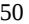

{50}------------------------------------------------

We cannot be certain we will continue to effectively execute our coverage and reimbursement strategy in the markets we pursue, which could limit the future commercial potential of ARCALYST in the approved recurrent pericarditis indication or any of our product candidates, if approved.

Governmental authorities, private health insurers and other third-party payors have attempted to control costs through a number of efforts, including by delaying the time to reimbursement, by restricting the breadth of coverage, by limiting the amount of reimbursement for particular products in terms of lower pricing and by increasing the proportion of the cost for which the patient is responsible. There may be significant delays in obtaining reimbursement for newly approved products or product indications, coverage may be limited to a subset of the patient population for which the treatment is approved by the FDA or similar regulatory authorities outside the United States, and reimbursement rates may vary according to the use of the product and the clinical setting in which it is used. Coverage and reimbursement barriers by payors may materially impact the demand for, or the price of, ARCALYST and any product candidate for which we obtain marketing approval, if any. If coverage and reimbursement are not available, or available only at limited levels, or if such coverage will require patient out-of-pocket costs that are unacceptably high, our ability to successfully commercialize ARCALYST or any of the product candidates for which we obtain marketing approval may be adversely affected. Moreover, any coverage or reimbursement that may be obtained may be decreased or eliminated in the future. For example, one of the large private health insurers that currently covers ARCALYST has placed ARCALYST on its exclusion list for the CAPS indication, which could create hurdles for new patients seeking coverage for their prescriptions in all indications.

We may also be unable to adequately satisfy a third-party payor's value/benefit assessment on an ongoing basis. It is possible that third-party payors will select low-cost clinical comparators that serve as benchmarks for determining relative value, including generics, biosimilars and lower costs brands with or without the same approved indication. The result of such a change would be a more challenging value/benefit assessment caused by a more challenging basis for comparison and the potential for a worse relative outcome. Third-party payors may determine that we have failed to generate sufficient evidence to demonstrate the relative benefits of ARCALYST or any of our product candidates, if approved, and refuse to provide coverage and reimbursement entirely, or many find the evidence not sufficiently compelling to support the desired pricing and reimbursement. Similarly, payors may implement coverage criteria that further restricts the use of ARCALYST or any of our product candidates, if approved, beyond the approved label, which could adversely affect their commercial potential, including, for example, situations where a patient must be proven to not adequately respond to the lower-cost comparator.

Third-party payors are also introducing more challenging price negotiation methodologies, including in re-visiting established coverage and reimbursement parameters when new competitors, including branded drugs, generics and biosimilars, enter the market. It is possible that a third-party payor may consider our products and product candidates, if approved, as substitutable and only be willing to cover the cost of the alternative product. Even if we show improved efficacy, safety or improved convenience of administration with ARCALYST or any of our product candidates, if approved, pricing of competitive products may limit the amount we will be able to charge. Third-party payors may deny or revoke the reimbursement status of a given product or establish prices for new or existing marketed products at levels that are too low to enable us to realize an appropriate return on our investment in our product candidates. In some cases, when new competitor generic and biosimilar products enter the market, there are mandatory price reductions for the innovator compound. In other cases, payors employ "therapeutic category" price referencing and seek to lower the reimbursement levels for all treatment in the respective therapeutic category. Additionally, new competitor brand drugs can trigger therapeutic category reviews in the interest of modifying coverage and/or reimbursement levels. The potential of thirdparty payors to introduce more challenging price negotiation methodologies could have a negative impact on our ability to continue to commercialize ARCALYST or successfully commercialize any of our product candidates, if approved. Thirdparty payors may also employ challenging price negotiation tactics in the event of a proposed price increase of our current and future products. See "Risks Related to Commercialization – *It may be difficult for us to realize the benefit of increasing the price of certain of our commercialized products, due to unfavorable actions that third-party payors and other market participants may take.* "

{51}------------------------------------------------

## *It may be difficult for us to realize the benefit of increasing the price of certain of our commercialized products, due to unfavorable actions that third-party payors and other market participants may take.*

We have and may continue periodically to increase the price of ARCALYST or any of our future products. We may be unable to realize commercial benefits from such price increases due to unfavorable actions that third-party payors (including governmental authorities and private health insurers) may take in response to price increases. Even if price increases lie below contractual price protection clauses, payors may request price concessions in exchange for covering our products or may opt to change coverage or reimbursement policies with respect to such products. If we cannot successfully negotiate with such payors, we may be forced to provide significant price concessions or, if we fail to arrive at a satisfactory resolution, lose favorable coverage or reimbursement for patients served by such payor. In such an event, we may see materially negative impacts on the patients we seek to serve and our business operations.

Any price concessions will reduce our overall revenue generation and may impair the benefit of any price increases we may take. As a small commercial stage biopharmaceutical company our future success relies on the effective commercialization of one or more products. Price concessions that reduce potential product revenue would lengthen our timeline to profitability and may require us to rely on potentially dilutive capital-raising efforts to fund our operations, which may impact the price of our common shares. Even comparatively small discounts, if aggregated across payors, may cause materially lower revenue generation in the long-term which may offset the increased revenue we hoped to realize through a price increase.

Further, granting price concessions to one or more payors may limit our ability to negotiate prices with other payors or in other territories. Payors, including governmental payors, negotiate drug prices by reference to the prices we have set with other payors. Should payors become aware of price concessions that we have granted, they may request similar concessions. If enough payors request and receive price concessions, our ability to generate revenue may be materially impacted, harming our business, financial condition and results of operations. Further, this may limit our ability to secure acceptable prices in potential new territories, which may materially limit our overall commercial growth. A limitation on our ability to commercialize in new and existing territories may also reduce our access to the patient populations we seek to serve, harming our ability to deliver therapeutics to patients with unmet need.

In the event that we cannot successfully negotiate with payors requesting price concessions in connection with a price increase or otherwise, such payors may choose to not cover our current and future products at all or may instate onerous reimbursement policies that limit patient access. We cannot assure you that current payor coverage and reimbursement policies for ARCALYST will continue. As a small commercial stage company, the loss of any payor, especially a large payor, or limitations on patient access to our drugs affecting a sizeable number of patients may materially harm our ability to generate revenue and execute on our commercial strategy. Further, as a company targeting patients with significant unmet need, the loss of access to our products may materially harm our targeted patient populations who cannot source adequate alternative therapies.

Price increases that outpace inflation may also trigger additional rebate obligations under the Medicaid drug rebate program, Medicare Part B and Medicare Part D.

# *The incidence and prevalence for target patient populations of our products or product candidates have not been established with precision. If the market opportunities for our products and product candidates are smaller than we estimate, or if any approval that we obtain is based on a narrower definition of the patient population, our revenue and ability to achieve profitability may be materially adversely affected.*

The precise incidence and prevalence for all the conditions we aim to address with our programs are not known with specificity. Our projections of both the number of people who have these diseases, as well as the subset of people with these diseases who have the potential to benefit from treatment with our products and product candidates, if approved, are based largely on our extrapolation from available population studies and estimates. These estimates have been derived from a variety of sources, including scientific literature, surveys of clinics, patient foundations, pharmacy claims analyses, large national surveillance databases or market research, and may prove to be incorrect. Further, new trials and therapeutic options may lead to changes in the estimated incidence or prevalence of these diseases, or relevant

{52}------------------------------------------------

subpopulations thereof. As a result, the number of patients who may benefit from our products or product candidates, if approved, may turn out to be lower than expected.

The total addressable market for any of our products and approved product candidates in the future, if any, will ultimately depend upon, among other things, the diagnostic criteria and applicable patient population included in the final label for the product or product candidate approved for sale for its indication, the efficacy, safety and tolerability demonstrated by the product candidate in our clinical trials, acceptance by the medical community and patients, pricing, access and reimbursement. The number of addressable patients in the United States and other major markets outside of the United States may turn out to be lower than expected, patients may not be otherwise amenable to treatment with our products or new patients may become increasingly difficult to identify or gain access to, all of which would adversely affect our results of operations and our business. Further, even if we obtain significant market share for our product candidates, because the potential target populations are small for many of our approved and targeted indications, we may never achieve significant and sustained profitability.

# *Evolving health policy and associated legislative changes related to coverage and reimbursement aimed at lowering healthcare expenditure could impact the commercialization of our product candidates. Pharmaceutical pricing has been, and likely will continue to be, a central component of these efforts.*

The regulations that govern regulatory approvals, pricing and reimbursement for new pharmaceutical products vary widely from country to country. In markets of some of the countries we may pursue outside of the United States, our products and product candidates, if approved, may be subject to extensive governmental price control or other price regulations. Some countries require approval of the sale price of a drug before it can be marketed. In many countries, the pricing review period begins after marketing approval is granted. In some markets, prescription pharmaceutical pricing remains subject to continuing governmental control even after initial approval is granted. As a result, we might obtain marketing approval for a product candidate in a particular country, but then be subject to price negotiations that delay our commercial launch of the product candidate in that country, possibly for lengthy time periods, which may negatively impact the revenues we are able to generate from the sale of the product candidate in that country.

Net prices for products may be reduced by mandatory discounts or legislated rebates that must be paid in order to participate in government healthcare programs or paid to other third-party payors. Mandatory discounts can be legislated at any time in any market. Similarly, some markets currently have pricing legislation that sets the price of a pharmaceutical product in their market by referencing the price of that product in other markets, known as international reference pricing. International reference pricing has the potential to impact price cut decisions in individual countries and the countries that reference the pricing of certain other individual countries.

Drug importation and cross-border trade, both sanctioned and unsanctioned, occurs when a pharmaceutical product from a market where the official price is set lower is shipped and made commercially available in a market where the official price is set higher. Any future relaxation of laws that presently restrict or limit drug importation or cross-border trade, including in the United States, could have a material negative impact on our ability to commercialize ARCALYST or any of our product candidates, if approved.

As a result of the foregoing, we may not be able to achieve or sustain favorable pricing for ARCALYST or any of our product candidates, if approved, and adequate reimbursement, which may hinder our ability to recoup our investment in such drugs.

## *Product liability lawsuits against us could cause us to incur substantial liabilities and could limit commercialization of ARCALYST and any product candidates that we may develop, if approved.*

We face an inherent risk of product liability exposure related to the commercialization of ARCALYST and the testing of our product candidates in clinical trials and other research activities. If we cannot successfully defend ourselves against claims that our products or product candidates caused injuries, we could incur substantial liabilities. Regardless of merit or eventual outcome, liability claims may result in:

- decreased demand for any products we commercialize;

{53}------------------------------------------------

- injury to our reputation and significant negative media attention;
- regulatory investigations that could require costly recalls or product modifications;
- difficulty in enrolling participants in clinical trials or withdrawal of clinical trial participants;
- significant costs to defend the related litigation;
- substantial monetary awards to trial participants;
- loss of potential revenue;
- the diversion of management's attention away from managing our business; and
- the inability to commercialize any product candidates that we may develop, if approved.

Although we maintain product liability insurance coverage, it may not be adequate to cover all liabilities that we may incur and is subject to deductibles and coverage limitations. Insurance coverage is increasingly expensive. We may not be able to maintain insurance coverage at a reasonable cost or in an amount adequate to satisfy any liability that may arise. If we are unable to obtain insurance at acceptable cost or otherwise protect against potential product liability claims, we will be exposed to significant liabilities, which may materially and adversely affect our business and financial position. These liabilities could prevent or interfere with our commercialization efforts.

# *If, in the future, we are unable to maintain our sales, marketing and distribution capabilities, infrastructure and organization directly and/or through agreements with third parties to sell and market our products and product candidates, if approved, their commercial potential may be impaired.*

There are risks involved with both establishing our own sales and marketing capabilities and entering into arrangements with third parties to perform these services. For example, recruiting and training a sales force is expensive and time-consuming and could delay any product launch. If the commercial launch of a product candidate for which we recruit a sales force and establish marketing capabilities is delayed or does not occur for any reason, we would have prematurely or unnecessarily incurred these commercialization expenses. This may be costly, and our investment would be lost if we cannot retain or reposition our sales and marketing personnel.

If we enter into arrangements with third parties to perform sales, marketing, distribution and other commercial support services, our product revenues or the profitability of these revenues to us are likely to be lower than if we were to market and sell any approved product candidates ourselves. In addition, we may not be successful in entering into arrangements with third parties to market and sell our approved product candidates, if any, or may be unable to do so on terms that are favorable to us. Further, we will likely have little control over such third parties, and any of them may fail to devote the necessary resources and attention to sell and market our approved product candidates effectively. However, developing a sales, marketing and access organization requires significant investment, is time consuming and if not completed as planned could delay the launch of our approved product candidates. Furthermore, we may not be able to adequately establish an effective sales, marketing, distribution and access organization in the EU or other key markets in which we may obtain approval for the commercial marketing of our product candidates outside of the United States. If we are unable to maintain or establish sales, as applicable, marketing and distribution capabilities successfully, either on our own or in collaboration with third parties, we will not be successful in commercializing our approved product candidates, if any, and the approved product candidates' ability to generate any revenue may be impaired. Furthermore, our business, results of operations, financial condition and prospects will be materially adversely affected.

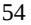

{54}------------------------------------------------

## *Our future growth may depend, in part, on our ability to penetrate markets outside of the United States, where we would be subject to additional regulatory burdens and other risks and uncertainties.*

Our future corporate profitability may depend, in part, on our ability to commercialize our product candidates in markets outside of the United States for which we may rely on collaborations with third parties.

We continue to evaluate the opportunities for the development and commercialization of our product candidates in certain markets outside of the United States, including through our Managed Access Program and collaborations with third parties, including Huadong. We and our collaborators are not permitted to market or promote any of our product candidates before we receive regulatory approval from the applicable regulatory authority in that market, and we may never receive such regulatory approval for any of our product candidates. To obtain separate regulatory approval in many other countries, we, or our collaborators, must comply with numerous and varying regulatory requirements of such countries regarding safety and efficacy and governing, among other things, clinical trials, manufacturing and commercial sales, pricing and distribution of our product candidates, and we cannot predict success in these jurisdictions. If we obtain approval of our product candidates and ultimately commercialize our product candidates in markets outside of the United States, we would be subject to additional risks and uncertainties, including:

- our ability to obtain reimbursement for our product candidates in such markets;
- our inability to directly control commercial activities because we may rely on third parties;
- the burden of complying with complex and changing regulatory, tax, accounting and legal requirements of such countries;
- exposure to increased regulatory risk, including those arising under the FCPA (as defined below);
- different medical practices and customs in such countries affecting acceptance in the marketplace;
- import or export licensing requirements;
- longer accounts receivable collection times;
- longer lead times for shipping;
- language barriers for technical training and the need for language translations;
- reduced protection of intellectual property rights in such countries;
- the existence of additional potentially relevant third party intellectual property rights;
- foreign currency exchange rate fluctuations; and
- the interpretation of contractual provisions governed by laws of such country in the event of a contract dispute.

Sales of our product candidates outside of the United States could also be adversely affected by the imposition of governmental controls, political and economic instability, trade restrictions and changes in tariffs.

In some countries, particularly the countries in Europe, the pricing of prescription pharmaceuticals is subject to governmental control. In these countries, price negotiations with governmental authorities can take considerable time after the receipt of marketing approval for a drug. To obtain adequate reimbursement or favorable pricing approval in some countries, we may be required to conduct a clinical trial that compares our product candidate to other available

{55}------------------------------------------------

therapies. If reimbursement of our products is unavailable or limited in scope or amount, or if pricing is set at unsatisfactory levels, our business could be harmed, possibly materially.

We may also be subject to burdensome pricing requirements. See "*Risk Factors – Risks Related to Commercialization –Evolving health policy and associated legislative changes related to coverage and reimbursement aimed at lowering healthcare expenditure could impact the commercialization of our product candidates. Pharmaceutical pricing has been, and likely will continue to be, a central component of these efforts."*

*We are subject to ongoing obligations, regulatory requirements and continued regulatory review, which may result in significant additional expense. Additionally, our current and future products could be subject to unfavorable changes and other restrictions and market withdrawal, and we may be subject to penalties if we fail to comply with regulatory requirements or experience unanticipated problems with our products.*

We are subject to ongoing regulatory requirements for a number of our activities, including manufacturing, packaging, labeling, storage, distribution, advertising, promotion, sampling, record-keeping, adverse event reporting, conduct of post-marketing trials and submission of safety, efficacy and other post-market information for our products in the United States. Such obligations, along with continued regulatory review, may result in significant additional expense. Furthermore, if we seek and receive approval from regulatory authorities outside of the United States for products or any of our product candidates in the future, we will be subject to such authorities' requirements, which may be over and above our obligations in the United States.

Manufacturers and their facilities are required to comply with extensive requirements of regulatory authorities, including ensuring that quality control and manufacturing procedures conform cGMP. As such, we and our CMOs will be subject to user fees and continual review and inspections to assess compliance with cGMP or similar foreign regulations and adherence to commitments made in any BLA, or MAA. Accordingly, we and our CMOs and others with whom we work must continue to expend time, money and effort in all areas of regulatory compliance, including manufacturing, production and quality control.

Any regulatory approvals that we receive may be subject to limitations on the approved indicated uses for which the product may be marketed or to the conditions of approval, or contain requirements for potentially costly post-marketing testing, including Phase 4 clinical trials, and surveillance to monitor safety and efficacy. For example, the holder of an approved BLA or similar foreign application must submit new or supplemental applications and obtain approval for certain changes to the approved product, product labeling or manufacturing process. We could also be asked to conduct postmarketing clinical trials to verify the safety and efficacy of our products in general or in specific patient subsets.

If our marketing approval would be obtained via the accelerated approval pathway, we could be required to conduct a successful confirmatory clinical trial to confirm clinical benefit for our products. An unsuccessful confirmatory trial or failure to complete such a trial could result in the withdrawal of marketing approval. The FDA or foreign regulatory authority also may place other conditions on approvals including the requirement for a REMS or similar risk management measures, to assure the safe use of the product. If the FDA or foreign regulatory authority concludes a REMS or similar risk management measures are needed, the sponsor of the BLA or MAA must submit a proposed REMS or the similar risk management measures before it can obtain approval. A REMS could include medication guides, physician communication plans or elements to assure safe use, such as restricted distribution methods, patient registries and other risk minimization tools. We also will be required to report certain adverse reactions, production problems, inadequate efficacy and other issues, if any, to applicable regulatory authorities on an ongoing basis. In addition, the identification of new safety issues could lead to new labeling or restrictions on population or use of our products, diminishing the addressable market or sales or both. Such conditions, requirements or events may prove to be expensive and burdensome, and the reporting of such may cause the price of our Class A common shares to decrease.

Further, we must also comply with additional requirements concerning advertising and promotion for our products, which are subject to a variety of legal and regulatory restrictions and must be consistent with the information in the product's approved label.

{56}------------------------------------------------

If a regulatory agency discovers previously unknown problems with our product, such as adverse events of unanticipated severity or frequency, or problems with the facility where the product is manufactured, or disagrees with the promotion, marketing or labeling of a product, such regulatory agency may impose restrictions on that product or us, including requiring withdrawal of the product from the market. If we discover previously unknown problems with a product or product candidate, including adverse events of unanticipated severity or frequency, or with our manufacturing processes, or fail to comply with regulatory requirements, a regulatory agency or enforcement authority may, among other things:

- issue warning letters;
- impose civil or criminal penalties;
- suspend or withdraw regulatory approval;
- suspend any of our ongoing clinical trials;
- refuse to approve pending applications or supplements to approved applications submitted by us;
- impose restrictions on our operations, including closing our CMOs' facilities; or
- seize or detain products, or require a product recall.

Any government investigation of alleged violations of law could require us to expend significant time, cost and resources in response, and could generate negative publicity. Any failure to comply with ongoing regulatory requirements may significantly and adversely affect our ability to commercialize and generate revenue from our products. If regulatory sanctions are applied or if regulatory approval is withdrawn, the value of our company and our operating results will be adversely affected.

If there are changes in the application of legislation or regulatory policies, or if problems are discovered with a product or the manufacture of a product, or if we or one of our distributors, licensees, co-marketers or other third parties operating on our behalf fails to comply with regulatory requirements, regulatory authorities could impose fines on us, instate restrictions on our product or its manufacture or require us to recall or remove the product from the market, in addition to withdrawing our marketing authorizations, or requiring us to conduct additional clinical trials, change our product labeling or submit additional applications for marketing authorization. If any of these events occurs, our ability to sell our product may be impaired, and we may incur substantial additional expense to comply with such regulatory requirements.

The policies of the FDA and other regulatory authorities may change and additional government regulations may be enacted that could prevent, limit or delay regulatory approval of our product candidates. We cannot predict the likelihood, nature or extent of government regulation that may arise from future legislation or administrative or executive action, either in the United States, Europe or in other jurisdictions. In addition, if we are slow or unable to adapt to changes in existing requirements or the adoption of new requirements or policies, or if we are not able to maintain regulatory compliance, we may be subject to potentially significant enforcement actions.

*Our business operations and current and future relationships with investigators, healthcare professionals, consultants, customers and third-party payors will be subject to applicable anti-kickback, fraud and abuse, physician and other healthcare professional payment and price transparency, and other healthcare laws and regulations, which could expose us to criminal sanctions, civil penalties, exclusion from government healthcare programs, contractual damages, reputational harm and diminished profits and future earnings.*

Healthcare professionals, physicians and third-party payors play a primary role in the recommendation and prescription of ARCALYST and any product candidates for which we obtain marketing approval. Our commercial arrangements may expose us to broadly applicable fraud and abuse and other healthcare laws and regulations that may 

{57}------------------------------------------------

constrain the business or financial arrangements and relationships through which we market, sell and distribute our current and future products.

Restrictions under applicable federal, state and foreign healthcare laws and regulations, include the following:

- the U.S. federal Anti-Kickback Statute, which prohibits, among other things, persons from knowingly and willfully soliciting, offering, receiving or providing remuneration, directly or indirectly, in cash or in kind, to induce or reward either the referral of an individual for, or the purchase, order or recommendation of, any good or service, for which payment may be made under federal and state healthcare programs such as Medicare and Medicaid. A person or entity does not need to have actual knowledge of the statute or specific intent to violate it in order to have committed a violation. The U.S. federal Anti-Kickback Statute has been interpreted to apply to arrangements between pharmaceutical manufacturers on the one hand and prescribers, purchasers and formulary managers on the other hand;
- the U.S. federal False Claims Act and civil monetary penalties laws, which, among other things, impose criminal and civil penalties, including through civil whistleblower or qui tam actions, against individuals or entities for knowingly presenting, or causing to be presented, to the federal government, claims for payment that are false or fraudulent or making a false statement to avoid, decrease or conceal an obligation to pay money to the federal government. As a result of a modification made by the Fraud Enforcement and Recovery Act of 2009, a claim includes "any request or demand" for money or property presented to the federal government. In addition, manufacturers can be held liable under the False Claims Act even when they do not submit claims directly to government payors if they are deemed to "cause" the submission of false or fraudulent claims. Moreover, the government may assert that a claim including items and services resulting from a violation of the federal Anti-Kickback Statute constitutes a false or fraudulent claim for purposes of the False Claims Act;
- the U.S. Foreign Corrupt Practices Act (the "FCPA"), which prohibits U.S. companies and their representatives from paying, offering to pay, promising to pay or authorizing the payment of anything of value to any foreign government official, government staff member, political party or political candidate for the purpose of obtaining or retaining business or to otherwise obtain favorable treatment or influence a person working in an official capacity abroad. In many countries, the healthcare professionals we interact with may meet the FCPA's definition of a foreign government official. The FCPA also requires public companies to make and keep books and records that accurately and fairly reflect their transactions and to devise and maintain an adequate system of internal accounting controls;
- HIPAA, which imposes criminal and civil liability for executing a scheme to defraud any healthcare benefit program or obtain, by means of false or fraudulent pretenses, representations or promises, any of the money or property owned by, or under the custody or control of, any healthcare benefit program, regardless of the payor (e.g., public or private) and knowingly and willfully falsifying, concealing or covering up a material fact or making any materially false statement in connection with the delivery of or payment for healthcare benefits, items or service. Similar to the federal Anti-Kickback Statute, a person or entity does not need to have actual knowledge of the statute or specific intent to violate it in order to have committed a violation;
- the federal civil monetary penalties laws, which impose civil fines for, among other things, the offering or transfer of remuneration to a Medicare or state healthcare program beneficiary if the person knows or should know it is likely to influence the beneficiary's selection of a particular provider, practitioner, or supplier of services reimbursable by Medicare or a state healthcare program, unless an exception applies;
- the U.S. federal physician payment transparency requirements, sometimes referred to as the "Sunshine Act", which requires manufacturers of drugs, devices, biologics and medical supplies that are reimbursable under Medicare, Medicaid or the Children's Health Insurance Program to report to the Department of Health and Human Services information related to certain financial interactions with physicians (defined to include doctors, dentists, optometrists, podiatrists and chiropractors), certain non-physician practitioners

{58}------------------------------------------------

including physician assistants and nurse practitioners, and teaching hospitals, as well as the ownership and investment interests of physicians and their immediate family members;

- analogous state laws and regulations, such as state antikickback and false claims laws that may apply to sales or marketing arrangements and claims involving healthcare items or services reimbursed by nongovernmental third-party payors, including private insurers; and some state laws require pharmaceutical companies to comply with the pharmaceutical industry's voluntary compliance guidelines and the relevant compliance guidance promulgated by the federal government in addition to requiring drug manufacturers to report information related to payments to physicians and other healthcare professionals or marketing expenditures and pricing information; and
- similar healthcare laws and regulations in the EU and other jurisdictions, including reporting requirements detailing interactions with and payments to healthcare professionals.

These laws and regulations, among other things, may constrain our business, marketing and other promotional activities by limiting the kinds of financial arrangements we may have with hospitals, prescribers or other potential purchasers of our products or product candidates, if approved. We have entered into consulting and advisory board agreements with physicians and other healthcare professionals and could be adversely affected if regulatory authorities determine our financial relationships with such prescribers violate applicable laws or create a conflict of interest. For example, investigators for our clinical trials may serve as scientific advisors or consultants to us from time to time and receive compensation in connection with such services. Regulatory authorities may conclude that a financial relationship between us and a principal investigator or a clinical trial site has created a conflict of interest or otherwise affected interpretation of a study. Regulatory authorities may therefore question the integrity of the data generated at the applicable clinical trial site and the utility of the clinical trial itself may be jeopardized, which could result in a delay in approval, or rejection, of our marketing applications by regulatory authorities and may ultimately lead to the denial of marketing approval of our product candidates. Furthermore, investigators for our clinical trials may become debarred by regulatory authorities, which may impact the integrity of our studies and the utility of the clinical trial itself may be jeopardized. Because of the breadth of these laws and the narrowness of the statutory exceptions and regulatory safe harbors available under such laws, it is possible that some of our business activities could be subject to challenge under one or more of such laws. The scope and enforcement of each of these laws is uncertain and subject to rapid change in the current environment of healthcare reform, especially in light of the lack of applicable precedent and regulations.

Interactions between biopharmaceutical companies and healthcare professionals are also governed by strict laws, regulations, industry self-regulation codes of conduct and healthcare professionals' codes of professional conduct. The provision of any inducements to healthcare professionals to prescribe, recommend, endorse, order, purchase, supply, use or administer a drug product is prohibited. A number of countries have established additional rules requiring pharmaceutical companies to publicly disclose their interactions with physicians and other healthcare professionals and to obtain approval from employers, professional organizations or competent authorities before entering into agreements with healthcare professionals.

Ensuring that our business arrangements with third parties comply with applicable healthcare laws and regulations may involve substantial costs. It is possible that governmental authorities will conclude that our business practices do not comply with current or future statutes, regulations or case law involving applicable fraud and abuse or other healthcare laws and regulations. If our operations, including activities conducted by our sales team, were to be found to be in violation of any of these laws or any other governmental regulations that may apply to us, we may be subject to the imposition of civil, criminal and administrative penalties, damages, disgorgement, monetary fines, possible exclusion from participation in Medicare, Medicaid and other federal healthcare programs, individual imprisonment, contractual damages, reputational harm, diminished profits and future earnings, additional reporting requirements or oversight if we become subject to a corporate integrity agreement or similar agreement to resolve allegations of non-compliance with these laws, and curtailment or restructuring of our operations, any of which could adversely affect our ability to operate our business and our results of operations. Further, defending against any such actions can be costly, time consuming and may require significant personnel resources. Therefore, even if we are successful in defending against any such actions that may be brought against us, our business may be impaired.

{59}------------------------------------------------

## **Risks Related to Product Development**

# *We depend heavily on the success of one or more of our products and product candidates, which are in various stages of clinical development. If we are unable to advance our product candidates in clinical development, obtain regulatory approval and ultimately successfully commercialize one or more of our product candidates, or experience significant delays in doing so, our business will be significantly harmed.*

We are not permitted to market or promote any of our product candidates before we receive regulatory approval from the FDA or comparable regulatory authorities outside of the United States. Our product candidates are in various stages of clinical development. Our assumptions about why our product candidates are worthy of future development and potential approval in the indications for which we are studying them, or any other indications, are based in part on indirect data collected by other companies and in part from data collected from our preclinical and clinical trials. We may not be able to demonstrate that they are safe or effective in the indications for which we are studying them, and they may not be approved.

We cannot be certain that any of our product candidates will be successful in their clinical trials or will receive regulatory approval even after completing a successful pivotal clinical trial. We may also determine that the potential product and commercial profile of any of our product candidates may not ultimately be commercially successful, or even if we believe they have the potential to be commercially successful, we may discontinue development of one or more of our product candidates or discontinue development in a specific indication for a particular product candidate, at any time for any reason. If we do not receive regulatory approvals for more than one of our product candidates, we may not be able to continue our operations.

Each of our product candidates requires substantial preclinical or clinical development and manufacturing support and, if approved, an organization to facilitate a successful product launch and commercialization, which may not be synergistic with our existing capabilities, before we will be able to generate any revenue from product sales. The success of our current and future product candidates depends upon several factors, including the following:

- submission to and authorization to proceed with clinical trials by the FDA under investigational new drug applications ("INDs"), and CTAs to applicable authorities outside of the United States for our product candidates to commence planned clinical trials or future clinical trials;
- successful completion of nonclinical studies, including toxicology studies, pharmacological, and biodistribution studies , as conducted, where applicable, under GLP regulations;
- successful site activation for, enrollment in, and completion of clinical trials, including the ability of our CROs to successfully conduct such trials within our planned budget and timing parameters without materially adversely impacting our trials, and our ability to successfully oversee CRO activities;
- positive data from our clinical programs, including post-marketing trials and those intended to satisfy regulatory commitments or for label expansion, with sufficient quality to support an acceptable risk-benefit profile of our products and product candidates for the targeted indications in the intended populations to the satisfaction of the applicable regulatory authorities;
- timely receipt, if at all, of approvals from applicable regulatory authorities and maintenance of any such approvals;
- as applicable, acceptance of pediatric study plans by regulatory authorities, and the follow through of any pediatric study commitments, such as development of pediatric formulations, if required;
- establishment and maintenance of arrangements with third party manufacturers, as applicable, for continued clinical supply and commercial manufacturing;

{60}------------------------------------------------

- successful development of our manufacturing processes and transfer to third party contract development and manufacturing organization ("CDMO") facilities to support our development and commercialization activities in a manner compliant with all regulatory requirements;
- successful manufacture of sufficient supply of our product candidates within approved specifications for purity, efficacy and cGMP requirements from our facility and from our CDMOs or other sole-source manufacturers in order to meet clinical or commercial demand, as applicable, for ourselves and for our partners;
- establishment and maintenance of patent and trade secret protection or regulatory exclusivity for our product candidates;
- timely and successful commercial launch of our product candidates;
- adoption of our products, if and when approved, by patients, patient-advocates, the medical community and third-party payors;
- effective competition with other therapies;
- establishment and maintenance of adequate healthcare coverage and reimbursement;
- enforcement and defense of intellectual property rights and claims;
- continued compliance with any post-marketing requirements imposed by regulatory authorities, including any required post-marketing clinical trial commitments or REMS or similar risk management measures; and
- maintenance of a continued acceptable safety profile of our product candidates following approval.

If we do not accomplish one or more of these factors in a timely manner or at all we could experience significant delays in, or an inability to, timely or successfully commercialize our product candidates. Failure to generate sufficient revenue from the commercialization of our current and future products, whether as a result of failing to obtain regulatory approvals or unsuccessfully commercializing such products would harm our ability to continue our operations. In such an instance, we may need to seek capital elsewhere. See "*Risk Factors – Risks Related to Our Financial Position and Capital Needs – We will require substantial additional financing, and a failure to obtain this necessary capital when needed on acceptable terms, or at all, will force us to delay, limit, reduce or cease one or more of our product development plans, research and development programs for our product candidates, or other operations or commercialization efforts"* and "*Risk Factors – Risks Related to Our Financial Position and Capital Needs – Raising additional capital may cause dilution to our shareholders, restrict our operations or require us to relinquish rights to our technologies or product candidates or products."*

Though we are currently commercializing ARCALYST, we evenly split profits on ARCALYST sales with Regeneron, and the relevant markets for its indications may prove not to be large enough to allow us to generate significant and sustained revenue from ARCALYST sales. Moreover, even if we successfully obtain regulatory approvals to market one or more product candidates, our revenues will be dependent, in part, upon the size of the markets in the territories for which we gain regulatory approval and have commercial rights, among other things. If the markets for patient subsets that we are targeting are smaller than we estimate, we may not generate projected revenue levels from sales of such product candidates, if approved. See, "—*Risks Related to Commercialization*—*The incidence and prevalence for target patient populations of our products or product candidates have not been established with precision. If the market opportunities for our products and product candidates are smaller than we estimate, or if any approval that we obtain is based on a narrower definition of the patient population, our revenue and ability to achieve profitability may be materially adversely affected*."

{61}------------------------------------------------

# *Clinical drug development is a lengthy and expensive process with uncertain timelines and outcomes. We may encounter substantial delays in our clinical trials, or we may fail to demonstrate safety and efficacy to the satisfaction of applicable regulatory authorities. We may therefore be unable to obtain required regulatory approvals and be unable to successfully commercialize our product candidates on a timely basis, if at all.*

Before obtaining marketing approval from regulatory authorities for the sale of our product candidates, we must conduct extensive clinical trials to demonstrate the safety and efficacy of our product candidates in humans. Clinical testing is expensive, time consuming and uncertain as to outcome.

Not all of our clinical trials have been conducted as initially planned or completed on our initial projected schedule, and accordingly, we cannot guarantee that any of our current or future clinical trials will be conducted as initially planned or completed on our initial projected schedule, if at all, including as a result of the COVID-19 pandemic and measures taken in response to the pandemic. Further, even if conducted on time, a clinical trial may result in unfavorable or statistically insignificant results. For example, in December 2021, we announced that the primary efficacy endpoint of the Phase 3 clinical trial of mavrilimumab in COVID-19-related ARDS did not reach statistical significance. We subsequently decided to not progress mavrilimumab in the COVID-19-related ARDS indication. Clinical trials are a lengthy process that require the expenditure of significant money and human capital. Failing to achieve desired efficacy or identifying of a novel safety hazard in turn represents an inability to successfully recoup such expense via a potential commercialization of the product candidate, if approved. Sufficient inability to recoup clinical trial expense via successful development could pose material risks to our business. See "*Risk Factors – Risks Related to Product Development –We depend heavily on the success of one or more of our products and product candidates, which are in various stages of clinical development. If we are unable to advance our product candidates in clinical development, obtain regulatory approval and ultimately successfully commercialize one or more of our product candidates, or experience significant delays in doing so, our business will be significantly harmed*."

Commencing a clinical trial is subject to acceptance by the FDA of an IND or IND amendments, acceptance by competent authorities of the EU member states of a CTA under the CTR or acceptance by other applicable regulatory authorities, and finalizing the trial design based on discussions with the FDA, competent authorities of the EU member states or other applicable regulatory authorities. We have and may in the future receive feedback or guidance from regulatory authorities on our clinical trial design and protocols and, even after we incorporate such feedback or guidance from these regulatory authorities, such regulatory authorities may impose other requirements for our clinical trials, could disagree that we have satisfied their requirements to commence our clinical trials, disagree with our interpretation of data from the relevant preclinical studies, clinical trials or chemistry, manufacturing and controls ("CMC") data, or disagree or change their position on the acceptability of our trial designs, including the proposed dosing level or schedule, treatment duration, our definitions of the patient populations or the clinical endpoints selected, which may require us to complete additional preclinical studies, clinical trials, CMC development, other studies or impose stricter approval conditions than we currently expect.

Commencing our planned clinical trials is also subject to approval by a central institutional review board (an "IRB") and an IRB or ethics committee at each clinical trial site before a trial may be initiated, which approval could be delayed, rejected or suspended. Further, the IRBs of the institutions in which such trials are being conducted, the Data Safety Monitoring Board for such trial or regulatory authorities may impose a suspension or termination of our clinical trials even after approval and initiation of trial sites due to a number of factors, including failure to conduct the clinical trial in accordance with regulatory requirements or our clinical protocols, inspection of the clinical trial operations or trial site by regulatory authorities, unforeseen safety issues or adverse side effects that arise in the trial or failure to demonstrate a benefit from using a drug, any of which could result in the imposition of a clinical hold, as well as changes in governmental regulations or administrative actions or lack of adequate funding to continue the clinical trial.

Successful completion of our clinical trials is a prerequisite to submitting a BLA or supplemental BLA (an "sBLA") to the FDA and an MAA, to the European Medicines Agency (the "EMA") or competent authorities of the EU member states, or other applicable regulatory authorities in other countries for each product candidate and, consequently, to obtaining approval and initiating commercial marketing of our current and any future product candidates. A failure of one or more of our current or future clinical trials can occur at any stage of testing, and our clinical trials may not be successful. We have experienced and may continue to experience delays in our ongoing clinical trials, and we do not

{62}------------------------------------------------

know whether planned clinical trials will begin on time, be allowed by regulatory authorities, need to be redesigned, or if we can activate sites or enroll participants on time, or if they will be completed on schedule, if at all. Events that have and may in the future delay or prevent commencement or successful completion of clinical development of our product candidates as planned and on schedule, if at all, include but are not limited to:

- inability to generate sufficient preclinical, toxicology or other in vivo or in vitro data to support the initiation of human clinical trials;
- delays or failure in reaching a consensus with regulatory agencies on trial design or implementation, including the appropriate dosage levels, frequency of dosing, or treatment period in clinical trials;
- delays or failure in reaching agreement on acceptable terms with prospective CROs, and clinical trial sites, the terms of which can be subject to extensive negotiation and may vary significantly among different CROs and clinical trial sites;
- difficulties in obtaining required IRB, ethics committee approval or positive opinion at each clinical trial site;
- delays or failure in obtaining regulatory approval to commence a trial, or imposition of a clinical hold by regulatory authorities;
- difficulty in identifying and enrolling suitable participants in a particular trial, which may reduce the power of a clinical trial to detect statistically significant results;
- amendments to clinical trial protocols impacting study criteria, endpoints or design, including amendments that either we initiate or are requested by regulatory authorities;
- difficulty collaborating with patient groups and investigators;
- failure by our CROs, medical institutions, or other third parties we contract with in connection with our clinical trials to adhere to clinical trial requirements or to perform their obligations in a timely manner or in compliance with all applicable laws and regulations, including the FCPA;
- failure to perform in accordance with the FDA's good clinical practices ("GCPs") or applicable comparable regulatory guidelines in other countries;
- participants not completing a clinical trial or not returning for post-treatment follow-up, in either case including as a result of trial demands on participants as a result of the COVID-19 pandemic and measures taken in response to the pandemic or otherwise, among other things;
- clinical trial sites withdrawing from or being unable to conduct activities, or participants withdrawing from clinical trials, including as a result of the COVID-19 pandemic or the ongoing war in Ukraine, among other things;
- participants experiencing serious adverse events or undesirable side effects or being exposed to unacceptable health risks;
- participants failing to experience confirmed pre-specified events during the clinical trial within an expected timeframe, if at all;
- safety issues, including occurrence of adverse events associated with a product candidate, that are viewed to outweigh its potential benefits;

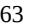

{63}------------------------------------------------

- changes in regulatory requirements, policies and guidance that require amending or submitting new clinical protocols;
- the cost of clinical trials being greater than we anticipate;
- strategic decisions regarding clinical study priority for capital preservation purposes;
- failure by us, our CROs, or other third parties with whom we contract to properly collect, analyze, and/or assess clinical data, including the performance of assays, analyses and other activities;
- clinical trials of our product candidates producing negative, inconclusive or uncompetitive results, which may result in us deciding, or regulatory authorities requiring us, to conduct additional clinical trials or modify or cease development programs for our product candidates;
- failure to replicate safety, efficacy or other data from earlier preclinical studies and clinical trials conducted by us or third parties, including the companies from whom we have licensed or acquired or may in the future license or acquire our product candidates, in our later clinical trials;
- the occurrence of adverse or other events not observed in earlier studies;
- suspensions or terminations of our clinical trials by us or the IRBs of the institutions in which our clinical trials are being conducted, the Data Safety Monitoring Board for such trials or the FDA or comparable regulatory authorities;
- failure of manufacturers, or us, to produce phase-appropriate supplies of our product candidates for use in our clinical trials in accordance with cGMP requirements and regulations or applicable comparable regulatory guidelines in other countries;
- delays in manufacturing, testing, releasing, validating or importing/exporting sufficient stable quantities of our product candidates for use in clinical trials or the inability to do any of the foregoing either as a result of quality assurance or due to our reliance on third party manufacturers; and
- disruptions to our business operations, including our manufacturing operations, and the business operations of our third-party manufacturers, CROs upon whom we rely to conduct our clinical trials, or other third parties with whom we conduct business or otherwise engage, as well as disruptions in supply chain distribution in the countries in which we conduct our clinical trials, our manufacturers produce our product candidates or we otherwise conduct business or engage with other third parties, now or in the future as a result of the impact of the COVID-19 pandemic.

Delays in the commencement or completion of our planned and ongoing clinical trials of our product candidates have occurred and may continue to occur. Consequences of delays have increased and may in the future increase our costs of developing our product candidates, slow down the development and approval of our product candidates, delay or jeopardize our ability to commence product sales and generate revenue, if any, from our product candidates and harm their commercial prospects. Furthermore, disruptions caused by the COVID-19 pandemic have increased and may continue to increase the likelihood that we encounter such difficulties or delays in commencing or completing our planned and ongoing clinical trials or other development. In addition, many of the factors that cause, or lead to, difficulties and delays in the commencement or completion of clinical trials may also ultimately lead to the denial of regulatory approval of our product candidates or us deciding to modify or cease development of our product candidates.

Clinical trial delays could also shorten any periods during which our products have patent protection or shorten any periods during which we have the exclusive right to commercialize our product candidates and may allow our competitors to bring products to market before we do, which could impair our ability to obtain orphan exclusivity for our products that potentially qualify for this designation and to successfully commercialize our product candidates, and may

{64}------------------------------------------------

harm our business and results of operations. Any inability to successfully complete preclinical and clinical development could result in additional costs to us or impair our ability to generate revenue and harm our business, financial condition and prospects significantly.

Furthermore, clinical trials must be conducted in accordance with the laws, rules and regulations, guidelines and other requirements of the FDA, EU institutions, the EMA and other applicable regulatory authorities outside of those jurisdictions and are subject to oversight by these regulatory authorities and IRBs or ethics committees at the medical institutions where such clinical trials are conducted. Further, conducting global clinical trials, as we do for certain of our product candidates, may require that we coordinate among the legal requirements and guidelines of regulatory authorities across a number of jurisdictions, including the United States, EU and countries outside of those jurisdictions, which could require that we amend clinical trial protocols or determine not to conduct a trial in one or more jurisdictions or to run separate trials in various jurisdictions due to the inability, cost or delay in harmonizing divergent requests from such regulatory authorities, all of which could increase costs. In addition, clinical trials that are conducted in countries outside the United States and the EU may subject us to risks associated with the engagement of non-United States and non-EU CROs who are unknown to the FDA or the EMA, or the EU member states' regulatory authorities and may have different standards of diagnosis, screening and medical care, as well as risks associated with further delays and expenses as a result of increased shipment costs (including as a result of local quality release or in-country testing of a product candidate supply produced in a different jurisdiction for our clinical trials) and political and economic risks relevant to such countries outside the United States and the EU.

In addition, the FDA's and other regulatory authorities' policies with respect to clinical trials may change and additional government regulations may be enacted. For instance, the regulatory landscape related to clinical trials in the EU recently evolved. The EU CTR, which was adopted in April 2014 and repeals the EU Clinical Trials Directive, became applicable on January 31, 2022. While the Clinical Trials Directive required a separate CTA to be submitted in each member state, to both the competent national health authority and an independent ethics committee, the CTR introduces a centralized process and only requires the submission of a single application to all member states concerned. The CTR allows sponsors to make a single submission to both the competent authority and an ethics committee in each member state, leading to a single decision per member state. The assessment procedure of the CTA has been harmonized as well, including a joint assessment by all member states concerned, and a separate assessment by each member state with respect to specific requirements related to its own territory, including ethics rules. Each member state's decision is communicated to the sponsor via the centralized EU portal. Once the CTA is approved, clinical study development may proceed. The CTR foresees a three-year transition period. The extent to which ongoing and new clinical trials will be governed by the CTR varies. Clinical trials for which an application was submitted (i) prior to January 31, 2022 under the Clinical Trials Directive, or (ii) between January 31, 2022 and January 31, 2023 and for which the sponsor has opted for the application of the Clinical Trials Directive remain governed by the said Directive until January 31, 2025. After this date, all clinical trials (including those which are ongoing) will become subject to the provisions of the CTR. Compliance with the CTR requirements by us and our third-party service providers, such as our CROs, may impact our development plans.

The UK regulatory framework in relation to clinical trials is derived from existing EU legislation (as implemented into UK law, through secondary legislation). However, on January 17, 2022, the MHRA launched an eight-week consultation on reframing the UK legislation for clinical trials. The consultation closed on March 14, 2022 and aims to streamline clinical trials approvals, enable innovation, enhance clinical trials transparency, enable greater risk proportionality, and promote patient and public involvement in clinical trials. The UK government has not yet published a response to the consultation but the outcome will be closely watched and will determine whether the UK chooses to align with the CTR or diverge from it to maintain regulatory flexibility. Under the terms of the Protocol on Ireland/Northern Ireland, provisions of the CTR which relate to the manufacture and import of investigational medicinal products and auxiliary medicinal products apply in Northern Ireland. A decision by the UK government not to closely align its regulations with the new approach that has been adopted in the EU may have an effect on the cost of conducting clinical trials in the UK as opposed to other countries.

If we are slow or unable to adapt to changes in existing requirements or the adoption of new requirements or policies governing clinical trials, our development plans may be impacted.

{65}------------------------------------------------

Further, the ongoing war in Ukraine may also materially affect our clinical activities and our product candidate development timeline. See "*Risk Factors – General Risk Factors – The ongoing war in Ukraine, and actions taken against Russia as a result of its invasion of Ukraine, has and may continue to have an adverse impact on the global economy, equity capital markets and our clinical operations*."

## *The COVID-19 pandemic, and measures taken in response to the pandemic, could have an adverse impact on our current or planned preclinical studies and clinical trials, which could be significant.*

The COVID-19 pandemic, and measures taken in response to the pandemic, have had and could continue to have an impact on our current or planned preclinical studies and clinical trials. If the COVID-19 pandemic worsens or measures undertaken in response to the pandemic are reinstated, including as a result of the emergence of new variants of the virus, we may experience significant disruptions that could materially impact our preclinical studies and clinical trials, including by:

- impeding, delaying, limiting or preventing the production, delivery or release of our product candidates and important ancillary products to our clinical trial sites or participants, including due to interruptions in the supply of raw materials or global shipping that may affect the transport of our product candidates or clinical trial materials, or the reprioritization by third parties or the U.S. government for any products or potential products related to the treatment or prevention of COVID-19;
- impeding, delaying, limiting or preventing the production, delivery or release of the supply of our product candidates, including due to disruptions at manufacturing facilities that produce our product candidates, staffing shortages, reprioritizations, production slowdowns or stoppages or interruptions in global shipping;
- impeding, delaying, limiting or preventing clinical trial investigators, other critical staff, or participants from traveling to our clinical trial sites or visiting nurses traveling to participants;
- impeding, delaying, limiting or preventing key clinical trial activities, including participant screening, clinical trial site monitoring, participant dosing, study procedures (such as biopsies, which may be deemed nonessential), collection of clinical data and samples as well as cleaning and verification of clinical data, which could affect the integrity of clinical trial data;
- timing of COVID-19 and other vaccinations received by potential participants for our clinical trials may impede, delay, limit or prevent such potential participants from enrolling in our clinical trials;
- impeding, delaying, limiting or preventing clinical trial site initiation, including difficulties in recruiting clinical site investigators and clinical site staff, and enrollment or retention of participants in our clinical trials;
- increasing the risk that participants enrolled in our clinical trials will contract COVID-19 while the clinical trial is ongoing, which could impact the results of the clinical trial, including by increasing the number of observed adverse events;
- interrupting or delaying preclinical studies due to restricted or limited operations at our research and development laboratory facility;
- causing interruptions or delays at the FDA, or other regulatory authorities, which could result in delays in review and approval of our submissions and applications, including INDs, clinical trial protocols and BLAs and similar applications for our product candidates;
- resulting in the refusal of the FDA or foreign regulatory authorities to accept data from clinical trials in affected geographies;

{66}------------------------------------------------

- prompting changes in local regulations as part of a response to the COVID-19 pandemic, or any emerging variants, which may require us to change the ways in which our clinical trials are conducted, which may result in unexpected costs, or cause us to pause or discontinue one or more of our current or planned clinical trials altogether;
- delaying necessary interactions with local regulatory authorities, ethics committees and other important agencies and contractors due to limitations in employee resources or forced furlough of government employees; and
- limiting employee resources that would otherwise be focused on the conduct of our clinical trials, including because of sickness of employees or their families or the desire or requirement of employees to avoid contact with large groups of people.

Any one of the foregoing could significantly impede, delay, limit or prevent the clinical development of our product candidates and ultimately lead to the delay or denial of regulatory approval of our product candidates. While we continue to develop contingencies and mitigation strategies for our business to potentially minimize the impact of the COVID-19 pandemic, or any other pandemic, on our operations, there can be no assurance that any identified contingencies and mitigation strategies will be effective. If the clinical development of our product candidates is significantly impeded, delayed, limited or is prevented, it could ultimately lead to the delay or denial of regulatory approval of our product candidates which would materially adversely affect our business and operations, including our ability to generate revenue.

# *We may find it difficult to enroll participants in our clinical trials in a timely manner given the limited number of patients who have the diseases for which our product candidates are being studied, our particular enrollment criteria or competing clinical studies in the same patient population.*

Identifying and qualifying participants for clinical trials of our product candidates is critical to our success. The timing of our clinical trials depends in part on the speed at which we can recruit a sufficient number of participants to test our product candidates, particularly given that many of the conditions for which we are evaluating our current product candidates or may evaluate them in the future are in small disease populations. In addition, the eligibility criteria of our clinical trials will further limit the pool of available trial participants, as we will require participants to have specific characteristics that we can evaluate based on the primary and secondary endpoints of the study. Further, our product candidates modulate the immune system and carry risks associated with immunosuppression, including the risk of serious infections, potential interference with vaccines, and other potential serious health risks. Additionally, certain indications for our product candidates may present challenges that may prevent us or third parties from conducting well-controlled studies.

Our clinical trials have competed and may continue to compete with other clinical trials for product candidates that are in the same therapeutic areas as our product candidates. This competition may further reduce the number and types of participants available to us because some participants who might have opted to enroll in our trials may instead opt to enroll in a trial being conducted by one of our competitors. Since the number of qualified clinical investigators is limited, we may conduct some of our clinical trials at the same clinical trial sites that some of our competitors use, which would reduce the number of participants who are available for our clinical trials at such clinical trial site.

Accordingly, when we encounter these or other difficulties in enrollment, we have experienced and may in the future experience delays, or we may be prevented from completing our clinical trials. Participant enrollment depends on many factors, including:

- the size and nature of the patient population;
- the severity of the disease being studied;
- participant referral practices of prescribers;

{67}------------------------------------------------

- participant eligibility criteria for the clinical trial and evolving standards of care;
- the proximity of participants to clinical sites;
- the complexity of the design and nature of the clinical protocol and trial;
- the availability and nature of competing clinical trials;
- the availability of standard of care or new drugs approved for the indication the clinical trial is investigating;
- failure to obtain and maintain or timely amend participant consents;
- our ability to recruit clinical trial investigators with applicable competencies and experience;
- the risk that participants enrolled in clinical trials will withdraw from the trials before completion of their treatment or follow-up period (in either case including as a result of trial demands on participants among other things);
- clinicians' and participants' perceptions as to the safety and potential advantages of the product candidate being studied in relation to other available therapies; and
- the occurrence of adverse events or undesirable side effects attributable to our product candidates.

The process of finding and enrolling participants may prove costly, especially since we are looking to identify a subset of the participants eligible for our studies from a relatively small patient population for many of the diseases we are studying. If patients are unable or unwilling to participate in our clinical trials for any reason, or we experience difficulties in participant enrollment for any other reason, such as due to the COVID-19 pandemic, our costs may significantly increase and the timeline for recruiting participants, conducting trials and obtaining regulatory approval of our product candidates may be significantly delayed or prevented, the commercial prospects of our product candidates may be harmed, and our ability to commence product sales and generate product revenue from any of these product candidates, if approved, could be delayed or prevented. Any of these occurrences may harm our business, financial condition, and prospects significantly.

# *Our products and product candidates may cause undesirable side effects or have other safety risks that could delay or prevent their regulatory approval, limit the commercial profile of an approved label or result in significant negative consequences, including withdrawal of approval, following any potential marketing approval.*

Treatment with our products and product candidates may produce undesirable side effects or adverse reactions or events. Undesirable side effects caused by our product candidates could cause us or regulatory authorities to interrupt, delay or halt clinical trials and could result in more restrictive labels or the delay or denial of regulatory approvals by regulatory authorities.

Our products and product candidates modulate the immune system and carry risks associated with immunosuppression, including the risk of serious infections and other potential serious health risks.

For mavrilimumab, there is a theoretical risk for the development of pulmonary alveolar proteinosis ("PAP") with chronic use. PAP is a rare lung disorder in which surfactant-derived lipoproteins accumulate excessively within pulmonary alveoli due to loss of GM-CSF function. The disease can range in severity from a sub-clinical reduction in diffusion capacity to significant dyspnea during mild exertion. In preclinical studies conducted by MedImmune, certain effects were observed in the lungs of non-human primates, which led the FDA to issue a clinical hold with respect to MedImmune's proposed clinical trial in RA. Preclinical data generated to-date suggest mavrilimumab at clinically

{68}------------------------------------------------

relevant doses does not reach the lungs in sufficient quantities to induce PAP, and human trials thus far have not shown a clinical effect on pulmonary function tests attributable to mavrilimumab.

However, if the results of our clinical trials, including clinical trials evaluating our current products in new indications, or clinical trials conducted by collaboration partners, reveal an unacceptable severity and prevalence of certain side effects, the FDA or applicable regulatory authority outside of the United States may suspend or terminate our clinical trials, or not authorize us to initiate further trials. In addition, if other molecules in the same or related class in development by third parties show the same or similar side effects as those we observed in our trials but to a greater degree or reported new previously unreported side effects, it could have an impact on the entire class of molecules in development, as the applicable regulatory agency may suspend or terminate our clinical trials, or not authorize us to initiate further trials with our molecule in that class. Further, third parties may have rights to independently develop and commercialize our current and future products and product candidates, which may increase the likelihood of adverse safety results. For example, Regeneron retains worldwide rights to develop and commercialize ARCALYST for local administration to the eye and ear and oncology. The development of ARCALYST in one or more of these indications could increase the possibility of generating adverse safety results. Such effects, if discovered by third parties, may not be discovered until after we commence the commercialization of a product. Regulatory authorities could order us to cease further development of, deny or withdraw any approval of, any of our products or product candidates, or require onerous label changes, for any or all targeted indications in such an instance.

In addition, the compassionate use of our products and product candidates, or evaluation of our products and product candidates by third parties via scientific collaborations or investigator initiated studies could increase the possibility of generating adverse safety results that impact our development of such product candidates. Such adverse safety results, when reported to regulatory authorities, may negatively impact the safety profile of the drug studied as a class effect and could result in the imposition of clinical holds on all clinical trials involving such product candidate regardless of the indication studied.

Further, clinical trials by their nature utilize a sample of the potential patient population. Certain rare and severe side effects associated with our products or product candidates may only be uncovered with a significantly larger number of patients exposed to the product candidates. If we or others later identify undesirable side effects caused by our product or any of our product candidates, if approved, a number of potentially significant negative consequences could result, including but not limited to:

- regulatory authorities may withdraw approvals of such product and require us to take it off the market;
- regulatory authorities may require the addition of labeling statements, specific warnings, contraindications or field alerts to prescribers and pharmacies;
- we may be required to create a registry or a REMS plan or similar risk management measures, which could include a medication guide outlining the risks of such side effects for distribution to patients, a communication plan for healthcare providers or other elements to assure safe use;
- we may be required to change the way the product is administered, conduct additional clinical trials or change the labeling of the product;
- we may be subject to limitations on how we promote the product, or sales of the product may decrease significantly;
- we could be sued and held liable for harm caused to patients;
- the product may become less competitive; and
- our reputation may suffer.

{69}------------------------------------------------

Any of these events could prevent us from achieving or maintaining market acceptance of the particular product or product candidate, if approved, and could significantly harm our business, results of operations and prospects.

# *Interim, preliminary, and "top-line" data from our clinical trials that we announce or publish from time to time may change as more participant data become available following the release of the interim data; preliminary data are subject to audit and verification procedures, and deeper analysis of the data beyond the topline data may provide more color and context to the data, all of which could result in material or other changes that are reflected in the final data.*

From time to time, we may disclose interim data from our preclinical studies or clinical trials, which are based on an interim analysis of then-available data from ongoing studies or trials. Interim data from our preclinical studies and clinical trials are subject to the risk that one or more of the clinical observations may materially change as participant enrollment continues and more participant data become available from the particular study or trial. As a result, interim data should be viewed with caution until final data are available. Adverse differences between interim data and final data could significantly harm the development of our product candidate and our business prospects with respect thereto.

Further, from time to time we may announce or publish topline or preliminary data from our preclinical studies or clinical trials, which are based on a preliminary analysis of data from a completed study. Preliminary and topline data from our clinical trials are subject to change following a more comprehensive review of the data from the particular clinical trial. We also make assumptions, estimations, calculations and conclusions as part of our preliminary analyses of the data, and we may not have received, or had the opportunity to evaluate fully and carefully, all of the data. As a result, preliminary and topline data remain subject to audit and verification procedures that may result in the final data being different from the preliminary data we previously announced or published.

Third parties, including regulatory agencies, may not accept or agree with our assumptions, estimates, calculations, conclusions or analyses or may interpret or weigh the importance of data differently, which could impact the value of the particular program, the approvability or commercialization of the particular product candidate and our business prospects. In addition, the information we announce or publish regarding a particular preclinical study or clinical trial may represent only a portion of extensive information generated from that study or trial, and our shareholders or other third parties may not agree with what we determine is material, important or otherwise appropriate information to include in our disclosure.

If the interim, preliminary, or topline data that we report differ materially from final results, or if third parties, including regulatory authorities, disagree with the conclusions reached, our ability to obtain approval for, and commercialize, our product candidates may be harmed, which could harm our business prospects, operating results or financial condition. Further, announcement of preliminary, interim or top-line data by us or differences between that data and the final data could result in volatility in the price of our Class A common shares.

## **Risks Related to Marketing Approval and Regulatory Matters**

*Regulatory approval processes are lengthy, time consuming and inherently unpredictable. If we are not able to obtain, or if there are delays in obtaining, required regulatory approvals for our current or future product candidates or if we fail or otherwise cease to advance their development, we will be delayed in commercializing or will not be able to commercialize, our current or future product candidates and our ability to generate additional revenue will be materially impaired.*

Before we can commercialize any of our current or future product candidates, we must obtain marketing approval from regulatory authorities. We may not be able to receive approval to market any of our current or future product candidates from regulatory authorities in our desired indications in any jurisdiction and it is possible that none of our product candidates or any product candidates we may seek to develop in the future will ever obtain regulatory approval. We may need to rely on third party CROs and regulatory consultants to assist us in this process. Securing regulatory approval requires the submission of extensive preclinical and clinical data and supporting information to the various regulatory authorities for each therapeutic indication to establish a product candidate's safety and efficacy. Securing regulatory approval also requires the submission of information about the biologic manufacturing process to,

{70}------------------------------------------------

and inspection of manufacturing facilities by, the relevant regulatory authorities, who may deny approval based on the results of such submissions and inspections. Our current or future product candidates may not be effective, may be only moderately effective or may prove to have undesirable or unintended side effects, toxicities or other characteristics that may preclude our obtaining marketing approval or prevent or limit commercial use. The FDA and other regulatory authorities have substantial discretion in the approval process, including determining when or whether regulatory approval will be obtained for a product candidate. Even if we believe the data collected from clinical trials are promising, such data may not be sufficient to support approval by the FDA or any other regulatory authority or such authorities may request additional information that may be difficult to generate or provide. Further, following approval, the FDA may conduct additional inspections and, based on the results of such inspections, deem the inspected manufacturing facilities to be deficient, suspending our ability to manufacture our product candidates until we can secure satisfactory alternative manufacturing facilities.

In addition to the United States, we may seek regulatory approval to commercialize our product candidates in other jurisdictions. While the scope of regulatory approval is similar in many countries, to obtain separate regulatory approval in multiple countries will require us to comply with numerous and varying regulatory requirements of each such country or jurisdiction regarding safety and efficacy and governing, among other things, clinical trials, commercial sales, pricing and distribution, and we cannot predict success in any such jurisdictions.

The process of obtaining regulatory approvals, both in the United States and in other countries, is time consuming, expensive, may take many years, if approval is obtained at all, and can vary substantially based upon a variety of factors, including the type, complexity and novelty of the product candidates involved. Changes in marketing approval policies during the development period, changes in or the enactment of additional statutes or regulations, or changes in regulatory review for each submitted BLA, or equivalent application types, may cause delays in the approval or rejection of an application. For instance, the EU pharmaceutical legislation is currently undergoing a complete review process, in the context of the Pharmaceutical Strategy for Europe initiative, launched by the European Commission in November 2020. A proposal for revision of several legislative instruments related to medicinal products (potentially revising the duration of regulatory exclusivity, eligibility for expedited pathways, etc.) is expected to be adopted by the European Commission during the first quarter of 2023. The proposed revisions, once they are agreed and adopted by the European Parliament and European Council (not expected before the end of 2024 or early 2025), may have a significant impact on the biopharmaceutical industry in the long-term.

Regulatory authorities have substantial discretion in the approval process and may refuse to accept any application or may decide that our data are insufficient for approval and require additional preclinical studies or clinical or other trials for our current or future product candidates. Our current and future product candidates could be delayed in receiving, or fail to receive, regulatory approval or we may fail or cease to advance their development for many reasons, including the following:

- regulatory authorities may disagree with the number, design or implementation of our clinical trials to support further development or approval;
- we may be unable to demonstrate to the satisfaction of regulatory authorities that a product candidate is safe and effective for its proposed indication or that its clinical and other benefits outweigh its safety risks;
- regulatory authorities could require us to collect additional data or conduct additional clinical trials, which could include a requirement to compare our products or product candidates to other therapies for the treatment of the same indication;
- regulatory authorities, following the discovery of adverse safety signals or side effects from approved therapeutics or therapeutics in development in the same or related class as our products or product candidates, could require us to collect additional data or conduct additional clinical trials;
- the results of clinical trials may produce negative, inconclusive or uncompetitive results, which may result in us deciding, or regulatory authorities requiring us, to conduct additional clinical trials or to modify or cease development programs for our product candidates;

{71}------------------------------------------------

- the results of clinical trials may not meet the primary or secondary endpoints of the applicable trial or the level of statistical significance required by regulatory authorities;
- regulatory authorities may disagree with our interpretation of data from preclinical studies or clinical trials;
- the data collected from clinical trials of our product candidates may not be sufficient to support the submission of a BLA, sBLA or other submission or to obtain regulatory approval in the United States or elsewhere;
- the number of participants required for clinical trials of our product candidates may be larger than we anticipate, enrollment in these clinical trials may be slower than we anticipate, participants may drop out of these clinical trials at a higher rate than we anticipate or we may fail to recruit suitable participants for a trial;
- our third-party contractors may fail to comply with data quality and regulatory requirements or meet their contractual obligations to us in a timely manner, or at all;
- regulatory authorities may not believe that we have sufficiently demonstrated our ability to manufacture the products to the requisite level of quality standards, including that such material is sufficiently comparable to material used in previous clinical trials, or they may fail to approve our manufacturing processes or facilities, or the manufacturing processes or facilities of third-party manufacturers with which we contract for clinical and commercial supplies;
- regulatory authorities may not believe that their on-site inspections and data audits have sufficiently demonstrated the quality and integrity of the clinical trial conduct and of data submitted to regulatory authorities in support of our new product approvals and marketing applications;
- the supply or quality of our product candidates or other materials necessary to conduct clinical trials of our product candidates may be insufficient or inadequate;
- our product candidates may have undesirable side effects, toxicities or other unexpected characteristics, causing us or our investigators, regulatory authorities or IRBs to reject, suspend or terminate the clinical trials; and
- the approval policies or regulations of regulatory authorities may significantly change in a manner rendering our clinical data, biologic manufacturing process and other supporting information insufficient for approval.

In addition, even if we were to obtain approval for one or more of our current or future product candidates, regulatory authorities may approve any of our current or future product candidates for fewer indications or more limited patient populations than we request. Furthermore, regulatory authorities may not approve the price we intend to charge, may grant approval contingent on the performance of costly post-marketing clinical trials, may impose certain postmarketing requirements that impose limits on our marketing and distribution activities, or may approve a product candidate with a label that does not include the labeling claims necessary or desirable for the successful commercialization of that product candidate. Any of the foregoing scenarios could materially harm the commercial prospects for our current or future product candidates.

If we experience delays in obtaining approval or if we fail to obtain approval of or to advance our current or future product candidates, the commercial prospects for our product candidates may be harmed and our ability to generate additional revenue will be materially impaired.

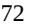

{72}------------------------------------------------

## *Our products, current product candidates and any of our future product candidates regulated as biologics in the United States may face biosimilar competition sooner than anticipated.*

In the United States, the BPCIA created an abbreviated approval pathway for biological products that are biosimilar to or interchangeable with an FDA licensed reference biological product. Under the BPCIA, an application for a biosimilar product may not be submitted to the FDA until four years following the date that the reference product was first approved under a BLA by the FDA. In addition, the approval of a biosimilar product may not be made effective by the FDA until 12 years from the date on which the reference product was first licensed. During this 12-year period of exclusivity, another company may still market a competing version of the reference product for the same therapeutic indication if the FDA approves a full BLA for the competing product containing the sponsor's own preclinical data and data from adequate and well controlled clinical trials to demonstrate the safety, purity and potency of their product. The law is complex and is still being interpreted and implemented by the FDA. As a result, its ultimate impact, implementation and meaning are subject to uncertainty.

For example, although ARCALYST was approved as a biological product under a BLA for the treatment of CAPS in February 2008, and we believe it qualified for the 12-year period of exclusivity against any biosimilars, such 12-year period of exclusivity has lapsed. The FDA approved ARCALYST for the treatment of recurrent pericarditis and reduction in risk of recurrence in adults and children 12 years of age and older in March 2021. However, the 12-year exclusivity period does not attach to the approval of an sBLA, potentially creating the opportunity for biosimilar competition, subject to any Orphan Drug exclusivity under the U.S. Orphan Drug Act. See "*Risk Factors — Risks Related to Marketing Approval and Regulatory Matters — We may seek Orphan Drug designation for our product candidates in the United States, as well as for any of our product candidates in the EU, and we may be unsuccessful, or may be unable to maintain the benefits associated with Orphan Drug designation, including the potential for market exclusivity, for any product candidate for which we obtain Orphan Drug designation."* If we obtain FDA approval for any of our other biological product candidates, we expect any such product candidates to qualify for the 12-year period of exclusivity under the BPCIA. However, there is a risk that this exclusivity could be shortened due to Congressional action or otherwise, or that the FDA will not consider any such approved product candidates to be reference products for competing products, potentially creating the opportunity for generic competition sooner than anticipated.

# *Even if we obtain marketing authorization of our current or future product candidates in a major pharmaceutical market such as the United States, or the EU, we may not seek or obtain approval or commercialize our current products or product candidates in other markets, which would limit our ability to realize their full market potential.*

In order to market any products in a country or territory, we must establish and comply with numerous and varying regulatory requirements of such country or territory regarding safety and efficacy. Regulatory requirements can vary widely from country to country, and clinical trials conducted in one country may not be accepted by regulatory authorities in other countries, and regulatory approval in one country does not mean that regulatory approval will be obtained in any other country. Approval procedures vary among countries and can involve additional product testing and validation, additional administrative review periods, and additional preclinical studies or clinical trials, which would be costly and time consuming and could delay or prevent the introduction of our current or future product candidates, or ARCALYST, in those countries. Satisfying these and other regulatory requirements is costly, time consuming, uncertain and subject to unanticipated delays. In addition, our failure to obtain regulatory approval in any country may delay or have negative effects on the process for regulatory approval in other countries.

# *We may seek Orphan Drug designation for our product candidates in the United States, as well as for any of our product candidates in the EU, and we may be unsuccessful, or may be unable to maintain the benefits associated with Orphan Drug designation, including the potential for market exclusivity, for any product candidate for which we obtain Orphan Drug designation.*

We have received Orphan Drug designation in the United States for mavrilimumab for the treatment of GCA, and we may seek Orphan Drug designation for certain of our other product candidates in the United States as well as for any of our product candidates in the EU. We may be unsuccessful in obtaining such designation for any of our other product candidates or unable to maintain the associated benefits for any of our other current or future product candidates that are granted Orphan Drug designation, if any. Regulatory authorities in some jurisdictions, including the United

{73}------------------------------------------------

States and Europe, may designate drugs or biologics intended to treat relatively small patient populations as Orphan Drug products. Under the U.S. Orphan Drug Act, the FDA may designate a drug or biologic as an Orphan Drug if it is intended to treat a rare disease or condition, which is generally defined as a patient population of fewer than 200,000 individuals in the United States, or a patient population greater than 200,000 in the United States where there is no reasonable expectation that the cost of developing the drug will be recovered from sales in the United States.

In the EU, the European Commission grants Orphan Drug designation after receiving the opinion of the EMA's Committee for Orphan Medicinal Products on an Orphan Drug designation application. In the EU, Orphan Drug designation is intended to promote the development of drugs that are intended for the diagnosis, prevention or treatment of life-threatening or chronically debilitating conditions where (i) such conditions affect no more than five in 10,000 persons in the EU when the application is made or (ii) the product, without the benefits derived from Orphan Dug status, would not generate sufficient return in the EU to justify investment; and for which no satisfactory method of diagnosis, prevention, or treatment exists for marketing in the EU, or if such method exists, the product will be of significant benefit to those affected by such condition. In the EU, Orphan Drug designation entitles a party to financial incentives such as reduction of fees or fee waivers, and upon grant of an MA, to potential marketing exclusivity.

In addition, if a drug or biologic with an Orphan Drug designation subsequently receives the first marketing approval for the disease or condition for which it has such designation, the drug or biologic is entitled to a period of marketing exclusivity, which precludes a regulatory authority from approving another marketing application for the same drug and disease or condition for that time period, except in limited circumstances. If our competitors are able to obtain Orphan Drug exclusivity prior to us, for products that constitute the "same drug" and treat the same diseases or conditions as our product candidates, we may not be able to have competing products approved by the applicable regulatory authority for a significant period of time. The applicable period is seven years in the United States and ten years in the EU. The EU exclusivity period can be reduced to six years if, at the end of the fifth year, it is established that a drug no longer meets the criteria for Orphan Drug designation including where it is shown that the drug is sufficiently profitable not to justify maintenance of market exclusivity.

In connection with the FDA's approval of ARCALYST in the recurrent pericarditis indication, we received seven years of Orphan Drug exclusivity for ARCALYST for the treatment of recurrent pericarditis and reduction in risk of recurrence in adults and pediatric patients 12 years and older. Even if we obtain Orphan Drug exclusivity for any of our product candidates, that exclusivity may not effectively protect those product candidates from competition because different drugs can be approved for the same disease or condition. Even after an Orphan Drug is approved, the FDA can subsequently approve a later application for the same drug for the same disease or condition if the FDA concludes that the later drug is clinically superior in that it is shown to be safer in a substantial portion of the target populations, more effective or makes a major contribution to patient care. In addition, a designated Orphan Drug may not receive Orphan Drug exclusivity if it is approved for a use that is broader than the indication for which it received orphan designation. Moreover, Orphan Drug exclusive marketing rights in the United States may be lost if the FDA later determines that the request for designation was materially defective or if we are unable to manufacture sufficient quantities of the product to meet the needs of patients with the rare disease or condition. Foreign regulatory authorities may also make the same determination. Orphan Drug designation neither shortens the development time or regulatory review time of a drug nor gives the drug any advantage in the regulatory review or approval process.

# *We may seek Breakthrough Therapy designation or Fast Track designation by the FDA, for one or more of our product candidates, which we may not receive. Such designation may not lead to a faster development or regulatory review or approval process and does not increase the likelihood that our product candidates will receive marketing approval.*

We may seek Breakthrough Therapy or Fast Track designation for one or more of our product candidates. A Breakthrough Therapy is defined as a drug or biologic that is intended, alone or in combination with one or more other drugs or biologics, to treat a serious or life-threatening disease or condition, and preliminary clinical evidence indicates that the drug or biologic may demonstrate substantial improvement over existing therapies on one or more clinically significant endpoints, such as substantial treatment effects observed early in clinical development. Separately, if a product candidate is intended for the treatment of a serious or life-threatening condition and clinical or preclinical data demonstrate the potential to address unmet medical needs for this condition, the sponsor may apply for Fast Track

{74}------------------------------------------------

designation. Both Fast Track designation and Breakthrough Therapy designations offer sponsors the potential for rolling review of a BLA, where the FDA may consider for review sections of the BLA on a rolling basis before the complete application is submitted, if the sponsor provides a schedule for the submission of the sections of the BLA, the FDA agrees to accept sections of the BLA and determines that the schedule is acceptable, and the sponsor pays any required user fees upon submission of the first section of the BLA.

The FDA has broad discretion whether or not to grant Fast Track and Breakthrough Therapy designations, and even if we believe a particular product candidate is eligible for such designations, we cannot be certain that the FDA would decide to grant them. Even if we obtain such designations for one or more of our product candidates, we may not experience a faster development process, review or approval compared to non-expedited FDA review procedures. In addition, the FDA may withdraw Fast Track or Breakthrough Therapy designations if it believes that such designations are no longer supported. Although product candidates receiving Fast Track and Breakthrough Therapy designation are generally eligible for the FDA's priority review procedures, receiving such designations does not guarantee that the BLA for such product candidates will receive priority review.

# *We may seek PRIME designation by EMA or other designations, schemes or tools in the EU, including the conditional marketing authorization or marketing authorization under exceptional circumstances, for one or more of our product candidates, which we may not receive. Such designations may not lead to a faster development or regulatory review or approval process and do not increase the likelihood that our product candidates will receive marketing authorization.*

We may seek EMA PRIME (Priority Medicines) designation or other designations, schemes or tools for one or more of our product candidates. In the EU, innovative products that target an unmet medical need and are expected to be of major public health interest may be eligible for a number of expedited development and review programs, such as the PRIME scheme, which provides incentives similar to the Breakthrough Therapy designation in the United States. PRIME is a voluntary scheme aimed at enhancing the EMA's support for the development of medicines that target unmet medical needs. It is based on increased interaction and early dialogue with companies developing promising medicines, to optimize their product development plans and speed up their evaluation to help them reach patients earlier. The benefits of a PRIME designation include the appointment of a rapporteur before submission of a marketing authorization application, early dialogue and scientific advice at key development milestones, and the potential to qualify products for accelerated review earlier in the application process.

Even if we believe one of our product candidates is eligible for PRIME, the EMA may disagree and instead determine not to make such designation. The EMA PRIME scheme or other schemes, designations, or tools, even if obtained or used for any of our product candidates may not lead to a faster development, regulatory review or approval process compared to therapies considered for approval under conventional procedures and do not assure ultimate approval. In addition, even if one or more of our product candidates is eligible to the PRIME scheme, the EMA may later decide that such product candidates no longer meet the conditions for qualification or decide that the time period for review or approval will not be shortened.

Product developers that benefit from PRIME designation may be eligible for accelerated assessment (in 150 days instead of 210 days), which may be granted for medicinal products of major interest from a public health perspective or that target an unmet medical need, but this is not guaranteed.

Moreover, in the EU, a "conditional" marketing authorization may be granted in cases where all the required safety and efficacy data are not yet available. A conditional marketing authorization is subject to conditions to be fulfilled for generating missing data or ensuring increased safety measures. A conditional marketing authorization is valid for one year and has to be renewed annually until fulfillment of all relevant conditions. Once the applicable pending studies are provided, a conditional marketing authorization can become a "standard" marketing authorization. However, if the conditions are not fulfilled within the timeframe set by the EMA, the marketing authorization will cease to be renewed. Furthermore, marketing authorizations may also be granted "under exceptional circumstances" when the applicant can show that it is unable to provide comprehensive data on the efficacy and safety under normal conditions of use even after the product has been authorized and subject to the introduction of specific procedures. This may arise when the intended indications are very rare and, in the present state of scientific knowledge, it is not possible to provide

{75}------------------------------------------------

comprehensive information, or when generating data may be contrary to generally accepted ethical principles. This type of marketing authorization is close to a conditional marketing authorization as it is reserved to medicinal products to be approved for severe diseases or unmet medical needs and the applicant does not hold the complete data set legally required for the grant of a marketing authorization. However, unlike a conditional marketing authorization, the applicant does not have to provide the missing data and will never have to. Although a marketing authorization "under exceptional circumstances" is granted definitively, the risk-benefit balance of the medicinal product is reviewed annually and the marketing authorization may be withdrawn where the risk-benefit ratio is no longer favorable.

The competent regulatory authorities in the EU have broad discretion whether to grant such an accelerated assessment, conditional marketing authorization or marketing authorization under exceptional circumstances, and, even if such assessment or authorization is granted, we may not experience a faster development process, review or authorization compared to conventional procedures. Moreover, the removal or threat of removal of such marketing authorizations may create uncertainty or delay in the clinical development of our product candidates and threaten the commercialization prospects of our products and product candidates, if approved. Such an occurrence could materially impact our business, financial condition and results of operations.

# *We may be unable to successfully obtain marketing approvals for any of our current or future product candidates. Failure to obtain marketing approval in a timely manner for any of our current or future product candidates could have a material adverse impact on our business and financial performance.*

As a company, we have only limited experience in obtaining marketing approval for our product candidates. As a result, in the future, obtaining marketing approval for any of our current or future product candidates may require more time and expense than we anticipate. Failure to successfully complete, or delays in, any of our eventual other pivotal trials or related regulatory submissions would prevent us from, or delay us in, obtaining regulatory approval for our current or future product candidates. It is possible that regulatory authorities may refuse to accept for substantive review any regulatory submissions that we submit for our product candidates or may conclude after review of our applications for any of our current or future product candidates that the submissions are insufficient to obtain marketing approval for such product candidates. Regulatory authorities may also require that we conduct additional clinical, preclinical or manufacturing validation trials and submit that data before they will reconsider our applications. Depending on the extent of these or any other required trials, approval or receipt of any marketing authorization may be delayed by several years or may require us to expend more resources than we have available. It is also possible that additional trials, if performed and completed, may not be considered sufficient by regulatory authorities to approve or grant marketing authorizations. Any delay in obtaining, or an inability to obtain, marketing approvals would delay or prevent us from commercializing any of our current or future product candidates, which may impair our ability to generate additional revenue. If any of these outcomes occur, we may be forced to modify or cease our development efforts for one or more of our product candidates, which could significantly harm our business.

# *Disruptions at the FDA and other government agencies caused by funding shortages or global health concerns could hinder their ability to hire, retain or deploy key leadership and other personnel, or otherwise prevent new or modified products from being developed, approved or commercialized in a timely manner or at all, which could negatively impact our business.*

The ability of the FDA and foreign regulatory authorities to review and approve new products can be affected by a variety of factors, including government budget and funding levels, statutory, regulatory, and policy changes, the FDA's or foreign regulatory authorities' ability to hire and retain key personnel and accept the payment of user fees, and other events that may otherwise affect the FDA's or foreign regulatory authorities' ability to perform routine functions. Average review times at the FDA and foreign regulatory authorities have fluctuated in recent years as a result. In addition, government funding of other government agencies that fund research and development activities is subject to the political process, which is inherently fluid and unpredictable. Disruptions at the FDA and other agencies, such as the EMA following its relocation to Amsterdam and resulting staff changes, may also slow the time necessary for new biologics or modifications to approved biologics to be reviewed and/or approved by necessary government agencies, which would adversely affect our business. For example, over the last several years, the U.S. government has shut down several times and recently hit its debt limit, which has caused certain regulatory agencies, such as the FDA, to furlough critical FDA employees and stop critical activities.

{76}------------------------------------------------

Separately, in response to the COVID-19 pandemic, the FDA postponed most inspections of domestic and foreign manufacturing facilities at various points. Even though the FDA has since resumed standard inspection operations of domestic facilities where feasible, the FDA has continued to monitor and implement changes to its inspectional activities to ensure the safety of its employees and those of the firms it regulates as it adapts to the evolving COVID-19 pandemic, and any resurgence of the virus or emergence of new variants may lead to further inspectional delays. Any resurgence of the virus may cause additional postponements, exacerbating the previously discussed risks.

Regulatory authorities outside the United States were similarly impacted by the COVID-19 pandemic. If a prolonged government shutdown occurs, or if global health concerns prevent regulatory authorities from conducting their regular inspections, reviews, or other regulatory activities, it could significantly impact the ability of such regulatory authorities to timely review and process our regulatory submissions, which could have a material adverse effect on our business.

#### **Risks Related to Manufacturing and Our Reliance on Third Parties**

*We contract with third parties for manufacturing our commercial supply of ARCALYST and clinical supply for our product candidates and for certain research and other preclinical development and expect that we will continue to do so in the future. This reliance on third parties increases the risk that we may not have sufficient quantities of ARCALYST or our product candidates or such quantities at an acceptable cost, which could delay, prevent or impair our research and development or commercialization efforts.*

We do not currently own or operate any late-stage or commercial manufacturing facilities. Although we have built a development and manufacturing facility to produce drug substance to support certain research, preclinical and other clinical development for our product candidates, we rely, and expect to continue to rely, on third parties for the manufacture of our late-stage product candidates and certain early-stage product candidates for the majority of our clinical development efforts; the commercial manufacture of our current and future products; and labeling and packaging activities for our current and future products. We rely on these third parties to produce our products and product candidates at sufficient quality and quantity to support our and our collaboration partners' commercialization and research and development efforts.

Our reliance increases the risk that we will have insufficient quantities of ARCALYST and our product candidates or that ARCALYST and our product candidates are not produced at an acceptable cost or quality, or not in a timely manner due to, for example, production interruptions caused by equipment failure and an inability to source adequate replacement parts and equipment, which could delay, prevent or impair our commercialization or research and development efforts. For example, in the second half of 2021, events were identified in the ARCALYST manufacturing process that prevented distribution of certain ARCALYST material as previously planned, though we were able to ultimately source sufficient ARCALYST material to cover our needs. Further, equipment used in the ARCALYST manufacturing process may no longer be supported by vendors in the event of equipment failure. Such equipment may also not be repaired, replaced or qualified in a timely manner. These issues may be exacerbated by increased clinical or commercial demand by us or our collaboration partners, should we decide to develop ARCALYST in one or more additional indications or in additional territories. If we encounter events in the future that prevent additional material from being distributed in a timely manner or within specifications and we are unable to source additional commercial supply of ARCALYST, if needed, or should future manufacturing or supply chain issues arise, we may be unable to adequately meet patient demand for ARCALYST or may be required to effect a recall, any of which would adversely affect our business, results of operations and financial condition.

Regeneron and its CMOs are the sole manufacturers of ARCALYST, and we have a contract with Regeneron to produce ARCALYST on an exclusive basis, subject to limited exceptions. However, Regeneron is not obligated to accept our forecasts or purchase orders that are not in line with accepted forecasts and Regeneron may not have sufficient manufacturing capacity to meet our commercial or clinical demand for ARCALYST. Regeneron, in turn, relies upon CMOs or other third parties to conduct fill/finish operations for ARCALYST. In the event that a particular batch of ARCALYST fails to meet specifications, whatever the cause, we are nonetheless obligated to pay for such material pursuant to the terms of the Supply Agreement. As a result of our reliance on Regeneron and its CMOs as our sole manufacturers, we do not have control over their manufacturing operations and scheduling, which may impact our

{77}------------------------------------------------

ability to meet commercial or clinical demand for ARCALYST. We may also be subject to unexpected costs arising from any manufacturing or supply chain disruptions, which may materially impact our business, results of operations and financial condition.

Under certain circumstances, we or Regeneron could initiate a technology transfer to either us or another CMO to manufacture ARCALYST. For example, Regeneron could unilaterally initiate a technology transfer to us as early as March 2023. Finding new CMOs or third-party suppliers to produce ARCALYST would add additional costs and require significant time and focus from our management and technical teams. We may also not be able to identify a suitable CMO that can meet our manufacturing timeline and technical requirements. Even if we were to find a CMO, such CMO would need to produce ARCALYST at a different manufacturing site, potentially using a different or more costly process, or at a different scale. We cannot provide any assurance that the technology transfer from Regeneron to us or to another CMO will be successful in producing ARCALYST in sufficient quantities or of acceptable quality, if at all, or that we or another CMO will produce a comparable product to the satisfaction of regulatory authorities, which could delay, prevent or impair the further development, if any, or commercialization of ARCALYST. Further, we may be unable to establish a new agreement with another CMO on acceptable terms, if at all. Any technology transfer initiated by us or Regeneron would be pursuant to an agreed upon technology transfer plan. If a successful technology transfer is not completed during the time that Regeneron is obligated to manufacture ARCALYST, or Regeneron is unable to manufacture and supply sufficient quantities of requested safety stock, there could be supply shortages for our patients and collaborators, resulting in lost revenue.

We have qualified CMOs to produce KPL-404 drug product, are in the process of transferring KPL-404 drug substance manufacturing to a new CMO and have engaged CMOs to manufacture mavrilimumab drug substance and drug product. While we have manufacturing capabilities to support early development for our product candidates, we and our CMOs may not be able to produce sufficient quantities of our product candidates or produce them at an acceptable quality, including as a result of the COVID-19 pandemic or global supply chain issues, which could delay, prevent or impair our development or commercialization efforts and increase costs.

We have entered into certain collaboration agreements with Huadong for each of ARCALYST and mavrilimumab. Until such time as Huadong is able to manufacture these products, either on its own or through a third-party CMO, we are the only source of these products for Huadong. If our current suppliers of drug substance and drug product for ARCALYST and mavrilimumab cannot produce sufficient quantities to satisfy our needs and Huadong's needs, then this may have an adverse impact on our and Huadong's business and operations.

Our suppliers may also be negatively impacted by the COVID-19 pandemic. See "*Risk Factors — General Risk Factors — The COVID-19 pandemic, and measures taken in response to the pandemic, could have an adverse impact that is significant on our business and operations as well as the business or operations of our manufacturers, CROs and other third parties with whom we conduct business or otherwise engage, including the FDA and other regulatory authorities, and has impacted and could continue to impact the global economy, which may have a material adverse effect on our business, operations and financial position."*

If we make manufacturing or formulation changes to our products or product candidates or change manufacturers or manufacturing processes, we may be unsuccessful in producing products or product candidates comparable to those used in prior clinical trials. Therefore, we may need to conduct additional process development or additional clinical trials to bridge our prior clinical results to those resulting from the new manufacturing process, which could impact the timing and subsequent success of our planned clinical trials. In addition, as we plan to produce clinical trial and commercial material at a CMO, the CMO may be required to adopt different manufacturing protocols or processes. For example, although Regeneron has produced ARCALYST for commercial use for over ten years, regulatory authorities may reevaluate ARCALYST's current manufacturing processes or route of administration in connection with evaluating whether to approve ARCALYST for any new indication or for additional territories in the future or in connection with a technology transfer from Regeneron to us or another CMO.

The facilities used by our CMOs to manufacture ARCALYST and our current and future product candidates may be inspected by regulatory authorities in connection with the submission of our marketing applications to, and review by, regulatory authorities or based on their work for other clinical trial sponsors. While we provide oversight of

{78}------------------------------------------------

manufacturing activities, we do not and will not control the manufacturing process of, and will be completely dependent on, our CMOs for compliance with cGMPs and other regulatory requirements in connection with the manufacture of current and future products and product candidates. If our CMOs cannot successfully manufacture material that conforms to our specifications and the strict regulatory requirements of regulatory authorities, they will not be able to secure or maintain regulatory approval for their manufacturing facilities. While we review the compliance history and performance of our CMOs and have the ability to audit their compliance and performance, we have no direct control over the ability of our CMOs to maintain adequate quality control, quality assurance and qualified personnel other than through quality monitoring in accordance with our agreements with the CMOs. If regulatory authorities do not approve these facilities for the manufacture of our product candidates or if they withdraw any such approval in the future, we may need to find alternative manufacturing facilities, which would significantly impact our ability to develop, obtain regulatory approval for or market ARCALYST or our current or future product candidates, if approved. Further, our failure, or the failure of our third-party manufacturers, to comply with applicable regulations could result in sanctions being imposed on us, including clinical holds, fines, injunctions, civil penalties, delays, suspension or withdrawal of approvals, license revocation, seizures or recalls of products or product candidates, if approved, operating restrictions and criminal prosecutions, any of which could significantly and adversely affect our business and supplies of our products or product candidates.

Our product candidates may also compete with other product candidates and approved products for access to and capacity within manufacturing facilities. There are a limited number of manufacturers that operate under cGMP regulations and that might be capable of manufacturing for us. Furthermore, given the limited number of available manufacturing slots and the long lead times needed to reserve them, manufacturers require monetary commitments in connection with such reservations as well as fees for changes or cancellations in the reserved manufacturing slots. As a result, we may wait to reserve manufacturing slots until we can be informed by data from the clinical trials of our product candidates, which may be several months from the time we request manufacturing slots. Any significant delay in the supply of clinical materials for our product candidates could considerably delay conducting our clinical trials and potential regulatory approval of our product candidates. Alternatively, we may project when we may need additional clinical material for our product candidates and reserve manufacturing time-slots "at-risk" prior to our product candidates having generated data from their then current clinical trials.

In addition, given the lead times we must provide to Regeneron with respect to the commercial supply of ARCALYST, we must place purchase orders based on projected demand, in advance of knowing the market acceptance of ARCALYST for the treatment of recurrent pericarditis. Such projections involve risks and uncertainties. For example, we may be unable to swiftly accommodate for unforeseen increases in commercial demand for ARCALYST given the lead times we must provide to Regeneron and limitations on Regeneron's manufacturing capacity for ARCALYST. These risks may result in additional costs or delays in manufacturing clinical materials for our product candidates when and if we actually need them and commercial materials for ARCALYST and may result in having too little or too much of our product candidates or ARCALYST in inventory to meet actual demand.

Any performance failure on the part of our existing or future manufacturers could delay, as applicable, clinical development or marketing approval or commercialization efforts for our current and future products. If our current CMOs cannot perform as agreed, we may be required to replace such manufacturers. Although we believe that there are several potential alternative manufacturers who could manufacture our product candidates, we may incur added costs and delays in identifying and qualifying any such replacement. In addition, we may not be able to establish new agreements on acceptable terms, if at all, with such alternative manufacturers. Further, Regeneron has an exclusive right to produce ARCALYST, subject to limited exceptions, which could impact our ability to find a replacement manufacturer for ARCALYST in a short period of time, if needed. Additionally, establishing a replacement manufacturer for ARCALYST or our product candidates, if required, is unlikely to be accomplished in a timely or cost-effective manner, if at all. Furthermore, despite our efforts, we may be unable to procure a replacement supplier or do so on commercially reasonable terms, which could have a material adverse impact upon our business, results of operations and financial condition. If we or our CMOs are able to find a replacement supplier, such replacement supplier would need to be qualified and may require additional regulatory approval, which could result in further delay.

{79}------------------------------------------------

## *Our business involves the use of hazardous materials, and we and our third-party manufacturers and suppliers must comply with environmental laws and regulations, which can be expensive and restrict how we do business.*

Our research and development activities and our third-party manufacturers' and suppliers' activities involve the controlled storage, use and disposal of hazardous materials owned by us, including the components of ARCALYST or our product candidates and other hazardous compounds. We and our manufacturers and suppliers are subject to laws and regulations governing the use, manufacture, storage, handling and disposal of these hazardous materials. In some cases, these hazardous materials and various wastes resulting from their use are stored at our and our manufacturers' and suppliers' facilities pending their use and disposal. We cannot eliminate the risk of contamination, which could cause an interruption of our commercialization efforts, research and development efforts and business operations, environmental damage resulting in costly clean-up and liabilities under applicable laws and regulations governing the use, storage, handling and disposal of these materials and specified waste products. Although we believe that our safety procedures and the safety procedures utilized by our third-party manufacturers and suppliers for handling and disposing of these materials generally comply with the standards prescribed by these laws and regulations, we cannot guarantee that this is the case or eliminate the risk of accidental contamination or injury from these materials. In such an event, we may be held liable for any resulting damages and such liability could exceed our resources, and state or federal or other applicable authorities may curtail our use of certain materials or interrupt our business operations. Furthermore, environmental laws and regulations are complex, change frequently and have tended to become more stringent. We cannot predict the impact of such changes and cannot be certain of our future compliance. We do not currently carry biological or hazardous waste insurance coverage.

# *Manufacturing or supply issues could cause product shortages, disrupt or delay our clinical trials or regulatory approvals, delay or stop commercialization of our products and product candidates, and adversely affect our business.*

The manufacture of our current and future products and product candidates is highly regulated, complex and difficult, requiring a multi-step and controlled process, and even minor problems or deviations could result in ARCALYST or our product candidates failing to meet approved specifications, failed batches or other failures, such as defective products or manufacturing failures. We have limited experience overseeing the manufacturing processes of ARCALYST, KPL-404 and mavrilimumab. Due to the highly technical requirements of manufacturing our current and future products and product candidates and the strict quality and control specifications, we and our third-party providers may be unable to manufacture or supply ARCALYST or our product candidates despite our and their efforts. Failure to produce sufficient quantities of our product candidates could delay their development, result in supply shortages for our patients, result in lost revenue, if any, and diminish our potential profitability, as applicable, which may lead to lawsuits or could delay the introduction of our product candidates to the market.

The manufacture of our current and future products and product candidates is at high risk of product loss due to contamination, equipment malfunctions, human error or raw material variability or shortages. Deviations from established manufacturing processes could result in reduced production yields, failed batches and other supply disruptions and increased costs. If microbial, viral or other contaminations are discovered in our current and future products and product candidates or manufacturing facilities, any related production lot could be lost and the relevant manufacturing facilities may need to close for an extended period of time to investigate and remediate the contaminant. The involvement of our third-party manufacturers, including Regeneron, may exacerbate such effects, which has required and may in the future require us to reject lots for quality control purposes. See "*Risk Factors—We contract with third parties for manufacturing our commercial supply of ARCALYST and clinical supply for our product candidates and for certain research and other preclinical development and expect that we will continue to do so in the future. This reliance on third parties increases the risk that we may not have sufficient quantities of ARCALYST or our product candidates or such quantities at an acceptable cost, which could delay, prevent or impair our development or commercialization efforts*."

Many additional factors could cause production interruptions at our facilities or at the facilities of our third-party providers, as well as disruptions in travel, shipping or delivery capabilities into and within the countries in which we or our manufacturers produce ARCALYST or our product candidates or disruptions to production capabilities, including due to the impact of natural disasters, accidents, boycotts, labor disputes, political and economic instability, such as acts of terrorism or war, including the ongoing war in Ukraine, and an epidemic or pandemic or other outbreak

{80}------------------------------------------------

of disease, including the COVID-19 pandemic. The occurrence of any such event could adversely affect our ability to satisfy the required supply for any of ARCALYST or our product candidates or successfully complete preclinical and clinical development, which would result in additional costs to us or impair our ability to generate revenue and would harm our business, financial condition and prospects significantly.

Supply chain issues related to important ancillary products may also adversely affect our business. For example, we contract with a network of specialty pharmacies who distribute ARCALYST as well as peripheral supplies that are required to reconstitute and self-administer ARCALYST, such as sterile water for injection, syringes and needles. A delay or shortage in the supply or the distribution of the peripheral supplies required to administer ARCALYST may impact patient access to ARCALYST and could cause us to lose potential revenue, reduce our potential profitability, and damage our reputation.

We also contract with third parties to source specialized placebo for use in our clinical trials which cannot be easily replaced as it must be nearly indistinguishable from our product candidates to ensure proper clinical trial blinding. If we encounter shortages of such placebo, our clinical trials may be substantially delayed unless and until we can source suitable replacements.

In addition, our third-party providers may fail to comply with cGMP and other stringent regulatory requirements related to the manufacturing process. See "*Risk Factors—We contract with third parties for manufacturing our commercial supply of ARCALYST and clinical supply for our product candidates and for certain research and other preclinical development and expect that we will continue to do so in the future. This reliance on third parties increases the risk that we may not have sufficient quantities of ARCALYST or our product candidates or such quantities at an acceptable cost, which could delay, prevent or impair our development or commercialization efforts*." If we or any of our third-party providers are not able to establish and maintain procedures and processes sufficient to satisfy cGMP or similar foreign standards, we could experience a delay, interruption or other issues in our manufacture, fill-finish, packaging, storage or delivery of ARCALYST or our product candidates, and any related failure of the facilities or operations of third parties to pass any regulatory agency inspection could significantly impair our ability to supply our products and product candidates. Significant noncompliance could also result in the imposition of monetary penalties or other civil or criminal sanctions and damage our reputation.

Any adverse developments affecting the operations of our third-party providers could result in a shortage of commercial products or product candidates, the imposition of additional commercial product requirements by regulatory authorities, the withdrawal of our product candidates or approved products, shipment delays, lot failures or recalls. We may also have to write off inventory and incur other charges and expenses for products that fail to meet specifications, undertake costly remediation efforts or seek more costly manufacturing alternatives. Such manufacturing issues could increase our cost of goods, cause us to lose potential revenue, reduce our potential profitability or damage our reputation.

# *The third parties upon whom we rely for the supply of the drug substance and drug product used in our products and product candidates are our sole source of supply, and the loss of any of these suppliers could significantly harm our business or the business of our partners.*

The drug substance and drug product used in ARCALYST, mavrilimumab and vixarelimab are supplied to us from single-source suppliers and we obtain the drug substance and drug product used in KPL-404 from a limited number of sources. Regeneron has a contractual right to be our sole source manufacturer of ARCALYST unless they have a persistent failure to satisfy our supply needs or initiate a manufacturing technology transfer to us. Our ability to continue to commercialize ARCALYST, to develop our product candidates, and to ultimately supply our commercial products in quantities sufficient to meet market demand, depends in part on our ability to obtain the drug substance and drug product for ARCALYST and these product candidates in accordance with regulatory requirements and in sufficient quantities for commercialization and clinical testing. With respect to ARCALYST and mavrilimumab, we do not currently have arrangements in place for a redundant or second-source supply of any such drug substance and drug product in the event any of our current suppliers of such drug substance and drug product cease their operations or stop offering us sufficient quantities of these materials for any reason. With respect to KPL-404, while we anticipate having more than one source for drug substance and drug product, such sources are nonetheless limited and subject to similar risks as our other products and product candidates.

{81}------------------------------------------------

We are not certain that our single-source suppliers will be able to meet our demand for our products and product candidates, either because of the nature of our agreements with those suppliers, our limited experience with those suppliers or our relative importance as a customer to those suppliers. It may be difficult for us to assess their ability to timely meet our demand in the future based on past performance. While our suppliers have generally met our demand on a timely basis in the past, they may subordinate our needs in the future to their other customers.

In addition to manufacturing our products and product candidates in the quantities that we believe would be required to meet anticipated market demand, our third-party manufacturers may need to increase manufacturing capacity and, in some cases, alternative sources of commercial supply may need to be secured, which could involve significant challenges and may require additional regulatory approvals. In addition, the development of commercial-scale manufacturing capabilities may require us and our third-party manufacturers to invest substantial additional funds and hire and retain the technical personnel who have the necessary manufacturing experience. Neither we nor our third-party manufacturers may successfully complete any required increase to existing manufacturing capacity in a timely manner, or at all.

Moreover, our ability to progress our preclinical and clinical programs or successfully commercialize our products could be materially and adversely impacted if any of the third-party suppliers upon which we rely for raw materials and preclinical and clinical stage product candidate and commercial stage product supply were to experience a significant business challenge, disruption or failure due to issues such as financial difficulties or bankruptcy, issues relating to other customers such as regulatory or quality compliance issues, or other financial, legal, regulatory or reputational issues. Additionally, any damage to or destruction of our manufacturing facilities or equipment or those of our third-party manufacturers' or suppliers' facilities or equipment may significantly impair our ability to manufacture our products and product candidates on a timely basis.

In addition to the above, we have entered into, and may, in the future, enter into collaboration and other agreements requiring us to provide commercial or clinical drug supply to third-party partners. This includes additional vixarelimab drug substance that Genentech may request from us pursuant to the terms of the Genentech License Agreement. A failure by our CMOs to supply sufficient quantities of drug supply may cause us to breach our contractual obligations, triggering potential penalties under our agreements, including termination of such agreements, if we fail to adequately cure such breach.

Establishing additional or replacement suppliers for the drug substance and drug product used in ARCALYST or our product candidates, if required, is unlikely to be accomplished quickly and can take several years, if at all. Furthermore, despite our efforts, we may be unable to procure a replacement supplier or do so on commercially reasonable terms, which could have a material adverse impact upon our business. If we or our CMOs are able to find a replacement supplier, such replacement supplier would need to be qualified and may require additional regulatory approval, which could result in further delay. While we and our CMOs may seek to maintain adequate inventory of the drug substance and drug product used in ARCALYST or our product candidates, any interruption or delay in the supply of components or materials, or our inability to obtain such drug substance and drug product from alternate sources of comparable quality at acceptable prices in a timely manner could impede, delay, limit or prevent our development or commercialization efforts, which could harm our business, results of operations, financial condition and prospects.

Certain of the materials required in the manufacture and the formulation of our products and product candidates are derived from biological sources. Such materials are difficult to procure and may be subject to contamination or recall. Access to and supply of sufficient quantities of raw materials which meet the technical specifications for the production process is challenging, and often limited to single-source suppliers. Finding an alternative supplier could take a significant amount of time and involve significant expense due to the nature of the products and the need to obtain regulatory approvals. If we or our manufacturers are unable to purchase the materials necessary for the manufacture of ARCALYST or our product candidates on acceptable terms, in a timely manner, at sufficient quality levels, or in adequate quantities, if at all, our ability to produce sufficient quantities of our products for clinical or commercial requirements would be negatively impacted. A material shortage, contamination, recall or restriction on the use of certain biologically derived substances or any other material used in the manufacture of our products and product candidates could adversely impact or disrupt manufacturing, which would increase costs and impair our ability to generate revenue from the sale of ARCALYST or our product candidates, if approved.

{82}------------------------------------------------

# *We rely, and expect to continue to rely, on third parties, including independent investigators and CROs, to activate sites, conduct and otherwise support our research activities, preclinical studies, clinical trials and other trials for our product candidates. If these third parties do not successfully carry out their contractual duties, comply with regulatory requirements or meet expected deadlines, we may not be able to obtain regulatory approval for or commercialize our product candidates, and our business could be substantially harmed.*

We rely on medical institutions, clinical investigators, contract laboratories and other third parties, such as CROs, to activate sites, conduct or otherwise support our preclinical studies and clinical trials for our product candidates properly and on time. We also rely on third parties to conduct other research related to our product candidates. We expect to rely heavily on these parties for such site activation, execution of and otherwise supporting clinical trials for our product candidates. While we have agreements governing their activities and we review the compliance history and performance of our CROs as well as have the ability to audit such activities, we have no direct control over their activities and have limited influence over their actual performance other than through quality monitoring in accordance with our agreements with the CROs. The third parties with whom we contract for execution of our preclinical studies and our clinical trials play a significant role in the conduct of these studies and trials and the subsequent collection and analysis of data. Except for restrictions imposed by our contracts with such third parties, we have limited ability to control the amount or timing of resources that they devote to our programs. Although we rely on these third parties to conduct our preclinical studies and clinical trials in accordance with applicable GLP or GCP requirements, we remain responsible for ensuring that each of our clinical trials is conducted in accordance with the applicable protocol, legal and regulatory requirements and scientific standards, and our reliance on these third parties does not and will not relieve us of our regulatory responsibilities. For any violations of laws and regulations during the conduct of our preclinical studies or clinical trials, we could be subject to warning letters or enforcement actions that may include civil penalties and criminal prosecution.

We and our CROs are required to comply with regulations, including GCPs, for conducting, monitoring, recording and reporting the results of clinical trials to ensure that the data and results are scientifically credible and accurate, and that the trial participants are adequately informed of the potential risks of participating in clinical trials and their rights are protected. If we or our CROs fail to comply with applicable GCPs, the clinical data generated in our clinical trials may be deemed unreliable, and regulatory authorities may require us to perform additional clinical trials before approving our marketing applications. In addition, our clinical trials must be conducted with product candidates produced under cGMPs or similar foreign regulations. Our failure or the failure of our CROs to comply with these regulations may require us to repeat clinical trials, which would delay the regulatory approval process and could also subject us to enforcement action. We also are required to register certain clinical trials and post the results of completed clinical trials on a governmentsponsored database within certain timeframes. Failure to do so when required can result in fines, adverse publicity and civil and criminal sanctions.

Although we have and intend to continue to design the clinical trials for our product candidates, CROs will activate sites and conduct and oversee all of the clinical trials together with the various clinical trial sites that we engage to conduct the studies. As a result, many important aspects of our development programs for our product candidates, including their conduct and timing, will be outside of our direct control. Our reliance on third parties to activate sites and conduct future clinical trials will also result in less direct control over the management of data developed through clinical trials than would be the case if we were relying entirely upon our own staff. Communicating with outside parties can also be challenging, potentially leading to mistakes as well as difficulties in coordinating activities. Outside parties may:

- have staffing difficulties;
- have disruptions to their business and operations, including as a result of the impact from an epidemic or pandemic disease outbreak, including COVID-19 (see "*Risk Factors — Risks related to product development — The COVID-19 pandemic, and measures taken in response to the pandemic, could have an adverse impact on our current or planned preclinical studies and clinical trials, which could be significant*") or as the result of war, conflict or terrorism as with the ongoing war in Ukraine (see "*Risk Factors – General Risk Factors – The ongoing war in Ukraine, and actions taken against Russia as a*

{83}------------------------------------------------

*result of its invasion of Ukraine, has and may continue to have an adverse impact on the global economy, equity capital markets and our clinical operations*");

- fail to comply with contractual obligations;
- have difficulty controlling the performance of their subcontractors;
- experience regulatory compliance issues;
- undergo changes in priorities or become financially distressed; or
- form relationships with other entities, some of which may be our competitors.

These factors may materially adversely affect the willingness or ability of third parties to activate sites and conduct and oversee our clinical trials and may subject us to unexpected cost increases that are beyond our control. If the CROs, their subcontractors or the clinical trial sites do not perform clinical trials in a satisfactory manner, breach their obligations to us or fail to comply with regulatory requirements, the development, regulatory approval and commercialization of our product candidates may be delayed, we may not be able to obtain regulatory approval and commercialize our product candidates, or our development program may be materially and irreversibly harmed. If we are unable to rely on clinical data collected by our CROs, their subcontractors or the clinical trial sites, we could be required to repeat, extend the duration of or increase the size of any clinical trials we conduct and this could significantly delay commercialization and require significantly greater expenditures.

Further, if our CROs, their subcontractors or the clinical trial sites fail to devote sufficient resources to the development of our product candidates, or if their performance is substandard, it may delay or compromise the prospects for approval and commercialization of our product candidates. In addition, the use of third-party service providers requires us to disclose our proprietary information to these parties, which could increase the risk that this information is misappropriated.

If the third parties conducting our preclinical studies or our clinical trials do not perform their contractual duties or obligations, experience significant business challenges, disruptions or failures, such as due to the impact of the COVID-19 pandemic, do not meet expected deadlines, terminate their agreements with us or need to be replaced, or if the quality or accuracy of the data they obtain is compromised due to their failure to adhere to our protocols or to GCPs, or for any other reason, we may need to enter into new arrangements with alternative third parties. This could be difficult, costly or impossible, and our preclinical studies or clinical trials may need to be extended, delayed, terminated or repeated. As a result, we may not be able to obtain regulatory approval in a timely fashion, or at all, for the applicable product candidate, our financial results and the commercial prospects for our product candidates would be harmed, our costs could increase, and our ability to generate revenues could be delayed.

## *Our reliance on third parties requires us to share our trade secrets, which increases the possibility that a competitor will discover them or that our trade secrets will be misappropriated or disclosed.*

Because we rely on third parties to develop and manufacture our product candidates, we must, at times, share trade secrets with them. We seek to protect our proprietary technology in part by entering into confidentiality agreements and, if applicable, invention assignment agreements, material transfer agreements, collaborative research agreements, consulting agreements or other similar agreements with our collaborators, advisors, employees, independent contractors and consultants prior to beginning research or disclosing proprietary information. These agreements typically limit the rights of the third parties to use or disclose our confidential information, such as trade secrets. Despite the contractual provisions employed when working with third parties, the need to share trade secrets and other confidential information increases the risk that such trade secrets become known by our competitors, are inadvertently incorporated into the technology of others or are disclosed or used in violation of these agreements. Given that our proprietary position is based, in part, on our know-how and trade secrets, a competitor's discovery of our trade secrets or other unauthorized use or disclosure would impair our competitive position and may harm our business. To the extent that we share trade secrets of third parties that are licensed to us, unauthorized use or disclosure could expose us to liability.

{84}------------------------------------------------

See also, "*Risk Factors – Risks Related to Intellectual Property – If we are unable to protect the confidentiality of our trade secrets, our business and competitive position may be harmed.*"

## **Risks Related to Competition, Executing our Strategy and Managing Growth**

## *We face substantial competition, which may result in others discovering, developing or commercializing drugs before or more successfully than we do.*

The development and commercialization of new drugs and biologics is highly competitive. We face competition with respect to our current product candidates, and will face competition with respect to any product candidates that we may seek to develop or commercialize in the future, from major pharmaceutical companies, specialty pharmaceutical companies and biotechnology companies worldwide. There are a number of large pharmaceutical and biotechnology companies that currently market and sell drugs or biologics or are pursuing the development of therapies in the fields in which we are interested. Some of these competitive products and therapies are based on scientific approaches that are the same as or similar to our approach, and others are based on entirely different approaches. Potential competitors also include academic institutions, government agencies and other public and private research organizations that conduct research, seek patent protection and establish collaborative arrangements for research, development, manufacturing and commercialization.

We are not aware of any FDA-approved therapies for recurrent pericarditis, but we are aware of two programs being developed in this indication. One is by R-Pharm International (RPH-104), which inhibits IL-1α/IL-1β-induced signaling and is in Phase 2 development; the other is an oral cannabidiol being developed by Cardiol Therapeutics in an open label Phase 2 setting. Anakinra (KINERET), marketed by Swedish Orphan Biovitrum AB, is currently approved for use in RA, CAPS and DIRA. We are not aware of any active, industry sponsored development programs using anakinra seeking a label for recurrent pericarditis. Canakinumab (ILARIS), marketed by Novartis Pharmaceuticals Corporation, is currently approved for use in CAPS, Tumor Necrosis Factor Receptor Associated Periodic Syndrome (TRAPS), Hyperimmunoglobulin D Syndrome (HIDS), Mevalonate Kinase Deficiency (MKD) and Familial Mediterranean Fever (FMF), Still's Disease and Systemic Juvenile Idiopathic Arthritis (SJIA). We are not aware of any active, industry sponsored development programs using canakinumab seeking a label for recurrent pericarditis. Additionally, Novartis is also developing gevokizumab for use in oncologic indications. Clinical stage development programs include: VTX2735 and VTX3232 (Ventyx Biosciences, Inc.), ZYIL-1 (Zydus Lifesciences Ltd.), HT-6184 (Halia Therapeutics, Inc.), OLT1177 (Olatec Therapeutics LLC), DFV-890 (Novartis A.G.), Selnoflast (Roche), NT-0167 and NT-0796 (NodThera Ltd.), Somalix and Onzomelid (Roche).

In addition, there are several molecules in development designed to inhibit the NLRP3 inflammasome, an intracellular sensor of a broad range of danger signals, that leads to the release of IL-1β and IL-18. Clinical stage development programs include: VTX2735 and VTX3232 (Ventyx Biosciences), ZYIL-1 (Zydus Lifesciences), HT-6184 (Halia), OLT1177 (Olatec Therapeutics), DFV-890 (Novartis), Selnoflast (Roche), NT-0167 and NT-0796 (NodThera), Somalix and Onzomelid (Roche). There are other therapies which modulate IL-1α in preclinical and clinical development for diseases other than recurrent pericarditis from Johnson & Johnson and XBIOTECH USA, INC. We are not aware of any active, industry sponsored development programs for these programs seeking a label for recurrent pericarditis.

There are various programs in clinical development antagonizing the CD40 / CD154 costimulatory pathway. Novartis A.G. is developing CFZ-533, or iscalimab (anti-CD40) for subcutaneous administration for the treatment of Sjögren's Syndrome. Certain other programs are designed for intravenous administration only. Horizon Therapeutics plc (in the process of being acquired by Amgen Inc.) is developing the Tn3 fusion protein, dazodalibep (anti-CD40L); Biogen, Inc. and UCB S.A. are developing dapirolizumab pegol (anti-CD40L) for the treatment of moderately to severely active Systemic Lupus Erythematosus; and Eledon Pharmaceuticals, Inc. is developing AT-1501 (anti-CD40L) for use by patients undergoing kidney transplantation. There are other programs that present the potential for subcutaneous administration. Sanofi S.A./ImmuNext Inc. are developing SAR441344 (anti-CD40L) for the treatment of Primary Sjögren's Syndrome and Systemic Lupus Erythematosus, Bristol Myers-Squibb is developing BMS-986325 (anti-CD40) for the treatment of Primary Sjögren's Syndrome; and H. Lundbeck A/S is developing Lu AG22515 (bi-specific, anti-CD40L & Albumin (scFv)2-Fab).

{85}------------------------------------------------

With respect to mavrilimumab, there are programs in clinical development in various indications that modulate GM-CSF signaling from I-MAB Biopharma (plonmarlimab), Roivant Sciences Ltd. (gimsilumab and namilumab) and Humanigen, Inc. (lenzilumab). All of these competitive programs target the GM-CSF ligand itself versus targeting the GM-CSF receptor like mavrilimumab.

Further, the results of clinical trials for our product candidates may produce negative, inconclusive or uncompetitive results compared to those produced by any of these or other companies in the indications we are studying, which may result in us deciding, or regulatory authorities requiring us, to conduct additional clinical trials or modify or cease development programs for our product candidates. We may also determine that the potential product and commercial profile of any of our product candidates may not ultimately be commercially successful or even if they have the potential to ultimately be successful, we may not have sufficient recourses, which in either case could lead us to discontinue its development in certain indications, or we may determine not to support further development of any of our product candidates at any time for any reason.

Many of the companies against which we are competing or against which we may compete in the future have significantly greater financial resources and expertise in research and development, manufacturing, preclinical testing, conducting clinical trials, obtaining regulatory approvals and marketing approved products than we do. Mergers and acquisitions in the pharmaceutical, biotechnology and diagnostic industries may result in even more resources being concentrated among a smaller number of our competitors. Smaller or early-stage companies may also prove to be significant competitors, particularly through collaborative arrangements with large and established companies. These competitors also compete with us in recruiting and retaining qualified scientific and management personnel and establishing clinical trial sites and participant registration for clinical trials, as well as in acquiring technologies complementary to, or necessary for, our programs.

Our commercial opportunity could be reduced or eliminated if our competitors develop and commercialize products that are safer, more effective, have fewer or less severe side effects, are more convenient or are less expensive than any drugs that we may develop. Further, a competitor conducting a clinical trial in a rare disease indication for which we market a product may reduce the number of patients on our commercial therapy by recruiting such patients to be trial participants. Our competitors also may obtain FDA or other regulatory approval for their products more rapidly than we may obtain approval for ours, which could result in our competitors establishing a strong market position before we are able to enter the market. The key competitive factors affecting the success of all of our product candidates, if approved, are likely to be their efficacy, safety, convenience, price, the effectiveness of companion diagnostics in guiding the use of related products, market acceptance by prescribers and patients, the level of generic competition and the availability of reimbursement from government and other third-party payors.

# *We may not be successful in executing our growth strategy to identify, discover, develop, in-license or acquire additional product candidates or technologies, and our growth strategy may not deliver the anticipated results or we may refine or otherwise alter our growth strategy. We may seek to acquire businesses or undertake business combinations, collaborations or other strategic transactions which may not be successful or on favorable terms, if at all, and we may not realize the intended benefits of such transactions.*

We have acquired or in-licensed our existing product candidates, and as part of our strategy we plan to identify new product candidates or technologies that we believe are complementary to our existing product candidates. We may do this through our internal discovery program, or by acquiring the rights to product candidates and technologies through a variety of transaction types, including in-licensing, strategic transactions, mergers or acquisitions. If we are unable to identify, discover, develop, in-license or otherwise acquire and integrate product candidates, or their related companies, in accordance with this strategy, our ability to pursue this component of our growth strategy would be limited and we may need to refine or otherwise alter this strategy. We cannot be certain that we will be successful in such efforts, and even if we are successful in such efforts, we cannot be certain that such discovery or transaction will be on favorable terms, or that, following any such discovery or transaction, we will be able to realize the intended benefits of it.

Research programs and business development efforts to identify new product candidates and technologies require substantial technical, financial and human resources. We may focus our efforts and resources on potential product candidates, technologies or businesses that ultimately prove to be unsuccessful. In-licensing and acquisitions of

{86}------------------------------------------------

product candidates, technology or businesses often require significant payments and expenses and consume additional resources. We will need to continue to devote a substantial amount of time and personnel to research, develop and commercialize any such in-licensed or acquired product candidate or technology, or integrate any new business, and we may decide to reprioritize our efforts even after having expended resources on a particular prospect. Our research programs and business development efforts, including businesses or technology acquisitions, collaborations or licensing attempts, may fail to yield additional complementary or successful product candidates for clinical development and commercialization or successful business combinations for a number of reasons, including, but not limited to, the following:

- our research or business development methodology or search criteria and process may be unsuccessful in identifying potential product candidates or businesses with a high probability of success for development progression;
- we may not be able or willing to assemble sufficient resources or expertise to in-license, acquire or discover additional product candidates or acquire businesses or undertake business combinations, collaborations, or other strategic transactions;
- we may not be able to agree to acceptable terms with potential licensors or other partners or with respect to business acquisitions; and
- any product candidates or technologies to which we acquire the rights or that we discover may not allow us to leverage our expertise and our development and commercial infrastructure as currently expected.

If any of these events occurs, we may not be successful in executing our growth strategy to identify, discover, develop, in-license or acquire additional product candidates or technologies or to acquire businesses or undertake business combinations, collaborations, or other strategic transactions, or our growth strategy or strategic transactions may not deliver the anticipated results or we may refine or otherwise alter this strategy.

The consummation or performance of any acquisition, business combination, collaboration or other strategic transaction we may undertake in furtherance of our growth strategy or any refined or otherwise altered strategy, may involve additional risks, such as difficulties in assimilating different workplace cultures, retaining personnel and integrating operations, which may be geographically dispersed, increased costs, exposure to liabilities, incurrence of indebtedness, or use a substantial portion of our available cash for all or a portion of the consideration or cause dilution to our existing shareholders if we issue equity securities for all or a portion of the consideration. If any of these events occurs or we are unable to meet our strategic objectives for any such transaction, we may not be able to achieve the expected benefits from the transaction and our business may be materially harmed.

# *We have entered into and may seek to enter into collaboration, licensing or other strategic transactions or arrangements to further develop, commercialize or otherwise attempt to realize value from one or more of our product candidates, and any such transactions or arrangements that we enter into may not be successful or be on favorable terms, which could adversely affect our ability to develop, commercialize or attempt to realize value from our product candidates.*

We have entered into and may seek to enter into collaboration, licensing or other strategic transactions or arrangements to further develop, commercialize or otherwise attempt to realize value from one or more of our product candidates instead of developing or commercializing our product candidates ourselves. For example, in February 2022, we granted Huadong exclusive rights to develop and commercialize rilonacept and mavrilimumab in the Asia Pacific region, excluding Japan. In August 2022, we entered into a license agreement with Genentech where we granted exclusive worldwide rights to develop and commercialize vixarelimab. We may seek to jointly develop, commercialize or otherwise exploit one or more of our other product candidates with a third party. To the extent that we decide to enter into such transactions or arrangements, we may face significant competition in seeking appropriate collaborators, licensees or other strategic partners. Moreover, these transactions and arrangements are complex and time consuming to negotiate, document, implement and to close or maintain. We may not be successful in our efforts to establish collaborations, licenses or other strategic transactions or arrangements should we choose to do so. The terms of any such

{87}------------------------------------------------

transactions or arrangements that we may establish may have unfavorable tax consequences for our shareholders in the United States. Further, granting territory-specific rights for our products and product candidates may reduce their attractiveness for subsequent business development activity. In addition, our right to grant a sublicense of intellectual property licensed to us under certain of our current agreements requires the consent of the applicable licensor.

Any current or future collaborations, licenses or other strategic transactions or arrangements that we enter into may not be successful. The success of these potential collaboration, license arrangements and other strategic transactions or arrangements may depend heavily on the efforts and activities of our collaborators, sublicensees or other strategic partners. We have experienced collaboration failure in the past and may experience similar failures in the future. Collaborations, licenses or other strategic transactions or arrangements are subject to numerous risks, which may include risks that the collaborator, licensee or other strategic partner, as applicable:

- may have significant discretion in determining the efforts and resources that they will apply;
- may not commit sufficient resources to or otherwise not perform satisfactorily in carrying out its activities;
- may not properly prosecute, maintain or defend our intellectual property rights or may use our intellectual property or proprietary information in a way that gives rise to actual or threatened litigation that could jeopardize or invalidate our intellectual property or proprietary information or expose us to potential liability;
- may own or co-own intellectual property covering products that results from our arrangement with them, that is not properly prepared, prosecuted, maintained or defended in a way that could impact that patentability of the intellectual property or validity for any granted patent, which could shorten the term during which we are owed royalties on such intellectual property;
- may own or co-own intellectual property covering products that results from our arrangement with them, and in such cases, we would not have the exclusive right to develop or commercialize such intellectual property, and even if we are able to license such exclusive rights, we may have to enter into a license agreement that include obligations to make milestone, royalty or other payments under such agreement;
- may not achieve applicable development, regulatory, or commercial milestones, which may materially impact the collaboration revenue that we expect to realize from such relationship
- may delay, dispute or refuse to pay milestone and royalty payments, which may impact our ability to satisfy upstream payment obligations, if applicable; and
- may conduct sales and marketing activities or other operations that may not comply with applicable laws, resulting in civil or criminal proceedings.

In addition, disputes may arise with respect to the ownership of any intellectual property developed pursuant to these arrangements. These arrangements may also be terminated, and, if terminated, may result in a need for additional capital to pursue further development or commercialization of the applicable product candidates.

## *We need to continue to develop our company and expand our scope of operations, and we may encounter difficulties in managing this development and expansion, which could disrupt our operations.*

We expect to continue to develop our company and expand the scope of our operations. To manage our anticipated development and expansion, we must continue to implement and improve our managerial, operational and financial systems and infrastructure, expand our facilities over time and continue to recruit and train qualified personnel. Also, our executive and senior management teams have and may continue to divert a disproportionate amount of their attention away from their day-to-day activities and devote a substantial amount of time to managing these development and expansion activities. For example, in January 2021, we implemented select components of a new ERP system that

{88}------------------------------------------------

will enable the organization to manage the complexity of operating a commercial organization more efficiently. As with any implementation, this new system will require specific skills and expertise to setup, maintain and utilize the system. We may not be able to develop these skills internally or in sufficient time and capacity, which could require us to expend additional resources to acquire them. Due to our limited resources, certain employees have and may continue to perform activities that are beyond their regular scope of work, and we may not be able to effectively manage the development of our company, expansion of our operations or recruit and train qualified personnel. This may result in weaknesses of our systems and infrastructure, give rise to managerial, operational and financial mistakes, loss of business opportunities, loss of employees and reduced productivity among remaining employees. The development of our company and expansion of our operations may lead to significant costs and may divert financial resources from other projects, such as the development of one or more of our product candidates. If our executive and senior management teams are unable to effectively manage our anticipated development and expansion, our expenses may increase more than expected, our ability to generate revenue could be reduced and we may not be able to implement our business strategy as planned, including with respect to our commercialization of ARCALYST in recurrent pericarditis. Our future financial performance and our ability to commercialize our product candidates, if approved, and to compete effectively will depend, in part, on our ability to effectively manage the future development of our company and expansion of our operations.

### **Risks Related to Intellectual Property**

*If we are unable to adequately protect our proprietary technology or obtain and maintain patent protection for our technology and products, if the scope of the patent protection obtained is not sufficiently broad, or if the terms of our patents are insufficient to protect our product candidates for an adequate amount of time, our competitors could develop and commercialize technology and products similar or identical to ours, and our ability to successfully commercialize our technology and products may be materially impaired.*

Our commercial success depends in part on our ability to obtain and maintain proprietary or intellectual property protection in the United States and other countries for our products and product candidates, including ARCALYST, KPL-404 and mavrilimumab. We seek to protect our proprietary and intellectual property position by, among other methods, filing patent applications in the United States and abroad related to our proprietary technology, inventions and improvements that are important to the development and implementation of our business. We also rely on trade secrets, know-how and continuing technological innovation to develop and maintain our proprietary and intellectual property position.

We acquire, in-license and file patent applications directed to our products and product candidates in an effort to establish intellectual property positions directed to their compositions of matter and manufacture as well as uses of these products and product candidates in the treatment of diseases. Our intellectual property includes patents and patent applications that we own as well as patents and patent applications that we in-license. For example, we have a fieldspecific exclusive license under a license agreement with Regeneron to patent applications and patents relating to ARCALYST, an exclusive license under the MedImmune Agreement to patent applications and patents relating to mavrilimumab, and an exclusive license under our license agreement with BIDMC to patent applications and patents related to KPL-404.

Certain provisions in our intellectual property agreements may be susceptible to multiple interpretations. The resolution of any contract interpretation disagreement that may arise could affect the scope of our rights to the relevant intellectual property or technology, or affect financial or other obligations under the relevant agreement, either of which could have a material adverse effect on our business, financial condition, results of operations and prospects.

We or our licensors have not pursued or maintained, and we or our licensees may not pursue or maintain in the future, patent protection for our products or product candidates in every country or territory in which our products or product candidates may be sold, if approved. In addition, we cannot be sure that any of our pending patent applications or pending trademark applications will issue or that, if issued, they will be in a form that is advantageous to us. The United States Patent and Trademark Office (the "USPTO") international patent offices or judicial bodies may deny or significantly narrow claims made under our patent applications and our issued patents may be successfully challenged, may be designed around or may otherwise be of insufficient scope to provide protection for our commercial products.

{89}------------------------------------------------

Further, the USPTO, international trademark offices or judicial bodies may deny our trademark applications and, even if published or registered, these trademarks may not effectively protect our brand and goodwill. Like patents, trademarks also may be successfully opposed or challenged.

The patent position of biotechnology and pharmaceutical companies generally is highly uncertain, involves complex legal and factual questions and has in recent years been the subject of much litigation. The degree of patent protection we require to successfully commercialize our product candidates may be unavailable or severely limited in some cases and may not adequately protect our rights or permit us to gain or keep any competitive advantage. We cannot provide any assurances that any of our owned or in licensed patents have, or that any of our owned or in-licensed pending patent applications that mature into issued patents will have, claims with a scope sufficient to protect ARCALYST, KPL-404, mavrilimumab, or any future products and product candidates. A U.S. patent covering ARCALYST as a composition of matter expired in 2020, and relevant composition of matter patents issued outside of the United States are expected to expire by 2023, not including any patent term extensions. A U.S. patent covering methods of using ARCALYST in the treatment of recurrent pericarditis was issued in June 2021 and has a statutory term that expires in 2038, not including any patent term adjustment. The composition of matter patents for mavrilimumab generally have statutory expiration dates in 2027, not including any extensions or adjustments. The issued composition of matter patents for KPL-404 have statutory expiration dates in 2036, not including any extensions. The issued composition of matter patents licensed from BIDMC related to KPL-404 have statutory expiration dates in 2032, not including any patent term extensions or adjustments. In the United States, the natural expiration of a patent is generally 20 years after it is filed. Various extensions and adjustments may be available; however, the life of a patent, and the protection it affords, is limited. The actual protection afforded by a patent varies on a product-by-product basis, from country to country and depends upon many factors, including the type of patent, the scope of its coverage, the availability of regulatory-related extensions, the availability of legal remedies in a particular country and the validity and enforceability of the patent. For example, the applicable regulatory exclusivity period is often triggered by the date a product candidate obtains regulatory approval, and we cannot predict with any certainty whether and if so, when, the applicable product would receive regulatory approval in any given jurisdiction. Furthermore, the type, scope and duration of such exclusivities will vary on a country-by-country basis depending on the jurisdiction in which a product candidate is approved and the particular regulatory exclusivity for which the product is eligible as of the time of approval in such jurisdiction.

Patents may be eligible for limited patent term extension in the United States under the Drug Price Competition and Patent Term Restoration Act of 1984, referred to as the Hatch-Waxman Act. Similar patent extensions exist in the EU (supplementary protection certificate) and Japan, subject to the applicable laws in those jurisdictions. In most countries, including the United States, the patent term is 20 years from the earliest filing date of a non-provisional patent application. In the United States, a patent's term may be lengthened by patent term adjustment, which compensates a patentee for administrative delays by the USPTO, in examining and granting a patent, or may be shortened if a patent is terminally disclaimed over an earlier expiring patent. In certain countries, the term of a patent that covers a drug product may also be eligible for patent term extension when regulatory approval is granted, provided the legal requirements are met. We may not receive an extension if we or our licensees fail to apply within applicable deadlines or fail or are unable to apply prior to expiration of relevant patents. For example, no patent term extension was obtained in the United States following the FDA's approval of ARCALYST for the treatment of CAPS in 2008, and the deadline for applying for such extension has passed. Accordingly, patent term extension in the United States based on the FDA's approval of ARCALYST for CAPS, or any other indication for which the FDA may grant approval in the future, is unavailable. Further, while patent term extension was awarded for relevant patents in certain European countries following the EMA's approval of ARCALYST for the treatment of CAPS, in 2012 the marketing authorization for CAPs was withdrawn. Patent term extensions may no longer be in effect or available, subject to the applicable laws in those countries as well as other factors, such as whether a marketing approval for ARCALYST is reissued and whether such reissuance is prior to the expiration of the patent's natural 20-year patent term. Moreover, the length of the extension could be less than we request. In addition, the laws of other countries may not protect our rights to the same extent as the laws of the United States. If we or our licensees are unable to obtain patent term extension or the term of any such extension is less than requested, the period during which our patent rights can be enforced for that product will be shortened and competitors may obtain approval to market competing products sooner, impacting our revenue.

{90}------------------------------------------------

Given the amount of time required for the development, testing and regulatory review of new product candidates, patents protecting such candidates might expire before or shortly after such candidates are commercialized, thereby limiting protection such patent would afford the respective product and any competitive advantage such patent may provide. In some cases, an in-licensed patent portfolio may have undergone a considerable loss of patent term prior to our initiation of development and commercialization of the product or product candidate. For example, the patents in the United States covering ARCALYST as a composition of matter have expired, and patents covering ARCALYST as a composition of matter in Europe have a term that expires in 2023, not including any patent term extensions, and the patents covering mavrilimumab as a composition of matter have a term that expires in 2027 in the United States, not including any patent term adjustments or patent term extensions, and in 2027 in Europe, not including any patent term extensions. We or our licensees may not receive any patent term extension for patents covering mavrilimumab as a composition of matter if such patent in an applicable jurisdiction expires before mavrilimumab would be eligible to receive regulatory approval in such jurisdiction. As a result, our owned and in-licensed patent portfolio may not provide adequate and continuing patent protection sufficient to exclude others from commercializing products similar or identical to our product candidates. In such cases, regulatory exclusivity is expected to be relied upon for our or our licensees' product candidates. The expiration date of regulatory exclusivity is determined on a country-by country-basis if the applicable product is approved in such country and if any applicable regulatory exclusivity applies and is granted. The actual expiration date of any such regulatory exclusivity, however, is subject to significant uncertainty. For instance, the applicable regulatory exclusivity period is often triggered by the date a product candidate obtains regulatory approval, and we cannot predict with any certainty whether and if so, when, the applicable product would receive regulatory approval in any given jurisdiction. Furthermore, the type, scope and duration of such exclusivities will vary on a country-by-country basis depending on the jurisdictions in which a product candidate is approved and the particular regulatory exclusivity for which the product is eligible as of the time of approval.

Other parties may have developed or may develop technologies that may be related or competitive to our own, and such parties may have filed or may file patent applications, or may have received or may receive patents, claiming inventions that may overlap or conflict with those claimed in our patent applications or issued patents, with respect to either the same methods or formulations or the same subject matter, in either case, that we may rely upon to dominate our patent position in the market. Publications of discoveries in the scientific literature often lag behind the actual discoveries, and patent applications in the United States and other jurisdictions are typically not published until 18 months after filing, or in some cases not at all. Therefore, we cannot know with certainty whether we or our licensors were the first to make the inventions claimed in our owned or licensed patents or pending patent applications, or that we or our licensors were the first to file for patent protection of such inventions. As a result, the issuance, scope, validity, enforceability and commercial value of our patent rights cannot be predicted with any certainty.

In addition, the patent prosecution process is expensive and time consuming, and we or our licensees may not be able to file and prosecute all necessary or desirable patent applications at a reasonable cost or in a timely manner. Patent prosecution is a lengthy process, during which the scope of the claims initially submitted for examination by the USPTO is often significantly narrowed by the time they issue, if at all. The claims of our issued patents or patent applications when issued may not cover our product candidates, proposed commercial technologies or the future products that we develop, or even if such patents provide coverage, the coverage obtained may not provide any competitive advantage. Further, it is possible that we will fail to identify patentable aspects of our research and development output before it is too late to obtain patent protection. Moreover, in some circumstances, we do not have the right to control the preparation, filing and prosecution of patent applications, or to maintain the patents, covering technology that we in-license from, or out-license to, third parties. Therefore, these patents and applications may not be prepared, prosecuted, enforced or maintained in a manner consistent with the best interests of our business. In the case of our field-limited license from Regeneron, another licensee may have the right to enforce patents covering the product in their field. As a result, we may need to coordinate prosecution, enforcement or maintenance with another party, and even then, the other party could prosecute, enforce or maintain the patents in a manner adverse to our interests or otherwise put the patents at risk of invalidation.

The strength of patents in the biotechnology and pharmaceutical field involves complex legal and scientific questions and can be uncertain. The patent applications that we own or license may fail to result in issued patents in the United States or in other countries. Even if we acquire patent protection that we expect should enable us to maintain a competitive advantage, third parties may challenge the validity, enforceability or scope thereof, which may result in such 

{91}------------------------------------------------

patents being narrowed, invalidated or held unenforceable. The issuance of a patent is not conclusive as to its inventorship, scope, validity, enforceability or term, and our owned and licensed patents may be challenged in the courts or patent offices in the United States and abroad. For example, we may be subject to a third-party submission of prior art to the USPTO challenging the priority of an invention claimed within one of our patents, which submissions may also be made prior to a patent's issuance, precluding the granting of any of our pending patent applications. We or our licensees may become involved in contested proceedings challenging our patent rights or the patent rights of others from whom we have obtained licenses to such rights. For example, patents granted by the USPTO may be subject to third-party challenges such as (without limitation) derivation, re-examination, interference, post-grant review or *inter partes* review proceedings, and patents granted by the European Patent Office may be challenged by any person in an opposition proceeding within nine months from the publication of the grant. Similar proceedings are available in other jurisdictions, and in some jurisdictions third parties can raise questions of validity with a patent office even before a patent has granted. Competitors may claim that they invented the inventions claimed in our issued patents or patent applications prior to the date our inventions were invented, or may file patent applications before we or our licensees do. In such case, we or our licensees may have to participate in interference or derivation proceedings in the USPTO, to determine which party is entitled to a patent on the disputed invention. We or our licensees may also become involved in similar opposition proceedings in the European Patent Office or similar offices in other jurisdictions regarding our intellectual property rights with respect to our products and technology.

Such proceedings can be expensive, time consuming and may divert the efforts of our technical and managerial personnel, which could in turn harm our business, whether or not we receive a determination favorable to us or our licensees. We may not be able to correctly estimate or control our future operating expenses in relation to such proceedings, which could affect operating expenses. Our operating expenses may fluctuate significantly in the future as a result of a variety of factors, including the costs of such proceedings.

Since patent applications are confidential for a period of time after filing, we cannot be certain that we, our licensees or our licensors were the first to file any patent application related to our product candidates. Competitors may also contest our patents, if issued, by showing the patent examiner that the invention was not original, was not novel or was obvious. In litigation, a competitor could claim that our patents, if issued, are not valid or enforceable for a number of reasons. If a court agrees, rights to those challenged patents may be diminished or lost.

In addition, we may in the future be subject to claims by our, our licensees' or our licensors' former employees or consultants asserting an ownership right in our patents or patent applications as a result of the work they performed on our or their behalf, respectively. Although we generally require all of our employees and consultants and any other partners or collaborators who have access to our proprietary know-how, information or technology to assign or grant similar rights to their inventions to us, we cannot be certain that we, our licensees' or our licensors have executed such agreements with all parties who may have contributed to our intellectual property, nor can we be certain that our agreements with such parties will be upheld in the face of a potential challenge, or that they will not be breached, for which we may not have an adequate remedy.

An adverse determination in any such submission or proceeding may result in loss of exclusivity or freedom to operate or in patent claims being narrowed, invalidated or held unenforceable, in whole or in part, which could limit our or our licensees' ability to stop others from using or commercializing similar or identical technology and products, without payment to us, could limit the duration of the patent protection covering our technology and product candidates, or could reduce the period of time during which our licensees are obligated to make royalty payments to us for the sale of licensed products. Such challenges may also result in our inability to manufacture or commercialize our product candidates without infringing third party patent rights. In addition, if the breadth or strength of protection provided by our patents and patent applications is threatened, it could dissuade companies from collaborating with us to license, develop or commercialize current or future product candidates.

Even if they are unchallenged, our issued patents and our pending patent applications, if issued, may not provide us or our licensees with any meaningful protection or prevent competitors from designing around our patent claims to circumvent our owned or licensed patents by developing similar or alternative technologies or products in a non-infringing manner. For example, a third party may develop a competitive drug that provides benefits similar to one or more of our product candidates but that has a different composition that falls outside the scope of our patent

{92}------------------------------------------------

protection. If the patent protection provided by the patents and patent applications we hold or pursue with respect to our product candidates is not sufficiently broad to impede such competition, or if the breadth, strength or term (including any extensions or adjustments) of protection provided by the patents and patent applications we hold or pursue with respect to our product candidates or any future product candidates is successfully challenged, our or our licensees ability to successfully commercialize our product candidates could be negatively affected, which would harm our business. Further, if we encounter delays in our clinical trials, the period of time during which we could market our product candidates or any future product candidates under patent protection would be reduced.

# *Licensing of intellectual property is of critical importance to our business and involves complex legal, business and scientific issues. If we breach any of the agreements related to our product candidates, we could lose the ability to continue the development and commercialization of the related product. Additionally, our current licensing and acquisition agreements contain limitations and restrictions that could limit or adversely affect our ability to develop and commercialize other products in the future.*

We entered into agreements to acquire the rights to develop and commercialize ARCALYST and our product candidates, KPL-404 and mavrilimumab. In September 2017, we entered into a license agreement with Regeneron to obtain an exclusive license under certain intellectual property rights controlled by Regeneron to develop and commercialize ARCALYST. In December 2017, we entered into the MedImmune Agreement to obtain exclusive worldwide rights to research, develop, manufacture, market and sell mavrilimumab and any other products covered by the licensed patent rights. In connection with our acquisition of Primatope in March 2019, we acquired an exclusive worldwide license with BIDMC for certain patent applications and patents related to KPL-404. Each of these agreements requires us to use commercially reasonable efforts to develop and commercialize the related product candidates, make timely milestone and other payments, provide certain information regarding our activities with respect to such product candidates and indemnify the other party with respect to our development and commercialization activities under the terms of the agreements. These agreements and any future such agreements that we enter into impose a variety of obligations and related consequences.

We are a party to license and acquisition agreements of importance to our business and to our current product candidates, and we expect to be subject to additional such agreements in the future. Disputes may arise between us and any of these counterparties regarding intellectual property subject to, and each parties' obligations under, such agreements, including:

- our diligence obligations with respect to the use of the licensed technology in relation to our development and commercialization of our product candidates, and what activities satisfy those diligence obligations;
- the scope of rights granted under the agreement and other interpretation-related issues;
- our obligations to make milestone, royalty or other payments under those agreements;
- whether and the extent to which our technology and processes infringe on intellectual property of the licensor that is not subject to the agreement;
- our right to sublicense patents and other rights to third parties;
- the ownership of inventions, know-how and other intellectual property, including intellectual property rights resulting from the joint creation or use of intellectual property by us and our licensors, licensees, partners or collaborators;
- our right to transfer or assign the license; and
- the effects of termination.

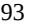

{93}------------------------------------------------

These or other disputes over our obligations or intellectual property that we have licensed-in, licensed-out or acquired may prevent or impair our ability to maintain our current arrangements on acceptable terms, or may impair the value of the arrangement to us. Any such dispute could have an adverse effect on our business.

If we fail, or our licensees cause us to fail, to meet our obligations under these agreements in a material respect, the respective licensor/seller would have the right to terminate the respective agreement and upon the effective date of such termination, have the right to re-obtain the related technology as well as aspects of any intellectual property controlled by us and developed during the period the agreement was in force that relate to the applicable technology. This means that the licensor/seller to each of these agreements could effectively take control of the development and commercialization of our product candidates after an uncured, material breach of the agreement by us. This would also be the case if we voluntarily elected to terminate the relevant agreement, which we have the right to do under each of these agreements. While we would expect to exercise our rights and remedies available to us in the event we fail, or our licensees cause us to fail, to meet our obligations under these agreements in any material respect, including seeking to cure any breach by us or our licensees, and otherwise seek to preserve our rights under the technology licensed to or acquired by us, we may not be able to do so in a timely manner, at an acceptable cost or at all. Any uncured, material breach under the license could result in our loss of exclusive rights and may lead to a complete termination of our product development and any commercialization efforts for each of our product candidates. Termination of one of these agreements for any reason, and the related discontinuation of the development or commercialization of a product candidate could impair our ability to raise additional capital, generate revenue and may significantly harm our business, financial condition and prospects.

Regeneron retains worldwide rights to develop and commercialize ARCALYST for local administration to the eye and ear and oncology. Additionally, Regeneron retains the right to develop and commercialize ARCALYST for all applications in the Middle East and North Africa. The development of ARCALYST in other fields could increase the possibility of identifying adverse safety results that impact the commercialization of ARCALYST for the treatment of recurrent pericarditis.

Certain of our agreements may limit or delay our ability to consummate certain transactions, may impact the value of those transactions, or may limit our ability to pursue certain activities. For example, under the Regeneron Agreement, Regeneron has a right of first negotiation over the assignment or sale of our rights to any product we develop under the Regeneron Agreement to third parties and we must obtain Regeneron's prior consent to assign or sublicense our rights under such agreement to a third party. Under the MedImmune Agreement, we cannot sublicense the rights licensed or sublicensed to us without the consent of MedImmune and certain applicable third-party licensors, if required by agreements between MedImmune and such third-party licensors.

# *Third parties may initiate legal proceedings alleging that we are infringing their intellectual property rights, the outcome of which would be uncertain and could have a material adverse effect on the success of our business.*

Our commercial success depends upon our ability and the ability of our sublicensees to develop, manufacture, market and sell our products and product candidates, if approved, and use our proprietary technologies without infringing the proprietary rights and intellectual property of third parties. The biotechnology and pharmaceutical industries are characterized by extensive and frequent litigation regarding patents and other intellectual property rights. We cannot assure you that our products, product candidates or any future product candidates, including methods of making or using these product candidates, will not infringe existing or future third-party patents. We may in the future become party to, or threatened with, adversarial proceedings or litigation regarding intellectual property rights with respect to our products and product candidates and technology, including contested proceedings before the USPTO. Our competitors or other third parties may assert infringement claims against us, alleging that our products are covered by their patents.

Given the vast number of patents in our field of technology, we cannot be certain that we do not infringe existing patents or that we will not infringe patents that may be granted in the future. Many companies have filed, and continue to file, patent applications related to immunomodulation. Some of these patent applications have already been allowed or issued, and others may issue in the future. For example, we are aware of third-party patents that contain claims potentially relevant to KPL-404 and mavrilimumab. If the claims of any of these patents are asserted against us,

{94}------------------------------------------------

we do not believe our proposed activities related to KPL-404 and mavrilimumab would be found to infringe any valid claim of these patents. While we may decide to initiate proceedings to challenge the validity of these or other patents in the future, we may be unsuccessful, and courts or patent offices in the United States and abroad could uphold the validity of any such patent. If we were to challenge the validity of any issued U.S. patent in court, we would need to overcome a statutory presumption of validity that attaches to every U.S. patent. This means that in order to prevail, we would have to present clear and convincing evidence as to the invalidity of the patent's claims. In order to avoid infringing these or any other third-party patents, we may find it necessary or prudent to obtain licenses to such patents from such third-party intellectual property holders. However, we may be unable to secure such licenses or otherwise acquire or in-license any compositions, methods of use processes or other intellectual property rights from third parties that we identify as necessary for our current or future product candidates. The licensing or acquisition of third-party intellectual property rights is a competitive area, and several more established companies may also pursue strategies to license or acquire third-party intellectual property rights that we may consider attractive or necessary. These established companies may have a competitive advantage over us due to their size, capital resources and greater clinical development and commercialization capabilities. In addition, companies that perceive us to be a competitor may be unwilling to assign or license rights to us. We also may be unable to license or acquire third-party intellectual property rights on terms that would allow us to make an appropriate return on our investment or at all. If we are unable to successfully obtain rights to required third-party intellectual property or maintain the existing intellectual property rights we have, we may have to cease development of the relevant program or product candidate, which could have a material adverse effect on our business, financial condition, results of operations and prospects.

Since our product candidates are being developed for use in fields that are competitive and of strong interest to pharmaceutical and biotechnology companies, we will likely seek to file additional patent applications and may have additional patents granted in the future, based on our future research and development efforts. Furthermore, because patent applications can take many years to issue and may be confidential for 18 months or more after filing, and because pending patent claims can be revised before issuance, there may be applications of third parties now pending which may later result in issued patents that may be infringed by the manufacture, use or sale of our product candidates. Regardless of when filed, we may fail to identify relevant third-party patents or patent applications, or we may incorrectly conclude that a third-party patent is invalid or not infringed by our product candidates or activities. If a patent holder believes our product candidate infringes its patent, the patent holder may sue us even if we have received patent protection for our technology. Moreover, we may face patent infringement claims from non-practicing entities that have no relevant drug revenue and against whom our own patent portfolio may thus have no deterrent effect. If a patent infringement suit were threatened or brought against us, we could be forced to stop or delay research, development, manufacturing or sales of the product candidate that is the subject of the actual or threatened suit.

If we are found to infringe a third-party's intellectual property rights, we could be required to obtain a license from such third party to continue developing and marketing our product candidates and technology. Under any such license, we would most likely be required to pay various types of fees, milestones, royalties or other amounts. However, we may not be able to obtain any required license on commercially reasonable terms or at all. Even if we were able to obtain such a license, it could be granted on non-exclusive terms, thereby providing our competitors and other third parties access to the same technologies licensed to us. Without such a license, we could be forced, including by court order, to cease developing and commercializing the infringing technology or product candidate, or forced to redesign it, or to cease some aspect of our business operations. In addition, we could be found liable for monetary damages, including treble damages and attorneys' fees if we are found to have willfully infringed such third-party patent rights. We may be required to indemnify collaborators or contractors against such claims. A finding of infringement could prevent us from commercializing our product candidates or force us to cease some of our business operations, which could materially harm our business. Even if we are successful in defending against such claims, litigation can be expensive and time consuming and would divert management's attention from our core business. Any of these events could harm our business significantly.

#### *We may become involved in lawsuits to protect or enforce our patents and other intellectual property rights.*

Competitors and other third parties may infringe, misappropriate or otherwise violate our patents and other intellectual property rights, whether owned or in-licensed. To counter infringement or unauthorized use, we or our current or future licensees may be required to file infringement claims against these infringers. A court may disagree

{95}------------------------------------------------

with our allegations, however, and may refuse to stop the other party from using the technology at issue on the grounds that our patents do not cover the third-party technology in question. Further, such third parties could counterclaim that we infringe their intellectual property or that a patent we or our licensees have asserted against them is invalid or unenforceable. In patent litigation in the United States, defendant counterclaims challenging the infringement, validity, enforceability or scope of asserted patents are commonplace. In addition, third parties may initiate legal proceedings against us or licensees to assert such challenges to our intellectual property rights. The outcome of any such proceeding is generally unpredictable. Grounds for a validity challenge could be an alleged failure to meet any of several statutory requirements, including lack of novelty, obviousness, non-enablement, or foreign equivalents thereof. Patents may be unenforceable if someone connected with prosecution of the patent withheld relevant information from the USPTO or made a misleading statement during prosecution. It is possible that prior art of which we or our licensors and the patent examiner were unaware during prosecution exists, which could render our patents invalid. Moreover, it is also possible that prior art may exist that we are aware of but do not believe is relevant to our current or future patents, but that could nevertheless be determined to render our patents invalid or unenforceable.

Some of our competitors may be able to devote significantly more resources to intellectual property litigation, and may have significantly broader patent portfolios to assert against us if we or our licensees assert our rights against them. Further, because of the substantial discovery required in connection with intellectual property litigation, there is a risk that some of our confidential information could be disclosed or otherwise compromised during litigation.

An adverse result in any litigation proceeding could put one or more of our patents, whether owned or in-licensed, at risk of being invalidated or interpreted narrowly. If a defendant were to prevail on a legal assertion of invalidity or unenforceability of our patents covering one of our product candidates, we or our licensees would lose at least part, and perhaps all, of the patent protection covering such product candidate. Competing products may also be sold in other countries in which our patent coverage might not exist or be as strong. If we or our licensees lose a patent lawsuit outside of the United States, alleging our infringement of a competitor's patents, we or our licensees could be prevented from marketing our products in one or more such countries. Any of these outcomes would have a materially adverse effect on our business.

## *Intellectual property litigation could cause us to spend substantial resources and distract our personnel from their normal responsibilities.*

Litigation or other legal proceedings relating to intellectual property claims, with or without merit, is unpredictable and generally expensive and time consuming and is likely to divert significant resources from our core business, including distracting our technical and management personnel from their normal responsibilities. Furthermore, because of the substantial amount of discovery required in connection with intellectual property litigation, there is a risk that some of our confidential information could be compromised by disclosure during this type of litigation. In addition, there could be public announcements of the results of hearings, motions or other interim proceedings or developments and if securities analysts or investors perceive these results to be negative, it could have a substantial adverse effect on the price of our Class A common shares. Such litigation or proceedings could substantially increase our operating losses and reduce the resources available for development activities or any future sales, marketing or distribution activities.

We or our licensees may not have sufficient financial or other resources to adequately conduct such litigation or proceedings. Some of our competitors may be able to sustain the costs of such litigation or proceedings more effectively than we can because of their greater financial resources and more mature and developed intellectual property portfolios. Accordingly, despite our efforts, we or our licensees may not be able to prevent third parties from infringing upon or misappropriating or from successfully challenging our intellectual property rights. Uncertainties resulting from the initiation and continuation of patent litigation or other proceedings could have a material adverse effect on our ability to compete in the marketplace.

{96}------------------------------------------------

# *Obtaining and maintaining patent protection depends on compliance with various procedural, document submission, fee payment and other requirements imposed by governmental patent agencies, and our patent protection could be reduced or eliminated for non-compliance with these requirements.*

The USPTO and various governmental patent agencies outside of the United States require compliance with a number of procedural, documentary, fee payment and other similar provisions during the patent application process. In addition, periodic maintenance fees on issued patents often must be paid to the USPTO and patent agencies outside of the United States over the lifetime of the patent. While an unintentional lapse can in many cases be cured by payment of a late fee or by other means in accordance with the applicable rules, there are situations in which noncompliance can result in abandonment or lapse of the patent or patent application, resulting in partial or complete loss of patent rights in the relevant jurisdiction. Non-compliance events that could result in abandonment or lapse of a patent or patent application include, but are not limited to, failure to respond to official actions within prescribed time limits, non-payment of fees and failure to properly legalize and submit formal documents. If we or our licensees fail to appropriately file and prosecute patent applications covering the licensed products, product candidate or technologies, and maintain any patent issuing from such patent applications, we or our licensees may not be able to stop a competitor from marketing products that are the same as or similar to the licensed products, product candidates or technologies, which would have a material adverse effect on our business. In addition, if we or our licensees fail to apply for applicable patent term extensions or adjustments, we will have a more limited time during which we can enforce our granted patents, or receive royalties from a licensee. In addition, if we are responsible for patent prosecution and maintenance of patent rights in-licensed to us, any of the foregoing could expose us to liability to the applicable patent owner.

#### *We may not be able to effectively enforce our intellectual property rights throughout the world.*

Filing, prosecuting and defending patents on our product candidates in all countries throughout the world would be prohibitively expensive. The requirements for patentability may differ in certain countries, particularly in developing countries. Moreover, our ability to protect and enforce our intellectual property rights may be adversely affected by unforeseen changes in intellectual property laws outside of the United States. In addition, the patent laws of some such countries do not afford intellectual property protection to the same extent as the laws of the United States. Many companies have encountered significant problems in protecting and defending intellectual property rights in certain jurisdictions outside of the United States. Varying filing dates in international countries may also permit intervening third parties to allege priority to patent applications claiming certain technology. The legal systems of some countries, particularly developing countries, do not favor the enforcement of patents and other intellectual property rights. This could make it difficult for us to stop the infringement of our patents or the misappropriation of our other intellectual property rights. For example, many countries outside of the United States have compulsory licensing laws under which a patent owner must grant licenses to third parties. In addition, many countries limit the enforceability of patents against certain parties, including government agencies or government contractors. Consequently, we or our licensees may not be able to prevent third parties from practicing inventions covered by our patents, whether owned or in-licensed, in all countries outside the United States. Competitors may use our or technologies in jurisdictions where we or they have not obtained patent protection, or where we or they have obtained patent protection, but such jurisdictions do not favor the enforcement of patents and other intellectual property rights, to develop their own products and, further, may export otherwise infringing products to territories where we have patent protection, if our or our licensees' ability to enforce our patents to stop infringing activities is inadequate. These products may compete with our products and product candidates or the products and product candidates that we have out-licensed, and our or our licensees' patents or other intellectual property rights may not be effective or sufficient to prevent them from competing.

Proceedings to enforce our patent rights, whether owned or in-licensed, in jurisdictions outside of the United States, whether or not successful, could result in substantial costs and divert our efforts and resources from other aspects of our business. Furthermore, while we intend to pursue protection for our intellectual property rights in the major markets for our product candidates, we cannot ensure that we or our licensees will be able to initiate or maintain similar efforts in all jurisdictions in which we or they may wish to market our or our out-licensed products and product candidates. Accordingly, our or our licensees' efforts to protect our intellectual property rights in such countries may be inadequate. In addition, changes in the law and legal decisions by courts in the United States and other countries may affect the ability to obtain and enforce adequate intellectual property protection for our technology.

{97}------------------------------------------------

## *Changes to the patent law in the United States and other jurisdictions could diminish the value of patents in general, thereby impairing our ability to protect our product candidates.*

As is the case with other biopharmaceutical companies, our success is heavily dependent on intellectual property, particularly patents. Obtaining and enforcing patents in the biopharmaceutical industry involve both technological and legal complexity and is therefore costly, time consuming and inherently uncertain. Patent reform legislation in the United States and other countries, including the Leahy-Smith America Invents Act (the "Leahy-Smith Act"), signed into law on September 16, 2011, contribute to those uncertainties and costs. The Leahy-Smith Act includes a number of significant changes to U.S. patent law. These include provisions that have affected the way patent applications are prosecuted, and have redefined prior art and provided more efficient and cost-effective avenues for competitors to challenge the validity of patents. In addition, the Leahy-Smith Act has transformed the U.S. patent system into a first-to-file system in which, assuming that other requirements of patentability are met, the first inventor to file a patent application will be entitled to the patent regardless of whether a third party was first to invent the claimed invention. A third party that has filed a patent application in the USPTO after March 2013 but before us could therefore be awarded a patent covering an invention of ours even if we had made the invention before it was made by such third party. This requires us or our licensees to be cognizant of the time from invention to filing of a patent application. Furthermore, our ability to obtain and maintain valid and enforceable patents depends on whether the differences between our technology and the prior art allow our technology to be patentable over the prior art. Since patent applications in the United States and most other countries are confidential for a period of time after filing or until issuance, we cannot be certain that we were the first to either (1) file any patent application related to our product candidates or (2) invent any of the inventions claimed in our patents or patent applications. Even where we have a valid and enforceable patent, we or our licensees may not be able to exclude others from practicing the claimed invention where the other party can show that they used the invention in commerce before our filing date or the other party benefits from a compulsory license.

Among some of the other changes introduced by the Leahy-Smith Act are changes that (i) affect the way patent applications are prosecuted, (ii) redefine prior art, and (iii) provide more efficient and cost-effective avenues for competitors to challenge the validity of patents. These include changes that limit where a patentee may file a patent infringement suit and provide new opportunities for third parties to challenge issued patents in the USPTO. We or our licensees may be subject to the risk of third-party prior art submissions on pending applications or become a party to opposition, derivation, reexamination, *inter partes* review, post-grant review or interference proceedings challenging our patents. There is a lower standard of evidence necessary to invalidate a patent claim in a USPTO proceeding relative to the standard in U.S. district or federal court. This could lead third parties to challenge and successfully invalidate our or our licensees' patents that would not otherwise be invalidated if challenged through the court system. Accordingly, a third party may attempt to use the USPTO procedures to invalidate our or our licensees' patent claims that would not have been invalidated if first challenged by the third party as a defendant in a district court action. Thus, the Leahy-Smith Act and its implementation increase the uncertainties and costs surrounding the prosecution of our or our future licensees' patent applications and the enforcement or defense of our issued patents, all of which could have a material adverse effect on our business, financial condition, results of operations and prospects.

The U.S. Supreme Court has ruled on several patent cases in recent years, either narrowing the scope of patent protection available in certain circumstances or weakening the rights of patent owners in certain situations. In addition, there have been recent proposals for additional changes to the patent laws of the United States and other countries that, if adopted, could impact our or our licensees' ability to obtain or maintain patent protection for our or our out-licensed proprietary technology or our or their ability to enforce our or our out-licensed proprietary technology, respectively. Depending on future actions by the U.S. Congress, the U.S. courts, the USPTO and the relevant law-making bodies in other countries, the laws and regulations governing patents could change in unpredictable ways that would weaken our ability to obtain new patents; enforce or shorten the term of our or our licensees' existing patents and patents that we might obtain in the future; shorten the term that has been lengthened by patent term adjustment of our or our licensees' existing patents or patents that we might obtain in the future; or challenge the validity or enforceability of our patents that may be asserted against us by our competitors or other third parties. Any of these outcomes could have a material adverse effect on our business.

{98}------------------------------------------------

In Europe, beginning no earlier than October 1, 2022, European patent applications will have the option, upon grant of a patent, of becoming a "Unitary Patent," which will be subject to the jurisdiction of a new patent adjudication body, the Unitary Patent Court (UPC). The UPC is intended to provide an alternative mechanism to disputing patent rights in the courts of individual European countries. The UPC will be a significant change in European patent practice. Since the UPC is a new court, there are no existing precedents and the rulings of the UPC will be unpredictable at the outset, thus increasing the uncertainty of any litigation involving a Unitary Patent.

# *If we are unable to protect the confidentiality of our trade secrets, our business and competitive position may be harmed.*

In addition to the protection afforded by patents, we may rely upon unpatented trade secret protection, unpatented know-how and continuing technological innovation to develop and maintain our competitive position. Although we seek to protect our proprietary technology and processes, in part, by entering into confidentiality agreements with our collaborators, scientific advisors, contractors, employees, independent contractors and consultants, and invention assignment agreements with our independent contractors, consultants, scientific advisors and employees, we may not be able to prevent the unauthorized disclosure or use of our technical know-how or other trade secrets by the parties to these agreements. Moreover, we cannot guarantee that we have entered into such agreements with each party that may have or have had access to our confidential information or proprietary technology and processes. Monitoring unauthorized uses and disclosures is difficult, and we do not know whether the steps we have taken to protect our proprietary technologies will be effective. If any of the collaborators, scientific advisors, employees, contractors and consultants who are parties to these agreements breaches or violates the terms of any of these agreements, we may not have adequate remedies for any such breach or violation (e.g., in countries that do not favor the enforcement of intellectual property rights), and we could lose our trade secrets as a result. Moreover, if confidential information that is licensed or disclosed to us by our partners, collaborators or others is inadvertently disclosed or subject to a breach or violation, we may be exposed to liability to the owner of that confidential information. Enforcing a claim that a third party illegally obtained and is using our trade secrets, like patent litigation, is expensive and time consuming, and the outcome is unpredictable. In addition, courts outside the United States are sometimes less willing to protect trade secrets.

We cannot be certain that the steps we have taken will prevent unauthorized use or unauthorized reverse engineering of our technology. Monitoring unauthorized use of our intellectual property is difficult and costly. We may not be able to detect unauthorized use of, or take appropriate steps to enforce, our intellectual property rights. The steps we have taken to protect our proprietary rights may not be adequate to prevent misappropriation of our intellectual property.

We also seek to preserve the integrity and confidentiality of our data and other confidential information by maintaining physical security of our premises and physical and electronic security of our information technology systems. While we have confidence in these individuals, organizations and systems, agreements or security measures may be breached. Detecting the disclosure or misappropriation of confidential information and enforcing a claim that a party illegally disclosed or misappropriated confidential information is difficult, expensive and time consuming, and the outcome is unpredictable. Further, we may not be able to obtain adequate remedies for any breach. In addition, our confidential information may otherwise become known or be independently discovered by competitors, in which case we would have no right to prevent them, or those to whom they communicate it, from using that technology or information to compete with us. We may in the future rely on trade secret protection, which would be subject to the risks identified above with respect to confidential information.

Our trade secrets could otherwise become known or be independently discovered by our competitors. Competitors could purchase our product candidates and attempt to replicate some or all of the competitive advantages we derive from our development efforts, willfully infringe our intellectual property rights, design around our protected technology or develop their own competitive technologies that fall outside of our intellectual property rights. If any of our trade secrets were to be lawfully obtained or independently developed by a competitor, we would have no right to prevent them, or those to whom they communicate it, from using that technology or information to compete with us. If our trade secrets are not adequately protected so as to protect our market against competitors' products, our competitive position could be adversely affected, as could our business.

{99}------------------------------------------------

See also "*Risk Factors – Risks Related to Manufacturing and Our Reliance on Third Parties – Our reliance on third parties requires us to share our trade secrets, which increases the possibility that a competitor will discover them or that our trade secrets will be misappropriated or disclosed*."

## *If our trademarks and trade names are not adequately protected, then we may not be able to build name recognition in our markets of interest and our business may be adversely affected.*

Our registered or unregistered trademarks or trade names may be challenged, infringed, circumvented or declared generic or determined to be infringing on other marks. We may not be able to protect our rights to these trademarks and trade names in the United States or jurisdictions outside of the United States, which we need to build name recognition among potential partners or customers in our markets of interest. At times, competitors or other third parties may adopt trade names or trademarks similar to ours, thereby impeding our ability to build brand identity and possibly leading to market confusion. In addition, there could be potential trade name or trademark infringement claims brought by owners of other registered trademarks or trademarks that incorporate variations of our registered or unregistered trademarks or trade names. Over the long term, if we are unable to establish name recognition based on our trademarks and trade names, then we may not be able to compete effectively and our business may be adversely affected. Our efforts to enforce or protect our proprietary rights related to trademarks, trade secrets, domain names, copyrights or other intellectual property may be ineffective and could result in substantial costs and diversion of resources and could adversely affect our business, financial condition, results of operations and prospects.

## *We have not yet registered trademarks for a commercial trade name for our product candidates in the United States or jurisdictions outside of the United States and failure to secure such registrations could adversely affect our business.*

We have not yet registered trademarks for a commercial trade name for some of our product candidates in the United States or any jurisdiction outside of the United States. During trademark registration proceedings, we may receive rejections. Although we are given an opportunity to respond to those rejections, we may be unable to overcome such rejections. In addition, in the USPTO and in comparable agencies in many jurisdictions outside of the United States, third parties are given an opportunity to oppose pending trademark applications and to seek to cancel registered trademarks. Opposition or cancellation proceedings may be filed against our trademarks, and our trademarks may not survive such proceedings. Moreover, any name we propose to use with our product candidates in the United States must be approved by the FDA, regardless of whether we have registered it, or applied to register it, as a trademark. The FDA typically conducts a review of proposed product names, including an evaluation of potential for confusion with other product names. If the FDA objects to any of our proposed proprietary product names, we may be required to expend significant additional resources in an effort to identify a suitable substitute name that would qualify under applicable trademark laws, not infringe the existing rights of third parties and be acceptable to the FDA.

## **General Risk Factors**

## *The ongoing war in Ukraine, and actions taken against Russia as a result of its invasion of Ukraine, has and may continue to have an adverse impact on the global economy, equity capital markets and our clinical operations.*

In February 2022, Russia invaded Ukraine to the condemnation of the international community. The conflict remains ongoing and has led to devastation and significant market and other disruptions, including volatility in commodity prices and supply of energy resources, instability in financial markets, supply chain interruptions, political and social instability, changes in consumer or purchaser preferences as well as increases in cyberattacks and espionage. In response to Russia's invasion and perpetration of war crimes, western nations, including the United States and the EU, instated severe economic sanctions against Russia, including the suspension of Russian banks from the global SWIFT system, travel bans, personal sanctions against the Russian elite and boycotts of Russian goods and commodities. Private organizations responded similarly, with many companies choosing to suspend their Russian operations or end them entirely.

The situation is rapidly evolving, and the United States, the EU, the UK and other countries may implement additional sanctions, export controls or other measures against Russia, Belarus and other countries, regions, officials,

{100}------------------------------------------------

individuals or industries in the respective territories. Such sanctions and other measures, as well as the existing and potential further responses from Russia or other countries to such sanctions, tensions and military actions, could adversely affect the global economy and financial markets and could adversely affect our business, operations and financial position. The U.S. commodity and capital markets have and will likely continue to be significantly volatile as a result of the conflict. The war has posed and may continue to pose risks to global supply chains, further threatening the global and U.S. economy. The price of our shares and the shares of other biopharmaceutical companies may fluctuate or otherwise be impacted, especially if the war or governmental responses thereto result in a prolonged economic downturn. As a result of such disruptions, we may be unable to raise additional capital when needed or on acceptable terms, if at all. These risks may also be compounded with the effects of the COVID-19 pandemic, and measures taken in response to the pandemic, on U.S. and global capital markets. See "*Risk Factors – General Risk Factors – The COVID-19 pandemic, and measures taken in response to the pandemic, could have an adverse impact that is significant on our business and operations as well as the business or operations of our manufacturers, CROs and other third parties with whom we conduct business or otherwise engage, including the FDA and other regulatory authorities, and has impacted and could continue to impact the global economy, which may have a material adverse effect on our business, operations and financial position.*"

The conflict in Ukraine has adversely affected and may continue to adversely affect our clinical development efforts. We conduct clinical trials at sites across the globe, including in Eastern Europe. In the aftermath of the invasion, we terminated planned clinical trial operations in Ukraine and Russia. While we were able to secure alternative clinical trial sites in other European countries, there is no guarantee that such sites will be able to provide a sufficient number of participants to satisfy our clinical need and at a reasonable cost. Further, should the conflict escalate beyond Ukraine and we are forced to terminate ongoing or planned clinical trial operations, we may be unable to secure alternative clinical sites when needed or on acceptable terms, if at all. The foregoing may cause significant delays or disruptions to our clinical development efforts, which could have a material impact on our business, operations and financial position.

Furthermore, due to the political uncertainty involving Russia and Ukraine, there is also an increased likelihood that we or our CROs or other third parties with whom we conduct business or otherwise engage, may also be subject to retaliatory cyberattacks perpetrated by Russia or others at its direction in response to economic sanctions and other actions taken against Russia as a result of its invasion of Ukraine. See "*Risk Factors – General Risk Factors – Our information technology systems, or those of our third party CMOs, CROs or other contractors, consultants and service providers, may fail or suffer cyberattacks or security breaches, which could result in a material disruption of our or such third-party's business or operations and our development programs for our product candidates or loss of other assets, including funds*."

*The COVID-19 pandemic, and measures taken in response to the pandemic, could have an adverse impact that is significant on our business and operations as well as the business or operations of our manufacturers, CROs and other third parties with whom we conduct business or otherwise engage, including the FDA and other regulatory authorities, and has impacted and could continue to impact the global economy, which may have a material adverse effect on our business, operations and financial position.*

The COVID-19 pandemic, and measures taken in response to the pandemic, could cause significant disruption in our business and operations and could cause significant disruption in the business and operations of our manufacturers, CROs upon whom we rely to conduct our clinical trials, clinical trial sites, and other third parties with whom we conduct business or otherwise engage, including the FDA and other regulatory authorities.

The federal and state governments in the United States and the governments of other countries around the globe implemented various measures in response to the COVID-19 pandemic, including significant restrictions on businesses as well as travel into and within the countries in which our manufacturers produce our product candidates or where we conduct our clinical trials or otherwise conduct business or engage with other third parties. While many such restrictive measures have since been loosened or repealed following the widespread distribution of COVID-19 vaccines, the loosening of such restrictions have been and may in the future be subject to abrupt reversal in the presence of new variants of COVID-19, which may lengthen or exacerbate the pandemic's effect on our business, financial condition and results of operations. In addition, government restrictions and policies remain unpredictable and varied across jurisdictions, introducing significant uncertainty and compliance difficulty.

{101}------------------------------------------------

If the COVID-19 pandemic is prolonged, including through the emergence of new variants of the virus, and measures undertaken in response to the pandemic are reinstated, we may experience and our manufacturers, CROs or other third parties with whom we conduct business or otherwise engage, may experience or continue to experience staffing shortages or reprioritizations, production slowdowns or stoppages, and disruptions in delivery systems now or in the future. For example, the COVID-19 pandemic and measures taken in response to the pandemic, including business and travel restrictions and social distancing to halt the spread of the pandemic, has had an impact on certain aspects of our commercialization strategy, including interacting with third-party payors, prescribers and patient advocacy groups to build disease awareness, and conducting in-person market research as well as recruiting qualified candidates to enhance our commercial operations and support commercialization, which, if prolonged, may impede the effective commercialization of our products and product candidates, if approved, and result in lower than anticipated future revenue.

In response to the COVID-19 pandemic and measures introduced by state and federal governments in the United States, we implemented workplace protocols at our facilities. We currently require all employees entering our workplaces in the United States to be fully vaccinated against COVID-19, subject to a reasonable accommodation process. We have also established additional safety measures at our facilities, including providing personal protective equipment and recommending employees stay home while feeling unwell. These safety measures do not, however, guarantee that COVID-19 will not spread amongst our employees through workplace contact, and the sickness of employees may have a significant adverse impact on our business. We continue to monitor the developments, restrictions and requirements in jurisdictions where we have offices, and plan to update the protocols for our offices as applicable.

The COVID-19 pandemic may also have a significant adverse impact on our preclinical studies and clinical trials, which could significantly impede, delay, limit or prevent the clinical development of our product candidates and ultimately lead to the delay or denial of regulatory approval of our product candidates, which would materially adversely affect our business and operations, including our ability to generate revenue. See "*Risk Factors — Risks related to product development — The COVID-19 pandemic, and measures taken in response to the pandemic, could have an adverse impact on our current or planned preclinical studies and clinical trials, which could be significant.*"

Further, the COVID-19 pandemic may impact our ability to successfully commercialize ARCALYST and our current and future product candidates, if approved. The re-implementation of certain measures, including business and travel restrictions and social distancing to halt the spread of the pandemic, could have an impact on businesses, healthcare systems, regulatory authorities and other organizations and conferences. These measures could result in limitations on certain aspects of our commercialization strategy, including access to prescriber offices, and result in lower than anticipated future revenue.

As a result of the COVID-19 pandemic, existing and any new third party CMOs or suppliers may be unable to produce or supply our current or future products and product candidates or obtain certain raw or fill-finish materials, including vials and stoppers, needed to produce or supply such products and product candidates. Further, our products and product candidates require certain crucial ancillary products, including sterile water and needles, whose availability has been and may in the future be impacted by the COVID-19 pandemic. Such parties may also experience delays, restrictions or limitations in the production, delivery or release of our products and product candidates, the raw or fill-finish materials needed to produce them and important ancillary products, including due to disruptions at their respective facilities, staffing shortages, production slowdowns, stoppages or reprioritizations, including as a result of reprioritization by third parties or the U.S. government for any products or potential products related to the treatment or prevention of COVID-19, or interruptions in global shipping. Any failure to source sufficient quantities of our products and product candidates or their ancillary products could prevent us from successfully commercializing our approved products and/or delay or force us to cancel our clinical activity.

Moreover, the COVID-19 pandemic is impacting the global economy, and the U.S. economy in particular, with the potential for an economic downturn to be severe and prolonged. A severe or prolonged economic downturn could result in a variety of risks to our business, including disruptions in the financial markets. For example, the trading prices of biopharmaceutical companies have been and continue to be highly volatile as a result of the COVID-19 pandemic's

{102}------------------------------------------------

effect on capital markets. These disruptions could adversely impact our ability to raise additional capital when needed or on acceptable terms, if at all.

## *The United Kingdom's withdrawal from the European Union may have a negative effect on global economic conditions, financial markets and our business.*

Since January 1, 2021, however, the United Kingdom (the "UK") has operated under a distinct regulatory regime to the EU. EU pharmaceutical laws only apply in respect of the UK to Northern Ireland (as set out in the Protocol on Ireland/Northern Ireland). EU laws which have been transposed into UK law through secondary legislation continue to be applicable as "retained EU law". However, under the Retained EU Law (Revocation and Reform) Bill 2022, which is currently before the UK parliament, any retained EU law not expressly preserved and "assimilated" into domestic law or extended by ministerial regulations (to no later than June 23, 2026) will automatically expire and be revoked by December 31, 2023. While the UK has indicated a general intention that new laws regarding the development, manufacture and commercialization of medicinal products in the UK will align closely with EU law, there are limited detailed proposals for future regulation of medicinal products. The trade and cooperation agreement ("TCA"), which put in place a framework for a future EU-UK relationship, includes specific provisions concerning medicinal products, which include the mutual recognition of GMP, inspections of manufacturing facilities for medicinal products and GMP documents issued (such mutual recognition can be rejected by either party in certain circumstances), but does not foresee wholesale mutual recognition of UK and EU pharmaceutical regulations. For example, it remains unclear as to what extent the UK will adopt legislation aligned with, or similar to, the EU CTR which became applicable on January 31, 2022 and which significantly reforms the assessment and supervision processes for clinical trials throughout the EU. On January 17, 2022, the Medicines and Healthcare products Regulatory Agency (the "MHRA") launched an eight-week consultation on reframing the UK legislation for clinical trials. The consultation closed on March 14, 2022 and aims to streamline clinical trials approvals, enable innovation, enhance clinical trials transparency, enable greater risk proportionality, and promote patient and public involvement in clinical trials. The outcome of the consultation has not been published but be closely watched and will determine whether the UK chooses to align with the regulation or diverge from it to maintain regulatory flexibility. A decision by the UK not to closely align its regulations with the new approach that will be adopted in the EU may have an effect on the cost of conducting clinical trials in the UK as opposed to other countries.

Therefore, there remains political and economic uncertainty regarding to what extent the regulation of medicinal products will differ between the UK and the EU in the future. Any divergences will increase the cost and complexity of running our business, including with respect to the conduct of clinical trials. Brexit also materially impacted the regulatory regime with respect to the approval of our product candidates. Great Britain is no longer covered by the EU's procedures for the grant of marketing authorizations (Northern Ireland is covered by the centralized authorization procedure and can be covered under the decentralized or mutual recognition procedures). As of January 1, 2021, all existing centralized marketing authorizations were automatically converted into UK marketing authorizations effective in Great Britain and issued with a United Kingdom marketing authorization number on January 1, 2021 (unless marketing authorization holders opted out of this scheme). A separate marketing authorization is now required to market new drugs in Great Britain. It is currently unclear whether the regulator in the UK, the MHRA, is sufficiently prepared to handle the increased volume of marketing authorization applications that it is likely to receive. The UK's withdrawal from the EU and the associated uncertainty has had and may continue to have a significant adverse effect on global economic conditions and the stability of global financial markets, and could significantly reduce global market liquidity and restrict the ability of key market participants to operate in certain financial markets. Asset valuations, currency exchange rates and credit ratings may be especially subject to increased market volatility. The UK has also experienced significant political instability in 2022. Any of these factors could have a significant adverse effect on our business, financial condition, results of operations and prospects.

Further, the UK's withdrawal from the EU resulted in the relocation of the EMA from the UK to the Netherlands. This relocation has caused, and may continue to cause, disruption in the administrative and medical scientific links between the EMA and the MHRA, including delays in granting clinical trial authorization or marketing authorization, disruption of importation and export of active substance and other components of new drug formulations, and disruption of the supply chain for clinical trial product and final authorized formulations. The cumulative effects of the disruption to the regulatory

{103}------------------------------------------------

framework may add considerably to the development lead time to marketing authorization and commercialization of products in the EU and/or the UK.

Such a situation could hinder our ability to conduct current and planned clinical trials and commercialize our products and product candidates, if approved, including ARCALYST, adversely affecting our business, financial condition and results of operations. Additionally, political instability in the EU as a result of Brexit may result in a material negative effect on credit markets and foreign direct investments in the EU and UK.

These developments, or the perception that any related developments could occur, have had and may continue to have a material adverse effect on global economic conditions and the financial markets, and may significantly reduce global market liquidity, restrict the ability of key market participants to operate in certain financial markets or restrict our access to capital. Any of these factors could have a material adverse effect on our business, financial condition and results of operations and reduce the price of our shares.

# *If we fail to comply with reporting and payment obligations under the Medicaid Drug Rebate Program or other governmental pricing programs, we could be subject to additional reimbursement requirements, penalties, sanctions and fines, which could have a material adverse effect on our business, financial condition, results of operations and growth prospects.*

We participate in governmental programs that impose extensive drug price reporting and payment obligations on pharmaceutical manufacturers. Medicaid is a joint federal and state program that is administered by the states for lowincome and disabled beneficiaries. Under the Medicaid Drug Rebate Program (the "MDRP"), as a condition of federal funds being made available for our covered outpatient drugs under Medicaid and certain drugs or biologicals under Medicare Part B, we pay a rebate to state Medicaid programs for each unit of our covered outpatient drugs dispensed to a Medicaid beneficiary and paid for by the state Medicaid program. Medicaid rebates are based on pricing data that we report on a monthly and quarterly basis to CMS, the federal agency that administers the MDRP and Medicare programs. For the MDRP, these data include the Average Manufacturer Price ("AMP") for each drug and, in the case of innovator products, best price. If we become aware that our MDRP price reporting submission for a prior period was incorrect or has changed as a result of recalculation of the pricing data, we must resubmit the corrected data for up to three years after those data originally were due. If we fail to provide information timely or are found to have knowingly submitted false information to the government, we may be subject to civil monetary penalties and other sanctions, including termination from the MDRP, in which case payment would not be available for our covered outpatient drugs under Medicaid or, if applicable, Medicare Part B.

Federal law requires that any company that participates in the MDRP also participate in the 340B program in order for federal funds to be available for the manufacturer's drugs under Medicaid and Medicare Part B. The 340B program is administered by HRSA and requires us, as a participating manufacturer, to agree to charge statutorily defined covered entities no more than the 340B "ceiling price" for our covered drugs used in an outpatient setting. These 340B covered entities include a variety of community health clinics and other entities that receive health services grants from the Public Health Service, as well as hospitals that serve a disproportionate share of low-income patients. A drug that is designated for a rare disease or condition by the Secretary of Health and Human Services is not subject to the 340B ceiling price requirement with regard to the following types of covered entities: rural referral centers, sole community hospitals, critical access hospitals, and free-standing cancer hospitals. The 340B ceiling price is calculated using a statutory formula, which is based on the AMP and rebate amount for the covered outpatient drug as calculated under the MDRP. In general, products subject to Medicaid price reporting and rebate liability are also subject to the 340B ceiling price calculation and discount requirement. We must report 340B ceiling prices to HRSA on a quarterly basis, and HRSA publishes them to 340B covered entities. HRSA has finalized regulations regarding the calculation of the 340B ceiling price and the imposition of civil monetary penalties on manufacturers that knowingly and intentionally overcharge covered entities for 340B-eligible drugs. HRSA has also finalized an administrative dispute resolution process through which 340B covered entities may pursue claims against participating manufacturers for overcharges, and through which manufacturers may pursue claims against 340B covered entities for engaging in unlawful diversion or duplicate discounting of 340B drugs.

{104}------------------------------------------------

In order to be eligible to have drug products paid for with federal funds under Medicaid and Medicare Part B and purchased by certain federal agencies and grantees, we must also participate in the VA/FSS pricing program. Under the VA/FSS program, we must report the Non-FAMP for our covered drugs to the VA and charge certain federal agencies no more than the Federal Ceiling Price, which is calculated based on Non-FAMP using a statutory formula. These four agencies are the VA, the U.S. Department of Defense, the U.S. Coast Guard, and the U.S. Public Health Service (including the Indian Health Service). We must also pay rebates on products purchased by military personnel and dependents through the TRICARE retail pharmacy program. If we fail to provide timely information or are found to have knowingly submitted false information, we may be subject to civil monetary penalties.

Individual states continue to consider and have enacted legislation to limit the growth of healthcare costs, including the cost of prescription drugs and combination products. A number of states have either implemented or are considering implementation of drug price transparency legislation that may prevent or limit our ability to take price increases at certain rates or frequencies. Requirements under such laws include advance notice of planned price increases, reporting price increase amounts and factors considered in taking such increases, wholesale acquisition cost information disclosure to prescribers, purchasers, and state agencies, and new product notice and reporting. Such legislation could limit the price or payment for certain drugs, and states may impose civil monetary penalties or pursue other enforcement mechanisms against manufacturers who fail to comply with drug price transparency requirements. If we are found to have violated state law requirements, we may become subject to penalties or other enforcement mechanisms, which could have a material adverse effect on our business.

Pricing and rebate calculations vary across products and programs, are complex, and are often subject to interpretation by us, governmental or regulatory agencies, and the courts, which can change and evolve over time. Such pricing calculations and reporting, along with any necessary restatements and recalculations, could increase our costs for complying with the laws and regulations governing the MDRP and other governmental programs, and under the MDRP could result in an overage or undercharge in Medicaid rebate liability for past quarters. Price recalculations under the MDRP also may affect the ceiling price at which we are required to offer products under the 340B program. Civil monetary penalties can be applied if we are found to have knowingly submitted any false price or product information to the government, if we fail to submit the required price data on a timely basis, or if we are found to have charged 340B covered entities more than the statutorily mandated ceiling price. CMS could also terminate our Medicaid drug rebate agreement, in which case federal payments may not be available under Medicaid or Medicare Part B, if applicable, for our covered outpatient drugs. Pursuant to the Inflation Reduction Act of 2022 (the "IRA"), the AMP figures we report will also be used to compute rebates under Medicare Part D triggered by price increases that outpace inflation. We cannot assure you that our submissions will not be found to be incomplete or incorrect.

## *Enacted and future healthcare legislation may have a material adverse effect on our business and results of operations.*

In the United States, EU and other jurisdictions, there have been and we expect there will continue to be a number of legislative and regulatory initiatives and proposed changes to the healthcare system that could affect our operations. For example, in the United States, the ACA substantially changed the way healthcare is financed by both governmental and private insurers, and significantly impacts the U.S. pharmaceutical industry. The ACA, among other things, subjected biologic products to potential competition by lower-cost biosimilars, introduced a new methodology by which rebates owed by manufacturers under the MDRP are calculated for drugs and biologics that are inhaled, infused, instilled, implanted or injected, increased the minimum Medicaid rebates owed by manufacturers under the MDRP, extended manufacturer Medicaid rebate obligations to utilization by individuals enrolled in Medicaid managed care organizations, established annual fees and taxes on manufacturers of certain branded prescription drugs and biologics, and established a new Medicare Part D coverage gap discount program.

Since its enactment, there have been judicial, executive and Congressional challenges to certain aspects of the ACA. In June 2021, the U.S. Supreme Court dismissed the most recent judicial challenge to the ACA brought by several states without specifically ruling on the constitutionality of the ACA. In addition, other legislative changes have been proposed and adopted in the United States since the ACA was enacted. The Budget Control Act of 2011, among other things, led to reductions of Medicare payments to providers, which will remain in effect through 2032 unless additional Congressional action is taken.

{105}------------------------------------------------

Additionally, there has been increasing legislative and enforcement interest in the United States with respect to specialty drug pricing practices. Specifically, there have been several recent Congressional inquiries and proposed and enacted federal and state legislation designed to, among other things, bring more transparency to drug and biologic pricing, reduce the cost of prescription drugs and biologics under Medicare, review the relationship between pricing and manufacturer patient programs and reform government program reimbursement methodologies for drugs and biologics. For example, in May 2019, CMS published a final rule to allow Medicare Advantage Plans the option to use step therapy for Part B drugs beginning January 1, 2020. Among other things, the IRA requires manufacturers of certain drugs to engage in price negotiations with Medicare (beginning in 2026), with prices that can be negotiated subject to a cap; imposes rebates under Medicare Part B and Medicare Part D to penalize price increases that outpace inflation (first due in 2023); and replaces the Part D coverage gap discount program with a new discounting program (beginning in 2025). The IRA permits the Secretary of the Department of Health and Human Services (HHS) to implement many of these provisions through guidance, as opposed to regulation, for the initial years. For that and other reasons, it is currently unclear how the IRA will be effectuated, and while the impact of the IRA on our business and the pharmaceutical industry cannot yet be fully determined, it is likely to be significant. We expect that additional U.S. federal healthcare reform measures will be adopted in the future, any of which could limit the amounts that the U.S. federal government will pay for healthcare products and services, which could result in reduced demand for our products and product candidates, if approved, or additional pricing pressures.

Individual states in the United States have also become increasingly active in passing legislation and implementing regulations designed to control pharmaceutical and biological product pricing, including price or patient reimbursement constraints, discounts, restrictions on certain product access, marketing cost disclosure and other transparency measures, and, in some cases, measures designed to encourage importation from other countries and bulk purchasing. Legally mandated price controls on payment amounts by third-party payors or other restrictions could harm our business, results of operations, financial condition and prospects. In addition, regional healthcare authorities and individual hospitals are increasingly using bidding procedures to determine what pharmaceutical products and which suppliers will be included in their prescription drug and other healthcare programs. This could reduce the ultimate demand for our products and product candidates, if approved, or put pressure on our product pricing.

In the EU, similar political, economic and regulatory developments may affect our ability to profitably commercialize our product candidates, if approved. In addition to continuing pressure on prices and cost containment measures, legislative developments at the EU or member state level may result in significant additional requirements or obstacles that may increase our operating costs. The delivery of healthcare in the EU, including the establishment and operation of health services and the pricing and reimbursement of medicines, is almost exclusively a matter for national, rather than EU, law and policy. National governments and health service providers have different priorities and approaches to the delivery of health care and the pricing and reimbursement of products in that context. In general, however, the healthcare budgetary constraints in most EU member states have resulted in restrictions on the pricing and reimbursement of medicines by relevant health service providers. Coupled with ever-increasing EU and national regulatory burdens on those wishing to develop and market products, this could prevent or delay marketing approval of our product candidates, restrict or regulate post-approval activities and affect our ability to commercialize our product candidates, if approved.

In markets outside of the United States and the EU, reimbursement and healthcare payment systems vary significantly by country, and many countries have instituted price ceilings on specific products and therapies.

We cannot predict the likelihood, nature or extent of government regulation that may arise from future legislation or administrative action, either in the United States, the EU or elsewhere. For example, such actions may result in changes to governmental policies and regulations that affect our operations and business, including our clinical trials, regulatory approval, pharmaceutical pricing and reimbursement. If we or any third party we may engage are slow or unable to adapt to changes in existing requirements or the adoption of new requirements or policies, or if we or such third party are not able to maintain regulatory compliance, our product candidates may lose any regulatory approval that may have been obtained which may have a material impact on our business and operations.

{106}------------------------------------------------

# *Unfavorable global economic or operational conditions could adversely affect our business, financial condition or results of operations.*

Our results of operations could be adversely affected by general conditions in the global economy and in the global financial markets. For example, the COVID-19 pandemic, the ongoing war in Ukraine and increases in inflation and interest rates have impacted and continue to impact the global economy, causing or contributing to global supply chain issues, price fluctuations and other significant economic effects. See "*Risk Factors — General Risk Factors — The COVID-19 pandemic, and measures taken in response to the pandemic, could have an adverse impact that is significant on our business and operations as well as the business or operations of our manufacturers, CROs and other third parties with whom we conduct business or otherwise engage, including the FDA and other regulatory authorities, and has impacted and could continue to impact the global economy, which may have a material adverse effect on our business, operations and financial position"* and *"Risk Factors — General Risk Factors — The ongoing war in Ukraine, and actions taken against Russia as a result of its invasion of Ukraine, has and may continue to have an adverse impact on the global economy, equity capital markets and our clinical operations."* In addition, global credit and financial markets have recently experienced volatility and disruptions, including severely diminished liquidity and credit availability, rising interest rates, declines in consumer confidence, declines in economic growth, increase in unemployment rates and uncertainty about economic stability.

These disruptions could adversely affect our ability to manufacture, market and sell our commercialized products, including ARCALYST, and satisfy the required supply for any of our product candidates or successfully complete preclinical and clinical development of our product candidates, which could require us to incur additional costs, and impair our ability to obtain regulatory approval of our product candidates and generate revenue. Doing business internationally involves a number of other risks, including but not limited to:

- multiple, conflicting and changing laws and regulations such as privacy regulations, tax laws, employment laws, regulatory requirements, permits and export and import restrictions;
- failure by us to obtain and maintain regulatory approvals for the use of our products in various countries;
- additional potentially relevant third-party patent rights;
- complexities and difficulties in obtaining protection and enforcing our intellectual property;
- difficulties in staffing and managing operations outside of the United States;
- complexities associated with managing multiple payor reimbursement regimes, government payors or patient self-pay systems;
- limits in our ability to penetrate international markets;
- financial risks, such as longer payment cycles, difficulty collecting accounts receivable, the impact of local and regional financial crises on demand and payment for our products and exposure to foreign currency exchange rate fluctuations;
- natural disasters, political and economic instability such as war, including the ongoing war in Ukraine, terrorism, political unrest, outbreak of disease and boycotts;
- curtailment of trade, and other business restrictions;
- certain expenses including, among others, expenses for travel, translation and insurance; and

{107}------------------------------------------------

- regulatory and compliance risks that relate to maintaining accurate information and control over clinical activities, sales and other functions that may fall within the purview of the U.S. Foreign Corrupt Practices Act, its books and records provisions or its antibribery provisions.
Any of the foregoing could harm our business and we cannot anticipate all of the ways in which the current economic climate and financial market conditions could adversely impact our business.

# *Our information technology systems, or those of our third party CMOs, CROs or other contractors, consultants and service providers, may fail or suffer cyberattacks or security breaches, which could result in a material disruption of our or such third-party's business or operations and our development programs for our product candidates or loss of other assets, including funds.*

Despite the implementation of security measures, our information technology systems and those of our third-party CMOs, CROs and other contractors, consultants and service providers as well as employees that are working outside of our facilities are vulnerable to attack, damage or interruption from viruses and malware (e.g., ransomware), malicious code, theft, natural disasters, terrorism, war, telecommunication and electrical failures, hacking, cyberattacks, phishing attacks and other social engineering schemes, employee misuse, human error, fraud, denial or degradation of service attacks, sophisticated nation-state and nation-state-supported actors or unauthorized access or use by persons inside our organization, or persons with access to systems inside our organization. Attacks upon information technology systems are increasing in their frequency, levels of persistence, sophistication and intensity, and are being conducted by sophisticated and organized groups and individuals with a wide range of motives and expertise. As a result of the COVID-19 pandemic, we may face increased cybersecurity risks due to our reliance on internet technology and the number of our employees who are working remotely, which may create additional opportunities for cybercriminals to exploit vulnerabilities. Employees may also fail to comply with our cybersecurity protocols, exposing us to vulnerabilities despite our safeguards. Furthermore, because the techniques used to obtain unauthorized access to, or to sabotage, systems change frequently and often are not recognized until launched against a target, we may be unable to anticipate these techniques or implement adequate preventative measures. In addition, a breach at a CMO, CRO, contractor, consultant, service provider or other third party with which we engage may increase our exposure by allowing criminals to exploit our relationship with such persons. Such security breaches may remain undetected for an extended period. Even if identified, we may be unable to adequately investigate or remediate incidents or breaches due to attackers increasingly using tools and techniques that are designed to circumvent controls, to avoid detection, and to remove or obfuscate forensic evidence.

We and certain of our service providers are from time to time subject to cyberattacks and security incidents. While we do not believe that we have experienced any significant system failure, accident or security breach to date, if such an event were to occur and cause interruptions in our business and operations or those of our third party CMOs, CROs and other contractors, consultants and service providers as well as employees that are working outside of our facilities, the costs associated with the investigation, remediation and potential notification of a breach to counter-parties and data subjects could be material. A breach could result in a material disruption of our or such third-party's business or operations and our development programs of our product candidates' or loss of other assets, including funds. For example, the loss of clinical trial data for our product candidates could result in delays in our regulatory approval efforts and significantly increase our costs to recover or reproduce the data. To the extent that any disruption or security breach results in a loss of or damage to our data or applications or other data or applications relating to our technology or product candidates, or inappropriate disclosure or theft of confidential or proprietary information, the further development of our product candidates could be delayed. Although we maintain cybersecurity insurance coverage, it may not be adequate to cover all liabilities that we may incur from cyber-attacks or security breaches and is subject to deductibles and coverage limitations.

# *Actual or perceived failures to comply with applicable data protection, privacy and security laws, regulations, standards and other requirements could adversely affect our business, results of operations, and financial condition.*

We are or in the future may be subject to data privacy and protection laws, regulations, policies and contractual obligations that govern the collection, transmission, storage, processing, and use of personal information or personal data. The regulatory framework for data privacy and security worldwide is continuously evolving and developing and, as

{108}------------------------------------------------

a result, interpretation and implementation standards and enforcement practices are likely to remain uncertain for the foreseeable future. This evolution may affect our ability to operate in certain jurisdictions or to collect, store, transfer use and share personal information, necessitate the acceptance of more onerous obligations in our contracts, result in liability or impose additional costs on us. The cost of compliance with these laws, regulations and standards is high and is likely to increase in the future. Any failure or perceived failure by us to comply with federal, state or foreign laws or regulations, our internal policies and procedures or our contracts governing our processing of personal information could result in negative publicity, government investigations and enforcement actions, claims by third parties and damage to our reputation, any of which could have a material adverse effect on our business, results of operation, and financial condition.

For example, most healthcare providers, including research institutions from which we obtain patient health information, are subject to privacy and security regulations promulgated under HIPAA, as amended. We do not believe that we are currently acting as a covered entity or business associate under HIPAA and thus are not subject to its requirements or penalties. However, any person may be prosecuted under HIPAA's criminal provisions either directly or under aidingand-abetting or conspiracy principles. Consequently, depending on the facts and circumstances, we could face substantial criminal penalties if we knowingly receive individually identifiable health information from a HIPAA-covered healthcare provider or research institution that has not satisfied HIPAA's requirements for disclosure of individually identifiable health information. In addition, we may maintain sensitive personally identifiable information, including health information, that we receive throughout the clinical trial process, in the course of our research collaborations, directly from individuals (or their healthcare providers) who enroll in our patient support program and directly from individuals who consent to be included in our marketing database. As such, we may be subject to state laws requiring notification of affected individuals and state regulatory authorities in the event of a breach of personal information, which is a broader class of information than the health information protected by HIPAA.

In addition, certain state laws govern the privacy and security of health information in certain circumstances, some of which are more stringent than HIPAA and many of which differ from each other in significant ways and may not have the same effect, thus complicating compliance efforts. Failure to comply with these laws, where applicable, can result in the imposition of significant civil and/or criminal penalties and private litigation. Certain states have also adopted comparable privacy and security laws and regulations governing the privacy, processing and protection of personal information. For example, California enacted the California Consumer Privacy Act (the "CCPA") on June 28, 2018, which went into effect on January 1, 2020. The CCPA gives California residents expanded rights to access, correct, and delete their personal information, opt out of certain personal information sharing and receive detailed information about how their personal information is used. The CCPA provides for civil penalties for violations, as well as a private right of action for data breaches that has increased the likelihood of, and the risks associated with data breach litigation. Further, the California Privacy Rights Act (the "CPRA") generally went into effect on January 1, 2023 and significantly amends the CCPA. It imposes additional data protection obligations on covered businesses, including additional consumer rights processes, limitations on data uses, new audit requirements for higher risk data, and opt outs for certain uses of sensitive data. It also creates a new California data protection agency authorized to issue substantive regulations and could result in increased privacy and information security enforcement. Virginia, Colorado, Connecticut and Utah have also enacted similar legislation to California increasing complexity of compliance with privacy laws. Additional compliance investment and potential business process changes may also be required.

Furthermore, the Federal Trade Commission ("FTC") and many state Attorneys General continue to enforce federal and state consumer protection laws against companies for online collection, use, dissemination and security practices that appear to be unfair or deceptive. For example, according to the FTC, failing to take appropriate steps to keep consumers' personal information secure can constitute unfair acts or practices in or affecting commerce in violation of Section 5(a) of the Federal Trade Commission Act. The FTC expects a company's data security measures to be reasonable and appropriate in light of the sensitivity and volume of consumer information it holds, the size and complexity of its business, and the cost of available tools to improve security and reduce vulnerabilities.

Our clinical trial programs outside the United States may implicate international data protection laws, including the GDPR, and legislation of EU member states and EEA countries implementing it. The GDPR went into effect in May 2018 and imposes strict requirements for processing the personal data of individuals within the EEA. Companies that must comply with the GDPR face increased compliance obligations and risk, including more robust regulatory

{109}------------------------------------------------

enforcement of data protection requirements and potential fines for noncompliance of up to €20 million or 4% of the annual global revenues of the noncompliant company, whichever is greater. Among other requirements, the GDPR regulates transfers of personal data subject to the GDPR to third countries that have not been found to provide adequate protection to such personal data, including the United States, and the efficacy and longevity of current transfer mechanisms between the EU and the United States remains uncertain. For example, in 2016, the EU and United States agreed to a transfer framework for data transferred from the EU to the United States called the Privacy Shield, but in July 2020 the Court of Justice of the EU (the "CJEU") limited how organizations could lawfully transfer personal data from the EEA to the United States by invalidating the Privacy Shield for purposes of international transfers and imposing further restrictions on use of the standard contractual clauses ("SCCs"). In March 2022, the EU and United States announced a new regulatory regime intended to replace the invalidated regulations; however, this new EU-US Data Privacy Framework has not been implemented beyond an executive order signed by President Biden on October 7, 2022 on Enhancing Safeguards for United States Signals Intelligence Activities. European court and regulatory decisions subsequent to the CJEU decision of July 2020 have taken a restrictive approach to international data transfers. As supervisory authorities issue further guidance on personal data export mechanisms, including circumstances where the SCCs cannot be used, and/or start taking enforcement action, we could suffer additional costs, complaints and/or regulatory investigations or fines, and/or if we are otherwise unable to transfer personal data between and among countries and regions in which we operate or intend to operate, it could affect the manner in which we provide our services, the geographical location or segregation of our relevant systems and operations, and could adversely affect our financial results.

Further, following the withdrawal of the UK from the EU on January 31, 2020, and the expiration of the transition period, from January 1, 2021, companies have had to comply with the GDPR and also the UK GDPR, which, together with the amended UK Data Protection Act 2018, retains the GDPR in UK national law. The UK GDPR mirrors the fines under the GDPR, e.g., fines up to the greater of €20 million (£17.5 million) or 4% of global turnover. As we continue to expand into other foreign countries and jurisdictions, we may be subject to additional laws and regulations that may affect how we conduct business.

The EU has also proposed a Regulation on Privacy and Electronic Communications (the "ePrivacy Regulation"), which, if adopted, would impose new obligations on the use of personal data in the context of electronic communications, particularly with respect to online tracking technologies and direct marketing. Additionally, the EU adopted the EU Clinical Trials Regulation, which came into effect on January 31, 2022. This regulation imposes new obligations on the use of data generated from clinical trials and enables European patients to have the opportunity to access information about clinical trials. Failure or perceived failure to comply with the GDPR, the UK GDPR, the ePrivacy Regulation, the EU Clinical Trials Regulations, and other countries' privacy or data security-related laws, rules or regulations could result in significant regulatory penalties and fines, affect our compliance with contracts entered into with our partners and collaborators, and could have an adverse effect on our reputation, business and financial condition.

Furthermore, certain health privacy laws, data breach notification laws, consumer protection laws and genetic testing laws may apply directly to our operations or those of our collaborators and may impose restrictions on our collection, use and dissemination of individuals' health information. Moreover, patients about whom we or our collaborators obtain health information, as well as the providers who share this information with us, may have statutory or contractual rights that limit our ability to use and disclose the information. We may be required to expend significant capital and other resources to ensure ongoing compliance with applicable privacy and data security laws. Claims that we have violated individuals' privacy rights or breached our contractual obligations, even if we are not found liable, could be expensive and time consuming to defend and could result in adverse publicity that could harm our business.

Although we work to comply with applicable laws, regulations and standards, our contractual obligations and other legal obligations, these requirements are evolving and may be modified, interpreted and applied in an inconsistent manner from one jurisdiction to another, and may conflict with one another or other legal obligations with which we must comply. If we or third-party CMOs, CROs or other contractors or consultants fail to comply with applicable regulatory requirements, we could be subject to a range of regulatory actions that could affect our or our contractors' ability to develop and commercialize our product candidates and could harm or prevent sales of any affected products that we are able to commercialize, or could substantially increase the costs and expenses of developing, commercializing

{110}------------------------------------------------

and marketing our products. Any threatened or actual government enforcement action could also generate adverse publicity and require that we devote substantial resources that could otherwise be used in other aspects of our business.

## *Securities class action and derivative lawsuits and other legal proceedings are often brought against companies, which could result in substantial costs and divert management's attention.*

Securities class action and derivative lawsuits and other legal proceedings are often brought against companies following a decline in the market price of their securities. There can be significant fluctuations in market price for the securities of biopharmaceutical companies, such as us. As a result, we may be more susceptible to these types of lawsuits and legal proceedings than other companies with more stable security prices. In connection with any litigation or other legal proceedings, we could incur substantial costs, and such costs and any related settlements or judgments may not be covered by insurance. We could also suffer an adverse impact to our reputation and a diversion of management's attention and resources, which could have a material adverse effect on our business.

Although we maintain director and officer liability insurance coverage, it may not be adequate to cover all liabilities that we may incur and is subject to deductibles and coverage limitations. Insurance coverage is increasingly expensive. We may not be able to maintain insurance coverage at a reasonable cost or in an amount adequate to satisfy any liability that may arise. If we are unable to obtain insurance at acceptable cost or otherwise protect against potential class action and derivative lawsuits and other legal proceedings or claims often brought against companies following a decline in the market price of their securities, we will be exposed to significant liabilities, which may materially and adversely affect our business and financial position.

# *We and our employees and third parties with whom we contract are increasingly utilizing social media tools as a means of communication both internally and externally, and noncompliance with applicable requirements, policies or contracts due to social media use or negative posts or comments could have an adverse effect on our business.*

Despite our efforts to monitor evolving social media communication guidelines and comply with applicable rules, there is risk that the use of social media by us or our employees to communicate about our products, product candidates or business may cause us to be found in violation of applicable requirements. In addition, our employees or third parties with whom we contract, such as our CROs or CMOs, may knowingly or inadvertently make use of social media in ways that may not comply with our social media policy or other legal or contractual requirements, which may give rise to liability, be incorrectly perceived as product promotion, lead to the loss of trade secrets or other intellectual property or result in public exposure of personal information of our employees, clinical trial participants, customers and others or information regarding our product candidates or clinical trials. Clinical trial participants may also knowingly or inadvertently make use of social media in ways that may not align with our communication strategies, including with respect to any adverse events they may experience, which may give rise to liability and regulatory risk. Furthermore, negative posts or comments about us or our products or product candidates in social media could seriously damage our reputation, brand image and goodwill. Any of these events could have a material adverse effect on our business, prospects, operating results and financial condition and could adversely affect the price of our Class A common shares.

## *Our future success depends on our ability to retain key executives and senior management; attract, retain and motivate qualified personnel; and implement succession planning efforts to ensure our long-term success.*

We are highly dependent on the research and development, clinical, medical, regulatory, manufacturing, commercial and business development expertise of members of our executive and senior management teams, as well as the other members of our management, scientific and clinical teams. Although we have entered into employment agreements with our executive officers and certain members of senior management, each of them or we may terminate their employment with us at any time. We do not maintain "key person" insurance for any of our executives, senior management or other employees. In addition, we rely on consultants and advisors, including scientific and clinical advisors, to assist us in formulating our research and development and commercialization strategy. Our consultants and advisors may be employed by employers other than us and may have commitments under consulting or advisory contracts with other entities that may limit their availability to us. If we are unable to continue to attract and retain high quality personnel, our ability to pursue our growth strategy will be limited.

{111}------------------------------------------------

Recruiting and retaining qualified scientific, clinical, regulatory, manufacturing and sales and marketing personnel is also critical to our success. The failure to recruit, or the loss of the services of our executive officers, senior management or other key employees could impede the achievement of our research, development and commercialization objectives, including with respect to our sales, marketing and distribution capabilities, infrastructure and organization to commercialize products for which we have obtained marketing approval and maintain proper regulatory oversight functions, any of which would seriously harm our ability to successfully implement our business strategy. Furthermore, replacing executive officers, senior management and key employees may be difficult and may take an extended period of time because of the limited number of individuals in our industry with the breadth of skills and experience required to successfully develop, gain regulatory approval of and commercialize products. Changes in our senior management may be disruptive to our business, and, if we are unable to manage an orderly transition of responsibilities, our business may be adversely affected. Competition to hire from this limited pool is intense, and we may be unable to hire, train, retain or motivate these key personnel on acceptable terms given the competition among numerous pharmaceutical and biotechnology companies for similar personnel. We also experience competition for the hiring of scientific, sales, marketing and clinical personnel from other pharmaceutical companies, universities and research institutions, as applicable. Failure to succeed in clinical trials may make it more challenging to recruit and retain qualified scientific and clinical personnel. If we are not able to continue to attract and retain, on acceptable terms, the qualified personnel necessary for the continued development of our business, we may not be able to sustain our operations or growth.

Effective succession planning is also important to our long-term success and ability to operate as a generational company. As we encounter employee turnover, including turnover of key personnel, we may be unable to timely train or locate replacement personnel in a way that delays our strategic planning and clinical and commercial execution.

# *Our employees, principal investigators, CROs, consultants and other third-party service providers may engage in misconduct or other improper activities, including noncompliance with regulatory standards and requirements and insider trading.*

We are exposed to the risk that our employees, principal investigators, CROs, consultants and other third-party service providers may engage in fraudulent conduct or other illegal activity. Misconduct by these parties could include intentional, reckless or negligent conduct or disclosure of unauthorized activities to us that violate the regulations of the FDA and other regulatory authorities, including those laws requiring the reporting of true, complete and accurate information to such authorities; healthcare fraud and abuse laws and regulations in the United States and abroad; or laws that require the reporting of financial information or data accurately.

In particular, sales, marketing and business arrangements in the healthcare industry are subject to extensive laws and regulations intended to prevent fraud, misconduct, kickbacks, self-dealing and other abusive practices. These laws and regulations may restrict or prohibit a wide range of pricing, discounting, marketing and promotion, including off-label promotion, sales commission, customer incentive programs and other business arrangements. Activities subject to these laws also involve the improper use of information obtained in the course of clinical trials or creating fraudulent data in our preclinical studies or clinical trials, which could result in regulatory sanctions and cause serious harm to our reputation.

It is not always possible to identify and deter misconduct by employees and other third parties. The precautions we take to detect and prevent this activity may not be effective in controlling unknown or unmanaged risks or losses or in protecting us from governmental investigations or other actions or lawsuits stemming from a failure to comply with these laws or regulations. Additionally, we are subject to the risk that a person could allege such fraud or other misconduct, even if none occurred. If any such actions are instituted against us, and we are not successful in defending ourselves or asserting our rights, those actions could have a significant impact on our business, including the imposition of civil, criminal and administrative penalties, damages, monetary fines, possible exclusion from participation in Medicare, Medicaid and other federal healthcare programs, contractual damages, reputational harm, diminished profits and future earnings and curtailment of our operations, any of which could adversely affect our ability to operate our business and our results of operations.

{112}------------------------------------------------

# *The increasing and evolving focus on environmental, social and governance ("ESG") matters could increase our costs, harm our reputation, adversely impact our access to capital and financial results or otherwise adversely impact our business.*

There has been increasing and evolving public focus by investors, patients, environmental activists, the media and governmental and nongovernmental organizations on a variety of ESG matters, such as climate change and DEI matters. We may experience pressure from stakeholders, including our suppliers, employees, patients and shareholders, to set goals or make commitments relating to ESG matters that affect us, including the design and implementation of specific risk mitigation strategic initiatives relating to ESG topics. If we are not effective in addressing ESG matters affecting our business, or setting and meeting relevant ESG goals, our reputation and financial results may suffer. In addition, even if we are effective at addressing such concerns, we may experience increased costs as a result of executing upon our ESG goals that may not be offset by any benefit to our reputation, which could have an adverse impact on our business and financial condition.

In addition, this emphasis on ESG matters has resulted in the adoption of new laws and regulations, including new reporting requirements, and may result in the adoption of additional laws and regulations in the future. New reporting requirements may be particularly difficult or expensive to comply with and, if we fail to comply, we may be required to issue financial restatements, suffer harm to our reputation or otherwise have our business be adversely impacted. Such ESG matters may also impact our suppliers or patients, which may adversely impact our business, financial condition and results of operations.

In addition, organizations that provide information to investors on corporate governance and related matters have developed ratings processes for evaluating companies on ESG matters. Such ratings are used by some investors to inform their investment or voting decisions. Unfavorable ESG ratings could lead to negative investor sentiment toward us and/or our industry, which could have a negative impact on our access to and costs of capital. To the extent ESG matters negatively impact our reputation, we may be affected in a number of ways, including an inability to recruit and retain personnel and a decrease in the trading price of our Class A common shares.

## *Climate change, and related regulation, may result in increased costs or otherwise negatively impact our operations and harm our business.*

The impacts of climate change on the global economy and our industry are rapidly evolving. Physical impacts of climate change (including but not limited to floods, droughts, more frequent and/or intense storms and wildfires), could negatively impact our business and operations, as well as the business and operations of our third-party CMOs and CROs upon whom we rely. Such events may result in damage or loss of our products and product candidates during their manufacture and shipment, cause delays in clinical development due to trial site disasters or result in losses of critical data, any of which may adversely impact our operations. An evolving climate may also result in uncertain and potentially onerous regulatory requirements as agencies and governmental authorities adjust, such as new or changed emissions reporting and auditing requirements. Failure to comply with such requirements in a timely manner may adversely affect our reputation, business, or financial performance.

### **Risks Related to Ownership of Our Common Shares**

*The concentration of ownership of our Class B common shares, which are held primarily by our executive officers and certain other members of our senior management, and the conversion rights of the holders of our Class A1 common shares, which shares are held primarily by entities affiliated with certain of our directors, and Class B1 common shares, all of which shares are held by entities affiliated with certain of our directors, means that such persons are, and such entities may in the future be, able to influence certain matters submitted to our shareholders for approval, which may have an adverse effect on the price of our Class A common shares and may result in our Class A common shares being undervalued.*

Each Class A common share is entitled to one vote per Class A common share and each Class B common share is entitled to ten votes per Class B common share. Our Class A1 common shares and Class B1 common shares have no voting rights. As a result, all matters submitted to our shareholders are decided by the vote of holders of our Class A

{113}------------------------------------------------

common shares and Class B common shares. As a result of the multi-class voting structure of our common shares, our executive officers and certain other members of our senior management collectively control a substantial amount of the voting power of our common shares and therefore are able to control the outcome of certain matters submitted to our shareholders for approval. As of December 31, 2022, the holders of Class A common shares accounted for approximately 66% of our aggregate voting power and the holders of Class B common shares accounted for approximately 34% of our aggregate voting power. Our executive officers and certain other members of our senior management hold Class A common shares and Class B common shares representing approximately 30% of our aggregate voting power as of December 31, 2022 and may have the ability to influence the outcome of certain matters submitted to our shareholders for approval.

However, this percentage may change depending on any conversion of our Class B common shares, Class A1 common shares or Class B1 common shares. Each holder of our Class B common shares has the ability to convert any portion of its Class B common shares into Class B1 common shares or Class A common shares at any time with advance notice to us. Each holder of our Class B1 common shares has the ability to convert any portion of its Class B1 common shares into Class A common shares or Class B common shares at any time with advance notice to us, and each holder of our Class A1 common shares has the ability to convert any portion of its Class A1 common shares into Class A common shares at any time with advance notice to us. Our Class A1 common shares and Class B1 common shares cannot be converted if, immediately prior to or following such conversion, the holder and its affiliates beneficially own, or would beneficially own, more than 4.99% of our issued and outstanding Class A common shares unless such holder provides us with 61-days' prior notice that it intends to increase, decrease or waive such threshold upon conversion. For example, as of December 31, 2022, entities affiliated with certain members of our directors could convert their Class A1 common shares and Class B1 common shares upon 61-days' prior written notice into Class A common shares and Class B common shares, respectively, which in the aggregate would result in such entities holding approximately 78% of our aggregate voting power and having the ability to control the outcome of certain matters submitted to our shareholders for approval. Due to these conversion rights, holders of our Class A1 common shares and our Class B1 common shares could, at any time with appropriate advance notice to us, significantly increase their voting control of us, which could result in their ability to significantly influence or control matters submitted to our shareholders for approval and significantly decrease the voting power of our currently outstanding Class A common shares.

These conversion rights as well as concentrated control that limit certain shareholders' ability to influence corporate matters may have an adverse effect on the price of our Class A common shares. Holders of our Class B common shares collectively control our management and affairs and are able to influence or control the outcome of certain matters submitted to our shareholders for approval, including the election of directors. Due to the conversion rights of the holders of our Class A1 and B1 common shares, entities affiliated with certain of our directors could significantly increase their voting control of us. This concentration of control might adversely affect certain corporate actions that some of our shareholders may view as beneficial, for example, by:

- delaying, deferring or preventing a change of control of us;
- impeding a merger, consolidation, takeover or other business combination involving us; or
- discouraging a potential acquirer from making a tender offer or otherwise attempting to obtain control of us.

## *The price of our Class A common shares is likely to continue to be volatile and fluctuate substantially, which could result in substantial losses for holders of our Class A common shares.*

Our share price is likely to continue to be volatile. The stock market in general and the market for biopharmaceutical companies in particular have experienced extreme volatility, including as a result of the COVID-19 pandemic, inflation and government responses to inflation, and global economic conditions, that has often been unrelated to the operating performance of particular companies. As a result of this volatility, our shareholders may not be able to sell their Class A common shares at or above the price they paid for their shares. The market price for our Class A common shares may be influenced by many factors, including:

{114}------------------------------------------------

- our ability to generate revenue through the successful commercialization of our products and product candidates, if approved;
- the size of the market for our products and product candidates, if approved;
- the results of clinical trials for our product candidates or any delays in the commencement, enrollment and the ultimate completion of clinical trials;
- failures in obtaining approval of our product candidates;
- the results and potential impact of competitive products or technologies;
- our ability to manufacture and successfully produce our products and product candidates;
- actual or anticipated changes in estimates as to financial results, capitalization, development timelines or recommendations by securities analysts;
- the level of expenses related to any of our products and product candidates or clinical development programs;
- variations in our financial results or those of companies that are perceived to be similar to us;
- financing or other corporate transactions, or our inability to obtain additional funding;
- failure to meet or exceed the expectations of the investment community;
- regulatory or legal developments in the United States and other countries;
- the recruitment or departure of key personnel;
- developments or disputes concerning patent applications, issued patents or other proprietary rights;
- the results of our efforts to discover, develop, acquire or in-license additional product candidates or from our entering into collaborations or other strategic transaction agreements;
- changes in the structure of healthcare payment systems;
- market conditions in the pharmaceutical and biotechnology sectors;
- general economic, industry and market conditions, including as a result of global political turmoil, including the war in Ukraine, global health emergencies and rising inflation rates;
- changes in voting control of, or sales of our shares by, our executive officers and certain other members of our senior management or entities affiliated with certain of our directors that hold our shares; and
- the other factors described in this "Risk Factors" section.

Additionally, the trading prices of biopharmaceutical companies have been highly volatile as a result of the COVID-19 pandemic. The COVID-19 outbreak continues to rapidly evolve, including through the emergence of new variants of the virus. The extent to which the outbreak may impact our business in the future, including our commercialization of ARCALYST, our preclinical studies and clinical trials, results of operations and financial condition will depend on future developments, which are highly uncertain and cannot be predicted with confidence. See

{115}------------------------------------------------

"*Risk Factors—General Risk Factors – The COVID-19 pandemic, and measures taken in response to the pandemic or the easing of such measures, could have an adverse impact that is significant on our business and operations as well as the business or operations of our manufacturers, CROs and other third parties with whom we conduct business or otherwise engage, including the FDA and other regulatory authorities, and has impacted and could continue to impact the global economy, which may have a material adverse effect on our business, operations and financial position.*"

The ongoing war in Ukraine has also introduced significant market volatility and economic instability, which may materially impact our business, operations and financial position. See "*Risk Factors—General Risk Factors – The ongoing war in Ukraine, and actions taken against Russia as a result of its invasion of Ukraine, has and may continue to have an adverse impact on the global economy, equity capital markets and our clinical operations."*

Additionally, our business and share price may be affected by adverse global economic and political conditions as well as the state of the financial markets, particularly as the United States and other countries balance concerns around debt, inflation and interest rates. There can be no assurance that global economic conditions and financial markets will stabilize in the near term and that we will not experience any adverse effects that may be material to our consolidated cash flows, results of operations, financial position or our ability to access capital.

## *If securities or industry analysts cease publishing about us or publish unfavorable research or reports about us, our business or our market, our share price and trading volume could decline.*

The trading market for our Class A common shares is influenced by the research and reports that equity research analysts publish about us and our business. We do not have any control over the analysts or the content and opinions included in their reports. The price of our Class A common shares could decline if one or more equity research analysts downgrades our shares or issues other unfavorable commentary or research. If one or more equity research analysts ceases coverage of our company or fails to publish reports on us regularly, demand for our Class A common shares could decrease, which in turn could cause the price of our Class A common shares or its trading volume to decline.

# *Sales of a number of our Class A common shares in the public market, including Class A common shares issuable upon conversion of our Class B, Class A1 and Class B1 common shares, could cause the share price of our Class A common shares to fall.*

A significant number of our Class A common shares are issuable upon conversion of our Class B, Class A1, and Class B1 common shares, subject to certain limitations on conversion. As of December 31, 2022, approximately 1.9 million Class A common shares directly held by our executive officers and directors, inclusive of Class A common shares issuable upon conversion of our Class B, Class A1, and Class B1 common shares, were eligible for resale in the public market to the extent permitted by the provisions of Rule 144 promulgated under the Securities Act of 1933, as amended (the "Securities Act") and such rule, Rule 144. In addition, as of December 31, 2022, there were approximately 11.9 million Class A common shares subject to outstanding share options and RSUs under our equity incentive plans that may become eligible for sale in the public market to the extent permitted by the provisions of applicable vesting schedules and Rule 144 and Rule 701 under the Securities Act.

Over a majority of our common shares are held by our executive officers and other members of our senior management team, together with entities affiliated with certain of our directors. As of December 31, 2022, on an asconverted to Class A common shares basis, these shareholders collectively held approximately 33.7 million of our Class A common shares. If any of these shareholders sell, convert or transfer, or indicate an intention to sell, convert or transfer, a substantial amount of their common shares (after certain restrictions on conversion or resale lapse), the market price of our Class A common shares could decline.

Pursuant to our amended and restated investor rights agreement, or our investors rights agreement, certain shareholders are entitled to certain registration rights with respect our Class A common shares, including Class A common shares issuable upon conversions of our Class B, Class A1, and Class B1 common shares and upon the exercise of certain rights to acquire Class A common shares, or collectively registerable securities, under the Securities Act. As of December 31, 2022, on an as-converted to Class A common shares basis, we have registered approximately 31.8 million

{116}------------------------------------------------

Class A common shares held by certain holders affiliated with certain of our directors as well as certain other shareholders pursuant to our investor rights agreement, which are freely tradable without restriction under the Securities Act, to the extent permitted by Rule 144. Further, pursuant to the investors rights agreement (a) the holders affiliated with certain of our directors are entitled to certain registration rights under the Securities Act with respect to registrable securities they may own now or in the future and (b) our executive officers are also entitled to certain registration rights under the Securities Act with respect to registrable securities they may own now or in the future, including, on an as-converted to Class A common shares basis, approximately 1.7 million Class A common shares held by certain of our executive officers as of December 31, 2022. If any of these Class A common shares are sold, or if it is perceived that they will be sold, in the public market, the market price of our Class A common shares could decline.

# *Future sales or issuances of our common shares or rights to purchase common shares, including under our shelf registration statement or pursuant to our equity incentive plans, could result in additional dilution of the percentage ownership of our shareholders and could cause our Class A common share price to fall.*

We may need additional capital in the future to continue our planned operations. To the extent we raise additional capital by issuing additional Class A common shares, Class B common shares, Class A1 common shares, Class B1 common shares or other equity securities, our shareholders may experience substantial dilution. We may sell common shares, convertible securities or other equity securities in one or more transactions at prices and in a manner we determine from time to time under our shelf registration statement or otherwise. If we sell common shares, convertible securities or other equity securities in more than one transaction, investors may be materially diluted by subsequent sales. These sales may also result in material dilution to our existing shareholders, and new investors could gain rights superior to our existing shareholders.

In addition, the consummation or performance of any acquisition, business combination, collaboration or other strategic transaction we may undertake in furtherance of our growth strategy may cause dilution to our existing shareholders if we issue equity securities for all or a portion of the consideration.

## *We are currently a "smaller reporting company" and the reduced disclosure requirements applicable to "smaller reporting companies" may make our Class A common shares less attractive to investors.*

We are currently a "smaller reporting company" as defined under the rules promulgated under the Securities Act. As a smaller reporting company, we may follow reduced disclosure requirements and do not have to make all of the disclosures that public companies that are not smaller reporting companies do.

For so long as we remain a smaller reporting company, we are permitted and intend to rely on exemptions from certain disclosure requirements that are applicable to other public companies that are not smaller reporting companies. Smaller reporting companies are able to provide simplified executive compensation disclosure and have certain other reduced disclosure obligations, including, among other things, being required to provide only two years of audited financial statements and not being required to provide selected financial data, supplemental financial information or risk factors.

We may choose to take advantage of some, but not all, of the available exemptions for smaller reporting companies. We cannot predict whether investors will find our Class A common shares less attractive if we rely on these exemptions. If some investors find our Class A common shares less attractive as a result, there may be a less active trading market for our Class A common shares and the share price of our Class A common shares may be more volatile.

## *We incur significant costs as a result of operating as a public company, and our management is required to devote substantial time to related compliance initiatives.*

As a public company, we incur significant legal, accounting and other expenses. In addition, the Sarbanes Oxley Act of 2002 and rules subsequently implemented by the SEC and The Nasdaq Global Select Market ("Nasdaq"), where our Class A common shares are listed, impose various requirements on public companies, including establishment and maintenance of effective disclosure and financial controls and corporate governance practices. Our management and other personnel devote a substantial amount of time to these compliance initiatives. Moreover, these rules and

{117}------------------------------------------------

regulations increase our legal and financial compliance costs and make some activities more time-consuming and costly, which increased, for example, in connection with having been a large accelerated filer in 2021 and no longer qualifying as an emerging growth company. This may require management and other personnel to divert attention from operational and other business matters to devote substantial time to public company reporting requirements.

Pursuant to Section 404, we are required to furnish a report by our management on our internal control over financial reporting. To maintain compliance with Section 404 within the prescribed period, we engage in a process to document and evaluate our internal control over financial reporting, which is both costly and challenging. In this regard, we will need to continue to dedicate internal resources, engage outside consultants and refine and revise a detailed work plan to assess and document the adequacy of internal control over financial reporting, continue steps to improve control processes as appropriate, validate through testing that controls are functioning as documented and implement a continuous reporting and improvement process for internal control over financial reporting. Despite our efforts, there is a risk that we will not be able to conclude that our internal control over financial reporting is effective as required by Section 404. This could result in an adverse reaction in the financial markets due to a loss of confidence in the reliability of our financial statements.

## *We have anti-takeover provisions in our amended and restated bye-laws that may discourage a change of control.*

Our amended and restated bye-laws contain provisions that could make it more difficult for a third party to acquire us. These provisions provide for:

- a classified board of directors with staggered three-year terms;
- directors only to be removed for cause;
- an affirmative vote of 66 2/3% of the voting power of our voting shares for certain "business combination" transactions that have not been approved by our board of directors;
- our multiclass common share structure, which provides our holders of Class B common shares with the ability to significantly influence the outcome of matters requiring shareholder approval, even if they own less than a majority of our outstanding Class A common shares;
- restrictions on the time period in which directors may be nominated; and
- our board of directors to determine the powers, preferences and rights of our preferred shares and to issue the preferred shares without shareholder approval.

These anti-takeover defenses could discourage, delay or prevent a transaction involving a change in control of our company and may prevent our shareholders from receiving the benefit from any premium to the market price of our Class A common shares offered by a bidder in a takeover context. Even in the absence of a takeover attempt, the existence of these provisions may adversely affect the prevailing market price of our Class A common shares if the provisions are viewed as discouraging takeover attempts in the future. These provisions could also discourage proxy contests, make it more difficult for our shareholders to elect directors of their choosing and cause us to take corporate actions other than those our shareholders desire.

## *Because we do not anticipate paying any cash dividends on our shares in the foreseeable future, capital appreciation, if any, will be the sole source of gain for our shareholders.*

We have never declared or paid cash dividends on our shares. We currently intend to retain all of our future earnings, if any, to finance the growth and development of our business. Additionally, the proposal to pay future dividends to shareholders will effectively be at the sole discretion of our board of directors after considering various factors our board of directors deems relevant, including our business prospects, capital requirements, financial

{118}------------------------------------------------

performance and new product development. As a result, capital appreciation, if any, of our Class A common shares will be the sole source of gain for our shareholders for the foreseeable future.

### **Risks Related to Owning Shares in a Bermuda Exempted Company and Certain Tax Risks**

## *We are a Bermuda company and it may be difficult for our shareholders to enforce judgments against us or our directors and executive officers.*

We are a Bermuda exempted company. As a result, the rights of holders of our Class A common shares will be governed by Bermuda law and our memorandum of association and amended and restated bye-laws. The rights of shareholders under Bermuda law may differ from the rights of shareholders of companies incorporated in other jurisdictions. It may be difficult for investors to enforce in the United States judgments obtained in U.S. courts against us based on the civil liability provisions of the U.S. securities laws. It is doubtful whether courts in Bermuda will enforce judgments obtained in other jurisdictions, including the United States, against us or our directors or officers under the securities laws of those jurisdictions or entertain actions in Bermuda against us or our directors or officers under the securities laws of other jurisdictions.

# *Our amended and restated bye-laws designate the Supreme Court of Bermuda as the choice of jurisdiction for disputes that arise concerning the Bermuda Companies Act 1981, as amended (the "Companies Act"), or out of or in connection with our amended and restated bye-laws, which could limit our shareholders' ability to choose the judicial forum for disputes with us or our directors or officers.*

Our amended and restated bye-laws provide that, unless we consent in writing to the selection of an alternative jurisdiction, any dispute that arises concerning the Companies Act, or out of or in connection with our amended and restated bye-laws, including any question regarding the existence and scope of any bye-law or whether there has been a breach of the Companies Act or the amended and restated bye-laws by any of our officers or directors (whether or not such a claim is brought in the name of a shareholder or in the name of our company) shall be subject to the jurisdiction of the Supreme Court of Bermuda.

Any person or entity purchasing or otherwise acquiring any interest in any of our shares shall be deemed to have notice of and consented to this provision. This choice of jurisdiction provision may limit a shareholder's ability to bring a claim in a judicial forum of its choosing for disputes with us or our directors or officers, which may discourage lawsuits against us and our directors and officers. If a court were to find either choice of jurisdiction provision in our amended and restated bye-laws to be inapplicable or unenforceable in an action, we may incur additional costs associated with resolving the dispute in other jurisdictions, which could harm our results of operations.

## *Bermuda law differs from the laws in effect in the United States and may afford less protection to our shareholders.*

We are organized under the laws of Bermuda. As a result, our corporate affairs are governed by the Companies Act, which differs in some material respects from laws typically applicable to U.S. corporations and shareholders, including the provisions relating to interested directors, amalgamations, mergers and acquisitions, takeovers, shareholder lawsuits and indemnification of directors. Generally, the duties of directors and officers of a Bermuda company are owed to the company only. Shareholders of Bermuda companies typically do not have rights to act against directors or officers of the company and may only do so in limited circumstances. Shareholder class actions are not available under Bermuda law. The circumstances in which shareholder derivative actions may be available under Bermuda law are substantially more proscribed and less clear than they would be to shareholders of U.S. corporations. The Bermuda courts, however, would ordinarily be expected to permit a shareholder to commence an action in the name of a company to remedy a wrong to the company where the act complained of is alleged to be beyond the corporate power of the company or illegal, or would result in the violation of the company's memorandum of association or bye-laws. Furthermore, consideration would be given by a Bermuda court to acts that are alleged to constitute a fraud against the minority shareholders or, for instance, where an act requires the approval of a greater percentage of the company's shareholders than those who actually approved it.

{119}------------------------------------------------

When the affairs of a company are being conducted in a manner that is oppressive or prejudicial to the interests of some shareholders, one or more shareholders may apply to the Supreme Court of Bermuda, which may make such order as it sees fit, including an order regulating the conduct of the company's affairs in the future or ordering the purchase of the shares of any shareholders by other shareholders or by the company. Additionally, under our amended and restated byelaws and as permitted by Bermuda law, each shareholder has waived any claim or right of action against our directors or officers for any action taken by directors or officers in the performance of their duties, except for actions involving fraud or dishonesty. In addition, the rights of our shareholders and the fiduciary responsibilities of our directors under Bermuda law are not as clearly established as under statutes or judicial precedent in existence in jurisdictions in the United States, particularly the State of Delaware. Therefore, our shareholders may have more difficulty protecting their interests than would shareholders of a corporation incorporated in a jurisdiction within the United States.

#### *There are regulatory limitations on the ownership and transfer of our common shares.*

Common shares may be offered or sold in Bermuda only in compliance with the provisions of the Companies Act and the Bermuda Investment Business Act 2003, as amended, which regulates the sale of securities in Bermuda. In addition, the Bermuda Monetary Authority must approve all issues and transfers of shares of a Bermuda exempted company. However, the Bermuda Monetary Authority has, pursuant to its statement of June 1, 2005, given its general permission under the Exchange Control Act 1972 and related regulations for the issue and free transfer of our common shares to and among persons who are non-residents of Bermuda for exchange control purposes as long as the shares are listed on an appointed shares exchange, which includes Nasdaq. This general permission would cease to apply if we were to cease to be listed on Nasdaq.

## *We may become subject to unanticipated tax liabilities.*

Although we are incorporated under the laws of Bermuda, we may become subject to income, withholding or other taxes in certain other jurisdictions by reason of our activities and operations, including the movement of assets to and between one or more foreign subsidiaries. It is also possible that taxing authorities in any such jurisdictions could assert that we are subject to greater taxation than we currently anticipate. Any such non-Bermudian tax liability could materially adversely affect our results of operations.

# *Taxing authorities could reallocate our taxable income among our subsidiaries, which could increase our overall tax liability.*

We are incorporated under the laws of Bermuda and currently have subsidiaries in the United States, the United Kingdom, Germany, Switzerland and France. If we succeed in growing our business, we expect to conduct increased operations through our subsidiaries in various tax jurisdictions subject to transfer pricing arrangements between us and such subsidiaries. If two or more affiliated companies are located in different countries, the tax laws or regulations of each country generally will require that transfer prices be the same as those between unrelated companies dealing at arms' length and that appropriate documentation is maintained to support the transfer prices. While we believe that we operate in compliance with applicable transfer pricing laws and intend to continue to do so, our transfer pricing procedures are not binding on applicable tax authorities.

If tax authorities in any of these countries were to successfully challenge our transfer prices as not reflecting arms' length transactions, they could require us to adjust our transfer prices and thereby reallocate our income to reflect these revised transfer prices, which could result in a higher tax liability to us. In addition, if the country from which the income is reallocated does not agree with the reallocation, both countries could tax the same income, resulting in double taxation. If tax authorities were to allocate income to a higher tax jurisdiction, subject our income to double taxation or assess interest and penalties, it would increase our consolidated tax liability, which could adversely affect our financial condition, results of operations and cash flows.

{120}------------------------------------------------

# *Changes in laws related to tax practices and substance requirements in Bermuda and other jurisdictions could adversely affect our operations.*

Our tax position could be adversely impacted by changes in tax rates, tax laws, tax practice, tax treaties or tax regulations or changes in the interpretation thereof by the tax authorities in Europe (including the United Kingdom), the United States, Bermuda, and other jurisdictions, as well as being affected by certain changes currently proposed by the Organization for Economic Cooperation and Development and their action plan on Base Erosion and Profit Shifting. Such changes may become more likely as a result of recent economic trends in the jurisdictions in which we operate, particularly if such trends continue. If such a situation were to arise, it could adversely impact our tax position and our effective tax rate. For example, the UK government announced significant tax cuts, only to see such proposed tax cuts swiftly reversed following a change in Prime Minister. There remains significant uncertainty as to any other tax policies and strategies which this or any future administration may adopt.

Failure to manage the risks associated with such changes, or misinterpretation of the laws providing such changes, could result in costly audits, interest, penalties, and reputational damage, which could adversely affect our business, results of operations and our financial condition. Our actual effective tax rate may vary from our expectation and that variance may be material. A number of factors may increase our future effective tax rates, including:

- the jurisdictions in which profits are determined to be earned and taxed;
- the resolution of issues arising from any future tax audits with various tax authorities;
- changes in the valuation of our deferred tax assets and liabilities;
- changes to and increases in expenses not deductible for tax purposes, including transaction costs and impairments of goodwill in connection with acquisitions;
- changes in the taxation of share-based compensation;
- changes in tax laws or the interpretation of such tax laws, and changes in generally accepted accounting principles; and
- challenges to the transfer pricing policies related to our structure.

Pursuant to the Bermuda Economic Substance Act 2018 (as amended) and related Economic Substance Regulations (collectively, "ES Laws"), certain entities in Bermuda engaged in "relevant activities" are required to maintain appropriate physical presence in Bermuda and to satisfy economic substance requirements. The list of "relevant activities" includes carrying on as a business in any one or more of the following categories: banking, insurance, fund management, financing and leasing, headquarters, shipping, distribution and service center, intellectual property and holding entities. Under the ES Laws, any relevant entity carrying on a relevant activity must satisfy economic substance requirements locally or face financial penalties, restriction or regulation of its business activities or may be struck off as a registered entity from the Bermuda Register of Companies. Because we are not engaged in any "relevant activities", we believe that we are not obliged to meet the economic substance requirements. We will continue to monitor our status with respect to the ES Laws and whether further action may be required in the future by the Company to comply with the ES Laws.

Governmental agencies may enact significant changes to the taxation of business entities including, among others, an increase in the corporate income tax rate, the imposition of minimum taxes or surtaxes on certain types of income, significant changes to the taxation of income derived from international operations, and an addition of further limitations on the deductibility of business interest. While certain draft legislation has been publicly released, the likelihood of these changes being enacted or implemented is unclear. We are unable to predict whether such changes will occur. If such changes are enacted or implemented, we are unable to predict the ultimate impact on our business and therefore there can be no assurance our business will not be adversely affected.

{121}------------------------------------------------

# *While we believe we are not a passive foreign investment company ("PFIC") for U.S. federal income tax purposes for the year ended December 31, 2021, and do not believe we will be a PFIC for U.S. federal income tax purposes for the year ending December 31, 2022, if we were to be classified a PFIC, this could result in adverse U.S. federal income tax consequences to U.S. Holders.*

We completed an analysis of the Company's and its subsidiaries sources of income and character of their assets for U.S. federal income tax purposes and determined that neither the Company nor any of its subsidiaries would be classified a PFIC for the taxable year ended December 31, 2021. We plan to perform an analysis to determine whether the Company or its subsidiaries are expected to be treated as PFICs for the taxable year ending December 31, 2022, and do not believe that the Company or its subsidiaries will be treated as a PFIC for the taxable year ending December 31, 2022. However, there can be no guarantee that the Company, or its subsidiaries, will not be treated as a PFIC for any taxable period. A non-U.S. company will generally be considered as a PFIC for any taxable year if (i) at least 75% of its gross income is passive (including interest income), or (ii) at least 50% of the value of its assets (based on an average of the quarterly values of the assets during a taxable year) is attributable to assets that produce or are held for the production of passive income. If we, or our subsidiaries, are classified as a PFIC in any year with respect to which a U.S. Holder (as defined below) owns our Class A common shares, we will continue to be treated as a PFIC with respect to such U.S. Holder in all succeeding years during which the U.S. Holder owns the Class A common shares, regardless of whether we continue to meet the PFIC test described above, unless we cease to be a PFIC and the U.S. Holder made a "qualified electing fund" election or "mark-to-market" election for (a) the first taxable year the U.S. Holder was treated as owning our shares while we were a PFIC or (b) for the taxable year in which we were a PFIC and the U.S. Holder made a "deemed sale" election or was qualified to and made a "deemed dividend" election. A "U.S. Holder" is a beneficial owner of our Class A common shares that, for U.S. federal income tax purposes, is or is treated as any of the following:

- an individual who is a citizen or resident of the United States;
- a corporation created or organized under the laws of the United States, any state thereof, or the District of Columbia;
- an estate, the income of which is subject to U.S. federal income tax regardless of its source; or
- a trust that (i) is subject to the supervision of a U.S. court and all substantial decisions of which are subject to the control of one or more "United States persons" (within the meaning of Section 7701(a)(30) of the U.S. Internal Revenue Code of 1986, as amended (the "Code")), or (ii) has a valid election in effect to be treated as a United States person for U.S. federal income tax purposes.

If we, or our subsidiaries, are classified as a PFIC for any taxable year during which a U.S. Holder holds our Class A common shares, certain adverse U.S. federal income tax consequences could apply to such U.S. Holder, including (i) the treatment as ordinary income of any gain realized on a disposition of our shares and distributions on our shares not being qualified dividend income, (ii) the application of a deferred interest charge on the tax on such gain and distributions, and (iii) the obligation to comply with certain reporting requirements.

## *If a U.S. Holder is treated as owning at least 10% of our shares, by vote or by value, such holder may be subject to adverse U.S. federal income tax consequences.*

We believe we will likely be classified as a "controlled foreign corporation" (as such term is defined in the Code) for the taxable year ended December 31, 2022. Even if we were not classified as a controlled foreign corporation, certain of our non-U.S. subsidiaries could be treated as controlled foreign corporations because our group includes one or more U.S. subsidiaries. If a U.S. Holder is treated as owning (directly, indirectly or constructively) at least 10% of the value or voting power of our shares, such U.S. Holder may be treated as a "United States shareholder" (as such term is defined in the Code) with respect to us (if we are classified as a controlled foreign corporation) and each controlled foreign corporation in our group (if any). A United States shareholder of a controlled foreign corporation may be required to annually report and include in its U.S. taxable income its pro rata share of "Subpart F income," "global intangible low-taxed income," or GILTI, and investments in U.S. property by such controlled foreign corporation,

{122}------------------------------------------------

regardless of whether such corporation makes any distributions. An individual that is a United States shareholder with respect to a controlled foreign corporation generally would not be allowed certain tax deductions or foreign tax credits that would be allowed to a United States shareholder that is a U.S. corporation. Failure to comply with these reporting obligations or income inclusions may subject such shareholder to significant monetary penalties and may prevent the statute of limitations with respect to such shareholder's U.S. federal income tax return for the year for which reporting was due from starting. We cannot provide any assurances that we will assist investors in determining whether such investor is treated as a United States shareholder with respect to us or any of our non-U.S. subsidiaries. Further, we cannot provide any assurances that we will furnish to any United States shareholders information that may be necessary to comply with the reporting and tax paying obligations discussed above. U.S. Holders should consult their tax advisors regarding the potential application of these rules to any investment in our Class A common shares.

## **ITEM 1B. UNRESOLVED STAFF COMMENTS.**

None.

## **ITEM 2. PROPERTIES.**

Our U.S. headquarters are located in Lexington, Massachusetts, where Kiniksa Pharmaceuticals Corp., our wholly owned subsidiary ("Kiniksa US"), has leased approximately 55,924 square feet of office and laboratory space, under a lease which expires in August 2024. Kiniksa US has also leased approximately 4,400 square feet of office space in San Diego, California which expires in January 2024. Further, Kiniksa Pharmaceuticals (UK), Ltd., our wholly owned subsidiary ("Kiniksa UK"), has leased approximately 164 square meters of office space in London, UK which expires in November 2025 with an option for early termination in November 2023. While we believe that our offices are sufficient to meet our current needs, we may in the future seek office space in the US or internationally to facilitate our operations.

#### **ITEM 3. LEGAL PROCEEDINGS.**

We are not party to any material legal proceedings.

### **ITEM 4. MINE SAFETY DISCLOSURES.**

Not applicable.

{123}------------------------------------------------

## **PART II**

# **ITEM 5. MARKET FOR REGISTRANT'S COMMON EQUITY, RELATED STOCKHOLDER MATTERS AND ISSUER PURCHASES OF EQUITY SECURITIES.**

### *Principal Market*

Our Class A common shares are listed on The Nasdaq Global Select Market under the symbol "KNSA."

## *Holders*

As of February 28, 2023, there were nine holders of record of our Class A common shares, four holders of record of our Class B common shares, three holders of record of our Class A1 common shares and two holders of record of our Class B1 common shares. The actual number of shareholders is greater than this number of record holders, and includes shareholders who are beneficial owners, but whose shares are held in street name by brokers and other nominees. The number of holders of record also does not include shareholders whose shares may be held in trust by other entities.

#### *Dividends Policy*

We have never declared or paid any cash dividends on our common shares. We intend to retain all of our future earnings, if any, to finance the operation and expansion of our business and do not anticipate paying any cash dividends in the foreseeable future. Any future determination to declare and pay dividends to holders of our common shares will be made at the discretion of our board of directors, which may take into account several factors, including general economic conditions, our financial condition and results of operations, available cash and current and anticipated cash needs, capital requirements, contractual, legal, tax and regulatory restrictions, the implications of the payment of dividends by us to our shareholders and any other factors that our board of directors may deem relevant. In addition, pursuant to the Bermuda Companies Act 1981, as amended, a company may not declare or pay dividends if there are reasonable grounds for believing that (1) the company is, or would after the payment be, unable to pay its liabilities as they become due or (2) that the realizable value of its assets would thereby be less than its liabilities. Under our amended and restated bye-laws, each of our common shares is entitled to dividends if, as and when dividends are declared by our board of directors, subject to any preferred dividend right of the holders of any preferred shares.

#### *Recent Sales of Unregistered Securities*

Not applicable.

## *Use of Proceeds from Registered Securities*

Not applicable.

#### *Issuer Purchases of Equity Securities*

None.

**ITEM 6. RESERVED.**

{124}------------------------------------------------

## **ITEM 7. MANAGEMENT'S DISCUSSION AND ANALYSIS OF FINANCIAL CONDITION AND RESULTS OF OPERATIONS.**

*The following discussion and analysis of our financial condition and results of operations should be read in conjunction with our consolidated financial statements and related notes included elsewhere in this Annual Report on Form 10-K, or Annual Report. Some of the information contained in this discussion and analysis or set forth elsewhere in this Annual Report, including information with respect to our plans and strategy for our business, includes forward-looking statements within the meaning of Section 27A of the Securities Act, and Section 21E of the Securities Exchange Act of 1934, as amended, or the Exchange Act, that involve risks and uncertainties. As a result of many factors, including those factors set forth in the risks identified in Part I-Item 1A "Risk Factors" section of this Annual Report and our other filings with the Securities and Exchange Commission (the "SEC"), our actual results could differ materially from the results, performance or achievements expressed in or implied by these forward-looking statements.*

### **Overview**

We are a biopharmaceutical company focused on discovering, acquiring, developing and commercializing therapeutic medicines for patients suffering from debilitating diseases with significant unmet medical need. Our portfolio of immune-modulating assets, ARCALYST® (rilonacept), KPL-404 and mavrilimumab, are based on strong biologic rationale or validated mechanisms, target a spectrum of underserved cardiovascular and autoimmune conditions, and offer the potential for differentiation.

ARCALYST is an interleukin-1α and interleukin-1β cytokine trap. In 2017, we licensed ARCALYST from Regeneron, who discovered and initially developed the drug. Our exclusive license to ARCALYST from Regeneron includes worldwide rights, excluding the Middle East and North Africa, for all applications other than those in oncology and local administration to the eye or ear. We received FDA approval of ARCALYST for the treatment of recurrent pericarditis and reduction in risk of recurrence in adults and children 12 years and older in March 2021. Recurrent pericarditis is a painful inflammatory cardiovascular disease with an estimated U.S. prevalent population of approximately 40,000 patients seeking and receiving medical treatment. ARCALYST is commercially available across the United States through a network of distributors. ARCALYST is also approved in the United States for the treatment of CAPS, specifically Familial Cold Autoinflammatory Syndrome and Muckle-Wells Syndrome in adults and children 12 years and older, and the maintenance of remission in DIRA in adults and children weighing 10 kg or more. We are responsible for sales and distribution of ARCALYST in all approved indications in the United States, and evenly split profits on sales as well as third-party proceeds with Regeneron. In February 2022, we granted Huadong exclusive rights to develop and commercialize ARCALYST in the Asia Pacific region, excluding Japan.

KPL-404 is an investigational monoclonal antibody inhibitor of CD40-CD154 interaction. In 2019, we acquired all of the outstanding securities of Primatope, the company that owned or controlled the intellectual property related to KPL-404. In connection with our acquisition of Primatope, we acquired an exclusive world-wide license to KPL-404 from BIDMC. The CD40-CD154 interaction is a key T-cell co-stimulatory signal critical for B-cell maturation, immunoglobulin class switching and Type 1 immune response. We believe disrupting the CD40-CD154 interaction is an attractive approach to address multiple autoimmune disease pathologies such as RA, Sjogren's syndrome, Graves' disease and systemic lupus erythematosus. In May 2021, we announced positive final data from our Phase 1 single-ascending-dose clinical trial of KPL-404 in healthy volunteers, which evaluated safety and pharmacokinetics, as well as receptor occupancy and T-cell dependent antibody response. In December 2021, we initiated a Phase 2 clinical trial of KPL-404 in RA, which is designed to evaluate pharmacokinetics, safety and efficacy with subcutaneous administration. In January 2023, we announced that we had completed enrollment of the second and final cohort of the multiple ascending dose portion of such trial. Following completion of this portion of the trial, the proof-of-concept portion will begin. We expect data from the trial in the first half of 2024.

Mavrilimumab is an investigational monoclonal antibody inhibitor targeting GM-CSFRα. In 2017, we licensed exclusive worldwide rights in all indications to mavrilimumab from MedImmune. We are pursuing collaborative study agreements to evaluate the potential of mavrilimumab in rare cardiovascular diseases where the GM-CSF mechanism has been implicated. We previously evaluated mavrilimumab in GCA, a chronic inflammatory disease of the medium-to-large arteries, and COVID-19-related ARDS. In February 2022, we granted Huadong exclusive rights to develop and commercialize mavrilimumab in the Asia Pacific region, excluding Japan.

{125}------------------------------------------------

Vixarelimab is an investigational monoclonal antibody inhibitor of signaling through OSMRβ, which was previously part of our portfolio of immune-modulating assets. In September 2022, we closed an agreement granting Genentech an exclusive worldwide license to develop and commercialize vixarelimab. Pursuant to such agreement, we have agreed to complete our in-progress Phase 2b dose-ranging clinical trial of vixarelimab for the treatment of prurigo nodularis, a chronic inflammatory skin condition.

Our ability to generate product revenue sufficient to achieve sustained corporate profitability will depend heavily on the continued commercialization of ARCALYST and the development and eventual commercialization of one or more of our current or future product candidates, if approved. While our ARCALYST collaboration with Regeneron has achieved profitability, such profits remain small compared to our total net losses and there is no guarantee that our ARCALYST collaboration with Regeneron will remain profitable in the future. In addition, payments and royalties arising from out-licensing, collaboration or other similar agreements, though potentially substantial, are often isolated events and cannot be relied upon to generate significant and sustained revenue. For the twelve months ended December 31, 2022, we recognized net income of \$183.4 million, primarily as a result of out-licensing activities and the release of our deferred tax asset valuation allowance, as compared to net losses of \$157.9 million for the year ended December 31, 2021. As of December 31, 2022, we had an accumulated deficit of \$492.0 million. We expect to incur operating losses for the foreseeable future as we advance our product candidates through preclinical and clinical development and, ultimately, seek regulatory approval. In addition, we expect to continue to incur significant expenses related to product manufacturing, including potential technology transfer costs as early as March 2023, marketing, sales and distribution of ARCALYST. We may also incur expenses in connection with the in-licensing or acquisition of additional product candidates.

As of December 31, 2022, we had cash, cash equivalents and short-term investments of \$190.6 million. We believe that our existing cash, cash equivalents and short-term investments will enable us to fund our operating expenses and capital expenditure requirements for at least the next 12 months from the date of issuance of the audited consolidated financial statements included in this Annual Report. We have based this estimate on assumptions that may prove to be wrong, and we could exhaust our available capital resources sooner than we expect. See *"— Liquidity and Capital Resources*." Our future viability is dependent on our ability to fund our operations through sales of ARCALYST and/or raise additional capital, such as through debt or equity offerings, as needed.

#### **Components of Our Results of Operations**

#### *Product revenue, net*

We have been generating product revenue from sales of ARCALYST since April 2021. ARCALYST is sold through a third party logistics provider that distributes primarily through a network of authorized specialty pharmacies and specialty distributors (collectively, "customers"), which deliver the medication to patients by mail.

Net revenue from product sales is recognized at the transaction price when the specialty pharmacy or specialty distributors obtains control of our product, which occurs at a point in time, typically upon shipment of the product from the third party logistics provider.

Our net revenues represent total revenues adjusted for discounts and allowances, including estimated cash discounts, chargebacks, rebates, returns, copay assistance, and specialty pharmacy and distributor fees. These adjustments represent variable consideration under ASC 606 and are estimated using the expected value method and are recorded when revenue is recognized on the sale of the product. These adjustments are established by management as its best estimate based on available information and will be adjusted to reflect known changes in the factors that impact such allowances. Adjustments for variable consideration are determined based on the contractual terms with customers, historical trends, communications with customers and the levels of inventory remaining in the distribution channel, as well as expectations about the market for the product and anticipated introduction of competitive products.

## *License and collaboration revenue*

License and collaboration revenue includes amounts recognized related to upfront payments, royalty revenue, and milestone payments.

{126}------------------------------------------------

In February 2022, we entered into the Huadong Collaboration Agreements, pursuant to which we granted Huadong exclusive rights to develop and commercialize the Huadong Licensed Products in the Huadong Territory. We otherwise retained our current rights to the Huadong Licensed Products outside the Huadong Territory. For more information, see "*Business –License and Acquisition Agreements—Out-Licensing Agreements—Huadong Collaboration Agreements*".

Under the Huadong Collaboration Agreements, we received a total upfront cash payment of \$22.0 million, which includes \$12.0 million for the Huadong Territory license of rilonacept and \$10.0 million for the Huadong Territory license of mavrilimumab. In addition, we will be eligible to receive contingent payments, including specified development, regulatory and sales-based milestones. Huadong will also be obligated to pay us tiered percentage royalties on a Huadong Licensed Product-by-Huadong Licensed Product basis ranging from the low-teens to low-twenties on annual net sales of each Huadong Licensed Product in the Huadong Territory, subject to certain reductions tied to rilonacept manufacturing costs and certain other customary reductions, with an aggregate minimum floor. Royalties will be payable on a Huadong Licensed Product-by-Huadong Licensed Product and country-by-country or region-by-region basis until the later of (i) 12 years after the first commercial sale of the applicable Huadong Licensed Product in such country or region in the Huadong Territory, (ii) the date of expiration of the last valid patent claim of our patent rights or any joint collaboration patent rights that covers the applicable Huadong Licensed Product in such country or region in the Huadong Territory, and (iii) the expiration of the last regulatory exclusivity for the applicable Huadong Licensed Product in such country or region in the Huadong Territory. We recognized the \$10.0 million related to the mavrilimumab license during the year ended December 31, 2022. We deferred the \$12.0 million related to the rilonacept license agreement as of December 31, 2022, as no materials were shipped during the year ended December 31, 2022.

In August 2022, we entered into the Genentech License Agreement, pursuant to which we granted Genentech exclusive worldwide rights to develop and commercialize the Genentech Licensed Products. For more information, see "*Business –License and Acquisition Agreements—Out-Licensing Agreements—Genentech License Agreement*".

Under the Genentech License Agreement, we received an upfront payment of \$80.0 million for the license. In the first quarter of 2023, following our last delivery of certain drug supplies to Genentech, Genentech became obligated to make an additional cash payment of \$20.0 million. We will be eligible to receive up to approximately \$600.0 million in contingent payments, including specified development, regulatory and sales-based milestones as well as royalties in the low double digits to mid-teens on annual net sales, in each case before fulfilling our upstream financial obligations. We recognized a portion of the \$80.0 million upfront payment and the \$20.0 million near-term payment related to the delivery of certain materials in the year ended December 31, 2022 for the exclusive vixarelimab license, drug supply delivered and the completed portion of the in-progress Phase 2b prurigo nodularis clinical trial. We will recognize the remaining revenue associated with the transaction price over the remaining duration of the in-progress Phase 2b prurigo nodularis clinical trial and remaining deliveries of certain drug supply.

## *Operating Expenses*

#### *Cost of Goods Sold*

Cost of goods sold includes production and distribution costs of ARCALYST, and amortization of the regulatory milestone, and other miscellaneous product costs associated with ARCALYST. Cost of goods sold also includes the allocations for the labor and overhead costs associated with the production of ARCALYST.

## *Collaboration expenses*

Collaboration expenses consists of Regeneron's share of the profit related to ARCALYST sales under the Regeneron Agreement. We evenly split profits on sales of ARCALYST with Regeneron, where profits are determined after deducting from net sales of ARCALYST certain costs related to the manufacturing and commercialization of ARCALYST. Such costs include but are not limited to (i) our cost of goods sold for product used, sold or otherwise distributed for patient use by us; (ii) customary commercialization expenses, including the cost of our field force, and (iii) our cost to market, advertise and otherwise promote ARCALYST, with such costs identified in subsection (iii)

{127}------------------------------------------------

subject to specified limits. In addition, should there be a transfer of technology related to the manufacture of ARCALYST, then, to the extent permitted in accordance with the Regeneron Agreement, the fully-burdened costs of each of us and Regeneron incurred in performing (or having performed) such technology transfer shall also be deducted from net sales of ARCALYST to determine profit.We also evenly split with Regeneron any proceeds received by us from any licensees, sublicensees and distributors in consideration for the sale, license or other disposition of rights with respect to ARCALYST, including upfront payments, milestone payments and royalties.

## *Research and Development Expenses*

Research and development expenses consist primarily of costs incurred in connection with the research and development of our product candidates. We expense research and development costs as incurred. These expenses may include:

- expenses incurred to conduct the necessary preclinical studies and clinical trials required to obtain regulatory approval;
- expenses incurred under agreements with CROs that are primarily engaged in the oversight and conduct of our clinical trials and CMOs that are primarily engaged to provide preclinical and clinical drug substance and product for our research and development programs for our product candidates;
- other costs related to acquiring and manufacturing preclinical and clinical trial materials, including manufacturing validation batches, as well as investigative sites and consultants that conduct our clinical trials, preclinical studies and other scientific development services;
- payments made in cash or equity securities under third-party licensing, acquisition and other similar agreements;
- employee-related expenses, including salaries and benefits, travel and share-based compensation expense for employees engaged in research and development functions;
- costs related to compliance with regulatory requirements; and
- allocated facilities-related costs, which include rent and utilities, depreciation and other expenses.

We recognize external development costs based on an evaluation of the progress to completion of specific tasks using information provided to us by our service providers. This process involves reviewing open contracts and purchase orders, communicating with our personnel to identify services that have been performed on our behalf and estimating the level of service performed and the associated cost incurred for the service when we have not yet been invoiced or otherwise notified of actual costs. Nonrefundable advance payments for goods or services to be received in the future for use in research and development activities are recorded as prepaid expenses. Such amounts are recognized as an expense as the goods are delivered or the related services are performed, or until it is no longer expected that the goods will be delivered or the services rendered.

Our direct research and development expenses are tracked on a program-by-program basis for our product candidates and consist primarily of external costs, such as fees paid to outside consultants, CROs, CMOs and research laboratories in connection with our preclinical development, process development, manufacturing and clinical development activities. Our direct research and development expenses by program also include fees incurred under license, acquisition and other similar agreements. We do not allocate employee costs or facility expenses, including depreciation or other indirect costs, to specific programs because these costs are deployed across multiple programs and, as such, are not separately classified. We use internal resources primarily to conduct our research and discovery activities as well as for managing our preclinical and clinical development, process development and manufacturing activities.

{128}------------------------------------------------

Research and development activities are central to our business. Product candidates in later stages of clinical development generally have higher costs than those in earlier stages of clinical development, primarily due to the increased size and duration of later-stage clinical trials. As a result, we expect that our research and development expenses will be substantial over the next several years as we conduct our ongoing and/or planned clinical trials for our product candidates as well as conduct other preclinical and clinical development, and make regulatory filings for our product candidates. We also expect to incur additional expenses related to milestone and royalty payments payable to third parties with whom we have entered into license, acquisition and other similar agreements to acquire the rights to our product candidates.

At this time, we cannot reasonably estimate or know the nature, timing and costs of the efforts that will be necessary to complete the clinical development of our current or future product candidates or when, if ever, we will realize significant revenue from product sales or be profitable. This uncertainty is due to the numerous risks and uncertainties, including those described in Part I, Item 1A. "Risk Factors" in this Annual Report.

### *Selling, General and Administrative Expenses*

Selling, general and administrative expenses consist primarily of salaries and benefits, travel and share based compensation expense for personnel in selling, marketing, medical, executive, business development, finance, human resources, legal and support personnel functions. Selling, general and administrative expenses also include external commercialization, marketing, and professional fees for legal, patent, and accounting services.

We have been commercializing ARCALYST since April 2021 and expect that our selling, general and administrative expenses will continue to increase in the future as we continue to perform commercialization and sales activities.

#### *Other Income*

Other income consists of interest income recognized from investments in money market funds and U.S. Treasury notes and other miscellaneous income offset by expenses related to investments.

### *Income Taxes*

As an exempted company incorporated under the laws of Bermuda, we are principally subject to taxation in Bermuda. Under the current laws of Bermuda, there is no corporate income tax levied on an exempted company's income, resulting in an effective zero percent tax rate. As a result, we have not recorded any income tax benefits from our losses incurred in Bermuda during each reporting period, and no net operating loss carryforwards are currently available to us for those losses, while our assets remain in Bermuda. Our wholly owned U.S. subsidiaries, Kiniksa US, and Primatope are subject to federal and state income taxes in the United States. Our wholly owned subsidiary Kiniksa UK, and its wholly owned subsidiaries, Kiniksa Pharmaceuticals (Germany) GmbH, Kiniksa Pharmaceuticals (France) SARL, and Kiniksa Pharmaceuticals GmbH are subject to taxation in their respective countries. Our income tax benefit relates mainly to the release of the valuation allowance on our UK deferred tax assets partially offset by provision for income taxes relating to U.S. and UK taxable income.

{129}------------------------------------------------

## **Results of Operations**

## *Comparison of the Years Ended December 31, 2022, 2021 and 2020*

The following table summarizes our results of operations for the years ended December 31, 2022, 2021 and 2020:

|                                | Years Ended December 31, |                |              | 2022/2021 Comparison Increase/(Decrease) |                                    | 2021/2020 Comparison Increase/(Decrease) |       |  |  |
|--------------------------------|-----------------------------|----------------|--------------|------------------------------------------------|------------------------------------|------------------------------------------------|-------|--|--|
|                                |                             |                |              |                                                |                                    |                                                |       |  |  |
|                                | 2022                        | 2021           | 2020         | \$                                             | %                                  | \$                                             | %     |  |  |
|                                |                             | (in thousands) |              |                                                | (in thousands, except percentages) |                                                |       |  |  |
| Revenue:                       |                             |                |              |                                                |                                    |                                                |       |  |  |
| Product revenue, net           | \$ 122,524                  | \$ 38,544   | \$ —      | \$ 83,980                                      | 218%                               | \$ 38,544                                      | 100%  |  |  |
| License and collaboration      |                             |                |              |                                                |                                    |                                                |       |  |  |
| revenue                        | 97,656                      | —              | —            | 97,656                                         | 100%                               | —                                              | 0%    |  |  |
| Total revenue                  | 220,180                     | 38,544         | —            | 181,636                                        | 471%                               | 38,544                                         | 100%  |  |  |
| Operating expenses:            |                             |                |              |                                                |                                    |                                                |       |  |  |
| Cost of goods sold             | 22,895                      | 9,100          | —            | 13,795                                         | 152%                               | 9,100                                          | 100%  |  |  |
| Collaboration expenses         | 24,071                      | 835            | —            | 23,236                                         | 2783%                              | 835                                            | 100%  |  |  |
| Research and development       | 65,490                      | 99,297         | 112,042      | (33,807)                                       | (34)%                              | (12,745)                                       | (11)% |  |  |
| Selling, general and           |                             |                |              |                                                |                                    |                                                |       |  |  |
| administrative                 | 97,951                      | 85,948         | 45,321       | 12,003                                         | 14%                                | 40,627                                         | 90%   |  |  |
| Total operating expenses       | 210,407                     | 195,180        | 157,363      | 15,227                                         | 8%                                 | 37,817                                         | 24%   |  |  |
| Income (loss) from operations  | 9,773                       | (156,636)      | (157,363)    | 166,409                                        | (106)%                             | 727                                            | 0%    |  |  |
| Other income                   | 1,253                       | 97             | 1,134        | 1,156                                          | 1192%                              | (1,037)                                        | (91)% |  |  |
| Income (loss) before income    |                             |                |              |                                                |                                    |                                                |       |  |  |
| taxes                          | 11,026                      | (156,539)      | (156,229)    | 167,565                                        | (107)%                             | (310)                                          | 0%    |  |  |
| Benefit (provision) for income |                             |                |              |                                                |                                    |                                                |       |  |  |
| taxes                          | 172,337                     | (1,385)        | (5,152)      |                                                | 173,722 (12,543)%                  | 3,767                                          | (73)% |  |  |
| Net income (loss)              | \$ 183,363                  | \$ (157,924)   | \$ (161,381) | \$ 341,287                                     | (216)% \$                          | 3,457                                          | (2)%  |  |  |

## *Product Revenue, Net*

We recognized net revenue from the sale of ARCALYST of \$122.5 million for the year ended December 31, 2022, compared to \$38.5 million for the year ended December 31, 2021, an increase of \$84.0 million. The increase in product revenue was primarily driven by an increase in patients as 2022 was our first full year of sales following our commercial launch of ARCALYST in April 2021.

## *License and Collaboration Revenue*

License and collaboration revenue for the year ended December 31, 2022 was \$97.7 million. The license and collaboration revenue for the year ended December 31, 2022 primarily consisted of \$10.0 million in revenue recognized upon the signing of the mavrilimumab Huadong Collaboration Agreement in February of 2022 and \$87.7 million for revenue related to the Genentech License Agreement. We expect to recognize \$12.0 million of deferred revenue related to the rilonacept Huadong Collaboration Agreement over the life of the agreement as materials are delivered and the remaining \$12.3 million of the transaction price still to be recognized related to the Genentech License Agreement over the life of the in-progress Phase 2b prurigo nodularis clinical trial, and material deliveries.

{130}------------------------------------------------

## *Cost of Goods Sold*

Upon the first sale commencing in April 2021, we began generating cost of goods sold associated with the sales of ARCALYST. We recognized cost of goods sold from the sale of ARCALYST of \$22.9 million for the year ended December 31, 2022, compared to \$9.1 million for the year ended December 31, 2021, an increase of \$13.8 million. The cost of goods sold for the years ended December 31, 2022 and 2021 each include \$1.0 and \$0.8 million for the amortization of the payment we made to Regeneron in the first quarter of 2021 upon the achievement of a regulatory milestone, respectively. The increase in cost of goods sold relates primarily to the increase in sales and an increase in the average cost per unit. The increase in the average cost per unit is largely attributable to selling through repurposed clinical supply that was previously expensed through R&D and carried at zero-cost during 2021.

#### *Collaboration Expenses*

Our collaboration with Regeneron continued to be profitable for the year ended December 31, 2022 after first achieving profitability in the fourth quarter of 2021. Collaboration expenses were \$24.1 million for year ended December 31, 2022, compared to \$0.8 million for the year ended December 31, 2021, an increase of \$23.2 million. The increase in collaboration expenses relates primarily to an increase in revenue from the sales of ARCALYST and to a \$6.0 million payment due to Regeneron related to the rilonacept Huadong Collaboration Agreement. We expect to continue to incur collaboration expenses associated with sales of ARCALYST.

## *Research and Development Expenses*

|                                      |              |                |              | 2022/2021                          |       | 2021/2020           |       |
|--------------------------------------|--------------|----------------|--------------|------------------------------------|-------|---------------------|-------|
|                                      |              | Years Ended    |              | Comparison                         |       | Comparison          |       |
|                                      | December 31, |                |              | Increase/(Decrease)                |       | Increase/(Decrease) |       |
|                                      | 2022         | 2021           | 2020         | \$                                 | %     | \$                  | %     |
|                                      |              | (in thousands) |              | (in thousands, except percentages) |       |                     |       |
| Direct research and development      |              |                |              |                                    |       |                     |       |
| expenses by program:                 |              |                |              |                                    |       |                     |       |
| Rilonacept                           | \$ 853    | \$ 10,842      | \$ 25,729 \$ | (9,989)                            |       | (92)% \$ (14,887)   | (58)% |
| KPL-404                              | 11,563       | 5,316          | 3,738        | 6,247                              | 118%  | 1,578               | 42%   |
| Mavrilimumab                         | 6,379        | 30,704         | 25,862       | (24,325)                           | (79)% | 4,842               | 19%   |
| Vixarelimab                          | 12,809       | 10,739         | 8,796        | 2,070                              | 19%   | 1,943               | 22%   |
| Unallocated research and development |              |                |              |                                    |       |                     |       |
| expenses:                            |              |                |              |                                    |       |                     |       |
| Personnel related (including share   |              |                |              |                                    |       |                     |       |
| based compensation)                  | 22,548       | 27,736         | 33,489       | (5,188)                            | (19)% | (5,753)             | (17)% |
| Other                                | 11,338       | 13,960         | 14,428       | (2,622)                            | (19)% | (468)               | (3)%  |
| Total research and development       |              |                |              |                                    |       |                     |       |
| expenses                             | \$ 65,490    | \$ 99,297      |              | \$ 112,042 \$ (33,807)             |       | (34)% \$ (12,745)   | (11)% |

Research and development expenses were \$65.5 million for the year ended December 31, 2022, compared to \$99.3 million for the year ended December 31, 2021, or a decrease of \$33.8 million. Research and development expenses were \$99.3 million for the year ended December 31, 2021, compared to \$112.0 million for the year ended December 31, 2020, or a decrease of \$12.7 million.

Direct costs for our rilonacept program were \$0.9 million, \$10.8 million and \$25.7 million for the years ended December 31, 2022, 2021 and 2020, respectively. During the year ended December 31, 2022, expenses primarily related to close-out activities of our RHAPSODY trial, our global, pivotal Phase 3 clinical trial in recurrent pericarditis. During the year ended December 31, 2021, expenses primarily related to the completion of RHAPSODY and the transition to the long-term extension portion of the trial. During the year ended December 31, 2020, expenses incurred primarily related to conducting RHAPSODY, a milestone payment of \$7.5 million for the achievement of a specified regulatory milestone event under the Regeneron Agreement, and supply chain costs.

{131}------------------------------------------------

Direct costs for our KPL-404 program were \$11.6 million, \$5.3 million and \$3.7 million for the years ended December 31, 2022, 2021 and 2020, respectively. During the year ended December 31, 2022, expenses incurred primarily related to the first two cohorts of our Phase 2 trial in RA, which was initiated in December 2021. During the year ended December 31, 2021, expenses incurred primarily related to manufacturing of drug product supply and other start up activities for our anticipated Phase 2 trial in RA. During the year ended December 31, 2020, expenses incurred primarily related to preclinical and clinical trial for our Phase 1 trial of KPL-404 in healthy volunteers, including toxicology costs.

Direct costs of our mavrilimumab program were \$6.4 million, \$30.7 million and \$25.9 million for the years ended December 31, 2022, 2021 and 2020, respectively. During the year ended December 31, 2022, expenses related primarily to the wind-down activities of the Phase 3 portion of our clinical trial in COVID-19 related ARDS. During the year ended December 31, 2021, expenses primarily related to our Phase 2/3 clinical trial in COVID-19 related ARDS. During the year ended December 31, 2020, expenses incurred primarily related to conducting our global Phase 2 clinical trial in GCA, including manufacturing costs for our clinical drug supply, and initiation of our Phase 2/3 clinical trial in COVID-19 related ARDS.

Direct costs for our vixarelimab program were \$12.8 million, \$10.7 million and \$8.8 million for the year ended December 31, 2022, 2021 and 2020, respectively. During the year ended December 31, 2022, expenses incurred related primarily to our ongoing Phase 2b clinical trial in prurigo nodularis. During the year ended December 31, 2021, expenses incurred related primarily to the initiation of our Phase 2b clinical trial in prurigo nodularis. During the year ended December 31, 2020, expenses incurred related primarily to conducting our Phase 2a clinical trial in prurigo nodularis and our exploratory Phase 2 clinical trial in diseases characterized by chronic pruritus, which concluded earlier in the year.

Unallocated research and development expenses were \$33.9 million, \$41.7 million and \$47.9 million for the years ended December 31, 2022, 2021 and 2020, respectively. The decrease of \$7.8 million in unallocated research and development expenses in 2022 from 2021 was primarily due a reduction in resources required to support a lower level of late stage clinical trial activity, as well as a full year of supply chain and quality related costs associated with our commercial ARCALYST program, which are now included as cost of goods sold, resulting in lower overall unallocated research and development expenses. The decrease of \$6.2 million in unallocated research and development expense in 2021 from 2020 was due to a decrease in cost associated with ARCALYST including quality control and supply chain of \$4.9 million included in costs of goods sold beginning with the approval of ARCALYST. Personnel-related costs for the years ended December 31, 2022, 2021 and 2020 included share-based compensation of \$6.8 million, \$8.5 million and \$8.9 million, respectively.

## *Selling, General and Administrative Expenses*

Selling, general and administrative expenses were \$98.0 million, \$85.9 million and \$45.3 million for the years ended December 31, 2022, 2021 and 2020. The increase of \$12.0 million in 2022 from 2021 was primarily due to an increase of \$8.8 million in sales and marketing associated with the commercial operations of ARCALYST. The increase of \$40.6 million in 2021 from 2020 was primarily due to an increase of \$22.0 million in personnel-related costs related to the build out of our commercial function, including hiring of a sales force and \$8.9 million in marketing expenses associated with the commercial launch of ARCALYST. Personnel-related costs for the years ended December 31, 2022, 2021 and 2020 included share-based compensation of \$17.7 million, \$16.5 million and \$12.0 million, respectively.

#### *Other Income*

Other income was \$1.3 million for the year ended December 31, 2022, compared to other income of \$0.1 million for the year ended December 31, 2021. The increase was due primarily to higher interest rates on U.S. Treasury notes and a higher average balance in short term investments.

Other income was \$0.1 million for the year ended December 31, 2021, compared to other income of \$1.1 million for the year ended December 31, 2020. The decrease was due primarily to lower interest rates on U.S. Treasury notes and a lower average balance in short term investments.

{132}------------------------------------------------

## *Benefit (Provision) for Income Taxes*

For the year ended December 31, 2022, we recorded an income tax benefit of \$172.3 million relating primarily to the release of the valuation allowance on our UK deferred tax assets. Our UK deferred tax asset consists primarily of the tax basis of the intangible assets that were transferred to our wholly-owned UK subsidiary in 2021 and 2022. As a result of releasing the valuation allowance on our UK deferred tax assets in 2022, we expect that our reported income tax expense (current plus deferred) for future periods will be higher than that recorded in prior periods. While we still maintain a full valuation allowance on our US deferred tax assets as of December 31, 2022, based on current US forecasted income, we may release our valuation allowance on US deferred tax assets in the future.

For the year ended December 31, 2021, we recorded a provision for income taxes of \$1.4 million relating primarily to U.S. current taxes from the cost-plus arrangement less amounts related to the impact of Foreign Derived Intangible Income ("FDII") deduction and U.S. federal and state research credits. As of December 31, 2021, we maintained a full valuation allowance against our deferred tax assets of \$127.9 million because we believed we would not be able to benefit from those tax deductions in the future.

For the year ended December 31, 2020, we recorded a provision for income taxes of \$5.2 million relating primarily to the recognition of the valuation allowance and the current year tax expense.

#### **Liquidity and Capital Resources**

As of December 31, 2022, our principle source of liquidity was cash, cash equivalents and short-term investments, which totaled \$190.6 million. Our net income (losses) were \$183.4 million, (\$157.9) million and (\$161.4) million for the years ended December 31, 2022, 2021 and 2020, respectively. We expect to incur operating losses for the foreseeable future as we advance our product candidates through preclinical and clinical development and, ultimately, seek regulatory approval. In addition, we expect to continue to incur significant expenses related to product manufacturing, including potential technology transfer costs as early as March 2023, marketing, sales and distribution of ARCALYST. We may also incur expenses in connection with the in-licensing or acquisition of additional product candidates.

On May 18, 2020, we completed a follow-on offering of 2,760,000 Class A common shares, inclusive of the exercise of the underwriters' overallotment option at a public offering price of \$18.25 per share and a concurrent private placement of 1,600,000 Class A1 common shares at an offering price of \$18.25 per share for aggregate gross proceeds of \$79.6 million. The aggregate net proceeds to us from the follow-on offering and concurrent private placement, inclusive of the option exercise, was \$74.5 million after deducting underwriting discounts and commissions, placement agent fees and other offering costs.

On July 24, 2020, we completed a follow-on offering of 5,952,381 Class A common shares, at a public offering price of \$21.00 and a concurrent private placement of 1,428,572 Class A1 common shares at an offering price of \$21.00 per share for aggregate gross proceeds of \$155.0 million. The estimated aggregate net proceeds to us from the follow-on offering and concurrent private placement was \$146.0 million after deducting underwriting discounts and commissions, placement agent fees and other offering costs.

Under various agreements with third parties, we have agreed to make milestone payments, pay royalties, annual maintenance fees and to meet due diligence requirements based upon specified milestones. Under our license agreement with Regeneron, we have entered into supply agreements to provide both clinical and commercial product. We have committed to minimum payments to Regeneron of \$20.1 million, all of which are due within one year. We have entered into lease agreements for office and laboratory space, and vehicles, with total future lease payments of \$6.2 million, of which \$3.5 million are due within one year. These agreements impact our short-term and long-term liquidity and capital needs.

As of December 31, 2022, we had cash, cash equivalents and short-term investments of \$190.6 million.

{133}------------------------------------------------

## *Cash Flows*

The following table summarizes our cash flows for each of the periods presented:

|                                                               | Years Ended December 31, |              |              |  |
|---------------------------------------------------------------|-----------------------------|--------------|--------------|--|
|                                                               | 2022                        | 2020         |              |  |
|                                                               | (in thousands)              |              |              |  |
| Net cash provided by (used in) operating activities           | \$ 5,807                    | \$ (126,298) | \$ (136,532) |  |
| Net cash provided by (used in) investing activities           | (8,078)                     | 128,635      | (23,444)     |  |
| Net cash provided by financing activities                     | 2,516                       | 5,885        | 227,086      |  |
| Net increase in cash and cash equivalents and restricted cash | \$ 245                   | \$ 8,222  | \$ 67,110 |  |

#### *Operating Activities*

During the year ended December 31, 2022, operating activities provided \$5.8 million of cash which primarily consisted of our net income of \$183.4 million, adjusted for non-cash items of \$155.0 million and working capital decreases of \$22.6 million. Non-cash items were comprised primarily of an increase to deferred income tax assets of \$185.5 million, driven by the release of the valuation allowance for the UK deferred tax assets, offset by \$25.1 million of stock based compensation. Working capital decreased primarily due to a \$17.9 million increase in inventory and a \$8.7 million increase in accounts receivable both related to increased sales of ARCALYST.

During the year ended December 31, 2021, operating activities used \$126.3 million of cash, primarily resulting from our net loss of \$157.9 million, partially offset by non-cash charges of \$30.9 million. Net cash used in our operating assets and liabilities for the year ended December 31, 2021 consisted of a \$10.3 million increase in accrued expenses and other liabilities primarily due to increases in the accrued costs for our clinical trials and accrual of the 2021 employee bonus, a \$3.9 million increase in accounts receivable due to the start of sales for ARCALYST, and a \$3.7 million increase in inventory.

During the year ended December 31, 2020, operating activities used \$136.5 million of cash, primarily resulting from our net loss of \$161.4 million and net cash used in our operating assets and liabilities of \$4.3 million, partially offset by non-cash charges of \$29.2 million. Net cash used in our operating assets and liabilities for the year ended December 31, 2020 consisted of a \$5.0 million decrease in accounts payable primarily due to the timing of vendor invoicing and payments, a \$8.8 million increase in accrued expenses and other liabilities primarily due to increases in the accrued costs for our clinical trials and pre-commercialization activities for ARCALYST, a \$0.5 million increase in other long-term liabilities, a \$1.7 million decrease in operating lease liabilities due to monthly payments for our right-of-use assets, a \$5.6 million increase in other long-term assets due to payments associated with minimum balance requirements of our clinical trials which are not expected to be completed within a year, and \$1.3 million increase in prepaid expenses and other current assets.

#### *Investing Activities*

During the year ended December 31, 2022, investing activities used \$8.1 million of cash, consisting of \$135.9 million of purchases of short-term investments, partially offset by \$127.8 million from proceeds of maturities of short-term investments.

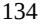

{134}------------------------------------------------

During the year ended December 31, 2021, investing activities provided \$128.6 million of cash, consisting of \$306.3 million from proceeds of maturities of short-term investments, offset by \$157.3 million of purchases of short-term investments and \$20.0 million related to the payment of a regulatory milestone incurred under the Regeneron Agreement.

During the year ended December 31, 2020, investing activities used \$23.4 million of cash, consisting of \$430.2 million of purchases of short-term investments and \$0.3 million of purchases of property and equipment, partially offset by \$407.1 million from proceeds of maturities of short-term investments.

## *Financing Activities*

During the years ended December 31, 2022 and 2021, net cash provided by financing activities was \$2.5 million and \$5.9 million, respectively, consisting of proceeds from the exercise of employee share options and our 2018 Employee Share Purchase Plan (the "2018 ESPP").

During the year ended December 31, 2020, net cash provided by financing activities was \$227.1 million, consisting of net proceeds of \$220.5 million in aggregate from our issuance and sale of Class A common shares in two follow-on public offerings, inclusive of the exercise of the underwriters' option to purchase additional Class A common shares, as applicable, and the concurrent issuances and sales of Class A1 common shares in two private placements, after the deduction of underwriting discounts and commissions, placement agent fees and other offering costs, and \$6.6 million of proceeds primarily from the exercise of share options and our 2018 ESPP.

## *Funding Requirements*

We expect to incur significant expenses in connection with our ongoing and planned activities as we continue to commercialize ARCALYST and advance our current and future product candidates through preclinical and clinical development, seek regulatory approval and commercialize one or more of our current or future product candidates, if approved. We may also incur expenses in connection with the in-licensing or acquisition of additional product candidates. As a result, we expect to incur additional expenses related to milestone, royalty and other payments payable to third parties with whom we have entered into license, acquisition and other similar agreements to acquire the rights to our product candidates. Additionally, we expect to continue to incur costs associated with operating as a public company, including significant legal, accounting, investor relations and other expenses. We expect to incur expenses as we:

- conduct our current and planned clinical trials for our current and future product candidates;
- increase clinical and commercial manufacturing capabilities or make arrangements with additional third party manufacturers to successfully manufacture our products and product candidates;
- develop and timely deliver clinical grade and commercial grade product formulations that can be used in our clinical trials and for commercial sale;
- seek regulatory approvals for any product candidates that successfully complete clinical trials;
- maintain, establish, and/or expand a sales, marketing, medical affairs and distribution infrastructure to commercialize ARCALYST or any of our current or future product candidates for which we may obtain marketing approval and intend to commercialize on our own;
- launch commercial sales of any of our current or future product candidates, if and when approved, whether alone or in collaboration with others;
- make milestone or other payments under any current or future license, acquisition, collaboration or other strategic transaction agreements;

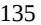

{135}------------------------------------------------

- expand our operational, financial and management systems and increase personnel globally to support our clinical development, manufacturing and commercialization efforts and our operations as a public company;
- maintain, expand and protect our intellectual property portfolio; and
- in-license or acquire other product candidates and technologies or their related businesses, if we determine to do so.

We believe that our existing cash, cash equivalents and short-term investments will enable us to fund our operating expenses and capital expenditure requirements for at least the next 12 months. The future viability of the Company is dependent on its ability to fund its operations through sales of ARCALYST and/or raise additional capital, such as through debt or equity offerings, as needed. We have based these estimates on assumptions that may prove to be wrong, and we could utilize our available capital resources sooner than we expect. We anticipate that we may require additional capital if we choose to pursue in-licenses or acquisitions of other product candidates and technologies or their related businesses. We expect to continue to incur significant expenses related to product manufacturing, sales, marketing and distribution of ARCALYST. In addition, if we obtain regulatory approval for any of our current or future product candidates, pursue additional indications for our products or any of our current or future product candidates, we expect to incur significant expenses related to product development and manufacturing, sales, marketing and distribution, depending on where we choose to commercialize.

Because of the numerous risks and uncertainties associated with research, development and commercialization of biologic products, we are unable to estimate the exact amount of our working capital requirements. Our future funding requirements may be impacted by a number of factors, including those described in Part I, Item 1A. "Risk Factors" in this Annual Report.

Until such time, if ever, as we can generate substantial and sustained product revenue, we expect to finance our cash needs through a combination of public or private equity offerings, debt financings, or other sources, including, licensing, collaboration, marketing, distribution or other strategic transactions or arrangements with third parties. To the extent that we raise additional capital through the sale of equity or convertible debt securities, our shareholders' ownership interest may be materially diluted, and the terms of such securities could include liquidation or other preferences that adversely affect our shareholders' rights as a common shareholder. Debt financing and preferred equity financing, if available, may involve agreements that include restrictive covenants that limit our ability to take specified actions, such as incurring additional debt, making capital expenditures or declaring dividends. In addition, debt financing would result in fixed payment obligations.

If we raise funds through licensing, collaboration, marketing, distribution or other strategic transactions or arrangements with third parties, we may have to relinquish valuable rights to our technologies, product candidates or future revenue streams, or otherwise agree to terms that may not be favorable to us. If we are unable to obtain funding, we could be forced to delay, reduce or eliminate some or all of our research and development programs for product candidates, product portfolio expansion or commercialization efforts, which could adversely affect our business prospects, or we may be unable to continue operations.

## **Critical Accounting Policies and Significant Judgments and Estimates**

Our consolidated financial statements are prepared in accordance with generally accepted accounting principles in the United States. The preparation of our consolidated financial statements and related disclosures requires us to make estimates and judgments that affect the reported amounts of assets, liabilities, revenue, costs and expenses, and the disclosure of contingent assets and liabilities in our financial statements. We base our estimates on historical experience, known trends and events and various other factors that we believe are reasonable under the circumstances, the results of which form the basis for making judgments about the carrying values of assets and liabilities that are not readily apparent from other sources. We evaluate our estimates and assumptions on an ongoing basis. Our actual results may differ from these estimates under different assumptions or conditions.

{136}------------------------------------------------

While our significant accounting policies are described in more detail in Note 2 to our consolidated financial statements included elsewhere in this Annual Report, we believe that the following accounting policies are those most critical to the judgments and estimates used in the preparation of our consolidated financial statements.

### *Revenue Recognition*

ASC 606 outlines a five-step process for recognizing revenue from contracts with customers: (i) identify the contract with the customer, (ii) identify the performance obligations in the contract, (iii) determine the transaction price, (iv) allocate the transaction price to the separate performance obligations in the contract, and (v) recognize revenue associated with the performance obligations as they are satisfied.

We only apply the five-step model to contracts when it is probable that we will collect the consideration we are entitled to in exchange for the goods or services we transfer to the customer. Once a contract is determined to be within the scope of ASC 606, we determine the performance obligations that are distinct. We recognize as revenues the amount of the transaction price that is allocated to each respective performance obligation when the performance obligation is satisfied or as it is satisfied. Generally, our performance obligations are transferred to customers at a point in time, typically upon receipt of the product by the customer.

ASC 606 requires entities to record a contract asset when a performance obligation has been satisfied or partially satisfied, but the amount of consideration has not yet been received because the receipt of the consideration is conditioned on something other than the passage of time. ASC 606 also requires an entity to present a revenue contract as a contract liability in instances when a customer pays consideration, or an entity has a right to an amount of consideration that is unconditional (e.g. receivable), before the entity transfers a good or service to the customer.

## *Product Revenue, Net*

Net revenue from product sales is recognized at the transaction price when the specialty pharmacy or specialty distributors obtains control of our products, which occurs at a point in time, typically upon shipment of the product from the third party logistics provider.

Our net revenues represent total revenues adjusted for discounts and allowances, including estimated cash discounts, chargebacks, rebates, returns, copay assistance, and specialty pharmacy and distributor fees. These adjustments represent variable consideration under ASC 606 and are estimated using the expected value method and are recorded when revenue is recognized on the sale of the product. These adjustments are established by us as our best estimate based on available information and will be adjusted to reflect known changes in the factors that impact such allowances. Adjustments for variable consideration are determined based on the contractual terms with customers, historical trends, communications with customers and the levels of inventory remaining in the distribution channel, as well as expectations about the market for the product and anticipated introduction of competitive products.

As of December 31, 2022, a 10% change in our product revenue allowance and reserve would not result in a material change in our net revenue.

## *Accrued Research and Development Expenses*

As part of the process of preparing our consolidated financial statements, we are required to estimate our accrued research and development expenses. This process involves reviewing open contracts and purchase orders, communicating with our personnel to identify services that have been performed on our behalf and estimating the level of service performed and the associated cost incurred for the service when we have not yet been invoiced or otherwise notified of actual costs. The majority of our service providers invoice us in arrears for services performed, on a pre-determined schedule or when contractual milestones are met; however, some require advanced payments. We make estimates of our accrued expenses as of each balance sheet date in the consolidated financial statements based on facts and circumstances known to us at that time. We periodically confirm the accuracy of these estimates with the service providers and make adjustments if necessary. Examples of estimated accrued research and development expenses include fees paid to:

{137}------------------------------------------------

- vendors, including research laboratories, in connection with preclinical development activities;
- CROs and investigative sites in connection with preclinical studies and clinical trials;
- third parties in the connection with the achievement of milestones due under license acquisition and other similar agreements; and
- CMOs in connection with drug substance and drug product formulation and manufacturing of materials.

We base our expenses related to preclinical studies and clinical trials on our estimates of the services received and efforts expended pursuant to quotes and contracts with multiple research institutions and CROs that conduct and manage preclinical studies and clinical trials on our behalf. The financial terms of these agreements are subject to negotiation, vary from contract to contract and may result in uneven payment flows. There may be instances in which payments made to our vendors will exceed the level of services provided and result in a prepayment of the expense. Payments under some of these contracts depend on factors such as the successful enrollment of participants and the completion of clinical trial milestones. Non-refundable prepayments determined to be used within one year for goods or services that will be used or rendered for future research and development activities are recorded as prepaid expenses. Non-refundable prepayments or minimum balance requirements associated to clinical trials determined to not be used within one year are classified as other long-term assets. In accruing service fees, we estimate the time period over which services will be performed and the level of effort to be expended in each period. If the actual timing of the performance of services or the level of effort varies from the estimate, we adjust the accrual or the amount of prepaid expenses accordingly. Although we do not expect our estimates to be materially different from amounts actually incurred, our understanding of the status and timing of services performed relative to the actual status and timing of services performed may vary and may result in reporting amounts that are too high or too low in any particular period. To date, there have not been any material adjustments to our prior estimates of accrued research and development expenses.

As of December 31, 2022, we have accrued \$8.4 million of estimated research and development expenses.

#### **Income Taxes**

We account for income taxes using the asset and liability method, which requires the recognition of deferred tax assets and liabilities for the expected future tax consequences of events that have been recognized in the consolidated financial statements or in our tax returns. Deferred tax assets and liabilities are determined based on the difference between the financial statement and tax basis of assets and liabilities using enacted tax rates in effect for the year in which the differences are expected to reverse. Changes in deferred tax assets and liabilities are recorded in the (provision) benefit for income taxes. We assess the likelihood that our deferred tax assets will be recovered from future taxable income and, to the extent we believe, based upon the weighting of both positive and negative evidence available, that it is more likely than not that all or a portion of the deferred tax assets will not be realized, a valuation allowance is established through a charge to income tax expense. Potential for recovery of deferred tax assets is evaluated by estimating the future taxable profits expected, cumulative recent earnings and considering prudent and feasible tax planning strategies. Significant judgment is required in assessing both positive and negative evidence available and, to the extent that a reversal of any portion of our valuation allowance against our deferred tax assets is deemed appropriate, a tax benefit will be recognized against our income tax provision in the period of such reversal.

We believe our estimates for the valuation allowances against certain deferred tax assets recognized in our financial statements are appropriate based upon our assessment of the factors mentioned above. We released a valuation allowance of \$185.5 million during the year-ended December 31, 2022.

### **Recently Issued Accounting Pronouncements**

A description of recently issued accounting pronouncements that may potentially impact our financial position and results of operations is disclosed in Note 2 to our annual consolidated financial statements included elsewhere in this Annual Report.

{138}------------------------------------------------

## **ITEM 7A. QUANTITATIVE AND QUALITATIVE DISCLOSURES ABOUT MARKET RISK.**

## *Interest Rate Risk*

We are exposed to market risk related to changes in interest rates. As of December 31, 2022, our cash, cash equivalents and short-term investments consisted of money market funds and U.S. Treasury notes. Our primary exposure to market risk is interest income sensitivity, which is affected by changes in the general level of U.S. interest rates, which increased substantially over the course of 2022. Further, events like the COVID-19 pandemic and global political turmoil, including the ongoing war in Ukraine, have adversely impacted the U.S. and global economy and financial markets, and may have a long-term effect on market interest rates. However, because of the short-term nature of the instruments in our portfolio, an immediate 10% change in market interest rates would not have a material impact on the fair market value of our investment portfolio or on our financial position or results of operations.

### **ITEM 8. FINANCIAL STATEMENTS AND SUPPLEMENTARY DATA.**

The financial statements required to be filed pursuant to this Item 8 are appended to this report. An index of those financial statements is found in Item 15.

## **ITEM 9. CHANGES IN AND DISAGREEMENTS WITH ACCOUNTANTS ON ACCOUNTING AND FINANCIAL DISCLOSURE.**

None.

## **ITEM 9A. CONTROLS AND PROCEDURES.**

## *Evaluation of Disclosure Controls and Procedures*

Our management, with the participation of our Chief Executive Officer and Chief Financial Officer, evaluated, as of the end of the period covered by this Annual Report, the effectiveness of our disclosure controls and procedures (as defined in Rules 13a-15(e) and 15d-15(e) under the Exchange Act. Based on that evaluation, our Chief Executive Officer and Chief Financial Officer concluded that our disclosure controls and procedures were effective at the reasonable assurance level as of December 31, 2022.

In designing and evaluating our disclosure controls and procedures (as defined in Rules 13a-15(e) and 15d-15(e) under the Exchange Act), management recognizes that any controls and procedures, no matter how well designed and operated, can provide only reasonable assurance of achieving the desired control objectives.

## *Management's Report on Internal Control over Financial Reporting for the Fiscal Year Ended December 31, 2022.*

Our management is responsible for establishing and maintaining adequate internal control over our financial reporting, as such term is defined in Rule 13a-15(f) under the Securities Exchange Act of 1934, as amended.

Our management conducted an assessment of the effectiveness of our internal control over financial reporting based on the criteria set forth in "Internal Control – Integrated Framework (2013)" issued by the Committee of Sponsoring Organizations of the Treadway Commission.

Based on this assessment, our management concluded that, as of December 31, 2022, our internal control over financial reporting was effective.

{139}------------------------------------------------

## *Changes in Internal Control over Financial Reporting*

There was no change in our internal control over financial reporting, (as defined in Rules 13a-15(f) and 15d-15(f) under the Exchange Act) during the fourth quarter of the year ended December 31, 2022 that has materially affected, or is reasonably likely to materially affect, our internal control over financial reporting.

## **ITEM 9B. OTHER INFORMATION.**

Not applicable.

## **ITEM 9C. DISCLOSURE REGARDING FOREIGN JURISDICTIONS THAT PREVENT INSPECTIONS.**

Not applicable.

{140}------------------------------------------------

## **PART III**

#### **ITEM 10. DIRECTORS, EXECUTIVE OFFICERS AND CORPORATE GOVERNANCE.**

Except to the extent provided below, the information required to be disclosed by this Item will be set forth in our proxy statement for our 2023 Annual Meeting to be filed with the SEC within 120 days of December 31, 2022, and is incorporated into this Annual Report by reference.

We have adopted a written code of business conduct and ethics that applies to all of our directors, officers and employees, including our principal executive officer, principal financial officer, principal accounting officer and controller, or persons performing similar functions. Our code of business conduct and ethics is available in the "Investors" section of our website at *www.kiniksa.com* under "Corporate Governance". We intend to post on our website all disclosures that are required by law or the Nasdaq rules concerning any amendments to, or waivers from, any provision of the code. The reference to our website address does not constitute incorporation by reference of the information contained at or available through our website, and you should not consider it to be a part of this Annual Report.

#### **ITEM 11. EXECUTIVE COMPENSATION.**

The information required to be disclosed by this Item will be set forth in our proxy statement for our 2023 Annual Meeting to be filed with the SEC within 120 days of December 31, 2022, and is incorporated into this Annual Report by reference.

## **ITEM 12. SECURITY OWNERSHIP OF CERTAIN BENEFICIAL OWNERS AND MANAGEMENT AND RELATED SHAREHOLDER MATTERS.**

The information required to be disclosed by this Item will be set forth in our proxy statement for our 2023 Annual Meeting to be filed with the SEC within 120 days of December 31, 2022, and is incorporated into this Annual Report by reference.

## **ITEM 13. CERTAIN RELATIONSHIPS AND RELATED TRANSACTIONS, AND DIRECTOR INDEPENDENCE.**

The information required to be disclosed by this Item will be set forth in our proxy statement for our 2023 Annual Meeting to be filed with the SEC within 120 days of December 31, 2022, and is incorporated into this Annual Report by reference.

## **ITEM 14. PRINCIPAL ACCOUNTING FEES AND SERVICES.**

The information required to be disclosed by this Item will be set forth in our proxy statement for our 2023 Annual Meeting to be filed with the SEC within 120 days of December 31, 2022, and is incorporated into this Annual Report by reference.

{141}------------------------------------------------

## **PART IV**

## **ITEM 15. EXHIBITS AND FINANCIAL STATEMENT SCHEDULES.**

(a)(1) Financial Statements.

See the "Index to Consolidated Financial Statements" on page F-1 below for the list of financial statements filed as part of this report.

(a)(2) Financial Statement Schedules.

All schedules have been omitted because they are not required or because the required information is given in the Consolidated Financial Statements or Notes thereto set forth below beginning on page F-1.

(a)(3) Exhibits. See Exhibit Index.

{142}------------------------------------------------

## EXHIBIT INDEX

|                   |                                                                                                                                                                                                    | Incorporated by Reference |            |         |                |                                 |  |
|-------------------|----------------------------------------------------------------------------------------------------------------------------------------------------------------------------------------------------|---------------------------|------------|---------|----------------|---------------------------------|--|
| Exhibit Number | Exhibit Description                                                                                                                                                                                | Form                      | File No.   | Exhibit | Filing Date | Filed/ Furnished Herewith |  |
| 3.1               | Memorandum of Association of Kiniksa Pharmaceuticals, Ltd.                                                                                                                                      | S-1                       | 333-224488 | 3.1     | 4/27/18        |                                 |  |
| 3.2               | Amended and Restated Bye-Laws of Kiniksa Pharmaceuticals, Ltd.                                                                                                                                  | 8-K                       | 001-38492  | 3.1     | 5/29/18        |                                 |  |
| 4.1               | Specimen Share Certificate evidencing the Class A common shares                                                                                                                                 | S 1/A                  | 333-224488 | 4.1     | 5/14/18        |                                 |  |
| 4.2               | Second Amended and Restated Investors' Rights Agreement, dated as of February 9, 2018                                                                                                           | S-1                       | 333-224488 | 4.2     | 4/27/18        |                                 |  |
| 4.3               | Description of Kiniksa Pharmaceuticals, Ltd. Securities                                                                                                                                            | 10-K                      | 001-38492  | 4.3     | 3/5/20         |                                 |  |
| 10.1†             | Asset Purchase Agreement, dated September 7, 2016, by and between the Registrant and Biogen MA Inc., as amended                                                                              | S-1                       | 333-224488 | 10.6    | 4/27/18        |                                 |  |
| 10.2††            | Amendment No. 2, dated August 2, 2022, to the Asset Purchase Agreement, dated September 7, 2016, by and between the Registrant and Biogen MA Inc.                                            | 10-Q                      | 001-38492  | 10.2    | 11/3/22        |                                 |  |
| 10.3†             | License Agreement, dated September 25, 2017, by and between the Registrant and Regeneron Pharmaceuticals, Inc.                                                                               | S-1                       | 333-224488 | 10.7    | 4/27/18        |                                 |  |
| 10.4††            | Amendments Nos. 1 and 2 to the License Agreement, dated September 25, 2017, by and between Kiniksa Pharmaceuticals Ltd. and Regeneron Pharmaceuticals, Inc.                                  | 10-Q                      | 001-38492  | 10.2    | 5/6/21         |                                 |  |
| 10.5†             | License Agreement, dated as of December 21, 2017, by and between the Registrant and MedImmune, Limited                                                                                          | S-1                       | 333-224488 | 10.8    | 4/27/18        |                                 |  |
| 10.6†             | Amendment No. 1 to the License Agreement, effective as of July 9, 2020, by and between Kiniksa Pharmaceuticals, Ltd. and MedImmune Limited                                                   | 8-K                       | 001-38492  | 10.1    | 7/15/20        |                                 |  |
| 10.7††            | Exclusive License Agreement, dated as of November 1, 2013, by and between The Beth Israel Deaconess Medical Center and Primatope Therapeutics Inc.                                           | 10-K                      | 001-38492  | 10.38   | 2/24/22        |                                 |  |
| 10.8††+           | Collaboration and License Agreement (Rilonacept), by and between Kiniksa Pharmaceuticals (UK), Ltd. and Hangzhou Zhongmei Huadong Pharmaceutical Co., Ltd., dated as of February 21, 2022 | 10-Q                      | 001-38492  | 10.2    | 5/5/22         |                                 |  |

{143}------------------------------------------------

| 10.9††+  | Collaboration and License Agreement (Mavrilimumab), by and between Kiniksa Pharmaceuticals (UK), Ltd. and Hangzhou Zhongmei Huadong Pharmaceutical Co., Ltd., dated as of February 21, 2022       |     | 10-Q 001-38492   | 10.3  | 5/5/22   |
|----------|------------------------------------------------------------------------------------------------------------------------------------------------------------------------------------------------------------|-----|------------------|-------|----------|
| 10.10††+ | License Agreement, dated August 2, 2022, by and among Kiniksa Pharmaceuticals (UK), Ltd., Genentech, Inc. and F. Hoffmann-La Roche Ltd.                                                              |     | 10-Q 001-38492   | 10.1  | 11/3/22  |
| 10.11††  | Commercial Supply Agreement, dated February 26, 2021, by and between Kiniksa Pharmaceuticals (UK) Ltd. and Regeneron Pharmaceuticals, Inc.                                                           |     | 10-Q 001-38492   | 10.1  | 5/6/21   |
| 10.12    | Clinical Supply Agreement, dated as of September 27, 2017, by and between the Registrant and Regeneron Pharmaceuticals, Inc.                                                                         | S-1 | 333-224488       | 10.9  | 4/27/18  |
| 10.13    | Sublease Agreement, dated as of March 13, 2018, by and between Kiniksa Pharmaceuticals Corp. and Shire Human Genetic Therapies, Inc.                                                                 | S-1 | 333-224488 10.10 |       | 4/27/18  |
| 10.14    | First and Second Amendment to Sublease Agreement, dated as of June 26, 2018 and July 17, 2018, respectively, by and between Kiniksa Pharmaceuticals Corp. and Shire Human Genetic Therapies, Inc. |     | 10-Q 001-38492   | 10.10 | 8/6/18   |
| 10.15    | Third Amendment to Sublease Agreement, dated as of November 7, 2018, by and between Kiniksa Pharmaceuticals Corp. and Shire Human Genetic Therapies, Inc.                                         | 8-K | 001-38492        | 10.1  | 11/13/18 |
| 10.16    | Recognition and Attornment Agreement and Amendment of Sublease by and between Kiniksa Pharmaceuticals Corp. and 92 Hayden Avenue Trust dated as of November 6, 2020                               | 8-K | 001-38492        | 10.1  | 11/10/20 |
| 10.17    | Fifth Amendment of Sublease, dated July 27, 2022, by and between Kiniksa Pharmaceuticals Corp. and 92 Hayden Avenue Trust                                                                            |     | 10-Q 001-38492   | 10.3  | 11/3/22  |
| 10.18#   | Amended and Restated Employment Agreement, dated as of May 29, 2018, by and between Kiniksa Pharmaceuticals Corp. and Sanj K. Patel                                                                  |     | 10-Q 001-38492   | 10.7  | 8/6/18   |
| 10.19#   | Amended and Restated Employment Agreement, dated as of May 29, 2018, by and between Kiniksa Pharmaceuticals Corp. and John F. Paolini                                                                |     | 10-Q 001-38492   | 10.9  | 8/6/18   |
| 10.20#   | Employment Agreement, effective as of April 1, 2021, by and between the Company and Mark Ragosa                                                                                                         |     | 10-Q 001-38492   | 10.3  | 5/6/21   |
| 10.21#   | Amended and Restated Employment Agreement, effective as of January 3, 2022, by and between Eben Tessari and Kiniksa Pharmaceuticals Corp.                                                            | 8-K | 001-38492        | 10.1  | 1/3/22   |
| 10.22#   | Change in Control Agreement, effective as of January 3, 2022, by and between Michael Megna and Kiniksa Pharmaceuticals Corp.                                                                         |     | 10-K 001-38492   | 10.33 | 2/24/22  |

{144}------------------------------------------------

| 10.23+# | Amended and Restated Employment Agreement, effective as of February 1, 2022, by and between Ross Moat and Kiniksa Pharmaceuticals (UK), Ltd.                                                                                                                                                       |     | 10-K 001-38492       | 10.34 | 2/24/22  |
|---------|----------------------------------------------------------------------------------------------------------------------------------------------------------------------------------------------------------------------------------------------------------------------------------------------------------|-----|----------------------|-------|----------|
| 10.24+# | Letter Agreement, dated as of February 1, 2022, by and between Ross Moat and Kiniksa Pharmaceuticals, Ltd.                                                                                                                                                                                            |     | 10-K 001-38492       | 10.35 | 2/24/22  |
| 10.25#  | Employment Agreement, effective as of April 1, 2021, by and between Arian Pano and Kiniksa Pharmaceuticals Corp.                                                                                                                                                                                   |     | 10-K 001-38492       | 10.36 | 2/24/22  |
| 10.26+# | Separation Agreement, effective as of February 3, 2022, by and between Arian Pano and Kiniksa Pharmaceuticals Corp.                                                                                                                                                                                |     | 10-K 001-38492       | 10.37 | 2/24/22  |
| 10.27   | Form of Indemnification Agreement for Non Fund Designated Directors                                                                                                                                                                                                                                   | S-1 | 333-224488 10.11     |       | 4/27/18  |
| 10.28   | Form of Indemnification Agreement for Fund Designated Directors                                                                                                                                                                                                                                       | S-1 | 333-224488 10.12     |       | 4/27/18  |
| 10.29   | Form of Indemnification Agreement for Officers                                                                                                                                                                                                                                                           | S-1 | 333-224488 10.13     |       | 4/27/18  |
| 10.30#  | 2015 Equity Incentive Plan, as amended, and form of share option grant notice and option agreement thereunder                                                                                                                                                                                         | S-1 | 333-224488           | 10.1  | 4/27/18  |
| 10.31#  | 2018 Incentive Award Plan, and the form of share option grant notice and option agreement, form of restricted share grant notice and restricted share agreement, and form of restricted share unit grant notice and restricted share unit agreement thereunder                               |     | 10-Q 001-38492       | 10.3  | 5/4/20   |
| 10.32#  | 2018 Incentive Award Plan; Sub Plan for UK Employees, and the form of share option grant notice for UK participants                                                                                                                                                                                | S 1 | 333-229394 10.23     |       | 1/28/19  |
| 10.33#  | Form of Restricted Share Unit Grant Notice and Restricted Share Unit Agreement Thereunder for UK Participants under the 2018 Incentive Award plan; Sub-Plan for UK Employees                                                                                                                    | S-8 | 333-237589           | 99.3  | 4/7/20   |
| 10.34#  | 2018 Incentive Award Plan forms of share option grant notice and share option agreement for German participants, restricted share grant notice and restricted share agreement for German participants, and restricted share unit grant notice and restricted share unit agreement for German |     |                      |       |          |
|         | participants                                                                                                                                                                                                                                                                                             |     | 10-K 001-38492       | 10.27 | 3/12/19  |
| 10.35#  | 2018 Employee Share Purchase Plan                                                                                                                                                                                                                                                                        | S   | 1/A 333-224488 10.14 |       | 5/14/18  |
| 10.36#  | Offering Document under the 2018 Employee Share Purchase Plan (effective July 1, 2019)                                                                                                                                                                                                                |     | 10-K 001-38492       | 10.22 | 2/25/21  |
| 10.37#  | Offering Document under the 2018 Employee Share Purchase Plan (effective January 1, 2021)                                                                                                                                                                                                             |     | 10-K 001-38492       | 10.23 | 2/25/21  |
| 10.38†# | Kiniksa Pharmaceuticals, Ltd. Rilonacept Long-Term Incentive Plan                                                                                                                                                                                                                                     | 8-K | 001-38492            | 10.1  | 12/16/19 |
| 10.39#  | Form of U.S. Performance Restricted Share Unit and Performance Cash Award Grant Notice and Agreement under the Rilonacept Long-Term Incentive Plan                                                                                                                                                 | 8-K | 001-38492            | 10.2  | 12/16/19 |

{145}------------------------------------------------

| 10.40#  | Form of U.S. Restricted Share Unit Grant Notice and Agreement under the Rilonacept Long-Term Incentive Plan                                                                                                                                                                                                                                                          | 8-K | 001-38492      | 10.3  | 12/16/19 |     |
|---------|----------------------------------------------------------------------------------------------------------------------------------------------------------------------------------------------------------------------------------------------------------------------------------------------------------------------------------------------------------------------------|-----|----------------|-------|----------|-----|
| 10.41#  | Forms of Performance Restricted Share Unit and Performance Cash Award Grant Notice and Performance Restricted Share Unit and Performance Cash Award Agreement thereunder and Restricted Share Unit Grant Notice and Restricted Share Unit Agreement thereunder for UK participants and German participants under the Rilonacept Long-Term Incentive Plan | S-8 | 333-237589     | 99.8  | 4/7/20   |     |
| 10.42#  | Non-Employee Director Compensation Program                                                                                                                                                                                                                                                                                                                                 |     | 10-Q 001-38492 | 10.1  | 5/5/22   |     |
| 10.43#  | Restricted Share Agreement, dated as of September 16, 2015, by and between the Registrant and Sanj K. Patel                                                                                                                                                                                                                                                             | S-1 | 333-229394     | 10.25 | 1/28/19  |     |
| 21.1    | Subsidiaries of the Registrant                                                                                                                                                                                                                                                                                                                                             |     | 10-K 001-38492 | 21.1  | 2/25/21  |     |
| 23.1    | Consent of PricewaterhouseCoopers LLP, independent registered public accounting firm                                                                                                                                                                                                                                                                                    |     |                |       |          | *   |
| 31.1    | Rule 13a-14(a) / 15d-14(a) Certification of Chief Executive Officer                                                                                                                                                                                                                                                                                                     |     |                |       |          | *   |
| 31.2    | Rule 13a-14(a) / 15d-14(a) Certification of Chief Financial Officer                                                                                                                                                                                                                                                                                                     |     |                |       |          | *   |
| 32.1    | Section 1350 Certification of Chief Executive Officer                                                                                                                                                                                                                                                                                                                      |     |                |       |          | **  |
| 32.2    | Section 1350 Certification of Chief Financial Officer                                                                                                                                                                                                                                                                                                                      |     |                |       |          | **  |
| 101.INS | Inline XBRL Instance Document                                                                                                                                                                                                                                                                                                                                              |     |                |       |          | *** |
| 101.SCH | Inline XBRL Taxonomy Extension Schema Document                                                                                                                                                                                                                                                                                                                             |     |                |       |          | *** |
| 101.CAL | Inline XBRL Taxonomy Extension Calculation Linkbase Document                                                                                                                                                                                                                                                                                                            |     |                |       |          | *** |
| 101.DEF | Inline XBRL Extension Definition Linkbase Document                                                                                                                                                                                                                                                                                                                         |     |                |       |          | *** |
| 101.LAB | Inline XBRL Taxonomy Label Linkbase Document                                                                                                                                                                                                                                                                                                                               |     |                |       |          | *** |
| 101.PRE | Inline XBRL Taxonomy Extension Presentation Linkbase Document                                                                                                                                                                                                                                                                                                           |     |                |       |          | *** |
| 104     | Cover Page Interactive Data File (formatted as Inline XBRL and contained in Exhibit 101).                                                                                                                                                                                                                                                                               |     |                |       |          |     |

* Filed herewith

** Furnished herewith

*** Submitted electronically herewith

# Indicates management contract or compensatory plan

† Confidential treatments of certain provisions has been granted by the SEC pursuant to Rule 406 under the Securities Act of 1933, as amended

†† Portions of the exhibit have been redacted in compliance with Regulation S-K Item 601(b)(10)(iv)

+ Portions of the exhibit have been redacted in compliance with Regulation S-K Item 601(a)(6)

{146}------------------------------------------------

## **ITEM 16. FORM 10-K SUMMARY**

None.

{147}------------------------------------------------

## **SIGNATURES**

Pursuant to the requirements of Section 13 or 15(d) of the Securities Exchange Act of 1934, the registrant has duly caused this report to be signed on its behalf by the undersigned, thereunto duly authorized.

## **KINIKSA PHARMACEUTICALS, LTD.**

Date: March 2, 2023 By:/s/ Sanj K. Patel Sanj K. Patel Chief Executive Officer and Chairman of the Board of Directors

Pursuant to the requirements of the Securities Exchange Act of 1934, this report has been signed below by the following persons on behalf of the registrant and in the capacities and on the dates indicated.

| Signature                                        | Title                                                                                              | Date          |  |  |  |
|--------------------------------------------------|----------------------------------------------------------------------------------------------------|---------------|--|--|--|
| /s/ Sanj K. Patel Sanj K. Patel               | Chief Executive Officer and Chairman of the Board of Directors (principal executive officer) | March 2, 2023 |  |  |  |
| /s/ Mark Ragosa Mark Ragosa                   | Chief Financial Officer (principal financial officer)                                           | March 2, 2023 |  |  |  |
| /s/ Michael R. Megna Michael R. Megna         | Group VP, Finance and Chief Accounting Officer (principal accounting officer)                   | March 2, 2023 |  |  |  |
| /s/ Felix J. Baker Felix J. Baker             | Lead Independent Director                                                                          | March 2, 2023 |  |  |  |
| /s/ Stephen R. Biggar Stephen R. Biggar       | Director                                                                                           | March 2, 2023 |  |  |  |
| /s/ G. Bradley Cole G. Bradley Cole           | Director                                                                                           | March 2, 2023 |  |  |  |
| /s/ Richard S. Levy Richard S. Levy           | Director                                                                                           | March 2, 2023 |  |  |  |
| /s/ Thomas R. Malley Thomas R. Malley         | Director                                                                                           | March 2, 2023 |  |  |  |
| /s/ Tracey L. McCain Tracey L. McCain         | Director                                                                                           | March 2, 2023 |  |  |  |
| /s/ Kimberly J. Popovits Kimberly J. Popovits | Director                                                                                           | March 2, 2023 |  |  |  |
| /s/ Barry D. Quart Barry D. Quart             | Director                                                                                           | March 2, 2023 |  |  |  |

{148}------------------------------------------------

## **INDEX TO CONSOLIDATED FINANCIAL STATEMENTS**

|                                                                        | Page |
|------------------------------------------------------------------------|------|
| Report of Independent Registered Public Accounting Firm (PCAOB ID 238) | F-2  |
| Consolidated Balance Sheets                                            | F-5  |
| Consolidated Statements of Operations and Comprehensive Income (Loss)  | F-6  |
| Consolidated Statements of Shareholders' Equity                        | F-7  |
| Consolidated Statements of Cash Flows                                  | F-8  |
| Notes to Consolidated Financial Statements                             | F-9  |

{149}------------------------------------------------

# **Report of Independent Registered Public Accounting Firm**

To the Board of Directors and Shareholders of Kiniksa Pharmaceuticals, Ltd.

## *Opinion on the Financial Statements*

We have audited the accompanying consolidated balance sheets of Kiniksa Pharmaceuticals, Ltd. and its subsidiaries (the "Company") as of December 31, 2022 and 2021, and the related consolidated statements of operations and comprehensive income (loss), of shareholders' equity and of cash flows for each of the three years in the period ended December 31, 2022, including the related notes (collectively referred to as the "consolidated financial statements"). In our opinion, the consolidated financial statements present fairly, in all material respects, the financial position of the Company as of December 31, 2022 and 2021, and the results of its operations and its cash flows for each of the three years in the period ended December 31, 2022 in conformity with accounting principles generally accepted in the United States of America.

## *Basis for Opinion*

These consolidated financial statements are the responsibility of the Company's management. Our responsibility is to express an opinion on the Company's consolidated financial statements based on our audits. We are a public accounting firm registered with the Public Company Accounting Oversight Board (United States) (PCAOB) and are required to be independent with respect to the Company in accordance with the U.S. federal securities laws and the applicable rules and regulations of the Securities and Exchange Commission and the PCAOB.

We conducted our audits of these consolidated financial statements in accordance with the standards of the PCAOB. Those standards require that we plan and perform the audit to obtain reasonable assurance about whether the consolidated financial statements are free of material misstatement, whether due to error or fraud. The Company is not required to have, nor were we engaged to perform, an audit of its internal control over financial reporting. As part of our audits we are required to obtain an understanding of internal control over financial reporting but not for the purpose of expressing an opinion on the effectiveness of the Company's internal control over financial reporting. Accordingly, we express no such opinion.

Our audits included performing procedures to assess the risks of material misstatement of the consolidated financial statements, whether due to error or fraud, and performing procedures that respond to those risks. Such procedures included examining, on a test basis, evidence regarding the amounts and disclosures in the consolidated financial statements. Our audits also included evaluating the accounting principles used and significant estimates made by management, as well as evaluating the overall presentation of the consolidated financial statements. We believe that our audits provide a reasonable basis for our opinion.

### *Critical Audit Matters*

The critical audit matters communicated below are matters arising from the current period audit of the consolidated financial statements that were communicated or required to be communicated to the audit committee and that (i) relate to accounts or disclosures that are material to the consolidated financial statements and (ii) involved our especially challenging, subjective, or complex judgments. The communication of critical audit matters does not alter in any way our opinion on the consolidated financial statements, taken as a whole, and we are not, by communicating the critical audit matters below, providing separate opinions on the critical audit matters or on the accounts or disclosures to which they relate.

{150}------------------------------------------------

## *Realizability of UK Deferred Tax Assets*

As described in Notes 2 and 14 to the consolidated financial statements, the Company recognized an income tax benefit of \$185.5 million for the year ended December 31, 2022 due to the release of the valuation allowance on the UK deferred tax assets. These UK deferred tax assets were recorded as a result of the difference between the consolidated financial statement and tax basis of intangible assets transferred by the Company to Kiniksa UK, using enacted tax rates in effect for the year in which the differences are expected to reverse. As disclosed by management, significant judgment is required in assessing both positive and negative evidence available in determining whether it is more likely than not that the UK deferred tax assets will be realized in the future. In determining the need for a valuation allowance, management considered the weighting of the positive and negative evidence, which included, among other things, cumulative UK income in recent years, estimates of sales related to the Company's commercial product ARCALYST, and future profitability by jurisdiction.

The principal considerations for our determination that performing procedures relating to the realizability of UK deferred tax assets is a critical audit matter are (i) the significant judgment by management when determining whether it was more likely than not that the Company's UK deferred tax assets would be realized in the future and (ii) a high degree of auditor judgment, subjectivity, and effort in performing procedures and evaluating audit evidence available to support the weighting of the positive and negative evidence used in management's determination.

Addressing the matter involved performing procedures and evaluating audit evidence in connection with forming our overall opinion on the consolidated financial statements. These procedures included, among others (i) testing management's process for determining whether it was more likely than not that the Company's UK deferred tax assets would be realized in the future; (ii) evaluating the appropriateness of the methodology used by management in weighting of available positive and negative evidence; (iii) evaluating the reasonableness of management's estimates of sales related to ARCALYST and future profitability by considering (a) the current and past performance of the business; (b) consistency with external market and industry data; and (c) whether these assumptions were consistent with evidence obtained in other areas of the audit; (iv) testing the completeness and accuracy of certain of the data used in management's assessment of whether it was more likely than not that the Company's UK deferred tax assets would be realized in the future; and (v) testing the completeness and accuracy of the income tax benefit recognized due to the release of the valuation allowance on the UK deferred tax assets.

### *Accrued Research and Development Costs*

As described in Notes 2 and 9 to the consolidated financial statements, the Company has entered into various research and development-related contracts with companies both inside and outside of the United States. When billing terms under these contracts do not coincide with the timing of when the work is performed, management is required to make estimates of outstanding obligations to those third parties as of the end of the reporting period. Within accrued expenses, total accrued research and development expenses amounted to \$8.4 million as of December 31, 2022, which include accruals for these estimated research and development obligations. Accrual estimates are based on a number of factors, including management's assessment of progress towards completion of the research and development activities, invoicing to date under the contracts, communication from the research institution or other companies of any actual costs incurred during the period that have not yet been invoiced, and the costs included in the contracts. Significant judgments and estimates are made in determining the accrued balances at the end of any reporting period.

{151}------------------------------------------------

The principal considerations for our determination that performing procedures relating to accrued research and development costs is a critical audit matter are (i) the significant judgment by management in estimating the accrued research and development costs and (ii) a high degree of auditor judgment, subjectivity, and effort in performing procedures and evaluating audit evidence for these accrued costs and the factors related to management's assessment of progress towards completion of the research and development activities, invoicing to date under the contracts and communication from the research institution or other companies of any actual costs incurred during the period that have not yet been invoiced.

Addressing the matter involved performing procedures and evaluating audit evidence in connection with forming our overall opinion on the consolidated financial statements. These procedures included, among others (i) testing management's process for estimating accrued research and development costs; (ii) evaluating the appropriateness of the methodology used by management to determine the estimate; (iii) evaluating the reasonableness of the factors related to management's assessment of progress towards completion of the research and development activities, invoicing to date under the contracts and communication from the research institution or other companies of any actual costs incurred during the period that have not yet been invoiced by testing, on a sample basis, specific tasks and the associated cost incurred for services the Company has not yet been invoiced for or otherwise notified of the actual cost at period end; and (iv) testing the completeness and accuracy of the data inputs to the estimate, including total costs included within executed contracts and actual billed expenses under these contracts.

/s/PricewaterhouseCoopers LLP Boston, Massachusetts March 2, 2023

We have served as the Company's auditor since 2016.

{152}------------------------------------------------

# **KINIKSA PHARMACEUTICALS, LTD. CONSOLIDATED BALANCE SHEETS (In thousands, except share and per share amounts)**

|                                                                                      | December 31, 2022 |           | December 31, 2021 |
|--------------------------------------------------------------------------------------|----------------------|-----------|----------------------|
| Assets                                                                               |                      |           |                      |
| Current assets:                                                                      |                      |           |                      |
| Cash and cash equivalents                                                            | \$                   | 122,715   | \$ 122,470        |
| Short-term investments                                                               |                      | 67,893    | 59,731               |
| Accounts receivable, net                                                             |                      | 12,660    | 3,985                |
| Contract asset                                                                       |                      | 7,656     | —                    |
| Inventory                                                                            |                      | 21,599    | 3,675                |
| Prepaid expenses and other current assets                                            |                      | 10,537    | 6,585                |
| Total current assets                                                                 |                      | 243,060   | 196,446              |
| Property and equipment, net                                                          |                      | 1,658     | 2,834                |
| Operating lease right-of-use assets                                                  |                      | 5,385     | 5,550                |
| Other long-term assets                                                               |                      | 5,824     | 8,720                |
| Intangible asset, net                                                                |                      | 18,250    | 19,250               |
| Deferred tax assets                                                                  |                      | 185,495   | —                    |
| Total assets                                                                         | \$                   | 459,672   | \$ 232,800        |
|                                                                                      |                      |           |                      |
| Liabilities and Shareholders' Equity                                                 |                      |           |                      |
| Current liabilities:                                                                 |                      |           |                      |
| Accounts payable                                                                     | \$                   | 7,899     | \$ 1,868          |
| Accrued expenses                                                                     |                      | 30,112    | 38,031               |
| Operating lease liabilities                                                          |                      | 3,301     | 3,381                |
| Other current liabilities                                                            |                      | 5,754     | 1,544                |
| Total current liabilities                                                            |                      | 47,066    | 44,824               |
| Non-current liabilities:                                                             |                      |           |                      |
| Non-current deferred revenue                                                         |                      | 12,000    | —                    |
| Non-current operating lease liabilities                                              |                      | 2,618     | 2,669                |
| Other long-term liabilities                                                          |                      | 1,839     | 270                  |
| Total liabilities                                                                    |                      | 63,523    | 47,763               |
| Commitments and contingencies (Note 16)                                              |                      |           |                      |
| Shareholders' equity:                                                                |                      |           |                      |
| Class A common shares, par value of \$0.000273235 per share; 34,750,560 shares and   |                      |           |                      |
| 34,059,725 shares issued and outstanding as of December 31, 2022 and 2021,           |                      |           |                      |
| respectively                                                                         |                      | 9         | 8                    |
| Class B common shares, par value of \$0.000273235 per share; 1,813,457 shares issued |                      |           |                      |
| and outstanding as of December 31, 2022 and 2021                                     |                      | 1         | 1                    |
| Class A1 common shares, \$0.000273235 par value; 17,075,868 shares and 17,129,603    |                      |           |                      |
| issued and outstanding as of December 31, 2022 and 2021, respectively                |                      | 5         | 5                    |
| Class B1 common shares, \$0.000273235 par value; 16,057,618 shares issued and        |                      |           |                      |
| outstanding as of December 31, 2022 and 2021                                         |                      | 4         | 4                    |
| Additional paid-in capital                                                           |                      | 888,120   | 860,482              |
| Accumulated other comprehensive income (loss)                                        |                      | 44        | (66)                 |
| Accumulated deficit                                                                  |                      | (492,034) | (675,397)            |
| Total shareholders' equity                                                           |                      | 396,149   | 185,037              |
| Total liabilities and shareholders' equity                                           | \$                   | 459,672   | \$ 232,800        |

The accompanying notes are an integral part of these consolidated financial statements.

{153}------------------------------------------------

# **KINIKSA PHARMACEUTICALS, LTD. CONSOLIDATED STATEMENTS OF OPERATIONS AND COMPREHENSIVE INCOME (LOSS) (In thousands, except share and per share amounts)**

|                                                                           | Years Ended December 31, |            |            |            |            |            |
|---------------------------------------------------------------------------|-----------------------------|------------|------------|------------|------------|------------|
|                                                                           | 2022                        |            |            | 2021       |            | 2020       |
| Revenue:                                                                  |                             |            |            |            |            |            |
| Product revenue, net                                                      | \$                          | 122,524    | \$         | 38,544     | \$         | —          |
| License and collaboration revenue                                         |                             | 97,656     |            | —          |            | —          |
| Total revenue                                                             |                             | 220,180    |            | 38,544     |            | —          |
| Operating expenses:                                                       |                             |            |            |            |            |            |
| Cost of goods sold                                                        |                             | 22,895     |            | 9,100      |            | —          |
| Collaboration expenses                                                    |                             | 24,071     |            | 835        |            | —          |
| Research and development                                                  |                             | 65,490     |            | 99,297     |            | 112,042    |
| Selling, general and administrative                                       |                             | 97,951     |            | 85,948     |            | 45,321     |
| Total operating expenses                                                  |                             | 210,407    |            | 195,180    |            | 157,363    |
| Income (loss) from operations                                             |                             | 9,773      |            | (156,636)  |            | (157,363)  |
| Other income                                                              |                             | 1,253      |            | 97         |            | 1,134      |
| Income (loss) before income taxes                                         |                             | 11,026     |            | (156,539)  |            | (156,229)  |
| Benefit (provision) for income taxes                                      |                             | 172,337    |            | (1,385)    |            | (5,152)    |
| Net income (loss)                                                         | \$                          | 183,363    | \$         | (157,924)  | \$         | (161,381)  |
| Net income (loss) per share attributable to common shareholders— basic | \$                          | 2.64       | \$         | (2.30)     | \$         | (2.61)     |
| Net income (loss) per share attributable to common shareholders—          |                             |            |            |            |            |            |
| diluted                                                                   | \$                          | 2.60       | \$         | (2.30)     | \$         | (2.61)     |
| Weighted average common shares outstanding—basic                          |                             | 69,382,275 | 68,576,810 |            | 61,842,722 |            |
| Weighted average common shares outstanding—diluted                        |                             | 70,421,322 |            | 68,576,810 |            | 61,842,722 |
| Comprehensive income (loss):                                              |                             |            |            |            |            |            |
| Net income (loss)                                                         | \$                          | 183,363    | \$         | (157,924)  | \$         | (161,381)  |
| Other comprehensive income (loss):                                        |                             |            |            |            |            |            |
| Unrealized gain (loss) on short-term investments and currency             |                             |            |            |            |            |            |
| translation adjustments, net of tax                                       |                             | 110        |            | (32)       |            | (67)       |
| Total other comprehensive income (loss)                                   |                             | 110        |            | (32)       |            | (67)       |
| Total comprehensive income (loss)                                         | \$                          | 183,473    | \$         | (157,956)  | \$         | (161,448)  |

The accompanying notes are an integral part of these consolidated financial statements.

{154}------------------------------------------------

# **KINIKSA PHARMACEUTICALS, LTD. CONSOLIDATED STATEMENTS OF SHAREHOLDERS' EQUITY (In thousands, except share amounts)**

|                                                                                        | Common Shares (Class A, B, A1 and B1) |    | Additional   |         | Accumulated        |                           |    |                         | Total |                   |  |
|----------------------------------------------------------------------------------------|------------------------------------------|----|--------------|---------|--------------------|---------------------------|----|-------------------------|-------|-------------------|--|
|                                                                                        |                                          |    |              | Paid-In |                    | Other Comprehensive       |    | Accumulated             |       | Shareholders'     |  |
| Balances at December 31, 2019                                                          | Shares 54,937,628                     | \$ | Amount 15 | \$      | Capital 581,467 | Income (Loss) \$ 33 | \$ | Deficit (356,092) \$ |       | Equity 225,423 |  |
| Issuance of Class A common shares upon completion of follow-on offerings, inclusive    |                                          |    |              |         |                    |                           |    |                         |       |                   |  |
| of the over-allotment option exercise, net of underwriting discounts and commissions   |                                          |    |              |         |                    |                           |    |                         |       |                   |  |
| and other offering costs                                                               | 8,712,381                                |    | 2            |         | 164,586            | —                         |    | —                       |       | 164,588           |  |
| Issuance of Class A1 common shares upon completion of private placements, net of       |                                          |    |              |         |                    |                           |    |                         |       |                   |  |
| placement agent fees                                                                   | 3,028,572                                |    | 1            |         | 55,944             | —                         |    | —                       |       | 55,945            |  |
| Issuance of Class A common shares in connection with the release of escrow from the    |                                          |    |              |         |                    |                           |    |                         |       |                   |  |
| acquisition of all issued and outstanding equity securities of Primatope Therapeutics, |                                          |    |              |         |                    |                           |    |                         |       |                   |  |
| Inc.                                                                                   | 76,103                                   |    | —            |         | —                  | —                         |    | —                       |       | —                 |  |
| Issuance of Class A common shares under incentive award plans and employee share       |                                          |    |              |         |                    |                           |    |                         |       |                   |  |
| purchase plan                                                                          | 1,460,338                                |    | —            |         | 6,552              | —                         |    | —                       |       | 6,552             |  |
| Share-based compensation expense                                                       | —                                        |    | —            |         | 20,875             | —                         |    | —                       |       | 20,875            |  |
| Unrealized loss on short-term investments and currency translation adjustments         | —                                        |    | —            |         | —                  | (67)                      |    | —                       |       | (67)              |  |
| Net loss                                                                               | —                                        |    | —            |         | —                  | —                         |    | (161,381)               |       | (161,381)         |  |
| Balances at December 31, 2020                                                          | 68,215,022                               | \$ | 18           | \$      | 829,424            | \$ (34) \$             |    | (517,473) \$            |       | 311,935           |  |
| Issuance of Class A common shares under incentive award plans and employee share       |                                          |    |              |         |                    |                           |    |                         |       |                   |  |
| purchase plan                                                                          | 845,381                                  |    | —            |         | 5,885              | —                         |    | —                       |       | 5,885             |  |
| Share-based compensation expense                                                       | —                                        |    | —            |         | 25,173             | —                         |    | —                       |       | 25,173            |  |
| Unrealized loss on short-term investments and currency translation adjustments         | —                                        |    | —            |         | —                  | (32)                      |    | —                       |       | (32)              |  |
| Net loss                                                                               | —                                        |    | —            |         | —                  | —                         |    | (157,924)               |       | (157,924)         |  |
| Balances at December 31, 2021                                                          | 69,060,403                               | \$ | 18           | \$      | 860,482            | \$ (66) \$             |    | (675,397) \$            |       | 185,037           |  |
| Issuance of Class A common shares under incentive award plans and employee share       |                                          |    |              |         |                    |                           |    |                         |       |                   |  |
| purchase plan                                                                          | 637,100                                  |    | 1            |         | 2,518              | —                         |    | —                       |       | 2,519             |  |
| Share-based compensation expense                                                       | —                                        |    | —            |         | 25,120             | —                         |    | —                       |       | 25,120            |  |
| Unrealized gain on short-term investments and currency translation adjustments         | —                                        |    | —            |         | —                  | 110                       |    | —                       |       | 110               |  |
| Net income                                                                             | —                                        |    | —            |         | —                  | —                         |    | 183,363                 |       | 183,363           |  |
| Balances at December 31, 2022                                                          | 69,697,503                               | \$ | 19           | \$      | 888,120            | \$ 44                  | \$ | (492,034) \$            |       | 396,149           |  |

The accompanying notes are an integral part of these consolidated financial statements.

{155}------------------------------------------------

# **KINIKSA PHARMACEUTICALS, LTD. CONSOLIDATED STATEMENTS OF CASH FLOWS (In thousands)**

|                                                                                            | Years Ended December 31, |           |    |           |    |           |
|--------------------------------------------------------------------------------------------|-----------------------------|-----------|----|-----------|----|-----------|
|                                                                                            |                             | 2022      |    | 2021      |    | 2020      |
| Cash flows from operating activities:                                                      |                             |           |    |           |    |           |
| Net income (loss)                                                                          | \$                          | 183,363   | \$ | (157,924) | \$ | (161,381) |
| Adjustments to reconcile net income (loss) to net cash used in operating activities:       |                             |           |    |           |    |           |
| Depreciation and amortization expense                                                      |                             | 2,402     |    | 2,355     |    | 2,405     |
| Share-based compensation expense                                                           |                             | 25,120    |    | 25,173    |    | 20,875    |
| Non-cash lease expense                                                                     |                             | 3,041     |    | 2,631     |    | 1,400     |
| Amortization (accretion) of discounts on short-term investments                            |                             | (82)      |    | 664       |    | 123       |
| Loss on disposal of property and equipment                                                 |                             | 33        |    | 103       |    | —         |
| Deferred income taxes                                                                      |                             | (185,495) |    | 11        |    | 4,361     |
| Changes in operating assets and liabilities:                                               |                             |           |    |           |    |           |
| Prepaid expenses and other current assets                                                  |                             | (3,858)   |    | 2,941     |    | (1,334)   |
| Accounts receivable, net                                                                   |                             | (8,675)   |    | (3,910)   |    | —         |
| Inventory                                                                                  |                             | (17,924)  |    | (3,675)   |    | —         |
| Contract asset                                                                             |                             | (7,656)   |    | —         |    | —         |
| Other long-term assets                                                                     |                             | 2,654     |    | (3,284)   |    | (5,588)   |
| Accounts payable                                                                           |                             | 6,031     |    | 1,366     |    | (4,969)   |
| Accrued expenses and other current liabilities                                             |                             | (3,709)   |    | 10,339    |    | 8,797     |
| Operating lease liabilities                                                                |                             | (3,007)   |    | (2,553)   |    | (1,699)   |
| Deferred revenue                                                                           |                             | 12,000    |    | —         |    | —         |
| Other long-term liabilities                                                                |                             | 1,569     |    | (535)     |    | 478       |
| Net cash provided by (used in) operating activities                                        |                             | 5,807     |    | (126,298) |    | (136,532) |
| Cash flows from investing activities:                                                      |                             |           |    |           |    |           |
| Proceeds from sale of property and equipment                                               |                             | 91        |    | —         |    | —         |
| Purchases of property and equipment                                                        |                             | (105)     |    | (415)     |    | (283)     |
| Purchases of short-term investments                                                        |                             | (135,864) |    | (157,250) |    | (430,211) |
| Proceeds from the maturities of short-term investments                                     |                             | 127,800   |    | 306,300   |    | 407,050   |
| Intangible assets acquired                                                                 |                             | —         |    | (20,000)  |    | —         |
| Net cash provided by (used in) investing activities                                        |                             | (8,078)   |    | 128,635   |    | (23,444)  |
| Cash flows from financing activities:                                                      |                             |           |    |           |    |           |
| Proceeds from issuance of Class A common shares from follow-on offerings, net of           |                             |           |    |           |    |           |
| underwriting discounts and commissions, inclusive of the over-allotment option exercise    |                             | —         |    | —         |    | 165,725   |
| Proceeds from issuance of Class A1 common shares from private placements, net of placement |                             |           |    |           |    |           |
| agent fees                                                                                 |                             | —         |    | —         |    | 55,944    |
| Payments of offering costs                                                                 |                             | —         |    | —         |    | (1,136)   |
| Proceeds from issuance of Class A common shares under incentive award plans and employee   |                             |           |    |           |    |           |
| share purchase plan                                                                        |                             | 3,417     |    | 5,885     |    | 6,553     |
| Payments in connection with Common Stock tendered for employee tax obligations             |                             | (901)     |    | —         |    | —         |
| Net cash provided by financing activities                                                  |                             | 2,516     |    | 5,885     |    | 227,086   |
| Net increase (decrease) in cash, cash equivalents and restricted cash                      |                             | 245       |    | 8,222     |    | 67,110    |
| Cash, cash equivalents and restricted cash at beginning of period                          |                             | 122,470   |    | 114,248   |    | 47,138    |
| Cash, cash equivalents and restricted cash at end of period                                | \$                          | 122,715   | \$ | 122,470   | \$ | 114,248   |
|                                                                                            |                             |           |    |           |    |           |
|                                                                                            |                             |           |    |           |    |           |
| Supplemental information:                                                                  |                             |           |    |           |    |           |
| Cash paid for income taxes                                                                 | \$                          | 10,689    | \$ | 1,279     | \$ | 482       |
| Supplemental disclosure of non-cash investing and financing activities:                    |                             |           |    |           |    |           |
| Right-of-use asset obtained in exchange for operating lease obligation                     | \$                          | 2,876     | \$ | 1,619     | \$ | 6,039     |
|                                                                                            |                             |           |    |           |    |           |

The accompanying notes are an integral part of these consolidated financial statements.

{156}------------------------------------------------

#### **1. Nature of the Business and Basis of Presentation**

Kiniksa Pharmaceuticals, Ltd. (the "Company") is a biopharmaceutical company focused on discovering, acquiring, developing and commercializing therapeutic medicines for patients suffering from debilitating diseases with significant unmet medical need. The Company's portfolio of immune-modulating assets is based on strong biologic rationale or validated mechanisms, target a spectrum of underserved cardiovascular and autoimmune conditions and offer the potential for differentiation.

The Company is subject to risks and uncertainties common to small commercial stage companies in the biopharmaceutical industry and global health, societal, economic and market conditions, including the Company's dependence on third parties, including contract research organizations and contract manufacturing organizations, the Company's limited experience obtaining regulatory approvals, the potential failure of the Company to successfully complete research and development of its current or future product candidates, the potential inability of the Company to adequately protect its technology, potential competition, the uncertainty that any current or future product candidates will obtain necessary government regulatory approval, that ARCALYST will continue to be commercially viable, whether any of the Company's current or future product candidates, if approved, will be commercially viable, adverse impact from the coronavirus disease 2019 ("COVID-19") pandemic and global and political turmoil, including the ongoing war in Ukraine. Such risks and uncertainties may be subject to substantial and uncertain changes, which may cause significant disruption to the Company's business and operations, preclinical studies and clinical trials, the business and operations of the third parties with whom the Company conducts business and the national and global economies, all of which may have material impacts on the Company's business, financial condition and results of operations.

#### *Principles of Consolidation*

The accompanying consolidated financial statements have been prepared in accordance with accounting principles generally accepted in the United States of America ("GAAP") and include the accounts of the Company and its wholly owned subsidiaries, Kiniksa Pharmaceuticals Corp. ("Kiniksa US"), Primatope Therapeutics, Inc. ("Primatope") and Kiniksa Pharmaceuticals (UK), Ltd. ("Kiniksa UK") as well as the subsidiaries of Kiniksa UK, Kiniksa Pharmaceuticals (Germany) GmbH ("Kiniksa Germany"), Kiniksa Pharmaceuticals (France) SARL ("Kiniksa France"), and Kiniksa Pharmaceuticals GmbH ("Kiniksa Switzerland"), after elimination of all significant intercompany accounts and transactions.

## *Use of Estimates*

The preparation of the Company's consolidated financial statements in conformity with GAAP requires management to make estimates and assumptions that affect the reported amounts of assets and liabilities, the disclosure of contingent assets and liabilities at the date of the consolidated financial statements and the reported amounts of expenses during the reporting period. Significant estimates and assumptions reflected in these consolidated financial statements include, but are not limited to, the recognition of revenue, the accrual for research and development expenses, the valuation of our deferred tax assets and the valuation of share-based awards. Estimates are periodically reviewed in light of changes in circumstances, facts and experience. Changes in estimates are recorded in the period in which they become known. Actual results could differ from those estimates.

## *Reporting and Functional Currency*

The financial results of the Company's global activities are reported in U.S. dollars ("USD") and its foreign subsidiaries other than Kiniksa UK generally utilize their respective local currency to be their functional currency.

{157}------------------------------------------------

Transactions in other currencies are recorded in the functional currency at the rate of exchange prevailing when the transactions occur. Monetary assets and liabilities denominated in other currencies are re-measured into the functional currency at the rate of exchange in effect at the balance sheet date. Exchange rate gains and losses arising from remeasurement of foreign currency-denominated monetary assets and liabilities are included in income or losses in the period in which they occur.

For the Company's foreign subsidiaries where the local currency is the functional currency, assets and liabilities denominated in local currencies are translated into USD at end-of-period exchange rates and the resulting translation adjustments are reported as a component of accumulated other comprehensive income (loss) within shareholders' equity.

#### *Follow-on Offerings and Private Placements*

On May 18, 2020, the Company completed a follow-on offering of 2,760,000 Class A common shares, inclusive of the exercise of the underwriters' overallotment option at a public offering price of \$18.25 and a concurrent private placement of 1,600,000 Class A1 common shares at an offering price of \$18.25 per share for aggregate gross proceeds of \$79,570. The aggregate net proceeds to the Company from the follow-on offering and concurrent private placement, inclusive of the over-allotment option exercise, was \$74,495 after deducting underwriting discounts and commissions, placement agent fees and other offering costs.

On July 24, 2020, the Company completed a follow-on offering of 5,952,381 Class A common shares, at a public offering price of \$21.00 and a concurrent private placement of 1,428,572 Class A1 common shares at an offering price of \$21.00 per share for aggregate gross proceeds of \$155,000. The aggregate net proceeds to the Company from the follow-on offering and concurrent private placement was \$146,037 after deducting underwriting discounts and commissions, placement agent fees and other offering costs.

## *Liquidity*

The Company has evaluated whether there are conditions and events, considered in the aggregate, that raise substantial doubt about the Company's ability to continue as a going concern within one year after the date the consolidated financial statements are issued. As of December 31, 2022, the Company had an accumulated deficit of \$492,034. During the year ended December 31, 2022, the Company recorded net income of \$183,363 and provided \$5,807 of cash from operating activities. As of December 31, 2022, the Company had cash, cash equivalents and short-term investments of \$190,608.

Based on its current operating plan, the Company expects that its cash, cash equivalents and short-term investments will be sufficient to fund its operations and capital expenditure requirements for at least twelve months from the issuance date of these consolidated financial statements. The future viability of the Company beyond that point is dependent on its ability to fund its operations through sales of ARCALYST and/or raise additional capital, as needed. If the Company is unable to grow sales of ARCALYST in future periods, the Company would need to seek additional financing through public or private securities offerings, debt financings, or other sources, which may include licensing, collaborations or other strategic transactions or arrangements. Although the Company has been successful in raising capital in the past, there is no assurance that it will be successful in obtaining such additional financing on terms acceptable to the Company, if at all. If the Company is unable to obtain funding, the Company could be forced to delay, reduce or eliminate some or all of its commercialization efforts, research and development programs for product candidates or product portfolio expansion, which could adversely affect its business prospects, or the Company may be unable to continue operations.

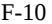

{158}------------------------------------------------

#### **2. Summary of Significant Accounting Policies**

## *Cash and Cash Equivalents*

The Company classifies deposits in banks, money market funds and cash invested temporarily in various instruments with maturities of three months or less at the time of purchase as cash and cash equivalents. As of December 31, 2022 and 2021 cash and cash equivalents consisted principally of U.S. Treasury notes, amounts held in money market accounts and cash on deposit at commercial banks.

## *Short-Term Investments*

The Company generally invests its excess cash in money market funds and short-term investments in U.S. Treasury notes. Such investments which are included in short-term investments on the Company's consolidated balance sheets are considered available-for-sale ("AFS") debt securities and are reported at fair value with unrealized gains and losses recognized in accumulated other comprehensive income (loss) in stockholders' equity, net of related tax effects. Realized gains and losses, if any, on short-term investments are included in interest income.

If the AFS debt security's fair value declines below its amortized cost the Company considers all available evidence to evaluate the extent to which the decline is due to credit-related factors or noncredit-related factors. If the decline is due to noncredit-related factors then no credit loss is recorded and the unrealized loss is recognized in accumulated other comprehensive income (loss) in stockholders' equity, net of the related tax effects. If the decline is considered to be a credit-related impairment, it is recognized as an allowance on the consolidated balance sheet with a corresponding charge to the consolidated statement of operations and comprehensive income (loss). The credit allowance is limited to the difference between the fair value and the amortized cost basis. No credit-related allowances or impairments have been recognized on the Company's investments in available-for-sale debt securities.

### *Concentrations of Credit Risk*

Financial instruments that potentially subject the Company to concentrations of credit risk consist principally of cash, cash equivalents and short-term investments. As of December 31, 2022 and 2021, substantially all of the Company's cash, cash equivalents and short-term investments were held at two financial institutions. The Company generally maintains balances in various operating accounts at financial institutions that management believes to be of high credit quality, in amounts that may exceed federally insured limits. The Company has not experienced any losses related to its cash, cash equivalents and short-term investments and does not believe that it is subject to unusual credit risk beyond the normal credit risk associated with commercial banking relationships.

The Company is also subject to credit risk from the accounts receivable related to product revenue. The majority of trade accounts receivable are recorded net of allowances for cash discounts associated with prompt payments from customers. All trade accounts receivable arise from product revenue in the United States due from the Company's third party logistics provider. There were no material write-offs charged against the allowance for the year ended December 31, 2022.

### *Restricted Cash*

In conjunction with the Company's lease agreement entered into in March 2018, the Company maintained a letter of credit for the benefit of the landlord. The lease expired in August 2021 and the restricted cash was released to operating cash in September 2021. As of December 31, 2022 and 2021, there was no balance in restricted cash. As of December 31, 2020, the underlying cash balance of \$210 securing this letter of credit, was classified as current, in its consolidated balance sheet.

{159}------------------------------------------------

#### *Fair Value Measurements*

Certain assets and liabilities of the Company are carried at fair value under GAAP. Fair value is defined as the exchange price that would be received for an asset or paid to transfer a liability (an exit price) in the principal or most advantageous market for the asset or liability in an orderly transaction between market participants on the measurement date. Valuation techniques used to measure fair value must maximize the use of observable inputs and minimize the use of unobservable inputs. Financial assets and liabilities carried at fair value are to be classified and disclosed in one of the following three levels of the fair value hierarchy, of which the first two are considered observable and the last is considered unobservable:

- Level 1—Quoted prices in active markets for identical assets or liabilities.
- Level 2—Observable inputs (other than Level 1 quoted prices), such as quoted prices in active markets for similar assets or liabilities, quoted prices in markets that are not active for identical or similar assets or liabilities, or other inputs that are observable or can be corroborated by observable market data.
- Level 3—Unobservable inputs that are supported by little or no market activity that are significant to determining the fair value of the assets or liabilities, including pricing models, discounted cash flow methodologies and similar techniques.

The Company's cash equivalents and short-term investments, consisting of money market accounts and U.S. Treasury notes, are carried at fair value, determined based on Level 1 and 2 inputs in the fair value hierarchy described above (see Note 3). The carrying values of the Company's prepaid expenses and other current assets, accounts receivable, accounts payable and accrued expenses approximate their fair values due to the short-term nature of these assets and liabilities.

## *Leases*

At the inception of an arrangement, the Company determines whether the arrangement is or contains a "lease" as defined by ASC 842. A lease is an arrangement, or part of an arrangement, that conveys the right to control the use of identified property, plant, or equipment (an identified asset) for a period of time in exchange for consideration. The Company determines if the arrangement conveys the right to control the use of an identified asset for a period of time. It assesses throughout the period of use whether the Company has both of the following (1) the right to obtain substantially all of the economic benefits from use of the identified asset and (2) the right to direct the use of the identified asset. This determination is reassessed if the terms of the arrangement are changed. Leases are classified as operating or finance leases based on the terms of the lease agreement and certain characteristics of the identified asset. Right-of-use ("ROU") assets and lease liabilities are recognized at lease commencement date based on the present value of the minimum future lease payments.

Most leases with a term greater than one year are recognized on the balance sheet as ROU assets with corresponding lease liabilities and, if applicable, long-term lease liabilities. The Company has elected not to recognize leases with a term of one year or less on its balance sheet, the Company recognizes lease expense for these leases on a straight-line basis over the lease term. Operating leases, ROU assets and their corresponding lease liabilities are recorded based on the present value of lease payments over the expected remaining lease term. However, certain adjustments to the ROU assets may be required for items such as incentives received. The interest rate implicit in lease arrangements is typically not readily determinable. As a result, the Company utilizes its incremental borrowing rate, which is the rate incurred to borrow on a collateralized basis over a similar term an amount equal to the lease payments in a similar economic environment.

{160}------------------------------------------------

In accordance with the guidance in ASU 2016-02, components of a lease should be split into three categories: lease components (e.g., land, building, etc.), non-lease components (e.g., common area maintenance, consumables, etc.), and non-components (e.g., property taxes, insurance, etc.); then the fixed and in-substance fixed contract consideration (including any related to non-components) must be allocated based on fair values to the lease components and non-lease components.

The Company has elected to account for the lease and non-lease components of each of its operating leases as a single lease component and allocate all of the arrangement consideration to the lease component only. The lease component results in an operating ROU asset being recorded on the balance sheet and amortized on a straight-line basis as lease expense.

## *Property and Equipment*

Property and equipment are recorded at cost and depreciated over the estimated useful lives of the related assets using the straight-line method. Maintenance and repairs are charged to expense as incurred. When assets are retired or otherwise disposed of, the cost of these assets and related accumulated depreciation or amortization are eliminated from the consolidated balance sheet and any resulting gains or losses are included in the consolidated statement of operations and comprehensive income (loss) in the period of disposal. The expected useful lives of the respective assets are as follows:

|                                  | Estimated Useful Life     |
|----------------------------------|---------------------------|
| Computer hardware and software   | 3 - 5 years               |
| Laboratory equipment             | 5 years                   |
| Furniture, fixtures and vehicles | 5 - 7 years               |
| Leasehold improvements           | Shorter of estimated      |
|                                  | useful life or lease term |

## *Inventory*

Inventories are stated at the lower of cost or estimated net realizable value with cost based on the first-in first-out method. Inventory that can be used in either the production of clinical or commercial products is expensed as research and development costs when identified and labeled for use in clinical trials as the products are required to be re-labeled for alternative uses. Prior to the regulatory approval of its drug candidates, the Company incurs expenses for the manufacture of product candidate supplies to support clinical development that could potentially be available to support the commercial launch of those therapeutics. Until the date at which regulatory approval has been received or is otherwise considered probable, the Company records all such costs as research and development expenses. The Company performs an assessment of the recoverability of capitalized inventories during each reporting period and writes down any excess and obsolete inventory to its net realizable value in the period in which the impairment is first identified. Such impairment charges, should they occur, are recorded as a component of cost of sales in the Company's consolidated statements of operations and comprehensive income (loss). The determination of whether inventory costs will be realizable requires the use of estimates by management. If actual market conditions are less favorable than projected by management, additional writedown of inventory may be required.

The vials that will ultimately be distributed free of charge under our patient assistance program are recognized as selling expense when they are labeled as free goods.

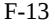

{161}------------------------------------------------

#### *Revenue Recognition*

ASC 606 outlines a five-step process for recognizing revenue from contracts with customers: (i) identify the contract with the customer, (ii) identify the performance obligations in the contract, (iii) determine the transaction price, (iv) allocate the transaction price to the separate performance obligations in the contract, and (v) recognize revenue associated with the performance obligations as they are satisfied.

The Company only applies the five-step model to contracts when it is probable that the Company will collect the consideration it is entitled to in exchange for the goods or services it transfers to the customer. Once a contract is determined to be within the scope of ASC 606, the Company determines the performance obligations that are distinct. The Company recognizes as revenues the amount of the transaction price that is allocated to each respective performance obligation when the performance obligation is satisfied. Generally, the Company's performance obligations are transferred to customers at a point in time, typically upon delivery of the product to the customer.

ASC 606 requires entities to record a contract asset when a performance obligation has been satisfied or partially satisfied, but the amount of consideration has not yet been received because the receipt of the consideration is conditioned on something other than the passage of time. ASC 606 also requires an entity to present a revenue contract as a contract liability in instances when a customer pays consideration, or an entity has a right to an amount of consideration that is unconditional (e.g. receivable), before the entity transfers a good or service to the customer.

## *Product Revenue, Net*

Following the FDA approval of ARCALYST on March 18, 2021, the Company began generating product revenue from sales of ARCALYST in April 2021. ARCALYST is sold through a third party logistics provider that distributes primarily through a network of authorized specialty pharmacies and specialty distributors ("customer"), which deliver the medication to patients by mail. The Company's payment terms are between 30 to 35 days.

Net revenue from product sales is recognized at the transaction price when the specialty pharmacy or specialty distributors obtains control of the Company's products, which occurs at a point in time, typically upon shipment of the product from the third party logistics provider.

The Company's net revenues represent total revenues adjusted for discounts and allowances, including estimated cash discounts, chargebacks, rebates, returns, copay assistance, and specialty pharmacy and distributor fees. These adjustments represent variable consideration under ASC 606 and are estimated using the expected value method and are recorded when revenue is recognized on the sale of the product. These adjustments are established by management as its best estimate based on available information and will be adjusted to reflect known changes in the factors that impact such allowances. Adjustments for variable consideration are determined based on the contractual terms with customers, historical trends, communications with customers and the levels of inventory remaining in the distribution channel, as well as expectations about the market for the product and anticipated introduction of competitive products.

## *Discounts and Allowances*

Revenue from product sales is recorded at the transaction price, which includes estimates for discounts and allowances and includes cash discounts, chargebacks, rebates, returns, copay assistance, and specialty pharmacy and distributor fees. These reserves are classified as reductions of accounts receivable (if the amount is payable to the Customer and right of offset exists) or a current liability (if the right of offset does not exist, the amount is payable to a third party, or is related to a future return). These allowances are established by management as its best estimate based on historical experience and data points available and are adjusted to reflect known changes in the factors that impact such reserves. Allowances for customer credits, chargebacks, rebates, data fees for services, returns, and discounts are

{162}------------------------------------------------

established based on contractual terms with customers and analyses of historical usage of these items. Actual amounts of consideration ultimately received may differ from the Company's estimates. If actual results in the future vary from the Company's estimates, the Company will adjust these estimates, which would affect net product revenue and earnings in the period such variances become known. The nature of the allowances and accruals requiring estimates, and the specific considerations the Company uses in estimating these amounts are as follows:

## *Government Chargebacks and Rebates*

Government and other rebates and chargebacks include amounts payable to payors and healthcare providers under various programs and by payor and individual payor plans. Rebates and chargebacks are based on contractual arrangements or statutory requirements which may vary by product, payor and individual payor plans. For qualified programs that can purchase products through wholesalers or other distributors at a lower contractual price, the wholesalers or distributors charge back to the Company the difference between their acquisition cost and the lower contractual price.

Rebates and chargebacks are estimated primarily based on product sales, and expected payor mix and discount rates, which require significant estimates and judgment. Additionally, in developing the estimates the Company considers: historical and estimated payor mix; statutory discount requirements and contractual terms; historical claims experience and processing time lags; estimated patient population; known market events or trends; market research; channel inventory data obtained from customers; and other pertinent internal or external information. The Company assesses and updates the estimates every quarter to reflect actual claims and other current information.

Government and other chargebacks are recognized as reduction of revenue upon the sale to the Customers. These items are payable to customers and other rebates that are payable to other third party payors and healthcare providers are classified as accrued expense liabilities.

## *Cash Discounts*

The Company estimates cash discounts based on contractual terms and expectations regarding future customer payment patterns.

### *Specialty Pharmacy & Distributor Fees*

Under the inventory management agreements with specialty pharmacies and distributors, the Company pays a fee primarily for compliance with certain contractually determined covenants such as the maintenance of agreed upon inventory levels. These specialty pharmacy and distributor fees are based on a contractually determined fixed percentage of sales.

The Company has contracted with certain specialty pharmacies to obtain transactional data related to the products in order to develop a better understanding of the selling channel as well as patient activity and utilization by the Medicaid program and other government agencies and managed care organizations. The Company pays a variable fee to the specialty pharmacies to provide the data. The Company also pay the specialty pharmacies a fee in exchange for providing distribution and inventory management services, including the provision of inventory management data to the Company. The Company estimates the fee for service accruals and allowances based on sales to each specialty pharmacy and the applicable contracted rate.

## *Sales Returns*

Allowances are made for estimated sales returns by the customers and are recorded in the period the related revenue is recognized. The Company typically permit returns if the product is out of date or damaged during transition to

{163}------------------------------------------------

the common carrier. The Company's estimates of sales returns are based primarily on analysis of industry information reporting the return rates for similar products and contractual agreement terms. The Company also takes into consideration known or expected changes in the marketplace specific to ARCALYST.

#### *Shipping and Handling*

Shipping and handling activities are considered to be fulfillment activities and not considered to be a separate performance obligation.

### *Other Incentives*

Other incentives include a co-pay assistance program for eligible patients with commercial insurance in the U.S. The co-pay assistance programs assist certain commercially insured patients by reducing each participating patient's financial responsibility for the purchase price, up to a specified dollar amount of assistance.

## *Collaboration Revenue*

The Company analyzes its collaboration arrangements to assess whether such arrangements involve joint operating activities performed by parties that are both active participants in the activities and exposed to significant risks and rewards dependent on the commercial success of such activities and therefore within the scope of ASC Topic 808, Collaborative Arrangements ("Topic 808"). This assessment is performed throughout the life of the arrangement based on changes in the responsibilities of all parties in the arrangement. For collaboration arrangements within the scope of Topic 808 that contain multiple elements, the Company first determines which elements of the collaboration are deemed to be within the scope of Topic 808 and which elements of the collaboration are more reflective of a vendor-customer relationship and therefore within the scope of Topic 606.

For elements of collaboration arrangements that are accounted for pursuant to ASC 606, we identify the performance obligations and allocate the total consideration we expect to receive on a relative standalone selling price basis to each performance obligation. Variable consideration such as performance-based milestones will be included in the total consideration if we expect to receive such consideration and if it is probable that the inclusion of the variable consideration will not result in a significant reversal in the cumulative amount of revenue recognized under the arrangement. Our estimate of the total consideration we expect to receive under each collaboration arrangement is updated for each reporting period, and any adjustments to revenue are recorded on a cumulative catch-up basis. We exclude salesbased royalty and milestone payments from the total consideration we expect to receive until the underlying sales occur because the license to our intellectual property is deemed to be the predominant item to which the royalties or milestones relate as it is the primary driver of value in our collaboration arrangements.

Key assumptions to determine the standalone selling price may include forecasted revenues, development timelines, reimbursement rates for personnel costs, discount rates and probabilities of technical and regulatory success. We recognize revenue associated with each performance obligation as the control over the promised goods or services transfer to our collaboration partner which occurs either at a point in time or over time. If control transfers over time, revenue is recognized by using a method of measuring progress that best depicts the transfer of goods or services. We evaluate the measure of progress and related inputs each reporting period and any resulting adjustments to revenue are recorded on a cumulative catch-up basis.

Consideration received that does not meet the requirements to satisfy ASC 808 or ASC 606 revenue recognition criteria is recorded as deferred revenue in the accompanying consolidated balance sheets, classified as either short-term (less than 12 months) or long-term (more than 12 months) deferred revenue based on our best estimate of when such revenue will be recognized.

{164}------------------------------------------------

#### *Intangible Assets*

Upon FDA approval and commercial launch of ARCALYST in March 2021, the Company capitalized the \$20,000 milestone payment to Regeneron for a specified regulatory milestone as a finite-lived intangible asset. The intangible asset will be amortized on a straight-line basis over the life of the underlying intellectual property of 20 years. Amortization expense will be recorded as cost of goods sold in the Company's consolidated statement of operations and comprehensive income (loss).

## *Impairment of Long-Lived Assets*

The Company assesses the impairment of long-lived assets, including intangible assets and property and equipment, whenever events or changes in business circumstances indicate that the carrying amounts of the assets may not be fully recoverable. When such events occur, the Company determines whether there has been an impairment in value by comparing the asset's carrying value with its fair value, as measured by the anticipated undiscounted net cash flows of the asset. If an impairment in value exists, the asset is written down to its estimated fair value. The Company has not recognized any impairment losses through December 31, 2022 and there have been no events that triggered an impairment analysis.

### *Research and Development Costs*

Research and development costs are expensed as incurred. Research and development expenses consist of costs incurred to discover, research and develop drug candidates, including personnel expenses, share-based compensation expense, allocated facility-related and depreciation expenses, third-party license fees and external costs of outside vendors engaged to conduct preclinical and clinical development activities and clinical trials as well as to manufacture clinical trial materials. Non-refundable prepayments determined to be used within one year for goods or services that will be used or rendered for future research and development activities are recorded as prepaid expenses. Non-refundable prepayments or minimum balance requirements associated to clinical trials determined to not be used within one year are classified as other long-term assets. Such amounts are recognized as an expense as the goods are delivered or the related services are performed, or until it is no longer expected that the goods will be delivered, or the services rendered. Milestone and other payments made to third parties with respect to in-process research and development, in accordance with the Company's license, acquisition and other similar agreements are expensed when determined to be probable and estimable.

## *Research Contract Costs*

The Company has entered into various research and development-related contracts with companies both inside and outside of the United States. The related costs are recorded as research and development expenses as incurred. The Company records accruals for estimated ongoing research and development costs. When billing terms under these contracts do not coincide with the timing of when the work is performed, the Company is required to make estimates of outstanding obligations to those third parties as of the end of the reporting period. Any accrual estimates are based on a number of factors, including the Company's knowledge of the progress towards completion of the research and development activities, invoicing to date under the contracts, communication from the research institution or other companies of any actual costs incurred during the period that have not yet been invoiced, and the costs included in the contracts. Significant judgments and estimates are made in determining the accrued balances at the end of any reporting period. Actual results could differ materially from the Company's estimates.

{165}------------------------------------------------

#### *Patent Costs*

The Company charges patent-related costs in connection with filing and prosecuting patent applications to operations as incurred as their realization is uncertain. These costs are classified as selling, general and administrative expenses.

## *Segment Information*

The Company manages its operations as a single operating segment for the purposes of assessing performance and making operating decisions. The Company's singular focus is on developing and delivering therapeutic medicines for patients suffering from debilitating diseases with significant unmet medical need.

#### *Share-Based Compensation*

The Company measures all share-based awards granted to employees and directors based on their fair value on the date of grant. The Company issues share-based awards with both service-based vesting conditions and performance-based vesting conditions. The Company recognizes compensation expense for awards with service conditions on a straight-line basis over the requisite service period. For awards with performance conditions, the Company recognizes compensation expense when the achievement of the performance milestone is probable and estimable through the vest date.

For share-based awards granted to consultants and non-employees, compensation expense is recognized over the vesting period of the awards, which is generally the period during which services are rendered by such consultants and non-employees until completed.

The Company classifies share-based compensation expense in its consolidated statements of operations and comprehensive income (loss) in the same manner in which the award recipient's payroll costs are classified or in which the award recipient's service payments are classified.

The fair value of each option grant is estimated on the date of grant using the Black-Scholes option-pricing model, which requires inputs based on certain subjective assumptions, including the expected share price volatility, the expected term of the award, the risk-free interest rate, and expected dividends (see Note 11). Prior to May 2018, the Company was a private company and, accordingly, lacks company-specific historical and implied volatility information for its shares. Therefore, it estimates its expected share price volatility based on the historical volatility of the Company and historical volatility of publicly traded peer companies and expects to continue to do so until such time as it has adequate historical data regarding the volatility of its own traded share price. The expected term of the Company's options has been determined utilizing the "simplified" method for awards that qualify as "plain-vanilla" options. The expected term of options granted to non-employees is equal to the contractual term of the option award. The risk-free interest rate is determined by reference to the U.S. Treasury yield curve in effect at the time of grant of the award for time periods approximately equal to the expected term of the award. Expected dividend yield is based on the fact that the Company has never paid cash dividends on common shares and does not expect to pay any cash dividends in the foreseeable future.

The fair value of each restricted share unit award is based on the closing price of the Company's Class A common shares on the date of grant. Restricted share unit awards with an associated performance condition are evaluated on a regular basis for probability of achievement to determine the timing of recording share-based compensation expense in the Company's consolidated statements of operations and comprehensive income (loss).

{166}------------------------------------------------

### *Comprehensive Income (Loss)*

Comprehensive income (loss) includes net income (loss) as well as other changes in shareholders' equity that result from transactions and economic events other than those with shareholders. For the years ended December 31, 2022, 2021 and 2020 the Company's other comprehensive income (loss) was comprised of unrealized gain (loss) on short-term investments and currency translation adjustments, net of tax.

#### *Net Income (Loss) per Share*

Basic net income (loss) per share attributable to common shareholders is computed by dividing the net income (loss) attributable to common shareholders by the weighted average number of common shares outstanding for the period. Diluted net income (loss) attributable to common shareholders is computed by adjusting net income (loss) attributable to common shareholders to reallocate undistributed earnings based on the potential impact of dilutive securities. Diluted net income (loss) per share attributable to common shareholders is computed based on the treasury method by dividing the diluted net income (loss) attributable to common shareholders by the weighted average number of common shares outstanding for the period, including potential dilutive common shares. For purpose of this calculation, outstanding share options and unvested restricted share units are considered potential dilutive common shares.

In periods in which the Company reports a net loss attributable to common shareholders, diluted net loss per share attributable to common shareholders is the same as basic net loss per share attributable to common shareholders, since dilutive common shares are not assumed to have been issued if their effect is anti-dilutive. The Company reported a net loss attributable to common shareholders for the years ended December 31, 2021 and 2020.

#### *Income Taxes*

The Company accounts for income taxes using the asset and liability method, which requires the recognition of deferred tax assets and liabilities for the expected future tax consequences of events that have been recognized in the consolidated financial statements or in the Company's tax returns. Deferred tax assets and liabilities are determined based on the difference between the financial statement and tax basis of assets and liabilities using enacted tax rates in effect for the year in which the differences are expected to reverse. Changes in deferred tax assets and liabilities are recorded in the (provision) benefit for income taxes. The Company assesses the likelihood that its deferred tax assets will be recovered from future taxable income and, to the extent it believes, based upon the weighting of the positive and negative available evidence, that it is more likely than not that all or a portion of the deferred tax assets will not be realized, a valuation allowance is established through a charge to income tax expense. Potential for recovery of deferred tax assets is evaluated by estimating the future taxable profits expected, cumulative recent earnings and considering prudent and feasible tax planning strategies.

The Company is an exempted company incorporated under the laws of Bermuda. Under the current laws of Bermuda, income tax is not charged or levied on an exempted company's income. As a result, the Company has not recorded any income tax benefits from losses incurred in Bermuda during each reporting period, and no net operating loss carryforwards will be available to the Company for those losses. The Company's wholly owned U.S. subsidiaries, Kiniksa US and Primatope, are subject to federal and state income taxes in the United States. The Company's wholly owned subsidiary Kiniksa UK, and its wholly owned subsidiaries, Kiniksa Germany, Kiniksa France, and Kiniksa Switzerland, are subject to taxation in their respective countries. Certain of the Company's subsidiaries, primarily Kiniksa US, operate under cost-plus arrangements.

The Company's U.S. provision for income taxes relates to current tax expense associated with the taxable income in the United States of its wholly owned subsidiary, Kiniksa US. The current income tax expense is a result of the taxable income earned by Kiniksa US under its cost-plus arrangement offset in part by tax benefits from the U.S.

{167}------------------------------------------------

federal and state research and development credits, the Foreign Derived Intangible Income ("FDII") deduction and sharebased compensation taxable events. The Company's UK benefit for income taxes relates to the deferred tax benefit associated with the release of the valuation allowance on the deferred tax assets partially offset by the current tax expense associated with the taxable income in the United Kingdom of its wholly owned subsidiary, Kiniksa UK.

The Company accounts for uncertainty in income taxes recognized in the consolidated financial statements by applying a two-step process to determine the amount of tax benefit to be recognized. First, the tax position must be evaluated to determine the likelihood that it will be sustained upon external examination by the taxing authorities. If the tax position is deemed more-likely-than-not to be sustained, the tax position is then assessed to determine the amount of benefit to recognize in the consolidated financial statements. The amount of the benefit that may be recognized is the largest amount that has a greater than 50% likelihood of being realized upon ultimate settlement. The provision for income taxes includes the effects of any resulting tax reserves, or unrecognized tax benefits, that are considered appropriate as well as the related net interest and penalties.

## *Recently Adopted Accounting Pronouncements*

Accounting standards that have been issued by the Financial Accounting Standards Board or other standardssetting bodies that do not require adoption until a future date are not expected to have a material impact on the Company's financial statements upon adoption.

## **3. Fair Value of Financial Assets and Liabilities**

The following tables present information about the Company's financial instruments measured at fair value on a recurring basis and indicate the level of the fair value hierarchy used to determine such fair values:

|                                              | Fair Value Measurements as of December 31, 2022 Using: |         |    |         |         |   |    |         |  |  |
|----------------------------------------------|-----------------------------------------------------------|---------|----|---------|---------|---|----|---------|--|--|
|                                              |                                                           | Level 1 |    | Level 2 | Level 3 |   |    | Total   |  |  |
| Assets:                                      |                                                           |         |    |         |         |   |    |         |  |  |
| Cash equivalents — money market funds        | \$                                                        | 20,929  | \$ | —       | \$      | — | \$ | 20,929  |  |  |
| Cash equivalents — U.S. Treasury notes       |                                                           | —       |    | 15,009  |         | — |    | 15,009  |  |  |
| Short-term investments — U.S. Treasury notes |                                                           | —       |    | 67,893  |         | — |    | 67,893  |  |  |
| Total                                        | \$                                                        | 20,929  | \$ | 82,902  | \$      | — | \$ | 103,831 |  |  |

|                                              | Fair Value Measurements as of December 31, 2021 Using: |         |    |         |    |         |    |         |  |  |
|----------------------------------------------|-----------------------------------------------------------|---------|----|---------|----|---------|----|---------|--|--|
|                                              |                                                           | Level 1 |    | Level 2 |    | Level 3 |    | Total   |  |  |
| Assets:                                      |                                                           |         |    |         |    |         |    |         |  |  |
| Cash equivalents — money market funds        | \$                                                        | 94,324  | \$ | —       | \$ | —       | \$ | 94,324  |  |  |
| Short-term investments — U.S. Treasury notes |                                                           | —       |    | 59,731  |    | —       |    | 59,731  |  |  |
| Total                                        | \$                                                        | 94,324  | \$ | 59,731  | \$ | —       | \$ | 154,055 |  |  |

During the years ended December 31, 2022 and 2021 there were no transfers between Level 1, Level 2 and Level 3. The money market funds were valued using quoted prices in active markets, which represent a Level 1 measurement in the fair value hierarchy. The Company's cash equivalents and short-term investments as of December 31, 2022 and 2021 included U.S. Treasury notes, which are not traded on a daily basis and, therefore, represent a Level 2 measurement in the fair value hierarchy at each period end.

Cash equivalents and short-term investments as of December 31, 2022 and 2021 consisted of U.S. Treasury notes which investments were each due within six months of such date.

{168}------------------------------------------------

|                                        |           |           |                          | Gross      |        | Gross      |        |        |  |           |
|----------------------------------------|-----------|-----------|--------------------------|------------|--------|------------|--------|--------|--|-----------|
|                                        |           | Amortized |                          | Unrealized |        | Unrealized |        | Credit |  | Fair      |
|                                        |           | Cost      | Gains                    |            | Losses |            | Losses |        |  | Value     |
| December 31, 2022                      |           |           |                          |            |        |            |        |        |  |           |
| Cash equivalents — U.S. Treasury notes | \$        | 15,006    | \$                       | 3          | \$     | —          | \$     | —      |  | \$ 15,009 |
| Short-term investments — U.S. Treasury |           |           |                          |            |        |            |        |        |  |           |
| notes                                  |           | 67,891    |                          | 6          |        | (4)        |        | —      |  | 67,893    |
| Total                                  | \$        | 82,897    | \$                       | 9          | \$     | (4)        | \$     | —      |  | \$ 82,902 |
|                                        |           |           |                          |            |        |            |        |        |  |           |
|                                        |           |           |                          | Gross      |        | Gross      |        |        |  |           |
|                                        | Amortized |           | Unrealized Unrealized |            | Credit |            |        | Fair   |  |           |
|                                        | Cost      |           | Gains                    |            | Losses |            | Losses |        |  | Value     |
| December 31, 2021                      |           |           |                          |            |        |            |        |        |  |           |
| Short-term investments — U.S. Treasury |           |           |                          |            |        |            |        |        |  |           |
| notes                                  | \$        | 59,745    | \$                       | 1          | \$     | (15)       | \$     | —      |  | \$ 59,731 |
| Total                                  | \$        | 59,745    | \$                       | 1          | \$     | (15)       | \$     | —      |  | \$ 59,731 |

As of December 31, 2022, the Company held 2 securities that were in an unrealized loss position. The aggregate fair value of securities held by the Company in an unrealized loss position was \$7,471 as of December 31, 2022. As of December 31, 2021, the Company held 11 securities that were in an unrealized loss position. The aggregate fair value of securities held by the Company in an unrealized loss position was \$49,739 as of December 31, 2021. As of both December 31, 2022 and 2021 these securities were held by the Company in an unrealized loss position for less than 12 months. The Company determined that there was no material change in the credit risk of these securities. As a result, the Company determined it did not hold any investments with an other-than-temporary impairment as of December 31, 2022 and 2021.

# **4. Product Revenue, Net**

# *ARCALYST*

Following the FDA approval of ARCALYST on March 18, 2021, the Company began generating product revenue from sales of ARCALYST in April 2021.

|                      | Years Ended  |    |        |  |
|----------------------|--------------|----|--------|--|
|                      | December 31, |    |        |  |
|                      | 2022         |    | 2021   |  |
| Product Revenue, net | \$ 122,524   | \$ | 38,544 |  |

{169}------------------------------------------------

The following tables summarizes balances and activity in each of the product revenue allowance and reserve categories for the years ended December 31, 2022 and 2021:

|                                                 | Contractual Adjustments |         | Government Rebates |         | Returns |      | Total       |
|-------------------------------------------------|----------------------------|---------|-----------------------|---------|---------|------|-------------|
| Balance at December 31, 2021                    | \$                         | 515     | \$                    | 719     | \$      | 101  | \$ 1,335 |
| Current provisions relating to sales in the     |                            |         |                       |         |         |      |             |
| current year                                    |                            | 7,366   |                       | 4,543   |         | 269  | 12,178      |
| Adjustments relating to prior years             |                            | —       |                       | —       |         | (19) | (19)        |
| Payments/returns relating to sales in the       |                            |         |                       |         |         |      |             |
| current year                                    |                            | (5,902) |                       | (2,535) |         | —    | (8,437)     |
| Payments/returns relating to sales in the prior |                            |         |                       |         |         |      |             |
| years                                           |                            | (515)   |                       | (643)   |         | —    | (1,158)     |
| Balance at December 31, 2022                    | \$                         | 1,464   | \$                    | 2,084   | \$      | 351  | \$ 3,899 |

|                                                 | Contractual | Government |              |             |
|-------------------------------------------------|-------------|------------|--------------|-------------|
|                                                 | Adjustments | Rebates    | 1 Returns | Total       |
| Balance at December 31, 2020                    | \$ —     | \$ —    | \$ —      | \$ —     |
| Current provisions relating to sales in the     |             |            |              |             |
| current year                                    | 2,219       | 1,131      | 327          | 3,677       |
| Adjustments relating to prior years             | —           | —          | —            | —           |
| Payments/returns relating to sales in the       |             |            |              |             |
| current year                                    | (1,704)     | (412)      | (226)        | (2,342)     |
| Payments/returns relating to sales in the prior |             |            |              |             |
| years                                           | —           | —          | —            | —           |
| Balance at December 31, 2021                    | \$ 515   | \$ 719  | \$ 101    | \$ 1,335 |

(1) Included in the return reserve, is a provision of \$226 for a specific return associated with product that was damaged in transit.

Total revenue-related reserves as of December 31, 2022 and 2021, included in our consolidated balance sheets, are summarized as follows:

|                                         | December 31, December 31, |       |  |
|-----------------------------------------|---------------------------|-------|--|
|                                         | 2022                      | 2021  |  |
| Reduction of accounts receivable        | \$ (304) \$            | (50)  |  |
| Components of other current liabilities | 4,203                     | 1,385 |  |
| Total revenue-related reserves          | \$ 3,899 \$            | 1,335 |  |

## **5. Inventory**

placeholder

During the year ended December 31, 2021, the Company commenced the capitalization of ARCALYST inventory in connection with receiving FDA approval of ARCALYST for the treatment of recurrent pericarditis and reduction in risk of recurrence in adults and children 12 years and older. During the year ended December 31, 2021, the Company identified and relabeled certain ARCALYST product previously acquired initially intended to support the clinical trials as inventory to be sold as commercial product classified as finished goods. The value of this inventory had previously been expensed to research and development costs and was sold at zero cost. As of December 31, 2021, the Company did not have any remaining zero cost inventory.

{170}------------------------------------------------

Inventory consisted of the following:

|                 | December 31, 2022 |        | December 31, 2021 |       |
|-----------------|----------------------|--------|----------------------|-------|
| Raw materials   | \$                   | —      | \$                   | —     |
| Work-in-process |                      | 6,312  |                      | —     |
| Finished Goods  |                      | 15,287 |                      | 3,675 |
| Total inventory | \$                   | 21,599 | \$                   | 3,675 |

## **6. Property and Equipment, Net**

Property and equipment, net consisted of the following:

|                                   | December 31, 2022 | December 31, 2021 |
|-----------------------------------|----------------------|----------------------|
| Furniture, fixtures and vehicles  | \$ 224            | \$ 62             |
| Computer hardware and software    | 345                  | 341                  |
| Leasehold improvements            | 3,931                | 3,931                |
| Lab equipment                     | 4,017                | 4,249                |
| Construction in progress          | —                    | 166                  |
| Total property and equipment      | 8,517                | 8,749                |
| Less: Accumulated depreciation    | (6,859)              | (5,915)              |
| Total property and equipment, net | \$ 1,658          | \$ 2,834          |

Depreciation expense for the years ended December 31, 2022, 2021 and 2020 was \$1,179, \$1,455 and \$2,405, respectively.

As of December 31, 2022 and 2021, \$226 and \$332, respectively, of our property and equipment, net was in the United Kingdom.

## **7. Leases**

Kiniksa US and Kiniksa UK leases office and laboratory space under operating leases. Additionally, Kiniksa US leases vehicles under an operating lease. The components of lease cost for the year ended December 31, 2022, 2021 and 2020 are as follows:

|                      | Years Ended  |       |    |       |    |       |
|----------------------|--------------|-------|----|-------|----|-------|
|                      | December 31, |       |    |       |    |       |
|                      |              | 2022  |    | 2021  |    | 2020  |
| Operating lease cost | \$           | 3,380 | \$ | 2,748 | \$ | 1,578 |
| Variable lease cost  |              | 132   |    | 287   |    | 167   |
| Total lease cost     | \$           | 3,512 | \$ | 3,035 | \$ | 1,745 |

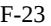

{171}------------------------------------------------

|                                               | December 31, |
|-----------------------------------------------|--------------|
|                                               | 2022         |
| Weighted-average remaining lease term (years) | 1.63         |
| Weighted-average discount rate                | 5.56%        |

Maturities of operating leases liabilities were as follows:

| \$ 3,519 |
|-------------|
| 2,671       |
| —           |
| \$ 6,190 |
| (271)       |
| \$ 5,919 |
|             |

# **8. Intangible Assets**

Intangible assets, net of accumulated amortization, impairment charges and adjustments are summarized in the following table.

|                      |                | As of December 31, 2022 |             |              |                     | As of December 31, 2021 |              |           |
|----------------------|----------------|-------------------------|-------------|--------------|---------------------|-------------------------|--------------|-----------|
|                      |                |                         | Accumulated |              |                     |                         | Accumulated  |           |
|                      | Estimated life | Cost                    |             | Amortization | Net                 | Cost                    | Amortization | Net       |
| Regulatory milestone | 20 years       | \$ 20,000               | \$          | 1,750        | \$ 18,250 \$ 20,000 |                         | \$ 750    | \$ 19,250 |
| Total                |                | \$ 20,000               | \$          | 1,750        | \$ 18,250 \$ 20,000 |                         | \$ 750    | \$ 19,250 |

As of December 31, 2022 future amortization of intangible assets are as follows:

# **For the years ended December 31,**

| 2023 | \$ 1,000 |
|------|-------------|
| 2024 | 1,000       |
| 2025 | 1,000       |
| 2026 | 1,000       |
| 2027 | 1,000       |
|      |             |

## **9. Accrued Expenses**

Accrued expenses consisted of the following:

|                                                 | December 31, 2022 |        | December 31, 2021 |        |
|-------------------------------------------------|----------------------|--------|----------------------|--------|
| Accrued research and development expenses       | \$                   | 8,378  | \$                   | 24,977 |
| Accrued employee compensation and benefits      |                      | 11,213 |                      | 8,916  |
| Accrued collaboration expenses                  |                      | 7,522  |                      | 835    |
| Accrued legal, commercial and professional fees |                      | 2,866  |                      | 2,933  |
| Other                                           |                      | 133    |                      | 370    |
| Total accrued expenses                          | \$                   | 30,112 | \$                   | 38,031 |

{172}------------------------------------------------

During the year ended December 31, 2022, the Company recorded out of period adjustments of \$2,223 that primarily relates to a decrease in accrued research and development expenses to correct immaterial errors that originated in prior periods. The Company evaluated the materiality of the adjustments to prior-period annual and interim financial statements and the current period, and concluded the effect of the adjustments were immaterial to all periods.

### **10. Common Shares**

On May 18, 2020, the Company completed a follow-on offering of 2,760,000 Class A common shares, inclusive of the exercise of the underwriters' overallotment option at a public offering price of \$18.25 and a concurrent private placement of 1,600,000 Class A1 common shares at an offering price of \$18.25 per share for aggregate gross proceeds of \$79,570. The aggregate net proceeds to the Company from the follow-on offering and concurrent private placement, inclusive of the over-allotment option exercise, was \$74,495 after deducting underwriting discounts and commissions, placement agent fees and other offering costs.

On July 24, 2020, the Company completed a follow-on offering of 5,952,381 Class A common shares, at a public offering price of \$21.00 and a concurrent private placement of 1,428,572 Class A1 common shares at an offering price of \$21.00 per share for aggregate gross proceeds of \$155,000. The aggregate net proceeds to the Company from the follow-on offering and concurrent private placement was \$146,037 after deducting underwriting discounts and commissions, placement agent fees and other offering costs.

The rights of the holders of the Company's Class A common shares, Class B common shares, Class A1 common shares and Class B1 common shares are identical, except with respect to voting, transferability and conversion, as described below. The Company has authorized 200,000,000 shares, at a par value of \$0.000273235 as of December 31, 2022 and 2021.

## *Voting*

Each Class A common share entitles the holder to one vote on all matters submitted to the shareholders for a vote. Each Class B common share entitles the holder to ten votes on all matters submitted to the shareholders for a vote. The holders of Class A and Class B common shares, voting together as a single class, are entitled to elect the directors of the Company. Holders of Class A1 common shares and Class B1 common shares have no voting rights.

## *Dividends*

The Company's common shareholders are entitled to receive dividends, as may be declared by the Company's board of directors. Through December 31, 2022, no cash dividends have been declared or paid.

## *Conversion*

Each Class B common share automatically converts into one Class A common share upon certain transfers of such shares by the holder thereof (subject to certain exceptions). Each Class B common share is convertible, at the holder's election into one Class A common share or one Class B1 common share. Each Class A1 common share is convertible into one Class A common share at the holder's election (subject to certain exceptions). Each Class B1 common share automatically converts into one Class A common share upon certain transfers of such shares by the holder thereof (subject to certain exceptions). Each Class B1 common share is convertible into one Class A common share or one Class B common share at the holder's election (subject to certain exceptions). There are no conversion rights associated with the Class A common shares.

{173}------------------------------------------------

#### **11. Share-Based Compensation**

#### *2018 Incentive Award Plan*

In May 2018, the Company's board of directors and shareholders approved the 2018 Incentive Award Plan (the "2018 Plan"), which became effective on May 23, 2018. The 2018 Plan provides for the grant of incentive share options, nonqualified share options, share appreciation rights, restricted shares, dividend equivalents, restricted share units and other share- or cash- based awards. Upon the effectiveness of the 2018 Plan, the Company ceased granting awards under its 2015 Equity Incentive Plan (as amended, the "2015 Plan" together with the 2018 Plan, the "Plans").

A total of 4,466,500 Class A common shares were initially reserved for issuance under the 2018 Plan. The number of Class A common shares that may be issued under the 2018 Plan will automatically increase on each January 1, beginning in 2019 and continuing for each fiscal year until, and including, the fiscal year ending December 31, 2028, equal to the lesser of (1) 4% of the Class A common shares outstanding (on an as-converted basis) on the final day of the immediately preceding calendar year and (2) a smaller number of Class A common shares determined by the Company's board of directors. As of December 31, 2022, 4,037,283 shares remained available for future grant. On January 1, 2023, the Class A common shares issuable pursuant to the 2018 Plan increased by 2,787,900 shares, equal to 4% of the as-converted Class A common shares outstanding on December 31, 2022. The Class A common shares underlying any awards issued under the 2018 Plan or the 2015 Plan that on or after the effective date of the 2018 Plan expire, lapse unexercised or are terminated, exchanged for cash, surrendered, repurchased, canceled without having been fully exercised, or forfeited under the 2018 Plan or the 2015 Plan will be added back to the Class A common shares available for issuance under the 2018 Plan.

#### *2015 Equity Incentive Plan*

Until May 23, 2018 (the effective date of the 2018 Plan), the 2015 Plan provided for the Company to grant incentive share options, nonqualified share options, share grants and other share-based awards to employees and nonemployees to purchase the Company's Class A common shares. On the effective date of the 2018 Plan, the Company ceased granting awards under the 2015 Plan. At that time, the 4,691,213 Class A common shares subject to outstanding awards under the 2015 Plan remained reserved for issuance under the plan pursuant to such awards and the 92,170 Class A common shares that had been available for future grant under the 2015 Plan were no longer authorized and reserved for issuance or available for future grant under the 2015 Plan.

As of December 31, 2022, there were 1,956,543 Class A common shares subject to outstanding awards under the 2015 Plan and reserved for issuance thereunder pursuant to such awards. The 2015 Plan continues to govern the terms and conditions of the outstanding awards granted under it. Class A common shares subject to awards granted under the 2015 Plan that expire, lapse unexercised or are terminated, exchanged for cash, surrendered, repurchased, canceled without having been fully exercised, or forfeited become available for issuance under the 2018 Plan.

The exercise price for share options granted under the 2015 Plan was determined by the Company's board of directors. All incentive share options granted to any person possessing 10% or less of the total combined voting power of all classes of shares could not have an exercise price of less than 100% of the fair market value of the Class A common shares on the grant date. All incentive share options granted to any person possessing more than 10% of the total combined voting power of all classes of shares could not have an exercise price of less than 110% of the fair market value of the Class A common shares on the grant date. The option term for incentive share options could not be greater than 10 years. Incentive share options granted to persons possessing more than 10% of the total combined voting power of all classes of shares could not have an option term of greater than five years. The vesting period for equity-based awards was determined by the board of directors, which was generally four to six years. For awards granted to employees and non-employees with four year vesting terms, 25% of the option vests on the first anniversary of the grant date and the remaining shares vest equally each month for three years thereafter. For awards granted to employees with

{174}------------------------------------------------

six year vesting terms, 16% of the option vests on the first anniversary of the grant date and the remaining shares vest based on a predetermined vesting schedule for five years thereafter.

## *2018 Employee Share Purchase Plan*

In May 2018, the Company's board of directors and shareholders approved the 2018 Employee Share Purchase Plan (the "2018 ESPP"), which became effective on May 23, 2018. A total of 670,000 Class A common shares were initially reserved for issuance under the 2018 ESPP. The number of Class A common shares that may be issued under the 2018 ESPP automatically increases on each January 1, beginning in 2019 and continuing for each fiscal year until, and including, the fiscal year ending December 31, 2028, equal to the lesser of (1) 1% of the Class A common shares outstanding (on an as-converted basis) on the final day of the immediately preceding calendar year and (2) a smaller number of Class A common shares determined by the Company's board of directors, provided that no more than 6,420,000 Class A common shares may be issued under the 2018 ESPP. In December 2022, the Company's board of directors resolved not to increase the number of Class A common shares reserved for issuance under the 2018 ESPP. As of December 31, 2022, 604,290 Class A common shares were available for future issuance under the 2018 ESPP.

## *Share Options*

The following table summarizes option activity for the year ended December 31, 2022:

|                                                                   | Number of Shares | Weighted Average Exercise Price | Weighted Average Remaining Contractual Term (in years) | Aggregate Intrinsic Value |
|-------------------------------------------------------------------|---------------------|------------------------------------------|-----------------------------------------------------------------------|---------------------------------|
|                                                                   |                     |                                          |                                                                       |                                 |
| Outstanding as of December 31, 2021                               | 9,226,846           | \$ 14.14                                 | 7.37                                                                  | \$ 14,947                       |
| Granted                                                           | 2,929,315           | \$ 11.37                                 |                                                                       |                                 |
| Exercised                                                         | (383,106)           | \$ 6.80                                  |                                                                       |                                 |
| Forfeited                                                         | (1,628,437)         | \$ 15.73                                 |                                                                       |                                 |
| Outstanding as of December 31, 2022                               | 10,144,618          | \$ 13.36                                 | 7.33                                                                  | \$ 32,634                       |
| Share options exercisable as of December 31, 2022                 | 5,661,613           | \$ 13.61                                 | 6.19                                                                  | \$ 20,612                       |
| Share options vested and expected to vest as of December 31, 2022 | 10,144,618          | \$ 13.36                                 | 7.33                                                                  | \$ 32,634                       |
|                                                                   |                     |                                          |                                                                       |                                 |

The aggregate intrinsic value of share options is calculated as the difference between the exercise price of the share options and the fair value of the Company's common shares for those share options that had exercise prices lower than the fair value of the Company's common shares.

During the year ended December 31, 2022, share option holders exercised 383,106 share options for Class A common shares with an intrinsic value of \$2,196 for total cash proceeds to the Company of \$2,606. During the year ended December 31, 2021, share option holders exercised 795,404 share options for Class A common shares with an intrinsic value of \$6,392 for total cash proceeds to the Company of \$5,311. During the year ended December 31, 2020, share option holders exercised 1,324,429 share options for Class A common shares with an intrinsic value of \$18,271 for total cash proceeds to the Company of \$6,058.

The weighted-average grant-date fair value per share of share options granted during the years ended December 31, 2022, 2021 and 2020 was \$7.66, \$11.30 and \$11.38, respectively.

{175}------------------------------------------------

The total fair value of share options vested during the years ended December 31, 2022, 2021 and 2020 was \$21,229, \$22,870 and \$17,931, respectively.

As of December 31, 2022, total unrecognized compensation expense related to the unvested share option awards was \$36,400 which is expected to be recognized over a weighted average remaining period of 2.62 years.

## *Option Valuation*

The assumptions that the Company used to determine the grant-date fair value of share options granted to employees and directors from the 2018 Plan during the years ended December 31, 2022, 2021 and 2020 were as follows, presented on a weighted-average basis:

|                          | Years Ended December 31, |         |         |  |
|--------------------------|-----------------------------|---------|---------|--|
|                          | 2022                        | 2021    | 2020    |  |
| Risk-free interest rate  | 3.00 %                      | 1.00 %  | 0.55 %  |  |
| Expected term (in years) | 6.17                        | 6.13    | 6.21    |  |
| Expected volatility      | 73.83 %                     | 76.05 % | 80.81 % |  |
| Expected dividend yield  | — %                         | — %     | — %     |  |

During the years ended December 31, 2022, 2021 and 2020, the Company did not grant share options to nonemployees.

## *Rilonacept Long-Term Incentive Plan*

A restricted share unit ("RSU") represents the right to receive shares of the Company's Class A common shares upon vesting of the RSU. The fair value of each RSU is based on the closing price of the Company's Class A common shares on the date of grant.

In December 2019, the compensation committee of the Company's board of directors approved the Company's Rilonacept Long-Term Incentive Plan ("RLTIP") under the Company's 2018 Plan to incentivize eligible employees of the Company or any of its subsidiaries to achieve FDA approval for the commercial sale and marketing of rilonacept for the treatment of recurrent pericarditis in the United States ("RLTIP Milestone"). The RLTIP provided for eligible employees to receive a cash award and two grants of RSU awards covering Class A common shares under the 2018 Plan.

The cash award was eligible to be earned and paid upon the date the RLTIP Milestone was achieved (the "Achievement Date") with respect to an amount determined in accordance with the RLTIP based on the earnout percentage. The number of Class A common shares issuable under the first RSU award ("First RSU Award") as a result of the achievement of the RLTIP Milestone was determined in accordance with the RLTIP based on the earnout percentage, and such RSUs vested on the first anniversary of the Achievement Date, subject to continued employment on such date. The second RSU award was granted on the Achievement Date with respect to a number of shares determined in accordance with the RLTIP, based on both the earnout percentage and the upside earnout percentage, and will vest on the second anniversary of the Achievement Date, subject to continued employment through such date.

## *Restricted Share Units*

RSUs represent the right to receive shares of the Company's Class A common shares upon vesting of the RSUs. The fair value of each RSU award is based on the closing price of the Company's Class A common shares on the date of grant.

{176}------------------------------------------------

Starting March 2021, the Company granted RSUs with service conditions ("Time-Based RSUs") to eligible employees. The Time-Based RSUs vest 25% on each of the first, second, third and fourth anniversaries of the date of grant, subject to continued employment through such dates.

In December 2019, the Company granted Time-Based RSUs that vested in one installment on December 31, 2020, subject to the recipient's continued employment through that date. As of December 31, 2020, 56,369 Class A common shares were issued with the remaining shares 24,332 shares withheld for tax purposes.

During the years ended December 31, 2020 and 2019, the Company granted the First RSU Awards as part of the RLTIP to eligible employees. During the year ended December 31, 2021, the RLTIP Milestone was achieved and 187,682 of Class A common shares were issued under the First RSU Awards in accordance with the RLTIP and vested in one installment in March 2022 (on the first anniversary of the Achievement Date). During the year ended December 31, 2021, the Second RSU Awards were granted to eligible employees on the Achievement Date with 142,283 shares granted in accordance with the RLTIP which will vest on the second anniversary of the Achievement Date, subject to continued employment through such date.

For the years ended December 31, 2022, 2021 and 2020, the Company recognized \$4,246 \$3,682 and \$980, respectively in compensation expense related to RSUs including those granted in connection with the RLTIP. During the year ended December 31, 2020, the Company did not recognize any compensation expense related to the First RSU Award, as achievement of the RLTIP Milestone was determined to be not probable.

The following table summarizes RSU activity, including the Time-Based RSUs and the RSU Awards under the RLTIP, for the year ended December 31, 2022:

|                                       | Number of Shares | Weighted Average Grant Date Fair Value |
|---------------------------------------|---------------------|-------------------------------------------------|
| Unvested RSUs as of December 31, 2021 | 885,021             | \$ 15.72                                     |
| Granted                               | 1,479,861           | \$ 11.53                                     |
| Vested                                | (250,805)           | \$ 14.81                                     |
| Forfeited                             | (371,676)           | \$ 13.53                                     |
| Unvested RSUs as of December 31, 2022 | 1,742,401           | \$ 12.76                                     |

As of December 31, 2022, total unrecognized compensation cost related to the RSU Awards and Time-Based RSUs was \$18,042 which is expected to be recognized over a weighted average remaining period of 3.23 years.

### *Share-Based Compensation*

Share-based compensation expense was classified in the consolidated statements of operations and comprehensive income (loss) as follows:

|                                              | Years Ended December 31, |        |      |        |    |        |
|----------------------------------------------|-----------------------------|--------|------|--------|----|--------|
|                                              | 2022                        |        | 2021 |        |    | 2020   |
| Cost of goods sold                           | \$                          | 636    | \$   | 197    | \$ | —      |
| Research and development expenses            |                             | 6,766  |      | 8,450  |    | 8,866  |
| Selling, general and administrative expenses |                             | 17,718 |      | 16,526 |    | 12,009 |
| Total stock-based compensation               | \$                          | 25,120 | \$   | 25,173 | \$ | 20,875 |

{177}------------------------------------------------

#### **12. Out-Licensing Agreements**

#### *Genentech License Agreement*

In August 2022, the Company entered into a license agreement (the "Genentech License Agreement") with Genentech, Inc. and F. Hoffmann-La Roche Ltd (collectively, "Genentech"), pursuant to which the Company granted Genentech exclusive worldwide rights to develop, manufacture and commercialize vixarelimab and related antibodies (each, a "Genentech Licensed Product"). The Genentech License Agreement became effective in September 2022 (the "Genentech Effective Date") following termination of the statutory waiting period under the Hart-Scott Rodino Act.

Under the Genentech License Agreement, the Company received an upfront payment of \$80,000 for the license. In the first quarter of 2023, following the Company's last delivery of certain drug supplies to Genentech, Genentech became obligated to make an additional cash payment of \$20,000. In addition, the Company will be eligible to receive up to approximately \$600,000 in contingent payments, including specified development, regulatory and sales-based milestones, before fulfilling the Company's upstream financial obligations. The Company will also be eligible to receive tiered percentage royalties on a Genentech Licensed Product-by-Genentech Licensed Product basis ranging from lowdouble digits to mid-teens on annual net sales of each Genentech Licensed Product, subject to certain customary reductions, with an aggregate minimum floor, before fulfilling the Company's upstream financial obligations. Royalties will be payable on a Genentech Licensed Product-by-Genentech Licensed Product and country-by-country basis until the latest to occur of the expiration of certain patents that cover a Genentech Licensed Product, the expiration of regulatory exclusivity for such Genentech Licensed Product, or the tenth anniversary of first commercial sale of such Genentech Licensed Product in such country.

Pursuant and subject to the terms of the Genentech License Agreement, Genentech has the exclusive worldwide right to conduct development and commercialization activities for Genentech Licensed Products at its sole cost. Notwithstanding the foregoing, the Company is responsible, at its sole cost, for continuing to conduct and finalize its Phase 2b clinical trial assessing the efficacy, safety and tolerability of vixarelimab in reducing pruritis in prurigo nodularis. Both the Company and Genentech participate in a joint transition committee, which coordinates and oversees the technology and inventory transition activities relating to the development of the Genentech Licensed Products and the Company's conduct and finalization of its Phase 2b clinical trial.

Genentech has the right, for a specified period of time, to purchase an additional batch of vixarelimab drug substance under the Genentech License Agreement at cost plus a markup. Under the Genentech License Agreement, Genentech has the right to assume manufacturing responsibilities for Genentech Licensed Products.

Absent early termination, the Genentech License Agreement will continue until there are no more royalty or other payment obligations owed to the Company. Genentech has the right to terminate the Genentech License Agreement at its discretion with prior written notice and either party may terminate the Genentech License Agreement in the event of an uncured material breach of the other party or in the case of insolvency of the other party. In addition, the Genentech License Agreement will terminate upon termination of the Biogen Agreement (as defined below).

The Company concluded that Genentech is a customer in this license agreement, and as such, the Genentech License Agreement falls within the scope of the revenue recognition guidance in ASC 606.

## *Accounting for Genentech License Agreement*

As of the Genentech Effective Date, the Company identified the following material promises in the Genentech License Agreement: (i) the delivery of the exclusive license for vixarelimab; (ii) an initial drug supply delivery; (iii) a drug product resupply delivery; and (iv) completion of the Phase 2b clinical trial for vixarelimab.

{178}------------------------------------------------

The Company also evaluated whether certain options outlined within the Genentech License Agreement represented material rights that would give rise to a performance obligation, including the option to purchase additional drug substance, and concluded that none of the options convey a material right to Genentech and therefore are not considered separate performance obligations within the Genentech License Agreement.

The Company assessed the above promises and determined that the exclusive license for vixarelimab is reflective of a vendor-customer relationship and therefore represents a performance obligation. The exclusive license for vixarelimab is considered functional intellectual property and distinct from other promises under the Genentech License Agreement as Genentech can benefit from the license on its own or together with other readily available resources and the license is separately identifiable from the other promises. The initial drug supply and drug product resupply are considered distinct from the exclusive license for vixarelimab as Genentech can benefit from such supply together with the license transferred by the Company at the inception of the Genentech License Agreement. The completion of the Phase 2b clinical trial is considered distinct from the exclusive license for vixarelimab as Genentech can benefit from the data generated by such trial together with such license. Therefore, each represents a separate performance obligation within a contract with a customer at contract inception.

The Company determined the transaction price at the inception of the Genentech License Agreement which consists of the \$80,000 upfront payment. The Company determined that the \$20,000 variable consideration related to the delivery of the initial drug supply and drug product resupply was no longer constrained during the fourth quarter of 2022, as the Company determined that it could assert it was not probable that a significant reversal in the amount of cumulative revenue recognized would occur. The Company met the milestone obligation subsequent to year-end and invoiced Genentech for the related \$20,000 payment for the delivery of certain drug material. The Company determined that all other variable considerations related to the future development and regulatory milestones, are deemed fully constrained and therefore excluded from the transaction price due to the high degree of uncertainty and risk associated with these potential payments, as the Company also determined that it could not assert that it was not probable that a significant reversal in the amount of cumulative revenue recognized would occur. The Company also determined that royalties and sales milestones relate solely to the license of intellectual property. Revenue related to these royalties and sales milestones will only be recognized when the associated sales occur, and relevant thresholds are met, under the sales or usage-based royalty exception of Topic 606.

As noted above, the Company identified four performance obligations in the Genentech License Agreement: (i) the delivery of the exclusive license for vixarelimab; (ii) an initial drug supply delivery; (iii) a drug product resupply delivery; and (iv) completion of the Phase 2b clinical trial for vixarelimab. The selling price of each performance obligation in the Genentech License Agreement was determined based on the Company's standalone selling price ("SSP") with the objective of determining the price at which it would sell such an item if it were to be sold regularly on a standalone basis. The Company allocated the transaction price to each of the four performance obligations noted above.

| Performance Obligation                                       | Method of Recognition                                                                                                                                                                                                                                                                                                                                                                                          |
|--------------------------------------------------------------|----------------------------------------------------------------------------------------------------------------------------------------------------------------------------------------------------------------------------------------------------------------------------------------------------------------------------------------------------------------------------------------------------------------|
| Exclusive license for vixarelimab                            | Point in time; that is upon transfer of the license to Genentech. As control of the                                                                                                                                                                                                                                                                                                                            |
|                                                              | license was transferred on the Genentech Effective Date and Genentech could begin                                                                                                                                                                                                                                                                                                                              |
|                                                              | to use and benefit from the license on that date.                                                                                                                                                                                                                                                                                                                                                              |
| Initial drug supply delivery                                 | Point in time upon delivery.                                                                                                                                                                                                                                                                                                                                                                                   |
| Drug product resupply delivery                               | Point in time upon delivery.                                                                                                                                                                                                                                                                                                                                                                                   |
| Completion of the phase 2b clinical trial for vixarelimab | Over time; using the cost-to-cost input method, which is believed to best depict the transfer of control to the customer. Under the cost-to-cost input method, the percent of completion is based on the ratio of actual costs incurred as of the period end to the total estimated costs. Revenue is recorded as a percentage of the allocated transaction price times the percent of completion. |

{179}------------------------------------------------

The Company recognized \$87,656 of collaboration revenue during the year ended December 31, 2022 under the Genentech License Agreement related to the license, completed portion of the Phase 2b Clinical trial for vixarelimab, and materials delivered.

### *Huadong Collaboration Agreements*

In February 2022 (the "Effective Date"), the Company entered into two collaboration and license agreements (each, a "Huadong Collaboration Agreement" and together, the "Huadong Collaboration Agreements") with Hangzhou Zhongmei Huadong Pharmaceutical Co., Ltd. ("Huadong"), pursuant to which the Company granted Huadong exclusive rights to develop and commercialize rilonacept and develop, manufacture and commercialize mavrilimumab (each, a "Huadong Licensed Product" and together, the "Huadong Licensed Products") in the following countries: People's Republic of China, Hong Kong SAR, Macao SAR, Taiwan Region, South Korea, Indonesia, Singapore, The Philippines, Thailand, Australia, Bangladesh, Bhutan, Brunei, Burma, Cambodia, India, Laos, Malaysia, Maldives, Mongolia, Nepal, New Zealand, Sri Lanka, and Vietnam (collectively, the "Huadong Territory"). The Company otherwise retained its current rights to the Huadong Licensed Products outside the Huadong Territory.

Under the Huadong Collaboration Agreements, the Company received a total upfront cash payment of \$22,000, which includes \$12,000 for the Huadong Territory license of rilonacept and \$10,000 for the Huadong Territory license of mavrilimumab. The Company will be eligible to receive up to approximately \$70,000 in payments for rilonacept, and up to approximately \$576,000 in payments for mavrilimumab, including specified development, regulatory and sales-based milestones. Huadong will also be obligated to pay the Company tiered percentage royalties on a Huadong Licensed Product-by-Huadong Licensed Product basis ranging from the low-teens to low-twenties on annual net sales of each Huadong Licensed Product in the Huadong Territory, subject to certain reductions tied to rilonacept manufacturing costs and certain other customary reductions, with an aggregate minimum floor. Royalties will be payable on a Huadong Licensed Product-by-Huadong Licensed Product and country-by-country or region-by-region basis until the later of (i) 12 years after the first commercial sale of the applicable Huadong Licensed Product in such country or region in the Huadong Territory, (ii) the date of expiration of the last valid patent claim of the Company's patent rights or any joint collaboration patent rights that covers the applicable Huadong Licensed Product in such country or region in the Huadong Territory, and (iii) the expiration of the last regulatory exclusivity for the applicable Huadong Licensed Product in such country or region in the Huadong Territory.

Pursuant and subject to the terms of the Huadong Collaboration Agreements, Huadong has the exclusive right to conduct Huadong Territory-specific development activities for the Huadong Licensed Products in the Huadong Territory, the first right to support global development of the Huadong Licensed Products by serving as the sponsor of the global clinical trials conducted in the Huadong Territory and the exclusive right to commercialize the Huadong Licensed Products in the Huadong Territory. Huadong will be responsible for all costs of development activities and commercialization in the Huadong Territory. Both the Company and Huadong participate in a joint steering committee, which coordinates and oversees the exploitation of the Huadong Licensed Products in the Huadong Territory.

The Company will supply certain materials to support development and commercialization activities for both mavrilimumab and rilonacept. Under the Huadong Collaboration Agreement for mavrilimumab, Huadong has the right to assume manufacturing responsibilities for materials in the Huadong Territory. Under the Huadong Collaboration Agreement for rilonacept, Huadong does not have rights to perform manufacturing activities in the Huadong Territory.

Absent early termination, each Huadong Collaboration Agreement will continue on a country-by-country or region-by-region basis until there are no more royalty payments owed to the Company in such country or region for the applicable Huadong Licensed Product. Huadong has the right to terminate each Huadong Collaboration Agreement at its discretion upon 12 months' notice and either party may terminate the applicable Huadong Collaboration Agreement in the event of an uncured material breach of the other party or in the case of insolvency of the other party. In addition, the Company may terminate the applicable Huadong Collaboration Agreement if Huadong or its affiliates or sublicensees

{180}------------------------------------------------

challenges the scope, validity, or enforceability of the Company's patent rights being licensed to Huadong. If Huadong and its affiliates do not conduct any material development or commercialization activities with respect to a Huadong Licensed Product in the People's Republic of China for a continuous period of longer than six months, then, subject to certain exceptions, the Company may terminate the Huadong Collaboration Agreement applicable to such Huadong Licensed Product with 60 days' prior written notice. In addition, Huadong's rights under each Huadong Collaboration Agreement in certain regions within the Huadong Territory may be subject to termination upon failure by Huadong to perform certain clinical, development or commercialization activities, as applicable, with respect to the applicable Huadong Licensed Product in such regions.

The Company concluded that Huadong is a customer in these Huadong Collaboration Agreements, and as such, each Huadong Collaboration Agreement falls within the scope of the revenue recognition guidance in ASC 606.

The Company concluded that the Huadong Collaboration Agreements should not be combined and treated as a single arrangement for accounting purposes as the Huadong Collaboration Agreements were negotiated separately with separate and distinct commercial objectives, the amount of consideration in one Huadong Collaboration Agreement is not dependent on the price or performance of the other Huadong Collaboration Agreement, and the goods and services promised in the Huadong Collaboration Agreements are not a single performance obligation.

#### *Accounting for Mavrilimumab Huadong Collaboration Agreement*

As of the Effective Date, the Company identified the following material promises in the mavrilimumab Huadong Collaboration Agreement: delivery of (i) exclusive license for mavrilimumab in the Huadong Territory and (ii) clinical manufacturing supply of certain materials for mavrilimumab products in the Huadong Territory.

The Company also evaluated whether certain options outlined within the mavrilimumab Huadong Collaboration Agreement represented material rights that would give rise to a performance obligation and concluded that none of the options convey a material right to Huadong and therefore are not considered separate performance obligations within the mavrilimumab Huadong Collaboration Agreement.

The Company assessed the above promises and determined that the exclusive license for mavrilimumab in the Huadong Territory is reflective of a vendor-customer relationship and therefore represents a performance obligation. The exclusive license for mavrilimumab in the Huadong Territory is considered functional intellectual property and distinct from other promises under the Huadong Collaboration Agreement as Huadong can benefit from the license on its own or together with other readily available resources and the license is separately identifiable from the other promises. The clinical manufacturing supply of certain materials for mavrilimumab products in the Huadong Territory is considered distinct from the exclusive license for mavrilimumab as Huadong can benefit from the manufacturing services together with the license transferred by the Company at the inception of the Huadong Collaboration Agreement. Therefore, each represents a separate performance obligation within a contract with a customer at contract inception.

The Company determined the transaction price at the inception of the mavrilimumab Huadong Collaboration Agreement which includes \$10,000, consisting of the upfront payment. The Company also includes an estimate of variable consideration associated with the clinical manufacturing supply of certain materials when those materials are shipped. The Company determined that any variable consideration related to development and regulatory milestones is deemed fully constrained and therefore excluded from the transaction price due to the high degree of uncertainty and risk associated with these potential payments, as the Company determined that it could not assert that it was probable that a significant reversal in the amount of cumulative revenue recognized will not occur. The Company also determined that royalties and sales milestones relate solely to the licenses of intellectual property. Revenue related to these royalties and sales milestones will only be recognized when the associated sales occur, and relevant thresholds are met, under the sales or usage-based royalty exception of Topic 606.

{181}------------------------------------------------

As noted above, the Company identified two performance obligations in the mavrilimumab Huadong Collaboration Agreement: (i) the delivery of the exclusive license for mavrilimumab in the Huadong Territory; and (ii) the clinical manufacturing supply of certain materials for mavrilimumab products in the Huadong Territory. The selling price of each performance obligation in the mavrilimumab Huadong Collaboration Agreement was determined based on the Company's standalone selling price ("SSP") with the objective of determining the price at which it would sell such an item if it were to be sold regularly on a standalone basis. The Company allocated the variable consideration related to the manufacturing obligations to the future clinical supply of mavrilimumab products in the Huadong Territory and the remaining fixed and variable consideration to the license obligation. The Company recognizes revenue for the license performance obligations at a point in time, that is upon transfer of the license to Huadong. As control of the license was transferred on the Effective Date and Huadong could begin to use and benefit from the license, the Company recognized \$10,000 of collaboration revenue during the year ended December 31, 2022 under the mavrilimumab Huadong Collaboration Agreement. The Company will recognize revenue for the clinical manufacturing supply obligations at a point in time, that is upon each delivery of the supply to Huadong.

## *Accounting for Rilonacept Huadong Collaboration Agreement*

As of the Effective Date, the Company identified the following material promises in the rilonacept Huadong Collaboration Agreement that were evaluated: delivery of (i) exclusive license for rilonacept in the Huadong Territory; (ii) clinical manufacturing supply of certain materials for rilonacept products in the Huadong Territory; and (iii) commercial manufacturing supply of certain material for rilonacept products in the Huadong Territory.

The Company also evaluated whether certain options outlined within the rilonacept Huadong Collaboration Agreement represented material rights that would give rise to a performance obligation and concluded that none of the options convey a material right to Huadong and therefore are not considered separate performance obligations within the rilonacept Huadong Collaboration Agreement.

The Company assessed the above promises and determined that there is one combined performance obligation for the exclusive license for rilonacept and clinical and commercial manufacturing obligations for rilonacept products in the Huadong Territory. Huadong cannot exploit the value of the exclusive license for rilonacept products in the Huadong Territory without receipt of supply as the exclusive license for rilonacept products in the Huadong Territory does not convey to Huadong the right to manufacture and therefore the Company has combined the exclusive license for rilonacept products in the Huadong Territory and the manufacturing obligations into one performance obligation.

The Company determined the transaction price at the inception of the rilonacept Huadong Collaboration Agreement which includes \$12,000, consisting of the upfront payment. The Company also includes an estimate of variable consideration associated with the clinical manufacturing supply of certain materials when those materials are shipped. The Company determined that any variable consideration related to development and regulatory milestones, sales milestones and royalties are deemed fully constrained and therefore excluded from the transaction price due to the high degree of uncertainty and risk associated with these potential payments, as the Company determined that it could not assert that it was probable that a significant reversal in the amount of cumulative revenue recognized will not occur. Royalties and sales milestones will be recognized as the Company delivers the commercial manufactured product to Huadong. Any changes in estimates may result in a cumulative catch-up based on the number of units of manufactured product delivered.

As noted above, the Company identified a single combined performance obligation in the rilonacept Huadong Collaboration Agreement consisting of the exclusive license for rilonacept and clinical and commercial manufacturing obligations for rilonacept products in the Huadong Territory. The Company recognizes revenue for the combined performance obligation consisting of the exclusive license for rilonacept and clinical and commercial manufacturing obligations for rilonacept products in the Huadong Territory at a point in time, upon which control of materials are transferred to Huadong for each delivery of the associated materials. The Company currently expects to recognize the

{182}------------------------------------------------

revenue over the life of the agreement. This estimate considers the timing of development and commercial activities under the rilonacept Huadong Collaboration Agreement and may be reduced or increased based on changes in the various activities.

The Company has not recognized any revenue under the rilonacept Huadong Collaboration Agreement for the year ended December 31, 2022 as there has been no delivery of materials under the rilonacept Huadong Collaboration Agreement to date. The full transaction price of \$12,000 is recorded in long-term deferred revenue, based upon timing of anticipated future shipments.

The following table summarizes the Company's contract assets and contract liabilities in connection with license and collaboration agreements for the year ended December 31, 2022:

|                               | Balance at Beginning of Period | Additions | Revenue Recognized |             |  | Reclassification | Balance at End of Period |
|-------------------------------|-----------------------------------|-----------|-----------------------|-------------|--|------------------|-----------------------------|
| Years Ended December 31, 2022 |                                   |           |                       |             |  |                  |                             |
| Contract Assets:              |                                   |           |                       |             |  |                  |                             |
| Genentech vixarelimab         | \$ — \$                        | — \$      |                       | — \$        |  | 7,656 \$         | 7,656                       |
| Contract Liabilities:         |                                   |           |                       |             |  |                  |                             |
| Genentech vixarelimab         | \$ — \$                        | 14,290 \$ |                       | (21,946) \$ |  | 7,656 \$         | —                           |
| Huadong rilonacept            | —                                 | 12,000    |                       | —           |  | —                | 12,000                      |
| Total Contract Liabilities    | \$ — \$                        | 26,290 \$ |                       | (21,946) \$ |  | 7,656 \$         | 12,000                      |

## **13. License and Acquisition Agreements**

#### *Biogen Asset Purchase Agreement*

In September 2016, the Company entered into an asset purchase agreement (the "Biogen Agreement") with Biogen MA Inc. ("Biogen") to acquire all of Biogen's right, title and interest in and to certain assets used in or relating to vixarelimab and other antibodies covered by certain patent rights, including patents and other intellectual property rights, clinical data, know-how, and clinical drug supply. In addition, Biogen granted to the Company a non-exclusive, sublicensable, worldwide license to certain background patent rights related to the vixarelimab program. The Company is obligated to use commercially reasonable efforts to develop and commercialize such acquired products.

In exchange for these rights, the Company made an upfront payment to Biogen of \$11,500 and a technology transfer payment of \$500. The Company accounted for the acquisition of technology as an asset acquisition because it did not meet the definition of a business. The Company recorded the upfront payment and technology transfer payment as research and development expense in the consolidated statement of operations and comprehensive income (loss) because the acquired technology represented in-process research and development and had no alternative future use.

Under the Biogen Agreement, the Company is obligated to make milestone payments to Biogen of up to \$179,000 upon the achievement of specified clinical and regulatory milestones in multiple indications in various territories, of which \$165,000 remains as of December 31, 2022. Additionally, the Company could be obligated to make up to an aggregate of up to \$150,000 of payments upon the achievement of specified annual net sales milestones and to pay tiered royalties on escalating tiers of annual net sales of licensed products starting in the high single-digit percentages and ending below the teens.

The Company also agreed to pay certain obligations under third-party contracts retained by Biogen that relate to the vixarelimab program. Under these retained contracts, the Company paid a one-time upfront sublicense fee of \$150

{183}------------------------------------------------

and is obligated to pay insignificant annual maintenance fees as well as clinical and regulatory milestone payments of up to an aggregate of \$1,575.The Biogen Agreement will terminate upon the expiration of all payment obligations with respect to the last product in all countries in the territory. The Company has the right to terminate the agreement with 90 days' prior written notice. Both parties may terminate by mutual written consent or in the event of material breach of the agreement by the other party that remains uncured for 90 days (or 30 days for payment-related breaches).

In July 2017, the Company and Biogen entered into Amendment No. 1 to the Biogen Agreement, which clarified the scope of the antibodies subject to the Biogen Agreement.

In August 2022, the Company entered into Amendment No. 2 to the Biogen Agreement (the "Second Biogen Amendment"). Pursuant to the terms of the Second Biogen Amendment, commencing on the effective date of the Genentech License Agreement, certain defined terms in the Biogen Agreement were amended, including "Net Sales", "Indication", "Product", "Combination Product" and "Valid Claim". In addition, the tiered royalty rates to be paid by the Company to Biogen increased by an amount equal to less than one percent.

Upon the termination or expiration of the Genentech License Agreement, the amendments to the terms of the Biogen Agreement, as set forth in the Second Biogen Amendment, will terminate and all terms of the Biogen Agreement will revert to the version of such terms in effect as of immediately prior to the effective date of the Genentech License Agreement.

During the years ended December 31, 2022 and 2021, the Company recorded research and development expenses of \$56 and \$53 respectively, related to the annual maintenance fee in connection with the retained contracts. During the year ended December 31, 2020, the Company recorded research and development expense of \$106 primarily related to a milestone occurring in the first quarter of 2020 and the annual maintenance fee in connection with the retained contracts.

### *Primatope Stock Purchase Option Agreement*

In September 2017, the Company entered into a stock purchase option agreement (the "Primatope Agreement") with Primatope Therapeutics, Inc. ("Primatope"), pursuant to which the Company was granted a license to certain intellectual property rights owned or controlled by Primatope to research, develop, and manufacture the preclinical antibody, KPL-404.

The agreement provided the Company with an exclusive call option to purchase all of the outstanding securities of Primatope. Upon execution of the agreement, the Company made \$500 in upfront payments for the initial option period through April 2018 (the "Initial Option Period"). The Primatope Agreement allowed for up to three extensions of the Initial Option Period through January 2019 (including the initial option period, the "Option Period") for total extension payments of up to \$800. Through December 31, 2018, the Company made payments totaling \$800 to extend the Option Period to January 15, 2019. During the Option Period, the Company could conduct research and preclinical work to assess the viability of the asset.

The Company determined that the call option represented a variable interest in Primatope and that Primatope is a VIE. However, as the Company had no ability to control the board of directors or direct the ongoing activities of Primatope during the Option Period, the Company did not have power over the activities that most significantly impact Primatope's economic performance and was not the primary beneficiary of Primatope. As a result, the Company did not consolidate the assets, liabilities, and results of operations of Primatope prior to 2019.

In January 2019, the Company exercised the call option and in March 2019, the Company acquired all of the outstanding securities of Primatope (the "Primatope Acquisition"). The aggregate amount of upfront and contingent payments the Company paid to the former Primatope shareholders to acquire the Company was comprised of (1)

{184}------------------------------------------------

\$15,000 paid at closing in March 2019, comprised of upfront consideration of \$10,000 and milestone payments of \$5,000, which had been achieved as of the closing date, and (2) \$3,000 paid in June 2019 for the final milestone payment, which was achieved following the closing during the six months ended June 30, 2019, each paid in a combination of cash and Class A common shares (inclusive of escrow and holdback share amounts) in accordance with the Primatope Agreement. At the closing of the Primatope Acquisition, Primatope became a wholly owned subsidiary of the Company and the acquisition was accounted for as an asset acquisition as it did not meet the definition of a business. The Company released the escrow and issued the shares that were held back at closing in June 2020 and issued the shares that were held back at the final milestone payment in September 2020. The Company recorded the upfront payment and milestone payments as research and development expense in the consolidated statement of operations and comprehensive income (loss) because the acquired technology represented in-process research and development and had no alternative future use.

During the years ended December 31, 2022, 2021 and 2020, the Company did not incur any research and development expense directly in connection with milestone or other payments related to the Primatope Acquisition or the Primatope Agreement.

## *Beth Israel Deaconess Medical Center License Agreement*

As a result of the Primatope Acquisition, the Company acquired the rights to an exclusive license to certain intellectual property rights controlled by Beth Israel Deaconess Medical Center, Inc. ("BIDMC") to make, use, develop and commercialize KPL-404 (the "BIDMC Agreement"). Under the BIDMC Agreement, the Company is solely responsible for all development, regulatory and commercial activities and costs. The Company is also responsible for costs related to filing, prosecuting and maintaining the licensed patent rights. Under the BIDMC Agreement, the Company is obligated to pay an insignificant annual maintenance fee as well as clinical and regulatory milestone payments of up to an aggregate of \$1,200 to BIDMC. The Company is also obligated to pay a low single-digit royalty on annual net sales of products licensed under the agreement.

During the years ended December 31, 2022, 2021 and 2020, the Company recorded research and development expense of \$10, \$10 and \$10, respectively in connection with the BIDMC Agreement.

## *Regeneron License Agreement*

In September 2017, the Company entered into a license agreement (the "Regeneron Agreement") with Regeneron Pharmaceuticals, Inc. ("Regeneron"), pursuant to which the Company has been granted an exclusive license under certain intellectual property rights controlled by Regeneron to develop and commercialize ARCALYST worldwide, excluding the Middle East and North Africa, for all indications other than those in oncology and local administration to the eye or ear. Upon receiving positive data in RHAPSODY, the Company's pivotal Phase 3 clinical trial of ARCALYST, Regeneron transferred the biologics license application ("BLA") for ARCALYST to the Company. In March 2021, when the FDA granted approval of ARCALYST for the treatment of recurrent pericarditis and reduction in risk of recurrence in adults and children 12 years and older, the Company assumed the sales and distribution of ARCALYST for CAPS and DIRA in the United States.

In exchange for these rights, the Company made an upfront payment of \$5,000. In addition, the Company made a \$7,500 payment in the fourth quarter of 2020 in connection with the achievement of a specified regulatory milestone event and a regulatory milestone payment of \$20,000 in the first quarter of 2021. The Company accounted for the acquisition of technology as an asset acquisition because it did not meet the definition of a business. The Company recorded the upfront payment as research and development expense in the consolidated statement of operations and comprehensive income (loss) because the acquired technology represented in-process research and development and had no alternative future use.

{185}------------------------------------------------

The Company evenly splits profits on sales of ARCALYST with Regeneron, where profits are determined after deducting from net sales of ARCALYST certain costs related to the manufacturing and commercialization of ARCALYST. Such costs include but are not limited to (i) the Company's cost of goods sold for product used, sold or otherwise distributed for patient use by the Company; (ii) customary commercialization expenses, including the cost of the Company's field force, and (iii) the Company's cost to market, advertise and otherwise promote ARCALYST, with such costs identified in subsection (iii) subject to specified limits. In addition, should there be a transfer of technology related to the manufacture of ARCALYST, then, to the extent permitted in accordance with the Regeneron Agreement, the fullyburdened costs incurred by each of the Company and Regeneron in performing (or having performed) such technology transfer shall also be deducted from net sales of ARCALYST to determine profit. The Company also evenly splits with Regeneron any proceeds received by the Company from any licensees, sublicensees and distributors in consideration for the sale, license or other disposition of rights with respect to ARCALYST, including upfront payments, milestone payments and royalties. For the years ended December 31, 2022 and 2021, the Company recognized \$24,071 and \$835 respectively, of expenses related to the profit sharing agreement presented within collaboration expenses.

Pursuant to the Regeneron Agreement, in September 2017, the parties entered into a clinical supply agreement under which Regeneron agreed to manufacture product solely for the Company's use in development activities. Pursuant to the Regeneron Agreement, during the year ended December 31, 2021, the Company entered into a commercial supply agreement under which Regeneron agreed to manufacture product for the Company's use, including for commercial sales. The commercial supply agreement terminates upon the termination of the Regeneron Agreement or the date of completion of the transfer of technology related to the manufacture of ARCALYST. During the years ended December 31, 2021 and 2020, the Company did not incur any research and development expense related to the purchase of drug materials under the clinical supply agreement. As of December 31, 2022 and 2021, the Company recorded inventory of \$21,599 and \$3,675 related to the purchase of commercial product under the commercial supply agreement (see Note 5). As of December 31, 2022, the Company had non-cancelable purchase commitments under the commercial supply agreement (see Note 16).

The Regeneron Agreement will expire when the Company is no longer developing or commercializing any licensed product under the Regeneron Agreement. Either party may terminate the agreement upon the other party's insolvency or bankruptcy or for material breach of the agreement by the other party that remains uncured for 90 days (or 30 days for payment related breaches). Regeneron has the right to terminate the agreement if the Company suspends its development or commercialization activities for a consecutive 12 month period or does not grant a sublicense to a third party to perform such activities, or if the Company challenges any of the licensed patent rights. The Company may terminate the agreement at any time with one year's written notice. The Company may also terminate the agreement with three months' written notice if the licensed product is determined to have certain safety concerns.

### *MedImmune License Agreement*

In December 2017, the Company entered into a license agreement (as amended from time to time, the "MedImmune Agreement") with MedImmune, Limited ("MedImmune"), pursuant to which MedImmune granted the Company an exclusive, sublicensable, worldwide license to certain intellectual property rights to make, use, develop and commercialize mavrilimumab. Under the MedImmune Agreement, the Company also acquired reference rights to relevant manufacturing and regulatory documents and MedImmune's existing supply of mavrilimumab drug substance and product. The Company is obligated to use commercially reasonable efforts to develop and commercialize the licensed products.

In exchange for these rights, the Company made an upfront payment of \$8,000. The Company accounted for the acquisition of technology as an asset acquisition because it did not meet the definition of a business. The Company recorded the upfront payment as research and development expense in the consolidated statement of operations and comprehensive income (loss) because the acquired technology represented in-process research and development and had no alternative future use.

{186}------------------------------------------------

In addition, the Company is obligated to make clinical, regulatory and initial sales milestone payments of up to \$72,500 in aggregate for the first two indications, including, a \$5,000 pass-through payment due upon the achievement of a specified clinical milestone event which was achieved in the fourth quarter of 2018. Also included is a milestone payment of \$10,000 due upon the earlier to occur of a specified regulatory milestone and December 31, 2018, unless the MedImmune Agreement is earlier terminated by either party. During the year ended December 31, 2019, the Company made both the \$5,000 and \$10,000 previously accrued milestone payments in accordance with the MedImmune Agreement. In addition, the Company is obligated to make clinical and regulatory milestone payments of up to \$15,000 in the aggregate for each subsequent indication. In July 2020, the Company entered into an amendment to the MedImmune Agreement to establish a new coronavirus field and defer the payment of certain development and regulatory milestones as applied to the new coronavirus field. The Company is obligated to make milestone payments to MedImmune of up to \$85,000 upon the achievement of annual net sales thresholds up to, but excluding, \$1,000,000 in annual net sales as well as additional milestone payments aggregating up to \$1,100,000 upon the achievement of additional specified annual net sales thresholds starting at \$1,000,000 and higher. The Company has also agreed to pay tiered royalties on escalating tiers of annual net sales of licensed products starting in the low double-digit percentages and ending at twenty percent. Royalty rates are subject to reductions upon certain events.

The Company is solely responsible for all development, manufacturing, and commercial activities and costs of the licensed products, including clinical studies or other tests necessary to support the use of a licensed product. The Company is also responsible for costs related to the filing, prosecution and maintenance of the licensed patent rights.

The MedImmune Agreement will expire upon the expiration of the royalty term in the last country for the last indication, as defined in the agreement. Either party may terminate the agreement upon the other party's insolvency or bankruptcy or for material breach of the agreement by the other party that remains uncured for 90 days. MedImmune has the right to terminate the agreement if the Company challenges any of the licensed patent rights. The Company may terminate the agreement at any time upon 90 days' prior written notice.

During the years ended December 31, 2022, 2021 and 2020, the Company did not record research and development expense in connection with milestone payments due under the MedImmune Agreement.

### **14. Income Taxes**

As a company incorporated in Bermuda, the Company is principally subject to taxation in Bermuda. Under the current laws of Bermuda, tax on a company's income is assessed at a zero percent tax rate. As a result, the Company has not recorded any income tax benefits from its losses incurred in Bermuda during each reporting period, and no net operating loss carryforwards will be available to the Company for those losses.

On March 27, 2020, the Coronavirus Aid, Relief and Economic Security Act ("CARES Act") was enacted to provide economic relief to those impacted by the COVID-19 pandemic. The CARES Act made various tax law changes, including, among other things: (i) modifications to the federal net operating loss rules, including permitting federal net operating losses incurred in 2018, 2019, and 2020 to be carried back to the five preceding taxable years in order to generate a refund of previously paid income taxes and eliminating the 80% of taxable income limitations in years 2018-2020; (ii) enhanced recoverability of alternative minimum tax credit carryforwards; and (iii) delayed payment of employer payroll taxes. On December 27, 2020 updates to the CARES Act were enacted which provided the temporary allowance of a full deduction for business meals paid or incurred between December 31, 2020 and January 1, 2023.

Beginning in 2022, the Tax Cuts and Jobs Act of 2017 ("TCJA") eliminated the option to deduct research and development expenditures currently and requires taxpayers to amortize them over five or fifteen years (depending on where research is conducted) pursuant to IRC Section 174. The most significant impact of this provision is an increase to our FDII benefit and an increase to our cash tax liability for 2022, the tax year in which the provision took effect.

{187}------------------------------------------------

The Company including Kiniksa UK entered into agreements with, Kiniksa US, under which Kiniksa US provides management, commercial, manufacturing and research and development services to those parties for which Kiniksa US receives costs plus a service fee.

In connection with its launch readiness activities, the Company transferred all of its rights, title and interest in, among other things, certain contracts (including the Regeneron Agreement), intellectual property rights, product filings and approvals and other information, plans and materials owned or controlled by the Company insofar as they related exclusively or primarily to ARCALYST to Kiniksa UK in January 2021 pursuant to an asset transfer agreement between the Company and Kiniksa UK for the consideration described therein.

In February 2022, the Company transferred exclusive rights to develop and commercialize mavrilimumab in the Asia Pacific region, excluding Japan, to Kiniksa UK. In July 2022, the Company transferred all of its rights, title and interest in, among other things, certain contracts (including the Biogen Agreement), intellectual property rights, product filings and approvals and other information, plans and materials owned or controlled by the Company insofar as they related exclusively or primarily to vixarelimab to Kiniksa UK.

The Company did not incur any material tax liabilities in connection with the transfers and Kiniksa UK received a stepped up tax basis in the intellectual property that was transferred. The Company recorded deferred tax assets as a result of these transfers which represents the difference between the stepped up tax basis and book basis for financial statement purposes, using enacted tax rates in effect for the year in which the differences are expected to reverse.

Loss before benefit (provision) for income taxes consisted of the following:

|                                                    | Years Ended December 31, |              |              |  |
|----------------------------------------------------|-----------------------------|--------------|--------------|--|
|                                                    | 2022                        | 2021         | 2020         |  |
| Bermuda                                            | \$ (84,067)                 | \$ (164,284) | \$ (161,983) |  |
| Foreign (U.S., U.K., Germany, France, Switzerland) | 95,093                      | 7,745        | 5,754        |  |
| Total                                              | \$ 11,026                | \$ (156,539) | \$ (156,229) |  |

The components of the Company's income tax (provision) benefit were as follows:

|                                               | Years Ended December 31, |            |      |         |    |         |
|-----------------------------------------------|-----------------------------|------------|------|---------|----|---------|
|                                               | 2022                        |            | 2021 |         |    | 2020    |
| Current income tax benefit (provision):       |                             |            |      |         |    |         |
| Bermuda                                       | \$                          | (1,318)    | \$   | —       | \$ | —       |
| U.S. federal                                  |                             | (4,393)    |      | (682)   |    | (392)   |
| U.S. state                                    |                             | (3,117)    |      | (706)   |    | (366)   |
| Foreign (U.K., Germany, France, Switzerland)  |                             | (4,330)    |      | 14      |    | (33)    |
| Total current income tax benefit (provision)  |                             | (13,158)   |      | (1,374) |    | (791)   |
| Deferred income tax benefit (provision):      |                             |            |      |         |    |         |
| Bermuda                                       |                             | —          |      | —       |    | —       |
| U.S. federal                                  |                             | —          |      | —       |    | (3,056) |
| U.S. state                                    |                             | —          |      | —       |    | (1,315) |
| Foreign (U.K., Germany, France, Switzerland)  |                             | 185,495    |      | (11)    |    | 10      |
| Total deferred income tax benefit (provision) |                             | 185,495    |      | (11)    |    | (4,361) |
| Total benefit (provision) for income taxes    |                             | \$ 172,337 | \$   | (1,385) | \$ | (5,152) |

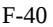

{188}------------------------------------------------

A reconciliation of the Bermuda statutory income tax rate of 0% to the Company's effective income tax rate is as follows:

|                                       | Years Ended December 31, |        |        |  |
|---------------------------------------|-----------------------------|--------|--------|--|
|                                       | 2022                        | 2021   | 2020   |  |
| Bermuda statutory income tax rate     | — %                         | — %    | — %    |  |
| U.S. and Europe tax rate differential | 165.9                       | 1.9    | (0.8)  |  |
| Research and development tax credits  | (21.5)                      | 2.4    | 2.4    |  |
| Share-based compensation              | 13.2                        | (0.4)  | 1.3    |  |
| Permanent differences                 | —                           | —      | (0.1)  |  |
| U.S. state taxes, net of federal      | 10.4                        | (0.5)  | 0.1    |  |
| FDII                                  | (35.9)                      | 1.4    | 0.6    |  |
| Uncertain tax positions               | 14.3                        | 0.2    | (0.2)  |  |
| IP Transfer                           | (343.9)                     | 71.0   | —      |  |
| Other                                 | 17.2                        | (0.8)  | (0.9)  |  |
| Change in valuation allowance         | (1,382.8)                   | (76.1) | (5.7)  |  |
| Effective income tax rate             | (1,563.1)%                  | (0.9)% | (3.3)% |  |

Net deferred tax assets consisted of the following:

|                                                   |            | December 31, |             |  |
|---------------------------------------------------|------------|--------------|-------------|--|
|                                                   | 2022       |              | 2021        |  |
| Deferred tax assets:                              |            |              |             |  |
| Research and development tax credit carryforwards | \$ 231  |              | \$ 1,620 |  |
| Share-based compensation                          | 11,789     |              | 9,492       |  |
| Operating lease liability                         | 1,543      |              | 1,574       |  |
| Accrued expenses and other liabilities            | 2,134      |              | 1,869       |  |
| Intangible Asset                                  | 181,458    |              | 107,037     |  |
| Capitalized research and development              | 5,586      |              | —           |  |
| Net operating losses                              | 4,054      |              | 8,559       |  |
| Total deferred tax assets                         | 206,795    |              | 130,151     |  |
| Valuation allowance                               | (19,584)   |              | (127,944)   |  |
| Deferred tax liabilities:                         |            |              |             |  |
| Depreciation and amortization                     | (312)      |              | (762)       |  |
| Right of use asset                                | (1,404)    |              | (1,445)     |  |
| Net deferred tax assets                           | \$ 185,495 |              | \$ —     |  |
|                                                   |            |              |             |  |

As of December 31, 2022, the Company had no federal research and development tax credit carryforwards available to reduce future tax liabilities. As of December 31 2021, the Company had federal research and development tax credit carryforwards of approximately \$1,546 available to reduce future tax liabilities. As of December 31, 2022 and 2021, the Company had state research and development tax credit carryforwards of approximately \$297 and \$251 respectively, available to reduce future tax liabilities, which can be carried forward indefinitely. As of December 31, 2022 and 2021 the Company had foreign net operating loss (NOLs) carryforwards of \$3,902 and \$8,559 respectively, available to reduce future tax liabilities. The NOLs maybe carried forward indefinitely subject to local utilization limitations.

As required by ASC 740 management regularly reassesses the valuation allowance on the Company's deferred income tax assets. Valuation allowances require an assessment of both positive and negative evidence when determining whether it is more likely than not that the Company will be able to recover its deferred tax assets. Such assessment is

{189}------------------------------------------------

required on a jurisdiction-by-jurisdiction basis. The ultimate realization of deferred tax assets is dependent upon the generation of future taxable income during the periods in which those temporary differences become deductible.

In the third quarter of 2022, the Company assessed the valuation allowance on its UK deferred tax assets and considered positive evidence, including, among other things, cumulative UK income in recent years, estimates of sales related to the Company's commercial product ARCALYST, and future profitability by jurisdiction. After assessing both the positive evidence and negative evidence, the Company determined it was more likely than not that its UK deferred tax assets would be realized in the future and released the associated valuation allowance during the year ended December 31, 2022. This resulted in a benefit of \$185,495. As of December 31, 2022, the Company maintained a full valuation allowance against its U.S. deferred tax assets. While the Company still maintains a full valuation allowance on its US deferred tax assets as of December 31, 2022, based on current US forecasted income, it is reasonably possible that the Company will release its valuation allowance on its US deferred tax assets within one year. There are no material deferred tax assets in the jurisdictions outside Kiniksa US and Kiniksa UK.

Utilization of the state research and development tax credits may be subject to substantial annual limitation under Section 382 of the Internal Revenue Code of 1986 due to ownership changes that could occur in the future. These ownership changes may limit the amount of carryforwards that can be utilized annually to offset future taxable income. In general, an ownership change, as defined by Section 382, results from transactions increasing the ownership of certain shareholders or public groups in the shares of a corporation by more than 50% over a three-year period.

Changes in the valuation allowance for deferred taxes were as follows:

|                                                        | Years Ended December 31, |               |             |  |
|--------------------------------------------------------|-----------------------------|---------------|-------------|--|
|                                                        | 2022                        | 2021          | 2020        |  |
| Valuation allowance at beginning of year               | \$ (127,944)                | \$ (9,307) | \$ (330) |  |
| Increases recorded through the balance sheet           | —                           | —             | —           |  |
| Decreases (increases) recorded to income tax provision | 108,360                     | (118,637)     | (8,977)     |  |
| Valuation allowance at end of year                     | \$ (19,584)                 | \$ (127,944)  | \$ (9,307)  |  |

The valuation allowance decreased by \$108,360 in 2022 primarily as a result of the release of the valuation allowance for the UK deferred tax assets which primarily consisted of the tax basis in intellectual property transferred from Bermuda and net operating losses.

The Company recognizes the tax benefit from an uncertain tax position only if it is more-likely-than-not that the tax position will be sustained on examination by taxing authorities, based on the technical merits of the position. The tax benefits recognized in the financial statements from such a position are measured based on the largest benefit that has a greater than 50% likelihood of being realized upon ultimate settlement. The amount of unrecognized tax benefits is \$1,794 and \$545 as of December 31, 2022 and 2021, respectively. The net change in 2022 and 2021 relate to tax positions on our intellectual property transfers and positions on research and development credits.

A roll forward of the Company's uncertainties in its income tax provision liability is presented below:

|                                                             |              |    | Years Ended |    |       |
|-------------------------------------------------------------|--------------|----|-------------|----|-------|
|                                                             | December 31, |    |             |    |       |
|                                                             | 2022         |    | 2021        |    | 2020  |
| Gross balance at the beginning of year                      | \$ 545    | \$ | 837         | \$ | 528   |
| Gross increases based on current period tax positions       | 1,386        |    | 50          |    | 411   |
| Gross decreases based on tax positions of the prior periods | (137)        |    | (342)       |    | (102) |
| Unrecognized tax benefits at the end of the year            | \$ 1,794  | \$ | 545         | \$ | 837   |

{190}------------------------------------------------

The Company's policy is to record interest and penalties related to income taxes as part of its income tax provision. The Company had recorded immaterial interest on the tax positions during the year ended December 31, 2022, 2021 and 2020.

The Company files US federal income tax returns and income tax returns in various state, local and foreign jurisdictions. The Company's income tax returns are subject to tax examinations for the tax years ended December 31, 2019 and subsequent years. To the extent the Company has tax attribute carryforwards, the tax years in which the attribute was generated may still be adjusted upon examination by tax authorities to the extent utilized in a future period.

## **15. Net Income (Loss) per Share**

The rights, including the liquidation and dividend rights, of the holders of Class A, Class B, Class A1 and Class B1 common shares are identical, except with respect to voting, transferability and conversion (see Note 10). As the liquidation and dividend rights are identical, losses are allocated on a proportionate basis and the resulting net income (loss) per share attributed to common shareholders will, therefore, be the same for both Class A and Class B common shares on an individual or combined basis.

Basic and diluted Net income (loss) attributable to common shareholders was calculated as follows:

|                                                       | Years Ended December 31, |            |    |            |    |            |
|-------------------------------------------------------|-----------------------------|------------|----|------------|----|------------|
|                                                       |                             | 2022       |    | 2021       |    | 2020       |
| Numerator:                                            |                             |            |    |            |    |            |
| Net income (loss) attributable to common shareholders | \$                          | 183,363    | \$ | (157,924)  | \$ | (161,381)  |
| Denominator:                                          |                             |            |    |            |    |            |
| Weighted-average basic shares outstanding             |                             | 69,382,275 |    | 68,576,810 |    | 61,842,722 |
| Effect of dilutive securities                         |                             |            |    |            |    |            |
| Options to purchase common shares                     |                             | 968,512    |    | —          |    | —          |
| Unvested RSUs                                         |                             | 70,535     |    | —          |    | —          |
| Weighted-average diluted shares                       |                             | 70,421,322 |    | 68,576,810 |    | 61,842,722 |
|                                                       |                             |            |    |            |    |            |
| Basic net income (loss) per share                     | \$                          | 2.64       | \$ | (2.30)     | \$ | (2.61)     |
| Diluted net income (loss) per share                   | \$                          | 2.60       | \$ | (2.30)     | \$ | (2.61)     |

The Company's unvested RSUs have been excluded from the computation of basic net loss per share attributable to common shareholders.

Diluted earnings per share includes the assumed exercise of dilutive options and the assumed issuance of unvested RSUs and performance-based awards for which the performance condition has been met as of the date of determination, using the treasury stock method unless the effect is anti-dilutive. The treasury stock method assumes that proceeds, including cash received from the exercise of employee stock options and the average unrecognized compensation expense for unvested share-based compensation awards, would be used to purchase the Company's common stock at the average market price during the period.

For years ended December 31, 2021 and 2020 the Company's potentially dilutive securities, which include options and unvested RSUs, have been excluded from the computation of diluted net loss per share attributable to common shareholders for the periods indicated as the effect would be to reduce the net loss per share attributable to common shareholders. Therefore, the weighted average number of common shares outstanding used to calculate both basic and diluted net loss per share attributable to common shareholders is the same. The Company excluded the following potential common shares, presented based on amounts outstanding at each period end, from the computation

{191}------------------------------------------------

of diluted net income (loss) per share attributable to common shareholders for the periods indicated because including them would have had an anti-dilutive effect:

|                                         |           | Years ended December 31, |            |  |  |
|-----------------------------------------|-----------|--------------------------|------------|--|--|
|                                         | 2022      | 2021                     | 2020       |  |  |
| Share options to purchase common shares | 8,403,074 | 9,226,846                | 9,958,858  |  |  |
| Unvested RSUs                           | 1,548,347 | 885,021                  | 205,312    |  |  |
| Total anti-dilutive shares              | 9,951,421 | 10,111,867               | 10,164,170 |  |  |

## **16. Commitments and Contingencies**

## *License Agreements*

The Company has entered into license agreements with various parties under which it is obligated to make contingent and non-contingent payments (see Note 13).

## *Manufacturing Commitments*

The Company entered into supply agreements with Regeneron to provide both clinical supply and commercial product (see Note 13). The Company entered into agreements with several CMOs to provide the Company with preclinical and clinical trial materials. As of December 31, 2022, the Company had committed to minimum payments under these agreements totaling \$22,851, of which \$22,851 are due within one year.

## *Indemnification Agreements*

In the ordinary course of business, the Company may provide indemnification of varying scope and terms to vendors, lessors, business partners and other parties with respect to certain matters including, but not limited to, losses arising out of breach of such agreements or from intellectual property infringement claims made by third parties. In addition, the Company has entered into indemnification agreements with members of its board of directors, officers and other key personnel that will require the Company, among other things, to indemnify them against certain liabilities that may arise by reason of their status or service as directors, officers or other key personnel. The maximum potential amount of future payments the Company could be required to make under these indemnification agreements is, in many cases, unlimited. To date, the Company has not incurred any material costs as a result of such indemnifications. The Company does not believe that the outcome of any claims under indemnification arrangements will have a material effect on its financial position, results of operations or cash flows, and it has not accrued any liabilities related to such obligations in its consolidated financial statements as of December 31, 2022, 2021 or 2020.

## *Legal Proceedings*

The Company is not a party to any litigation and does not have contingency reserves established for any litigation liabilities.

## **17. Benefit Plans**

The Company has established a defined-contribution savings plan under Section 401(k) of the Internal Revenue Code. This plan covers substantially all employees who meet minimum age and service requirements and allows participants to defer a portion of their annual compensation on a pre-tax basis. The Company provides matching contributions of 100% of the first 3% of each participant's salary contributed, plus 50% for each of the next 2% contributed. Employees are immediately and fully vested in their own contributions and the Company's match. During the years ended December 31, 2022, 2021 and 2020, the Company contributed \$1,683, \$1,558 and \$993 respectively, to the plan.

{192}------------------------------------------------

## CONSENT OF INDEPENDENT REGISTERED PUBLIC ACCOUNTING FIRM

We hereby consent to the incorporation by reference in the Registration Statements on Forms S-3 (Nos. 333-264751, 333- 264746, 333-248656, and 333-238585) and Forms S-8 (Nos. 333-262971, 333-253514, 333-237589, and 333-225196) of Kiniksa Pharmaceuticals, Ltd. of our report dated March 2, 2023 relating to the financial statements, which appears in this Form 10-K.

/s/ PricewaterhouseCoopers LLP Boston, Massachusetts March 2, 2023

{193}------------------------------------------------

## **CERTIFICATION**

## I, Sanj K. Patel, certify that:

- 1. I have reviewed this annual report on Form 10-K of Kiniksa Pharmaceuticals, Ltd.;
- 2. Based on my knowledge, this report does not contain any untrue statement of a material fact or omit to state a material fact necessary to make the statements made, in light of the circumstances under which such statements were made, not misleading with respect to the period covered by this report;
- 3. Based on my knowledge, the financial statements, and other financial information included in this report, fairly present in all material respects the financial condition, results of operations and cash flows of the registrant as of, and for, the periods presented in this report;
- 4. The registrant's other certifying officer and I are responsible for establishing and maintaining disclosure controls and procedures (as defined in Exchange Act Rules 13a-15(e) and 15d-15(e)) and internal control over financial reporting (as defined in Exchange Act Rules 13a-15(f) and 15d-15(f)) for the registrant and have:

(a) Designed such disclosure controls and procedures, or caused such disclosure controls and procedures to be designed under our supervision, to ensure that material information relating to the registrant, including its consolidated subsidiaries, is made known to us by others within those entities, particularly during the period in which this report is being prepared;

(b) Designed such internal control over financial reporting, or caused such internal control over financial reporting to be designed under our supervision, to provide reasonable assurance regarding the reliability of financial reporting and the preparation of financial statements for external purposes in accordance with generally accepted accounting principles;

(c) Evaluated the effectiveness of the registrant's disclosure controls and procedures and presented in this report our conclusions about the effectiveness of the disclosure controls and procedures, as of the end of the period covered by this report based on such evaluation; and

(d) Disclosed in this report any change in the registrant's internal control over financial reporting that occurred during the registrant's most recent fiscal quarter (the registrant's fourth fiscal quarter in the case of an annual report) that has materially affected, or is reasonably likely to materially affect, the registrant's internal control over financial reporting; and

- 5. The registrant's other certifying officer and I have disclosed, based on our most recent evaluation of internal control over financial reporting, to the registrant's auditors and the audit committee of the registrant's board of directors (or persons performing the equivalent functions):
(a) All significant deficiencies and material weaknesses in the design or operation of internal control over financial reporting which are reasonably likely to adversely affect the registrant's ability to record, process, summarize and report financial information; and

(b) Any fraud, whether or not material, that involves management or other employees who have a significant role in the registrant's internal control over financial reporting.

Date: March 2, 2023

/s/ Sanj K. Patel Sanj K. Patel Chief Executive Officer and Chairman of the Board of Directors (Principal Executive Officer)

{194}------------------------------------------------

## **CERTIFICATION**

## I, Mark Ragosa, certify that:

- 1. I have reviewed this annual report on Form 10-K of Kiniksa Pharmaceuticals, Ltd.;
- 2. Based on my knowledge, this report does not contain any untrue statement of a material fact or omit to state a material fact necessary to make the statements made, in light of the circumstances under which such statements were made, not misleading with respect to the period covered by this report;
- 3. Based on my knowledge, the financial statements, and other financial information included in this report, fairly present in all material respects the financial condition, results of operations and cash flows of the registrant as of, and for, the periods presented in this report;
- 4. The registrant's other certifying officer and I are responsible for establishing and maintaining disclosure controls and procedures (as defined in Exchange Act Rules 13a-15(e) and 15d-15(e)) and internal control over financial reporting (as defined in Exchange Act Rules 13a-15(f) and 15d-15(f)) for the registrant and have:

(a) Designed such disclosure controls and procedures, or caused such disclosure controls and procedures to be designed under our supervision, to ensure that material information relating to the registrant, including its consolidated subsidiaries, is made known to us by others within those entities, particularly during the period in which this report is being prepared;

(b) Designed such internal control over financial reporting, or caused such internal control over financial reporting to be designed under our supervision, to provide reasonable assurance regarding the reliability of financial reporting and the preparation of financial statements for external purposes in accordance with generally accepted accounting principles;

(c) Evaluated the effectiveness of the registrant's disclosure controls and procedures and presented in this report our conclusions about the effectiveness of the disclosure controls and procedures, as of the end of the period covered by this report based on such evaluation; and

(d) Disclosed in this report any change in the registrant's internal control over financial reporting that occurred during the registrant's most recent fiscal quarter (the registrant's fourth fiscal quarter in the case of an annual report) that has materially affected, or is reasonably likely to materially affect, the registrant's internal control over financial reporting; and

- 5. The registrant's other certifying officer and I have disclosed, based on our most recent evaluation of internal control over financial reporting, to the registrant's auditors and the audit committee of the registrant's board of directors (or persons performing the equivalent functions):
(a) All significant deficiencies and material weaknesses in the design or operation of internal control over financial reporting which are reasonably likely to adversely affect the registrant's ability to record, process, summarize and report financial information; and

(b) Any fraud, whether or not material, that involves management or other employees who have a significant role in the registrant's internal control over financial reporting.

Date: March 2, 2023

/s/ Mark Ragosa

Mark Ragosa Chief Financial Officer (Principal Financial Officer)

{195}------------------------------------------------

# **CERTIFICATION PURSUANT TO 18 U.S.C. SECTION 1350, AS ADOPTED PURSUANT TO SECTION 906 OF THE SARBANES-OXLEY ACT OF 2002**

I, Sanj K. Patel, Chief Executive Officer and Chairman of the Board of Directors of Kiniksa Pharmaceuticals, Ltd. (the "Company"), hereby certify, pursuant to 18 U.S.C. §1350, as adopted pursuant to §906 of the Sarbanes-Oxley Act of 2002, that, to the best of my knowledge:

- 1. The Annual Report on Form 10-K of the Company for the period ended December 31, 2022 (the "Report") fully complies with the requirements of Section 13(a) or 15(d) of the Securities Exchange Act of 1934, as amended and
- 2. The information contained in the Report fairly presents, in all material respects, the financial condition and results of operations of the Company.

Dated: March 2, 2023 /s/ Sanj K. Patel

Sanj K. Patel Chief Executive Officer and Chairman of the Board of Directors (Principal Executive Officer)

{196}------------------------------------------------

# **CERTIFICATION PURSUANT TO 18 U.S.C. SECTION 1350, AS ADOPTED PURSUANT TO SECTION 906 OF THE SARBANES-OXLEY ACT OF 2002**

I, Mark Ragosa, Chief Financial Officer of Kiniksa Pharmaceuticals, Ltd. (the "Company"), hereby certify pursuant to 18 U.S.C. §1350, as adopted pursuant to §906 of the Sarbanes-Oxley Act of 2002, that to the best of my knowledge:

- 1. The Annual Report on Form 10-K of the Company for the period ended December 31, 2022 (the "Report") fully complies with the requirements of Section 13(a) or 15(d) of the Securities Exchange Act of 1934, as amended and
- 2. The information contained in the Report fairly presents, in all material respects, the financial condition and results of operations of the Company.

Dated: March 2, 2023 /s/ Mark Ragosa

Mark Ragosa Chief Financial Officer (Principal Financial Officer)