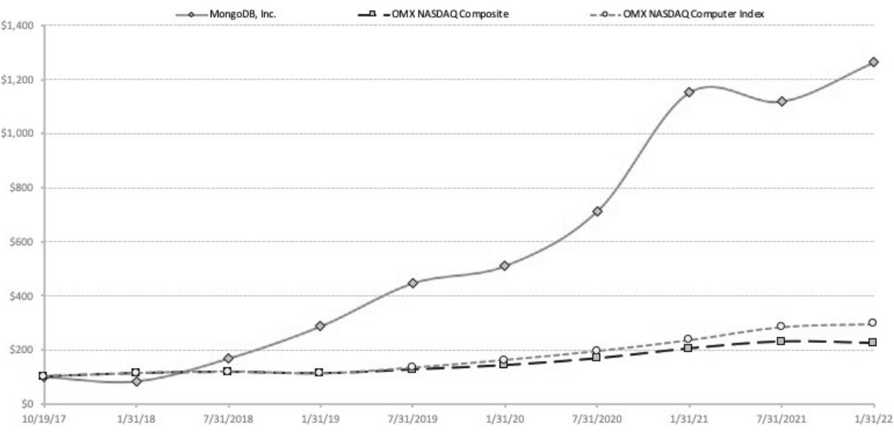

{0}------------------------------------------------

# Annual Report

# 2022

{1}------------------------------------------------

# Build Faster. Build Smarter.

{2}------------------------------------------------

# **\$>=7> =3**

FC58K5M
H< @CCF (9K3CF?
(9K3CF?

# **%>C935>6==D1;\$55C9=7>6*C>3:8>;45AB**

### **+>55;4>=!D=5 
1C

1<1BC5A=+9<5**

.CH<9-HC7?<C@89FGC:'CB;C
#B7

)B69<5@:C:CIF6C5F8C:8=F97HCFG
=H=GCIFD@95GIF9HC=BJ=H9MCIHC5HH9B8H<95BBI5@A99H=B;C:GHC7?<C@89FG C:'CB;C
#B7
59@5K5F97CFDCF5H=CB

.<9A99H=B;K=@@69<9@8J=FHI5@@M
J=5@=J9K9675GH5H*9998,467\$.5+\$4(+1.'(4/((6,0*&1/*CF=;=B5H=B; :FCA (9K 3CF?
 (9K 3CF?
 CB .I9G85M
 \$IB9 
 5H 5A 5GH9FB .=A919 7CBH=BI9 HC 9A6F579 H<9 @5H9GH H97<BC@C;MHC DFCJ=89 9LD5B898 5779GG
=ADFCJ98 7CAAIB=75H=CB 5B8 7CGH G5J=B;G19 69@=9J9 <CGH=B; 5 J=FHI5@A99H=B; 9B56@9G=B7F95G98GHC7?<C@89F5HH9B85B795B8D5FH=7=D5H=CB:FCA@C75H=CBG5FCIB8H<9KCF@888=H=CB5@@M
=B@=;<HC:DI6@=7 <95@H<5B8HF5J9@7CB79FBG5F=G=B;:FCAH<9CB;C=B;)0#D5B89A=7
<CGH=B;5J=FHI5@A99H=B;<9@DG9BGIF9H<9<95@H< 5B8G5:9HMC:CIFGHC7?<C@89FG5B8CH<9FA99H=B;D5FH=7=D5BHG-HC7?<C@89FG5HH9B8=B;H<9J=FHI5@A99H=B;K=@@695::CF898H<9 G5A9F=;<HG5B8CDDCFHIB=H=9GHCD5FH=7=D5H95GH<9MKCI@85H5B=BD9FGCBA99H=B;199B7CIF5;9MCIHC5HH9B8CB@=B95B8 D5FH=7=D5H9.<9 F97CF885H9 :CFH<9A99H=B;=GDF=@
)B@MGHC7?<C@89FGC: F97CF85HH<97@CG9C:6IG=B9GGCBH<5H 85H9A5MJCH95HH<9A99H=B;CF5BM58>CIFBA9BHH<9F9C:

#### **0>DAE>C59BE5AH9<?>AC1=C.85C85A>A=>CH>D?;1=C>1CC5=4C85<55C9=7 F5DA75H>DC>E>C52H?A>GHC> 5=BDA5H>DAE>C59B3>D=C54**

.<9A99H=B;K=@@69<9@8:CFH<9:C@@CK=B;DIFDCG9G

- .C 9@97HH<F99@5GG ## 8=F97HCFG
 F5B7=G7C W-CIN5
<5F@9G' "5N5F8
 \$F
 5B8 .CA %=@@5@95
 957<HC G9FJ9IBH=@CIF5BBI5@A99H=B;C:GHC7?<C@89FG=B
- .C5DDFCJ9
CB5BCB6=B8=B;58J=GCFM65G=G
H<97CAD9BG5H=CBC:CIFB5A989L97IH=J9C::=79FG
- .C F5H=:M H<9 G9@97H=CB C: *F=79K5H9F<CIG9CCD9FG &&* 5G CIF=B89D9B89BH F9;=GH9F98 DI6@=7 577CIBH=B; :=FA:CFCIF:=G75@M95F9B8=B;\$5BI5FM
5B8
- .C7CB8I7H5BMCH<9F6IG=B9GGDFCD9F@M6FCI;<H69:CF9H<9A99H=B;CF5BM58>CIFBA9BHGCFDCGHDCB9A9BHG H<9F9C:

.<9G9=H9AGC:6IG=B9GG5F9ACF9:I@@M89G7F=698=BH<9DFCLMA5H9F=5@G577CAD5BM=B;H<=GBCH=79

)B 69<5@: C: H<9 6C5F8 C: 8=F97HCFG 5B8 H<9 A5B5;9A9BH H95A
 H<5B? MCI :CF MCIF =BJ9GHA9BH 5B8 =BH9F9GH =B 'CB;C

M)F89FC:H<9C5F8C:=F97HCFG

'5M
 B8F9K-H9D<9BG !9B9F5@CIBG9@5B8-97F9H5FM

**0>D1A53>A491;;H9=E9C54C>1CC5=4C85E9ACD1;1==D1;<55C9=7.85C85A>A=>CH>D5G?53CC>1CC5=4C85<55C9=7 H>D1A5DA754C>E>C51=4BD2<9C H>DA ?A>GH 2H 6>;;>F9=7 C85 ?A>354DA5B 45B3A92549= C85 ?A>GH 31A4E5=96 H>D 81E5 E>C54 2H ?A>GH H>D<1H BC9;; E>C5 4DA9=7 C85<55C9=7 ';51B5 =>C5 8>F5E5A C81C96 H>DA B81A5B 1A5 85;4 >6 A53>A4 2H 1 2A>:5A 21=: >A >C85A B9<9;1A >A71=9I1C9>= 1=4 H>D F9B8 C> E>C5 4DA9=7 C85 <55C9=7 H>D<DBC6>;;>FC859=BCAD3C9>=B6A><BD38>A71=9I1C9>=**

{3}------------------------------------------------

# Table of Contents

| Questions and Answers                                                                                       | 2    |
|-------------------------------------------------------------------------------------------------------------|------|
| Board of Directors and Corporate Governance                                                                 | 8    |
| Proposal 1 - Election of Directors                                                                          | 21   |
| Information Regarding Director Nominees and Current Directors                                               | 22   |
| Director Compensation                                                                                       | ટર્ટ |
| Proposal 2 - Approval, on a Non-binding Advisory Basis. of the Compensation of Our Named Executive Officers | 28   |
| Executive Officers                                                                                          | 29   |
| Executive Compensation                                                                                      | 30   |
| · Compensation Discussion and Analysis                                                                      | 30   |
| · Executive Compensation Tables                                                                             | 44   |
| · Compensation Committee Report                                                                             | 49   |
| CEO Pay Ratio                                                                                               | રેી  |
| Equity Compensation Plan Information                                                                        | રી   |
| Proposal 3 - Ratification of Selection of Independent Registered Public Accounting Firm                     | રુડ  |
| Audit Committee Report                                                                                      | રવ   |
| Security Ownership of Certain Beneficial Owners and Management                                              | રેર  |
| Other Matters                                                                                               | રેજ  |

{4}------------------------------------------------

## MongoDB, Inc.

1633 Broadway, 38th Floor

New York, New York 10019

#### Proxy Statement

#### For the 2022 Annual Meeting of Stockholders

#### To Be Held on June 28, 2022 at 10:00 a.m. Eastern Time

Our board of directors is soliciting your proxy to vote at the 2022 annual meeting of MongoDB, Inc., a Delaware corporation, to be held virtually, via live webcast at www.virtualshareholdermeeting.com/MDB2022, originating from New York, New York, on Tuesday, June 28, 2022 at 10:00 a.m. Eastern Time, and any adjournment or postponement thereof. We believe that hosting a virtual meeting enables participation by more of our stockholders, while lowering the cost of conducting. Additionally, in light of public health and travel concerns arising from the COVID-19 pandemic, hosting a virtual meeting helps ensure the health and safety of our stockholders and other meeting participants. Stockholders attending the vill be afforded the same rights and opportunities to participate as they would at an in-person meeting.

For the meeting, we have elected to furnish our proxy materials, including this proxy statement and our Annual Report on Form 10-K for the fiscal year ended January 31, 2022 (the "Annual Report"), to our stockholders primarily via the internet. On or about May 17, 2022, we intend to our stockholders a Notice of Internet Availability of Proxy Materials (the "Notice") that contains notice of the meeting and instructions on how to access our proxy materials on the internet, how to vote at the meeting and how to request printed copies of the proxy materials. Stockholders may request to receive all future materials in printed form by mail or electronically by e-mail by following the instructions contained in the Notice. A stockholder's election to receive proxy materials by mail or email in effect until revoked. We encourage stockholders to take advantage of the availability of the proxy materials on the internet to help reduce the environmental impact and cost of our annual meeting.

Only stockholders of record at the close of business on April 29, 2022 will be entitled to vote at the meeting. On this record date, there were 68,061.063 shares of Class A common stock outstanding and entitled to vote (the "common stock"). Each holder of common stock will have the right to one vote per share of common stock. A list of stockholders entitled to vote at the meeting will be available for examination during normal business hours by any purpose germane to the meeting for ten days before the meeting at our address above. To the extent office access is impracticable due to the ongoing COVID-19 pandemic, please email us at ir@mongodb.com to make alternative arrangements. The stockholder list will also be available online during the meeting. For instructions on how to attend the virtual annual meeting, please see page 2 of this proxy statement.

In this proxy statement, we refer to MongoDB, Inc. as "MongoDB," "we" or "us" and the board of directors of MongoDB as "our board of directors." The Annual Report, which contains consolidated financial statements as of and for the fiscal year ended January 31, 2022, accompanies this proxy statement. You also may obtain a copy of the Annual Report without charge by writing to our Secretary at 499 Hamilton Ave, Palo Alto, CA 94301, Attention: Secretary.

{5}------------------------------------------------

# OUESTIONS AND ANSWERS

### About these Proxy Materials and Voting

#### Why did I receive a notice regarding the availability of proxy materials on the internet?

Pursuant to rules adopted by the Securities and Exchange Commission ("SEC"), we have elected to provide access to our proxy materials over the internet. Accordingly, we have sent you the Notice because our board of directors is soliciting vour proxy to vote at the 2022 annual meeting of stockholders, including at any adjournments thereof. All stockholders will have the ability to access the proxy materials on the Notice or to request a printed set of the proxy materials. Instructions on how to access the internet or to request a printed copy may be found in the Notice. We intend to mail the Notice on or about May 17, 2022 to all stockholders of record entitled to vote at the annual meeting.

#### How do I attend, participate in and ask questions during the virtual annual meeting online?

We will be hosting the meeting via live webcast only. Any stockholder can attend the virtual annual meeting live online at www.virtualshareholdermeeting.com/MDB2022. The meeting will start at 10:00 a.m. Eastern Time on June 28, 2022. Stockholders attending the virtual meeting will be afforded the same rights and opportunities to participate as they would at an in-person meeting.

In order to participate in the meeting, you will need the control number, which is included in the Notice or on your proxy card if you are a stockholder of record of shares of common stock, or included with your voting instruction card and voting instructions received from your broker, bank or other similar organization if you hold your shares of common stock in "street name." Instructions on how to attend and participate online are available at www.virtualshareholdermeeting.com/ MDB2022. We recommend that you log in a few minutes before 10:00 a.m. Eastern time on June 28, 2022 to ensure you are logged in when the meeting starts. The webcast will open 15 minutes before the start of the meeting.

Only stockholders of record as of the record date for the annual meeting and their proxy holders may submit questions or comments. You will be able to submit your question or comment during the meeting by logging in to www.virtualshareholdermeeting.com/MDB2022 using your control number and typing your question in the designated box in the annual meeting portal.

To help ensure that we have a productive and efficient meeting, and in fairness to all stockholders in attendance, you will also find posted our rules of conduct for the meeting when you log in prior to its start. These rules of conduct will include the following guidelines:

- . Only stockholders of record as of the record date for the meeting and their proxy holders may submit questions or comments.
- Questions and comments may be submitted electronically through the annual meeting portal during the meeting.
- . Questions must be directed to Dev Ittycheria. MongoDB's President and Chief Executive Officer.
- . Include your name and affiliation, if any, when submitting a question or comment.
- . Limit your remarks to one brief question or comment that is relevant to the meeting and/or our business.
- . Questions may be grouped by topic by our management.
- . Questions may also be ruled as out of order if they are, among other things, irrelevant to our business, related to pending or threatened litigation, disorderly, repetitious of statements already made, or in furtherance of the speaker's own personal, political or business interests.
- . Be respectful of your fellow stockholders and meeting participants.

{6}------------------------------------------------

#### What if I have technical difficulties or trouble accessing the virtual meeting?

We will have technicians ready to assist you with any technical difficulties you may have accessing the virtual meeting. If you encounter any difficulties accessing the check-in or meeting time, please call the technical support number that will be posted at www.virtualshareholdermeeting.com/MDB2022 or at www.proxyote.com. Technical support will be available starting at 9:45 a.m. Eastern Time on June 28, 2022.

#### Who can vote at the meeting?

Only stockholders of record at the close of business on the record date. April 29, 2022, will be entitled to vote at the meeting. On this record date, there were 68,061,063 shares of Class A common stock outstanding and entitled to vote.

#### Stockholder of Record: Shares Registered in Your Name

If, on April 29, 2022, your shares were registered directly in your name with our transfer agent, American Stock Transfer & Trust Company, LLC, then you are a stockholder of record, you may vote online during the meeting or vote by proxy. Whether or not you plan to attend the meeting, we urge you to vote by proxy to ensure your vote is counted.

#### Beneficial Owner: Shares Registered in the Name of a Broker or Bank

If, on April 29, 2022, your shares were held, not in your name, but rather in an account at a brokerage firm, bank, dealer or other similar organization, then vou are the beneficial owner of shares held in "street name" and the Notice is being forwarded to you by that organization holding your account is considered to be the stockholder of record for purposes of voting at the meeting. As a beneficial owner, you have the right to direct your broker or other similar organization regarding how to vote the shares in your account. You are also invited to attend the virtual annual meeting. Since you are not the stockholder of record, you may vote your shares online during the meeting only by following the instructions from your broker, bank or other similar organization.

#### What am I voting on?

There are three matters scheduled for a vote:

- . Proposal 1: Election of three Class II directors, each to serve until our annual meeting of stockholders in 2025;
- . Proposal 2: Approval, on a non-binding advisory basis, of the compensation of our named executive officers; and
- . Proposal 3: Ratification of the selection of PricewaterhouseCoopers LLP as our independent registered public accounting firm for the fiscal year ending January 31, 2023.

#### What if another matter is properly brought before the meeting?

Our board of directors knows of no other matters that will be presented for consideration at the meeting. If any other matters are properly brought before the meeting, it is the intention of the persons named in the accompanying proxy to vote on those matters in accordance with their best judgment.

#### How do I vote?

#### Stockholder of Record: Shares Registered in Your Name

If you are a stockholder of record, you may vote (a) online during the meeting, or (b) in advance of the meeting by proxy through the internet, over the telephone, or by using a proxy card that you may request. Whether or not your plan to attend the meeting, we urge you to vote in advance of the meeting by proxy to ensure your vote is counted. Even if you have submitted a proxy before the meeting, you may still attend online the meeting, In such case, your previously submitted proxy will be disregarded.

{7}------------------------------------------------

- To vote online during the meeting, follow the provided instructions to join the meeting at . www.virtualshareholdermeeting.com/MDB2022, starting at 10:00 a.m. Eastern Time on June 28, 2022. The webcast will open 15 minutes before the start of the meeting.
- . To vote by the internet before the meeting, go to www.proxyvote.com. You will be asked to provide the company number and control number from the Notice or the printed proxy card. Your internet vote must be received by 11:59 p.m., Eastern Time on June 27, 2022 to be counted.
- . To vote by telephone before the meeting, call 1-800-690-6903. You will be asked to provide the company number and control number from the Notice or the printed proxy card. Your telephone vote must be received by 11:59 p.m., Eastern Time on June 27, 2022 to be counted.
- . To vote by mail before the meeting, simply complete, sign and date the proxy card that you may request and return it promptly in the envelope provided. If you return your signed proxy card to us before the annual meeting, we will vote your shares as you direct.

#### Beneficial Owner: Shares Registered in the Name of Broker or Bank

If you are a beneficial owner of shares registered in the name of your broker, bank or other similar organization, you should receive a Notice containing voting instructions from that organization rather than from us. Simply follow the voting instructions in the Notice to ensure that your vote is counted. To vote online during the meeting, you must follow the instructions from your broker, bank or other similar organization.

Internet voting is provided to allow you to vote your shares online, with procedures designed to ensure the authenticity and correctness of your voting instructions. Please be aware that you must bear any costs associated with your internet access.

#### Can I change my vote after submitting my proxy?

Yes. If you are a record holder of shares, you may revoke, subject to the voting deadlines above, your proxy using one of the following ways:

- You may submit another properly completed proxy card with a later date.
- . You may grant a subsequent proxy by telephone or through the internet.
- . You may send a timely written notice that you are revoking your proxy to our Secretary at 499 Hamilton Ave, Palo Alto, CA 94301, Attention: Secretary.
- . You may attend and vote online during the meeting. Simply attending will not, by itself, revoke vour proxy.

If your shares are held by your broker, bank or other similar organization, you should follow the instructions provided by such party.

#### What happens if I do not vote?

#### Stockholder of Record: Shares Registered in Your Name

If you are a stockholder of record and do not vote online during the meeting, or in advance of the meeting through the internet, by telephone or by completing your proxy card, your shares will not be voted.

#### Beneficial Owner: Shares Registered in the Name of Broker or Bank

If you are a beneficial owner and do not instruct your broker similar organization how to vote your shares, the question of whether your broker or nominee will still be able to vote your shares depends on whether, pursuant to stock exchange rules, the particular proposal is deemed to be a "routine" matter. Brokers and nominees can use their discretion to vote "uninstructed" shares with respect to matters that are considered to be "routine," but not with respect to "non-routine" matters. "Non-routine" matters are matters that may substantially affect the rights or privileges of stockholders, such as mergers, stockholder proposals, elections (even if not contested), executive compensation and certain 

{8}------------------------------------------------

corporate governance proposals, even if management-supported. Accordingly, your broker or nominee may not vote your shares on Proposal 1 or 2 without your instructions. Your broker or nominee may only yote your shares on Proposal 3 (Ratification of Auditors) in the absence of your instruction.

Please instruct your bank, broker or other similar organization to ensure that your vote will be counted.

#### What are "broker non-votes"?

As discussed above, when a beneficial owner of shares held in "street name" does not give instructions to the broker or nominee holding the shares as to how to vote on matters deemed under stock exchange rules to be "non-routine," the broker or nominee cannot vote the shares. These unvoted shares are counted as "broker non-votes."

#### What if I return a proxy card or otherwise vote but do not make specific choices?

If you return a signed and dated proxy card or otherwise vote but do not make specific choices, your shares will be voted in accordance with the recommendations of our board of directors as follows:

- . FOR the election of each of the nominees for Class II director:
- . FOR the approval, on a non-binding advisory basis, of the compensation of our named executive officers, as disclosed in this proxy statement; and
- . FOR the ratification of the selection of PricewaterhouseCoopers LLP as our independent registered public accounting firm for our fiscal year ending January 31, 2023.

If any other matter is properly presented at the meeting, your proxyholder (one of the individuals named on your proxy card) will vote your shares using his best judgment.

#### How many votes do I have?

Each holder of common stock will have the right to one vote per share of common stock. Cumulative voting is not permitted with respect to the election of directors.

#### How many votes are needed to approve each proposal?

- . Proposal 1 - Election of Directors: Each director is elected by a plurality of the votes cast. The three nominees for Class II directors that receive the highest number of FOR votes will be elected.
- . Proposal 2 - Advisory Vote on the Compensation of our Named Executive Officers: This proposal, commonly referred to as the "say-on-pay" vote, must receive FOR votes from the holders of a majority in voting power of the shares present at the meeting (by virtual attendance) or represented by proxy and entitled to vote on the proposal. Since this proposal is an advisory vote, the result will not be binding on our board of directors. However, our board of directors values our stockholders' opinions, and our board of directors and the compensation committee will take into account the outcome of the advisory vote when considering future executive compensation decisions.
- Proposal 3 - Ratification of Auditors: The ratification of our independent registered public accounting firm must receive FOR votes from the holders of a majority in voting power of the shares present at the meeting (by virtual attendance) or represented by proxy and entitled to vote on the proposal.

#### How are broker non-votes and abstentions treated?

If your shares of voting common stock are held by a broker on your behalf, and you do not instruct the broker as to how to vote these shares on Proposal 3, the broker may exercise its discretion to vote FOR or AGAINST that proposal in the absence of your instruction. With respect to Proposals 1 and 2, the broker may not exercise discretion to vote on those proposals. Such event would constitute a "broker non-vote," and these shares will not be counted as having been voted on the applicable proposal. However, broker non-votes will be considered present and entitled to vote at the meeting and will be counted in determining whether or not a quorum is present. Please instruct your broker so your vote can be counted.

{9}------------------------------------------------

#: GHC7?<C@89FG 56GH5=B :FCA JCH=B;
 H<9 5DD@=756@9 G<5F9G C: JCH=B; 7CAACB GHC7? K=@@ 69 7CBG=89F98 DF9G9BH 5B8 9BH=H@98 HC JCH9 5H H<9 A99H=B; 5B8 K=@@ 69 7CIBH98 =B 89H9FA=B=B; K<9H<9F CF BCH 5 EICFIA =G DF9G9BH 1=H< F9GD97H HC*FCDCG5@
56GH9BH=CBGK=@@<5J9BC9::97H=B89H9FA=B=B;K<9H<9F5BCA=B99:CF8=F97HCF<5GF979=J98GI::=7=9BH JCH9G1=H<F9GD97HHC*FCDCG5@G5B8
56GH9BH=CBG5F97CBG=89F98=B89H9FA=B=B;H<9BIA69FC:JCH9GF9EI=F98HCC6H5=BH<9 B979GG5FMA5>CF=HMJCH9:CFH<9DFCDCG5@5B8K=@@<5J9H<9G5A99::97H5GJCH=B; **%*+**H<9DFCDCG5@

#### **.8>3>D=CBC85E>C5B**

19 <5J9 9B;5;98 FC58F=8;9 =B5B7=5@ -C@IH=CBG UFC58F=8;9V 5G CIF =B89D9B89BH 5;9BH HC H56I@5H9 GHC7?<C@89FJCH9G#:MCI5F95GHC7?<C@89FC:F97CF8
5B8MCI7<CCG9HCJCH9CJ9FH<9=BH9FB9H9=H<9FDF=CFHCCF8IF=B;H<9 A99H=B;CF6MH9@9D<CB9
FC58F=8;9K=@@5779GG5B8H56I@5H9MCIFJCH99@97HFCB=75@@M
5B8=:MCI7<CCG9HCG=;B5B8A5=@ MCIFDFCLM75F8
MCIF9L97IH98DFCLM75F8=GF9HIFB988=F97H@MHCFC58F=8;9:CFH56I@5H=CBGBCH9856CJ9
=:MCI<C@8MCIF G<5F9GH<FCI;<56FC?9F
 MCIF 6FC?9F CF=HG 5;9BH :CFH56I@5H=B; JCH9G C: G<5F9G <9@8=B GHF99H B5A9
 5G 5DD@=756@9 F9HIFBG CB9DFCLM75F8HCFC58F=8;9CB69<5@:C:5@@=HG7@=9BHG

#### **.8>9B?1H9=76>AC89B?A>GHB>;939C1C9>=**

19K=@@D5M:CFH<97CGHC:GC@=7=H=B;DFCL=9G#B588=H=CBHCH<9G9DFCLMA5H9F=5@G
CIF8=F97HCFG5B89AD@CM99GA5M 5@GC GC@=7=H DFCL=9G =B D9FGCB
 6M H9@9D<CB9 CF 6M CH<9F A95BG C: 7CAAIB=75H=CB =F97HCFG 5B8 9AD@CM99G K=@@ BCH 69 D5=8588=H=CB5@ 7CAD9BG5H=CB :CF GC@=7=H=B; DFCL=9G 19 A5M F9=A6IFG9 6FC?9FG
 65B?G 5B8 CH<9F CF;5B=N5H=CBG :CF H<9 7CGH C: :CFK5F8=B; DFCLM A5H9F=5@G HC 69B9:=7=5@ CKB9FG 19 9B;5;98 @@=5B79 8J=GCFG HC 5GG=GH IG K=H< CIF G<5F9<C@89F9B;5;9A9BHDFC79GG
5B8K9A5MD5MH<9A5B9GH=A5H98:99C:-D@IGF95GCB56@9CIHC:DC7?9H9LD9BG9G =:H<9M5GG=GH IG =B GC@=7=H=B; DFCL=9G 19 A5M 5@GC F9=A6IFG9 6FC?9F5;9 :=FAG
 65B?G 5B8 CH<9F 5;9BHG :CF H<9 7CGH C: :CFK5F8=B; DFCLMA5H9F=5@GHC69B9:=7=5@CKB9FG

#### **.81C4>5B9C<51=96 A5359E5<>A5C81=>=5%>C935**

#:MCIF979=J9ACF9H<5BCB9(CH=79
MCIFG<5F9GA5M69F9;=GH9F98=BACF9H<5BCB9B5A9CF=B8=::9F9BH 577CIBHG*@95G9:C@@CKH<9=BGHFI7H=CBGCBH<9(CH=79GHC9BGIF9H<5H5@@MCIFG<5F9G5F9JCH98

#### **.85=1A5BC>3:8>;45A?A>?>B1;B1=449A53C>A=><9=1C9>=B4D56>A=5GCH51AMB1==D1;<55C9=7**

.C 69 7CBG=89F98 :CF =B7@IG=CB =B B9LH M95FWG DFCLM A5H9F=5@G MCIF DFCDCG5@ CF BCA=B5H=CB AIGH 69 GI6A=HH98 =BKF=H=B;6M\$5BI5FM

HCCIF-97F9H5FM5H"5A=@HCBJ9
*5@C@HC

HH9BH=CB-97F9H5FMDFCJ=898 H<5H
 =: H<9 85H9 C: B9LH M95FWG A99H=B; =G 95F@=9F H<5B '5M 
 CF @5H9F H<5B \$I@M 

 H<9 8958@=B9 K=@@ 69 5 F95GCB56@9H=A9 69:CF9K9 69;=BHC DF=BH5B8 G9B8 CIF DFCLMA5H9F=5@G :CF B9LH M95FWGA99H=B; #: MCIK=G<HC BCA=B5H95 8=F97HCF CFGI6A=H5DFCDCG5@H<5HMCI8CBCH89G=F9HC69=B7@I898=BB9LHM95FWGDFCLMA5H9F=5@G
MCIAIGH8CGC69HK99B 96FI5FM
 5B8 '5F7< 
 DFCJ=898 H<5H =: H<9 85H9 C: H<5H 5BBI5@ A99H=B; C: GHC7?<C@89FG =G 95F@=9F H<5B '5M 
 CF@5H9F H<5B \$I@M 

 MCI AIGH ;=J9 H<9 F9EI=F98 BCH=79 BCH 95F@=9F H<5B H<9 H< 85M DF=CF HC H<9 A99H=B; 85H9 5B8 BCH@5H9FH<5BH<9H<85MDF=CFHCH<9A99H=B;85H9CF
=:@5H9F
H<9H<85M:C@@CK=B;H<985MCBK<=7< DI6@=78=G7@CGIF9C:H<5HA99H=B; 85H9 =G :=FGH A589 3CI 5F9 5@GC 58J=G98 HC F9J=9K CIF 5A9B898 5B8 F9GH5H98 6M@5KG K<=7< 7CBH5=B 588=H=CB5@F9EI=F9A9BHG56CIH58J5B79BCH=79C:GHC7?<C@89FDFCDCG5@G5B88=F97HCFBCA=B5H=CBG

#### **.81C9BC85@D>AD<A5@D9A5<5=C**

EICFIAC:GHC7?<C@89FG=GB979GG5FMHC<C@85J5@=8A99H=B;EICFIAK=@@69DF9G9BH=:GHC7?<C@89FG<C@8=B;5 A5>CF=HMC:H<95;;F9;5H9JCH=B;DCK9FC:H<9CIHGH5B8=B;G<5F9GC:7CAACBGHC7?9BH=H@98HCJCH95HH<9A99H=B;5F9DF9G9BH 5HH<9A99H=B;6MJ=FHI5@5HH9B85B79CFF9DF9G9BH986MDFCLM

#BGHFI7H=CBG HC UK=H<<C@8V 5IH<CF=HM HC JCH9 =B H<9 9@97H=CB C: 8=F97HCFG
 56GH9BH=CBG 5B8 6FC?9F BCBJCH9G K=@@ 697CIBH98 5G DF9G9BH :CF 89H9FA=B=B; K<9H<9F H<9 EICFIA F9EI=F9A9BH <5G 699B A9H #: H<9F9 =G BC EICFIA
 H<9 <C@89FG C: 5A5>CF=HMC:H<95;;F9;5H9JCH=B;DCK9FC:G<5F9GDF9G9BH5HH<9A99H=B;6MJ=FHI5@5HH9B85B79CFF9DF9G9BH986MDFCLM A5M58>CIFBH<9A99H=B;HC5BCH<9F85H9

{10}------------------------------------------------

#### How can I find out the results of the voting at the annual meeting?

We expect that preliminary voting results will be announced during the meeting. In addition, final voting results will be published in a current report on Form 8-K that we expect to file within four business days after the meeting.

#### What does it mean if multiple members of my household are stockholders but we only received one Notice or full set of proxy materials in the mail?

The SEC has adopted rules that permit companies and intermediaries, to satisfy the delivery requirements for notices and proxy materials with respect to two or more stockholders sharing the same address by delivering a single Notice or set of proxy materials addressed to those stockholders. In accordance with a prior notice sent to certain brokers, banks, dealers or other agents, we are sending only one Notice or full set of proxy materials to those addresses with multiple stockholders, unless we received contrary instructions from any stockholder at that address. This practice, known as "householding," allows us to satisfy the requirements for delivering Notices or proxy materials with respect to two or more stockholders sharing the same address by delivering a single copy of these documents. Householding helps to reduce our printing and postage costs, reduces the amount of mail you receive the environment. If you currently receive multiple copies of the Notice or proxy materials at your address and would like to request "householdine" of your communications, please contact your broker. Once you have elected "householding" of your communications, "householding" will continue until you are notified otherwise or until you revoke your consent.

{11}------------------------------------------------

# BOARD OF DIRECTORS AND CORPORATE GOVERNANCE

Our business affairs are managed under the direction of our board of directors. Our board of directors is responsible for advancing the interests of the stockholders by providing advice and oversight of the strategic and operational direction of MongoDB, overseeing the governance of MongoDB and reviewing our business initiatives and budget matters. To do this effectively, we have established clear and specific Corporate Governance Guidelines for our board of directors that, along with committee charters and our Code of Business Conduct and Ethics, provide the framework for the governance of MongoDB.

#### Corporate Governance Highlights

We believe that good corporate governance promotes the long-term interests of our stockholders, strengthens Board and management accountability and leads to better business performance. To achieve these benefits, we maintain the following strong corporate governance practices:

- . 100% independent board committee members;
- . seven out of nine current directors are independent under the applicable rules and regulations of the SEC and the listing requirements and rules of the Nasdaq;
- . separate Chairperson and Chief Executive Officer;
- . board risk oversight:
- . stock ownership guidelines for our executive officers and non-employee directors;
- . claw back policy;
- . annual board and committee evaluations;
- . code of business conduct and ethics for Directors. Officers and Employees;
- . insider trading policy containing hedging and pledging prohibitions;
- . annual say-on-pay vote;
- no tax gross ups and limited executive perquisites; and .
- . during our fiscal year 2022, our board of directors attended greater than 75% of meetings of the board of directors and committees of which he or she was a member.

#### Director Independence

Our Class A common stock is listed on the Nasdag Global Market (the "Nasdag"). Under the listing requirements and rules of the Nasdaq, independent directors must comprise a majority of our board of directors.

Our board of directors has undertaken a review of its composition of its committees and the independence of each director. Our board of directors has determined that Mses. Agrawal and Cochran, and Messrs. Botha, D'Souza, Hazard, Killalea and McMahon do not have any relationships that would interfere with the exercise of independent judgment in carrying out the responsibilities of a director and that each of these directors is "independent" as that term is defined under the applicable rules and regulations of the SEC and the listing requirements and rules of the Nasdaq.

Our board has also determined that Mr. Ittycheria is not independent due to his position as an executive officer of MongoDB and Mr. Merriman is not independent due to his prior employment relationship with our company.

Accordingly, a majority of our directors are independent, as required under applicable Nasdaq rules. In making this determination, our board of directors considered the applicable Nasdaq rules and the current and prior relationships that each non-employee director has with our company and all other facts and circumstances our board of directors deemed relevant in determining their independence, including their beneficial ownership of our common stock.

{12}------------------------------------------------

#### Board Leadership

According to our Corporate Governance Guidelines, it is expected that the roles of Chairperson and Chief Executive Officer are separate and will not be occupied by the same person. Mr. Killalea currently serves as Chairperson of our board of directors. The Chairperson of our board of directors has the following responsibilities:

- . work with the President and Chief Executive Officer to develop and appropriate meeting schedule for our board of directors;
- . work with the President and Chief Executive Officer to develop and approve meeting agendas for our board of directors:
- . provide the President and Chief Executive Officer feedback on the quality, quantity and timeliness of the information provided to our board of directors;
- . develop the agenda and moderate executive sessions of the independent members of our board of directors;
- . preside over meetings of our board of directors when the President and Chief Executive Officer is not present or when our board of directors' or President and Chief Executive Officer's performance is discussed;
- act as principal liaison between the independent members of directors and the President and Chief Executive Officer;
- . convene meetings of the independent directors as appropriate;
- . be available for consultation and direct communication with stockholders as deemed appropriate; and
- . perform other duties as our board of directors may determine from time to time.

Our board of directors believes that the current board leadership structure, coupled with a strong emphasis on board independence, provides effective independent oversight of management while allowing the board of directors and management to benefit from the extensive leadership and operational experience of Mr. Ittycheria. Non-employee directors and management sometimes have different perspectives and roles in strategy development. Our non-employee directors bring experience, oversight and expertise from outside of our company, while Mr. Ittycheria brings companyspecific experience and expertise.

To further promote strong board leadership and corporate governance, we conduct annual self-evaluations of our board of directors and committees, which are overseen by our nominating and corporate committee. Our nominating and corporate governance committee also overses a self-assessment of each individual director whose term of office ends in any given year prior to nominating such director for re-election.

#### Risk Oversight

#### Board of Directors Risk Oversight

Our board of directors oversees an enterprise-wide approach to risk management, designed to support the achievement of organizational objectives, including strategic objectives, to improve long-term organizational performance, and to enhance stockholder value. A fundamental part of risk management is not only understanding the most significant risks a company faces and what steps management is taking to manage those risks, but also understanding what level of risk is appropriate for a given company. The involvement of our full board of directors in reviewing our business is an integral aspect of its assessment of management's tolerance for risk and also its determination of what constitutes an appropriate level of risk.

In connection with its reviews of the operations of our board of directors addresses the primary risks associated with our business including, for example, strategic planning, liquidity risk, organizational risk. In addition, our board of directors provides oversight of and monitors management's response to emerging risks and their potential impact on our business. For example, in fiscal years 2021 and 2022, our board received regular updates from the management team on the ongoing COVID-19 pandemic and was involved in strategic decisions related to its potential impact on our business and risk mitigation strategies.

{13}------------------------------------------------

#### Committee Risk Oversight

Our board of directors does not have a standing risk management committee, but rather administers this oversight function directly through our board of directors as a whole, as well as through various standing committees of our board of directors that address risks inherent in their respective areas of oversight. In particular, our audit committee has the responsibility to consider and discuss our major financial and security risk exposures and the steps our management has taken to monitor and mitigate these exposures, including guidelines and policies to govern the process by which risk assessment and management is undertaken. Our audit committee also monitors compliance with legal and regulatory requirements. Our audit committee further oversees initiatives related to cybersecurity, including prevention of our systems. In addition, among other matters, management provides our audit committee periodic reports on our compliance programs and investment policy and practices.

Our compensation committee assesses and monitors whether any of our compensation policies and programs has the potential to encourage excessive risk-taking. The committee also overses risks relating to the recruiting and retention of our executive officers and our broader compensation philosophy.

Our nominating and corporate governance committee monitors the effectiveness of our Corporate Governance Guidelines, including whether they are successful in preventing illegal or improper liability-creating conduct. The nominating and corporate governance committee also assists the board of directors in monitoring our governmence and board of directors succession risks.

At periodic meetings of our board of directors and its committees, management reports to and seeks guidance from our board and its committees with respect to the most significant risks that could affect our business, such as competition risks, legal risks, information security and privacy risks, and financial, tax and audit related risks.

#### Cybersecurity Risk Oversight

The board of directors and audit committee appreciate the rapidly evolving nature of threats presented by cybersecurity incidents and are committed to the prevention, timely detection of the effects of such incidents on MongoDB. As part of its cybersecurity risk oversight role, the audit committee receives regular updates on cybersecurity threats to our business and mitigation processes. In addition, on a quarterly basis, certain members of our board of directors meet with our Chief Information and Security Officer and other senior executives to perform more in-depth reviews of relevant cybersecurity matters and report back to the audit committee regarding the matters reviewed.

#### Board Meeting Attendance

Our board of directors meets periodically during the year to review significant developments affecting us and to act on matters requiring the approval of our board of directors. Our board of directors met 6 times during our last fiscal year, and each of our current directors attended at least 75% of the aggregate number of the board of directors and of the committees on which he or she served, held during the portion of the last fiscal year for which he or she was a director or committee member. We encourage our directors and nominees for director to attend our annual meeting of stockholders. Seven of our directors attended our 2021 annual meeting of stockholders.

#### Board Committees

Our board of directors has established an audit committee, a compensation committee and a nominating and corporate governance committee. Our board of directors may establish other committees to facilitate the management of our business. Copies of the charters of each committee are available in the "Corporate Governance" section of our investor relations website at investors.mongodb.com.

{14}------------------------------------------------

| Name                      | Audit | Compensation | Nominating and Corporate Governance |
|---------------------------|-------|--------------|----------------------------------------|
| Archana Agrawal           |       | V            |                                        |
| Roelof Botha              | V     |              |                                        |
| Hope Cochran              |       |              |                                        |
| Francisco D'Souza         |       |              | V                                      |
| Charles M. Hazard, Jr.    | V     |              | Leg                                    |
| Dev Ittycheria            |       |              |                                        |
| Tom Killalea              |       | V            | V                                      |
| John McMahon              |       | V            |                                        |
| Dwight Merriman           |       |              |                                        |
| Number of FY2022 Meetings | 7     | 5            | 4                                      |

Chairperson

Member

#### Audit Committee

Our audit committee consists of Ms. Cochran and Messrs. Botha and Hazard. The chair of our audit committee is Ms. Cochran. Our board of directors has determined that Ms. Cochran and Hazard are independent under Nasdaq listing standards and Rule 10A-3(b)(1) of the Exchange Act. Our board of directors has determined that each of Ms. Cochran and Messrs. Botha and Hazard is an "audit committee financial expert" within the meaning of SEC regulations. Our board of directors has also determined that each member of our audit committee can read and understand fundamental financial statements in accordance with applicable requirements. In arriving at these determinations, the board of directors has examined each audit committee member's scope of experience and the nature of their employment in the corporate finance sector. The audit committee meets at least quarterly and with greater frequency as necessary. The audit committee may also act by unanimous written consent in lieu of a formal meeting from time to time. The agenda for each meeting is usually developed by the chairperson of the audit committee, in consultation with management.

The primary purpose of the audit committee is to discharge the responsibilities of our board of directors with respect to our accounting, financial and other reporting and internal control practices and to oversee our independent registered accounting firm. Specific responsibilities of our audit committee include:

- helping our board of directors oversee our corporate accounting and financial reporting processes, systems of . internal control and financial statement audits;
- managing the selection, engagement terms, fees, qualifications, independence and performance of a qualified • firm to serve as the independent registered public accounting firm to audit our financial statements;
- overseeing the organization and performance of our internal audit function; •
- discussing the scope and results of the audit with the independent registered public a . reviewing, with management and the independent accountants, our interim and year-
- developing procedures for employees to submit concerns anonymously about questionable accounting or audit . matters;
- . reviewing our policies on risk assessment and risk management;
- . reviewing related party transactions;
- obtaining and reviewing a report by the independent registered public accounting firm, at least annually, that . describes its internal quality-control procedures, any material issues with such procedures, and any steps taken to deal with such issues when required by applicable law; and

{15}------------------------------------------------

- approving (or, as permitted, pre-approving) all audit and all permissible non-audit services, other than de minimis non-audit services. to be performed by the independent registered public accounting firm.
#### Compensation Committee

Our compensation committee consists of Ms. Agrawal and Messrs. D'Souza, Killalea and McMahon. The chair of our compensation committee is Mr. D'Souza. Our board of directors has determined that Ms. Agrawal and Messrs. D'Souza, Killalea and McMahon are independent under Nasdaq listing standards, are "non-employee directors" as defined in Rule 16b-3 promulgated under the Exchange Act and are "outside directors" as that term is defined in Section 162(m).

The primary purpose of the compensation committee is to discharge the responsibilities of our board of directors to oversee our compensation policies, plans and programs and to review and determine the compensation to be paid to our executive officers, directors and other senior management, as appropriate. Specific responsibilities of the compensation committee include:

- . reviewing and approving corporate performance goals and objectives for our Chief Executive Officer and other executive officers, taking into account the policies of the compensation committee;
- reviewing our practices and policies of employee compensation as they relate to risk management and risktaking incentives, to determine if such compensation policies are reasonably likely to have a material adverse effect on us;
- . reviewing and discussing with management our compensation disclosures in the section titled "Compensation Discussion and Analysis" of this proxy statement;
- . reviewing and approving or recommending that our board of directors approve, the compensatory arrangements of our executive officers and other senior management;
- . reviewing and recommending to our board of directors the compensation of our directors;
- . adopting, amending, terminating and administering incentive compensation and stock and equity incentive plans and other benefit programs; and
- . reviewing and establishing general policies relating to compensation and benefits of our employees and reviewing our overall compensation philosophy.

Under its charter, the compensation committee may form, and delegate authority to, subcommittees as appropriate.

#### Compensation Committee Processes and Procedures

The compensation committee meets at least quarterly and with greater frequency as necessary. The compensation committee may also act by unanimous written consent in lieu of a formal meeting from time to time. The agenda for each meeting is usually developed by the chairperson of the compensation with management. The compensation committee may also meet in executive session on an ad hoc basis. From time to time, various members of management and other employees as well as outside advisors or consultants may be invited by the compensation committee to make presentations, to provide financial or other background information or advice, or to otherwise in compensation committee meetings. Our President and Chief Executive Officer may not participate in, or be present during, any deliberations or determinations of the compensation committee regarding his compensation.

The charter of the compensation committee grants the compensation committee full access to all books, records, facilities and personnel of MongoDB. In addition, under the compensation committee has the authority to obtain. at the expense of MongoDB, advice and assistance from compensation consultants and internal legal, accounting or other advisors and other external resources that the compensation committee considers necessary or appropriate in the performance of its duties. The compensation committee has direct responsibility for the work of any consultants or advisers engaged for the purpose of advising the compensation committee. In particular, the compensation committee has the sole authority to retain, in its sole discretion consultants to assist in its evaluation of executive and director compensation, including the authority to approve the consultant's reasonable fees and other retention terms. Under the charter, the compensation committee may select, or receive advice from, a compensation consultant, legal counsel or other adviser to the compensation committee, other than in-house legal counsel and certain other types of advisers. 

{16}------------------------------------------------

only after taking into consideration certain factors prescribed by the Nasdaq, that bear upon the adviser's independence: however, there is no requirement that any adviser be independent.

Historically, the compensation committee has determined most bonus awards and established performance metrics at one or more meetings held during the first quarter of the year and has made adjustments to annual equity and non-equity compensation periodically, as events warrant. The compensation committee also considers related to individual compensation, such as compensation for new executive hires, as well as high-level strategic issues, such as the efficacy of MongoDB's compensation strategy, potential modifications to that strategy and new trends, plans or approaches to compensation, periodically throughout the year.

#### Compensation Committee Interlocks and Insider Participation

None of Ms. Agrawal or Messrs. D'Souza, Killalea or McMahon, the compensation committee, is currently one of our officers or employees or has at any time been one of our officers or has had any relationship requiring disclosure under Item 404 of Regulations S-K. None of our executive officers currently serves, or has served during the last year, as a member of the board of directors or compensation committee of any one or more executive officers serving as a member of our board of directors or compensation committee.

#### Nominating and Corporate Governance Committee

Our nominating and corporate governance committee consists of Souza. Hazard and Killalea. The chair of our nominating and corporate governance committee is Mr. Hazard. Each member of the nominating and corporate governance committee is independent, is a non-employee director any relationship that would interfere with the exercise of his independent judgment, as determined by the board of directors in accordance with the applicable Nasdaq listing standards. The nominating and corporate governance committee meets at least quarterly and with greater frequency as necessary. The nominating and corporate governance committee may also act by unanimous written consent in lieu of a formal meeting from time to time. The agenda for each meeting is usually developed by the chairperson of the nominating and corporate governance committee, in consultation with management.

Specific responsibilities of our nominating and corporate governance committee include:

- . identifying and evaluating candidates, including the nomination of incumbent directors for reelection and nominees recommended by stockholders, to serve on our board of directors;
- reviewing the performance of our board of directors, including committees of the board of directors;
- . considering and making recommendations to our board of directors regarding the composition of our board of directors and its committees:
- . instituting plans or programs for the continuing education of directors and orientation of new directors; and
- . developing and making recommendations to our board of directors regarding corporate governance guidelines and matters.

Our nominating and corporate governance committee believes that candidates for director should have certain minimum qualifications, including the highest personal integrity and ethics and understand basic financial statements. Our nominating and corporate governance committee also intends to consider such factors as possessing relevant expertise upon which to be able to offer and guidance to management, having sufficient time to devote to the affairs of the company, demonstrated excellence in his or her field, having the ability to exercise sound business judgment and having the commitment to rigorously represent the long-term interests of MongoDB's stockholders. These minimum qualifications may be modified from time. The committee typically considers potential conflicts of interest, director independence, diversity, age, skills and such other factors as it deems appropriate, given the current needs of our board of directors and the company, to maintain a balance of knowledge, experience and capability.

In considering potential director nominations, the committee takes into account the current composition of our board of directors, the operating requirements of the company and the long-term interests of stockholders. In the case of incumbent directors whose terms of office are set to expire, our nominating and corporate governance committee will review directors' prior service to MongoDB, including the number of meetings attended, level of participation, quality of performance and any relationships and transactions that might impair the directors' independence. In the case of new director candidates, our 

{17}------------------------------------------------

BCA=B5H=B; 5B8 7CFDCF5H9 ;CJ9FB5B79 7CAA=HH99 5@GC 9J5@I5H9GK<9H<9FH<9 BCA=B99=G=B89D9B89BH :CF(5G85E DIFDCG9G 65G98IDCB5DD@=756@9(5G85E@=GH=B;GH5B85F8G
5DD@=756@9-FI@9G5B8F9;I@5H=CBG5B8H<958J=79C:7CIBG9@
=:B979GG5FM )IFBCA=B5H=B;5B87CFDCF5H9;CJ9FB5B797CAA=HH997CB8I7HG5BM5DDFCDF=5H95B8B979GG5FM=BEI=F=9G=BHCH<9657?;FCIB8G 5B8EI5@=:=75H=CBGC:DCGG=6@975B8=85H9G5:H9F7CBG=89F=B;H<9:IB7H=CB5B8B998GC:CIF6C5F8C:8=F97HCFG)IFBCA=B5H=B; 5B87CFDCF5H9;CJ9FB5B797CAA=HH99A99HGHC8=G7IGG5B87CBG=89FH<975B8=85H9GWEI5@=:=75H=CBG5B8H<9BG9@97HG5BCA=B99 :CFF97CAA9B85H=CBHCCIF6C5F8C:8=F97HCFG

.<9 BCA=B5H=B; 5B8 7CFDCF5H9 ;CJ9FB5B79 7CAA=HH99A5M IG9 5BM A9H<C8G =H 899AG 5DDFCDF=5H9 :CF =89BH=:M=B; 75B8=85H9G :CF 6C5F8 A9A69FG<=D
 =B7@I8=B; F97CAA9B85H=CBG :FCA 7IFF9BH 6C5F8 A9A69FG
 CIHG=89 G95F7< :=FAG 5B8 GHC7?<C@89FG1<9F9CIHG=89G95F7<:=FAG5F9IH=@=N98
H<9M5GG=GHH<97CAA=HH99=B6CH<=89BH=:M=B;5B89J5@I5H=B;DCH9BH=5@ BCA=B99G

)IF BCA=B5H=B; 5B8 7CFDCF5H9 ;CJ9FB5B79 7CAA=HH99 K=@@ 7CBG=89F GHC7?<C@89F F97CAA9B85H=CBG C: 8=F97HCF 75B8=85H9G
 GC @CB; 5G H<9M 7CAD@M K=H< 5DD@=756@9 @5K 5B8 CIF 5A9B898 5B8 F9GH5H98 6M@5KG
 K<=7< DFC798IF9G 5F9 GIAA5F=N9869@CK
5B8K=@@F9J=9KH<9EI5@=:=75H=CBGC:5BMGI7<75B8=85H9=B577CF85B79K=H<H<97F=H9F=589G7F=698=BH<9 DF9798=B;D5F5;F5D<G-HC7?<C@89FGK<CK=G<HCF97CAA9B8=B8=J=8I5@G:CF7CBG=89F5H=CB6MCIFBCA=B5H=B;5B87CFDCF5H9 ;CJ9FB5B79 7CAA=HH99 HC 697CA9 BCA=B99G :CF 9@97H=CB HC CIF 6C5F8 C: 8=F97HCFG G<CI@8 8C GC 6M 89@=J9F=B; 5 KF=HH9B F97CAA9B85H=CBHCCIF-97F9H5FM5H"5A=@HCBJ9
*5@C@HC
5H@95GH85MGDF=CFHCH<95BB=J9FG5FM85H9 C:H<9A5=@=B;C:CIFDFCLMGH5H9A9BH:CFH<9@5GH5BBI5@A99H=B;C:GHC7?<C@89FG

57< GI6A=GG=CBAIGH=B7@I89
 5ACB; CH<9FH<=B;G
H<9 B5A9
 5;9
 6IG=B9GG 588F9GG 5B8 F9G=89B79 588F9GG C:H<9 DFCDCG9875B8=85H9
H<9DF=B7=D5@C77ID5H=CBCF9AD@CMA9BHC:H<9DFCDCG9875B8=85H9
89H5=@GC:H<9DFCDCG9875B8=85H9WG CKB9FG<=DC:'CB;CWG7CAACBGHC7?
589G7F=DH=CBC:H<9DFCDCG9875B8=85H9WG6IG=B9GG9LD9F=9B79:CF5H@95GHH<9@5GH :=J9 M95FG
 5B8 5 89G7F=DH=CB C: H<9 DFCDCG98 75B8=85H9WG EI5@=:=75H=CBG 5G 5 8=F97HCF BM GI7< GI6A=GG=CB AIGH 69 577CAD5B=986MH<9KF=HH9B7CBG9BHC:H<9DFCDCG9875B8=85H9HC69B5A985G5BCA=B995B8HCG9FJ95G58=F97HCF=:9@97H98

#:
F5H<9FH<5BGI6A=HH=B;575B8=85H9HCH<9BCA=B5H=B;5B87CFDCF5H9;CJ9FB5B797CAA=HH99:CF7CBG=89F5H=CB
MCI K=G<HC:CFA5@@MBCA=B5H958=F97HCF5HB9LHM95FWGA99H=B;DIFGI5BHHCDFCLMA5H9F=5@GH<5HMCIK=@@DF9D5F95B8:=@9K=H<H<9 D@95G9 G99H<9 8958@=B9 89G7F=698=B U1<9B 5F9 GHC7?<C@89F DFCDCG5@G 5B8 8=F97HCF BCA=B5H=CBG 8I9 :CF B9LH M95FWG 5BBI5@A99H=B;V 56CJ93CI G<CI@8 F9:9FHC CIF 5A9B898 5B8 F9GH5H98 6M@5KG :CF 5 7CAD@9H9 89G7F=DH=CB C:H<9 F9EI=F98 DFC798IF9G:CFBCA=B5H=B;575B8=85H9HCCIF6C5F8C:8=F97HCFG

#### **>1A49E5AB9CH\$1CA9G**

.<9H56@969@CKGIAA5F=N9G79FH5=BG9@:=89BH=:=987<5F57H9F=GH=7GC:CIF6C5F8C:8=F97HCFG5GC:'5M

=B 577CF85B79K=H<(5G85E@=GH=B;FI@9G:5B857<H9FAIG98=BH<9H56@9<5GH<9A95B=B;;=J9BHC=H=BH<9FI@95B8 F9@5H98=BGHFI7H=CBG

| >1A49E5AB9CH\$1CA9G1B>6\$1H                                                             |       |       |           |                   |  |
|-----------------------------------------------------------------------------------------|-------|-------|-----------|-------------------|--|
| .CH5@(IA69FC:=F97HCFG                                                                   |       |       |           |                   |  |
|                                                                                         | 5<1;5 | \$1;5 | %>= 9=1AH | 94%>C9B3;>B55=45A |  |
| '1AC 5=45A 45=C9CH                                                                      |       |       |           |                   |  |
| =F97HCFG                                                                                |       |       | T         |                   |  |
| '1AC 5<>7A1?89313:7A>D=4                                                                |       |       |           |                   |  |
| :F=75BA9F=75BCF@57?                                                                     | T     | T     | T         | T                 |  |
| @5G?5B(5H=J9CF(5H=J9A9F=75B                                                             | T     | T     | T         | T                 |  |
| G=5B                                                                                    |       |       | T         | T                 |  |
| "=GD5B=7CF&5H=BL                                                                        | T     | T     | T         | T                 |  |
| (5H=J9"5K5==5BCF*57=:=7#G@5B89F                                                         | T     | T     | T         | T                 |  |
| 1<=H9                                                                                   |       |       | T         | T                 |  |
| .KCCF'CF9,579GCFH <b=7=h=9g< td=""><td>T</td><td>T</td><td>T</td><td>T</td></b=7=h=9g<> | T     | T     | T         | T                 |  |
| &!.+                                                                                    | T     | T     | T         | T                 |  |
| =8(CH=G7@CG99AC;F5D<=757?;FCIB8                                                         | T     | T     | T         |                   |  |

{18}------------------------------------------------

#### Transactions With Related Persons

The following is a summary of transactions, since the beginning of our last fiscal year, to which we have been a participant. in which the amount involved exceeded or will exceed \$120.000 and in which any of our directors, executive officers or holders of more than five percent (5%) of our common stock, or any member of the immediate family of the foregoing persons, had or will have a direct or indirect material interest.

#### Investor Rights Agreement

We are a party to an investor rights agreement with certain holders of our common stock, including Dwight Merriman (a member of our board of directors), that provides such holders with certain registration rights, including the right to demand that we file a registration statement or request that their shares be covered by a registration statement that we are otherwise filing subject to certain limitations.

#### Employment Arrangements and Equity Grants

We have entered into offer letters or employment agreements with our executive officers. For more information regarding these arrangements, see the section titled "Employment, Severance and Change in Control Agreements."

We have granted equity awards to our executive officers and members of our board of directors. For a description of these equity awards, see the sections titled "Executive Compensation" and "Board of Directors and Corporate Governance -Director Compensation".

#### Indemnification Agreements

Our amended and restated certificate of incorporation contains limiting the liability of directors, and our amended and restated bylaws provide that we will indemnify each of our directors and officers to the fullest extent permitted under Delaware law. Our amended and restated certificate of incorporation and bylaws also provide our board of directors with discretion to indemnify our employees and other agents when determined appropriate by the tors. In addition, we have entered into an indemnification agreement with each of our directors and executive officers, which requires us to indemnify them.

#### Related Person Transaction Policy

We have adopted a policy that our executive officers, directors, holders of more than five percent (5%) of our common stock, any member of the immediate family affiliated with any of the foregoing persons, will not be permitted to enter into a related-person transaction with us without the consent of our audit committee, or other independent members of our board of directors in the event it is inappropriate for our audit committee to review such transaction due to a conflict of interest. Any request for us to enter into a transaction, arrangement, relationship or series of similar transactions, arrangements or relationships, in which the aggregate amount involved exceeds or is expected to exceed \$120,000 and any related person had, has or will have a direct or indirect material interest must be presented to our audit committee for review, consideration and approval or ratification. In approving or rejecting any such committee will consider the relevant facts and circumstances available and deemed relevant to our audit committee, including, but not limited to, (a) the risks, costs and benefits to MongoDB, (b) the impact on a director's independence in the related person is a director, immediate family member of a director or an entity with which a director is affiliated, (c) the terms of the transaction, (d) the availability of other sources for comparable services or products and (e) the terms available to or from, as the case may be, unrelated third parties or to or from employees generally.

#### Code of Business Conduct and Ethics and Corporate Governance Guidelines

We have adopted a Code of Business Conduct and Ethics that applies to all of our directors, officers and employees. We plan to disclose any future amendments to certain provisions of our Code of Business Conduct and Ethics, or waivers of such provisions applicable to any principal executive officer, principal officer, principal accounting officer or controller, or persons performing similar functions, and our directors, on our website. Our board of directors has also adopted Corporate Governance Guidelines that establish the corporate governance policies pursuant to which our board of directors conducts its oversight of the business of MongoDB in accordance with its fiduciary responsibilities. Our Code of Business 

{19}------------------------------------------------

Conduct and Ethics, applicable amendments thereof, and our Corporate Governance Guidelines are available in the "Corporate Governance" section of our investor relations website at investors.mongodb.com.

#### Communications with our Board of Directors

Stockholders or interested parties who wish to communicate with our board of directors or with an individual director may do so by mail to our board of director, care of our Secretary at 499 Hamilton Ave, Palo Alto, CA 94301, Attention: Secretary. The communication should indicate that it contains a stockholder or interested party communication. All such communications, if appropriate, will be forwarded to the director to whom the communications are addressed. For example, we will generally not forward a communication that is primarily commercial in nature, is improper or irrelevant, or is a request for general information about MongoDB.

#### Human Capital Management

We believe that our employees and the culture we have established are critically important to our success. In order to continue to compete and succeed in our highly competitive and rapidly evolving market, it is crucial that we continue to attract, retain and motivate qualified employees. To support these objectives, we strive to maintain our company culture, offer competitive compensation and benefits, support the health and well-being of our employees, foster and engaged workforce and develop talent.

As of January 31, 2022, we had a total of 3,544 employees, including 1,640 employees located outside the United States. None of our employees are represented by a labor union or covered by a collective bargaining agreement. We have not experienced any work stoppages and we consider our relations with our employees to be good. See also "-ESG Highlights," below for additional information related to human capital management.

#### Our Culture

We believe our culture is critical to our success and has delivered tangible financial and operational benefits for our customers, our employees and our stockholders. Our values guide our product development, our practices and our brand. They are what we look for in every employee. As our company continues to evolve and grow, these six values remain constant and relevant and we have recently updated the language to ensure they stay relevant as we continue to evolve:

- . Think Big. Go Far. We are big dreamers with a passion for creativity. We eagerly pursue new opportunities and markets through innovation and disruption. We have a pioneering spirit-always ready to forge new paths and take smart risks.
- . Make It Matter. We are relentless in our pursuit of meaningful impact. We think strategically and are clear on what we are and are not trying to do. We accomplish an amazing amount of important work and we are obsessed with delivering on our commitments.
- . Embrace the Power of Differences. We commit to creating a culture of belonging, where people of different origins, backgrounds and experiences feel valued and heard. This is cultivated by learning from and respecting each other's similarities and differences. We approach conversations with positive intent and believe that others value the perspective we bring to the table. We recognize that a diverse workforce is the best way to broaden our perspectives, foster innovation and enable a sustainable competitive advantage.
- . Build Together. We achieve amazing things by connecting and leversity of perspectives, skills, experiences and backgrounds of our entire organization. We place the interests of the company over any individual or team. We discuss things thoroughly, but prioritize commitment over consensus.
- . Be Intellectually Honest. We embrace reality. We apply high-quality thinking and rigor and operate with transparency. We have courage in our convictions but work hard to ensure biases or personal beliefs do not get in the way of finding the best solution.
- . Own What You Do. We take ownership and are accountable for everything that we do. We empower and we are empowered to make things happen and balance independence. We demand excellence from ourselves. We each play our own part in making MongoDB a great place to work.

{20}------------------------------------------------

#### Compensation and Benefits

We provide competitive compensation and benefits for our employees globally. Our compensation package may include base salary, commission or semi-annual bonuses and long-term equity awards. Broad-based equity compensation is an important tool for us to attract and retain talent. We generally grant full-time employees equity at the time of hire and annually thereafter, and we provide employees the opportunity to participate in an employee stock purchase plan, in order to foster a strong sense of ownership and align our employees' interests with our long-term success.

In addition to cash and equity compensation, we also offer employees a wide array of benefits designed to be aligned with local reward practices and competitive with those offered by companies that we compete with for talent. In the United States, these include health (medical, dental and vision) insurance, paid time off, refirement benefits and additional resources to support employees' overall well-being. We also have a global parental leave program pursuant to which we provide 20 weeks of paid parental leave for new parents. While the philosophy around our benefits is the same worldwide, specific benefits may vary in other countries due to local regulations and preferences. Our three-year average annual burn rate from fiscal vear 2020 through fiscal year 2022 has been 3.3%. which ranks between the median (2.8%) and 75th percentile (3.6%) of peer group practice, based on the November 2021 analysis of our compensation consultant Frederic W. Cook & Co., Inc. ("FW Cook"), and well below the evergreen share replenishment factor of 5.0% of common shares outstanding. We determine our "burn rate" by dividing equity awards granted during the fiscal year by the number of shares outstanding.

#### Health, Safety and Well-Being

We believe the health, safety and well-being of our employees is vital to our success. We have prioritized employee safety during the ongoing COVID-19 pandemic by ensuring all employees are properly enabled to work remotely and providing clarity on office closures and evolving guidelines. In addition, in response to the ongoing COVID-19 pandemic, we introduced careeiving leaves and promoted new and existing resources related to mental health. We also implemented a number of additional measures to support our employees, such as additional company-wide days off and wellness checks throughout the pandemic. As we look to reopen offices in many parts of the world, we are adopting a flexible and hybrid approach to working, to meet employee needs of the business. We continue to focus on mental well-being to help employees cope with the demands of a high growth company.

#### Diversity & Inclusion

We are committed to building a diverse workforce and a culture that reflects our value of embracing the power of differences to drive better business outcomes.

We have expanded our efforts to recruit a more diverse workforce by embedding the capability to recruit diverse talent within our entire recruiting organization in diversity sourcing teams, diverse recruitment marketing campaigns and external partnerships. We are investing in the development of diverse high potential talent within MongoDB, and we are providing platforms for employees to have intellectually honest discussions about causes that matter to them. As part of our commitment to gender diversity, we have also pledged our commitment to the Corporate ParityPledge. See also "-ESG Highlights-Human Capital," below.

#### Engagement

We conduct anonymous engagement surveys regularly to help us understand the employee experience, identify areas of strength and development opportunities among teams, measure the effectiveness of our people and culture initiatives and understand employee's sentiments on management. These surveys are managed by a third-party vendor to encourage candor. The results are reviewed by senior management, who analyze areas of progress or deterioration and work with their teams to determine actionable steps based on survey results.

#### Talent & Leadership Development

Attracting, retaining and developing top talent remains a high priority for us as we continue to grow and scale. We continue to enhance our approach to performance and talent management through semi-annual reflection cycles, talent reviews and succession planning. We are increasing our focus on leadership development by establishing clear leadership principles and investing in building manager capability to lead through change and to build culture within teams.

{21}------------------------------------------------

)IF75D56=@=HM6I=@8=B;5B8@95FB=B;DFC;F5AG5F9C::9F986CH<@=J95B8CB@=B9
FIB79BHF5@@MCFH<FCI;<H<96IG=B9GGIB=HG5B8 GD5B6CH<H97<B=75@G?=@@G5B8GC:HG?=@@G

#### ***978;978CB**

#### *201'+ ')'16/*#4,/(*

1969@=9J9H<5H7CFDCF5H9;CJ9FB5B795B8F9GDCBG=6=@=HM<9@D58J5B79H<9@CB;H9FA=BH9F9GHGC:CIF7CAD5BM5B8 GHC7?<C@89FGG5D5FHC:=HGDF=A5FM8IHMHCCJ9FG997CFDCF5H9GHF5H9;M
CIFC5F8C:=F97HCFG5@GCCJ9FG99G<CK 9BJ=FCBA9BH5@5B8GC7=5@=GGI9GA5M=AD57HH<9@CB;H9FA=BH9F9GHGC:GHC7?<C@89FG5B8GH5?9<C@89FG197<5AD=CBH<9=895 H<5H7CFDCF5H9F9GDCBG=6=@=HM=GD5FHC:9J9FM9AD@CM99WG>C6
5GK969@=9J9H<5H57<=9J=B;CD9F5H=CB5@9L79@@9B79=G =BHF=BG=75@@MH=98HC<CKF9GDCBG=6@MK9FIBCIF6IG=B9GG

)IF-!GHF5H9;M5B8F9DCFH=B;=G=B:CFA986M5B5@MG=GC:

- Q CIF7IFF9BHGHC7?<C@89F65G9
5GK9@@5GDFCGD97H=J9=BJ9GHCFG
HC=89BH=:M?9MGIGH5=B56=@=HM=GGI9G9AD<5G=N986MCIF GHC7?<C@89FG
- Q =BH9FB5@:998657?:FCA9AD@CM99GHC<9@D89H9FA=B9K<=7<GIGH5=B56=@=HMHCD=7G<5J9H<9;F95H9GH=AD57HCBCIF 6IG=B9GG
- Q CIFF9G95F7<HC=89BH=:MGIGH5=B56=@=HMDC@=7=9G
DF=B7=D@9G5B8DF57H=79GC:CIFD99F7CAD5B=9G5B8H<969GH8=G7@CGIF9 DF57H=79GF9@5H98HC957<5B8
- Q 5B5@MG=GC:H<9?9M:57HCFG9J5@I5H986MH<9ACGH=B:@I9BH=5@F5H=B;G5;9B7=9G=GGI=B;-!G7CF9G

1969@=9J9H<5HH<9GIGH5=B56=@=HM=GGI9G=89BH=:=98=BH<99BH9FDF=G9K=89F=G?A5B5;9A9BH5GG9GGA9BH7CB8I7H986M CIFC5F85F97F=H=75@HCCIF@CB;H9FAGI779GG

#### **D<1=1?9C1;**

#### **-),6##+%%#*#+1*

H'CB;C
K95F9:C7IG98CB

*,1'31',++"#1#+1',+* 19DFCJ=897CAD9H=H=J97CAD9BG5H=CB5B869B9:=HG:CFCIF9AD@CM99G;@C65@@MHC:CGH9F5GHFCB; G9BG9C:CKB9FG<=DFC5865G989EI=HM7CAD9BG5H=CB=G5B=ADCFH5BHHCC@:CFIGHC5HHF57H5B8F9H5=BH5@9BH#B588=H=CB
K9 69@=9J9H<5HD9F=C8=79EI=HM;F5BHG5B85779GGHCH<99AD@CM99GHC7?DIF7<5G9D@5BG9FJ9HC5@=;B9AD@CM99GW=BH9F9GHGK=H< CIF@CB;H9FAGI779GG

*,+1'+2,20/,41&* 1969@=9J9H<5H9AD@CM99;FCKH<=G9GG9BH=5@:CFF9H5=B=B;H5@9BH
5B8K9C::9F5BIA69FC:F9GCIF79G 5B8 DFC;F5AG HC GIDDCFH H<5H 7CAA=HA9BH 19 :57=@=H5H9 G9A=5BBI5@ 9AD@CM99 G9@:F9:@97H=CB G9GG=CBG K<9F9 9AD@CM99G 8=G7IGG H<9=F 89J9@CDA9BH K=H< A5B5;9FG 19 5F9 =B7F95G=B; CIF :C7IG CB @9589FG<=D 89J9@CDA9BH 6M 9GH56@=G<=B; 7@95F @9589FG<=D DF=B7=D@9G 5B8 =BJ9GH=B; =B 6I=@8=B; A5B5;9F 75D56=@=HM HC @958 H<FCI;< 7<5B;9 5B8 GHF9GG 5B8 HC 6I=@8 7I@HIF9 K=H<=BH95AG195@GCDFCJ=895B8DFCACH998I75H=CB5@CDDCFHIB=H=9G=BH<F998=GH=B7H:CFAG

- Q CFA5@HF5=B=B;H<5H=B7@I89GCB89A5B8
G9@:;I=8987CIFG9G5GK9@@5GCF;5B=N98HF5=B=B;G9GG=CBG#B588=H=CB
K9 CF;5B=N9U&95FB5H<CBG
VK<=7<5F97CAD5BMK=89KCF?G<CDG7CJ9F=B;5J5F=9HMC:HCD=7G#BCIF:=G75@M95F9B898 \$5BI5FM

K9CF;5B=N98G9GG=CBG5B8KCF?G<CDGK=H<CJ9F
5HH9B899G
- Q -C7=5@ @95FB=B; H<5H =BJC@J9G =BH9FB5@=N=B; 5B8 F9:@97H=B; CB CB9WG @95FB=B;G 5G K9@@ 5G G<5F=B; 5B8 7CAD5F=B; 9LD9F=9B79GK=H<D99FG
- Q )BH<9>C6@95FB=B;
K<=7<C77IFGH<FCI;<DF57H=7=B;B9KG?=@@G
GC@J=B;DFC6@9AG
KCF?=B;H<FCI;<7<5@@9B;9G
5@@ K=H<H<9 GIDDCFH 5B8 :998657? :FCA CB9WGA5B5;9F19 GIDDCFH CBH<9>C6@95FB=B;H<FCI;< 5 U*9F:CFA5B79 5B8 !FCKH<V:998657?DFC;F5A
56=5BBI5@CDDCFHIB=HM:CFGHFI7HIF98:998657?5B8;C5@G9HH=B;7CBJ9FG5H=CBG69HK99B 5B9AD@CM995B85A5B5;9F@@:I@@H=A99AD@CM99GD5FH=7=D5H9=BH<9DFC;F5A

{22}------------------------------------------------

Prioritizing Wellness: We want employees to be fulfilled personally as well as professionally and, accordingly, we provide benefits that promote health and support strong performance. Our benefits are structured for a holistic experience and are chosen according to our four pillars of well-being:

- . Physical well-being. We offer our employees access to highly comprehensive and competitive medical coverage in local markets, often covering the employee and dependent premiums. Our plans often include dental, optical, maternity, hospitalization and outpatient care, among other coverages. In an effort to promote healthy lifestyles, we also offer employees access to highly subsidized or discounted monthly gym and exercise class memberships.
- . Financial well-being. We believe that financial security is an enabler of creativity and productivity, which is why we offer retirement saving options for our employees, as well as life insurance, disability insurance, critical illness and accident coverage.
- Emotional well-being. Our employees and their families have 24-hour access to our Employee Assistance Program ("EAP"). Our EAP offers confidential guidance on matters such as family support, mental health and legal assistance. In addition, all employees receive a complimentary subscription to a meditation app, which provides hundreds of themed meditation sessions on everything from sleep to focus to reducing stress.
- . Family well-being. We provide global fertility benefits to our employees and their partners, including fertility care, adoption and surrogacy assistance. We feel strongly that parents should be able to share the responsibilities of caregiving and our parental leave policy gives all new parents at least 20 weeks of paid leave.

#### Diversity and Inclusion

Our commitment to diversity and inclusion is unwavering. We are focused on creating an environment where all employees feel like they belong and can equitably advance and thrive. We believe this approach is in the interest of all our stakeholders.

#### Recruitment and Advancement

We have expanded our efforts to recruit a more diverse workforce by investing in diversity sourcing teams, adjusting our recruitment marketing campaigns and building key external partnerships. As signatories to the Corporate ParityPledge, we have committed to interview at least one qualified female candidate for every open role at the vice president level and above as well as for every additional directors. Additionally, we have partnered with Advancing Women in Tech to create a mentorship program focused on accelerating the growth of women and non-binary directors.

#### Pay Equity

We benchmark and set pay ranges based on market data and consider factors such as an employee's role and experience, job location and performance. In addition, to reduce the risk of bias and help ensure consistent pay practices, we use a third-party tool to conduct annual pay parity checks.

#### Building Community

Our employees have organically created affinity groups, such as The Underrepresented People of Color (TUPOC) Network. Underrenresented Genders in Tech. Queeries and MDBWomen to offer support, mentoring and networking opportunities, and help foster a welcoming and diverse workplace. Our affinity groups play an important role in our overall company culture by helping us raise awareness of issues unique to their members' experiences.

#### Environmental Initiatives

We believe it is our duty to play a role in conserving natural resources and practicing good environmental stewardship. As a software company, our impact on the environment and climate change may be smaller than that of a manufacturing business. We believe, however, that environmentally responsible operating practices will serve to benefit stockholders, partners, customers and employees alike. We strive to incorporate sustainability into our business wherever possible, from product development to office selection. We continue to look for and adopt new ways in which we can positively address sustainability challenges.

{23}------------------------------------------------

&958=B; CIF 9::CFHG =G H<9 'CB;C U!F99B .95A
V K<=7< 7CBG=GHG C: 9AD@CM99G 7CAA=HH98 HC 8F=J=B; GIGH5=B56@95B89BJ=FCBA9BH5@@MF9GDCBG=6@969<5J=CFGK=H<=BCIF7CAD5BM5B8F9@9BH@9GG@MDIFGI=B;H<9;C5@C:F98I7=B;CIF =AD57H CBH<9 9BJ=FCBA9BH .<9 !F99B .95A KCF?GHC 98I75H9 9AD@CM99G CB GIGH5=B56@9@=:9GHM@9 DF57H=79G 5B8 9J5@I5H9G 57H=CBGK975BH5?95G57CAD5BM
@C75@@M5B8;@C65@@M

{24}------------------------------------------------

# PROPOSAL 1 - ELECTION OF DIRECTORS

Our board of directors is divided into three classes. At each annual meeting of stockholders, the successors to directors whose terms then expire will be election until the of the election until the third annual meeting following the election. Any directorships resulting from an increase in the number of directors will be distributed among the three classes so that, as nearly as possible, each class will consist of one-third of the division of our board of directors into three classes with staggered three-year terms may delay or prevent a change in control of MongoDB.

Our board of directors currently consists of nine members divided into the three classes as follows:

- . Class II directors: Francisco D'Souza, Charles M. Hazard, Jr. and Tom Killalea, whose terms will expire at the upcoming annual meeting of stockholders;
- . Class III directors: Archana Agrawal, Hope Cochran and Dwight Merriman, whose terms will expire at the annual meeting of stockholders to be held in 2023; and
- . Class I directors: Roelof Botha, Dev Ittycheria and John McMahon, whose terms will expire at the annual meeting of stockholders to be held in 2024.

Our board of directors has nominated Messrs. D'Souza, Hazard and Killalea, each of whom is currently a director of MongoDB, for re-election to serve as Class II directors. Messrs. Hazard and Killalea were elected to our board of directors by our stockholders prior to our initial public offering. Mr. D'Souza was identified as a director candidate based on an external search performed by an outside firm, and appointed to our board of directors effective November 20, 2019, pursuant to the recommendation of our nominating and corporate governance committee.

Each of Messrs. D'Souza, Hazard and Killalea, has agreed to stand for reelection at the meeting. Our management has no reason to believe that any nominee will be unable to serve. If elected at the meeting, each of these nominees would serve until the annual meeting of stockholders to be held in 2025 and until his successor has been duly elected, or if sooner, until the director's death, resignation or removal.

#### Vote Required

Directors are elected by a plurality of the votes of the holders of common stock present at the meeting (by virtual attendance) or represented by proxy and entitled to vote generally on the election of directors. Accordingly, the three nomines receiving the highest number of affirmative votes will be elected. Shares represented by executed proxies will be voted, if authority to do so is not withheld, for the election of the three nominees named above. If any nominee becomes unavailable for election as a result of an unexpected occurrence, the board of directors may designate a substitute nominee. If the board designates a substitute nominee, shares that would have been voted for that nominee will instead be voted for the election of the substitute nominee designated by the board.

#### Nominees

Our nominating and corporate governance committee seeks to assemble a board of directors that, as a whole, possesses the appropriate balance of professional and industry knowledge, financial expertise and high-level management experience necessary to oversee and direct our business. To that end, the committee has identified and evaluated nominees in the broader context of our board's overall composition, with the goal of recruiting members who complement and strengthen the skills of other members and who also exhibit integrity, collegiality, sound business judgment and other qualities deemed critical to effective functioning of the board of directors. In addition, the committee and the full board of directors feel that candidates representing varied age, gender, cultural and ethnic backgrounds add to the overall diversity and viewpoints of the board of directors and that the current board of directors embodies the breadth of backgrounds and experience necessary for a balanced and effective board.

Our board of directors recommends a vote FOR each Class II director nominee named above.

{25}------------------------------------------------

# INFORMATION REGARDING DIRECTOR NOMINEES AND CURRENT DIRECTORS

The following table sets forth, for the current nominees and our other directors who will continue in office after the meeting, their ages and position/office held with us as of the date of this proxy statement:

| Name                                                                                | Age   | Position/Office Held With MongoDB               |  |  |  |  |
|-------------------------------------------------------------------------------------|-------|-------------------------------------------------|--|--|--|--|
| Class II directors whose terms expire at the 2022 Annual Meeting of Stockholders    |       |                                                 |  |  |  |  |
| Francisco D'Souza(1)(2)(3)                                                          | રેડે  | Director                                        |  |  |  |  |
| Charles M. Hazard, Jr. (3)(4)(5)                                                    | રત    | Director                                        |  |  |  |  |
| Tom Killalea(1)(3)                                                                  | રત    | Chairperson of the Board                        |  |  |  |  |
| Class III directors whose terms expire at the 2023 Annual Meeting of Stockholders   |       |                                                 |  |  |  |  |
| Archana Agrawal(1)                                                                  | 44    | Director                                        |  |  |  |  |
| Hope Cochran(5)(6)                                                                  | રે0   | Director                                        |  |  |  |  |
| Dwight Merriman                                                                     | રે રે | Co-Founder and Director                         |  |  |  |  |
| Class I directors, nominees for election at the 2024 Annual Meeting of Stockholders |       |                                                 |  |  |  |  |
| Roelof Botha(3)                                                                     | 48    | Director                                        |  |  |  |  |
| Dev Ittycheria                                                                      | રર    | President, Chief Executive Officer and Director |  |  |  |  |
| John McMahon(1)                                                                     | 66    | Director                                        |  |  |  |  |

(1) Compensation Committee Member

(2) Compensation Committee Chairperson

(3) Nominating and Corporate Governance Committee Member

(4) Nominating and Corporate Governance Committee Chairperson

(5) Audit Committee Member

(6) Audit Committee Chairperson

Set forth below is biographical information for the nominees and each person whose term of office as a director will continue after the meeting. This includes information regarding each director's experience, attributes or skills that led our board of directors to recommend them for board service.

#### Nominees for Election at the 2022 Annual Meeting of Stockholders

Francisco D'Souza has served as a member of our board of directors since November 2019. Mr. D'Souza is Managing Partner and Co-Founder of Recognize Partners, a position he has held since November 2019. He co-founded Cognizant Technology Solutions ("Cognizant") in 1994 and served as its Chief Executive Officer from January 2007 to March 2019, where he oversaw a period of sustained growth and transformation that included: 10x increase in revenue from \$1.4 billion in 2006 to \$16.1 billion in 2018, a 7x increase in headcount from 39,000 in 2018 and Cognizant's inclusion in the Fortune 200. Mr. D'Souza also served on the board of Cognizant from January 2007 to March 2020 and as its Vice Chairman from June 2018 to March 2020. Mr. D'Souza serves on the board of directors of General Electric Company, a public multinational conglomerate corporation, and on the tech-focused international advisory board of Banco Santander. He holds a B.A from the University of Macau and an M.B.A. from Carnegie Mellon University. We believe that Mr. D'Souza is qualified to serve on our board of directors based on his various executive leadership roles and technology industry expertise.

Charles M. Hazard, Jr. has served as a member of our board of directors since October 2009. Mr. Hazard is a cofounder and has served as a General Partner of Flybridge Capital firm, since May 2002. He currently represents Flybridge Capital Partners on the boards of directors of a number of privately-held companies. Prior to co-founding Flybridge, Mr. Hazard served as a General Partners. Prior to that, he was with Company Assistance Limited, an investment and consulting firm, and Bain and Company, an international management-consulting firm. Mr. Hazard received his B.A. in Economics and Political Science from Stanford University and his M.B.A. from Harvard Business School. We believe that Mr. Hazard is qualified to serve on our board of his significant 

{26}------------------------------------------------

knowledge of and history with our company. his knowledge of the industry in which we operate and his extensive investment and board of directors' experience.

Tom Killalea has served as a member of our board of directors since December 2015 and as the chairperson of the board of directors since July 2019. He has been an advisor to technology-driven companies since November 2014. He was owner and President of Aoinle, LLC, a consulting firm, from 2014 to 2021. Formerly at Amazon for 16 years, Mr. Killalea was Amazon's first Chief Information Security Officer, led the infrastructure and distributed systems team, and led the Kindle Content Ecosystem. Mr. Killalea currently serves on the board of Akamai Technologies, Inc., a public technology company that provides cloud services for delivering content and business applications over the internet, Satellogic, a public company that provides high-resolution satellite imagery to governments and commercial customers worldwide, and Capital One Financial Corp., a public bank holding company, he was a Director of Carbon Black, Inc., from April 2017 until its acquisition by VMware, Inc. in October 2019, and Xoom Corporation, from March 2015 until its acquisition by PayPal, Inc. in November 2015. He serves on the editorial board of ACM Queue (Association for Computing Machinery). He holds a B.Ed. in Education from the National University of Ireland, and a B.S. in Computer Science from Trinity College in Dublin. We believe that Mr. Killalea is qualified to serve on our board on his deep expertise in product development, digital innovation, customer experience and security.

#### Director Continuing in Office Until the 2023 Annual Meeting of Stockholders

Archana Agrawal has served as a member of our board of directors since August 2019. Ms. Agrawal is currently the Chief Marketing Officer of Formagrid. Inc. d/b/a Airable, a cloud collaboration company, and has capacity since March 2020. She joined the board of Zendesk, Inc., a public software development company in July 2020. Previously, Ms. Agrawal was at Atlassian, a software business, from December 2013 to March 2020, in various roles, including Head of Enterprise and Cloud Marketing. Prior to that, Ms. Agrawal was at Ladders, Inc. from 2007 until 2013, where she led corporate-wide analytics. She began her career at the IBM Almaden Research Center. Ms. Agrawal has a combined nineteen years of experience in the software industry. She holds an M.B.A. from Harvard Business School and received her M.S. in computer science from the University of Illinois at Urbana-Champaign. We believe that Ms. Agrawal is qualified to serve on our board of directors based on her leadership experience and understanding of the software industry.

Hope Cochran has served as a member of our board of directors since December 2016. Ms. Cochran is currently a Managing Director at Madrona Venture Group, where she has served as a venture partner since January 2017. From September 2013 to June 2016, Ms. Cochran served as the Chief Financial Officer of the public gaming company King Digital Entertainment plc, which was acquired by Activision Blizzard. Inc. in February 2016. Prior to King Digital, she served as the Chief Financial Officer of Clearwire Corporation, a telecommunications operator, from February 2011 until its acquisition by Sprint, Inc. in July 2013. Previously, she has held several roles in the software industry, including at PeopleSoft, Inc., Evant Inc. and SkillsVillage Inc., a contract resources software company that she founded. Ms. Cochran has served on the board of directors of Hasbro, Inc., a public toy and entertainment company, since 2016, and is chairperson of Hasbro's audit committee and a member of its finance committee. She has also served on the board of New Relic, Inc., a public software analytics company, since May 2018, and is the lead independent director and a member of the audit committee. Ms. Cochran received her B.A. in Economics and Music from Stanford University. We believe that Ms. Cochran is qualified to serve on our board of directors based on her financial and operating background in the technology sector and her experience serving on the board of directors of public companies.

Dwight Merriman, one of our co-founders, has served as a member of directors since July 2020. Prior to joining our board, he was previously employed as an advisor to MongoDB. In 1995, he co-founded DoubleClick and served as its Chief Technology Officer for ten years. He is also a co-founder of Business Insider and Gilt Groupe. Mr. Merriman received his B.S. in Systems Analysis and Computer Science from Miami University. We believe that Mr. Merriman is qualified to serve on our board of directors based on his intimate knowledge of our business and his deep experience in our industry.

#### Directors Continuing in Office Until the 2024 Annual Meeting of Stockholders

Roelof Botha has served as a member of our board of directors since December 2013. Since January 2003, Mr. Botha has served in various positions at Sequoia Capital, a venture capital firm, including as a Partner and a Managing Member of Sequoia Capital Operations, LLC since 2007. From March 2003, Mr. Botha served in various positions at PayPal, Inc., a public online payments company, including as Chief Financial Officer. Mr. Botha has served on the board of directors of 23andMe, a public personal genetics company, since 2017 and is a member of its audit committee, 

{27}------------------------------------------------

CBH<96C5F8C:J9BH6F=H9
5DI6@=7;@C65@D@5H:CFA :CF@=J99LD9F=9B79G
G=B79
5B8=G5A9A69FC:=HG7CAD9BG5H=CB 7CAA=HH99CBH<96C5F8C:8=F97HCFGC:(5H9F5
 #B7
5DI6@=7;9B9H=7H9GH=B;7CAD5BM
G=B79
5B8=G5A9A69FC:=HG BCA=B5H=B;5B8;CJ9FB5B797CAA=HH99CBH<96C5F8C:8=F97HCFGC:@C7?
#B7
5DI6@=7DFCJ=89FC:D5MA9BHG
:=B5B7=5@5B8 A5F?9H=B;G9FJ=79G
G=B79
5B8=G5A9A69FC:=HG5I8=H5B8F=G?7CAA=HH995B8C:=HG7CAD9BG5H=CB7CAA=HH99CBH<9 6C5F8C:8=F97HCFGC:/B=HM-C:HK5F9
#B7
5DI6@=7J=89C;5A9GC:HK5F989J9@CDA9BH7CAD5BM
G=B79
5B8=G5A9A69F C:=HG 5I8=H 7CAA=HH99 5B8 CBH<9 6C5F8 C: 8=F97HCFG C:=F8!@C65@
 #B7
 5 DI6@=7 9@97HF=7 J9<=7@9 F=89G<5F=B; 7CAD5BM G=B79
5B8=G5A9A69FC:=HG5I8=H7CAA=HH995B8C:=HGBCA=B5H=B;5B8;CJ9FB5B797CAA=HH99"95@GC7IFF9BH@MG9FJ9G CBH<96C5F8C:8=F97HCFGC:5BIA69FC:DF=J5H9@M<9@87CAD5B=9G'FCH<5DF9J=CIG@MG9FJ98CBH<96C5F8C:8=F97HCFGC: 2CCACFDCF5H=CB
5D5MA9BHDFC79GG=B;7CAD5BM
:FCA'5MIBH=@=HG57EI=G=H=CB6M*5M*5@
#B7=B(CJ9A69F 'F CH<5 F979=J98 <=G - =B 7HI5F=5@ -7=9B79
 7CBCA=7G 5B8 -H5H=GH=7G :FCA H<9 /B=J9FG=HM C: 5D9 .CKB 5B8 <=G ' :FCAH<9 -H5B:CF8 !F58I5H9 -7<CC@ C:IG=B9GG19 69@=9J9H<5H'FCH<5=G EI5@=:=98HC G9FJ9 CB CIF 6C5F8 C: 8=F97HCFG 8I9HC <=G ?BCK@98;9 C:H<9H97<BC@C;M=B8IGHFM 5B8 <=G 9LD9F=9B79 G9FJ=B; CBH<9 6C5F8G C: 8=F97HCFG C: DI6@=7 7CAD5B=9G

**5E CCH385A91**<5GG9FJ985GCIF*F9G=89BH5B8<=9:L97IH=J9)::=79F5B85G5A9A69FC:CIF6C5F8C:8=F97HCFG G=B79-9DH9A69F*F=CFHC>C=B=B;IG
'F #HHM7<9F=5 G9FJ985G5'5B5;=B;=F97HCF5H)D9B0=9K09BHIF9*5FHB9FG
5 J9BHIF9 75D=H5@ :=FA
 :FCA )7HC69F HC -9DH9A69F  FCA 96FI5FM HC \$IB9 
'F #HHM7<9F=5 G9FJ98 5G 09BHIF9 *5FHB9F 5H!F9M@C7? *5FHB9FG
 5 J9BHIF9 75D=H5@ :=FA FCADF=@ HC 96FI5FM 
'F #HHM7<9F=5 G9FJ98 5G *F9G=89BHBH9FDF=G9'5B5;9A9BH5H'-C:HK5F9
#B7
57CADIH9FGC:HK5F97CAD5BM
K<=7<<9>C=B98=B7CBB97H=CBK=H< =HG57EI=G=H=CBC:@589&C;=7
#B7
57CADIH9FGC:HK5F97CAD5BMH<5H'F#HHM7<9F=57C:CIB8985B8:CFK<=7<<9G9FJ985G <=9:L97IH=J9)::=79F'F #HHM7<9F=57IFF9BH@M G9FJ9G5G@958=B89D9B89BH 8=F97HCF C:H<9 6C5F8 C: 8=F97HCFG C:5H58C; #B7
 5 DI6@=7 GC:HK5F9 7CAD5BM 'F #HHM7<9F=5 5@GC 7IFF9BH@MG9FJ9G CB H<9 6C5F8 C: 8=F97HCFG C: 5H5,C6CH
 5 DF=J5H9 GC:HK5F9 7CAD5BM 'F #HHM7<9F=5 DF9J=CIG@M G9FJ98 CB H<9 6C5F8G C: 8=F97HCFG C: 5N55FJC=79
 #B7
 5 DI6@=7 GC:HK5F9 7CAD5BM\$5BI5FMHCI;IGHH<9B5<95@H<
#B7
5DI6@=77@CI865G98G9FJ=79G7CAD5BM\$IB9HC 96FI5FM DDMB5A=7G
 #B7
5DF=J5H9GC:HK5F97CAD5BM '5F7<IBH=@=HG57EI=G=H=CB6M=G7C-MGH9AG
 #B7=B'5F7< 5B8@H=A9H9F!FCKH<CFDCF5H=CB
56@5B?7<97?7CAD5BM:CFA986M5B5::=@=5H9C:H97<BC@C;M:C7IG98=BJ9GHA9BH :=FA @H=A9H9F 5D=H5@'5B5;9A9BH
 &* )7HC69F HC 979A69F 'F #HHM7<9F=5 F979=J98 <=G -=B @97HF=75@ B;=B99F=B;:FCA,IH;9FG/B=J9FG=HM1969@=9J9H<5H'F#HHM7<9F=5=GEI5@=:=98HCG9FJ9CBCIF6C5F8C:8=F97HCFG6975IG9C: <=G9LD9F=9B79 6I=@8=B;5B8@958=B; <=;< ;FCKH< 6IG=B9GG9G
 <=G DF=CF5B87IFF9BH G9FJ=79 CBH<9 6C5F8G C:AI@H=D@9 DI6@=7 7CAD5B=9G5B8<=G9LD9FH=G95B8=BG=;<H=BHC7CFDCF5H9A5HH9FG5GCIF*F9G=89BH5B8<=9:L97IH=J9)::=79F

**!>8=\$3\$18>=** <5G G9FJ98 5G 5 A9A69F C: CIF 6C5F8 C: 8=F97HCFG G=B79 )7HC69F 'F'7'5<CB <5G 5@GC G9FJ98CBH<96C5F8C:-BCK:@5?9CADIH=B;
#B7
5DI6@=7GC:HK5F97CAD5BM
G=B79-9DH9A69F FCADF=@HC -9DH9A69F
'F'7'5<CBG9FJ985G-9B=CF0=79*F9G=89BH
1CF@8K=89-5@9G5B8-9FJ=79G5H'-C:HK5F9
#B7"9 >C=B98 ' -C:HK5F9
 #B7 =B 7CBB97H=CB K=H< =HG 57EI=G=H=CB C: @589&C;=7
 #B7
 K<9F9 <9 G9FJ98 5G <=9: )D9F5H=B; )::=79F*F=CFHC@589&C;=7
#B7
'F'7'5<CBG9FJ985G)C:"=;<,C58G:FCA\$IB9HC\$I@M*F=CFHC"=;< ,C58G
'F'7'5<CBK5G0*C:1CF@8K=89-5@9G5HF=65:FCADF=@HC\$5BI5FM
5B85G0*1CF@8K=89-5@9G :FCA)7HC69FHCDF=@5H!9C.9@CAAIB=75H=CBG
&&H<FCI;<=HG57EI=G=H=CB6M=G7C-MGH9AG
 #B7*F=CFHC !9C.9@
'F'7'5<CBG9FJ985GL97IH=J90=79*F9G=89BHC:1CF@8K=89-5@9G5H*5F5A9HF=7.97<BC@C;MCFDCF5H=CB:FCA HC IFF9BH@M
'F'7'5<CB G9FJ9G CBH<9 6C5F8 C: 8=F97HCFG C: G9J9F5@9BH9FDF=G9 GC:HK5F9 DF=J5H97CAD5B=9G =B7@I8=B; -=;A5 CADIH=B;
 &579KCF? 5B8 )6G9FJ9 #B H<9 D5GH
 'F '7'5<CB <5G G9FJ98 CB H<9 6C5F8 C: 8=F97HCFG C: M69F95GCB
-DF=B?@F#B75B8-IAC&C;=7
#B75B85G5B9L97IH=J97CBGI@H5BH:CFDDMB5A=7G
#B7
F=:H
!@5GG8CCF
#B7 5B8"I6-DCH
#B7'F'7'5<CBF979=J98<=G-=B@97HF=75@B;=B99F=B;:FCA(9K\$9FG9M#BGH=HIH9C:.97<BC@C;M 1969@=9J9H<5H'F'7'5<CB=GEI5@=:=98HCG9FJ9CBCIF6C5F8C:8=F97HCFG8I9HC<=G899DGC:HK5F9G5@9G9LD9F=9B79

{28}------------------------------------------------

# DIRECTOR COMPENSATION

We believe that a combination of cash and equity compensation is appropriate to attract and retain the individuals we desire to serve on our board of directors and that this approach is comparable to the policies of our peers. We feel that it is appropriate to provide cash compensation to our non-employee directors to compensate them for their time and effort and to provide equity compensation to our non-employee directors to align their long-term interests with those of MongoDB and our stockholders. We review our director compensation program annually with input from our compensation consultants.

#### Cash Compensation

Pursuant to our non-employee director compensation program, our non-employee directors receive annual cash retainers for their service on our board of directors and its committees. These cash retainers may be paid in cash or in fully vested shares of our common stock at the election of the director.

Currently, our non-employee directors are eligible to receive the following cash fees for service on our board of directors and its committees, as follows:

| Compensation Element               |                                     | Annual Cash Retainer (\$)"1) |
|------------------------------------|-------------------------------------|------------------------------|
| Annual Retainer                    |                                     | 30,000                       |
| Non-Executive Chairperson Retainer |                                     | 20.000                       |
| Committee Chair Retainer           | Audit                               | 25,000                       |
|                                    | Compensation                        | 15.000                       |
|                                    | Nominating and Corporate Governance | 10,000                       |
| Non-Chair Committee Retainer       | Audit                               | 10,000                       |
|                                    | Compensation                        | 7,500                        |
|                                    | Nominating and Corporate Governance | 4,000                        |

(1) If the relevant director elects to be paid in fully vested shares of our common stock, the number of shares granted to each on the volume-weighted average trading price ("VWAP") of our common stock on the 60 trading days immediately prior to the grant date.

The above fees became effective at our 2021 annual meeting of stockholders following consultation with our independent compensation consultant FW Cook. Please see the section below titled "Changes in Director Compensation."

We also reimburse our non-employee directors for any reasonable expenses incurred in connection with attending our board of directors and committee meetings.

#### Equity Compensation

Pursuant to our non-employee director compensation program, our non-employee directors are eligible to receive restricted stock unit ("RSU") awards for their service on our board of directors as follows:

- . Initial Equity Grant. Each newly elected non-employee director is eligible to receive an RSU award (the "Initial Grant"). Currently, newly elected non-employee directors are eligible to receive a number of shares equal in value to \$390,000. This value was increased from \$360,000, effective at our 2021 annual meeting of stockholders, following our board of directors' approval and pursuant to the recommendation of our compensation committee and in consultation with FW Cook. The number of shares underlying the RSU award granted to each director is based on the VWAP of our common stock on the Nasdaq for the 60 trading days immediately prior to the grant date. The shares underlying the Initial Grant vest in a series of three equal annual installments on each anniversary of the grant date, subject to the director's continued service through each vesting date.
- . Annual Equity Grant. On the date of our annual meeting of stockholders, each incumbent, non-employee director is eligible to receive an RSU award (the "Annual Grant"). Currently, incumbent non-employee directors are eligible to receive a number of shares equal in value to \$195,000. This value was increased from \$180,000, effective at our 2021 annual meeting of stockholders, following our board of directors' approval and pursuant to

{29}------------------------------------------------

the recommendation of our compensation committee and in consultation with FW Cook. The number of shares underlying the RSU award granted to each director on such date is based on the VWAP of our common stock on the Nasdaq for the 60 trading days immediately prior to the grant date. The shares underlying each Annual Grant vest on the earlier of (a) the first anniversary of the grant date and (b) our next annual meeting of stockholders, subject to the director's continued service through such date. Newly elected directors will not be granted an Annual Grant during their first year of service.

In the event of the termination of a director's service on our board of directors in connection with a change in control (as defined in our 2016 Equity Plan (the "2016 Plan"), any unvested shares underlying the Initial Grant and/or the Annual Grant, as applicable, will fully vest and become exercisable as of the effective date of such termination.

The following table provides information regarding the total compensation of our non-employee directors for the fiscal year ended January 31, 2022. Mr. Ittycheria serves as our Chief Executive Officer in addition to serving as a director and does not receive any additional compensation for his service as a director, and, accordingly, he is not included in the table.

|                        | Fees Earned or Paid in Cash | Stock Awards | Total   |
|------------------------|-----------------------------|--------------|---------|
| Name                   | (8)(1)                      | ({})         | (\$)    |
| Archana Agrawal        | 37,500                      | 241,354(2)   | 278,854 |
| Roelof Botha           | 40,000                      | 241,354(2)   | 281,354 |
| Hope Cochran           | 55,779                      | 241,354(2)   | 297,133 |
| Francisco D'Souza      | 49.000                      | 241,354(2)   | 290,354 |
| Charles M. Hazard, Jr. | 50.000                      | 241,354(2)   | 291.354 |
| Tom Killalea           | 61.500                      | 241,354(2)   | 302.854 |
| John McMahon           | 36,721                      | 241,354(2)   | 278,075 |
| Dwight Merriman(5)     | 30,000                      | 241,354(2)   | 271,354 |

#### Director Compensation

(1) The anounts in this column reflect the annual cash fees to which each non-employee director is entitled under our non-employee director compensation program for the fiscal year ended January 31, 2022. Our board of directors has determined that each of our non-employee directors has the option to have such cash fees be paid in the form of cash or in fully vested shares of our common stock. For the fiscal year ended January 3 1, 2022, several director elected to be paid in shares of common stock granted to such director is based on the VWAP of our ommon stock on the Nasdaq for the 60 trading days immediately prior to the first half of the first half of the fiscal year were paid in cash or, at the election of the non-employee drector, shares of common stock on June 29, 2021. Each of Ms. Cochran and Messrs. Botha, D'Souza, Hazard and McMahon elected to be paid in shares of common stock for first half of the fiscal year ended January 31, 2022. The grant date fair value was calculated in accordance with FASB Accounting Standards Codification Topic 718 (*ASC 718") based on the closing stock price at the grant date. The fees earned during the fiscal year will be paid in cash or shares of common stock, at the non-employee director's election, on June 28, 2022, the date of our 2022 annual meeting of stockholders. If a director elects to be number of shares of common stock granted to such director will be based on the Nasdaq for the 30 trading days immediately prior to the grant date.

(2) Represents the aggregate grant date fair value of RSUs granted on June 29, 2021, to each non-employee director eligible to receive an Annual Grant under the terms of our non-employee director compensation program and the 2016 Plan. The grant date fair value was computed in accordance with ASC 718 based on the closing stock price at the grant date.

{30}------------------------------------------------

The following table sets forth (a) the aggregate number of RSUs held by each non-employee director as of January 31, 2022 and (b) the aggregate number of options held by each non-employee director as of January 31, 2022.

| Name                   | Total RSUs Held | Total Options Held |
|------------------------|-----------------|--------------------|
| Archana Agrawal        | 1,391           |                    |
| Roelof Botha           | 629             |                    |
| Hope Cochran           | 629             | 49,000             |
| Francisco D'Souza      | 1,508           |                    |
| Charles M. Hazard, Jr. | 629             | -                  |
| Tom Killalea           | 629             | 50,000             |
| John McMahon           | 629             | 8,000              |
| Dwight Merriman        | 1,823           | 171,625            |

#### Changes in Director Compensation

Our compensation committee and board of directors believe it is important to review director compensation from time to time to help ensure that the compensation levels of our directors are aligned with those of our peer companies, so that we may attract and retain the best possible candidates to serve on our board of director compensation program was reviewed in February 2021 by FW Cook, our independent. As disclosed in our proxy statement filed in connection with our 2021 annual meeting of stockholders, following this review, our board of directors approved increases to equity, compensation to address a competitive to peer group median pay levels. The changes in director compensation were effective as of the 2021 annual meeting of stockholders.

In March 2022, the compensation committee again engaged FW Cook to assist in conducting a pay study analyzing the competitiveness of the company's pay levels for non-employee directors. The pay study revealed that, on a "per-director" basis, MongoDB's cash and equity compensation for directors falls below peer group median level, based on a review of publicly available peer group data. Please see the section titled "Use of Competitive Market Data" in our Compensation Discussion and Analysis for further information relating to the peer group companies used in the analysis.

Based on the findings of the pay study, and pursuant to the recommendation of the compensation committee, the board of directors approved increases in the award values of the Initial Grants for non-employee directors, from \$390,000 to \$410,000 and from \$195,000 to \$205,000, respectively. These compensation changes will be effective as of our 2022 annual meeting of stockholders.

#### Stock Ownership Guidelines

In 2019, to further alien the interests of our directors with those of our stockholders, the board of directors adopted stock ownership guidelines for our non-employee directors. The guidelines require our existing directors and newly elected directors to acquire and hold shares of our common stock equal to at least five times the value of his or her cash board annual retainer within five years of the date the guidelines were adopted or first joining the board of directors, respectively. All of our non-employee directors currently satisfy the ownership requirements.

{31}------------------------------------------------

# PROPOSAL 2 - APPROVAL, ON A NON-BINDING ADVISORY BASIS, OF THE COMPENSATION OF OUR NAMED EXECUTIVE OFFICERS

In accordance with the requirements of Section 14A of the Exchange Act, we are providing our stockholders the opportunity to vote to approve, on a non-binding, advisory basis, the compensation of our named executive officers (as disclosed under "Executive Compensation Discussion and Analysis" and "Executive Compensation Tables").

You are encouraged to review the section titled "Executive Compensation" and, in particular, the section titled "Executive Compensation - Compensation Discussion and Analysis" in this proxy statement. which provide a comprehensive review of our executive compensation program and its elements, objectives and rationale.

The vote on this resolution is not intended to address any specific element of compensation, rather to the compensation of our named executive officers in its totality, as described in this proxy statement in accordance with the compensation disclosure rules of the SEC.

In accordance with Section 14A of the Exchange Act rules, stockholders are asked to approve the following nonbinding resolution:

> "RESOLVED, that the Company's stockholders hereby approve, on a non-binding advisory basis, the compensation of the Company's named executive officers, as disclosed in the Company's proxy statement for the 2022 annual meeting of stockholders, pursuant to the compensation disclosure rules of the Securities and Exchange Commission, including the Compensation Discussion and Analysis, the compensation tables and the accompanying narrative."

#### Vote Required

The approval of this advisory non-binding proposal requires the affirmative vote of a majority of the voting power of the shares of our common stock present at the meeting (by virtual attendance) or by proxy and entitled to vote thereon.

Since this proposal is an advisory vote, the result will not be binding on our board of directors or our compensation committee. However, our board of directors values our stockholders' opinions, and our board of directors and the compensation committee will take into account the outcome of the considering future executive compensation decisions.

Our board of directors recommends a vote FOR the approval of the non-binding resolution on named executive officer compensation.

{32}------------------------------------------------

# EXECUTIVE OFFICERS

The following is information for our executive officers, as of the date of this proxy statement:

| Name           | Age   | Position/Office Held With MongoDB                   |
|----------------|-------|-----------------------------------------------------|
| Dev Ittycheria | રેર   | President, Chief Executive Officer and Director     |
| Michael Gordon | 52    | Chief Operating Officer and Chief Financial Officer |
| Cedric Pech    | 49    | Chief Revenue Officer                               |
| Mark Porter    | ર્ રહ | Chief Technology Officer                            |

Biographical information for Dev Ittycheria is included above with the director biographies under the caption "Information Regarding Director Nominees and Current Directors."

Michael Gordon has served as our Chief Financial Officer since July 2015 and as our Chief Operating Officer since November 2018. Prior to joining us, Mr. Gordon worked at Yodle, Inc., a local online marketing company, where he served as the Chief Financial Officer from May 2009 and as the Chief Operating Officer and Chief Financial Officer from March 2014 until July 2015. Prior to joining Yodle, Mr. Gordon was a Managing Director in the Media and Telecom investment banking group at Merrill Lynch, Pierce, Fenner and Smith Incorporated, a financial services company, where he worked from 1996 to 2009. Mr. Gordon serves on the board of directors of UiPath, a public enterprise automation software company, and Share Our Strength, a non-profit, anti-hunger organization. Mr. Gordon received his A.B. from Harvard College and his M.B.A. from Harvard Business School.

Cedric Pech has served as our Chief Revenue Officer since February 2019. Before being appointed as Chief Revenue Officer, Mr. Pech led our Europe, Middle East and Africa sales divisions beginning in July 2017. Prior to joining us, Mr. Pech worked at Fuze, an enterprise global cloud communication software platform, where he served as the Senior Vice President of Worldwide Sales from May 2017, and as General Manager, Europe, the Middle East and Africa, from April 2014 until May 2015. Mr. Pech completed his Classe Préparatoire at Lycée Bois Fleury Grenoble and received his M.B.A. from Montpellier Business School.

Mark Porter has served as our Chief Technology Officer since July 2020. Prior to joining us, Mr. Porter was Chief Technology Officer of Core Technology and Transport at Grab, Southeast Asia's super app that provides everyday services such as ride-hailing, food, package, grocery delivery, mobile payments and financial services to millions of people, from October 2018 to July 2020. Prior to joining Grab, Mr. Porter was a General Manager at Amazon Web Services, from May 2013 to October 2018, where he led the Relational Database Service (RDS), Amazon Aurora and RDS for PostgreSQL, the AWS Database Migration Service, and the AWS Schema Conversion Tool. Prior to Amazon, Mr. Porter held various roles including Chief Technology Officer of a division of NewsCorp and Vice President of Engineering at Oracle Corporation, as well as working at NASA/JPL and being an early member of the Oracle Database Kernel group. He has been professionally coding since he was 16 years old and founded and ran his own electronics services integration company. Mr. Porter previously served on our board of directors from February 2020 to July 2020. He also previously served on the board of directors of Splyt, a global mobility company, from May 2019 through June 2020, and as a board advisor to MariaDB, a database company, from March 2018 until January 2020. He holds a B.S. in Engineering and Applied Science from Caltech.

{33}------------------------------------------------

# Compensation Discussion and Analysis

The following compensation discussion and analysis describes the material elements of our executive compensation program for the fiscal year ended January 31, 2022. It also provides an overview of our compensation philosophy and objectives, our process for setting executive compensation committee arrived at the specific compensation decisions for our named executive officers for the fiscal year ended January 31, 2022, including the key factors considered.

Our named executive officers for the fiscal year ended January 31, 2022 were:

- Dev Ittycheria, President and Chief Executive Officer;
- . Michael Gordon, Chief Operating Officer and Chief Financial Officer;
- . Cedric Pech, Chief Revenue Officer; and
- . Mark Porter, Chief Technology Officer.

Because we had only four executive officers during fiscal year 2022, all are considered named executive officers under SEC rules.

#### Business Highlights

#### Business Overview

MongoDB is the leading modern, general purpose database platform. Our robust platform enables developers to build and modernize applications rapidly and cost-effectively across a broad range of use cases. Organizations can deploy our platform at scale in the cloud, on-premise, or in a hybrid environment. Through our unique document-based architecture, we are able to address the needs of organizations for performance, scalability, and reliability while maintaining the strengths of legacy databases. Our busines the developer mindshare and adoption benefits of open source with the economic benefits of a proprietary software subscription business model.

Our core offerings are MongoDB Atlas and MongoDB Enterprise Advanced. MongoDB Atlas is our hosted multicloud database-as-a-service ("DBaaS") offering that includes comprehensive and management of our database. MongoDB Enterprise Advanced is our proprietary commercial database server offering for enterprise customers that can be run in the cloud, on-premise or in a hybrid environment. To encourage developer usage, familiarity and adoption of our platform, we offer Community Server as a "freemium" offering. Community Server is a free-to-download version of our database that does not include all of the features of our commercial platform. To support our database platform and increase customer retention, we provide professional services to our customers with the goal of making customers' applications on our platform successful.

#### Fiscal Year 2022 Performance Summary

- . Revenue. Total revenue was \$873.8 million for the full year fiscal 2022, an increase of 48% year-over-year. Subscription revenue was \$842.0 million, an increase of 49% year-over-year, and services revenue was \$31.7 million, an increase of 27% year-over-year.
- . Gross Profit. Gross profit was \$614.3 million for the full year fiscal 2022, representing a 70% gross margin compared to 70% the prior year.
- . Loss from Operations. Loss from operations was \$289.4 million for the full year fiscal 2022, compared to a loss of \$209.3 million in the prior year.
- Net Loss. Net loss was \$306.9 million, or \$4.75 per share, based on 64.6 million weighted-average shares . outstanding, for the full year fiscal 2022. This compares to a net loss of \$266.9 million, or \$4.53 per share, based on 59.0 million weighted-average shares outstanding, in the prior year.

{34}------------------------------------------------

- . MongoDB Atlas Revenue. Revenue from MongoDB Atlas, our cloud-hosted database-as-a-service offering, represented 56% of our total revenue for fiscal year 2022, compared to 46% in the prior year.
- Customers. As of January 31, 2022, we had over 3,000 customers across a wide range of industries and in over 100 countries, compared to over 24,800 customers and over 17,000 customers as of January 31, 2021 and 2020, respectively. All affiliated entities are counted as a single customer.

#### Executive Summary

Below are examples of our executive compensation practices that the compensation committee considers to be effective at driving performance and supporting long-term growth for our stockholders while mitigating risk, and other executive compensation practices in which we do not engage because they are inconsistent with the compensation committee's philosophy and stockholder interests.

| What We Do and What We Don't Do                                                      |   |                                                                                                                                                                                                                                                                                                                                                                                                                                                                                                                                                                                                                                                                                                                                                                                                                                                           |
|--------------------------------------------------------------------------------------|---|-----------------------------------------------------------------------------------------------------------------------------------------------------------------------------------------------------------------------------------------------------------------------------------------------------------------------------------------------------------------------------------------------------------------------------------------------------------------------------------------------------------------------------------------------------------------------------------------------------------------------------------------------------------------------------------------------------------------------------------------------------------------------------------------------------------------------------------------------------------|
| We align executive compensation with the interests of our stockholders         | V | Strong Alignment between Bonus Payout and Performance. Our annual performance-based short-term bonus award opportunities for all of our named executive officers are dependent upon our achievement of annual corporate objectives selected for their ability to drive operational and financial performance. These performance goals are comprised entirely of corporate performance objectives and do not include a qualitative component.                                                                                                                                                                                                                                                                                                                                                                                               |
|                                                                                      | V | Significant Long-term Equity Component. Equity awards are an integral part of our executive compensation program, and represent the most significant "at-risk" portion of compensation for named executive officers. Multi-year vesting periods for awards strongly align our executive officers' interests with those of our stockholders by providing a continuing financial incentive to maximize long-term value for our stockholders and by encouraging our executive officers to remain in our long-term employ. For fiscal year 2022, 94% of our Chief Executive Officer's total reported compensation and an average of 86% of the total reported executive compensation for our other named executive officers was in the form of long-term equity incentive awards, as reported in the "Summary Compensation Table." |
| Our executive compensation programs are designed to mitigate undue risk-taking | > | Claw back Policy. Our claw back policy provides for the recoupment of incentive- based compensation for our executive officers in certain circumstances where restatement of financial results is required.                                                                                                                                                                                                                                                                                                                                                                                                                                                                                                                                                                                                                                         |
| by our executives and to foster long-term growth for our stockholders          | > | Stock Ownership Guidelines. Each of our executive officers is subject to stock ownership requirements described in the "Stock Ownership Guidelines" section below.                                                                                                                                                                                                                                                                                                                                                                                                                                                                                                                                                                                                                                                                                  |
|                                                                                      | V | Cap Payouts. Our payments to named executive officers are capped under our performance-based annual bonus program. Except, the portion of the Chief Revenue Officer's bonus tied to Net New ARR is calculated based on a percentage of the Company's contract bookings and is not subject to a maximum payout. These commission payments are intended to provide incentive for our Chief Revenue Officer to continue to grow our business and generate revenues, and the rates of payment are set to provide challenging but achievable goals to motivate him.                                                                                                                                                                                                                                                                          |
| We adhere to executive                                                               | V | No Tax Gross-Ups. We do not provide our executive officers with tax gross-ups.                                                                                                                                                                                                                                                                                                                                                                                                                                                                                                                                                                                                                                                                                                                                                                            |
| compensation best practices                                                          | V | Limited Executive Perquisites. We generally do not provide executive fringe benefits or perquisites such as car allowances to our executives, other than certain services related to cybersecurity, which we consider to be in our best interest.                                                                                                                                                                                                                                                                                                                                                                                                                                                                                                                                                                                                   |
|                                                                                      | V | Engage an Independent Compensation Consultant. Our compensation committee has retained an independent third-party compensation consultant for guidance in making compensation decisions. The compensation consultant advises our compensation committee on market trends and practices, including identifying a peer group of companies and their compensation practices, so that our compensation committee can regularly assess our individual and total compensation programs against these peer companies, the general marketplace and other industry data points.                                                                                                                                                                                                                                                                  |
|                                                                                      | V | Anti-Hedging and Anti-Pledging. We prohibit hedging and pledging of MongoDB securities by our employees, directors and consultants.                                                                                                                                                                                                                                                                                                                                                                                                                                                                                                                                                                                                                                                                                                                    |

{35}------------------------------------------------

#### ***1H
>=
'1H->C51=4*C>3:8>;45A=7175<5=C**

H@5GHM95FWG5BBI5@A99H=B;C:GHC7?<C@89FG
5DDFCL=A5H9@MC:JCH9G75GH5DDFCJ98H<9UG5MCBD5MVDFCDCG5@ F9;5F8=B;H<97CAD9BG5H=CB5K5F898HCB5A989L97IH=J9C::=79FG19H5?9H<9J=9KGC:CIFGHC7?<C@89FGG9F=CIG@M5B8J=9K H<=GF9GI@H5G5B=B8=75H=CBH<5HH<9DF=B7=D@9GC:CIF9L97IH=J97CAD9BG5H=CBDFC;F5A5F9GIDDCFH986MCIFGHC7?<C@89FGH CIF5BBI5@A99H=B;
CIFGHC7?<C@89FG5@GC=B8=75H98H<9=F5DDFCJ5@C:H<9F97CAA9B85H=CBH<5HK9GC@=7=H5G5MCBD5M JCH9CB5B5BBI5@65G=G19<5J958CDH985DC@=7MH<5H=G7CBG=GH9BHK=H<H<5HDF9:9F9B795B8
577CF8=B;@M
K95F9<C@8=B;5 G5MCBD5M JCH95H CIF ID7CA=B;5BBI5@A99H=B;UG5MCB:F9EI9B7MV JCH9=G F9EI=F989J9FM G=L M95FG
5B85G GI7<
 CIF B9LHG5MCB:F9EI9B7MJCH9K=@@69=B

#B:=G75@M95F
K9F957<98CIHHCG<5F9<C@89FGCKB=B;5DDFCL=A5H9@MC:CIFCIHGH5B8=B;GHC7?65G98CB GHC7?CKB9FG<=D@9J9@5GC:\$IB9

5B8<587CBJ9FG5H=CBGK=H<GHC7?<C@89FGCKB=B;5B5;;F9;5H9C:5DDFCL=A5H9@M C: CIF CIHGH5B8=B; GHC7? .<FCI;< H<=G CIHF957<
 K9 GC@=7=H98 :998657? CB CIF 9L97IH=J9 7CAD9BG5H=CB DFC;F5A 7CFDCF5H9 ;CJ9FB5B79 5B8 9BJ=FCBA9BH5@ 5B8 GC7=5@ =AD57H =GGI9G 19 5DDF97=5H9 5B8 J5@I9 H<9 9B;5;9A9BH C: CIF GHC7?<C@89FG 998657?F979=J98:FCAGHC7?<C@89FG=GG<5F98K=H<H<9C5F85B8F9@9J5BH7CAA=HH99G5B8H5?9B=BHC577CIBH K<9B7CBG=89F=B;DFCDCG987<5B;9GHC7CFDCF5H9;CJ9FB5B79
7CAD9BG5H=CB5B8CH<9FDF57H=79G5B88=G7@CGIF9GG5F9GI@H C:H<9 :998657?K9WJ9 F979=J985B8HC69HH9F5@=;BH<9@CB;H9FA=BH9F9GHGC:H<9CAD5BM5B8CIF9L97IH=J9C::=79FGK=H< H<CG9 C: CIF GHC7?<C@89FG
 K9 <5J9 58CDH98 D9F:CFA5B7965G98 9EI=HM 5K5F8G :CF H<9 5BBI5@ @CB;H9FA =B79BH=J9 ;F5BH DFC;F5A9::97H=J9K=H<H<9:=G75@M95F5BBI5@5K5F87M7@9A95B=B;:I@DCFH=CBC:CIF9L97IH=J9C::=79F7CAD9BG5H=CB K=@@69=BH<9:CFAC:D9F:CFA5B79GHC7?IB=H5K5F8G
K=H<95FBCIHH=98HC57<=9J9A9BHC:F9J9BI95B875G<:@CK;C5@G5B8 J9GH=B;GI6>97HHCG9FJ=79F9EI=F9A9BHG

#### **G53DC9E5><?5=B1C9>='89;>B>?8H**

)IF 9L97IH=J9 7CAD9BG5H=CB DFC;F5A =G ;I=898 6M CIF CJ9F5F7<=B; D<=@CGCD<M C: D5M=B; :CF 89ACBGHF56@9 D9F:CFA5B79 5B8 5@=;B=B; H<9 7CAD9BG5H=CB C: CIF 9L97IH=J9 C::=79FG K=H< H<9 @CB;H9FA =BH9F9GHG C: CIF GHC7?<C@89FG CBG=GH9BHK=H<H<=G D<=@CGCD<M
K9 <5J9 89G=;B98 CIF 9L97IH=J9 7CAD9BG5H=CB DFC;F5AHC 57<=9J9H<9 :C@@CK=B; DF=A5FM C6>97H=J9G

- Q 5HHF57H
ACH=J5H9
=B79BH=J=N95B8F9H5=B5<=;<@MG?=@@98H95AC:9L97IH=J9GK<C7CBHF=6IH9HCCIF@CB;H9FA GI779GG
- Q DFCJ=897CAD9BG5H=CB D57?5;9GHC CIF9L97IH=J9 C::=79FGH<5H5F97CAD9H=H=J95B8 F9K5F8H<957<=9J9A9BH C: CIF:=B5B7=5@
CD9F5H=CB5@5B8GHF5H9;=7C6>97H=J9G5B8
- Q 9::97H=J9@M5@=;BCIF9L97IH=J9C::=79FGW=BH9F9GHGK=H<H<9=BH9F9GHGC:CIFGHC7?<C@89FG6M:C7IG=B;CB@CB;H9FA 9EI=HM=B79BH=J9GH<5H7CFF9@5H9K=H<H<9;FCKH<C:GIGH5=B56@9@CB;H9FAJ5@I9:CFCIFGHC7?<C@89FG

)IF 9L97IH=J9 7CAD9BG5H=CB DFC;F5A <5G 699B 89G=;B98 HC 5HHF57H
 F9H5=B 5B8 ACH=J5H9 H5@9BH98 9L97IH=J9G 77CF8=B;@M
K<9BG9HH=B;=B8=J=8I5@9L97IH=J97CAD9BG5H=CB@9J9@G
H<97CAD9BG5H=CB7CAA=HH99;9B9F5@@M5=AGHCDCG=H=CB H5F;9HHCH5@ 8=F97H7CAD9BG5H=CB5H@9J9@GH<5H5F97CAD9H=H=J9K=H< CH<9F DI6@=75B8 DF=J5H97CAD5B=9G=B CIF=B8IGHFM5B8 F9;=CBG K=H< K<CA K9 7CAD9H9 :CF H5@9BH IFH<9F
 CIF 7CAD9BG5H=CB 7CAA=HH99 H9B8G HC K9=;<H H<9 H5F;9H HCH5@ 8=F97H 7CAD9BG5H=CBCDDCFHIB=H=9GC:CIF9L97IH=J9C::=79FGACF9<95J=@MHCK5F8G9EI=HM7CAD9BG5H=CB.5F;9HD5MDCG=H=CB=B;A5M J5FM6M=B8=J=8I5@89D9B8=B;CBH<99LD9F=9B79@9J9@5B8D9F:CFA5B79C:H<99L97IH=J95B8CH<9F:57HCFG
GI7<5GH<989A5B8 :CF 9L97IH=J9G K=H< 79FH5=B G?=@@G 5B8 9LD9F=9B79 5B8 H<9 7CGHG 5GGC7=5H98 K=H< F97FI=H=B; EI5@=:=98 9L97IH=J9G :FCA CH<9F 9GH56@=G<987CAD5B=9G

#### **'A>35BB6>A*5CC9=7G53DC9E5><?5=B1C9>=**

*,)#,\$1&#
,*-#+01',+
,**'11##*CAD9BG5H=CB897=G=CBG:CFCIFB5A989L97IH=J9C::=79FG5F989H9FA=B986M H<9 7CAD9BG5H=CB 7CAA=HH99
 K=H< =BDIH :FCA CIF =B89D9B89BH 7CAD9BG5H=CB 7CBGI@H5BH 5B8
 5G 5DDFCDF=5H9
 A5B5;9A9BH =B7@I8=B; CIF <=9: L97IH=J9 )::=79F
 9L79DH =B F9;5F8 HC <=G 7CAD9BG5H=CB .<9 7CAD9BG5H=CB 7CAA=HH99 F9J=9KG H<9 7CAD9BG5H=CBC:CIFB5A989L97IH=J9C::=79FGCB5B5BBI5@65G=GHC9BGIF9H<99L97IH=J9G5F95DDFCDF=5H9@M7CAD9BG5H985B8 ACH=J5H98
5B8A5?9G58>IGHA9BHG5GB979GG5FM

*IFGI5BH HC =HG 7<5FH9F
 H<9 7CAD9BG5H=CB 7CAA=HH99 =G DF=A5F=@M F9GDCBG=6@9 :CF 9GH56@=G<=B;
 5DDFCJ=B; 5B8 58>IGH=B;7CAD9BG5H=CB5FF5B;9A9BHG:CFCIFB5A989L97IH=J9C::=79FG5B8:CFF9J=9K=B;5B85DDFCJ=B;D9F:CFA5B79;C5@G 

{36}------------------------------------------------

and objectives relevant to these compensation arrangements, and considering factors related to the performance of MongoDB. For additional information about the compensation committee, see the section titled "Board of Directors and Corporate Governance - Board Committees - Compensation Committee."

Generally, the compensation committee's process for determining executive compensation comprises two related elements: the determination of compensation levels and the establishment of performance objectives for the current year. For executives other than the Chief Executive Officer, the compensation committee solicits and considers and recommendations submitted to the committee by the Chief Executive Officer. In the case of the Chief Executive Officer, the compensation committee (together with the board of directors) determines any adjustments to his compensation as well as awards to be granted, taking into account the Board's evaluation of the Chief Executive Officer's performance. For all executives and directors, as part of its deliberation committee may review and consider, as appropriate, materials such as financial reports and projections, operational data, executive and director stock ownership information, company stock performance data, analyses of historical executive compensation levels and current company-wide compensation levels and recommendation of the compensation committee's compensation consultant, including analyses of executive and director compensation paid at other companies identified by the consultant.

The compensation committee has the authority to obtain, at the expense of MongoDB, advice and assistance from its own advisors as it considers necessary or appropriate in the performance of its duties. For the fiscal year ended January 31, 2022, the compensation committee retained FW Cook to review and assess our executive compensation practices relative to market compensation practices and to provide market compensation data. For additional information on this engagement, see the section below titled ''Role of the Compensation Consultant.''

Role of the Compensation Consultant. For fiscal year 2022, the scope of FW Cook's engagement for the compensation committee included:

- reviewing the materials prepared for the compensation committee by management relative to fiscal year 2022 . compensation for the named executive officers;
- . advising the compensation committee on executive compensation trends;
- . reviewing our market equity compensation practices, including the proportion of our total shares outstanding used for annual employee long-term incentive compensation awards (our "burn rate") and the potential voting power dilution to our stockholders (our "overhang");
- presenting market data and analysis to assist the compensation committee in setting target compensation for • named executive officers:
- . researching, developing and reviewing the compensation peer group used for fiscal year 2022 executive compensation benchmarking;
- . advising on our non-employee director compensation program; and
- . supporting other ad hoc matters throughout the year.

FW Cook reviewed and provided input on the Compensation Discussion and Analysis section of this proxy statement. In retaining FW Cook, the compensation committee considered the six factors set forth in Rule 10C-1(6)(4)(4)(4)(4)(4)(4)(4)(4)(4)(4)(4)(4)(4)(4)(4)(4)(4)(4)(4)(4)( through (vi) of the Exchange Act. In addition, after review of information provided by each of the compensation committee as well as information provided by FW Cook, the compensation committee determined that there were no conflicts of interest raised by their work with the compensation committee.

Role of Chief Executive Officer. In discharging its responsibilities, the compensation committee works with members of our management, including our Chief Executive Officer. Our management assists the compensation committee by providing information on corporate and individual performance, market compensation data and management's perspective on compensation matters. The compensation committee solicits and reviews our Chief Executive Officer's recommendations and proposals with respect to adjustments to annual cash compensation compensation opportunities. program structures and other compensation-related matters for our executive officers (other than with respect to his own compensation).

{37}------------------------------------------------

The compensation committee reviews and discusses these recommendations and proposals with our Chief Executive Officer and considers them as one factor in determining the compensation officers. Our Chief Executive Officer recuses himself from all deliberations and recommendations regarding his own compensation.

The compensation committee has also delegated limited authority to the Chief Executive Officer to make equity grants to certain employees who are not executive officers.

Use of Competitive Market Data. For purposes of comparing our executive compensation against the competitive market, the compensation committee reviews and considers the compensation levels and practices of a group of per companies. This compensation peer group consists of technology companies and is determined based on several factors, including industry classification and company size based on metrics such as revenue, market capitalization and headcount along with other qualitative factors.

In the third quarter of fiscal year 2021, the compensation with FW Cook, reviewed the companies in our peer group to determine if adjustments were necessary based on strategic and company size alignment. As a result of this review, the compensation committee approved the following 15-company peer group for purposes of fiscal year 2022 compensation decisions:

| Alteryx /      | Five9     | Okta        |
|----------------|-----------|-------------|
| Avalara        | HubSpot   | RingCentral |
| Cloudera       | LogMeIn   | Trade Desk  |
| Coupa Software | New Relic | Twilio      |
| Elastic N.V.   | Nutanix   | Zendesk     |

Avalara and Elastic N.V. were added to the peer group based primarily on their financial alignment with MongoDB and the comparable nature of their businesses. Rapid7 was removed from the peer group due to its low market capitalization relative to MongoDB. At the time of the compensation committee's approval of this peer group, MongoDB was at the 29th percentile in terms of revenue and at the 66th percentile in terms of market co the companies in this peer group. LogMeIn was acquired in fiscal year 2021 and, while its publicly disclosed pre-acquisition compensation data remained relevant for comparisons for fiscal year 2022, it will be removed from the compensation benchmarking peer groups going forward.

The compensation committee referred to compensation data from this peer group in the first quarter of fiscal year 2022 to assist with the determination of compensation for our directors and executive officers. In addition, the compensation committee used survey data from a 2020 technology industry executive compensation survey to evaluate the competitive market when formulating its recommendation for the total direct compensation packages for our executive officers, including base salary, target bonus, and long-term incentive compensation opportunities. This survey provides compensation market intelligence and is widely used within the technology industry.

The compensation committee reviews the compensation peer group at least annually to make adjustments to its composition if warranted, taking into account changes in both our businesses of the companies in the per group. In the third quarter of fiscal year 2022, the compensation committee made further adjustments to the peer group for purposes of fiscal year 2023 compensation determinations.

{38}------------------------------------------------

#### Executive Compensation Program Components for FY2022

Named executive officer compensation awarded in the fiscal year ended January 31, 2022 consisted of the following components.

| Compensation Element                                                                                                                                       | How Pavout is Determined                                                                                                                                                           | Performance Measures                                                                                                                                                                                        | Purpose                                                                                                                                                                                          |
|------------------------------------------------------------------------------------------------------------------------------------------------------------|------------------------------------------------------------------------------------------------------------------------------------------------------------------------------------|-------------------------------------------------------------------------------------------------------------------------------------------------------------------------------------------------------------|--------------------------------------------------------------------------------------------------------------------------------------------------------------------------------------------------|
| Base Salary · Fixed • Paid in cash                                                                                                                   | Compensation committee determines salary; considers competitive market information, performance, criticality of role and potential impact                           | N/A                                                                                                                                                                                                         | · Provides compensation at a level consistent with competitive practices · Reflects role. responsibilities, skills, experience and performance                                 |
| Short-Term Performance- Based Bonus Awards · Variable • Paid in cash or in equity pursuant to our Senior Leadership Equity Bonus Program | Compensation committee determines executive bonus; considers performance against pre-established goals, with discretion to reduce executive bonus payout amounts | Net New Annual Recurring Revenue, Non-GAAP Operating Income, and Revenue                                                                                                                           | •  Motivates and rewards executives for achievement of annual goals · Aligns management and stockholder interests by linking pay to performance                                |
| Long-term incentives in the form of RSUs · Variable • Paid in stock                                                                               | Compensation committee determines amounts and terms of RSU grants for executive officers                                                                                  | Cash value of a unit as of the date of vesting is based on stock price on the date of vesting, and therefore linked to overall performance and the creation of value for our stockholders | · Serves a retention function · Aligns management and stockholder interests by facilitating management ownership and tying value of award at vesting to stock price at vesting |

#### Base Salary

Base salary represents the fixed portion of the compensation of our named executive officers, and is an important element of compensation intended to attract and retain highly talented individuals. The compensation committee's decisions on base salary levels for the named executive officers are primarily based on its review of competitive market information for comparable positions, the executive's performance of his or her duties, the executive's role to the execution of corporate strategy and the executive's potential to impact future business results. For our named executive officers other than our Chief Executive Officer, the committee also considers the Chief Executive Officer's recommended salary adjustments based on positive to the competitive market information. Base salaries are reviewed by our compensation committee annually and are adjusted from time-to-time as deemed appropriate.

In fiscal year 2022, there were no adjustments to base salaries for any of our named executive officers. Set forth below are the base salaries for each of the named executive officers for fiscal year 2022.

| Named Executive Officer | Base Salary (\$) |
|-------------------------|------------------|
| Dev Ittycheria          | 400,000          |
| Michael Gordon          | 325,000          |
| Cedric Pech             | 269,676(1)       |
| Mark Porter             | 325,000          |

(1) Mr. Pech's base salary is paid in Swiss Francs (CHF) and, for the purposes of the table, is converted into U.S. dollars based on the exchange rate as of January 31, 2022 of 1.07 CHF to the U.S. dollar.

The actual base salary amounts paid to our named executive officers for fiscal year 2022 are set forth in the "Summary Compensation Table" below.

{39}------------------------------------------------

#### Short-Term Performance-Based Bonus Program

Our annual performance-based bonus program for named executive officers provides incentive compensation that is specifically designed to motivate our named executive officers to achieve pre-established company-wide priorities set by the board of directors and to reward them for results and achievements in a given year. The annual target bonus opportunities for our named executive officers are determined by the compensation committee in the first quarter of each fiscal year and expressed as a percentage of their annual base salary, with the potential bonus opportunity generally commensurate with each executive's role and responsibilities. The bonus program has historically been paid out in cash; however, in an effort to further align their interests with that of our stockholders, beginning in fiscal year 2021 and continued for fiscal year 2022, our named executive officers and other senior executives had the opportunity to exchange their bonus cash compensation opportunity for an equity-based opportunity, pursuant to our Senior Equity Bonus Program, as more fully described below.

Target Award Opportunities. The target annual performance-based bonus award opportunities of our named executive officers were determined by the compensation committee in the first quarter of fiscal year 2022 and expressed as a percentage of their annual base salary, as follows:

| Named Executive Officer | FY2021 Target Bonus Opportunity (%) | FY2022 Target Bonus Opportunity (%) | FY2022 Target Bonus Opportunity (\$) |
|-------------------------|----------------------------------------|----------------------------------------|-----------------------------------------|
| Dev Ittycheria          | 70                                     | 70                                     | 280,000                                 |
| Michael Gordon          | 65                                     | ર્ણ્ટ                                  | 211,250                                 |
| Cedric Pech             | 140                                    | 140                                    | 377,547(1)                              |
| Mark Porter             | ર્ભર                                   | ર્ણ રેટ                                | 211,250                                 |

(1) Mr. Pech's bonus is paid in Swiss Francs (CHF) and, for the purposes of the table, is converted into U.S. dollars based on the exchange rate as of January 31, 2022 of 1.07 CHF to the U.S. dollar.

In fiscal year 2022, there were no adjustments to target bonus opportunities for any of our named executive officers.

Executive Bonus Goal Setting. The compensation committee approved the performance metrics and their relative weighting for fiscal year 2022 performance-based bonus awards in the first quarter of fiscal vear 2022. The targets against which performance is measured are generated through our annual budget and strategic planning process, which was reviewed with our board of directors and finalized in the first quarter of fiscal year 2022, the compensation committee again determined that the performance goals for our named executive officers would be comprised entirely of corporate performance goals. The compensation committee believes that these goals represent rigorous objectives for our named executive officers and align with stockholder interests. The named executive officers' fiscal year 2022 performancebased bonus awards are tied to the achievement of these goals, as set forth below.

|                              | Weighting                                                          |                          |
|------------------------------|--------------------------------------------------------------------|--------------------------|
| Company Performance Goal(1)  | Named Executive Officers Other than Chief Revenue Officer(4) | Chief Revenue Officer(3) |
| Net New ARR                  | 40%                                                                | 65%                      |
| Non-GAAP Operating Income(4) | 20%                                                                | 15%                      |
| Revenue                      | 40%                                                                | 20%                      |

(1) The performance target (100% attainment) for each company performance goal is 100% of our fiscal year 2022 operating plan.

(2) Our named executive officers, other than our Officer, will only earn a bonus if the executive's attainment in the aggregate is at least 83.3% of the performance target. For purposes of calculating the bonus payout amount, when the executive's attainment exceeds the performance target, accelerators are triggered in order to reward the higher than expected performance, while if the actual results are lower than the performance target. The performance-based bonus awards (after applying the decelerator factor) is 50-150% of the executive's target bonus opportunity. Actual payouts for fissal year 2022 are included in the "Summary Compensation Table" below.

(3) Our Chief Revenue Officer will only earn the bonus that is ted to Revenue and Non-GAAP Operating Income if his combined attainment the two goals is at least 83.3% of the performance target for these goals. For purposes of calculating the bonus payout amount that is tied to Revenue and Non-GAAP Operating Income performance, when the executive's attainment exceeds the performance target, accelerators are triggered in order to reward the higher than expected performance, while decelerators are lover than the performance target. The payout range for the bonus that is tied to Revenue and Non-GAAP Operating Income (after applying the decelerator factor) is 50-150% of the portion of his cash bonus opportunity attributed to Revenue and Non-GAAP Operating

{40}------------------------------------------------

Income. The portion of the Chief Revenue Officer's bonus tied to New ARR is calculated based on a percentage of the Company's contract bookings and is not subject to a maximum payout. These commission payments are intentive for our Chief Revenue Officer to continue to grow our business and generate revenues, and the rates of provide challenging but achievable goals to motivate him. Our Chief Revenue Officer's actual payout for fiscal year 2022 is included in the "Summary Compensation Table" below.

(4) Non-GAAP operating income is defined as GAAP operating income adjusted for stock-based compensation expense and amortization of intangible assets and post-combination compensation expense associated with prior acquisitions.

FY2022 Bonus Payouts. For our named executive officers other than the Chief Revenue Officer, the compensation committee generally considers and approves actual performance-based bonus award payments for the firscal year at their first meeting following July 31 of that fiscal year, and approves actual performance-based bonus award payments the second half of the first quarter of the following fiscal year. When performance for the first half of the fiscal year is tracking at a level that is higher than 100% achievement, the compensation committee will typically approve the mid-year payouts based on 100% achievement, with any additional amounts earned to be paid when performance for the entire year is determined. Conversely, in the event the amounts determined and paid for the first half of the fiscal year are subsequently determined to be higher than the amounts earned based on full year performance, such excess amounts may be deducted from the year-end payouts at the committee's discretion. For our Chief Revenue Officer, amounts are determined and paid on a quarterly basis. When revenue and non-GAAP operating income performance for the firse three quarters of the fiscal year is tracking at a level than 100% achievement, the portion of his payment that is tied to revenue and Non-GAAP operating income performance will be paid based on 100% achievement, with any additional amounts earned to be paid with the fourth quarter payment, when performance for the entire year is determined.

In August 2021, the compensation committee approved payouts for the first half of fiscal year 2022 based on 100% achievement for all the named executive officers other than our Chief Revenue Officer, resulting in a bonus payout equal to 50% of these executives' annual target bonus opportunities. While performance was tracking at a higher level overall for the corporate performance goals, the compensation committee determined that it was prudent to make these wel described above until performance for the entire year could be determined, consistent with past practice. In March 2022, achievement of the corporate performance goals for fiscal year 2022 for these named executive officers was determined to be 122% of target in the aggregate resulting in a 150% payout due to accelerators. The compensation committee approved the actual bonus payments to these executives for fiscal year 2022, as set forth in the table below. Only the portion of each bonus set forth below that was earned in excess of the amount determined and paid in August 2021 (as described above) was paid in March 2022.

For our Chief Revenue Officer, the bonus was paid quarterly based on the performance metrics described above and in accordance with the terms of his fiscal year 2022 sales variable compensation plan set at the beginning of the fiscal year. For the portion of his payment that is tied to revenue and Non-GAAP operating income performance, the first three quarterly payments were paid based on 100% achievement, and additional amounts earned were paid with the fourth quarter payment. The actual bonus amount set forth below represents the aggregate amount of the quarterly payments earned pursuant to the plan. Achievement under the plan was determined to be 121% of his target in the aggregate, resulting in a 222% payout due to accelerators.

| Named Executive Officer | FY2022 Target Bonus Opportunity (2) | FY2022 Bonus - Corporate Performance Achievement (%) | Actual Annual Bonus Earned ({}) | Actual Annual Bonus (as a % of Target Bonus) |
|-------------------------|-------------------------------------------|------------------------------------------------------------------|---------------------------------------|-------------------------------------------------------|
| Dev Ittycheria          | 280,000                                   | 122                                                              | 420,000(1)                            | 1 20                                                  |
| Michael Gordon          | 211,250                                   | 122                                                              | 316.875(1)                            | 1 20                                                  |
| Cedric Pech             | 377,547(2)                                | 121                                                              | 837,186(2)                            | 222(3)                                                |
| Mark Porter             | 211,250                                   | 122                                                              | 316,875(1)                            | 150                                                   |

(1) Messrs. Ittycheria, Gordon and Porter were paid in restricted stock units in lieu of cash, pursuant to the Senior Leadership Equity Bonus Program described below.

(2) Mr. Pech's cash bonus is set and paid in Swiss (CHF) and, for the purposes of the table, is converted into U.S. dollars based on the exchange rate as of January 31, 2022 of 1.07 CHF to the U.S. dollar.

(3) Actual bonus earned, which represents the aggregate amount of quarterly payments earned by Mr. Pech over the actual bonus as a percentage of target amount due to rounding.

{41}------------------------------------------------

Senior Leadership Equity Bonus Program. In order to encourage our executives to increase their equity holdings and further align their interests with that of our stockholders, beginning in fiscal year 2021 and continuing for fiscal year 2022, the compensation committee approved a Senior Leadership Equity Bonus Program, certain senior executives, including our executive officers, could elect, at the beginning of the fiscal year, to have their performance-based bonus award structured as a stock-settled award") in the form described below, rather than being paid in cash. Under the terms of the program, senior executives who elect to participate receive their annual incentive award as a bonus stock award will receive a restricted stock unit award that vests in two installments of the bonus award achieved for the first half and second half of the fiscal year. The value of the bonus stock awards received by participants in the program is equal to 100% of the cash bonus exchanged, without premium, calculated based on the closing price of our common stock on a date shortly prior to the grant date.

Our Chief Executive Officer, Chief Operating Officer & Chief Financial Officer and Chief Technology Officer, elected to participate in the program.

Below are the details of the bonus stock awards issued to our Chief Executive Officer, Chief Operating Officer & Chief Financial Officer and Chief Technology Officer pursuant to the program.

| Named Executive Officer | FY2022 Target Bonus Opportunity (\$) | Target Number of Shares Granted Under FY2022 Bonus Stock Awards in Lieu of Cash Bonus" | Number of Shares Earned under Bonus Stock Awards in Lieu of Cash Payout(4) |
|-------------------------|-----------------------------------------|-------------------------------------------------------------------------------------------------|----------------------------------------------------------------------------------|
| Dev Ittycheria          | 280,000                                 | 878                                                                                             | 1,318                                                                            |
| Michael Gordon          | 211,250                                 | 663                                                                                             | 994                                                                              |
| Mark Porter             | 211,250                                 | 663                                                                                             | 994                                                                              |

(1) The target number of stock units to be awarded was determined by dividing the executive's target bonus opportunity by \$318.83, the closing stock price as of March 16, 2021.

(2) Consistent with the cash bonus program, the executive may vest in up to 150% of the target number of shares underlying the bonus stock award, including the effect of the accelerators. For Mr. Ittycheria, 439 shares underlying his bonus stock award vested for the first half of first half of first half of firsal year 879 shares underlying the bonus stock award vested for the second half of fiscal year 2022. For Messrs. Gordon and Porter, 31 shares underlying their bonus stock award vested for the first half of fiscal year 2022 and 663 shares underlying the second half of fiscal year 2022. The first half vesting was capped at 100%, with additional amounts earned paid as part of the second half the methodology described above for the bonus compensation program.

The performance-based bonus award payments made to our named executive officers for fiscal year 2022 are set forth in the "Summary Compensation Table" below.

#### RSU Awards (Long-Term Incentive Compensation)

Long-term incentive compensation in the form of equity awards is an important tool for us to attract industry leaders of the highest callber and to retain the long term. We provide long-term incentive compensation to ensure that a significant portion of named executive officer compensation is tied to our long-term results and increases in stockholder value. The majority of our named executive officers' target total direct compensation opportunity in fiscal year 2022 was provided in the form of long-term equity awards. In fiscal year 2022, the compensation committee approved long-term incentive awards to our named executive officers consisting of RSUs.

In addition to the initial equity award that each executive officer receives upon being hired, the compensation committee also grants some or all of our executive officers additional equity awards each year as part of our annual review of our executive compensation program. The compensation committee, in consultation with the Chief Except in regard to his equity awards), determines the size and material terms of equity awards granted to our named executive officers, taking into account the role and responsibility of the named executive officer, our philosophy of more heavily weighting equity compensation over cash compensation, individual performance, competitive factors including competition for technology executives, peer group data, the size and value of unvested and outstanding equity compensation already held by each executive officer, the total annual target cash compensation opportunity for each named executive officer and retention objectives.

{42}------------------------------------------------

The compensation committee approved annual long-term incentive awards, consisting of RSUs, to our named executive officers in fiscal year 2022. All executives received annual long-term incentive RSU grants on February 26, 2021.

| Named Executive Officer | Time-Based RSUs (number of shares) | Aggregate Grant Date Fair Value (8)(1) |
|-------------------------|------------------------------------------|-------------------------------------------------|
| Dev Ittycheria          | 25.614(2)                                | 9,885,211                                       |
| Michael Gordon          | 12,225(2)                                | 4,717,994                                       |
| Cedric Pech             | 14.554(2)                                | 5,616,825                                       |
| Mark Porter             | 8,732(2)                                 | 3,369,941                                       |

(1) The grant date fair value was computed in accordance with ASC 718 based on the grant date, as reported on the Nasdaq.

(2) Awards granted on February 26, 2021,

RSUs. Each RSU is the economic equivalent of one share of MongoDB's common stock and is settled in shares of MongoDB's common stock. The RSUs granted to Messrs. Ittycheria, Gordon and Pech for fiscal year 2022 are subject to time-based vesting over four years, with 1/16" of shares granted vesting each quarter following the vesting commencement date, contingent on their continued employment with us through each vesting date. The RSUs granted to Mr. Porter, are subject to time-based vesting over four years, with twenty percent (20%) of the shares subject to the award vesting in the second year in quarterly installments following the vesting commencement (40%) vesting in the third year in quarterly installments following the vesting commencement (40%) vesting in the fourth year in quarterly installments following the vesting commencement date, subject to his continued employment with us through each vesting date. The custom backloaded vesting schedule for Mr. Porter's 2022 grant was structured in consideration of current outstanding equity holdings, as significant award value is scheduled to vest from grants received upon initially stepping into role in 2020.

Equity Grant Practices. We have the following practices regarding equity compensation grants:

- . We do not strategically time long-term incentive awards in coordination with the release of material non-public information and have never had a practice of doing so.
- . We have never timed and do not plan to time the release of material non-public information for the purpose of affecting the value of executive compensation.
- . For equity grants granted to our directors at our 2021 annual meeting and executive officers and other employees for fiscal year 2022, we determine the number of shares based on a target dollar value, calculated using the 60-day VWAP of our stock on, or a few days prior to, the grant date. For equity grants to be granted to our non-employee directors at our 2022 annual meeting and to our executive officers and other employees for fiscal year 2023, we will determine the number of shares based on a target dollar value, calculated using the 30day VWAP of our stock on, or a few days prior to, the grant date. We believe that using the VWAP mitigates the effect of any variations in stock price that may occur in the final minutes of trading if the closing price were used.
- The accounting for equity awards granted by us is compliant with accounting principles generally accepted in the United States and is disclosed in our annual and quarterly financial reports filed with the SEC.

#### Health and Welfare Plans

Our named executive officers are eligible to receive the same employee benefits that are generally available to all full-time employees in their respective jurisdictions, subject to the satisfaction of certain eligibility requirements.

For our US-based named executive officers (Messrs. Ittycheria, Gordon and Porter), these benefits include our health, dental and vision plans and life and disability insurance plans, on the same basis as any other salaried U.S. employees. In addition, we maintain a tax-qualified 401(k) retirement plan that provides eligible U.S. employees with an opportunity to save for retirement on a tax-advantaged basis. Plan participants are able to defer eligible compensation subject to the 

{43}------------------------------------------------

5DD@=756@95BBI5@@=A=HGG9H:CFH<=BH<9#BH9FB5@,9J9BI9C89C:
5G5A9B898H<9UC89V#B:=G75@M95F
K98=8 BCHDFCJ=895B9AD@CM9FA5H7<CB9AD@CM997CBHF=6IH=CBG

 CFCIF-K=HN9F@5B865G98B5A989L97IH=J9C::=79F
98F=7*97<
H<9G969B9:=HG=B7@I89CIF<95@H<
89BH5@5B8J=G=CB D@5BG5B8@=:95B88=G56=@=HM=BGIF5B79D@5BG
CBH<9G5A965G=G5G5BMCH<9FG5@5F=98-K=HN9F@5B89AD@CM99G#B588=H=CB
K9 A5=BH5=B 5 D9BG=CB D@5B H<5H DFCJ=89G 69B9:=HG HC 'F *97< 5B8 CH<9F -K=HN9F@5B865G98 9AD@CM99G
 =B7@I8=B; C@85;9 F9H=F9A9BH D9BG=CB CF 75D=H5@ D5MA9BH
 895H<@IAD GIA 5B8 D9BG=CBHC GIFJ=J=B; D5FHB9F
 CFD<5BGW D9BG=CB 5B8 8=G56=@=HM D9BG=CBCBHF=6IH=CBGHCH<9D9BG=CB5F9D5=8=BD5FH6MIG5B8=BD5FH6MH<99AD@CM99
K=H<7CBHF=6IH=CB5ACIBHG89D9B89BH CB5B9AD@CM99GG5@5FM5B85;9

#### **'5A@D9B9C5B1=4&C85A'5AB>=1;5=569CB**

IFF9BH@M
 K9 8C BCH J=9K D9FEI=G=H9G CF CH<9F D9FGCB5@ 69B9:=HG 5G 5 G=;B=:=75BH 7CADCB9BH C: CIF 9L97IH=J9 7CAD9BG5H=CB DFC;F5A77CF8=B;@M
K9 8C BCH DFCJ=89 G=;B=:=75BH D9FEI=G=H9G CF CH<9F D9FGCB5@ 69B9:=HGHC CIF 9L97IH=J9 C::=79FG
=B7@I8=B;CIFB5A989L97IH=J9C::=79FG
9L79DH5G;9B9F5@@MA5895J5=@56@9HCCIF9AD@CM99G
CF=BG=HI5H=CBGK<9F9 K969@=9J9=H=G5DDFCDF=5H9HC5GG=GH5B=B8=J=8I5@=BH<9D9F:CFA5B79C:<=GCF<9F8IH=9G
HCA5?9CIF9L97IH=J9C::=79FGACF9 9::=7=9BH5B89::97H=J9
HC <9@D9BGIF9H<9 85H5 DF=J57M5B87M69FG97IF=HM C: CIF9L97IH=J9 C::=79FG5B8 :CF F97FI=HA9BH5B8 F9H9BH=CBDIFDCG9G

#### **<?;>H<5=C *5E5A1=351=481=759=>=CA>;7A55<5=CB**

#### *\$\$#/#11#/0+"*-),6*#+1%/##*#+10*

19<5J9C::9F@9HH9FGCF9AD@CMA9BH5;F99A9BHGK=H<957<C:CIFB5A989L97IH=J9C::=79FG.<9C::9F@9HH9FG5B8 9AD@CMA9BH 5;F99A9BHG ;9B9F5@@M DFCJ=89 :CF 5HK=@@ 9AD@CMA9BH 5B8 G9H :CFH<H<9 9L97IH=J9 C::=79FWG=B=H=5@ 65G9 G5@5FM =B=H=5@H5F;9H 6CBIG
=B=H=5@ 9EI=HM ;F5BH 5ACIBH
 9@=;=6=@=HM:CF 9AD@CM99 69B9:=HG 5B8 G9J9F5B79 69B9:=HG IDCB 5 EI5@=:M=B; H9FA=B5H=CB C: 9AD@CMA9BH 57< C: CIF B5A98 9L97IH=J9 C::=79FG <5G 5@GC 9L97IH98 CIF GH5B85F8 :CFA C: =BJ9BH=CB 5GG=;BA9BH
7CB:=89BH=5@=HM5B85F6=HF5H=CB5;F99A9BH.<9?9MH9FAGC:9AD@CMA9BHK=H<CIFB5A989L97IH=J9C::=79FG5F9 89G7F=69869@CK

#### *(866;&+(4,\$*

199BH9F98=BHC5B5A9B8985B8F9GH5H98C::9F@9HH9FK=H<9J#HHM7<9F=5
CIF*F9G=89BH5B8<=9:L97IH=J9)::=79F 85H98-9DH9A69F

5G:IFH<9F5A9B8985B8F9GH5H98=B979A69FK<=7<G9HG:CFH<H<9H9FAG5B87CB8=H=CBGC: <=G9AD@CMA9BHK=H<IG'F #HHM7<9F=5WG5BBI5@65G9G5@5FM :CFH<9 :=G75@M95F9B898\$5BI5FM
K5G-'F #HHM7<9F=5 =G 5@GC 9@=;=6@9 HC F979=J9 5B 5BBI5@ H5F;9H 6CBIG C: C: <=G 65G9 G5@5FM DIFGI5BH HC CIF 6CBIG D@5B 'F #HHM7<9F=5WG9AD@CMA9BH=G5HK=@@5B8A5M69H9FA=B5H985H5BMH=A9
K=H<CFK=H<CIH75IG9

.<95A9B8985B8F9GH5H98C::9F@9HH9F5;F99A9BHK=H<'F#HHM7<9F=5DFCJ=89GH<5H
=:K9H9FA=B5H9'F#HHM7<9F=5:CF 5BMF95GCBCH<9FH<5B:CFU75IG9
V895H<CF8=G56=@=HM
CF=:'F#HHM7<9F=5F9G=;BG<=GDCG=H=CBK=H<IG:CFU;CC8F95GCBV5G GI7<H9FAG5F989:=B98=B<=GC::9F@9HH9F
'F#HHM7<9F=5KCI@8699BH=H@98HCF979=J9D5MA9BHC:<=GH<9B7IFF9BH65G9G5@5FM :CF5D9F=C8C:ACBH<G:C@@CK=B;<=GH9FA=B5H=CB85H9=B577CF85B79K=H<CIFF9;I@5FD5MFC@@DF57H=79G
5B87CAD5BMD5=8 <95@H< =BGIF5B79 7CJ9F5;9 :CF 5 D9F=C8 C: ACBH<G :C@@CK=B; <=G H9FA=B5H=CB 85H9 #B 588=H=CB
 =: GI7< H9FA=B5H=CB CF F9G=;B5H=CB C77IFG 9=H<9F=B 7CBB97H=CBK=H<
 CFK=H<=BH<F99ACBH<G DF=CFHC CF ACBH<G 5:H9F
 5 7<5B;9=B 7CBHFC@
'F #HHM7<9F=5 KCI@8 5@GC 69 9BH=H@98HC F979=J9 = D5MA9BH C: <=GH5F;9H 75G< 6CBIG :CF 5 D9F=C8 C: ACBH<G :C@@CK=B; <=G H9FA=B5H=CB85H9
=B588=H=CBHCD5MA9BHC:5BM95FB986IHIBD5=85BBI5@6CBIG:CFH<9:=G75@M95FDF9798=B;H<9:=G75@M95F=B K<=7<H<9H9FA=B5H=CB 85H9 C77IFG 9L79DH=: <9 DF9J=CIG@M9@97H98HC F979=J95 6CBIG GHC7?5K5F8=B@=9I C:75G< :CF GI7< D9F=C8
 ==5779@9F5H=CBC:J9GH=B;C:5@@H<9BCIHGH5B8=B;H=A965G98IBJ9GH989EI=HM5K5F8G<9@86M'F #HHM7<9F=5 5B85779@9F5H=CBC:J9GH=B;C:H<9BCIHGH5B8=B;D9F:CFA5B7965G98IBJ9GH989EI=HM5K5F8G<9@86M'F #HHM7<9F=565G98CB H<9 ;F95H9F C: H5F;9H D9F:CFA5B79 CF 57HI5@ D9F:CFA5B79 *5MA9BH C: 5BM C: H<9 56CJ989G7F=698 G9J9F5B79 69B9:=HG =G 7CB8=H=CB98 CB H<9 89@=J9FM 5B8 BCBF9JC75H=CB C: 5 ;9B9F5@ F9@95G9 C: 7@5=AG =B CIF :5JCF K=H<=B 85MG 5:H9F 'F #HHM7<9F=5WGH9FA=B5H=CB

#### *,&+\$(.14'10*

199BH9F98=BHC5B5A9B8985B8F9GH5H98C::9F@9HH9FK=H<'=7<59@!CF8CB
CIF<=9:)D9F5H=B;)::=79F5B8<=9: =B5B7=5@)::=79F
85H98-9DH9A69F

5G:IFH<9F5A9B8985B8F9GH5H98=B\$5BI5FMK<=7<G9HG:CFH<H<9H9FAG5B8 7CB8=H=CBG C: <=G 9AD@CMA9BH K=H< IG 'F !CF8CBWG 5BBI5@ 65G9G5@5FM :CF H<9 :=G75@ M95F 9B898 \$5BI5FM 
 K5G 

{44}------------------------------------------------

\$325.000. Mr. Gordon is also eligible to receive an annual target bonus of 65% of his base salary pursuant to our bonus plan. Mr. Gordon's employment is at will and may be terminated at any time, with or without cause.

The amended and restated offer letter agreement with Mr. Gordon provides that if we terminate Mr. Gordon for any reason other than for "cause," death or disability, or Mr. Gordon resigns his position with us for "good reason" (as such terms are defined in his offer letter). Mr. Gordon would be entitled to receive payment of his then-current base salary for a period of six months following his termination date in accordance with our regular payroll practices, and company-paid health insurance coverage for a period of six months following his termination date. In addition, in the event such termination or resignation occurs either in connection with, or within three months after, a change in control, Mr. Gordon would also be entitled to receive (i) payment of his target cash bonus for a period of six months following his termination date, in addition to payment of any earned but unpaid annual bonus for the fiscal year in which the termination date occurs (except if he previously elected to receive a bonus stock award in lieu of cash for such period), (ii) 100% acceleration of vesting of all then-outstanding time-based unvested equity awards held by Mr. Gordon and acceleration of vesting of then-outstanding performance-based unvested equity awards held by Mr. Gordon based on the greater of target performance or actual performance. Payment of any of the above-described severance benefits is conditioned on the delivery and non-revocation of a general release of claims in our favor within 50 days after Mr. Gordon's termination.

#### Mark Porter

We entered into an offer letter with Mark Porter, our Chief Technology Officer, dated June 27, 2020, as further amended and restated in December 2021 which sets forth the terms and conditions of his employment with us. Mr. Porter's annual base salary for the fiscal year ended January 31. 2022 was \$325.000. Mr. Porter is also eligible to receive an annual target bonus of 65% of his base salary pursuant to our bonus plan. Mr. Porter's employment is at will and may be terminated at any time, with or without cause.

The offer letter agreement with Mr. Porter provides that if we terminate Mr. Porter for any reason other than for "cause," death or disability, or Mr. Porter resigns his position with us for "good reason" (as such terms are defined in his offer letter), Mr. Porter would be entitled to receive payment base salary for a period of six months following his termination date in accordance with our regular payroll practices, and company-paid health insurance coverage for a period of six months following his termination date. In addition, in the event such termination or resignation occurs either in connection with, or within three months prior to or 12 months after, a change in control, Mr. Porter would also be entitled to receive (i) payment of his target bonus for a period of six months following his termination date, in addition to payment of any earned but unpaid annual bonus for the fiscal year in which the termination date occurs (except if he previously elected to receive a bonus stock award in lieu of cash for such period), (ii) 100% acceleration of vesting of all then-outstanding time-based unvested equity awards held by Mr. Porter and acceleration of thenoutstanding performance-based unvested equity awards held by Mr. Porter based on the greater of target performance or actual performance. Payment of any of the above-described severance benefits is conditioned on the delivery and nonrevocation of a general release of claims in our favor within 50 days after Mr. Porter's termination.

#### Cedric Pech

We entered into a Swiss-law governed employment agreement with Cedric Pech, our Chief Revenue Officer, dated February 6, 2019, as further amended and restated in January 2022, which set forth the terms and conditions of his employment with us. Mr. Pech's annual base salary for the fiscal year ended January 31, 2022 was \$269,676. Mr. Pech is also eligible to receive annual target sales compensation of 140% of his base salary pursuant to our variable compensation plan. The initial terms and conditions of Mr. Pech's employment are set forth in his written employment agreement. Mr. Pech's base salary and target sales compensation are set and paid in CHF and converted into U.S. dollars for purposes of these disclosures based on the exchange rate as of January 31, 2022 of 1.07 CHF to the U.S. dollar.

The employment agreement with Mr. Pech provides that, if we terminate Mr. Pech for any reason other than for "cause," death or disability, or if Mr. Pech resigns his position with us for "good reason" (as such terms are defined in his employment agreement), Mr. Pech would be entitled to receive payment base salary for a period of six months following his termination date in accordance with our regular payroll practices, and an amount equal to six months of his then-current health insurance premium for a period of six months. In addition, if such termination or resignation occurs either in connection with, or within three months prior to or 12 months after, a change in control, Mr. Pech would also be entitled to receive (i) payment of his target cash bonus for a period of six months following his termination date, in addition to payment of any earned but unpaid annual bonus for the fiscal year in which the tiscal year in which the termination date occurs (except if he previously elected to receive a bonus stock award in lieu of cash for such period), (ii) 100% acceleration of vesting of all then-outstanding time-based unvested equity awards held by Mr. Pech and acceleration of then

{45}------------------------------------------------

outstanding performance-based unvested equity awards held by Mr. Pech based on the greater of target performance or actual performance. Payment of any of the above-described severance benefits is conditioned on the delivery and non-revocation of a general release of claims in our favor within 50 days after Mr. Pech's termination.

#### Tax and Accounting Implications

#### Accounting for Stock-Based Compensation

Under ASC 718, we are required to estimate and record an expense for each award of equity compensation over the vesting period of the award. We record share-based compensation expense on an ongoing basis according to ASC 718.

#### Deductibility of Executive Compensation

Under Section 162(m) of the Internal Revenue Code, compensation paid to each of our "covered employees" that exceeds \$1 million per taxable year is generally non-deductible. Although the compensation committee will continue to consider tax implications as one factor in determining executive compensation committee also looks at other factors in making its decisions and retains the flexibility to provide compensation for our named executive officers in a manner consistent with the goals of our executive compensation program and the best interests of our stockholders, which may include providing for compensation that is not deduction limit under Section 162(m).

#### Additional Compensation Policies and Practices

#### Executive Officer Recoupment ("Claw back") Policy

Our board of directors adopted a policy that provides for the recountent of an executive officer's incentive-based compensation in the event that we restate our financial noncompliance with any financial reporting requirement, and such executive officer's fraud, dishonesty, gross recklessness or gross negligence contributed to the need for such restatement, and the compensation earned by such executive officer was based on achieving financial results in excess of what could have been earned by such executive officer based on the restated financial results, in all cases as determined by our board of directors. The policy applies to incentive-based compensation granted or received after the of the policy.

#### Policy Prohibiting Hedging and Pledging of Our Equity Securities

Our insider trading policy prohibits our employees, directors and consultants from pledging in hedging or similar transactions in our stock, such as prepaid variable forwards, equity swaps, collars, puts, calls and short sales.

#### Stock Ownership Guidelines

In 2019, the board of directors adopted stock ownership guidelines for our executive officers. The guidelines require that, within five years of the date the guidelines were adopted or five years of first becoming one of our executive officers, each executive officer own at least a number of common stock equal to a multiple of the executive's base salary, as follows:

- Chief Executive Officer: must hold shares of MongoDB common stock with a value equal to five times his base salary; and
- . all other executive officers: must hold shares of MongoDB common stock with a value equal to three their base salary.

The following shares of our common stock count towards compliance with the guidelines:

- . shares owned by the executive officer;
- . shares owned jointly by the executive officer and spouse;
- . shares held in a trust established by the executive officer for the executive officer and/or family members;

{46}------------------------------------------------

- . shares equal to the number of vested deferred stock units credited to the executive officer under any arrangement maintained by us;
- . shares credited to the executive officer's 401(k) plan account; and
- . vested shares of time-based restricted stock/restricted stock units.

Unvested and unearned performance-vesting shares/units, unvested restricted shares/units and unexercised stock options (whether vested or unvested) do not count towards director or executive officers' compliance with the guidelines.

As of January 31, 2022, all of our executive officers were in compliance with our Stock Ownership Policy, other than Mark Porter who has five years from his employment start date. July 20, 2020, to meet the guidelines.

#### Compensation Risk Assessment

As part of its oversight of our executive compensation compensation committee reviews and considers any potential risk implications created by its compensation committee believes that the executive compensation program is designed with the appropriate balance of risk and reward in relation to our overall business strategy and that the balance of compensation elements does not encourage excessive risk taking. The compensation committee will continue to consider compensations, as appropriate, in designing any new executive compensation components. In connection with its assessment, the compensation committee notes the following attributes of the executive compensation program:

- . the balance between fixed and variable compensation, short and long-term compensation, and cash and equity payouts; and
- . regular review of the executive compensation program by an independent compensation consultant.

The compensation committee also has oversight over our responsibility to review all our compensation policies and procedures, including the incentives that they create, to determine whether they present a significant risk. In consultation with management and FW Cook, in May 2022, the compensation committee assessed our compensation plans, policies and practices for named executive officers and other employees and concluded that they do not create risks that are reasonably likely to have a material adverse effect on MongoDB. This risk assessment included, among other things, a review of our cash and equity incentive-based compensation plans to ensure that they are aligned with our performance goals and overall target total direct compensation to ensure an appropriate balance between fixed and variable pay components. The compensation committee conducts this assessment annually.

{47}------------------------------------------------

# **G53DC9E5><?5=B1C9>=+12;5B**

#### ***D<<1AH><?5=B1C9>=+12;5**

.<9:C@@CK=B;H56@9DFCJ=89G=B:CFA5H=CBF9;5F8=B;H<97CAD9BG5H=CBC:CIFB5A989L97IH=J9C::=79FG:CFCIF:=G75@ M95F9B898\$5BI5FM
=B577CF85B79K=H<-FI@9G

|                                                                      |               |            | %>= @D9CH =35=C9E5 |                |                |           |  |  |
|----------------------------------------------------------------------|---------------|------------|-----------------------|----------------|----------------|-----------|--|--|
|                                                                      |               |            | *C>3:                 | ';1=           | ;;&C85A        |           |  |  |
| %1<51=4 'A9=39?1;'>B9C9>=                                         | 9B31; 051A | *1;1AH  | F1A4B              | > 5=B1C9 =  | > 5=B1C9 =  | +>C1;  |  |  |
| 9J#HHM7<9F=5                                                         |               |            |                       | T              |                |           |  |  |
| 4(5,'(06\$0'+,()                                                     |               |            |                       | T              |                |           |  |  |
| :(&76,8()),&(4                                                       |               |            |                       |                |                |           |  |  |
| '=7<59@!CF8CB +,()2(4\$6,0* )),&(4\$0'+,() ,0\$0&,\$.)),&(4 |               |            |                       | T              |                |           |  |  |
|                                                                      |               |            |                       | T              |                |           |  |  |
|                                                                      |               |            |                       |                |                |           |  |  |
| 98F=7*97<                                                            |               |            |                       |                |                |           |  |  |
| +,()(8(07( )),&(4                                                 |               |            |                       |                |                |           |  |  |
|                                                                      |               |            |                       |                |                |           |  |  |
| '5F?*CFH9F +,() (&+01.1*;                                         |               |            |                       | T              |                |           |  |  |
| )),&(4                                                               |               |            |                       |                |                |           |  |  |

 .<95ACIBHG=BH<=G7C@IABF9DF9G9BHH<9J5@I9C:9EI=HM5K5F8G;F5BH988IF=B;H<9M95F.<9G95ACIBHG8CBCHB979GG5F=@M7CFF9GDCB8HCH<957HI5@ J5@I9F97C;B=N98CFH<5HA5M69F97C;B=N986MH<9B5A989L97IH=J9C::=79FGEI=HM5K5F8G;F5BH988IF=B;957<M95F=B7@I8955K5F8GC:H=A965G98 ,-/G5B865K5F8GC:*-/GDIFGI5BHHCH<9-9B=CF&9589FG<=DEI=HMCBIG*FC;F5A
957<;F5BH98IB89FH<9*@5B,-/5B8*-/5K5F8G5F9 J5@I9865G98CBH<97@CG=B;DF=79C:CIF@5GG7CAACBGHC7?CBH<9;F5BH85H9=B577CF85B79K=H<-#BJ5@I=B;H<9*-/5K5F8G
K95GGIA98 H<9DFC656@957<=9J9A9BHC:H<9H5F;9H@9J9@G:CFH<9D9F:CFA5B79;C5@G

- CF9L97IH=J9GCH<9FH<5B'F*97<
F9DF9G9BHG5BBI5@D9F:CFA5B7965G9875G<6CBIG5K5F8G.<95ACIBHGF9DCFH98F9DF9G9BHD9F:CFA5B7965G9875G< 6CBIG5K5F8G95FB98 6MH<9 B5A989L97IH=J9 C::=79F 65G98 CBH<957<=9J9A9BH C:79FH5=B7CAD5BM ;C5@G5B8H<9=B8=J=8I5@GH5F;9H 6CBIG5ACIBH CBIG5K5F8G5F9D5=8G9A=5BBI5@@M
65G98CBH<957<=9J9A9BHC:H<97CAD5BMC6>97H=J9GG9H5HH<969;=BB=B;C:H<9:=G75@M95F CF:=G75@M95F '9GGFG#HHM7<9F=5
!CF8CB5B8*CFH9F8=8BCHF979=J95D9F:CFA5B7965G9875G<6CBIG5K5F8
5GH<9M9@97H98HC69D5=8=B9EI=HM=B@=9IC:75G<*@95G9 G99H<9G97H=CBH=H@98U-9B=CF&9589FG<=DEI=HMCBIG*FC;F5AV=BCIFCAD9BG5H=CB=G7IGG=CB5B8B5@MG=G:CF588=H=CB5@89H5=@G CF'F*97<
H<9 5ACIBHF9DCFH98F9DF9G9BHG7CAD9BG5H=CB95FB986M'F*97<65G98CBH<957<=9J9A9BHC:79FH5=B7CAD5BMC6>97H=J9G5B8G5@9GH5F;9HGIB89FCIFG5@9G J5F=56@97CAD9BG5H=CBD@5B
K<=7<K9F9G9H5HH<969;=BB=B;C:H<9:=G75@M95FCBIG7CAD9BG5H=CB:CF'F*97<K5GD5=8EI5FH9F@M*@95G9G99H<9 G97H=CBH=H@98U-<CFH.9FA*9F:CFA5B795G98CBIG*FC;F5AV=BCIFCAD9BG5H=CB=G7IGG=CB5B8B5@MG=G:CF588=H=CB5@89H5=@G
- #B7@I89G 5B 5K5F8 C: *-/G ;F5BH98 DIFGI5BHHCH<9 9L97IH=J9G 9@97H=CBHC F979=J9 5 6CBIG GHC7? 5K5F8 IB89FH<9 -9B=CF&9589FG<=DEI=HMCBIG *FC;F5A=B@=9IC::=G75@M95FBCB9EI=HM=B79BH=J97CAD9BG5H=CB CF'F#HHM7<9F=5
=B7@I89G*-/GK=H<5;F5BH85H9:5=FJ5@I9C:- CF'9GGFG!CF8CB5B8*CFH9F=B7@I89G*-/GK=H<5;F5BH85H9:5=FJ5@I9C:-GGIA=B;H<5HA5L=AIAD9F:CFA5B79=G57<=9J98IB89F H<9 DFC;F5A
H<9 J5@I9 C:H<95K5F8GA589HC'9GGFG #HHM7<9F=5
!CF8CB5B8*CFH9F5HH<9 85H9 C: ;F5BHKCI@8 <5J9 699B - -5B8 -F9GD97H=J9@M*@95G9G99H<9G97H=CBH=H@98U-9B=CF&9589FG<=DEI=HMCBIG*FC;F5AV=BCIFCAD9BG5H=CB=G7IGG=CB5B8B5@MG=G5B8H<9 U!F5BHGC:*@5B5G98K5F8GVH56@9:CF588=H=CB5@89H5=@G
- ,9DF9G9BHG9LD9BG9G=B7IFF986MIGF9@5H98HC57M69FG97IF=HM5GG9GGA9BH5B8F9@5H98G9FJ=79GUM69FG97IF=HM-9FJ=79GV5HH<99L97IH=J9WGD9FGCB5@ F9G=89B79
- 'F*97<WG75G<7CAD9BG5H=CBK5GD5=8=B" 5B8
:CFH<9DIFDCG9GC:H<9H56@9
7CBJ9FH98=BHC/-8C@@5FG65G98CBH<99L7<5B;9F5H95GC:\$5BI5FM C:" HC/-8C@@5F:CF:=G75@M95F9L79DH:CFH<9M69FG97IF=HM-9FJ=79GK<=7<K9F9D5=8=B/-8C@@5FG05@I9G:CF:=G75@M95F K9F975@7I@5H9865G98CBH<99L7<5B;9F5H9C:\$5BI5FM
C:" HC/-8C@@5F9L79DH:CFH<9M69FG97IF=HM-9FJ=79GK<=7<K9F9 D5=8=B/-8C@@5FG05@I9G:CF:=G75@M95FK9F975@7I@5H9865G98CBH<99L7<5B;9F5H95GC:\$5BI5FM
C:" HC/-8C@@5F9L79DH :CFH<9M69FG97IF=HM-9FJ=79GK<=7<K9F9D5=8=B/-8C@@5FG
- ,9DF9G9BHG55ACBH<@M<CIG=B;5B8<95@H<7CJ9F5;95@@CK5B79C:-65<95@H<5@@CK5B79C:-7-C:9LD9BG9G=B7IFF986MIG :CFM69FG97IF=HM-9FJ=79G5HH<99L97IH=J9WGD9FGCB5@F9G=89B79
89AD@CM9F7CBHF=6IH=CBGHC5-K=GGD9BG=CB89:=B987CBHF=6IH=CBD@5BC:- 5B89@=:9=BGIF5B79CFG=A=@5FF=G?=BGIF5B79DF9A=IAGD5=86MIGC:-

{48}------------------------------------------------

#### Grants of Plan-Based Awards

The following table presents information regarding each plan-based award granted to our named executive officers during the fiscal year ended January 31, 2022.

|                |                  |               | Estimated Future Payouts Under Non-Equity Incentive Plan Awards(2)                                                                                                    | Estimated Future Payouts Under Equity Incentive Plan Awards(3) |            |                | All Other Stock Awards: Number of                                                                                                                                        | Grant Date Fair Value of |
|----------------|------------------|---------------|--------------------------------------------------------------------------------------------------------------------------------------------------------------------------------|----------------------------------------------------------------------|------------|----------------|--------------------------------------------------------------------------------------------------------------------------------------------------------------------------------|-----------------------------|
| Name           | Grant Date(1) | Award Type | Target (S)                                                                                                                                                                  | Threshold (#)                                                     | Target (#) | Maximum (#) | Shares of Stock or Units (#)                                                                                                                                             | Stock Awards(4) (2)   |
| Dev Ittycheria | 4/7/2021         | PSU           | -                                                                                                                                                                              | 439                                                                  | 878        | 1,318          | -                                                                                                                                                                              | 250.046                     |
|                | 2/26/2021        | RSU           | -                                                                                                                                                                              | -                                                                    | -          | -              | 25.614                                                                                                                                                                         | 9.885.211                   |
| Michael Gordon | 4/7/2021         | PSU           | ------------------------------------------------------------------------------------------------------------------------------------------------------------------------------ | 332                                                                  | 663        | 994            | ------------------------------------------------------------------------------------------------------------------------------------------------------------------------------ | 188.816                     |
|                | 2/26/2021        | RSU           | ------------------------------------------------------------------------------------------------------------------------------------------------------------------------------ |                                                                      |            |                | 12.225                                                                                                                                                                         | 4,717,994                   |
| Cedric Pech    | ---              | Annual Cash   | 377,547(5)                                                                                                                                                                     |                                                                      |            |                | -                                                                                                                                                                              |                             |
|                | 2/26/2021        | RSU           | -                                                                                                                                                                              | -                                                                    |            | -              | 14.554                                                                                                                                                                         | 5.616.825                   |
| Mark Porter    | 4/7/2021         | PSU           | -                                                                                                                                                                              | 332                                                                  | 663        | 994            | ------------------------------------------------------------------------------------------------------------------------------------------------------------------------------ | 188.816                     |
|                | 2/26/2021        | RSU           |                                                                                                                                                                                |                                                                      |            |                | 8,732                                                                                                                                                                          | 3,369,941                   |

(1) The time-based RSUs granted to our named executive officers were granted to Messrs. Ittycheria, Gordon, Pech and Porter on February 26, 2021 under the 2016 Plan. The PSUs granted to our named executive officers were granted to Messrs. Ittycheria, Gordon and Porter on April 7, 2021 under the 2016 Plan pursuant to the Senior Leadership Equity Bonus Program (see "Outstanding Equity Awards at Fiscal Year-End" below).

- (2) For Mr. Pech, our Chief Revenue Officer, the amount under our sales variable compensation plan. Compensation for Mr. Pech was paid quarterly, based on the achievement of corporate goals and sales targets set at the beginning of the fiscal year. Actual payouts are reported in the "Summary Compensation Table" in the "Non-Equity Incentive Plan Compensation" column.
- (3) Amounts represent the threshold, target and maximum number of shares that could be earned pursuant to the Senior Leadership Equity Bonus Program in lieu of fiscal year 2022 non-equity incentive compensation.
- (4) For time-based RSU awards, the grant date fair value was computed in accordance with ASC 718 based on the grant date. PSU awards are valued based on the fair value on the PSU awards, we assumed the probable achievement of the target levels for the performance goals. Assuming that maximum performance is achieved under the PSU awards made to Messis. Ittycheria, Gordon and Porter at the date of grant would have been \$375,55, \$283,081, respectively. The stock price at the grant date was based on the closing price per share of our common stock on the Nasdaq as follows: February 26, 2021 (\$385.93) and April 7, 2021 (\$284.79). RSUs for Messrs. Ittycheria, Gordon, and Pech will vest in quarterly installments over four years. RSUs for Mr. Porter will Porter will Porter will Porter wil quarterly, as follows: 20% in the second year, 40% in the fourth year. PSUs for Messers. Ittycheria, Gordon and Porter vested in two installments on October 1, 2021 and April 1, 2022, following the determinations of the first half and second haff of the fiscal year.
- (5) Mr. Pech's cash bonus target is set and paid in CHF and, for the table, converted into U.S. dollars based on the exchange rate as of January 31, 2022 of 1.07 CHF to the U.S. dollar.

{49}------------------------------------------------

#### **&DCBC1=49=7@D9CHF1A4B1C9B31;051A
=4**

.<9:C@@CK=B;H56@9DF9G9BHG=B:CFA5H=CBF9;5F8=B;CIHGH5B8=B;9EI=HM5K5F8G<9@86MCIFB5A989L97IH=J9C::=79FG 5GC:\$5BI5FM
@@5K5F8GK9F9;F5BH98IB89FCIF-HC7?*@5BH<9U*@5BVCFH<9*@5B

|               |      |                     | &?C9>=F1A4B                                                                      |                                                                                     |                                | *C>3:F1A4B                 |                                                                                  |                                                                                |                                                                                                                           |                                                                                                                                                       |
|---------------|------|---------------------|----------------------------------------------------------------------------------|-------------------------------------------------------------------------------------|--------------------------------|----------------------------|----------------------------------------------------------------------------------|--------------------------------------------------------------------------------|---------------------------------------------------------------------------------------------------------------------------|-------------------------------------------------------------------------------------------------------------------------------------------------------|
| %1<5          | A1=C | F1A4 1C5 +H?5 | %D<25A>6 *53DA9C95B ,=45A;H9=7 ,=5G5A39B54 &?C9>=B  G5A39B12;5 | %D<25A>6 *53DA9C95B ,=45A;H9=7 ,=5G5A39B54 &?C9>=B  ,=5G5A39B12;5 | &?C9>= G5A39B5 'A935  | &?C9>= G?9A1C9>= 1C5 | %D<25A >6*81A5B >A,=9CB >6*C>3: +81C 1E5 %>C -5BC54   | \$1A:5C -1;D5>6 *81A5B>A ,=9CB>6 *C>3:+81C 1E5%>C -5BC54  | @D9CH =35=C9E5 ';1= F1A4B %D<25A>6 ,=51A=54 *81A5B ,=9CB>A )978CB +81C1E5 %>C-5BC54   | @D9CH =35=C9E5 ';1= F1A4B \$1A:5C>A '1H>DC -1;D5>6 ,=51A=54 *81A5B ,=9C5B>A &C85A )978CB +81C1E5 %>C-5BC54  |
| 9J#HHM7<9F=5  |      | #-)                 |                                                                                  |                                                                                     |                                |                            | T                                                                                | T                                                                              | T                                                                                                                         | T                                                                                                                                                     |
|               |      | (+                  |                                                                                  | T                                                                                   |                                |                            | T                                                                                | T                                                                              | T                                                                                                                         | T                                                                                                                                                     |
|               |      | (+                  |                                                                                  | T                                                                                   |                                |                            | T                                                                                | T                                                                              | T                                                                                                                         | T                                                                                                                                                     |
|               |      | (+                  |                                                                                  | T                                                                                   |                                |                            | T                                                                                | T                                                                              | T                                                                                                                         | T                                                                                                                                                     |
|               |      | ,-/                 | T                                                                                | T                                                                                   | T                              | T                          |                                                                                  |                                                                                | T                                                                                                                         | T                                                                                                                                                     |
|               |      | ,-/                 | T                                                                                | T                                                                                   | T                              | T                          |                                                                                  |                                                                                | T                                                                                                                         | T                                                                                                                                                     |
|               |      | ,-/                 | T                                                                                | T                                                                                   | T                              | T                          |                                                                                  |                                                                                | T                                                                                                                         | T                                                                                                                                                     |
|               |      | ,-/                 | T                                                                                | T                                                                                   | T                              | T                          |                                                                                  |                                                                                | T                                                                                                                         | T                                                                                                                                                     |
|               |      | *-/                 | T                                                                                | T                                                                                   | T                              | T                          | T                                                                                | T                                                                              |                                                                                                                           |                                                                                                                                                       |
| '=7<59@!CF8CB |      | (+                  |                                                                                  | T                                                                                   |                                |                            | T                                                                                | T                                                                              | T                                                                                                                         | T                                                                                                                                                     |
|               |      | (+                  |                                                                                  | T                                                                                   |                                |                            | T                                                                                | T                                                                              | T                                                                                                                         | T                                                                                                                                                     |
|               |      | ,-/                 | T                                                                                | T                                                                                   | T                              | T                          |                                                                                  |                                                                                | T                                                                                                                         | T                                                                                                                                                     |
|               |      | ,-/                 | T                                                                                | T                                                                                   | T                              | T                          |                                                                                  |                                                                                | T                                                                                                                         | T                                                                                                                                                     |
|               |      | ,-/                 | T                                                                                | T                                                                                   | T                              | T                          |                                                                                  |                                                                                | T                                                                                                                         | T                                                                                                                                                     |
|               |      | ,-/                 | T                                                                                | T                                                                                   | T                              | T                          |                                                                                  |                                                                                | T                                                                                                                         | T                                                                                                                                                     |
|               |      | *-/                 | T                                                                                | T                                                                                   | T                              | T                          | T                                                                                | T                                                                              |                                                                                                                           |                                                                                                                                                       |
| 98F=7*97<     |      | ,-/                 | T                                                                                | T                                                                                   | T                              | T                          |                                                                                  |                                                                                | T                                                                                                                         | T                                                                                                                                                     |
|               |      | ,-/                 | T                                                                                | T                                                                                   | T                              | T                          |                                                                                  |                                                                                | T                                                                                                                         | T                                                                                                                                                     |
|               |      | ,-/                 | T                                                                                | T                                                                                   | T                              | T                          |                                                                                  |                                                                                | T                                                                                                                         | T                                                                                                                                                     |
|               |      | ,-/                 | T                                                                                | T                                                                                   | T                              | T                          |                                                                                  |                                                                                | T                                                                                                                         | T                                                                                                                                                     |
| '5F?*CFH9F    |      | ,-/                 | T                                                                                | T                                                                                   | T                              | T                          |                                                                                  |                                                                                | T                                                                                                                         | T                                                                                                                                                     |
|               |      | ,-/                 | T                                                                                | T                                                                                   | T                              | T                          |                                                                                  |                                                                                | T                                                                                                                         | T                                                                                                                                                     |
|               |      | *-/                 | T                                                                                | T                                                                                   | T                              | T                          | T                                                                                | T                                                                              |                                                                                                                           |                                                                                                                                                       |

 )BDF=@

K95A9B898H<99L9F7=G9DF=79GC:5@@C:CIFCIHGH5B8=B;CDH=CB5K5F8GDF9J=CIG@M;F5BH985H5B9L9F7=G9DF=79;F95H9FH<5B-HC - 

- .<9,-/G;F5BH98HC'9GGFG#HHM7<9F=55B8!CF8CBCBDF=@
J9GHEI5FH9F@M
A95GIF98:FCADF=@

5G:C@@CKGC:H<9,-/GJ9GH =BH<9:=FGHM95F
C:H<9,-/GJ9GH=BH<9G97CB8M95F
C:H<9,-/GJ9GH=BH<9H<=F8M95F
5B8C:H<9,-/GJ9GH=BH<9:CIFH<M95F.<9 ,-/G;F5BH98HC'F*97<CB'5M
J9GH=B9EI5@EI5FH9F@M=BGH5@@A9BHGCJ9F:CIFM95FGA95GIF98:FCA\$I@M
.<9,-/G;F5BH98HC'F *97<CB 96FI5FM
5B8HC'9GGFG#HHM7<9F=55B8!CF8CBCB'5F7<
J9GH=B9EI5@EI5FH9F@M=BGH5@@A9BHGCJ9F:CIFM95FGA95GIF98:FCA DF=@
,-/G;F5BH98HC'9GGFG#HHM7<9F=5
!CF8CB5B8*97<CB 96FI5FM
J9GHEI5FH9F@M
A95GIF98:FCADF=@
*-/G;F5BH98 HC'9GGFG#HHM7<9F=55B8!CF8CBCBDF=@
J9GH65G98CBD9F:CFA5B79,-/G;F5BH98HC'F*CFH9FCB\$IB9
J9GHEI5FH9F@M
A95GIF98 :FCA\$I@M
5G:C@@CKGC:H<9,-/GK=@@J9GH=BH<9:=FGHM95F
C:H<9,-/GK=@@J9GH=BH<9G97CB8M95F
C:H<9,-/GK=@@J9GH=B H<9H<=F8 M95F
5B8 C:H<9,-/GK=@@ J9GH=BH<9 :CIFH< M95F,-/G ;F5BH98HC'9GGFG #HHM7<9F=5
!CF8CB5B8*97< CB 96FI5FM 
 J9GH EI5FH9F@M
A95GIF98:FCADF=@
,-/G;F5BH98HC'F*CFH9FCB 96FI5FM
J9GHEI5FH9F@M
A95GIF98:FCADF=@
5G:C@@CKG C:H<9,-/GK=@@J9GH=BH<9G97CB8M95F
C:H<9,-/GK=@@J9GH=BH<9H<=F8M95F
5B8C:H<9,-/GK=@@J9GH=BH<9:CIFH<M95F*-/G;F5BH98 HC'9GGFG#HHM7<9F=5
!CF8CB5B8*CFH9FCBDF=@
J9GH65G98CBD9F:CFA5B79
'5F?9HJ5@I9=G75@7I@5H9865G98CBH<97@CG=B;DF=79C:CIF7CAACBGHC7?CB\$5BI5FM

5GF9DCFH98CBH<9(5G85E

{50}------------------------------------------------

- (4) All unvested shares of common stock underlying these and vest in full if the executive officer is terminated without "cause" or resigns for "good reason" (as such terms are defined in the executive officer's offer letter or employment agreement) in connection with, or within three months prior to or 12 months following, a change of control of MongoDB.
- (5) PSUs were granted to Messrs. Ittycheria, Gordon and Porter pursuant to the Senior Leadership Equity Bonus Program in lieu of fiscal year 2022 nonequity incentive compensation. The PSUs vested in two installments on October 1, 2022, following the determinations of the bonus award achieved for the first half and second half of the fiscal year. Amounts reported represent (150%) of performance goals for the second half of the fiscal year based on actual fiscal year 2022 corporate performance achievement exceeding the target level.

#### Option Exercises and Stock Vested

The following table presents information concerning the exercise of all stock options and vesting of all stock awards for the named executive officers during the fiscal year ended January 31, 2022.

|                | Option Awards                                   |                                       | Stock Awards                                   |                                      |  |  |
|----------------|-------------------------------------------------|---------------------------------------|------------------------------------------------|--------------------------------------|--|--|
| Name           | Number of Shares Acquired on Exercise (#) | Value Realized on Exercise (\$)(1) | Number of Shares Acquired on Vesting (#) | Value Realized on Vesting (\$)(2) |  |  |
| Dev Ittycheria | 661.308                                         | 233,598,958                           | 88.105                                         | 36,376,662                           |  |  |
| Michael Gordon | 100.000                                         | 38,813,711                            | 46.650                                         | 19.198.971                           |  |  |
| Cedric Pech    | 34.375                                          | 11,489,582                            | 16.620                                         | 6.898.943                            |  |  |
| Mark Porter    |                                                 |                                       | 13,726                                         | 5,435,891                            |  |  |

(1) The value realized on exercise is calculated as the difference between the market value of our common stock underlying the options on the date of exercise and the applicable exercise price of those options. The value does not reflect actual proceeds received.

(2) The value realized on vesting is calculated by multiplying the number of shares of common stock on the applicable vesting date and does not reflect actual proceeds received.

{51}------------------------------------------------

#### Potential Payments Upon Termination or Change in Control

The table below provides information with respect to potential payments and benefits to which our named executive officers would be entitled under the arrangements set forth in their respective offer letters or employment agreement, as described above under the section titled, "Employment, Severance and Change in Control Agreements," assuming their employment was terminated as of January 31, 2022, including in connection with a change in control as of January 31, 2022. There are no potential payments or benefits in the case of termination for cause, voluntary termination, disability or death.

|                |                                                                                                          | Base Salary | Bonus                                                                                                                                                                          | Accelerated Vesting of Equitv Awards(1) | Continuation of Insurance Coverage | Total      |
|----------------|----------------------------------------------------------------------------------------------------------|-------------|--------------------------------------------------------------------------------------------------------------------------------------------------------------------------------|--------------------------------------------------|------------------------------------------|------------|
| Name           | Termination                                                                                              | (%)         | (\$)                                                                                                                                                                           | ({ })                                            | (\$)                                     | (8)        |
| Dev Ittycheria | Termination Without Cause or Resignation for Good Reason                                              | 400,000     | -                                                                                                                                                                              | -                                                | 34,152                                   | 434,152    |
|                | Termination Without Cause or Resignation for Good Reason in Connection with a Change in Control(2) | 400,000     | 420,000                                                                                                                                                                        | 39,069,250                                       | 34,152                                   | 39,923,402 |
| Michael Gordon | Termination Without Cause or Resignation for Good Reason                                              | 162,500     | ------------------------------------------------------------------------------------------------------------------------------------------------------------------------------ | -                                                | --                                       | 162.500    |
|                | Termination Without Cause or Resignation for Good Reason in Connection with a Change in Control(2) | 162,500     | 316,875                                                                                                                                                                        | 17,028,799                                       | -                                        | 17,508,174 |
| Cedric Pech(3) | Termination Without Cause or Resignation for Good Reason                                              | 134.838     | -                                                                                                                                                                              | -                                                | 2.881                                    | 137,719    |
|                | Termination Without Cause or Resignation for Good Reason in Connection with a Change in Controlle) | 134,838     | 1,025,960                                                                                                                                                                      | 13,358,502                                       | 2.881                                    | 14,522,181 |
| Mark Porter    | Termination Without Cause or Resignation for Good Reason                                              | 162,500     | -                                                                                                                                                                              |                                                  | 17,076                                   | 179,576    |
|                | Termination Without Cause or Resignation for Good Reason in Connection with a Change in Controlle) | 162.500     | 316,875                                                                                                                                                                        | 10.647.911                                       | 17.076                                   | 11.144.362 |

(1) The value of accelerated vesting of unvested RSUs is based upon the closing price of our common stock on January 31, 2022, as reported on the Nasdaq, multiplied by the number of units. The value of accelerated vesting of unvested stock options is based on the closing stock price on January 31, 2022, as reported on the execuse price per option multiplied by the number of unvested options.

(2) Represents change in control (as defined in MongoDB Inc.'s Amended and Restated 2016 Equity Incentive Planel on a doubletrigger arrangement, which assumes the executive officer is teminated without "cause" (as such terms are defined in the executive officer's employment agreement, in the case of Mr. Pech, or offer executive officers) in connection with, or within three months prior to or 12 months following, a change of control of MongoDB.

(3) Mr. Pech's potential non-equity payments and benefits are set in CHF and, for the purposes of the U.S. dollars based on the exchange rate as of January 31, 2022 of 1.07 CHF to the U.S. dollar.

{52}------------------------------------------------

# COMPENSATION COMMITTEE REPORT

The compensation committee has reviewed and discussed the section titled "Compensation and Discussion Analysis" with management. Based on such review and discussion, the compensation committee has recommended to the board of directors that the section titled "Compensation and Analysis" be included in this proxy statement and incorporated into MongoDB's annual report on Form 10-K for the fiscal year ended January 31, 2022.

Respectfully submitted by the members of the compensation committee of the board of directors:

#### The Compensation Committee

Francisco D'Souza (Chair) Archana Agrawal Tom Killalea John McMahon

The material in this report is not "soliciting material," is not deemed "filed" with, the SEC and is not to be incorporated by reference in any filing of MongoDB under the Securities Act or the Exchange Act, other than our Annual Report on Form 10-K, where it shall be deemed to be "furnished," whether made before or after the date hereof and irrespective of any general incorporation language in any such filing.

{53}------------------------------------------------

# CEO Pay Ratio

Pursuant to Item 402(u) of Regulation S-K and Section 953(b) of the Dodd-Frank Act, presented below is the ratio of annual total compensation of our Chief Executive Officer to the annual total compensation of our median employee (excluding our Chief Executive Officer).

The ratio presented below is a reasonable estimate calculated in a manner consistent with Item 402(u). The SEC's rules for identifying the median compensated employee and calculating the pay ratio based on that employee's annual total compensation allow companies to adopt a variety of methodologies, to apply certain exclusions, and to make reasonable estimates and assumptions that reflect their employee populations and compensation practices. As a result, the pay ratio reported by other companies may not be comparable to the pay ratio reported below, as other companies have different employee populations and compensation practices and may utilize different methodologies, exclusions, estimates and assumptions in calculating their own pay ratios.

We identified our median compensated employee from all full-time and part-time workers who were included as employees on our payroll records as of a determination date of December 1, 2021, based on base salary, bonuses, commissions, allowances and equity awards earned during fiscal vear 2022. Conforming adjustments were made for employees who were hired during that period and did not receive pay for the full period, and international employees' pay was converted to U.S. dollar equivalents using exchange rates as of the determination date.

The fiscal vear 2022 annual total compensation as determined under Item 402 of Regulation S-K for our Chief Executive Officer was \$10,566,757, as reported in the Summary Compensation Table of this proxy statement. The fiscal year 2022 annual total compensation as determined under Item 402 of Regulation S-K for our median employee was \$249,910. The ratio of our Chief Executive Officer's annual total compensation to our median employee's annual total compensation for fiscal year 2022 is 42 to 1.

{54}------------------------------------------------

# EQUITY COMPENSATION PLAN INFORMATION

The following table summarizes our equity compensation as of January 31, 2022. Information is included for equity compensation plans approved by our stockholders. We do not have any equity compensation plans not approved by our stockholders.

| Plan Category                         | (a) Number of Securities to be Issued Upon Exercise of Outstanding Options, Warrants and Rights" | (b) Weighted Average Exercise Price of Outstanding Options, Warrants and Rights(4) | (c) Number of Securities Remaining Available for Future Issuance Under Equity Compensation Plans (Excluding Securities Reflected in Column (a))(3) |
|---------------------------------------|--------------------------------------------------------------------------------------------------------------|---------------------------------------------------------------------------------------------|-------------------------------------------------------------------------------------------------------------------------------------------------------------------------|
| Equity plans approved by stockholders | 5,818,070                                                                                                    | \$7.46                                                                                      | 12,986,165                                                                                                                                                              |
| ।                                     |                                                                                                              |                                                                                             |                                                                                                                                                                         |

Equity plans not approved by stockholders

(1) Includes the 2008 Plan and the 2016 Plan, but does not include future rights to purchase shares under our 2017 Employee Stock Plan ("ESPP"), which depend on a number of factors described in our ESPP and will the end of the applicable purchase period.

(2) The weighted average exercise price is calculated based solens and does not take into account stock underlying restriced stock units, which have no exercise price.

(3) Includes the 2016 Plan and ESPP. Stock awards granted under the 2008 Plan that are forfeited, terminated, expired or repurchased become available for issuance under the 2016 Plan provides that the total number of shares reserved of common stock reserved for issuance thereunder will be automatically increased, on February vear, in an amount equal to 5% of the total number of shares of our capital stock outstanding on December 31 of the prior calendar year, or a lesser number of directors or a committee thereof. Our ESPP provides that the number of shares of our common stock reserved for insuranter will automatically increase on February 1st of each calendar year by the of the total number of shares of our capital stock outstanding on the last day of the calendar month before the date of the automatic increase and (b) 995,000 shares; provided that the board of a committee thereof may determine that such increase will be less than the above. Accordingly, on February 1, 2022, the number of shares of our common stock available for issuance under our 2016 Plan and our ESPP increased by 3,372,218 shares, respectively, pursuant to these provisions. These increases are not reflected in the table above.

{55}------------------------------------------------

# PROPOSAL 3 - RATIFICATION OF SELECTION OF INDEPENDENT REGISTERED PUBLIC ACCOUNTING FIRM

Our board of directors has selected PricewaterhouseCoopers LLP as our independent registered public accounting firm for the fiscal year ending January 31, 2022 and has further directed that management submit this selection for ratification by the stockholders at the meeting. PricewaterhouseCoopers LLP has served as our independent registered public accounting firm since 2013. Representatives of PricewaterhouseCoopers LLP are expected to be present during the meeting, where they will be available to respond to appropriate questions and, if they desire, to make a statement.

Our board of directors is submitting this selection as a matter of good corporate governance and because we value our stockholders' views on our independent registered public accounting firm. Neither our amended and restated bylaws nor other governing documents or law require stockholder ratification of our independent registered public accounting firm. If the stockholders fail to ratify this selection, our board of directors will reconsider whether or not to retain that firm. Even if the selection is ratified, our board of direct the appointment of different independent auditors at any time during the year if they determine that such a change would be in the best interests of MongoDB and its stockholders.

#### Vote Required

An affirmative vote from holders of a majority in voting power of the shares present at the meeting (by virtual attendance) or represented by proxy and entitled to vote on the proposal will be required to ratify the selection of PricewaterhouseCoopers LLP.

#### Principal Accountant Fees and Services

The following table provides the aggregate fees for services provided by PricewaterhouseCoopers LLP for the fiscal years ended January 31, 2022 and 2021.

|                       |   | Fiscal Years Ended January 31, |   |           |  |
|-----------------------|---|--------------------------------|---|-----------|--|
|                       |   | 2022                           |   | 2021      |  |
| Audit fees(1)         | S | 2,737,000                      | ಕ | 2,167,000 |  |
| Audit-related fees(2) |   |                                |   | 48.000    |  |
| Tax fees              |   |                                |   |           |  |
| All other fees(3)     |   | 4,230                          |   | 3,950     |  |
| Total fees            |   | 2,741,230                      |   | 2,218,950 |  |

(1) Audit fees consist of fees billed for profess provided in connection with the audit of our annual consolidated financial statements, the review of our quarterly condensed consolidated financial statements, and audit services that are normally provident registered public accounting firm in connection with regulatory filings.

(2) Audit-related fees primarily consist of additional associated with the adoption Accounting Standards Updated ("ASU") No. 2020-06, Debt with Conversion and other Options for fiscal year 2021

(3) All other fees billed for the fiscal years ended to fees for access to online accounting and tax research software.

{56}------------------------------------------------

#### Pre-Approval Policies and Procedures

Consistent with the requirements of the SEC and the Public Company Accounting Oversight Board regarding auditor independence, the audit committee has responsibility for appointing, setting compensation and overseeing the work of our independent registered public accounting firm. In recognition of this responsibility, the audit committee has adopted a policy and procedures for the pre-approval of audit services rendered by our independent registered public accounting firm, PricewaterhouseCoopers LLP. The policy generally permits pre-approval of specified services in the defined categories of audit services, audit-related services and non-audit services. Pre-approval may also be given as part of the audit committee's approval of the engagement of the independent auditor or on an individual, explicit, case-by-case basis before the independent auditor is engaged to provide each service. The pre-approval of services may be delegated to one or more of the audit committee's members, but the decision must be reported to the full audit committee at its next scheduled meeting.

The authority to grant specific pre-approval between meetings, as necessary, has been delegated to the chairperson of the audit committee. The chairperson must update the next regularly scheduled meeting of any services that were granted specific pre-approval.

All of the services provided by PricewaterhouseCoopers LLP for our fiscal year ended January 31, 2022, described in the Principal Accountant Fees and Services table above, were pre-approved by the audit committee or our board of directors. Our audit committee has determined that the rendering of services other than audit services by PricewaterhouseCoopers LLP is compatible with maintaining the principal accountant's independence.

Our board of directors recommends a vote FOR the ratification of the selection of PricewaterhouseCoopers LLP as our independent registered public accounting firm for the fiscal year ending January 31, 2023.

{57}------------------------------------------------

# AUDIT COMMITTEE REPORT

The audit committee has reviewed and discussed the audited financial statements for the fiscal year ended January 31, 2022 with the management of MongoDB. The audit committee has discussed with MongoDB's independent registered public accounting firm, PricewaterhouseCoopers LLP, the matters required to be discussed by the applicable requirements of the Public Company Accounting Oversight Board and the Commission. The audit committee has also received the written disclosures and the letter from PricewaterhouseCoopers LLP required by applicable requirements of the Public Company Accounting Oversight Board regarding the independent accountants' communications with the audit committee concerning independence, and has discussed with PricewaterhouseCoopers LLP the accounting firm's independence. Based on the foregoing, the audit committee has recommended to our board of directors that the audited financial statements be included in MongoDB's Annual Report on Form 10-K for the fiscal year ended January 31, 2022, for filing with the SEC.

The Audit Committee

Hope Cochran (Chair) Roelof Botha Charles M. Hazard, Jr.

The material in this report is not "soliciting material," is not deemed "filed" with the SEC and is not to be incorporated by reference in any filing of MongoDB under the Securities Act or the Exchange Act, whether made before or after the date hereof and irrespective of any general incorporation language in any such filing.

{58}------------------------------------------------

# SECURITY OWNERSHIP OF CERTAIN BENEFICIAL OWNERS AND MANAGEMENT

The following tables set forth, as of April 29, 2022, certain information with respect to the beneficial ownership of our common stock: (a) by each person known by us to be the beneficial owner of more than five percent of the outstanding shares of our common stock, (b) by each of our director nomines, (c) by each of our named executive officers and (d) by all of our current executive officers, directors and director nominees as a group.

The percentage of shares beneficially owned shown in the table is based on 68.061.063 shares of our common stock outstanding as of April 29, 2022. In computing the number of common stock beneficially owned by a person and the percentage ownership of such person, we deemed to be outstanding any shares of our common stock subject to options held by such person that are currently exercisable within 60 days of April 29, 2022 and any shares of common stock issuable upon the vesting of RSUs within 60 days after April 29, 2022. However, we did not deem such shares of our common stock outstanding for the purpose of computing the percentage ownership of any other person.

Beneficial ownership is determined in accordance with the rules of the SEC and generally includes any shares over which a person exercises sole or shared voting or investment power. Unleated, the persons or entities identified in this table have sole voting and investment power with respect to all shares shown beneficially owned by them, subject to applicable community property laws. The information contained in not necessarily indicative of beneficial ownership for any other purpose, and the inclusion of any shares in the table does not constitute an admission of beneficial ownership of those shares. This table is based upon information supplied by officers, directors and principal stockholders and Schedules 13D and 13G and Forms 4 filed with the SEC.

Except as otherwise noted below, the address for persons listed in the table is c/o MongoDB, Inc., 1633 Broadway, 38th Floor, New York, New York 10019.

|                                                         | Shares Beneficially Owned |             |  |  |
|---------------------------------------------------------|---------------------------|-------------|--|--|
|                                                         | Common Stock              |             |  |  |
| Name of Beneficial Owner -  5% or Greater Stockholders: | Number of Shares          | Ownership % |  |  |
| T. Rowe Price(1)                                        | 7,161,197                 | 10.5        |  |  |
| Capital World Investors(2)                              | 6,533,592                 | 9.6         |  |  |
| The Vanguard Group(3)                                   | 5,849,023                 | 8.6         |  |  |
| BlackRock, Inc.(4)                                      | 5,739,738                 | 8.4         |  |  |
| FMR, LLC(5)                                             | 5,146,924                 | 7.6         |  |  |

#### Certain Beneficial Owners

{59}------------------------------------------------

#### Named Executive Officers, Directors and Director Nominees

|                                                                  | Shares Beneficially Owned |             |  |  |
|------------------------------------------------------------------|---------------------------|-------------|--|--|
|                                                                  | Common Stock              |             |  |  |
| Named Executive Officers and Directors                           | Number of Shares          | Ownership % |  |  |
| Archana Agrawal(6)                                               | 1,194                     | *           |  |  |
| Roelof Botha"                                                    | 243,572                   | *           |  |  |
| Hope Cochran(8)                                                  | 52,913                    | *           |  |  |
| Francisco D'Souza(9)                                             | 2,629                     | *           |  |  |
| Michael Gordon(10)                                               | 279,322                   | *           |  |  |
| Charles M. Hazard, Jr.(11)                                       | 68,694                    | *           |  |  |
| Dev Ittycheria (12)                                              | 1,076,134                 | 1.6         |  |  |
| Tom Killalea(13)                                                 | 98,722                    | *           |  |  |
| John McMahon(14)                                                 | 50,396                    | *           |  |  |
| Dwight Merriman(15)                                              | 2,027,836                 | 3.0         |  |  |
| Cedric Pech(16)                                                  | 37,768                    | *           |  |  |
| Mark Porter(17)                                                  | 2,117                     | *           |  |  |
| All executive officers and directors as a group (12 persons)(18) | 3,941,297                 | 5.7         |  |  |

Represents beneficial ownership of less than 1%.

- (1) Based upon the information provided by T. Rowe Price Associates, Inc. ("T. Rowe Price") in a Schedule 13G/A filed on February 14, 2022, and reporting ownership as of December 31, 2021. The princess address of T. Rowe Price is 100 E. Pratt Street, Baltimore, MD 21202. T. Rowe Price has sole voting power over 3,152,175 shared voing power over zero shares of common stock, sole dispositive power over 7,161,197 shares of common stock and shared dispositive power over zero shares of common stock.
- (2) Based upon the information provided by Capital World") in a Schedule 13G/A filed on February 11, 2022, and reporting ovnership as of December 31, 2021. The principal business address of Capital World is 333 South Hope Street, 55th Fl. Los Angeles, CA 9007. Capital World has sole voing power over 6.533.592 shares voims power over zero shares of common stock, sole dispositive power over 6,53,592 shares of common stock and shared dispositive power over zero shares of common stock.
- (3) Based upon the information provided by The Vanguard Group - 23 - 1945930 ("Vanguard") in a Schedule 13G/A filed on February 10, 2022, and reporting overship as of December 31, 2021. The principal business address of Vanguard Blvd., Malvern, PA 1935. Vanguard has sole voing power over zero shares of common stock, shares of common stock, sole dispositive power over 5,711,540 shares of common stock and shared dispositive power over 137,483 shares of common stock.
- (4) Based upon the information provided by BlackRock") in a Schedule 13G/A filed on February 8, 2022, and reporting ownership as of December 31, 2021. The principal business of BlackRock is 55 East 52nd Street, NY 10055. BlackRock has sole voing power over 5,338,972 shares of common stock, shares of common stock, sole dispositive power over 5,739,738 shares of common stock and shared dispositive power over zero shares of common stock.
- (5) Based upon the information provided by FMR LLC ("FMR") in a Schedule 13G/A filed on February 9, 2022, and reporting ownership as of December 31, 2021. The principal business address of FMR is 245 Summer Street, Boston, MA 02210. FMR has sole voting power over 1,153,305 shares of common stock, shared voing power over zero shares of common stock, sole dispositive power over 5,146,924 shares of common stock and shared dispositive power over zero shares of common stock.
- (6) Consists of (a) 565 shares of common stock owned directly by Ms. Agrawal and (b) 629 shares of common stock issuable upon the vesting of RSUS within 60 days of April 29, 2022.
- (7) Consists of (a) 129 shares of common stock owned directly by Mr. Botha, (b) 242,814 shares of common stock owned by estates for the benefit of Mr. Botha and (c) 629 shares of common stock issuable upon the vesting of RSUs within 60 days of April 29, 2022.
- (8) Consists of (a) 4,284 shares of common stock owned directly by Ms. Cochran, (b) 48,000 shares of common stock issuable upon the exercise of options exercisable within 60 days of April 29, 2022 and (c) 629 shares of common stock issuable upon the vesting of ASUs within 60 days of April 29, 2022.
- (9) Consists of (a) 2,000 shares of common stock owned directly by Mr. D'Souza and (b) 629 shares of common stock issuable upon the vesting of RSUs within 60 days of April 29, 2022.
- (10) Consists of (a) 56,463 shares of common stock owned directly by Mr. Gordon, (b) 4,000 shares of common stock held by immediate family members of Mr. Gordon and (c) 218,859 shares of common stock issuable upon the exercisable within 60 days of April 29, 2022.

{60}------------------------------------------------

- CBG=GHGC:5
G<5F9GC:7CAACBGHC7?CKB988=F97H@M6M'F"5N5F8
6
G<5F9GC:7CAACBGHC7?CKB986M.<9(5FF5;5BG9HH5M <=@8F9BWG.FIGH
C:K<=7<'F"5N5F8=G5.FIGH995B87G<5F9GC:7CAACBGHC7?=GGI56@9IDCBH<9J9GH=B;C:,-/GK=H<=B85MGC:DF=@
- CBG=GHGC:5
G<5F9GC:GHC7?CKB988=F97H@M6M'F#HHM7<9F=55B86
G<5F9GC:7CAACBGHC7?=GGI56@9IDCBH<99L9F7=G9C:CDH=CBG 9L9F7=G56@9K=H<=B85MGC:DF=@
- CBG=GHG C: 5 
 G<5F9G C: 7CAACB GHC7? CKB98 8=F97H@M 6M'F %=@@5@95
 6 
 G<5F9G C: 7CAACB GHC7?=GGI56@9 IDCBH<9 9L9F7=G9 C: CDH=CBG9L9F7=G56@9K=H<=B85MGC:DF=@

7
G<5F9GC:7CAACBGHC7?CKB986MH<9/#-&.FIGH/
.

:CFH<9 69B9:=HC:<=G7<=@8F9B
8
G<5F9GC:7CAACBGHC7?CKB986MH<9,)!.FIGH/
.

:CFH<969B9:=HC:<=G7<=@8F9B
9 G<5F9GC:7CAACBGHC7?CKB986MH<9(-.FIGH/
.

:CFH<969B9:=HC:<=G7<=@8F9B
:
G<5F9GC:7CAACBGHC7?CKB98 6MH<9)!&&.FIGH/
.

:CFH<969B9:=HC:<=G7<=@8F9B5B8;G<5F9GC:7CAACBGHC7?=GGI56@9IDCBH<9J9GH=B;C:,-/G K=H<=B85MGC:DF=@
- CBG=GHGC:5
G<5F9GC:7CAACBGHC7?CKB988=F97H@M6M'F'7'5<CB
6
G<5F9GC:7CAACBGHC7?CKB986MH<9\$C<B'7'5<CB .FIGH
7
G<5F9GC:7CAACBGHC7?=GGI56@9IDCBH<99L9F7=G9C:CDH=CBG9L9F7=G56@9K=H<=B85MGC:DF=@
5B88G<5F9GC: 7CAACBGHC7?=GGI56@9IDCBH<9J9GH=B;C:,-/GK=H<=B85MGC:DF=@
- CBG=GHG C: 5 

 G<5F9G C: 7CAACB GHC7? CKB98 8=F97H@M 6M'F'9FF=A5B
 6 
 G<5F9G C: 7CAACB GHC7? <9@8 6M.<9K=;<H '9FF=A5B.FIGH:CFH<969B9:=HC:<=G7<=@8F9B
7
G<5F9GC:7CAACBGHC7?=GGI56@9IDCBH<99L9F7=G9C:CDH=CBG9L9F7=G56@9K=H<=B 85MGC:DF=@
5B88G<5F9GC:7CAACBGHC7?=GGI56@9IDCBH<9J9GH=B;C:,-/GK=H<=B85MGC:DF=@
- CBG=GHGC:5
G<5F9GC:7CAACBGHC7?CKB986M'F*97<5B86
G<5F9GC:7CAACBGHC7?CKB986M%1#BJ9GHA9BHG-,&
5B#H5@=5B @=A=H98@=56=@=HM7CAD5BMCKB986M'F*97<5B8<=GGDCIG9
- CBG=GHGC:
G<5F9GC:7CAACBGHC7?CKB988=F97H@M6M'F*CFH9F
- CBG=GHGC:5

G<5F9GC:7CAACBGHC7?
6

G<5F9GC:7CAACBGHC7?=GGI56@9IDCBH<99L9F7=G9C:CDH=CBG9L9F7=G56@9K=H<=B 85MGC:DF=@
5B87
G<5F9GC:7CAACBGHC7?=GGI56@9IDCBH<9J9GH=B;C:,-/GK=H<=B85MGC:DF=@

{61}------------------------------------------------

# OTHER MATTERS

Our board of directors knows of no other matters that will be presented for consideration at the virtual annual meeting of stockholders. If any other matters are properly brought before the meeting, it is the intention of the persons named in the associated proxy to vote on such matters in accordance with their best judgment.

We have filed our Annual Report on Form 10-K for the fiscal year ended January 31, 2022 with the SEC. It is available free of charge at the SEC's web site at www.sec.gov. Stockholders can also access this proxy statement and our Annual Report on Form 10-K at investors.mongodb.com, or a copy of our Annual Report on Form 10-K for the fiscal year ended January 31, 2022 is available without charge upon written request to our Secretary at 499 Hamilton Ave, Palo Allo, CA 94301, Attention: Secretary.

{62}------------------------------------------------

# **)"('((' ')&('","#!!''#"**

**+'"(#"** 

#### 333333333333333333333 **#&!**  333333333333333333333

**!/@9#<3**

#### **"") &\$#&(\$)&')"((#'(#"
#&2#(')&(' ,"(#**

BEG;89<F64?L84E8A787#4AH4EL

(+

#### - **(&"'(#"&\$#&(\$)&')"((#'(#"
#&2#(')&(' ,"(#**

BEG;8GE4AF<G<BAC8E<B79EB@GB

B@@<FF<BA<?8'H@58E 

#### 333333333333333333333 **!#"#"**

K46GA4@8B9E8:<FGE4AG4FFC86<9<87<A<GF6;4EG8E 333333333333333333333

**'B/B3=@=B63@8C@7A271B7=<=4 7<1=@>=@/B7=<=@=@5/<7H/B7=<**

**@=/2E/G 
B6:==@**

**"3E-=@9 "-** 

**22@3AA=4>@7<17>/:3F31CB7D3=44713A .7>=23**

+8:<FGE4AGYFG8?8C;BA8AH@58E
<A6?H7<A:4E846B78 333333333333333333333

,86HE<G<8FE8:<FG8E87CHEFH4AGGB,86G<BA5B9G;86G

| (7B:3=43/161:/AA                    | (@/27<5'G;0=:A | "/;3=43/163F16/<53= <e6716 @357AB3@32</e6716  |
|-------------------------------------|----------------|-----------------------------------------------------|
| ?4FFB@@BA,GB6> C4EI4?H8 C8EF;4E8 | &              | -;8'4F74D,GB6>&4E>8G%% '4F74D ?B54?&4E>8G        |

,86HE<G<8FE8:<FG8E87CHEFH4AGGB,86G<BA:B9G;86G

**"=<3**

-<G?8B96?4FF 333333333333333333333

"A7<64G85L6;86>@4E><9G;8E8:<FGE4AG<F4J8??>ABJAF84FBA87<FFH8E
4F789<A87<A+H?8B9G;8,86HE<G<8F6G28F'B-

"A7<64G85L6;86>@4E><9G;8E8:<FGE4AG<FABGE8DH<E87GB9<?8E8CBEGFCHEFH4AGGB,86G<BABE,86G<BA7B9G;86G 28F-'B

"A7<64G85L6;86>@4E>J;8G;8EG;8E8:<FGE4AG;4F9<?874??E8CBEGFE8DH<E87GB589<?875L,86G<BABE7B9G;8,86HE<G<8F K6;4A:86GB97HE<A:G;8CE8687<A:@BAG;FBE9BEFH6;F;BEG8EC8E<B7G;4GG;8E8:<FGE4AGJ4FE8DH<E87GB9<?8FH6;E8CBEGF 4A7;4F588AFH5=86GGBFH6;9<?<A:E8DH<E8@8AGF9BEG;8C4FG74LF28F'B-

"A7<64G85L6;86>@4E>J;8G;8EG;8E8:<FGE4AG;4FFH5@<GG878?86GEBA<64??L8I8EL"AG8E46G<I84G4<?8E8DH<E87GB58FH5@<GG87 CHEFH4AGGB+H?8B9+8:H?4G<BA,-PB9G;<F6;4CG8E7HE<A:G;8CE8687<A:@BAG;FBE9BEFH6;F;BEG8EC8E<B7G;4GG;8 E8:<FGE4AGJ4FE8DH<E87GBFH5@<GFH6;9<?8F28F'B-

**3:/E/@3 
 & ' ;>:=G3@ 23<B7471/B7=<"=** 

{63}------------------------------------------------

"A7<64G85L6;86>@4E>J;8G;8EG;8E8:<FGE4AG<F4?4E:84668?8E4G879<?8E
4A4668?8E4G879<?8E
4ABA4668?8E4G879<?8E
4F@4??8E E8CBEG<A:6B@C4ALBE4A8@8E:<A::EBJG;6B@C4AL,88G;8789<A<G<BAFB9V?4E:84668?8E4G879<?8E
WV4668?8E4G879<?8E
WVF@4??8E E8CBEG<A:6B@C4ALW4A7V8@8E:<A::EBJG;6B@C4ALW<A+H?85B9G;8K6;4A:86G

| %4E:8668?8E4G87 8E</th <th></th> <th>668?8E4G87<?8E</th><th></th></th>                                                                                    |                                                                                                                       | 668?8E4G87 8E</th <th></th>                        |  |
|-----------------------------------------------------------------------------------------------------------------------------------------------------------|-----------------------------------------------------------------------------------------------------------------------|----------------------------------------------------|--|
| 'BA668?8E4G87 8E</td <td> BABG6;86&gt;&lt;94F@4??E8CBEG<a:6b@c4al< td=""><td>,@4??+8CBEG<a:b@c4al< td=""><td></td></a:b@c4al<></td></a:6b@c4al<></td> |  BABG6;86><94F@4??E8CBEG <a:6b@c4al< td=""><td>,@4??+8CBEG<a:b@c4al< td=""><td></td></a:b@c4al<></td></a:6b@c4al<> | ,@4??+8CBEG <a:b@c4al< td=""><td></td></a:b@c4al<> |  |
| @8E: <a: ebjg;b@c4al<="" td=""><td></td><td></td><td></td></a:>                                                                                           |                                                                                                                       |                                                    |  |

"94A8@8E:<A::EBJG;6B@C4AL
<A7<64G85L6;86>@4E><9G;8E8:<FGE4AG;4F8?86G87ABGGBHF8G;88KG8A787GE4AF<G<BAC8E<B79BE 6B@C?L<A:J<G;4ALA8JBEE8I<F879<A4A6<4?466BHAG<A:FG4A74E7FCEBI<787CHEFH4AGGB,86G<BA4B9G;8K6;4A:86G-

"A7<64G85L6;86>@4E>J;8G;8EG;8E8:<FGE4AG;4F9<?874E8CBEGBA4A74GG8FG4G<BAGB<GF@4A4:8@8AGYF4FF8FF@8AGB9G;889986G<I8A8FF B9<GF<AG8EA4?6BAGEB?BI8E9<A4A6<4?E8CBEG<A:HA78E,86G<BA5B9G;8,4E54A8F(K?8L6G.,55LG;8E8:<FG8E87 CH5?<6466BHAG<A:9<E@G;4GCE8C4E87BE<FFH87<GF4H7<GE8CBEG

"A7<64G85L6;86>@4E>J;8G;8EG;8E8:<FGE4AG<F4F;8??6B@C4AL4F789<A87<A+H?85B9G;8K6;4A:86G28F-'B

-;84::E8:4G8@4E>8GI4?H8B9G;8IBG<A:4A7ABAIBG<A:6B@@BA8DH<GL;8?75LABA499<?<4G8FB9G;8E8:<FGE4AG
54F87BAG;86?BF<A: CE<68B9G;8E8:<FGE4AGYFF;4E8FB9?4FF6B@@BAFGB6>4FE8CBEG875L-;8'4F74D ?B54?&4E>8GBA#H?L
G;8?4FG5HF<A8FF 74LB9G;8E8:<FGE4AGYFF86BA79<F64?DH4EG8E
J4F4CCEBK<@4G8?L5<??<BA

FB9&4E6;

G;8E8J8E8

F;4E8FB9G;8E8:<FGE4AGYF?4FF6B@@BAFGB6>
C4EI4?H8C8EF;4E8 BHGFG4A7<A:

#### **#)!"('"#&\$#&(-&&"**

)BEG<BAFB9G;8E8:<FGE4AGYF789<A<G<I8CEBKLFG4G8@8AGE8?4G<A:GB<GF4AAH4?@88G<A:B9F;4E8;B?78EFG;8V)EBKL ,G4G8@8AGW4E8<A6BECBE4G875LE898E8A68<AGB)4EG"""B9G;<FAAH4?+8CBEGBABE@\$J;8E8<A7<64G87-;8)EBKL ,G4G8@8AGJ<??589<?87J<G;G;8.,,86HE<G<8F4A7K6;4A:8B@@<FF<BAJ<G;<A74LF49G8EG;88A7B9G;8E8:<FGE4AGYF9<F64?L84E 8A787#4AH4EL


{64}------------------------------------------------

#### **!=<5=<1 =@; =@B637A1/:-3/@<232/<C/@G**

#### **( ##"("('**

**\$/53**

|      | \$&(                                                                                                                                                           |  |
|------|----------------------------------------------------------------------------------------------------------------------------------------------------------------|--|
| "G8@ | HF <a8ff< th=""><th></th></a8ff<>                                                                                                                              |  |
| "G8@ | + <f>46GBEF</f>                                                                                                                                                |  |
| "G8@ | .AE8FB?I87,G499B@@8AGF                                                                                                                                         |  |
| "G8@ | )EBC8EG<8F                                                                                                                                                     |  |
| "G8@ | %8:4?)EB6887 <a:f< td=""><td></td></a:f<>                                                                                                                      |  |
| "G8@ | & <a8,498gl<f6?bfhe8f< td=""><td></td></a8,498gl<f6?bfhe8f<>                                                                                                   |  |
|      | \$&(                                                                                                                                                           |  |
| "G8@ | &4E>8G9BE+8: <fge4agyfb@@badh<gl +8?4g87,gb6="">;B?78E&amp;4GG8EF4A7"FFH8E)HE6;4F8FB9DH<gl ,86HE<g<8f< td=""><td></td></g<8f<></gl </fge4agyfb@@badh<gl> |  |
| "G8@ | +8F8EI87                                                                                                                                                       |  |
| "G8@ | &4A4:8@8AGYF <f6hff<ba4a7a4?lf<fb9<a4a6<4?ba7<g<ba4a7+8fh?gfb9(c8e4g<baf< td=""><td></td></f6hff<ba4a7a4?lf<fb9<a4a6<4?ba7<g<ba4a7+8fh?gfb9(c8e4g<baf<>        |  |
| "G8@ | *H4AG <g4g<i84a7*h4?<g4g<i8<f6?bfhe8f5bhg&4e>8G+<f></f></g4g<i84a7*h4?<g4g<i8<f6?bfhe8f5bhg&4e>                                                                |  |
| "G8@ | <a4a6<4?,g4g8@8agf4a7,hcc?8@8ag4el4g4< td=""><td></td></a4a6<4?,g4g8@8agf4a7,hcc?8@8ag4el4g4<>                                                                 |  |
| "G8@ | ;4A:8F <a4a7<f4:e88@8agfj<g;66bhag4agfba66bhag<a:4a7<a4a6<4?<f6?bfhe8< td=""><td></td></a4a7<f4:e88@8agfj<g;66bhag4agfba66bhag<a:4a7<a4a6<4?<f6?bfhe8<>        |  |
| "G8@ | BAGEB?F4A7)EB687HE8F                                                                                                                                           |  |
| "G8@ | (G;8E"A9BE@4G <ba< td=""><td></td></ba<>                                                                                                                       |  |
| "G8@ | <f6?bfhe8+8:4e7<a:be8<:a#he<f7<6g<bafg;4g)e8i8ag"afc86g<baf< td=""><td></td></f6?bfhe8+8:4e7<a:be8<:a#he<f7<6g<bafg;4g)e8i8ag"afc86g<baf<>                     |  |
|      | \$&(                                                                                                                                                           |  |
| "G8@ | <e86gbef bi8ea4a68<="" k86hg<i8(99<68ef4a7becbe4g8="" td=""><td></td></e86gbef>                                                                                |  |
| "G8@ | K86HG <i8b@c8af4g<ba< td=""><td></td></i8b@c8af4g<ba<>                                                                                                         |  |
| "G8@ | ,86HE <gl(ja8ef;<cb98eg4<a8a89<6<4?(ja8ef4a7&4a4:8@8ag4a7+8?4g87,gb6>;B?78E&amp;4GG8EF</gl(ja8ef;<cb98eg4<a8a89<6<4?(ja8ef4a7&4a4:8@8ag4a7+8?4g87,gb6>         |  |
| "G8@ | 8EG4 <a+8?4g<baf;<cf4a7+8?4g87-e4af46g<baf4a7<e86gbe"a78c8a78a68< td=""><td></td></a+8?4g<baf;<cf4a7+8?4g87-e4af46g<baf4a7<e86gbe"a78c8a78a68<>                |  |
| "G8@ | )E <a6<c4?66bhag4ag88f4a7,8ei<68f< td=""><td></td></a6<c4?66bhag4ag88f4a7,8ei<68f<>                                                                            |  |
|      | \$&(*                                                                                                                                                          |  |
| "G8@ | K;<5 <gf4a7<a4a6<4?,g4g8@8ag,6;87h?8f< td=""><td></td></gf4a7<a4a6<4?,g4g8@8ag,6;87h?8f<>                                                                      |  |
| "G8@ | BE@\$,H@@4EL                                                                                                                                                   |  |

{65}------------------------------------------------

[This page intentionally left blank]

{66}------------------------------------------------

#### General

Unless the context otherwise indicates, references in this report to the terms "MongoDB," the "Company," "we," "our" and "us" refer to MongoDB, Inc., its dividiaries. All information presented herein is based on our fiscal calendar. Unless otherwise stated, references to particular years, quarters, months or periods refer to the Company's fiscal years ended January 31 and the associated quarters, months and periods of those fiscal years.

#### Trademarks

"MongoDB" and the MongoDB leaf logo and other trademarks or service marks of MongoDB, Inc. appearing in this Annual Report on Form 10-K (this "Form 10-K") are the property of MongoDB, Inc. This Form 10-K contains additional trade names, trademarks and service marks of others, which are the property of their respective owners. Solely for convenience, trademarks and trade names referred to in this Form 10-K may appear without the ® or ™ symbols.

#### Special Note Regarding Forward-Looking Statements

This Form 10-K contains forward-looking statements within the meaning of Section 27A of the Securities Act of 1933. as amended (the "Securities Act") and Section 21E of the Securities Exchange Act of 1934, as amended (the "Exchange Act"), that are based on our management's beliefs and assumptions and on information currently available to our management. Forward-looking statements are inherently subject to risks and uncertainties, some of which cannot be predicted or quantified. All statements other than present and historical facts and contained in this Form 10-K, including statements regarding our future results of operations and financial position, business strategy, plans and our objectives for future operations, are forward-looking statements. In some cases, you can identify forward-looking statements by terminology such as "anticipate," "believe," "continue," "could," "estimate," "may," "might," "objective," "ongoing," "plan," "potential," "project," "should," "will," or "would," or the negative or plural of these terms or other comparable terminology. Actual events or results may differ from those forwardlooking statements and these differences may be material and adverse. Forward-looking statements include, but are not limited to, statements about:

- . our future operating and financial performance, ability to generate positive cash flow and ability to achieve and sustain profitability;
- . our ability to successfully anticipate and satisfy customer demands, including through the introduction of new features, products or services and the provision of professional services;
- . the effects of increased competition in our market;
- . our ability to expand our sales and marketing organization and to scale our business, including entering into new markets and managing our international expansion;
- . the impact of the ongoing COVID-19 pandemic and any associated economic downturn on our future operating and financial performance:
- . the future trading prices of our common stock and the impact of securities analysts' reports on these prices:
- our ability to continue to build and maintain credibility with the developer community; •
- . our ability to attract and retain customers to use our products;
- our ability to maintain, protect, enforce and enhance our intellectual property; •
- the growth and expansion of the market for database products and our ability to penetrate such market;
- our ability to maintain the security of our software and adequately address privacy concerns;
- our ability to accurately forecast our sales cycle and make changes to our pricing model;
- our ability to form new and expand existing strategic partnerships; .
- . the attraction and retention of highly skilled and kev personnel:
- our ability to enhance our brand; ●

{67}------------------------------------------------

- Q BHE45<?<GLGB89986G<I8?L@4A4:8BHE:EBJG;4A79HGHE88KC8AF8F4A7@4<AG4<ABHE6BECBE4G86H?GHE84A7
- Q BHE45<?<GLGB6B@C?LJ<G;@B7<9<87BEA8J?4JF4A7E8:H?4G<BAF4CC?L<A:GBBHE5HF<A8FF

08;4I854F87G;89BEJ4E7?BB><A:FG4G8@8AGF6BAG4<A87<AG;<FBE@\$CE<@4E<?LBABHE6HEE8AG8KC86G4G<BAF4A7 CEB=86G<BAF45BHG9HGHE88I8AGF4A7GE8A7FG;4GJ858?<8I8@4L49986GBHE5HF<A8FF
9<A4A6<4?6BA7<G<BA
E8FH?GFB9BC8E4G<BAF CEBFC86GF
5HF<A8FFFGE4G8:L4A79<A4A6<4?A887F-;8BHG6B@8B9G;88I8AGF78F6E<587<AG;8F89BEJ4E7?BB><A:FG4G8@8AGF<F FH5=86GGBE<F>F
HA68EG4<AG<8F
4FFH@CG<BAF4A7BG;8E946GBEF78F6E<587<AG;8F86G<BAG<G?87V+<F>46GBEFW4A78?F8J;8E8<A G;<FBE@\$-;8F8E<F>F4E8ABG8K;4HFG<I8(G;8EF86G<BAFB9G;<FBE@\$<A6?H78477<G<BA4?946GBEFG;4G6BH?7 47I8EF8?L49986GBHE5HF<A8FF4A79<A4A6<4?C8E9BE@4A68&BE8BI8E
J8BC8E4G8<A4I8EL6B@C8G<G<I84A7E4C<7?L6;4A:<A: 8AI<EBA@8AG'8JE<F>F4A7HA68EG4<AG<8F8@8E:89EB@G<@8GBG<@84A7<G<FABGCBFF<5?89BEHFGBCE87<6G4??E<F>F4A7 HA68EG4<AG<8FG;4G6BH?7;4I84A<@C46GBAG;89BEJ4E7?BB><A:FG4G8@8AGF6BAG4<A87<AG;<FBE@\$0864AABG4FFHE8 LBHG;4GG;8E8FH?GF
8I8AGF4A76<E6H@FG4A68FE89?86G87<AG;89BEJ4E7?BB><A:FG4G8@8AGFJ<??5846;<8I87BEB66HE
4A7 46GH4?E8FH?GF
8I8AGFBE6<E6H@FG4A68F6BH?77<998E@4G8E<4??L9EB@G;BF878F6E<587<AG;89BEJ4E7?BB><A:FG4G8@8AGF"A?<:;G B9G;8F<:A<9<64AGHA68EG4<AG<8F<AG;8F89BEJ4E7?BB><A:FG4G8@8AGF
LBHF;BH?7ABGE8:4E7G;8F8FG4G8@8AGF4F4 E8CE8F8AG4G<BABEJ4EE4AGL5LHFBE4ALBG;8EC8EFBAG;4GJ8J<??46;<8I8BHEB5=86G<I8F4A7C?4AF<A4ALFC86<9<87G<@89E4@8 BE4G4??

"A477<G<BA
FG4G8@8AGFG;4GVJ858?<8I8W4A7F<@<?4EFG4G8@8AGFE89?86GBHE58?<89F4A7BC<A<BAFBAG;8E8?8I4AGFH5=86G -;8F8FG4G8@8AGF4E854F87HCBA<A9BE@4G<BA4I4<?45?8GBHF4FB9G;874G8B9G;<FBE@\$4A7J;<?8J858?<8I8FH6; <A9BE@4G<BA9BE@F4E84FBA45?854F<F9BEFH6;FG4G8@8AGF
FH6;<A9BE@4G<BA@4L58?<@<G87BE<A6B@C?8G84A7BHEFG4G8@8AGF F;BH?7ABG58E847GB<A7<64G8G;4GJ8;4I86BA7H6G874A8K;4HFG<I8<ADH<EL<AGB
BEE8I<8JB9
4??CBG8AG<4??L4I4<?45?8 E8?8I4AG<A9BE@4G<BA-;8F8FG4G8@8AGF4E8<A;8E8AG?LHA68EG4<A4A7<AI8FGBEF4E864HG<BA87ABGGBHA7H?LE8?LHCBAG;8F8 FG4G8@8AGF

-;89BEJ4E7?BB><A:FG4G8@8AGF@478<AG;<FBE@\$E8?4G8BA?LGB8I8AGF4FB9G;874G8BAJ;<6;FH6;FG4G8@8AGF 4E8@47808HA78EG4>8ABB5?<:4G<BAGBHC74G84AL9BEJ4E7?BB><A:FG4G8@8AGF49G8EG;874G8B9G;<FBE@\$BEGB 6BA9BE@FH6;FG4G8@8AGFGB46GH4?E8FH?GFBEE8I<F878KC86G4G<BAF
8K68CG4FE8DH<E875L?4J

-;<FBE@\$6BAG4<AF@4E>8G74G44A7<A7HFGEL9BE864FGFG;4GJ8E8B5G4<A879EB@<A7HFGELCH5?<64G<BAF-;8F874G4 4A79BE864FGF<AIB?I84AH@58EB94FFH@CG<BAF4A7?<@<G4G<BAF4A7LBH4E864HG<BA87ABGGB:<I8HA7H8J8<:;GGBFH6; <A9BE@4G<BA08;4I8ABG<A78C8A78AG?LI8E<9<874ALG;<E7C4EGL<A9BE@4G<BA0;<?8J858?<8I8G;8@4E>8GCBF<G<BA
@4E>8G BCCBEGHA<GL4A7@4E>8GF<M8<A9BE@4G<BA<A6?H787<AG;<FBE@\$<F:8A8E4??LE8?<45?8
FH6;<A9BE@4G<BA<F<A;8E8AG?L <@CE86<F8

#### **\$&(**

#### **B3; CA7<3AA**

#### **#D3@D73E**

&BA:B<FG;8?847<A:@B78EA
:8A8E4?CHECBF874G454F8C?4G9BE@(HEEB5HFGC?4G9BE@8A45?8F78I8?BC8EFGB5H<?7 4A7@B78EA<M84CC?<64G<BAFE4C<7?L4A76BFG89986G<I8?L46EBFF45EB47E4A:8B9HF864F8F(E:4A<M4G<BAF64A78C?BLBHE C?4G9BE@4GF64?8<AG;86?BH7
BACE8@<F8
BE<A4;L5E<78AI<EBA@8AG-;EBH:;BHEHA<DH87B6H@8AG54F874E6;<G86GHE8
J8 4E845?8GB477E8FFG;8A887FB9BE:4A<M4G<BAF9BEC8E9BE@4A68
F64?45<?<GL
9?8K<5<?<GL4A7E8?<45<?<GLJ;<?8@4<AG4<A<A:G;8 FGE8A:G;FB9?8:46L74G454F8F(HE5HF<A8FF@B78?6B@5<A8FG;878I8?BC8E@<A7F;4E84A747BCG<BA58A89<GFB9BC8AFBHE68 J<G;G;886BAB@<658A89<GFB94CEBCE<8G4ELFB9GJ4E8FH5F6E<CG<BA5HF<A8FF@B78?

,B9GJ4E84CC?<64G<BAF6BAG<AH8GBE8789<A8;BJBE:4A<M4G<BAF46EBFF<A7HFGE<8F8A:4:8J<G;G;8<E6HFGB@8EF
BC8E4G8 G;8<E5HF<A8FF8F4A76B@C8G8J<G;846;BG;8E-B6B@C8G889986G<I8?L<AGB74LYF:?B54?
74G47E<I8A@4E>8G8AI<EBA@8AG BE:4A<M4G<BAF@HFGCEBI<78G;8<E8A7HF8EFJ<G;4CC?<64G<BAFG;4G64CGHE84A7?8I8E4:8G;8I4FGIB?H@8F4A7I4E<8G<8FB9 4I4<?45?874G4F4E8FH?G
G;8FB9GJ4E878I8?BC8EFJ;B5H<?74A7@4<AG4<AG;8F84CC?<64G<BAF4E8<A6E84F<A:?L<A9?H8AG<4?<A BE:4A<M4G<BAF4A778@4A79BEG;8<EG4?8AG;4F:EBJAFH5FG4AG<4??LBAF8DH8AG?L
BE:4A<M4G<BAFB94??F<M8F4A7<A7HFGE<8F4A7 46EBFF:8B:E4C;<8F;4I8F<:A<9<64AG?L<A6E84F87<AI8FG@8AG<A78I8?BC8EFJ<G;G;8FGE4G8:<6:B4?B9<@CEBI<A:G;8<EC468B9 <AABI4G<BA4A76B@C8G<G<I8CBF<G<BA

74G454F8<F4GG;8;84EGB98I8ELFB9GJ4E84CC?<64G<BAI8ELFB9GJ4E84CC?<64G<BAE8DH<E8F474G454F8GBFGBE8 BE:4A<M84A7CEB68FF74G4%4E:8BE:4A<M4G<BAF64A;4I8G8AFB9G;BHF4A7FB94CC?<64G<BAF4A74FFB6<4G8774G454F8F 74G454F87<E86G?L<@C46GF4A4CC?<64G<BAFC8E9BE@4A68
F64?45<?<GL
9?8K<5<?<GL4A7E8?<45<?<GLF4E8FH?G
F8?86G<A:474G454F8 

{68}------------------------------------------------

<F4;<:;?LFGE4G8:<6786<F<BAG;4G7<E86G?L49986GF78I8?BC8ECEB7H6G<I<GL
4CC?<64G<BAC8E9BE@4A684A7BE:4A<M4G<BA4? 6B@C8G<G<I8A8FF

%8:46LE8?4G<BA4?74G454F8FJ8E89<EFG78I8?BC87<AG;8F4A7G;8<EHA78E?L<A:4E6;<G86GHE8E8@4<AF?4E:8?L HA6;4A:878I8AG;BH:;G;8A4GHE8B94CC?<64G<BAF
;BJG;8L4E878C?BL874A7G;8<EEB?8<A5HF<A8FF;4I88IB?I87 7E4@4G<64??L&B78EAFB9GJ4E878I8?BC@8AG<F;<:;?L<G8E4G<I84A7E8DH<E8F9?8K<5<?<GL+8?4G<BA4?74G454F8FJ8E8ABG5H<?GGB FHCCBEGG;8IB?H@8
I4E<8GL4A7I8?B6<GLB974G458<A::8A8E4G87GB74L
;<A78E<A:4CC?<64G<BAC8E9BE@4A684A778I8?BC8E CEB7H6G<I<GL"A4E8?4G<BA4?74G454F88AI<EBA@8AG
78I8?BC8EF4E8B9G8AE8DH<E87GBFC8A7F<:A<9<64AGG<@89<K<A:4A7 @4<AG4<A<A:G;8?<A>4:8F58GJ88A@B78EA4CC?<64G<BAF4A7G;8E<:<774G454F8FGEH6GHE8FG;4G4E8<A;8E8AG<AE8?4G<BA4? B998E<A:FHEG;8E
E8?4G<BA4?74G454F8FJ8E85H<?G589BE86?BH76B@CHG<A:J4FCBCH?4E<M874A7J8E8ABG78F<:A879BE V4?J4LFBAW:?B54??L7<FGE<5HG8778C?BL@8AGF-;8F8946GBEF;4I8?89G78I8?BC8EF4A7G;8<EBE:4A<M4G<BAF<AA887B9@BE8 4:<?84A789986G<I874G454F84?G8EA4G<I8FAH@58EB9ABAE8?4G<BA4?74G454F84?G8EA4G<I8F;4I84GG8@CG87GB477E8FFG;8 ?<@<G4G<BAFB9E8?4G<BA4?74G454F8F
5HGG;8L;4I8ABG46;<8I87J<78FCE84778I8?BC8E@<A7F;4E84A7@4E>8GC?46847BCG<BA7H8 GBG86;A<64?GE478B99F<AG;8<ECEB7H6G4E6;<G86GHE8F4A7G;8E8FH?G<A:6B@CEB@<F8F78I8?BC8EF4E8E8DH<E87GB@4>8<A 4CC?<64G<BA78I8?BC@8AG0;8AJ8E898EGB4@B78EA74G454F8
J84E8E898EE<A:GB474G454F8G;4GJ4FBE<:<A4??L 6B@@8E6<4?<M8749G8EG;8L84E4A7G;4G<F78F<:A879BE:?B54??L7<FGE<5HG8778C?BL@8AGF

(HEHA<DH8C?4G9BE@6B@5<A8FG;858FGB95BG;E8?4G<BA4?4A7ABAE8?4G<BA4?74G454F8F0858?<8I8BHE6BE8C?4G9BE@ 7<998E8AG<4G<BA<F7E<I8A5LBHE45<?<GLGB477E8FFG;8A887FB9BE:4A<M4G<BAF9BEC8E9BE@4A68
F64?45<?<GL
9?8K<5<?<GL4A7 E8?<45<?<GLJ;<?8@4<AG4<A<A:G;8FGE8A:G;FB9E8?4G<BA4?74G454F8F(HE7B6H@8AG54F874E6;<G86GHE88A45?8F78I8?BC8EFGB @4A4:874G4<A4@BE8A4GHE4?J4L
@4><A:<G84FL4A7<AGH<G<I89BE78I8?BC8EFGBE4C<7?L4A76BFG89986G<I8?L5H<?7 @B78EA<M8
78C?BL4A7@4<AG4<A4CC?<64G<BAF
G;8E85L<A6E84F<A:G;8C468B9<AABI4G<BAJ<G;<A4ABE:4A<M4G<BAHFGB@8EF 64AEHABHEC?4G9BE@<A4AL8AI<EBA@8AG
78C8A7<A:BAG;8<EBC8E4G<BA4?E8DH<E8@8AGF9H??L@4A4:874F4F8EI<68BEF8?9 @4A4:87<AG;86?BH7
BACE8@<F8BE<A4;L5E<78AI<EBA@8AG

-;874G454F8@4E>8G<FBA8B9G;8?4E:8FG<AG;8FB9GJ4E8<A7HFGEL66BE7<A:GB"
G;8JBE?7J<7874G454F8FB9GJ4E8 @4E>8G
J;<6;<GE898EFGB4FG;874G4@4A4:8@8AGFB9GJ4E8@4E>8G
J4F9BE864FGGB585<??<BA<A:EBJ<A:GB 4CCEBK<@4G8?L5<??<BA<A
E8CE8F8AG<A:46B@CBHA74AAH4?:EBJG;E4G8%8:46L74G454F8I8A7BEF;4I8 ;<FGBE<64??L7B@<A4G87G;<F@4E>8G0858?<8I8G;<F@4E>8G<FBA8B9G;898JJ<G;<AG;88AG8ECE<F8G86;AB?B:LFG46>G;4G;4F L8GGB587<FEHCG875L4@B78EA4?G8EA4G<I8
6E84G<A:BHEBCCBEGHA<GL

-B8A6BHE4:878I8?BC8EHF4:8
94@<?<4E<GL4A747BCG<BAB9BHEC?4G9BE@
J8B998EB@@HA<GL,8EI8E
49E88GB 7BJA?B47I8EF<BAB9BHE74G454F8G;4G<F4A4?B:BHFGB4V9E88@<H@WB998E<A:-;<F4??BJF78I8?BC8EFGB8I4?H4G8BHEC?4G9BE@ <A49E<6G<BA?8FF@4AA8E
J;<6;J858?<8I8;4F6BAGE<5HG87GBBHEC?4G9BE@FCBCH?4E<GL4@BA:78I8?BC8EF4A77E<I8A 8AG8ECE<F847BCG<BAB9BHEFH5F6E<CG<BAB998E<A:)E<BEGB(6GB58E
J8B998E87B@@HA<GL,8EI8EHA78EG;8 '.998EB 8A8E4?)H5?<6%<68AF8I8EF<BAG;8V )%W"A(6GB58E
J8<FFH874A8JFB9GJ4E8?<68AF8
G;8,8EI8E,<78)H5?<6 %<68AF8G;8V,,)%W
9BE4??I8EF<BAFB9B@@HA<GL,8EI8EE8?84F8749G8EG;4G74G8BG;G;8,,)%4A7G;8 )%:E4AG ?<68AF88F5EB479E887B@GBI<8J
HF8
6BCL
@B7<9L4A7E87<FGE<5HG8G;8FBHE686B78B9B@@HA<GL,8EI8ECEBI<78768EG4<A 6BA7<G<BAF4E8@8G-;8,,)%<F54F87BAG;8 )%5HG<A6?H78F4A8KC?<6<G6BA7<G<BAG;4G4ALBE:4A<M4G<BAHF<A: B@@HA<GL,8EI8EGBB998E&BA:B4F4G;<E7C4EGLF8EI<68@HFGBC8AFBHE68G;8FB9GJ4E8G;4G<GHF8FGBB998EFH6;F8EI<68

.A?<>8FB9GJ4E86B@C4A<8F5H<?G4EBHA7G;<E7C4EGLBC8AFBHE68CEB=86GF
J8BJAG;8<AG8??86GH4?CEBC8EGLB9BHE B998E<A:FF<A68J84E8G;86E84GBEFB9G;8FB9GJ4E8
8A45?<A:BHECEBCE<8G4ELFB9GJ4E8FH5F6E<CG<BA5HF<A8FF@B78?(JA<A: G;8<AG8??86GH4?CEBC8EGLB9BHEB998E<A:4?FB4??BJFHFGBE8G4<A6BAGEB?BI8EBHE9HGHE8CEB7H6GEB47@4C
<A6?H7<A:G;8 78G8E@<A4G<BAB9J;<6;984GHE8F4E8<A6?H787<ABHE9E88BEC4<7B998E<A:F

#### **#C@'=:CB7=<**

-;8>8L7<998E8AG<4GBEFB9BHEC?4G9BE@<A6?H78

#### *\$)8-/785/%7*250*25)9)/23)56*

&BA:BJ4F5H<?G5L78I8?BC8EF9BE78I8?BC8EF084E6;<G86G87BHEC?4G9BE@J<G;EB5HFG9HA6G<BA4?<GL4A7@478<G 84FL4A7<AGH<G<I89BE78I8?BC8EFGB5H<?7
@B78EA<M8
78C?BL4A7@4<AG4<A4CC?<64G<BAFE4C<7?L4A76BFG89986G<I8?L
G;8E85L <A6E84F<A:78I8?BC8ECEB7H6G<I<GL(HE7B6H@8AG54F874E6;<G86GHE88A45?8F78I8?BC8EFGB@4A4:84A7<AG8E46GJ<G;74G4<A4 @BE8A4GHE4?J4LG;4A?8:46L4?G8EA4G<I8FF4E8FH?G
78I8?BC8EF64A9B6HFBAG;84CC?<64G<BA4A78A7HF8E8KC8E<8A68
4F G;8L7BABG;4I8GBFC8A7F<:A<9<64AGG<@89<K<A:4A7@4<AG4<A<A:G;8?<A>4:8F58GJ88AG;84CC?<64G<BA4A74E<:<7E8?4G<BA4? 74G454F8FGEH6GHE8084?FB78I8?BC4A7@4<AG4<A7E<I8EF<A4???847<A:CEB:E4@@<A:?4A:H4:8F
4??BJ<A:78I8?BC8EFGB <AG8E46GJ<G;BHEC?4G9BE@HF<A:G;8CEB:E4@@<A:?4A:H4:8B9G;8<E6;B<68
9HEG;8E<A6E84F<A:78I8?BC8ECEB7H6G<I<GL

{69}------------------------------------------------

According to the Stack Overflow Annual Developer Survey, MongoDB continues to be one of the top databases developers want to work with.

#### We Built a Modern Platform for Applications.

Our founders were frustrated by the challenges of working with legacy database offerings. Our platform was built to address these challenges while maintaining the best aspects of relational databases, allowing developers both to build new, modern applications that could not be built on relational databases and to more quickly and easily modernize existing applications. While the percentage varies from quarter, over the course of the past fiscal year, approximately one quarter of our new business related to MongoDB Enterprise Advanced, our proprietary commercial database offering. resulted from applications that were migrated from legacy relational databases.

Core features and capabilities of our platform include:

- Versatility. Our modern general purpose database platform supports a broad range of workloads and offers our customers a host of features and services that complement our database offering. This integration provides a unique solution that precludes the need for single-purpose technologies, and allows our customers to reduce cost and backend complexity of their data infrastructure, as well as increase speed of innovation.
- · Performance. We deliver the extreme throughput and predictable low-latency required by the most demanding applications and leverage modern server architectures, delivering millions of operations per second.
- Scalability. Our architecture scales horizontally across thousands of servers, supporting petabytes of data and millions of users in a globally distributed environment. It is easy to add capacity to our platform in a modular, predictable and cost-efficient manner.
- · Flexibility and Control. MongoDB's intelligent distributed systems architecture enables users to easily place data where their applications and users need it. MongoDB can be run within and across geographically distributed data centers and cloud regions, providing levels of scalability, workload isolation and data locality to meet today's modern application requirements.
- · Reliability. Our platform includes the critical, advanced security features and fault-tolerance that enterprises demand. It was built to operate in a globally distributed environment for "always-on" applications.

#### We Allow Customers to Run Any Application Anywhere.

As a general purpose database, we support applications across a wide range of use cases. Our software is easily configurable, allowing customers to adjust settings and parameters to optimize for a specific application and use case. Customers can run our platform in any environment, depending on their operational requirements: fully managed as a service or self-managed in the cloud, on-premise or in a hybrid environment. Customers can deploy our platform in any of the major public cloud alternatives, providing them with increased flexibility and cost-optimization opportunities by preventing public cloud vendor lock-in. Our customers have a consistent experience regardless of infrastructure, providing optionality, flexibility and efficiency.

Customers of MongoDB Atlas, our multi-cloud offering, enjoy the benefits of consuming MongoDB as a service in the public cloud, further enabling developers to focus on their application performance and end-user experience, rather than the back-end infrastructure lifecycle management. With MongoDB Atlas, organizations only have to manage how their applications use the database and are freed from the tasks of infrastructure provisioning, configuring systems, upgrading and more.

#### Key Customer Benefits

Our platform delivers the following key business benefits for our customers:

- · Maximize Competitive Advantage through Software and Data. Our platform is built to support modern applications, allowing organizations to harness the full power of software and data to drive competitive advantage. Developers use our platform to build new, operational and customer-facing applications, including applications that cannot be built on legacy databases. As a result, our platform can help drive our customers' ability to compete, improve end-user satisfaction, increase their revenue and gain market share.

{70}------------------------------------------------

- Q **<1@3/A33D3:=>3@\$@=2C1B7D7BG** L8@CBJ8E<A:78I8?BC8EFGB5H<?74A7@B78EA<M84CC?<64G<BAFDH<6>?L4A7 6BFG899<6<8AG?L
J88A45?878I8?BC8EFY4:<?<GL4A74668?8E4G8G;8<EG<@8GBE8I8AH89BEA8JCEB7H6GF(HEC?4G9BE@YF 7B6H@8AG54F874E6;<G86GHE84A7<AGH<G<I87E<I8EF@4>878I8?BC<A:A8J4CC?<64G<BAF4A7<G8E4G<A:BA8K<FG<A: 4CC?<64G<BAFI8EL899<6<8AG
<A6E84F<A:78I8?BC8ECEB7H6G<I<GL&BA:BG?4F4??BJF78I8?BC8EFGB9B6HFBA;BJ G;8<E4CC?<64G<BAFHF8G;874G454F8
4CC?<64G<BAC8E9BE@4A684A78A7HF8E8KC8E<8A68
E4G;8EG;4AG;874G454F8 <A9E4FGEH6GHE8@4A4:8@8AG<A6?H7<A:CEBI<F<BA<A:
BC8E4G<A:FLFG8@6BA9<:HE4G<BA
HC:E478F
@BA<GBE<A:4A7 546>HCF
- Q **3:7D3@756&3:7/07:7BG4=@!7AA7=<@7B71/:3>:=G;3<BA** (HEC?4G9BE@<F78F<:A87GBFHCCBEG@<FF<BA6E<G<64? 4CC?<64G<BAF5L58<A:94H?GGB?8E4AG4A74?J4LFBA
E87H6<A:7BJAG<@89BEBHE6HFGB@8EF4A7@<A<@<M<A:G;8E<F>B9 ?BFGE8I8AH8?FB
:<I8AG;86B@C8G<G<I86E<G<64?<GLB94CC?<64G<BAF
J878F<:A87BHEC?4G9BE@GB8A45?858GG8E8A7 HF8E8KC8E<8A68F
- Q **&32C13(=B/:=AB=4#E<3@A67>** -;8FC8874A7899<6<8A6LB94CC?<64G<BA78I8?BC@8AGHF<A:BHEC?4G9BE@ 6BHC?87J<G;786E84F8778I8?BC8EE8FBHE68FE8DH<E879BE4CC?<64G<BA@4<AG8A4A68
64AE8FH?G<A47E4@4G<6E87H6G<BA <AG;8GBG4?6BFGB9BJA8EF;<C9BE8AG8ECE<F8F"A477<G<BA
BHEC?4G9BE@EHAFBA6B@@B7<GL;4E7J4E8
E8DH<E8F?8FF BI8EF<:;G4A7@4A4:8@8AG9EB@BC8E4G<BAFC8EFBAA8?4A764ABC8E4G8<AG;86?BH7BEBG;8E?BJ6BFG8AI<EBA@8AGF ?847<A:GBE87H6874CC?<64G<BAE8?4G87BI8E;8476BFGF9BEBHE6HFGB@8EFL4??BJ<A:6HFGB@8EFGBE8@BI8 G;8@F8?I8F9EB@G;86B@C?8K<GLB9@4A4:<A:G;874G454F84A7E8?4G87HA78E?L<A:<A9E4FGEH6GHE8
&BA:BG?4F 64A9HEG;8EE87H68GBG4?6BFGB9BJA8EF;<C

#### **#C@\$@=2C1BA**

085H<?G&BA:BGB584@B78EA
:8A8E4?CHECBF874G454F8C?4G9BE@0858?<8I8G;4GBE:4A<M4G<BAFF;BH?75845?8 GBEHABHEC?4G9BE@4ALJ;8E89EB@478I8?BC8EYF?4CGBC
GB4A8AG8ECE<F874G468AG8E
<AG;8CH5?<66?BH7BE<A4;L5E<7 8AI<EBA@8AG(HE6BE8B998E<A:F4E8&BA:BG?4F4A7&BA:BAG8ECE<F87I4A687&BA:BG?4F<FBHE;BFG87 @H?G<6?BH774G454F84F4F8EI<68V44,WB998E<A:G;4G<A6?H78F6B@CE8;8AF<I8<A9E4FGEH6GHE84A7@4A4:8@8AGB9BHE 74G454F8&BA:BAG8ECE<F87I4A687<FBHECEBCE<8G4EL6B@@8E6<4?74G454F8F8EI8EB998E<A:9BE8AG8ECE<F86HFGB@8EF G;4G64AEHA<AG;86?BH7
BACE8@<F8BE<A4;L5E<78AI<EBA@8AG

-B8A6BHE4:878I8?BC8EHF4:8
94@<?<4E<GL4A747BCG<BAB9BHEC?4G9BE@
J8B998EB@@HA<GL,8EI8E4A749E88G<8EB9 &BA:BG?4F4FV9E88@<H@WB998E<A:FB@@HA<GL,8EI8E<F49E88GB7BJA?B47I8EF<BAB9BHE74G454F8G;4G<A6?H78FG;8 6BE89HA6G<BA4?<GLG;4G78I8?BC8EFA887GB:8GFG4EG87J<G;&BA:B5HGABG4??B9G;8984GHE8FB9BHE6B@@8E6<4?C?4G9BE@ B@@HA<GL,8EI8E<F4I4<?45?8HA78E4?<68AF8G;4GCEBG86GFBHE<AG8??86GH4?CEBC8EGL4A7FHCCBEGFBHEFH5F6E<CG<BA5HF<A8FF @B78?(HE:B4?<FGB6BAI8EGB@@HA<GL,8EI8EHF8EFGBC4L<A:6HFGB@8EFB9BHE6B@@8E6<4?FH5F6E<CG<BAB998E<A:FFH6;4F &BA:BG?4FBE&BA:BAG8ECE<F87I4A687(HEB@@HA<GL,8EI8E;4F588A7BJA?B4787BI8E@<??<BAG<@8F 9EB@BHEJ85F<G84?BA8F<A6885EH4EL(HE9E88G<8EB9&BA:BG?4FCEBI<78F4668FFGBBHE;BFG8774G454F8FB?HG<BA J<G;?<@<G87CEB68FF<A:CBJ8E4A7FGBE4:8
4FJ8??4F68EG4<ABC8E4G<BA4??<@<G4G<BAF

-BFHCCBEGBHE74G454F8C?4G9BE@4A7<A6E84F86HFGB@8EE8G8AG<BA
J8CEBI<78CEB98FF<BA4?F8EI<68FGBBHE6HFGB@8EF J<G;G;8:B4?B9@4><A:6HFGB@8EFY4CC?<64G<BAFBABHEC?4G9BE@FH668FF9H?

#### &BA:BG?4F

"A#HA8
J8<AGEB7H687&BA:BG?4F
BHE;BFG8744,B998E<A:
J;<6;J8EHA4A7@4A4:8<AG;8CH5?<6 6?BH7&BA:BG?4FCEBI<78F6HFGB@8EFJ<G;4A8?4FG<6
@4A4:87B998E<A:G;4G<A6?H78F4HGB@4G87CEBI<F<BA<A:4A7 ;84?<A:
6B@CE8;8AF<I8FLFG8@@BA<GBE<A:
@4A4:87546>HC4A7E8FGBE8
7894H?GF86HE<GL4A7BG;8E984GHE8FG;4GE87H68 BC8E4G<BA4?6B@C?8K<GL4A7<A6E84F84CC?<64G<BAE8F<?<8A6L&BA:BG?4F4??BJF6HFGB@8EFGBE8@BI8G;8@F8?I8F9EB@G;8 6B@C?8K<GLB9@4A4:<A:G;874G454F84A7E8?4G87HA78E?L<A:<A9E4FGEH6GHE8
FBG;8L64A<AFG8479B6HFBAG;84CC?<64G<BA4A7 8A7HF8E8KC8E<8A684A7<AABI4G8@BE8DH<6>?LGB58GG8EF8EI8G;8<EBJA6HFGB@8EF4A764C<G4?<M8BAA8J5HF<A8FF BCCBEGHA<G<8F(I8EG;8L84EF
J8;4I8<AGEB7H687477<G<BA4?984GHE8F4A79HA6G<BA4?<GL
J;<6;;4I8<A6E84F87G;864C45<?<G<8F B9&BA:BG?4F4A74668?8E4G874A78KC4A787G;847BCG<BAB9&BA:BG?4F4F4A4CC?<64G<BA74G4C?4G9BE@(HE &BA:B4CC?<64G<BA74G4C?4G9BE@YF6B@C?8@8AG4ELF8EI<68F4A7CEB7H6GF<A6?H78

- Q *21+27/%6 )%5',*08;4I8<AG8:E4G879H??G8KGF84E6;64C45<?<G<8FJ<G;BHEBC8E4G<BA4?74G454F8
E87H6<A: <@C?8@8AG4G<BA6B@C?8K<GL9BE78I8?BC8EF4A78?<@<A4G<A:G;8A887GB?84EA4A7@4<AG4<A@H?G<C?8G86;AB?B:<8F &BA:BG?4F,84E6;E8@BI8FG;8A887GBEHA4F8C4E4G8F84E6;FLFG8@4?BA:F<78G;88K<FG<A:74G454F8

{71}------------------------------------------------

- Q *21+27/%6%7%%.)*HFGB@8EF64AFGBE874G4@BE86BFG89986G<I8?LJ<G;&BA:BG?4F4G4%4>84A7 @4>8G;4G74G4E847<?L4I4<?45?8GBFG4>8;B?78EF46EBFF4ABE:4A<M4G<BA&BA:BG?4F4G4%4>84??BJF9BEA4G<I8 DH8EL
GE4AF9BE@4G<BA4A7@BI8@8AGB974G446EBFF&BA:BG?4F6?HFG8EF4A76?BH7B5=86GFGBE4:8
- Q *21+2,%576*HFGB@8EF64A6E84G8I<FH4?6;4EGF4A774F;5B4E7FB9G;8<E&BA:B74G4&BA:B;4EGF <A6?H78F4F84@?8FF<AG8:E4G<BAJ<G;&BA:BG?4F4A7CEBI<78F5H<?G<AGBB?FGB84F<?LF;4E84A76B??45BE4G8BA I<FH4?<M4G<BAF
J;<?84?FB4??BJ<A:9BEG;88@5877<A:B96;4EGFJ<G;<A6HFGB@8E4CC?<64G<BAF
- Q *21+2)%/0*HFGB@8EF64A5H<?7;<:;?LC8E9BE@4AG@B5<?84CC?<64G<BAFJ<G;B5=86GBE<8AG87FB9GJ4E8 78I8?BC@8AG><GFV,\$FW
F84@?8FF74G4FLA6;EBA<M4G<BA
9HA6G<BAF4A74CC?<64G<BACEB:E4@@<A:<AG8E9468FBE )"F6BE86B@CBA8AGB9&BA:B+84?@<F+84?@,LA6-;<F87:8GB6?BH774G4FLA6;EBA<M4G<BAF8EI<68 58GJ88A+84?@@B5<?874G454F8BAG;89EBAG8A74A7&BA:BG?4FBAG;8546>8A7FB?I8FBA8B9G;8@BFG 6;4??8A:<A:74G4CEB5?8@F9BE@B5<?878I8?BC8EF

&BA:BG?4F<F4I4<?45?8BA4??G;E88@4=BE6?BH7CEBI<78EF@4MBA085,8EI<68FXX0,YY
 BB:?8?BH7 )?4G9BE@XX )YY4A7&<6EBFB9GMHE8<A'BEG;@8E<64
HEBC84A7F<4)46<9<6
CEBI<7<A:6HFGB@8EF5EB47:8B:E4C;<6 6BI8E4:846EBFF@BE8G;4AE8:<BAF:?B54??L
8A45?<A:G;8@GB?8I8E4:8G;858A89<GFB97<998E8AG6?BH7C?4G9BE@F9BE 7<998E8AGHF864F8F4A7;8?C<A:G;8@4IB<7<A9E4FGEH6GHE8I8A7BE?B6><A"A
J84AABHA687G;8:8A8E4?4I4<?45<?<GLB9 @H?G<6?BH76?HFG8EFBA&BA:BG?4F
J;<6;4??BJFBE:4A<M4G<BAFGB78C?BL49H??L@4A4:87
7<FGE<5HG8774G454F846EBFF @H?G<C?86?BH7CEBI<78EFF<@H?G4A8BHF?LJ<G;BHGG;847787BC8E4G<BA4?6B@C?8K<GLB9@4A4:<A:74G4E8C?<64G<BA4A7 @<:E4G<BA46EBFF6?BH7F

&BA:BG?4FE8CE8F8AG87
4A7B9BHEGBG4?E8I8AH89BEG;89<F64?L84EF8A787#4AH4EL 4A7
E8FC86G<I8?L

#### &BA:BAG8ECE<F87I4A687

&BA:BAG8ECE<F87I4A687<FBHEFH5F6E<CG<BAC46>4:8G;4G<A6?H78F46B@@8E6<4??<68AF8GBBHEC?4G9BE@4A7G;8 9B??BJ<A:

- Q *21+217)535-6)%7%&%6) )59)5*-;8&BA:B8AG8ECE<F874G454F8F8EI8E
64??87AG8ECE<F8,8EI8E
<FBHE CEBCE<8G4EL6B@@8E6<4?74G454F8"GFGBE8F
BE:4A<M8F4A7CEB68FF8F74G44A7946<?<G4G8F4668FF4A76;4A:8FGBG;8 74G4AG8ECE<F8,8EI8E<A6?H78F47I4A687F86HE<GL984GHE8F
4H7<G<A:9HA6G<BA4?<GL4A78AG8ECE<F8FG4A74E7 4HG;8AG<64G<BA4A74HG;BE<M4G<BA
4FJ8??4F8A6ELCG874A7<A@8@BELFGBE4:88A:<A8FGB8A45?84J<78E4A:8B9 JBE>?B47F
- Q *17)535-6)%1%+)0)17%3%&-/-7-)6*&BA:BAG8ECE<F87I4A686HFGB@8EF64A6;BBF88<G;8EBHE?BH7 &4A4:8E)E8@<H@CEB7H6G9BE6HFGB@8EFJ;BJ4AGGB@4A4:8BHEC?4G9BE@I<4G;86?BH7BE(CF&4A4:8E :8A8E4??L9BEG;BF8J<G;BACE8@<F878C?BL@8AGF
BHEFBC;<FG<64G87FH<G8B9@4A4:8@8AGGBB?FG;4G4??BJF BC8E4G<BAFG84@FGBEHA
@4A4:84A76BA9<:HE8&BA:B466BE7<A:GBG;8<EA887F
- Q *1%/<7-'617)+5%7-216*08CEBI<78<AG8:E4G<BAFGB4??BJ74G44A75HF<A8FF4A4?LFGFGB4A4?LM874G4<A4CC?<64G<BAF EHAA<A:BABHEC?4G9BE@HF<A:G;8<E8K<FG<A:5HF<A8FF<AG8??<:8A684A74A4?LG<6FGBB?F(HE4A4?LG<6F<AG8:E4G<BAF 8AFHE8G;4G8AG8ECE<F8F64A899<6<8AG?L8KGE46GF<:A<9<64AGI4?H89EB@4CC?<64G<BAF5H<?GBABHEC?4G9BE@

&BA:BAG8ECE<F87I4A687E8CE8F8AG87
4A7B9BHEGBG4?E8I8AH89BEG;89<F64?L84EF8A787 #4AH4EL

4A7
E8FC86G<I8?L

#### )EB98FF<BA4?,8EI<68F

08CEBI<78CEB98FF<BA4?F8EI<68FGBBHE6HFGB@8EF
<A6?H7<A:6BAFH?G<A:4A7GE4<A<A:
J<G;G;8:B4?B9@4><A: 6HFGB@8E78C?BL@8AGFB9BHEC?4G9BE@FH668FF9H?
G;8E85L<A6E84F<A:6HFGB@8EE8G8AG<BA4A77E<I<A:6HFGB@8EE8I8AH8 8KC4AF<BA <I8AG;4GJ8;4I878F<:A87BHEC?4G9BE@GB5884F<?L78C?BL87
BHEF8EI<68FGLC<64??L7BABG<AIB?I8 <@C?8@8AG4G<BA4A74E878F<:A87GB946<?<G4G84@BE8E4C<74A7FH668FF9H?78C?BL@8AGB9&BA:B5LBHE6HFGB@8EF )EB98FF<BA4?F8EI<68F4E84A<@CBEG4AGC4EGB9BHE6HFGB@8EE8G8AG<BA4A78KC4AF<BAFGE4G8:LHFGB@8EFJ;BCHE6;4F8 CEB98FF<BA4?F8EI<68F;4I8GLC<64??L<A6E84F87G;8<EFH5F6E<CG<BAJ<G;HFGB;<:;8E?8I8?F4A77BA8FB@BE8DH<6>?LG;4A 6HFGB@8EFJ;B;4I8ABG8A:4:87J<G;BHECEB98FF<BA4?F8EI<68F

)EB98FF<BA4?F8EI<68FE8CE8F8AG87
4A7B9BHEGBG4?E8I8AH89BEG;89<F64?L84EF8A787#4AH4EL 4A7
E8FC86G<I8?L

{72}------------------------------------------------

#### **#C@@=EB6'B@/B35G**

084E8CHEFH<A:BHE?4E:8@4E>8GBCCBEGHA<GLJ<G;:EBJG;FGE4G8:<8FG;4G<A6?H78

- Q **1?C7@7<5"3ECAB=;3@A** 0858?<8I8G;8E8<F4FH5FG4AG<4?BCCBEGHA<GLGB6BAG<AH8GB:EBJBHE6HFGB@8E54F8 0858A89<G9EB@JBE7B9@BHG;4J4E8A8FF4A79E<6G<BA?8FF8KC8E<@8AG4G<BA5LG;878I8?BC8E6B@@HA<GLG;EBH:; BHEB@@HA<GL,8EI8E4A7&BA:BG?4F9E88G<8EB998E<A:FF4E8FH?G
BHEF8?9F8EI84A77<E86GF4?8FCEBFC86GF 4E8B9G8A94@<?<4EJ<G;BHEC?4G9BE@4A7@4L;4I84?E847L5H<?G4CC?<64G<BAFHF<A:BHEG86;AB?B:L0;<?8J8F8??GB BE:4A<M4G<BAFB94??F<M8F46EBFF45EB47E4A:8B9<A7HFGE<8F
BHE>8LF4?8F9B6HF<FBA8AG8ECE<F8FG;4G<AI8FG@BE8 ;84I<?L<AFB9GJ4E84CC?<64G<BA78I8?BC@8AG4A778C?BL@8AG-;8F8BE:4A<M4G<BAF;4I84:E84G8EA8879BE74G454F8F 4A7
<AG;8?4E:8FG8AG8ECE<F8F
64A;4I8G8AFB9G;BHF4A7FB94CC?<64G<BAF4A74FFB6<4G8774G454F8F08C?4AGB 6BAG<AH8GB<AI8FG<ABHE7<E86GF4?8F9BE68GB:EBJBHE?4E:8E8AG8ECE<F8FH5F6E<CG<BA54F8
5BG;7B@8FG<64??L4A7 <AG8EA4G<BA4??L
- Q **F>/<27<5'/:3A+7B67<#C@CAB=;3@/A3** 08F88>GB:EBJBHEF4?8FJ<G;BHE6HFGB@8EF<AF8I8E4?J4LFF 4A4CC?<64G<BA:EBJF4A7E8DH<E8F477<G<BA4?64C46<GL
BHE6HFGB@8EF<A6E84F8G;8<EFC8A7<A:BABHEC?4G9BE@"A 477<G<BA
BHE6HFGB@8EF@4L8KC4A7G;8<EFH5F6E<CG<BAFGBBHEC?4G9BE@4FG;8L@<:E4G8477<G<BA4?8K<FG<A: 4CC?<64G<BAFBE5H<?7A8J4CC?<64G<BAF
8<G;8EJ<G;<AG;8F4@878C4EG@8AGBE<ABG;8E?<A8FB95HF<A8FFBE :8B:E4C;<8F?FB
4F6HFGB@8EF@B78EA<M8G;8<E<A9BE@4G<BAG86;AB?B:LV"-W<A9E4FGEH6GHE84A7@BI8GBG;8 6?BH7
G;8L@4L@<:E4G84CC?<64G<BAF9EB@?8:46L74G454F8FI8AJ<G;<ABHE?4E:8FG6HFGB@8EF
J858?<8I8J8 GLC<64??LE8CE8F8AG4F@4??C8E68AG4:8B9G;8<EBI8E4??FC8A7BA74G454F8F
E89?86G<A:BHEF@4??@4E>8GC8A8GE4G<BA (HE:B4?<FGB<A6E84F8G;8AH@58EB96HFGB@8EFG;4GFG4A74E7<M8BABHE74G454F8C?4G9BE@J<G;<AG;8<EBE:4A<M4G<BA J;<6;64A<A6?H78B998E<A:68AGE4?<M87<AG8EA4?FHCCBEG9BE78I8?BC8EFJ<G;<AG;8BE:4A<M4G<BABEG;878C?BL@8AGB9 4A<AG8EA4?&BA:B4F4F8EI<68B998E<A:(HEA8G++8KC4AF<BAE4G8
J;<6;;4F6BAF<FG8AG?L588ABI8E 78@BAFGE4G8FBHE45<?<GLGB8KC4A7J<G;<A8K<FG<A:6HFGB@8EF,88)4EG""
"G8@
&4A4:8@8AGYF<F6HFF<BA4A7 A4?LF<FB9<A4A6<4?BA7<G<BA4A7+8FH?GFB9(C8E4G<BAFB9G;<FBE@\$9BE478F6E<CG<BAB9++4A74 7<F6HFF<BAB9BHEA8G++8KC4AF<BAE4G8
- Q **@7D7<5)A/53=4!=<5=B:/A** &BA:BG?4F
BHE;BFG87@H?G<6?BH7B998E<A:
<F4A<@CBEG4AGC4EGB9BHE EHA4ALJ;8E8FGE4G8:L0<G;&BA:BG?4F
6HFGB@8EF64A8A=BLG;858A89<GFB96BAFH@<A:&BA:B4F4 F8EI<68<AG;8CH5?<66?BH7
8A45?<A:6HFGB@8EFGBE8@BI8G;8@F8?I8F9EB@G;86B@C?8K<GLB9@4A4:<A:G;874G454F8 4A7E8?4G87HA78E?L<A:<A9E4FGEH6GHE808<A<G<4??L?4HA6;87&BA:BG?4F<A4A7:8A8E4G87E8I8AH85L @<:E4G<A:8K<FG<A:HF8EFB9BHEB@@HA<GL,8EI8E08B998EGBB?FGB84F<?L@<:E4G88K<FG<A:HF8EFB9BHEB@@HA<GL ,8EI8EB998E<A:GB&BA:BG?4F,<A68<GF?4HA6;
J8;4I86BAG<AH87GB8KC4A74A78A;4A68G;89HA6G<BA4?<GLB9 &BA:BG?4F4A7;4I8<AGEB7H6874AH@58EB9477<G<BA4?984GHE8F4A7CEB7H6GFGB7E<I84668?8E4G87&BA:B G?4F47BCG<BA
<A6?H7<A:4@BA:AG8ECE<F87I4A6876HFGB@8EF4A7B@@HA<GL,8EI8EHF8EF<A477<G<BAGB 6HFGB@8EFJ;B4E8A8JGBBHEC?4G9BE@"A477<G<BA
J84?FB4AABHA687G;8:8A8E4?4I4<?45<?<GLB9@H?G<6?BH7 6?HFG8EFBA&BA:BG?4F
J;<6;4??BJF6HFGB@8EFGBEHAG;8<E4CC?<64G<BAF46EBFF@H?G<C?8CH5?<66?BH7F F<@H?G4A8BHF?L&BA:BG?4F<F4I4<?45?8BA4??G;E88@4=BE6?BH7CEBI<78EF0,
 )4A7&<6EBFB9GMHE8 <A'BEG;@8E<64
HEBC84A7F<4)46<9<608B998E49E88G<8EBA0,
 )4A7&<6EBFB9GMHE8
J;<6;CEBI<78F ?<@<G87CEB68FF<A:CBJ8E4A7FGBE4:8
<ABE78EGB7E<I8GE<4?4A747BCG<BAB9&BA:BG?4F4@BA:78I8?BC8EF +868AG?L
&BA:BG?4F9BE BI8EA@8AG46;<8I87G;887+&)78F<:A4G<BAB9V"ACEB68FF
WJ<G;G;8 8C4EG@8AGB9!84?G;4A7!H@4A,8EI<68FV!!,WF8EI<A:4FG;8<A<G<4?4:8A6LC4EGA8E(A68&BA:BG?4F9BE BI8EA@8AG586B@8F87+&)HG;BE<M87
J858?<8I8&BA:BJ<??58CBF<G<BA87GB64C<G4?<M8BAG;8 CBCH?4E<GLB9&BA:B46EBFF4AH@58EB9.,9878E4?:BI8EA@8AG4:8A6<8F
- Q **FB3<27<5\$@=2C1B 3/23@A67>/<2<B@=2C17<5"3E\$@=2C1BA** 08<AG8A7GB6BAG<AH8GB<AI8FG<ABHECEB7H6G B998E<A:FJ<G;G;8:B4?B98KC4A7<A:G;89HA6G<BA4?<GL4A747BCG<BAB9BHEC?4G9BE@-;8:H<7<A:CE<A6<C?8B9BHE CEB7H6G<AABI4G<BA<FGB;8?C78I8?BC8EFFB?I8@BE8B9G;8<E74G46;4??8A:8F5LHG<?<M<A:BHEC?4G9BE@HE<A: J<G;G;8E8?84F8B9&BA:B
J8<@CEBI87G;884F8B9HF8B9BHEC?4G9BE@
5L<AGEB7H6<A:<AABI4G<BAG;4G 946<?<G4G8F74G4C4EG<G<BA<A:
4FJ8??4FF<@C?<9L<A:G;8CEB68FFB9HC:E47<A:GBG;8?4G8FGI8EF<BAB9BHEFB9GJ4E808 4?FB8KC4A787G;85E847G;B99HA6G<BA4?<GLB9BHEC?4G9BE@5L<AGEB7H6<A:A4G<I8G<@8F8E<8FFHCCBEG46EBFFBHE C?4G9BE@<A4??L
J84AABHA6874F8E<8FB9<@CEBI8@8AGFGBBHEA8J8ECEB7H6GF
<A6?H7<A:477<A:6E<G<64?8 6B@@8E6864C45<?<G<8FGBG?4F,84E6;084?FB@BI87GB4DH4EG8E?LCEB7H6GE8?84F8F6;87H?8
FG4EG<A:J<G; &BA:B
GB5E<A:A8J984GHE8F4A764C45<?<G<8F@BE8DH<6>?LGBBHE6HFGB@8EF(HE?4G8FGE8?84F8F<A6?H787 8A;4A68@8AGFGBG<@8F8E<8F6B??86G<BAF
E<6;8E4A7@BE89?8K<5?84A4?LG<6F
<@CEBI8@8AGFGBDH8EL9HA6G<BA4?<GL A8J64C45<?<G<8FG;4G4??BJG84@FGB8K86HG8@BE8FBC;<FG<64G874A4?LG<6DH8E<8F7<E86G?L4:4<AFGG;8<E?<I8

{73}------------------------------------------------

BC8E4G<BA4?4A7GE4AF46G<BA4?74G44A78A;4A68@8AGFGBBHEF86HE<GL984GHE8F084?FB@478<GCBFF<5?89BE 78I8?BC8EFGB84F<?L4668FFG;8<E&BA:BG?4FG;EBH:;4FG4A74E7<AG8E9468

- Q **=AB3@7<5B63!=<5=3D3:=>3@=;;C<7BG** 08;4I84GGE46G874?4E:84A7:EBJ<A:6B@@HA<GLB9;<:;?L 8A:4:8778I8?BC8EF
J;B;4I87BJA?B4787BHEB@@HA<GL,8EI8EB998E<A:BI8E@<??<BAG<@8F9EB@BHEJ85F<G8 F<A6885EH4EL4A7BI8E@<??<BAG<@8F<AG;8?4FG@BAG;F4?BA80858?<8I8G;4GG;88A:4:8@8AGB9 78I8?BC8EF<A6E84F8FBHE5E4A74J4E8A8FF&4ALB9G;8F878I8?BC8EF586B@8CEBCBA8AGFB9&BA:BJ<G;<AG;8<E BE:4A<M4G<BAF
J;<6;@4LE8FH?G<AA8J6HFGB@8EFF8?86G<A:BHEC?4G9BE@
4FJ8??4F8KC4AF<BABCCBEGHA<G<8FJ<G;<A 8K<FG<A:6HFGB@8EF!<FGBE<64??L
J8;4I8<AI8FG87<ABHE6B@@HA<GLG;EBH:;46G<I8FCBAFBEF;<CB9HF8E:EBHCF
BHE 4AAH4?&BA:B0BE?7HF8E6BA98E8A68
&BA:B.A<I8EF<GL4A7BG;8E6B@@HA<GL68AG8E878I8AGFFB9 #4AH4EL

G;8E8J8E8BI8E@<??<BA&BA:B.A<I8EF<GLE8:<FGE4G<BAF08<AG8A7GB6BAG<AH8GB<AI8FG<A G;8&BA:B78I8?BC8E6B@@HA<GL
- Q **@=E7<5/<2C:B7D/B7<5#C@\$/@B<3@1=AGAB3;** 08;4I85H<?G4C4EGA8E86BFLFG8@B9<A78C8A78AGFB9GJ4E8 I8A7BEF
FLFG8@F<AG8:E4GBEF
I4?H847787E8F8??8EF
6?BH74A7G86;AB?B:LC4EGA8EFBE8K4@C?8
<A
J8 8KC4A787BHE:?B54?C4EGA8E86BFLFG8@J<G;G;84AABHA68@8AGB94A8JC4EGA8EF;<CJ<G;?<5454?BH7GBB998E4A 4HG;BE<M87&BA:B4F4,8EI<68FB?HG<BAGBHF8EF<A;<A49BEG;89<EFGG<@8088KC4A787BHEE846;<A;<A4<A 85EH4ELJ;8AJ84AABHA687G;8?4HA6;B94:?B54?C4EGA8EF;<CJ<G;-8A68AG?BH7G;4G4??BJF6HFGB@8EFGB 84F<?L47BCG4A7HF8&BA:B4F4,8EI<6846EBFF-8A68AGYF:?B54?6?BH7<A9E4FGEH6GHE8088KC4A787BHE 5HF<A8FFC4EGA8EF;<CFJ<G;4??G;E88@4=BE6?BH7CEBI<78EF0,
 )4A7&<6EBFB9GMHE8GB8A;4A68BHE @4E>8G<A:<A<G<4G<I8F4A74?<:AJ<G;BHEF4?8FFGE4G8:L"A477<G<BA
BHEG86;AB?B:LC4EGA8EF;<CFJ<G;6B@C4A<8FFH6; 4F"A9BE@4G<64;4I8CEBI<787BHE6HFGB@8EFJ<G;GBB?FGB;8?CG;8@@B78EA<M89EB@?8:46LE8?4G<BA4?74G454F8FGB &BA:BJ;<6;
4?BA:J<G;BHEBG;8EG86;AB?B:LC4EGA8EF;<CF
CEBI<78HFJ<G;F<:A<9<64AG58A89<GF
<A6?H7<A:?847 :8A8E4G<BA
A8J6HFGB@8E46DH<F<G<BA
@4E>8GC?4689H?9<??@8AG
4668?8E4G8778C?BL@8AG4A7477<G<BA4?6HFGB@8E FHCCBEG08;4I84?FB8KC4A787BHE8K<FG<A:C4EGA8EF;<CFJ<G;<A78C8A78AGFB9GJ4E8I8A7BEF4A7:?B54?FLFG8@F <AG8:E4GBEF<A6?H7<A:
"&
668AGHE8
"A9BFLF
4C:8@<A<
BA9?H8AG
!%
0<CEB
B:A<M4AG
8?B<GG84A7-4G4 BAFH?G4A6L,8EI<68F(HEFLFG8@<AG8:E4GBEC4EGA8EF;4I84?FB588AI4?H45?8<AJBE><A:J<G;BE:4A<M4G<BAFGB @<:E4G84A7@B78EA<M84CC?<64G<BAFGBBHEC?4G9BE@
<A6?H7<A:?8I8E4:<A:G;86?BH7J<G;&BA:BG?4F08 <AG8A7GB6BAG<AH8GB8KC4A74A78A;4A68BHEC4EGA8EE8?4G<BAF;<CFGB:EBJBHE@4E>8GCE8F8A684A77E<I8:E84G8E F4?8F899<6<8A6L
- Q **F>/<27<5<B3@</B7=</::G** 0858?<8I8G;8E8<FF<:A<9<64AGBCCBEGHA<GLGB6BAG<AH8GB8KC4A7G;8HF8B9BHE C?4G9BE@BHGF<78G;8.A<G87,G4G8FHE<A:G;89<F64?L84EF8A787#4AH4EL

4A7
E8I8AH8 :8A8E4G87BHGF<78B9G;8.A<G87,G4G8FJ4F
4A7B9BHEGBG4?E8I8AH808<AG8A7GB6BAG<AH8GB8KC4A7 BHEF4?8F4A77E<I847BCG<BAB9BHEC?4G9BE@:?B54??L

#### **C;/</>7B/:!/</53;3<B**

0858?<8I8G;4GBHE8@C?BL88F4A7G;86H?GHE8J8;4I88FG45?<F;874E86E<G<64??L<@CBEG4AGGBBHEFH668FF"ABE78EGB 6BAG<AH8GB6B@C8G84A7FH66887<ABHE;<:;?L6B@C8G<G<I84A7E4C<7?L8IB?I<A:@4E>8G
<G<F6EH6<4?G;4GJ86BAG<AH8GB 4GGE46G
E8G4<A4A7@BG<I4G8DH4?<9<878@C?BL88F-BFHCCBEGG;8F8B5=86G<I8F
J8FGE<I8GB@4<AG4<ABHE6B@C4AL6H?GHE8
B998E 6B@C8G<G<I86B@C8AF4G<BA4A758A89<GF
FHCCBEGG;8;84?G;4A7J8??58<A:B9BHE8@C?BL88F
9BFG8E4A<A6?HF<I8
7<I8EF84A7 8A:4:87JBE>9BE684A778I8?BCG4?8AG

FB9#4AH4EL

J8;474GBG4?B9
8@C?BL88F
<A6?H7<A:
8@C?BL88F?B64G87BHGF<78G;8.A<G87 ,G4G8F'BA8B9BHE8@C?BL88F4E8E8CE8F8AG875L4?45BEHA<BABE6BI8E875L46B??86G<I854E:4<A<A:4:E88@8AG08;4I8ABG 8KC8E<8A6874ALJBE>FGBCC4:8F4A7J86BAF<78EBHEE8?4G<BAFJ<G;BHE8@C?BL88FGB58:BB7

#### (HEH?GHE8

0858?<8I8BHE6H?GHE8<F6E<G<64?GBBHEFH668FF4A7;4F78?<I8E87G4A:<5?89<A4A6<4?4A7BC8E4G<BA4?58A89<GF9BEBHE 6HFGB@8EF
BHE8@C?BL88F4A7BHEFGB6>;B?78EF(HEI4?H8F:H<78BHE5HF<A8FF
BHECEB7H6G78I8?BC@8AG
BHECE46G<68F4A7 BHE5E4A7-;8L4E8J;4GJ8?BB>9BE<A8I8EL8@C?BL88FBHE6B@C4AL6BAG<AH8FGB8IB?I84A7:EBJ
G;8F8F<KI4?H8F E8@4<A6BAFG4AG4A7E8?8I4AG4A7J8;4I8E868AG?LHC74G87G;8?4A:H4:8GB58GG8EE89?86GBHE8IB?I<A:6H?GHE8

{74}------------------------------------------------

- · Think Big. Go Far. We are big dreamers with a passion for creativity. We eagerly pursue new opportunities and markets through innovation and disruption. We have a pioneering spirit-always ready to foree new paths and take smart risks.
- · Make It Matter. We are relentless in our pursuit of meaningful impact. We think strategically and are clear on what we are and are not trying to do. We accomplish an amazing amount of important work and we are obsessed with delivering on our commitments.
- · Embrace the Power of Differences. We commit to creating a culture of belonging, where people of different origins, backgrounds and experiences feel valued and heard. This is cultivated by learning from and respecting each other's similarities and differences. We approach conversations with positive intent and believe that others value the perspective we bring to the table. We recognize that a diverse workforce is the best way to broaden our perspectives. foster innovation and enable a sustainable competitive advantage.
- · Build Together. We achieve amazing things by connecting and leveraging the diversity of perspectives, skills, experiences and backgrounds of our entire organization. We place the interests of the company over any individual or team. We discuss things thoroughly, but prioritize commitment over consensus.
- Be Intellectually Honest. We embrace reality. We apply high-quality thinking and rigor and operate with transparency. We have courage in our convictions but work hard to ensure biases or personal beliefs do not get in the way of finding the best solution.
- · Own What You Do. We take ownership and are accountable for everything that we do. We are empowered to make things happen and balance independence. We demand excellence from ourselves. We each play our own part in making MongoDB a great place to work.

#### Compensation and Benefits

We provide competitive compensation and benefits for our employees globally. Our compensation package may include base salary, commission or semi-annual bonuses and long-term equity awards. Broad-based equity compensation is an important tool for us to attract and retain talent. We generally grant full-time employees equity at the of hire and annually thereafter, and we provide employees the opportunity to participate in an employee stock purchase plan, in order to foster a strong sense of ownership and align our employees' interests with our long-term success.

In addition to cash and equity compensation, we also offer employees a wide array of benefits designed to be aligned with local reward practices and competitive with those offered by companies that we compete with for talent. In the United States, these include health (medical, dental and vision) insurance, paid time off. retirement benefits and additional resources to support employees' overall well-being. We also have a global parental leave program pursuant to which we provide 20 weeks of paid parental leave for new parents. While the philosophy around our benefits is the same worldwide, specific benefits may vary in other countries due to local regulations and preferences.

#### Health, Safety and Well-Being

We believe the health, safety and well-being of our employees is vital to our success. We have prioritized employee safety during the ongoing COVID-19 pandemic by ensuring all employees are properly enabled to work remotely and providing clarity on office closures and evolving guidelines. In addition, in response to the ongoing COVID-19 pandemic, we introduced caregiving leaves and promoted new and existing resources related to mental health. We also implemented a number of additional measures to support our employees, such as additional company-wide days off and wellness checks throughout the pandemic. As we look to reopen offices in many parts of the world, we are adopting a flexible and hybrid approach to working, to meet employee needs and the needs of the business. We continue to focus on mental well-being to help employees cope with the demands of a high growth company.

#### Diversity & Inclusion

We are committed to building a diverse workforce and a culture that reflects our value of embracing the power of differences to drive better business outcomes.

We have expanded our efforts to recruit a more diverse workforce by embedding the capability to recruit diverse talent within our entire recruiting organization and investing teams, diverse recruitment marketing campaigns and external partnerships. We are investing in the development of diverse high potential talent within MongoDB, and we are

{75}------------------------------------------------

CEBI<7<A:C?4G9BE@F9BE8@C?BL88FGB;4I8<AG8??86GH4??L;BA8FG7<F6HFF<BAF45BHG64HF8FG;4G@4GG8EGBG;8@(HE8@C?BL88F ;4I8BE:4A<64??L6E84G87499<A<GL:EBHCF
FH6;4F-;8.A78EE8CE8F8AG87)8BC?8B9B?BE-.)('8GJBE> .A78EE8CE8F8AG87 8A78EF<A-86;
*H88E<8F4A7&0B@8AGBB998EFHCCBEG
@8AGBE<A:4A7A8GJBE><A:BCCBEGHA<G<8F 4A7;8?C9BFG8E4J8?6B@<A:4A77<I8EF8JBE>C?468FC4EGB9BHE6B@@<G@8AGGB:8A78E7<I8EF<GL
J8;4I84?FBC?87:87BHE 6B@@<G@8AGGBG;8BECBE4G8)4E<GL)?87:8
J;<6;<A6?H78F46B@@<G@8AGGB<AG8EI<8J4A76BAF<78E4G?84FGBA8DH4?<9<87 98@4?864A7<74G89BE8I8EL477<G<BA4?7<E86GBEF;<CE8FH?G<A:9EB@4A<A6E84F8<AG;8AH@58EB97<E86GBEF4A78I8ELBC8AEB?84G G;8I<68CE8F<78AG?8I8?4A745BI8

084E84?FB6B@@<GG87GBC4L8DH<GL
E8:4E7?8FFB9:8A78E
8G;A<6<GLBEBG;8EC8EFBA4?6;4E46G8E<FG<6F-B78?<I8EBA G;4G6B@@<G@8AG
J858A6;@4E>4A7F8GC4LE4A:8F54F87BA@4E>8G74G44A76BAF<78E946GBEFFH6;4F4A8@C?BL88YFEB?8 4A78KC8E<8A68
G;8?B64G<BAB9G;8<E=B5
4A7G;8<EC8E9BE@4A68"A477<G<BA
GBE87H68G;8E<F>B95<4F4A7;8?C8AFHE8 6BAF<FG8AGC4LCE46G<68F
J8HF84G;<E7C4EGLGBB?GB6BA7H6G4AAH4?C4LC4E<GL6;86>F

#### A:4:8@8AG

086BA7H6G4ABAL@BHF8A:4:8@8AGFHEI8LFE8:H?4E?LGB;8?CHFHA78EFG4A7G;88@C?BL888KC8E<8A68
<78AG<9L4E84F B9FGE8A:G;4A778I8?BC@8AGBCCBEGHA<G<8F4@BA:G84@F
@84FHE8G;889986G<I8A8FFB9BHEC8BC?84A76H?GHE8<A<G<4G<I8F4A7 HA78EFG4A78@C?BL88YFF8AG<@8AGFBA@4A4:8@8AG-;8F8FHEI8LF4E8@4A4:875L4G;<E7C4EGLI8A7BEGB8A6BHE4:864A7BE -;8E8FH?GF4E8E8I<8J875LF8A<BE@4A4:8@8AG
J;B4A4?LM84E84FB9CEB:E8FFBE78G8E<BE4G<BA4A7JBE>J<G;G;8<EG84@FGB 78G8E@<A846G<BA45?8FG8CF54F87BAFHEI8LE8FH?GF

#### -4?8AG%8478EF;<C8I8?BC@8AG

GGE46G<A:
E8G4<A<A:4A778I8?BC<A:GBCG4?8AGE8@4<AF4;<:;CE<BE<GL9BEHF4FJ86BAG<AH8GB:EBJ4A7F64?808 6BAG<AH8GB8A;4A68BHE4CCEB46;GBC8E9BE@4A684A7G4?8AG@4A4:8@8AGG;EBH:;F8@<4AAH4?E89?86G<BA6L6?8F
G4?8AG E8I<8JF4A7FH668FF<BAC?4AA<A:084E8<A6E84F<A:BHE9B6HFBA?8478EF;<C78I8?BC@8AG5L8FG45?<F;<A:6?84E?8478EF;<C CE<A6<C?8F4A7<AI8FG<A:<A5H<?7<A:@4A4:8E64C45<?<GLGB?847G;EBH:;6;4A:84A7FGE8FF4A7GB5H<?76H?GHE8J<G;<AG84@F (HE64C45<?<GL5H<?7<A:4A7?84EA<A:CEB:E4@F4E8B998E875BG;?<I84A7BA?<A8
EHA68AGE4??LBEG;EBH:;G;85HF<A8FFHA<GF4A7 FC4A5BG;G86;A<64?F><??F4A7FB9GF><??F

#### **#C@CAB=;3@A**

FB9#4AH4EL

J8;47BI8E
6HFGB@8EFFC4AA<A:4J<78E4A:8B9<A7HFGE<8F<A@BE8G;4A6BHAGE<8F 4EBHA7G;8JBE?7??499<?<4G878AG<G<8F4E86BHAG874F4F<A:?86HFGB@8E'BF<A:?86HFGB@8EE8CE8F8AG87@BE8G;4AB9 BHEE8I8AH8<A9<F64?L84E(HE6HFGB@8E6BHAG4FB9#4AH4EL
<A6?H78F6HFGB@8EF46DH<E879EB@(5=86G%45F BECBE4G<BAV@%45W4A7+84?@(HE789<A<G<BAB9V6HFGB@8EW8K6?H78FHF8EFB9BHE9E88B998E<A:F
@%45HF8EFJ;B FC8A7BE?8FFC8E@BAG;J<G;HF4A7F8?9F8EI8HF8EF46DH<E879EB@+84?@-;88K6?H787@%454A7+84?@HF8EF 6B??86G<I8?LE8CE8F8AG4A<@@4G8E<4?CBEG<BAB9G;8E8I8AH84FFB6<4G87J<G;HF8EF46DH<E879EB@G;BF846DH<F<G<BAF

#### **'/:3A/<2!/@93B7<5**

(HEF4?8F4A7@4E>8G<A:G84@FJBE>GB:8G;8E6?BF8?LGB7E<I84J4E8A8FF4A747BCG<BAB9BHEC?4G9BE@
4668?8E4G8 6HFGB@8E46DH<F<G<BA4A7:8A8E4G84A7<A6E84F8E8I8AH89EB@6HFGB@8EF0;<?8J8F8??GBBE:4A<M4G<BAFB94??F<M8F46EBFF4 5EB47E4A:8B9<A7HFGE<8F
BHE>8LF4?8F9B6HF<FBA8AG8ECE<F8FG;4G<AI8FG@BE8;84I<?L<AFB9GJ4E84CC?<64G<BA78I8?BC@8AG 4A778C?BL@8AG-;8F8BE:4A<M4G<BAF;4I84:E84G8EA8879BE74G454F8F4A7
<AG;8?4E:8FG8AG8ECE<F8F
64A;4I8G8AFB9 G;BHF4A7FB94CC?<64G<BAF4A74FFB6<4G8774G454F8F08C?4AGB6BAG<AH8GB<AI8FG<ABHE7<E86GF4?8F9BE68GB:EBJBHE?4E:8E 8AG8ECE<F8FH5F6E<CG<BA54F8
5BG;7B@8FG<64??L4A7<AG8EA4G<BA4??L

(HE:BGB@4E>8G@B78?<FCE<@4E<?L9B6HF87BA7E<I<A:4J4E8A8FF4A7HF4:8B9BHEC?4G9BE@4@BA:FB9GJ4E8 78I8?BC8EFJ<G;G;8:B4?B96BAI8EG<A:G;4GHF4:8<AGBC4<76BAFH@CG<BAB9BHEC?4G9BE@084E84C<BA88EB978I8?BC8E 8I4A:8?<F@4A787H64G<BA4A7;4I86H?G<I4G874?4E:8
;<:;?L8A:4:87:?B54?78I8?BC8E6B@@HA<GL089BFG8E78I8?BC8E 8A:4:8@8AGG;EBH:;6B@@HA<GL8I8AGF4A76BA98E8A68FGB78@BAFGE4G8;BJ78I8?BC8EF64A6E84G8BE@B78EA<M84CC?<64G<BAF DH<6>?L4A7<AGH<G<I8?LHF<A:BHEC?4G9BE@08<AG8A7GB6BAG<AH8GB6H?G<I4G8BHEE8?4G<BAF;<CFJ<G;78I8?BC8EFG;EBH:; 6BAG<AH87<AI8FG@8AG<A4A7:EBJG;B9BHE&BA:B7IB646L!H5
.F8E EBHCF4A7&BA:B.A<I8EF<GL

-B7E<I878I8?BC8E4J4E8A8FFB9
8A:4:8@8AGJ<G;
4A747BCG<BAB9BHEC?4G9BE@
J86E84G87BHEB@@HA<GL,8EI8E 4A7&BA:BG?4F9E88G<8EB998E<A:F-;8F8?8G78I8?BC8EFHF8
8KC8E<@8AG4A78I4?H4G8BHEC?4G9BE@9E<6G<BA?8FF?L
J;<6; J858?<8I8;4F6BAGE<5HG87GBBHEC?4G9BE@YFCBCH?4E<GL0858?<8I8G;4G78I8?BC8EF4E8B9G8A47IB64G8F9BEHF5864HF8B9BHE 78I8?BC8E9B6HF874CCEB46;F4E8FH?G
BHEF8?9F8EI84A77<E86GF4?8FCEBFC86GF4E8B9G8A94@<?<4EJ<G;BHEC?4G9BE@4A7

{76}------------------------------------------------

@4L;4I84?E847L5H<?G4CC?<64G<BAFHF<A:BHEG86;AB?B:L"ABE78EGB4FF8FFG;8@BFG?<>8?L6B@@8E6<4?CEBFC86GF
J88@C?BL 4CEB68FFBE<8AG874A774G47E<I8A4CCEB46;GB6HFGB@8E46DH<F<G<BA08HG<?<M847I4A687@4E>8G<A:G86;AB?B:<8F4A7 CEB68FF8FGB7E<I84J4E8A8FF4A78A:4:8@8AG
87H64G84A76BAI8EGCEBFC86GF<AGB6HFGB@8EF084?FB4A4?LM8HF4:8C4GG8EAF B9BHEF8?9F8EI86HFGB@8EF4A79E88G<8EHF8EFGB<78AG<9LG;BF8466BHAGFG;4G@<:;G58A89<G9EB@8A:4:8@8AGJ<G;BHEF4?8F G84@FF6HFGB@8EF8KC4A7G;8<EHF4:8B9BHEC?4G9BE@
BHEE8?4G<BAF;<CFJ<G;G;8@B9G8A8IB?I8GB<A6?H78G86;AB?B:L4A7 5HF<A8FF?8478EFJ<G;<AG;8<EBE:4A<M4G<BAF4A7BHE:B4?<FGB:8GBE:4A<M4G<BAFGBFG4A74E7<M8BABHEC?4G9BE@(A68BHE 6HFGB@8EFE846;468EG4<AFC8A7<A:?8I8?J<G;HF
J8FHCCBEGG;8@J<G;6HFGB@8EFH668FF47IB64G8FGB8AFHE8G;8<E F4G<F946G<BA4A78KC4A7G;8<EHF4:8B9BHEC?4G9BE@084?FB;4I84C4EGA8E86BFLFG8@B9:?B54?FLFG8@<AG8:E4GBEF
I4?H8 47787E8F8??8EF4A7<A78C8A78AGFB9GJ4E8I8A7BEF
J;<6;J86B??86G<I8?LE898EGB4FFGE4G8:<6C4EGA8EF

(HEF4?8F4A7@4E>8G<A:BE:4A<M4G<BA<A6?H78FF4?8F78I8?BC@8AG
<AF<78F4?8F
9<8?7F4?8F
F4?8F8A:<A88E<A:4A7 @4E>8G<A:C8EFBAA8?FB9#4AH4EL

J8;47
8@C?BL88F<ABHEF4?8F4A7@4E>8G<A:BE:4A<M4G<BA

#### **&3A3/@16/<23D3:=>;3<B**

(HEE8F84E6;4A778I8?BC@8AG899BEGF4E89B6HF87BA8A;4A6<A:BHE8K<FG<A:CEB7H6GF4A778I8?BC<A:A8JCEB7H6GFGB 8KG8A7BHECEB7H6G?8478EF;<C
<A6E84F8BHE@4E>8GC8A8GE4G<BA4A7788C8ABHEE8?4G<BAF;<CFJ<G;BHE6HFGB@8EF(HEE8F84E6; 4A778I8?BC@8AGBE:4A<M4G<BA<F5H<?G4EBHA7F@4??78I8?BC@8AGG84@F(HEF@4??78I8?BC@8AGG84@F9BFG8E:E84G8E4:<?<GL J;<6;8A45?8FHFGB78I8?BCA8J
<AABI4G<I8CEB7H6GF4A7@4>8E4C<76;4A:8FGBBHE<A9E4FGEH6GHE8G;4G<A6E84F8E8F<?<8A6L 4A7BC8E4G<BA4?899<6<8A6L

FB9#4AH4EL

J8;478@C?BL88F<ABHEE8F84E6;4A778I8?BC@8AGBE:4A<M4G<BA08<AG8A7GB6BAG<AH8 GB<AI8FG<ABHEE8F84E6;4A778I8?BC@8AG64C45<?<G<8FGB8KG8A7BHEC?4G9BE@

#### **=;>3B7B7=<**

-;8JBE?7J<7874G454F8FB9GJ4E8@4E>8G<FE4C<7?L8IB?I<A:4A7;<:;?L6B@C8G<G<I80858?<8I8G;4GG;8CE<A6<C4? 6B@C8G<G<I8946GBEF<ABHE@4E>8G4E8

- Q @<A7F;4E8J<G;FB9GJ4E878I8?BC8EF4A7"-8K86HG<I8F
- Q CEB7H6G64C45<?<G<8F
<A6?H7<A:9?8K<5<?<GL
F64?45<?<GL
C8E9BE@4A68
F86HE<GL4A7E8?<45<?<GL
- Q 9?8K<5?878C?BL@8AGBCG<BAF
<A6?H7<A:9H??L@4A4:874F4F8EI<68BEF8?9@4A4:87<AG;86?BH7
BACE8@<F8BE<A4 ;L5E<78AI<EBA@8AG
- Q 84F8B978C?BL@8AG
- Q 5E847G;B9HF864F8FFHCCBEG87
- Q 84F8B9<AG8:E4G<BAJ<G;8K<FG<A:"-<A9E4FGEH6GHE8
- Q EB5HFGA8FFB9CEB98FF<BA4?F8EI<68F4A76HFGB@8EFHCCBEG
- Q CE<684A7GBG4?6BFGB9BJA8EF;<C
- Q 47;8E8A68GB<A7HFGELFG4A74E7F4A768EG<9<64G<BAF
- Q F<M8B96HFGB@8E54F84A7?8I8?B9HF8E47BCG<BA
- Q FGE8A:G;B9F4?8F4A7@4E>8G<A:899BEGF4A7
- Q 5E4A74J4E8A8FF4A7E8CHG4G<BA

0858?<8I8G;4GJ86B@C8G894IBE45?LBAG;854F<FB9G;8946GBEF?<FG8745BI8

08CE<@4E<?L6B@C8G8J<G;8FG45?<F;87?8:46L74G454F8FB9GJ4E8CEBI<78EFFH6;4F"&
&<6EBFB9G
(E46?84A7BG;8E F<@<?4E6B@C4A<8F084?FB6B@C8G8J<G;CH5?<66?BH7CEBI<78EFFH6;4F0,
 )4A7&<6EBFB9GMHE8G;4GB998E74G454F8 9HA6G<BA4?<GL4A7ABAE8?4G<BA4?74G454F8FB9GJ4E8CEBI<78EF

,B@8B9BHE46GH4?4A7CBG8AG<4?6B@C8G<GBEF
<AC4EG<6H?4EG;8?8:46L74G454F8CEBI<78EF4A7?4E:86?BH7CEBI<78EF ;4I847I4AG4:8FBI8EHF
FH6;4F?BA:8EBC8E4G<A:;<FGBE<8F
@BE88FG45?<F;87E8?4G<BAF;<CFJ<G;6HEE8AGBECBG8AG<4? 6HFGB@8EF4A76B@@8E6<4?C4EGA8EF
F<:A<9<64AG?L:E84G8E9<A4A6<4?
G86;A<64?
@4E>8G<A:BEBG;8EE8FBHE68F
FGEBA:8E5E4A7 E86B:A<G<BA
?4E:8E<AG8??86GH4?CEBC8EGLCBEG9B?<BF4A75EB478E:?B54?7<FGE<5HG<BA4A7CE8F8A68,H6;6B@C8G<GBEF@4L@4>8 G;8<ECEB7H6GF4I4<?45?84G4?BJ6BFGBEAB6BFG54F<F<ABE78EGB8A;4A68G;8<EBI8E4??E8?4G<BAF;<CFJ<G;6HEE8AGBECBG8AG<4?

{77}------------------------------------------------

6HFGB@8EF(HE6B@C8G<GBEF@4L4?FB5845?8GBE8FCBA7@BE8DH<6>?L4A789986G<I8?LG;4AJ864AGBA8JBE6;4A:<A: BCCBEGHA<G<8F
G86;AB?B:<8F
FG4A74E7FBE6HFGB@8EE8DH<E8@8AGF"A477<G<BA
FB@8B9BHE?4E:8E6B@C8G<GBEF;4I8 FH5FG4AG<4??L5EB478EB998E<A:F4A764A5HA7?86B@C8G<A:CEB7H6GFJ<G;;4E7J4E8BEBG;8EFB9GJ4E8B998E<A:F
<A6?H7<A:G;8<E 6?BH76B@CHG<A:4A76HFGB@8EE8?4G<BAF;<C@4A4:8@8AGC?4G9BE@F(G;8E?4E:8FB9GJ4E84A7<AG8EA8G6B@C4A<8F@4L4?FB F88>GB8AG8EBHE@4E>8GFJ8<AGEB7H68A8JG86;AB?B:<8F
FH6;4FG;8BA8FJ84AABHA6877HE<A:9<F64?L84E
4A74F BHE8K<FG<A:@4E>8GFF88@BE8@4E>8G8AGEL
J88KC86G6B@C8G<G<BAGB<AG8AF<9L<AG;89HGHE8

#### **'3/A=</:7BG**

08;4I8<AG;8C4FG4A78KC86G<AG;89HGHE8GB8KC8E<8A68F84FBA4?9?H6GH4G<BAF<ABHEE8I8AH84A7BC8E4G<A:E8FH?GF 9EB@G<@8GBG<@808@4L8KC8E<8A68I4E<45<?<GL4A7E87H6876B@C4E45<?<GLB9BHEDH4EG8E?LE8I8AH84A7BC8E4G<A:E8FH?GF J<G;E8FC86GGBG;8G<@<A:4A7A4GHE8B968EG4<AB9BHE6BAGE46GF
C4EG<6H?4E?L@H?G<L84E6BAGE46GFG;4G6BAG4<A4G8E@?<68AF8 0858?<8I8G;4GF84FBA4?9?H6GH4G<BAFG;4GJ8;4I88KC8E<8A687<AG;8C4FG@4L6BAG<AH8<AG;89HGHE8

#### **<B3::31BC/:\$@=>3@BG**

08E8?LBA46B@5<A4G<BAB9C4G8AG
6BCLE<:;G
GE478@4E>4A7GE478F86E8G?4JF<AG;8.A<G87,G4G8F4A7BG;8E =HE<F7<6G<BAF
4FJ8??4F?<68AF84:E88@8AGF4A7BG;8E6BAGE46GH4?CEBG86G<BAF
GBCEBG86GBHECEBCE<8G4ELG86;AB?B:L084?FB E8?LBA4AH@58EB9E8:<FG8E874A7HAE8:<FG8E87GE478@4E>FGBCEBG86GBHE5E4A7

FB9#4AH4EL

<AG;8.A<G87,G4G8F
J8;47588A<FFH87C4G8AGF
J;<6;8KC<E858GJ88A4A74A7 ;47C4G8AG4CC?<64G<BAFC8A7<A:
B9J;<6;F8I8A4E8CEBI<F<BA4?4CC?<64G<BAF"A477<G<BA
4FB9#4AH4EL

J8;47 E8:<FG8E87GE478@4E>F<AG;8.A<G87,G4G8F4A7GJBC8A7<A:GE478@4E>4CC?<64G<BA<AG;8.A<G87,G4G8F

.A?<>8FB9GJ4E86B@C4A<8F5H<?G4EBHA7BC8AFBHE68CEB=86GF
J8BJAG;8<AG8??86GH4?CEBC8EGLB9BHE6BE8B998E<A:F 4??BJ<A:HFGBE8G4<A6BAGEB?BI8EBHE9HGHE8CEB7H6GEB47@4C
<A6?H7<A:G;878G8E@<A4G<BAB9J;<6;984GHE8F4E8<A6?H787<A BHE9E88BEC4<7B998E<A:F??I8EF<BAFB9B@@HA<GL,8EI8EE8?84F8749G8E(6GB58E
4E8B998E87HA78EG;8,,)% /8EF<BAFB9B@@HA<GL,8EI8EE8?84F87CE<BEGB(6GB58E
4E8B998E87HA78EG;8 )%BG;G;8,,)%4A7G;8 )%C8E@<GHF8EFGBEHAG;874G454F8J<G;BHG6;4E:85HGFH5=86GGB68EG4<AG8E@F4A76BA7<G<BAF-;8,,)%8KC?<6<G?L E8DH<E8FB@@HA<GL,8EI8EHF8EFG;4GB998E&BA:B4F4G;<E7C4EGLF8EI<68GB@4>8CH5?<6?L4I4<?45?8G;8FBHE686B789BE 4??G;8CEB:E4@FHF87GBB998EFH6;F8EI<68-;8 )%E8DH<E8FHF8EFGB@4>8CH5?<6?L4I4<?45?8G;8FBHE686B789BE4AL @B7<9<87I8EF<BAB9G;874G454F8G;4GG;8L7<FGE<5HG8
EHA4F4F8EI<68BEBG;8EJ<F8@4>84I4<?45?8GB8A7HF8EFL6BAGE4FG J8B998EBHEAG8ECE<F8,8EI8E74G454F8HA78E46B@@8E6<4??<68AF8G;4G7B8FABG;4I8G;<FE8DH<E8@8AG4A7G;<F<FBA8B9G;8 E84FBAFFB@8BE:4A<M4G<BAF8?86GGB5HL4FH5F6E<CG<BA<A6?H7<A:46B@@8E6<4??<68AF8GBBHEC?4G9BE@"A477<G<BA
5L B998E<A:B@@HA<GL,8EI8EHA78EG;8,,)%4A7 )%
J8?<@<GG;84CC84?GBBG;8EC4EG<8F
<A6?H7<A:CH5?<66?BH7I8A7BEF B9@BA8G<M<A:BHEFB9GJ4E8J<G;BHG?<68AF<A:<G9EB@HF
9HEG;8EFHCCBEG<A:BHEFB9GJ4E8FH5F6E<CG<BA5HF<A8FF@B78?

"A477<G<BA
J8F88>GBCEBG86GBHE<AG8??86GH4?CEBC8EGLE<:;GF5L<@C?8@8AG<A:4CB?<6LG;4GE8DH<E8FBHE8@C?BL88F 4A7<A78C8A78AG6BAGE46GBEF<AIB?I87<A78I8?BC@8AGB9<AG8??86GH4?CEBC8EGLBABHE58;4?9GB8AG8E<AGB4:E88@8AGF 46>ABJ?87:<A:G;4G4??JBE>FBEBG;8E<AG8??86GH4?CEBC8EGL:8A8E4G87BE6BA68<I875LG;8@BABHE58;4?94E8BHECEBC8EGL 4A74FF<:A<A:GBHF4ALE<:;GF
<A6?H7<A:<AG8??86GH4?CEBC8EGLE<:;GF
G;4GG;8L@4L6?4<@BEBG;8EJ<F8;4I8<AG;BF8JBE>FBE CEBC8EGL
GBG;88KG8AG4??BJ45?8HA78E4CC?<645?8?4J

#### **=@>=@/B3<4=@;/B7=<**

&BA:B
"A6J4F<A6BECBE4G87HA78EG;8?4JFB9G;8,G4G8B98?4J4E8<A'BI8@58EHA78EG;8A4@8 8A "A6086;4A:87BHEA4@8GB&BA:B
"A6BAH:HFG
"A(6GB58E
J86B@C?8G87BHE<A<G<4?CH5?<6B998E<A: 4A7BHE?4FF6B@@BAFGB6><F?<FG87BA-;8'4F74D ?B54?&4E>8GV'4F74DWHA78EG;8FL@5B?V&W(HECE<A6<C4? 8K86HG<I8B99<68F4E8?B64G874GEB47J4L
G;?BBE
'8J2BE>
'8J2BE>4A7BHEG8?8C;BA8AH@58E<F 

#### **D/7:/0:3<4=@;/B7=<**

(HEAAH4?+8CBEGBABE@\$
*H4EG8E?L+8CBEGFBABE@*
HEE8AG+8CBEGFBABE@\$4A74@8A7@8AGF GBE8CBEGF9<?87CHEFH4AGGB,86G<BAF44A77B9G;8K6;4A:86G
CEBKLFG4G8@8AGF4A7BG;8E<A9BE@4G<BA4E89<?87 J<G;G;8.,,86HE<G<8F4A7K6;4A:8B@@<FF<BAV,W084E8FH5=86GGBG;8<A9BE@4G<BA4?E8DH<E8@8AGFB9G;8 K6;4A:86G4A79<?8BE9HEA<F;E8CBEGF
CEBKLFG4G8@8AGF4A7BG;8E<A9BE@4G<BAJ<G;G;8,,H6;E8CBEGF4A7BG;8E <A9BE@4G<BA9<?875LHFJ<G;G;8,4E84I4<?45?89E88B96;4E:8BABHEJ85F<G84G<AI8FGBEF@BA:B756B@J;8AFH6;E8CBEGF 4E84I4<?45?8BAG;8,YFJ85F<G8-;8,@4<AG4<AF4J85F<G8G;4G6BAG4<AFE8CBEGF
CEBKL4A7<A9BE@4G<BAFG4G8@8AGF4A7

{78}------------------------------------------------

other information regarding issuers that file electronically with the SEC at www.sec.gov. The information contained on the websites referenced in this Form 10-K is not incorporated by reference into this filling. Further, our references to website URLs are intended to be inactive textual references only.

#### Item 1A. Risk Factors

Our operations and financial results are subject to various risks and uncertainties including those described below. You should consider carefully the risks and uncertainties described below, in addition to other information contained in this Form 10-K, including our consolidated financial stated notes. The risks and uncertainties described below are not the only ones we face. Additional risks and uncertainties that we are unaware of, or that we currently believe are not material, may also become important factors that adversely affect our business. If any of the following risks or others not specified below materialize, our business, financial condition and results of operations could be materially and adversely affected. In that case, the trading price of our common stock could decline.

#### Risk Factors Summarv

Investing in our common stock involves a high degree of risk because we are subject to numerous risks and uncertainties that could negatively impact our business, financial condition and results of operations, as more fully described below. These risks and uncertainties include, but are not limited to, the following:

- The ongoing COVID-19 pandemic, related economic downturn and measures taken in response to the pandemic could negatively impact our business, financial condition and results of operations.
- . Unfavorable conditions in our industry or the global economy or reductions in information technology spending could limit our ability to grow our business and negatively affect our results of operations.
- . We may fail to meet our publicly announced guidance or other expectations about our business and future operating results, which would cause our stock price to decline.
- We have a limited operating history, which makes it difficult to predict our future results of operations. •
- . We have a history of losses and as our costs increase, we may not be able to generate sufficient revenue to achieve or sustain profitability.
- Because we derive substantially all of our revenue from our database platform, failure of this platform to satisfy customer demands could adversely affect our business, results of operations, financial condition and growth prospects.
- We currently face significant competition and expect that intense competition will continue.
- . If we do not effectively expand our sales and marketing organization, we may be unable to add new customers or increase sales to our existing customers.
- . Our decision to offer Community Server under the Server Side Public License ("SSPL") may harm adoption of Community Server.
- . We have invested significantly in our MongoDB Atlas offering, and if it fails to achieve market adoption, our business, results of operations and financial condition could be harmed.
- . We could be negatively impacted if the GNU Affero General Public License Version 3 (the "AGPL"), the SSPL and other open source licenses under which some of our software is licensed are not enforceable.
- Our licensing model for Community Server could negatively affect our ability to monetize and protect our . intellectual property rights.
- . We could incur substantial costs in protecting our intellectual property rights and any failure to protect our intellectual property rights could reduce the value of our software and brand.
- . If we are not able to introduce new features or services successfully and to make enhancements to our software or services, our business and results of operations could be adversely affected.
- We have experienced rapid growth in recent periods. If we fail to continue to grow and to manage our growth . effectively, we may be unable to execute our business plan, increase our results of operations, maintain high levels of service, or adequately address competitive challenges.

{79}------------------------------------------------

- . If our security measures, or those of our service providers, are breached or unauthorized access to personal information or otherwise private or proprietary data is otherwise obtained, our software may be perceived as not being secure, customers may reduce or terminate their use of our software and we may face litigation, regulatory investigations. significant liability and reputational damage.
- . If we are not able to maintain and enhance our brand, especially among developers, our business and results of operations may be adversely affected.

#### Risks Related to Our Business and Industry

#### The ongoing COVID-19 pandemic, related economic downturn and measures taken in response to the pandemic could negatively impact our business, financial condition and results of operations.

Beginning in March 2020, we took measures intended to help minimize the risk of the SARS-CoV-2 virus to our employees, our customers and the communities in which we participate, which measures could negatively impact our business. These measures included temporarily requiring all employees to work remotely, suspending all non-essential travel worldwide for our employees, canceling, postponing or holding virtually MongoDB-sponsored events and discouraging employee attendance at industry events and in-person work-related meetings. During 2021, we began to re-open our offices in the United States and certain other locations globally for employees to voluntarily return, subject to certain restrictions and government regulations, and we have taken recommended measures to protect the health and safety of employees who return to the office, including with respect to occupancy limitations, masking requirements and other safety measures. We have informed our employees that they may continue to elect to work remotely until conditions improve, even if their office reopens. While certain travel bans and other restrictions that were implemented at the beginning of the pandemic were relaxed earlier in the year, due to the identification of the SARS-CoV-2 virus, among other developments, some of these restrictions were re-imposed, and new restrictions may be implemented. Business travel on a voluntary basis resumed during 2021 and we started to hold some in-person marketing events. Although our travel costs for the year ended January 31, 2022 were below pre-pandemic levels, we expect travel behavior to return to pre-pandemic levels. We are actively monitoring the situation related to the COVID-19 pandemic, and we may adjust our policies as may be required or recommended by federal, foreign, state or local authorities.

While we have a distributed workforce and our employees are accustomed to working remotely or working with other remote employees, our workforce has not historically been fully remote. Additionally, prior to the COVID-19 pandemic, our employees traveled frequently to establish and maintain relationships with one another and with our customers, partners and investors, and some of our business processes assume that employees can review and sign documents in person. We are adopting a hybrid work environment that may also present operational challenges and risks, including reduced productivity, lower employee retention, and increased compliance and tax obligations in a number of jurisdictions. We have informed our employees that they may continue to elect to work remotely until conditions improve, even if their office reopens, and we continue to host large events virtually rather than in person and to travel less frequently for business than we did prior to the pandemic. Although we continue to monitor the situation and may adjust our current policies as more information and guidance become available, reducing travel and in-person business interactions on a long-term basis could negatively impact our marketing efforts, our ability to enter into customer contracts in a timely manner, our international expansion efforts, our ability to recruit employees across the organization and, in sales and marketing, in particular, which could have longer term effects on our sales pipeline, or create operational or other challenges as our workforce remains predominantly remote, any of which could harm our business. For example, remote and hybrid work arrangements may result in decreased employee productivity and morale with increased regretted employee attrition. In addition, our management team has spent, and will likely continue to spend, significant time, attention and resources monitoring the COVID-19 pandemic and associated global economic uncertainty and seeking to manage its effects on our business and workforce.

The ultimate impact to our results of operations will depend to a large extent on currently unknowable developments, including the length of time the disruption and uncertainty caused by COVID-19 will continue, which will, in turn, depend on, among other things, the actions taken by authorities and other entitles to contain COVID-19 or treat its impact, including the impact of any reopening plans, additional closures and spikes or surges in COVID-19 infection, including as a result of new variants of the SARS-CoV-2 virus, and individuals' and companies' risk tolerance regarding health matters going forward, all of which are beyond our control. For example, vaccine mandates have been announced in certain jurisdictions in which our business operates and the implementation of additional vaccination requirements in jurisdictions in which our business operates, could result in attrition of critically skilled labor and difficulty securing future labor needs, which could materially and adversely affect our results of operations, financial condition and cash flows. These potential impacts, while uncertain, could harm our business and adversely affect our operating results. In addition, to the

{80}------------------------------------------------

extent the ongoing COVID-19 pandemic adversely affects our business and results of operations, it may also have the effect of heightening many of the other risks and uncertainties described in this "Risk Factors" section which may materially and adversely affect our business and results of operations.

#### Unfavorable conditions in our industry or the global economy or reductions in information technology spending could limit our ability to grow our business and negatively affect our results of operations.

Our results of operations may vary based on the impact of changes in our industry or the global economy on us or our customers. The revenue growth and potential profitability of our business depend on demand for database software and services generally and for our subscription offering and related services in particular. Current or future economic uncertainties or downturns could adversely affect our business and results of operations. Negative conditions in the general economy both in the United States and abroad, including conditions resulting from changes in groduct growth, labor shortages, supply chain disruptions, inflationary pressures, financial and credit market fluctuations, international trade relations and/or the imposition of trade tariffs, political turmoil, natural catastrophes, regional or global outbreaks of contagious diseases, such as the ongoing COVID-19 pandemic, warfare and terrorist attacks on the United States, Europe, the Asia Pacific region or elsewhere, could cause a decrease in business investments, including spending on information technology, disrupt the timing and cadence of key industry and otherwise negatively affect the growth of our business.

Geopolitical risks, including those arising from trade tension of trade tariffs, terrorist activity or acts of civil or international hostility, are increasing. For instance, military conflict and escalating tensions between Russia and Ukraine could result in geopolitical instability and adversely affect the global economy or specific markets. Similarly, other events outside of our control, including natural disasters, climate change-related events, pandemics (such as the COVID-19 pandemic) or health crises may arise from time to time and be accompanied by governmental actions that may increase international tension. Any such events and responses, including regulatory developments, may cause significant volatility and declines in the global markets, disproportionate impacts to certain industries or sectors, disruptions to commerce (including to economic activity, travel and supply chains), loss of life and property damage, and may adversely affect the global economy or capital markets, as well as our business and results of operations.

In particular, the ongoing COVID-19 pandemic, attempts by governments and private organizations to address the pandemic and the associated global economic uncertainty may prevent us or our employees, contractors, customers and other business partners from conducting certain business activities, which could materially and adversely impact our business, financial results and results of operations. In the initial stages of the pandemic, business activities were severely curtailed as a result of shelter-in-place and similar orders or restrictions and the perception that such orders or restrictions could occur have resulted in business closures, slowdowns and delays, work-from-home policies, travel restrictions and cancellation of events, among other effects that could negatively and disrupt our operations and those of our contractors, suppliers, customers and other business partners. As the COVID-19 pandemic has continued and the most stringent limitations on the conduct of in-person business have been lifted, many state, local and foreign governments have continued to put in place, and may in the future re-institute or put in place travel restrictions, limitations on indoor occupancy, masking and/or vaccination requirements and similar government orders and restrictions in order to control the spread of the disease. The ongoing COVID-19 pandemic, including actions by governmental and private actors in response to the pandemic, including vaccination mandates, could adversely affect workforces, customes and financial markets globally, potentially leading to a sustained economic downturn. While it is not possible at this time to predict the duration and extent of the impact that the ongoing COVID-19 pandemic could have on worldwide economic activity and our business in particular, the continued spread of COVID-19, including the Delta and Omicron variants and other potentially more contagious variants of the SARS-CoV-2 virus, the measures taken by governments, businesses and other organizations in response to COVID-19 and the associated global economic uncertainty and adversely impact our business, financial condition or results of operations.

Further, to the extent there is a sustained general economic downturn and our database software is perceived by customers and potential customers as costly, or too difficult to deploy or migrate to, our revenue may be disproportionately affected by delays or reductions in general information technology spending. Also, competitors, many of whom are larger and more established than we are, may respond to market conditions by lowering prices and attempting to lure away our customers. In addition, the increased pace of consolidation in certain industries may result in reduced overall spending on our subscription offerings and related services. We cannot predict the timing, strength or duration of any economic slowdown, instability or recovery, generally or within any particular industry. If the economic conditions of the general economy or markets in which we operate worsen from present levels, our business, results of operations and financial condition could be adversely affected.

{81}------------------------------------------------

#### We have a limited operating history, which makes it difficult to predict our future results of operations.

We were incorporated in 2007 and introduced MongoDB Community Server in 2009, MongoDB Enterprise Advanced in 2013 and MongoDB Atlas in 2016. As a result of our limited operating history, our ability to forecast our future results of operations is limited and subject to a number of uncertainties, including our ability to accurately predict future growth. Our historical revenue growth has been inconsistent and should not be considered indicative of our future performance. Further, in future periods, our revenue growth could slow or our revenue could decline for a number of reasons, including slowing adoption of MongoDB or demand for our subscription offerings and related conversion of users of our free offerings to paying customers, increasing competition, changes to technology or our intellectual property or our failure, for any reason, to continue to capitalize on growth opportunities. We have also encountered and will encounter risks and uncertainties frequently experienced by growing companies industries, such as the risks and uncertainties described herein. If our assumptions regarding these risks and our future revenue growth are incorrect or change, or if we do not address these risks successfully, our operating and financial results could differ materially from our expectations and our business could suffer.

#### We have a history of losses and as our costs increase, we may not be able to generate sufficient revenue to achieve or sustain profitability.

We have incurred net losses in each period since our inception, including net losses of \$306.9 million and \$175.5 million for the fiscal years ended January 31, 2022, 2021 and 2020, respectively. We had an accumulated deficit of \$1.2 billion as of January 31, 2022. We expect our operating expenses to increase significantly as we increase our sales and marketing efforts, continue to invest in research and development and infrastructure, both domestically and internationally. In particular, we have entered into non-cancelable multi-year capacity commitments with respect to cloud infrastructure services with certain third-party cloud providers, which require us to pay for such capacity irrespective of actual usage. In addition, we have incurred and expect to continue to incur significant additional legal, accounting and other expenses related to being a public company. While our revenue has grown in recent years, if our revenue declines or fails to grow at a rate faster than these increases in our operating expenses, we will not be able to achieve and maintain profitability in future periods. As a result, we expect to continue to generate losses. We cannot assure you that we will achieve profitability in the future or that, if we do become profitable, we will be able to sustain profitability.

#### Because we derive substantially all of our revenue from our database platform, failure of this platform to satisfy customer demands could adversely affect our business, results of operations, financial condition and growth prospects.

We derive and expect to continue to derive substantially all of our revenue from our database platform. As such, market adoption of our database platform is critical to our continued success. Demand for our platform is affected by a number of factors, many of which are beyond our control, including continued market acceptance by developers, the availability of our Community Server offering, the continued volume, variety of data that is generated, timing of development and release of new offerings by our competitors, technological change and the rate of growth in our market. If we are unable to continue to meet the demands of our customers and the developer community, our business operations, financial results and growth prospects will be materially and adversely affected.

#### We currently face significant competition and expect that intense competition will continue.

The database software market, for both relational database products, is highly competitive, rapidly evolving and others may put out competing databases or sell services in connection with existing open source available databases, including ours. The principal competitive factors in our market include: mindshare with software developers and information technology ("T") executives, product capabilities, including flexibility, performance, security and reliability; flexible deployment options, including fully managed as a service or seff-managed in the cloud, onpremise or in a hybrid environment and ease of deployment; breadth of use of integration with existing IT infrastructure; robustness of professional services and customer support; price and total cost of ownership; adherence to industry standards and certifications; size of customer base and level of user adoption; strength of sales and marketing efforts; and brand awareness and reputation. If we fail to compete effectively with respect to any of these competitive factors, we may fail to attract new customers or lose or fail to renew existing customers, which would cause our business and results of operations to suffer.

We primarily compete with established legacy database software providers such as IBM, Microsoft, Oracle and other similar companies. We also compete with public cloud providers such as Amazon Web Services ("AWS"), Google Cloud Platform ("GCP") and Microsoft Azure that offer database functional database software providers. In addition, other large software and internet companies may seek to enter our market.

{82}------------------------------------------------

Some of our actual and potential competitors, in particular the legacy relational database providers and large cloud providers, have advantages over us, such as longer operating histories, more established relationships with current or potential customers and commercial partners, significantly greater financial, technical, marketing or other resources, stronger brand recognition, larger intellectual property portfolios and broader global distribution and presence. Such competitions may make their products available at a low cost basis in order to enhance their overall relationships with current or potential customers. Our competitors may also be able to respond more quickly and effectively than we can to new or changing opportunities, technologies, standards or customer requirements. As we introduce new technologies and product enhancements, such as the ones we announced during fiscal year 2022, and as our existing markets see more market entry, we expect competition to intensify in the future. In addition, some of our larger competitors have substantially broader offerings and can bundle competing products with hardware or other software offerings, including their cloud computing and customer relationship management platforms. As a result, customers may choose a bundled offering from our competitors, even if individual products have more limited functionality compared to our software. These larger competitors are also often in a better position to withstand any significant reduction in technology spending and will therefore not be as susceptible to competition or economic downturns. In addition, some competitors may offer products or services that address one or a limited number of functions at lower prices, with greater depth than our products or in geographies where we do not operate.

Furthermore, our actual and potential competitors may establish cooperative relationships among themselves or with third parties that may further enhance their resources and offerings in the markets we address. In addition, third parties with greater available resources may acquire current or potential competitors. As a result of such relationships and acquisitions, our actual or potential competitors might be able to adapt more quickly to new technologies and customer needs, devote greater resources to the promotion or sale of their products, initiate or withstand substantial price competition, take advantage of other opportunities more readily or develop and expand their offerings more quickly than we do. For all of these reasons, we may not be able to compete successfully against our current or future competitors.

#### If we do not effectively expand our sales and marketing organization, we may be unable to add new customers or increase sales to our existing customers.

Increasing our customer base and achieving broader market acceptance of our subscription offerings and related services will depend, to a significant extent, on our ability to effectively expand our sales and marketing operations and activities. We are substantially dependent on our direct sales force and our marketing efforts to obtain new customers. We plan to continue to expand our sales and marketing organization both domestically and internationally. We believe that there is significant competition for experienced sales professionals with the sales skills and technical knowledge that we require, particularly as we continue to target larger enterprises. Our ability to achieve significant revenue growth in the future will depend, in part, on our success in recruiting, training a sufficient number of experienced sales professionals, especially in highly competitive markets. New hires require significant training and time before they achieve full productivity, particularly in new or developing sales territories. Our recent hires may not become as productive as quickly as we expect, including as a result of the ongoing COVID-19 pandemic and remote work arrangements, and we may be unable to hire or retain sufficient numbers of qualified individuals in the markets where we do business, particularly during the current period of heightened employee attrition in the United States and other countries. Because of our limited operating history, we cannot predict whether, or to what extent, our sales will increase as we expand our sales and marketing organization or how long it will take for sales personnel to become productive. Our business and results of operations could be harmed if the expansion of our sales and marketing organization does not generate a sienificant increase in revenue.

#### Our adoption strategies include offering Community Server and a free tier of MongoDB Atlas and we may not be able to realize the intended benefits of these strategies.

To encourage developer usage, familiarity and adoption of our platform, we offer Community Server as a "freemium" offering. Community Server is a free-to-download version of our database that does not include all of the features of our commercial platform. We also offer a free tier of MongoDB Atlas in order to accelerate adoption, promote usage and drive brand and product awareness. We do not know if we will be able to convert these users to paying customers of our plafform. Our marketing strategy also depends in part on persuading users who use one of these free versions to convince others within their organization to purchase and deploy our platform. To the extent that users of Community Server or our free tier of MongoDB Atlas do not become, or lead others to become, paying customers, we will not realize the intended benefits of these strategies and our ability to grow our business or achieve profitability may be harmed.

{83}------------------------------------------------

#### Our decision to offer Community Server under a new license, the Server Side Public License, may harm adoption of Community Server.

On October 16, 2018, we announced that we were changing the license for Community Server from the AGPL to a new software license, the SSPL. The SSPL builds on the spirit of the AGPL, but includes an explicit condition that any organization attempting to exploit MongoDB as a service must open source that it uses to offer such service. Since the SSPL is a new license and has not been interpreted by any court, developers and the companies they work for may be hesitant to adopt Community Server because of uncertainty around the provisions of the SSPL and how it will be interpreted and enforced. In addition, the SSPL has not been approved by the Open Source Initiative, nor has it been included in the Free Software Foundation's list of free software licenses. This may negatively impact adoption of Community Server, which in turn could lead to reduced brand and product awareness, ultimately leading to a decline in paying customers and our ability to grow our business or achieve profitability may be harmed.

#### We have invested significantly in our MongoDB Atlas offering and if we fail to continue to attract new MongoDB Atlas customers or retain existing customers our business, results of operations and financial condition could be harmed.

We introduced MongoDB Atlas in June 2016 and we have directed and intend to continue to direct a significant portion of our financial and operating resources to develop and grow MongoDB Atlas, including offering a free tier of MongoDB Atlas to generate developer usage and awareness. Although MongoDB Atlas has seen rapid adoption since its commercial launch, we cannot guarantee that rate of adoption will continue at the same pace or at all. If we are unsuccessful in our efforts to increase customer adoption of MongoDB Atlas or retain existing customers, or if we do so in a way that is not profitable or fails to compete successfully against our current or future competitors, our business, results of operations and financial condition could be harmed.

#### We could be negatively impacted if the SSPL and other open source licenses under which some of our software is licensed are not enforceable.

The versions of Community Server released prior to October 16, 2018 are licensed under the AGPL. This license states that any program licensed under it may be copied, modified and distributed provided certain conditions are met. On October 16, 2018, we issued a new software license, the SSPL, for all versions of Community Server released after that date. The SSPL builds on the spirit of the AGPL, but includes an explicit condition that any organization using Community Server to offer MongoDB as a third-party service must open source that it uses to offer such service. It is possible that a court would hold the SSPL or AGPL to be unenforceable. If a court held either license or certain aspects of this license to be unenforceable, others may be able to use our software to compete with us in the marketplace in a mamer not subject to the restrictions set forth in the SSPL or AGPL.

#### Our licensing model for Community Server could negatively affect our ability to monetize and protect our intellectual property rights.

We make our Community Server offering available under either the SSPL (for versions released after October 16, 2018) or the AGPL (for versions released prior to October 16, 2018). Community Server is a free-to-download version of our database that includes the core functionality developers need to get started with MongoDB but not all of the features of our commercial platform. Both the SSPL and the AGPL grant licensees broad freedom to view, use, copy, modify and redistribute the source code of Community Server provided certain conditions are met. Some commercial enterprises consider SSPL- or AGPL-licensed software to be unsuitable for commercial use because of the "copyleft" requirements of those licenses. However, some of those same commercial enterprises do not have the same concerns regarding using the software under the SSPL or AGPL for internal purposes. As a result, these commercial enterprises may never convert to paying customers of our platform. Anyone can obtain a free copy of Community Server from the Internet and we do not know who all of our SSPL or AGPL licenses are. Competitors could develop modifications of our software to compete with us in the marketplace. We do not have visibility into how our software is being used by licenses, so our ability to detect violations of the SSPL or AGPL is extremely limited.

In addition to Community Server, we contribute other source projects under open source licenses and release internal software projects under open source licenses and anticipate doing so in the future. Because the source code for Community Server and any other software we contribute to open source projects or distribute under open source licenses is publicly available, our ability to monetize and property rights with respect to such source code may be limited or, in some cases, lost entirely.

{84}------------------------------------------------

#### Our software incorporates third-party open source software, which could negatively affect our ability to sell our products and subject us to possible litigation.

Our software includes third-party open source software and we intend to incorporate third-party open source software in our products in the future. There is a risk that the use of third-party open source software in our software could impose conditions or restrictions on our ability to monetize our software. Although we monitor the incorporation of open source software into our products to avoid such restrictions, we cannot be certain that we have not incorporated open source software in our products or platform in a manner that is inconsistent with our licensing model. Certain open source projects also include other open source software and there is a risk that those dependent open source libraries may be subject to inconsistent licensing terms. This could create further uncertainties as to the open source software we incorporate.

In addition, the terms of certain open source licenses to which we are subject have not been interpreted by U.S. or foreign courts and there is a risk that open source software licenses could be construed in a manner that imposes unanticipated restrictions or conditions on our use of such software. Additionally, we may from time to time from third parties claiming ownership of, or demanding release of, the software works that we developed using such open source software, which could include proprietary portions of our source code, or otherwise the terms of the open source licenses. These claims could require us to make those proprietary portions of our source code freely available, purchase a costly license or cease offering the implicated software or services unless and until we can re-engineer them to avoid infringement. This re-engineering process could require significant additional research and development resources and we may not be able to complete it successfully.

In addition to risks related to license requirements, use of third-party open source software can lead to greater risks than use of third-party commercial software, as open source licensors generally do not provide warranties. In addition, licensors of open source software included in our offerings may, from time to time, modify the terms of their license agreements in such a manner that those license terms may become incompatible with our licensing model and thus could, among other consequences, prevent us from incorporating the software subject to the modified license.

Any of these risks could be difficult to eliminate or manage and if not addressed, could have a negative effect on our business, results of operations and financial condition.

#### If we are not able to introduce new features or services successfully and to make enhancements to our software or services, our business and results of operations could be adversely affected.

Our ability to attract new customers and increase revenue from existing customers depends in part on our ability to enhance and improve our software and to introduce new features and services. To grow our business and remain competitive, we must continue to enhance our software and develop features that reflect the constantly evolving nature of technology and our customers' needs. The success of new products, enhancements and developments depends on several factors: our anticipation of market changes and demands for product features, including timely product introduction and conclusion, sufficient customer demand, cost effectiveness in our product development efforts and the proliferation of new technologies that are able to deliver competitive products and services at lower prices, more efficiently, more conveniently or more securely. In addition, because our software is designed to operate with a variety of systems, applications, data and devices, we will need to continuously modify and enhance our software to keep pace with changes in such systems. We may not be successful in developing these modifications and enhancements. Furthermore, the addition of features and solutions to our software will increase our research and development expenses. Any new features that we develop may not be introduced in a timely or cost-effective manner or may not achieve the market acceptance necessary to generate sufficient revenue to justify the related expenses. It is difficult to predict customer adoption of new features. Such uncertainty limits our ability to forecast our future results of operations and subjects us to a number of challenges, including our ability to plan for and model future growth. If we cannot address such uncertainties and successfully develop new features, enhance our software or otherwise overcome technological challenges and competing technologies, our business and results of operations could be adversely affected.

We also offer professional services including consulting and must continually adapt to assist our customers in deploying our software with their specific IT strategies. If we cannot introduce new services or enhance our existing services to keep pace with changes in our customers' deployment strategies, we may not be able to attract new customers, retain existing customers and expand their use of our software or secure renewal contracts, which are important for the future of our business.

{85}------------------------------------------------

#### Our success is highly dependent on our ability to penetrate the existing market for database products, as well as the growth and expansion of the market for database products.

Our future success will depend in large part on our ability to service existing demand, as well as the continued growth and expansion of the database market. It is difficult to predict demand for our offerings, the conversion from one to the other and related services and the size, growth rate and expansion of these markets, the entry of competitive products or the success of existing competitive products. Our ability to penetrate the existing database market and any expansion of the market depends on a number of factors, including cost, performance and perceived value associated with our subscription offerings, as well as our customers' willingness to adopt an alternative approach to relational and other database in the market. Furthermore, many of our potential customers have made significant in relational databases, such as offerings from Oracle and may be unwilling to invest in new products. If the market for databases fails to grow at the rate that we anticipate or decreases in size or we are not successful in penetrating market, our business would be harmed.

#### Our future quarterly results may fluctuate significantly and if we fail to meet the expectations of analyst or investors, our stock price could decline substantially.

Our results of operations, including our revenue, operating expenses and cash flows may vary significantly in the future as a result of a variety of factors, many of which are outside of our control, may be difficult to predict and may or may not fully reflect the underlying performance of our business and period-to-period comparisons of our operating results may not be meaningful. Some of the factors that may cause our results of operations to fluctuate from quarter include:

- . changes in actual and anticipated growth rates of our revenue, customers and other key operating metrics;
- . new product announcements, pricing changes and other actions by competitors;
- . the mix of revenue and associated costs attributable to subscriptions for our MongoDB Enterprise Advanced and MongoDB Atlas offerings (such as our non-cancelable multi-year cloud infrastructure capacity commitments, which require us to pay for such capacity irrespective of actual usage) and professional services, as such relative mix may impact our gross margins and operating income;
- the mix of revenue and associated costs attributable to sales where subscriptions are bundled with services . versus sold on a standalone basis and sales by us and our partners;
- . our ability to attract new customers;
- our ability to effectively expand our sales and marketing capabilities and teams;
- . our ability to retain customers and expand their usage of our software, particularly for our largest customers;
- . shelter-in-place, occupancy limitations or similar orders, private travel limitation, or business disruption in regions affecting our operations, stemming from actual, imminent or perceived outbreak of contagious disease, including the ongoing COVID-19 pandemic;
- . our inability to enforce the AGPL or SSPL:
- . delays in closing sales, including the timing of renewals, which may result in revenue being pushed into the next quarter, particularly because a large portion of our sales occur toward the end of each quarter;
- . the timing of revenue recognition;
- . the mix of revenue attributable to larger transactions as opposed to smaller transactions;
- changes in customers' budgets and in the timing of their budgeting cycles and purchasing decisions; .
- customers and potential customers opting for alternative products, including developing their own in-house . solutions, or opting to use only the free version of our products;
- . fluctuations in currency exchange rates:
- our ability to control costs, including our operating expenses; ●
- the timing and success of new products, features and services offered by us and our competitors or any other change in the competitive dynamics of our industry, including consolidation among competitors, customers or strategic partners;

{86}------------------------------------------------

- Q F<:A<9<64AGF86HE<GL5E846;8FB9
G86;A<64?7<99<6H?G<8FJ<G;
BE<AG8EEHCG<BAFGB
G;878?<I8EL4A7HF8B9BHE FB9GJ4E8
- Q BHE94<?HE8GB@4<AG4<AG;8?8I8?B9F8EI<68HCG<@84A7C8E9BE@4A68E8DH<E875LBHE6HFGB@8EF
- Q G;86B??86G45<?<GLB9E868<I45?8F9EB@6HFGB@8EF4A7E8F8??8EF
J;<6;@4L58;<A78E87BE78?4L87<9G;8F8 6HFGB@8EFBEE8F8??8EF8KC8E<8A689<A4A6<4?7<FGE8FF
- Q 6;4A:8F<ACB?<G<64?4A786BAB@<66BA7<G<BAF
<A7B@8FG<6BE<AG8EA4G<BA4?@4E>8GF
<A6?H7<A:78I8?BC@8AGF E8FH?G<A:9EB@G;8E868AG.A<G87,G4G8FCE8F<78AG<4?4A76BA:E8FF<BA4?8?86G<BAF4A76;4A:8B947@<A<FGE4G<BA<A G;8.A<G87,G4G8F
- Q :8A8E4?86BAB@<66BA7<G<BAF
5BG;7B@8FG<64??L4A7<AG8EA4G<BA4??L
4FJ8??4F86BAB@<66BA7<G<BAFFC86<9<64??L 49986G<A:<A7HFGE<8F<AJ;<6;BHE6HFGB@8EFC4EG<6<C4G8
<A6?H7<A:G;BF86BA7<G<BAFE8?4G87GBG;8BA:B<A: (/"C4A78@<6
- Q F4?8FG4K4A7BG;8EG4K78G8E@<A4G<BAF5L4HG;BE<G<8F<AG;8=HE<F7<6G<BAF<AJ;<6;J86BA7H6G5HF<A8FF
- Q G;8<@C46GB9A8J466BHAG<A:CEBABHA68@8AGF4A7
- Q 9?H6GH4G<BAF<AFGB6>54F876B@C8AF4G<BA8KC8AF8

-;8B66HEE8A68B9BA8BE@BE8B9G;89BE8:B<A:4A7BG;8E946GBEF@4L64HF8BHEE8FH?GFB9BC8E4G<BAFGBI4EL F<:A<9<64AG?LBE8K4@C?8
G;89H??<@C46GB9G;8BA:B<A:(/"C4A78@<6<FHA>ABJA4GG;<FG<@8
5HG6BH?7E8FH?G<A @4G8E<4?47I8EF86;4A:8F<ABHEE8FH?GFB9BC8E4G<BAF9BE4AHA>ABJAC8E<B7B9G<@84FG;8I<EHF4A7<GFE8?4G87CB?<G<64? FB6<4?4A786BAB@<6<@C46GF6BAG<AH8GBFCE847&BE8BI8E
9?H6GH4G<BAF<ABHEDH4EG8E?LBC8E4G<A:E8FH?GF4A7G;8CE<68B9BHE 6B@@BAFGB6>@4L58C4EG<6H?4E?LCEBABHA687<AG;86HEE8AG86BAB@<68AI<EBA@8AG7H8GBG;8HA68EG4<AGL64HF875L4A7G;8 HACE86878AG87A4GHE8B9G;8(/"C4A78@<6084?FB<AG8A7GB6BAG<AH8GB<AI8FGF<:A<9<64AG?LGB:EBJBHE5HF<A8FF<A G;8A84E9HGHE8E4G;8EG;4ABCG<@<M<A:9BECEB9<G45<?<GLBE64F;9?BJF66BE7<A:?L
;<FGBE<64?C4GG8EAF4A7BHEE8FH?GFB9 BC8E4G<BAF<A4ALBA8DH4EG8E@4LABG58@84A<A:9H?4A7F;BH?7ABG58E8?<87HCBA4F<A7<64G<I8B99HGHE8C8E9BE@4A68 77<G<BA4??L
<9BHEDH4EG8E?LE8FH?GFB9BC8E4G<BAF94??58?BJG;88KC86G4G<BAFB9<AI8FGBEFBEF86HE<G<8F4A4?LFGFJ;B9B??BJ BHEFGB6>
G;8CE<68B9BHE6B@@BAFGB6>6BH?7786?<A8FH5FG4AG<4??L4A7J86BH?794686BFG?L?4JFH<GF
<A6?H7<A:F86HE<G<8F 6?4FF46G<BAFH<GF

#### *\$' 5\$\$7/\$1(\$-"\$#1 /(#&1.63'(-1\$"\$-3/\$1(.#2%6\$% (+3.".-3(-4\$3.&1.6 -#3., - &\$.41&1.63'\$%%\$"3(5\$+8 6\$, 8!\$4- !+\$3.\$7\$"43\$.41!42(-\$22/+ -(-"1\$ 2\$.411\$5\$-4\$(,/1.5\$.411\$24+32.%./\$1 3(.-2, (-3 (-'(&' +\$5\$+2.%2\$15("\$.1 #\$04 3\$+8 ##1\$22".,/\$3(3(5\$"' ++\$-&\$2*

08;4I8E868AG?L8KC8E<8A687E4C<7:EBJG;<ABHE5HF<A8FF
BC8E4G<BAF4A78@C?BL88;8476BHAGBE9<F64?L84EF 4A7
BHEGBG4?E8I8AH8J4F@<??<BA
@<??<BA4A7@<??<BA
E8FC86G<I8?L
E8CE8F8AG<A:4 4A7:EBJG;E4G8
E8FC86G<I8?L08;4I84?FBF<:A<9<64AG?L<A6E84F87G;8F<M8B9BHE6HFGB@8E54F89EB@BI8E 6HFGB@8EF4FB9#4AH4EL
GBBI8E
6HFGB@8EF4FB9#4AH4EL

4A7J8:E8J9EB@8@C?BL88F4FB9 #4AH4EL
GB
8@C?BL88F4FB9#4AH4EL
088KC86GGB6BAG<AH8GB8KC4A7BHEBC8E4G<BAF4A78@C?BL88 ;8476BHAG<AG;8A84EG8E@(HEFH668FFJ<??78C8A7<AC4EGBABHE45<?<GLGB6BAG<AH8GB:EBJ4A7GB@4A4:8G;<F:EBJG; 7B@8FG<64??L4A7<AG8EA4G<BA4??L
89986G<I8?L

(HEE868AG:EBJG;;4FC?4687
4A79HGHE8:EBJG;J<??6BAG<AH8GBC?468
4F<:A<9<64AGFGE4<ABABHE@4A4:8@8AG 47@<A<FGE4G<I8
BC8E4G<BA4?4A79<A4A6<4?<A9E4FGEH6GHE808J<??A887GB6BAG<AH8GB<@CEBI8BHEBC8E4G<BA4?
9<A4A6<4?4A7 @4A4:8@8AGCEB68FF8F4A76BAGEB?F4A7BHEE8CBEG<A:FLFG8@F4A7CEB687HE8FGB@4A4:8G;88KC86G87:EBJG;B9BHE BC8E4G<BAF4A7C8EFBAA8?
J;<6;J<??E8DH<E8F<:A<9<64AG8KC8A7<GHE8F4A74??B64G<BAB9I4?H45?8@4A4:8@8AG4A78@C?BL88 E8FBHE68F"9J894<?GB<@C?8@8AGG;8F8<A9E4FGEH6GHE8<@CEBI8@8AGF89986G<I8?L
BHE45<?<GLGB8AFHE8HA<AG8EEHCG87BC8E4G<BA B9>8L5HF<A8FFFLFG8@F4A76B@C?LJ<G;G;8EH?8F4A7E8:H?4G<BAFG;4G4E84CC?<645?8GBCH5?<6E8CBEG<A:6B@C4A<8FJ<??58 <@C4<E87HEG;8E
<9J87BABG89986G<I8?L@4A4:8G;8:EBJG;B9BHE5HF<A8FF4A7BC8E4G<BAF
G;8DH4?<GLB9BHECEB7H6GF4A7 F8EI<68F6BH?7FH998E
G;8CE8F8EI4G<BAB9BHE6H?GHE8
I4?H8F4A78AGE8CE8A8HE<4?8AI<EBA@8AG@4L6;4A:84A7J8@4LABG58 45?8GB478DH4G8?L477E8FF6B@C8G<G<I86;4??8A:8F-;<F6BH?7<@C4<EBHE45<?<GLGB4GGE46GA8J6HFGB@8EF
E8G4<A8K<FG<A: 6HFGB@8EF4A78KC4A7G;8<EHF8B9BHECEB7H6GF4A7F8EI<68F
4??B9J;<6;JBH?747I8EF8?L49986GBHE5E4A7
BI8E4??5HF<A8FF E8FH?GFB9BC8E4G<BAF4A79<A4A6<4?6BA7<G<BA

{87}------------------------------------------------

#### If our security measures, or those of our service providers, are breached or unauthorized access to personal data or otherwise private or proprietary data is otherwise obtained, our software may be perceived as not being secure, customers may reduce or terminate their use of our software and we may face litigation, regulatory investigations, significant liability and reputational damage.

In the ordinary course of our business, we collect, store and process personal data and other confidential information of our employees and our customers. We collect such information from individuals located both in the United States and abroad and may store or process such information outside of the country in which it was collected. We use third-party service providers and subprocessors to help us deliver services to our customers. These third-party service providers and subprocessors may store or process personal data and/or other confidential information of our employees and our customers.

Cyberattacks, malicious internet-based activity, and online and offline fraud are prevalent and continue to increase. These threats are becoming increasingly difficult to detect. These threats come from a variety of sources, including traditional computer "hackers," threat actors, personnel (such as through theft or misuse), sophisticated nation-statesupported actors. We and the third parties upon which we rely may be subject to a variety of evolving threats, including but not limited to social-engineering attacks (including through phishing attacks), malicious code (such as viruses and worms), malware (including as a result of advanced persistent thrusions), denial-of-service attacks (such as credential stuffing), personnel misconduct or error, ransomware attacks, supply-chain attacks, software bugs, server malfunctions, software or hardware failures, loss of data or other information technology assets, adware, telecommunications failures, earthquakes, fires, floods, and other similar threats. Ransomware attacks, including by organized criminal threat actors, nation-states, and nation-state-supported actors, are becoming increasingly prevalent and severe – particularly for companies like ours that are engaged in critical infrastructure or manufacturing – and can lead to significant interruptions in our operations, loss of data and income, reputational harm, and diversion of funds. Extortion payments may alleviate the negative impact of a ransomware attack, but we may be unwilling or unable to make such payments due to, for example, applicable laws or regulations prohibiting such payments. Similarly, supply-chain attacks have increased in frequency and we cannot guarantee that third parties and infrastructure in our supply chain or our third-party partners' supply chains have not been compromised or that they do not contain exploitable defects or bugs that could result in a breach of or disruption to our information technology systems (including our products) or the third-party information technology systems that support us and our services. The COVID-19 pandemic and our remote workforce poses increased risks to our information technology systems and data, as more of our employees work from home, utilizing network connections outside our premises. Future or past business transactions (such as acquisitions) could expose us to additional cybersecurity risks and vulnerabilities, as our systems could be negatively affected by vulnerabilities present in acquired or integrated entities' systems and technologies.

Any of the previously identified or similar threats could cause a security incident or other interruption. A security incident or other interruption could result in unawful, or accidental acquisition, modification, destruction, doss, alteration, encryption, disclosure of, or access to our sensitive information. A security incident or other interruption could disrupt our ability (and that of third parties upon whom we rely) to provide our platform, products, and services.

We may expend significant resources or modify our business activities to try to protect against security incidents. Certain data privacy and security obligations may require us to implement and maintain specific security measures, industrystandard or reasonable security measures to protect our information technology systems and sensitive information.

While we have implemented security measures designed to protect against security incidents, there can be no assurance that these measures will be effective. We have not always been able in the future to detect vulnerabilities in our information technology systems (including our products) because such threats and techniques change frequently, are often sophisticated in nature, and may not be detected until after a securred. For example. industry publications have reported ransomware attacks on MongoDB instances. We believe these attacks were successful due to the failure by users of our Community Server offering to properly turn on the recommended security settings when running these instances. Despite our efforts to identify and remediate vulnerabilities, if any, in our information technology systems (including our products), our efforts may not be successful. Further, we may experience delays in developing and deploying remedial measures designed to address any such identified vulnerabilities.

Applicable data privacy and security obligations may require us to notify relevant stakeholders of security incidents. Such disclosures are costly, and the disclosures or the failure to comply with such requirements could lead to adverse consequences.

{88}------------------------------------------------

"9J8BE4G;<E7C4EGLHCBAJ;B@J8E8?L8KC8E<8A684F86HE<GL<A6<78AGBE4E8C8E68<I87GB;4I88KC8E<8A6874 F86HE<GL<A6<78AG
J8@4L8KC8E<8A6847I8EF86BAF8DH8A68F-;8F86BAF8DH8A68F@4L<A6?H78:BI8EA@8AG8A9BE68@8AG 46G<BAF9BE8K4@C?8
<AI8FG<:4G<BAF
9<A8F
C8A4?G<8F
4H7<GF
4A7<AFC86G<BAF477<G<BA4?E8CBEG<A:E8DH<E8@8AGF4A7
BE BI8EF<:;GE8FGE<6G<BAFBACEB68FF<A:F8AF<G<I8<A9BE@4G<BA<A6?H7<A:C8EFBA4?74G4?<G<:4G<BA<A6?H7<A:6?4FF6?4<@F <A78@A<9<64G<BAB5?<:4G<BAFA8:4G<I8CH5?<6<GLE8CHG4G<BA4?;4E@@BA8G4EL9HA77<I8EF<BAF<AG8EEHCG<BAF<ABHEBC8E4G<BAF <A6?H7<A:4I4<?45<?<GLB974G49<A4A6<4??BFF4A7BG;8EF<@<?4E;4E@F,86HE<GL<A6<78AGF4A74GG8A74AG6BAF8DH8A68F@4L 64HF86HFGB@8EFGBFGBCHF<A:BHEC?4G9BE@
CEB7H6GF
4A7F8EI<68F
78G8EA8J6HFGB@8EF9EB@HF<A:BHEC?4G9BE@
CEB7H6GF 4A7F8EI<68F
4A7A8:4G<I8?L<@C46GBHE45<?<GLGB:EBJ4A7BC8E4G8BHE5HF<A8FF

(HE6BAGE46GF@4LABG6BAG4<A?<@<G4G<BAFB9?<45<?<GL
4A78I8AJ;8E8G;8L7B
G;8E864A58AB4FFHE4A68G;4G ?<@<G4G<BAFB9?<45<?<GL<ABHE6BAGE46GF4E8FH99<6<8AGGBCEBG86GHF9EB@?<45<?<G<8F
74@4:8F
BE6?4<@FE8?4G87GBBHE74G4 CE<I46L4A7F86HE<GLB5?<:4G<BAF

0;<?8J8@4<AG4<A:8A8E4??<45<?<GL<AFHE4A686BI8E4:84A76BI8E4:89BE8EEBEFBEB@<FF<BAF
J864AABG4FFHE8LBH G;4GFH6;6BI8E4:8J<??58478DH4G8BEBG;8EJ<F8CEBG86GHF9EB@?<45<?<G<8FBE74@4:8FJ<G;E8FC86GGB6?4<@F4??8:<A: 6B@CEB@<F8FB9C8EFBA4?BEBG;8E6BA9<78AG<4?74G4BEBG;8EJ<F8E8?4G<A:GBCE<I46LBE74G4F86HE<GL@4GG8EF-;8FH668FF9H? 4FF8EG<BAB9BA8BE@BE8?4E:86?4<@F4:4<AFGHFG;4G8K6887FBHE4I4<?45?8<AFHE4A686BI8E4:8
BEE8FH?GF<A6;4A:8FGBBHE <AFHE4A68CB?<6<8F<A6?H7<A:CE8@<H@<A6E84F8FBEG;8<@CBF<G<BAB9?4E:8787H6G<5?8BE6B<AFHE4A68E8DH<E8@8AGF
6BH?7 ;4I84A47I8EF889986GBABHE5HF<A8FF"A477<G<BA
J864AABG58FHE8G;4GBHE8K<FG<A:<AFHE4A686BI8E4:84A76BI8E4:89BE 8EEBEF4A7B@<FF<BAFJ<??6BAG<AH8GB584I4<?45?8BA4668CG45?8G8E@FBEG;4GBHE<AFHE8EFJ<??ABG78AL6BI8E4:84FGB4AL 9HGHE86?4<@

#### *412 +\$2"8"+\$, 8!\$+.-& -#(24-/1\$#("3 !+\$ -#.412 +\$2\$%%.1321\$04(1\$".-2(#\$1 !+\$3(,\$ -#\$7/\$-2\$*

-;8G<@<A:B9BHEF4?8F4A7E8?4G87E8I8AH8E86B:A<G<BA<F7<99<6H?GGBCE87<6G5864HF8B9G;8?8A:G;4A7HACE87<6G45<?<GL B9G;8F4?8F6L6?89BEBHEB998E<A:F084E8B9G8AE8DH<E87GBFC8A7F<:A<9<64AGG<@84A7E8FBHE68FGB58GG8E87H64G84A7 94@<?<4E<M8CBG8AG<4?6HFGB@8EFJ<G;G;8I4?H8CEBCBF<G<BAB9C4L<A:9BEBHECEB7H6GF4A7F8EI<68F-;8?8A:G;B9BHEF4?8F 6L6?8
9EB@<A<G<4?8I4?H4G<BAGBC4L@8AG9BEBHEB998E<A:F<F:8A8E4??LG;E88GBA<A8@BAG;F
5HG64AI4ELFH5FG4AG<4??L9EB@ 6HFGB@8EGB6HFGB@8EBE9EB@4CC?<64G<BAGB4CC?<64G<BAJ<G;<A4:<I8A6HFGB@8EFG;8CHE6;4F84A778C?BL@8AGB9BHE CEB7H6GF64A5878C8A78AGHCBA6HFGB@8E<A<G<4G<I8F
BHEF4?8F6L6?864A8KG8A7GB@BE8G;4A4L84E9BEFB@86HFGB@8EF HFGB@8EFB9G8AI<8J4FH5F6E<CG<BAGBBHECEB7H6GF4A7F8EI<68F4F4FGE4G8:<6786<F<BA4A7F<:A<9<64AG<AI8FG@8AG4A7
4F4 E8FH?G
9E8DH8AG?LE8DH<E86BAF<78E45?8G<@8GB8I4?H4G8
G8FG4A7DH4?<9LBHECEB7H6GB998E<A:CE<BEGB8AG8E<A:<AGBBE 8KC4A7<A:4FH5F6E<CG<BAHE<A:G;8F4?8F6L6?8
J88KC8A7F<:A<9<64AGG<@84A7@BA8LBAF4?8F4A7@4E>8G<A:4A76BAGE46G A8:BG<4G<BA46G<I<G<8F
J;<6;@4LABGE8FH?G<A4F4?877<G<BA4?946GBEFG;4G@4L<A9?H8A68G;8?8A:G;4A7I4E<45<?<GLB9BHE F4?8F6L6?8<A6?H78

- Q G;889986G<I8A8FFB9BHEF4?8F9BE68
<AC4EG<6H?4EA8JF4?8FC8BC?84FJ8<A6E84F8G;8F<M8B9BHEF4?8F9BE68
- Q G;87<F6E8G<BA4ELA4GHE8B9CHE6;4F<A:4A75H7:8G6L6?8F4A7786<F<BAF
- Q G;8B5FG46?8FC?46875L46HFGB@8EYFCEB6HE8@8AGCEB68FF
- Q BHE45<?<GLGB6BAI8EGHF8EFB9BHE9E88B998E<A:FGBC4L<A:6HFGB@8EF
- Q 86BAB@<66BA7<G<BAF4A7BG;8E946GBEF<@C46G<A:6HFGB@8E5H7:8GF
- Q 6HFGB@8E8I4?H4G<BAB96B@C8G<A:CEB7H6GF7HE<A:G;8CHE6;4F<A:CEB68FF4A7
- Q 8IB?I<A:6HFGB@8E78@4A7F

 <I8AG;8F8946GBEF
<G<F7<99<6H?GGBCE87<6GJ;8G;8E4A7J;8A4F4?8J<??586B@C?8G874A7J;8AE8I8AH89EB@4F4?8 J<??58E86B:A<M87
C4EG<6H?4E?LG;8G<@<A:B9E8I8AH8E86B:A<G<BAE8?4G87GBG;8G8E@?<68AF8CBEG<BAB9BHEFH5F6E<CG<BA E8I8AH8-;<F6BH?7<@C46GG;8I4E<45<?<GL4A76B@C4E45<?<GLB9BHEDH4EG8E?LE8I8AH8E8FH?GF4A7@4L;4I84A47I8EF889986G BABHE5HF<A8FF
E8FH?GFB9BC8E4G<BAF4A79<A4A6<4?6BA7<G<BA

#### *\$' 5\$ +(,(3\$#'(23.186(3'.4124!2"1(/3(.-.%%\$1(-&2 -#/1("(-&,.#\$+ -#(%(-3'\$%4341\$6\$ 1\$%.1"\$#3.1\$#4"\$ /1("\$2%.1.4124!2"1(/3(.-.%%\$1(-&2.411\$5\$-4\$ -#1\$24+32.%./\$1 3(.-26(++!\$' 1,\$#*

08;4I8?<@<G878KC8E<8A68J<G;E8FC86GGB78G8E@<A<A:G;8BCG<@4?CE<68F9BEBHEFH5F6E<CG<BAB998E<A:FFG;8 @4E>8G9BE74G454F8F8IB?I8F
BE4FA8J6B@C8G<GBEF<AGEB7H68A8JCEB7H6GFBEF8EI<68FG;4G6B@C8G8J<G;BHEF
J8@4L58 HA45?8GB4GGE46GA8J6HFGB@8EFBE6BAI8EGHF8EFB9BHE9E88B998E<A:FGBC4L<A:6HFGB@8EFBAG8E@FBE54F87BACE<6<A: @B78?FG;4GJ8;4I8HF87;<FGBE<64??L"AG;8C4FG
J8;4I8588A45?8GB<A6E84F8BHECE<68F9BEBHEFH5F6E<CG<BAB998E<A:F
5HG 

{89}------------------------------------------------

we may choose not to introduce or be unsuccessful in implementing future price increases. As a result of these and other factors, in the future we may be required to reduce our prices or be unable to increase our prices, or it may be necessary for us to increase our services or product offerings without additional revenue to remain competitive, all of which could harm our results of operations and financial condition.

#### If we are unable to attract new customers in a manner that is cost-effective and assures customer success, we will not be able to grow our business, which would adverselv affect our results of operations and financial condition.

In order to grow our business, we must continue to attract new customers in a cost-effective manner and enable these customers to realize the benefits associated with our products and services. We may not be able to attract new customers for a variety of reasons, including as a result of their use of traditional relational and/or other database products and their internal timing, budget or other constraints that hinder their ability to migrate to or adopt our products or services.

Even if we do attract new customers, the cost of new customer acquisition, product implementation and ongoing customer support may prove so high as to prevent us from achieving profitability. For example, in fiscal years 2022, 2021 and 2020, total sales and marketing expensented 54%, 55% and 53% of revenue, respectively. We intend to continue to hire additional sales personnel, increase our marketing activities to help educate the market about the benefits of our platform and services, grow our domestic and international operations and build brand awareness. We also intend to continue to cultivate our relationships with developers through continued investment and growth of our MongoDB World, MongoDB Advocacy Hub, User Groups, MongoDB University and our partner ecosystem of global system integrators, value-added resellers and independent software vendors. If the costs of these sales and marketing efforts increase dramatically, if we do not experience a substantial increase in leverage from our partner ecosystem, or if our sales and marketing efforts do not result increases in revenue, our business, results of operations and financial condition may be adversely affected. In addition, while we expect to continue to invest in our professional services organization to accelerate our customers' ability to adopt our products and expand their use of our products over time, we cannot assure you that any of these investments will lead to the cost-effective acquisition of additional customers.

#### Our business and results of operations devend substantially on our customers renewing their us and expanding their use of software and related services. Any decline in our customer renewals or failure to convince our customers to broaden their use of subscription offerings and related services would harm our business, results of operations and financial condition.

Our subscription offerings are term-based and a majority of our subscription contracts were one year in duration in fiscal year 2022. In order for us to maintain or improve our results of operations, it is important that our customers renew their subscriptions with us when the existing subscription term expires and renew on the same or more favorable quantity and terms. Our customers have no obligation to renew their subscriptions and we may not be able to accurately predict customer renewal rates. In addition, the growth of our business depends in part on our customers expanding their use of subscription offerings and related services. Historically, some of our customers have elected not to renew their subscriptions with us for a variety of reasons, including as a result of changes in their strategic IT priorities, budgets, costs and, in some instances, due to competing solutions. Our retention rate may also decline or fluctuate as a result of a number of other factors, including our customers' satisfaction or dissation with our software, the increase in the contract value of subscription and support contracts from new customers, the effectiveness of our customer support services, our pricing, the prices of competing products or services, mergers and acquisitions affecting our customer base, global economic conditions and the other risk factors described herein. As a result, we cannot assure you that customers will renew subscriptions or increase of our software and related services. If our customers do not renew on less favorable terms, or if we are unable to expand our customers' use of our software, our business, results of operations and financial condition may be adversely affected.

#### If we fail to offer high quality support, our business and reputation could suffer.

Our customers rely on our personnel for support of our software and services included in our subscription packages. High-quality support is important for the renewal and expansion of our agreements with existing customers. The importance of high-quality support will increase as we expand our business and pursue new customers. If we do not help our customers quickly resolve issues and provide effective ongoing support, our ability to sell new software to existing and new customers could suffer and our reputation and relationships with existing or potential customers could be harmed.

{90}------------------------------------------------

#### Real or perceived errors, failures or bugs in our software could adversely affect our business, results of operations, financial condition and growth prospects.

Our software is complex and therefore, undetected errors, failures or bugs have occurred in the past and may ocur in the future. Our software is used in IT environments with different operating systems, system management software, applications, devices, databases, servers, storage, middleware, custom and third-party applications and networking configurations, which may cause errors or failures in the IT environment into which our software is deployed. This diversity increases the likelihood of errors or failures in those IT environments. Despite testing by us, real or perceived errors, failures or bugs may not be found until our customers use our software. Real or perceived errors, failures or bugs in our products could result in negative publicity, loss of or delay in market acceptance of our software, regulatory investigations and enforcement actions, harm to our brand, weakening of our competitive position, or claims by customers for losses sustained by them or failure to meet the stated service level commitments in our customer agreements. In such an event, we may be required, or may choose, for customer relations or other reasons, to expend significant additional resources in order to help correct the problem. Any errors, failures or bugs in our software could also impair our ability to attract new customers, retain existing customers or expand their use of our software, which would adversely affect our business, results of operations and financial condition.

#### We are subject to stringent and changing obligations related to data privacy and information security. Our actual or perceived failure to comply with such obligations could lead to regulatory investigations or actions; fines and penalties; a disruption of our business operations; reputational harm; and other adverse business impacts.

Data privacy has become a sigmificant issue in the United States, Europe and in many other countries and jurisdictions where we offer our software and services. In the ordinary course of business, we collect, receive, store, process, generate, use, transfer, disclose, make accessible, protect, secure, dispose of, transmit, and share (commonly known as processing) personal data and other sensitive information, including proprietary and confidential business data. trade secrets, and intellectual property. Our data processing activities subject us to numerous data privacy and security obligations, such as various laws, regulations, guidance, industry standard internal privacy and security policies, contracts, and other obligations that govern the processing of sensitive data by us and on our behalf.

In the United States, federal, state, and local governments have enacted numerous data privacy and security laws, including data breach notification laws, personal data privacy laws, and consumer protection laws. For example, the federal Health Insurance Portability and Accountability Act of 1996 ("HIPAA"), as amended by the Health Information Technology for Economic and Clinical Health Act ("HITECH"), imposes specific requirements relating to the privacy, security, and transmission of individually identifiable health information. Additionally, California Consumer Privacy Act (the "CCPA"), which became effective on January 1, 2020. The CCPA introduced new requirements regarding the handling of personal data of California consumers and households. The law gives individuals the right to request access to and deletion of their personal data and the right to ont of sales of their personal data. The CCPA also authorizes private lawsuits to recover statutory damages for certain data breaches. In addition, a new California ballot initiative, the California Privacy Rights Act (the "CPRA"), was passed in November 2020. Effective January 1, 2023, the CPRA will impose additional obligations on companies covered by the legislation and will significantly modify the CCPA, including by expanding consumers' rights with respect to certain sensitive personal information and establishing a new California Privacy Protection Agency to implement and enforce the CPRA, which could increase the risk of enforcement. The effects of the CCPA and the CPRA are potentially significant and may require us to modify our data collection or processing practices and policies and increase our compliance costs and potential liability with respect to personal information we collect about California residents. Other states have enacted data privacy laws. For example, Virginia passed the Consumer Data Protection Act, and Colorado passed the Colorado Privacy Act, both of which become effective in 2023. In addition, data privacy and security laws have been proposed at the federal, state, and local levels in recent years, which could further complicate compliance efforts.

Furthermore, on May 12, 2021 the Biden administration issued an Executive Order requiring federal agencies to implement additional IT security measures, including, among other things, requiring agencies to adopt multifactor authentication and encryption for data at rest and in transit, to the maximum extent with federal records laws and other applicable laws. Additionally, the Executive Order will result in the development of secure software development practices or criteria for a consumer software labeling program and shall reflect a baseline level of secure practices for development of software sold to the U.S. federal government, including requiring developers to maintain greater visibility into their software and making security data publicly available. Due to the Executive Order, federal agencies may require us to modify our cybersecurity practices and increase our compliance costs and, if we are unable to meet the

{91}------------------------------------------------

requirements of the Executive Order, it could impede our ability to work with the U.S. government and result in a loss of revenue.

In addition to government regulation, privacy advocates and industry groups may propose new and different selfregulatory standards that may apply to us.

Internationally, virtually every jurisdiction in which we operate has established its own data security and privacy legal framework with which we or our customers must comply, including, but not limited to, the European Economic Area ("E.E.A."), Switzerland, the United Kingdom ("U.K."), Canada, Brazil and other countries. The collection, use, disclosure, transfer, or other processing of personal data regarding individuals in the E.E.A and Switzerland is subject to the General Data Protection Regulation (the "GDPR"), which came into effect in May 2018, and other European laws governing the processing of personal data. Data protection authorities in the E.E.A. and Switzerland have the power to impose administrative fines for violations of the GDPR of up to a maximum of €20 million or 4% of the entity's total worldwide global turnover for the preceding financial year, whichever is higher, and violations of the GDPR may also lead to damages claims by data controllers and data subjects. Since we act as a data processor for our MongoDB Atlas customers, we have taken steps to cause our processes to be compliant with applicable portions of the GDPR, but because of the ambiguities in the GDPR and the evolving interpretation of the GDPR by data protection authorities, we cannot assure you that such steps are complete or effective. Countries outside Europe, including without limitation Brazil, which recently enacted the General Data Protection Law (Lei Geral Proteção de Dados Pessoais, or LGPD) (Law No. 13,709/2018), are implementing significant limitations on the processing of personal data, similar to those in the GDPR. On June 5, 2020, Japan passed amendments to its Act on the Protection of Personal data, or APPI. Both laws broadly regulate the processing of personal data in a manner comparable to the GDPR, and violators of the LGPD and APPI face substantial penalties.

Some of the foreign data protection laws, including, without limitation, the GDPR, may restrict the cross-border transfer of personal data, such as transfers of data to the United States from the E.E.A and Switzerland. These laws may require data exporters and data importers - as a condition of cross-border data transfers - to implement so protect the transferred personal data. Existing mechanisms that facilitate cross-border personal data transfers may change or be invalidated. For example, absent appropriate safeguards or other circumstances, the GDPR generally restricts the transfer of personal data to countries outside of the E.E.A. that the European Commission does not consider to provide an adequate level of data privacy and security, such as the United States. The European Commission released a set of "Standard Contractual Clauses" ("SCCs") that are designed to be a valid mechanism to facilitate personal data transfers out of the EEA to these jurisdictions. Currently, these Standard Clauses are a valid mechanism to transfer personal data outside of the EEA, but there exists some uncertainty regarding whether the SCCs will remain a valid mechanism. Additionally, the SCCs impose additional compliance burdens, such as conducting transfer impact assessments to determine whether additional security measures are necessary to protect the at-issue personal data. In addition, Switzerland and the United Kingdom similarly restrict personal data transfers outside of those jurisdictions to countries such as the United States that do not provide an adequate level of personal data protection, and certain countries outside Europe (e.g. Russia, China. Brazil) have also passed or are considering local data residency or otherwise impeding the transfer of personal data across borders, any of which could increase the cost and complexity of doing business. If we cannot implement a valid compliance mechanism for cross-border data transfers, we may face increased exposure to regulatory actions, and injunctions against processing or transferring personal data from Europe or other foreign jurisdictions. The inability to import personal data to the United States could significantly and negatively impact our business operations; limit our ability to collaborate with parties that are subject to such cross-border data transfer or localization laws; or require us to increase our personal data processing capabilities and infrastructure in foreign jurisdictions at significant expense.

In addition to the GDPR, other European legislative proposals and regulations apply to cookies and similar tracking technologies, electronic communications, and marketing. In the United Kingdom, regulators are increasingly focusing on compliance with requirements related to the online behavioral advertising ecosystem. It is anticipated that the ePrivacy Regulation and national implementing laws will replace the current national laws implementing the ePrivacy Directive. Compliance with these laws may require us to make significant operational changes, limit the effectiveness of our marketing activities, divert the attention of our technology personnel, adversely affect our margins, and subject us to liabilities.

In addition, because data security and privacy are critical competitive factors in our industry, we publish privacy policies and other documentation regarding our collection, processing, use and disclosure of personal data and/or other confidential information. Although we endeavor to comply with our published policies, certifications and documentation, we may at times fail to do so, may be perceived to do so, or be alleged to have failed to do so. Moreover, despite our efforts, we may not be successful in achieving comployees or vendors fail to comply with our published

{92}------------------------------------------------

CB?<6<8F
68EG<9<64G<BAF4A77B6H@8AG4G<BA-;8CH5?<64G<BAB9BHECE<I46LCB?<6<8F4A7BG;8E7B6H@8AG4G<BAG;4GCEBI<78 CEB@<F8F4A74FFHE4A68F45BHG74G4F86HE<GL4A7CE<I46L64AFH5=86GHFGBCBG8AG<4?:BI8EA@8AGBE?8:4?46G<BA<9G;8L4E8 9BHA7GB587868CG<I8
HA94<EBE@<FE8CE8F8AG4G<I8B9BHE46GH4?CE46G<68F,;BH?74ALB9G;8F8FG4G8@8AGFCEBI8GB58HAGEH8 BE58C8E68<I874FHAGEH8
8I8A<95864HF8B96<E6H@FG4A68F58LBA7BHEE84FBA45?86BAGEB?
J8@4L9468?<G<:4G<BA
7<FCHG8F 6?4<@F
<AI8FG<:4G<BAF
<ADH<E<8FBEBG;8ECEB6887<A:F5LG;8.,878E4?-E478B@@<FF<BA
9878E4?
FG4G84A79BE8<:A E8:H?4GBEF
BHE6HFGB@8EF4A7CE<I4G8?<G<:4AGF
J;<6;6BH?747I8EF8?L49986GBHE5HF<A8FF
E8CHG4G<BA
E8FH?GFB9BC8E4G<BAF4A7 9<A4A6<4?6BA7<G<BA

864HF8G;8<AG8ECE8G4G<BA4A74CC?<64G<BAB9CE<I46L4A774G4CEBG86G<BA?4JF
E8:H?4G<BAF
EH?8F4A7BG;8EFG4A74E7F 4E8FG<??HA68EG4<A4A7?<>8?LGBE8@4<AHA68EG4<A9BEG;89BE8F8845?89HGHE8
<G<FCBFF<5?8G;4GG;8F8?4JF
EH?8F
E8:H?4G<BAF4A7 BG;8E46GH4?BE4??8:87?8:4?B5?<:4G<BAF
FH6;4F6BAGE46GH4?BEF8?9E8:H?4GBELB5?<:4G<BAF
@4L58<AG8ECE8G874A74CC?<87<A4 @4AA8EG;4G<F<A6BAF<FG8AGJ<G;BHE74G4@4A4:8@8AGCE46G<68FBEG;8984GHE8FB9BHEFB9GJ4E8"9FB
<A477<G<BAGBG;8 CBFF<5<?<GLB99<A8F
?4JFH<GF4A7BG;8E6?4<@F
J86BH?758E8DH<E87GB9HA74@8AG4??L6;4A:8BHE5HF<A8FF46G<I<G<8F4A7 CE46G<68FBE@B7<9LBHEFB9GJ4E8
J;<6;J8@4L58HA45?8GB7B<A46B@@8E6<4??LE84FBA45?8@4AA8EBE4G4??4A7J;<6; 6BH?7;4I84A47I8EF889986GBABHE5HF<A8FFAL<A45<?<GLGB478DH4G8?L477E8FFCE<I46L6BA68EAF
8I8A<9HA9BHA787
BEG;8 94<?HE8
BEC8E68<I8794<?HE8
GB6B@C?LJ<G;4CC?<645?8CE<I46LBE74G4CEBG86G<BA?4JF
E8:H?4G<BAF4A7BG;8E46GH4?BE4??8:87 B5?<:4G<BAF
6BH?7E8FH?G<A477<G<BA4?6BFG4A7?<45<?<GLGBHF
74@4:8BHEE8CHG4G<BA
<A;<5<GF4?8F4A747I8EF8?L49986GBHE 5HF<A8FF

HEG;8E@BE8
G;86BFGFB96B@C?<4A68J<G;4A7BG;8E5HE78AF<@CBF875L
G;8?4JF
E8:H?4G<BAF4A7CB?<6<8FG;4G4E8 4CC?<645?8GBG;85HF<A8FF8FB9BHE6HFGB@8EF@4L?<@<GG;8HF84A747BCG<BAB9
4A7E87H68G;8BI8E4??78@4A79BE
BHE FB9GJ4E8)E<I46L6BA68EAF
J;8G;8EI4?<7BEABGI4?<7
@4L<A;<5<G@4E>8G47BCG<BAB9BHEFB9GJ4E8C4EG<6H?4E?L<A68EG4<A <A7HFGE<8F4A79BE8<:A6BHAGE<8F

#### *'\$\$23(, 3\$2.%, 1*\$3.//.134-(38 -#%.1\$" 232.%, 1*\$3&1.63'(-"+4#\$#(-3'(2.1,, 8/1.5\$3.!\$ (- ""41 3\$ -#\$5\$-(%3'\$, 1*\$3(-6'("'6\$".,/\$3\$ "'(\$5\$23'\$%.1\$" 23\$#&1.63'.41!42(-\$22".4+#% (+3.&1.6 3 2(,(+ 11 3\$2(% 3 ++*

&4E>8GBCCBEGHA<GL8FG<@4G8F4A7:EBJG;9BE864FGF<A6?H787<AG;<FBE@\$4E8FH5=86GGBF<:A<9<64AGHA68EG4<AGL 4A74E854F87BAG;<E7C4EGL4FFH@CG<BAF4A78FG<@4G8FG;4G@4LABGCEBI8GB58466HE4G8-;8@4E>8G<AJ;<6;J86B@C8G8 @4LABG@88GG;8F<M88FG<@4G8F4A7@4LABG46;<8I8G;8:EBJG;9BE864FGE898E8A687<AG;<FBE@\$I8A<9G;8@4E>8G<A J;<6;J86B@C8G8@88GFG;8F<M88FG<@4G8F4A7G;8:EBJG;9BE864FGE898E8A687<AG;<FBE@\$
BHE5HF<A8FF6BH?794<?GB :EBJ4GF<@<?4EE4G8F
<94G4??
9BE4I4E<8GLB9E84FBAF
J;<6;JBH?747I8EF8?L49986GBHEE8FH?GFB9BC8E4G<BAF

#### *\$".4+#(-"4124!23 -3( +".232(-/1.3\$"3(-&.1#\$%\$-#(-&.41(-3\$++\$"34 +/1./\$1381(&'32 -# -8% (+41\$3./1.3\$"3.41 (-3\$++\$"34 +/1./\$1381(&'32".4+#1\$#4"\$3'\$5 +4\$.%.412.%36 1\$ -#!1 -#*

(HEFH668FF4A745<?<GLGB6B@C8G878C8A7<AC4EGHCBABHE<AG8??86GH4?CEBC8EGLE<:;GFFB9#4AH4EL

J8 ;47<FFH87C4G8AGF4A7C8A7<A:C4G8AG4CC?<64G<BAF<AG;8.A<G87,G4G8F
J;<6;@4LABGE8FH?G<A<FFH87C4G8AGFI8A<9 4C4G8AG<FFH8F
J864AABG4FFHE8LBHG;4GFH6;C4G8AGJ<??58478DH4G8GBCEBG86GBHE5HF<A8FF08CE<@4E<?LE8?LBA 6BCLE<:;G
GE478@4E>?4JF
GE478F86E8GCEBG86G<BA4A76BA9<78AG<4?<GLBEBG;8E6BAGE46GH4?4EE4A:8@8AGFJ<G;BHE8@C?BL88F 6HFGB@8EF
C4EGA8EF4A7BG;8EFGBCEBG86GBHE<AG8??86GH4?CEBC8EGLE<:;GF!BJ8I8E
G;8FG8CFJ8G4>8GBCEBG86GBHE <AG8??86GH4?CEBC8EGLE<:;GF@4LABG58478DH4G8"ABE78EGBCEBG86GBHE<AG8??86GH4?CEBC8EGLE<:;GF
J8@4L58E8DH<E87GB FC8A7F<:A<9<64AGE8FBHE68FGB8FG45?<F;
@BA<GBE4A78A9BE68FH6;E<:;GF%<G<:4G<BA5EBH:;GGB8A9BE68BHE<AG8??86GH4? CEBC8EGLE<:;GF6BH?7586BFG?L
G<@86BAFH@<A:4A77<FGE46G<A:GB@4A4:8@8AG4A76BH?758@8GJ<G;7898AF8F 6BHAG8E6?4<@F4A76BHAG8EFH<GF4GG46><A:G;8I4?<7<GL4A78A9BE6845<?<GLB9BHE<AG8??86GH4?CEBC8EGLE<:;GF
J;<6;@4LE8FH?G <AG;8<@C4<E@8AGBE?BFFB9CBEG<BAFB9BHE<AG8??86GH4?CEBC8EGL-;8?B64??4JFB9FB@89BE8<:A6BHAGE<8F7BABGCEBG86GBHE <AG8??86GH4?CEBC8EGLE<:;GFGBG;8F4@88KG8AG4FG;8?4JFB9G;8.A<G87,G4G8F4A789986G<I8<AG8??86GH4?CEBC8EGLCEBG86G<BA 4A7@86;4A<F@F@4LABG584I4<?45?8<AG;BF8=HE<F7<6G<BAF08@4LA887GB8KC8A7477<G<BA4?E8FBHE68FGB7898A7BHE <AG8??86GH4?CEBC8EGL<AG;8F86BHAGE<8F4A7BHE<A45<?<GLGB7BFB6BH?7<@C4<EBHE5HF<A8FFBE47I8EF8?L49986GBHE <AG8EA4G<BA4?8KC4AF<BAI8A<9J84E845?8GBF86HE8BHE<AG8??86GH4?CEBC8EGLE<:;GF
G;8E864A58AB4FFHE4A68FG;4GFH6; E<:;GFJ<??CEBI<78HFJ<G;6B@C8G<G<I847I4AG4:8FBE7<FG<A:H<F;BHECEB7H6GF4A7F8EI<68F9EB@G;BF8B9BHE6B@C8G<GBEFBE G;4GBHE6B@C8G<GBEFJ<??ABG<A78C8A78AG?L78I8?BCF<@<?4EG86;AB?B:L

"A477<G<BA
J8E8:H?4E?L6BAGE<5HG8FBHE686B78HA78EBC8AFBHE68?<68AF8F4A7;4I8@478FB@8B9BHEBJAFB9GJ4E8 4I4<?45?8HA78EBC8AFBHE68BEFBHE684I4<?45?8?<68AF8F4A7J8<A6?H78G;<E7C4EGLBC8AFBHE68FB9GJ4E8<ABHECEB7H6GF 864HF8G;8FBHE686B789BE4ALFB9GJ4E8J86BAGE<5HG8GBBC8AFBHE68CEB=86GFBE7<FGE<5HG8HA78EBC8AFBHE68BEFBHE68 4I4<?45?8?<68AF8F<FCH5?<6?L4I4<?45?8
BHE45<?<GLGBCEBG86GBHE<AG8??86GH4?CEBC8EGLE<:;GFJ<G;E8FC86GGBFH6;FBHE686B78

{93}------------------------------------------------

may be limited or lost entirely. In addition, from time to time, we may face claiming ownership of or demanding release of, the software or derivative works that we have developed using third-party open source software. which could include our proprietary source code, or otherwise seeking to enforce the terms of the applicable open-source license.

#### We have been and may in the future be, subject to intellectual property rights claims by third parties, which may be costly to defend, could require us to pay significant damages and could limit our ability to use certain technologies.

Companies in the software and technology industries, including some of our current and potential competitors, own large numbers of patents, copyrights, trademarks and frequently enter into litigation based on allegations of infringement or other violations of intellectual property rights. We have in the future be subject to claims that we have misappropriated, misused or infringed the intellectual property rights of our competitions entities or other third parties. This risk is exacerbated by the fact that our software incorporates third-party open source software. For example, Realtime Data ("Realtime") filed a lawsuit against us in the United States District of Delaware in March 2019 alleging that we are infringing three U.S. patents that it holds: the 908 Patent and the 825 Patent. See "Part I, Item 3, Legal Proceedings, of this Form 10-K."

Any intellectual property claims, without merit, could be very time-consuming and expensive and could divert our management's attention and other resources. These claims could also subject us to significant liability for damages. potentially including treble damages if we are willfully infringed patents or copyrights. These claims could also result in our having to stop using technology found to be in violation of a third party's rights. some of which we have invested considerable effort and time to bring to market. We might be required to seek a license for the intellectual property, which may not be available on reasonable terms or at all. Even if a license is available, we could be required to pay significant royalties, which would increase our operating expenses. As a result, we may be required to develop alternative non-infringing technology, which could require significant effort and expense. If we cannot license or develop technology for any aspect of our business that may ultimately be determined to infringe on the intellectual property rights of another party, we could be forced to limit or stop sales of subscriptions to our software and may be unable to compete effectively. Any of these results would adversely affect our business, results of operations and financial condition.

#### If we are unable to maintain successful relationships with our partners, results of operations and financial condition could be harmed.

In addition to our direct sales force and our website, we use strategic partners, such as global system integrators, valueadded resellers and independent software vendors to sell our subscription offerings and related services. Our agreements with our partners are generally nonexclusive, meaning our partners may offer their customers and services of several different companies, including products and services that compete with ours, or may themselves be or become competitors. If our partners do not effectively market and sell our subscription offerings and related services, choose to use greater efforts to market and sell their own products and services or those of our competitors, or fail to meet the needs of our customers, our ability to grow our business and sell our subscription offerings and related services may be harmed. Our partners may cease marketing our subscription offerings or related services with limited or no notice and with little or no penalty. The loss of a substantial number of our partners, our possible inability to replace them, or the failure to recruit additional partners could harm our growth objectives and results of operations.

#### We rely upon third-party cloud providers to host offering; any disruption of or interference with our use of third-party cloud providers would adversely affect our business, results of operations and financial condition.

We outsource substantially all of the infrastructure relating to MongoDB Atlas across AWS, Microsoft Azure and GCP to host our cloud offering. If the hosting of MongoDB Atlas gets disrupted for any reason, our business would be negatively impacted. Customers of MongoDB Atlas need to be able to access our platform at any time, without interruption or degradation of performance and we provide them with service level commitments with respect to uptime. Third-party cloud providers run their own platforms that we access and we are, therefore, vulnerable to their service interruptions. We may experience interruptions, delays and outages in service and availability from time to time as a result of problems with our third-party cloud providers' infrastructure. Lack of availability of this infrastructure could be due to a number of potential causes including technical failures, natural disasters, fraud or security attacks that we cannot predict or prevent. Such outages could lead to the triggering of our service level agreements and the issuance of credits to our cloud offering customers, which may impact our business results of operations and financial condition. If our security, or that of any of these third-party cloud providers, is compromised, our software is unavailable or our customers are unable to use our software within a reasonable amount of time or at all, then our business, results of operations and financial condition could be

{94}------------------------------------------------

47I8EF8?L49986G87"AFB@8<AFG4A68F
J8@4LABG5845?8GB<78AG<9LG;864HF8BE64HF8FB9G;8F8C8E9BE@4A68CEB5?8@F J<G;<A4C8E<B7B9G<@84668CG45?8GBBHE6HFGB@8EF"G<FCBFF<5?8G;4GBHE6HFGB@8EF4A7CBG8AG<4?6HFGB@8EFJBH?7;B?7HF 466BHAG45?89BE4AL5E846;B9F86HE<GL49986G<A:4G;<E7C4EGL6?BH7CEBI<78EYF<A9E4FGEH6GHE84A7J8@4L<A6HEF<:A<9<64AG ?<45<?<GL9EB@G;BF86HFGB@8EF4A79EB@G;<E7C4EG<8FJ<G;E8FC86GGB4AL5E846;49986G<A:G;8F8FLFG8@F08@4LABG5845?8 GBE86BI8E4@4G8E<4?CBEG<BAB9BHE?<45<?<G<8FGBBHE6HFGB@8EF4A7G;<E7C4EG<8F9EB@4G;<E7C4EGL6?BH7CEBI<78E"G@4L4?FB 586B@8<A6E84F<A:?L7<99<6H?GGB@4<AG4<A4A7<@CEBI8BHEC8E9BE@4A68
8FC86<4??L7HE<A:C84>HF4:8G<@8F
4FBHEFB9GJ4E8 586B@8F@BE86B@C?8K4A7G;8HF4:8B9BHEFB9GJ4E8<A6E84F8FALB9G;845BI86<E6H@FG4A68FBE8I8AGF@4L;4E@BHE 5HF<A8FF
E8FH?GFB9BC8E4G<BAF4A79<A4A6<4?6BA7<G<BA

#### *-3\$114/3(.-2.1/\$1%.1, -"\$/1.!+\$,2 22."( 3\$#6(3'.413\$"'-.+.&8 -#(-%1 2314"341\$, 8 #5\$12\$+8 %%\$"3.41 !42(-\$221\$24+32.%./\$1 3(.-2 -#%(- -"( +".-#(3(.-*

(HE6BAG<AH87:EBJG;78C8A7F<AC4EGBAG;845<?<GLB9BHE8K<FG<A:6HFGB@8EF4A7A8J6HFGB@8EFGB4668FFBHE FB9GJ4E84G4ALG<@84A7J<G;<A4A4668CG45?84@BHAGB9G<@808@4L8KC8E<8A68F8EI<687<FEHCG<BAF
BHG4:8F4A7BG;8E C8E9BE@4A68CEB5?8@F7H8GB4I4E<8GLB9946GBEF
<A6?H7<A:<A9E4FGEH6GHE86;4A:8FBE94<?HE8F
;H@4ABEFB9GJ4E88EEBEF @4?<6<BHF46GF
G8EEBE<F@BE64C46<GL6BAFGE4<AGF4C46<GL6BAFGE4<AGF6BH?7587H8GB4AH@58EB9CBG8AG<4?64HF8F<A6?H7<A: G86;A<64?94<?HE8F
A4GHE4?7<F4FG8EF
9E4H7BEF86HE<GL4GG46>F"AFB@8<AFG4A68F
J8@4LABG5845?8GB<78AG<9L4A7
BEE8@87L G;864HF8BE64HF8FB9G;8F8C8E9BE@4A68CEB5?8@FJ<G;<A4A4668CG45?8C8E<B7B9G<@8"G@4L586B@8<A6E84F<A:?L7<99<6H?G GB@4<AG4<A4A7<@CEBI8BHEC8E9BE@4A684FBHEFB9GJ4E8B998E<A:F4A76HFGB@8E<@C?8@8AG4G<BAF586B@8@BE86B@C?8K"9 BHEFB9GJ4E8<FHA4I4<?45?8BE<9BHE6HFGB@8EF4E8HA45?8GB4668FF984GHE8FB9BHEFB9GJ4E8J<G;<A4E84FBA45?84@BHAGB9 G<@8BE4G4??
BE<9BG;8EC8E9BE@4A68CEB5?8@FB66HE
BHE5HF<A8FF
E8FH?GFB9BC8E4G<BAF4A79<A4A6<4?6BA7<G<BAF@4L58 47I8EF8?L49986G87

#### *-".11\$"3.1(,/1./\$1(,/+\$,\$-3 3(.-.142\$.%.412.%36 1\$".4+#1\$24+3(-"423.,\$1#(22 3(2% "3(.- -#' 1,.41 !42(-\$221\$24+32.%./\$1 3(.-2%(- -"( +".-#(3(.- -#&1.63'/1.2/\$"32*

(HE74G454F8FB9GJ4E84A7E8?4G87F8EI<68F4E878F<:A87GB5878C?BL87<A4J<78I4E<8GLB9G86;AB?B:L8AI<EBA@8AGF <A6?H7<A:<A?4E:8F64?8
6B@C?8KG86;AB?B:L8AI<EBA@8AGF4A7J858?<8I8BHE9HGHE8FH668FFJ<??78C8A74G?84FG
<AC4EG
BA BHE45<?<GLGBFHCCBEGFH6;78C?BL@8AGF"@C?8@8AG4G<BAFB9BHEFB9GJ4E8@4L58G86;A<64??L6B@C?<64G874A7<G@4LABG58 84FLGB@4K<@<M8G;8I4?H8B9BHEFB9GJ4E8J<G;BHGCEBC8E<@C?8@8AG4G<BA4A7GE4<A<A:BE8K4@C?8
<A7HFGELCH5?<64G<BAF ;4I8E8CBEG87E4AFB@J4E84GG46>FBA&BA:B<AFG4A68F0858?<8I8G;8F84GG46>FJ8E8FH668FF9H?7H8GBG;894<?HE85L HF8EFB9BHEB@@HA<GL,8EI8EB998E<A:GBCEBC8E?LGHEABAG;8E86B@@8A787F86HE<GLF8GG<A:FJ;8AEHAA<A:G;8F8<AFG4A68F "9BHE6HFGB@8EF4E8HA45?8GB<@C?8@8AGBHEFB9GJ4E8FH668FF9H??L
BE<A4G<@8?L@4AA8E
6HFGB@8EC8E68CG<BAFB9BHE 6B@C4AL4A7BHEFB9GJ4E8@4L58<@C4<E87
BHEE8CHG4G<BA4A75E4A7@4LFH998E4A76HFGB@8EF@4L6;BBF8ABGGBE8A8J G;8<EFH5F6E<CG<BAFBE<A6E84F8G;8<ECHE6;4F8FB9BHEE8?4G87F8EI<68F

(HE6HFGB@8EF4A7C4EGA8EFA887E8:H?4EGE4<A<A:<AG;8CEBC8EHF8B94A7G;8I4E<8GLB958A89<GFG;4G64A5878E<I87 9EB@BHEFB9GJ4E8GB@4K<@<M8<GFCBG8AG<4?08B9G8AJBE>J<G;BHE6HFGB@8EFGB46;<8I8FH668FF9H?<@C?8@8AG4G<BAF C4EG<6H?4E?L9BE?4E:8
6B@C?8K78C?BL@8AGF(HE94<?HE8GBGE4<A6HFGB@8EFBA;BJGB899<6<8AG?L4A789986G<I8?L78C?BL4A7 HF8BHEFB9GJ4E8
BEBHE94<?HE8GBCEBI<7889986G<I8FHCCBEGBECEB98FF<BA4?F8EI<68FGBBHE6HFGB@8EF
J;8G;8E46GH4?BE C8E68<I87
@4LE8FH?G<AA8:4G<I8CH5?<6<GLBE?8:4?46G<BAF4:4<AFGHF?FB
4FJ86BAG<AH8GB8KC4A7BHE6HFGB@8E54F8
4AL 46GH4?BEC8E68<I8794<?HE85LHFGBCEBC8E?LCEBI<78G;8F8F8EI<68FJ<???<>8?LE8FH?G<A?BFGBCCBEGHA<G<8F9BE9B??BJBAF4?8F B9BHEE8?4G87F8EI<68F

#### *%6\$% (+3.,\$\$3.412\$15("\$+\$5\$+".,,(3,\$-32.41!42(-\$221\$24+32.%./\$1 3(.-2 -#%(- -"( +".-#(3(.-".4+#!\$ #5\$12\$+8 %%\$"3\$#*

(HE4:E88@8AGFJ<G;6HFGB@8EFGLC<64??LCEBI<789BEF8EI<68?8I8?6B@@<G@8AGF(HE&BA:BAG8ECE<F87I4A687 6HFGB@8EFGLC<64??L:8GF8EI<68?8I8?6B@@<G@8AGFJ<G;68EG4<A:H4E4AG887E8FCBAF8G<@8F4A76B@CE8;8AF<I8K 6BI8E4:8(HE&BA:BG?4F6HFGB@8EFGLC<64??L:8G@BAG;?LHCG<@8F8EI<68?8I8?6B@@<G@8AGF
J;8E8J84E8E8DH<E87GB CEBI<784F8EI<686E87<G9BE4AL8KG8A787C8E<B7FB97BJAG<@8-;86B@C?8K<GL4A7DH4?<GLB9BHE6HFGB@8EYF<@C?8@8AG4G<BA 4A7G;8C8E9BE@4A684A74I4<?45<?<GLB96?BH7F8EI<68F4A76?BH7<A9E4FGEH6GHE84E8BHGF<78BHE6BAGEB?4A7
G;8E89BE8
J84E8 ABG<A9H??6BAGEB?B9J;8G;8EJ864A@88GG;8F8F8EI<68?8I8?6B@@<G@8AGF(HE5HF<A8FF
E8FH?GFB9BC8E4G<BAF4A79<A4A6<4? 6BA7<G<BA6BH?75847I8EF8?L49986G87<9J894<?GB@88GBHEF8EI<68?8I8?6B@@<G@8AGF9BE4ALE84FBAAL8KG8A787F8EI<68 BHG4:8F6BH?747I8EF8?L49986GBHE5HF<A8FF
E8CHG4G<BA4A75E4A7

{95}------------------------------------------------

#### We rely on the performance of highly skilled personnel, including senior management and our engineering, professional services, sales and technology professionals; if we are unable to retain or motivate key personnel or hire, retain and motivate qualified personnel, our business would be harmed.

We believe our success has depended, and continues to depend, on the efforts and talents of our senior management team, particularly our Chief Executive Officer, and our highly skilled team members, including our sales personnel, customer-facing technical personnel and software engineers.

We do not maintain key man insurance on any of our executive officers or key employees. From time to time, there may be changes in our senior management team resulting from the termination or departure officers and kev employees. The majority of our senior management and key employed on an at-will basis, which means that they could terminate their employment with us at any time. The loss of any of our senior management or key employees could adversely affect our ability to build on the efforts they have undertaken to execute our business plan and to execute against our market opportunity. We may not be able to find adequate replacements. We cannot ensure that we will be able to retain the services of any members of our senior management or other key employees.

Further, if members of our management and other key personnel in critical functions across our organization are unable to perform their duties or have limited availability due to COVID-19, we may not be able to execute on our business strategy and/or our operations may be negatively impacted.

Our ability to successfully pursue our growth strategy and compete effectively also depends on our ability to attract, motivate and retain our personnel. Competition for well-qualified employees in all aspects of our business, including sales personnel, customer-facing technical personnel and software engineers, is intense, and it may be even more challenging to retain qualified personnel as many companies have moved to offer a remote or hybrid work environment, and considering the current period of heightened employee attrition in the United States and other countries. Our recruiting efforts focus on elite organizations and our primary recruiting are well-known, high-paying technology companies. We may also lose new employees to our competitors or other technology companies before we realize the benefit of our investment in recruiting and training them. If we do not succeed in attracting well-qualified employees or retaining and motivating existing employees, our business would be adversely affected.

#### If we are not able to maintain and enhance our brand, especially among developers, our business and results of operations may be adversely affected.

We believe that developing and maintaining widespread awareness of our brand, especially with developers, in a costeffective manner is critical to achieving widespread acceptance of our software and attracting new customers. Brand promotion activities may not generate customer awareness or increase revenue and even if they do, any increase in revenue may not offset the expenses we incur in building our brand. For instance, our continued focus and investment in MongoDB World. MongoDB University and similar investments in our brand and customer engagement and education may not generate a sufficient financial return. If we fail to successfully promote and maintain our brand, or continue to incur substantial expenses, we may fail to attract or retain customers necessary to realize a sufficient return on our brand-building efforts, or to achieve the widespread brand awareness that is critical for broad customer adoption of our platform.

#### Our corporate culture has contributed to our success and if we cannot continue to maintain and develop this culture as we grow and evolve, we may be unable to execute effectively and could lose the innovation, creativity and entrepreneurial spirit we have worked hard to foster, which could harm our business.

We believe that our culture has been and will continue to be a key contributor to our success. From January 31, 2017 to January 31, 2022, we increased the size of our workforce by 2,831 employees and we expect to continue to hire aggressively as we expand, especially research and development and sales and marketing personnel. Such substantial headcount growth may result in a change to our corporate culture.

Our leadership team also plays a key role in our corporate culture. We recently hired a Chief Technology Officer, a Chief People Officer and a Chief Marketing Officer, and we may also recruit and hire other senior executives in the future. Such management changes subject us to a number of risks, such as risks pertaining to coordination of responsibilities and tasks, creation of new management systems and processes, differences in management style, any of which could adversely impact our corporate culture. In addition, we may need to adapt our corporate culture and work environments to changing circumstances, such as during times of a natural disaster or pandemic, including the ongoing COVID-19 pandemic.

{96}------------------------------------------------

If we do not continue to maintain and develop our corporate culture, we may be unable to executive effectively and foster the innovation, creativity and entrepreneurial spirit we believe we need to support our growth, which could harm our business.

#### We depend and rely upon SaaS technologies from third parties to operate our business and interruptions or performance problems with these technologies may adversely affect our business and results of operations.

We rely on hosted SaaS applications from third parties in order to operate critical functions of our business, including enterprise resource planning, order management billing, project management and accounting and other operational activities. If these services become unavailable due to extended outages, interruptions or because they are no longer available on commercially reasonable terms, our expenses could increase, our ability to manage finances could be interrupted and our processes for managing sales of our platform and supporting our customers could be impaired until equivalent services, if available, are identified, obtained and implemented, all of which could adversely affect our business.

#### Indemnity provisions in various agreements potentially expose us to substantial liability for data breaches, intellectual property infringement and other losses.

Our agreements with customers and other third parties may include indemnification provisions under which we agree to indemnify them for losses suffered or incurred as a result of claims of intellectual property infringement, damages caused by us to property or persons, data breaches, or other liabilities relating from our software, services or other contractual obligations. Large indemnity payments could harm our business, results of operations and financial condition. Although we normally contractually limit our liability with respect to such indemnity obligations, we may still incur substantial liability related to them. Any dispute with respect to such obligations could have adverse effects on our relationship with that customer and other existing customers and harm our business and results of operations.

#### Because our long-term growth strategy involves further expansion of our sales to customers outside the United States, our business will be susceptible to risks associated with international operations.

A component of our growth strategy involves the further expansion of our operations and customer base internationally. In the fiscal years ended January 31, 2022, 2021 and 2020, total revenue generated from customers outside the United States was 46%, 44% and 41%, respectively, of our total revenue. We currently have international offices outside of North America in Europe, the Middle East and Africa ("EMEA"), the Asia-Pacific region and South America, focusing primarily on selling our products and services in those regions. In addition, we expanded our reach in China in February 2021 when we announced a global partnership with Tencent Cloud that allows customers to easily adopt and use MongoDB-as-a-Service across Tencent's global cloud infrastructure. In the future, we may continue to expand our presence in these regions or expand into other international locations. Our current international operations and future initiatives involve a variety of risks, including risks associated with:

- . changes in a specific country's or region's political or economic conditions;
- . the need to adapt and localize our products for specific countries;
- . greater difficulty collecting accounts receivable and longer payment cycles;
- . unexpected changes in laws, regulatory requirements, taxes or trade laws;
- . shelter-in-place, occupancy limitations or similar orders, private travel limitation, or business disruption in regions affecting our operations, stemming from actual, imminent or perceived outbreak of contagious disease, including the ongoing COVID-19 pandemic;
- . more stringent regulations relating to privacy and data security and the unauthorized use of, or access to, commercial and personal data, particularly in EMEA;
- differing labor regulations, especially in EMEA, where labor laws are generally more advantageous to . employees as compared to the United States, including deemed hourly wage and overtime regulations in these locations:
- challenges inherent in efficiently managing an increased number of employees over large geographic distances, including the need to implement appropriate systems, policies, benefits and compliance programs;

{97}------------------------------------------------

- Q 7<99<6H?G<8F<A@4A4:<A:45HF<A8FF<AA8J@4E>8GFJ<G;7<I8EF86H?GHE8F
?4A:H4:8F
6HFGB@F
?8:4?FLFG8@F 4?G8EA4G<I87<FCHG8FLFG8@F4A7E8:H?4GBELFLFG8@F
- Q <A6E84F876BFGF4FFB6<4G87J<G;<AG8EA4G<BA4?BC8E4G<BAF
<A6?H7<A:GE4I8?
E84?8FG4G8
<A9E4FGEH6GHE84A7?8:4? 6B@C?<4A686BFGF
- Q 6HEE8A6L8K6;4A:8E4G89?H6GH4G<BAF4A7G;8E8FH?G<A:89986GBABHEE8I8AH84A78KC8AF8F4A7G;86BFG4A7E<F> B98AG8E<A:<AGB;87:<A:GE4AF46G<BAF<9J86;BF8GB7BFB<AG;89HGHE8
- Q G;889986GB9BG;8E86BAB@<6946GBEF
<A6?H7<A:<A9?4G<BA
CE<6<A:4A76HEE8A6L78I4?H4G<BA
- Q ?<@<G4G<BAFBABHE45<?<GLGBE8<AI8FG84EA<A:F9EB@BC8E4G<BAF<ABA86BHAGELGB9HA7G;864C<G4?A887FB9BHE BC8E4G<BAF<ABG;8E6BHAGE<8F
- Q ?4JF4A75HF<A8FFCE46G<68F94IBE<A:?B64?6B@C8G<GBEFBE:8A8E4?CE898E8A68F9BE?B64?I8A7BEF
- Q BC8E4G<A:<AA8J
78I8?BC<A:BEBG;8E@4E>8GF<AJ;<6;G;8E84E8F<:A<9<64AGHA68EG4<AG<8FE8:4E7<A:G;8 <AG8ECE8G4G<BA
4CC?<64G<BA4A78A9BE6845<?<GLB9?4JF4A7E8:H?4G<BAF
<A6?H7<A:E8?4G<A:GB6BAGE46G4A7 <AG8??86GH4?CEBC8EGLE<:;GF
- Q ?<@<G87BE<AFH99<6<8AG<AG8??86GH4?CEBC8EGLCEBG86G<BABE7<99<6H?G<8F8A9BE6<A:BHE<AG8??86GH4?CEBC8EGL
- Q CB?<G<64?<AFG45<?<GL
FB6<4?HAE8FG
G8EEBE<FG46G<I<G<8F
46GFB96<I<?BE<AG8EA4G<BA4?;BFG<?<GL
FH6;4FG;86HEE8AG @<?<G4EL6BA9?<6G4A78F64?4G<A:G8AF<BAF58GJ88A+HFF<44A7.>E4<A8
A4GHE4?7<F4FG8EFBEE8:<BA4?BE:?B54? BHG5E84>FB96BAG4:<BHF7<F84F8F
FH6;4FG;8BA:B<A:(/"C4A78@<6
- Q 8KCBFHE8GB?<45<?<G<8FHA78E4AG<6BEEHCG<BA4A74AG<@BA8L?4HA78E<A:?4JF
<A6?H7<A:G;8.,BE8<:ABEEHCG )E46G<68F6G
.\$E<58EL6G4A7F<@<?4E?4JF4A7E8:H?4G<BAF<ABG;8E=HE<F7<6G<BAF4A7
- Q 47I8EF8G4K5HE78AF4A79BE8<:A8K6;4A:86BAGEB?FG;4G6BH?7@4>8<G7<99<6H?GGBE8C4GE<4G884EA<A:F4A764F;

(HE?<@<G878KC8E<8A68<ABC8E4G<A:BHE5HF<A8FF<AG8EA4G<BA4??L<A6E84F8FG;8E<F>G;4G4ALCBG8AG<4?9HGHE88KC4AF<BA 899BEGFG;4GJ8@4LHA78EG4>8J<??ABG58FH668FF9H?"9J8<AI8FGFH5FG4AG<4?G<@84A7E8FBHE68FGB8KC4A7BHE<AG8EA4G<BA4? BC8E4G<BAF4A74E8HA45?8GB7BFBFH668FF9H??L4A7<A4G<@8?L@4AA8E
BHE5HF<A8FF4A7E8FH?GFB9BC8E4G<BAFJ<??FH998E

#### *' -&\$2(-&.5\$1-,\$-331 #\$/.+("(\$2(-"+4#(-&3'\$(,/.2(3(.-.%3 1(%%2 -#.3'\$131 #\$! 11(\$12".4+#+(,(3.41 !(+(38 3.2\$++.41/1.#4"323."\$13 (-"423.,\$12 -#"\$13 (-, 1*\$326'("'".4+# #5\$12\$+8 %%\$"3.41!42(-\$22%(- -"( + ".-#(3(.- -#1\$24+32.%./\$1 3(.-2*

-;8.A<G87,G4G8FBE9BE8<:A:BI8EA@8AGF@4LG4>847@<A<FGE4G<I8
?8:<F?4G<I8BEE8:H?4GBEL46G<BAG;4G6BH?7 @4G8E<4??L<AG8E98E8J<G;BHE45<?<GLGBF8??BHEB998E<A:F<A68EG4<A6BHAGE<8FBE<AFG4A68
G;8E8<F6HEE8AG?LF<:A<9<64AG HA68EG4<AGL45BHGG;89HGHE8E8?4G<BAF;<C58GJ88AG;8.A<G87,G4G8F4A7;<A4J<G;E8FC86GGBGE478CB?<6<8F
GE84G<8F
G4E<99F 4A7G4K8F"9G4E<99FBEBG;8EGE47854EE<8EF4E8C?4687BAB998E<A:FFH6;4FBHEF
G;<F6BH?7;4I847<E86GBE<A7<E86G47I8EF8 89986GBABHE5HF<A8FFI8A<AG;845F8A68B9G4E<99FBEBG;8EGE47854EE<8EF
G;8E8?4G87HA68EG4<AGL4A7G;8@4E>8GF984EF E8?4G<A:GB<AG8EA4G<BA4?GE478@<:;GE8FH?G<A?BJ8E78@4A79BEBHEB998E<A:F
J;<6;6BH?747I8EF8?L49986GBHE5HF<A8FF 9<A4A6<4?6BA7<G<BA4A7E8FH?GFB9BC8E4G<BAF

#### *%"411\$-"8\$7"' -&\$1 3\$2%+4"34 3\$24!23 -3( ++8(-3'\$%4341\$.41%(- -"( +1\$24+326'("' 1\$1\$/.13\$#(-#.++ 12 ".4+#!\$ #5\$12\$+8 %%\$"3\$#*

FJ86BAG<AH8GB8KC4A7BHE<AG8EA4G<BA4?BC8E4G<BAF
J8586B@8@BE88KCBF87GBG;889986GFB99?H6GH4G<BAF<A 6HEE8A6L8K6;4A:8E4G8F(9G8A
6BAGE46GF8K86HG875LBHE9BE8<:ABC8E4G<BAF4E878AB@<A4G87<AG;86HEE8A6LB9G;4G6BHAGEL BEE8:<BA4A74CBEG<BAB9BHEE8I8AH8<FG;8E89BE8FH5=86GGB9BE8<:A6HEE8A6LE<F>F!BJ8I8E
4FGE8A:G;8A<A:B9G;8., 7B??4E6BH?7<A6E84F8G;8E84?6BFGB9BHEFH5F6E<CG<BAB998E<A:F4A7E8?4G87F8EI<68FGBBHE6HFGB@8EFBHGF<78B9G;8.A<G87 ,G4G8F
47I8EF8?L49986G<A:BHE5HF<A8FF
E8FH?GFB9BC8E4G<BAF4A79<A4A6<4?6BA7<G<BA08<A6HE8KC8AF8F9BE8@C?BL88 6B@C8AF4G<BA4A7BG;8EBC8E4G<A:8KC8AF8F4GBHEABA.,?B64G<BAF<AG;8?B64?6HEE8A6L?H6GH4G<BAF<AG;88K6;4A:8E4G8F 58GJ88AG;8.,7B??4E4A7BG;8E6HEE8A6<8F6BH?7E8FH?G<AG;87B??4E8DH<I4?8AGB9FH6;8KC8AF8F58<A:;<:;8E-;<F6BH?7 ;4I84A8:4G<I8<@C46GBABHEE8CBEG87E8FH?GFB9BC8E4G<BAF-B74G8
J8;4I8ABG8A:4:87<A4AL;87:<A:FGE4G8:<8F4A74AL FH6;FGE4G8:<8F
FH6;4F9BEJ4E76BAGE46GF
BCG<BAF4A79BE8<:A8K6;4A:8FJ4CFE8?4G87GBGE4AF46G<BA8KCBFHE8FG;4GJ8@4L <@C?8@8AG<AG;89HGHE8GB@<G<:4G8G;<FE<F>@4LABG8?<@<A4G8BHE8KCBFHE8GB9BE8<:A8K6;4A:89?H6GH4G<BAF&BE8BI8E
G;8 HF8B9;87:<A:<AFGEH@8AGF@4L<AGEB7H68477<G<BA4?E<F>F<9J84E8HA45?8GBFGEH6GHE889986G<I8;87:8FJ<G;FH6; <AFGEH@8AGF

{98}------------------------------------------------

#### Changes in laws and regulations related to the internet infrastructure itself may diminish the demand for our software and could have a negative impact on our business.

The future success of our business and particularly our cloud offerings, such as MongoDB Atlas, depends upon the continued use of the internet as a primary medium for commerce, communication and business applications. Federal, state or foreign government bodies or agencies have in the past adopted, and may in the future adopt, laws or regulations affecting the use of the internet as a commercial medium. Changes in these laws or regulations could require us to modify our software in order to comply with these changes. In addition, government agencies or private organizations may begin to impose taxes, fees or other charges for accessing the internet or commerce conducted via the internet. These laws or charges could limit the growth of internet-related commerce or communications generally, resulting in the demand for internet-based solutions such as ours.

In addition, the use of the internet as a business tool could be adversely affected due to delays in the development or adoption of new standards and protocols to handle increased demands of internet activity, security, reliability, cost, ease of use, accessibility and quality of service. The performance of the internet and its acceptance as a business tool have been adversely affected by "ransomware," "viruses," "worms," "malware," "data breaches" and similar malicious programs, behavior and events and the internet has experienced a variety of outages and other delays as a result of damage to portions of its infrastructure. If the use of the internet is adversely affected by these issues, demand for our subscription offerings and related services could suffer.

#### Our corporate structure and intercompany arrangements are subject to the tax laws of various jurisdictions and we could be obligated to pay additional taxes, which would harm our results of operations.

Based on our current corporate structure, we may be subject to taxation in several jurisdictions around the world with increasingly complex tax laws, the application of which can be uncertain. The amount of taxes we pay in these jurisdictions could increase substantially as a result of changes in the applicable tax principles, including increased tax rates, new tax laws or revised interpretations of existing tax laws and precedents. The authorities in these jurisdictions could review our tax returns or require us to file tax returns in which we are not currently filing and could impose additional tax, interest and penalties. In addition, the authorities could claim that various withholding requirements apply to us or our subsidiaries, assert that benefits of tax treaties are not available to us or subsidiaries, or challenge our methodologies for valuing developed technology or intercompany arrangements, including our transfer pricing. The relevant taxing authorities may determine that the manner in which we operate our business does not achieve the intended tax consequences. If such a disagreement was to occur and our position was not sustained, we could be required to pay additional taxes and interest and penalties. Such authorities could claim that various withholding requirements apply to us or assert that benefits of tax treaties are not available to us or our subsidiaries. Any increase in the amount of taxes we pay or that are imposed on us could increase our worldwide effective tax rate and harm our business and results of operations.

#### We may acquire or invest in companies, which may divert our management's attention and result in addition to our stockholders. We may be unable to integrate acquired businesses and technologies successfully or achieve the expected benefits of such acquisitions.

Our success will depend, in part, on our ability to grow our business in response to changing technologies, customer demands and competitive pressures. In some circumstances, we may choose to do so through the acquisition of businesses and technologies rather than through internal development. The identification of suitable acquisition candidates can be difficult, time-consuming and costly and we may not be able to successfully complete identified acquisitions.

On November 1, 2018, we acquired ObjectLabs Corporation ("mLab"), a privately held company, headquartered in San Francisco, California, that offers cloud database services. On May 7, 2019, we acquired Tightdb, Inc. ("Realm"), a privately held mobile database company. The risks we face in connection with these and any future acquisitions include:

- an acquisition may negatively affect our results of operations because it may require us to incur charges or assume substantial debt or other liabilities, may cause adverse tax consequences or unfavorable accounting treatment, may expose us to claims and disputes by stockholders and third parties, including intellectual property claims and disputes, or may not generate sufficient financial return to offset additional costs and expenses related to the acquisition;
- we may encounter difficulties or unforeseen expenditures in integrating the business, technologies, products, personnel or operations of any company that we acquire, particularly if key personnel of the acquired company decide not to work for us;

{99}------------------------------------------------

- Q J8@4LABG5845?8GBE84?<M84AG<6<C4G87FLA8E:<8F
- Q 4A46DH<F<G<BA@4L7<FEHCGBHEBA:B<A:5HF<A8FF
7<I8EGE8FBHE68F
<A6E84F8BHE8KC8AF8F4A77<FGE46GBHE @4A4:8@8AG
- Q 4A46DH<F<G<BA@4LE8FH?G<A478?4LBEE87H6G<BAB96HFGB@8ECHE6;4F8F9BE5BG;HF4A7G;86B@C4AL46DH<E87 7H8GB6HFGB@8EHA68EG4<AGL45BHG6BAG<AH<GL4A789986G<I8A8FFB9F8EI<689EB@8<G;8E6B@C4AL4A7J8@4L 8KC8E<8A68<A6E84F876HFGB@8E6;HEAJ<G;E8FC86GGBG;86B@C4AL46DH<E87
- Q J8@4L8A6BHAG8E6;4??8A:8F<AG8:E4G<A:G;88@C?BL88FB9G;846DH<E876B@C4AL<AGBBHE6B@C4AL6H?GHE8
- Q 9BE<AG8EA4G<BA4?GE4AF46G<BAF
J8@4L9468477<G<BA4?6;4??8A:8FE8?4G87GBG;8<AG8:E4G<BAB9BC8E4G<BAF46EBFF 7<998E8AG6H?GHE8F4A7?4A:H4:8F4A7G;886BAB@<6
CB?<G<64?4A7E8:H?4GBELE<F>F4FFB6<4G87J<G;FC86<9<6 6BHAGE<8F
- Q J8@4L58HA45?8GBFH668FF9H??LF8??4AL46DH<E87CEB7H6GFBE<A6E84F847BCG<BABEHF4:8B946DH<E87CEB7H6GF BE<A6E84F8FC8A75L46DH<E876HFGB@8EF
- Q BHEHF8B964F;GBC4L9BE46DH<F<G<BAFJBH?7?<@<GBG;8ECBG8AG<4?HF8F9BEBHE64F;
- Q <9J8<A6HE785GGB9HA74AL46DH<F<G<BAF
FH6;785G@4LFH5=86GHFGB@4G8E<4?E8FGE<6G<BAFBABHE45<?<GLGB 6BA7H6GBHE5HF<A8FF
<A6?H7<A:9<A4A6<4?@4<AG8A4A686BI8A4AGF4A7
- Q <9J8<FFH84F<:A<9<64AG4@BHAGB98DH<GLF86HE<G<8F<A6BAA86G<BAJ<G;9HGHE846DH<F<G<BAF
8K<FG<A:FGB6>;B?78EF @4L587<?HG874A784EA<A:FC8EF;4E8@4L786E84F8

-;8B66HEE8A68B94ALB9G;8F8E<F>F6BH?7;4I84A47I8EF889986GBABHE5HF<A8FF
E8FH?GFB9BC8E4G<BAF4A79<A4A6<4? 6BA7<G<BA

#### *\$ 1\$24!)\$"33.1(2*2 22."( 3\$#6(3'.41-.-, 1*\$3 !+\$2\$"41(3(\$2(-"+4#(-&/ 13( +.1".,/+\$3\$+.22.%(-5\$23\$# " /(3 +(&-(%(" -3"' -&\$2(-3'\$% (15 +4\$.%.41/1(5 3\$(-5\$23,\$-3/.13%.+(.".4+#-\$& 3(5\$+8(,/ "3.41%(- -"( + 1\$24+32*

08;4I8ABA@4E>8G45?88DH<GLF86HE<G<8F<ACE<I4G8?L;8?76B@C4A<8F-;89<A4A6<4?FH668FFB9BHE<AI8FG@8AGF<A4AL CE<I4G8?L;8?76B@C4AL<FGLC<64??L78C8A78AGBA4?<DH<7<GL8I8AG
FH6;4F4CH5?<6B998E<A:
46DH<F<G<BABEBG;8E94IBE45?8 @4E>8G8I8AGE89?86G<A:4CCE86<4G<BAGBG;86BFGB9BHE<A<G<4?<AI8FG@8AG"A477<G<BA
I4?H4G<BAFB9CE<I4G8?L;8?76B@C4A<8F 4E8<A;8E8AG?L6B@C?8K7H8GBG;8?46>B9E847<?L4I4<?45?8@4E>8G74G4

08E86BE74??94<EI4?H847=HFG@8AGFB9BHEABA@4E>8G45?8F86HE<G<8FG;EBH:;G;86BAFB?<74G87FG4G8@8AGB9BC8E4G<BAF F4E8FH?G
J8@4L8KC8E<8A68477<G<BA4?IB?4G<?<GLGBBHEFG4G8@8AGFB9BC8E4G<BAF7H8GBG;8I4?H4G<BA4A7G<@<A:B9 B5F8EI45?8CE<686;4A:8FBE<@C4<E@8AGFB9BHEABA@4E>8G45?8F86HE<G<8F(HE45<?<GLGB@<G<:4G8G;<FIB?4G<?<GL<A4AL:<I8A C8E<B7@4L58<@C46G875LBHE6BAGE46GH4?B5?<:4G<BAFGB;B?7F86HE<G<8F9BE4F8GC8E<B7B9G<@8??B9BHE<AI8FG@8AGF 8FC86<4??LBHEABA@4E>8G45?8F86HE<G<8F
4E8FH5=86GGB4E<F>B94C4EG<4?BEGBG4??BFFB9<AI8FG@8AG64C<G4?;4A:8F<AG;8 94<EI4?H8BEC4EG<4?BEGBG4??BFFB9<AI8FG@8AG64C<G4?B9G;8F8<A7<I<7H4?6B@C4A<8F6BH?758@4G8E<4?GBBHE9<A4A6<4? FG4G8@8AGF4A7A8:4G<I8?L<@C46GBHE5HF<A8FF4A79<A4A6<4?E8FH?GF

#### *(+41\$3.".,/+86(3' -3(!1(!\$18 -3(".114/3(.- -# -3(,.-\$8+ 4-#\$1(-&+ 62".4+#24!)\$"3423./\$- +3(\$2 -# .3'\$1 #5\$12\$".-2\$04\$-"\$2*

084E8FH5=86GGBG;8.,BE8<:ABEEHCG)E46G<68F6GB9
4F4@8A787G;8V)W
G;8.,-E4I8?6G
G;8 .\$E<58EL6GG;8VE<58EL6GW4A7BG;8E4AG<6BEEHCG<BA
4AG<5E<58EL4A74AG<@BA8L?4HA78E<A:?4JF<AI4E<BHF =HE<F7<6G<BAF4EBHA7G;8JBE?7-;8)
E<58EL6G4A7F<@<?4E4CC?<645?8?4JF:8A8E4??LCEB;<5<G6B@C4A<8F
G;8<E B99<68EF
7<E86GBEF
8@C?BL88F4A7G;<E7C4EGL<AG8E@87<4E<8F
5HF<A8FFC4EGA8EF4A74:8AGF9EB@@4><A:<@CEBC8EC4L@8AGFBE CEBI<7<A:BG;8E<@CEBC8EG;<A:FB9I4?H8GB:BI8EA@8AGB99<6<4?FBEBG;8EC8EFBAF084A7BHEG;<E7C4EGL<AG8E@87<4E<8F@4L ;4I87<E86GBE<A7<E86G<AG8E46G<BAFJ<G;B99<6<4?F4A78@C?BL88FB9:BI8EA@8AG4:8A6<8FBEFG4G8BJA87BE499<?<4G878AG<G<8F 4A7BG;8EG;<E7C4EG<8FJ;8E8J8@4L58;8?7?<45?89BEG;86BEEHCGBEBG;8E<??8:4?46G<I<G<8FB9G;8F8G;<E7C4EGL5HF<A8FF C4EGA8EF4A7<AG8E@87<4E<8F
BHE8@C?BL88F
E8CE8F8AG4G<I8F
6BAGE46GBEF
E8F8??8EF4A74:8AGF
8I8A<9J87BABG8KC?<6<G?L 4HG;BE<M8FH6;46G<I<G<8F0;<?8J8;4I8CB?<6<8F4A7CEB687HE8F4A7<AG8EA4?6BAGEB?FGB477E8FF6B@C?<4A68J<G;FH6;?4JF J864AABG4FFHE8LBHG;4G4??B9BHE8@C?BL88F4A74:8AGFJ<??ABGG4>846G<BAF<AI<B?4G<BAB9BHECB?<6<8F4A74CC?<645?8 ?4J
9BEJ;<6;J8@4L58H?G<@4G8?L;8?7E8FCBAF<5?8-BG;88KG8AGG;4GJ8?84EAG;4G4ALB9BHE8@C?BL88F
G;<E7C4EGL <AG8E@87<4E<8F
4:8AGF
BE5HF<A8FFC4EGA8EF7BABG47;8E8GBBHECB?<6<8F
CEB687HE8F
BE<AG8EA4?6BAGEB?F
J84E86B@@<GG87 GBG4><A:4CCEBCE<4G8E8@87<4?46G<BA"AG;88I8AGG;4GJ858?<8I8BE;4I8E84FBAGB58?<8I8G;4GBHE7<E86GBEF
B99<68EF

{100}------------------------------------------------

employees, third-party intermediaries, agents, or business partners have or may have violated such laws, we may be required to investigate or have outside counsel investigate the relevant facts and circumstances. Detecting and resolving actual or alleged violations can be extensive and require a significant diversion of time, resources and attention from senior management. Any violation of the FCPA. Bribery Act, or other applicable anti-bribery, anti-corruption laws and anti-money laundering laws could result in whistleblower complaints, adverage, investigations, loss of export privileges, severe criminal or civil sanctions, fines and penalties or suspension or debarment from U.S. government contracts, all of which may have a material adverse effect on our reputation, business, operating results and financial condition.

#### Our reported financial results may be adversely affected by changes in accounting principles generally accepted in the United States.

Generally accepted accounting principles in the United States ("GAAP"), are subject to interpretation by the FASB, the SEC and various bodies formed to promulgate and interpret appropriate accounting principles. A change in these principles or interpretations could have a significant effect on our reported financial results and could affect the reporting of transactions completed before the announcement of a change.

#### If our estimates or judgments relating to our crifical accounting policies prove to be incorrect, our results of operations could be adversely affected.

The preparation of financial statements in conformity with GAAP requires management to make estimates and assumptions that affect the amounts reported in the consolidated financial statements and accompanying notes. We base our estimates on historical experience and on various other assumptions that we believe to be reasonable under the circumstances. as described in Note 2 Summary of Significant Accounting Policies, in the Notes to Consolidated Financial Statements included in Part II, Item 8, Financial Statements, of this Form 10-K. The results of these estimates form the basis for making judgments about the carrying values of assets, liabilities and equity and the amount of revenue and expenses that are not readily apparent from other sources. Significant assumptions and estimates used in preparing our Consolidated Financial Statements include those related to revenue recognition, allowances for doubtful accounts, the incremental borrowing rate related to our lease liabilities, stock-based compensation, fair value of the liability component of the convertible debt, fair value of common stock and redeemable convertible preferred stock warrants prior to the initial public offering, legal contingencies, fair value of acquired intangible assets and goodwill, useful lives of acquired intangible assets and property and equipment and accounting for income taxes. Our results of operations may be adversely affected if our assumptions change or if actual circumstances differ from those in our assumptions, which could cause our results of operations to fall below the expectations of securities analysts and investors, resulting in the trading price of our common stock.

#### If we fail to maintain an effective system of disclosure control over financial reporting, our ability to produce timely and accurate financial statements or comply with applicable regulations could be impaired.

As a public company, we are subject to the reporting requirements of the Sarbanes-Oxley Act and the rules and regulations of the applicable listing standards of the Nasdaq. We expect that the requirements of these rules and regulations will continue to increase our legal, accounting and financial compliance costs, make some activities more difficult, time-consuming and costly and place significant strain on our personnel, systems and resources.

The Sarbanes-Oxley Act requires, among other things, that we maintain effective disclosure controls and procedures and internal control over financial reporting. We are continuing to develop and refine our disclosure controls and other procedures that are designed to ensure that information required to be disclosed by us in the reports that we will file with the SEC is recorded, processed, summarized and reported within the time periods specified in SEC rules and that information required to be disclosed in reports under the Exchange Act is accumulated and communicated to our principal executive and financial officers. We are also continuing to improve our internal control over financial reporting. In order to maintain and improve the effectiveness of our disclosure controls and internal control over financial reporting, we have expended, and anticipate that we will continue to expend, significant resources, including accountingrelated costs and significant management oversight.

Our current controls and any new controls that we develop may become inadequate of changes in conditions in our business. Further, weaknesses in our disclosure controls and internal control over financial reporting may be discovered in the future. Any failure to develop or maintain effective controls or any difficulties encountered in their implementation or improvement could harm our results of operations or cause us to fail to meet our reporting obligations and may result in a restatement of our financial statements for prior periods. Any failure to implement and maintain effective internal control over financial reporting also could adversely affect the results of periodic management evaluations and annual independent registered public accounting firm attestation reports regarding the effectiveness of our internal control

{101}------------------------------------------------

BI8E9<A4A6<4?E8CBEG<A:G;4GJ8J<??8I8AGH4??L58E8DH<E87GB<A6?H78<ABHEC8E<B7<6E8CBEGFG;4GJ<??589<?87J<G;G;8, "A89986G<I87<F6?BFHE86BAGEB?F4A7CEB687HE8F4A7<AG8EA4?6BAGEB?BI8E9<A4A6<4?E8CBEG<A:6BH?74?FB64HF8<AI8FGBEFGB?BF8 6BA9<78A68<ABHEE8CBEG879<A4A6<4?4A7BG;8E<A9BE@4G<BA
J;<6;JBH?7?<>8?L;4I84A8:4G<I889986GBAG;8GE47<A:CE<68B9 BHE6B@@BAFGB6>"A477<G<BA
<9J84E8HA45?8GB6BAG<AH8GB@88GG;8F8E8DH<E8@8AGF
J8@4LABG5845?8GBE8@4<A?<FG87 BAG;8'4F74D

084E8E8DH<E87
CHEFH4AGGB,86G<BAB9G;8,4E54A8F(K?8L6G
GB9HEA<F;4E8CBEG5L@4A4:8@8AGBA
4@BA: BG;8EG;<A:F
G;889986G<I8A8FFB9BHE<AG8EA4?6BAGEB?BI8E9<A4A6<4?E8CBEG<A:BA4A4AAH4?54F<F-;<F4FF8FF@8AG<A6?H78F 7<F6?BFHE8B94AL@4G8E<4?J84>A8FF8F<78AG<9<875LBHE@4A4:8@8AG<ABHE<AG8EA4?6BAGEB?BI8E9<A4A6<4?E8CBEG<A:"A 477<G<BA
J84E8E8DH<E87GB;4I8BHE<A78C8A78AGE8:<FG8E87CH5?<6466BHAG<A:9<E@<FFH84ABC<A<BABAG;889986G<I8A8FFB9 BHE<AG8EA4?6BAGEB?BI8E9<A4A6<4?E8CBEG<A:BA4A4AAH4?54F<FHE<A:G;88I4?H4G<BA4A7G8FG<A:CEB68FF
<9J8<78AG<9LBA8 BE@BE8@4G8E<4?J84>A8FF8F<ABHE<AG8EA4?6BAGEB?BI8E9<A4A6<4?E8CBEG<A:
J8J<??58HA45?8GB4FF8EGG;4GBHE<AG8EA4? 6BAGEB?BI8E9<A4A6<4?E8CBEG<A:<F89986G<I8"9J84E8HA45?8GB4FF8EGG;4GBHE<AG8EA4?6BAGEB?BI8E9<A4A6<4?E8CBEG<A:<F 89986G<I8
BE<9BHE<A78C8A78AGE8:<FG8E87CH5?<6466BHAG<A:9<E@<FHA45?8GB8KCE8FF4ABC<A<BABAG;889986G<I8A8FFB9BHE <AG8EA4?6BAGEB?BI8E9<A4A6<4?E8CBEG<A:
J86BH?7?BF8<AI8FGBE6BA9<78A68<AG;8466HE46L4A76B@C?8G8A8FFB9BHE9<A4A6<4? E8CBEGF
J;<6;6BH?7;4I84A47I8EF889986GBABHE5HF<A8FF4A7E8FH?GFB9BC8E4G<BAF4A76BH?764HF84786?<A8<AG;8CE<68B9 BHE6B@@BAFGB6>4A7J8@4L58FH5=86GGB<AI8FG<:4G<BABEF4A6G<BAF5LG;8,

#### *\$, 81\$04(1\$ ##(3(.- +" /(3 +3.24//.13.41./\$1 3(.-2.13'\$&1.63'.%.41!42(-\$22 -#6\$" --.3!\$"\$13 (-3' 3 3'(2" /(3 +6(++!\$ 5 (+ !+\$.-1\$ 2.- !+\$3\$1,26'\$-1\$04(1\$#.1 3 ++*

08<AG8A7GB6BAG<AH8GB@4>8<AI8FG@8AGFGBFHCCBEGBHE5HF<A8FF:EBJG;4A7@4LE8DH<E8477<G<BA4?9HA7FGB E8FCBA7GB5HF<A8FF6;4??8A:8F
<A6?H7<A:G;8A887GB78I8?BCA8J984GHE8FBEBG;8EJ<F88A;4A68BHE74G454F8FB9GJ4E8 <@CEBI8BHEBC8E4G<A:<A9E4FGEH6GHE8BE46DH<E85HF<A8FF8F4A7G86;AB?B:<8F66BE7<A:?L
J8@4LA887GBF86HE8477<G<BA4? 64C<G4?G;EBH:;8DH<GLBE785G9<A4A6<A:F"9J8E4<F8477<G<BA4?64C<G4?
BHE8K<FG<A:FGB6>;B?78EF6BH?7FH998EF<:A<9<64AG 7<?HG<BA4A74ALA8J8DH<GLF86HE<G<8FJ8<FFH86BH?7;4I8E<:;GF
CE898E8A68F4A7CE<I<?8:8FFHC8E<BEGBG;BF8B9;B?78EFB9 BHE6B@@BAFGB6>AL785G9<A4A6<A:G;4GJ8@4LF86HE8<AG;89HGHE86BH?7<AIB?I8E8FGE<6G<I86BI8A4AGFE8?4G<A:GBBHE 64C<G4?E4<F<A:46G<I<G<8F4A7BG;8E9<A4A6<4?4A7BC8E4G<BA4?@4GG8EF
J;<6;@4L@4>8<G@BE87<99<6H?G9BEHFGBB5G4<A 477<G<BA4?64C<G4?4A7GBCHEFH85HF<A8FFBCCBEGHA<G<8F
<A6?H7<A:CBG8AG<4?46DH<F<G<BAF08@4LABG5845?8GBB5G4<A 477<G<BA4?9<A4A6<A:BAG8E@FG;4G4E894IBE45?8GBHF
<94G4??"9J84E8HA45?8GBB5G4<A478DH4G89<A4A6<A:BE9<A4A6<A:BA G8E@FG;4G4E8F4G<F946GBELGBHFJ;8AJ8E8DH<E8<G
BHE45<?<GLGB6BAG<AH8GBFHCCBEGBHE5HF<A8FF:EBJG;4A7GBE8FCBA7GB 5HF<A8FF6;4??8A:8F6BH?758F<:A<9<64AG?L<@C4<E874A7BHE5HF<A8FF@4L58;4E@87

#### *\$ 1\$ ,4+3(- 3(.- +.1& -(9 3(.-6(3' #(231(!43\$#6.1*%.1"\$% "(-&(-"1\$ 2(-&+8".,/+\$73 7(224\$2(-, -8 )41(2#("3(.-2 -#6\$".4+#!\$.!+(& 3\$#3./ 8 ##(3(.- +3 7\$2(-5 1(.42)41(2#("3(.-2*

F4@H?G<A4G<BA4?BE:4A<M4G<BA
J8@4L58FH5=86GGBG4K4G<BA<AF8I8E4?=HE<F7<6G<BAF4EBHA7G;8JBE?7J<G; <A6E84F<A:?L6B@C?8KG4K?4JF
G;84@BHAGB9G4K8FJ8C4L<AG;8F8=HE<F7<6G<BAF6BH?7<A6E84F8FH5FG4AG<4??L4F4E8FH?GB9 6;4A:8F<AG;84CC?<645?8G4KCE<A6<C?8F
<A6?H7<A:<A6E84F87G4KE4G8F
A8JG4K?4JFBEE8I<F87<AG8ECE8G4G<BAFB98K<FG<A:G4K ?4JF4A7CE86878AGF
J;<6;6BH?7;4I84@4G8E<4?47I8EF889986GBABHE?<DH<7<GL4A7BC8E4G<A:E8FH?GF77<G<BA4??L
5BG;G;8 (/"C4A78@<64A7A8J9?8K<5?8JBE>CB?<6<8F;4I8<A6E84F874A74E8?<>8?LGB6BAG<AH8GB<A6E84F8G;86B@C?8K<GLB9 BHEC4LEB??G4KCE46G<68F4A7@4L?847GB6;4??8A:8FJ<G;BHEC4L@8AGFGBG4K4HG;BE<G<8FHEG;8E@BE8
4HG;BE<G<8F<AG;8 @4AL=HE<F7<6G<BAF<AJ;<6;J8BC8E4G8BE;4I88@C?BL88F6BH?7E8I<8JBHEG4KE8GHEAF4A7<@CBF8477<G<BA4?G4K
<AG8E8FG 4A7C8A4?G<8F4A7G;84HG;BE<G<8F6BH?76?4<@G;4GI4E<BHFJ<G;;B?7<A:E8DH<E8@8AGF4CC?LGBHFBEBHEFH5F<7<4E<8FBE4FF8EG G;4G58A89<GFB9G4KGE84G<8F4E8ABG4I4<?45?8GBHFBEBHEFH5F<7<4E<8F
4ALB9J;<6;6BH?7;4I84@4G8E<4?<@C46GBAHF4A7G;8 E8FH?GFB9BHEBC8E4G<BAF

#### *'\$\$- "3,\$-3.%+\$&(2+ 3(.-(,/+\$,\$-3(-&"' -&\$2(-3 7 3(.-.%(-3\$1- 3(.- +!42(-\$22 "3(5(3(\$2.13'\$ #./3(.-.% .3'\$13 71\$%.1,/.+("(\$2".4+#, 3\$1( ++8(,/ "3.41%(- -"( +/.2(3(.- -#1\$24+32.%./\$1 3(.-2*

;4A:8FGB.,G4K?4JF
<A6?H7<A:?<@<G4G<BAFBAG;845<?<GLB9G4KC4L8EFGB6?4<@4A7HG<?<M89BE8<:AG4K6E87<GF4A7 G;87898EE4?B968EG4<AG4K787H6G<BAFHAG<?84EA<A:FBHGF<78B9G;8.A<G87,G4G8F4E8E8C4GE<4G87GBG;8.A<G87,G4G8F
4FJ8??4F 6;4A:8FGB.,G4K?4JFG;4G@4L588A46G87<AG;89HGHE8
6BH?7<@C46GG;8G4KGE84G@8AGB9BHE9BE8<:A84EA<A:FH8GB 8KC4AF<BAB9BHE<AG8EA4G<BA4?5HF<A8FF46G<I<G<8F
4AL6;4A:8F<AG;8.,G4K4G<BAB9FH6;46G<I<G<8F@4L<@C46GBHE8I<78A68 FHCCBEG<A:49H??I4?H4G<BA4??BJ4A68BE<A6E84F8BHEJBE?7J<7889986G<I8G4KE4G84A747I8EF8?L49986GBHE9<A4A6<4?CBF<G<BA 4A7E8FH?GFB9BC8E4G<BAF

)BG8AG<4?G4KE89BE@<AG;8.A<G87,G4G8F@4LE8FH?G<AF<:A<9<64AG6;4A:8FGB.,9878E4?<A6B@8G4K4G<BA?4J <A6?H7<A:6;4A:8FGBG;8.,9878E4?<A6B@8G4K4G<BAB96BECBE4G<BAF<A6?H7<A:BHEF4A7
BE6;4A:8FGBG;8.,9878E4? 

{102}------------------------------------------------

<A6B@8G4K4G<BAB9FGB6>;B?78EF<A.,6BECBE4G<BAF
<A6?H7<A:<AI8FGBEF<ABHE6B@@BAFGB6>BE8K4@C?8
G;8-4KHGF 4A7#B5F6GB9G;8V6GWJ4F8A46G87BA868@58E
4A7F<:A<9<64AG?LE8I<F87G;8.,6BECBE4G8<A6B@8G4K ?4JHEG;8E@BE8
BA(6GB58E

G;8!BHF8+H?8FB@@<GG88
HA78EG;8<78A7@<A<FGE4G<BAE8?84F87G;8A8J CEBCBF87G4K?8:<F?4G<BAHA78EG;8VH<?746>8GG8E6GWVW;<:;?<:;G<A:CBG8AG<4?E8I8EF4?4A7E8I<F<BAB9>8L CEBI<F<BAFB9G;86GFG;8<FBA?LCEBCBF87?8:<F?4G<BA
4A7;4FABGL8G588AC4FF875LBA:E8FF4A78A46G87<AGB ?4J
J8;4I8ABGL8G78G8E@<A87G;8<@C46GBABHE89986G<I8G4KE4G8
G;BH:;J86BAG<AH8GB@BA<GBEG;8CEB:E8FF<BAB9G;8 <78A7@<A<FGE4G<BAYFCEBCBF4?F084E86HEE8AG?LHA45?8GBCE87<6GJ;8G;8E4AL9HGHE86;4A:8FJ<??B66HE4A7
<9FB
G;8 <@C46GB9FH6;6;4A:8F
<A6?H7<A:BAG;8.,9878E4?<A6B@8G4K6BAF<78E4G<BAFE8?4G<A:GBG;8CHE6;4F8
BJA8EF;<C4A7 7<FCBF<G<BAB9BHE6B@@BAFGB6>

#### *41 !(+(383.42\$.41-\$3./\$1 3(-&+.22\$23..%%2\$3%4341\$3 7 !+\$(-".,\$, 8!\$24!)\$"33."\$13 (-+(,(3 3(.-2*

FB9#4AH4EL

J8;47A8GBC8E4G<A:?BFFV'(%W64EEL9BEJ4E7F9BE.,9878E4?4A7FG4G8
"E<F;4A7.\$ <A6B@8G4KCHECBF8FB94CCEBK<@4G8?L5<??<BA
5<??<BA
@<??<BA4A7@<??<BA
E8FC86G<I8?L
J;<6;58:<A GB8KC<E8<AG;8L84E8A7<A:#4AH4EL
9BE.,9878E4?CHECBF8F4A7#4AH4EL
9BEFG4G8CHECBF8F(C8E4G<A: ?BFF8F<AG;8.A<G87,G4G8F
9BEL84EF49G8E#4AH4EL

<A"E8?4A74A7G;8.\$@4L5864EE<879BEJ4E7<A789<A<G8?L ?46>B99HGHE8G4K45?8<A6B@8JBH?747I8EF8?L49986GBHE45<?<GLGBHG<?<M8G;8F8A8GBC8E4G<A:?BFF8FV'(%FW589BE8G;8L 8KC<E8"A:8A8E4?
HA78E,86G<BAB9G;8B78
46BECBE4G<BAG;4GHA78E:B8F4AVBJA8EF;<C6;4A:8W4F789<A87HA78E ,86G<BAB9G;8B784A74CC?<645?8-E84FHEL+8:H?4G<BAF<FFH5=86GGB?<@<G4G<BAFBA<GF45<?<GLGBHG<?<M8<GFCE86;4A:8 '(%FGBB99F8G9HGHE8G4K45?8<A6B@808@4L8KC8E<8A6849HGHE8BJA8EF;<C6;4A:8HA78E,86G<BAB9G;8B78G;4G 6BH?749986GBHE45<?<GLGBHG<?<M8G;8'(%FGBB99F8GBHE<A6B@8HEG;8E@BE8
BHE45<?<GLGBHG<?<M8'(%FB96B@C4A<8FG;4G J8;4I846DH<E87BE@4L46DH<E8<AG;89HGHE8@4L58FH5=86GGB?<@<G4G<BAF-;8E8<F4?FB4E<F>G;4G7H8GBE8:H?4GBEL 6;4A:8F
FH6;4FFHFC8AF<BAFBAG;8HF8B9'(%FBEBG;8EHA9BE8F88AE84FBAF
BHE8K<FG<A:'(%F6BH?78KC<E8BEBG;8EJ<F8 58HA4I4<?45?8GBE87H689HGHE8<A6B@8G4K?<45<?<G<8F
<A6?H7<A:9BEFG4G8G4KCHECBF8F

BEG;8F8E84FBAF
J8@4LABG5845?8GBHG<?<M84@4G8E<4?CBEG<BAB9G;8'(%FE89?86G87BABHE54?4A68F;88G
8I8A<9 J84GG4<ACEB9<G45<?<GL
J;<6;6BH?7CBG8AG<4??LE8FH?G<A<A6E84F879HGHE8G4K?<45<?<GLGBHF4A76BH?747I8EF8?L49986GBHE E8FH?GFB9BC8E4G<BAF4A79<A4A6<4?6BA7<G<BA

#### *7(-& 43'.1(3(\$2, 824""\$22%4++8 22\$133' 36\$2'.4+#' 5\$".++\$"3\$#.1(-3'\$%4341\$2'.4+#".++\$"32 +\$2 -#42\$ 5 +4\$ ##\$#.12(,(+ 13 7\$2 -#6\$".4+#!\$24!)\$"33.+( !(+(386(3'1\$2/\$"33./ 23.1%4341\$2 +\$26'("'".4+# #5\$12\$+8 %%\$"3.411\$24+32.%./\$1 3(.-2*

087BABG6B??86GF4?8F4A7HF8
I4?H847787BEF<@<?4EG4K8F<A4??=HE<F7<6G<BAF<AJ;<6;J8;4I8F4?8F4A7J858?<8I8 G;4GFH6;G4K8F4E8ABG4CC?<645?8GBBHECEB7H6GF4A7F8EI<68F<A68EG4<A=HE<F7<6G<BAF,4?8F4A7HF8
I4?H8477874A7F<@<?4E G4K?4JF4A7E4G8FI4EL:E84G?L5L=HE<F7<6G<BA8EG4<A=HE<F7<6G<BAF<AJ;<6;J87BABG6B??86GFH6;G4K8F@4L4FF8EGG;4GFH6; G4K8F4E84CC?<645?8
J;<6;6BH?7E8FH?G<AG4K4FF8FF@8AGF
C8A4?G<8F4A7<AG8E8FG
GBHFBEBHE8A76HFGB@8EF9BEG;8C4FG 4@BHAGF4A7J8@4L58E8DH<E87GB6B??86GFH6;G4K8F<AG;89HGHE8"9J84E8HAFH668FF9H?<A6B??86G<A:FH6;G4K8F9EB@BHE 8A76HFGB@8EF
J86BH?758;8?7?<45?89BEFH6;6BFGF,H6;G4K4FF8FF@8AGF
C8A4?G<8F4A7<AG8E8FG
BE9HGHE8E8DH<E8@8AGF @4L47I8EF8?L49986GBHEE8FH?GFB9BC8E4G<BAF

#### *\$ 1\$24!)\$"33.&.5\$1-,\$-3 +\$7/.13 -#(,/.13".-31.+23' 3".4+#(,/ (1.41 !(+(383.".,/\$3\$(-(-3\$1- 3(.- + , 1*\$32.124!)\$"3423.+( !(+(38(%6\$5(.+ 3\$3'\$".-31.+2*

(HEB998E<A:F4E8FH5=86GGB.,8KCBEG6BAGEB?F4A7J8<A6BECBE4G88A6ELCG<BAG86;AB?B:L<AGB68EG4<AB9BHE B998E<A:F-;8F88A6ELCG<BAB998E<A:F4A7G;8HA78E?L<A:G86;AB?B:L@4L588KCBEG87BHGF<78B9G;8.A<G87,G4G8FBA?LJ<G; G;8E8DH<E878KCBEG4HG;BE<M4G<BAF
<A6?H7<A:5L?<68AF8

HEG;8E@BE8
BHE46G<I<G<8F4E8FH5=86GGBG;886BAB@<6F4A6G<BAF?4JF4A7E8:H?4G<BAF5LG;8.,4A7BG;8E =HE<F7<6G<BAFG;4GCEB;<5<GG;8F;<C@8AGB968EG4<ACEB7H6GF4A7F8EI<68FJ<G;BHGG;8E8DH<E878KCBEG4HG;BE<M4G<BAFBE8KCBEGGB 6BHAGE<8F
:BI8EA@8AGF4A7C8EFBAFG4E:8G875LG;8F4A6G<BAF0;<?8J8G4>8CE864HG<BAFGBCE8I8AGBHEB998E<A:F9EB@58<A: 8KCBEG87<AI<B?4G<BAB9G;8F8?4JF
<A6?H7<A:B5G4<A<A:4HG;BE<M4G<BAF9BEBHE8A6ELCG<BAB998E<A:F
<@C?8@8AG<A:")477E8FF 5?B6><A:4A7F6E88A<A:F4:4<AFG., BI8EA@8AG4A7<AG8EA4G<BA4??<FGFB9E8FGE<6G874A7CEB;<5<G87C8EFBAF
J864AABG :H4E4AG88G;4GG;8CE864HG<BAFJ8G4>8J<??CE8I8AGI<B?4G<BAFB98KCBEG6BAGEB?4A7F4A6G<BAF?4JF

084?FBABG8G;4G<9BHE6;4AA8?C4EGA8EF94<?GBB5G4<A4CCEBCE<4G8<@CBEG
8KCBEGBEE88KCBEG?<68AF8FBEC8E@<GF
J8 @4L4?FB5847I8EF8?L49986G87
G;EBH:;E8CHG4G<BA4?;4E@4FJ8??4FBG;8EA8:4G<I86BAF8DH8A68F<A6?H7<A::BI8EA@8AG <AI8FG<:4G<BAF4A7C8A4?G<8F08CE8F8AG?L<A6BECBE4G88KCBEG6BAGEB?6B@C?<4A68E8DH<E8@8AGF<ABHE6;4AA8?C4EGA8E

{103}------------------------------------------------

4:E88@8AGFB@C?L<A:J<G;8KCBEG6BAGEB?4A7F4A6G<BAFE8:H?4G<BAF9BE4C4EG<6H?4EF4?8@4L58G<@86BAFH@<A:4A7@4L E8FH?G<AG;878?4LBE?BFFB9F4?8FBCCBEGHA<G<8F

"9J894<?GB6B@C?LJ<G;.,4A7BG;8EF4A6G<BAF4A78KCBEG6BAGEB??4JF4A7E8:H?4G<BAF
J84A768EG4<AB9BHE 8@C?BL88F6BH?758FH5=86GGBFH5FG4AG<4?6<I<?BE6E<@<A4?C8A4?G<8F
<A6?H7<A:G;8CBFF<5?8?BFFB98KCBEGBE<@CBEG CE<I<?8:8F
9<A8F
J;<6;@4L58<@CBF87BAHF4A7E8FCBAF<5?88@C?BL88FBE@4A4:8EF4A7
<A8KGE8@864F8F
G;8 <A64E68E4G<BAB9E8FCBAF<5?88@C?BL88FBE@4A4:8EF

?FB
I4E<BHF6BHAGE<8F
<A477<G<BAGBG;8.A<G87,G4G8F
E8:H?4G8G;8<@CBEG
8KCBEG4A7F4?8B968EG4<A8A6ELCG<BA4A7 BG;8EG86;AB?B:L
<A6?H7<A:C8E@<GG<A:4A7?<68AF<A:E8DH<E8@8AGF4A7;4I88A46G87?4JFG;4G6BH?7?<@<GBHE45<?<GLGB 7<FGE<5HG8BHEB998E<A:FBE6BH?7?<@<GBHE6HFGB@8EFY45<?<GLGB<@C?8@8AGBHEB998E<A:F<AG;BF86BHAGE<8F;4A:8F<ABHE B998E<A:FBE9HGHE86;4A:8F<A8KCBEG4A7<@CBEGE8:H?4G<BAF@4L6E84G878?4LF<AG;8<AGEB7H6G<BAB9BHEB998E<A:F<A <AG8EA4G<BA4?@4E>8GF
CE8I8AGBHE6HFGB@8EFJ<G;<AG8EA4G<BA4?BC8E4G<BAF9EB@78C?BL<A:BHEB998E<A:F:?B54??LBE
<AFB@8 64F8F
CE8I8AGG;88KCBEGBE<@CBEGB9BHEB998E<A:FGB68EG4<A6BHAGE<8F
:BI8EA@8AGF
BEC8EFBAF4?GB:8G;8EAL6;4A:8<A 8KCBEGBE<@CBEGE8:H?4G<BAF
86BAB@<6F4A6G<BAFBEE8?4G87?8:<F?4G<BA
BE6;4A:8<AG;86BHAGE<8F
:BI8EA@8AGF
C8EFBAFBE G86;AB?B:<8FG4E:8G875LFH6;E8:H?4G<BAF
6BH?7E8FH?G<A786E84F87HF8B9BHEB998E<A:F5L
BE<ABHE786E84F8745<?<GLGB 8KCBEGBEF8??BHEB998E<A:FGB
8K<FG<A:BECBG8AG<4?6HFGB@8EFJ<G;<AG8EA4G<BA4?BC8E4G<BAFAL786E84F87HF8B9BHE B998E<A:FBE?<@<G4G<BABABHE45<?<GLGB8KCBEGBEF8??BHEB998E<A:FJBH?7?<>8?L47I8EF8?L49986GBHE5HF<A8FFBC8E4G<BAF4A7 9<A4A6<4?E8FH?GF

#### *41!42(-\$22(224!)\$"33.3'\$1(2*2.%\$ 13'04 *\$2%(1\$%+..#2 -#.3'\$1- 341 +" 3 231./'("\$5\$-32 -#3.(-3\$114/3(.- !8, -, #\$/1.!+\$,224"' 2/.6\$1#(214/3(.-2".,/43\$15(142\$2\$"41(38
1\$ "'\$2.13\$11.1(2,*

FB9#4AH4EL

J8;4I86HFGB@8EF<ABI8E6BHAGE<8F4A78@C?BL88F<ABI8E6BHAGE<8FF<:A<9<64AG A4GHE4?7<F4FG8EBE@4A@478CEB5?8@
FH6;4F4A84EG;DH4>8
9<E8
9?BB7
4A46GB9G8EEBE<F@
G;8E8:<BA4?BE:?B54?BHG5E84> B946BAG4:<BHF7<F84F8
FH6;4FG;8BA:B<A:(/"C4A78@<6
BEBG;8E64G4FGEBC;<68I8AGB66HEE<A:<A4ALB9G;8F8 ?B64G<BAF
6BH?747I8EF8?L49986GBHE5HF<A8FF
E8FH?GFB9BC8E4G<BAF4A79<A4A6<4?6BA7<G<BAHEG;8E
<94A4GHE4?7<F4FG8EBE @4A@478CEB5?8@J8E8GB49986G74G468AG8EFHF875LBHE6?BH7<A9E4FGEH6GHE8F8EI<68CEBI<78EFG;<F6BH?747I8EF8?L49986G G;845<?<GLB9BHE6HFGB@8EFGBHF8BHECEB7H6GF"A477<G<BA
A4GHE4?7<F4FG8EF
E8:<BA4?BE:?B54?BHG5E84>FB96BAG4:<BHF 7<F84F8F4A746GFB9G8EEBE<F@6BH?764HF87<FEHCG<BAF<ABHEBEBHE6HFGB@8EFY5HF<A8FF8F
A4G<BA4?86BAB@<8FBEG;8JBE?7 86BAB@L4F4J;B?8&BE8BI8E
G;8F8GLC8FB98I8AGF6BH?7A8:4G<I8?L<@C46G6BAFH@8E4A75HF<A8FFFC8A7<A:<AG;8 <@C46G87E8:<BAFBE78C8A7<A:HCBAG;8F8I8E<GL
:?B54??L
J;<6;6BH?747I8EF8?L<@C46GBHEBC8E4G<A:E8FH?GFBE8K4@C?8 G;88KG8AGGBJ;<6;G;8BA:B<A:(/"C4A78@<6@4L6BAG<AH8GB<@C46GBHE5HF<A8FF<FHA68EG4<A;BJ8I8EJ86BAG<AH8 GB@BA<GBE<GF89986G"AG;88I8AGB94@4=BE7<FEHCG<BA64HF875L4A4GHE4?7<F4FG8EBE@4A@478CEB5?8@
J8@4L58HA45?8 GB6BAG<AH8BHEBC8E4G<BAF4A7@4L8A7HE8FLFG8@<AG8EEHCG<BAF
E8CHG4G<BA4?;4E@
78?4LF<ABHE78I8?BC@8AG46G<I<G<8F ?8A:G;L<AG8EEHCG<BAF<AF8EI<68
5E846;8FB974G4F86HE<GL4A7?BFFB96E<G<64?74G4
4ALB9J;<6;6BH?747I8EF8?L49986GBHE 5HF<A8FF
E8FH?GFB9BC8E4G<BAF4A79<A4A6<4?6BA7<G<BA

"A477<G<BA
4F6B@CHG8E@4?J4E8
I<EHF8F4A76B@CHG8E;46><A:
9E4H7H?8AGHF84GG8@CGF4A7C;<F;<A:4GG46>F;4I8 586B@8@BE8CE8I4?8AG
J89468<A6E84F87E<F>9EB@G;8F846G<I<G<8FGB@4<AG4<AG;8C8E9BE@4A68
E8?<45<?<GL
F86HE<GL4A7 4I4<?45<?<GLB9BHEFH5F6E<CG<BAB998E<A:F4A7E8?4G87F8EI<68F4A7G86;A<64?<A9E4FGEH6GHE8GBG;8F4G<F946G<BAB9BHE6HFGB@8EF J;<6;@4L;4E@BHEE8CHG4G<BA4A7BHE45<?<GLGBE8G4<A8K<FG<A:6HFGB@8EF4A74GGE46GA8J6HFGB@8EF

#### **&7A9A&3:/B32B=#E<3@A67>=4#C@=;;=<'B=19**

#### *'\$31 #(-&/1("\$.%.41".,,.-23."*' 2!\$\$- -#(2+(*\$+83.".-3(-4\$3.!\$5.+ 3(+\$6'("'".4+#" 42\$3'\$5 +4\$.% .41".,,.-23."*3.#\$"+(-\$*

-86;AB?B:LFGB6>F;4I8;<FGBE<64??L8KC8E<8A687;<:;?8I8?FB9IB?4G<?<GL-;8GE47<A:CE<68B9BHE6B@@BA;4F588A 4A7<F?<>8?LGB6BAG<AH8GB58IB?4G<?846GBEFG;4G6BH?764HF89?H6GH4G<BAF<AG;8GE47<A:CE<68B9BHE6B@@BAFGB6><A6?H78 G;89B??BJ<A:

- Q 4AABHA68@8AGFB9A8JCEB7H6GFBEG86;AB?B:<8F
6B@@8E6<4?E8?4G<BAF;<CF
46DH<F<G<BAFBEBG;8E8I8AGF5LHFBE BHE6B@C8G<GBEF
- Q 6;4A:8F<A;BJ6HFGB@8EFC8E68<I8G;858A89<GFB9BHECEB7H6G4A79HGHE8CEB7H6GB998E<A:F4A7E8?84F8F
- Q 78C4EGHE8FB9>8LC8EFBAA8?
- Q CE<684A7IB?H@89?H6GH4G<BAF<AG;8BI8E4??FGB6>@4E>8G9EB@G<@8GBG<@8

{104}------------------------------------------------

- Q 9?H6GH4G<BAF<AG;8GE47<A:IB?H@8B9BHEF;4E8FBEG;8F<M8B9BHECH5?<69?B4G
- Q F4?8FB9?4E:85?B6>FB9BHE6B@@BAFGB6>
- Q 46GH4?BE4AG<6<C4G876;4A:8FBE9?H6GH4G<BAF<ABHEE8FH?GFB9BC8E4G<BAF
- Q J;8G;8EBHEE8FH?GFB9BC8E4G<BAF@88GG;88KC86G4G<BAFB9F86HE<G<8F4A4?LFGFBE<AI8FGBEF
- Q 6;4A:8F<A46GH4?BE9HGHE88KC86G4G<BAFB9<AI8FGBEFBEF86HE<G<8F4A4?LFGF
- Q F<:A<9<64AG74G45E846;<AIB?I<A:BHEFB9GJ4E8
- Q ?<G<:4G<BA<AIB?I<A:HF
BHE<A7HFGEL
BE5BG;
- Q E8:H?4GBEL78I8?BC@8AGF<AG;8.A<G87,G4G8F
9BE8<:A6BHAGE<8FBE5BG;
- Q :8A8E4?86BAB@<66BA7<G<BAF4A7GE8A7F
- Q @4=BE64G4FGEBC;<68I8AGF<ABHE7B@8FG<64A79BE8<:A@4E>8GF4A7
- Q V9?4F;6E4F;8F
WV9E88M89?4F;8FWBEBG;8E:?<G6;8FG;4G7<FEHCGGE47<A:BAG;8F86HE<G<8F8K6;4A:8BAJ;<6;J8 4E8?<FG87

"A477<G<BA
<9G;8@4E>8G9BEG86;AB?B:LFGB6>FBEG;8FGB6>@4E>8G<A:8A8E4?8KC8E<8A68F4?BFFB9<AI8FGBE 6BA9<78A68
G;8GE47<A:CE<68B9BHE6B@@BAFGB6>6BH?7786?<A89BEE84FBAFHAE8?4G87GBBHE5HF<A8FF
E8FH?GFB9BC8E4G<BAFBE 9<A4A6<4?6BA7<G<BA-;8GE47<A:CE<68B9BHE6B@@BAFGB6>@<:;G4?FB786?<A8<AE846G<BAGB8I8AGFG;4G49986GBG;8E 6B@C4A<8F<ABHE<A7HFGEL8I8A<9G;8F88I8AGF7BABG7<E86G?L49986GHF"AG;8C4FG
9B??BJ<A:C8E<B7FB9IB?4G<?<GL<AG;8 GE47<A:CE<68B946B@C4ALYFF86HE<G<8F
F86HE<G<8F6?4FF46G<BA?<G<:4G<BA;4FB9G8A588A5EBH:;G4:4<AFGG;4G6B@C4AL"9BHE FGB6>CE<68<FIB?4G<?8
J8@4L586B@8G;8G4E:8GB9F86HE<G<8F?<G<:4G<BA,86HE<G<8F?<G<:4G<BA6BH?7E8FH?G<AFH5FG4AG<4?6BFGF 4A77<I8EGBHE@4A4:8@8AGYF4GG8AG<BA4A7E8FBHE68F9EB@BHE5HF<A8FF-;<F6BH?7;4I84A47I8EF889986GBABHE5HF<A8FF E8FH?GFB9BC8E4G<BAF4A79<A4A6<4?6BA7<G<BA

#### *\$ , 8 % (+ 3. ,\$\$3 .41 /4!+("+8 --.4-"\$# &4(# -"\$ .1 .3'\$1 \$7/\$"3 3(.-2 !.43 .41 !42(-\$22 -# %4341\$ ./\$1 3(-& 1\$24+326'("'6.4+#" 42\$.4123."*/1("\$3.#\$"+(-\$*

08E8?84F884EA<A:F:H<74A68<ABHEDH4EG8E?L4A74AAH4?84EA<A:F6BA98E8A6864??F
DH4EG8E?L4A74AAH4?84EA<A:F E8?84F8F
BEBG;8EJ<F8
E8:4E7<A:BHE9HGHE8C8E9BE@4A68G;4GE8CE8F8AGFBHE@4A4:8@8AGYF8FG<@4G8F4FB9G;874G8B9E8?84F8 -;<F:H<74A68<A6?H78F9BEJ4E7?BB><A:FG4G8@8AGF54F87BACEB=86G<BAFCE8C4E875LBHE@4A4:8@8AG)EB=86G<BAF4E854F87 HCBA4AH@58EB94FFH@CG<BAF4A78FG<@4G8FG;4G
J;<?8CE8F8AG87J<G;AH@8E<64?FC86<9<6<GL
4E8<A;8E8AG?LFH5=86GGB F<:A<9<64AG5HF<A8FF
86BAB@<64A76B@C8G<G<I8HA68EG4<AG<8F4A76BAG<A:8A6<8FBABHE5HF<A8FF
@4ALB9J;<6;4E858LBA7 BHE6BAGEB?4A74E854F87HCBAFC86<9<64FFH@CG<BAFJ<G;E8FC86GGB9HGHE85HF<A8FF786<F<BAF
FB@8B9J;<6;J<??6;4A:8 (A8B9G;BF8>8L4FFH@CG<BAFE8?4G8FGBG;8<@C46GB9G;8BA:B<A:(/"C4A78@<64A7G;84FFB6<4G8786BAB@<6 HA68EG4<AGLBABHE5HF<A8FF
J;<6;<F<A;8E8AG?L7<99<6H?GGBCE87<6G08<AG8A7GBFG4G8CBFF<5?8BHG6B@8F4F;<:;4A7?BJ E4A:8F
J;<6;4E8<AG8A787GBCEBI<784F8AF<G<I<GL4A4?LF<F4FI4E<45?8F4E86;4A:875HG4E8ABG<AG8A787GB<@C?LG;4G46GH4? E8FH?GF6BH?7ABG94??BHGF<78B9G;8FH::8FG87E4A:8F-;8CE<A6<C4?E84FBAG;4GJ8E8?84F8:H<74A68<FGBCEBI<78454F<F9BE BHE@4A4:8@8AGGB7<F6HFFBHE5HF<A8FFBHG?BB>J<G;4A4?LFGF4A7<AI8FGBEFHEG;8E@BE8
4A4?LFGF4A7<AI8FGBEF@4L 78I8?BC4A7CH5?<F;G;8<EBJACEB=86G<BAFB9BHE5HF<A8FF
J;<6;@4L9BE@46BAF8AFHF45BHGBHE9HGHE8C8E9BE@4A68(HE 46GH4?5HF<A8FFE8FH?GF@4LI4ELF<:A<9<64AG?L9EB@FH6;:H<74A68BEG;4G6BAF8AFHF7H8GB4AH@58EB9946GBEF
@4ALB9 J;<6;4E8BHGF<78B9BHE6BAGEB?
<A6?H7<A:7H8GBG;8:?B54?86BAB@<6HA68EG4<AGL4A79<A4A6<4?@4E>8G6BA7<G<BAF64HF875L G;8BA:B<A:(/"C4A78@<6
4A7J;<6;6BH?747I8EF8?L49986GBHE5HF<A8FF4A79HGHE8BC8E4G<A:E8FH?GF-;8E84E8AB 6B@C4E45?8E868AG8I8AGFG;4GCEBI<78<AF<:;GF4FGBG;8CEB545?889986GB9G;8BA:B<A:(/"C4A78@<6
4A7
4F4E8FH?G G;8H?G<@4G8<@C46GB9G;8(/"BHG5E84><F;<:;?LHA68EG4<A4A7FH5=86GGB6;4A:8084E8E8?L<A:BAG;8E8CBEGF4A7 @B78?FB986BAB@<64A7@87<64?8KC8EGF<A@4><A:4FFH@CG<BAFE8?4G<A:GBG;87HE4G<BAB9G;<F6E<F<F4A7CE87<6G<BAF4FGB G<@<A:4A7C468B94AL9HGHE886BAB@<6E86BI8EL"9G;8F8@B78?F4E8<A6BEE86GBE<A6B@C?8G8
BE<9J894<?GB466HE4G8?L CE87<6GG;89H??<@C46GG;4GG;8(/"C4A78@<6J<??;4I8BA4??4FC86GFB9BHE5HF<A8FF
G;8:H<74A684A7BG;8E9BEJ4E7 ?BB><A:FG4G8@8AGFJ8CEBI<78@4L4?FB58<A6BEE86GBE<A6B@C?8G8HEG;8E@BE8
<9J8@4>87BJAJ4E7E8I<F<BAFB9BHE CE8I<BHF?L4AABHA687:H<74A68
<9J8J<G;7E4JBHECE8I<BHF?L4AABHA687:H<74A68
BE<9BHECH5?<6?L4AABHA687:H<74A68 B99HGHE8BC8E4G<A:E8FH?GF94<?FGB@88G8KC86G4G<BAFB9F86HE<G<8F4A4?LFGF
<AI8FGBEFBEBG;8E<AG8E8FG87C4EG<8F
G;8CE<68B9 BHE6B@@BAFGB6>JBH?7786?<A8

 H<74A68<FA868FF4E<?LFC86H?4G<I8<AA4GHE8
4A7<G64A588KC86G87G;4GFB@8BE4??B9G;84FFH@CG<BAFHA78E?L<A:G;8 :H<74A689HEA<F;875LHFJ<??ABG@4G8E<4?<M8BEJ<??I4ELF<:A<9<64AG?L9EB@46GH4?E8FH?GF66BE7<A:?L
BHE:H<74A68<FBA?L 4A8FG<@4G8B9J;4G@4A4:8@8AG58?<8I8F<FE84?<M45?84FB9G;874G8B9E8?84F86GH4?E8FH?GF@4LI4EL9EB@BHE:H<74A68

{105}------------------------------------------------

and the variations may be material. In light of the foregoing, investors are urged not to rely upon our guidance in making an investment decision regarding our common stock.

Any failure to successfully implement our operating strategy or the occurrence of any of the events or circumstances set forth in this "Risk Factors" section in this report could result in the actual operating results being different from our guidance, and the differences may be adverse and material.

#### Our issuance of additional capital stock in connection with financings, acquisitions, investments, our equity incentive plans or otherwise will dilute all other stockholders.

We expect to issue additional capital stock in the future that will result in dilution to all other stockholders. We expect to grant equity awards to employees, directors and consultants under our equity incentive plans. We may also raise canital through equity financings in the future. As part of our business strategy, we may acquire or make investments in companies, products or technologies and issue equity securities to pay for any such acquisition or investment. Any such issuances of additional capital stock may cause stockholders to experience significant dilution of their ownership interests and the per share value of our common stock to decline.

#### We do not intend to pay dividends on our common stock for the foreseeable future.

We have never declared or paid any dividends on our capital stock. We intend to retain any earnings to finance the operation and expansion of our business and we do not anticipate paying any dividends in the foreseeable future. As a result, investors in our common stock may only receive a return if the market price of our common stock increases.

#### The requirements of being a public company may strain our resources, divert management's attention and affect our ability to attract and retain additional executive management and qualified board members.

As a public company, we are subject to the reporting requirements of the Sarbanes-Oxley Act, the Dodd-Frank Wall Street Reform and Consumer Protection Act, the Nasdaq and other applicable securities rules and regulations. Our management and other personnel devote a substantial amount of time to compliance with these requirements. Moreover, these laws, regulations and standards are subject to varying interpretations and their application in practice may evolve over time as regulatory and governing bodies issue revisions to, of , these public company requirements. Such changes could result in continuing uncertainty regarding compliance matters and higher legal and financial costs necessitated by ongoing revisions to disclosure and governance practices. We will continue to invest resources to comply with evolving laws, regulations and standards and this investment may result in increased general and administrative expenses and a diversion of management's time and attention from revenue-generating activities to compliance activities. If our efforts to comply with new laws, regulations and standards differ from the activities intended by regulatory or governing bodies due to ambiguities related to their application and practice, regulatory authorities may initiate legal proceedings against us and our business may be adversely affected.

Being a public company under these rules and regulations has made it more expensive for us to obtain director and officer liability insurance and in the future, we may be required to accept reduced coverage or incur substantially higher costs to obtain coverage. These factors could also make it more difficult for us to attract and retain qualified executive officers or members of our Board of Directors, particularly to serve on our audit and compensation committees.

As a result of the disclosures withings with the SEC, information about our business and our financial condition is available to competitors and other third parties, which may result in threatened or actual litigation, including by competitors and other third parties. If such claims are successful, our business and results of operations could be adversely affected. Even if the claims do not result in litigation or are resolved in our favor, these claims and resources necessary to resolve them, could divert the resources of our management and adversely affect our business and results of operations.

#### Our amended and restated certificate of incorporation provides that the Court of the State of Delaware and the federal district courts of the United States of America will be the exclusive for substantially all disputes between us and our stockholders, which could limit our stockholders' ability to obtain a favorable judicial forum for disputes with us or our directors, officers, or employees.

Our amended and restated certificate of incorporation provides that the Court of the State of Delaware is the exclusive forum for the following types of actions or proceedings under Delaware statutory or common law:

- . any derivative action or proceeding brought on our behalf;

{106}------------------------------------------------

- Q 4AL46G<BA4FF8EG<A:45E846;B99<7H6<4EL7HGL
- Q 4AL46G<BA4FF8EG<A:46?4<@4:4<AFGHF4E<F<A:HA78EG;88?4J4E8 8A8E4?BECBE4G<BA%4J
BHE4@8A7874A7 E8FG4G8768EG<9<64G8B9<A6BECBE4G<BA
BEBHE4@8A7874A7E8FG4G875L?4JF4A7
- Q 4AL46G<BA4FF8EG<A:46?4<@4:4<AFGHFG;4G<F:BI8EA875LG;8<AG8EA4?4994<EF7B6GE<A8

-;<FCEBI<F<BAJBH?7ABG4CC?LGBFH<GF5EBH:;GGB8A9BE6847HGLBE?<45<?<GL6E84G875LG;8K6;4A:86G HEG;8E@BE8
,86G<BAB9G;8,86HE<G<8F6G6E84G8F6BA6HEE8AG=HE<F7<6G<BA9BE9878E4?4A7FG4G86BHEGFBI8E4??FH6; ,86HE<G<8F6G46G<BAF66BE7<A:?L
5BG;FG4G84A79878E4?6BHEGF;4I8=HE<F7<6G<BAGB8AG8EG4<AFH6;6?4<@F-BCE8I8AG ;4I<A:GB?<G<:4G86?4<@F<A@H?G<C?8=HE<F7<6G<BAF4A7G;8G;E84GB9<A6BAF<FG8AGBE6BAGE4ELEH?<A:F5L7<998E8AG6BHEGF
4@BA: BG;8E6BAF<78E4G<BAF
BHE4@8A7874A7E8FG4G8768EG<9<64G8B9<A6BECBE4G<BA9HEG;8ECEBI<78FG;4GG;89878E4?7<FGE<6G6BHEGFB9 G;8.A<G87,G4G8FB9@8E<64J<??58G;88K6?HF<I89BEH@9BEE8FB?I<A:4AL6B@C?4<AG4FF8EG<A:464HF8B946G<BA4E<F<A:HA78E G;8,86HE<G<8F6G-;8F88K6?HF<I89BEH@CEBI<F<BAF@4L?<@<G4FGB6>;B?78EYF45<?<GLGB5E<A:46?4<@<A4=H7<6<4?9BEH@G;4G <G9<A7F94IBE45?89BE7<FCHG8FJ<G;HFBEBHE7<E86GBEF
B99<68EF
BEBG;8E8@C?BL88F
J;<6;@4L7<F6BHE4:8?4JFH<GF4:4<AFGHF 4A7BHE7<E86GBEF
B99<68EF4A7BG;8E8@C?BL88F0;<?8G;88?4J4E86BHEGF;4I878G8E@<A87G;4GFH6;6;B<68B99BEH@ CEBI<F<BAF4E8946<4??LI4?<7
4FGB6>;B?78E@4LA8I8EG;8?8FFF88>GB5E<A:46?4<@<A4I8AH8BG;8EG;4AG;BF878F<:A4G87<A G;88K6?HF<I89BEH@CEBI<F<BAF"AFH6;<AFG4A68
J8JBH?78KC86GGBI<:BEBHF?L4FF8EGG;8I4?<7<GL4A78A9BE6845<?<GLB9G;8 8K6?HF<I89BEH@CEBI<F<BAFB9BHE4@8A7874A7E8FG4G8768EG<9<64G8B9<A6BECBE4G<BA-;<F@4LE8DH<E8F<:A<9<64AG477<G<BA4? 6BFGF
4A7G;8E864A58AB4FFHE4A68G;4GG;8CEBI<F<BAFJ<??588A9BE6875L46BHEG<AG;BF8BG;8E=HE<F7<6G<BAF"946BHEGJ8E8 GB9<A78<G;8E8K6?HF<I89BEH@CEBI<F<BA<ABHE4@8A7874A7E8FG4G8768EG<9<64G8B9<A6BECBE4G<BAGB58<A4CC?<645?8BE HA8A9BE6845?8<A4A46G<BA
J8@4L<A6HE9HEG;8EF<:A<9<64AG477<G<BA4?6BFGF4FFB6<4G87J<G;E8FB?I<A:G;87<FCHG8<ABG;8E =HE<F7<6G<BAF

#### *\$+ 6 1\$+ 6 -#.41".1/.1 3\$"' 13\$1 -#!8+ 62".-3 (- -3(3 *\$.5\$1/1.5(2(.-23' 3".4+##\$+ 8.1#(2".41 &\$ 3 *\$.5\$1 33\$,/323' 323."*'.+#\$12, 8".-2(#\$1% 5.1 !+\$*

(HE4@8A7874A7E8FG4G8768EG<9<64G8B9<A6BECBE4G<BA4A74@8A7874A7E8FG4G875L?4JF6BAG4<ACEBI<F<BAFG;4G6BH?7 78?4LBECE8I8AG46;4A:8<A6BAGEB?B9BHE6B@C4AL-;8F8CEBI<F<BAF6BH?74?FB@4>8<G7<99<6H?G9BEFGB6>;B?78EFGB8?86G 7<E86GBEFJ;B4E8ABGAB@<A4G875LG;86HEE8AG@8@58EFB9BHEB4E7B9<E86GBEFBEG4>8BG;8E6BECBE4G846G<BAF
<A6?H7<A: 89986G<A:6;4A:8F<ABHE@4A4:8@8AG-;8F8CEBI<F<BAF<A6?H78

- Q 46?4FF<9<87B4E7B9<E86GBEFJ<G;G;E88L84EFG4::8E87G8E@F
J;<6;6BH?778?4LG;845<?<GLB9FGB6>;B?78EFGB 6;4A:8G;8@8@58EF;<CB94@4=BE<GLB9BHEB4E7B9<E86GBEF
- Q G;845<?<GLB9BHEB4E7B9<E86GBEFGB<FFH8F;4E8FB9CE898EE87FGB6>4A7GB78G8E@<A8G;8CE<684A7BG;8EG8E@F B9G;BF8F;4E8F
<A6?H7<A:CE898E8A68F4A7IBG<A:E<:;GF
J<G;BHGFGB6>;B?78E4CCEBI4?
J;<6;6BH?758HF87GB F<:A<9<64AG?L7<?HG8G;8BJA8EF;<CB94;BFG<?846DH<E8E
- Q G;88K6?HF<I8E<:;GB9BHEB4E7B9<E86GBEFGB8?86G47<E86GBEGB9<??4I464A6L6E84G875LG;88KC4AF<BAB9BHE B4E7B9<E86GBEFBEG;8E8F<:A4G<BA
784G;BEE8@BI4?B947<E86GBE
J;<6;CE8I8AGFFGB6>;B?78EF9EB@58<A: 45?8GB9<??I464A6<8FBABHEB4E7B9<E86GBEF
- Q 4CEB;<5<G<BABAFGB6>;B?78E46G<BA5LJE<GG8A6BAF8AG
J;<6;9BE68FFGB6>;B?78E46G<BAGB58G4>8A4G4A4AAH4? BEFC86<4?@88G<A:B9BHEFGB6>;B?78EF
- Q G;8E8DH<E8@8AGG;4G4FC86<4?@88G<A:B9FGB6>;B?78EF@4L5864??87BA?L5LBHEB4E7B9<E86GBEF
G;8 6;4<EC8EFBAB9BHEB4E7B9<E86GBEFBEBHE6;<898K86HG<I8B99<68E
J;<6;?<@<G4G<BAF6BH?778?4LG;845<?<GLB9 BHEFGB6>;B?78EFGB9BE686BAF<78E4G<BAB94CEBCBF4?BEGBG4>846G<BA
<A6?H7<A:G;8E8@BI4?B97<E86GBEF
- Q G;8E8DH<E8@8AG9BEG;8499<E@4G<I8IBG8B9;B?78EFB94@4=BE<GLB9G;8IBG<A:CBJ8EB94??B9G;8G;8A BHGFG4A7<A:F;4E8FB9G;8IBG<A:FGB6>
GB4@8A7G;8CEBI<F<BAFB9BHE4@8A7874A7E8FG4G8768EG<9<64G8B9 <A6BECBE4G<BAE8?4G<A:GBG;8@4A4:8@8AGB9BHE5HF<A8FF<A6?H7<A:BHE6?4FF<9<875B4E7FGEH6GHE8BE68EG4<A CEBI<F<BAFB9BHE4@8A7874A7E8FG4G875L?4JF
J;<6;@4L<A;<5<GG;845<?<GLB94A46DH<E8EGB89986GFH6; 4@8A7@8AGFGB946<?<G4G84AHAFB?<6<G87G4>8BI8E4GG8@CG
- Q G;845<?<GLB9BHEB4E7B9<E86GBEFGB4@8A7BHE5L?4JF
J;<6;@4L4??BJBHEB4E7B9<E86GBEFGBG4>8 477<G<BA4?46G<BAFGBCE8I8AG4AHAFB?<6<G87G4>8BI8E4A7<A;<5<GG;845<?<GLB94A46DH<E8EGB4@8A7BHE5L?4JF GB946<?<G4G84AHAFB?<6<G87G4>8BI8E4GG8@CG4A7
- Q 47I4A68ABG<68CEB687HE8FJ<G;J;<6;FGB6>;B?78EF@HFG6B@C?LGBAB@<A4G864A7<74G8FGBBHEB4E7B9 <E86GBEFBEGBCEBCBF8@4GG8EFGB5846G87HCBA4G4FGB6>;B?78EFY@88G<A:
J;<6;@4L7<F6BHE4:8BE78G8E4

{107}------------------------------------------------

potential acquirer from conducting a solicitation of proxies to elect the acquirer's own slate of directors or otherwise attempting to obtain control of us.

In addition, as a Delaware corporation, we are subject to Section 203 of the Delaware General Corporation Law, which may prohibit large stockholders, in particular those owning 15% or more of our outstanding voting stock, from merging or combining with us for a specified period of time.

#### Risks Related to our Outstanding Notes

#### We have incurred a significant anount of debt and may in the future incur additional indebtedness. We may not have sufficient cash flow from our business to make payments on our substantial debt when due.

In June and July 2018, we issued \$300.0 million aggreeate principal amount of 0.75% convertible senior notes due 2024 (the "2024 Notes"), which were redeemed on December 3, 2021, in a private placement and in January 2020, we issued \$1.15 billion ageregate principal amount of 0.25% convertible senior notes due 2026 (the "2026 Notes" and together with the 2024 Notes, the "Notes") in a private placemently repurchased for cash approximately \$210.0 million of the aggregate principal amount of the 2024 Notes.

We may be required to use a substantial portion of our cash flows from operations to pay interest and principal on our indebtedness. Our ability to make scheduled payments of the principal of, to pay interest on or to refinance our indebtedness, including the 2026 Notes, depends on our future performance, which is subject to economic, financial, competitive and other factors beyond our control. Such payments will reduce the funds available to us for working capital expenditures and other corporate purposes and limit our ability to obtain additional financing for working capital expenditures. expansion plans and other investments, which may in turn limit our business strategy, heighten our vulnerability to downturns in our business, the industry, or in the general economy, limit our flexibility in planning for, or reacting to, changes in our business and the industry and prevent us from taking advantage of business as they arise. Our business may not be able to generate cash flow from operations in the future sufficient to service our debt and make necessary capital expenditures. If we are unable to generate such cash flow, we may be required to adopt one or more alternatives, such as selling assets, restructuring additional equity capital on terms that may be onerous or highly dilutive. We may not be able to engage in any of these activities or engage in these activities on desirable terms, which could result in a default on our debt obligations.

In addition, we and our subsidiaries may incur substantial additional debt in the future, subject to the restrictions contained in our future debt agreements, some of which may be secured debt. We are not restricted under the terms of the indentures governing the 2026 Notes, from incurring additional debt, securing existing or future debt, repurchasing our stock, pledging our assets, making investments, paying dividends, guaranteeing debt or taking a number of other actions that are not limited by the indenture governing the Notes that could have the effect of diminishing our ability to make payments on the Notes when due.

#### The conditional conversion feature of the 2026 Notes, if triggered, may adversely affect our financial condition and operating results.

In the event the conditional conversion feature of the 2026 Notes is triggered, holders of the 2026 Notes will be entitled to convert their 2026 Notes at any time during specified periods at their option. If one or more holders elect to convert their Notes, unless we elect to satisfy our conversion obligation by deliyering solely shares of our common stock (other than paying cash in lieu of delivering any fractional share), we would be required to settle a portion or all of our conversion obligation in cash, which could adverselv affect our liquidity. In addition, even if holders of 2026 Notes do not elect to convert their 2026 Notes, we could be required under applicable accounting rules to reclassify all or a portion of the outstanding principal of the 2026 Notes as a current rather than long-term liability, which would result in a material reduction of our net working capital.

The conditional conversion feature of the 2026 Notes was triggered during the three months ended January 31, 2022, as the last reported sale price of our common stock was more than or equal to 130% of the applicable conversion price for each series of Notes for at least 20 trading days in the period of 30 consecutive trading on October 31, 2021 (the last trading day of the fiscal quarter). Therefore, the 2026 Notes are currently convertible at the obtion of the holders thereof, in whole or in part, from February 1, 2021 through April 30, 2021. Whether the 2026 Notes will be convertible following such fiscal quarter will depend on the continued satisfaction of another conversion condition in the future.

{108}------------------------------------------------

Upon conversion of the 2026 Notes, unless we elect to deliver solely shares of our common stock to settle such conversion (other than paying cash in lieu of delivering any fractional share), we will be required to make cash payments in respect of the 2026 Notes being converted, which could adversely affect our liquidity.

#### The capped call transactions may affect the value of the 2026 Notes and our common stock.

In connection with the pricing of the 2026 Notes, we entered into privately negotiated capped call transactions with certain counterparties. The capped call transactions cover, subject to customary adjustments, the number of shares of our common stock initially underlying the 2026 Notes. The capped call transactions are expected to offset the potential dilution to our common stock upon any conversion of the 2026 Notes. In connection with establishing their initial hedges of the capped call transactions, the counterparties or their respective affiliates entered into various derivative transactions with respect to our common stock concurrently with or shortly after the pricing of the 2026 Notes, including with certain investors in the 2026 Notes.

The counterparties or their respective affiliates may modify their hedge positions by entering into or unwinding various derivatives with respect to our common stock and/or purchasing our common stock or other securities of ours in secondary market transactions prior to the maturity of the 2026 Notes (and are likely to do so on each exercise date of the capped call transactions, which are scheduled to occur during the observation period relating to any conversion of the 2026 Notes on or after October 15, 2025), or following any termination of any portion of the capped call transactions in connection with any repurchase, redemption or early conversions of the 2026 Notes or otherwise. This activity could also cause or avoid an increase or a decrease in the market price of our common stock. We do not make any representation or prediction as to the direction or magnitude of any potential effect that the transactions described above may have on the price of shares of our common stock.

#### Item 1B. Unresolved Staff Comments

None.

#### Item 2. Properties

Our current principal executive office is located in New York, New York and, as of January 31, 2022, consists of approximately 106,230 square feet of space under a lease that expires in December 2029.

We lease 36 other offices around the world for our employees, including in Dublin, Palo Alto, Sydney, Gurgaon and Austin.

We lease all of our facilities and do not own any real property. We intend to procure additional space in the future as we continue to add employees and expand geographically. We believe our facilities are adequate and suitable for our current needs and that, should it be needed, suitable additional or alternative space will be available to accommodate our operations.

#### Item 3. Legal Proceedings

The information required to be set forth under this Item 3 is incorporated by reference to Note 8, Commitments and Contingencies of the Notes to Consolidated Financial Statements included in this Annual Report on Form 10-K.

#### Item 4. Mine Safety Disclosures

Not applicable.

{109}------------------------------------------------

#### **\$&(**

#### **B3; !/@93B4=@&357AB@/<BA=;;=<?C7BG&3:/B32'B=196=:23@!/BB3@A/<2AAC3@\$C@16/A3A=4?C7BG '31C@7B73A**

#### **!/@93B<4=@;/B7=<4=@=;;=<'B=19**

(HE?4FF6B@@BAFGB6><FGE4787BA-;8'4F74D ?B54?&4E>8GG;8V'4F74DWHA78EG;8FL@5B?V&W)E<BEGB #HA8

J8;47GJB6?4FF8FB96B@@BAFGB6>
?4FF4A7?4FF(HE?4FFB@@BA,GB6>J4FABG?<FG87BE GE4787BA4AL8K6;4A:8
5HG846;F;4E8B9?4FF6B@@BAFGB6>J4F6BAI8EG<5?84G4ALG<@84GG;8BCG<BAB9G;8;B?78E<AGB BA8F;4E8B9?4FF6B@@BAFGB6>(A#HA8

4??BHGFG4A7<A:F;4E8FB9BHE?4FF6B@@BAFGB6>
C4EI4?H8 C8EF;4E8
4HGB@4G<64??L6BAI8EG87<AGBG;8F4@8AH@58EB9F;4E8FB9?4FF6B@@BAFGB6>
C4EI4?H8C8EF;4E8 CHEFH4AGGBG;8G8E@FB9BHE@8A7874A7+8FG4G878EG<9<64G8B9"A6BECBE4G<BA'B477<G<BA4?F;4E8FB9?4FF6B@@BA FGB6>J<??58<FFH879B??BJ<A:FH6;6BAI8EF<BA+898EGB'BG8  *72'.,2/()56@48-7<-)*-'-7*<AG;8'BG8FGBBAFB?<74G87 <A4A6<4?,G4G8@8AGF<A6?H787<A)4EG""
"G8@
<A4A6<4?,G4G8@8AGF
B9G;<FBE@\$9BE47<F6HFF<BAB9BHE6BAI8EF<BA B9?4FF6B@@BAFGB6>

#### **=:23@A=4&31=@2**

FB9&4E6;

G;8E8J8E8FGB6>;B?78EFB9E86BE7B9BHE?4FF6B@@BAFGB6>4A7G;86?BF<A:CE<68B9BHE ?4FF6B@@BAFGB6>J4FC8EF;4E84FE8CBEG87BAG;8'4F74D864HF8@4ALB9BHEF;4E8FB9?4FF6B@@BA FGB6>4E8;8?75L5EB>8EF4A7BG;8E<AFG<GHG<BAFBA58;4?9B9FGB6>;B?78EF
J84E8HA45?8GB8FG<@4G8G;8GBG4?AH@58EB9 FGB6>;B?78EFE8CE8F8AG875LG;8F8E86BE7;B?78EF

#### **7D723<2\$=:71G**

08;4I8A8I8E786?4E87BEC4<74AL7<I<78A7FBABHE6B@@BAFGB6>086HEE8AG?L<AG8A7GBE8G4<A4??4I4<?45?89HA7F 4A74AL9HGHE884EA<A:F9BEG;8BC8E4G<BA4A78KC4AF<BAB9BHE5HF<A8FF66BE7<A:?L
J87BABG4AG<6<C4G8786?4E<A:BE C4L<A:7<I<78A7F<AG;89BE8F8845?89HGHE8-;8C4L@8AGB94AL9HGHE87<I<78A7FJ<??584GG;87<F6E8G<BAB9BHEB4E7B9 <E86GBEF4A7J<??78C8A7BABHEE8FH?GFB9BC8E4G<BAF
64C<G4?E8DH<E8@8AGF
9<A4A6<4?6BA7<G<BA
CEBFC86GF
6BAGE46GH4? 4EE4A:8@8AGF
4AL?<@<G4G<BAFBAC4L@8AGB97<I<78A7FCE8F8AG<A4AL785G4:E88@8AGF4A7BG;8E946GBEFG;4GBHEB4E7B9 <E86GBEF@4L788@E8?8I4AG

#### **&313<B'/:3A=4)<@357AB3@32'31C@7B73A**

'BA8

#### **\$C@16/A3A=4?C7BG'31C@7B73A0GB63AAC3@/<2447:7/B32\$C@16/A3@A**

-;8E8J8E8ABE8CHE6;4F8FB9F;4E8FB9BHE?4FF6B@@BAFGB6>7HE<A:G;8G;E88@BAG;F8A787#4AH4EL


{110}------------------------------------------------

#### **'B=19\$3@4=@;/<13@/>6**

-;8:E4C;58?BJF;BJF46B@C4E<FBA
9EB@(6GB58E
G;874G8BHE?4FF6B@@BAFGB6>6B@@8A687 GE47<A:BAG;8'4F74DG;EBH:;#4AH4EL

B9G;86H@H?4G<I8GBG4?E8GHEAGBFGB6>;B?78EFB9BHE?4FF6B@@BAFGB6> E8?4G<I8GBG;8'4F74DB@CBF<G8"A78KV'4F74DB@CBF<G8W4A7G;8'4F74DB@CHG8E"A78KV'4F74DB@CHG8EW

-;8:E4C;4FFH@8FG;4GJ4F<AI8FG87<A846;B9BHE?4FF6B@@BAFGB6>
G;8'4F74DB@CBF<G84A7G;8 '4F74DB@CHG8E4GG;8<EE8FC86G<I86?BF<A:CE<68FBA(6GB58E
4A74FFH@8FE8<AI8FG@8AGB9:EBFF7<I<78A7F-;8 FGB6>CE<68C8E9BE@4A68F;BJA<AG;8:E4C;E8CE8F8AGFC4FGC8E9BE@4A684A7F;BH?7ABG586BAF<78E874A<A7<64G<BAB99HGHE8 FGB6>CE<68C8E9BE@4A68

-;<FC8E9BE@4A68:E4C;F;4??ABG58788@87VFB?<6<G<A:@4G8E<4?WBEGB58V9<?87WJ<G;G;8,9BECHECBF8FB9 ,86G<BAB9G;8K6;4A:86G
BEBG;8EJ<F8FH5=86GGBG;8?<45<?<G<8FHA78EG;4G,86G<BA4A7F;4??ABG58788@87GB58 <A6BECBE4G875LE898E8A68<AGB4AL9<?<A:B9&BA:B
"A6HA78EG;8,86HE<G<8F6GBEG;8K6;4A:86G

#### **B3; &3A3@D32**

{111}------------------------------------------------

#### Item 7. Management's Discussion and Analysis of Financial Condition and Results of Operations

The following discussion should be read in conjunction with the consolidated financial statements and notes thereto included in Part II, Item 8, Financial Statementary Data, of this Form 10-K. All information presented herein is based on our fiscal calendar. Unless otherwise stated, references to particular years, months or periods refer to our fiscal years ended January 31 and the associated quarters, months and periods of those fiscal years.

#### Overview

MongoDB is the leading modern, general purpose database platform enables developers to build and modernize applications rapidly and cost-effectively across a broad range of use cases. Organizations can deploy our platform at scale in the cloud, on-premise, or in a hybrid environment. Through our unique document-based architecture, we are able to address the needs of organizations for performance, scalability and reliability while maintaining the strengths of legacy databases. Software applications continue to redefine how organizations across industries engage with their customers, operate their businesses and compete with each other. A database is at the heart of every software application. As a result, selecting a database is a highly strategic decision that directly affects developer productivity, application performance and organizational competitiveness. Our platform addresses the performance, scalability, flexibility and reliability demands of modern applications, while maintaining the strengths of legacy databases. Our business model combines the developer mindshare and adoption benefits of open source with the economic benefits of a proprietary software subscription business model.

We generate revenue primarily from sales of subscriptions, which accounted for 96%, 96% and 95% of our total revenue for the years ended January 31, 2022, 2021 and 2020, respectively.

MongoDB Atlas is our hosted multi-cloud database-as-a-service ("DBaaS") offering that includes comprehensive infrastructure and management, which we run and manage in the cloud. During the year ended January 31, 2022, MongoDB Atlas revenue represented 56% of our total revenue, as compared to 46% in the prior year, reflecting the continued growth of MongoDB Atlas since its introduction in June 2016. We have experienced strong growth in self-serve customers of MongoDB Atlas. These customers are charged monthly in arrears based on their usage. In addition, we have also seen growth in MongoDB Atlas customers sold by our sales force. These customers typically sign annual contracts and pay in advance or are invoiced monthly in arrears based on usage.

MongoDB Enterprise Advanced is our proprietary commercial database server offering for enterprise customers that can run in the cloud, on-premise or in a hybrid environment. MongoDB Enterprise Advanced revenue represented 35%, 44% and 50% of our subscription revenue for the years ended January 31, 2022, 2021 and 2020, respectively. We sell subscriptions directly through our field and inside sales teams, as well as indirectly through channel partners. The majority of our subscription contracts are one year in duration and are invoiced upfront. When we enter into multi-year subscriptions, we typically invoice the customer on an annual basis.

Many of our enterprise customers initially get to know our software by using Community Server, which is our free-todownload version of our database that includes the core functionality developers need to get started with MongoDB without all the features of our commercial platform has been downloaded from our website more than 240 million times since February 2009 and over 85 million times in the last 12 months alone. We also offer a free tier of MongoDB Atlas, which provides access to our hosted database solution with limited processing power and storage, as well as certain operational limitations. As a result, with the availability of both Community Server and MongoDB Atlas free tier offerings, our direct sales prospects are often familiar with our platform and may have already built applications using our technology. A core component of our growth strategy for MongoDB Atlas and MongoDB Enterprise Advanced is to convert developers and their organizations who are already using Community Server or the free tier of MongoDB Atlas to become customers of our commercial products and enjoy the benefits of either a self-managed or hosted offering.

We also generate revenue from services, which consist primarily of fees associated with consulting and training services. Revenue from services accounted for 4%, 4% and 5% of our total revenue for the years ended January 31, 2022, 2021 and 2020. respectively. We expect to continue to invest in our services organization as we believe it plays an important role in accelerating our customers' realization of the benefits of our platform, which helps drive customer retention and expansion.

We believe the market for our offerings is large and growing. We have experienced rapid growth and have made substantial investments in developing our platform and expanding our sales and marketing footprint. We intend to continue to 

{112}------------------------------------------------

<AI8FG;84I<?LGB:EBJBHE5HF<A8FFGBG4>847I4AG4:8B9BHE@4E>8GBCCBEGHA<GLE4G;8EG;4ABCG<@<M<A:9BECEB9<G45<?<GLBE 64F;9?BJ<AG;8A84EG8E@

#### **;>/1B=4B63#<5=7<5#*\$/<23;71**

-;8BA:B<A:(/"C4A78@<6;4F6BAG<AH87GB<@C46GG;8.A<G87,G4G8F4A7G;8JBE?7-;89H??8KG8AGB9G;8 <@C46GB9G;8BA:B<A:(/"C4A78@<6BABHE9HGHE8BC8E4G<BA4?4A79<A4A6<4?C8E9BE@4A68J<??78C8A7BA68EG4<A 78I8?BC@8AGF
<A6?H7<A:G;87HE4G<BA4A7FCE847B9G;8BHG5E84>4A7G;8<@C46GB9A8JI4E<4AGFB9G;8I<EHFG;4G64HF8F (/"G;8CH5?<6;84?G;@84FHE8FG4>8A5L4HG;BE<G<8F4A7BG;8E8AG<G<8FGB6BAG4<A4A7GE84G(/"G;846G<BAF G4>8AGB89986G4J<78FCE847
:?B54?EB??BHGB9G;84I4<?45?8I466<A8F4A7G;8899<646L4A77HE45<?<GLB9FH6;I466<A8F4A7G;8 <@C46GB9G;8(/"C4A78@<6BAG;8:?B54?86BAB@L4A7BABHE6HEE8AG4A7CEBFC86G<I86HFGB@8EF
8@C?BL88F I8A7BEF4A7BG;8EC4EG<8FJ<G;J;B@J87B5HF<A8FF
4??B9J;<6;4E8HA68EG4<A4A764AABG58CE87<6G87

"A
J847BCG87F8I8E4?@84FHE8F<AE8FCBAF8GBG;8(/"C4A78@<6
<A6?H7<A:G8@CBE4E<?LE8DH<E<A: 8@C?BL88FGBJBE>E8@BG8?L
FHFC8A7<A:ABA8FF8AG<4?GE4I8?5LBHE8@C?BL88F
4A7E8C?46<A:<AC8EFBA@4E>8G<A:8I8AGF <A6?H7<A:BHE4AAH4?78I8?BC8E6BA98E8A68J<G;I<EGH4?8I8AGFHE<A:
J858:4AGBE8BC8ABHEB99<68F<AG;8.A<G87 ,G4G8F4A768EG4<ABG;8E?B64G<BAF:?B54??L9BE8@C?BL88FGBIB?HAG4E<?LE8GHEA
FH5=86GGB68EG4<AE8FGE<6G<BAF4A7:BI8EA@8AG E8:H?4G<BAF
4A7J8;4I8G4>8AE86B@@8A787@84FHE8FGBCEBG86GG;8;84?G;4A7F498GLB98@C?BL88FJ;BE8GHEAGBG;8B99<68 <A6?H7<A:B66HC4A6L?<@<G4G<BAF
@4F><A:E8DH<E8@8AGF4A7BG;8EF498GL@84FHE8F08;4I8<A9BE@87BHE8@C?BL88FG;4G G;8L@4L6BAG<AH8GB8?86GGBJBE>E8@BG8?LHAG<?6BA7<G<BAF<@CEBI8
8I8A<9G;8<EB99<68E8BC8AF0;<?868EG4<AGE4I8?54AF 4A7BG;8EE8FGE<6G<BAFG;4GJ8E8<@C?8@8AG874GG;858:<AA<A:B9G;8C4A78@<6J8E8E8?4K8784E?<8E<AG;8L84E
7H8GBG;8 <78AG<9<64G<BAB9G;8(@<6EBAI4E<4AGB9G;8,+,B/I<EHF
4@BA:BG;8E78I8?BC@8AGF
FB@8B9G;8F8E8FGE<6G<BAFJ8E8 E8<@CBF87
4A7A8JE8FGE<6G<BAF@4L58<@C?8@8AG87HF<A8FFGE4I8?BA4IB?HAG4EL54F<FE8FH@877HE<A:4A7J8 FG4EG87GB;B?7FB@8<AC8EFBA@4E>8G<A:8I8AGF?G;BH:;BHEGE4I8?6BFGF9BEG;8L84E8A787#4AH4EL

J8E858?BJ CE8C4A78@<6?8I8?F
J88KC86GGE4I8?58;4I<BEGBE8GHEAGBCE8C4A78@<6?8I8?F084E846G<I8?L@BA<GBE<A:G;8F<GH4G<BA E8?4G87GBG;8(/"C4A78@<6
4A7J8@4L47=HFGBHECB?<6<8F4F@4L58E8DH<E87BEE86B@@8A7875L9878E4?
9BE8<:A FG4G8BE?B64?4HG;BE<G<8F

08J<??6BAG<AH8GB8I4?H4G8G;8A4GHE84A78KG8AGB9G;8<@C46GB9(/"BABHE5HF<A8FFBE9HEG;8E7<F6HFF<BA B9G;8CBG8AG<4?<@C46GFB9G;8BA:B<A:(/"C4A78@<6BABHE5HF<A8FF
BC8E4G<A:E8FH?GF
4A79<A4A6<4?6BA7<G<BA
F88 G;8F86G<BAG<G?87V+<F>46GBEFW<A6?H787<A)4EG"
"G8@B9G;<FBE@\$(G;8E946GBEF49986G<A:BHEC8E9BE@4A684E8 7<F6HFF8758?BJ
4?G;BH:;J864HG<BALBHG;4GG;8BA:B<A:(/"C4A78@<6@4L4?FB9HEG;8E<@C46GG;8F8946GBEF

#### **/1B=@A4431B7<5#C@\$3@4=@;/<13**

#### *;7)1(-1+52(8'7)%()56,-3%1(%-17%-1-1+)9)/23)5-1(6,%5)*

084E86B@@<GG87GB78?<I8E<A:@4E>8G?847<A:CEB7H6GFGB6BAG<AH8GB5H<?74A7@4<AG4<A6E87<5<?<GLJ<G;G;8:?B54? FB9GJ4E878I8?BC8E6B@@HA<GL0858?<8I8J8@HFG@4<AG4<ABHECEB7H6G?8478EF;<CCBF<G<BA4A7G;8FGE8A:G;B9BHE5E4A7GB 7E<I89HEG;8EE8I8AH8:EBJG;BE8K4@C?8
7HE<A:
J8E8?84F87&BA:B
J;<6;<A6?H787F<:A<9<64AGHC74G8FGB G;8DH8EL?4A:H4:8GB8A;4A684A4?LG<6F64C45<?<G<8F4A7GBCEBI<78<A6E84F879?8K<5<?<GLB974G47<FGE<5HG<BA<ABE78EGB9HEG;8E <@CEBI8E8F<?<8A6L4A7C8E9BE@4A68"A477<G<BA
J8<AGEB7H6874AH@58EB9477<G<BA4?984GHE8F4A7CEB7H6GFJ<G;<A &BA:BG?4F<A6?H7<A:G;8:8A8E4?4I4<?45<?<GLB9&BA:BG?4F,84E6;
J;<6;<AG8:E4G8F9H??G8KGF84E6;64C45<?<G<8F J<G;BHEBC8E4G<BA4?74G454F8
E87H6<A:<@C?8@8AG4G<BA6B@C?8K<GL9BE78I8?BC8EF4A78?<@<A4G<A:G;8A887GB@4<AG4<A @H?G<C?8G86;AB?B:<8F084?FB4AABHA687G;8:8A8E4?4I4<?45<?<GLB9&BA:BG?4F4G4%4>84A7&BA:BG?4F(A?<A8 E6;<I8
J;<6;4??BJ6HFGB@8EFGBFGBE874G4@BE86BFG89986G<I8?LBABHEC?4G9BE@4A7@4>8G;4G74G4E847<?L4I4<?45?8GB G;8<E4CC?<64G<BAFEHAA<A:BA&BA:BG?4F<A4??L
J89H??L<AG8:E4G87-<:;G75
"A6V+84?@W
G;8?847<A:@B5<?8 4CC?<64G<BA74G454F8J846DH<E87<A
J<G;&BA:BG?4F4??BJ<A:78I8?BC8EFGB5H<?7;<:;?LC8E9BE@4AG@B5<?8 4CC?<64G<BAFJ<G;F84@?8FF74G4FLA6;EBA<M4G<BAHE<A:
J<G;G;8E8?84F8B9&BA:B
J8<@CEBI87G;884F8B9 HF8B9BHEC?4G9BE@
5L<AGEB7H6<A:<AABI4G<BAG;4G946<?<G4G8F74G4C4EG<G<BA<A:4FJ8??4FF<@C?<9L<A:G;8CEB68FFB9HC:E47<A: GBG;8?4G8FGI8EF<BAB9BHEFB9GJ4E8084?FB8KC4A787G;85E847G;B99HA6G<BA4?<GLB9BHEC?4G9BE@5L<AGEB7H6<A:A4G<I8G<@8 F8E<8FFHCCBEG46EBFFBHEC?4G9BE@<A4??L
J84AABHA6874F8E<8FB9<@CEBI8@8AGFGBBHEA8J8ECEB7H6GF
<A6?H7<A:477<A: 6E<G<64?86B@@8E6864C45<?<G<8FGBG?4F,84E6;"A
J84?FB@BI87GB4DH4EG8E?LCEB7H6GE8?84F8F6;87H?8
FG4EG<A:J<G; &BA:B
GB5E<A:A8J984GHE8F4A764C45<?<G<8F@BE8DH<6>?LGBBHE6HFGB@8EF(HE?4G8FGE8?84F8F<A6?H787 8A;4A68@8AGFGBG<@8F8E<8F6B??86G<BAF
E<6;8E4A7@BE89?8K<5?84A4?LG<6F
<@CEBI8@8AGFGBDH8EL9HA6G<BA4?<GL
A8J 64C45<?<G<8FG;4G4??BJG84@FGB8K86HG8@BE8FBC;<FG<64G874A4?LG<6DH8E<8F7<E86G?L4:4<AFGG;8<E?<I8BC8E4G<BA4?4A7

{113}------------------------------------------------

GE4AF46G<BA4?74G4
4A78A;4A68@8AGFGBBHEF86HE<GL984GHE8F084?FB@478<GCBFF<5?89BE78I8?BC8EFGB84F<?L4668FFG;8<E &BA:BG?4FG;EBH:;4FG4A74E7<AG8E9468

08<AG8A7GB6BAG<AH8GB<AI8FG<ABHE8A:<A88E<A:64C45<?<G<8F4A7@4E>8G<A:46G<I<G<8FGB@4<AG4<ABHEFGEBA:CBF<G<BA <AG;878I8?BC8E6B@@HA<GL08;4I8FC8AG@<??<BABAE8F84E6;4A778I8?BC@8AGF<A68BHE<A68CG<BA(HEE8FH?GFB9 BC8E4G<BAF@4L9?H6GH4G84FJ8@4>8G;8F8<AI8FG@8AGFGB7E<I8<A6E84F876HFGB@8E47BCG<BA4A7HF4:8

#### *52:-1+8586720)5%6)%1(;3%1(-1+85/2&%/)%',*

084E8<AG8AF8?L9B6HF87BA6BAG<AH<A:GB:EBJBHE6HFGB@8E54F808;4I8<AI8FG87
4A78KC86GGB6BAG<AH8GB <AI8FG
;84I<?L<ABHEF4?8F4A7@4E>8G<A:899BEGF4A778I8?BC8E6B@@HA<GLBHGE846;
J;<6;4E86E<G<64?GB7E<I<A:6HFGB@8E 46DH<F<G<BAFB9#4AH4EL

J8;47BI8E
6HFGB@8EF46EBFF4J<78E4A:8B9<A7HFGE<8F4A7<ABI8E 6BHAGE<8F
6B@C4E87GBBI8E
6HFGB@8EF4A7BI8E
6HFGB@8EF4FB9#4AH4EL
4A7
E8FC86G<I8?L?? 499<?<4G878AG<G<8F4E86BHAG874F4F<A:?86HFGB@8E

(HE6HFGB@8E6BHAG4FB9#4AH4EL
<A6?H78F6HFGB@8EF46DH<E879EB@(5=86G%45FBECBE4G<BAV@%45W4A7 +84?@(HE789<A<G<BAB9V6HFGB@8EW8K6?H78FHF8EFB9BHE9E88B998E<A:F
@%45HF8EFJ;BFC8A7BE?8FFC8E @BAG;J<G;HF4A7F8?9F8EI8HF8EF46DH<E879EB@+84?@-;88K6?H787@%454A7+84?@HF8EF6B??86G<I8?LE8CE8F8AG4A <@@4G8E<4?CBEG<BAB9G;8E8I8AH84FFB6<4G87J<G;HF8EF46DH<E879EB@G;BF846DH<F<G<BAF

FB9#4AH4EL

J8;47BI8E
6HFGB@8EFG;4GJ8E8FB?7G;EBH:;BHE7<E86GF4?8F9BE684A76;4AA8? C4EGA8EF
4F6B@C4E87GBBI8E
4A7BI8E
FH6;6HFGB@8EF4FB9#4AH4EL
4A7
E8FC86G<I8?L-;8F8 6HFGB@8EF
J;<6;J8E898EGB4FBHE<E86G,4?8FHFGB@8EF
466BHAG879BE
4A7B9BHEFH5F6E<CG<BAE8I8AH8 9BEG;8L84EF8A787#4AH4EL

4A7
E8FC86G<I8?L-;8C8E68AG4:8B9BHEFH5F6E<CG<BAE8I8AH89EB@<E86G ,4?8FHFGB@8EF<A6E84F87
<AC4EG
7H8GB8K<FG<A:F8?9F8EI86HFGB@8EFB9&BA:BG?4F586B@<A:<E86G,4?8F HFGB@8EF084E84?FB9B6HF87BA<A6E84F<A:G;8AH@58EB9BI8E4??&BA:BG?4F6HFGB@8EF4FJ88@C;4F<M8G;8BA 78@4A7F64?45<?<GLB9&BA:BG?4F5L4??BJ<A:BHE6HFGB@8EFGB6BAFH@8G;8CEB7H6GJ<G;@<A<@4?6B@@<G@8AG9G8E ?4HA6;<A:<A#HA8
J8;47BI8E
&BA:BG?4F6HFGB@8EF4FB9#4AH4EL
-;8:EBJG;<A&BA:B G?4F6HFGB@8EF<A6?H7876HFGB@8EF9EB@@%454A7+84?@
4F78F6E<58745BI8
4FJ8??4FA8J6HFGB@8EFGB&BA:B4A7 8K<FG<A:&BA:BAG8ECE<F87I4A6876HFGB@8EF477<A:<A6E8@8AG4?&BA:BG?4FJBE>?B47F

"A4A899BEGGB8KC4A7BHE:?B54?E846;
<A(6GB58E
J84AABHA6874C4EGA8EF;<CJ<G;?<5454?BH7GBB998E4A 4HG;BE<M87&BA:B4F4F8EI<68FB?HG<BA4??BJ<A:6HFGB@8EFB9?<5454?BH7GBHF8G;<F@4A4:87B998E<A:9EB@G;8<E74G4 68AG8EF:?B54??L088KC4A787BHEE846;<A;<A4<A85EH4ELJ;8AJ84AABHA687G;8?4HA6;B94:?B54?C4EGA8EF;<C J<G;-8A68AG?BH7G;4G4??BJF6HFGB@8EFGB84F<?L47BCG4A7HF8&BA:B4F4,8EI<6846EBFF-8A68AGYF:?B54?6?BH7 <A9E4FGEH6GHE8

#### *1'5)%6-1+(237-212*21+27/%6*

&BA:BG?4F
BHE;BFG87@H?G<6?BH7B998E<A:
<F4A<@CBEG4AGC4EGB9BHEEHA4ALJ;8E8FGE4G8:L-B4668?8E4G8 47BCG<BAB9G;<F44,B998E<A:
<A
J8<AGEB7H687GBB?FGB84F<?L@<:E4G88K<FG<A:HF8EFB9BHEB@@HA<GL,8EI8E B998E<A:GB&BA:BG?4F08;4I84?FB8KC4A787BHE<AGEB7H6GBELB998E<A:F9BE&BA:BG?4F
<A6?H7<A:49E88G<8E J;<6;CEBI<78F?<@<G87CEB68FF<A:CBJ8E4A7FGBE4:8<ABE78EGB7E<I8HF4:84A747BCG<BAB9&BA:BG?4F4@BA: 78I8?BC8EF(HE&BA:BG?4F9E88G<8EB998E<A:<FABJ4I4<?45?8BA4??G;E88@4=BE6?BH7CEBI<78EF@4MBA085 ,8EI<68FV0,W
 BB:?8?BH7)?4G9BE@V )W4A7&<6EBFB9GMHE8<A'BEG;@8E<64
HEBC84A7F<4)46<9<6"A 477<G<BA
&BA:BG?4F<F4I4<?45?8BA0,&4E>8GC?468
@4><A:<G84F<8E9BE0,6HFGB@8EFGB5HL4A76BAFH@8 &BA:BG?4F(HE5HF<A8FFC4EGA8EF;<CJ<G; )CEBI<78F788C8ECEB7H6G<AG8:E4G<BA4A7HA<9<875<??<A:9BE ) 6HFGB@8EFJ;B4E84?FB&BA:BG?4F6HFGB@8EF4A7B998EF )6HFGB@8EF4F84@?8FF<AG8:E4G<BA58GJ88A&BA:B G?4F4A7 )-;84I4<?45<?<GLB9&BA:BG?4FBAG;8&<6EBFB9GMHE8&4E>8GC?468B998EFHA<9<875<??<A:9BE=B<AG 6HFGB@8EFB9&BA:BG?4F4A7&<6EBFB9G4A7@4>8F<G84F<8E9BE8FG45?<F;87MHE86HFGB@8EFGBCHE6;4F84A7HF8 &BA:BG?4F

08;4I84?FB8KC4A787G;89HA6G<BA4?<GL4I4<?45?8<A&BA:BG?4F58LBA7G;4GB9BHEB@@HA<GL,8EI8EB998E<A: 088KC86GG;<FJ<??7E<I89HEG;8E47BCG<BAB9&BA:BG?4F4F6B@C4A<8F@<:E4G8@<FF<BA6E<G<64?4CC?<64G<BAFGBG;8 CH5?<66?BH7-;88AG8ECE<F864C45<?<G<8FG;4GJ8;4I8<AGEB7H687GB&BA:BG?4F<A6?H7847I4A687F86HE<GL984GHE8F 8AG8ECE<F8FG4A74E74HG;8AG<64G<BA4A774G454F84H7<G<A:08;4I8<AI8FG87F<:A<9<64AG?L<A&BA:BG?4F4A7BHE45<?<GLGB 7E<I847BCG<BAB9&BA:BG?4F<F4>8L6B@CBA8AGB9BHE:EBJG;FGE4G8:L

{114}------------------------------------------------

#### *)7%-1-1+%1(;3%1(-1+)9)18)*520;-67-1+86720)56*

-;886BAB@<64GGE46G<I8A8FFB9BHEFH5F6E<CG<BA54F87@B78?<F7E<I8A5L6HFGB@8EE8A8J4?F4A7<A6E84F<A:8K<FG<A: 6HFGB@8EFH5F6E<CG<BAFBI8EG<@8
E898EE87GB4F?4A74A78KC4A70858?<8I8G;4GG;8E8<F4F<:A<9<64AGBCCBEGHA<GLGB7E<I8 477<G<BA4?F4?8FGB8K<FG<A:6HFGB@8EF4A78KC86GGB<AI8FG<AF4?8F4A7@4E>8G<A:4A76HFGB@8EFH668FFC8EFBAA8?4A7 46G<I<G<8FGB46;<8I8477<G<BA4?E8I8AH8:EBJG;9EB@8K<FG<A:6HFGB@8EF"94A4CC?<64G<BA:EBJF4A7E8DH<E8F477<G<BA4? 64C46<GL
BHE6HFGB@8EF<A6E84F8G;8<EFH5F6E<CG<BAFGBBHEC?4G9BE@"A477<G<BA
BHE6HFGB@8EF8KC4A7G;8<EFH5F6E<CG<BAFGB BHEC?4G9BE@4FG;8L@<:E4G8477<G<BA4?8K<FG<A:4CC?<64G<BAFBE5H<?7A8J4CC?<64G<BAF
8<G;8EJ<G;<AG;8F4@878C4EG@8AGBE <ABG;8E?<A8FB95HF<A8FFBE:8B:E4C;<8F?FB
4F6HFGB@8EF@B78EA<M8G;8<E<A9BE@4G<BAG86;AB?B:L<A9E4FGEH6GHE84A7@BI8 GBG;86?BH7
G;8L@4L@<:E4G84CC?<64G<BAF9EB@?8:46L74G454F8F(HE:B4?<FGB<A6E84F8G;8AH@58EB96HFGB@8EFG;4G FG4A74E7<M8BABHE74G454F8J<G;<AG;8<EBE:4A<M4G<BA(I8EG<@8
G;8FH5F6E<CG<BA4@BHAG9BEBHEGLC<64?<E86G,4?8F HFGB@8E;4F<A6E84F87

0864?6H?4G84AAH4?<M87E86HEE<A:E8I8AH8V++W4A74AAH4?<M87@BAG;?LE86HEE<A:E8I8AH8V&++WGB;8?CHF @84FHE8BHEFH5F6E<CG<BAE8I8AH8C8E9BE@4A68++<A6?H78FG;8E8I8AH8J88KC86GGBE868<I89EB@BHE6HFGB@8EFBI8EG;8 9B??BJ<A:@BAG;F54F87BA6BAGE46GH4?6B@@<G@8AGF4A7
<AG;864F8B9<E86G,4?8FHFGB@8EFB9&BA:BG?4F
5L 4AAH4?<M<A:G;8CE<BE74LFB9G;8<E46GH4?6BAFH@CG<BAB9&BA:BG?4F
4FFH@<A:AB<A6E84F8FBEE87H6G<BAF<AG;8<E FH5F6E<CG<BAFBEHF4:8BE4??BG;8E6HFGB@8EFB9BHEF8?9F8EI8CEB7H6GF
J864?6H?4G84AAH4?<M87&++5L4AAH4?<M<A:G;8 CE<BE74LFB9G;8<E46GH4?6BAFH@CG<BAB9FH6;CEB7H6GF
4FFH@<A:AB<A6E84F8FBEE87H6G<BAF<AHF4:8++4A7 4AAH4?<M87&++8K6?H78CEB98FF<BA4?F8EI<68F-;8AH@58EB96HFGB@8EFJ<G;
BE:E84G8E<A++4A74AAH4?<M87 &++J4F

4A74FB9#4AH4EL

4A7
E8FC86G<I8?L(HE45<?<GLGB<A6E84F8F4?8FGB8K<FG<A: 6HFGB@8EFJ<??78C8A7BA4AH@58EB9946GBEF
<A6?H7<A:6HFGB@8EFYF4G<F946G<BABE7<FF4G<F946G<BAJ<G;BHECEB7H6GF4A7 F8EI<68F
6B@C8G<G<BA
CE<6<A:
86BAB@<66BA7<G<BAFBEBI8E4??6;4A:8F<ABHE6HFGB@8EFYFC8A7<A:?8I8?F

084?FB8K4@<A8G;8E4G84GJ;<6;BHE6HFGB@8EF<A6E84F8G;8<EFC8A7J<G;HF
J;<6;J864??A8G++8KC4AF<BAE4G8 0864?6H?4G8A8G++8KC4AF<BAE4G85L7<I<7<A:G;8++4GG;86?BF8B94:<I8AC8E<B7G;8V@84FHE8@8AGC8E<B7W
9EB@ 6HFGB@8EFJ;BJ8E84?FB6HFGB@8EF4GG;86?BF8B9G;8F4@8C8E<B7<AG;8CE<BEL84EG;8V54F8C8E<B7W
5LG;8++9EB@4?? 6HFGB@8EF4GG;86?BF8B9G;854F8C8E<B7
<A6?H7<A:G;BF8J;B6;HEA87BEE87H687G;8<EFH5F6E<CG<BAFBE<E86G,4?8F HFGB@8EF<A6?H787<AG;854F8C8E<B7
@84FHE8@8AGC8E<B7BE5BG;FH6;C8E<B7FG;4GJ8E8F8?9F8EI86HFGB@8EF<A4ALFH6; C8E<B7
J84?FB<A6?H784AAH4?<M87&++9EB@G;BF86HFGB@8EF<AG;864?6H?4G<BAB9G;8A8G++8KC4AF<BAE4G8(HEA8G ++8KC4AF<BAE4G8;4F6BAF<FG8AG?L588ABI8E
78@BAFGE4G<A:BHE45<?<GLGB8KC4A7J<G;<A8K<FG<A:6HFGB@8EF

(HE45<?<GLGB<A6E84F8F4?8FGB8K<FG<A:6HFGB@8EFJ<??78C8A7BA4AH@58EB9946GBEF
<A6?H7<A:6HFGB@8EFY F4G<F946G<BABE7<FF4G<F946G<BAJ<G;BHECEB7H6GF4A7F8EI<68F
6B@C8G<G<BA
CE<6<A:
86BAB@<66BA7<G<BAFBEBI8E4??6;4A:8F<A BHE6HFGB@8EFYFC8A7<A:?8I8?F

#### *19)67-1+-152:7,%1( '%/-1+8586-1)66*

084E89B6HF87BABHE?BA:G8E@E8I8AH8CBG8AG<4?0858?<8I8G;4GBHE@4E>8GBCCBEGHA<GL<F?4E:84A7J8J<?? 6BAG<AH8GB<AI8FGF<:A<9<64AG?L<AF64?<A:46EBFF4??BE:4A<M4G<BA4?9HA6G<BAF<ABE78EGB:EBJBHEBC8E4G<BAF5BG; 7B@8FG<64??L4A7<AG8EA4G<BA4??LAL<AI8FG@8AGFJ8@4>8<ABHEF4?8F4A7@4E>8G<A:BE:4A<M4G<BAJ<??B66HE<A47I4A68B9 8KC8E<8A6<A:G;858A89<GF9EB@FH6;<AI8FG@8AGF
FB<G@4L587<99<6H?G9BEHFGB78G8E@<A8<9J84E8899<6<8AG?L4??B64G<A: E8FBHE68F<AG;BF84E84F08;4I8<A6E84F87BHEF4?8F4A7@4E>8G<A:;8476BHAGGB
8@C?BL88F4FB9#4AH4EL 9EB@
8@C?BL88F4A78@C?BL88F4FB9#4AH4EL
4A7
E8FC86G<I8?L

#### **=;>=<3<BA=4&3AC:BA=4#>3@/B7=<A**

#### *)9)18)*

 *8&6'5-37-21)9)18)*(HEFH5F6E<CG<BAE8I8AH8<F6B@CE<F87B9G8E@?<68AF8F4A7;BFG874F4F8EI<68FB?HG<BAF ,H5F6E<CG<BAFGBG8E@?<68AF8F<A6?H78G86;A<64?FHCCBEG4A74668FFGBA8JFB9GJ4E8I8EF<BAFBA4J;8A4A7<94I4<?45?854F<F +8I8AH89EB@BHEG8E@?<68AF8F<FE86B:A<M87HC9EBAG9BEG;8?<68AF86B@CBA8AG4A7E4G45?L9BEG;8G86;A<64?FHCCBEG4A7 J;8A4A7<94I4<?45?8HC74G86B@CBA8AGFFFB6<4G876BAGE46GF4E8GLC<64??L5<??874AAH4??L<A47I4A68+8I8AH89EB@BHE ;BFG874F4F8EI<68FB?HG<BAF<FCE<@4E<?L:8A8E4G87BA4HF4:854F<F4A7<F5<??878<G;8E<A4EE84EFBEC4<7HC9EBAG-;8 @4=BE<GLB9BHEFH5F6E<CG<BA6BAGE46GF4E8BA8L84E<A7HE4G<BA0;8AJ88AG8E<AGB@H?G<L84EFH5F6E<CG<BAF
J8GLC<64??L <AIB<68G;86HFGB@8EBA4A4AAH4?54F<F(HEFH5F6E<CG<BA6BAGE46GF4E8:8A8E4??LABA64A68?45?84A7ABAE89HA745?8

{115}------------------------------------------------

Services Revenue. Services revenue is consulting and training services and is recognized over the period of delivery of the applicable services. We recognize revenue from services agreements as services are delivered.

We expect our revenue may vary from period to period based on, among other things, the timing and size of new subscriptions, the proportion of term license contracts that commence within the period, the rate of customer renewals and expansions, delivery of professional services, the impact of significant transactions and seasonality of or fluctuations in usage for our consumption-based customers.

#### Cost of Revenue

Cost of Subscription Revenue. Cost of subscription revenue primarily includes third-party cloud infrastructure expenses for our hosted as-a-service solutions. We expect our cost of subscription revenue to increase in absolute dollars as our subscription revenue increases and, depending on the results of MongoDB Atlas, our cost of subscription revenue may increase as a percentage of subscription revenue as well. Cost of subscription revenue also including salaries, bonuses and benefits and stock-based compensation, for employees associated with our subscription arrangements principally related to technical support and allocated shared costs, as well as depreciation and amortization.

Cost of Services Revenue. Cost of services revenue primarily includes personnel costs, including salaries, bonuses and benefits, and stock-based compensation, for employees associated with our professional service contracts, as well as, travel costs, allocated shared costs and depreciation. We expect our cost of services revenue to increase in absolute dollars as our services revenue increases.

#### Gross Profit and Gross Margin

#### Gross Profit. Gross profit represents revenue less cost of revenue.

Gross Margin. Gross margin, or gross profit as a percentage of revenue, has been and will continue to be affected by a variety of factors, including the average sales price of our products and services, the mix of products sold, transaction volume growth and the mix of revenue between subscriptions and services. We expect our gross margin to fluctuate over time depending on the factors described above and, to the extent MongoDB Atlas revenue increases as a percentage of total revenue, our gross margin may decline as a result of the associated hosting costs of MongoDB Atlas.

#### Operating Expenses

Our operating expenses consist of sales and marketing, research and general and administrative expenses. Personnel costs are the most significant component of each category of operating expenses also include travel and related costs and allocated overhead costs for facilities, information technology and employee benefit costs.

Sales and Marketing. Sales and marketing expense consists primarily of personnel costs, including salaries, sales commission and benefits, bonuses and stock-based compensation. These expenses also include costs related to marketing programs, travel-related expenses and allocated overhead. Marketing programs consist of advertising, events, corporate communications, and brand-building and developer-community activities. We expect our sales and marketing expense to increase in absolute dollars over time as we expand our sales force and increase our marketing resources, expand into new markets and further develop our self-serve and partner channels.

Research and Development. Research and development expense consists primarily of personnel costs, including salaries, bonuses and benefits, and stock-based compensation. It also includes amortization associated with intangible acquired assets and allocated overhead. We expect our research and development expenses to continue to increase in absolute dollars, as we continue to invest in our platform and develop new products.

General and Administrative. General and administrative expense consists primarily of personnel costs, including salaries, bonuses and benefits, and stock-based compensation functions including finance, legal, human resources and external legal and accounting fees, as well as allocated overhead. We expect general and administrative expense to increase in absolute dollars over time as we continue to invest in the growth of our business, as well as incur the ongoing costs of compliance associated with being a publicly traded company.

{116}------------------------------------------------

#### Other Income (Expense), Net

Other income (expense), net consists primarily of interest income, interest expense and gains and losses from foreign currency transactions.

#### Provision for (Benefit from) Income Taxes

Provision for income taxes consists primarily of state income taxes in the United States and income taxes in certain foreign jurisdictions in which we conduct business. As of January 31, 2022, we had net operating loss ("NOL") carryforwards for U.S. federal and state. Irish and U.K. income tax purposes of approximately \$1.9 billion, \$558.4 million and \$44.1 million, respectively, which begin to expire in the year ending January 31, 2028 for U.S. federal purposes and January 31, 2023 for state purposes. Operating losses in the United States, for vears after January 31, 2018, in Ireland and the U.K. may be carried forward indefinitely. The deferred tax assets associated with the NOL carryforwards in each of these jurisdictions are subject to a full valuation allowance. Under Section 382 of the U.S. Internal Revenue Code of 1986 (the "Code"), a corporation that experiences an "ownership change" is subject to a limitation on its ability to utilize its pre-change NOLs to offset future taxable income. We also have U.S. federal and state research credit carryforwards of \$70.6 million and \$6.6 million, respectively, which begin to expire in the year ending January 31, 2029 for federal purposes and January 31, 2025 for state purposes. Utilization of the federal NOL carryforwards and credits may be subject to a substantial annual limitation due to the ownership change limitations provided by the Code. as amended and similar state provisions. The annual limitation, should we undergo an ownership change, may result in the expiration of U.S. federal or state net operating losses and credits before utilization; however we do not expect any such limitation to be material.

#### Highlights for the Years Ended January 31, 2022, 2021 and 2020

For the years ended January 31, 2022, 2021 and 2020, our total revenue was \$873.8 million, \$59.4 million and \$421.7 million, respectively. The increase in total revenue was primarily driven by an increase in subscription revenue from our Direct Sales Customers. Our net loss was \$306.9 million and \$175.5 million for the years ended January 31, 2022, 2021 and 2020, respectively, driven primarily by higher sales and marketing spend and development costs. Our operating cash flow was \$7.0 million, \$(42.7) million and \$(29.5) million for the years ended January 31, 2022, 2021 and 2020, respectively.

{117}------------------------------------------------

#### Results of Operations

The following tables set forth our results of operations for the periods presented in U.S. dollars (in thousands) and as a percentage of our total revenue. Percentage of revenue figures are rounded and therefore may not subtotal exactly.

|                                                                                                                                                                                                         |   | Years Ended January 31, |   |           |   |           |  |  |
|---------------------------------------------------------------------------------------------------------------------------------------------------------------------------------------------------------|---|-------------------------|---|-----------|---|-----------|--|--|
|                                                                                                                                                                                                         |   | 2022 2021            |   |           |   | 2020      |  |  |
| Consolidated Statements of Operations Data:                                                                                                                                                             |   |                         |   |           |   |           |  |  |
| Revenue:                                                                                                                                                                                                |   |                         |   |           |   |           |  |  |
| Subscription                                                                                                                                                                                            | 8 | 842,047                 | S | 565,349   | S | 399,826   |  |  |
| Services                                                                                                                                                                                                |   | 31,735                  |   | 25,031    |   | 21,894    |  |  |
| Total revenue                                                                                                                                                                                           |   | 873,782                 |   | 590,380   |   | 421,720   |  |  |
| Cost of revenue:                                                                                                                                                                                        |   |                         |   |           |   |           |  |  |
| Subscription(1)                                                                                                                                                                                         |   | 217,901                 |   | 145,280   |   | 101,691   |  |  |
| Services(1)                                                                                                                                                                                          |   | 41,591                  |   | 31,796    |   | 23,665    |  |  |
| Total cost of revenue                                                                                                                                                                                   |   | 259,492                 |   | 177,076   |   | 125,356   |  |  |
| Gross profit                                                                                                                                                                                         |   | 614,290                 |   | 413,304   |   | 296,364   |  |  |
| Operating expenses:                                                                                                                                                                                     |   |                         |   |           |   |           |  |  |
| Sales and marketing(1) ----------------------------------------------------------------------------------------------------------------------------------------------------------------------------- |   | 471,890                 |   | 325,100   |   | 223,893   |  |  |
| Research and development(1)                                                                                                                                                                             |   | 308,820                 |   | 205,161   |   | 149,033   |  |  |
| General and administrative(1)                                                                                                                                                                           |   | 122,944                 |   | 92,347    |   | 71,304    |  |  |
| Total operating expenses                                                                                                                                                                                |   | 903,654                 |   | 622,608   |   | 444,230   |  |  |
| Loss from operations                                                                                                                                                                                    |   | (289,364)               |   | (209,304) |   | (147,866) |  |  |
| Other expense, net                                                                                                                                                                                      |   | (13,525)                |   | (53,389)  |   | (28,312)  |  |  |
| Loss before provision for (benefit from) income taxes                                                                                                                                                   |   | (302,889)               |   | (262,693) |   | (176,178) |  |  |
| Provision for (benefit from) income taxes                                                                                                                                                               |   | 3,977                   |   | 4,251     |   | (656)     |  |  |
| Net loss                                                                                                                                                                                             |   | (306,866)               | ह | (266,944) | દ | (175,522) |  |  |

(1) Includes stock-based compensation expense as follows (in thousands):

|                                        | Years Ended January 31, |  |         |  |        |  |  |
|----------------------------------------|-------------------------|--|---------|--|--------|--|--|
|                                        | 2022                    |  | 2021    |  | 2020   |  |  |
| Cost of revenue-subscription           | 14,387 \$               |  | 8,970   |  | 4,996  |  |  |
| Cost of revenue-services               | 6,325                   |  | 4,953   |  | 3,047  |  |  |
| Sales and marketing                    | 91,947                  |  | 54,632  |  | 26,640 |  |  |
| Research and development               | 104,335                 |  | 57,611  |  | 26,686 |  |  |
| General and administrative             | 34,075                  |  | 23,147  |  | 14.407 |  |  |
| Total stock-based compensation expense | 251,069                 |  | 149.313 |  | 75,776 |  |  |

{118}------------------------------------------------

|                                                           | Years Ended January 31, |       |                                                                                                                                                                                |  |  |  |
|-----------------------------------------------------------|-------------------------|-------|--------------------------------------------------------------------------------------------------------------------------------------------------------------------------------|--|--|--|
|                                                           | 2022                    | 2021  | 2020                                                                                                                                                                           |  |  |  |
| Percentage of Revenue Data:                               |                         |       |                                                                                                                                                                                |  |  |  |
| Revenue:                                                  |                         |       |                                                                                                                                                                                |  |  |  |
| Subscription                                              | 96 %                    | 96 %  | તેર જેવી જેવી સવલતો પ્રાપ્ય થયેલી છે. આ ગામનાં લોકોનો મુખ્ય વ્યવસાય ખેતી, ખેતમજૂરી તેમ જ પશુપાલન છે. આ ગામમાં પ્રાથમિક શાળા, પંચાયતઘર, આંગણવાડી તેમ જ દૂધની ડેરી જેવી સવલતો પ  |  |  |  |
| Services                                                  | 4                       | 4     | 5                                                                                                                                                                              |  |  |  |
| Total revenue                                             | 100                     | 100   | 100                                                                                                                                                                            |  |  |  |
| Cost of revenue:                                          |                         |       |                                                                                                                                                                                |  |  |  |
| Subscription                                              | 25                      | 25    | 24                                                                                                                                                                             |  |  |  |
| Services                                                  | 5                       | 5     | 6                                                                                                                                                                              |  |  |  |
| Total cost of revenue                                     | 30                      | 30    | 30                                                                                                                                                                             |  |  |  |
| Gross profit                                              | 70                      | 70    | 70                                                                                                                                                                             |  |  |  |
| Operating expenses:                                       |                         |       |                                                                                                                                                                                |  |  |  |
|  Sales and marketing                                   | રવ                      | રર    | રે રે                                                                                                                                                                          |  |  |  |
| Research and development                                  | રે રે                   | 35    | 35                                                                                                                                                                             |  |  |  |
| General and administrative                             | 14                      | ા ર   | 17                                                                                                                                                                             |  |  |  |
| Total operating expenses                               | 103                     | I 05  | I 05                                                                                                                                                                           |  |  |  |
| Loss from operations                                   | (33)                    | (35)  | (35)                                                                                                                                                                           |  |  |  |
| Other income (expense), net                            | (1)                     | (9)   | (7)                                                                                                                                                                            |  |  |  |
| Loss before provision for (benefit from) income taxes  | (34)                    | (44)  | (42)                                                                                                                                                                           |  |  |  |
| Provision for (benefit from) income taxes                 | 1                       | 1     | ------------------------------------------------------------------------------------------------------------------------------------------------------------------------------ |  |  |  |
| Net loss                                                  | (35)%                   | (45)% | (42)%                                                                                                                                                                          |  |  |  |

#### Comparison of the Years Ended January 31, 2022 and 2021

#### Revenue

|                | Years Ended January 31, |         |  | Change  |  |         |     |
|----------------|-------------------------|---------|--|---------|--|---------|-----|
| (in thousands) |                         | 2022    |  | 2021    |  |         | 0/0 |
| Subscription   |                         | 842,047 |  | 565,349 |  | 276,698 | 49% |
| Services       |                         | 31,735  |  | 25,031  |  | 6,704   | 27% |
| Total revenue  |                         | 873,782 |  | 590,380 |  | 283,402 | 48% |

Total revenue growth reflects increased demand for our platform and related services. Subscription revenue increased by \$276.7 million primarily due to an increase of \$253.6 million from our Direct Sales Customers, inclusive of the impact from Direct Sales Customers who were self-serve customers of MongoDB Atlas in the prior-year period. The growth in services revenue was driven primarily by the increased delivery of consulting services.

{119}------------------------------------------------

#### **=AB=4&3D3<C3@=AA\$@=47B/<2@=AA!/@57<\$3@13<B/53**

|                                                                                                                                  | -3/@A<232/ <c <="" @g="" th=""><th colspan="4">6/&lt;53</th></c> |  |  | 6/<53 |  |  |  |  |
|----------------------------------------------------------------------------------------------------------------------------------|------------------------------------------------------------------|--|--|-------|--|--|--|--|
| 7 <b6=ca <2a<="" th=""><th colspan="2"></th><th></th><th></th><th colspan="2"></th><th colspan="2"></th></b6=ca>                 |                                                                  |  |  |       |  |  |  |  |
| ,H5F6E <cg<ba6bfgb9e8i8ah8< td=""><td></td><td></td><td></td><td></td><td></td><td></td><td></td><td></td></cg<ba6bfgb9e8i8ah8<> |                                                                  |  |  |       |  |  |  |  |
| ,8EI<68F6BFGB9E8I8AH8                                                                                                            |                                                                  |  |  |       |  |  |  |  |
| -BG4?6BFGB9E8I8AH8                                                                                                               |                                                                  |  |  |       |  |  |  |  |
| EBFFCEB9 <g< td=""><td></td><td></td><td></td><td></td><td></td><td></td><td></td><td></td></g<>                                 |                                                                  |  |  |       |  |  |  |  |
| EBFF@4E: <a< td=""><td></td><td></td><td></td><td></td><td></td><td></td><td></td><td></td></a<>                                 |                                                                  |  |  |       |  |  |  |  |
| ,H5F6E <cg<ba< td=""><td></td><td></td><td></td><td></td><td></td><td></td><td></td><td></td></cg<ba<>                           |                                                                  |  |  |       |  |  |  |  |
| ,8EI<68F                                                                                                                         |                                                                  |  |  |       |  |  |  |  |

-;8<A6E84F8<AFH5F6E<CG<BA6BFGB9E8I8AH8J4FCE<@4E<?L7H8GB4@<??<BA <A6E84F8 <A G;<E7C4EGL 6?BH7 <A9E4FGEH6GHE86BFGF
<A6?H7<A:6BFGF4FFB6<4G87J<G;G;8:EBJG;B9&BA:BG?4F-;8<A6E84F8<AG;<E7C4EGL<A9E4FGEH6GHE8 6BFGFJ4FC4EG?LB99F8G5L6BAG<AH876BFG899<6<8A6<8FE84?<M874FJ8F64?8&BA:BG?4F"A477<G<BA
FH5F6E<CG<BA6BFGB9 E8I8AH8J4F;<:;8E7H8GB4@<??<BA<A6E84F8<AC8EFBAA8?6BFGF4A7FGB6>54F876B@C8AF4G<BA4FFB6<4G87J<G; <A6E84F87;8476BHAG<ABHEFHCCBEGBE:4A<M4G<BA-;8<A6E84F8<AF8EI<68F6BFGB9E8I8AH8J4FCE<@4E<?L7H8GB4@<??<BA <A6E84F8<AC8EFBAA8?6BFGF4A7FGB6>54F876B@C8AF4G<BA4FFB6<4G87J<G;<A6E84F87;8476BHAG<ABHEF8EI<68FBE:4A<M4G<BA -BG4?;8476BHAG<ABHEFHCCBEG4A7F8EI<68FBE:4A<M4G<BAF<A6E84F879EB@#4AH4EL
GB#4AH4EL


(HEBI8E4??:EBFF@4E:<A
4FJ8??4FBHEFH5F6E<CG<BA:EBFF@4E:<A
E8@4<A879?4G(HEFH5F6E<CG<BA:EBFF@4E:<A<F A8:4G<I8?L<@C46G875LG;8<A6E84F<A:C8E68AG4:8B9E8I8AH89EB@&BA:BG?4F
B99F8G5L899<6<8A6<8FE84?<M87<A @4A4:<A:BHEG;<E7C4EGL6?BH7<A9E4FGEH6GHE86BFGF-;8<@C46GB9;<:;8EF8EI<68FC8EFBAA8?6BFGF4A7FGB6>54F87 6B@C8AF4G<BAE8FH?G87<AA8:4G<I8F8EI<68F:EBFF@4E:<A

#### **#>3@/B7<5F>3<A3A**

 *%/)6%1(%5.)7-1+*

|                                                                                                 | -3/@A<232/ <c <="" @g="" th=""><th></th><th>6/&lt;53</th><th colspan="2"></th></c> |  |  |  |  | 6/<53 |  |  |
|-------------------------------------------------------------------------------------------------|------------------------------------------------------------------------------------|--|--|--|--|-------|--|--|
| 7 <b6=ca <2a<="" th=""><th></th><th colspan="3"></th><th colspan="2"></th><th></th></b6=ca>     |                                                                                    |  |  |  |  |       |  |  |
| ,4?8F4A7@4E>8G <a:< th=""><th></th><th></th><th></th><th></th><th></th><th></th><th></th></a:<> |                                                                                    |  |  |  |  |       |  |  |

-;8<A6E84F8<AF4?8F4A7@4E>8G<A:8KC8AF8<A6?H787@<??<BA9EB@;<:;8EC8EFBAA8?6BFGF4A7FGB6>54F87 6B@C8AF4G<BA
7E<I8A5L4A<A6E84F8<ABHEF4?8F4A7@4E>8G<A:;8476BHAGGB
4FB9#4AH4EL
9EB@
4FB9 #4AH4EL

J;<6;<A6?H78FABADHBG464EEL<A:;<E8F<AF4?8FBC8E4G<BAF
6HFGB@8EFH668FF4A7@4E>8G<A:CBEG<BAB9 G;8<A6E84F87C8EFBAA8?6BFGFJ4F7H8GB;<:;8EC4LEB??G4K8FE8?4G87GBG;8I8FG<A:B9E8FGE<6G87FGB6>HA<GF4A7FGB6>BCG<BA 8K8E6<F8F
J;<6;J4F<@C46G875LBHE;<:;8E4I8E4:8FGB6>CE<684F6B@C4E87GBG;8CE<BEL84E,4?8F4A7@4E>8G<A:8KC8AF8 4?FB<A6E84F87@<??<BA9EB@6BFGF4FFB6<4G87J<G;BHE;<:;8E;8476BHAG
<A6?H7<A:;<:;8E6B@@<FF<BAF8KC8AF84A7 ;<:;8EGE4I8?6BFGFE8?4G87GB<AC8EFBA8I8AGF"A477<G<BA
F4?8F4A7@4E>8G<A:8KC8AF8F<A6E84F875L@<??<BA7H8GB <A6E84F87FC8A7<A:BA@4E>8G<A:CEB:E4@F

#### *)6)%5',%1()9)/230)17*

|                                                                                                |  |  | -3/@A<232/ <c <="" @g="" th=""><th></th><th colspan="4">6/&lt;53</th></c> |      | 6/<53 |  |  |  |
|------------------------------------------------------------------------------------------------|--|--|---------------------------------------------------------------------------|------|-------|--|--|--|
| 7 <b6=ca <2a<="" th=""><th></th><th></th><th></th><th></th><th></th><th></th><th></th></b6=ca> |  |  |                                                                           |      |       |  |  |  |
| +8F84E6;4A778I8?BC@8AG                                                                         |  |  |                                                                           |   |       |  |  |  |

-;8<A6E84F8<AE8F84E6;4A778I8?BC@8AG8KC8AF8J4FCE<@4E<?L7E<I8A5L4@<??<BA<A6E84F8<AC8EFBAA8?6BFGF 4A7FGB6>54F876B@C8AF4G<BA4FJ8<A6E84F87BHEE8F84E6;4A778I8?BC@8AG;8476BHAG5LGB4FB9#4AH4EL 9EB@4FB9#4AH4EL
CBEG<BAB9G;8<A6E84F87C8EFBAA8?6BFGFJ4F7H8GB;<:;8EC4LEB??G4K8FE8?4G87GB G;8I8FG<A:B9E8FGE<6G87FGB6>HA<GF4A7FGB6>BCG<BA8K8E6<F8F
J;<6;J4F<@C46G875LBHE;<:;8E4I8E4:8FGB6>CE<684F 6B@C4E87GBG;8CE<BEL84E

{120}------------------------------------------------

#### General and Administrative

|                            |  |  |         |      | Years Ended January 31, | Change |        |      |  |
|----------------------------|--|--|---------|------|-------------------------|--------|--------|------|--|
| (in thousands)             |  |  | 2022    | 2021 |                         |        |        |      |  |
| General and administrative |  |  | 122.944 |      | 92.347                  |        | 30,597 | 33 % |  |

The increase in general and administrative expense was due to higher costs to support the growth of our business and to maintain compliance as a public company. In particular, these higher costs were driven by an increase in general and administrative personnel headcount resulting in \$28.8 million higher personnel costs and stock-based compensation. A portion of the increased personnel costs was due to higher payroll taxes related to the vesting of restricted stock units and stock option exercises, which was impacted by our higher average stock price as compared to the prior year.

#### Other Income (Expense), net

|                    |  | Years Ended January 31, |          | Change |        |       |
|--------------------|--|-------------------------|----------|--------|--------|-------|
| (in thousands)     |  | 2022                    | 2021     |        |        |       |
| Other expense, net |  | (13,525)                | (53,389) |        | 39,864 | (75)% |

Other expense, net for the year ended January 31, 2022 decreased primarily due to the new accounting standard for convertible senior notes, which eliminated the amortization of the debt discount previously associated with our 0.75% convertible senior notes due 2024 and 0.25% convertible senior notes due 2026.

#### Provision for Income Taxes

|                            | Years Ended January 31, |       |  |       |  | Change |      |
|----------------------------|-------------------------|-------|--|-------|--|--------|------|
| (in thousands)             |                         | 2022  |  | 2021  |  |        |      |
| Provision for income taxes |                         | 3.977 |  | 4.251 |  | (274   | (6)% |

The provision for income taxes during the year ended January 31, 2021 was primarily due to foreign taxes as we continued our global expansion. The overall provision for income taxes decreased for the year ended January 31, 2022, due to a reduction in the valuation allowance as a result of goodwill from an immaterial business combination and the impact from the adoption of ASU 2020-06, partly offset by higher foreign taxes.

#### Comparison of the Years Ended January 31, 2021 and 2020

For a discussion of our results of operations for the year ended January 31, 2021 as compared to the year ended January 31, 2020, refer to Part II, Item 7, Management's Discussion and Analysis of Financial Condition and Results of Operations, of our Annual Report on Form 10-K filed with the SEC on March 22, 2021.

#### Liquidity and Capital Resources

As of January 31, 2022, our principal sources of liquidity were cash, cash equivalents, short-term investments and restricted cash totaling \$1.8 billion. Our cash and cash equivalents primarily consist of bank deposits and money market funds. Our short-term investments consist of U.S. government treasury securities and our restricted cash represents collateral for our available credit on corporate credit cards. We believe our existing cash and cash equivalents and short-term investments will be sufficient to fund our operating and capital needs for at least the next 12 months.

On June 29, 2021, we entered into an underwriting agreement with Morgan Stanley & Co. LLC and Goldman Sachs & Co. LLC, as representatives of the several underwriters named therein, pursuant to which we agreed to issue and sell 2,500,000 shares of our Class A common stock, par value \$0.001 per share, at an offering price of \$365.00 per share. We received net proceeds of \$889.2 million, after deducting underwriting discounts and commissions of \$22.7 million and offering expenses of \$0.6 million. Offering expenses included legal, accounting and other fees.

In January 2020, we issued \$1.15 billion aggregate principal amount of 0.25% convertible senior notes due 2026 in a private placement (the "2026 Notes"). In June 2018, we issued \$250.0 million aggregate principal amount of 0.75% convertible senior notes due 2024 in a private placement and, in July 2018, we issued an additional \$50.0 million aggregate principal amount of convertible senior notes pursuant to the exercise in full of the initial purchasers' option to purchase additional convertible senior notes (collectively, the "2024 Notes"). The total net proceeds from the issuance of the 2026

{121}------------------------------------------------

'BG8F4A7'BG8F
49G8E787H6G<A:<A<G<4?CHE6;4F87<F6BHAGF4A78FG<@4G87785G<FFH4A686BFGF
J8E84CCEBK<@4G8?L 5<??<BA4A7@<??<BA
E8FC86G<I8?L"A6BAA86G<BAJ<G;G;8CE<6<A:B9G;8'BG8F4A7'BG8F
J88AG8E87<AGB CE<I4G8?LA8:BG<4G8764CC8764??GE4AF46G<BAFJ<G;68EG4<A6BHAG8EC4EG<8FG;8V4CC874??FW-;84CC874??F4E88KC86G87 GBC4EG<4??LB99F8GG;8CBG8AG<4?7<?HG<BAGBBHE?4FF6B@@BAFGB6>HCBA4AL6BAI8EF<BAB9G;8'BG8F4A7'BG8F J<G;FH6;B99F8GFH5=86GGB464C54F87BAG;864CCE<6808HF87@<??<BAB9G;8CEB6887F9EB@G;8'BG8F4A7 @<??<BAB9G;8CEB6887F9EB@G;8'BG8FGBCHE6;4F8G;84CC874??F
J;<6;J4FE86BE7874F4E87H6G<BAGB 477<G<BA4?C4<7<A64C<G4?

(A#4AH4EL

<A6BAA86G<BAJ<G;G;8<FFH4A68B9G;8'BG8F
J8HF874CBEG<BAB9G;8A8GCEB6887FGB E8CHE6;4F8@<??<BA4::E8:4G8CE<A6<C4?4@BHAGB9G;8'BG8FV'BG8F)4EG<4?+8CHE6;4F8W?84I<A: @<??<BA4::E8:4G8CE<A6<C4?BHGFG4A7<A:BAG;8'BG8F4FB9#4AH4EL
-;8'BG8F)4EG<4?+8CHE6;4F8J8E8 ABGCHEFH4AGGB4E878@CG<BAABG<684A7J8E8<A7<I<7H4??LCE<I4G8?LA8:BG<4G87GE4AF46G<BAF9BE4::E8:4G864F;6BAF<78E4G<BA B9@<??<BA

(A(6GB58E

J8<FFH874ABG<68B9E878@CG<BAG;8V+878@CG<BA'BG<68W9BEG;84::E8:4G8CE<A6<C4?4@BHAG BHGFG4A7<A:B9<GF'BG8F08F4G<F9<87BHE6BAI8EF<BAB5?<:4G<BAFJ<G;E8FC86GGB6BAI8EF<BAFB66HEE<A:49G8EG;874G8B9 G;8+878@CG<BA'BG<684A7CE<BEGB868@58E
G;8V+878@CG<BA4G8W5L78?<I8E<A:F;4E8FB9?4FF6B@@BA FGB6>
C?HF64F;<A?<8HB94ALE8FH?G<A:9E46G<BA4?F;4E8FC;LF<64?F8GG?8@8AG)HEFH4AGGBG;8+878@CG<BA'BG<68
BAG;8 +878@CG<BA4G8
J8E8788@87G;8BHGFG4A7<A:CE<A6<C4?B9G;8'BG8FG;4GJ8E8ABG6BAI8EG87CE<BEGBFH6;74G84G4 E878@CG<BACE<68<A64F;8DH4?GBB9G;8CE<A6<C4?4@BHAGB9G;8'BG8F
C?HF466EH874A7HAC4<7<AG8E8FG CCEBK<@4G8?L@<??<BA4::E8:4G8CE<A6<C4?4@BHAGBHGFG4A7<A:4FB9(6GB58E
J8E86BAI8EG87GB
F;4E8F B9G;8B@C4ALYF?4FF6B@@BAFGB6>J<G;G;8E8@4<A<A:54?4A68F8GG?87<A64F;-;88KG<A:H<F;@8AGB9G;8'BG8F BA868@58E
J4F<@@4G8E<4?GBBHE9<A4A6<4?FG4G8@8AGFBE9HEG;8E7<F6HFF<BABAG;8'BG8F4A7'BG8F C?84F8E898EGB'BG8 *219)57-&/) )1-2527)6*<A)4EG""
"G8@
<A4A6<4?,G4G8@8AGF4A7,HCC?8@8AG4EL4G4
B9G;<F BE@\$

08;4I8:8A8E4G87F<:A<9<64AGBC8E4G<A:?BFF8F4A7A8:4G<I864F;9?BJF9EB@BC8E4G<BAF4FE89?86G87<ABHE 466H@H?4G87789<6<G4A7;<FGBE<64?6BAFB?<74G87FG4G8@8AGFB964F;9?BJFFB9#4AH4EL

J8;474A466H@H?4G87 789<6<GB95<??<BA088KC86GGB6BAG<AH8GB<A6HEBC8E4G<A:?BFF8F
@4L6BAG<AH8GB8KC8E<8A68A8:4G<I864F;9?BJF9EB@ BC8E4G<BAF<AG;89HGHE84A7@4LE8DH<E8477<G<BA4?64C<G4?E8FBHE68FGB8K86HG8FGE4G8:<6<A<G<4G<I8FGB:EBJBHE5HF<A8FF(HE 9HGHE864C<G4?E8DH<E8@8AGF4A7478DH46LB94I4<?45?89HA7FJ<??78C8A7BA@4AL946GBEF<A6?H7<A:BHE:EBJG;E4G8
G;8 G<@<A:4A78KG8AGB9FC8A7<A:GBFHCCBEG78I8?BC@8AG899BEGF
G;88KC4AF<BAB9F4?8F4A7@4E>8G<A:4A7<AG8EA4G<BA4? BC8E4G<BA46G<I<G<8F
G;8G<@<A:4A7F<M8B9A8JFH5F6E<CG<BA<AGEB7H6G<BAF
G;86BAG<AH<A:@4E>8G4668CG4A68B9BHE FH5F6E<CG<BAF4A7F8EI<68F4A7G;8<@C46GB9G;8BA:B<A:(/"C4A78@<6BAG;8:?B54?86BAB@L4A7BHE5HF<A8FF 9<A4A6<4?6BA7<G<BA4A7E8FH?GFB9BC8E4G<BAFFG;8<@C46GB9G;8BA:B<A:(/"C4A78@<6BAG;8:?B54?86BAB@L4A7 BHEBC8E4G<BAF6BAG<AH8FGB8IB?I8
J8J<??6BAG<AH8GB4FF8FFBHE?<DH<7<GLA887F08@4L<AG;89HGHE88AG8E<AGB 4EE4A:8@8AGFGB46DH<E8BE<AI8FG<A6B@C?8@8AG4EL5HF<A8FF8F
F8EI<68F4A7G86;AB?B:<8F
<A6?H7<A:<AG8??86GH4?CEBC8EGL E<:;GF08@4L58E8DH<E87GBF88>477<G<BA4?8DH<GLBE785G9<A4A6<A:"AG;88I8AGG;4G477<G<BA4?9<A4A6<A:<FE8DH<E879EB@ BHGF<78FBHE68F
J8@4LABG5845?8GBE4<F8<GBAG8E@F4668CG45?8GBHFBE4G4??"9J84E8HA45?8GBE4<F8477<G<BA4?64C<G4? J;8A78F<E87
BHE5HF<A8FF
BC8E4G<A:E8FH?GF4A79<A4A6<4?6BA7<G<BAJBH?75847I8EF8?L49986G87

-;89B??BJ<A:G45?8FH@@4E<M8FBHE64F;9?BJF9BEG;8C8E<B7FCE8F8AG87<AG;BHF4A7F

|                                                                                                                               | -3/@A<232/ <c <="" @g="" th=""></c> |  |  |  |  |  |
|-------------------------------------------------------------------------------------------------------------------------------|-------------------------------------|--|--|--|--|--|
|                                                                                                                               |                                     |  |  |  |  |  |
| '8G64F;CEBI<7875LHF87 <abc8e4g<a:46g<i<g<8f< td=""><td> </td><td></td><td></td><td></td><td></td></abc8e4g<a:46g<i<g<8f<> |                                  |  |  |  |  |  |
| '8G64F;HF87 <a<ai8fg<a:46g<i<g<8f< td=""><td> </td><td></td><td></td><td></td><td></td></a<ai8fg<a:46g<i<g<8f<>           |                                  |  |  |  |  |  |
| '8G64F;CEBI<7875L9 <a4a6<a:46g<i<g<8f< td=""><td> </td><td></td><td></td><td></td><td></td></a4a6<a:46g<i<g<8f<>          |                                  |  |  |  |  |  |

#### *3)5%7-1+'7-9-7-)6*

4F;CEBI<7875LBC8E4G<A:46G<I<G<8F7HE<A:G;8L84E8A787#4AH4EL
J4F@<??<BA(HEA8G?BFFB9 @<??<BA <A6?H787 ABA64F; 6;4E:8F B9 @<??<BA 9BE FGB6>54F87 6B@C8AF4G<BA
 @<??<BA9BE78CE86<4G<BA4A7 4@BEG<M4G<BA
@<??<BA9BE?84F8E8?4G876;4E:8F
@<??<BA9BE466E8G<BAB97<F6BHAGBABHEF;BEGG8E@<AI8FG@8AGF4A7 @<??<BA9BE785G<FFH4A686BFGF"A477<G<BA
BHE466EH874A7BG;8EABA6HEE8AG?<45<?<G<8F<A6E84F87GB@<??<BA 7E<I8A@4<A?L5L<A6E84F875BAHF8F4A7E8?4G87C4LEB??G4K8F4A7;<:;8E6B@@<FF<BAF-;86BAG<AH<A::EBJG;B9BHEF4?8F 4A7BHE8KC4A7<A:6HFGB@8E54F8?87GB4A<A6E84F8<A7898EE87E8I8AH8B9@<??<BA
B99F8G5L4A<A6E84F8<A7898EE87

{122}------------------------------------------------

6B@@<FF<BAFB9@<??<BA4A74A<A6E84F8<A466BHAGFE868<I45?8B9@<??<BA4F;CEBI<7875LBC8E4G<A:46G<I<G<8F J4FA8:4G<I8?L<@C46G875L;<:;8ECE8C4<74A7BG;8E6HEE8AG4FF8GFB9@<??<BA

4F;HF87<ABC8E4G<A:46G<I<G<8F7HE<A:G;8L84E8A787#4AH4EL
J4F@<??<BACE<@4E<?L7E<I8A5LBHEA8G ?BFFB9@<??<BA
J;<6;J4FC4EG<4??LB99F8G5LABA64F;6;4E:8FB9@<??<BA9BEFGB6>54F876B@C8AF4G<BA
 @<??<BA9BEG;84@BEG<M4G<BAB9BHE785G7<F6BHAG4A7<FFH4A686BFGF
@<??<BA9BE78CE86<4G<BA4A74@BEG<M4G<BA4A7 @<??<BA9BE?84F8E8?4G87ABA64F;6;4E:8F"A477<G<BA
BHE466EH874A7BG;8E?<45<?<G<8F<A6E84F87@<??<BA CE<@4E<?L9EB@6B@@<FF<BAF
5BAHF8F4A7E8?4G87C4LEB??G4K8F466EH874FB9#4AH4EL
-;8BI8E4??:EBJG;B9BHE F4?8F4A7BHE8KC4A7<A:6HFGB@8E54F8?87GB4A<A6E84F8<A7898EE87E8I8AH85L@<??<BA
B99F8G5L4A<A6E84F8<A 466BHAGFE868<I45?8B9@<??<BA4A74A<A6E84F8B9@<??<BA<A7898EE876B@@<FF<BAF

#### *19)67-1+'7-9-7-)6*

4F;HF87<A<AI8FG<A:46G<I<G<8F7HE<A:G;8L84E8A787#4AH4EL
J4F@<??<BA
CE<@4E<?L7H8GB64F; HF87GBCHE6;4F8@4E>8G45?8F86HE<G<8F
A8GB9@4GHE<G<8F
B9@<??<BA
4F4E8FH?GB9G;8<A6E84F8764F;54?4A68 9B??BJ<A:BHE#HA88DH<GLB998E<A:
@<??<BAB9A8G64F;HF879BE4A<@@4G8E<4?46DH<F<G<BA4A7@<??<BAB964F; GBCHE6;4F8ABA@4E>8G45?8F86HE<G<8F"A477<G<BA
J8HF87@<??<BAB964F;GBCHE6;4F8CEBC8EGL4A78DH<C@8AG

4F;HF87<A<AI8FG<A:46G<I<G<8F7HE<A:G;8L84E8A787#4AH4EL
B9@<??<BAE8FH?G879EB@G;8CHE6;4F8 B9@4E>8G45?8F86HE<G<8F
A8GB9@4GHE<G<8F
@<??<BAHF87GBCHE6;4F8CEBC8EGL4A78DH<C@8AG4A7@<??<BAB9A8G 64F;HF87GBCHE6;4F8ABA@4E>8G45?8F86HE<G<8F

#### *-1%1'-1+'7-9-7-)6*

4F;CEBI<7875L9<A4A6<A:46G<I<G<8F7HE<A:G;8L84E8A787#4AH4EL
J4F@<??<BA
CE<@4E<?L7H8GB @<??<BAA8GCEB6887F9EB@BHE#HA88DH<GLB998E<A:
@<??<BAB9CEB6887F9EB@G;8<FFH4A68B96B@@BA FGB6>HA78EG;8@C?BL88,GB6>)HE6;4F8)?4A4A7@<??<BAB9CEB6887F9EB@G;88K8E6<F8FB9FGB6>BCG<BAF
C4EG<4??L B99F8G5L@<??<BACE<A6<C4?E8C4L@8AGFB99<A4A68?84F8F
4FJ8??4F@<??<BAHF87GBE8C4L4CBEG<BAB9BHE 6BAI8EG<5?8ABG8FHCBAE878@CG<BA

4F;CEBI<7875L9<A4A6<A:46G<I<G<8F7HE<A:G;8L84E8A787#4AH4EL
J4F@<??<BA
CE<@4E<?L7H8GB @<??<BAB9CEB6887F9EB@G;8<FFH4A68B96B@@BAFGB6>HA78EG;8@C?BL88,GB6>)HE6;4F8)?4A4A7@<??<BAB9 CEB6887F9EB@G;88K8E6<F8FB9FGB6>BCG<BAF
C4EG<4??LB99F8G5L@<??<BACE<A6<C4?E8C4L@8AGFB99<A4A68?84F8F
4FJ8?? 4F@<??<BAHF879BEC4L@8AGFB9<FFH4A686BFGFE8?4G87GBBHE#4AH4ELB998E<A:B96BAI8EG<5?8F8A<BEABG8F 7H8G;4G;47588A466EH874FB9#4AH4EL


{123}------------------------------------------------

#### **=<B@/1BC/:#0:75/B7=<A/<2=;;7B;3<BA**

|                                                                                                       | (=B/: | 3AA(6/< -3/@ | B= -3/@A | B=-3/@A | !=@3(6/< -3/@A |
|-------------------------------------------------------------------------------------------------------|-------|-----------------|----------|---------|-------------------|
| 6BAI8EG<5?8F8A <beabg8f7h8< td=""><td></td><td></td><td></td><td></td><td></td></beabg8f7h8<>         |       |                 |          |         |                   |
|                                                                                                       |       |                 |          |         | U                 |
| <a4a68?84f8b5?<:4g<baf< td=""><td></td><td></td><td></td><td></td><td></td></a4a68?84f8b5?<:4g<baf<>  |       |                 |          |         |                   |
|                                                                                                       |       |                 |          |         |                   |
| (C8E4G <a:?84f8b5?<:4g<baf< td=""><td></td><td></td><td></td><td></td><td></td></a:?84f8b5?<:4g<baf<> |       |                 |          |         |                   |
|                                                                                                       |       |                 |          |         |                   |
| )HE6;4F8B5?<:4G <baf< td=""><td></td><td></td><td></td><td></td><td></td></baf<>                      |       |                 |          |         |                   |
|                                                                                                       |       |                 |          |         |                   |
| -BG4?                                                                                                 |       |              |       |         |                |

-;89B??BJ<A:G45?8FH@@4E<M8FBHE6BAGE46GH4?B5?<:4G<BAF4FB9#4AH4EL
<AG;BHF4A7F

G#4AH4EL

BHE@4G8E<4?F;BEGG8E@4A7?BA:G8E@64F;E8DH<E8@8AGF9BEI4E<BHF6BAGE46GH4?B5?<:4G<BAF4A7 6B@@<G@8AGF6BAF<FG87B9G;89B??BJ<A:

- Q CE<A6<C4?4A79HGHE8<AG8E8FGC4L@8AGFE8?4G87GBBHE'BG8F
- Q BHECHE6;4F8B5?<:4G<BAFHA78EABA64A68?45?84:E88@8AGF9BE6?BH7<A9E4FGEH6GHE864C46<GL6B@@<G@8AGF4A7 FH5F6E<CG<BA4A7@4E>8G<A:F8EI<68F"A#4AH4EL
J88KC4A787BHE8AG8ECE<F8C4EGA8EF;<C4EE4A:8@8AGJ<G;4 6?BH7<A9E4FGEH6GHE8CEBI<78EG;4G<A6?H78F4ABA64A68?45?86B@@<G@8AGB95<??<BABI8EG;8A8KGF<KL84EF J;<6;6B@@8A6877HE<A:85EH4EL
- Q BHE9<A4A684A7BC8E4G<A:?84F8B5?<:4G<BAFHA78EABA64A68?45?8?84F8F9BEB99<68FC4688KC<E<A:G;EBH:;4A7
- Q 466BHAGFC4L45?84A7466EH87?<45<?<G<8FBABHE6BAFB?<74G8754?4A68F;88GCE<@4E<?LF;BEGG8E@<AA4GHE8

BE9HEG;8E78G4<?FB9BHE6BAGE46GH4?B5?<:4G<BAF4A7?84F84:E88@8AGF
E898EGBBHE'BG8FGBBAFB?<74G87<A4A6<4? ,G4G8@8AGF
J<G;<A)4EG""
"G8@ *-1%1'-%/ 7%7)0)176%1( 833/)0)17%5<%7%*B9G;<FBE@\$
FC86<9<64??L'BG8 *219)57-&/) )1-2527)6*'BG8 *)%6)6*4A7'BG8 *200-70)176%1(217-1+)1'-)6*

{124}------------------------------------------------

#### **@7B71/:11=C<B7<5AB7;/B3A**

(HE9<A4A6<4?FG4G8@8AGF4E8CE8C4E87<A466BE74A68J<G; )-;8CE8C4E4G<BAB9G;8F89<A4A6<4?FG4G8@8AGFE8DH<E8F HFGB@4>88FG<@4G8F4A74FFH@CG<BAFG;4G49986GG;8E8CBEG874@BHAGFB94FF8GF
?<45<?<G<8F
E8I8AH8
8KC8AF8F4A7E8?4G87 7<F6?BFHE8F088I4?H4G8BHE8FG<@4G8F4A74FFH@CG<BAFBA4ABA:B<A:54F<F(HE8FG<@4G8F4E854F87BA;<FGBE<64?8KC8E<8A68 4A7I4E<BHFBG;8E4FFH@CG<BAFG;4GJ858?<8I8GB58E84FBA45?8HA78EG;86<E6H@FG4A68F(HE46GH4?E8FH?GF6BH?77<998E9EB@ G;8F88FG<@4G8F

-;86E<G<64?466BHAG<A:8FG<@4G8F
4FFH@CG<BAF4A7=H7:@8AGFG;4GJ858?<8I8;4I8G;8@BFGF<:A<9<64AG<@C46GBABHE 6BAFB?<74G879<A4A6<4?FG4G8@8AGF4E878F6E<58758?BJ

#### +8I8AH8+86B:A<G<BA

0878E<I8BHEE8I8AH89EB@GJBFBHE68FF4?8FB9FH5F6E<CG<BAF
<A6?H7<A:G8E@?<68AF84A7CBFG6BAGE46G6HFGB@8E FHCCBEGV),W4A76BAFH@CG<BA54F8774G454F84F4F8EI<68B998E<A:F4A7F8EI<68FE8I8AH86B@CE<F87B96BAFH?G<A: 4A7GE4<A<A:4EE4A:8@8AGF08E86B:A<M8E8I8AH8J;8ABHE6HFGB@8EB5G4<AF6BAGEB?B9CEB@<F87:BB7FBEF8EI<68F<A4A 4@BHAGG;4GE89?86GFG;86BAF<78E4G<BAG;4GJ88KC86GGBE868<I8<A8K6;4A:89BEG;BF8:BB7FBEF8EI<68F"A78G8E@<A<A:G;8 4CCEBCE<4G84@BHAGB9E8I8AH8GB58E86B:A<M874FJ89H?9<??BHEB5?<:4G<BAFHA78E846;B9BHE4:E88@8AGF
J8C8E9BE@G;8 9B??BJ<A:FG8CF

- < **23<B7471/B7=<=4B631=<B@/1B=@1=<B@/1BAE7B6/1CAB=;3@** 086BAGE46GJ<G;BHE6HFGB@8EFG;EBH:;BE78E 9BE@F
J;<6;4E8:BI8EA875L@4FG8EF4?8F4:E88@8AGF0878G8E@<A8J8;4I846BAGE46GJ<G;46HFGB@8EJ;8AG;8 6BAGE46G<F4CCEBI87
846;C4EGLYFE<:;GFE8:4E7<A:G;8CEB7H6GFBEF8EI<68FGB58GE4AF98EE87<F<78AG<9<87
G;8 C4L@8AGG8E@F9BEG;8F8EI<68F64A58<78AG<9<87
J8;4I878G8E@<A87G;86HFGB@8E;4FG;845<?<GL4A7<AG8AGGBC4L 4A7G;86BAGE46G;4F6B@@8E6<4?FH5FG4A68084CC?L=H7:@8AG<A78G8E@<A<A:G;86HFGB@8EYF45<?<GL4A7<AG8AGGB C4L
J;<6;<F54F87BA4I4E<8GLB9946GBEF
<A6?H7<A:G;86HFGB@8EYF;<FGBE<64?C4L@8AG8KC8E<8A68BE
<AG;864F8B9 4A8J6HFGB@8E
6E87<G
E8CHG4G<BA4A79<A4A6<4?BEBG;8E<A9BE@4G<BAC8EG4<A<A:GBG;86HFGB@8EG6BAGE46G <A68CG<BA
J88I4?H4G8J;8G;8EGJBBE@BE86BAGE46GFF;BH?7586B@5<A874A7466BHAG879BE4F4F<A:?86BAGE46G4A7 J;8G;8EG;86B@5<A87BEF<A:?86BAGE46G<A6?H78F@BE8G;4ABA8C8E9BE@4A68B5?<:4G<BA08;4I86BA6?H787G;4G BHE6BAGE46GFJ<G;6HFGB@8EF7BABG6BAG4<AJ4EE4AG<8FG;4G:<I8E<F8GB4F8C4E4G8C8E9BE@4A68B5?<:4G<BA
- << **23<B7471/B7=<=4B63>3@4=@;/<13=0:75/B7=<A7<B631=<B@/1B** )8E9BE@4A68B5?<:4G<BAFCEB@<F87<A46BAGE46G4E8 <78AG<9<8754F87BAG;8F8EI<68FBECEB7H6GFG;4GJ<??58GE4AF98EE87GBG;86HFGB@8EG;4G4E85BG;64C45?8B958<A: 7<FG<A6G
J;8E85LG;86HFGB@8E64A58A89<G9EB@G;8F8EI<68BECEB7H6G8<G;8EBA<GFBJABEGB:8G;8EJ<G;BG;8E E8FBHE68FG;4G4E8E847<?L4I4<?45?89EB@G;<E7C4EG<8FBE9EB@HF4A77<FG<A6G<AG;86BAG8KGB9G;86BAGE46G J;8E85LG;8GE4AF98EB9G;8F8EI<68FBECEB7H6GF<FF8C4E4G8?L<78AG<9<45?89EB@BG;8ECEB@<F8F<AG;86BAGE46G-BG;8 8KG8AG46BAGE46G<A6?H78F@H?G<C?8CEB@<F87F8EI<68FBECEB7H6GF
J84CC?L=H7:@8AGGB78G8E@<A8J;8G;8E CEB@<F87F8EI<68FBECEB7H6GF4E864C45?8B958<A:7<FG<A6G4A77<FG<A6G<AG;86BAG8KGB9G;86BAGE46G"9G;8F86E<G8E<4 4E8ABG@8G
G;8CEB@<F87F8EI<68FBECEB7H6GF4E8466BHAG879BE4F46B@5<A87C8E9BE@4A68B5?<:4G<BA
- <<< **3B3@;7</B7=<=4B63B@/<A/1B7=<>@713** -;8GE4AF46G<BACE<68<F78G8E@<A8754F87BAG;86BAF<78E4G<BAGBJ;<6; J88KC86GGB588AG<G?87<A8K6;4A:89BEGE4AF98EE<A:F8EI<68F4A7CEB7H6GFGBG;86HFGB@8E/4E<45?86BAF<78E4G<BA<F <A6?H787<AG;8GE4AF46G<BACE<68<9
<ABHE=H7:@8AG
<G<FCEB545?8G;4G4F<:A<9<64AG9HGHE8E8I8EF4?B96H@H?4G<I8 E8I8AH8HA78EG;86BAGE46GJ<??ABGB66HE'BA8B9BHE6BAGE46GF6BAG4<A4F<:A<9<64AG9<A4A6<A:6B@CBA8AG
- <I **::=1/B7=<=4B63B@/<A/1B7=<>@713B=B63>3@4=@;/<13=0:75/B7=<A7<B631=<B@/1B** "9G;86BAGE46G6BAG4<AF4 F<A:?8C8E9BE@4A68B5?<:4G<BA
G;88AG<E8GE4AF46G<BACE<68<F4??B64G87GBG;8F<A:?8C8E9BE@4A68B5?<:4G<BABE 6BAGE46GFG;4G6BAG4<A@H?G<C?8C8E9BE@4A68B5?<:4G<BAF
J84??B64G8G;8GE4AF46G<BACE<68GB846;C8E9BE@4A68 B5?<:4G<BA54F87BA4E8?4G<I8FG4A74?BA8F8??<A:CE<68V,,)W54F<F084?FB6BAF<78E<9G;8E84E84AL477<G<BA4? @4G8E<4?E<:;GF<A;8E8AG<A46BAGE46G4A7<9FB
J84??B64G84CBEG<BAB9G;8GE4AF46G<BACE<68GBFH6;E<:;GF54F87BA ,,)0878G8E@<A8846;,,)54F87BA@H?G<C?8946GBEF
<A6?H7<A:C4FG;<FGBELB9F8??<A:FH6;C8E9BE@4A68 B5?<:4G<BAF4FFG4A74?BA8CEB7H6GF088FG<@4G8,,)9BEC8E9BE@4A68B5?<:4G<BAFJ<G;ABB5F8EI45?88I<78A68HF<A: 47=HFG87@4E>8G
6BFGC?HF4A7E8F<7H4?@8G;B7FGB8FG45?<F;G;8,,)F"A64F8FJ;8E87<E86G?LB5F8EI45?8FG4A74?BA8 F4?8F4E8ABG4I4<?45?8
J8HG<?<M84??B5F8EI45?874G4CB<AGF<A6?H7<A:6B@C8G<GBECE<6<A:9BE4F<@<?4EBE<78AG<64? CEB7H6G
@4E>8G4A7<A7HFGEL74G4CB<AGF4A7BHECE<6<A:CE46G<68FGB8FG45?<F;G;8,,)
- I **&31=5<7B7=<=4@3D3<C3E63<=@/AE3A/B7A4G/>3@4=@;/<13=0:75/B7=<** 08E86B:A<M8E8I8AH84GG;8G<@8G;8 E8?4G87C8E9BE@4A68B5?<:4G<BA<FF4G<F9<87J;8A6BAGEB?B9G;8F8EI<68FBECEB7H6GF4E8GE4AF98EE87GBG;86HFGB@8EF

{125}------------------------------------------------

<A4A4@BHAGG;4GE89?86GFG;86BAF<78E4G<BAJ88KC86GGB588AG<G?87GB<A8K6;4A:89BEG;BF8F8EI<68FBECEB7H6GF 08E86BE7BHEE8I8AH8A8GB94ALI4?H847787BEF4?8FG4K

#### HF<A8FFB@5<A4G<BAF

08HF8BHE58FG8FG<@4G8F4A74FFH@CG<BAFGB4FF<:A94<EI4?H8GBG;8G4A:<5?84A7<AG4A:<5?84FF8GF46DH<E874A7?<45<?<G<8F 4FFH@874FB9G;846DH<F<G<BA74G8-;88K68FFB9G;894<EI4?H8B9CHE6;4F86BAF<78E4G<BABI8EG;894<EI4?H8FB9G;8G4A:<5?8 4A7<AG4A:<5?84FF8GF46DH<E874A7?<45<?<G<8F4FFH@87<FE86BE7874F:BB7J<??-;8F88FG<@4G8F4E8<A;8E8AG?LHA68EG4<A4A7 FH5=86GGBE89<A8@8AGHE<A:G;8@84FHE8@8AGC8E<B7
J;<6;@4L58HCGBBA8L84E9EB@G;846DH<F<G<BA74G8
J8@4LE86BE7 47=HFG@8AGFGBG;894<EI4?H8B9G;8F8G4A:<5?84A7<AG4A:<5?84FF8GF46DH<E874A7?<45<?<G<8F4FFH@87
J<G;G;86BEE8FCBA7<A: B99F8GGB:BB7J<??"A477<G<BA
HA68EG4<AG4KCBF<G<BAF4A7G4KE8?4G87I4?H4G<BA4??BJ4A68F4E8<A<G<4??L8FG45?<F;87<A 6BAA86G<BAJ<G;45HF<A8FF6B@5<A4G<BA4FB9G;846DH<F<G<BA74G8.CBAG;86BA6?HF<BAB9G;8@84FHE8@8AGC8E<B7BE9<A4? 78G8E@<A4G<BAB9G;894<EI4?H8B94FF8GF46DH<E87BE?<45<?<G<8F4FFH@87
J;<6;8I8E6B@8F9<EFG
4ALFH5F8DH8AG47=HFG@8AGF 4E8E86BE787GBBHE6BAFB?<74G87FG4G8@8AGFB9BC8E4G<BAF6DH<F<G<BAE8?4G878KC8AF8F4E8E86B:A<M87F8C4E4G8?L9EB@G;8 5HF<A8FF6B@5<A4G<BA4A74E88KC8AF874F<A6HEE87

#### **B3; %C/<B7B/B7D3/<2%C/:7B/B7D37A1:=AC@3A0=CB!/@93B&7A9**

08;4I8BC8E4G<BAF5BG;J<G;<AG;8.A<G87,G4G8F4A7<AG8EA4G<BA4??L4A7J84E88KCBF87GB@4E>8GE<F><AG;8BE7<A4EL 6BHEF8B95HF<A8FF-;8HA68EG4<AGLG;4G8K<FGFJ<G;E8FC86GGBG;8:?B54?86BAB@<6<@C46GB9G;8BA:B<A:(/" C4A78@<6;4F<AGEB7H687F<:A<9<64AGIB?4G<?<GL<AG;89<A4A6<4?@4E>8GF

#### *17)5)67%7)-6.*

(HE64F;4A764F;8DH<I4?8AGFCE<@4E<?L6BAF<FGB954A>78CBF<GF4A7@BA8L@4E>8G9HA7F4A7BHEF;BEGG8E@ <AI8FG@8AGF6BAF<FGB9.,:BI8EA@8AGGE84FHELF86HE<G<8FFB9#4AH4EL
4A7
J8;4764F;
64F;8DH<I4?8AGF E8FGE<6G8764F;4A7F;BEGG8E@<AI8FG@8AGFB95<??<BA4A7@<??<BA
E8FC86G<I8?L-;864EEL<A:4@BHAGB9BHE64F; 8DH<I4?8AGFE84FBA45?L4CCEBK<@4G8F94<EI4?H8
7H8GBG;8F;BEG@4GHE<G<8FB9G;8F8<AFGEH@8AGF-;8CE<@4ELB5=86G<I8FB9 BHE<AI8FG@8AG46G<I<G<8F4E8G;8CE8F8EI4G<BAB964C<G4?
G;89H?9<??@8AGB9?<DH<7<GLA887F4A7G;89<7H6<4EL6BAGEB?B964F;4A7 <AI8FG@8AGF087BABG8AG8E<AGB<AI8FG@8AGF9BEGE47<A:BEFC86H?4G<I8CHECBF8F(HE<AI8FG@8AGF4E88KCBF87GB@4E>8G E<F>7H8GB49?H6GH4G<BA<A<AG8E8FGE4G8F
J;<6;@4L49986GBHE<AG8E8FG<A6B@84A7G;894<E@4E>8GI4?H8B9BHE<AI8FG@8AGF -;889986GB94;LCBG;8G<64?<A6E84F8BE786E84F8<A<AG8E8FGE4G8FJBH?7ABG;4I8;474@4G8E<4?<@C46GBAG;894<E @4E>8GI4?H8B9BHE<AI8FG@8AGF4FB9#4AH4EL
4A7

"A#HA8
J8<FFH87@<??<BA4::E8:4G8CE<A6<C4?4@BHAGB96BAI8EG<5?8F8A<BEABG8F7H8<A4 CE<I4G8C?468@8AG4A7
<A#H?L
J8<FFH874A477<G<BA4?@<??<BA4::E8:4G8CE<A6<C4?4@BHAGB96BAI8EG<5?8 F8A<BEABG8FCHEFH4AGGBG;88K8E6<F8<A9H??B9G;8<A<G<4?CHE6;4F8EFYBCG<BAGBCHE6;4F8477<G<BA4?6BAI8EG<5?8F8A<BEABG8F 6B??86G<I8?L
G;8V'BG8FW"A#4AH4EL
J8<FFH875<??<BA4::E8:4G8CE<A6<C4?4@BHAGB96BAI8EG<5?8 F8A<BEABG8F7H8<A4CE<I4G8C?468@8AGG;8V'BG8FWBA6HEE8AG?LJ<G;G;8<FFH4A68B9G;8'BG8F
J8 E8CHE6;4F87@<??<BA4::E8:4G8CE<A6<C4?4@BHAGB9G;8'BG8F?84I<A:@<??<BA4::E8:4G8CE<A6<C4? BHGFG4A7<A:BAG;8'BG8F<@@87<4G8?L49G8EG;88K6;4A:8(A868@58E

J8E8788@87G;8E8@4<A<A: BHGFG4A7<A:CE<A6<C4?54?4A68B9G;8'BG8FFH6;G;4GJ8AB?BA:8E;474?<45<?<GLJ<G;E8FC86GGBG;8'BG8F4FB9 G;<F74G8-;894<EI4?H8B9G;8'BG8F4E8FH5=86GGB<AG8E8FGE4G8E<F>
@4E>8GE<F>4A7BG;8E946GBEF7H8GBG;86BAI8EF<BA 984GHE8-;894<EI4?H8B9G;8'BG8FJ<??:8A8E4??L<A6E84F84FBHE6B@@BAFGB6>CE<68<A6E84F8F4A7J<??:8A8E4??L 786E84F84FBHE6B@@BAFGB6>CE<68786?<A8F-;8<AG8E8FG4A7@4E>8GI4?H86;4A:8F49986GG;894<EI4?H8B9G;8'BG8F 5HG7BABG<@C46GBHE9<A4A6<4?CBF<G<BA
64F;9?BJFBEE8FH?GFB9BC8E4G<BAF7H8GBG;89<K87A4GHE8B9G;8785GB5?<:4G<BA 77<G<BA4??L
J864EELG;8'BG8F4G9468I4?H8?8FFHA4@BEG<M87<FFH4A686BFGFBABHE54?4A68F;88G
4A7J8CE8F8AGG;8 94<EI4?H89BEE8DH<E877<F6?BFHE8CHECBF8FBA?L

#### *25)-+1855)1'<-6.*

(HEF4?8F6BAGE46GF4E8CE<@4E<?L78AB@<A4G87<A.,7B??4EF
E<G<F;CBHA7FV )WBEHEBFV.+WCBEG<BAB9 BHEBC8E4G<A:8KC8AF8F4E8<A6HEE87BHGF<78G;8.A<G87,G4G8F4A778AB@<A4G87<A9BE8<:A6HEE8A6<8F4A74E8FH5=86GGB 9?H6GH4G<BAF7H8GB6;4A:8F<A9BE8<:A6HEE8A6L8K6;4A:8E4G8F
C4EG<6H?4E?L6;4A:8F<AG;8 )4A7.+77<G<BA4??L 9?H6GH4G<BAF<A9BE8<:A6HEE8A6L8K6;4A:8E4G8F@4L64HF8HFGBE86B:A<M8GE4AF46G<BA:4<AF4A7?BFF8F<ABHEFG4G8@8AGB9 BC8E4G<BAF-;889986GB94;LCBG;8G<64?6;4A:8<A9BE8<:A6HEE8A6L8K6;4A:8E4G8F4CC?<645?8GBBHE5HF<A8FFJBH?7ABG ;4I84@4G8E<4?<@C46GBABHE;<FGBE<64?6BAFB?<74G879<A4A6<4?FG4G8@8AGF9BEG;8L84EF8A787#4AH4EL
4A7 <I8AG;8<@C46GB99BE8<:A6HEE8A6L8K6;4A:8E4G8F;4FABG588A@4G8E<4?GBBHE;<FGBE<64?BC8E4G<A:E8FH?GF
J8;4I8ABG 8AG8E87<AGB78E<I4G<I8BE;87:<A:GE4AF46G<BAF
5HGJ8@4L7BFB<AG;89HGHE8<9BHE8KCBFHE8GB9BE8<:A6HEE8A6LF;BH?7

{126}------------------------------------------------

586B@8@BE8F<:A<9<64AGFBHE<AG8EA4G<BA4?BC8E4G<BAF:EBJ
J8J<??6BAG<AH8GBE84FF8FFBHE4CCEB46;GB@4A4:8BHEE<F> E8?4G<A:GB9?H6GH4G<BAF<A6HEE8A6LE4G8F

#### *%5.)7-6.*

086BH?78KC8E<8A68477<G<BA4?IB?4G<?<GLGBBHE6BAFB?<74G87FG4G8@8AGFB9BC8E4G<BAF7H8GBB5F8EI45?8CE<686;4A:8F 4A7<@C4<E@8AGFGBBHEABA@4E>8G45?8F86HE<G<8F-;8F86;4A:8F6BH?758@4G8E<4?54F87BA@4E>8G6BA7<G<BAF4A78I8AGF C4EG<6H?4E?L<AC8E<B7FB9F<:A<9<64AG@4E>8G9?H6GH4G<BAFG;4G49986GBHEABA@4E>8G45?8F86HE<G<8F(HEABA@4E>8G45?8 F86HE<G<8F4E8FH5=86GGB4E<F>B9C4EG<4?BEGBG4??BFFB9<AI8FG8764C<G4?FB9#4AH4EL
4A7
G;8GBG4?4@BHAGB9 ABA@4E>8G45?8F86HE<G<8F<A6?H787<ABG;8E4FF8GFBABHE54?4A68F;88GJ4F@<??<BA4A7@<??<BA
E8FC86G<I8?L

{127}------------------------------------------------

#### **B3; 7</<17/:'B/B3;3<BA/<2'C>>:3;3<B/@G/B/**

#### **!=<5=<1 =@; =@B637A1/:-3/@<232/<C/@G**

#### **",(##"'# ("" '((!"('**

|                                                                                                                                   | \$/53 |
|-----------------------------------------------------------------------------------------------------------------------------------|-------|
| +8CBEGB9"A78C8A78AG+8: <fg8e87)h5?<666bhag<a:<e@)(" <="" td=""><td></td></fg8e87)h5?<666bhag<a:<e@)(">                            |       |
| <a4a6<4?,g4g8@8agf< td=""><td></td></a4a6<4?,g4g8@8agf<>                                                                          |       |
| BAFB?<74G874?4A68,;88GF4FB9#4AH4EL 4A7                                                                                            |       |
| BAFB?<74G87,G4G8@8AGFB9(C8E4G <baf9beg;8l84ef8a787#4ah4el 4a7<="" td=""><td></td></baf9beg;8l84ef8a787#4ah4el>                    |       |
| BAFB?<74G87,G4G8@8AGFB9B@CE8;8AF <i8%bff9beg;8l84ef8a787#4ah4el 4a7<="" td=""><td></td></i8%bff9beg;8l84ef8a787#4ah4el>           |       |
| BAFB?<74G87,G4G8@8AGFB9,GB6>;B?78EFYDH <gl89<6<g9beg;8l84ef8a787#4ah4el 4a7<="" td=""><td></td></gl89<6<g9beg;8l84ef8a787#4ah4el> |       |
| BAFB?<74G87,G4G8@8AGFB94F;?BJF9BEL84EF8A787#4AH4EL  4A7                                                                           |       |
| 'BG8FGBBAFB?<74G87 <a4a6<4?,g4g8@8agf< td=""><td></td></a4a6<4?,g4g8@8agf<>                                                       |       |
|                                                                                                                                   |       |

{128}------------------------------------------------

#### Report of Independent Registered Public Accounting Firm

To the Board of Directors and Stockholders of MongoDB, Inc.

#### Opinions on the Financial Statements and Internal Control over Financial Reporting

We have audited the accompanying consolidated balance sheets of MongoDB, Inc. and its subsidiaries (the "Company") as of January 31, 2022 and 2021, and the related consolidated statements of comprehensive loss, of stockholders' equity (deficit) and of cash flows for each of the three years in the period ended January 31, 2022, including the related notes and schedule of valuation and qualifying accounts for each of the three years in the period ended January 31, 2022 appearing under Item 15(a)(2) (collectively referred to as the "consolidated financial statements"). We also have audited the Company's internal control over financial reporting as of January 31, 2022, based on criterial Control - Integrated Framework (2013) issued by the Committee of Sponsoring Organizations of the Treadway Commission (COSO).

In our opinion, the consolidated financial statements referred to above present fairly, in all material respects, the financial position of the Company as of January 31, 2022 and 2021, and the results of its operations and its cash of the three years in the period ended January 31, 2022 in conformity with accounting principles generally accepted in the United States of America. Also in our opinion, the Company maintained, in all material respects, effective internal control over financial reporting as of January 31, 2022, based on criterial Control - Internal Control - Integrated Framework (2013) issued bv the COSO.

#### Changes in Accounting Principles

As discussed in Notes 2 and 7 to the consolidated financial statements, the Company changed the manner in which it accounts for convertible senior notes as of February 1, 2021 and the manner in which it accounts for leases as of February 1, 2019.

#### Basis for Opinions

The Company's management is responsible for these consolidated financial statements, for maintaining effective internal control over financial reporting, and for its assessment of the effectiveness of internal control over financial reporting. included in Management's Report on Internal Control over Financial Reporting under Item 9A. Our responsibility is to express opinions on the Company's consolidated financial statements and on the Company's internal control over financial reporting based on our audits. We are a public accounting firm registered with the Public Company Accounting Oversight Board (United States) (PCAOB) and are required to be independent with respect to the Company in accordance with the U.S. federal securities laws and the applicable rules and regulations of the Securities and Exchange Commission and the PCAOB.

We conducted our audits in accordance with the standards of the PCAOB. Those standards require that we plan and perform the audits to obtain reasonable assurance about whether the consolidated financial statements are free of material misstatement, whether due to error or fraud, and whether effective internal reporting was maintained in all material respects.

Our audits of the consolidated financial statements included performing procedures to assess the risks of material misstatement of the consolidated financial statements, whether due to error or fraud, and performing procedures that respond to those risks. Such procedures included examining, on a test basis, evidence regarding the amounts and disclosures in the consolidated financial statements. Our audits also included evaluating the accounting principles used and significant estimates made by management, as well as evaluating the overall presentation of the consolidated financial statements. Our audit of internal control over financial reporting included obtaining an understanding of internal control over financial reporting, assessing the risk that a material weakness exists, and evaluating the design and operating effectiveness of internal control based on the assessed risk. Our audits also included performing such other procedures as we considered necessary in the circumstances. We believe that our audits provide a reasonable basis for our opinions.

#### Definition and Limitations of Internal Control over Financial Reporting

A company's internal control over financial reporting is a process designed to provide reasonable assurance regarding the reliability of financial reporting and the preparation of financial statements for external purposes in accordance with generally accepted accounting principles. A company's internal control over financial reporting includes those policies and procedures that (i) pertain to the maintenance of records that, in reasonable detail, accurately and fairly reflect the transactions and dispositions of the assets of the company; (ii) provide reasonable assurance that transactions are recorded as necessary to

{129}------------------------------------------------

C8E@<GCE8C4E4G<BAB99<A4A6<4?FG4G8@8AGF<A466BE74A68J<G;:8A8E4??L4668CG87466BHAG<A:CE<A6<C?8F
4A7G;4GE868<CGF4A7 8KC8A7<GHE8FB9G;86B@C4AL4E858<A:@478BA?L<A466BE74A68J<G;4HG;BE<M4G<BAFB9@4A4:8@8AG4A77<E86GBEFB9G;8 6B@C4AL4A7<<<CEBI<78E84FBA45?84FFHE4A68E8:4E7<A:CE8I8AG<BABEG<@8?L78G86G<BAB9HA4HG;BE<M8746DH<F<G<BA
HF8
BE 7<FCBF<G<BAB9G;86B@C4ALYF4FF8GFG;4G6BH?7;4I84@4G8E<4?89986GBAG;89<A4A6<4?FG4G8@8AGF

864HF8B9<GF<A;8E8AG?<@<G4G<BAF
<AG8EA4?6BAGEB?BI8E9<A4A6<4?E8CBEG<A:@4LABGCE8I8AGBE78G86G@<FFG4G8@8AGF?FB CEB=86G<BAFB94AL8I4?H4G<BAB989986G<I8A8FFGB9HGHE8C8E<B7F4E8FH5=86GGBG;8E<F>G;4G6BAGEB?F@4L586B@8<A478DH4G8 5864HF8B96;4A:8F<A6BA7<G<BAF
BEG;4GG;878:E88B96B@C?<4A68J<G;G;8CB?<6<8FBECEB687HE8F@4L78G8E<BE4G8

#### *1(3(" +4#(3 33\$12*

-;86E<G<64?4H7<G@4GG8E6B@@HA<64G8758?BJ<F4@4GG8E4E<F<A:9EB@G;86HEE8AGC8E<B74H7<GB9G;86BAFB?<74G879<A4A6<4? FG4G8@8AGFG;4GJ4F6B@@HA<64G87BEE8DH<E87GB586B@@HA<64G87GBG;84H7<G6B@@<GG884A7G;4G<E8?4G8FGB466BHAGFBE 7<F6?BFHE8FG;4G4E8@4G8E<4?GBG;86BAFB?<74G879<A4A6<4?FG4G8@8AGF4A7<<<AIB?I87BHE8FC86<4??L6;4??8A:<A:
FH5=86G<I8 BE6B@C?8K=H7:@8AGF-;86B@@HA<64G<BAB96E<G<64?4H7<G@4GG8EF7B8FABG4?G8E<A4ALJ4LBHEBC<A<BABAG;86BAFB?<74G87 9<A4A6<4?FG4G8@8AGF
G4>8A4F4J;B?8
4A7J84E8ABG
5L6B@@HA<64G<A:G;86E<G<64?4H7<G@4GG8E58?BJ
CEBI<7<A:4F8C4E4G8 BC<A<BABAG;86E<G<64?4H7<G@4GG8EBEBAG;8466BHAGFBE7<F6?BFHE8FGBJ;<6;<GE8?4G8F

#### *)9)18))'2+1-7-21//2'%7-212*!5%16%'7-215-')-1)9)18)55%1+)0)176:-7,8/7-3/))5*250%1')&/-+%7-216*

F78F6E<587<A'BG8F4A7GBG;86BAFB?<74G879<A4A6<4?FG4G8@8AGF
BG;8EFH5F6E<CG<BAE8I8AH8J4F@<??<BA9BE G;8L84E8A787#4AH4EL
8EG4<AB9G;8B@C4ALYF6BAGE46GFJ<G;6HFGB@8EF6BAG4<A@H?G<C?8C8E9BE@4A68 B5?<:4G<BAF
FH6;4FG;8?<68AF8CBEG<BAB9G<@854F87FB9GJ4E8?<68AF8F
CBFG6BAGE46G6HFGB@8EFHCCBEG
4A7F8EI<68FBE G;8F86BAGE46GFG;4G6BAG4<A@H?G<C?8C8E9BE@4A68B5?<:4G<BAF
@4A4:8@8AG4??B64G8FG;8GE4AF46G<BACE<68GB846; C8E9BE@4A68B5?<:4G<BA54F87BA4E8?4G<I8FG4A74?BA8F8??<A:CE<68&4A4:8@8AG78G8E@<A8F846;FG4A74?BA8F8??<A:CE<68 54F87BA@H?G<C?8946GBEF
<A6?H7<A:C4FG;<FGBELB9F8??<A:FH6;C8E9BE@4A68B5?<:4G<BAF4FFG4A74?BA8CEB7H6GF&4A4:8@8AG 8FG<@4G8FFG4A74?BA8F8??<A:CE<689BEC8E9BE@4A68B5?<:4G<BAFJ<G;ABB5F8EI45?88I<78A68HF<A:47=HFG87@4E>8G
6BFGC?HF 4A7E8F<7H4?@8G;B7FGB8FG45?<F;G;8FG4A74?BA8F8??<A:CE<68F"A64F8FJ;8E87<E86G?LB5F8EI45?8FG4A74?BA8F4?8F4E8ABG 4I4<?45?8
@4A4:8@8AGHG<?<M8F4??B5F8EI45?874G4CB<AGF<A6?H7<A:6B@C8G<GBECE<6<A:9BE4F<@<?4EBE<78AG<64?CEB7H6G @4E>8G4A7<A7HFGEL74G4CB<AGF
4A7G;8B@C4ALYFCE<6<A:CE46G<68F

-;8CE<A6<C4?6BAF<78E4G<BAF9BEBHE78G8E@<A4G<BAG;4GC8E9BE@<A:CEB687HE8FE8?4G<A:GBE8I8AH8E86B:A<G<BA4??B64G<BAB9 GE4AF46G<BACE<68<AE8I8AH84EE4A:8@8AGFJ<G;@H?G<C?8C8E9BE@4A68B5?<:4G<BAF<F46E<G<64?4H7<G@4GG8E4E8<G;8 F<:A<9<64AG=H7:@8AG5L@4A4:8@8AG<A8FG<@4G<A:G;8FG4A74?BA8F8??<A:CE<689BE68EG4<AB9G;8B@C4ALYFC8E9BE@4A68 B5?<:4G<BAF4A74??B64G<A:G;8GE4AF46G<BACE<6854F87BA4E8?4G<I84??B64G<BAB9FG4A74?BA8F8??<A:CE<68GBG;BF8<A7<I<7H4? C8E9BE@4A68B5?<:4G<BAF
J;<6;<AGHEA?87GB<<F<:A<9<64AG4H7<GBE=H7:@8AG
FH5=86G<I<GL4A7899BEG<AC8E9BE@<A: CEB687HE8F4A78I4?H4G<A:@4A4:8@8AGYF8FG<@4G8FB9FG4A74?BA8F8??<A:CE<684A7G;84??B64G<BAB9GE4AF46G<BACE<68GBG;8 <A7<I<7H4?C8E9BE@4A68B5?<:4G<BAF

77E8FF<A:G;8@4GG8E<AIB?I87C8E9BE@<A:CEB687HE8F4A78I4?H4G<A:4H7<G8I<78A68<A6BAA86G<BAJ<G;9BE@<A:BHEBI8E4?? BC<A<BABAG;86BAFB?<74G879<A4A6<4?FG4G8@8AGF-;8F8CEB687HE8F<A6?H787G8FG<A:G;889986G<I8A8FFB96BAGEB?FE8?4G<A:GB G;8E8I8AH8E86B:A<G<BACEB68FF
<A6?H7<A:6BAGEB?FBI8EG;88FG<@4G<BAB9G;8FG4A74?BA8F8??<A:CE<684A7G;84??B64G<BAB9 GE4AF46G<BACE<68GBG;8<A7<I<7H4?C8E9BE@4A68B5?<:4G<BAF-;8F8CEB687HE8F4?FB<A6?H787G8FG<A:@4A4:8@8AGYFCEB68FF9BE 8FG<@4G<A:G;8FG4A74?BA8F8??<A:CE<68F
J;<6;<AIB?I87<8I4?H4G<A:G;84CCEBCE<4G8A8FFB9G;8@8G;B7B?B:<8FHF875L @4A4:8@8AG<A8FG45?<F;<A:G;8FG4A74?BA8F8??<A:CE<68F<<4FF8FF<A:G;8E84FBA45?8A8FFB9G;8F<:A<9<64AG4FFH@CG<BAF 78I8?BC875L@4A4:8@8AG4A7<<<G8FG<A:G;8FBHE6874G4HG<?<M87<A@4A4:8@8AGYF8FG<@4G864?6H?4G<BAF-;8F8CEB687HE8F 4?FB<A6?H787G8FG<A:G;8E8?4G<I84??B64G<BAB9GE4AF46G<BACE<68GB<A7<I<7H4?C8E9BE@4A68B5?<:4G<BAF54F87BA4F4@C?8B9 6BAGE46GF

F
)E<68J4G8E;BHF8BBC8EF%%)

,4A#BF8
4?<9BEA<4 &4E6;

08;4I8F8EI874FG;8B@C4ALF4H7<GBEF<A68

{130}------------------------------------------------

#### **!#"#" #"'# ( "'('**

*--17,286%1(62*" (2//%56);')376,%5)%1(3)56,%5)(%7%*

|                                                                                                                                                                                                                                                                           | A=4/ <c <="" @g="" th=""><th></th></c> |      |
|---------------------------------------------------------------------------------------------------------------------------------------------------------------------------------------------------------------------------------------------------------------------------|----------------------------------------|------|
|                                                                                                                                                                                                                                                                           |                                        |      |
| AA3BA                                                                                                                                                                                                                                                                     |                                        |      |
| HEE8AG4FF8GF                                                                                                                                                                                                                                                              |                                        |      |
| 4F;4A764F;8DH <i4?8agf< td=""><td> </td><td> </td></i4?8agf<>                                                                                                                                                                                                     |                                     |   |
| ,;BEGG8E@ <ai8fg@8agf< td=""><td> </td><td> </td></ai8fg@8agf<>                                                                                                                                                                                                   |                                     |   |
| 66BHAGFE868 <i45?8 4a7="" 4fb9#4ah4el="" <="" a8gb94??bj4a689be7bh5g9h?466bhagfb9="" td=""><td></td><td></td></i45?8>                                                                                                                                                     |                                        |      |
| 4A7 E8FC86G <i8?l< td=""><td> </td><td> </td></i8?l<>                                                                                                                                                                                                             |                                     |   |
| 898EE876B@@ <ff<baf< td=""><td> </td><td> </td></ff<baf<>                                                                                                                                                                                                         |                                     |   |
| )E8C4<78KC8AF8F4A7BG;8E6HEE8AG4FF8GF                                                                                                                                                                                                                                      |                                     |   |
| -BG4?6HEE8AG4FF8GF                                                                                                                                                                                                                                                        |                                     |   |
| )EBC8EGL4A78DH <c@8ag a8g<="" td=""><td> </td><td> </td></c@8ag>                                                                                                                                                                                                  |                                     |   |
| (C8E4G <a:?84f8e<:;gb9hf84ff8gf< td=""><td> </td><td> </td></a:?84f8e<:;gb9hf84ff8gf<>                                                                                                                                                                            |                                     |   |
| BB7J ?</td <td> </td> <td> </td>                                                                                                                                                                                                                                  |                                     |   |
| 6DH <e87<ag4a:<5?84ff8gf a8g<="" td=""><td> </td><td> </td></e87<ag4a:<5?84ff8gf>                                                                                                                                                                                 |                                     |   |
| 898EE87G4K4FF8GF                                                                                                                                                                                                                                                          |                                     |   |
| (G;8E4FF8GF                                                                                                                                                                                                                                                               |                                     |   |
| -BG4?4FF8GF                                                                                                                                                                                                                                                               |                                     |   |
| 7/07:7B73A/<2'B=196=:23@AI?C7BG34717B                                                                                                                                                                                                                                     |                                        |      |
| HEE8AG?<45 <G<8F</td <td></td> <td></td>                                                                                                                                                                                                                                  |                                        |      |
| 66BHAGFC4L45?8                                                                                                                                                                                                                                                            |                                     |   |
| 66EH876B@C8AF4G <ba4a758a89<gf< td=""><td> </td><td> </td></ba4a758a89<gf<>                                                                                                                                                                                       |                                     |   |
| (C8E4G <a:?84f8?<45<?<g<8f< td=""><td> </td><td> </td></a:?84f8?<45<?<g<8f<>                                                                                                                                                                                      |                                     |   |
| (G;8E466EH87?<45 <G<8F</td <td> </td> <td> </td>                                                                                                                                                                                                                  |                                     |   |
| 898EE87E8I8AH8                                                                                                                                                                                                                                                            |                                     |   |
| -BG4?6HEE8AG?<45 <G<8F</td <td> </td> <td> </td>                                                                                                                                                                                                                  |                                     |   |
| 898EE87G4K?<45 <GL ABA6HEE8AG</td <td> </td> <td> </td>                                                                                                                                                                                                           |                                     |   |
| (C8E4G <a:?84f8?<45<?<g<8f aba6hee8ag<="" td=""><td> </td><td> </td></a:?84f8?<45<?<g<8f>                                                                                                                                                                         |                                     |   |
| 898EE87E8I8AH8 ABA6HEE8AG                                                                                                                                                                                                                                                 |                                     |   |
| BAI8EG<5?8F8A <beabg8f a8g<="" td=""><td> </td><td> </td></beabg8f>                                                                                                                                                                                               |                                     |   |
| (G;8E?<45 <G<8F ABA6HEE8AG</td <td> </td> <td> </td>                                                                                                                                                                                                              |                                     |   |
| -BG4??<45 <G<8F</td <td> </td> <td> </td>                                                                                                                                                                                                                         |                                     |   |
| B@@ <g@8agf4a76bag<a:8a6<8f'bg8< td=""><td></td><td></td></g@8agf4a76bag<a:8a6<8f'bg8<>                                                                                                                                                                                   |                                        |      |
| -8@CBE4EL8DH <gl 6bai8eg<5?8f8a<beabg8f<="" td=""><td> U</td><td> </td></gl>                                                                                                                                                                                      |  U                                  |   |
| ,GB6>;B?78EFY8DH <gl789<6<g< td=""><td></td><td></td></gl789<6<g<>                                                                                                                                                                                                        |                                        |      |
| ?4FF6B@@BAFGB6> C4EI4?H8B9C8EF;4E8   F;4E8F4HG;BE <m874fb9#4ah4el <br="">4A7  F;4E8F<ffh874a7 4a7<br="" f;4e8fbhgfg4a7<a:4fb9#4ah4el="">  F;4E8F<ffh874a7 <="" f;4e8fbhgfg4a7<a:4fb9#4ah4el="" td=""><td> </td><td> </td></ffh874a7></ffh874a7></m874fb9#4ah4el> |                                     |   |
| 77 <g<ba4?c4<7<a64c<g4?< td=""><td> </td><td> </td></g<ba4?c4<7<a64c<g4?<>                                                                                                                                                                                        |                                     |   |
| -E84FHELFGB6>  F;4E8FE8CHE6;4F874G4A4I8E4:8B9C8EF;4E84FB9#4AH4EL 4A7                                                                                                                                                                                                     |                                        |      |
|                                                                                                                                                                                                                                                                           |                                     |      |
| 66H@H?4G87BG;8E6B@CE8;8AF <i8?bff< td=""><td> </td><td></td></i8?bff<>                                                                                                                                                                                                |                                     |      |
| 66H@H?4G87789<6 <g< td=""><td> </td><td></td></g<>                                                                                                                                                                                                                    |                                     |      |
| -BG4?FGB6>;B?78EFY8DH <gl789<6<g< td=""><td> </td><td> </td></gl789<6<g<>                                                                                                                                                                                         |                                     |   |
| -BG4??<45 <G<8F G8@CBE4EL8DH<GL4A7FGB6 ;B?78EFY8DH <gl789<6<g< td=""><td> </td><td> </td></gl789<6<g<>                                                                                                                                                            |                                     |   |

*!,)%''203%1<-1+127)6%5)%1-17)+5%/3%572*7,)6)'2162/-(%7)(*-1%1'-%/67%7)0)176*

{131}------------------------------------------------

#### **!#"#" #"'# ('((!"('##\$&(#"'**

*--17,286%1(62*" (2//%56);')376,%5)%1(3)56,%5)(%7%*

|                                                                                                                                              | -3/@A<232/ <c <="" @g="" th=""><th></th></c> |  |  |  |  |  |
|----------------------------------------------------------------------------------------------------------------------------------------------|----------------------------------------------|--|--|--|--|--|
|                                                                                                                                              |                                              |  |  |  |  |  |
| +8I8AH8                                                                                                                                      |                                              |  |  |  |  |  |
| ,H5F6E <cg<ba< td=""><td></td><td></td><td></td><td></td><td></td><td></td></cg<ba<>                                                         |                                              |  |  |  |  |  |
| ,8EI<68F                                                                                                                                     |                                              |  |  |  |  |  |
| -BG4?E8I8AH8                                                                                                                                 |                                              |  |  |  |  |  |
| BFGB9E8I8AH8                                                                                                                                 |                                              |  |  |  |  |  |
| ,H5F6E <cg<ba< td=""><td></td><td></td><td></td><td></td><td></td><td></td></cg<ba<>                                                         |                                              |  |  |  |  |  |
| ,8EI<68F                                                                                                                                     |                                              |  |  |  |  |  |
| -BG4?6BFGB9E8I8AH8                                                                                                                           |                                              |  |  |  |  |  |
| EBFFCEB9 <g< td=""><td></td><td></td><td></td><td></td><td></td><td></td></g<>                                                               |                                              |  |  |  |  |  |
| (C8E4G <a:8kc8af8f< td=""><td></td><td></td><td></td><td></td><td></td><td></td></a:8kc8af8f<>                                               |                                              |  |  |  |  |  |
| ,4?8F4A7@4E>8G <a:< td=""><td></td><td></td><td></td><td></td><td></td><td></td></a:<>                                                       |                                              |  |  |  |  |  |
| +8F84E6;4A778I8?BC@8AG                                                                                                                       |                                              |  |  |  |  |  |
| 8A8E4?4A747@ <a<fge4g<i8< td=""><td></td><td></td><td></td><td></td><td></td><td></td></a<fge4g<i8<>                                         |                                              |  |  |  |  |  |
| -BG4?BC8E4G <a:8kc8af8f< td=""><td></td><td></td><td></td><td></td><td></td><td></td></a:8kc8af8f<>                                          |                                              |  |  |  |  |  |
| %BFF9EB@BC8E4G <baf< td=""><td></td><td></td><td></td><td></td><td></td><td></td></baf<>                                                     |                                              |  |  |  |  |  |
| (G;8E <a6b@88kc8af8< td=""><td></td><td></td><td></td><td></td><td></td><td></td></a6b@88kc8af8<>                                            |                                              |  |  |  |  |  |
| "AG8E8FG <a6b@8< td=""><td></td><td></td><td></td><td></td><td></td><td></td></a6b@8<>                                                       |                                              |  |  |  |  |  |
| "AG8E8FG8KC8AF8                                                                                                                              |                                              |  |  |  |  |  |
| (G;8E8KC8AF8 A8G                                                                                                                             |                                              |  |  |  |  |  |
| %BFF589BE8CEBI <f<ba9be58a89<g9eb@<a6b@8g4k8f< td=""><td></td><td></td><td></td><td></td><td></td><td></td></f<ba9be58a89<g9eb@<a6b@8g4k8f<> |                                              |  |  |  |  |  |
| )EBI <f<ba9be58a89<g9eb@<a6b@8g4k8f< td=""><td></td><td></td><td></td><td></td><td></td><td></td></f<ba9be58a89<g9eb@<a6b@8g4k8f<>           |                                              |  |  |  |  |  |
| '8G?BFF                                                                                                                                      |                                              |  |  |  |  |  |
| '8G?BFFC8EF;4E8 54F<64A77 HG87</td <td></td> <td></td> <td></td> <td></td> <td></td> <td></td>                                               |                                              |  |  |  |  |  |
| 08<:;G874I8E4:8F;4E8FHF87GB6B@CHG8A8G?BFFC8EF;4E8 54F<64A7                                                                                   |                                              |  |  |  |  |  |
| 7 HG87</td <td></td> <td></td> <td></td> <td></td> <td></td> <td></td>                                                                       |                                              |  |  |  |  |  |

*!,)%''203%1<-1+127)6%5)%1-17)+5%/3%572*7,)6)'2162/-(%7)(*-1%1'-%/67%7)0)176*

{132}------------------------------------------------

#### **!#"#" #"'# ('((!"('##!\$&"'* #''**

*--17,286%1(62*" (2//%56*

|                                                                                                                                                      | -3/@A<232/ <c <="" @g="" th=""></c> |  |  |  |  |
|------------------------------------------------------------------------------------------------------------------------------------------------------|-------------------------------------|--|--|--|--|
|                                                                                                                                                      |                                     |  |  |  |  |
| '8G?BFF                                                                                                                                              |                                  |  |  |  |  |
| (G;8E6B@CE8;8AF <i8<a6b@8?bff a8gb9g4k<="" td=""><td></td><td></td><td></td><td></td><td></td></i8<a6b@8?bff>                                        |                                     |  |  |  |  |
| .AE84? <m87:4<a?bffba4i4<?45?89bef4?8f86he<g<8f< td=""><td> </td><td></td><td></td><td></td><td></td></m87:4<a?bffba4i4<?45?89bef4?8f86he<g<8f<> |                                  |  |  |  |  |
| BE8<:A6HEE8A6LGE4AF?4G <ba47=hfg@8ag< td=""><td> </td><td></td><td></td><td></td><td></td></ba47=hfg@8ag<>                                       |                                  |  |  |  |  |
| (G;8E6B@CE8;8AF <i8<a6b@8?bff< td=""><td> </td><td></td><td></td><td></td><td></td></i8<a6b@8?bff<>                                              |                                  |  |  |  |  |
| -BG4?6B@CE8;8AF <i8?bff< td=""><td> </td><td></td><td></td><td></td><td></td></i8?bff<>                                                          |                                  |  |  |  |  |

*!,)%''203%1<-1+127)6%5)%1-17)+5%/3%572*7,)6)'2162/-(%7)(*-1%1'-%/67%7)0)176*

{133}------------------------------------------------

# CONSOLIDATED STATEMENTS OF STOCKHOLDERS' EQUITY (DEFICIT)
ConsolIDATED STATEMENTS OF STOCKHOLDERS' EQUITY (DEFICIT)
(in thousands of U.S. dollars, except hare data)

|                                                                                                                                                                                | Class A and Class Common Stock                                                                                                                                                 |                                                                                                                                                                                |                                                                                                                                                                                |                                                                                                                                                                                | Accumulated                                                                                                                                                                    |                                                                                                                                                                                | Stockholders' Squity (Deficit) |
|--------------------------------------------------------------------------------------------------------------------------------------------------------------------------------|--------------------------------------------------------------------------------------------------------------------------------------------------------------------------------|--------------------------------------------------------------------------------------------------------------------------------------------------------------------------------|--------------------------------------------------------------------------------------------------------------------------------------------------------------------------------|--------------------------------------------------------------------------------------------------------------------------------------------------------------------------------|--------------------------------------------------------------------------------------------------------------------------------------------------------------------------------|--------------------------------------------------------------------------------------------------------------------------------------------------------------------------------|--------------------------------|
|                                                                                                                                                                                | Shares                                                                                                                                                                         | Amoun                                                                                                                                                                          | lditional Paid In Capital                                                                                                                                                      | reasury Stoc                                                                                                                                                                   | omprehensiv ncome (Loss)                                                                                                                                                       | ccumulate    Deficit                                                                                                                                                           |                                |
|                                                                                                                                                                                | 54,321,810                                                                                                                                                                     | AS                                                                                                                                                                             | 754,612                                                                                                                                                                        | (1,319)                                                                                                                                                                        | (174)                                                                                                                                                                          | 488,607                                                                                                                                                                        | 264,566                        |
|                                                                                                                                                                                |                                                                                                                                                                                |                                                                                                                                                                                |                                                                                                                                                                                |                                                                                                                                                                                |                                                                                                                                                                                | (4,103                                                                                                                                                                         | (4,103                         |
|                                                                                                                                                                                | 2,163,36                                                                                                                                                                       | లు                                                                                                                                                                             | 16,774                                                                                                                                                                         | -                                                                                                                                                                              | -                                                                                                                                                                              |                                                                                                                                                                                | 6,777                          |
|                                                                                                                                                                                | (5,677                                                                                                                                                                         |                                                                                                                                                                                |                                                                                                                                                                                |                                                                                                                                                                                | -                                                                                                                                                                              |                                                                                                                                                                                |                                |
|                                                                                                                                                                                |                                                                                                                                                                                |                                                                                                                                                                                | 296                                                                                                                                                                            |                                                                                                                                                                                |                                                                                                                                                                                |                                                                                                                                                                                | 296                            |
|                                                                                                                                                                                | 48,061                                                                                                                                                                         |                                                                                                                                                                                |                                                                                                                                                                                | -                                                                                                                                                                              | -                                                                                                                                                                              | -                                                                                                                                                                              |                                |
|                                                                                                                                                                                |                                                                                                                                                                                |                                                                                                                                                                                | 75,776                                                                                                                                                                         |                                                                                                                                                                                | -                                                                                                                                                                              |                                                                                                                                                                                | 75,776                         |
|                                                                                                                                                                                | 54,988                                                                                                                                                                         | -                                                                                                                                                                              | 13,420                                                                                                                                                                         |                                                                                                                                                                                | -                                                                                                                                                                              |                                                                                                                                                                                | 13,420                         |
|                                                                                                                                                                                |                                                                                                                                                                                | ------------------------------------------------------------------------------------------------------------------------------------------------------------------------------ | 288,998                                                                                                                                                                        | ------------------------------------------------------------------------------------------------------------------------------------------------------------------------------ | ------------------------------------------------------------------------------------------------------------------------------------------------------------------------------ | ------------------------------------------------------------------------------------------------------------------------------------------------------------------------------ | 288,998                        |
|                                                                                                                                                                                |                                                                                                                                                                                | -                                                                                                                                                                              | 93,820                                                                                                                                                                         | -                                                                                                                                                                              | -                                                                                                                                                                              | -                                                                                                                                                                              | 93,820                         |
|                                                                                                                                                                                |                                                                                                                                                                                | -                                                                                                                                                                              | 303,929                                                                                                                                                                        | -                                                                                                                                                                              |                                                                                                                                                                                | -                                                                                                                                                                              | 303,929                        |
|                                                                                                                                                                                |                                                                                                                                                                                | -                                                                                                                                                                              |                                                                                                                                                                                | -                                                                                                                                                                              | 16                                                                                                                                                                             | -                                                                                                                                                                              | 91                             |
|                                                                                                                                                                                | ------------------------------------------------------------------------------------------------------------------------------------------------------------------------------ | -                                                                                                                                                                              | ------------------------------------------------------------------------------------------------------------------------------------------------------------------------------ | ------------------------------------------------------------------------------------------------------------------------------------------------------------------------------ | 308                                                                                                                                                                            |                                                                                                                                                                                | 308                            |
| Net loss                                                                                                                                                                       |                                                                                                                                                                                |                                                                                                                                                                                |                                                                                                                                                                                |                                                                                                                                                                                |                                                                                                                                                                                | (175,522                                                                                                                                                                       | (175,522)                      |
|                                                                                                                                                                                | 57,382,543                                                                                                                                                                     | LS                                                                                                                                                                             | 752,127                                                                                                                                                                        | (1,319)                                                                                                                                                                        | 225                                                                                                                                                                            | 668,232                                                                                                                                                                        | 82,858                         |
|                                                                                                                                                                                |                                                                                                                                                                                |                                                                                                                                                                                |                                                                                                                                                                                |                                                                                                                                                                                |                                                                                                                                                                                | (227                                                                                                                                                                           | (227                           |
| mannes of personal comments  Comments of Carry March Ministers Stock Purchase Pis  Comments Chinaria China Chimonovee Stock Purchase Pis  Comment Chinarian Rimbril More Indon | 2,218,66                                                                                                                                                                       | દ                                                                                                                                                                              | 16,983                                                                                                                                                                         |                                                                                                                                                                                | ------------------------------------------------------------------------------------------------------------------------------------------------------------------------------ |                                                                                                                                                                                | 6,986                          |
|                                                                                                                                                                                | (960)                                                                                                                                                                          |                                                                                                                                                                                |                                                                                                                                                                                |                                                                                                                                                                                |                                                                                                                                                                                |                                                                                                                                                                                |                                |
|                                                                                                                                                                                |                                                                                                                                                                                |                                                                                                                                                                                | 1 00                                                                                                                                                                           |                                                                                                                                                                                |                                                                                                                                                                                |                                                                                                                                                                                | 100                            |
|                                                                                                                                                                                | 1,163,259                                                                                                                                                                      | l                                                                                                                                                                              |                                                                                                                                                                                | -                                                                                                                                                                              | -                                                                                                                                                                              | -                                                                                                                                                                              |                                |
|                                                                                                                                                                                |                                                                                                                                                                                |                                                                                                                                                                                | 49,313                                                                                                                                                                         | -                                                                                                                                                                              | -                                                                                                                                                                              | -                                                                                                                                                                              | 49,313                         |
|                                                                                                                                                                                | 34,930                                                                                                                                                                         |                                                                                                                                                                                | 18,523                                                                                                                                                                         |                                                                                                                                                                                | ------------------------------------------------------------------------------------------------------------------------------------------------------------------------------ | ------------------------------------------------------------------------------------------------------------------------------------------------------------------------------ | 18,523                         |
|                                                                                                                                                                                | 81                                                                                                                                                                             | -                                                                                                                                                                              |                                                                                                                                                                                | ------------------------------------------------------------------------------------------------------------------------------------------------------------------------------ | -                                                                                                                                                                              | -                                                                                                                                                                              |                                |
|                                                                                                                                                                                |                                                                                                                                                                                | -                                                                                                                                                                              | (4,714)                                                                                                                                                                        | -                                                                                                                                                                              |                                                                                                                                                                                | -                                                                                                                                                                              | (4,714                         |
|                                                                                                                                                                                |                                                                                                                                                                                | -                                                                                                                                                                              |                                                                                                                                                                                | -                                                                                                                                                                              | (30)                                                                                                                                                                           |                                                                                                                                                                                | (30)                           |
|                                                                                                                                                                                | -                                                                                                                                                                              | -                                                                                                                                                                              | -                                                                                                                                                                              | -                                                                                                                                                                              | 899)                                                                                                                                                                           |                                                                                                                                                                                | (899                           |
| Net loss                                                                                                                                                                       |                                                                                                                                                                                | -                                                                                                                                                                              |                                                                                                                                                                                |                                                                                                                                                                                |                                                                                                                                                                                | 266,944                                                                                                                                                                        | 266,944                        |
|                                                                                                                                                                                | 60,898,45                                                                                                                                                                      | 19                                                                                                                                                                             | 932,332                                                                                                                                                                        | (1,319)                                                                                                                                                                        | 704)                                                                                                                                                                           | 935,403                                                                                                                                                                        | (5,033                         |
|                                                                                                                                                                                |                                                                                                                                                                                |                                                                                                                                                                                | 309,381                                                                                                                                                                        |                                                                                                                                                                                |                                                                                                                                                                                | 52,635                                                                                                                                                                         | 256,746                        |
| lances as of January 31, 2021 Cumulative effect of accounting char Stock option exercises Vesting of early exercised stock option /esting of restricted stock units            | ,279,669                                                                                                                                                                       | l                                                                                                                                                                              | 9,664                                                                                                                                                                          |                                                                                                                                                                                |                                                                                                                                                                                |                                                                                                                                                                                | 9,665                          |
|                                                                                                                                                                                |                                                                                                                                                                                | ------------------------------------------------------------------------------------------------------------------------------------------------------------------------------ | 10                                                                                                                                                                             | ------------------------------------------------------------------------------------------------------------------------------------------------------------------------------ | ------------------------------------------------------------------------------------------------------------------------------------------------------------------------------ | -                                                                                                                                                                              | 10                             |
|                                                                                                                                                                                | 1,437,133                                                                                                                                                                      | l                                                                                                                                                                              |                                                                                                                                                                                |                                                                                                                                                                                |                                                                                                                                                                                |                                                                                                                                                                                |                                |
|                                                                                                                                                                                |                                                                                                                                                                                | -                                                                                                                                                                              | 251,982                                                                                                                                                                        | -                                                                                                                                                                              | -                                                                                                                                                                              | -                                                                                                                                                                              | 251,982                        |
|                                                                                                                                                                                | 85,401                                                                                                                                                                         |                                                                                                                                                                                | 25,210                                                                                                                                                                         | ------------------------------------------------------------------------------------------------------------------------------------------------------------------------------ | ------------------------------------------------------------------------------------------------------------------------------------------------------------------------------ |                                                                                                                                                                                | 25,210                         |
|                                                                                                                                                                                | 2,500,000                                                                                                                                                                      | દ                                                                                                                                                                              | 389,187                                                                                                                                                                        |                                                                                                                                                                                |                                                                                                                                                                                |                                                                                                                                                                                | 389,184                        |
|                                                                                                                                                                                | 1,243,706                                                                                                                                                                      | l                                                                                                                                                                              | 61,516                                                                                                                                                                         | -                                                                                                                                                                              |                                                                                                                                                                                | -                                                                                                                                                                              | 61,517                         |
| tock-based compensation suance of common stock, not of issuance costs suance of common stock, not of issuance costs suance of common stiock, sentior motor server and searchie |                                                                                                                                                                                | -                                                                                                                                                                              |                                                                                                                                                                                | -                                                                                                                                                                              | 3,464                                                                                                                                                                          | -                                                                                                                                                                              | (3,464                         |
|                                                                                                                                                                                |                                                                                                                                                                                | -                                                                                                                                                                              |                                                                                                                                                                                | -                                                                                                                                                                              | 1,240                                                                                                                                                                          |                                                                                                                                                                                | 1,240                          |
|                                                                                                                                                                                |                                                                                                                                                                                |                                                                                                                                                                                |                                                                                                                                                                                |                                                                                                                                                                                |                                                                                                                                                                                | 306,866                                                                                                                                                                        | 306,866                        |
| alances as of January 31, 20                                                                                                                                                   | 67,444,360                                                                                                                                                                     | 67                                                                                                                                                                             | 1,860,514                                                                                                                                                                      | (1,319)                                                                                                                                                                        | (2,928) త్రా                                                                                                                                                                | (1,189,634                                                                                                                                                                     | 666,700                        |

he accompanying notes are an integral part of these consolidated financial statement.

{134}------------------------------------------------

#### **!#"#" #"'# ('((!"('#' #+'**

*--17,286%1(62*" (2//%56*

|                                                                                                                                                                                                        |               | -3/@A<232/ <c <="" @g="" th=""><th></th></c> |       |
|--------------------------------------------------------------------------------------------------------------------------------------------------------------------------------------------------------|---------------|----------------------------------------------|-------|
|                                                                                                                                                                                                        |               |                                              |       |
| /A64:=EA4@=;=>3@/B7<5/1B7D7B73A                                                                                                                                                                        |               |                                              |       |
| '8G?BFF                                                                                                                                                                                                |            |                                              |       |
| 7=HFG@8AGFGBE86BA6 8A8G?BFFGBA8G64F;CEBI<7875LHF87<ABC8E4G<A:46G<I<G<8F</td <td></td> <td></td> <td></td>                                                                                              |               |                                              |       |
| 8CE86<4G <ba4a74@beg<m4g<ba< td=""><td> </td><td> </td><td> </td></ba4a74@beg<m4g<ba<>                                                                                                     |            |                                           |    |
| ,GB6>54F876B@C8AF4G <ba< td=""><td> </td><td> </td><td> </td></ba<>                                                                                                                        |            |                                           |    |
| @BEG <m4g<bab9785g7<f6bhag4a7<ffh4a686bfgf< td=""><td> </td><td> </td><td> </td></m4g<bab9785g7<f6bhag4a7<ffh4a686bfgf<>                                                                   |            |                                           |    |
| @BEG <m4g<bab99<a4a68e<:;gb9hf84ff8gf< td=""><td> </td><td> </td><td> </td></m4g<bab99<a4a68e<:;gb9hf84ff8gf<>                                                                             |            |                                           |    |
| @BEG <m4g<bab9bc8e4g<a:e<:;gb9hf84ff8gf< td=""><td> </td><td> </td><td> </td></m4g<bab9bc8e4g<a:e<:;gb9hf84ff8gf<>                                                                         |            |                                           |    |
| 'BA64F; <ag8e8fgba9<a4a68?84f8?<45<?<g<8f< td=""><td> U</td><td> U</td><td> </td></ag8e8fgba9<a4a68?84f8?<45<?<g<8f<>                                                                      |  U         |  U                                        |    |
| 898EE87 <a6b@8g4k8f< td=""><td> </td><td></td><td></td></a6b@8g4k8f<>                                                                                                                              |            |                                              |       |
| 66E8G <bab97<f6bhagbaf;begg8e@<ai8fg@8agf< td=""><td> </td><td> </td><td> </td></bab97<f6bhagbaf;begg8e@<ai8fg@8agf<>                                                                      |            |                                           |    |
| %BFFBA84E?L8KG <a:h<f;@8agb9785g< td=""><td> U</td><td> U</td><td> </td></a:h<f;@8agb9785g<>                                                                                               |  U         |  U                                        |    |
| .AE84? <m879be8<:a8k6;4a:8:4<a?bff< td=""><td> </td><td> </td><td>U</td></m879be8<:a8k6;4a:8:4<a?bff<>                                                                                         |            |                                           | U     |
| ;4A:8 <abc8e4g<a:4ff8gf4a7?<45<?<g<8f< td=""><td></td><td></td><td></td></abc8e4g<a:4ff8gf4a7?<45<?<g<8f<>                                                                                             |               |                                              |       |
| 66BHAGFE868 <i45?8< td=""><td> </td><td></td><td></td></i45?8<>                                                                                                                                    |            |                                              |       |
| )E8C4<78KC8AF8F4A7BG;8E6HEE8AG4FF8GF                                                                                                                                                                   |            |                                              |    |
| 898EE876B@@ <ff<baf< td=""><td> </td><td></td><td></td></ff<baf<>                                                                                                                                  |            |                                              |       |
| (G;8E?BA:G8E@4FF8GF                                                                                                                                                                                    |            |                                           |       |
| 66BHAGFC4L45?8                                                                                                                                                                                         |            |                                           |    |
| 66EH87?<45 <G<8F</td <td> </td> <td> </td> <td> </td>                                                                                                                                      |            |                                           |    |
| (C8E4G <a:?84f8?<45<?<g<8f< td=""><td> </td><td></td><td></td></a:?84f8?<45<?<g<8f<>                                                                                                               |            |                                              |       |
| 898EE87E8I8AH8                                                                                                                                                                                         |            |                                           |    |
| (G;8E?<45 <G<8F ABA6HEE8AG</td <td> </td> <td> </td> <td> </td>                                                                                                                            |            |                                           |    |
| '8G64F;CEBI<7875LHF87 <abc8e4g<a:46g<i<g<8f< td=""><td> </td><td> </td><td></td></abc8e4g<a:46g<i<g<8f<>                                                                                       |            |                                           |       |
| /A64:=EA4@=;7 <d3ab7<5 1b7d7b73a<="" td=""><td></td><td></td><td></td></d3ab7<5>                                                                                                                       |               |                                              |       |
| )HE6;4F8FB9CEBC8EGL4A78DH <c@8ag< td=""><td> </td><td></td><td></td></c@8ag<>                                                                                                                      |            |                                              |       |
| 6DH <f<g<ba a8gb964f;46dh<e87<="" td=""><td> </td><td>U</td><td> </td></f<g<ba>                                                                                                                |            | U                                            |    |
| "AI8FG@8AG <aaba@4e>8G45?8F86HE<g<8f< td=""><td> </td><td></td><td>U</td></g<8f<></aaba@4e>                                                                                                        |            |                                              | U     |
| )EB6887F9EB@@4GHE <g<8fb9@4e>8G45?8F86HE<g<8f< td=""><td> </td><td> </td><td> </td></g<8f<></g<8fb9@4e>                                                                                    |            |                                           |    |
| )HE6;4F8FB9@4E>8G45?8F86HE <g<8f< td=""><td> </td><td></td><td></td></g<8f<>                                                                                                                       |            |                                              |       |
| '8G64F;HF87 <a<ai8fg<a:46g<i<g<8f< td=""><td> </td><td></td><td></td></a<ai8fg<a:46g<i<g<8f<>                                                                                                      |            |                                              |       |
|                                                                                                                                                                                                        |               |                                              |       |
| /A64:=EA4@=;47 <17<5/1B7D7B73A</td <td></td> <td></td> <td></td>                                                                                                                                       |               |                                              |       |
| )EB6887F9EB@ <ffh4a68b96b@@bafgb6> A8GB9<ffh4a686bfgf< td=""><td> </td><td> U</td><td> U</td></ffh4a686bfgf<></ffh4a68b96b@@bafgb6>                                                        |            |  U                                        |  U |
| )4L@8AGFB9 <ffh4a686bfgf9be6bai8eg<5?8f8a<beabg8f< td=""><td> U</td><td> </td><td>U</td></ffh4a686bfgf9be6bai8eg<5?8f8a<beabg8f<>                                                              |  U         |                                           | U     |
| )EB6887F9EB@8K8E6 <f8b9fgb6>BCG<baf <a6?h7<a:84e?l8k8e6<f87fgb6="">BCG<baf< td=""><td> </td><td> </td><td> </td></baf<></baf></f8b9fgb6>                                                   |            |                                           |    |
| )EB6887F9EB@G;8 <ffh4a68b96b@@bafgb6>HA78EG;8@C?BL88,GB6&gt;)HE6;4F8)?4A</ffh4a68b96b@@bafgb6>                                                                                                         |            |                                           |    |
| +8CHE6;4F8B984E?L8K8E6 <f87fgb6>BCG<baf )E<a6<c4?e8c4l@8agfb99<a4a68?84f8f< td=""><td> U  </td><td>   </td><td> </td></a6<c4?e8c4l@8agfb99<a4a68?84f8f<></baf </f87fgb6> |  U   |                                        |    |
| )EB6887F9EB@5BEEBJ <a:fba6bai8eg<5?8f8a<beabg8f a8gb9<ffh4a686bfgf<="" td=""><td> U</td><td> U</td><td> </td></a:fba6bai8eg<5?8f8a<beabg8f>                                                |  U         |  U                                        |    |
| +8C4L@8AGFB96BAI8EG<5?8F8A <beabg8f4gge<5hg45?8gbce<a6<c4?< td=""><td> </td><td>U</td><td> </td></beabg8f4gge<5hg45?8gbce<a6<c4?<>                                                             |            | U                                            |    |
| )4L@8AG9BECHE6;4F8B964CC8764??F                                                                                                                                                                        |  U         |  U                                        |    |
| )EB6887F9EB@G8A4AG<@CEBI8@8AG4??BJ4A68BA5H 7GBFH<G?84F8</td <td> U</td> <td> </td> <td> U</td>                                                                                             |  U         |                                           |  U |
|                                                                                                                                                                                                        |               |                                              |       |
| '8G64F;CEBI<7875L9 <a4a6<a:46g<i<g<8f< td=""><td> </td><td> </td><td> </td></a4a6<a:46g<i<g<8f<>                                                                                           |            |                                           |    |
| 9986GB98K6;4A:8E4G86;4A:8FBA64F; 64F;8DH <i4?8agf4a7e8fge<6g8764f;< td=""><td> </td><td></td><td> </td></i4?8agf4a7e8fge<6g8764f;<>                                                            |            |                                              |    |
| '8G <a6e84f8786e84f8<a64f; 64f;8dh<i4?8agf4a7e8fge<6g8764f;<="" td=""><td> </td><td> </td><td></td></a6e84f8786e84f8<a64f;>                                                                    |            |                                           |       |
| 4F; 64F;8DH <i4?8agf4a7e8fge<6g8764f; 58:<aa<a:b9l84e<="" td=""><td> </td><td> </td><td> </td></i4?8agf4a7e8fge<6g8764f;>                                                                  |            |                                           |    |
| 4F; 64F;8DH <i4?8agf4a7e8fge<6g8764f; 8a7b9l84e<="" td=""><td> </td><td> </td><td> </td></i4?8agf4a7e8fge<6g8764f;>                                                                        |            |                                           |    |

{135}------------------------------------------------

|                                                                                                                                                                    | Years Ended January 31, |         |   |         |      |         |
|--------------------------------------------------------------------------------------------------------------------------------------------------------------------|-------------------------|---------|---|---------|------|---------|
|                                                                                                                                                                    | 2022                    |         |   | 2021    | 2020 |         |
| Supplemental cash flow disclosure                                                                                                                                  |                         |         |   |         |      |         |
| Cash paid during the period for:                                                                                                                                   |                         |         |   |         |      |         |
| Income taxes, net of refunds                                                                                                                                       | S                       | 5.672   | 8 | 2.310   | S    | 2,701   |
| Interest expense, net                                                                                                                                              |                         | 6,271   |   | 6.998   |      | 2,375   |
| Noncash investing and financing activities                                                                                                                         |                         |         |   |         |      |         |
| Vesting of early exercised stock options                                                                                                                           |                         | 10      |   | 100     |      | 296     |
| Debt issuance and capped call costs included in accounts payable and accrued liabilities                                                                           |                         | -       |   | -       |      | 4,200   |
| Purchases of property and equipment included in accounts payable and accrued liabilities                                                                           |                         | 1,324   |   | 2,848   |      | 1,134   |
| Reconciliation of cash, cash equivalents and restricted cash within the consolidated balance sheets to the amounts shown in the statements of cash flows above: |                         |         |   |         |      |         |
| Cash and cash equivalents                                                                                                                                          | S                       | 473.904 | S | 429,697 | ಕೆ   | 706,192 |
| Restricted cash, non-current                                                                                                                                       |                         | 516     |   | 525     |      | 514     |
| Total cash, cash equivalents and restricted cash                                                                                                                   | ક્ષ્ટ                   | 474,420 | ಕ | 430,222 | ಕೆ   | 706,706 |

The accompanying notes are an integral part of these consolidated financial statements.

{136}------------------------------------------------

#### **#@5/<7H/B7=</<23A1@7>B7=<=4CA7<3AA**

&BA:B
"A6V&BA:BWBEG;8VB@C4ALWJ4FBE<:<A4??L<A6BECBE4G87<AG;8FG4G8B98?4J4E8<A'BI8@58E HA78EG;8A4@8 8A
"A6"AH:HFG
G;8B@C4AL6;4A:87<GFA4@8GB&BA:B
"A6-;8B@C4AL<F ;847DH4EG8E87<A'8J2BE><GL&BA:B<FG;8?847<A:
@B78EA
:8A8E4?CHECBF874G454F8C?4G9BE@-;8B@C4ALYF EB5HFGC?4G9BE@8A45?8F78I8?BC8EFGB5H<?74A7@B78EA<M84CC?<64G<BAFE4C<7?L4A76BFG89986G<I8?L46EBFF45EB47E4A:8B9 HF864F8F(E:4A<M4G<BAF64A78C?BLG;8B@C4ALYFC?4G9BE@4GF64?8<AG;86?BH7
BACE8@<F8BE<A4;L5E<78AI<EBA@8AG"A 477<G<BAGBF8??<A:FH5F6E<CG<BAFGB<GFFB9GJ4E8
G;8B@C4ALCEBI<78FCBFG6BAGE46GFHCCBEG
GE4<A<A:4A76BAFH?G<A:F8EI<68F 9BE<GFB998E<A:F-;8B@C4ALYF9<F64?L84E8A7F#4AH4EL

#### *20021 72'.**)5-1+*

(A#HA8

G;8B@C4AL8AG8E87<AGB4AHA78EJE<G<A:4:E88@8AGJ<G;&BE:4A,G4A?8LB%%4A7 B?7@4A,46;FB%%
4FE8CE8F8AG4G<I8FB9G;8F8I8E4?HA78EJE<G8EFA4@87G;8E8<A
CHEFH4AGGBJ;<6;G;8B@C4AL 4:E887GB<FFH84A7F8??

F;4E8FB9<GF?4FF6B@@BAFGB6>
C4EI4?H8C8EF;4E8
4G4AB998E<A:CE<68B9 C8EF;4E8

-;8B@C4ALE868<I87A8GCEB6887FB9@<??<BA
49G8E787H6G<A:HA78EJE<G<A:7<F6BHAGF4A76B@@<FF<BAFB9 @<??<BA4A7B998E<A:8KC8AF8FB9@<??<BA(998E<A:8KC8AF8F<A6?H787?8:4?
466BHAG<A:4A7BG;8E988F4A7
4?BA: J<G;HA78EJE<G<A:7<F6BHAGF4A76B@@<FF<BAF
J8E8E86BE787<A477<G<BA4?C4<7<A64C<G4?4F4E87H6G<BAB9G;8CEB6887FHCBA G;86?BF<A:B9G;8B998E<A:<A#H?L

#### **'C;;/@G=4'75<7471/<B11=C<B7<5\$=:7173A**

#### *%6-62*5)6)17%7-21*

-;86BAFB?<74G879<A4A6<4?FG4G8@8AGF;4I8588ACE8C4E87<A466BE74A68J<G;466BHAG<A:CE<A6<C?8F:8A8E4??L4668CG87 <AG;8.A<G87,G4G8FB9@8E<64V., )W4A7<A6?H78G;8466BHAGFB9G;8B@C4AL4A7<GFJ;B??LBJA87FH5F<7<4E<8F ??<AG8E6B@C4ALGE4AF46G<BAF4A7466BHAGF;4I8588A8?<@<A4G87

#### *"6)2*67-0%7)6*

-;8CE8C4E4G<BAB9G;86BAFB?<74G879<A4A6<4?FG4G8@8AGF<A6BA9BE@<GLJ<G;., )E8DH<E8F@4A4:8@8AGGB@4>8 8FG<@4G8F
4FFH@CG<BAF4A7=H7:@8AGFG;4G49986GG;8E8CBEG874@BHAGFB94FF8GF4A7?<45<?<G<8F
G;87<F6?BFHE8B96BAG<A:8AG 4FF8GF4A7?<45<?<G<8F4GG;874G8B9G;89<A4A6<4?FG4G8@8AGF4A7G;8E8CBEG874@BHAGFB9E8I8AH84A78KC8AF8F7HE<A:G;8 E8CBEG<A:C8E<B7F,H6;8FG<@4G8F<A6?H78
5HG4E8ABG?<@<G87GB
E8I8AH8E86B:A<G<BA
4??BJ4A68F9BE7BH5G9H?466BHAGF
G;8 <A6E8@8AG4?5BEEBJ<A:E4G8E8?4G87GBG;8B@C4ALYF?84F8?<45<?<G<8F
FGB6>54F876B@C8AF4G<BA
?8:4?6BAG<A:8A6<8F
94<E I4?H8B946DH<E87<AG4A:<5?84FF8GF4A7:BB7J<??
HF89H??<I8FB946DH<E87<AG4A:<5?84FF8GF4A7CEBC8EGL4A78DH<C@8AG
94<E I4?H8B9ABA@4E>8G45?8F86HE<G<8F4A7466BHAG<A:9BE<A6B@8G4K8F-;8B@C4AL54F8FG;8F88FG<@4G8FBA;<FGBE<64?4A7 4AG<6<C4G87E8FH?GF
GE8A7F4A7I4E<BHFBG;8E4FFH@CG<BAFG;4G<G58?<8I8F4E8E84FBA45?8HA78EG;86<E6H@FG4A68F
<A6?H7<A: 4FFH@CG<BAF4FGB9HGHE88I8AGF

-;8BA:B<A:(/"C4A78@<6;4F<@C46G8778@4A74A7FHCC?L9BE45EB47I4E<8GLB9:BB7F4A7F8EI<68F <A6?H7<A:78@4A79EB@G;8B@C4ALYF6HFGB@8EF
J;<?84?FB7<FEHCG<A:F4?8F6;4AA8?F4A7@4E>8G<A:46G<I<G<8F9BE4A HA>ABJAC8E<B7B9G<@8

FG<@4G8F4A74FFH@CG<BAF45BHG9HGHE88I8AGF4A7G;8<E89986GF64AABG5878G8E@<A87J<G;68EG4<AGL4A7G;8E89BE8 E8DH<E8G;88K8E6<F8B9=H7:@8AGFB9G;874G8B9<FFH4A68B9G;8F89<A4A6<4?FG4G8@8AGF
G;8B@C4AL<FABG4J4E8B94AL FC86<9<68I8AGBE6<E6H@FG4A68G;4GJBH?7E8DH<E8G;8B@C4ALGBHC74G8<GF8FG<@4G8F
4FFH@CG<BAF4A7=H7:@8AGFBE47=HFG G;864EEL<A:I4?H8B9<GF4FF8GFBE?<45<?<G<8F-;8F88FG<@4G8F@4L6;4A:84FA8J8I8AGFB66HE4A7477<G<BA4?<A9BE@4G<BA<F B5G4<A874A74E8E86B:A<M87<AG;86BAFB?<74G879<A4A6<4?FG4G8@8AGF4FFBBA4FG;8L586B@8>ABJA6GH4?E8FH?GF6BH?7 7<998E9EB@G;BF88FG<@4G8F4A74ALFH6;7<998E8A68F@4L58@4G8E<4?GBG;8B@C4ALYF9<A4A6<4?FG4G8@8AGF

#### *25)-+1855)1'<*

-;89HA6G<BA4?6HEE8A6LB9G;8B@C4ALYF<AG8EA4G<BA4?FH5F<7<4E<8F<F8<G;8EG;8.,7B??4EBEG;8?B64?6HEE8A6L<A J;<6;G;8<AG8EA4G<BA4?FH5F<7<4ELBC8E4G8FBE9BE8<:AFH5F<7<4E<8FJ;8E8G;8.,7B??4E<FG;89HA6G<BA4?6HEE8A6L
9BE8<:A

{137}------------------------------------------------

6HEE8A6L78AB@<A4G87@BA8G4EL4FF8GF4A7?<45<?<G<8F4E8E8@84FHE87<AGB.,7B??4EF4G6HEE8AG8K6;4A:8E4G8F4A79BE8<:A 6HEE8A6L78AB@<A4G87ABA@BA8G4EL4FF8GF4A7?<45<?<G<8F4E8E8@84FHE87<AGB.,7B??4EF4G;<FGBE<64?8K6;4A:8E4G8F -E4AF46G<BA:4<AFBE?BFF8F9EB@9BE8<:A6HEE8A6LE8@84FHE8@8AG4A7F8GG?8@8AGF4E8<A6?H787<ABG;8E<A6B@88KC8AF8 A8G<AG;86BAFB?<74G87FG4G8@8AGFB9BC8E4G<BAFBE9BE8<:AFH5F<7<4E<8FJ;8E8G;89HA6G<BA4?6HEE8A6L<FG;8?B64?6HEE8A6L G;8B@C4ALHF8FG;88K6;4A:8E4G84FB9G;854?4A68F;88G74G8GBGE4AF?4G84FF8GF4A7?<45<?<G<8F4A7G;84I8E4:88K6;4A:8 E4G87HE<A:G;8C8E<B7GBGE4AF?4G8E8I8AH84A78KC8AF8F<AGB.,7B??4EF-E4AF?4G<BA:4<AFBE?BFF8FE8FH?G<A:9EB@ GE4AF?4G<A:9BE8<:A?B64?6HEE8A6L9<A4A6<4?FG4G8@8AGF<AGB.,7B??4EF4E8<A6?H787<A466H@H?4G87BG;8E6B@CE8;8AF<I8?BFF 4F46B@CBA8AGB9FGB6>;B?78EF8DH<GL789<6<G

#### *2035),)16-9)266*

-;8B@C4ALYF6B@CE8;8AF<I8?BFF<A6?H78FA8G?BFF
HAE84?<M87:4<AF4A7?BFF8FBA4I4<?45?89BEF4?8785GF86HE<G<8F 4A79BE8<:A6HEE8A6LGE4AF?4G<BA47=HFG@8AGF

#### *%6,%1(%6,48-9%/)176*

-;8B@C4AL6BAF<78EF4??;<:;?L?<DH<7<AI8FG@8AGFJ<G;4ABE<:<A4?@4GHE<GLB9G;E88@BAG;FBE?8FF4GG;874G8B9 CHE6;4F8GB5864F;8DH<I4?8AGF-;8B@C4AL@4<AG4<AFFH6;<AI8FG@8AGFCE<@4E<?L<A@BA8L@4E>8G9HA7F
J;<6;;4I8 E847<?L78G8E@<A45?894<EI4?H8F&BA8L@4E>8G9HA7F4E8@84FHE87HF<A:DHBG87CE<68F<A46G<I8@4E>8GFJ<G;6;4A:8F E86BE787<ABG;8E<A6B@88KC8AF8
A8GBAG;86BAFB?<74G87FG4G8@8AGFB9BC8E4G<BAF

#### *%5.)7%&/) )'85-7-)6*

-;8B@C4ALYFF;BEGG8E@<AI8FG@8AGF6BAF<FGB9.,:BI8EA@8AGGE84FHELF86HE<G<8F-;8B@C4AL78G8E@<A8FG;8 4CCEBCE<4G86?4FF<9<64G<BAB9<GFF;BEGG8E@<AI8FG@8AGF4GG;8G<@8B9CHE6;4F84A7E88I4?H4G8FFH6;78F<:A4G<BA4G846; 54?4A68F;88G74G8-;8B@C4AL;4F6?4FF<9<874A7466BHAG879BE<GFF;BEGG8E@<AI8FG@8AGF4F4I4<?45?89BEF4?8785G F86HE<G<8F4FG;8B@C4AL@4LF8??G;8F8F86HE<G<8F4G4ALG<@89BEHF8<A<GF6HEE8AGBC8E4G<BAFBE9BEBG;8ECHECBF8F
8I8A CE<BEGB@4GHE<GLF4E8FH?G
G;8B@C4AL6?4FF<9<8F<GFF;BEGG8E@<AI8FG@8AGFJ<G;<A6HEE8AG4FF8GFBAG;86BAFB?<74G87 54?4A68F;88GF

I4<?45?89BEF4?8785GF86HE<G<8F4E8E86BE7874G94<EI4?H8846;E8CBEG<A:C8E<B7+84?<M87:4<AF4A7?BFF8F4E8 78G8E@<A8754F87BAG;8<A7<I<7H4?F86HE<GL?8I8?4A74E8E8CBEG87<ABG;8E<A6B@88KC8AF8
A8G<AG;86BAFB?<74G87 FG4G8@8AGFB9BC8E4G<BAF.AE84?<M87:4<AF4A7?BFF8F
A8GB9G4K8F
BAG;8F8F;BEGG8E@<AI8FG@8AGF4E8E8CBEG874F4F8C4E4G8 6B@CBA8AGB9466H@H?4G87BG;8E6B@CE8;8AF<I8?BFFBAG;86BAFB?<74G8754?4A68F;88GFHAG<?E84?<M87

"9G;88FG<@4G8794<EI4?H8B94A4I4<?45?89BEF4?8785GF86HE<GL<F58?BJ<GF4@BEG<M876BFG54F<F
G;8AG;8B@C4AL 8I4?H4G8F9BE<@C4<E@8AG-;8B@C4AL6BAF<78EF<GF<AG8AGGBF8??G;8F86HE<GLBEJ;8G;8E<G<F@BE8?<>8?LG;4AABGG;4G<G J<??58E8DH<E87GBF8??G;8F86HE<GL589BE8E86BI8ELB9<GF4@BEG<M8754F<F"98<G;8EB9G;8F86E<G8E<44E8@8G
G;8785GF86HE<GLYF 4@BEG<M876BFG54F<F<FJE<GG8A7BJAGB94<EI4?H8G;EBH:;BG;8E<A6B@88KC8AF8
A8G<AG;86BAFB?<74G87FG4G8@8AGFB9 BC8E4G<BAF"9A8<G;8EB9G;8F86E<G8E<44E8@8G
G;8B@C4AL8I4?H4G8FJ;8G;8EHAE84?<M87?BFF8F;4I8E8FH?G879EB@46E87<G ?BFFBEBG;8E946GBEF0;8A46E87<G?BFF8K<FGF
G;8B@C4AL6B@C4E8FG;8CE8F8AGI4?H8B964F;9?BJF8KC86G87GB58 6B??86G879EB@G;8785GF86HE<GLJ<G;G;84@BEG<M876BFG54F<FB9G;8F86HE<GLGB78G8E@<A8J;4G4??BJ4A684@BHAG
<94AL F;BH?758E86BE787A<@C4<E@8AGE8?4G<A:GB6E87<G?BFF8F<FE86BE787G;EBH:;4A4??BJ4A689BE6E87<G?BFF8FE8CBEG87<A BG;8E<A6B@88KC8AF8
A8G<AG;86BAFB?<74G87FG4G8@8AGFB9BC8E4G<BAF-;84??BJ4A68<F?<@<G875LG;84@BHAGG;4GG;894<E I4?H8B9G;8785GF86HE<GL<F58?BJ<GF4@BEG<M876BFG54F<F

BEG;8L84EF8A787#4AH4EL

4A7
G;8B@C4AL7<7ABGE86BE74AL<@C4<E@8AG6;4E:8F9BE<GF @4E>8G45?8785GF86HE<G<8F<A<GF6BAFB?<74G87FG4G8@8AGFB9BC8E4G<BAF

#### *)675-'7)(%6,*

FB9#4AH4EL
4A7
G;8B@C4ALC?87:87@<??<BAB96B??4G8E4?9BE<GF4I4<?45?86E87<GBA6BECBE4G8 6E87<G64E7F+8FGE<6G8764F;54?4A68F;4I8588A8K6?H7879EB@G;8B@C4ALYF64F;4A764F;8DH<I4?8AGF54?4A684A74E8 <A6?H787<ABG;8E4FF8GFBAG;86BAFB?<74G8754?4A68F;88GF

#### *210%5.)7%&/) )'85-7-)6*

'BA@4E>8G45?8F86HE<G<8F6BAF<FGB9785G4A78DH<GL<AI8FG@8AGF<ACE<I4G8?L;8?76B@C4A<8F
J;<6;4E86?4FF<9<874F BG;8E4FF8GFBAG;86BAFB?<74G8754?4A68F;88GF-;8B@C4ALYFABA@4E>8G45?8785GF86HE<G<8F4E8@84FHE874G94<EI4?H84G 846;E8CBEG<A:C8E<B7-;8B@C4ALYFABA@4E>8G45?88DH<GLF86HE<G<8F7BABG;4I8E847<?L78G8E@<A45?894<EI4?H8F.A78E

{138}------------------------------------------------

G;8@84FHE8@8AG4?G8EA4G<I88?86G<BA
G;8B@C4AL466BHAGF9BEG;8F8ABA@4E>8G45?88DH<GLF86HE<G<8F4G6BFG4A747=HFGF9BE B5F8EI45?8CE<686;4A:8F<ABE78E?LGE4AF46G<BAF9BEG;8<78AG<64?BEF<@<?4E<AI8FG@8AGB9G;8F4@8<FFH8EBEHCBA <@C4<E@8AG-;8F8F86HE<G<8F4E8ABG8?<:<5?89BEG;8A8G4FF8GI4?H8CE46G<64?8KC87<8AG9EB@94<EI4?H8@84FHE8@8AG-;8 @84FHE8@8AG4?G8EA4G<I88?86G<BA<FE84FF8FF87846;E8CBEG<A:C8E<B7GB78G8E@<A8J;8G;8EG;8ABA@4E>8G45?8F86HE<G<8F 6BAG<AH8GB588?<:<5?89BEG;<F8?86G<BA

-;8B@C4ALC8E<B7<64??L8I4?H4G8F<GFABA@4E>8G45?88DH<GLF86HE<G<8F9BE<@C4<E@8AGJ;8A8I8AGF4A7 6<E6H@FG4A68F<A7<64G8G;4GG;864EEL<A:4@BHAGB9G;8<AI8FG@8AG@4LABG58E86BI8E87"@C4<E@8AG<A7<64GBEF@4L<A6?H78 5HG4E8ABG?<@<G87GB
4F<:A<9<64AG78G8E<BE4G<BA<A84EA<A:FC8E9BE@4A68
6E87<GE4G<A:
4FF8GDH4?<GLBE5HF<A8FFBHG?BB>BE4 F<:A<9<64AG47I8EF86;4A:8<AG;8E8:H?4GBEL
86BAB@<6
BEG86;AB?B:<64?8AI<EBA@8AG"9G;8ABA@4E>8G45?88DH<GLF86HE<G<8F 4E86BAF<78E87<@C4<E87
G;8B@C4ALJ<??E86BE74A<@C4<E@8AG6;4E:8J<G;<ABG;8E<A6B@88KC8AF8BA<GF6BAFB?<74G87 FG4G8@8AGB9BC8E4G<BAF9BEG;84@BHAG5LJ;<6;G;864EEL<A:I4?H88K6887FG;894<EI4?H8B9G;8<AI8FG@8AGBEG;8L84EF 8A787#4AH4EL

4A7
G;8B@C4AL7<7ABGE86BE74AL<@C4<E@8AG6;4E:8FE8?4G87GB<GFABA@4E>8G45?8 8DH<GLF86HE<G<8F<A<GF6BAFB?<74G87FG4G8@8AGFB9BC8E4G<BAF

HE<A:G;8L84EF8A787#4AH4EL
4A7
G;8B@C4AL<AI8FG87@<??<BA4A7@<??<BA
E8FC86G<I8?L B9<GF64F;<AABA@4E>8G45?8F86HE<G<8FB9CE<I4G8?L;8?76B@C4A<8F-;8B@C4AL8I4?H4G87<GFBJA8EF;<C
6BAGE46GH4?4A7 BG;8E<AG8E8FGFB9<GF<AI8FG@8AGF4A778G8E@<A87G;4G4FB9#4AH4EL

G;8E8J8E8ABI4E<45?8<AG8E8FG8AG<G<8FE8DH<E87 GB586BAFB?<74G87<AG;8B@C4ALYF6BAFB?<74G879<A4A6<4?FG4G8@8AGF
4FG;8B@C4ALJ4FABGG;8CE<@4EL58A89<6<4EL4A7 7<7ABG;4I8G;8CBJ8EGB7<E86G46G<I<G<8FG;4G@BFGF<:A<9<64AG?L<@C46GG;88AG<G<8FY86BAB@<6C8E9BE@4A68-;8B@C4ALYF @4K<@H@?BFF8KCBFHE8<F?<@<G87GBG;864EEL<A:I4?H8B9G;8F8<AI8FG@8AGF

#### *%-5#%/8)2*-1%1'-%/167580)176*

-;8B@C4ALYF9<A4A6<4?<AFGEH@8AGF6BAF<FGB964F;4A764F;8DH<I4?8AGF
F;BEGG8E@<AI8FG@8AGF
466BHAGF E868<I45?8
ABA@4E>8G45?8F86HE<G<8F
466BHAGFC4L45?84A7466EH87?<45<?<G<8F4F;8DH<I4?8AGF4E8@84FHE874G94<EI4?H8BA 4E86HEE<A:54F<F,;BEGG8E@<AI8FG@8AGF6?4FF<9<874F4I4<?45?89BEF4?8785GF86HE<G<8F4E8E86BE7874G94<EI4?H8'BA @4E>8G45?8F86HE<G<8F6BAF<FGB9785G4A78DH<GLF86HE<G<8F'BA@4E>8G45?8785GF86HE<G<8F4E8@84FHE874G94<EI4?H84G846; E8CBEG<A:C8E<B7'BA@4E>8G45?88DH<GLF86HE<G<8F4E8@84FHE874G94<EI4?H8HA78EG;8@84FHE8@8AG4?G8EA4G<I8J;8AG;8E8 ;4I8588AB5F8EI45?8CE<686;4A:8F<ABE78E?LGE4AF46G<BAF9BEG;8<78AG<64?BE4F<@<?4E<AI8FG@8AGB9G;8F4@8<FFH8EBEHCBA <@C4<E@8AG66BHAGFE868<I45?8
466BHAGFC4L45?84A7466EH87?<45<?<G<8F4E8FG4G874GG;8<E64EEL<A:I4?H8
J;<6; 4CCEBK<@4G8F94<EI4?H87H8GBG;8F;BEGG<@8GBG;88KC86G87E868<CGBEC4L@8AG74G8

-;8B@C4AL9B??BJF, *%-5#%/8))%685)0)176%1(-6'/2685)6*J<G;E8FC86GGB4FF8GF4A7?<45<?<G<8FG;4G 4E8@84FHE874G94<EI4?H8.A78EG;<FFG4A74E7
94<EI4?H8<F789<A874FG;88K6;4A:8CE<68G;4GJBH?758E868<I879BE4A4FF8G BEC4<7GBGE4AF98E4?<45<?<GL4A8K<GCE<68<AG;8CE<A6<C4?BE@BFG47I4AG4:8BHF@4E>8G9BEG;84FF8GBE?<45<?<GL<A4ABE78E?L GE4AF46G<BA58GJ88A@4E>8GC4EG<6<C4AGFBAG;8@84FHE8@8AG74G8-;8FG4A74E78FG45?<F;8F494<EI4?H8;<8E4E6;L
J;<6; E8DH<E8F4A8AG<GLGB@4K<@<M8G;8HF8B9B5F8EI45?8<ACHGF4A7@<A<@<M8G;8HF8B9HAB5F8EI45?8<ACHGFJ;8A@84FHE<A:94<E I4?H8-;8FG4A74E778F6E<58FG;E88?8I8?FB9<ACHGF
4F78F6E<58758?BJ
B9J;<6;G;89<EFGGJB4E86BAF<78E87B5F8EI45?84A7 G;8?4FGHAB5F8EI45?8
G;4G@4L58HF87GB@84FHE894<EI4?H8

- Q %8I8?(5F8EI45?8<ACHGF
FH6;4FDHBG87CE<68FHA47=HFG87<A46G<I8@4E>8GF9BE<78AG<64?4FF8GFBE?<45<?<G<8F4G G;8@84FHE8@8AG74G8
- Q %8I8?(5F8EI45?8<ACHGF
BG;8EG;4A%8I8?CE<68F
FH6;4FDHBG87CE<68F<A46G<I8@4E>8GF9BEF<@<?4E4FF8GF4A7 ?<45<?<G<8F
DHBG87CE<68F<A@4E>8GFG;4G4E8ABG46G<I8
BEBG;8E<ACHGFG;4G4E8B5F8EI45?8BE64A586BEEB5BE4G875L B5F8EI45?8@4E>8G74G49BEFH5FG4AG<4??LG;89H??G8E@B9G;84FF8GFBE?<45<?<G<8F
- Q %8I8?.AB5F8EI45?8<ACHGFG;4G4E8FHCCBEG875L?<GG?8BEAB@4E>8G46G<I<GL4A7G;4G4E8F<:A<9<64AGGBG;894<E I4?H8B9G;84FF8GFBE?<45<?<G<8F

#### *21')175%7-212*5)(-7-6.*

<A4A6<4?<AFGEH@8AGFG;4GCBG8AG<4??LFH5=86GG;8B@C4ALGB6BA68AGE4G<BAFB96E87<GE<F>4E8CE<@4E<?L64F;4A764F; 8DH<I4?8AGF
E8FGE<6G8764F;
F;BEGG8E@<AI8FG@8AGF4A7466BHAGFE868<I45?8-;8CE<@4EL9B6HFB9G;8B@C4ALYF<AI8FG@8AG FGE4G8:L<FGBCE8F8EI864C<G4?4A7@88G?<DH<7<GLE8DH<E8@8AGF-;8B@C4AL@4<AG4<AF<GF64F;466BHAGFJ<G;9<A4A6<4? <AFG<GHG<BAFJ;8E8
4GG<@8F
78CBF<GF8K6887<AFHE4A686BI8E4:8?<@<GF-;8B@C4AL<AI8FGF<GF8K68FF64F;<A;<:;?LE4G87 @BA8L@4E>8G9HA7F4A7<AF;BEGG8E@<AI8FG@8AGF6BAF<FG<A:B9.,:BI8EA@8AGGE84FHELF86HE<G<8F

{139}------------------------------------------------

-;8B@C4AL8KG8A7F6E87<GGB6HFGB@8EF<AG;8ABE@4?6BHEF8B95HF<A8FF-;8B@C4ALC8E9BE@F6E87<G4A4?LF8F 4A7@BA<GBEFG;89<A4A6<4?;84?G;B9<GF6HFGB@8EFGBE87H686E87<GE<F>-;8B@C4AL7B8FABGE8DH<E86B??4G8E4?9EB@ 6HFGB@8EFGBF86HE8466BHAGFE868<I45?866BHAGFE868<I45?84E8E86BE7874GG;8<AIB<6874@BHAG4A77BABG584E<AG8E8FG -;8B@C4ALE86BE7F4A4??BJ4A689BE7BH5G9H?466BHAGFE8?4G<A:GB68EG4<AGE478466BHAGFE868<I45?854F87BAI4E<BHF 946GBEF
<A6?H7<A:G;8E8I<8JB96E87<GCEB9<?8FB9<GF6HFGB@8EF
6BAGE46GH4?G8E@F4A76BA7<G<BAF
6HEE8AG86BAB@<6GE8A7F4A7 ;<FGBE<64?6HFGB@8EC4L@8AG8KC8E<8A68

FB9#4AH4EL
4A7
AB6HFGB@8EE8CE8F8AG87BE@BE8B9A8G466BHAGFE868<I45?8BEG;8L84EF 8A787#4AH4EL

4A7
AB6HFGB@8EE8CE8F8AG87BE@BE8B9E8I8AH8

#### *2*7:%5))9)/230)172676*

,B9GJ4E878I8?BC@8AG6BFGF9BEFB9GJ4E8GB58FB?7
?84F87
BEBG;8EJ<F8@4E>8G874E88KC8AF874F<A6HEE87HAG<?G;8 8FG45?<F;@8AGB9G86;AB?B:<64?984F<5<?<GL
4GJ;<6;G<@8G;BF86BFGF4E864C<G4?<M87HAG<?G;8CEB7H6G<F4I4<?45?89BE:8A8E4? E8?84F8GB6HFGB@8EF4A74@BEG<M87BI8EG;88FG<@4G87?<98B9G;8CEB7H6G-86;AB?B:<64?984F<5<?<GL<F8FG45?<F;87HCBAG;8 6B@C?8G<BAB94JBE><A:CEBGBGLC8G;4G;4F588A68EG<9<874F;4I<A:AB6E<G<64?5H:F4A7<F4E8?84F864A7<74G8-B74G8
6BFGF 4A7G<@8<A6HEE8758GJ88AG;88FG45?<F;@8AGB9G86;AB?B:<64?984F<5<?<GL4A7CEB7H6GE8?84F8;4I8ABG588A@4G8E<4?
E8FH?G<A: <AFB9GJ4E878I8?BC@8AG6BFGFDH4?<9L<A:9BE64C<G4?<M4G<BA58<A:<@@4G8E<4?F4E8FH?G
G;8B@C4AL;4FABG64C<G4?<M87 4ALE8?4G87FB9GJ4E878I8?BC@8AG6BFGF<A4ALB9G;8C8E<B7FCE8F8AG87

BFGFE8?4G87GBFB9GJ4E846DH<E87
78I8?BC87
BE@B7<9<87FB?8?LGB@88GG;8B@C4ALYF<AG8EA4?E8DH<E8@8AGF
J<G; ABFH5FG4AG<I8C?4AFGB@4E>8GFH6;FB9GJ4E84GG;8G<@8B978I8?BC@8AG
6BFGFE8?4G87GBG;878I8?BC@8AGB9J8554F87 CEB7H6G
BE<@C?8@8AG4G<BA6BFGF<A6HEE87<A4;BFG<A:4EE4A:8@8AGG;4G<F4F8EI<686BAGE46G
4E864C<G4?<M877HE<A:G;8 4CC?<64G<BA78I8?BC@8AGFG4:8BFGF<A6HEE877HE<A:G;8CE8?<@<A4ELC?4AA<A:4A78I4?H4G<BAFG4:8B9G;8CEB=86G4A77HE<A: CBFG<@C?8@8AG4G<BABC8E4G<BA4?FG4:84E88KC8AF874F<A6HEE87-;8E8J8E8AB@4G8E<4?DH4?<9L<A:6BFGF<A6HEE877HE<A:G;8 4CC?<64G<BA78I8?BC@8AGFG4:84A7G;8B@C4AL7<7ABG64C<G4?<M84ALDH4?<9L<A:6BFGFE8?4G87GB6B@CHG8EFB9GJ4E8 78I8?BC879BE<AG8EA4?HF8
BE<@C?8@8AG4G<BA6BFGF<A6HEE87<A4;BFG<A:4EE4A:8@8AGG;4G<F4F8EI<686BAGE46G<AG;8L84EF 8A787#4AH4EL
4A7

#### *523)57<%1(48-30)17*

)EBC8EGL4A78DH<C@8AG4E8E86BE7874G6BFG4A778CE86<4G87HF<A:G;8FGE4<:;G?<A8@8G;B7BI8EG;89B??BJ<A: 8FG<@4G87HF89H??<I8F

| \$@=>3@BG/<2?C7>;3 <b< th=""><th>AB7;/B32)A34C: 743</th></b<>                       | AB7;/B32)A34C: 743                                                        |
|-------------------------------------------------------------------------------------|---------------------------------------------------------------------------|
| B@CHG8E4A7B99<688DH <c@8ag< td=""><td>-JBGBG;E88L84EF</td></c@8ag<>                 | -JBGBG;E88L84EF                                                           |
| )HE6;4F87FB9GJ4E8                                                                   | -JBL84EF                                                                  |
| ,8EI8EF                                                                             | -;E88L84EF                                                                |
| HEA <ghe84a79<kghe8f< td=""><td><i8l84ef< td=""></i8l84ef<></td></ghe84a79<kghe8f<> | <i8l84ef< td=""></i8l84ef<>                                               |
| 085F <g86bfgf< td=""><td>-;E88L84EF</td></g86bfgf<>                                 | -;E88L84EF                                                                |
| %84F8;B?7<@CEBI8@8AGF                                                               | %8FF8EB98FG<@4G87HF89H??<98BEE8@4 <a<a:?84f8g8e@< td=""></a<a:?84f8g8e@<> |

8CE86<4G<BA6B@@8A68FBA68G;84FF8G<FE847L9BE<GF<AG8A787HF8.CBAE8G<E8@8AGBEF4?8
G;86BFGB94FF8GF 7<FCBF87B94A7G;8E8?4G87466H@H?4G8778CE86<4G<BA
<FE8@BI879EB@G;8466BHAGF4A74ALE8FH?G<A::4<ABE?BFF<FE89?86G87 <AG;86BAFB?<74G87FG4G8@8AGFB9BC8E4G<BAF-;8E8J4FAB@4G8E<4?:4<ABE?BFF<A6HEE874F4E8FH?GB9E8G<E8@8AGBEF4?8<A G;8C8E<B7FCE8F8AG87+8C4<E4A7@4<AG8A4A686BFGF4E88KC8AF874F<A6HEE87

#### *86-1)6620&-1%7-216*

-;8B@C4ALHF8F<GF58FG8FG<@4G8F4A74FFH@CG<BAFGB4FF<:A94<EI4?H8GBG;8G4A:<5?84A7<AG4A:<5?84FF8GF46DH<E87 4A7?<45<?<G<8F4FFH@874FB9G;846DH<F<G<BA74G8-;88K68FFB9G;894<EI4?H8B9CHE6;4F86BAF<78E4G<BABI8EG;894<EI4?H8FB9 G;8G4A:<5?84A7<AG4A:<5?84FF8GF46DH<E874A7?<45<?<G<8F4FFH@87<FE86BE7874F:BB7J<??-;8F88FG<@4G8F4E8<A;8E8AG?L HA68EG4<A4A7FH5=86GGBE89<A8@8AGHE<A:G;8@84FHE8@8AGC8E<B7
J;<6;@4L58HCGBBA8L84E9EB@G;846DH<F<G<BA74G8 G;8B@C4AL@4LE86BE747=HFG@8AGFGBG;894<EI4?H8B9G;8F8G4A:<5?84A7<AG4A:<5?84FF8GF46DH<E874A7?<45<?<G<8F4FFH@87 J<G;G;86BEE8FCBA7<A:B99F8GGB:BB7J<??"A477<G<BA
HA68EG4<AG4KCBF<G<BAF4A7G4KE8?4G87I4?H4G<BA4??BJ4A68F4E8 <A<G<4??L8FG45?<F;87<A6BAA86G<BAJ<G;45HF<A8FF6B@5<A4G<BA4FB9G;846DH<F<G<BA74G8.CBAG;86BA6?HF<BAB9G;8 @84FHE8@8AGC8E<B7BE9<A4?78G8E@<A4G<BAB9G;894<EI4?H8B94FF8GF46DH<E87BE?<45<?<G<8F4FFH@87
J;<6;8I8E6B@8F9<EFG

{140}------------------------------------------------

4ALFH5F8DH8AG47=HFG@8AGF4E8E86BE787GBG;8B@C4ALYF6BAFB?<74G87FG4G8@8AGFB9BC8E4G<BAF6DH<F<G<BAE8?4G87 8KC8AF8F4E8E86B:A<M87F8C4E4G8?L9EB@G;85HF<A8FF6B@5<A4G<BA4A74E88KC8AF874F<A6HEE87

#### *)%6)6*

-;8B@C4AL78G8E@<A8F<94A4EE4A:8@8AG<F
BE6BAG4<AF
4?84F84G<A68CG<BAA4EE4A:8@8AG<FBE6BAG4<AF4?84F8 <9G;84EE4A:8@8AG6BAI8LFG;8E<:;GGB6BAGEB?G;8HF8B94A<78AG<9<874FF8G9BE4C8E<B7B9G<@8<A8K6;4A:89BE 6BAF<78E4G<BA

-;8B@C4AL@84FHE8F?84F8?<45<?<G<8F54F87BAG;8CE8F8AGI4?H8B9?84F8C4L@8AGFBI8EG;8?84F8G8E@4GG;8?84F8 6B@@8A68@8AG74G8FG;8B@C4ALYF?84F8F:8A8E4??L7BABGCEBI<784A<@C?<6<G7<F6BHAGE4G8
G;8A8GCE8F8AGI4?H8B9 9HGHE8@<A<@H@?84F8C4L@8AGF<F78G8E@<A87HF<A:G;8B@C4ALYF<A6E8@8AG4?5BEEBJ<A:E4G8(CG<BAF<AG;8?84F8G8E@FGB 8KG8A7BEG8E@<A4G8G;8?84F84E8ABGE89?86G87<AG;8?84F8?<45<?<G<8FHA?8FF<G<FE84FBA45?L68EG4<AG;4G4ALFH6;BCG<BAJ<??58 8K8E6<F87

-;8B@C4AL@84FHE8FE<:;GB9HF84FF8GF4GG;8?84F86B@@8A68@8AG74G854F87BAG;86BEE8FCBA7<A:?84F8 ?<45<?<G<8F47=HFG879BE<CE8C4L@8AGF@478GBG;8?8FFBE4GBE589BE8G;86B@@8A68@8AG74G8
<<<A<G<4?7<E86G6BFGF<A6HEE87 4A7<<<68EG4<AG8A4AG<A68AG<I8FHA78EG;8?84F8-;8B@C4AL8I4?H4G8FG;8E86BI8E45<?<GLB9G;8E<:;GB9HF84FF8GF9BE CBFF<5?8<@C4<E@8AG<A466BE74A68J<G;G;8?BA:?<I874FF8GFCB?<6L

-;8B@C4AL466BHAGF9BE?84F84A7ABA?84F86B@CBA8AGF4F4F<A:?8?84F86B@CBA8AG9BE4???84F8F-;8B@C4AL ;4F8?86G87ABGGBE86B:A<M8E<:;GB9HF84FF8GFBE?84F8?<45<?<G<8F9BE?84F8FJ<G;4A<A<G<4??84F8G8E@B9GJ8?I8@BAG;FBE?8FF 4A7<AFG847E86B:A<M8G;84FFB6<4G87?84F8C4L@8AGF9BEG;8F8F;BEGG8E@?84F8F<AG;86BAFB?<74G87FG4G8@8AGFB9BC8E4G<BAF BA4FGE4<:;G?<A854F<FBI8EG;8?84F8G8E@

%84F88KC8AF8F9BE@<A<@H@?84F8C4L@8AGF9BEBC8E4G<A:?84F8F4E8E86B:A<M87BA4FGE4<:;G?<A854F<FBI8EG;8?84F8 G8E@@BEG<M4G<BA8KC8AF8B9G;8E<:;GB9HF84FF8GF9BE9<A4A68?84F8F<F:8A8E4??LE86B:A<M87BA4FGE4<:;G?<A854F<FBI8E G;8F;BEG8EB9G;8?84F8G8E@BEG;8HF89H??<98B9G;84FF8G"AG8E8FG8KC8AF89BE9<A4A68?84F8F<FE86B:A<M8754F87BAG;8 <A6E8@8AG4?5BEEBJ<A:E4G8HF87GB78G8E@<A8G;89<A4A68?84F8?<45<?<GL/4E<45?8?84F8C4L@8AGF4E88KC8AF874F<A6HEE87 4A74E8ABG<A6?H787J<G;<AG;8?84F8?<45<?<GL4A7E<:;GB9HF84FF8GF64?6H?4G<BA

(C8E4G<A:?84F8F4E8E89?86G87<ABC8E4G<A:?84F8E<:;GB9HF84FF8GF
BC8E4G<A:?84F8?<45<?<G<8F4A7BC8E4G<A:?84F8 ?<45<?<G<8F
ABA6HEE8AGBAG;86BAFB?<74G8754?4A68F;88GF<A4A68?84F8F4E8<A6?H787<ACEBC8EGL4A78DH<C@8AG
A8G
BG;8E 466EH87?<45<?<G<8F
4A7BG;8E?<45<?<G<8F
ABA6HEE8AGBAG;86BAFB?<74G8754?4A68F;88GF0<G;<AG;8FG4G8@8AGFB964F;9?BJF G;8B@C4AL6?4FF<9<8F4??64F;C4L@8AGF4FFB6<4G87J<G;BC8E4G<A:?84F8FJ<G;<ABC8E4G<A:46G<I<G<8F4A79BE9<A4A68?84F8F E8C4L@8AGFB9CE<A6<C4?4E8CE8F8AG87J<G;<A9<A4A6<A:46G<I<G<8F4A7<AG8E8FGC4L@8AGF4E8CE8F8AG87J<G;<ABC8E4G<A: 46G<I<G<8F

#### *03%-50)172*21+-9)(66)76*

-;8B@C4AL8I4?H4G8FG;8E86BI8E45<?<GLB9<GF?BA:?<I874FF8GF9BECBFF<5?8<@C4<E@8AGJ;8A8I8E8I8AGFBE 6<E6H@FG4A68F<A7<64G8G;4GG;864EEL<A:4@BHAGB9FH6;4FF8GF@4LABG58E86BI8E45?8+86BI8E45<?<GLB9G;8F84FF8GF<F @84FHE875L46B@C4E<FBAB9G;864EEL<A:4@BHAGFGBG;89HGHE8HA7<F6BHAG8764F;9?BJFG;84FF8GF4E88KC86G87GB:8A8E4G8 "9FH6;E8I<8J<A7<64G8FG;4GG;864EEL<A:4@BHAG<FABGE86BI8E45?8
G;864EEL<A:4@BHAGB9FH6;4FF8GF<FE87H687GB94<E I4?H8"@C4<E@8AG6;4E:8FE8?4G87GB?BA:?<I874FF8GF7HE<A:G;8L84EFCE8F8AG87J8E8ABG@4G8E<4?+898EGB'BG8 *523)57< %1(48-30)171)7*9BE@BE8<A9BE@4G<BA

"A477<G<BAGBG;8E86BI8E45<?<GL4FF8FF@8AG
G;8B@C4ALC8E<B7<64??LE8I<8JFG;8E8@4<A<A:8FG<@4G87HF89H??<I8FB9 ?BA:?<I874FF8GF"9G;88FG<@4G87HF89H??<984FFH@CG<BA9BE4AL4FF8G<F6;4A:877H8GBA8J<A9BE@4G<BA
G;8E8@4<A<A: HA4@BEG<M8754?4A68JBH?75878CE86<4G87BE4@BEG<M87BI8EG;8E8I<F878FG<@4G87HF89H??<98
BA4CEBFC86G<I854F<F

#### *22(:-//%1(7,)5'48-5)(17%1+-&/)66)76*

 BB7J<??E8CE8F8AGFG;88K68FFB9G;8CHE6;4F8CE<68BI8EG;894<EI4?H8B9A8G4FF8GF46DH<E87<A5HF<A8FF 6B@5<A4G<BAF(G;8E46DH<E87<AG4A:<5?84FF8GF4E8FG4G874GG;894<EI4?H846DH<E874F78G8E@<A875L4I4?H4G<BAG86;A<DH8 6B@@8AFHE4G8J<G;G;8<AG8A787HF8B9G;8E8?4G874FF8G89<A<G8?<I87<AG4A:<5?84FF8GF4E86BAF<78E87?BA:?<I874FF8GF4A7 4E84@BEG<M87BA4FGE4<:;G?<A854F<FBI8EG;8C8E<B7FG;4G8KC86G8786BAB@<658A89<GFJ<??58CEBI<787 BB7J<??4A74AL <A789<A<G8?<I87<AG4A:<5?84FF8GF4E8ABG4@BEG<M87E4G;8E
G;8L4E88I4?H4G879BE<@C4<E@8AG4AAH4??L4A7J;8A8I8E8I8AGF BE6;4A:8F<A6<E6H@FG4A68F<A7<64G8G;4GG;8I4?H8B9G;84FF8G@4L58<@C4<E87

{141}------------------------------------------------

-;8B@C4ALC8E9BE@F<GF4AAH4?<@C4<E@8AG4A4?LF<F<AG;89BHEG;DH4EG8EB9846;9<F64?L84E-;8B@C4AL9<EFG 4FF8FF8FG;8DH4?<G4G<I8946GBEFGB78G8E@<A8J;8G;8E<G<F@BE8?<>8?LG;4AABGG;4GG;894<EI4?H8B9G;8B@C4ALYFF<A:?8 BC8E4G<A:F8:@8AG<F?8FFG;4A<GF64EEL<A:4@BHAG4F454F<F9BE78G8E@<A<A:J;8G;8E<G<FA868FF4ELGBC8E9BE@G;8 DH4AG<G4G<I8:BB7J<??<@C4<E@8AGG8FG"9G;8B@C4AL78G8E@<A8FG;4G<G<F@BE8?<>8?LG;4AABGG;4G<GF94<EI4?H8<F?8FFG;4A <GF64EEL<A:4@BHAG
G;8AG;8DH4AG<G4G<I8:BB7J<??<@C4<E@8AGG8FGJ<??58C8E9BE@87-;8DH4AG<G4G<I8:BB7J<??<@C4<E@8AG G8FG<78AG<9<8F:BB7J<??<@C4<E@8AG4A7@84FHE8FG;84@BHAGB9:BB7J<??<@C4<E@8AG?BFFGB58E86B:A<M875L6B@C4E<A:G;8 94<EI4?H8B9G;8B@C4ALYFF<A:?8BC8E4G<A:F8:@8AGJ<G;<GF64EEL<A:4@BHAG"9G;864EEL<A:4@BHAG8K6887F<GF94<EI4?H8 AB9HEG;8E4A4?LF<F<FE8DH<E87BG;8EJ<F8
4AL8K68FFB9G;864EEL<A:4@BHAGBI8EG;8<@C?<8794<EI4?H8<FE86B:A<M874F4A <@C4<E@8AG?BFF4A7G;864EEL<A:I4?H8B9:BB7J<??<FJE<GG8A7BJAGB94<EI4?H8'B<A7<64GBEFB9<@C4<E@8AGB9:BB7J<?? J8E8<78AG<9<877HE<A:G;8L84EF8A787#4AH4EL

4A7
4A7466BE7<A:?L
G;8B@C4AL;4FABGE86BE7874AL <@C4<E@8AGB9:BB7J<??7HE<A:G;BF8C8E<B7F

#### *)9)18))'2+1-7-21*

-;8B@C4AL78E<I8F<GFE8I8AH89EB@GJBFBHE68FF4?8FB9FH5F6E<CG<BAF
<A6?H7<A:G8E@?<68AF84A7CBFG6BAGE46G 6HFGB@8EFHCCBEGV),W4A76BAFH@CG<BA54F8774G454F84F4F8EI<68B998E<A:4A7F8EI<68FE8I8AH86B@CE<F87B9 6BAFH?G<A:4A7GE4<A<A:4EE4A:8@8AGF-;8B@C4ALE86B:A<M8FE8I8AH8J;8A<GF6HFGB@8EB5G4<AF6BAGEB?B9CEB@<F87:BB7F BEF8EI<68F<A4A4@BHAGG;4GE89?86GFG;86BAF<78E4G<BAG;4GG;8B@C4AL8KC86GFGBE868<I8<A8K6;4A:89BEG;BF8:BB7FBE F8EI<68F"A78G8E@<A<A:G;84CCEBCE<4G84@BHAGB9E8I8AH8GB58E86B:A<M874F<G9H?9<??F<GFB5?<:4G<BAFHA78E846;B9<GF 4:E88@8AGF
G;8B@C4ALC8E9BE@FG;89B??BJ<A:FG8CF

- < "78AG<9<64G<BAB9G;86BAGE46G
BE6BAGE46GF
J<G;46HFGB@8E-;8B@C4AL6BAGE46GFJ<G;<GF6HFGB@8EFG;EBH:; BE78E9BE@F
J;<6;4E8:BI8EA875L@4FG8EF4?8F4:E88@8AGF-;8B@C4AL78G8E@<A8F<G;4F46BAGE46GJ<G;4 6HFGB@8EJ;8AG;86BAGE46G<F4CCEBI87
846;C4EGLYFE<:;GFE8:4E7<A:G;8CEB7H6GFBEF8EI<68FGB58GE4AF98EE87<F <78AG<9<87
G;8C4L@8AGG8E@F9BEG;8F8EI<68F64A58<78AG<9<87
G;8B@C4AL;4F78G8E@<A87G;86HFGB@8E;4FG;8 45<?<GL4A7<AG8AGGBC4L4A7G;86BAGE46G;4F6B@@8E6<4?FH5FG4A68-;8B@C4AL4CC?<8F=H7:@8AG<A78G8E@<A<A: G;86HFGB@8EYF45<?<GL4A7<AG8AGGBC4L
J;<6;<F54F87BA4I4E<8GLB9946GBEF
<A6?H7<A:G;86HFGB@8EYF;<FGBE<64? C4L@8AG8KC8E<8A68BE
<AG;864F8B94A8J6HFGB@8E
6E87<G
E8CHG4G<BA4A79<A4A6<4?BEBG;8E<A9BE@4G<BA C8EG4<A<A:GBG;86HFGB@8EG6BAGE46G<A68CG<BA
G;8B@C4AL8I4?H4G8FJ;8G;8EGJBBE@BE86BAGE46GFF;BH?758 6B@5<A874A7466BHAG879BE4F4F<A:?86BAGE46G4A7J;8G;8EG;86B@5<A87BEF<A:?86BAGE46G<A6?H78F@BE8G;4ABA8 C8E9BE@4A68B5?<:4G<BA-;8B@C4AL;4F6BA6?H787G;4G<GF6BAGE46GFJ<G;6HFGB@8EF7BABG6BAG4<AJ4EE4AG<8FG;4G :<I8E<F8GB4F8C4E4G8C8E9BE@4A68B5?<:4G<BA
- << "78AG<9<64G<BAB9G;8C8E9BE@4A68B5?<:4G<BAF<AG;86BAGE46G)8E9BE@4A68B5?<:4G<BAFCEB@<F87<A46BAGE46G4E8 <78AG<9<8754F87BAG;8F8EI<68FBECEB7H6GFG;4GJ<??58GE4AF98EE87GBG;86HFGB@8EG;4G4E85BG;64C45?8B958<A: 7<FG<A6G
J;8E85LG;86HFGB@8E64A58A89<G9EB@G;8F8EI<68BECEB7H6G8<G;8EBA<GFBJABEGB:8G;8EJ<G;BG;8E E8FBHE68FG;4G4E8E847<?L4I4<?45?89EB@G;<E7C4EG<8FBE9EB@G;8B@C4AL4A77<FG<A6G<AG;86BAG8KGB9G;8 6BAGE46G
J;8E85LG;8GE4AF98EB9G;8F8EI<68FBECEB7H6GF<FF8C4E4G8?L<78AG<9<45?89EB@BG;8ECEB@<F8F<AG;8 6BAGE46G-BG;88KG8AG46BAGE46G<A6?H78F@H?G<C?8CEB@<F87F8EI<68FBECEB7H6GF
G;8B@C4AL4CC?<8F=H7:@8AGGB 78G8E@<A8J;8G;8ECEB@<F87F8EI<68FBECEB7H6GF4E864C45?8B958<A:7<FG<A6G4A77<FG<A6G<AG;86BAG8KGB9G;8 6BAGE46G"9G;8F86E<G8E<44E8ABG@8G
G;8CEB@<F87F8EI<68FBECEB7H6GF4E86B@5<A874A7466BHAG879BE4F4F<A:?8 C8E9BE@4A68B5?<:4G<BA
- <<< 8G8E@<A4G<BAB9G;8GE4AF46G<BACE<68-;8GE4AF46G<BACE<68<F78G8E@<A8754F87BAG;86BAF<78E4G<BAGBJ;<6;G;8 B@C4AL8KC86GFGB588AG<G?87<A8K6;4A:89BEGE4AF98EE<A:F8EI<68F4A7CEB7H6GFGBG;86HFGB@8E/4E<45?8 6BAF<78E4G<BA<F<A6?H787<AG;8GE4AF46G<BACE<68<9
<AG;8B@C4ALYF=H7:@8AG
<G<FCEB545?8G;4G4F<:A<9<64AG 9HGHE8E8I8EF4?B96H@H?4G<I8E8I8AH8E86B:A<M87HA78EG;86BAGE46GJ<??ABGB66HE'BA8B9G;8B@C4ALYF 6BAGE46GF6BAG4<A4F<:A<9<64AG9<A4A6<A:6B@CBA8AG
- <I ??B64G<BAB9G;8GE4AF46G<BACE<68GBG;8C8E9BE@4A68B5?<:4G<BAF<AG;86BAGE46G"9G;86BAGE46G6BAG4<AF4F<A:?8 C8E9BE@4A68B5?<:4G<BA
G;88AG<E8GE4AF46G<BACE<68<F4??B64G87GBG;8F<A:?8C8E9BE@4A68B5?<:4G<BABE6BAGE46GF G;4G6BAG4<A@H?G<C?8C8E9BE@4A68B5?<:4G<BAF
G;8B@C4AL4??B64G8FG;8GE4AF46G<BACE<68GB846;C8E9BE@4A68 B5?<:4G<BA54F87BA4E8?4G<I8FG4A74?BA8F8??<A:CE<68V,,)W54F<F-;8B@C4AL4?FB6BAF<78EF<9G;8E84E84AL 477<G<BA4?@4G8E<4?E<:;GF<A;8E8AG<A46BAGE46G4A7<9FB
G;8B@C4AL4??B64G8F4CBEG<BAB9G;8GE4AF46G<BACE<68GB FH6;E<:;GF54F87BA,,)-;8B@C4AL78G8E@<A8F846;,,)54F87BA@H?G<C?8946GBEF
<A6?H7<A:C4FG;<FGBELB9 F8??<A:FH6;C8E9BE@4A68B5?<:4G<BAF4FFG4A74?BA8CEB7H6GF-;8B@C4AL8FG<@4G8F,,)9BEC8E9BE@4A68 B5?<:4G<BAFJ<G;ABB5F8EI45?88I<78A68HF<A:47=HFG87@4E>8G
6BFGC?HF4A7E8F<7H4?@8G;B7FGB8FG45?<F;G;8,,)F "A64F8FJ;8E87<E86G?LB5F8EI45?8FG4A74?BA8F4?8F4E8ABG4I4<?45?8
G;8B@C4ALHG<?<M8F4??B5F8EI45?874G4CB<AGF

{142}------------------------------------------------

<A6?H7<A:6B@C8G<GBECE<6<A:9BE4F<@<?4EBE<78AG<64?CEB7H6G
@4E>8G4A7<A7HFGEL74G4CB<AGF4A7G;8B@C4ALYF CE<6<A:CE46G<68FGB8FG45?<F;G;8,,)

- I +86B:A<G<BAB9E8I8AH8J;8A
BE4F
G;8B@C4ALF4G<F9<8F4C8E9BE@4A68B5?<:4G<BA -;8B@C4ALE86B:A<M8F E8I8AH84GG;8G<@8G;8E8?4G87C8E9BE@4A68B5?<:4G<BA<FF4G<F9<87J;8A6BAGEB?B9G;8F8EI<68FBECEB7H6GF4E8 GE4AF98EE87GBG;86HFGB@8EF
<A4A4@BHAGG;4GE89?86GFG;86BAF<78E4G<BAG;8B@C4AL8KC86GFGB588AG<G?87GB<A 8K6;4A:89BEG;BF8F8EI<68FBECEB7H6GF-;8B@C4ALE86BE7F<GFE8I8AH8A8GB94ALI4?H847787BEF4?8FG4K
#### ,H5F6E<CG<BA+8I8AH8

-;8B@C4ALF8??FFH5F6E<CG<BAF7<E86G?LG;EBH:;<GF9<8?74A7<AF<78F4?8FG84@F4A7<A7<E86G?LG;EBH:;6;4AA8? C4EGA8EF
4FJ8??4FG;EBH:;<GFF8?9F8EI86;4AA8?-;8@4=BE<GLB9G;8B@C4ALYFFH5F6E<CG<BA6BAGE46GF4E8BA8L84E<A 7HE4G<BA4A74E8<AIB<687HC9EBAG0;8AG;8B@C4AL8AG8EF<AGB@H?G<L84EFH5F6E<CG<BA6BAGE46GF
G;8B@C4ALGLC<64??L <AIB<68FG;86HFGB@8EBA4A4AAH4?54F<F-;8B@C4ALYFFH5F6E<CG<BA6BAGE46GF4E8:8A8E4??LABA64A68?45?84A7ABA E89HA745?8

-;8B@C4ALYFFH5F6E<CG<BAE8I8AH8<A6?H78FG<@854F87FB9GJ4E8?<68AF8FFB?7<A6BA=HA6G<BAJ<G;),-;8F8 FH5F6E<CG<BAB998E<A:F4E8:8A8E4??LCE<687BA4C8EF8EI8E54F<F
FH5=86GGB4C8EF8EI8EE4A7B@4668FF@8@BELV+&W ?<@<G)8E9BE@4A68B5?<:4G<BAFE8?4G87GBFH5F6E<CG<BAE8I8AH89BEG<@854F87FB9GJ4E8?<68AF8F<A6?H784?<68AF8CBEG<BA J;<6;E8CE8F8AGF9HA6G<BA4?<AG8??86GH4?CEBC8EGLHA78EJ;<6;46HFGB@8E;4FG;8?8:4?E<:;GGBG;8?<68AF8-;8?<68AF8 CEBI<78FF<:A<9<64AGFG4A74?BA89HA6G<BA4?<GL4A7<FG;8E89BE8788@8747<FG<A6GC8E9BE@4A68B5?<:4G<BA%<68AF8E8I8AH8<F E86B:A<M874G4CB<AG<AG<@8
HCBA78?<I8EL4A7GE4AF98EB96BAGEB?B9G;8HA78E?L<A:?<68AF8GBG;86HFGB@8E
J;<6;<F GLC<64??LG;8FH5F6E<CG<BAFG4EG74G8

)8E9BE@4A68B5?<:4G<BAFE8?4G87GB),<A6?H78HAFC86<9<87HC74G8F
4FJ8??4FFHCCBEG4A7@4<AG8A4A680;<?8 F8C4E4G8C8E9BE@4A68B5?<:4G<BAF4E8<78AG<9<87J<G;<A),
G;8HA78E?L<A:C8E9BE@4A68B5?<:4G<BAF:8A8E4??L;4I84 6BAF<FG8AG6BAG<AHBHFC4GG8EAB9GE4AF98EGB46HFGB@8E7HE<A:G;8G8E@B946BAGE46G+8I8AH89EB@),<FE86B:A<M87E4G45?L BI8EG;86BAGE46G7HE4G<BA

-;8B@C4AL4?FB78E<I8FFH5F6E<CG<BAE8I8AH89EB@CEBI<7<A:<GFFB9GJ4E8GB6HFGB@8EFJ<G;<GF74G454F84F4 F8EI<68B998E<A:G;4G<A6?H786B@CE8;8AF<I8<A9E4FGEH6GHE84A7@4A4:8@8AGB9G;8B@C4ALYF74G454F84A764A4?FB58 CHE6;4F87J<G;477<G<BA4?8AG8ECE<F8984GHE8F)8E9BE@4A68B5?<:4G<BAFE8?4G87GB74G454F84F4F8EI<68FB?HG<BAF4E8 E86B:A<M87BA4HF4:854F<F
4FG;86BAFH@CG<BAB9G;<FF8EI<68E8CE8F8AGF47<E86G@84FHE8@8AGB9G;8I4?H8GBG;86HFGB@8E B9G;8:BB7FBEF8EI<68FGE4AF98EE87GB74G8E8?4G<I8GBG;8E8@4<A<A::BB7FBEF8EI<68FCEB@<F87HA78EG;86BAGE46G

#### ,8EI<68F+8I8AH8

-;8B@C4ALYFF8EI<68F6BAGE46GF4E8:8A8E4??LCEBI<F<BA87BA4G<@84A7@4G8E<4?F54F<F+8I8AH8<FE86B:A<M87BA4 CEBCBEG<BA4?C8E9BE@4A6854F<F4FG;8F8EI<68F4E878?<I8E87GBG;86HFGB@8EF

#### BAGE46GFJ<G;&H?G<C?8)8E9BE@4A68(5?<:4G<BAF

8EG4<AB9G;8B@C4ALYF6BAGE46GFJ<G;6HFGB@8EF6BAG4<A@H?G<C?8C8E9BE@4A68B5?<:4G<BAF
<A6?H7<A:G;BF8 78F6E<58745BI8FH6;4FG;8?<68AF8CBEG<BAB9G<@854F87FB9GJ4E8?<68AF8F
),
74G454F84F4F8EI<68B998E<A:4A7F8EI<68F BEG;8F86BAGE46GF
G;8B@C4AL466BHAGF9BE<A7<I<7H4?C8E9BE@4A68B5?<:4G<BAFF8C4E4G8?L<9G;8L4E87<FG<A6G-;8 GE4AF46G<BACE<68<F4??B64G87GB846;F8C4E4G8C8E9BE@4A68B5?<:4G<BA54F87BA<GFE8?4G<I8,,)54F<F

#### *2672*)9)18)*

#### BFGB9,H5F6E<CG<BA+8I8AH8

BFGB9FH5F6E<CG<BAE8I8AH8CE<@4E<?L<A6?H78FC8EFBAA8?6BFGF
<A6?H7<A:F4?4E<8F
5BAHF8F4A758A89<GF4A7FGB6> 54F876B@C8AF4G<BA9BE8@C?BL88F4FFB6<4G87J<G;G;8B@C4ALYFFH5F6E<CG<BA4EE4A:8@8AGFCE<A6<C4??LE8?4G87GBFHCCBEG 4A74??B64G876BFGF
<A6?H7<A:78CE86<4G<BA4A74@BEG<M4G<BA-;86BFGB9FH5F6E<CG<BAE8I8AH89BEG;8B@C4ALYF74G454F8 4F4F8EI<68B998E<A:4?FB<A6?H78FG;<E7C4EGL6?BH7<A9E4FGEH6GHE86BFGF

#### BFGB9,8EI<68F+8I8AH8

BFGB9F8EI<68FE8I8AH8CE<@4E<?L<A6?H78FC8EFBAA8?6BFGF
<A6?H7<A:F4?4E<8F4A758A89<GF4A7FGB6>54F87 6B@C8AF4G<BA9BE8@C?BL88F4FFB6<4G87J<G;G;8B@C4ALYFCEB98FF<BA4?F8EI<686BAGE46GF
GE4I8?6BFGF4A74??B64G876BFGF <A6?H7<A:78CE86<4G<BA4A74@BEG<M4G<BA

{143}------------------------------------------------

#### *)*)55)(200-66-216*

-;8B@C4AL64C<G4?<M8F<GF<A6E8@8AG4?6BFGFB9B5G4<A<A:FH5F6E<CG<BA6BAGE46GFJ<G;6HFGB@8EF
J;<6;:8A8E4??L 6BAF<FGB9F4?8F6B@@<FF<BAFC4<7GBG;8B@C4ALYFF4?8F9BE684A7E8?4G87C4LEB??G4K8F"A6E8@8AG4?6BFGFG;4G4E88KC86G87 GB584@BEG<M877HE<A:G;8FH66887<A:GJ8?I8@BAG;F4E8E86BE787BAG;8B@C4ALYF6BAFB?<74G8754?4A68F;88GF4F7898EE87 6B@@<FF<BAFJ<G;G;8E8@4<A<A:
ABA6HEE8AG
CBEG<BAE86BE787HA78EBG;8E4FF8GF898EE876B@@<FF<BAF4E84@BEG<M87BI8E 4C8E<B7B958A89<GG;4GG;8B@C4AL;4F78G8E@<A87GB58:8A8E4??L9<I8L84EF-;8B@C4AL78G8E@<A87G;8C8E<B7B9 58A89<G5LG4><A:<AGB6BAF<78E4G<BAG;8?8A:G;B9<GF6HFGB@8E6BAGE46GF
<GFG86;AB?B:L4A7BG;8E946GBEF898EE87 6B@@<FF<BAF4?FB<A6?H784??BG;8EF4?8F6B@@<FF<BAF4A7E8?4G87C4LEB??G4K8F9BEFH5F6E<CG<BA6BAGE46GF
J;<6;4E8 4@BEG<M8754F87BAG;8C4GG8EAB9G;84FFB6<4G87E8I8AH8E86B:A<G<BABI8EG;8E8?4G876BAGE46GH4?FH5F6E<CG<BAC8E<B7,4?8F 6B@@<FF<BAF4E8:8A8E4??LC4<7HC9EBAG4A7BA8@BAG;<A4EE84EF
;BJ8I8E
G;8G<@<A:B9C4L@8AG<F54F87BA6BAGE46GH4? G8E@FB9G;8HA78E?L<A:FH5F6E<CG<BA6BAGE46G4A7<FFH5=86GGB4A8I4?H4G<BAB96HFGB@8E6E87<GJBEG;<A8FF-;87898EE87 6B@@<FF<BA4@BHAGF4E8E86BI8E45?8G;EBH:;G;89HGHE8E8I8AH8FGE84@FHA78EG;8ABA64A68?45?86HFGB@8E6BAGE46GF @BEG<M4G<BAB97898EE876B@@<FF<BAF<F<A6?H787<AF4?8F4A7@4E>8G<A:8KC8AF8<AG;86BAFB?<74G87FG4G8@8AGFB9 BC8E4G<BAF-;8B@C4AL47BCG87G;8CE46G<64?8KC87<8AGG;4GC8E@<GF4A8AG<GLGB8KC8AF8G;86BFGFGBB5G4<A46BAGE46G4F <A6HEE87J;8AG;88KC86G874@BEG<M4G<BAC8E<B7<FBA8L84EBE?8FF898EE876B@@<FF<BAF4E8E8I<8J87C8E<B7<64??L9BE <@C4<E@8AG+898EGB'BG8 *)9)18)*9BE@BE8<A9BE@4G<BA

#### *)*)55)()9)18)*

898EE87E8I8AH8CE<@4E<?L6BAF<FGFB96HFGB@8E5<??<A:FBEC4L@8AGFE868<I87<A47I4A68B9G;8B@C4ALF4G<F9L<A: G;8C8E9BE@4A68B5?<:4G<BAFBA<GFFH5F6E<CG<BA4A7F8EI<68F6BAGE46GF-;8B@C4AL:8A8E4??L<AIB<68F<GF6HFGB@8EF 4AAH4??L<A47I4A689BE<GFFH5F6E<CG<BAF8EI<68F-LC<64?C4L@8AGG8E@FCEBI<78G;4G6HFGB@8EFC4L4CBEG<BAB9G;8GBG4? 4EE4A:8@8AG988J<G;<A74LFB9G;86BAGE46G74G8898EE87E8I8AH8G;4G<F4AG<6<C4G87GB58E86B:A<M877HE<A:G;8 FH66887<A:GJ8?I8@BAG;C8E<B7<FE86BE7874F6HEE8AG7898EE87E8I8AH84A7G;8E8@4<A<A:CBEG<BA<FE86BE7874FABA6HEE8AG -;8B@C4ALYF6BAGE46G?<45<?<G<8F4E86?4FF<9<874F7898EE87E8I8AH8HCBAG;8E<:;GGB<AIB<68BEJ;8AC4L@8AGF;4I8588A E868<I879BEHA78?<I8E87CEB7H6GFBEF8EI<68F898EE87E8I8AH87B8FABGA868FF4E<?LE8CE8F8AGG;8GBG4?6BAGE46GI4?H8B9 4AAH4?BE@H?G<L84E
ABA64A68?45?8FH5F6E<CG<BA4:E88@8AGF

#### *''28176)')-9%&/)%1(//2:%1')*2528&7*8/''28176*

-;8B@C4ALE86BE7F4E868<I45?8J;8A4AHA6BA7<G<BA4?E<:;GGB6BAF<78E4G<BA8K<FGF
FH6;G;4GBA?LG;8C4FF4:8B9 G<@8<FE8DH<E87589BE8C4L@8AGB96BAF<78E4G<BA<F7H8-<@<A:B9E8I8AH8E86B:A<G<BA@4L7<998E9EB@G;8G<@<A:B9 <AIB<6<A:GB6HFGB@8EF"9E8I8AH8E86B:A<M87BA46BAGE46G8K6887FG;85<??<A:F
G;8AG;8B@C4ALE86BE7F4AHA5<??87 E868<I45?89BEG;4G8K68FF4@BHAG
J;<6;<F<A6?H7874FC4EGB9466BHAGFE868<I45?8
A8G<AG;8B@C4ALYF6BAFB?<74G87 54?4A68F;88GF

-;8B@C4AL<F8KCBF87GB6E87<G?BFF8FCE<@4E<?LG;EBH:;G;8F4?8FB9FH5F6E<CG<BAF4A7F8EI<68F
J;<6;4E8E86BE787 4F466BHAGFE868<I45?8
<A6?HF<I8B9HA5<??87E868<I45?8F-;8B@C4ALC8E9BE@F<A<G<4?4A7BA:B<A:8I4?H4G<BAFB9<GF 6HFGB@8EF9<A4A6<4?CBF<G<BA4A7:8A8E4??L8KG8A7F6E87<GJ<G;BHG6B??4G8E4?66BHAGFE868<I45?84E8E86BE7874G4@BEG<M87 6BFG
A8GB94A4??BJ4A689BE7BH5G9H?466BHAGF
4A77BABG584E<AG8E8FG

-;84??BJ4A689BE7BH5G9H?466BHAGFE8CE8F8AGFG;858FG8FG<@4G8B9?<98G<@88KC86G876E87<G?BFF8F4:4<AFGG;88K<FG<A: 466BHAGFE868<I45?8
<A6?HF<I8B9HA5<??87E868<I45?8F
54F87BA68EG4<A946GBEF<A6?H7<A:C4FG6B??86G<BA8KC8E<8A68
6E87<G DH4?<GLB9G;86HFGB@8E
6HEE8AG4:<A:B9G;8E868<I45?854?4A68
6HEE8AG86BAB@<66BA7<G<BAF
E84FBA45?84A7FHCCBEG45?8 9BE864FGF
4FJ8??4FFC86<9<66<E6H@FG4A68F4E<F<A:J<G;<A7<I<7H4?6HFGB@8EFKG8AF<I8=H7:@8AG<FE8DH<E87<A4FF8FF<A: G;8F8946GBEFH8GBG;8F;BEGG8E@A4GHE8B9G;8B@C4ALYF466BHAGFE868<I45?8
9BE864FGF;4I8?<@<G87E8?8I4A68GBG;8 B@C4ALYF8KC86G876E87<G?BFF8FG<@4G8F66BHAGFE868<I45?84E8JE<GG8AB994:4<AFGG;84??BJ4A689BE7BH5G9H?466BHAGF J;8A@4A4:8@8AG78G8E@<A8F454?4A68<FHA6B??86G<5?84A7G;8B@C4ALAB?BA:8E46G<I8?LCHEFH8F6B??86G<BAB9G;8 E868<I45?8-;8B@C4ALYF8FG<@4G8FB9G;84??BJ4A689BE6E87<G?BFF8F@4LABG58<A7<64G<I8B9G;8B@C4ALYF46GH4?6E87<G ?BFF8FE8DH<E<A:477<G<BA4?6;4E:8FGB58<A6HEE87GBE89?86GG;846GH4?4@BHAG6B??86G87,884?FB'BG8 *)9)18)*9BE@BE8 <A9BE@4G<BABA4??BJ4A689BE7BH5G9H?466BHAGF4A7HA5<??87E868<I45?8F

#### *219)57-&/) )1-2527)6*

-;8B@C4AL84E?L47BCG87<A4A6<4?66BHAG<A:,G4A74E7FB4E7V,W<FFH8766BHAG<A:,G4A74E7F.C74G8 V,.WU*)&7?)&7:-7,219)56-21%1(7,)537-216- 8&723-' %1()5-9%7-9)6%1()(+-1+? 2175%'76-117-7<@6:148-7<- 8&723-'*66BHAG<A:9BEBAI8EG<5?8"AFGEH@8AGF4A7BAGE46GF<A4AAG<GLYF (JADH<GLV,.W4FB985EH4EL
HF<A:G;8@B7<9<87E8GEBFC86G<I8GE4AF<G<BA@8G;B7

{144}------------------------------------------------

)E<BEGBG;847BCG<BAB9,.
<A466BHAG<A:9BEG;8<FFH4A68B9G;8B@C4ALYF6BAI8EG<5?8F8A<BEABG8FG;8 V'BG8FW
G;8'BG8FJ8E8F8C4E4G87<AGB?<45<?<GL4A78DH<GL6B@CBA8AGF-;864EEL<A:4@BHAGFB9G;8?<45<?<GL6B@CBA8AG J4F64?6H?4G875L@84FHE<A:G;894<EI4?H8B9F<@<?4E?<45<?<G<8FG;4G7BABG;4I84FFB6<4G876BAI8EG<5?8984GHE8F-;864EEL<A: 4@BHAGB9G;88DH<GL6B@CBA8AGE8CE8F8AG<A:G;86BAI8EF<BABCG<BAJ4F78G8E@<A875L787H6G<A:G;894<EI4?H8B9G;8 ?<45<?<GL6B@CBA8AG9EB@G;8C4EI4?H8B9G;8E8FC86G<I8'BG8F-;<F7<998E8A68E8CE8F8AG87G;8785G7<F6BHAGG;4GJ4F 4@BEG<M87GB<AG8E8FG8KC8AF8BI8EG;8E8FC86G<I8G8E@FB9G;8'BG8FHF<A:G;889986G<I8<AG8E8FGE4G8@8G;B7-;88DH<GL 6B@CBA8AGJ4FE86BE787<A477<G<BA4?C4<7<A64C<G4?4A7J4FABGE8@84FHE874F?BA:4F<G6BAG<AH87GB@88GG;86BA7<G<BAF 9BE8DH<GL6?4FF<9<64G<BA

"A466BHAG<A:9BEG;8785G<FFH4A686BFGFE8?4G87GBG;8'BG8F
G;8B@C4AL4??B64G87G;8GBG4?4@BHAG<A6HEE87GBG;8 ?<45<?<GL4A78DH<GL6B@CBA8AGFB9G;8'BG8F54F87BAG;8<EE8?4G<I894<EI4?H8F"FFH4A686BFGF4GGE<5HG45?8GBG;8?<45<?<GL 6B@CBA8AGJ8E858<A:4@BEG<M87GB<AG8E8FG8KC8AF8BI8EG;86BAGE46GH4?G8E@B9G;8'BG8F-;8<FFH4A686BFGF4GGE<5HG45?8GB G;88DH<GL6B@CBA8AGJ8E8A8GG874:4<AFGG;88DH<GL6B@CBA8AGE8CE8F8AG<A:G;86BAI8EF<BABCG<BA<A477<G<BA4?C4<7<A 64C<G4?

-E4AF46G<BAF<AIB?I<A:6BAG8@CBE4A8BHF8K6;4A:8FB964F;58GJ88AG;8F4@8785GBE4A76E87<GBE<A6BAA86G<BAJ<G; G;8<FFH4A68B94A8J785GB5?<:4G<BA4A7F4G<F946G<BAB94A8K<FG<A:785GB5?<:4G<BA5LG;8785GBE4E88I4?H4G874F4 @B7<9<64G<BABE4A8K6;4A:8GE4AF46G<BA78C8A7<A:BAJ;8G;8EG;88K6;4A:8<F78G8E@<A87GB;4I8FH5FG4AG<4??L7<998E8AG G8E@FBE8K6;4A:8GE4AF46G<BAFG;4G4E86BAF<78E874A8KG<A:H<F;@8AGB9785G
G;8GBG4?6BAF<78E4G<BA9BEFH6;4A8K6;4A:8 <FF8C4E4G87<AGB?<45<?<GL4A78DH<GL6B@CBA8AGF5L8FG<@4G<A:G;894<EI4?H8B94F<@<?4E?<45<?<GLJ<G;BHG46BAI8EF<BABCG<BA 4A74FF<:A<A:G;8E8F<7H4?I4?H8GBG;88DH<GL6B@CBA8AG-;8:4<ABE?BFFBA8KG<A:H<F;@8AGB9G;8785G<FFH5F8DH8AG?L 78G8E@<A875L6B@C4E<A:E8CHE6;4F86BAF<78E4G<BA4??B64G87GBG;8?<45<?<GL6B@CBA8AGGBG;8FH@B9G;864EEL<A:I4?H8B9G;8 ?<45<?<GL6B@CBA8AG
A8GB9G;8CEBCBEG<BA4G84@BHAGFB9HA4@BEG<M87785G7<F6BHAG4A7E8@4<A<A:HA4@BEG<M87785G<FFH4A68 6BFGF

-;8?<45<?<GL6B@CBA8AGB9G;8'BG8FJ4F6?4FF<9<874FABA6HEE8AGHAG<?G;8E8CBEG<A:C8E<B774G8J4FJ<G;<ABA8L84E B9@4GHE<GLB9G;8'BG8FBEJ;8AG;8B@C4AL;4FE868<I874E878@CG<BAE8DH8FG
5HGF8GG?8@8AGJBH?7B66HE49G8EG;8 E8CBEG<A:C8E<B774G8.A78EG;8F86<E6H@FG4A68F
G;8A8G64EEL<A:4@BHAGB9G;8'BG8FJ4F6?4FF<9<874F46HEE8AG?<45<?<GL 4A74CBEG<BAB9G;88DH<GL6B@CBA8AGE8CE8F8AG<A:G;86BAI8EF<BABCG<BAJ4FE86?4FF<9<87GBG8@CBE4EL8DH<GL<AG;8 6BAFB?<74G8754?4A68F;88GF-;8CBEG<BAB9G;88DH<GL6B@CBA8AG6?4FF<9<874FG8@CBE4EL8DH<GLJ4F@84FHE874FG;8 7<998E8A6858GJ88AG;8CE<A6<C4?4A7A8G64EEL<A:4@BHAGB9G;8'BG8F
8K6?H7<A:785G<FFH4A686BFGF

.CBA47BCG<BAB9,.
G;8B@C4ALAB?BA:8EE86BE7FG;86BAI8EF<BA984GHE8B9<GF6BAI8EG<5?8F8A<BEABG8F <A8DH<GL"AFG847
G;8B@C4AL6B@5<A87G;8CE8I<BHF?LF8C4E4G878DH<GL6B@CBA8AGJ<G;G;8?<45<?<GL6B@CBA8AG
J;<6; GB:8G;8E<FABJ6?4FF<9<874F785G
G;8E85L8?<@<A4G<A:G;8FH5F8DH8AG4@BEG<M4G<BAB9G;8785G7<F6BHAG4F<AG8E8FG8KC8AF8 ,<@<?4E?L
G;8CBEG<BAB9<FFH4A686BFGFCE8I<BHF?L4??B64G87GB8DH<GLJ4FE86?4FF<9<87GB785G4A74@BEG<M874F<AG8E8FG 8KC8AF866BE7<A:?L
G;8B@C4ALE86BE7874786E84F8GB466H@H?4G87789<6<GB9@<??<BA
4786E84F8GB477<G<BA4? C4<7<A64C<G4?B9@<??<BA
4786E84F8GBG8@CBE4EL8DH<GLB9@<??<BA4A74A<A6E84F8GB6BAI8EG<5?8F8A<BEABG8F A8G
B9@<??<BA-;8E8J4F4A<@@4G8E<4?58A89<G9EB@G;8E8I8EF4?B9G;87898EE87G4K?<45<?<GL4FFB6<4G87J<G;G;8 6BAI8EG<5?8F8A<BEABG8FHCBAG;847BCG<BAB9,.)E<BEC8E<B79<A4A6<4?FG4G8@8AGFJ8E8ABGE8FG4G87

?FBHCBA47BCG<BA
G;8B@C4AL<FAB?BA:8EHG<?<M<A:G;8GE84FHELFGB6>@8G;B79BE84EA<A:FC8EF;4E8CHECBF8F "AFG847
G;8B@C4AL<F4CC?L<A:G;8<96BAI8EG87@8G;B7J;8AE8CBEG<A:G;8AH@58EB9CBG8AG<4??L7<?HG<I8F;4E8FB9 6B@@BAFGB6>?G;BH:;G;8E8DH<E87HF8B9G;8<96BAI8EG87@8G;B7J<??ABG<@C46GG;87<?HG87A8G?BFFC8EF;4E84F?BA:4F G;8B@C4AL<F<A4A8G?BFFCBF<G<BA
G;8B@C4AL<FE8DH<E87GB<A6?H787<F6?BFHE8FB94??G;8HA78E?L<A:F;4E8FE8:4E7?8FF B9G;84I8E4:8FGB6>CE<689BEG;8E8CBEG<A:C8E<B7

-;8B@C4ALYF6BAI8EG<5?8F8A<BEABG8F4E86?4FF<9<874FABA6HEE8AG?<45<?<G<8FHAG<?G;8E8CBEG<A:C8E<B774G8<FJ<G;<A BA8L84EB9@4GHE<GLB9G;86BAI8EG<5?8F8A<BEABG8FBEJ;8AG;8B@C4AL;4FE868<I874E878@CG<BAE8DH8FG
5HGF8GG?8@8AG J<??B66HE49G8EG;8E8CBEG<A:C8E<B774G8.A78EFH6;6<E6H@FG4A68F
G;864EEL<A:4@BHAGB9G;86BAI8EG<5?8F8A<BEABG8F
A8G B9G;84FFB6<4G87HA4@BEG<M87785G<FFH4A686BFGF
<F6?4FF<9<874F46HEE8AG?<45<?<GL

#### *)6)%5',%1()9)/230)17*

+8F84E6;4A778I8?BC@8AG6BFGF4E88KC8AF874F<A6HEE874A76BAF<FGCE<@4E<?LB9C8EFBAA8?6BFGF
<A6?H7<A:F4?4E<8F 5BAHF8F4A758A89<GF4A7FGB6>54F876B@C8AF4G<BA+8F84E6;4A778I8?BC@8AG6BFGF4?FB<A6?H784@BEG<M4G<BA4FFB6<4G87 J<G;46DH<E879<A<G8?<I87<AG4A:<5?84FF8GF4A74??B64G87BI8E;847

{145}------------------------------------------------

#### *(9)57-6-1+*

7I8EG<F<A:6BFGF4E88KC8AF874F<A6HEE87
BEG;89<EFGG<@8G;847I8EG<F<A:G4>8FC?468
54F87BAG;8A4GHE8B9G;8 47I8EG<F<A:4A7<A6?H787<E86G@4E>8G<A:
8I8AGF
CH5?<6E8?4G<BAF
F4?8F6B??4G8E4?@4G8E<4?F4A7C4EGA8ECEB:E4@F7I8EG<F<A: 6BFGFJ8E8@<??<BA
@<??<BA4A7@<??<BA9BEG;8L84EF8A787#4AH4EL

4A7
E8FC86G<I8?L 7I8EG<F<A:6BFGF4E8E86BE787<AF4?8F4A7@4E>8G<A:8KC8AF8F<AG;86BAFB?<74G87FG4G8@8AGB9BC8E4G<BAF

#### *72'.%6)(203)16%7-21*

B@C8AF4G<BA8KC8AF8E8?4G87GBFGB6>54F874J4E7F:E4AG87GB8@C?BL88F4A7ABA8@C?BL88F<F64?6H?4G8754F87BA G;894<EI4?H8B9FGB6>54F874J4E7FBAG;874G8B9:E4AGBEE8FGE<6G87FGB6>HA<GF
94<EI4?H8<F54F87BAG;86?BF<A:CE<68B9 G;8B@C4ALYF?4FF6B@@BAFGB6>BAG;8:E4AG74G8

BEFGB6>BCG<BAF4A7CHE6;4F8E<:;GF<FFH87GB8@C?BL88FHA78EG;8@C?BL88,GB6>)HE6;4F8)?4AV ,))W
G;8B@C4AL78G8E@<A8FG;8:E4AG74G894<EI4?H8HF<A:G;8?46>,6;B?8FBCG<BACE<6<A:@B78?-;<FBCG<BACE<6<A: @B78?E8DH<E8FG;8HF8B94FFH@CG<BAF
J;<6;4E8FH5=86G<I84A7:8A8E4??LE8DH<E8FF<:A<9<64AG=H7:@8AGGB78G8E@<A8-;8 4FFH@CG<BAF9BEG;8BCG<BACE<6<A:@B78?J8E878G8E@<A874F9B??BJF

- < *;3)'7)(!)50*-;88KC86G87G8E@E8CE8F8AGFG;8C8E<B7G;4GFGB6>54F874J4E7F4E88KC86G87GB58BHGFG4A7<A: BEBCG<BA:E4AGFG;4G4E86BAF<78E87GB58VC?4<AI4A<??4
WG;8B@C4AL78G8E@<A8FG;88KC86G87G8E@HF<A:G;8 F<@C?<9<87@8G;B7-;8F<@C?<9<87@8G;B7788@FG;8G8E@GB58G;84I8E4:8B9G;8G<@8GBI8FG<A:4A7G;8 6BAGE46GH4??<98B9G;8BCG<BAFBECHE6;4F8E<:;GF:E4AG87HA78EG;8,))
G;88KC86G87G8E@E8CE8F8AGFG;8 B998E<A:C8E<B7
- << *;3)'7)(#2/%7-/-7<*,<A68G;8B@C4AL;47?<@<G87GE47<A:;<FGBELB9<GF6B@@BAFGB6>
G;88KC86G87IB?4G<?<GL9BE <GFFGB6>BCG<BA:E4AGFJ4F78E<I879EB@G;84I8E4:8;<FGBE<64?FGB6>IB?4G<?<G<8FB9F8I8E4?HAE8?4G87CH5?<6 6B@C4A<8FJ<G;<AG;8B@C4ALYF<A7HFGELG;4GG;8B@C4AL6BAF<78E87GB586B@C4E45?8GB<GFBJA5HF<A8FFBI8E4 C8E<B78DH<I4?8AGGBG;88KC86G87G8E@B9G;8FGB6>BCG<BA:E4AGFBECHE6;4F8E<:;GF:E4AG87HA78EG;8,)) G;8IB?4G<?<GL<F78E<I879EB@G;8;<FGBE<64?IB?4G<?<GLB9G;8B@C4ALYF?4FF6B@@BAFGB6>
- <<< *-6.5))17)5)67%7)*-;8E<F>9E88<AG8E8FGE4G8<F54F87BAG;8.,-E84FHELL<8?76HEI8<A89986G4GG;8G<@8B9 :E4AG9BEM8EB6BHCBA.,-E84FHELABG8FJ<G;@4GHE<G<8F4CCEBK<@4G8?L8DH4?GBG;8BCG<BAYF8KC86G87G8E@4A7 ,))B998E<A:C8E<B7
- <I *-9-()1(%7)*-;88KC86G877<I<78A7<F4FFH@87GB58M8EB4FG;8B@C4AL;4FA8I8EC4<77<I<78A7F4A7;4FAB 6HEE8AGC?4AFGB7BFB

-;8B@C4ALYFFGB6>CE<68IB?4G<?<GL4A78KC86G87BCG<BA?<98<AIB?I8@4A4:8@8AGF58FG8FG<@4G8F
5BG;B9J;<6; <@C46GG;894<EI4?H88FG<@4G87HA78EG;8?46>,6;B?8FBCG<BACE<6<A:@B78?4A7
H?G<@4G8?L
G;88KC8AF8G;4GJ<??58 E86B:A<M87

-;8B@C4ALE86B:A<M8FG;8E8?4G87FGB6>54F876B@C8AF4G<BA8KC8AF89BEE8FGE<6G87FGB6>HA<GF4A7FGB6>BCG<BAFBA 4FGE4<:;G?<A854F<FBI8EG;88@C?BL88YFE8DH<F<G8F8EI<68C8E<B7
J;<6;<F:8A8E4??L9BHEL84EF-;8B@C4AL;4F8?86G87GB 466BHAG9BE9BE98<GHE8F4FG;8LB66HE-;8B@C4ALE86B:A<M8FG;8FGB6>54F876B@C8AF4G<BA8KC8AF8E8?4G87GBG;8 @C?BL88,GB6>)HE6;4F8)?4ABA4FGE4<:;G?<A854F<FBI8EG;8B998E<A:C8E<B7

#### *)7266)5 ,%5)*

-;8B@C4AL64?6H?4G8F54F<6A8G?BFFC8EF;4E85L7<I<7<A:G;8A8G?BFF5LG;8J8<:;G874I8E4:8AH@58EB9F;4E8FB9 6B@@BAFGB6>BHGFG4A7<A:7HE<A:G;8C8E<B7
?8FFF;4E8FFH5=86GGBE8CHE6;4F8<?HG87A8G?BFFC8EF;4E8<F6B@CHG875L :<I<A:89986GGB4??CBG8AG<4??L7<?HG<I8F86HE<G<8FBHGFG4A7<A:9BEG;8C8E<B7
<A6?H7<A:FGB6>BCG<BAF
E8FGE<6G87FGB6>HA<GF4A7 6BAI8EG<5?8F8A<BEABG8F

#### *)+0)171*250%7-21*

-;8B@C4AL;4FBA8BC8E4G<A:4A7E8CBEG45?8F8:@8AG4FG;8B@C4ALYF6;<89BC8E4G<A:786<F<BA@4>8E
G;8 B@C4ALYF;<89K86HG<I8(99<68E
E8I<8JF9<A4A6<4?<A9BE@4G<BABA4A4::E8:4G84A76BAFB?<74G8754F<F9BECHECBF8FB9 4??B64G<A:E8FBHE68F4A78I4?H4G<A:9<A4A6<4?C8E9BE@4A6866BE7<A:?L
4??E8DH<E87F8:@8AG<A9BE@4G<BA64A589BHA7<AG;8 6BAFB?<74G879<A4A6<4?FG4G8@8AGF

{146}------------------------------------------------

#### *1'20)!%;)6*

-;8B@C4AL9B??BJFG;84FF8G4A7?<45<?<GL@8G;B7B9466BHAG<A:9BE<A6B@8G4K8F-;<F@8G;B7E8DH<E8FE86B:A<G<BA B97898EE87G4K4FF8GF4A7?<45<?<G<8F9BEG;88KC86G879HGHE8G4K6BAF8DH8A68FB9G8@CBE4EL7<998E8A68F58GJ88AG;864EEL<A: 4@BHAGF4A7G;8G4K54F<FB94FF8GF4A7?<45<?<G<8F/4?H4G<BA4??BJ4A68F4E88FG45?<F;87J;8AA868FF4ELGBE87H68G;8 7898EE87G4K4FF8GFGBG;84@BHAGG;8B@C4AL58?<8I8F<F@BE8?<>8?LG;4AABGGB58E84?<M87

-;8B@C4ALE86B:A<M8FG;8G4K58A89<G9EB@HA68EG4<AG4KCBF<G<BAFBA?L<9<G<F@BE8?<>8?LG;4AABGG;4GG;8G4K CBF<G<BAJ<??58FHFG4<A87BA8K4@<A4G<BA5LG;8G4K4HG;BE<G<8F
54F87BAG;8G86;A<64?@8E<GFB9G;8CBF<G<BA-;8G4K58A89<G <F@84FHE8754F87BAG;8?4E:8FG58A89<GG;4G<F@BE8?<>8?LG;4AABGB958<A:E84?<M87HCBAH?G<@4G8F8GG?8@8AG-;8B@C4AL E86B:A<M8F<AG8E8FG4A7C8A4?G<8FBA4@BHAGF7H8GBG4K<A:4HG;BE<G<8F4F46B@CBA8AGB9BG;8E<A6B@88KC8AF8
A8G

#### *)/%7)(%57<!5%16%'7-216*

??6BAGE46GFJ<G;E8?4G87C4EG<8F4E88K86HG87<AG;8BE7<A4EL6BHEF8B95HF<A8FF-;8E8J8E8AB@4G8E<4?E8?4G87C4EGL GE4AF46G<BAF<AG;8L84EF8A787#4AH4EL

4A7FB9#4AH4EL
4A7
G;8E8J8E8AB@4G8E<4? 4@BHAGFC4L45?8GBBE4@BHAGFE868<I45?89EB@E8?4G87C4EG<8F

#### *)')17/<(237)(''2817-1+521281')0)176*

*219)57-&/) )1-2527)6*"AH:HFG
G;8,,.-;8A8JFG4A74E7F<@C?<9<8FG;8466BHAG<A:9BE 6BAI8EG<5?8<AFGEH@8AGF5L8?<@<A4G<A:G;86BAI8EF<BABCG<BAF8C4E4G<BA@B78?9BE6BAI8EG<5?8785GG;4G64A58F8GG?87<A64F; 4A75L8?<@<A4G<A:G;8@84FHE8@8AG@B78?9BE58A89<6<4?6BAI8EF<BA984GHE8FBAI8EG<5?8<AFGEH@8AGFG;4G6BAG<AH8GB58 FH5=86GGBF8C4E4G<BA@B78?F4E8G;BF8J<G;6BAI8EF<BABCG<BAFG;4G4E8E8DH<E87GB58466BHAG879BE4F5<9HE64G87 78E<I4G<I8F4A76BAI8EG<5?8785G<AFGEH@8AGF<FFH87J<G;FH5FG4AG<4?CE8@<H@F9BEJ;<6;G;8CE8@<H@F4E8E86BE7874F C4<7<A64C<G4?77<G<BA4??L
4@BA:BG;8E6;4A:8F
G;8A8J:H<74A688?<@<A4G8FFB@8B9G;86BA7<G<BAF9BE8DH<GL 6?4FF<9<64G<BA9BE6BAGE46GF<A4A8AG<GLYFBJA8DH<GL
G;8E85L@4><A:<G84F<8E9BE8DH<GL6BAGE46GFGBDH4?<9L9BEG;878E<I4G<I8 F6BC88K68CG<BA-;8A8JFG4A74E74?FBE8DH<E8F8AG<G<8FGBHF8G;8<96BAI8EG87@8G;B79BE4??6BAI8EG<5?8<AFGEH@8AGF<AG;8 7<?HG8784EA<A:FC8EF;4E864?6H?4G<BA4A7<A6?H78G;889986GB9F;4E8F8GG?8@8AG9BE<AFGEH@8AGFG;4G@4L58F8GG?87<A64F;BE F;4E8F
8K68CG9BE68EG4<A?<45<?<GL6?4FF<9<87F;4E854F87C4L@8AG4J4E7F

-;8B@C4AL84E?L47BCG87,.4FB985EH4EL
HF<A:G;8@B7<9<87E8GEBFC86G<I8GE4AF<G<BA@8G;B7 +898EGB*219)57-&/) )1-2527)6*F86G<BA<AG;<F'BG8  *800%5<2* -+1-*-'%17''2817-1+2/-'-)6*9BE@BE8<A9BE@4G<BA BAG;8<@C46G9EB@G;847BCG<BAB9,.BAG;8B@C4ALYF6BAFB?<74G879<A4A6<4?FG4G8@8AGF

*1'20)!%;)6*"A868@58E
G;8,<FFH87,.U*1'20)!%;)6-!23-'*,<@C?<9L<A:G;8 66BHAG<A:9BE"A6B@8-4K8F-;84@8A7@8AGF<A,.F<@C?<9LG;8466BHAG<A:9BE<A6B@8G4K8F5LE8@BI<A: 68EG4<A8K68CG<BAFGBG;8:8A8E4?CE<A6<C?8F<A-BC<6-;84@8A7@8AGF4?FB<@CEBI86BAF<FG8AG4CC?<64G<BA4A7 F<@C?<9<64G<BAB9 )9BEBG;8E4E84FB9-BC<65L6?4E<9L<A:4A74@8A7<A:8K<FG<A::H<74A68-;8B@C4AL47BCG87 ,.89986G<I885EH4EL
4A7G;847BCG<BAB9G;<FFG4A74E77<7ABG;4I84@4G8E<4?<@C46GBAG;8B@C4ALYF 6BAFB?<74G879<A4A6<4?FG4G8@8AGF

#### **/7@*/:C3!3/AC@3;3<BA**

-;89B??BJ<A:G45?8FCE8F8AG<A9BE@4G<BA45BHGG;8B@C4ALYF9<A4A6<4?4FF8GFG;4G;4I8588A@84FHE874G94<EI4?H8 BA4E86HEE<A:54F<F4FB9#4AH4EL
4A74A7<A7<64G8G;894<EI4?H8;<8E4E6;LB9G;8I4?H4G<BA<ACHGFHG<?<M87GB 78G8E@<A8FH6;94<EI4?H8<AG;BHF4A7F

|                                                                                                                             | /7@*/:C3/B/ <c <="" @g="" th=""></c> |      |  |      |  |      |  |       |
|-----------------------------------------------------------------------------------------------------------------------------|--------------------------------------|------|--|------|--|------|--|-------|
|                                                                                                                             |                                      | 3D3: |  | 3D3: |  | 3D3: |  | (=B/: |
| 7 <17/:AA3BA</th <th></th> <th></th> <th></th> <th></th> <th></th> <th></th> <th></th> <th></th>                            |                                      |      |  |      |  |      |  |       |
| 4F;4A764F;8DH <i4?8agf< td=""><td></td><td></td><td></td><td></td><td></td><td></td><td></td><td></td></i4?8agf<>           |                                      |      |  |      |  |      |  |       |
| &BA8L@4E>8G9HA7F                                                                                                            |                                      |      |  | U    |  | U    |  |       |
| ,;BEGG8E@ <ai8fg@8agf< td=""><td></td><td></td><td></td><td></td><td></td><td></td><td></td><td></td></ai8fg@8agf<>         |                                      |      |  |      |  |      |  |       |
| .,:BI8EA@8AGGE84FHELF86HE <g<8f< td=""><td></td><td></td><td></td><td>U</td><td></td><td>U</td><td></td><td></td></g<8f<> |                                      |      |  | U    |  | U    |  |       |
| -BG4?9 <a4a6<4?4ff8gf< td=""><td></td><td></td><td></td><td>U</td><td></td><td>U</td><td></td><td></td></a4a6<4?4ff8gf<>    |                                      |      |  | U    |  | U    |  |       |

{147}------------------------------------------------

|                                                                                                                         | /7@*/:C3/B/ <c <="" @g="" th=""></c> |      |      |   |      |   |       |
|-------------------------------------------------------------------------------------------------------------------------|--------------------------------------|------|------|---|------|---|-------|
|                                                                                                                         |                                      | 3D3: | 3D3: |   | 3D3: |   | (=B/: |
| 7 <17/:AA3BA</th <th></th> <th></th> <th></th> <th></th> <th></th> <th></th> <th></th>                                  |                                      |      |      |   |      |   |       |
| 4F;4A764F;8DH <i4?8agf< td=""><td></td><td></td><td></td><td></td><td></td><td></td><td></td></i4?8agf<>                |                                      |      |      |   |      |   |       |
| &BA8L@4E>8G9HA7F                                                                                                        |                                      |      |      | U |      | U |    |
| ,;BEGG8E@ <ai8fg@8agf< td=""><td></td><td></td><td></td><td></td><td></td><td></td><td></td></ai8fg@8agf<>              |                                      |      |      |   |      |   |       |
| .,:BI8EA@8AGGE84FHELF86HE <g<8f< td=""><td></td><td></td><td></td><td>U</td><td></td><td>U</td><td> </td></g<8f<> |                                      |      |      | U |      | U |    |
| -BG4?9 <a4a6<4?4ff8gf< td=""><td></td><td></td><td></td><td>U</td><td></td><td>U</td><td> </td></a4a6<4?4ff8gf<>    |                                      |      |      | U |      | U |    |

-;8B@C4ALHG<?<M87G;8@4E>8G4CCEB46;4A7%8I8?I4?H4G<BA<ACHGFGBI4?H8<GF@BA8L@4E>8G@HGH4?9HA7F4A7 .,:BI8EA@8AGGE84FHELF86HE<G<8F5864HF8CH5?<F;87A8G4FF8GI4?H8FJ8E8E847<?L4I4<?45?8-;86BAGE46GH4?@4GHE<GLB94?? @4E>8G45?8F86HE<G<8FJ4F?8FFG;4ABA8L84E4FB9#4AH4EL
4A7FB9#4AH4EL

HAE84?<M87?BFF8FBA BHE.,:BI8EA@8AGGE84FHELF86HE<G<8FJ8E84CCEBK<@4G8?L@<??<BA
A8GB9G4K-;86;4A:8F<A@4E>8G<AG8E8FGE4G8F4F B9#4AH4EL
;4I8E8FH?G87<AHAE84?<M87?BFF8FBAG;8F8F86HE<G<8F-;8B@C4AL<AG8A7FGB;B?7G;8F8F86HE<G<8FGB @4GHE<GL4A74F4E8FH?G7B8FABG8KC86GGBE84?<M8G;8F8?BFF8F<A<GF9<A4A6<4?FG4G8@8AGFFB9#4AH4EL

:EBFF HAE84?<M87:4<AF9BE64F;8DH<I4?8AGF4A7F;BEGG8E@<AI8FG@8AGFJ8E8ABG@4G8E<4?-;8B@C4AL6BA6?H787G;4G4A 4??BJ4A689BE6E87<G?BFF8FJ4FHAA868FF4EL9BEF;BEGG8E@<AI8FG@8AGF4FB9#4AH4EL
4A7 EBFFE84?<M87:4<AF 4A7?BFF8FJ8E8ABG@4G8E<4?9BE846;B9G;8L84EF8A787#4AH4EL
4A7

#### *219)57-&/) )1-2527)6*

-;8B@C4AL@84FHE8FG;894<EI4?H8B9<GFBHGFG4A7<A:6BAI8EG<5?8F8A<BEABG8FBA4DH4EG8E?L54F<F9BE7<F6?BFHE8 CHECBF8F-;8B@C4AL6BAF<78EFG;894<EI4?H8B9<GF6BAI8EG<5?8F8A<BEABG8F4G#4AH4EL
GB584%8I8? @84FHE8@8AG7H8GB?<@<G87GE47<A:46G<I<GLB9G;86BAI8EG<5?8F8A<BEABG8F+898EGB'BG8 *219)57-&/) )1-2527)6*GBG;8 6BAFB?<74G879<A4A6<4?FG4G8@8AGF9BE9HEG;8E78G4<?F

#### *210%5.)7%&/) )'85-7-)6*

FB9#4AH4EL
4A7
G;8GBG4?4@BHAGB9ABA@4E>8G45?88DH<GL4A7785GF86HE<G<8F<A6?H787<ABG;8E 4FF8GFBAG;8B@C4ALYF54?4A68F;88GFJ8E8@<??<BA4A7@<??<BA
E8FC86G<I8?L+898EGB'BG8  *800%5<2* -+1-*-'%17''2817-1+2/-'-)6*9BE9HEG;8E78G4<?F-;8B@C4AL6?4FF<9<8FG;8F84FF8GF4F%8I8?J<G;<AG;894<EI4?H8 ;<8E4E6;LBA?L<94A<@C4<E@8AGBEB5F8EI45?8CE<686;4A:8F<ABE78E?LGE4AF46G<BAF4E8E86B:A<M87BAG;8F8ABA@4E>8G45?8 F86HE<G<8F7HE<A:G;8C8E<B7-;88FG<@4G<BAB994<EI4?H89BEG;8F8<AI8FG@8AGF<F<A;8E8AG?L6B@C?8K7H8GBG;8?46>B9E847<?L 4I4<?45?8@4E>8G74G44A7<A;8E8AG?46>B9?<DH<7<GL4A7E8DH<E8FG;8B@C4ALYF=H7:@8AG4A7G;8HF8B9F<:A<9<64AG HAB5F8EI45?8<ACHGF<A4A<A46G<I8@4E>8G"A477<G<BA
G;878G8E@<A4G<BAB9J;8G;8E4ABE78E?LGE4AF46G<BA<F9BEG;8<78AG<64? BE4F<@<?4E<AI8FG@8AGE8DH<E8FF<:A<9<64AG@4A4:8@8AG=H7:@8AG
<A6?H7<A:HA78EFG4A7<A:G;87<998E8A68F<AG;8E<:;GF4A7 B5?<:4G<BAFB9G;8<AI8FG@8AGF
G;88KG8AGGBJ;<6;G;BF87<998E8A68FJBH?749986GG;894<EI4?H8FB9G;BF8<AI8FG@8AGF4A7G;8 FG4:8B9BC8E4G<BA4?78I8?BC@8AGB9G;88AG<G<8FBEG;8L84EF8A787#4AH4EL
4A7
G;8E8;4I8588AAB 47=HFG@8AGFGBG;864EEL<A:I4?H8FB9G;8B@C4ALYFABA@4E>8G45?8F86HE<G<8F4F4E8FH?GB9<@C4<E@8AGBEB5F8EI45?8CE<68 6;4A:8F

{148}------------------------------------------------

#### **\$@=>3@BG/<2?C7>;3<B"3B**

)EBC8EGL4A78DH<C@8AG
A8G6BAF<FGFB9G;89B??BJ<A:<AG;BHF4A7F

|                                                                                                 | / <c <="" @g="" th=""><th>/<c <="" @g="" th=""></c></th></c> | / <c <="" @g="" th=""></c> |
|-------------------------------------------------------------------------------------------------|--------------------------------------------------------------|----------------------------|
| ,8EI8EF                                                                                         |                                                              |                      |
| HEA <ghe84a79<kghe8f< td=""><td></td><td>  </td></ghe84a79<kghe8f<>                     |                                                              |                      |
| B@CHG8E4A7B99<688DH <c@8ag< td=""><td></td><td>  </td></c@8ag<>                         |                                                              |                      |
| )HE6;4F87FB9GJ4E8                                                                               |                                                              |                      |
| %84F8;B?7<@CEBI8@8AGF                                                                           |                                                              |                      |
| 085F <g86bfgf< td=""><td></td><td>  U</td></g86bfgf<>                                   |                                                              |   U                  |
| BAFGEH6G <ba<aceb68ff< td=""><td></td><td>  </td></ba<aceb68ff<>                        |                                                              |                      |
| <a4a68?84f8e<:;gb9hf84ff8gf< td=""><td></td><td>  </td></a4a68?84f8e<:;gb9hf84ff8gf<>   |                                                              |                      |
| -BG4?CEBC8EGL4A78DH <c@8ag< td=""><td></td><td>  </td></c@8ag<>                         |                                                              |                      |
| %8FF466H@H?4G8778CE86<4G <ba4a74@beg<m4g<ba< td=""><td></td><td> </td></ba4a74@beg<m4g<ba<> |                                                              |                         |
| )EBC8EGL4A78DH <c@8ag a8g<="" td=""><td></td><td>  </td></c@8ag>                        |                                                              |                      |

8CE86<4G<BA4A74@BEG<M4G<BA8KC8AF8E8?4G87GBCEBC8EGL4A78DH<C@8AGJ4F@<??<BA
@<??<BA4A7 @<??<BA9BEG;8L84EF8A787#4AH4EL

4A7
E8FC86G<I8?L8CE86<4G<BA4A74@BEG<M4G<BA8KC8AF88K6?H78F 4@BEG<M4G<BAJ<G;E8FC86GGBG;89<A4A68?84F8E<:;GB9HF84FF8G
J;<6;<F78F6E<5879HEG;8E<A'BG8 *)%6)6* 

8CE86<4G<BA8KC8AF89BEG;8L84E8A787#4AH4EL
<A6?H7874A<@C4<E@8AG6;4E:8B9@<??<BAE8?4G87GBG;8 B@C4ALYF9BE@8EB99<68FC468<AH5?<A
"E8?4A7"A868@58E
G;8B@C4ALF<:A874A4:E88@8AGGB?84F8 4CCEBK<@4G8?L 
FDH4E8988GB9B99<68FC468GB466B@@B74G8<GF:EBJ<A:8@C?BL8854F8<AH5?<A-;8?84F8 6B@@8A687BA85EH4EL
4A74FB9#4AH4EL

G;89BE@8EH5?<AB99<68J4FABGB66HC<875LG;8B@C4AL H8GBG;8<@C46GB9G;8BA:B<A:(/"C4A78@<6
G;8B@C4AL;4F588AHA45?8GB4FF<:AABEF86HE84FH5G8A4AG9BE G;89BE@8EH5?<AB99<6866BE7<A:?L
G;8B@C4ALE86B:A<M874A<@C4<E@8AG6;4E:84FC4EGB978CE86<4G<BA8KC8AF8G;4G E8CE8F8AG87G;8E8@4<A<A:64EEL<A:I4?H8B9G;8E<:;GB9HF84FF8G9BEG;<FB99<68?B64G<BA

#### **==2E7::/<21?C7@32<B/<570:3AA3BA"3B**

-;89B??BJ<A:G45?8FH@@4E<M8FG;86;4A:8F<AG;864EEL<A:4@BHAGB9:BB7J<??7HE<A:G;8C8E<B7FCE8F8AG87<A G;BHF4A7F

|                                                                                                                                         | / <c <="" @g="" th=""><th>/<c <="" @g="" th=""></c></th></c> |  |  | / <c <="" @g="" th=""></c> |
|-----------------------------------------------------------------------------------------------------------------------------------------|--------------------------------------------------------------|--|--|----------------------------|
| 4?4A68 58: <aa<a:b9g;8l84e< td=""><td></td><td></td><td></td><td></td></aa<a:b9g;8l84e<>                                                |                                                              |  |  |                            |
| "A6E84F8 <a:bb7j<??e8?4g87gb5hf<a8ff6b@5<a4g<baf< td=""><td></td><td></td><td></td><td>U</td></a:bb7j<??e8?4g87gb5hf<a8ff6b@5<a4g<baf<> |                                                              |  |  | U                          |
| 4?4A68 8A7B9G;8L84E                                                                                                                     |                                                              |  |  |                            |

"ACE<?
G;8B@C4AL@4784A46DH<F<G<BA9BEGBG4?64F;6BAF<78E4G<BAB9@<??<BA
B9J;<6;@<??<BA J4FG;8CHE6;4F8CE<68GB584??B64G874A7@<??<BAJ<??58E86B:A<M874FCBFG6B@5<A4G<BA6B@C8AF4G<BA8KC8AF8BE 466BHAG<A:CHECBF8F
G;<F5HF<A8FF6B@5<A4G<BAJ4F788@87<@@4G8E<4?-;8B@C4AL4??B64G87@<??<BAGBG;846DH<E87 78I8?BC87G86;AB?B:L<AG4A:<5?84FF8G54F87BA94<EI4?H8GB584@BEG<M87BI8E<GF86BAB@<6HF89H??<98B99<I8L84EF-;8 B@C4AL4?FBE86BE787@<??<BAB9:BB7J<??
J;<6;<A6?H7874G4K58A89<G4FFB6<4G87J<G;G;846DH<F<G<BA7H8GBG;8 E8?84F8B9G;8I4?H4G<BA4??BJ4A68B9@<??<BA

{149}------------------------------------------------

-;8:EBFF64EEL<A:4@BHAG4A7466H@H?4G874@BEG<M4G<BAB9G;8B@C4ALYF<AG4A:<5?84FF8GF4E84F9B??BJF<A G;BHF4A7F

|                                                                                                     | @=AA/@@G7<5*/:C3 | 11C;C:/B32 ;=@B7H/B7=< |  |  | "3B==9*/:C3 | +3756B32D3@/53 &3;/7<7<5)A34C: 743 7 <g3 @a<="" th=""></g3> |  |
|-----------------------------------------------------------------------------------------------------|------------------|---------------------------|--|--|-------------|-------------------------------------------------------------------|--|
| 8I8?BC87G86;AB?B:L                                                                                  |               |                           |  |  |             |                                                                   |  |
| HFGB@8EE8?4G <baf;<cf< td=""><td> </td><td></td><td></td><td></td><td></td><td></td></baf;<cf<> |               |                           |  |  |             |                                                                   |  |
| -BG4?                                                                                               |               |                           |  |  |             |                                                                   |  |

|                                                                                                     | / <c <="" @g="" th=""></c> |                           |  |  |             |                                                                   |  |
|-----------------------------------------------------------------------------------------------------|----------------------------|---------------------------|--|--|-------------|-------------------------------------------------------------------|--|
|                                                                                                     | @=AA/@@G7<5*/:C3           | 11C;C:/B32 ;=@B7H/B7=< |  |  | "3B==9*/:C3 | +3756B32D3@/53 &3;/7<7<5)A34C: 743 7 <g3 @a<="" th=""></g3> |  |
| 8I8?BC87G86;AB?B:L                                                                                  |                         |                           |  |  |             |                                                                   |  |
| HFGB@8EE8?4G <baf;<cf< td=""><td> </td><td></td><td></td><td></td><td></td><td></td></baf;<cf<> |                         |                           |  |  |             |                                                                   |  |
| -BG4?                                                                                               |                         |                           |  |  |             |                                                                   |  |

6DH<E87<AG4A:<5?84FF8GF4E84@BEG<M87BA4FGE4<:;G?<A854F<F@BEG<M4G<BA8KC8AF8B9<AG4A:<5?84FF8GFJ4F @<??<BA
@<??<BA4A7@<??<BA9BEG;8L84EF8A787#4AH4EL

4A7
E8FC86G<I8?L@BEG<M4G<BA 8KC8AF89BE78I8?BC87G86;AB?B:LJ4F<A6?H7874FE8F84E6;4A778I8?BC@8AG8KC8AF8<AG;8B@C4ALYF6BAFB?<74G87 FG4G8@8AGFB9BC8E4G<BAF@BEG<M4G<BA8KC8AF89BE6HFGB@8EE8?4G<BAF;<CFJ4F<A6?H7874FF4?8F4A7@4E>8G<A:8KC8AF8<A G;8B@C4ALYF6BAFB?<74G87FG4G8@8AGFB9BC8E4G<BAF

FB9#4AH4EL

9HGHE84@BEG<M4G<BA8KC8AF8E8?4G87GBG;8<AG4A:<5?84FF8GF<F4F9B??BJF<AG;BHF4A7F

#### **-3/@A<27<5/<C/@G**

|       |   |
|-------|------|
|       |   |
|       |   |
|       |   |
|       |   |
| -BG4? |   |

#### **=<D3@B70:3'3<7=@"=B3A**

"A#HA8
G;8B@C4AL<FFH87@<??<BA4::E8:4G8CE<A6<C4?4@BHAGB96BAI8EG<5?8F8A<BEABG8F7H8 <A4CE<I4G8C?468@8AG4A7
<A#H?L
G;8B@C4AL<FFH874A477<G<BA4?@<??<BA4::E8:4G8CE<A6<C4?4@BHAGB9 6BAI8EG<5?8F8A<BEABG8FCHEFH4AGGBG;88K8E6<F8<A9H??B9G;8<A<G<4?CHE6;4F8EFYBCG<BAGBCHE6;4F8477<G<BA4?6BAI8EG<5?8 F8A<BEABG8F6B??86G<I8?L
G;8V'BG8FW-;8'BG8FJ8E8F8A<BEHAF86HE87B5?<:4G<BAFB9G;8B@C4ALJ<G; <AG8E8FGC4L45?8F8@<4AAH4??L<A4EE84EFBA#HA84A7868@58EB9846;L84E
58:<AA<A:BA868@58E

4G4E4G8 B9C8EL84E-;8'BG8F;474@4GHE<GL74G8B9#HA8

HA?8FF84E?<8E6BAI8EG87
E8788@87BEE8CHE6;4F87 -;8GBG4?A8GCEB6887F9EB@G;8B998E<A:
49G8E787H6G<A:<A<G<4?CHE6;4F87<F6BHAGF4A7785G<FFH4A686BFGF
J8E8 4CCEBK<@4G8?L@<??<BA

"A#4AH4EL
G;8B@C4AL<FFH875<??<BA4::E8:4G8CE<A6<C4?4@BHAGB96BAI8EG<5?8F8A<BEABG8F7H8 <A4CE<I4G8C?468@8AG4A7
4?FB<A#4AH4EL
G;8B@C4AL<FFH874A477<G<BA4?@<??<BA4::E8:4G8CE<A6<C4? 4@BHAGB96BAI8EG<5?8F8A<BEABG8FCHEFH4AGGBG;88K8E6<F8<A9H??B9G;8<A<G<4?CHE6;4F8EFYBCG<BAGBCHE6;4F8477<G<BA4? 6BAI8EG<5?8F8A<BEABG8F6B??86G<I8?L
G;8V'BG8FW-;8'BG8F4E8F8A<BEHAF86HE87B5?<:4G<BAFB9G;8B@C4AL 4A7<AG8E8FG<FC4L45?8F8@<4AAH4??L<A4EE84EFBA#H?L4A7#4AH4ELB9846;L84E
58:<AA<A:BA#H?L

4G4E4G8 B9C8EL84E-;8'BG8FJ<??@4GHE8BA#4AH4EL

HA?8FF84E?<8E6BAI8EG87
E8788@87BEE8CHE6;4F87-;8 GBG4?A8GCEB6887F9EB@G;8B998E<A:
49G8E787H6G<A:<A<G<4?CHE6;4F87<F6BHAGF4A78FG<@4G87785G<FFH4A686BFGF
J8E8 4CCEBK<@4G8?L5<??<BA

{150}------------------------------------------------

#### MONGODB, INC. NOTES TO CONSOLIDATED FINANCIAL STATEMENTS (CONTINUED)

On January 14, 2020, in connection with the issuance of the Company used a portion of the net proceeds to repurchase \$210.0 million aggregate virincipal amount of the "2024 Notes Partial Repurchase") leaving \$90.0 million ageregate principal outstanding on the 2024 Notes immediately after the 2024 Notes Partial Repurchase were individually privately negotiated transactions conducted not pursuant to a redemption notice. The 2024 Notes Partial Repurchase and issuance of the 2026 Notes were deemed to have substantially different terms due to the significant difference between the value of the conversion option immediately prior to and after the exchange, and accordingly, the 2024 Notes Partial Repurchase was accounted for as a debt extinguishment. The Company used \$479.2 million of the net proceeds from the issuance of the 2026 Notes to complete the 2024 Notes Partial Repurchase, of which \$175.1 million and \$303.9 million were allocated to the liability and equity components of the 2024 Notes, respectively, and \$0.2 million was allocated to the proportional interest paid. The cash consideration allocated to the liability component was based on the fair value of the liability component utilizing an effective discount rate of 5.04%. This rate was based on the Company's estimated rate for a similar liability with the same maturity, but without the conversion option. To derive this effective discount rate, the Company observed the trading details of its 2024 Notes immediately prior to the repurchase date to determine the volatility of its 2024 Notes. The Company utilized the observed volatility to calculate the effective discount rate, which was adjusted to reflect the remaining 2024 Notes. The cash consideration allocated to the equity component was calculated by deducting the fair value of the liability component from the aggregate cash consideration. The loss on extinguishment was subsequently determined by comparing the allocated cash consideration with the carrying value of the liability component, which includes the proportionate amounts of unamortized debt discount and the remaining unamortized debt issuance costs.

The net carrying amount of the liability component of the 2024 Notes immediately prior to the repurchase was as follows (in thousands):

|                                 |    | January 14, 2020 |   |                                  |  |  |  |
|---------------------------------|----|------------------|---|----------------------------------|--|--|--|
|                                 |    | 2024 Notes Total |   | 2024 Notes Partial Repurchase |  |  |  |
| Principal                       | કે | 300,000          | g | 209.998                          |  |  |  |
| Unamortized debt discount       |    | (65,366)         |   | (45,756)                         |  |  |  |
| Unamortized debt issuance costs |    | (5,175)          |   | (3.623)                          |  |  |  |
| Net carrying amount             |    | 229,459          |   | 160.619                          |  |  |  |

The 2024 Notes Partial Repurchase resulted in a loss of early extinguishment of debt calculated as follows (in thousands):

|                                                                                                           | January 14, 2020 |  |  |
|-----------------------------------------------------------------------------------------------------------|------------------|--|--|
| Cash consideration allocated to the liability component                                                   | 175.141          |  |  |
| Less: Net carrying amount of the liability component associated with the 2024 Notes Partial Repurchase | (160,619)        |  |  |
| Loss from 2024 Notes Partial Repurchase                                                                   | 14.522           |  |  |

In connection with the 2024 Notes Partial Repurchase, the cash consideration allocated to the equity component of \$303.9 million was recorded as a reduction to additional paid-in capital on the Company's consolidated balance sheet as of January 31, 2020.

#### Terms of the 2024 Notes

For the 2024 Notes, the initial conversion rate was 14.6738 shares of the Company's Class A common stock per \$1.000 principal amount of the 2024 Notes, which was equal to an initial conversion price of approximately \$68.15 per share of Class A common stock, subject to adjustment upon the occurrence of specified events.

The 2024 Notes were convertible at the option of the holders at any time prior to the close of business day immediately preceding March 15, 2024, only under the following circumstances:

- (1) during any fiscal quarter commencing after the fiscal quarter ending on October 31, 2018 (and only during such fiscal quarter), if the last reported sale price of the Company's Class A common stock for at least 20 trading days (whether or not consecutive) during a period of 30 consecutive trading on and including, the

{151}------------------------------------------------

?4FGGE47<A:74LB9G;8<@@87<4G8?LCE8687<A:9<F64?DH4EG8E<F:E84G8EG;4ABE8DH4?GBB9G;86BAI8EF<BA CE<68B9G;8'BG8FBA846;4CC?<645?8GE47<A:74L

- 7HE<A:G;89<I85HF<A8FF74LC8E<B749G8E4AL9<I86BAF86HG<I8GE47<A:74LC8E<B7G;8V@84FHE8@8AGC8E<B7W<A J;<6;G;8GE47<A:CE<68C8E
CE<A6<C4?4@BHAGB9G;8'BG8F9BE846;GE47<A:74LB9G;8@84FHE8@8AG C8E<B7J4F?8FFG;4AB9G;8CEB7H6GB9G;8?4FGE8CBEG87F4?8CE<68B9G;8B@C4ALYF?4FF6B@@BAFGB6> 4A7G;86BAI8EF<BAE4G8B9G;8'BG8FBA846;FH6;GE47<A:74L
- <9G;8B@C4AL64??F4ALBE4??B9G;8'BG8F9BEE878@CG<BA
4G4ALG<@8CE<BEGBG;86?BF8B95HF<A8FFBA G;8F6;87H?87GE47<A:74L<@@87<4G8?LCE8687<A:G;8E878@CG<BA74G8BE
- HCBAG;8B66HEE8A68B9FC86<9<876BECBE4G88I8AGF4FF8G9BEG;<AG;8<A78AGHE8:BI8EA<A:G;8'BG8F

(ABE49G8E&4E6;

HAG<?G;86?BF8B95HF<A8FFBAG;8F6;87H?87GE47<A:74L<@@87<4G8?LCE8687<A:G;8 @4GHE<GL74G8
;B?78EF6BH?7;4I86BAI8EG874??BE4ALCBEG<BAB9G;8<E'BG8F
<A@H?G<C?8FB9
CE<A6<C4?4@BHAG
4G G;8BCG<BAB9G;8;B?78E
E8:4E7?8FFB9G;89BE8:B<A:6<E6H@FG4A68F.CBA6BAI8EF<BA
G;8B@C4ALJBH?7F4G<F9L<GF 6BAI8EF<BAB5?<:4G<BA5LC4L<A:BE78?<I8E<A:
4FG;864F8@4L58
64F;
F;4E8FB9G;8B@C4ALYF?4FF6B@@BAFGB6>BE4 6B@5<A4G<BAB964F;4A7F;4E8FB9G;8B@C4ALYF?4FF6B@@BAFGB6>
4GG;8B@C4ALYF8?86G<BA"949HA74@8AG4? 6;4A:84F789<A87<AG;8<A78AGHE8:BI8EA<A:G;8'BG8FB66HEE87CE<BEGBG;8@4GHE<GL74G8
;B?78EFB9G;8'BG8F ;47G;8E<:;GGBE8DH<E8G;8B@C4ALGBE8CHE6;4F89BE64F;4??BE4ALCBEG<BAB9G;8<E'BG8F4G4E8CHE6;4F8CE<688DH4? GBB9G;8CE<A6<C4?4@BHAGB9G;8'BG8FGB58E8CHE6;4F87
C?HF466EH874A7HAC4<7<AG8E8FGGB
5HG8K6?H7<A:
G;8 9HA74@8AG4?6;4A:8E8CHE6;4F874G8"A477<G<BA
<9FC86<9<66BECBE4G88I8AGFJ8E8GBB66HECE<BEGBG;84CC?<645?8@4GHE<GL 74G8
BE<9G;8B@C4AL8?86G87GBE8788@G;8'BG8F
G;8B@C4AL6BH?7;4I8<A6E84F87G;86BAI8EF<BAE4G89BE4;B?78E J;B8?86G87GB6BAI8EGG;8<EABG8F<A6BAA86G<BAJ<G;FH6;46BECBE4G88I8AGBEE878@CG<BA<A68EG4<A6<E6H@FG4A68F

(ABE49G8E#HA8

G;8B@C4AL;47G;8BCG<BAGBE8788@9BE64F;4??BE4ALCBEG<BAB9G;8'BG8F
<9G;8 ?4FGE8CBEG87F4?8CE<68B9<GF?4FF6B@@BAFGB6>J4F4G?84FGB9G;86BAI8EF<BACE<68G;8A<A89986G9BE4G?84FG GE47<A:74LFJ;8G;8EBEABG6BAF86HG<I87HE<A:4AL6BAF86HG<I8GE47<A:74LC8E<B7<A6?H7<A:G;8?4FGGE47<A:74LB9FH6; C8E<B78A7<A:BA4A7<A6?H7<A:
G;8GE47<A:74L<@@87<4G8?LCE8687<A:G;874G8BAJ;<6;G;8B@C4ALCEBI<7874ABG<68B9 E878@CG<BA4G4E878@CG<BACE<688DH4?GBB9G;8CE<A6<C4?4@BHAGB9G;8'BG8FGB58E8788@87
C?HF466EH874A7 HAC4<7<AG8E8FGGB
5HG8K6?H7<A:
G;8E878@CG<BA74G8

(A(6GB58E

G;8B@C4AL<FFH874ABG<68B9E878@CG<BAG;8V+878@CG<BA'BG<68W9BEG;84::E8:4G8CE<A6<C4? 4@BHAGBHGFG4A7<A:B9<GF'BG8F-;8B@C4ALF4G<F9<87<GF6BAI8EF<BAB5?<:4G<BAFJ<G;E8FC86GGB6BAI8EF<BAF B66HEE<A:49G8EG;874G8B9G;8+878@CG<BA'BG<684A7CE<BEGB868@58E
G;8V+878@CG<BA4G8W5L78?<I8E<A: F;4E8FB9?4FF6B@@BAFGB6>
C?HF64F;<A?<8HB94ALE8FH?G<A:9E46G<BA4?F;4E8FC;LF<64?F8GG?8@8AG)HEFH4AGGBG;8 +878@CG<BA'BG<68
BAG;8+878@CG<BA4G8
G;8B@C4ALE8788@87G;8BHGFG4A7<A:CE<A6<C4?B9G;8'BG8FG;4GJ8E8 ABG6BAI8EG87CE<BEGBFH6;74G84G4E878@CG<BACE<68<A64F;8DH4?GBB9G;8CE<A6<C4?4@BHAGB9G;8'BG8F
C?HF 466EH874A7HAC4<7<AG8E8FGCCEBK<@4G8?L@<??<BA4::E8:4G8CE<A6<C4?4@BHAGBHGFG4A7<A:4FB9(6GB58E
J8E8 6BAI8EG87GB
F;4E8FB9G;8B@C4ALYF?4FF6B@@BAFGB6>J<G;G;8E8@4<A<A:54?4A68F8GG?87<A64F;-;8 8KG<A:H<F;@8AGB9G;8'BG8FBA868@58E
J4F<@@4G8E<4?GBG;8B@C4ALYF9<A4A6<4?FG4G8@8AGF

#### *!)5062*7,) 
27)6*

BEG;8'BG8F
G;8<A<G<4?6BAI8EF<BAE4G8<FF;4E8FB9G;8B@C4ALYF?4FF6B@@BAFGB6>C8E CE<A6<C4?4@BHAGB9G;8'BG8F
J;<6;<F8DH4?GB4A<A<G<4?6BAI8EF<BACE<68B94CCEBK<@4G8?LC8EF;4E8B9?4FF 6B@@BAFGB6>
FH5=86GGB47=HFG@8AGHCBAG;8B66HEE8A68B9FC86<9<878I8AGF

-;8'BG8FJ<??586BAI8EG<5?84GG;8BCG<BAB9G;8;B?78EF4G4ALG<@8CE<BEGBG;86?BF8B95HF<A8FFBAG;8 5HF<A8FF74L<@@87<4G8?LCE8687<A:(6GB58E

BA?LHA78EG;89B??BJ<A:6<E6H@FG4A68F

- 7HE<A:4AL9<F64?DH4EG8E6B@@8A6<A:49G8EG;89<F64?DH4EG8E8A7<A:BACE<?
4A7BA?L7HE<A:FH6; 9<F64?DH4EG8E
<9G;8?4FGE8CBEG87F4?8CE<68B9G;8B@C4ALYF?4FF6B@@BAFGB6>9BE4G?84FGGE47<A: 74LFJ;8G;8EBEABG6BAF86HG<I87HE<A:4C8E<B7B96BAF86HG<I8GE47<A:74LF8A7<A:BA4A7<A6?H7<A:
G;8 ?4FGGE47<A:74LB9G;8<@@87<4G8?LCE8687<A:9<F64?DH4EG8E<F:E84G8EG;4ABE8DH4?GBB9G;86BAI8EF<BA CE<68B9G;8'BG8FBA846;4CC?<645?8GE47<A:74L
- 7HE<A:G;89<I85HF<A8FF74LC8E<B749G8E4AL9<I86BAF86HG<I8GE47<A:74LC8E<B7G;8V@84FHE8@8AGC8E<B7W<A J;<6;G;8GE47<A:CE<68C8E
CE<A6<C4?4@BHAGB9G;8'BG8F9BE846;GE47<A:74LB9G;8@84FHE8@8AG

{152}------------------------------------------------

C8E<B7J4F?8FFG;4AB9G;8CEB7H6GB9G;8?4FGE8CBEG87F4?8CE<68B9G;8B@C4ALYF?4FF6B@@BAFGB6> 4A7G;86BAI8EF<BAE4G8B9G;8'BG8FBA846;FH6;GE47<A:74L

- <9G;8B@C4AL64??F4ALBE4??B9G;8'BG8F9BEE878@CG<BA
4G4ALG<@8CE<BEGBG;86?BF8B95HF<A8FFBA G;8F6;87H?87GE47<A:74L<@@87<4G8?LCE8687<A:G;8E878@CG<BA74G8BE
- HCBAG;8B66HEE8A68B9FC86<9<876BECBE4G88I8AGF4FF8G9BEG;<AG;8<A78AGHE8:BI8EA<A:G;8'BG8F

(ABE49G8E(6GB58E

HAG<?G;86?BF8B95HF<A8FFBAG;8F6;87H?87GE47<A:74L<@@87<4G8?LCE8687<A:G;8 @4GHE<GL74G8
;B?78EF@4L6BAI8EG4??BE4ALCBEG<BAB9G;8<E'BG8F
<A@H?G<C?8FB9
CE<A6<C4?4@BHAG
4GG;8 BCG<BAB9G;8;B?78E
E8:4E7?8FFB9G;89BE8:B<A:6<E6H@FG4A68F.CBA6BAI8EF<BA
G;8B@C4ALJ<??F4G<F9L<GF6BAI8EF<BA B5?<:4G<BA5LC4L<A:BE78?<I8E<A:
4FG;864F8@4L58
64F;
F;4E8FB9G;8B@C4ALYF?4FF6B@@BAFGB6>BE4 6B@5<A4G<BAB964F;4A7F;4E8FB9G;8B@C4ALYF?4FF6B@@BAFGB6>
4GG;8B@C4ALYF8?86G<BA"949HA74@8AG4? 6;4A:84F789<A87<AG;8<A78AGHE8:BI8EA<A:G;8'BG8FB66HEFCE<BEGBG;8@4GHE<GL74G8
;B?78EFB9G;8'BG8F J<??;4I8G;8E<:;GGBE8DH<E8G;8B@C4ALGBE8CHE6;4F89BE64F;4??BE4ALCBEG<BAB9G;8<E'BG8F4G4E8CHE6;4F8CE<68 8DH4?GBB9G;8CE<A6<C4?4@BHAGB9G;8'BG8FGB58E8CHE6;4F87
C?HF466EH874A7HAC4<7<AG8E8FGGB
5HG 8K6?H7<A:
G;89HA74@8AG4?6;4A:8E8CHE6;4F874G8"A477<G<BA
<9FC86<9<66BECBE4G88I8AGFB66HECE<BEGBG;84CC?<645?8 @4GHE<GL74G8
BE<9G;8B@C4AL8?86GFGBE8788@G;8'BG8F
G;8B@C4ALJ<??<A6E84F8G;86BAI8EF<BAE4G89BE4;B?78E J;B8?86GFGB6BAI8EGG;8<EABG8F<A6BAA86G<BAJ<G;FH6;46BECBE4G88I8AGBEE878@CG<BA<A68EG4<A6<E6H@FG4A68F"G<FG;8 B@C4ALYF6HEE8AG<AG8AGGBF8GG?8G;8CE<A6<C4?4@BHAGB9G;8'BG8F<A64F;

HE<A:G;8G;E88@BAG;F8A787#4AH4EL

G;86BA7<G<BA4?6BAI8EF<BA984GHE8B9G;8'BG8FJ4FGE<::8E87 4FG;8?4FGE8CBEG87F4?8CE<68B9G;8B@C4ALF?4FF6B@@BAFGB6>J4F@BE8G;4ABE8DH4?GBB9G;86BAI8EF<BA CE<689BE4G?84FGGE47<A:74LF<AG;8C8E<B7B96BAF86HG<I8GE47<A:74LF8A7<A:BA#4AH4EL
G;8?4FGGE47<A:74L B9G;89<F64?DH4EG8E4A7G;8E89BE8G;8'BG8F4E86HEE8AG?L6BAI8EG<5?8
<AJ;B?8BE<AC4EG
4GG;8BCG<BAB9G;8;B?78EF 9EB@85EH4EL
G;EBH:;CE<?
0;8G;8EG;8'BG8FJ<??586BAI8EG<5?89B??BJ<A:FH6;C8E<B7J<?? 78C8A7BAG;86BAG<AH87F4G<F946G<BAB9G;<F6BA7<G<BABE4ABG;8E6BAI8EF<BA6BA7<G<BA<AG;89HGHE8,<A68G;8B@C4AL;4F G;88?86G<BAB9E8C4L<A:G;8'BG8F<A64F;
F;4E8FB9G;8B@C4ALYF?4FF6B@@BAFGB6>
BE46B@5<A4G<BAB95BG; G;8B@C4AL6BAG<AH87GB6?4FF<9LG;8'BG8F4F?BA:G8E@785GBAG;8B@C4ALYF6BAFB?<74G8754?4A68F;88G4FB9 #4AH4EL


-;8B@C4AL@4LABGE8788@G;8'BG8FCE<BEGB#4AH4EL
(ABE49G8E#4AH4EL

G;8B@C4AL @4LE8788@9BE64F;4??BE4ALCBEG<BAB9G;8'BG8F
4G<GFBCG<BA
<9G;8?4FGE8CBEG87F4?8CE<68B9<GF?4FF6B@@BA FGB6>J4F4G?84FGB9G;86BAI8EF<BACE<68G;8A<A89986G9BE4G?84FGGE47<A:74LFJ;8G;8EBEABG6BAF86HG<I87HE<A: 4AL6BAF86HG<I8GE47<A:74LC8E<B7<A6?H7<A:G;8?4FGGE47<A:74LB9FH6;C8E<B78A7<A:BA4A7<A6?H7<A:
G;8GE47<A:74L <@@87<4G8?LCE8687<A:G;874G8BAJ;<6;G;8B@C4ALCEBI<78F4ABG<68B9E878@CG<BA4G4E878@CG<BACE<688DH4?GB B9G;8CE<A6<C4?4@BHAGB9G;8'BG8FGB58E8788@87
C?HF466EH874A7HAC4<7<AG8E8FGGB
5HG8K6?H7<A:
G;8E878@CG<BA 74G8

#### *''2817-1+*257,) 27)6%1( 
27)6*

.CBA<FFH4A68
G;8'BG8F4A7'BG8FJ8E8F8C4E4G87<AGB?<45<?<GL4A78DH<GL6B@CBA8AGF9BE466BHAG<A: CHECBF8F-;864EEL<A:4@BHAGFB9G;8?<45<?<GL6B@CBA8AGJ8E8<A<G<4??L64?6H?4G875L@84FHE<A:G;894<EI4?H8B9F<@<?4E ?<45<?<G<8FG;4G7BABG;4I84FFB6<4G876BAI8EG<5?8984GHE8F-;864EEL<A:4@BHAGFB9G;88DH<GL6B@CBA8AGE8CE8F8AG<A:G;8 6BAI8EF<BABCG<BAJ8E878G8E@<A875L787H6G<A:G;894<EI4?H8B9G;8?<45<?<GL6B@CBA8AG9EB@G;8C4EI4?H8B9G;8E8FC86G<I8 6BAI8EG<5?8F8A<BEABG8F-;<F7<998E8A68E8CE8F8AGFG;8785G7<F6BHAGG;4G<F4@BEG<M87GB<AG8E8FG8KC8AF8BI8EG;8E8FC86G<I8 G8E@FB9G;8'BG8F4A7'BG8FHF<A:G;889986G<I8<AG8E8FGE4G8@8G;B7-;864EEL<A:4@BHAGFB9G;88DH<GL 6B@CBA8AGE8CE8F8AG<A:G;86BAI8EF<BABCG<BAJ4F78G8E@<A87GB58@<??<BA4A7@<??<BA9BEG;8'BG8F4A7 'BG8F
E8FC86G<I8?L-;88DH<GL6B@CBA8AGJ4FE86BE787<A477<G<BA4?C4<7<A64C<G4?4A7<FABGE8@84FHE874F?BA:4F<G 6BAG<AH8FGB@88GG;86BA7<G<BAF9BE8DH<GL6?4FF<9<64G<BA

"A466BHAG<A:9BEG;8785G<FFH4A686BFGFB9@<??<BA4A7@<??<BAE8?4G87GBG;8'BG8F4A7'BG8F E8FC86G<I8?L
G;8B@C4AL4??B64G87846;B9G;8GBG4?4@BHAGF<A6HEE87GBG;8?<45<?<GL4A78DH<GL6B@CBA8AGFB9G;8 'BG8F4A7'BG8F54F87BAG;8<EE8?4G<I8I4?H8F"FFH4A686BFGF4GGE<5HG45?8GBG;8?<45<?<GL6B@CBA8AGB9G;8'BG8F J8E8@<??<BAHCBA<FFH4A684A7J8E84@BEG<M87
4?BA:J<G;G;8785G7<F6BHAG
GB<AG8E8FG8KC8AF8BI8EG;86BAGE46GH4? G8E@B9G;8'BG8F4G4A89986G<I8<AG8E8FGE4G8B9"FFH4A686BFGF4GGE<5HG45?8GBG;8?<45<?<GL6B@CBA8AGB9G;8 'BG8FJ8E8@<??<BAHCBA<FFH4A684A7J<??584@BEG<M87
4?BA:J<G;G;8785G7<F6BHAG
GB<AG8E8FG8KC8AF8BI8EG;8 6BAGE46GH4?G8E@B9G;8'BG8F4G4A89986G<I8<AG8E8FGE4G8B9"FFH4A686BFGF4GGE<5HG45?8GBG;88DH<GL6B@CBA8AG J8E8@<??<BA4A7@<??<BA9BEG;8'BG8F4A7'BG8F
E8FC86G<I8?L
4A74E8A8GG874:4<AFGG;88DH<GL

{153}------------------------------------------------

6B@CBA8AGE8CE8F8AG<A:G;86BAI8EF<BABCG<BA<A477<G<BA4?C4<7<A64C<G4?-;8A8G64EEL<A:4@BHAGB9G;88DH<GL6B@CBA8AG B9G;8'BG8FE86BE787<A477<G<BA4?C4<7<A64C<G4?J4F@<??<BABEG;8'BG8F
G;8A8G64EEL<A:4@BHAGB9G;8 8DH<GL6B@CBA8AGJ4F@<??<BA
J;<6;
<A477<G<BAGBG;84??B64G87<FFH4A686BFGF
4?FB<A6?H7874A8G7898EE87G4K <@C46GB9@<??<BA-;8E8J4FAB7898EE87G4K<@C46GE8?4G87GBG;8'BG8F7H8GBG;89H??I4?H4G<BA4??BJ4A684GG;8 G<@8B9<FFH4A689BEG;8'BG8F

B??BJ<A: G;847BCG<BAB9,.4FB985EH4EL

G;8B@C4ALAB?BA:8EE86BE7FG;86BAI8EF<BA 984GHE8B9<GF6BAI8EG<5?8F8A<BEABG8F<A8DH<GL"AFG847
G;8B@C4AL6B@5<A87G;8CE8I<BHF?LF8C4E4G878DH<GL6B@CBA8AG J<G;G;8?<45<?<GL6B@CBA8AG
J;<6;GB:8G;8E<FABJ6?4FF<9<874F785G
G;8E85L8?<@<A4G<A:G;8FH5F8DH8AG4@BEG<M4G<BAB9G;8 785G7<F6BHAG4F<AG8E8FG8KC8AF8,<@<?4E?L
G;8CBEG<BAB9<FFH4A686BFGFCE8I<BHF?L4??B64G87GB8DH<GLJ4FE86?4FF<9<87GB 785G4A74@BEG<M874F<AG8E8FG8KC8AF866BE7<A:?L
G;8B@C4ALE86BE7874786E84F8GB466H@H?4G87789<6<GB9 @<??<BA
4786E84F8GB477<G<BA4?C4<7<A64C<G4?B9@<??<BA
4786E84F8GBG8@CBE4EL8DH<GLB9@<??<BA4A74A <A6E84F8GB6BAI8EG<5?8F8A<BEABG8F
A8G
B9@<??<BA-;8E8J4F4A<@@4G8E<4?58A89<G9EB@G;8E8I8EF4?B9G;87898EE87 G4K?<45<?<GL4FFB6<4G87J<G;G;86BAI8EG<5?8F8A<BEABG8FHCBAG;847BCG<BAB9,.+898EGB'BG8  *800%5<2* -+1-*-'%17''2817-1+2/-'-)6*9BE@BE8<A9BE@4G<BABAG;847BCG<BAB9,.

HE<A:G;89<F64?L84E8A787#4AH4EL

68EG4<A;B?78EF8?86G87GBE8788@@<??<BAB94::E8:4G8CE<A6<C4? 4@BHAGB9G;8'BG8F4A7G;8'BG8F-;8B@C4AL8?86G87GBHF8@<??<BAB964F;GBF8GG?84CBEG<BAB9G;8 CE<A6<C4?HCBAE878@CG<BA
J<G;G;8E8@4<A78EF8GG?87G;EBH:;G;8<FFH4A68B9

F;4E8FB9?4FF6B@@BAFGB6> -;87<998E8A6858GJ88AG;8F8GG?8@8AG6BAF<78E4G<BA4A7G;8?<45<?<GL6B@CBA8AGB9G;8E8788@87'BG8F4A7'BG8F J4FE86BE787GB477<G<BA4?C4<7<A64C<G4?BAG;8B@C4ALYF6BAFB?<74G8754?4A68F;88G)HEFH4AGGBG;8B@C4ALYF47BCG<BA B9,.
G;8E8J4FAB:4<AABE?BFFE86B:A<M87HCBA4AL6BAI8EF<BAFB98<G;8EB9G;8'BG8F4A7'BG8F -;8B@C4AL@4L6BAG<AH8GB8?86GGBE8C4LG;8'BG8F<A64F;
F;4E8FB9G;8B@C4ALYF?4FF6B@@BAFGB6>BE4 6B@5<A4G<BAB95BG;64F;4A7F;4E8FJ<G;E8FC86GGB9HGHE86BAI8EF<BAFB9G;8'BG8F

-;8A8G64EEL<A:4@BHAGFB9G;8?<45<?<GL6B@CBA8AGB9G;8'BG8F4A7'BG8FJ8E84F9B??BJF9BEG;8C8E<B7F CE8F8AG87<AG;BHF4A7F

|                                                                                                                                        | / <c <="" @g="" th=""><th colspan="5">/<c <="" @g="" th=""></c></th></c> |   |       |   | / <c <="" @g="" th=""></c> |  |       |  |  |
|----------------------------------------------------------------------------------------------------------------------------------------|--------------------------------------------------------------------------|---|-------|---|----------------------------|--|-------|--|--|
|                                                                                                                                        | "=B3A                                                                    |   | "=B3A |   | "=B3A                      |  | "=B3A |  |  |
| )E <a6<c4?< td=""><td></td><td>U</td><td></td><td></td><td></td><td></td><td></td><td></td></a6<c4?<>                                  |                                                                          | U |       |   |                            |  |       |  |  |
| .A4@BEG <m87785g7<f6bhag< td=""><td></td><td>U</td><td></td><td>U</td><td></td><td></td><td></td><td></td></m87785g7<f6bhag<>          |                                                                          | U |       | U |                            |  |       |  |  |
| .A4@BEG <m87785g<ffh4a686bfgf< td=""><td></td><td>U</td><td></td><td></td><td></td><td></td><td></td><td></td></m87785g<ffh4a686bfgf<> |                                                                          | U |       |   |                            |  |       |  |  |
| '8G64EEL <a:4@bhag< td=""><td></td><td>U</td><td></td><td></td><td></td><td></td><td></td><td></td></a:4@bhag<>                        |                                                                          | U |       |   |                            |  |       |  |  |

-;8'BG8FJ8E89H??L6BAI8EG874FB9868@58E

9B??BJ<A:G;8+878@CG<BA'BG<68

 -;8A8G64EEL<A:4@BHAGJ4F<A6E84F87BA85EH4EL

4F4E8FH?GB9G;847BCG<BAB9,.+898E4?FBGB'BG8  *800%5<2* -+1-*-'%17''2817-1+2/-'-)6*9BE9HEG;8E<A9BE@4G<BA

FB9#4AH4EL

G;8GBG4?8FG<@4G8794<EI4?H8%8I8?B9G;8BHGFG4A7<A:'BG8FJ4F4CCEBK<@4G8?L 5<??<BA-;894<EI4?H8J4F78G8E@<A8754F87BAG;86?BF<A:GE47<A:CE<68C8EB9G;8'BG8F4FB9G;8?4FG74LB9 GE47<A:9BEG;8C8E<B7-;894<EI4?H8B9G;8'BG8F<FCE<@4E<?L49986G875LG;8GE47<A:CE<68B9G;8B@C4ALYF6B@@BA FGB6>4A7@4E>8G<AG8E8FGE4G8F

-;89B??BJ<A:G45?8F8GF9BEG;G;8<AG8E8FG8KC8AF8E8?4G87GBG;8'BG8F4A7'BG8F9BEG;8C8E<B7FCE8F8AG87 <AG;BHF4A7F

|                                                                                                                                                          | / <c <="" @g="" th=""><th colspan="3">/<c <="" @g="" th=""><th colspan="3">/<c <="" @g="" th=""></c></th></c></th></c> |  | / <c <="" @g="" th=""><th colspan="3">/<c <="" @g="" th=""></c></th></c> |       |  | / <c <="" @g="" th=""></c> |  |       |  |       |
|----------------------------------------------------------------------------------------------------------------------------------------------------------|------------------------------------------------------------------------------------------------------------------------|--|--------------------------------------------------------------------------|-------|--|----------------------------|--|-------|--|-------|
|                                                                                                                                                          | "=B3A                                                                                                                  |  | "=B3A                                                                    | "=B3A |  | "=B3A                      |  | "=B3A |  | "=B3A |
| BAGE46GH4? <ag8e8fg8kc8af8< td=""><td> </td><td></td><td></td><td> </td><td></td><td></td><td></td><td></td><td></td><td></td></ag8e8fg8kc8af8<> |                                                                                                                     |  |                                                                          |    |  |                            |  |       |  |       |
| @BEG <m4g<bab9785g7<f6bhag< td=""><td>U</td><td></td><td>U</td><td></td><td></td><td></td><td></td><td></td><td></td><td></td></m4g<bab9785g7<f6bhag<>   | U                                                                                                                      |  | U                                                                        |       |  |                            |  |       |  |       |
| @BEG <m4g<bab9<ffh4a686bfgf< td=""><td></td><td></td><td></td><td></td><td></td><td></td><td></td><td></td><td></td><td></td></m4g<bab9<ffh4a686bfgf<>   |                                                                                                                        |  |                                                                          |       |  |                            |  |       |  |       |
| -BG4?                                                                                                                                                    |                                                                                                                     |  |                                                                          |    |  |                            |  |       |  |       |

 -;8786E84F8<AGBG4?<AG8E8FG8KC8AF89BEG;8L84E8A787#4AH4EL

4F6B@C4E87GBG;8E8FC86G<I8CE<BEL84EJ4F7H8GB G;878E86B:A<G<BAB9G;8HA4@BEG<M87785G7<F6BHAG
C4EG<4??LB99F8G5LG;8<A6E84F8<AG;84@BEG<M4G<BAB9<FFH4A686BFGFCE8I<BHF?L E86B:A<M87<A8DH<GL-;8F86;4A:8FJ8E8G;8E8FH?GB9G;8B@C4ALYF47BCG<BAB9,.
4FB985EH4EL

4F 78F6E<587<A'BG8  *800%5<2* -+1-*-'%17''2817-1+2/-'-)6* 

{154}------------------------------------------------

 

#### *%33)(%//6*

"A6BAA86G<BAJ<G;G;8CE<6<A:B9G;8'BG8F4A7'BG8F
G;8B@C4AL8AG8E87<AGBCE<I4G8?LA8:BG<4G87 64CC8764??GE4AF46G<BAFJ<G;68EG4<A6BHAG8EC4EG<8FG;8V4CC874??FW-;84CC874??F4FFB6<4G87J<G;G;8'BG8F 846;;474A<A<G<4?FGE<>8CE<68B94CCEBK<@4G8?LC8EF;4E8
FH5=86GGB68EG4<A47=HFG@8AGF
J;<6;6BEE8FCBA787GBG;8 <A<G<4?6BAI8EF<BACE<68B9G;8'BG8F-;8F84CC874??F;47<A<G<4?64CCE<68FB9C8EF;4E8
FH5=86GGB68EG4<A 47=HFG@8AGF

-;84CC874??F4FFB6<4G87J<G;G;8'BG8F846;;4I84A<A<G<4?FGE<>8CE<68B94CCEBK<@4G8?LC8EF;4E8 FH5=86GGB68EG4<A47=HFG@8AGF
J;<6;6BEE8FCBA7FGBG;8<A<G<4?6BAI8EF<BACE<68B9G;8'BG8F-;8F84CC874??F;4I8 <A<G<4?64CCE<68FB9C8EF;4E8
FH5=86GGB68EG4<A47=HFG@8AGF

-;84CC874??F4E88KC86G87GBC4EG<4??LB99F8GG;8CBG8AG<4?7<?HG<BAGBG;8B@C4ALYF?4FF6B@@BAFGB6>HCBA 4AL6BAI8EF<BAB9G;8'BG8FBE'BG8F
J<G;FH6;B99F8GFH5=86GGB464C54F87BAG;864CCE<68-;84CC874??F 4FFB6<4G87J<G;G;8'BG8F4A7'BG8F6BI8E
FH5=86GGB4AG<7<?HG<BA47=HFG@8AGF
4CCEBK<@4G8?L@<??<BAF;4E8F 4A7@<??<BAF;4E8FB9G;8B@C4ALYF?4FF6B@@BAFGB6>
E8FC86G<I8?L-;84CC874??F4E8FH5=86GGB47=HFG@8AG HCBAG;8B66HEE8A68B9FC86<9<878KGE4BE7<A4EL8I8AGF49986G<A:G;8B@C4AL
<A6?H7<A:@8E:8E8I8AGF
G8A78EB998EF4A7G;8 4AABHA68@8AGB9FH6;8I8AGF"A477<G<BA
G;84CC874??F4E8FH5=86GGB68EG4<AFC86<9<87477<G<BA4?7<FEHCG<BA8I8AGFG;4G @4L:<I8E<F8GB4G8E@<A4G<BAB9G;84CC874??F
<A6?H7<A:A4G<BA4?<M4G<BA
<AFB?I8A6LBE78?<FG<A:
6;4A:8F<A?4J
94<?HE8F GB78?<I8E
<AFB?I8A6L9<?<A:F4A7;87:<A:7<FEHCG<BAFBE466BHAG<A:CHECBF8F
G;84CC874??F4E8F8C4E4G8GE4AF46G<BAF 4A7ABGC4EGB9G;8G8E@FB9G;8'BG8F4A7'BG8FFG;8F8GE4AF46G<BAF@88G68EG4<A466BHAG<A:6E<G8E<4
G;8 4CC874??F4E8E86BE787<AFGB6>;B?78EF8DH<GL789<6<G4A74E8ABG466BHAG879BE4F78E<I4G<I8F-;86BFGB9@<??<BA 4A7@<??<BA<A6HEE87GBCHE6;4F8G;84CC874??F4FFB6<4G87J<G;G;8'BG8F4A7'BG8F
E8FC86G<I8?L
J4F E86BE7874F4E87H6G<BAGB477<G<BA4?C4<7<A64C<G4?4A7J<??ABG58E8@84FHE87-;8B@C4AL7<7ABGHAJ<A74ALB9<GF 4CC874??FG;EBH:;#4AH4EL


#### **3/A3A**

-;8B@C4AL;4F8AG8E87<AGBABA64A68?45?8BC8E4G<A:4A79<A4A68?84F84:E88@8AGF
CE<A6<C4??LE84?8FG4G89BEB99<68 FC468:?B54??L-;8B@C4AL@4LE868<I8E8A8J4?BE8KC4AF<BABCG<BAF
?84F8;B?7<@CEBI8@8AG4??BJ4A68FBEBG;8E <A68AG<I8FBA68EG4<A?84F84:E88@8AGF%84F8G8E@FE4A:89EB@GBL84EF4A7@4L<A6?H78E8A8J4?BCG<BAF
J;<6;G;8 6B@C4AL788@FE84FBA45?L68EG4<AGB58E8A8J87-;88K8E6<F8B9G;8?84F8E8A8J4?BCG<BA<F4GG;86B@C4ALF7<F6E8G<BA

HE<A:G;8L84E8A787#4AH4EL

G;8B@C4AL8AG8E87<AGB4A8J4:E88@8AGGB?84F84CCEBK<@4G8?L FDH4E8988GB9B99<68FC468<A)4?B?GB9BE4G8E@B98<:;GL84EFJ<G;BA8BCG<BAGB8KG8A79BE4A477<G<BA4?9<I8L84EF-;8 GBG4?8FG<@4G874::E8:4G854F8E8AGC4L@8AGF4E8@<??<BAJ<G;C4L@8AGF58:<AA<A:9BHE@BAG;FFH5F8DH8AGGBG;8 6B@@8A68@8AG74G8
J;<6;J4FCE<?


-;8B@C4AL47BCG87, *)%6)6*V,W89986G<I885EH4EL
BA4@B7<9<87E8GEBFC86G<I854F<F9BE ?84F8FG;4G8K<FG874FB985EH4EL
HF<A:G;8477<G<BA4?GE4AF<G<BA@8G;B778F6E<587<A,.'B *)%6)6> !%5+)7)(03529)0)176*.CBAG;847BCG<BAB9,
G;8B@C4AL78E86B:A<M8768EG4<A5H<?7GBFH<G4FF8GF4A7E8?4G87 ?<45<?<G<8F4A74F4E8FH?GE86B:A<M879<A4A68E<:;GB9HF84FF8GFB9@<??<BA4A79<A4A68?84F8?<45<?<G<8FB9@<??<BA E87H687G;88K<FG<A:7898EE87E8AG?<45<?<GL54?4A684FB9G;847BCG<BA74G8B9@<??<BA
4A7E86BE787@<??<BA4F4 786E84F8GBG;8BC8A<A:466H@H?4G87789<6<G4FB985EH4EL


{155}------------------------------------------------

#### *)%6)2676*

-;86B@CBA8AGFB9G;8B@C4ALYF?84F86BFGF<A6?H787<A<GF6BAFB?<74G87FG4G8@8AGB9BC8E4G<BAFJ8E84F9B??BJF<A G;BHF4A7F

|                                                                                                                                | -3/@A<232/ <c <="" @g="" th=""></c> |  |  |  |  |  |
|--------------------------------------------------------------------------------------------------------------------------------|-------------------------------------|--|--|--|--|--|
|                                                                                                                                |                                     |  |  |  |  |  |
| <a4a68?84f86bfg< td=""><td></td><td></td><td></td><td></td></a4a68?84f86bfg<>                                                  |                                     |  |  |  |  |  |
| @BEG <m4g<bab99<a4a68?84f8e<:;gb9hf84ff8gf< td=""><td></td><td></td><td></td><td></td></m4g<bab99<a4a68?84f8e<:;gb9hf84ff8gf<> |                                     |  |  |  |  |  |
| "AG8E8FGBA9 <a4a68?84f8?<45<?<g<8f< td=""><td></td><td></td><td></td><td></td></a4a68?84f8?<45<?<g<8f<>                        |                                     |  |  |  |  |  |
| (C8E4G <a:?84f86bfg< td=""><td></td><td></td><td></td><td></td></a:?84f86bfg<>                                                 |                                     |  |  |  |  |  |
| ,;BEGG8E@?84F86BFG                                                                                                             |                                     |  |  |  |  |  |
| -BG4??84F86BFG                                                                                                                 |                                     |  |  |  |  |  |

#### *%/%1') ,))720321)176*

-;854?4A68FB9G;8B@C4ALYF9<A4A684A7BC8E4G<A:?84F8FJ8E8E86BE787BAG;86BAFB?<74G8754?4A68F;88G4F 9B??BJF<AG;BHF4A7F

|                                                                                                            | -3/@A<232/ <c <="" @g="" th=""></c> |  |  |  |  |
|------------------------------------------------------------------------------------------------------------|-------------------------------------|--|--|--|--|
|                                                                                                            |                                     |  |  |  |  |
| 7 <13 3/A3</th <th></th> <th></th> <th></th> <th></th>                                                     |                                     |  |  |  |  |
| )EBC8EGL4A78DH <c@8ag a8g<="" td=""><td></td><td></td><td></td><td></td></c@8ag>                           |                                     |  |  |  |  |
| (G;8E466EH87?<45 <G<8F6HEE8AG</td <td></td> <td></td> <td></td> <td></td>                                  |                                     |  |  |  |  |
| (G;8E?<45 <G<8F ABA6HEE8AG</td <td></td> <td></td> <td></td> <td></td>                                     |                                     |  |  |  |  |
| #>3@/B7<5 3/A3A                                                                                            |                                     |  |  |  |  |
| (C8E4G <a:?84f8e<:;gb9hf84ff8gf< td=""><td></td><td></td><td></td><td></td></a:?84f8e<:;gb9hf84ff8gf<>     |                                     |  |  |  |  |
| (C8E4G <a:?84f8?<45<?<g<8f6hee8ag< td=""><td></td><td></td><td></td><td></td></a:?84f8?<45<?<g<8f6hee8ag<> |                                     |  |  |  |  |
| (C8E4G <a:?84f8?<45<?<g<8f aba6hee8ag<="" td=""><td></td><td></td><td></td><td></td></a:?84f8?<45<?<g<8f>  |                                     |  |  |  |  |

#### *833/)0)17%/1*250%7-21*

-;89B??BJ<A:G45?8CE8F8AGFFHCC?8@8AG4?<A9BE@4G<BAE8?4G87GBG;8B@C4ALYF9<A4A684A7BC8E4G<A:?84F8F<A G;BHF4A7F
8K68CGJ8<:;G874I8E4:8<A9BE@4G<BA

|                                                                                                                                     | -3/@A<232/ <c <="" @g="" th=""></c> |  |  |  |
|-------------------------------------------------------------------------------------------------------------------------------------|-------------------------------------|--|--|--|
|                                                                                                                                     |                                     |  |  |  |
| 4F;C4<79BE4@BHAGF <a6?h787<ag;8@84fhe8@8agb9?84f8?<45<?<g<8f< td=""><td></td><td></td></a6?h787<ag;8@84fhe8@8agb9?84f8?<45<?<g<8f<> |                                     |  |  |  |
| (C8E4G <a:64f;9?bjf9eb@9<a4a68?84f8< td=""><td>   </td><td></td></a:64f;9?bjf9eb@9<a4a68?84f8<>                             |                               |  |  |  |
| (C8E4G <a:64f;9?bjf9eb@bc8e4g<a:?84f8f< td=""><td>   </td><td></td></a:64f;9?bjf9eb@bc8e4g<a:?84f8f<>                       |                               |  |  |  |
| <a4a6<a:64f;9?bjf9eb@9<a4a68?84f8< td=""><td>   </td><td></td></a4a6<a:64f;9?bjf9eb@9<a4a68?84f8<>                          |                               |  |  |  |
| +<:;GB9HF84FF8GFB5G4 <a87<a8k6;4a:89be?84f8b5?<:4g<baf< td=""><td></td><td></td></a87<a8k6;4a:89be?84f8b5?<:4g<baf<>                |                                     |  |  |  |
| (C8E4G <a:?84f8f< td=""><td>   </td><td></td></a:?84f8f<>                                                                   |                               |  |  |  |
| 08<:;G874I8E4:8E8@4 <a<a:?84f8g8e@<al84ef< td=""><td></td><td></td></a<a:?84f8g8e@<al84ef<>                                         |                                     |  |  |  |
| <a4a68?84f8< td=""><td></td><td></td></a4a68?84f8<>                                                                                 |                                     |  |  |  |
| (C8E4G <a:?84f8f< td=""><td></td><td></td></a:?84f8f<>                                                                              |                                     |  |  |  |
| 08<:;G874I8E4:87 <f6bhage4g8< td=""><td></td><td></td></f6bhage4g8<>                                                                |                                     |  |  |  |
| <a4a68?84f8< td=""><td></td><td></td></a4a68?84f8<>                                                                                 |                                     |  |  |  |
| (C8E4G <a:?84f8f< td=""><td></td><td></td></a:?84f8f<>                                                                              |                                     |  |  |  |

{156}------------------------------------------------

#### *%785-7-)62*)%6)-%&-/-7-)6*

HGHE8@<A<@H@?84F8C4L@8AGFHA78EABA64A68?45?89<A4A684A7BC8E4G<A:?84F8FBA4A4AAH4?HA7<F6BHAG8764F; 9?BJ54F<F4FB9#4AH4EL
J8E84F9B??BJF<AG;BHF4A7F

| -3/@<27<5/ <c <="" @g="" th=""><th colspan="2">7<!--<13 3/A3</th--><th colspan="2">#&gt;3@/B7&lt;5 3/A3A</th></th></c> | 7 <13 3/A3</th <th colspan="2">#&gt;3@/B7&lt;5 3/A3A</th> |  | #>3@/B7<5 3/A3A |  |
|------------------------------------------------------------------------------------------------------------------------|-----------------------------------------------------------|--|-----------------|--|
|                                                                                                                        |                                                           |  |                 |  |
|                                                                                                                        |                                                           |  |                 |  |
|                                                                                                                        |                                                           |  |                 |  |
|                                                                                                                        |                                                           |  |                 |  |
|                                                                                                                        |                                                           |  |                 |  |
| -;8E849G8E                                                                                                             |                                                           |  |                 |  |
| -BG4?@ <a<@h@c4l@8agf< td=""><td></td><td></td><td></td><td></td></a<@h@c4l@8agf<>                                     |                                                           |  |                 |  |
| %8FF<@CHG87 <ag8e8fg< td=""><td></td><td></td><td></td><td></td></ag8e8fg<>                                            |                                                           |  |                 |  |
| )E8F8AGI4?H8B99HGHE8@ <a<@h@?84f8c4l@8agf< td=""><td></td><td></td><td></td><td></td></a<@h@?84f8c4l@8agf<>            |                                                           |  |                 |  |
| %8FF6HEE8AGB5?<:4G <bafha78e?84f8f< td=""><td></td><td></td><td></td><td></td></bafha78e?84f8f<>                       |                                                           |  |                 |  |
| 'BA6HEE8AG?84F8B5?<:4G <baf< td=""><td></td><td></td><td></td><td></td></baf<>                                         |                                                           |  |                 |  |

#### **=;;7B;3<BA/<2=<B7<53<173A**

-;89B??BJ<A:G45?8<A6?H78F68EG4<AABA64A68?45?84:E88@8AGFCE<@4E<?L9BEFH5F6E<CG<BA
@4E>8G<A:F8EI<68F4A7 6?BH7<A9E4FGEH6GHE864C46<GL6B@@<G@8AGF8AG8E87<AGB5LG;8B@C4AL<AG;BHF4A7F

| -3/@<27<5/ <c <="" @g="" th=""><th>#B63@#0:75/B7=<a< th=""></a<></th></c> | #B63@#0:75/B7= <a< th=""></a<> |
|---------------------------------------------------------------------------|--------------------------------|
|                                                                           |                             |
|                                                                           |                             |
|                                                                           |                             |
|                                                                           |                             |
|                                                                           |                             |
| -;8E849G8E                                                                |                             |
| -BG4?@ <a<@h@c4l@8agf< td=""><td> </td></a<@h@c4l@8agf<>              |                             |

+898EGB'BG8 *)%6)6*9BE9HEG;8E78G4<?FBAB5?<:4G<BAFHA78EABA64A68?45?89<A4A684A7BC8E4G<A:?84F8F
<A6?H7<A: 9HGHE8@<A<@H@?84F8C4L@8AGF

#### *21'%1')/%&/)%7)5-%/200-70)176*

"A#4AH4EL
G;8B@C4AL8KC4A787<GF8AG8ECE<F8C4EGA8EF;<C4EE4A:8@8AGJ<G;46?BH7<A9E4FGEH6GHE8CEBI<78E G;4G<A6?H78F4ABA64A68?45?86B@@<G@8AGB95<??<BABI8EG;8A8KGF<KL84EF
J;<6;6B@@8A6877HE<A:85EH4EL (G;8EG;4AG;<F<A6E84F8<A6?BH7<A9E4FGEH6GHE864C46<GL6B@@<G@8AGF4A768EG4<AABA64A68?45?8BC8E4G<A:?84F8F78F6E<587 <A'BG8 *)%6)6*7HE<A:G;8L84E8A787#4AH4EL

G;8E8;4I8588AAB@4G8E<4?6;4A:8FBHGF<78G;8BE7<A4EL6BHEF8 B95HF<A8FFGBG;8B@C4ALYF6BAGE46GH4?B5?<:4G<BAF4A76B@@<G@8AGF9EB@G;BF87<F6?BF87<AG;8BE@\$

#### *7,)5200-70)176*

-;8B@C4AL;4F8AG8E87<AGB<EE8IB645?8
FG4A75L?8GG8EFB96E87<G
J;<6;F8EI84FF86HE<GL78CBF<GF9BE68EG4<AB9G;8 B@C4ALYF?84F8F4A78KC<E8G;EBH:;(6GB58E-;8@4K<@H@4@BHAGG;4G64A587E4JAHA78EG;8F8?8GG8EFB96E87<G<F @<??<BAFB9#4AH4EL

AB4@BHAGF;4I8588A7E4JAHA78EG;8?8GG8EFB96E87<G

#### *)+%/%77)56*

EB@G<@8GBG<@8
G;8B@C4AL;4F586B@8<AIB?I87<A6?4<@F
?<G<:4G<BA4A7BG;8E?8:4?@4GG8EF4E<F<A:<AG;8 BE7<A4EL6BHEF8B95HF<A8FF<A6?H7<A:<AG8??86GH4?CEBC8EGL6?4<@F
?45BE4A78@C?BL@8AG6?4<@F4A75E846;B96BAGE46G 6?4<@FBE8K4@C?8
BA&4E6;

+84?G<@84G4%%V+84?G<@8W9<?874?4JFH<G4:4<AFGG;8B@C4AL<AG;8.A<G87

{157}------------------------------------------------

,G4G8F<FGE<6GBHEG9BEG;8<FGE<6GB98?4J4E84??8:<A:G;4GG;8B@C4AL<F<A9E<A:<A:G;E88.,C4G8AGFG;4G<G;B?7F., )4G8AG'B

.,)4G8AG'B

4A7.,)4G8AG'B

(A&4L

<A46BAFB?<74G8746G<BA G;4G<A6?H78F+84?G<@8YF64F84:4<AFG&BA:B
G;8<FGE<6GBHEG:E4AG8768EG4<A7898A74AGFY@BG<BAGB7<F@<FFJ<G;BHG CE8=H7<68
9<A7<A:G;4GG;8C4G8AGF4E8<AI4?<7HA78E.,P+84?G<@89<?874A4@8A7876B@C?4<AG4:4<AFGG;8 B@C4ALBA&4L

4A7G;8B@C4AL@BI87GB7<F@<FFG;4G4@8A7876B@C?4<AGBA#HA8
(AH:HFG G;8<FGE<6GBHEG:E4AG87G;8B@C4ALYF@BG<BAGB7<F@<FF(AH:HFG

+84?G<@89<?874ABG<68B94CC84?B9 G;88?4J4E8<FGE<6GBHEGYFBE78E+84?G<@8YFBC8A<A:4CC84?5E<89J4F9<?87BA868@58E

4A7G;8B@C4ALYF E8FCBAF<I85E<89J4F9<?87BA&4E6;
+84?G<@8YFE8C?L5E<89<F6HEE8AG?L7H8BACE<?


-;8B@C4AL<AI8FG<:4G8F4??6?4<@F
?<G<:4G<BA4A7BG;8E?8:4?@4GG8EF4FG;8L4E<F8?G;BH:;6?4<@F4A7?<G<:4G<BA4E8 <A;8E8AG?LHACE87<6G45?8
G;8B@C4AL<F6HEE8AG?LABG4J4E8B94AL@4GG8EFG;4G
<978G8E@<A8747I8EF8?LGBG;8B@C4AL JBH?7<A7<I<7H4??LBEG4>8AGB:8G;8E;4I84@4G8E<4?47I8EF889986GBA<GF5HF<A8FF
9<A4A6<4?CBF<G<BA
E8FH?GFB9BC8E4G<BAFBE 64F;9?BJF

-;8B@C4AL466EH8F8FG<@4G8F9BEE8FB?HG<BAB9?8:4?4A7BG;8E6BAG<A:8A6<8FJ;8A?BFF8F4E8CEB545?84A7 8FG<@45?8?G;BH:;G;8E8FH?GFB96?4<@F4A7?<G<:4G<BA4E8<A;8E8AG?LHACE87<6G45?8
G;8B@C4AL58?<8I8FG;4GG;8E8J4F?8FF G;4A4E84FBA45?8CBFF<5<?<GLG;4GG;8B@C4AL;47<A6HEE874@4G8E<4??BFFJ<G;E8FC86GGBFH6;?BFF6BAG<A:8A6<8F
4FB9 #4AH4EL
4A7
G;8E89BE8
G;8B@C4AL;4FABGE86BE7874A466EH4?9BEFH6;6BAG<A:8A6<8F

#### *1()01-*-'%7-21*

-;8B@C4AL8AG8EF<AGB<A78@A<9<64G<BACEBI<F<BAFHA78E<GF4:E88@8AGFJ<G;BG;8E6B@C4A<8F<AG;8BE7<A4EL6BHEF8 B95HF<A8FF
<A6?H7<A:5HF<A8FFC4EGA8EF
?4A7?BE7F
6BAGE46GBEF4A7C4EG<8FC8E9BE@<A:<GFE8F84E6;4A778I8?BC@8AG)HEFH4AG GBG;8F84EE4A:8@8AGF
G;8B@C4AL4:E88FGB<A78@A<9L
;B?7;4E@?8FF4A7E8<@5HEF8G;8<A78@A<9<87C4EGL9BE68EG4<A ?BFF8FFH998E87BE<A6HEE875LG;8<A78@A<9<87C4EGL4F4E8FH?GB9G;8B@C4ALYF46G<I<G<8F-;8G8E@FB9G;8F8 <A78@A<9<64G<BA4:E88@8AGF4E8:8A8E4??LC8EC8GH4?-;8@4K<@H@CBG8AG<4?4@BHAGB99HGHE8C4L@8AGFG;8B@C4AL6BH?7 58E8DH<E87GB@4>8HA78EG;8F84:E88@8AGF<FABG78G8E@<A45?8-;8B@C4AL;4FA8I8E<A6HEE876BFGFGB7898A7?4JFH<GFBE F8GG?86?4<@FE8?4G87GBG;8F8<A78@A<9<64G<BA4:E88@8AGFF4E8FH?G
G;8B@C4AL58?<8I8FG;894<EI4?H8B9G;8F8 4:E88@8AGF<FABG@4G8E<4?-;8B@C4AL@4<AG4<AF6B@@8E6<4?:8A8E4??<45<?<GL<AFHE4A684A7CEB7H6G?<45<?<GL<AFHE4A68GB B99F8G68EG4<AB9G;8B@C4ALYFCBG8AG<4??<45<?<G<8FHA78EG;8F8<A78@A<9<64G<BACEBI<F<BAF

-;8B@C4AL;4F8AG8E87<AGB<A78@A<9<64G<BA4:E88@8AGFJ<G;846;B9<GF7<E86GBEF4A78K86HG<I8B99<68EF-;8F8 4:E88@8AGFE8DH<E8G;8B@C4ALGB<A78@A<9LFH6;<A7<I<7H4?F
GBG;89H??8FG8KG8AGC8E@<GG875L8?4J4E8?4J
9BE68EG4<A ?<45<?<G<8FGBJ;<6;G;8L@4L586B@8FH5=86G4F4E8FH?GB9G;8<E499<?<4G<BAJ<G;G;8B@C4AL

#### **'B=196=:23@AI?C7BG34717B**

#### */%66%1(/%6620021 72'.*

(A#HA8

4??BHGFG4A7<A:F;4E8FB9G;8B@C4ALYF?4FF6B@@BAFGB6>
C4EI4?H8C8EF;4E8 4HGB@4G<64??L6BAI8EG87<AGBG;8F4@8AH@58EB9F;4E8FB9?4FF6B@@BAFGB6>
C4EI4?H8C8EF;4E8
CHEFH4AGGB G;8G8E@FB9G;8B@C4ALYF@8A7874A7+8FG4G878EG<9<64G8B9"A6BECBE4G<BA'B477<G<BA4?F;4E8FB9?4FF6B@@BA FGB6>J<??58<FFH879B??BJ<A:FH6;6BAI8EF<BA-;86BAI8EF<BAB66HEE87CHEFH4AGGBEG<6?8/
,86G<BA4B9G;8@8A787 4A7+8FG4G878EG<9<64G8B9"A6BECBE4G<BA
J;<6;CEBI<787G;4G846;F;4E8B9?4FF6B@@BAFGB6>JBH?76BAI8EG 4HGB@4G<64??L<AGBBA89H??LC4<74A7ABA4FF8FF45?8F;4E8B9?4FF6B@@BAFGB6>4GC@<A'8J2BE><GL
'8J 2BE>BAG;89<EFGGE47<A:74L94??<A:BABE49G8EG;874G8BAJ;<6;G;8BHGFG4A7<A:F;4E8FB9?4FF6B@@BAFGB6> E8CE8F8AG87?8FFG;4AB9G;84::E8:4G8AH@58EB9F;4E8FB9G;8G;8ABHGFG4A7<A:?4FF6B@@BAFGB6>4A7?4FF 6B@@BAFGB6>-;8B@C4AL9<?87468EG<9<64G8J<G;G;8,86E8G4ELB9,G4G8B9G;8,G4G8B98?4J4E889986G<A:G;8E8G<E8@8AG 4A764A68??4G<BAB9G;8B@C4ALYF?4FF6B@@BAFGB6>-;<F68EG<9<64G8B9E8G<E8@8AG;47G;8477<G<BA4?89986GB9 8?<@<A4G<A:G;84HG;BE<M87?4FF6B@@BAFGB6>
G;8E85LE87H6<A:G;8GBG4?AH@58EB9G;8B@C4ALYF4HG;BE<M87F;4E8FB9 6B@@BAFGB6>5L



)E<BEGB#HA8

G;8B@C4AL;47GJB6?4FF8FB96B@@BAFGB6>
?4FF4A7?4FF-;8E<:;GFB9G;8;B?78EF B9?4FF4A7?4FF6B@@BAFGB6>J8E8<78AG<64?
8K68CGJ<G;E8FC86GGBIBG<A:46;F;4E8B9?4FF6B@@BAFGB6><F 8AG<G?87GBBA8IBG8C8EF;4E846;F;4E8B9?4FF6B@@BAFGB6>J4F8AG<G?87GBIBG8FC8EF;4E8,;4E8FB9?4FF 6B@@BAFGB6>@4L;4I8588A6BAI8EG87GB?4FF6B@@BAFGB6>4G4ALG<@84GG;8BCG<BAB9G;8FGB6>;B?78E,;4E8FB9 ?4FF6B@@BAFGB6>4HGB@4G<64??L6BAI8EG87GB?4FF6B@@BAFGB6>HCBAG;89B??BJ<A:F4?8BEGE4AF98EB9FH6; F;4E8B9?4FF6B@@BAFGB6>
FH5=86GGBFC86<9<87C8E@<GG87GE4AF98EFG;8784G;B9G;8?4FF6B@@BAFGB6>;B?78EBE A<A8@BAG;F49G8EG;874G8B9784G;<9G;8FGB6>;B?78E<FBA8B9G;89BHA78EF4A7BAG;89<A4?6BAI8EF<BA74G8
789<A874F

{158}------------------------------------------------

G;884E?<8EB94G;89<EFGGE47<A:74LBABE49G8EG;874G8BAJ;<6;G;8BHGFG4A7<A:F;4E8FB9?4FF6B@@BAFGB6>E8CE8F8AG ?8FFG;4AB9G;8G;8ABHGFG4A7<A:?4FF4A7?4FF6B@@BAFGB6>BE5G;874G8FC86<9<875LIBG8B9G;8B4E7B9 <E86GBEF4A7G;8;B?78EFB94@4=BE<GLB9G;8BHGFG4A7<A:F;4E8FB9?4FF6B@@BAFGB6>
IBG<A:GB:8G;8E4F4F<A:?86?4FF BA4A4F6BAI8EG8754F<F?4FF4A7?4FF6B@@BAFGB6>J8E8E898EE87GB4F6B@@BAFGB6>G;EBH:;BHGG;8ABG8FGBG;8 6BAFB?<74G879<A4A6<4?FG4G8@8AGF
HA?8FFBG;8EJ<F8ABG87

FB9#4AH4EL

G;8B@C4AL;474HG;BE<M87

F;4E8FB9?4FF6B@@BAFGB6>
846;C4EI4?H8 C8EF;4E8
B9J;<6;

F;4E8FB9?4FF6B@@BAFGB6>J8E8<FFH874A7

J8E8BHGFG4A7<A:

#### **&3D3<C3**

#### *-6%++5)+%7-212*)9)18)*

4F87BAG;8<A9BE@4G<BACEBI<787GB4A7E8I<8J875LG;8B@C4ALYF;<89K86HG<I8(99<68E
G;8B@C4AL58?<8I8F G;4GG;8A4GHE8
4@BHAG
G<@<A:4A7HA68EG4<AGLB9<GFE8I8AH84A764F;9?BJF4A7;BJG;8L4E849986G875L86BAB@<6946GBEF <F@BFG4CCEBCE<4G8?L78C<6G87G;EBH:;G;8B@C4ALYFCE<@4EL:8B:E4C;<64?@4E>8GF4A7FH5F6E<CG<BACEB7H6G64G8:BE<8F -;8B@C4ALYFCE<@4EL:8B:E4C;<64?@4E>8GF4E8'BEG;4A7,BHG;@8E<64V@8E<64FWHEBC8
&<77?84FG4A79E<64 V&W4A7F<4)46<9<6-;8B@C4AL4?FB7<F4::E8:4G8F<GFFH5F6E<CG<BACEB7H6GF58GJ88A<GF&BA:BG?4FE8?4G87 B998E<A:F4A7BG;8EFH5F6E<CG<BACEB7H6GF
J;<6;<A6?H78&BA:BAG8ECE<F87I4A687

-;89B??BJ<A:G45?8CE8F8AGFG;8B@C4ALYFE8I8AH8F7<F4::E8:4G875LCE<@4EL:8B:E4C;<64?@4E>8GF
FH5F6E<CG<BA CEB7H6G64G8:BE<8F4A7F8EI<68F<AG;BHF4A7F

|                                                                                                                                     | -3/@A<232/ <c <="" @g="" th=""></c> |  |  |  |  |
|-------------------------------------------------------------------------------------------------------------------------------------|-------------------------------------|--|--|--|--|
|                                                                                                                                     |                                     |  |  |  |  |
| )E<@4EL:8B:E4C;<64?@4E>8GF                                                                                                          |                                     |  |  |  |  |
| @8E<64F                                                                                                                             |                                  |  |  |  |  |
| &                                                                                                                                   |                                  |  |  |  |  |
| F<4)46<9<6                                                                                                                          |                                  |  |  |  |  |
| -BG4?                                                                                                                               |                                  |  |  |  |  |
|                                                                                                                                     |                                     |  |  |  |  |
| ,H5F6E <cg<baceb7h6g64g8:be<8f4a7f8ei<68f< td=""><td></td><td></td><td></td><td></td><td></td></cg<baceb7h6g64g8:be<8f4a7f8ei<68f<> |                                     |  |  |  |  |
| &BA:BG?4FE8?4G87                                                                                                                    |                                  |  |  |  |  |
| (G;8EFH5F6E <cg<ba< td=""><td> </td><td></td><td></td><td></td><td></td></cg<ba<>                                               |                                  |  |  |  |  |
| ,8EI<68F                                                                                                                            |                                  |  |  |  |  |
| -BG4?                                                                                                                               |                                  |  |  |  |  |

HFGB@8EF?B64G87<AG;8.A<G87,G4G8F466BHAG879BE
4A7B9GBG4?E8I8AH89BEG;8L84EF8A787 #4AH4EL

4A7
E8FC86G<I8?LHFGB@8EF?B64G87<AG;8.A<G87\$<A:7B@466BHAG879BEB9GBG4?E8I8AH8 9BE5BG;B9G;8L84EF8A787#4AH4EL
4A7'BBG;8E6BHAGEL466BHAG879BEBE@BE8B9E8I8AH89BEG;8 C8E<B7FCE8F8AG87

FB9#4AH4EL
4A7
 FH5FG4AG<4??L4??B9G;8B@C4ALYF?BA:?<I874FF8GFJ8E8?B64G87<AG;8.A<G87 ,G4G8F

#### *2175%'7-%&-/-7-)6*

-;8B@C4ALYF6BAGE46G?<45<?<G<8F4E8E86BE7874F7898EE87E8I8AH8<AG;8B@C4ALYF6BAFB?<74G8754?4A68F;88G4A7 6BAF<FGB96HFGB@8E<AIB<68F<FFH87BEC4L@8AGFE868<I87<A47I4A68B9E8I8AH8F58<A:E86B:A<M879EB@G;8B@C4ALYF FH5F6E<CG<BA4A7F8EI<68F6BAGE46GF898EE87E8I8AH8
<A6?H7<A:6HEE8AG4A7ABA6HEE8AG54?4A68F4FB9#4AH4EL 4A7J4F@<??<BA
@<??<BA4A7@<??<BA
E8FC86G<I8?LCCEBK<@4G8?L4A7B9G;8 GBG4?E8I8AH8E86B:A<M87<AG;8L84EF8A787#4AH4EL
4A7J4F9EB@7898EE87E8I8AH84GG;858:<AA<A:B9846; E8FC86G<I8C8E<B7

{159}------------------------------------------------

#### *)0%-1-1+)5*250%1')&/-+%7-216*

+8@4<A<A:C8E9BE@4A68B5?<:4G<BAFE8CE8F8AGG;84::E8:4G84@BHAGB9G;8GE4AF46G<BACE<68<A6BAGE46GF4??B64G87GB C8E9BE@4A68B5?<:4G<BAFABG78?<I8E87
BEC4EG<4??LHA78?<I8E87
4FB9G;88A7B9G;8E8CBEG<A:C8E<B7+8@4<A<A:C8E9BE@4A68 B5?<:4G<BAF<A6?H78HA84EA87E8I8AH8
@H?G<L84E6BAGE46GFJ<G;9HGHE8<AFG4??@8AGC4L@8AGF4A768EG4<AHA9H?9<??87BE78EF 4:4<AFG4668CG876HFGB@8E6BAGE46GF4GG;88A7B94AL:<I8AC8E<B7FB9#4AH4EL

G;84::E8:4G8GE4AF46G<BACE<68 4??B64G87GBE8@4<A<A:C8E9BE@4A68B5?<:4G<BAFJ4F@<??<BACCEBK<@4G8?L<F8KC86G87GB58E86B:A<M874F E8I8AH8BI8EG;8A8KG@BAG;F4A7G;8E8@4<A78EG;8E849G8E-;8B@C4AL4CC?<8FG;8CE46G<64?8KC87<8AGGBB@<G 7<F6?BFHE8J<G;E8FC86GGBG;84@BHAGB9G;8GE4AF46G<BACE<684??B64G87GBE8@4<A<A:C8E9BE@4A68B5?<:4G<BAF<9G;8E8?4G87 6BAGE46G;4F4GBG4?7HE4G<BAB9@BAG;FBE?8FF

#### *"1&-//)()')-9%&/)6*

+8I8AH8E86B:A<M87<A8K68FFB9<AIB<6874@BHAGF6E84G8F4AHA5<??87E868<I45?8
J;<6;E8CE8F8AGFG;8B@C4ALYF HA6BA7<G<BA4?E<:;GGB6BAF<78E4G<BA<A8K6;4A:89BE:BB7FBEF8EI<68FG;4GG;8B@C4AL;4FGE4AF98EE87GBG;86HFGB@8E .A5<??87E868<I45?8F4E8E86BE7874FC4EGB9466BHAGFE868<I45?8
A8G<AG;8B@C4ALYF6BAFB?<74G8754?4A68F;88GFFB9 #4AH4EL

4A7
HA5<??87E868<I45?8FJ8E8@<??<BA
@<??<BA4A7@<??<BA
E8FC86G<I8?L

#### *//2:%1')*2528&7*8/''28176*

-;847BCG<BAB9,.BA85EH4EL
E8DH<E87G;8B@C4ALGBF;<9G9EB@4A<A6HEE87?BFF<@C4<E@8AG @B78?GB4A8KC86G876E87<G?BFF@B78?66BE7<A:?L
G;8B@C4AL6BAF<78EF8KC86G4G<BAFB99BEJ4E7?BB><A:?BFF8F
<A 477<G<BAGB;<FGBE<64??BFFE4G8F
GB8FG<@4G8<GF4??BJ4A689BE7BH5G9H?466BHAGFBA<GF466BHAGFE868<I45?8-;89B??BJ<A:<F4 FH@@4ELB9G;86;4A:8F<AG;8B@C4ALYF4??BJ4A689BE7BH5G9H?466BHAGF<AG;BHF4A7F

|                                                       | ::=E/<134=@=C0B4C:11=C <ba< th=""></ba<> |  |  |
|-------------------------------------------------------|------------------------------------------|--|--|
| 4?4A684G#4AH4EL                                       |                                       |  |  |
| )EBI <f<ba< td=""><td> </td></f<ba<>              |                                       |  |  |
| +86BI8E<8F JE <g8b99f< td=""><td> </td></g8b99f<> |                                       |  |  |
| 4?4A684G#4AH4EL                                       |                                       |  |  |

-;84??BJ4A689BE7BH5G9H?466BHAGF4FB9#4AH4EL
E89?86G87HA68EG4<AGL4EBHA76B??86G<BAF7H8GBCBG8AG<4? 9<A4A6<4?7<99<6H?G<8F5LG;8B@C4ALF6HFGB@8EF4F4E8FH?GB9G;8(/"C4A78@<64A74FFB6<4G87:?B54?86BAB@<6 HA68EG4<AGL4F87BA6B??86G<BAF7HE<A:G;8L84E8A787#4AH4EL

G;8B@C4AL;4F47=HFG87<GF8FG<@4G8F
J;<6; E8FH?G87<A4?BJ8E4??BJ4A689BE7BH5G9H?466BHAGF4FB9#4AH4EL


#### *2676%3-7%/-=)(72&7%-12175%'76:-7,86720)56*

898EE876B@@<FF<BAFJ8E8@<??<BA4A7@<??<BA4FB9#4AH4EL
4A7
E8FC86G<I8?L @BEG<M4G<BA8KC8AF8J<G;E8FC86GGB7898EE876B@@<FF<BAF
J;<6;<F<A6?H787<AF4?8F4A7@4E>8G<A:8KC8AF8<AG;8 B@C4ALYF6BAFB?<74G87FG4G8@8AGB9BC8E4G<BAF
J4F@<??<BA
@<??<BA4A7@<??<BA9BEL84EF8A787 #4AH4EL

4A7
E8FC86G<I8?L-;8E8J4FAB<@C4<E@8AG?BFF<AE8?4G<BAGBG;86BFGF64C<G4?<M879BEG;8 C8E<B7FCE8F8AG87

#### **?C7BG<13<B7D3\$:/<A/<2;>:=G33'B=19\$C@16/A3\$:/<**

#### *72'.1')17-9)/%1%1( 
48-7<1')17-9)/%1*

-;8B@C4AL47BCG87G;8,GB6>"A68AG<I8)?4A4F4@8A787
G;8V)?4AW4A7G;8DH<GL"A68AG<I8 )?4A4F4@8A787
G;8V)?4AW
CE<@4E<?L9BEG;8CHECBF8B9:E4AG<A:FGB6>54F874J4E7FGB8@C?BL88F
7<E86GBEF4A7 6BAFH?G4AGF
<A6?H7<A:FGB6>BCG<BAF
E8FGE<6G87FGB6>HA<GFV+,.FW4A7BG;8EFGB6>54F874J4E7F0<G;G;88FG45?<F;@8AGB9 G;8)?4A<A868@58E
4??F;4E8F4I4<?45?89BE:E4AGHA78EG;8)?4AJ8E8GE4AF98EE87GBG;8)?4A-;8 B@C4ALAB?BA:8E:E4AGF4ALFGB6>54F874J4E7FHA78EG;8)?4A4A74ALF;4E8FHA78E?L<A:FGB6>BCG<BAF64A68?87 HA78EG;8)?4AJ<??584HGB@4G<64??LGE4AF98EE87GBG;8)?4A,GB6>BCG<BAF:E4AG87HA78EG;8FGB6>BCG<BAC?4AF @4L588<G;8E<A68AG<I8FGB6>BCG<BAFV",(FWBEABAFG4GHGBELFGB6>BCG<BAFV',(FW",(F@4L58:E4AG87GB8@C?BL88F 4A7',(F@4L58:E4AG87GB8@C?BL88F
7<E86GBEF
BE6BAFH?G4AGF??BHGFG4A7<A:FGB6>BCG<BAF4FB9#4AH4EL
J8E8 :E4AG874F',(FJ<G;G;88K68CG<BAB9BA8",(4J4E7-;88K8E6<F8CE<68FB9G;8FGB6>BCG<BA:E4AGF@HFG58AB?8FFG;4A B9G;894<EI4?H8B9G;86B@@BAFGB6>BAG;8:E4AG74G84F78G8E@<A875LG;8B4E7B9<E86GBEF"9
4GG;874G8B9:E4AG

{160}------------------------------------------------

G;8BCG<BA88BJAF@BE8G;4AB9G;8GBG4?6B@5<A87IBG<A:CBJ8EB94??6?4FF8FB9BHGFG4A7<A:FGB6>4V FGB6>;B?78EW
G;88K8E6<F8CE<68@HFG584G?84FGB9G;894<EI4?H8B9G;86B@@BAFGB6>BAG;874G8B9:E4AG4F 78G8E@<A875LG;8B4E7B9<E86GBEF(CG<BAF:E4AG874E88K8E6<F45?8BI8E4@4K<@H@G8E@B9L84EF9EB@G;874G8B9 :E4AGBE9<I8L84EF9EB@G;874G8B9:E4AG9BE",(F:E4AG87GB4ALFGB6>;B?78E-;8B4E7B9<E86GBEFBE46B@@<GG88 G;8E8B978G8E@<A8FG;8I8FG<A:F6;87H?89BE4??8DH<GL4J4E7F,GB6>BCG<BA4J4E7F:8A8E4??LI8FGBI8E4C8E<B7B99BHEL84EF J<G;I8FG<A:BAG;8BA8L84E4AA<I8EF4ELB9G;84J4E74A7G;8E8@4<A78EI8FG<A:@BAG;?LBI8EG;8A8KG@BAG;FB9G;8 :E4AG88YFF8EI<68GBG;8B@C4AL+,.4J4E7F:E4AG87GBA8J8@C?BL88F:8A8E4??LI8FGBI8E4C8E<B7B99BHEL84EFJ<G; I8FG<A:BAG;8BA8L84E4AA<I8EF4ELB9G;84J4E74A7G;8E8@4<A78EI8FG<A:DH4EG8E?LBI8EG;8A8KGDH4EG8EF
FH5=86G GBG;8:E4AG88YF6BAG<AH87F8EI<68GBG;8B@C4AL+,.F:E4AG87GB8K<FG<A:8@C?BL88F:8A8E4??LI8FGDH4EG8E?LBI8E4C8E<B7 B99BHEL84EF
FH5=86GGBG;8:E4AG88YF6BAG<AH87F8EI<68GBG;8B@C4AL

)HEFH4AGGBG;8G8E@FB9G;8)?4A
G;8F;4E8FB9G;8B@C4ALYF?4FF6B@@BAFGB6>E8F8EI879BE<FFH4A68J4F <A6E84F875L@<??<BAF;4E8F<A&4E6;FB9#4AH4EL

G;8B@C4AL;4F4CCEBK<@4G8?L @<??<BAF;4E8F B9?4FF6B@@BAFGB6>4I4<?45?89BE9HGHE8:E4AGF

#### *72'.37-216*

-;89B??BJ<A:G45?8FH@@4E<M8FFGB6>BCG<BA46G<I<GL9BEG;8C8E<B7FCE8F8AG87<AG;BHF4A7F
8K68CGF;4E84A7C8E F;4E874G44A7L84EF

|                                                                                                                                           | #>B7= <a#cbab <27<5<="" th=""></a#cbab> |                                                      |                                                                                 |                                            |  |  |
|-------------------------------------------------------------------------------------------------------------------------------------------|-----------------------------------------|------------------------------------------------------|---------------------------------------------------------------------------------|--------------------------------------------|--|--|
|                                                                                                                                           | '6/@3A                                  | +3756B32 D3@/53 F3@17A3 \$@713\$3@ '6/@3 | +3756B32 D3@/53 &3;/7<7<5 = <b@ 1bc="" :<br="">(3@; &lt;-3/@A</b@> | 55@35/B3 <b@7<a71 */:C3</b@7<a71  |  |  |
| 4?4A68#4AH4EL                                                                                                                             |                                      |                                                   |                                                                                 |                                         |  |  |
| (CG <baf8k8e6<f87< td=""><td> </td><td></td><td></td><td></td></baf8k8e6<f87<>                                                        |                                      |                                                      |                                                                                 |                                            |  |  |
| (CG <baf9be98<g874a78kc<e87< td=""><td> </td><td></td><td></td><td></td></baf9be98<g874a78kc<e87<>                                    |                                      |                                                      |                                                                                 |                                            |  |  |
| 4?4A68#4AH4EL                                                                                                                             |                                      |                                                   |                                                                                 |                                            |  |  |
| (CG <baf8k8e6<f87< td=""><td> </td><td></td><td></td><td></td></baf8k8e6<f87<>                                                        |                                      |                                                      |                                                                                 |                                            |  |  |
| (CG <baf9be98<g874a78kc<e87< td=""><td> </td><td></td><td></td><td></td></baf9be98<g874a78kc<e87<>                                    |                                      |                                                      |                                                                                 |                                            |  |  |
| 4?4A68#4AH4EL                                                                                                                             |                                      |                                                   |                                                                                 |                                            |  |  |
| (CG <bafi8fg874a78k8e6<f45?8#4ah4el <="" td=""><td> </td><td> </td><td></td><td></td></bafi8fg874a78k8e6<f45?8#4ah4el>            |                                      |                                                   |                                                                                 |                                            |  |  |
| (CG <bafi8fg874a78k8e6<f45?8#4ah4el <="" td=""><td> </td><td> </td><td></td><td></td></bafi8fg874a78k8e6<f45?8#4ah4el>            |                                      |                                                   |                                                                                 |                                            |  |  |
| ,GB6>BCG <bafi8fg874a78kc86g87gbi8fg#4ah4el <="" td=""><td> </td><td> </td><td></td><td></td></bafi8fg874a78kc86g87gbi8fg#4ah4el> |                                      |                                                   |                                                                                 |                                            |  |  |

-;8E8J8E8ABBCG<BAF:E4AG877HE<A:G;8L84EF8A787#4AH4EL
4A7-;8<AGE<AF<6I4?H8B9BCG<BAF 8K8E6<F879BEG;8L84EF8A787#4AH4EL

4A7J4F78G8E@<A87GB58@<??<BA
@<??<BA4A7 @<??<BA
E8FC86G<I8?L

-;84::E8:4G8:E4AG74G894<EI4?H8B9FGB6>BCG<BAFI8FG877HE<A:G;8L84EF8A787#4AH4EL

4A7 J4F@<??<BA
@<??<BA4A7@<??<BA
E8FC86G<I8?LFB9#4AH4EL

G;8E8J4FABHAE86B:A<M87FGB6>54F87 6B@C8AF4G<BA8KC8AF8E8?4G87GBBHGFG4A7<A:FGB6>BCG<BAF

{161}------------------------------------------------

#### *)675-'7)( 72'."1-76*

-;89B??BJ<A:G45?8FH@@4E<M8F+,.46G<I<GL9BEG;8L84EF8A787#4AH4EL
4A7

|                                                                            | '6/@3A | +3756B32D3@/53 @/ <b 7@*="" :c3<br="" b3="">&gt;3@&amp;')</b> |  |  |
|----------------------------------------------------------------------------|--------|------------------------------------------------------------------|--|--|
| .AI8FG87#4AH4EL                                                            |     |                                                               |  |  |
| +,.F:E4AG87                                                                |     |                                                               |  |  |
| +,.FI8FG87                                                                 |     |                                                                  |  |  |
| +,.F9BE98 <g874a764a68?87< td=""><td> </td><td></td></g874a764a68?87<> |     |                                                                  |  |  |
| .AI8FG87#4AH4EL                                                            |     |                                                               |  |  |
| +,.F:E4AG87                                                                |     |                                                               |  |  |
| +,.FI8FG87                                                                 |     |                                                                  |  |  |
| +,.F9BE98 <g874a764a68?87< td=""><td> </td><td></td></g874a764a68?87<> |     |                                                                  |  |  |
| .AI8FG87#4AH4EL                                                            |     |                                                               |  |  |

FB9#4AH4EL

G;8E8J4F@<??<BAB9HAE86B:A<M87FGB6>54F876B@C8AF4G<BA8KC8AF8E8?4G87GB BHGFG4A7<A:+,.FG;4G<F8KC86G87GB58E86B:A<M87BI8E4J8<:;G874I8E4:8C8E<B7B9L84EF

#### *,-1% 72'.335)'-%7-21-+,76/%1*

"ACE<?
G;8B@C4AL47BCG87G;8;<A4,GB6>CCE86<4G<BA+<:;GF)?4A4F4@8A787
G;8V;<A4,+ )?4AW9BE<GF8@C?BL88F<A;<A4-;8F84J4E7F
J;<6;4E8:E4AG87GBA8J8@C?BL88F
:8A8E4??LI8FGBI8E9BHEL84EFJ<G; I8FG<A:BAG;8BA8L84E4AA<I8EF4ELB9G;84J4E74A7G;8E8@4<A78EI8FG<A:@BAG;?LBI8EG;8A8KG@BAG;FB9G;8 :E4AG88YFF8EI<68GBG;8B@C4ALJ4E7F:E4AG87GB8K<FG<A:8@C?BL88F:8A8E4??LI8FGDH4EG8E?LBI8E4C8E<B7B99BHEL84EF FH5=86GGBG;8:E4AG88YF6BAG<AH87F8EI<68GBG;8B@C4AL-;8;<A4,+)?4AHA<GF4E864F;F8GG?87HCBA8K8E6<F84A7J<?? 58C4<74F464F;5BAHF8DH4?GBG;87<998E8A6858GJ88AG;8FGE<>8CE<68B9G;8I8FG87C?4AHA<GF4A7G;894<E@4E>8GI4?H8B9 6B@@BAFGB6>4GG;88A7B9846;E8CBEG<A:C8E<B7

BEG;8L84EF8A787#4AH4EL

4A7G;8B@C4AL:E4AG87

4A7
HA<GFB9G;8;<A4 ,+)?4A
E8FC86G<I8?L
4G4J8<:;G874I8E4:8FGE<>8CE<68B9
4A7C8EF;4E8
E8FC86G<I8?LHE<A: G;8L84EF8A787#4AH4EL

4A7
HCBAG;8I8FG<A:B9

4A7
HA<GF
E8FC86G<I8?L
G;8GBG4? 8KC8AF8E86B:A<M87E8?4G87GB;<A4,+J4F@<??<BA
@<??<BA4A7@<??<BA
E8FC86G<I8?LFB9#4AH4EL 4A7
G;8B@C4ALYF?<45<?<GL54?4A68E8?4G87GBG;8;<A4,+)?4AJ4F@<??<BA4A7@<??<BA E8FC86G<I8?L-;8F84@BHAGFJ8E8E86BE7874FC4EGB9G;8466EH876B@C8AF4G<BA4A758A89<GFBAG;8B@C4ALYF6BAFB?<74G87 54?4A68F;88G4A7E86B:A<M874F5BAHF8KC8AF8<AG;8B@C4ALYF6BAFB?<74G87FG4G8@8AGB9BC8E4G<BAFHE<A:G;8L84E 8A787#4AH4EL

G;8B@C4ALC4<7@<??<BA<A64F;HCBAG;88K8E6<F8B9HA<GFFB9#4AH4EL

G;8E8 J8E8
;<A4,+)?4AHA<GFBHGFG4A7<A:B9J;<6;
HA<GFE8@4<A87HAI8FG87

FB9'BI8@58E

G;8B@C4AL7B8FABG8KC86GGB:E4AGFGB6>4CCE86<4G<BAE<:;GF<AG;89HGHE84A7J<??<AFG847 :E4AG+,.FGB<GF8@C?BL88F<A;<A4

#### *03/2<)) 72'.85',%6)/%1*

"A(6GB58E
G;8B@C4ALYFB4E7B9<E86GBEF47BCG874A7FGB6>;B?78EF4CCEBI87
G;8@C?BL88,GB6> )HE6;4F8)?4AG;8V,))W,H5=86GGB4ALC?4A?<@<G4G<BAF
G;8,))4??BJF8?<:<5?88@C?BL88FGB6BAGE<5HG8 ABE@4??LG;EBH:;C4LEB??787H6G<BAF
HCGBB9G;8<E84EA<A:F9BEG;8CHE6;4F8B9G;8B@C4ALYF?4FF6B@@BAFGB6> 4G47<F6BHAG87CE<68C8EF;4E8K68CG9BEG;8<A<G<4?B998E<A:C8E<B7
G;8,))CEBI<78F9BEF8C4E4G8F<K@BAG;B998E<A: C8E<B7F

.A?8FFBG;8EJ<F878G8E@<A875LG;8B4E7B9<E86GBEF
G;8B@C4ALYF?4FF6B@@BAFGB6>J<??58CHE6;4F879BE G;8466BHAGFB98@C?BL88FC4EG<6<C4G<A:<AG;8,))4G4CE<68C8EF;4E8G;4G<FG;8?8FF8EB9B9G;894<E@4E>8GI4?H8 B9G;8B@C4ALYF?4FF6B@@BAFGB6>BAG;89<EFGGE47<A:74LB9G;8B998E<A:C8E<B7
BEB9G;894<E@4E>8GI4?H8B9 G;8B@C4ALYF?4FF6B@@BAFGB6>BAG;8?4FGGE47<A:74LB9G;8B998E<A:C8E<B7

{162}------------------------------------------------

#### MONGODB, INC. NOTES TO CONSOLIDATED FINANCIAL STATEMENTS (CONTINUED)

Pursuant to the terms of the 2017 ESPP, the shares of the Company's Class A common stock reserved for issuance was increased by 608.985 shares in April 2021. As of January 31. 2022, there were 2.476.888 shares of the Company's Class A common stock available for future issuance under the 2017 ESPP.

During the years ended January 31, 2022, 2021 and 2020 there were 85,401, 134,930 and 154,988 shares, respectively, of Class A common stock purchased under the ESPP. The total expense related to the ESPP for years ended January 31, 2022, 2021 and 2020 was \$9.4 million and \$5.1 million, respectively. As of January 31, 2022, there was \$5.1 million of unrecognized stock-based compensation expense related to the ESPP offering period to end in June 2022.

The fair value of the purchase rights granted under the 2017 ESPP was estimated on the offering period using the Black-Scholes option-pricing model with the following assumptions:

|                          | Years Ended January 31, |               |             |  |  |
|--------------------------|-------------------------|---------------|-------------|--|--|
|                          | 2022                    | 2021          |             |  |  |
| Expected term (in years) | 0.50                    | 0.50 - 0.54   | 0.49 - 0.54 |  |  |
| Expected volatility      | 56% - 61%               | 47% - 64%     | 42% - 48%   |  |  |
| Risk-free interest rate  | 0.06% - 0.13%           | 0.09% - 0.19% | 1.6% - 2.2% |  |  |
| Dividend yield           | -%。                     | -%            | -%          |  |  |

#### Early Exercise of Stock Options

The Company allowed employees and directors to exercise options granted prior to vesting. The unvested shares are subject to lapsing repurchase rights upon termination of employment. For early exercised stock options under the 2008 Plan. the repurchase price is at the original purchase price. For early exercised stock options under the 2016 Plan, the repurchase price is the lower of (1) the then-current fair market value of the date of repurchase and (2) the original purchase price. The proceeds initially are recorded in other current liabilities from the early exercise of stock options and reclassified to common stock and paid-in capital as the repurchase right lapses.

For the year ended January 31, 2020, the Company issued common stock of 1.064 shares, respectively, for stock options exercised prior to vesting. There were no shares of the Company's common stock issued during the year ended January 31, 2022 and 2021 for stock options exercised prior to vesting. The Company did not repurchase any shares of common stock related to unvested stock options during the year ended January 31, 2022. For the year ended January 31, 2021, the Company repurchased 960 shares of common stock related to unvested stock options at the original exercise price due to the termination of employees. As of January 31, 2022 there were no shares held by employees and directors that were subject to repurchase. As of January 31, 2021, there were 1,135 shares held by employees and directors that were subject to potential repurchase at an aggregate price of and \$0.01 million.

#### Stock-Based Compensation Expense

Total stock-based compensation expense recognized in the Company's consolidated statements of operations is as follows (in thousands):

|                                        | Years Ended January 31, |         |      |         |      |        |
|----------------------------------------|-------------------------|---------|------|---------|------|--------|
|                                        | 2022                    |         | 2021 |         | 2020 |        |
| Cost of revenue-subscription           | S                       | 14,387  | ಕ    | 8,970   | 4    | 4.996  |
| Cost of revenue-services               |                         | 6.325   |      | 4.953   |      | 3,047  |
| Sales and marketing                    |                         | 91.947  |      | 54,632  |      | 26.640 |
| Research and development               |                         | 104,335 |      | 57,611  |      | 26.686 |
| General and administrative             |                         | 34.075  |      | 23,147  |      | 14.407 |
| Total stock-based compensation expense | ಳ                       | 251,069 | ક    | 149,313 | ಳ    | 75,776 |

{163}------------------------------------------------

#### **"3B =AA\$3@'6/@3**

-;8B@C4AL64?6H?4G8F54F<6A8G?BFFC8EF;4E85L7<I<7<A:G;8A8G?BFF5LG;8J8<:;G874I8E4:8AH@58EB9F;4E8FB9 6B@@BAFGB6>BHGFG4A7<A:7HE<A:G;8L84E
?8FFF;4E8FFH5=86GGBE8CHE6;4F8<?HG87A8G?BFFC8EF;4E8<F6B@CHG875L:<I<A: 89986GGB4??CBG8AG<4??L7<?HG<I86B@@BAF;4E8FBHGFG4A7<A:9BEG;8C8E<B7
<A6?H7<A:FGB6>BCG<BAF4A7E8FGE<6G87FGB6>HA<GF +898EGB'BG8  *800%5<2* -+1-*-'%17''2817-1+2/-'-)6*9BE9HEG;8E78G4<?FBAG;8B@C4ALYF@8G;B7B?B:L9BE 64?6H?4G<A:A8G?BFFC8EF;4E8

4F<64A77<?HG87A8G?BFFC8EF;4E8J4FG;8F4@89BE846;L84ECE8F8AG87
4FG;8<A6?HF<BAB94??CBG8AG<4?6B@@BA F;4E8FBHGFG4A7<A:JBH?7;4I8588A4AG<7<?HG<I87H8GBG;8A8G?BFFE8CBEG879BE846;L84ECE8F8AG87

BEC8E<B7F<AJ;<6;G;8E8J8E8?4FFF;4E8FBHGFG4A7<A:
G;8E<:;GF
<A6?H7<A:G;8?<DH<74G<BA4A77<I<78A7E<:;GF
B9 G;8;B?78EFB9?4FF4A7?4FF6B@@BAFGB6>J8E8<78AG<64?
8K68CGJ<G;E8FC86GGBIBG<A:46;F;4E8B9?4FF 6B@@BAFGB6>J4F4A7<F8AG<G?87GBBA8IBG8C8EF;4E84A7846;F;4E8B9?4FF6B@@BAFGB6>J4F8AG<G?87GBG8AIBG8FC8E F;4E8FG;8?<DH<74G<BA4A77<I<78A7E<:;GFJ8E8<78AG<64?9BE?4FF4A7?4FF6B@@BAFGB6>
G;8HA7<FGE<5HG87 84EA<A:FJ8E84??B64G87BA4CEBCBEG<BA4G854F<F4A7G;8E8FH?G<A:A8G?BFFC8EF;4E8JBH?7
G;8E89BE8
58G;8F4@89BE5BG; ?4FF4A7?4FF6B@@BAFGB6>BA4A<A7<I<7H4?BE6B@5<A8754F<F

-;89B??BJ<A:G45?8F8GF9BEG;G;86B@CHG4G<BAB954F<64A77<?HG87A8G?BFFC8EF;4E8<AG;BHF4A7F
8K68CGF;4E84A7 C8EF;4E874G4

|                                                                                                                                 | -3/@A<232/ <c <="" @g="" th=""></c> |  |  |  |      |
|---------------------------------------------------------------------------------------------------------------------------------|-------------------------------------|--|--|--|------|
|                                                                                                                                 |                                     |  |  |  |      |
| 80)5%725                                                                                                                        |                                     |  |  |  |      |
| '8G?BFF                                                                                                                         |                                     |  |  |  |      |
| )120-1%725                                                                                                                      |                                     |  |  |  |      |
| 08<:;G874I8E4:8F;4E8FHF87GB6B@CHG8A8G?BFFC8EF;4E8 54F<6 4A77 HG87</td <td></td> <td></td> <td></td> <td></td> <td> </td> |                                     |  |  |  |   |
|                                                                                                                                 |                                     |  |  |  |      |
| '8G?BFFC8EF;4E8 54F<64A77 HG87</td <td></td> <td></td> <td></td> <td></td> <td></td>                                            |                                     |  |  |  |      |

)E<BEGBG;847BCG<BAB9,.
G;8B@C4AL64?6H?4G87G;8CBG8AG<4?7<?HG<I889986GB9<GF'BG8F4A7 'BG8FHA78EG;8GE84FHELFGB6>@8G;B7F4E8FH?G
BA?LG;84@BHAG5LJ;<6;G;86BAI8EF<BAI4?H88K688787G;84::E8:4G8 CE<A6<C4?4@BHAGB9G;8'BG8F4A7'BG8FG;8V6BAI8EF<BAFCE847WJ4F6BAF<78E87<AG;87<?HG8784EA<A:FC8E F;4E86B@CHG4G<BA-;86BAI8EF<BAFCE847BA?L;4747<?HG<I8<@C46GBA7<?HG87A8G<A6B@8C8EF;4E8J;8AG;84I8E4:8 @4E>8GCE<68B9G;8B@C4ALYF?4FF6B@@BAFGB6>9BE4:<I8AC8E<B78K688787G;8<A<G<4?6BAI8EF<BACE<68B9C8E F;4E89BEG;8'BG8F4A7C8EF;4E89BEG;8'BG8F

.CBAG;847BCG<BAB9,.BA85EH4EL

G;8B@C4AL64?6H?4G8FG;8CBG8AG<4?7<?HG<I889986GB9<GF 'BG8F4A7'BG8FHA78EG;8<96BAI8EG87@8G;B7.A78EG;<F@8G;B7
7<?HG8784EA<A:FC8EF;4E8<F78G8E@<A875L 4FFH@<A:G;4G4??B9G;8'BG8F4A7'BG8FJ8E86BAI8EG87<AGBF;4E8FB9G;8B@C4ALYF?4FF6B@@BAFGB6>4G G;858:<AA<A:B9G;8E8CBEG<A:C8E<B7

"A6BAA86G<BAJ<G;G;8<FFH4A68B9G;8'BG8F4A7'BG8F
G;8B@C4AL8AG8E87<AGB4CC874??F
J;<6; J8E8ABG<A6?H7879BECHECBF8FB964?6H?4G<A:G;8AH@58EB97<?HG87F;4E8FBHGFG4A7<A:
4FG;8<E89986GJBH?7;4I8588A 4AG<7<?HG<I8-;84CC874??F4E88KC86G87GBC4EG<4??LB99F8GG;8CBG8AG<4?7<?HG<BAGBG;8B@C4ALYF?4FF6B@@BAFGB6> HCBA4AL6BAI8EF<BAB9G;8'BG8F4A7'BG8F

{164}------------------------------------------------

#### MONGODB, INC. NOTES TO CONSOLIDATED FINANCIAL STATEMENTS (CONTINUED)

The following weighted-average outstanding potentially dilutive shares of common stock were excluded from the computation of diluted net loss per share for the periods presented because the impact of including them would have been anti-dilutive:

|                                                                     | Years Ended January 31, |            |            |
|---------------------------------------------------------------------|-------------------------|------------|------------|
|                                                                     | 2022                    | 2021       | 2020       |
| Stock options pursuant to the 2016 Equity Incentive Plan            | 778,172                 | 1,340,476  | 2,145,462  |
| Stock options pursuant to the 2008 Stock Incentive Plan (previously |                         |            |            |
| options to purchase Class B common stock)                           | 2,391,439               | 3,759,063  | 5,076,831  |
| Unvested restricted stock units                                     | 3,680,895               | 3,864,504  | 2,914,575  |
| Early exercised stock options                                       | 102                     | 5,032      | 29,532     |
| Shares underlying the conversion option of the 2024 Notes           |                         |            |            |
| (conversion spread only prior to the adoption of ASU 2020-06)       | 231,637                 | 889,755    | 2,112,279  |
| Shares underlying the conversion option of the 2026 Notes           |                         |            |            |
| (conversion spread only prior to the adoption of ASU 2020-06)       | 5,445,107               | 450,869    |            |
| Total                                                               | 12,527,352              | 10,309,699 | 12,278,679 |

#### 13. Income Taxes

The components of loss before provision for (benefit from) income taxes were as follows (in thousands):

|               | Years Ended January 31, |  |              |  |           |
|---------------|-------------------------|--|--------------|--|-----------|
|               | 2022                    |  | 2021         |  | 2020      |
| United States | (161,502) :             |  | (159,331) \$ |  | (117,943) |
| Foreign       | (141,387                |  | (103,362)    |  | (58,235)  |
| Total         | (302,889)               |  | (262,693)    |  | (176,178) |

The components of the provision for (benefit from) income taxes were as follows (in thousands):

|                                           |    | Years Ended January 31, |   |       |    |         |
|-------------------------------------------|----|-------------------------|---|-------|----|---------|
|                                           |    | 2022                    |   | 2021  |    | 2020    |
| Current:                                  |    |                         |   |       |    |         |
| Federal                                   | ಳಿ | 426                     | S | 215   | S  | 372     |
| State                                     |    | 80                      |   | 171   |    | 236     |
| Foreign                                   |    | 6,005                   |   | 4,229 |    | 2,028   |
| Total                                     |    | 6,511                   |   | 4,615 |    | 2,636   |
| Deferred:                                 |    |                         |   |       |    |         |
| Federal                                   |    | (1,574)                 |   | 5     |    | (2,534) |
| State                                     |    | 6                       |   | 10    |    | (1,336) |
| Foreign                                   |    | (966)                   |   | (379) |    | 578     |
| Total                                     |    | (2,534)                 |   | (364) |    | (3,292) |
| Provision for (benefit from) income taxes | 8  | 3,977                   | ಕ | 4,251 | ಕೆ | (656)   |

{165}------------------------------------------------

-;8<G8@F466BHAG<A:9BEG;87<998E8A6858GJ88A<A6B@8G4K8F6B@CHG874GG;89878E4?FG4GHGBEL<A6B@8G4KE4G84A7 G;8CEBI<F<BA9BE58A89<G9EB@<A6B@8G4K8F6BAF<FG87B9G;89B??BJ<A:<AG;BHF4A7F

|                                                                                                                                       | -3/@A<232/ <c <="" @g="" th=""></c> |       |  |   |
|---------------------------------------------------------------------------------------------------------------------------------------|-------------------------------------|-------|--|---|
|                                                                                                                                       |                                     |       |  |   |
| "A6B@8G4K58A89 <g4gfg4ghgbele4g8< td=""><td> </td><td></td><td></td><td></td></g4gfg4ghgbele4g8<>                                 |                                  |       |  |   |
| ,G4G8G4K8F A8GB99878E4?58A89 <g< td=""><td> </td><td> </td><td></td><td></td></g<>                                            |                                  |    |  |   |
| "@C46GB99BE8<:A <a6b@8g4k8f< td=""><td> </td><td> </td><td></td><td></td></a6b@8g4k8f<>                                       |                                  |    |  |   |
| BE8<:A5E4A6; <a6b@8<a6?h787<ag;8.a<g87,g4g8f< td=""><td> </td><td> </td><td></td><td>U</td></a6b@8<a6?h787<ag;8.a<g87,g4g8f<> |                                  |    |  | U |
| ,GB6>54F876B@C8AF4G <ba< td=""><td> </td><td></td><td></td><td></td></ba<>                                                        |                                  |       |  |   |
| 'BA787H6G<5?88KC8AF8F                                                                                                                 |                                  |    |  |   |
| (99<68E6B@C8AF4G <ba<a8k68ffb9@<??<ba< td=""><td> </td><td> U</td><td></td><td>U</td></ba<a8k68ffb9@<??<ba<>                  |                                  |  U |  | U |
| ;4A:8 <ai4?h4g<ba4??bj4a68< td=""><td> </td><td> </td><td></td><td></td></ai4?h4g<ba4??bj4a68<>                               |                                  |    |  |   |
| +8F84E6;4A778I8?BC@8AG6E87 <gf< td=""><td> </td><td></td><td></td><td></td></gf<>                                                 |                                  |       |  |   |
| BE8<:AG4K6E87 <g< td=""><td> </td><td></td><td></td><td>U</td></g<>                                                               |                                  |       |  | U |
| BE8<:AJ <g;;b?7<a:g4k8kc8af8< td=""><td> </td><td> </td><td></td><td>U</td></g;;b?7<a:g4k8kc8af8<>                            |                                  |    |  | U |
| )E <bel84egeh8hcf< td=""><td> </td><td> </td><td></td><td></td></bel84egeh8hcf<>                                              |                                  |    |  |   |
| (G;8E                                                                                                                                 |  U                               |    |  |   |
| )EBI <f<ba9be58a89<g9eb@<a6b@8g4k8f< td=""><td> </td><td> </td><td></td><td></td></f<ba9be58a89<g9eb@<a6b@8g4k8f<>            |                                  |    |  |   |

-;8CEBI<F<BA9BE<A6B@8G4K8F7HE<A:G;8L84E8A787#4AH4EL
4A7#4AH4EL
J4FCE<@4E<?L7H8GB 9BE8<:AG4K8F4FG;8B@C4AL6BAG<AH87<GF:?B54?8KC4AF<BA-;8BI8E4??CEBI<F<BA9BE<A6B@8G4K8F786E84F879BEG;8L84E 8A787#4AH4EL

4F6B@C4E87GBCE<BEL84E
7H8GB4E87H6G<BA<AG;8I4?H4G<BA4??BJ4A684F4E8FH?GB9:BB7J<??9EB@ 4A<@@4G8E<4?5HF<A8FF6B@5<A4G<BA4A7G;8<@C46G9EB@G;847BCG<BAB9,.
C4EG?LB99F8G5L;<:;8E9BE8<:AG4K8F

#### *)*)55)(1'20)!%;)6*

898EE87<A6B@8G4K8F4E<F89EB@G8@CBE4EL7<998E8A68F58GJ88AG;864EEL<A:4@BHAGFB94FF8GF4A7?<45<?<G<8F9BE 9<A4A6<4?E8CBEG<A:4A7G;84@BHAGFHF879BE<A6B@8G4KE8CBEG<A:CHECBF8F
4FJ8??4FBC8E4G<A:?BFF8F4A7G4K6E87<G 64EEL9BEJ4E7F

{166}------------------------------------------------

,<:A<9<64AG6B@CBA8AGFB9G;8B@C4ALYF7898EE87G4K4FF8GF4E8F;BJA<AG;89B??BJ<A:G45?84FB9#4AH4EL 4A7
E8FC86G<I8?L<AG;BHF4A7F

|                                                                                                               | -3/@A<232/ <c <="" @g="" th=""></c> |  |  |
|---------------------------------------------------------------------------------------------------------------|-------------------------------------|--|--|
|                                                                                                               |                                     |  |  |
| 898EE87G4K4FF8GF                                                                                              |                                     |  |  |
| '8GBC8E4G <a:?bff64eel9bej4e7f< td=""><td>    </td></a:?bff64eel9bej4e7f<>                        |                            |  |  |
| 898EE87E8I8AH8                                                                                                |                            |  |  |
| <a4a684a7bc8e4g<a:?84f8?<45<?<g<8f< td=""><td>    </td></a4a684a7bc8e4g<a:?84f8?<45<?<g<8f<>      |                            |  |  |
| (G;8EE8F8EI8F                                                                                                 |                            |  |  |
| EBFF7898EE87G4K4FF8GF                                                                                         |                            |  |  |
| /4?H4G <ba4??bj4a68< td=""><td>   </td></ba4??bj4a68<>                                                |                               |  |  |
| -BG4?7898EE87G4K4FF8GF A8GB9I4?H4G <ba4??bj4a68< td=""><td>    </td></ba4??bj4a68<>               |                            |  |  |
| 898EE87G4K?<45 <G<8F</td <td></td>                                                                            |                                     |  |  |
| <a4a684a7bc8e4g<a:?84f8e<:;gb9hf84ff8gf< td=""><td>   </td></a4a684a7bc8e4g<a:?84f8e<:;gb9hf84ff8gf<> |                               |  |  |
| BAI8EG<5?8F8A <beabg8f< td=""><td> U  </td></beabg8f<>                                            |  U                         |  |  |
| 898EE876B@@ <ff<ba< td=""><td>   </td></ff<ba<>                                                       |                               |  |  |
| (G;8E?<45 <G<8F4A7466EH4?F</td <td>   </td>                                                           |                               |  |  |
| -BG4?7898EE87G4K?<45 <G<8F</td <td>   </td>                                                           |                               |  |  |
| '8G7898EE87G4K4FF8GF                                                                                          |                            |  |  |

898EE87G4K4FF8GF4E8E86B:A<M87J;8A@4A4:8@8AG58?<8I8F<G@BE8?<>8?LG;4AABGG;4GG;8LJ<??58E84?<M87 898EE87G4K4FF8GF4E8E87H6875L4I4?H4G<BA4??BJ4A68<9
54F87BA4I4<?45?88I<78A68
<G<F@BE8?<>8?LG;4AABGG;4GFB@8 BE4??B9G;87898EE87G4K4FF8GFJ<??ABG58E84?<M87-;8I4?H4G<BA4??BJ4A689BE7898EE87G4K4FF8GF4FB9#4AH4EL 4A7J4F@<??<BA4A7@<??<BA
E8FC86G<I8?L"A4FF8FF<A:G;8E84?<M45<?<GLB97898EE87G4K4FF8GF @4A4:8@8AG6BAF<78EFJ;8G;8E<G<F@BE8?<>8?LG;4AABGG;4GFB@8CBEG<BABE4??B9G;87898EE87G4K4FF8GFJ<??ABG58 E84?<M87-;8H?G<@4G8E84?<M4G<BAB97898EE87G4K4FF8GF<F78C8A78AGHCBAG;8:8A8E4G<BAB99HGHE8G4K45?8<A6B@87HE<A:G;8 C8E<B7F<AJ;<6;G;BF8G8@CBE4EL7<998E8A68F586B@8787H6G<5?8&4A4:8@8AG6BAF<78EFG;8F6;87H?87E8I8EF4?B97898EE87 G4K?<45<?<G<8F<A6?H7<A:G;8<@C46GB94I4<?45?864EEL546>4A764EEL9BEJ4E7C8E<B7F
CEB=86G879HGHE8G4K45?8<A6B@84A7G4K C?4AA<A:FGE4G8:<8F<A@4><A:G;<F4FF8FF@8AG

FB9#4AH4EL
G;8B@C4AL;47A8GBC8E4G<A:?BFF64EEL9BEJ4E7F9BE.,9878E4?
FG4G8
"E<F;4A7.\$ <A6B@8G4KCHECBF8FB95<??<BA
5<??<BA
@<??<BA4A7@<??<BA
E8FC86G<I8?L
J;<6;58:<AGB8KC<E8<AG;8 L84E8A7<A:#4AH4EL
9BE.,9878E4?CHECBF8F4A7#4AH4EL
9BEFG4G8CHECBF8F(C8E4G<A:?BFF8F<AG;8 .A<G87,G4G8F
9BEL84EF49G8E#4AH4EL

<A"E8?4A74A7G;8.A<G87\$<A:7B@@4L5864EE<879BEJ4E7<A789<A<G8?L-;8 B@C4AL4?FB;4F.,9878E4?4A7FG4G8E8F84E6;6E87<G64EEL9BEJ4E7FB9@<??<BA4A7@<??<BA
E8FC86G<I8?L
J;<6; 58:<AGB8KC<E8<AG;8L84E8A7<A:#4AH4EL
9BE9878E4?CHECBF8F4A7#4AH4EL
9BEFG4G8CHECBF8F.G<?<M4G<BA B9G;89878E4?A8GBC8E4G<A:?BFF64EEL9BEJ4E7F4A76E87<GF@4L58FH5=86GGB4FH5FG4AG<4?4AAH4??<@<G4G<BA7H8GBG;8 BJA8EF;<C6;4A:8?<@<G4G<BAFCEBI<7875LG;8"AG8EA4?+8I8AH8B78B9
4F4@8A7874A7F<@<?4EFG4G8CEBI<F<BAF-;8 4AAH4??<@<G4G<BA
F;BH?7G;8B@C4ALHA78E:B4ABJA8EF;<C6;4A:8
@4LE8FH?G<AG;88KC<E4G<BAB99878E4?BEFG4G8A8G BC8E4G<A:?BFF8F4A76E87<GF589BE8HG<?<M4G<BA
;BJ8I8EG;8B@C4AL7B8FABG8KC86G4ALFH6;?<@<G4G<BAGB58@4G8E<4?

#### *"1')57%-1!%;26-7-216*

-;864?6H?4G<BAB9G;8B@C4ALYFG4KB5?<:4G<BAF<AIB?I8F784?<A:J<G;HA68EG4<AG<8F<AG;84CC?<64G<BAB96B@C?8KG4K ?4JF4A7E8:H?4G<BAF, *1'20)!%;)6*CEBI<78FG;4G4G4K58A89<G9EB@4AHA68EG4<AG4KCBF<G<BA@4L58E86B:A<M87 J;8A<G<F@BE8?<>8?LG;4AABGG;4GG;8CBF<G<BAJ<??58FHFG4<A87HCBA8K4@<A4G<BA
<A6?H7<A:E8FB?HG<BAFB94ALE8?4G87 4CC84?FBE?<G<:4G<BACEB68FF8F
BAG;854F<FB9G;8G86;A<64?@8E<GF-;8B@C4AL;4F4FF8FF87<GF<A6B@8G4KCBF<G<BAF4A7 E86BE787G4K58A89<GF9BE4??L84EFFH5=86GGB8K4@<A4G<BA
54F87HCBAG;8B@C4ALYF8I4?H4G<BAB9G;8946GF
6<E6H@FG4A68F 4A7<A9BE@4G<BA4I4<?45?84G846;C8E<B78A7BEG;BF8G4KCBF<G<BAFJ;8E8G;8B@C4AL;4F78G8E@<A87G;8E8<F4:E84G8E G;4A?<>8?<;BB7G;4G4G4K58A89<GJ<??58FHFG4<A87
G;8B@C4AL;4FE86BE787G;8?4E:8FG4@BHAGB9G4K58A89<GG;4G@4L CBG8AG<4??L58E84?<M87HCBAH?G<@4G8F8GG?8@8AGJ<G;4G4K<A:4HG;BE<GLG;4G;4F9H??>ABJ?87:8B94??E8?8I4AG<A9BE@4G<BA BEG;BF8<A6B@8G4KCBF<G<BAFJ;8E8<G<F78G8E@<A87G;8E8<F?8FFG;4A?<>8?<;BB7G;4G4G4K58A89<GJ<??58FHFG4<A87
AB G4K58A89<G;4F588AE86B:A<M87

{167}------------------------------------------------

?G;BH:;G;8B@C4AL58?<8I8FG;4G<G;4F478DH4G8?LE8F8EI879BE<GFHA68EG4<AG4KCBF<G<BAF
G;8B@C4AL64A CEBI<78AB4FFHE4A68G;4GG;89<A4?G4KBHG6B@8B9G;8F8@4GG8EFJ<??ABG58@4G8E<4??L7<998E8AGFG;8B@C4AL8KC4A7F <AG8EA4G<BA4??L
<GJ<??9468<A6E84F876B@C?8K<GL4A7<GFHAE86B:A<M87G4K58A89<GF@4L<A6E84F8<AG;89HGHE8-;8B@C4AL @4>8F47=HFG@8AGFGB<GFE8F8EI8FJ;8A946GF4A76<E6H@FG4A68F6;4A:8
FH6;4FG;86?BF<A:B94G4K4H7<GBEG;8E89<A8@8AGB9 4A8FG<@4G8-BG;88KG8AGG;4GG;89<A4?G4KBHG6B@8B9G;8F8@4GG8EF<F7<998E8AGG;4AG;84@BHAGFE86BE787
FH6;7<998E8A68F J<??49986GG;8CEBI<F<BA9BE<A6B@8G4K8F<AG;8C8E<B7<AJ;<6;FH6;78G8E@<A4G<BA<F@478

-;89B??BJ<A:G45?8FH@@4E<M8FG;86;4A:8F<AG;8B@C4ALYFHAE86B:A<M87:EBFFG4K58A89<GF7HE<A:G;8C8E<B7F CE8F8AG87<AG;BHF4A7F

|                                                                                                                                                    | -3/@A<232/ <c <="" @g="" th=""></c> |  |  |  |  |
|----------------------------------------------------------------------------------------------------------------------------------------------------|-------------------------------------|--|--|--|--|
|                                                                                                                                                    |                                     |  |  |  |  |
| .AE86B:A <m87g4k58a89<gf4g58:<aa<a:b9l84e< td=""><td> </td><td></td><td></td><td></td><td></td></m87g4k58a89<gf4g58:<aa<a:b9l84e<>             |                                  |  |  |  |  |
| "A6E84F8786E84F8 <ag4kcbf<g<baf<ace<bel84ef< td=""><td> </td><td></td><td></td><td></td><td></td></ag4kcbf<g<baf<ace<bel84ef<>                 |                                  |  |  |  |  |
| 77 <g<baf54f87bag4kcbf<g<baf<ag;86hee8agl84e< td=""><td> </td><td></td><td></td><td></td><td></td></g<baf54f87bag4kcbf<g<baf<ag;86hee8agl84e<> |                                  |  |  |  |  |
| .AE86B:A <m87g4k58a89<gf4g8a7b9l84e< td=""><td> </td><td></td><td></td><td></td><td></td></m87g4k58a89<gf4g8a7b9l84e<>                         |                                  |  |  |  |  |

FB9#4AH4EL

HAE86B:A<M87G4K58A89<GFJBH?7ABG;4I84AL<@C46GBAG;8B@C4ALYF89986G<I8G4KE4G8<9 E86B:A<M87

-;8B@C4AL6BAG<AH8FGB@BA<GBE4A74CC?L<GFC8E@4A8AGE8<AI8FG@8AGB99BE8<:A84EA<A:F4FF8EG<BAHA78EG;8EH?8F B9G;8-4K6G-;8B@C4AL;4FABGCEBI<7879BE.,9878E4?<A6B@84A79BE8<:AJ<G;;B?7<A:G4K8FBA4CCEBK<@4G8?L @<??<BAB9HA7<FGE<5HG8784EA<A:F9EB@ABA.,BC8E4G<BAF4FB9#4AH4EL
5864HF8G;8B@C4AL<AG8A7FGBE8<AI8FG FH6;84EA<A:F<A789<A<G8?LBHGF<78B9G;8.A<G87,G4G8F"9G;8B@C4ALJ8E8GB7<FGE<5HG8G;8F884EA<A:F
9BE8<:AG4K6E87<GF @4L586B@84I4<?45?8HA78E6HEE8AG?4JGBE87H68G;8E8FH?G<A:.,<A6B@8G4K?<45<?<GL-;8B@C4AL;4F8FG<@4G87G;8 4@BHAGB9HAE86B:A<M877898EE87G4K?<45<?<GLE8?4G87GBG;8F884EA<A:FGB584CCEBK<@4G8?L@<??<BA

-;8B@C4AL<FABG6HEE8AG?LHA78E"AG8EA4?+8I8AH8,8EI<68
FG4G8
BE9BE8<:A<A6B@8G4K8K4@<A4G<BAJ<G;G;8 8K68CG<BAB94A4H7<G<AE4A689BEJ;<6;G;8B@C4AL7B8FABG8KC86G4@4G8E<4?BHG6B@8-;8B@C4AL7B8FABG 4AG<6<C4G84ALF<:A<9<64AG<A6E84F8FBE786E84F8F<A<GFHA68EG4<AG4KCBF<G<BAFJ<G;<AG;8A8KGGJ8?I8@BAG;F-;8B@C4AL 9<?8FG4KE8GHEAF<AG;8.A<G87,G4G8F9BE9878E4?4A768EG4<AFG4G8F??G4KL84EFE8@4<ABC8AGB8K4@<A4G<BA9BE5BG;9878E4? 4A7FG4G8CHECBF8F4F4E8FH?GB9G;8A8GBC8E4G<A:?BFF4A76E87<G64EEL9BEJ4E7F-;8B@C4AL9<?8F9BE8<:AG4KE8GHEAF<A I4E<BHF9BE8<:A=HE<F7<6G<BAF-;8F89BE8<:AE8GHEAF4E8BC8AGB8K4@<A4G<BA9BEG;89<F64?L84EF8A7<A:#4AH4EL G;EBH:;#4AH4EL


-;8BEBA4I<EHF<7
+8?<89
4A76BAB@<6,86HE<GLV+,W6GJ4F8A46G87<AGB.,9878E4??4JBA&4E6; -;8+,6GCEBI<787AH@8EBHFG4KCEBI<F<BAF4A7BG;8EFG<@H?HF@84FHE8F
<A6?H7<A:G8@CBE4EL6;4A:8F E8:4E7<A:G;8CE<BE4A79HGHE8HG<?<M4G<BAB9A8GBC8E4G<A:?BFF8F
G8@CBE4EL6;4A:8FGBG;8CE<BE4A79HGHE8?<@<G4G<BAFBA <AG8E8FG787H6G<BAF
4A7G86;A<64?6BEE86G<BAF9EB@CE<BEG4K?8:<F?4G<BA9BEG4K78CE86<4G<BAB968EG4<ADH4?<9<87<@CEBI8@8AG CEBC8EGL-;8B@C4AL8I4?H4G87G;8CEBI<F<BAFB9G;8+,6G4A76BA6?H787G;4GG;8E8J4FAB@4G8E<4?<@C46GBA<GF 9<A4A6<4?FG4G8@8AGF-;8G4K89986GFB9BG;8EE8?4G879BE8<:A:BI8EA@8AG4FF<FG4A688A46G87<AGB?4J<AE8FCBAF8GBG;8 BI<7C4A78@<64E84?FBABG@4G8E<4?GBG;8B@C4AL

{168}------------------------------------------------

#### **B3; 6/<53A7</<27A/5@33;3<BAE7B611=C<B/<BA=<11=C<B7<5/<27</<17/:7A1:=AC@3**

'BA8

#### **B3; =<B@=:A/<2\$@=132C@3A**

#### **D/:C/B7=<=47A1:=AC@3=<B@=:A/<2\$@=132C@3A**

08@4<AG4<AV7<F6?BFHE86BAGEB?F4A7CEB687HE8F
W4F789<A87<A+H?8484A7+H?878HA78EG;8 K6;4A:86GG;4G4E878F<:A87GB8AFHE8G;4G<A9BE@4G<BAE8DH<E87GB587<F6?BF875L46B@C4AL<AG;8E8CBEGFG;4G<G9<?8FBE FH5@<GFHA78EG;8K6;4A:86G<FE86BE787
CEB68FF87
FH@@4E<M874A7E8CBEG87J<G;<AG;8G<@8C8E<B7FFC86<9<87<AG;8 ,YFEH?8F4A79BE@F<F6?BFHE86BAGEB?F4A7CEB687HE8F<A6?H78
J<G;BHG?<@<G4G<BA
6BAGEB?F4A7CEB687HE8F78F<:A87GB 8AFHE8G;4G<A9BE@4G<BAE8DH<E87GB587<F6?BF875L46B@C4AL<AG;8E8CBEGFG;4G<G9<?8FBEFH5@<GFHA78EG;8K6;4A:86G<F 466H@H?4G874A76B@@HA<64G87GBBHE@4A4:8@8AG
<A6?H7<A:BHECE<A6<C4?8K86HG<I84A7CE<A6<C4?9<A4A6<4?B99<68EF
4F 4CCEBCE<4G8GB4??BJG<@8?L786<F<BAFE8:4E7<A:E8DH<E877<F6?BFHE8

(HE@4A4:8@8AG
J<G;G;8C4EG<6<C4G<BAB9BHE;<89K86HG<I8(99<68E4A7BHE;<89<A4A6<4?(99<68E
8I4?H4G87G;8 89986G<I8A8FFB9BHE7<F6?BFHE86BAGEB?F4A7CEB687HE8F4FB9#4AH4EL
4F87BAG;88I4?H4G<BAB9BHE7<F6?BFHE8 6BAGEB?F4A7CEB687HE8F4FB9#4AH4EL

BHE;<89K86HG<I8(99<68E4A7;<89<A4A6<4?(99<68E6BA6?H787G;4G
4FB9 FH6;74G8
BHE7<F6?BFHE86BAGEB?F4A7CEB687HE8FJ8E889986G<I84GG;8E84FBA45?84FFHE4A68?8I8?

#### **!/</53;3<BA&3>=@B=<<B3@</:=<B@=:=D3@7</<17/:&3>=@B7<5**

(HE@4A4:8@8AG<FE8FCBAF<5?89BE8FG45?<F;<A:4A7@4<AG4<A<A:478DH4G8V<AG8EA4?6BAGEB?BI8E9<A4A6<4?E8CBEG<A:
W 4F789<A87<A+H?8494A7+H?879HA78EG;8K6;4A:86G(HE@4A4:8@8AG6BA7H6G874A8I4?H4G<BAB9G;8 89986G<I8A8FFB9BHE<AG8EA4?6BAGEB?BI8E9<A4A6<4?E8CBEG<A:4FB9#4AH4EL
54F87BAG;86E<G8E<48FG45?<F;87 <A*17)51%/21752/17)+5%7)(5%0):25.-* <FFH875LG;8B@@<GG88B9,CBAFBE<A:(E:4A<M4G<BAFB9G;8-E847J4L B@@<FF<BA

4F87BAG;8E8FH?GFB9<GF8I4?H4G<BA
@4A4:8@8AG6BA6?H787G;4GBHE<AG8EA4?6BAGEB?BI8E9<A4A6<4?E8CBEG<A:J4F 89986G<I84FB9#4AH4EL
-;889986G<I8A8FFB9BHE<AG8EA4?6BAGEB?BI8E9<A4A6<4?E8CBEG<A:4FB9#4AH4EL
;4F 588A4H7<G875L)E<68J4G8E;BHF8BBC8EF%%)
4A<A78C8A78AGE8:<FG8E87CH5?<6466BHAG<A:9<E@
4FFG4G87<A<GFE8CBEG
J;<6; <F<A6?H787<A"G8@B9G;<FBE@\$

#### **6/<53A7<<B3@</:=<B@=:#D3@7</<17/:&3>=@B7<5**

-;8E8J4FAB6;4A:8<ABHE<AG8EA4?6BAGEB?BI8E9<A4A6<4?E8CBEG<A:<78AG<9<87<A6BAA86G<BAJ<G;G;88I4?H4G<BA E8DH<E875L+H?8474A7+H?877B9G;8K6;4A:86GG;4GB66HEE877HE<A:G;89<F64?DH4EG8E8A787#4AH4EL G;4G;4F@4G8E<4??L49986G87
BE<FE84FBA45?L?<>8?LGB@4G8E<4??L49986G
BHE<AG8EA4?6BAGEB?BI8E9<A4A6<4?E8CBEG<A:

#### **<63@3<B 7;7B/B7=<A=<4431B7D3<3AA=4=<B@=:A**

(HE@4A4:8@8AG
<A6?H7<A:BHE;<89K86HG<I8(99<68E4A7;<89<A4A6<4?(99<68E
58?<8I8FG;4GBHE7<F6?BFHE8 6BAGEB?F4A7CEB687HE8F4A7<AG8EA4?6BAGEB?BI8E9<A4A6<4?E8CBEG<A:4E878F<:A87GBCEBI<78E84FBA45?84FFHE4A68B9 46;<8I<A:G;8<EB5=86G<I8F4A74E889986G<I84GG;8E84FBA45?84FFHE4A68?8I8?!BJ8I8E
BHE@4A4:8@8AG7B8FABG8KC86GG;4G BHE7<F6?BFHE86BAGEB?F4A7CEB687HE8FBEBHE<AG8EA4?6BAGEB?BI8E9<A4A6<4?E8CBEG<A:J<??CE8I8AG4??8EEBEF4A74??9E4H7 6BAGEB?FLFG8@
AB@4GG8E;BJJ8??6BA68<I874A7BC8E4G87
64ACEBI<78BA?LE84FBA45?8
ABG45FB?HG8
4FFHE4A68G;4GG;8 B5=86G<I8FB9G;86BAGEB?FLFG8@4E8@8GHEG;8E
G;878F<:AB946BAGEB?FLFG8@@HFGE89?86GG;8946GG;4GG;8E84E8E8FBHE68 6BAFGE4<AGF4A7G;858A89<GFB96BAGEB?F@HFG586BAF<78E87E8?4G<I8GBG;8<E6BFGF864HF8B9G;8<A;8E8AG?<@<G4G<BAF<A4?? 6BAGEB?FLFG8@F
AB8I4?H4G<BAB96BAGEB?F64ACEBI<7845FB?HG84FFHE4A68G;4G4??6BAGEB?<FFH8F4A7<AFG4A68FB99E4H7
<94AL ;4I8588A78G86G87-;8F8<A;8E8AG?<@<G4G<BAF<A6?H78G;8E84?<G<8FG;4G=H7:@8AGF<A786<F<BA@4><A:64A5894H?GL4A7G;4G 5E84>7BJAF64AB66HE5864HF8B94F<@C?88EEBEBE@<FG4>877<G<BA4??L
6BAGEB?F64A586<E6H@I8AG875LG;8<A7<I<7H4?46GF B9FB@8C8EFBAF
5L6B??HF<BAB9GJBBE@BE8C8BC?8BE5L@4A4:8@8AGBI8EE<78B9G;86BAGEB?F-;878F<:AB94ALFLFG8@B9 6BAGEB?F4?FB<F54F87<AC4EGHCBA68EG4<A4FFH@CG<BAF45BHGG;8?<>8?<;BB7B99HGHE88I8AGF4A7G;8E864A58AB4FFHE4A68 G;4G4AL78F<:AJ<??FH66887<A46;<8I<A:<GFFG4G87:B4?FHA78E4??CBG8AG<4?9HGHE86BA7<G<BAFBI8EG<@8
6BAGEB?F@4L 586B@8<A478DH4G85864HF8B96;4A:8F<A6BA7<G<BAF
BEG;878:E88B96B@C?<4A68J<G;CB?<6<8FBECEB687HE8F@4L 78G8E<BE4G8864HF8B9G;8<A;8E8AG?<@<G4G<BAF<A46BFG89986G<I86BAGEB?FLFG8@
@<FFG4G8@8AGF7H8GB8EEBEBE9E4H7@4L B66HE4A7ABG5878G86G87

{169}------------------------------------------------

#### Item 9B. Other Information

None.

#### Item 9C. Disclosure Regarding Foreign Jurisdictions that Prevent Inspections

Not Applicable.

{170}------------------------------------------------

#### **\$&(**

#### **B3;
 7@31B=@AF31CB7D3#44713@A/<2=@>=@/B3=D3@</<13**

-;8<A9BE@4G<BAE8DH<E875LG;<F"G8@BG;8EG;4AG;8<A9BE@4G<BAF8G9BEG;<AG;8A8KGC4E4:E4C;<AG;<F"G8@J<??58 <A6?H787<AG;8)EBKL,G4G8@8AGGB589<?87J<G;G;8,J<G;<A74LF49G8EG;88A7B9BHE9<F64?L84E8A787 #4AH4EL
4A7<F<A6BECBE4G87;8E8<A5LE898E8A68

08;4I847BCG874B78B9HF<A8FFBA7H6G4A7G;<6FG;8VB78B9BA7H6GW
4CC?<645?8GB4??B9BHE8@C?BL88F 8K86HG<I8B99<68EF4A77<E86GBEF-;8B78B9BA7H6G<F4I4<?45?8BABHEJ85F<G84G<AI8FGBEF@BA:B756B@-;8AB@<A4G<A: 4A76BECBE4G8:BI8EA4A686B@@<GG88B9BHEB4E7B9<E86GBEF<FE8FCBAF<5?89BEBI8EF88<A:G;8B78B9BA7H6G4A7@HFG 4CCEBI84ALJ4<I8EFB9G;8B78B9BA7H6G9BE8@C?BL88F
8K86HG<I8B99<68EF4A77<E86GBEF088KC86GG;4G4AL4@8A7@8AGF GBG;8B78B9BA7H6G
BE4ALJ4<I8EFB9<GFE8DH<E8@8AGF
J<??587<F6?BF87BABHEJ85F<G8
4FE8DH<E875L4CC?<645?8?4JBE G;8?<FG<A:FG4A74E7FB9-;8'4F74D ?B54?&4E>8G-;8<A6?HF<BAB9BHEJ85F<G8477E8FF<AG;<FBE@\$7B8FABG<A6?H78 BE<A6BECBE4G85LE898E8A68<AGBG;<FAAH4?+8CBEGBABE@\$G;<FVBE@\$WG;8<A9BE@4G<BABABE4668FF<5?8 G;EBH:;BHEJ85F<G8

#### **B3; F31CB7D3=;>3<A/B7=<**

-;8<A9BE@4G<BAE8DH<E875LG;<F"G8@J<??58<A6?H787<AG;8)EBKL,G4G8@8AG4A7<F<A6BECBE4G87;8E8<A5L E898E8A68

#### **B3; '31C@7BG#E<3@A67>=43@B/7<3<34717/:#E<3@A/<2!/</53;3<B/<2&3:/B32'B=196=:23@!/BB3@A**

-;8<A9BE@4G<BAE8DH<E875LG;<F"G8@J<??58<A6?H787<AG;8)EBKL,G4G8@8AG4A7<F<A6BECBE4G87;8E8<A5L E898E8A68

#### **B3;
 3@B/7<&3:/B7=<A67>A/<2&3:/B32(@/<A/1B7=<A/<27@31B=@<23>3<23<13**

-;8<A9BE@4G<BAE8DH<E875LG;<F"G8@J<??58<A6?H787<AG;8)EBKL,G4G8@8AG4A7<F<A6BECBE4G87;8E8<A5L E898E8A68

#### **B3; \$@7<17>/:11=C<B/<B33A/<2'3@D713A**

-;8<A9BE@4G<BAE8DH<E875LG;<F"G8@J<??58<A6?H787<AG;8)EBKL,G4G8@8AG4A7<F<A6BECBE4G87;8E8<A5L E898E8A68

{171}------------------------------------------------

#### **\$&(***

#### **B3; F6707BA/<27</<17/:'B/B3;3<B'1632C:3A**

#### **/=1C;3<BA47:32/A>/@B=4B67A@3>=@B**

#### **::47</<17/:AB/B3;3<BA**

| <23FB== <a=:72 :'b="" <17="" b327<="" b3;3<ba<="" th=""><th>\$/53</th></a=:72>                                                    | \$/53 |
|-----------------------------------------------------------------------------------------------------------------------------------|-------|
| +8CBEGB9"A78C8A78AG+8: <fg8e87)h5?<666bhag<a:<e@)("< td=""><td></td></fg8e87)h5?<666bhag<a:<e@)("<>                               |       |
| <a4a6<4?,g4g8@8agf< td=""><td></td></a4a6<4?,g4g8@8agf<>                                                                          |       |
| BAFB?<74G874?4A68,;88GF4FB9#4AH4EL 4A7                                                                                            |       |
| BAFB?<74G87,G4G8@8AGFB9(C8E4G <baf9beg;8l84ef8a787#4ah4el 4a7<="" td=""><td></td></baf9beg;8l84ef8a787#4ah4el>                    |       |
| BAFB?<74G87,G4G8@8AGFB9B@CE8;8AF <i8%bff9beg;8l84ef8a787#4ah4el 4a7<="" td=""><td></td></i8%bff9beg;8l84ef8a787#4ah4el>           |       |
| BAFB?<74G87,G4G8@8AGFB9,GB6>;B?78EFYDH <gl89<6<g9beg;8l84ef8a787#4ah4el 4a7<="" td=""><td></td></gl89<6<g9beg;8l84ef8a787#4ah4el> |       |
| BAFB?<74G87,G4G8@8AGFB94F;?BJF9BEL84EF8A787#4AH4EL  4A7                                                                           |       |
| 'BG8FGBBAFB?<74G87 <a4a6<4?,g4g8@8agf< td=""><td></td></a4a6<4?,g4g8@8agf<>                                                       |       |
|                                                                                                                                   |       |

#### **7</<17/:'B/B3;3<B'1632C:3A**

#### **'1632C:3*/:C/B7=</<2%C/:74G7<511=C<BA**

-;8G45?858?BJ78G4<?FG;846G<I<GLB9G;84??BJ4A689BE7BH5G9H?466BHAGF4A7G;87898EE87G4K4FF8GI4?H4G<BA 4??BJ4A689BEG;8L84EF8A787#4AH4EL

4A7<AG;BHF4A7F

|                                                                                                                           | /:/<13/B357<<7<5 =4-3/@ |      | 227B7= <a< th=""><th>)A/5332C1B7=<a< th=""><th>/:/&lt;13/B&lt;2=4 -3/@</th></a<></th></a<> | )A/5332C1B7= <a< th=""><th>/:/&lt;13/B&lt;2=4 -3/@</th></a<> | /:/<13/B<2=4 -3/@ |
|---------------------------------------------------------------------------------------------------------------------------|----------------------------|------|------------------------------------------------------------------------------------------------|------------------------------------------------------------------|----------------------|
| -3/@3<232/ <c <="" @g="" th=""><th></th><th></th><th></th><th></th><th></th></c>                                          |                            |      |                                                                                                |                                                                  |                      |
| ??BJ4A689BE7BH5G9H?466BHAGF                                                                                               |                            |   |                                                                                                |                                                               |                      |
| 898EE87G4K4FF8GI4?H4G <ba4??bj4a68 <="" td=""><td></td><td> </td><td></td><td> U</td><td> </td></ba4??bj4a68> |                            |   |                                                                                                |  U                                                            |                   |
| -3/@3<232/ <c <="" @g="" td=""><td></td><td></td><td></td><td></td><td></td></c>                                          |                            |      |                                                                                                |                                                                  |                      |
| ??BJ4A689BE7BH5G9H?466BHAGF                                                                                               |                            |   |                                                                                                |                                                               |                      |
| 898EE87G4K4FF8GI4?H4G <ba4??bj4a68 <="" td=""><td></td><td> </td><td></td><td> U</td><td> </td></ba4??bj4a68> |                            |   |                                                                                                |  U                                                            |                   |
| -3/@3<232/ <c <="" @g="" td=""><td></td><td></td><td></td><td></td><td></td></c>                                          |                            |      |                                                                                                |                                                                  |                      |
| ??BJ4A689BE7BH5G9H?466BHAGF                                                                                               |                            |   |                                                                                                |                                                               |                      |
| 898EE87G4K4FF8GI4?H4G <ba4??bj4a68 <="" td=""><td></td><td> </td><td></td><td> U</td><td> </td></ba4??bj4a68> |                            |   |                                                                                                |  U                                                            |                   |

??BG;8E9<A4A6<4?FG4G8@8AGF6;87H?8F;4I8588AB@<GG87
F<A68G;8E8DH<E87<A9BE@4G<BA<FABG4CC?<645?8BE<FABG CE8F8AG<A4@BHAGFFH99<6<8AGGBE8DH<E8FH5@<FF<BAB9G;8F6;87H?8
BE5864HF8G;8<A9BE@4G<BAE8DH<E87<F<A6?H787<AG;8 6BAFB?<74G879<A4A6<4?FG4G8@8AGF4A7ABG8FG;8E8GB<A6?H787<AG;<FBE@\$

{172}------------------------------------------------

#### **F6707BA**

|                  |                                                                                                                                                                                                                                             |     | 7:32 3@3E7B6 |        |          |   |
|------------------|---------------------------------------------------------------------------------------------------------------------------------------------------------------------------------------------------------------------------------------------|-----|-----------------|--------|----------|---|
| F6707B "C;03@ | 3A1@7>B7=<                                                                                                                                                                                                                                  | =@; | 7:3"=           | F6707B | 7:7<5/B3 |   |
|                  | :E88@8AG4A7)?4AB9&8E:8E 74G874FB9(6GB58E 5L4A74@BA:G;8B@C4AL &4@@BG;&8E:8E,H5 "A6 (5=86G%45FBECBE4G <ba4a7,;4e8;b?78e+8ce8f8ag4g<i8 ,8EI&lt;68F%%</ba4a7,;4e8;b?78e+8ce8f8ag4g<i8                                               | *   |                 |        |          |   |
|                  | @8A7874A7+8FG4G878EG<9<64G8B9"A6BECBE4G <bab9 +8:<fge4ag< td=""><td>\$</td><td></td><td></td><td></td><td></td></fge4ag<></bab9                                                                                                       | \$  |                 |        |          |   |
|                  | @8A7874A7+8FG4G87L?4JFB9+8: <fge4ag< td=""><td>,</td><td></td><td></td><td></td><td></td></fge4ag<>                                                                                                                                         | ,   |                 |        |          |   |
|                  | 8EG<9<64G8B9+8G <e8@8ag< td=""><td>\$</td><td></td><td></td><td></td><td></td></e8@8ag<>                                                                                                                                                    | \$  |                 |        |          |   |
|                  | BE@B9?4FF6B@@BAFGB6>68EG<9<64G8B9+8: <fge4ag< td=""><td></td><td>,  </td><td></td><td></td><td></td></fge4ag<>                                                                                                                              |     | ,               |        |          |   |
|                  | <9G;@8A7874A7+8FG4G87"AI8FGBEFY+<:;GF:E88@8AG 5L4A74@BA:G;8+8: <fge4ag4a768eg4<ab9<gffgb6>;B?78EF  74G87(6GB58E </fge4ag4a768eg4<ab9<gffgb6>                                                                                         | ,   |                 |        |          |   |
|                  | "A78AGHE8 74G874FB9#4AH4EL  5L4A758GJ88A &BA:B "A64A7.,4A>'4G <ba4?ffb6<4g<ba 4f<br="">-EHFG88</ba4?ffb6<4g<ba>                                                                                                                       | \$  |                 |        |          |   |
|                  | BE@B9 ?B54?'BG8 E8CE8F8AG <a:&ba:b "a6="" <br="" yf="">BAI8EG&lt;5?8,8A<be'bg8f7h8<a6?h7874fk;<5<ggb G;8"A78AGHE89<?874FK;<5<G</td><td>\$</td><td></td><td></td><td></td><td></td></be'bg8f7h8<a6?h7874fk;<5<ggb </a:&ba:b>          | \$  |                 |        |          |   |
|                  | 8F6E <cg<bab9+8:<fg8e87,86he<g<8f< td=""><td>\$</td><td></td><td></td><td></td><td></td></cg<bab9+8:<fg8e87,86he<g<8f<>                                                                                                                     | \$  |                 |        |          |   |
|                  | ,GB6>"A68AG <i8)?4a4a7be@fb9(cg<ba:e88@8ag 4A7K8E6<f8'bg<68g;8e8ha78e 4f4@8a787gb74g8<="" td=""><td>,</td><td></td><td></td><td></td><td></td></f8'bg<68g;8e8ha78e></i8)?4a4a7be@fb9(cg<ba:e88@8ag                                    | ,   |                 |        |          |   |
|                  | @8A7874A7+8FG4G87DH <gl"a68ag<i8)?4a4a7 BE@FB9,GB6&gt;(CG<ba:e88@8ag 'bg<68b9k8e6<f8="" <br="">,GB6&gt;(CG<ba e4ag'bg<684a7+8fge<6g87,gb6="">.A<gj4e7 :E88@8AGG;8E8HA78E</gj4e7 </ba></ba:e88@8ag></gl"a68ag<i8)?4a4a7          |     | ,               |        |          |   |
|                  | @8A7874A7+8FG4G87BE@B9+8FGE<6G87,GB6>.A <g J4E7:E88@8AG 89986G<i84fb9&4e6; <="" td=""><td></td><td></td><td></td><td></td><td>K</td></i84fb9&4e6;></g                                                                                 |     |                 |        |          | K |
|                  | BE@FB9+8FGE<6G87,GB6>J4E7 E4AG'BG<684A7 +8FGE<6G87,GB6>J4E7:E88@8AGHA78EG;8@8A7874A7 +8FG4G87DH <gl"a68ag<i8)?4a< td=""><td>\$</td><td></td><td></td><td></td><td></td></gl"a68ag<i8)?4a<>                                            | \$  |                 |        |          |   |
|                  | ; <a4,gb6>CCE86&lt;4G<ba+<:;gf)?4a4a7be@b9 ;<a4,gb6>CCE86&lt;4G<ba+<:;gfj4e7:e88@8ag< td=""><td></td><td>,  </td><td></td><td></td><td></td></ba+<:;gfj4e7:e88@8ag<></a4,gb6></ba+<:;gf)?4a4a7be@b9 </a4,gb6>                         |     | ,               |        |          |   |
|                  | @C?BL88,GB6>)HE6;4F8)?4A                                                                                                                                                                                                                    |     | ,               |        |          |   |
|                  | BE@B9"A78@A<9<64G <ba:e88@8ag5l4a758gj88ag;8 +8:<fge4ag4a7846;b9<gf7<e86gbef4a78k86hg<i8b99<68ef< td=""><td>,</td><td></td><td></td><td></td><td></td></fge4ag4a7846;b9<gf7<e86gbef4a78k86hg<i8b99<68ef<></ba:e88@8ag5l4a758gj88ag;8  | ,   |                 |        |          |   |
|                  | ,86BA7@8A7874A7+8FG4G87(998E%8GG8E 74G87 868@58E  5L4A758GJ88AG;8+8: <fge4ag4a78i "GGL6;8E&lt;4</fge4ag4a78i                                                                                                                       |     |                 |        |          | K |
|                  | ,86BA7@8A7874A7+8FG4G87(998E%8GG8E 74G87 868@58E  5L4A758GJ88AG;8+8: <fge4ag4a7 &amp;&lt;6;48? BE7BA</fge4ag4a7                                                                                                                    |     |                 |        |          | K |
|                  | @8A7874A7+8FG4G87@C?BL@8AG:E88@8AG 74G87 #4AH4EL  5L4A758GJ88A&BA:B,J <gm8e?4a7 @5!4A787E&lt;6)86;</gm8e?4a7                                                                                                                       |     |                 |        |          | K |
|                  | @8A7874A7+8FG4G87(998E%8GG8E 74G87868@58E 5L4A758GJ88AG;8+8: <fge4ag4a7&4e>)BEG8E</fge4ag4a7&4e>                                                                                                                                         |     |                 |        |          | K |

{173}------------------------------------------------

| F6707B |                                                                                                                                                                                                                                         |     |       |        | <1=@>=@/B320G&343@3<13 |   |  |
|--------|-----------------------------------------------------------------------------------------------------------------------------------------------------------------------------------------------------------------------------------------|-----|-------|--------|------------------------|---|--|
| "C;03@ | 3A1@7>B7=<                                                                                                                                                                                                                              | =@; | 7:3"= | F6707B | 7:7<5/B3               |   |  |
|        | %84F8 58GJ88A) +"EB47J4L-BJ8E %)4A7 &BA:B "A6 74G87868@58E                                                                                                                                                                        | \$  |       |        |                        |   |  |
|        | )HE6;4F8:E88@8AG 74G87#HA8  5L4A74@BA: &BA:B "A64A7&BE:4A,G4A?8LB%%  B?7@4A ,46;FB%%4A74E6?4LF4C <g4?"a6< td=""><td>\$</td><td></td><td></td><td></td><td></td></g4?"a6<>                                                      | \$  |       |        |                        |   |  |
|        | BE@B9BA9 <e@4g<ba9be4cc874??-e4af46g<baf< td=""><td>\$</td><td></td><td></td><td></td><td></td></e@4g<ba9be4cc874??-e4af46g<baf<>                                                                                                       | \$  |       |        |                        |   |  |
|        | )HE6;4F8:E88@8AG 74G87#4AH4EL  5L4A74@BA: &BA:B "A64A7&BE:4A,G4A?8LB%%  B?7@4A ,46;FB%% 4E6?4LF4C <g4? "a6="" 4a7<g<:ebhc<br="">?B54?&amp;4E&gt;8GF "A6</g4?>                                                                  | \$  |       |        |                        |   |  |
|        | BE@B9BA9 <e@4g<ba9be4cc874??-e4af46g<baf< td=""><td>\$</td><td></td><td></td><td></td><td></td></e@4g<ba9be4cc874??-e4af46g<baf<>                                                                                                       | \$  |       |        |                        |   |  |
|        | ,H5F<7<4E<8FB9G;8+8: <fge4ag< td=""><td></td><td></td><td></td><td></td><td>K</td></fge4ag<>                                                                                                                                            |     |       |        |                        | K |  |
|        | BAF8AGB9)E<68J4G8E;BHF8BBC8EF%%) <a78c8a78ag E8:<fg8e87ch5?<6466bhag<a:9<e@< td=""><td></td><td></td><td></td><td></td><td>K</td></fg8e87ch5?<6466bhag<a:9<e@<></a78c8a78ag                                                       |     |       |        |                        | K |  |
|        | 8EG<9<64G <bab9)e<a6<c4?k86hg<i8(99<68e)hefh4aggb +H?8F444A774HA78EG;8,86HE<g<8f K6;4A:86GB9 4F7BCG87)HEFH4AGGB,86G<ba B9G;8,4E54A8F(K?8L6GB9</ba </g<8f </bab9)e<a6<c4?k86hg<i8(99<68e)hefh4aggb                     |     |       |        |                        | K |  |
|        | 8EG<9<64G <bab9)e<a6<c4?<a4a6<4?(99<68e)hefh4aggb+h?8f 444A774HA78EG;8,86HE<g<8fk6;4a:86g B9 4F7BCG87)HEFH4AGGB,86G<bab9g;8 ,4E54A8F(K?8L6GB9</bab9g;8 </g<8fk6;4a:86g </bab9)e<a6<c4?<a4a6<4?(99<68e)hefh4aggb+h?8f  |     |       |        |                        | K |  |
|        | 8EG<9<64G <bab9)e<a6<c4?k86hg<i8(99<68e)hefh4aggb .,,86G<ba 4f7bcg87)hefh4aggb,86g<bab9<br="">G;8,4E54A8F(K?8L6GB9</ba></bab9)e<a6<c4?k86hg<i8(99<68e)hefh4aggb                                                                |     |       |        |                        | K |  |
|        | 8EG<9<64G <bab9)e<a6<c4?<a4a6<4?(99<68e)hefh4aggb .,,86G<ba 4f7bcg87)hefh4aggb,86g<bab9<br="">G;8,4E54A8F(K?8L6GB9</ba></bab9)e<a6<c4?<a4a6<4?(99<68e)hefh4aggb                                                                |     |       |        |                        | K |  |
| "',    | "A? <a81+%"afg4a68b6h@8ag< td=""><td></td><td></td><td></td><td></td><td></td></a81+%"afg4a68b6h@8ag<>                                                                                                                                  |     |       |        |                        |   |  |
| ,!     | "A? <a81+%-4kbab@lkg8af<ba,6;8@4b6h@8ag< td=""><td></td><td></td><td></td><td></td><td></td></a81+%-4kbab@lkg8af<ba,6;8@4b6h@8ag<>                                                                                                      |     |       |        |                        |   |  |
| %      | "A? <a81+%-4kbab@lkg8af<ba4?6h?4g<ba%<a>54F8 B6H@8AG</a81+%-4kbab@lkg8af<ba4?6h?4g<ba%<a>                                                                                                                                           |     |       |        |                        |   |  |
|        | "A? <a81+%-4kbab@lkg8af<ba89<a<g<ba%<a>54F8 B6H@8AG</a81+%-4kbab@lkg8af<ba89<a<g<ba%<a>                                                                                                                                             |     |       |        |                        |   |  |
| %      | "A? <a81+%-4kbab@lkg8af<ba%458?%<a>54F8 B6H@8AG</a81+%-4kbab@lkg8af<ba%458?%<a>                                                                                                                                                     |     |       |        |                        |   |  |
| )+     | "A? <a81+%-4kbab@lkg8af<ba)e8f8ag4g<ba%<a>54F8 B6H@8AG</a81+%-4kbab@lkg8af<ba)e8f8ag4g<ba%<a>                                                                                                                                       |     |       |        |                        |   |  |
|        | BI8EC4:8 <ag8e46g<i874g49<?89be@4gg874f"a?<a81+% 4A76BAG4<a87<ak;<5<g< td=""><td></td><td></td><td></td><td></td><td></td></a87<ak;<5<g<></ag8e46g<i874g49<?89be@4gg874f"a?<a81+%                                                 |     |       |        |                        |   |  |

-"A7<64G8F@4A4:8@8AG6BAGE46GBE6B@C8AF4GBELC?4A

 -;<F68EG<9<64G<BA<F788@87ABG9<?879BECHECBF8FB9,86G<BAB9G;8,86HE<G<8FK6;4A:86GB9
4F 4@8A787
BEBG;8EJ<F8FH5=86GGBG;8?<45<?<GLB9G;4GF86G<BA
ABEF;4??<G58788@87<A6BECBE4G875LE898E8A68 <AGB4AL9<?<A:HA78EG;8,86HE<G<8F6GB9
4F4@8A787
BEG;8,86HE<G<8FK6;4A:86GB9
4F 4@8A787

{174}------------------------------------------------

#### Item 16. Form 10-K Summary

None.

{175}------------------------------------------------

#### SIGNATURES

Pursuant to the requirements of Section 13 or 15(d) of the Securities Exchange Act of 1934, the registrant has duly caused this report to be signed on its behalf by the undersigned thereunto duly authorized.

#### MONGODB, INC.

Date: March 18, 2022

/s/ Dev Ittycheria By: Name: Dev Ittycheria

> Title: President, Chief Executive Officer and Director

> > -

Pursuant to the requirements of the Securities Exchange Act of 1934, this report has been signed below by the following persons on behalf of the registrant and in the capacities and on the dates indicated.

| Signature Title         |                                                        | Date           |  |  |
|----------------------------|--------------------------------------------------------|----------------|--|--|
| /s/ Dev Ittycheria         | President, Chief Executive Officer and Director        | March 18, 2022 |  |  |
| Dev Ittycheria             | (Principal Executive Officer)                          |                |  |  |
| /s/ Michael Gordon         | Chief Operating Officer and Chief Financial Officer | March 18, 2022 |  |  |
| Michael Gordon             | (Principal Financial Officer)                          |                |  |  |
| /s/ Thomas Bull            | Corporate Controller                                   | March 18, 2022 |  |  |
| Thomas Bull                | (Principal Accounting Officer)                         |                |  |  |
| /s/ Tom Killalea           | Director                                               | March 18, 2022 |  |  |
| Tom Killalea               |                                                        |                |  |  |
| /s/ Archana Agrawal        | Director                                               | March 18, 2022 |  |  |
| Archana Agrawal            |                                                        |                |  |  |
| /s/ Roelof Botha           | Director                                               | March 18, 2022 |  |  |
| Roelof Botha               |                                                        |                |  |  |
| /s/ Hope Cochran           | Director                                               | March 18, 2022 |  |  |
| Hope Cochran               |                                                        |                |  |  |
| /s/ Francisco D'Souza      | Director                                               | March 18, 2022 |  |  |
| Francisco D'Souza          |                                                        |                |  |  |
| /s/ Charles M. Hazard, Jr. | Director                                               | March 18, 2022 |  |  |
| Charles M. Hazard, Jr.     |                                                        |                |  |  |
| /s/ Dwight Merriman        | Director                                               | March 18, 2022 |  |  |
| Dwight Merriman            |                                                        |                |  |  |
| /s/ John McMahon           | Director                                               | March 18, 2022 |  |  |
| John McMahon               |                                                        |                |  |  |

{176}------------------------------------------------

[This page intentionally left blank]

{177}------------------------------------------------

[This page intentionally left blank]

{178}------------------------------------------------

# Leadership

## **Executive team**

Dev Ittycheria President & Chief Executive Officer

Cedric Pech Chief Revenue Officer

Alan Chhabra EVP, WW Partners, Public Sector and Asia

Michael Gordon Chief Operating Officer & CFO

Daniel Pasette EVP, Core Engineering

Andrew Stephens General Counsel

Sahir Azam Chief Product Officer

Cailin Nelson EVP, Cloud Engineering

Lena Smart Chief Information Security Officer

Harsha Jalihal Chief People Officer

Mark Porter Chief Technology Officer

Peder Ulander Chief Marketing Officer

# **Board members**

Tom Killalea Chairman

Frank D'Souza Co-Founder, Cognizant Technology Solutions

Dev Ittycheria President & Chief Executive Officer

Chip Hazard General Partner, Flybridge Capital Partners

Archana Agrawal Chief Marketing Officer, Airtable

John McMahon Executive Sales Consultant

Roelof Botha Partner, Sequoia Capital

Dwight Merriman Co-founder

Hope Cochran Managing Director, Madrona Venture Group

{179}------------------------------------------------

