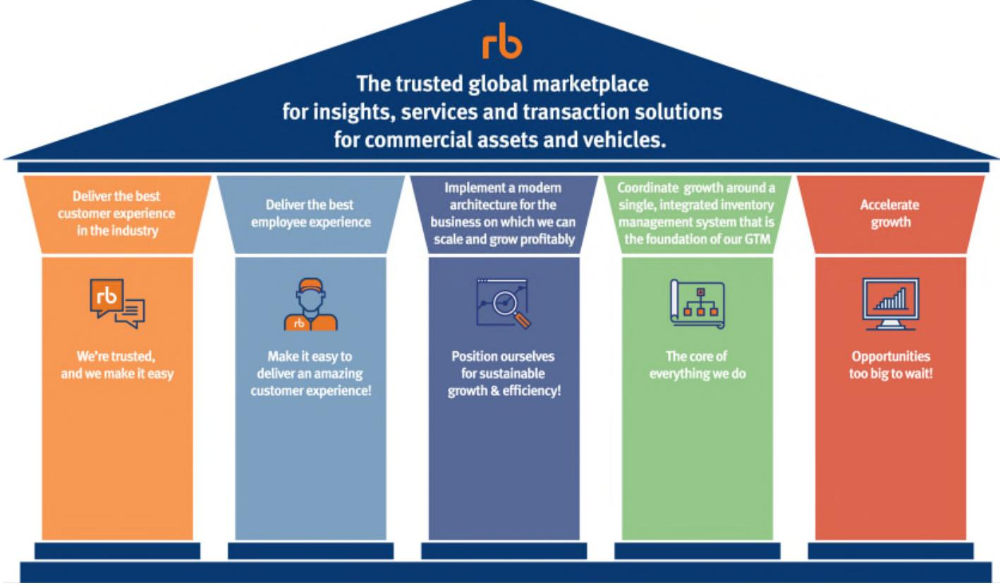
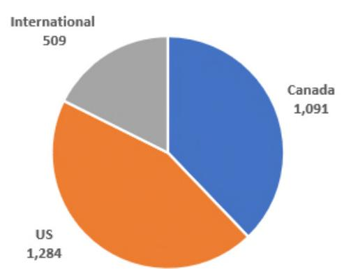
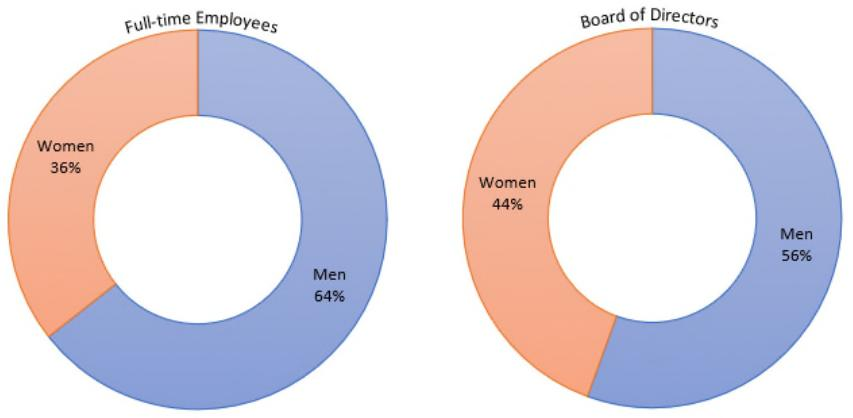
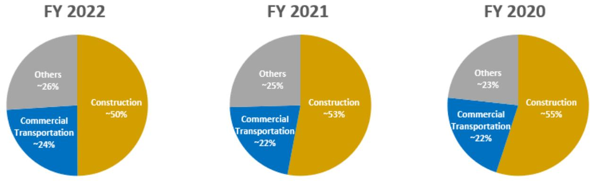

{0}------------------------------------------------

#### **UNITED STATES SECURITIES AND EXCHANGE COMMISSION Washington, D.C. 20549**

#### **FORM 10-K**

☑ **ANNUAL REPORT PURSUANT TO SECTION 13 OR 15(d) OF THE SECURITIES EXCHANGE ACT OF 1934 For the fiscal year ended December 31, 2022**

or

☐ **TRANSITION REPORT PURSUANT TO SECTION 13 OR 15(d) OF THE SECURITIES EXCHANGE ACT OF 1934**

**For the transition period from to**

**Commission file number: 001-13425**

# **Ritchie Bros. Auctioneers Incorporated**

(Exact Name of Registrant as Specified in its Charter)

| Canada                                                             |                                                      | 98-0626225                           |
|--------------------------------------------------------------------|------------------------------------------------------|--------------------------------------|
| (State or other jurisdiction of incorporation or organization)     | (I.R.S. Employer Identification No.)                 |                                      |
| 9500 Glenlyon Parkway Burnaby, British Columbia, Canada V5J 0C6 |                                                      | (778) 331-5500                       |
| (Address of Principal Executive Offices and Zip Code)              | (Registrant's Telephone Number, including Area Code) |                                      |
| Securities registered pursuant to Section 12(b) of the Act:        |                                                      |                                      |
| Title of Each Class                                                | Trading Symbol                                       | Name of Exchange on Which Registered |
| Common Shares                                                      | RBA                                                  | New York Stock Exchange              |
| Common Share Purchase Rights                                       | N/A                                                  | New York Stock Exchange              |
|                                                                    |                                                      |                                      |

Securities registered pursuant to Section 12(g) of the Act: **Restricted Share Units**

Indicate by check mark if the registrant is a well-known seasoned issuer, as defined in Rule 405 of the Securities Act. Yes ☑ No ☐

Indicate by check mark if the registrant is not required to file reports pursuant to Section 13 or Section 15(d) of the Act. Yes ☐ No ☑

Indicate by check mark whether the registrant (1) has filed all reports required to be filed by Section 13 or 15(d) of the Securities Exchange Act of 1934 during the preceding 12 months (or for such shorter period that the registrant was required to file such reports), and (2) has been subject to such filing requirements for the past 90 days. Yes ☑ No ☐

Indicate by check mark whether the registrant has submitted electronically every Interactive Data File required to be submitted pursuant to Rule 405 of Regulation S-T (§ 232.405 of this chapter) during the preceding 12 months (or for such shorter period that the registrant was required to submit such files). Yes ☑ No ☐

Indicate by check mark whether the registrant is a large accelerated filer, an accelerated filer, a non-accelerated filer, smaller reporting company, or an emerging growth company. See the definitions of "large accelerated filer", "accelerated filer", "smaller reporting company", and "emerging growth company" in Rule 12b-2 of the Exchange Act.:

| Large accelerated filer ☑ | Accelerated filer ☐ | Non-accelerated filer ☐ | Smaller reporting company ☐ |
|---------------------------|---------------------|-------------------------|-----------------------------|
|                           |                     |                         | Emerging growth company ☐   |

If an emerging growth company, indicate by check mark if the registrant has elected not to use the extended transition period for complying with any new or revised financial accounting standards provided pursuant to Section 13(a) of the Exchange Act. ☐

Indicate by check mark whether the registrant has filed a report on and attestation to its management's assessment of the effectiveness of its internal control over financial reporting under Section 404(b) of the Sarbanes-Oxley Act (15 U.S.C. 7262(b)) by the registered public accounting firm that prepared or issued its audit report. ☑

If securities are registered pursuant to Section 12(b) of the Act, indicate by check mark whether the financial statements of the registrant included in the filing reflect the correction of an error to previously issued financial statements. ☐

Indicate by check mark whether any of those error corrections are restatements that required a recovery analysis of incentive-based compensation received by any of the registrant's executive officers during the relevant recovery period pursuant to § 240.10D-1(b). ☐

Indicate by check mark whether the registrant is a shell company (as defined in Rule 12b-2 of the Exchange Act). Yes ☐ No ☑

At June 30, 2022 (the last business day of the registrant's most recently completed second fiscal quarter), the aggregate market value of the registrant's common shares held by non-affiliates of the registrant (assuming for these purposes, but without conceding, that all executive officers and directors are "affiliates" of the registrant) was approximately \$7,200,381,824. The number of common shares of the registrant outstanding as of February 17, 2023, was 111,142,700.

{1}------------------------------------------------

#### **Documents Incorporated by Reference**

Certain portions of the registrant's definitive proxy statement to be filed with the Securities and Exchange Commission ("SEC") pursuant to Regulation 14A not later than 120 days after the registrant's fiscal year ended December 31, 2022, in connection with the registrant's 2022 Annual and Special Meeting of Shareholders, are incorporated herein by reference into Part III of this Annual Report on Form 10-K.

{2}------------------------------------------------

#### **RITCHIE BROS. AUCTIONEERS INCORPORATED FORM 10-K For the year ended December 31, 2022**

#### **INDEX**

Cautionary Note Regarding Forward-Looking Statements 1

#### **PART I**

| 1 ITEM  | Business                  | 4  |
|-------------|---------------------------|----|
| 1A ITEM | Risk Factors              | 18 |
| 1B ITEM | Unresolved Staff Comments | 33 |
| ITEM 2  | Properties                | 33 |
| ITEM 3  | Legal Proceedings         | 34 |
| ITEM 4  | Mine Safety Disclosures   | 34 |
|             |                           |    |

#### **PART II**

| ITEM 5     | Market for Registrant's Common Equity, Related Stockholder Matters, and Issuer Purchases of Equity |     |
|-------------|----------------------------------------------------------------------------------------------------|-----|
|             | Securities                                                                                         | 35  |
| 6 ITEM  | [Reserved]                                                                                         | 38  |
| 7 ITEM  | Management's Discussion and Analysis of Financial Condition and Results of Operations              | 39  |
| ITEM 7A | Quantitative and Qualitative Disclosures About Market Risk                                         | 70  |
| ITEM 8     | Financial Statements and Supplementary Data, including the Report of Independent Registered Public |     |
|             | Accounting Firm (PCAOB ID 1263)                                                              | 71  |
| ITEM 9  | Changes In and Disagreements With Accountants on Accounting and Financial Disclosure               | 124 |
| ITEM 9A | Controls and Procedures                                                                            | 124 |
| ITEM 9B | Other Information                                                                                  | 127 |
| ITEM 9C: | Disclosure Regarding Foreign Jurisdictions that Prevent Inspections                                | 127 |
|             | PART III                                                                                           |     |
| ITEM 10 | Directors, Executive Officers and Corporate Governance                                             | 127 |
| ITEM 11 | Executive Compensation                                                                             | 127 |
| ITEM 12 | Security Ownership of Certain Beneficial Owners and Management and Related Stockholder Matters     | 127 |
| 13 ITEM | Certain Relationships and Related Transactions, and Director Independence                          | 127 |
| 14 ITEM | Principal Accountant Fees and Services                                                             | 127 |
|             | PART IV                                                                                            |     |
|             |                                                                                                    |     |

- ITEM 15 Exhibit and Financial Statement Schedules 128
- ITEM 16 Form 10-K Summary 132

#### **SIGNATURES**

{3}------------------------------------------------

## **Cautionary Note Regarding Forward-Looking Statements**

The information discussed in this Annual Report on Form 10-K of Ritchie Bros. Auctioneers Incorporated ("Ritchie Bros.", the "Company", "we", or "us") includes "forward-looking statements" within the meaning of Section 27A of the Securities Act of 1933 (the "Securities Act") and Section 21E of the Securities Exchange Act of 1934 (the "Exchange Act") and Canadian securities laws. Forward-looking statements are typically identified by such words as "aim", "anticipate", "believe", "could", "continue", "estimate", "expect", "intend", "may", "ongoing", "plan", "potential", "predict", "will", "should", "would", "could", "likely", "generally", "future", "long-term", or the negative of these terms, and similar expressions intended to identify forward-looking statements. Forward-looking statements are based on current expectations and assumptions that are subject to risks and uncertainties that may cause actual results to differ materially. These statements are based on our current expectations and estimates about our business and markets, and may include, among others, statements relating to:

- our future strategy, objectives, targets, projections and performance;
- our ability to drive shareholder value;
- potential growth and market opportunities;
- our internet initiatives and the level of participation in our auctions by internet bidders, and the success of our online marketplaces;
- our ability to grow our businesses, acquire new customers, enhance our sector reach, drive geographic depth, and scale our operations;
- the impact of our initiatives, services, investments, and acquisitions on us and our customers;
- the severity, magnitude and duration of the COVID-19 pandemic ("COVID-19") and the direct and indirect impact of such pandemic on our operations and personnel, commercial activity and demand across our business and our customers' businesses, as well as responses to the pandemic by the government, business and consumers;
- the acquisition or disposition of properties;
- potential future mergers and acquisitions, including the proposed acquisition of IAA, Inc. ("IAA");
- our expected indebtedness in connection with the proposed acquisition of IAA;
- the impact of our new initiatives, services, investments, and acquisitions on us and our customers;
- our future capital expenditures and returns on those expenditures;
- our ability to add new business and information solutions, including, among others, our ability to maximize and integrate technology to enhance our existing services and support additional value-added service offerings;
- the supply trend of equipment in the market and the anticipated price environment for late model equipment, as well as the resulting effect on our business and Gross Transaction Value ("GTV");
- fluctuations in our quarterly revenues and operating performance resulting from the seasonality of our business;
- our compliance with all laws, rules, regulations, and requirements that affect our business;
- effects of various economic, financial, industry, and market conditions or policies, including inflation, the supply and demand for property, equipment, or natural resources;
- the geopolitical situation in Eastern Europe in light of Russia's invasion of Ukraine;
- the behavior of equipment pricing;
- the relative percentage of GTV represented by straight commission or underwritten (guarantee and inventory) contracts, and its impact on revenues and profitability;
- the projected increase to our fee revenues as a result of the harmonization of our fee structure;
- our future capital expenditures and returns on those expenditures;
- the effect of any currency exchange and interest rate fluctuations on our results of operations;
- the grant and satisfaction of equity awards pursuant to our compensation plans;
- any future declaration and payment of dividends, including the special dividend to be paid to our shareholder in connection with the proposed acquisition of IAA, and the tax treatment of any such dividends;
- financing available to us from our credit facilities or other sources, our ability to refinance borrowings, and the sufficiency of our working capital to meet our financial needs; and
- our ability to satisfy our present operating requirements and fund future growth through existing working capital, credit facilities and debt.

{4}------------------------------------------------

While we have not described all potential risks related to our business and owning our common shares, the factors discussed in "Part I, Item 1A: Risk Factors" of this Annual Report on Form 10-K for the year ended December 31, 2022 are among those that may affect our performance materially or could cause our actual results, performance or achievements to differ materially from those expressed or implied by forward-looking statements. Except as required by applicable securities law and regulations of relevant securities exchanges, we do not intend to update publicly any forward-looking statements, even if our expectations have been affected by new information, future events or other developments. You should consider our forward-looking statements in light of the factors listed or referenced under "Risk Factors" herein.

# **SUMMARY OF RISK FACTORS**

The following is a summary of the principal risks described below in Part I, Item 1A "Risk Factors" in this Annual Report on Form 10-K. We believe that the risks described in the "Risk Factors" section are material to investors, but other factors not presently known to us or that we currently believe are immaterial may also adversely affect us. The following summary should not be considered an exhaustive summary of the material risks facing us, and it should be read in conjunction with the "Risk Factors" section and the other information contained in this Annual Report on Form 10-K:

# **Risks Related to the Proposed Acquisition of IAA**

- The pendency of our acquisition of IAA or our failure to complete such acquisition could have a material adverse effect on our business, results of operations, financial condition and stock price.
- While the Merger Agreement is in effect, we are subject to restrictions on our business activities.
- We may experience difficulties in integrating our operations with those of IAA and realizing the expected benefits of the acquisition.
- We will incur a substantial amount of debt to complete the acquisition of IAA, which could have a material adverse effect on our business, cash flows and financial condition.
- Significant costs have been incurred and are expected to be incurred in connection with the consummation of the acquisition of IAA.

## **Risks Related to Our Business**

- We may not realize the anticipated benefits of, and synergies from, acquisitions and may become responsible for certain liabilities and integration costs as a result.
- Damage to our reputation could harm our business.
- We may incur losses as a result of our guarantee and inventory contracts and advances to consignors.
- The availability and performance of our technology infrastructure, including our websites, is critical to our business and continued growth.
- Consumer behavior is rapidly changing, and if we are unable to successfully adapt to consumer preferences and develop and maintain a relevant and reliable inventory management and multichannel disposition experience for our customers, our financial performance and brand image could be adversely affected.
- We rely on data provided by third parties, the loss of which could limit the functionality of certain of our platforms and disrupt our business.
- Government regulation of the Internet and e-commerce is evolving, and unfavorable changes in this or other regulations could substantially harm our business and results of operations.
- If our ability, or the ability of our third party service partners, cloud computing platform providers or third party data center hosting facilities, to safeguard the reliability, integrity and confidentiality of our and their information technology systems is compromised, if unauthorized access is obtained to our systems or customers', suppliers', counterparties' and employees' confidential information, or if authorized access is blocked or disabled, we may incur significant reputational harm, legal exposure, or a negative financial impact.
- Our future expenses may increase significantly and our operations and ability to expand may be limited as a result of licenses, laws and regulations governing auction sites, environmental protection, international trade and other matters.
- Losing the services of one or more key personnel or the failure to attract, train and retain personnel could materially affect our business.
- Failure to maintain safe sites could materially affect our business and reputation.
- Income and commodity tax amounts, including tax expense, may be materially different than expected and there is a trend by global tax collection authorities towards the adoption of more aggressive laws, regulations, interpretations and audit practices.
- Our substantial international operations expose us to foreign exchange rate fluctuations that could harm our results of operations.

Ritchie Bros. 2

{5}------------------------------------------------

- Our business operations may be subject to a number of federal and local laws, rules and regulations including export control regulations.
- Failure to comply with anti-bribery, anti-corruption, and anti-money laundering laws, including the U.S. Foreign Corrupt Practices Act of 1977, as amended, or the FCPA, the Corruption of Foreign Public Officials Act, or the CFPOA, and similar laws associated with our activities outside of the U.S. could subject us to penalties and other adverse consequences.
- We are pursuing a long-term growth strategy that may include acquisitions and developing and enhancing an appropriate sales strategy, which requires upfront investment with no guarantee of long-term returns.
- We are regularly subject to general litigation and other claims, which could have an adverse effect on our business and results of operations.
- Privacy concerns and our compliance with current and evolving domestic or foreign laws and regulations regarding the processing of personal information and other data may increase our costs, impact our marketing efforts or decrease adoption and use of our products and services, and our failure to comply with those laws and regulations may expose us to liability and reputational harm.
- Our business continuity plan may not operate effectively in the event of a significant interruption of our business.
- Our insurance may be insufficient to cover losses that may occur as a result of our operations.
- Our business operations, results of operations, cash flows and financial performance may continue to be affected by the COVID-19 pandemic.
- Certain global conditions may affect our ability to conduct successful events.

## **Financial Risks**

- Ineffective internal control over financial reporting could result in errors in our financial statements, reduce investor confidence, and adversely impact our stock price.
- We have substantial indebtedness, and the degree to which we are leveraged may materially and adversely affect our business, financial condition and results of operations.
- Our debt instruments have restrictive covenants that could limit our financial flexibility.
- Our operating results are subject to quarterly variations.

# **Risks Related to Our Intellectual Property**

- We may be unable to adequately protect or enforce our intellectual property rights, which could harm our reputation and adversely affect our growth prospects.
- Our use of open source software could subject us to risks, including with respect to the terms of open source licenses.

# **Risks Related to Our Industry**

- Competition could result in reductions in our future revenues and profitability.
- Decreases in the supply of, demand for, or market values of used equipment, could harm our business.

# **Risks Related to Our Organization and Governance**

- Our articles, by-laws, shareholder rights plan and Canadian law contain provisions that may have the effect of delaying or preventing a change in control.
- U.S. civil liabilities may not be enforceable against us, our directors, or our officers.
- We are governed by the corporate laws of Canada which in some cases have a different effect on shareholders than the corporate laws of Delaware.

{6}------------------------------------------------

# **PART I**

# **ITEM 1: BUSINESS**

#### **Company Overview**

Ritchie Bros. Auctioneers Incorporated ("Ritchie Bros.", the "Company", "we", or "us") (NYSE & TSX: RBA) was founded in 1958 in Kelowna, British Columbia, Canada and is a world leader in asset management and disposition technologies for commercial assets, used equipment and other assets. Our expertise, unprecedented global reach, market insights, and trusted portfolio of brands provide us with a unique position within the used equipment market.

Through our unreserved auctions, online marketplaces, listings, and private brokerage services, we sell a broad range of primarily used commercial and industrial assets, as well as government surplus. Construction and commercial transportation assets comprise the majority of the equipment sold by GTV dollar value, though we sell a wide variety of assets. Customers selling equipment through our sales channels include end users (such as construction companies), equipment dealers, original equipment manufacturers ("OEMs") and other equipment owners (such as rental companies). Our customers participate in a variety of sectors, including construction, commercial transportation, agriculture, energy, and natural resources.

We also provide our customers with a wide array of value-added services aligned with our growth strategy to create a global marketplace for used equipment services and solutions. Our other services include equipment financing, asset appraisals and inspections, online equipment listings, logistical services, and ancillary services such as equipment refurbishment. We offer our customers asset technology solutions to manage the end-to-end disposition process of their assets and provide market data intelligence to make more accurate and reliable business decisions. Additionally, we offer our customers an innovative technology platform that supports equipment lifecycle management and parts procurement integration with both original equipment manufacturers and dealers, as well as a software as a service platform for end-to-end parts procurement, and access to digital catalogs and diagrams.

We operate globally with locations in 13 countries, including the U.S., Canada, Australia, the United Arab Emirates, and the Netherlands, and maintain a presence in 42 countries where customers can sell from their own yards. We employ more than 2,800 fulltime employees worldwide.

## **Proposed Acquisition of IAA**

On November 7, 2022, the Company entered into an Agreement and Plan of Merger and Reorganization, which was subsequently amended on January 22, 2023 (the "Merger Agreement"), pursuant to which it agreed to acquire IAA, Inc., a leading global digital marketplace connecting vehicle buyers and sellers. IAA stockholders will receive \$12.80 in cash and 0.5252 common shares of the Company for each share of IAA common stock they own. Accordingly, the Company will (i) issue approximately 70.3 million shares of its common stock to the stockholders of IAA and (ii) pay to the stockholders of IAA approximately \$1.7 billion in cash consideration. In addition, the Company will repay approximately \$1.2 billion of IAA's net debt. The acquisition of IAA is expected to close in the first half of 2023, subject to the satisfaction of various conditions, including, among other things, (1) the approval of the issuance of our common shares by the affirmative vote of a majority of the votes cast by holders of our outstanding common shares, (2) the adoption of the Merger Agreement by holders of a majority of the outstanding shares of IAA's common stock, and (3) other customary closing conditions.

The Company plans to fund the proposed acquisition of IAA through a combination of cash, borrowings under its credit facilities and proceeds from the sale of debt securities. In connection with the Merger Agreement, the Company entered into a debt commitment letter with certain financial institutions that committed to provide, subject to certain terms and conditions, the bridge loan facility in an aggregate principal amount of up to \$2.8 billion and a backstop senior secured revolving credit facility in an aggregate principal amount of up to \$750.0 million. On December 9, 2022, the Company subsequently closed an amendment to its existing credit agreement with a syndicate of lenders pursuant to which, among other things, the Company obtained (a) amendments to the facility to specifically permit the proposed acquisition of IAA (b) commitments for a term loan A facility in an aggregate principal amount of up to \$1.8 billion to be used to finance the proposed IAA acquisition and (c) the ability to borrow up to \$200.0 million of the revolving facility on a limited conditionality basis to finance the proposed IAA acquisition. The amendment allowed the Company to permanently terminate the backstop senior revolving credit commitments and reduce the senior secured bridge facility commitments by the amount of the term loan A facility and the amount of the existing term loans under the existing credit agreement.

{7}------------------------------------------------

On January 23, 2023, the Company announced that it expects to approve the payment of a one-time special dividend to the Company's shareholders in the amount of \$1.08 per share, contingent upon the completion of the merger and consent of the TSX. IAA stockholders will not be entitled to receive the special dividend with respect to any of the Company's common shares received as consideration. We will not pay the special dividend if the Merger Agreement is terminated or if the merger is not completed. Furthermore, if the Merger Agreement is terminated under specified circumstances, the Company or IAA may be required to pay the other a termination amount of \$189 million or the Company may be required to reimburse IAA for its out-of-pocket expenses incurred in connection with the Merger Agreement up to an aggregate amount of \$5 million.

We believe that the proposed acquisition of IAA accelerates our journey to become the trusted global marketplace for insights, services and transaction solutions. The transaction is expected to diversify our customer base by providing the Company with a significant presence in the vehicle remarketing vertical that has strong industry fundamentals with proven secular growth. We believe that the combination will accelerate our growth and strategic vision to create a next-generation global marketplace for commercial assets and vehicles, supported by advanced technologies and data analytics. Additionally, our management team has extensive experience in the automotive and insurance ecosystem, which we believe will help shape the go-forward customer experience. With enhanced scale and an expanded addressable market, the Company believes it will be able to drive additional GTV growth through its platforms and auction sites, in turn generating more insights for its customers and expanding the adoption of our other high-margin tech-enabled services.

## **Impact of Russia-Ukraine Conflict on Our Business**

On February 24, 2022, the geopolitical situation in Eastern Europe intensified with Russia's invasion of Ukraine, sharply affecting economic and global financial markets. Subsequent economic sanctions on Russia have exacerbated ongoing economic challenges, including issues such as rising inflation, disruption to global supply chains and increases in hydrocarbon prices.

The rise in transportation costs, in part driven by higher fuel costs, has globally impacted both costs and timing of import and export of commercial assets between countries and has contributed to higher costs in operating our equipment. Further, increases in natural gas prices in Europe may also lead to a slowdown in its economy and as a result may negatively impact the import and export of equipment in Eastern Europe, which could affect our operations.

We do not have any operations in Russia or Ukraine or any material operations in neighboring countries. We have a limited number of direct customers in the effected region and have sourced a limited number of assets in 2022 from neighboring countries to sell through our operations. However, we cannot estimate the extent of the ongoing conflict's impacts or future developments, including the continued evolution of military activity and sanctions imposed with Russia's invasion of Ukraine, which could adversely affect the domestic economy generally and our business specifically.

## **Impact of Inflation on Our Business**

Inflation impacted our global business operations in 2022, with the rise of costs in freight, fuel, supplies, labor, non-durable goods and consumables at our yards and in our operations. Our travel costs have also increased, partly due to higher travel activity post pandemic, increased travel to support our growth strategy and acquisitions, as well as due to inflation. In addition, we have seen an increase in labor costs with the labor market remaining fairly strong. We expect inflationary pressures to continue into 2023 and we regularly evaluate operational productivity improvements that may offset these pressures while continuing to drive growth and strong financial performance.

The United States Federal Reserve is also continuing to raise interest rates, contributing to a stronger U.S. dollar, which has had an unfavorable impact on the translation of some of our operations to a U.S. dollar presentation currency, particularly in Canada, Europe and Australia.

# **Impact of COVID-19 and Supply Chain Constraints to Our Business**

In March 2020, the World Health Organization declared the outbreak of COVID-19 a global pandemic ("COVID-19"). In response, we transitioned all of our traditional live onsite auctions to online bidding utilizing our existing online bidding technology. In 2022, with the lifting of travel restrictions and quarantine requirements we began to return to live in-person onsite bidding at some of our auction events, offering both onsite and online bidding, and we significantly improved our ability to move equipment to and from our auction sites and across borders. However, we also saw heightened transportation costs, extended lead times and supply chain delays and disruptions, negatively impacting our business and the buying and selling behaviours of our customers. Supply of equipment was

{8}------------------------------------------------

tight with increased constraints as our customers were delaying disposition of aged equipment and turnover of equipment slowed down, primarily from lease and rental companies. In our operations, we also incurred higher maintenance costs from the delay in turnover of our leased vehicle fleets. These impacts were partly due to the impact of COVID -19, but also partly due to other more recent macroeconomic factors such as inflation and the Russian-Ukraine conflict.

# **Strategy**

Our strategy to become *the trusted global marketplace for insights, services and transaction solutions for commercial assets and vehicles* will help us address the large and fragmented used equipment marketplace that we operate in today. We believe our strategy will help us unlock significant growth opportunities by building on Ritchie Bros.' core business and expanding into additional services. We are building on our position as a trusted advisor to our customers by evolving from transactional selling to meeting the needs of our customers through solution selling.

We see significant growth opportunities ahead by becoming *the trusted global marketplace for insights, services, and transaction solutions for commercial assets and vehicles*. This represents not a shift, but an expansion of our transaction solutions for which we are already well known. We value our long-tenured relationships with our customers, and the trust they have in our brand and platform. We are leveraging our sales channels to create a global marketplace for services and solutions that help our customers gain the insights they need to make decisions and run their businesses. We also intend to offer complimentary third-party services on our platform where it will help our customers.

This strategy is supported by five strategic pillars on which we will build our future success:

**Customer Experience -** At Ritchie Bros., we have a long history, culture and passion for helping our customers. We continue to find ways to enrich our customers' experience by making our processes easier, our offerings more complete and our brands simpler.

{9}------------------------------------------------

**Employee Experience -** We cannot deliver a great customer experience without great employees. We continue to strive to create the best workplace for all employees and to create a place where they want to build a career. We encourage open and honest dialogue and are committed to robust communications from management to employees and creating channels for them to give feedback, as well as fixing processes and technology to improve the work environment for the benefit of both customers and employees.

**Modern Architecture** - We are transitioning to a modern architecture based in the cloud and comprised of microservices that allow us to create a single presence for our customers across all of our solutions. A modern architecture will allow flexibility and agility to enable scalable growth for us, our customers, and our partners.

**Inventory Management System** - We see our Inventory Management System, which integrates and tracks inventory data for selected customers, as a gateway for our customers to access our marketplaces and services. With the data, we can offer more timely and proactive advice and solutions to our customers with more ease of use.

**Accelerate Growth** – We continually seek to identify areas to pilot improved business processes to positively impact the customer experience. We look to accelerate growth by scaling the learnings from these pilots into our global operations.

We believe our strategy of becoming the global trusted marketplace for commercial assets will allow us to better serve our customers and will facilitate better penetration into non-auction markets and associated services. Building an integrated, easy to use marketplace, and becoming the trusted advisor to our customers opens significant potential for our business. We will start, as always, with our customers and our partners, and make sure we are building what they need.

# **Service Offerings**

We offer our equipment buyer and seller customers multiple distinct, complementary, multi-channel brand solutions that address the range of their needs. Our global customer base has a variety of transaction options, breadth of services, and the widest selection of used equipment available to them.

## *Auctions and Marketplace*

The tables below illustrate the various channels and brand solutions available under our Auctions and Marketplaces ("A&M") segment.

| Channels                            | Brand Solutions | Description of Offering                                                                                                       |
|-------------------------------------|-----------------|-------------------------------------------------------------------------------------------------------------------------------|
| Live Onsite Auctions                |                 | Live unreserved onsite auctions, with live online simulcast, where we have care, custody and control of consignors' assets |
| Online Auctions and Marketplaces |                 | Online marketplace for selling and buying used equipment                                                                      |
|                                     |                 | Online marketplace offering multiple price and timing options                                                                 |
|                                     |                 | Online marketplace for the sale of government and military assets                                                             |
| Brokerage Service                   |                 | Confidential, negotiated sale of large equipment                                                                              |

{10}------------------------------------------------

# *Gross Transaction Value ("GTV")*

We record GTV for our A&M business, which represents total proceeds from all items sold at our auctions and online marketplaces. GTV is not a measure of financial performance, liquidity, or revenue, and is not presented in our consolidated financial statements.

## *Contract options*

We offer consignors several contract options to meet their individual needs and sale objectives. Through our A&M business, options include:

- Straight commission contracts, where the consignor receives the gross proceeds from the sale less a pre-negotiated commission rate;
- Guarantee contracts, where the consignor receives a guaranteed minimum amount plus an additional amount if proceeds exceed a specified level; and
- Inventory contracts, where we purchase, take custody, and hold used equipment and other assets before they are resold in the ordinary course of business.

We collectively refer to guarantee and inventory contracts as underwritten or "at-risk" contracts. In 2022, our underwritten business accounted for approximately 19% of our GTV, compared to 18% in 2021 and 20% in 2020.

#### *Value-added services*

We also provide a wide array of value-added services to make the process of selling and buying equipment convenient for our customers. In addition to the other services listed in the table below, we also provide the following value-added services to our customers:

- conducting title searches, where registries are commercially available, to ensure equipment is sold free and clear of all liens and encumbrances (if we are not able to deliver clear title, we provide a full refund up to the purchase price to the buyer);
- making equipment available for inspection, testing, and comparison by prospective buyers;
- displaying high-quality, zoomable photographs of equipment on our website;
- providing 360-degree video inspection technology to increase buyer confidence in equipment being purchased;
- providing industry-leading professional equipment inspections and reports;
- providing free detailed equipment information on our website for most equipment;
- providing access to insurance and powertrain warranty products;
- providing access to commercial transportation companies and customs brokerages through our logistical services;
- handling all pre-auction marketing, as well as collection and disbursement of proceeds;
- providing equipment sales and rental data intelligence and performance benchmarking solutions; and
- providing an innovative technology platform that supports customers' management of the equipment lifecycle and integrates parts procurement with both original equipment manufacturers and dealers.

Our IronClad Assurance equipment condition certification provides online marketplace buyers with information on the condition of the equipment that includes, but is not limited to, providing buyers with pictures and comprehensive inspection information of key systems and components.

{11}------------------------------------------------

## *Other Services*

The tables below illustrate the various services and brand solutions available under our other services segment.

| Service                | Brand Solutions | Description of Offering                                                                                                          |  |
|------------------------|-----------------|----------------------------------------------------------------------------------------------------------------------------------|--|
| Financial Service      |                 | Loan origination service that uses a brokerage model to match loan applicants with appropriate financial lending institutions |  |
| Appraisal Service      |                 | Unbiased, certified appraisal services                                                                                           |  |
| Inspection Service     |                 | Truck and lease return inspection services                                                                                       |  |
| Online Listing Service |                 | Online equipment listing service and B2B dealer portal                                                                           |  |
| Ancillary Services     |                 | Repair, paint, and other make-ready services                                                                                     |  |
| Logistical Service     |                 | End-to-end transportation and customs clearance solution for sellers and buyers with shipping needs                        |  |
| Software Service       |                 | Cloud-based platform to manage end-to-end disposition                                                                            |  |
| Data Service           |                 | A leading provider of construction equipment market intelligence                                                                 |  |
| Parts Service          |                 | Digital marketplace connecting equipment owners with parts manufacturers                                                      |  |

## **Intellectual Property**

We believe our intellectual property has significant value and is an important factor in marketing our organization, services, and website, as well as differentiating us from our competitors. We own or hold the rights to use valuable intellectual property such as trademarks, service marks, domain names and tradenames. We protect our intellectual property in Canada, the U.S., and internationally through federal, provincial, state, and common law rights, including registration of certain trademark and service marks for many of our brands, including our core brands. We also have secured patents for inventions and have registered our domain names.

We rely on contractual restrictions and rights to protect certain of our proprietary rights in products and services. Effective protection of our intellectual property can be expensive to maintain and may require litigation. We must protect our intellectual property rights and other proprietary rights in many jurisdictions throughout the world. In addition, we may, from time to time, be subject to intellectual property claims, including allegations of infringement, which can be costly to defend. For a discussion of the risks involved with intellectual property litigation and enforcement of our intellectual property rights, see the related information in "Part I, Item 1A: Risk Factors" of this Annual Report on Form 10-K.

## **Competition**

## *Competition Overview*

The global used equipment market is highly fragmented with total annual global used equipment volumes estimated at more than \$300.0 billion. We estimate the used equipment auction segment is \$30 billion. Ritchie Bros. is the largest auction company with approximately \$6.0 billion in GTV volume in 2022. We compete based on breadth, brand reputation, security, technology, and global reach of our services, as well as in the variety of contracts and methods and channels of selling equipment. In addition to the auction segment, other major segments include brokers, as well as the retail segment which includes OEMs, OEM dealers, rental companies and large strategic accounts. We also compete with private sales – often securing new business from equipment owners who had previously tried selling their equipment privately. Given the fragmentation in the auction market as well as upstream opportunities in private sales and retail, there is significant opportunity for growth.

{12}------------------------------------------------

## *Competitive Advantages*

Our key strengths provide distinct competitive advantages and have enabled us to achieve significant and profitable growth over the long term.

#### **Global Platform**

We pride ourselves on our ability to connect buyers and sellers through our digital channels, as well as a global network of over 40 auction sites in 13 countries, including the U.S., Canada, Australia, the United Arab Emirates, and the Netherlands. Our online bidding technology and Ritchie Bros. website are currently available in 10 and 22 languages, respectively. Our global presence allows us to generate deep pools of liquidity for transactions enabling global market pricing for our equipment sellers, helping to deliver strong and efficient price realization for assets.

#### **Customer Relationships**

Relationships are the core of Ritchie Bros. – delighting customers and treating them like friends while meeting their business needs. By offering an unprecedented choice of solutions that best suit our customers' needs, making their lives easier in the process, we develop relationships that can last across generations. We take a long-term approach with our customers and as such we position our sales force to act as trusted advisors to our customers.

#### **Breadth of Solutions**

Our platform provides us with the ability to meet all the buyers' and sellers' unique needs in a one-stop-shop manner. By delivering choice through our disposition channels, we can work with customers as a trusted advisor to provide them each with a tailored suite of equipment disposition solutions and asset management capabilities to best meet their needs.

In addition to transaction solutions, Ritchie Bros. offers a variety of value-added services to our customers including financial services, market data, valuation insights, inspections, appraisals, commercial transportations, refurbishment and digital parts procurement.

#### **Delivering Insights and Services Through Data & Analytics**

A core part of the Ritchie Bros.' strategy is delivering insights and services through rich data and analytics. Based on the world's largest used equipment transaction dataset, we provide data products that allow customers to analyze market dynamics and value assets. Additionally, Rouse Services is the leading provider of rental metrics benchmarks and equipment valuations to lenders, rental companies, contractors and dealers. Rouse's business model is built upon an extensive data ecosystem, proprietary analytics and Data Science techniques, and trusted customer relationships rooted in service and confidentiality.

We continue to invest in data science to deliver asset value predictions, generate user leads, prioritize marketing investments, interpret price trends and more. Proprietary algorithmic asset pricing is used internally to set target values and optimize marketplace operations and externally to provide users of Ritchie Bros. Asset Solutions with instant asset values on inventory. The monthly Ritchie Bros. Used Equipment Market Trends Summary report features our proprietary use of Machine Learning to provide Mix-Adjusted Price Indexes for core asset groups around the globe. Correlated with other leading economic indicators, these price indexes have been quickly adopted by customers, analysts, and manufacturers as a key insight into pricing trends. Machine Learning also supports important strategic and operational decisions such as site expansion, testing marketplace performance, and experimentation with improved formats.

{13}------------------------------------------------

# **Our People**

# *Human Capital*

At December 31, 2022, we employed approximately 2,800 full-time employees (up 3.7% from 2021) and 1,400 part-time employees (down 12.5%) worldwide, representing approximately 67% and 33%, respectively, of our global workforce. We also periodically hire contractors as needed to support our auctions, various businesses, and other projects.

Of our total full-time employees, 966 people work locally in the field to support our global auction operations (2021: 950) and 421 people are focused on sales and solutions for our customers (2021: 394).

## *Development and Engagement*

We believe that our people are our greatest asset and that engaged employees are paramount to the health and success of our business. We invest in a variety of training, development and engagement practices to deliver on our growth agenda and create more leaders.

In 2022, we invested \$1.4 million in employee development (2021: \$1.7 million) and \$0.6 million in development for sales employees (2021: \$1.3 million). All full-time employees are encouraged to have development plans that focus on functional and career growth. We provide all our employees access to instructor-led courses, as well as a library of over 3,000 online courses, videos, books, and resources for ongoing personal, functional, and professional growth. In addition, our Tuition Reimbursement program provides tuition assistance to eligible employees for professional development courses outside of the organization. We have curated tools and resources and developed training programs to provide our leaders and employees with the skills to successfully work remotely and manage the challenges in these uncertain times. We check in with our employees through pulse surveys and communicate through distribution of a weekly newsletter named #RitchieStrong. Our newsletter, which comes directly from our CEO to all of our employees, promotes our successes, highlights our people and encourages social distancing and safety practices. Each newsletter ends with a reminder that employees can raise comments and ask questions directly to our CEO via email.

During 2022, we achieved the following objectives to strengthen the development and engagement of our people:

- 1. Continued roll out of PRINT®, a human motivation model, to our people-leaders and their teams to gain insights on what drives them so that they can operate at their highest level;
- 2. Rolled out the Diversity, Equity & Inclusion training, delivered by Eagle's Flight Creative Training Excellence Inc., to our leaders to understand personal biases and create an inclusive environment. To date, 62% of our senior-leaders and 41% of our people-leaders have completed the training. Our facilitators became certified to deliver the training to our employees in the third quarter of 2022 and accordingly, 11% of our employees have completed the training. We will continue to deliver the training throughout 2023;
- 3. Continued quarterly performance conversations to drive performance and engagement with a simplified year-end review process without performance ratings to allow for more meaningful conversations about accomplishments, values and opportunities; and
- 4. Launched a new sales coverage model for North America and a long tail sales team. As a result, we conducted six new hire bootcamp workshops.

{14}------------------------------------------------

We continue to look for ways to create on the-job learning opportunities so that our employees feel invested and engaged. Employees are involved in strategic initiatives and finding ways to better serve our customers and each other.

# *Health & Safety*

Our objective is to keep our people healthy and safe – to send everyone home, every day, the way they came to work.

All new employees are required to complete a safety onboarding training that captures our health and safety programs, our policy statement and provides an overview of our global Employee Health and Safety ("EHS") policies and expectations. Our 2022 completion rate for the safety onboarding program was 93.4% (2021: 98%).

We also have a risk management process to support our safety orientation programs and our health and safety commitment which ensures that our employees are exposed to the lowest possible level of risk. Our risk management process begins with an annual review of all incidents from the prior year to identify trends to see if we need to address findings through changes in our policies and procedures.

Daily, our employees conduct either a field level hazard assessment or complete a risk identification card to identify risks relating to the performance of their roles. These risk identification cards are monitored by our yard managers and/or our regional operations managers and corrective actions are taken to ensure that the risk is reduced or eliminated. During 2022 we had over 17,000 (2021: 14,000) risk identification cards completed by our staff.

We also conduct annual online safety training with employees who perform certain operational tasks. In 2022, our completion rate for this training was 91% (2021: 98.5%). In 2022 we switched platforms on which the training was provided, and as a result the online safety training was only available from January to June contributing to the lower completion rate. Additionally, in 2022, managers at our sites were also required to complete a series of online courses as part of their professional development. In 2022, we had a completion rate of over 94% (2021: 94.5%).

We also measure our Total Recordable Injury Rate ("TRIR") which measures the number of reportable incidences per 100 full-time workers during the year. Our annual TRIR goal is to meet or do better by being below the industrial average. TRIR for 2022 was 1.14 (2021: 1.38), which was below the industrial average.

Every region within our organization also has a Safety Steering team that provides feedback on our safety journey and assists in identifying issues or concerns that may arise. Our success in health and safety relies on everyone taking an active role in the development and implementation of our programs, participating in training and providing feedback on our progress in our safety journey.

## *Diversity & Inclusion*

We aspire to have a culture that fosters respect, inclusion and opportunity for growth for all, where everyone feels like they belong. Specifically, we want our teams to understand the strength of diversity, the power that comes from an inclusive environment and the effect it can have on our teams, customers and stakeholders. Outlined below are the initiatives that demonstrate our dedication to diversity, equity and inclusion ("DE&I").

## *Gender Diversity and Equality*

We continue to be committed to gender diversity. Representation of women at our most senior executive leadership level is at 33% (2021: 40%). We also continue to maintain strong representation of women at the Board of Directors level with four (out of nine) Board members being women, representing 44% (2021: 50%) of the Board. Approximately 36% of our full-time employees are women and 64% are men, consistent with 2021.

{15}------------------------------------------------

In 2022 and beyond, we will continue to measure and analyze recruitment efforts and strive to increase the number of candidates and hires from underrepresented groups. We plan to improve our partnership with diversity-focused organizations and increase the number of outreach campaigns to candidates from underrepresented groups.

## *Employee Resource Groups ("ERG")*

Women's LINK, our first ERG established in 2018, which focuses on gender diversity and equality, had 34 new members join in 2022 and maintains a membership of around 200 colleagues.

Our second ERG, the Black Lives Matter ("BLM") Committee, which was established in 2020 and has approximately 80 members, encourages courageous conversations and brings awareness to issues affecting the Black community. In late 2021, a book club was formed to further foster connections and dialogue among its members. In 2022, the BLM Committee made a donation to Title I schools in Atlanta to help students, including students from low-income families, expanded the number of profiles on Black History Month and promoted several roundtable discussions.

In 2021, we further delivered on our commitment to create a framework to support our employees' diverse needs by establishing two new ERGs – Pride and SERVE. In 2022, the core teams for each group worked to support and bring awareness about issues facing the communities of focus for their groups as outlined below.

**The Pride ERG**, which focuses on creating a welcoming and inclusive workplace for Two Spirit, lesbian, gay, bisexual, transgender, queer or questioning, and nonbinary (2SLGBTQ+) employees, had a positive impact in 2022 by donating funds to GATE, an international advocacy organization working towards justice and equality for transgender, gender diverse and intersex communities, in honor of International Transgender Day of Visibility. The Company also made a donation to the Human Rights Watch LGBT program, which documents and exposes abuses based on sexual orientation and gender identity worldwide, in honor of International Day Against Homophobia, Transphobia & Biphobia. The ERG also participated in and celebrated Pride month.

**The SERVE ERG** embraces our proud community of military service members and Veteran colleagues by building awareness and providing resources to past or present military service members and their families. We became the main sponsor for the Lincoln Marathon in 2022 a celebration of the Lincoln, Nebraska community, which included sponsorship of a veteran and three members of the National Guard running the marathon. SERVE ERG also honored Memorial Day, Remembrance Day and Veteran Day by sharing service stories of Ritchie Bros. colleagues and family members who have served or are serving in the military throughout the month of November.

We are committed to investing the time and resources needed to ensure we continue to live up to our diversity, equality and inclusion vision of having a culture that fosters respect, inclusion and opportunity of growth for all, where everyone feels like they belong.

{16}------------------------------------------------

## *Community Giving*

The Company has been rooted in community since our founding over 60 years ago and we are committed to use our global scale and success to give back to our local communities. Our objective is to continue to engage in efforts to maintain community giving as our employees are passionate about having a meaningful impact in their communities.

In 2021, we developed a community giving framework centered around supporting local economies and people in the communities in which we operate. In 2022, we delivered on this framework by launching the #RitchieGives Community Impact platform in Canada and the United States to allow employees to sign up for volunteer opportunities and complete charitable donations with the Company matching donations. In Canada, in 2021, we established the Ritchie Bros. Community Impact fund to support causes across Canada and in 2022, in the United States, we granted funds to Local Initiatives Support Corporation's (LISC) Bridges Careers Opportunities program, which connects unemployed and underemployed people to career and training pathways in heavy machinery related fields in the Los Angeles area, a region of expected growth.

# *Flexible Workplace*

COVID-19 has changed the way we work and, to maintain the health and well-being of all employees, employees who are able to work remotely continued to do so throughout 2022. Flexibility has become the future of work at Ritchie Bros. as we work to support employees' safety, health and well-being while continuing to meet business needs in a hybrid world.

## *Ethical Conduct*

Our success and reputation are founded upon our commitment to honesty, integrity, and doing what is right—each element highlighted under our value of Integrity. Our objective is to monitor and facilitate reporting of unethical conduct. We do this by maintaining a confidential and anonymous independent third-party telephone line and web access hotline for anyone to submit concerns regarding potential code violations or other ethics-related matters without fear of repercussions. All reported matters are investigated fully and reported to the Audit Committee of our Board of Directors.

## **Environmental, Social & Governance**

We have advanced our commitment to Environmental, Social and Governance ("ESG") matters in 2022 and developed a ESG framework to help guide and communicate our high-level goals, targets and performance metrics. We also updated our ESG governance structure and identified individuals to advance and integrate our ESG objectives.

## *Environmental*

The Company is regulated by federal, state and international environmental laws governing the protection of the environment, health and safety, the use, transport and disposal of hazardous substances and control of emissions including greenhouse gases into the environment. Compliance with these existing laws has not had a material impact on our capital expenditures, earnings or global competitive position. However, climate change initiatives and changing laws and regulations governing the environment may affect the supply of, the demand for, and the market values of equipment in the future.

We support the transition to a low-carbon world through enabling a circular economy of vehicles and equipment and through our efforts to manage our greenhouse gas emissions. We engage our customers to optimize the use and efficiency of equipment, to re-use, refurbish and recycle before disposition, as extending the life of heavy equipment is core to our business model. In turn, we believe this reduces waste and lessens the need to extract natural resources to produce equipment. Our largest sources of emissions are direct combustion of diesel fuel and natural gas, as well as our electricity consumption. During 2022, we invested in developing our baseline inventory of our Scope 1 and 2 greenhouse gas emissions and have a target of completing our Scope 3 inventory in 2023 to allow us to set reduction targets in 2024 and in the future. In addition, we improved the efficiency and effectiveness of our operations to lessen our environmental footprint in delivering our services. We provide virtual ramping which allows large machines to be sold by video screen and eliminates emissions from transportation of equipment across the ramp. We also improved yard lanes and optimized the equipment delivery and loadout schedules to minimize equipment movement and idling.

We continue our commitment to environmental management by ensuring availability of treatment systems to manage wastewater, a recycling system to promote waste management and air filtration systems when necessary. We also promote environmentally conscious facilities including electrification at our sites and corporate offices.

{17}------------------------------------------------

## *Social*

Please refer to the "*Our People"* section for a summary of our human capital programs to promote employee engagement and development, health and safety, and diversity and inclusion, as well as our commitment to community giving.

# *Governance*

We believe in doing the right thing for everyone involved in our business and seek to do business with third parties who follow the same core values. This is reflected in our Code of Business Conduct and Ethics which is delivered through annual training to our employees, and supported by our third-party Ethics Hotline. With the exception of our CEO, our Board of Directors consists of elected independent individuals and are selected in accordance with our Director Selection Guidelines to promote diversity.

Oversight of our ESG enterprise strategy is provided by the Nominating and Corporate Governance Committee, while our ESG Steering Committee provides strategic direction and oversight of ESG across key business functions. We have also established an ESG Working Group for the implementation of ESG initiatives across the organization.

We will continue to integrate ESG across our teams and are working to dedicate additional roles to ESG to provide support and momentum behind our ESG programs.

# **The Role of Technology**

Implementing a modern architecture on which we can scale and grow profitably is a core strategic pillar for Ritchie Bros. The role of technology in our business continues to evolve and become more dependent as buyers adopt mobile and online channels to transact their business with us while sellers further utilize our inventory management system. We continue to invest in technology to further transition to a modern cloud-based architecture driven by microservices that allows for agility, flexibility and scalability of our solutions.

We remain focused on technology enablement to transform the way we compete, the way we work and the way we leverage technology to drive future growth. Our technology capabilities are delivering choices for our customers in the form of multiple channels for buyers and sellers, meeting customer's asset management needs through information-rich software solutions and leveraging our rich data repository to drive strong sales and improved pricing decisions. We are also providing our customers with leading tools and capabilities to deliver full life-cycle asset management for used equipment.

## *Data Privacy and Security*

As the role of technology and data in our business expands, so too does the importance of cybersecurity. We take protecting our customers, employees, brand, systems and data very seriously. We actively monitor and manage security risks and look to mitigate them through enterprise-wide programs, employee training and vulnerability assessments. We have made – and continue to make – investments in dedicated information security resources, leadership and technology. We continue to strengthen and enhance our programs and controls around people, processes and technology and apply risk-based strategies to enhance detection, protection and response efforts.

Our commitment to data security and privacy is demonstrated in our overall approach to governance. We are incorporating security and privacy by design and increasing awareness around the Company with support from management and our Board by taking certain actions, including the following:

- We have formed a Data Privacy Committee. The oversight of the committee is to develop and approve our general strategy and policies on data privacy and data protection, assess the data privacy risks associated with our business activities, and provide direction to, and support the initiatives of, our Data Privacy Office.
- Our Information Security and Policy committee meets on a monthly basis and advises on technology and legal and internal audit issues relating to security and risk reduction. This committee is responsible for reviewing and setting security policies, assessing risk and impacts of security incidents, and providing guidance and direction for security programs and strategy. The committee will be advised regarding information security assessment activities and will provide advice regarding education and communication that may be needed to support the information security policies and other compliance policy.
- All eligible employees complete mandatory privacy and information-security training courses, which are refreshed annually. Through continual awareness-building, such as our Cybersecurity Awareness Month every October, we work to promote a culture that understands the critical importance of data security and privacy, areas of vulnerability and how to remain vigilant when handling data.

{18}------------------------------------------------

- We invested in enterprise leading cybersecurity tools and solutions to improve our detection, protection and response capabilities, as well as grew our internal dedicated cybersecurity team.
# **Seasonality**

Our GTV and associated A&M segment revenues are affected by the seasonal nature of our business. GTV and A&M segment revenues tend to increase during the second and fourth calendar quarters, during which time we generally conduct more business than in the first and third calendar quarters. Given the operating leverage inherent in our business model, the second and fourth quarter also tend to produce higher operating margins, given the higher volume and revenue generated in those quarters.

## **Revenue Mix Fluctuations**

Our revenue is comprised of service revenue and inventory sales revenue. Service revenue from A&M segment activities includes commissions earned at our auctions, online marketplaces, and private brokerage services, and various auction-related fees, including listing and buyer transaction fees. We also recognize fees from our Other Services activities as service revenue. Inventory sales revenue is recognized as part of our A&M activities and relates to revenues earned through our inventory contracts.

Inventory sales revenue can fluctuate significantly, as it changes based on whether our customers sell using a straight or guarantee commission contract, or an inventory contract. Straight or guarantee commission contracts will result in the commission being recognized as service revenue, while inventory contracts will result in the gross transaction value of the equipment sold being recorded as inventory sales revenue with the related cost recognized in cost of inventory sold. As a result, a change in the revenue mix between service revenues and revenue from inventory sales can have a significant impact on revenue growth percentages.

## **Governmental Regulations and Environmental Laws**

Our operations are subject to a variety of federal, provincial, state and local laws, rules, and regulations throughout the world. We believe that we are compliant in all material respects with those laws, rules, and regulations that affect our business, and that such compliance does not impose a material impediment on our ability to conduct our business.

We believe that, among other things, laws, rules, and regulations related to the following list of items affect our business:

- Imports and exports of equipment. Particularly, there are restrictions in the U.S. and Europe that may affect the ability of equipment owners to transport certain equipment between specified jurisdictions. Also, engine emission standards in some jurisdictions limit the operation of certain trucks and equipment in those regions.
- Development or expansion of auction sites. Such activities depend upon the receipt of required licenses, permits, and other governmental authorizations. We are also subject to various local zoning requirements pertaining to the location of our auction sites, which vary among jurisdictions.
- The use, storage, discharge, and disposal of environmentally sensitive materials. Under such laws, an owner or lessee of, or other person involved in, real estate may be liable for the costs of removal or remediation of certain hazardous or toxic substances located on or in, or emanating from, such property, as well as related costs of investigation and property damage. These laws often impose liability without regard to whether the owner or lessee or other person knew of, or was responsible for, the presence of such hazardous or toxic substances.
- Worker health and safety, privacy of customer information, and the use, storage, discharge, and disposal of environmentally sensitive materials.

## **Available Information**

We file with the SEC reports on Form 10-K, Form 10-Q, Form 8-K, proxy materials and other filings required under the Exchange Act. Investors may access any materials we file with the SEC through the EDGAR database on the SEC's website at www.sec.gov. 

{19}------------------------------------------------

In addition, investors and others should note that we announce material financial information using our company website (www.ritchiebros.com) and investor relations website (https://investor.ritchiebros.com), which host our SEC filings, press releases, public conference calls, and webcasts. Information about Ritchie Bros., its business, and its results of operations may also be announced by posts on the following social media channels:

- Facebook: https://www.facebook.com/RitchieBros
- LinkedIn: https://www.linkedin.com/company/ritchie-bros/
- Twitter: https://twitter.com/RitchieBros
- YouTube: https://www.youtube.com/ritchiebros

The information that we post on these social media channels could be deemed to be material information. As a result, we encourage investors, the media, and others interested in Ritchie Bros. to review the information that we post on these social media channels. These channels may be updated from time to time on Ritchie Bros.'s investor relations website.

We are providing these website addresses solely for the information of investors, and the information on or accessible through our websites and social media channels is not incorporated by reference in this Annual Report on Form 10-K.

Also available for investors in the Governance section of our investor relations website are the Code of Business Conduct and Ethics for our directors, officers and employees ("Code of Conduct"), Board Mandate, Audit Committee Charter, Nominating and Corporate Governance Committee Charter, Compensation Committee Charter, Corporate Governance Guidelines, Diversity Policy, Shareholder Engagement Policy, Articles and Bylaws, Majority Voting Policy and Board Chair Role and Description. Additional information related to Ritchie Bros. is also available on SEDAR at www.sedar.com.

As a Canada Business Corporations Act ("CBCA") company with our principal place of business in Canada, U.S. civil liabilities may not be enforceable against us. Please see "Item 1A. Risk Factors—U.S. civil liabilities may not be enforceable against us, our directors, or our officers," which is incorporated into this Item 1 by this reference.

{20}------------------------------------------------

# **ITEM 1A: RISK FACTORS**

An investment in our common stock involves a high degree of risk. In addition to the other information included in this Annual Report on Form 10-K, you should carefully consider each of the risks described below before purchasing our common shares. The risk factors set forth below are not the only risks that may affect our business. Our business could also be affected by additional risks not currently known to us or that we currently deem to be immaterial. If any of the following risks actually occur, our business, financial condition and results of operations could materially suffer. As a result, the trading price of our common shares could decline, and you may lose all or part of your investment. Information in this section may be considered "forward-looking statements." See "Cautionary Note Regarding Forward-Looking Statements" for a discussion of certain qualifications regarding such statements.

# **Risks Related to the Proposed Acquisition of IAA**

## *The pendency of our acquisition of IAA or our failure to complete such acquisition could have a material adverse effect on our business, results of operations, financial condition and stock price.*

On November 7, 2022, we entered into an Agreement and Plan of Merger and Reorganization with IAA (the "Merger Agreement"), amended on January 22, 2023, providing for our acquisition of IAA. Consummation of the acquisition is subject to the satisfaction of various conditions, including, among other things, (1) the approval of the issuance of our common shares by the affirmative vote of a majority of the votes cast by holders of our outstanding common shares, (2) the adoption of the Merger Agreement by holders of a majority of the outstanding shares of IAA's common stock, and (3) other customary closing conditions.

The acquisition may be delayed, and may ultimately not be completed, due to a number of factors, including the failure to satisfy these conditions to the completion of the acquisition, or the possibility that a material adverse effect on our business or IAA's business would permit IAA or us, respectively, not to close the acquisition. There is no assurance that all of the various conditions will be satisfied or waived, or that the acquisition will be completed on the proposed terms, within the expected timeframe, or at all. Also, potential litigation filed against us or IAA could prevent or delay the completion of the acquisition or result in the payment of damages following completion of the acquisition.

In the event that the proposed acquisition is not consummated or is materially delayed for any reason, we will have spent considerable time and resources, and incurred substantial costs related to the acquisition, many of which must be paid even if the acquisition is not completed. If the acquisition is not completed, our business and shareholders would be exposed to additional risks, including, but not limited to the following: (a) to the extent that the market price of our common shares reflects an assumption that the acquisition will be completed, the price of our common shares could decrease if the acquisition is not completed; (b) investor confidence could decline, litigation could be brought against us, relationships with existing and prospective sellers, customers, service providers, investors and other business partners may be adversely impacted, we may be unable to retain key personnel, and profitability may be adversely impacted due to costs incurred in connection with the pending acquisition; and (c) the requirement that we pay a termination fee of \$189 million if the Merger Agreement is terminated under certain circumstances.

Also, during the period prior to the closing of the acquisition, our business will be exposed to certain inherent risks due to the potential impact of the announcement or pendency of the acquisition on our business, financial condition and operating results, including, but not limited to the following: (a) the possibility of disruption to our business and operations, including diversion of management attention and resources; (b) the inability to attract and retain key personnel, and the possibility that our current employees could be distracted and their productivity decline, due to uncertainty regarding the pending acquisition; (c) the inability to pursue alternative business opportunities or make material changes to our business pending the completion of the acquisition; (d) the amount of the costs, fees, expenses and charges related to the acquisition; and (e) other developments beyond our control, including, but not limited to, changes in domestic or global economic conditions, capital markets and interest rates that may affect the timing or success of the proposed acquisition.

## *While the Merger Agreement is in effect, we are subject to restrictions on our business activities.*

While the Merger Agreement is in effect, we are generally required to use reasonable efforts to conduct our business in the ordinary course in all material respects, and are restricted from taking certain actions set forth in the Merger Agreement without IAA's prior consent. These limitations include, among other things, certain restrictions on our ability to amend our organizational documents, acquire other businesses and assets that would reasonably be expected to delay or impair the consummation of the acquisition, dispose of certain assets, reclassify or issue certain securities, and pay dividends (other than our regular quarterly dividend). These restrictions

{21}------------------------------------------------

could prevent us from pursuing strategic business opportunities and taking actions with respect to our business that we may consider advantageous and may, as a result, materially and adversely affect our business, results of operations and financial condition.

## *We may experience difficulties in integrating our operations with those of IAA and realizing the expected benefits of the acquisition.*

The success of the proposed acquisition of IAA, if completed, will depend in part on our ability to realize the anticipated business opportunities and cost synergies from combining with IAA in an efficient and effective manner. We may not realize these business opportunities and cost synergies to the extent expected or at all. Further, our management might have its attention diverted while trying to integrate operations and corporate and administrative infrastructures. The post-closing integration process could take longer than anticipated and could result in the loss of key employees, the disruption of each company's ongoing businesses, tax costs or inefficiencies, or inconsistencies in standards, controls, information technology systems, procedures and policies, any of which could adversely affect our ability to maintain relationships with customers, employees or other third parties, or our ability to achieve the anticipated benefits of the transaction, and could harm our financial performance. If we are unable to successfully or timely integrate the operations of IAA's business with our business, we may incur unanticipated liabilities and be unable to realize the revenue growth, synergies and other anticipated benefits resulting from the proposed transaction, and our business, results of operations and financial condition could be adversely affected.

## *We will incur a substantial amount of debt to complete the acquisition of IAA, which could have a material adverse effect on our business, cash flows and financial condition.*

We will incur significant debt to complete the acquisition of IAA, including borrowing up to \$2.8 billion under a bridge loan facility, inclusive of \$1.8 billion of bridge commitments with term A loan commitments, or pursuant to other permanent financing that replaces such facility, which may include the issuance of debt securities and/or one or more senior term loan facilities. On an expected combined company basis, we expect that together with IAA, we would have approximately \$3.4 billion of indebtedness, excluding \$709.8 million of undrawn commitments under our revolving credit facility. Our ability to make payments on our debt, fund our other liquidity needs and make planned capital expenditures will depend on our ability to generate cash in the future. Our historical financial results have been, and we anticipate that our future financial results will be, subject to fluctuations. Our ability to generate cash is subject in part to general economic, financial, competitive, legislative, regulatory and other factors that are beyond our control. We cannot guarantee that our business will generate sufficient cash flow from our operations or that future borrowings will be available to us in an amount sufficient to enable us to make payments of our debt, fund other liquidity needs and make planned capital expenditures. If our cash flows and capital resources are insufficient to fund debt service obligations, we could face substantial liquidity problems and could be forced to reduce or delay investments and capital expenditures or to dispose of material assets or operations, seek additional debt or equity capital or restructure or refinance our indebtedness. The degree to which we are currently leveraged and will be leveraged following the completion of the acquisition of IAA could have important consequences for shareholders. For example, it could: (a) limit our ability to obtain additional financing to fund future working capital, capital expenditures, acquisitions or other general corporate requirements; (b) require us to dedicate a substantial portion of our cash flow from operations to the payment of debt service, reducing the availability of our cash flow to fund working capital, capital expenditures, acquisitions, dividends and other corporate purposes; (c) increase our vulnerability to general adverse economic or industry conditions; (d) expose us to the risk of increased interest rates for any borrowings at variable rates of interest; (e) limit our flexibility in planning for and reacting to changes in our industry; and (f) place us at a competitive disadvantage compared to businesses in our industry that have less debt.

Additionally, our debt agreements, including any agreements that we may enter into in connection with the proposed acquisition of IAA, may contain a number of covenants that impose operating and financial restrictions on us and may limit our ability to engage in acts that may be in our long-term best interests. Any failure to comply with covenants in the instruments governing our debt could result in an event of default which, if not cured or waived, would have a material adverse effect on us.

# *Significant costs have been incurred and are expected to be incurred in connection with the consummation and integration of the acquisition of IAA.*

We expect to incur one-time costs in connection with integrating our operations, products and personnel with those of IAA, in addition to costs related directly to completing the acquisition. Additional unanticipated costs may be incurred as we integrate our business with IAA following the closing. Although we expect the elimination of duplicative costs, as well as the realization of other efficiencies 

{22}------------------------------------------------

related to the integration of our operations with IAA, may offset incremental transaction and transaction-related costs over time, this net benefit may not be achieved in the near term or to the extent anticipated.

## **Risk Related to Our Business**

## *We may not realize the anticipated benefits of, and synergies from, acquisitions and may become responsible for certain liabilities and integration costs as a result.*

We have acquired, and may continue to acquire, businesses that have previously operated independently from us. The integration of our operations with those of acquired businesses, including IAA, is intended to result in financial and operational benefits, including certain tax and run-rate synergies. There can be no assurance, however, regarding when or the extent to which we will be able to realize these and other benefits. Integration may also be difficult, unpredictable and subject to delay because of possible company culture conflicts and different opinions on future business development. We may be required to integrate or, in some cases, replace, numerous systems, including those involving management information, purchasing, accounting and finance, sales, billing, employee benefits, payroll and regulatory compliance, many of which may be dissimilar. Difficulties associated with the integration of acquired businesses could have a material adverse effect on our business.

In addition, in connection with acquisitions, we have assumed, and may assume in connection with future acquisitions, certain potential liabilities. To the extent such liabilities are not identified by us or to the extent indemnifications obtained from third parties are insufficient to cover such liabilities, these liabilities could have a material adverse effect on our business.

For a description of risks related to our pending acquisition of IAA, see "*Risks Related to the Proposed Acquisition of IAA*" below.

## *Damage to our reputation could harm our business.*

One of our founding principles is that we operate a fair and transparent business, and consistently act with integrity. Maintaining a positive reputation is key to our ability to attract and maintain customers, investors and employees. Damage to our reputation could cause significant harm to our business. Harm to our reputation could arise in a number of ways, including, but not limited to, employee conduct which is not aligned with our Code of Business Conduct and Ethics (and associated Company policies around behavioural expectations) or our Company's core values, safety incidents, failure to maintain customer service standards, loss of trust in the fairness of our sales processes, and other technology or compliance failures.

## *We may incur losses as a result of our guarantee and inventory contracts and advances to consignors.*

Our most common type of auction contract is a straight commission contract, under which we earn a pre-negotiated, fixed commission rate on the gross sales price of the consigned equipment at auction. We use straight commission contracts when we act as agent for consignors. In recent years, a majority of our annual business has been conducted on a straight commission basis. In certain other situations, we will enter into underwritten transactions and either offer to (a) guarantee a minimum level of sale proceeds to the consignor, regardless of the ultimate selling price of the consignment; or (b) purchase the equipment outright from the seller for sale through one of our sales channels.

We determine the level of guaranteed proceeds or inventory purchase price based on appraisals performed on equipment by our internal personnel. Inaccurate appraisals could result in guarantees or inventory values that exceed the realizable auction proceeds. In addition, a change in market values could also result in guarantee or inventory values exceeding the realizable auction proceeds. If auction proceeds are less than the guaranteed amount, our commission will be reduced, and we could potentially incur a loss, and, if auction proceeds are less than the purchase price we paid for equipment that we take into inventory temporarily, we will incur a loss. Because a majority of our auctions are unreserved, there is no way for us to protect against these types of losses by bidding on or acquiring any of the items at such auctions. In addition, we do not hold inventory indefinitely waiting for market conditions to improve. If our exposure to underwritten contracts increases, this risk would be compounded.

Occasionally, we advance to consignors a portion of the estimated auction proceeds prior to the auction. We generally make these advances only after taking possession of the assets to be auctioned and upon receipt of a security interest in the assets to secure the obligation. If we were unable to auction the assets or if auction proceeds were less than amounts advanced, we could incur a loss. Additionally, we have two vendor contracts with the U.S. Government's Defense Logistics Agency ("DLA") pursuant to which we acquire, manage and resell certain assets of the DLA. Each of the DLA contracts obliges the Company to purchase rolling and non

{23}------------------------------------------------

rolling stock assets in an amount and of a type over which we have limited ability to control. In many cases, the type of assets purchased are not what we typically sell through any of our other channels. Although the prices we pay for the non-rolling stock inventory are a fraction of the original acquisition value, we may not have the ability to attract buyers for those assets and we may be unable to sell those assets on a timely basis or at all. This would have an adverse effect on our financial results.

# *The availability and performance of our technology infrastructure, including our websites, is critical to our business and continued growth.*

The satisfactory performance, reliability and availability of our websites, online bidding service, auction management systems, enterprise resource planning system, transaction processing systems, network infrastructure and customer relationship management system are important to our reputation, our business and our continued growth. We currently rely on both our own proprietary technology and licensed on-premise systems, as well as third-party cloud computing platform providers located in the United States and other countries. The technology and systems we rely on may experience service interruptions or degradation because of hardware or software defects or malfunctions, denial of service or ransomware attacks and other cybersecurity events, human error and natural events beyond our control. Some of our systems are not fully redundant, and our recovery planning may not be sufficient for all possible disruptions. Further, licensed hardware, software and cloud computing platforms may not continue to be available at reasonable prices, on commercially reasonable terms or at all. Any loss of the right to use any of these hardware, software or cloud computing platforms or the loss of the functionality of our internet systems could significantly increase our expenses, damage our reputation and otherwise result in delays in provisioning of our services. Our business and results of operations would be particularly harmed if we were to lose access to or the functionality of our internet systems for any reason, especially if such loss of service prevented internet bidders from effectively participating in one of our auctions.

# *Consumer behavior is rapidly changing, and if we are unable to successfully adapt to consumer preferences and develop and maintain a relevant and reliable inventory management and multichannel disposition experience for our customers, our financial performance and brand image could be adversely affected.*

Our business continues to evolve into a one-stop inventory management and multichannel disposition company where customers can buy, sell, or list equipment, when, how, and where they choose- both onsite and online, and manage their existing fleets and/or inventory using our online inventory management tools. As a result of this evolution, increasingly we interact with our customers across a variety of different channels, including live auction, online, through mobile technologies, including the Ritchie Bros. mobile app, social media, and inventory management systems. Our customers are increasingly using tablets and mobile phones to make purchases online and to get detailed equipment information for assets that they own or are interested in purchasing. Our customers also engage with us online, including through social media, by providing feedback and public commentary about all aspects of our business. Consumer shopping patterns are rapidly changing and our success depends on our ability to anticipate and implement innovations in customer experience and logistics in order to appeal to customers who increasingly rely on multiple channels to meet their equipment management and disposition needs. Our ability to provide a high quality and efficient customer experience is also dependent on external factors over which we may have little or no control, including, without limitation, the reliability and performance of the equipment sold in our marketplaces and the performance of third-party carriers who transport purchased equipment on behalf of buyers. If for any reason we are unable to implement our inventory management, data solutions, bidding tools and other multichannel initiatives, provide a convenient and consistent experience for our customers across all channels, or provide our customers the services they want, when and where they want them at a compelling value proposition, then our financial performance and brand image could be adversely affected.

## *We rely on data provided by third parties, the loss of which could limit the functionality of certain of our platforms and disrupt our business.*

Our analytics teams rely on asset, pricing and other data including personal data provided to us by our customers and other third parties. Some of this data is provided to us pursuant to third-party data sharing policies and terms of use, under data sharing agreements by third-party providers or by customers with consent. If in the future any of these parties could change their data sharing policies and terms of use, including by making them more restrictive, terminating or not renewing agreements, or, if customers revoke their consent, any of which could result in the loss of, or significant impairment to, our ability to collect and provide useful data or related services to our customers.

These third parties could also interpret our data collection and use policies or practices as being inconsistent with their policies or business objectives, or lose confidence in our data protection and privacy practices, which could result in the loss of our ability to 

{24}------------------------------------------------

collect this data. Any such changes could impair our ability to deliver our analytics service to our customers in the manner currently anticipated or at all, impairing the return on investment that our customers derive from using our analytics platform and related products, as well as adversely affecting our business and our ability to generate revenue.

# *Government regulation of the Internet and e-commerce is evolving, and unfavorable changes in this or other regulations could substantially harm our business and results of operations.*

We are subject to federal, provincial, state and local laws, rules and regulations governing the internet and e-commerce. Existing and future laws and regulations may impede the growth of the internet, e-commerce or other services, and increase the cost of doing business, including providing online auction services. These regulations and laws may cover taxation, tariffs, user privacy, data protection, pricing, content, copyrights, distribution, electronic contracts, and other communications, consumer protection, broadband residential internet access and the characteristics and quality of services. It is not always clear how existing laws governing issues such as property ownership, digital, sales and similar taxes, libel, and personal privacy apply to the Internet and e-commerce. Changes to laws, rules and regulations and unfavorable resolution of these issues may harm our business and results of operations.

## *If our ability, or the ability of our third party service partners, cloud computing platform providers or third party data center hosting facilities, to safeguard the reliability, integrity and confidentiality of our and their information technology systems is compromised, if unauthorized access is obtained to our systems or customers', suppliers', counterparties' and employees' confidential information, or if authorized access is blocked or disabled, we may incur significant reputational harm, legal exposure, or a negative financial impact.*

We rely on information technology ("IT") resources to manage and operate our business, including maintaining proprietary databases containing sensitive and confidential information about our customers, suppliers, counterparties and employees (which may include personal information and credit information) and utilizing approved third-party technology providers to support the management and operation of IT systems and infrastructure. As the malicious tools and techniques used to breach, obtain unauthorized access to or impair IT systems and devices and the data processed thereby become more sophisticated and change frequently, the risk of a cybersecurity event increases, given that we may not be able to anticipate these malicious tools and techniques or to implement adequate preventative and protective measures. Unauthorized parties have in the past, and may also in the future, attempt to gain access to our and our providers' primary and backup systems or facilities through various means, including hacking into IT systems or facilities, fraud, trickery or other means of deceiving our and their employees or contractors. Although we have policies restricting the access to the personal and confidential information we store, there is a risk that these policies may not be effective in all cases. Ransomware attacks are becoming increasingly prevalent and severe, and can lead to significant interruptions in our operations, loss of data and income, reputational loss, and diversion of funds. Further, breaches experienced by other companies may also be leveraged against us and sophisticated actors can mask their attacks, making them increasingly difficult to identify and prevent. There can be no assurance that impacts from these incidents will not be material or significant in the future.

In addition, our limited control over our customers may affect the security and integrity of our IT systems and create financial or legal exposure. For example, our customers may accidentally disclose their passwords, use insecure passwords, or store them on a device that is lost or stolen, providing bad actors with access to a customer's account and the possible means to redirect customer payments. Further, users on our platforms could have vulnerabilities on their own devices that are entirely unrelated to our systems and platforms but could mistakenly attribute their own vulnerabilities to us. Under credit card payment rules and our contracts with credit card processors, if there is a breach of payment card information used to process transactions, we could be liable to the payment card issuing banks for certain fraudulent credit card transactions and other payment disputes with customers, including the cost of issuing new cards and related expenses. If we were liable for a significant number of fraudulent transactions or unable to accept payment cards, our results of operations would be materially and adversely affected.

Although we implement, maintain and adjust information security measures to mitigate our risks with respect to IT-related cybersecurity incidents, there can be no assurance that these measures will ensure that our operations are not disrupted, that we will prevent an attack from occurring in the future, or that our internal controls, for instance relating to user access management, will perform as intended to prevent unauthorized access to our systems and data. Any breach of our IT systems may have a material adverse impact on our business, the assessment of the performance of our internal control environment, results of operations, reputation, stock price and our ability to access capital markets, and may also be deemed to contribute to a material weakness in internal controls over financial reporting.

{25}------------------------------------------------

Security events, hacking or other malicious or surreptitious activity (or the perception that such activities have occurred), could damage our reputation, cause a loss of confidence in the security of our services and thereby a loss of customers, and expose us to a risk of loss, governmental investigations and enforcement actions or litigation and possible liability for damages. We may be required to make significant expenditures and divert management attention to monitor, detect and prevent security events, to remediate known or potential security vulnerabilities, or to alleviate problems caused by any security events. In addition, circumvention of our security measures may result in the loss or misappropriation of valuable business data, intellectual property or trade secret information, misappropriation of our customers' or employees' personal information, damage to our computing infrastructure, networks and stored data, service delays, key personnel being unable to perform duties or communicate throughout the organization, loss of sales, significant costs for data restoration and other adverse impacts on our business. Further, such a breach may require us to incur significant expenses to notify governmental agencies, individuals or other third parties pursuant to various privacy and security laws.

The costs of mitigating cybersecurity risks are significant and are likely to increase in the future. Our third-party service providers may be vulnerable to interruption or loss of valuable business data and information of our customers and employees (among others). Data stored by our third party providers might be improperly accessed or unavailable due to a variety of events beyond our control, including, but not limited to, employee error or negligence, natural disasters, terrorist attacks, telecommunications failures, computer viruses, hackers and other security issues. Additionally, if any of our third-party technology providers violate applicable laws or our contracts or policies, such violations may also put our customers' information at risk and could in turn have a material and adverse effect on our business. These issues are likely to become costlier as we grow. Our insurance policies may not be adequate to reimburse us for losses caused by security breaches, and we may not be able to fully collect, if at all, under these insurance policies.

## *Our future expenses may increase significantly and our operations and ability to expand may be limited as a result of licenses, laws and regulations governing auction sites, environmental protection, international trade and other matters.*

A variety of federal, provincial, state and local laws, rules and regulations throughout the world apply to our business, relating to, among other things, tax and accounting rules, the auction business, imports and exports of equipment, property ownership laws, licensing, worker safety, privacy and security of customer information, land use and the use, storage, discharge and disposal of environmentally sensitive materials. Complying with revisions to laws, rules and regulations could result in an increase in expenses and a deterioration of our financial performance. Failure to comply with applicable laws, rules and regulations could result in substantial liability to us, suspension or cessation of some or all of our operations, restrictions on our ability to expand at present locations or into new locations, requirements for the acquisition of additional equipment or other significant expenses or restrictions.

The development or expansion of auction sites depends upon receipt of required licenses, permits and other governmental authorizations. Our inability to obtain these required items could harm our business. Additionally, changes or concessions required by regulatory authorities could result in significant delays in, or prevent completion of, such development or expansion. International bidders and consignors could be deterred from participating in our auctions if governmental bodies impose additional export or import regulations or additional duties, taxes or other charges on exports or imports. Reduced participation by international bidders and consignors could reduce GTV and harm our business, financial condition and results of operations.

Under some environmental laws, an owner, operator or lessee of, or other person involved in, real estate may be liable for the costs of removal or remediation of hazardous or toxic substances located on or in, or emanating from, the real estate, and related costs of investigation and property damage. These laws often impose liability without regard to whether the owner, operator, lessee or other person knew of, or was responsible for, the presence of the hazardous or toxic substances. Environmental contamination may exist at our owned or leased auction sites, or at other sites on which we may conduct auctions, or properties that we may be selling by auction, from prior activities at these locations or from neighboring properties. In addition, auction sites that we acquire or lease in the future may be contaminated, and future use of or conditions on any of our properties or sites could result in contamination. The costs related to claims arising from environmental contamination of any of these properties could harm our financial condition and results of operations.

There are restrictions in the United States, Canada, Europe and other jurisdictions in which we do business that may affect the ability of equipment owners to transport certain equipment between specified jurisdictions or the salability of older equipment. One example of these restrictions is environmental certification requirements in the United States, which prevent non-certified equipment from entering into commerce in the United States. In addition, engine emission standards in some jurisdictions limit the operation of certain trucks and equipment in those markets.

{26}------------------------------------------------

These restrictions, or the adoption of more stringent environmental laws, including laws enacted in response to climate change, could inhibit materially the ability of customers to ship equipment to or from our auction sites, reducing our GTV and harming our business, financial condition and results of operations.

# *Losing the services of one or more key personnel or the failure to attract, train and retain personnel could materially affect our business.*

Our future success largely depends on our ability to attract, develop and retain skilled employees in all areas of our business, as well as to design an appropriate organization structure and plan effectively for succession. Although we actively manage our human resource risks, there can be no assurance that we will be successful in our efforts. If we fail to attract, develop and retain skilled employees in all areas of our business, our financial condition and results of operations may be adversely affected, and we may not achieve our growth or performance objectives.

The growth and performance of our business depends to a significant extent on the efforts and abilities of our employees. Many of our key employees have extensive experience with our business. These employees have knowledge and an understanding of our company and industry that cannot be readily duplicated. The loss of any key personnel, or the inability to replace any lost personnel with equally trained personnel, could impair our ability to execute our business plan and growth strategy, cause us to lose customers and reduce our revenues. In addition, the success of our strategic initiatives to expand our business to complimentary service offerings will require new competencies in many positions, and our management and employees will have to adapt and learn new skills and capabilities. To the extent they are unable or unwilling to make these transformational changes or we are unable to attract new employees who are able to do so, we may be unable to realize the full benefits of our strategic initiatives. We do not maintain key person insurance on the lives of any of our executive officers or other key personnel. As a result, we would have no way to cover the financial loss if we were to lose the services of such employees. This uncertainty may adversely affect our ability to attract and retain key employees.

If any of our key personnel were to join a competitor or form a competing company, existing and potential customers could choose to form business relationships with that competitor instead of us. There can be no assurance that confidentiality, non-solicitation, noncompetition or similar agreements signed by our former directors, officers, or employees will be effective in preventing a loss of business.

## *Failure to maintain safe sites could materially affect our business and reputation.*

Our employees and customers are often in close proximity with mechanized equipment, moving vehicles and chemical and other industrial substances. Our auction sites and warehouses are, therefore, potentially dangerous places and involve the risk of accidents, environmental incidents and other incidents which may expose us to investigations and litigation or could negatively affect the perception of customer and employee safety, health and security. Even in the absence of any incidents, unsafe site conditions could lead to employee turnover or harm our reputation generally, each of which would affect our financial performance. While safety is a primary focus of our business and is critical to our reputation and performance, our failure to implement safety procedures or implement ineffective safety procedures would increase this risk and our operations and results from operations may be adversely impacted.

## *Income and commodity tax amounts, including tax expense, may be materially different than expected, and there is a trend by global tax collection authorities towards the adoption of more aggressive laws, regulations, interpretations and audit practices.*

Our global operations are subject to tax interpretations, regulations, and legislation in the numerous jurisdictions in which we operate, all of which are subject to continual change.

We accrue and pay income taxes and have significant income tax assets, liabilities, and expense that are estimates based primarily on the application of those interpretations, regulations and legislation, and the amount and timing of future taxable income as well as our use of applicable accounting principles. Accordingly, we cannot be certain that our estimates and reserves are sufficient. The timing concerning the monetization of deferred income tax amounts is uncertain, as they are dependent on our future earnings and other events. Our deferred income tax amounts are valued based upon enacted income tax rates in effect at the time, which can be changed by governments in the future.

{27}------------------------------------------------

The audit and review activities of tax authorities affect the ultimate determination of the actual amounts of commodity taxes payable or receivable, income taxes payable or receivable, deferred income tax assets and liabilities, and income tax expense.

There is no assurance that taxes will be payable as anticipated or that the amount or timing of receipt or use of the tax-related assets will be as currently expected. Our experience indicates that taxation authorities are increasing the frequency and depth of audits and reviews. The Canada Revenue Agency ("CRA") has been conducting audits for our 2014, 2015, 2017, 2018 and 2019 taxation years. On February 13, 2023, the CRA issued a proposal letter to Ritchie Bros. Auctioneers (International) Ltd., asserting that one of its Luxembourg subsidiaries was resident in Canada from 2010 to 2015 and that its worldwide income should be subject to Canadian income taxation. In the event that the CRA issues a notice of assessment or reassessment and a court of competent jurisdiction makes a final determination that the income of the Luxembourg subsidiary for 2010 through 2015 was subject to Canadian income tax laws, the Company may ultimately be liable for additional total Canadian federal and provincial income tax, interest and penalties for such period which could have a material negative effect on our operations. The CRA may also challenge the manner in which the Company has filed its tax returns and reported its income with respect to 2016 to 2020 taxation years and may assert that the income of the Luxembourg subsidiary was subject to Canadian income tax because the Luxembourg subsidiary was also resident in Canada during these years. The Company could then incur additional income taxes, penalties and interest which could have a material negative effect on our operations. In addition, future tax authority determinations, including changes to tax interpretations, regulations, legislation or jurisprudence, could have a material impact to our financial position. The fact that we operate internationally increases our exposure in this regard given the multiple forms of taxation imposed upon us. Further and more generally, there has been increased political, media and tax authority focus on taxation in recent years; the intent of which appears to be to enhance transparency and address perceived tax avoidance. As such, in addition to tax risk from a financial perspective, our activities may expose us to reputational risk.

# *Our substantial international operations expose us to additional risks that could harm our business, including foreign exchange rate fluctuations that could harm our results of operations.*

We conduct business in many countries around the world and intend to continue to expand our presence in international markets, including emerging markets.

Although we report our financial results in U.S. dollars, a significant portion of our revenues and expenses are generated outside the U.S., primarily in currencies other than the U.S. dollar. In particular, a significant portion of our revenues are earned, and expenses incurred, in the Canadian dollar and the Euro. The results of operations of our foreign subsidiaries are translated from local currency into U.S. dollars for financial reporting purposes. If the U.S. dollar weakens against foreign currencies, the translation of these foreign currency denominated revenues or expenses will result in increased U.S. dollar denominated revenues and expenses. Similarly, if the U.S. dollar strengthens against foreign currencies, particularly the Canadian dollar and the Euro, our translation of foreign currency denominated revenues or expenses will result in lower U.S. dollar denominated revenues and expenses. We do not currently engage in foreign currency hedging arrangements on any of our revenues or expenses. Fluctuating currency exchange rates may negatively affect our business in international markets and our related results of operations.

In addition, currency exchange rate fluctuations between the different countries in which we conduct our operations impact the purchasing power of buyers, the motivation of consignors, asset values and asset flows between various countries, including those in which we do not have operations. These factors and other global economic conditions may harm our business and our results of operations.

Other risks inherent in doing business internationally include, but are not limited to the following: (a) trade barriers, trade regulations, currency controls, import or export regulations, and other restrictions on doing business freely; (b) local labor, environmental, tax, and other laws and regulations, and the potential for adverse changes in such laws and regulations or the interpretations thereof; (c) difficulties in staffing and managing foreign operations; (d) economic, political, social or labor instability or unrest; (e) terrorism, war, hostage-taking, or military repression; (f) corruption; (g) expropriation and nationalization, or difficulties in enforcing or protecting our property rights, including with respect to intellectual property; (h) increased exposure to high rates of inflation; and (i) unpredictability as to litigation in foreign jurisdictions and enforcement of local laws.

If we violate the complex foreign and U.S. laws and regulations that apply to our international operations, we may face fines, criminal actions or sanctions, prohibitions on the conduct of our business and damage to our reputation. These risks inherent in our international operations increase our costs of doing business internationally and may result in a material adverse effect on our operations or profitability.

{28}------------------------------------------------

## *Our business operations may be subject to a number of federal and local laws, rules and regulations governing international trade, including export control regulations.*

Our business operations may be subject to a number of federal and local laws, rules and regulations, including the Export Administration Regulations, or EAR, maintained by the U.S. Department of Commerce, economic and trade sanctions maintained by the U.S. Department of the Treasury's Office of Foreign Assets Control, or OFAC, and similar laws and regulations in Canada, the UK and the EU. These laws and regulations restrict us from providing services to, or otherwise engaging in direct or indirect transactions or dealings with, certain countries, territories, governments, and persons. We have implemented procedures designed to maintain compliance with these laws, including monitoring, on an automatic and manual basis, the identity and location of potential sellers and buyers. We can offer no assurances that these procedures will always be effective.

If we were to violate applicable export control or sanctions, we could be subject to administrative or criminal penalties which, in certain circumstances, could be material. We could be subject to damages, financial penalties, denial of export privileges, incarceration of our employees, other restrictions on our operations, and reputational harm. Further, any action on the part of the U.S. Department of Commerce, OFAC or other applicable regulator against the company or any of our employees for potential violations of these laws could have a negative impact on our reputation, business, operating results and prospects.

# *Failure to comply with anti-bribery, anti-corruption, and anti-money laundering laws, including the U.S. Foreign Corrupt Practices Act of 1977, as amended, or the FCPA, the Corruption of Foreign Public Officials Act, or the CFPOA, and similar laws associated with our activities outside of the U.S. could subject us to penalties and other adverse consequences.*

We are subject to the FCPA, the CFPOA, the U.S. domestic bribery statute contained in 18 U.S.C. §201, the U.S. Travel Act, the USA PATRIOT Act, the United Kingdom Bribery Act of 2010, or the U.K. Bribery Act, and similar other anti-corruption, anti-bribery and anti-money laundering laws in countries in which we conduct activities or facilitate the buying and selling of equipment, including the EU. We face significant risks if we fail to comply with the FCPA, the CFPOA and other anti-corruption and anti-bribery laws that prohibit companies and their employees and third-party intermediaries from authorizing, offering or providing, directly or indirectly, improper payments or benefits to foreign government officials, political parties or candidates, employees of public international organizations, and private-sector recipients for the corrupt purpose of obtaining or retaining business, directing business to any person, or securing any advantage. In many foreign countries, particularly in countries with developing economies, it may be a local custom that businesses engage in practices that are prohibited by the FCPA, the CFPOA or other applicable laws and regulations. In addition, we leverage various third parties to sell our solutions and conduct our business abroad. We and our other third-party intermediaries may have direct or indirect interactions with officials and employees of government agencies or state-owned or affiliated entities. We may be held liable for the corrupt or other illegal activities of these third-party intermediaries, our employees, representatives, contractors, partners, and agents, even if we do not explicitly authorize such activities. Our Code of Business Conduct and Ethics and other corporate policies mandate compliance with these anti-bribery laws, which often carry substantial penalties.

Any violation of the FCPA, other applicable anti-bribery, anti-corruption laws, and anti-money laundering laws could result in whistleblower complaints, adverse media coverage, investigations, loss of export privileges, severe criminal or civil sanctions and, in the case of the FCPA, suspension or debarment from U.S. government contracts, which could have a material and adverse effect on our reputation, business, operating results and prospects. In addition, responding to any enforcement action may result in a materially significant diversion of management's attention and resources and significant defense costs and other professional fees.

#### *We are pursuing a long-term growth strategy that may include acquisitions and developing and enhancing an appropriate sales strategy, which requires upfront investment with no guarantee of long-term returns.*

We continue to pursue a long-term growth strategy, including developing and enhancing an appropriate sales strategy, that contemplates upfront investments, including (i) investments in emerging markets that may not generate profitable growth in the near term, (ii) adding new business and information solutions, and (iii) developing our people. Planning for future growth requires investments to be made now in anticipation of growth that may not materialize, and if our strategies do not successfully address the needs of current and potential customers, we may not be successful in maintaining or growing our GTV and our financial condition and results of operations may be adversely impacted. We may also not be able to improve our systems and controls as a result of increased costs, technological challenges, or lack of qualified employees. A large component of our selling, general and administrative expenses is considered fixed costs that we will incur regardless of any GTV growth. There can be no assurances that our GTV and revenues will be maintained or grow at a more rapid rate than our fixed costs.

{29}------------------------------------------------

Part of our long-term growth strategy includes growth through acquisitions, which poses a number of risks. We may not be successful in identifying appropriate acquisition candidates, consummating acquisitions on satisfactory terms or integrating any newly acquired or expanded business with our current operations. Additionally, significant costs may be incurred in connection with any acquisition and our integration of such businesses with our business, including legal, accounting, financial advisory and other costs. We may also not realize the anticipated benefits of, and synergies from, such acquisition. We cannot guarantee that any future business acquisitions will be pursued, that any acquisitions that are pursued will be consummated, or that we will achieve the anticipated benefits of completed acquisitions.

# *We are regularly subject to general litigation and other claims, which could have an adverse effect on our business and results of operations.*

We are subject to general litigation and other claims that arise in the ordinary course of our business. The outcome and impact of such litigation cannot be predicted with certainty, but regardless of the outcome, these proceedings can have an adverse impact on us because of legal costs, diversion of management resources and other factors. While the results of these claims have not historically had a material effect on us, we may not be able to defend ourselves adequately against these claims in the future, and these proceedings may have a material adverse impact on our financial condition or results of operations.

We may also be subject to intellectual property claims, which are extremely costly to defend, could require us to pay significant damages, and could limit our ability to use certain technologies in the future. Companies in the internet and technology industries are frequently subject to litigation based on allegations of infringement or other violations of intellectual property rights.

Third-party intellectual property rights may cover significant aspects of our technologies or business methods or block us from expanding our offerings. Any intellectual property claim against us, with or without merit, could be time consuming and expensive to settle or litigate and could divert the attention of our management. Litigation regarding intellectual property rights is inherently uncertain due to the complex issues involved, and we may not be successful in defending ourselves in such matters.

Many potential litigants, including some patent-holding companies, have the ability to dedicate substantial resources to enforcing their intellectual property rights. Any claims successfully brought against us could subject us to significant liability for damages, and we may be required to stop using technology or other intellectual property alleged to be in violation of a third party's rights. We also might be required to seek a license for third-party intellectual property. Such a license may be unavailable or may require us to pay significant royalties or submit to unreasonable terms, which would increase our operating expenses. We may also be required to develop alternative non-infringing technology, which could require significant time and expense. If we cannot license or develop technology for any allegedly infringing aspect of our business, we would be forced to limit our service and may be unable to compete effectively. Any of these results could harm our business.

# *Privacy concerns and our compliance with current and evolving domestic or foreign laws and regulations regarding the processing of personal information and other data may increase our costs, impact our marketing efforts, or decrease adoption and use of our products and services, and our failure to comply with those laws and regulations may expose us to liability and reputational harm.*

Governments around the world continue to propose and adopt new, or modify existing, laws and regulations addressing data privacy, data protection, data sovereignty and the processing of data, generally. Although we monitor the regulatory environment and have invested in addressing these developments, such as through our cybersecurity and privacy readiness programs, these laws may require us to incur further compliance costs to make changes to our practices, products and services to enable us or our customers to meet the new legal requirements. In addition, if we are found to have breached any such laws or regulations, we may be subject to enforcement actions that require us to change our practices, products and services, which may negatively impact our revenue, as well as expose us to liability through new or higher potential penalties and fines for non-compliance, civil and criminal penalties, and litigation for alleged violations, as well as adverse publicity that could cause our customers to lose trust in us and negatively impact our reputation and business in a manner that harms our financial position. These new or proposed laws and regulations are subject to differing interpretations that may change over time resulting in further compliance costs, as well as diversion of resources to monitor and address developments. New and proposed laws and regulations may also be inconsistent among jurisdictions or conflict with other laws and regulations. As a result, these requirements and other potential self-regulatory standards and industry codes of conduct could require us to take on more onerous obligations in our contracts, restrict our ability to store, transfer and otherwise process data or, in some cases, impact our ability to offer certain services in certain locations, to deploy our software or data solutions, to market to current and prospective customers, or to derive insights from customers' online activity and data globally.

{30}------------------------------------------------

We believe that laws and regulations in the United States, Canada, the United Kingdom, Australia the European Union and in other jurisdictions will be increasingly restrictive in the field of data privacy and protection and will in turn result in an increase in regulatory burdens for us to address to continue meeting our customers' expectations, in particular in relation to the sharing of personal information with third parties, the use of machine learning and big data, and the tracking of online activities for advertising. As our capacity to process large volumes of data increases, customer sentiment towards increased transparency and control and further interpretive guidance from regulatory agencies may require us to change our operations and practices in a manner adverse to our business. In this uncertain and shifting regulatory and trust climate, even the perception that the privacy and security of personal information are not satisfactorily addressed or do not meet regulatory requirements could result in adverse publicity and reputation loss.

# *Our business continuity plan may not operate effectively in the event of a significant interruption of our business.*

We have implemented a formal business continuity plan covering most significant aspects of our business that would take effect in the event of a significant interruption to our business, or the loss of key systems as a result of a natural or other disaster. Although we have tested our business continuity plan as part of the implementation, there can be no assurance that it will operate effectively or that our business, results of operations and financial condition will not be materially affected in the event of a significant interruption of our business. If we were subject to a disaster or serious security breach, it could materially damage our business, financial condition and results of operations.

## *Our insurance may be insufficient to cover losses that may occur as a result of our operations.*

We maintain property and general liability insurance. This insurance may not remain available to us at commercially reasonable rates, and the amount of our coverage may not be adequate to cover all liabilities that we may incur. Our auctions generally involve the operation of large equipment close to a large number of people, and despite our focus on safe work practices, an accident could damage our facilities, injure auction attendees and harm our reputation and our business. In addition, if we were held liable for amounts exceeding the limits of our insurance coverage or for claims outside the scope of our coverage, the resulting costs could harm our financial condition and results of operations.

# *Our business operations, results of operations, cash flows and financial performance may continue to be affected by the COVID-19 pandemic.*

Since 2020, a novel strain of coronavirus (COVID-19) has spread throughout the world, including in all of the countries in which we operate. National, state, provincial and local governments have responded to COVID-19 in a variety of ways, including, without limitation, by declaring states of emergency, restricting people from gathering in groups or interacting within a certain physical distance (i.e., social distancing), and in certain cases, ordering businesses to close or limit operations or people to stay at home. Although we have recently begun to offer in-person onsite bidding alongside online-only bidding at some of our auction events, transportation costs and supply chain delays remain elevated, and further restrictions or the rollback of reopening measures due to higher infection rates may further disrupt our operations and the operations of our partners and customers. In addition, COVID-19 has also adversely impacted, and may continue to adversely impact, the businesses and needs of our customers including their ability to secure financing. The ultimate impact of the COVID-19 pandemic on our business remains uncertain at this time and will depend on future developments, including the severity of evolving variants, availability, efficacy and distribution of various vaccines and treatments for COVID-19, as well as any longer-term effects of the pandemic on the global economy, including in the industries our customers serve.

## *Certain global conditions may affect our ability to conduct successful events.*

Like most businesses with global operations, we are subject to the risk of certain global or regional adverse conditions, such as pandemics or other disease outbreaks, including COVID-19, or natural disasters including extreme weather or other events, such as hurricanes, tornadoes, earthquakes, forest fires or floods that could hinder our ability to conduct our scheduled auctions, restrict our customers' travel patterns or their desire to attend auctions or impact our online operations, including disrupting the internet or mobile networks or one or more of our service providers. If any of these conditions were to occur, we may not be able to generate sufficient equipment consignments to sustain our business or to attract enough bidders to our auctions to achieve world fair market values for the items we sell. This could harm our financial condition and results of operations. To the extent that climate change causes rising sea levels, increased intensity of weather, and increased frequency of extreme precipitation and flooding, the risks noted above may increase.

## Ritchie Bros. 28

{31}------------------------------------------------

# **Financial Risk Factors**

# *Ineffective internal control over financial reporting could result in errors in our financial statements, reduce investor confidence, and adversely impact our stock price.*

As a public company, we are required to furnish a report by management on the effectiveness of our internal control over financial reporting. This assessment is required to include disclosure of any material weaknesses identified by our management in our internal control over financial reporting identified by our management. We are also required to have our independent registered public accounting firm issue an opinion on the effectiveness of our internal control over financial reporting on an annual basis.

As previously reported, during the fiscal year ended December 31, 2020, we identified two material weaknesses in our internal control over financial reporting. These material weaknesses were remediated as of December 31, 2021, and we did not identify any additional material weaknesses during the fiscal year ended December 31, 2022. However, we may identify additional material weaknesses in our internal control over financial reporting in the future, and, if we do, we will be unable to assert that our internal control over financial reporting is effective. We cannot assure you that there will not be material weaknesses in our internal control over financial reporting in the future.

Any failure to maintain internal control over financial reporting could severely inhibit our ability to accurately report our financial condition or results of operations. If we are unable to conclude in the future that our internal control over financial reporting is effective, or if our independent registered public accounting firm determines we have a material weakness in our internal control over financial reporting, we could lose investor confidence in the accuracy and completeness of our financial reports, our stock price could decline, and we could be subject to sanctions or investigations by the New York Stock Exchange, the SEC or other regulatory authorities. Failure to remedy any material weakness in our internal control over financial reporting, or to implement or maintain other effective control systems required of public companies, could also restrict our future access to the capital markets.

## *We have substantial indebtedness, and the degree to which we are leveraged may materially and adversely affect our business, financial condition and results of operations.*

At December 31, 2022, we have \$0.6 billion of total debt outstanding, consisting of:

- \$114.6 million under an amended and extended credit agreement entered into in December 2022 (the "Credit Agreement") with a syndicate of lenders;
- \$500.0 million aggregate principal amount of 5.375% senior unsecured notes issued December 21, 2016 (the "2016 Notes"); and
- net of \$4.0 million of unamortized debt issue costs.

There are no current drawings under our foreign credit facilities, and we can borrow an additional \$709.8 million under the Credit Agreement.

Our ability to make payments on and to refinance our indebtedness, as well as any future debt that we may incur, will depend on our ability to generate cash in the future from operations, financings or asset sales. Our ability to generate cash is subject to general economic, financial, competitive, legislative, regulatory and other factors that are beyond our control. We may not generate sufficient funds to service our debt and meet our business needs, such as funding working capital or the expansion of our operations. If we are not able to repay or refinance our debt as it becomes due, we may be forced to take certain actions, including reducing spending on marketing, advertising and new product innovation, reducing future financing for working capital, capital expenditures and general corporate purposes, selling assets or dedicating an unsustainable level of our cash flow from operations to the payment of principal and interest on our indebtedness. In addition, our ability to withstand competitive pressures and to react to changes in our industry, including both the live and online auction industry, could be impaired.

The lenders who hold our debt could also accelerate amounts due in the event that we default, which could potentially trigger a default or acceleration of the maturity of our other debt. In addition, our leverage could put us at a competitive disadvantage compared to our competitors that are less leveraged. These competitors could have greater financial flexibility to pursue strategic acquisitions and secure additional financing for their operations. Our leverage could also impede our ability to withstand downturns in our industry or the economy in general. We may incur substantial additional indebtedness in the future. The terms of the Credit Agreement and the indentures governing the Notes will limit, but not prohibit, us from incurring additional indebtedness. If we incur any additional

Ritchie Bros. 29

{32}------------------------------------------------

indebtedness that has the same priority as the Notes and the guarantees thereof, the holders of that indebtedness will be entitled to share ratably with the holders of the Notes and the guarantees thereof in any proceeds distributed in connection with any insolvency, liquidation, reorganization, dissolution or other winding-up of the Company. Subject to restrictions in the Credit Agreement and the indenture governing the Notes, we also will have the ability to incur additional secured indebtedness that would be effectively senior to the Notes offered hereby, to the extent of the value of the assets securing such obligations. If new indebtedness is added to our current debt levels, the related risks that we now face could intensify.

# *Our debt instruments have restrictive covenants that could limit our financial flexibility.*

The terms of the Credit Agreement and the 2016 Notes indenture contain financial and other restrictive covenants that limit our ability to engage in activities that may be in our long-term best interests. Our ability to borrow under our Credit Agreement is subject to compliance with a consolidated leverage ratio covenant and a consolidated interest coverage ratio covenant. The Credit Agreement includes other restrictions that limit our ability in certain circumstances to: incur indebtedness; grant liens; engage in mergers, consolidations and liquidations; make asset dispositions, restricted payments and investments; enter into transactions with affiliates; and amend, modify or prepay certain indebtedness. The indentures governing the 2016 Notes contain covenants that limit our ability in certain circumstances to: incur additional indebtedness (including guarantees thereof); incur or create liens on their assets securing indebtedness; make certain restricted payments; make certain investments; dispose of certain assets; allow certain restrictions on the ability of our restricted subsidiaries to pay dividends or make other payments to us; engage in certain transactions with affiliates; and consolidate, amalgamate or merge with or into other companies.

Our failure to comply with these covenants could result in an event of default that, if not cured or waived, could result in the acceleration of substantially all of our funded debt. We do not have sufficient working capital to satisfy our debt obligations in the event of an acceleration of all or a significant portion of our outstanding indebtedness.

# *Our operating results are subject to quarterly variations.*

Historically, our revenues and operating results have fluctuated from quarter to quarter. We expect to continue to experience these fluctuations as a result of the following factors, among others, (a) the size, timing, nature and frequency of our auctions; (b) the seasonal nature of the auction business in general, with peak activity typically occurring in the second and fourth calendar quarters, mainly as a result of the seasonal nature of the construction and natural resources industries; (c) the extent and performance of our underwritten (guarantee and outright purchase) contracts; (d) general economic conditions in the geographical regions in which we operate; and (e) the timing of acquisitions and development of auction facilities and related costs.

In addition, we may incur substantial costs when entering new geographies, and variability in the number and size of auctions at new sites can cause volatility in our operations. These and other factors may cause our future results to fall short of investor expectations or not to compare favorably to our past results. Further, as our results generally fluctuate from quarter to quarter, period-to-period comparisons of our results of operations may not be meaningful indicators of future performance.

# **Risks Related to Our Intellectual Property**

## *We may be unable to adequately protect or enforce our intellectual property rights, which could harm our reputation and adversely affect our growth prospects.*

We regard our proprietary technologies and intellectual property as integral to our success. We protect our proprietary technology through a combination of trade secrets, third-party confidentiality and nondisclosure agreements, additional contractual restrictions on disclosure and use, and patent, copyright, and trademark laws.

We are the registered owners of many Internet domain names internationally. As we seek to protect our domain names in an increasing number of jurisdictions, we may not be successful in doing so in certain jurisdictions. Our competitors may adopt trade names or domain names similar to ours, thereby impeding our ability to promote our marketplace and possibly leading to customer confusion. In addition, we could face trade name or trademark or service mark infringement claims brought by owners of other registered or unregistered trademarks or service marks, including trademarks or service marks that may incorporate variations of our brand names. The legal means we use to protect our proprietary technology and intellectual property do not afford complete protection and may not adequately protect our rights or permit us to gain or keep any competitive advantage. We cannot guarantee that: any of our present or future intellectual property rights will not lapse or be invalidated, circumvented, challenged or abandoned; our

{33}------------------------------------------------

intellectual property rights will provide competitive advantages to us; our ability to assert our intellectual property rights against potential competitors or to settle current or future disputes will not be limited by our agreements with third parties; any of our pending or future patent applications will be issued or have the coverage originally sought; or our intellectual property rights will be enforced in jurisdictions where competition may be intense or where legal protection may be weak.

We also may allow certain of our registered intellectual property rights, or our pending applications or registrations for intellectual property rights, to lapse or to become abandoned if we determine that obtaining or maintaining the applicable registered intellectual property rights is not worthwhile. Further, although it is our practice to enter into confidentiality agreements and intellectual property assignment agreements with our employees and contractors, these agreements may not be enforceable or may not provide meaningful protection for our trade secrets or other proprietary information in the event of unauthorized use or disclosure or other breaches of the agreements.

Despite our efforts to protect our proprietary rights, unauthorized parties may attempt to copy, reverse engineer, or otherwise obtain and use our products or technology. We cannot be certain that we will be able to prevent unauthorized use of our technology or infringement or misappropriation of our intellectual property, particularly in foreign countries where the laws may not protect our proprietary rights. Effective patent, copyright, trademark, service mark, trade secret, and domain name protection is time-consuming and expensive to maintain. Litigation may be necessary to enforce our intellectual property rights, to protect our trade secrets, or to determine the validity and scope of the proprietary rights of others, which could result in substantial costs and diversion of our resources. In addition, our efforts may be met with defenses and counterclaims challenging the validity and enforceability of our intellectual property rights or may result in a court determining that our intellectual property rights are unenforceable. If we are unable to cost-effectively protect our intellectual property rights, then our business could be harmed. If competitors are able to use our technology or develop proprietary technology similar to ours or competing technologies, our ability to compete effectively and our growth prospects could be adversely affected.

# *Our use of open source software could subject us to risks, including with respect to the terms of open source licenses.*

Some of the software powering our marketplace incorporates software covered by open source licenses. The terms of many open source licenses have not been interpreted by U.S. courts and there is a risk that the licenses could be construed in a manner that imposes unanticipated conditions or restrictions on our ability to operate our marketplace. Under certain open source licenses, we could be required to publicly release the source code of our software or to make our software available under open source licenses. To avoid the public release of the affected portions of our source code, we could be required to expend substantial time and resources to re-engineer some or all of our software which could significantly interrupt our operations.

In addition, use of open source software can lead to greater risks than use of third-party commercial software because open source licensors generally do not provide maintenance, warranties or controls on the origin of the software. Open source software may also present risks of unforeseen or unmanaged security vulnerabilities that could potentially unintentionally be introduced into our software. Use of open source software may also present additional security risks because the public availability of this software may make it easier for hackers and other third parties to determine how to compromise our technology platform. Any of these risks could be difficult to eliminate or manage and, if not addressed, could adversely affect our business, financial condition and results of operations.

## **Risk Related to Our Industry**

## *Competition could result in reductions in our future revenues and profitability.*

The global used equipment market, including the auction segment of that market, is highly fragmented. We compete for potential purchasers and sellers of equipment with other auction companies and with non-auction competitors such as equipment manufacturers, distributors and dealers, equipment rental companies, and other online marketplaces. When sourcing equipment to sell at our auctions or other marketplaces, we compete with other onsite and online auction companies, OEM and independent dealers, equipment brokers, other third parties, and equipment owners that have traditionally disposed of equipment in private sales.

Some of our competitors have significantly greater financial and marketing resources and name recognition than we do. New competitors with greater financial and other resources and/or different business models/strategies may enter the equipment auction market in the future. Additionally, existing or future competitors may succeed in entering and establishing successful operations in 

{34}------------------------------------------------

new geographic markets prior to our entry into those markets. They may also compete against us through internet-based services and other combined service offerings.

If commission rates decline, or if our strategy to compete against our many competitors is not effective, our revenues, market share, financial condition and results of operations may be adversely impacted. We may be susceptible to loss of business if competing selling models become more appealing to customers. If our selling model becomes undesirable or we are not successful in adding services complementary to our existing selling model and business, we may not be successful increasing market penetration over the long-term, which could prevent us from achieving our long-term earnings growth targets.

## *Decreases in the supply of, demand for, or market values of used equipment, could harm our business.*

Our revenues could decrease if there is significant erosion in the supply of, demand for, or market values of used equipment, which could adversely affect our financial condition and results of operations. We have no control over any of the factors that affect the supply of or demand for used equipment and the circumstances that cause market values for equipment to fluctuate including, among other things, economic uncertainty, the global geopolitical climate, disruptions to credit and financial markets, lower commodity prices, and our customers' restricted access to capital. Recent economic conditions have caused fluctuations in the supply, mix and market values of used equipment available for sale, which has a direct impact on our revenues.

In addition, price competition and the availability of equipment directly affect the supply of, demand for, and market value of used equipment. Climate change initiatives, including significant changes to engine emission standards applicable to equipment, may also adversely affect the supply of, demand for our market values of equipment.

# **Risk Related to Our Organization and Governance**

## *Our articles, by-laws, shareholder rights plan and Canadian law contain provisions that may have the effect of delaying or preventing a change in control.*

Certain provisions of our articles of amalgamation and by-laws, as well as certain provisions of the Canada Business Corporations Act (the "CBCA") and applicable Canadian securities law, could discourage potential acquisition proposals, delay or prevent a change in control or materially adversely impact the price that certain investors might be willing to pay for our common shares. For instance, our articles of amalgamation authorize our board of directors to determine the designations, rights and restrictions to be attached to, and to issue an unlimited number of, junior preferred shares and senior preferred shares. In addition, our by-laws contain provisions establishing that shareholders must give advance notice to us in circumstances where nominations of persons for election to our board of directors are made by our shareholders other than pursuant to either a requisition of a meeting made in accordance with the provisions of the CBCA or a shareholder proposal made in accordance with the provisions of the CBCA. Among other things, these advance notice provisions set a deadline by which shareholders must notify us in writing of an intention to nominate directors for election to the board of directors prior to any shareholder meeting at which directors are to be elected and set forth the information required in this notice for it to be valid.

Our board of directors has adopted a shareholder rights plan (the "Rights Plan"), pursuant to which we issued one right in respect of each common share outstanding. Under the Rights Plan, following a transaction in which any person becomes an "acquiring person" as defined in the Rights Plan, each right will entitle the holder to receive a number of common shares provided in the Rights Plan. The purposes of the Rights Plan are (i) to provide our board of directors time to consider value-enhancing alternatives to a take-over bid and to allow competing bids to emerge; (ii) to ensure that shareholders are provided equal treatment under a take-over bid; and (iii) to give adequate time for shareholders to properly assess a take-over bid without undue pressure. The Rights Plan can potentially impose a significant penalty on any person commencing a takeover bid that would result in the offeror becoming the beneficial owner of 20% or more of our outstanding common shares.

Any of these provisions, as well as certain provisions of the CBCA and applicable Canadian securities law, may discourage a potential acquirer from proposing or completing a transaction that may have otherwise presented a premium to our shareholders.

## *U.S. civil liabilities may not be enforceable against us, our directors, or our officers.*

We are governed by the CBCA and our principal place of business is in Canada. Many of our directors and officers reside outside of the United States, and all or a substantial portion of their assets, as well as a substantial portion of our assets, are located outside the

{35}------------------------------------------------

United States. As a result, it may be difficult for investors to effect service of process within the United States upon us and such directors and officers or to enforce judgments obtained against us or such persons, in U.S. courts, in any action, including actions predicated upon the civil liability provisions of U.S. federal securities laws or any other laws of the United States.

Additionally, rights predicated solely upon civil liability provisions of U.S. federal securities laws or any other laws of the United States may not be enforceable in original actions, or actions to enforce judgments obtained in U.S. courts, brought in Canadian courts, including courts in the Province of British Columbia.

## *We are governed by the corporate laws of Canada which in some cases have a different effect on shareholders than the corporate laws of Delaware.*

We are governed by the CBCA and other relevant laws, which may affect the rights of shareholders differently than those of a company governed by the laws of a U.S. jurisdiction, and may, together with our charter documents, have the effect of delaying, deferring or discouraging another party from acquiring control of our company by means of a tender offer, a proxy contest or otherwise, or may affect the price an acquiring party would be willing to offer in such an instance.

# **ITEM 1B: UNRESOLVED STAFF COMMENTS**

Not applicable.

# **ITEM 2: PROPERTIES**

We own and lease various properties in Canada, the United States and 10 other countries globally. We use the properties as auction sites, storage warehouses, and as executive and administrative offices.

Our corporate headquarters are located in Burnaby, Canada, and are held through a lease that expires in May 2030. We also lease the following other properties which support our businesses:

- A European head office in Breda, Netherlands;
- IronPlanet's head office in Pleasanton, United States;
- Rouse's head office in Los Angeles, United States;
- SmartEquip's head office in Connecticut, United States;
- An administrative office in Fort Worth, United States; and
- Two warehouses supporting GovPlanet operations in Las Vegas and Chambersburg, United States.

We also own an administrative office in Lincoln, Nebraska, United States.

## **International Network of Auction Sites**

We generally attempt to establish our auction sites in industrial areas close to major cities. Our auction sites benefit consignors who prefer to drop off their equipment on premise, where we offer "care, custody and control". Our auction sites also allow buyers to come in advance of the onsite auction and physically inspect the equipment they plan to bid on. Although we lease some auction sites, we have historically preferred to purchase land and construct purpose-built facilities once we have established a base of business and determined that a region can generate sufficient financial returns to justify the investment.

We currently have over 40 locations in our auction site network that are either owned or leased as of the date of this Annual Report on Form 10-K. We have 22 local satellite yards (4 were added in 2022 compared to 18 added in 2021) globally to reduce transportation barriers for our customers and increase their accessibility to our auctions and online marketplaces. We also have 28 GovPlanet yards and 2 GovPlanet warehouses in the United States, which are used for servicing our US military agreements.

In March 2022, we completed the sale and leaseback of our Bolton property, a parcel of land including all buildings, in Bolton, Ontario, Canada. We intend to lease the Bolton property for our auction operations until mid-2024 when we expect to have completed 

{36}------------------------------------------------

the acquisition and development of a replacement property located in Ontario, Canada. In September 2022, we also completed the purchase of an auction site in Maltby, United Kingdom.

The general location and ownership of our auction site network properties and our yards used in our A&M segment are set forth below:

| Location              | Number of Auction Sites | Owned Acreage | Leased Acreage |
|-----------------------|-------------------------|---------------|----------------|
| Main auction sites    |                         |               |                |
| United States         | 20                      | 1,747         | 210            |
| Canada                | 10                      | 672           | 117            |
| Europe                | 6                       | 325           | —              |
| Australia             | 2                       | 82            | —              |
| Other                 | 3                       | 341           | 44             |
| Total                 | 41                      | 3,167         | 371            |
|                       |                         |               |                |
| Local satellite yards |                         |               |                |
| United States         | 11                      | 113           | 107            |
| Canada                | 3                       | —             | 26             |
| Europe                | 3                       | —             | 14             |
| Australia             | 5                       | —             | 17             |
| Total                 | 22                      | 113           | 164            |
|                       |                         |               |                |
| GovPlanet yards       |                         |               |                |
| United States         | 28                      | —             | 259            |
| Total                 | 28                      | —             | 259            |

We believe that our administrative offices and auction sites are adequate and suitable to conduct our operations. In 2022, many of our employees continued to work remotely*.* The longer-term strategy with respect to our administrative offices and auction sites will reflect on-going review of business and customer needs, as well as consider employee preferences.

# **ITEM 3: LEGAL PROCEEDINGS**

We have no material legal proceedings pending, other than ordinary routine litigation incidental to the business, and we do not know of any material proceedings contemplated by governmental authorities.

## **ITEM 4: MINE SAFETY DISCLOSURES**

Not applicable.

{37}------------------------------------------------

# **PART II**

# **ITEM 5: MARKET FOR REGISTRANT'S COMMON EQUITY, RELATED STOCKHOLDER MATTERS, AND ISSUER PURCHASES OF EQUITY SECURITIES**

## **Outstanding Share Data**

We are a public company and our common shares are listed under the symbol "RBA" on the New York Stock Exchange ("NYSE") and the Toronto Stock Exchange ("TSX"). Financial information about our equity and share-based payments is set forth in our consolidated financial statement footnotes 24 "Equity and dividends" and 25 "Share-based payments" in "Part II, Item 8: "Financial Statements and Supplementary Data" of this Annual Report on Form 10-K.

## **Market Information**

Our common shares, without par value, are issued in registered form. The transfer agent for the shares is Computershare Trust Company of Canada, 100 University Avenue, 9th Floor, Toronto, Ontario M5J 2Y1. Our common shares trade on the NYSE and on the TSX under the symbol "RBA". On February 21, 2023, there were 625 holders of record of our common shares that do not include the shareholders for whom shares are held in a nominee or street name.

## **Dividend Policy**

We currently pay a regular quarterly cash dividend of \$0.27 per common share. We currently intend to continue to declare and pay a regular quarterly cash dividend on our common shares; however, any decision to declare and pay dividends in the future will be made at the discretion of our Board of Directors, after considering our operating results, financial condition, cash requirements, financing agreement restrictions and any other factors our Board of Directors may deem relevant.

Because Ritchie Bros. Auctioneers Incorporated is a holding company with no material assets other than the shares of its subsidiaries, our ability to pay dividends on our common shares depends on the income and cash flow of our subsidiaries. No financing agreements to which our subsidiaries are party currently restrict those subsidiaries from paying dividends.

Pursuant to income tax legislation, Canadian resident individuals who receive "eligible dividends" in 2006 and subsequent years will be entitled to an enhanced gross-up and dividend tax credit on such dividends. All dividends that we pay are "eligible dividends" unless indicated otherwise.

## **Special Dividend**

On January 23, 2023, we announced that our Board of Directors expects to approve the payment of a one-time special dividend to our shareholders in the amount of \$1.08 per share, contingent upon the closing of the merger with IAA. The special dividend will be payable to holders of record of our common shares as of a record date prior to the effective time to be determined with the consent of the TSX and only if the merger is completed. Our shareholders will only be eligible to receive the special dividend if they own their common shares through the record date determined for the special dividend, which we will publicly announce following determination. IAA stockholders will not be entitled to receive the special dividend with respect to any of our common shares received as consideration in the merger. We will not pay the special dividend if the merger agreement is terminated or the merger is otherwise not completed for any reason.

## **Comparison of Cumulative Return**

The following graph compares the cumulative return on a \$100 investment in our common shares over the last five fiscal years beginning December 31, 2017 through December 31, 2022, to that of the cumulative return on a \$100 investment in the Russell Global Index ("Russell 2000"), the S&P / TSX Composite Index ("S&P/TSX") and the Dow Jones Industrial Average Index ("DJIA") for the same period. In calculating the cumulative return, reinvestment of dividends, if any, is assumed. The indices are included for comparative purpose only. This graph is not "soliciting material," is not deemed filed with the SEC and is not to be incorporated by reference in any of our filings under the Securities Act or the Exchange Act, whether made before or after the date hereof and irrespective of any general incorporation language in any such filing.

{38}------------------------------------------------

| Company / index | 2017        | 2018        | 2019        | 2020        | 2021        | 2022        |
|-----------------|-------------|-------------|-------------|-------------|-------------|-------------|
| RBA (NYSE)      | \$ 100.0 | \$ 111.1 | \$ 148.8 | \$ 244.9 | \$ 218.8 | \$ 210.3 |
| Russell 2000    | \$ 100.0 | \$ 88.1  | \$ 110.6 | \$ 132.6 | \$ 152.3 | \$ 121.1 |
| S&P/TSX         | \$ 100.0 | \$ 90.6  | \$ 111.3 | \$ 117.5 | \$ 147.1 | \$ 138.6 |
| DJIA            | \$ 100.0 | \$ 96.1  | \$ 120.5 | \$ 132.2 | \$ 159.9 | \$ 148.9 |

## **Securities Authorized for Issuance under Equity Compensation Plans**

The following table sets forth information about the Company's equity compensation plans at December 31, 2022.

|                                                            | Number of securities to be issued upon exercise of options, warrants and rights | Weighted average exercise price of outstanding options, warrants and rights | Number of securities remaining available for future issuance under equity compensation plans (excluding securities reflected in column (a)) |  |  |
|------------------------------------------------------------|---------------------------------------------------------------------------------------|-----------------------------------------------------------------------------------|------------------------------------------------------------------------------------------------------------------------------------------------------|--|--|
| Plan Category                                              | (a)                                                                                   | (b)                                                                               | I                                                                                                                                                    |  |  |
| Equity compensation plans approved by security holders     | 4,682,264 (1) \$                                                                      | 59.77 (2)                                                                         | 5,299,246 (3)                                                                                                                                        |  |  |
| Equity compensation plans not approved by security holders | —                                                                                     | —                                                                                 | —                                                                                                                                                    |  |  |
| Total                                                      | 4,682,264                                                                             | \$ 59.77                                                                       | 5,299,246                                                                                                                                            |  |  |

(1) Reflects our Stock Option Plan, the IronPlanet Stock Plans, PSUs granted under the Executive PSU Plan and the Employee PSU Plan, and equity-classified RSUs. This amount reflects 100% of target numbers of PSUs granted and includes dividend equivalent rights credited in connection with such PSUs. Under the PSU Plans, the number of PSUs that vest is conditional upon specified market, service, and/or performance vesting conditions being met. For the PSUs with market conditions granted in 2021 and 2022 under the PSU Plans, the market vesting condition is based on the total stockholder return performance of the Company relative to the performance of the S&P 500 index members at the date of grant. PSUs with market conditions can result in participants earning between 0% and 300% of the target number granted. There were no market vesting conditions for the share units granted under the PSU Plans in 2019 and 2020. Share units granted under our PSU plans with no market vesting conditions are based on the achievement of specific performance measures and can result in participants earning between 0% and 200% of the target number of PSUs granted. Further, we have the option to choose whether to settle these PSUs without market vesting conditions in

{39}------------------------------------------------

cash or in shares. For further discussion on the PSUs granted under our Plans, refer to Note 25 of the consolidated financial statements, Share-based Payments.

- (2) Weighted average exercise price does not include the effect of our outstanding share units. The remaining term of our stock options is 6.5 years.
- (3) Consists of: (a) 3,919,069 common shares available for issuance under the Stock Option Plan; (b) no common shares are available for issuance under the IronPlanet Stock Plans; (c) 778,551 common shares that we may elect to issue upon settlement of our PSUs granted under the PSU Plans; and (d) 601,626 common shares that we may elect to issue upon settlement of our RSUs granted under the RSU Plans.

# **Exchange Controls**

Canada has no system of exchange controls. There are no Canadian restrictions on the repatriation of capital or earnings of a Canadian public company to non-resident investors. There are no laws in Canada or exchange restrictions affecting the remittance of dividends, profits, interest, royalties and other payments to U.S. Resident Holders (as defined below) of our common shares, except as discussed in "Certain Canadian Federal Income Tax Considerations for U.S. Residents" below.

There are no limitations under the laws of Canada or in our organizational documents on the right of foreigners to hold or vote our common shares, except that the *Investment Canada Act* may require review and approval by the Minister of Industry (Canada) of certain acquisitions of control of Ritchie Bros. by a "non-Canadian". "Non-Canadian" generally means an individual who is not a Canadian citizen, or a corporation, partnership, trust or joint venture that is ultimately controlled by non-Canadians.

#### **Certain Canadian Federal Income Tax Considerations for U.S. Residents**

The following summarizes certain Canadian federal income tax consequences generally applicable under the Income Tax Act (Canada) and the regulations promulgated thereunder (collectively, the "Canadian Tax Act") and the Canada-U.S. Income Tax Convention (1980) (the "Convention") to the holding and disposition of common shares by a U.S. Resident Holder (as defined below).

This summary is restricted to beneficial owners of common shares each of whom, at all material times for the purposes of the Canadian Tax Act and the Convention, (i) is resident solely in the U.S., (ii) is entitled to the full benefits of the Convention, (iii) holds all common shares as capital property, (iii) holds no common shares that are "taxable Canadian property" (within the meaning of the Canadian Tax Act), (iv) deals at arm's length with and is not affiliated with Ritchie Bros., (v) does not and is not deemed to use or hold any common shares in a business carried on in Canada, and (vi) is not an "authorized foreign bank" (as defined in the Canadian Tax Act) or an insurer that carries on business in Canada and elsewhere (each such holder, a "U.S. Resident Holder").

Certain U.S.-resident entities that are fiscally transparent for U.S. federal income tax purposes (including limited liability companies) may not be regarded by the Canada Revenue Agency ("CRA") as entitled to the benefits of the Convention. Members of or holders of an interest in such an entity that holds common shares should consult their own tax advisers regarding the extent, if any, to which the CRA will extend the benefits of the Convention in respect of common shares held by such entity.

Generally, a U.S. Resident Holder's common shares will be considered to be capital property of a U.S. Resident Holder provided that the U.S. Resident Holder does not acquire, hold or dispose of the common shares in one or more transactions considered to be an adventure or concern in the nature of trade and does not hold the common shares in the course of carrying on a business.

This summary is based on the provisions of the Canadian Tax Act and the Convention in effect on the date hereof, all specific proposals to amend the Canadian Tax Act and Convention publicly announced by or on behalf of the Minister of Finance (Canada) on or before the date hereof (the "Tax Proposals"), and the current published administrative policies of the CRA. It is assumed that the Tax Proposals will be enacted as currently proposed, and that there will be no other material change to any applicable law or administrative practice, whether by judicial, legislative, governmental or administrative decision or action, although no assurance can be given in these respects. Except as otherwise expressly provided, this summary does not take into account any provincial, territorial or foreign tax considerations, which may differ materially from those set out herein.

This summary is of a general nature only and it is not intended to be, nor should it be construed to be, legal or tax advice to any holder of common shares, and no representation with respect to Canadian federal income tax consequences to any holder of common shares is made herein. Accordingly, holders of common shares should consult their own tax advisers with respect to their individual circumstances.

#### Ritchie Bros. 37

{40}------------------------------------------------

#### **Disposition of Common Shares**

A U.S. Resident Holder will not be subject to tax under the Canadian Tax Act in respect of any capital gain realized by such U.S. Resident Holder on a disposition of common shares unless the common shares constitute "taxable Canadian property" (within the meaning of the Canadian Tax Act) of the U.S. Resident Holder at the time of disposition and the U.S. Resident Holder is not entitled under the Convention to an exemption from Canadian tax on the gain.

Generally, a U.S. Resident Holder's common share will not constitute "taxable Canadian property" of the U.S. Resident Holder at the time of disposition provided that such share is listed on a "designated stock exchange" for purposes of the Canadian Tax Act (which currently includes the TSX and NYSE) unless at any time during the 60-month period immediately preceding the disposition both of the following conditions are true:

- (i) the U.S. Resident Holder, any one or more persons with whom the U.S. Resident Holder does not deal at arm's length, or any partnership in which the holder or persons with whom the holder did not deal at arm's length holds a membership interest directly or indirectly through one or more partnerships, alone or in any combination, owned 25% or more of the issued shares of any class or series of our share capital; and
- (ii) more than 50% of the fair market value of such common share was derived directly or indirectly from, or from any combination of, real or immovable property situated in Canada, "Canadian resource properties" (as defined in the Canadian Tax Act), "timber resource properties" (as defined in the Canadian Tax Act), or options in respect of, interests in or civil law rights in, such properties, whether or not such properties exist.

In certain circumstances set out in the Canadian Tax Act, a common share may be deemed to be "taxable Canadian property" for purposes of the Canadian Tax Act.

Even if the common shares constitute "taxable Canadian property" to a U.S. Resident Holder, under the Convention, such a U.S. Resident Holder will not be subject to tax under the Canadian Tax Act on any capital gain realized by such holder on a disposition of such common shares, provided the value of such common shares is not derived principally from real property situated in Canada (within the meaning of the Convention).

## *U.S. Resident Holders whose shares may be taxable Canadian property should consult their own tax advisors*

## **Dividends on Common Shares**

Dividends paid or credited, or deemed to be paid or credited, on common shares to a U.S. Resident Holder will generally be subject to Canadian withholding tax. Under the Canadian Tax Act, the rate of withholding tax is 25% of the gross amount of such dividends, which rate may be subject to reduction under the provisions of an applicable income tax treaty or convention. Under the Convention, a U.S. Resident Holder who is a beneficial owner of a dividend will generally be subject to Canadian withholding tax at the rate of 15% of the gross amount of such dividend, unless the beneficial owner is a company which owns (or is deemed under the Convention to own) at least 10% of the voting shares of Ritchie Bros. at that time, in which case the rate of Canadian withholding tax is generally reduced to 5%.

**ITEM 6: [RESERVED]**

{41}------------------------------------------------

## **ITEM 7: MANAGEMENT'S DISCUSSION AND ANALYSIS OF FINANCIAL CONDITION AND RESULTS OF OPERATIONS**

## **About Us**

Established in 1958, Ritchie Bros. (NYSE and TSX: RBA) is a world leader in asset management technologies and disposition of commercial assets. We offer customers end-to-end solutions for buying and selling used heavy equipment, trucks and other assets. Operating in a number of sectors, including construction, commercial transportation, agriculture, energy, oil and gas, mining, and forestry, our selling channels include: Ritchie Bros. Auctioneers, the world's largest industrial auctioneer offers live auction events with online bidding and onsite bidding (at certain auction events); IronPlanet, an online marketplace with featured weekly auctions and providing the exclusive IronClad Assurance® equipment condition certification; Marketplace-E, a controlled marketplace offering multiple price and timing options; Mascus & RitchieList, online equipment listing services; Rouse, a leader in market intelligence on sales and rental equipment data; SmartEquip, an innovative technology platform offering equipment lifecycle support and part procurement; and Ritchie Bros. Private Treaty, offering privately negotiated sales. Our suite of multichannel sales solutions also includes RB Asset Solutions, a complete end-to-end asset management and disposition system. We also offer sector-specific solutions including GovPlanet, and TruckPlanet, plus equipment financing and leasing through Ritchie Bros. Financial Services.

Through our unreserved onsite and online bidding auctions, online marketplaces, and private brokerage services, we sell a broad range of used and unused commercial assets, including earthmoving equipment, truck tractors, truck trailers, government surplus, oil and gas equipment and other industrial assets. Construction and heavy machinery comprise the majority of the equipment sold. Customers selling equipment through our sales channels include end-users (such as construction companies), equipment dealers, original equipment manufacturers ("OEMs"), and other equipment owners (such as rental companies). Our customers participate in a variety of sectors, including heavy construction, commercial transportation, agriculture, energy, and mining.

#### **Overview**

This section of the Form 10-K generally discusses 2022 and 2021 items and year-to-year comparisons between 2022 and 2021. Discussions of 2020 items and year-to-year comparisons between 2021 and 2020 that are not included in this Form 10-K can be found in "Management's Discussion and Analysis of Financial Condition and Results of Operations" in Part II, Item 7 of the Company's Annual Report on Form 10-K for the fiscal year ended December 31, 2021. This discussion and analysis should be read in conjunction with the "Cautionary Note Regarding Forward-Looking Statements" and the consolidated financial statements and the notes thereto included in "Part II, Item 8. Financial Statements and Supplementary Data" presented in this Annual Report on Form 10-K. This discussion and analysis contains forward-looking statements that involve risks and uncertainties.

Our actual results could differ materially from those expressed or implied in any forward-looking statements due to various factors, including those set forth under "Part I, Item 1A: Risk Factors" in this Annual Report on Form 10-K.

We prepare our consolidated financial statements in accordance with U.S. generally accepted accounting principles ("US GAAP"). Except for GTV, which is a measure of operational performance and not a measure of financial performance, liquidity, or revenue, the amounts discussed below are based on our consolidated financial statements. Unless indicated otherwise, all tabular dollar amounts, including related footnotes, presented below are expressed in thousands of United States ("U.S.") dollars.

In the accompanying analysis of financial information, we sometimes use information derived from consolidated financial data but not presented in our financial statements prepared in accordance with US GAAP. Certain of these data are considered "non-GAAP financial measures" under the SEC rules. The definitions and reasons we use these non-GAAP financial measures and the reconciliations to their most directly comparable US GAAP financial measures are included either with the first use thereof or in the "Non-GAAP Measures" section within "Management's Discussion and Analysis of Financial Condition and Results of Operations".

{42}------------------------------------------------

## **Performance Overview**

Net income attributable to stockholders for 2022 increased 110% to \$319.7 million compared to \$151.9 million in 2021. Diluted earnings per share ("EPS") attributable to stockholders increased 110% to \$2.86 from \$1.36 per share. Adjusted net income attributable to stockholders increased 25% to \$269.9 million in 2022 as compared to \$216.1 million in 2021. Diluted adjusted EPS attributable to stockholders increased 24% to \$2.41 per share in 2022 as compared to \$1.94 per share in 2021.

For the year ended December 31, 2022 as compared to the year ended December 31, 2021:

# **Consolidated Results:**

- Total revenue increased 22% to \$1.7 billion
	- o Service revenue increased 14% to \$1.1 billion
	- o Inventory sales revenue increased 37% to \$683.2 million
- Operating income increased 89% to \$454.5 million
- Adjusted operating income increased 24% to \$400.4 million
- Net income increased 111% to \$319.8 million
- Adjusted earnings before interest, taxes, depreciation and amortization ("Adjusted EBITDA") increased 21% to \$465.2 million
- Cash provided by operating activities was \$463.1 million
- Cash on hand was \$625.9 million, of which \$494.3 million was unrestricted

# **Auctions & Marketplaces Segment Results:**

- GTV increased 9% to \$6.0 billion and increased 12% when excluding the impact of foreign exchange
- A&M total revenue increased 22% to \$1.5 billion
	- o Service revenue increased 12% to \$852.0 million
	- o Inventory sales revenue increased 37% to \$683.2 million

## **Other Services Segment Results:**

- Other Services total revenue increased 28% to \$198.6 million
	- o RBFS revenue increased 47% to \$68.9 million
	- o Rouse revenue increased 17% to \$31.3 million
	- o SmartEquip revenue of \$20.5 million was recognized in 2022, which was its first full year since acquisition on November 2, 2021

# **Operational Highlights**

In 2022, the organization focused on our growth strategy and vision of becoming *the trusted global marketplace for insights, services, and transaction solutions for commercial assets and vehicles*. We also continue to focus on the needs of our customers, stakeholders, partners and our people to drive short-term results while building on opportunities to achieve long term success for the Company. Shown below are some notable highlights during the year:

- We achieved approximately \$6.0 billion in GTV, which is the Company's highest ever, with growth in our strategic accounts and across all regions. Our U.S. region saw record inventory GTV, primarily from the finance sector.
- We also achieved record setting GTV from Marketplace-E, our online reserved format, which increased 39% year-over-year, driven by continued strong adoption of the platform, particularly in North America.
- For the first time in its 11-year history, RBFS surpassed \$1.0 billion in annual funded volume, helping tens of thousands of customers around the world purchase used equipment, vehicles and other industrial assets.
- Our GovPlanet business realized process improvements and efficiencies in inventory management, resulting in higher revenue, in part as a result of our strong relationship with the United States Government Defense Logistics Agency.
- We adjusted and harmonized our buyer fee structure in early 2022 across North America to continue to drive growth with new initiatives and remain competitive while supporting all of our services across our platforms.

{43}------------------------------------------------

- In February 2022, we held our massive premier six-day global auction event in Orlando, Florida, U.S which attracted and welcomed back together thousands of buyers from around the world and leveraged the best of the onsite and online worlds. We introduced a new online inspection tool that provided users with 360-degree view of items selling, enhanced sale day experience with live videos and bidder maps, and offered bidders a new mobile experience for online bidding. We offered our online global audiences similar tools and experiences in our major auction events in Edmonton and Fort Worth.
- We successfully integrated Rouse and SmartEquip businesses acquired in late 2020 and 2021, respectively, with strong synergies resulting in positive year-over-year growth.
- We expanded our sales coverage model strategies to accelerate growth.
- We continued to expand our RitchieList customer base by more than 300% and surpassed 75,000 active listings for equipment, vehicles and other assets. RitchieList is our first North American listing site which provides our customers with one-stop shop for insights, services and a variety of transaction solutions.

We further accelerated our journey against many of our strategic pillars by entering into a Merger Agreement to acquire IAA in November 2022, subsequently amended in January 2023. The proposed acquisition of IAA is expected to close in the first half of 2023. IAA is a leading global digital marketplace connecting vehicle buyers and sellers. The proposed acquisition will diversify our customer base by providing the Company with a significant presence in the vehicle remarketing vertical that has strong industry fundamentals with proven secular growth.

In addition to the proposed acquisition of IAA, we took several steps to advance our new growth strategy in 2022 highlighted below:

## *Customer Experience*

- We continued to improve our digital experience by adding two new valuable tools with the launch of a new podcast and blog to help keep our customers informed about the equipment market, pricing and volume trends, auction results, inspection tips and providing data-based insights.
- We continued to scale our local satellite yards program with four new satellite yards established in 2022. The program provides our sellers with more locations to store and display equipment for potential buyers. It further ensures that we continue to enable the circular economy on a local basis by enabling growth in a low-cost and environmentally friendly way.
- We expanded our complete suite of transaction solutions, services and insights to our customers and consignors in the oil & gas industry with a new dedicated Ritchie Bros. Energy team upon the discontinuation of our Kruse Energy brand.

## *Best Employee Experience*

- We rolled out online safety trainings for all onsite managers to make sure employees return home every day the way they came to work.
- We enhanced our employee experience in areas of diversity, equity and inclusion (DE&I) and community given, including launch of the Diversity, Equity & Inclusion training to our senior leaders and people leaders, with sessions rolling out to all employees in 2023.
- We conducted six new hire bootcamp workshops with the launch of a new sales coverage model for North America and for a long tail sales team.
- We continue to provide our employees with flexible work arrangements.
- We recognized Juneteenth as a company holiday for employees in the United States and recognized National Day of Truth and Reconciliation for employees in Canada.
- We continued to have positive community impact from Pride (2SLGBTQ+) and Serve (Military Veterans) Employee Resource Groups
- We enhanced our community giving efforts by launching #RitchieGives Community Impact platform which includes providing our employees with extensive volunteering opportunities.

## *Modern Architecture*

- At the beginning of 2022, we partnered with Thoughtworks, a global technology consultancy, to accelerate our modernization and digitization journey to deliver our vision of a modern, digital marketplace that is seamless for our customers, employees and partners. During the year, our engineering teams, together with Thoughtworks, designed and built certain capabilities in the development of our digital marketplace ecosystem, such as the check-out functionality and delivery of inspection reports.

{44}------------------------------------------------

# *Inventory Management System ("IMS")*

- IMS (business version) was launched in 2021, which offers our customers end-to-end asset management and disposition services, data analytics, dashboards, branded e-commerce sites and multiple external sales channels to help our customers achieve optimal returns. During 2022, organizations activated on IMS grew 465% compared to 2021.
- Improved backend systems and processes to enable faster growth.
- Increased use of IMS for transactional workflow.

{45}------------------------------------------------

## **Results of Operations**

|                                                                  |    | Year ended December 31, |    |           |    |           |                |                |  |  |  |
|------------------------------------------------------------------|----|-------------------------|----|-----------|----|-----------|----------------|----------------|--|--|--|
|                                                                  |    |                         |    |           |    |           | % Change       |                |  |  |  |
| (in U.S. dollars \$000's, except EPS and percentages)            |    | 2022                    |    | 2021      |    | 2020      | 2022 over 2021 | 2021 over 2020 |  |  |  |
| Service revenue:                                                 |    |                         |    |           |    |           |                |                |  |  |  |
| Commissions                                                      | \$ | 485,916                 | \$ | 469,718   | \$ | 452,882   | 3 %            | 4 %            |  |  |  |
| Fees                                                             |    | 564,667                 |    | 448,041   |    | 418,714   | 26 %           | 7 %            |  |  |  |
| Total service revenue                                            |    | 1,050,583               |    | 917,759   |    | 871,596   | 14 %           | 5 %            |  |  |  |
| Inventory sales revenue                                          |    | 683,225                 |    | 499,212   |    | 505,664   | 37 %           | (1)%           |  |  |  |
| Total revenue                                                    |    | 1,733,808               |    | 1,416,971 |    | 1,377,260 | 22 %           | 3 %            |  |  |  |
| Costs of services                                                |    | 168,127                 |    | 155,258   |    | 164,528   | 8 %            | (6)%           |  |  |  |
| Cost of inventory sold                                           |    | 608,574                 |    | 447,921   |    | 458,293   | 36 %           | (2)%           |  |  |  |
| Selling, general and administrative                              |    | 539,933                 |    | 456,203   |    | 410,291   | 18 %           | 11 %           |  |  |  |
| Total operating expenses                                         |    | 1,450,096               |    | 1,178,260 |    | 1,115,659 | 23 %           | 6 %            |  |  |  |
| Gain on disposition of property, plant and equipment             |    | 170,833                 |    | 1,436     |    | 1,559     | 11,796 %       | (8)%           |  |  |  |
| Operating income                                                 |    | 454,545                 |    | 240,147   |    | 263,160   | 89 %           | (9)%           |  |  |  |
| Operating income as a % of total revenue                         |    | 26.2 %                  |    | 16.9 %    |    | 19.1 %    | 930 bps        | (220)bps       |  |  |  |
| Adjusted operating income                                        |    | 400,358                 |    | 323,471   |    | 314,514   | 24 %           | 3 %            |  |  |  |
| Adjusted operating income as a % of total revenue                |    | 23.1 %                  |    | 22.8 %    |    | 22.8 %    | 30 bps         | — bps          |  |  |  |
| Net income attributable to stockholders                          |    | 319,657                 |    | 151,868   |    | 170,095   | 110 %          | (11)%          |  |  |  |
| Adjusted net income attributable to stockholders                 |    | 269,919                 |    | 216,106   |    | 208,660   | 25 %           | 4 %            |  |  |  |
| Adjusted EBITDA                                                  |    | 465,215                 |    | 385,324   |    | 374,295   | 21 %           | 3 %            |  |  |  |
| Diluted earnings per share attributable to stockholders          | \$ | 2.86                    | \$ | 1.36      | \$ | 1.54      | 110 %          | (12)%          |  |  |  |
| Diluted adjusted earnings per share attributable to stockholders | \$ | 2.41                    | \$ | 1.94      | \$ | 1.89      | 24 %           | 3 %            |  |  |  |
| Effective tax rate                                               |    | 21.2 %                  |    | 26.0 %    |    | 27.8 %    | (480)bps       | (180)bps       |  |  |  |
| Total GTV                                                        |    | 6,025,889               |    | 5,533,931 |    | 5,411,218 | 9 %            | 2 %            |  |  |  |
| Service GTV                                                      |    | 5,342,664               |    | 5,034,719 |    | 4,905,554 | 6 %            | 3 %            |  |  |  |
| Service revenue as a % of total GTV                              |    | 17.4 %                  |    | 16.6 %    |    | 16.1 %    | 80 bps         | 50 bps         |  |  |  |
| Inventory GTV                                                    |    | 683,225                 |    | 499,212   |    | 505,664   | 37 %           | (1)%           |  |  |  |
| Inventory return                                                 | \$ | 74,651                  | \$ | 51,291    | \$ | 47,371    | 46 %           | 8 %            |  |  |  |
| Inventory rate                                                   |    | 10.9 %                  |    | 10.3 %    |    | 9.4 %     | 60 bps         | 90 bps         |  |  |  |
| Service GTV as a % of total GTV - Mix                            |    | 88.7 %                  |    | 91.0 %    |    | 90.7 %    | (230)bps       | 30 bps         |  |  |  |
| Inventory sales revenue as a % of total GTV - Mix                |    | 11.3 %                  |    | 9.0 %     |    | 9.3 %     | 230 bps        | (30)bps        |  |  |  |

Certain amounts in the prior period have been reclassified from selling, general and administrative expenses to costs of services, refer to note 2(a) of our consolidated financial statements.

# **Total GTV**

Total GTV increased 9% to \$6.0 billion as compared to 2021, and increased 12% in 2022 as compared to 2021 when excluding the impact of foreign exchange.

In 2022, total GTV increased 9% driven by continued strong demand, strong asset pricing and higher lot counts, partially offset by an unfavourable impact of foreign exchange and an unfavorable asset mix. We saw growth across all regions but most notably in Canada and the United States. In Canada, GTV growth was driven by strong performances across several auction events, including agricultural events, strong execution by our Canadian strategic accounts teams, higher volume from RBFS from providing escrow services for private brokered transactions, and a higher number of inventory packages sold primarily in the commercial transportation sector. In the United States, GTV volume increased primarily from positive performances across numerous auctions and on our online marketplaces mainly due to higher volume of inventory contracts including strong results from our strategic accounts in the rental and finance sectors. We also saw growth from several of our strategic initiatives, including from our local yards and continued investments made in our sales coverage model. These increases were partially offset by the non-repeat of a large dispersal of pipeline construction equipment in a single-owner auction event in 2021. In International, Australia saw significant growth from improved market conditions and the lifting of border restrictions, as well as from a higher mix of inventory packages and strong performances at several auction events. We also saw improved year-over-year performances in Europe mainly offset by an unfavorable foreign exchange impact.

{46}------------------------------------------------

## **Total Revenue**

Total revenue increased 22% to \$1.7 billion as compared to 2021, with total service revenue increasing by 14% and inventory sales revenue increasing by 37%.

Foreign currency fluctuation also had an unfavourable impact on our revenue primarily due to the depreciation of the Euro, the Australian dollar and the Canadian dollar relative to the U.S. dollar.

#### **Service Revenue**

Service revenue is comprised of commissions that are earned on Service GTV, and fees that are earned on total GTV, as well as from our other services such as RBFS, Ancillary Services, Rouse, SmartEquip, Mascus, and RB Logistics. In 2022, service GTV increased 6% to \$5.3 billion driven by positive results across all regions due to strong pricing despite the unfavourable supply environment.

In 2022, total service revenue increased 14% with fees revenue increasing 26% and commissions revenue increasing 3%. Fees revenue increased 26% with buyer fees growing faster than GTV of 9%, reflecting the increase in certain buyer fee rates implemented in early 2022. Fees revenue also increased due to higher RBFS revenues on higher funded volumes, the inclusion of fees from SmartEquip since its acquisition on November 2, 2021 and higher revenue from our Rouse business. Commissions revenue increased 3%, slightly less than the 6% increase in service GTV, primarily driven by lower straight commission rate performances in Canada from a higher proportion of GTV contributed by RBFS from facilitating financing arrangements, as well as the non-repeat of several high performing guarantee contracts. These decreases were partially offset by improved straight commission and guarantee rate performances in the United States.

#### **Inventory Sales Revenue**

Inventory sales revenue as a percent of total GTV increased to 11% from 9% in 2021.

In 2022, inventory sales revenue increased 37% predominantly in the United States partly due to an increased number of inventory packages sourced, including from our strategic accounts team and primarily in the finance and rental sectors. We also saw increased volumes selling through our auction events, including higher volumes from our GovPlanet non-rolling and rolling stock contracts. In Canada, we saw improved year-over-year performances from inventory sold mainly in the commercial transportation and construction sectors. In International, inventory sales revenue grew in Australia from the overall improvement in market conditions and the lifting of border restrictions, as well as from several new auction events. We also saw slightly lower year-over-year performances in Europe primarily due an unfavourable foreign exchange impact, as well as the non-repeat of several inventory contracts.

## **Underwritten Contracts**

We offer our customers the opportunity to use underwritten commission contracts to serve their disposition strategy needs, entering into such contracts where the risk and reward profile of the terms are agreeable. Our underwritten contracts, as a percentage of total GTV, which include inventory and guarantee contracts, increased to 19% in 2022, compared to 18% 2021 primarily due to increased GTV signed with inventory contracts.

#### **Operating Income**

Operating income increased 89% due to the inclusion of a gain of \$169.1 million from the sale of the Bolton property in the first quarter of 2022. Operating income increased 21%, when excluding the impact of the gain, primarily due to flow through from higher revenue, partially offset by higher selling, general and administrative expenses, higher depreciation and amortization expense from the investments made in developing our new digital marketplace platform and ecosystem and from the intangible assets acquired in SmartEquip, and higher acquisition related costs primarily in relation to the proposed acquisition of IAA. Selling, general and administrative expenses increased due to higher short-term incentive expenses driven by strong performance. Building, facilities and technology costs also increased, mainly due to the amortization of the right-of-use asset of the Bolton property from the sale and lease back arrangement completed in the first quarter of 2022, higher costs to support our new local satellite yards, as well as higher costs as we shift to cloud-based solutions to improve customer experiences. Share-based payments also increased as a result of higher expense relating to share-based awards issued to senior executives and higher expense from the premium-priced options and PSUs with market conditions granted in late 2021. In addition, we saw higher travel, advertising and promotion costs from increased activity from the return to global travel to support and promote our various growth initiatives with the easing of COVID-19 restrictions. We also saw higher wages, salaries and benefits expenses from higher headcount to accelerate our growth initiatives and our transformational journey to become a trusted global marketplace. We also saw higher professional fees driven by our investment in new modern architecture to support our future marketplace and services strategy. In addition, high inflationary pressures and rising costs have

{47}------------------------------------------------

further contributed to higher selling, general and administrative expenses. These increases were partially offset by a favourable impact of foreign exchange.

## **Income Tax Expense and Effective Tax Rate**

We recorded an income tax expense of \$86.2 million in 2022 compared to \$53.4 million in 2021. Our effective tax rate was 21.2% compared to 26.0% in 2021. The decrease in the effective tax rate over the comparative period was primarily due to the non-taxable gain portion of the sale of the Bolton property and a lower estimate of non-deductible expenses. Partially offsetting this decrease was a higher estimate of income taxes in jurisdictions with higher tax rates and a lower tax deduction for PSU and RSU share unit expenses that exceeded the related compensation expense.

#### **Net Income**

Net income attributable to stockholders increased 110% to \$319.7 million compared to \$151.9 million in 2021. The increase was primarily due to the inclusion of a gain of \$169.1 million on property, plant and equipment from the sale of the Bolton property. The increase was also due to higher operating income and a lower effective tax rate as discussed above, partially offset by higher interest expense from our 2021 Notes, which included a loss on redemption.

#### **Diluted EPS**

Diluted EPS attributable to stockholders increased 110% to \$2.86 per share compared to \$1.36 in 2021. This increase was primarily due to the increase in net income attributable to stockholders as discussed above, combined with an increase in the weighted average number of dilutive shares outstanding over 2021.

#### **U.S. Dollar Exchange Rate Comparison**

We conduct global operations in many different currencies, with our presentation currency being the U.S dollar. The following table presents the variance in select foreign exchange rates over the comparative reporting periods:

|                                                 |        |        |        | % Change          |                   |
|-------------------------------------------------|--------|--------|--------|-------------------|-------------------|
| Value of one local currency to U.S. dollar      | 2022   | 2021   | 2020   | 2022 over 2021 | 2021 over 2020 |
| Period-end exchange rate - December 31,         |        |        |        |                   |                   |
| Canadian dollar                                 | 0.7378 | 0.7846 | 0.7843 | (6)%              | 0 %               |
| Euro                                            | 1.0661 | 1.1322 | 1.2296 | (6)%              | (8)%              |
| Australian dollar                               | 0.6765 | 0.7250 | 0.7689 | (7)%              | (6)%              |
|                                                 |        |        |        |                   |                   |
| Average exchange rate - Year ended December 31, |        |        |        |                   |                   |
| Canadian dollar                                 | 0.7690 | 0.7977 | 0.7462 | (4)%              | 7 %               |
| Euro                                            | 1.0543 | 1.1834 | 1.1413 | (11)%             | 4 %               |
| Australian dollar                               | 0.6949 | 0.7514 | 0.6901 | (8)%              | 9 %               |

In 2022, approximately 42% of our revenues and 34% of our operating expenses were denominated in currencies other than the U.S. dollar, compared to 45% and 47%, respectively, in 2021.

We recognized \$1.0 million in foreign exchange gains in 2022 and \$0.8 million of losses in 2021. Foreign exchange had an unfavourable impact on total revenue and a favourable impact on expenses. These impacts were mainly due to the fluctuations in the Euro, Australian dollar and the Canadian dollar exchanges rates relative to the U.S. dollar during the year.

{48}------------------------------------------------

## **Key Operating Metrics**

We regularly review a number of metrics, including the following key operating metrics, to evaluate our business, measure our performance, identify trends affecting our business, and make operating decisions. We believe these key operating metrics are useful to investors because management uses these metrics to assess the growth of our business and the effectiveness of our operational strategies.

We define our key operating metrics as follows:

*Gross transaction value*: Represents total proceeds from all items sold at the Company's auctions and online marketplaces. GTV is not a measure of financial performance, liquidity, or revenue, and is not presented in the Company's consolidated financial statements.

*Inventory return:* Inventory sales revenue less cost of inventory sold.

*Inventory rate:* Inventory return divided by inventory sales revenue.

*Inventory management system activations:* Number of organizations activated on IMS. An organization is considered activated on IMS when a customer has signed an annual multi-channel contract and has an IMS instance setup to allow for equipment to be directed to one of our transaction solutions digitally.

*Bids per lots sold:* Each bid is completed electronically through our real-time online bidding system. A lot is defined as a single asset to be sold, or a group of assets bundled for sale as one unit. This metric calculates the total number of bids received for a lot divided by the total number of lots sold. GovPlanet business metrics are excluded from this metric as management reviews industrial equipment auction metrics excluding GovPlanet.

*Total lots sold:* A single asset to be sold, or a group of assets bundled for sale as one unit. Low value assets are sometimes bundled into a single lot, collectively referred to as "small value lots". GovPlanet business metrics are excluded from this metric as management reviews industrial equipment auction metrics excluding GovPlanet.

{49}------------------------------------------------

#### **Non-GAAP Measures**

As part of management's non-GAAP measures, we may eliminate the financial impact of certain items that we do not consider to be part of our normal operating results.

Adjusted net income attributable to stockholders increased 25%, to \$269.9 million compared to \$216.1 million in 2021.

Diluted adjusted EPS attributable to stockholders increased 24% to \$2.41 per share compared to \$1.94 per share in 2021.

Adjusted EBITDA increased 21% to \$465.2 million compared to \$385.3 million in 2021.

Debt at December 31, 2022 represented 1.9 times net income for 2022, compared to debt at December 31, 2021, which represented 11.5 times net income for 2021. The decrease in this debt/net income multiplier was primarily due to lower debt balances following the redemption of our 2021 Notes and higher net income for the year ended December 31, 2022 compared to December 31, 2021. The adjusted net debt/ adjusted EBITDA was 0.3 times at December 31, 2022 compared to 1.3 times at December 31, 2021. The decrease in adjusted net debt/adjusted EBITDA was primarily due to lower adjusted net debt balance at December 31, 2022, as well as a 21% increase in adjusted EBITDA compared to the prior year.

#### **Segment Performance**

We provide our customers with a wide array of services. The following table presents a breakdown of our consolidated results between the A&M segment and Other services segment. A complete listing of channels and brand solutions under the A&M segment, as well as our "Other services segment", is available under Item 1 of this Annual Report.

|                                  |               | Year ended December 31, 2022 |               |               | Year ended December 31, 2021 |               | Year ended December 31, 2020 |            |               |  |
|----------------------------------|---------------|------------------------------|---------------|---------------|------------------------------|---------------|------------------------------|------------|---------------|--|
| (in U.S. dollars \$000's)        | A&M           | Other                        | Consolidated  | A&M           | Other                        | Consolidated  | A&M                          | Other      | Consolidated  |  |
| Service revenue:                 |               |                              |               |               |                              |               |                              |            |               |  |
| Commissions                      | \$ 485,916 | \$ —                      | \$ 485,916 | \$ 469,718 | \$ —                      | \$ 469,718 | \$ 452,882                | \$ —    | \$ 452,882 |  |
| Fees                             | 366,079       | 198,588                      | 564,667       | 293,408       | 154,633                      | 448,041       | 291,775                      | 126,939    | 418,714       |  |
| Total service revenue            | 851,995       | 198,588                      | 1,050,583     | 763,126       | 154,633                      | 917,759       | 744,657                      | 126,939    | 871,596       |  |
| Inventory sales revenue          | 683,225       | —                            | 683,225       | 499,212       | —                            | 499,212       | 505,664                      | —          | 505,664       |  |
| Total revenue                    | \$ 1,535,220  | \$ 198,588                   | \$ 1,733,808  | \$ 1,262,338  | \$ 154,633                   | \$ 1,416,971  | \$ 1,250,321                 | \$ 126,939 | \$ 1,377,260  |  |
| Ancillary and logistical service |               |                              |               |               |                              |               |                              |            |               |  |
| expenses                         | —             | 52,628                       | 52,628        | —             | 52,301                       | 52,301        | —                            | 59,982     | 59,982        |  |
| Other costs of services          | 104,902       | 10,597                       | 115,499       | 97,423        | 5,534                        | 102,957       | 103,232                      | 1,314      | 104,546       |  |
| Cost of inventory sold           | 608,574       | —                            | 608,574       | 447,921       | —                            | 447,921       | 458,293                      | —          | 458,293       |  |
| Selling, general and             |               |                              |               |               |                              |               |                              |            |               |  |
| administrative                   | 466,251       | 73,682                       | 539,933       | 406,360       | 49,843                       | 456,203       | 382,254                      | 28,037     | 410,291       |  |
| Segment profit                   | \$ 355,493 | \$ 61,681                    | \$ 417,174 | \$ 310,634 | \$ 46,955                    | \$ 357,589 | \$ 306,542                | \$ 37,606  | \$ 344,148 |  |

{50}------------------------------------------------

## **Auctions and Marketplaces Segment**

Results of A&M segment operations are presented below for the comparative reporting periods.

|                                                     |               | Year ended December 31, |               |                   |                   |  |  |  |  |  |  |  |
|-----------------------------------------------------|---------------|-------------------------|---------------|-------------------|-------------------|--|--|--|--|--|--|--|
|                                                     |               |                         |               | % Change          |                   |  |  |  |  |  |  |  |
| (in U.S. dollars \$000's, except percentages)       | 2022          | 2021                    | 2020          | 2022 over 2021 | 2021 over 2020 |  |  |  |  |  |  |  |
| Service revenue:                                    |               |                         |               |                   |                   |  |  |  |  |  |  |  |
| Commissions                                         | \$ 485,916 | \$ 469,718           | \$ 452,882 | 3 %               | 4 %               |  |  |  |  |  |  |  |
| Fees                                                | 366,079       | 293,408                 | 291,775       | 25 %              | 1 %               |  |  |  |  |  |  |  |
| Total service revenue                               | 851,995       | 763,126                 | 744,657       | 12 %              | 2 %               |  |  |  |  |  |  |  |
| Inventory sales revenue                             | 683,225       | 499,212                 | 505,664       | 37 %              | (1)%              |  |  |  |  |  |  |  |
| Total revenue                                       | \$ 1,535,220  | \$ 1,262,338            | \$ 1,250,321  | 22 %              | 1 %               |  |  |  |  |  |  |  |
| A&M service revenue as a % of total A&M revenue     | 55.5 %        | 60.5 %                  | 59.6 %        | (500)bps          | 90 bps            |  |  |  |  |  |  |  |
| Inventory sales revenue as a % of total A&M revenue | 44.5 %        | 39.5 %                  | 40.4 %        | 500 bps           | (90)bps           |  |  |  |  |  |  |  |
| Costs of services                                   | 104,902       | 97,423                  | 103,232       | 8 %               | (6)%              |  |  |  |  |  |  |  |
| Cost of inventory sold                              | 608,574       | 447,921                 | 458,293       | 36 %              | (2)%              |  |  |  |  |  |  |  |
| Selling, general and administrative                 | 466,251       | 406,360                 | 382,254       | 15 %              | 6 %               |  |  |  |  |  |  |  |
| A&M segment expenses                                | 1,179,727     | 951,704                 | 943,779       | 24 %              | 1 %               |  |  |  |  |  |  |  |
| Cost of inventory sold as a % of A&M expenses       | 51.6 %        | 47.1 %                  | 48.6 %        | 450 bps           | (150)bps          |  |  |  |  |  |  |  |
| A&M segment profit                                  | \$ 355,493 | \$ 310,634           | \$ 306,542 | 14 %              | 1 %               |  |  |  |  |  |  |  |
| Total GTV                                           | 6,025,889     | 5,533,931               | 5,411,218     | 9 %               | 2 %               |  |  |  |  |  |  |  |
| A&M service revenue as a % of total GTV- Rate       | 14.1 %        | 13.8 %                  | 13.8 %        | 30 bps            | — bps             |  |  |  |  |  |  |  |

#### **Gross Transaction Value**

To facilitate the auction process, we enable equipment drop off at our physical yards, with buyers able to conduct inspections preauction and collect equipment post auction. In addition, we utilized Timed Auctioned Lots ("TAL") solutions for nearly all our agricultural events in Canada, International auctions and at several of our United States auction sites. In 2022, we began to return to live in-person onsite bidding at some of our auction events, offering both onsite and online bidding.

We believe it is meaningful to consider revenue in relation to GTV. Total GTV and Service GTV by geographical regions, as well as GTV by sector, are presented below for the comparative reporting period.

{51}------------------------------------------------

# **GTV by Geography**

|                                               | Year ended December 31, |              |              |                |                |  |  |  |  |
|-----------------------------------------------|-------------------------|--------------|--------------|----------------|----------------|--|--|--|--|
| (in U.S. dollars \$000's, except percentages) |                         |              |              | % Change       |                |  |  |  |  |
|                                               | 2022                    | 2021         | 2020         | 2022 over 2021 | 2021 over 2020 |  |  |  |  |
| Total GTV by Geography                        |                         |              |              |                |                |  |  |  |  |
| United States                                 | \$ 3,432,366            | \$ 3,230,708 | \$ 3,235,548 | 6 %            | (0)%           |  |  |  |  |
| Canada                                        | 1,707,072               | 1,441,929    | 1,392,249    | 18 %           | 4 %            |  |  |  |  |
| International                                 | 886,451                 | 861,294      | 783,421      | 3 %            | 10 %           |  |  |  |  |
| Total GTV                                     | \$ 6,025,889            | \$ 5,533,931 | \$ 5,411,218 | 9 %            | 2 %            |  |  |  |  |
| Service GTV by Geography                      |                         |              |              |                |                |  |  |  |  |
| United States                                 | \$ 3,081,001            | \$ 3,029,661 | \$ 3,017,404 | 2 %            | 0 %            |  |  |  |  |
| Canada                                        | 1,636,642               | 1,410,252    | 1,307,992    | 16 %           | 8 %            |  |  |  |  |
| International                                 | 625,021                 | 594,806      | 580,158      | 5 %            | 3 %            |  |  |  |  |
| Total Service GTV1                            | \$ 5,342,664            | \$ 5,034,719 | \$ 4,905,554 | 6 %            | 3 %            |  |  |  |  |

1 Service GTV is calculated as total GTV less inventory sales revenue

#### **GTV by Sector**

The following pie charts illustrate the breakdown of total GTV by sector for the year ended December 31, 2022, December 31, 2021, and December 31, 2020.

The construction sector includes heavy equipment such as trucks, excavators, cranes and dozers. The commercial transportation sector includes vehicles, buses, trailers and trucks that are used for transport. The other sector primarily includes equipment sold in the agricultural, forestry and energy industries.

In 2022, total GTV mix compared to 2021 increased by 2 percentage points in the commercial transportation sector, offset by a 3 percentage point decrease in the construction sector and 1 percentage point increase in the others sector.

## **Total Auction Metrics**

|                     |         |         |         | For the year ended December 31, |                |
|---------------------|---------|---------|---------|---------------------------------|----------------|
|                     |         |         |         | % Change                        |                |
|                     | 2022    | 2021    | 2020    | 2022 over 2021                  | 2021 over 2020 |
| Bids per lot sold * | 28      | 28      | 24      | 0 %                             | 17 %           |
| Total lots sold *   | 520,959 | 493,371 | 543,342 | 6 %                             | (9)%           |

* Management reviews industrial equipment auction metrics excluding GovPlanet; as a result, GovPlanet business metrics are excluded from these metrics

The number of bids per lot sold remained flat at 28 in 2022 when compared to 2021.

{52}------------------------------------------------

The total lots sold increased 6% to 520,959 in 2022 primarily driven by an increase in lot counts mainly in the United States and Canada.

## **A&M Revenue**

Total A&M revenue increased 22% to \$1.5 billion as compared to 2021.

A&M revenue by geographical region are presented below:

|                                               | Year ended December 31, |           |    |           |    |           |                               |       |  |  |  |  |
|-----------------------------------------------|-------------------------|-----------|----|-----------|----|-----------|-------------------------------|-------|--|--|--|--|
| (in U.S. dollars \$000's, except percentages) |                         |           |    |           |    |           | % Change                      |       |  |  |  |  |
|                                               |                         | 2022      |    | 2021      |    | 2020      | 2022 over 2021 2021 over 2020 |       |  |  |  |  |
| A&M Revenue by Geography                      |                         |           |    |           |    |           |                               |       |  |  |  |  |
| United States                                 |                         |           |    |           |    |           |                               |       |  |  |  |  |
| Service revenue                               | \$                      | 526,590   | \$ | 476,759   | \$ | 480,264   | 10 %                          | (1)%  |  |  |  |  |
| Inventory sales revenue                       |                         | 351,365   |    | 201,047   |    | 218,144   | 75 %                          | (8)%  |  |  |  |  |
| A&M revenue - United States                   |                         | 877,955   |    | 677,806   |    | 698,408   | 30 %                          | (3)%  |  |  |  |  |
| Canada                                        |                         |           |    |           |    |           |                               |       |  |  |  |  |
| Service revenue                               |                         | 226,798   |    | 193,850   |    | 179,232   | 17 %                          | 8 %   |  |  |  |  |
| Inventory sales revenue                       |                         | 70,430    |    | 31,677    |    | 84,257    | 122 %                         | (62)% |  |  |  |  |
| A&M revenue - Canada                          |                         | 297,228   |    | 225,527   |    | 263,489   | 32 %                          | (14)% |  |  |  |  |
| International                                 |                         |           |    |           |    |           |                               |       |  |  |  |  |
| Service revenue                               |                         | 98,607    |    | 92,517    |    | 85,161    | 7 %                           | 9 %   |  |  |  |  |
| Inventory sales revenue                       |                         | 261,430   |    | 266,488   |    | 203,263   | (2)%                          | 31 %  |  |  |  |  |
| A&M revenue - International                   |                         | 360,037   |    | 359,005   |    | 288,424   | 0 %                           | 24 %  |  |  |  |  |
| Total                                         |                         |           |    |           |    |           |                               |       |  |  |  |  |
| Service revenue                               |                         | 851,995   |    | 763,126   |    | 744,657   | 12 %                          | 2 %   |  |  |  |  |
| Inventory sales revenue                       |                         | 683,225   |    | 499,212   |    | 505,664   | 37 %                          | (1)%  |  |  |  |  |
| Total A&M revenue                             | \$                      | 1,535,220 | \$ | 1,262,338 | \$ | 1,250,321 | 22 %                          | 1 %   |  |  |  |  |

#### **United States**

Service revenue increased 10% while Service GTV increased 2% primarily due to higher buyer fee rates implemented in early 2022, and higher document fees from the harmonization of online document fees and increase in the total number of titled lots sold. We also saw slightly improved rate performances on both straight commission and guarantee contracts.

Inventory sales revenue increased 75% primarily due to higher volume of inventory selling through our strategic accounts, primarily in the finance and rental sectors, and higher volumes sold at several of our auctions. We also saw increased volumes selling through our GovPlanet business from our non-rolling and rolling stock contracts and a large dispersal of a construction equipment inventory package.

#### **Canada**

Service revenue increased 17%, primarily in line with the 16% increase in Service GTV. The increase in fees was primarily due to higher buyer fee rates implemented in early 2022. These increases were partially offset by lower commissions from lower rates contributed by a higher proportion of GTV in RBFS, lower buyer fees on a lower proportion of small value lots, as well as the nonrepeat of several high performing guarantee contracts.

Inventory sales revenue increased 122% mainly driven by strong performances from two large inventory contracts in the commercial transportation sector.

#### **International**

Service revenue increased 7% primarily in line with a 5% increase in Service GTV. The remaining increase was primarily due to improved buyer fee rate performance in Australia from a favourable mix of contracts.

Inventory sales revenue decreased 2% mainly due to slightly lower volumes of inventory contracts in Europe, an unfavourable foreign exchange impact, as well as lower inventory sales from private treaty transactions in Australia. Offsetting these decreases we saw higher volumes of inventory contracts sold at several auction events throughout Australia.

{53}------------------------------------------------

## **Costs of Services**

A&M costs of services increased 8% to \$104.9 million, primarily in line with total GTV increase of 9%.

# **Cost of Inventory Sold**

A&M costs of inventory sold increased 36% to \$608.6 million, primarily in line with the 37% increase in inventory sales revenue.

## **Selling, General and Administrative**

A&M selling, general and administrative increased 15% to \$466.3 million primarily due to higher short-term incentive expenses driven by strong performance. Building, facilities and technology costs also increased, mainly due to the amortization of the right-ofuse asset of the Bolton property from the sale and lease back arrangement completed in the first quarter of 2022, higher costs to support our new local satellite yards, as well as higher costs as we shift to cloud-based solutions to improve customer experiences. Share-based payments also increased as a result of higher expense relating to share-based awards issued to senior executives and higher expense from the premium-priced options and PSUs with market conditions granted in late 2021. In addition, we saw higher travel, advertising and promotion costs from increased activity from the return to global travel to support and promote our various growth initiatives with the easing of COVID-19 restrictions. We also saw higher wages, salaries and benefits expenses from higher headcount to accelerate our growth initiatives and our transformational journey to become a trusted global marketplace. We also saw higher professional fees driven by our investment in new modern architecture to support our future marketplace and services strategy. In addition, high inflationary pressures and rising costs have further contributed to higher selling, general and administrative expenses. These increases were partially offset by a favourable impact of foreign exchange.

#### **Other Services Segment**

Results of Other Services segment operations are presented below for the comparative reporting periods.

|                                               |    | Year ended December 31, |    |         |    |         |                |     |                |  |  |
|-----------------------------------------------|----|-------------------------|----|---------|----|---------|----------------|-----|----------------|--|--|
|                                               |    |                         |    |         |    |         |                |     | % Change       |  |  |
| (in U.S. dollars \$000's, except percentages) |    | 2022                    |    | 2021    |    | 2020    | 2022 over 2021 |     | 2021 over 2020 |  |  |
| Service revenue                               | \$ | 198,588                 | \$ | 154,633 | \$ | 126,939 | 28 %           |     | 22 %           |  |  |
| Ancillary and logistical service expenses     |    | 52,628                  |    | 52,301  |    | 59,982  |                | 1 % | (13)%          |  |  |
| Other costs of services                       |    | 10,597                  |    | 5,534   |    | 1,314   | 91 %           |     | 321 %          |  |  |
| Selling, general and administrative           |    | 73,682                  |    | 49,843  |    | 28,037  | 48 %           |     | 78 %           |  |  |
| Other services profit                         | \$ | 61,681                  | \$ | 46,955  | \$ | 37,606  | 31 %           |     | 25 %           |  |  |

Other Services revenue increased 28% to \$198.6 million primarily due to higher RBFS revenues of \$21.9 million and a full year revenue of \$20.5 million recognized for SmartEquip since its acquisition on November 2, 2021. In addition, we saw higher revenue of \$4.4 million from our Rouse business.

Other costs of services increased 91% to \$10.6 million mainly due to the inclusion of SmartEquip since its acquisition on November 2, 2021. Selling, general and administrative increased 48% to \$73.7 million primarily due to the inclusion of SmartEquip, higher wages, salaries and benefits expenses due to the growth in our RBFS business, and higher headcount in Rouse to support our growth initiatives.

RBFS revenue increased 47% driven by higher funded volumes and improved rate on fees earned from facilitating financing arrangements. Our funded volume, which represents the amount of lending brokered by RBFS, increased 38% to \$1.0 billion, and increased 44% when excluding the impact of foreign exchange.

Other Services profit increased 31% to \$61.7 million primarily driven by our RBFS business.

Additionally, in the first quarter of 2021, we launched a business version of our IMS, which offers our customers asset management and disposition services, data analytics, dashboards, branded e-commerce sites and multiple external sales channels to help our customers achieve optimal returns. We continue to grow the number of organizations activated on IMS. In 2022, the number of organizations activated on our IMS increased by 465% compared to 2021.

As we evolve to a marketplace, we also facilitate retail and peer-to-peer auction events and equipment sale transactions via our online technology in exchange for hosting fees. In 2022, customers that used this service disposed of \$108.3 million, a 24% decrease as compared to the prior year primarily driven by an unfavourable supply environment.

{54}------------------------------------------------

# **Liquidity and Capital Resources**

Our principal sources of liquidity are our cash provided by operating activities and borrowings from our revolving credit facilities, which we renewed on September 21, 2021 and amended on December 9, 2022.

Our short-term cash requirements include (i) payment of quarterly dividends to common shareholders on an as-declared basis, (ii) settlement of contracts with consignors and other suppliers, (iii) personnel expenditures, with a majority of bonuses paid annually in the first quarter following each fiscal year, (iv) income tax payments, primarily paid in quarterly installments, (v) payments on shortterm debt, (vi) payment of amounts committed under certain service agreements to build our modern IT architecture and (vii) purchase price cash consideration and acquisition-related costs related to our acquisitions.

In January 2023, we acquired approximately 10.0 million units of VeriTread, LLC ("VeriTread") for approximately \$28 million of cash consideration, funded from existing cash on hand, and as a result, we now hold approximately a 75% investment in VeriTread.

We believe that our existing working capital and availability under our credit facilities are sufficient to satisfy our present operating requirements and contractual obligations. Our long-term recurring cash requirements include:

- Debt principal repayments of \$585.5 million, of which \$4.4 million is due within one year, as well as associated interest payments of \$32.3 million due within one year. For more information on our debt, including long term debt principal repayments listed according to maturity, see Note 22 in our consolidated financial statements.
- Payments on our operating and finance lease obligations of \$185.6 million, of which \$27.6 million is due within one year. This includes our Bolton property under a sale leaseback arrangement. For more information on our leases, see Note 26 in our consolidated financial statements.

We assess our liquidity based on our ability to generate cash and secure credit to fund operating, investing, and financing activities. Our liquidity is primarily affected by fluctuations in cash provided by operating activities, significant acquisitions of businesses, payment of dividends, our net capital spending1 , and repayments of debt. We are also committed under various letters of credit and provide certain guarantees in the normal course of business. We believe our principal sources of liquidity, which include cash flow from operations and our unused capacity under our revolving credit facilities of \$719.8 million, is sufficient to fund our current and planned operating activities.

Cash provided by operating activities can fluctuate significantly from period to period due to factors such as differences in the timing and amount of tax and employee compensation payments, timing, size and number of auctions during the year, the volume of our inventory contracts, the timing of the receipt of auction proceeds from buyers and of the payment of net amounts due to consignors, as well as the location of the auction with respect to restrictions on the use of cash generated therein. Our cash provided by operating activities can also fluctuate depending on the timing and size of our tax installments.

During the first quarter of 2022, we completed the sale and leaseback of the Bolton property for a total sale consideration and net proceeds of approximately \$165.0 million. The proceeds from the sale were used to repay our revolving credit facilities. We have also leased back the Bolton property while we complete the acquisition and development of a replacement property and auction site located in Amaranth, Ontario, Canada over the next two years. We intend to fund the material cash requirement for the acquisition and development of the replacement property from cash flows from ongoing operations.

During the second quarter of 2022, as a result of the Company's decision to discontinue the phase 2 review by the United Kingdom's Competition and Markets Authority ("CMA") in connection with the proposed acquisition of Euro Auctions, the Company redeemed all of the 2021 Notes, which were held in escrow, at a redemption price equal to 100% of the original offering price of the notes, plus accrued and unpaid interest. As such, on May 4, 2022, the Company paid net proceeds of approximately \$931.0 million to its bondholders.

1 We calculate net capital spending as property, plant and equipment additions plus intangible asset additions less proceeds on disposition of property, plant and equipment.

{55}------------------------------------------------

In February 2023, we closed a securities purchase agreement with Starboard Value LP and certain of its affiliated funds to issue and sell in a private placement \$485.0 million of newly-issued shares of our senior preferred stock and \$15.0 million of common shares. The newly-issued preferred equity securities provide rights, preferences and privileges senior to those of our common stock. The preferred shareholders will receive annual dividends on a cumulative basis initially equal to 5.5% of the aggregate principal amount of \$485.0 million, which will be payable quarterly in arrears in cash or in common shares at our election. The preferred shares are also entitled to receive, on an as-converted basis, any regular dividends paid to common shareholders, subject to a \$0.27 per share per quarter floor. We expect that our net income attributable to common stockholders will decrease as a result of the cumulative dividends rights of the senior preferred shares and the rights of the senior preferred shares to participate in the allocation of undistributed earnings with common shares and the senior preferred shares. We also expect to use the funds for general corporate purposes and to repay certain obligations.

# *Proposed Acquisition of IAA*

In connection with the signing of the Merger Agreement in relation to our proposed acquisition of IAA, we have agreed to various covenants and agreements, including, among others, agreements to use reasonable best efforts to conduct our business in the ordinary course in all material respects between the execution of the Merger Agreement and the closing of the proposed acquisition and not to take certain actions described in the Merger Agreement. We do not believe that these provisions will prevent us from meeting our ongoing costs of operations, working capital needs or capital expenditure requirements. In addition, if the Merger Agreement is terminated in certain circumstances, we or IAA, as applicable, would be required to pay the other a termination fee of \$189.0 million.

In connection with the proposed acquisition of IAA, the Company also entered into a debt commitment letter with certain financial institutions that committed to provide, subject to certain terms and conditions, a bridge loan facility in an aggregate principal amount of up to \$2.8 billion and a backstop senior secured revolving credit facility in an aggregate principal amount of up to \$750.0 million. On December 9, 2022, the Company subsequently closed an amendment to its existing credit agreement with a syndicate of lenders. The amendment allowed the Company to terminate the backstop commitments and replaced an additional \$1.8 billion of bridge commitments with new term loan A facility commitment. We plan to fund the cash portion of the proposed IAA acquisition through a combination of (i) cash from the balance sheet, (ii) borrowings under certain credit facilities, (iii) the proceeds from the sale of debt securities or for any combination for the foregoing.

If we were to consider further acquisitions to deliver on our strategic growth drivers, we may seek financing through equity markets or additional debt markets. The issuance of equity securities may result in dilution to our shareholders. Issuance of preferred equity securities could provide for rights, preferences or privileges senior to those of our common stock. Further, this additional capital may not be available on reasonable terms, or at all.

## **Cash Flows**

|                                                                        | Year ended December 31, |             |    |              |           |                   |                   |  |  |  |  |  |
|------------------------------------------------------------------------|-------------------------|-------------|----|--------------|-----------|-------------------|-------------------|--|--|--|--|--|
|                                                                        |                         |             |    |              |           | % Change          |                   |  |  |  |  |  |
| (in U.S. dollars \$000's, except percentages)                          |                         | 2022        |    | 2021         | 2020      | 2022 over 2021 | 2021 over 2020 |  |  |  |  |  |
| Cash provided by (used in):                                            |                         |             |    |              |           |                   |                   |  |  |  |  |  |
| Operating activities                                                   | \$                      | 463,055     | \$ | 317,586 \$   | 257,872   | 46 %              | 23 %              |  |  |  |  |  |
| Investing activities                                                   |                         | 77,332      |    | (214,066)    | (276,722) | (136)%            | (23)%             |  |  |  |  |  |
| Financing activities                                                   |                         | (1,258,122) |    | 960,908      | (111,461) | (231)%            | (962)%            |  |  |  |  |  |
| Effect of changes in foreign currency rates                            |                         | (18,771)    |    | (8,871)      | 16,950    | 112 %             | (152)%            |  |  |  |  |  |
| Net (decrease) increase in cash, cash equivalents, and restricted cash | \$                      | (736,506)   | \$ | 1,055,557 \$ | (113,361) | (170)%            | (1,031)%          |  |  |  |  |  |

Net cash provided by operating activities increased by \$145.5 million during 2022, mainly due to higher cash inflows from the change in operating assets and liabilities and by an increase in our net income. The deferral of cash tax relating to the taxable gain portion of the sale of our Bolton property combined with higher taxable income and lower income tax payments as a result of timing of installments further contributed to cash inflows. We also saw positive net cash flow related to timing of higher employee compensation payments, prepayment in the fourth quarter of 2021 the first quarter of 2022 interest on the 2021 Notes held in escrow and timing, size and number of auctions. These positive impacts are partially offset by the timing of inventory purchases and higher advances on auction contracts.

Net cash provided by investing activities increased \$291.4 million in 2022. This increase was primarily due to minimal cash outflows in the current year on acquisitions compared to \$171.0 million cash outflow in 2021 for the acquisition of SmartEquip. We also saw

#### Ritchie Bros. 53

{56}------------------------------------------------

cash inflows from the sale of our Bolton property for total net cash proceeds of approximately \$165.0 million. These were offset by cash outflows for the purchases of property plant and equipment primarily for the purchase of our Maltby auction site in the United Kingdom, higher issuances of loans receivables in our RBFS business, and higher investments for the development of a new digital technology platform and modern architecture.

Net cash used in financing activities increased \$2.2 billion in 2022. In 2021 we raised financing through the issuance of our 2021 Notes to fund the Euro Auctions acquisition which were fully redeemed and repaid during the current year, contributing to \$1.8 billion of the change year-over -year. In addition, we had borrowed \$0.2 billion on our long-term revolver loan in 2021 to fund the acquisition of SmartEquip which was repaid in the current year using proceeds from the sale of the Bolton property and with cash on hand, also contributing to \$0.4 billion of the change year-over year.

# **Working Capital**

Working capital is calculated as total current assets less total current liabilities. Working capital at December 31, 2022 was \$167.8 million, a decrease of \$6.0 million compared to 2021.

## **Dividend Information**

We declared and paid a regular cash dividend of \$0.25 per common share for the quarters ended September 30, 2021, December 31, 2021, and March 31, 2022. We declared and paid regular cash dividends of \$0.27 per common share for the quarter ended June 30, 2022 and September 30, 2022. We have declared, but not yet paid, a dividend of \$0.27 per common share for the quarter ended December 31, 2022. All dividends that we pay are "eligible dividends" for Canadian income tax purposes unless indicated otherwise.

# **Return on Average Invested Capital**

During the quarter ended September 30, 2022, we updated our calculation of return on average invested capital ("ROIC") and adjusted ROIC. Refer to the non-GAAP measures section below, specifically our Adjusted Return and Adjusted ROIC Reconciliation, for further information.

ROIC increased 720 bps to 15.2% in 2022 from 8.0% in 2021. This increase is primarily due to an increase in net income attributable to stockholders over the comparative period, mainly driven by the gain from the sale of the Bolton property. Adjusted ROIC increased 210 bps to 15.8% in 2022 compared to 13.7% in 2021, primarily due to a higher adjusted return as a result of higher operating income.

## **Credit Facilities**

During 2016, we entered into a credit agreement with a syndicate of lenders (as amended and restated, supplemented or otherwise modified from time to time, the "Credit Agreement"). The Credit Agreement is comprised of multicurrency revolving facilities (the "Revolving Facilities") and a delayed-draw term loan facility (the "DDTL Facility", together with the Revolving Facilities, the "Facilities").

The Credit Agreement was most recently amended in December 2022 (the "December 2022 Amendment"), which, among other things, (i) permits the proposed merger with IAA, (ii) provides commitments for a term loan A facility (the "TLA Facility") in an aggregate principal amount of up to \$1.8 billion to be used to finance, in part, the IAA merger, (iii) provides us the ability to borrow up to \$200.0 million of the Revolving Facilities under the Credit Agreement on a limited conditionality basis to finance, in part, the IAA merger, and (iv) provides the ability for us to add a term loan B facility in a future incremental amendment, the proceeds of which would be used to finance, in part, the proposed IAA acquisition.

{57}------------------------------------------------

Credit facilities at December 31, 2022 and 2021 were as follows:

| (in U.S. dollars \$000's, except percentages) | December 31, 2022 | December 31, 2021 | % Change |  |
|-----------------------------------------------|-------------------|-------------------|----------|--|
| Committed                                     |                   |                   |          |  |
| DDTL Facility                                 | \$ 85,523      | \$ 298,284     | (71)%    |  |
| Revolving credit facilities                   | 750,000           | 750,000           | — %   |  |
| Uncommitted                                   |                   |                   |          |  |
| Revolving credit facilities                   | 10,000            | 10,000            | — %   |  |
| Total credit facilities                       | \$ 845,523     | \$ 1,058,284   | (20)%    |  |
| Unused                                        |                   |                   |          |  |
| DDTL Facility                                 | \$ —           | \$ 205,000     | (100)%   |  |
| Revolving credit facilities                   | 709,807           | 525,581           | 35 %  |  |
| Total credit facilities unused                | \$ 709,807     | \$ 730,581     | (3)%     |  |

# **Revolving Credit Facilities**

At December 31, 2022, of the \$760.0 million in revolving credit facilities, \$750.0 million relates to our syndicated credit facility and \$10.0 million relates to credit facilities in certain foreign jurisdictions.

On December 31, 2022, we had \$719.8 million of unused revolving credit facilities, which consisted of:

- \$709.8 million under our Credit Agreement that expires on September 21, 2026;
- \$5.0 million under a foreign credit facility that expires on October 27, 2023; and
- \$5.0 million under a foreign demand credit facility that has no maturity date.

## **Term Loan Facility**

The amendment to the Credit Agreement made in September 2021 (i) extended the maturity date of the Facilities from October 27, 2023 to September 21, 2026, (ii) increased the total size of the Facilities provided under the Credit Agreement to up to \$1.0 billion, including \$295.0 million of commitments under the DDTL Facility, (iii) reduced the applicable margin for base rate loans and LIBOR loans at each pricing tier level, (iv) reduced the applicable percentage per annum used to calculate the commitment fee in respect of the unused commitments under the Facilities at each pricing tier level, and (v) included customary provisions to provide for the eventual replacement of LIBOR as a benchmark interest rate.

In connection with the September 2021 Amendment, the Company refinanced \$90.0 million with the proceeds from a borrowing under the DDTL Facility. Under the terms of the September 2021 Amendment, mandatory principal repayments began in the third quarter of 2022 and are subject to an annual amortization rate of 5%, payable in quarterly installments, with the balance payable at maturity. The remaining \$205.0 million commitments under the DDTL Facility was not drawn and accordingly expired on June 28, 2022. We did not make any voluntary prepayments to our drawn DDTL in 2022.

## **Senior Unsecured Notes**

At December 31, 2022, we had senior unsecured notes (the "2016 Notes") outstanding that expire on January 15, 2025 for an aggregate principal amount of \$500.0 million, bearing an interest rate of 5.375% per annum. The proceeds of the offering of the 2016 Notes were used to finance the IronPlanet acquisition. The 2016 Notes are jointly and severally guaranteed on an unsecured basis, subject to certain exceptions, by each of our subsidiaries that is a borrower or guarantees indebtedness under the Credit Agreement.

On December 21, 2021, we completed the offering of two series of senior notes: (i) \$600.0 million aggregate principal amount of 4.750% senior notes due December 15, 2031 and (ii) \$425.0 million Canadian dollar aggregate principal amount of 4.950% due December 15, 2029 (together the "2021 Notes"). On May 4, 2022, the Company redeemed all of the 2021 Notes at a redemption price equal to 100% of the original offering price of the notes, plus accrued and unpaid interest as the proposed Euro Auctions Acquisition was not completed.

# **Debt Covenants**

We were in compliance with all financial and other covenants applicable to our credit facilities at December 31, 2022. Our debt covenants applicable as of December 31, 2022 did not change as a result of the amendments made effective on December 9, 2022 to 

{58}------------------------------------------------

our Credit Agreement. However, we expect that certain baskets under covenants will increase once the proposed acquisition of IAA closes.

Our ability to borrow under our syndicated revolving credit facility is subject to compliance with financial covenants of a consolidated leverage ratio and a consolidated interest coverage ratio. In the event of sustained deterioration of global markets and economies, we expect the covenants pertaining to our leverage ratio would be the most restrictive to our ability to access funding under our Credit Agreement.

The Credit Agreement contains certain covenants that could limit the ability of the Company and certain of its subsidiaries to, among other things and subject to certain significant exceptions: (i) incur, assume or guarantee additional indebtedness; (ii) declare or pay dividends or make other distributions with respect to, or purchase or otherwise acquire or retire for value, equity interests; (iii) make loans, advances or other investments; (iv) incur liens; (v) sell or otherwise dispose of assets; and (vi) enter into transactions with affiliates. The Credit Agreement also provides for certain events of default, which, if any of them occurs, would permit or require the principal, premium, if any, interest and any other monetary obligations on all the then outstanding amounts under the Credit Agreement to be declared immediately due and payable.

Our 2016 Notes were issued pursuant to an indenture, dated December 21, 2016, with U.S. Bank National Association as trustee. The indenture contains covenants that limit our ability, and the ability of certain of our subsidiaries to, among other things and subject to certain significant exceptions: (i) incur, assume or guarantee additional indebtedness; (ii) declare or pay dividends or make other distributions with respect to, or purchase or otherwise acquire or retire for value, equity interests; (iii) make any principal payment on, or redeem or repurchase, subordinated debt; (iv) make loans, advances or other investments; (v) incur liens; (vi) sell or otherwise dispose of assets; and (vii) enter into transactions with affiliates. The indenture also provides for certain events of default, which, if any of them occurs, would permit or require the principal, premium, if any, interest and any other monetary obligations on all the then outstanding 2016 Notes under the indenture to be declared immediately due and payable.

{59}------------------------------------------------

## **Critical Accounting Policies, Judgments, Estimates and Assumptions**

In preparing our consolidated financial statements in conformity with US GAAP, we must make decisions that impact the reported amounts and related disclosures. Such decisions include the selection of the appropriate accounting principles to be applied and the assumptions on which to base accounting estimates. In reaching such decisions, we apply judgments based on our understanding and analysis of the relevant circumstances and historical experience.

The following discussion of critical accounting policies and estimates is intended to supplement the significant accounting policies presented in the notes to our consolidated financial statements included in "Part II, Item 8: Financial Statements and Supplementary Data" presented in this Annual Report on Form 10-K, which summarize the accounting policies and methods used in the preparation of those consolidated financial statements. The policies and the estimates discussed below are included here because they require more significant judgments and estimates in the preparation and presentation of our consolidated financial statements than other policies and estimates. Actual amounts could differ materially from those estimated by us at the time our consolidated financial statements are prepared.

## **Business Combinations**

Accounting for business combinations requires management to make significant estimates and assumptions, particularly for the valuation of intangible assets. The fair value of intangible assets are based upon widely-accepted valuation techniques, including discounted cash flows, multi period excess earnings method, and relief from royalty method, depending on the nature of the assets acquired or liabilities assumed. Inherent in each valuation technique are critical assumptions, including future cash flows and growth rates, gross margins, attrition rates, royalty rates, discount rates, and terminal value and forecast period assumptions. The discount rates used to discount expected cash flows to present values are typically derived from a weighted average cost of capital analysis and adjusted to reflect inherent risks. Unanticipated events and circumstances may occur that could affect either the accuracy or validity of such assumptions, estimates or actual results. We have also issued common shares in return for continuing employment services from certain previous unitholders or shareholders which are measured at the fair value on acquisition date and amortized to acquisitionrelated costs until restrictions lapse and the common shares have vested.

## **Goodwill**

Goodwill is not amortized, but it is tested annually for impairment as of December 31, or more frequently if events or changes in circumstances indicate that those assets might be impaired. Goodwill is tested for impairment at a reporting unit level, which is at the same level or one level below an operating segment. We determined our reporting units to be A&M, Mascus, Rouse and SmartEquip.

We have the option of performing a qualitative assessment of a reporting unit to determine whether a quantitative impairment test is necessary. A qualitative assessment involves evaluating factors to determine the existence of events or circumstances that would indicate whether it is more likely than not that the fair value of the reporting unit to which goodwill belongs is less than its carrying amount. If the qualitative assessment indicates that the fair value of the reporting unit is more likely than not less than the carrying amount, then a quantitative impairment test would be performed.

If a quantitative impairment test is required, the process is to identify potential impairment by comparing the reporting unit's fair value with its carrying amount. The reporting unit's fair value is determined using various valuation methodologies based on an income approach or a market approach. In determining the reporting unit's fair value, management is required to make judgments and assumptions relating to future cash flows, growth rates and economic and market conditions. Historically, our reporting units have generated sufficient returns to recover the cost of goodwill.

## *A&M reporting unit goodwill*

For the year ended December 31, 2022, we performed a qualitative assessment of the A&M reporting unit and we concluded there were no indicators of impairment that existed.

## *Mascus reporting unit goodwill*

For the year ended December 31, 2022, we performed a qualitative assessment of the Mascus reporting unit and we concluded there were no indicators of impairment that existed.

## *Rouse reporting unit goodwill*

For the year ended December 31, 2022, we performed a quantitative assessment of the Rouse reporting unit using an income approach based on discounted cash flows. The fair value of the Rouse reporting unit was measured based on the present value of the cash flows that we expect the reporting unit to generate. In determining our future cash flows, we estimated an annual revenue growth rate

{60}------------------------------------------------

ranging between 4% to 30%, an operating margin ranging between 31% to 50% from 2023 to 2032, based on our best estimate of the reporting units' growth trajectory. We estimated a discount rate of 16% reflecting the risk premium, including company specific risk, on this reporting unit, and a terminal growth rate of 4% for the period beyond ten years, based on our best estimate of the cash flows and using market comparatives. As the fair value of the Rouse reporting unit was greater than its carrying amount, we concluded that Rouse goodwill was not impaired at December 31, 2022. An increase of one percentage to the discount rate used would not have resulted in goodwill impairment.

## *SmartEquip reporting unit goodwill*

For the year ended December 31, 2022, we performed a quantitative assessment of the SmartEquip reporting unit using an income approach based on discounted cash flows. The fair value of the SmartEquip reporting unit was measured based on the present value of the cash flows that we expect the reporting unit to generate. In determining our future cash flows, we estimated an annual revenue growth rate ranging between 3% to 37% and an operating margin ranging between 19% to 62% from 2023 to 2032, based on our best estimate of the reporting units' growth trajectory. We estimated a discount rate of 20% reflecting the risk premium on this reporting unit, including company specific risk, on this reporting unit, and a terminal growth rate of 3% for the period beyond ten years, based on our view of the cash flows and using market comparatives. As the fair value of the SmartEquip reporting unit was greater than its carrying amount, we concluded that SmartEquip goodwill was not impaired at December 31, 2022. An increase of one percentage to the discount rate used would not have resulted in goodwill impairment.

In the quantitative assessments performed, if estimates for future cash flows, which are driven by reporting units' ability to generate revenue growth were to decline, the overall reporting units' fair value would decrease, resulting in potential goodwill impairment charges. Fair value determinations require considerable judgment and are sensitive to changes in underlying assumptions. As a result, there can be no assurance that the estimates and assumptions made for purposes of impairment tests will prove to be an accurate prediction of the future.

## **Indefinite-lived Intangible Assets**

Indefinite-lived intangible assets are tested at least annually for impairment, and between annual tests if indicators of potential impairment exist. To test our indefinite-lived intangible assets for impairment we first perform a qualitative assessment to determine if it is more likely than not that the carrying amount of our indefinite-lived intangible assets exceeds its fair value. If it is, a quantitative assessment is required. Based on our qualitative assessment, we determined there were no potential indicators of impairment of our indefinite-lived intangible assets at December 31, 2022.

## **Long-lived Assets**

We test long-lived assets, including amortizable intangible assets, for impairment whenever events or changes in circumstances indicate that the carrying amount may not be recoverable. For the purpose of impairment testing, long-lived assets are grouped and tested for recoverability at the lowest level that generates independent cash flows. Our assessment concluded that the carrying amounts of our long-lived assets are recoverable at December 31, 2022.

## **Recoverability of Trade Receivables**

Our trade receivables are generally secured by the equipment. Refer to Note 14 of the consolidated financial statements, Trade Receivables, regarding the activity in the allowance for expected credit losses.

## **Collapse Provision**

Under our standard terms and conditions for our auction sales, we are not obligated to pay a consignor for an asset that has not been paid for by the buyer, provided that the asset has not been released to the buyer. If the buyer defaults on its payment obligation, also referred as a collapse sale, the sale is cancelled and the asset is returned to the consignor or re-sold at a future time. We estimate the expected sales that may collapse at each reporting period relating to service revenue recognized and record a collapse provision for expected cancelled sales. The collapse provision estimate is based on our historical experience with collapses and cancelled sales, our knowledge of the customer, data, and reasonable and supportable forecasts of the outcome of such transactions.

## **Sale Leaseback Transactions**

From time to time, we enter into sale leaseback transactions. In 2022, we completed the sale and leaseback of our Bolton property. To determine the gain on sale, we estimated the present value of relevant market rental payments, the expected lease term in the leaseback arrangement and our incremental borrowing rate based on information available at the commencement date of the lease.

{61}------------------------------------------------

#### **Valuation of Inventories**

Inventory consists of equipment and other assets purchased for resale in an upcoming onsite auction or online marketplace events. We typically purchase inventory for resale through a competitive process where the consignor or vendor has determined this to be the preferred method of disposition through the auction process. We value our inventory at the lower of cost and net realizable value where net realizable value represents the expected sale price upon disposition less make-ready costs and the costs of disposal and transportation.

For the year ended December 31, 2022, we reviewed our Inventory to ensure that it is recorded at the lower of cost and net realizable value. Refer to Note 15 of the consolidated financial statements, Inventory, regarding the activity in inventory write-downs.

#### **Share-based Compensation**

We measure the fair value of equity-classified share units as of the grant date. We calculate the fair value of stock options on the grant date using the Black-Scholes option pricing model. We calculate the fair value of share units without market conditions on the grant date based on the Company's share price. We determine the fair value of share units with market conditions using the Monte Carlo simulation model. The fair value of awards expected to vest is expensed over the respective remaining service period, with the corresponding increase to APIC recorded in equity. Estimating fair value for share-based payment transactions requires determination of the most appropriate valuation model, which is dependent on the terms and conditions of the grant. This estimate may require determination of the most appropriate inputs to the valuation model, including the expected life of the share units or stock options, volatility and dividend yield, as well as making assumptions about them.

#### **Accounting for Income Taxes**

Income taxes are accounted for using the asset and liability method. Deferred income tax assets and liabilities are based on temporary differences (differences between the accounting basis and the tax basis of the assets and liabilities) and non-capital loss, capital loss, and tax credit carry-forwards. These are measured using the enacted tax rates and laws expected to apply when these differences reverse. Deferred tax benefits, including non-capital loss, capital loss, and tax credits carry-forwards, are recognized to the extent that realization of such benefits is considered more likely than not.

Liabilities for uncertain tax positions are recorded based on a two-step process. The first step is to evaluate the tax position for recognition by determining if the weight of available evidence indicates that it is more likely than not that the position will be sustained on audit, including resolution of related appeals or litigation processes, if any. The second step is to measure the tax benefit as the largest amount that is more than 50% likely of being realized upon settlement. We regularly assess the potential outcomes of examinations by tax authorities in determining the adequacy of our provision for income taxes. We also continually assess the likelihood and amount of potential adjustments and adjust the income tax provision, income taxes payable and deferred taxes in the period in which the facts that give rise to a revision become known.

## **Adoption of New Standards**

Effective October 1, 2021, we have early adopted ASU 2021-08, Business Combinations (Topic 805): *Accounting for Contract Assets and Contract Liabilities from Contracts with Customers*. The update primarily addresses the accounting for contract assets and contract liabilities from revenue contracts with customers acquired in a business combination. An entity that early adopts in an interim period should apply the amendments (i) retrospectively to all business combinations for which the acquisition date occurs on or after the beginning of the fiscal year that includes the interim period of early application and (ii) prospectively to all business combinations that occur on or after the date of initial application. We have applied the amendments to the SmartEquip acquisition, which was completed on November 2, 2021.

For a discussion of our new and amended accounting standards refer to Note 2 of the consolidated financial statements, Significant Accounting Policies.

#### **Recent Accounting Pronouncements**

Recent accounting pronouncements that significantly impact our accounting policies or the presentation of our consolidated financial position or performance have been disclosed in the notes to our consolidated financial statements included in "Part II, Item 8: Financial Statements and Supplementary Data" presented elsewhere in this Annual Report on Form 10-K.

{62}------------------------------------------------

#### **Non-GAAP Measures**

We reference various non-GAAP measures throughout this Annual Report on Form 10-K. These measures do not have a standardized meaning and are, therefore, unlikely to be comparable to similar measures presented by other companies. The presentation of this financial information, which is not prepared under any comprehensive set of accounting rules or principles, is not intended to be considered in isolation of, or as a substitute for, the financial information prepared and presented in accordance with US GAAP.

#### **Adjusted Operating Income Reconciliation**

We believe that adjusted operating income provides useful information about the growth or decline of our operating income for the relevant financial period and eliminates the financial impact of adjusting items we do not consider to be part of our normal operating results. Adjusted operating income enhances our ability to evaluate and understand ongoing operations, underlying business profitability, and facilitate the allocation of resources.

Adjusted operating income eliminates the financial impact of adjusting items from operating income, which are significant recurring and non-recurring items that we do not consider to be part of our normal operating results, such as share-based payments expense, acquisition-related costs, amortization of acquired intangible assets, management reorganization costs, and certain other items, which we refer to as "adjusting items".

In 2021, we updated the calculation of adjusted operating income to add-back share-based payments expense, all acquisition-related costs (including any share based continuing employment costs recognized in acquisition-related costs), amortization of acquired intangible assets, and gain or loss on disposition of property, plant and equipment. We have also adjusted for certain non-recurring advisory, legal and restructuring costs. These adjustments have been applied retrospectively to all periods presented, as applicable.

The following table reconciles adjusted operating income to operating income, which is the most directly comparable GAAP measure in our consolidated financial statements.

|                                                                               | Year ended December 31, |           |    |         |    |         |                   |                   |  |
|-------------------------------------------------------------------------------|-------------------------|-----------|----|---------|----|---------|-------------------|-------------------|--|
|                                                                               |                         |           |    |         |    |         | % Change          |                   |  |
| (in U.S. dollars \$000's, except percentages)                                 |                         | 2022      |    | 2021    |    | 2020    | 2022 over 2021 | 2021 over 2020 |  |
| Operating income                                                              | \$                      | 454,545   | \$ | 240,147 | \$ | 263,160 | 89 %              | (9)%              |  |
| Share-based payments expense                                                  |                         | 36,961    |    | 23,106  |    | 21,882  | 60 %              | 6 %               |  |
| Acquisition-related costs                                                     |                         | 37,261    |    | 30,197  |    | 6,014   | 23 %              | 402 %             |  |
| Amortization of acquired intangible assets                                    |                         | 33,387    |    | 27,960  |    | 21,098  | 19 %              | 33 %              |  |
| Loss (gain) on disposition of property, plant and equipment and related costs |                         | (166,857) |    | (1,436) |    | (1,559) | 11,520 %          | (8)%              |  |
| Non-recurring advisory, legal and restructuring costs                         |                         | 5,061     |    | 3,497   |    | 3,919   | 45 %              | (11)%             |  |
| Adjusted operating income                                                     | \$                      | 400,358   | \$ | 323,471 | \$ | 314,514 | 24 %              | 3 %               |  |

(1) Please refer to pages 67-69 for a summary of adjusting items during the years ended December 31, 2022, 2021, and 2020.

(2) Adjusted operating income represents operating income excluding the effects of adjusting items.

{63}------------------------------------------------

**Adjusted Net Income Attributable to Stockholders and Diluted Adjusted EPS Attributable to Stockholders Reconciliation** We believe that adjusted net income attributable to stockholders provides useful information about the growth or decline of our net income attributable to stockholders for the relevant financial period and eliminates the financial impact of adjusting items we do not consider to be part of our normal operating results. Diluted adjusted EPS attributable to stockholders eliminates the financial impact of adjusting items from net income attributable to stockholders that we do not consider to be part of our normal operating results, such as share-based payments expense, acquisition-related costs, amortization of acquired intangible assets, management reorganization costs, and certain other items, which we refer to as "adjusting items".

In 2021, we updated the calculation of diluted adjusted EPS attributable to stockholders to add-back certain adjustments that have been applied retrospectively to all periods presented, as applicable (refer to adjusted operating income reconciliation above).

The following table reconciles adjusted net income attributable to stockholders and diluted adjusted EPS attributable to stockholders to net income attributable to stockholders and diluted EPS attributable to stockholders, which are the most directly comparable GAAP measures in our consolidated financial statements.

| (in U.S. dollars \$000's, except share and per share data, and percentages)   | Year ended December 31, |             |    |             |    |             |          |                     |  |  |  |
|-------------------------------------------------------------------------------|-------------------------|-------------|----|-------------|----|-------------|----------|---------------------|--|--|--|
|                                                                               |                         |             |    |             |    |             | % Change |                     |  |  |  |
|                                                                               |                         |             |    |             |    |             |          | 2022 over 2021 over |  |  |  |
|                                                                               |                         | 2022        |    | 2021        |    | 2020        | 2021     | 2020                |  |  |  |
| Net income attributable to stockholders                                       | \$                      | 319,657     | \$ | 151,868     | \$ | 170,095     | 110 %    | (11)%               |  |  |  |
| Share-based payments expense                                                  |                         | 36,961      |    | 23,106      |    | 21,882      | 60 %     | 6 %                 |  |  |  |
| Acquisition-related costs                                                     |                         | 37,261      |    | 30,197      |    | 6,014       | 23 %     | 402 %               |  |  |  |
| Amortization of acquired intangible assets                                    |                         | 33,387      |    | 27,960      |    | 21,098      | 19 %     | 33 %                |  |  |  |
| Loss (gain) on disposition of property, plant and equipment and related costs |                         | (166,857)   |    | (1,436)     |    | (1,559)     | 11,520 % | (8)%                |  |  |  |
| Loss on redemption of the 2021 Notes and certain related interest expense     |                         | 9,664       |    | —           |    | —           | 100 %    | — %                 |  |  |  |
| Change in fair value of derivatives                                           |                         | (1,263)     |    | 1,248       |    | —           | (201)%   | 100 %               |  |  |  |
| Non-recurring advisory, legal and restructuring costs                         |                         | 5,061       |    | 3,497       |    | 3,919       | 45 %     | (11)%               |  |  |  |
| Related tax effects of the above                                              |                         | (3,952)     |    | (20,334)    |    | (20,544)    | (81)%    | (1)%                |  |  |  |
| Change in uncertain tax provision - tax effect                                |                         | —           |    | —           |    | 7,755       | — %      | (100)%              |  |  |  |
| Adjusted net income attributable to stockholders                              | \$                      | 269,919     | \$ | 216,106     | \$ | 208,660     | 25 %     | 4 %                 |  |  |  |
| Weighted average number of dilutive shares outstanding                        |                         | 111,886,025 |    | 111,406,830 |    | 110,310,984 | 0 %      | 1 %                 |  |  |  |
| Diluted earnings per share attributable to stockholders                       | \$                      | 2.86        | \$ | 1.36        | \$ | 1.54        | 110 %    | (12)%               |  |  |  |
| Diluted adjusted earnings per share attributable to stockholders              | \$                      | 2.41        | \$ | 1.94        | \$ | 1.89        | 24 %     | 3 %                 |  |  |  |

(1) Please refer to pages 67-69 for a summary of adjusting items during the years ended December 31, 2022, 2021, and 2020.

(2) Adjusted net income attributable to stockholders represents net income attributable to stockholders excluding the effects of adjusting items.

- (3) Diluted adjusted EPS attributable to stockholders is calculated by dividing adjusted net income attributable to stockholders, net of the effect of dilutive securities, by the weighted average number of dilutive shares outstanding.

{64}------------------------------------------------

# **Adjusted EBITDA**

We believe adjusted EBITDA provides useful information about the growth or decline of our net income when compared between different financial periods. We use adjusted EBITDA as a key performance measure because we believe it facilitates operating performance comparisons from period to period and it provides management with the ability to monitor its controllable incremental revenues and costs.

In 2021, we updated the calculation of adjusted EBITDA to add-back certain adjustments that have been applied retrospectively to all periods presented, as applicable (refer to adjusted operating income reconciliation above).

The following table reconciles adjusted EBITDA to net income, which is the most directly comparable GAAP measure in, or calculated from, our consolidated financial statements:

|                                                                               | Year ended December 31, |               |               |                   |                   |  |  |  |
|-------------------------------------------------------------------------------|-------------------------|---------------|---------------|-------------------|-------------------|--|--|--|
|                                                                               |                         |               |               | % Change          |                   |  |  |  |
| (in U.S. dollars \$000's, except percentages)                                 | 2022                    | 2021          | 2020          | 2022 over 2021 | 2021 over 2020 |  |  |  |
| Net income                                                                    | \$ 319,758           | \$ 151,854 | \$ 170,358 | 111 %             | (11)%             |  |  |  |
| Add: depreciation and amortization                                            | 97,155                  | 87,889        | 74,921        | 11 %              | 17 %              |  |  |  |
| Add: interest expense                                                         | 57,880                  | 36,993        | 35,568        | 56 %              | 4 %               |  |  |  |
| Less: interest income                                                         | (6,971)                 | (1,402)       | (2,338)       | 397 %             | (40)%             |  |  |  |
| Add: income tax expense                                                       | 86,230                  | 53,378        | 65,530        | 62 %              | (19)%             |  |  |  |
| EBITDA                                                                        | 554,052                 | 328,712       | 344,039       | 69 %              | (4)%              |  |  |  |
| Share-based payments expense                                                  | 36,961                  | 23,106        | 21,882        | 60 %              | 6 %               |  |  |  |
| Acquisition-related costs                                                     | 37,261                  | 30,197        | 6,014         | 23 %              | 402 %             |  |  |  |
| Loss (gain) on disposition of property, plant and equipment and related costs | (166,857)               | (1,436)       | (1,559)       | 11,520 %          | (8)%              |  |  |  |
| Change in fair value of derivatives                                           | (1,263)                 | 1,248         | —             | (201)%            | 100 %             |  |  |  |
| Non-recurring advisory, legal and restructuring costs                         | 5,061                   | 3,497         | 3,919         | 45 %              | (11)%             |  |  |  |
| Adjusted EBITDA                                                               | \$ 465,215           | \$ 385,324 | \$ 374,295 | 21 %              | 3 %               |  |  |  |

(1) Please refer to pages 67-69 for a summary of adjusting items during the years ended December 31, 2022, 2021, and 2020.

(2) Adjusted EBITDA is calculated by adding back depreciation and amortization, interest expense, income tax expense, and subtracting interest income from net income, as well as adding back share-based payments expense, acquisition-related costs, loss (gain) on disposition of property, plant and equipment, change in fair value of derivatives, non-recurring advisory, legal and restructuring costs which includes terminated and ongoing transaction costs, and excluding the effects of any non-recurring or unusual adjusting items.

{65}------------------------------------------------

## **Adjusted Net Debt and Adjusted Net Debt/ Adjusted EBITDA Reconciliation**

We believe that comparing adjusted net debt/adjusted EBITDA on a trailing twelve-month basis for different financial periods provides useful information about the performance of our operations as an indicator of the amount of time it would take us to settle both our short and long-term debt. We do not consider this to be a measure of our liquidity, which is our ability to settle only shortterm obligations, but rather a measure of how well we fund liquidity. Measures of liquidity are noted under "Liquidity and Capital Resources".

The following table reconciles adjusted net debt to debt, adjusted EBITDA to net income, and adjusted net debt/ adjusted EBITDA to debt/ net income, respectively, which are the most directly comparable GAAP measures in, or calculated from, our consolidated financial statements.

|                                                       | Year ended December 31, |         |    |         |    |         |                |                |  |  |  |  |
|-------------------------------------------------------|-------------------------|---------|----|---------|----|---------|----------------|----------------|--|--|--|--|
|                                                       |                         |         |    |         |    |         | % Change       |                |  |  |  |  |
| (in U.S. dollars in millions, except percentages)     |                         | 2022    |    | 2021    |    | 2020    | 2022 over 2021 | 2021 over 2020 |  |  |  |  |
| Short-term debt                                       | \$                      | 29.1    | \$ | 6.1     | \$ | 29.1    | 377 %          | (79)%          |  |  |  |  |
| Long-term debt                                        |                         | 581.5   |    | 1,737.4 |    | 636.7   | (67)%          | 173 %          |  |  |  |  |
| Debt                                                  |                         | 610.6   |    | 1,743.5 |    | 665.8   | (65)%          | 162 %          |  |  |  |  |
| Less: long-term debt in escrow                        |                         | —       |    | (933.5) |    | —       | (100)%         | 100 %          |  |  |  |  |
| Less: cash and cash equivalents                       |                         | (494.3) |    | (326.1) |    | (278.8) | 52 %           | 17 %           |  |  |  |  |
| Adjusted net debt                                     |                         | 116.3   |    | 483.9   |    | 387.0   | (76)%          | 25 %           |  |  |  |  |
| Net income                                            | \$                      | 319.8   | \$ | 151.9   | \$ | 170.4   | 111 %          | (11)%          |  |  |  |  |
| Add: depreciation and amortization                    |                         | 97.2    |    | 87.9    |    | 74.9    | 11 %           | 17 %           |  |  |  |  |
| Add: interest expense                                 |                         | 57.9    |    | 37.0    |    | 35.6    | 56 %           | 4 %            |  |  |  |  |
| Less: interest income                                 |                         | (7.0)   |    | (1.4)   |    | (2.3)   | 400 %          | (39)%          |  |  |  |  |
| Add: income tax expense                               |                         | 86.2    |    | 53.4    |    | 65.5    | 61 %           | (18)%          |  |  |  |  |
| EBITDA                                                |                         | 554.0   |    | 328.8   |    | 344.1   | 69 %           | (4)%           |  |  |  |  |
| Share-based payments expense                          |                         | 37.0    |    | 23.1    |    | 21.9    | 60 %           | 5 %            |  |  |  |  |
| Acquisition-related costs                             |                         | 37.3    |    | 30.2    |    | 6.0     | 24 %           | 403 %          |  |  |  |  |
| Loss (gain) on disposition of property, plant and     |                         |         |    |         |    |         |                |                |  |  |  |  |
| equipment and related costs                           |                         | (166.9) |    | (1.4)   |    | (1.6)   | 11,821 %       | (13)%          |  |  |  |  |
| Change in fair value of derivatives                   |                         | (1.3)   |    | 1.2     |    | —       | (208)%         | 100 %          |  |  |  |  |
| Non-recurring advisory, legal and restructuring costs |                         | 5.1     |    | 3.5     |    | 3.9     | 46 %           | (10)%          |  |  |  |  |
| Adjusted EBITDA                                       | \$                      | 465.2   | \$ | 385.4   | \$ | 374.3   | 21 %           | 3 %            |  |  |  |  |
| Debt/net income                                       |                         | 1.9 x   |    | 11.5 x  |    | 3.9 x   | (83)%          | 195 %          |  |  |  |  |
| Adjusted net debt/adjusted EBITDA                     |                         | 0.3 x   |    | 1.3 x   |    | 1.0 x   | (77)%          | 30 %           |  |  |  |  |

(1) Please refer to pages 67-69 for a summary of adjusting items during the years ended December 31, 2022, 2021, and 2020.

(2) Adjusted EBITDA is calculated by adding back depreciation and amortization, interest expense, income tax expense, and subtracting interest income from net income, as well as adding back share-based payments expense, acquisition-related costs, loss (gain) on disposition of property, plant and equipment, change in fair value of derivatives, non-recurring advisory, legal and restructuring costs which includes terminated and ongoing transaction costs, and excluding the effects of any non-recurring or unusual adjusting items.

(3) Adjusted net debt is calculated by subtracting cash and cash equivalents from short and long-term debt.

(4) Adjusted net debt/Adjusted EBITDA is calculated by dividing adjusted net debt by adjusted EBITDA.

{66}------------------------------------------------

# **Operating Free Cash Flow ("OFCF") Reconciliation**

We believe OFCF, when compared on a trailing twelve-month basis to different financial periods provides an effective measure of the cash generated by our business and provides useful information regarding cash flows remaining for discretionary return to stockholders, mergers and acquisitions, or debt reduction. Our balance sheet scorecard includes OFCF as a performance metric. OFCF is also an element of the performance criteria for certain annual short-term and long-term incentive awards.

The following table reconciles OFCF to cash provided by operating activities, which is the most directly comparable GAAP measure in, or calculated from, our consolidated statements of cash flows:

| Year ended December 31, |             |             |                |                |  |  |  |  |  |  |  |
|-------------------------|-------------|-------------|----------------|----------------|--|--|--|--|--|--|--|
|                         |             |             | % Change       |                |  |  |  |  |  |  |  |
| 2022                    | 2021        | 2020        | 2022 over 2021 | 2021 over 2020 |  |  |  |  |  |  |  |
| \$ 463.1             | \$ 317.6 | \$ 257.9 | 46 %        | 23 %        |  |  |  |  |  |  |  |
| 32.0                    | 9.8         | 14.3        | 227 %       | (31)%          |  |  |  |  |  |  |  |
| 40.0                    | 33.7        | 28.9        | 19 %        | 17 %        |  |  |  |  |  |  |  |
| (165.5)                 | (1.9)       | (16.4)      | 8611 %      | (88)%          |  |  |  |  |  |  |  |
| \$ (93.5)            | \$ 41.6  | \$ 26.8  | (325)%         | 55 %        |  |  |  |  |  |  |  |
| \$ 556.6             | \$ 276.0 | \$ 231.1 | 102 %       | 19 %        |  |  |  |  |  |  |  |
|                         |             |             |                |                |  |  |  |  |  |  |  |

(1) OFCF is calculated by subtracting net capital spending from cash provided by operating activities.

{67}------------------------------------------------

## **Adjusted Return and Adjusted ROIC Reconciliation**

We believe that comparing adjusted ROIC on a trailing twelve-month basis for different financial periods provides useful information about the after-tax return generated by our investments. Adjusted ROIC is a measure used by management to determine how productively the Company uses its long-term capital to gauge investment decisions.

Previously, we calculated ROIC as net income attributable to stockholders divided by average invested capital. During the quarter ended September 30, 2022, we updated our calculation of ROIC to better align to industry standards. ROIC is now calculated as reported return divided by average invested capital. Reported return is defined as net income attributable to stockholders excluding the impact of net interest expense, tax effected at the Company's adjusted annualized effective tax rate. We also updated the calculation of average invested capital to include average short-term debt.

Similarly, we updated our calculation of adjusted ROIC. Adjusted ROIC is calculated as adjusted return divided by adjusted average invested capital. Adjusted return is defined as reported return, updated as noted above, and adjusted for items that we do not consider to be part of our normal operating results, tax effected at the applicable tax rate. Adjusted average invested capital is calculated as average invested capital, updated as noted above, but excludes any long-term debt in escrow.

These changes have been applied retrospectively to all periods presented, as applicable. Accordingly, the Company will no longer report adjusted ROIC excluding escrowed debt as one of our non-GAAP measures as previously labeled.

{68}------------------------------------------------

The following table reconciles adjusted return and adjusted ROIC to net income attributable to stockholders and adjusted average invested capital to average invested capital, which are the most directly comparable GAAP measures in, or calculated from, our consolidated financial statements:

|                                                                         | Year ended December 31, |            |    |            |    |            |           |           |  |
|-------------------------------------------------------------------------|-------------------------|------------|----|------------|----|------------|-----------|-----------|--|
|                                                                         |                         |            |    |            |    |            | 2022 over | 2021 over |  |
| (in U.S. dollars in millions, except percentages)                       |                         | 2022       |    | 2021       |    | 2020       | 2021      | 2020      |  |
| Net income attributable to stockholders                                 | \$                      | 319.7      | \$ | 151.9      | \$ | 170.0      | 110 %     | (11)%     |  |
| Add:                                                                    |                         |            |    |            |    |            |           |           |  |
| Interest expense                                                        |                         | 57.9       |    | 37.0       |    | 35.6       | 56 %      | 4 %       |  |
| Interest income                                                         |                         | (7.0)      |    | (1.4)      |    | (2.3)      | 400 %     | (39)%     |  |
| Interest, net                                                           |                         | 50.9       |    | 35.6       |    | 33.3       | 43 %      | 7 %       |  |
| Tax on interest, net                                                    |                         | (12.7)     |    | (9.1)      |    | (9.1)      | 40 %      | — %       |  |
| Reported return                                                         | \$                      | 357.9      | \$ | 178.4      | \$ | 194.2      | 101 %     | (8)%      |  |
| Add:                                                                    |                         |            |    |            |    |            |           |           |  |
| Share-based payments expense                                            |                         | 37.0       |    | 23.1       |    | 21.9       | 60 %      | 5 %       |  |
| Acquisition-related costs                                               |                         | 37.3       |    | 30.2       |    | 6.0        | 24 %      | 403 %     |  |
| Amortization of acquired intangible assets                              |                         | 33.4       |    | 28.0       |    | 21.1       | 19 %      | 33 %      |  |
| Loss (gain) on disposition of property, plant and equipment and related |                         |            |    |            |    |            |           |           |  |
| costs                                                                   |                         | (166.9)    |    | (1.4)      |    | (1.6)      | 11,821 %  | (13)%     |  |
| Change in fair value of derivatives                                     |                         | (1.3)      |    | 1.2        |    | —          | (208)%    | 100 %     |  |
| Non-recurring advisory, legal and restructuring costs                   |                         | 5.1        |    | 3.5        |    | 3.9        | 46 %      | (10)%     |  |
| Related tax effects of the above                                        |                         | (4.0)      |    | (20.3)     |    | (20.5)     | (80)%     | (1)%      |  |
| Change in uncertain tax provision - tax effect                          |                         | —          |    | —          |    | 7.8        | — %       | (100)%    |  |
| Adjusted return                                                         | \$                      | 298.5      | \$ | 242.7      | \$ | 232.7      | 23 %      | 4 %       |  |
| Short-term debt - opening balance                                       | \$                      | 6.1        | \$ | 29.1       | \$ | 4.7        | (79)%     | 519 %     |  |
| Short-term debt - ending balance                                        |                         | 29.1       |    | 6.1        |    | 29.1       | 377 %     | (79)%     |  |
| Average short-term debt                                                 |                         | 17.6       |    | 17.6       |    | 16.9       | — %       | 4 %       |  |
| Long-term debt - opening balance                                        |                         | 1,737.4    |    | 636.7      |    | 645.5      | 173 %     | (1)%      |  |
| Less: long-term debt in escrow                                          |                         | (933.5)    |    | —          |    | —          | (100)%    | — %       |  |
| Adjusted opening long-term debt                                         |                         | 803.9      |    | 636.7      |    | 645.5      | 26 %      | (1)%      |  |
| Long-term debt - ending balance                                         |                         | 581.5      |    | 1,737.4    |    | 636.7      | (67)%     | 173 %     |  |
| Less: long-term debt in escrow                                          |                         | —          |    | (933.5)    |    | —          | (100)%    | (100)%    |  |
| Adjusted ending long-term debt                                          |                         | 581.5      |    | 803.9      |    | 636.7      | (28)%     | 26 %      |  |
| Average long-term debt                                                  |                         | 1,159.5    |    | 1,187.1    |    | 641.1      | (2)%      | 85 %      |  |
| Adjusted average long-term debt                                         |                         | 692.7      |    | 720.3      |    | 641.1      | (4)%      | 12 %      |  |
| Stockholders' equity - opening balance                                  |                         | 1,070.7    |    | 1,007.2    |    | 901.8      | 6 %       | 12 %      |  |
| Stockholders' equity - ending balance                                   |                         | 1,289.6    |    | 1,070.7    |    | 1,007.2    | 20 %      | 6 %       |  |
| Average stockholders' equity                                            |                         | 1,180.2    |    | 1,039.0    |    | 954.5      | 14 %      | 9 %       |  |
| Average invested capital                                                |                         | \$ 2,357.3 |    | \$ 2,243.7 |    | \$ 1,612.5 | 5 %       | 39 %      |  |
| Adjusted average invested capital                                       |                         | \$ 1,890.5 |    | \$ 1,776.9 |    | \$ 1,612.5 | 6 %       | 10 %      |  |
| ROIC                                                                    |                         | 15.2 %     |    | 8.0 %      |    | 12.0 %     | 720 bps   | (400)bps  |  |
| Adjusted ROIC                                                           |                         | 15.8 %     |    | 13.7 %     |    | 14.4 %     | 210 bps   | (70)bps   |  |

(1) Please refer to pages 67-69 for a summary of adjusting items for the years ended December 31, 2022, 2021, and 2020.

(2) ROIC is calculated as reported return divided by average invested capital. We calculate average invested capital as the average short-term, long-term debt and average stockholders' equity over a trailing twelve-month period.

(3) Adjusted ROIC is calculated as adjusted return divided by adjusted average invested capital.

(4) Leases (Topic 842) requires lessees to recognize almost all leases, including operating leases, on the balance sheet through a right-of-use asset and a corresponding lease liability. The lease liability is not included in the calculation of debt.

{69}------------------------------------------------

# **Adjusting items for the year ended December 31, 2022:**

# *Recognized in the fourth quarter of 2022*

- \$9.1 million share-based payments expense.
- \$22.2 million of acquisition-related costs primarily relating to the proposed acquisition of IAA, and the share-based continuing employment costs for the acquisitions of Rouse and SmartEquip.
- \$8.2 million amortization of acquired intangible assets primarily from the acquisitions of Iron Planet, SmartEquip, and Rouse.
- \$0.9 million loss on disposition of property, plant and equipment and related costs includes a \$1.3 million non-cash cost in the quarter relating to the adjustment made to recognize the Bolton property sale proceeds at fair value when calculating the \$169.0 million gain on the Bolton property in the first quarter of 2022, partially offset by \$0.3 million gain on disposition of property, plant and equipment in the quarter.
- \$0.2 million of non-recurring advisory, legal and restructuring costs relating to retention costs in connection with the restructuring of our information technology team during the year.

## *Recognized in the third quarter of 2022*

- \$8.8 million share-based payments expense.
- \$2.0 million of acquisition-related costs primarily relating to the share-based continuing employment costs for the acquisitions of Rouse and SmartEquip.
- \$8.2 million amortization of acquired intangible assets primarily from the acquisitions of Iron Planet, SmartEquip, and Rouse.
- \$0.9 million loss on disposition of property, plant and equipment and related costs includes a \$1.3 million non-cash cost in the quarter relating to the adjustment made to recognize the Bolton property sale proceeds at fair value when calculating the \$169.0 million gain on the Bolton property in the first quarter of 2022, partially offset by \$0.3 million gain on disposition of property, plant and equipment in the quarter.
- \$1.5 million of non-recurring advisory, legal and restructuring costs, which include \$1.1 million of terminated and ongoing transaction and legal costs relating to mergers and acquisition activity, \$0.3 million of severance and retention costs in connection with the restructuring of our information technology team during the first quarter of 2022, driven by our strategy to build a new digital technology platform, and \$0.1 million of advisory costs relating to a cybersecurity incident detected in the fourth quarter of 2021.

# *Recognized in the second quarter of 2022*

- \$13.6 million share-based payments expense.
- \$3.4 million of acquisition-related costs related to the proposed acquisition of Euro Auctions and the completed acquisitions of SmartEquip and Rouse.
- \$8.4 million amortization of acquired intangible assets primarily from the acquisitions of Iron Planet, SmartEquip, and Rouse.
- \$1.2 million loss on disposition of property, plant and equipment and related costs includes a \$1.3 million non-cash cost in the quarter relating to the adjustment made to recognize the Bolton property sale proceeds at fair value when calculating the \$169.0 million gain on the Bolton property in the first quarter of 2022, and \$0.1 million gain on disposition of property, plant and equipment in the quarter.
- \$9.7 million loss on redemption of the 2021 Notes and certain related interest expense includes (a) \$4.8 million of loss on redemption of the 2021 Notes due to a difference between the reacquisition price of the 2021 Notes and the net carrying amount of the extinguished debt (primarily the write off of the unamortized debt issuance costs), (b) \$0.7 million of deferred debt issuance costs written off due to the expiry of the undrawn \$205.0 million DDTL Facility in the quarter, and (c) non-recurring interest expense of \$4.2 million incurred in the quarter relating to the 2021 Notes, which were redeemed as a result of the discontinued Euro Auctions acquisition in April 2022.
- \$1.1 million of non-recurring advisory, legal and restructuring costs, which include \$0.6 million of terminated and ongoing transaction and legal costs relating to mergers and acquisition activity, \$0.3 million of severance and retention costs in connection with the restructuring of our information technology team driven by our strategy to build a new digital technology platform, and \$0.2 million of advisory costs relating to a cybersecurity incident detected in the fourth quarter of 2021.

{70}------------------------------------------------

# *Recognized in the first quarter of 2022*

- \$5.4 million share-based payments expense.
- \$8.5 million amortization of acquired intangible assets primarily from the acquisitions of Iron Planet, SmartEquip, and Rouse.
- \$169.8 million gain recognized on the disposition of property, plant and equipment of which \$169.1 million related to the sale of a property located in Bolton, Ontario.
- \$9.6 million of acquisition-related costs related to the proposed acquisition of Euro Auctions and the completed acquisitions of SmartEquip and Rouse.
- \$1.3 million gain due to the change in fair value of derivatives to manage our exposure to foreign currency exchange rate fluctuations on the purchase consideration for the proposed acquisition of Euro Auctions.
- \$2.3 million of non-recurring advisory, legal and restructuring costs, which include \$0.9 million related to severance and retention costs in connection with the restructuring of our information technology team driven by our strategy to build a new digital technology platform, \$0.5 million of terminated and ongoing transaction and legal costs relating to mergers and acquisition activity, \$0.4 million of SOX remediation costs, and \$0.6 million of advisory costs relating to a cybersecurity incident detected in the fourth quarter of 2021.

# **Adjusting items for the year ended December 31, 2021:**

# *Recognized in the fourth quarter of 2021*

- \$6.2 million share-based payments expense.
- \$7.9 million amortization of acquired intangible assets primarily from the acquisitions of Iron Planet, SmartEquip, and Rouse.
- \$14.0 million of acquisition-related costs related to the proposed acquisition of Euro Auctions and the completed acquisitions of SmartEquip and Rouse.
- \$0.1 million gain recognized on the disposition of property, plant and equipment.
- \$1.3 million loss due to the change in fair value of derivatives to manage our exposure to foreign currency exchange rate fluctuations on the purchase consideration for the proposed acquisition of Euro Auctions.
- \$2.6 million of non-recurring advisory, legal and restructuring costs, which include \$1.4 million of terminated and ongoing transaction and legal costs relating to mergers and acquisition activity, \$0.7 million of SOX remediation costs relating to our efforts to remediate the material weaknesses identified in 2020, and \$0.5 million of advisory costs relating to a cybersecurity incident detected in the fourth quarter of 2021.

# *Recognized in the third quarter of 2021*

- \$5.6 million share-based payments expense.
- \$6.6 million amortization of acquired intangible assets primarily from the acquisitions of Iron Planet and Rouse.
- \$10.3 million of acquisition-related costs related to the acquisitions of Rouse, and SmartEquip and proposed acquisition of Euro Auctions.
- \$1.1 million gain recognized on the sale of a property in Denver, Colorado.
- \$0.7 million of non-recurring advisory, legal and restructuring costs related to SOX remediation costs relating to our efforts to remediate the material weaknesses identified in 2020, which has been retrospectively applied to the third quarter of 2021.

# *Recognized in the second quarter of 2021*

- \$7.5 million share-based payments expense.
- \$6.8 million amortization of acquired intangible assets primarily from the acquisitions of Iron Planet and Rouse.
- \$3.0 million of acquisition-related costs related to the acquisition of Rouse.
- \$0.2 million gain recognized on the disposition of property, plant and equipment.
- \$0.2 million of non-recurring advisory, legal and restructuring costs related to SOX remediation costs relating to our efforts to remediate the material weaknesses identified in 2020, which has been retrospectively applied to the second quarter of 2021.

# *Recognized in the first quarter of 2021*

- \$3.8 million share-based payments expense.
- \$6.6 million amortization of acquired intangible assets primarily from the acquisitions of Iron Planet and Rouse.
- \$2.9 million of acquisition-related costs related to the acquisition of Rouse.

{71}------------------------------------------------

# **Adjusting items for the year ended December 31, 2020:**

# *Recognized in the fourth quarter of 2020*

- \$4.6 million share-based payments expense.
- \$5.6 million amortization of acquired intangible assets primarily from the acquisitions of Iron Planet and Rouse.
- \$6.0 million of acquisition-related costs related to the acquisition of Rouse.
- \$1.5 million of current income tax expense recognized related to an unfavourable adjustment to reflect final regulations published in the second quarter of 2020 regarding hybrid financing arrangements.

# *Recognized in the third quarter of 2020*

- \$8.6 million share-based payments expense.
- \$5.0 million amortization of acquired intangible assets primarily from the acquisitions of Iron Planet.
- \$0.3 million gain recognized on the disposition of property, plant and equipment.
- \$3.9 million of severance costs, recognized in non-recurring advisory, legal and restructuring costs, related to the realignment of leadership to support the new global operations organization, in line with strategic growth priorities led by the new CEO. These severance costs were reclassified to non-recurring advisory, legal and restructuring costs in 2021.

# *Recognized in the second quarter of 2020*

- \$6.4 million share-based payments expense.
- \$4.9 million amortization of acquired intangible assets primarily from the acquisitions of Iron Planet.
- \$1.2 million gain recognized on the sales of property in Manchester, New Hampshire and in St. Louis, Missouri.
- \$6.2 million tax expense related to an unfavourable adjustment to reflect final regulations published regarding hybrid financing arrangements, of which \$0.8 million relates to current income tax expense.

# *Recognized in the first quarter of 2020*

- \$2.4 million share-based payments expense.
- \$5.5 million amortization of acquired intangible assets primarily from the acquisitions of Iron Planet.

{72}------------------------------------------------

# **ITEM 7A: QUANTITATIVE AND QUALITATIVE DISCLOSURES ABOUT MARKET RISK**

## **Foreign Currency Exchange Rate Risk**

We conduct operations in local currencies in countries around the world, but we use the U.S. dollar as our presentation currency. As a result, we are exposed to currency fluctuations and exchange rate risk. We cannot accurately predict the future effects of foreign currency fluctuations on our financial condition or results of operations, nor quantify their effects on the macroeconomic environment. The proportion of revenues denominated in currencies other than the U.S. dollar in a given period will differ from the annual proportion for the year ended December 31, 2022, which was 42%, depending on the size and location of auctions held during the period. On an annual basis, we expect fluctuations in revenues and operating expenses to largely offset and generally act as a natural hedge against exposure to fluctuations in the value of the U.S. dollar.

During 2022, we recorded a foreign currency translation adjustment of \$29.2 million, compared to \$21.7 million in 2021. Our foreign currency translation adjustment arises from the translation of our net assets denominated in currencies other than the U.S. dollar to the U.S. dollar for reporting purposes. Based on our exposures to foreign currency transactions at December 31, 2022, and assuming all other variables remain constant, a 10% appreciation or depreciation of the Canadian dollar and Euro against the U.S. dollar would result in an increase/decrease of approximately \$34.7 million in our consolidated comprehensive income, of which \$35.2 million relates to our foreign currency translation adjustment and is offset by \$0.5 million to our net income.

We enter into forward contracts to protect against foreign currency exchange rate risks related to certain intercompany balances denominated in currencies other than the U.S. dollar.

## **Interest Rate Risk**

Loans under our syndicated and foreign credit facilities bear interest, at our option, at a rate equal to either a base rate (or Canadian prime rate for certain Canadian dollar borrowings) or floating rate customarily used by the syndicate and depending on the borrowing currency, including LIBOR, SOFR, SONIA, €STR, EURIBOR, and TIBOR. In either case, an applicable margin is added to the rate. At December 31, 2022, we had a total of \$114.6 million in loans (facilities drawn and term loans) bearing floating rates of interest, as compared to \$319.1 million at December 31, 2021. Based on the amount owing at December 31, 2022, and assuming all other variables remain constant, a change in the interest rate by 100 bps would result in an increase/decrease of approximately \$1.1 million in the pre-tax interest we accrue per annum.

At December 31, 2022, fixed rate debt (the 2016 Notes) represents 82% of our long-term debt and bears interest at a fixed rate of 5.375% per annum (2021: 91% of our long-term debt bearing interest at fixed rates between 4.750% and 5.375% per annum). The proportion of fixed-to-floating debt is anticipated to change upon consummation of the IAA merger and the related funding of the \$1.8 billion of new Term Loan A commitments, which are floating rate, and from the issuance of any debt securities and/or additional debt financing required to complete the proposed acquisition of IAA. We continue to monitor our exposure to interest rate risk, and while we have not adopted a long-term hedging strategy to protect against interest rate fluctuations associated with our variable rate debt, we may consider hedging specific borrowings if we deem it appropriate in the future.

{73}------------------------------------------------

## **ITEM 8: FINANCIAL STATEMENTS AND SUPPLEMENTARY DATA Report of Independent Registered Public Accounting Firm**

# **To the Shareholders and the Board of Directors of Ritchie Bros. Auctioneers Incorporated**

#### **Opinion on the Financial Statements**

We have audited the accompanying consolidated balance sheets of Ritchie Bros. Auctioneers Incorporated (the "Company") as of December 31, 2022 and 2021, the related consolidated statements of income, comprehensive income, changes in equity and cash flows for each of the three years in the period ended December 31, 2022, and the related notes (collectively referred to as the "consolidated financial statements"). In our opinion, the consolidated financial statements present fairly, in all material respects, the financial position of the Company as of December 31, 2022 and 2021, and the results of its operations and its cash flows for each of the three years in the period ended December 31, 2022, in conformity with U.S. generally accepted accounting principles.

We also have audited, in accordance with the standards of the Public Company Accounting Oversight Board (United States) ("PCAOB"), the Company's internal control over financial reporting as of December 31, 2022, based on criteria established in Internal Control - Integrated Framework issued by the Committee of Sponsoring Organizations of the Treadway Commission (2013 framework), and our report dated February 21, 2023, expressed an unqualified opinion thereon.

## **Basis for Opinion**

These financial statements are the responsibility of the Company's management. Our responsibility is to express an opinion on the Company's financial statements based on our audits. We are a public accounting firm registered with the PCAOB and are required to be independent with respect to the Company in accordance with the U.S. federal securities laws and the applicable rules and regulations of the Securities and Exchange Commission and the PCAOB.

We conducted our audits in accordance with the standards of the PCAOB. Those standards require that we plan and perform the audit to obtain reasonable assurance about whether the financial statements are free of material misstatement, whether due to error or fraud. Our audits included performing procedures to assess the risks of material misstatement of the financial statements, whether due to error or fraud, and performing procedures that respond to those risks. Such procedures included examining, on a test basis, evidence regarding the amounts and disclosures in the financial statements. Our audits also included evaluating the accounting principles used and significant estimates made by management, as well as evaluating the overall presentation of the financial statements. We believe that our audits provide a reasonable basis for our opinion.

## **Critical Audit Matter**

The critical audit matter communicated below is a matter arising from the current period audit of the consolidated financial statements that was communicated or required to be communicated to the audit committee and that: (1) relates to accounts or disclosures that are material to the consolidated financial statements and (2) involved our especially challenging, subjective or complex judgments. The communication of critical audit matters does not alter in any way our opinion on the consolidated financial statements, taken as a whole, and we are not, by communicating the critical audit matter below, providing separate opinions on the critical audit matter or on the accounts or disclosures to which it relates.

{74}------------------------------------------------

#### *Valuation of Goodwill related to the SmartEquip and Rouse reporting units*

| Description of the Matter                   | At December 31, 2022, the Company's goodwill related to SmartEquip and Rouse was \$114.5 million and \$164.0 million respectively. As discussed in Note 2(s) to the consolidated financial statements, goodwill is tested for impairment at least annually at the reporting unit level. The Company's goodwill is further described in Note 20 to the consolidated financial statements. Auditing management's annual goodwill impairment tests related to the SmartEquip and Rouse reporting units involved subjective auditor judgment due to the significant estimation uncertainly in determining the fair values of the reporting units. The fair value estimates were made using discounted cash flow models. Significant judgment was required in assessing the assumptions used, in particular projected revenue growth rates, projected earnings before interest, taxes, depreciation and amortization (EBITDA) margins, terminal growth rates and discount rates.                                                                                                                                                                                                                                                                                 |
|---------------------------------------------|----------------------------------------------------------------------------------------------------------------------------------------------------------------------------------------------------------------------------------------------------------------------------------------------------------------------------------------------------------------------------------------------------------------------------------------------------------------------------------------------------------------------------------------------------------------------------------------------------------------------------------------------------------------------------------------------------------------------------------------------------------------------------------------------------------------------------------------------------------------------------------------------------------------------------------------------------------------------------------------------------------------------------------------------------------------------------------------------------------------------------------------------------------------------------------------------------------------------------------------------------------------------------------------|
| How We Addressed the Matter in Our Audit | We obtained an understanding, evaluated the design and tested the operating effectiveness of controls over the Company's goodwill impairment review, including controls over management's review of the significant assumptions described above.                                                                                                                                                                                                                                                                                                                                                                                                                                                                                                                                                                                                                                                                                                                                                                                                                                                                                                                                                                                                                                 |
|                                             | Our substantive procedures to test the Company's estimated fair values of the SmartEquip and Rouse reporting units, included, among others, assessing methodologies and testing the significant assumptions discussed above and the underlying data used by the Company in its analysis. We assessed the projected revenue growth rates, projected EBITDA margins and terminal growth rates used by management by comparing them to current economic and industry trends. We also assessed the Company's projections for revenue growth rates and EBITDA margins by comparing the projections to actual historic operating results. We performed sensitivity analysis on the projected revenue growth rates, projected EBITDA margins, terminal growth rates and discount rates to evaluate the potential changes in fair values of the reporting units that would result from changes in the assumptions. We also involved our valuation specialists to assist in the review of the valuation methodology as well as the evaluation of the Company's discount rates by comparing the rates against discount rate ranges that were independently developed by our valuation specialists using publicly available market data for comparable entities. |

/s/ Ernst & Young LLP Chartered Professional Accountants We have served as the Company's auditor since 2013. Vancouver, Canada February 21, 2023

{75}------------------------------------------------

#### **Consolidated Income Statements**

(Expressed in thousands of United States dollars, except share and per share data)

| Year ended December 31,                              | 2022 |             | 2021          | 2020          |
|------------------------------------------------------|------|-------------|---------------|---------------|
| Revenue:                                             |      |             |               |               |
| Service revenue                                      | \$   | 1,050,583   | \$ 917,759 | \$ 871,596 |
| Inventory sales revenue                              |      | 683,225     | 499,212       | 505,664       |
| Total revenue                                        |      | 1,733,808   | 1,416,971     | 1,377,260     |
|                                                      |      |             |               |               |
| Operating expenses:                                  |      |             |               |               |
| Costs of services                                    |      | 168,127     | 155,258       | 164,528       |
| Cost of inventory sold                               |      | 608,574     | 447,921       | 458,293       |
| Selling, general and administrative                  |      | 539,933     | 456,203       | 410,291       |
| Acquisition-related costs                            |      | 37,261      | 30,197        | 6,014         |
| Depreciation and amortization                        |      | 97,155      | 87,889        | 74,921        |
| Foreign exchange (gain) loss                      |      | (954)       | 792           | 1,612         |
| Total operating expenses                             |      | 1,450,096   | 1,178,260     | 1,115,659     |
| Gain on disposition of property, plant and equipment |      | 170,833     | 1,436         | 1,559         |
| Operating income                                     |      | 454,545     | 240,147       | 263,160       |
|                                                      |      |             |               |               |
| Interest expense                                     |      | (57,880)    | (36,993)      | (35,568)      |
| Interest income                                      |      | 6,971       | 1,402         | 2,337         |
| Change in fair value of derivatives, net             |      | 1,263       | (1,248)       | —             |
| Other income, net                                 |      | 1,089       | 1,924         | 5,959         |
| Income before income taxes                           |      | 405,988     | 205,232       | 235,888       |
|                                                      |      |             |               |               |
| Income tax expense                                   |      | 86,230      | 53,378        | 65,530        |
| Net income                                           | \$   | 319,758     | \$ 151,854 | \$ 170,358 |
|                                                      |      |             |               |               |
| Net income attributable to:                          |      |             |               |               |
| Stockholders                                         | \$   | 319,657     | \$ 151,868 | \$ 170,095 |
| Non-controlling interests                            |      | 101         | (14)          | 263           |
| Net income                                           | \$   | 319,758     | \$ 151,854 | \$ 170,358 |
|                                                      |      |             |               |               |
| Earnings per share attributable to stockholders:     |      |             |               |               |
| Basic                                                | \$   | 2.89        | \$ 1.38    | \$ 1.56    |
| Diluted                                              | \$   | 2.86        | \$ 1.36    | \$ 1.54    |
|                                                      |      |             |               |               |
| Weighted average number of shares outstanding:       |      |             |               |               |
| Basic                                                |      | 110,781,282 | 110,315,782   | 109,054,493   |
| Diluted                                              |      | 111,886,025 | 111,406,830   | 110,310,984   |

{76}------------------------------------------------

## **Consolidated Statements of Comprehensive Income**

(Expressed in thousands of United States dollars)

| Year ended December 31,                               | 2022          | 2021          |    | 2020    |  |
|-------------------------------------------------------|---------------|---------------|----|---------|--|
|                                                       |               |               |    |         |  |
| Net income                                            | \$ 319,758 | \$ 151,854 | \$ | 170,358 |  |
| Other comprehensive income (loss), net of income tax: |               |               |    |         |  |
| Foreign currency translation adjustment               | (29,154)      | (21,712)      |    | 24,861  |  |
| Total comprehensive income                            | \$ 290,604 | \$ 130,142 | \$ | 195,219 |  |
|                                                       |               |               |    |         |  |
| Total comprehensive income (loss) attributable to:    |               |               |    |         |  |
| Stockholders                                          | \$ 290,526 | \$ 130,190 | \$ | 194,899 |  |
| Non-controlling interests                             | 78            | (48)          |    | 320     |  |
|                                                       | \$ 290,604 | \$ 130,142 | \$ | 195,219 |  |
|                                                       |               |               |    |         |  |

{77}------------------------------------------------

#### **Consolidated Balance Sheets**

(Expressed in thousands of United States dollars, except share data)

|                                                                                                                                                     | December 31, 2022 | December 31, 2021 |           |  |
|-----------------------------------------------------------------------------------------------------------------------------------------------------|----------------------|----------------------|-----------|--|
| Assets                                                                                                                                              |                      |                      |           |  |
| Cash and cash equivalents                                                                                                                           | \$ 494,324        | \$                   | 326,113   |  |
| Restricted cash                                                                                                                                     | 131,622              |                      | 102,875   |  |
| Trade and other receivables                                                                                                                         | 186,448              |                      | 150,895   |  |
| Less: allowance for credit losses                                                                                                                | (3,268)              |                      | (4,396)   |  |
| Inventory                                                                                                                                           | 103,050              |                      | 102,494   |  |
| Other current assets                                                                                                                                | 48,341               |                      | 64,346    |  |
| Income taxes receivable                                                                                                                             | 2,600                |                      | 19,895    |  |
| Total current assets                                                                                                                                | 963,117              |                      | 762,222   |  |
| Restricted cash                                                                                                                                     | —                    |                      | 933,464   |  |
| Property, plant and equipment                                                                                                                       | 459,137              |                      | 449,087   |  |
| Other non-current assets                                                                                                                            | 163,375              |                      | 142,504   |  |
| Intangible assets                                                                                                                                   | 322,652              |                      | 350,516   |  |
| Goodwill                                                                                                                                            | 948,816              |                      | 947,715   |  |
| Deferred tax assets                                                                                                                                 | 6,630                |                      | 7,406     |  |
| Total assets                                                                                                                                        | \$ 2,863,727      | \$                   | 3,592,914 |  |
| Liabilities and Equity                                                                                                                              |                      |                      |           |  |
| Auction proceeds payable                                                                                                                            | \$ 425,716        | \$                   | 292,789   |  |
| Trade and other liabilities                                                                                                                         | 294,763              |                      | 280,308   |  |
| Income taxes payable                                                                                                                                | 41,307               |                      | 5,677     |  |
| Short-term debt                                                                                                                                     | 29,118               |                      | 6,147     |  |
| Current portion of long-term debt                                                                                                                   | 4,386                |                      | 3,498     |  |
| Total current liabilities                                                                                                                           | 795,290              |                      | 588,419   |  |
| Long-term debt                                                                                                                                      | 577,111              |                      | 1,733,940 |  |
| Other non-current liabilities                                                                                                                       | 147,290              |                      | 147,260   |  |
| Deferred tax liabilities                                                                                                                         | 53,961               |                      | 52,232    |  |
| Total liabilities                                                                                                                                   | 1,573,652            |                      | 2,521,851 |  |
| Commitments and Contingencies (Note 27 and Note 28 respectively) Stockholders' equity:                                                           |                      |                      |           |  |
| Share capital:                                                                                                                                      |                      |                      |           |  |
| Common stock; no par value, unlimited shares authorized, issued and outstanding shares: 110,881,363 (December 31, 2021: 110,618,049) | 246,283              |                      | 227,504   |  |
| Additional paid-in capital                                                                                                                          | 85,261               |                      | 59,535    |  |
| Retained earnings                                                                                                                                   | 1,043,169            |                      | 839,609   |  |
| Accumulated other comprehensive loss                                                                                                                | (85,104)             |                      | (55,973)  |  |
| Stockholders' equity                                                                                                                                | 1,289,609            |                      | 1,070,675 |  |
| Non-controlling interests                                                                                                                           | 466                  |                      | 388       |  |
| Total stockholders' equity                                                                                                                          | 1,290,075            |                      | 1,071,063 |  |
| Total liabilities and equity                                                                                                                        | \$ 2,863,727      | \$                   | 3,592,914 |  |

{78}------------------------------------------------

#### **Consolidated Statements of Changes in Equity**

(Expressed in thousands of United States dollars, except where noted)

|                                                                          | Attributable to stockholders |    |          |         |          |    |           |               |               |             |       |           |
|--------------------------------------------------------------------------|------------------------------|----|----------|---------|----------|----|-----------|---------------|---------------|-------------|-------|-----------|
|                                                                          | Additional Accumulated    |    |          |         |          |    |           |               | Non           |             |       |           |
|                                                                          | Common stock                 |    |          | paid-In |          |    |           |               | other         | controlling |       |           |
|                                                                          | Number of                    |    |          | capital |          |    | Retained  | comprehensive |               | interest    | Total |           |
|                                                                          | shares                       |    | Amount   |         | ("APIC") |    | earnings  |               | income (loss) | ("NCI")     |       | equity    |
| Balance, December 31, 2019                                               | 109,337,781                  | \$ | 194,771  | \$      | 52,110   | \$ | 714,051   | \$            | (59,099)      | \$ 5,154 | \$    | 906,987   |
| Net income                                                               | —                            |    | —        |         | —        |    | 170,095   |               | —             | 263         |       | 170,358   |
| Other comprehensive loss                                                 | —                            |    | —        |         | —        |    | —         |               | 24,804        | 57          |       | 24,861    |
|                                                                          | —                            |    | —        |         | —        |    | 170,095   |               | 24,804        | 320         |       | 195,219   |
| Stock option exercises                                                   | 1,563,941                    |    | 55,669   |         | (11,541) |    | —         |               | —             | —           |       | 44,128    |
| Issuance of common stock related to vesting of share units               | 187,825                      |    | 3,181    |         | (9,900)  |    | —         |               | —             | —           |       | (6,719)   |
| Issuance of common stock related to business combinations                | 312,193                      |    | —        |         | 1,459    |    | —         |               | —             | —           |       | 1,459     |
| Share-based continuing employment costs related to business combinations | —                            |    | —        |         | 802      |    | —         |               | —             | —           |       | 802       |
| Stock option compensation expense                                        | —                            |    | —        |         | 5,853    |    | —         |               | —             | —           |       | 5,853     |
| Equity-classified share units expense                                    | —                            |    | —        |         | 9,897    |    | —         |               | —             | —           |       | 9,897     |
| Equity-classified share units dividend equivalents                       | —                            |    | —        |         | 491      |    | (491)     |               | —             | —           |       | —         |
| Cash dividends paid                                                      | —                            |    | —        |         | —        |    | (91,737)  |               | —             | (320)       |       | (92,057)  |
| Shares repurchased                                                       | (1,525,312)                  |    | (53,170) |         | —        |    | —         |               | —             | —           |       | (53,170)  |
| Balance, December 31, 2020                                               | 109,876,428                  | \$ | 200,451  | \$      | 49,171   | \$ | 791,918   | \$            | (34,295)      | \$ 5,154 | \$    | 1,012,399 |
| Net income                                                               | —                            |    | —        |         | —        |    | 151,868   |               | —             | (14)        |       | 151,854   |
| Other comprehensive income                                               | —                            |    | —        |         | —        |    | —         |               | (21,678)      | (34)        |       | (21,712)  |
|                                                                          | —                            |    | —        |         | —        |    | 151,868   |               | (21,678)      | (48)        |       | 130,142   |
| Stock option exercises                                                   | 495,021                      |    | 20,013   |         | (3,763)  |    | —         |               | —             | —           |       | 16,250    |
| Issuance of common stock related to vesting of share units               | 238,139                      |    | 2,276    |         | (11,724) |    | —         |               | —             | —           |       | (9,448)   |
| Acquisition of remaining interest in NCI                                 | —                            |    | —        |         | (1,170)  |    | 70        |               | —             | (4,614)     |       | (5,714)   |
| Issuance of common stock related to business combinations                | 63,971                       |    | —        |         | —        |    | —         |               | —             | —           |       | —         |
| Forfeiture of common stock related to business combinations              | (55,510)                     |    | —        |         | (98)     |    | —         |               | —             | —           |       | (98)      |
| Share-based continuing employment costs related to business combinations | —                            |    | 4,764    |         | 6,105    |    | —         |               | —             | —           |       | 10,869    |
| Stock option compensation expense                                        | —                            |    | —        |         | 8,365    |    | —         |               | —             | —           |       | 8,365     |
| Equity-classified share units expense                                    | —                            |    | —        |         | 12,199   |    | —         |               | —             | —           |       | 12,199    |
| Equity-classified share units dividend equivalents                       | —                            |    | —        |         | 450      |    | (450)     |               | —             | —           |       | —         |
| Cash dividends paid                                                      | —                            |    | —        |         | —        |    | (103,797) |               | —             | (104)       |       | (103,901) |
| Balance, December 31, 2021                                               | 110,618,049                  | \$ | 227,504  | \$      | 59,535   | \$ | 839,609   | \$            | (55,973)      | \$ 388   | \$    | 1,071,063 |
| Net income                                                               | —                            |    | —        |         | —        |    | 319,657   |               | —             | 101         |       | 319,758   |
| Other comprehensive loss                                                 | —                            |    | —        |         | —        |    | —         |               | (29,131)      | (23)        |       | (29,154)  |
|                                                                          | —                            |    | —        |         | —        |    | 319,657   |               | (29,131)      | 78          |       | 290,604   |
| Stock option exercises                                                   | 159,920                      |    | 7,226    |         | (1,354)  |    | —         |               | —             | —           |       | 5,872     |
| Issuance of common stock related to vesting of share units               | 103,394                      |    | 2,905    |         | (6,814)  |    | —         |               | —             | —           |       | (3,909)   |
| Share-based continuing employment costs related to business combinations | —                            |    | 8,648    |         | (1,148)  |    | —         |               | —             | —           |       | 7,500     |
| Stock option compensation expense                                        | —                            |    | —        |         | 12,145   |    | —         |               | —             | —           |       | 12,145    |
| Equity-classified share units expense                                    | —                            |    | —        |         | 22,019   |    | —         |               | —             | —           |       | 22,019    |
| Equity-classified share units dividend equivalents                       | —                            |    | —        |         | 878      |    | (878)     |               | —             | —           |       | —         |
| Cash dividends paid                                                      | —                            |    | —        |         | —        |    | (115,219) |               | —             | —           |       | (115,219) |
| Balance, December 31, 2022                                               | 110,881,363                  | \$ | 246,283  | \$      | 85,261   | \$ | 1,043,169 | \$            | (85,104)      | \$ 466   | \$    | 1,290,075 |
|                                                                          |                              |    |          |         |          |    |           |               |               |             |       |           |

{79}------------------------------------------------

#### **Consolidated Statements of Cash Flows**

(Expressed in thousands of United States dollars)

| Cash provided by (used in): Operating activities: Net income \$ 319,758 \$ 151,854 \$ 170,358 Adjustments for items not affecting cash: Depreciation and amortization 97,155 87,889 74,921 Share-based payments expense 41,664 31,335 16,552 Deferred income tax expense (253) 3,859 9,152 Unrealized foreign exchange (gain) loss (6,468) (107) 2,453 Gain on disposition of property, plant and equipment (170,833) (1,436) (1,559) Loss on redemption of the 2021 Notes 4,792 — — Amortization of debt issuance costs 3,872 2,926 3,123 Amortization of right-of-use assets 19,373 12,832 12,240 Gain on contingent consideration from equity investment — — (1,700) Change in fair value of derivatives (1,263) 1,248 — Other, net 4,076 2,752 1,466 Net changes in operating assets and liabilities 151,182 24,434 (29,134) Net cash provided by operating activities 463,055 317,586 257,872 Investing activities: Acquisitions, net of cash acquired (63) (170,976) (250,039) Property, plant and equipment additions (31,972) (9,816) (14,263) Proceeds on disposition of property, plant and equipment 165,542 1,911 16,385 Intangible asset additions (39,965) (33,671) (28,873) Issuance of loans receivable (22,037) (2,622) (9,071) Repayment of loans receivable 5,487 1,108 3,227 Distribution from equity investment — — 4,212 Proceeds on contingent consideration from equity investment — — 1,700 Other, net 340 — — Net cash provided by (used in) investing activities 77,332 (214,066) (276,722) Financing activities: Share repurchase — — (53,170) Dividends paid to stockholders (115,219) (103,797) (91,737) Acquisition of remaining interest in NCI — (5,556) — Dividends paid to NCI — (104) (320) Proceeds from exercise of options and share option plans 5,872 16,250 44,128 Payment of withholding taxes on issuance of shares (3,955) (9,283) (6,656) Net increase (decrease) in short-term debt 776 (21,608) 21,431 Proceeds from long-term debt — 1,106,957 — Repayment of long-term debt (1,131,000) (5,328) (13,711) Debt issue costs (4,257) (5,655) (2,038) Repayment of finance lease obligations (10,339) (10,968) (9,388) Net cash provided by (used in) financing activities (1,258,122) 960,908 (111,461) Effect of changes in foreign currency rates on cash, cash equivalents, and restricted cash (18,771) (8,871) 16,950 (Decrease) Increase (736,506) 1,055,557 (113,361) Beginning of period 1,362,452 306,895 420,256 | Year ended December 31,                                    | 2022 |         | 2021 |           | 2020 |         |
|------------------------------------------------------------------------------------------------------------------------------------------------------------------------------------------------------------------------------------------------------------------------------------------------------------------------------------------------------------------------------------------------------------------------------------------------------------------------------------------------------------------------------------------------------------------------------------------------------------------------------------------------------------------------------------------------------------------------------------------------------------------------------------------------------------------------------------------------------------------------------------------------------------------------------------------------------------------------------------------------------------------------------------------------------------------------------------------------------------------------------------------------------------------------------------------------------------------------------------------------------------------------------------------------------------------------------------------------------------------------------------------------------------------------------------------------------------------------------------------------------------------------------------------------------------------------------------------------------------------------------------------------------------------------------------------------------------------------------------------------------------------------------------------------------------------------------------------------------------------------------------------------------------------------------------------------------------------------------------------------------------------------------------------------------------------------------------------------------------------------------------------------------------------------------------------------------------------------------------------------------------------------------------------------------------------------------------------------------------------------------------------------------------------------------------------------------------------------------------------------------------------------------------------------------------------------------------------------------------------------------------------------------------------------------------------------------------------------------------------------------------------------------------------------------------------------------------------------------------------------------------------------------------------------------------------------------------------------------------|------------------------------------------------------------|------|---------|------|-----------|------|---------|
|                                                                                                                                                                                                                                                                                                                                                                                                                                                                                                                                                                                                                                                                                                                                                                                                                                                                                                                                                                                                                                                                                                                                                                                                                                                                                                                                                                                                                                                                                                                                                                                                                                                                                                                                                                                                                                                                                                                                                                                                                                                                                                                                                                                                                                                                                                                                                                                                                                                                                                                                                                                                                                                                                                                                                                                                                                                                                                                                                                                    |                                                            |      |         |      |           |      |         |
|                                                                                                                                                                                                                                                                                                                                                                                                                                                                                                                                                                                                                                                                                                                                                                                                                                                                                                                                                                                                                                                                                                                                                                                                                                                                                                                                                                                                                                                                                                                                                                                                                                                                                                                                                                                                                                                                                                                                                                                                                                                                                                                                                                                                                                                                                                                                                                                                                                                                                                                                                                                                                                                                                                                                                                                                                                                                                                                                                                                    |                                                            |      |         |      |           |      |         |
|                                                                                                                                                                                                                                                                                                                                                                                                                                                                                                                                                                                                                                                                                                                                                                                                                                                                                                                                                                                                                                                                                                                                                                                                                                                                                                                                                                                                                                                                                                                                                                                                                                                                                                                                                                                                                                                                                                                                                                                                                                                                                                                                                                                                                                                                                                                                                                                                                                                                                                                                                                                                                                                                                                                                                                                                                                                                                                                                                                                    |                                                            |      |         |      |           |      |         |
|                                                                                                                                                                                                                                                                                                                                                                                                                                                                                                                                                                                                                                                                                                                                                                                                                                                                                                                                                                                                                                                                                                                                                                                                                                                                                                                                                                                                                                                                                                                                                                                                                                                                                                                                                                                                                                                                                                                                                                                                                                                                                                                                                                                                                                                                                                                                                                                                                                                                                                                                                                                                                                                                                                                                                                                                                                                                                                                                                                                    |                                                            |      |         |      |           |      |         |
|                                                                                                                                                                                                                                                                                                                                                                                                                                                                                                                                                                                                                                                                                                                                                                                                                                                                                                                                                                                                                                                                                                                                                                                                                                                                                                                                                                                                                                                                                                                                                                                                                                                                                                                                                                                                                                                                                                                                                                                                                                                                                                                                                                                                                                                                                                                                                                                                                                                                                                                                                                                                                                                                                                                                                                                                                                                                                                                                                                                    |                                                            |      |         |      |           |      |         |
|                                                                                                                                                                                                                                                                                                                                                                                                                                                                                                                                                                                                                                                                                                                                                                                                                                                                                                                                                                                                                                                                                                                                                                                                                                                                                                                                                                                                                                                                                                                                                                                                                                                                                                                                                                                                                                                                                                                                                                                                                                                                                                                                                                                                                                                                                                                                                                                                                                                                                                                                                                                                                                                                                                                                                                                                                                                                                                                                                                                    |                                                            |      |         |      |           |      |         |
|                                                                                                                                                                                                                                                                                                                                                                                                                                                                                                                                                                                                                                                                                                                                                                                                                                                                                                                                                                                                                                                                                                                                                                                                                                                                                                                                                                                                                                                                                                                                                                                                                                                                                                                                                                                                                                                                                                                                                                                                                                                                                                                                                                                                                                                                                                                                                                                                                                                                                                                                                                                                                                                                                                                                                                                                                                                                                                                                                                                    |                                                            |      |         |      |           |      |         |
|                                                                                                                                                                                                                                                                                                                                                                                                                                                                                                                                                                                                                                                                                                                                                                                                                                                                                                                                                                                                                                                                                                                                                                                                                                                                                                                                                                                                                                                                                                                                                                                                                                                                                                                                                                                                                                                                                                                                                                                                                                                                                                                                                                                                                                                                                                                                                                                                                                                                                                                                                                                                                                                                                                                                                                                                                                                                                                                                                                                    |                                                            |      |         |      |           |      |         |
|                                                                                                                                                                                                                                                                                                                                                                                                                                                                                                                                                                                                                                                                                                                                                                                                                                                                                                                                                                                                                                                                                                                                                                                                                                                                                                                                                                                                                                                                                                                                                                                                                                                                                                                                                                                                                                                                                                                                                                                                                                                                                                                                                                                                                                                                                                                                                                                                                                                                                                                                                                                                                                                                                                                                                                                                                                                                                                                                                                                    |                                                            |      |         |      |           |      |         |
|                                                                                                                                                                                                                                                                                                                                                                                                                                                                                                                                                                                                                                                                                                                                                                                                                                                                                                                                                                                                                                                                                                                                                                                                                                                                                                                                                                                                                                                                                                                                                                                                                                                                                                                                                                                                                                                                                                                                                                                                                                                                                                                                                                                                                                                                                                                                                                                                                                                                                                                                                                                                                                                                                                                                                                                                                                                                                                                                                                                    |                                                            |      |         |      |           |      |         |
|                                                                                                                                                                                                                                                                                                                                                                                                                                                                                                                                                                                                                                                                                                                                                                                                                                                                                                                                                                                                                                                                                                                                                                                                                                                                                                                                                                                                                                                                                                                                                                                                                                                                                                                                                                                                                                                                                                                                                                                                                                                                                                                                                                                                                                                                                                                                                                                                                                                                                                                                                                                                                                                                                                                                                                                                                                                                                                                                                                                    |                                                            |      |         |      |           |      |         |
|                                                                                                                                                                                                                                                                                                                                                                                                                                                                                                                                                                                                                                                                                                                                                                                                                                                                                                                                                                                                                                                                                                                                                                                                                                                                                                                                                                                                                                                                                                                                                                                                                                                                                                                                                                                                                                                                                                                                                                                                                                                                                                                                                                                                                                                                                                                                                                                                                                                                                                                                                                                                                                                                                                                                                                                                                                                                                                                                                                                    |                                                            |      |         |      |           |      |         |
|                                                                                                                                                                                                                                                                                                                                                                                                                                                                                                                                                                                                                                                                                                                                                                                                                                                                                                                                                                                                                                                                                                                                                                                                                                                                                                                                                                                                                                                                                                                                                                                                                                                                                                                                                                                                                                                                                                                                                                                                                                                                                                                                                                                                                                                                                                                                                                                                                                                                                                                                                                                                                                                                                                                                                                                                                                                                                                                                                                                    |                                                            |      |         |      |           |      |         |
|                                                                                                                                                                                                                                                                                                                                                                                                                                                                                                                                                                                                                                                                                                                                                                                                                                                                                                                                                                                                                                                                                                                                                                                                                                                                                                                                                                                                                                                                                                                                                                                                                                                                                                                                                                                                                                                                                                                                                                                                                                                                                                                                                                                                                                                                                                                                                                                                                                                                                                                                                                                                                                                                                                                                                                                                                                                                                                                                                                                    |                                                            |      |         |      |           |      |         |
|                                                                                                                                                                                                                                                                                                                                                                                                                                                                                                                                                                                                                                                                                                                                                                                                                                                                                                                                                                                                                                                                                                                                                                                                                                                                                                                                                                                                                                                                                                                                                                                                                                                                                                                                                                                                                                                                                                                                                                                                                                                                                                                                                                                                                                                                                                                                                                                                                                                                                                                                                                                                                                                                                                                                                                                                                                                                                                                                                                                    |                                                            |      |         |      |           |      |         |
|                                                                                                                                                                                                                                                                                                                                                                                                                                                                                                                                                                                                                                                                                                                                                                                                                                                                                                                                                                                                                                                                                                                                                                                                                                                                                                                                                                                                                                                                                                                                                                                                                                                                                                                                                                                                                                                                                                                                                                                                                                                                                                                                                                                                                                                                                                                                                                                                                                                                                                                                                                                                                                                                                                                                                                                                                                                                                                                                                                                    |                                                            |      |         |      |           |      |         |
|                                                                                                                                                                                                                                                                                                                                                                                                                                                                                                                                                                                                                                                                                                                                                                                                                                                                                                                                                                                                                                                                                                                                                                                                                                                                                                                                                                                                                                                                                                                                                                                                                                                                                                                                                                                                                                                                                                                                                                                                                                                                                                                                                                                                                                                                                                                                                                                                                                                                                                                                                                                                                                                                                                                                                                                                                                                                                                                                                                                    |                                                            |      |         |      |           |      |         |
|                                                                                                                                                                                                                                                                                                                                                                                                                                                                                                                                                                                                                                                                                                                                                                                                                                                                                                                                                                                                                                                                                                                                                                                                                                                                                                                                                                                                                                                                                                                                                                                                                                                                                                                                                                                                                                                                                                                                                                                                                                                                                                                                                                                                                                                                                                                                                                                                                                                                                                                                                                                                                                                                                                                                                                                                                                                                                                                                                                                    |                                                            |      |         |      |           |      |         |
|                                                                                                                                                                                                                                                                                                                                                                                                                                                                                                                                                                                                                                                                                                                                                                                                                                                                                                                                                                                                                                                                                                                                                                                                                                                                                                                                                                                                                                                                                                                                                                                                                                                                                                                                                                                                                                                                                                                                                                                                                                                                                                                                                                                                                                                                                                                                                                                                                                                                                                                                                                                                                                                                                                                                                                                                                                                                                                                                                                                    |                                                            |      |         |      |           |      |         |
|                                                                                                                                                                                                                                                                                                                                                                                                                                                                                                                                                                                                                                                                                                                                                                                                                                                                                                                                                                                                                                                                                                                                                                                                                                                                                                                                                                                                                                                                                                                                                                                                                                                                                                                                                                                                                                                                                                                                                                                                                                                                                                                                                                                                                                                                                                                                                                                                                                                                                                                                                                                                                                                                                                                                                                                                                                                                                                                                                                                    |                                                            |      |         |      |           |      |         |
|                                                                                                                                                                                                                                                                                                                                                                                                                                                                                                                                                                                                                                                                                                                                                                                                                                                                                                                                                                                                                                                                                                                                                                                                                                                                                                                                                                                                                                                                                                                                                                                                                                                                                                                                                                                                                                                                                                                                                                                                                                                                                                                                                                                                                                                                                                                                                                                                                                                                                                                                                                                                                                                                                                                                                                                                                                                                                                                                                                                    |                                                            |      |         |      |           |      |         |
|                                                                                                                                                                                                                                                                                                                                                                                                                                                                                                                                                                                                                                                                                                                                                                                                                                                                                                                                                                                                                                                                                                                                                                                                                                                                                                                                                                                                                                                                                                                                                                                                                                                                                                                                                                                                                                                                                                                                                                                                                                                                                                                                                                                                                                                                                                                                                                                                                                                                                                                                                                                                                                                                                                                                                                                                                                                                                                                                                                                    |                                                            |      |         |      |           |      |         |
|                                                                                                                                                                                                                                                                                                                                                                                                                                                                                                                                                                                                                                                                                                                                                                                                                                                                                                                                                                                                                                                                                                                                                                                                                                                                                                                                                                                                                                                                                                                                                                                                                                                                                                                                                                                                                                                                                                                                                                                                                                                                                                                                                                                                                                                                                                                                                                                                                                                                                                                                                                                                                                                                                                                                                                                                                                                                                                                                                                                    |                                                            |      |         |      |           |      |         |
|                                                                                                                                                                                                                                                                                                                                                                                                                                                                                                                                                                                                                                                                                                                                                                                                                                                                                                                                                                                                                                                                                                                                                                                                                                                                                                                                                                                                                                                                                                                                                                                                                                                                                                                                                                                                                                                                                                                                                                                                                                                                                                                                                                                                                                                                                                                                                                                                                                                                                                                                                                                                                                                                                                                                                                                                                                                                                                                                                                                    |                                                            |      |         |      |           |      |         |
|                                                                                                                                                                                                                                                                                                                                                                                                                                                                                                                                                                                                                                                                                                                                                                                                                                                                                                                                                                                                                                                                                                                                                                                                                                                                                                                                                                                                                                                                                                                                                                                                                                                                                                                                                                                                                                                                                                                                                                                                                                                                                                                                                                                                                                                                                                                                                                                                                                                                                                                                                                                                                                                                                                                                                                                                                                                                                                                                                                                    |                                                            |      |         |      |           |      |         |
|                                                                                                                                                                                                                                                                                                                                                                                                                                                                                                                                                                                                                                                                                                                                                                                                                                                                                                                                                                                                                                                                                                                                                                                                                                                                                                                                                                                                                                                                                                                                                                                                                                                                                                                                                                                                                                                                                                                                                                                                                                                                                                                                                                                                                                                                                                                                                                                                                                                                                                                                                                                                                                                                                                                                                                                                                                                                                                                                                                                    |                                                            |      |         |      |           |      |         |
|                                                                                                                                                                                                                                                                                                                                                                                                                                                                                                                                                                                                                                                                                                                                                                                                                                                                                                                                                                                                                                                                                                                                                                                                                                                                                                                                                                                                                                                                                                                                                                                                                                                                                                                                                                                                                                                                                                                                                                                                                                                                                                                                                                                                                                                                                                                                                                                                                                                                                                                                                                                                                                                                                                                                                                                                                                                                                                                                                                                    |                                                            |      |         |      |           |      |         |
|                                                                                                                                                                                                                                                                                                                                                                                                                                                                                                                                                                                                                                                                                                                                                                                                                                                                                                                                                                                                                                                                                                                                                                                                                                                                                                                                                                                                                                                                                                                                                                                                                                                                                                                                                                                                                                                                                                                                                                                                                                                                                                                                                                                                                                                                                                                                                                                                                                                                                                                                                                                                                                                                                                                                                                                                                                                                                                                                                                                    |                                                            |      |         |      |           |      |         |
|                                                                                                                                                                                                                                                                                                                                                                                                                                                                                                                                                                                                                                                                                                                                                                                                                                                                                                                                                                                                                                                                                                                                                                                                                                                                                                                                                                                                                                                                                                                                                                                                                                                                                                                                                                                                                                                                                                                                                                                                                                                                                                                                                                                                                                                                                                                                                                                                                                                                                                                                                                                                                                                                                                                                                                                                                                                                                                                                                                                    |                                                            |      |         |      |           |      |         |
|                                                                                                                                                                                                                                                                                                                                                                                                                                                                                                                                                                                                                                                                                                                                                                                                                                                                                                                                                                                                                                                                                                                                                                                                                                                                                                                                                                                                                                                                                                                                                                                                                                                                                                                                                                                                                                                                                                                                                                                                                                                                                                                                                                                                                                                                                                                                                                                                                                                                                                                                                                                                                                                                                                                                                                                                                                                                                                                                                                                    |                                                            |      |         |      |           |      |         |
|                                                                                                                                                                                                                                                                                                                                                                                                                                                                                                                                                                                                                                                                                                                                                                                                                                                                                                                                                                                                                                                                                                                                                                                                                                                                                                                                                                                                                                                                                                                                                                                                                                                                                                                                                                                                                                                                                                                                                                                                                                                                                                                                                                                                                                                                                                                                                                                                                                                                                                                                                                                                                                                                                                                                                                                                                                                                                                                                                                                    |                                                            |      |         |      |           |      |         |
|                                                                                                                                                                                                                                                                                                                                                                                                                                                                                                                                                                                                                                                                                                                                                                                                                                                                                                                                                                                                                                                                                                                                                                                                                                                                                                                                                                                                                                                                                                                                                                                                                                                                                                                                                                                                                                                                                                                                                                                                                                                                                                                                                                                                                                                                                                                                                                                                                                                                                                                                                                                                                                                                                                                                                                                                                                                                                                                                                                                    |                                                            |      |         |      |           |      |         |
|                                                                                                                                                                                                                                                                                                                                                                                                                                                                                                                                                                                                                                                                                                                                                                                                                                                                                                                                                                                                                                                                                                                                                                                                                                                                                                                                                                                                                                                                                                                                                                                                                                                                                                                                                                                                                                                                                                                                                                                                                                                                                                                                                                                                                                                                                                                                                                                                                                                                                                                                                                                                                                                                                                                                                                                                                                                                                                                                                                                    |                                                            |      |         |      |           |      |         |
|                                                                                                                                                                                                                                                                                                                                                                                                                                                                                                                                                                                                                                                                                                                                                                                                                                                                                                                                                                                                                                                                                                                                                                                                                                                                                                                                                                                                                                                                                                                                                                                                                                                                                                                                                                                                                                                                                                                                                                                                                                                                                                                                                                                                                                                                                                                                                                                                                                                                                                                                                                                                                                                                                                                                                                                                                                                                                                                                                                                    |                                                            |      |         |      |           |      |         |
|                                                                                                                                                                                                                                                                                                                                                                                                                                                                                                                                                                                                                                                                                                                                                                                                                                                                                                                                                                                                                                                                                                                                                                                                                                                                                                                                                                                                                                                                                                                                                                                                                                                                                                                                                                                                                                                                                                                                                                                                                                                                                                                                                                                                                                                                                                                                                                                                                                                                                                                                                                                                                                                                                                                                                                                                                                                                                                                                                                                    |                                                            |      |         |      |           |      |         |
|                                                                                                                                                                                                                                                                                                                                                                                                                                                                                                                                                                                                                                                                                                                                                                                                                                                                                                                                                                                                                                                                                                                                                                                                                                                                                                                                                                                                                                                                                                                                                                                                                                                                                                                                                                                                                                                                                                                                                                                                                                                                                                                                                                                                                                                                                                                                                                                                                                                                                                                                                                                                                                                                                                                                                                                                                                                                                                                                                                                    |                                                            |      |         |      |           |      |         |
|                                                                                                                                                                                                                                                                                                                                                                                                                                                                                                                                                                                                                                                                                                                                                                                                                                                                                                                                                                                                                                                                                                                                                                                                                                                                                                                                                                                                                                                                                                                                                                                                                                                                                                                                                                                                                                                                                                                                                                                                                                                                                                                                                                                                                                                                                                                                                                                                                                                                                                                                                                                                                                                                                                                                                                                                                                                                                                                                                                                    |                                                            |      |         |      |           |      |         |
|                                                                                                                                                                                                                                                                                                                                                                                                                                                                                                                                                                                                                                                                                                                                                                                                                                                                                                                                                                                                                                                                                                                                                                                                                                                                                                                                                                                                                                                                                                                                                                                                                                                                                                                                                                                                                                                                                                                                                                                                                                                                                                                                                                                                                                                                                                                                                                                                                                                                                                                                                                                                                                                                                                                                                                                                                                                                                                                                                                                    |                                                            |      |         |      |           |      |         |
|                                                                                                                                                                                                                                                                                                                                                                                                                                                                                                                                                                                                                                                                                                                                                                                                                                                                                                                                                                                                                                                                                                                                                                                                                                                                                                                                                                                                                                                                                                                                                                                                                                                                                                                                                                                                                                                                                                                                                                                                                                                                                                                                                                                                                                                                                                                                                                                                                                                                                                                                                                                                                                                                                                                                                                                                                                                                                                                                                                                    |                                                            |      |         |      |           |      |         |
|                                                                                                                                                                                                                                                                                                                                                                                                                                                                                                                                                                                                                                                                                                                                                                                                                                                                                                                                                                                                                                                                                                                                                                                                                                                                                                                                                                                                                                                                                                                                                                                                                                                                                                                                                                                                                                                                                                                                                                                                                                                                                                                                                                                                                                                                                                                                                                                                                                                                                                                                                                                                                                                                                                                                                                                                                                                                                                                                                                                    |                                                            |      |         |      |           |      |         |
|                                                                                                                                                                                                                                                                                                                                                                                                                                                                                                                                                                                                                                                                                                                                                                                                                                                                                                                                                                                                                                                                                                                                                                                                                                                                                                                                                                                                                                                                                                                                                                                                                                                                                                                                                                                                                                                                                                                                                                                                                                                                                                                                                                                                                                                                                                                                                                                                                                                                                                                                                                                                                                                                                                                                                                                                                                                                                                                                                                                    |                                                            |      |         |      |           |      |         |
|                                                                                                                                                                                                                                                                                                                                                                                                                                                                                                                                                                                                                                                                                                                                                                                                                                                                                                                                                                                                                                                                                                                                                                                                                                                                                                                                                                                                                                                                                                                                                                                                                                                                                                                                                                                                                                                                                                                                                                                                                                                                                                                                                                                                                                                                                                                                                                                                                                                                                                                                                                                                                                                                                                                                                                                                                                                                                                                                                                                    |                                                            |      |         |      |           |      |         |
|                                                                                                                                                                                                                                                                                                                                                                                                                                                                                                                                                                                                                                                                                                                                                                                                                                                                                                                                                                                                                                                                                                                                                                                                                                                                                                                                                                                                                                                                                                                                                                                                                                                                                                                                                                                                                                                                                                                                                                                                                                                                                                                                                                                                                                                                                                                                                                                                                                                                                                                                                                                                                                                                                                                                                                                                                                                                                                                                                                                    |                                                            |      |         |      |           |      |         |
|                                                                                                                                                                                                                                                                                                                                                                                                                                                                                                                                                                                                                                                                                                                                                                                                                                                                                                                                                                                                                                                                                                                                                                                                                                                                                                                                                                                                                                                                                                                                                                                                                                                                                                                                                                                                                                                                                                                                                                                                                                                                                                                                                                                                                                                                                                                                                                                                                                                                                                                                                                                                                                                                                                                                                                                                                                                                                                                                                                                    |                                                            |      |         |      |           |      |         |
|                                                                                                                                                                                                                                                                                                                                                                                                                                                                                                                                                                                                                                                                                                                                                                                                                                                                                                                                                                                                                                                                                                                                                                                                                                                                                                                                                                                                                                                                                                                                                                                                                                                                                                                                                                                                                                                                                                                                                                                                                                                                                                                                                                                                                                                                                                                                                                                                                                                                                                                                                                                                                                                                                                                                                                                                                                                                                                                                                                                    | Cash, cash equivalents, and restricted cash, end of period | \$   | 625,946 | \$   | 1,362,452 | \$   | 306,895 |

{80}------------------------------------------------

# **1. General Information**

Ritchie Bros. Auctioneers Incorporated and its subsidiaries (collectively referred to as the "Company", "Ritchie Bros.", "we", "us", or "our") provide a marketplace for insights, services and transaction solutions for commercial assets. The Company offers its customers end-to-end transaction solutions for used commercial and other durable assets through its omnichannel platform, which includes auctions, online marketplaces, listing services, and private brokerage services. The Company also offers a wide array of value-added services connected to commercial assets as well as asset management software and data as a service solutions to help customers make more accurate and reliable business decisions. Ritchie Bros. Auctioneers Incorporated is a company incorporated in Canada under the Canada Business Corporations Act, whose shares are publicly traded on the New York Stock Exchange ("NYSE") and the Toronto Stock Exchange ("TSX").

## **2. Significant Accounting Policies**

## **(a) Basis of Preparation**

These financial statements have been prepared in accordance with United States generally accepted accounting principles ("US GAAP") and the following accounting policies have been consistently applied, except as otherwise noted, in the preparation of the consolidated financial statements.

Unless otherwise indicated, all amounts in the following tables are in thousands except share and per share amounts.

On February 24, 2022, the geopolitical situation in Eastern Europe intensified with Russia's invasion of Ukraine, sharply affecting economic and global financial markets. Subsequent economic sanctions of Russia have exacerbated ongoing economic challenges, including issues such as rising inflation, increasing fuel costs and global supply chain disruption. The Company does not have any direct or significant operations in Russia or Ukraine, or any material operations in neighboring countries and only has limited number of direct customers in the effected region. The extent of the ongoing impacts of the conflict on our operational and financial performance, the impact of higher fuel costs globally adding to inflationary pressures, including our ability to execute on our business strategies and initiatives and sustain our operations in Europe and globally, will depend on future developments, including the continued evolution of military activity and sanctions imposed with Russia's invasion of Ukraine. Given the evolving nature of the crisis, the Company cannot currently reasonably estimate the impacts of the conflict on its business operations, results of operations, cash flows or financial performance.

# *Reclassification*

Certain amounts in the prior period financial statements have been reclassified from selling, general and administrative expenses to costs of services for certain employee costs related to equipment inspections to conform to the presentation of the current period financial statements.

## **(b) Basis of Consolidation**

The consolidated financial statements include the accounts of the Company and its wholly-owned and non-wholly owned subsidiaries in which the Company has a controlling financial interest either through voting rights or means other than voting rights. All intercompany transactions and balances have been eliminated on consolidation. Where the Company's ownership interest in a consolidated subsidiary is less than 100%, the non-controlling interests' share of these non-wholly owned subsidiaries is reported in the Company's consolidated balance sheets as a separate component of equity or within temporary equity. The non-controlling interests' share of the net income of these non-wholly owned subsidiaries is reported in the Company's consolidated income statements as a deduction from the Company's net earnings to arrive at net income attributable to stockholders of the Company.

Investments in entities that the Company has the ability to exercise significant influence over, but not control, are accounted for using the equity method of accounting. Under the equity method of accounting, investments are stated at initial costs and are adjusted for subsequent additional investments and the Company's share of earnings or losses and distributions.

{81}------------------------------------------------

## **(b) Basis of Consolidation (continued)**

The Company consolidates variable interest entities ("VIEs") if the Company has (a) the power to direct matters that most significantly impact the VIEs economic performance and (b) the obligation to absorb losses or the right to receive benefits of the VIE that could potentially be significant to the VIE. For VIEs where the Company has shared power with unrelated parties, the Company uses the equity method of accounting to report their results. The determination of the primary beneficiary involves judgment.

## **(c) Revenue Recognition**

Revenues are comprised of:

- Service revenue, including the following:
	- i. Revenue from auction and marketplace ("A&M") activities, including commissions earned at our live and online bidding auctions, online marketplaces, and private brokerage services where we act as an agent for consignors of equipment and other assets, and various auction-related fees, including listing and buyer transaction fees; and
	- ii. Other services revenue, including revenue from listing services, refurbishment, logistical services, financing, appraisals, data and software subscriptions and other ancillary and transactional service fees; and
- Inventory sales revenue as part of A&M activities

The Company recognizes revenue when control of the promised goods or services is transferred to our customers, or upon completion of the performance obligation, in an amount that reflects the consideration we expect to be entitled to in exchange for those goods or services. A performance obligation is a promise in a contract to transfer a distinct good or service, or a series of distinct goods or services, to the customer. A contract's transaction price is allocated to each distinct performance obligation and recognized as revenue when, or as, the performance obligation is satisfied. The transaction price is reduced by estimates of variable consideration such as volume rebates and discounts. All estimates, which are evaluated at each reporting period, are based on the Company's historical experience, anticipated volumes, and best judgment. For auctions, revenue is recognized when the auction sale is complete and the performance obligation is satisfied at the end of the auction process. Revenue is measured at the fair value of the consideration received or receivable and is shown net of value-added tax and duties.

# *Service Revenues*

Commissions from sales at the Company's auctions represent the percentage earned by the Company on the gross proceeds from equipment and other assets sold at auction. The majority of the Company's commissions are earned as a pre-negotiated fixed rate of the gross selling price. Other commissions from sales at the Company's auctions are earned from underwritten commission contracts, when the Company guarantees a certain level of proceeds to a consignor.

The Company accepts equipment and other assets on consignment and stimulates buyer interest through professional marketing techniques by matching sellers (also known as consignors) to buyers through the auction or private sale process. Prior to offering an item for sale on its online marketplaces, the Company also performs inspections.

Following the sale of the item, the Company invoices the buyer for the purchase price of the asset, taxes, and, if applicable, the buyer transaction fee, collects payment from the buyer, and remits the proceeds to the seller, net of the seller commissions, applicable taxes, and applicable fees. Commissions are calculated as a percentage of the winning bid price of the property sold at auction. Fees are also charged to sellers for listing and inspecting equipment. Other revenue earned in the process of conducting the Company's auctions include administrative, documentation, and advertising fees.

{82}------------------------------------------------

## **(c) Revenue Recognition (continued)**

#### *Service Revenues (continued)*

With the final acceptance of the winning bid, the highest bidder becomes legally obligated to pay the full purchase price, which is the winning bid of the property purchased and the seller is legally obligated to relinquish the property in exchange for the winning bid less any seller's commissions. Commission and fee revenue are recognized on the date of the auction sale upon the final acceptance of the winning bid.

Under the standard terms and conditions of its auction sales, the Company is not obligated to pay a consignor for property that has not been paid for by the buyer, provided the property has not been released to the buyer. If the buyer defaults on its payment obligation, also referred to as a collapsed sale, the sale is cancelled in the period in which the determination is made, and the property is returned to the consignor or placed in a later event-based or online auction. The Company recognizes a provision for expected collapsed or cancelled sales which is the Company's best estimate of the service revenues relating to transactions which may not complete and where the buyer may default on its obligation. The Company determines the provision based on historical collapse experience, customer data and reasonable and supportable forecasts of the outcome of such transactions.

Online marketplace commission revenue is reduced by a provision for disputes, which is an estimate of disputed items that are expected to be settled at a cost to the Company, related to settlements of discrepancies under the Company's equipment condition certification program. The equipment condition certification refers to a written inspection report provided to potential buyers that reflects the condition of a specific piece of equipment offered for sale, and includes ratings, comments, and photographs of the equipment following inspection by one of the Company's equipment inspectors.

The equipment condition certification provides that a buyer may file a written dispute claim during an eligible dispute period for consideration and resolution at the sole determination of the Company if the purchased equipment is not substantially in the condition represented in the inspection report. Typically disputes under the equipment condition certification program are settled with minor repairs or additional services, such as washing or detailing the item; the estimated costs of such items or services are included in the provision for disputes.

Commission revenue is recorded net of commissions owed to third parties, which are principally the result of situations when the commission is shared with a consignor in an auction guarantee risk and reward sharing arrangement.

Underwritten commission contracts can take the form of guarantee contracts. Guarantee contracts typically include a prenegotiated percentage of the guaranteed gross proceeds plus a percentage of proceeds in excess of the guaranteed amount. If actual auction proceeds are less than the guaranteed amount, commission is reduced; if proceeds are sufficiently lower, the Company can incur a loss on the sale. Losses, if any, resulting from guarantee contracts are recorded in the period in which the relevant auction is completed. If a loss relating to a guarantee contract held at the period end to be sold after the period end is known or is probable and estimable at the financial statement reporting date, the loss is accrued in the financial statements for that period. The Company's exposure from these guarantee contracts fluctuates over time.

Other services revenue also includes fees for refurbishment, logistical services, financing, appraisals, data and software subscriptions, and other ancillary and transactional service fees. Fees are recognized in the period in which the service is provided or the product is delivered to the customer.

{83}------------------------------------------------

## **(c) Revenue Recognition (continued)**

#### *Inventory Sales Revenue*

Underwritten commission contracts can take the form of inventory contracts. Revenue related to inventory contracts is recognized in the period in which the sale is completed, title to the property passes to the purchaser and the Company has fulfilled any other obligations that may be relevant to the transaction. In its role as auctioneer, the Company auctions its inventory to equipment buyers through the auction process. Following the sale of the item, the Company invoices the buyer for the purchase price of the asset, taxes, and, if applicable, the buyer transaction fee, and collects payment from the buyer.

With the final acceptance of the winning bid, the highest bidder becomes legally obligated to pay the full purchase price, which is the winning bid of the property purchased. Title to the property is transferred in exchange for the winning bid price, and if applicable, the buyer transaction fee plus applicable taxes. In a private treaty transaction where inventory is sold in a private process or inventory contracts are sold on our online marketplaces, commission and fee revenue is recognized on the date the buyer has obtained control of the asset.

## **(d) Costs of Services**

Costs of services incurred in earning A&M revenues are comprised of expenses incurred in direct relation to conducting auctions ("direct expenses"), earning online marketplace revenue, and earning other fee revenue. Direct expenses include direct labor, buildings and facilities charges, travel, advertising and promotion costs and fees paid to unrelated third parties who introduce the Company to equipment sellers who sell property at the Company's auctions and marketplaces. Costs of services to operate our online marketplace revenue excludes hosting costs where we leverage a shared infrastructure that supports both our internal technology requirements and external sales to our customers.

Costs of services incurred to earn online marketplace revenue in addition to the costs listed above also include inspection costs. Inspections are generally performed at the seller's physical location. The cost of inspections includes payroll costs and related benefits for the Company's employees that perform and manage field inspection services, the related inspection report preparation and quality assurance costs, fees paid to contractors who perform field inspections, related travel and incidental costs for the Company's inspection service organization, and office and occupancy costs for its inspection services personnel. Costs of earning online marketplace revenue also include costs for the Company's customer support, online marketplace operations, logistics, and title and lien investigation functions.

Costs of services incurred in earning other fee revenue include ancillary and logistical service expenses, direct labor (including commissions on sales), cloud infrastructure and hosting costs, software maintenance fees, and materials. Costs of services exclude depreciation and amortization expenses.

## **(e) Cost of Inventory Sold**

Cost of inventory sold includes the purchase price of assets sold for the Company's own account and is determined using a specific identification basis.

{84}------------------------------------------------

#### **(f) Share-based Payments**

The Company classifies a share-based payment award as an equity or liability payment based on the substantive terms of the award and any related arrangement.

## *Equity-classified Share-based Payments*

The cost of equity-settled share-based payment arrangements is recorded based on the estimated fair-value at the grant date and charged to earnings over the vesting period.

## *Share Unit Plans*

The Company has a senior executive performance share unit ("PSU") plan and an employee PSU plan that provides for the award of PSUs to certain senior executives and employees, respectively, of the Company. The Company has the option to settle certain share unit awards in cash or shares and expects to settle them in shares. The cost of PSUs granted is measured at the fair value of the underlying PSUs at the grant date. If the PSU includes a market condition, the Company assesses the probability of satisfying the market condition in its estimate of fair value. PSUs vest based on the passage of time and achievement of performance criteria or market conditions. Share-based compensation expense for PSUs with a market condition is recognized regardless of whether the market condition is satisfied subject to continuing service over the requisite service period.

The Company also has a senior executive restricted share unit ("RSU") plan and an employee RSU plan that provides for the award of RSUs to certain senior executives and employees, respectively, of the Company. The Company has the option to settle certain share unit awards in cash or shares and expects to settle them in shares. The cost of RSUs granted is measured at the fair value of the underlying RSUs based on the fair value of the Company's common shares at the grant date. RSUs vest based on the passage of time and include restrictions related to employment.

The fair value of awards expected to vest under these plans is expensed over the respective remaining service period of the individual awards, on an accelerated recognition basis, with the corresponding increase to APIC recorded in equity. At the end of each reporting period, the Company revises its estimate of the number of equity instruments expected to vest. The impact of the revision of the original estimates, if any, is recognized in earnings, such that the consolidated expense reflects the revised estimate, with a corresponding adjustment to equity. Dividend equivalents on the equity-classified PSUs and RSUs are recognized as a reduction to retained earnings over the service period.

## *Stock Option Plans*

The Company has three stock option compensation plans that provide for the award of stock options to selected employees, directors and officers of the Company. The cost of options granted is measured at the fair value of the underlying option at the grant date. The fair value of options expected to vest under these plans is expensed over the respective remaining service period of the individual awards, on an accelerated recognition basis, with the corresponding increase to APIC recorded in equity. Upon exercise, any consideration paid on exercise of the stock options and amounts fully amortized in APIC are credited to the common shares.

## *Liability-classified Share-based Payments*

The Company maintains other share unit compensation plans that vest over a period of up to three years after grant. Under those plans, the Company is either required or expects to settle vested awards on a cash basis or by providing cash to acquire shares on the open market on the employee's behalf, where the settlement amount is determined based on the average price of the Company's common shares prior to the vesting date or, in the case of deferred share unit ("DSU") recipients, following cessation of service on the Board of Directors.

{85}------------------------------------------------

## **(f) Share-based Payments (continued)**

## *Liability-classified Share-based Payments (continued)*

These awards are classified as liability awards, measured at fair value at the date of grant and re-measured at fair value at each reporting date up to and including the settlement date. The determination of the fair value of the share units under these plans is described in Note 25. The fair value of the awards is expensed over the respective vesting period of the individual awards with recognition of a corresponding liability. Changes in fair value after vesting are recognized through compensation expense. Compensation expense reflects estimates of the number of instruments expected to vest.

The impact of forfeitures and fair value revisions, if any, are recognized in earnings such that the cumulative expense reflects the revisions, with a corresponding adjustment to the settlement liability. Liability-classified share unit liabilities due within 12 months of the reporting date are presented in trade and other liabilities while settlements due beyond 12 months of the reporting date are presented in other non-current liabilities.

#### **(g) Leases**

The Company determines if an arrangement is a lease at inception. The Company may have lease agreements with lease and non-lease components, which are generally accounted for separately. Additionally, for certain vehicle and equipment leases, management applies a portfolio approach to account for the right-of-use ("ROU") assets and liabilities for assets leased with similar lease terms.

## *Operating Leases*

Operating leases are included in other non-current assets, trade and other liabilities, and other non-current liabilities in our consolidated balance sheets if the initial lease term is greater than 12 months. For leases with an initial term of 12 months or less the Company recognizes those lease payments on a straight-line basis over the lease term.

ROU assets represent the right to use an underlying asset for the lease term and lease liabilities represent the obligation to make lease payments arising from the lease. Operating lease ROU assets and liabilities are recognized at commencement date based on the present value of lease payments over the lease term. As most of the Company's leases do not provide an implicit rate, management uses the incremental borrowing rate based on the information available at commencement date in determining the present value of lease payments. Management uses the implicit rate when readily determinable. The Company includes lease payments for renewal or termination options in its determination of lease term, ROU asset, and lease liability when it is reasonably certain that the Company will exercise these options. Lease expense for lease payments is recognized on a straight-line basis over the lease term and is included in costs of services and selling, general and administrative expenses.

## *Finance Leases*

Finance lease ROU assets and liabilities are included in property, plant and equipment, trade and other liabilities, and other noncurrent liabilities in our consolidated balance sheets.

Finance lease ROU assets and liabilities are recognized at commencement date based on the present value of lease payments over the lease term. As most of the Company's leases do not provide an implicit rate, management uses the incremental borrowing rate based on the information available at commencement date in determining the present value of lease payments. Management uses the implicit rate when readily determinable. The Company includes lease payments for renewal, purchase options, or termination options in its determination of lease term, ROU asset, and lease liability when it is reasonably certain that the Company will exercise these options. Finance lease ROU assets are generally amortized over the lease term and are included in depreciation expense. The interest on the finance lease liabilities is included in interest expense.

{86}------------------------------------------------

#### **(g) Leases (continued)**

#### *Sale and Leaseback*

The transfer of the asset shall not be accounted for as a sale if the leaseback would be classified as a finance lease or a sales-type lease. For sale and leaseback transactions, the Company applies the requirements of ASC 606 *Revenue from Contracts with Customers* to determine whether the transfer of the asset should be accounted for as a sale and applies ASC 842 *Leases* when accounting for the sale and leaseback transactions. If the transfer of the asset is a sale, the Company derecognizes the underlying asset and recognizes the gain on sale of property, plant and equipment. The Company recognizes a lease obligation arising from the leaseback and the corresponding ROU asset. If the fair value of the consideration for the sale of an asset does not equal the fair value of the asset, or if the payments for the lease are not at market rates, the Company will make adjustments to measure the sale proceeds at fair value. Any below-market terms are accounted for as a prepayment of lease payments and any above-market terms are accounted for as additional financing provided by the buyer-lessor. If the transaction does not qualify for sale and leaseback accounting treatment, and control of the asset has not transferred, then the asset is not derecognized, and no gain or loss is recorded as the transaction is accounted for as a financing transaction.

#### **(h) Derivative Financial Instruments**

Derivative instruments are recorded on the consolidated balance sheet at fair value. Unrealized gains and losses on derivatives not designated in a hedging relationship are recorded as part of operating income (expense) or non-operating income (expense) within change in fair value of derivatives in the consolidated income statement depending on the nature of the derivative. Fair values for derivative instruments are determined using inputs based on market conditions existing at the balance sheet date as well as the settlement date of the derivative, if applicable. Derivatives embedded in non-derivative contracts are recognized separately unless they are closely related to the host contract.

#### **(i) Fair Value Measurement**

Fair value is the exit price that would be received to sell an asset or paid to transfer a liability in an orderly transaction between market participants at the measurement date. The Company measures financial instruments or discloses select non-financial assets at fair value at each balance sheet date. Also, fair values of financial instruments measured at amortized cost are disclosed in Note 12.

The Company uses valuation techniques that are appropriate in the circumstances and for which sufficient data is available to measure fair value, maximizing the use of relevant observable inputs and minimizing the use of unobservable inputs.

All assets and liabilities for which fair value is measured or disclosed in the financial statements at fair value are categorized within a fair value hierarchy, as disclosed in Note 12, based on the lowest level input that is significant to the fair value measurement or disclosure. This fair value hierarchy gives the highest priority to quoted prices in active markets for identical assets or liabilities (Level 1) and the lowest priority to unobservable inputs (Level 3).

For assets and liabilities that are recognized in the financial statements at fair value on a recurring basis, the Company determines whether transfers have occurred between levels in the hierarchy by re-assessing categorization at the end of each reporting period.

For the purposes of fair value disclosures, the Company has determined classes of assets and liabilities on the basis of the nature, characteristics and risks of the assets or liability and the level of the fair value hierarchy as explained above.

{87}------------------------------------------------

## **(j) Foreign Currency Translation**

The parent entity's presentation and functional currency is the United States dollar. The functional currency for each of the parent entity's subsidiaries is the currency of the primary economic environment in which the entity operates, which is usually the currency of the country of residency.

Accordingly, the financial statements of the Company's subsidiaries that are not denominated in United States dollars have been translated into United States dollars using the exchange rate at the end of each reporting period for asset and liability amounts and the monthly average exchange rate for amounts included in the determination of earnings. Any gains or losses from the translation of asset and liability amounts are included in foreign currency translation adjustment in accumulated other comprehensive income.

In preparing the financial statements of the individual subsidiaries, transactions in currencies other than the entity's functional currency are recognized at the rates of exchange prevailing at the dates of the transaction. At the end of each reporting period, monetary assets and liabilities denominated in foreign currencies are retranslated at the rates prevailing at that date. Foreign currency differences arising on retranslation of monetary items are recognized in earnings.

# **(k) Cash and Cash Equivalents**

Cash and cash equivalents is comprised of cash on hand, deposits with financial institutions, and other short-term, highly liquid investments with original maturity of three months or less when acquired, that are readily convertible to known amounts of cash.

# **(l) Restricted Cash**

In certain jurisdictions, local laws require the Company to hold cash in segregated bank accounts, which are used to settle auction proceeds payable resulting from live onsite auctions and online marketplace sales conducted in those regions. In addition, the Company also holds cash generated from its online marketplace sales in separate escrow accounts, for settlement of the respective online marketplace transactions as a part of its secured escrow service. Restricted cash balances also include funds held in accounts owned by the Company in support of short-term stand-by letters of credit to provide seller security. Non-current restricted cash consists of funds that are restricted as to withdrawal or use for other than current operations and are designated for expenditure in the acquisition of non-current assets and in business combinations.

## **(m) Trade and Other Receivables**

Trade receivables principally include amounts due from customers as a result of live onsite auction and online marketplace transactions. The recorded amount reflects the purchase price of the item sold, including the Company's commission. The allowance for credit losses is the Company's best estimate of the amount of probable credit losses in existing accounts receivable. The Company determines the allowance based on historical write-off experience, customer economic data and reasonable and supportable forecasts of future economic conditions.

The Company reviews the allowance for credit losses regularly and past due balances are reviewed for collectability. Account balances are charged against the allowance when the Company believes that the receivable will not be recovered.

{88}------------------------------------------------

## **(n) Inventory**

Inventory consists of equipment and other assets purchased for resale in an upcoming live onsite auction or online marketplace event. The Company typically purchases inventory for resale through a competitive process where the consignor or vendor has determined this to be the preferred method of disposition through the auction process. In addition, certain jurisdictions require auctioneers to hold title to assets and facilitate title transfer on sale. Inventory is valued at the lower of cost and net realizable value where net realizable value represents the expected sale price upon disposition less make-ready costs and the costs of disposal and transportation. As part of its government business, the Company purchases inventory for resale as part of its commitment to purchase certain surplus government property (Note 27). The significant elements of cost include the acquisition price, in-bound transportation costs of the inventory, and make-ready costs to prepare the inventory for sale that are not selling expenses. Write-downs to the carrying value of inventory are recorded in cost of inventory sold on the consolidated income statement.

## **(o) Property, Plant and Equipment**

All property, plant and equipment are stated at cost less accumulated depreciation. Cost includes all expenditures that are directly attributable to the acquisition or development of the asset, net of any amounts received in relation to those assets, including scientific research and experimental development tax credits.

The cost of self-constructed assets includes the cost of materials and direct labor, any other costs directly attributable to bringing the assets to working condition for their intended use, the costs of dismantling and removing items and restoring the site on which they are located (if applicable), and capitalized interest on qualifying assets. Subsequent costs are included in the asset's carrying amount or recognized as a separate asset, as appropriate, only when it is probable that future economic benefits associated with the item will flow to the Company and the cost of the item can be measured reliably.

All repairs and maintenance costs are charged to earnings during the financial period in which they are incurred. Gains and losses on disposal of an item of property, plant and equipment are determined by comparing the proceeds from disposal with the carrying amount of the item and are recognized net within operating income on the income statement.

Depreciation is provided to charge the cost of the assets to operations over their estimated useful lives based on their usage as follows:

| Asset                           | Basis             | Rate / term             |
|---------------------------------|-------------------|-------------------------|
| Land improvements               | Declining balance | 10 %                 |
| Buildings                       | Straight-line     | 15 - 30 years  |
| Yard equipment                  | Declining balance | 20 - 30 %      |
| Automotive equipment            | Declining balance | 30 %                 |
| Computer software and equipment | Straight-line     | 3 - 5 years    |
| Office equipment                | Declining balance | 20 %                 |
| Leasehold improvements          | Straight-line     | Lesser of lease term or |
|                                 |                   | economic life           |

No depreciation is provided on freehold land or on assets in the course of construction or development. Depreciation of property, plant and equipment under finance leases is recorded in depreciation expense.

Legal obligations to retire and to restore property, plant and equipment and assets under operating leases are recorded at management's best estimate in the period in which they are incurred, if a reasonable estimate can be made, with a corresponding increase in asset carrying value. The liability is accreted to face value over the remaining estimated useful life of the asset. The Company does not have any significant asset retirement obligations.

{89}------------------------------------------------

## **(p) Long-lived Assets Held for Sale**

Long-lived assets, or disposal groups comprising assets and liabilities, that are expected to be recovered primarily through sale rather than through continuing use are classified as assets held for sale. Immediately before classification as held for sale, the assets, or components of a disposal group, are measured at carrying amount in accordance with the Company's accounting policies. Thereafter, the assets, or disposal group, are measured at the lower of their carrying amount and fair value less cost to sell and are not depreciated. Impairment losses on initial classification as held for sale and subsequent gains or losses on re-measurement are recognized in operating income on the income statement.

## **(q) Intangible Assets**

Intangible assets are measured at cost less accumulated amortization and accumulated impairment losses. Cost includes all expenditures that are directly attributable to the acquisition or development of the asset, net of any amounts received in relation to those assets, including scientific research and experimental development tax credits. Costs of internally developed software and technology assets are amortized on a straight-line basis over the remaining estimated economic life of the software product and technology assets. Costs related to software and technology assets incurred prior to establishing technological feasibility or the beginning of the application development stage of software and technology assets are charged to operations as such costs are incurred. Once technological feasibility is established or the application development stage has begun, directly attributable costs are capitalized until the software and technology assets are available for use.

Amortization is recognized in net earnings on a straight-line basis over the estimated useful lives of intangible assets from the date that they are available for use. The estimated useful lives are:

| Asset                          | Basis         | Rate / term                            |  |  |  |
|--------------------------------|---------------|----------------------------------------|--|--|--|
| Trade names and trademarks     | Straight-line | 2 - 15 years or indefinite-lived |  |  |  |
| Customer relationships         | Straight-line | 6 - 20 years                     |  |  |  |
| Software and technology assets | Straight-line | 3 - 7 years                      |  |  |  |
| Backlog                        | Straight-line | 2 years                                |  |  |  |

Customer relationships includes relationships with buyers and sellers.

## **(r) Impairment of Long-lived and Indefinite-lived Assets**

Long-lived assets, comprised of property, plant and equipment, ROU assets, and intangible assets subject to amortization, are assessed for impairment whenever events or circumstances indicate that their carrying value may not be recoverable. For the purpose of impairment testing, long-lived assets are grouped and tested for recoverability at the lowest level that generates independent cash flows. An impairment loss is recognized when the carrying value of the assets or asset groups is greater than the future projected undiscounted cash flows. The impairment loss is calculated as the excess of the carrying value over the fair value of the asset or asset group. Fair value is based on valuation techniques or third party appraisals. Significant estimates and judgments are applied in determining these cash flows and fair values.

Indefinite-lived intangible assets are tested annually for impairment as of December 31, and between annual tests if indicators of potential impairment exist. The Company has the option of performing a qualitative assessment to first determine whether the quantitative impairment test is necessary. This involves an assessment of qualitative factors to determine the existence of events or circumstances that would indicate whether it is more likely than not that the fair value of the indefinite-lived intangible asset is less than its carrying value. If the qualitative assessment indicates it is not more likely than not that the fair value is less than its carrying value, a quantitative impairment test is not required. Where a quantitative impairment test is required, the procedure is to compare the indefinite-lived intangible asset's fair value with its carrying amount. An impairment loss is recognized as the difference between the indefinite-lived intangible asset's carrying amount and its fair value.

{90}------------------------------------------------

## **(s) Goodwill**

Goodwill represents the excess of the purchase price of an acquired enterprise over the fair value assigned to the assets acquired and liabilities assumed in a business combination.

Goodwill is not amortized, but it is tested annually for impairment at the reporting unit level as of December 31, and between annual tests if indicators of potential impairment exist. The Company has the option of performing a qualitative assessment of a reporting unit to first determine whether the quantitative impairment test is necessary. This involves an assessment of qualitative factors to determine the existence of events or circumstances that would indicate whether it is more likely than not that the fair value of the reporting unit to which goodwill belongs is less than its carrying value. If the qualitative assessment indicates it is not more likely than not that the reporting unit's fair value is less than its carrying value, a quantitative impairment test is not required.

If a quantitative impairment test is required, the procedure is to identify potential impairment by comparing the reporting unit's fair value with its carrying amount, including goodwill. The reporting unit's fair value is determined using various valuation approaches and techniques that involve assumptions based on what the Company believes a hypothetical marketplace participant would use in estimating fair value on the measurement date. An impairment loss is recognized as the difference between the reporting unit's carrying amount and its fair value. If the difference between the reporting unit's carrying amount and fair value is greater than the amount of goodwill allocated to the reporting unit, the impairment loss is restricted by the amount of the goodwill allocated to the reporting unit.

# **(t) Deferred Financing Costs**

Deferred financing costs represent the unamortized costs incurred on the issuance of the Company's long-term debt. Amortization of deferred financing costs is provided on the effective interest rate method over the term of the facility. Deferred financing costs relating to the Company's term debt are presented in the consolidated balance sheet as a direct reduction of the carrying amount of the longterm debt. Deferred financing costs relating to the Company's revolving loans are presented on the balance sheet as a deferred charge.

{91}------------------------------------------------

## **(u) Taxes**

Income tax expense represents the sum of current tax expense and deferred tax expense.

## *Current Tax*

The current tax expense is based on taxable profit for the period and includes any adjustments to tax payable in respect of previous years. Taxable profit differs from income before income taxes as reported in the consolidated income statement because it excludes (i) items of income or expense that are taxable or deductible in other years and (ii) items that are never taxable or deductible. The Company's liability for current tax is calculated using tax rates that have been enacted by the balance sheet date.

# *Deferred Tax*

Income taxes are accounted for using the asset and liability method. Deferred income tax assets and liabilities are based on temporary differences, which are differences between the accounting basis and the tax basis of the assets and liabilities, and non-capital loss, capital loss, and tax credits carryforwards are measured using the enacted tax rates and laws expected to apply when these differences reverse. Deferred tax benefits, including non-capital loss, capital loss, and tax credits carryforwards, are recognized to the extent that realization of such benefits is considered more likely than not. The effect on deferred tax assets and liabilities of a change in tax rates is recognized in earnings in the period that enactment occurs. When realization of deferred income tax assets does not meet the morelikely-than-not criterion for recognition, a valuation allowance is provided.

Interest and penalties related to income taxes, including unrecognized tax benefits, are recorded in income tax expense in the income statement.

Liabilities for uncertain tax positions are recorded based on a two-step process. The first step is to evaluate the tax position for recognition by determining if the weight of available evidence indicates that it is more likely than not that the position will be sustained on audit, including resolution of related appeals or litigation processes, if any. The second step is to measure the tax benefit as the largest amount that is more than 50% likely of being realized upon settlement. The Company regularly assesses the potential outcomes of examinations by tax authorities in determining the adequacy of its provision for income taxes. The Company continually assesses the likelihood and amount of potential adjustments and adjusts the income tax provision, income taxes payable, and deferred taxes in the period in which the facts that give rise to a revision become known.

## **(v) Earnings Per Share**

Basic earnings per share has been calculated by dividing net income attributable to stockholders by the weighted average number of common shares outstanding. Diluted earnings per share has been determined after giving effect to outstanding dilutive stock options and share units calculated by adjusting the net income attributable to stockholders and the weighted average number of shares outstanding for all dilutive shares.

## **(w) Defined Contribution Plans**

The employees of the Company are members of retirement benefit plans to which the Company matches up to a specified percentage of employee contributions or, in certain jurisdictions, contributes a specified percentage of payroll costs as mandated by the local authorities. The only obligation of the Company with respect to the retirement benefit plans is to make the specified contributions.

## **(x) Advertising Costs**

Advertising costs are expensed as incurred. Advertising expense is included in costs of services and selling, general and administrative expenses on the accompanying consolidated income statements.

{92}------------------------------------------------

#### **(y) Business Combinations**

Business combinations are accounted for using the acquisition method. The purchase price is determined based on the fair value of the assets transferred, liabilities incurred, and equity interest issued, after considering any transactions that are separate from the business combination. The Company allocates the aggregate of the fair value of the purchase consideration transferred to the tangible and intangible assets acquired and the liabilities assumed at their estimated fair values on the date of acquisition with any excess recorded as goodwill. The fair value determinations require judgement and may involve the use of significant estimates and assumptions, especially with respect to intangible assets and contingent liabilities. The purchase price allocation may be provisional during a measurement period of up to one year to provide reasonable time to obtain the information necessary to identify and measure the assets acquired and liabilities assumed. Any such measurement period adjustments are recognized to the assets and liabilities assumed, with the corresponding offset to goodwill, in the period in which the adjustment amounts are determined. Acquisition-related costs associated with the acquisition are expensed as incurred.

## **(z) New and Amended Accounting Standards**

In October 2021, the FASB issued ASU 2021-08, Business Combinations (Topic 805): Accounting for Contract Assets and Contract Liabilities from Contracts with Customers. The update primarily addresses the accounting for contract assets and contract liabilities from revenue contracts with customers acquired in a business combination. The update requires that an acquirer recognize and measure contract assets and contract liabilities acquired in a business combination in accordance with ASC 606 - Revenue from Contracts with Customers, whereas prior to the adoption of the update, contract assets acquired and contract liabilities assumed in a business combination were recognized at fair value on the acquisition date. The amendments in this update are effective for fiscal years beginning after December 15, 2022, including interim periods within those fiscal years. Early adoption of the amendments is permitted, including adoption in an interim period. An entity that early adopts in an interim period should apply the amendments (1) retrospectively to all business combinations for which the acquisition date occurs on or after the beginning of the fiscal year that includes the interim period of early application and (2) prospectively to all business combinations that occur on or after the date of initial application. The Company early adopted the update as of October 1, 2021 and therefore has applied the amendments to all acquisitions completed since January 1, 2021, which includes only the acquisition of SmartEquip, which was completed on November 2, 2021.

{93}------------------------------------------------

# **3. Significant Judgments, Estimates and Assumptions**

The preparation of financial statements in conformity with US GAAP requires management to make judgments, estimates and assumptions that affect the reported amounts of assets and liabilities and the disclosure of contingent liabilities at the date of the financial statements, and the reported amounts of revenues and expenses during the reporting period.

Future differences arising between actual results and the judgments, estimates and assumptions made by the Company at the reporting date, or future changes to estimates and assumptions, could necessitate adjustments to the underlying reported amounts of assets, liabilities, revenues and expenses in future reporting periods.

Judgments, estimates and underlying assumptions are evaluated on an ongoing basis by management and are based on historical experience and other factors, including expectations of future events that are believed to be reasonable under the circumstances. However, existing circumstances and assumptions about future developments may change due to market changes or circumstances and such changes are reflected in the assumptions when they occur.

Significant items subject to estimates include, the recoverable amounts of goodwill and indefinite-lived intangible assets, the useful lives of long-lived assets and finite-lived intangible assets, share-based compensation, share-based continuing employment costs, the determination of lease term and lease liabilities, deferred income taxes, reserves for tax uncertainties, derivative financial instruments and other contingencies.

In December 2022, the Company performed a qualitative goodwill assessment of the A&M and Mascus reporting units, and concluded that there were no indicators of impairment. The Company performed a quantitative goodwill assessment of the Rouse and SmartEquip reporting units and concluded that the fair value of both reporting units exceeded their carrying amounts.

Significant items subject to estimates and judgments in 2022 were made in accounting for the completed sale and leaseback transaction of our Bolton property (Note 18 & Note 26). The Company determined the following estimates in calculating the gain on sale: the present value of market rental payments of the Bolton property sold, the expected lease term in the leaseback arrangement and the Company's incremental borrowing rate based on information available at the commencement date of the lease.

Accounting for business combinations also requires estimates with respect to the fair value of the assets acquired and liabilities assumed. Such estimates of fair value may require valuation methods which use significant estimates and assumptions. At the acquisition of SmartEquip, we estimated the fair value of the intangible assets acquired, using valuation methods, which required management to make estimates with respect to expected future cash flows and growth rates, gross margins, attrition rates, royalty rates, discount rates, terminal value, and forecast period. The Company based these estimates on historical and anticipated results, industry trends, economic analysis, and various other assumptions that it believes are reasonable, including assumptions as to future events.

{94}------------------------------------------------

## **4. Business Combinations**

## **Proposed IAA Acquisition**

On November 7, 2022, the Company entered into an Agreement and Plan of Merger and Reorganization which was subsequently amended on January 22, 2023 (the "Merger Agreement"), pursuant to which it has agreed to acquire IAA, Inc. ("IAA"). Under the terms of the Merger Agreement, IAA stockholders will receive \$12.80 in cash and 0.5252 shares of the Company for each share of IAA common stock they own. Pursuant to such terms, the Company will (i) issue approximately 70.3 million shares of its common stock to the stockholders of IAA and (ii) pay to the stockholders of IAA approximately \$1.7 billion in cash consideration. In addition, the Company will repay approximately \$1.2 billion of IAA's net debt. Certain outstanding equity awards will also be cancelled and exchanged into equivalent outstanding equity awards covering the Company's common shares based on the equity award exchange ratio. Upon completion of the acquisition, the Company's shareholders will own approximately 59% of the common shares of the combined company on a fully diluted basis, IAA's stockholders will own approximately 37%, and Starboard will own approximately 4% (Note 24).

The acquisition of IAA is expected to close in the first half of 2023, subject to the satisfaction of various conditions, including, among other things, (1) the approval of the issuance of our common shares by the affirmative vote of a majority of the votes cast by holders of our outstanding common shares, (2) the adoption of the Merger Agreement by holders of a majority of the outstanding shares of IAA's common stock, and (3) other customary closing conditions.

In connection with the Merger Agreement, the Company entered into a debt commitment letter with certain financial institutions that committed to provide, subject to certain terms and conditions, a bridge loan facility in an aggregate principal amount of up to \$2.8 billion and a backstop senior secured revolving credit facility in an aggregate principal amount of up to \$750.0 million. On December 9, 2022, the Company subsequently closed an amendment to its existing credit agreement (Note 22) with a syndicate of lenders and obtained commitments for term loan A facility in an aggregate amount of up to \$1.8 billion to be used to finance the proposed IAA acquisition. The amendment also allowed the Company to permanently terminate the backstop senior revolving credit commitments and reduce the senior secured bridge facility commitments by the amount of the term loan A facility and the amount of the existing term loans under the existing credit agreement.

The Board of Directors of the Company also expects to approve the payment of a one-time special dividend to the Company's shareholders in the amount of \$1.08 per share, contingent upon the completion of the merger and consent of the TSX. IAA stockholders will not be entitled to receive the special dividend with respect to any of the Company's common shares received as consideration. We will not pay the special dividend if the Merger Agreement is terminated or if the merger is not completed. Furthermore, if the Merger Agreement is terminated under specified circumstances, the Company or IAA may be required to pay the other a termination amount of \$189.0 million or the Company may be required to reimburse IAA for its out-of-pocket expenses incurred in connection with the Merger Agreement up to an aggregate amount of \$5.0 million.

## **VeriTread Acquisition**

On January 3, 2023, the Company acquired 8,889,766 units of VeriTread, LLC ("VeriTread"), a Florida limited liability company, for approximately \$25.0 million from its existing unitholders and acquired another 1,056,338 units through an investment of \$3.0 million cash. As a result, the Company increased its investment in VeriTread from 11% to 75%. VeriTread is a transportation technology company that provides an online marketplace solution for open deck transport, connecting shippers and service providers. Also, on January 3, 2023, the Company entered into a put/call agreement with one of the minority unitholders of VeriTread for their remaining units. Pursuant to this agreement, the minority unitholder has rights, in certain circumstances, to put its remaining units of VeriTread to the Company, subject to VeriTread achieving certain performance targets, and the Company has the right to call the remaining units of the minority unitholder upon achievement of certain integration milestones.

{95}------------------------------------------------

## **4. Business Combinations (continued)**

## **SmartEquip Acquisition**

On November 2, 2021, the Company acquired all of the issued and outstanding common shares of SmartEquip for a total cash purchase price of \$173.7 million. During 2022, the Company finalized the net working capital adjustment under the purchase agreement and increased the purchase price by \$0.1 million, resulting in a total purchase price of \$173.8 million. The Company also decreased the deferred tax asset acquired by \$3.8 million to \$5.1 million, with a corresponding adjustment to goodwill, as a result of additional information obtained about the facts and circumstances that existed at the date of the acquisition. Accordingly, the purchase price allocation was finalized.

SmartEquip is an innovative technology platform that supports customers' management of the equipment lifecycle and integrates parts procurement with both original equipment manufacturers and dealers.

The acquisition was accounted for in accordance with ASC 805, *Business Combinations*. The following table summarizes the final allocation of the purchase price to the fair value of assets acquired and liabilities assumed.

#### *SmartEquip purchase price allocation*

| Purchase price                                    | \$ 173,806 |
|---------------------------------------------------|---------------|
| Assets acquired:                               |               |
| Cash and cash equivalents                         | 2,039         |
| Trade and other receivables                       | 2,926         |
| Other current assets                              | 486           |
| Property, plant and equipment                     | 120           |
| Other non-current assets                          | 75            |
| Deferred tax assets                               | 5,098         |
| Intangible assets                                 | 71,700        |
|                                                   |               |
| Liabilities assumed:                              |               |
| Trade and other liabilities                       | 1,239         |
| Deferred revenue                                  | 3,565         |
| Other non-current liabilities                     | 119           |
| Deferred tax liabilities                          | 18,178        |
|                                                   |               |
| Fair value of identifiable net assets acquired | 59,343        |
| Goodwill acquired on acquisition                  | \$ 114,463 |

The deferred tax assets are presented net of a valuation allowance of \$0.9 million.

The following table summarizes the fair values of the identifiable intangible assets acquired:

|                                | Fair value     | Weighted average    |  |  |
|--------------------------------|----------------|---------------------|--|--|
| Asset                          | at acquisition | amortization period |  |  |
| Customer relationships         | \$ 50,700   | 4 - 15 years  |  |  |
| Software and technology assets | 18,900         | 7 years             |  |  |
| Trade names and trademarks     | 1,000          | 3 years             |  |  |
| Backlog                        | 1,100          | 2 years             |  |  |
| Total                          | \$ 71,700   | 11.3 years          |  |  |

Goodwill relates to benefits expected from the acquisition of SmartEquip's business, its assembled workforce and associated technical expertise, as well as anticipated synergies from applying the Company's auction expertise and transactional capabilities to SmartEquip's existing customer base. The transaction is considered a non-taxable business combination and the goodwill is not deductible for tax purposes.

#### Ritchie Bros. 93

{96}------------------------------------------------

## **4. Business Combinations (continued)**

#### **Euro Auctions Acquisition**

On August 9, 2021, the Company entered into a Sale and Purchase Agreement ("SPA") pursuant to which it agreed to purchase Euro Auctions Limited, William Keys & Sons Holdings Limited, Equipment & Plant Services Ltd, and Equipment Sales Ltd. (collectively, "Euro Auctions"), each being a private limited company incorporated in Northern Ireland (the "Euro Auctions Acquisition"). Under the terms of the SPA, the Company was to acquire all of the outstanding shares of Euro Auctions from their existing shareholders for approximately £775.0 million (approximately \$1.02 billion) cash consideration, to be paid on closing. On April 29, 2022, the Company made a decision to discontinue the Phase 2 review by the United Kingdom's Competition and Markets Authority ("CMA"). The SPA automatically terminated on June 28, 2022. In addition, in April 2022, the Company terminated, without cost, its deal contingent forward currency contracts (Note 13) and on May 4, 2022, redeemed all of the 2021 Notes (Note 22) at a redemption price equal to 100% of the original offering price of the notes, plus accrued and unpaid interest.

## **5. Segmented Information**

The Company's principal business activity is the management and disposition of used industrial equipment and other durable assets. The Company's operations are comprised of one reportable segment and other business activities that are not reportable as follows:

- Auctions and Marketplaces This is the Company's only reportable segment, which consists of the Company's live onsite auctions, its online auctions and marketplaces, and its brokerage service; and
- Other includes the results of Ritchie Bros. Financial Services ("RBFS"), Rouse, SmartEquip, Mascus & RitchieList online services, and the results from various value-added services and make-ready activities, including the Company's equipment refurbishment services, and Ritchie Bros. Logistical Services ("RB Logistics") and appraisals and inspections.

{97}------------------------------------------------

# **5. Segmented Information (continued)**

|                                                      | Year ended December 31, 2022 |    |         |    |              |  |
|------------------------------------------------------|------------------------------|----|---------|----|--------------|--|
|                                                      | A&M                          |    | Other   |    | Consolidated |  |
| Service revenue:                                     |                              |    |         |    |              |  |
| Commissions                                          | \$ 485,916                | \$ | —       | \$ | 485,916      |  |
| Fees                                                 | 366,079                      |    | 198,588 |    | 564,667      |  |
| Total service revenue                                | 851,995                      |    | 198,588 |    | 1,050,583    |  |
| Inventory sales revenue                              | 683,225                      |    | —       |    | 683,225      |  |
| Total revenue                                        | \$ 1,535,220              | \$ | 198,588 | \$ | 1,733,808    |  |
| Costs of services                                    | 104,902                      |    | 63,225  |    | 168,127      |  |
| Cost of inventory sold                               | 608,574                      |    | —       |    | 608,574      |  |
| Selling, general and administrative                  | 466,251                      |    | 73,682  |    | 539,933      |  |
| Segment profit                                       | \$ 355,493                | \$ | 61,681  | \$ | 417,174      |  |
| Acquisition-related costs                            |                              |    |         |    | 37,261       |  |
| Depreciation and amortization                        |                              |    |         |    | 97,155       |  |
| Foreign exchange gain                                |                              |    |         |    | (954)        |  |
| Total operating expenses                          |                              |    |         | \$ | 1,450,096    |  |
| Gain on disposition of property, plant and equipment |                              |    |         |    | 170,833      |  |
| Operating income                                     |                              |    |         | \$ | 454,545      |  |
| Interest expense                                     |                              |    |         |    | (57,880)     |  |
| Interest income                                      |                              |    |         |    | 6,971        |  |
| Change in fair value of derivatives               |                              |    |         |    | 1,263        |  |
| Other income, net                                    |                              |    |         |    | 1,089        |  |
| Income tax expense                                   |                              |    |         |    | (86,230)     |  |
| Net income                                           |                              |    |         | \$ | 319,758      |  |

|                                                      | Year ended December 31, 2021 |    |         |    |              |  |  |  |
|------------------------------------------------------|------------------------------|----|---------|----|--------------|--|--|--|
|                                                      | A&M                          |    | Other   |    | Consolidated |  |  |  |
| Service revenue:                                     |                              |    |         |    |              |  |  |  |
| Commissions                                          | \$ 469,718                | \$ | —       | \$ | 469,718      |  |  |  |
| Fees                                                 | 293,408                      |    | 154,633 |    | 448,041      |  |  |  |
| Total service revenue                                | 763,126                      |    | 154,633 |    | 917,759      |  |  |  |
| Inventory sales revenue                              | 499,212                      |    | —       |    | 499,212      |  |  |  |
| Total revenue                                        | \$ 1,262,338              | \$ | 154,633 | \$ | 1,416,971    |  |  |  |
| Costs of services                                    | 97,423                       |    | 57,835  |    | 155,258      |  |  |  |
| Cost of inventory sold                               | 447,921                      |    | —       |    | 447,921      |  |  |  |
| Selling, general and administrative                  | 406,360                      |    | 49,843  |    | 456,203      |  |  |  |
| Segment profit                                       | \$ 310,634                | \$ | 46,955  | \$ | 357,589      |  |  |  |
| Acquisition-related costs                            |                              |    |         |    | 30,197       |  |  |  |
| Depreciation and amortization                        |                              |    |         |    | 87,889       |  |  |  |
| Foreign exchange loss                                |                              |    |         |    | 792          |  |  |  |
| Total operating expenses                             |                              |    |         | \$ | 1,178,260    |  |  |  |
| Gain on disposition of property, plant and equipment |                              |    |         |    | 1,436        |  |  |  |
| Operating income                                     |                              |    |         | \$ | 240,147      |  |  |  |
| Interest expense                                     |                              |    |         |    | (36,993)     |  |  |  |
| Interest income                                      |                              |    |         |    | 1,402        |  |  |  |
| Change in fair value of derivatives                  |                              |    |         |    | (1,248)      |  |  |  |
| Other income, net                                    |                              |    |         |    | 1,924        |  |  |  |
| Income tax expense                                   |                              |    |         |    | (53,378)     |  |  |  |
| Net income                                        |                              |    |         | \$ | 151,854      |  |  |  |

{98}------------------------------------------------

#### **Notes to the Consolidated Financial Statements** (Tabular amounts expressed in thousands of United States dollars, except where noted)

# **5. Segmented Information (continued)**

|                                                      | Year ended December 31, 2020 |    |         |              |           |  |  |
|------------------------------------------------------|------------------------------|----|---------|--------------|-----------|--|--|
|                                                      | A&M                          |    | Other   | Consolidated |           |  |  |
| Service revenue:                                     |                              |    |         |              |           |  |  |
| Commissions                                          | \$ 452,882                | \$ | —       | \$           | 452,882   |  |  |
| Fees                                                 | 291,775                      |    | 126,939 |              | 418,714   |  |  |
| Total service revenue                                | 744,657                      |    | 126,939 |              | 871,596   |  |  |
| Inventory sales revenue                              | 505,664                      |    | —       |              | 505,664   |  |  |
| Total revenue                                        | \$ 1,250,321              | \$ | 126,939 | \$           | 1,377,260 |  |  |
| Costs of services                                    | 103,232                      |    | 61,296  |              | 164,528   |  |  |
| Cost of inventory sold                               | 458,293                      |    | —       |              | 458,293   |  |  |
| SG&A expenses                                        | 382,254                      |    | 28,037  |              | 410,291   |  |  |
| Segment profit                                       | \$ 306,542                | \$ | 37,606  | \$           | 344,148   |  |  |
| Acquisition-related costs                            |                              |    |         |              | 6,014     |  |  |
| D&A expenses                                         |                              |    |         |              | 74,921    |  |  |
| Foreign exchange loss                                |                              |    |         |              | 1,612     |  |  |
| Total operating expenses                             |                              |    |         | \$           | 1,115,659 |  |  |
| Gain on disposition of property, plant and equipment |                              |    |         |              | 1,559     |  |  |
| Operating income                                     |                              |    |         | \$           | 263,160   |  |  |
| Interest expense                                     |                              |    |         |              | (35,568)  |  |  |
| Interest income                                      |                              |    |         |              | 2,337     |  |  |
| Other income, net                                    |                              |    |         |              | 5,959     |  |  |
| Income tax expense                                   |                              |    |         |              | (65,530)  |  |  |
| Net income                                           |                              |    |         | \$           | 170,358   |  |  |

The Chief Operating Decision Maker "CODM" does not evaluate the performance of the Company's operating segments or assess allocation of resources based on segment assets and liabilities, nor does the Company classify liabilities on a segmented basis.

The carrying values of goodwill are allocated as follows to A&M and Other:

| At December 31, | 2022          | 2021          |
|-----------------|---------------|---------------|
| A&M             | \$ 651,539 | \$ 653,183 |
| Other           |               |               |
| Mascus          | 18,846        | 19,984        |
| Rouse           | 163,968       | 163,968       |
| SmartEquip      | 114,463       | 110,580       |
| Total Goodwill  | \$ 948,816 | \$ 947,715 |

The Company's geographic information as determined by the revenue and location of assets, which represents property, plant and equipment is as follows:

|                                      | United        |               |               |               |              |                 |
|--------------------------------------|---------------|---------------|---------------|---------------|--------------|-----------------|
|                                      | States        | Canada        | Australia     | Europe        | Other        | Consolidated    |
| Total revenue for the year ended: |               |               |               |               |              |                 |
| December 31, 2022              | \$ 970,848 | \$ 375,670 | \$ 181,339 | \$ 143,232 | \$ 62,719 | \$ 1,733,808 |
| December 31, 2021              | 748,730       | 281,105       | 149,551       | 183,004       | 54,581       | 1,416,971       |
| December 31, 2020              | 754,815       | 305,236       | 119,490       | 158,999       | 38,720       | 1,377,260       |
|                                      | United        |               |               |               |              |                 |
|                                      | States        | Canada        | Australia     | Europe        | Other        | Consolidated    |
| Property, plant and equipment:       |               |               |               |               |              |                 |
| December 31, 2022              | \$ 241,937 | \$ 87,264  | \$ 20,035  | \$ 86,702  | \$ 23,199 | \$ 459,137   |
| December 31, 2021              | 232,351       | 93,826        | 21,478        | 75,538        | 25,894       | 449,087         |
|                                      |               |               |               |               |              |                 |

Ritchie Bros. 96

{99}------------------------------------------------

## **6. Revenues**

The Company's revenue from the rendering of services and sale of inventory is as follows:

| Year ended December 31, | 2022 |           | 2021            |    |           |
|-------------------------|------|-----------|-----------------|----|-----------|
| Commissions             | \$   | 485,916   | \$ 469,718   | \$ | 452,882   |
| Fees                    |      |           |                 |    |           |
| Auction related fees    |      | 366,079   | 293,408         |    | 291,775   |
| Financing fees          |      | 68,862    | 46,991          |    | 32,216    |
| Other fees              |      | 129,726   | 107,642         |    | 94,723    |
| Service revenue         |      | 1,050,583 | 917,759         |    | 871,596   |
|                         |      |           |                 |    |           |
| Inventory sales revenue |      | 683,225   | 499,212         |    | 505,664   |
|                         | \$   | 1,733,808 | \$ 1,416,971 | \$ | 1,377,260 |

Auction related fees primarily relate to buyer transaction fees and other fees required to generate revenue from auction and marketplaces activities. Financing fees are fees earned in RBFS relating to loan origination services. Other fees include revenue from other services, including ancillary, parts, data, logistics, inspection, appraisal and online listing services.

# **7. Operating Expenses**

## **Costs of Services**

| Year ended December 31,                       | 2022 |         | 2021 |         | 2020          |
|-----------------------------------------------|------|---------|------|---------|---------------|
| Employee compensation expenses                | \$   | 66,081  | \$   | 58,808  | \$ 54,977  |
| Ancillary and logistical service expenses     |      | 52,628  |      | 52,301  | 59,982        |
| Travel, advertising and promotion expenses    |      | 22,604  |      | 18,536  | 22,636        |
| Other costs of services                       |      | 14,718  |      | 15,426  | 17,047        |
| Buildings, facilities and technology expenses |      | 12,096  |      | 10,187  | 9,886         |
|                                               | \$   | 168,127 | \$   | 155,258 | \$ 164,528 |

## **Selling, General and Administrative**

| Year ended December 31,                       | 2022          | 2021          | 2020          |
|-----------------------------------------------|---------------|---------------|---------------|
| Wages, salaries and benefits                  | \$ 323,686 | \$ 285,535 | \$ 257,797 |
| Share-based compensation expense              | 36,961        | 23,106        | 21,879        |
| Buildings, facilities and technology expenses | 88,852        | 73,490        | 62,755        |
| Travel, advertising and promotion expenses    | 38,024        | 25,940        | 25,780        |
| Professional fees                             | 29,819        | 25,969        | 18,220        |
| Other selling, general and administrative     | 22,591        | 22,163        | 23,860        |
|                                               | \$ 539,933 | \$ 456,203 | \$ 410,291 |

{100}------------------------------------------------

## **7. Operating Expenses (continued)**

## **Acquisition-related Costs**

Acquisition-related costs consist of operating expenses incurred in connection with business combinations, such as due diligence, advisory, legal, integration planning, and share-based continuing employment costs. The following is a summary of our acquisitionrelated costs:

| Year ended December 31, | 2022         | 2021         | 2020        |
|-------------------------|--------------|--------------|-------------|
| IAA                     | \$ 21,282 | \$ —      | \$ —     |
| SmartEquip              | 3,052        | 4,965        | —           |
| Euro Auctions           | 7,385        | 13,596       | —           |
| Rouse                   | 5,414        | 11,636       | 6,014       |
| Other                   | 128          | —            | —           |
|                         | \$ 37,261 | \$ 30,197 | \$ 6,014 |

During the year ended December 31, 2022, the Company incurred \$5.1 million (2021: \$10.3 million; 2020: \$0.8 million) of sharebased continuing employment costs for the acquisition of Rouse and \$2.4 million (2021: \$0.4 million: 2020: nil) for the acquisition of SmartEquip, included within acquisition-related costs.

## **Depreciation and Amortization Expenses**

| Year ended December 31, | 2022         | 2021         | 2020         |
|-------------------------|--------------|--------------|--------------|
| Depreciation            | \$ 31,421 | \$ 32,401 | \$ 31,330 |
| Amortization            | 65,734       | 55,488       | 43,591       |
|                         | \$ 97,155 | \$ 87,889 | \$ 74,921 |

## **8. Other Income**

Other income primarily includes rental income, as well as costs relating to settlement of legal disputes. In 2020, the Company recognized \$1.7 million of other income related to the contingent consideration received on the disposition of one of the Company's equity accounted for investments upon achievement of certain financial targets.

{101}------------------------------------------------

## **9. Income Taxes**

The expense for the year can be reconciled to income before income taxes as follows:

| Year ended December 31,                                                | 2022          | 2021          | 2020          |
|------------------------------------------------------------------------|---------------|---------------|---------------|
| Earnings before income tax                                             | \$ 405,988 | \$ 205,232 | \$ 235,888 |
| Statutory federal and provincial tax rate in British Columbia, Canada  | 27.00 %    | 27.00 %    | 27.00 %    |
| Expected income tax expense                                            | \$ 109,617 | \$ 55,413  | \$ 63,690  |
|                                                                        |               |               |               |
| Non-deductible expenses                                                | 7,978         | 7,853         | 4,732         |
| Non-taxable gain on capital items                                      | (19,457)      | (265)         | (60)          |
| Changes in the valuation of deferred tax assets                        | (2,302)       | (355)         | (2,027)       |
| Different tax rates of subsidiaries operating in foreign jurisdictions | (6,394)       | (6,257)       | (12,016)      |
| U.S. tax reform impacts                                                | 7             | 3,584         | 17,105        |
| Deductions for tax purposes in excess of accounting expenses           | (754)         | (2,698)       | (1,566)       |
| Unrecognized tax benefits                                              | (1,476)       | (474)         | 817           |
| Benefits of deductible stock options                                   | (1,518)       | (2,121)       | (4,070)       |
| Expired losses with full valuation allowance                        | 689           | 620           | 725           |
| Other                                                                  | (160)         | (1,922)       | (1,800)       |
|                                                                        | \$ 86,230  | \$ 53,378  | \$ 65,530  |

The income tax expense (recovery) consists of:

| Year ended December 31,                                                | 2022 |         | 2021 |         | 2020         |
|------------------------------------------------------------------------|------|---------|------|---------|--------------|
| Canadian:                                                              |      |         |      |         |              |
| Current tax expense                                                    | \$   | 60,897  | \$   | 21,664  | \$ 27,766 |
| Deferred tax expense                                                   |      | 2,725   |      | 5,639   | 3,970        |
|                                                                        |      |         |      |         |              |
| Foreign:                                                               |      |         |      |         |              |
| Current tax expense before application of operating loss carryforwards |      | 29,573  |      | 30,093  | 30,280       |
| Tax benefit of operating loss carryforwards                            |      | (3,987) |      | (2,238) | (1,668)      |
| Total current tax expense                                              |      | 25,586  |      | 27,855  | 28,612       |
| Deferred tax expense before adjustment                                 |      |         |      |         |              |
| to opening valuation allowance                                         |      | (2,978) |      | (1,781) | 6,127        |
| Adjustment to opening valuation allowance                           |      | —       |      | 1       | (945)        |
| Total deferred tax (recovery) expense                                  |      | (2,978) |      | (1,780) | 5,182        |
|                                                                        | \$   | 86,230  | \$   | 53,378  | \$ 65,530 |

The foreign provision for income taxes is based on foreign pre-tax earnings of \$93.1 million, \$100.2 million, and \$117.2 million in 2022, 2021, and 2020, respectively. The Company's consolidated financial statements provide for any related tax liability on undistributed earnings that we intend to repatriate in the foreseeable future. At December 31, 2022, income taxes have not been provided on a cumulative total of \$744.0 million as we do not foresee repatriating these foreign earnings. The amount of unrecognized deferred tax liability related to these foreign earnings is estimated to be approximately \$17.7 million. Earnings retained by subsidiaries and equity-accounted investments amount to approximately \$767.0 million (2021: \$702.7 million; 2020: \$645.8 million). The Company accrues withholding and other taxes that would become payable on the distribution of earnings only to the extent that either the Company does not control the relevant entity or it is expected that these earnings will be remitted in the foreseeable future.

{102}------------------------------------------------

## **9. Income Taxes (continued)**

The tax effects of temporary differences that give rise to significant deferred tax assets and deferred tax liabilities were as follows:

| At December 31,                            | 2022           | 2021           |
|--------------------------------------------|----------------|----------------|
| Deferred tax assets:                       |                |                |
| Working capital                            | \$ 15,357   | \$ 16,622   |
| Property, plant and equipment              | 5,049          | 6,098          |
| Share-based compensation                   | 10,580         | 5,661          |
| Tax losses and tax credit carryforwards | 22,131         | 31,001         |
| Lease liabilities                          | 29,553         | 28,769         |
| Notes receivable/payable                   | 4,276          | 760            |
| Other                                      | 7,429          | 6,576          |
|                                            | 94,375         | 95,487         |
| Deferred tax liabilities:                  |                |                |
| Property, plant and equipment              | \$ (18,204) | \$ (18,305) |
| Goodwill                                   | (10,564)       | (7,382)        |
| Intangible assets                          | (59,909)       | (66,320)       |
| Right-of-use assets                        | (26,016)       | (25,606)       |
| Long-term debt                             | (131)          | (3,605)        |
| Notes receivable/payable                   | (9,893)        | (879)          |
| Other                                      | (7,681)        | (5,053)        |
|                                            | (132,398)      | (127,150)      |
| Net deferred tax liabilities               | \$ (38,023) | \$ (31,663) |
|                                            |                |                |
| Valuation allowance                        | (9,308)        | (13,162)       |
|                                            | \$ (47,331) | \$ (44,825) |
|                                            |                |                |

At December 31, 2022, the Company had non-capital loss carryforwards that are available to reduce taxable income in the future years. These non-capital loss carryforwards expire as follows:

| 2023                | \$ 1,278  |
|---------------------|--------------|
| 2024                | 194          |
| 2025                | 115          |
| 2026                | 31           |
| 2027 and thereafter | 39,955       |
|                     | \$ 41,573 |

The Company has capital loss carryforwards of approximately \$82.5 million (2021: \$82.2 million) available to reduce future capital gains and interest deduction carryforwards of \$1.8 million (2021: \$2.5 million), both of which carryforward indefinitely.

Tax losses are denominated in the currency of the countries in which the respective subsidiaries are located and operate. Fluctuations in currency exchange rates could reduce the U.S. dollar equivalent value of these tax loss and tax credit carry forwards in future years.

At December 31, 2022, the Company had gross unrecognized tax benefits of \$16.0 million (2021: \$18.9 million). Of this total, \$6.9 million (2021: \$8.6 million) represents the net amount of unrecognized tax benefits that, if recognized, would favorably impact the effective tax rate.

{103}------------------------------------------------

## **9. Income Taxes (continued)**

Reconciliation of gross unrecognized tax benefits:

| At December 31,                                          | 2022 |         | 2021 |         |
|----------------------------------------------------------|------|---------|------|---------|
| Unrecognized tax benefits, beginning of year             | \$   | 18,859  | \$   | 20,298  |
| Increases – tax positions taken in prior period |      | 591     |      | 452     |
| Increases – tax positions taken in current period  |      | 590     |      | 1,077   |
| Settlement and lapse of statute of limitations           |      | (3,570) |      | (3,303) |
| Currency translation adjustment                          |      | (479)   |      | 335     |
| Unrecognized tax benefits, end of year                   | \$   | 15,991  | \$   | 18,859  |

Interest expense and penalties related to unrecognized tax benefits are recorded within the provision for income tax expense on the consolidated income statement. At December 31, 2022, the Company had accrued \$3.5 million (2021: \$3.9 million) for interest and penalties.

In the normal course of business, the Company is subject to audit by the Canadian federal and provincial taxing authorities, by the U.S. federal and various state taxing authorities and by the taxing authorities in various foreign jurisdictions. Tax years ranging from 2014 to 2021 remain subject to examination in Canada, the United States, Luxembourg, and the Netherlands.

The Canada Revenue Agency ("CRA") has been conducting audits of the Company's 2014, 2015, 2017, 2018 and 2019 taxation years. If the CRA challenges the manner in which the Company has filed its tax returns and reported its income with respect to any of the audits, the Company will have the option to appeal any such decision. While the Company believes it is, and has been, in full compliance with Canadian tax laws and expects to vigorously contest any proposed assessments or any notice of assessments or reassessments received from the CRA, the Company is unable to predict the ultimate outcome of these audits and the final disposition of any appeals pertaining to such audits. If the CRA makes an adverse determination and the Company is unsuccessful in appealing such determination reflected in any assessment or reassessment, then the Company could incur additional income taxes, penalties, and interest, which could have a material negative effect on its operations.

On February 13, 2023, the CRA issued a proposal letter to Ritchie Bros. Auctioneers (International) Ltd. asserting that one of its Luxembourg subsidiaries was resident in Canada from 2010 through 2015 and that its worldwide income should be subject to Canadian income taxation. The Luxembourg subsidiary was in operation from 2010 until 2020. In the event that the CRA issues a notice of assessment or reassessment, the Company expects to vigorously contest such notice as the Company disagrees with the assertion regarding Canadian residency. In the event that a court of competent jurisdiction makes a final determination that the income of the Luxembourg subsidiary for 2010 through 2015 was subject to Canadian income tax laws, the Company may ultimately be liable for additional total Canadian federal and provincial income tax of approximately \$26.0 million - \$30.0 million, exclusive of interest and penalties, for the period specified in the proposal letter. The CRA may also challenge the manner in which the Company has filed its tax returns and reported its income with respect to 2016 to 2020 taxation years and may assert that the income of the Luxembourg subsidiary was subject to Canadian income tax because the Luxembourg subsidiary was also resident in Canada during these years. The Company could then incur additional income taxes, penalties and interest which could have a material negative effect on its operations.

{104}------------------------------------------------

## **10. Earnings Per Share Attributable to Stockholders**

Basic earnings per share ("EPS") attributable to stockholders was calculated by dividing the net income attributable to stockholders by the weighted average ("WA") number of common shares outstanding during the period. Diluted EPS attributable to stockholders was calculated by dividing the net income attributable to stockholders by the weighted average number of shares of common stock outstanding if the potentially dilutive securities had been issued. Potentially dilutive securities include unvested PSUs, unvested RSUs, and outstanding stock options. The dilutive effect of potentially dilutive securities is reflected in diluted EPS by application of the treasury stock method. Under the treasury stock method, an increase in the fair market value of the Company's common stock can result in a greater dilutive effect from potentially dilutive securities.

| Year ended December 31, 2022   | Net income attributable to stockholders | WA number of shares | Per share amount |
|--------------------------------|-----------------------------------------------|---------------------------|------------------------|
| Basic                          | \$ 319,657                                 | 110,781,282               | \$ 2.89             |
| Effect of dilutive securities: |                                               |                           |                        |
| Share units                    | —                                             | 516,144                   | (0.01)                 |
| Stock options                  | —                                             | 588,599                   | (0.02)                 |
| Diluted                        | \$ 319,657                                 | 111,886,025               | \$ 2.86             |

|                                |    | Net income attributable to | WA number | Per share |
|--------------------------------|----|-------------------------------|--------------|--------------|
| Year ended December 31, 2021   |    | stockholders                  | of shares    | amount       |
| Basic                          | \$ | 151,868                       | 110,315,782  | \$ 1.38   |
| Effect of dilutive securities: |    |                               |              |              |
| Share units                    |    | —                             | 388,083      | (0.01)       |
| Stock options                  |    | —                             | 702,965      | (0.01)       |
| Diluted                        | \$ | 151,868                       | 111,406,830  | \$ 1.36   |

| Year ended December 31, 2020   | Net income attributable to stockholders | WA number of shares | Per share amount |  |
|--------------------------------|-----------------------------------------------|---------------------------|---------------------|--|
| Basic                          | \$ 170,095                                 | 109,054,493               | \$ 1.56          |  |
| Effect of dilutive securities: |                                               |                           |                     |  |
| Share units                    | —                                             | 541,054                   | (0.01)              |  |
| Stock options                  | —                                             | 715,437                   | (0.01)              |  |
| Diluted                        | \$ 170,095                                 | 110,310,984               | \$ 1.54          |  |

{105}------------------------------------------------

# **11. Supplemental Cash Flow Information**

| Year ended December 31,                         | 2022           |    | 2021     |    | 2020     |
|-------------------------------------------------|----------------|----|----------|----|----------|
| Trade and other receivables                     | \$ (44,059) | \$ | (11,607) | \$ | 22,079   |
| Inventory                                       | (7,209)        |    | (21,884) |    | (18,149) |
| Advances against auction contracts              | (5,730)        |    | 2,073    |    | 6,705    |
| Prepaid expenses and deposits                | 2,613          |    | (17,739) |    | 2,196    |
| Income taxes receivable                         | 16,751         |    | (13,457) |    | 13       |
| Auction proceeds payable                        | 143,111        |    | 82,484   |    | (74,114) |
| Trade and other liabilities                     | 14,615         |    | 27,995   |    | 38,078   |
| Income taxes payable                            | 35,179         |    | (11,484) |    | 9,671    |
| Operating lease obligation                      | (12,932)       |    | (11,844) |    | (11,162) |
| Other                                           | 8,843          |    | (103)    |    | (4,451)  |
| Net changes in operating assets and liabilities | \$ 151,182  | \$ | 24,434   | \$ | (29,134) |

| Year ended December 31,                                                     | 2022         | 2021         | 2020         |
|-----------------------------------------------------------------------------|--------------|--------------|--------------|
| Interest paid, net of interest capitalized                                  | \$ 38,014 | \$ 45,048 | \$ 32,521 |
| Interest received                                                           | 6,971        | 1,402        | 2,338        |
| Net income taxes paid                                                       | 29,562       | 71,229       | 43,398       |
| Non-cash purchase of property, plant and equipment under finance lease   | 13,365       | 7,720        | 11,326       |
| Non-cash right of use assets obtained in exchange for new lease obligations | 30,251       | 13,917       | 10,588       |
| Non-cash equity consideration in connection with Rouse acquisition       | —            | —            | 1,459        |

| At December 31,                                | 2022          | 2021            | 2020          |
|------------------------------------------------|---------------|-----------------|---------------|
| Cash and cash equivalents                      | \$ 494,324 | \$ 326,113   | \$ 278,766 |
| Restricted cash                                |               |                 |               |
| Current                                        | 131,622       | 102,875         | 28,129        |
| Non-current                                    | —             | 933,464         | —             |
| Cash, cash equivalents, and restricted cash | \$ 625,946 | \$ 1,362,452 | \$ 306,895 |

{106}------------------------------------------------

## **12. Fair Value Measurement**

All assets and liabilities for which fair value is measured or disclosed in the consolidated financial statements are categorized within the fair value hierarchy, described as follows, based on the lowest level input that is significant to the fair value measurement or disclosure:

- Level 1: Unadjusted quoted prices in active markets for identical assets or liabilities that the entity can access at measurement date;
- Level 2: Inputs other than quoted prices included in Level 1 that are observable for the asset or liability, either directly or indirectly; and
- Level 3: Unobservable inputs for the asset or liability.

|                                                |          | December 31, 2022 |               | December 31, 2021 |               |  |
|------------------------------------------------|----------|-------------------|---------------|-------------------|---------------|--|
|                                                |          | Carrying          |               | Carrying          |               |  |
|                                                | Category | amount            | Fair value    | amount            | Fair value    |  |
| Fair values disclosed:                         |          |                   |               |                   |               |  |
| Cash and cash equivalents                      | Level 1  | \$ 494,324     | \$ 494,324 | \$ 326,113     | \$ 326,113 |  |
| Restricted cash                                | Level 1  | 131,622           | 131,622       | 1,036,339         | 1,036,339     |  |
| Loans receivable                            | Level 2  | 23,362            | 23,283        | 7,267             | 7,267         |  |
| Derivative financial assets                    |          |                   |               |                   |               |  |
| Deal contingent forward contract            | Level 3  | —                 | —             | 751               | 751           |  |
| Forward currency contracts                     | Level 2  | 150               | 150           | —                 | —             |  |
| Derivative financial liabilities               |          |                   |               |                   |               |  |
| Deal contingent forward contract               | Level 3  | —                 | —             | 2,005             | 2,005         |  |
| Forward currency contracts                     | Level 2  | 29                | 29            | —                 | —             |  |
| Short-term debt                                | Level 2  | 29,118            | 29,118        | 6,147             | 6,147         |  |
| Long-term debt                                 |          |                   |               |                   |               |  |
| Senior unsecured notes (as defined in Note 22) |          |                   |               |                   |               |  |
| 2016 Notes                                     | Level 1  | 496,331           | 491,875       | 494,531           | 508,125       |  |
| 2021 USD Notes                                 | Level 2  | —                 | —             | 598,052           | 625,125       |  |
| 2021 CAD Notes                                 | Level 2  | —                 | —             | 332,337           | 339,100       |  |
| Term loan                                      | Level 2  | 85,166            | 85,523        | 92,821            | 93,226        |  |
| Long-term revolver loans                       | Level 2  | —                 | —             | 219,699           | 219,772       |  |

The carrying values of the Company's cash and cash equivalents, restricted cash, trade and other receivables, advances against auction contracts, loans receivable maturing within a year, auction proceeds payable, trade and other liabilities, and short-term debt approximate their fair values due to their short terms to maturity. The fair values of the loan receivables with a maturity date greater than one year are determined by estimating discounted cash flows using market rates. The carrying values of the term loan and longterm revolver loans, before deduction of deferred debt issue costs, approximates their fair values as the interest rates on the loans is short-term in nature. The fair values of the senior unsecured notes are determined by reference to a quoted market price of the notes traded in an over-the-counter broker market.

The Company holds derivative financial assets and liabilities that are required to be measured at fair value on a recurring basis. The fair values of the deal contingent forward contracts are determined using a probability weighted mark to market valuation and observable Level 2 inputs, including foreign currency spot exchange rates, forward pricing curves, and an unobservable Level 3 input, the expected date of settlement. The change in the valuation of the derivatives due to the range of possible expected settlement dates was not significant to the financial statements. The fair value of the forward currency contracts are determined using observable Level 2 inputs, including foreign currency spot exchange rates and forward pricing curves. The fair value considers the credit risk of the Company and its counterparties.

{107}------------------------------------------------

# **13. Derivative Financial Instruments**

The Company's derivative financial instruments are accounted for as derivatives under ASC 815, *Derivatives and Hedging*, and are classified in other current assets and other current liabilities. The Company has not applied hedge accounting to these instruments.

The Company enters into forward currency contracts from time to time to manage its exposure to foreign currency exchange rate fluctuations recognized by its subsidiaries on specific monetary loan receivables. In 2022, a loss of \$4.6 million was recognized for the change in fair values of the forward currency contracts within foreign exchange loss (gain) in the consolidated income statement (2021: \$nil).

The Company also held two deal contingent foreign exchange forward currency contracts to manage its exposure to foreign currency exchange rate fluctuations against the U.S. and Canadian dollar on £343.0 million of the £775.0 million purchase consideration for the proposed Euro Auctions Acquisition. The notional amounts of the derivative instruments were £216.0 million (U.S. dollar forward) and £127.0 million (Canadian dollar forward). These forward contracts were terminated by the Company in April 2022 at no cost.

#### **14. Trade and Other Receivables**

| At December 31,              | 2022          | 2021          |
|------------------------------|---------------|---------------|
| Trade receivables            | \$ 143,790 | \$ 123,246 |
| Consumption taxes receivable | 31,183        | 20,359        |
| Loans receivable             | 8,017         | 7,267         |
| Other receivables            | 3,458         | 23            |
|                              | \$ 186,448 | \$ 150,895 |

Trade receivables are generally secured by the equipment that they relate to as it is Company policy that equipment is not released until payment has been collected. Trade receivables are due for settlement within three to seven days of the date of sale, after which they are interest bearing. Consumption taxes receivable are deemed fully recoverable unless disputed by the relevant tax authority. Other receivables are unsecured and non-interest bearing.

The following table presents the activity in the allowance for expected credit losses on trade receivables for the period ended December 31, 2022:

| Balance at December 31, 2021          | \$ (4,396) |
|---------------------------------------------|---------------|
| Current period provision                    | 65            |
| Write-offs charged against the allowance | 1,063         |
| Balance at December 31, 2022          | \$ (3,268) |

## **15. Inventory**

At each period end, inventory is reviewed to ensure that it is recorded at the lower of cost and net realizable value. Specific consideration was given to the valuation of the surplus government inventory. The Company determined that the valuation provision was not significant.

During the year ended December 31, 2022, the Company recorded an inventory write-down of \$4.4 million (2021: \$2.7 million; 2020: \$1.7 million).

{108}------------------------------------------------

# **16. Other Current Assets**

|                                    | December 31, 2022 | December 31, 2021 |  |  |
|------------------------------------|----------------------|----------------------|--|--|
| Advances against auction contracts | \$ 8,891          | \$ 4,102          |  |  |
| Assets held for sale               | 323                  | 17,538               |  |  |
| Prepaid expenses and deposits      | 38,977               | 41,955               |  |  |
| Derivative financial asset         | 150                  | 751                  |  |  |
|                                    | \$ 48,341         | \$ 64,346         |  |  |

#### *Advances Against Auction Contracts*

Advances against auction contracts arise when the Company pays owners, in advance, a portion of the expected gross auction proceeds from the sale of the related assets at future auctions. The Company's policy is to limit the amount of advances to a percentage of the estimated gross auction proceeds from the sale of the related assets, and before advancing funds, require proof of owner's title to and equity in the assets, as well as receive delivery of the assets and title documents at a specified auction site, by a specified date and in a specified condition of repair.

Advances against auction contracts are generally secured by the assets to which they relate, as the Company requires owners to provide promissory notes and security instruments registering the Company as a charge against the asset. Advances against auction contracts are usually settled within two weeks of the date of sale, as they are netted against the associated auction proceeds payable to the owner.

## *Assets Held for Sale*

| Balance, December 31, 2020                     | \$ —      |
|------------------------------------------------------|--------------|
| Reclassified from property, plant and equipment      | 17,779       |
| Disposal                                             | (241)        |
| Balance at December 31, 2021                | \$ 17,538 |
| Reclassified from (to) property, plant and equipment | (10,148)     |
| Disposal                                             | (7,067)      |
| Balance at December 31, 2022                   | \$ 323    |

On March 17, 2022, the Company completed the sale and leaseback of a parcel of land including all buildings, in Bolton, Ontario, Canada for a total sale consideration of \$208.2 million Canadian dollars (approximately \$165 million) net of closing and transaction costs, and recognized a gain on disposition of property, plant and equipment of \$169.1 million. The net book value of the Bolton property was \$7.1 million. The payments for the lease were not considered to be at market rates given an initial two year rent free period and, accordingly, the Company adjusted the sales proceeds and the gain to fair value. The Bolton property continues to be used for auction operations under the operating leaseback agreement until the completion of the acquisition and development of a replacement property located in Amaranth, Ontario, Canada (Note 26). On February 3, 2023, the Company signed an amendment to its agreement to purchase a replacement property, and as a result of the vendor completing its conditions under the agreement, the Company anticipates to close the purchase of the Amaranth property of \$22 million in early March 2023 and begin its development.

At December 31, 2021, the Company also classified vacant land in Casa Grande, Arizona with a net book value of \$10.5 million as an asset held for sale. During the quarter ended June 30, 2022, the Company assessed that the property no longer met the asset held for sale criteria and therefore reclassified the net book value of the property to property, plant and equipment.

{109}------------------------------------------------

# **17. Property, Plant and Equipment**

|                                    |               | Accumulated     |                |
|------------------------------------|---------------|-----------------|----------------|
| At December 31, 2022               | Cost          | depreciation    | Net book value |
| Land and improvements              | \$ 368,430 | \$ (85,537)  | \$ 282,893  |
| Buildings                          | 245,444       | (134,969)       | 110,475        |
| Yard and automotive equipment      | 86,882        | (54,401)        | 32,481         |
| Computer software and equipment | 82,891        | (72,496)        | 10,395         |
| Office equipment                   | 37,554        | (28,664)        | 8,890          |
| Leasehold improvements             | 23,398        | (16,712)        | 6,686          |
| Assets under development           | 7,317         | —               | 7,317          |
|                                    | \$ 851,916 | \$ (392,779) | \$ 459,137  |

|                                    |               | Accumulated     |                |
|------------------------------------|---------------|-----------------|----------------|
| At December 31, 2021               | Cost          | depreciation    | Net book value |
| Land and improvements              | \$ 347,980 | \$ (83,709)  | \$ 264,271  |
| Buildings                          | 250,692       | (129,237)       | 121,455        |
| Yard and automotive equipment      | 79,536        | (53,945)        | 25,591         |
| Computer software and equipment | 84,371        | (73,330)        | 11,041         |
| Office equipment                   | 37,187        | (26,957)        | 10,230         |
| Leasehold improvements             | 23,471        | (15,995)        | 7,476          |
| Assets under development           | 9,023         | —               | 9,023          |
|                                    | \$ 832,260 | \$ (383,173) | \$ 449,087  |

In 2022, the Company completed the purchase of the Maltby property for a purchase price of \$13.5 million.

During the year ended December 31, 2022, interest of \$0.1 million (2021: \$0.1 million; 2020: \$0.2 million) was capitalized to the cost of assets under development. These interest costs relating to qualifying assets are capitalized at a weighted average rate of 4.33% (2021: 2.54%; 2020: 3.02%).

Additions during the year include \$13.2 million (2021: \$7.5 million; 2020: \$11.4 million) of property, plant and equipment under finance leases.

## **18. Other Non-current Assets**

|                           |               |        |    | December 31, December 31, |  |
|---------------------------|---------------|--------|----|---------------------------|--|
|                           | 2022          |        |    |                           |  |
| Right-of-use assets       | \$ 122,934 |        | \$ | 114,414                   |  |
| Tax receivable            |               | 9,088  |    | 10,289                    |  |
| Loans receivable          |               | 15,346 |    | —                         |  |
| Deferred debt issue costs |               | 3,910  |    | 5,236                     |  |
| Other                     |               | 12,097 |    | 12,565                    |  |
|                           | \$ 163,375 |        | \$ | 142,504                   |  |

The Company recognized a right-of-use asset of \$16.6 million as a result of the sale and leaseback transaction on the Bolton property in March 2022 (Note 16 and 26). In June 2022, the Company also recognized a right-of-use asset of \$9.0 million as a result of a new lease signed on an auction site in Maltby, United Kingdom. On September 28, 2022, the Company completed the purchase of the Maltby property for \$13.5 million (12.6 million GBP) and as a result derecognized the right of use asset and recognized the asset in property, plant and equipment (Note 26).

{110}------------------------------------------------

## **18. Other Non-Current Assets (continued)**

#### *Loans Receivable*

At December 31, 2022, the Company participated in certain financing lending arrangements that are fully collateralized and secured by certain equipment. These financing lending arrangements have a term of one to four years. In the event of default under these agreements, the Company will take possession of the equipment as collateral to recover its loans receivable balance. The loans receivable balance at December 31, 2022 was \$23.4 million, of which \$8.0 million is recorded in trade and other receivables and \$15.4 million in non-current loans receivable (December 31, 2021: \$7.3 million, of which \$7.3 million was recorded in trade and other receivables and nil in non-current loans receivable). The expected credit loss allowance is not significant.

## **19. Intangible Assets**

|                                   | Accumulated |         |              |           |    |                |  |
|-----------------------------------|-------------|---------|--------------|-----------|----|----------------|--|
| At December 31, 2022              |             | Cost    | amortization |           |    | Net book value |  |
| Trade names and trademarks        | \$          | 54,023  | \$           | (2,889)   | \$ | 51,134         |  |
| Customer relationships            |             | 245,407 |              | (85,657)  |    | 159,750        |  |
| Software and technology assets |             | 289,078 |              | (182,303) |    | 106,775        |  |
| Software under development        |             | 4,535   |              | —         |    | 4,535          |  |
| Backlog                           |             | 1,100   |              | (642)     |    | 458            |  |
|                                   | \$          | 594,143 | \$           | (271,491) | \$ | 322,652        |  |

|                                   |               | Accumulated     |    |                |  |
|-----------------------------------|---------------|-----------------|----|----------------|--|
| At December 31, 2021              | Cost          | amortization    |    | Net book value |  |
| Trade names and trademarks        | \$ 54,400  | \$ (2,147)   | \$ | 52,253         |  |
| Customer relationships            | 245,984       | (65,480)        |    | 180,504        |  |
| Software and technology assets | 255,636       | (144,309)       |    | 111,327        |  |
| Software under development        | 5,424         | —               |    | 5,424          |  |
| Backlog                           | 1,100         | (92)            |    | 1,008          |  |
|                                   | \$ 562,544 | \$ (212,028) | \$ | 350,516        |  |

At December 31, 2022, a net carrying amount of \$54.5 million (December 31, 2021: \$55.6 million) included in intangible assets was not subject to amortization. During the year ended December 31, 2022, the cost of additions was reduced by \$1.1 million for recognition of tax credits (2021: \$2.2 million; 2020: \$2.6 million).

During the year ended December 31, 2022, interest of \$0.4 million (2021: \$0.3 million; 2020: \$0.3 million) was capitalized to the cost of software under development. These interest costs relating to qualifying assets are capitalized at a weighted average rate of 4.82% (2021: 2.48%; 2020: 3.04%).

During the year ended December 31, 2022, the weighted average amortization period for all classes of intangible assets was 8.6 years (2021: 9.0; 2020: 9.1).

At December 31, 2022, estimated annual amortization expense for the next five years ended December 31 are as follows:

| 2023 | \$ 55,829  |
|------|---------------|
| 2024 | 41,016        |
| 2025 | 24,661        |
| 2026 | 20,672        |
| 2027 | 18,590        |
|      | \$ 160,768 |

{111}------------------------------------------------

# **20. Goodwill**

| Balance, December 31, 2020 | \$ 840,610 |
|----------------------------------|---------------|
| Additions                        | 108,778       |
| Foreign exchange movement        | (1,673)       |
| Balance, December 31, 2021 | \$ 947,715 |
| Additions                        | 3,882         |
| Foreign exchange movement        | (2,781)       |
| Balance, December 31, 2022 | \$ 948,816 |

In 2022, the Company recognized an increase in goodwill of \$3.9 million as a result of finalizing the SmartEquip net working capital adjustment and acquisition purchase price allocation.

In 2021, the Company recognized \$110.6 million of goodwill from the acquisition of SmartEquip, as well as a reduction in goodwill of \$1.8 million as a result of finalizing the Rouse acquisition purchase price allocation.

# **21. Trade and Other Liabilities**

| At December 31,                            | 2022          | 2021          |
|--------------------------------------------|---------------|---------------|
| Trade payables                             | \$ 77,564  | \$ 85,743  |
| Accrued liabilities                        | 141,401       | 116,647       |
| Social security and sales taxes payable | 38,741        | 41,608        |
| Net consumption taxes payable              | 14,482        | 11,360        |
| Share unit liabilities                     | 6,267         | 10,056        |
| Other payables                             | 16,279        | 12,889        |
| Derivative financial liability             | 29            | 2,005         |
|                                            | \$ 294,763 | \$ 280,308 |

{112}------------------------------------------------

#### **22. Debt**

|                                                                                                                                                                                                                        | Carrying amount      |    |                      |
|------------------------------------------------------------------------------------------------------------------------------------------------------------------------------------------------------------------------|----------------------|----|----------------------|
|                                                                                                                                                                                                                        | December 31, 2022 |    | December 31, 2021 |
| Short-term debt                                                                                                                                                                                                        | \$ 29,118         | \$ | 6,147                |
| Long-term debt:                                                                                                                                                                                                        |                      |    |                      |
| Revolving facilities and delayed-draw term loan facility:                                                                                                                                                              |                      |    |                      |
| Delayed-draw term loan denominated in Canadian dollars, secured, bearing interest at a weighted average rate of 5.86%, due in monthly installments of interest and quarterly installments of principal, maturing in |                      |    |                      |
| September 2026                                                                                                                                                                                                         | 85,523               |    | 93,283               |
| Long-term revolver loan denominated in Canadian dollars, secured, bearing interest at a weighted average rate of 2.29%, due in monthly installments of interest only, maturing in September 2026                    | -                    |    | 46,206               |
| Long-term revolver loan denominated in Canadian dollars, secured, bearing interest at a weighted average rate of 2.29%, due in monthly installments of interest only, maturing in September 2026                    | -                    |    | 56,492               |
| Long-term revolver loan denominated in U.S. dollars, secured, bearing interest at a weighted average rate of 5.42%, due in monthly installments of interest only, maturing in September 2026                        | -                    |    | 117,000              |
| Less: unamortized debt issue costs                                                                                                                                                                                     | (357)                |    | (463)                |
|                                                                                                                                                                                                                        |                      |    |                      |
| Senior unsecured notes:                                                                                                                                                                                                |                      |    |                      |
| Bearing interest at 5.375% due in semi-annual installments, with the full amount of principal due in                                                                                                                   |                      |    |                      |
| January 2025 (the "2016 Notes")                                                                                                                                                                                        | 500,000              |    | 500,000              |
| Less: unamortized debt issue costs                                                                                                                                                                                     | (3,669)              |    | (5,469)              |
| Bearing interest at 4.75% due in semi-annual installments, with the full amount of principal due in December 2031 (the "2021 USD Notes")                                                                            | -                    |    | 600,000              |
| Less: unamortized debt issue costs                                                                                                                                                                                     | -                    |    | (1,948)              |
| Bearing interest at 4.95% due in semi-annual installments, with the full amount of principal due in December 2029 (the "2021 CAD Notes")                                                                            | -                    |    | 333,464              |
| Less: unamortized debt issue costs                                                                                                                                                                                     | -                    |    | (1,127)              |
| Total long-term debt                                                                                                                                                                                                   | 581,497              |    | 1,737,438            |
| Total debt                                                                                                                                                                                                             | \$ 610,615        | \$ | 1,743,585            |
|                                                                                                                                                                                                                        |                      |    |                      |
| Long-term debt:                                                                                                                                                                                                        |                      |    |                      |
| Current portion                                                                                                                                                                                                        | \$ 4,386          | \$ | 3,498                |
| Non-current portion                                                                                                                                                                                                    | 577,111              |    | 1,733,940            |
| Total long-term debt                                                                                                                                                                                                   | \$ 581,497        | \$ | 1,737,438            |

#### **Short-term Debt**

Short-term debt is comprised of drawings in different currencies on the Company's committed revolving credit facilities and has a weighted average interest rate of 5.8% (December 31, 2021: 1.8%).

{113}------------------------------------------------

# **22. Debt (continued)**

## **Long-term Debt**

# **a) Term Loan and Long-term Revolver Loans**

During 2016, the Company entered into a credit agreement with a syndicate of lenders (as amended and restated, supplemented or otherwise modified from time to time, the "Credit Agreement"). The Credit Agreement is comprised of multicurrency revolving facilities (the "Revolving Facilities") and a delayed-draw term loan facility (the "DDTL Facility", together with the Revolving Facilities, the "Facilities").

The Credit Agreement was amended in September 2021 (the "September 2021 Amendment"), which, among other things, (i) extended the maturity date of the Facilities from October 27, 2023 to September 21, 2026, (ii) increased the total size of the Facilities provided under the Credit Agreement to up to \$1.0 billion, including \$295.0 million of commitments under the DDTL Facility, (iii) reduced the applicable margin for base rate loans and LIBOR loans at each pricing tier level, (iv) reduced the applicable percentage per annum used to calculate the commitment fee in respect of the unused commitments under the Facilities at each pricing tier level, and (v) included customary provisions to provide for the eventual replacement of LIBOR as a benchmark interest rate.

Immediately prior to the September 2021 Amendment, the aggregate principal amount outstanding under the DDTL Facility was \$90.0 million (\$118.9 million Canadian dollars). In connection with the September 2021 Amendment, the Company refinanced that amount with the proceeds from a borrowing under the DDTL Facility. Under the terms of the September 2021 Amendment, there were no mandatory principal repayments of borrowings under the DDTL Facility until the earlier of when the remaining \$205.0 million is drawn or the third quarter of 2022. The Company did not draw on the remaining \$205.0 million before it expired on June 28, 2022 and, therefore, mandatory principal repayments began in the third quarter of 2022. The principal payments are subject to an annual amortization rate of 5%, payable in quarterly installments, with the balance payable at maturity. As a result of the expiry of the unused portion of the DDTL Facility during 2022, the Company wrote off \$0.7 million of deferred debt issuance costs included in non-current assets to interest expense.

The Credit Agreement was amended in December 2022 (the "December 2022 Amendment"), which, among other things, (i) permits the proposed merger with IAA (the "IAA merger"), (ii) provides commitments for a term loan A facility (the "TLA Facility") in an aggregate principal amount of up to \$1.8 billion to be used to finance, in part, the IAA merger, (iii) provides the Company the ability to borrow up to \$200.0 million of the Revolving Facilities under the Credit Agreement on a limited conditionality basis to finance, in part, the IAA merger, and (iv) provides the ability for the Company to add a term loan B facility in a future incremental amendment, the proceeds of which would be used to finance, in part, the proposed IAA acquisition.

The Company incurred total debt issuance costs of \$0.8 million in connection with the December 2022 Amendment, of which \$0.3 million has been included in non-current assets and \$0.5 million in acquisition-related costs.

At December 31, 2022, the Company had unamortized deferred debt issue costs relating to the Facilities and the TLA Facility of \$4.3 million (2021: \$5.7 million)

For the year ended December 31, 2022, the Company made scheduled repayments on the DDTL Facility of \$2.2 million (2021: \$5.3 million). The Company did not make any voluntary term loan prepayments during the year ended December 31, 2022 (2021: \$nil).

{114}------------------------------------------------

## **22. Debt (continued)**

# **Long-term Debt (continued)**

## **b) Senior Unsecured Notes**

#### **2016 Notes**

On December 21, 2016, the Company completed the offering of \$500.0 million aggregate principal amount of 5.375% senior unsecured notes due January 15, 2025 (the "2016 Notes"). Interest on the 2016 Notes is payable semi-annually. The 2016 Notes are jointly and severally guaranteed on an unsecured basis, subject to certain exceptions, by certain of the Company's subsidiaries. IronPlanet, Rouse, SmartEquip, and certain of their respective subsidiaries were added as additional guarantors in connection with the acquisitions of IronPlanet, Rouse and SmatEquip, respectively.

#### **2021 Notes**

On December 21, 2021, the Company completed the offering of two series of senior notes: (i) \$600.0 million aggregate principal amount of 4.750% senior notes due December 15, 2031 and (ii) \$425.0 million Canadian dollar aggregate principal amount of 4.950% senior notes due December 15, 2029 (together the "2021 Notes").

The gross proceeds from the 2021 Notes offering together with certain additional amounts including prepaid interest were placed into escrow accounts and were expected to be held in escrow until the completion of the proposed Euro Auctions Acquisition. On May 4, 2022, the Company redeemed all of the 2021 Notes at a redemption price equal to 100% of the original offering price of the notes, plus accrued and unpaid interest. The Company was relieved of its obligations for the 2021 Notes upon redemption and therefore recognized the difference of \$4.8 million between the reacquisition price and the net carrying amount of the debt extinguished (which included unamortized deferred debt issuance costs) as a loss on redemption of the 2021 Notes in interest expense in the consolidated income statement during the second quarter of 2022.

At December 31, 2022, principal repayments for the remaining period to the contractual maturity for our long term debt are as follows:

|            | Face value    |
|------------|---------------|
| 2023       | \$ 4,386   |
| 2024       | 4,386         |
| 2025       | 504,386       |
| 2026       | 72,365        |
| 2027       | —             |
| Thereafter | —             |
|            | \$ 585,523 |

At December 31, 2022, the Company had unused committed revolving credit facilities aggregating \$709.8 million that are available until September 2026 subject to certain covenant restrictions, unused uncommitted revolving credit facilities aggregating \$5.0 million that are available until October 2023, and unused uncommitted revolving credit facilities aggregating \$5.0 million with no maturity date. The Company was in compliance with all financial and other covenants applicable to the credit facilities at December 31, 2022.

#### **23. Other Non-current Liabilities**

|                           | December 31, 2022 |    | December 31, 2021 |  |
|---------------------------|----------------------|----|----------------------|--|
| Operating lease liability | \$ 111,871        | \$ | 109,882              |  |
| Tax payable               | 15,991               |    | 18,859               |  |
| Finance lease liability   | 15,349               |    | 13,983               |  |
| Other                     | 4,079                |    | 4,536                |  |
|                           | \$ 147,290        | \$ | 147,260              |  |

{115}------------------------------------------------

# **24. Equity and Dividends**

## **Share Capital**

## *Common Stock*

Unlimited number of common shares, without par value.

# *Preferred Stock*

Unlimited number of senior preferred shares and junior preferred shares, without par value, issuable in series. All issued shares are fully paid.

No preferred shares have been issued at December 31, 2022. In January 2023, the Company entered into a securities purchase agreement with Starboard Value LP and certain of its affiliates (together, "Starboard") pursuant to which Starboard made a \$485 million convertible preferred equity and a \$15 million common share investment in the Company. The newly issued senior preferred shares are convertible into common shares at an initial conversion price of \$73.00 per share. The preferred shares carry an initial 5.5% preferred dividend, which is payable quarterly, in cash or in shares at the Company's option, and are entitled to participate on an asconverted basis in the Company's common share dividends, subject to a \$0.27 per share per quarter floor. If the IAA Acquisition is terminated, the Company has the right to redeem the preferred shares at a redemption price of 102% of par plus accrued and unpaid dividends.

# *Shares Issued for Business Combinations*

The Company has issued the following common shares in connection with the acquisitions of Rouse and SmartEquip. These shares were issued to certain previous unitholders and shareholders of Rouse and SmartEquip, based on the fair market value of the Company's common shares at the acquisition date. The Company records share-based continuing employment costs in acquisitionrelated costs over the vesting period, with an increase to additional paid-in capital. The vesting of shares issued for business combinations is subject to continuing employment with the Company over various dates over a three year period from their respective acquisition dates. As and when the common shares vest, the Company will recognize the fair value of the issued common shares from additional paid-in capital to share capital.

Shares issuance for business combination activity is presented below:

|                                |                            | Rouse                              |                            | SmartEquip           |                                       | Total                                                     |  |
|--------------------------------|----------------------------|------------------------------------|----------------------------|----------------------|---------------------------------------|-----------------------------------------------------------|--|
|                                | Common shares issued | Fair value per common shares | Common shares issued | per common shares | Fair value Common shares issued | Weighted average fair value per common shares |  |
| Outstanding, December 31, 2019 | —                          | \$                                 | — —                     | \$                   | — —                                | \$ —                                                   |  |
| Granted                        | 312,193                    |                                    | 71.09 —                 |                      | — 312,193                          | 71.09                                                     |  |
| Forfeited                      | —                          |                                    | — —                     |                      | — —                                | —                                                         |  |
| Outstanding, December 31, 2020 | 312,193                    | \$                                 | 71.09 —                 | \$                   | — 312,193                          | \$ 71.09                                               |  |
| Granted                        | —                          |                                    | — 63,971                | 68.39                | 63,971                                | 68.39                                                     |  |
| Vested                         | (67,018)                   |                                    | 71.09 —                 |                      | — (67,018)                         | 71.09                                                     |  |
| Forfeited                      | (55,510)                   |                                    | 71.09 —                 |                      | — (55,510)                         | 71.09                                                     |  |
| Outstanding, December 31, 2021 | 189,665                    | \$                                 | 71.09 63,971            | \$ 68.39          | 253,636                               | \$ 70.41                                               |  |
| Granted                        | —                          |                                    | — —                     |                      | — —                                | —                                                         |  |
| Vested                         | (104,105)                  |                                    | 71.09 (21,325)          | 68.39                | (125,430)                             | 70.63                                                     |  |
| Forfeited                      | —                          |                                    | — —                     |                      | — —                                | —                                                         |  |
| Outstanding, December 31, 2022 | 85,560                     | \$                                 | 71.09 42,646            | \$ 68.39          | 128,206                               | \$ 70.19                                               |  |
|                                |                            |                                    |                            |                      |                                       |                                                           |  |

{116}------------------------------------------------

# **24. Equity and Dividends (continued)**

## **Share Capital (continued)**

## *Shares Issued for Business Combinations (continued)*

In 2022, the Company recognized \$8.6 million (2021: \$4.8 million) of share capital from additional paid-in capital for the portion of common shares previously issued in connection with the acquisitions of Rouse and SmartEquip that have vested as of December 31, 2022.

At December 31, 2022, the unrecognized share-based continuing employment costs was \$3.2 million (2021: \$10.7 million), which is expected to be recognized over a weighted average period of 1.1 years.

## *Share Repurchase*

There were no common shares repurchased during the year ended December 31, 2022. There were no common shares repurchased in the year ended December 2021 and 1,525,312 common shares repurchased for \$53.2 million in the year ended December 2020.

## *Change in Non-controlling Interests*

On September 13, 2021, the Company purchased the remaining 25% membership interest of Xcira, LLC, a Delaware limited liability Company, for a purchase price of \$5.6 million. The transaction increased the Company's ownership interest in Xcira, LLC to 100%.

#### **Dividends**

In January 2023, the Company announced that it expects its Board of Directors to approve the issuance of a one-time special dividend to the Company's shareholders in the amount of \$1.08 per common share, which will be payable to holders of record as of a preclosing record date of the proposed IAA acquisition to be determined with the consent of the TSX and contingent on the closing of the proposed IAA acquisition (Note 4).

## *Declared and Paid*

The Company declared and paid the following dividends during the years ended December 31, 2022, 2021, and 2020:

|                                     | Declaration date | Dividend per share | Record date       | Total dividends | Payment date       |
|-------------------------------------|------------------|-----------------------|-------------------|--------------------|--------------------|
| Year ended December 31, 2022: |                  |                       |                   |                    |                    |
| Fourth quarter 2021                 | January 21, 2022 | \$ 0.2500          | February 11, 2022 | \$ 27,659       | March 4, 2022      |
| First quarter 2022                  | May 6, 2022      | 0.2500                | May 27, 2022      | 27,693             | June 17, 2022      |
| Second quarter 2022                 | August 3, 2022   | 0.2700                | August 24, 2022   | 29,932             | September 14, 2022 |
| Third quarter 2022                  | November 2, 2022 | 0.2700                | November 23, 2022 | 29,935             | December 14, 2022  |
|                                     |                  |                       |                   |                    |                    |
| Year ended December 31, 2021: |                  |                       |                   |                    |                    |
| Fourth quarter 2020                 | January 22, 2021 | \$ 0.2200          | February 12, 2021 | \$ 24,181       | March 5, 2021      |
| First quarter 2021               | May 7, 2021      | 0.2200                | May 26, 2021      | 24,279             | June 16, 2021      |
| Second quarter 2021                 | August 4, 2021   | 0.2500                | August 25, 2021   | 27,607             | September 15, 2021 |
| Third quarter 2021                  | November 3, 2021 | 0.2500                | November 24, 2021 | 27,652             | December 15, 2021  |
|                                     |                  |                       |                   |                    |                    |
| Year ended December 31, 2020: |                  |                       |                   |                    |                    |
| Fourth quarter 2019                 | January 24, 2020 | \$ 0.2000          | February 14, 2020 | \$ 21,905       | March 6, 2020      |
| First quarter of 2020               | May 6, 2020      | 0.2000                | May 27, 2020      | 21,681             | June 17, 2020      |
| Second quarter of 2020              | August 5, 2020   | 0.2200                | August 26, 2020   | 24,053             | September 16, 2020 |
| Third quarter 2020                  | November 4, 2020 | 0.2200                | November 25, 2020 | 24,098             | December 16, 2020  |

{117}------------------------------------------------

# **24. Equity and Dividends (continued)**

#### **Dividends (continued)**

#### *Declared and Undistributed*

In addition to the above dividends, since the end of the year the Directors have recommended the payment of a final dividend of \$0.27 per common share, accumulating to a total dividend of \$27.8 million. The aggregate amount of the proposed final dividend is expected to be paid out of retained earnings on March 3, 2023 to stockholders of record on February 10, 2023. This dividend has not been recognized as a liability in the financial statements. The payment of this dividend will not have a tax consequence for the Company.

#### **Foreign Currency Translation Reserve**

Foreign currency translation adjustment includes intra-entity foreign currency transactions that are of a long-term investment nature, which generated net loss of \$10.5 million for 2022 (2021: net loss of \$8.8 million; 2020: net gain of \$10.8 million).

#### **25. Share-based Payments**

Share-based payments consist of the following compensation costs:

| Year ended December 31,                                     | 2022         | 2021         | 2020         |
|-------------------------------------------------------------|--------------|--------------|--------------|
| Selling, general and administrative:                        |              |              |              |
| Stock option compensation expense                           | \$ 12,145 | \$ 8,365  | \$ 5,853  |
| Equity-classified share units                               | 22,027       | 12,574       | 9,897        |
| Liability-classified share units                            | 3            | (580)        | 3,635        |
| Employee share purchase plan - employer contributions | 2,786        | 2,747        | 2,497        |
|                                                             | 36,961       | 23,106       | 21,882       |
| Acquisition-related costs:                                  |              |              |              |
| Share-based continuing employment costs                     | 7,500        | 10,771       | 802          |
|                                                             | 7,500        | 10,771       | 802          |
|                                                             | \$ 44,461 | \$ 33,877 | \$ 22,684 |

#### **Stock Option Plans**

The Company has the following three stock option plans that provide for the award of stock options and premium-priced stock options to selected employees, directors, and officers of the Company: (i) Amended and Restated Stock Option Plan, (ii) IronPlanet 1999 Stock Plan, and (iii) IronPlanet 2015 Stock Plan.

{118}------------------------------------------------

#### **Stock Option Plans (continued)**

Stock option activity is presented below:

|                                |                       | Stock options   |              |                       | Premium-priced stock options |                 |           |  |  |
|--------------------------------|-----------------------|-----------------|--------------|-----------------------|------------------------------|-----------------|-----------|--|--|
|                                | WA                    |                 |              |                       |                              | WA              |           |  |  |
|                                | Common WA          | remaining       | Aggregate    | Common                | WA                           | remaining       | Aggregate |  |  |
|                                | shares under exercise | contractual     | intrinsic    | shares under exercise |                              | contractual     | intrinsic |  |  |
|                                | option price       | life (in years) | value        | option                | price                        | life (in years) | value     |  |  |
| Outstanding, December 31, 2019 | 2,797,189 \$ 29.05 | 7.1             | \$ 38,874 | —                     | \$ —                      | —               | \$ —   |  |  |
| Granted                        | 822,626 41.94      | —               | —            | —                     | —                            | —               | —         |  |  |
| Exercised                      | (1,563,941) 28.22  | —               | 37,062       | —                     | —                            | —               | —         |  |  |
| Forfeited                      | (68,056) 34.30     | —               | —            | —                     | —                            | —               | —         |  |  |
| Expired                        | (2,064) 20.74      | —               | —            | —                     | —                            | —               | —         |  |  |
| Outstanding, December 31, 2020 | 1,985,754 \$ 34.95 | 7.7             | \$ 68,717 | —                     | \$ —                      | —               | \$ —   |  |  |
| Granted                        | 758,256 56.29      | —               | —            | 1,017,064             | 91.24                        | —               | —         |  |  |
| Exercised                      | (495,021) 32.83    | —               | 14,147       | —                     | —                            | —               | —         |  |  |
| Forfeited                      | (40,932) 45.86     | —               | —            | —                     | —                            | —               | —         |  |  |
| Outstanding, December 31, 2021 | 2,208,057 \$ 42.55 | 7.7             | \$ 41,884 | 1,017,064             | \$ 91.24                     | 5.7             | \$ —   |  |  |
| Granted                        | 710,847 58.08      | —               | —            | 119,157               | 91.37                        | —               | —         |  |  |
| Exercised                      | (159,920) 36.72    | —               | 4,494        | —                     | —                            | —               | —         |  |  |
| Forfeited                      | (28,689) 48.09     | —               | —            | (17,789)              | 90.93                        | —               | —         |  |  |
| Outstanding, December 31, 2022 | 2,730,295 \$ 46.88 | 7.3             | \$ 31,151 | 1,118,432             | \$ 91.26                     | 4.7             | \$ —   |  |  |
| Exercisable, December 31, 2022 | 1,308,853 \$ 38.36 | 5.9             | \$ 25,815 | —                     | \$ —                      | —               | \$ —   |  |  |

#### *Stock options*

The Company uses the Black Scholes option pricing model to fair value stock options. Stock options are granted with an exercise price equal to the fair market value of the Company's common shares at the grant date, with a three year vesting period and terms not exceeding 10 years. At December 31, 2022, there were 3,919,069 (December 31, 2021: 4,705,117) shares authorized and available for grants of options under the stock option plans. The options outstanding at December 31, 2022 expire on dates ranging to December 16, 2032. The weighted average grant date fair value of options granted during the year ended December 31, 2022 was \$14.35 per option (2021: \$12.72; 2020: \$8.69). The weighted average share price of options exercised during the year ended December 31, 2022 was \$64.82 (2021: \$61.40; 2020: \$51.92).

The significant assumptions used to estimate the fair value of stock options granted are presented in the following table on a weighted average basis:

| Year ended December 31,             | 2022  | 2021  | 2020  |
|-------------------------------------|-------|-------|-------|
| Risk free interest rate             | 2.2   | 0.5   | 0.7   |
|                                     | %     | %     | %     |
| Expected dividend yield             | 1.74  | 1.64  | 1.96  |
|                                     | %     | %     | %     |
| Expected lives of the stock options | 4     | 4     | 5     |
|                                     | years | years | years |
| Expected volatility                 | 31.8  | 32.3  | 28.0  |
|                                     | %     | %     | %     |

At December 31, 2022, the unrecognized stock-based compensation cost related to non-vested stock options was \$7.1 million, which is expected to be recognized over a weighted average period of 2.0 years. Cash received from stock-based award exercises for the year ended December 31, 2022 was \$5.9 million (2021: \$16.3 million; 2020: \$44.1 million). The actual tax benefit realized for the tax deductions from option exercise of the share-based payment arrangements totaled \$0.4 million for the year ended December 31, 2022 (2021: \$1.8 million; 2020: \$4.6 million).

{119}------------------------------------------------

#### **Stock Option Plans (continued)**

#### *Premium-priced Stock Options*

The Company also grants premium-priced stock options to the senior executives with exercise prices above the fair market value of the Company's common shares on grant dates. The premium-priced stock options vest and become exercisable upon the third anniversary of their grant date. The premium-priced stock options granted in August and November 2021 expire on the sixth anniversary of their grant date, and those granted in June 2022 expire in August 2027 to coincide with the expiry of the August 2021 grant. The fair values of the premium-priced stock options were calculated on the grant date using a Monte Carlo simulation model. The weighted average estimated grant date fair value of premium-priced options for the year ended December 31, 2022 was \$8.00 per option (2021: \$8.59).

The significant assumptions used to estimate the fair values were as follows:

| Year ended December 31,             | 2022       | 2021       |
|-------------------------------------|------------|------------|
| Risk free interest rate             | 3.0 %   | 1.1 %   |
| Expected dividend yield             | 1.63 %  | 1.59 %  |
| Expected lives of the stock options | 4 years | 5 years |
| Expected volatility                 | 30.2 %  | 30.6 %  |

In addition, the estimated fair value of a premium priced stock option is a function of the expected stock option exercise behaviour assumption. The Company estimated that vested premium priced stock options will be exercised at the midpoint between (i) the later of the date that the premium priced stock options are expected to vest and the date that the exercise price is achieved, and (ii) the end of the premium priced options contractual term.

At December 31, 2022, the unrecognized stock-based compensation cost related to the premium-priced stock options was \$5.6 million, which is expected to be recognized over a weighted average period of 1.9 years.

#### **Share Unit Plans**

Share unit activity is presented below:

|                                  |                   |                       |             | Equity-classified awards    |                   |                       | Liability-classified awards |      |                       |  |
|----------------------------------|-------------------|-----------------------|-------------|-----------------------------|-------------------|-----------------------|-----------------------------|------|-----------------------|--|
|                                  |                   | PSUs                  |             | PSUs with Market Conditions |                   | RSUs                  |                             | DSUs |                       |  |
|                                  |                   | WA grant date fair |             | WA grant date fair       |                   | WA grant date fair |                             |      | WA grant date fair |  |
| Outstanding, December 31, 2019   | Number 428,724 | value \$ 32.89  | Number — | value \$ —            | Number 237,420 | value \$ 29.72  | Number 118,368           | \$   | value 29.64        |  |
| Granted                          | 303,829           | 42.09                 | —           | —                           | 45,781            | 51.36                 | 19,146                      |      | 47.01                 |  |
| Vested and settled               | (156,238)         | 31.94                 | —           | —                           | (98,542)          | 27.68                 | —                           |      | —                     |  |
| Forfeited                        | (33,639)          | 36.60                 | —           | —                           | (49,722)          | 28.14                 | —                           |      | —                     |  |
| Outstanding, December 31, 2020   | 542,676           | \$ 38.09           | —           | \$ —                     | 134,937           | \$ 39.14           | 137,514                     | \$   | 32.06                 |  |
| Granted                          | 160,713           | 57.67                 | 88,305      | 65.45                       | 46,675            | 60.98                 | 19,075                      |      | 58.48                 |  |
| Vested and settled               | (161,248)         | 31.14                 | —           | —                           | (93,426)          | 35.04                 | —                           |      | —                     |  |
| Forfeited                        | (18,523)          | 47.58                 | —           | —                           | (9,074)           | 55.81                 | —                           |      | —                     |  |
| Outstanding at December 31, 2021 | 523,618           | \$ 45.90           | 88,305      | \$ 65.45                 | 79,112            | \$ 54.96           | 156,589                     | \$   | 35.28                 |  |
| Granted                          | 236,855           | 58.53                 | 14,574      | 69.92                       | 34,495            | 57.71                 | 21,824                      |      | 58.24                 |  |
| Vested and settled               | (93,241)          | 36.42                 | —           | —                           | (37,714)          | 50.29                 | (70,048)                    |      | 36.13                 |  |
| Forfeited                        | (4,598)           | 51.76                 | —           | —                           | (7,869)           | 60.30                 | —                           |      | —                     |  |
| Outstanding at December 31, 2022 | 662,634           | \$ 51.71           | 102,879     | \$ 66.08                 | 68,024            | \$ 58.32           | 108,365                     | \$   | 39.35                 |  |

The total market value of liability-classified share units vested and released during the year ended December 31, 2022 was \$4.9 million (2021: \$nil; 2020: \$nil).

{120}------------------------------------------------

#### **Share Unit Plans (continued)**

#### *Senior Executive and Employee PSU Plans*

The Company grants PSUs under a senior executive PSU plan and an employee PSU plan (the "PSU Plans"). Under the PSU Plans, the number of PSUs that vest is conditional upon specified market, service, and/or performance vesting conditions being met. The PSU Plans allow the Company to choose whether to settle the awards in cash or in shares. The Company intends to settle by issuance of shares. With respect to settling in shares, the Company has the option to either (i) arrange for the purchase shares on the open market on the employee's behalf based on the cash value that otherwise would be delivered, or (ii) to issue a number of shares equal to the number of units that vest.

The fair value of the equity-classified PSUs awarded in 2022, 2021 and 2020 is estimated on grant date using the market close price of the Company's common shares listed on the NYSE, as these awards are not subject to market vesting conditions.

At December 31, 2022, the unrecognized share unit expense related to equity-classified PSUs was \$14.6 million, which is expected to be recognized over a weighted average period of 1.8 years.

#### *PSUs with Market Conditions*

The Company also grants PSUs to senior executives with a market condition where vesting is conditional upon the total stockholder return performance of the Company's stock relative to the performance of a peer group over a three year performance period from the date of grant. The PSUs granted in August and November 2021 have a three year performance period and the PSUs granted in June 2022 have approximately a two year performance period to coincide with the remaining performance period of the August 2021 grant. The fair value per PSU granted during the year ended December 31, 2022 of \$69.92 was calculated on the grant date using the Monte Carlo simulation model which takes into consideration a required post-vesting holding period of one year with a discount value of \$5.34 per PSU. The discount was calculated using the Chaffe Protective Put Method and an effective tax rate of 35%.

The significant assumptions used to estimate the fair value are presented in the following table:

| Year ended December 31,                                | 2022       | 2021       |
|--------------------------------------------------------|------------|------------|
| Risk free interest rate                                | 2.7 %   | 0.5 %   |
| Expected dividend yield                                | 1.63 %  | 1.63 %  |
| Expected lives of the PSUs                             | 2 years | 3 years |
| Expected volatility                                    | 33.4 %  | 31.0 %  |
| Average expected volatility of comparable companies | 34.4 %  | 38.6 %  |

At December 31, 2022, the unrecognized share unit expense related to equity-classified PSUs with market conditions was \$3.9 million, which is expected to be recognized over a weighted average period of 1.6 years.

#### *RSUs*

The Company has restricted share unit plans (RSU plans) that are equity-settled and not subject to market vesting conditions.

Fair values of RSUs are estimated on grant date using the market close price of the Company's common shares listed on the NYSE.

At December 31, 2022, the unrecognized share unit expense related to equity-classified RSUs was \$1.6 million, which is expected to be recognized over a weighted average period of 1.4 years.

{121}------------------------------------------------

#### **Share Unit Plans (continued)**

## *DSUs*

The Company has deferred share unit plans (DSU plans) that are cash-settled and not subject to market vesting conditions.

Fair values of deferred share units ("DSUs") are estimated on grant date and at each reporting date using the market close price of the Company's common shares listed on the NYSE. DSUs are granted under the DSU plan to members of the Board of Directors. There is no unrecognized share unit expense related to liability-classified DSUs as they vest immediately and are expensed upon grant.

At December 31, 2022, the Company had a total share unit liability of \$6.3 million (2021: \$10.1 million) in respect of share units under the DSU plans presented in trade and other liabilities.

#### **Employee Share Purchase Plan**

The Company has an employee share purchase plan that allows all employees that have completed two months of service to contribute funds to purchase common shares at the current market value at the time of share purchase. Employees may contribute up to 4% of their salary. The Company will match between 50% and 100% of the employee's contributions, depending on the employee's length of service with the Company.

{122}------------------------------------------------

## **26. Leases**

The Company's breakdown of lease expense is as follows:

| Year ended December 31,       | 2022         | 2021         | 2020         |
|-------------------------------|--------------|--------------|--------------|
| Operating lease cost          | \$ 22,966 | \$ 17,932 | \$ 16,927 |
| Finance lease cost            |              |              |              |
| Amortization of leased assets | 10,242       | 10,804       | 9,268        |
| Interest on lease liabilities | 795          | 814          | 915          |
| Short-term lease cost         | 12,160       | 10,046       | 9,799        |
| Sublease income               | (111)        | (76)         | (429)        |
|                               | \$ 46,052 | \$ 39,520 | \$ 36,480 |

The lease expenditure charged to earnings during the year ended December 31, 2022 was \$35.1 million (2021: \$28.0 million; 2020: \$26.7 million).

# **Operating Leases**

The Company has entered into commercial leases for various auction sites and offices located in North America, Europe, the Middle East, Australia and Asia. The majority of these leases are non-cancellable. The Company also has further operating leases for computer equipment, certain motor vehicles and small office equipment where it is not in the best interest of the Company to purchase these assets.

The majority of the Company's operating leases have a fixed term with a remaining life between one month and 17 years, with renewal options included in the contracts. The leases have varying contract terms, escalation clauses and renewal options. Generally, there are no restrictions placed upon the lessee by entering into these leases, other than restrictions on use of property, sub-letting and alterations. At the inception of a lease, the Company determines whether it is reasonably certain to exercise a renewal option and includes the options in the determination of the lease term and the lease liability where it is reasonably certain to exercise the option. If the Company's intention is to exercise an option subsequent to the commencement of the lease, the Company will re-assess the lease term. The Company has included certain renewal options in its operating lease liabilities for key property leases for locations that have strategic importance to the Company such as its Corporate Head Office. The Company has not included any purchase options available within its operating lease portfolio in its determination of its operating lease liability.

On March 17, 2022, the Company completed the sale and leaseback of its Bolton property, a parcel of land including all buildings, in Bolton, Ontario (Note 16). The Company intends to lease the Bolton property for a period of 28 months until such time that the replacement property is available for the relocation of the Company's operations. The lease has an initial rent-free period of two years and an option to renew the lease for two additional one-year periods, during which time the lease is cancellable at one month's notice. Upon completion of the sale, the Company recorded a \$16.6 million ROU asset representing the right-of-use of the Bolton property for the estimated lease term and a \$4.5 million long term lease liability representing the obligation to make lease payments arising from the operating lease at the end of the initial two-year period.

{123}------------------------------------------------

# **26. Leases (continued)**

# **Operating Leases (continued)**

The future aggregate minimum lease payments under non-cancellable operating leases are as follows:

| 2023                                                | \$ 17,397  |
|-----------------------------------------------------|---------------|
| 2024                                                | 17,741        |
| 2025                                                | 12,992        |
| 2026                                                | 12,327        |
| 2027                                                | 11,547        |
| Thereafter                                          | 87,301        |
| Total future minimum lease payments                 | \$ 159,305 |
| less: imputed interest                              | (34,689)      |
| Total operating lease liability                     | \$ 124,616 |
| less: operating lease liability - current     | (12,745)      |
| Total operating lease liability - non current | \$ 111,871 |

At December 31, 2022, the weighted average remaining lease term for operating leases is 12.4 years (December 31, 2021: 14.0 years) and the weighted average discount rate is 3.9% (December 31, 2021: 3.7%). There are no additional undiscounted commitments for leases not yet commenced at December 31, 2022 (December 31, 2021: \$2.5 million).

# **Finance Leases**

The Company has entered into finance lease arrangements for certain vehicles, computer and yard equipment and office furniture. The majority of the leases have a fixed term with a remaining life of one month to five years with renewal options included in the contracts. In certain of these leases, the Company has the option to purchase the leased asset at fair market value or a stated residual value at the end of the lease term. For certain leases such as vehicle leases the Company has included renewal options in the determination of its lease liabilities.

At December 31, 2022, the net carrying amount of computer and yard equipment and other assets under finance leases is \$24.1 million (December 31, 2021: \$22.2 million), and is included in the total property, plant and equipment as disclosed on the consolidated balance sheets.

Assets recorded under finance leases are as follows:

|                      |              |              | Accumulated |    | Net book |  |
|----------------------|--------------|--------------|-------------|----|----------|--|
| At December 31, 2022 | Cost         | depreciation |             |    | value    |  |
| Auto equipment       | \$ 22,102 | \$           | (9,487)     | \$ | 12,615   |  |
| Computer equipment   | 14,325       |              | (8,021)     |    | 6,304    |  |
| Yard and others      | 14,072       |              | (8,930)     |    | 5,142    |  |
|                      | \$ 50,499 | \$           | (26,438)    | \$ | 24,061   |  |

|                      |                      |        | Accumulated |          | Net book |        |
|----------------------|----------------------|--------|-------------|----------|----------|--------|
| At December 31, 2021 | Cost depreciation |        |             | value    |          |        |
| Auto equipment       | \$                   | 16,380 | \$          | (6,279)  | \$       | 10,101 |
| Computer equipment   |                      | 13,920 |             | (7,728)  |          | 6,192  |
| Yard and others      |                      | 16,628 |             | (10,683) |          | 5,945  |
|                      | \$                   | 46,928 | \$          | (24,690) | \$       | 22,238 |

{124}------------------------------------------------

# **26. Leases (continued)**

## **Finance Leases (continued)**

The future aggregate minimum lease payments under non-cancellable finance leases are as follows:

| 2023                                              | \$ 10,160 |
|---------------------------------------------------|--------------|
| 2024                                              | 7,624        |
| 2025                                              | 4,518        |
| 2026                                              | 2,936        |
| 2027                                              | 1,097        |
| Thereafter                                        | —            |
| Total future minimum lease payments            | \$ 26,335 |
| less: imputed interest                            | (1,683)      |
| Total finance lease liability                     | \$ 24,652 |
| less: finance lease liability - current     | (9,303)      |
| Total finance lease liability - non current | \$ 15,349 |

At December 31, 2022, the weighted average remaining lease term for finance leases is 3.2 years (December 31, 2021: 2.9 years) and the weighted average discount rate is 4.4% (December 31, 2021: 3.5%).

# **Subleases**

At December 31, 2022, the total future minimum sublease payments expected to be received under non-cancellable subleases is \$1.0 million (2021: \$nil; 2020: \$0.1 million).

# **27. Commitments**

## **Commitments for Expenditures**

The Company is obligated to make \$31.9 million in future payments under unconditional purchase obligations. Approximately \$8.8 million (December 31, 2021: \$1.1 million) is related to capital expenditures for property, plant and equipment and intangible assets and \$23.1 million is related to services agreements as we invest in technology to further transition to a modern cloud-based architecture and build a digital technology platform.

## **Commitment for Inventory Purchase**

The Company was awarded two new contracts with the United States Government Defense Logistics Agency (the "DLA") on April 1, 2021. The new contracts (one for the Eastern portion of the United States and one for the Western portion of the United States) cover both surplus non-rolling and rolling stock. Both contracts commenced on June 1, 2021 and have a base term of two years with three one-year renewal options.

During the first two years of the contracts, the Company is committed to purchase on a combined basis up to either: (i) 600,000 assets, or (ii) assets with an expected minimum value of up to \$77.0 million; whichever is less. At December 31, 2022, the Company has reached its commitment on the contract and since June 1, 2021 has purchased 380,847 assets with a total value of \$85.2 million.

{125}------------------------------------------------

## **28. Contingencies**

## **Legal and Other Claims**

The Company is subject to legal and other claims that arise in the ordinary course of its business. Management does not believe that the results of these claims will have a material effect on the Company's consolidated balance sheet or consolidated income statement.

# **Guarantee Contracts**

In the normal course of business, the Company will in certain situations guarantee to a consignor a minimum level of proceeds in connection with the sale at auction of that consignor's equipment.

At December 31, 2022, there were \$31.0 million of assets guaranteed under contract, of which 62% is expected to be sold prior to March 31, 2023 with the remainder to be sold by December 31, 2023 (December 31, 2021: \$43.5 million of which 61% was expected to be sold prior to the end of March 31, 2022 with the remainder to be sold by December 31, 2022).

The outstanding guarantee amounts are undiscounted and before estimated proceeds from sale at auction.

## **29. Subsequent Event**

In January 2023, the Company amended the terms of the Merger Agreement for the proposed acquisition of IAA and changed the consideration mix of cash/stock to be issued to IAA stockholders (Note 4). The Company also received a concurrent investment of \$485 million convertible preferred equity and \$15 million common share investment from Starboard (Note 24) and increased its investment in VeriTread from 11% to 75% (Note 4). Further, the Company announced that it expects to approve a one-time special dividend to its common shareholders, contingent on the closing of the proposed IAA acquisition (Note 24).

On February 3, 2023, the Company amended an agreement to purchase a replacement property in Amaranth, Ontario, Canada (Note 16). On February 13, 2023, the Company received a proposal letter from the CRA with respect to certain taxation years under audit (Note 9).

{126}------------------------------------------------

# **ITEM 9: CHANGES IN AND DISAGREEMENTS WITH ACCOUNTANTS ON ACCOUNTING AND FINANCIAL DISCLOSURE**

Not applicable.

# **ITEM 9A: CONTROLS AND PROCEDURES**

#### **Disclosure Controls and Procedures**

Management of the Company, including the Chief Executive Officer ("CEO") and Chief Financial Officer ("CFO"), have evaluated the effectiveness of the Company's disclosure controls and procedures as of the end of the year covered by this Form 10-K. The term "disclosure controls and procedures" means controls and other procedures established by the Company that are designed to ensure that information required to be disclosed by the Company in the reports that it files or submits under the Exchange Act is recorded, processed, summarized and reported within the time periods specified in the SEC's rules and forms. Disclosure controls and procedures include, without limitation, controls and procedures designed to ensure that information required to be disclosed by the Company in the reports that it files or submits under the Exchange Act is accumulated and communicated to the Company's management, including its CEO and CFO, as appropriate, to allow timely decisions regarding required disclosure.

Based upon their evaluation of the Company's disclosure controls and procedures, as of December 31, 2022, the CEO and the CFO concluded that the disclosure controls are effective to provide reasonable assurance that information required to be disclosed by the Company in the reports that it files or submits under the Exchange Act is accumulated and communicated to management, including the CEO and CFO, as appropriate, to allow timely decisions regarding required disclosure and were effective to provide reasonable assurance that such information is recorded, processed, summarized and reported within the time periods specified by the SEC's rules and forms.

The Company, including its CEO and CFO, does not expect that its internal controls and procedures will prevent or detect all error and all fraud. A control system, no matter how well conceived or operated, can provide only reasonable, not absolute, assurance that the objectives of the control system are met.

#### **Management's Annual Report on Internal Control Over Financial Reporting**

In accordance with Item 308 of SEC Regulation S-K, management is required to provide an annual report regarding internal controls over our financial reporting. This report, which includes management's assessment of the effectiveness of our internal controls over financial reporting, is found below.

{127}------------------------------------------------

# **Management's Report on Internal Control over Financial Reporting**

Management of the Company is responsible for establishing and maintaining adequate internal controls over financial reporting for the Company as defined in Rule 13a-15(f) and 15d-15(f) under the Exchange Act. The Company's internal control over financial reporting is a process designed under the supervision of the Company's CEO and CFO, overseen by the Company's Board of Directors and implemented by the Company's management and other personnel, to provide reasonable assurance regarding the reliability of financial reporting and the preparation of the financial statements for external purposes in accordance with U.S. generally accepted accounting principles, and the requirements of the SEC.

Because of its inherent limitations, internal control over financial reporting may not prevent or detect misstatements. Also, projections of any evaluation of effectiveness to future periods are subject to the risk that controls may become inadequate because of changes in conditions or that the degree of compliance with policies and procedures may deteriorate.

Management has assessed the effectiveness of the Company's internal control over financial reporting as of December 31, 2022. In making this assessment, management used the criteria described in "Internal Control – Integrated Framework" issued by the Committee of Sponsoring Organizations of the Treadway Commission (2013 Framework) ("COSO"). Based on its assessment under the framework in COSO, management has concluded that internal control over financial reporting was effective as of December 31, 2022.

# **Attestation Report of Registered Public Accounting Firm**

The attestation report required under this Item 9A is set forth below under the caption "Report of Independent Registered Public Accounting Firm."

# **Changes in Internal Control over Financial Reporting**

Management, with the participation of the CEO and CFO, concluded that there were no changes in the Company's internal control over financial reporting during the year ended December 31, 2022 that have materially affected, or are reasonably likely to materially affect, the Company's internal control over financial reporting.

{128}------------------------------------------------

# **Report of Independent Registered Public Accounting Firm**

To the Shareholders and the Board of Directors of Ritchie Bros. Auctioneers Incorporated

## **Opinion on Internal Control over Financial Reporting**

We have audited Ritchie Bros. Auctioneers Incorporated's internal control over financial reporting as of December 31, 2022, based on criteria established in Internal Control - Integrated Framework issued by the Committee of Sponsoring Organizations of the Treadway Commission (2013 framework) (the "COSO criteria"). In our opinion, Ritchie Bros. Auctioneers Incorporated (the "Company") maintained, in all material respects, effective internal control over financial reporting as of December 31, 2022, based on the COSO criteria.

We also have audited, in accordance with the standards of the Public Company Accounting Oversight Board (United States) ("PCAOB"), the consolidated balance sheets of the Company as of December 31, 2022 and 2021, the related consolidated statements of income, comprehensive income, changes in equity and cash flows for each of the three years in the period ended December 31, 2022, and the related notes, and our report dated February 21, 2023, expressed an unqualified opinion thereon.

#### **Basis for Opinion**

The Company's management is responsible for maintaining effective internal control over financial reporting and for its assessment of the effectiveness of internal control over financial reporting included in the accompanying Management's Report on Internal Control over Financial Reporting. Our responsibility is to express an opinion on the Company's internal control over financial reporting based on our audit. We are a public accounting firm registered with the PCAOB and are required to be independent with respect to the Company in accordance with the U.S. federal securities laws and the applicable rules and regulations of the Securities and Exchange Commission and the PCAOB.

We conducted our audit in accordance with the standards of the PCAOB. Those standards require that we plan and perform the audit to obtain reasonable assurance about whether effective internal control over financial reporting was maintained in all material respects.

Our audit included obtaining an understanding of internal control over financial reporting, assessing the risk that a material weakness exists, testing and evaluating the design and operating effectiveness of internal control based on the assessed risk, and performing such other procedures as we considered necessary in the circumstances. We believe that our audit provides a reasonable basis for our opinion.

## **Definition and Limitations of Internal Control Over Financial Reporting**

A company's internal control over financial reporting is a process designed to provide reasonable assurance regarding the reliability of financial reporting and the preparation of financial statements for external purposes in accordance with generally accepted accounting principles. A company's internal control over financial reporting includes those policies and procedures that (1) pertain to the maintenance of records that, in reasonable detail, accurately and fairly reflect the transactions and dispositions of the assets of the company; (2) provide reasonable assurance that transactions are recorded as necessary to permit preparation of financial statements in accordance with generally accepted accounting principles, and that receipts and expenditures of the company are being made only in accordance with authorizations of management and directors of the company; and (3) provide reasonable assurance regarding prevention or timely detection of unauthorized acquisition, use, or disposition of the company's assets that could have a material effect on the financial statements.

Because of its inherent limitations, internal control over financial reporting may not prevent or detect misstatements. Also, projections of any evaluation of effectiveness to future periods are subject to the risk that controls may become inadequate because of changes in conditions, or that the degree of compliance with the policies or procedures may deteriorate.

/s/ Ernst & Young LLP Chartered Professional Accountants Vancouver, Canada February 21, 2023

{129}------------------------------------------------

# **ITEM 9B: OTHER INFORMATION**

None.

# **ITEM 9C: DISCLOSURE REGARDING FOREIGN JURISDICTIONS THAT PREVENT INSPECTIONS**

None.

# **PART III**

## **ITEM 10: DIRECTORS, EXECUTIVE OFFICERS AND CORPORATE GOVERNANCE**

The information responsive to this Item is incorporated by reference to our definitive Proxy Statement for our 2022 Annual and Special Meeting of Shareholders, to be filed within 120 days of December 31, 2022, pursuant to Regulation 14A under the Securities Exchange Act of 1934, as amended (the 2023 Proxy Statement).

We have adopted a written code of business conduct and ethics, which applies to all of our directors, officers and employees, including our principal executive officer and our principal financial and accounting officer. Our Code of Business Conduct and Ethics is available on our website, https://investor.ritchiebros.com/governance/governance-documents/default.aspx, and can be obtained by writing to Ritchie Bros. Investor Relations, 9500 Glenlyon Parkway, Burnaby, British Columbia, Canada V5J 0C6 or by sending an email to our Investor Relations department at IR@ritchiebros.com. The information contained on our website is not incorporated by reference into this Annual Report on Form 10-K. Any amendments, other than technical, administrative or other non-substantive amendments, to our Code of Business Conduct and Ethics or waivers from the provisions of the Code of Business Conduct and Ethics for our principal executive officer and our principal financial and accounting officer will be promptly disclosed on our website following the effective date of such amendment or waiver.

# **ITEM 11: EXECUTIVE COMPENSATION**

The information responsive to this Item is incorporated by reference to our 2023 Proxy Statement.

# **ITEM 12: SECURITY OWNERSHIP OF CERTAIN BENEFICIAL OWNERS AND MANAGEMENT AND RELATED STOCKHOLDER MATTERS**

The information responsive to this Item is incorporated by reference to our 2023 Proxy Statement.

## **ITEM 13: CERTAIN RELATIONSHIPS AND RELATED TRANSACTIONS, AND DIRECTOR INDEPENDENCE**

The information responsive to this Item is incorporated by reference to our 2023 Proxy Statement.

# **ITEM 14: PRINCIPAL ACCOUNTANT FEES AND SERVICES**

The information responsive to this Item is incorporated by reference to our 2023 Proxy Statement.

{130}------------------------------------------------

# **PART IV**

# **ITEM 15: EXHIBITS, FINANCIAL STATEMENT SCHEDULES**

# (a) Documents Filed with this Report:

- 1. FINANCIAL STATEMENTS

| Report of Independent Registered Public Accounting Firm | 71 |
|---------------------------------------------------------|----|
| Consolidated Income Statements                          | 73 |
| Consolidated Statements of Comprehensive Income         | 74 |
| Consolidated Balance Sheets                             | 75 |
| Consolidated Statements of Changes in Equity            | 76 |
| Consolidated Statements of Cash Flows                   | 77 |
| Notes to the Consolidated Financial Statements          | 78 |

- 2. FINANCIAL STATEMENT SCHEDULES None.
# 3. EXHIBITS

The exhibits listed in (b) below are filed as part of this Annual Report on Form 10-K and incorporated herein by reference.

#### (b) Exhibits:

#### **Exhibit**

| Number | Document                                                                                                                                                                                                                                                                                                                                                                    |
|--------|-----------------------------------------------------------------------------------------------------------------------------------------------------------------------------------------------------------------------------------------------------------------------------------------------------------------------------------------------------------------------------|
| 2.1*   | Agreement and Plan of Merger, dated August 29, 2016, by and among the Company, Topaz Mergersub, Inc., IronPlanet, and Fortis Advisors LLC (as representative of the indemnifying securityholders thereunder) (incorporated by reference to Exhibit 2.1 to the Company's Current Report on Form 8-K filed on August 31, 2016)                                          |
| 2.2    | Share Purchase Agreement, dated August 9, 2021, by and among the Purchaser and the Vendors (incorporated by reference to Exhibit 2.1 to the Company's Current Report on Form 8-K filed on August 10, 2021)                                                                                                                                                               |
| 2.3    | Agreement and Plan of Merger dated September 24, 2021 among Ritchie Bros. Auctioneers Incorporated, Ritchie Bros. Holdings Inc., Lego Merger Sub, Inc., SmartEquip, Inc., the Key Securityholders, the Rollover Members and Fortis Advisors LLC (incorporated by reference to Exhibit 2.1 to the Company's Current Report on Form 8-K filed on September 28, 2021) |
| 2.4    | First Amendment to Agreement and Plan of Merger dated October 30, 2021, by and among Ritchie Bros. Holdings Inc., SmartEquip, Inc. and Fortis Advisors LLC (incorporated by reference to Exhibit 2.2 to the Company's Current Report on Form 8-K filed on November 2, 2021)                                                                                           |
| 2.5*   | Agreement and Plan of Merger and Reorganization, dated as of November 7, 2022, by and among Ritchie Bros. Auctioneers Incorporated, Ritchie Bros. Holdings Inc., Impala Merger Sub I, LLC, Impala Merger Sub II, LLC, and IAA, Inc. (incorporated by reference to Exhibit 2.1 to the Company's Current Report on Form 8-K filed on November 7, 2022)                  |
| 2.6    | Amendment to the Agreement and Plan of Merger and Reorganization, dated January 22, 2023, by and among Ritchie Bros. Auctioneers Incorporated, Ritchie Bros, Holdings Inc., Impala Merger Sub I, LLC, Impala Merger Sub II, LLC, and IAA, Inc. (incorporated by reference to Exhibit 2.1 to the Company's Current Report on Form 8-K filed on January 22, 2023)    |
| 3.1    | Articles of Amalgamation and Amendments (incorporated by reference to Exhibit 3.1 to the Company's Annual Report on Form 10-K filed on February 25, 2016)                                                                                                                                                                                                             |
| 3.2    | Articles of Amendment (incorporated by reference to Exhibit 3.1 to the Company's Current Report on Form 10-K filed on February 1, 2023)                                                                                                                                                                                                                                  |
| 3.3    | Amended and Restated By-law No. 1 (incorporated by reference to Exhibit 99.1 to the Company's Current Report on Form 6-K furnished on February 27, 2015)                                                                                                                                                                                                                 |
| 4.1    | Amended and Restated Shareholder Rights Plan Agreement dated as of February 28, 2019, between Ritchie Bros. Auctioneers Incorporated and Computershare Investor Services, Inc., as Rights Agent (incorporated by reference to Exhibit 4.1 to the Company's Current Report on Form 8-K filed on February 28, 2019)                                                     |
| 4.2    | Description of the Company's Securities Registered Pursuant to Section 12 of the Exchange Act (incorporated by reference to Exhibit 4.2 to the Company's Annual Report on Form 10-K filed on February 27, 2020)                                                                                                                                                          |

Ritchie Bros. 128

{131}------------------------------------------------

- 4.3 Indenture, dated as of December 21, 2016, among the Company, the guarantors party thereto and US Bank National Association, as trustee, relating to the Company's 5.375% Senior Notes due 2025 (includes form of note) (incorporated by reference to Exhibit 4.1 to the Company's Current Report on Form 8-K filed on December 21, 2016)
- 4.4 Indenture, dated as of December 21, 2021, between Ritchie Bros. Holdings Inc. and US Bank National Association, as trustee, relating to Ritchie Bros. Holdings Inc.'s 4.750% Senior Notes due 2031 (includes form of note) (incorporated by reference to Exhibit 4.1 to the Company's Current Report on Form 8-K filed on December 21, 2021) Indenture, dated as of December 21, 2021, among Ritchie Bros. Holdings Ltd. and US Bank National Association, as trustee, and TSX Trust Company as Canadian co-trustee, relating to Ritchie Bros. Holdings Ltd.'s 4.950% Senior Notes due 2029 (includes form of note) (incorporated by reference to Exhibit 4.2 to the Company's Current Report on Form 8-K filed on December 21, 2021)
- 10.1# Amended and Restated Stock Option Plan, dated May 2, 2016 (incorporated by reference to Exhibit 10.1 to the Company's Quarterly Report on Form 10-Q filed on August 8, 2016)
- 10.2# Form of Stock Option Agreement (incorporated by reference to Exhibit 10.2 to the Company's Annual Report on Form 10-K filed on February 25, 2016)
- 10.3# Amended and Restated Executive Long-Term Incentive Plan (incorporated by reference to Exhibit 10.4 to the Company's Annual Report on Form 10-K filed on February 25, 2016)
- 10.4# Non-Executive Director Long-Term Incentive Plan (incorporated by reference to Exhibit 10.5 to the Company's Annual Report on Form 10-K filed on February 25, 2016)
- 10.5# Amended and Restated Senior Executive Restricted Share Unit Plan (incorporated by reference to Exhibit 4.1 to the Company's registration statement on Form S-8 filed on November 9, 2017)
- 10.6# Form of Restricted Share Unit Grant Agreement for Amended and Restated Senior Executive Restricted Share Unit Plan (incorporated by reference to Exhibit 10.7 to the Company's Annual Report on Form 10-K filed February 26, 2018)
- 10.7# Form of Restricted Share Unit Special Grant Agreement for Amended and Restated Senior Executive Restricted Share Unit Plan (incorporated by reference to Exhibit 10.8 to the Company's Annual Report on Form 10-K filed February 26, 2018)
- 10.8# Amended and Restated Employee Restricted Share Unit Plan (incorporated by reference to Exhibit 4.2 to the Company's registration statement on Form S-8 filed on November 9, 2017)
- 10.9# Form of Restricted Share Unit Grant Agreement for Amended and Restated Employee Restricted Share Unit Plan (incorporated by reference to Exhibit 10.10 to the Company's Annual Report on Form 10-K filed February 26, 2018)
- 10.10# Amended and Restated Non-Executive Director Deferred Share Unit Plan (incorporated by reference to Exhibit 10.11 to the Company's Annual Report on Form 10-K filed February 26, 2018)
- 10.11# Executive Nonqualified Excess Plan (United States 10/10 Program) (incorporated by reference to Exhibit 10.14 to the Company's Annual Report on Form 10-K filed on February 25, 2016)
- 10.12# Amended Executive Nonqualified Excess Plan (incorporated by reference to Exhibit 10.1 to the Company's Quarterly Report on Form 10-Q filed on May 10, 2018)
- 10.13# Canada and All Non-United States Locations: 10/10 Compensation Arrangement (Canada 10/10 Program) (incorporated by reference to Exhibit 10.15 to the Company's Annual Report on Form 10-K filed on February 25, 2016)
- 10.14# Senior Executive Performance Share Unit Plan (March 2015) (incorporated by reference to Exhibit 10.16 to the Company's Annual Report on Form 10-K filed on February 25, 2016)
- 10.15# Amendment No. 1 to Senior Executive Performance Share Unit Plan dated August 8, 2018 (incorporated by reference to Exhibit 10.1 to the Company's Quarterly Report on Form 10-Q filed on November 11, 2018)
- 10.16# Form of Performance Share Unit Grant Agreement for Senior Executive Performance Share Unit Plan (March 2015) (incorporated by reference to Exhibit 10.17 to the Company's Annual Report on Form 10-K filed on February 25, 2016)
- 10.17# Employee Performance Share Unit Plan (March 2015) (incorporated by reference to Exhibit 10.18 to the Company's Annual Report on Form 10-K filed on February 25, 2016)
- 10.18# Amendment No. 1 to Employee Performance Share Unit Plan dated August 8, 2018 (incorporated by reference to Exhibit 10.2 to the Company's Quarterly Report on Form 10-Q filed on November 11, 2018)
- 10.19# Form of Performance Share Unit Grant Agreement for Employee Performance Share Unit Plan (March 2015) (incorporated by reference to Exhibit 10.19 to the Company's Annual Report on Form 10-K filed on February 25, 2016)
- 10.20# 1999 Employee Stock Purchase Plan (as amended December 14, 2017) (incorporated by reference to Exhibit 10.21 to the Company's Annual Report on Form 10-K filed February 26, 2018)
- 10.21# Employment Agreement between Ritchie Bros. Auctioneers (Canada) Ltd. and Ann Fandozzi, dated December 14, 2019 (incorporated by reference to Exhibit 10.21 to the Company's Annual Report on Form 10-K filed on February 27, 2020)
- 10.22# Employment Agreement between Ritchie Bros. Auctioneers (America) Inc. and Jim Barr, dated November 3, 2014 (incorporated by reference to Exhibit 10.22 to the Company's Annual Report on Form 10-K filed on February 25, 2016)

Ritchie Bros. 129

{132}------------------------------------------------

- 10.23# Employment Agreement between Ritchie Bros. Auctioneers (America) Inc. and Karl Werner, dated January 1, 2015 (incorporated by reference to Exhibit 10.25 to the Company's Annual Report on Form 10-K filed on February 25, 2016)
10.24# Employment Agreement between Ritchie Bros. Auctioneers (Canada) Ltd. and Todd Wohler, dated January 6, 2015 (incorporated by reference to Exhibit 10.26 to the Company's Annual Report on Form 10-K filed on February 25, 2016)

- 10.25# Amendment to Employment Agreement between Ritchie Bros. Auctioneers (Canada) Ltd. and Todd Wohler, dated January 20, 2015 (incorporated by reference to Exhibit 10.27 to the Company's Annual Report on Form 10-K filed on February 25, 2016)
- 10.26# Employment Agreement between Ritchie Bros. Auctioneers (America) Inc. and Kieran Holm, dated March 29, 2017 (incorporated by reference to Exhibit 10.2 to the Company's Quarterly Report on Form 10-Q filed on May 10, 2018)
- 10.27# Employment Agreement between Ritchie Bros. Auctioneers (Canada) Ltd. and Darren Watt, dated May 25, 2015 (incorporated by reference to Exhibit 10.32 to the Company's Annual Report on Form 10-K filed on February 25, 2016)
- 10.28# Employment Agreement between Ritchie Bros. Auctioneers (Canada) Ltd. and Sharon Driscoll, dated May 20, 2015 (incorporated by reference to Exhibit 10.33 to the Company's Annual Report on Form 10-K filed on February 25, 2016)
- 10.29# Form of Change of Control Agreement (incorporated by reference to Exhibit 10.37 to the Company's Annual Report on Form 10-K filed on February 25, 2016)
- 10.30# Form of Indemnity Agreement (incorporated by reference to Exhibit 10.38 to the Company's Annual Report on Form 10-K filed on February 25, 2016)
- 10.31 Lease Agreement with Great-West Life Assurance Company and London Life Insurance Company dated August 12, 2008 (incorporated by reference to Exhibit 10.39 to the Company's Annual Report on Form 10-K filed on February 25, 2016)
- 10.32 Development Agreement with Great-West Life Assurance Company and London Life Insurance Company dated August 12, 2008 (incorporated by reference to Exhibit 10.40 to the Company's Annual Report on Form 10-K filed on February 25, 2016)
- 10.33 Pre-Handover Occupancy Rental Agreement and Amendment to Development Agreement with Great-West Life Assurance Company and London Life Insurance Company dated November 25, 2009 (incorporated by reference to Exhibit 10.41 to the Company's Annual Report on Form 10-K filed on February 25, 2016)
- 10.34 Lease Modification Agreement with Great-West Life Assurance Company and London Life Insurance Company dated February 12, 2010 (incorporated by reference to Exhibit 10.42 to the Company's Annual Report on Form 10-K filed on February 25, 2016)
- 10.35 Lease Confirmation and Amendment to Development Agreement with Great-West Life Assurance Company and London Life Insurance Company dated May 6, 2010 (incorporated by reference to Exhibit 10.43 to the Company's Annual Report on Form 10-K filed on February 25, 2016)
- 10.36# Summary of Short-term Incentive Plan (incorporated by reference to Exhibit 10.44 to the Company's Annual Report on Form 10-K filed on February 25, 2016)
- 10.37# Amendment to Employment Agreement between Ritchie Bros. Auctioneers (Canada) Ltd. and Sharon Driscoll, dated February 26, 2016 (incorporated by reference to Exhibit 10.45 to the Company's Annual Report on Form 10‐K filed on February 21, 2017)
- 10.38# Employment Agreement between Ritchie Bros. Auctioneers (Canada) Ltd. and Marianne Marck, dated February 29, 2016 (incorporated by reference to Exhibit 10.1 to the Company's Quarterly Report on Form 10-Q filed on May 9, 2016)
- 10.39** Strategic Alliance and Remarketing Agreement, entered into as of August 29, 2016, by and between the Company, IronPlanet, Inc. and Caterpillar, Inc. (incorporated by reference to Exhibit 10.1 to the Company's Quarterly Report on Form 10-Q filed on November 7, 2022)
- 10.40 Amended and Restated Commitment Letter, dated September 16, 2016, from Goldman Sachs Bank USA and Royal Bank of Canada (incorporated by reference to Exhibit 10.3 to the Company's Quarterly Report on Form 10-Q filed on November 9, 2016)
- 10.41 Fourth Amended and Restated Commitment Letter, dated August 8, 2021, from Goldman Sachs Bank USA (incorporated by reference to Exhibit 10.2 to the Company's Quarterly Report on Form 10-Q filed on November 4, 2021)
- 10.42 Credit Agreement, dated as of October 27, 2016, by and among the Company, the other borrowers and guarantors party thereto, Bank of America, N.A., as administrative agent, U.S. swing line lender and L/C issuer, Royal Bank of Canada, as Canadian swing line lender and L/C issuer, and the other lenders party thereto (incorporated by reference to Exhibit 10.1 to the Company's Current Report on Form 8-K/A filed on November 4, 2016)
- 10.43 First Amendment, dated as of January 17, 2017, to Credit Agreement, dated as of October 27, 2016, by and among the Company, the other borrowers and guarantors party thereto, Bank of America, N.A., as administrative agent, U.S. swing line lender and L/C issuer, Royal Bank of Canada, as Canadian swing line lender and L/C issuer, and the other lenders party thereto (incorporated by reference to Exhibit 10.50 to the Company's Annual Report on Form 10‐K filed on February 21, 2017)

{133}------------------------------------------------

- 10.44 Third Amendment to Credit Agreement, dated as of August 14, 2020, among the Company, certain of its subsidiaries, each as a borrower and/or a guarantor, the lenders party thereto and Bank of America, N.A., as administrative agent, U.S. swing line lender and letter of credit issuer (incorporated by reference to Exhibit 10.1 to the Company's Current Report on Form 8-K filed on August 17, 2020)
- 10.45 Fourth Amendment to Credit Agreement, dated as of September 21, 2021, among the Company, certain of its subsidiaries, each as a borrower and/or a guarantor, the lenders party thereto, Bank of America, N.A., as administrative agent, U.S. swing line lender and letter of credit issuer and Royal Bank of Canada, as Canadian swing line lender and letter of credit issuer (incorporated by reference to Exhibit 10.1 to the Company's Current Report on Form 8-K filed on September 21, 2021)
- 10.46# IronPlanet, Inc. 1999 Stock Plan (incorporated by reference to Exhibit 4.1 to the Company's registration statement on Form S-8 filed on June 1, 2017)
- 10.47# Form of Stock Option Agreement for IronPlanet, Inc. 1999 Stock Plan (incorporated by reference to Exhibit 10.3 to the Company's Quarterly Report on Form 10-Q filed on August 8, 2017)
- 10.48# IronPlanet Holdings, Inc. 2015 Stock Plan (incorporated by reference to Exhibit 4.2 to the Company's registration statement on Form S-8 filed on June 1, 2017)
- 10.49# Form of Stock Option Agreement for IronPlanet Holdings, Inc. 2015 Stock Plan (incorporated by reference to Exhibit 10.5 to the Company's Quarterly Report on Form 10-Q filed on August 8, 2017)
- 10.50# Form of Ritchie Bros. Auctioneers Incorporated Stock Option Assumption Notice (incorporated by reference to Exhibit 10.6 to the Company's Quarterly Report on Form 10-Q filed on August 8, 2017)
- 10.51# Employment Agreement between Ritchie Bros. Auctioneers (America) Inc. and Douglas Feick, dated August 29, 2016 (incorporated by reference to Exhibit 10.7 to the Company's Quarterly Report on Form 10-Q filed on August 8, 2017)
- 10.52# Employment Agreement between Ritchie Bros. Auctioneers (America) Inc. and James Jeter, dated August 28, 2016 (incorporated by reference to Exhibit 10.8 to the Company's Quarterly Report on Form 10-Q filed on August 8, 2017)
- 10.53# Employment Agreement between Ritchie Bros. Auctioneers (Canada) Ltd. and Carmen Thiede, dated February 26, 2020 (incorporated by reference to Exhibit 10.1 to the Company's Quarterly Report on Form 10-Q filed on May 7, 2020)
- 10.54# Employment Agreement between Ritchie Bros. Auctioneers (Canada) Ltd. and Baron Concors, dated March 13, 2020 (incorporated by reference to Exhibit 10.2 to the Company's Quarterly Report on Form 10-Q filed on May 7, 2020)
- 10.55# Employment Agreement between Ritchie Bros. Auctioneers (Canada) Ltd. and James Kessler dated May 1, 2020 (incorporated by reference to Exhibit 10.1 to the Company's Quarterly Report on Form 10-Q filed on August 6, 2020)
- 10.56# Employment Agreement between Ritchie Bros. Auctioneers (Canada) Ltd. and Kevin Geisner, dated August 4, 2020 (incorporated by reference to Exhibit 10.2 to the Company's Quarterly Report on Form 10-Q filed on November 5, 2020)
- 10.57# Membership Interest Purchase Agreement, dated October 28, 2020, between the Company, Ritchie Bros. Auctioneers (America) Inc., Rouse, the members of Rouse, and Scott Rouse, in his capacity as seller representative (incorporated by reference to Exhibit 10.3 to the Company's Quarterly Report on Form 10-Q filed on November 5, 2020)
- 10.58 Agreement of Purchase and Sale, dated August 13, 2021, between Ritchie Bros. Properties Ltd. and 3 Manchester Court Holdings Inc. (incorporated by reference to Exhibit 10.3 to the Company's Quarterly Report on Form 10-Q filed on November 4, 2021)
- 10.59# Employment Agreement between Ritchie Bros. Auctioneers (Canada) Ltd. and Eric Jacobs, dated May 31, 2022 (incorporated by reference to Exhibit 10.1 to the Company's Quarterly Report on Form 10-Q filed on August 4, 2022)
- 10.60 Commitment Letter, dated as of November 7, 2022, by and among Ritchie Bros. Auctioneers Incorporated, Goldman Sachs Bank, Bank of America, N.A., BofA Securities, Inc., Royal Bank of Canada and RBC Capital Markets, LLC (incorporated by reference to Exhibit 10.1 to the Company's Current Report on Form 8-K filed on November 7, 2022)
- 10.61 Sixth Amendment to Credit Agreement, dated as of December 9, 2022, among the Company, certain of its subsidiaries, each as a borrower and/or a guarantor, the lenders party thereto, Bank of America, N.A., as administrative agent, U.S. swing line lender and a letter of credit issuer (incorporated by reference to Exhibit 10.1 to the Company's Current Report on Form 8-K filed on December 12, 2022)
- 10.62 Securities Purchase Agreement, dated as of January 22, 2023, by and among Ritchie Bros. Auctioneers Incorporated, Starboard Value LP, Jeffrey Smith and the purchasers named therein (incorporated by reference to Exhibit 10.1 to the Company's Current Report on Form 8-K filed on January 23, 2023)
- 10.63 Registration Rights Agreement, dated as of February 1, 2023, by and among Ritchie Bros. Auctioneers Incorporated and the Purchasers named therein (incorporated by reference to Exhibit 10.1 to the Company's Current Report on Form 8-K filed on February 1, 2023)
- 21.1 List of Company Subsidiaries
- 23.1 Consent of Ernst & Young LLP

Ritchie Bros. 131

{134}------------------------------------------------

- 31.1 Certificate of Chief Executive Officer pursuant to Section 302 of the Sarbanes-Oxley Act of 2002
- 31.2 Certificate of Chief Financial Officer pursuant to Section 302 of the Sarbanes-Oxley Act of 2002
- 32.1 Certificate of Chief Executive Officer pursuant to Section 906 of the Sarbanes-Oxley Act of 2002
- 32.2 Certificate of Chief Financial Officer pursuant to Section 906 of the Sarbanes-Oxley Act of 2002
- 101.INS Inline XBRL Instance Document
- 101.SCH Inline XBRL Taxonomy Extension Schema Document
- 101.CAL Inline XBRL Taxonomy Extension Calculation Linkbase Document
- 101.DEF Inline XBRL Taxonomy Extension Definition Linkbase Document
- 101.LAB Inline XBRL Taxonomy Extension Label Linkbase Document
- 101.PRE Inline XBRL Taxonomy Extension Presentation Linkbase Document
- 104 Cover Page for the Company's Annual Report on Form 10-K for the year ended December 31, 2022, formatted in Inline XBRL

- * Schedules have been omitted pursuant to Item 601(b)(2) of Regulation S-K. The registrant will furnish copies of any such schedules to the U.S. Securities and Exchange Commission upon request.
# **ITEM 16: FORM 10-K SUMMARY**

Not applicable.

# Indicates management contract or compensatory plan or arrangement.

{135}------------------------------------------------

Pursuant to the requirements of Section 13 or 15(d) of the Securities Exchange Act of 1934, the registrant has duly caused this report to be signed on its behalf by the undersigned, thereunto duly authorized.

|                            | RITCHIE BROS. | AUCTIONEERS INCORPORATED |  |
|----------------------------|------------------|-----------------------------|--|
| Date: February 21, 2023 | By:              | /s/ Ann Fandozzi            |  |
|                            |                  | Ann Fandozzi                |  |

*Chief Executive Officer*

Pursuant to the requirements of the Securities Exchange Act of 1934, this Report has been signed below by the following persons on behalf of the registrant and in the capacities and on the dates indicated.

| By: | /s/ Ann Fandozzi Ann Fandozzi                         | Chief Executive Officer (principal executive officer) | February 21, 2023 |
|-----|-------------------------------------------------------------|----------------------------------------------------------|-------------------|
| By: | /s/ Eric Jacobs Eric Jacobs                           | Chief Financial Officer (principal financial officer) | February 21, 2023 |
| By: | /s/ Erik Olsson Erik Olsson                           | Chair of the Board                              | February 21, 2023 |
| By: | /s/ Robert G. Elton Robert G. Elton       | Director                                                 | February 21, 2023 |
| By: | /s/ Adam DeWitt Adam DeWitt                           | Director                                                 | February 21, 2023 |
| By: | /s/ Sarah E Raiss Sarah E. Raiss          | Director                                                 | February 21, 2023 |
| By: | /s/ Christopher Zimmerman Christopher Zimmerman | Director                                                 | February 21, 2023 |
| By: | /s/ Lisa Hook Lisa Hook                               | Director                                                 | February 21, 2023 |
| By: | /s/ Mahesh Shah Mahesh Shah                           | Director                                                 | February 21, 2023 |
| By: | /s/ Carol Stephenson Carol Stephenson                 | Director                                                 | February 21, 2023 |

{136}------------------------------------------------

| Name of subsidiary                                  | Incorporation      | Ownership Interest | Principal activity      |
|-----------------------------------------------------|--------------------|-----------------------|-------------------------|
| Ritchie Bros. Holdings Inc.                         | USA (Washington)   | 100%                  | Holding company         |
| RBA Holdings Inc.                                   | USA (Delaware)     | 100%                  | Holding company         |
| Ritchie Bros. Auctioneers (America) Inc.            | USA (Washington)   | 100%                  | Auction services        |
| Ritchie Bros. Properties Inc.                       | USA (Washington)   | 100%                  | Property management     |
| Ritchie Bros. Financial Services (America) Inc.     | USA (Nevada)       | 100%                  | Brokerage services      |
| AssetNation, Inc.                                   | USA (Delaware)     | 100%                  | E-commerce marketplace  |
| SalvageSale Mexico Holding LLC                      | USA (Delaware)     | 100%                  | Holding Company         |
| Ritchie Bros. Asset Solutions Inc.                  | USA (Florida)      | 100%                  | E-commerce marketplace  |
| Xcira, LLC                                          | USA (Delaware)     | 100%                  | Auction services        |
| IronPlanet, Inc                                     | USA (Delaware)  | 100%                  | E-commerce marketplace  |
| IronPlanet Motors, LLC                              | USA (Delaware)     | 100%                  | E-commerce marketplace  |
| Kruse Energy & Equipment Auctioneers, LLC           | USA (Texas)        | 100%                  | Auction Services        |
| Rouse Services LLC                                  | USA (California)   | 100%                  | Auction Services        |
| Rouse Appraisals LLC                                | USA (California)   | 100%                  | Appraisal Services      |
| Rouse Sales LLC                                     | USA (California)   | 100%                  | Auction Services        |
| Rouse Analytics LLC                                 | USA (California)   | 100%                  | Auction Services        |
| SmartEquip, Inc.                                    | USA (Delaware)     | 100%                  | E-commerce marketplace  |
| Impala Merger Sub I, LLC                            | USA (Delaware)     | 100%                  | Special Purpose Entity  |
| Impala Merger Sub II, LLC                           | USA (Delaware)     | 100%                  | Special Purpose Entity  |
| IronPlanet Mexico, S. de R.L. de C.V.               | Mexico             | 100%                  | E-commerce marketplace  |
| Leake Auction Company                               | USA (Oklahoma)     | 100%                  | Auction services     |
| Veritread LLC                                       | USA (Florida)      | 75.2%                 | Freight Services        |
| Ritchie Bros. Holdings Ltd.                         | Canada             | 100%                  | Holding company         |
| Ritchie Bros. Auctioneers (Canada) Ltd.             | Canada             | 100%                  | Auction services        |
| Ritchie Bros. Real Estate Service Ltd.              | Canada             | 100%                  | Real estate services |
| Ritchie Bros. Properties Ltd.                       | Canada             | 100%                  | Property management     |
| Ritchie Bros. Financial Services Ltd.               | Canada             | 100%                  | Brokerage services      |
| IronPlanet Canada Ltd.                              | Canada             | 100%                  | E-commerce marketplace  |
| Rouse Services Canada Ltd.                          | Canada             | 100%                  | E-commerce marketplace  |
| Ritchie Bros. Finance Ltd.                          | Canada             | 100%                  | Holding company         |
| Ritchie Bros. Investment Holdings (Luxembourg) SARL | Cyprus             | 100%                  | Holding company         |
| Ritchie Bros. Auctioneers (ME) Limited              | Cyprus             | 100%                  | Auction services        |
| Ritchie Bros. Auctioneers India Private Limited     | India              | 100%                  | Auction services        |
| IronPlanet Limited                                  | Ireland            | 100%                  | Auction services        |
| Ritchie Bros. Holdings B.V.                         | The Netherlands    | 100%                  | Holding company         |
| Ritchie Bros. B.V.                                  | The Netherlands    | 100%                  | Auction services        |
| Ritchie Bros. Shared Services B.V.                  | The Netherlands    | 100%                  | Administrative services |
| Ritchie Bros. Properties B.V.                       | The Netherlands    | 100%                  | Property management     |
| Mascus International Holdings B.V.                  | The Netherlands    | 100%                  | E-commerce marketplace  |
| Mascus International B.V.                           | The Netherlands | 100%                  | E-commerce marketplace  |
| Mascus IP B.V.                                      | The Netherlands    | 100%                  | E-commerce marketplace  |
| Mascus A/S                                          | The Netherlands    | 100%                  | E-commerce marketplace  |
| Ritchie Bros. Finland Oy                            | Finland            | 100%                  | E-commerce marketplace  |
| Ritchie Bros. Sweden AB                             | Sweden             | 100%                  | E-commerce marketplace  |
| Ritchie Bros. Polska Sp. Z.o.o.                     | Poland             | 100%                  | Auction services        |
| Ritchie Bros. Properties S.r.l.                     | Italy              | 100%                  | Property management     |
| Ritchie Bros. Italia S.r.l.                         | Italy              | 100%                  | Auction services        |
| Ritchie Bros. Spain, SL                             | Spain              | 100%                  | Auction services        |
| Ritchie Bros. Properties (Spain) S.L.U.             | Spain              | 100%                  | Property management     |
| Ritchie Bros. UK Limited                            | United Kingdom     | 100%                  | Auction services        |
| IronPlanet UK Limited                               | United Kingdom     | 100%                  | Auction services        |
| Ritchie Bros. UK Holdings Limited                   | United Kingdom     | 100%                  | Holding Company         |

{137}------------------------------------------------

| Ritchie Bros. Deutschland GmbH                           | Germany     | 100% | Auction services        |
|----------------------------------------------------------|-------------|------|-------------------------|
| Ritchie Bros. Auctioneers France SAS                     | France      | 100% | Auction services        |
| R.B. Services SARL                                       | France      | 100% | Administrative services |
| Ritchie Bros. Holdings SARL                              | France      | 100% | Holding company         |
| Ritchie Bros. Properties EURL                            | France      | 100% | Property management     |
| Ritchie Bros. Holdings Pty Ltd.                          | Australia   | 100% | Holding company         |
| Ritchie Bros. Auctioneers Pty Ltd.                       | Australia   | 100% | Auction services        |
| Ritchie Bros. Properties Pty Ltd.                        | Australia   | 100% | Property management     |
| Ritchie Bros. (NZ) Limited                               | New Zealand | 100% | Auction services        |
| Ritchie Bros. Properties Japan K.K.                      | Japan       | 100% | Property management     |
| Ritchie Bros. Auctioneers (Japan) K.K.                   | Japan       | 100% | Auction services        |
| Ritchie Bros. Auctioneers Pte Ltd.                       | Singapore   | 100% | Auction services        |
| Ritchie Bros. Auctioneers (Beijing) Co. Ltd.             | China       | 100% | Auction services        |
| Ritchie Auction (Beijing) Co. Ltd.                       | China       | 100% | Auction services     |
| Ritchie Bros. Auctioneers Mexico Services, S. de R.L. de | Mexico      | 100% | Administrative services |
| C.V.                                                     |             |      |                         |
| Ritchie Bros. Auctioneers de Mexico, S. de R.L. de C.V.  | Mexico      | 100% | Auction services        |
| Ritchie Bros. Properties, S. de R.L. de C.V.             | Mexico      | 100% | Property management     |
| SalvageSale De Mexico S. de R.L. de C.V.                 | Mexico      | 100% | E-commerce marketplace  |
| SalvageSale Servicios, S. de R.L. de C.V.                | Mexico      | 100% | Administrative services |
| Ritchie Bros. Auctioneers (Panama) S.A.                  | Panama      | 100% | Auction services     |
| Ritchie Bros. Auctioneers Comercial de Equipamentos      | Brazil      | 100% | Administrative services |
| Industriais Ltda                                         |             |      |                         |

{138}------------------------------------------------

#### **CONSENT OF INDEPENDENT REGISTERED PUBLIC ACCOUNTING FIRM**

We consent to the incorporation by reference in the Registration Statements on Form S-8 (Nos. 333-65533, 333-188350, 333-202636, 333-211112, 333-213114, 333-218398, 333-221439 and 333-231330) of **Ritchie Bros. Auctioneers Incorporated** of our reports dated February 21, 2023, with respect to the consolidated financial statements of **Ritchie Bros. Auctioneers Incorporated** and the effectiveness of internal control over financial reporting of **Ritchie Bros. Auctioneers Incorporated** included in this Annual Report (Form 10-K) of **Ritchie Bros. Auctioneers Incorporated** for the year ended December 31, 2022.

Vancouver, Canada /s/ Ernst & Young LLP February 21, 2023 Chartered Professional Accountants

{139}------------------------------------------------

# **CERTIFICATION OF CHIEF EXECUTIVE OFFICER PURSUANT TO RULE 13a-14(a) OF THE SECURITIES EXCHANGE ACT OF 1934**

I, Ann Fandozzi, certify that:

- 1. I have reviewed this annual report on Form 10-K of Ritchie Bros. Auctioneers Incorporated;
- 2. Based on my knowledge, this report does not contain any untrue statement of a material fact or omit to state a material fact necessary to make the statements made, in light of the circumstances under which such statements were made, not misleading with respect to the period covered by this report;
- 3. Based on my knowledge, the financial statements, and other financial information included in this report, fairly present in all material respects the financial condition, results of operations and cash flows of the registrant as of, and for, the periods presented in this report;
- 4. The registrant's other certifying officer and I are responsible for establishing and maintaining disclosure controls and procedures (as defined in Exchange Act Rules 13a-15(e) and 15d-15(e)) and internal control over financial reporting (as defined in Exchange Act Rules 13a-15(f) and 15d-15(f)) for the registrant and have:
	- (a) Designed such disclosure controls and procedures, or caused such disclosure controls and procedures to be designed under our supervision, to ensure that material information relating to the registrant, including its consolidated subsidiaries, is made known to us by others within those entities, particularly during the period in which this report is being prepared;
	- (b) Designed such internal control over financial reporting, or caused such internal control over financial reporting to be designed under our supervision, to provide reasonable assurance regarding the reliability of financial reporting and the preparation of financial statements for external purposes in accordance with generally accepted accounting principles;
	- (c) Evaluated the effectiveness of the registrant's disclosure controls and procedures and presented in this report our conclusions about the effectiveness of the disclosure controls and procedures, as of the end of the period covered by this report based on such evaluation; and
	- (d) Disclosed in this report any change in the registrant's internal control over financial reporting that occurred during the registrant's most recent fiscal quarter (the registrant's fourth fiscal quarter in the case of an annual report) that has materially affected, or is reasonably likely to materially affect, the registrant's internal control over financial reporting; and
- 5. The registrant's other certifying officer and I have disclosed, based on our most recent evaluation of internal control over financial reporting, to the registrant's auditors and the audit committee of the registrant's board of directors (or persons performing the equivalent functions):
	- (a) All significant deficiencies and material weaknesses in the design or operation of internal control over financial reporting which are reasonably likely to adversely affect the registrant's ability to record, process, summarize and report financial information; and
	- (b) Any fraud, whether or not material, that involves management or other employees who have a significant role in the registrant's internal control over financial reporting.

Date: February 21, 2023

*/s/ Ann Fandozzi*

Ann Fandozzi *Chief Executive Officer*

{140}------------------------------------------------

## **CERTIFICATION OF CHIEF FINANCIAL OFFICER PURSUANT TO RULE 13a-14(a) OF THE SECURITIES EXCHANGE ACT OF 1934**

I, Eric Jacobs, certify that:

- 1. I have reviewed this annual report on Form 10-K of Ritchie Bros. Auctioneers Incorporated;
- 2. Based on my knowledge, this report does not contain any untrue statement of a material fact or omit to state a material fact necessary to make the statements made, in light of the circumstances under which such statements were made, not misleading with respect to the period covered by this report;
- 3. Based on my knowledge, the financial statements, and other financial information included in this report, fairly present in all material respects the financial condition, results of operations and cash flows of the registrant as of, and for, the periods presented in this report;
- 4. The registrant's other certifying officer and I are responsible for establishing and maintaining disclosure controls and procedures (as defined in Exchange Act Rules 13a-15(e) and 15d-15(e)) and internal control over financial reporting (as defined in Exchange Act Rules 13a-15(f) and 15d-15(f)) for the registrant and have:
	- (a) Designed such disclosure controls and procedures, or caused such disclosure controls and procedures to be designed under our supervision, to ensure that material information relating to the registrant, including its consolidated subsidiaries, is made known to us by others within those entities, particularly during the period in which this report is being prepared;
	- (b) Designed such internal control over financial reporting, or caused such internal control over financial reporting to be designed under our supervision, to provide reasonable assurance regarding the reliability of financial reporting and the preparation of financial statements for external purposes in accordance with generally accepted accounting principles;
	- (c) Evaluated the effectiveness of the registrant's disclosure controls and procedures and presented in this report our conclusions about the effectiveness of the disclosure controls and procedures, as of the end of the period covered by this report based on such evaluation; and
	- (d) Disclosed in this report any change in the registrant's internal control over financial reporting that occurred during the registrant's most recent fiscal quarter (the registrant's fourth fiscal quarter in the case of an annual report) that has materially affected, or is reasonably likely to materially affect, the registrant's internal control over financial reporting; and
- 5. The registrant's other certifying officer and I have disclosed, based on our most recent evaluation of internal control over financial reporting, to the registrant's auditors and the audit committee of the registrant's board of directors (or persons performing the equivalent functions):
	- (a) All significant deficiencies and material weaknesses in the design or operation of internal control over financial reporting which are reasonably likely to adversely affect the registrant's ability to record, process, summarize and report financial information; and
	- (b) Any fraud, whether or not material, that involves management or other employees who have a significant role in the registrant's internal control over financial reporting.

Date: February 21, 2023

*/s/ Eric Jacobs*

Eric Jacobs *Chief Financial Officer*

{141}------------------------------------------------

#### **CERTIFICATION PURSUANT TO 18 U.S.C. §1350 AS ADOPTED PURSUANT TO SECTION 906 OF THE SARBANES-OXLEY ACT OF 2002**

In connection with the Annual Report of Ritchie Bros. Auctioneers Incorporated (the "Company") on Form 10-K for the period ended December 31, 2022, as filed with the Securities and Exchange Commission on the date hereof (the "Report"), I, Ann Fandozzi, Chief Executive Officer, certify, pursuant to 18 U.S.C. §1350, as adopted pursuant to Section 906 of the Sarbanes-Oxley Act of 2002, that:

- (1) The Report fully complies with the requirements of Section 13(a) or 15(d) of the Securities Exchange Act of 1934; and
- (2) The information contained in the Report fairly presents, in all material respects, the financial condition and results of operations of the Company.

Date: February 21, 2023

*/s/ Ann Fandozzi*

Ann Fandozzi *Chief Executive Officer*

{142}------------------------------------------------

#### **CERTIFICATION PURSUANT TO 18 U.S.C. §1350 AS ADOPTED PURSUANT TO SECTION 906 OF THE SARBANES-OXLEY ACT OF 2002**

In connection with the Annual Report of Ritchie Bros. Auctioneers Incorporated (the "Company") on Form 10-K for the period ended December 31, 2022, as filed with the Securities and Exchange Commission on the date hereof (the "Report"), I, Eric Jacobs, Chief Financial Officer, certify, pursuant to 18 U.S.C. §1350, as adopted pursuant to Section 906 of the Sarbanes-Oxley Act of 2002, that:

- (1) The Report fully complies with the requirements of Section 13(a) or 15(d) of the Securities Exchange Act of 1934; and
- (2) The information contained in the Report fairly presents, in all material respects, the financial condition and results of operations of the Company.

Date: February 21, 2023

*/s/ Eric Jacobs*

Eric Jacobs *Chief Financial Officer*