{0}------------------------------------------------

# **UNITED STATES SECURITIES AND EXCHANGE COMMISSION**

**Washington, D.C. 20549**

# **FORM 10-K**

**(Mark One)**

**TO**

☒ **ANNUAL REPORT PURSUANT TO SECTION 13 OR 15(d) OF THE SECURITIES EXCHANGE ACT OF 1934**

**For the fiscal year ended December 31, 2022**

**OR**

☐ **TRANSITION REPORT PURSUANT TO SECTION 13 OR 15(d) OF THE SECURITIES EXCHANGE ACT OF 1934 FOR THE TRANSITION PERIOD FROM**

**Commission File Number 001-39926**

# **Terns Pharmaceuticals, Inc.**

**(Exact name of Registrant as specified in its Charter)**

|                                                             | Delaware (State or other jurisdiction of incorporation or organization) 1065 East Hillsdale Blvd., Suite 100 Foster City, California (Address of principal executive offices) |                                                                                                                                                                   | 98-1448275 (I.R.S. Employer Identification No.) 94404 (Zip Code)                                                                                                                              |   |  |  |
|-------------------------------------------------------------|----------------------------------------------------------------------------------------------------------------------------------------------------------------------------------------------|-------------------------------------------------------------------------------------------------------------------------------------------------------------------|-----------------------------------------------------------------------------------------------------------------------------------------------------------------------------------------------------------|---|--|--|
|                                                             |                                                                                                                                                                                              | Registrant's telephone number, including area code: (650) 525-5535                                                                                                |                                                                                                                                                                                                           |   |  |  |
| Securities registered pursuant to Section 12(b) of the Act: |                                                                                                                                                                                              |                                                                                                                                                                   |                                                                                                                                                                                                           |   |  |  |
| Title of each class Trading Symbol(s)                    |                                                                                                                                                                                              |                                                                                                                                                                   | Name of each exchange on which registered                                                                                                                                                                 |   |  |  |
|                                                             | Common Stock, \$0.0001 par value per share                                                                                                                                                   | TERN                                                                                                                                                              | The Nasdaq Global Select Market                                                                                                                                                                           |   |  |  |
|                                                             | Securities registered pursuant to Section 12(g) of the Act: None                                                                                                                             | Indicate by check mark if the Registrant is a well-known seasoned issuer, as defined in Rule 405 of the Securities Act. Yes ☐ No ☒                                |                                                                                                                                                                                                           |   |  |  |
|                                                             |                                                                                                                                                                                              | Indicate by check mark if the Registrant is not required to file reports pursuant to Section 13 or 15(d) of the Act. Yes ☐ No ☒                                   |                                                                                                                                                                                                           |   |  |  |
|                                                             |                                                                                                                                                                                              | such shorter period that the Registrant was required to file such reports), and (2) has been subject to such filing requirements for the past 90 days. Yes ☒ No ☐ | Indicate by check mark whether the Registrant: (1) has filed all reports required to be filed by Section 13 or 15(d) of the Securities Exchange Act of 1934 during the preceding 12 months (or for        |   |  |  |
|                                                             |                                                                                                                                                                                              | during the preceding 12 months (or for such shorter period that the Registrant was required to submit such files). Yes ☒ No ☐                                     | Indicate by check mark whether the Registrant has submitted electronically every Interactive Data File required to be submitted pursuant to Rule 405 of Regulation S-T (§232.405 of this chapter)         |   |  |  |
|                                                             |                                                                                                                                                                                              | definitions of "large accelerated filer," "accelerated filer," "smaller reporting company," and "emerging growth company" in Rule 12b-2 of the Exchange Act.      | Indicate by check mark whether the registrant is a large accelerated filer, an accelerated filer, a non-accelerated filer, smaller reporting company, or an emerging growth company. See the              |   |  |  |
| Large accelerated filer                                     | ☐                                                                                                                                                                                            |                                                                                                                                                                   | Accelerated filer                                                                                                                                                                                         | ☐ |  |  |
| Non-accelerated filer                                       | ☒                                                                                                                                                                                            |                                                                                                                                                                   | Smaller reporting company                                                                                                                                                                                 | ☒ |  |  |
| Emerging growth company                                     | ☒                                                                                                                                                                                            |                                                                                                                                                                   |                                                                                                                                                                                                           |   |  |  |
|                                                             | provided pursuant to Section 13(a) of the Exchange Act. ☐                                                                                                                                    |                                                                                                                                                                   | If an emerging growth company, indicate by check mark if the registrant has elected not to use the extended transition period for complying with any new or revised financial accounting standards        |   |  |  |
|                                                             |                                                                                                                                                                                              | 404(b) of the Sarbanes-Oxley Act (15 U.S.C. 7262(b)) by the registered public accounting firm that prepared or issued its audit report. ☐                         | Indicate by check mark whether the registrant has filed a report on and attestation to its management's assessment of the effectiveness of its internal control over financial reporting under Section    |   |  |  |
|                                                             |                                                                                                                                                                                              |                                                                                                                                                                   | If securities are registered pursuant to Section 12(b) of the Act, indicate by check mark whether the financial statements of the registrant included in the filing reflect the correction of an error to |   |  |  |

previously issued financial statements. ☐

Indicate by check mark whether any of those error corrections are restatements that required a recovery analysis of incentive-based compensation received by any of the registrant's executive officers during the relevant recovery period pursuant to §240.10D-1(b). ☐

Indicate by check mark whether the Registrant is a shell company (as defined in Rule 12b-2 of the Exchange Act). Yes ☐ No ☒

The approximate aggregate market value of the Registrant's common stock held by non-affiliates based upon the last sale price of the common stock as reported on the Nasdaq Global Select Market as of June 30, 2022 was \$46,808,820. Common stock held by our executive officers, directors and certain stockholders as of such date has been excluded from this calculation because such persons may be deemed to be affiliates. This determination of affiliate status is not necessarily a conclusive determination for other purposes.

The number of shares of Registrant's Common Stock outstanding as of March 3, 2023 was 56,669,596.

#### **DOCUMENTS INCORPORATED BY REFERENCE**

Portions of the information called for by Part III of this Annual Report on Form 10-K is hereby incorporated by reference from the definitive proxy statement for the registrant's 2023 annual meeting of stockholders, which will be filed with the Securities and Exchange Commission not later than 120 days after the registrant's fiscal year ended December 31, 2022.

{1}------------------------------------------------

### **Table of Contents**

|          |                                                                                                              | Page |
|----------|--------------------------------------------------------------------------------------------------------------|------|
| PART I   |                                                                                                              |      |
| Item 1.  | Business                                                                                                     | 5    |
| Item 1A. | Risk Factors                                                                                                 | 56   |
| Item 1B. | Unresolved Staff Comments                                                                                    | 122  |
| Item 2.  | Properties                                                                                                   | 122  |
| Item 3.  | Legal Proceedings                                                                                            | 122  |
| Item 4.  | Mine Safety Disclosures                                                                                      | 122  |
| PART II  |                                                                                                              |      |
| Item 5.  | Market for Registrant's Common Equity, Related Stockholder Matters and Issuer Purchases of Equity Securities | 123  |
| Item 6.  | Reserved                                                                                                     | 123  |
| Item 7.  | Management's Discussion and Analysis of Financial Condition and Results of Operations                        | 124  |
| Item 7A. | Quantitative and Qualitative Disclosures About Market Risk                                                   | 134  |
| Item 8.  | Financial Statements and Supplementary Data                                                                  | 134  |
| Item 9.  | Changes in and Disagreements with Accountants on Accounting and Financial Disclosure                         | 166  |
| Item 9A. | Controls and Procedures                                                                                      | 166  |
| Item 9B. | Other Information                                                                                            | 167  |
| Item 9C. | Disclosure Regarding Foreign Jurisdictions that Prevent Inspections                                          | 167  |
| PART III |                                                                                                              |      |
| Item 10. | Directors, Executive Officers and Corporate Governance                                                       | 168  |
| Item 11. | Executive Compensation                                                                                       | 168  |
| Item 12. | Security Ownership of Certain Beneficial Owners and Management and Related Stockholder Matters               | 168  |
| Item 13. | Certain Relationships and Related Transactions, and Director Independence                                    | 168  |
| Item 14. | Principal Accounting Fees and Services                                                                       | 168  |
| PART IV  |                                                                                                              |      |
| Item 15. | Exhibits and Financial Statement Schedules                                                                   | 169  |
| Item 16  | Form 10-K Summary                                                                                            | 169  |
|          | Signatures                                                                                                   | 172  |
|          |                                                                                                              |      |
|          |                                                                                                              |      |

i

{2}------------------------------------------------

### **SPECIAL NOTE REGARDING FORWARD-LOOKING STATEMENTS**

This Annual Report on Form 10-K contains forward-looking statements concerning our business, operations and financial performance and condition, as well as our plans, objectives and expectations for our business, operations and financial performance and condition. Any statements contained herein that are not statements of historical facts may be deemed to be forward-looking statements. These statements involve known and unknown risks, uncertainties and other important factors that are in some cases beyond our control and may cause our actual results, performance or achievements to be materially different from any future results, performance or achievements expressed or implied by the forward-looking statements.

In some cases, you can identify forward-looking statements by terminology such as "aim," "anticipate," "assume," "believe," "contemplate," "continue," "could," "due," "estimate," "expect," "goal," "intend," "may," "objective," "plan," "predict," "potential," "positioned," "seek," "should," "target," "will," "would," and other similar expressions that are predictions of or indicate future events and future trends, or the negative of these terms or other comparable terminology. These forward-looking statements include, but are not limited to, statements about:

- our expectations with regard to the results of our clinical studies, preclinical studies and research and development programs, including the timing and availability of data from such studies;
- the timing of commencement of future nonclinical studies and clinical trials and research and development programs;
- our clinical and regulatory development plans;
- our expectations regarding the product profile, relative benefits and clinical utility of our product candidates;
- our expectations regarding the potential market size and size of the potential patient populations for our product candidates and any future product candidates if approved for commercial use;
- our ability to acquire, discover, develop and advance our product candidates into, and successfully complete, clinical trials;
- our intentions and our ability to establish collaborations and/or partnerships;
- the timing or likelihood of regulatory filings and approvals for our product candidates;
- our commercialization, marketing and manufacturing capabilities and expectations;
- our intentions with respect to the commercialization of our product candidates;
- the pricing and reimbursement of our product candidates, if approved;
- the potential effects of COVID-19 and economic uncertainty on our preclinical and clinical programs and business;
- the implementation of our business model and strategic plans for our business and product candidates, including additional indications which we may pursue;
- the scope of protection we are able to establish, maintain, protect and enforce for intellectual property rights covering our product candidates including the projected terms of patent protection;
- estimates of our expenses, future revenue, capital requirements, our needs for additional financing and our ability to obtain additional capital and the timing of the sufficiency of our capital resources;
- our future financial performance; and
- developments and projections relating to our competitors and our industry, including competing products.

ii

{3}------------------------------------------------

#### **Summary of Principal Risks Associated with Our Business**

- We are a clinical-stage biopharmaceutical company with a limited operating history and no products approved for commercial sale. We have incurred significant losses since our inception, and we anticipate that we will continue to incur significant losses for the foreseeable future, which, together with our limited operating history, makes it difficult to assess our future viability.
- We will require substantial additional financing to achieve our goals, and a failure to obtain this necessary capital when needed on acceptable terms, or at all, could force us to delay, limit, reduce or terminate our product development programs, commercialization efforts or other operations.
- We are early in our development efforts. Our business is heavily dependent on the successful development, regulatory approval and commercialization of our current and future product candidates.
- Clinical drug development involves a lengthy and expensive process with uncertain timelines and outcomes, and results of earlier studies and trials may not be predictive of future trial results. If development of our product candidates is unsuccessful or delayed, we may be unable to obtain required regulatory approvals and we may be unable to commercialize our product candidates on a timely basis, if at all.
- We face significant competition for our drug discovery and development efforts in an environment of rapid technological and scientific change, and our product candidates, if approved, will face significant competition, which may prevent us from achieving significant market penetration. Many of our competitors have significantly greater resources than we do, and we may not be able to successfully compete.
- Our development programs currently in or preparing to enter clinical development are focused on product candidates for the treatment of chronic myeloid leukemia, or CML, non-alcoholic steatohepatitis, or NASH, and obesity. For each of these programs, we may not be able to gain agreement with regulatory authorities regarding an acceptable development plan, the outcome of our clinical trials may not be favorable and, even if favorable, regulatory authorities may not find the results of our clinical trials to be sufficient for marketing approval. This makes it difficult to predict the timing and costs of the clinical development of our product candidates.
- Our business has been and could continue to be adversely affected by the evolving and ongoing COVID-19 global pandemic or any future epidemic in regions where we or third parties on which we rely have significant manufacturing facilities, concentrations of clinical trial sites or other business operations. Such pandemics could adversely affect our operations, as well as the business or operations of our manufacturers or other third parties with whom we conduct business.
- We rely completely on third parties to manufacture our clinical drug supplies and we intend to rely on third parties to produce commercial supplies of any approved product candidate, and our commercialization of any of our product candidates could be stopped, delayed or made less profitable if those third parties fail to obtain approval of the FDA or comparable regulatory authorities, fail to provide us with sufficient quantities of drug product or fail to do so at acceptable quality levels or prices.
- We rely on third parties to conduct, supervise and monitor our preclinical and clinical trials. If these third parties do not successfully carry out their contractual duties, meet rigorously enforced regulatory standards or meet expected deadlines, we may be unable to obtain regulatory approval for or commercialize any of our product candidates on a timely basis or at all.
- If we fail to attract and retain senior management and key scientific personnel or if we lose our personnel for health or other reasons, our business may be materially and adversely affected.
- Our operating results may fluctuate significantly, which makes our future operating results difficult to predict and could cause our operating results to fall below expectations.

iii

{4}------------------------------------------------

#### **Item 1. Business.**

#### **Company Overview**

We are a clinical-stage biopharmaceutical company developing a portfolio of small-molecule product candidates to address serious diseases, including oncology, non-alcoholic steatohepatitis (NASH) and obesity. Our programs are based on mechanisms of action that have achieved proof-ofconcept in clinical trials in indications with large unmet needs. The most advanced product candidates in our pipeline – TERN-701, TERN-501 and TERN-601– were internally discovered. TERN-701 is our allosteric BCR-ABL tyrosine kinase inhibitor (TKI) that is in clinical development in China for chronic myeloid leukemia (CML), a form of cancer that starts in bone marrow. We expect our Phase 1 trial for TERN-701 to start in the second half of 2023, and intend to include sites from the United States, Europe and other countries. TERN-501 is our highly selective thyroid hormone receptor beta (THR-β) agonist for NASH in Phase 2a clinical development with top-line data expected in the third quarter of 2023. TERN-601 is our small-molecule glucagon-like peptide-1 receptor (GLP-1R) agonist for metabolic diseases such as obesity. Our goal is to initiate a first-in-human clinical trial for TERN-601 in the second half of 2023. We believe that our existing cash and cash equivalents will be sufficient to fund our planned operating expenses and capital expenditure requirements into 2026 and be sufficient to generate at least three key clinical data readouts from our lead programs in CML, NASH and obesity. Additionally, we have an ongoing discovery effort for the TERN-800 series of small-molecule glucose-dependent insulinotropic polypeptide receptor (GIPR) modulators for obesity, which have the potential to be combined with GLP-1 receptor agonists.

TERN-701 is our proprietary, oral, potent, allosteric BCR-ABL TKI specifically targeting the ABL myristoyl pocket for chronic myeloid leukemia. CML, a form of cancer that begins in the bone marrow and leads to the growth of leukemic cells, is classified as an orphan indication. The standard of care (SOC) for CML includes active-site TKIs including imatinib, nilotinib, dasatinib, bosutinib and ponatinib. However, an unmet medical need remains due to (1) an increasing number of patients becoming refractory or intolerant to the current SOC, (2) BCR-ABL mutations that are difficult for active-site TKIs to treat (such as T315I), or (3) safety warnings for active-site TKIs used in CML patients who are resistant or intolerant to prior TKI therapy. Allosteric TKIs, which bind to the myristoyl-binding pocket, represent a new treatment class for CML and have the potential to address the shortcomings of active-site TKIs, including off-target activity and limited efficacy against active site resistance mutations. TERN-701 aims to address the limitations of active-site TKIs with the goal of achieving improved tumor suppression through a combination of (1) potent activity against BCR-ABL including a broad range of mutations and (2) improved safety and tolerability profiles. Survival rates and treatment durations for people living with CML continue to increase. As a result, physicians are seeking additional efficacious therapies for people whose tolerability, co-morbidity and/or drug-drug interaction profiles change over time, limiting their available treatment options, quality of life and the effectiveness of mainstay therapies. We expect our Phase 1 trial for TERN-701 to start in the second half of 2023, and intend to include sites from the United States, Europe and other countries, with potential interim top-line readouts from initial cohorts in 2024. We retain all worldwide development and commercialization rights for TERN-701 outside of greater China. In July 2020, Hansoh Pharmaceuticals (Hansoh) in-licensed TERN-701 for development in the greater China region. TERN-701 is referred to by Hansoh as HS-10382. Hansoh is responsible for all development costs in the greater China region, including for the ongoing Phase 1 trial that it is conducting in China. An enrollment progress update for the ongoing China Phase 1 trial is anticipated as part of a trial-in-progress poster presentation that has been submitted to an upcoming oncology conference in mid-2023.

{5}------------------------------------------------

Our other clinical stage program is TERN-501, a THR-β agonist with high metabolic stability, enhanced liver distribution and greater selectivity for THR-β compared to other THR-β agonists in development. In November 2021, we announced positive top-line data from a Phase 1 clinical trial of TERN-501 in healthy volunteers with mildly elevated low-density lipoprotein (LDL) cholesterol. In the single ascending dose (SAD) and multiple ascending dose (MAD) cohorts, TERN-501 was generally well-tolerated with a similar incidence of adverse events (AEs) across all TERN-501 treatment groups and placebo. All AEs were mild to moderate with no apparent dose relationship, with no treatment-emergent serious AEs and no discontinuations of study or study drug due to any AE. Notably, there were no cardiac safety signals, no incidence of diarrhea and no differences between TERN-501 dose groups and placebo in change from baseline in heart rate, blood pressure or other vital signs. Based on this, we believe that TERN-501 has the potential to have a differentiated safety and tolerability profile compared to other THR-β agonists that have observed gastrointestinal and cardiovascular safety findings in Phase 1 and Phase 2 trials. Significant increases in sex hormone binding globulin (SHBG), a key pharmacodynamic marker of THR-β engagement linked to NASH histologic efficacy, were observed following treatment with TERN-501. The SHBG increases observed within 14 days of TERN-501 treatment were significant, dose dependent and have been associated with robust reductions in magnetic resonance imaging proton density fat fraction (MRI-PDFF) and non-alcoholic fatty liver disease (NAFLD) Activity Score in a precedent late-stage clinical NASH trial of another THR-β agonist. Preliminary pharmacokinetic results support the co-administration of TERN-501 and TERN-101 in NASH patients, with no apparent need for dose adjustment. We initiated the Phase 2a DUET clinical trial in NASH patients including both monotherapy and combination arms of TERN-501 and TERN-101 in July 2022. Enrollment was completed in February 2023, and top-line data are expected in the third quarter of 2023. We are also engaging in activities to enable the initiation of a Phase 2b/3 program, such as drug supply manufacturing and chronic toxicology studies, and plan to initiate our Phase 2b/3 program in 2024.

We are also discovering and developing oral small-molecule glucagon-like peptide-1 receptor (GLP-1R) agonists for the treatment of obesity. Our lead molecule, TERN-601, is a potent GLP-1R agonist biased towards cAMP generation. We are conducting investigational new drug application (IND) enabling activities for TERN-601 with the goal of initiating a first-in-human clinical trial in the second half of 2023 and announcing top-line data in 2024. We expect that this Phase 1 clinical program for TERN-601 will include a single ascending dose (SAD) trial in healthy volunteers and a multiple ascending dose (MAD) proof-of-concept trial in healthy volunteers with elevated body mass index (BMI). The MAD trial is expected to assess changes in body weight and glycemic control parameters, such as HbA1c, over 28 days. Each of our GLP-1 candidate structures is believed to be suitable for oral administration as a single agent or in combination with other drug candidates, such as small molecule glucose-dependent insulinotropic polypeptide receptor (GIPR) modulators. In addition to TERN-601, efforts are currently underway to nominate and develop structurally distinct second-generation small molecule GLP-1R agonists.

CML, a form of cancer that begins in the bone marrow and leads to growth of leukemic cells, is classified as an orphan indication. CML accounts for approximately 15% of newly diagnosed cases of leukemia in adults. In the United States, the prevalence of CML is approximately 90,000 and is expected to reach 180,000 cases by 2030. In 2023, approximately 9,000 new cases of CML are expected to be diagnosed in the United States, with an expected mortality rate of 1,300 patients. The SOC for CML includes active-site TKIs including imatinib, nilotinib, dasatinib, bosutinib and ponatinib. However, an unmet medical need remains due to (1) an increasing number of patients becoming refractory or intolerant to the current SOC, (2) BCR-ABL mutations that are difficult for active-site TKIs to treat (such as T315I), or (3) safety warnings for active-site TKIs used in CML patients who are resistant or intolerant to prior TKI therapy. Consensus analyst estimates of 2023 sales across active-site TKIs for CML totaled approximately \$5 billion.

NASH is a severe form of NAFLD that affects up to 20 million people in the United States, and up to 5% of the global population, and for which there is currently no approved therapy in the United States or Europe. In a study published in Hepatology in 2018, lifetime costs of treating and managing NASH patients in the United States in 2017 were estimated to be over \$220 billion, in the absence of approved therapies. NASH is a multifaceted disease that involves three distinct pathogenic hepatic disease processes: accumulation of excess fat in the liver (steatosis), inflammation and fibrosis. In addition to these three disease processes, NASH patients often exhibit elevated levels of glucose and atherogenic lipids, are overweight or obese and accumulate excessive lipotoxic fat. Severe progression of NASH can lead to cirrhosis, decompensated liver disease and increased risk for hepatic carcinoma and liverrelated mortality.

{6}------------------------------------------------

Obesity is defined as a BMI of 30 or greater (calculated as weight in kilograms divided by height in meters squared) and represents a leading cause of cardiometabolic diseases and mortality. Declared a global epidemic by the World Health Organization over 20 years ago, obesity has continued to rise significantly around the world. According to the National Center for Health Statistics, a third of U.S. adults 20 years of age and older are obese. Obesity has been shown to increase the risks of many diseases and conditions, such as hypertension, dyslipidemia, type 2 diabetes, coronary heart disease, stroke, gallbladder disease, arthritis, sleep apnea and some cancers (endometrial, breast, and colon). According to a recent study, obesity was associated with an estimated \$260 billion in annual healthcare expenditures in the United States. GLP-1 receptor agonists, which have been shown to address insulin resistance, a hallmark of metabolic syndrome, represent an emerging class of therapies used to achieve weight loss. Consensus analyst estimates forecast worldwide sales of GLP-1 therapeutics and its combinations to exceed \$16 billion in 2021 and grow to over \$30 billion by 2026.

### **Our Pipeline Programs**

Our programs are based on mechanisms of action common to other therapies or drug candidates that have achieved proof-of-concept in clinical trials in indications with significant unmet medical needs and where we believe there is an opportunity for us to use rational drug design to meaningfully improve the efficacy, safety and tolerability of these therapies or drug candidates. Based on this premise, we are advancing multiple drug candidates we believe have the potential to deliver better clinical outcomes in a high proportion of patients in the target indication as either single-agent or combination therapies.

| PROGRAM            | MECHANISM                        | INDICATION | PRECLINICAL                | EARLY-STAGE CLINICAL DEVELOPMENT                      | LATE-STAGE CLINICAL DEVELOPMENT              | STATUS                                                                                                       |  |
|--------------------|----------------------------------|------------|----------------------------|----------------------------------------------------------|----------------------------------------------------|--------------------------------------------------------------------------------------------------------------|--|
| Oncology           |                                  |            |                            |                                                          |                                                    | China P1 ongoing                                                                                             |  |
| TERN-701           | Allosteric BCR- ABL Inhibitor | CMI        | Phase 1                    | Anticipated registrational trial following Ph 1 trial |                                                    | Enrollment progress update expected at upcoming oncology conference mid-2023 U.S. P.Initiation 2H23 |  |
| Liver & Motabolic  |                                  |            |                            |                                                          |                                                    |                                                                                                              |  |
| TERN 501 +1-FXR    | THR-B Agonist                 | NASH       | Phase Za                   |                                                          | Anticipated Phase 20/3 clinical program in 2024 | Top-line Data 3Q23 Enrollment completed Feb 2023                                                       |  |
| TERN 601           | Oral GLP-1R Agonist           | Obesity    | IND-enabling activities |                                                          |                                                    | Phase 1 Initiation: 2H23 Top line data 2024                                                               |  |
| Discovery Programs |                                  |            |                            |                                                          |                                                    |                                                                                                              |  |
| TERN-800 Series    | GIPR Modulators                  | Obesity    | Lead optimization          |                                                          |                                                    | Lead optimization underway Candidate nomination & IND- enabling activities 2024                        |  |

{7}------------------------------------------------

### *Pipeline Candidate for Oncology:*

- **TERN-701** is our proprietary, oral, potent, allosteric BCR-ABL TKI specifically targeting the ABL myristoyl pocket for chronic myeloid leukemia. CML, a form of cancer that begins in the bone marrow and leads to the growth of leukemic cells, is classified as an orphan indication. Allosteric TKIs, which bind to the myristoyl-binding pocket, represent a new treatment class for CML and have the potential to address the shortcomings of active-site TKIs, including off-target activity and limited efficacy against active site resistance mutations. Asciminib is the only allosteric TKI that has been approved by the U.S. Food and Drug Administration, or FDA, for use in third-line CML patients and is being evaluated in clinical trials for earlier lines of treatment. In a Phase 3 trial, asciminib was shown to be more than twice as effective as bosutinib, an active-site TKI, in achieving a major molecular response (MMR) in third-line CML patients after 96 weeks of treatment (37.6% asciminib v. 15.8% bosutinib; p=0.001). The discontinuation rate after 96 weeks due to the lack of efficacy or adverse events in patients on asciminib was nearly half of the rate of patients on bosutinib (31.2% asciminib v. 60.5% bosutinib). Similar to asciminib, TERN-701 aims to address the limitations of active-site TKIs with the goal of achieving improved tumor suppression through a combination of (1) potent activity against BCR-ABL including a broad range of mutations, and (2) improved safety and tolerability profiles. Survival rates and treatment durations for people living with CML continue to increase. As a result, physicians are seeking additional safe and efficacious therapies for people whose tolerability, co-morbidity and/or drug-drug interaction profiles change over time, limiting their available treatment options, quality of life and the effectiveness of mainstay therapies. We expect our Phase 1 trial for TERN-701 to start in the second half of 2023, and intend to include sites from the United States, Europe and other countries, with potential interim top-line readouts from initial cohorts in 2024. An enrollment progress update for the ongoing China Phase 1 trial is anticipated as part of a trial-inprogress poster presentation that has been submitted to an upcoming oncology conference in mid-2023.

{8}------------------------------------------------

### *Pipeline Candidates for Liver and Metabolic Diseases:*

- **TERN-501** is a THR-β agonist with high metabolic stability, enhanced liver distribution and greater selectivity for THR-β compared to other THR-β agonists in development. Agonism of THR-β increases fatty acid metabolism via mitochondrial oxidation and affects cholesterol synthesis and metabolism. As a result, THR-β stimulation has the potential to reduce hepatic steatosis, improve fibrosis and improve serum lipid parameters including LDL cholesterol and triglycerides. TERN-501 has high liver distribution and is 23-fold more selective for THR-β than for THR-α activation, thereby minimizing the risk of cardiotoxicity and other off-target effects associated with non-selective THR stimulation. Finally, TERN-501 has been designed to be metabolically stable and is therefore expected to have little pharmacokinetic variability and a low clinical dose, making it an attractive candidate for use in fixed-dose combinations for NASH treatment. In November 2021, we announced positive top-line data from a Phase 1 clinical trial of TERN-501 in healthy volunteers with mildly elevated LDL cholesterol. In the SAD and MAD cohorts, TERN-501 was generally well-tolerated with a similar incidence of AEs across all TERN-501 treatment groups and placebo. All AEs were mild to moderate with no apparent dose relationship, with no treatment-emergent serious AEs and no discontinuations of study or study drug due to any AE. Notably, there were no cardiac safety signals, no incidence of diarrhea and no differences between TERN-501 dose groups and placebo in change from baseline in heart rate, blood pressure or other vital signs. Based on this, we believe that TERN-501 has the potential to have a differentiated safety and tolerability profile compared to other THR-β agonists that have observed gastrointestinal and cardiovascular safety findings in Phase 1 and Phase 2 trials. Significant increases in SHBG, a key pharmacodynamic marker of THR-β engagement linked to NASH histologic efficacy, were observed following treatment with TERN-501. The SHBG increases observed with 14 days of TERN-501 treatment were significant, dose dependent and have been associated with robust reductions in MRI-PDFF and NAFLD Activity Score in a precedent late-stage clinical NASH trial. Preliminary pharmacokinetic results support the co-administration of TERN-501 and TERN-101 in NASH patients, with no apparent need for dose adjustment. The Phase 2a DUET trial, evaluating TERN-501 as a monotherapy and in combination with TERN-101, completed enrollment in February 2023 with topline data expected in the third quarter of 2023. The primary endpoint is the relative change from baseline in liver fat content as measured by MRI-PDFF at Week 12 for TERN-501 monotherapy compared with placebo. Secondary endpoints include assessment of safety and tolerability, pharmacokinetics, changes in MRI-PDFF and MRI corrected T1 (cT1). DUET is the first trial assessing a THR-β agonist as monotherapy and in combination with an FXR agonist in people with NASH. We are also engaging in activities to enable the initiation of a Phase 2b/3 program, such as drug supply manufacturing and chronic toxicology studies, and plan to initiate our Phase 2b/3 program in 2024.
- **TERN-601** is our small-molecule Glucagon-Like Peptide-1 Receptor, or GLP-1R, agonist program that is intended to be orally administered for obesity, NASH and other metabolic diseases, such as type 2 diabetes. Obesity is a chronic disease that is increasing in prevalence in adults, adolescents and children and is often defined by having an elevated BMI of 30 or greater. Mechanisms that contribute to increased weight include sedentary lifestyles, increased calorie intake and medications such as insulins and antipsychotics. Insulin resistance, a hallmark of metabolic syndrome, also plays a key role in obesity. GLP-1 offers multiple benefits including increased insulin secretion to the pancreas, reduced glucagon secretion in the liver, slowed gastric emptying into the gut, increased sense of satiety in the brain and reduced inflammation. Synthetic GLP-1 peptides have been approved for obesity and diabetes, which are conditions often accompanying NASH. However, approved synthetic GLP-1 peptides may require higher doses and frequent subcutaneous injections. This injectable route of administration is likely to limit their use, particularly if efficacious oral treatments become available. Our lead GLP-1R agonist, TERN-601 was designed through internal structure-based drug discovery efforts employing our proprietary three-dimensional QSAR model of the receptor, which was used to identify new GLP-1 receptor agonist candidates. The ligands were further optimized based on in vitro activity, metabolic stability, and pharmacokinetic parameters. Through this process, we discovered TERN-601, which is a potent GLP-1R agonist biased towards cAMP generation, and nominated it for development in the fourth quarter of 2021. IND-enabling activities for TERN-601 remain on track with the goal of initiating a first-in-human clinical trial for obesity in the second half of 2023 with top-line data expected in 2024. An abstract evaluating food-intake suppression in TERN-601 treated transgenic mice has been accepted for poster presentation at a major diabetes-focused scientific conference in 2023.
	- 9

{9}------------------------------------------------

- **TERN-101** is a liver-distributed, non-bile acid Farnesoid X Receptor, or FXR, agonist that has demonstrated a differentiated tolerability profile and improved target engagement due to its sustained FXR activation in the liver but only transient FXR activation in the intestine. FXR is a nuclear receptor primarily expressed in the liver, intestine and kidneys. FXR regulates hepatic expression of various genes involved in lipid metabolism, inflammation and fibrosis. Clinical trials of other FXR agonists have demonstrated significant histological NASH improvements but have also resulted in pruritus and adverse lipid changes. These safety and tolerability issues have been observed in clinical trials for other FXR agonists and have generally been regarded as dose-limiting toxicities, which are suboptimal for patients and can lead to treatment discontinuation. In June 2021, we announced positive top-line data from our Phase 2a LIFT Study of TERN-101 in NASH patients. In the LIFT Study, TERN-101 was generally well-tolerated with a similar incidence of AEs across treatment groups. There were no treatment-related serious adverse events, and no patient discontinued TERN-101 due to any adverse event, including pruritus. We believe TERN-101 is the first FXR agonist product candidate to show significant improvements in cT1, an imaging marker of liver inflammation and fibrosis linked to clinical outcomes, in a 12-week placebo-controlled clinical trial. In light of the positive results, our ongoing Phase 2a DUET trial includes combination arms of TERN-501 and TERN-101. We are not currently focused on the development of TERN-101 as a monotherapy. We received Fast Track designation from the FDA for TERN-101 for the treatment of NASH in October 2019. Fast Track designation does not guarantee an accelerated review by the FDA.
#### *Discovery Program*

Discovery efforts are ongoing for the TERN-800 series of small molecule glucose-dependent insulinotropic polypeptide receptor (GIPR) modulators for obesity. In combination with GLP-1R agonists, GIPR modulators, both agonists and antagonists, have demonstrated significant weight loss in recent clinical studies. GIPR antagonism may enhance GLP-1R activity via compensatory relationships between incretin receptors. In contrast, chronic GIPR agonism may desensitize and down regulate GIPR activity, mimicking GIPR antagonism. Both GIPR agonist and antagonist approaches, when paired with GLP-1R agonism, have yielded significant levels of body weight loss (approximately 15%-20%) in late-stage trials conducted by third parties. Our discovery efforts are underway for both GIPR antagonism and agonism approaches, which we believe have the potential for combination with GLP-1 receptor agonists, such as TERN-601.

#### **Our Strategy**

Our goal is to develop and commercialize a portfolio of small-molecule product candidates to address serious diseases, including oncology, nonalcoholic steatohepatitis (NASH) and obesity. Key elements of our strategy to achieve this goal include:

- **Develop improved drug candidates targeting clinically-validated mechanisms of action.** We are developing a portfolio of small-molecule drug candidates targeting clinically-validated mechanisms of action for the treatment of serious diseases including oncology, NASH and obesity. The mechanisms of action targeted by the current drug candidates in our pipeline portfolio are the same mechanisms of action targeted by other drug candidates that have achieved proof-of-concept in clinical trials. However, these clinical trials have also highlighted an opportunity for us to meaningfully improve the efficacy, safety and tolerability of therapies utilizing these mechanisms. Based on this premise, we are advancing multiple drug candidates we believe have the potential to deliver better clinical outcomes in a high proportion of patients in the target indication as either single-agent or combination therapies.
- **Accelerate our CML development program by leveraging our collaborative partner's ongoing Phase 1 trial in China.** We have licensed development and commercial rights to TERN-701 to our collaborative partner Hansoh in the Greater China region. In May 2022, Hansoh initiated a Phase 1 first-in-human clinical trial of TERN-701 (HS-10382) in China for CML patients. The Hansoh trial is a doseescalation and dose-expansion trial (NCT05367700) evaluating the tolerability, efficacy, and pharmacokinetics of TERN-701 (HS-10382) in approximately 100 patients with CML. We are entitled to pre-clinical and clinical data generated by Hansoh. We expect the design for our clinical trial of TERN-701 will be informed by data from the ongoing Phase 1 trial being conducted in China. We plan to continue to leverage additional clinical developments from Hansoh's program to inform and accelerate our TERN-701 program in territories outside of the Greater China region.

{10}------------------------------------------------

- **Rapidly demonstrate clinical proof-of-concept for our drug candidates by leveraging non-invasive biomarkers.** We are advancing our drug candidates through clinical proof-of-concept trials on an expedited basis by using relevant non-invasive biomarkers in our clinical trials to efficiently confirm and benchmark target engagement or efficacy. For CML, we expect to measure major molecular response (MMR) through blood tests (such as polymerase chain reaction blood test) to measure clinical effect. Within NASH, we are looking to pioneer the use of non-invasive technologies (NIT) as potential novel surrogate endpoints, and are pursuing multiple avenues to achieve this outcome in collaboration with the broader NASH community. Key markers we intend to utilize include MRI-PDFF and corrected T1 (cT1) for NASH. For obesity treatment, we intend to measure body weight change. We believe this approach may enable us to accelerate enrollment in our clinical trials and achieve rapid proof-of-concept and potentially significantly shorter development timelines.
- **Independently develop and commercialize our drug candidates in indications and geographies where we believe we can maximize the value and benefit to patients.** We have a disciplined strategy to maximize the value of our pipeline by retaining development and commercialization rights to those drug candidates, indications and geographies that we believe we can ultimately commercialize successfully on our own if they are approved. We plan to collaborate on drug candidates that we believe have promising utility in disease areas, patient populations or geographies that are better served by the resources or specific expertise of other biopharmaceutical companies. We also intend to explore strategic partnerships for combination therapy approaches that may potentially yield synergistic therapeutic effects compared to monotherapy regimens alone.

#### **Background on Chronic Myeloid Leukemia**

CML is classified as an orphan indication, but is the second most common adult-onset leukemia in the United States. The prevalence of CML is approximately 90,000 and is expected to reach 180,000 cases in the United States by 2030. In 2023, approximately 9,000 new cases of CML are expected to be diagnosed in the United States, with an expected mortality rate of 1,300 patients.

CML is a form of cancer that begins in the bone marrow and leads to growth of leukemic cells. Bone marrow is a sponge-like tissue within most bones and is responsible for producing red blood cells, white blood cells and platelets. Leukemia occurs when cancerous blood cells form and overcrowd healthy blood cells within the bone marrow. Leukemias may be defined as acute or chronic, which characterizes how rapidly the disease progresses without treatment. Chronic leukemias progress slowly whereas acute forms tend to progress rapidly. CML develops slowly and involves the myeloid white blood cells of the bone marrow. Over time, the bone marrow produces too many white blood cells, causing excess cells to accumulate in the blood and/or bone marrow. This type of leukemia is a fatal cancer and is caused by an error during the natural cell division process. One type of error is known as translocation, which takes place when one segment of a chromosome separates and attaches to another chromosome. The result of this translocation is known as a fusion gene, an abnormal gene formed when two different genes become fused together. CML is caused by the spontaneous chromosomal translocation of chromosomes 9 and 22. The breakpoint cluster region (BCR) gene on chromosome 22 fuses with the proto-oncogene ABL1 kinase on chromosome 9, creating the BCR-ABL1 fusion oncogene. The result is chromosome 9 being longer than normal and chromosome 22 being shorter than normal. The abnormal chromosome 22 is known as the Philadelphia (Ph) chromosome.

In the chronic phase, leukemic cell proliferation is highly dependent on constitutively active BCR-ABL kinase activity that drives unregulated division of leukemic cells. CML cells crowd out the bone marrow's heathy red blood, white blood and platelet cells and can cause weakness, fatigue, shortness of breath, fever, bone pain and weight loss, amongst other symptoms. Left untreated, CML can progress to become a potentially fatal disease. CML accounts for approximately 15% of newly diagnosed cases of leukemia in adults. The average age of diagnosis is approximately 64 years old, with approximately 50% of CML patients diagnosed at greater than 65 years old. CML is rarely seen in children.

{11}------------------------------------------------

### *Treatment of CML*

CML treatment was transformed by the development and approval of active-site tyrosine kinase inhibitors (TKIs). The first approved TKI for CML, imatinib, was approved in 2001. Approvals of additional active-site TKIs include dasatinib, nilotinib and bosutinib in 2006, 2007 and 2012, respectively. Each of these active-site TKIs are approved for newly diagnosed or refractory / intolerant patient populations. Ponatinib, which is approved for use in adult patients with the T315I mutation, also gained approval in 2012. Usage of these active-site TKIs have transformed CML from a fatal disease to a chronic condition, where patients may live for decades following diagnosis.

A novel class of TKIs, known as allosteric TKIs, target the myristoyl-binding pocket, locking BCR-ABL1 into the inactive state. Allosteric TKIs are highly selective to the ABL1 myristoyl-binding pocket, and virtually inactive against other cellular kinases, avoiding the off-target effects of the active-site TKIs. Furthermore, mutations in the active-site pocket (such as T315I) may occur frequently, which may ultimately render active-site TKIs ineffective against CML. Allosteric TKIs are largely unaffected by many active-site resistance mutations. The first approved allosteric TKI, asciminib, was approved in 2021 and has demonstrated significantly improved clinical efficacy, safety and tolerability compared to an active-site TKI over 96 weeks. TERN-701 represents the potential second allosteric BCR-ABL poised for U.S. development for CML.

#### **TERN-701 – an allosteric BCR-ABL TKI for CML**

#### *Drug Candidate Summary*

TERN-701 is an internally discovered, small molecule, allosteric BCR-ABL TKI being developed for the treatment of CML. TERN-701 aims to address the limitations of active-site TKIs with the goal of achieving improved tumor suppression through a combination of (1) potent activity against BCR-ABL including a broad range of mutations, and (2) improved safety and tolerability profiles. TERN-701 was designed to achieve similar potency against native BCR-ABL and common mutations as asciminib. In non-clinical ABL assays, TERN-701 was observed to have a similar BCR-ABL inhibition profile to asciminib. TERN-701 potency against wild type BCR-ABL was greater than asciminib, and comparable to asciminib in other mutations occurring in pre-treated patients (such as T315I). The figure below illustrates in vitro inhibition potency (IC50) of TERN-701 (solid blue line) is comparable to asciminib (dotted grey line) across wild type, active-site mutations and myristoyl-site mutations:

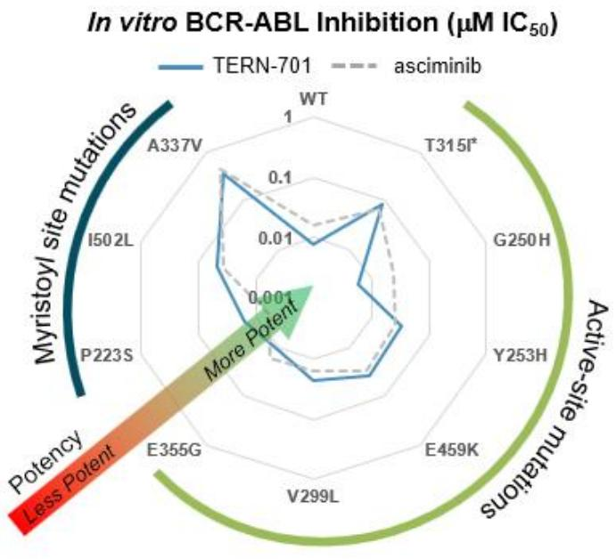

{12}------------------------------------------------

In July 2020, Hansoh in-licensed TERN-701 for development in the greater China region. TERN-701 is referred to by Hansoh as HS-10382. In May 2022, Hansoh initiated an open-label, multicenter, dose-escalation and expansion, first-in-human study in chronic or accelerated phase CML patients, who are resistant or intolerant to prior active-site BCR-ABL TKI treatment. Hansoh is responsible for all development costs in the greater China region, including the ongoing Phase 1 trial in China. We expect our Phase 1 trial for TERN-701 to start in the second half of 2023, and intend to include sites from the United States, Europe and other countries, with potential interim top-line readouts from initial cohorts in 2024.

#### *BCR-ABL TKIs for CML*

Imatinib represents the first approved active-site TKI, and transformed CML into a disease that can be survived with chronic therapy. Imatinib is approved for newly diagnosed adults and children with Philadelphia chromosome-positive (Ph+) CML in chronic phase and patients in chronic, accelerated or blast phase with Ph+ CML, after failure of interferon-alfa therapy. However, approximately half of patients treated with imatinib develop resistance or intolerance and may be progress onto alternative active-site TKIs. Dasatinib, nilotinib and bosutinib are approved for newly diagnosed adults with Ph+ CML in chronic phase and adults in chronic, accelerated or blast phase Ph+ CML with resistance or intolerance to prior therapy. Ponatinib is approved for adult patients with chronic phase, accelerated phase, or blast phase CML for whom no other TKI is indicated and adults with the T315I mutation. These active-site TKIs offer increased potency over imatinib but worse adverse event profiles and reduced tolerability. Due to resistance or side effect intolerance, approximately 30% to 40% of patients treated with these agents are switched to an alternative TKI therapy. Despite the largely overlapping efficacy and safety profiles of the active-site TKIs (dasatinib, nilotinib and bosutinib), these three TKIs cumulatively generated approximately \$5 billion in 2022 sales, despite the availability of generic imatinib.

Acute lymphocytic leukemia (ALL) is another form of cancer that originates in the bone marrow, where an excess of immature lymphocytes (white blood cells) are produced. Approximately 25% of adults with ALL have a subtype known as Ph+ ALL. The leukemia cells of Ph+ ALL feature a similar translocation of parts of chromosomes 9 and 22 as observed with Ph+ CML, which creates the fusion oncogene BCR-ABL. This gene produces proteins known as tyrosine kinases leading to unregulated division of leukemic/lymphocytic cells. Over time, these cells can infiltrate the blood stream, raising the number of immature white blood cells that do not protect against infection, while crowding out healthy red blood cells, white blood cells and platelets. While Ph+ ALL has the potential to be treated by allosteric BCR-ABL TKIs such as TERN-701, due to innovation-limiting price controls for orphan drugs approved for more than one indication that was introduced in the Inflation Reduction Act of 2022 (IRA), we do not plan to pursue regulatory approval of TERN-701 for Ph+ ALL in the United States, but may pursue approval in countries outside of the United States.

### *Clinical validation of BCR-ABL TKIs*

CML treatment response is measured through periodic assessments of blood and bone marrow tests. The three types of treatment response are molecular, hematologic and cytogenic response.

Molecular response (MR) is a decrease in the number of cells in the blood with the BCR-ABL gene. A quantitative PCR test is used to measure the number of blood cells containing the BCR-ABL gene and is quantified as a percentage. The initial molecular response to therapy is a significant predictor of outcomes. As a result, MR is the most sensitive method of monitoring BCR-ABL transcripts and is the most relevant in determining further treatment options. Early molecular response (EMR) is achieved when the BCR-ABL1 level is 10% or less at 3 and 6 months after the start of treatment. In EMR, leukemia cells have been reduced by 90% or more. Major molecular response (MMR) is achieved when the BCR-ABL1 level has decreased to 0.1%, signaling that leukemia cells have been reduced by 99.9% or more. A deep molecular response (DMR) is achieved when the BCR-ABL1 level has decreased to 0.01% or less. When BCR-ABL1 levels can no longer be detected, the patient has achieved Complete Molecular Response (CMR).

{13}------------------------------------------------

Hematologic response can be categorized as either partial or complete, depending on the results of a complete blood count (CBC) test. This assessment measures the number of red blood cells, white blood cells and platelets in the blood. A partial hematologic response is achieved when the number of each blood cell type begins to revert to normal levels. A complete hematologic response is achieved when blood cell counts return to normal and may be observed within one month of treatment initiation. Cytogenic response is assessed by measuring the percentage of cells in the bone marrow containing the Philadelphia chromosome (for example, Ph+ cells). Cytogenic evaluations of bone marrow cells are conducted at three-month intervals to assess a patient's response to treatment. A minor cytogenic response is achieved when the Philadelphia chromosome is present in more than 35% of bone marrow cells. A major cytogenic response is achieved when 35% or fewer cells have the Philadelphia chromosome. When no cells with the Philadelphia chromosome are detected in the bone marrow, a complete cytogenic response (CCyR) is achieved.

In pre-treated third-line patients, asciminib achieved an MMR in 25% of patients by 6 months, which was superior to and approximately two-fold greater bosutinib's MMR rate of 13%, which was adequate to gain accelerated approval in the third-line setting. When asciminib's Phase 3 study progressed to 96 weeks, asciminib achieved MMR in 38% of pretreated third-line patients, more than doubling bosutinib's 16% MMR response rate, resulting in a full approval in the third-line setting. The discontinuation rate after 96 weeks due to the lack of efficacy or adverse events in patients on asciminib was nearly half of the rate of patients on bosutinib (31.2% asciminib v. 60.5% bosutinib).

Allosteric BCR-ABL inhibitors may have clinical benefit as initial CML treatment in addition to third line treatment. Novartis is conducting an ongoing Phase 3 study, ASC4FIRST (NCT04971226), of asciminib against investigator-selected TKIs in newly diagnosed (front-line) CML patients, with data expected in 2024. At the 12-month timepoint in front-line patient populations, active-site TKIs nilotinib, bosutinib and dasatinib achieved MMRs in 44%, 47% and 52% of patients, respectively, compared to imatinib's MMR response rate of 22%-37%.

#### *Limitations of active-site BCR-ABL TKIs*

Unmet medical needs in CML remain due to (1) an increasing number of patients becoming refractory or intolerant to the current SOC, (2) safety warnings for active-site TKIs used in CML patients who are resistant or intolerant to prior TKI therapy, or (3) BCR-ABL mutations that are difficult for active-site TKIs to treat (e.g., T315I).

People with CML can expect to live life-spans nearly as long as healthy adults, and CML treatment is life-long for a high proportion of patients. As a result, treatment is selected and modified throughout the often decades long treatment period to address the course of individual patients' CML disease over time as well as patients' individual needs as they age. A recent publication estimated that approximately 30% to 40% of people started on any TKI switch to an alternative TKI. Physicians guide treatment decisions on molecular response to treatment as well as other individual patient needs including drug tolerability, co-morbidity and drug-drug interaction profiles, which may evolve over time. For example, nilotinib-treated patients may be switched to imatinib and bosutinib which are preferred treatment options for patients experiencing cardiovascular or peripheral artery comorbidities, while nilotinib is less preferred. In contrast, nilotinib and dasatinib may be selected as replacement therapies for patients experiencing gastrointestinal or renal comorbidities in whom imatinib and bosutinib are less recommended. Survival rates and treatment durations for people living with CML continue to increase. As a result, physicians are seeking additional novel therapies that are safe, efficacious and well tolerated to address their patients' changing needs over time.

In later lines of CML treatment, patients may experience greater challenges with intolerance. For patients who have failed two or more TKIs, up to 55% were intolerant to a previous TKI. Even low-grade, chronic TKI intolerance can impact a patient's compliance with therapy, which in turn can lead to poorer outcomes. In a survey of people with CML, nearly half of responders skipped doses of their medication. In a study of 87 patients with chronic phase CML, 94% of patients who were more than 90% compliant with their treatment regimen achieved MMR, whereas just 14% of patients who were less than 90% compliant achieved MMR.

During treatment with agents that inhibit BCR-ABL kinase activity, leukemic cells may also develop resistance mutations, which can block the binding of active-site TKIs and render them ineffective. Approximately 15% to 20% of patients develop BCR-ABL mutations or molecular abnormalities. T315I represents one variation of active-site mutation that renders most active-site TKIs ineffective. Ponatinib is the only active-site TKI approved for the treatment of patients with the T315I mutation but carries black box warning for cardiovascular and other toxicity. Potential resistance in second- and thirdline treatment can result in poorer efficacy outcomes and increased risk of discontinuation.

{14}------------------------------------------------

Mutations within the BCR-ABL kinase domain may also affect the ability of the majority of active-site TKIs to bind and inhibit BCR-ABL. Recent studies suggest that inhibiting BCR-ABL with an allosteric TKI may induce a conformational change in BCR-ABL that increases the binding affinity of active-site TKIs, such as ponatinib. As a result, co-administering allosteric and active-site TKIs may lead to a synergistic effect of stabilizing the inactive conformation of BCR-ABL.

Allosteric TKIs, which bind to the myristoyl-binding pocket, represent a new treatment class for CML and have the potential to address the shortcomings of active-site TKIs, including off-target activity and limited efficacy against active site resistance mutations. Asciminib, the first approved allosteric TKI, is also indicated for the treatment of CML in patients with the T315I mutation although at five times higher than the daily total dose used to treat patients without T315I. High dose asciminib is associated with safety and tolerability issues that may lead to lower adherence in CML patients with T315I.

#### *Our solution for allosteric BCR-ABL TKIs*

TERN-701 aims to address the limitations of active-site TKIs with the goal of achieving improved tumor suppression through a combination of (1) potent activity against BCR-ABL including a broad range of mutations, and (2) improved safety and tolerability profiles. TERN-701 was designed with a target product profile to perform at least as well as asciminib. In non-clinical assays, TERN-701 demonstrated a similar profile to asciminib and is highly potent against wild type BCR-ABL and the most-common mutations occurring in patients treated with active-site TKIs. Based on results from preclinical pharmacokinetic and CYP inhibition studies we conducted, we believe that TERN-701 could also have simplified dosing and fewer drug-drug interactions compared to asciminib. We believe TERN-701 represents a potentially compelling treatment option as the second allosteric TKI under development in the United States.

In addition to use as a monotherapy, allosteric BCR-ABL TKIs such as TERN-701 may be combined with active-site TKIs to treat CML. *In vitro* non-clinical studies have shown the potential for synergistic effects when allosteric TKIs are used in combination with active-site TKIs. When an active-site TKI, such as ponatinib and potentially other active site TKIs, are given in combination with an allosteric TKI, the dual TKI binding approach appears to help stabilize the BCR-ABL fusion oncoprotein in its inactive conformation, leading to potentially improved efficacy.

{15}------------------------------------------------

### *Clinical development of TERN-701*

In May 2022, Hansoh initiated an open-label, multicenter, dose-escalation and expansion, first-in-human study of TERN-701 (HS-10382) in chronic or accelerated phase CML patients, who are resistant or intolerant to prior active-site BCR-ABL TKI treatment. The trial is comprised of two parts, with dose escalation being conducted in Part 1 to determine the maximum tolerated or maximum applicable dose followed by dose expansion in Part 2 of the trial, in which additional CML patients will be enrolled to receive one or more doses selected from Part 1. Part 2 of the trial will evaluate major cytogenetic response at six months as its primary endpoint, with key secondary endpoints including molecular response, hematologic response, measures of pharmacokinetics (PK) and an evaluation of safety and tolerability. The Phase 1 trial for TERN-701 in China, which is conducted and funded by Hansoh, is illustrated below:

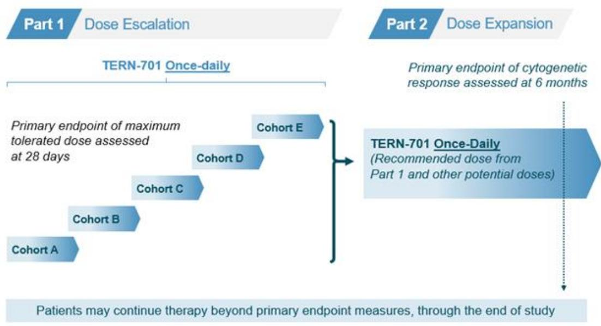

We expect our Phase 1 trial for TERN-701 to start in the second half of 2023, and intend to include sites from the United States, Europe and other countries, with potential interim top-line readouts from initial cohorts in 2024. We expect the design for our clinical trial of TERN-701 will be informed by data from the ongoing Phase 1 trial being conducted in China. We plan to continue to leverage additional clinical developments from Hansoh's program to inform and accelerate our TERN-701 program in the U.S. and our other territories.

### **Background on NASH**

NASH is a severe form of NAFLD, a common liver disease characterized by the accumulation of excess fat in the liver (steatosis). When hepatic steatosis results in liver inflammation and, in many cases, fibrosis, it results in NASH, a multifaceted disease that involves three distinct pathogenic hepatic disease processes: steatosis, inflammation and fibrosis. In addition to these three disease processes, many NASH patients exhibit broader concomitant metabolic issues such as insulin resistance, diabetes, dyslipidemia, obesity and excess lipotoxic fat. Severe progression of NASH leads to cirrhosis and decompensated liver disease, with the associated risks for hepatocellular carcinoma and liver-related death. NASH was recently identified as the second leading etiologic indication for liver transplantation in the United States, and it is projected to become the leading cause of liver transplantation in the coming years.

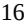

{16}------------------------------------------------

NAFLD is the most common cause of chronic liver disease in the United States, affecting 80 to 100 million individuals. Among persons with NAFLD, approximately 20% will progress to NASH, which is currently estimated to affect 20 million adults in the United States. Progression of liver fibrosis ultimately leads to cirrhosis in an estimated 20% of patients with NASH. With an aging population and the markedly increasing rates of obesity, diabetes and dyslipidemia/metabolic syndrome worldwide, NAFLD and NASH have increased greatly in prevalence, posing a significant healthcare challenge. Currently, no drug has been approved for the treatment of NASH in the United States or Europe. In a study published in Hepatology in 2018, lifetime costs of treating and managing NASH patients in the United States in 2017 were estimated to be over \$220 billion, in the absence of approved therapies.

### *Etiology of NASH*

NAFLD and NASH are classified as progressive metabolic diseases, often correlated with chronic excess caloric intake, obesity and metabolic syndrome. Physiologically, hepatocytes in the liver can act as a repository for excess energy stored by the body. As humans consume disproportionate amounts of calories relative to those burned on a consistent basis, the body becomes overweight, and organs, including the liver, become burdened by fatty tissue. With the liver acting as the hub for excess energy and energy conversion, an imbalance develops with more delivery of fats and triglycerides to the liver, an increase in hepatic fatty acid synthesis and impaired hepatic fatty acid oxidation and removal of liver fat, resulting in NAFLD.

Inflammatory cascades in the liver activate hepatic stellate cells to excrete extracellular matrix resulting in liver fibrosis. Over time, fibrosis progresses, increasingly replacing diseased and normal liver tissue with scar tissue. Eventually, most of the liver is replaced by fibrotic tissue, which histologically is categorized as cirrhosis. While some cirrhotic patients have enough functional liver tissue to maintain hepatic activity, over time, the liver fails, resulting in decompensated liver disease and the need for liver transplantation to avoid liver related death. Furthermore, cirrhosis is a key risk factor for hepatocellular carcinoma.

NASH is currently diagnosed by histological findings on liver biopsy. In clinical trials, recommended scoring systems assess (i) liver fibrosis and (ii) steatosis and inflammation using the NAFLD Activity Score, or NAS, a composite score that grades the degree of three non-fibrotic histologic features of NASH: steatosis, hepatocyte ballooning and lobular inflammation. Efficacious responses to treatment in NASH clinical trials are usually considered to be either an improvement in fibrosis score without worsening of the NAS, or an improvement of the NAS without worsening of fibrosis.

While the definitive diagnosis of NASH remains linked to histology, non-invasive blood and imaging tests are increasingly being used in clinical practice to diagnose NASH, assess the likelihood of significant fibrosis, predict risk of disease progression and assess response to treatment. MRI-derived biomarkers proton density fat fraction (PDFF) and iron-corrected T1 mapping (cT1) are gaining traction as emerging alternatives to biopsy for NASH. cT1 measures free-water content in liver tissue, which has shown a strong correlation with inflammation and fibrosis histology. An estimated difference of 88 milliseconds in cT1 relaxation time has been related to a two-point difference in overall NAS. While MRI-PDFF and cT1 both correlate with NAS, only cT1 correlates with fibrosis. Further, liver cT1 has been shown to predict clinical outcomes in patients with chronic liver disease. Liver disease patients with an elevated cT1 relaxation time of 990 milliseconds or greater have been shown to have a high probability of developing a serious clinical event in the next five years, whereas those with liver cT1 relaxation times of less than 840 milliseconds have been shown to be unlikely to develop such outcomes. As data from these non-invasive assessments continue to accumulate—for initial diagnosis of NASH, monitoring of disease progression over time, and monitoring response to treatment—these approaches may replace liver biopsy, both in clinical practice and clinical trials. In its December 2018 draft NASH guidance, the FDA encouraged sponsors to include non-invasive biomarkers in clinical studies of experimental NASH treatments in order to accelerate development and supplant liver biopsy. At The Liver Meeting in November 2021, the American Association for the Study of Liver Diseases (AASLD) issued practice guidelines recommending blood and imaging-based non-invasive assessments to determine fibrosis staging prior to considering a liver biopsy. To accelerate the usage of NITs as surrogate endpoints for NASH, we joined the steering committee of the NAIL-NIT Consortium, a multi-stakeholder effort to link noninvasive testing directly to outcomes. NAIL-NIT's preliminary planned activities include a prospective six-year study of NASH patients and, separately, a retrospective analysis of NASH patient cases to establish the best utilization of the growing array of non-invasive testing methods in the treatment, diagnosis and monitoring of NASH patients.

{17}------------------------------------------------

### *Treatment of NASH*

There currently are no FDA-approved therapies for the treatment of NASH, and available treatment options are limited to control of metabolic dysfunction, including weight loss, as well as lifestyle modifications such as exercise and dietary changes. However, many patients are unable to achieve or maintain significant weight loss or comply long-term with the dietary and lifestyle changes required to reverse NASH. In order to optimally treat NASH and reduce the risk of liver cancer and liver-related mortality, the three distinct disease processes may each need to be addressed–steatosis, inflammation and fibrosis. In addition to these three disease processes, we believe an ideal NASH therapy will also aim to improve the overall metabolic profile of NASH patients such as improvements in glycemic control, atherogenic lipid improvement, weight loss and/or reduction of lipotoxic fat. Single agents focusing on specific mechanisms contributing to one of these three processes, each involving multiple pathways, have demonstrated only modest results to date. As such, combination therapies, such as our THR-b agonist in combination with our FXR agonist, have the potential to better address the multitude of desired properties for the treatment of NASH.

#### **Our Clinical Stage Programs in NASH**

We are developing a portfolio of small-molecules that address the multiple hepatic disease processes of NASH in order to drive meaningful clinical benefits. Our most advanced clinical stage program is TERN-501, a THR-β agonist with high metabolic stability, enhanced liver distribution and greater selectivity for THR-β compared to other THR-β agonists in development. In November 2021, we announced positive top-line data from a Phase 1 clinical trial of TERN-501 in healthy volunteers with mildly elevated low-density lipoprotein, or LDL, cholesterol. We also have TERN-101, a liver-distributed, non-bile acid FXR agonist that has demonstrated sustained liver FXR activation, as well as a favorable tolerability profile across multiple clinical trials. We announced positive top-line data from our Phase 2a LIFT clinical trial of TERN-101 in NASH in June 2021. Our Phase 2a DUET trial, evaluating TERN-501 as a monotherapy and in combination with TERN-101, completed enrollment in February 2023, with top-line data expected in the third quarter of 2023. We believe developing combination therapies that target multiple mechanistic pathways and improve the overall metabolic profile of NASH patients will drive improved outcomes for NASH patients while mitigating potential tolerability concerns associated with other drugs in development.

#### **TERN-501 – a selective THR-β agonist with enhanced metabolic stability and liver distribution**

#### *Drug candidate summary*

TERN-501 is a selective THR-β agonist with enhanced metabolic stability and liver distribution, characteristics that are intended to improve safety and efficacy in NASH patients. THR-β is the major form of thyroid hormone receptor in the liver and regulates key aspects of energy metabolism, including fatty acid and lipid synthesis and removal of liver fat through induction of fatty acid oxidation. THR-β stimulation has been identified as a target for NASH on the basis of its potential to reduce hepatic steatosis, improve fibrosis and improve serum lipid parameters in NASH patients. For any THR agonist, a key concern is toxicity from excess systemic THR-α stimulation. TERN-501 is 23-fold more selective for THR-β than for THR-α activation, thereby minimizing the risk of cardiotoxicity through THR-α stimulation. TERN-501 has high metabolic stability and a low projected clinical dose, which we believe makes it an attractive candidate for fixed-dose combination co-formulations. In November 2021, we announced positive top-line data from a Phase 1 clinical trial of TERN-501 in healthy volunteers. We received Fast Track designation from the FDA for TERN-501 for the treatment of NASH in June 2021. Fast Track designation does not guarantee an accelerated review by the FDA.

#### *THR-β agonists for NASH*

Thyroid hormone plays a central role in regulating metabolism, through its actions in multiple tissues, including fat, skeletal muscle, pancreas and liver. THR-α and THR-β are nuclear receptors widely expressed in the body, but the two different isoforms are differentially expressed in different tissue types. THR-β is the major form of thyroid hormone receptor in the liver and regulates key aspects of energy metabolism, including fatty acid and lipid synthesis and removal of liver fat through induction of fatty acid oxidation. THR-α is the major form of thyroid hormone receptor in cardiac muscle, skeletal muscle and bone. Selective agonism of THR-β in the liver has been identified as a target for NASH and validated in clinical trials on the basis of its potential to improve hepatic steatosis, liver fibrosis and lipid profiles in NASH patients.

{18}------------------------------------------------

### *Clinical validation of THR*-β *agonism*

Data from other NASH clinical studies validate the potential of THR-β agonism as a NASH treatment (the data from other NASH clinical studies described in this paragraph are from Madrigal Pharmaceuticals, Inc.'s Phase 2 and Phase 3 trials of resmetirom (MGL-3196). In December 2022, Madrigal announced positive Phase 3 top-line results, in which resmetirom achieved significant improvements on two histological endpoints that are currently believed to be reasonably likely to predict clinical benefit: (1) NASH resolution with a two-point or greater NAS reduction with no worsening of fibrosis and (2) fibrosis improvement by at least one stage with no worsening of NAS. In a Phase 2 clinical trial, resmetirom showed significant reductions in liver fat measured by MRI-PDFF, as well as reduction in lipid levels in serum, which may offer additional benefits to NASH patients who are at high risk of cardiovascular comorbidities. In this same clinical trial, resmetirom showed increases in sex hormone binding globulin (SHBG), a key pharmacodynamic marker of THR-β engagement, which is correlated with significant reductions in MRI-PDFF and NAS reduction. These types of histological responses may be suitable for accelerated approval under current draft guidance from the FDA titled "Noncirrhotic Nonalcoholic Steatohepatitis With Liver Fibrosis: Developing Drugs for Treatment Guidance for Industry."

### **THR-β regulates key aspects of energy metabolism (e.g., fatty acid & lipid synthesis, liver fat removal through fatty acid oxidation)**

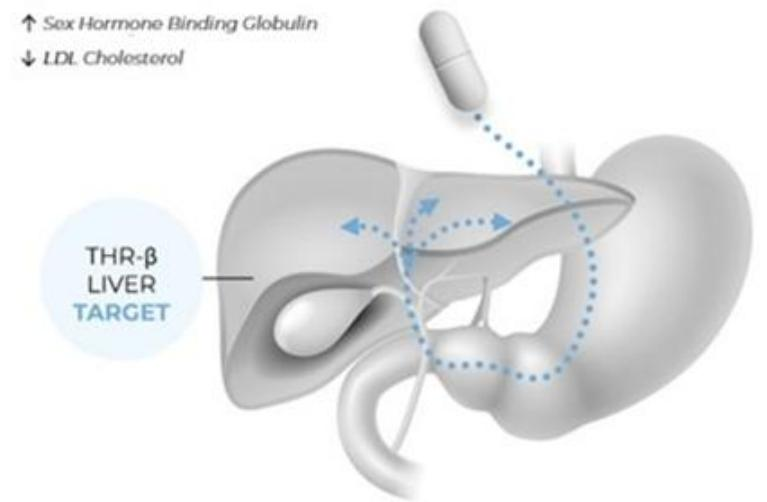

### *Limitations of THR-β targeting*

For THR agonists, a key safety concern is the potential for adverse effects from off-target thyroid hormone receptor stimulation that may stem from either lack of selectivity for THR-β or high variations in pharmacokinetics due to the lack of metabolic stability. Selectivity for THR-β over THR-α is key to modulating the metabolic activities in the liver without triggering the unwanted effects of THR-α activation outside of the liver. Stimulation of THR-α can adversely affect the cardiovascular and musculoskeletal system through increases in heart rate, cardiac arrhythmias, muscle wasting and reduced bone mineral density. Therefore, the identification of a selective THR-β agonist particularly with enhanced liver distribution, would have the potential to improve hepatic steatosis, improve fibrosis and serum lipid profiles while potentially avoiding adverse effects of THR-α activation. However, the use of a livertargeted pro-drug approach to overcome THR selectivity has not completely avoided cardiac adverse events in clinical trials.

In addition to THR-β selectivity, metabolic stability and predictable pharmacokinetics are important considerations in the development of thyroid hormone activators. In a Phase 2 clinical trial of another selective THR-β agonist, lack of metabolic stability resulted in significant inter-patient variability in drug exposure that required PK monitoring and dose adjustments. Dose adjustments in widespread clinical practice present potential challenges in terms of patient compliance, safety monitoring and additional burden on the healthcare system. Additionally, highly variable pharmacokinetics and unpredictable drug concentrations would hinder the potential for combination treatment in NASH patients.

{19}------------------------------------------------

Metabolism by cytochrome P450 (CYP) represents a complex and meaningful component of drug metabolism. CYP metabolism is the origin of many drug-drug interactions either due to inhibition, induction or competition for enzymatic paths which are commonly used by different drugs, potentially leading to unpredictable drug effects. Other THR-β agonists in late-stage development are known to be metabolized by CYP P450.

In prior trials of THR-β agonists, cardiovascular, central thyroid and/or gastrointestinal adverse events have been observed over 12-weeks or less of treatment. Gastrointestinal adverse events included diarrhea (33%) and nausea (14%) in the active arms of the Phase 2 study of resmetirom. In another Phase 2 study of VK2809, cardiovascular events included ventricular run, chest pressure, palpitations and supraventricular tachycardia, amongst others. In a Phase 1 multiple ascending dose study of ALG-055009, mean values of Total/Free T4 and Total T3 were outside the normal range for the 1mg dose. The observed adverse events and abnormal laboratory results represent additional opportunities to improve upon the safety and tolerability profiles that are lacking with other THR-β agonists.

#### *Our solution for THR-*β *agonism: high THR-*β*-selectivity and improved metabolic stability*

TERN-501 was selected over other discovery candidates because of its high selectivity for THR-β over THR-α, its improved metabolic stability and its enhanced liver-distribution, all of which are characteristics that are intended to improve efficacy and safety in NASH patients. TERN-501 has a similar structural backbone to other THR-β agonists in late-stage development that are selective for THR-β. Furthermore, the TERN-501 chemical structure incorporates certain changes designed to enhance metabolic and pharmacokinetic stability, thereby limiting the need for individualized dose adjustments implemented in studies with other THR-β agonists. In a head-to-head comparison, TERN-501 has shown a 23-fold selectivity for THR-β over THR-α stimulation in a cell-free assay, which is higher than the selectivity for two other THR agonists currently in development. TERN-501 is not a pro-drug and does not rely on a metabolic process to make it pharmacologically active. The following chart illustrates the selectivity of TERN-501 as compared to a reference drug and the active metabolite of a pro-drug in clinical development for NASH.

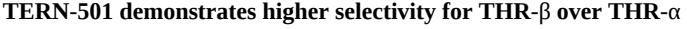

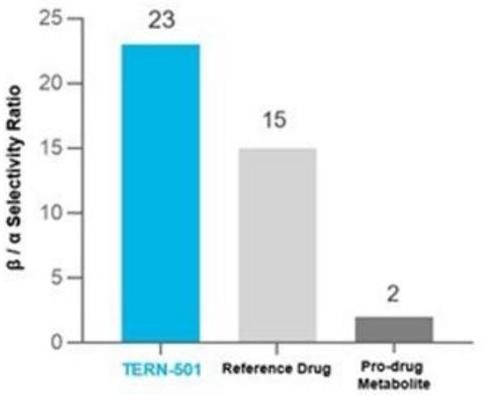

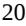

{20}------------------------------------------------

Non-clinical tissue distribution studies show that TERN-501 demonstrates enhanced liver distribution relative to plasma and other organs. From non-clinical studies, TERN-501 is projected to have a predictable human PK profile due to its improved metabolic stability. Due to its metabolic stability, we believe that TERN-501 is unlikely to require PK monitoring and individualized clinical dose adjustment in NASH patients, as was done in a certain clinical trial of another THR-β agonist in development that lacks metabolic stability and has variable PK in humans. As a result, TERN-501 may not have the potential challenges associated with monitoring and dose adjustment in clinical practice, including patient compliance, safety monitoring and additional burden on the healthcare system. Further, TERN-501 is projected to have a low clinically efficacious dose range which, along with its metabolic stability and lack of metabolism by CYP, makes it attractive for long-term NASH treatment and for co-formulation as part of a fixed-dose combination.

### *Clinical development of TERN-501*

In November 2021, we announced positive top-line data from a Phase 1 clinical trial of TERN-501 in healthy volunteers with mildly elevated LDL cholesterol.

The Phase 1 clinical trial of TERN-501 included SAD, MAD and drug-drug interaction, or DDI, cohorts evaluating the safety, tolerability, pharmacodynamics (PD) and pharmacokinetics (PK) of TERN-501. Healthy volunteers with mildly elevated LDL cholesterol were randomized to placebo (n=2) or TERN-501 (n=6) in each cohort. Volunteers randomized to TERN-501 received single doses of 3, 10, 30 or 60 mg of TERN-501 in the SAD portion of the study or multiple doses of 1, 3, 6 or 10 mg of TERN-501 once daily for 14 days in the MAD portion of the study. In the DDI portion of the study, volunteers received open label TERN-501 co-administered with TERN-101, our liver-distributed FXR agonist also in development for the treatment of NASH.

In the SAD and MAD cohorts, single and multiple doses of TERN-501 were generally well-tolerated with a similar incidence of AEs across all TERN-501 treatment groups and placebo. All AEs were mild to moderate with no apparent dose relationship, with no treatment-emergent serious AEs and no discontinuations of study or study drug due to any AE. There were no cardiac safety signals, no incidence of diarrhea and no differences between TERN-501 groups and placebo in change from baseline in heart rate, blood pressure or other vital signs. Thyroid function test results were consistent with THR-β agonists currently in clinical development, and there were no findings of clinical hyper- or hypo-thyroidism. There were no differences between placebo and any TERN-501 dose group in liver function abnormalities or mean change from baseline in liver transaminases at Day 15 in the MAD cohorts.

TERN-501 demonstrated a predictable pharmacokinetic profile with low variability: study drug plasma exposures were linear and approximately dose-proportional with no overlap between dose strengths. There was no significant accumulation of drug over 14 days of dosing. TERN-501 plasma halflife was greater than 13 hours in all single and repeat dose cohorts, supporting once-daily dosing. The overall PK profile indicates TERN-501 is well-suited for co-formulation with other small-molecule NASH agents as an oral, once-daily fixed dose combination.

Significant effects on sex hormone binding globulin, or SHBG, a key PD marker of THR-β engagement linked to NASH histologic efficacy, were observed following treatment with TERN-501. As further described in the table below, SHBG increases observed with 14 days of TERN-501 treatment were significant, dose dependent and have been associated with robust reductions in MRI-PDFF and NAFLD Activity Score in a precedent late-stage clinical NASH trial of another THR-β agonist.

In addition, significant reductions were observed in atherogenic lipids including LDL cholesterol and apolipoprotein B, or Apo-B, comparable to or greater than those observed in Phase 1 studies of other THR-β agonists being studied in late-stage clinical trials. All TERN-501 dose groups demonstrated significant decreases in LDL cholesterol compared to placebo during the dosing period. The maximum mean LDL cholesterol decreases over the treatment period were -13%, -22%, -28% and -27% for 1, 3, 6 and 10 mg doses, respectively, compared to placebo (-8%).

{21}------------------------------------------------

|                                           | TERN-501 MAD (QD) Mean % Change from Baseline to Day 15 |               |               |               |                |  |
|-------------------------------------------|------------------------------------------------------------|---------------|---------------|---------------|----------------|--|
|                                           | Placebo (N=8)                                              | 1 mg (N=6) | 3 mg (N=6) | 6 mg (N=6) | 10 mg (N=6) |  |
| Sex Hormone Binding Globulin (%)          | -6%                                                        | 17%           | 57%*          | 135%*         | 165%*          |  |
| Low Density Lipoprotein – cholesterol (%) | -4%                                                        | -16%          | -17%          | -19%          | -20%*          |  |
| Triglycerides (%)                         | -13%                                                       | -18%          | -21%          | -20%          | -36%*          |  |
| Apolipoprotein-B (%)                      | -5%                                                        | -14%          | -18%*         | -23%*         | -27%*          |  |

Note: Day 15 represents 24 hours following the last dose of TERN-501

* p-value vs. placebo: <0.05

In the SAD cohorts, single doses of TERN-501 up to 60 mg resulted in significant and dose-dependent reductions in Apo-B and LDL cholesterol and significant increases in SHBG relative to placebo. In the DDI cohort, the combination of TERN-101 and TERN-501 was well-tolerated. Preliminary PK results support the co-administration of TERN-101 and TERN-501 in NASH patients, with no apparent need for dose adjustment.

### **TERN-101 – a liver-distributed FXR agonist**

### *Drug candidate summary*

TERN-101 is a liver-distributed, non-bile acid FXR agonist that has demonstrated a differentiated tolerability profile and improved target engagement; likely due to its sustained FXR activation in the liver but only transient FXR activation in the intestine. FXR is a nuclear receptor primarily expressed in the liver, intestine and kidneys. FXR regulates hepatic expression of various genes involved in lipid metabolism, inflammation and fibrosis. Clinical studies of other FXR agonists have demonstrated significant histological NASH improvements but have also resulted in pruritus and adverse lipid changes. These tolerability issues have generally been observed in Phase 1 clinical trials as well as later phase studies of other FXR agonists in development and have been regarded as dose-limiting toxicities, which are suboptimal for patients and can lead to treatment discontinuation.

In June 2021, we announced positive top-line data from our Phase 2a LIFT Study of TERN-101 in NASH patients. In the LIFT Study, TERN-101 was generally well-tolerated with a similar incidence of adverse events, or AEs, across treatment groups. There were no treatment-related serious adverse events, and no patient discontinued TERN-101 due to any adverse event including pruritus. Multiple secondary and exploratory endpoints were also evaluated, including changes in liver fibro-inflammation measured by MRI corrected T1, or cT1, liver fat content by MRI proton density fat fraction, or MRI-PDFF, pharmacodynamic parameters, and serum NASH biomarkers. We received Fast Track designation from the FDA for TERN-101 for the treatment of NASH in October 2019. Fast Track designation does not guarantee an accelerated review by the FDA.

### *Our Solution: TERN-101, a liver-distributed FXR agonist*

In June 2021, we announced positive top-line data from our Phase 2a LIFT Study of TERN-101 in NASH patients. Based on these positive results, we plan to initiate a Phase 2a clinical trial of TERN-101 co-administered with our thyroid hormone receptor beta agonist TERN-501 in the first half of 2022 with top-line data expected in the second half of 2023.

The LIFT Study is a 12-week, randomized, placebo-controlled clinical trial in 100 patients with phenotypic or biopsy-diagnosed NASH, identified either by prior biopsy or clinical diagnosis (liver stiffness measured by transient elastography of 7.6—25 kPa and controlled attenuation parameter (CAP) > 300). Clinical trial participants received once-daily oral administration of placebo or TERN-101 tablet doses of 5 mg, 10 mg or 15 mg for 12 weeks. The primary endpoint was the incidence of adverse events. Multiple secondary and exploratory endpoints were also evaluated including changes in liver fibroinflammation measured by cT1, liver fat content by MRI-PDFF, pharmacodynamic parameters, and serum NASH biomarkers.

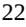

{22}------------------------------------------------

#### **TERN-101 Phase 2a LIFT trial design**

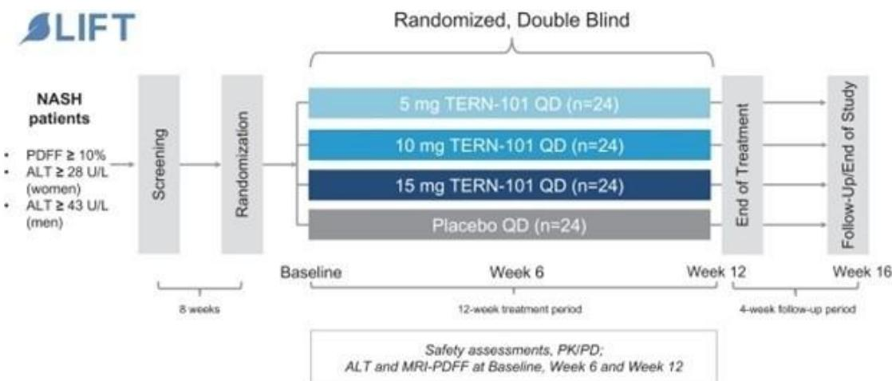

TERN-101 was generally well-tolerated with a similar incidence of adverse events across treatment groups. All treatment-related adverse events were mild to moderate with no apparent dose relationship. There were no treatment-related serious adverse events, and no patient discontinued TERN-101 due to any adverse event, including pruritus.

| Patient incidence AEs by category, n (%)    | Placebo (N=26) | 5 mg (N=25) | 10 mg (N=26) | 15 mg (N=23) |
|---------------------------------------------|-------------------|----------------|-----------------|-----------------|
| Any AE, all CTCAE grades                    | 10 (38.5%)        | 13 (52.0%)     | 14 (53.8%)      | 15 (65.2%)      |
| CTCAE Grade 3 or higher AEs                 | 1 (3.8%)          | 0              | 0               | 1 (4.3%)        |
| Serious AE                                  | 1 (3.8%) (1)      | 0              | 0               | 1 (4.3%) (2)    |
| AE leading to death                         | 0                 | 0              | 0               | 0               |
| AE leading to study or drug discontinuation | 0                 | 0              | 0               | 0               |

### (1) COVID-19 pneumonia

### (2) Urinary tract infection

All pruritus-related AEs were mild or moderate. The patient incidence of pruritus was generally balanced across TERN-101 treatment groups. Most pruritus AEs were mild and resolved during continued TERN-101 treatment.

| Patient incidence of any pruritus AE, n (%)          | Placebo (N=26) | 5 mg (N=25) | 10 mg (N=26) | 15 mg (N=23) |  |
|------------------------------------------------------|-------------------|----------------|-----------------|-----------------|--|
| Pruritus, all CTCAE grades"                          | 0                 | 4 (16.0%)      | 3 (11.5%)       | 4 (17.4%)       |  |
| Grade 1                                              | 0                 | 4 (16.0%)      | 1 (3.8%)        | 3 (13.0%)       |  |
| Grade 2                                              | 0                 | 0              | 2 (7.7%)        | 1 (4.3%)        |  |
| Grade 3                                              | 0                 | 0              | 0               | 0               |  |
| Study drug-related pruritus AEs, per Investigator | 0                 | 3 (12.0%)      | 3 (11.5%)       | 1 (4.3%)        |  |
| Study drug discontinuation due to pruritus           | 0                 | 0              | 0               | 0               |  |

### * CTCAE: common terminology criteria for adverse events

In the Phase 1 study in healthy subjects, administration of TERN-101 resulted in sustained C4 suppression but only transient effects on FGF19 induction, possibly reflecting higher levels of FXR target engagement in the liver compared to intestine. Data from the Phase 2a LIFT Study were consistent with the prior study and showed statistically significant suppression of trough C4 levels in the 10 mg and 15 mg groups but only transient increases in FGF19.

{23}------------------------------------------------

No change in LDL cholesterol was observed in patients in the 5 mg and 10 mg TERN-101 arms as compared to placebo. Statistically significant LDL changes were observed only in the 15 mg arm. Significant decreases in HDL cholesterol were observed in all TERN-101 dose groups at Week 4 and Week 8 but returned toward baseline in the 5 mg and 10 mg dose groups without differences from placebo at Week 12. Decreases in HDL were significantly different from placebo for the 15 mg group at all observed timepoints through Week 12:

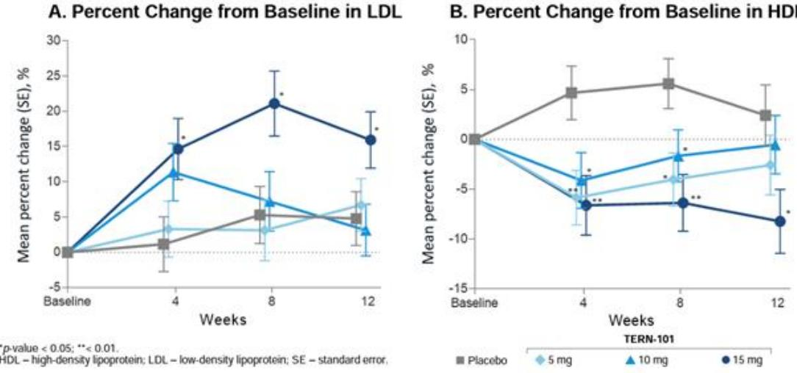

Multiple efficacy biomarkers of NASH, including cT1 and MRI-PDFF, were evaluated in the LIFT Study. Mean changes in cT1 at Week 12 were -0.8 msec for placebo, -38.0 msec (p=0.033) for the 5 mg arm, -57.7 msec (p=0.002) for the 10 mg arm, and -74.0 msec (p<0.001) for the 15 mg arm. Improvements of at least 80 msec in cT1 were observed in a significant proportion of patients in the 5 mg and 10 mg groups at Week 12 as compared to placebo. Significant decreases in cT1 were also observed at Week 6 for all dose groups. cT1 is a magnetic resonance-based imaging test measuring freewater content in liver tissue, which has shown a strong correlation with inflammation and fibrosis histology and clinical outcomes in patients with liver disease. Mean relative changes in MRI-PDFF were -8.4% (placebo), -15.1% (5 mg), -19.7% (10 mg) and -12.9% (15 mg) at Week 12. Mean relative changes in MRI-PDFF were significant at Week 6 for the 10 mg and 15 mg dose groups compared to placebo, although these changes were not statistically significant at Week 12. MRI-PDFF is an imaging marker that measures liver fat content. No discernable trends were observed in initial analyses of the enhanced liver fibrosis (ELF) score, CK-18 and Pro-C3.

Prior to the LIFT Study, we evaluated TERN-101 across four completed Phase 1 clinical trials in 136 subjects, including 119 subjects in whom TERN-101 was administered. In the Phase 1 trials, TERN-101 was generally well-tolerated with no confirmed dose-related tolerability signals. AEs tended to be mild to moderate, with no dose-related increases in AEs. In all four Phase 1 clinical trials of TERN-101, none of the 119 subjects who received TERN-101 reported pruritus, and the serum lipid profiles among TERN-101 recipients were similar to placebo recipients even at high doses.

{24}------------------------------------------------

### **NASH Combination Therapy Programs**

Several prior clinical trials evaluating single-agent therapies for NASH have shown only moderate histological improvements and exhibited tolerability issues with some of these agents at high doses. We believe developing combination therapies that target multiple mechanistic pathways and improve the overall metabolic profile of NASH patients will drive improved outcomes for NASH patients while mitigating potential tolerability concerns and improving compliance as compared with monotherapy regimens. We are focused on developing combination therapies with clinically-validated mechanisms of action to address the multifaceted nature of NASH, while improving the overall metabolic profile of patients. We believe that therapies targeting steatosis, inflammation and fibrosis in tandem, have the potential to provide greater resolution of NASH and improvement in related clinical outcomes. In April 2022, an IND application was cleared to support the Phase 2a DUET clinical trial of TERN-501 in combination with TERN-101, as well as future studies of other combination therapy regimens in NASH.

#### *Preclinical data for combination therapies*

We believe that a combination of TERN-501 and TERN-101 has the potential for improved therapeutic benefit for NASH patients. TERN-501 is a THR-β agonist that is expected to potently and rapidly reduce hepatic steatosis and normalize plasma lipid parameters through the modulation of metabolic pathways that are distinct from those modulated by liver FXR activation. As a liver-distributed FXR agonist, TERN-101 is expected to have effects on multiple facets of NASH, including potential improvements in steatosis, inflammation and fibrosis. A combination of TERN-501 and TERN-101 would therefore be expected to significantly reduce steatosis, inflammation and fibrosis in NASH patients through their complementary effects without the need to use maximal dose levels of either agent. The combination may also result in a positive serum lipid profile since TERN-501 is expected to reduce LDL cholesterol and triglyceride levels in NASH patients where FXR agonists have generally not demonstrated potentially therapeutic decreases in plasma cholesterol or triglycerides.

As seen in the charts below, the combination of the THR-β agonist TERN-501 and the FXR agonist TERN-101 showed robust efficacy in an in vivo mouse model of NASH by profoundly reducing steatosis and significantly improving fibrosis, serum triglycerides, serum total cholesterol and ALT. The combination treatment of TERN-501 and TERN-101 also resulted in the expression of more than 800 additional distinct genes as compared to either agent alone, supporting our hypothesis that additional biological processes are activated by combination treatment. Together these results suggest that the combination of the THR-β agonist TERN-501 and the FXR agonist TERN-101 may provide additional benefits for NASH patients than either treatment alone.

{25}------------------------------------------------

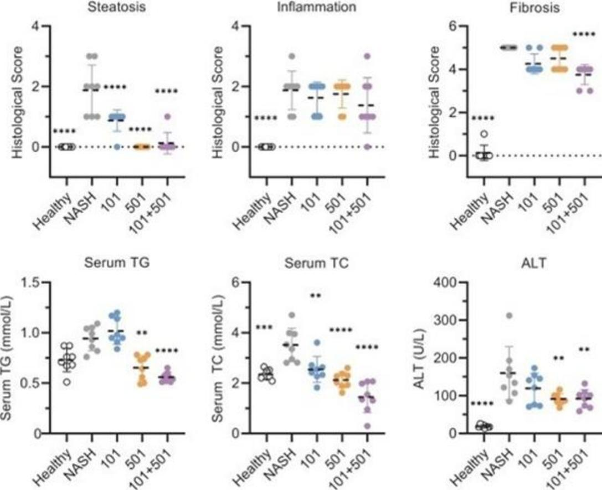

*Figure: Data from a NASH mouse model. TERN-101 dose 3 mg/kg; TERN-501 dose 1 mg/kg. Liver steatosis (upper left), inflammation (upper middle) and fibrosis (upper right) were quantified by histological analysis for degree of steatosis, lobular inflammation and fibrosis. Serum was collected at termination and analyzed for triglycerides, or TG (lower left), total cholesterol, or TC, (lower middle) and a biomarker of liver damage, alanine aminotransferase, or ALT (lower right). Data for individual animals (dots) and mean (dashed line) are presented; **p <0.01, ***p <0.001, ****p <0.*

{26}------------------------------------------------

### *Clinical development for NASH combination of TERN-501 and TERN-101*

In April 2022, the FDA cleared our IND application for our clinical-stage combination therapy candidates in NASH, including combinations of TERN-501 and TERN-101 as well as future studies of other potential combination therapy regimens. Under the IND, we are proceeding with a multicenter randomized, double-blind, placebo-controlled Phase 2a clinical trial in noncirrhotic NASH patients using a factorial design, which includes both monotherapy and combination arms of TERN-501 and TERN-101. This Phase 2a trial, known as the DUET trial, was expected to enroll approximately 140 adult patients with elevated body mass index (BMI ≥ 25 kg/m2) and NASH with fibrosis, but not cirrhosis, based on prior liver biopsy and/or imaging criteria and clinical criteria. All enrolled patients must have liver fat content measured by MRI-PDFF of ≥10%, MRI corrected T1 (cT1) relaxation time of ≥ 800 msec, and meet other inclusion and exclusion criteria. The clinical trial includes a 12-week treatment period and a 4-week follow-up period. The primary endpoint will be the relative change from baseline in MRI-PDFF at Week 12 for TERN-501 monotherapy compared with placebo. Secondary endpoints include assessment of changes in PDFF (combination vs. placebo) and cT1 (TERN-501 monotherapy vs. placebo as well as TERN-501 and TERN-101 combination vs. placebo). Patient enrollment in the DUET trial was completed in February 2023; the total number of patients enrolled exceeded 160. Top-line data are expected in the third quarter of 2023. The Phase 2a DUET trial design is illustrated in the figure below:

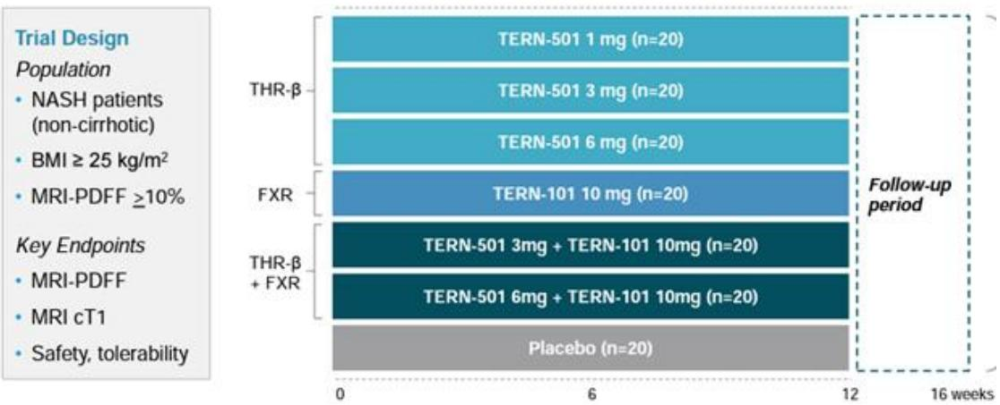

We then plan to proceed to longer duration Phase 2b and Phase 3 trials that can evaluate our individual monotherapies as well as promising combinations within the same trials to confirm treatment effects using surrogate endpoints. We believe this approach maximizes the chance of achieving higher NASH response rates compared to treatment approaches that rely exclusively on single-agent therapeutics and creates efficiencies through the evaluation of our individual monotherapies and combination treatments, allowing us to proceed to marketing authorization applications for those singleagent drug candidates and combination therapies that offer the clearest advantages to patients.

### **Background on Obesity**

Obesity is a chronic disease that is increasing in prevalence in adults, adolescents and children and is defined as a body mass index of 30 or greater (calculated as weight in kilograms divided by height in meters squared). Mechanisms that contribute to obesity include sedentary lifestyles, increased calorie intake and medications such as insulins and antipsychotics. Insulin resistance, a hallmark of metabolic syndrome, also plays a key role in obesity.

Obesity is major health epidemic that has been declared a disease by the American Medical Association and affects populations worldwide. The Obesity Action Coalition (OAC) estimates that nearly 93 million Americans struggle with obesity, and it is predicted to increase to 120 million Americans within the next five years. In addition, the U.S. Center for Disease Control, or CDC, estimates that 42 percent of adults over the age of 20 years old are obese.

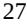

{27}------------------------------------------------

According to the OAC, there are over 40 medical conditions associated with obesity. The most prevalent obesity-related diseases include heart disease, type 2 diabetes, stroke, gallbladder disease, gastroesophageal reflux disease, some forms of cancer, sleep apnea or respiratory problems and a variety of other conditions. According to the Journal of Managed Care and Specialty Pharmacy, the aggregate medical cost due to obesity among adults in the United States was \$260.0 billion in 2016. A prior study examining the future health care costs attributable to obesity projected these annual expenditures to double every decade to approximately \$780 billion by 2030, representing 14% of total United States health care costs. As a result, public and private stakeholders worldwide are taking steps to address obesity.

Despite the rising obesity rate, increased public awareness of the obesity epidemic and significant pharmacoeconomic costs associated with obesity, there remains an unmet need for safe and effective pharmacological interventions. While nearly half of Americans meet the criteria for medical obesity pharmacotherapy, only 2% of adults receive medications for weight loss. Barriers to adequately prescribing weight loss medications may include inadequate prescriber training regarding use of such medications, misconceptions that excess body weight is due to lack of willpower, or that obesity is not a disease that should be treated with medications and surgery, even when indicated. We believe that the obesity epidemic continues to be a significant cause of morbidity, mortality and rising health care costs in the United States and represents an underserved therapeutic category for obesity patients.

#### *Treatment for Obesity*

Treatments for obesity include lifestyle modification (diet and exercise), pharmaceutical therapies, surgery and device implantation. Modifications to diet and exercise are currently the preferred initial treatment for obesity. However, demands of sustained lifestyle modification for long periods of time tends to lead to attrition, often resulting in regained weight. When lifestyle modification alone has failed, pharmacotherapies are generally recommended.

The global pharmaceutical market for obesity was approximately \$1 billion in 2020. With the recent launch of semaglutide for the treatment of obesity in 2021, the obesity market is expected to grow beyond \$5 billion by 2025. Longer term estimates forecast the worldwide obesity market to exceed \$27 billion by 2031, with the anticipated launches of tirzepatide, a glucose-dependent insulinotropic polypeptide (GIP) and GLP-1 receptor dual agonist and other novel injectable compounds. Several older approved agents, including amphetamine-like compounds such as naltrexone-bupropion and phentermine-topiramate, are indicated for short-term administration and not expected to contribute significantly to the obesity market.

#### **TERN-601 – a pre-clinical oral GLP-1 for obesity and NASH**

#### *Drug Candidate Summary*

TERN-601 is an oral, small-molecule glucagon-like peptide-1 receptor (GLP-1R) agonist. Internal discovery of TERN-601 was driven by computational interaction mapping, chemical synthesis and in vitro characterization of approximately 100 GLP-1R agonist compounds. In the fourth quarter of 2021, we nominated TERN-601 as our GLP-1R agonist development candidate for obesity and NASH. IND-enabling activities for TERN-601 remain ongoing, with the goal of initiating a first-in-human clinical trial in second half of 2023.

#### *GLP-1 receptor agonists for obesity and NASH*

GLP-1R agonists are intended to address metabolic processes involved in the pathogenesis of obesity, NAFLD, NASH and other metabolic indications. Mechanisms that contribute to increased weight include sedentary lifestyles, increased calorie intake and medications such as insulins and antipsychotics. Insulin resistance, a hallmark of metabolic syndrome, also plays a key role in obesity. The natural endogenous ligand GLP-1 promotes insulin secretion from pancreatic β-cells in a glucose-dependent-manner following food ingestion. GLP-1 has also been shown to reduce glucagon secretion in the liver, slow gastric emptying in the gut, create a sense of satiety in the brain, reduce inflammation and improve cardiac function. As a result, synthetic GLP-1 peptides have been approved for obesity and diabetes, which are conditions often accompanying NASH.

{28}------------------------------------------------

#### *Clinical validation of GLP-1 receptor agonists*

The recently approved once-weekly injection of semaglutide for chronic weight management demonstrated an average weight loss of approximately 15% at 68 weeks when used with a reduced calorie meal plan and increased physical activity. Study participants also experienced improvements in blood pressure, cholesterol and blood sugar. Semaglutide also had positive effects on LDL and total cholesterol levels, although benefits were limited primarily to triglyceride reductions.

Proof-of-concept for weight loss with GLP-1 receptor agonists has been demonstrated in clinical trials as short as one month. For example, 120 mg of orally administered danuglipron (PF-06882961) administered twice per day (BID) achieved a placebo-adjusted mean body weight loss of 5.5 kilograms (5.4%) in 28 days. In a Phase 2 study, 200 mg BID of danuglipron achieved a 5.2% placebo-adjusted weight loss over 12 weeks. Other oral GLP-1 receptor agonists under development have demonstrated range of weight loss results at various time points: at 6 weeks, 180 mg QD of lotiglipron (PF-07081532) demonstrated 3.3% placebo-adjusted weight loss in a diabetic population while at 12 weeks, 15 mg of LY-3502970 demonstrated 7.1% placebo-adjusted weight loss. The oral formulation of semaglutide, by contrast, achieved a 3% placebo-adjusted weight loss over 26 weeks at the 14 mg high dose.

The development landscape for GLP-1 compounds is varied, including single agonists, multi-agonists, an agonist-antagonist combination and can be generally grouped by route of administration. Injectable candidates under development may target GLP-1 and glucagon (ALT-801, BI 456906, cotadutide and efinopegdutide), GLP-1 and GIP (tirzepatide), GLP-1 agonism and GIP antagonism (AMG 133) or GLP, GIP and glucagon (LY3437943), amongst others. Oral development candidates singly targeting GLP-1 and include LY3502970, danuglipron, lotiglipron (PF-07081532), GSBR-1290 and semaglutide tablets, amongst others.

#### *Discovery of and approaches to GLP-1 receptor agonists*

Our GLP-1 scaffolds are designed using structure-based drug discovery efforts employing Terns' proprietary three-dimensional quantitative structure activity relationship (3D QSAR) model of the GLP-1 receptor. Using reference data from GLP-1 molecules with known EC50 (half maximal effective concentration) data and active site binding properties, Terns' 3D QSAR model is able to predict new GLP-1 receptor agonist molecular activity with greater accuracy than traditional physics-based evaluations. Terns has screened over 20,000 molecular permutations to identify suitable small-molecule scaffolds with potentially improved properties relative to other GLP-1 based approaches. These candidates were further optimized based on in vitro activity, metabolic stability and pharmacokinetic parameters.

Signaling pathways downstream of GLP-1, specifically β-arrestin signaling, have been hypothesized to result in reduced therapeutic durability and gastrointestinal adverse effects such as nausea. As a result, the biased agonism approach is being investigated by other drug developers. However, the advantages of mitigating β-arrestin signaling to enhance G-protein cAMP signaling and improve the side effect profile of a small molecule GLP-1R agonists remains unproven. Notably, a biased GLP-1 agonist avoiding β-arrestin signaling was efficacious in preclinical models (demonstrating glucose lowering and hypophagic effects in non-human primates), yet elicited vomiting, nausea, and headache in subsequent third-party clinical trials. Through our ongoing medicinal chemistry efforts, we have synthesized multiple compounds targeting GLP-1R that exhibit varying degrees of ligand bias towards Gprotein cAMP and β-arrestin.

#### *Limitations of GLP-1 receptor agonists*

Approved agents are synthetic peptides and potentially require higher doses administered by frequent subcutaneous injections for the potential treatment of obesity and NASH. The injectable route of administration is likely to limit their use in obesity and NASH patients, particularly if efficacious oral treatments become available. Although an oral GLP-1 peptide formulation is available for the treatment of Type 2 diabetes, it requires high doses, is associated with adverse effects and lacks NASH efficacy data. A non-peptidic small-molecule oral GLP-1 receptor agonist may offer advantages over currently available peptide GLP-1R agonists that have been studied for the treatment of obesity and NASH.

{29}------------------------------------------------

### *Our solution for GLP-1 receptor agonists*

Our GLP-1 scaffolds are designed using structure-based drug discovery efforts employing our proprietary three-dimensional quantitative structure activity relationship (3D QSAR) model of the GLP-1 receptor. Using reference data from GLP-1 molecules with known EC50 data and active site binding properties, our 3D QSAR model is able to predict new GLP-1 receptor agonist molecular activity with greater accuracy than traditional physics-based evaluations. We have screened over 20,000 molecular permutations to identify suitable small-molecule scaffolds with potentially improved properties relative to other GLP-1 based approaches. These candidates were further optimized based on in vitro activity, metabolic stability and pharmacokinetic parameters. Specific signaling pathways downstream of GLP-1, specifically β-arrestin signaling, have been hypothesized to result in reduced therapeutic durability and gastrointestinal adverse effects such as nausea. As a result, the biased agonism approach is being investigated by other drug developers. However, the advantages of mitigating β-arrestin signaling to enhance G-protein signaling and improve the side effect profile of a small molecule GLP-1R agonists remains unproven. Notably, a biased GLP-1 agonist avoiding β-arrestin signaling was efficacious in preclinical models (demonstrating glucose lowering and hypophagic effects in non-human primates), yet elicited vomiting, nausea, and headache in subsequent clinical trials. Through our ongoing medicinal chemistry efforts, we have synthesized multiple compounds targeting GLP-1R that exhibit varying degrees of ligand bias towards G-protein cAMP and β-arrestin.

Our lead molecule, TERN-601, is a potent GLP-1R agonist biased towards cAMP generation. The target product profile for TERN-601 is a potent, safe and effective small-molecule (non-peptide) with oral once-daily dosing, that may be suitable for combination or co-formulation and have applicability to obesity, NASH and other indications. We are conducting investigational new drug application (IND)-enabling activities for TERN-601 for obesity with the goal of initiating a first-in-human clinical trial in the second half of 2023 and announcing top-line data in 2024. We expect that this Phase 1 clinical program for TERN-601 will include a single ascending dose (SAD) trial in healthy volunteers and a multiple ascending dose (MAD) proof-of-concept trial in healthy volunteers with elevated BMI. The MAD trial is expected to assess changes in body weight and glycemic control parameters, such as HbA1c, over 28 days. Each of our GLP-1 candidate structures are believed to be suitable for oral administration as a single agent or in combination with other drug candidates, such as small molecule glucose-dependent insulinotropic polypeptide receptor (GIPR) modulators.

In addition to TERN-601, efforts are currently underway to nominate and develop structurally distinct second-generation small molecule GLP-1R agonists. Each of our GLP-1 candidate structures are believed to be suitable for oral administration as a single agent or in combination with other drug candidates, such as small molecule glucose-dependent insulinotropic polypeptide receptor (GIPR) modulators.

#### **Glucose-Dependent Insulinotropic Polypeptide (GIP) Receptor Modulators**

As part of our ongoing discovery efforts for the treatment of obesity, we initiated a small-molecule glucose-dependent insulinotropic polypeptide receptor (GIPR) modulator program, designated as the TERN-800 series. GIP is secreted in response to nutrient ingestion to enhance meal-stimulated insulin secretion in a glucose-dependent manner by activating its cognate GIPR in pancreatic beta cells and other cells in various tissues. In preclinical studies, GIPR activation appears to reduce food intake and promote weight loss when combined with its incretin partner GLP-1. The overlapping body weight-lowering actions of both GIP and GLP-1 suggests that combining the actions of these two peptide hormones may bolster glucose-lowering and appetite-suppressing effects beyond those observed with individual agents.

In a preclinical study, two weeks of simultaneous administration of equimolar amounts of a GLP-1R agonist and a GIPR agonist reduced food intake, body weight and fat mass in mice to a greater extent than either agent alone. A late-stage clinical trial of injectable dual GLP-1/GIP receptor agonist tirzepatide (Lilly) demonstrated approximately 20% mean weight loss over 72 weeks of treatment. Notably, a human monoclonal antibody against the GIP receptor decreased food consumption and supported body weight loss alone and in combination with GLP-1R agonist dulaglutide in obese non-human primates.

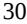

{30}------------------------------------------------

A monomolecular combination of a GIPR antagonist/GLP-1R agonist, AMG 133 (Amgen), enhanced the observed weight loss in animal obesity models. In a Phase 1 clinical study of AMG 133, a single high dose resulted in approximately 8 kilograms of weight loss. In the MAD portion of the study, AMG 133 was administered subcutaneously every 4 weeks (Days 1, 29 and 57). The high-dose cohort of 420 mg demonstrated a mean body weight reduction that remained substantial (10%-15%) through approximately Day 150 of the study. Patients achieved a peak 14.5% mean decrease in body weight at Day 85 after finishing treatment on Day 57. At Day 207, without additional doses of AMG 133, body weight reduction remained approximately at 10% for the high-dose cohort. These early results suggest strong durability of effect for the GIPR antagonist/GLP1-R agonist approach.

Similar to our discovery process for GLP-1, we have synthesized small molecule ligands targeting the GIP receptor and are currently assessing their activity. We plan to combine GIPR modulators with oral small molecule GLP-1 receptor agonists, such as TERN-601, for the treatment of obesity and metabolic diseases. We believe our small molecules have the advantage of oral bioavailability and the ability to dose adjust to achieve an optimal response. Combining GIPR modulators with GLP-1 represents a promising strategy under investigation for the treatment of obesity.

#### **Other Product Candidates**

As we continue to focus resources on the most advanced product candidates in our pipeline, we intend to explore strategic and partnership options for the development and commercialization of TERN-201, TERN-301, and TRN-000546.

TERN-201 is an oral, highly-selective vascular adhesion protein-1 (VAP-1) inhibitor which has demonstrated sustained target engagement and complete, or near-complete (>98%), suppression of VAP-1 enzymatic activity in multiple clinical trials. Across approximately 100 subjects, TERN-201 was shown to be generally well-tolerated, without the off-target liabilities associated with other VAP-1 inhibitors in development.

TERN-301 is a potent and selective orally bioavailable apoptosis signal-regulating kinase 1 (ASK1) inhibitor shown to have slow metabolic turnover in preclinical species, with low clearance, good oral absorption, and a low likelihood of drug-drug interactions. ASK1 is a protein kinase that plays a key role in mediating cell death signaling pathways. It is activated by various cellular stresses, such as oxidative stress, endoplasmic reticulum stress, and pro-inflammatory cytokines. ASK1 inhibitors may prevent downstream signaling and protect cells from stress-induced cell death and inflammation. TERN-301 showed superior selectivity compared to selonsertib against a panel of 370 kinases and in the methionine/choline-deficient diet (MCD) model of NASH, TERN-301 showed improvements in NAFLD activity score and reduced expression of inflammatory related genes.

TRN-000546 is a novel oral, liver directed, monophosphate prodrug of fluorodeoxyuridylate (FdUMP), the potent anti-tumor metabolite of 5 fluorouracil (5-FU). 5-FU, an antimetabolite and cell cycle-targeting chemotherapeutic drug, has been widely used to treat many cancers, including hepatocellular carcinoma (HCC). TRN-000546 was designed to protect FdUMP from enzymatic deactivation in the plasma and improve its delivery into the liver to increase efficacy while minimizing systemic drug exposures to reduce potential toxicity. TRN-000546 is more potent than 5-FU against a wide range of tumor cell lines in cell proliferation assays in vitro and has demonstrated comparable or improved efficacy to standard-of-care treatment in multiple in vivo models of liver, gastric, and colon cancers.

#### **Manufacturing and supply**

We do not own or operate manufacturing facilities for the production of any of our drug candidates, nor do we have plans to develop our own manufacturing operations in the foreseeable future. We currently rely, and expect to continue to rely, on third-party contract manufacturers for manufacturing all our drug candidates for preclinical research and clinical trials. We do not have long-term agreements with any of these third parties.

If any of our drug candidates are approved by any regulatory agency, we intend to enter into agreements with a third-party contract manufacturer and one or more back-up manufacturers for the commercial production of those drugs. Development and commercial quantities of any drugs that we develop will need to be manufactured in facilities, and by processes, that comply with the requirements of the FDA and the regulatory agencies of other jurisdictions in which we are seeking approval.

{31}------------------------------------------------

#### **Sales and Marketing**

Given our stage of development, we have not yet established a commercial organization. We intend to establish a targeted commercial infrastructure in key geographies at the appropriate time prior to regulatory approval of our single-agent drugs and fixed-dose combination therapies. We expect to manage sales, marketing and distribution through internal resources and third-party relationships.

In addition, we will opportunistically explore commercialization partnerships in territories outside the United States. As our drug candidates progress through our pipeline, our commercial plans may change. Clinical data, the size of the development programs, the size of our target markets, the size of a commercial infrastructure and manufacturing needs may all influence our commercialization strategies.

#### **Competition**

The biotechnology industry is intensely competitive and subject to rapid and significant technological change. We believe that our pipeline, development experience and scientific knowledge provide us with competitive advantages. However, we face potential worldwide competition from many different sources, including large multinational pharmaceutical companies, established biotechnology companies and smaller or earlier stage biotechnology companies. In addition, academic institutions, government agencies and other public and private organizations conducting research may seek patent protection with respect to potentially competitive products or technologies. Given the high incidence of NASH and obesity, it is likely that the number of companies seeking to develop products and therapies for the treatment of liver metabolic diseases, including NASH and obesity, will increase.

We are aware of both pharmaceutical and biotechnology companies with development programs in CML. Companies that have recently participated in or are participating in the development of CML treatments include, but are not limited to, Ascentage Pharma Group, BristolMyers Squibb Company, Enliven Therapeutics Inc., Jiangsu Hansoh Pharmaceutical Group Co. Ltd., Novartis Pharmaceuticals Corp., Pfizer Inc., Shenzhen TargetRx Inc., Sun Pharma Industries Ltd., Takeda Pharmaceutical Co., Ltd. and Theseus Pharmaceuticals, Inc.

We are aware of both pharmaceutical and biotechnology companies with development programs in NASH. Large pharmaceutical companies that have recently participated in or are participating in the development of NASH treatments include, but are not limited to, AbbVie, Inc., Amgen Inc., AstraZeneca PLC/MedImmune LLC, Bayer AG, Boehringer Ingelheim, Bristol-Myers Squibb Company, Eisai, Inc., Eli Lilly and Company, Gilead Sciences, Inc., GlaxoSmithKline plc, Johnson & Johnson, Merck & Co., Inc., Novartis Pharmaceuticals Corp., Novo Nordisk A/S, Pfizer Inc., Roche Holding AG, Sanofi, Sumitomo Dainippon Pharma Co., Ltd. and Takeda Pharmaceutical Co., Ltd.

We are aware of both pharmaceutical and biotechnology companies with development programs in obesity. Large pharmaceutical companies that have recently participated in or are participating in the development of obesity treatments include, but are not limited to, Amgen, Inc., Boehringer Ingelheim GmbH, Bristol Myers Squibb Company, Eli Lilly and Co., Hanmi Pharmaceutical Co., Ltd., Johnson & Johnson, LG Chem, Ltd., Novartis AG, Novo Nordisk A/S, Otsuka Holdings Co., Ltd., Pfizer Inc. and Shionogi & Co. Ltd.

With regards to TERN-501, companies who have recently conducted or are currently conducting clinical trials targeting THR-β in the context of NASH include Ascletis Pharma Inc., Aligos Therapeutics, Inc., Madrigal Pharmaceuticals, Inc. and Viking Therapeutics, Inc.

{32}------------------------------------------------

In relation to TERN-601, companies who have recently conducted or are currently conducting clinical trials targeting GLP-1 or combinations with GLP-1 in the context of obesity, NASH, Type 2 diabetes or other metabolic syndromes include 9 Meters Biopharma, Inc., Amgen Inc., Altimmune, AstraZeneca plc, Boehringer Ingelheim GmbH, Carmot Therapeutics, Inc., CinRx Pharma, Cyrus Therapeutics, Inc., D&D Pharmatech, Eiger BioPharmaceuticals, Inc., Eli Lilly and Co., Hanmi Pharmaceutical Co., Ltd., ImmunoForge, Co. Ltd., Intarcia Therapeutics, Inc., Invex Therapeutics Inc., Longevity Biotech Inc., Novo Nordisk A/S, Opko Health, Oramed Pharmaceuticals, PegBio Co Ltd., Pfizer Inc., Pharmaxis, Regor Therapeutics Group, Sanofi, Sciwind Biosciences Co., Structure Therapeutics Inc., Sun Pharmaceutical Industries Ltd., Viking Therapeutics, Inc., vTv Therapeutics Inc. and Zealand Pharma A/S.

In relation to TERN-101, companies who have recently conducted or are currently conducting clinical trials with FXR agonists in the context of NASH include AbbVie, Inc., Ascletis Pharma, Inc., Enanta Pharmaceuticals, Inc., ENYO Pharma SA, Gilead Sciences, Inc., Hepagene Therapeutics, Inc., Intercept Pharmaceuticals, Inc., Metacrine Inc. and Novartis Pharmaceuticals Corp.

For TERN-800, our most recent discovery series program, companies conducting or planning to conduct clinical trials targeting GIPR or combinations with GIPR in the context of obesity include 9 Meters Biopharma, Inc., Amgen, Inc., Carmot Therapeutics, D&D Pharmatech, Eli Lilly and Co., Sciwind Biosciences Co., Viking Therapeutics, Inc. and Zealand Pharma A/S.

Furthermore, pharmaceutical and biotechnology companies who have recently engaged in the development of or are developing clinical-stage drugs to treat NASH or obesity using mechanisms not mentioned above include 89Bio, Inc., Aardvark Therapeutics, Inc., Akero Therapeutics, Inc., Arrowhead Pharmaceuticals, Inc., Axcella Health, Inc., Carmot Therapeutics, Inc., Cirius Therapeutics, Inc., CohBar, Inc., Coherus Biosciences Inc., Corcept Therapeutics, Inc., Currax Pharmaceuticals LLC, CymaBay Therapeutics, Inc., CytoDyne Inc., Diasome Pharmaceuticals, Esperion Therapeutics, Inc., Galectin Therapeutics Inc., Galmed Pharmaceuticals Ltd., Gila Therapeutics, Inc., Hanmi Pharmaceutical Co., Ltd., Inventiva Pharma SA, Ionis Pharmaceuticals, Inc., MediciNova, Inc., NGM Biopharmaceuticals, Inc., Norgine B.V., NorthSea Therapeutics, Inc., Pliant Therapeutics, Inc., Poxel SA, Saniona AB, Sagimet Biosciences, Inc., T3D Therapeutics, Inc., Vivus, Inc. and Zydus Cadila Healthcare.

Many of our competitors have substantially greater financial, technical, human and other resources than we do and may be better equipped to develop, manufacture and market technologically superior products. In addition, our ability to compete may be affected in many cases by insurers or other third-party payors seeking to encourage the use of generic products. There are generic products currently on the market for certain of the indications that we are pursuing, and additional products are expected to become available on a generic basis over the coming years. If our product candidates are approved, we expect that they will be priced at a significant premium over competitive generic products. In addition, many of these competitors have significantly greater experience than we have in undertaking preclinical studies and human clinical trials of new pharmaceutical products and in obtaining regulatory approvals of human therapeutic products. Accordingly, our competitors may succeed in obtaining FDA approval for superior products. Many of our competitors have established distribution channels for the commercialization of their products, whereas we have no such channel or capabilities. In addition, many competitors have greater name recognition and more extensive collaborative relationships. Smaller and earlier-stage companies may also prove to be significant competitors, particularly through collaborative arrangements with large, established companies.

Although we believe our product candidate programs possess appealing attributes, we cannot guarantee that our products will achieve regulatory or market success. Our competitors may obtain regulatory approval of their products more rapidly than we do, or obtain patent protection or other intellectual property rights that limit our ability to develop or commercialize our drug candidate or any future drug candidates. Our competitors may also develop drugs that are more effective, more convenient, more widely used and less costly, or have a better tolerability profile than our drugs. These competitors may also be more successful than we are in manufacturing and marketing their products. Should we not be able to compete with the aforementioned companies or others, it may hinder our ability to bring our product to market as planned.

{33}------------------------------------------------

### **Intellectual Property**

The proprietary nature of, and protection for, our drug candidates and our discovery programs, processes and know-how are important to our business. For our patent portfolio for pipeline drug candidates, we seek to pursue patent protection covering compositions of matter and methods of use and manufacture. Our policy is to pursue, maintain, defend and enforce patent rights in strategic areas, whether developed internally or licensed from third parties, and to protect the technology, inventions and improvements that are commercially important to the development of our business. We also rely on trade secrets, confidential information and other proprietary know-how that may be important to the development of our business.

As of February 21, 2023, our owned and exclusively licensed patent portfolio includes:

- For TERN-701, our small-molecule allosteric inhibitor of the BCR-ABL fusion gene, we own one patent family directed to composition-ofmatter coverage of TERN-701 and its methods of use in the treatment of leukemia and other diseases and conditions. The patent family includes one issued U.S. patent and 20 pending patent applications in foreign jurisdictions, including Australia, Brazil, Canada, China, the EPO, India, Japan and Korea. Any patents that may issue from applications in the patent family are generally projected to expire in 2039, not including any patent term adjustments and any patent term extensions that may be available. This patent family is subject to an exclusive option and license agreement for the greater China region with Hansoh (Shanghai) Healthtech Co., Ltd. and Jiangsu Hansoh Pharmaceutical Group Company Ltd., or collectively, Hansoh. For more information regarding this exclusive option and license agreement with Hansoh, please see "—Licensing and Other Intellectual Property-Related Agreements."
- For TERN-501, our THR-β agonist, we own five patent families which collectively are directed to composition-of-matter coverage of TERN-501 and its methods of use (including combination therapy) in the treatment of certain liver, metabolic and other diseases and conditions. The composition-of-matter patent family includes two issued U.S. patents, one pending U.S. application and 24 pending applications in foreign jurisdictions, including Australia, Brazil, Canada, China, the EPO, India, Japan and Korea. Any patents that may issue from applications in the composition-of-matter patent family are generally projected to expire in 2039, not including any patent term adjustments and any patent term extensions that may be available.
- We own four patent families covering a number of GLP-1R agonists, including TERN-601. Any patents that may issue from applications in these patent families are generally projected to expire between 2041 and 2043, not including any patent term adjustments and any patent term extensions that may be available.
- For TERN-101, our FXR agonist, we own ten patent families and exclusively license from Eli Lilly and Company, or Eli Lilly, two patent families, which collectively are directed to composition-of-matter coverage of TERN-101, its formulations and its methods of use (including combination therapy) in the treatment of certain liver, metabolic and other diseases and conditions. The composition-of-matter patent family currently includes one issued U.S. patent and over 20 granted foreign patents. The issued U.S. patent in the composition-of-matter patent family is projected to expire, inclusive of patent term adjustment, in 2029, not including any patent term extensions that may be available. Corresponding foreign patents are generally projected to expire in 2028, not including any patent term extensions that may be available. For more information regarding this exclusive license agreement with Eli Lilly, please see "—Licensing and Other Intellectual Property-Related Agreements."

Our commercial success will depend in part on obtaining and maintaining patent protection of our current and future drug candidates, as well as successfully defending these patents against third-party challenges. Our ability to stop third parties from making, using, selling, offering to sell or importing our drugs depends in large part on the extent to which we have rights under valid and enforceable patents that cover these activities. We cannot be sure that patents will be granted with respect to any of our owned or licensed pending patent applications or with respect to any patent applications filed or licensed by us in the future, nor can we be sure that any patents that may be granted to, or licensed by, us in the future will be commercially useful in protecting our drug candidates, discovery programs and processes. Moreover, we cannot be sure that any of our owned or licensed patents will not be challenged, invalidated or circumvented or that such patents will be commercially useful in protecting our technology.

{34}------------------------------------------------

The term of individual patents depends upon the legal term of the patents in the countries in which they are obtained. In most countries in which we file, including the United States, the patent term is 20 years from the earliest date of filing a non-provisional patent application. In the United States, the patent term of a patent that covers an FDA-approved drug, in certain cases, may also be eligible for patent term extension, which permits patent term extension as compensation for the patent term lost during the FDA regulatory review process. The Drug Price Competition and Patent Term Restoration Act of 1984 permits such patent term extension of up to five years beyond the expiration of the patent, but patent term extension cannot extend the remaining term of a patent beyond a total of 14 years from the date of product approval. Only one patent among those eligible for an extension may be extended and the amount of available extension to any extension-eligible patent which claims a product, a method of using a product or a method of manufacturing a product, depends on a variety of factors, including the date on which the patent issues and certain dates related to the regulatory review period. Provisions are available in Europe and some other foreign jurisdictions to extend the term of a patent that covers an approved drug. In the future, if and when our drugs receive FDA or analogous foreign approval, we expect to apply for patent term extensions on patents covering those drugs from the applicable authorities where patent term extension is available, including the United States Patent and Trademark Office, or USPTO. There is no guarantee that the applicable authorities, including the USPTO, will agree with our assessment of whether such extensions should be granted, and if granted, the length of such extensions.

In addition to patent protection, we also rely on trademark registration, trade secrets, know how, other proprietary information and continuing technological innovation to develop and maintain our competitive position. We seek to protect and maintain the confidentiality of proprietary information of our business that is not amenable to, or that we do not consider appropriate for, patent protection. We take steps to protect our proprietary information, including trade secrets and unpatented know-how, by entering into confidentiality agreements with third parties, and confidential information and inventions agreements with employees, consultants and advisors. However, we cannot provide any assurances that all such agreements have been duly executed, and any of these parties may breach the agreements and disclose our proprietary information, including our trade secrets and unpatented knowhow, and we may not be able to obtain adequate remedies for such breaches. Enforcing a claim that a party illegally disclosed or misappropriated a trade secret is difficult, expensive and time-consuming, and the outcome is unpredictable. In addition, some courts inside and outside the United States are less willing or unwilling to protect trade secrets.

Moreover, third parties may still obtain this proprietary information or may come upon this or similar information independently, and we would have no right to prevent them from using that information to compete with us. If any of these events occurs or if we otherwise lose protection for our trade secrets and know how the value of this information may be greatly reduced, and our competitive position would be harmed. If we do not apply for patent protection prior to such publication or if we cannot otherwise maintain the confidentiality of our proprietary technology and other confidential information, then our ability to obtain patent protection or to protect our trade secret information may be jeopardized.

The patent positions of biotechnology companies like ours are generally uncertain and involve complex legal, scientific and factual questions. Our commercial success will also depend in part on not infringing upon the proprietary rights of third parties. It is uncertain whether the issuance of any thirdparty patent or other intellectual property or other proprietary right would require us to alter our development or commercial strategies, or any of our drug candidates or processes, obtain licenses or cease certain activities. Our breach of any license agreements or our failure to obtain a license to proprietary rights required to develop or commercialize our future drugs may have a material adverse impact on us. If third parties prepare and file patent applications in the United States that also claim technology to which we have rights, we may have to participate in interference or derivation proceedings in the USPTO to determine priority of invention. For more information regarding the risks related to intellectual property, please see Item 1A. "Risk Factors—Risks Related to Intellectual Property."

{35}------------------------------------------------

#### **Licensing and Other Intellectual Property-Related Agreements**

#### *TERN-701 Exclusive Option and License Agreement with Hansoh*

In July 2020, we, along with our subsidiaries, CaspianTern LLC and Terns, Inc., entered into an exclusive option and license agreement with Hansoh pursuant to which we granted an exclusive option to Hansoh to obtain an exclusive, sub-licensable and royalty-bearing license under certain patent and other intellectual property rights owned or controlled by us, including patents claiming the composition of TERN-701, our small-molecule allosteric inhibitor of the BCR-ABL fusion gene and methods of using the same, to research, develop, manufacture, use, distribute, sell and otherwise exploit therapeutic products containing TERN-701, or Hansoh Products, for all prophylactic, palliative, therapeutic and/or diagnostic uses in human diseases and disorders in the field of oncology in mainland China, Taiwan, Hong Kong and Macau, or the Hansoh Territory. In November 2021, Hansoh exercised its option to in-license TERN-701 in accordance with the terms of the exclusive option and license agreement. We retain co-exclusive rights under certain know-how licensed to Hansoh and all rights under the patent rights outside of the field of oncology and Hansoh Territory. We have entered into a manufacturing and technology transfer agreement with Hansoh pursuant to which we receive technical assistance and support for the manufacturing of TERN-701. Pursuant to the terms of the option and license agreement, Hansoh must use commercially reasonable efforts to develop and commercialize a Hansoh Product in the Hansoh Territory and Hansoh may not exploit any other product in the Hansoh Territory with the same primary mechanism of action as the Hansoh Products.

As consideration for the exclusive option, we received an upfront, refundable payment of \$1 million, which became non-refundable upon Hansoh's exercise of its option in November 2021. Under the license, Hansoh has agreed to pay us up to an aggregate of \$67.0 million upon the achievement of prespecified clinical, regulatory and sales milestones with respect to the Hansoh Products. No such milestones have been achieved to date under this option and license agreement. Hansoh must also pay us royalties of a mid-single digit percentage on net sales of all Hansoh Products. The royalty rate is subject to customary reductions, including reductions based on generic competition to the Hansoh Products and royalties paid to any third party under a license to such third party's rights necessary to commercialize a Hansoh Product. The royalty term will terminate on a Hansoh Product-by-Hansoh Product and country-by-country basis on the later of (i) the expiration date of the last valid claim within the licensed patent rights covering such Hansoh Product in such country, (ii) the loss of regulatory exclusivity for such Hansoh Product in such country and (iii) the tenth anniversary of the first commercial sale of such Hansoh Product in such country.

Intellectual property developed out of the activities under this option and license agreement, and that is necessary or useful to exploit TERN-701 or Hansoh Products, solely developed by one party shall be owned by that party, and jointly-developed intellectual property shall be jointly-owned. Hansoh will have the first right to prosecute, maintain, defend and enforce the licensed patent rights in the Hansoh Territory.

The option and license agreement shall expire upon the expiration of the last-to-expire royalty term for the Hansoh Products in the Hansoh Territory. Upon expiration of the option and license agreement, the license under our know-how granted to Hansoh shall be considered fully paid-up, perpetual and co-exclusive. Either we or Hansoh may terminate the option and license agreement if the other party commits a material breach of the agreement and fails to cure that breach within 90 days after written notice is provided, or in the event of insolvency of the other party. Hansoh may terminate the option and license agreement upon 180 days' prior written notice. Hansoh may also terminate the option and license agreement upon 60 days' prior written notice if we undergo certain change of control events. If Hansoh terminates the option and license agreement upon such change of control events, we must negotiate with Hansoh the terms of an assignment of our entire right, title and interest in and to TERN-701 and the Hansoh Products, including all intellectual property rights therein, in the Hansoh Territory and Hansoh shall provide us the fair market value of such assignment.

{36}------------------------------------------------

#### *THR-*β *Agonist Assignment Agreement with Vintagence Biotechnology Ltd.*

In June 2019, we entered into an assignment agreement with Vintagence Biotechnology Ltd., or Vintagence, pursuant to which Vintagence assigned to us certain worldwide intellectual property rights and know-how directed to THR-β agonists. In particular, we have been assigned all rights, title and interest in and to a Chinese patent application and any patents or patent applications resulting or derived therefrom in any country, know-how and potentially certain other patents or patent applications relating to our THR-β program. We are also entitled to license the rights granted to us under the assignment agreement to our affiliates, licensees or contractors. We will be responsible for all regulatory activities, including the obtaining of regulatory approvals for a product. We must use commercially reasonable efforts to develop and commercialize a product based on the assigned intellectual property in each of several major market territories.

During the term of the assignment agreement, Vintagence and its affiliates may not develop, manufacture, commercialize or otherwise exploit any compound covered by any of the assigned patent rights. In the event Vintagence develops a THR-β agonist not covered by the assigned patent rights, we will have the first right (but no obligation) to negotiate an assignment or license to exclusively develop, manufacture, commercialize or otherwise exploit such agonist worldwide.

As initial consideration for the assignment, we paid Vintagence an upfront payment of CNY 5 million (\$0.7 million). As additional consideration, we are required to pay Vintagence up to an aggregate of CNY 205 million (approximately \$32 million) upon the achievement of specified developmental, clinical and regulatory milestone events with respect to products covered by the agreement.

We have the sole responsibility and decision-making authority to prosecute the assigned patents. However, if we decline to pay the prosecution costs for any assigned patent, Vintagence shall have the right to prosecute such assigned patent. If Vintagence takes over prosecution of such assigned patent, we must assign such assigned patent back to Vintagence. We also have the first right (but no obligation) to enforce the assigned patents and know-how. If we do not take any steps to enforce any of the assigned patents or know-how against any infringing third party, Vintagence has the right to take any actions necessary to abate such infringement.

The assignment agreement will continue on a country-by-country basis until we have paid all milestone payments. We may terminate the assignment agreement in its entirety or on a covered product-by-covered product and country-by-country basis without cause with 60 days' prior written notice. Either party may terminate the assignment agreement for the other party's material breach that remains uncured for 90 days or for the other party's bankruptcy, insolvency or similar arrangement for the benefit of creditors. If we terminate the assignment agreement without cause or if Vintagence terminates the assignment agreement for our uncured material breach, we must transfer the assigned intellectual property back to Vintagence.

#### *TERN-101 License Agreement with Eli Lilly*

In February 2018, we entered into an exclusive license agreement with Eli Lilly, or the TERN-101 License Agreement, pursuant to which we have been granted an exclusive, worldwide, sublicensable (subject to certain conditions), royalty-bearing license under certain intellectual property rights, including patents applications filed in both the United States and foreign jurisdictions claiming the composition of the compound Eli Lilly has designated as LY2562175 and methods of using the same and certain know-how related to the manufacture of LY2562175 owned or controlled by Eli Lilly to develop, manufacture and commercialize therapeutic products containing LY2562175, or TERN-101 Products, for all uses and indications in humans. Eli Lilly also has the right, on a country-by-country and TERN-101 Product-by-TERN-101 Product basis, to negotiate an agreement governing the co-promotion of TERN-101 Products if we, or our sublicensees, decide to commercialize a TERN-101 Product in the People's Republic of China, Hong Kong, Macau or Taiwan.

Pursuant to the terms of the TERN-101 License Agreement, we must use commercially reasonable efforts to develop, manufacture, apply for regulatory approval of and commercialize TERN-101 Products in the People's Republic of China. In addition, Eli Lilly provided us, at its expense, certain support in connection with the transfer of the licensed materials.

{37}------------------------------------------------

As consideration for the exclusive license, we are required to pay Eli Lilly up to an aggregate of \$56 million upon the achievement of pre-specified clinical, regulatory and commercial milestone events for TERN-101 Products. No such milestones have been achieved to date under the TERN-101 License Agreement.

We are also required to pay tiered royalties calculated on a calendar year basis, ranging from mid-single digit to mid teen percentages, on annual net sales of TERN-101 Products. The royalty rate is subject to customary reductions, including reductions based on certain generic competition to a TERN-101 Product and amounts paid to any third party under a necessary license to such third party's patent rights in order to develop, manufacture, commercialize or use a TERN-101 Product. The royalty term will terminate on a country-by-country, TERN-101 Product-by-TERN-101 Product basis on the later of (i) the expiration date of the last valid claim within the licensed patent rights infringed by the sale of such TERN-101 Product in such country, (ii) the loss of regulatory exclusivity for such TERN-101 Product in such country and (iii) the tenth anniversary of the first commercial sale of such TERN-101 Product in such country.

Any intellectual property or inventions developed solely by either party in connection with activities conducted pursuant to the TERN-101 License Agreement shall be owned solely by that party, and any jointly-developed intellectual property or inventions shall be jointly owned (although no joint development activities are anticipated). We have the sole responsibility to prosecute and maintain and the first right (but no obligation) to defend and enforce certain patents licensed under the TERN-101 License Agreement, including any patents that are solely and directly related to LY2562175 or TERN-101 Products.

The TERN-101 License Agreement shall expire upon the expiration of the last-to-expire royalty term for the TERN-101 Products on a country-bycountry basis. Upon expiration of the TERN-101 License Agreement, the license granted to us shall be considered fully paid-up, irrevocable, perpetual and non-exclusive. Either we or Eli Lilly may terminate the TERN-101 License Agreement if the other party commits a material breach of the agreement or defaults in the performance thereunder and fails to cure that breach within 90 days after written notice is provided, or in the event of insolvency of the other party. We may terminate the TERN-101 License Agreement in its entirety or on a country-by-country and TERN-101 Product-by-TERN-101 Product basis upon 180 days' prior written notice. Eli Lilly may terminate the TERN-101 License Agreement if we, our affiliates or our sublicensees challenge the licensed patents or if we assist any third party in challenging such patents.

#### **Government Regulation and Product Approval**

Among others, the FDA, the European Commission, U.S. Department of Health and Human Services Office of Inspector General, the Centers for Medicare and Medicaid Services, or CMS, and comparable regulatory authorities in state and local jurisdictions and in other countries impose substantial and burdensome requirements on companies involved in the clinical development, manufacture, marketing and distribution of drugs such as those we are developing. These agencies and other federal, state and local entities regulate, among other things, the research and development, testing, manufacture, quality control, safety, effectiveness, labeling, storage, record keeping, approval, advertising and promotion, distribution, post-approval monitoring and reporting, sampling and export and import of our product candidates. Any drug candidates that we develop must be approved by the FDA before they may be legally marketed in the United States and by the appropriate foreign regulatory agency before they may be legally marketed in those foreign countries. Generally, our activities in other countries will be subject to regulation that is similar in nature and scope as that imposed in the United States, although there can be important differences. Additionally, some significant aspects of regulation in the European Union, or EU, are addressed in a centralized way, but country-specific regulation remains essential in many respects.

#### *U.S. Drug Development Process*

In the United States, the FDA regulates drugs under the federal Food, Drug, and Cosmetic Act, or the FDCA, and its implementing regulations.

A company, institution, or organization which takes responsibility for the initiation and management of a clinical development program for such products is referred to as a sponsor. A sponsor seeking approval to market and distribute a new drug product in the United States must typically secure the following:

- completion of preclinical laboratory tests, animal studies and formulation studies in accordance with FDA's good laboratory practice requirements and other applicable regulations;

{38}------------------------------------------------

- design of a clinical protocol and submission to the FDA of an investigational new drug application, or IND, which must become effective before human clinical trials may begin;
- approval by an independent institutional review board, or IRB, or ethics committee at each clinical site before each trial may be initiated;
- performance of adequate and well-controlled human clinical trials in accordance with good clinical practice, or GCP, requirements to establish the safety and efficacy of the proposed drug for its intended use;
- submission to the FDA of a new drug application, or NDA, after completion of all pivotal trials;
- a determination by the FDA within 60 days of its receipt of an NDA to file the NDA for review;
- satisfactory completion of an FDA advisory committee review, if applicable;
- satisfactory completion of an FDA inspection of the manufacturing facility or facilities at which the drug is produced to assess compliance with cGMP requirements to assure that the facilities, methods and controls are adequate to preserve the drug's identity, strength, quality and purity and of selected clinical investigation sites to assess compliance with GCPs;
- potential FDA audit of the preclinical and/or clinical trial sites that generated the data in support of the NDA; and
- FDA review and approval of the NDA to permit commercial marketing of the product for particular indications for use in the United States.

Prior to beginning the first clinical trial with a product candidate in the United States, we must submit an IND to the FDA. An IND is a request for authorization from the FDA to administer an investigational new drug product to humans. The central focus of an IND submission is on the general investigational plan and the protocol(s) for clinical studies. Some preclinical testing may continue even after the IND is submitted. The IND also includes results of animal and in vitro studies assessing the toxicology, pharmacokinetics, pharmacology and pharmacodynamic characteristics of the product; chemistry, manufacturing and controls information; and any available human data or literature to support the use of the investigational product. These studies are generally referred to as IND-enabling studies. An IND must become effective before human clinical trials may begin. The IND automatically becomes effective 30 days after receipt by the FDA, unless the FDA, within the 30-day time period, raises safety concerns or questions about the proposed clinical trial. In such a case, the IND may be placed on clinical hold and the IND sponsor and the FDA must resolve any outstanding concerns or questions before the clinical trial can begin. Submission of an IND therefore may or may not result in FDA authorization to begin a clinical trial.

{39}------------------------------------------------

Clinical trials involve the administration of the investigational product to human subjects under the supervision of qualified investigators in accordance with GCPs, which include the requirement that all research subjects provide their informed consent for their participation in any clinical study. Clinical trials are conducted under protocols detailing, among other things, the objectives of the study, the parameters to be used in monitoring safety and the effectiveness criteria to be evaluated. A separate submission to the existing IND must be made for each successive clinical trial conducted during product development and for any subsequent protocol amendments. Furthermore, an independent IRB for each site proposing to conduct the clinical trial must review and approve the plan for any clinical trial and its informed consent form before the clinical trial begins at that site and must monitor the study until completed. An IRB is charged with protecting the welfare and rights of trial participants and considers such items as whether the risks to individuals participating in the clinical trials are minimized and are reasonable in relation to anticipated benefits. The IRB also approves the informed consent form that must be provided to each clinical trial subject or his or her legal representative and must monitor the clinical trial until completed. Regulatory authorities, the IRB or the sponsor may suspend a clinical trial at any time on various grounds, including a finding that the subjects are being exposed to an unacceptable health risk or that the trial is unlikely to meet its stated objectives. Some studies also include oversight by an independent group of qualified experts organized by the clinical study sponsor, known as a data safety monitoring board, which provides authorization for whether or not a study may move forward at designated check points based on access to certain data from the study and may halt the clinical trial if it determines that there is an unacceptable safety risk for subjects or other grounds, such as no demonstration of efficacy.

Human clinical trials are typically conducted in three sequential phases that may overlap or be combined:

- Phase 1: The product candidate is initially introduced into healthy human subjects or patients with the target disease or condition. These studies are designed to test the safety, dosage tolerance, absorption, metabolism and distribution of the investigational product in humans, the side effects associated with increasing doses, and, if possible, to gain early evidence on effectiveness. In the case of some products for severe or life-threatening diseases, such as cancer, especially when the product may be too inherently toxic to ethically administer to healthy volunteers, the initial human testing is often conducted in patients.
- Phase 2: The product candidate is administered to a limited patient population with a specified disease or condition to evaluate the preliminary efficacy, optimal dosages, dose tolerance and dosing schedule and to identify possible adverse side effects and safety risks. Multiple Phase 2 clinical trials may be conducted to obtain information prior to beginning larger and more expensive Phase 3 clinical trials.
- Phase 3: The product candidate is administered to an expanded patient population to further evaluate dosage, to provide statistically significant evidence of clinical efficacy and to further test for safety, generally at multiple geographically dispersed clinical trial sites. These clinical trials are intended to establish the overall risk/benefit ratio of the investigational product and to provide an adequate basis for product approval. Generally, two adequate and well-controlled Phase 3 clinical trials are required by the FDA for approval of an NDA.

Post-approval trials, sometimes referred to as Phase 4 studies, may be conducted after initial marketing approval. These trials are used to gain additional experience from the treatment of patients in the intended therapeutic indication. In certain instances, such as with accelerated approval drugs, FDA may mandate the performance of Phase 4 trials. In certain instances, the FDA may mandate the performance of Phase 4 clinical trials as a condition of approval of an NDA.

In December 2022, with the passage of Food and Drug Omnibus Reform Act, or FDORA, Congress required sponsors to develop and submit a diversity action plan for each phase 3 clinical trial or any other "pivotal study" of a new drug or biological product. These plans are meant to encourage the enrollment of more diverse patient populations in late-stage clinical trials of FDA-regulated products. Specifically, actions plans must include the sponsor's goals for enrollment, the underlying rationale for those goals, and an explanation of how the sponsor intends to meet them. In addition to these requirements, the legislation directs the FDA to issue new guidance on diversity action plans.

During the development of a new drug, sponsors are given opportunities to meet with the FDA at certain points. These points may be prior to submission of an IND, at the end of Phase 2, and before an NDA is submitted. Meetings at other times may be requested. These meetings can provide an opportunity for the sponsor to share information about the data gathered to date, for the FDA to provide advice, and for the sponsor and the FDA to reach agreement on the next phase of development. Sponsors typically use the meetings at the end of the Phase 2 trial to discuss Phase 2 clinical results and present plans for the pivotal Phase 3 clinical trials that they believe will support approval of the new drug.

{40}------------------------------------------------

Concurrent with clinical trials, companies usually complete additional animal studies and must also develop additional information about the chemistry and physical characteristics of the drug and finalize a process for manufacturing the product in commercial quantities in accordance with cGMP requirements. The manufacturing process must be capable of consistently producing quality batches of the product candidate and, among other things, the manufacturer must develop methods for testing the identity, strength, quality and purity of the final drug. In addition, appropriate packaging must be selected and tested, and stability studies must be conducted to demonstrate that the product candidate does not undergo unacceptable deterioration over its shelf life.

While the IND is active, progress reports summarizing the results of the clinical trials and nonclinical studies performed since the last progress report, among other information, must be submitted at least annually to the FDA, and written IND safety reports must be submitted to the FDA and investigators for serious and unexpected suspected adverse events, findings from other studies suggesting a significant risk to humans exposed to the same or similar drugs, findings from animal or in vitro testing suggesting a significant risk to humans, and any clinically important increased incidence of a serious suspected adverse reaction compared to that listed in the protocol or investigator brochure.

Sponsors of clinical trials are required to register and disclose certain clinical trial information on a public registry (clinicaltrials.gov) maintained by the U.S. National Institutes of Health, or NIH. In particular, information related to the product, patient population, phase of investigation, study sites and investigators and other aspects of the clinical trial is made public as part of the registration of the clinical trial. Although the FDA has historically not enforced these reporting requirements due to the long delay by the Department of Health and Human Services, or HHS, in issuing final implementing regulations, the FDA has issued several Notices of Noncompliance to manufacturers since April 2021. The failure to submit required clinical trial information to clinicaltrials.gov is a prohibited act under the FDCA with violations subject to potential civil monetary penalties of up to \$10,000 for each day the violation continues.

#### *Pediatric Studies*

Under the Pediatric Research Equity Act, or PREA, of 2003, an NDA or supplement thereto must contain data that are adequate to assess the safety and effectiveness of the drug product for the claimed indications in all relevant pediatric subpopulations, and to support dosing and administration for each pediatric subpopulation for which the product is safe and effective. With enactment of the FDASIA in 2012, sponsors must also submit pediatric study plans (if required under PREA), before the date on which the sponsor submits the required assessments or investigation and no later than either 60 calendar days after the date of the end-of-phase 2 meeting or such other time as agreed upon between FDA and the sponsor. Those plans must contain an outline of the proposed pediatric study or studies the sponsor plans to conduct, including study objectives and design, any deferral or waiver requests, and other information required by regulation. The sponsor, the FDA, and the FDA's internal review committee must then review the information submitted, consult with each other, and agree upon a final plan. The FDA or the sponsor may request an amendment to the plan at any time.

The FDA may, on its own initiative or at the request of the sponsor, grant deferrals for submission of some or all pediatric data until after approval of the product for use in adults, or full or partial waivers from the pediatric data requirements. A deferral may be granted for several reasons, including a finding that the product or therapeutic candidate is ready for approval for use in adults before pediatric trials are complete or that additional safety or effectiveness data needs to be collected before the pediatric trials begin. Pursuant to the Food and Drug Administration Safety and Innovation Act of 2012, or FDASIA, the FDA must send a PREA Non-Compliance letter to sponsors who have failed to submit their pediatric assessments required under PREA, have failed to seek or obtain a deferral or deferral extension or have failed to request approval for a required pediatric formulation. FDASIA further requires the FDA to publicly post the PREA Non-Compliance letter and sponsor's response.

{41}------------------------------------------------

#### *U.S. Review and Approval Process*

Assuming successful completion of all required testing in accordance with all applicable regulatory requirements, the results of product development, preclinical and other non-clinical studies and clinical trials, along with descriptions of the manufacturing process, analytical tests conducted on the chemistry of the drug, proposed labeling and other relevant information are submitted to the FDA as part of an NDA requesting approval to market the product. Data may come from company-sponsored clinical trials intended to test the safety and effectiveness of a use of a product, or from a number of alternative sources, including studies initiated by investigators. To support marketing approval, the data submitted must be sufficient in quality and quantity to establish the safety and effectiveness of the investigational drug product to the satisfaction of the FDA. The submission of an NDA is subject to the payment of substantial user fees; a waiver of such fees may be obtained under certain limited circumstances. Additionally, no user fees are assessed on NDAs for products designated as orphan drugs, unless the product also includes a non-orphan indication.

The FDA conducts a preliminary review of all NDAs within the first 60 days after submission, before accepting them for filing, to determine whether they are sufficiently complete to permit substantive review. The FDA's regulations state that an application "shall not be considered as filed until all pertinent information and data have been received." In the event that FDA determines that an application does not satisfy this standard, it will issue a Refuse to File, or RTF, determination to the applicant. The FDA may also request additional information rather than accept an NDA for filing. In this event, the NDA must be resubmitted with the additional information. The resubmitted application also is subject to review before the FDA accepts it for filing.

The FDA reviews an NDA to determine, among other things, whether a product is safe and effective for its intended use and whether its manufacturing is cGMP-compliant to assure and preserve the product's identity, strength, quality and purity. Under the Prescription Drug User Fee Act, or PDUFA, guidelines that are currently in effect, the FDA has a goal of ten months from the date of "filing" of a standard NDA for a new molecular entity to review and act on the submission. This review typically takes twelve months from the date the NDA is submitted to FDA because the FDA has approximately two months to make a "filing" decision after it the application is submitted. The actual review time may be significantly longer, depending on the complexity of the review, FDA requests for additional information and the sponsor's submission of additional information.

The FDA may refer an application for a novel drug to an advisory committee. An advisory committee is a panel of independent experts, including clinicians and other scientific experts, that reviews, evaluates and provides a recommendation as to whether the application should be approved and under what conditions. The FDA is not bound by the recommendations of an advisory committee, but it considers such recommendations carefully when making decisions.

Before approving an NDA, the FDA will typically inspect the facility or facilities where the product is manufactured. The FDA will not approve an application unless it determines that the manufacturing processes and facilities are in compliance with cGMP and adequate to assure consistent production of the product within required specifications. Additionally, before approving an NDA, the FDA will typically inspect one or more clinical sites to assure compliance with GCPs. With passage of FDORA, Congress clarified FDA's authority to conduct inspections by expressly permitting inspection of facilities involved in the preparation, conduct, or analysis of clinical and non-clinical studies submitted to FDA as well as other persons holding study records or involved in the study process.

After the FDA evaluates an NDA, it will issue an approval letter or a Complete Response Letter. An approval letter authorizes commercial marketing of the drug with prescribing information for specific indications. A CRL indicates that the review cycle of the application is complete, and the application will not be approved in its present form. A CRL usually describes the specific deficiencies in the NDA identified by the FDA and may require additional clinical data, such as an additional clinical trial or other significant and time-consuming requirements related to clinical trials, nonclinical studies or manufacturing. If a CRL is issued, the sponsor must resubmit the NDA, addressing all of the deficiencies identified in the letter, or withdraw the application. Even if such data and information are submitted, the FDA may decide that the NDA does not satisfy the criteria for approval.

{42}------------------------------------------------

If regulatory approval of a product is granted, such approval will be granted for particular indications and may contain limitations on the indicated uses for which such product may be marketed. For example, the FDA may approve the NDA with a Risk Evaluation and Mitigation Strategy, or REMS, to ensure the benefits of the product outweigh its risks. A REMS is a safety strategy to manage a known or potential serious risk associated with a medicine and to enable patients to have continued access to such medicines by managing their safe use, and could include medication guides, physician communication plans, or elements to assure safe use, such as restricted distribution methods, patient registries and other risk minimization tools. The FDA also may condition approval on, among other things, changes to proposed labeling or the development of adequate controls and specifications. Once approved, the FDA may withdraw the product approval if compliance with pre- and post-marketing requirements is not maintained or if problems occur after the product reaches the marketplace. The FDA may also require one or more Phase 4 post-market studies and surveillance to further assess and monitor the product's safety and effectiveness after commercialization, and may limit further marketing of the product based on the results of these postmarketing studies. In addition, new government requirements, including those resulting from new legislation, may be established, or the FDA's policies may change, which could impact the timeline for regulatory approval or otherwise impact ongoing development programs.

#### *Expedited Development and Review Programs*

The FDA has a number of programs intended to expedite the development or review of products that meet certain criteria. For example, new drugs are eligible for Fast Track designation if they are intended to treat a serious or life-threatening disease or condition and demonstrate the potential to address unmet medical needs for the disease or condition. Fast Track designation applies to the combination of the product candidate and the specific indication for which it is being studied. The sponsor of a Fast Track product candidate has opportunities for more frequent interactions with the review team during product development, and the FDA may consider for review sections of the NDA on a rolling basis before the complete application is submitted, if the sponsor provides a schedule for the submission of the sections of the NDA, the FDA agrees to accept sections of the NDA and determines that the schedule is acceptable, and the sponsor pays any required user fees upon submission of the first section of the NDA.

The FDA may also designate a product candidate as a "Breakthrough Therapy" if the product candidate is intended, alone or in combination with one or more other products, to treat a serious or life-threatening disease or condition and preliminary clinical evidence indicates that the product may demonstrate substantial improvement over existing therapies on one or more clinically significant endpoints, such as substantial treatment effects observed early in clinical development. The designation includes all of the Fast Track program features, as well as more intensive FDA interaction and guidance beginning as early as Phase 1 and an organizational commitment to expedite the development and review of the product candidate, including involvement of senior managers.

Any product candidate submitted to the FDA for approval, including a product with a Fast Track designation or Breakthrough Therapy designation, may also be eligible for other types of FDA programs intended to expedite development and review, such as priority review and accelerated approval. An NDA for a product candidate is eligible for priority review if the product candidate has the potential to provide safe and effective therapy where no satisfactory alternative therapy exists or a significant improvement in the treatment, diagnosis or prevention of a disease compared to marketed products. The FDA will attempt to direct additional resources to the evaluation of an application designated for priority review in an effort to facilitate the review. The FDA endeavors to review applications with priority review designations within six months of the filing date as compared to ten months for review of new molecular entity NDAs under its current PDUFA review goals.

In addition, a product candidate may be eligible for accelerated approval. Drug products intended to treat serious or life-threatening diseases or conditions may be eligible for accelerated approval upon a determination that the product candidate has an effect on a surrogate endpoint that is reasonably likely to predict clinical benefit, or on a clinical endpoint that can be measured earlier than irreversible morbidity or mortality, that is reasonably likely to predict an effect on irreversible morbidity or mortality or other clinical benefit, taking into account the severity, rarity, or prevalence of the condition and the availability or lack of alternative treatments. As a condition of approval, the FDA may require that a sponsor of a drug receiving accelerated approval perform adequate and well-controlled post-marketing clinical trials to verify and describe the predicted effect on irreversible morbidity or mortality or other clinical endpoints, and to begin such a study prior to accelerated approval, and the drug may be subject to accelerated withdrawal procedures if the sponsor fails to conduct the required post-marketing studies or if such studies fail to verify the predicted clinical benefit. In addition, the FDA currently requires pre-approval of promotional materials as a condition for accelerated approval, which could adversely impact the timing of the commercial launch of the product.

{43}------------------------------------------------

Further, with passage of the FDORA in December 2022, Congress modified certain provisions governing accelerated approval of drug and biologic products. Specifically, the new legislation authorized the FDA to: require a sponsor to have its confirmatory clinical trial underway before accelerated approval is awarded, require a sponsor of a product granted accelerated approval to submit progress reports on its post-approval studies to FDA every six months (until the study is completed; and use expedited procedures to withdraw accelerated approval of an NDA or BLA after the confirmatory trial fails to verify the product's clinical benefit. FDORA also requires the agency to publish on its website "the rationale for why a post-approval study is not appropriate or necessary" whenever it decides not to require such a study upon granting accelerated approval.

Fast Track designation, breakthrough therapy designation, priority review and accelerated approval do not change the standards for approval, but may expedite the development or approval process. Even if a product candidate qualifies for one or more of these programs, the FDA may later decide that the product candidate no longer meets the conditions for qualification or decide that the time period for FDA review or approval will not be shortened. We may explore some of these opportunities for our product candidates as appropriate.

### *Post-approval Requirements*

Any products manufactured or distributed pursuant to FDA approvals are subject to pervasive and continuing regulation by the FDA, including, among other things, requirements relating to record-keeping, reporting of adverse experiences, periodic reporting, product sampling and distribution and advertising and promotion of the product. After approval, most changes to the approved product, such as adding new indications or other labeling claims, are subject to prior FDA review and approval. There also are continuing, annual program fees for any marketed products. Drug manufacturers and their subcontractors are required to register their establishments with the FDA and certain state agencies, and are subject to periodic unannounced inspections by the FDA and certain state agencies for compliance with cGMP, which impose certain procedural and documentation requirements upon us and our thirdparty manufacturers. The PREVENT Pandemics Act, which was enacted in December 2022, clarifies that foreign drug manufacturing establishments are subject to registration and listing requirements even if a drug or biologic undergoes further manufacture, preparation, propagation, compounding, or processing at a separate establishment outside the United States prior to being imported or offered for import into the United States.

Changes to the manufacturing process are strictly regulated, and, depending on the significance of the change, may require prior FDA approval before being implemented. FDA regulations also require investigation and correction of any deviations from cGMP and impose reporting requirements upon us and any third-party manufacturers that we may decide to use.

Accordingly, manufacturers must continue to expend time, money and effort in the area of production and quality control to maintain compliance with cGMP and other aspects of regulatory compliance.

{44}------------------------------------------------

The FDA may withdraw approval if compliance with regulatory requirements and standards is not maintained or if problems occur after the product reaches the market. Later discovery of previously unknown problems with a product, including adverse events of unanticipated severity or frequency, or with manufacturing processes, or failure to comply with regulatory requirements, may result in revisions to the approved labeling to add new safety information; imposition of post-market studies or clinical studies to assess new safety risks; or imposition of distribution restrictions or other restrictions under a REMS program. Other potential consequences include, among other things:

- restrictions on the marketing or manufacturing of the product, complete withdrawal of the product from the market or product recalls;
- fines, warning letters or untitled letters;
- clinical holds on clinical studies;
- refusal of the FDA to approve pending applications or supplements to approved applications, or suspension or revocation of product license approvals;
- product seizure or detention, or refusal to permit the import or export of products;
- consent decrees, corporate integrity agreements, debarment or exclusion from federal healthcare programs;
- mandated modification of promotional materials and labeling and the issuance of corrective information;
- the issuance of safety alerts, "dear doctor" letters, press releases and other communications containing warnings or other safety information about the product; or
- injunctions or the imposition of civil or criminal penalties.

The FDA also may require post-marketing testing, known as Phase 4 testing, and surveillance to monitor the effects of an approved product. Discovery of previously unknown problems with a product or the failure to comply with applicable FDA requirements can have negative consequences, including adverse publicity, judicial or administrative enforcement, warning letters from the FDA, mandated corrective advertising or communications with doctors and civil or criminal penalties, among others. Newly discovered or developed safety or effectiveness data may require changes to a product's approved labeling, including the addition of new warnings and contraindications, and also may require the implementation of other risk management measures.

The FDA closely regulates the marketing, labeling, advertising and promotion of drug products. A company can make only those claims relating to safety and efficacy, purity and potency that are approved by the FDA and in accordance with the provisions of the approved label. The FDA and other agencies actively enforce the laws and regulations prohibiting the promotion of off-label uses. Failure to comply with these requirements can result in, among other things, adverse publicity, warning letters, corrective advertising and potential civil and criminal penalties. Physicians may prescribe, in their independent professional medical judgment, legally available products for uses that are not described in the product's labeling and that differ from those tested by us and approved by the FDA. Physicians may believe that such off-label uses are the best treatment for many patients in varied circumstances. The FDA does not regulate the behavior of physicians in their choice of treatments.

It may be permissible, under very specific, narrow conditions, for a manufacturer to engage in nonpromotional, non-misleading communication regarding off-label information, such as distributing scientific or medical journal information. Moreover, with passage of the Pre-Approval Information Exchange Act, or PIE Act, in December 2022, sponsors of products that have not been approved may proactively communicate to payors certain information about products in development to help expedite patient access upon product approval. Previously, such communications were permitted under FDA guidance but the new legislation explicitly provides protection to sponsors who convey certain information about products in development to payors, including unapproved uses of approved products.

The FDA does, however, restrict manufacturer's communications on the subject of off-label use of their products. The federal government has levied large civil and criminal fines against companies for alleged improper promotion of off-label use and has enjoined companies from engaging in off-label promotion. The FDA and other regulatory agencies have also required that companies enter into consent decrees or permanent injunctions under which specified promotional conduct is changed or curtailed. However, companies may share truthful and not misleading information that is otherwise consistent with a product's FDA-approved labeling.

{45}------------------------------------------------

In addition, the distribution of prescription pharmaceutical products is subject to the Prescription Drug Marketing Act, or PDMA, which regulates the distribution of drugs and drug samples at the federal level, and sets minimum standards for the registration and regulation of drug distributors by the states. Both the PDMA and state laws limit the distribution of prescription pharmaceutical product samples and impose requirements to ensure accountability in distribution.

#### *Regulatory Exclusivity*

Regulatory exclusivity provisions authorized under the FDCA can delay the submission or the approval of certain marketing applications. The FDCA provides a five-year period of non-patent marketing exclusivity within the United States to the first applicant to obtain approval of an NDA for a new chemical entity. A drug is a new chemical entity if the FDA has not previously approved any other new drug containing the same active moiety, which is the molecule or ion responsible for the action of the drug substance. During the exclusivity period, the FDA may not approve or even accept for review an abbreviated new drug application, or ANDA, or an NDA submitted under Section 505(b)(2), or 505(b)(2) NDA, submitted by another company for another drug based on the same active moiety, regardless of whether the drug is intended for the same indication as the original innovative drug or for another indication, where the applicant does not own or have a legal right of reference to all the data required for approval. However, an application may be submitted after four years if it contains a certification of patent invalidity or non-infringement to one of the patents listed with the FDA by the innovator NDA holder.

The FDCA alternatively provides three years of regulatory exclusivity for an NDA, or supplement to an existing NDA if new clinical investigations, other than bioavailability studies, that were conducted or sponsored by the applicant are deemed by the FDA to be essential to the approval of the application, for example new indications, dosages or strengths of an existing drug. This three-year exclusivity covers only the modification for which the drug received approval on the basis of the new clinical investigations and does not prohibit the FDA from approving ANDAs or 505(b)(2) NDAs for drugs containing the active agent for the original indication or condition of use. Five-year and three-year exclusivity will not delay the submission or approval of a full NDA. However, an applicant submitting a full NDA would be required to conduct or obtain a right of reference to any preclinical studies and adequate and well-controlled clinical trials necessary to demonstrate safety and effectiveness.

In the United States, the Orphan Drug Act of 1983, as amended, provides incentives for the development of drugs for rare diseases or conditions that affect fewer than 200,000 people in the United States (or for which there is no reasonable expectation that the cost of developing and making available the drug in the United States for such disease or condition will be recovered from sales of the drug in the United States). Certain of the incentives turn on the drug first being designated as an orphan drug. To be eligible for designation as an orphan drug (Orphan Drug Designation), the drug must have the potential to treat such rare disease or condition as described above. In addition, the FDA must not have previously approved a drug considered the "same drug," as defined in the FDA's orphan drug regulations, for the same orphan-designated indication or the sponsor of the subsequent drug must provide a plausible hypothesis of clinical superiority over the previously approved same drug. Upon receipt of Orphan Drug Designation, the sponsor is eligible for tax credits of up to 25% for qualified clinical trial expenses and waiver of the Prescription Drug User Fee Act application fee. In addition, upon marketing approval, an orphan-designated drug could be eligible for seven years of market exclusivity if no drug considered the same drug was previously approved for the same orphan condition (or if the subsequent drug is demonstrated to be clinically superior to any such previously approved same drug). Such orphan drug exclusivity, if awarded, would only block the approval of any drug considered the same drug for the same orphan indication. Moreover, a subsequent same drug could break an approved drug's orphan exclusivity through a demonstration of clinical superiority over the previously approved drug.

A recent Eleventh Circuit decision in *Catalyst Pharmaceuticals, Inc. vs. FDA* regarding interpretation of the Orphan Drug Act exclusivity provisions as applied to drugs approved for orphan indications narrower than the drug's orphan designation has the potential to adversely impact whether certain label expansions would qualify for orphan exclusivity. Although there have been legislative proposals to overrule this decision, they have not been enacted into law. On January 23, 2023, FDA announced that, in matters beyond the scope of that court order, FDA will continue to apply its existing regulations tying orphan-drug exclusivity to the uses or indications for which the orphan drug was approved.

{46}------------------------------------------------

Pediatric exclusivity is another type of non-patent exclusivity in the United States and, if granted, provides for the attachment of an additional six months of regulatory exclusivity to the term of any existing unexpired patent or regulatory exclusivity, including orphan drug exclusivity. This six-month exclusivity may be granted if an NDA sponsor submits pediatric data that fairly respond to a written request from the FDA for such data about the active moiety in the product. The data do not need to show the product to be effective in the pediatric population studied; rather, if the clinical trial is deemed to fairly respond to the FDA's request, the additional protection is granted. If reports of requested pediatric studies are submitted to and accepted by the FDA within the statutory time limits, whatever statutory or regulatory periods of exclusivity or patent protection cover the product are extended by six months. This is not a patent term extension, but it effectively extends the regulatory period during which the FDA cannot approve another application.

#### *Foreign Government Regulation*

Our product candidates will be subject to similar laws and regulations imposed by jurisdictions outside of the United States, and, in particular, the European Union, or EU, which may include, for instance, applicable clinical trial, marketing authorization and post-marketing requirements, including safety surveillance, anti-fraud and abuse laws and implementation of corporate compliance programs and reporting of payments or other transfers of value to healthcare professionals. Whether or not we obtain FDA approval for a product, we would need to obtain the necessary approvals by the comparable foreign regulatory authorities before we can commence clinical trials or marketing of the product in foreign jurisdictions. The time required to obtain approval in other countries and jurisdictions might differ from and be longer than that required to obtain FDA approval. Regulatory approval in one country or jurisdiction does not ensure regulatory approval in another, but a failure or delay in obtaining regulatory approval in one country or jurisdiction may negatively impact the regulatory process in others.

#### *Regulations Governing Marketing Authorization of Medicinal Products in the EU*

#### *Non-clinical studies and clinical trials*

Similar to the United States, the various phases of non-clinical and clinical research in the EU are subject to significant regulatory controls.

Non-clinical studies are performed to demonstrate the health or environmental safety of new biological substances. Non-clinical studies must be conducted in compliance with the principles of good laboratory practice, or GLP, as set forth in EU Directive 2004/10/EC. In particular, non-clinical studies, both in vitro and in vivo, must be planned, performed, monitored, recorded, reported and archived in accordance with the GLP principles, which define a set of rules and criteria for a quality system for the organizational process and the conditions for non-clinical studies. These GLP standards reflect the Organisation for Economic Co-operation and Development requirements.

Clinical trials of medicinal products in the EU must be conducted in accordance with EU and national regulations and the International Conference on Harmonisation, or ICH, guidelines on Good Clinical Practice, or GCP, as set out in EU Commission Implementing Regulation (EU) 2017/556, EU Regulation (EU) 2016/679, or GDPR, as well as the applicable regulatory requirements and the ethical principles that have their origin in the Declaration of Helsinki. If the sponsor of the clinical trial is not established within the EU, it must appoint an EU entity to act as its legal representative. The sponsor must take out a clinical trial insurance policy, and in most EU member states, the sponsor is liable to provide 'no fault' compensation to any study subject injured in the clinical trial.

The regulatory landscape related to clinical trials in the EU has been subject to recent changes. The EU Clinical Trials Regulation, or CTR, which was adopted in April 2014 and repeals the EU Clinical Trials Directive, became applicable on January 31, 2022. Unlike directives, the CTR is directly applicable in all EU member states without the need for member states to further implement it into national law. The CTR notably harmonizes the assessment and supervision processes for clinical trials throughout the EU via a Clinical Trials Information System, which contains a centralized EU portal and database.

{47}------------------------------------------------

While the Clinical Trials Directive required a separate clinical trial application, or CTA, to be submitted in each member state, to both the competent national health authority and an independent ethics committee, much like the FDA and IRB respectively, the CTR introduces a centralized process and only requires the submission of a single application to all member states concerned. The CTR allows sponsors to make a single submission to both the competent authority and an ethics committee in each member state, leading to a single decision per member state. The CTA must include, among other things, a copy of the trial protocol and an investigational medicinal product dossier containing information about the manufacture and quality of the medicinal product under investigation. The assessment procedure of the CTA has been harmonized as well, including a joint assessment by all member states concerned, and a separate assessment by each member state with respect to specific requirements related to its own territory, including ethics rules. Each member state's decision is communicated to the sponsor via the centralized EU portal. Once the CTA is approved, clinical study development may proceed.

The CTR foresees a three-year transition period. The extent to which ongoing and new clinical trials will be governed by the CTR varies. For clinical trials whose CTA was made under the Clinical Trials Directive before January 31, 2022, the Clinical Trials Directive will continue to apply on a transitional basis for three years. Additionally, sponsors were able to choose to submit a CTA under either the Clinical Trials Directive or the CTR until January 31, 2023 and, if authorized, those will be governed by the Clinical Trials Directive until January 31, 2025. By that date, all ongoing trials will become subject to the provisions of the CTR.

Parties conducting certain clinical trials must, as in the United States, post clinical trial information in the European Union at the EudraCT website: https://eudract.ema.europa.eu.

Medicines used in clinical trials must be manufactured in accordance with good manufacturing practice, or GMP, as set out in EU Commission Delegated Regulation (EU) 2017/1569. Other national and EU-wide regulatory requirements may also apply.

#### *Marketing Authorization*

In order to market our future product candidates in the EU and many other foreign jurisdictions, we must obtain separate regulatory approvals. More concretely, in the EU, medicinal product candidates can only be commercialized after obtaining a marketing authorization, or MA. To obtain regulatory approval of a product candidate in the EU, we must submit a marketing authorization application, or MAA. The process for doing this depends, among other things, on the nature of the medicinal product. There are two types of MAs:

- "centralized MAs," which are issued by the European Commission through the centralized procedure, based on the opinion of the Committee for Medicinal Products for Human Use, or CHMP, of the European Medicines Agency, or EMA, and are valid throughout the EU. The centralized procedure is mandatory for certain types of product candidates, such as (i) medicinal products derived from biotechnological processes, (ii) designated orphan medicinal products, (iii) advanced therapy medicinal products, or ATMPs, such as gene therapy, somatic cell-therapy or tissue-engineered medicinal products and (iv) medicinal products indicated for the treatment of HIV/AIDS, cancer, neurodegenerative disorders, diabetes, auto-immune or other immune dysfunctions and viral diseases. The centralized procedure is optional for any products containing a new active substance not yet authorized in the EU, or for products that constitute a significant therapeutic, scientific or technical innovation or for which the granting of a MA would be in the interest of public health in the EU; and
- "national MAs," which are issued by the competent authorities of the EU member states, only cover their respective territory, and are available for products not falling within the mandatory scope of the centralized procedure. Where a product has already been authorized for marketing in an EU member state, this national MA can be recognized in another member state through the mutual recognition procedure. If the product has not received a national MA in any member state at the time of application, it can be approved simultaneously in various member states through the decentralized procedure. Under the decentralized procedure an identical dossier is submitted to the competent authorities of each of the member states in which the MA is sought, one of which is selected by the applicant as the reference member state.

Under the above described procedures, before granting the MA, the EMA or the competent authorities of the EU member states make an assessment of the risk-benefit balance of the product on the basis of scientific criteria concerning its quality, safety and efficacy.

{48}------------------------------------------------

MAs have an initial duration of five years. After these five years, the authorization may be renewed for an unlimited period on the basis of a reevaluation of the risk-benefit balance.

The European Commission is expected to publish new proposed legislation in March 2023 which, if adopted by the European Parliament and the Council of Ministers, will introduce significant number of changes to the regulatory procedures described above.

#### *Adaptive pathways*

The EMA has adaptive pathways programs which allow for early and progressive patient access to a medicine. The adaptive pathways concept is an approach to medicines approval that aims to improve patients' access to medicines which have potential to address unmet medical needs. To achieve this goal, several approaches are envisaged: identifying small populations with severe disease where a medicine's benefit-risk balance could be favorable; making more use of real-world data where appropriate to support clinical trial data; and involving health technology assessment bodies early in development to increase the chance that medicines will be recommended for payment and ultimately covered by national healthcare systems. The adaptive pathways concept applies primarily to treatments in areas of high medical need where it is difficult to collect data via traditional routes and where large clinical trials would unnecessarily expose patients who are unlikely to benefit from the medicine. The approach builds on regulatory processes already in place within the existing EU legal framework. These include: scientific advice; compassionate use; the conditional approval mechanism (for medicines addressing seriously debilitating or life-threatening diseases or rare diseases); patient registries and other pharmacovigilance tools that allow collection of real-life data and development of a risk-management plan for each medicine.

The adaptive pathways program does not change the standards for the evaluation of benefits and risks or the requirement to demonstrate a positive benefit-risk balance to obtain MA.

#### *PRIME scheme*

In July 2016, the EMA launched the PRIME scheme. PRIME is a voluntary scheme aimed at enhancing the EMA's support for the development of medicines that target unmet medical needs. It is based on increased interaction and early dialogue with companies developing promising medicines, to optimize their product development plans and speed up their evaluation to help them reach patients earlier. Product developers that benefit from PRIME designation can expect to be eligible for accelerated assessment but this is however not guaranteed. The benefits of a PRIME designation includes the appointment of a rapporteur from the Committee for Medicinal Product candidates for Human Use before submission of an MAA, early dialogue and scientific advice at key development milestones, and the potential to qualify product candidates for accelerated review earlier in the application process.

#### *Data and marketing exclusivity*

The EU also provides opportunities for market exclusivity. Upon receiving MA, or reference medicinal products qualify for eight years of data exclusivity and an additional two years of market exclusivity. If granted, the data exclusivity period prevents generic or biosimilar applicants from relying on the preclinical and clinical trial data contained in the dossier of the reference product when applying for a generic or biosimilar MA in the EU during a period of eight years from the date on which the reference product was first authorized in the EU. The market exclusivity period prevents a successful generic or biosimilar applicant from commercializing its product in the EU until 10 years have elapsed from the initial authorization of the reference product in the EU. The overall 10-year market exclusivity period can be extended to a maximum of eleven years if, during the first eight years of those 10 years, the MA holder obtains an authorization for one or more new therapeutic indications which, during the scientific evaluation prior to their authorization, are held to bring a significant clinical benefit in comparison with existing therapies. However, there is no guarantee that a product will be considered by the EU's regulatory authorities to be a new chemical entity, and products may not qualify for data exclusivity.

In March 2023, the European Commission is expected to publish new proposed legislation. If adopted by the European Parliament and the Council of Ministers, this legislation will introduce new data and market exclusivity periods which are likely to include additional requirements and modulation mechanisms.

{49}------------------------------------------------

#### *Post-approval requirements*

Similar to the United States, both MA holders and manufacturers of medicinal products are subject to comprehensive regulatory oversight by the EMA, the European Commission and/or the competent regulatory authorities of the member states. The holder of a MA must establish and maintain a pharmacovigilance system and appoint an individual qualified person for pharmacovigilance who is responsible for oversight of that system. Key obligations include expedited reporting of suspected serious adverse reactions and submission of periodic safety update reports, or PSURs.

All new MAA must include a risk management plan, or RMP, describing the risk management system that the company will put in place and documenting measures to prevent or minimize the risks associated with the product. The regulatory authorities may also impose specific obligations as a condition of the MA. Such risk-minimization measures or post-authorization obligations may include additional safety monitoring, more frequent submission of PSURs, or the conduct of additional clinical trials or post-authorization safety studies.

The advertising and promotion of medicinal products is also subject to laws concerning promotion of medicinal products, interactions with physicians, misleading and comparative advertising and unfair commercial practices. All advertising and promotional activities for the product must be consistent with the approved summary of product characteristics, and therefore all off-label promotion is prohibited. Direct-to-consumer advertising of prescription medicines is also prohibited in the EU. Although general requirements for advertising and promotion of medicinal products are established under EU directives, the details are governed by regulations in each member state and can differ from one country to another. A new legislative proposal by the European Commission expected to be published in March 2023 is likely to contain new proposed rules restricting comparative advertising of medicinal products in the EU.

Failure to comply with the aforementioned EU and member state laws may result in administrative, civil or criminal penalties. These penalties could include delays or refusal to authorize the conduct of clinical trials, suspension of the conduct of clinical trials, rejection of clinical trial data, or refusal to grant MA, product withdrawals and recalls, product seizures, suspension, withdrawal, revocation or variation of the MA, total or partial suspension of production, distribution, manufacturing or clinical trials, operating restrictions, injunctions, suspension of licenses, fines and criminal penalties.

The aforementioned EU rules are generally applicable in the European Economic Area, or EEA, which consists of the 27 EU member states plus Norway, Liechtenstein and Iceland.

#### *Brexit and the Regulatory Framework in the United Kingdom*

The United Kingdom's withdrawal from the European Union took place on January 31, 2020. The European Union and the United Kingdom. reached an agreement on their new partnership in the Trade and Cooperation Agreement, or the Agreement, which was applied provisionally beginning on January 1, 2021 and which entered into force on May 1, 2021. The Agreement focuses primarily on free trade by ensuring no tariffs or quotas on trade in goods, including healthcare products such as medicinal products. Thereafter, the European Union and the United Kingdom will form two separate markets governed by two distinct regulatory and legal regimes. As such, the Agreement seeks to minimize barriers to trade in goods while accepting that border checks will become inevitable as a consequence that the United Kingdom is no longer part of the single market.

As of January 1, 2021, the Medicines and Healthcare products Regulatory Agency, or the MHRA, became responsible for supervising medicines and medical devices in Great Britain, comprising England, Scotland and Wales under domestic law whereas Northern Ireland continues to be subject to European Union rules under the Northern Ireland Protocol. The MHRA will rely on the Human Medicines Regulations 2012 (SI 2012/1916) (as amended), or the HMR, as the basis for regulating medicines. The HMR has incorporated into the domestic law the body of EU law instruments governing medicinal products that pre-existed prior to the U.K.'s withdrawal from the EU. The MHRA may rely on a decision taken by the European Commission on the approval of a new marketing authorization via the centralized procedure until December 31, 2023.

{50}------------------------------------------------

#### *Other U.S. Healthcare Laws*

Pharmaceutical companies are subject to additional healthcare regulation and enforcement by the federal government and by authorities in the states and foreign jurisdictions in which they conduct their business. Such laws include, without limitation, state and federal anti-kickback, fraud and abuse, false claims and transparency laws and regulations with respect to drug pricing and payments or other transfers of value made to physicians and other healthcare professionals. If their operations are found to be in violation of any of such laws or any other governmental regulations that apply, they may be subject to penalties, including, without limitation, administrative, civil and criminal penalties, damages, fines, integrity oversight and reporting obligations, the curtailment or restructuring of operations, exclusion from participation in federal and state healthcare programs and individual imprisonment.

#### *Coverage and Reimbursement*

Sales of any product depend, in part, on the extent to which such product will be covered by third-party payors, such as federal, state and foreign government healthcare programs, commercial insurance and managed healthcare organizations and the level of reimbursement for such product by thirdparty payors. Decisions regarding the extent of coverage and amount of reimbursement to be provided are made on a plan-by-plan basis. These third-party payors are increasingly reducing reimbursements for medical products, drugs and services. In addition, the U.S. government, state legislatures and foreign governments have continued implementing cost-containment programs, including price controls, restrictions on coverage and reimbursement and requirements for substitution of generic products. Adoption of price controls and cost-containment measures, and adoption of more restrictive policies in jurisdictions with existing controls, inflationary rebates and measures, could further limit sales of any product. Decreases in third-party reimbursement for any product or a decision by a third-party payor not to cover a product could reduce physician usage and patient demand for the product and also have a material adverse effect on sales.

Outside of the United States, the pricing of pharmaceutical products is subject to governmental control in many countries. In the EU, pricing and reimbursement schemes vary widely from country to country. Some countries provide that products may be marketed only after a reimbursement price has been agreed. Some countries may require the completion of additional studies that compare the cost effectiveness of a particular therapy to currently available therapies or so-called health technology assessments, in order to obtain reimbursement or pricing approval. Other countries may allow companies to fix their own prices for products, but monitor and control product volumes and issue guidance to physicians to limit prescriptions. Efforts to control prices and utilization of pharmaceutical products and medical devices will likely continue as countries attempt to manage healthcare expenditures. Historically, products launched in the EU do not follow price structures of the United States and generally prices tend to be significantly lower.

#### *Government Drug Price Reporting*

The Medicaid Drug Rebate Program, the 340B drug pricing program, the U.S. Department of Veterans Affairs Federal Supply Schedule program, and other governmental drug pricing programs require participating manufacturers to report certain product and pricing data to the government. Pricing calculations vary among products and programs, are complex, and are often subject to interpretation by manufacturers, governmental or regulatory agencies and the courts, which can change and evolve over time. Manufacturers may be held liable for errors associated with submission of data under these programs, including potential civil monetary penalties per item of falsely reported or misrepresented drug pricing information. Such failure also could be grounds for other sanctions, such as termination from the Medicaid Drug Rebate Program. Further, a growing number of states have enacted drug price transparency laws requiring pharmaceutical manufacturers to report information to certain state agencies and other parties. Many of these laws provide for civil monetary penalties and other enforcement mechanisms if manufacturers are found to have violated requirements.

{51}------------------------------------------------

### *Healthcare Reform*

In the United States and certain foreign jurisdictions, there have been a number of legislative and regulatory changes to the healthcare system. In March 2010, the Patient Protection and Affordable Care Act, as amended by the Health Care and Education Reconciliation Act, or collectively, the ACA, was signed into law, which substantially changed the way healthcare is financed by both governmental and private insurers in the United States. By way of example, the ACA increased the minimum level of Medicaid rebates payable by manufacturers of brand name drugs from 15.1% to 23.1%; required collection of rebates for drugs paid by Medicaid managed care organizations; imposed a non-deductible annual fee on pharmaceutical manufacturers or importers who sell certain "branded prescription drugs" to specified federal government programs, implemented a new methodology by which rebates owed by manufacturers under the Medicaid Drug Rebate Program are calculated for drugs that are inhaled, infused, instilled, implanted, or injected; expanded eligibility criteria for Medicaid programs; creates a new Patient-Centered Outcomes Research Institute to oversee, identify priorities in, and conduct comparative clinical effectiveness research, along with funding for such research; and established a Center for Medicare Innovation at CMS to test innovative payment and service delivery models to lower Medicare and Medicaid spending, potentially including prescription drug spending.

Since its enactment, there have been judicial, executive and Congressional challenges to certain aspects of the ACA, and we expect there will be additional challenges and amendments to the ACA in the future. For example, the ACA has been challenged at the U.S. Supreme Court multiple times since its enactment. While in 2021, the U.S. Supreme Court dismissed a recent judicial challenge to the ACA brought by several states without specifically ruling on the constitutionality of the ACA, there may be other efforts to challenge, repeal or replace the ACA.

In addition, other legislative changes have been proposed and adopted since the ACA was enacted, including aggregate reductions of Medicare payments to providers of 2% per fiscal year, which will remain in effect through 2032 absent additional congressional action, with the exception of a temporary suspension due to the COVID-19 pandemic from May 1, 2020 through March 31, 2022 (with a 1% payment reduction from April 1 to June 30, 2022). Additionally, under the Statutory Pay-As-You-Go Act of 2010 (Statutory PAYGO), the Administration is required to issue a sequestration order (capped at 4% for Medicare payments) if the PAYGO scorecard shows a net cost at the end of a Congressional session. Although Statutory PAYGO was expected to be triggered at the end of the 2021 Congressional session, subsequent legislation has delayed a Statutory PAYGO sequestration order until after 2024. Moreover, there has recently been heightened governmental scrutiny over the manner in which manufacturers set prices for their marketed products, which has resulted in several Congressional inquiries and proposed and enacted legislation designed, among other things, to bring more transparency to product pricing, review the relationship between pricing and manufacturer patient programs and reform government program reimbursement methodologies for pharmaceutical products.

For example, on August 16, 2022, the Inflation Reduction Act was enacted. The new legislation has implications for Medicare Part D, which is a program available to individuals who are entitled to Medicare Part A or enrolled in Medicare Part B to give them the option of paying a monthly premium for outpatient prescription drug coverage. Among other things, the IRA requires manufacturers of certain drugs to engage in price negotiations with Medicare (beginning in 2026), with prices that can be negotiated subject to a cap; imposes rebates under Medicare Part B and Medicare Part D to penalize price increases that outpace inflation (first due in 2023); and replaces the Part D coverage gap discount program with a new discounting program (beginning in 2025). The IRA permits the Secretary of the Department of Health and Human Services (HHS) to implement many of these provisions through guidance, as opposed to regulation, for the initial years.

Specifically, with respect to price negotiations, Congress authorized Medicare to negotiate lower prices for certain costly single-source drug and biologic products that do not have competing generics or biosimilars and are reimbursed under Medicare Part B and Part D. CMS may negotiate prices for ten high-cost drugs paid for by Medicare Part D starting in 2026, followed by 15 Part D drugs in 2027, 15 Part B or Part D drugs in 2028, and 20 Part B or Part D drugs in 2029 and beyond. This provision applies to drug products that have been approved for at least 9 years and biologics that have been licensed for 13 years, but it does not apply to drugs and biologics that have been approved for a single rare disease or condition. Further, the legislation subjects drug manufacturers to civil monetary penalties and a potential excise tax for failing to comply with the legislation by offering a price that is not equal to or less than the negotiated "maximum fair price" under the law or for taking price increases that exceed inflation. The legislation also requires manufacturers to pay rebates for drugs in Medicare Part D whose price increases exceed inflation. The new law also caps Medicare out-of-pocket drug costs at an estimated \$4,000 a year in 2024 and, thereafter beginning in 2025, at 2,000 a year.

{52}------------------------------------------------

In addition, individual states in the United States have also become increasingly active in implementing regulations designed to control pharmaceutical product pricing, including price or patient reimbursement constraints, discounts, restrictions on certain product access, marketing cost disclosure and other transparency measures and, in some cases, mechanisms to encourage importation from other countries and bulk purchasing. Furthermore, there has been increased interest by third party payors and governmental authorities in reference pricing systems and publication of discounts and list prices.

### *Data Privacy and Security Laws*

Numerous state, federal and foreign laws govern the collection, dissemination, use, access to, confidentiality and security of health-related information. In the United States, numerous federal and state laws and regulations, including data breach notification laws, health information privacy laws and federal and state consumer protection laws and regulations (e.g., Section 5 of the Federal Trade Commission Act, or FTC Act), govern the collection, use, disclosure and protection of health-related and other personal information, and could apply to our operations or the operations of our partners. The FTC, in particular, has especially been focused on the use and disclosure of health information in its recent enforcement actions, which could increase the risk related to our business. At the state level, five states to date—California (CCPA/CPRA), Colorado (CPA), Connecticut (CTDPA), Utah (UDPA) and Virginia (VCDPA)—have enacted omnibus consumer privacy laws, each of which provides special provisions regarding the privacy of health-related information, and each of which provides for civil enforcement, including the levying of fines for violations. Moreover, the CPRA imposes consumer privacy obligations on businesses with respect to their California-based employees and business contacts. Additionally, California's Confidentiality of Medical Information Act (H. R. 8152)—which provides for both civil enforcement and a private right of action—imposes specific obligations on pharmaceutical companies with respect to the privacy of medical information. Each of these state laws could apply to our operations or the operations of our partners. We note, too, that a draft federal omnibus privacy law—the American Data Privacy and Protection Act (H. R. 8152)—is currently pending in Congress and may impose additional obligations and risks if enacted.

{53}------------------------------------------------

In addition, certain foreign laws govern the privacy and security of personal data, including health-related data. For example, the GDPR imposes strict requirements for processing the personal data of individuals within the EEA. Companies that must comply with the GDPR face increased compliance obligations and risk, including more robust regulatory enforcement of data protection requirements and potential fines for noncompliance of up to €20 million or 4% of the annual global revenues of the noncompliant company, whichever is greater. Further, from January 1, 2021, companies have had to comply with the GDPR and also the UK GDPR, which, together with the amended UK Data Protection Act 2018, retains the GDPR in UK national law. The UK GDPR mirrors the fines under the GDPR, i.e., fines up to the greater of €20 million (£17.5 million) or 4% of global turnover. Privacy and security laws, regulations, and other obligations are constantly evolving, may conflict with each other to complicate compliance efforts, and can result in investigations, proceedings, or actions that lead to significant civil and/or criminal penalties and restrictions on data processing. The GDPR prohibits the transfer of personal data from the European Economic Area, or EEA, to countries outside of the EEA unless made to a country deemed to have adequate data privacy laws by the European Commission or a data transfer mechanism has been put in place. The EU-US Privacy Shield was such a transfer mechanism put in place by the EU and the United States, but the Privacy Shield was invalidated for international transfers of personal data in July 2020 by the Court of Justice of the European Union, or CJEU. A replacement of the Privacy Shield is currently being developed. On 13 December 2022, following the signature of a US Executive Order by President Biden on 7 October 2022, the European Commission issued a draft adequacy decision which, if adopted and not successfully challenged in court, is intended to address the concerns expressed by CJEU in their 2016 ruling and allow transfer of personal data from the EEA to companies in the US which commit to comply with the EU-U.S. Data Privacy Framework. At the moment it is unclear if the adequacy decision will be adopted at EU level and whether the anticipated legal challenges against this decision, which may similar to the challenge that led to the invalidation of the Privacy Shield, would be successful. In June 2021, the European Commission adopted new SCCs that are designed to be a mechanism by which entities can transfer personal information out of the EEA to jurisdictions that the European Commission has not found to provide an adequate level of protection. The SCCs require parties that rely upon that legal mechanism to comply with additional obligations, such as conducting transfer impact assessments to determine whether additional security measures are necessary to protect the transferred personal information. The competent authorities and courts in a number of EU Member States increasingly scrutinize and question the GDPR compliance of processing of personal data by US-based entities or entities with links to US-based entities, independently of whether personal data is actually transferred outside the EEA. In June 2021, the CJEU issued a ruling that expanded the scope of the "one stop shop" under the GDPR. According to the ruling, the competent authorities of EU Member States may, under certain strict conditions, bring claims to their national courts against a company for breaches of the GDPR, including unlawful cross-border processing activities, even such company does not have an establishment in the EU member state in question and the competent authority bringing the claim is not the lead supervisory authority.

#### **Employees and Human Capital Management**

As of December 31, 2022, we had 46 employees, all of whom were full-time, all of whom are engaged in research and development activities, operations, or finance and administration. 13 of our employees hold doctorate degrees (Ph.D., M.D. or Pharm.D.). None of our employees is subject to a collective bargaining agreement. We consider our relationship with our employees to be good.

Our key human capital management objectives include, among others: (i) attracting, developing and retaining a diverse and talented workforce; (ii) providing opportunities for learning, development, career growth and movement within our company; (iii) evaluating compensation and benefits and rewarding performance; (iv) investing in physical, emotional and financial health of team members; (v) obtaining team member feedback; (vi) maintaining and enhancing our culture and mission; and (vii) communicating with our board of directors on a routine basis on key topics. We have implemented and continue to develop many programs designed to achieve these priorities.

{54}------------------------------------------------

#### **Corporate Information**

We were incorporated under the laws of the Cayman Islands on December 9, 2016. On December 29, 2020, we effected a de-registration under the Cayman Islands Companies Law (2020 Revision) and a domestication under Section 388 of the Delaware General Corporation Law (by means of filing a certificate of domestication with the Secretary of State of Delaware), pursuant to which our jurisdiction of incorporation was changed from the Cayman Islands to the State of Delaware. Our principal executive offices are located at 1065 East Hillsdale Boulevard, Suite 100, Foster City, California 94404, and our telephone number is (650) 525-5535.

Our website address is www.ternspharma.com. We make available on or through our website certain reports and amendments to those reports that we file with or furnish to the SEC in accordance with the Securities Exchange Act of 1934, as amended, or the Exchange Act. These include our annual reports on Form 10-K, our quarterly reports on Form 10-Q, and our current reports on Form 8-K and amendments to those reports filed or furnished pursuant to Section 13(a) or 15(d) of the Exchange Act. We make this information available on or through our website free of charge as soon as reasonably practicable after we electronically file the information with, or furnish it to, the SEC. References to our website address do not constitute incorporation by reference of the information contained on the website, and the information contained on the website is not part of this document or any other document that we file with or furnish to the SEC. The SEC maintains a site on the worldwide web that contains reports, proxy and information statements and other information regarding our filings at www.sec.gov.

{55}------------------------------------------------

#### **Item 1A. Risk Factors.**

*Investing in our common stock involves a high degree of risk. You should carefully consider the risks described below, as well as the other information in this Annual Report on Form 10-K, including our consolidated financial statements and the related notes and Item 7. "Management's Discussion and Analysis of Financial Condition and Results of Operations," before deciding whether to invest in our common stock. The occurrence of any of the events or developments described below could materially and adversely affect our business, financial condition, results of operations and prospects. In such an event, the market price of our common stock could decline and you may lose all or part of your investment. Additional risks and uncertainties not presently known to us or that we currently deem immaterial may also impair our business operations and the market value of our common stock. You should consider all of the risk factors described when evaluating our business.*

#### **Risks Related to Our Limited Operating History, Financial Condition and Capital Requirements**

### *We are a clinical-stage biopharmaceutical company with a limited operating history and no products approved for commercial sale. We have incurred significant losses since our inception, and we anticipate that we will continue to incur significant losses for the foreseeable future, which, together with our limited operating history, makes it difficult to assess our future viability.*

We are a clinical-stage biopharmaceutical company, and we have only a limited operating history upon which you can evaluate our business and prospects. Biopharmaceutical product development is a highly speculative undertaking and involves a substantial degree of risk. We have no products approved for commercial sale and have not generated any revenue from sales of our product candidates and have incurred losses in each year since our inception in December 2016. We have only a limited operating history upon which you can evaluate our business and prospects. In addition, we have not yet demonstrated an ability to successfully overcome many of the risks and uncertainties frequently encountered by companies in new and rapidly evolving fields, particularly in the pharmaceutical, biopharmaceutical and biotechnology industry. We expect that it will be a number of years, if ever, before we have a product candidate ready for commercialization.

We have had significant operating losses since our inception. Our net loss attributable to common stockholders for the years ended December 31, 2022 and 2021 was approximately \$60.3 million and \$50.2 million, respectively. As of December 31, 2022, we had an accumulated deficit of \$242.4 million. Substantially all of our losses have resulted from expenses incurred in connection with our research and development programs and from general and administrative costs associated with our operations. We expect to continue to incur losses for the foreseeable future, and we anticipate these losses will increase as we continue to develop our product candidates, conduct clinical trials and pursue research and development activities. Even if we achieve profitability in the future, we may not be able to sustain profitability in subsequent periods. Our prior losses, combined with expected future losses, have had and will continue to have an adverse effect on our stockholders' equity and working capital.

### *We will require substantial additional funding to finance our operations and achieve our goals. Failure to obtain this necessary capital when needed on acceptable terms, or at all, could force us to delay, limit, reduce or terminate our product development programs, commercialization efforts or other operations.*

Since our inception, we have invested a significant portion of our efforts and financial resources in research and development activities. Our product candidates will require additional clinical development, and we intend to conduct additional research and development activities to discover and develop new product candidates, including conducting preclinical studies and clinical trials, all of which will require substantial additional funds. We will continue to expend significant resources for the foreseeable future in connection with these activities. These expenditures will include costs associated with conducting preclinical studies and clinical trials, obtaining regulatory approvals and manufacturing and supply, as well as marketing and selling any drugs approved for sale. In addition, other unanticipated costs may arise. Because the outcome of any preclinical study or clinical trial is highly uncertain, we cannot reasonably estimate the actual amounts necessary to successfully complete the development and commercialization of our product candidates or any future product candidates.

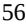

{56}------------------------------------------------

As of December 31, 2022, we had capital resources consisting of cash, cash equivalents and marketable securities of approximately \$283.1 million. We expect our existing capital resources will fund our planned operating expenses into 2026. However, our operating plans may change as a result of many factors currently unknown to us, and we may need to seek additional funds sooner than planned through public or private equity offerings or debt financings or other sources, such as strategic collaborations. Such financing may result in dilution to our stockholders, and may also result in imposition of burdensome debt covenants and repayment obligations, or other restrictions that may affect our business. In addition, we may seek additional capital due to favorable market conditions or strategic considerations even if we believe we have sufficient funds for our current or future operating plans.

Our future capital requirements depend on many factors, including:

- the scope, progress and costs of researching and developing our current product candidates or any other future product candidates we choose to pursue;
- the success or failure of our ongoing clinical trials of our current product candidates;
- the timing of, and the costs involved in, obtaining regulatory approvals for our product candidates or any future product candidates;
- the number and characteristics of any additional product candidates we develop or acquire;
- the timing and amount of any milestone, royalty and/or other payments we are required to make pursuant to our current or any future license or collaboration agreements;
- the cost of manufacturing our product candidates or any future product candidates and any products we successfully commercialize;
- the cost of pre-commercial activities and, if approved, commercialization activities related to our product candidates, including marketing, sales and distribution costs;
- the cost of building or contracting a sales force in anticipation of commercialization;
- our ability to establish strategic collaborations, licensing or other arrangements and the financial terms of any such agreements, including the timing and amount of any future milestone, royalty or other payments due under any such agreement;
- expenses associated with the potential in-licensing or acquisition of new technologies or therapy candidates;
- any product liability or other lawsuits related to our product candidates, if approved;
- the expenses needed to attract, hire and retain skilled personnel;
- the costs associated with being a public company;
- the costs involved in preparing, filing, prosecuting, maintaining, defending and enforcing our intellectual property portfolio;
- the timing, receipt and amount of sales of any future approved drugs; and
- the impact of the COVID-19 pandemic, including the economic impact due to the recovery from the COVID-19 pandemic, which may exacerbate the magnitude of the factors discussed above.

{57}------------------------------------------------

Additional funds may not be available when we need them, on terms that are acceptable to us, or at all. Our ability to raise additional capital may be adversely impacted by global economic conditions and the disruptions to and volatility in the credit and financial markets in the United States and worldwide resulting from the ongoing COVID-19 pandemic and any economic impact resulting from the recovery from the COVID-19 pandemic. If adequate funds are not available to us on a timely basis, we may be required to:

- delay, limit, reduce or terminate preclinical studies, clinical trials or other development activities for our product candidates or any future product candidate;
- delay, limit, reduce or terminate our research and development activities; or
- delay, limit, reduce or terminate our efforts to establish manufacturing and sales and marketing capabilities or other activities that may be necessary to commercialize our product candidates or any future product candidate, or reduce our flexibility in developing or maintaining our sales and marketing strategy.

We also could be required to seek funds through arrangements with collaborators or others that may require us to relinquish rights to some of our technologies or product candidates that we would otherwise pursue on our own. We do not expect to realize revenue from sales of products or royalties from licensed products in the foreseeable future, if at all, and unless and until our product candidates are clinically tested, approved for commercialization and successfully marketed. To date, we have primarily financed our operations through the sale of equity and debt securities. We will be required to seek additional funding in the future and currently intend to do so through public or private equity offerings or debt financings, credit or loan facilities, collaborations or a combination of one or more of these funding sources. Our ability to raise additional funds will depend on financial, economic and other factors, many of which are beyond our control. Additional funds may not be available to us on acceptable terms or at all. If we raise additional funds by issuing equity securities, our stockholders will suffer dilution and the terms of any financing may adversely affect the rights of our stockholders. In addition, as a condition to providing additional funds to us, future investors may demand, and may be granted, rights superior to those of existing stockholders or the holders of any future security we may issue. Debt financing, if available, is likely to involve restrictive covenants limiting our flexibility in conducting future business activities, and, in the event of insolvency, debt holders would be repaid before holders of our equity securities received any distribution of our corporate assets.

### *Due to the significant resources required for the development of our product candidates, we must prioritize development of certain product candidates and/or certain disease indications, with our current clinical-stage drug candidates focused on CML, NASH, and obesity. We may expend our limited resources on candidates or indications that do not yield a successful product and fail to capitalize on product candidates or indications that may be more profitable or for which there is a greater likelihood of success.*

Our development programs currently in or preparing to enter clinical development are focused on developing a portfolio of small-molecule product candidates for the treatment of chronic myeloid leukemia, or CML, NASH, and obesity. We seek to maintain a process of prioritization and resource allocation among our programs to maintain a balance between progressing our most advanced development programs, TERN-701 for CML, TERN-501 for NASH, and TERN-601 for obesity, which is in preclinical development, as well as advancing our earlier stage preclinical programs, including the TERN-800 series for obesity, and developing future product candidates. We also aim to conduct combination trials of our single-agent drug candidates. However, due to the significant resources required for the development of our product candidates, we must focus on specific diseases and disease pathways and decide which product candidates to pursue and the amount of resources to allocate to each such product candidate. For example, in May 2022, following a strategic review of our pipeline we announced a decision to focus our resources on advancing the development of TERN-701, TERN-501 (as a single agent and in combination with TERN-101), and TERN-601 in lieu of allocating additional resources to development of TERN-201 in NASH and, as a single agent, TERN-101 for NASH. We based this decision on factors including our views on potential future development costs, time and testing requirements, competition and commercial potential.

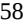

{58}------------------------------------------------

Our decisions concerning the allocation of research, development, collaboration, management and financial resources toward particular product candidates or therapeutic areas may not lead to the development of any viable commercial drug and may divert resources away from better opportunities. Similarly, any decision to delay, terminate or collaborate with third parties in respect of certain programs may subsequently also prove to be suboptimal and could cause us to miss valuable opportunities. If we make incorrect determinations regarding the viability or market potential of any of our programs or product candidates or misinterpret trends in CML, NASH, obesity or other indications or in the pharmaceutical, biopharmaceutical or biotechnology industry, our business, financial condition and results of operations could be materially adversely affected. As a result, we may fail to capitalize on viable commercial products or profitable market opportunities, be required to forego or delay pursuit of opportunities with other product candidates or other diseases and disease pathways that may later prove to have greater commercial potential than those we choose to pursue, or relinquish valuable rights to such product candidates through collaboration, licensing or other royalty arrangements in cases in which it would have been advantageous for us to invest additional resources to retain development and commercialization rights.

### *Our business has been and could continue to be adversely affected by the evolving and ongoing COVID-19 global pandemic in regions where we or third parties on which we rely have significant manufacturing facilities, concentrations of clinical trial sites or other business operations. The COVID-19 pandemic could adversely affect our operations, as well as the business or operations of our manufacturers or other third parties with whom we conduct business.*

Our business has been affected and could in the future be adversely affected by the effects of the COVID-19 global pandemic and any other future pandemic. As the COVID-19 pandemic continues, we may experience ongoing disruptions that could severely impact our business and clinical trials, including:

- delays or difficulties in enrolling patients in our clinical trials;
- delays or difficulties in clinical site initiation, including difficulties in recruiting clinical site investigators and clinical site staff;
- delays in clinical sites receiving the supplies and materials needed to conduct our clinical trials, including interruption in global shipping that may affect the transport of clinical trial materials;
- changes in local regulations as part of a response to the COVID-19 outbreak or any future pandemic which may require us to change the ways in which our clinical trials are conducted, which may result in unexpected costs, or to discontinue the clinical trials altogether;
- the diversion of healthcare resources away from the conduct of clinical trials, including the diversion of hospitals serving as our clinical trial sites and hospital staff supporting the conduct of our clinical trials;
- the interruption of key clinical trial activities, such as clinical trial site monitoring, due to limitations on travel imposed or recommended by federal or state governments, employers and others, or interruption of clinical trial subject visits and study procedures, the occurrence of which could affect the integrity of clinical trial data;
- delays in supplies and materials necessary for preclinical studies, including animal subjects for our preclinical studies;
- the interruption or delays in the operations of the FDA or other regulatory authorities, which may impact review and approval timelines;
- the risk that participants enrolled in our clinical trials or study staff conducting the clinical trial visits will acquire COVID-19 or a future, unrecognized disease, while the clinical trial is ongoing, which could impact the results of the clinical trial, including by increasing the number of observed adverse events, or the ability to complete study visits and collect data; and
- the refusal of the FDA or foreign regulatory authorities to accept data from clinical trials in affected geographies.

These and other disruptions in our operations and the global economy could negatively impact our business, operating results and financial condition.

{59}------------------------------------------------

Our clinical trials have been, and may in the future be, affected by the COVID-19 pandemic. For example, the COVID-19 pandemic may impact patient enrollment, visits or continued participation in our ongoing trials, including our Phase 2a DUET trial of TERN-501 and TERN-101, and our planned trials, such as our Phase 1 trials for TERN-701 and TERN-601. In particular, some sites have in the past or may in the future pause enrollment to focus on, and direct resources to, COVID-19, while at other sites, patients may choose not to enroll or continue participating in the clinical trial as a result of the pandemic. Further, according to the Centers for Disease Control and Prevention, people who have serious chronic medical conditions are at higher risk of getting very sick from COVID-19. As a result, potential patients in our ongoing or planned clinical trials may choose to not enroll, not participate in followup clinical visits or drop out of the trials as a precaution against contracting COVID-19. Further, some patients may not be able or willing to comply with clinical trial protocols if quarantines impede patient movement or interrupts healthcare services.

We are unable to predict with confidence the duration of any such patient enrollment delays and difficulties. If patient enrollment is delayed for an extended period of time, our clinical trials could be delayed or otherwise adversely affected. Similarly, our ability to recruit and retain principal investigators and site staff who, as healthcare providers, may have heightened exposure to COVID-19, may be adversely impacted.

In addition, ongoing or planned clinical trials may also be impacted by interruptions or delays in the operations of the FDA and comparable foreign regulatory authorities. We have also made certain adjustments to the operation of our trials in an effort to ensure the monitoring and safety of patients and minimize risks to trial integrity during the pandemic in accordance with the guidance issued by the FDA, and may need to make further adjustments in the future. For example, we have initiated our clinical trial protocols to enable remote visits to mitigate any potential impacts as a result of the COVID-19 pandemic.

On January 30, 2023, the Biden Administration announced that it will end the public health emergency declarations related to COVID-19 on May 11, 2023. On March 13, 2023, the FDA announced that it will end 22 COVID-19 related policies when the public health emergency ends May 11 and allow 22 to continue for an additional 180 days. The FDA plans to retain 24 COVID-19 related policies with appropriate changes and four whose duration is not tied to the end of the public health emergency. At this point, it is unclear how, if at all, these developments will impact our efforts to develop and commercialize our product candidates.

In addition, in the event of a future spike in COVID-19 or other infectious diseases, we may encounter a shortage in supplies of, or in delays in shipping, our study drug or other components of the clinical trial vital for successful conduct of the trial. Further, the successful conduct of our clinical trials depends on retrieving laboratory, imaging and other data from patients. Any failure by the vendors we work with to send us such data could impair the progress of such clinical trials. These events could delay our clinical trials, increase the cost of completing our clinical trials and negatively impact the integrity, reliability or robustness of the data from our clinical trials.

In addition, quarantines, shelter-in-place and similar government orders, or the perception that such orders, shutdowns or other restrictions on the conduct of business operations could occur, related to COVID-19 or other infectious diseases could impact personnel at our study sites or third-party manufacturing facilities upon which we rely, or the availability or cost of materials, which could disrupt the supply chain for our product candidates or other goods or services used in our clinical trials. To the extent our suppliers and service providers are unable to comply with their obligations under our agreements with them or they are otherwise unable to deliver or are delayed in delivering goods and services to us due to the COVID-19 pandemic, our ability to continue meeting clinical supply demand for our product candidates or otherwise advancing development of our product candidates may become impaired.

The spread of COVID-19 or other infectious diseases and actions taken to reduce its spread may also materially affect us economically. While the potential economic impact brought by, and the duration of, the COVID-19 pandemic has been and will continue to be difficult to assess or predict, there could be a significant disruption of global financial markets, reducing our ability to access capital, which could in the future negatively affect our liquidity and financial position. In addition, the trading prices for other biopharmaceutical companies have been highly volatile and could be increased as a result of the COVID-19 pandemic. This volatility may result in difficulties raising capital through sales of our common stock or such sales may be on unfavorable terms, if at all.

{60}------------------------------------------------

COVID-19 and actions taken to reduce and manage its spread continue to evolve. The extent to which COVID-19 may impede the development of our product candidates, reduce the productivity of our employees, disrupt our supply chains, delay our clinical trials, reduce our access to capital or limit our business development activities, will depend on future developments and future mutations of COVID-19 or any other currently unknown infectious disease, which are highly uncertain and cannot be predicted with confidence.

In addition, to the extent the ongoing COVID-19 pandemic adversely affects our business and results of operations, it may also have the effect of heightening many of the other risks and uncertainties described in this Item 1A. "Risk Factors" section.

#### **Risks related to the discovery and development of our product candidates**

### *We are early in our development efforts. Our business is heavily dependent on the successful development, regulatory approval and commercialization of our current and future product candidates.*

We have no drugs or combination therapies approved for sale, and our most advanced development programs are in early stages of clinical development or preparing to enter clinical development. The success of our business, including our ability to finance our company and generate revenue in the future, will primarily depend on the successful development, regulatory approval and commercialization of our product candidates and, in particular, progressing our most advanced development programs. Given our stage of development, it may be many years, if we succeed at all, before we have demonstrated the safety and efficacy of a product candidate sufficient to warrant approval for commercialization. We cannot be certain that our product candidates will receive regulatory approval or be successfully commercialized even if we receive regulatory approval.

We have not previously submitted a new drug application, or NDA, to the U.S. Food and Drug Administration, or FDA, or similar approval filings to a comparable foreign regulatory authority, for any product candidate. An NDA or other relevant regulatory filing must include extensive preclinical and clinical data and supporting information to establish that the product candidate is safe and effective for each desired indication. The NDA or other relevant regulatory filing must also include significant information regarding the chemistry, manufacturing and controls for the product. We cannot be certain that our current or future product candidates will be successful in clinical trials or receive regulatory approval. Further, even if they are successful in clinical trials, our current or future product candidates may not receive regulatory approval. If we do not receive regulatory approvals for current or future product candidates, we may not be able to continue our operations. Even if we successfully obtain regulatory approval to market a product candidate, our revenue will depend, in part, upon the size of the markets in the territories for which we gain regulatory approval and have commercial rights, as well as the availability of competitive products, whether there is sufficient third-party reimbursement and adoption by physicians.

We may plan to seek regulatory approval to commercialize our product candidates in the United States and in select foreign countries. While the scope of regulatory approval generally is similar in other countries, in order to obtain separate regulatory approval in other countries, we must comply with numerous and varying regulatory requirements of such countries regarding safety and efficacy. Other countries also have their own regulations governing, among other things, clinical trials and commercial sales, as well as pricing and distribution of drugs, and we may be required to expend significant resources to obtain regulatory approval and to comply with ongoing regulations in these jurisdictions.

In the future, we may also become dependent on other product candidates that we may develop or acquire. The clinical and commercial success of our product candidates and future product candidates will depend on a number of factors, including the following:

- timely completion of our preclinical studies and clinical trials, which may be significantly slower or cost more than we currently anticipate and will depend substantially upon the performance of third-party contractors;
- sufficiency of our financial and other resources to complete the necessary preclinical studies and clinical trials;
- the COVID-19 pandemic, which may result in clinical site closures, delays to patient enrollment, patients discontinuing their treatment or follow-up visits or changes to trial protocols;
- our ability to raise any additional required capital on acceptable terms, or at all;

{61}------------------------------------------------

- our ability to complete investigational new drug applications, or INDs, IND-enabling studies and successfully submit INDs or comparable applications for our preclinical or future product candidates;
- whether we are required by the FDA or similar foreign regulatory authorities to conduct additional clinical trials or other studies beyond those planned to support the approval and commercialization of our product candidates or any future product candidates;
- acceptance of our proposed indications and primary endpoint assessments relating to the proposed indications of our product candidates by the FDA and similar foreign regulatory authorities, including the use of non-invasive or other novel endpoint to initially obtain market authorization for our product candidates;
- our ability to demonstrate to the satisfaction of the FDA and similar foreign regulatory authorities the safety, efficacy and acceptable risk to benefit profile of our product candidates or any future product candidates;
- the prevalence, duration and severity of potential side effects or other safety issues experienced with our product candidates or future approved drugs, if any;
- the timely receipt of necessary marketing approvals from the FDA and similar foreign regulatory authorities;
- achieving and maintaining and, where applicable, ensuring that our third-party contractors achieve and maintain compliance with our contractual obligations and with all regulatory requirements applicable to our product candidates or any future product candidates or approved drugs, if any;
- the ability of third parties with whom we contract to manufacture adequate clinical trial and commercial supplies of our product candidates or any future product candidates to remain in good standing with regulatory agencies and develop, validate and maintain commercially viable manufacturing processes that are compliant with current good manufacturing practices, or cGMPs or similar foreign requirements;
- our ability to successfully develop a commercial strategy and thereafter commercialize our product candidates or any future product candidates in the United States and internationally, if approved for marketing, reimbursement, sale and distribution in such countries and territories, whether alone or in collaboration with others;
- our ability to achieve sufficient market acceptance, coverage and adequate reimbursement from third-party payors and adequate market share and revenue for any approved drugs;
- the convenience of our treatment or dosing regimen and the degree to which patients are able to comply with the recommended treatment program;
- acceptance by physicians, payors and patients of the benefits, safety and efficacy of our product candidates or any future product candidates, if approved, including relative to alternative and competing treatments;
- the willingness of physicians, operators of clinics and patients to utilize or adopt any of our product candidates or any future product candidates, if approved;
- patients' willingness to enroll or continue to participate in a clinical trial during the COVID-19 pandemic or due to other reasons;
- patient demand for our current or future product candidates, if approved, including patients' willingness to pay out-of-pocket for any approved drugs in the absence of coverage and/or adequate reimbursement from third-party payors;
- effectively competing with other therapies;
- the ease, speed and cost at which we are able to execute on our strategy to develop fixed-dose combination therapy candidates that have desirable profiles;
- our ability to establish and enforce intellectual property rights in and to our product candidates or any future product candidates; and
- our ability to avoid third-party patent interference, intellectual property challenges or intellectual property infringement claims.

{62}------------------------------------------------

These factors, many of which are beyond our control, could cause us to experience significant delays or an inability to obtain regulatory approvals or commercialize our product candidates. Even if regulatory approvals are obtained, we may never be able to successfully commercialize any of our product candidates. Accordingly, we cannot provide assurances that we will be able to generate sufficient revenue through the sale of our product candidates or any future product candidates to continue our business or achieve profitability.

### *Clinical drug development involves a lengthy and expensive process with uncertain timelines and outcomes, and results of earlier studies and trials may not be predictive of future trial results. If development of our product candidates is unsuccessful or delayed, we may be unable to obtain required regulatory approvals and we may be unable to commercialize our product candidates on a timely basis, if at all.*

Clinical testing is expensive and can take many years to complete, and its outcome is inherently uncertain. Failure or delay can occur at any time during the clinical trial process. Success in nonclinical testing and early clinical trials does not ensure that later clinical trials will be successful. A number of companies in the pharmaceutical industry, including biotechnology companies, have suffered significant setbacks in clinical trials, even after promising results in earlier nonclinical or clinical studies. These setbacks have been caused by, among other things, nonclinical findings made while clinical studies were underway and safety or efficacy observations made in clinical studies, including previously unreported adverse events. The results of preclinical, nonclinical and early clinical studies of our product candidates may not be predictive of the results of later-stage clinical trials. Likewise, interim or preliminary results from a clinical trial may not be predictive of final results. Product candidates in later stages of clinical trials may fail to show the desired safety and efficacy traits despite having progressed through preclinical and initial clinical trials. Notwithstanding any potential promising results in earlier studies, we cannot be certain that we will not face similar setbacks. Even if our clinical trials are completed, the results may not be sufficient to obtain regulatory approval for our product candidates.

We may experience delays in initiating our clinical trials and we cannot be certain that the trials or any other future clinical trials for our product candidates will begin on time, need to be redesigned, enroll an adequate number of patients on time or be completed on schedule, if at all. Clinical trials can be delayed or terminated for a variety of reasons, including delay or failure related to:

- the FDA or comparable foreign regulatory authorities disagreeing as to the design or implementation of our clinical trials;
- the size of the study population for further analysis of the study's primary endpoints;
- the acceptance by the FDA or comparable foreign regulatory authorities on the use of any of the non-invasive or other novel diagnostics or endpoints we incorporate into our clinical development to obtain initial market authorization;
- obtaining regulatory approval to commence a trial;
- reaching agreement on acceptable terms with prospective contract research organizations, or CROs, and clinical trial sites, the terms of which can be subject to extensive negotiation and may vary significantly among different CROs and trial sites;
- obtaining institutional review board, or IRB, or ethics committee approval at each site;
- recruiting suitable patients to participate in a trial;
- having patients complete a trial or return for post-treatment follow-up;
- clinical sites deviating from trial protocol or dropping out of a trial;
- addressing patient safety concerns that arise during the course of a trial;
- addressing any conflicts with new or existing laws or regulations;
- adding a sufficient number of clinical trial sites; or
- manufacturing sufficient quantities of our product candidates for use in clinical trials.

{63}------------------------------------------------

In addition, disruptions caused by the COVID-19 or any future pandemic may increase the likelihood that we encounter such difficulties or delays in initiating, enrolling, conducting, or completing our planned and ongoing clinical trials. We could also encounter delays if a clinical trial is suspended or terminated by us, by the IRBs of the institutions at which such trials are being conducted, by a data monitoring committee, or DMC, for such trial or by the FDA or other regulatory authorities. Such authorities may suspend or terminate a clinical trial due to a number of factors, including failure to conduct the clinical trial in accordance with regulatory requirements or our clinical protocols, inspection of the clinical trial operations or trial site by the FDA or other regulatory authorities resulting in the imposition of a clinical hold, unforeseen safety issues or adverse side effects, failure to demonstrate a benefit from using a drug, changes in governmental regulations or administrative actions or lack of adequate funding to continue the clinical trial.

Moreover, principal investigators for our clinical trials may serve as scientific advisors or consultants to us from time to time and receive compensation in connection with such services. Under certain circumstances, we may be required to report some of these relationships to the FDA or comparable foreign regulatory authorities. The FDA or comparable foreign regulatory authority may conclude that a financial relationship between us and a principal investigator has created a conflict of interest or otherwise affected the interpretation of the trial. The FDA or comparable foreign regulatory authority may therefore question the integrity of the data generated at the applicable clinical trial site and the utility of the clinical trial itself may be jeopardized. This could result in a delay in approval, refusal to accept or rejection, of our marketing applications by the FDA or comparable foreign regulatory authority, as the case may be, and may ultimately lead to the denial of marketing approval of our product candidates.

If we experience delays in the completion of any clinical trial of our product candidates or the termination of any such clinical trial, the commercial prospects of our product candidates may be harmed, and our ability to generate drug revenues from any of these product candidates will be delayed or not realized at all. In addition, any delays in completing our clinical trials will increase our costs, slow down our product candidate development and approval process and jeopardize our ability to commence drug sales and generate revenues. Any of these occurrences may significantly harm our business, financial condition and prospects. In addition, many of the factors that cause, or lead to, a delay in the commencement or completion of clinical trials may also ultimately lead to the denial of regulatory approval of our product candidates.

In addition, the FDA's and other regulatory authorities' policies with respect to clinical trials may change and additional government regulations may be enacted. For example, in December 2022, with the passage of Food and Drug Omnibus Reform Act, or FDORA, Congress required sponsors to develop and submit a diversity action plan for each Phase 3 clinical trial or any other "pivotal study" of a new drug or biological product. These plans are meant to encourage the enrollment of more diverse patient populations in late-stage clinical trials of FDA-regulated products. Specifically, actions plans must include the sponsor's goals for enrollment, the underlying rationale for those goals and an explanation of how the sponsor intends to meet them. In addition to these requirements, the legislation directs the FDA to issue new guidance on diversity action plans. Furthermore, the FDA Oncology Center of Excellence (OCE) has initiated Project Optimus to address dose optimization and selection in oncology drug development, with the goal of earlier characterization of dosing in molecularly targeted therapies. This initiative will likely require meetings with FDA to discuss dose-finding and dose optimization and may result in the need to develop additional early data to support product dosing before conducting trials intended for registration.

{64}------------------------------------------------

The regulatory landscape related to clinical trials in the EU also has recently evolved. The EU Clinical Trials Regulation, or CTR, which was adopted in April 2014 and repeals the EU Clinical Trials Directive, became applicable on January 31, 2022. While the Clinical Trials Directive required a separate clinical trial application, or CTA, to be submitted in each member state, to both the competent national health authority and an independent ethics committee, the CTR introduces a centralized process and only requires the submission of a single application to all member states concerned. The CTR allows sponsors to make a single submission to both the competent authority and an ethics committee in each member state, leading to a single decision per member state. The assessment procedure of the CTA has been harmonized as well, including a joint assessment by all member states concerned, and a separate assessment by each member state with respect to specific requirements related to its own territory, including ethics rules. Each member state's decision is communicated to the sponsor via the centralized EU portal. Once the CTA is approved, clinical study development may proceed. The CTR foresees a three-year transition period. The extent to which ongoing and new clinical trials will be governed by the CTR varies. For clinical trials whose CTA was made under the Clinical Trials Directive before January 31, 2022, the Clinical Trials Directive will continue to apply on a transitional basis for three years. Additionally, sponsors were able to choose to submit a CTA under either the Clinical Trials Directive or the CTR until January 31, 2023 and, if authorized, those will be governed by the Clinical Trials Directive until January 31, 2025. By that date, all ongoing trials will become subject to the provisions of the CTR.

If we are slow or unable to adapt to changes in existing requirements or the adoption of new requirements or policies governing clinical trials, our development plans may be impacted.

*Our development programs may target indications for which there is currently no approved therapy in the United States or Europe, such as NASH. For indications where there is no approved therapy, there is a heightened risk that we will not be able to gain agreement with regulatory authorities regarding an acceptable development plan, that the outcome of our clinical trials will not be favorable or that, even if favorable, regulatory authorities may not find the results of our clinical trials to be sufficient for marketing approval. This may make it difficult to predict the timing and costs of the clinical development of our product candidates.*

We are developing TERN-501 both as a single agent and as a part of a combination therapy regimen for the treatment of NASH, an indication for which there is currently no approved therapy in the United States or Europe. The regulatory approval process for novel drug candidates can be more expensive and take longer than for other, better known or extensively studied drug candidates. As other companies are in later stages of clinical trials for their potential NASH therapies, we expect that the path for regulatory approval for NASH therapies may continue to evolve as these other companies refine their regulatory approval strategies and interact with regulatory authorities. Such evolution may impact our future clinical trial designs, including trial size and approval endpoints, in ways that we cannot predict today.

{65}------------------------------------------------

In the United States, the FDA generally requires two adequate and well-controlled pivotal clinical trials to approve an NDA. Furthermore, for full approval of an NDA, the FDA requires a demonstration of efficacy based on a clinical benefit endpoint. The FDA may grant accelerated approval based on a surrogate endpoint reasonably likely to predict clinical benefit. Even though our pivotal clinical trials for a specific indication may achieve their primary endpoints and are reasonably believed by us to be likely to predict clinical benefit, the FDA may not accept the results of such trials or approve our product candidates on an accelerated basis, or at all. It is also possible that the FDA may refuse to accept for filing and review any regulatory application we submit for regulatory approval in the United States. Even if our regulatory application is accepted for review, there may be delays in the FDA's review process and the FDA may determine that such regulatory application does not contain adequate clinical or other data or support the approval of the product candidate. In such a case, the FDA may issue a complete response letter that may require that we conduct and/or complete additional clinical trials and preclinical studies or provide additional information or data before it will reconsider an application for approval. Any such requirements may be substantial, expensive and time-consuming, and there is no guarantee that we will continue to pursue such application or that the FDA will ultimately decide that any such application supports the approval of the product candidate. As an example, the FDA returned a complete response to an NDA submitted by Intercept Pharmaceuticals, Inc. for the drug candidate obeticholic acid, or OCA, for the treatment of NASH. The efficacy of OCA for the treatment of NASH was based on the surrogate histologic endpoint of improvement of fibrosis as shown by liver biopsy with no worsening of NASH in lieu of clinical outcomes in the NASH patients enrolled in the trial, such as overall survival and time to liver transplant. Such decisions may impact our future NASH clinical trial designs, including trial size and approval endpoints, in ways that we cannot predict today. Furthermore, the FDA may also refer any regulatory application to an advisory committee for review and recommendation as to whether, and under what conditions, the application should be approved. While the FDA is not bound by the recommendation of an advisory committee, it considers such recommendations carefully when making decisions. Delay or failure to obtain, or unexpected costs in obtaining, the regulatory approval necessary to bring a potential product to market could decrease our ability to generate sufficient revenue to maintain our business. Similar risks may apply in foreign jurisdictions.

Even if we receive accelerated approval for any of our product candidates, we anticipate we will be required to conduct or complete a post-approval clinical outcomes trial to confirm the clinical benefit of such product candidates by demonstrating the correlation of the surrogate endpoint therapeutic response in patients with a significant reduction in adverse clinical outcomes over time. There can be no assurance that the clinical outcomes trial will confirm that the surrogate endpoint used as the basis of the regulatory submissions we make will eventually show an adequate correlation with clinical outcomes.

Further, to the extent that we seek accelerated approval, we will need to comply with new provisions governing that route to approval. For example, with the passage of the Food and Drug Omnibus Reform Act, or FDORA, in December 2022, Congress modified certain provisions governing accelerated approval of drug and biologic products. Specifically, the new legislation authorized the FDA to: require a sponsor to have its confirmatory clinical trial underway before accelerated approval is awarded, require a sponsor of a product granted accelerated approval to submit progress reports on its postapproval studies to FDA every six months (until the study is completed); and use expedited procedures to withdraw accelerated approval of an NDA or BLA after the confirmatory trial fails to verify the product's clinical benefit. Further, FDORA requires the agency to publish on its website "the rationale for why a post-approval study is not appropriate or necessary" whenever it decides not to require such a study upon granting accelerated approval.

Our anticipated development costs would likely increase if development of any current or future product candidate is delayed because we are required by the FDA or similar foreign regulatory authorities to perform studies or trials in addition to, or different from, those that we currently conduct or anticipate. Because of the numerous risks and uncertainties associated with pharmaceutical product development, we are unable to predict the timing or amount of any increase in our anticipated development costs.

We also may evaluate our product candidates in combination with one or more therapies that have not yet been approved for marketing by the FDA or similar foreign regulatory authorities. We may not be able to market and sell any product candidate we develop in combination with an unapproved therapy if that unapproved therapy does not ultimately obtain marketing approval. In addition, unapproved therapies face the same risks described with respect to our product candidates currently in development, including the potential for serious adverse effects, delay in their clinical trials and lack of FDA or European Commission approval. If the FDA, the European Commission or similar foreign regulatory authorities do not approve these other therapies or revoke their approval of, or if safety, efficacy, manufacturing, or supply issues arise with, the therapies we choose to evaluate in combination with our product candidates, we may be unable to obtain approval of or market any such product candidate.

{66}------------------------------------------------

We also continue to evaluate our product candidates or develop new drug candidates for indications which do not have approved therapies or do not have a clearly defined regulatory pathway. For such indications, we may face similar challenges as the ones described above for our NASH drug candidates.

### *If we encounter difficulties or delays enrolling patients in our clinical trials, our clinical development activities could be delayed or otherwise adversely affected.*

We may not be able to initiate or continue our planned clinical trials for our product candidates if we are unable to identify and enroll a sufficient number of eligible patients to participate in these trials as required by the FDA or comparable foreign regulatory authority. Patient enrollment, a significant factor in the timing of clinical trials, is affected by many factors including the size and nature of the patient population, the proximity of patients to clinical sites, the eligibility criteria for the clinical trial, the design of the clinical trial, competing clinical trials and clinicians' and patients' perceptions as to the potential advantages of the product candidate being studied in relation to other available therapies, including any new drugs that may be approved for the indications we are investigating.

The timely completion of clinical trials in accordance with their protocols depends, among other things, on our ability to enroll a sufficient number of patients who remain in the study until its conclusion. We may experience difficulties in patient enrollment in our clinical trials for a variety of reasons. The enrollment of patients depends on many factors, including:

- the patient eligibility criteria defined in the protocol;
- the size of the patient population required for analysis of the clinical trial's primary endpoints;
- the proximity of patients to clinical sites;
- the design of the clinical trial;
- our ability to recruit clinical trial investigators with the appropriate competencies and experience;
- clinicians' and patients' perceptions as to the potential advantages of the product candidate being studied in relation to other available therapies, including any new drugs that may be approved for the indications we are investigating;
- our ability to obtain and maintain patient informed consents; and
- the risk that patients enrolled in clinical trials will drop out of the trials before completion.

In addition, our clinical trials will compete with other clinical trials for product candidates that are in the same therapeutic areas as our product candidates, and this competition will reduce the number and types of patients available to us, because some patients who might have opted to enroll in our trials may instead opt to enroll in a trial being conducted by one of our competitors.

Delays in patient enrollment may result in increased costs or may affect the timing or outcome of the planned clinical trials, which could prevent completion of these trials and adversely affect our ability to advance the development of our product candidates.

### *We face significant competition for our drug discovery and development efforts in an environment of rapid technological and scientific change, and our product candidates, if approved, will face significant competition, which may prevent us from achieving significant market penetration. Many of our competitors have significantly greater resources than we do, and we may not be able to successfully compete.*

The pharmaceutical, biopharmaceutical and biotechnology industries in particular are characterized by rapidly advancing technologies, intense competition and a strong emphasis on developing proprietary therapeutics. Numerous companies are engaged in the development, patenting, manufacturing and marketing of healthcare products competitive with those that we are developing. We face competition from a number of sources, such as pharmaceutical, biopharmaceutical and biotechnology companies, generic drug companies and academic and research institutions.

{67}------------------------------------------------

We are aware of both pharmaceutical and biotechnology companies with development programs in CML. Companies that have recently participated in or are participating in the development of CML treatments include, but are not limited to, Ascentage Pharma Group, Bristol Myer Squibb Company, Enliven Therapeutics, Jiangsu Hansoh Pharmaceutical Group Co. Ltd., Novartis Pharmaceuticals Corp., Pfizer Inc., Shenzhen TargetRx Inc., Sun Pharma Industries Ltd., Takeda Pharmaceutical Co., Ltd. and Theseus Pharmaceuticals.

We are aware of both pharmaceutical and biotechnology companies with development programs in NASH. Large pharmaceutical companies that have recently participated in or are participating in the development of NASH treatments include, but are not limited to, AbbVie, Inc., Amgen Inc., AstraZeneca PLC/MedImmune LLC, Bayer AG, Boehringer Ingelheim, Bristol-Myers Squibb Company, Eisai, Inc., Eli Lilly and Company, Gilead Sciences, Inc., GlaxoSmithKline plc, Johnson & Johnson, Merck & Co., Inc., Novo Nordisk A/S, Pfizer Inc., Roche Holding AG, Sanofi, Sumitomo Dainippon Pharma Co., Ltd. and Takeda Pharmaceutical Co., Ltd.

We are aware of both pharmaceutical and biotechnology companies with development programs in obesity. Large pharmaceutical companies that have recently participated in or are participating in the development of obesity treatments include, but are not limited to, Amgen, Inc., Boehringer Ingelheim GmbH, Bristol Myers Squibb Company, Eli Lilly and Co., Hanmi Pharmaceutical Co., Ltd., Johnson & Johnson, LG Chem, Ltd., Novartis AG, Novo Nordisk A/S, Otsuka Holdings Co., Ltd., Pfizer Inc. and Shionogi & Co. Ltd.

With regards to TERN-501, companies who have recently conducted or are currently conducting clinical trials targeting THR-β in the context of NASH include Ascletis Pharma Inc., Aligos Therapeutics, Inc., Madrigal Pharmaceuticals, Inc. and Viking Therapeutics, Inc.

In relation to TERN-601, companies who have recently conducted or are currently conducting clinical trials targeting GLP-1 or combinations with GLP-1 in the context of obesity, NASH, Type 2 diabetes or other metabolic syndromes include 9 Meters Biopharma, Inc., Amgen Inc., Altimmune, AstraZeneca plc, Boehringer Ingelheim GmbH, Carmot Therapeutics, Inc., CinRx Pharma, Cyrus Therapeutics, Inc., D&D Pharmatech, Eiger BioPharmaceuticals, Inc., Eli Lilly and Co., Hanmi Pharmaceutical Co., Ltd., ImmunoForge, Co. Ltd., Intarcia Therapeutics, Inc., Invex Therapeutics Inc., Longevity Biotech Inc., Novo Nordisk A/S, Opko Health, Oramed Pharmaceuticals, PegBio Co Ltd., Pfizer Inc., Pharmaxis, Regor Therapeutics Group, Sanofi, Sciwind Biosciences Co., Structure Pharmaceuticals, Inc., Sun Pharmaceutical Industries Ltd., Viking Therapeutics, Inc., vTv Therapeutics Inc. and Zealand Pharma A/S.

In relation to TERN-101, companies who have recently conducted or are currently conducting clinical trials with FXR agonists in the context of NASH include AbbVie, Inc., Ascletis Pharma, Inc., Enanta Pharmaceuticals, Inc., ENYO Pharma SA, Gilead Sciences, Inc., Hepagene Therapeutics, Inc., Intercept Pharmaceuticals, Inc., Metacrine Inc. and Novartis Pharmaceuticals Corp.

For TERN-800, our most recent discovery series program, companies conducting or planning to conduct clinical trials targeting GIPR or combinations with GIPR in the context of obesity include 9 Meters Biopharma, Inc., Amgen, Inc., Carmot Therapeutics, D&D Pharmatech, Eli Lilly and Co., Sciwind Biosciences Co., Viking Therapeutics, Inc. and Zealand Pharma A/S.

Furthermore, pharmaceutical and biotechnology companies who have recently engaged in the development of or are developing clinical-stage drugs to treat NASH, CML, or obesity using mechanisms not mentioned above include 89Bio, Inc., Aardvark Therapeutics, Inc., Akero Therapeutics, Inc., Arrowhead Pharmaceuticals, Inc., Axcella Health, Inc., Carmot Therapeutics, Inc., Cirius Therapeutics, Inc., CohBar, Inc., Coherus Biosciences Inc., Corcept Therapeutics, Inc., Currax Pharmaceuticals LLC, CymaBay Therapeutics, Inc., CytoDyne Inc., Diasome Pharmaceuticals, Esperion Therapeutics, Inc., Fusion Pharma, LLC, Galectin Therapeutics Inc., Galmed Pharmaceuticals Ltd., Gila Therapeutics, Inc., Hanmi Pharmaceutical Co., Ltd., IL-YANG Pharm. Co. Ltd., Inhibikase Therapeutics, Inc., Inventiva Pharma SA, Ionis Pharmaceuticals, Inc., MediciNova, Inc., NGM Biopharmaceuticals, Inc., Norgine B.V., NorthSea Therapeutics, Inc., Pliant Therapeutics, Inc., Poxel SA, Saniona AB, Sagimet Biosciences, Inc., T3D Therapeutics, Inc., Vivus, Inc., and Zydus Cadila Healthcare.

It is also probable that the number of companies seeking to develop drugs and therapies for the treatment of serious diseases we pursue, such as oncology, NASH or obesity, will increase.

{68}------------------------------------------------

Many of our competitors have greater financial resources, marketing capabilities, sales forces, manufacturing capabilities, research and development capabilities, clinical trial expertise, intellectual property portfolios, experience in obtaining patents and regulatory approvals for drug candidates and other resources than we do. Some of the companies also have a broad range of other product offerings, large direct sales forces and long-term customer relationships with our target physicians, which could inhibit our market penetration efforts. Mergers and acquisitions in the pharmaceutical, biopharmaceutical and biotechnology industries may result in even more resources being concentrated among a smaller number of our competitors. Smaller or early-stage companies may also prove to be significant competitors, particularly through collaborative arrangements with large and established companies. These competitors also compete with us in recruiting and retaining qualified scientific and management personnel and establishing clinical trial sites and patient registration for clinical trials, as well as in acquiring technologies complementary to, or necessary for, our programs.

Certain alternative treatments that may be approved and offered by competitors in the future may be available at lower prices and may offer greater efficacy or better safety profiles. Furthermore, currently approved products could be discovered to have application for the intended indication of our product candidates, which could give such products significant regulatory and market timing advantages over any of our product candidates. Our competitors also may obtain FDA or other foreign regulatory approval for their products more rapidly than we may obtain approval for ours and may obtain orphan product exclusivity from the FDA for indications our product candidates are targeting, which could result in our competitors establishing a strong market position before we are able to enter the market. In addition, our ability to compete may be affected in many cases by insurers or other third-party payors seeking to encourage the use of generic products. There are generic products currently on the market for certain of the indications that we are pursuing, and additional products are expected to become available on a generic basis over the coming years. If our product candidates are approved, we expect that they will be priced at a significant premium over competitive generic products. For additional information regarding our competition, see the section of this Annual Report on Form 10-K captioned Item 1. "Business—Competition."

### *The lack of widely-accepted non-invasive methods for the diagnosis may present a major challenge to the market penetration of some of our product candidates.*

Historically, liver biopsy has been the standard approach for the diagnosis of inflammation and fibrosis associated with NASH. However, the procedure-related morbidity and, in rare cases, mortality, sample errors, costs, patient discomfort and thus lack of patient interest in undergoing the procedure limit its use. As such, only patients with a high risk of NASH, which includes patients with metabolic syndrome and an indication of nonalcoholic fatty liver disease, or NAFLD, are generally referred for liver biopsy. Because NASH tends to be asymptomatic until the disease progresses, many individuals with NASH remain undiagnosed until the disease has reached its late stages. The lack of widely-accepted non-invasive methods for the diagnosis of NASH is likely to present a major challenge to the market penetration of our product candidates for the treatment of NASH, if ever commercialized, as many practitioners and patients may not be aware that a patient suffers from NASH and requires treatment. As such, use of our product candidates for the treatment of NASH might not be as wide-spread as our actual target market and this may limit the commercial potential of such product candidates.

A further challenge to the market penetration for our NASH product candidates is that currently a liver biopsy is the standard approach for measuring improvement in NASH patients. Because it would be impractical to subject all patients that take our product candidates, if approved, to regular and repeated liver biopsies, it will be difficult to demonstrate effectiveness to practitioners and patients unless and until widely-accepted non-invasive methods for the diagnosis and monitoring of NASH become available in clinical practice and clinical trials, as to which there can be no assurance.

While non-invasive diagnostic approaches are being advanced, their use in the diagnosis of NASH and monitoring of response to treatment has not been broadly recommended in professional treatment guidelines. While we plan to engage with the FDA on using non-invasive methods in our NASH development, the FDA may require liver biopsy to be the primary endpoint for our future trials in NASH. Moreover, some diagnostics in development have not yet been clinically-validated, have uncertain timetables for clinical validation, and may also be subject to regulation by FDA or other regulatory authorities as medical devices and may require premarket clearance, approval or certification.

If we pursue the development of other product candidates in indications without a widely-accepted non-invasive method for diagnosis or monitoring treatment response, those product candidates may be subject to similar risks as described above in relation to our NASH program.

{69}------------------------------------------------

### *Our product candidates may cause undesirable side effects or have other properties that could delay or prevent their regulatory approval, cause us to suspend or discontinue clinical trials, limit the commercial profile of an approved label, or result in significant negative consequences following marketing approval, if any.*

Undesirable side effects caused by our product candidates could cause us or regulatory authorities to interrupt, delay or halt clinical trials and could result in a more restrictive label or the delay or denial of regulatory approval by the FDA or comparable foreign regulatory authorities. Results of our clinical trials could reveal a high and unacceptable severity and prevalence of side effects or unexpected characteristics. While our clinical stage singleagent product candidates have been generally well-tolerated, we have observed adverse events and laboratory abnormalities in the clinical trials for each of our single-agent candidates. For example, in our Phase 2a LIFT Trial of TERN-101 in NASH patients, we observed mild-to-moderate pruritus in the TERN-101 dose groups and statistically significant increases in low-density lipoprotein, or LDL, cholesterol in the 15 mg dose group as compared to placebo. Drugs with similar mechanism of actions to those we are developing have shown tolerability issues, including pruritus and adverse lipid changes in other FXR agonists, potential cardiac toxicity in other THR-β agonists, and changes in hematologic parameters or musculoskeletal pain in other allosteric BCR-ABL inhibitors. It is possible that our drug candidates will display similar, more pronounced or previously unobserved safety and tolerability issues and adverse events when evaluated in longer clinical trials in larger patient populations despite the results we have observed in our clinical trials to date.

If unacceptable side effects arise in the development of our product candidates, we, the IRBs at the institutions in which our studies are conducted or the DMC could recommend suspension or termination of our clinical trials or the FDA or comparable foreign regulatory authorities could order us to cease clinical trials or deny approval of our product candidates for any or all targeted indications. Treatment-related side effects could also affect patient recruitment or the ability of enrolled patients to complete the trial or result in potential product liability claims. In addition, these side effects may not be appropriately recognized or managed by the treating medical staff. Furthermore, we may be required to expend time and incur costs to train medical personnel using our product candidates to understand the side effect profiles for our clinical trials and upon any commercialization of any of our product candidates. Inadequate training in recognizing or managing the potential side effects of our product candidates could result in patient injury or death. Any of these occurrences may harm our business, financial condition and prospects significantly.

In addition, if any of our product candidates receives marketing approval, and we or others later identify undesirable side effects caused by such drugs, a number of potentially significant negative consequences could result, including:

- we may be forced to suspend marketing of that product candidate, or decide to remove the product candidate from the marketplace;
- regulatory authorities may withdraw or change their approvals of that product candidate;
- regulatory authorities may require additional warnings on the label or limit access of that product candidate to selective specialized centers with additional safety reporting and with requirements that patients be geographically close to these centers for all or part of their treatment;
- we may be required to send "dear doctor" letters to treatment providers or create a medication guide outlining the risks of the product candidate for patients, or to conduct post-marketing studies;
- we may be required to change the way the product candidate is administered;
- we could be subject to fines, injunctions, or the imposition of criminal or civil penalties, or be sued and held liable for harm caused to subjects or patients; and
- the product candidate may become less competitive, and our reputation may suffer.

Any of the foregoing events could prevent us from achieving or maintaining market acceptance of the particular product candidate, if approved, and result in the loss of significant revenues to us, which would materially and adversely affect our results of operations and business.

{70}------------------------------------------------

### *Interim, top-line and preliminary data from our clinical trials that we announce or publish from time to time may change as more patient data become available and are subject to audit and verification procedures that could result in material changes in the final data.*

From time to time, we may publicly disclose interim, top-line or preliminary data from our clinical trials, which is based on a preliminary analysis of then-available data, and the results and related findings and conclusions are subject to change following a more comprehensive review of the data related to the particular study or trial. We also make assumptions, estimations, calculations and conclusions as part of our analyses of data, and we may not have received or had the opportunity to fully and carefully evaluate all data. As a result, the interim, top-line or preliminary results that we report may differ from future results of the same studies, or different conclusions or considerations may qualify such results, once additional data have been received and fully evaluated. Interim, top-line and preliminary data also remain subject to audit and verification procedures that may result in the final data being materially different from the preliminary data we previously published. As a result, such data should be viewed with caution until the final data are available. From time to time, we may also disclose interim data from our clinical trials. Interim, top-line or preliminary data from clinical trials that we may complete are subject to the risk that one or more of the clinical outcomes may materially change as patient enrollment continues and more patient data become available. Adverse differences between interim, top-line or preliminary data and final data could significantly harm our business prospects.

Further, others, including regulatory agencies, may not accept or agree with our assumptions, estimates, calculations, conclusions or analyses or may interpret or weigh the importance of data differently, which could impact the value of the particular program, the approvability or commercialization of the particular product candidate and our company in general. In addition, the information we choose to publicly disclose regarding a particular study or clinical trial is based on what is typically extensive information, and you or others may not agree with what we determine is the material or otherwise appropriate information to include in our disclosure, and any information we determine not to disclose may ultimately be deemed significant with respect to future decisions, conclusions, views, activities or otherwise regarding a particular product candidate or our business. If the interim, top-line or preliminary data that we report differ from actual results, or if others, including regulatory authorities, disagree with the conclusions reached, our ability to obtain approval for and commercialize, our product candidates may be harmed, which could harm our business, operating results, prospects or financial condition.

### *The regulatory approval process is lengthy, expensive and uncertain, and we may be unable to obtain regulatory approval for our product candidates under applicable regulatory requirements. The denial or delay of any such approval would delay commercialization of our product candidates and adversely impact our ability to generate revenue, our business and our results of operations.*

The development, research, testing, manufacturing, labeling, approval, selling, import, export, marketing, promotion and distribution of drug products are subject to extensive and evolving regulation by federal, state and local governmental authorities in the United States, principally the FDA and by foreign regulatory authorities, which regulations differ from country to country. Neither we nor any future collaborator is permitted to market any of our product candidates in the United States until we receive regulatory approval of an NDA from the FDA.

Obtaining regulatory approval of an NDA or similar applications required in foreign jurisdictions can be a lengthy, expensive and uncertain process. Prior to obtaining approval to commercialize a product candidate in the United States or abroad, we or our collaborators must demonstrate with substantial evidence from well-controlled clinical trials, and to the satisfaction of the FDA or other foreign regulatory authorities, that such product candidates are safe and effective for their intended uses. The number of nonclinical studies and clinical trials that will be required for regulatory approval varies depending on the product candidate, the disease or condition that the product candidate is designed to address, and the regulations applicable to any particular product candidate.

Results from nonclinical studies and clinical trials can be interpreted in different ways. Even if we believe the nonclinical or clinical data for our product candidates are promising, such data may not be sufficient to support approval by the FDA and other regulatory authorities. Administering product candidates to humans may produce undesirable side effects, which could interrupt, delay or halt clinical trials and result in the FDA or other regulatory authorities denying approval of a product candidate for any or all indications. The FDA or other regulatory authorities may also require us to conduct additional studies or trials for our product candidates either prior to or post-approval, such as additional clinical pharmacology studies or safety or efficacy studies or trials, or it may object to elements of our clinical development program such as the primary endpoints or the number of subjects in our clinical trials.

{71}------------------------------------------------

The FDA or any foreign regulatory authorities can delay, limit or deny approval of our product candidates or require us to conduct additional nonclinical or clinical testing or abandon a program for many reasons, including:

- the FDA or the applicable foreign regulatory authority's disagreement with the design or implementation of our clinical trials;
- negative or ambiguous results from our clinical trials or results that may not meet the level of statistical significance required by the FDA or comparable foreign regulatory authorities for approval;
- serious and unexpected drug-related side effects experienced by participants in our clinical trials or by individuals using drugs or combination therapies similar to our product candidates;
- our inability to demonstrate to the satisfaction of the FDA or the applicable foreign regulatory authority that our product candidates are safe and effective for the proposed indication;
- the FDA's or the applicable foreign regulatory authority's disagreement with the interpretation of data from nonclinical studies or clinical trials;
- our inability to demonstrate the clinical and other benefits of our product candidates outweigh any safety or other perceived risks;
- the FDA's or the applicable foreign regulatory authority's requirement for additional nonclinical studies or clinical trials;
- the FDA's or the applicable foreign regulatory authority's disagreement regarding the formulation, labeling and/or the specifications of our product candidates;
- the FDA's or the applicable foreign regulatory authority's failure to approve the manufacturing processes or facilities of third-party manufacturers with which we contract;
- the potential for approval policies or regulations of the FDA or the applicable foreign regulatory authorities to significantly change in a manner rendering our clinical data insufficient for approval; or
- the FDA or the applicable foreign regulatory authority's disagreement with the sufficiency of the clinical, non-clinical and/or quality data in the NDA or comparable marketing authorization application.

Of the large number of drugs in development, only a small percentage successfully complete the FDA or other regulatory approval processes and are commercialized. The lengthy development and approval process as well as the unpredictability of future clinical trial results may result in our failing to obtain regulatory approval to market our product candidates, which would significantly harm our business, financial condition, results of operations and prospects.

Even if we eventually complete clinical testing and receive approval of an NDA or foreign marketing application for our product candidates, the FDA or the applicable foreign regulatory authority may grant approval contingent on the performance of costly additional clinical trials, including Phase 4 clinical trials, and/or in the case of the FDA, the implementation of a Risk Evaluation and Mitigation Strategy, or REMS, which may be required to ensure safe use of the drug after approval. The FDA or the applicable foreign regulatory authority also may approve a product candidate for a more limited indication or a narrower patient population than we originally requested, and the FDA or applicable foreign regulatory authority may not approve the labeling that we believe is necessary or desirable for the successful commercialization of a product candidate. Any delay in obtaining, or inability to obtain, applicable regulatory approval, or the failure to receive marketing authorization with a label that allows us to market the product candidate as we desire, would delay, prevent or otherwise limit commercialization of that product candidate and would materially adversely impact our business and prospects.

{72}------------------------------------------------

### *We may conduct additional clinical trials for our product candidates at sites outside the United States, and the FDA may not accept data from trials conducted in such locations.*

Although the FDA may accept data from clinical trials conducted outside the United States, acceptance of these data is subject to conditions imposed by the FDA. For example, the clinical trial must be well designed and conducted and be performed by qualified investigators in accordance with ethical principles. The trial population must also adequately represent the U.S. population, and the data must be applicable to the U.S. population and U.S. medical practice in ways that the FDA deems clinically meaningful. In addition, while these clinical trials are subject to the applicable local laws, FDA acceptance of the data will depend on its determination that the trials also complied with all applicable U.S. laws and regulations. If the FDA does not accept the data from any trial that we conduct outside the United States, it would likely result in the need for additional trials, which would be costly and time-consuming and could delay or permanently halt our development of the applicable product candidates.

In addition, there are risks inherent in conducting clinical trials in multiple jurisdictions, inside and outside of the United States, such as:

- regulatory and administrative requirements of the jurisdiction where the trial is conducted that could burden or limit our ability to conduct our clinical trials;
- foreign exchange rate fluctuations;
- manufacturing, customs, shipment and storage requirements;
- cultural differences in medical practice and clinical research; and
- the risk that the patient populations in such trials are not considered representative as compared to the patient population in the target markets where approval is being sought.

{73}------------------------------------------------

### *We have received Fast Track designation for TERN-501 and TERN-101 for the treatment of NASH, and we may seek Fast Track designation for some or all of our other product candidates, including combination therapy candidates. We may not receive such designation, and even for those product candidates for which we do, it may not lead to a faster development or regulatory review or approval process, and will not increase the likelihood that product candidates will receive marketing approval.*

We have received Fast Track designation from the FDA for TERN-501 and TERN-101 for the treatment of NASH, and we may seek Fast Track designation for some of our other product candidates, including combination therapy candidates. If a drug is intended for the treatment of a serious or lifethreatening condition or disease, and nonclinical or clinical data demonstrate the potential to address an unmet medical need, the drug may qualify for FDA Fast Track designation, for which sponsors must apply. The sponsor of a Fast Track product candidate has opportunities for more frequent interactions with the applicable FDA review team during product development and, once a NDA is submitted, the product candidate may be eligible for priority review. A Fast Track product candidate may also be eligible for rolling review, where the FDA may consider for review sections of the NDA on a rolling basis before the complete application is submitted, if the sponsor provides a schedule for the submission of the sections of the NDA, the FDA agrees to accept sections of the NDA and determines that the schedule is acceptable, and the sponsor pays any required user fees upon submission of the first section of the NDA. The FDA has broad discretion whether or not to grant this designation. Thus, even if we believe a particular product candidate is eligible for this designation, the FDA may decide not to grant it. Moreover, even if we do receive Fast Track designation, we or our collaborators may not experience a faster development process, review or approval compared to conventional FDA procedures. In addition, the FDA may withdraw Fast Track designation if it believes that the designation is no longer supported by data from our clinical development program.

### *A Breakthrough Therapy designation by the FDA, even if granted for any of our product candidates, may not lead to a faster development or regulatory review or approval process, and it does not increase the likelihood that our product candidates will receive marketing approval.*

We may seek a Breakthrough Therapy designation for one or more of our product candidates if the clinical data support such a designation for one or more product candidates. A Breakthrough Therapy is defined as a drug that is intended, alone or in combination with one or more other drugs, to treat a serious or life-threatening disease or condition and preliminary clinical evidence indicates that the drug may demonstrate substantial improvement over existing therapies on one or more clinically significant endpoints, such as substantial treatment effects observed early in clinical development. For drug candidates that have been designated as breakthrough therapies, interaction and communication between the FDA and the sponsor of the trial can help to identify the most efficient path for clinical development. Breakthrough Therapy designation also provides the sponsor with the same benefits as Fast Track designation, including potential for rolling review of an NDA submission.

Designation as a Breakthrough Therapy is within the discretion of the FDA. Accordingly, even if we believe one of our product candidates meets the criteria for designation as a Breakthrough Therapy, the FDA may disagree and instead determine not to make such designation. In any event, the receipt of a Breakthrough Therapy designation for a product candidate may not result in a faster development process, review or approval compared to drug candidates considered for approval under non-expedited FDA review procedures and does not assure ultimate approval by the FDA. In addition, even if one or more of our product candidates qualify as Breakthrough Therapies, the FDA may later decide that the single-agent or combination therapy no longer meets the conditions for qualification or decide that the time period for FDA review or approval will not be shortened.

{74}------------------------------------------------

### *We may seek PRIME Designation in the European Union, but we might not receive such designations, and even if we do, such designation may not lead to a faster development or regulatory review or approval process.*

In the European Union, we may seek PRIME designation for some of our product candidates in the future. PRIME is a voluntary program aimed at enhancing the EMA's role to reinforce scientific and regulatory support in order to optimize development and enable accelerated assessment of new medicines that are of major public health interest with the potential to address unmet medical needs. The program focuses on medicines that target conditions for which there exists no satisfactory method of treatment in the European Union or even if such a method exists, it may offer a major therapeutic advantage over existing treatments. PRIME is limited to medicines under development and not authorized in the European Union and the applicant intends to apply for an initial marketing authorization application through the centralized procedure. To be accepted for PRIME, a product candidate must meet the eligibility criteria in respect of its major public health interest and therapeutic innovation based on information that is capable of substantiating the claims. The benefits of a PRIME designation include the appointment of a Committee for Medicinal Products for Human Use rapporteur to provide continued support and help to build knowledge ahead of a marketing authorization application, early dialogue and scientific advice at key development milestones, and the potential to qualify products for accelerated review, meaning reduction in the review time for an opinion on approvability to be issued earlier in the application process. PRIME enables an applicant to request parallel EMA scientific advice and health technology assessment advice to facilitate timely market access. Even if we receive PRIME designation for any of our product candidates, the designation may not result in a materially faster development process, review or approval compared to conventional EMA procedures. Further, obtaining PRIME designation does not assure or increase the likelihood of EMA's grant of a marketing authorization.

### *Obtaining and maintaining regulatory approval of our product candidates in one jurisdiction does not mean that we will be successful in obtaining regulatory approval of our product candidates in other jurisdictions.*

Obtaining and maintaining regulatory approval of our product candidates in one jurisdiction does not guarantee that we will be able to obtain or maintain regulatory approval in any other jurisdiction, while a failure or delay in obtaining regulatory approval in one jurisdiction may have a negative effect on the regulatory approval process in others. For example, even if the FDA grants marketing approval of a product candidate, comparable regulatory authorities in foreign jurisdictions must also approve the manufacturing, marketing and promotion of the product candidate in those countries. Approval procedures vary among jurisdictions and can involve requirements and administrative review periods different from, and greater than, those in the United States, including additional preclinical studies or clinical trials as clinical studies conducted in one jurisdiction may not be accepted by regulatory authorities in other jurisdictions. In many jurisdictions outside the United States, a product candidate must be approved for reimbursement before it can be approved for sale in that jurisdiction. In some cases, the price that we intend to charge for our drugs is also subject to approval.

Obtaining foreign regulatory approvals and compliance with foreign regulatory requirements could result in significant delays, difficulties and costs for us and could delay or prevent the introduction of our drugs in certain countries. If we fail to comply with the regulatory requirements in international markets and/or receive applicable marketing approvals, our target market will be reduced and our ability to realize the full market potential of our product candidates will be harmed.

Additionally, we could face heightened risks with respect to seeking marketing approval in the United Kingdom as a result of the withdrawal of the United Kingdom from the European Union, commonly referred to as Brexit. The U.K.'s withdrawal from the EU took place on January 31, 2020.

As of January 1, 2021, the Medicines and Healthcare products Regulatory Agency, or the MHRA, became responsible for supervising medicines and medical devices in Great Britain, comprising England, Scotland and Wales under domestic law whereas Northern Ireland continues to be subject to EU rules under the Northern Ireland Protocol. The MHRA will rely on the Human Medicines Regulations 2012 (SI 2012/1916) (as amended), or the HMR, as the basis for regulating medicines. The HMR has incorporated into the domestic law, the body of EU law instruments governing medicinal products that pre-existed prior to the U.K.'s withdrawal from the EU.

{75}------------------------------------------------

Since a significant proportion of the regulatory framework for pharmaceutical products in the U.K. covering the quality, safety and efficacy of pharmaceutical products, clinical trials, marketing authorization, commercial sales and distribution of pharmaceutical products is derived from EU directives and regulations, Brexit may have a material impact upon the regulatory regime with respect to the development, manufacture, importation, approval and commercialization of our product candidates in the U.K. Until December 31, 2023, it is possible for the MHRA to rely on a decision taken by the European Commission on the approval of a new marketing authorization via the centralized procedure.

Any delay in obtaining, or an inability to obtain, any marketing approvals, as a result of the Trade and Cooperation Agreement or otherwise, would prevent us from commercializing any product candidates in the United Kingdom and/or the European Union and restrict our ability to generate revenue and achieve and sustain profitability. If any of these outcomes occur, we may be forced to restrict or delay efforts to seek regulatory approval in the United Kingdom and/or the European Union for any product candidates we may develop, which could significantly and materially harm our business.

### *Even if we receive regulatory approval of our product candidates, we will be subject to ongoing regulatory obligations and continued regulatory review, which may result in significant additional expense. Additionally, our product candidates, if approved, could be subject to labeling and other restrictions on marketing or withdrawal from the market, and we may be subject to penalties if we fail to comply with regulatory requirements or if we experience unanticipated problems with our product candidates, when and if any of them are approved.*

Any regulatory approvals that we receive for our product candidates may be subject to limitations on the approved indicated uses for which the drug may be marketed or the conditions of approval, or contain requirements for potentially costly post-market testing and surveillance to monitor the safety and efficacy of the product candidate. The FDA may also require us to adopt a REMS, and foreign regulatory authorities may require us to adopt similar risk management measures, to ensure that the benefits of treatment with such product candidate outweigh the risks for each potential patient, which may include, among other things, a communication plan to health care practitioners, patient education, extensive patient monitoring or distribution systems and processes that are highly controlled, restrictive and more costly than what is typical for the industry. We or our collaborators may also be required to adopt a REMS or engage in similar actions, such as patient education, certification of health care professionals or specific monitoring, if we or others later identify undesirable side effects caused by any drug that we develop alone or with collaborators.

In addition, if the FDA or a comparable foreign regulatory authority approves a product candidate, the manufacturing, quality control, labeling, packaging, distribution, adverse event reporting, storage, advertising, promotion, import, export and recordkeeping for the approved drug will be subject to extensive and ongoing regulatory requirements. The FDA and foreign regulatory authorities also require submissions of safety and other post-marketing information and reports, registration, as well as continued compliance with cGMP and similar foreign requirements and good clinical practice, or GCPs, for any clinical trials that we conduct post-approval. Later discovery of previously unknown problems with a product candidate, including adverse events of unanticipated severity or frequency, or with our third-party manufacturers or manufacturing processes, or failure to comply with regulatory requirements, may result in, among other things:

- issue warning letters or untitled letters;
- mandate modifications to promotional materials or require us to provide corrective information to healthcare practitioners, or require other restrictions on the labeling or marketing of such drugs;
- require us to enter into a consent decree, which can include imposition of various fines, reimbursements for inspection costs, required due dates for specific actions and penalties for noncompliance;
- seek an injunction or impose civil or criminal penalties or monetary fines;
- suspend, withdraw or modify regulatory approval;
- suspend or modify any ongoing clinical trials;
- refuse to approve pending applications or supplements to applications filed by us;
- suspend or impose restrictions on operations, including costly new manufacturing requirements; or
- seize or detain drugs, refuse to permit the import or export of drugs or require us to initiate a product recall.

{76}------------------------------------------------

Any government investigation of alleged violations of law could require us to expend significant time and resources in response, and could generate negative publicity. Any failure to comply with ongoing regulatory requirements may significantly and adversely affect our ability to commercialize and generate revenue from our drugs. If regulatory sanctions are applied or if regulatory approval is withdrawn, the value of our company and our operating results will be adversely affected.

Advertising and promotion of any product candidate that obtains approval in the United States will be heavily scrutinized by the FDA, the U.S. Federal Trade Commission, the Department of Justice, the U.S. Department of Health and Human Services Office of Inspector General, state attorneys general, members of the U.S. Congress and the public. Additionally, advertising and promotion of any product candidate that obtains approval outside of the United States will be heavily scrutinized by comparable foreign entities and stakeholders. Violations, including actual or alleged promotion of drugs for unapproved or off-label uses, are subject to enforcement letters, inquiries and investigations and civil and criminal sanctions by the FDA or comparable foreign bodies. Any actual or alleged failure to comply with labeling and promotion requirements may result in fines, warning letters, mandates to corrective information to healthcare practitioners, injunctions or civil or criminal penalties.

The FDA's and other regulatory authorities' policies may change and additional government regulations may be enacted that could prevent, limit or delay regulatory approval of our product candidates. We cannot predict the likelihood, nature or extent of government regulation that may arise from future legislation or administrative action, either in the United States or abroad. For example, the policies advanced by the Biden Administration and the FDA Commissioner may impact our business and industry and the regulation of our products. If we are slow or unable to adapt to changes in existing requirements or the adoption of new requirements or policies, or if we are not able to maintain regulatory compliance, we may be subject to enforcement action and we may not achieve or sustain profitability.

### *Disruptions at the FDA and other government agencies caused by funding shortages or global health concerns could hinder their ability to hire and retain key leadership and other personnel, or otherwise prevent new products and services from being developed or commercialized in a timely manner, which could negatively impact our business.*

The ability of the FDA and foreign regulatory authorities to review and approve new products can be affected by a variety of factors, including government budget and funding levels, ability to hire and retain key personnel and accept the payment of user fees and statutory, regulatory and policy changes. Average review times at the FDA and foreign regulatory authorities have fluctuated in recent years as a result. In addition, government funding of other government agencies that fund research and development activities is subject to the political process, which is inherently fluid and unpredictable.

Disruptions at the FDA and other agencies, such as the European Medicines Agency, or EMA, following its relocation to Amsterdam and resulting staff changes, may also slow the time necessary for new drugs to be reviewed and/or approved by necessary government agencies, which would adversely affect our business. For example, over the last several years, the U.S. government has shut down several times and certain regulatory agencies, such as the FDA, have had to furlough critical FDA employees and stop critical activities. If a prolonged government shutdown occurs, it could significantly impact the ability of the FDA and foreign regulatory authorities to timely review and process our regulatory submissions, which could have a material adverse effect on our business.

Separately, in response to the COVID-19 pandemic in 2020 and 2021, a number of companies announced receipt of complete response letters due to the FDA's inability to complete required inspections for their applications. In May 2021, the FDA noted it was continuing to ensure timely reviews of applications for medical products during the pandemic in line with its user fee performance goals and conducting mission critical domestic and foreign inspections to ensure compliance of manufacturing facilities with FDA quality standards. However, the FDA may not be able to continue its current pace and review timelines could be extended, thus the FDA may be unable to complete such required inspections during the review period. Regulatory authorities outside the United States may adopt similar restrictions or other policy measures in response to the COVID-19 pandemic and may experience delays in their regulatory activities.

If a prolonged government shutdown occurs, or if global health concerns continue to prevent the FDA or other regulatory authorities from conducting their regular inspections, reviews, or other regulatory activities, it could significantly impact the ability of the FDA or other regulatory authorities to timely review and process our regulatory submissions, which could have a material adverse effect on our business.

{77}------------------------------------------------

### *The FDA and other regulatory agencies actively enforce the laws and regulations prohibiting the promotion of off-label uses. If we are found or alleged to have improperly promoted off-label uses, we may become subject to significant liability.*

The FDA and other regulatory agencies strictly regulate the promotional claims that may be made about prescription drugs, as our product candidates would be, if approved. In particular, a drug may not be promoted for uses that are not approved by the FDA or such other regulatory agencies as reflected in the drug's approved labeling. Physicians may nevertheless prescribe such drugs to their patients in a manner that is inconsistent with the approved label. If we are found to have promoted such off-label uses, we may become subject to significant liability.

It may be permissible, under very specific, narrow conditions, for a manufacturer to engage in nonpromotional, non-misleading communication regarding off-label information, such as distributing scientific or medical journal information. Moreover, with passage of the Pre-Approval Information Exchange Act, or PIE Act, in December 2022, sponsors of products that have not been approved may proactively communicate to payors certain information about products in development to help expedite patient access upon product approval. Previously, such communications were permitted under FDA guidance but the new legislation explicitly provides protection to sponsors who convey certain information about products in development to payors, including unapproved uses of approved products.

The federal government has levied large civil and criminal fines against companies for alleged improper promotion and has enjoined several companies from engaging in off-label promotion. The FDA has also requested that companies enter into consent decrees or permanent injunctions under which specified promotional conduct is changed or curtailed. If we cannot successfully manage the promotion of our product candidates, if approved, we could become subject to significant liability, which would materially adversely affect our business and financial condition.

#### **Risks related to our reliance on third parties**

*We rely completely on third parties to manufacture our clinical drug supplies and we intend to rely on third parties to produce commercial supplies of any approved product candidate, and our commercialization of any of our product candidates could be stopped, delayed or made less profitable if those third parties fail to obtain approval of the FDA or comparable regulatory authorities, fail to provide us with sufficient quantities of drug product or fail to do so at acceptable quality levels or prices.*

We do not currently have nor do we plan to acquire the infrastructure or capability internally to manufacture our clinical drug supplies for use in the conduct of our clinical trials, and we lack the resources and the capability to manufacture any of our product candidates on a clinical or commercial scale. The facilities used by our contract manufacturers to manufacture our product candidates must be approved by the FDA or comparable foreign regulatory authorities pursuant to inspections that will be conducted after we submit our NDA to the FDA or comparable applications to those foreign authorities. We do not control the manufacturing process of, and are completely dependent on, our contract manufacturing partners for compliance with cGMPs or similar foreign requirements for manufacture of both active drug substances and finished drug products. If our contract manufacturers cannot successfully manufacture material that conforms to our specifications and the strict regulatory requirements of the FDA or others, they will not be able to secure and/or maintain regulatory approval for their manufacturing facilities. In addition, we have no control over the ability of our contract manufacturers to maintain adequate quality control, quality assurance and qualified personnel. If the FDA or a comparable foreign regulatory authority does not approve these facilities for the manufacture of our product candidates or if it withdraws any such approval in the future, we may need to find alternative manufacturing facilities, which would significantly impact our ability to develop, obtain regulatory approval for or market our product candidates, if approved.

Any replacement of our manufacturers could require significant effort and expertise because there may be a limited number of qualified replacements. In some cases, the technology required to manufacture our product candidates may be unique to the original manufacturer and we may have difficulty transferring such skills or technology to another third party. The process of changing manufacturers is extensive and time consuming and could cause delays or interruptions in our drug development. Further, if we are required to change manufacturers for any reason, we will be required to verify that the new manufacturer maintains facilities and procedures that comply with quality standards and with all applicable regulations and guidelines. The delays associated with the verification of a new manufacturer could negatively affect our ability to develop product candidates in a timely manner or within budget.

{78}------------------------------------------------

We rely on our manufacturers to purchase from third-party suppliers the materials necessary to produce our product candidates for our clinical trials. There are a limited number of suppliers for raw materials that we use to manufacture our drugs and there may be a need to assess alternate suppliers to prevent a possible disruption of the manufacture of the materials necessary to produce our product candidates for our clinical trials, and if approved, ultimately for commercial sale. We do not have any control over the process or timing of the acquisition of these raw materials by our manufacturers. Moreover, we currently do not have any agreements for the commercial production of these raw materials. Although we generally do not begin a clinical trial unless we believe we have a sufficient supply of a product candidate to complete the clinical trial, any significant delay in the supply of a product candidate, or the raw material components thereof, for an ongoing clinical trial due to the need to replace a third-party manufacturer could considerably delay completion of our clinical trials, product testing and potential regulatory approval of our product candidates. If our manufacturers or we are unable to purchase these raw materials after regulatory approval has been obtained for our product candidates, the commercial launch of our product candidates would be delayed or there would be a shortage in supply, which would impair our ability to generate revenues from the sale of our product candidates.

We, or our manufacturing partners, may be unable to successfully increase the manufacturing capacity for any of our product candidates in a timely or cost-effective manner, or at all. In addition, quality issues may arise during scale-up activities. If we or our manufacturing partners are unable to successfully scale up the manufacture of our product candidates in sufficient quality and quantity, the development, testing and clinical trials of that product candidate may be delayed or become infeasible, and marketing approval or commercial launch of any resulting product may be delayed or not obtained, which could significantly harm our business.

We expect to continue to depend on third-party contract manufacturers for the foreseeable future. We have not entered into long-term agreements with our current contract manufacturers or with any alternate fill/finish suppliers, and though we intend to do so prior to commercial launch in order to ensure that we maintain adequate supplies of finished drug product, we may be unable to enter into such an agreement or do so on commercially reasonable terms, which could have a material adverse impact upon our business. We currently obtain our supplies of finished drug product through individual purchase orders.

### *We rely on third parties to conduct, supervise and monitor our preclinical and clinical trials. If these third parties do not successfully carry out their contractual duties, meet rigorously enforced regulatory standards or meet expected deadlines, we may be unable to obtain regulatory approval for or commercialize any of our product candidates on a timely basis or at all.*

We currently do not have the ability to independently conduct preclinical studies that comply with the regulatory requirements known as good laboratory practice, or GLP, requirements. The FDA and regulatory authorities in other jurisdictions require us to comply with GCP requirements for conducting, monitoring, recording and reporting the results of clinical trials, in order to ensure that the data and results are scientifically credible and accurate and that the trial subjects are adequately informed of the potential risks of participating in clinical trials. We rely on medical institutions, clinical investigators, contract laboratories and other third parties, such as CROs, to conduct GLP-compliant nonclinical studies and GCP-compliant clinical trials on our product candidates properly and on time. While we will have agreements governing their activities, we control only certain aspects of their activities and have limited influence over their actual performance. The third parties with whom we contract for execution of our GLP nonclinical studies and our GCP clinical trials play a significant role in the conduct of these studies and trials and the subsequent collection and analysis of data. These third parties are not our employees and, except for restrictions imposed by our contracts with such third parties, we have limited ability to control the amount or timing of resources that they devote to our programs. Although we rely on these third parties to conduct GLP-compliant preclinical and nonclinical studies and GCPcompliant clinical trials for our product candidates, we remain responsible for ensuring that each of our GLP preclinical studies and clinical trials is conducted in accordance with its investigational plan and protocol and applicable laws and regulations, and our reliance on the CROs does not relieve us of our regulatory responsibilities.

{79}------------------------------------------------

Many of the third parties with whom we contract may also have relationships with other commercial entities, including our competitors, for whom they may also be conducting clinical trials or other drug development activities that could harm our competitive position. If the third parties conducting our GLP preclinical or nonclinical studies or our clinical trials do not perform their contractual duties or obligations, experience work stoppages, do not meet expected deadlines, terminate their agreements with us or need to be replaced, or if the quality or accuracy of the clinical data they obtain is compromised due to their failure to adhere to our clinical trial protocols or to GCPs, or for any other reason, we may need to enter into new arrangements with alternative third parties. This could be difficult, costly or impossible, and our preclinical studies or clinical trials may need to be extended, delayed, terminated or repeated. As a result we may not be able to obtain regulatory approval in a timely fashion, or at all, for the applicable product candidate, our financial results and the commercial prospects for our product candidates would be harmed, our costs could increase and our ability to generate revenues could be delayed.

### *We depend on collaborations with third parties for the development of certain of our drug candidates, and we may depend on additional collaborations in the future for the development and commercialization of these or other potential candidates. If our collaborations are not successful, our ability to develop and commercialize our product candidates could be adversely affected.*

We are currently collaborating with third parties to develop certain of our potential drug candidates. For example, we are collaborating with Hansoh (Shanghai) Healthtech Co., Ltd. and Jiangsu Hansoh Pharmaceutical Group Company Ltd. with respect to certain aspects of TERN-701, our smallmolecule allosteric inhibitor of the BCR-ABL fusion gene. In the future, we may seek collaboration arrangements for the commercialization, or potentially for the development, of certain of our other product candidates depending on the merits of retaining commercialization rights for ourselves as compared to entering into collaboration arrangements. For example, certain of the disease areas that we believe our product candidates address require large, costly and later-stage clinical trials, which a collaboration partner may be better positioned to finance and/or conduct. In addition, a component of our strategy is to maximize the commercial value of our current and future product candidates, which may also strategically align with partnering commercial rights with partners that have large and established sales organizations. To the extent that we decide to enter into collaboration agreements, we may face significant competition for appropriate collaborators. Moreover, collaboration arrangements are complex and time-consuming to negotiate, document, implement and maintain and challenging to manage. We may not be successful in our efforts to enter into collaboration agreements. The terms of collaborations or other arrangements that we may establish may not be favorable to us.

The success of our current and future collaboration arrangements will depend heavily on the efforts and activities of our collaborators.

Collaborations are subject to numerous risks, which may include risks that:

- collaborators have significant discretion in determining the efforts and resources that they will apply to collaborations;
- collaborators may not pursue development and commercialization of our product candidates or may elect not to continue or renew development or commercialization programs based on clinical trial results, changes in their strategic focus due to their acquisition of competitive products or their internal development of competitive products, availability of funding or other external factors, such as a business combination that diverts resources or creates competing priorities;
- collaborators may delay clinical trials, provide insufficient funding for a clinical trial program, stop a clinical trial, abandon a product candidate, repeat or conduct new clinical trials or require a new formulation of a product candidate for clinical testing;
- collaborators could independently develop, or develop with third parties, drugs that compete directly or indirectly with our product candidates;
- collaborators with marketing, manufacturing and distribution rights to one or more drugs may not commit sufficient resources to or otherwise not perform satisfactorily in carrying out these activities;
- we could grant exclusive rights to our collaborators that would prevent us from collaborating with others;

{80}------------------------------------------------

- collaborators may not properly maintain or defend our intellectual property rights or may use our intellectual property or proprietary information in a way that gives rise to actual or threatened litigation that could jeopardize or invalidate our intellectual property or proprietary information or expose us to potential liability;
- disputes may arise between us and collaborators that cause the delay or termination of the research, development or commercialization of our current or future product candidates or that result in costly litigation or arbitration that diverts management attention and resources;
- collaborations may be terminated, and, if terminated, this may result in a need for additional capital to pursue further development or commercialization of the applicable current or future product candidates;
- collaborators may own or co-own intellectual property covering drugs and other research that result from our collaborating with them, and in such cases, we would not have the exclusive right to develop or commercialize such intellectual property and may not be able to commercialize such intellectual property without their consent;
- disputes may arise with respect to the ownership of any intellectual property developed pursuant to our collaborations; and
- collaborators' sales and marketing activities or other operations may not be in compliance with applicable laws resulting in civil or criminal proceedings.

If our collaborations on research and development candidates do not result in the successful development and commercialization of products or if one of our collaborators terminates its agreement with us, we may not receive any future milestone or royalty payments under the collaboration.

### *If conflicts arise between us and our collaborators or strategic partners, these parties may act in a manner adverse to us and could limit our ability to implement our strategies.*

If conflicts arise between our collaborators or strategic partners and us, the other party may act in a manner adverse to us and could limit our ability to implement our strategies. Current or future collaborators or strategic partners may develop, either alone or with others, products in related fields that are competitive with the products or potential products that are the subject of these collaborations.

Our current or future collaborators or strategic partners may preclude us from entering into collaborations with their competitors, fail to obtain timely regulatory approvals, terminate their agreements with us prematurely or fail to devote sufficient resources to the development and commercialization of products. Furthermore, competing products, either developed by our current or future collaborators or strategic partners or to which our collaborators or strategic partners may have rights, may result in the withdrawal of partner support for our product candidates. Any of these developments could harm our product development efforts.

### **Risks related to commercialization of our product candidates**

### *The successful commercialization of our product candidates will depend in part on the extent to which governmental authorities and health insurers establish adequate coverage, reimbursement levels and pricing policies. Failure to obtain or maintain coverage and adequate reimbursement for our product candidates, if approved, could limit our ability to market those drugs and decrease our ability to generate revenue.*

The availability and adequacy of coverage and reimbursement by governmental healthcare programs such as Medicare and Medicaid, private health insurers and other third-party payors are essential for most patients to be able to afford prescription medications such as our product candidates, assuming FDA approval. Our ability to achieve acceptable levels of coverage and reimbursement for products by governmental authorities, private health insurers and other organizations will have an effect on our ability to successfully commercialize our product candidates. Assuming we obtain coverage for our product candidates by a third-party payor, the resulting reimbursement payment rates may not be adequate or may require co-payments that patients find unacceptably high. We cannot be sure that coverage and reimbursement in the United States, the European Economic Area, or EEA, or elsewhere will be available for our product candidates or any product that we may develop, and any reimbursement that may become available may be decreased or eliminated.

{81}------------------------------------------------

Third-party payors increasingly are challenging prices charged for pharmaceutical products and services, and many third-party payors may refuse to provide coverage and reimbursement for particular drugs or biologics when an equivalent generic drug, biosimilar or a less expensive therapy is available. It is possible that a third-party payor may consider our product candidates as substitutable and only offer to reimburse patients for the less expensive drug. Even if we show improved efficacy or improved convenience of administration with our product candidates, pricing of existing third-party therapeutics may limit the amount we will be able to charge for our product candidates. These payors may deny or revoke the reimbursement status of a given product or establish prices for new or existing marketed products at levels that are too low to enable us to realize an appropriate return on our investment in our product candidates. For products administered under the supervision of a physician, obtaining coverage and adequate reimbursement may be even more challenging given third party payor price sensitivity to high-cost therapeutics (including oncology and other specialty medicines). Additionally, separate reimbursement for the product itself or the treatment or procedure in which the product is used may not be available, which may impact physician utilization. If reimbursement is not available or is available only at limited levels, we may not be able to successfully commercialize our product candidates, and may not be able to obtain a satisfactory financial return on our product candidates.

No uniform policy for coverage and reimbursement for products exists among third-party payors in the United States. Therefore, coverage and reimbursement for products can differ significantly from payor to payor. As a result, the coverage determination process is often a time-consuming and costly process that will require us to provide scientific and clinical support for the use of our product candidates to each payor separately, with no assurance that coverage and adequate reimbursement will be applied consistently or obtained in the first instance. Furthermore, rules and regulations regarding reimbursement change frequently, in some cases on short notice, and such changes also may significantly impact the coverage and reimbursement levels for our products.

Outside the United States, international operations are generally subject to extensive governmental price controls and other market regulations, and we believe the increasing emphasis on cost-containment initiatives in Europe and other countries have and will continue to put pressure on the pricing and usage of our product candidates. In many countries, the prices of medical products are subject to varying price control mechanisms as part of national health systems. Other countries allow companies to fix their own prices for medical products, and instead monitor and control company profits. Additional foreign price controls or other changes in pricing regulation could restrict the amount that we are able to charge for our product candidates. Accordingly, in markets outside the United States, the reimbursement for our product candidates may be reduced compared with the United States and may be insufficient to generate commercially-reasonable revenue and profits.

Moreover, increasing efforts by governmental and third-party payors in the United States and abroad to cap or reduce healthcare costs may cause such organizations to limit both coverage and the level of reimbursement for newly approved products and, as a result, they may not cover or provide adequate payment for our product candidates. We expect to experience pricing pressures in connection with the sale of our product candidates due to the trend toward managed health care, the increasing influence of health maintenance organizations and additional legislative changes. The downward pressure on healthcare costs in general, particularly prescription drugs and biologics and surgical procedures and other treatments, has become and remains intense. As a result, increasingly high barriers are being erected to the entry of new products.

### *Even if our current or future product candidates obtain regulatory approval, they may fail to achieve the broad degree of physician and patient adoption and use necessary for commercial success.*

Even if one or more of our product candidates receive FDA or other regulatory approvals, the commercial success of any of our current or future product candidates will depend significantly on the broad adoption and use of the resulting product by physicians and patients for approved indications. Given the number of drugs commercially available or in development for the treatment of CML, NASH, obesity, and other indications we may pursue, if we are unsuccessful in achieving a differentiated profile with our product candidates based on efficacy, safety and tolerability, dosing and administration, market acceptance may be limited. Our product candidates may not be commercially successful for a variety of reasons, including, among other things, competitive factors, pricing or physician preference, reimbursement by insurers, the degree and rate of physician and patient adoption of our current or future product candidates. If approved, the commercial success of our product candidates will depend on a number of factors, including:

- the clinical indications for which the product candidate is approved and patient demand for approved drugs that treat those indications;

{82}------------------------------------------------

- the safety and efficacy of our product candidates as compared to other available therapies;
- the availability of coverage and adequate reimbursement from managed care plans, insurers and other healthcare payors for any of our product candidates that may be approved;
- acceptance by physicians, operators of clinics and patients of the product candidate as a safe and effective treatment;
- physician and patient willingness to adopt a new therapy over other available therapies to treat approved indications;
- overcoming any biases physicians or patients may have toward particular therapies for the treatment of approved indications;
- proper training and administration of our product candidates by physicians and medical staff;
- public misperception regarding the use of our therapies, if approved for commercial sale;
- patient satisfaction with the results and administration of our product candidates and overall treatment experience, including, for example, the convenience of any dosing regimen;
- the cost of treatment with our product candidates in relation to alternative treatments and reimbursement levels, if any, and willingness to pay for the drug, if approved, on the part of insurance companies and other third-party payors, physicians and patients;
- the revenue and profitability that our product candidates may offer a physician as compared to alternative therapies;
- the prevalence and severity of side effects;
- limitations or warnings contained in the approved labeling for our drugs;
- the willingness of physicians, operators of clinics and patients to utilize or adopt our products as a solution;
- any FDA requirement to undertake a REMS or similar foreign regulatory requirement;
- the effectiveness of our sales, marketing and distribution efforts;
- adverse publicity about our product candidates or favorable publicity about competitive drugs; and
- potential product liability claims.

We cannot assure you that our current or future product candidates, if approved, will achieve broad market acceptance among physicians and patients. Any failure by our product candidates that obtain regulatory approval to achieve market acceptance or commercial success would adversely affect our results of operations.

{83}------------------------------------------------

### *We currently have no sales organization. If we are unable to establish sales capabilities on our own or through third parties, we may not be able to market and sell our product candidates, if approved, effectively in the United States and foreign jurisdictions or generate drug revenue.*

We currently do not have a marketing or sales organization. In order to commercialize our product candidates in the United States and foreign jurisdictions, we must build our marketing, sales, distribution, managerial and other non-technical capabilities or make arrangements with third parties to perform these services, and we may not be successful in doing so. If any of our product candidates receive regulatory approval, we expect to establish a sales organization with technical expertise and supporting distribution capabilities to commercialize each such product candidate, which will be expensive and time consuming. We have no prior experience in the marketing, sale and distribution of pharmaceutical, biopharmaceutical and biotechnology products, and there are significant risks involved in building and managing a sales organization, including our ability to hire, retain and incentivize qualified individuals, generate sufficient sales leads, provide adequate training to sales and marketing personnel and effectively manage a geographically dispersed sales and marketing team. Any failure or delay in the development of our internal sales, marketing and distribution capabilities would adversely impact the commercialization of these products. We may choose to collaborate with third parties that have direct sales forces and established distribution systems, either to augment our own sales force and distribution systems or in lieu of our own sales force and distribution systems. If we are unable to enter into such arrangements on acceptable terms or at all, we may not be able to successfully commercialize our product candidates. If we are not successful in commercializing our product candidates or any future product candidates, either on our own or through arrangements with one or more third parties, we may not be able to generate any future drug revenue and we would incur significant additional losses.

### *Our employees, principal investigators, consultants and commercial partners may engage in misconduct or other improper activities, including noncompliance with regulatory standards and requirements and insider trading.*

We are exposed to the risk of fraud or other misconduct by our employees, principal investigators, CROs, consultants and commercial partners. Misconduct by these parties could include intentional failures to comply with the regulations of the FDA and non-U.S. regulators, provide accurate information to the FDA and non-U.S. regulators, comply with healthcare fraud and abuse laws and regulations in the United States and abroad, report financial information or data accurately or disclose unauthorized activities to us. In particular, sales, marketing and business arrangements in the healthcare industry are subject to extensive laws and regulations intended to prevent fraud, misconduct, kickbacks, self-dealing and other abusive practices. These laws and regulations may restrict or prohibit a wide range of pricing, discounting, marketing and promotion, sales commission, customer incentive programs and other business arrangements. Such misconduct could also involve the improper use of information obtained in the course of clinical trials, which could result in regulatory sanctions and cause serious harm to our reputation. It is not always possible to identify and deter employee misconduct, and the precautions we take to detect and prevent this activity may not be effective in controlling unknown or unmanaged risks or losses or in protecting us from governmental investigations or other actions or lawsuits stemming from a failure to comply with these laws or regulations. If any such actions are instituted against us those actions could have a significant impact on our business, including the imposition of significant civil, criminal and administrative penalties, damages, fines, disgorgement, imprisonment, exclusion from government funded healthcare programs, such as Medicare and Medicaid, contractual damages, reputational harm, diminished profits and future earnings, additional reporting obligations and oversight if subject to a corporate integrity agreement or other agreement to resolve allegations of non-compliance with these laws and the curtailment or restructuring of our operations.

In addition, our contractors, consultants, employees, officers and members of our board of directors are regularly exposed to non-public information about corporate developments which could impact our stock price. Although we have procedures in place that are intended to prevent them from seeking to take advantage of that non-public information, it is possible that those individuals could attempt to profit from non-public information obtained from us, causing us reputational harm and exposing us to potential liability.

{84}------------------------------------------------

### *Our business operations and future relationships with investigators, healthcare professionals, consultants, third-party payors, patient organizations and customers will be subject to applicable healthcare regulatory laws, which could expose us to penalties.*

Our business operations and future arrangements with investigators, healthcare professionals, consultants, third-party payors, patient organizations and customers, may expose us to broadly applicable fraud and abuse and other healthcare laws and regulations. These laws may constrain the business or financial arrangements and relationships through which we will conduct our operations, including how we research, market, sell and distribute our product candidates, if approved. Such laws include:

- the U.S. federal Anti-Kickback Statute, which prohibits, among other things, persons or entities from knowingly and willfully soliciting, offering, receiving or providing any remuneration (including any kickback, bribe, or certain rebate), directly or indirectly, overtly or covertly, in cash or in kind, to induce or reward, or in return for, either the referral of an individual for, or the purchase, lease, order or recommendation of, any good, facility, item or service, for which payment may be made, in whole or in part, under U.S. federal and state healthcare programs such as Medicare and Medicaid. A person or entity does not need to have actual knowledge of the statute or specific intent to violate it in order to have committed a violation;
- the U.S. federal false claims and civil monetary penalties laws, including the civil False Claims Act, which, among other things, impose criminal and civil penalties, including through civil whistleblower or qui tam actions, against individuals or entities for knowingly presenting, or causing to be presented, to the U.S. federal government, claims for payment or approval that are false or fraudulent, knowingly making, using or causing to be made or used, a false record or statement material to a false or fraudulent claim, or from knowingly making a false statement to avoid, decrease or conceal an obligation to pay money to the U.S. federal government. In addition, the government may assert that a claim including items and services resulting from a violation of the U.S. federal Anti-Kickback Statute constitutes a false or fraudulent claim for purposes of the False Claims Act;
- the U.S. federal Health Insurance Portability and Accountability Act of 1996, or HIPAA, which imposes criminal and civil liability for, among other things, knowingly and willfully executing, or attempting to execute, a scheme to defraud any healthcare benefit program, or knowingly and willfully falsifying, concealing or covering up a material fact or making any materially false statement, in connection with the delivery of, or payment for, healthcare benefits, items or services; similar to the U.S. federal Anti-Kickback Statute, a person or entity does not need to have actual knowledge of the statute or specific intent to violate it in order to have committed a violation;
- the U.S. federal Physician Payments Sunshine Act, which requires certain manufacturers of drugs, devices, biologics and medical supplies that are reimbursable under Medicare, Medicaid or the Children's Health Insurance Program to report annually to the government information related to certain payments and other transfers of value to physicians (defined to include doctors, dentists, optometrists, podiatrists and chiropractors), certain non-physician practitioners (physician assistants, nurse practitioners, clinical nurse specialists, certified nurse anesthetists, anesthesiology assistants and certified nurse midwives) and teaching hospitals, as well as ownership and investment interests held by the physicians described above and their immediate family members;
- analogous U.S. state laws and regulations, including: state anti-kickback and false claims laws, which may apply to our future business practices, including but not limited to, research, distribution, sales and marketing arrangements and claims involving healthcare items or services reimbursed by any third-party payor, including private insurers; state laws that require pharmaceutical companies to comply with the pharmaceutical industry's voluntary compliance guidelines and the relevant compliance guidance promulgated by the U.S. federal government, or otherwise restrict payments that may be made to healthcare providers and other potential referral sources; and state laws and regulations that require drug manufacturers to file reports relating to pricing and marketing information, which requires tracking gifts and other remuneration and items of value provided to healthcare professionals and entities; and
- similar healthcare laws and regulations in the EEA and other jurisdictions, including reporting requirements detailing interactions with and payments to healthcare providers.

{85}------------------------------------------------

Ensuring that our internal operations and future business arrangements with third parties comply with applicable healthcare laws and regulations will involve substantial costs. It is possible that governmental authorities will conclude that our business practices do not comply with current or future statutes, regulations, agency guidance or case law involving applicable fraud and abuse or other healthcare laws and regulations. If our operations are found to be in violation of any of the laws described above or any other governmental laws and regulations that may apply to us, we may be subject to significant penalties, including civil, criminal and administrative penalties, damages, fines, exclusion from government-funded healthcare programs, such as Medicare and Medicaid or similar programs in other countries or jurisdictions, disgorgement, individual imprisonment, contractual damages, reputational harm, diminished profits and the curtailment or restructuring of our operations.

### *If we successfully commercialize any of our product candidates, we may participate in the Medicaid Drug Rebate Program or other governmental pricing programs, and may become subject to state drug price transparency requirements. Our failure to comply with the related reporting and payment obligations could result in additional reimbursement requirements, penalties, sanctions and fines that could have a material adverse effect on our business, financial condition, results of operations and growth prospects.*

The Medicaid Drug Rebate Program, the 340B drug pricing program, the U.S. Department of Veterans Affairs Federal Supply Schedule program and other governmental pricing programs require participating manufacturers to report certain product and pricing data to the government. Pricing calculations vary among products and programs, are complex, and are often subject to interpretation by manufacturers, governmental or regulatory agencies and the courts, which can change and evolve over time. If we successfully commercialize any of our product candidates and participate in such governmental pricing programs, we may be held liable for errors associated with our submission of data. That liability could be significant, including potential civil monetary penalties per item of falsely reported or misrepresented drug pricing information. Such failure also could be grounds for other sanctions, such as termination from the Medicaid Drug Rebate Program. We cannot provide assurance that any of our submissions, if we participate in government price reporting programs, will not be found by a governmental agency to be incomplete, incorrect, or otherwise non-compliant. Further, a growing number of states have enacted drug price transparency laws requiring pharmaceutical manufacturers to report information to certain state agencies and other parties. Many of these laws provide for civil monetary penalties and other enforcement mechanisms if manufacturers are found to have violated requirements.

{86}------------------------------------------------

### *Enacted and future healthcare legislation may increase the difficulty and cost for us to obtain marketing approval of and commercialize our product candidates and may affect the prices we may set.*

In the United States, the EEA and other jurisdictions, there have been, and we expect there will continue to be, a number of legislative and regulatory changes and proposed changes to the healthcare system that could affect our future results of operations. In particular, there have been and continue to be a number of initiatives at the U.S. federal and state levels that seek to reduce healthcare costs and improve the quality of healthcare. For example, in March 2010, the Patient Protection and Affordable Care Act, as amended by the Health Care and Education Reconciliation Act, or collectively the ACA, was enacted, which substantially changed the way healthcare is financed by both governmental and private insurers. Among the provisions of the ACA, those of greatest importance to the pharmaceutical and biotechnology industries include the following:

- an annual, non-deductible fee payable by any entity that manufactures or imports certain branded prescription drugs and biologic agents (other than those designated as orphan drugs), which is apportioned among these entities according to their market share in certain government healthcare programs;
- a new Medicare Part D coverage gap discount program, in which manufacturers must agree to offer point-of-sale discounts off negotiated prices of applicable brand drugs to eligible beneficiaries during their coverage gap period, as a condition for the manufacturer's outpatient drugs to be covered under Medicare Part D;
- an increase in the statutory minimum rebates a manufacturer must pay under the Medicaid Drug Rebate Program to 23.1% and 13.0% of the average manufacturer price for branded and generic drugs, respectively;
- a new methodology by which rebates owed by manufacturers under the Medicaid Drug Rebate Program are calculated for drugs that are inhaled, infused, instilled, implanted or injected;
- extension of a manufacturer's Medicaid rebate liability to covered drugs dispensed to individuals who are enrolled in Medicaid managed care organizations; and
- expansion of eligibility criteria for Medicaid programs by, among other things, allowing states to offer Medicaid coverage to certain individuals with income at or below 133% of the federal poverty level, thereby potentially increasing a manufacturer's Medicaid rebate liability.

Since its enactment, there have been judicial and Congressional challenges to certain aspects of the ACA. On June 17, 2021, the U.S. Supreme Court dismissed a judicial challenge to the ACA brought by several states without specifically ruling on the constitutionality of the ACA. Thus, the ACA will remain in effect in its current form. Further, prior to the U.S. Supreme Court ruling, President Biden issued an executive order that initiated a special enrollment period for purposes of obtaining health insurance coverage through the ACA marketplace from February 15, 2021 through August 15, 2021. The executive order instructed certain governmental agencies to review and reconsider their existing policies and rules that limit access to healthcare, including among others, reexamining Medicaid demonstration projects and waiver programs that include work requirements and policies that create unnecessary barriers to obtaining access to health insurance coverage through Medicaid or the ACA.

In addition, other legislative changes have been proposed and adopted in the United States since the ACA was enacted. For example, the Budget Control Act of 2011 resulted in aggregate reductions of Medicare payments to providers of 2% per fiscal year, which went into effect in April 2013 and, due to subsequent legislative amendments to the statute, will remain in effect through 2032, with the exception of a temporary suspension due to the COVID-19 pandemic from May 1, 2020 through March 31, 2022 (with a 1% payment reduction from April 1 to June 30, 2022), unless additional action is taken by Congress. Additionally, under Statutory PAYGO, the Administration is required to issue a sequestration order (capped at 4% for Medicare payments) if the PAYGO scorecard shows a net cost at the end of a Congressional session. Although Statutory PAYGO was expected to be triggered at the end of the 2021 Congressional session, subsequent legislation has delayed a Statutory PAYGO sequestration order until after 2024. In January 2013, the American Taxpayer Relief Act of 2012 was signed into law, which, among other things, further reduced Medicare payments to several types of providers, including hospitals, imaging centers and cancer treatment centers and increased the statute of limitations period for the government to recover overpayments to providers from three to five years. These new laws or any other similar laws introduced in the future may result in additional reductions in Medicare and other health care funding, which could negatively affect our future customers and accordingly, our financial operations. Indeed, under current legislation, the actual reductions in Medicare payments may vary up to 4%.

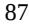

{87}------------------------------------------------

The prices of prescription pharmaceuticals have been the subject of considerable discussion in the United States. There have been several recent Congressional inquiries, as well as proposed and enacted state and federal legislation designed to, among other things, bring more transparency to pharmaceutical pricing, review the relationship between pricing and manufacturer patient programs and reduce the costs of pharmaceuticals under Medicare and Medicaid. In 2020 President Trump issued several executive orders intended to lower the costs of prescription products and certain provisions in these orders have been incorporated into regulations. These regulations include an interim final rule implementing a most favored nation model for prices that would tie Medicare Part B payments for certain physician-administered pharmaceuticals to the lowest price paid in other economically advanced countries, effective January 1, 2021. That rule, however, has been subject to a nationwide preliminary injunction and, on December 29, 2021, the Centers for Medicare and Medicaid Services, or CMS, issued a final rule to rescind it. With issuance of this rule, CMS stated that it will explore all options to incorporate value into payments for Medicare Part B pharmaceuticals and improve beneficiaries' access to evidence-based care.

In addition, in October 2020, the Department of Health and Human Services, or HHS, and the FDA published a final rule allowing states and other entities to develop a Section 804 Importation Program, or SIP, to import certain prescription drugs from Canada into the United States. The final rule is currently the subject of ongoing litigation, but at least six states (Vermont, Colorado, Florida, Maine, New Mexico and New Hampshire) have passed laws allowing for the importation of drugs from Canada with the intent of developing SIPs for review and approval by the FDA. Further, on November 20, 2020, HHS finalized a regulation that would eliminate the current safe harbor for Medicare drug rebates and create new safe harbors for beneficiary point-of-sale discounts and pharmacy benefit manager, or PBM, service fees. It originally was set to go into effect on January 1, 2022, but with passage of the Inflation Reduction Act has been delayed by Congress to January 1, 2032.

In September 2021, acting pursuant to an executive order signed by President Biden, HHS released its plan to reduce pharmaceutical prices. The key features of that plan are to: (a) make pharmaceutical prices more affordable and equitable for all consumers and throughout the health care system by supporting pharmaceutical price negotiations with manufacturers; (b) improve and promote competition throughout the prescription pharmaceutical industry by supporting market changes that strengthen supply chains, promote biosimilars and generic drugs and increase transparency; and (c) foster scientific innovation to promote better healthcare and improve health by supporting public and private research and making sure that market incentives promote discovery of valuable and accessible new treatments.

More recently, on August 16, 2022, the Inflation Reduction Act of 2022, or IRA, was signed into law by President Biden. The new legislation has implications for Medicare Part D, which is a program available to individuals who are entitled to Medicare Part A or enrolled in Medicare Part B to give them the option of paying a monthly premium for outpatient prescription drug coverage. Among other things, the IRA requires manufacturers of certain drugs to engage in price negotiations with Medicare (beginning in 2026), with prices that can be negotiated subject to a cap; imposes rebates under Medicare Part B and Medicare Part D to penalize price increases that outpace inflation (first due in 2023); and replaces the Part D coverage gap discount program with a new discounting program (beginning in 2025). The IRA permits the Secretary of HHS to implement many of these provisions through guidance, as opposed to regulation, for the initial years.

Specifically, with respect to price negotiations, Congress authorized Medicare to negotiate lower prices for certain costly single-source drug and biologic products that do not have competing generics or biosimilars and are reimbursed under Medicare Part B and Part D. CMS may negotiate prices for ten high-cost drugs paid for by Medicare Part D starting in 2026, followed by 15 Part D drugs in 2027, 15 Part B or Part D drugs in 2028 and 20 Part B or Part D drugs in 2029 and beyond. This provision applies to drug products that have been approved for at least 9 years and biologics that have been licensed for 13 years, but it does not apply to drugs and biologics that have been approved for a single rare disease or condition. Nonetheless, since CMS may establish a maximum price for these products in price negotiations, we would be fully at risk of government action if our products are the subject of Medicare price negotiations. Moreover, given the risk that could be the case, these provisions of the IRA may also further heighten the risk that we would not be able to achieve the expected return on our drug products or full value of our patents protecting our products if prices are set after such products have been on the market for nine years.

{88}------------------------------------------------

Further, the legislation subjects drug manufacturers to civil monetary penalties and a potential excise tax for failing to comply with the legislation by offering a price that is not equal to or less than the negotiated "maximum fair price" under the law or for taking price increases that exceed inflation. The legislation also requires manufacturers to pay rebates for drugs in Medicare Part D whose price increases exceed inflation. The new law also caps Medicare out-of-pocket drug costs at an estimated \$4,000 a year in 2024 and, thereafter beginning in 2025, at \$2,000 a year. In addition, the IRA potentially raises legal risks with respect to individuals participating in a Medicare Part D prescription drug plan who may experience a gap in coverage if they required coverage above their initial annual coverage limit before they reached the higher threshold, or "catastrophic period" of the plan. Individuals requiring services exceeding the initial annual coverage limit and below the catastrophic period, must pay 100% of the cost of their prescriptions until they reach the catastrophic period. Among other things, the IRA contains many provisions aimed at reducing this financial burden on individuals by reducing the coinsurance and co-payment costs, expanding eligibility for lower income subsidy plans and price caps on annual out-of-pocket expenses, each of which could have potential pricing and reporting implications.

Accordingly, while it is currently unclear how the IRA will be effectuated, we cannot predict with certainty what impact any federal or state health reforms will have on us, but such changes could impose new or more stringent regulatory requirements on our activities or result in reduced reimbursement for our products, any of which could adversely affect our business, results of operations and financial condition.

Individual states in the United States have also become increasingly active in passing legislation and implementing regulations designed to control pharmaceutical and biological product pricing, including price or patient reimbursement constraints, discounts, restrictions on certain product access and marketing cost disclosure and transparency measures and, in some cases, designed to encourage importation from other countries and bulk purchasing. Legally-mandated price controls on payment amounts by third-party payors or other restrictions could harm our business, results of operations, financial condition and prospects. In addition, regional healthcare authorities and individual hospitals are increasingly using bidding procedures to determine what pharmaceutical products and which suppliers will be included in their prescription drug and other healthcare programs. This could reduce the ultimate demand for our product candidates or put pressure on our product pricing.

We cannot predict the likelihood, nature or extent of government regulation that may arise from future legislation or administrative action in the United States or any other jurisdiction. If we or any third parties we may engage are slow or unable to adapt to changes in existing requirements or the adoption of new requirements or policies, or if we or such third parties are not able to maintain regulatory compliance, our product candidates may lose any regulatory approval that may have been obtained and we may not achieve or sustain profitability.

### *If the market opportunities for any product candidate that we or our strategic collaborators develop are smaller than we believe they are, our revenue may be adversely affected and our business may suffer.*

We intend to initially focus our product candidate development on therapies for the treatment of serious diseases such as CML, NASH and obesity. Our projections of addressable patient populations that have the potential to benefit from treatment with our product candidates are based on estimates. These estimates have been derived from a variety of sources, including the scientific literature, surveys of clinics, patient foundations or market research, and may prove to be incorrect. Further, new studies may change the estimated incidence or prevalence of these diseases. The number of patients may turn out to be lower than expected. Additionally, the potentially addressable patient population for our product candidates may not ultimately be amenable to treatment with our product candidates. Our market opportunity may also be limited by future competitor treatments that enter the market. If any of our estimates are inaccurate, the market opportunities for any of our product candidates could be significantly diminished and have an adverse material impact on our business.

{89}------------------------------------------------

#### **Risks Related to Intellectual Property**

### *Our current and any future product candidates could be alleged to infringe patent rights and other intellectual property rights of third parties, which may require costly litigation and, if we are not successful, could cause us to pay substantial damages and/or limit our ability to commercialize our drugs and combination therapy candidates.*

Our commercial success depends on our ability to develop, manufacture and market our current and any future product candidates that may be approved for sale and to use our proprietary technology without infringing the patents and other intellectual property rights of third parties. If any thirdparty patents or other intellectual property rights are found to cover our product candidates or their compositions, methods of use or manufacturing, we may be required to pay damages, which could be substantial, and we would not be free to manufacture or market our product candidates or to do so without obtaining a license, which may not be available on commercially reasonable terms, or at all. Regardless of merits, intellectual property disputes can be costly to defend, time-consuming and may cause our business, operating results and financial condition to suffer.

We operate in an industry with extensive intellectual property litigation. As the pharmaceutical, biopharmaceutical and biotechnology industries expand and more patents are issued, the risk increases that there may be patents issued to third parties that relate to our products and technology of which we are not aware or that we may need to challenge to continue our operations as currently contemplated.

From time to time, we may be subject to legal proceedings and claims with respect to intellectual property with respect to our product candidates and technologies we use in our business. We may face allegations that we have infringed the trademarks, copyrights, patents and other intellectual property rights of third parties, including patents held by our competitors or by non-practicing entities. Litigation may make it necessary to defend ourselves by determining the scope, enforceability and validity of third-party proprietary rights, or to establish our proprietary rights. Interference or derivation proceedings provoked by third parties or brought by us or declared by the United States Patent and Trademark Office, or USPTO, may be necessary to determine the priority of inventions or establish proprietary rights with respect to our patents or patent applications or those of our licensors. Regardless of whether claims that we are infringing patents or other intellectual property rights have merit, the claims can be time consuming, divert management attention and financial resources and are costly to evaluate and defend. Results of any such litigation are difficult to predict and may require us to cease developing, manufacturing, or commercializing the infringing product candidate, stop treating certain conditions, obtain licenses or modify our drugs or combination therapies and features while we develop non-infringing substitutes, or may result in significant settlement costs. For example, litigation can involve substantial damages for infringement, and if the court finds that the infringement was willful, we could be ordered to pay treble damages and the patent owner's attorneys' fees. We may also be prohibited from selling or licensing our product candidates unless the third party licenses rights to us, which it is not required to do at a commercially reasonable price or at all. If a license is available from a third party, we may have to pay substantial royalties or upfront fees or grant cross-licenses to intellectual property rights for our product candidates.

Although we have reviewed certain third-party patents and patent applications that we believe may be relevant to certain of our product candidates, we have not conducted a freedom-to-operate search or analysis for all of our product candidates. As such, we may not be aware of patents or pending or future patent applications that, if issued, would block us from commercializing our product candidates. Thus, we cannot guarantee that our product candidates, or our commercialization thereof, do not and will not infringe any third party's intellectual property.

{90}------------------------------------------------

In addition, patent applications in the United States and many international jurisdictions are typically not published until 18 months after the filing of certain priority documents (or, in some cases, are not published until they issue as patents) and publications in the scientific literature often lag behind actual discoveries. Claims in patent applications can also be revised before issuance. Therefore, we cannot be certain that others have not filed patent applications or made public disclosures relating to our technology or our contemplated technology. A third party may have filed, and may in the future file, patent applications covering our product candidates or technology similar to ours. Any such patent application may have priority over our patent applications or patents, which could further require us to obtain rights to issued patents covering such technologies. If another party has filed a U.S. patent application on inventions similar to ours, depending on whether the timing of the filing date falls under certain patent laws, we may have to participate in a priority contest (such as an interference proceeding) declared by the USPTO to determine priority of invention in the United States. The costs of patent litigation and other proceedings could be substantial, and it is possible that such efforts would be unsuccessful if it is determined that the other party had independently arrived at the same or similar invention prior to our own invention, resulting in a loss of our U.S. patent position with respect to such invention.

The coverage of patents is subject to interpretation by the courts, and the interpretation is not always uniform. If we were sued for patent infringement, we would need to demonstrate that our product candidates either do not infringe the patent claims of the relevant patent or that the patent claims are invalid or unenforceable, and we may not be successful in doing so. Proving invalidity or unenforceability is difficult. For example, in the United States, proving invalidity requires a showing of clear and convincing evidence to overcome the presumption of validity enjoyed by issued patents. Even if we believe third-party intellectual property claims are without merit, there is no assurance that a court would find in our favor on questions of infringement, validity, or enforceability.

Some of our competitors may be able to sustain the costs of complex patent litigation more effectively than we can. Even if resolved in our favor, litigation or other legal proceedings relating to intellectual property claims may cause us to incur significant expenses, and could distract our technical and management personnel from their normal responsibilities. In addition, there could be public announcements of the results of hearings, motions or other interim proceedings or developments, and if securities analysts or investors perceive these results to be negative, it could have a material adverse effect on the price of our common stock. Any uncertainties resulting from the initiation and continuation of any litigation could have a material adverse effect on our ability to raise the funds necessary to continue our operations.

There can be no assurance with respect to the outcome of any future litigation brought by or against us, and the outcome of any such litigation could have a material adverse impact on our business, operating results and financial condition. Litigation is inherently unpredictable, and outcomes are uncertain. Further, as the costs and outcome of these types of claims and proceedings can vary significantly, it is difficult to estimate potential losses that may occur. Such claims and proceedings could substantially increase our operating losses and reduce the resources available for development activities or any future sales, marketing or distribution activities. We may not have sufficient financial or other resources to conduct such litigation or proceedings adequately. Accordingly, we are unable at this time to estimate the effects of these potential future lawsuits on our financial condition, operations or cash flows.

{91}------------------------------------------------

#### *We may be subject to claims by employees, consultants and contractors claiming ownership of what we regard as our own intellectual property.*

While it is our policy to require our employees, consultants and contractors who may be involved in the conception or development of intellectual property to execute agreements assigning such intellectual property to us, we may be unsuccessful in executing such an agreement with each party who, in fact, conceives or develops intellectual property that we regard as our own, which may result in claims by or against us related to the ownership of such intellectual property. In addition, such agreements may not be self-executing such that the intellectual property subject to such agreements may not be assigned to us without additional assignments being executed, and we may fail to obtain such assignments. In addition, such agreements may be breached. Accordingly, we may be forced to bring claims against third parties, or defend claims that they may bring against us to determine the ownership of what we regard as our intellectual property. If we fail in prosecuting or defending any such claims, in addition to paying monetary damages, we may lose valuable intellectual property. Even if we are successful in prosecuting or defending against such claims, litigation could result in substantial costs and be a distraction to our senior management and scientific personnel, which would have a material adverse effect on our business, financial condition, results of operations and prospects.

### *If we are unable to obtain, maintain and enforce intellectual property protection directed to our current and any future technologies that we develop, others may be able to make, use or sell products substantially the same as ours, which could adversely affect our ability to compete in the market.*

The market for pharmaceuticals and biopharmaceuticals is highly competitive and subject to rapid technological change. Our success depends, in part, upon our ability to maintain a competitive position in the development and protection of technologies and any future product candidates for use in these fields and upon our ability to obtain, maintain and enforce our intellectual property rights. We seek to obtain and maintain patents and other intellectual property rights to restrict the ability of others to market products that misappropriate our technology and/or infringe our intellectual property to unfairly and illegally compete with any of our product candidates. If we are unable to protect our intellectual property and proprietary rights, our competitive position and our business could be harmed, as third parties may be able to make, use or sell products that are substantially the same as any product candidates we may sell without incurring the sizeable development and, in some cases, licensing costs that we have incurred, which would adversely affect our ability to compete in the market. We use a combination of patents, trademarks, know-how, confidentiality procedures and contractual provisions to protect our proprietary technology and that of our licensors. However, these protections may not be adequate and may not provide us with any competitive advantage. For example, patents may not issue from any of our or our licensors' currently pending or any future patent applications, and our or our licensors' issued patents and any future patents that may issue may not survive legal challenges to their scope, validity or enforceability or provide significant protection for us.

To protect our proprietary position, we generally file patent applications in the United States and in certain foreign countries related to our product candidates that we consider important to our business. The patent application and approval process is expensive, time-consuming and complex. We may not be able to file, prosecute and maintain all necessary or desirable patent applications at a reasonable cost or in a timely manner or in all jurisdictions. It is also possible that we will fail to identify patentable aspects of our research and development output before it is too late to obtain patent protection. Moreover, depending on the terms of any future license or collaboration agreements to which we may become a party, we may not have the right to control the preparation, filing and prosecution of patent applications, or to maintain the patents, covering technology licensed from third parties. Therefore, these patents and patent applications may not be prosecuted and enforced in a manner consistent with the best interests of our business.

Furthermore, the patent position of biotechnology and pharmaceutical companies generally is highly uncertain. No consistent policy regarding the breadth of claims allowed in biotechnology and pharmaceutical patents has emerged to date in the United States or in many foreign jurisdictions. The standards applied by the USPTO and foreign patent offices in granting patents are not always applied uniformly or predictably. In addition, the determination of patent rights with respect to biological and pharmaceutical products commonly involves complex legal and factual questions, which have in recent years been the subject of much litigation. As a result, the issuance, scope, validity, enforceability and commercial value of our patent rights are highly uncertain. Thus, we cannot offer any assurances about which, if any, patents will issue, the breadth of any such patents, whether any issued patents will be found invalid and unenforceable or will be threatened by third parties or whether any issued patents will effectively prevent others from commercializing competing technologies and product candidates.

{92}------------------------------------------------

The USPTO, international patent offices or judicial bodies may deny or significantly narrow claims made under our patent applications, and our issued patents may be successfully challenged, may be designed around or may otherwise be of insufficient scope to provide us with protection for our drugs or combination therapies. Further, the USPTO, international trademark offices or judicial bodies may deny our trademark applications and, even if published or registered, these trademarks may not effectively protect our brand and goodwill. Like patents, trademarks also may be successfully opposed or challenged.

We cannot be certain that the steps we have taken will prevent unauthorized use or unauthorized reverse engineering of our technology. Moreover, third parties may independently develop technologies that are competitive with ours and such competitive technologies may or may not infringe our intellectual property. The enforcement of our intellectual property rights also depends on the success of any legal actions we may take against these infringers in the respective country or forum, but these actions may not be successful. As with all granted intellectual property, such intellectual property may be challenged, invalidated or circumvented, may not provide protection and/or may not prove to be enforceable in actions against specific alleged infringers.

Even if our patents are determined by a court to be valid and enforceable, they may not be interpreted sufficiently broadly to prevent others from marketing products similar to ours or designing around our patents. For example, third parties may be able to make products that are similar to ours but that are not covered by the claims of our patents. Third parties may assert that we or our licensors were not the first to make the inventions covered by our issued patents or pending patent applications. The claims of our or our licensors' issued patents or patent applications when issued may not cover our product candidates or any future products that we develop. We may not have freedom to commercialize unimpeded by the patent rights of others. Third parties may have patents that dominate, block or are otherwise relevant to our technology. There may be prior public disclosures or other art that could be deemed to invalidate one or more of our patent claims. Further, we may not develop additional proprietary technologies in the future, and, if we do, they may not be patentable.

We may not be able to correctly estimate or control our future operating expenses in relation to obtaining intellectual property, enforcing intellectual property and/or defending intellectual property, which could affect operating expenses. Our operating expenses may fluctuate significantly in the future as a result of a variety of factors, including the costs of preparing, filing, prosecuting, defending and enforcing patent and trademark claims and other intellectual property-related costs, including adverse proceedings and litigation costs.

{93}------------------------------------------------

### *We may be involved in lawsuits to protect or enforce our patents or the patents of our licensors, which could be expensive, time consuming and unsuccessful. Further, our issued patents could be found invalid or unenforceable if challenged in court.*

Competitors may infringe our intellectual property rights or those of our licensors. To prevent infringement or unauthorized use, we may be required to file infringement claims, which can be expensive and time-consuming. In addition, in a patent infringement proceeding, a court may decide that one or more patent of ours or any of our current licensors or future licensors is not valid or is unenforceable, in whole or in part, or may refuse to stop the other party from using the technology at issue on the grounds that our or our licensors' patents do not cover the technology in question. An adverse result in any litigation or defense proceedings could put one or more of our or our licensors' patents at risk of being invalidated or interpreted narrowly, which may curtail or preclude our ability to exclude third parties from making and selling similar or competitive products, and could put our or our licensors' patent applications at risk of not issuing. If we or any of our potential future collaborators were to initiate legal proceedings against a third party to enforce a patent directed at our products, the defendant could counterclaim that our or our licensors' patent is invalid and/or unenforceable in whole or in part. In patent litigation in the United States, defendant counterclaims alleging invalidity and/or unenforceability are commonplace. Grounds for a validity challenge include an alleged failure to meet any of several statutory requirements, including lack of novelty, obviousness or non-enablement. Grounds for an unenforceability assertion could also include an allegation that someone connected with prosecution of the patent withheld relevant information from the USPTO or made a misleading statement during prosecution. Third parties may also raise similar validity claims before the USPTO in post-grant proceedings such as *ex parte* reexaminations, inter partes review or post-grant review, or oppositions or similar proceedings outside the United States, in parallel with litigation or even outside the context of litigation.

If a defendant were to prevail on a legal assertion of invalidity or unenforceability of our or our licensors' patents covering one of our product candidates, we could lose a part, and perhaps all, of the patent protection covering such candidate. Competing products may also be sold in other countries in which our patent coverage might not exist or be as strong. If we lose a foreign patent lawsuit, alleging our infringement of a competitor's patents, we could be prevented from marketing our products in one or more foreign countries. Any of these occurrences could adversely affect our competitive business position, business prospects and financial condition.

The outcome following legal assertions of invalidity and unenforceability is unpredictable, and prior art could render our patents or those of our licensors invalid. Similar mechanisms for challenging the validity and enforceability of a patent exist in ex-U.S. patent offices and may result in the revocation, cancellation, or amendment of any ex-U.S. patents we hold in the future. For the patents and patent applications that we may license in the future, we may have limited or no right to participate in the defense of any licensed patents against challenge by a third party. If a defendant were to prevail on a legal assertion of invalidity and/or unenforceability, we would lose at least part, and perhaps all, of the patent protection on such product candidate. Such a loss of patent protection would have a material adverse impact on our business.

Even if we establish infringement, the court may decide not to grant an injunction against further infringing activity and instead award only monetary damages, which may or may not be an adequate remedy. Furthermore, because of the substantial amount of discovery required in connection with intellectual property litigation, there is a risk that some of our confidential information could be compromised by disclosure during this type of litigation. There could also be public announcements of the results of hearings, motions or other interim proceedings or developments. If securities analysts or investors perceive these results to be negative, it could have a material adverse effect on the price of our common stock.

We may not be able to prevent, alone or with our potential licensors, misappropriation of our intellectual property rights, particularly in countries where the laws may not protect those rights as fully as in the United States.

Our defense of litigation or interference or other intellectual property proceedings may fail and, even if successful, may result in substantial costs and distract our management and other employees. An unfavorable outcome could require us to cease using the related technology or to attempt to license rights to it from the prevailing party. Our business could be harmed if the prevailing party does not offer us a license on commercially reasonable terms or at all, or if a non-exclusive license is offered and our competitors gain access to the same technology. In addition, the uncertainties associated with litigation could have a material adverse effect on our ability to raise the funds necessary to continue our clinical trials, continue our research programs, license necessary technology from third parties or enter into development or manufacturing partnerships that would help us bring our products to market.

{94}------------------------------------------------

### *We license or otherwise have access to patent rights from third-party owners. Such licenses or other arrangements may be subject to early termination if we fail to comply with our obligations in our agreements with third parties, which could result in the loss of rights or technology that are material to our business.*

We are a party to licenses and other agreements that give us rights to third-party intellectual property that are necessary or useful for our business, and we may enter into additional licenses or other agreements in the future. For example, we are party to license agreements with Eli Lilly and Company with respect to TERN-101 and an assignment agreement with Vintagence Biotechnology Ltd. with respect to our THR-β program. Under these agreements, we are obligated to pay the counterparties fees, which may include annual license fees, milestone payments, royalties, a percentage of revenues associated with the applicable technology and a percentage of sublicensing revenue. In addition, under certain of such agreements, we are required to diligently pursue the development of products using the applicable technology. If we fail to comply with these obligations and fail to cure our breach within a specified period of time, the counterparty may have the right to terminate the applicable agreement, in which event we could lose valuable rights and technology that are material to our business.

We may rely on third parties from whom we license proprietary technology to file and prosecute patent applications and maintain patents and otherwise protect the intellectual property we license from them. We may have limited control over these activities or any other intellectual property that may be related to our in-licensed intellectual property. For example, we cannot be certain that such activities by these licensors will be conducted in compliance with applicable laws and regulations or will result in valid and enforceable patents and other intellectual property rights. We may have limited control over the manner in which our licensors initiate an infringement proceeding against a third-party infringer of the intellectual property rights, or defend certain of the intellectual property that may be licensed to us. It is possible that the licensors' infringement proceeding or defense activities may be less vigorous than if we conduct them ourselves.

### *Our intellectual property agreements with third parties may be subject to disagreements over contract interpretation, which could narrow the scope of our rights to the relevant intellectual property or technology or increase our financial or other obligations to our licensors.*

Certain provisions in our intellectual property agreements may be susceptible to multiple interpretations. The resolution of any contract interpretation disagreement that may arise could affect the scope of our rights to the relevant intellectual property or technology, or affect financial or other obligations under the relevant agreement, any of which could have a material adverse effect on our business, financial condition, results of operations and prospects.

### *We may jointly own certain patent rights with third parties. Our ability to out-license these patent rights, or to prevent the third party from out-licensing these patent rights, may be limited in certain countries.*

We may jointly own patents and patent applications with third parties in the future. Unless we enter into an agreement with the joint owner, we will be subject to certain default rules pertaining to joint ownership. Certain countries require the consent of all joint owners to license jointly owned patents, and if we are unable to obtain such consent from the joint owner, we may not be able to license our rights under these patents and patent applications. In certain other countries, including the United States, the joint owner could license its rights under these patents and patent applications to another party without our consent and without any duty of accounting to us.

{95}------------------------------------------------

*We may in the future be dependent on intellectual property licensed or sublicensed to us from, or for which development was funded or otherwise assisted by, government agencies, such as the National Institutes of Health, for development of our technology and product candidates. Failure to meet our own obligations to our licensors or upstream licensors, including such government agencies, may result in the loss of our rights to such intellectual property, which could harm our business.*

In the future, government agencies may provide funding, facilities, personnel or other assistance in connection with the development of the intellectual property rights owned by or licensed to us. Such government agencies may retain rights in such intellectual property, including the right to grant or require us to grant mandatory licenses or sublicenses to such intellectual property to third parties under certain specified circumstances, including if it is necessary to meet health and safety needs that we are not reasonably satisfying or if it is necessary to meet requirements for public use specified by federal regulations, or to manufacture products in the United States. Any exercise of such rights, including with respect to any such required sublicense of these licenses could result in the loss of significant rights and could harm our ability to commercialize licensed products.

### *We may be subject to claims challenging the inventorship or ownership of our patents and other intellectual property.*

We may be subject to claims that former employees, collaborators, or other third parties have an interest in our patents or other intellectual property as an inventor or co-inventor or owner. The failure to name the proper inventors on a patent application can result in the patents issuing thereon being unenforceable. Inventorship disputes may arise from conflicting views regarding the contributions of different individuals named as inventors, the effects of foreign laws where foreign nationals are involved in the development of the subject matter of the patent, conflicting obligations of third parties involved in developing our product candidates or as a result of questions regarding co-ownership of potential joint inventions. For example, we may have inventorship disputes arise from conflicting obligations of consultants or others who are involved in developing our product candidates. Alternatively, or additionally, we may enter into agreements to clarify the scope of our rights in such intellectual property. Litigation may be necessary to defend against these and other claims challenging inventorship and/or ownership. If we fail in defending any such claims, in addition to paying monetary damages, we may lose valuable intellectual property rights, such as exclusive ownership of, or right to use, valuable intellectual property. Such an outcome could have a material adverse effect on our business. Even if we are successful in defending against such claims, litigation could result in substantial costs and be a distraction to management and other employees.

We or our licensors may in the future rely on third-party consultants or collaborators or on funds from third parties, such as the U.S. government, such that we or our licensors are not the sole and exclusive owners of the patents we in-licensed. If other third parties have ownership rights or other rights to our patents, including in-licensed patents, they may be able to license such patents to our competitors, and our competitors could market competing products and technology. This could have a material adverse effect on our competitive position, business, financial conditions, results of operations and prospects.

{96}------------------------------------------------

### *We may be subject to claims that we have wrongfully hired an employee from a competitor or that we or our employees have wrongfully used or disclosed alleged confidential information or trade secrets of their former employers.*

As is common in the pharmaceutical and biotechnology industries, in addition to our employees, we engage the services of consultants to assist us in the development of our product candidates. Many of these consultants, and many of our employees, were previously employed at, or may have previously provided or may be currently providing consulting services to, universities or other pharmaceutical or biotechnology companies including our competitors or potential competitors. These employees and consultants may have executed proprietary rights, non-disclosure and non-competition agreements, or similar agreements, in connection with such other current or previous employment. Although we try to ensure that our employees and consultants do not use the proprietary information or know-how of others in their work for us and seek assurances that they will not, we may become subject to claims that we, our employees or a consultant inadvertently or otherwise used or disclosed trade secrets or other information proprietary to their former employers or their former or current clients. Litigation may be necessary to defend against these claims. If we fail in successfully defending any such claims, in addition to paying monetary damages, we may lose valuable intellectual property rights, which could adversely affect our business. Such intellectual property could be awarded to a third party, and we could be required to obtain a license from such third party to commercialize our technology or drugs and combination therapies. Even if we are successful in defending against these claims, litigation could result in substantial costs and be a distraction to our management team. Any of the foregoing would have a material adverse effect on our business, financial condition, results of operations and prospects.

#### *We may not be able to protect our intellectual property rights throughout the world.*

We have a number of patents and patent applications in foreign countries, and expect to continue to pursue patent protection in many of the significant markets in which we intend to do business. However, filing, prosecuting and defending patents on product candidates in all countries throughout the world would be prohibitively expensive, and the laws of some foreign countries do not protect intellectual property rights to the same extent as federal and state laws in the United States. The requirements for patentability may differ in certain countries, particularly in developing countries. In addition, any future intellectual property license agreements may not always include worldwide rights. Consequently, we have not pursued or maintained, and may not pursue or maintain in the future, patent protection for our product candidates in every country or territory in which we may sell our drugs and combination therapies and we may not be able to prevent third parties from practicing our inventions in all countries outside the United States, or from selling or importing products made using our inventions in and into the United States or other jurisdictions. Competitors may use our technologies in jurisdictions where we have not obtained or maintained patent protection to develop their own products, and may export otherwise infringing products to territories where we have patent protection but enforcement is not as strong as that in the United States and where our ability to enforce our patents to stop infringing activities may be inadequate. These products may compete with any current or future product candidates we may sell, and our patents or other intellectual property rights may not be effective or sufficient to prevent them from competing.

Many companies have encountered significant problems in protecting and defending intellectual property rights in foreign jurisdictions. The legal systems of certain countries, particularly certain developing countries, do not favor the enforcement of patents and other intellectual property protections, particularly those relating to pharmaceuticals and biopharmaceuticals, which could make it difficult for us to stop the infringement of our patents or the marketing of competing products in violation of our proprietary rights generally.

{97}------------------------------------------------

Moreover, our ability to protect and enforce our intellectual property and proprietary rights may be adversely affected by unforeseen changes in foreign intellectual property laws. Additionally, the laws of some countries outside of the United States and Europe do not afford intellectual property protection to the same extent as the laws of the United States and Europe. Many companies have encountered significant problems in protecting and defending intellectual property and proprietary rights in certain foreign jurisdictions. The legal systems of some countries, including, for example, India, the People's Republic of China, which we refer to as China or PRC, and other developing countries, do not favor the enforcement of patents and other intellectual property or proprietary rights, particularly those relating to biotechnology products, which could make it difficult for us to stop the infringement, misappropriation or other violation of our patents or other intellectual property or proprietary rights. For example, many foreign countries have compulsory licensing laws under which a patent owner must grant licenses to third parties. Consequently, we may not be able to prevent third parties from practicing our inventions in certain countries outside the United States and Europe. In addition, many countries limit the enforceability of patents against government agencies or government contractors. In these countries, the patent owner may have limited remedies, which could materially diminish the value of such patent. If we are forced to grant a license to third parties with respect to any patents relevant to our business, our competitive position may be impaired, and our business, financial condition, results of operations and prospects may be adversely affected.

Proceedings to enforce our patent rights in foreign jurisdictions could result in substantial costs and divert our efforts and attention from other aspects of our business, could put our patents at risk of being invalidated or interpreted narrowly and our patent applications at risk of not issuing and could provoke third parties to assert claims against us. We may not prevail in any lawsuits that we initiate, and the damages or other remedies awarded, if any, may not be commercially meaningful. Accordingly, our efforts to enforce our intellectual property rights around the world may be inadequate to obtain a significant commercial advantage from the intellectual property that we develop or license.

### *We may not identify relevant third-party patents or may incorrectly interpret the relevance, scope or expiration of a third-party patent, which might adversely affect our ability to develop and market our single-agent and combination therapies.*

We cannot guarantee that any of our patent searches or analyses, including the identification of relevant patents or patent applications, the scope of patent claims or the expiration of relevant patents, are complete or thorough, nor can we be certain that we have identified each and every third-party patent and pending patent application in the United States and abroad that is relevant to or necessary for the commercialization of our product candidates in any jurisdiction. The scope of a patent claim is determined by an interpretation of the law, the written disclosure in a patent and the patent's prosecution history. Our interpretation of the relevance or the scope of a patent or a pending patent application may be incorrect, which may negatively impact our ability to market our product candidates. We may incorrectly determine that our product candidates are not covered by a third-party patent or may incorrectly predict whether a third-party's pending patent application will issue with claims of relevant scope. Our determination of the expiration date of any patent in the United States or abroad that we consider relevant may be incorrect, which may negatively impact our ability to develop and market our product candidates. Our failure to identify and correctly interpret relevant patents or patent applications may negatively impact our ability to develop and market our product candidates.

One aspect of the determination of patentability of our inventions depends on the scope and content of the "prior art," information that was or is deemed available to a person of skill in the relevant art prior to the priority date of the claimed invention. There may be prior art of which we are not aware that may affect the patentability of our patent claims or, if issued, affect the validity or enforceability of a patent claim. Further, we may not be aware of all third-party intellectual property rights potentially relating to our product candidates or their intended uses, and as a result the impact of such third-party intellectual property rights upon the patentability of our own patents and patent applications, as well as the impact of such third-party intellectual property upon our freedom to operate, is highly uncertain. Because patent applications in the United States and most other countries are confidential for typically a period of 18 months after filing, or may not be published at all, we cannot be certain that we were the first to file any patent application related to our product candidates. As a result, the issuance, scope, validity, enforceability and commercial value of our patent rights are highly uncertain. Furthermore, for U.S. applications in which all claims are entitled to a priority date before March 2013, an interference proceeding can be provoked by a third party or instituted by the USPTO to determine who was the first to invent any of the subject matter covered by the patent claims of our applications. For U.S. patents and patent applications containing a claim not entitled to priority before March 2013, there is a greater level of uncertainty in the patent law in view of the passage of the Leahy-Smith America Invents Act, or the AIA, which brought into effect significant changes to the U.S. patent laws, including new procedures for challenging pending patent applications and issued patents.

{98}------------------------------------------------

#### *Patent terms may be inadequate to establish our competitive position on our product candidates for an adequate amount of time.*

Patents have a limited lifespan. In the United States, if all maintenance fees are timely paid, the natural expiration of a patent is generally 20 years from its earliest U.S. non-provisional filing date. Patent terms may be shortened or lengthened by, for example, terminal disclaimers, patent term adjustments, supplemental protection certificates and patent term extensions, but the life of a patent, and the protection it affords, is limited. Non-payment or delay in payment of patent fees, maintenance fees or annuities, delay in patent filings or delay in extension filings (including any patent term extension or adjustment filings), whether intentional or unintentional, may result in the loss of patent rights important to our business. Even if patents covering our product candidates are obtained, once the patent life has expired for a product candidate, we may be open to competition from competitive medications, including generic versions. Given the amount of time required for the development, testing and regulatory review of new product candidates, patents directed towards such product candidates might expire before or shortly after such product candidates are commercialized. As a result, our owned and licensed patent portfolio may not provide us with sufficient rights to exclude others from commercializing product candidates similar or identical to ours for a meaningful amount of time, or at all.

Depending upon the timing, duration and conditions of any FDA marketing approval of our product candidates, one or more of our owned or licensed U.S. patents may be eligible for limited patent term extension under the Drug Price Competition and Patent Term Restoration Act of 1984, or Hatch-Waxman Act and similar legislation in the EU and certain other jurisdictions. The Hatch-Waxman Act permits, in certain cases, a patent term extension of up to five years for a patent covering an approved product as compensation for effective patent term lost during product development and the FDA regulatory review process. However, we may not receive an extension if we fail to exercise due diligence during the testing phase or regulatory review process, fail to apply within applicable deadlines, fail to apply prior to expiration of relevant patents or otherwise fail to satisfy applicable requirements. Moreover, the length of the extension could be less than we request. Only one patent per approved product can be extended, the extension cannot extend the total patent term beyond 14 years from approval, and the amount of available extension to any extension-eligible patent which claims a product, a method of using a product or a method of manufacturing a product, depends on a variety of factors, including the date on which the patent issues and certain dates related to the regulatory review period. If we are unable to obtain patent term extension or the term of any such extension is less than we request, the period during which we can enforce our patent rights for the applicable product candidate will be shortened and our competitors may obtain approval to market competing products sooner. As a result, our revenue from applicable products could be reduced. Further, if this occurs, our competitors may take advantage of our investment in development and trials by referencing our clinical and nonclinical data and launch their product earlier than might otherwise be the case, and our competitive position, business, financial condition, results of operations and prospects could be materially harmed.

Further, there are detailed rules and requirements regarding the patents that may be submitted to the FDA for listing in the Orange Book. We may be unable to obtain patents covering our product candidates that contain one or more claims that satisfy the requirements for listing in the Orange Book. Even if we submit a patent for listing in the Orange Book, the FDA may decline to list the patent, or a manufacturer of generic drugs may challenge the listing. If one of our product candidates is approved and a patent covering that product candidate is not listed in the Orange Book, a manufacturer of generic drugs would not have to provide advance notice to us of any abbreviated new drug application filed with the FDA to obtain permission to sell a generic version of such product candidate. Any of the foregoing could harm our competitive position, business, financial condition, results of operations and prospects.

{99}------------------------------------------------

### *Obtaining and maintaining patent protection depends on compliance with various procedural, document submission, fee payment and other requirements imposed by governmental patent agencies, and our patent protection could be reduced or eliminated for non-compliance with these requirements.*

The USPTO and various foreign governmental patent agencies require compliance with a number of procedural, documentary, fee payment and other provisions during the patent process. Periodic maintenance fees, renewal fees, annuity fees and various other governmental fees on patents and/or patent applications will be due to be paid to the USPTO and various governmental patent agencies outside of the United States in several stages over the lifetime of the patents and/or patent applications. We employ reputable professionals and rely on such third parties to help us comply with these requirements and effect payment of these fees with respect to the patents and patent applications that we own, and we may have to rely upon our licensors to comply with these requirements and effect payment of these fees with respect to any patents and patent applications that we license. In many cases, an inadvertent lapse can be cured by payment of a late fee or by other means in accordance with the applicable rules. However, there are situations in which noncompliance can result in abandonment or lapse of a patent or patent application, resulting in partial or complete loss of patent rights in the relevant jurisdiction. In such an event, competitors might be able to enter the market earlier than would otherwise have been the case.

### *Changes in patent law in the United States or in other countries could diminish the value of patents in general, thereby impairing our ability to protect our product candidates.*

As is the case with other pharmaceutical companies, our success is heavily dependent on intellectual property, particularly patents. Obtaining and enforcing patents in the pharmaceutical industry involves both technological and legal complexity and is therefore costly, time consuming and inherently uncertain. Our patent rights may be affected by developments or uncertainty in U.S. or ex-U.S. patent statutes, patent case laws in USPTO rules and regulations or in the rules and regulations of ex-U.S. patent offices. There are a number of changes to the U.S. patent laws that may have a significant impact on our ability to protect our technology and enforce our intellectual property rights. For example, in September 2011, the AIA, was signed into law. The AIA includes provisions that affect the way patent applications are prosecuted and affect patent litigation. In particular, under the AIA, the United States transitioned in March 2013 to a "first to file" system in which the first inventor to file a patent application is entitled to the patent. Third parties are allowed to submit prior art before the issuance of a patent by the USPTO, and may become involved in post-grant proceedings including opposition, derivation, reexamination, inter partes review or interference proceedings challenging our patent rights or the patent rights of others. An adverse determination in any such submission, proceeding or litigation could reduce the scope or enforceability of, or invalidate, our patent rights, which could adversely affect our competitive position. This could have a negative impact on some of our intellectual property and could increase uncertainties surrounding obtaining and enforcement or defense of our issued patents.

In addition, Congress may pass patent reform legislation that is unfavorable to us. The U.S. Supreme Court has ruled on several patent cases in recent years, either narrowing the scope of patent protection available in certain circumstances or weakening the rights of patent owners in certain situations. In addition to increasing uncertainty with regard to our ability to obtain patents in the future, this combination of events has created uncertainty with respect to the value of patents once obtained. Depending on decisions by Congress, the federal courts and the USPTO, the laws and regulations governing patents could change in unpredictable ways that would weaken our ability to obtain new patents or to enforce our existing patents and patents we might obtain in the future. Similarly, statutory or judicial changes to the patent laws of other countries may increase the uncertainties and costs surrounding the prosecution of patent applications and the enforcement or defense of issued patents. We cannot predict future changes in the interpretation of patent laws or changes to patent laws that might be enacted into law by U.S. and international legislative bodies. Those changes may materially affect the patents and patent applications of our licensors, our existing or future patents and patent applications and our ability to obtain additional patents in the future.

### *Intellectual property rights do not necessarily address all potential threats to our competitive advantage.*

The degree of future protection afforded by our intellectual property rights is uncertain because intellectual property rights have limitations, and may not adequately protect our business or permit us to maintain our competitive advantage. For example:

- others may be able to make product candidates that are similar to ours but that are not covered by the claims of the patents that we own or have exclusively licensed;

{100}------------------------------------------------

- we or our licensors or future collaborators might not have been the first to make the inventions covered by the issued patents or pending patent applications that we own or have exclusively licensed;
- we or our licensors or future collaborators might not have been the first to file patent applications covering certain of our inventions;
- others may independently develop similar or alternative technologies or duplicate any of our technologies without infringing our intellectual property rights;
- it is possible that our owned or licensed pending patent applications will not lead to issued patents;
- issued patents that we own or have exclusively licensed may be held invalid or unenforceable, as a result of legal challenges by our competitors;
- our competitors might conduct research and development activities in countries where we do not have patent rights and then use the information learned from such activities to develop competitive products for sale in our major commercial markets;
- we may not develop additional proprietary technologies that are patentable;
- we cannot predict the scope of protection of any patent issuing based on our owned or licensed patent applications, including whether the patent applications that we own or in-license will result in issued patents with claims that cover our product candidates or uses thereof in the United States or in other foreign countries;
- the claims of any patent issuing based on our owned or licensed patent applications may not provide protection against competitors or any competitive advantages, or may be challenged by third parties;
- if enforced, a court may not hold that our owned or licensed patents are valid, enforceable and infringed;
- we may need to participate in litigation or administrative proceedings to enforce and/or defend our patent rights which will be costly whether we win or lose;
- we may be required to coordinate with licensors on enforcement of our patents;
- we may choose not to file a patent application in order to maintain certain trade secrets or know-how, and a third party may subsequently file a patent application and secure an issued patent covering such intellectual property;
- we may fail to adequately protect and police our trademarks and trade secrets; and
- the patents of others may have an adverse effect on our business, including if others obtain patents claiming subject matter similar to or improving that covered by our patents and patent applications.

Should any of these events occur, they could significantly harm our business, results of operations and prospects.

#### **Other Risks Related to Our Business**

### *If we fail to attract and retain senior management and key scientific personnel or if we lose our personnel for health or other reasons, our business may be materially and adversely affected.*

Our success depends in part on our continued ability to attract, retain and motivate highly qualified management and clinical and scientific personnel. We are highly dependent upon members of our senior management team and our senior scientists. The loss of services of any of these individuals could delay or prevent the successful development of our pipeline, initiation or completion of our planned clinical trials or the commercialization of our current or future product candidates.

{101}------------------------------------------------

Our CEO, Mr. Sundaram was diagnosed with cancer in 2021 and has been undergoing traditional and investigational treatments, including chemotherapy, since the diagnosis. Mr. Sundaram has continued and plans to continue in his role as chief executive officer during his treatment period and to work closely with our board of directors and management team to execute on our business priorities. However, his condition may change suddenly or unexpectedly and could prevent him from continuing to perform his role. In the event that Mr. Sundaram is no longer able to perform his duties as chief executive officer, we will be required to identify, recruit, hire and integrate a new chief executive officer. While our board of directors has reviewed and continues to review potential interim and longer-term contingency plans that could be activated as needed to minimize business disruption and to ensure the continued execution of our business priorities, the recruitment of a new chief executive officer can be and is often lengthy and distracting. In addition, we may be required to implement temporary or interim executive management to support the leadership of our company during a transition period. A change in the leadership of the company is a significant event and may result in additional volatility in our stock price.

Competition for qualified personnel in the pharmaceutical, biopharmaceutical and biotechnology field is intense due to the limited number of individuals who possess the knowledge, skills and experience required by our industry. We will need to hire additional personnel as we expand our clinical development and, if we initiate commercial activities, establish newly created roles at the leadership and operational levels. We may not be able to attract and retain quality personnel on acceptable terms, or at all. In addition, to the extent we hire personnel from competitors, we may be subject to allegations that they have been improperly solicited or that they have divulged proprietary or other confidential information, or that their former employers own their research output.

### *We will need to increase the size of our organization, and we may experience difficulties in managing growth.*

As of December 31, 2022, we had 46 full-time employees. We will need to continue to expand our managerial, operational, finance and other resources in order to manage our operations and clinical trials, continue our development activities and, if approved, commercialize our preclinical and clinical-stage product candidates or any future product candidates. Our management and personnel, systems and facilities currently in place may not be adequate to support this future growth. Our need to effectively execute our growth strategy requires that we:

- manage our preclinical studies and clinical trials effectively;
- identify, recruit, retain, incentivize, train and integrate additional employees, including additional clinical development and sales personnel;
- manage our internal development and operational efforts effectively while carrying out our contractual obligations to third parties; and
- continue to improve our operational, financial and management controls, reports systems and procedures.

### *If we are not successful in identifying, developing and/or commercializing product candidates in CML, NASH, obesity, and other serious diseases, our ability to expand our business and achieve our strategic objectives would be impaired.*

Although the development and commercialization of our existing pipeline of product candidates in CML, NASH, and obesity are currently our primary focus, as part of our longer-term growth strategy, we plan to evaluate the development and commercialization of our product candidates to address serious diseases beyond those. The success of this strategy depends primarily upon our ability to identify and validate new applications for our existing pipeline and new therapeutic candidates in therapeutic areas of interest, and to identify, develop and commercialize new drugs and biologics. Our research efforts may initially show promise in discovering potential new therapeutic areas or new drugs and biologics, yet fail to yield product candidates for clinical development for a number of reasons, including:

- we may need to rely on third parties to generate molecules for some of our product candidate programs;
- we may encounter drug manufacturing difficulties that limit yield or produce undesirable characteristics that increase the cost of manufacturing our product candidates, cause delays or make our product candidates unmarketable;
- our product candidates may cause adverse effects in patients or subjects, even after successful initial toxicology studies, which may make the product candidates unmarketable;
- our product candidates may not demonstrate a meaningful benefit to patients or subjects; and

{102}------------------------------------------------

- our future collaboration partners may change their development profiles or plans for potential product candidates or abandon a therapeutic area or the development of a partnered product candidate.
If any of these events occur, we may be forced to abandon our development efforts for one or more programs, which could have a material adverse effect on our business, operating results and prospects and could potentially cause us to cease operations. Future research programs to identify new applications for our existing pipeline or to identify new product candidates in therapeutic areas of interest may require substantial technical, financial and human resources. We may focus our efforts and resources on potential therapeutic areas, programs or product candidates that ultimately prove to be unsuccessful.

Our product candidates may require additional, time-consuming development efforts prior to commercial sale, including preclinical studies, clinical trials and approval by the FDA and/or comparable foreign regulatory authorities. All product candidates are prone to the risks of failure that are inherent in pharmaceutical product development, including the possibility that the product candidate will not be shown to be sufficiently safe and effective for approval by regulatory authorities. In addition, we cannot assure you that any such products that are approved will be manufactured or produced economically, be successfully commercialized, be widely accepted in the marketplace, or be more effective than other commercially available alternatives.

### *If product liability lawsuits are brought against us, we may incur substantial liabilities and may be required to limit commercialization of our current or future product candidates.*

We face an inherent risk of product liability as a result of the clinical testing of our product candidates and will face an even greater risk if we commercialize any single-agent or combination therapies. For example, we may be sued if any drug we develop allegedly causes injury or is found to be otherwise unsuitable during clinical testing, manufacturing, marketing or sale. Any such product liability claims may include allegations of defects in manufacturing, defects in design, a failure to warn of dangers inherent in the product, negligence, strict liability and breach of warranty. Claims could also be asserted under state consumer protection acts. If we cannot successfully defend ourselves against product liability claims, we may incur substantial liabilities or be required to limit commercialization of our product candidates. Even a successful defense would require significant financial and management resources. Regardless of the merits or eventual outcome, liability claims may result in:

- decreased demand for our current or future product candidates;
- injury to our reputation;
- delay or termination of clinical trials;
- withdrawal of clinical trial participants;
- costs to defend the related litigation;
- diversion of management's time and our resources;
- substantial monetary awards to trial participants or patients;
- regulatory investigations, product recalls, withdrawals or labeling, marketing or promotional restrictions;
- loss of revenue; and
- the inability to commercialize our current or any future product candidates, if approved.

{103}------------------------------------------------

If we are unable to obtain and maintain sufficient product liability insurance at an acceptable cost and scope of coverage to protect against potential product liability claims, the commercialization of our current or any future product candidates we develop could be inhibited or prevented. We currently carry product liability insurance covering our clinical trials. Although we maintain such insurance, any claim that may be brought against us could result in a court judgment or settlement in an amount that is not covered, in whole or in part, by our insurance or that is in excess of the limits of our insurance coverage. Our insurance policies also have various exclusions and deductibles, and we may be subject to a product liability claim for which we have no coverage. We will have to pay any amounts awarded by a court or negotiated in a settlement that exceed our coverage limitations or that are not covered by our insurance, and we may not have, or be able to obtain, sufficient funds to pay such amounts. Moreover, in the future, we may not be able to maintain insurance coverage at a reasonable cost or in sufficient amounts to protect us against losses. If and when we obtain approval for marketing any of our product candidates, we intend to expand our insurance coverage to include the sale of such product candidate; however, we may be unable to obtain this liability insurance on commercially reasonable terms or at all.

### *As a company with some operations and vendors located outside of the United States, our business is subject to economic, political, regulatory and other risks associated with international operations.*

As a company with some operations and vendors in China, including our outsourced manufacturing vendors, our business is subject to risks associated with conducting business outside the United States. Accordingly, our future results could be harmed by a variety of factors, including:

- economic weakness, including inflation, or political instability in particular non-U.S. economies and markets;
- differing jurisdictions could present different issues for securing, maintaining or obtaining freedom to operate in such jurisdictions;
- potentially reduced protection for intellectual property rights;
- difficulties in compliance with different, complex and changing laws, regulations and court systems of multiple jurisdictions and compliance with a wide variety of foreign laws, treaties and regulations;
- changes in non-U.S. regulations and customs, tariffs and trade barriers;
- changes in non-U.S. currency exchange rates of the Renminbi, or RMB, U.S. dollar, euro and currency controls;
- changes in a specific country's or region's political or economic environment, particularly China;
- trade protection measures, import or export licensing requirements or other restrictive actions by governments;
- negative consequences from changes in tax laws;
- compliance with tax, employment, immigration and labor laws for employees living or traveling abroad, including, for example, the variable tax treatment in different jurisdictions of options granted or to be granted under our equity plans;
- workforce uncertainty in countries where labor unrest is more common than in the United States;
- litigation or administrative actions resulting from claims against us by current or former employees or consultants individually or as part of class actions, including claims of wrongful terminations, discrimination, misclassification or other violations of labor law or other alleged conduct;
- difficulties associated with staffing and managing international operations, including differing labor relations;
- production shortages resulting from any events affecting raw material supply or manufacturing capabilities abroad; and
- business interruptions resulting from geo-political actions, including war and terrorism, state and non-state sponsored cyber intrusions and attacks, health epidemics, or natural disasters including earthquakes, typhoons, floods and fires.

See "—Risks Related to Doing Business in China" for additional risks related to our operations in China.

{104}------------------------------------------------

### *Our business involves the use of hazardous materials, and we and our suppliers must comply with environmental laws and regulations, which can be expensive and restrict how we do business.*

Our research and development activities and our third-party suppliers' activities involve the controlled storage, use and disposal of hazardous materials owned by us, including the components of our product candidates and other hazardous compounds. We and any third-party manufacturers and suppliers are subject to numerous federal, state and local environmental, health and safety laws, regulations and permitting requirements, including those governing laboratory procedures; the generation, handling, use, storage, treatment and disposal of hazardous and regulated materials and wastes; the emission and discharge of hazardous materials into the ground, air and water; and employee health and safety. Our operations and those or our third-party manufacturers and CROs involve the use of hazardous and flammable materials, including chemicals and biological and radioactive materials. Our operations and those of our third-party manufacturers and CROs also produce hazardous waste. In some cases, these hazardous materials and various wastes resulting from their use are stored at our and our manufacturers' and CROs' facilities pending their use and disposal. We generally contract with third parties for the disposal of these materials and wastes. We cannot eliminate the risk of contamination, which could cause an interruption of our commercialization efforts, research and development efforts and business operations and environmental damage resulting in costly clean-up and liabilities under applicable laws and regulations governing the use, storage, handling and disposal of these materials and specified waste products.

We cannot guarantee that the safety procedures utilized by our third-party manufacturers and CROs for handling and disposing of these materials comply with the standards prescribed by these laws and regulations, nor can we eliminate the risk of accidental contamination or injury from these materials. Under certain environmental laws, we could be held responsible for costs relating to any contamination at our current or past facilities and at third-party facilities. In such an event, we may be held liable for any resulting damages and such liability could exceed our resources, and state or federal or other applicable authorities may curtail our use of certain materials and/or interrupt our business operations. Furthermore, environmental laws and regulations are complex, change frequently and have tended to become more stringent. We cannot predict the impact of such changes and cannot be certain of our future compliance.

Compliance with applicable environmental laws and regulations change regularly and may be expensive and difficult to execute effectively, and current or future environmental laws and regulations may impair our research and product development efforts. In addition, we cannot entirely eliminate the risk of accidental injury or contamination from hazardous materials or wastes. Although we maintain workers' compensation insurance to cover us for costs and expenses we may incur due to injuries to our employees resulting from the use of hazardous materials, this insurance may not provide adequate coverage against potential liabilities. We do not carry specific biological or hazardous waste insurance coverage, and our property, casualty and general liability insurance policies specifically exclude coverage for damages and fines arising from biological or hazardous waste exposure or contamination. Accordingly, in the event of contamination or injury, we could be held liable for damages or be penalized with fines in an amount exceeding our resources, and our clinical trials or regulatory approvals could be suspended, which could have a material adverse effect on our business, results of operations and financial condition.

{105}------------------------------------------------

### *Actual or perceived failures to comply with applicable data protection, privacy and security laws, regulations, standards and other requirements could adversely affect our business, financial condition, results of operations and prospects.*

The global data protection landscape is rapidly evolving, and we and our partners and vendors are or may become subject to various federal, state and foreign laws, regulations and requirements governing the collection, use, disclosure, retention and security of personal information, such as information that we may collect in connection with clinical trials. Implementation standards and enforcement practices are likely to remain uncertain for the foreseeable future, and we cannot yet determine the impact future laws, regulations, standards, or perception of their requirements may have on our business. This evolution may create uncertainty in our business, affect our ability to operate in certain jurisdictions or to collect, store, transfer use and share personal information, necessitate the acceptance of more onerous obligations in our contracts, result in liability or impose additional costs on us. The cost of compliance with these laws, regulations and standards is high and is likely to increase in the future. Any failure or perceived failure by us to comply with federal, state or foreign laws or regulations, our internal policies and procedures or our contracts governing our processing of personal information could result in negative publicity, government investigations and enforcement actions, claims by third parties and damage to our reputation, any of which could have a material adverse effect on our operations, financial performance and business.

In the United States, numerous federal and state laws and regulations, including data breach notification laws, health information privacy laws and federal and state consumer protection laws and regulations that govern the collection, use, disclosure and protection of health-related and other personal information could apply to our operations or the operations of our partners. For example, most healthcare providers, including research institutions from which we obtain patient health information, are subject to privacy and security regulations promulgated under HIPAA, as amended by the Health Information Technology for Economic and Clinical Health Act of 2009. Under HIPAA, we could potentially face substantial criminal or civil penalties if we knowingly receive individually identifiable health information from a HIPAA-covered healthcare provider or research institution that has not satisfied HIPAA's requirements for disclosure of individually identifiable health information, or otherwise violate applicable HIPAA requirements related to the protection of such information. Even when HIPAA does not apply, failing to take appropriate steps to keep consumers' personal information secure may constitute a violation of the Federal Trade Commission Act.

In addition, we may maintain sensitive personally identifiable information, including health information, that we receive throughout the clinical trial process, in the course of our research collaborations and directly from individuals (or their healthcare providers) who enroll in our patient assistance programs. As such, we may be subject to state laws requiring notification of affected individuals and state regulators in the event of a breach of personal information. In 2018 California passed into law the California Consumer Privacy Act, or CCPA, which took effect on January 1, 2020, and imposed many requirements on businesses that process the personal information of California residents. Many of the CCPA's requirements are similar to those found in the General Data Protection Regulation, or the GDPR, including requiring businesses to provide notice to data subjects regarding the information collected about them and how such information is used and shared, and providing data subjects the right to request access to such personal information and, in certain cases, request the erasure of such personal information. The CCPA also affords California residents the right to opt-out of "sales" of their personal information. The CCPA contains significant penalties for companies that violate its requirements. In November 2020 California voters passed a ballot initiative for the California Privacy Rights Act, or the CPRA, which went into effect on January 1, 2023, and significantly expanded the CCPA to incorporate additional GDPR-like provisions including requiring that the use, retention, and sharing of personal information of California residents be reasonably necessary and proportionate to the purposes of collection or processing, granting additional protections for sensitive personal information, and requiring greater disclosures related to notice to residents regarding retention of information. The CPRA also created a new enforcement agency – the California Privacy Protection Agency – whose sole responsibility is to enforce the CPRA, which will further increase compliance risk. The provisions in the CPRA may apply to some of our business activities. In addition, other states, including Virginia, Colorado, Utah and Connecticut, already have passed state privacy laws. Virginia's privacy law also went into effect on January 1, 2023, and the laws in the other three states will go into effect later in the year. Other states will be considering these laws in the future, and Congress has also been debating passing a federal privacy law. These laws may impact our business activities, including our identification of research subjects, relationships with business partners and ultimately the marketing and distribution of our products.

{106}------------------------------------------------

Any clinical trial programs and research collaborations, among other activities, that we engage in outside the United States may implicate international data protection laws, including, in the EEA, the GDPR, which became effective in 2018. The GDPR imposes stringent operational requirements for processors and controllers of personal data. Among other things, the GDPR requires covered companies to provide detailed notices and to abide by consent requirements for clinical trial subjects and other data subjects, to follow procedures regarding the security of personal data and notification of data processing obligations or security incidents to appropriate data protection authorities or data subjects, and to honor and provide certain privacy rights to individuals within the EEA, including the right to access, correct and delete their personal data. If our privacy or data security measures fail to comply with the requirements of the GDPR or other applicable laws or regulations, we may be subject to litigation, regulatory investigations, enforcement notices and/or enforcement actions requiring us to change the way we use personal data and/or fines. In addition to statutory enforcement, a personal data breach can lead to negative publicity and a potential loss of business. Companies that must comply with the GDPR face increased compliance obligations and risk, including more robust regulatory enforcement of data protection requirements and potential fines for noncompliance of up to €20 million or 4% of the annual global revenues of the noncompliant company, whichever is greater. Further, from January 1, 2021, we have had to comply with the GDPR and the United Kingdom GDPR, or UK GDPR, which, together with the amended UK Data Protection Act 2018, retains the GDPR in UK national law. The UK GDPR mirrors the fines under the GDPR, i.e. fines up to the greater of €20 million (£17.5 million) or 4% of global turnover. The relationship between the United Kingdom and the European Union in relation to certain aspects of data protection law remains unclear, and it is unclear how United Kingdom data protection laws and regulations will develop in the medium to longer term. The European Commission has adopted an adequacy decision in favor of the United Kingdom, enabling data transfers from EU member states to the United Kingdom without additional safeguards. However, the UK adequacy decision will automatically expire in June 2025 unless the European Commission re-assesses and renews or extends that decision.

Among other requirements, the GDPR regulates transfers of personal data subject to the GDPR to third countries that have not been found to provide adequate protection to such personal data, including the United States; in July 2020, the Court of Justice of the European Union, or CJEU, invalidated the EU-US Privacy Shield Framework, or Privacy Shield for purposes of international transfers and imposed further restrictions on the use of standard contractual clauses, or SCCs. The European Commission issued revised SCCs on June 4, 2021 to account for the decision of the CJEU and recommendations made by the European Data Protection Board. The revised SCCs must be used for relevant new data transfers from September 27, 2021. There is also some uncertainty around whether the revised clauses can be used for all types of data transfers, particularly whether they can be relied on for data transfers to non-EEA entities subject to the GDPR. As supervisory authorities issue further guidance on personal data export mechanisms, including circumstances where the SCCs cannot be used, and/or start taking enforcement action, we could suffer additional costs, complaints and/or regulatory investigations or fines, and/or if we are otherwise unable to transfer personal data between and among countries and regions in which we operate, it could affect the manner in which we provide our services, the geographical location or segregation of our relevant systems and operations, and could adversely affect our financial results.

The new SCCs apply only to the transfer of personal data outside of the EEA and not the United Kingdom. The United Kingdom has its own guidance for data transfers to other jurisdictions that are not covered by an "adequacy" decision (which includes the United States) and recently adopted the international data transfer agreement, which can serve as a basis for companies to lawfully transfer outside of the United Kingdom.

Additionally, in October 2022 President Biden signed an executive order to implement the EU-U.S. Data Privacy Framework, which would serve as a replacement to the EU-U.S. Privacy Shield. The European Commission initiated the process to adopt an adequacy decision for the EU-U.S. Data Privacy Framework in December 2022. It is unclear if and when the framework will be finalized and whether it will be challenged in court. The uncertainty around this issue may further impact our business operations and activities in the European Union (and potentially the United Kingdom and Switzerland, if they also become subject to a similar data transfer framework).

{107}------------------------------------------------

Although we work to comply with applicable laws, regulations and standards, our contractual obligations and other legal obligations, these requirements are evolving and may be modified, interpreted and applied in an inconsistent manner from one jurisdiction to another, and may conflict with one another or other legal obligations with which we must comply. We will likely be required to expend significant capital and other resources to ensure ongoing compliance with applicable privacy and data security laws. Claims that we have violated individuals' privacy rights, failed to comply with applicable laws or breached our contractual obligations, even if we are not found liable, could be expensive and time-consuming to defend, and could result in adverse publicity that could harm our business. Moreover, even if we take all necessary action to comply with regulatory requirements, we could be subject to a hack or data breach, which could subject us to fines and penalties, as well as reputational damage.

If we or our partners or vendors fail to comply with applicable federal, state, or local regulatory requirements, we could be subject to a range of regulatory actions that could affect our or any collaborators' ability to seek to commercialize our clinical candidates. Any threatened or actual government enforcement action could also generate adverse publicity and require that we devote substantial resources that could otherwise be used in other aspects of our business. Any of the foregoing could harm our competitive position, business, financial condition, results of operations and prospects.

### *We or the third parties upon whom we depend may be adversely affected by earthquakes or other natural disasters, and our business continuity and disaster recovery plans may not adequately protect us from a serious disaster.*

Our corporate headquarters and other facilities are located in the San Francisco Bay Area, which has experienced both severe earthquakes and the effects of wildfires. We do not carry earthquake insurance. Earthquakes, wildfires or other natural disasters could severely disrupt our operations, and could materially and adversely affect our business, financial condition, results of operations and prospects.

If a natural disaster, power outage or other event occurred that damaged critical infrastructure or that otherwise disrupted operations, it may be difficult or, in certain cases, impossible, for us to continue our business for a substantial period of time. The disaster recovery and business continuity plans we have in place currently are limited and are unlikely to prove adequate in the event of a serious disaster or similar event. We may incur substantial expenses as a result of the limited nature of our disaster recovery and business continuity plans, which, particularly when taken together with our lack of earthquake insurance, could have a material adverse effect on our business.

Furthermore, integral parties in our supply chain are similarly vulnerable to natural disasters or other sudden, unforeseen and severe adverse events.

If such an event were to affect our supply chain, it could have a material adverse effect on our business.

### *Significant disruptions of information technology systems, breaches of data security and other incidents could materially adversely affect our business, results of operations and financial condition.*

We collect and maintain information in digital and other forms that is necessary to conduct our business, and we are increasingly dependent on information technology systems and infrastructure to operate our business. In the ordinary course of our business, we collect, store and transmit large amounts of confidential information, including intellectual property, proprietary business information and personal information. It is critical that we do so in a secure manner to maintain the privacy, security, confidentiality and integrity of such confidential information. We have established physical, electronic and organizational measures designed to safeguard and secure our systems to prevent a data compromise, and rely on commercially available systems, software, tools and monitoring to provide security for our information technology systems and the processing, transmission and storage of digital information. We have also outsourced elements of our information technology infrastructure, and as a result a number of third-party vendors may have access to our confidential information. Our internal information technology systems and infrastructure, and those of any future collaborators and our contractors, consultants, vendors and other third parties on which we rely, are vulnerable to damage or unauthorized access or use resulting from computer viruses, malware, natural disasters, terrorism, war, telecommunication and electrical failures, cyber-attacks or cyber-intrusions over the Internet, denial or degradation of service attacks, ransomware, hacking, phishing and other social engineering attacks, attachments to emails, persons inside our organization or persons with access to systems inside our organization.

{108}------------------------------------------------

The risk of a security breach or disruption, particularly through cyber-attacks or cyber intrusion, including by computer hackers, foreign governments, non-state foreign actors and cyber terrorists, has generally increased as the number, intensity and sophistication of attempted attacks and intrusions from around the world have increased. The prevalent use of mobile devices that access confidential information also increases the risk of lost or stolen devices, security incidents and data security breaches, which could lead to the loss of confidential information or other intellectual property. As a result of the COVID-19 pandemic, we may face increased risks of a security breach or disruption due to our reliance on internet technology and the number of our employees who worked remotely and are continuing to work remotely, may create additional opportunities for cybercriminals to exploit vulnerabilities. Furthermore, because the techniques used to obtain unauthorized access to, or to sabotage, systems change frequently and often are not recognized until launched against a target, we may be unable to anticipate these techniques or implement adequate preventative measures. We may also experience security breaches that may remain undetected for an extended period.

Despite the implementation of security measures, our internal computer systems and those of our CROs and other contractors and consultants are vulnerable to damage from computer viruses and unauthorized access. Although we do not believe that we have experienced any material system failure or security breach to date, if such an event were to occur and cause interruptions in our operations or those of our third-party CROs, vendors and other contractors and consultants, it could result in a material disruption of our development programs and our business operations. For example, the loss of clinical trial data from completed or future clinical trials could result in delays in our regulatory approval efforts and significantly increase our costs to recover or reproduce the data. Likewise, we rely on our third-party research institution collaborators for research and development of our product candidates and other third parties for the manufacture of our product candidates and to conduct clinical trials and similar events relating to their computer systems could also have a material adverse effect on our business. To the extent that any disruption or security breach were to result in a loss of, or damage to, our data or applications, or those of our third-party CROs, vendors and other contractors and consultants, or inappropriate disclosure of confidential or proprietary information or patient information, we could incur liability and the further development and commercialization of our product candidates could be delayed.

We cannot assure you that our data protection efforts and our investment in information technology will prevent significant breakdowns, data leakages, breaches in our systems, or those of our third-party CROs, vendors and other contractors and consultants, or other cyber incidents that could have a material adverse effect upon our reputation, business, operations or financial condition. Any security incident or disruption event that leads to unauthorized access, use, or disclosure of personal information, including personal information regarding our clinical trial subjects or employees, could harm our reputation, compel us to comply with federal and/or state breach notification laws and foreign law equivalents, subject us to mandatory corrective action and otherwise subject us to liability under laws and regulations that protect the privacy and security of personal information, which could result in significant legal and financial exposure and reputational damages that could potentially have an adverse effect on our business. The costs related to significant security breaches or disruptions could also be material and exceed the limits of any applicable insurance we may maintain against such risks. If the information technology systems of our third-party CROs, vendors and other contractors and consultants become subject to disruptions or security breaches, we may have insufficient recourse against such third parties and we may have to expend significant resources to mitigate the impact of such an event, and to develop and implement protections to prevent future events of this nature from occurring.

In addition, we have and will enter into collaboration, license, contract research and/or manufacturing relationships with contract organizations that operate in certain countries that are at heightened risk of theft of technology, data and intellectual property through direct intrusion by private parties or foreign actors, including those affiliated with or controlled by state actors. Accordingly, our efforts to protect and enforce our intellectual property rights around the world may be inadequate to obtain a significant commercial advantage from the intellectual property that we develop or license, and we may be at heightened risk of losing our proprietary intellectual property rights around the world, including outside of such countries, to the extent such theft or intrusion destroy the proprietary nature of our intellectual property.

{109}------------------------------------------------

#### *Any failure of our technology or systems to perform satisfactorily could result in an adverse impact on our business.*

We rely on software, hardware, network systems and similar technology, including cloud-based technology, that is either developed by us or licensed from or maintained by third parties to operate our website, our internal systems and processes, and to store and track certain data, and to support our business operations. As much of this technology is complex, there may be future errors, defects or performance problems, including when we update our technology or integrate new technology to expand and enhance our capabilities. Our technology may malfunction or suffer from defects that become apparent only after extended use. The integrity of our technology may also be compromised as a result of third-party cyber-attacks, such as hacking, spear phishing campaigns and denial of service (DOS) attacks, which are negatively impacting companies. In addition, our operations depend on our ability to protect our information technology systems against damage from third-party cyber-attacks, fire, power loss, water, earthquakes, telecommunications failures and similar unexpected adverse events. Disruptions in our website, internal systems and clinical research or network systems could result from a number of factors, including unknown technical defects, insufficient capacity, the failure of our third-party providers to provide continuous and uninterrupted service and unusual volume in traffic for our internal systems. Such disruptions would be most impactful if they occurred in connection with our data storage and clinical research data and may impact accessibility to our clinical research and operations. While we maintain disaster recovery capabilities to return to normal operation in a timely manner, and we deploy multiple parallel instances of our applications across multiple computer resources, we do not have a fully redundant system that includes an instantaneous recovery capability. In the event we experience significant disruptions, we may be unable to repair our systems in an efficient and timely manner, which could have an adverse impact on our business.

As a result of such possible defects, failures, interruptions or other problems, our data and clinical research could be rendered inoperable, which could result in harm to our reputation and our ability to develop our product candidates. Any failure of our technology or systems could result in an adverse impact on our business.

### *We are subject to United States and foreign anti-corruption and anti-money laundering laws with respect to our operations and non-compliance with such laws can subject us to criminal and/or civil liability and harm our business.*

We are subject to the FCPA, the United States domestic bribery statute contained in 18 U.S.C. § 201, the United States Travel Act, the USA PATRIOT Act and other state and national anti-bribery and anti-money laundering laws in countries in which we conduct activities. Anti-corruption laws are interpreted broadly and prohibit companies and their employees, agents, third-party intermediaries, joint venture partners and collaborators from authorizing, promising, offering or providing, directly or indirectly, improper payments or benefits to recipients in the public or private sector. We may have direct or indirect interactions with officials and employees of government agencies or government-affiliated hospitals, universities and other organizations. In addition, we may engage third party intermediaries to promote our clinical research activities abroad and/or to obtain necessary permits, licenses and other regulatory approvals. We can be held liable for the corrupt or other illegal activities of these third-party intermediaries, our employees, representatives, contractors, partners and agents, even if we do not explicitly authorize or have actual knowledge of such activities.

Noncompliance with anti-corruption and anti-money laundering laws could subject us to whistleblower complaints, investigations, sanctions, settlements, prosecution, other enforcement actions, disgorgement of profits, significant fines, damages, other civil and criminal penalties or injunctions, suspension and/or debarment from contracting with certain persons, the loss of export privileges, reputational harm, adverse media coverage and other collateral consequences. If any subpoenas, investigations or other enforcement actions are launched, or governmental or other sanctions are imposed, or if we do not prevail in any possible civil or criminal litigation, our business, results of operations and financial condition could be materially harmed. In addition, responding to any action will likely result in a materially significant diversion of management's attention and resources and significant defense and compliance costs and other professional fees. In certain cases, enforcement authorities may even cause us to appoint an independent compliance monitor which can result in added costs and administrative burdens.

{110}------------------------------------------------

Various laws, regulations and executive orders also restrict the use and dissemination outside of the United States, or the sharing with certain non-U.S. nationals, of information classified for national security purposes, as well as certain products and technical data relating to those products. Further, the provision of benefits or advantages to physicians to induce or encourage the prescription, recommendation, endorsement, purchase, supply, order, or use of medicinal products is prohibited in the European Union. The provision of benefits or advantages to physicians is also governed by the national anti-bribery laws of European Union Member States and the United Kingdom Bribery Act 2010. Infringement of these laws could result in substantial fines and imprisonment. Payments made to physicians in certain European Union Member States must be publicly disclosed. Moreover, agreements with physicians often must be the subject of prior notification and approval by the physician's employer, his or her competent professional organization and/or the regulatory authorities of the individual European Union Member States. These requirements are provided in the national laws, industry codes, or professional codes of conduct applicable in the European Union Member States. Failure to comply with these requirements could result in reputational risk, public reprimands, administrative penalties, fines, or imprisonment.

#### **Risks Related to Doing Business in China**

#### *Adverse changes in the geopolitical relationship between the United States and China could have an adverse effect on business conditions.*

Because our manufacturing operations and research and development relating to our manufacturing operations are primarily conducted in China, adverse changes in economic and political policies relating to China could have an adverse effect on our business. An escalation of trade and geopolitical tensions between the United States and China has resulted in trade restrictions and could further result in policies or conflict that impede harm our ability to operate efficiently in China. Sustained uncertainty about, or worsening of, current global economic conditions and further escalation of trade and political tensions between the United States and its trading partners, especially China, could result in a global economic slowdown and a disadvantageous research and manufacturing environment in China, particularly for U.S.-based companies, including retaliatory restrictions that hinder or potentially inhibit our ability to operate in China.

Any actions and policies adopted by the government of the PRC, particularly with regard to intellectual property rights and biotechnological development for non-Chinese businesses, or any prolonged slowdown in China's economy, due to the COVID-19 pandemic, other future pandemics, or otherwise, could have an adverse effect on our business, results of operations and financial condition. Accordingly, our ability to continue to use China as a manufacturing or research and development location depends on our ability to implement and maintain structures that are acceptable under PRC laws. Our failure to do so could harm our business, financial condition, and operating results.

{111}------------------------------------------------

### *China's economic, political and social conditions, as well as governmental policies, could affect the business environment and financial markets in China, our ability to operate our business, our liquidity and our access to capital.*

Substantially all of our manufacturing operations are currently conducted in China. Accordingly, our business, results of operations, financial condition and prospects may be influenced to a significant degree by economic, political, legal and social conditions in China as well as China's economic, political, legal and social conditions in relation to the rest of the world. China's economy differs from the economies of developed countries in many respects, including with respect to the amount of government involvement, level of development, growth rate, control of foreign exchange and allocation of resources. While China's economy has experienced significant growth over the past 40 years, growth has been uneven across different regions and among various economic sectors of China. China's government has implemented various measures to encourage economic development and guide the allocation of resources. Some of these measures may benefit the overall economy in China, but may have a negative effect on us. For example, our financial condition and results of operations may be adversely affected by government control over capital investments or changes in tax regulations that are currently applicable to us. In addition, in the past, China's government implemented certain measures, including interest rate increases, to control the pace of economic growth. These measures may cause decreased economic activity in China, which may adversely affect our business and results of operation. More generally, if the business environment in China deteriorates from the perspective of domestic or international investment, our business in China may also be adversely affected.

### *The pharmaceutical industry in China is highly regulated and such regulations are subject to change which may affect approval and commercialization of our product candidates.*

Some of our research and development operations and manufacturing facilities are in China. The pharmaceutical industry in China is subject to comprehensive government regulation and supervision, encompassing the approval, registration, manufacturing, packaging, licensing and marketing of new drugs. In recent years, the regulatory framework in China regarding the pharmaceutical industry has undergone significant changes, and we expect that it will continue to undergo significant changes. Any such changes or amendments may result in increased compliance costs on our business or cause delays in or prevent the successful development of our product candidates in China and reduce the current benefits we believe are available to us from developing and manufacturing drugs in China. PRC authorities have become increasingly vigilant in enforcing laws in the pharmaceutical industry and any failure by us or our partners to maintain compliance with applicable laws and regulations or obtain and maintain required licenses and permits may result in the suspension or termination of our business activities in China. We believe our strategy and approach are aligned with the PRC government's regulatory policies, but we cannot ensure that our strategy and approach will continue to be aligned.

### *If we fail to comply with environmental, health and safety laws and regulations of China, we could become subject to fines or penalties or incur costs that could have a material adverse effect on the success of our business.*

We are subject to numerous environmental, health and safety laws and regulations, including those governing laboratory procedures and the handling, use, storage, treatment and disposal of hazardous materials and wastes. Our manufacturing operations primarily occur in China and involve the use of hazardous materials, including chemical materials. Our operations also produce hazardous waste products. We are therefore subject to PRC laws and regulations concerning the discharge of waste water, gaseous waste and solid waste during our processes of research and development of our product candidates. We engage competent third-party contractors for the transfer and disposal of these materials and wastes. Despite our intention to do so, we may not comply fully with environmental regulations at all times. Any violation of these regulations may result in substantial fines, criminal sanctions, revocations of operating permits, shutdown of our facilities and obligations to take corrective measures. We cannot completely eliminate the risk of contamination or injury from these materials and wastes. In the event of contamination or injury resulting from the use or discharge of hazardous materials, we could be held liable for any resulting damages, and any liability could exceed our resources. We also could incur significant costs associated with civil, administrative or criminal fines and penalties.

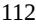

{112}------------------------------------------------

Although we maintain workers' compensation insurance to cover costs and expenses incurred due to on-the-job injuries to our employees and third party liability insurance for injuries caused by unexpected seepage, pollution or contamination, such insurance may not provide adequate coverage against potential liabilities. Furthermore, China may take steps towards the adoption of more stringent environmental regulations. Due to the possibility of unanticipated regulatory or other developments, the amount and timing of future environmental expenditures may vary substantially from those currently anticipated. If there is any unanticipated change in the environmental regulations, we may need to incur substantial capital expenditures to install, replace, upgrade or supplement our manufacturing facility and equipment or make operational changes to limit any adverse impact or potential adverse impact on the environment in order to comply with new environmental protection laws and regulations. If such costs become prohibitively expensive, we may be forced to cease certain aspects of our business operations.

### *Failure to comply with PRC regulations regarding the registration requirements for employee stock ownership plans or equity incentive plans may subject the PRC plan participants or us to fines and other legal or administrative sanctions.*

Under the applicable regulations and State Administration of Foreign Exchange of the People's Republic of China, or SAFE, rules, PRC citizens who participate in an employee stock ownership plan or a stock option plan in an overseas publicly listed company are required to register with SAFE and complete certain other procedures. In February 2012, SAFE promulgated the Notices on Issues concerning the Foreign Exchange Administration for Domestic Individuals Participating in Stock Incentive Plans of Overseas Publicly Listed Companies, or the Stock Option Rules, which replaced the Application Procedures of Foreign Exchange Administration for Domestic Individuals Participating in Employee Stock Ownership Plan or Stock Option Plans of Overseas Publicly Listed Companies issued by SAFE in March 2007. Pursuant to the Stock Option Rules, if a PRC resident participates in any stock incentive plan of an overseas publicly listed company, a qualified PRC domestic agent must, among other things, file on behalf of such participant an application with SAFE to conduct the SAFE registration with respect to such stock incentive plan and obtain approval for an annual allowance with respect to the purchase of foreign exchange in connection with the exercise or sale of stock options or stock such participant holds. Such participating PRC residents' foreign exchange income received from the sale of stock and dividends distributed by the overseas publicly listed company must be fully remitted into a PRC collective foreign currency account opened and managed by the PRC agent before distribution to such participants. We and our PRC resident employees who have been granted stock options or other stock-based incentives of ours are subject to the Stock Option Rules. If we or our PRC resident participants fail to comply with these regulations, we and/or our PRC resident participants may be subject to fines and legal sanctions.

### **Risks Related to Our Common Stock**

### *Our operating results may fluctuate significantly, which makes our future operating results difficult to predict and could cause our operating results to fall below expectations.*

Our quarterly and annual operating results may fluctuate significantly, which makes it difficult for us to predict our future operating results. These fluctuations may occur due to a variety of factors, many of which are outside of our control and may be difficult to predict, including but not limited to:

- the timing and cost of, and level of investment in, research, development, pre-commercial and, if approved, commercialization activities relating to our product candidates, which may change from time to time;
- the timing and status of enrollment for our clinical trials;
- the cost of manufacturing our product candidates, as well as building out our supply chain, which may vary depending on the quantity of production and the terms of our agreements with manufacturers;
- expenditures that we may incur to acquire, develop or commercialize additional product candidates and technologies;
- timing and amount of any milestone, royalty or other payments due under any collaboration or license agreement;
- future accounting pronouncements or changes in our accounting policies;

{113}------------------------------------------------

- the timing and success or failure of preclinical studies and clinical trials for our product candidates or competing product candidates, or any other change in the competitive landscape of our industry, including consolidation among our competitors or partners;
- the timing of receipt of approvals for, and the scope of or limitation on the marketing authorizations received on, our product candidates from regulatory authorities in the United States and internationally;
- coverage and reimbursement policies with respect to our product candidates, if approved, and potential future drugs that compete with our single agent and combination therapies;
- the level of demand for our product candidates, if approved, which may vary significantly over time; and
- the impact from COVID-19, which may have the effect of magnifying many of the factors described above.

The cumulative effects of these factors could result in large fluctuations and unpredictability in our quarterly and annual operating results. As a result, comparing our operating results on a period-to-period basis may not be meaningful. Investors should not rely on our past results as an indication of our future performance.

This variability and unpredictability could also result in our failing to meet the expectations of industry or financial analysts or investors for any period. If our revenue or operating results fall below the expectations of analysts or investors or below any forecasts we may provide to the market, or if any forecasts we provide to the market are below the expectations of analysts or investors, the price of our common stock could decline substantially. Such a stock price decline could occur even when we have met any previously publicly stated revenue or earnings guidance we may provide.

### *Our principal stockholders and management own a significant percentage of our stock and are able to exert significant influence over matters subject to stockholder approval.*

Based upon the number of shares of common stock outstanding as of March 3, 2023, our executive officers, directors, affiliated holders of 5% or more of our capital stock and their respective affiliates beneficially owned approximately 30.5% of our outstanding voting stock. These stockholders will have the ability to exert significant influence over our company through their ownership position. For example, these stockholders may be able to exercise significant influence over elections of directors, amendments of our organizational documents, or approval of any merger, sale of assets or other major corporate transaction. This may prevent or discourage unsolicited acquisition proposals or offers for our common stock that you may feel are in your best interest as one of our stockholders.

### *Our ability to use our net operating loss carryforwards and certain other tax attributes may be limited.*

Under Sections 382 and 383 of the Internal Revenue Code of 1986, as amended, if a corporation undergoes an "ownership change," generally defined as a greater than 50 percentage point change (by value) in its equity ownership by certain stockholders over a three-year period, the corporation's ability to use its pre-change net operating loss carryforwards, or NOLs and other pre-change tax attributes (such as research and development tax credits) to offset its post-change income or taxes may be limited. We may have experienced ownership changes in the past and may experience ownership changes as a result of our IPO and/or subsequent shifts in our stock ownership (some of which are outside our control). In addition, under current tax law, federal NOLs generated in periods after December 31, 2017 may be carried forward indefinitely but in taxable years beginning after December 31, 2020, may only be used to offset 80% of our taxable income. As a result, our ability to use our pre-change NOLs and tax credits to offset future taxable income, if any, could be subject to limitations. Similar provisions of state tax law may also apply. As a result, even if we attain profitability, we may be unable to use a material portion of our NOLs and tax credits.

### *Provisions in our charter documents and under Delaware law could discourage a takeover that stockholders may consider favorable and may lead to entrenchment of management.*

Our amended and restated certificate of incorporation and amended and restated bylaws contain provisions that could delay or prevent changes in control or changes in our management without the consent of our board of directors. These provisions include the following:

- a classified board of directors with three-year staggered terms, which may delay the ability of stockholders to change the membership of a majority of our board of directors;
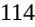

{114}------------------------------------------------

- no cumulative voting in the election of directors, which limits the ability of minority stockholders to elect director candidates;
- the exclusive right of our board of directors to elect a director to fill a vacancy, however occurring, including by an expansion of the board of directors, which prevents stockholders from being able to fill vacancies on our board of directors;
- the ability of our board of directors to authorize the issuance of shares of preferred stock and to determine the price and other terms of those shares, including voting or other rights or preferences, without stockholder approval, which could be used to significantly dilute the ownership of a hostile acquiror;
- the ability of our board of directors to alter our amended and restated bylaws without obtaining stockholder approval;
- the required approval of at least 66 2/3% of the shares entitled to vote at an election of directors to adopt, amend or repeal our amended and restated bylaws or repeal the provisions of our amended and restated certificate of incorporation regarding the election and removal of directors;
- a prohibition on stockholder action by written consent, which forces stockholder action to be taken at an annual or special meeting of our stockholders;
- the requirement that a special meeting of stockholders may be called only by the board of directors, which may delay the ability of our stockholders to force consideration of a proposal or to take action, including the removal of directors; and
- advance notice procedures that stockholders must comply with in order to nominate candidates to our board of directors or to propose matters to be acted upon at a stockholders' meeting, which may discourage or deter a potential acquiror from conducting a solicitation of proxies to elect the acquiror's own slate of directors or otherwise attempting to obtain control of us.

We are also subject to the anti-takeover provisions contained in Section 203 of the Delaware General Corporation Law. Under Section 203, a corporation may not, in general, engage in a business combination with any holder of 15% or more of its capital stock unless the holder has held the stock for three years or, among other exceptions, the board of directors has approved the transaction.

{115}------------------------------------------------

### *As a California-domiciled public company, we could potentially be required to have at least two or three women and a minimum number of directors from an underrepresented community on our board of directors, depending on the size of our board at the time.*

Our success depends in part on our continued ability to attract, retain and motivate highly qualified individuals to our board of directors. As a public company headquartered in California, under California Code Sections 301.3 and 301.4, we would have been required to have two or three women on our board of directors by the end of 2022, depending on the size of our board of directors. We also would have been required to have at least two or three directors from an underrepresented community by the end of 2022. Although California Code Sections 301.3 and 301.4 were deemed unconstitutional by California courts, it is possible those decisions may be overturned on appeal, with the potential result of the laws being reinstated. Although we currently have three women and two directors from an underrepresented community on the board of directors, if California Code Section 301.3 and 301.4 become effective, we could need to recruit additional directors to be in compliance, depending on the size of our board. Recruiting and retaining board members carries uncertainty, and failure to comply with this California requirement, if reinstated, will result in financial penalties.

### *Our amended and restated certificate of incorporation and amended and restated bylaws provide that the Court of Chancery of the State of Delaware is the exclusive forum for certain disputes between us and our stockholders, which could limit our stockholders' ability to obtain a favorable judicial forum for disputes with us or our directors, officers or employees.*

Our amended and restated certificate of incorporation and amended and restated bylaws provide that the Court of Chancery of the State of Delaware (or, in the event that the Court of Chancery does not have jurisdiction, the federal district court for the District of Delaware or other state courts of the State of Delaware) is the exclusive forum for any derivative action or proceeding brought on our behalf, any action asserting a claim of breach of fiduciary duty, any action asserting a claim against us arising pursuant to the Delaware General Corporation Law, our amended and restated certificate of incorporation or our amended and restated bylaws, or any action asserting a claim against us that is governed by the internal affairs doctrine; provided that, the exclusive forum provision will not apply to suits brought to enforce any liability or duty created by the Exchange Act or any other claim for which the federal courts have exclusive jurisdiction; and provided further that, if and only if the Court of Chancery of the State of Delaware dismisses any such action for lack of subject matter jurisdiction, such action may be brought in another state or federal court sitting in the State of Delaware. Our amended and restated certificate of incorporation and amended and restated bylaws also provide that the federal district courts of the United States of America are the exclusive forum for the resolution of any complaint asserting a cause of action against us or any of our directors, officers, employees or agents and arising under the Securities Act. Nothing in our amended and restated certificate of incorporation and amended and restated bylaws precludes stockholders that assert claims under the Exchange Act from bringing such claims in state or federal court, subject to applicable law.

This choice of forum provision may limit a stockholder's ability to bring a claim in a judicial forum that it finds favorable for disputes with us or any of our directors, officers, other employees or stockholders, which may discourage lawsuits with respect to such claims, although our stockholders will not be deemed to have waived our compliance with federal securities laws and the rules and regulations thereunder. Furthermore, the enforceability of similar choice of forum provisions in other companies' certificates of incorporation has been challenged in legal proceedings, and it is possible that a court could find these types of provisions to be inapplicable or unenforceable. While the Delaware courts have determined that such choice of forum provisions are facially valid, a stockholder may nevertheless seek to bring a claim in a venue other than those designated in the exclusive forum provisions, and there can be no assurance that such provisions will be enforced by a court in those other jurisdictions. If a court were to find the choice of forum provision that is contained in our amended and restated certificate of incorporation and amended and restated bylaws to be inapplicable or unenforceable in an action, we may incur additional costs associated with resolving such action in other jurisdictions, which could adversely affect our business and financial condition.

{116}------------------------------------------------

### *We do not currently intend to pay dividends on our common stock, and, consequently, your ability to achieve a return on your investment will depend on appreciation in the price of our common stock.*

We do not currently intend to pay any cash dividends on our common stock for the foreseeable future. We currently intend to invest our future earnings, if any, to fund our growth. Therefore, you are not likely to receive any dividends on your common stock for the foreseeable future. Since we do not intend to pay dividends, your ability to receive a return on your investment will depend on any future appreciation in the market value of our common stock. There is no guarantee that our common stock will appreciate or even maintain the price at which our holders have purchased it.

### **General Risk Factors**

### *Our stock price may be volatile and you may not be able to resell shares of our common stock at or above the price you paid.*

The trading price of our common stock could be highly volatile and could be subject to wide fluctuations in response to various factors, some of which are beyond our control. In particular, the trading prices for pharmaceutical, biopharmaceutical and biotechnology companies have been highly volatile. These factors include those discussed in this Item 1A. "Risk Factors" section of this Annual Report on Form 10-K and others such as:

- results from, and any delays in, our clinical trials for our clinical-stage drug candidates or any other future clinical development programs, including any delays related to the COVID-19 pandemic or any future pandemic or public health emergency;
- announcements of regulatory approval or disapproval of our current or any future product candidates;
- the failure or discontinuation of any of our research and development programs;
- the termination of any of our existing license agreements;
- announcements relating to any future licensing, collaboration or development agreements;
- delays in the commercialization of our current or any future product candidates;
- public misperception regarding the use of our product candidates;
- acquisitions and sales of new products or product candidates, technologies or businesses;
- manufacturing and supply issues related to our product candidates for clinical trials or future product candidates for commercialization;
- quarterly variations in our results of operations or those of our competitors;
- changes in earnings estimates or recommendations by securities analysts;
- announcements by us or our competitors related to new or existing products or drug candidates, significant contracts, commercial relationships, acquisitions or capital commitments;
- developments with respect to intellectual property rights;
- our commencement of, or involvement in, litigation;
- changes in financial estimates or guidance or publicly communicated corporate plans or strategy;
- any major changes in our board of directors or management, including any potential change in our CEO;
- new legislation or regulation in the United States or abroad relating to the sale or pricing of pharmaceuticals;
- the FDA or other U.S. or foreign regulatory actions affecting us or our industry or the indications for which we are developing our current or future product candidates;
- product liability claims or other litigation or public concern about the safety of our product candidates;
- market conditions in the pharmaceutical, biopharmaceutical and biotechnology sectors; and

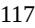

{117}------------------------------------------------

- general economic conditions in the United States and abroad, including as a result of an economic recession or depression and market volatility related to the COVID-19 pandemic and global health concerns.
In addition, the stock markets in general, and the markets for pharmaceutical, biopharmaceutical and biotechnology stocks in particular, have experienced extreme volatility that may have been unrelated to the operating performance of the issuer. These broad market fluctuations may adversely affect the trading price or liquidity of our common stock.

### *We have incurred and will continue to incur significant costs as a result of operating as a public company, and our management devotes substantial time to new compliance initiatives. We may fail to comply with the rules that apply to public companies, including Section 404 of the Sarbanes-Oxley Act of 2002, or Section 404, which could result in sanctions or other penalties that could materially and adversely affect our business, financial condition, results of operations and prospects.*

We have incurred and will continue to incur significant legal, accounting and other expenses as a public company, including costs resulting from public company reporting obligations under the Exchange Act and regulations regarding corporate governance practices. The listing requirements of The Nasdaq Stock Market LLC and the rules of the Securities and Exchange Commission, or SEC, require that we satisfy certain corporate governance requirements relating to director independence, filing annual and interim reports, stockholder meetings, approvals and voting, soliciting proxies, conflicts of interest and a code of conduct. Our management and other personnel need to devote a substantial amount of time to ensure that we comply with all of these requirements. Moreover, the reporting requirements, rules and regulations increase our legal and financial compliance costs and make some activities more time-consuming and costly. These reporting requirements, rules and regulations, coupled with the increase in potential litigation exposure associated with being a public company, also make it more difficult for us to attract and retain qualified persons to serve on our board of directors or board committees or to serve as executive officers, or to obtain certain types of insurance, including directors' and officers' insurance, on acceptable terms.

We are subject to Section 404 and the related rules of the SEC, which generally require our management and independent registered public accounting firm to report on the effectiveness of our internal control over financial reporting. Section 404 requires an annual management assessment of the effectiveness of our internal control over financial reporting. However, for so long as we remain an emerging growth company as defined in the JOBS Act, we intend to take advantage of certain exemptions from various reporting requirements that are available to emerging growth companies, including, but not limited to, not being required to comply with the auditor attestation requirements of Section 404. Once we are no longer an emerging growth company or, if prior to such date, we opt to no longer take advantage of the applicable exemption, we will be required to include an opinion from our independent registered public accounting firm on the effectiveness of our internal control over financial reporting.

During the course of our review and testing, we may identify deficiencies and be unable to remediate them before we must provide the required reports. Furthermore, if we identify any material weaknesses, or even if we do not identify a material weakness but one exists, we may not detect those errors on a timely basis and our financial statements may be materially misstated. We or our independent registered public accounting firm may not be able to conclude on an ongoing basis that we have effective internal control over financial reporting, which could materially and adversely affect our business, financial condition, results of operations and prospects, cause investors to lose confidence in our reported financial information and cause the trading price of our stock to fall. In addition, as a public company we will be required to file accurate and timely quarterly and annual reports with the SEC under the Exchange Act. In order to report our results of operations and financial statements on an accurate and timely basis, we will depend in part on CROs and other third parties to provide timely and accurate notice of their costs to us. Any failure to report our financial results on an accurate and timely basis could result in sanctions, lawsuits, delisting of our shares from the Nasdaq Global Market or other adverse consequences that would materially and adversely affect our business, financial condition, results of operations and prospects.

{118}------------------------------------------------

### *We are an "emerging growth company," and as a result of the reduced disclosure and governance requirements applicable to emerging growth companies, our common stock may be less attractive to investors.*

We are an "emerging growth company," as defined in the JOBS Act, and we intend to take advantage of certain exemptions from various reporting requirements that are available to emerging growth companies including, but not limited to, not being required to comply with the auditor attestation requirements of Section 404, reduced disclosure obligations regarding executive compensation in our periodic reports and proxy statements and exemptions from the requirements of holding a nonbinding advisory vote on executive compensation and stockholder approval of any golden parachute payments not previously approved. In addition, as an "emerging growth company," the JOBS Act allows us to delay adoption of new or revised accounting pronouncements applicable to public companies until such pronouncements are made applicable to private companies. We have elected to use this extended transition period under the JOBS Act. As a result, our consolidated financial statements may not be comparable to the financial statements of issuers who are required to comply with the effective dates for new or revised accounting standards that are applicable to public companies, which may make comparison of our financials to those of other public companies more difficult.

We cannot predict if investors will find our common stock less attractive because we will rely on these exemptions. If some investors find our common stock less attractive as a result, there may be a less active trading market for our common stock and our stock price may be more volatile. We may take advantage of these reporting exemptions until we are no longer an emerging growth company. We will remain an emerging growth company until the earlier of (1) the last day of the fiscal year following the fifth anniversary of the consummation of our IPO, (2) the last day of the fiscal year in which we have total annual gross revenue of at least \$1.235 billion, (3) the last day of the fiscal year in which we are deemed to be a "large accelerated filer" as defined in Rule 12b-2 under the Securities Exchange Act of 1934, as amended, or the Exchange Act, which would occur if the market value of our common stock held by non-affiliates exceeded \$700.0 million as of the last business day of the second fiscal quarter of such year, or (4) the date on which we have issued more than \$1.0 billion in non-convertible debt securities during the prior three-year period.

#### *Unfavorable global economic or political conditions could adversely affect our business, financial condition or results of operations.*

Our business is susceptible to general conditions in the global economy and in the global financial markets. A global financial crisis or a global or regional political disruption could cause extreme volatility in the capital and credit markets. A severe or prolonged economic downturn, including a recession or depression resulting from the current COVID-19 pandemic or any future pandemic, or political disruption could result in a variety of risks to our business, including weakened demand for our current or future product candidates, if approved, and our ability to raise additional capital when needed on acceptable terms, if at all. A weak or declining economy or political disruption could also strain our manufacturers or suppliers, possibly resulting in supply disruption, or cause our customers to delay making payments for our potential drugs, if approved. Any of the foregoing could materially and adversely affect our business, financial condition, results of operations and prospects, and we cannot anticipate all of the ways in which the political or economic climate and financial market conditions could adversely impact our business.

### *If securities or industry analysts do not publish research or reports about our business, or if they issue an adverse or misleading opinion regarding our stock, our stock price and trading volume could decline.*

The trading market for our common stock is influenced by the research and reports that industry or securities analysts publish about us or our business. We do not have any control over these analysts or what they publish, and we may have limited opportunity to communicate with them during certain times of the year. There can be no assurance that analysts will continue to cover us, cover us accurately, or provide favorable coverage. In the event any of the analysts who cover us issue an adverse or misleading opinion, or fail to correct an error in their reports or statements, about us, our business model, our intellectual property or our stock performance, or if our clinical trials and operating results fail to meet the expectations of analysts, our stock price would likely decline. If one or more of these analysts cease coverage of us or fail to publish reports on us regularly, we could lose visibility in the financial markets, which in turn could cause our stock price or trading volume to decline.

{119}------------------------------------------------

#### *If we are unable to protect the confidentiality of our trade secrets, our business and competitive position would be harmed.*

We rely on the protection of our trade secrets, including unpatented know-how, technology and other proprietary information. We have taken steps to protect our trade secrets and unpatented know-how, including entering into confidentiality agreements with third parties, and confidential information and inventions agreements with employees, consultants and advisors. Despite these efforts, we cannot provide any assurances that all such agreements have been duly executed, and any of these parties may breach the agreements and disclose our proprietary information, including our trade secrets, and we may not be able to obtain adequate remedies for such breaches. In addition to contractual measures, we try to protect the confidential nature of our proprietary information using commonly accepted physical and technological security measures. Even though we use commonly accepted security measures, the criteria for protection of trade secrets can vary among different jurisdictions. Additionally, such security measures may not provide adequate protection for our proprietary information, for example, in the case of misappropriation of a trade secret by an employee, consultant, customer or third party with authorized access. Recourse we take against such misconduct may not provide an adequate remedy to fully protect our interests. Monitoring unauthorized uses and disclosures is difficult, and we do not know whether the steps we have taken to protect our proprietary technologies will be effective. Unauthorized parties may also attempt to copy or reverse engineer certain aspects of our product candidates that we consider proprietary.

Enforcing a claim that a party illegally disclosed or misappropriated a trade secret is difficult, expensive and time-consuming, and the outcome is unpredictable. In addition, some courts inside and outside the United States are less willing or unwilling to protect trade secrets. Moreover, third parties may still obtain this information or may come upon this or similar information independently, and we would have no right to prevent them from using that technology or information to compete with us. Trade secrets will over time be disseminated within the industry through independent development, the publication of journal articles and the movement of personnel skilled in the art from company to company or academic to industry scientific positions. Though our agreements with third parties typically restrict the ability of our advisors, employees, collaborators, licensors, suppliers, third-party contractors and consultants to publish data potentially relating to our trade secrets, our agreements may contain certain limited publication rights. If any of our trade secrets were to be lawfully obtained or independently developed by a competitor, we would have no right to prevent such competitor from using that technology or information to compete with us, which could harm our competitive position. Because from time to time we expect to rely on third parties in the development, manufacture and distribution of our product candidates, we must, at times, share trade secrets with them. Despite employing the contractual and other security precautions described above, the need to share trade secrets increases the risk that such trade secrets become known by our competitors, are inadvertently incorporated into the technology of others, or are disclosed or used in violation of these agreements. If any of these events occurs or if we otherwise lose protection for our trade secrets, the value of this information may be greatly reduced and our competitive position would be harmed. If we do not apply for patent protection prior to such publication or if we cannot otherwise maintain the confidentiality of our proprietary technology and other confidential information, then our ability to obtain patent protection or to protect our trade secret information may be jeopardized.

{120}------------------------------------------------

### *If our trademarks and trade names are not adequately protected, then we may not be able to build name recognition in our markets of interest and our business may be adversely affected.*

Our current or future trademarks or trade names may be challenged, infringed, circumvented or declared generic or descriptive determined to be infringing on other marks. We may not be able to protect our rights to these trademarks and trade names or may be forced to stop using these names, which we need for name recognition by potential partners or customers in our markets of interest. During trademark registration proceedings, we may receive rejections of our applications by the USPTO or in other foreign jurisdictions. Although we would be given an opportunity to respond to those rejections, we may be unable to overcome such rejections. In addition, in the USPTO and in comparable agencies in many foreign jurisdictions, third parties are given an opportunity to oppose pending trademark applications and to seek to cancel registered trademarks. Opposition or cancellation proceedings may be filed against our trademarks, and our trademarks may not survive such proceedings. If we are unable to establish name recognition based on our trademarks and trade names, we may not be able to compete effectively and our business may be adversely affected. We may license our trademarks and trade names to third parties, such as distributors. Though these license agreements may provide guidelines for how our trademarks and trade names may be used, a breach of these agreements or misuse of our trademarks and tradenames by our licensees may jeopardize our rights in or diminish the goodwill associated with our trademarks and trade names.

Moreover, any name we have proposed to use with our product candidates in the United States must be approved by the FDA, regardless of whether we have registered it, or applied to register it, as a trademark. Similar requirements exist in Europe. The FDA typically conducts a review of proposed product names, including an evaluation of potential for confusion with other product names. If the FDA (or an equivalent administrative body in a foreign jurisdiction) objects to any of our proposed proprietary single-agent or combination therapy names, it may be required to expend significant additional resources in an effort to identify a suitable substitute name that would qualify under applicable trademark laws, not infringe the existing rights of third parties and be acceptable to the FDA. Furthermore, in many countries, owning and maintaining a trademark registration may not provide an adequate defense against a subsequent infringement claim asserted by the owner of a senior trademark. At times, competitors or other third parties may adopt trade names or trademarks similar to ours, thereby impeding our ability to build brand identity and possibly leading to market confusion. In addition, there could be potential trade name or trademark infringement claims brought by owners of other registered trademarks or trademarks that incorporate variations of our registered or unregistered trademarks or trade names. If we assert trademark infringement claims, a court may determine that the marks we have asserted are invalid or unenforceable, or that the party against whom we have asserted trademark infringement has superior rights to the marks in question. In this case, we could ultimately be forced to cease use of such trademarks.

### *Future sales and issuances of our common stock could and would likely result in additional dilution of the percentage ownership of our stockholders and could cause our share price to fall.*

We may from time to time issue additional shares of common stock at a discount from the current trading price of our common stock. As a result, our stockholders would experience immediate dilution upon the purchase of any shares of our common stock sold at such discount. In addition, as opportunities present themselves, we may enter into financing or similar arrangements in the future, including the issuance of debt securities, preferred stock or common stock. If we issue common stock or securities convertible into common stock, our common stockholders would experience additional dilution and, as a result, our stock price may decline.

#### *We may be subject to securities litigation, which is expensive and could divert our management's attention.*

In the past, companies that have experienced volatility in the market price of their securities have been subject to securities class action litigation. We may be the target of this type of litigation in the future. Regardless of the merits or the ultimate results of such litigation, securities litigation brought against us could result in substantial costs and divert our management's attention from other business concerns.

{121}------------------------------------------------

### *Claims for indemnification by our directors and officers may reduce our available funds to satisfy successful third-party claims against us and may reduce the amount of money available to us.*

Our amended and restated certificate of incorporation and amended and restated bylaws provide that we will indemnify our directors and officers, in each case to the fullest extent permitted by Delaware law.

In addition, as permitted by Section 145 of the Delaware General Corporation Law, our amended and restated bylaws and our indemnification agreements that we have entered into with our directors and officers provide that:

- we will indemnify our directors and officers for serving us in those capacities or for serving other business enterprises at our request, to the fullest extent permitted by Delaware law. Delaware law provides that a corporation may indemnify such person if such person acted in good faith and in a manner such person reasonably believed to be in or not opposed to the best interests of the registrant and, with respect to any criminal proceeding, had no reasonable cause to believe such person's conduct was unlawful;
- we may, in our discretion, indemnify employees and agents in those circumstances where indemnification is permitted by applicable law;
- we are required to advance expenses, as incurred, to our directors and officers in connection with defending a proceeding, except that such directors or officers shall undertake to repay such advances if it is ultimately determined that such person is not entitled to indemnification;
- we will not be obligated pursuant to our amended and restated bylaws to indemnify a person with respect to proceedings initiated by that person against us or our other indemnitees, except with respect to proceedings authorized by our board of directors or brought to enforce a right to indemnification;
- the rights conferred in our amended and restated bylaws are not exclusive, and we are authorized to enter into indemnification agreements with our directors, officers, employees and agents and to obtain insurance to indemnify such persons; and
- we may not retroactively amend our amended and restated bylaw provisions to reduce our indemnification obligations to directors, officers, employees and agents.

While we maintain a directors' and officers' insurance policy, such insurance may not be adequate to cover all liabilities that we may incur, which may reduce our available funds to satisfy third-party claims and may adversely impact our cash position.

### **Item 1B. Unresolved Staff Comments.**

None.

### **Item 2. Properties.**

We lease approximately 9,750 square feet of space for our current headquarters in Foster City, California under an agreement that expires in October 2024. The Company has the option to extend the lease agreement for a period of five years. Additionally, the Company leases office space in Shanghai and Suzhou China. We believe that our existing facilities are adequate to meet our current needs, and that suitable additional alternative spaces will be available in the future on commercially reasonable terms.

### **Item 3. Legal Proceedings.**

From time to time, we may be involved in legal proceedings or subject to claims incident to the ordinary course of business. While the outcome of any such proceedings cannot be predicted with certainty, as of December 31, 2022, we were not a party to any litigation or legal proceedings that, in the opinion of our management, are probable to have a material adverse effect on our business. Regardless of the outcome, such proceedings or claims can have an adverse impact on us because of defense and settlement costs, diversion of resources and other factors.

### **Item 4. Mine Safety Disclosures.**

None.

{122}------------------------------------------------

#### **PART II**

#### **Item 5. Market for Registrant's Common Equity, Related Stockholder Matters and Issuer Purchases of Equity Securities.**

#### **Market Information**

Our common stock has been listed on the Nasdaq Global Select Market since February 5, 2021 under the symbol "TERN." Prior to such time, there was no public market for our common stock.

#### **Holders of Record**

As of March 3, 2023, there were approximately 9 stockholders of record of our common stock. Certain shares are held in "street" name and thus the actual number of beneficial owners of such shares is not known or included in the foregoing number.

#### **Dividend Policy**

We have never declared or paid cash dividends on our capital stock, and we do not currently intend to pay any cash dividends on our capital stock in the foreseeable future. We currently intend to retain all available funds and any future earnings, if any, to fund the development and expansion of our business. Any future determination related to dividend policy will be made at the discretion of our board of directors, subject to applicable laws, and will depend upon, among other factors, our results of operations, financial condition, contractual restrictions and capital requirements.

#### **Securities Authorized for Issuance under Equity Compensation Plans**

Information about our equity compensation plans is incorporated herein by reference to Item 12 of Part III of this Annual Report on Form 10-K.

#### **Use of Proceeds from Public Offering of Common Stock**

In February 2021, we completed our initial public offering, or IPO, and issued an aggregate of 8,625,000 shares of our common stock at a price of \$17.00 per share, including the exercise in full of the underwriters' option to purchase additional shares of our common stock. We received net proceeds from the IPO of \$133.0 million, after deducting underwriting discounts and commissions of \$10.3 million and offering expenses of \$3.3 million. None of the expenses associated with the IPO were paid to directors, officers, persons owning 10% or more of any class of equity securities, or to their associates. J.P. Morgan Securities LLC, Goldman Sachs & Co. LLC and Cowen and Company, LLC acted as book-running managers for the IPO.

Since the completion of our IPO, our common stock is traded on the Nasdaq Global Select Market. The offer and sale of the shares were registered under the Securities Act on a registration statement on Form S-1 (Registration No. 333- 252180), which was declared effective on February 4, 2021.

We have used approximately \$19.7 million of the net proceeds from our IPO as of December 31, 2022. The net proceeds from our IPO are being used, together with our cash and cash equivalents to fund continued advancement of our product pipeline, working capital and other general corporate purposes. There has been no material change in the planned use of proceeds from our IPO as described in the related prospectus filed with the SEC pursuant to Rule 424(b)(4) under the Securities Act. We invested the funds received in cash equivalents and other marketable securities in accordance with our investment policy.

#### **Issuer Purchases of Equity Securities**

None.

**Item 6. Reserved.**

{123}------------------------------------------------

#### **Item 7. Management's Discussion and Analysis of Financial Condition and Results of Operations.**

*The following discussion and analysis of our financial condition and results of operations should be read in conjunction with our consolidated financial statements and related notes included elsewhere in this Annual Report on Form 10-K. In addition to historical financial information, this discussion contains forward-looking statements based upon current expectations that involve risks and uncertainties. Our actual results could differ materially from those anticipated in these forward-looking statements as a result of various factors, including those set forth under "Special Note Regarding Forward-Looking Statements" and "Risk Factors" and elsewhere in this Annual Report on Form 10-K. Our fiscal year ends on December 31 each year.*

#### **Overview**

We are a clinical-stage biopharmaceutical company developing a portfolio of small-molecule product candidates to address serious diseases, including oncology and metabolic diseases such as NASH, and obesity. Our programs are based on mechanisms of action that have achieved proof-ofconcept in clinical trials in indications with large unmet needs. The most advanced product candidates in our pipeline – TERN-701, TERN-501 and TERN-601– were internally discovered. TERN-701 is our allosteric BCR-ABL TKI that is in clinical development in China for CML, a form of cancer that starts in bone marrow. We intend to initiate a Phase 1 clinical trial for TERN-701 in the United States in the second half of 2023. TERN-501 is our highly selective THR-β agonist for NASH in Phase 2a development with top-line data expected in the third quarter of 2023. TERN-601 is our small-molecule GLP-1R agonist for metabolic diseases such as obesity, with the goal of initiating a first-in-human clinical trial in the second half of 2023. Additionally, we have an ongoing discovery effort for the TERN-800 series of small-molecule GIPR modulators for obesity, which have the potential for combination with GLP-1 receptor agonists.

TERN-701 is our proprietary, oral, potent, allosteric BCR-ABL TKI specifically targeting the ABL myristoyl pocket for chronic myeloid leukemia. CML, a form of cancer that begins in the bone marrow and leads to growth of leukemic cells, is classified as an orphan indication. The SOC for CML includes active-site TKIs including imatinib, nilotinib, dasatinib, bosutinib and ponatinib. However, an unmet medical need remains due to (1) an increasing number of patients becoming refractory or intolerant to the current SOC, (2) BCR-ABL mutations that are difficult for active-site TKIs to treat (e.g., T315I), or (3) safety warnings for active-site TKIs used in CML patients who are resistant or intolerant to prior TKI therapy. Allosteric TKIs, which bind to the myristoyl-binding pocket, represent a new treatment class for CML and have the potential to address active-site TKI shortcomings, including off-target activity and limited efficacy against active site resistance mutations. TERN-701 aims to address the limitations of active-site TKIs with the goal of achieving improved tumor suppression through a combination of (1) potent activity against BCR-ABL including a broad range of mutations, and (2) improved safety and tolerability profiles. Survival rates and treatment durations for people living with CML continue to increase. As a result, physicians are seeking additional efficacious therapies for people whose tolerability, co-morbidity and/or drug-drug interaction profiles change over time, limiting their available treatment options, quality of life and the effectiveness of mainstay therapies. In July 2020, Hansoh in-licensed TERN-701 for development in the greater China region. TERN-701 is referred to by Hansoh as HS-10382. Hansoh is responsible for all development costs in the greater China region, including the ongoing Phase 1 trial. We retain all worldwide development and commercialization rights for TERN-701 outside of greater China. We expect our Phase 1 trial for TERN-701 to start in the second half of 2023, and intend to include sites from the United States, Europe and other countries, with potential interim top-line readouts from initial cohorts in 2024. An enrollment progress update for the ongoing China Phase 1 trial is anticipated as part of a trial-in-progress poster presentation that has been submitted to an upcoming oncology conference in mid-2023.

{124}------------------------------------------------

Our second clinical stage program is TERN-501, a Thyroid Hormone Receptor beta, or THR-β, agonist with high metabolic stability, enhanced liver distribution and greater selectivity for THR-β compared to other THR-β agonists in development. In November 2021, we announced positive top-line data from a Phase 1 clinical trial of TERN-501 in healthy volunteers with mildly elevated low-density lipoprotein, or LDL, cholesterol. This Phase 1 trial included SAD, MAD and drug-drug interaction (DDI) cohorts evaluating the safety, tolerability, pharmacodynamics and pharmacokinetics of TERN-501. In the SAD and MAD cohorts, single and multiple doses of TERN-501 were generally well-tolerated with a similar incidence of AEs across all TERN-501 treatment groups and placebo. All AEs were mild to moderate with no apparent dose relationship, with no treatment-emergent serious AEs and no discontinuations of study or study drug due to any AE. There were no cardiac safety signals, no incidence of diarrhea and no differences between TERN-501 groups and placebo in change from baseline in heart rate, blood pressure or other vital signs. Based on this, we believe that TERN-501 has the potential to have a differentiated safety and tolerability profile compared to other THR-β agonists that have observed gastrointestinal and cardiovascular safety findings in Phase 1 and Phase 2 trials. Thyroid function test results were consistent with THR-β agonists currently in clinical development, and there were no findings of clinical hyper- or hypo-thyroidism. There were no differences between placebo and any TERN-501 dose group in liver function abnormalities or mean change from baseline in liver transaminases at Day 15 in the MAD cohorts. TERN-501 demonstrated a predictable pharmacokinetic profile with low variability: study drug plasma exposures were linear and approximately dose-proportional with no overlap between dose strengths. Significant effects on sex hormone binding globulin, or SHBG, a key pharmacodynamic marker of THR-β engagement linked to NASH histologic efficacy, were observed following treatment with TERN-501. The SHBG increases observed with 14 days of TERN-501 treatment were significant, dose dependent and have been associated with robust reductions in magnetic resonance imaging proton density fat fraction, or MRI-PDFF, and NAFLD Activity Score in a precedent late-stage clinical NASH trial. The overall pharmacokinetic profile from this trial indicates that TERN-501 is well-suited for co-formulation with other small-molecule NASH agents as an oral, once-daily fixed dose combination. In the DDI cohort, the combination of TERN-101 and TERN-501 was well-tolerated. Preliminary pharmacokinetic results support the co-administration of TERN-101 and TERN-501 in NASH patients, with no apparent need for dose adjustment. We initiated the Phase 2a DUET clinical trial in NASH patients including both monotherapy and combination arms of TERN-501 and TERN-101 in in July 2022. Enrollment was completed in February 2023, and top-line data are expected in the third quarter of 2023.

We are also discovering and developing oral small-molecule glucagon-like peptide-1 receptor (GLP-1R) agonists for the treatment of obesity. Our lead molecule, TERN-601, is a potent GLP-1R agonist biased towards cAMP generation. We are conducting investigational new drug application (IND) enabling activities for TERN-601 with the goal of initiating a first-in-human clinical trial in the second half of 2023 and announcing top-line data in 2024. We expect that this Phase 1 clinical program for TERN-601 will include a SAD trial in healthy volunteers and a MAD proof-of-concept trial in healthy volunteers with elevated BMI. The MAD trial is expected to assess changes in body weight and glycemic control parameters, such as HbA1c, over 28 days. Each of our GLP-1 candidate structures is believed to be suitable for oral administration as a single agent or in combination with other drug candidates, such as small molecule GIPR modulators. In addition to TERN-601, efforts are currently underway to nominate and develop structurally distinct secondgeneration small molecule GLP-1R agonists.

Since the commencement of our operations, we have devoted substantially all of our resources to research and development activities, organizing and staffing our company, business planning, raising capital, establishing and maintaining our intellectual property portfolio, conducting preclinical studies and clinical trials and providing general and administrative support for these operations.

In February 2021, we completed our initial public offering pursuant to which we issued 8,625,000 shares of our common stock at a price per share of \$17.00 for total net proceeds of \$133.0 million. In August 2022, we issued 12,250,000 shares of our common stock at a price of \$2.42 per share and, to certain investors in lieu of common stock, pre-funded warrants to purchase 14,630,000 shares of common stock at a price of \$2.4199 per pre-funded warrant for total net proceeds of \$60.7 million. In December 2022, we issued 11,902,500 shares of our common stock at a price per share of \$7.25 for total net proceeds of \$80.8 million.

{125}------------------------------------------------

We do not have any product candidates approved for commercial sale, and we have not generated any revenue from product sales. Our ability to generate product revenue sufficient to achieve profitability, if ever, will depend on the successful development and eventual commercialization of one or more of our product candidates which we expect, if it ever occurs, will take a number of years. We will not generate any revenue from product sales unless and until we successfully complete clinical development and obtain regulatory approval for one or more of our product candidates. If we obtain regulatory approval for any of our product candidates, we expect to incur significant expenses related to developing our internal commercialization capability to support product sales, marketing and distribution.

We do not own or operate, and currently have no plans to establish, any manufacturing facilities. We rely, and expect to continue to rely, on third parties for the manufacture of our product candidates for preclinical and clinical testing, as well as for commercial manufacturing if any of our product candidates obtain marketing approval. We believe that this strategy allows us to maintain a more efficient infrastructure by eliminating the need for us to invest in our own manufacturing facilities, equipment and personnel while also enabling us to focus our expertise and resources on the development of our product candidates.

#### **COVID-19 developments**

The coronavirus disease 2019, or COVID-19, pandemic continues to evolve. The COVID-19 pandemic continues to impact countries worldwide, including the United States and China where we have business operations. The extent of the impact of the COVID-19 pandemic on our business, operations and development timelines and plans remains uncertain, and will depend on future developments, including the duration and continuation of the outbreak and its impact on our development activities, planned clinical trial enrollment, future trial sites, contract research organizations, or CROs, third-party manufacturers and other third parties with whom we do business, as well as its impact on regulatory authorities and our key scientific and management personnel.

The ultimate impact of the COVID-19 pandemic or a similar health epidemic is highly uncertain and will depend on future developments, including the duration and/or severity of the outbreak, the impact of any resurgences and new variants that emerge, actions by the government authorities to contain the spread of the virus, the availability, adoption and effectiveness of any vaccines and when and to what extent normal economic and operating conditions can resume. To the extent possible, we are and plan to conduct business as usual, with any necessary or advisable modifications to employee travel and to the on-site and in-person activities of our personnel. We will continue to actively monitor the evolving situation related to the COVID-19 pandemic and will take necessary actions that alter our operations, including those that may be required by federal, state or local authorities in the United States and China, or that we determine are in the best interest of our employees and other third parties with whom we do business. At this point, the extent to which the COVID-19 pandemic will affect our business, operations and development timelines and plans, including the resulting impact on our expenditures and capital needs, remains uncertain.

{126}------------------------------------------------

### **Results of operations**

The following table summarizes our results of operations for the years ended December 31, 2022 and 2021:

|                             | Year Ended December 31, |           |      |           |        |           |  |
|-----------------------------|-------------------------|-----------|------|-----------|--------|-----------|--|
| (in thousands)              |                         | 2022      | 2021 |           | Change |           |  |
| Results of Operations       |                         |           |      |           |        |           |  |
| Revenue:                    |                         |           |      |           |        |           |  |
| License revenue             | \$                      | —         | \$   | 1,000     | \$     | (1,000 )  |  |
| Operating expenses:         |                         |           |      |           |        |           |  |
| Research and development    |                         | 39,617    |      | 31,311    |        | 8,306     |  |
| General and administrative  |                         | 22,412    |      | 19,549    |        | 2,863     |  |
| Total operating expenses    |                         | 62,029    |      | 50,860    |        | 11,169    |  |
| Loss from operations        |                         | (62,029 ) |      | (49,860 ) |        | (12,169 ) |  |
| Other income:               |                         |           |      |           |        |           |  |
| Interest income             |                         | 2,110     |      | 170       |        | 1,940     |  |
| Other (expense) income, net |                         | (68 )     |      | 40        |        | (108 )    |  |
| Total other income, net     |                         | 2,042     |      | 210       |        | 1,832     |  |
| Loss before income taxes    |                         | (59,987 ) |      | (49,650 ) |        | (10,337 ) |  |
| Income tax expense          |                         | (358 )    |      | (508 )    |        | 150       |  |
| Net loss                    | \$                      | (60,345 ) | \$   | (50,158 ) | \$     | (10,187 ) |  |

*Revenue*

To date, we have not generated, and do not expect to generate for the foreseeable future, any revenue from the sale of products. We may generate revenue from pre-specified clinical, regulatory and sales milestones as part of an exclusive option and license agreement for TERN-701 in greater China with Hansoh Healthtech Co., Ltd. and Jiangsu Hansoh Pharmaceutical Group Company Ltd. (collectively, Hansoh).

The decrease in revenue for the year ended December 31, 2022, compared to the same period in 2021, was due to Hansoh exercising its exclusive option in 2021 pursuant to the exclusive option and license agreement which resulted in our recognition of \$1.0 million of revenue.

#### *Research and development expenses*

Research and development expenses account for a significant portion of our operating expenses and consist primarily of external and internal expenses incurred in connection with the discovery and development of our product candidates. To date, our research and development expenses have related primarily to discovery efforts, preclinical and clinical development of our product candidates. Research and development expenses are recognized as incurred and payments made prior to the receipt of goods or services to be used in research and development are capitalized until the goods or services are received. Costs for certain activities, such as manufacturing and preclinical studies and clinical trials, are generally recognized based on an evaluation of the progress to completion of specific tasks using information and data provided to us by our vendors and collaborators.

### External expenses include:

- expenses incurred in connection with the discovery, preclinical and clinical development of our product candidates, including those incurred under agreements with third parties, such as consultants and CROs;
- the cost of manufacturing products for use in our preclinical studies and clinical trials, including payments to contract manufacturing organizations, or CMOs, and consultants;
- the costs of funding research performed by third-party vendors for performing preclinical testing on our behalf;
- the costs of purchasing lab supplies and non-capital equipment used in designing, developing and manufacturing preclinical study and clinical trial materials;

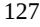

{127}------------------------------------------------

- costs associated with consultants for chemistry, manufacturing and controls development, regulatory, statistics and other services;
- expenses related to regulatory activities, including filing fees paid to regulatory agencies; and
- facility costs including rent, depreciation and maintenance expenses.

We may also incur in-process research and development expense as we acquire or in-license assets from other parties. Technology acquisitions are expensed or capitalized based upon the asset achieving technological feasibility in accordance with management's assessment regarding the ultimate recoverability of the amounts paid and the potential for alternative future use.

Internal expenses include employee and personnel-related costs and expenses, including salaries, benefits and stock-based compensation expense for employees and personnel engaged in research and development functions. We use internal resources primarily to oversee the research and discovery as well as for managing our preclinical development, process development, manufacturing and clinical development activities.

Our direct research and development expenses consist primarily of external costs, such as fees paid to outside consultants, CROs and CMOs in connection with our preclinical development, manufacturing and clinical development activities. Our direct research and development expenses also include fees incurred under our license agreements.

We expect our research and development expenses to increase substantially in absolute dollars for the foreseeable future as we advance our product candidates or any other future product candidates we may develop into and through preclinical studies and clinical trials and pursue regulatory approval of our product candidates. The process of conducting the necessary clinical research to obtain regulatory approval is costly and time-consuming. The actual probability of success for our product candidates or any other future product candidate that we may develop may be affected by a variety of factors including: the safety and efficacy of our product candidates, early clinical data, investment in our clinical program, the ability of collaborators to successfully develop our licensed product candidates, competition, manufacturing capability and commercial viability. We may never succeed in achieving regulatory approval for our product candidates. As a result of the uncertainties discussed above, we are unable to determine the duration and completion costs of our research and development projects or when and to what extent we will generate revenue from the commercialization and sale of our product candidates or any other future product candidates we may develop. The duration, costs and timing of preclinical studies and clinical trials and development of our product candidates will depend on a variety of factors.

The increase in research and development expenses for the year ended December 31, 2022, compared to the same period in 2021, was primarily due to a \$4.6 million increase in personnel-related expenses due to higher headcount and a \$3.6 million increase related to clinical and pre-clinical program expenses.

#### *General and administrative expenses*

General and administrative expenses consist primarily of personnel-related expenses, including salaries, benefits and stock-based compensation expense, for personnel in executive, finance, accounting, business development, legal, human resources and other administrative functions. General and administrative expenses also include corporate facility costs, depreciation and other expenses, which include direct or allocated expenses for rent and maintenance of facilities and insurance, not otherwise included in research and development expenses, as well as professional fees for legal, patent, consulting, investor and public relations, accounting and tax services.

We expect that our general and administrative expenses will increase in the foreseeable future as we increase our headcount to support the continued research and development of our programs and the growth of our business. We also anticipate incurring additional expenses associated with operating as a public company, including increased expenses related to accounting, legal and regulatory matters, compliance, director and officer insurance, investor and public relations and tax-related services associated with maintaining compliance with the rules and regulations of the SEC and standards applicable to companies listed on a national securities exchange.

The increase in general and administrative expenses for the year ended December 31, 2022, compared to the same period in 2021, was primarily due to a \$2.4 million increase in personnel-related expenses due to higher headcount and a \$0.6 million increase in insurance, legal, information technology and other professional services consulting.

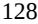

{128}------------------------------------------------

#### *Interest income*

Interest income primarily consists of interest income on our marketable securities.

Interest income for the year ended December 31, 2022 was \$2.1 million compared to \$0.2 million for the same period in 2021. The increase in interest income was primarily due to an increase in interest rates.

#### *Other (expense) income, net*

Other (expense) income, net for the year ended December 31, 2022 was less than \$0.1 million of expense compared to less than \$0.1 million of income for the same period in 2021.

#### *Income tax expense*

Income tax expense for the year ended December 31, 2022 was \$0.4 million compared to \$0.5 million for the same period in 2021.

#### **Liquidity and capital resources**

#### *Uses of cash*

Our primary use of cash is to fund operating expenses, which consist primarily of research and development expenditures and general and administrative expenditures. Cash used to fund operating expenses is impacted by the timing of when we pay these expenses, as reflected in the change in our outstanding accounts payable and accrued expenses.

We believe that our existing cash and cash equivalents will be sufficient to fund our planned operating expenses and capital expenditures into 2026, including three clinical data readouts from our three lead programs. However, we continue to anticipate that our research and development expenses, general and administrative expenses and capital expenditures will remain significant to support our ongoing and planned activities. We expect to continue to incur net operating losses for at least the next several years.

#### *Sources of liquidity*

We have primarily funded our operations through proceeds from the sale of shares of our common stock, convertible preferred stock and sale of our convertible promissory notes. We have devoted substantially all of our resources to research and development activities, organizing and staffing our company, raising capital, establishing and maintaining our intellectual property portfolio, conducting preclinical studies and clinical trials and providing general and administrative support for these operations.

Since our inception, we have not generated any revenue from product sales and we have incurred significant operating losses and negative cash flows from our operations. As of December 31, 2022, we had an accumulated deficit of approximately \$242.4 million, a net loss of approximately \$60.3 million, negative cash flows from operations of approximately \$49.1 million, and cash, cash equivalents and marketable securities of \$283.1 million.

In May 2020, we received proceeds of \$16.8 million from the issuance of convertible promissory notes, or the 2020 Notes, and a bridge loan.

In December 2020, we issued and sold shares of our convertible preferred stock for gross proceeds of \$87.4 million (including conversion of the \$15.0 million of 2020 Notes and effective conversion of the \$1.8 million bridge loan, plus accrued interest).

In February 2021, we completed our initial public offering of 8,625,000 shares of our common stock, including the exercise in full by the underwriters of their option to purchase additional shares of common stock. The net proceeds from this offering were \$133.0 million after deducting underwriting discounts and commissions and offering expenses.

{129}------------------------------------------------

In March 2022, we entered into a Sales Agreement with Cowen and Company, LLC (Cowen), as sales agent, pursuant to which we have the ability to offer and sell, from time to time, through Cowen, shares of our common stock having an aggregate offering price of up to \$75.0 million in an at-themarket offering. The shares are offered pursuant to our shelf registration statement on Form S-3 filed with the Securities and Exchange Commission (SEC). There were 4,122,628 shares of our common stock sold for aggregate net proceeds of \$24.9 million after deducting commissions and offering expenses pursuant to this agreement through December 31, 2022. In February 2023, the Company sold an additional 2,929,922 shares of the Company's common stock for aggregate net proceeds of \$27.9 million after deducting commissions and offering expenses.

In August 2022, we issued 12,250,000 shares of our common stock at a price of \$2.42 per share and, to certain investors in lieu of common stock, pre-funded warrants to purchase 14,630,000 shares of common stock at a price of \$2.4199 per pre-funded warrant. The purchase price per share of each pre-funded warrant represents the per share offering price for the common stock, minus the \$0.0001 per share exercise price of such pre-funded warrant. Aggregate net proceeds were \$60.7 million after deducting underwriting discounts and commissions and offering expenses.

In December 2022, we entered into an Underwriting Agreement with Jefferies LLC and Cowen and Company, LLC, as representatives of the several underwriters, relating to the underwritten public offering of 10,350,000 shares of our common stock at a public offering price per share of \$7.25. Under the terms of the Underwriting Agreement, we granted the underwriters an option, exercisable within 30 days from the date of the Underwriting Agreement, to purchase up to 1,552,500 additional shares of common stock, which the Underwriters exercised in full. Aggregate net proceeds were \$80.8 million after deducting underwriting discounts and commissions and offering expenses.

We believe that our existing cash and cash equivalents will be sufficient to fund our planned operating expenses and capital expenditure requirements into 2026. We will need substantial additional funding to support our operating activities.

### *Future funding requirements*

We expect to incur significant expenses and operating losses for the foreseeable future as we advance the preclinical and clinical development of our product candidates. We expect that our research and development and general and administrative costs will increase in connection with conducting additional preclinical studies and clinical trials for our current and future research programs and product candidates, contracting with CROs and contract manufacturing organizations, or CMOs, to support preclinical studies and clinical trials, expanding our intellectual property portfolio, and providing general and administrative support for our operations. As a result, we will need additional capital to fund our operations, which we may obtain from additional equity or debt financings, collaborations, licensing arrangements or other sources.

Our primary uses of cash are to fund our research and development activities, business planning, establishing and maintaining our intellectual property portfolio, hiring personnel, raising capital and providing general and administrative support for these operations.

We expect our expenses to increase in connection with our ongoing activities, particularly as we continue the research and development of, continue or initiate clinical trials of, and seek marketing approval for, our product candidates. In addition, if we obtain marketing approval for our product candidates, we expect to incur significant commercialization expenses related to any approved products, marketing, manufacturing, and distribution to the extent that such sales, marketing and distribution are not the responsibility of potential collaborators. Furthermore, we expect to incur additional costs associated with operating as a public company. Accordingly, we will need to obtain substantial additional funding in connection with our continuing operations. If we are unable to raise capital when needed or on attractive terms, we would be forced to delay, reduce, or eliminate our research and development programs or future commercialization efforts.

Our future capital requirements will depend on many factors, including:

- the scope, progress, results and costs of product discovery, preclinical studies and clinical trials;
- the scope, prioritization and number of our research and development programs;
- the costs, timing and outcome of regulatory review of our product candidates;

{130}------------------------------------------------

- our ability to establish and maintain collaborations on favorable terms, if at all;
- the achievement of milestones or occurrence of other developments that trigger payments under any collaboration agreements we enter into;
- the extent to which we are obligated to reimburse, or entitled to reimbursement of, clinical trial costs under collaboration agreements, if any;
- the costs of preparing, filing and prosecuting patent applications, maintaining and enforcing our intellectual property rights and defending intellectual property-related claims;
- the extent to which we acquire or in-license other product candidates and technologies;
- the costs of securing manufacturing arrangements for commercial production; and
- the costs of establishing or contracting for sales and marketing capabilities if we obtain regulatory approvals to market our product candidates.

Identifying potential product candidates and conducting preclinical studies and clinical trials is a time-consuming, expensive, and uncertain process that takes many years to complete, and we may never generate the necessary data or results required to obtain marketing approval and achieve product sales. In addition, our product candidates, if approved, may not achieve commercial success. Our commercial revenues, if any, will be derived from sales of product candidates that we do not expect to be commercially available for many years, if at all. Accordingly, we will need to continue to rely on additional financing to achieve our business objectives. Adequate additional financing may not be available to us on acceptable terms, or at all.

Until such time, if ever, as we can generate substantial revenues from product sales, we expect to finance our cash needs through a combination of equity offerings, debt financings, collaborations, strategic alliances and licensing arrangements. To the extent that we raise additional capital through the sale of equity or convertible debt securities, the ownership interest of our stockholders will or could be diluted, and the terms of these securities may include liquidation or other preferences that adversely affect your rights as a stockholder. Debt financing, if available, may involve agreements that include covenants limiting or restricting our ability to take specific actions, such as incurring additional debt, making capital expenditures or declaring dividends.

If we raise funds through collaborations, strategic alliances or licensing arrangements with third parties, we may have to relinquish valuable rights to our future revenue streams, research programs or product candidates or to grant licenses on terms that may not be favorable to us. If we are unable to raise additional funds through equity or debt financings when needed, we may be required to delay, limit, reduce or terminate our product development or future commercialization efforts or grant rights to develop and market product candidates that we would otherwise prefer to develop and market ourselves.

### *Cash flows*

#### *Operating activities*

Net cash used in operating activities for the year ended December 31, 2022 was \$49.1 million and consisted primarily of our net loss of \$60.3 million as well as a \$1.0 million decrease from changes in operating assets and liabilities primarily attributable to the timing of expenses incurred and payments issued. This was partially offset by non-cash adjustments of \$10.8 million of stock-based compensation, \$0.5 million of depreciation, \$0.1 million of net amortization on marketable securities, \$0.4 million from changes in deferred tax and uncertain tax positions and \$0.5 million in amortization of operating lease assets.

Net cash used in operating activities for the year ended December 31, 2021 was \$41.8 million and consisted primarily of our net loss of \$50.2 million as well as a \$1.4 million decrease from changes in operating assets and liabilities primarily attributable to the timing of expenses incurred and payments issued. This was partially offset by non-cash adjustments of \$8.1 million of stock-based compensation, \$0.5 million of depreciation, \$0.9 million of net amortization on marketable securities and \$0.2 million from changes in deferred tax and uncertain tax positions.

{131}------------------------------------------------

#### *Investing activities*

Net cash used in investing activities for the year ended December 31, 2022 was \$22.3 million and consisted primarily of \$139.7 million in purchases of investments and \$0.3 million in purchases of property and equipment. This was partially offset by proceeds from the sale and maturity of investments of \$117.7 million.

Net cash used in investing activities for the year ended December 31, 2021 was \$119.7 million and consisted primarily of \$166.3 million in purchases of investments and \$0.3 million in purchases of property and equipment. This was partially offset by proceeds from the sale and maturity of investments of \$46.9 million.

#### *Financing activities*

Net cash provided by financing activities for the year ended December 31, 2022 was \$167.1 million and consisted of \$81.1 million in proceeds from the issuance of common stock in connection with the December 2022 Financing, \$61.1 million in proceeds from the issuance of common stock and prefunded warrants in connection with the August 2022 Financing, \$25.0 million in proceeds from the issuance of common stock in an at-the-market offering and \$0.2 million of proceeds from the issuance of common stock under our employee stock purchase plan. This was partially offset by \$0.4 million in payments of deferred offering costs.

Net cash provided by financing activities for the year ended December 31, 2021 was \$134.4 million and consisted primarily of \$136.4 million in proceeds from the issuance of common stock upon closing of the IPO in February 2021 and \$0.9 million of proceeds from stock option exercises. This was partially offset by \$2.7 million in payments of deferred offering costs and a \$0.2 million net payment on loans payable.

#### **Off-balance sheet arrangements**

We do not have any off-balance sheet arrangements (as defined by applicable regulations of the SEC) that are reasonably likely to have a current or future material effect on our financial condition, results of operations, liquidity, capital expenditures or capital resources.

#### **Critical accounting policies and significant estimates**

Our management's discussion and analysis of our financial condition and results of operations is based on our consolidated financial statements, which have been prepared in accordance with U.S. GAAP. The preparation of our consolidated financial statements and related disclosures requires us to make estimates and judgments that affect the reported amounts of assets, liabilities, expenses and the disclosure of our contingent liabilities in our consolidated financial statements. We base our estimates on historical experience, known trends and events and various other factors that we believe are reasonable under the circumstances, the results of which form the basis for making judgments about the carrying values of assets and liabilities that are not readily apparent from other sources. We evaluate our estimates and assumptions on an ongoing basis. Our actual results may differ from these estimates under different assumptions or conditions.

While our significant accounting policies are described in more detail in Note 1, Nature of the Business, Basis of Presentation and Summary of Significant Accounting Policies, to our audited consolidated financial statements included elsewhere in this Annual Report on Form 10-K, we believe that the following accounting policies are those most critical to the judgments and estimates used in the preparation of our audited consolidated financial statements.

{132}------------------------------------------------

#### *Loans Payable*

We have elected to record certain loans payable at fair value on the date of issuance, with gains and losses arising from changes in fair value recognized in the statements of operations at each period end while such loans payable are outstanding. Issuance costs are recognized in the statement of operations in the period in which they are incurred. The fair value of the loans payable was determined using a probability weighted expected return model, a scenario-based valuation model in which discrete future outcome scenarios for our company are projected and discounted to present value.

#### *Accrued research and development expenses*

Research and development costs are expensed as incurred. Research and development expenses consist of costs incurred to discover, research and develop drug candidates, including personnel expenses, stock-based compensation expense, allocated facility-related and depreciation expenses, third-party license fees and external costs, including fees paid to consultants and contract research organizations, or CROs, in connection with nonclinical studies and clinical trials and other related clinical trial fees, such as for investigator grants, patient screening, laboratory work, clinical trial database management, clinical trial material management and statistical compilation and analysis. Non-refundable prepayments for goods or services that will be used or rendered for future research and development activities are recorded as prepaid expenses. Such amounts are recognized as an expense as the goods are delivered or the related services are performed, or until it is no longer expected that the goods will be delivered, or the services rendered. Costs incurred in obtaining technology licenses are charged immediately to research and development expense if the technology licensed has not reached technological feasibility and has no alternative future uses.

From time to time, we have entered into various research and development and other agreements with commercial firms, researchers, universities and others for provisions of goods and services. These agreements are generally cancelable, and the related costs are recorded as research and development expenses as incurred. We record accruals for estimated ongoing research and development costs. When evaluating the adequacy of the accrued liabilities, we analyze progress of the studies or clinical trials, including the phase or completion of events, invoices received and contracted costs. Significant judgments and estimates are made in determining the accrued balances at the end of any reporting period. Actual results could differ materially from our estimates. Since inception, our historical accrual estimates have not been materially different from the actual costs.

#### **Emerging growth company status**

The Jumpstart Our Business Startups Act of 2012, or the JOBS Act, permits an "emerging growth company" to take advantage of an extended transition to comply with new or revised accounting standards applicable to public companies until those standards would otherwise apply to private companies. We have elected to use this extended transition period for complying with new or revised accounting standards that have different effective dates for public and private companies until the earlier of the date we (i) are no longer an emerging growth company or (ii) affirmatively and irrevocably opt out of the extended transition provided in the JOBS Act. As a result, we will not be subject to the same new or revised accounting standards as other public companies that are not emerging growth companies and our consolidated financial statements may not be comparable to other public companies that comply with new or revised accounting pronouncements as of public company effective dates. We may choose to early adopt any new or revised accounting standards whenever such early adoption is permitted for private companies. The JOBS Act also exempts us from having to provide an auditor attestation of internal control over financial reporting under Sarbanes-Oxley Act Section 404(b).

We will remain an emerging growth company until the earliest of (i) the last day of the fiscal year following the fifth anniversary of the consummation of our initial public offering, (ii) the last day of the fiscal year in which we have total annual gross revenue of at least \$1.235 billion, (iii) the last day of the fiscal year in which we are deemed to be a "large accelerated filer" as defined in Rule 12b-2 under the Securities Exchange Act of 1934, as amended, or the Exchange Act, which would occur if the market value of our common stock held by non-affiliates exceeded \$700.0 million as of the last business day of the second fiscal quarter of such year or (iv) the date on which we have issued more than \$1.0 billion in non-convertible debt securities during the prior three-year period.

{133}------------------------------------------------

Further, even after we no longer qualify as an emerging growth company, we may still qualify as a "smaller reporting company" which would allow us to take advantage of many of the same exceptions from disclosure requirements, including reduced disclosure obligations regarding executive compensation in our periodic reports and proxy statements. We cannot predict if investors will find our shares of common stock less attractive because we may rely on these exemptions. If some investors find our shares of common stock less attractive as a result, there may be a less active trading market for shares of our common stock and our share price may be more volatile.

#### **Recently issued accounting pronouncements**

See Note 1, Nature of the Business, Basis of Presentation and Summary of Significant Accounting Policies to our audited consolidated financial statements included elsewhere in this Annual Report on Form 10-K for a description of recent accounting pronouncements applicable to our consolidated financial statements.

### **Item 7A. Quantitative and Qualitative Disclosures About Market Risk.**

We are exposed to market risks in the ordinary course of our business, including the effects of foreign currency fluctuations and interest rate changes. Information relating to quantitative and qualitative disclosures about these market risks is set forth below.

#### *Interest rate risk*

Cash, cash equivalents and marketable securities are held primarily in bank and time deposits. The fair value of our cash and marketable securities would not be significantly affected by either an increase or decrease in interest rates due mainly to the short-term nature of these instruments.

#### *Foreign currency exchange risk*

Foreign currency risk arises from future commercial transactions and recognized assets and liabilities. A portion of our expense-related transactions are denominated in Chinese Yuan, or CNY, which is the functional currency of Terns Suzhou and Terns China.

#### **Item 8. Financial Statements and Supplementary Data.**

The financial statements of Terns Pharmaceuticals, Inc. listed below are set forth in Item 8 of this Annual Report for the year ended December 31, 2022:

$$^{134}$$

{134}------------------------------------------------

#### **INDEX TO CONSOLIDATED FINANCIAL STATEMENTS**

| Report of Independent Registered Public Accounting Firm (PCAOB ID: 42)          | 136 |
|---------------------------------------------------------------------------------|-----|
| Consolidated Balance Sheets                                                     | 137 |
| Consolidated Statements of Operations and Comprehensive Loss                    | 138 |
| Consolidated Statements of Convertible Preferred Stock and Stockholders' Equity | 139 |
| Consolidated Statements of Cash Flows                                           | 140 |
| Notes to Consolidated Financial Statements                                      | 141 |
|                                                                                 |     |

{135}------------------------------------------------

### **Report of Independent Registered Public Accounting Firm**

To the Stockholders and the Board of Directors of Terns Pharmaceuticals, Inc.

### **Opinion on the Financial Statements**

We have audited the accompanying consolidated balance sheets of Terns Pharmaceuticals, Inc. (the Company) as of December 31, 2022 and 2021, the related consolidated statements of operations and comprehensive loss, convertible preferred stock and stockholders' equity and cash flows for each of the two years in the period ended December 31, 2022, and the related notes (collectively referred to as the "consolidated financial statements"). In our opinion, the consolidated financial statements present fairly, in all material respects, the financial position of the Company at December 31, 2022 and 2021, and the results of its operations and its cash flows for each of the two years in the period ended December 31, 2022, in conformity with U.S. generally accepted accounting principles.

### **Basis for Opinion**

These financial statements are the responsibility of the Company's management. Our responsibility is to express an opinion on the Company's financial statements based on our audits. We are a public accounting firm registered with the Public Company Accounting Oversight Board (United States) (PCAOB) and are required to be independent with respect to the Company in accordance with the U.S. federal securities laws and the applicable rules and regulations of the Securities and Exchange Commission and the PCAOB.

We conducted our audits in accordance with the standards of the PCAOB. Those standards require that we plan and perform the audit to obtain reasonable assurance about whether the financial statements are free of material misstatement, whether due to error or fraud. The Company is not required to have, nor were we engaged to perform, an audit of its internal control over financial reporting. As part of our audits we are required to obtain an understanding of internal control over financial reporting but not for the purpose of expressing an opinion on the effectiveness of the Company's internal control over financial reporting. Accordingly, we express no such opinion.

Our audits included performing procedures to assess the risks of material misstatement of the financial statements, whether due to error or fraud, and performing procedures that respond to those risks. Such procedures included examining, on a test basis, evidence regarding the amounts and disclosures in the financial statements. Our audits also included evaluating the accounting principles used and significant estimates made by management, as well as evaluating the overall presentation of the financial statements. We believe that our audits provide a reasonable basis for our opinion.

/s/ Ernst & Young LLP

We have served as the Company's auditor since 2020. San Jose, California March 27, 2023

{136}------------------------------------------------

### TERNS PHARMACEUTICALS, INC. CONSOLIDATED BALANCE SHEETS (Amounts in thousands, except share and per share data)

|                                                                                                        | December 31,  |    |            |  |
|--------------------------------------------------------------------------------------------------------|---------------|----|------------|--|
|                                                                                                        | 2022          |    | 2021       |  |
| Assets                                                                                                 |               |    |            |  |
| Current assets:                                                                                        |               |    |            |  |
| Cash and cash equivalents                                                                              | \$ 143,235 | \$ | 47,699     |  |
| Marketable securities                                                                                  | 139,879       |    | 118,283    |  |
| Prepaid expenses and other current assets                                                              | 2,071         |    | 948        |  |
| Total current assets                                                                                   | 285,185       |    | 166,930    |  |
| Property and equipment, net                                                                            | 757           |    | 1,046      |  |
| Operating lease assets                                                                                 | 1,047         |    | —          |  |
| Other assets                                                                                           | 37            |    | 94         |  |
| Total assets                                                                                           | \$ 287,026 | \$ | 168,070    |  |
| Liabilities and Stockholders' Equity                                                                   |               |    |            |  |
| Current liabilities:                                                                                   |               |    |            |  |
| Accounts payable                                                                                       | \$ 1,645   | \$ | 2,126      |  |
| Accrued expenses and other current liabilities                                                         | 6,162         |    | 4,694      |  |
| Current portion of operating lease liabilities                                                         | 661           |    | —          |  |
| Total current liabilities                                                                              | 8,468         |    | 6,820      |  |
| Deferred rent, net of current portion                                                                  | —             |    | 160        |  |
| Taxes payable, non-current                                                                             | 1,071         |    | 787        |  |
| Operating lease liabilities, non-current                                                               | 544           |    | —          |  |
| Total liabilities                                                                                      | 10,083        |    | 7,767      |  |
| Commitments and contingencies                                                                          |               |    |            |  |
| Stockholders' equity:                                                                                  |               |    |            |  |
| Common stock, \$0.0001 par value, 150,000,000 shares                                                   |               |    |            |  |
| authorized at December 31, 2022 and 2021;                                                              |               |    |            |  |
| 53,723,171 and 25,269,271 shares issued and outstanding at December 31, 2022 and 2021, respectively | 5             |    | 3          |  |
| Additional paid-in capital                                                                             | 520,178       |    | 342,711    |  |
| Accumulated other comprehensive loss                                                                   | (822 )        |    | (338 )     |  |
| Accumulated deficit                                                                                    | (242,418 )    |    | (182,073 ) |  |
|                                                                                                        |               |    |            |  |
| Total stockholders' equity                                                                             | 276,943       |    | 160,303    |  |
| Total liabilities and stockholders' equity                                                             | \$ 287,026 | \$ | 168,070    |  |

*The accompanying notes are an integral part of these financial statements.*

{137}------------------------------------------------

### TERNS PHARMACEUTICALS, INC. CONSOLIDATED STATEMENTS OF OPERATIONS AND COMPREHENSIVE LOSS (Amounts in thousands, except share and per share data)

|                                                              | Year Ended December 31, |    |            |  |  |
|--------------------------------------------------------------|-------------------------|----|------------|--|--|
|                                                              | 2022                    |    | 2021       |  |  |
| Revenue:                                                     |                         |    |            |  |  |
| License revenue                                              | \$ —                 | \$ | 1,000      |  |  |
| Operating expenses:                                          |                         |    |            |  |  |
| Research and development                                     | 39,617                  |    | 31,311     |  |  |
| General and administrative                                   | 22,412                  |    | 19,549     |  |  |
| Total operating expenses                                     | 62,029                  |    | 50,860     |  |  |
| Loss from operations                                         | (62,029 )               |    | (49,860 )  |  |  |
| Other income:                                                |                         |    |            |  |  |
| Interest income                                              | 2,110                   |    | 170        |  |  |
| Other (expense) income, net                                  | (68 )                   |    | 40         |  |  |
| Total other income, net                                      | 2,042                   |    | 210        |  |  |
| Loss before income taxes                                     | (59,987 )               |    | (49,650 )  |  |  |
| Income tax expense                                           | (358 )                  |    | (508 )     |  |  |
| Net loss                                                     | \$ (60,345 )         | \$ | (50,158 )  |  |  |
| Net loss per share, basic and diluted                        | \$ (1.67 )           | \$ | (2.21 )    |  |  |
| Weighted average common stock outstanding, basic and diluted | 36,033,045              |    | 22,705,948 |  |  |
| Other comprehensive loss:                                    |                         |    |            |  |  |
| Net loss                                                     | \$ (60,345 )         | \$ | (50,158 )  |  |  |
| Unrealized loss on available-for-sale securities, net of tax | (320 )                  |    | (194 )     |  |  |
| Foreign exchange translation adjustment, net of tax          | (164 )                  |    | (20 )      |  |  |
| Comprehensive loss                                           | \$ (60,829 )         | \$ | (50,372 )  |  |  |

*The accompanying notes are an integral part of these financial statements.*

{138}------------------------------------------------

### TERNS PHARMACEUTICALS, INC. CONSOLIDATED STATEMENTS OF CONVERTIBLE PREFERRED STOCK AND STOCKHOLDERS' EQUITY (Amounts in thousands, except share data)

|                                                                                                 |                                         |           |                                         |           |                                         |           |              |            |                           | Accu mula ted Othe r |                                 |                            |
|-------------------------------------------------------------------------------------------------|-----------------------------------------|-----------|-----------------------------------------|-----------|-----------------------------------------|-----------|--------------|------------|---------------------------|----------------------------------|---------------------------------|----------------------------|
|                                                                                                 | Series A Convertible Preferred Stock |           | Series B Convertible Preferred Stock |           | Series C Convertible Preferred Stock |           | Common Stock |            | Additio nal Paid-in | Com preh ensiv e        | Accumul ated                 | Total Stockhol ders' |
|                                                                                                 | Shares                                  | Amount    | Shares                                  | Amount    | Shares                                  | Amount    | Shares       | Amo unt | Capital                   | Loss                             | Deficit                         | (Deficit) Equity        |
| Balances at December 31, 2020                                                                   | 2,857,142                               | \$ 30,000 | 2,600,645                               | \$ 68,995 | 7,500,665                               | \$ 87,038 | 337,508      | \$ —       | \$ 14,598                 | (12 \$                        | 4 ) \$ (131,915 ) \$ (117,441 ) |                            |
| Conversion of preferred stock to common stock upon closing of the initial public offering | (2,857,142 )                            | (30,000 ) | (2,600,645 )                            | (68,995 ) | (7,500,665 )                            | (87,038 ) | 16,079,230   | 2          | 186,031                   | —                                | —                               | 186,033                    |
| Sale of common stock in initial public offering, net of issuance costs of \$3,339         | —                                       | —         | —                                       | —         | —                                       | —         | 8,625,000    | 1          | 133,022                   | —                                | —                               | 133,023                    |
| Exercise of stock options                                                                       | —                                       | —         | —                                       | —         | —                                       | —         | 156,104      | —          | 914                       | —                                | —                               | 914                        |
| Vesting of restricted stock                                                                     | —                                       | —         | —                                       | —         | —                                       | —         | 71,429       | —          | —                         | —                                | —                               | —                          |
| Stock-based compensation expense                                                                | —                                       | —         | —                                       | —         | —                                       | —         | —            | —          | 8,146                     | —                                | —                               | 8,146                      |
| Unrealized loss on available-for-sale securities                                             | —                                       | —         | —                                       | —         | —                                       | —         | —            | —          | —                         | (19 4 )                       | —                               | (194 )                     |
| Foreign exchange translation adjustment                                                      | —                                       | —         | —                                       | —         | —                                       | —         | —            | —          | —                         | (20 )                            | —                               | (20 )                      |
| Net loss                                                                                        | —                                       | —         | —                                       | —         | —                                       | —         | —            | —          | —                         | —                                | (50,158 )                       | (50,158 )                  |
| Balances at December 31, 2021                                                                   | —                                       | \$ —   | —                                       | \$ —   | —                                       | \$ —   | 25,269,271   | \$ 3    | \$ 342,711                | (33 \$                        | 8 ) \$ (182,073 ) \$ 160,303    |                            |
| Issuance of common stock and pre funded warrants, net of issuance costs of \$426          | —                                       | —         | —                                       | —         | —                                       | —         | 12,250,000   | 1          | 60,718                    | —                                | —                               | 60,719                     |
| Issuance of common stock, net of issuance costs of \$268                                     | —                                       | —         | —                                       | —         | —                                       | —         | 11,902,500   | 1          | 80,846                    | —                                | —                               | 80,847                     |
| Issuance of common stock in at-the market offering, net of issuance costs of \$101        | —                                       | —         | —                                       | —         | —                                       | —         | 4,122,628    | —          | 24,892                    | —                                | —                               | 24,892                     |
| Exercise of stock options                                                                       | —                                       | —         | —                                       | —         | —                                       | —         | 10,000       | —          | —                         | —                                | —                               | —                          |
| Issuance of common stock under employee stock purchase plan                                  | —                                       | —         | —                                       | —         | —                                       | —         | 168,772      | —          | 243                       | —                                | —                               | 243                        |
| Stock-based compensation expense                                                                | —                                       | —         | —                                       | —         | —                                       | —         | —            | —          | 10,768                    | —                                | —                               | 10,768                     |
| Unrealized loss on available-for-sale securities                                             | —                                       | —         | —                                       | —         | —                                       | —         | —            | —          | —                         | (32 0 )                       | —                               | (320 )                     |
| Foreign exchange translation adjustment                                                      | —                                       | —         | —                                       | —         | —                                       | —         | —            | —          | —                         | (16 4 )                       | —                               | (164 )                     |
| Net loss                                                                                        | —                                       | —         | —                                       | —         | —                                       | —         | —            | —          | —                         | —                                | (60,345 )                       | (60,345 )                  |
| Balances at December 31, 2022                                                                   | —                                       | \$ —   | —                                       | \$ —   | —                                       | \$ —   | 53,723,171   | \$ 5    | \$ 520,178                | (82 \$                        | 2 ) \$ (242,418 ) \$ 276,943    |                            |

*The accompanying notes are an integral part of these financial statements.*

{139}------------------------------------------------

### TERNS PHARMACEUTICALS, INC. CONSOLIDATED STATEMENTS OF CASH FLOWS (Amounts in thousands)

|                                                                                           | Year Ended December 31, |    |            |  |
|-------------------------------------------------------------------------------------------|-------------------------|----|------------|--|
|                                                                                           | 2022                    |    | 2021       |  |
| Cash flows from operating activities:                                                     |                         |    |            |  |
| Net loss                                                                                  | \$ (60,345 )         | \$ | (50,158 )  |  |
| Adjustments to reconcile net loss to net cash used in operating activities:               |                         |    |            |  |
| Stock-based compensation expense                                                          | 10,768                  |    | 8,146      |  |
| Depreciation and amortization expense                                                     | 484                     |    | 512        |  |
| Amortization on marketable securities, net                                                | 81                      |    | 879        |  |
| Change in deferred taxes and uncertain tax positions                                      | 392                     |    | 219        |  |
| Amortization of operating lease assets                                                    | 548                     |    | —          |  |
| Changes in operating assets and liabilities:                                              |                         |    |            |  |
| Prepaid expenses and other current assets                                                 | (1,121 )                |    | 238        |  |
| Other assets                                                                              | —                       |    | 37         |  |
| Accounts payable                                                                          | (722 )                  |    | 1,727      |  |
| Accrued expenses and other current liabilities                                            | 1,416                   |    | (3,367 )   |  |
| Operating lease liabilities                                                               | (610 )                  |    | —          |  |
| Deferred rent                                                                             | —                       |    | (60 )      |  |
| Net cash used in operating activities                                                     | (49,109 )               |    | (41,827 )  |  |
| Cash flows from investing activities:                                                     |                         |    |            |  |
| Purchase of property and equipment                                                        | (275 )                  |    | (340 )     |  |
| Purchase of investments                                                                   | (139,731 )              |    | (166,297 ) |  |
| Proceeds from sales and maturities of investments                                         | 117,734                 |    | 46,941     |  |
| Net cash used in investing activities                                                     | (22,272 )               |    | (119,696 ) |  |
| Cash flows from financing activities:                                                     |                         |    |            |  |
| Net proceeds from the issuance of common stock and pre-funded warrants                    | 61,145                  |    | —          |  |
| Net proceeds from the issuance of common stock                                            | 81,115                  |    | —          |  |
| Net proceeds from issuance of common stock in at-the-market offering                      | 24,993                  |    | —          |  |
| Payment of deferred offering costs                                                        | (401 )                  |    | (2,721 )   |  |
| Proceeds from the issuance of common stock under employee stock purchase plan             | 243                     |    | —          |  |
| Net proceeds from initial public offering                                                 | —                       |    | 136,362    |  |
| Proceeds from notes receivable                                                            | —                       |    | 12,718     |  |
| Payment of loans payable                                                                  | —                       |    | (12,880 )  |  |
| Proceeds from stock option exercises                                                      | —                       |    | 914        |  |
| Net cash provided by financing activities                                                 | 167,095                 |    | 134,393    |  |
| Effect of exchange rate changes on cash and cash equivalents                              | (178 )                  |    | (25 )      |  |
| Net increase (decrease) in cash and cash equivalents                                      | 95,536                  |    | (27,155 )  |  |
| Cash and cash equivalents at beginning of period                                          | 47,699                  |    | 74,854     |  |
| Cash and cash equivalents at end of period                                                | \$ 143,235           | \$ | 47,699     |  |
| Supplemental disclosure of cash flow information:                                         |                         |    |            |  |
| Cash paid for amounts included in the measurement of lease liabilities                    | \$ 688               | \$ | —          |  |
| Cash paid for taxes                                                                       | \$ 3                 | \$ | 238        |  |
| Supplemental disclosure of noncash investing and financing activities:                    |                         |    |            |  |
| Right-of-use assets obtained in exchange for lease liabilities                            | \$ 1,595             | \$ | —          |  |
| Deferred offering costs included in accounts payable and accrued expense                  | \$ 394               | \$ | —          |  |
| Conversion of preferred stock to common stock upon closing of the initial public offering | \$ —                 | \$ | 186,033    |  |
| Purchases of property and equipment on trade vendor credit                                | \$ —                 | \$ | 38         |  |
|                                                                                           |                         |    |            |  |

*The accompanying notes are an integral part of these financial statements.*

{140}------------------------------------------------

#### NOTES TO CONSOLIDATED FINANCIAL STATEMENTS

### **1. Nature of the Business, Basis of Presentation and Summary of Significant Accounting Policies**

#### **Nature of the Business**

Terns Pharmaceuticals, Inc. (Terns) is a clinical-stage biopharmaceutical company developing a portfolio of small-molecule product candidates to address serious diseases including oncology, non-alcoholic steatohepatitis (NASH) and obesity.

Terns was incorporated as an exempted company in the Cayman Islands in December 2016. In December 2020, the Company effected a deregistration of the Company in the Cayman Islands and a domestication in the State of Delaware (the "Domestication"), pursuant to which it became a Delaware corporation. Terns owns all of the share capital of Terns Pharmaceutical HongKong Limited (Terns Hong Kong) and Terns, Inc., a Delaware corporation (Terns U.S. Opco). Terns Hong Kong holds all of the share capital of Terns China Biotechnology Co., Ltd. (organized in Shanghai, People's Republic of China (PRC)) (Terns China) and Terns (Suzhou) Biotechnology Co., Ltd. (organized in Suzhou, PRC) (Terns Suzhou).

The Company manages its operations as a single segment for the purposes of assessing performance and making operating decisions.

#### **Basis of Presentation**

The accompanying consolidated financial statements are prepared in accordance with accounting principles generally accepted in the United States of America (U.S. GAAP) and include the accounts of Terns and its wholly owned subsidiaries Terns U.S. Opco and Terns Hong Kong and its wholly owned subsidiaries Terns China and Terns Suzhou. The Company's consolidated financial statements have been prepared in conformity with U.S. GAAP. All intercompany balances and transactions have been eliminated in consolidation.

#### *Initial Public Offering*

In February 2021, the Company completed an initial public offering (the "IPO") of 8,625,000 shares of its common stock, including the exercise in full by the underwriters of their option to purchase up to 1,125,000 additional shares of common stock, for net proceeds of \$133.0 million, after deducting underwriting discounts and commissions and offering expenses, and its shares started trading on the Nasdaq Global Select Market under the ticker symbol "TERN." Upon closing of the IPO, all of the Company's outstanding shares of convertible preferred stock automatically converted into an aggregate of 16,079,230 shares of common stock.

#### *At-the-Market Offering*

In March 2022, the Company entered into a Sales Agreement with Cowen and Company, LLC (Cowen) as sales agent, pursuant to which the Company has the ability to offer and sell, from time to time, through Cowen, shares of its common stock having an aggregate offering price of up to \$75.0 million in an at-the-market offering. The shares are offered pursuant to the Company's shelf registration statement on Form S-3 filed with the Securities and Exchange Commission, or SEC. There were 4,122,628 shares of the Company's common stock sold for aggregate net proceeds of \$24.9 million, after deducting commissions and offering expenses, pursuant to this agreement through December 31, 2022. In February 2023, the Company sold an additional 2,929,922 shares of the Company's common stock for aggregate net proceeds of \$27.9 million after deducting commissions and offering expenses.

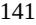

{141}------------------------------------------------

#### NOTES TO CONSOLIDATED FINANCIAL STATEMENTS

#### *August 2022 Financing*

In August 2022, the Company issued 12,250,000 shares of its common stock at a price of \$2.42 per share and, to certain investors in lieu of common stock, pre-funded warrants to purchase 14,630,000 shares of common stock at a price of \$2.4199 per pre-funded warrant. The purchase price per share of each pre-funded warrant represents the per share offering price for the common stock, minus the \$0.0001 per share exercise price of such pre-funded warrant. Aggregate net proceeds were \$60.7 million after deducting underwriting discounts and commissions and offering expenses.

The pre-funded warrants were classified as a component of permanent stockholders' equity within additional paid-in capital and were recorded at the issuance date using a relative fair value allocation method. The pre-funded warrants are equity classified because they (i) are freestanding financial instruments that are legally detachable and separately exercisable from the equity instruments, (ii) are immediately exercisable, (iii) do not embody an obligation for the Company to repurchase its shares, (iv) permit the holders to receive a fixed number of shares of common stock upon exercise, (v) are indexed to the Company's common stock and (vi) meet the equity classification criteria. In addition, such pre-funded warrants do not provide any guarantee of value or return. The Company valued the pre-funded warrants at issuance, concluding that their sales price approximated their fair value, and allocated net proceeds from the sale proportionately to the common stock and pre-funded warrants, of which \$33.0 million was allocated to the pre-funded warrants and recorded as a component of additional paid-in capital.

#### *December 2022 Financing*

In December 2022, the Company entered into an Underwriting Agreement with Jefferies LLC and Cowen and Company, LLC, as representatives of the several underwriters, relating to the underwritten public offering of 10,350,000 shares of the Company's common stock at a public offering price per share of \$7.25. Under the terms of the Underwriting Agreement, the Company granted the underwriters an option, exercisable within 30 days from the date of the Underwriting Agreement, to purchase up to 1,552,500 additional shares of common stock, which the Underwriters exercised in full. Aggregate net proceeds were \$80.8 million after deducting underwriting discounts and commissions and offering expenses.

#### *Certificate of Incorporation*

Prior to the IPO, the Company's certificate of incorporation adopted in December 2020 in connection with the Domestication (the "December 2020 Charter") authorized the Company to issue the following shares of capital stock: (i) 299,700,000 shares of common stock, (ii) 40,000,000 shares of Series A convertible preferred stock, (iii) 36,409,088 shares of Series B convertible preferred stock and (iii) 111,619,996 shares of Series C convertible preferred stock. All classes of stock under the December 2020 Charter were authorized at a par value of \$0.0001.

In February 2021, the Company's amended and restated certificate of incorporation filed with the Secretary of State of the State of Delaware became effective in connection with the closing of the IPO. Under the amended and restated certificate of incorporation, the Company is authorized to issue 150,000,000 shares of common stock and 10,000,000 shares of preferred stock. All classes of stock have a par value of \$0.0001.

#### *Reverse Stock Split*

In January 2021, the Company filed an amended and restated certificate of incorporation to effectuate a reverse split of shares of the Company's common stock and convertible preferred stock on a 1-for-14 basis (the "Reverse Stock Split"). The par value and the number of authorized shares of the convertible preferred stock and common stock were not adjusted as a result of the Reverse Stock Split. All issued and outstanding common stock, options to purchase common stock and per share amounts contained in the consolidated financial statements have been retroactively adjusted to give effect to the Reverse Stock Split for all periods presented.

{142}------------------------------------------------

#### NOTES TO CONSOLIDATED FINANCIAL STATEMENTS

#### *Impact of the COVID-19 Pandemic*

The COVID-19 pandemic continues to evolve. The COVID-19 virus and new variants that emerge continue to impact countries worldwide, including the United States and China where the Company has business operations. The extent of the impact of the COVID-19 pandemic on business, operations and development timelines and plans remains uncertain, and will depend on certain developments, including the duration and continuation of the outbreak and its impact on the Company's development activities, planned clinical trial enrollment, future trial sites, contract research organizations (CROs), third-party manufacturers and other third parties with whom the Company conducts business, as well as its impact on regulatory authorities and the Company's key scientific and management personnel. The ultimate impact of the COVID-19 pandemic or a similar health epidemic is highly uncertain and subject to change. To the extent possible, the Company is and plans to conduct business as usual, with any necessary or advisable modifications to employee travel and to the on-site and in-person activities of the Company's personnel. The Company will continue to actively monitor the evolving situation related to the COVID-19 pandemic and will take necessary actions that alter the Company's operations, including those that may be required by federal, state or local authorities in the United States and China, or that the Company determines are in the best interest of its employees and other third parties with whom the Company conducts business. At this point, the extent to which the COVID-19 pandemic will affect the Company's business, operations and development timelines and plans, including the resulting impact on expenditures and capital needs, remains uncertain.

#### **Summary of Significant Accounting Policies**

#### *Revenue Recognition*

To determine revenue recognition for arrangements, the Company performs the following five steps: (i) identify the contract(s) with a customer; (ii) identify the performance obligations in the contract; (iii) determine the transaction price; (iv) allocate the transaction price to the performance obligations in the contract; and (v) recognize revenue when (or as) the Company satisfies a performance obligation. The Company only applies the five-step model to contracts when it is probable that it will collect the consideration it is entitled to in exchange for the goods and services it transfers to the customer. At contract inception, the Company assesses the goods or services promised within each contract, determines those that are performance obligations and assesses whether each promised good or service is distinct. The Company then recognizes as revenue the amount of the transaction price that is allocated to the respective performance obligation when (or as) the performance obligation is satisfied.

The Company enters into corporate collaborations under which it may obtain upfront license fees, research and development funding, and development, regulatory and commercial milestone payments and royalty payments. The Company's performance obligations under these arrangements may include licenses of intellectual property, distribution rights, research and development services, delivery of manufactured product and/or participation on joint steering committees.

#### *Licenses of intellectual property*

If the license to the Company's intellectual property is determined to be distinct from the other performance obligations identified in the arrangement, the Company recognizes revenue from upfront license fees allocated to the license when the license is transferred to the customer and the customer is able to use and benefit from the license. For licenses that are bundled with other promises, the Company utilizes judgement to assess the nature of the combined performance obligation to determine whether the combined performance obligation is satisfied over time or at a point in time and, if over time, the appropriate method of measuring proportional performance for purposes of recognizing revenue from non-refundable, upfront fees. The Company evaluates the measure of proportional performance each reporting period and, if necessary, adjusts the measure of performance and related revenue recognition.

{143}------------------------------------------------

#### NOTES TO CONSOLIDATED FINANCIAL STATEMENTS

#### *Milestone payments*

At the inception of each arrangement that includes development, regulatory or commercial milestone payments, the Company evaluates whether the milestones are considered probable of being reached and estimates the amount to be included in the transaction price. The Company considers two alternatives to use when estimating the amount of variable consideration: the expected value method and the most likely amount method. Under the expected value method, an entity considers the sum of probability-weighted amounts in a range of possible consideration amounts. Under the most likely amount method, an entity considers the single most likely amount in a range of possible consideration amounts. Whichever method is used, it should be consistently applied throughout the life of the contract; however, it is not necessary for the Company to use the same approach for all contracts. The Company expects to use the most likely amount method for development and regulatory milestone payments. If it is probable that a significant revenue reversal would not occur, the associated milestone value is included in the transaction price. Milestone payments that are not within the Company's or the licensee's control, such as regulatory approvals, are not considered probable of being achieved until those approvals are received. The transaction price is then allocated to each performance obligation on a relative stand-alone selling price basis. The Company recognizes revenue as or when the performance obligations under the contract are satisfied. At the end of each subsequent reporting period, the Company re-evaluates the probability or achievement of each such milestone and any related constraint, and if necessary, adjusts its estimates of the overall transaction price. Any such adjustments are recorded on a cumulative catch-up basis, which would affect revenues and earnings in the period of adjustment.

#### *Commercial milestones and royalties*

For arrangements that include sales-based royalties, including milestone payments based on the level of sales, and in which the license is deemed to be the predominant item to which the royalties relate, the Company recognizes revenue when the related sales occur. To date, the Company has not recognized any royalty revenue resulting from its collaboration arrangements.

Upfront payments and fees are recorded as deferred revenue upon receipt or when due and may require deferral of revenue recognition to a future period until the Company performs its obligations under these arrangements. Amounts payable to the Company are recorded as accounts receivable when the Company's right to consideration is unconditional.

#### *Use of Estimates*

The preparation of financial statements in conformity with U.S. GAAP requires management to make estimates and assumptions that affect the reported amounts of assets and liabilities at the date of the financial statements and reported amounts of expenses during the reporting period. Significant estimates and assumptions made in the accompanying consolidated financial statements include, but are not limited to, the estimates for accruals of research and development expenses, accrual of research contract costs, unrecognized tax benefits, fair value of common stock and stock option valuations. On an ongoing basis, the Company evaluates its estimates and judgments, using historical and anticipated results and trends and on various other assumptions that management believes to be reasonable under the circumstances. Actual results could materially differ from those estimates.

#### *Cash, Cash Equivalents and Marketable Securities*

Cash and cash equivalents consist of standard checking accounts and money market funds. The Company considers all highly liquid investments with an original maturity of 90 days or less at the date of purchase to be cash equivalents.

The Company classifies as available-for-sale marketable securities with a remaining maturity when purchased of greater than three months. The Company's marketable securities are maintained by investment managers and consist of U.S. government and non-U.S. government securities, corporate debt securities and commercial paper. Debt securities are carried at fair value with the unrealized gains and losses included in other comprehensive loss as a component of stockholders' equity until realized. Any premium arising at purchase is amortized to the earliest call date and any discount arising at purchase is accreted to maturity. Amortization and accretion of premiums and

{144}------------------------------------------------

#### NOTES TO CONSOLIDATED FINANCIAL STATEMENTS

discounts are recorded in interest income and/or expense. Realized gains and losses on debt securities are determined using the specific identification method and are included in other (expense) income, net.

If any adjustment to fair value reflects a decline in value of the investment, the Company considers all available evidence to evaluate the extent to which the decline is "other-than-temporary" and, if so, marks the investment to market through a charge to the Company's consolidated statements of operations and comprehensive loss.

The fair value and amortized cost of marketable securities by major security type is as follows:

|                                | December 31, 2022 |    |                  |    |                   |    |            |
|--------------------------------|-------------------|----|------------------|----|-------------------|----|------------|
| (in thousands)                 | Amortized Cost    |    | Unrealized Gains |    | Unrealized Losses |    | Fair Value |
| Money market funds             | \$ 23,029      | \$ | —                | \$ | —                 | \$ | 23,029     |
| U.S. government securities     | 44,555            |    | 31               |    | (383 )            |    | 44,203     |
| Non-U.S. government securities | 3,024             |    | —                |    | (16 )             |    | 3,008      |
| Corporate debt securities      | 36,411            |    | —                |    | (146 )            |    | 36,265     |
| Commercial paper               | 56,403            |    | —                |    | —                 |    | 56,403     |
| Total                          | \$ 163,422     | \$ | 31               | \$ | (545 )            | \$ | 162,908    |
|                                |                   |    |                  |    |                   |    |            |

| Classified as:        |               |
|-----------------------|---------------|
| Cash equivalents      | \$ 23,029  |
| Marketable securities | 139,879       |
| Total                 | \$ 162,908 |

|                                |    | December 31, 2021 |    |                  |    |                   |    |            |
|--------------------------------|----|-------------------|----|------------------|----|-------------------|----|------------|
| (in thousands)                 |    | Amortized Cost    |    | Unrealized Gains |    | Unrealized Losses |    | Fair Value |
| Money market funds             | \$ | 33,239            | \$ | —                | \$ | —                 | \$ | 33,239     |
| U.S. government securities     |    | 36,322            |    | —                |    | (130 )            |    | 36,192     |
| Non-U.S. government securities |    | 11,194            |    | —                |    | (12 )             |    | 11,182     |
| Corporate debt securities      |    | 39,495            |    | —                |    | (52 )             |    | 39,443     |
| Commercial paper               |    | 31,466            |    | —                |    | —                 |    | 31,466     |
| Total                          | \$ | 151,716           | \$ | —                | \$ | (194 )            | \$ | 151,522    |
|                                |    |                   |    |                  |    |                   |    |            |
| Classified as:                 |    |                   |    |                  |    |                   |    |            |
| Cash equivalents               |    |                   |    |                  |    |                   | \$ | 33,239     |
| Marketable securities          |    |                   |    |                  |    |                   |    | 118,283    |
| Total                          |    |                   |    |                  |    |                   | \$ | 151,522    |

Unrealized losses on marketable securities have not been recognized into income because the issuers' securities are of high credit quality and any decline in fair value is due to market conditions and/or changes in interest rates. The Company does not intend to sell and it is likely that the Company will not be required to sell the securities prior to the anticipated recovery of their amortized cost basis. The fair value is expected to recover as the marketable securities approach maturity.

#### *Operating Leases and Rent Expense*

At the inception of a contractual arrangement, the Company determines whether the contract contains a lease by assessing whether there is an identified asset and whether the contract conveys the right to control the use of the identified asset in exchange for consideration over a period of time. If both criteria are met, upon lease commencement, the Company records a lease liability which represents the Company's obligation to make lease payments arising from the lease, and a corresponding right-of-use ("ROU") asset which represents the Company's right to use an underlying asset during the lease term.

{145}------------------------------------------------

#### NOTES TO CONSOLIDATED FINANCIAL STATEMENTS

Operating lease right-of-use assets and liabilities are recognized on the balance sheet at the lease commencement date based on the present value of the future minimum lease payments over the lease term. In determining the net present value of the lease payments, the Company uses its incremental borrowing rate applicable to the underlying asset unless the implicit rate is readily determinable. Any lease incentives received are deferred and recorded as a reduction of the ROU asset and amortized over the term of the lease. The Company does not separate lease and non-lease components and instead treats them as a single component. Rent expense, comprised of amortization of the ROU asset and the implicit interest accreted on the operating lease liability, is recognized on a straight-line basis over the lease term. The Company determines the lease term as the noncancellable period of the lease and may include options to extend or terminate the lease when it is reasonably certain that the Company will exercise such options.

The Company elected to not apply the recognition requirements of the new leasing standard to short term leases with terms of 12 months or less. As a result, leases with a term of 12 months or less are not recognized on the balance sheet.

#### *Classification of Convertible Preferred Stock*

The holders of Series A, Series B and Series C convertible preferred stock, which were outstanding prior to the IPO, had certain liquidation rights in the event of a deemed liquidation that, in certain situations, were not solely within the control of the Company and would call for the redemption of the then outstanding convertible preferred stock. Therefore, the Series A, Series B and Series C convertible preferred stock were classified outside of stockholders' equity on the consolidated balance sheets. In February 2021, upon the completion of the IPO, all the outstanding shares of convertible preferred stock converted into common stock and the Company does not have any shares of preferred stock outstanding.

#### *Research and Development Expenses*

Research and development costs are expensed as incurred. Research and development expenses consist of costs incurred to discover, research and develop drug candidates, including personnel expenses, stock-based compensation expense, allocated facility-related and depreciation expenses, third-party license fees and external costs, including fees paid to consultants and contract research organizations, or CROs, in connection with nonclinical studies and clinical trials and other related clinical trial fees, such as for investigator grants, patient screening, laboratory work, clinical trial database management, clinical trial material management and statistical compilation and analysis. Non-refundable prepayments for goods or services that will be used or rendered for future research and development activities are recorded as prepaid expenses. Such amounts are recognized as an expense as the goods are delivered or the related services are performed, or until it is no longer expected that the goods will be delivered, or the services rendered. Costs incurred in obtaining technology licenses are charged immediately to research and development expense if the technology licensed has not reached technological feasibility and has no alternative future uses.

{146}------------------------------------------------

#### NOTES TO CONSOLIDATED FINANCIAL STATEMENTS

The Company has from time to time entered into various research and development and other agreements with commercial firms, researchers, universities and others for provisions of goods and services. These agreements are generally cancelable, and the related costs are recorded as research and development expenses as incurred. The Company records accruals for estimated ongoing research and development costs. When evaluating the adequacy of the accrued liabilities, the Company analyzes progress of the studies or clinical trials, including the phase or completion of events, invoices received and contracted costs. Significant judgments and estimates are made in determining the accrued balances at the end of any reporting period. Actual results could differ materially from the Company's estimates. Since inception, the Company's historical accrual estimates have not been materially different from the actual costs.

#### *Accrued Expenses and Other Current Liabilities*

Accrued expenses and other current liabilities included the following:

|                                                      | December 31, |       |    |       |  |  |  |
|------------------------------------------------------|--------------|-------|----|-------|--|--|--|
| (in thousands)                                       |              | 2022  |    | 2021  |  |  |  |
| Research and development costs                       | \$           | 1,209 | \$ | 1,570 |  |  |  |
| Accrued professional fees                            |              | 925   |    | 363   |  |  |  |
| Compensation and benefit costs                       |              | 3,843 |    | 2,403 |  |  |  |
| Other                                                |              | 185   |    | 358   |  |  |  |
| Total accrued expenses and other current liabilities | \$           | 6,162 | \$ | 4,694 |  |  |  |

#### *Income Taxes*

The provision for income taxes primarily relates to projected federal, state and foreign income taxes. To determine the quarterly provision for income taxes, the Company uses an estimated annual effective tax rate, which is generally based on expected annual income and statutory tax rates in the various jurisdictions in which the Company operates. In addition, the tax effects of certain significant or unusual items are recognized discretely in the quarter during which they occur and can be a source of variability in the effective tax rates from quarter to quarter.

Income taxes are computed using the asset and liability approach that requires the recognition of deferred tax assets and liabilities for the expected future tax consequences of events that have been recognized in the Company's financial statements. In estimating future tax consequences, the Company considers all expected future events including the enactment of changes in tax laws or rates. A valuation allowance is recorded, if necessary, to reduce net deferred tax assets to their realizable values if management does not believe it is more likely than not that the net deferred tax assets will be realized. In making such a determination, management considers all available positive and negative evidence, including future reversals of existing taxable temporary differences, projected future taxable income, and ongoing prudent and feasible tax planning strategies in assessing the amount of the valuation allowance. When the Company establishes or reduces the valuation allowance against its deferred tax assets, its provision for income taxes will increase or decrease, respectively, in the period such determination is made.

The Company assesses accounting for uncertainty in income taxes by modeling for the recognition, measurement and disclosure in financial statements any uncertain income tax positions that the Company has taken or expects to take on a tax return. As of each balance sheet date, unresolved uncertain tax positions are reassessed. The Company accrues interest and related penalties, if applicable, on all tax exposures for which reserves have been established consistent with jurisdictional tax laws.

#### *Comprehensive Loss*

Comprehensive loss is defined as the change in equity of a business enterprise during a period from transactions and other events and circumstances from non-owner sources.

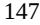

{147}------------------------------------------------

#### NOTES TO CONSOLIDATED FINANCIAL STATEMENTS

#### *Stock-Based Compensation*

Stock-based compensation expense, including grants of stock options and restricted stock awards issued under the Company's equity incentive plan and rights to acquire stock granted under the Company's employee stock purchase plan (ESPP), is measured at the grant date based on the fair value of the awards and is recognized as an expense on a straight-line basis over the requisite service period, which is generally the vesting period. The Company's determination of the fair value of stock options with time-based vesting and rights to acquire stock under the ESPP utilizes the Black-Scholes optionpricing model. The Company lacks sufficient company-specific historical and implied volatility information. Therefore, it estimates its expected stock volatility based on the historical volatility of a publicly traded set of peer companies and expects to continue to do so until such time as it has adequate historical data regarding the volatility of its own traded stock price. The Company estimates risk-free rates using the implied yield currently available on U.S. Treasury zero-coupon issues with a remaining term equal to the expected term and dividend yield using the Company's expectations and historical data. The Company uses the simplified method to calculate the expected term of stock option grants as the Company has limited historical information from which to develop reasonable expectations about future exercise patterns and post-vesting employment termination behavior for its stock option grants. Under the simplified method, the expected term is estimated to be the mid-point between the vesting date and the contractual term of the option. The fair value of each stock option grant and right to acquire stock under the ESPP is calculated based upon the Company's common stock valuation on the date of the grant. The Company accounts for forfeitures of stock option grants as they occur.

#### *Net Loss Per Share of Common Stock*

The Company follows the two-class method when computing net income (loss) per share of common stock as the Company has issued shares that meet the definition of participating securities. The two-class method determines net income (loss) per share of common stock for each class of common and participating securities according to dividends declared or accumulated and participation rights in undistributed earnings. The two-class method requires income available to common stockholders for the period to be allocated between common and participating securities based upon their respective rights to receive dividends as if all income for the period had been distributed.

Basic net income (loss) per share of common stock is computed by dividing the net income (loss) per share of common stock by the weighted average number of shares of common stock outstanding for the period. The weighted-average shares of common stock outstanding as of December 31, 2022 included pre-funded warrants to purchase up to an aggregate of 14,630,000 shares of common stock that were issued in connection with the August 2022 Financing.

Diluted net income (loss) per share of common stock is computed by adjusting net income (loss) to reallocate undistributed earnings based on the potential impact of dilutive securities. Diluted net loss per share of common stock is computed by dividing the diluted net loss by the weighted average number of shares of common stock outstanding for the period, including potential dilutive shares. For purposes of this calculation, outstanding stock options and convertible preferred stock are considered potential dilutive shares. The Company's convertible preferred stock outstanding prior to the IPO contractually entitled the holders of such shares to participate in dividends but did not contractually require the holders of such shares to participate in losses of the Company. Accordingly, in periods in which the Company reported a net loss, such losses were not allocated to such securities.

The Company reported a net loss for the years ended December 31, 2022 and 2021. In periods in which the Company reported a net loss, diluted net loss per share of common stock was the same as basic net loss per share of common stock, since dilutive shares were not assumed to have been issued if their effect is anti-dilutive. The Company excluded the following potential shares of common stock, presented based on amounts outstanding at each period end, from the computation of diluted net loss attributable to common stockholders per share of common stock for the periods indicated because including them would have had an anti-dilutive effect:

|                                                    | December 31, |           |  |  |
|----------------------------------------------------|--------------|-----------|--|--|
|                                                    | 2022         | 2021      |  |  |
| Options to purchase common stock                   | 4,823,928    | 3,577,485 |  |  |
| Unvested restricted stock units                    | 128,280      | —         |  |  |
| Shares issuable under employee stock purchase plan | 25,326       | 6,717     |  |  |
| Total                                              | 4,977,534    | 3,584,202 |  |  |

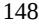

{148}------------------------------------------------

#### NOTES TO CONSOLIDATED FINANCIAL STATEMENTS

#### *Deferred Offering Costs*

The Company capitalizes certain legal, professional accounting and other third-party fees that are directly associated with in-process equity financings as deferred offering costs until such financings are consummated.

After consummation of the equity financing, these costs are recorded as a reduction to the carrying value of stockholders' equity as a reduction of additional paid-in capital or equity generated as a result of such offering. Should an in-process equity financing be abandoned, the deferred offering costs will be expensed immediately as a charge to operating expenses in the consolidated statements of operations and comprehensive loss.

#### *Property and Equipment*

Property and equipment are stated at cost, net of accumulated depreciation. Depreciation is computed using the straight-line method over the estimated useful lives. The general range of useful lives of equipment is 3 to 5 years.

When assets are sold or retired, the cost and related accumulated depreciation are removed from the accounts, with any resulting gain or loss recorded in operating expenses in the consolidated statements of operations and comprehensive loss. Costs of repairs and maintenance are expensed as incurred.

Property and equipment, net consisted of the following:

|                                   |                                                                  |           | December 31, |          |  |
|-----------------------------------|------------------------------------------------------------------|-----------|--------------|----------|--|
| (in thousands)                    | Estimated Useful Lives                                           | 2022      |              | 2021     |  |
| Leasehold improvements            | Shorter of remaining life of lease or useful life of asset | \$ 758 | \$           | 928      |  |
| Furniture and fixtures            | 5 years                                                          | 294       |              | 281      |  |
| Computer equipment                | 3 years                                                          | 203       |              | 202      |  |
| Office equipment                  | 5 years                                                          | 146       |              | 102      |  |
| Lab equipment                     | 3 to 5 years                                                     | 758       |              | 718      |  |
| Property and equipment, gross     |                                                                  | 2,159     |              | 2,231    |  |
| Less: Accumulated depreciation    |                                                                  | (1,402 )  |              | (1,185 ) |  |
| Total property and equipment, net |                                                                  | \$ 757 | \$           | 1,046    |  |

The Company recognized depreciation expense related to these assets of \$0.5 million during each of the years ended December 31, 2022 and 2021.

#### *Impairment of Long-Lived Assets*

The Company's long-lived assets are evaluated for impairment whenever events or changes in circumstances indicate that the carrying amount of the asset or asset group may not be recoverable. Recoverability of an asset to be held and used is measured by a comparison of the carrying amount of an asset or asset group to the future undiscounted cash flows expected to be generated by the asset or asset group. If such asset is considered to be impaired, the impairment to be recognized is measured by the amount by which the carrying amount of the asset exceeds its fair value. There were no impairments of long-lived assets for any of the periods presented.

{149}------------------------------------------------

#### NOTES TO CONSOLIDATED FINANCIAL STATEMENTS

#### *Functional Currencies and Foreign Currency Translation*

The Company's reporting currency is U.S. dollars. The functional currency of Terns U.S. Opco and Terns H.K. is U.S. dollars, while the functional currency of Terns Suzhou and Terns China is the Chinese Yuan (CNY). Transactions denominated in other than the functional currencies are remeasured into the functional currency of the entity at the exchange rates prevailing on the transaction dates. Financial assets and liabilities denominated in other than the functional currency are remeasured at the balance sheet date exchange rate. The resulting exchange rate differences are recorded in the consolidated statements of operations and comprehensive loss as a foreign exchange related gain or loss.

Assets and liabilities of Terns Suzhou and Terns China are translated into U.S. dollars at the balance sheet date exchange rates, while income and expense items are translated at the average exchange rates prevailing during the fiscal year. Translation adjustments arising from these are reported as foreign currency translation adjustments and are shown as accumulated other comprehensive loss on the consolidated balance sheets.

#### *Concentration of Credit Risk*

Financial instruments that potentially subject the Company to concentration of credit risk consist of cash, cash equivalents and marketable securities. The Company invests its excess cash in accounts held at large financial institutions that management believes to be of high credit quality. The Company has not experienced any losses on such deposits.

#### *Patent Costs*

All patent-related costs incurred in connection with filing and prosecuting patent applications are expensed as incurred due to the uncertainty of the recovery of the expenditure. Amounts incurred are classified as general and administrative expenses in the consolidated statements of operations and comprehensive loss.

#### *Commitments and Contingencies*

From time to time, the Company may have certain contingent liabilities that arise in the ordinary course of business. The Company accrues a liability for such matters when it is probable that future expenditures will be made, and such expenditures can be reasonably estimated. For all periods presented, the Company was not a party to any pending material litigation or other material legal proceedings.

#### *Recently Adopted Accounting Pronouncements*

In February 2016, the FASB issued ASU 2016-02, Leases (Topic 842) (ASU 2016-02), which sets out the principles for the recognition, measurement, presentation and disclosure of leases for both parties to a contract (i.e., lessees and lessors). The new standard requires lessees to apply a dual approach, classifying leases as either finance or operating leases based on the principle of whether or not the lease is effectively a financed purchase by the lessee. This classification will determine whether lease expense is recognized based on an effective interest method or on a straight-line basis over the term of the lease. A lessee is also required to record a right-of-use asset and a lease liability for all leases with a term of greater than 12 months regardless of their classification. Leases with a term of 12 months or less may be accounted for similar to existing guidance for operating leases today. For non-public entities, ASU 2016-02 is effective for annual reporting periods, and interim periods within those fiscal years, beginning after December 15, 2021, and early adoption is permitted. Under the JOBS Act, emerging growth companies have extended transition periods available for complying with new or revised accounting standards.

{150}------------------------------------------------

#### NOTES TO CONSOLIDATED FINANCIAL STATEMENTS

The Company adopted the new standard on January 1, 2022 using the effective date as the date of initial application. Consequently, prior period amounts were not adjusted and continue to be reported in accordance with historical accounting policies under ASC 840: Leases (Topic 840). The Company elected the package of practical expedients under which the Company has not reassessed prior conclusions about lease identification, lease classification and initial direct costs. Additionally, the Company made a policy election that does not recognize ROU assets and lease liabilities related to leases with a term of 12 months or less. The Company has elected to not separate lease and non-lease components and instead treat them as a single component. The pattern of recognition for operating leases within the consolidated statements of comprehensive loss has not significantly changed. Upon adoption, the Company recognized operating liabilities of \$1.7 million, with corresponding ROU assets of \$1.5 million based on the present value of the remaining minimum rental payments under current leasing standards for existing operating leases. The Company's current operating lease portfolio is primarily comprised of property leases.

#### *Recently Issued Accounting Pronouncements Not Yet Adopted*

In June 2016, the FASB issued ASU 2016-13, Financial Instruments-Credit Losses (Topic 326): Measurement of Credit Losses on Financial Instruments (ASU 2016-13), which requires the measurement and recognition of expected credit losses for financial assets held at amortized cost. ASU 2016-13 replaces the existing incurred loss impairment model with an expected loss methodology, which will result in more timely recognition of credit losses. For non-public entities, ASU 2016-13 is effective for annual reporting periods, and interim periods within those fiscal years, beginning after December 15, 2022. Under the JOBS Act, emerging growth companies have extended transition periods available for complying with new or revised accounting standards. The Company will adopt the new standard on January 1, 2023 with no material impact on the Company's consolidated financial statements and related disclosures.

#### **2. Fair Value Measurements**

Fair value is defined as the price that would be received to sell an asset or paid to transfer a liability in an orderly transaction between market participants at the measurement date. The three levels of inputs that may be used to measure fair value are defined below:

- Level 1—Quoted prices in active markets for identical assets or liabilities at the measurement date.
- Level 2—Inputs other than quoted prices included in Level 1 that are observable for the asset or liability, such as quoted prices for similar assets or liabilities, quoted prices in markets that are not active, or other inputs that are observable or can be corroborated by observable market data for substantially the full term of the assets or liabilities.
- Level 3—Unobservable inputs that are supported by little or no market activity that are significant to determining the fair value of the assets or liabilities, including pricing models, discounted cash flow methodologies and similar techniques.

The carrying values of the Company's other assets, accounts payable and accrued expenses and other current liabilities approximate their fair values due to the short-term nature of these assets and liabilities.

{151}------------------------------------------------

### NOTES TO CONSOLIDATED FINANCIAL STATEMENTS

The following tables present information about the Company's financial assets and liabilities measured at fair value on a recurring basis:

|                                | As of December 31, 2022: |         |    |         |    |         |    |         |
|--------------------------------|--------------------------|---------|----|---------|----|---------|----|---------|
| (in thousands)                 |                          | Level 1 |    | Level 2 |    | Level 3 |    | Total   |
| Cash and cash equivalents      |                          |         |    |         |    |         |    |         |
| Cash in bank balances          | \$                       | 120,206 | \$ | —       | \$ | —       | \$ | 120,206 |
| Money market funds             |                          | 23,029  |    | —       |    | —       |    | 23,029  |
| Total cash and equivalents     | \$                       | 143,235 | \$ | —       | \$ | —       | \$ | 143,235 |
| Marketable securities          |                          |         |    |         |    |         |    |         |
| U.S. government securities     | \$                       | —       | \$ | 44,203  | \$ | —       | \$ | 44,203  |
| Non-U.S. government securities |                          | —       |    | 3,008   |    | —       |    | 3,008   |
| Corporate debt securities      |                          | —       |    | 36,265  |    | —       |    | 36,265  |
| Commercial paper               |                          | —       |    | 56,403  |    | —       |    | 56,403  |
| Total marketable securities    | \$                       | —       | \$ | 139,879 | \$ | —       | \$ | 139,879 |

|                                | As of December 31, 2021: |         |    |         |    |         |    |         |
|--------------------------------|--------------------------|---------|----|---------|----|---------|----|---------|
| (in thousands)                 |                          | Level 1 |    | Level 2 |    | Level 3 |    | Total   |
| Cash and cash equivalents      |                          |         |    |         |    |         |    |         |
| Cash in bank balances          | \$                       | 14,460  | \$ | —       | \$ | —       | \$ | 14,460  |
| Money market funds             |                          | 33,239  |    | —       |    | —       |    | 33,239  |
| Total cash and equivalents     | \$                       | 47,699  | \$ | —       | \$ | —       | \$ | 47,699  |
| Marketable securities          |                          |         |    |         |    |         |    |         |
| U.S. government securities     | \$                       | —       | \$ | 36,192  | \$ | —       | \$ | 36,192  |
| Non-U.S. government securities |                          | —       |    | 11,182  |    | —       |    | 11,182  |
| Corporate debt securities      |                          | —       |    | 39,443  |    | —       |    | 39,443  |
| Commercial paper               |                          | —       |    | 31,466  |    | —       |    | 31,466  |
| Total marketable securities    | \$                       | —       | \$ | 118,283 | \$ | —       | \$ | 118,283 |
|                                |                          |         |    |         |    |         |    |         |

{152}------------------------------------------------

#### NOTES TO CONSOLIDATED FINANCIAL STATEMENTS

The aggregate amortized cost and fair value of marketable securities as of December 31, 2022, by contractual maturity, are as follows:

| (in thousands)                       | Amortized Cost | Fair Value |         |  |
|--------------------------------------|----------------|------------|---------|--|
| Due in one year or less              | \$ 136,501  | \$         | 136,008 |  |
| Due after one year through two years | 3,892          |            | 3,871   |  |
| Total marketable securities          | \$ 140,393  | \$         | 139,879 |  |

During the years ended December 31, 2022 and 2021, there were no transfers between Level 1, Level 2 and Level 3.

#### **3. Leases**

In March 2019, the Company entered into a lease agreement for office space in Foster City, California which expires October 2024. The Company has the option to extend the lease agreement for a period of five years. Additionally, the Company leases office space in Shanghai and Suzhou China.

Components of lease cost are as follows:

|                                       | Year Ended |                   |  |  |
|---------------------------------------|------------|-------------------|--|--|
| (in thousands)                        |            | December 31, 2022 |  |  |
| Operating lease cost                  | \$         | 610               |  |  |
| Short-term cost                       |            | 43                |  |  |
| Total lease cost                      | \$         | 653               |  |  |
|                                       |            |                   |  |  |
| Weighted-average remaining lease term |            | 1.79              |  |  |
| Weighted-average discount rate        |            | 6.00 %            |  |  |

The Company's future minimum lease payments are as follows:

| (in thousands)                             | Operating Leases |
|--------------------------------------------|------------------|
| 2023                                       | \$ 850        |
| 2024                                       | 559              |
| 2025 and thereafter                        | —                |
| Total lease payments                       | 1,409            |
| Less: Imputed interest                     | (204 )           |
| Present value of lease liabilities         | 1,205            |
| Less: Current portion of lease liabilities | (661 )           |
| Total lease liabilities, non-current       | \$ 544        |

The future minimum annual lease payments required under the Company's existing operating lease agreements as of December 31, 2021 prior to the adoption of ASC 842 were as follows:

| (in thousands)      | Operating Leases |
|---------------------|------------------|
| 2022                | \$ 669        |
| 2023                | 652              |
| 2024                | 559              |
| 2025 and thereafter | —                |
| Total               | \$ 1,880      |

{153}------------------------------------------------

#### NOTES TO CONSOLIDATED FINANCIAL STATEMENTS

#### **4. Loans Payable**

#### *2020 Notes*

In May 2020, the Company issued convertible promissory notes (2020 Notes) in the aggregate amount of \$15.0 million. The 2020 Notes had an interest rate of 10.0% per annum, were unsecured, and were due and payable, including accrued interest, in May 2021. In connection with the Series C Convertible Preferred Stock Financing, the 2020 Notes, totaling unpaid principal and accrued interest of \$15.9 million, converted into 1,366,820 shares of Series C convertible preferred stock.

#### *Bridge Loan*

In May 2020, the Company entered into a bridge loan with Terns China (Bridge Loan) for aggregate proceeds of \$1.8 million, payable in renminbi (RMB) at an established USD/RMB exchange rate, based on an average of the previous five working days before May 8, 2020. The Bridge Loan had an interest rate of 10% per year, which began to accrue on the date of drawdown, and was computed based on the actual number of days elapsed based on a year of 365 days. The Bridge Loan holders have the same conversion rights as the 2020 Notes holders.

In connection with the closing of the Series C convertible preferred stock financing in December 2020, entities that are a part of Lilly Asia Ventures (LAV) agreed to effectively convert the Bridge Loan into shares of Series C preferred stock on the same terms as the 2020 Notes. The conversion was to be based on an outstanding loan balance equal to \$1.9 million, consisting of (i) the principal loan amount (\$1.8 million) plus (ii) accrued interest through December 29, 2020 (\$0.1 million).

To help facilitate the transfer of cash from China to the United States to effectively convert the Bridge Loan, the Company and Terns China agreed to enter into an agreement with LAV to (i) repay the Bridge Loan and (ii) issue shares of Series C convertible preferred stock at the initial closing of the Series C financing to entities that are a part of LAV in exchange for a promissory note issued to the Company by LAV, or the LAV Affiliate Promissory Note.

The Bridge Loan was repaid in full by the Company following the requisite government approvals in China. Proceeds from the repayment of the Bridge Loan by Terns China were used by LAV to repay the LAV Affiliate Promissory Note in full. The fair value of the Bridge Loan was determined to be \$2.1 million as of December 31, 2020. The Bridge Loan and the LAV Affiliate Promissory Note were paid in full in March 2021.

#### *LAV Series A and Series B Promissory Notes*

In November 2020, the Chinese government provided approval for entities affiliated with LAV to exercise the LAV Option (see Note 5, Convertible Preferred Stock). Terns Hong Kong agreed to repurchase all equity interests held by the LAV PRC Entities with proceeds to be used by LAV to purchase shares of Series A convertible preferred stock and Series B convertible preferred stock of the Company (Repurchase).

In December 2020, the Company issued 767,857 shares of Series A convertible preferred stock and 216,450 shares of Series B convertible preferred stock to an affiliate of LAV (LAV Affiliate) in exchange for a promissory note with a principal amount equal to the original investment by LAV in Terns China (LAV Series A and Series B Promissory Note). The LAV Series A and Series B Promissory Note was repaid through proceeds of the Repurchase which was completed in January 2021.

Prior to their repayment, the carrying value of the LAV Series A and Series B Promissory Notes approximated their respective fair value due to the short-term nature of the liability.

The outstanding LAV Series A and Series B Promissory Note was settled in January 2021 and was paid with the proceeds received from the note receivable of \$10.8 million. The outstanding Bridge Loan was settled in March

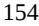

{154}------------------------------------------------

#### NOTES TO CONSOLIDATED FINANCIAL STATEMENTS

2021 and was substantially paid with the proceeds received from the LAV Affiliate Promissory Note receivable of \$1.9 million.

#### **5. Convertible Preferred Stock**

All shares of preferred stock described below were converted into 16,079,230 shares of the Company's common stock at the time of the IPO in February 2021.

#### *Series A Preferred Stock*

In April 2017, the Company entered into a Series A convertible preferred stock purchase agreement (Series A Agreement) whereby the Company issued 2,089,285 shares of Series A convertible preferred stock at \$10.50 per share for an aggregate purchase price of \$21.9 million.

Terns China received an aggregate \$8.0 million from the LAV PRC Entities in connection with the Series A financing, which was presented as a noncontrolling interest. In connection with the Series A Agreement and this Terns China investment, the Company also issued an option to the LAV PRC Entities to convert their interest in the China Subsidiaries into an interest in Terns Cayman (the LAV Option).

#### *Series B Preferred Stock*

In October 2018, the Company entered into a Series B convertible preferred share purchase agreement (Series B Agreement), whereby the Company issued an aggregate of 2,384,195 shares of Series B convertible preferred stock at \$30.80 per share for an aggregate purchase price of \$73.4 million.

Terns China received \$6.7 million from the LAV PRC Entities in connection with the Series B financing, which was presented as a noncontrolling interest. In connection with the Series B Agreement and this Terns China investment, the LAV Option was to allow the LAV PRC Entities to convert this interest in the China Subsidiaries into an interest in Terns Cayman.

#### *LAV Series A and Series B Preferred Stock Options*

In November 2020, the Chinese government provided approval for entities affiliated with Lilly Asia Ventures (LAV) to exercise the LAV Option. Terns Hong Kong agreed to repurchase all equity interests held by the LAV PRC Entities with proceeds to be used by LAV to purchase shares of Series A convertible preferred stock and Series B convertible preferred stock of the Company (Repurchase).

In December 2020, the Company issued 767,857 shares of Series A convertible preferred stock and 216,450 shares of Series B convertible preferred stock to an affiliate of LAV (LAV Affiliate) in exchange for a promissory note with a principal amount equal to the original investment by LAV in Terns China (LAV Series A and Series B Promissory Note). The LAV Series A and Series B Promissory Note was repaid through proceeds of the Repurchase which was completed in January 2021.

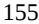

{155}------------------------------------------------

#### NOTES TO CONSOLIDATED FINANCIAL STATEMENTS

#### *Series C Preferred Stock*

In December 2020, the Company entered into a Series C preferred stock purchase agreement (Series C Convertible Preferred Stock Financing) whereby it issued an aggregate of 7,500,665 shares of Series C convertible preferred stock at \$11.65 per share for gross proceeds of \$87.4 million, which includes shares issued upon conversion of the 2020 Notes.

In connection with the Series C Convertible Preferred Stock Financing, the 2020 Notes, totaling unpaid principal and accrued interest of \$15.9 million, converted into 1,366,820 shares of Series C convertible preferred stock. Furthermore, in December 2020, as part of the effective conversion of the Bridge Loan, the Company issued LAV an aggregate of 167,159 shares of Series C convertible preferred stock.

Series A convertible preferred stock, Series B convertible preferred stock and Series C convertible preferred stock are collectively referred to as "convertible preferred stock."

In connection with the IPO, all the outstanding shares of convertible preferred stock converted into common stock and the Company does not have any shares of preferred stock outstanding as of December 31, 2022.

#### **6. Common Stock and Stock-Based Compensation**

As of each balance sheet date, the Company had reserved shares of common stock for issuance in connection with the following:

|                                                                           | December 31, |           |  |
|---------------------------------------------------------------------------|--------------|-----------|--|
|                                                                           | 2022         | 2021      |  |
| Options outstanding under incentive award plans                           | 4,823,928    | 3,577,485 |  |
| Unvested restricted stock units                                           | 128,280      | —         |  |
| Shares available for future grant under incentive award plans             | 1,107,362    | 1,138,622 |  |
| Shares available for future grant under employee stock purchase plans     | 323,920      | 240,000   |  |
| Shares available for future grant under employment inducement award plans | 1,310,000    | —         |  |
| Pre-funded warrants                                                       | 14,630,000   | —         |  |
| Total shares reserved                                                     | 22,323,490   | 4,956,107 |  |

Each share of common stock entitles the holder to one vote on all matters submitted to a vote of the Company's stockholders. Common stockholders are entitled to receive dividends, if any, as may be declared by the Company's board of directors, subject to the preferential dividend rights of the convertible preferred stock. Through December 31, 2022, no cash dividends have been declared or paid by the Company.

#### *Stock-Based Compensation Plans*

The Company has three stock-based compensation plans, the 2017 Incentive Award Plan (the "2017 Plan"), the 2021 Incentive Award Plan (the "2021 Plan") and the 2022 Employment Inducement Award Plan (the "2022 Inducement Plan"). Although awards made under the 2017 Plan continue to be governed by its terms, the 2017 Plan was terminated at the time of our IPO and no further awards are made under this plan. The 2021 Plan, while effective, authorizes the granting of equity awards to employees and directors of the Company, as well as non-employee consultants. The 2022 Inducement Plan authorizes the granting of equity awards to newly hired employees of the Company. Stock options granted to employees and nonemployees under the plans generally vest over four years and allow the holder of the option to purchase common stock at a stated exercise price. Options granted under the plans generally expire ten years after the date of grant. The Company recognizes the stock-based compensation expense over the requisite service period of the individual grantees, which generally equals the vesting period.

{156}------------------------------------------------

#### NOTES TO CONSOLIDATED FINANCIAL STATEMENTS

#### *2021 Incentive Award Plan*

In January 2021, the Company's board of directors approved the 2021 Plan which permits the granting of incentive stock options, nonqualified stock options, stock appreciation rights, restricted stock awards, restricted stock unit awards, performance bonus awards, performance stock unit awards and other stock awards to employees, directors, officers and consultants. In February 2021, 2,400,007 shares were authorized for issuance under the 2021 Plan, which shall be cumulatively increased on the first day of each year beginning in 2022 and ending in 2031 equal to the lesser of (i) the amount equal to 5% of the number of shares issued and outstanding on the last day of the immediately preceding fiscal year or (ii) such lower number of shares as may be determined by the Company's board of directors. The 2021 Plan is the successor to the 2017 Incentive Award Plan and no additional awards may be issued from the 2017 Plan. However, the 2017 Plan will continue to govern the terms and conditions of the outstanding awards granted under this plan. Shares of common stock subject to awards granted under the 2017 Plan that are forfeited or lapse unexercised and which following the effective date of the 2021 Plan are not issued under the 2017 Plan will be available for issuance under the 2021 Plan. As of December 31, 2022, 1,107,362 shares of the Company's common stock were available for future grants under the 2021 Plan. The number of authorized shares reserved for issuance under the 2021 Plan was increased by 2,686,158 shares effective as of January 1, 2023.

#### *2021 Employee Stock Purchase Plan*

The 2021 Employee Stock Purchase Plan (the "2021 ESPP") was approved by the Company's board of directors in January 2021. In February 2021, a total of 240,000 shares were initially reserved for issuance under this plan, which shall be cumulatively increased on the first day of each year beginning in 2022 and ending in 2031 equal to the lesser of (i) 1% of the shares outstanding (on an as converted basis) on the last day of the immediately preceding fiscal year and (ii) such number of shares as may be determined by the Company's board of directors. As of December 31, 2022, 323,920 shares of the Company's common stock were available for future grants under the 2021 ESPP. The number of authorized shares reserved for issuance under the 2021 ESPP was increased by 537,231 shares effective as of January 1, 2023.

Under the ESPP, eligible employees may select a rate of payroll deduction up to 15% of their eligible compensation subject to certain maximum purchase limitations. The duration for each offering period is 12 months and is divided into two purchase periods of approximately six months in length. Offerings are concurrent. The purchase price of the shares under the offering is the lesser of 85% of the fair market value of the shares on the offering date or 85% of the fair market value of the shares on the purchase date. A one-year look-back feature in the ESPP causes the offering period to automatically reset if the fair value of the Company's common stock on the last day of the purchase period is less than that on the original offering date. ESPP purchases by employees are settled with newly-issued common stock from the ESPP's previously authorized and available pool of shares.

As of December 31, 2022, there was \$0.2 million of unrecognized stock-based compensation expense related to unvested employee stock purchases. The unrecognized stock-based compensation expense is estimated to be recognized over a period of 1.53 years as of December 31, 2022. There were 168,772 shares purchased by employees under the ESPP during the year ended December 31, 2022.

#### *2022 Employment Inducement Award Plan*

In September 2022, the Company's compensation committee approved the 2022 Employment Inducement Award Plan (the "2022 Inducement Plan"), which authorized 1,400,000 shares of common stock to be issued and permits the granting of nonqualified stock options, stock appreciation rights, restricted stock awards and restricted stock unit awards to newly hired employees and officers. As of December 31, 2022, 1,310,000 shares of the Company's common stock were available for future grants under the 2022 Inducement Plan.

{157}------------------------------------------------

#### NOTES TO CONSOLIDATED FINANCIAL STATEMENTS

#### *Pre-Funded Warrants*

In connection with the August 2022 Financing, the Company sold pre-funded warrants to purchase 14,630,000 shares of common stock at a price of \$2.4199 per pre-funded warrant. The purchase price per share of each pre-funded warrant represents the per share offering price for the common stock, minus the \$0.0001 per share exercise price of such pre-funded warrant. No pre-funded warrants have been exercised as of December 31, 2022.

### *Stock Options*

The following table summarizes the stock option activity for all stock plans during the years ended December 31, 2022 and 2021:

|                                                | Number of Shares | Weighted Average Exercise Price | Weighted Average Remaining Contractual Term (in years) | Aggregate Intrinsic Value (in thousands) |
|------------------------------------------------|---------------------|------------------------------------------|-----------------------------------------------------------------------|---------------------------------------------------|
| Outstanding as of December 31, 2020            | 2,466,670 \$        | 8.03                                     | 9.61 \$                                                               | 21,678                                            |
| Granted                                        | 1,429,850           | 11.83                                    |                                                                       |                                                   |
| Exercised                                      | (156,104 )          | 5.86                                     |                                                                       | 858                                               |
| Forfeited                                      | (162,931 )          | 8.28                                     |                                                                       |                                                   |
| Outstanding as of December 31, 2021            | 3,577,485 \$        | 9.72                                     | 9.09 \$                                                               | 491                                               |
| Granted                                        | 1,405,020           | 4.44                                     |                                                                       |                                                   |
| Exercised                                      | (10,000 )           | 0.00                                     |                                                                       | 21                                                |
| Forfeited                                      | (148,577 )          | 9.29                                     |                                                                       |                                                   |
| Outstanding as of December 31, 2022            | 4,823,928 \$        | 8.22                                     | 8.46 \$                                                               | 11,721                                            |
| Exercisable, December 31, 2022                 | 2,537,942 \$        | 9.14                                     | 7.97 \$                                                               | 3,664                                             |
| Vested and expected to vest, December 31, 2022 | 4,823,928 \$        | 8.22                                     | 8.46 \$                                                               | 11,721                                            |

The aggregate intrinsic value of stock options is calculated as the difference between the exercise price of the stock options and the fair value of the Company's common stock for those stock options that had exercise prices lower than the fair value of the Company's common stock.

As of December 31, 2022 and 2021, there was \$21.2 million and \$28.6 million, respectively, of unrecognized stock-based compensation expense related to unvested stock options. The unrecognized stock-based compensation expense is estimated to be recognized over a period of 2.19 years as of December 31, 2022.

The total fair value of options vested during the year ended December 31, 2022 and 2021 was \$10.9 million and \$7.8 million, respectively.

{158}------------------------------------------------

#### NOTES TO CONSOLIDATED FINANCIAL STATEMENTS

#### *Restricted Stock*

Restricted stock units ("RSUs") granted to employees under the plans generally vest over four years. The number of shares issued on the date the RSUs vest is net of the minimum statutory tax withholdings, which are paid in cash to the appropriate taxing authorities on behalf of the Company's employees. The Company recognizes the stock-based compensation expense over the requisite service period of the individual grantees, which generally equals the vesting period.

The following table summarizes the RSU activity for all stock plans during the years ended December 31, 2022 and 2021:

|                                                          | Number of Shares | Weighted Average Grant-Date Fair Value |      |  |
|----------------------------------------------------------|---------------------|----------------------------------------------|------|--|
| Unvested restricted common stock as of December 31, 2020 | 83,334              | \$                                           | 1.96 |  |
| Vested                                                   | (71,429 )           |                                              | 1.96 |  |
| Forfeited                                                | (11,905 )           |                                              | 1.96 |  |
| Unvested restricted common stock as of December 31, 2021 | —                   | \$                                           | —    |  |
| Granted                                                  | 147,750             |                                              | 3.99 |  |
| Forfeited                                                | (19,470 )           |                                              | 3.37 |  |
| Unvested restricted common stock as of December 31, 2022 | 128,280             | \$                                           | 4.09 |  |

As of December 31, 2022, there was \$0.4 million of unrecognized stock-based compensation expense related to restricted stock which is estimated to be recognized over a period of 3.46 years. As of December 31, 2021, there was no unrecognized stock-based compensation expense related to restricted stock granted by the Company.

No restricted stock vested during the year ended December 31, 2022. The total fair value of restricted stock vested during the year ended December 31, 2021 was \$0.1 million.

#### *Stock-Based Compensation Expense*

The Company estimated the fair value of options granted and rights to acquire stock granted under the Company's employee stock purchase plan using a Black-Scholes option pricing model with the following assumptions presented on a weighted average basis:

|                                                  | Year Ended December 31, |    |         |
|--------------------------------------------------|-------------------------|----|---------|
|                                                  | 2022                    |    | 2021    |
| Stock Option Plans                               |                         |    |         |
| Expected term (years)                            | 5.99                    |    | 6.03    |
| Expected volatility                              | 72.67 %                 |    | 76.60 % |
| Risk-free interest rate                          | 2.29 %                  |    | 1.12 %  |
| Fair value of underlying common stock            | \$ 4.44              | \$ | 11.83   |
| Weighted average grant-date fair value per share | \$ 2.91              | \$ | 7.82    |
| Employee Stock Purchase Plans                    |                         |    |         |
| Expected term (years)                            | 0.89                    |    | 0.75    |
| Expected volatility                              | 70.08 %                 |    | 60.82 % |
| Risk-free interest rate                          | 2.55 %                  |    | 0.17 %  |
| Fair value of underlying common stock            | \$ 2.95              | \$ | 6.53    |
| Weighted average grant-date fair value per share | \$ 1.25              | \$ | 2.33    |

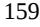

{159}------------------------------------------------

### NOTES TO CONSOLIDATED FINANCIAL STATEMENTS

Stock-based compensation expense was classified in the consolidated statements of operations and comprehensive loss as follows:

|                                        | Year Ended December 31, |        |    |       |  |
|----------------------------------------|-------------------------|--------|----|-------|--|
| (in thousands)                         |                         | 2022   |    | 2021  |  |
| Research and development expense       | \$                      | 3,025  | \$ | 2,055 |  |
| General and administrative expense     |                         | 7,743  |    | 6,091 |  |
| Total stock-based compensation expense | \$                      | 10,768 | \$ | 8,146 |  |

#### **7. Income Tax**

The following table presents domestic and foreign components of loss before income taxes:

|                              |    | Year Ended December 31, |      |           |  |  |
|------------------------------|----|-------------------------|------|-----------|--|--|
| (in thousands)               |    | 2022                    | 2021 |           |  |  |
| U.S.                         | \$ | (60,226 )               | \$   | (49,733 ) |  |  |
| Foreign                      |    | 239                     |      | 83        |  |  |
| Total loss before income tax | \$ | (59,987 )               | \$   | (49,650 ) |  |  |

The following table presents the provision for income taxes:

|                          | Year Ended December 31, |      |    |      |  |
|--------------------------|-------------------------|------|----|------|--|
| (in thousands)           |                         | 2022 |    | 2021 |  |
| Current                  |                         |      |    |      |  |
| Federal                  | \$                      | —    | \$ | 105  |  |
| State                    |                         | 5    |    | 1    |  |
| Foreign                  |                         | 299  |    | 313  |  |
| Total current            | \$                      | 304  | \$ | 419  |  |
| Deferred                 |                         |      |    |      |  |
| Foreign                  | \$                      | 54   | \$ | 89   |  |
| Total deferred           | \$                      | 54   | \$ | 89   |  |
| Total income tax expense | \$                      | 358  | \$ | 508  |  |

The reconciliation of the U.S. federal statutory income tax benefit to the Company's effective income tax rate is as follows:

|                                                |          | Year Ended December 31, |  |  |
|------------------------------------------------|----------|-------------------------|--|--|
|                                                | 2022     | 2021                    |  |  |
| Tax benefit at U.S. statutory rate             | 21.00 %  | 21.00 %                 |  |  |
| State income taxes, net of Federal tax benefit | (0.01 )  | —                       |  |  |
| Foreign income taxed at non-U.S. rates         | (0.02 )  | (0.37 )                 |  |  |
| Domestication                                  | —        | 32.57                   |  |  |
| Other permanent items                          | (0.11 )  | (0.04 )                 |  |  |
| Stock-based compensation                       | (0.47 )  | (0.52 )                 |  |  |
| Research and development credits               | 3.00     | 2.14                    |  |  |
| Unrecognized tax benefit                       | (0.57 )  | (1.18 )                 |  |  |
| Global intangible low-taxed income             | (1.09 )  | (0.04 )                 |  |  |
| Increase in valuation allowance                | (21.93 ) | (54.53 )                |  |  |
| Other                                          | (0.40 )  | (0.05 )                 |  |  |
|                                                | (0.60 )% | (1.02 )%                |  |  |

The difference between the provision for income taxes and the income tax determined by applying the statutory federal income tax rate of 21% was primarily due to the change in valuation allowance.

{160}------------------------------------------------

#### NOTES TO CONSOLIDATED FINANCIAL STATEMENTS

{161}------------------------------------------------

#### NOTES TO CONSOLIDATED FINANCIAL STATEMENTS

Significant components of the Company's deferred tax assets and liabilities are as follows:

|                                      | As of December 31, |    |           |  |
|--------------------------------------|--------------------|----|-----------|--|
| (in thousands)                       | 2022               |    | 2021      |  |
| Deferred tax assets:                 |                    |    |           |  |
| Accruals and reserves                | \$ 820          | \$ | 575       |  |
| Intangibles                          | 12,929             |    | 14,574    |  |
| Stock-based compensation             | 3,549              |    | 1,582     |  |
| Net operating loss                   | 13,841             |    | 10,271    |  |
| Research and development credits     | 3,650              |    | 1,930     |  |
| Lease liability                      | 241                |    | —         |  |
| Capitalized research and development | 7,410              |    | —         |  |
| Other                                | 61                 |    | 87        |  |
| Valuation allowance                  | (42,207 )          |    | (28,849 ) |  |
| Total deferred tax assets            | \$ 294          | \$ | 170       |  |
| Deferred tax liabilities:            |                    |    |           |  |
| Fixed assets                         | \$ (50 )        | \$ | (78 )     |  |
| Operating lease assets               | (207 )             |    | —         |  |
| Total deferred tax liabilities       | \$ (257 )       | \$ | (78 )     |  |
| Net deferred tax assets              | \$ 37           | \$ | 92        |  |

As of December 31, 2022, the Company recorded a full valuation allowance against its U.S. net deferred tax assets as it believes these deferred tax assets were not realizable on a more likely than not basis. This is based upon the weight of available evidence, including historical operating performance, the change of structure due to the Domestication, and that a net loss will be expected to occur in the foreseeable future.

As of December 31, 2022, the Company had federal and state net operating loss carryforwards of approximately \$65.8 million and \$0.7 million, respectively. The federal net operating loss has an indefinite carryforward while the state net operating loss will begin to expire in 2042. As of December 31, 2021, the Company had federal and state net operating loss carryforwards of approximately \$48.7 million and \$0.4 million, respectively.

As of December 31, 2022 and 2021, the Company had federal Research & Development (R&D) credit carryforwards of approximately \$4.1 million and \$1.9 million, respectively, which will begin to expire in 2039. As of December 31, 2022 and 2021, the Company had California R&D credit carryforwards of approximately \$2.0 million and \$1.7 million, respectively, which do not expire.

Utilization of net operating loss carryforwards and credits may be subject to a substantial annual limitation due to the ownership change limitations provided by the Internal Revenue Code of 1986, as amended, and similar state provisions. The annual limitation may result in the expiration of net operating losses and credits before utilization. The Company does not expect any previous ownership changes, as defined under Section 382 and 383 of the Internal Revenue Code, to result in a limitation that will materially reduce the total amount of net operating loss carryforwards and credits that can be utilized. Further, foreign loss carryforwards maybe subject to limitations under the applicable laws of the taxing jurisdictions due to ownership change limitations.

Beginning in 2022, the newly enacted tax legislation required U.S. R&D expenditures to be capitalized and amortized ratably over a five-year period. Expenditures attributed to research conducted outside of the U.S. must be capitalized and amortized over a 15-year period. The Company estimated the costs incurred and required to be capitalized in 2022 based upon the current year R&D expenses and adjusted for book to tax basis differences.

As of December 31, 2022, the Company has provided U.S. income taxes on all its foreign earnings. The Company continues to permanently reinvest the cash held offshore to support its working capital needs. Accordingly, no additional foreign withholding taxes that may be required from certain jurisdictions in the event of a cash distribution have been provided for.

{162}------------------------------------------------

#### NOTES TO CONSOLIDATED FINANCIAL STATEMENTS

As of December 31, 2022 and 2021, the total amount of unrecognized tax benefits was \$6.3 million and \$5.8 million, respectively, \$4.2 million and \$4.5 million of which would affect income tax expense, if recognized, before consideration of any valuation allowance. The Company does not expect the unrecognized tax benefits to change significantly over the next 12 months.

A reconciliation of the beginning and ending unrecognized tax benefit are as follows:

|                                                 |      | Year Ended December 31, |    |        |
|-------------------------------------------------|------|-------------------------|----|--------|
| (in thousands)                                  | 2022 |                         |    | 2021   |
| Unrecognized tax benefit at beginning of year   | \$   | 5,849                   | \$ | 5,406  |
| Increases related to prior year tax positions   |      | 150                     |    | 365    |
| Increases related to current year tax positions |      | 706                     |    | 451    |
| Decreases related to prior year tax positions   |      | (389 )                  |    | (373 ) |
| Unrecognized tax benefit at end of year         | \$   | 6,316                   | \$ | 5,849  |

The Company includes interest and penalties related to unrecognized tax benefits within the provision for income taxes. As of December 31, 2022 and 2021, the total amount of gross interest and penalties accrued was \$0.3 million and \$0.1 million, respectively.

The Company is subject to income taxes in the U.S. federal, state and various foreign jurisdictions. Tax regulations within each jurisdiction are subject to the interpretation of the related tax laws and regulations and require significant judgment to apply. The Company's tax years remain open for examination by all tax authorities since inception as well as carryover attributes beginning December 31, 2019, remain open to adjustment by the U.S. and foreign authorities.

#### **8. Assignment, License and Collaboration Agreements**

#### *License Agreements*

#### *TERN-101 License Agreement with Eli Lilly*

In February 2018, the Company entered a worldwide exclusive license agreement with Eli Lilly and Company (Lilly) (Lilly FXR 2018 License Agreement). Under the terms of the Lilly FXR 2018 License Agreement, Lilly granted the Company an exclusive, royalty-bearing license to make, have made, use, offer for sale, sell, import and have imported, including all rights to develop, manufacture and commercialize covered products in the field in the territory and a sublicensing right that allows the Company to grant sublicenses to affiliates and third parties to perform any portion of the development, manufacture and commercialization of covered products. The Company is required to use commercially reasonable efforts to meet development event milestones, develop the covered product in the field in mainland China and commercialize the covered product in the field in mainland China.

The Company agreed to pay Lilly up to an aggregate of \$6.0 million in pre-specified development milestones for the first covered product in mainland China, and up to an aggregate of \$50.0 million in pre-specified development milestones for the first covered product in ex-mainland China. The Company also agreed to pay Lilly tiered royalties calculated on a calendar year basis, in the mid-single digits to low teens on net sales ranging from the low hundreds of millions of dollars to the low billions of dollars. The Lilly FXR 2018 License Agreement expires upon expiry of the last remaining royalty obligation for a licensed product. As of December 31, 2022, the Company has not paid any amounts under the agreement and no milestones have been achieved. The Company has not recorded any research and development expense during the years ended December 31, 2022 and 2021 related to this agreement.

{163}------------------------------------------------

#### NOTES TO CONSOLIDATED FINANCIAL STATEMENTS

#### *TERN-201 License Agreement with Eli Lilly*

In March 2018, the Company entered into an exclusive license agreement with Lilly (Lilly VAP-1 2018 License Agreement). Under the terms of the Lilly VAP-1 2018 License Agreement, Lilly granted the Company an exclusive, royalty-bearing license to make, have made, use, offer for sale, sell, import and have imported, including all rights to develop, manufacture and commercialize covered products and a sublicensing right that allows the Company to grant sublicenses to affiliates and third parties to perform any portion of the development, manufacture and commercialization of covered products. The Company will remain directly responsible for all amounts owed to Lilly, regardless of sublicenses. The Company is required to use commercially reasonable efforts to meet development events according to achievement due dates and commercialize the covered product in the field in the major markets.

The Company paid Lilly a non-refundable, non-creditable upfront payment of \$4.0 million, which was recorded as research and development expense in the Company's statement of operations and comprehensive loss for the year ended December 31, 2018. In addition, pursuant to the terms of the Lilly VAP-1 2018 License Agreement, the Company agreed to pay Lilly up to an aggregate of \$74.0 million in pre-specified development milestones for the first covered product, and up to an aggregate of \$30.0 million in pre-specified development milestones for the second indication of a covered product. The Company must also pay Lilly tiered royalties calculated on a calendar year basis, in the mid-single digits to mid-teens on net sales ranging from the high tens of millions of dollars to the low billions of dollars. The Lilly VAP-1 2018 License Agreement expires upon expiry of the last remaining royalty obligation for a licensed product. As of December 31, 2022, the Company has paid \$4.0 million to Lilly. No development milestones have been met as of December 31, 2022. The Company has not recorded any research and development expense during the years ended December 31, 2022 and 2021 related to this agreement.

#### *Assignment Agreement*

In June 2019, the Company entered into an assignment agreement with Vintagence Biotechnology Ltd. (Vintagence) (Vintagence 2019 Assignment Agreement). Under the terms of the Vintagence 2019 Assignment Agreement, Vintagence assigned and agreed to assign to the Company any and all worldwide rights, title and interest in and to the Vintagence technology and gave Terns a sublicensing right that allows the Company to grant sublicenses to any of its affiliates and/or to licensees or contractors to perform any portion of the development, manufacture, and/or commercialization of covered compounds or covered products. The Company will remain directly responsible for all amounts owed to Vintagence under this agreement, regardless of sublicenses. The Company is required to use commercially reasonable efforts to commercialize the covered product in the field in the major markets.

The Company paid Vintagence a non-refundable, non-creditable upfront payment of \$0.7 million, which was recorded as research and development expense in the Company's statements of operations and comprehensive loss for the year ended December 31, 2019. In addition, pursuant to the terms of the Vintagence 2019 Assignment Agreement, the Company agreed to pay Vintagence up to CNY 205.0 million in development milestones for the first covered product. The term of the Vintagence 2019 Assignment Agreement will continue in effect on a country-by-country basis until all milestone payments are made. The Company has the right to terminate the agreement in its entirety or on a covered product-by-covered product and country-by-country basis, in its sole discretion by giving 60 days advance written notice to Vintagence. As of December 31, 2022, the Company has paid \$4.4 million to Vintagence which includes a milestone payment of \$1.5 million in connection with the Company's IND filing for TERN-501 in December 2020 and a milestone payment of \$2.2 million in connection with the initiation of dosing in the Phase 2a DUET trial in July 2022. The Company has recognized research and development expense of \$2.2 million during the year ended December 31, 2022 related to this agreement. The Company has not recognized any research and development expenses during the year ended December 31, 2021 related to this agreement.

{164}------------------------------------------------

#### NOTES TO CONSOLIDATED FINANCIAL STATEMENTS

#### *Hansoh Option and License Agreement*

In July 2020, the Company entered into an exclusive option and license agreement with Hansoh (Shanghai) Healthtech Co., Ltd. (Hansoh Healthtech) and Jiangsu Hansoh Pharmaceutical Group Company Ltd. (Jiangsu Hansoh) (collectively, Hansoh) (Hansoh 2020 Option and License Agreement). Under the terms of the Hansoh 2020 Option and License Agreement, the Company granted Hansoh an exclusive, non-transferable, nonsublicensable, fully-paid, royalty-free license to conduct preliminary studies on the licensed compound (TERN-701, formerly known as TRN-000632) with an option to exclusively license the same for development and commercialization of licensed products in all prophylactic, palliative, therapeutic and/or diagnostic uses in connection with all human diseases and disorders (including development and research activities on animal models thereof) in the field of oncology, including all types of cancers (Field) in mainland China, Taiwan, Hong Kong and Macau (collectively, the Territory). In November 2021, Hansoh exercised its option and was granted an exclusive, royalty-bearing license, with the right to sublicense to exploit licensed compound and licensed products in the Field and in the Territory.

Under the Hansoh 2020 Option and License Agreement, Hansoh was required to pay the Company a refundable, non-creditable upfront payment. The Company received an upfront payment of \$0.8 million during the year ended December 31, 2020, which was recognized as a refund liability and presented within accrued expenses and other current liabilities on the consolidated balance sheets as of December 31, 2020. In connection with Hansoh's exercise of its option in November 2021, the Company recognized \$1.0 million in license fee revenue within the consolidated statements of operations and comprehensive loss during the year ended December 31, 2021.

In addition, pursuant to the Hansoh 2020 Option and License Agreement, Hansoh has agreed to pay the Company up to \$67.0 million in prespecified clinical, regulatory and sales milestones. Hansoh must also pay the Company royalties in the mid-single digits based on net sales of all licensed products. The term of the Hansoh 2020 Option and License Agreement will continue until the end of the last-to-expire royalty term. As of December 31, 2022, no milestones have been met and future payments are all constrained.

{165}------------------------------------------------

#### **Item 9. Changes in and Disagreements With Accountants on Accounting and Financial Disclosure.**

None.

#### **Item 9A. Controls and Procedures.**

### **Conclusions Regarding the Effectiveness of Disclosure Controls and Procedures**

As of December 31, 2022, management, with the supervision and participation of our Chief Executive Officer and Chief Financial Officer, performed an evaluation of the effectiveness of the design and operation of our disclosure controls and procedures as defined in Rules 13a-15(e) and 15d-15(e) of the Exchange Act. Our disclosure controls and procedures are designed to ensure that information required to be disclosed in the reports we file or submit under the Exchange Act is recorded, processed, summarized and reported within the time periods specified in the SEC's rules and forms, and that such information is accumulated and communicated to our management, including the Chief Executive Officer and the Chief Financial Officer, to allow timely decisions regarding required disclosures.

Any controls and procedures, no matter how well designed and operated, can provide only reasonable assurance of achieving the desired control objective and management necessarily applies its judgment in evaluating the cost-benefit relationship of possible controls and procedures. Based on this evaluation, our Chief Executive Officer and Chief Financial Officer concluded that, as of December 31, 2022, the design and operation of our disclosure controls and procedures were effective at a reasonable assurance level.

### **Management's Report on Internal Control over Financial Reporting**

Our management is responsible for establishing and maintaining adequate internal control over financial reporting for our company. Internal control over financial reporting is defined in Rule 13a-15(f) or 15d-15(f) promulgated under the Exchange Act as a process designed by, or under the supervision of, the company's principal executive and principal financial officers and effected by the company's board of directors, management and other personnel, to provide reasonable assurance regarding the reliability of financial reporting and the preparation of financial statements for external purposes in accordance with generally accepted accounting principles and includes those policies and procedures that: (i) pertain to the maintenance of records that, in reasonable detail, accurately and fairly reflect the transactions and dispositions of the assets of the company; (ii) provide reasonable assurance that transactions are recorded as necessary to permit preparation of financial statements in accordance with generally accepted accounting principles, and that receipts and expenditures of our company are being made only in accordance with authorizations of management and directors of the company; and (iii) provide reasonable assurance regarding prevention or timely detection of unauthorized acquisition, use, or disposition of our company's assets that could have a material effect on the financial statements.

Internal control over financial reporting is designed to provide reasonable assurance regarding the reliability of financial reporting and the preparation of financial statements prepared for external purposes in accordance with generally accepted accounting principles. Because of its inherent limitations, internal control over financial reporting may not prevent or detect misstatements. Also, projections of any evaluation of effectiveness to future periods are subject to the risk that controls may become inadequate because of changes in conditions, or that the degree of compliance with the policies or procedures may deteriorate.

Our management, with the participation of our Chief Executive Officer and Chief Financial Officer, assessed the effectiveness of our internal control over financial reporting as of December 31, 2022. In making this assessment, our management used the criteria set forth in the Internal Control-Integrated Framework (2013) issued by the Committee of Sponsoring Organizations of the Treadway Commission. Based on its assessment, management concluded that our internal control over financial reporting was effective as of December 31, 2022 based on those criteria.

{166}------------------------------------------------

### **Attestation Report of the Registered Public Accounting Firm**

This report does not include an attestation report of our independent registered public accounting firm regarding internal control over financial reporting.

### **Changes in Internal Control over Financial Reporting**

We regularly review our system of internal control over financial reporting and make changes to our processes and systems to improve controls and increase efficiency, while ensuring that we maintain an effective internal control environment. Changes may include such activities as implementing new, more efficient systems, consolidating activities and migrating processes. There were no changes during the quarter ended December 31, 2022 to our internal control over financial reporting that have materially affected, or are reasonably likely to materially affect, our internal control over financial reporting.

### **Item 9B. Other Information.**

None.

### **Item 9C. Disclosure Regarding Foreign Jurisdictions that Prevent Inspections.**

None.

{167}------------------------------------------------

### **PART III**

### **Item 10. Directors, Executive Officers and Corporate Governance.**

The information required by this item will be contained in our definitive proxy statement to be filed with the SEC in connection with our 2023 annual meeting of stockholders (the "Proxy Statement"), which is expected to be filed not later than 120 days after the end of our fiscal year ended December 31, 2022, and is incorporated in this report by reference.

#### **Item 11. Executive Compensation.**

The information required by this item will be set forth in our Proxy Statement and is incorporated herein by reference.

#### **Item 12. Security Ownership of Certain Beneficial Owners and Management and Related Stockholder Matters.**

The information required by this item will be set forth in our Proxy Statement and is incorporated herein by reference.

#### **Item 13. Certain Relationships and Related Transactions, and Director Independence.**

The information required by this item will be set forth in our Proxy Statement and is incorporated herein by reference.

### **Item 14. Principal Accounting Fees and Services.**

The information required by this item will be set forth in our Proxy Statement and is incorporated herein by reference.

{168}------------------------------------------------

#### **Item 15. Exhibits, Financial Statement Schedules.**

(a)(1) Financial Statements.

The response to this portion of Item 15 is set forth under Part II, Item 8 above.

(a)(2) Financial Statement Schedules.

All schedules have been omitted because they are not required or because the required information is given in the Financial Statements or Notes thereto set forth under Item 8 above.

(a)(3) Exhibits

The exhibits listed in the Exhibit Index below are filed or incorporated by reference as part of this Annual Report.

### **Item 16. Form 10-K Summary.**

- None.

|                   |                                                                                                                                             | Incorporated by Reference |           |         |                   |
|-------------------|---------------------------------------------------------------------------------------------------------------------------------------------|---------------------------|-----------|---------|-------------------|
| Exhibit Number | Exhibit Description                                                                                                                         | Form                      | Date      | Number  | Filed Herewith |
| 3.1               | Amended and Restated Certificate of Incorporation.                                                                                          | 8-K                       | 2/9/2021  | 3.1     |                   |
| 3.2               | Amended and Restated Bylaws.                                                                                                                | 8-K                       | 2/9/2021  | 3.2     |                   |
| 4.1               | Reference is made to Exhibits 3.1 through 3.2.                                                                                              |                           |           |         |                   |
| 4.2               | Form of Common Stock Certificate.                                                                                                           | S-1/A                     | 2/1/2021  | 4.2     |                   |
| 4.3               | Description of Securities                                                                                                                   |                           |           |         | X                 |
| 4.4               | Form of Pre-Funded Warrant.                                                                                                                 | 8-K                       | 8/16/2022 | 4.1     |                   |
| 10.1              | Amended and Restated Investors' Rights Agreement, dated December 29, 2020, by and among the Registrant and the investors listed therein. | S-1                       | 1/15/2021 | 10.1    |                   |
| 10.2              | Lease, dated March 1, 2019, by and between the Registrant and DWF IV Century Plaza, LLC.                                                 | S-1                       | 1/15/2021 | 10.2    |                   |
| 10.3(a)#          | 2017 Equity Incentive Plan, as amended.                                                                                                     | S-1                       | 1/15/2021 | 10.4(a) |                   |
| 10.3(b)#          | Form of Stock Option Grant Notice and Stock Option Agreement under 2017 Equity Incentive Plan, as amended.                               | S-1                       | 1/15/2021 | 10.4(b) |                   |
| 10.3(c)#          | Form of Early Exercise Stock Option Grant Notice and Stock Option Agreement under 2017 Equity Incentive Plan, as amended.                | S-1                       | 1/15/2021 | 10.4(c) |                   |
| 10.3(d)#          | Form of International Stock Option Grant Notice and Stock Option Agreement under 2017 Equity Incentive Plan, as amended.                 | S-1                       | 1/15/2021 | 10.4(d) |                   |
| 10.4(a)#          | 2021 Incentive Award Plan.                                                                                                                  | S-8                       | 2/12/2021 | 99.2(a) |                   |
| 10.4(b)#          | Form of Stock Option Grant Notice and Stock Option Agreement under the 2021 Incentive Award Plan.                                        | S-1/A                     | 2/1/2021  | 10.5(b) |                   |
| 10.4(c)#          | Form of Restricted Stock Award Grant Notice and Restricted Stock Award Agreement under the 2021 Incentive Award Plan.                    | S-1/A                     | 2/1/2021  | 10.5(c) |                   |

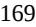

{169}------------------------------------------------

| 10.4(d)#  | Form of Restricted Stock Unit Award Grant Notice and Restricted Stock Unit Award Agreement under the 2021 Incentive Award Plan.                                                                                                 | S-1/A | 2/1/2021  | 10.5(d)  |   |
|-----------|------------------------------------------------------------------------------------------------------------------------------------------------------------------------------------------------------------------------------------|-------|-----------|----------|---|
| 10.5#     | 2021 Employee Stock Purchase Plan.                                                                                                                                                                                                 | S-8   | 2/12/2021 | 99.3     |   |
| 10.6#     | Employment Agreement by and between the Registrant and Erin Quirk, M.D.                                                                                                                                                            | 10-K  | 3/7/2022  | 10.7#    |   |
| 10.7#     | Employment Agreement by and between the Registrant and Senthil Sundaram, as amended.                                                                                                                                            |       |           |          | X |
| 10.8#     | Employment Agreement by and between the Registrant and Bryan Yoon, Esq.                                                                                                                                                            | 10-K  | 3/7/2022  | 10.9#    |   |
| 10.9#     | Amended and Restated Non-employee Director Compensation Program.                                                                                                                                                                   | 10-K  | 3/7/2022  | 10.10#   |   |
| 10.10     | Form of Indemnification Agreement for directors and officers.                                                                                                                                                                      | S-1/A | 2/1/2021  | 10.11    |   |
| 10.11†    | Exclusive License Agreement, dated as of February 9, 2018, between Terns Pharmaceuticals, Inc. and Eli Lilly and Company.                                                                                                       | S-1   | 1/15/2021 | 10.13    |   |
| 10.12†    | Exclusive License Agreement, dated as of March 9, 2018, between Terns Pharmaceuticals, Inc. and Eli Lilly and Company.                                                                                                          | S-1   | 1/15/2021 | 10.14    |   |
| 10.13†    | Assignment Agreement, dated as of June 24, 2019, by and among Terns Pharmaceuticals, Inc. and Vintagence Biotechnology Ltd.                                                                                                     | S-1   | 1/15/2021 | 10.15    |   |
| 10.14†    | Exclusive Option and License, dated as of July 27, 2020, by and among Terns Pharmaceuticals, Inc., Terns, Inc., CaspianTern LLC, Hansoh (Shanghai) Healthtech Co., Ltd. and Jiangsu Hansoh Pharmaceutical Group Company Ltd. | S-1   | 1/15/2021 | 10.16    |   |
| 10.15(a)# | 2022 Employment Inducement Award Plan.                                                                                                                                                                                             | 10-Q  | 11/9/2022 | 10.1(a)# |   |
| 10.15(b)# | Form of Stock Option Grant Notice and Stock Option Agreement under the 2022 Employment Inducement Award Plan.                                                                                                                   | 10-Q  | 11/9/2022 | 10.1(b)# |   |
| 10.15(c)# | Form of Restricted Stock Unit Award Grant Notice and Restricted Stock Unit Award Agreement under the 2022 Employment Inducement Award Plan.                                                                                     | 10-Q  | 11/9/2022 | 10.1(c)# |   |
| 10.16     | Sales Agreement, dated March 8, 2022, by and between Terns Pharmaceuticals, Inc. and Cowen and Company, LLC.                                                                                                                    | S-3   | 3/8/2022  | 1.2      |   |
| 21.1      | List of subsidiaries.                                                                                                                                                                                                              | S-1   | 1/15/2021 | 21.1     |   |
| 23.1      | Consent of Ernst & Young LLP, independent registered public accounting firm.                                                                                                                                                       |       |           |          | X |
| 24.1      | Power of Attorney. Reference is made to the signature page hereto.                                                                                                                                                                 |       |           |          | X |
| 31.1      | Certification of Principal Executive Officer Pursuant to Rules 13a-14(a) and 15d-14(a) under the Securities Exchange Act of 1934, as Adopted Pursuant to Section 302 of the Sarbanes-Oxley Act of 2002.                      |       |           |          | X |
| 31.2      | Certification of Principal Financial Officer Pursuant to Rules 13a-14(a) and 15d-14(a) under the Securities Exchange Act of 1934, as Adopted Pursuant to Section 302 of the Sarbanes-Oxley Act of 2002.                      |       |           |          | X |
| 32.1^     | Certification of Principal Executive Officer Pursuant to 18 U.S.C. Section 1350, as Adopted Pursuant to Section 906 of the Sarbanes-Oxley Act of 2002.                                                                          |       |           |          | X |

{170}------------------------------------------------

| 32.2^   | Certification of Principal Financial Officer Pursuant to 18 U.S.C. Section 1350, as Adopted Pursuant to Section 906 of the Sarbanes-Oxley Act of 2002. | X |
|---------|-----------------------------------------------------------------------------------------------------------------------------------------------------------|---|
| 101.INS | Inline XBRL Instance Document                                                                                                                             | X |
| 101.SCH | Inline XBRL Taxonomy Extension Schema Document                                                                                                            | X |
| 101.CAL | Inline XBRL Taxonomy Extension Calculation Linkbase Document                                                                                              | X |
| 101.DEF | Inline XBRL Taxonomy Extension Definition Linkbase Document                                                                                               | X |
| 101.LAB | Inline XBRL Taxonomy Extension Label Linkbase Document                                                                                                    | X |
| 101.PRE | Inline XBRL Taxonomy Extension Presentation Linkbase Document                                                                                             | X |
| 104     | Cover Page Interactive Data File (embedded within the Inline XBRL document)                                                                               | X |
|         |                                                                                                                                                           |   |

† Certain portions of this document that constitute confidential information have been redacted in accordance with Regulation S-K, Item 601(b)(10).

^ The certification that accompanies this Annual Report on Form 10-K pursuant to 18 U.S.C. Section 1350, as adopted pursuant to Section 906 of the Sarbanes-Oxley Act of 2002, is not deemed "filed" by the Registrant for purposes of Section 18 of the Securities Exchange Act of 1934, as amended.

# Indicates management contract or compensatory plan.

{171}------------------------------------------------

#### **SIGNATURES**

Pursuant to the requirements of Section 13 or 15(d) of the Securities Exchange Act of 1934, as amended, the Registrant has duly caused this report to be signed on its behalf by the undersigned, thereunto duly authorized**.**

**TERNS PHARMACEUTICALS, INC.**

Date: March 27, 2023 By: /s/ Senthil Sundaram

Senthil Sundaram

Chief Executive Officer

#### **POWER OF ATTORNEY**

KNOW ALL PERSONS BY THESE PRESENTS, that each person whose signature appears below constitutes and appoints Senthil Sundaram as his or her true and lawful attorney-in-fact and agent, with the full power of substitution, for him in any and all capacities, to sign any and all amendments to this Annual Report on Form 10-K, and to file the same, with all exhibits thereto and other documents in connection therewith, with the Securities and Exchange Commission, granting unto said attorney-in-fact and agent full power and authority to do and perform each and every act and thing requisite and necessary to be done in and about the premises, as fully to all intents and purposes as he or she might or could do in person, hereby ratifying and confirming all that said attorney-in-fact and agent, or his substitute or substitutes, may lawfully do or cause to be done by virtue hereof.

Pursuant to the requirements of the Securities Exchange Act of 1934, as amended, this Report has been signed below by the following persons on behalf of the Registrant in the capacities and on the dates indicated.

| SIGNATURE                                                    | TITLE                                                                   | DATE           |  |
|--------------------------------------------------------------|-------------------------------------------------------------------------|----------------|--|
| /s/ Senthil Sundaram                                         | Chief Executive Officer and Director                                    | March 27, 2023 |  |
| Senthil Sundaram                                             | (Principal Executive Officer)                                           |                |  |
| /s/ Mark Vignola                                             | Chief Financial Officer (Principal Financial and Accounting Officer) | March 27, 2023 |  |
| Mark Vignola, Ph.D.                                          |                                                                         |                |  |
| /s/ David Fellows                                            | Chairman of the Board of Directors                                      | March 27, 2023 |  |
| David Fellows                                                |                                                                         |                |  |
| /s/ Carl Gordon                                              | Director                                                                | March 27, 2023 |  |
| Carl Gordon, Ph.D., C.F.A.                                   |                                                                         |                |  |
| /s/ Jeffrey Kindler                                          | Director                                                                | March 27, 2023 |  |
| Jeffrey Kindler, Esq.                                        |                                                                         |                |  |
| /s/ Hongbo Lu                                                | Director                                                                | March 27, 2023 |  |
| Hongbo Lu, Ph.D.                                             |                                                                         |                |  |
| /s/ Jill Quigley                                             | Director                                                                | March 27, 2023 |  |
| Jill Quigley, Esq.                                           |                                                                         |                |  |
| /s/ Ann Taylor                                               | Director                                                                | March 27, 2023 |  |
| Ann Taylor, M.D.                                             |                                                                         |                |  |
| /s/ Radhika Tripuraneni Radhika Tripuraneni, M.D., M.P.H. | Director                                                                | March 27, 2023 |  |
|                                                              |                                                                         |                |  |
|                                                              |                                                                         |                |  |

{172}------------------------------------------------

{173}------------------------------------------------

### **DESCRIPTION OF CAPITAL STOCK**

*The following summary describes the capital stock of Terns Pharmaceuticals, Inc. (the "Company," "we," "us" and "our") and the material provisions of our amended and restated certificate of incorporation and our amended and restated bylaws, the amended and restated investors' rights agreement to which we and certain of our stockholders are parties and of the Delaware General Corporation Law. Because the following is only a summary, it does not contain all of the information that may be important to you. For a complete description, you should refer to our amended and restated certificate of incorporation, amended and restated bylaws and amended and restated investors' rights agreement, copies of which are incorporated by reference as Exhibits 3.1, 3.2 and 10.1, respectively, to our Annual Report on Form 10-K.*

### **General**

Our authorized capital stock consists of 150,000,000 shares of common stock, par value \$0.0001 per share, and 10,000,000 shares of preferred stock, par value \$0.0001 per share.

### **Common Stock**

### *Voting Rights*

Each holder of common stock is entitled to one vote for each share on all matters submitted to a vote of the stockholders, including the election of directors. Our stockholders do not have cumulative voting rights in the election of directors. Accordingly, holders of a majority of the voting shares are able to elect all of the directors. In addition, the affirmative vote of holders of 66 2/3% of the voting power of all of the then outstanding voting stock is required to take certain actions, including amending certain provisions of our amended and restated certificate of incorporation, including the provisions relating to amending our amended and restated bylaws, the classified board and director liability.

### *Dividends*

Subject to preferences that may be applicable to any then outstanding preferred stock, holders of our common stock are entitled to receive dividends as may be declared from time to time by our board of directors out of legally available funds.

### *Liquidation*

In the event of our liquidation, dissolution or winding up, holders of our common stock are entitled to share ratably in the net assets legally available for distribution to stockholders after the payment of all of our debts and other liabilities, subject to the satisfaction of any liquidation preference granted to the holders of any then outstanding shares of preferred stock.

### *Rights and Preferences*

Holders of our common stock have no preemptive, conversion or subscription rights, and there are no redemption or sinking fund provisions applicable to our common stock. The rights, preferences and privileges of the holders of our common stock are subject to, and may be adversely affected by, the rights of the holders of shares of any series of our preferred stock that we may designate and issue in the future.

### *Fully Paid and Nonassessable*

All of our outstanding shares of common stock are fully paid and nonassessable.

|US-DOCS\122277646.2||

{174}------------------------------------------------

### **Preferred Stock**

Our board of directors has the authority, without further action by our stockholders, to issue up to 10,000,000 shares of preferred stock in one or more series and to fix the rights, preferences, privileges and restrictions thereof. These rights, preferences and privileges could include dividend rights, conversion rights, voting rights, terms of redemption, liquidation preferences, sinking fund terms and the number of shares constituting, or the designation of, such series, any or all of which may be greater than the rights of our common stock. The issuance of our preferred stock could adversely affect the voting power of holders of common stock and the likelihood that such holders will receive dividend payments and payments upon our liquidation. In addition, the issuance of preferred stock could have the effect of delaying, deferring or preventing a change in control of our company or other corporate action.

### **Registration Rights**

Certain holders of shares of our common stock, are entitled to certain rights with respect to registration of such shares under the Securities Act of 1933, as amended, (the "Securities Act"). These shares are referred to as registrable securities. The holders of these registrable securities possess registration rights pursuant to the terms of our amended and restated investors' rights agreement and are described in additional detail below. The registration of shares of our common stock pursuant to the exercise of the registration rights described below would enable the holders to trade these shares without restriction under the Securities Act when the applicable registration statement is declared effective. We will pay the registration expenses, other than underwriting discounts, selling commissions and stock transfer taxes, of the shares registered pursuant to the demand, piggyback and Form S-3 registrations described below.

The demand, piggyback and Form S-3 registration rights described below will terminate upon the earliest of (i) with respect to each stockholder, such date, on or after the closing of our initial public offering in February 2021, on which all registrable shares held by such stockholder may immediately be sold during any 90-day period pursuant to Rule 144 of the Securities Act, or Rule 144, and (ii) the occurrence of a deemed liquidation event, as defined in our amended and restated certificate of incorporation, as currently in effect.

### *Demand Registration Rights*

Certain holders of shares of our common stock are entitled to certain demand registration rights. Beginning August 3, 2021, certain investors holding, collectively, 20% of registrable securities may, on not more than two occasions, request that we register all or a portion of their shares, subject to certain specified exceptions. If any of these holders exercises its demand registration rights, then these holders will be entitled to register their shares, subject to specified conditions and limitations in the corresponding offering.

### *Piggyback Registration Rights*

In the event that we propose to register any of our securities under the Securities Act, either for our own account or for the account of other security holders, certain holders of shares of our common stock will be entitled to certain "piggyback" registration rights allowing them to include their shares in such registration, subject to specified conditions and limitations.

### *S-3 Registration Rights*

|

Certain holders of shares of our common stock are entitled to certain Form S-3 registration rights. Certain investors holding at least 10% of registrable securities may, on not more than two registrations on Form S-3 within any 12-month period, request that we register all or a portion of their shares on Form S-3 if we are qualified to file a registration statement on Form S-3, subject to specified exceptions. Such request for registration on Form S-3 must cover securities with an aggregate offering price which equals or exceeds \$1.0 million, net of selling expenses. The right to have such shares registered on Form S-3 is further subject to other specified conditions and limitations.

{175}------------------------------------------------

### **Anti-Takeover Effects of Provisions of Delaware Law and Our Amended and Restated Certificate of Incorporation and Amended and Restated Bylaws**

Certain provisions of Delaware law and our amended and restated certificate of incorporation and our amended and restated bylaws contain provisions that could make the following transactions more difficult: acquisition of us by means of a tender offer; acquisition of us by means of a proxy contest or otherwise; or removal of our incumbent officers and directors. It is possible that these provisions could make it more difficult to accomplish or could deter transactions that stockholders may otherwise consider to be in their best interest or in our best interests, including transactions that might result in a premium over the market price for our shares.

These provisions, summarized below, are expected to discourage coercive takeover practices and inadequate takeover bids. These provisions are also designed to encourage persons seeking to acquire control of us to first negotiate with our board of directors. We believe that the benefits of increased protection of our potential ability to negotiate with the proponent of an unfriendly or unsolicited proposal to acquire or restructure us outweigh the disadvantages of discouraging these proposals because negotiation of these proposals could result in an improvement of their terms.

### *Delaware Anti-Takeover Statute*

We are subject to Section 203 of the Delaware General Corporation Law, which prohibits persons deemed "interested stockholders" from engaging in a "business combination" with a publicly-held Delaware corporation for three years following the date these persons become interested stockholders unless the business combination is, or the transaction in which the person became an interested stockholder was, approved in a prescribed manner or another prescribed exception applies. Generally, an "interested stockholder" is a person who, together with affiliates and associates, owns, or within three years prior to the determination of interested stockholder status did own, 15% or more of a corporation's voting stock. Generally, a "business combination" includes a merger, asset or stock sale, or other transaction resulting in a financial benefit to the interested stockholder. The existence of this provision may have an anti-takeover effect with respect to transactions not approved in advance by the board of directors, such as discouraging takeover attempts that might result in a premium over the market price of our common stock.

### *Undesignated Preferred Stock*

The ability to authorize undesignated preferred stock makes it possible for our board of directors to issue preferred stock with voting or other rights or preferences that could impede the success of any attempt to effect a change in control of our company. These and other provisions may have the effect of deterring hostile takeovers or delaying changes in control or management of our company.

### *Special Stockholder Meetings*

Our amended and restated certificate of incorporation provides that a special meeting of stockholders may be called at any time by our board of directors, but such special meetings may not be called by the stockholders or any other person or persons.

### *Requirements for Advance Notification of Stockholder Nominations and Proposals*

Our amended and restated bylaws establish advance notice procedures with respect to stockholder proposals and the nomination of candidates for election as directors, other than nominations made by or at the direction of the board of directors or a committee of the board of directors.

### *Elimination of Stockholder Action by Written Consent*

Our amended and restated certificate of incorporation eliminates the right of stockholders to act by written consent without a meeting.

{176}------------------------------------------------

### *Classified Board; Election and Removal of Directors; Filling Vacancies*

Our board of directors is divided into three classes, divided as nearly as equal in number as possible. The directors in each class will serve for a three-year term, one class being elected each year by our stockholders, with staggered three-year terms. Only one class of directors is elected at each annual meeting of our stockholders, with the other classes continuing for the remainder of their respective three-year terms. Because our stockholders do not have cumulative voting rights, our stockholders holding a majority of the shares of common stock outstanding are able to elect all of our directors. Our amended and restated certificate of incorporation provides for the removal of any of our directors only for cause and requires a stockholder vote by the holders of at least a 66 2/3% of the voting power of the then outstanding voting stock. Furthermore, any vacancy on our board of directors, however occurring, including a vacancy resulting from an increase in the size of the board, may only be filled by a resolution of the board of directors unless the board of directors determines that such vacancies shall be filled by the stockholders. This system of electing and removing directors and filling vacancies may tend to discourage a third party from making a tender offer or otherwise attempting to obtain control of us, because it generally makes it more difficult for stockholders to replace a majority of the directors.

### *Choice of Forum*

|

Our amended and restated certificate of incorporation and amended and restated bylaws provide that, unless we consent in writing to the selection of an alternative forum, the Court of Chancery of the State of Delaware is the exclusive forum for the following types of actions or proceedings under Delaware statutory or common law: any derivative action or proceeding brought on our behalf; any action asserting a claim of breach of fiduciary duty owed by any of our directors, officers or stockholders to us or to our stockholders; any action asserting a claim against us arising pursuant to the Delaware General Corporation Law, our amended and restated certificate of incorporation or our amended and restated bylaws (as either may be amended from time to time); or any action asserting a claim against us that is governed by the internal affairs doctrine. As a result, any action brought by any of our stockholders with regard to any of these matters will need to be filed in the Court of Chancery of the State of Delaware and cannot be filed in any other jurisdiction; provided that, the exclusive forum provision will not apply to suits brought to enforce any liability or duty created by the Securities Exchange Act of 1934 (the "Exchange Act"), as amended, or any other claim for which the federal courts have exclusive jurisdiction; and provided further that, if and only if the Court of Chancery of the State of Delaware dismisses any such action for lack of subject matter jurisdiction, such action may be brought in another state or federal court sitting in the State of Delaware. Our amended and restated certificate of incorporation and amended and restated bylaws also provide that the federal district courts of the United States of America are the exclusive forum for the resolution of any complaint asserting a cause of action against us or any of our directors, officers, employees or agents and arising under the Securities Act. Nothing in our amended and restated certificate of incorporation and amended and restated bylaws preclude stockholders that assert claims under the Exchange Act from bringing such claims in state or federal court, subject to applicable law.

If any action the subject matter of which is within the scope described above is filed in a court other than a court located within the State of Delaware, or a Foreign Action, in the name of any stockholder, such stockholder shall be deemed to have consented to the personal jurisdiction of the state and federal courts located within the State of Delaware in connection with any action brought in any such court to enforce the applicable provisions of our amended and restated certificate of incorporation and amended and restated bylaws and having service of process made upon such stockholder in any such action by service upon such stockholder's counsel in the Foreign Action as agent for such stockholder. Although our amended and restated certificate of incorporation and amended and restated bylaws contain the choice of forum provision described above, it is possible that a court could find that such a provision is inapplicable for a particular claim or action or that such provision is unenforceable.

This choice of forum provision may limit a stockholder's ability to bring a claim in a judicial forum that it finds favorable for disputes with us or any of our directors, officers, other employees or stockholders, which may discourage lawsuits with respect to such claims, although our stockholders will not be deemed to have waived our compliance with federal securities laws and the rules and regulations thereunder.

{177}------------------------------------------------

### *Amendment of Charter Provisions*

The amendment of any of the above provisions in our amended and restated certificate of incorporation, except for the provision making it possible for our board of directors to issue undesignated preferred stock, would require approval by a stockholder vote by the holders of at least a 66 2/3% of the voting power of the then outstanding voting stock.

The provisions of the Delaware General Corporation Law, our amended and restated certificate of incorporation and our amended and restated bylaws could have the effect of discouraging others from attempting hostile takeovers and, as a consequence, they may also inhibit temporary fluctuations in the market price of our common stock that often result from actual or rumored hostile takeover attempts. These provisions may also have the effect of preventing changes in our management. It is possible that these provisions could make it more difficult to accomplish transactions that stockholders may otherwise deem to be in their best interests.

### **Nasdaq Global Select Market Listing**

Our common stock is listed on the Nasdaq Global Select Market under the trading symbol "TERN."

### **Transfer Agent and Registrar**

|

The transfer agent and registrar for our common stock is Computershare, Inc. The transfer agent and registrar's address is 250 Royall Street, Canton, Massachusetts 02021.

{178}------------------------------------------------

Senthil Sundaram (the "*Employee*")

*Sent via email*

Dear Senthil:

You and Terns, Inc., a Delaware corporation (the "*Company*") are party to that certain employment letter agreement dated July 24, 2020 (the "*Prior Agreement*") that sets forth the terms of your employment with the Company. The purpose of this letter (the "*Agreement*") is to revise the terms of your employment with the Company effective as of November 8, 2022. This Agreement amends and restates, and supersedes in its entirety, the Prior Agreement. Upon your signature to this Agreement, your employment with the Company shall be on the following terms:

- 1. **Position**. You will continue to be employed as the Chief Executive Officer ("*CEO*") of the Company and will also serve as the Chief Executive Officer of the Company's parent entity Terns Pharmaceuticals, Inc., a Delaware corporation ("*Parent*"). As CEO, you will continue to have duties and responsibilities that are customary for such position. In these capacities, you will continue to report to the Board of Directors of Parent (the "*Board*"). You will also continue to serve as a member of the Board as of the Effective Date. For as long as you are employed hereunder, at the end of each term of Board service, the Board shall recommend you for re-election as a member of the Board. Your service to the Company is to be full-time. You will work out of the Company's headquarters in Foster City, California, except as otherwise required pursuant to Company policy or applicable public health orders. While you render services to the Company, you will not engage in any other employment, consulting or other business activity (whether full-time or part-time) that would create a conflict of interest with the Company or Parent or be competitive with the Company or Parent. By signing this Agreement, you confirm to the Company that you have no contractual commitments or other legal obligations that would prohibit you from performing your duties for the Company. Notwithstanding the foregoing, you may serve on other boards of directors, in each case, with the approval of the Board, or engage in charitable or other community activities, as long as, in each case, such services and activities are disclosed to the Board and do not interfere with your performance of your duties to the Company and Parent.
- 2. **Base Salary**. The Company will continue to pay you a base salary at the rate of US\$561,400 per year (as may be increased from time to time, your "*Base Salary*"), payable in accordance with the Company's standard payroll schedule. This salary may be increased to reflect performance achievements, as determined by the Company Board from time to time and in its sole discretion.

US-DOCS\135311303.1

{179}------------------------------------------------

# 3. **Annual Bonus; Signing Bonus**.

- 3.1. You will continue to be eligible to receive from the Company an annual target cash bonus of 50% of your Base Salary (your "*Target Bonus*"). The actual bonus amount awarded to you (your "*Annual Bonus*") may be higher or lower than the Target Bonus based upon the achievement of performance objectives established by the Company Board, and which the Board will use all commercially reasonable efforts to communicate to you in writing within 45 days following the start of each calendar year. Each Annual Bonus earned by you will be paid no later than two and one half months following the end of the applicable performance year to which it relates, and otherwise in accordance with the Company's standard payroll schedule.
- 4. **Equity Awards.** You will continue to be eligible to be granted equity awards in the discretion of the Board.

# 5. **Employee Benefits and Expenses**.

- **5.1. Benefits.** In connection with your service, you will continue to be eligible to receive from the Company employee benefits, bonus plan participation and perquisites commensurate with those provided to the Company's senior executives, as may be in effect from time to time.
- **5.2. General Business Expenses**. The Company shall pay or reimburse you for all business expenses reasonably and necessarily incurred by you in the performance of your duties under this Agreement, consistent with the Company's business expense reimbursement policy, as in effect from time to time.
- **5.3. Attorney's Fees**. The Company will make a payment, on your behalf and/or as a direct payment to you, an amount sufficient to cover the reasonable legal fees incurred by you in connection with the negotiation of this Agreement, together with taxes due in connection with such payment, in an amount not to exceed \$1,500. The attorney expense reimbursement payments will be treated as taxable compensation.

# 6. **Change of Control and Termination Payments**.

- **6.1. Any Termination**. Upon the termination of your employment with the Company at any time for any reason, you will be paid your salary through your termination date, the value of all accrued and vested payments under any benefit plans as of your termination date and any other benefits or payments, including any expense reimbursements and accrued and unused vacation, which must be provided to you under applicable law.
- **6.2. Involuntary Termination**. If you are subject to an Involuntary Termination, and subject to Section 9, you will be entitled to receive the following benefits (collectively, the "*Severance*"):
	- 6.2.1. **Salary Continuation.** The Company will continue to pay your then-current Base Salary on the Company's regular payroll dates as if your employment continued for a period of 12 months following the Involuntary Termination (which payments, for avoidance of doubt, will continue even if you find subsequent employment with another employer);

{180}------------------------------------------------

- 6.2.2. **Prorated Bonus.** The Company will pay to you a lump sum payment equal to your Target Bonus in the year of the Involuntary Termination, as such Target Bonus shall be pro-rated on a daily basis for the number of days of the performance year in which your employment terminated, which payment will be made to you at the time such bonuses are paid to other participants, or, if earlier, by March 15 of the year following the year of the Involuntary Termination;
- 6.2.3. **Continued Health Coverage/COBRA**. The Company will use its best commercially reasonable efforts to allow you and your family to retain your health insurance for as long as possible up to 36 months from the date of termination. Upon the termination of your Company health insurance and subject to your timely and proper election of coverage under the Consolidated Omnibus Budget Reconciliation Act of 1985, as amended ("*COBRA*"), for both you and your eligible dependents, the Company will provide continuation of your then-effective group medical, vision and dental coverage, at Company cost, for 36 months following the Involuntary Termination, *provided that* if COBRA continuation is not available despite the Company's best commercially reasonable efforts to provide such continuation coverage the Company may elect to provide to you, in lieu of any portion of this continued coverage, taxable installment payments equal to the amount of the applicable premiums in effect at the Involuntary Termination for the remainder of this 36 month period. The Company's obligations under this Section 6.2.3 shall not apply once you become eligible for employer-sponsored medical and dental coverage from another entity (excluding health insurance marketplaces) where the benefits and cost to you are consistent with similarly situated participants under such plans and you agree to provide prompt notice to the Company if you become so eligible; and
- 6.2.4. **Accelerated Vesting and Option Exercise Period.** Notwithstanding the terms of any Equity Award or the plan pursuant under which it is or was granted, in the event the Involuntary Termination is as a result of your death or occurs within three months prior to or anytime following your Disability, then (a) the vesting of each Equity Award held by you will be fully accelerated as of your termination date and (b) each option held by you, including each Option, will remain outstanding and exercisable until the earliest of: (i) three (3) years after your Involuntary Termination, (ii) the closing of a Change in Control or (iii) the original expiration date of the option.
- **6.3. Involuntary Termination within 3 months prior to or 12 months following a Change in Control**. If the Involuntary Termination occurs during the period commencing upon three (3) month prior to a Change in Control, but only if after a Potential Change in Control, and ending twelve (12) months following a Change in Control, then:
	- 6.3.1. **Equity Awards.** 100% of your then outstanding Equity Awards, including awards that would otherwise vest only upon satisfaction of performance criteria, shall accelerate and become vested and exercisable. Equity Awards that vest upon satisfaction of performance criteria for which those criteria have not yet been satisfied or cannot be determined as of the date of your Involuntary Termination shall be measured as if all applicable performance criteria were achieved at target levels, except to the extent otherwise provided in the award agreement evidencing such award. For the avoidance of doubt, if you experience an Involuntary Termination following a Potential Change in Control, and the applicable Change in Control is consummated within the Change in Control Period, then your vesting acceleration under this Agreement shall occur on the date of such Change in Control rather than upon the date of your Involuntary Termination. Upon your Separation within the Change in Control Period, all of your then-outstanding Equity Awards shall remain outstanding and eligible to vest as

{181}------------------------------------------------

necessary to give effect to this provision.

- 6.3.2. **Modified Severance.** You will be entitled to the payments and benefits referenced in Section 6.2, provided that (i) the Severance will be increased to an amount equal to 18 months of your Base Salary immediately prior to the Change in Control, paid as a lump-sum and (ii) in lieu of the Prorated Bonus, you shall receive an amount equal to 150% of your target Annual Bonus amount for the year of termination.
- 6.3.3. Notwithstanding the foregoing, you shall be entitled to the greater benefits, if any, as may be provided under any change in control policy adopted by Parent or the Company (the "*CIC Policy*"), subject to its terms and conditions; provided, however, that nothing in this Agreement or the CIC Policy shall require Parent or the Company to provide any duplicate payments or benefits.
- 6.3.4. For purposes of this Agreement, "*Potential Change in Control*" means the date of execution of a legally binding and definitive agreement for a corporate transaction which, if consummated, would constitute a Change in Control (which for the avoidance of doubt, would include a merger agreement, but not a term sheet for a merger agreement).
- **6.4. Release and Other Requirements**. Receipt of the Severance (under either Section 6.2 or Section 6.3) will be conditioned in its entirety upon your, or your estate's, execution of a release of claims, substantially in the form attached as Exhibit A (the "*Release*"), and, except in the case of death, your continued compliance with the terms thereof, which Release must be executed and become irrevocable, within 60 days following your Involuntary Termination (this 60-day period, the "*Release Period*"). Any installment payments under Section 6.2.1 or cash payments under Section 6.3.2 will begin to be paid on the first regular payroll date beginning after the expiration of the Release Period, and will include any amounts that would have been payable during the Release Period but for this sentence. Any accelerated vesting effected by Section 6.2.4 or 6.3.1 will be effective as of the date of your termination of employment (except as set forth above) and the resulting vested Equity Award cancelled without consideration if the Release does not become effective by its terms and within the Release Period.
- **6.5. Non-assumption of Equity Awards Following a Change in Control.** Notwithstanding anything to the contrary herein or in any equity plan or any applicable award agreement pursuant to Equity Awards granted thereunder, to the extent that the successor or acquiring corporation (if any) of Parent provides that your Equity Awards should be cancelled without consideration upon a Change in Control, each of your unvested Equity Awards that are so cancelled, shall accelerate and become fully vested and if applicable, exercisable, effective immediately prior to the Change in Control. With respect to Performance-Based Awards, the grant agreement may provide for alternative treatment in lieu of the foregoing and, absent any such treatment in the grant agreement, the vesting acceleration provided for herein shall be deemed to have been met based on the achievement of the Performance-Based Award based on "at target" performance.
- 7. **Proprietary Information and Inventions Agreement**. You affirm that you will continue to comply with the terms and conditions of the Employee Invention Assignment and Confidentiality Agreement you previously entered into with the Company (your "*Confidentiality Agreement*").

{182}------------------------------------------------

# 8. **Employment Relationship; Board Service**.

- **8.1. At Will Employment.** Employment with the Company is for no specific period of time. Your employment with the Company is "at will," meaning that either you or the Company may terminate your employment at any time and for any reason, with or without cause or notice (subject to any consequences set forth in this Agreement). Any contrary representations that may have been made to you are superseded by this Agreement. This is the full and complete agreement between you and the Company on this term. Although your job duties, title, compensation and benefits, as well as the Company's personnel policies and procedures, may change from time to time, the "at will" nature of your employment may only be changed in an express written agreement signed by you, a duly authorized Company officer or member of the Company board of directors (other than you) and a duly authorized Parent officer or member of the Board (other than you).
- **8.2. Board Seat.** If your position as the CEO of the Company is terminated by you or the Company for any reason, you shall promptly resign from the Board and the board of directors of any of Parent's subsidiaries, including, without limitation, the Company.
- **8.3. Non-Disparagement.** The Company shall use its best efforts to ensure that the Company's and Parent's executive officers and Board members (to the extent then in service) shall not make, directly or indirectly, any negative or disparaging statements or comments, either as fact or as opinion about you, with any written or oral statement. You agree to not make, directly or indirectly, any negative or disparaging statements or comments, either as fact or opinion, about Parent or its subsidiaries, directors, officers, employees or agents. Nothing in this Section 8.3 shall prohibit you or the Company or its executive officers or Company Board members from providing truthful information in response to a subpoena or other legal process.

# 9. **Tax Matters**.

- **9.1. Withholding**. All forms of compensation referred to in this Agreement are subject to reduction to reflect applicable withholding and payroll taxes and other deductions required by law.
# **9.2. Section 409A**.

- 9.2.1. For purposes of Section 409A of the Internal Revenue Code of 1986, as amended (the "*Section 409A*"), each salary continuation payment under Section 6 is hereby designated as a separate payment.
- 9.2.2. If the Company determines that you are a "specified employee" under Section 409A(a)(2)(B)(i) at the time of your Separation, then (i) the benefits under Section 6, to the extent that they are subject to Section 409A, will commence on the first business day following (A) expiration of the six month period measured from your Separation or (B) the date of your death and (ii) the installments that otherwise would have been paid prior to such date will be paid in a lump sum when the salary continuation payments commence.

{183}------------------------------------------------

- 9.2.3. Except as otherwise expressly provided herein, to the extent any expense reimbursement or the provision of any in-kind benefit under this Agreement (or otherwise referenced herein) is determined to be subject to (and not exempt from) Section 409A, (x) the amount of any such expenses eligible for reimbursement, or the provision of any in-kind benefit, in one calendar year shall not affect the expenses eligible for reimbursement or in-kind benefits to be provided in any other calendar year; (y) in no event shall any expenses be reimbursed after the last day of the calendar year following the calendar year in which you incurred such expenses; and (z) in no event shall any right to reimbursement or the provision of any in-kind benefit be subject to liquidation or exchange for another benefit.
- 9.2.4. Further, to the extent any nonqualified deferred compensation subject to Section 409A payable to you hereunder could be paid in one or more taxable years depending upon you completing certain employment-related actions (such as resigning after a failure to cure a Good Reason event and/or returning an effective release), then any such payments will commence or occur in the later taxable year to the extent required by Section 409A.
- 9.2.5. It is intended that each installment of the payments and benefits provided under Section 6.2 of this Agreement shall be treated as a separate "payment" for purposes of Section 409A of the Code. In particular, the installment severance payments set forth in Section 6.2 of this Agreement shall be divided into two portions. That number of installments commencing on the first payment date set forth in Section 6 of this Agreement that are in the aggregate less than two times the applicable compensation limit under Section 401(a)(17) of the Code for the year in which the Termination Date occurs (provided the termination of the Executive's employment is also a separation from service) shall be payable in accordance with Treas. Reg. §1.409A-1(b)(9)(iii) as an involuntary separation plan. The remainder of the installments shall be paid in accordance with Section 9.2.2 above.

# **9.3. Parachute Payments**

- 9.3.1. If any payment or benefit you would receive from the Company or otherwise in connection with a Change in Control or other similar transaction (a "*280G Payment*") would (i) constitute a "parachute payment" within the meaning of Section 280G of the Code, and (ii) but for this sentence, be subject to the excise tax imposed by Section 4999 of the Code (the "*Excise Tax*"), then any such 280G Payment (a "*Payment*") shall be equal to the Reduced Amount. The "*Reduced Amount*" shall be either (x) the largest portion of the Payment that would result in no portion of the Payment (after reduction) being subject to the Excise Tax or (y) the largest portion, up to and including the total, of the Payment, whichever amount (i.e., the amount determined by clause (x) or by clause (y)), after taking into account all applicable federal, state and local employment taxes, income taxes, and the Excise Tax (all computed at the highest applicable marginal rate), results in your receipt, on an aftertax basis, of the greater economic benefit notwithstanding that all or some portion of the Payment may be subject to the Excise Tax. If a reduction in a Payment is required pursuant to the preceding sentence and the Reduced Amount is determined pursuant to clause (x) of the preceding sentence, the reduction shall occur in the manner (the "*Reduction Method*") that results in the greatest economic benefit for you. If more than one method of reduction will result in the same economic benefit, the items so reduced will be reduced pro rata (the "*Pro Rata Reduction Method*").

{184}------------------------------------------------

- 9.3.2. Notwithstanding the foregoing, if the Reduction Method or the Pro Rata Reduction Method would result in any portion of the Payment being subject to taxes pursuant to Section 409A of the Code that would not otherwise be subject to taxes pursuant to Section 409A of the Code, then the Reduction Method and/or the Pro Rata Reduction Method, as the case may be, shall be modified so as to avoid the imposition of taxes pursuant to Section 409A of the Code as follows: (A) as a first priority, the modification shall preserve to the greatest extent possible, the greatest economic benefit for you as determined on an after-tax basis; (B) as a second priority, Payments that are contingent on future events (e.g., being terminated without cause), shall be reduced (or eliminated) before Payments that are not contingent on future events; and (C) as a third priority, Payments that are "deferred compensation" within the meaning of Section 409A of the Code shall be reduced (or eliminated) pro rata with payments that are not deferred compensation within the meaning of Section 409A of the Code.
- 9.3.3. Unless you and the Company agree on an alternative accounting or valuation firm, the accounting firm engaged by the Company for general tax compliance purposes as of the day prior to the effective date of the change in control transaction triggering the Payment shall perform the foregoing calculations. If the accounting firm so engaged by the Company is serving as accountant or auditor for the individual, entity or group effecting the change of control transaction, the Company shall appoint a nationally recognized accounting or valuation firm to make the determinations required hereunder. The Company shall bear all expenses with respect to the determinations by such accounting or valuation firm required to be made hereunder. The Company shall use commercially reasonable efforts to cause the accounting or valuation firm engaged to make the determinations hereunder to provide its calculations, together with detailed supporting documentation, to you and the Company within fifteen (15) calendar days after the date on which your right to a 280G Payment becomes reasonably likely to occur (if requested at that time by you or the Company) or such other time as requested by you or the Company.
- 9.3.4. If you receive a Payment for which the Reduced Amount was determined pursuant to the first paragraph of this Section and the Internal Revenue Service determines thereafter that some portion of the Payment is subject to the Excise Tax, you shall promptly return to the Company a sufficient amount of the Payment (gross of applicable tax withholdings previously made) after reduction pursuant to the first paragraph of this Section so that no portion of the remaining Payment is subject to the Excise Tax.
- **9.4. Tax Advice**. You are encouraged to obtain your own tax advice regarding your compensation from the Company and Parent. You agree that neither the Company nor Parent has a duty to design its compensation policies in a manner that minimizes your tax liabilities, and you will not make any claim against Parent, the Board, the Company or any other Parent subsidiary related to tax liabilities arising from your compensation.

# 10. **Interpretation, Amendment and Miscellaneous**.

- **10.1. Modification**. This Agreement, collectively with your Confidentiality Agreement, any Indemnification Agreement and Exhibit A, supersede and replace any prior or contemporaneous agreements, representations or understandings (whether written, oral, implied or otherwise) between you and the Company, including, without limitation, the Prior Agreement and constitute the complete agreement between you and the Company regarding the subject matter set forth herein. This Agreement may not be amended or modified, except by an express written agreement signed by each of you, a duly authorized Company officer or member of the Company's board of directors (other than you) and a duly authorized Parent officer or member of the Board (other than

{185}------------------------------------------------

you).

- **10.2. Governing Law.** This Agreement shall be governed by and construed in accordance with the laws of the State of California.
- **10.3. Severability.** If any term, covenant, condition or provision of this Agreement or the application thereof to any person or circumstance shall, at any time, or to any extent, be determined invalid or unenforceable, the remaining provisions of this Agreement shall not be affected thereby and shall be deemed valid and fully enforceable to the extent permitted by law.
- **10.4. Counterparts**. This Agreement may be executed in any number of counterparts, and each such counterpart hereof will be deemed to be an original instrument, but all such counterparts together will constitute but one agreement. Signature pages delivered by facsimile or electronic mail will be treated as are originals.
- **10.5. Attorney's Fees**. If court proceedings are required to enforce any provision of this letter agreement, the substantially prevailing or successful party shall be entitled to an award of the reasonable and necessary expenses of litigation, including reasonable attorneys' fees.
- **10.6. Assignment.** The rights and obligations of the Company under this Agreement shall inure to the benefit of and be binding upon the successors and assigns of the Company. Your rights and obligations hereunder are non-assignable. The Company may assign its rights and obligations to any entity in which the Company or an entity affiliated with the Company, has a majority ownership interest.
- **10.7. Notice**. Any notice required by this Agreement shall be sufficient if in writing and delivered to the party or sent by certified mail, return receipt requested and addressed to the party's last business or residential address, or otherwise delivered in person or through a reliable electronic delivery system. Either party may change the specified address by giving written notice of such change.
- **10.8. Headings.** The headings in this Agreement are for reference purposes only and shall not in any way affect the meaning or interpretation of this Agreement.
- **10.9. No Presumption Against Interest.** This Agreement has been negotiated, drafted, edited and reviewed by the respective parties, and therefore, no provision of this Agreement shall be construed against any party as being drafted by said party.
- **10.10.Defend Trade Secrets Act of 2016 Notice.** Notwithstanding any provision in this Agreement, an individual shall not be held criminally or civilly liable under any federal or state trade secret law for the disclosure of a trade secret that (A) is made (i) in confidence to a federal, state, or local government official, either directly or indirectly, or to an attorney; and (ii) solely for the purpose of reporting or investigating a suspected violation of law; or (B) is made in a complaint or other document filed in a lawsuit or other proceeding, provided that such filing is made under seal. Further, an individual who files a lawsuit for retaliation by an employer for reporting a suspected violation of law may disclose the trade secret to the attorney of the individual and use the trade secret information in the court proceeding, provided that the individual (A) files any document containing the trade secret under seal and (B) does not disclose the trade secret, except pursuant to court order.

{186}------------------------------------------------

- **10.11.No Duty to Mitigate**. Amounts owed to you under this Agreement shall not be offset by any claims the Company may have against you, and the Company's obligation to make the payments provided for in this Agreement, and otherwise to perform its obligations hereunder, shall not be affected by any other circumstances, including, without limitation, any counterclaim, recoupment, defense or other right which the Company may have against you or others.
- 11. **Indemnification**. You will receive defense and be indemnified by the Company and Parent to the full extent of the provisions of any indemnification agreement between you and Parent (any such agreement, your "*Indemnification Agreement*") as well as the charter and bylaws of the Company and Parent and applicable California and Delaware law.
- 12. **Definitions**. The following terms have the meaning set forth below wherever they are used in this Agreement:

"*Cause*" means the occurrence of any one or more of the following: (i) your commission of any crime involving fraud, dishonesty or moral turpitude; (ii) your attempted commission of or participation in a fraud or act of dishonesty against the Company that results in (or might have reasonably resulted in) material harm to the business of the Company; (iii) your intentional, material violation of any contract or agreement between you and the Company or any statutory duty you owe to the Company; or (iv) your conduct that constitutes gross insubordination, incompetence or habitual neglect of duties and that results in (or might have reasonably resulted in) material harm to the business of the Company (except that in no event shall this provision be invoked where such alleged conduct relates to or arises from any physical impairment or disability); provided, however, that the action or conduct described in clauses (iii) and (iv) above will constitute "Cause" only if such action or conduct continues after the Company has provided you with written notice thereof and thirty (30) days to cure, or otherwise remedy to the extent possible under direct control of you, the same. An occurrence of "Cause" as set forth in the preceding sentence shall be based upon a good faith determination by the Company Board.

"*Change in Control*" shall mean an Acquisition (as defined in Parent's 2021 Incentive Award Plan). Notwithstanding the foregoing, to the extent that any amount constituting deferred compensation (as defined in Section 409A of the Code) would become payable under this Agreement by reason of a Change in Control, such amount shall become payable only if the event constituting a Change in Control would also qualify as a "change in control event" within the meaning of Code Section 409A, as it has been and may be amended from time to time, and any proposed or final Treasury Regulations and IRS guidance that has been promulgated or may be promulgated thereunder from time to time.

"*Disability*" shall mean that you are unable to perform the essential functions of your position (after accounting for reasonable accommodation, if applicable and required by applicable law), due to physical or mental impairment that can reasonably be expected to result in death, or can reasonably be expected to continue for a period in excess of ninety (90) days, whether or not consecutive (or for any longer period as may be required by applicable law), in any twelve (12)-month period. Any dispute as to whether you are subject to a Disability shall be resolved by a physician mutually selected by you and the Company, which determination by such physician as to Disability shall be final and binding on you and the Company. If you do not cooperate in selecting the physician, submit to examination by the physician mutually selected by the parties, or provide access to needed information upon which such determination can be made, then the Board shall have no continued obligation to consult with such physician and will have the authority to determine whether you are subject to a Disability on its own.

"*Equity Awards*" means all options to purchase Parent common stock as well as any and all other stock-based awards granted to you by Parent, including but not limited to stock bonus awards, restricted stock awards, restricted stock unit awards or stock appreciation rights.

{187}------------------------------------------------

"*Involuntary Termination*" means you experience a Separation resulting from (A) a Termination without Cause, (B) you voluntarily resigning your employment for Good Reason, (C) your termination as a result of Disability that is effective within thirty (30) days after written notice to you of your termination as a result of Disability by the Company; or (D) your death.

"*Good Reason*" means, without your consent, any of the following actions: (i) the assignment to you of any duties or responsibilities that results in a material diminution in your function as in effect immediately prior to the effective date of the Change in Control; (ii) a reduction of greater than 10% in your annual base salary as in effect on the effective date of the Change in Control; provided, however, that Good Reason shall not be deemed to have occurred in the event of a reduction in your annual base salary that is pursuant to a salary reduction program affecting substantially all of the employees of the Company and that does not adversely affect you to a greater extent than other similarly situated employees; or (iii) a relocation of your primary business office to a location more than 30 miles from the location of your primary business office as of the effective date of the Change in Control, except for required travel by you on the Company's business to an extent substantially consistent with your business travel obligations prior to the effective date of the Change in Control, provided that, with respect to each of the reasons set forth above, (1) you provide the Company with written notice of your intention to terminate your employment for Good Reason within ninety (90) calendar days after the occurrence of the event that you believe would constitute Good Reason and (2) you provide the Company with a period of at least thirty (30) calendar days (the "*Company Cure Period*") following receipt of such notice from you in which to cure the event giving rise to such Good Reason termination, and (3) your resignation is effective within ten (10) calendar days of the earlier of expiration of the Company Cure Period or written notice from the Company that it will not undertake to cure the condition set forth in set forth in subclauses (i) through (iii).

"*Separation*" means a "separation from service," as defined in the regulations under Section 409A of the Code.

"*Termination Without Cause*" means a Separation as a result of a termination of your employment by the Company without Cause, provided you are willing and able to continue performing services within the meaning of Treasury Regulation 1.409A-1(n)(1).

[Remainder of page intentionally left blank]

{188}------------------------------------------------

IN WITNESS WHEREOF, the parties have executed this Agreement as of the date first above written.

Accepted and Agreed to

**Terns, Inc.**

By: /s/ Bryan Yoon

Name: Bryan Yoon

Title: COO & GC

**Terns Pharmaceuticals, Inc. (solely in respect of its explicit obligations under the Agreement)**

By: /s/ Bryan Yoon

Name: Bryan Yoon

Title: COO & GC

**Employee**

/s/ Senthil Sundaram Senthil Sundaram

**Attachment**

Exhibit A: Release

{189}------------------------------------------------

### **Exhibit A**

#### Release

In consideration of the benefits provided and to be provided to me by Terns, Inc., or any successor thereof (the "Company") and Terns Pharmaceuticals, Inc. ("Parent") pursuant to Section 6 of the letter agreement with Company dated September __ 2022, (the "Agreement") (these, the "Benefits") and in connection with the termination of my employment, I agree to the following general release (the "Release").

- 1. On behalf of myself, my heirs, executors, administrators, successors, and assigns, I hereby fully and forever generally release and discharge Parent, the Company, their current, former and future parents, subsidiaries, affiliated companies, related entities, employee benefit plans, and, in such capacities, their fiduciaries, predecessors, successors, officers, directors, shareholders, agents, employees and assigns from any and all claims, causes of action, and liabilities up through the date of my execution of the Release. The claims subject to this release include, but are not limited to, those relating to my employment with Company and/or any predecessor to Company and the termination of such employment. All such claims (including related attorneys' fees and costs) are barred without regard to whether those claims are based on any alleged breach of a duty arising in statute, contract, or tort. This expressly includes waiver and release of any rights and claims arising under any and all laws, rules, regulations, and ordinances, including, but not limited to: Title VII of the Civil Rights Act of 1964; the Older Workers Benefit Protection Act; the Americans With Disabilities Act; the Age Discrimination in Employment Act; the Fair Labor Standards Act; the National Labor Relations Act; the Family and Medical Leave Act; the Employee Retirement Income Security Act of 1974, as amended ("ERISA"); the Workers Adjustment and Retraining Notification Act; the California Fair Employment and Housing Act (if applicable); the provisions of the California Labor Code (if applicable); the Equal Pay Act of 1963; and any similar law of any other state or governmental entity.
The parties agree to apply California law in interpreting the Release. Accordingly, I further waive any rights under Section 1542 of the Civil Code of the State of California or any similar state statute. Section 1542 states:

"**A general release does not extend to claims that the creditor or releasing party does not know or suspect to exist in his or her favor at the time of executing the release and that, if known by him or her, would have materially affected his or her settlement with the debtor or released party**."

This Release does not extend to, and has no effect upon, any benefits that have accrued or equity that has vested or is eligible for vesting post employment, to, under any employee benefit or equity plan, program, policy or grant sponsored or maintained by the Company, or to my right to indemnification by the Company or Parent, and continued coverage by the Company's or Parent's director's and officer's insurance.

{190}------------------------------------------------

- 2. In understanding the terms of the Release and my rights, I have been advised to consult with an attorney of my choice prior to executing the Release. I understand that nothing in the Release shall prohibit me from exercising legal rights that are, as a matter of law, not subject to waiver such as: (a) my rights under applicable workers' compensation laws; (b) my right, if any, to seek unemployment benefits; (c) my right to indemnity under California Labor Code section 2802 or other applicable state-law right to indemnity; (d) my right to file a charge or complaint with a government agency such as but not limited to the Equal Employment Opportunity Commission, the National Labor Relations Board, the Department of Labor, the California Department of Fair Employment and Housing, or other applicable state agency; and (e) my right to report any violation to the Securities and Exchange Commission or any other federal or state agency. I further understand that nothing in this Release precludes me from entitlement to any monetary recovery awarded by the Securities and Exchange Commission in connection with any action asserted by the Securities and Exchange Commission. Moreover, I will continue to be indemnified for my actions taken while employed by the Company to the same extent as other former directors and officers of the Company or Parent under the Company's or Parent's Certificate of Incorporation and Bylaws, and the Indemnification Agreement between me and Parent, if any, and I will continue to be covered by the Company's and/or Parent's directors and officers liability insurance policy as in effect from time to time to the same extent as other former directors and officers of the Company and Parent, each subject to the requirements of the laws of the State of Delaware.
- 3. I understand and agree that Company will not provide me with the Benefits unless I execute the Release. I also understand that I have received or will receive, regardless of the execution of the Release, all wages owed to me together with any accrued but unused vacation pay, less applicable withholdings and deductions, earned through my termination date.
- 4. As part of my existing and continuing obligations to Company, I have returned to Company all Company documents (and all copies thereof) and other Company property that I have had in my possession at any time, including but not limited to Company files, notes, drawings, records, business plans and forecasts, financial information, specification, computer-recorded information, tangible property (including, but not limited to, computers, laptops, pagers, etc.), credit cards, entry cards, identification badges and keys; and any materials of any kind which contain or embody any proprietary or confidential information of Company (and all reproductions thereof, except as otherwise I am entitled to retain under any agreement with the Company). I understand that, even if I did not sign the Release, I am still bound by any and all confidential/proprietary/trade secret information, non-disclosure and inventions assignment agreement(s) signed by me in connection with my employment with Company, or with a predecessor or successor of Company pursuant to the terms of such agreement(s).
- 5. I represent and warrant that I am the sole owner of all claims relating to my employment with Company and/or with any predecessor of Company, and that I have not assigned or transferred any claims relating to my employment to any other person or entity.
- 6. I agree to keep the Benefits and the provisions of the Release confidential and not to reveal its contents to anyone except my lawyer, my spouse or other immediate family member, and/or my financial consultant, or as required by legal process or applicable law or requested by taxing authorities unless and until they become publicly available.

{191}------------------------------------------------

- 7. I understand and agree that the Release shall not be construed at any time as an admission of liability or wrongdoing by either Company or myself.
- 8. I agree that for following my termination of employment, I will not, directly or indirectly, make any disparaging statements or comments, either as fact or as opinion, about Company, its employees, officers, directors, shareholders, vendors, products or services, business, technologies, market position or performance.
- 9. I agree to reasonably cooperate with the Company in any internal investigation, any administrative, regulatory, or judicial proceeding or any dispute with a third party related to my employment period. I understand and agree that my cooperation may include, but not be limited to, making myself reasonably available to the Company upon reasonable notice for interviews and factual investigations; appearing at the Company's reasonable request to give testimony without requiring service of a subpoena or other legal process; volunteering to the Company pertinent information; and turning over to the Company all relevant documents which are or may come into my possession all at times and on schedules that are reasonably consistent with my other permitted activities and commitments. The Company shall to the extent reasonably feasible limit my travel and not interfere with my other obligations in seeking such cooperation. The Company shall reimburse my reasonable expenses incurred in connection with such cooperation.
- 10. I agree to submit any claims arising from this Release or my employment to mandatory binding arbitration consistent with my Agreement. I HEREBY WAIVE ANY RIGHTS TO TRIAL BY JURY IN REGARD TO SUCH CLAIMS. This agreement to arbitrate does not restrict my right to file administrative claims I may bring before any government agency where, as a matter of law, the parties may not restrict my ability to file such claims (including, but not limited to, the National Labor Relations Board, the Equal Employment Opportunity Commission and the Department of Labor). However, I agree that, to the fullest extent permitted by law, arbitration shall be the exclusive remedy for the subject matter of such administrative claims.
- 11. I agree that I have had at least twenty-one (21) calendar days in which to consider whether to execute the Release, no one hurried me into executing the Release during that period, and no one coerced me into executing the Release. I understand that the offer of the Benefits and the Release shall expire on the twenty-second (22nd) calendar day after my employment termination date if I have not accepted it by that time. I further understand that Company's obligations under the Release shall not become effective or enforceable until the eighth (8th) calendar day after the date I sign the Release provided that I have timely delivered it to Company (the "Effective Date") and that in the seven (7) day period following the date I deliver a signed copy of the Release to Company. I understand that I may revoke my acceptance of the Release. I understand that the Benefits will become available to me at such time after the Effective Date.

{192}------------------------------------------------

- 12. In executing the Release, I acknowledge that I have not relied upon any statement made by Company, or any of its representatives or employees, with regard to the Release unless the representation is specifically included herein. Furthermore, the Release contains our entire understanding regarding eligibility for Benefits and supersedes any or all prior representation and agreement regarding the subject matter of the Release. However, the Release does not modify, amend or supersede written Company agreements that are consistent with enforceable provisions of this Release such as my Agreement, Employee Invention Assignment and Confidentiality Agreement, and any stock, stock option, restricted stock, restricted stock unit and/or stock purchase agreements between Company or Parent and me. Once effective and enforceable, this Release can only be changed by another written agreement signed by me and an authorized representative of Company.
- 13. Should any provision of the Release be determined by an arbitrator, court of competent jurisdiction, or government agency to be wholly or partially invalid or unenforceable, the legality, validity and enforceability of the remaining parts, terms, or provisions are intended to remain in full force and effect. Specifically, should a court, arbitrator, or agency conclude that a particular claim may not be released as a matter of law, it is the intention of the parties that the general release and the waiver of unknown claims above shall otherwise remain effective to release any and all other claims. I acknowledge that I have obtained sufficient information to intelligently exercise my own judgment regarding the terms of the Release before executing the Release.

[SIGNATURE PAGE TO GENERAL RELEASE AGREEMENT FOLLOWS]

{193}------------------------------------------------

### EMPLOYEE'S ACCEPTANCE OF RELEASE

BEFORE SIGNING MY NAME TO THE RELEASE, I STATE THE FOLLOWING: I HAVE READ THE RELEASE, I UNDERSTAND IT AND I KNOW THAT I AM GIVING UP IMPORTANT RIGHTS. I HAVE OBTAINED SUFFICIENT INFORMATION TO INTELLIGENTLY EXERCISE MY OWN JUDGMENT. I HAVE BEEN ADVISED THAT I SHOULD CONSULT WITH AN ATTORNEY BEFORE SIGNING IT, AND I HAVE SIGNED THE RELEASE KNOWINGLY AND VOLUNTARILY.

EFFECTIVE UPON EXECUTION BY EMPLOYEE AND THE COMPANY.

Date delivered to employee ___________, ______.

Executed this ___________ day of ___________, ______.

_________________________________ Your Signature

_________________________________ Your Name (Please Print)

Agreed and Accepted: Terns, Inc.

___________________________

By: Date:

[Signature Page to General Release Agreement]

US-DOCS\135311303.1

{194}------------------------------------------------

### **Consent of Independent Registered Public Accounting Firm**

We consent to the incorporation by reference in the Registration Statements (Form S-8 No. 333-263340, 333-253085 and 333-268277) pertaining to the 2021 Incentive Award Plan, the 2021 Employee Stock Purchase Plan and the 2022 Employment Inducement Award Plan and Registration Statements (Form S-3 No. 333-263370 and 333-269508) of Terns Pharmaceuticals, Inc. of our report dated March 27, 2023, with respect to the consolidated financial statements of Terns Pharmaceuticals, Inc. included in this Annual Report (Form 10-K) of Terns Pharmaceuticals, Inc. for the year ended December 31, 2022.

/s/ Ernst & Young LLP

San Jose, California March 27, 2023

{195}------------------------------------------------

### **CERTIFICATION PURSUANT TO RULES 13a-14(a) AND 15d-14(a) UNDER THE SECURITIES EXCHANGE ACT OF 1934, AS ADOPTED PURSUANT TO SECTION 302 OF THE SARBANES-OXLEY ACT OF 2002**

I, Senthil Sundaram, certify that:

- 1. I have reviewed this Annual Report on Form 10-K of Terns Pharmaceuticals, Inc.;
- 2. Based on my knowledge, this report does not contain any untrue statement of a material fact or omit to state a material fact necessary to make the statements made, in light of the circumstances under which such statements were made, not misleading with respect to the period covered by this report;
- 3. Based on my knowledge, the financial statements, and other financial information included in this report, fairly present in all material respects the financial condition, results of operations and cash flows of the registrant as of, and for, the periods presented in this report;
- 4. The registrant's other certifying officer and I are responsible for establishing and maintaining disclosure controls and procedures (as defined in Exchange Act Rules 13a-15(e) and 15d-15(e)) and internal control over financial reporting (as defined in Exchange Act Rules 13a-15(f) and 15d-15(f)) for the registrant and have:
	- a) Designed such disclosure controls and procedures, or caused such disclosure controls and procedures to be designed under our supervision, to ensure that material information relating to the registrant, including its consolidated subsidiaries, is made known to us by others within those entities, particularly during the period in which this report is being prepared;
	- b) Designed such internal control over financial reporting, or caused such internal control over financial reporting to be designed under our supervision, to provide reasonable assurance regarding the reliability of financial reporting and the preparation of financial statements for external purposes in accordance with generally accepted accounting principles;
	- c) Evaluated the effectiveness of the registrant's disclosure controls and procedures and presented in this report our conclusions about the effectiveness of the disclosure controls and procedures, as of the end of the period covered by this report based on such evaluation; and
	- d) Disclosed in this report any change in the registrant's internal control over financial reporting that occurred during the registrant's most recent fiscal quarter (the registrant's fourth fiscal quarter in the case of an annual report) that has materially affected, or is reasonably likely to materially affect, the registrant's internal control over financial reporting; and
- 5. The registrant's other certifying officer(s) and I have disclosed, based on our most recent evaluation of internal control over financial reporting, to the registrant's auditors and the audit committee of the registrant's board of directors (or persons performing the equivalent functions):

(a) All significant deficiencies and material weaknesses in the design or operation of internal control over financial reporting which are reasonably likely to adversely affect the registrant's ability to record, process, summarize and report financial information; and

(b) Any fraud, whether or not material, that involves management or other employees who have a significant role in the registrant's internal control over financial reporting.

Date: March 27, 2023 By: /s/ Senthil Sundaram

Senthil Sundaram Chief Executive Officer (Principal Executive Officer)

{196}------------------------------------------------

### **CERTIFICATION PURSUANT TO RULES 13a-14(a) AND 15d-14(a) UNDER THE SECURITIES EXCHANGE ACT OF 1934, AS ADOPTED PURSUANT TO SECTION 302 OF THE SARBANES-OXLEY ACT OF 2002**

I, Mark Vignola, certify that:

- 1. I have reviewed this Annual Report on Form 10-K of Terns Pharmaceuticals, Inc.;
- 2. Based on my knowledge, this report does not contain any untrue statement of a material fact or omit to state a material fact necessary to make the statements made, in light of the circumstances under which such statements were made, not misleading with respect to the period covered by this report;
- 3. Based on my knowledge, the financial statements, and other financial information included in this report, fairly present in all material respects the financial condition, results of operations and cash flows of the registrant as of, and for, the periods presented in this report;
- 4. The registrant's other certifying officer and I are responsible for establishing and maintaining disclosure controls and procedures (as defined in Exchange Act Rules 13a-15(e) and 15d-15(e)) and internal control over financial reporting (as defined in Exchange Act Rules 13a-15(f) and 15d-15(f)) for the registrant and have:
	- a) Designed such disclosure controls and procedures, or caused such disclosure controls and procedures to be designed under our supervision, to ensure that material information relating to the registrant, including its consolidated subsidiaries, is made known to us by others within those entities, particularly during the period in which this report is being prepared;
	- b) Designed such internal control over financial reporting, or caused such internal control over financial reporting to be designed under our supervision, to provide reasonable assurance regarding the reliability of financial reporting and the preparation of financial statements for external purposes in accordance with generally accepted accounting principles;
	- c) Evaluated the effectiveness of the registrant's disclosure controls and procedures and presented in this report our conclusions about the effectiveness of the disclosure controls and procedures, as of the end of the period covered by this report based on such evaluation; and
	- d) Disclosed in this report any change in the registrant's internal control over financial reporting that occurred during the registrant's most recent fiscal quarter (the registrant's fourth fiscal quarter in the case of an annual report) that has materially affected, or is reasonably likely to materially affect, the registrant's internal control over financial reporting; and
- 5. The registrant's other certifying officer(s) and I have disclosed, based on our most recent evaluation of internal control over financial reporting, to the registrant's auditors and the audit committee of the registrant's board of directors (or persons performing the equivalent functions):

(a) All significant deficiencies and material weaknesses in the design or operation of internal control over financial reporting which are reasonably likely to adversely affect the registrant's ability to record, process, summarize and report financial information; and

(b) Any fraud, whether or not material, that involves management or other employees who have a significant role in the registrant's internal control over financial reporting.

Date: March 27, 2023 By: /s/ Mark Vignola

Mark Vignola Chief Financial Officer (Principal Financial and Accounting Officer)

{197}------------------------------------------------

### **CERTIFICATION PURSUANT TO 18 U.S.C. SECTION 1350, AS ADOPTED PURSUANT TO SECTION 906 OF THE SARBANES-OXLEY ACT OF 2002**

In connection with the Annual Report of Terns Pharmaceuticals, Inc. (the "Company") on Form 10-K for the period ending December 31, 2022 as filed with the Securities and Exchange Commission on the date hereof (the "Report"), I certify, pursuant to 18 U.S.C. § 1350, as adopted pursuant to § 906 of the Sarbanes-Oxley Act of 2002, that:

- (1) The Report fully complies with the requirements of section 13(a) or 15(d) of the Securities Exchange Act of 1934; and
- (2) The information contained in the Report fairly presents, in all material respects, the financial condition and result of operations of the Company.

Date: March 27, 2023 By: /s/ Senthil Sundaram Senthil Sundaram Chief Executive Officer (Principal Executive Officer)

{198}------------------------------------------------

### **CERTIFICATION PURSUANT TO 18 U.S.C. SECTION 1350, AS ADOPTED PURSUANT TO SECTION 906 OF THE SARBANES-OXLEY ACT OF 2002**

In connection with the Annual Report of Terns Pharmaceuticals, Inc. (the "Company") on Form 10-K for the period ending December 31, 2022 as filed with the Securities and Exchange Commission on the date hereof (the "Report"), I certify, pursuant to 18 U.S.C. § 1350, as adopted pursuant to § 906 of the Sarbanes-Oxley Act of 2002, that:

- (1) The Report fully complies with the requirements of section 13(a) or 15(d) of the Securities Exchange Act of 1934; and
- (2) The information contained in the Report fairly presents, in all material respects, the financial condition and result of operations of the Company.

Date: March 27, 2023 By: /s/ Mark Vignola

Mark Vignola Chief Financial Officer (Principal Financial and Accounting Officer)

{199}------------------------------------------------