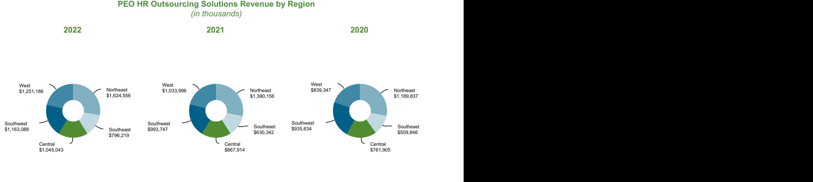

{0}------------------------------------------------

## UNITED STATES SECURITIES AND EXCHANGE COMMISSION Washington, D.C. 20549

# **FORM 10-K**

#### **(Mark One)**

| ☒ | Annual Report Pursuant to Section 13 or 15(d) of the Securities Exchange Act of 1934     |
|---|------------------------------------------------------------------------------------------|
|   | For the fiscal year ended December 31, 2022                                           |
|   | or                                                                                       |
| ☐ | Transition Report Pursuant to Section 13 or 15(d) of the Securities Exchange Act of 1934 |
|   | For the transition period from _______________ to _______________                        |
|   |                                                                                          |

Commission File No. 1-13998

(Exact name of registrant as specified in its charter)

| Delaware                                         | 76-0479645                           |
|--------------------------------------------------|--------------------------------------|
| (State or other jurisdiction of incorporation or | (I.R.S. Employer Identification No.) |
| organization)                                    |                                      |

| 19001 Crescent Springs Drive                                         |            |
|----------------------------------------------------------------------|------------|
| Kingwood, Texas                                                   | 77339      |
| (Address of principal executive offices)                             | (Zip Code) |
| (Registrant's Telephone Number, Including Area Code): (281) 358-8986 |            |

Securities Registered Pursuant to Section 12(b) of the Act:

Common Stock, Par value \$0.01 per share NSP New York Stock Exchange (Title of class) (Trading symbol) (Name of exchange on which registered)

Securities Registered Pursuant to Section 12(g) of the Act: NONE

Indicate by check mark if the registrant is a well-known seasoned issuer, as defined in Rule 405 of the Securities Act. Yes ☒ No ☐

Indicate by check mark if the registrant is not required to file reports pursuant to Section 13 or Section 15(d) of the Act. Yes ☐ No ☒

Indicate by check mark whether the registrant (1) has filed all reports required to be filed by Section 13 or 15(d) of the Securities Exchange Act of 1934 during the preceding 12 months (or for such shorter period that the registrant was required to file such reports) and (2) has been subject to such filing requirements for the past 90 days. Yes ☒ No ☐

Indicate by check mark whether the registrant has submitted electronically every Interactive Data file required to be submitted pursuant to Rule 405 of Regulation S-T during the preceding 12 months (or for such shorter period that the registrant was required to submit such files).

Yes ☒ No ☐

{1}------------------------------------------------

Indicate by check mark whether the registrant is a large accelerated filer, an accelerated filer, a non-accelerated filer, a smaller reporting company, or an emerging growth company. See the definition of "large accelerated filer," "accelerated filer," "smaller reporting company" and "emerging growth company" in Rule 12b-2 of the Exchange Act.

| Large accelerated filer   | ☒ | Accelerated filer       | ☐ |
|---------------------------|---|-------------------------|---|
| Non-accelerated filer     | ☐ | Emerging growth company | ☐ |
| Smaller reporting company | ☐ |                         |   |

If an emerging growth company, indicate by check mark if the registrant has elected not to use the extended transition period for complying with any new or revised financial accounting standards provided pursuant to Section 13(a) of the Exchange Act. ☐

Indicate by check mark whether the registrant has filed a report on and attestation to its management's assessment of the effectiveness of its internal control over financial reporting under Section 404(b) of the Sarbanes-Oxley Act (15 U.S.C. 7262(b)) by the registered public accounting firm that prepared or issued its audit report. ☒

If securities are registered pursuant to Section 12(b) of the Act, indicate by check mark whether the financial statements of the registrant included in the filing reflect the correction of an error to previously issued financial statements.☐

Indicate by check mark whether any of those error corrections are restatements that required a recovery analysis of incentive-based compensation received by any of the registrant's executive officers during the relevant recovery period pursuant to §240.10D-1(b).☐

Indicate by check mark whether the registrant is a shell company (as defined in Rule 12b-2 of the Exchange Act). Yes ☐ No ☒

As of February 2, 2023, 37,851,697 shares of the registrant's common stock, par value \$0.01 per share, were outstanding. As of the last business day of the registrant's most recently completed second quarter, the aggregate market value of the common stock held by non-affiliates (based upon the June 30, 2022 closing price of the common stock as reported by the New York Stock Exchange) was approximately \$3.6 billion.

### **DOCUMENTS INCORPORATED BY REFERENCE**

Part III information is incorporated by reference from the proxy statement for the 2023 annual meeting of stockholders, which the registrant intends to file within 120 days of the end of the fiscal year.

{2}------------------------------------------------

| Page |  |
|------|--|
|------|--|

| Part I           |                                                                                                                 |    |
|------------------|-----------------------------------------------------------------------------------------------------------------|----|
| Item 1.          | Business                                                                                                        | 2  |
| Item 1A.         | Risk Factors                                                                                                    | 18 |
| Item 1B.         | Unresolved Staff Comments                                                                                       | 30 |
| Item 2.          | Properties                                                                                                      | 31 |
| Item 3.          | Legal Proceedings                                                                                               | 32 |
| Item 4.          | Mine Safety Disclosures                                                                                         | 33 |
| Item S-K 401(b). | Executive Officers of the Registrant                                                                            | 34 |
| Part II          |                                                                                                                 |    |
| Item 5.          | Market for Registrant's Common Equity, Related Stockholder Matters and Issuer Purchases of Equity Securities | 35 |
| Item 6.          | [Reserved]                                                                                                      | 36 |
| Item 7.          | Management's Discussion and Analysis of Financial Condition and Results of Operations                           | 37 |
| Item 7A.         | Quantitative and Qualitative Disclosures about Market Risk                                                      | 55 |
| Item 8.          | Financial Statements and Supplementary Data                                                                     | 55 |
| Item 9.          | Changes in and Disagreements with Accountants on Accounting and Financial Disclosure                            | 56 |
| Item 9A.         | Controls and Procedures                                                                                         | 56 |
| Item 9B.         | Other Information                                                                                               | 56 |
| Item 9C.         | Disclosure Regarding Foreign Jurisdictions that Prevent Inspections                                             | 56 |
| Part III         |                                                                                                                 |    |
| Item 10.         | Directors, Executive Officers and Corporate Governance                                                          | 57 |
| Item 11.         | Executive Compensation                                                                                          | 57 |
| Item 12.         | Security Ownership of Certain Beneficial Owners and Management and Related Stockholder Matters               | 57 |
| Item 13.         | Certain Relationships and Related Transactions, and Director Independence                                       | 57 |
| Item 14.         | Principal Accounting Fees and Services                                                                          | 57 |
| Part IV          |                                                                                                                 |    |
| Item 15.         | Exhibits, Financial Statement Schedules                                                                         | 58 |
| Item 16.         | Form 10-K Summary                                                                                               | 61 |

{3}------------------------------------------------

## **PART I**

Unless otherwise indicated, "Insperity," "we," "our" and "us" are used in this annual report to refer to Insperity, Inc. and its consolidated subsidiaries. This annual report contains forward-looking statements within the meaning of Section 27A of the Securities Act of 1933 (the "Securities Act") and Section 21E of the Securities Exchange Act of 1934 (the "Exchange Act"). You can identify such forward-looking statements by the words "anticipates," "expects," "intends," "plans," "projects," "believes," "estimates," "likely," "possibly," "probably," "could," "goal," "opportunity," "objective," "target," "assume," "outlook," "guidance," "predicts," "appears," "indicator" and similar expressions. In the normal course of business, in an effort to help keep our stockholders and the public informed about our operations, from time to time, we may issue such forward-looking statements, either orally or in writing. Generally, these statements relate to business plans or strategies; projected or anticipated benefits or other consequences of such plans or strategies; or projections involving anticipated revenues, earnings, average number of worksite employees ("WSEEs"), benefits and workers' compensation costs, or other operating results. We base the forward-looking statements on our current expectations, estimates and projections. We caution you that these statements are not guarantees of future performance and involve risks, uncertainties and assumptions that we cannot predict. In addition, we have based many of these forward-looking statements on assumptions about future events that may prove to be inaccurate. Therefore, the actual results of the future events described in such forward-looking statements in this annual report, or elsewhere, could differ materially from those stated in such forward-looking statements. Among the factors that could cause actual results to differ materially are the risks and uncertainties discussed in this annual report, including, without limitation, factors discussed in Item 1, "Business," Item 1A, "Risk Factors," and Item 7, "Management's Discussion and Analysis of Financial Condition and Results of Operations."

### **Item 1. Business.**

### **General**

We provide an array of human resources ("HR") and business solutions designed to help improve business performance. Since our formation in 1986, we have evolved from being solely a professional employer organization ("PEO"), an industry we pioneered, to our current position as a comprehensive business performance solutions provider.

Our long-term strategy is to provide the best small and medium-sized businesses in the United States with our specialized human resources service offering and to leverage our buying power and expertise to provide additional valuable services to clients. Our most comprehensive HR services offerings are provided through our Workforce Optimization® and Workforce SynchronizationTM solutions (together, our "PEO HR Outsourcing Solutions"), which encompass a broad range of human resources functions, including payroll and employment administration, employee benefits, workers' compensation, government compliance, performance management, and training and development services, along with our cloud-based human capital management platform, our Insperity PremierTM platform. Workforce Optimization is our most comprehensive HR outsourcing solution and is our primary offering. Workforce Synchronization, which generally is offered only to our middle market client segment, is a lower cost offering with a typically longer commitment that includes the same compliance and administrative services as Workforce Optimization and allows those clients to select, for an additional fee, from the strategic HR products and services that are included with Workforce Optimization.

In addition to our PEO HR Outsourcing Solutions, we offer a comprehensive traditional payroll and human capital management solution, known as our Workforce AccelerationTM solution. We also offer a number of other business performance solutions, including Recruiting Services, Employment Screening, Retirement Services, and Insurance Services. These other products and services generally are offered only with our other solutions.

Our PEO HR Outsourcing Solutions are designed to improve the productivity and profitability of small and medium-sized businesses. These solutions relieve business owners and key executives of many employer-related administrative and regulatory burdens, which enable them to focus on the core competencies of their businesses. Our PEO HR Outsourcing Solutions also promote employee performance through human capital management techniques designed to improve employee engagement and satisfaction. We enter into a Client Service Agreement ("CSA") with each of our PEO HR Outsourcing Solutions clients under which we and our client act as co-employers of the employees who work at the client's worksite, or worksite employees ("WSEEs"). Under the CSA, we assume responsibility for personnel administration and assist our clients in complying with employment-related governmental regulations, while the client retains the employees' services in its business and remains the employer for other purposes. We charge a comprehensive service fee ("comprehensive service fee" or "gross billing"), which is invoiced concurrently with the processing of payroll

{4}------------------------------------------------

for the WSEEs of the client. The comprehensive service fee consists of the payroll of our WSEEs plus an additional amount reflected as a percentage of the payroll cost of the WSEEs.

We accomplish the objectives of our PEO HR Outsourcing Solutions through a "high-touch/high-tech" approach to service delivery. In advisory areas, such as recruiting, employee performance management and employee training, we employ a high-touch approach designed to ensure that our clients receive the personal attention and expertise needed to create a customized human resources solution. We utilize a variety of information technology capabilities to deliver our PEO HR Outsourcing Solutions, including Insperity Premier through which we, along with our clients and WSEEs, manage employee administration, payroll, payroll tax, benefits, retirement solutions and other HR-related information, creating efficiencies for all parties.

As of December 31, 2022, we had 74 physical office locations in 43 markets. To take advantage of economic efficiencies, multiple sales offices may share a physical location. In addition, we had four regional service centers along with human resources and client service personnel located in a majority of our 43 sales markets, which serviced an average of 307,506 WSEEs per month in the fourth quarter of 2022. Our service centers coordinate PEO HR Outsourcing Solutions for clients on a regional basis and localized face-to-face human resources services.

We were organized as a corporation in 1986. Our principal executive offices are located at 19001 Crescent Springs Drive, Kingwood, Texas 77339. Our telephone number at that address is (281) 358-8986, and our website address is www.insperity.com. Our stock is traded on the New York Stock Exchange under the symbol "NSP." We file or furnish periodic reports with the Securities and Exchange Commission ("SEC"), including our annual reports on Form 10-K, quarterly reports on Form 10-Q, current reports on Form 8-K, and if applicable, amendments to those reports filed or furnished pursuant to Section 13(a) or 15(d) of the Exchange Act. Through the investor relations section of our website, we make available electronic copies of the documents that we file or furnish to the SEC, the charters of the standing committees of our Board of Directors and other documents related to our corporate governance, including our Code of Conduct. Access to these electronic filings is available free of charge as soon as reasonably practicable after filing or furnishing them to the SEC. Printed copies of our committee charters and other governance documents and filings can be requested by writing to our corporate secretary at the address above. Information on our website is not a part of, and is not incorporated into, this report or any other report we may file with or furnish to the SEC, whether before or after the date of this report and irrespective of any general incorporation language therein.

## **PEO Industry**

The PEO industry began to evolve in the early 1980s largely in response to the burdens placed on small and mediumsized employers by an increasingly complex legal and regulatory environment. While various service providers were available to assist these businesses with specific tasks, PEOs emerged as providers of a more comprehensive range of services relating to the employer/employee relationship. In a PEO arrangement, the PEO assumes certain aspects of the employer/employee relationship as defined in the contract between the PEO and its client. Because PEOs provide employer-related services to a large number of employees, they can achieve economies of scale that allow them to perform employment-related functions more efficiently, provide a greater variety of employee benefits, and devote more attention to human resources management than a client can individually.

We believe the key factors driving demand for PEO services include:

- the focus on growth and productivity of the small and medium-sized business community in the United States, utilizing outsourcing to concentrate on core competencies
- the need to provide competitive health care and related benefits to attract and retain employees
- the increasing costs associated with health and workers' compensation insurance coverage, workplace safety programs, employee-related complaints and litigation
- complex regulation of payroll, payroll tax and employment issues and the related costs of compliance, including the allocation of time and effort to such functions by owners and key executives
- the significant costs, time and specialized knowledge required to purchase or develop the technology infrastructure to administer benefits, HR and payroll processing on an integrated basis

{5}------------------------------------------------

A significant factor in the development of the PEO industry has been increasing recognition and acceptance of PEOs and the co-employer relationship by federal and state governmental authorities. Insperity and other industry leaders, in concert with the National Association of Professional Employer Organizations ("NAPEO"), have worked with the relevant governmental entities for the establishment of a regulatory framework that protects clients and employees, discourages unscrupulous and financially unsound PEOs, and promotes further development of the industry. Currently, 42 states have enacted legislation either recognizing PEOs or requiring licensing, registration, or certification, and several others are considering such regulation. Such laws vary from state to state but generally provide for monitoring the fiscal responsibility of PEOs. State regulation assists in screening insufficiently capitalized PEO operations and helps to resolve interpretive issues concerning employer/employee status for specific purposes under applicable state law. We have actively supported such regulatory efforts and are currently recognized, licensed, registered, certified or pursuing registration in all of these states. The cost of compliance with these regulations is not material to our financial position or results of operations.

The Small Business Efficiency Act ("SBEA") created a federal regulatory framework for the payment of wages to WSEEs and the reporting and remittance of federal payroll taxes on those wages paid by PEOs certified under the Internal Revenue Code as meeting certain requirements ("CPEOs"). We actively supported the enactment of this law. The SBEA clarified that a CPEO, rather than the client, is treated as the employer for purposes of reporting and remitting payroll taxes. It also clarified that a CPEO is treated as a successor employer for purposes of the wage base of WSEEs on which federal payroll taxes are applied. In addition, the law clarified that clients of a CPEO remain eligible for specified tax credits for which they would have been eligible absent the CPEO relationship. Following the establishment of the voluntary certification program by the Internal Revenue Service of the United States ("IRS") and Treasury Department, our PEO subsidiary, Insperity PEO Services, L.P., received its designation as a CPEO from the IRS.

## **Service Offerings**

### *PEO HR Outsourcing Solutions*

We serve small and medium-sized businesses by providing our PEO HR Outsourcing Solutions, which encompass a broad range of services. Both of our PEO HR Outsourcing Solutions offer the following:

- payroll and benefits administration
- general HR advice
- health and workers' compensation insurance programs
- 401(k) retirement plan sponsored by us
- employer liability management
- assistance with government compliance
- personnel records management
- access to Insperity Premier for employees, managers, and client owners

Our Workforce Optimization solution also provides additional services that our Workforce Synchronization clients can purchase for an additional fee, including the following:

- employee recruiting and support
- employee performance management
- training and development services

{6}------------------------------------------------

Our PEO HR Outsourcing Solutions are designed to attract and retain high-quality employees, while relieving client owners and key executives of many employer-related administrative and regulatory burdens. Among the employmentrelated laws and regulations that may affect a client are the following:

- 
- 
- 
- 
- Employee Retirement Income Security Act, as amended (ERISA)
- Consolidated Omnibus Budget Reconciliation Act of 1985 (COBRA)
- 
- 
- Health Insurance Portability and Accountability Act (HIPAA) The Families First Coronavirus Response Act
- 
- 
- 
- Genetic Information Nondiscrimination Act of 2008 Paycheck Protection Program and Healthcare
- Internal Revenue Code (the "Code") Occupational Safety and Health Act (OSHA)
- Federal Income Contribution Act (FICA) Worker Adjustment and Retraining Notification Act (WARN)
- Federal Unemployment Tax Act (FUTA) Uniformed Services Employment and Reemployment Rights Act (USERRA)
- Fair Labor Standards Act (FLSA) State unemployment and employment security laws
	- State workers' compensation laws
	- Health Care and Education Reconciliation Act of 2010 (the "Reconciliation Act")
- Immigration Reform and Control Act (IRCA) Patient Protection and Affordable Care Act (PPACA)
- Title VII (Civil Rights Act of 1964) State and local law equivalents of the foregoing
	- (FFCRA)
- Age Discrimination in Employment Act (ADEA) The Coronavirus Aid, Relief and Economic Security Act, also known as the CARES Act
- Americans with Disabilities Act (ADA) The Consolidated Appropriations Act, 2021 (CAA)
- The Family and Medical Leave Act (FMLA) The American Rescue Plan Act of 2021 (ARPA)
	- Enhancement Act (PPP)

- Drug-Free Workplace Act
These laws and regulations are complex, and in some instances overlapping. We assist our PEO HR Outsourcing Solutions clients in complying with these laws and regulations by providing services in the categories set forth below:

*Administrative Functions*. Administrative functions encompass a wide variety of processing and recordkeeping tasks, mostly related to payroll administration and regulatory compliance. Specific examples include:

- payroll processing
- payroll tax deposits
- payroll tax reporting
- employee file maintenance
- unemployment claims processing
- workers' compensation claims reporting and monitoring

*Benefit Plans Administration*. We maintain several benefit plans for eligible WSEEs including the following:

- a group health plan
- a health savings account program
- a health care flexible spending account plan
- a 401(k) retirement plan
- an employee well-being program

{7}------------------------------------------------

- cafeteria plans for group health and health savings account contributions
- short-term and long-term disability insurance
- an educational assistance program
- an adoption assistance program
- group term life insurance
- accidental death and dismemberment insurance
- critical illness and accident insurance

The group health plan includes medical, dental, vision and prescription drug coverage. All benefit plans are provided to eligible employees based on the specific eligibility provisions of each plan. We are the policyholder responsible for the costs and premiums associated with any group insurance policies that provide benefits under these plans, and we act as plan sponsor and administrator of the plans. We negotiate the terms and costs of the plans, maintain the plans in accordance with applicable federal and state regulations and serve as liaison for the delivery of these benefits to WSEEs and corporate employees. COBRA coverage is extended to eligible terminated WSEEs and other eligible individuals in accordance with applicable law. We believe that the variety and comprehensive nature of our benefit plan offerings are generally not available to employees in our small and medium-sized business target market and allow our clients to compete with the type and level of benefits usually offered only by companies with a larger group of employees. As a result, we believe the availability of these benefit plans provides our clients with a competitive advantage that small and medium-sized businesses are typically unable to attain on their own.

*Insperity Premier.* Insperity Premier is our cloud-based human capital management platform for our PEO HR Outsourcing Solutions and is available to our clients with minimal implementation effort. It is designed to provide our service providers with insight into client and WSEE HR information to better support their needs. Insperity Premier provides role-based access to a wide range of human capital management functions, along with personalized content to the managers, owners and WSEEs of our PEO HR Outsourcing Solutions clients, including:

For managers and client owners:

- WebPayroll for the submission, approval, and reporting of payroll data
- mobile access to review and approve payroll transactions and employee time entry
- tools to manage the onboarding of new employees
- employee administration functions such as viewing or changing information about employees
- access to client-specific compliance-related information relevant to many HR areas
- reporting and analytics tools to create, view, save, and export reports and data about employees and to perform more complex analysis and visualization of their workforce data with the Insperity People Analytics solution
- ability to manage employee time and attendance information, absences, and paid time off
- access to talent management tools in the areas of recruiting, performance management, and learning management
- access to a library of online human resources forms
- access to a wide range of best-practices human resources management content

For WSEEs:

- access to view, edit, and change a range of employee profile information

{8}------------------------------------------------

- online check stubs, pay history, W-2 forms, W-4 forms, and other state forms
- employee-specific benefits content, including summary plan descriptions, enrollment status, and tools to assist with benefits selection for Insperity-sponsored plans
- access to 401(k) retirement plan information for covered plans
- e-learning web-based training
- links to benefits providers and other key vendors
- performance management tools including self-reviews and review history, if offered by client
- ability to submit time and attendance information, absences, and paid time off requests, if offered by client
- mobile access to perform a wide range of employee-specific activities such as reporting time and attendance and paid time off, view pay stubs, insurance coverage and ID cards, view 401(k) balances and other commonly accessed data

*People Management*. In addition to the services we deliver through Insperity Premier, we provide a wide variety of human capital management services that give our clients access to HR advisors and additional resources normally found only in the human resources departments of large companies. All PEO HR Outsourcing Solutions clients have access to our advice concerning personnel policies and practices, including recruiting, discipline, and termination procedures. Other human capital management services we provide include:

- drafting and reviewing personnel policies and employee handbooks
- designing job descriptions
- performing prospective employee screening and background investigations
- designing performance appraisal processes and tools
- professional development and issues-oriented training
- diversity, equity and inclusion training
- employee coaching and counseling
- substance abuse awareness training
- outplacement services
- compensation guidance

*Employer Liability Management*. Under the CSA, we assume many of the employment-related responsibilities associated with the administrative functions, benefit plans administration, and human capital management services we provide. For many of those employment-related responsibilities that are the responsibility of the client or of both the client and us, we may assist our clients in managing and limiting liability. This assistance may include safety-related risk management reviews as well as the implementation by our clients of safety programs, for which our clients are responsible, that are designed to reduce workplace accidents and, consequently, workers' compensation claims. We also provide guidance to clients for avoiding discrimination, sexual harassment and civil rights violations, and we assist with termination decisions when consulted to attempt to minimize liability on those grounds. While we do not provide legal services to our clients, we employ in-house and external counsel who specialize in several areas of employment law, have broad experience in disputes concerning the employer/employee relationship, and provide support to our internal human resources professionals. As part of our comprehensive service, we also maintain employment practice liability insurance coverage for ourselves and our clients, monitor developments in HR-related laws and regulations, and notify clients of the potential effect of such changes on employer liability.

{9}------------------------------------------------

*MarketPlaceSM provided by Insperity*® . Through our many alliances with best-of-class providers, Insperity's MarketPlace is an e-commerce portal that brings a wide range of products and services to our clients, WSEEs and their families. Through MarketPlace, which is provided through Insperity Premier, our clients also have the opportunity to offer their products and services to other clients and WSEEs.

*Middle Market Solutions.* We believe the middle market sector, which we generally define as those companies with employees ranging from approximately 150 to 5,000 WSEEs, has historically been under-served by the PEO industry. Currently, we have a dedicated sales management, service personnel and consulting staff who concentrate solely on the middle market sector. Our average number of WSEEs per month in our middle market sector in 2022 increased 23.3% from 2021, and the middle market sector as a percentage of our overall WSEE count also increased over this period, representing approximately 24.9% and 23.8% of our total average paid WSEEs during 2022 and 2021, respectively. Clients with an average number of WSEEs exceeding 1,000 paid WSEEs represented 5.4% and 1.9% of our total average paid WSEEs during 2022 and 2021, respectively.

### *Other Product and Services Offerings*

We offer other product and services offerings on a stand-alone basis and to our PEO HR Outsourcing Solutions clients. We also strive to leverage our relationships with our customers to enable cross-selling of our various products and services.

During 2022 and 2021, revenues from our other products and services offerings as a percentage of our total revenues were 0.7% and 0.9%, respectively.

Following are the key components of our other products and services, which are offered separately or as a bundle:

*Comprehensive Traditional Payroll and Human Capital Management Solution.* Our Insperity Workforce Acceleration solution is a comprehensive human capital management and payroll services solution for clients that do not choose our PEO HR Outsourcing Solutions. This solution combines a third-party cloud-based human resources software suite that provides integrated payroll, HR administration and employee onboarding, benefits administration, performance management, and time and attendance functionality with HR guidance and tools, as well as reporting and analytics. In addition, through a strategic partner, Workforce Acceleration clients have access to a national, licensed insurance brokerage that specializes in the insurance needs of small businesses.

*Recruiting Services.* Our Recruiting Services offer direct hire placement on an as-needed basis and provides outsourced support for individual requisitions or large-scale hiring projects. In addition, we provide consulting services to assist in the creation and maintenance of consistent hiring practices and retention strategies. We also provide compensation services, behavior-based interview training and talent assessment.

*Employment Screening.* Our Employment Screening services offer a customized approach to background-check reporting for companies. Services include criminal records checks; verification of employment history or education; driving record, civil record and credit history checks; and confirmation of extraordinary credentials.

*Retirement Services.* Our Retirement Services solutions deliver comprehensive 401(k) retirement plan recordkeeping and administrative services to small and medium-sized businesses, primarily in connection with a 401(k) retirement plan we sponsor for our PEO HR Outsourcing Solutions clients. Services include employee education and enrollment, participant communications, elective deferral withholding and transmission, matching contribution calculation, loan and distribution processing, regulatory filing preparation and nondiscrimination testing.

*Insurance Services.* Our Insurance Services solutions offer assistance through our licensed insurance agency to small and medium-sized businesses throughout the United States to secure affordable, customizable business insurance packages and life, health and disability insurance policies. Insurance Services also assists individuals in obtaining insurance coverages.

## **Client Service Agreement**

All PEO HR Outsourcing Solutions clients execute a CSA with us. The CSA provides for an ongoing relationship between Insperity and the PEO HR Outsourcing Solutions client. For most clients, the CSA generally establishes pricing for a period of one year and is subject to termination by Insperity or the client upon 30 days' written notice or upon shorter notice in the event of default. CSAs for our middle market clients generally establish pricing for two years and are subject

{10}------------------------------------------------

to termination by clients upon payment of a termination fee or otherwise by the parties upon an event of default. The CSA establishes our comprehensive service fee, which is subject to periodic adjustments to account for changes in the composition of the client's workforce, employee benefit election changes, and statutory changes that affect our costs. Under the CSA, clients are obligated to pay the estimated payroll tax component of the comprehensive service fee in a manner that reflects the pattern of incurred payroll tax costs. This practice aligns clients' payments to us with our obligations to make payments to tax authorities, which are higher in the earlier part of the year and decrease as limits on wages subject to payroll tax are reached.

The CSA also establishes the division of responsibilities between us and the client as co-employers. Pursuant to the CSA, we are responsible for personnel administration and for compliance with certain employment-related government regulations. In addition, we assume liability for payment of salaries and wages (as well as related payroll taxes) of our WSEEs and responsibility for providing specified employee benefits to such persons. These liabilities are not contingent on the prepayment by the client of the associated comprehensive service fee. Instead, as a result of our employment relationship with each of our WSEEs, we are liable for payment of salary and wages to the WSEEs as reported by the client and are responsible for providing specified employee benefits to such persons regardless of whether the client pays the associated comprehensive service fee. The client retains the employees' services and remains liable for complying with certain government regulations that require control of the worksite or daily supervisory responsibility or is otherwise beyond our ability to assume. A third group of responsibilities and liabilities are assumed by both Insperity and the client where such concurrent responsibility is appropriate. The specific division of applicable responsibilities under our CSAs generally is as follows:

### *Insperity Responsibilities*

- Payment of wages and salaries as reported by the client and related tax reporting and remittance (local, state and federal withholding, FICA, FUTA, state unemployment)
- Workers' compensation compliance, procurement, management and reporting
- Compliance with the Code, COBRA, ERISA and PPACA for Insperity-sponsored employee benefit plans, as well as monitoring changes in other governmental laws and regulations governing the employer/employee relationship and updating the client when necessary
- Offering benefits under Insperity-sponsored employee benefit plans
- Administration of Insperity-sponsored employee benefit plans

### *Client Responsibilities*

- Payment, through Insperity, of commissions, bonuses, vacations, paid time off, sick pay, paid leaves of absence, and severance payments
- Payment and related tax reporting and remittance of non-qualified deferred compensation and equity-based compensation
- Products produced and/or services provided
- Compliance with OSHA regulations, EPA regulations, FLSA, FMLA, WARN, USERRA, and state and local equivalents and compliance with government contracting provisions
- Compliance with federal, state, and local pay or play health care mandates and all such other similar federal, state and local legislation
- Compliance with the National Labor Relations Act ("NLRA"), including all organizing efforts and expenses related to a collective bargaining agreement and related benefits
- Professional licensing requirements, fidelity bonding, and professional liability insurance
- Ownership and protection of all client intellectual property rights
- the Code, COBRA, PPACA, and ERISA compliance for client-sponsored employee benefit plans

{11}------------------------------------------------

- For clients electing payroll tax deferrals and claiming tax credits under the FFCRA, the CARES Act, PPP, CAA, and ARPA (collectively, the "COVID Relief Programs"), the client has sole responsibility for determining eligibility under the programs and depositing deferred payroll tax amounts with the U.S. Treasury as they become due
#### *Concurrent Responsibilities*

- Implementation of policies and practices relating to the employee/employer relationship
- Internal compliance with all federal, state and local employment laws, including Title VII of the Civil Rights Act of 1964, ADEA, Title I of ADA, the Consumer Credit Protection Act and immigration laws and regulations

We maintain employment practice liability insurance coverages (including coverages for our clients) to manage our exposure for various employee-related claims. Our incurred costs in excess of annual premiums with respect to this exposure have historically been insignificant to our operating results.

Because we are a co-employer with the client for some purposes, it is possible that we could incur liability for violations of such laws, even if we are not responsible for the conduct giving rise to such liability. Our CSA ordinarily addresses this issue by providing that the client will indemnify us for liability incurred to the extent the liability is attributable to conduct by the client. Notwithstanding this contractual right to indemnification, it is possible that we could be unable to collect on a claim for indemnification and may therefore be ultimately responsible for satisfying the liability in question.

In most instances, clients are required to remit their comprehensive service fees no later than the same day as the applicable payroll date by wire transfer or automated clearinghouse transaction. Although we are ultimately liable, as the employer for payroll purposes, to pay employees for work previously performed, we retain the ability to terminate immediately the CSA and associated WSEEs or to require prepayment, letters of credit, or other collateral upon deterioration in a client's financial condition or upon non-payment by a client. These rights, the periodic nature of payroll, and the overall quality of our client base have resulted in an excellent overall collections history.

## **PEO HR Outsourcing Solutions Clients**

Insperity's PEO HR Outsourcing Solutions provide value-added, full-service human resources solutions we believe are most suitable to a specific segment of the small and medium-sized business community. We target successful businesses with approximately 10 to 5,000 employees that recognize the advantage in the strategic use of high-performance human resources practices. We have set a long-term goal to serve approximately 10% of the overall small and medium-sized business community in terms of WSEEs. We serve clients and WSEEs located throughout the United States.

By region, our revenue distribution for the year ended December 31, 2022, was as follows:

### **Percent of Total Revenues**

{12}------------------------------------------------

Please read Note 1 to the Consolidated Financial Statements, "Accounting Policies," for additional information related to the change in revenues by region.

All prospective PEO HR Outsourcing Solutions clients are evaluated on the basis of a comprehensive analysis of employer-related risks entailing many factors, including (where permitted) industry and operations, workplace safety and workers' compensation, unemployment history, operating stability, group medical information, human resources practices and other employer risks. As part of our client selection strategy, we strive to minimize offering our PEO HR Outsourcing Solutions to businesses falling within certain specified NAICS (North American Industry Classification System) codes for those industries that we believe present a higher employer risk such as employee injury, high turnover or litigation.

Our PEO HR Outsourcing Solutions client base is broadly distributed throughout a wide variety of industries as follows:

### **Percent of Client Base by Industry**

This diverse client base lowers our exposure to downturns or volatility in any particular industry. However, our performance could be affected by a downturn in one of these industries or by general economic conditions within the small and medium-sized business community.

We focus heavily on client retention. During 2022 and 2021, our retention rate was approximately 85% and 82%, respectively. For all PEO HR Outsourcing Solutions clients, the average annual retention rate over the last five years was approximately 84%. Client attrition is attributable to a variety of factors, including: (1) client non-renewal due to price or service factors; (2) client business failure, sale, merger or disposition; (3) our termination of the CSA resulting from the client's non-compliance or inability to make timely payments; and (4) competition from other PEOs or business services firms.

## **Marketing and Sales**

As of December 31, 2022, we had 92 sales offices located in 43 markets. Our sales offices typically consist of seven to nine Business Performance Advisors ("BPAs"), a district sales manager, and an office administrator. To take advantage of economic efficiencies, multiple sales offices may share a physical location.

We identify markets using a systematic market evaluation and selection process. We continue to evaluate a broad range

{13}------------------------------------------------

## **BUSINESS**

of factors in the selection process, using a market selection model that weighs various criteria that, based on our experience, we believe are reliable predictors of successful penetration. Among the factors we consider are:

- market size, in terms of small and medium-sized businesses engaged in selected industries that meet our risk profile
- market receptivity to PEO services, including the regulatory environment and relevant history with other PEO providers
- existing relationships within a given market, such as vendor or client relationships
- expansion cost issues, such as advertising and overhead costs
- direct cost issues that bear on our effectiveness in controlling and managing the cost of our services, such as workers' compensation and health insurance costs, unemployment risks, and various legal and other factors
- a comparison of the services we offer to alternatives available to small and medium-sized businesses in the relevant market, such as the cost to the target clients of procuring services directly or through other PEOs
- long-term strategy issues, such as the general perception of markets and our estimate of the long-term revenue growth potential of the market

We develop a mix of national and local advertising media and a placement strategy tailored to each individual market. After selecting a market and developing our marketing mix, but prior to entering the market, we engage in an organized media and public relations campaign to prepare the market for our entry and to begin the process of generating sales leads. We market our services through various business promotions and a broad range of media outlets, including digital marketing, television, radio, newspapers, periodicals and direct mail. We employ public relations firms for most of our markets as well as advertising consultants to coordinate and implement our marketing campaigns. We have developed an inventory of television, radio and newsprint advertisements, which are utilized in this effort.

We routinely seek to develop new marketing approaches and campaigns to capitalize on changes in the competitive landscape for our human resources services and to more successfully reach our target market. We have an agreement with the Professional Golf Association Champions Tour to be the title sponsor of the annual Insperity Invitational™ presented by UnitedHealthcare® professional golf tournament held annually in The Woodlands, Texas (a suburb of Houston). In addition, we have an arrangement with Jim Nantz, a sports commentator, to serve as our national spokesperson. Our marketing campaigns use this event and the relationship with Mr. Nantz as a focal point of our brand marketing efforts.

Our organic growth model generates sales leads from six primary sources: direct sales efforts, digital advertising, traditional advertising, third-party channel programs, referrals, and marketing alliances. These leads result in initial presentations to prospective PEO HR Outsourcing Solutions clients, and ultimately, prospective PEO HR Outsourcing Solutions client business profiles. A prospective PEO HR Outsourcing Solutions client's business profile reflects information gathered by the BPA about the prospect's employees, including base compensation, level of benefits coverage options, job classification, state of employment and workers' compensation classification. This information is used to generate a bid from our customized bid system, which applies Insperity's proprietary pricing model to the census data. Concurrent with this process, we evaluate prospective clients through the previously described comprehensive employer risk analysis. Upon completion of a favorable employer risk evaluation, the BPA presents the bid and attempts to complete the sale and enroll the prospect. Our selling process typically takes approximately 90 days for clients with less than 150 employees, and 180 days or longer for middle market clients. The process can be extended during economic downturns.

We have implemented a sales process that allows our BPAs to offer our PEO HR Outsourcing Solutions or Workforce Acceleration, our traditional payroll solution, to each prospective client with which they meet. This strategy allows us to leverage the same sales force for all of our primary offerings and increases the ability of our BPAs to add clients to our Workforce Acceleration solution when the client is not prepared for PEO HR Outsourcing Solutions. This dual channel approach to selling attempts to reduce barriers to a company becoming a client and allows us to offer solutions better tailored to the specific needs of the business, including at renewal.

{14}------------------------------------------------

### **Competition**

We provide a value-added, full-service human resources solution through our PEO HR Outsourcing Solutions, which we believe is most suitable to a specific segment of the small and medium-sized business community. This full-service approach is exemplified by our commitment to provide a high level of service and technology personnel, which has produced a ratio of corporate staff to WSEEs (the "staff support ratio") that is higher than average for the PEO industry. Based on an analysis of the 2019 through 2021 annual NAPEO surveys of the PEO industry, we have successfully leveraged our full-service approach into significantly higher returns for Insperity on a per WSEE per month basis. During the three-year period from 2019 through 2021, our staff support ratio averaged 55% higher than the PEO industry average. During the same three-year period, our gross profit per WSEE and operating income per WSEE exceeded industry averages by 144% and 223%, respectively.

Competition in the PEO industry revolves primarily around quality of services, scope of services, choice and quality of benefits packages, reputation, and price. We believe reputation, national presence, regulatory expertise, financial resources, risk management, and information technology capabilities distinguish leading PEOs from the rest of the industry. We also believe we compete favorably in these areas; however, other PEOs may offer their PEO services at lower prices than we offer.

Due to the differing geographic regions and market segments in which most PEOs operate, and the relatively low level of market penetration by the industry, we consider our primary competition for our PEO HR Outsourcing Solutions to be the traditional in-house provision of human resources services. The PEO industry is highly fragmented and we have seen competition intensify; however, we believe Insperity is one of the largest PEO service providers in the United States. Our largest national competitors include the PEO divisions of large business services companies such as Automatic Data Processing, Inc. and Paychex, Inc., and other national PEOs, such as TriNet Group, Inc. In addition, we also face competition from: (1) fee-for-service providers such as payroll processors and human resources consultants; (2) human resources technology solution companies; and (3) large regional PEOs in certain areas of the country.

### **Vendor Relationships**

Insperity provides benefits to its WSEEs under arrangements with a variety of vendors. We consider our contracts with UnitedHealthcare ("United") and the Chubb Group of Insurance Companies ("Chubb") to be the most significant elements of our employee benefits package, as they would be the most difficult to replace.

We provide group health insurance coverage to our WSEEs through a national network of carriers including United, UnitedHealthcare of California, Kaiser Permanente, Blue Shield of California, HMSA BlueCross BlueShield of Hawaii and Tufts, all of which provide fully insured policies or service contracts. The health insurance contract with United provides approximately 87% of our participants' health insurance coverage and expires on December 31, 2026, subject to cancellation by either party upon 180 days' notice. For a discussion of our contract with United, which is accounted for using a partially self-funded insurance accounting model, please read Item 7. "Management's Discussion and Analysis of Financial Condition and Results of Operations—Critical Accounting Policies and Estimates—Benefits Costs."

Our workers' compensation coverage (the "Chubb Program") has been provided through an arrangement with Chubb (formerly ACE) since 2007. The Chubb Program is a fully insured program whereby Chubb has the responsibility to pay all claims incurred under the policies regardless of whether we satisfy our responsibilities. The current workers' compensation coverage with Chubb expires on September 30, 2023. Chubb has committed to certain expense and premium terms for one additional policy year (through September 30, 2024) subject to certain customary terms and conditions. In the event we are unable to secure replacement coverage on competitive terms, significant disruption to our business could occur. For additional discussion of the Chubb Program, which includes terms shifting some of the financial responsibility for claims to us, please read Item 7. "Management's Discussion and Analysis of Financial Condition and Results of Operations—Critical Accounting Policies and Estimates—Workers' Compensation Costs."

## **Information Technology**

Insperity utilizes a variety of information technology capabilities to provide its PEO HR Outsourcing Solutions and business performance improvement services to its clients and WSEEs and for its own administrative and management information requirements.

{15}------------------------------------------------

Insperity's PEO HR Outsourcing Solutions information systems, which include Insperity Premier, are a proprietary mix of applications that includes both internally developed software, licensed software applications and cloud-based services. These systems manage a wide range of transactions and information specific to our PEO HR Outsourcing Solutions, to Insperity and to our clients and WSEEs, including:

- WSEE enrollment
- human resources management and employee administration
- benefits and defined contribution plan administration
- time and attendance collection and administration
- payroll processing
- client invoicing and collection
- management information and reporting
- sales bid calculations

Central to these systems are transaction processing capabilities that allow us to process a high volume of employee enrollment, employee administration, payroll, invoice and bid transactions that meet the specific needs of our clients and prospects. We administer our employee benefits through a proprietary application designed to process employee eligibility and enrollments, manage carrier relationships and maintain a variety of plan offerings. Our retirement services operations are conducted utilizing an industry-leading retirement plan administration application in a third-party hosted environment. Aspects of all of these components are delivered to our PEO HR Outsourcing Solutions clients and WSEEs through Insperity Premier. We utilize commercially available software and cloud-based solutions for other business functions such as finance and accounting, sales force activity management and customer relationship management.

Insperity has hosting facilities located at two separate leased facilities, one of which serves as our primary facility. These facilities host the majority of our business applications, information security and network infrastructure. Each hosting facility houses a mix of primary production applications, disaster recovery, replication and back-up applications, and preproduction environments. Both hosting facilities have the capacity to run all of our critical business applications and have sufficient capacity to handle all of our operations on a stand-alone basis, if required. We have an active Business Continuity Plan, which includes information technology capabilities and we utilize a variety of measures to ensure our Business Continuity Plan remains effective and available.

Our network infrastructure is designed to ensure appropriate connectivity exists among all of our facilities and provides appropriate Internet connectivity to conduct business with our clients and WSEEs. The network infrastructure is provided through industry standard core network hardware and via high-speed network services provided by multiple vendors.

We have incorporated a variety of measures designed to maintain the security and privacy of the information managed through our systems and applications. These measures include industry standard technologies designed to protect, monitor and assess our data centers and network environment; best practice security policies and procedures; annual corporate employee training on data security and privacy; SOC-1 reports prepared by independent firms regarding key systems; and a variety of measures designed to control access to sensitive and private information.

## **Industry Regulations**

The operations for our PEO HR Outsourcing Solutions are affected by numerous federal, state, and local laws relating to tax, insurance and employment matters. By entering into a co-employer relationship with our WSEEs, we assume certain obligations and responsibilities of an employer under these federal and state laws. Because many of these federal and state laws were enacted prior to the development of nontraditional employment relationships, such as PEOs, temporary employment and outsourcing arrangements, many of these laws do not specifically address the obligations and responsibilities of nontraditional employers. Currently, the federal government and 42 states have passed laws that either recognize PEOs, require licensing or registration of PEOs, or provide voluntary certification programs for PEOs, and several others are considering such regulation. The SBEA established a voluntary certification program and created a federal regulatory framework for the payment of wages to WSEEs and for the reporting and remittance of federal payroll

{16}------------------------------------------------

taxes on those wages paid by CPEOs. Our PEO subsidiary, Insperity PEO Services, L.P., is a CPEO. Please read Item 1. "Business—PEO Industry" for further information.

As an employer, we are subject to federal statutes and regulations governing the employer/employee relationship. Subject to the issues discussed below, we believe that our operations are in compliance, in all material respects, with all applicable federal statutes and regulations.

## **Employee Benefit Plans**

We offer various employee benefits plans to eligible employees, including our WSEEs. These plans include:

- a group health plan, which includes medical, dental, vision and prescription drug coverage
- a 401(k) retirement plan
- cafeteria plans under Code Section 125
- a health savings account program
- a welfare benefits plan, which includes life, disability, accidental death and dismemberment, critical illness, and accident insurance, as well as an employee well-being program
- a health care flexible spending account plan
- an educational assistance program
- an adoption assistance program
- a commuter benefits program

Generally, employee benefit plans are subject to provisions of the Code, ERISA, and COBRA. The number and complex nature of federal and state regulations relating to employer-sponsored health plans has continued to increase over time. We believe that additional regulatory burdens placed on employers can increase the demand for our services because small and medium-sized businesses are especially challenged in their efforts to comply with governmental regulations due to limited resources and a lack of expertise. As a co-employer in the PEO relationship, we assume or share many of the employer-related responsibilities and assist our clients in complying with many employment-related governmental laws and regulations. Historically, we believe that we have successfully marketed the compliance component of our service offering and that our compliance-related services have increased the value proposition of our service offering.

*Employer Status and Employee Benefit Plans.* We are the sponsor of the employee benefit plans that we offer to eligible WSEEs. Our plans are governed by ERISA and the Code. Our ability to sponsor these plans, to have them governed by ERISA, and to receive favorable tax treatment under the Code is dependent on our status as "employer" of the WSEEs. Employer status is determined under various rules, regulations, and interpretations. While we believe that we qualify as employer under applicable laws, please read Item 1.A. "Risk Factors – A determination that we are not the employer of our WSEEs and an inability to offer alternate benefit plans could have a material adverse effect on our business."

*Patient Protection and Affordable Care Act.* For a discussion of the impact of the Patient Protection and Affordable Care Act on our business, please read Item 1A. "Risk Factors—PEO HR Outsourcing Solutions Risks—Health care reform could affect our health insurance plan and could lead to a significant disruption in our business."

*401(k) Retirement Plans.* Our 401(k) Retirement Plan for WSEEs is operated pursuant to guidance provided by the IRS under Revenue Procedure 2002-21 and Revenue Procedure 2003-86, each of which provides guidance for the operation of defined contribution plans maintained by PEOs that benefit WSEEs. This guidance provides qualification standards for PEO plans that, if met, negate the inquiry of common law employer status for purposes of the exclusive benefit rule. All of Insperity's 401(k) Retirement Plans have received determination letters from the IRS confirming the qualified status of the plans.

{17}------------------------------------------------

### **Employment Taxes**

As a co-employer, Insperity generally assumes responsibility and liability for the payment of federal and state employment taxes with respect to wages and salaries paid to our WSEEs. There are essentially three types of federal employment tax obligations included in Subtitle C — Employment Taxes of the Code:

- withholding of income tax requirements governed by Code Section 3401, et seq.
- obligations under FICA, governed by Code Section 3101, et seq.
- obligations under FUTA, governed by Code Section 3301, et seq.

Under these Code sections, employers have the obligation to withhold and remit the employer portion and, where applicable, the employee portion of these taxes.

The SBEA provides a CPEO shall be treated as the employer under Subtitle C – Employment Taxes of the Code and shall be responsible for reporting federal employment taxes on remuneration paid by the CPEO rather than the CPEO clients.

For any client CSA that is not a CPEO contract, Code Section 3401, which applies to federal income tax withholding requirements, contains an exception to the general common law test applied to determine whether an entity is an "employer" for purposes of federal income tax withholding. Code Section 3401(d)(1) states that if the person for whom services are rendered does not have control of the payment of wages, the "employer" for this purpose is the person having control of the payment of wages. The Treasury regulations issued under Code Section 3401(d)(1) state that a third party can be deemed to be the employer of workers under this section for income tax withholding purposes where the person for whom services are rendered does not have legal control of the payment of wages. While several courts have examined Code Section 3401(d)(1), its ultimate scope has not been delineated. Moreover, the IRS has to date relied extensively on the common law test of employment in determining liability for failure to comply with federal income tax withholding requirements.

Accordingly, while we believe that we can assume the withholding obligations for WSEEs, in the event we fail to meet these obligations, the client may be held ultimately liable for those obligations. While this interpretive issue has not to our knowledge discouraged clients from enrolling with Insperity, there can be no assurance that a definitive adverse resolution of this issue would not do so in the future. These interpretive uncertainties may also impact our ability to report employment taxes on our own account rather than the accounts of our clients.

Clients who elected to defer the employer portion of social security under the recent CARES Act have sole responsibility for reporting and depositing deferred amounts with the U.S. Treasury.

### **Unemployment Taxes**

We record our state unemployment insurance ("SUI") tax expense based on taxable wages and tax rates assigned by each state. State unemployment tax rates vary by state and are determined, in part, based on Insperity's prior years' compensation and unemployment experience in each state. Certain rates are determined, in part, by each client's own compensation and unemployment experience. In addition, states have the ability under law to increase unemployment tax rates, including retroactively, to cover deficiencies in the unemployment tax funds. Rate notices are typically provided by the states during, or prior to, the first quarter of each year; however, some notices are received later. Until we receive the final tax rate notices, we estimate our expected SUI rate in those particular states.

## **State Regulation**

While some states do not explicitly regulate PEOs, 42 states have adopted provisions for licensing, registration, certification or recognition of PEOs, and several others are considering such regulation. Such laws vary from state to state but generally provide for monitoring the fiscal responsibility of PEOs, and in some cases codify and clarify the coemployment relationship for unemployment, workers' compensation and other purposes under state law. We believe that we are in compliance with the material requirements in all 42 states that have such laws. Regardless of whether a state has licensing, registration or certification requirements for PEOs, we must comply with a number of other state and local regulations that could impact our operations.

{18}------------------------------------------------

## **Human Capital**

We believe that our ability to attract and retain highly motivated and skilled corporate employees with diverse backgrounds and experiences is critical to our continued success. Our human capital management objective is to attract, develop, and retain qualified corporate employees as appropriate to support our growth, client service initiatives, and technology investments, while furthering our commitment to our culture, mission, and values.

We had approximately 4,100 corporate employees as of December 31, 2022. We believe our relations with our corporate employees are good. None of our corporate employees are covered by a collective bargaining agreement. The number of BPAs and trained BPAs impacts our ability to grow our customer base. We refer to BPAs who have been employed for two months and completed initial sales training as "trained BPAs." During 2022 and 2021, the average number of BPAs were 669 and 650, respectively, while the average number of trained BPAs were 601 and 596, respectively.

We offer numerous programs and benefits in furtherance of our human capital management objective, including: competitive compensation and benefits; corporate 401(k) retirement plan with a matching component; employee stock purchase program; leadership development programs; the Insperity MVP (Mission Values Performance) employee recognition program; flexible remote working arrangements; and employee benevolence programs to provide additional assistance to corporate employees in times of need.

We monitor and evaluate the effectiveness of our human capital management efforts by seeking formal and informal feedback from our corporate employees, including periodic surveys of our corporate employees to obtain their opinions on key topics.

### **Intellectual Property**

Insperity currently has registered trademarks, copyrights and other intellectual property. We believe that our trademarks as a whole are of considerable importance to our business.

{19}------------------------------------------------

### **Item 1A. Risk Factors.**

The statements in this section describe the known material risks to our business and should be considered carefully.

## **Economic Risks**

#### *Adverse economic conditions could negatively affect our industry, business, and results of operations.*

The small and medium-sized business market is sensitive to changes in economic activity levels as well as the credit markets. As a result, the demand for the outsourced HR services we provide clients could be adversely impacted by weak economic conditions or difficulty obtaining credit. Current and prospective clients may respond to such conditions by reducing employment levels, compensation levels, employee benefit levels and outsourced HR services. In addition, during periods of weak economic conditions, current clients may have difficulty meeting their financial obligations to us and may select alternative HR services at more competitive rates than we offer. Further, our growth is partially dependent on hiring of new employees by our existing clients, which may be negatively impacted during periods of tight labor markets, such as the low unemployment environment experienced during 2022, and during economic slowdowns, such as the high unemployment levels experienced during 2020. Such developments could adversely impact our financial condition, results of operations and future growth rates.

#### *The economic impact of the COVID-19 pandemic has adversely affected our business. The current pandemic may have, and a future outbreak of other highly infectious or contagious diseases could have, a material and adverse impact on our business, results of operations, financial condition and cash flows.*

The spread of the COVID-19 virus has created significant volatility, uncertainty and economic disruption, including actions taken by businesses and governments in response to the pandemic that have resulted or could result in a significant reduction in commercial activity. The extent to which the COVID-19 pandemic or future pandemics impact our business, operations, financial results and financial condition will depend on numerous evolving factors that are highly uncertain and that we may not be able to accurately predict, including:

- scope, severity and duration of the pandemic;
- varying impact that the pandemic has within each locality;
- actions taken by government authorities to contain the outbreak or address its impact;
- development, distribution, adoption and cost of safe and effective testing, treatments or vaccines for COVID-19;
- direct and indirect economic effects of the pandemic and containment measures;
- scope, significance and duration of business disruptions on small and medium-sized businesses, including any reduction in employment levels, compensation levels and employee benefits;
- magnitude and extent of business failures among the small and medium-sized businesses that we serve;
- impact of the pandemic on our benefits costs;
- ability of our clients to pay for the outsourced HR services and solutions we provide; and
- any resulting impact on the demand for our outsourced HR services and solutions.

While the COVID-19 pandemic is continuing and even after it has subsided, we may experience material adverse impacts to our business, operations and financial results due to any existing or continuing negative economic impact, including a recession, depression, or periods of supply shortages or high inflation, such as experienced in 2022.

The spread of the COVID-19 virus has changed, and future pandemics may change further, how and when we incur health insurance costs under our health insurance contract with United. We have experienced, and may continue to experience, changes in quarterly levels and timing of both medical and pharmaceutical health insurance claims and processing payment patterns. For example, government imposed testing and/or vaccination and treatment mandates, restrictions on certain elective health care treatments; costs associated with vaccination administration, testing, and

{20}------------------------------------------------

treatment; and changes in treatment delivery options may continue to significantly alter our health care claim trends as compared to historic norms. Our ability to estimate health care claim trends became more difficult due to the testing, vaccination and treatment costs and as participant utilization of health care services are deferred or canceled while stayat-home orders and social distancing requirements are enacted or recommended by state and local governments. Furthermore, our ability to predict the rate at which participants will increase utilization of health care services in future periods is also difficult.

The 2020 increase in U.S. unemployment levels resulted in a significant increase in unemployment claims with state unemployment agencies. A continuous increase in unemployment claims may increase state and/or federal unemployment insurance tax rates. In addition, some states have the authority to increase unemployment tax rates retroactively. Any such increases, which are reflected in our comprehensive service fee, may result in client attrition due to increased prices or we may have to reduce our overall pricing, which would adversely affect our profitability, to assist clients with these additional costs.

The economic disruptions caused by a pandemic may cause customers to have difficulty meeting their financial obligations to us or increase business failures. As a co-employer, we assume the obligation to pay the salaries, wages and related benefits, and related payroll taxes associated with the WSEEs. An increase in the number of clients unable to pay us would result in an increase in bad debts, which could have a material adverse effect on our financial condition and results of operations.

In addition, we have modified certain business and workforce practices to be more flexible in light of government restrictions and best practices encouraged by governmental and regulatory authorities. While most of our operations can be performed remotely, there is no guarantee we will be as effective while working remotely because our team is dispersed, many employees may have additional personal needs to attend to and employees may become sick themselves and be unable to work. The remote work environment that was implemented during the pandemic also has had an impact on the expectations of our employees and, as a result, many of our departments have now switched to a "hybrid" mode in which remote work is permitted one or more days per week. These changes may also impact productivity or have other impacts on our operations. Further, our increased reliance on remote access to our information systems as our employees work remotely impacts our control over cybersecurity protection and service stability and performance, which increases our exposure to cybersecurity and privacy issues and to disruptions to employee productivity. We may take further actions as government authorities require or recommend or as we determine to be in the best interests of our employees, clients, partners and vendors. There is no certainty that such measures will be sufficient to mitigate the risks posed by COVID-19 or the changes to the workplace resulting from the pandemic, in which case our ability to perform critical functions could be harmed, and we may be unable to respond to the needs of our business.

The COVID Relief Programs created various programs and incentives to assist businesses and individuals managing through the COVID-19 pandemic. Certain of these programs and incentives have required us to make changes to our systems that manage leave, payroll and payroll-related tax calculation, and invoicing and collection of service fees, COBRA participation, and client reporting. The CARES Act allowed companies to defer certain payroll taxes, which were reflected in the payrolls we processed for clients electing deferrals. Client companies are liable for repaying the deferred amounts to the IRS; however, the IRS has not yet clarified how such deferred amounts will be properly applied to companies utilizing a PEO and, if and when issued, such guidance may require further revisions to our systems or processes. In addition, PEO clients are dependent on the PEO to process Employee Retention Tax Credits ("ERC") on a consolidated basis, including amending previously filed payroll tax forms with the IRS. The IRS has experienced significant backlogs of amended tax forms from employers seeking ERC refunds. In addition, various states and localities and the federal government may enact further legislation that may require further changes to our processes and systems or that may expand the coverage afforded to WSEEs under our health and workers' compensation programs. If we experience extended IRS delays related to ERC credits on behalf of clients, or are unable to timely make these changes, incur substantial additional costs in doing so, or are otherwise adversely affected by these requirements, then we may face fines, penalties, other regulatory action, or litigation relating to such failure, which could further adversely impact our PEO state licenses or registrations, our CPEO status, our results of operations and our ability to attract and retain clients.

The nature of the COVID-19 pandemic or other future pandemic precludes any prediction as to its full adverse impact. Nevertheless, the COVID-19 pandemic presents, and other future pandemics may present, material uncertainty and risk with respect to our business, and may have a material adverse effect on our financial condition, results of operations, cash flows and business.

{21}------------------------------------------------

### *Labor shortages and increasing competition for highly skilled workers could have a material adverse effect on our business, financial condition or results of operations.*

The success of our business is heavily dependent on our ability to attract and retain a skilled workforce, including in our service and sales positions. Several factors may limit the labor force available to us or increase our labor costs, including high employment levels, strong macroeconomic conditions, federal unemployment subsidies, and other governmental regulation. As macroeconomic conditions improved throughout 2022 and 2021, the labor market tightened, resulting in increased employee turnover and skilled labor shortages. Increasing competition for highly skilled and talented workers may make it increasingly difficult and expensive for us to attract and retain a service team capable of supporting our clients or a sales team that is effective in selling our complex service offerings to clients. An overall or prolonged labor shortage, increased turnover, or labor inflation could have a material adverse impact on our growth plans, client service delivery, results of operations and financial condition.

### *Inflation may reduce our profitability.*

Inflationary pressure could adversely impact our profitability. Our operating costs have increased, and may continue to increase, due to the recent growth in inflation. We may not be able to fully offset these cost increases by raising prices for our services, particularly because our client agreements generally fix our pricing for a period of time, which could result in downward pressure on our profit margins. Further, our clients may choose to reduce their business with us if we increase our pricing.

#### *Geographic market concentration makes our results of operations vulnerable to regional economic factors.*

Our New York, California and Texas markets accounted for approximately 10%, 16% and 18% (including 7% in Houston), respectively, of our WSEEs for the year ended December 31, 2022. Accordingly, unless we are successful in expanding in our current markets and into new markets, which we believe will take additional time, for the foreseeable future, a significant portion of our revenues may be subject to economic, statutory, and regulatory factors specific to New York, California, and Texas.

#### *We are subject to covenants under our credit facility that may restrict our business and financing activities. Our failure to comply with these covenants may result in an acceleration of our indebtedness, which could have a material adverse effect on our business, financial condition or results of operations.*

Our credit facility contains, and any future indebtedness of ours likely would contain, covenants that, subject to certain exceptions, impose significant operating and financial restrictions, including restricting our ability to:

- incur additional indebtedness,
- sell material assets,
- retire, redeem or otherwise reacquire our capital stock,
- acquire the capital stock or assets of another business,
- enter into new lines of business,
- make investments, and
- pay dividends.

In addition, we are required to maintain certain financial covenants. Our ability to comply with the financial covenants may be affected by financial, business, economic, regulatory and other factors beyond our control.

Our failure to comply with these covenants, or any other terms of our indebtedness, could result in a default that may limit our ability to borrow additional amounts under our credit facility, which may adversely affect our liquidity. In addition, a default may allow our lenders to accelerate our obligation to repay the outstanding amounts under our credit facility. If we were unable to repay or refinance the accelerated indebtedness on favorable terms, then our business, financial condition and results of operations would be materially adversely affected.

{22}------------------------------------------------

### **PEO HR Outsourcing Solutions Risks**

#### *We assume liability for WSEE payroll, payroll taxes, benefits costs and workers' compensation costs and are responsible for their payment regardless of the amount billed to or paid by our clients.*

Under the CSA, we become a co-employer of WSEEs and assume the obligations to pay the salaries, wages and related benefits costs and payroll taxes of such WSEEs. We assume such obligations as a principal, not as an agent of the client. Our obligations include responsibility for the following even if our costs to provide such benefits exceed the fees the client pays us and the amounts collected from WSEEs:

- payment of the salaries and wages for work performed by WSEEs, regardless of whether the client timely pays us the associated service fee
- withholding and payment of federal and state payroll taxes with respect to wages and salaries reported by Insperity
- providing benefits to WSEEs
- providing workers' compensation coverage to WSEEs

If a client does not pay us, or if the costs of services we provide to WSEEs exceed the fees a client pays us, our ultimate liability for WSEE payroll, payroll taxes, workers' compensation and/or benefits costs could have a material adverse effect on our financial condition or results of operations.

#### *Increases in health insurance costs or our inability to secure replacement health insurance coverage on competitive terms could have a material adverse effect on our business, financial condition or results of operations.*

Maintaining health insurance plans that cover WSEEs is a significant part of our business. Our primary health insurance contract expires on December 31, 2026, subject to cancellation by either party upon 180 days' notice. In the event we are unable to secure replacement contracts on competitive terms, significant disruption to our business could occur.

Health insurance costs are in part determined by our plans' claims experience and comprise a significant portion of our direct costs. Our health insurance coverage is provided under policies or service contracts that are fully insured. United is the carrier that insures the majority of our coverage. Although all of our carriers remain responsible to pay all covered claims, under our health insurance contract with United, we retain an obligation to United to fund the cost of the plan. The profitability of our PEO HR Outsourcing Solutions is affected by the overall expenses associated with the cost of delivering our services, one of the largest of which is the cost of our health insurance. Our ability to accurately anticipate the expenses associated with the plans, including claims costs on a quarterly or annual basis, can impact our results of operations. If the plans experience an unexpected increase in the number or severity of claims, our associated health insurance costs could increase beyond anticipated levels, as we experienced in 2019 and 2021. These costs are further impacted by a number of factors, including coverage options elected by employees, macro-economic changes, proposed and enacted regulatory changes and wide-spread health-related outbreaks. Contractual arrangements and competitive market conditions may limit or delay our ability to increase service fees to offset any associated potential increased costs associated with the plans, which could substantially impair our financial condition or results of operations. Further, if the overall pricing of our services includes cost assumptions based on inaccurate forecasts of plan expenses, our profitability or our ability to attract and retain clients may be adversely impacted. As a result, if we do not accurately forecast the costs of our plans, our business, financial condition or results of operations may be materially adversely affected. For additional information related to our health insurance costs, please read Item 7. "Management's Discussion and Analysis of Financial Condition and Results of Operations—Critical Accounting Policies and Estimates—Benefits Costs."

{23}------------------------------------------------

### *Health care reform could affect our health insurance plan and could lead to a significant disruption in our business.*

The Patient Protection and Affordable Care Act ("PPACA") was signed into law on March 23, 2010. The PPACA was subsequently amended on March 30, 2010 by the Reconciliation Act (collectively, the "Act"). The Act entails sweeping health care reforms with some provisions in the Act still requiring the issuance of additional guidance from the U.S. Department of Health and Human Services ("HHS") and the states. The future impact of the following provisions or changes to the provisions of the Act, or future legislative actions, is unknown and, if any such developments were to reduce our ability to make health care benefits available to WSEEs or were to make our offerings less attractive to our clients, then our business, financial condition, and results of operations may be materially adversely affected.

Beginning in 2014, a number of key provisions of the Act took effect, including the Exchanges, insurance market reforms and the imposition of excise taxes on the health insurance industry and reinsurance taxes on insurers and third-party administrators. Additionally, the pay or play penalties on Applicable Large Employers were fully phased-in by 2016. As part of the Tax Cuts and Jobs Act enacted in December 2017, the requirements that individuals maintain health insurance coverage or pay a federal tax penalty, which was known as the individual mandate, was effectively eliminated beginning in 2019. In addition, supporters in various states are advocating for adoption of health care-related reforms at the state level, including those states that have enacted individual mandates. Collectively, these items have the potential to significantly change the insurance marketplace for small and medium-sized businesses and how employers provide insurance to employees. Generally, the Act and subsequently issued guidance by the IRS and HHS have not addressed or in some instances are unclear as to their application in the PEO relationship or whether such provisions should be applied at the PEO or client level.

The Act also ushered in a number of insurance market reforms for the small group and individual markets. The reforms required guaranteed issue and renewability of coverage, eliminated certain underwriting practices by issuers, consolidated the number of risk pools in each state and restricted the permissible factors and variable ranges of those factors that can be considered in determining health insurance premiums. Transition relief permitted states to delay the effective date of some of these reforms. In addition, various states have adopted or are considering reforms that may impact the requirements for or availability of PEO-sponsored health plans. At this time, the insurance market reforms have not had a material adverse impact on our business operations, and if any future changes impact our ability to attract and retain clients, or our ability to increase service fees to offset any increased costs, then our business may be materially adversely affected.

Information contained in the Congressional Record, which specifically references PEOs, indicates that any pay or play penalties should apply separately to clients of a PEO and not at the PEO level. However, the Act and subsequently issued IRS guidance do not expressly address the issue of whether the pay or play penalties apply only at the client level or whether the penalties can be applied at the PEO level. If pay or play penalties were assessed against a PEO for coverage provided to WSEEs under a PEO sponsored plan, then our business, financial condition, and results of operations may be materially adversely affected.

As part of the Tax Extenders Act passed in 2019, the rules imposing excise taxes commencing in 2022 on employers and insurers who offer excessive health benefits under so-called "Cadillac plans" have been repealed. At this time, we are unable to determine the effect that the repeal of these pending excise taxes will have on our business and whether such changes will make it more difficult for us to attract and retain and clients.

The elimination of the penalty associated with the individual mandate and subsequent changes resulting from action that may be taken at the federal or state level may impact our benefit plans, business model and future results of operations, including repeal or repeal and replacement of the Act as has been advocated by some Congressional leaders. In future periods, changes may result in increased costs to us and could affect our ability to attract and retain clients. Additionally, contractual arrangements and competitive market conditions may limit or delay our ability to increase service fees to offset any associated potential increased costs. We are currently unable to determine whether potential future changes to the Act or other regulatory action, including at the state level, may adversely affect our business or market conditions.

### *A determination that we are not the employer of our WSEEs and an inability to offer alternate benefit plans could have a material adverse effect on our business.*

In order to qualify for favorable tax treatment under the Code, employee benefit plans must be established and maintained by an employer for the exclusive benefit of its employees. Generally, an entity is an "employer" of individuals for federal

{24}------------------------------------------------

employment tax purposes if an employment relationship exists between the entity and the individuals under the common law test of employment. In addition, the officers of a corporation are deemed to be employees of that corporation for federal employment tax purposes. The common law test of employment, as applied by the IRS, involves an examination of approximately 20 factors to ascertain whether an employment relationship exists between a worker and a purported employer. Generally, the test is applied to determine whether an individual is an independent contractor or an employee for federal employment tax purposes and not to determine whether each of two or more companies is a "co-employer." Substantial weight is typically given to the question of whether the purported employer has the right to direct and control the details of an individual's work. Among the factors that appear to have been considered more important by the IRS are:

- the employer's degree of behavioral control (the extent of instructions, training and the nature of the work)
- the financial control or the economic aspects of the relationship
- the intended relationship of the parties (whether employee benefits are provided, whether any contracts exist, whether services are ongoing or for a project, whether there are any penalties for discharge/termination, and the frequency of the business activity)

Employee retirement and welfare benefit plans are also governed by ERISA. ERISA defines "employer" as "any person acting directly as an employer, or indirectly in the interest of an employer, in relation to an employee benefit plan." ERISA defines the term "employee" as "any individual employed by an employer." The United States Supreme Court has held that the common law test of employment must be applied to determine whether an individual is an employee or an independent contractor under ERISA. A definitive judicial interpretation of "employer" in the context of a PEO or employee leasing arrangement has not been established.

If Insperity were found not to be an employer with respect to WSEEs for ERISA purposes, its plans would not comply with ERISA and/or the Code. Further, as a result of such finding, Insperity and its plans would not enjoy, with respect to WSEEs, the preemption of state laws provided by ERISA and could be subject to varying state laws and regulations as well as to claims based upon state common laws. In addition, if Insperity were found not to be the employer sponsoring a single-employer plan under ERISA for purposes of its health benefits plan, we could be subject to additional requirements under state and federal laws that could restrict our ability to provide benefits to our WSEEs in the same manner that we do today, which could negatively impact our business. In the case of any such events, we would endeavor to make available similar benefits at comparable costs in a manner that complied with applicable state laws. However, if we were unable to promptly transition our benefit plans to a compliant structure with terms that were acceptable to our clients and at a comparable cost to us, then our business, financial condition, and results of operations could be materially adversely affected.

### *Increases in workers' compensation costs or inability to secure replacement coverage on competitive terms could lead to a significant disruption to our business.*

Our workers' compensation coverage has been provided through an arrangement with Chubb since 2007. Under our current arrangement with Chubb for claims incurred on or before September 30, 2019, we have a financial responsibility to Chubb for the first \$1 million layer of claims per occurrence and for claims over \$1 million, up to a maximum aggregate amount of \$6 million per policy year for claims that exceed the first \$1 million. Effective for claims incurred on or after October 1, 2019, our financial responsibility increased as we have financial responsibility to Chubb for the first \$1.5 million layer of claims per occurrence and for claims over \$1.5 million, up to a maximum aggregate amount of \$6 million per policy year for claims that exceed \$1.5 million. Chubb bears the financial responsibility for all claims in excess of these levels. The Chubb Program is a fully insured program whereby Chubb has the responsibility to pay all claims incurred under the policies regardless of whether we satisfy our responsibilities. For additional discussion of our policy with Chubb, please read Item 7. "Management's Discussion and Analysis of Financial Condition and Results of Operations—Critical Accounting Policies and Estimates—Workers' Compensation Costs."

Workers' compensation costs are a significant portion of our direct costs and contractual arrangements and competitive market conditions may limit or delay our ability to increase service fees to offset any associated potential increased costs. If we were to experience an unexpected large increase in the number or severity of claims, our workers' compensation costs could increase, which could have a material adverse effect on our results of operations or financial condition. Further, if the overall pricing of our services includes cost assumptions based on inaccurate forecasts of our workers' compensation costs, our profitability or our ability to attract and retain clients may be adversely impacted.

{25}------------------------------------------------

The current workers' compensation coverage with Chubb expires on September 30, 2023. In the event we are unable to secure replacement coverage on competitive terms, significant disruption to our business could occur.

### *Our ability to adjust and collect service fees for increases in unemployment tax rates may be limited.*

We record our SUI expense based on taxable wages and tax rates assigned by each state. SUI tax rates vary by state and are determined, in part, based on prior years' compensation experience in each state. Prior to the receipt of final rate notices, we estimate our expected SUI rate in those states for which rate notices have not yet been received for purposes of forecasting and pricing. In a period of adverse economic conditions, state unemployment funds may experience a significant increase in the number of unemployment claims. Accordingly, SUI rates would likely increase substantially. Some states have the ability under law to increase SUI rates retroactively to cover deficiencies in the unemployment fund. In addition, FUTA may be retroactively increased in certain states in the event the state fails to timely repay federal unemployment loans, as we recently experienced with California, Connecticut, Illinois, and New York in 2022.

Generally, our contractual agreements allow us to incorporate such statutory increases into our service fees upon the effective date of the rate change. However, our ability to fully adjust service fees in our billing systems and collect such increases over the remaining term of the clients' contracts could be limited, resulting in a potential increase not being fully recovered. As a result, such increases could have a material adverse effect on our financial condition or results of operations.

#### *Many of our contracts for our PEO HR Outsourcing Solutions may be canceled on short notice. Our inability to renew client contracts or attract new clients could materially and adversely affect our financial conditions or results of operations.*

Our standard CSA can generally be canceled by us or the client with 30 days' notice. Accordingly, the short-term nature of the CSA makes us vulnerable to potential cancellations by existing PEO HR Outsourcing solution clients, which could materially and adversely affect our financial condition or results of operations. Our middle market sector, which we generally define as those companies with employees ranging from approximately 150 to 5,000 WSEEs, represented 25% of our average paid WSEEs and clients with an average number of WSEEs that exceed 1,000 WSEEs represented 5% during 2022. In the event we have large clients that terminate or an increase in terminating clients from our middle market client base, the financial impact of such an event could be significant. Also, our results of operations are dependent in part upon our ability to retain or replace our clients upon the termination or cancellation of the CSA. Our client attrition rate was approximately 15% in 2022. There can be no assurance that the number of contract cancellations will continue at these levels and such cancellations may increase in the future due to various factors, including economic conditions in the markets we operate. Clients electing to purchase our services or electing an alternative solution often do so at the beginning of the calendar year. As a result, we typically experience our largest concentration of new client additions and attrition in the first quarter of each year.

### *Our loss of insurance coverage, the failure of our insurance carriers or increased insurance costs or deductibles could have a material adverse effect on us.*

As part of our PEO HR Outsourcing Solutions, in addition to our health insurance carriers, we contract with other insurance carriers to provide workers' compensation insurance and employment practices liability insurance. In addition, we obtain insurance coverage for various commercial risks in our business such as property insurance, errors and omissions insurance, cyber liability insurance, general liability insurance, fiduciary liability insurance, automobile liability insurance, and directors' and officers' liability insurance. The failure of any insurance carrier, such as occurred in 2001 with respect to a previous workers' compensation insurance provider, providing such coverage could leave us exposed to uninsured risk and could have a material adverse effect on our business and results of operations. In addition, in the event that our primary health carriers in any key market make material changes to their network of health care providers or facilities, such as the discontinuation of prominent hospital networks in key markets on occasion by a carrier in connection with their ongoing negotiations with those networks, then our ability to attract and retain clients in that market may be adversely affected, which could have a material adverse effect on our business and results of operations. Further, we have experienced an increase in insurance premiums for our corporate policies as well as an increase in the deductible amounts for which we retain liability and a decrease in coverage limits. If these premiums or deductible amounts continue to increase, or coverage limits continue to decrease we would have increased exposure with respect to costs and insurance claims, which could have a material adverse effect on our business and results of operations.

{26}------------------------------------------------

### *A determination that a client is liable for employment taxes not paid by a PEO may discourage clients from contracting with us in the future.*

Under the CSA, we assume sole responsibility and liability for paying federal employment taxes imposed under the Code with respect to wages and salaries we pay our WSEEs. There are essentially three types of federal employment tax obligations:

- income tax withholding requirements
- FICA
- FUTA

Under the Code, employers have the obligation to withhold and remit the employer portion and, where applicable, the employee portion of these taxes. The SBEA clarifies that a CPEO is treated as the employer for purposes of federal payroll taxes on wages it pays to WSEEs. Most states impose similar employment tax obligations on the employer. While the CSA provides that we have sole legal responsibility for making these tax contributions, the applicable state taxing authority could conclude that such liability cannot be completely transferred to us. Accordingly, in the event that we fail to meet our tax withholding and payment obligations, the client may be held jointly and severally liable for those obligations. While this interpretive issue has not, to our knowledge, discouraged clients from enrolling with Insperity, a definitive adverse resolution of this issue may discourage clients from enrolling in the future.

### *New and higher federal, state and local taxes could have a material adverse impact on our financial condition and results of operations.*

In times of economic slowdowns, the federal government and states and municipalities in which we operate may experience reductions in tax revenues and corresponding budget deficits. In response to budget shortfalls, such as those being experienced as a result of the COVID-19 pandemic, the federal government and many states and municipalities have in the past and may in the future increase or enact new taxes on businesses operating within their tax jurisdiction, including business activity taxes and income taxes. In addition, federal, state and local taxing agencies may increase their audit activity in an effort to identify additional tax revenues. New tax assessments on our operations could result in increased costs. Further, the Biden Administration and Congressional leaders have expressed support for reviewing federal taxes and potential increases in federal tax rates for businesses. Our ability to adjust our service fees and incorporate additional tax assessments into our billing system could be limited. As a result, such higher taxes could have a material adverse impact on our financial condition or results of operations.

### *We may be subject to liabilities for client and employee actions.*

As a co-employer in the PEO relationship, we assume or share many of the employer-related responsibilities and assist our clients in complying with many employment-related governmental regulations. A number of legal issues remain unresolved with respect to the co-employment arrangement between a PEO and its WSEEs, including questions concerning the ultimate liability for violations of employment, payroll, discrimination, and workplace safety laws. Our CSA establishes the contractual division of responsibilities between Insperity and our clients for various human capital management matters, including compliance with and liability under various governmental regulations.

Because we act as a co-employer, we may be subject to liability for violations of various employment, payroll, discrimination, and workplace safety laws despite these contractual provisions, even if we do not participate in such violations. Although the CSA generally requires the client to indemnify us for certain liabilities attributable to the client's conduct, we may not be able to collect on such a contractual indemnification claim and thus may be responsible for satisfying such liabilities to the extent that such liabilities are not covered or insured against under our insurance policies. In addition, WSEEs may be deemed to be our agents, which may subject us to liability for the actions of such WSEEs.

### *Changes in federal, state and local regulation or our inability to obtain licenses under new regulatory frameworks could have a material adverse effect on our results of operations or financial condition.*

As a major employer, our operations are affected by numerous federal, state and local laws and regulations relating to labor, tax, benefit, insurance and employment matters. By entering into a co-employer relationship with employees assigned to work at client locations, we assume certain obligations and responsibilities of an employer under these laws. However, many of these current laws (such as the Act, ERISA, and some state insurance codes and employment tax

{27}------------------------------------------------

## **RISK FACTORS**

laws) do not specifically address the obligations and responsibilities of non-traditional employers such as PEOs, and the definition of "employer" under these laws is not uniform despite the SBEA having provided clarification under federal employment tax laws for CPEOs. In addition, many of the states in which we operate have not addressed the PEO relationship for purposes of compliance with applicable state laws governing the employer/employee relationship or PEO health insurance plans. Any adverse application of, or adverse legislative/regulatory response to, new or existing federal or state laws to the PEO relationship with our WSEEs and client companies could have a material adverse effect on our results of operations or financial condition.

While some states do not explicitly regulate PEOs, 42 states have passed laws that have recognition, licensing, certification or registration requirements for PEOs and several other states are considering such regulation. Such laws vary from state to state, but generally provide for monitoring the fiscal responsibility of PEOs, and in some cases codify and clarify the co-employment relationship for unemployment, workers' compensation and other purposes under state law. In addition, the SBEA provides certain benefits for companies that qualify as a CPEO. While we generally support licensing regulation because it serves to validate the PEO relationship, we may not be able to satisfy licensing requirements or other applicable regulations for all states. In addition, there can be no assurance that we will be able to renew our licenses in all states or that we will be able to maintain our CPEO designation.

Certain state and federal regulators are more closely evaluating the existing regulatory framework governing money services businesses and money transmitters in their jurisdictions, particularly following the high-profile failures in 2019 of several national payroll companies. While we maintain that we are not a money services business or money transmitter, the adoption of new, or changes in interpretations of existing, state and federal money transmitter or money services business statutes, or disagreements by regulatory authorities with our interpretation of such statutes or regulations, could subject us to registration or licensing or result in limitations on our business activities until we are appropriately licensed, and such additional regulation and the actions of the regulatory authorities could have a material adverse effect on our results of operations or financial condition. These occurrences could also require changes to the manner in which we conduct some aspects of our business. In addition, should any state or federal regulators make a determination that we have operated as an unlicensed money services business or money transmitter, we could be subject to civil and criminal fines, penalties, costs, legal fees, reputational damage or other negative consequences, which could be material.

### *Competition and other developments in the HR services industry may impact our growth and/or profitability.*

The human resources services industry, including the PEO industry, is highly fragmented. Many PEOs have limited operations and fewer than 2,500 WSEEs, but there are several industry participants that are comparable to our size or larger. We also encounter competition from "fee for service" companies such as payroll processing firms, insurance companies, human resources consultants and human resources technology solutions as well as cloud-based self-service bundled human resources offerings. Our competitors include the PEO divisions of large business services companies, such as Automatic Data Processing, Inc. and Paychex, Inc., and other national PEOs such as TriNet Group, Inc. In many cases, these competitors offer a reduced service PEO offering at a lower price than our PEO HR Outsourcing Solutions. We expect that as the PEO industry grows and its regulatory framework becomes better established, well organized competition with greater resources than we have may enter the PEO market, possibly including large "fee for service" companies currently providing a more limited range of services. In addition, competitors may be able to offer or develop new technology-based lower service models that may require us to make substantial investments in order to effectively compete.

We offer a lower priced reduced service level PEO offering referred to as Workforce Synchronization in response to certain middle market client needs and the evolving PEO marketplace. As of December 2022, approximately 13% of our WSEEs were co-employed by Workforce Synchronization clients. In the event we were to experience a significant increase in the number of clients using the Workforce Synchronization offering or increased pricing pressures in the PEO marketplace without corresponding reductions in operating costs, our operating margins may decline, which could have a material adverse impact on our financial condition or results of operations.

## **Technology Risks**

### *Evolving regulations, market trends and client expectations require us to constantly enhance and expand our service and technology offerings.*

The HR services industry is experiencing rapid technological advances to meet client expectations and expanding regulations. As new regulations are adopted, we must modify our systems to address these changes in the law, such as

{28}------------------------------------------------

our recent efforts to implement the assistance provided to businesses and employees under the Covid Relief Programs. In order to make these types of modifications, we may be required to reallocate resources, potentially resulting in delays to planned competitive improvements to our systems. If we do not successfully or timely deploy these types of modifications, we may be unable to comply with regulations, which could subject us to penalties, damage our reputation or result in decreased sales. Further, in order to effectively compete in this environment, we must identify and predict trends, and adapt our technology and service offerings accordingly. In addition, as a larger portion of our client base falls within the middle market segment, we must also develop different technology and services to meet the more complex needs and demands of this key group. These efforts require us to devote substantial resources to develop new functionality, or to integrate third-party solutions, into our offerings. If we fail to respond successfully to these developments or we make investments in enhancements that are not accepted by the market, then the demand for our solutions and services may diminish.

### *Disruptions of our information technology systems could damage our reputation and materially disrupt our business operations.*

Many of the HR services offerings we provide to clients are conducted through a technology infrastructure using both internally developed and purchased commercial software, a wide variety of hardware infrastructure technologies, and a multi-carrier wide area network. The processing of payroll, benefits and other transactions is dependent upon this complex infrastructure, some of which is provided by third-party vendors. We must manage all of these systems, and are dependent on third parties to manage the systems that we obtain from them, including any upgrades, replacements or enhancements, to ensure that they continue to support our services. For example, we are currently working on a multiyear project to replace our sales force automation system and our customer relationship management ("CRM") system with a single CRM solution to be used widely across the company. We continue to monitor and make changes to our proprietary system for our PEO HR Outsourcing Solutions for compliance and modernization. Any delays or failures resulting from network outages; planned upgrades, enhancements, or replacements of software, hardware, or other systems, including in connection with our CRM replacement project or any updated for compliance and modernization of systems; or other data processing disruptions, even for a brief period of time, could result in our inability to timely process transactions. The speed with which we, or third-party vendors, are able to address significant cybersecurity incidents may be influenced by the cooperation of certain government agencies. We may also incur significant costs in the future to protect against damage or disruptions that could be caused by cybersecurity incidents. If such failures cause us to not meet client service expectations or to breach our obligations to our clients, we may lose existing clients, have difficulty attracting new clients, incur regulatory penalties or liability to our clients, or suffer other financial losses, which may have a material adverse effect on our business and financial condition.

### *We could be subject to reduced revenues, increased costs, liability claims, or harm to our competitive position as a result of data theft, cyberattacks or other security vulnerabilities.*

In connection with our offerings, we collect, use, transmit and store large amounts of personal and business information about our WSEEs, employees paid under our traditional payroll solution, and clients, including payroll information, personal and business financial data, social security numbers, bank account numbers, tax information and other sensitive personal and business information. Attacks on information technology systems continue to grow in frequency and sophistication, and we and our third-party vendors are targeted by unauthorized parties using malicious tactics, code and viruses. Hardware or applications we develop or procure from third-party vendors may contain defects in design or other problems that could unexpectedly compromise the confidentiality, integrity or availability of data or our systems. Because the techniques used to obtain unauthorized access and disable or sabotage systems change frequently and may be difficult to detect for long periods of time, we and our third-party vendors may be unable to anticipate these techniques or implement adequate preventive measures. As these threats continue to evolve, we may be required to invest significant additional resources to modify and enhance our information security and controls or to investigate and remediate any security vulnerabilities. We have limited ability to monitor the implementation of similar safeguards by our vendors and do not have the ability to monitor such implementation by our clients or their employees, including WSEEs.

In addition, our services also involve the use and disclosure of personal and business information to us that could be used by a malicious party to commit identity theft or otherwise gain access to the data or funds of our clients or their employees, including WSEEs. If any person, including any corporate employee, misappropriates or misuses such funds, documents or data, we may have liability for damages, and our reputation could be substantially harmed and we may have other liabilities that could have a material adverse effect on our business.

{29}------------------------------------------------

## **RISK FACTORS**

Any cyberattack, unauthorized intrusion, malicious software infiltration, network disruption, denial of service attack, ransomware attack, corruption of data, theft of private or other sensitive information, or similar malicious act by a party (including our employees), or inadvertent acts or omissions by our vendors or our own employees, could result in the loss, disclosure or misuse of confidential or proprietary information, and could have a material adverse effect on our business operations or that of our clients, result in liability or regulatory sanction, or cause a loss of confidence in our ability to serve clients. We may not have adequate insurance coverage to compensate us for losses from a security incident. Accordingly, the impact of a data security incident could have a material adverse effect on our business, results of operations and financial condition.

### *Failure to comply with privacy, data protection and cybersecurity laws and regulations could have a material adverse effect on our reputation, results of operations or financial condition, or have other adverse consequences.*

We are subject to various laws, rules and regulations relating to the collection, use, transmission and security and privacy of personal and business information. Most states and the District of Columbia have enacted notification rules that may require notification to regulators, clients or employees in the event of a privacy breach. In addition, new laws and regulations governing data privacy and the unauthorized disclosure of confidential information pose increasingly complex compliance challenges and potentially elevate our costs. It is possible that these laws and regulations may be interpreted and applied in a manner that is inconsistent with our data practices. If so, in addition to the possibility of fines, this could result in an order requiring that we change our data practices, which could have a material adverse effect on our business. Complying with these various laws and regulations could cause us to incur substantial costs or require us to change our business practices in a manner adverse to our business. For example, we incurred additional costs and reallocated internal resources in order to comply with the requirements of the California Privacy Rights Act ("CPRA"), which amended the California Consumer Privacy Act of 2018 ("CCPA") and became effective on January 1, 2023, and we expect to incur additional costs and reallocate additional resources when the final regulations under the CPRA are released. Other states have adopted or are currently contemplating additional privacy requirements. The future enactment of similar laws, rules or regulations could have a material adverse impact on us through increased costs or restrictions on our businesses and noncompliance could result in regulatory penalties and significant liability. Additionally, any failure by us to comply with these laws and regulations, including as a result of a security or privacy breach, could result in significant penalties and liabilities for us.

### *The failure of third-party providers, such as financial institutions, data centers or cloud-service providers, could have a material adverse effect on us.*

In conjunction with providing services to clients, we communicate and rely on financial institutions to electronically transfer funds for the collection of our comprehensive service fee as well as the payment of wages and associated payroll tax withholdings. Communication failures or other failures involving these financial institutions, for any reason, could cause material interruptions to our operations, impact client retention, and result in significant penalties or liabilities to us.

We lease hosting facilities for our data centers at two separate facilities with one facility acting as our primary data center. These facilities host the majority of our business applications, telecommunications equipment, information security infrastructure and network equipment. If our data centers experience any interruptions or outages, and our business continuity plan fails, then our operations may be materially impacted, which could result in our failure to meet our obligations to our clients, WSEEs, tax authorities, and/or other vendors, which could damage our reputation, subject us to liability and have a material adverse effect on our business and financial condition.

In addition, some of our systems and services rely upon third-party technology. Examples include, the human capital management system on which our Workforce Acceleration solution is based, the data analytics solution on which our Insperity People Analytics solution is based, and the payroll tax calculation and reporting tools that provide the rates used to calculate payroll taxes for our PEO HR Outsourcing Solutions, among others. Any failure by these service providers to deliver their services in a timely manner and in compliance with applicable laws could result in material interruptions to our operations, damage our reputation, and result in a loss of clients.

## **Other Operational Risks**

*Failure to integrate or realize the expected return on future product offerings, including through acquisitions and investments, could have a material adverse impact on our financial condition or results of operations.*

{30}------------------------------------------------

## **RISK FACTORS**

We have adopted a strategy to market and sell additional solutions within and outside of our PEO HR Outsourcing Solutions. As part of this strategy, periodically we make strategic long-term decisions to partner with, invest in and/or acquire new companies, business units or assets in order to offer new or enhanced solutions. Offering new solutions involves a number of risks such entering markets or businesses in which we have no prior experience and that may be highly regulated; failing to integrate the new solution into our product and service offerings; diversion of technology, service, marketing, management and other teams from other business concerns; in the case of an investment or acquisition, over-valuation of the targeted business; and litigation or government action resulting from the activities of an acquired company or from offering the new solution in a non-compliant manner. The occurrence of one or more of these events could result in the loss of existing or prospective clients or employees, not achieving anticipated revenues or profitability, impairment of acquired assets, and substantial liability. Such developments could have a material impact to our financial condition, results of operations, and future growth rates.

{31}------------------------------------------------

## **OTHER INFORMATION**

### **Item 1B. Unresolved Staff Comments.**

None.

{32}------------------------------------------------

### **Item 2. Properties.**

We believe our current real estate and facilities are adequate for the purposes for which they are intended and provide for further expansion to accommodate our long-term growth and expansion goals. We believe that short-term leased facilities are readily available if needed to accommodate near-term needs if they arise. We will continue to evaluate the need for additional facilities based on the extent of our product and service offerings, the rate of client growth, the geographic distribution of our client base and our long-term service delivery requirements.

### **Corporate Facilities**

Our corporate headquarters is located in Kingwood, Texas, in a campus-style facility. This 33-acre company-owned office campus includes 700,000 square feet of office space and approximately 6 acres of undeveloped land for future expansion. Development and support operations are located in the Kingwood facility.

We currently operate two hosting facilities, totaling approximately 2,000 square feet, that are in different locations. The hosting facilities house the majority of our business applications, telecommunications equipment and network equipment. The facilities, located in Allen, Texas, and Bryan, Texas, are under lease until 2028 and 2024, respectively.

## **Service Centers**

We currently have four regional service centers located in Atlanta, Dallas, Houston and Los Angeles.

The Atlanta service center, which currently services approximately 34% of our WSEE base, is located in a 47,800 square foot facility under lease until 2024.

The Dallas service center, which currently services approximately 22% of our WSEE base, is located in a 48,100 square foot facility under lease until 2023. In addition to the service center operations, the facility also contains sales operations.

The Houston service center, which currently services approximately 23% of our WSEE base, is located on our corporate campus.

The Los Angeles service center, which currently services approximately 21% of our WSEE base, is located in a 39,000 square foot facility under lease until 2029. In addition to the service center operations, the facility also contains sales operations.

## **Sales and Service Offices**

As of December 31, 2022, we had sales and service personnel in 74 facilities located in 43 sales markets throughout the United States. All of the facilities are leased and some are shared by multiple sales offices and/or client service personnel. As of December 31, 2022, we had 92 sales offices in these 43 markets. To take advantage of economic efficiencies, multiple sales offices may share a physical location. Each sales office is typically staffed by seven to nine BPAs, a district sales manager and an office administrator. In addition, we have placed certain client service personnel in a majority of our sales markets to provide high-quality, localized service to our clients in those major markets. We expect to continue placing client service personnel in sales markets as a critical mass of clients is attained in each market.

{33}------------------------------------------------

## **Item 3. Legal Proceedings.**

We are not a party to any material pending legal proceedings other than ordinary routine litigation incidental to our business that we believe would not have a material adverse effect on our financial condition or results of operations, except as discussed in Note 12 to the Consolidated Financial Statements, "Commitments and Contingencies," which is incorporated herein by reference.

{34}------------------------------------------------

## **Item 4. Mine Safety Disclosures.**

Not applicable.

{35}------------------------------------------------

## **Item S-K 401 (b). Executive Officers of the Registrant.**

The following table sets forth the names, ages (as of February 2, 2023) and positions of Insperity's executive officers:

| Name             | Age | Position                                                                   |
|------------------|-----|----------------------------------------------------------------------------|
| Paul J. Sarvadi  | 66  | Chairman of the Board and Chief Executive Officer                          |
| A. Steve Arizpe  | 65  | President and Chief Operating Officer                                      |
| Douglas S. Sharp | 61  | Executive Vice President of Finance, Chief Financial Officer and Treasurer |
| Daniel D. Herink | 56  | Executive Vice President of Legal, General Counsel and Secretary           |
| James D. Allison | 54  | Executive Vice President of Gross Profit Operations                        |

Paul J. Sarvadi has served as Chairman of the Board and Chief Executive Officer since August 2003. Mr. Sarvadi cofounded Insperity in 1986 and served as Vice President and Treasurer of Insperity from its inception in 1986 through April 1987, as Vice President from April 1987 through 1989 and as President and Chief Executive Officer from 1989 to August 2003. Prior to founding Insperity, Mr. Sarvadi started and operated several small businesses. Mr. Sarvadi has served as President of NAPEO and was a member of its Board of Directors for five years. Mr. Sarvadi was selected as the 2001 National Ernst & Young Entrepreneur Of The Year® for service industries. In 2004, he received the Conn Family Distinguished New Venture Leader Award from Mays Business School at Texas A&M University. In 2007, he was inducted into the Texas Business Hall of Fame.

A. Steve Arizpe was promoted to President and Chief Operating Officer in May 2019 from the position of Executive Vice President of Client Services and Chief Operating Officer, which he had held since August 2003. He joined Insperity in 1989 and has served in a variety of roles prior to those positions, including Houston Sales Manager, Regional Sales Manager and Vice President of Sales. Prior to joining Insperity, Mr. Arizpe served in sales and sales management roles for NCR Corporation and Clarke-American. He has also served as a director of the Texas Chapter of NAPEO, on the board of CultureShapers, an organization devoted to area high school students pursuing their interests in the visual and performing arts, and on the board of the Cynthia Woods Mitchell Pavilion. Mr. Arizpe graduated from Texas A&M University in 1979, earning his degree in Business Management. he currently serves as director of Somebody Cares America, a nonprofit organization that engages in disaster response, compassionate outreach and leadership development.

Douglas S. Sharp has served as Executive Vice President of Finance, Chief Financial Officer and Treasurer since July 2022. He served as Senior Vice President of Finance, Chief Financial Officer and Treasurer from May 2008 to July 2022. He served as Vice President of Finance, Chief Financial Officer and Treasurer from August 2003 until May 2008. Mr. Sharp joined Insperity in January 2000 as Vice President of Finance and Controller. From July 1994 until he joined Insperity, he served as Chief Financial Officer for Rimkus Consulting Group, Inc. Prior to that, he served as Controller for a small publicly held company; as Controller for a software company; and as an Audit Manager for Ernst & Young LLP. Mr. Sharp has served as a member of the Accounting Practices Committee of NAPEO. Mr. Sharp is also a certified public accountant.

Daniel D. Herink has served as Executive Vice President of Legal, General Counsel and Secretary since July 2022. Mr. Herink joined Insperity in 2000 as Assistant General Counsel and was promoted to Associate General Counsel in 2002. He was promoted and elected to Vice President of Legal, General Counsel and Secretary in May 2007. He served as Senior Vice President of Legal, General Counsel and Secretary from May 2008 to July 2022. Mr. Herink previously served as an attorney at Rodriguez, Colvin & Chaney, L.L.P. and McGinnis, Lochridge & Kilgore, L.L.P. He earned his Bachelor of Science degree in business administration from the University of Nebraska and a Doctorate of Jurisprudence from The University of Texas School of Law, where he was a member of the Texas Law Review and The Order of the Coif.

James D. Allison has served as Executive Vice President of Gross Profit Operations since July 2022. Mr. Allison joined Insperity in 1997 and has held positions of increased responsibility, including Manager of Financial Reporting, Director of Accounting, Managing Director of Planning and Analysis, Managing Director of Finance, Senior Vice President of Pricing and Cost Analysis, and Senior Vice President of Gross Profit Operations. Mr. Allison has served on the Accounting Practices Committee of NAPEO and, prior to joining Insperity, he worked in the audit practice of Ernst & Young LLP. Mr. Allison earned his Bachelor of Business Administration and Master in Professional Accounting degrees from the University of Texas and is a certified public accountant.

{36}------------------------------------------------

### **PART II**

## **Item 5. Market for Registrant's Common Equity, Related Stockholder Matters and Issuer Purchases of Equity Securities.**

#### *Common Stock*

Our common stock is traded on the New York Stock Exchange under the symbol "NSP." As of February 2, 2023, there were 64 holders of record of our common stock. This number does not include stockholders for whom shares were held in "nominee" or "street name."

### *Dividend Policy*

During 2022, we paid dividends of \$76.6 million. The payment of dividends is made at the discretion of our Board and depends upon our operating results, financial condition, capital requirements, general business conditions and such other factors as our Board deems relevant.

#### *Issuer Purchases of Equity Securities*

__________________________________

The following table provides information about our purchases of Insperity common stock during the three months ended December 31, 2022:

| Period                  | Total Number of Shares Purchased(1)(2) | Average Price Paid per Share | Total Number of Shares Purchased as Part of Publicly Announced Program(1) | Maximum Number of Shares that may yet be Purchased under the Program(1) |  |
|-------------------------|----------------------------------------------|------------------------------------|------------------------------------------------------------------------------------------|-------------------------------------------------------------------------------------|--|
| 10/01/2022 —10/31/2022  | 38,285                                       | \$ 101.95                       | 38,285                                                                                   | 1,085,160                                                                           |  |
| 11/01/2022 — 11/30/2022 | —                                            | —                                  | —                                                                                        | 1,085,160                                                                           |  |
| 12/01/2022 — 12/31/2022 | 53,055                                       | 112.36                             | 53,000                                                                                   | 1,032,160                                                                           |  |
| Total                   | 91,340                                       | \$ 108.00                       | 91,285                                                                                   |                                                                                     |  |

(1) Our Board has approved a program to repurchase shares of our outstanding common stock. During the three months ended December 31, 2022, 91,285 shares were repurchased under the program. As of December 31, 2022, we were authorized to repurchase an additional 1,032,160 shares under the program. Unless terminated earlier by resolution of the Board, the repurchase program will expire when we have repurchased all the shares authorized for repurchase under the repurchase program.

(2) During the three months ended December 31, 2022, 55 shares were withheld to satisfy tax-withholding obligations arising in conjunction with the vesting of restricted stock. The required withholding is calculated using the closing sales price reported by the New York Stock Exchange on the date prior to the applicable vesting date. These shares are not subject to the repurchase program described above.

{37}------------------------------------------------

## **STOCK ACTIVITIES**

#### *Performance Graph*

The following graph compares our cumulative total stockholder return since December 31, 2017, with the S&P Smallcap 600 Index, the S&P Midcap 400 Index, and the S&P Composite 1500 – Human Resource & Employment Services Index. The graph assumes that the value of the investment in our common stock and each index (including reinvestment of dividends) was \$100 on December 31, 2017.

#### **COMPARISON OF 5 YEAR CUMULATIVE TOTAL RETURN***

*\$100 invested on 12/31/17 in Insperity stock or in the specified index, including reinvestment of dividends. Fiscal year ending December 31.

Copyright© 2023 Standard & Poor's, a division of S&P Global. All rights reserved.

|                                                           | 12/17  | 12/18  | 12/19  | 12/20  | 12/21  | 12/22  |
|-----------------------------------------------------------|--------|--------|--------|--------|--------|--------|
| Insperity, Inc.                                           | 100.00 | 164.21 | 153.12 | 148.29 | 222.70 | 218.43 |
| S&P Smallcap 600                                          | 100.00 | 91.52  | 112.37 | 125.05 | 158.59 | 133.06 |
| S&P Midcap 400                                            | 100.00 | 88.92  | 112.21 | 127.54 | 159.12 | 138.34 |
| S&P Composite 1500 – Human Resource & Employment Index | 100.00 | 83.73  | 102.81 | 103.69 | 156.71 | 117.07 |

This graph shall not be deemed "filed" for purposes of Section 18 of the Exchange Act, or otherwise subject to the liabilities of that section, nor shall it be deemed incorporated by reference in any filing under the Securities Act or the Exchange Act, regardless of any general incorporation language in such filing.

### **Item 6. [Reserved].**

{38}------------------------------------------------

### **Item 7. Management's Discussion and Analysis of Financial Condition and Results of Operations.**

You should read the following discussion in conjunction with our Consolidated Financial Statements and related Notes included elsewhere in this annual report. Historical results are not necessarily indicative of trends in operating results for any future period.

The statements contained in this annual report that are not historical facts are forward-looking statements that involve a number of risks and uncertainties. The actual results of the future events described in such forward-looking statements in this annual report could differ materially from those stated in such forward-looking statements. Among the factors that could cause actual results to differ materially are the risks and uncertainties discussed in Item 1A. Risk Factors and the uncertainties set forth from time to time in our other public reports and filings and public statements.

## **Executive Summary**

### *Overview*

Our long-term strategy is to provide the best small and medium-sized businesses in the United States with our specialized human resources service offering and to leverage our buying power and expertise to provide additional valuable services to clients. Our most comprehensive HR services offerings are provided through our Workforce Optimization® and Workforce SynchronizationTM solutions (together, our "PEO HR Outsourcing Solutions"), which encompass a broad range of human resources functions, including payroll and employment administration, employee benefits, workers' compensation, government compliance, performance management and training and development services, along with our cloud-based human capital management solution, our Insperity PremierTM platform. Our overall operating results can be measured in terms of revenues, gross profit or adjusted EBITDA per WSEE per month. We often use the average number of WSEEs paid during a period as our unit of measurement in analyzing and discussing our results of operations.

In addition to our PEO HR Outsourcing Solutions, we offer a comprehensive traditional payroll and human capital management solution, known as our Workforce AccelerationTM solution, our traditional payroll solution. We also offer a number of other business performance solutions, including Recruiting Services, Employment Screening, Retirement Services, and Insurance Services. These other products or services generally are offered only with our other solutions.

### *2022 Highlights*

- Average number of WSEEs paid per month increased 17.7% to 295,005. Revenues increased 19.4% on the 17.7% WSEE growth and a 1.5% increase in revenue per WSEE.
- We ended 2022 averaging 307,506 paid WSEEs in the fourth quarter of 2022, which represents a 14.3% increase over the fourth quarter of 2021. We expect the average number of paid WSEEs per month to be between 317,000 and 326,000 for the full year 2023, an increase of 7.5% to 10.5%.
- Approximately 24.9% and 23.8% of our average paid WSEEs were in our middle market sector for the years ended December 31, 2022 and 2021, respectively, which is generally defined as companies with 150 to 5,000 WSEEs.
- Gross profit increased 23.3% to \$1.0 billion, primarily due to the 17.7% growth in the average number of WSEEs paid per month and a 4.8% increase in gross profit per WSEE.
- Our average gross profit per WSEE per month increased from \$273 in 2021 to \$286 in 2022.
- Operating expenses increased 17.7% in 2022 to \$761.0 million, and included increases in salary and wages, marketing, travel and event costs and the implementation of a CRM solution. On a per WSEE per month basis, operating expenses remained flat at \$215 in both 2021 and 2022.
- Net income and diluted earnings per share ("Diluted EPS") increased 44.5% to \$179.4 million and 45.9% to \$4.64, respectively.
- Adjusted EBITDA increased 38.2% to \$352.3 million.

{39}------------------------------------------------

- Adjusted net income increased 40.2% to \$215.9 million.
- Adjusted EPS increased 41.5% to \$5.59.
- Our adjusted EBITDA per WSEE per month increased 17.6% from \$85 in 2021 to \$100 in 2022.
- We ended 2022 with working capital of \$158.5 million.
- During 2022, we paid \$76.6 million in dividends, repurchased approximately 770,000 shares of our common stock at a cost of \$73.3 million and paid \$30.4 million in capital expenditures.

Please read "Non-GAAP Financial Measures" for a reconciliation of adjusted EBITDA, adjusted net income and adjusted EPS to their most directly comparable financial measures calculated and presented in accordance with accounting principles generally accepted in the United States ("GAAP").

### *COVID-19 Pandemic*

The effects of the COVID-19 pandemic, including actions taken by businesses and governments, have resulted in significant changes in U.S. economic activity and to the workplace in general. While uncertainties continue regarding the pandemic, including its duration, future variants, and its longer-term impacts we believe we are well-positioned to continue to adjust our business plans and workforce practices as conditions change. In response to the pandemic's impact on the workplace, we implemented flexible remote working arrangements for our employees. To serve our clients, we have instituted a number of service offerings and developed COVID-19 resources to assist clients with obtaining government provided tax credits, tax deferrals, loans, and loan forgiveness and to provide guidance to assist clients with addressing the challenges faced by employers as a result of the pandemic. These service offerings and guidance to assist clients with the impact of the pandemic include additional benefits support, remote workforce transition, monitoring and educating on regulatory changes, including vaccine mandates, return to the workplace and workplace safety.

We experienced a 1.2% increase in the year-over-year benefits costs per covered employee during 2022 compared to 2021, as the level of COVID-19 related claims decreased substantially. During 2023 and possibly beyond 2023, benefits costs trends may continue to be affected by the dynamics of the pandemic, including the impact on healthcare utilization and COVID-19 testing, vaccination and treatment costs. These costs have resulted and may continue to result in a higher or more volatile level of healthcare claims costs than our historical claim cost trends. We have experienced a reduced frequency in workers' compensation claims since the beginning of the pandemic, driven by the trend toward hybrid and remote work. While certain COVID-19 cases are covered under workers' compensation, they have not had a material impact on our workers' compensation costs.

The extent to which our future results are affected by the COVID-19 pandemic will depend on various factors and consequences beyond our control, such as the scope, duration and magnitude of the pandemic, impacts of changes in or variants of the COVID-19 virus, actions by businesses and governments in response to the pandemic, including programs designed to assist small and medium-sized businesses with the economic impact of the pandemic; and the speed and effectiveness of responses to combat the virus, including the development, availability, and acceptance of therapeutics and vaccines. See Part I, Item 1A. "Risk Factors" for additional information.

### *Revenues*

We account for our revenues in accordance with Accounting Standards Codification ("ASC") 606, *Revenue from Contracts with Customers*. Our PEO HR Outsourcing Solutions gross billings to clients include the payroll cost of each WSEE at the client location and a markup computed as a percentage of each WSEEs payroll cost. We invoice the gross billings concurrently with each periodic payroll of our WSEEs. Revenues, which exclude the payroll cost component of gross billings, and therefore, consist solely of the markup, are recognized ratably over the payroll period as WSEEs perform their service at the client worksite. This markup includes pricing components associated with our estimates of payroll taxes, benefits and workers' compensation costs, plus a separate component related to our HR services. Revenues that have been recognized but not invoiced represent unbilled accounts receivable included in accounts receivable, net on our Consolidated Balance Sheets.

Our revenues are primarily dependent on the number of clients enrolled, the resulting number of WSEEs paid each period and the number of WSEEs enrolled in our benefit plans. Because our total markup is computed as a percentage of payroll

{40}------------------------------------------------

cost, certain revenues are also affected by the payroll cost of WSEEs, which may fluctuate based on the composition of the WSEE base, inflationary effects on wage levels and differences in the local economies of our markets.

### *Direct Costs*

The primary direct costs associated with revenue-generating activities for our PEO HR Outsourcing Solutions are:

- employment-related taxes ("payroll taxes")
- costs of employee benefit plans
- workers' compensation costs

Payroll taxes consist of the employer's portion of Social Security and Medicare taxes under FICA, federal unemployment taxes and state unemployment taxes. Payroll taxes are generally paid as a percentage of payroll cost. The federal unemployment tax rates are defined by federal regulations. State unemployment tax rates are subject to claim histories and vary from state to state.

Employee benefits costs are comprised primarily of health insurance premiums and claims costs (including dental and pharmacy costs), but also include costs of other employee benefits such as life insurance, vision care, disability insurance, education assistance, adoption assistance, a flexible spending account program and an employee well-being program.

Workers' compensation costs include administrative and risk charges paid to the insurance carrier, and claims costs, which are driven primarily by the frequency and severity of claims.

### *Gross Profit*

Our gross profit per WSEE is primarily determined by our ability to accurately estimate and control direct costs and our ability to incorporate changes in these costs into the gross billings charged to PEO HR Outsourcing Solutions clients, which are subject to pricing arrangements that are typically renewed annually. We use gross profit per WSEE per month as our principal measurement of relative performance at the gross profit level.

#### *Operating Expenses*

- Salaries, wages and payroll taxes Salaries, wages and payroll taxes ("Salaries") are primarily a function of the number of corporate employees, their associated average pay and any additional cash incentive compensation. Our corporate employees include client services, sales and marketing, benefits, legal, finance, information technology, administrative support personnel and those associated with our other products and services.
- Stock-based compensation Our stock-based compensation relates to the recognition of non-cash compensation expense over the requisite service period of time-vested and performance-based incentive plan awards.
- Commissions Commissions expense consists primarily of amounts paid to sales managers and other sales personnel, including BPAs as well as channel referral fees. Commissions are based on new accounts sold and a percentage of revenue generated by such personnel.
- Advertising Advertising expense primarily consists of media advertising and other business promotions in our current and anticipated sales markets, including the Insperity Invitational™ presented by UnitedHealthcare® sponsorship.
- General and administrative expenses Our general and administrative expenses primarily include:
	- rent expenses related to our service centers and sales offices
	- outside professional service fees related to legal, consulting and accounting services
	- administrative costs, such as postage, printing and supplies
	- employee travel and training expenses

{41}------------------------------------------------

- facility costs, including repairs and maintenance
- technology costs, including software-as-a-service ("SaaS") subscription costs and amortization of SaaS implementation costs
- Depreciation and amortization Depreciation and amortization expense is primarily a function of our capital investments in corporate facilities, service centers, sales offices, software development and technology infrastructure.

### *Other Income (Expense)*

Other income (expense) includes interest charges incurred in connection with borrowings under our credit facility and interest income earned on our cash, cash equivalents, marketable securities, restricted cash and deposits. Please read "—Liquidity and Capital Resources" for additional information.

### *Income Taxes*

Our provision for income taxes typically differs from the U.S. statutory rate of 21%, due primarily to state income taxes, non-deductible expenses, vesting of equity awards and various tax credits. Deferred income taxes reflect the net tax effects of temporary differences between the carrying amounts of assets and liabilities used for financial reporting purposes and the amounts used for income tax purposes. Significant items resulting in deferred income taxes include prepaid assets, accruals for workers' compensation expenses, stock-based compensation, software development costs, accrued incentive compensation, operating lease assets and liabilities and depreciation. Changes in these items are reflected in our financial statements through a deferred income tax provision. Please read Note 7 to the Consolidated Financial statements, "Income Taxes," for additional information.

### *Critical Accounting Policies and Estimates*

The discussion and analysis of our financial condition and results of operations is based upon our Consolidated Financial Statements, which have been prepared in accordance with GAAP. The preparation of these financial statements requires our management to make estimates and judgments that affect the reported amounts of assets, liabilities, revenues and expenses, and related disclosure of contingent assets and liabilities. On an ongoing basis, we evaluate these estimates, including those related to health and workers' compensation insurance claims experience, client bad debts, income taxes, property and equipment, goodwill and other intangibles, and contingent liabilities. We base these estimates on historical experience and on various other assumptions that we believe to be reasonable under the circumstances, the results of which form the basis for making judgments about the carrying values of assets and liabilities that are not readily apparent from other sources. Actual results may differ from these estimates.

We believe the following accounting policies are critical and/or require significant judgments and estimates used in the preparation of our Consolidated Financial Statements:

- *Benefits costs* We provide group health insurance coverage under a single-employer plan that covers both our WSEEs in our PEO HR Outsourcing Solutions and our corporate employees and utilizes a national network of carriers including United, UnitedHealthcare of California, Kaiser Permanente, Blue Shield of California, HMSA BlueCross BlueShield of Hawaii and Tufts, all of which provide fully insured policies or service contracts.
The health insurance contract with United provides the majority of our health insurance coverage. As a result of certain contractual terms, we have accounted for this plan since its inception using a partially self-funded insurance accounting model. Accordingly, we record the costs of the United plan, including an estimate of the incurred claims, taxes and administrative fees (collectively the "Plan Costs"), as benefits expense in the Consolidated Statements of Operations. The estimated incurred but not reported claims are based upon: (1) the level of claims processed during the quarter; (2) estimated completion rates based upon recent claim development patterns under the plan; and (3) the number of participants in the plan, including both active and COBRA enrollees. Each reporting period, changes in the estimated ultimate costs resulting from claim trends, plan design and migration, participant demographics and other factors are incorporated into the benefits costs.

Effective January 1, 2020, we entered into an arrangement whereby our financial responsibility is limited to the first \$1 million of paid claims per claimant per year. Additionally, since the plan's inception, under the terms of the contract, United establishes cash funding rates 90 days in advance of the beginning of a reporting quarter. If the Plan Costs for

{42}------------------------------------------------

a reporting quarter are greater than the premiums paid and owed to United, a deficit in the plan would be incurred and we would accrue a liability for the excess costs on our Consolidated Balance Sheets. On the other hand, if the Plan Costs for the reporting quarter are less than the premiums paid and owed to United, a surplus in the plan would be incurred and we would record an asset for the excess premiums in our Consolidated Balance Sheets. The terms of the arrangement with United require us to maintain an accumulated cash surplus in the plan of \$9.0 million, which is reported as long-term prepaid insurance. As of December 31, 2022, Plan Costs were more than the net premiums paid and owed to United by \$3.7 million. As this amount is less than the agreed-upon \$9.0 million surplus maintenance level, the \$5.3 million difference is included in accrued health insurance costs, a current liability, in our Consolidated Balance Sheets. In addition, the premiums owed to United at December 31, 2022, were \$46.4 million, which is also included in accrued health insurance costs, a current liability, on our Consolidated Balance Sheets.

We believe that recent claim development patterns are representative of incurred but not reported claims costs during the reporting period. The estimated completion rate used to compute incurred but not reported claims involves a significant level of judgment. Accordingly, an increase (or decrease) in the completion rate used to estimate the incurred claims would result in an increase (or decrease) in benefits costs and net income would decrease (or increase) accordingly.

The following table illustrates the sensitivity of changes in the completion rate on our estimate of total benefits costs of \$2.6 billion in 2022:

| Change in Completion Rate | Change in Benefits Costs (in thousands) | Change in Net Income (in thousands) |          |  |  |
|------------------------------|-----------------------------------------------|-------------------------------------------|----------|--|--|
| (2.5)%                       | \$ (25,675)                                | \$                                        | 18,762   |  |  |
| (1.0)%                       | (10,270)                                      |                                           | 7,505    |  |  |
| 1.0%                         | 10,270                                        |                                           | (7,505)  |  |  |
| 2.5%                         | 25,675                                        |                                           | (18,762) |  |  |

• *Workers' compensation costs* — Since 2007, our workers' compensation coverage has been provided through an arrangement with Chubb. The Chubb Program is fully insured in that Chubb has the responsibility to pay all claims incurred under the policy regardless of whether we satisfy our responsibilities. Under the Chubb Program for claims incurred on or before September 30, 2019, we have financial responsibility to Chubb for the first \$1 million layer of claims per occurrence and, for claims over \$1 million, up to a maximum aggregate amount of \$6 million per policy year for claims that exceed \$1 million. Effective for claims incurred on or after October 1, 2019, we have financial responsibility to Chubb for the first \$1.5 million layer of claims per occurrence and, for claims over \$1.5 million, up to a maximum aggregate amount of \$6 million per policy year for claims that exceed \$1.5 million.

Because we bear the financial responsibility for claims up to the levels noted above, such claims, which are the primary component of our workers' compensation costs, are recorded in the period incurred. Workers' compensation insurance includes ongoing health care and indemnity coverage whereby claims are paid over numerous years following the date of injury. Accordingly, the accrual of related incurred costs in each reporting period includes estimates, which take into account the ongoing development of claims and therefore requires a significant level of judgment.

We utilize a third-party actuary to estimate our loss development rate, which is primarily based upon the nature of WSEEs' job responsibilities, the location of WSEEs, the historical frequency and severity of workers' compensation claims, and an estimate of future cost trends. Each reporting period, changes in the actuarial assumptions resulting from changes in actual claims experience and other trends are incorporated into our workers' compensation claims cost estimates. During the years ended December 31, 2022 and 2021, we reduced accrued workers' compensation costs by \$42.2 million and \$41.7 million, respectively, for changes in estimated losses related to prior reporting periods. Workers' compensation cost estimates are discounted to present value at a rate based upon the U.S. Treasury rates that correspond with the weighted average estimated claim payout period (the average discount rate was 2.9% in 2022 and 0.6% in 2021) and are accreted over the estimated claim payment period and included as a component of direct costs in our Consolidated Statements of Operations.

{43}------------------------------------------------

Our claim trends could be greater than or less than our prior estimates, in which case we would revise our claims estimates and record an adjustment to workers' compensation costs in the period such determination is made. If we were to experience any significant changes in actuarial assumptions, our loss development rates could increase (or decrease), which would result in an increase (or decrease) in workers' compensation costs and a resulting decrease (or increase) in net income reported in our Consolidated Statements of Operations.

The following table illustrates the sensitivity of changes in the loss development rate on our estimate of workers' compensation costs totaling \$66.1 million in 2022:

| Change in Loss Development Rate | Change in Workers' Compensation Costs (in thousands) | Change in Net Income (in thousands) |         |  |
|------------------------------------|------------------------------------------------------------|-------------------------------------------|---------|--|
| (5.0)%                             | \$ (4,006)                                              | \$                                        | 2,929   |  |
| (2.5)%                             | (2,003)                                                    |                                           | 1,464   |  |
| 2.5%                               | 2,003                                                      |                                           | (1,464) |  |
| 5.0%                               | 4,006                                                      |                                           | (2,929) |  |

At the beginning of each policy period, the workers' compensation insurance carrier establishes monthly funding requirements comprised of premium costs and funds to be set aside for payment of future claims ("claim funds"). The level of claim funds is primarily based upon anticipated WSEE payroll levels and expected workers' compensation loss rates, as determined by the insurance carrier. Monies funded into the program for incurred claims expected to be paid within one year are recorded as restricted cash, a short-term asset, while the remainder of claim funds are included in deposits, a long-term asset in our Consolidated Balance Sheets. In 2022, we received \$30.2 million for the return of excess claim funds related to the workers' compensation program, which decreased deposits. As of December 31, 2022, we had restricted cash of \$49.8 million and deposits of \$196.4 million. We have estimated and accrued \$229.4 million in incurred workers' compensation claim costs as of December 31, 2022. Our estimate of incurred claim costs expected to be paid within one year is recorded as accrued workers' compensation costs and is included in short-term liabilities, while our estimate of incurred claim costs expected to be paid beyond one year is included in long-term liabilities in our Consolidated Balance Sheets.

- *Contingent liabilities* We accrue and disclose contingent liabilities in our Consolidated Financial Statements in accordance with ASC 450-10, *Contingencies*. GAAP requires accrual of contingent liabilities that are considered probable to occur and that can be reasonably estimated. For contingent liabilities that are considered reasonably possible to occur, financial statement disclosure is required, including the range of possible loss if it can be reasonably determined. From time to time, we disclose in our financial statements issues that we believe are reasonably possible to occur, although we cannot determine the range of possible loss in all cases. As issues develop, we evaluate the probability of future loss and the potential range of such losses. If such evaluation were to determine that a loss was probable and the loss could be reasonably estimated, we would be required to accrue our estimated loss, which would reduce net income in the period that such determination was made.
- *Allowance for doubtful accounts* We maintain an allowance for doubtful accounts for estimated losses resulting from the inability of our clients to pay their comprehensive service fees. We believe that the success of our business is heavily dependent on our ability to collect these comprehensive service fees for several reasons, including:
	- the fact that we are at risk for the payment of our direct costs and WSEE payroll costs regardless of whether our clients pay their comprehensive service fees
	- the large volume and dollar amount of transactions we process
	- the periodic and recurring nature of payroll, upon which the comprehensive service fees are based

To mitigate this risk, we have established very tight credit policies. We generally require our PEO HR Outsourcing Solutions clients to pay their comprehensive service fees no later than the same day as the applicable payroll date. In addition, we generally maintain the right to terminate the CSA and associated WSEEs or to require prepayment, letters of credit or other collateral if a client's financial position deteriorates or if the client does not pay the comprehensive service fee. As a result of these efforts, losses related to client nonpayment have historically been low as a percentage of revenues. However, if our clients' financial conditions were to deteriorate rapidly, resulting in

{44}------------------------------------------------

nonpayment, our accounts receivable balances could grow and we could be required to provide for additional allowances, which would decrease net income in the period that such determination was made.

### *New Accounting Pronouncements*

We believe that we have implemented the accounting pronouncements with a material impact on our financial statements and do not believe there are any new or pending pronouncements that will materially impact our financial position or results of operations. Please read Note 1 to the Consolidated Financial Statements, "Accounting Policies," for additional information.

## **Results of Operations**

The following table summarizes our key financial and statistical information related to our results of operations:

|                                                          | Year Ended December 31, | % Change      |               |                |         |                |
|----------------------------------------------------------|-------------------------|---------------|---------------|----------------|---------|----------------|
| (in thousands, except per share and statistical data) | 2022                    | 2021          | 2020          | 2022 v 2021 |         | 2021 v 2020 |
| Financial data:                                          |                         |               |               |                |         |                |
| Revenues(1)                                              | \$ 5,938,818            | \$ 4,973,070  | \$ 4,287,004  |                | 19.4 %  | 16.0 %         |
| Gross profit                                             | 1,011,233               | 820,102       | 806,854       |                | 23.3 %  | 1.6 %          |
| Operating expenses                                       | 760,994                 | 646,773       | 612,165       |                | 17.7 %  | 5.7 %          |
| Operating income                                         | 250,239                 | 173,329       | 194,689       |                | 44.4 %  | (11.0) %       |
| Other income (expense)                                   | (4,814)                 | (5,011)       | (5,419)       |                | (3.9) % | (7.5) %        |
| Net income                                               | 179,350                 | 124,080       | 138,237       |                | 44.5 %  | (10.2) %       |
| Diluted EPS                                              | 4.64                    | 3.18          | 3.54          |                | 45.9 %  | (10.2) %       |
| Non-GAAP financial measures(2):                          |                         |               |               |                |         |                |
| Adjusted net income                                      | \$ 215,947           | \$ 154,026 | \$ 181,314 |                | 40.2 %  | (15.1) %       |
| Adjusted EBITDA                                          | 352,295                 | 254,946       | 288,620       |                | 38.2 %  | (11.7) %       |
| Adjusted EPS                                             | 5.59                    | 3.95          | 4.64          |                | 41.5 %  | (14.9) %       |
| Average WSEEs paid                                       | 295,005                 | 250,745       | 234,223       |                | 17.7 %  | 7.1 %          |
| Statistical data (per WSEE per month):                   |                         |               |               |                |         |                |
| Revenues(3)                                              | \$ 1,678             | \$ 1,653   | \$ 1,525   |                | 1.5 %   | 8.4 %          |
| Gross profit                                             | 286                     | 273           | 287           |                | 4.8 %   | (4.9) %        |
| Operating expenses                                       | 215                     | 215           | 218           |                | —       | (1.4) %        |
| Operating income                                         | 71                      | 58            | 69            |                | 22.4 %  | (15.9) %       |
| Net income                                               | 51                      | 41            | 49            |                | 24.4 %  | (16.3) %       |
| Adjusted EBITDA(2)                                       | 100                     | 85            | 103           |                | 17.6 %  | (17.5) %       |

(1) Revenues are comprised of gross billings less WSEE payroll costs as follows:

___________________________________

|                         | Year ended December 31, |                                           |              |  |            |  |
|-------------------------|-------------------------|-------------------------------------------|--------------|--|------------|--|
| (in thousands)          |                         | 2022                                      | 2021         |  | 2020       |  |
| Gross billings          |                         | \$ 40,126,910 \$ 33,318,693 \$ 28,168,611 |              |  |            |  |
| Less: WSEE payroll cost |                         | 34,188,092                                | 28,345,623   |  | 23,881,607 |  |
| Revenues                | \$                      | 5,938,818 \$                              | 4,973,070 \$ |  | 4,287,004  |  |

(2) Please read "—Non-GAAP Financial Measures" for a reconciliation of the non-GAAP financial measures to their most directly comparable financial measures calculated and presented in accordance with GAAP.

(3) Revenues per WSEE per month are comprised of gross billings per WSEE per month less WSEE payroll costs per WSEE per month as follows:

{45}------------------------------------------------

|                         | Year Ended December 31, |           |           |        |  |  |  |  |
|-------------------------|-------------------------|-----------|-----------|--------|--|--|--|--|
| (per WSEE per month)    |                         | 2022      | 2021      | 2020   |  |  |  |  |
| Gross billings          | \$                      | 11,335 \$ | 11,073 \$ | 10,022 |  |  |  |  |
| Less: WSEE payroll cost |                         | 9,657     | 9,420     | 8,497  |  |  |  |  |
| Revenues                | \$                      | 1,678 \$  | 1,653 \$  | 1,525  |  |  |  |  |

### *Key Operating Metrics*

We monitor certain key metrics to measure our performance, including:

- WSEEs
- Adjusted EBITDA
- Adjusted EPS

Our growth in the number of WSEEs paid is affected by three primary sources: new client sales, client retention and the net change in existing clients through WSEE new hires and terminations.

- During 2022, the average number of WSEEs paid from new client sales increased 16.4% from 2021. Average client retention improved from 82% in 2021 to 85% in 2022, while the net gain in our client base continued, although at lower levels than 2021, a period when many clients were rehiring employees as the pandemic conditions improved.
- During 2021, the average number of WSEEs paid from new client sales increased 8.8% from 2020. The net gain (loss) in our client base also improved compared to 2020. Average client retention remained flat at 82% in both 2020 and 2021.

### *Revenues*

### *2022 Compared to 2021*

Our revenues for 2022 were \$5.9 billion, an increase of 19.4%, primarily due to the following:

- Average WSEEs paid increased 17.7%.
- Revenues per WSEE per month increased 1.5%, or \$25.

{46}------------------------------------------------

### *2021 Compared to 2020*

Our revenues for 2021 were \$5.0 billion, an increase of 16.0%, primarily due to the following:

- Average WSEEs paid increased 7.1%.
- Revenues per WSEE per month increased 8.4%, or \$128, primarily due to 5.1% higher average pricing, as well as the non-recurrence of the 2020 FICA deferral credits of \$121.3 million, or \$43 per WSEE per month, and the 2020 comprehensive service fee credits of \$11.6 million, or \$4 per WSEE per month.

We provide our PEO HR Outsourcing Solutions to small and medium-sized businesses throughout the United States. PEO HR Outsourcing Solutions revenue distribution by region follows:

____________________________________ Note: Texas is included in the Southwest region.

The percentage of total PEO HR Outsourcing Solutions revenues in our significant markets include the following:

{47}------------------------------------------------

### *Gross Profit*

In determining the pricing of the markup component of our gross billings, we take into consideration our estimates of the costs directly associated with our WSEEs, including payroll taxes, benefits and workers' compensation costs, plus an acceptable gross profit margin. As a result, our gross profit per WSEE and our operating results are significantly impacted by our ability to accurately estimate, control and manage our direct costs relative to the revenues derived from the markup component of our gross billings.

Our gross billings charged to our PEO HR Outsourcing Solutions clients are subject to pricing arrangements that are typically renewed annually. We use gross profit per WSEE per month as our principal measurement of relative performance at the gross profit level.

> **Year-over-Year Growth Percentage** *(in thousands)*

**Gross Profit and**

**Gross Profit per WSEE per Month and Year-over-Year Growth Percentage**

### *2022 Compared to 2021*

Our pricing objectives attempt to achieve a level of revenue per WSEE that matches or exceeds changes in primary direct costs and operating expenses. Our revenues per WSEE per month increased \$25 due to higher average pricing. Our direct costs per WSEE per month increased \$12 due primarily to changes in our direct costs components as described below.

The net increase in direct costs between 2022 and 2021 attributable to changes in cost estimates for benefits and workers' compensation totaled \$6.7 million as discussed below. The primary direct cost components changed as follows:

### *Benefits costs*

- The cost of group health insurance and related employee benefits decreased \$9 per WSEE per month, but increased 1.2% on a per covered employee basis.
- The percentage of WSEEs covered under our health insurance plan was 65.4% in 2022 and 67.0% in 2021.
- Reported results include changes in estimated claims run-off related to prior periods, which was an increase in costs of \$12.1 million, or \$3 per WSEE per month, in 2022 compared to an increase in costs of \$4.9 million, or \$2 per WSEE per month, in 2021.

Please read "—Critical Accounting Policies and Estimates—Benefits Costs" for a discussion of our accounting for health insurance costs.

{48}------------------------------------------------

### *Workers' compensation costs*

Our continued discipline around our client selection, safety and claims management contributed to the reduction in our cost per WSEE and, as a result, has allowed for claims within our policy periods to be closed out at amounts below our original costs estimates.

- Workers' compensation costs decreased 4.1%, or \$4 per WSEE per month, in 2022 compared to 2021.
- As a percentage of non-bonus payroll cost, workers' compensation costs in 2022 were 0.23% compared to 0.29% in 2021.
- As a result of closing out claims incurred in prior periods at lower than expected costs, we recorded a reduction in workers' compensation costs of \$42.2 million, or 0.14% of non-bonus payroll costs, in 2022 compared to a reduction of \$41.7 million, or 0.18% of non-bonus payroll costs, in 2021. The 2022 period costs include the impact of a 2.9% discount rate used to accrue workers' compensation loss claims, compared to a 0.6% discount rate used in the 2021 period.

Please read "—Critical Accounting Policies and Estimates—Workers' Compensation Costs" for a discussion of our accounting for workers' compensation costs.

### *Payroll tax costs*

- Payroll taxes increased 23.0% on a 20.6% increase in payroll costs, or \$27 per WSEE per month.
- Payroll taxes as a percentage of payroll cost increased to 6.4% in 2022 compared to 6.3% in 2021.

### *2021 Compared to 2020*

The net increase in direct costs between 2021 and 2020 attributable to changes in cost estimates for benefits and workers' compensation totaled \$5.5 million as discussed below. The primary direct cost components changed as follows:

#### *Benefits costs*

- The cost of group health insurance and related employee benefits increased \$58 per WSEE per month, or 9.8% on a per covered employee basis, due primarily to an increase in claims in 2021 compared to 2020, which had lower claims as a result of lower utilization and the deferral of non-essential health care procedures, primarily in the second quarter of 2020, in connection with the COVID-19 pandemic and related government requirements or guidance. Our healthcare claim activity in 2021 included a continued variability in claim incurral patterns, combined with incremental costs related to COVID-19 testing, vaccination administration, and treatment costs, which were driven by further COVID-19 variants.
- The percentage of WSEEs covered under our health insurance plan was 67.0% in 2021 and 67.9% in 2020.
- Reported results include changes in estimated claims run-off related to prior periods, which was an increase in costs of \$4.9 million, or \$2 per WSEE per month, in 2021 compared to a decrease in costs of \$0.2 million, while remaining flat on a per WSEE per month basis, in 2020.

Please read "—Critical Accounting Policies and Estimates—Benefits Costs" for a discussion of our accounting for health insurance costs.

#### *Workers' compensation costs*

Our continued discipline around our client selection, safety and claims management contributed to the reduction in our cost per WSEE and, as a result, has allowed for claims within our policy periods to be closed out at amounts below our original costs estimates.

- Workers' compensation costs increased 4.7%, but remained flat on a per WSEE per month basis, in 2021 compared to 2020.

{49}------------------------------------------------

- As a percentage of non-bonus payroll cost, workers' compensation costs in 2021 were 0.29% compared to 0.32% in 2020.
- As a result of closing out claims incurred in prior periods at lower than expected costs, we recorded a reduction in workers' compensation costs of \$41.7 million, or 0.18% of non-bonus payroll costs, in 2021 compared to a reduction of \$42.1 million, or 0.20% of non-bonus payroll costs, in 2020. Both the 2021 and 2020 periods costs include the impact of a 0.6% discount rate used to accrue workers' compensation loss claims.

Please read "—Critical Accounting Policies and Estimates—Workers' Compensation Costs" for a discussion of our accounting for workers' compensation costs.

### *Payroll tax costs*

- Payroll taxes increased 24.9% on an 18.7% increase in payroll costs, or \$84 per WSEE per month, due primarily to the non-recurrence of \$121.3 million in client FICA deferral elections and tax credits pursuant to the CARES Act and FFCRA in 2020, partially offset by the 2021 collection of \$16.8 million in federal payroll tax refunds related to prior years.
- Payroll taxes as a percentage of payroll cost increased to 6.3% in 2021 compared to 6.0% in 2020.

### *Operating Expenses*

### *2022 Compared to 2021*

The following table presents certain information related to our operating expenses:

|                                 | Year Ended December 31, |                       |         |          |          |        |  |      |          |  |  |
|---------------------------------|-------------------------|-----------------------|---------|----------|----------|--------|--|------|----------|--|--|
|                                 |                         |                       |         |          | per WSEE |        |  |      |          |  |  |
| (in thousands, except per WSEE) |                         | 2022                  | 2021    | % Change |          | 2022   |  | 2021 | % Change |  |  |
| Salaries                        |                         | \$ 430,945 \$ 379,171 |         | 13.7 %   | \$       | 122 \$ |  | 126  | (3.2) %  |  |  |
| Stock-based compensation        |                         | 50,080                | 40,623  | 23.3 %   |          | 14     |  | 14   | —        |  |  |
| Commissions                     |                         | 45,672                | 34,922  | 30.8 %   |          | 13     |  | 12   | 8.3 %    |  |  |
| Advertising                     |                         | 37,503                | 29,097  | 28.9 %   |          | 11     |  | 10   | 10.0 %   |  |  |
| General and administrative      |                         | 156,134               | 124,413 | 25.5 %   |          | 44     |  | 40   | 10.0 %   |  |  |
| Depreciation and amortization   |                         | 40,660                | 38,547  | 5.5 %    |          | 11     |  | 13   | (15.4) % |  |  |
| Total operating expenses        |                         | \$ 760,994 \$ 646,773 |         | 17.7 %   | \$       | 215 \$ |  | 215  | —        |  |  |

Operating expenses for 2022 increased 17.7% to \$761.0 million compared to \$646.8 million in 2021. Operating expenses remained flat on a per WSEE per month basis compared to 2021.

- Salaries of corporate and sales staff increased 13.7% to \$430.9 million, but decreased \$4 on a per WSEE per month basis, compared to 2021 on a 17.7% increase in WSEEs paid per month. The increase was primarily due to a 7.9% increase in corporate headcount, as well as higher incentive compensation accruals in 2022.
- Stock-based compensation increased 23.3% to \$50.1 million, but remained flat on a per WSEE per month basis, compared to 2021. The increase was primarily due to awards issued under our long-term incentive and restricted stock programs. Please read Note 1 "Accounting Policies" and Note 9 "Incentive Plans," to the Consolidated Financial Statements for additional information.
- Commissions expense increased 30.8% to \$45.7 million, or \$1 per WSEE per month, compared to 2021. The increase was primarily due to commissions associated with our PEO HR Outsourcing Solutions, including a new incentive program for our BPAs and sales managers, as well as an increase in the amount of sales channel referral fees paid during 2022.
- Advertising expense increased 28.9% to \$37.5 million, or \$1 per WSEE per month, compared to 2021. The increase was primarily due to increases in radio, print and digital advertising and sponsorship costs.

{50}------------------------------------------------

- General and administrative expenses increased 25.5% to \$156.1 million, or \$4 per WSEE per month, compared to 2021. The increase was primarily due to increased travel, event and software licensing costs.
- Depreciation and amortization expense increased 5.5% to \$40.7 million, but decreased \$2 on a per WSEE per month basis, compared to 2021. The increase was primarily due to the completion of a new facility on our corporate campus during 2021 and increased capital expenditures related to software development costs.

### *2021 Compared to 2020*

The following table presents certain information related to our operating expenses:

|                                 | Year Ended December 31, |         |  |                       |          |    |        |          |      |          |  |
|---------------------------------|-------------------------|---------|--|-----------------------|----------|----|--------|----------|------|----------|--|
|                                 |                         |         |  |                       |          |    |        | per WSEE |      |          |  |
| (in thousands, except per WSEE) |                         | 2021    |  | 2020                  | % Change |    | 2021   |          | 2020 | % Change |  |
| Salaries                        |                         |         |  | \$ 379,171 \$ 353,273 | 7.3 %    | \$ | 126 \$ |          | 126  | —        |  |
| Stock-based compensation        |                         | 40,623  |  | 60,145                | (32.5) % |    | 14     |          | 21   | (33.3) % |  |
| Commissions                     |                         | 34,922  |  | 32,835                | 6.4 %    |    | 12     |          | 12   | —        |  |
| Advertising                     |                         | 29,097  |  | 21,556                | 35.0 %   |    | 10     |          | 8    | 25.0 %   |  |
| General and administrative      |                         | 124,413 |  | 113,167               | 9.9 %    |    | 40     |          | 40   | —        |  |
| Depreciation and amortization   |                         | 38,547  |  | 31,189                | 23.6 %   |    | 13     |          | 11   | 18.2 %   |  |
| Total operating expenses        |                         |         |  | \$ 646,773 \$ 612,165 | 5.7 %    | \$ | 215 \$ |          | 218  | (1.4) %  |  |

Operating expenses for 2021 increased 5.7% to \$646.8 million compared to \$612.2 million in 2020. Operating expenses per WSEE per month for 2021 decreased 1.4% to \$215 compared to \$218 in 2020.

- Salaries of corporate and sales staff increased 7.3% to \$379.2 million, but remained flat on a per WSEE per month basis, compared to 2020. The increase was primarily due to higher incentive compensation expense.
- Stock-based compensation decreased 32.5% to \$40.6 million, or \$7 per WSEE per month, compared to 2020. The decrease was primarily due to the non-recurrence of stock-based compensation expense related to our 2020 short-term performance based awards. Please read Note 1 "Accounting Policies" and Note 9 "Incentive Plans," to the Consolidated Financial Statements for additional information.
- Commissions expense increased 6.4% to \$34.9 million, but remained flat on a per WSEE per month basis, compared to 2020. Commissions are primarily due to commissions associated with our PEO HR Outsourcing Solutions, including an increase in the amount of sales channel referral fees paid during 2021.
- Advertising expense increased 35.0% to \$29.1 million, or \$2 per WSEE per month, compared to 2020. The increase was due to the resumption of the Insperity Invitational in 2021, which was canceled in 2020 due to the COVID-19 pandemic, as well as increases in television, radio and digital advertising and sponsorship costs.
- General and administrative expenses increased 9.9% to \$124.4 million, but remained flat on a per WSEE per month basis, compared to 2020. The increase was primarily due to technology SaaS licensing costs and professional services related to the implementation of a CRM solution, partially offset by decreases in travel costs.
- Depreciation and amortization expense increased 23.6% to \$38.5 million, or \$2 per WSEE per month, compared to 2020. The increase was primarily due to the completion of a new facility on our corporate campus and increased capital expenditures related to software development costs.

{51}------------------------------------------------

### *Other Income (Expense)*

Other income (expense) was a net expense of \$4.8 million, \$5.0 million, and \$5.4 million in 2022, 2021 and 2020, respectively. In 2022, the increase in other income was due to an increase in interest income on our marketable securities investments and workers' compensation deposits, which was offset by an increase in interest expense related to higher average interest rates on borrowings under our credit facility. In 2021, the decrease in interest expense was due to a decrease in the average interest rate. Please read Note 2 to the Consolidated Financial Statements, "Other Balance Sheet Information," for additional information.

### *Income Tax Expense*

Our effective income tax rate was 26.9% in 2022, 26.3% in 2021 and 27.0% in 2020. Our provision for income taxes differed from the U.S. statutory rate of 21% primarily due to state income taxes and non-deductible expenses, offset by excess tax benefits associated with the vesting of equity compensation of \$0.2 million, \$2.6 million and \$2.1 million, in 2022, 2021 and 2020, respectively. Please read Note 1 "Accounting Policies" and Note 7 "Income Taxes," to the Consolidated Financial Statements for additional information.

### **Non-GAAP Financial Measures**

Non-GAAP financial measures are not prepared in accordance with GAAP and may be different from non-GAAP financial measures used by other companies. Non-GAAP financial measures should not be considered as a substitute for, or superior to, measures of financial performance prepared in accordance with GAAP. Investors are encouraged to review the reconciliation of the non-GAAP financial measures used to their most directly comparable GAAP financial measures as provided in the tables below.

| Non-GAAP Measure                                                | Definition                                                                                                                                                                                                       | Benefit of Non-GAAP Measure                                                                                                                                                                                                                                                                                                                                                         |
|-----------------------------------------------------------------|------------------------------------------------------------------------------------------------------------------------------------------------------------------------------------------------------------------|-------------------------------------------------------------------------------------------------------------------------------------------------------------------------------------------------------------------------------------------------------------------------------------------------------------------------------------------------------------------------------------|
| Non-bonus payroll cost                                          | Non-bonus payroll cost is a non-GAAP financial measure that excludes the impact of bonus payrolls paid to our WSEEs.                                                                                       | Our management refers to non-bonus payroll cost in analyzing, reporting and forecasting our workers' compensation costs.                                                                                                                                                                                                                                                      |
|                                                                 | Bonus payroll cost varies from period to period, but has no direct impact to our ultimate workers' compensation costs under the current program.                                                           | We include these non-GAAP financial measures because we believe they are useful to investors in allowing for greater transparency related to the costs incurred under our current workers' compensation program.                                                                                                                                                        |
| Adjusted cash, cash equivalents and marketable securities | Excludes funds associated with: • federal and state income tax withholdings, • employment taxes, • other payroll deductions, and • client prepayments.                                               | We believe that the exclusion of the identified items                                                                                                                                                                                                                                                                                                                               |
| EBITDA                                                          | Represents net income computed in accordance with GAAP, plus: • interest expense, • income tax expense, • depreciation and amortization expense, and • amortization of SaaS implementation costs. | helps us reflect the fundamentals of our underlying business model and analyze results against our expectations, against prior periods, and to plan for future periods by focusing on our underlying operations. We believe that the adjusted results provide relevant and useful information for investors because they allow investors to view performance in a |
| Adjusted EBITDA                                                 | Represents EBITDA plus: • non-cash stock based compensation.                                                                                                                                                  | manner similar to the method used by management and improves their ability to understand and assess                                                                                                                                                                                                                                                                              |
| Adjusted net income                                             | Represents net income computed in accordance with GAAP, excluding: • non-cash stock based compensation.                                                                                                    | our operating performance. Adjusted EBITDA is used by our lenders to assess our leverage and ability to make interest payments.                                                                                                                                                                                                                                               |
| Adjusted EPS                                                    | Represents diluted net income per share computed in accordance with GAAP, excluding: • non-cash stock based compensation.                                                                                  |                                                                                                                                                                                                                                                                                                                                                                                     |

{52}------------------------------------------------

Following is a reconciliation of payroll cost (GAAP) to non-bonus payroll costs (non-GAAP):

|                                           |                 |  |          | Year Ended December 31, |          |          |               |       |          |
|-------------------------------------------|-----------------|--|----------|-------------------------|----------|----------|---------------|-------|----------|
|                                           | 2022            |  | 2021     |                         | 2020     |          |               |       |          |
| (in thousands, except per WSEE per month) | Per WSEE        |  |          |                         | Per WSEE |          | Per WSEE      |       |          |
| Payroll cost                              | \$ 34,188,092   |  | \$ 9,657 | \$ 28,345,623           |          | \$ 9,420 | \$ 23,881,607 |       | \$ 8,497 |
| Less: Bonus payroll cost                  | 4,959,987       |  | 1,401    | 4,719,217               |          | 1,568    | 3,238,284     |       | 1,152    |
| Non-bonus payroll cost                    | \$ 29,228,105   |  | \$ 8,256 | \$ 23,626,406           |          | \$ 7,852 | \$ 20,643,323 |       | \$ 7,345 |
| % Change year over year                   | 23.7 % 5.1 % |  |          | 14.5 % 6.9 %         |          |          | 3.1 %         | 3.7 % |          |

Following is a reconciliation of net income (GAAP) to EBITDA (non-GAAP) and adjusted EBITDA (non-GAAP):

|                                           | Year Ended December 31, |    |          |            |    |          |            |    |          |
|-------------------------------------------|-------------------------|----|----------|------------|----|----------|------------|----|----------|
|                                           | 2022                    |    |          | 2021       |    |          | 2020       |    |          |
| (in thousands, except per WSEE per month) |                         |    | Per WSEE |            |    | Per WSEE |            |    | Per WSEE |
| Net income                                | \$ 179,350              | \$ | 51       | \$ 124,080 | \$ | 41       | \$ 138,237 | \$ | 49       |
| Income tax expense                        | 66,075                  |    | 19       | 44,238     |    | 15       | 51,033     |    | 19       |
| Interest expense                          | 14,207                  |    | 4        | 7,458      |    | 2        | 8,016      |    | 3        |
| Amortization of SaaS implementation costs | 1,923                   |    | 1        | —          |    | —        | —          |    | —        |
| Depreciation and amortization             | 40,660                  |    | 11       | 38,547     |    | 13       | 31,189     |    | 11       |
| EBITDA                                    | 302,215                 |    | 86       | 214,323    |    | 71       | 228,475    |    | 82       |
| Stock-based compensation                  | 50,080                  |    | 14       | 40,623     |    | 14       | 60,145     |    | 21       |
| Adjusted EBITDA                           | \$ 352,295              | \$ | 100      | \$ 254,946 | \$ | 85       | \$ 288,620 | \$ | 103      |
| % Change year over year                   | 38.2 %                  |    | 17.6 %   | (11.7) %   |    | (17.5) % | 15.4 %     |    | 17.0 %   |

Following is a reconciliation of cash, cash equivalents and marketable securities (GAAP) to adjusted cash, cash equivalents and marketable securities (non-GAAP):

|                                                                                         | December 31, |            |
|-----------------------------------------------------------------------------------------|--------------|------------|
| (in thousands)                                                                          | 2022         | 2021       |
| Cash, cash equivalents and marketable securities                                        | \$ 765,896   | \$ 607,603 |
| Less:                                                                                   |              |            |
| Amounts payable for withheld federal and state income taxes, employment taxes and other |              |            |
| payroll deductions                                                                      | 504,817      | 424,800    |
| Client prepayments                                                                      | 36,800       | 20,054     |
| Adjusted cash, cash equivalents and marketable securities                               | \$ 224,279   | \$ 162,749 |

{53}------------------------------------------------

Following is a reconciliation of net income (GAAP) to adjusted net income (non-GAAP):

|                                    | Year Ended December 31, |            |            |  |  |  |  |
|------------------------------------|-------------------------|------------|------------|--|--|--|--|
| (in thousands)                     | 2022                    | 2021       | 2020       |  |  |  |  |
| Net income                         | \$ 179,350              | \$ 124,080 | \$ 138,237 |  |  |  |  |
| Non-GAAP adjustments:              |                         |            |            |  |  |  |  |
| Stock-based compensation           | 50,080                  | 40,623     | 60,145     |  |  |  |  |
| Tax effect of non-GAAP adjustments | (13,483)                | (10,677)   | (17,068)   |  |  |  |  |
| Total non-GAAP adjustments, net    | 36,597                  | 29,946     | 43,077     |  |  |  |  |
| Adjusted net income                | \$ 215,947              | \$ 154,026 | \$ 181,314 |  |  |  |  |
| % Change year over year            | 40.2 %                  | (15.1) %   | 7.0 %      |  |  |  |  |

Following is a reconciliation of diluted EPS (GAAP) to adjusted EPS (non-GAAP):

|                                    | Year Ended December 31, |        |    |          |    |        |  |  |
|------------------------------------|-------------------------|--------|----|----------|----|--------|--|--|
| (amounts per share)                |                         | 2022   |    | 2021     |    | 2020   |  |  |
| Diluted EPS                        | \$                      | 4.64   | \$ | 3.18     | \$ | 3.54   |  |  |
| Non-GAAP adjustments:              |                         |        |    |          |    |        |  |  |
| Stock-based compensation           |                         | 1.30   |    | 1.04     |    | 1.54   |  |  |
| Tax effect of non-GAAP adjustments |                         | (0.35) |    | (0.27)   |    | (0.44) |  |  |
| Total non-GAAP adjustments, net    |                         | 0.95   |    | 0.77     |    | 1.10   |  |  |
| Adjusted EPS                       | \$                      | 5.59   | \$ | 3.95     | \$ | 4.64   |  |  |
| % Change year over year            |                         | 41.5 % |    | (14.9) % |    | 11.8 % |  |  |

## **Liquidity and Capital Resources**

We periodically evaluate our liquidity requirements, capital needs and availability of resources in view of, among other things, our expansion plans, stock repurchases, potential acquisitions, debt service requirements and other operating cash needs. To meet short-term liquidity requirements, which are primarily the payment of direct costs and operating expenses, we rely primarily on cash from operations. Longer-term projects, large stock repurchases or significant acquisitions may be financed with public or private debt or equity. We have a \$650 million revolving credit facility ("Facility") with a syndicate of financial institutions. The Facility is available for working capital and general corporate purposes, including acquisitions and stock repurchases. We have in the past sought, and may in the future seek, to raise additional capital or take other steps to increase or manage our liquidity and capital resources.

We had \$765.9 million in cash, cash equivalents and marketable securities at December 31, 2022, of which approximately \$504.8 million was payable in early January 2023 for withheld federal and state income taxes, employment taxes and other payroll deductions, and \$36.8 million were client prepayments that were payable in January 2023. At December 31, 2022, we had working capital of \$158.5 million compared to \$116.3 million at December 31, 2021. The increase in working capital reflects, in part, cash flow from operations offset by share repurchases, dividends and capital expenditures. We currently believe that our cash on hand, marketable securities, cash flows from operations and availability under our Facility will be adequate to meet our liquidity requirements for 2023. We intend to rely on these same sources, as well as public and private debt or equity financing, to meet our longer-term liquidity and capital needs.

 At December 31, 2022, we had outstanding letters of credit and borrowings totaling \$370.4 million under the Facility. Please read Note 6 to the Consolidated Financial Statements, "Long-Term Debt," for additional information.

{54}------------------------------------------------

### *Cash Flows from Operating Activities*

Our net cash flows from operating activities in 2022 were \$347.7 million. Our primary source of cash from operations is the comprehensive service fee and payroll funding we collect from our PEO HR Outsourcing Solutions clients. Cash and cash equivalents, and thus our reported cash flows from operating activities, are significantly impacted by various external and internal factors, which are reflected in part by the changes in our balance sheet accounts. These include the following:

- *Timing of client payments / payroll taxes* We typically collect our comprehensive service fee, along with the client's payroll funding, from clients no later than the same day as the payment of WSEE payrolls and associated payroll taxes. Therefore, the last business day of a reporting period has a substantial impact on our reporting of operating cash flows. For example, many WSEEs are paid on Fridays and at month-end; therefore, operating cash flows decrease in the reporting periods that end on a Friday. In the year ended December 31, 2022, the last business day of the reporting period ended on a Friday, client prepayments were \$36.8 million and amounts payable for withheld federal and state income taxes, employment taxes and other payroll deductions was \$504.8 million. In the year ended December 31, 2021, which ended on a Friday, client prepayments were \$20.1 million and amounts payable for withheld federal and state income taxes, employment taxes and other payroll deductions was \$424.8 million.
- *Workers' compensation plan funding* In 2022 and 2021, we received \$30.2 million and \$35.1 million, respectively, for the return of excess claim funds related to the workers' compensation program, which resulted in an increase in working capital.
- *Medical plan funding* Our health care contract with United establishes participant cash funding rates 90 days in advance of the beginning of a reporting quarter. Therefore, changes in the participation level of the United plan have a direct impact on our operating cash flows. In addition, changes to the funding rates, which are determined solely by United based primarily upon recent claim history and anticipated cost trends, also have a significant impact on our operating cash flows. As of December 31, 2022, Plan Costs were more than the net premiums paid and owed to United by \$3.7 million, which is \$5.3 million less than our agreed-upon \$9.0 million surplus maintenance level. The \$5.3 million difference is therefore reflected as a current liability and \$9.0 million is reflected as a long-term asset on our Consolidated Balance Sheets at December 31, 2022. In addition, the premiums owed to United at December 31, 2022, were \$46.4 million, which is included in accrued health insurance costs, a current liability, on our Consolidated Balance Sheets.
- *Operating results* Our adjusted net income has a significant impact on our operating cash flows. Our adjusted net income increased 40.2% to \$215.9 million in 2022 from \$154.0 million in 2021. Please read "Results of Operations."

### *Cash Flows from Investing Activities*

Our net cash flows used in investing activities were \$32.1 million during 2022, primarily due to \$30.4 million in property and equipment purchases.

#### *Cash Flows from Financing Activities*

Our net cash flows used in financing activities were \$141.2 million during 2022. We repurchased \$73.3 million in stock and paid \$76.6 million in dividends.

#### *Seasonality, Inflation and Quarterly Fluctuations*

Our quarterly earnings are impacted by the seasonal nature of our medical claims costs and payroll taxes. Typically, medical claims costs tend to increase throughout the year with the fourth quarter being the period with the highest costs, which has a negative impact on our fourth quarter earnings. This trend is primarily the result of many WSEEs' medical plan deductibles being fully met by the fourth quarter, which increases our liability with respect to those claims. We have also experienced variability on a quarterly basis in medical claims costs based on the unpredictable nature of large claims and the COVID-19 pandemic effect on health care utilization patterns, as well as incremental costs related to COVID-19 testing, vaccination administration and treatment, which were driven by further COVID-19 variants in 2021. Payroll taxes and associated billings are computed based on an employee's annual taxable wage base. The annual payroll tax wage bases are frequently met in the first two quarters of each year depending on the employee's compensation levels. As a result, the gross profit contribution from payroll taxes is typically higher in the first two quarters and declines in the latter

{55}------------------------------------------------

half of each year. These historical trends may change and other seasonal trends may develop in the future. For further information related to our health insurance costs, please read "—Critical Accounting Policies and Estimates—Benefits Costs."

We believe the effects of inflation have not had a significant impact on our results of operations or financial condition, however, inflationary pressure could adversely impact our profitability in the future.

{56}------------------------------------------------

## **Item 7A. Quantitative and Qualitative Disclosures About Market Risk.**

We are primarily exposed to market risks from fluctuations in interest rates and the effects of those fluctuations on the market values of our cash equivalent short-term investments and our available-for-sale marketable securities. In addition, borrowings under our Facility bear interest at a variable market rate. As of December 31, 2022, we had outstanding letters of credit and borrowings totaling \$370.4 million under the Facility. Please read Note 6 to the Consolidated Financial Statements, "Long-Term Debt," for additional information. Our cash equivalent short-term investments consist primarily of overnight investments, which are not significantly exposed to interest rate risk, except to the extent that changes in interest rates will ultimately affect the amount of interest income earned on these investments. Our available-for-sale marketable securities are subject to interest rate risk because these securities generally include a fixed interest rate. As a result, the market values of these securities are affected by changes in prevailing interest rates.

We attempt to limit our exposure to interest rate risk primarily through diversification and low investment turnover. Our investment policy is designed to maximize after-tax interest income while preserving our principal investment. As a result, our marketable securities consist of tax-exempt short and intermediate-term debt securities, which are primarily U.S. Treasury bills, as well as pre-refunded municipal bonds that are secured by escrow funds containing U.S. Government Securities.

## **Item 8. Financial Statements and Supplementary Data.**

The information required by this Item 8 is contained in a separate section of this Annual Report. See "Index to Consolidated Financial Statements."

{57}------------------------------------------------

## **Item 9. Changes in and Disagreements with Accountants on Accounting and Financial Disclosure.**

None.

### **Item 9A. Controls and Procedures.**

### *Evaluation of Disclosure Controls and Procedures*

In accordance with Exchange Act Rules 13a-15 and 15a-15, we carried out an evaluation, under the supervision and with the participation of management, including our Chief Executive Officer and Chief Financial Officer, of the effectiveness of our disclosure controls and procedures as of the end of the period covered by this report. Based on that evaluation, our Chief Executive Officer and Chief Financial Officer concluded that our disclosure controls and procedures were effective as of December 31, 2022.

### *Design and Evaluation of Internal Control over Financial Reporting*

Pursuant to Section 404 of the Sarbanes-Oxley Act of 2002, we included a report of management's assessment of the design and effectiveness of our internal controls as part of this Annual Report on Form 10-K for the fiscal year ended December 31, 2022. Ernst & Young LLP, our independent registered public accounting firm, also audited our internal control over financial reporting. Management's report and the independent registered public accounting firm's audit report are included in our 2022 Consolidated Financial Statements under the captions entitled "Management's Report on Internal Control" and "Report of Independent Registered Public Accounting Firm," and are incorporated herein by reference.

There has been no change in our internal control over financial reporting that occurred during the three months ended December 31, 2022, that has materially affected, or is reasonably likely to materially affect, our internal control over financial reporting.

### **Item 9B. Other Information.**

None.

## **Item 9C. Disclosure Regarding Foreign Jurisdictions that Prevent Inspections.**

Not applicable.

{58}------------------------------------------------

## **PART III**

## **Item 10. Directors, Executive Officers and Corporate Governance.**

Some of the information required by this item is incorporated by reference to the Insperity Proxy Statement.

### *Code of Business Conduct and Ethics*

Our Board adopted our Code of Business Conduct and Ethics (the "Code of Ethics"), which meets the requirements of Rule 303A.10 of the New York Stock Exchange Listed Company Manual and Item 406 of Regulation S-K. You can access our Code of Ethics on the Corporate Governance page of our website at insperity.com. Changes in and waivers to the Code of Ethics for our directors, executive officers and certain senior financial officers will be posted on our website within five business days and maintained for at least 12 months.

### **Item 11. Executive Compensation.**

The information required by this item is incorporated by reference to the Insperity Proxy Statement.

### **Item 12. Security Ownership of Certain Beneficial Owners and Management and Related Stockholder Matters.**

The information required by this item is incorporated by reference to the Insperity Proxy Statement.

### **Item 13. Certain Relationships and Related Transactions, and Director Independence.**

The information required by this item is incorporated by reference to the Insperity Proxy Statement.

### **Item 14. Principal Accounting Fees and Services.**

The information required by this item is incorporated by reference to the Insperity Proxy Statement.

{59}------------------------------------------------

## **PART IV**

## **Item 15. Exhibits, Financial Statement Schedules.**

| (a) | 1. | Financial Statements of the Company                                                                                                                                       |
|-----|----|---------------------------------------------------------------------------------------------------------------------------------------------------------------------------|
|     |    | The Consolidated Financial Statements listed by the Registrant on the accompanying Index to Consolidated Financial Statements are filed as part of this Annual Report. |
| (a) | 2. | Financial Statement Schedules                                                                                                                                             |
|     |    |                                                                                                                                                                           |

- The required information is included in the Consolidated Financial Statements or Notes thereto.
- (a) 3. List of Exhibits

| Exhibit No. |   | Exhibit                                                                                                                                                                                                                                         |
|-------------|---|-------------------------------------------------------------------------------------------------------------------------------------------------------------------------------------------------------------------------------------------------|
| 3.1         |   | Amended and Restated Certificate of Incorporation (incorporated by reference to Exhibit 3.1 to the Registrant's Current Report on Form 8-K filed on May 29, 2018).                                                                           |
| 3.2         |   | Amended and Restated Bylaws of Insperity, Inc. dated February 17, 2014 (incorporated by reference to Exhibit 3.1 to the Registrant's Current Report on Form 8-K filed on February 18, 2014).                                                 |
| 4.1         |   | Specimen Common Stock Certificate (incorporated by reference to Exhibit 4.1 to the Registrant's Registration Statement on Form S-1 (No. 33-96952)).                                                                                          |
| 4.2         |   | Description of Registrant's Common Stock (incorporated by reference to Exhibit 4.2 to the Registrant's Form 10-K for the year ended December 31, 2019).                                                                                      |
| 4.3         |   | Rights Agreement dated as of May 21, 2020 between Insperity, Inc. and Computershare Trust Company, N.A., as Rights Agent (incorporated by reference to Exhibit 4.1 to the Registrant's Current Report on Form 8-K filed on May 22, 2020). |
| 4.4         |   | Certificate of Designations of Series A Junior Participating Preferred Stock (incorporated by reference to Exhibit 3.1 to the Registrant's Current Report on Form 8-K filed on May 22, 2020).                                                |
| 4.5         |   | Certificate of Elimination with Respect to Series A Junior Participating Preferred Stock of Insperity, Inc. (incorporated by reference to Exhibit 3.1 to the Registrant's Current Report on Form 8-K filed on May 26, 2021).              |
| 10.1        | † | Insperity, Inc. 2001 Incentive Plan, as amended and restated (incorporated by reference to Appendix A to the Registrant's definitive proxy statement on Schedule 14A filed on March 18, 2009 (No. 1-13998)).                                 |
| 10.2        | † | Form of Restricted Stock Award Agreement for awards granted to executive officers on or after November 10, 2017 (incorporated by reference to Exhibit 10.1 to the Registrant's Form 10-Q for the quarter ended September 30, 2017).       |
| 10.3        | † | Form of Restricted Stock Award Agreement for awards granted to certain senior personnel on or after November 10, 2017 (incorporated by reference to Exhibit 10.2 to the Registrant's Form 10-Q for the quarter ended September 30, 2017). |
| 10.4        | † | Form of Restricted Stock Award Agreement for awards granted to other employees on or after November 10, 2017 (incorporated by reference to Exhibit 10.3 to the Registrant's Form 10-Q for the quarter ended September 30, 2017).          |
| 10.5        | † | Form of Restricted Stock Unit Agreement for awards granted to executive officers on or after December 30, 2019 (incorporated by reference to Exhibit 10.18 to the Registrant's Form 10-K for the year ended December 31, 2019).           |
| 10.6        | † | Form of Restricted Stock Unit Agreement for awards granted to certain senior personnel on or after December 30, 2019 (incorporated by reference to Exhibit 10.19 to the Registrant's Form 10-K for the year ended December 31, 2019).     |
| 10.7        | † | Form of Restricted Stock Unit Agreement for awards granted to other employees on or after December 30, 2019 (incorporated by reference to Exhibit 10.20 to the Registrant's Form 10-K for the year ended December 31, 2019).              |

{60}------------------------------------------------

## **EXHIBITS AND FINANCIAL STATEMENT SCHEDULES**

| Exhibit No. |     | Exhibit                                                                                                                                                                                                                                                                                                                                        |
|-------------|-----|------------------------------------------------------------------------------------------------------------------------------------------------------------------------------------------------------------------------------------------------------------------------------------------------------------------------------------------------|
| 10.8        | †   | Form of Employee Award Notice and Agreement under LTIP granted on or after December 30, 2019 (incorporated by reference to Exhibit 10.22 to the Registrant's Form 10-K for the year ended December 31, 2019).                                                                                                                            |
| 10.9        | †   | Directors Compensation Plan (incorporated by reference to Exhibit 10.4 to the Registrant's Form 10-Q for the quarter ended September 30, 2012).                                                                                                                                                                                             |
| 10.10       | †   | Amendment to the Directors Compensation Plan (incorporated by reference to Exhibit 10.6 to the Registrant's Current Report on Form 8-K filed on February 22, 2013).                                                                                                                                                                         |
| 10.11       | †   | First Amendment and Appendix A to Directors Compensation Plan (incorporated by reference to Exhibit 10.2 to the Registrant's Current Report on Form 8-K filed on February 25, 2015).                                                                                                                                                        |
| 10.12       | †   | Directors Compensation Plan (as amended and restated April 1, 2017) (incorporated by reference to Exhibit 10.2 to the Registrant's Form 10-Q for the quarter ended June 30, 2017).                                                                                                                                                          |
| 10.13       |     | Insperity, Inc. 2008 Employee Stock Purchase Plan (incorporated by reference to Exhibit 10.1 to the Registrant's Registration Statement on Form S-8 (No. 333-151275)).                                                                                                                                                                      |
| 10.14       |     | Insperity, Inc. 2012 Incentive Plan (incorporated by reference to the Registrant's definitive proxy statement on Schedule 14A filed on March 29, 2012 (No. 1-13998)).                                                                                                                                                                       |
| 10.15       |     | First Amendment to the Insperity, Inc. 2012 Incentive Plan (incorporated by reference to Exhibit 10.1 to the Registrant's Current Report on Form 8-K filed on February 22, 2013).                                                                                                                                                           |
| 10.16       |     | Second Amendment to Insperity, Inc. 2012 Incentive Plan (incorporated by reference to Exhibit 10.1 to the Registrant's Current Report on Form 8-K filed on February 25, 2015).                                                                                                                                                              |
| 10.17       |     | Third Amendment to Insperity, Inc. 2012 Incentive Plan (incorporated by reference to Exhibit 10.1 to the Registrant's Current Report on Form 8-K filed on April 1, 2016).                                                                                                                                                                   |
| 10.18       |     | Insperity, Inc. 2012 Incentive Plan, as amended and restated (incorporated by reference to Exhibit 10.1 to the Registrant's Current Report on Form 8-K filed on June 21, 2017).                                                                                                                                                             |
| 10.19       |     | First Amendment to the Insperity Inc. 2012 Incentive Plan, as amended and restated (incorporated by reference to Exhibit 10.34 to the Registrant's Form 10-K filed for the year ended December 31, 2019).                                                                                                                                   |
| 10.20       |     | Insperity, Inc. Long-Term Incentive Program (incorporated by reference to Exhibit 10.1 to the Registrant's Current Report on Form 8-K filed on April 2, 2015).                                                                                                                                                                              |
| 10.21       | †   | Insperity, Inc. Executive Severance Plan (incorporated by reference to Exhibit 99.1 to the Registrant's Current Report on Form 8-K filed on January 3, 2020).                                                                                                                                                                               |
| 10.22       | †   | Form of Participant Agreement under the Insperity, Inc. Executive Severance Plan (incorporated by reference to Exhibit 99.2 to the Registrant's Current Report on Form 8-K filed on January 3, 2020).                                                                                                                                       |
| 10.23       | (+) | Minimum Premium Financial Agreement, amended and restated effective January 1, 2005, by and between Insperity Holdings, Inc. (fka Administaff of Texas, Inc.) and United Healthcare Insurance Company (incorporated by reference to Exhibit 10.1 to the Registrant's Form 10-Q for the quarter ended June 30, 2005).                  |
| 10.24       | (+) | Minimum Premium Administrative Services Agreement, amended and restated effective January 1, 2005, by and between Insperity Holdings, Inc. (fka Administaff of Texas, Inc.) and United Healthcare Insurance Company (incorporated by reference to Exhibit 10.2 to the Registrant's Form 10-Q for the quarter ended June 30, 2005).    |
| 10.25       | (+) | Amendment to Minimum Premium Financial Agreement, as amended effective January 1, 2009, by and between Insperity Holdings, Inc. (fka Administaff of Texas, Inc.) and United Healthcare Insurance Company (incorporated by reference to Exhibit 10.1 to the Registrant's Form 10-Q for the quarter ended March 31, 2013).              |
| 10.26       | (+) | Amendment to Minimum Premium Financial Agreement, as amended effective January 1, 2013, by and between Insperity Holdings, Inc. and United Healthcare Insurance Company (incorporated by reference to Exhibit 10.2 to the Registrant's Form 10-Q for the quarter ended September 30, 2015).                                              |
| 10.27       | (+) | Amendment to Minimum Premium Administrative Services Agreement, as amended effective January 1, 2008, by and between Insperity Holdings, Inc. (fka Administaff of Texas, Inc.) and UnitedHealthcare Insurance Company (incorporated by reference to Exhibit 10.2 to the Registrant's Form 10-Q for the quarter ended March 31, 2013). |

{61}------------------------------------------------

## **EXHIBITS AND FINANCIAL STATEMENT SCHEDULES**

| Exhibit No. |     | Exhibit                                                                                                                                                                                                                                                                                                                                                                             |
|-------------|-----|-------------------------------------------------------------------------------------------------------------------------------------------------------------------------------------------------------------------------------------------------------------------------------------------------------------------------------------------------------------------------------------|
| 10.28       | (+) | Amendment to Minimum Premium Administrative Services Agreement, as amended effective January 1, 2013, by and between Insperity Holdings, Inc. and UnitedHealthcare Insurance Company, effective as of January 1, 2015 (incorporated by reference to Exhibit 10.3 to the Registrant's Form 10-Q for the quarter ended September 30, 2015).                                  |
| 10.29       | (+) | Amendment to Minimum Premium Financial Agreement, as amended effective January 1, 2011, by and between Insperity Holdings, Inc. (fka Administaff of Texas, Inc.) and UnitedHealthcare Insurance Company, effective as of January 1, 2013 (incorporated by reference to Exhibit 10.2 to the Registrant's Form 10-Q for the quarter ended September 30, 2014).               |
| 10.30       | (+) | Amendment to Minimum Premium Administrative Services Agreement, as amended effective January 1, 2011, by and between Insperity Holdings, Inc. (fka Administaff of Texas, Inc.) and UnitedHealthcare Insurance Company, effective as of January 1, 2013 (incorporated by reference to Exhibit 10.3 to the Registrant's Form 10-Q for the quarter ended September 30, 2014). |
| 10.31       | (+) | Amendment to the Minimum Premium Financial Agreement, as amended effective January 1, 2015, by and between Insperity Holdings, Inc. and UnitedHealthcare Insurance Company, effective as of January 1, 2016 (incorporated by reference to Exhibit 10.2 to the Registrant's Form 10-Q for the quarter ended June 30, 2016).                                                 |
| 10.32       | (+) | Amendment to the Minimum Premium Administrative Services Agreement, as amended effective January 1, 2015, by and between Insperity Holdings, Inc. and UnitedHealthcare Insurance Company, effective as of January 1, 2016 (incorporated by reference to Exhibit 10.3 to the Registrant's Form 10-Q for the quarter ended June 30, 2016).                                   |
| 10.33       | (+) | Amendment to the Minimum Premium Financial Agreement, as amended effective January 1, 2016, by and between Insperity Holdings, Inc. and UnitedHealthcare Insurance Company, effective as of January 1, 2017 (incorporated by reference to Exhibit 10.39 to the Registrant's Form 10-K for the year ended December 31, 2016).                                               |
| 10.34       | (+) | Amendment to Minimum Premium Administrative Services Agreement (as previously amended effective January 1, 2016) by and between Insperity Holdings, Inc., and United Healthcare Insurance Company entered into as of January 1, 2019 (incorporated by reference to Exhibit 10.2 to the Registrant's Form 10- Q for the quarter ended March 31, 2019).                      |
| 10.35       | (+) | Amendment to Minimum Premium Financial Agreement (as previously amended effective January 1, 2017) by and between Insperity Holdings, Inc., and United Healthcare Insurance Company entered into as of January 1, 2019 (incorporated by reference to Exhibit 10.3 to the Registrant's Form 10-Q for the quarter ended March 31, 2019).                                     |
| 10.36       | (+) | Letter Agreement by and between Insperity Holdings, Inc. and United Healthcare Insurance company entered into as of February 7, 2020 (incorporated by reference to Exhibit 10.1 to the Registrant's Form 10- Q for the quarter ended March 31, 2020).                                                                                                                         |
| 10.37       | (+) | Letter Agreement by and between Insperity Holdings, Inc. and United Healthcare Insurance company entered into as of December 28, 2021.                                                                                                                                                                                                                                           |
| 10.38       |     | Amended and Restated Credit Agreement dated February 6, 2018 (incorporated by reference to Exhibit 10.1 to the Registrant's Current Report on Form 8-K filed on February 12, 2018).                                                                                                                                                                                              |
| 10.39       |     | First Amendment to Amended and Restated Credit Agreement dated September 13, 2019 (incorporated by reference to Exhibit 10.1 to the Registrant's Current Report on Form 8-K filed on September 17, 2019).                                                                                                                                                                        |
| 10.40       |     | Second Amendment to Amended and Restated Credit Agreement dated March 9, 2021 (incorporated by reference to Exhibit 10.2 of the Registrant's Form 10-Q for the quarter ended March 31, 2021).                                                                                                                                                                                    |
| 10.41       |     | Third Amendment to Amended and Restated Credit Agreement dated April 28, 2021 (incorporated by reference to Exhibit 10.3 of the Registrant's Form 10-Q for the quarter ended March 31, 2021).                                                                                                                                                                                    |
| 10.42       |     | Fourth Amendment to the Amended and Restated Credit Agreement dated June 30, 2022 (incorporated by reference to Exhibit 10.1 of the Registrant's Current Report on Form 8-K filed on July 6, 2022).                                                                                                                                                                              |
| 10.43       |     | Standard Form of Agreement Between Owner and Contractor dated February 8, 2019 between Insperity Service, L.P. and David E. Harvey Builders, Inc. (incorporated by reference to Exhibit 10.1 to the Registrant's Form 10-Q for the quarter ended March 31, 2019).                                                                                                             |
| 10.44       |     | Consulting agreement between Insperity, Inc. and Jay E. Mincks dated February 25, 2021 (incorporated by reference to Exhibit 10.1 to the Registrant's Form 8-K filed on February 26, 2021).                                                                                                                                                                                      |

{62}------------------------------------------------

## **EXHIBITS AND FINANCIAL STATEMENT SCHEDULES**

| Exhibit No. |    | Exhibit                                                                                                                                                                   |
|-------------|----|---------------------------------------------------------------------------------------------------------------------------------------------------------------------------|
| 21.1        | *  | Subsidiaries of Insperity, Inc.                                                                                                                                           |
| 23.1        | *  | Consent of Independent Registered Public Accounting Firm.                                                                                                                 |
| 24.1        | *  | Powers of Attorney.                                                                                                                                                       |
| 31.1        | *  | Certification of Chief Executive Officer pursuant to Section 302 of the Sarbanes-Oxley Act of 2002.                                                                       |
| 31.2        | *  | Certification of Chief Financial Officer pursuant to Section 302 of the Sarbanes-Oxley Act of 2002.                                                                       |
| 32.1        | ** | Certification of Chief Executive Officer pursuant to Section 906 of the Sarbanes-Oxley Act of 2002.                                                                       |
| 32.2        | ** | Certification of Chief Financial Officer pursuant to Section 906 of the Sarbanes-Oxley Act of 2002.                                                                       |
| 101.INS     | *  | Inline XBRL Instance Document - the instance document does not appear in the Interactive Data File because its XBRL tags are embedded within the Inline XBRL document. |
| 101.SCH     | *  | Inline XBRL Taxonomy Extension Schema Document.                                                                                                                           |
| 101.CAL     | *  | Inline XBRL Taxonomy Extension Calculation Linkbase Document.                                                                                                             |
| 101.DEF     | *  | Inline XBRL Extension Definition Linkbase Document.                                                                                                                       |
| 101.LAB     | *  | Inline XBRL Taxonomy Extension Label Linkbase Document.                                                                                                                   |
| 101.PRE     |    | Inline XBRL Taxonomy Extension Presentation Linkbase Document.                                                                                                            |
| 104         |    | Cover Page Interactive Data File (embedded with the Inline XBRL document).                                                                                                |
|             | *  | Filed herewith.                                                                                                                                                           |

- ** Furnished with this report.
- † Management contract or compensatory plan or arrangement required to be filed as an exhibit to this Form 10-K.
- (+) Certain portions of the exhibit have been omitted pursuant to an order granting confidential treatment or Item 601(b)(10) of Regulation S-K. The omitted information is (i) not material and (ii) the type of information the Company treats as private or confidential.

## **ITEM 16. FORM 10-K SUMMARY.**

None.

{63}------------------------------------------------

## **SIGNATURES**

Pursuant to the requirements of Section 13 or 15(d) of the Securities Exchange Act of 1934, Insperity, Inc. has duly caused this report to be signed in its behalf by the undersigned, thereunto duly authorized, on February 9, 2023.

INSPERITY, INC.

By*: /s/ Douglas S. Sharp*

Douglas S. Sharp Executive Vice President of Finance, Chief Financial Officer and Treasurer

{64}------------------------------------------------

Pursuant to the requirements of the Securities Exchange Act of 1934, this report has been signed by the following persons on behalf of Insperity, Inc. in the capacities indicated on February 9, 2023:

| Signature                                                       | Title                                                                                                          |
|-----------------------------------------------------------------|----------------------------------------------------------------------------------------------------------------|
| /s/ Paul J. Sarvadi Paul J. Sarvadi                          | Chairman of the Board, Chief Executive Officer and Director (Principal Executive Officer)                |
| /s/ Douglas S. Sharp Douglas S. Sharp                        | Executive Vice President of Finance, Chief Financial Officer and Treasurer (Principal Financial Officer) |
| * Timothy Clifford                                           | Director                                                                                                       |
| * Eli Jones                                                  | Director                                                                                                       |
| *                                                               | Director                                                                                                       |
| Carol R. Kaufman *                                           | Director                                                                                                       |
| John L. Lumelleau *                                          | Director                                                                                                       |
| Ellen H. Masterson *                                         | Director                                                                                                       |
| Randall Mehl *                                               | Director                                                                                                       |
| John Morphy                                                     |                                                                                                                |
| * Latha Ramchand                                             | Director                                                                                                       |
| * Richard G. Rawson                                          | Director                                                                                                       |
| *By: /s/ Daniel D. Herink Daniel D. Herink, attorney-in-fact |                                                                                                                |

{65}------------------------------------------------

{66}------------------------------------------------

## **INSPERITY, INC.**

## **INDEX TO CONSOLIDATED FINANCIAL STATEMENTS**

| Report of Independent Registered Public Accounting Firm                | F-2  |
|------------------------------------------------------------------------|------|
| Management's Report on Internal Control                                | F-5  |
| Report of Independent Registered Public Accounting Firm (PCAOB ID: 42) | F-6  |
| Consolidated Balance Sheets                                            | F-7  |
| Consolidated Statements of Operations                                  | F-8  |
| Consolidated Statements of Comprehensive Income                        | F-9  |
| Consolidated Statements of Stockholders' Equity (Deficit)              | F-10 |
| Consolidated Statements of Cash Flows                                  | F-11 |
| Notes to Consolidated Financial Statements                             | F-13 |

{67}------------------------------------------------

### **REPORT OF INDEPENDENT REGISTERED PUBLIC ACCOUNTING FIRM**

To the Stockholders and the Board of Directors of Insperity, Inc.

### *Opinion on the Financial Statements*

We have audited the accompanying consolidated balance sheets of Insperity, Inc. (the Company) as of December 31, 2022 and 2021, the related consolidated statements of operations, comprehensive income, stockholders' equity (deficit) and cash flows for each of the three years in the period ended December 31, 2022, and the related notes (collectively referred to as the "consolidated financial statements"). In our opinion, the consolidated financial statements present fairly, in all material respects, the financial position of the Company at December 31, 2022 and 2021, and the results of its operations and its cash flows for each of the three years in the period ended December 31, 2022, in conformity with U.S. generally accepted accounting principles.

We also have audited, in accordance with the standards of the Public Company Accounting Oversight Board (United States) (PCAOB), the Company's internal control over financial reporting as of December 31, 2022, based on criteria established in Internal Control-Integrated Framework issued by the Committee of Sponsoring Organizations of the Treadway Commission (2013 framework) and our report dated February 9, 2023 expressed an unqualified opinion thereon.

### *Basis for Opinion*

These financial statements are the responsibility of the Company's management. Our responsibility is to express an opinion on the Company's financial statements based on our audits. We are a public accounting firm registered with the PCAOB and are required to be independent with respect to the Company in accordance with the U.S. federal securities laws and the applicable rules and regulations of the Securities and Exchange Commission and the PCAOB.

We conducted our audits in accordance with the standards of the PCAOB. Those standards require that we plan and perform the audit to obtain reasonable assurance about whether the financial statements are free of material misstatement, whether due to error or fraud. Our audits included performing procedures to assess the risks of material misstatement of the financial statements, whether due to error or fraud, and performing procedures that respond to those risks. Such procedures included examining, on a test basis, evidence regarding the amounts and disclosures in the financial statements. Our audits also included evaluating the accounting principles used and significant estimates made by management, as well as evaluating the overall presentation of the financial statements. We believe that our audits provide a reasonable basis for our opinion.

### *Critical Audit Matters*

The critical audit matters communicated below are matters arising from the current period audit of the financial statements that were communicated or required to be communicated to the audit committee and that: (1) relate to accounts or disclosures that are material to the financial statements and (2) involved our especially challenging, subjective, or complex judgments. The communication of critical audit matters does not alter in any way our opinion on the consolidated financial statements, taken as a whole, and we are not, by communicating the critical audit matters below, providing separate opinions on the critical audit matters or on the accounts or disclosures to which they relate.

{68}------------------------------------------------

*Estimation of the Cost of Incurred but Not Reported Health Insurance Claims* 

*Description of the Matter* As discussed in Note 1 of the consolidated financial statements under "Health Insurance Costs", the Company provides the majority of its health insurance coverage to its employees through a fully insured health insurance policy with UnitedHealthcare ("United"). While the policy with United is a fully insured plan, as a result of certain contractual terms, the Company accounts for this plan using a partially self-funded insurance accounting model. Accordingly, the Company records the cost of the United plan, including an estimate of the incurred claims, taxes and administrative fees, as benefits expense, which is a component of Payroll taxes, benefits and workers' compensation costs in the consolidated statement of operations. The estimated incurred but not reported claims under the Company's United insurance policy are based upon: (i) the level of claims processed during each quarter; (ii) estimated completion rates based upon recent claim development patterns under the plan; and (iii) the number of participants in the plan, including both active and COBRA enrollees.

> Auditing management's estimate of the cost of incurred but not reported health insurance claims was subjective and judgmental due to the significant estimation required in determining the medical reserve. Estimating incurred but not reported claims is subjective due to the large number of plan participants and the possibility that the number, nature, magnitude, and the timing of processing of current period claims may not be comparable to historical results experienced by the Company.

*How We Addressed the Matter in Our Audit* We obtained an understanding, evaluated the design and tested the operating effectiveness of controls over the estimation process, including, among others, controls over the completeness and accuracy of the data used to estimate the cost of incurred health insurance claims and the review and approval processes that management has in place for the assumptions applied and the calculation of the cost of incurred health insurance claims.

> Our audit procedures included, among others, assessing (i) the Company's health insurance cost estimation methodologies, (ii) significant assumptions used to develop the medical completion rates, which includes the incurred but not reported component, (iii) the accuracy and completeness of the claims processed data and the number of plan participants used in the Company's computation, as well as (iv) the historical accuracy of management's estimates of the cost of incurred health insurance claims. Our testing of the medical completion rate assumptions included comparing the completion rate assumptions used by management to the completion rates experienced in historical periods and assessing whether contrary evidence exists with respect to the completion rate assumptions utilized by the Company to estimate the cost of incurred health insurance claims. Furthermore, we involved our actuarial specialists to assist in our evaluation of the Company's methodologies and compared the Company's estimate to a range developed by our actuarial specialists based on the historical claim data and independently selected assumptions.

{69}------------------------------------------------

*Estimation of the Cost of Incurred Workers' Compensation Claims*

*Description of the Matter* As discussed in Note 1 of the consolidated financial statements under "Workers' Compensation Costs", the Company provides workers' compensation insurance, including ongoing health care and indemnity coverage, to its employees whereby claims are paid over numerous years following the date of injury. Under the Company's insurance program, the Company has financial responsibility for a significant portion of the workers' compensation claims. Accordingly, the accrual related to incurred costs, which is recorded in accrued workers' compensation costs in the consolidated balance sheets, includes estimates that take into account the ongoing development of claims and therefore requires a significant level of judgment. The estimated accrued claims are based on (i) the loss development rate which is primarily based upon the historical frequency and severity of workers' compensation claims and (ii) discount rates which correspond to the weighted-average estimated claim payout period.

> Auditing management's estimate of the cost of incurred workers' compensation claims was subjective and judgmental due to the significant estimation required in determining the workers' compensation reserve. Estimating accrued claims is subjective given the nature of the inputs to the underlying actuarial model as referenced above.

*How We Addressed the Matter in Our Audit* We obtained an understanding, evaluated the design and tested the operating effectiveness of controls over the estimation process, including, among others, controls over the completeness and accuracy of data used to estimate the cost of incurred workers' compensation claims and the review and approval processes that management has in place for the assumptions applied and the calculation of the cost of incurred workers' compensation claims.

> Our audit procedures included, among others, assessing (i) the Company's workers' compensation reserve methodologies, (ii) significant assumptions used to develop the loss development rate, as well as (iii) the historical accuracy of management's estimates of the cost of incurred workers' compensation claims. Our audit procedures included testing the completeness and accuracy of the underlying claims and payroll data provided to management's third-party actuaries and reviewing the Company's insurance contracts to assess the Company's self-insured retentions, deductibles, and coverage limits. Furthermore, we involved our actuarial specialists to assist in our evaluation of the methodologies utilized by management's thirdparty actuaries in developing the reserves recorded by the Company and compared the Company's estimate to a range developed by our actuarial specialists based on the historical loss data and independently selected assumptions.

We have served as the Company's auditor since 1991.

/s/ *Ernst & Young LLP*

Houston, Texas

February 9, 2023

{70}------------------------------------------------

### **MANAGEMENT'S REPORT ON INTERNAL CONTROL**

The Company has assessed the effectiveness of its internal control over financial reporting as of December 31, 2022, based on criteria established in *Internal Control — Integrated Framework* issued by the Committee of Sponsoring Organizations of the Treadway Commission ("COSO") (2013 framework). The Company's management is responsible for establishing and maintaining adequate internal controls over financial reporting. The effectiveness of the Company's internal control over financial reporting as of December 31, 2022, has been audited by the Company's independent registered public accounting firm, as stated in their report that is included herein.

Internal control over financial reporting is a process designed to provide reasonable assurance regarding the reliability of financial reporting and the preparation of financial statements for external purposes in accordance with generally accepted accounting principles. Internal control over financial reporting includes those policies and procedures that: (1) pertain to the maintenance of records that, in reasonable detail, accurately and fairly reflect the transactions and dispositions of the assets of the company; (2) provide reasonable assurance that transactions are recorded as necessary to permit preparation of financial statements in accordance with generally accepted accounting principles, and that receipts and expenditures of the company are being made only in accordance with authorizations of management and directors of the company; and (3) provide reasonable assurance regarding prevention or timely detection of unauthorized acquisition, use, or disposition of the company's assets that could have a material effect on the financial statements. Because of the inherent limitations, internal control over financial reporting may not prevent or detect misstatements. Also, projections of any evaluation of effectiveness to future periods are subject to the risk that controls may become inadequate because of changes in conditions, or that the degree of compliance with the policies and procedures may deteriorate.

The Company's assessment of the effectiveness of its internal control over financial reporting included testing and evaluating the design and operating effectiveness of its internal controls. In management's opinion, the Company has maintained effective internal control over financial reporting as of December 31, 2022, based on criteria established in the COSO 2013 framework*.*

Paul J. Sarvadi Douglas S. Sharp Chairman of the Board and Chief Executive Officer

*/s/ Paul J. Sarvadi /s/ Douglas S. Sharp*

Executive Vice President of Finance, Chief Financial Officer and Treasurer

{71}------------------------------------------------

### **REPORT OF INDEPENDENT REGISTERED PUBLIC ACCOUNTING FIRM**

To the Stockholders and the Board of Directors of Insperity, Inc.

### *Opinion on Internal Control over Financial Reporting*

We have audited Insperity, Inc.'s internal control over financial reporting as of December 31, 2022, based on criteria established in Internal Control — Integrated Framework issued by the Committee of Sponsoring Organizations of the Treadway Commission (2013 framework) (the COSO criteria). In our opinion, Insperity, Inc. (the Company) maintained, in all material respects, effective internal control over financial reporting as of December 31, 2022, based on the COSO criteria.

We also have audited, in accordance with the standards of the Public Company Accounting Oversight Board (United States) (PCAOB), the consolidated balance sheets of the Company as of December 31, 2022 and 2021, the related consolidated statements of operations, comprehensive income, stockholders' equity (deficit) and cash flows for each of the three years in the period ended December 31, 2022, and the related notes and our report dated February 9, 2023 expressed an unqualified opinion thereon.

#### *Basis for Opinion*

The Company's management is responsible for maintaining effective internal control over financial reporting and for its assessment of the effectiveness of internal control over financial reporting included in the accompanying Management's Report on Internal Control. Our responsibility is to express an opinion on the Company's internal control over financial reporting based on our audit. We are a public accounting firm registered with the PCAOB and are required to be independent with respect to the Company in accordance with the U.S. federal securities laws and the applicable rules and regulations of the Securities and Exchange Commission and the PCAOB.

We conducted our audit in accordance with the standards of the PCAOB. Those standards require that we plan and perform the audit to obtain reasonable assurance about whether effective internal control over financial reporting was maintained in all material respects.

Our audit included obtaining an understanding of internal control over financial reporting, assessing the risk that a material weakness exists, testing and evaluating the design and operating effectiveness of internal control based on the assessed risk, and performing such other procedures as we considered necessary in the circumstances. We believe that our audit provides a reasonable basis for our opinion.

#### *Definition and Limitations of Internal Control Over Financial Reporting*

A company's internal control over financial reporting is a process designed to provide reasonable assurance regarding the reliability of financial reporting and the preparation of financial statements for external purposes in accordance with generally accepted accounting principles. A company's internal control over financial reporting includes those policies and procedures that (1) pertain to the maintenance of records that, in reasonable detail, accurately and fairly reflect the transactions and dispositions of the assets of the company; (2) provide reasonable assurance that transactions are recorded as necessary to permit preparation of financial statements in accordance with generally accepted accounting principles, and that receipts and expenditures of the company are being made only in accordance with authorizations of management and directors of the company; and (3) provide reasonable assurance regarding prevention or timely detection of unauthorized acquisition, use, or disposition of the company's assets that could have a material effect on the financial statements.

Because of its inherent limitations, internal control over financial reporting may not prevent or detect misstatements. Also, projections of any evaluation of effectiveness to future periods are subject to the risk that controls may become inadequate because of changes in conditions, or that the degree of compliance with the policies or procedures may deteriorate.

/s/ Ernst & Young LLP

Houston, Texas February 9, 2023

{72}------------------------------------------------

## **INSPERITY, INC. — CONSOLIDATED BALANCE SHEETS**

| (in thousands, except per share amounts)                                                                                                                    | December 31, 2022  | December 31, 2021 |
|-------------------------------------------------------------------------------------------------------------------------------------------------------------|--------------------|-------------------|
| Assets                                                                                                                                                      |                    |                   |
| Cash and cash equivalents                                                                                                                                   | \$ 732,828 \$   | 575,812           |
| Restricted cash                                                                                                                                             | 49,779             | 46,929            |
| Marketable securities                                                                                                                                       | 33,068             | 31,791            |
| Accounts receivable, net                                                                                                                                    | 622,764            | 513,306           |
| Prepaid insurance                                                                                                                                           | 11,706             | 11,285            |
| Income taxes receivable                                                                                                                                     | —                  | 12,413            |
| Other current assets                                                                                                                                        | 61,728             | 53,312            |
| Total current assets                                                                                                                                        | 1,511,873          | 1,244,848         |
| Property and equipment, net                                                                                                                                 | 199,992            | 210,723           |
| Right-of-use "ROU" leased assets                                                                                                                            | 56,532             | 62,830            |
| Deposits and prepaid health insurance                                                                                                                       | 213,270            | 201,927           |
| Goodwill and other intangible assets, net                                                                                                                   | 12,707             | 12,707            |
| Deferred income taxes, net                                                                                                                                  | 15,533             | 4,892             |
| Other assets                                                                                                                                                | 29,354             | 15,158            |
| Total assets                                                                                                                                                | \$ 2,039,261 \$ | 1,753,085         |
| Liabilities and stockholders' equity                                                                                                                        |                    |                   |
| Accounts payable                                                                                                                                            | \$ 7,732 \$     | 6,412             |
| Payroll taxes and other payroll deductions payable                                                                                                          | 556,085            | 467,892           |
| Accrued worksite employee payroll cost                                                                                                                      | 513,397            | 409,653           |
| Accrued health insurance costs                                                                                                                              | 53,402             | 50,001            |
| Accrued workers' compensation costs                                                                                                                         | 53,485             | 50,534            |
| Accrued corporate payroll and commissions                                                                                                                   | 89,147             | 74,778            |
| Other accrued liabilities                                                                                                                                   | 80,122             | 69,303            |
| Total current liabilities                                                                                                                                   | 1,353,370          | 1,128,573         |
| Accrued workers' compensation costs, net of current                                                                                                         | 179,629            | 192,694           |
| Long-term debt                                                                                                                                              | 369,400            | 369,400           |
| Operating lease liabilities, net of current                                                                                                                 | 55,587             | 64,192            |
| Total noncurrent liabilities                                                                                                                                | 604,616            | 626,286           |
| Commitments and contingencies                                                                                                                               |                    |                   |
| Stockholders' equity (deficit):                                                                                                                             |                    |                   |
| Preferred stock (\$0.01 per share par value; 20,000 shares authorized; no shares issued                                                                     |                    |                   |
| and outstanding)                                                                                                                                            | —                  | —                 |
| Common stock (\$0.01 per share par value; 120,000 shares authorized; 55,489 shares issued and 37,881 shares and 38,330 shares outstanding, respectively) | 555                | 555               |
| Additional paid-in capital                                                                                                                                  | 151,144            | 109,179           |
| Treasury stock, at cost (17,608 and 17,159 shares held in treasury, respectively)                                                                           | (725,532)          | (665,089)         |
| Accumulated other comprehensive income (loss), net of tax                                                                                                   | (82)               | (9)               |
| Retained earnings                                                                                                                                           | 655,190            | 553,590           |
| Total stockholders' equity (deficit)                                                                                                                        | 81,275             | (1,774)           |
| Total liabilities and stockholders' equity                                                                                                                  | \$ 2,039,261 \$ | 1,753,085         |

{73}------------------------------------------------

## **INSPERITY, INC. — CONSOLIDATED STATEMENTS OF OPERATIONS**

|                                                         | Year Ended December 31, |                                        |  |            |  |           |
|---------------------------------------------------------|-------------------------|----------------------------------------|--|------------|--|-----------|
| (in thousands, except per share amounts)                |                         | 2022                                   |  |            |  | 2020      |
| Revenues(1)                                             |                         | \$ 5,938,818 \$ 4,973,070 \$ 4,287,004 |  |            |  |           |
| Payroll taxes, benefits and workers' compensation costs |                         | 4,927,585                              |  | 4,152,968  |  | 3,480,150 |
| Gross profit                                            |                         | 1,011,233                              |  | 820,102    |  | 806,854   |
| Salaries, wages and payroll taxes                       |                         | 430,945                                |  | 379,171    |  | 353,273   |
| Stock-based compensation                                |                         | 50,080                                 |  | 40,623     |  | 60,145    |
| Commissions                                             |                         | 45,672                                 |  | 34,922     |  | 32,835    |
| Advertising                                             |                         | 37,503                                 |  | 29,097     |  | 21,556    |
| General and administrative expenses                     |                         | 156,134                                |  | 124,413    |  | 113,167   |
| Depreciation and amortization                           |                         | 40,660                                 |  | 38,547     |  | 31,189    |
| Total operating expenses                                |                         | 760,994                                |  | 646,773    |  | 612,165   |
| Operating income                                        |                         | 250,239                                |  | 173,329    |  | 194,689   |
| Other income (expense):                                 |                         |                                        |  |            |  |           |
| Interest income                                         |                         | 9,393                                  |  | 2,447      |  | 2,597     |
| Interest expense                                        |                         | (14,207)                               |  | (7,458)    |  | (8,016)   |
| Income before income tax expense                        |                         | 245,425                                |  | 168,318    |  | 189,270   |
| Income tax expense                                      |                         | 66,075                                 |  | 44,238     |  | 51,033    |
| Net income                                              | \$                      | 179,350 \$                             |  | 124,080 \$ |  | 138,237   |
|                                                         |                         |                                        |  |            |  |           |
| Net income per share of common stock                    |                         |                                        |  |            |  |           |
| Basic                                                   | \$                      | 4.70 \$                                |  | 3.22 \$    |  | 3.57      |
| Diluted                                                 | \$                      | 4.64 \$                                |  | 3.18 \$    |  | 3.54      |

(1) Revenues are comprised of gross billings less worksite employee ("WSEE") payroll costs as follows:

____________________________________

|                         | Year ended December 31, |               |            |  |  |  |
|-------------------------|-------------------------|---------------|------------|--|--|--|
| (in thousands)          | 2022                    | 2021          | 2020       |  |  |  |
| Gross billings          | \$ 40,126,910 \$     | 33,318,693 \$ | 28,168,611 |  |  |  |
| Less: WSEE payroll cost | 34,188,092              | 28,345,623    | 23,881,607 |  |  |  |
| Revenues                | \$ 5,938,818 \$      | 4,973,070 \$  | 4,287,004  |  |  |  |

{74}------------------------------------------------

### **INSPERITY, INC. — CONSOLIDATED STATEMENTS OF COMPREHENSIVE INCOME**

|                                                              | Year Ended December 31, |                                  |      |  |
|--------------------------------------------------------------|-------------------------|----------------------------------|------|--|
| (in thousands)                                               | 2022                    | 2021                             | 2020 |  |
| Net income                                                   |                         | \$ 179,350 \$ 124,080 \$ 138,237 |      |  |
| Other comprehensive loss:                                    |                         |                                  |      |  |
| Unrealized loss on available-for-sale securities, net of tax | (73)                    | (14)                             | (7)  |  |
| Comprehensive income                                         |                         | \$ 179,277 \$ 124,066 \$ 138,230 |      |  |

{75}------------------------------------------------

### **INSPERITY, INC. — CONSOLIDATED STATEMENTS OF STOCKHOLDERS' EQUITY (DEFICIT)**

|                                                                    | Common Stock |        |        | Accumulated Other |            |                         |               |                           |                     |
|--------------------------------------------------------------------|--------------|--------|--------|----------------------|------------|-------------------------|---------------|---------------------------|---------------------|
|                                                                    |              | Issued |        | Additional Paid      |            | Treasury                | Comprehensive | Retained                  |                     |
| (in thousands)                                                     | Shares       | Amount |        |                      | In Capital | Stock                   | Income (Loss) | Earnings                  | Total               |
| Balance at December 31, 2019                                       | 55,489 \$    |        | 555 \$ |                      |            | 48,141 \$ (544,102) \$  |               | 12 \$ 499,473 \$          | 4,079               |
| Purchase of treasury stock, at cost                                | —            |        | —      |                      | —          | (99,415)                | —             | —                         | (99,415)            |
| Issuance of long-term incentive awards and dividend equivalents | —            |        | —      |                      | (7,140)    | 7,953                   | —             | (813)                     | —                   |
| Stock-based compensation expense                                   | —            |        | —      |                      | 53,561     | 6,584                   | —             | —                         | 60,145              |
| Other                                                              | —            |        | —      |                      | 966        | 1,996                   | —             | —                         | 2,962               |
| Dividends paid                                                     | —            |        | —      |                      | —          | —                       | —             | (61,869)                  | (61,869)            |
| Unrealized loss on marketable securities, net of tax            | —            |        | —      |                      | —          | —                       | (7)           | —                         | (7)                 |
| Net income                                                         | —            |        | —      |                      | —          | —                       | —             | 138,237                   | 138,237             |
| Balance at December 31, 2020                                       | 55,489 \$    |        | 555 \$ |                      |            | 95,528 \$ (626,984) \$  |               | 5 \$ 575,028 \$ 44,132    |                     |
| Purchase of treasury stock, at cost                                | —            |        | —      |                      | —          | (69,725)                | —             | —                         | (69,725)            |
| Issuance of long-term incentive awards and dividend equivalents | —            |        | —      |                      | (25,140)   | 26,479                  | —             | (1,339)                   | —                   |
| Stock-based compensation expense                                   | —            |        | —      |                      | 37,381     | 3,242                   | —             | —                         | 40,623              |
| Exercise of stock options                                          | —            |        | —      |                      | (329)      | 569                     | —             | —                         | 240                 |
| Other                                                              | —            |        | —      |                      | 1,739      | 1,330                   | —             | —                         | 3,069               |
| Dividends paid                                                     | —            |        | —      |                      | —          | —                       | —             |                           | (144,179) (144,179) |
| Unrealized loss on marketable                                      |              |        |        |                      |            |                         |               |                           |                     |
| securities, net of tax                                             | —            |        | —      |                      | —          | —                       | (14)          | —                         | (14)                |
| Net income                                                         | —            |        | —      |                      | —          | —                       | —             | 124,080                   | 124,080             |
| Balance at December 31, 2021                                       | 55,489 \$    |        | 555 \$ |                      |            | 109,179 \$ (665,089) \$ |               | (9) \$ 553,590 \$ (1,774) |                     |
| Purchase of treasury stock, at cost                                | —            |        | —      |                      | —          | (73,285)                | —             | —                         | (73,285)            |
| Issuance of long-term incentive awards and dividend equivalents | —            |        | —      |                      | (9,285)    | 10,443                  | —             | (1,158)                   | —                   |
| Stock-based compensation expense                                   | —            |        | —      |                      | 49,124     | 956                     | —             | —                         | 50,080              |
| Other                                                              | —            |        | —      |                      | 2,126      | 1,443                   | —             | —                         | 3,569               |
| Dividends paid                                                     | —            |        | —      |                      | —          | —                       | —             | (76,592)                  | (76,592)            |
| Unrealized loss on marketable securities, net of tax            | —            |        | —      |                      | —          | —                       | (73)          | —                         | (73)                |
| Net income                                                         | —            |        | —      |                      | —          | —                       | —             | 179,350                   | 179,350             |
| Balance at December 31, 2022                                       | 55,489 \$    |        | 555 \$ |                      |            | 151,144 \$ (725,532) \$ |               | (82) \$ 655,190 \$ 81,275 |                     |

{76}------------------------------------------------

### **INSPERITY, INC. — CONSOLIDATED STATEMENTS OF CASH FLOWS**

|                                                                                            | Year Ended December 31, |           |                                    |          |  |  |  |
|--------------------------------------------------------------------------------------------|-------------------------|-----------|------------------------------------|----------|--|--|--|
| (in thousands)                                                                             |                         | 2022      | 2021                               | 2020     |  |  |  |
| Cash flows from operating activities                                                       |                         |           |                                    |          |  |  |  |
| Net income                                                                                 |                         |           | \$ 179,350 \$ 124,080 \$ 138,237   |          |  |  |  |
| Adjustments to reconcile net income to net cash provided by operating activities:       |                         |           |                                    |          |  |  |  |
| Depreciation and amortization                                                              |                         | 40,660    | 38,547                             | 31,189   |  |  |  |
| Amortization of marketable securities                                                      |                         | 843       | 884                                | 783      |  |  |  |
| Stock-based compensation                                                                   |                         | 50,080    | 40,623                             | 60,145   |  |  |  |
| Deferred income taxes                                                                      |                         | (10,641)  | 4,711                              | (5,647)  |  |  |  |
| Changes in operating assets and liabilities:                                               |                         |           |                                    |          |  |  |  |
| Accounts receivable                                                                        |                         | (109,458) | (120,560)                          | 73,033   |  |  |  |
| Prepaid insurance                                                                          |                         | (421)     | (1,121)                            | 254      |  |  |  |
| Other current assets                                                                       |                         | (5,206)   | (13,851)                           | 4,032    |  |  |  |
| Other assets and ROU assets                                                                |                         | 1,757     | 4,356                              | 15,725   |  |  |  |
| Accounts payable                                                                           |                         | 1,320     | 209                                | 1,638    |  |  |  |
| Payroll taxes and other payroll deductions payable                                         |                         | 88,193    | 89,932                             | 100,712  |  |  |  |
| Accrued worksite employee payroll expense                                                  |                         | 103,744   | 74,817                             | (67,023) |  |  |  |
| Accrued health insurance costs                                                             |                         | 3,401     | 17,316                             | 11,505   |  |  |  |
| Accrued workers' compensation costs                                                        |                         | (10,114)  | (197)                              | (3,052)  |  |  |  |
| Accrued corporate payroll, commissions and other accrued liabilities                       |                         | (5,179)   | 14,716                             | (20,763) |  |  |  |
| Income taxes payable/receivable                                                            |                         | 19,362    | (14,307)                           | 5,585    |  |  |  |
| Total adjustments                                                                          |                         | 168,341   | 136,075                            | 208,116  |  |  |  |
| Net cash provided by operating activities                                                  |                         | 347,691   | 260,155                            | 346,353  |  |  |  |
| Cash flows from investing activities                                                       |                         |           |                                    |          |  |  |  |
| Marketable securities:                                                                     |                         |           |                                    |          |  |  |  |
| Purchases                                                                                  |                         | (46,748)  | (58,202)                           | (50,624) |  |  |  |
| Proceeds from maturities                                                                   |                         | 44,955    | 60,045                             | 49,635   |  |  |  |
| Proceeds from dispositions                                                                 |                         | —         | —                                  | 484      |  |  |  |
| Property and equipment purchases                                                           |                         | (30,329)  | (32,856)                           | (98,116) |  |  |  |
| Net cash used in investing activities                                                      |                         | (32,122)  | (31,013)                           | (98,621) |  |  |  |
| Cash flows from financing activities                                                       |                         |           |                                    |          |  |  |  |
| Purchase of treasury stock                                                                 |                         | (73,285)  | (69,725)                           | (99,415) |  |  |  |
| Dividends paid                                                                             |                         | (76,592)  | (144,179)                          | (61,869) |  |  |  |
| Borrowings under long-term debt agreement                                                  |                         | —         | —                                  | 100,000  |  |  |  |
| Other                                                                                      |                         | 8,727     | 5,831                              | 7,701    |  |  |  |
| Net cash used in financing activities                                                      |                         | (141,150) | (208,073)                          | (53,583) |  |  |  |
| Net increase in cash, cash equivalents, restricted cash and funds held for                 |                         |           |                                    |          |  |  |  |
| clients                                                                                    |                         | 174,419   | 21,069                             | 194,149  |  |  |  |
| Cash, cash equivalents, restricted cash and funds held for clients at beginning of year |                         | 839,500   | 786,699                            | 592,550  |  |  |  |
| Cash, cash equivalents, restricted cash and funds held for clients at end of year       |                         |           | \$ 1,013,919 \$ 807,768 \$ 786,699 |          |  |  |  |
|                                                                                            |                         |           |                                    |          |  |  |  |

{77}------------------------------------------------

## **INSPERITY, INC. — CONSOLIDATED STATEMENTS OF CASH FLOWS (Continued)**

|                                                       | Year ended December 31, |           |  |           |  |        |  |  |
|-------------------------------------------------------|-------------------------|-----------|--|-----------|--|--------|--|--|
| (in thousands)                                        |                         | 2022      |  | 2021      |  | 2020   |  |  |
| Supplemental disclosures of cash flow information     |                         |           |  |           |  |        |  |  |
| Income taxes, net                                     | \$                      | 57,354 \$ |  | 53,835 \$ |  | 51,097 |  |  |
| Cash paid for interest                                |                         | 13,402    |  | 7,268     |  | 8,977  |  |  |
| ROU assets obtained in exchange for lease obligations |                         | 9,736     |  | 19,572    |  | 22,770 |  |  |
|                                                       |                         |           |  |           |  |        |  |  |

{78}------------------------------------------------

### **1. Accounting Policies**

#### *Description of Business*

Insperity, Inc. ("Insperity" or "we", "our", and "us") provides an array of human resources ("HR") and business solutions designed to help improve business performance. Since our formation in 1986, we have evolved from being solely a professional employer organization ("PEO"), an industry we pioneered, to our current position as a comprehensive business performance solutions provider. We were organized as a corporation in 1986 and have provided PEO services since inception.

Our most comprehensive HR services offerings are provided through our Workforce Optimization® and Workforce SynchronizationTM solutions (together, our "PEO HR Outsourcing Solutions"), which encompass a broad range of human resources functions, including payroll and employment administration, employee benefits, workers' compensation, government compliance, performance management and training and development services, along with our cloud-based human capital management platform, known as Insperity PremierTM .

In addition to our PEO HR Outsourcing Solutions, we offer a comprehensive traditional payroll and human capital management solution, known as our Workforce AccelerationTM solution. We also offer a number of other business performance solutions, including Recruiting Services, Employment Screening, Retirement Services, and Insurance Services. These other products and services generally are offered only with our other solutions.

We provide our PEO HR Outsourcing Solutions by entering into a co-employment relationship with our clients, under which Insperity and its clients each take responsibility for certain portions of the employer-employee relationship. Insperity and its clients designate each party's responsibilities through its Client Service Agreement ("CSA"), under which Insperity becomes an employer of the employees who work at the client's location ("WSEE") for most administrative and regulatory purposes.

As a co-employer of our WSEEs, we assume many of the rights and obligations associated with being an employer. We enter into an employment agreement with each WSEE, thereby maintaining a variety of employer rights, including the right to hire or terminate employees, the right to evaluate employee qualifications or performance, and the right to establish employee compensation levels. Typically, Insperity only exercises these rights in consultation with its clients or when necessary to ensure regulatory compliance. The responsibilities associated with our role as employer include the following obligations with regard to our WSEEs: (1) to compensate our WSEEs through wages and salaries; (2) to pay the employer portion of payroll-related taxes; (3) to withhold and remit (where applicable) the employee portion of payroll-related taxes; (4) to provide employee benefit programs; and (5) to provide workers' compensation insurance coverage.

In addition to our assumption of employer status for our WSEEs, our PEO HR Outsourcing Solutions also includes other human resources functions for our clients to support the effective and efficient use of personnel in their business operations. To provide these functions, we maintain a significant staff of professionals trained in a wide variety of HR functions, including employee training, employee recruiting, employee performance management, employee compensation and employer liability management. These professionals interact and consult with clients on a daily basis to help identify each client's service requirements and to ensure that we are providing appropriate and timely human capital management services.

#### *Revenue and Direct Cost Recognition*

We enter into contracts with our customers for HR services based on a stated rate and price in the contract. Our contracts generally establish pricing for a period of 12 months and are generally cancellable at any time by either party with 30 days' notice. Our performance obligations are satisfied as services are rendered each month. The term between invoicing and when our performance obligations are satisfied is not significant. Our payment terms typically require payment concurrently with the invoicing of our PEO services. We do not have significant financing components or significant payment terms.

Our revenue is generally recognized ratably over the payroll period as WSEEs perform their service at the client worksite in accordance with Accounting Standards Codification ("ASC") 606, *Revenue from Contracts with Customers*. Customers are invoiced concurrently with each periodic payroll of its WSEEs. Revenues that have been recognized but not invoiced represent unbilled accounts receivable included in accounts receivable, net on our Consolidated Balance Sheets.

{79}------------------------------------------------

### **Notes to the Consolidated Financial Statements**

Pursuant to the "practical expedients" provided under ASC 340-40, *Other Assets and Deferred Costs - Contracts with Customers*, we expense sales commissions when incurred because the terms of our contracts are cancellable by either party with a 30-day notice. These costs are recorded in commissions in our Consolidated Statements of Operations.

Our revenue for our PEO HR Outsourcing Solutions by geographic region and for our other products and services offerings are as follows:

|                |           | Year Ended December 31, |                                        |  |  |  |
|----------------|-----------|-------------------------|----------------------------------------|--|--|--|
| (in thousands) | 2022      | 2021                    | 2020                                   |  |  |  |
| Northeast      |           |                         | \$ 1,624,556 \$ 1,390,156 \$ 1,189,837 |  |  |  |
| Southeast      | 796,219   | 630,342                 | 509,846                                |  |  |  |
| Central        | 1,045,043 | 867,914                 | 761,905                                |  |  |  |
| Southwest      | 1,163,088 | 993,747                 | 935,634                                |  |  |  |
| West           | 1,251,186 | 1,033,996               | 839,347                                |  |  |  |
|                | 5,880,092 | 4,916,155               | 4,236,569                              |  |  |  |
| Other revenue  | 58,726    | 56,915                  | 50,435                                 |  |  |  |
| Total revenue  |           |                         | \$ 5,938,818 \$ 4,973,070 \$ 4,287,004 |  |  |  |

Our PEO HR Outsourcing Solutions revenues are primarily derived from our gross billings, which are based on (1) the payroll cost of our WSEEs; and (2) a markup computed as a percentage of the payroll cost. The gross billings are invoiced concurrently with each periodic payroll of our WSEEs. Revenues, which exclude the payroll cost component of gross billings and therefore consist solely of the markup, are recognized ratably over the payroll period as WSEEs perform their service at the client worksite.

In determining the pricing of the markup component of our gross billings, we take into consideration our estimates of the costs directly associated with our WSEEs, including payroll taxes, benefits and workers' compensation costs, plus an acceptable gross profit margin. As a result, our operating results are significantly impacted by our ability to accurately estimate, control, and manage our direct costs relative to the revenues derived from the markup component of our gross billings.

Consistent with our revenue recognition policy, our direct costs do not include the payroll cost of our WSEEs. Our direct costs associated with our revenue generating activities are primarily comprised of all other costs related to our WSEEs, such as the employer portion of payroll-related taxes, employee benefit plan premiums and workers' compensation insurance costs.

### *Segment Reporting*

We operate one reportable segment under ASC 280, *Segment Reporting*.

#### *Principles of Consolidation*

The Consolidated Financial Statements include the accounts of Insperity, Inc. and its wholly owned subsidiaries. Intercompany accounts and transactions have been eliminated in consolidation.

#### *Use of Estimates*

The preparation of financial statements in conformity with United States Generally Accepted Accounting Principles ("GAAP") requires management to make estimates and assumptions that affect the amounts reported in the financial statements and accompanying notes. Actual results could differ from those estimates.

#### *Concentrations of Credit Risk*

Financial instruments that could potentially subject us to concentration of credit risk include accounts receivable and marketable securities.

{80}------------------------------------------------

## *Cash, Cash Equivalents and Marketable Securities*

We invest our excess cash in federal government and municipal-based money market funds and debt instruments of U.S. municipalities. All highly liquid investments with stated maturities of three months or less from date of purchase are classified as cash equivalents. Liquid investments with stated maturities of greater than three months are classified as marketable securities in current assets.

We account for marketable securities in accordance with ASC 320, *Investments — Debt and Equity Securities*. We determine the appropriate classification of all marketable securities as held-to-maturity, available-for-sale or trading at the time of purchase, and re-evaluate such classification as of each balance sheet date. At December 31, 2022 and 2021, all of our investments in marketable securities were classified as available-for-sale, and as a result, were reported at fair value. Unrealized gains and losses are reported as a component of accumulated other comprehensive income (loss) in stockholders' equity (deficit). The amortized cost of debt securities is adjusted for amortization of premiums and accretion of discounts from the date of purchase to maturity. Such amortization is included in interest income as an addition to or deduction from the coupon interest earned on the investments. We use the specific identification method of determining the cost basis in computing realized gains and losses on the sale of our available-for-sale securities. Realized gains and losses are included in other income.

### *Property and Equipment*

Property and equipment are recorded at cost and are depreciated over the estimated useful lives of the related assets using the straight-line method.

Property and equipment, net consisted of the following:

| (in thousands)                            | December 31, 2022 | December 31, 2021 |
|-------------------------------------------|-------------------|-------------------|
| Land                                      | \$ 6,215 \$    | 6,215             |
| Buildings and improvements                | 207,740           | 206,449           |
| Computer hardware and software            | 141,856           | 136,346           |
| Software development costs                | 123,967           | 112,433           |
| Furniture, fixtures and other             | 50,835            | 51,552            |
| Property and equipment, gross             | 530,613           | 512,995           |
| Accumulated depreciation and amortization | (330,621)         | (302,272)         |
| Property and equipment, net               | \$ 199,992 \$  | 210,723           |

The estimated useful lives of property and equipment for purposes of computing depreciation are as follows:

|                                | Useful Life           |
|--------------------------------|-----------------------|
| Buildings and improvements     | — years 5 30 |
| Computer hardware and software | — years 2 5  |
| Software development costs     | — years 3 3  |
| Furniture, fixtures and other  | — years 5 7  |

Software development costs relate primarily to software code development, systems integration and testing of our proprietary professional employer information systems and are accounted for in accordance with ASC 350-40, *Internal Use Software*. Capitalized software development costs are amortized using the straight-line method over the estimated useful lives of the software, generally three years. We recognized \$13.2 million, \$10.9 million and \$8.7 million in amortization of capitalized software development costs in 2022, 2021 and 2020, respectively. Unamortized software development costs were \$33.7 million and \$35.4 million at December 31, 2022 and 2021, respectively.

We periodically evaluate our long-lived assets for impairment in accordance with ASC 360-10, *Property, Plant, and Equipment.* ASC 360-10 requires that an impairment loss be recognized for assets to be disposed of or held-for-use when the carrying amount of an asset is deemed to not be recoverable. If events or circumstances were to indicate that any of our long-lived assets might be impaired, we would assess recoverability based on the estimated undiscounted future cash 

{81}------------------------------------------------

flows to be generated from the applicable asset or asset group. In addition, we may record an impairment loss to the extent that the carrying value of the asset exceeded the fair value of the asset. Fair value is generally determined using an estimate of discounted future net cash flows from operating activities or upon disposal of the asset.

#### *Leases*

We determine if an arrangement is a lease at inception of a contract in accordance with ASC 842, *Leases,* as well as the Financial Accounting Standards Board issued Accounting Standards Updates clarifying the lease guidance. ROU assets represent our right to use an underlying asset for the lease term and lease liabilities represent our obligation to make lease payments arising from the lease. ROU assets and lease liabilities are recognized at the lease commencement date based on the present value of lease payments over the lease term. As most of our leases do not provide an implicit interest rate, we use our incremental borrowing rate based on the information available at commencement date in determining the present value of lease payments. The lease terms used to calculate the ROU asset and related lease liability include options to extend or terminate the lease when it is reasonably certain that we will exercise that option. Lease expense for operating leases is recognized on a straight-line basis over the lease term as an operating expense. We have lease agreements which require payments for lease and non-lease components and have elected to account for these as a single lease component related to our other operating facilities. Please read Note 11, "Leases," for additional information.

### *Goodwill and Other Intangible Assets*

Our goodwill is not amortized, but is tested for impairment on an annual basis or when there is an indication that there has been a potential decline in the fair value of a reporting unit. Annually, we perform a qualitative analysis to determine if it is more likely than not that the fair value has declined below its carrying value. This analysis considers various qualitative factors. Due to the nature of our business, all of our goodwill is associated with one reporting unit. We perform our annual impairment testing during the fourth quarter. Based on the results of our analysis, no impairment loss was recognized in 2022, 2021 or 2020.

#### *Health Insurance Costs*

We provide group health insurance coverage under a single-employer plan that covers both our WSEEs in our PEO HR Outsourcing Solutions and our corporate employees and utilizes a national network of carriers, including UnitedHealthcare ("United"), UnitedHealthcare of California, Kaiser Permanente, Blue Shield of California, HMSA BlueCross BlueShield of Hawaii and Tufts, all of which provide fully insured policies or service contracts.

Approximately 87% of our costs related to health insurance coverage are provided under our policy with United. While the policy with United is a fully insured plan, as a result of certain contractual terms, we have accounted for this plan since its inception using a partially self-funded insurance accounting model. Effective January 1, 2020, under the amended agreement with United, we no longer have financial responsibilities for participant's annual claim costs that exceed \$1 million. Accordingly, we record the cost of the United plan, including an estimate of the incurred claims, taxes and administrative fees (collectively the "Plan Costs") as benefits expense, which is a component of direct costs, in our Consolidated Statements of Operations. The estimated incurred but not reported claims are based upon: (1) the level of claims processed during each quarter; (2) estimated completion rates based upon recent claim development patterns under the plan; and (3) the number of participants in the plan, including both active and COBRA enrollees. Each reporting period, changes in the estimated ultimate costs resulting from claim trends, plan design and migration, participant demographics and other factors are incorporated into the benefits costs, which requires a significant level of judgment.

Additionally, since the plan's inception, under the terms of the contract, United establishes cash funding rates 90 days in advance of the beginning of a reporting quarter. If the Plan Costs for a reporting quarter are greater than the premiums paid and owed to United, a deficit in the plan would be incurred and a liability for the excess costs would be accrued in our Consolidated Balance Sheets. On the other hand, if the Plan Costs for the reporting quarter are less than the premiums paid and owed to United, a surplus in the plan would be incurred and we would record an asset for the excess premiums in our Consolidated Balance Sheets. The terms of the arrangement require us to maintain an accumulated cash surplus in the plan of \$9.0 million, which is reported as long-term prepaid insurance. In addition, United requires a deposit equal to approximately one day of claims funding activity, which was \$6.5 million as of December 31, 2022, and is reported as a long-term asset. As of December 31, 2022, Plan Costs were more than the net premiums paid and owed to United by \$3.7 million. As this amount is less than the agreed-upon \$9.0 million surplus maintenance level, the \$5.3 million difference is included in accrued health insurance costs, a current liability, in our Consolidated Balance Sheets. The premiums,

{82}------------------------------------------------

including the additional quarterly premiums, owed to United at December 31, 2022, were \$46.4 million, which is also included in accrued health insurance costs, a current liability in our Consolidated Balance Sheets. Our benefits costs incurred included an increase of \$12.1 million in 2022, an increase of \$4.9 million in 2021, and a reduction of \$0.2 million in 2020 for changes in estimated run-off related to prior periods.

### *Workers' Compensation Costs*

Our workers' compensation coverage for our WSEEs in our PEO HR Outsourcing Solutions has been provided through an arrangement with the Chubb Group of Insurance Companies or its predecessors (the "Chubb Program") since 2007. The Chubb Program is fully insured in that Chubb has the responsibility to pay all claims incurred under the policy regardless of whether we satisfy our responsibilities. Under the Chubb Program, for claims incurred on or before September 30, 2019, we have financial responsibility to Chubb for the first \$1 million layer of claims per occurrence and, for claims over \$1 million, up to a maximum aggregate amount of \$6 million per policy year for claims that exceed \$1 million. Chubb bears the financial responsibility for all claims in excess of these levels. Effective for claims incurred on or after October 1, 2019, we have financial responsibility to Chubb for the first \$1.5 million layer of claims per occurrence and, for claims over \$1.5 million, up to a maximum aggregate amount of \$6 million per policy year for claims that exceed \$1.5 million.

Because we bear the financial responsibility for claims up to the levels noted above, such claims, which are the primary component of our workers' compensation costs, are recorded in the period incurred. Workers' compensation insurance includes ongoing health care and indemnity coverage whereby claims are paid over numerous years following the date of injury. Accordingly, the accrual of related incurred costs in each reporting period includes estimates, which take into account the ongoing development of claims and therefore requires a significant level of judgment.

We utilize a third-party actuary to estimate our loss development rate, which is primarily based upon the nature of WSEEs' job responsibilities, the location of WSEEs, the historical frequency and severity of workers' compensation claims, and an estimate of future cost trends. Each reporting period, changes in the actuarial assumptions resulting from changes in actual claims experience and other trends are incorporated into our workers' compensation claims cost estimates. During the years ended December 31, 2022, 2021 and 2020, we reduced accrued workers' compensation costs by \$42.2 million, \$41.7 million, and \$42.1 million, respectively, for changes in estimated losses related to prior reporting periods. Workers' compensation cost estimates are discounted to present value at a rate based upon the U.S. Treasury rates that correspond with the weighted average estimated claim payout period (the average discount rate was 2.9% in 2022 and 0.6% in 2021) and are accreted over the estimated claim payment period and included as a component of direct costs in our Consolidated Statements of Operations.

The following table provides the activity and balances related to incurred but not paid workers' compensation claims:

|                                          | Year Ended December 31, |          |  |  |  |  |
|------------------------------------------|-------------------------|----------|--|--|--|--|
| (in thousands)                           | 2022                    | 2021     |  |  |  |  |
| Beginning balance                        | \$ 239,623 \$        | 240,761  |  |  |  |  |
| Accrued claims                           | 49,121                  | 48,097   |  |  |  |  |
| Present value discount, net of accretion | (9,517)                 | (898)    |  |  |  |  |
| Paid claims                              | (49,819)                | (48,337) |  |  |  |  |
| Ending balance                           | \$ 229,408 \$        | 239,623  |  |  |  |  |
| Current portion of accrued claims        | \$ 49,779 \$         | 46,929   |  |  |  |  |
| Long-term portion of accrued claims      | 179,629                 | 192,694  |  |  |  |  |
| Total accrued claims                     | \$ 229,408 \$        | 239,623  |  |  |  |  |

The current portion of accrued workers' compensation costs on the Consolidated Balance Sheets at December 31, 2022 and 2021 includes \$3.7 million and \$3.6 million, respectively, of workers' compensation administrative fees.

The undiscounted accrued workers' compensation costs were \$250.5 million as of December 31, 2022 and \$255.1 million as of December 31, 2021.

At the beginning of each policy period, the workers' compensation insurance carrier establishes monthly funding requirements comprised of premium costs and funds to be set aside for payment of future claims ("claim funds"). The level 

{83}------------------------------------------------

of claim funds is primarily based upon anticipated WSEE payroll levels and expected workers' compensation loss rates, as determined by the insurance carrier. Monies funded into the program for incurred claims expected to be paid within one year are recorded as restricted cash, a short-term asset, while the remainder of claim funds are included in deposits, a long-term asset in our Consolidated Balance Sheets. In 2022, we received \$30.2 million for the return of excess claim funds related to the workers' compensation program, which decreased deposits. As of December 31, 2022, we had restricted cash of \$49.8 million and deposits of \$196.4 million.

Our estimate of incurred claim costs expected to be paid within one year is included in current liabilities, while our estimate of incurred claim costs expected to be paid beyond one year is included in noncurrent liabilities on our Consolidated Balance Sheets.

#### *Stock-Based Compensation*

At December 31, 2022, we have one stock-based employee compensation plan under which we may issue awards. We account for this plan under the recognition and measurement principles of ASC 718, *Compensation — Stock Compensation*, which requires all share-based payments to employees to be recognized in the income statement based on their fair values.

We generally make annual grants of unrestricted stock under our stock-based incentive compensation plan to our nonemployee directors, and grants of restricted stock units to our officers and certain other employees. Restricted stock unit grants to officers and other employees generally vest over a period of three years from the date of grant. Restricted stock units are valued based on the fair value on date of grant and the associated expense, net of estimated forfeitures, and are recognized over the requisite service period. Stock grants issued to non-employee directors are 100% vested on the grant date.

Our Insperity Long-Term Incentive Program (the "LTIP") provides for performance based long-term compensation awards in the form of performance units to certain employees based on the achievement of pre-established performance goals. Each performance unit represents the right to receive one common share at a future date based on our performance against certain targets. Performance units have a vesting schedule of three years. A portion of the LTIP grant to employees was considered a market-based performance award that cliff vests at the end of three years assuming continued employment and achievement of market-based performance goals. The fair value of each performance unit is the market price of our common stock on the date of grant. The fair value of each market-based performance unit was determined through use of the Monte Carlo simulation method. The compensation expense for such awards is recognized on a straight-line basis over the vesting term. Over the performance period the number of shares expected to be issued is adjusted upward or downward based on the probability of achievement of the performance target.

#### *Company-Sponsored 401(k) Retirement Plans*

Under our 401(k) retirement plan for corporate employees (the "Corporate Plan"), we matched 100% of eligible corporate employees' contributions, up to 6% of the employees' eligible compensation in 2022, ranging from 3% to 6% of the employees' eligible compensation in 2021, and up to 6% of the employees' eligible compensation in 2020. Matching contributions under the Corporate Plan are immediately vested. During 2022, 2021 and 2020, we made matching contributions on behalf of corporate employees to the Corporate Plan of \$14.4 million, \$8.2 million, and \$12.6 million, respectively, and are included in salaries, wages and payroll taxes in our Consolidated Statements of Operations.

Under our separate 401(k) retirement plan for WSEEs (the "Worksite Employee Plan"), the match percentage for WSEEs ranges from 0% to 6%, as determined by each client company. Matching contributions under the Worksite Employee Plan are immediately vested. During 2022, 2021 and 2020, we made matching contributions on behalf of WSEEs to the Worksite Employee Plan of \$328.5 million, \$244.1 million, and \$199.2 million, respectively.

#### *Advertising*

We expense all advertising costs as incurred.

#### *Income Taxes*

We use the liability method in accounting for income taxes. Under this method, deferred tax assets and liabilities are determined based on differences between financial reporting and income tax carrying amounts of assets and liabilities and are measured using the enacted tax rates and laws in effect when the differences are expected to reverse. Please read

{84}------------------------------------------------

Note 7, "Income Taxes," for additional information.

### **2. Other Balance Sheet Information**

### *Cash, Cash Equivalents and Marketable Securities*

The following table summarizes our investments in cash equivalents and marketable securities held by investment managers and overnight investments:

|                         |                            | December 31, |                          |           |  |          |                            |            |                          |           |  |          |
|-------------------------|----------------------------|--------------|--------------------------|-----------|--|----------|----------------------------|------------|--------------------------|-----------|--|----------|
|                         | 2022                       |              |                          |           |  |          |                            |            |                          |           |  |          |
| (in thousands)          | Cash & Cash Equivalents |              | Marketable Securities |           |  | Total    | Cash & Cash Equivalents |            | Marketable Securities |           |  | Total    |
| Overnight holdings      | \$                         | 678,512 \$   |                          | — \$      |  | 678,512  | \$                         | 490,154 \$ |                          | — \$      |  | 490,154  |
| Investments holdings    |                            | 56,963       |                          | 33,068    |  | 90,031   |                            | 88,951     |                          | 31,791    |  | 120,742  |
| Total financial assets  |                            | 735,475      |                          | 33,068    |  | 768,543  |                            | 579,105    |                          | 31,791    |  | 610,896  |
| Cash in demand accounts |                            | 41,047       |                          | —         |  | 41,047   |                            | 47,331     |                          | —         |  | 47,331   |
| Outstanding checks      |                            | (43,694)     |                          | —         |  | (43,694) |                            | (50,624)   |                          | —         |  | (50,624) |
| Total                   | \$                         | 732,828 \$   |                          | 33,068 \$ |  | 765,896  | \$                         | 575,812 \$ |                          | 31,791 \$ |  | 607,603  |

Our cash and overnight holdings fluctuate based on the timing of the client's payroll processing cycle. Included in the cash balance as of December 31, 2022 and December 31, 2021, are \$504.8 million and \$424.8 million, respectively, in withholdings associated with federal and state income taxes, employment taxes and other payroll deductions, as well as \$36.8 million and \$20.1 million, respectively, in client prepayments.

{85}------------------------------------------------

### *Cash, Cash Equivalents, Restricted Cash and Funds Held for Clients*

The following table summarizes our cash, cash equivalents, restricted cash and funds held for clients as reported in our Consolidated Statements of Cash Flows:

|                                                                                                | Year ended December 31, |  |  |            |     |  |            |     |
|------------------------------------------------------------------------------------------------|-------------------------|--|--|------------|-----|--|------------|-----|
| (in thousands)                                                                                 | 2022                    |  |  | 2021       |     |  | 2020       |     |
| Supplemental schedule of cash, cash equivalents, restricted cash and funds held for clients |                         |  |  |            |     |  |            |     |
| Cash and cash equivalents                                                                      | \$ 575,812              |  |  | \$ 554,846 |     |  | \$ 367,342 |     |
| Restricted cash                                                                                | 46,929                  |  |  | 45,522     |     |  | 49,295     |     |
| Other current assets - funds held for clients(1)                                               | 31,732 (2)              |  |  | —          | (2) |  | —          | (2) |
| Deposits — workers' compensation                                                               | 185,027                 |  |  | 186,331    |     |  | 175,913    |     |
| Cash, cash equivalents, restricted cash and funds held for clients beginning of year        | \$ 839,500              |  |  | \$ 786,699 |     |  | \$ 592,550 |     |
| Supplemental schedule of cash, cash equivalents, restricted cash and funds held for clients |                         |  |  |            |     |  |            |     |
| Cash and cash equivalents                                                                      | \$ 732,828              |  |  | \$ 575,812 |     |  | \$ 554,846 |     |
| Restricted cash                                                                                | 49,779                  |  |  | 46,929     |     |  | 45,522     |     |
| Other current assets - funds held for clients(1)                                               | 34,942 (2)              |  |  | —          | (2) |  | —          | (2) |
| Deposits — workers' compensation                                                               | 196,370                 |  |  | 185,027    |     |  | 186,331    |     |
| Cash, cash equivalents, restricted cash end of year and funds held                             |                         |  |  |            |     |  |            |     |
| for clients                                                                                    | \$ 1,013,919            |  |  | \$ 807,768 |     |  | \$ 786,699 |     |

(1) Funds held for clients represent amounts held in trust for the benefit of our customers of Workforce Acceleration, our traditional payroll solution, that are restricted for the purpose of satisfying obligations to remit funds to client's employees and various tax authorities.

(2) Beginning in the third quarter of 2022, we adjusted the presentation of our Consolidated Statements of Cash Flows to include changes in funds held for clients as a financing activity and to include funds held for clients in both the beginning and ending period amounts in our totals of cash, cash equivalents, restricted cash and funds held for clients. Prior period amounts have not been adjusted to this presentation as the amounts are immaterial to our consolidated financial statements. Previously, the changes in funds held for clients and the related client fund liabilities were presented within operating activities in our Consolidated Statements of Cash Flows. Funds held for clients are held in a trust separate from our company funds and we do not use these funds held for clients for any corporate activity.

Please read Note 1. "Accounting Policies," for a discussion of our accounting policies for deposits — workers' compensation and restricted cash.

#### **3. Fair Value Measurements**

____________________________________

We account for our financial assets in accordance with ASC 820, *Fair Value Measurement*. This standard defines fair value, establishes a framework for measuring fair value and expands disclosures about fair value measurements. The fair value measurement disclosures are grouped into three levels based on valuation factors:

- Level 1 quoted prices in active markets using identical assets
- Level 2 significant other observable inputs, such as quoted prices for similar assets or liabilities, quoted prices in markets that are not active, or other observable inputs
- Level 3 significant unobservable inputs

{86}------------------------------------------------

### *Fair Value of Instruments Measured and Recognized at Fair Value*

|                        | December 31, 2022 December 31, 2021 |            |  |            |         |                  |            |  |         |
|------------------------|----------------------------------------|------------|--|------------|---------|------------------|------------|--|---------|
| (in thousands)         |                                        | Total      |  | Level 1    | Level 2 | Total            | Level 1    |  | Level 2 |
| Money market funds     | \$                                     | 735,475 \$ |  | 735,475 \$ | —       | \$ 579,105 \$ | 579,105 \$ |  | —       |
| U.S. Treasury bills    |                                        | 29,703     |  | 29,703     | —       | 5,782            | 5,782      |  | —       |
| Municipal bonds        |                                        | 3,365      |  | —          | 3,365   | 26,009           | —          |  | 26,009  |
| Total financial assets | \$                                     | 768,543 \$ |  | 765,178 \$ | 3,365   | \$ 610,896 \$ | 584,887 \$ |  | 26,009  |

The following tables summarize the levels of fair value measurements of our financial assets:

Please read Note 2. "Other Balance Sheet Information," for additional information.

The municipal bond securities valued as Level 2 investments are primarily pre-refunded municipal bonds that are secured by escrow funds containing U.S. Government securities. Our valuation techniques used to measure fair value for these securities during the period consisted primarily of third-party pricing services that utilized actual market data such as trades of comparable bond issues, broker/dealer quotations for the same or similar investments in active markets and other observable inputs.

The following is a summary of our available-for-sale marketable securities:

| (in thousands)                                              | Amortized Cost | Gross Unrealized Gains | Gross Unrealized Losses | Estimated Fair Value           |
|-------------------------------------------------------------|-------------------|------------------------------|-------------------------------|-----------------------------------|
| December 31, 2022 U.S. Treasury bills Municipal bonds | \$                | 29,782 \$ 3,369           | — \$ —                     | (79) \$ 29,703 (4) 3,365 |
| December 31, 2021 U.S. Treasury bills Municipal bonds | \$                | 5,783 \$ 26,017           | — \$ —                     | (1) \$ 5,782 (8) 26,009  |

As of December 31, 2022, the contractual maturities of all marketable securities in our portfolio were less than one year.

#### *Fair Value of Other Financial Instruments*

The carrying amounts of cash, cash equivalents, restricted cash, accounts receivable and accounts payable approximate their fair values due to the short-term maturities of these instruments.

At December 31, 2022, the carrying value of our borrowings under our revolving credit facility approximates fair value and was classified as Level 2 in the fair value hierarchy. Please read Note 6, "Long-Term Debt," for additional information.

#### **4. Accounts Receivable**

Accounts receivable, net consisted of the following:

|                          | December 31, |            |    |            |  |  |
|--------------------------|--------------|------------|----|------------|--|--|
| (in thousands)           | 2022         |            |    | 2021       |  |  |
| Trade, net               | \$           | 13,934     | \$ | 10,522     |  |  |
| Unbilled                 |              | 600,446    |    | 490,533    |  |  |
| Other                    |              | 8,384      |    | 12,251     |  |  |
| Accounts receivable, net |              | \$ 622,764 |    | \$ 513,306 |  |  |

{87}------------------------------------------------

### **Notes to the Consolidated Financial Statements**

Our accounts receivable is primarily composed of trade receivables and unbilled receivables. Our trade receivables, which represent outstanding gross billings to clients, are reported net of allowance for doubtful accounts of \$1.0 million as of December 31, 2022 and 2021. We establish an allowance for doubtful accounts based on management's assessment of the collectability of specific accounts and by making a general provision for other potentially uncollectible amounts.

We make an accrual at the end of each accounting period for our obligations associated with the earned but unpaid wages of our WSEEs and for the accrued gross billings associated with such wages. These accruals are included in accrued worksite employee payroll cost and unbilled accounts receivable; however, these amounts are presented net in the Consolidated Statements of Operations. We generally require clients to pay invoices for service fees no later than the same day as the applicable payroll date. As such, we generally do not require collateral. Client prepayments directly attributable to accrued worksite employee payroll costs and unbilled revenues have been netted as we have the legal right of offset for these amounts. Unbilled accounts receivable consisted of the following:

|                                        | December 31, |            |  |            |  |  |
|----------------------------------------|--------------|------------|--|------------|--|--|
| (in thousands)                         |              | 2022       |  | 2021       |  |  |
| Accrued worksite employee payroll cost |              | \$ 513,397 |  | \$ 409,653 |  |  |
| Unbilled revenues                      |              | 123,849    |  | 100,934    |  |  |
| Client prepayments                     |              | (36,800)   |  | (20,054)   |  |  |
| Unbilled accounts receivable           |              | \$ 600,446 |  | \$ 490,533 |  |  |

### **5. Deposits and prepaid health insurance**

Deposits and prepaid health insurance consisted of the following:

|                                       | December 31, |            |    |            |  |  |
|---------------------------------------|--------------|------------|----|------------|--|--|
| (in thousands)                        | 2022         |            |    | 2021       |  |  |
| Prepaid health insurance              | \$           | 9,000      | \$ | 9,000      |  |  |
| Deposits — health insurance           |              | 7,900      |    | 7,900      |  |  |
| Deposits — workers' compensation      |              | 196,370    |    | 185,027    |  |  |
| Deposits and prepaid health insurance |              | \$ 213,270 |    | \$ 201,927 |  |  |

The contractual arrangement with United for health insurance coverage requires us to maintain an accumulated cash surplus in the plan of \$9.0 million, which is reported as deposits and prepaid health insurance in our Consolidated Balance Sheets. Please read Note 1, "Accounting Policies," for a discussion of our accounting policies for health insurance costs and workers' compensation costs.

### **6. Long-Term Debt**

We have a \$650 million revolving credit facility (the "Facility") which is available for working capital and general corporate purposes, including acquisitions, stock repurchases and issuances of letters of credit. Borrowings may be further increased to \$700 million based on the terms and subject to the conditions set forth in the agreement relating to the Facility (as amended, the "Credit Agreement"). Our obligations under the Facility are secured by 65% of the stock of our captive insurance subsidiary and are guaranteed by all of our domestic subsidiaries other than certain excluded subsidiaries. In addition, as of December 31, 2022, we had an outstanding \$1.0 million letter of credit issued under the Facility. As of December 31, 2022, our outstanding balance on the Facility was \$369.4 million and is due when the Facility matures on June 30, 2027.

Borrowings under the Facility bear interest at an annual rate equal to an alternate base rate or Adjusted Term SOFR for term SOFR loans, in either case plus an applicable margin. Adjusted Term SOFR is a forward-looking term rate based on the secured overnight financing rate plus a spread adjustment, which ranges from 0.10% to 0.25% depending on the interest period and type of loan. Depending on our leverage ratio, the applicable margin varies (1) in the case of SOFR loans, from 1.50% to 2.25% and (2) in the case of alternate base rate loans, from 0.00% to 0.50%. The alternate base rate is the highest of (1) the prime rate most recently published in The Wall Street Journal; (2) the federal funds rate plus

{88}------------------------------------------------

### **Notes to the Consolidated Financial Statements**

0.50%; and (3) the Adjusted Term SOFR rate plus 2.00%. We also pay an unused commitment fee on the average daily unused portion of the Facility at a rate of 0.25% per year. The average interest rate during 2022 was 3.5%. Interest expense and unused commitment fees are recorded in other income (expense).

The Facility contains both affirmative and negative covenants that we believe are customary for arrangements of this nature. Covenants include, but are not limited to, limitations on our ability to incur additional indebtedness, sell material assets, retire, redeem or otherwise reacquire our capital stock, acquire the capital stock or assets of another business, make investments and pay dividends. In addition, the Credit Agreement requires us to comply with financial covenants limiting our total funded debt, minimum interest coverage ratio and maximum leverage ratio. We were in compliance with all financial covenants under the Credit Agreement at December 31, 2022.

#### **7. Income Taxes**

Deferred taxes reflect the net tax effects of temporary differences between the carrying amounts of assets and liabilities used for financial reporting purposes and the amounts used for income tax purposes.

Significant components of the net deferred tax assets as reflected on the Consolidated Balance Sheets are as follows:

|                                 | December 31, |                       |  |  |  |
|---------------------------------|--------------|-----------------------|--|--|--|
| (in thousands)                  | 2022         | 2021                  |  |  |  |
| Deferred tax liabilities        |              |                       |  |  |  |
| Prepaid assets                  | \$           | (5,395) \$ (4,665) |  |  |  |
| Depreciation                    |              | (7,448) (8,210)    |  |  |  |
| Software development costs      |              | (2,598) (11,140)   |  |  |  |
| Tenant improvements             |              | (3,139) (3,517)    |  |  |  |
| Right-of-use leased assets      |              | (16,371) (18,205)  |  |  |  |
| Intangibles                     |              | (2,247) (1,946)    |  |  |  |
| Total deferred tax liabilities  |              | (37,198) (47,683)  |  |  |  |
| Deferred tax assets             |              |                       |  |  |  |
| Accrued incentive compensation  |              | 13,116 11,117      |  |  |  |
| Net operating loss carryforward |              | 407 487            |  |  |  |
| Workers' compensation accruals  |              | 5,358 6,592        |  |  |  |
| Accrued rent                    |              | 1,790 1,858        |  |  |  |
| Stock-based compensation        |              | 12,255 8,886       |  |  |  |
| Operating lease liabilities     |              | 19,508 21,722      |  |  |  |
| Minority investment impairment  |              | 675 681            |  |  |  |
| Cares act deferral              |              | — 1,626            |  |  |  |
| Other                           |              | 297 287            |  |  |  |
| Total deferred tax assets       |              | 53,406 53,256      |  |  |  |
| Valuation allowance             |              | (675) (681)        |  |  |  |
| Total net deferred tax assets   |              | 52,731 52,575      |  |  |  |
| Net deferred tax assets         | \$           | 15,533 \$ 4,892    |  |  |  |

{89}------------------------------------------------

The components of income tax expense are as follows:

|                                             | Year Ended December 31, |           |           |         |
|---------------------------------------------|-------------------------|-----------|-----------|---------|
| (in thousands)                              |                         | 2022      | 2021      | 2020    |
|                                             |                         |           |           |         |
| Current income tax expense                  |                         |           |           |         |
| Federal                                     | \$                      | 61,649 \$ | 30,887 \$ | 45,558  |
| State                                       |                         | 15,067    | 8,640     | 11,122  |
| Total current income tax expense            |                         | 76,716    | 39,527    | 56,680  |
| Deferred income tax (benefit) expense       |                         |           |           |         |
| Federal                                     |                         | (8,844)   | 4,562     | (4,678) |
| State                                       |                         | (1,797)   | 149       | (969)   |
| Total deferred income tax (benefit) expense |                         | (10,641)  | 4,711     | (5,647) |
| Total income tax expense                    | \$                      | 66,075 \$ | 44,238 \$ | 51,033  |

The reconciliation of income tax expense computed at U.S. federal statutory tax rates to the reported income tax expense from continuing operations is as follows:

|                                            | Year Ended December 31, |           |           |         |
|--------------------------------------------|-------------------------|-----------|-----------|---------|
| (in thousands)                             |                         | 2022      | 2021      | 2020    |
| Expected income tax expense at 21%         | \$                      | 51,539 \$ | 35,347 \$ | 39,747  |
| State income taxes, net of federal benefit |                         | 10,106    | 6,974     | 7,818   |
| Nondeductible expenses                     |                         | 4,338     | 7,362     | 3,641   |
| Equity compensation, net                   |                         | 1,345     | (4,427)   | 1,335   |
| Research and development credit            |                         | (1,241)   | (1,018)   | (1,479) |
| Other, net                                 |                         | (12)      | —         | (29)    |
| Reported total income tax expense          | \$                      | 66,075 \$ | 44,238 \$ | 51,033  |

At December 31, 2022, we have net operating loss carryforwards totaling \$1.6 million that expire from 2024 to 2030 related to an acquisition that occurred in 2010.

We recognize interest and penalties related to uncertain tax positions in income tax expense. As of December 31, 2022, 2021 and 2020, we have no uncertain tax positions, and as a result, have made no provisions for interest or penalties related to uncertain tax positions. The tax years 2019 through 2021 remain open to examination by the Internal Revenue Service of the United States. The tax years 2018 through 2021 remain open to examination by various state tax authorities.

### **8. Stockholders' Equity (Deficit)**

#### *Repurchase Program*

Our Board of Directors (the "Board") has authorized a program to repurchase shares of our outstanding common stock ("Repurchase Program"). The purchases are to be made from time to time in the open market or directly from stockholders at prevailing market prices based on market conditions or other factors. We repurchased 671,468 shares under the Repurchase Program during 2022. In addition, 99,001 shares were withheld during 2022 to satisfy minimum tax withholding obligations for the vesting of long-term incentive, restricted stock awards and restricted stock units, which are not subject to the Repurchase Program. During 2021, we repurchased 424,509 shares under the Repurchase Program and 291,129 shares were withheld to satisfy minimum tax withholding obligations for the vesting of long-term incentive and restricted stock awards. At December 31, 2022, we were authorized to repurchase an additional 1,032,160 shares under the Repurchase Program. Shares repurchased under the Repurchase Program are recorded in treasury.

{90}------------------------------------------------

### *Dividends*

The Board declared quarterly dividends as follows:

| (amounts per share) | 2022       | 2021       |
|---------------------|------------|------------|
| First quarter       | \$ 0.45 | \$ 0.40 |
| Second quarter      | 0.52       | 0.45       |
| Third quarter       | 0.52       | 0.45       |
| Fourth quarter      | 0.52       | 2.45 (1)   |

____________________________________ (1) Includes a \$2.00 per share special dividend.

During 2022 and 2021, we paid a total of \$76.6 million and \$144.2 million, respectively, in dividends. The dividends paid in 2021 includes a special dividend of \$76.7 million.

### *Preferred Stock*

At December 31, 2022, 20 million shares of preferred stock were authorized.

#### **9. Incentive Plans**

The Insperity, Inc. 2012 Incentive Plan, as amended, provides for options and other stock-based awards that have been and may be granted to eligible employees and non-employee directors of Insperity or its subsidiaries. The 2012 Incentive Plan permits stock options, including nonqualified stock options and options intended to qualify as "incentive stock options" within the meaning of Section 422 of the Internal Revenue Code, stock awards, phantom stock awards, stock appreciation rights, performance units, and other stock-based awards and cash awards, all of which may or may not be subject to the achievement of one or more performance objectives. The purpose of the 2012 Incentive Plan generally is to retain and attract persons of training, experience and ability to serve as employees of Insperity and its subsidiaries and to serve as non-employee directors of Insperity, to encourage the sense of proprietorship of such persons and to stimulate the active interest of such persons in the development and financial success of Insperity and its subsidiaries.

The 2012 Incentive Plan is administered by the Compensation Committee of the Board (the "Committee"). The Committee has the power to determine which eligible employees will receive awards, the timing and manner of the grant of such awards, the exercise price of stock options (which may not be less than market value on the date of grant), the number of shares and all of the terms of the awards. The Board may at any time amend or terminate the 2012 Incentive Plan. However, no amendment that would impair the rights of any participant, with respect to outstanding grants, can be made without the participant's prior consent. Stockholder approval of amendments to the 2012 Incentive Plan is necessary only when required by applicable law or stock exchange rules. Assuming all outstanding performance-based awards are paid at maximum achievement of pre-established performance goals, at December 31, 2022, 942,973 shares of common stock were available for future grants under the 2012 Incentive Plan.

We also maintain the Insperity, Inc. Long-Term Incentive Plan ("LTIP") under the 2012 Incentive Plan. The LTIP provides for performance-based long-term compensation awards in the form of performance units to certain employees based on the achievement of pre-established performance goals. We granted performance units under the LTIP to our named executive officers and certain other officers in 2020, 2021 and 2022.

Employees who attain a minimum age of 62 and have provided 15 years or more of continuous service may continue to vest in awards following a qualifying retirement as defined under the 2012 Incentive Plan award agreement, as though he or she were still an employee, provided the grant date of the award is six months or more before the employee's last day of employment, the employee provides the Company with six months advance notice of retirement, the employee continues to work full-time during such six (6) month period, and the employee signs a waiver and release of claims. In addition, in order to avoid forfeiting any outstanding award, a retired employee must refrain from providing any services, including but not limited to, as an employee, director, advisor, or independent contractor to a business engaged in providing any services offered by the Company and its subsidiaries and affiliates at the time of the employee's retirement, including but not limited to PEO services, payroll services, retirement services or insurances services. For a termination

{91}------------------------------------------------

### **Notes to the Consolidated Financial Statements**

following a qualifying retirement, time-vested awards will continue to vest in the normal course. For a termination following a qualifying retirement, performance-based awards with completed or in-process performance periods are adjusted for achievement of the performance criteria, prorated through the date of termination and paid in the normal course, while performance-based awards for performance periods that have not started are forfeited. Stock-based compensation expense related to time-vested and performance-based awards is accelerated over the requisite service period for employees who meet the requirements for continued vesting.

Stock-based compensation expense and other disclosures for stock-based awards follows:

|                                                                   | Year Ended December 31, |           |        |  |
|-------------------------------------------------------------------|-------------------------|-----------|--------|--|
| (in thousands)                                                    | 2022                    | 2021      | 2020   |  |
| Stock-based compensation expense recognized                       | \$ 50,080 \$         | 40,623 \$ | 60,145 |  |
| Income tax benefit realized from stock-based compensation expense | 13,483                  | 10,677    | 16,217 |  |

### *Time-Based Restricted Stock Awards and Time-Based Restricted Stock Units*

Time-based restricted stock awards ("RSAs") and time-based restricted stock units ("RSUs"), under equity plan accounting, are generally measured at fair value on the date of grant based on the number of shares granted, estimated forfeitures and the quoted price of the common stock. Such value is recognized as compensation expense over the corresponding vesting period, generally three years to five years for awards currently outstanding. However, for some RSUs currently outstanding, compensation expense is accelerated over the shortened requisite service period for employees who meet the requirements for continued vesting.

The following is a summary of time-based RSAs and time-based RSUs award activity for 2022:

|                                | Total Awards (in thousands) | Weighted Average Grant Date Fair Value |  |  |  |
|--------------------------------|--------------------------------|----------------------------------------------|--|--|--|
| Non-vested — December 31, 2021 | 713 \$                         | 82.61                                        |  |  |  |
| Granted                        | 653                            | 90.06                                        |  |  |  |
| Vested                         | (340)                          | 85.53                                        |  |  |  |
| Canceled                       | (39)                           | 86.38                                        |  |  |  |
| Non-vested — December 31, 2022 | 987 \$                         | 86.34                                        |  |  |  |

Additional disclosures for time-based RSAs and time-based RSUs:

|                                                           | Year Ended December 31, |          |  |          |  |       |
|-----------------------------------------------------------|-------------------------|----------|--|----------|--|-------|
|                                                           |                         | 2022     |  | 2021     |  | 2020  |
| Weighted average grant date fair value of awards granted  | \$                      | 90.06 \$ |  | 88.84 \$ |  | 66.32 |
| Fair value of awards vested during the year (in millions) |                         | 30.4     |  | 28.7     |  | 18.1  |

As of December 31, 2022, unrecognized compensation expense associated with the unvested RSAs and RSUs outstanding was \$44.0 million and is expected to be recognized over a weighted average period of 23 months.

### *Long-Term Incentive Program Awards*

Each performance unit represents the right to receive common shares at a future date based on our performance against specified targets. The ultimate number of shares issued and the related compensation cost recognized is based on a comparison of the final performance metrics to the specified targets, which can range from 0% to 200% of the targeted amounts. A performance unit may be comprised of either a performance-based award or a market-based award. For performance-based awards, performance units have a vesting schedule of three years and compensation expense is recognized based on the number of common shares expected to be issued and the market price per common share on the date of grant. Over the performance period, the number of shares expected to be issued is adjusted upward or downward based upon the probability of achievement of the performance targets. For market-based awards, performance units vest at the end of a three-year period assuming continued employment and achievement of market-based

{92}------------------------------------------------

performance goals. The fair value of market-based performance awards was determined through the use of the Monte Carlo simulation method. The compensation expense for the LTIP awards is recognized on a straight-line basis over the vesting terms.

The following is a summary of LTIP award activity, at 100% of targeted amount, for 2022:

|                                | Number of Performance Units (in thousands) | Weighted Average Grant Date Fair Value |        |
|--------------------------------|-----------------------------------------------------|----------------------------------------------|--------|
| Non-vested — December 31, 2021 | 238                                                 | \$                                           | 93.78  |
| Granted                        | 85                                                  |                                              | 94.43  |
| Vested                         | —                                                   |                                              | —      |
| Canceled                       | (51)                                                |                                              | 139.71 |
| Non-vested — December 31, 2022 | 272                                                 | \$                                           | 85.37  |

As of December 31, 2022, we estimate that approximately 126,000, 111,000 and 111,000 shares will vest with \$0.1 million, \$2.1 million and \$4.9 million in unamortized compensation expense related to the 2020, 2021 and 2022 LTIP grants, respectively.

### *Employee Stock Purchase Plan*

Our employee stock purchase plan (the "ESPP") enables employees to purchase shares of Insperity stock at a 5% discount from the stock price at the end of the offering period. The ESPP is a non-compensatory plan under GAAP for stock-based compensation. As a result, no compensation expense is recognized in conjunction with this plan. Approximately 36,000, 36,000 and 57,000 shares were issued from treasury under the ESPP during fiscal years 2022, 2021 and 2020, respectively.

### **10. Earnings Per Share**

From 2009 through 2021, we used the two-class method to compute basic earnings per share ("Basic EPS") and diluted earnings per share ("Diluted EPS"). Under the accounting guidance for the calculation of earnings per share for sharebased payment awards with rights to dividends or dividend equivalents, unvested share-based payment awards that contain non-forfeitable rights to dividends or dividend equivalents (whether paid or unpaid) are participating securities and are included in the computation of Basic EPS and Diluted EPS using the two-class method.

In 2022, our share-based payment awards with non-forfeitable rights to dividends became fully vested. As a result, we are no longer required to use the two-class method and, at December 31, 2022, we used the treasury stock method to calculate earnings per share.

Basic EPS is computed by dividing net income by the weighted average number of common shares outstanding during the period. Diluted EPS is computed by dividing net income by the weighted average number of common shares outstanding during the period, plus the dilutive effect of time-vested and performance-based RSUs.

{93}------------------------------------------------

The following table summarizes the net income and the basic and diluted shares used in the earnings per share computations:

|                                                                                                                   | Year Ended December 31, |        |                                  |
|-------------------------------------------------------------------------------------------------------------------|-------------------------|--------|----------------------------------|
| (in thousands)                                                                                                    | 2022                    | 2021   | 2020                             |
| Net income                                                                                                        |                         |        | \$ 179,350 \$ 124,080 \$ 138,237 |
| Less distributed and undistributed earnings allocated to participating securities                                 | —                       | (210)  | (782)                            |
| Net income allocated to common shares                                                                             |                         |        | \$ 179,350 \$ 123,870 \$ 137,455 |
|                                                                                                                   |                         |        |                                  |
| Weighted average common shares outstanding                                                                        | 38,115                  | 38,431 | 38,503                           |
| Incremental shares from assumed time-vested and performance-based RSU awards                                      |                         |        |                                  |
| and conversions of common stock options                                                                           | 501                     | 471    | 317                              |
| Adjusted weighted average common shares outstanding                                                               | 38,616                  | 38,902 | 38,820                           |
| Potentially dilutive securities not included in weighted average share calculation due to anti-dilutive effect | 10                      | —      | 133                              |
|                                                                                                                   |                         |        |                                  |

### **11. Leases**

We have operating leases for office space, other operating facilities, vehicles and office equipment. Our fixed operating lease costs for 2022, 2021 and 2020 were \$18.7 million, \$18.2 million, and \$17.3 million, respectively, and are included in general and administrative expenses on our Consolidated Statements of Operations. During 2022, cash paid for amounts included in the measurement of operating lease liabilities was \$22.2 million.

The following table presents the lease balances within our Consolidated Balance Sheets, weighted average lease term and weighted average discount rates related to our operating leases:

| (dollars in thousands)                        | Classification in Consolidated Balance Sheets | December 31, 2022 |
|-----------------------------------------------|-----------------------------------------------|-------------------|
| Lease liabilities:                            |                                               |                   |
| Current operating lease liabilities           | Other accrued liabilities                     | \$ 19,946      |
| Long-term operating lease liabilities         | Operating lease liabilities, net of current   | 55,587            |
| Total operating lease liabilities             |                                               | 75,533            |
| Less:                                         |                                               |                   |
| Landlord funded tenant improvements           |                                               | 12,103            |
| Deferred rent                                 |                                               | 6,898             |
| Operating lease ROU assets                    | Right-of-use leased assets                    | \$ 56,532      |
| Weighted average remaining lease term (years) |                                               | 4                 |
| Weighted average discount rate                |                                               | 3.6 %             |

{94}------------------------------------------------

### **Notes to the Consolidated Financial Statements**

The following presents the maturity of our operating leases liabilities as of December 31, 2022:

| (in thousands)                     | Operating Leases |  |
|------------------------------------|------------------|--|
| 2023                               | \$ 22,231     |  |
| 2024                               | 19,037           |  |
| 2025                               | 14,524           |  |
| 2026                               | 10,880           |  |
| 2027                               | 8,484            |  |
| Thereafter                         | 6,527            |  |
| Total remaining obligation         | 81,683           |  |
| Less imputed interest              | 6,150            |  |
| Present value of lease liabilities | \$ 75,533     |  |

As of December 31, 2022, we have additional operating leases that have not yet commenced of \$11.4 million with lease terms between one and seven years.

### **12. Commitments and Contingencies**

We enter into fixed purchase and service obligations in the ordinary course of business. These arrangements primarily consist of advertising commitments and service contracts. At December 31, 2022, future purchase and service obligations greater than \$100,000 and one year were as follows:

| (in thousands)    |              |
|-------------------|--------------|
| 2023              | \$ 29,353 |
| 2024              | 20,738       |
| 2025              | 12,367       |
| 2026              | 4,417        |
| 2027              | —            |
| Thereafter        | —            |
| Total obligations | \$ 66,875 |

#### *Litigation*

We are a defendant in various other lawsuits and claims arising in the normal course of business. Management believes it has valid defenses in these cases and is defending them vigorously. While the results of litigation cannot be predicted with certainty, management believes the final outcome of such litigation will not have a material adverse effect on our financial position or results of operations.

{95}------------------------------------------------

{96}------------------------------------------------