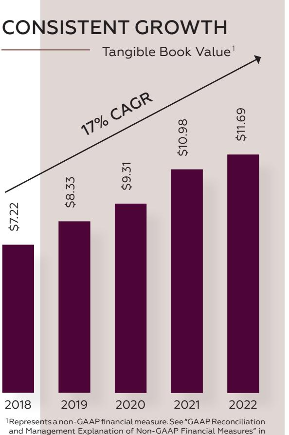
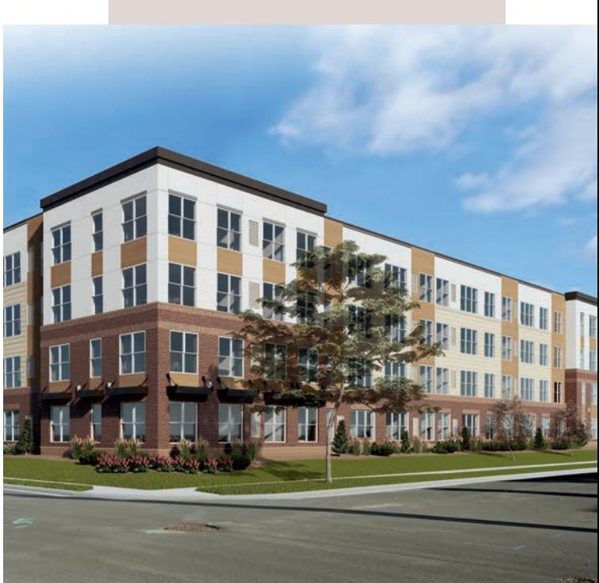
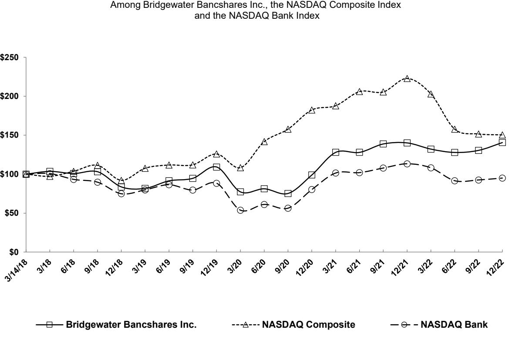

{0}------------------------------------------------

# 2022 annual report bridgewater bancshares, inc.

Bridgewater Bancshares Inc. **Bridgewater Bancshares, Inc.** 

{1}------------------------------------------------

# WHO WE ARE

Bridgewater Bancshares, Inc. is a St. Louis Park, Minnesota-based financial holding company. Bridgewater's banking subsidiary, Bridgewater Bank, is a premier, full-service Twin Cities bank dedicated to serving the diverse needs of commercial real estate investors, entrepreneurs, business clients and successful individuals.

# 2022 AT A GLANCE

# CORE VALUES

| Ticker: BWB (Nasdaq)                               | Unconventional                                     |
|----------------------------------------------------|----------------------------------------------------|
| Assets: \$4.3 billion                              | Our clients notice a difference.                   |
| Branches: 7                                        | Responsive                                         |
| FTE Employees: 246 1 PPNR ROA: 2.06%         | Under promise. Over deliver.                       |
|                                                    | Dedicated                                          |
|                                                    | Don't stop until you get it done.                  |
| Loan Growth: 26.6%                                 | Growth                                             |
| Efficiency Ratio: 41.5% 1                       | If you aren't moving forward, where are you going? |
| NPAs/Assets: 0.01%                              | Accuracy                                           |
| 1 Tangible Book Value Per Share Growth: 6.5% | It's more than just an expectation.                |

## 2022 AWARDS & RECOGNITION

**Star Tribune** Top Workplaces | **American Banker** Best Banks to Work For | **Twin Cities Business** Best Business Bank | **Finance & Commerce** Reader Rankings Best Business Bank + Small Business Bank + Commercial Mortgage Lender | **Piper Sandler** Sm-All Stars Class of 2022 | **Raymond James** Community Bankers Cup | **S&P Global Market Intelligence** Fifth Best-Performing Community Bank

## TABLE OF CONTENTS

**3** Shareholder Letter **7** Environmental, Social & Governance **8** Financial Summary  **2022 Form 10-K** Directors & Leadership Shareholder Information **Bridgewater Bancshares, Inc. Bridgewater Bancshares, Inc.** 

Represents a non-GAAP financial measure. See "GAAP Reconciliation and Management Explanation of Non-GAAP Financial Measures" in the accompanying 2022 Form 10-K for further details. 1

{2}------------------------------------------------

167615Broch_r2_2022 Annual Report For Merrill v1.indd 1 2/28/23 7:22 PM

# FELLOW SHAREHOLDERS,

Since our initial public offering in 2018, Bridgewater Bancshares, Inc. has delivered consistently strong financial results driven by a business model that has remained virtually the same since we founded the bank. Last year was no different as we again saw robust loan growth, a high level of efficiency, superb asset quality and a corporate culture that continues to differentiate us in the market. With a strong team in place and a proven strategy, we are poised to continue providing responsive service to our clients while gaining market share. As we enter 2023 in a more uncertain economic environment, our team is taking a thoughtful approach to manage the balance sheet, optimize profitability and drive shareholder value over the long-term.

## **A LOOK BACK AT 2022**

2022 was again highlighted by the continued growth of the bank, not only in terms of the size of the balance sheet, which grew to \$4.3

billion, but also in terms of the investments made in our people, technology and the scalability of the business. With the ongoing execution of our business model, we saw revenue increase by 18.5 percent and another year of overall record earnings. Our successes also resulted in tangible book value growth of 6.5 percent, a key metric in how we measure shareholder value.This was especially impressive in 2022 as rising interest rates negatively impacted the value of securities portfolios across the industry and led to tangible book value dilution for many banks.

Bridgewater's ability to consistently generate robust loan growth has been a key differentiator over the years. This continued into 2022 as we saw total loan growth of 26.6 percent with growth spread across all of our portfolios, led by multifamily and commercial real estate. Loan demand began to decline late in the year due to fewer deals penciling out as interest rates increased; however, with our 

{3}------------------------------------------------

deepening brand presence in the Twin Cities and the strong relationships we have built, we continued to win deals with high quality clients and projects.

Deposit growth was also strong with balances up 16 percent during the year. While our team has done a good job of generating strong core deposit growth over the past few years, we also leveraged additional wholesale deposits and borrowings to continue supporting our robust loan growth. With this continued balance sheet growth, net interest income grew 18.4 percent in 2022, even as the net interest margin declined by 9 basis points as funding costs began to rise later in the year. Managing our balance sheet growth will be a key initiative for us in 2023 as we look to optimize revenue going forward in the midst of a more uncertain interest rate environment.

Bridgewater continued to be one of the most efficient banks in the industry in 2022 with

the accompanying 2022 Form 10-K for further details.

an efficiency ratio of 41.5 percent. We have a highly efficient culture that starts with a branch-light model of just seven branches across the Twin Cities. In addition, our focus on larger commercial real estate relationships results in less overall expense than business models with more of a retail focus. As a result, the pace of expense growth was well-controlled and came in less than the pace of asset growth in 2022, even as we continued to make key investments in our people and technology. On the people front, we responded to the challenging hiring environment by refining our recruitment efforts and leveraging our strong corporate culture to attract and retain top talent. On the technology front, we launched a commercial loan origination platform in March 2022 that has digitized our end-to-end lending process and created efficiencies to support future growth.

Asset quality remained superb due in part to our measured risk selection, consistent underwriting standards, active credit oversight, and experienced lending and credit teams. For example, over 80% of our real estate loan balances are in the Twin Cities market and approximately 80% of our loan origination volume during the year required full loan committee approval. In addition, we had no net charge-offs for the second consecutive year and nonperforming assets as a percent of total assets totaled just 0.01 percent. We also took steps to scale our enterprise risk management program and mitigate risks across the business, including credit.

Lastly, our team and culture continued to provide the foundation for our success as an organization. Our culture is, quite simply, just not like your typical bank. Whether it's our unconventional team building and social events, team member development programs, or even our expanded health and wellness initiatives, which in 2022 included education and resources to help identify and manage mental health-related issues, our culture remains a primary reason why we are able to attract and retain top talent. In fact, Bridgewater again

167615Broch_r1_2022 Annual Report For Merrill v1.indd 2 2/23/23 1:23 AM

{4}------------------------------------------------

received top workplace awards from both the *Star Tribune and American Banker* in 2022.

## **STRATEGIC OBJECTIVES FOR 2023**

As we look ahead to 2023, we are in a much different economic environment than we have seen over the past several years. With interest rates continuing an unprecedented rise and the potential for an upcoming recession, we expect to take a more cautious approach in the near-term. We will be focused on managing our balance sheet growth to navigate near-term funding challenges, while also thinking strategically about initiatives to better position us for the long-term. Our strategic objectives for 2023 include the following:

## Manage High Quality BalanceSheetGrowth

We expect robust balance sheet growth to always be a key part of Bridgewater's business model. However, with a renewed focus on funding more of our growth with core deposits over the course of the year, we expect a more moderate pace of loan growth in 2023. In addition to better alignment with our funding capabilities, we expect this approach to also benefit capital and liquidity, support asset quality, and optimize net interest income to drive continued revenue growth over time.

## Maintain High Efficiency While Investing in the Business

We believe we can continue to make investments in our people and our business while maintaining an efficiency ratio that differentiates us in the market. This starts with fully leveraging and embracing the recent technology investments we have made to maximize operational efficiencies. It also includes identifying opportunities to manage our discretionary spend and align expense growth with a slower pace of asset growth. Finally, it means making ongoing investments in the scalability of our business to position us for future growth, such

167615Broch_r2_2022 Annual Report For Merrill v1.indd 3 2/28/23 7:22 PM

FINANCED BY BRIDGEWATER

Columbia Heights, MN

*In 2022, Bridgewater was an equity investor in this 62-unit project in Columbia Heights, MN, providing a much needed affordable housing option for the community.*

as further expansion of our enterprise risk management program.

## Proactively Assess and Monitor Asset Quality Risks

Following another year of superb asset quality in 2022, we have yet to see signs of credit issues as we head into 2023. However, given ongoing economic challenges, we expect credit to normalize at some point and are putting extra focus on watching for early warning signs. In addition, we are taking proactive steps to get ahead of potential risks by expanding covenant testing, assessing repricing risk on maturing loans and enhancing stress testing capabilities.

{5}------------------------------------------------

## Implement Longer Term Strategic Readiness Initiatives

While we continue to execute on our current business model, which has produced strong and consistent financial results, we believe it is just as important to evaluate and implement new initiatives today that have the potential to provide incremental benefits tomorrow. For example, we are working on building out our C&I capabilities to support further growth and diversification of the loan portfolio, as well as new deposit growth channels. We do not expect this to have a meaningful impact on the balance sheet in 2023, but we will be laying the groundwork now for a bigger impact down the road. In addition, we continue to evaluate potential M&A opportunities and prepare ourselves to act when the right deal comes along. While we continue to see plenty of organic growth opportunities in the Twin Cities, M&A could be helpful on our longer term growth journey.

I want to extend a special "thank you" to our Board of Directors for their counsel throughout 2022 and our team members for their commitment and hard work, both of which will again be vital to our success in 2023. I am proud of the business model we have built, which has consistently driven shareholder value. I also believe we have a smart and dedicated team in place that is empowered to serve our clients, make the right decisions and successfully lead the bank into the future. Together, I believe we are well-positioned to navigate any environment while staying true to the attributes that have made Bridgewater both unconventional and the finest entrepreneurial bank.

Jerry Baack Chairman, Chief Executive Officer and President

167615Broch_r2_2022 Annual Report For Merrill v1.indd 4 2/28/23 7:22 PM

# OUR PEOPLE ARE OUR STRENGTH

**Top:** *Bridgewater Bank team members gather to celebrate Twin Cities Pride.* **Middle:** *Bridgewater Chief Operating Officer, Mary Jayne Crocker, enjoys Take Your Child to Work Day with her granddaughter.* **Bottom:** *Health & Wellness committee hosts 'Health & Hounds' with therapy dogs from a local animal shelter.*

{6}------------------------------------------------

# PROGRESS ON ESG

After formally launching our ESG program in 2021, Bridgewater made additional progress in 2022 toward our commitment of establishing and advancing impactful initiatives that support our corporate responsibility as a growing local bank in the Twin Cities. Below are highlights from each of our four ESG Priorities in 2022.

# TEAM MEMBERS, CLIENTS & COMMUNITIES

## **Leverage our unconventional corporate culture to leave a positive lasting impact on our team members, clients and communities**

- Recognized as a top workplace by the *Star Tribune* and *American Banker*
- Hosted a series of internal events focused on mental health
- Continued originations of community development loans with a focus on affordable housing and revitalization or stabilization

# DIVERSITY, EQUITY AND INCLUSION

## **Create a diverse, equitable and inclusive work environment and community**

- Began recognizing Juneteenth as a bank holiday
- Hosted 2nd annual DE&I Book Club, featuring *Uncomfortable Conversations with a Black Man* by Emmanuel Acho

# CORPORATE GOVERNANCE

## **Ensure strong corporate governance oversight including an effective risk management framework to support a growing organization**

- Began formally engaging with stakeholders to gain feedback regarding ESG
- Made further enhancements to our cybersecurity program, including our control framework and processes

## ENVIRONMENTAL IMPACT

**Contribute to a healthier natural environment in the communities in which we live and work**

- Earned ENERGY STAR certification for Bridgewater Corporate Center
- Saved an average of 5,900 plastic bottles per month through drinking fountains and water bottle filling stations in Bridgewater Corporate Center

*For more information on Bridgewater's ESG commitment, please visit [www.BWBMN.com/about-bridgewater/esg](https://www.bwbmn.com/about-bridgewater/esg).*

167615Broch_r3_2022 Annual Report For Merrill v1.indd 5 3/1/23 7:13 PM

{7}------------------------------------------------

# FINANCIAL SUMMARY

Dollars in thousands

|                                                                | 2022            | 2021            | 2020            |
|----------------------------------------------------------------|-----------------|-----------------|-----------------|
| Operating Results                                              |                 |                 |                 |
| Net interest income                                            | \$ 129,698   | \$ 109,509   | \$ 87,964    |
| Noninterest income                                             | 6,332           | 5,309           | 5,839           |
| Total revenue                                                  | 136,030         | 114,818         | 93,803          |
| Provision for credit losses                                    | 7,700           | 5,150           | 12,750          |
| Noninterest expense                                            | 56,620          | 48,095          | 45,387          |
| Income before income taxes                                     | 71,710          | 61,573          | 35,666          |
| Income tax expense                                             | 18,318          | 15,886          | 8,472           |
| Net income attributable to Bridgewater Bancshares, Inc.        | 53,392          | 45,687          | 27,194          |
| Preferred stock dividends                                      | (4,054)         | (1,171)         | -               |
| Net income available to common shareholders                    | \$ 49,338    | \$ 44,516    | \$ 27,194    |
| Year-End Balance Sheet Highlights                              |                 |                 |                 |
|                                                                |                 |                 |                 |
| Total assets                                                   | \$ 4,345,662 | \$ 3,477,659 | \$ 2,927,345 |
| Loans                                                          | 3,569,446       | 2,819,472       | 2,326,428       |
| Securities available for sale                                  | 548,613         | 439,362         | 390,629         |
| Deposits                                                       | 3,416,543       | 2,946,237       | 2,501,636       |
| Shareholders' equity                                           | 394,064         | 379,272         | 265,405         |
| Per Common Share Information                                   |                 |                 |                 |
| Diluted earnings per share                                     | \$ 1.72      | \$ 1.54      | \$ 0.93      |
| Book value per share                                           | 11.80           | 11.09           | 9.43            |
| Tangible book value per share 1                             | 11.69           | 10.98           | 9.31            |
| Financial Ratios                                               |                 |                 |                 |
|                                                                |                 |                 |                 |
| Return on average assets 1                                  | 1.38 %       | 1.43 %       | 1.04 %       |
| Pre-provision net revenue (PPNR) return on average assets 1 | 2.06            | 2.10            | 2.09            |
| Return on average tangible common equity 1                  | 15.69           | 15.45           | 10.65           |
| Efficiency ratio 1                                          | 41.5            | 42.0            | 49.0            |
| Adjusted efficiency ratio                                      | 41.2            | 41.0            | 40.5            |
| Net charge-offs (recoveries) as a percentage of average loans  | (0.01)          | 0.00            | 0.02            |
| Nonperforming assets as a percentage of total assets 1      | 0.01            | 0.02            | 0.03            |
| Tangible common equity to tangible assets                      | 7.48            | 8.91            | 8.96            |

Represents a non-GAAP financial measure. See "GAAP Reconciliation and Management Explanation of Non-GAAP Financial Measures" in the accompanying 2022 Form 10-K for further details. 1

167615Broch_r1_2022 Annual Report For Merrill v1.indd 6 2/23/23 1:23 AM

{8}------------------------------------------------

## **UNITED STATES SECURITIES AND EXCHANGE COMMISSION Washington, D.C. 20549**

## **FORM 10-K**

**(Mark One)**

#### ☒ **ANNUAL REPORT PURSUANT TO SECTION 13 OR 15(d) OF THE SECURITIES EXCHANGE ACT OF 1934**

**For the fiscal year ended December 31, 2022.** 

**OR** 

#### ☐ **TRANSITION REPORT PURSUANT TO SECTION 13 OR 15(d) OF THE SECURITIES EXCHANGE ACT OF 1934**

**For the transition period from to** 

**Commission file number 001-38412** 

## **BRIDGEWATER BANCSHARES, INC.**

(Exact name of registrant as specified in its charter)

(State or Other Jurisdiction of Incorporation or Organization) (I.R.S. Employer Identification No.) **4450 Excelsior Boulevard, Suite 100** 

**Minnesota 26-0113412** 

**St. Louis Park, Minnesota 55416** 

(Address of Principal Executive Offices) (Zip Code)

Registrant's telephone number, including area code **(952) 893-6868**

## **Securities registered pursuant to Section 12(b) of the Act:**

| Title of each class:                           | Trading Symbol | Name of each exchange on which registered: |
|------------------------------------------------|----------------|--------------------------------------------|
| Common Stock, \$0.01 Par Value                 | BWB            | The Nasdaq Stock Market LLC                |
| Depositary Shares, each representing a 1/100th | BWBBP          | The Nasdaq Stock Market LLC                |
| interest in a share of 5.875% Non-Cumulative   |                |                                            |
| Perpetual Preferred Stock, Series A, par value |                |                                            |

\$0.01 per share

Securities registered under Section 12(g) of the Act:

None.

Indicate by check mark if the registrant is a well-known seasoned issuer, as defined in Rule 405 of the Securities Act. Yes ☐ No ☒

Indicate by check mark if the registrant is not required to file reports pursuant to Section 13 or Section 15(d) of the Act. Yes ☐ No ☒

Indicate by check mark whether the registrant (1) has filed all reports required to be filed by Section 13 or 15(d) of the Securities Exchange Act of 1934 during the preceding 12 months (or for such shorter period that the registrant was required to file such reports), and (2) has been subject to such filing requirements for the past 90 days. Yes ☒ No ☐

Indicate by check mark whether the registrant has submitted electronically every Interactive Data File required to be submitted pursuant to Rule 405 of Regulation S-T during the preceding 12 months (or for such shorter period that the registrant was required to submit such files). Yes ☒ No ☐

Indicate by check mark whether the registrant is a large accelerated filer, an accelerated filer, a non-accelerated filer, a smaller reporting company, or an emerging growth company. See the definitions of "large accelerated filer," "accelerated filer", "smaller reporting company" and "emerging growth company" in Rule 12b-2 of the Exchange Act.

Large accelerated filer ☐ Accelerated filer ☒ Non-accelerated filer ☐ Smaller reporting company ☐ Emerging growth company ☒

If an emerging growth company, indicate by check mark if the registrant has elected not to use the extended transition period for complying with any new or revised financial accounting standards provided pursuant to Section 13(a) of the Exchange Act. ☐

Indicate by check mark whether the registrant has filed a report on and attestation to its management's assessment of the effectiveness of its internal control over financial reporting under Section 404(b) of the Sarbanes-Oxley Act (15 U.S.C. 7262(b)) by the registered public accounting firm that prepared or issued its audit report. ☐

Indicate by check mark whether the registrant is a shell company (as defined in Rule 12b-2 of the Exchange Act). Yes ☐ No ☒

If securities are registered pursuant to Section 12(b) of the Act, indicate by check mark whether the financial statements of the registrant included in this filing reflect the correction of an error to previously issued financial statements. ☐

Indicate by check mark whether any of those error corrections are restatements that require a recovery analysis of incentive-based compensation received by any of the registrant's executive officers during the relevant recovery period pursuant to §240.10D-1(b). ☐

The aggregate market value of the Common Stock held by non-affiliates of the Registrant on June 30, 2022, based on the closing price of \$16.14 of such shares on that date, was \$342,969,738.

The number of shares of the Common Stock issued and outstanding as of February 20, 2023 was 27,756,170.

DOCUMENTS INCORPORATED BY REFERENCE

The information required by Part III is incorporated by reference to portions of the definitive proxy statement to be filed within 120 days after December 31, 2022, pursuant to Regulation 14A under the Securities Exchange Act of 1934 in connection with the annual meeting of stockholders to be held on April 25, 2023.

{9}------------------------------------------------

## **Table of Contents**

#### **Page**

#### **PART I**

| Item 1. Business                   | 4  |
|------------------------------------|----|
| Item 1A. Risk Factors              | 20 |
| Item 1B. Unresolved Staff Comments | 46 |
| Item 2. Properties                 | 46 |
| Item 3. Legal Proceedings          | 46 |
| Item 4. Mine Safety Disclosures    | 46 |

#### **PART II**

| Item 5. Market for Registrant's Common Equity, Related Stockholder Matters and Issuer Purchases of Equity Securities | 47  |
|-------------------------------------------------------------------------------------------------------------------------|-----|
| Item 6. [Reserved]                                                                                                      | 49  |
|                                                                                                                         |     |
| Item 7. Management's Discussion and Analysis of Financial Condition and Results of Operations                           | 49  |
| Item 7A. Quantitative and Qualitative Disclosures About Market Risk                                                     | 79  |
| Item 8. Financial Statements and Supplementary Data                                                                     | 81  |
| Reports of Independent Registered Public Accounting Firm (Auditor Firm ID: 655)                                         | 81  |
| Item 9. Changes in and Disagreements with Accountants on Accounting and Financial Disclosure                            | 133 |
| Item 9A. Controls and Procedures                                                                                        | 133 |
| Item 9B. Other Information                                                                                              | 134 |
| Item 9C: Disclosure Regarding Foreign Jurisdictions that Prevent Inspections                                            | 134 |
| PART III                                                                                                                |     |
| Item 10. Directors, Executive Officers and Corporate Governance                                                         | 134 |
| Item 11. Executive Compensation                                                                                         | 134 |
| Item 12. Security Ownership of Certain Beneficial Owners and Management and Related Stockholder Matters                 | 135 |
| Item 13. Certain Relationships and Related Transactions, and Director Independence                                      | 135 |

# Item 14. Principal Accountant Fees and Services . . . . . . . . . . . . . . . . . . . . . . . . . . . . . . . . . . . . . . . . . . . . . . . . . . . . . . . . 135

#### **PART IV**

| Item 15. Exhibits and Financial Statement Schedules | 136 |
|-----------------------------------------------------|-----|
| Item 16: Form 10-K Summary                          | 139 |
| Signatures                                          | 140 |

{10}------------------------------------------------

### **Forward-Looking Statements**

This Annual Report on Form 10-K contains "forward-looking statements" within the meaning of the safe harbor provisions of the U.S. Private Securities Litigation Reform Act of 1995. Forward-looking statements include, without limitation, statements concerning plans, estimates, calculations, forecasts and projections with respect to the anticipated future performance of the Company. These statements are often, but not always, identified by words such as "may", "might", "should", "could", "predict", "potential", "believe", "expect", "continue", "will", "anticipate", "seek", "estimate", "intend", "plan", "projection", "would", "annualized", "target" and "outlook", or the negative version of those words or other comparable words of a future or forward-looking nature. Forward-looking statements are neither historical facts nor assurances of future performance. Instead, they are based only on our current beliefs, expectations and assumptions regarding our business, future plans and strategies, projections, anticipated events and trends, the economy and other future conditions. Because forward-looking statements relate to the future, they are subject to inherent uncertainties, risks and changes in circumstances that are difficult to predict and many of which are outside of our control. The actual results and financial condition may differ materially from those indicated in the forward-looking statements. Therefore, you should not rely on any of these forward-looking statements. Important factors that could cause our actual results and financial condition to differ materially from those indicated in the forward-looking statements include, among others, the following:

- interest rate risk, including the effects of recent and anticipated rate increases by the Federal Reserve;
- fluctuations in the values of the securities held in our securities portfolio or the values of derivative instruments held in our derivatives portfolio, including as the result of rising interest rates, which has resulted in unrealized losses in our securities portfolios;
- business and economic conditions generally and in the financial services industry, nationally and within our market area, including rising rates of inflation;
- loan concentrations in our loan portfolio;
- the overall health of the local and national real estate market;
- the ability to successfully manage credit risk;
- the ability to maintain an adequate level of allowance for loan losses;
- new or revised accounting standards, including as a result of the implementation of the new Current Expected Credit Loss standard;
- the concentration of large loans to certain borrowers;
- the concentration of large deposits from certain clients;
- the ability to successfully manage liquidity risk, which may increase the dependence on non-core funding sources such as brokered deposits, and negatively impact our cost of funds;
- the ability to raise additional capital to implement our business plan;
- the ability to implement our growth strategy and manage costs effectively;
- developments and uncertainty related to the future use and availability of some reference rates, such as the expected discontinuation of the London Interbank Offered Rate, as well as other alternative reference rates;
- the composition of the Company's senior leadership team and the ability to attract and retain key personnel;
- talent and labor shortages and high rates of employee turnover;
- the occurrence of fraudulent activity, breaches or failures of our information security controls or cybersecurity-related incidents;
- interruptions involving our information technology and telecommunications systems or third-party servicers;
- competition in the financial services industry, including from nonbank competitors such as credit unions and "fintech" companies;
- the effectiveness of the risk management framework;

{11}------------------------------------------------

- the commencement and outcome of litigation and other legal proceedings and regulatory actions against us;
- the impact of recent and future legislative and regulatory changes, including changes to federal and state corporate tax rates;
- risks related to climate change and the negative impact it may have on our customers and their businesses;
- the imposition of governmental policies impacting the value of products produced by our commercial borrowers;
- severe weather, natural disasters, widespread disease or pandemics (including the COVID-19 pandemic), acts of war or terrorism, civil unrest or other adverse external events including the Russian invasion of Ukraine;
- potential impairment to the goodwill recorded in connection with a past acquisition;
- changes to U.S. or state tax laws, regulations and guidance, including the new 1% excise tax on stock buybacks by publicly traded companies;
- the success at managing the risks involved in the foregoing items; and
- any other risk factors described in the "Risk Factors" section of this report and in other reports filed by Bridgewater Bancshares, Inc. with the Securities and Exchange Commission ("SEC").

The foregoing factors should not be construed as exhaustive and should be read together with the other cautionary statements included in this report. In addition, past results of operations are not necessarily indicative of future results. Any forward-looking statement made by us in this report is based only on information currently available to us and speaks only as of the date on which it is made. We undertake no obligation to publicly update any forwardlooking statement, whether written or oral, that may be made from time to time, whether as a result of new information, future developments or otherwise.

## **PART I**

#### **ITEM 1. BUSINESS**

#### **Company Overview and History**

Bridgewater Bancshares, Inc. (the "Company") is a Minnesota corporation and financial holding company with two wholly-owned subsidiaries, Bridgewater Bank (the "Bank") and Bridgewater Risk Management, Inc., a captive insurance entity. The Bank has two wholly-owned subsidiaries: BWB Holdings, LLC, which was formed for the purpose of holding repossessed property; and Bridgewater Investment Management, Inc., which was formed for the purposes of holding certain municipal securities and engaging in municipal lending activities. The Bank has seven full-service offices located in Bloomington, Greenwood, Minneapolis (2), St. Louis Park, Orono, and St. Paul, Minnesota.

The Company is headquartered in St. Louis Park, Minnesota, a suburb located approximately 5 miles southwest of downtown Minneapolis. The Company and Bank were established in 2005 as a *de novo* bank by a group of industry veterans and local business leaders committed to serving the diverse needs of commercial real estate investors, small business entrepreneurs, and high net worth individuals.

Since inception, the Company has grown significantly and profitably, with a focus on organic growth, driven primarily by commercial real estate lending. Assets have grown at a compounded annual growth rate of 32.8% since 2005, surpassing total asset milestones of \$500 million in 2013, \$1.0 billion in 2016, \$2.0 billion in 2019, \$3.0 billion in 2021, and \$4.0 billion in 2022. While this growth has been almost entirely organic, in 2016 the Company completed a complementary small bank acquisition that added approximately \$76.1 million in assets, \$66.7 million in seasoned core deposits and two branch locations within its market area.

As of December 31, 2022, total assets were \$4.35 billion, total gross loans were \$3.57 billion, total deposits were \$3.42 billion, and total shareholders' equity was \$394.1 million.

{12}------------------------------------------------

The principal sources of funds for loans and investments are transaction, savings, time, and other deposits, and short-term and long-term borrowings. The Company's principal sources of income are interest and fees collected on loans, interest and dividends earned on investment securities and service charges. The Company's principal expenses are interest paid on deposit accounts and borrowings, employee compensation and other overhead expenses. The Company's simple, highly efficient business model of providing responsive support and simple solutions to clients continues to be the underlying principle that drives the Company's profitable growth.

#### **Market Area and Competition**

The Company operates in the Twin Cities Metropolitan Statistical Area, or MSA, which had total deposits of \$232.4 billion as of June 30, 2022, and ranks as the 16th largest metropolitan statistical area in the United States in total deposits, and the third largest metropolitan statistical area in the Midwest in total deposits, based on Federal Deposit Insurance Corporation, or FDIC, data. This area is commonly known as the "Twin Cities" after its two largest cities, Minneapolis, the city with the largest population in the state, and St. Paul, the state capital.

The Twin Cities MSA is defined by attractive market demographics, including strong household incomes, dense populations, a resilient employee base and the presence of a diverse group of large and small businesses. As of December 31, 2022, the Company's market ranked second in median household income in the Midwest and eighth in the nation, when compared to the top 20 MSAs by population size in each area, based on data available on S&P Global Market Intelligence. According to the U.S. Bureau of Labor Statistics, the population in the Twin Cities MSA was approximately 3.7 million as of December 31, 2022, making it the third largest MSA in the Midwest and 16th largest MSA in the United States. The Twin Cities MSA had an unemployment rate of 2.6%, which was lower than the national average of 3.5%, as of December 31, 2022. These strong labor market fundamentals can be attributed to the significant presence of national and international businesses across diverse industries operating within the Twin Cities MSA.

The Company operates in a competitive market area and competes with other, often much larger, retail and commercial banks and financial institutions. Two large, national banking chains, Wells Fargo and US Bank, together controlled 62.3% of the deposit market share in the Twin Cities MSA as of June 30, 2022, based on FDIC data and as displayed in the table below. By comparison, as of the same date, the Company had a deposit market share of approximately 1.4%, which ranked the Company ninth in the Twin Cities MSA overall and fourth in the Twin Cities MSA among banks headquartered in Minnesota.

| Rank | Institution                  | State Headquarters | Branch Count | Total Deposits (\$000) | Market Share (%) |
|------|------------------------------|-----------------------|-----------------|------------------------------|------------------------|
| 1    | U.S. Bancorp                 | MN                    | 84              | 87,543,495                   | 37.67                  |
| 2    | Wells Fargo & Co             | CA                    | 90              | 57,229,459                   | 24.63                  |
| 3    | Ameriprise Financial, Inc.   | MN                    | 2               | 15,520,975                   | 6.68                   |
| 4    | Bank of Montreal             | N/A                   | 26              | 8,275,300                    | 3.56                   |
| 5    | Huntington Bancshares, Inc.  | OH                    | 76              | 6,522,793                    | 2.81                   |
| 6    | Otto Bremer Trust            | MN                    | 20              | 5,352,754                    | 2.30                   |
| 7    | Bank of America Corp.        | NC                    | 15              | 5,206,487                    | 2.24                   |
| 8    | Old National Bancorp         | IN                    | 29              | 3,864,487                    | 1.66                   |
| 9    | Bridgewater Bancshares, Inc. | MN                    | 8               | 3,244,121                    | 1.40                   |
| 10   | State Bankshares, Inc.       | ND                    | 7               | 3,142,811                    | 1.35                   |
|      | Top 10 Institutions          |                       | 357             | 195,902,682                  | 84.30                  |
|      | Total Bank Deposits          |                       | 750             | 232,367,426                  |                        |

The market has experienced disruption in recent years due to acquisitions of local institutions by larger regional banks headquartered outside of the market. The disruption has created significant opportunities for the Company to add both talent and clients. In addition, the Company has developed a local banking advantage in the market with only four of the ten largest banks by deposit market share being headquartered in Minnesota.

{13}------------------------------------------------

#### **Products and Services**

The Company offers a full array of simple, quality loan and deposit products primarily for commercial clients. While the Company provides products and services that compete with those offered by large national and regional competitors, the Company additionally offers responsive support and personalized solutions tailored for each client. The Company emphasizes customer service and believes in providing distinguishing levels of client service through the experience of employees, the responsiveness and certainty of the credit process and the efficiency with which business is conducted. The Company believes that clients notice a difference in service compared to the much larger institutions in the market. The Company has built a strong referral network that continually provides opportunities with new client relationships. At this time, the Company does not operate any non-depository business lines such as mortgage, wealth management or trust.

*Lending.* The Bank focuses primarily on commercial lending, consisting of loans secured by nonfarm, nonresidential properties, loans secured by multifamily residential properties, nonowner occupied single family residential properties, construction loans, land development loans and commercial and industrial loans. The Bank has a particular expertise in multifamily financing which has historically represented a large portion of the loan portfolio. This asset class has performed extremely well and has lower historical loss rates when compared to other loan types. Commercial real estate loans (excluding multifamily and construction) consist of owner and nonowner occupied properties. This portfolio segment is well diversified with loans secured by office buildings, retail strip centers, industrial properties, senior housing and hospitality properties and mixed-use properties. In addition to loans secured by improved commercial real estate properties, the Bank engages in construction lending, which includes single family residential construction loans, land development, finished lots and raw land loans, and commercial and multifamily construction.

In recent years, the Bank has increased its focus on commercial and industrial lending. This portfolio includes a mix of term equipment loans and revolving lines of credit to support the needs of local businesses. Additionally, the Bank has a niche within the tax credit investment market whereby it bridges equity capital receivables on various tax credit projects.

The Bank focuses on lending to borrowers located or investing in the Twin Cities MSA across a diverse range of industries and property types, however, as a relationship lender, it will from time to time finance properties located outside of Minnesota for its existing local clients in select situations. As of December 31, 2022, over 80% of the Bank's real estate loan balances were secured by properties located in the Twin Cities market.

Robust and consistent growth over the last several years has been attributable to the Bank's strengthening brand and service model in the Twin Cities, client and banker acquisitions resulting from M&A-related market disruption and the expansion of talented lending and business service teams. As a result, the Bank's ability to cultivate relationships with certain individuals and businesses has resulted in a concentration of large loans to a small number of borrowers. The Bank has established an informal, internal limit on a single loan to finance one transaction, but may, under certain circumstances, consider going above this internal limit in situations where management's understanding of the industry, the borrower's financial condition, overall credit quality and property fundamentals are commensurate with the increased size of the relationship. Loan demand remained high for most of 2022, but in late 2022, the Bank began seeing a reduction in overall loan demand due to the rising interest rate environment.

*Deposits.* The Bank has developed a suite of deposit products targeted at commercial clients, including a variety of remote deposit and cash management products, along with commercial transaction accounts. The Bank also offers consumers traditional retail deposit products through its branch network, along with online, mobile and direct banking channels. Many of the deposits do not require a branch visit, creating efficiencies across the Bank's branch network.

Deposits continue to be the primary funding source for the Bank's lending activities, both core and non-core deposits. Deposit growth has been positively impacted by new client and bank acquisition opportunities due to M&Arelated market disruption in the Twin Cities and the expansion of the treasury management team. As interest rates increased sharply in 2022, generating core deposit growth became difficult, especially with the emergence of

{14}------------------------------------------------

unprecedented competition from the Treasury markets. As a result, the Bank utilized additional brokered deposits to supplement core deposits.

While the Bank remains committed to growing core deposits, brokered deposits have remained a strategic component of the funding strategy and interest rate risk management. The Bank's Asset Liability Management, or ALM, Committee monitors the size of this portfolio, and ongoing opportunities.

The Bank has developed relationships with certain individuals and businesses that have resulted in a concentration of large deposits from a small number of clients. As of December 31, 2022, the 10 largest depositor relationships accounted for approximately 15.0% of total deposits. This high concentration of depositors presents a risk to liquidity if one or more of them decides to change its relationship with the Bank and to withdraw all or a significant portion of their accounts.

#### **Competitive Strengths**

As the Company seeks to continue to grow the business, management believes the following strengths provide a competitive advantage over other financial institutions operating in its market area:

*Commercial Banking Expertise.* Management believes the Company has earned the reputation as one of the prominent commercial real estate lenders in the Twin Cities MSA due in large part to the strength of the lending team. The Company has an experienced, professional team of 25 lenders, and believes the ability to drive quality commercial loan growth is a result of being able to provide each client with access to a knowledgeable, experienced, responsive and dedicated banker. Due to their market knowledge and understanding of clients' businesses, the lenders are well positioned to provide timely and relevant feedback to clients. Management believes the responsive credit culture separates the Company from its competitors.

*Multifamily Lending Expertise.* The Company specializes in multifamily lending, which has historically represented a large portion of the total loan portfolio. The Company believes this lending niche lowers the risk profile of the overall loan portfolio due to its lower historical loss rates when compared to other loan types. In fact, the multifamily portfolio has experienced no net charge-offs over the past five years and only \$62,000 of net charge-offs since inception. As a result of the Company's segment expertise and strong portfolio performance, the Company has been comfortable continuing to grow the multifamily portfolio.

*Engaged and Experienced Board of Directors and Management Team.* The Company's board of directors consists of highly accomplished individuals with strong industry and business experience in the market area. The combined expertise of the board of directors and the significant banking and regulatory experience of the strategic leadership team help execute the Company's growth strategy.

The Company's seven-person strategic leadership team has a strong balance of extensive banking and regulatory experience, drive and talent. The team has over 130 years of combined banking and financial services experience and more than 20 years of regulatory experience. Three members of the team have been leading the Company since its formation, and with an average age of 50, the strategic leadership team can drive growth and strategy for years to come.

In addition to the strategic leadership team, the Company has demonstrated an ability to grow through the recruitment of high performing individuals. The Company seeks to hire people with significant in-market experience who fit the Company's hard-working, entrepreneurial culture. Through targeted hiring and internal development efforts, the Company has established a deep bench of talent to continue to grow and manage the business. The Company has structured its team to prepare for long-term growth and stability by combining the experienced strategic leadership and commercial lending teams with its next generation of leaders.

*Efficiency.* The Company operates as a highly efficient organization based on a simple business model. By focusing on commercial real estate lending, employee overhead is low due to its lenders maintaining larger loan portfolio sizes compared to other types of commercial lending. In addition, the Company serves its clients through a 

{15}------------------------------------------------

strategically positioned "branch-light" model of just seven branches, as well as through online, mobile and direct banking channels, and is not dependent on a traditional branch network with a large number of locations.

*Hard-Working and Entrepreneurial Culture.* The Company has developed a hard-working and entrepreneurial culture, which is a critical component for attracting and retaining experienced and talented bankers, as well as clients. The Company has established a set of core values, based on characteristics that describe and inspire the culture— Unconventional, Responsive, Dedicated, Growth and Accurate. To maintain the culture, all potential and current personnel evaluations include an assessment of these attributes. Clients notice the unconventional environment with dedicated employees who feel like they are part of building a high performing bank.

*Solid Asset Quality Metrics.* A risk-management focused business model has contributed to solid asset quality during a period of strong loan growth and economic uncertainty. The Company diligently monitors and routinely stress tests the loan portfolio. The strong credit metrics are the result of measured risk selection, consistent underwriting standards, active credit oversight and experienced lending and credit teams.

*Proactive Enterprise Risk Management.* The Company's enterprise risk management practices provide an enhanced level of oversight allowing management to be proactive rather than reactive. The Company has been focused on scaling its enterprise risk management function to address emerging risks and support growth plans. The management-level enterprise risk management committee, comprised of the strategic leadership team, the Chief Risk Officer and senior representatives from all departments, meets quarterly to identify, assess, measure, monitor, and manage the Company's overall enterprise risk position and to discuss how the Company's strategic initiatives may impact the Company's risk profile. Enterprise risk management reports are provided to the full Company board on a quarterly basis. Furthermore, in 2016, Bridgewater Risk Management, Inc. was formed as a captive insurance subsidiary to provide supplemental insurance coverage to the Company and its subsidiaries for risk management purposes.

The Company also has a comprehensive Commercial Real Estate Portfolio Risk Management Policy which implements formal processes and procedures designed to manage and mitigate risk within the commercial real estate portfolio. This policy addresses regulatory guidelines for institutions, such as the Bank, that exhibit higher levels of commercial real estate concentrations. These processes and procedures include board and management oversight, commercial real estate exposure limits, portfolio monitoring tools, management information systems, market reports, underwriting standards, a credit risk review function and periodic stress testing to evaluate potential credit risk and the subsequent impacts on capital and earnings.

#### **Strategies for Growth**

The Company had a track record of generating consistent, robust growth over the past seventeen years. Given the current interest rate environment, which has resulted in increased funding pressure and reduced loan demand, the Company intends to continue growing the balance sheet, albeit at a slower pace over the near-term. To generate future growth, the Company intends to continue to execute the proven strategies that it has used in prior years to achieve some of the strongest performance results in the community banking industry. These strategies include the following:

*Focus on Organic Growth in the Market Area.* The Company intends to continue to grow its business organically in a focused and strategic manner by leveraging its competitive strengths, including commercial banking expertise, an experienced management team, an efficient business model and strong branding, to capitalize on the opportunities in the Company's market area. As a publicly traded but locally-headquartered bank, the Company can go beyond what small banks can provide by offering sophisticated products and services similar to those offered by the much larger, out-of-state banks, but in a manner that is tailored to the needs of local clients in a more efficient, responsive and flexible way. Although the growth potential of the current market is substantial and provides the ability to continue to grow organically in the market, the Company will continue to consider opportunistic acquisitions that complement the current business and support the potential for longer term growth and returns for shareholders.

The Company plans to increase core deposits over time to support loan growth and build market share by expanding existing client relationships and by developing new deposit-focused clients. The Company plans to continue to expand its footprint through marketing and networking efforts focused on generating deposits. Although the Company 

{16}------------------------------------------------

is committed to growing core deposits, growth will continue to be supplemented, when necessary, with non-core, wholesale funding sources. On the lending side, the Company intends to rely on the expertise of the lenders, and believes the Company is well-positioned to continue to organically grow commercial loans based on the favorable market demographics in the Twin Cities MSA.

*Leverage Entrepreneurial Culture and Talent.* The Company has built a team of bankers that is hard-working, passionate and energized by the opportunities to continue to grow the Company's business and develop its brand in the Twin Cities MSA. With an experienced strategic leadership team and a strong layer of talented middle managers, the Company is well positioned for future growth. The Company aggressively recruits qualified personnel and develops talent internally and believes the culture, which empowers employees to be entrepreneurs for the business, will allow the Company to attract and develop the talent needed to drive growth.

*Consider Opportunistic Acquisitions.* In addition to organic growth, from time to time, the Company may consider additional acquisition opportunities that fit with the organization. Specifically, the Company will evaluate acquisitions that would be complementary to its existing business. The Company will continue to seek acquisitions that will bolster its balance sheet in areas where the Company would like to grow or diversify, without compromising the Company's risk profile or culture. While pursuing potential acquisitions, the Company intends to be disciplined in its approach to pricing, new business lines and new markets. In the future, the Company may evaluate and act upon acquisition opportunities that would produce attractive returns for shareholders. Management believes that there will be further bank consolidation in the Twin Cities MSA and that the Company is well positioned to be a preferred partner for smaller institutions looking to exit through a sale to an in-market buyer.

### **Human Capital Resources**

The Company believes that its growth and success are dependent on its ability to attract, develop, and retain a high-performing and diverse team of people. The Company's unconventional corporate culture is a key differentiator and meaningful driver in achieving this objective. As of December 31, 2022, the Company had 246 full-time equivalent employees, most of which are full-time employees, an increase of 12% from December 31, 2021. None of the Company's employees are a party to a collective bargaining agreement. The Company considers the relationship with its employees to be good and has not experienced interruptions of operations due to labor disagreements.

The Company believes embracing and understanding diversity, equity and inclusion has and will continue to make the Company stronger. In 2019, the Company established a Diversity, Equity and Inclusion Committee that focuses on building an inclusive culture that encourages, supports and celebrates the diversity of the Company's employees and the communities in which it serves. The Company recognizes that different perspectives enhance its thinking and improve its employees' experience by bringing together unique backgrounds, beliefs, cultures, and experiences at the Company. As of December 31, 2022, women and people of color comprised 52% and 18% of the Company's total workforce, respectively. Similarly, women and people of color made up 54% and 11% of manager roles, respectively.

Employee retention helps the Company operate efficiently and carry out its mission of being the finest entrepreneurial bank. The Company believes its commitment to its core values (Unconventional, Responsive, Dedicated, Growth and Accurate), as well as prioritizing concern for its employees' well-being, supporting its employees' career goals and offering competitive wages and benefits aid in the retention of its employees. For example, in 2021, the Company became one of the few local Minnesota companies to establish a \$20 per hour minimum wage.

The Company believes developing employees' leadership skills is a critical factor for the long-term future success of the Company. The Company has a Mentorship Program that gives employees the opportunity to open the door to professional advice and constructive communication from leaders at all levels within the organization. The program provides participants with ways to build leadership skills, learn from others outside of their normal area of activity, and continue to grow both personally and professionally.

The Company strives to give back to the communities in which it operates by encouraging employees to be engaged in the communities where they live and work. To help remove roadblocks to volunteering, the Company offers 

{17}------------------------------------------------

a program that provides employees paid time off to volunteer at non-profit organizations (up to 16 hours per year). The Company is proud to support many local community organizations through financial contributions and employee-driven volunteerism.

The safety, health and wellness of employees is a top priority. The Company's Health and Wellness Committee is focused on promoting both physical and mental health across the organization, with events including skiing, climbing, paddleboarding and a step challenge. The Health and Wellness Committee also hosted a series of mental health-related educational events focused on managing mental health and identifying early warning signs and symptoms. Over the past few years, the COVID-19 pandemic created new challenges for the Company and its team members. In a short period of time, the Company was able to adapt in the uncertain environment by utilizing the Company's technology, electronic banking and other digital platforms to minimize interruption to both employees and clients. In an effort to keep employees safe during the COVID-19 pandemic, the Company implemented a number of health-related measures, including protocols governing the use of face masks, enhanced cleaning procedures at the corporate and branch offices, social-distancing protocols, and the opportunity for remote and flexible work schedules.

#### **Environmental, Social and Governance (ESG)**

The Company is committed to establishing and advancing impactful initiatives that support its corporate responsibility as a growing, local bank in the Twin Cities, while regularly sharing progress with stakeholders. In 2021, the Company created a management-level ESG Committee with the role of developing, implementing and growing a formal ESG program. Oversight of the Company's ESG strategy is provided by the Nominating and ESG Committee of the Board of Directors.

The Company's ESG priorities are to:

- 1) Leverage its unconventional corporate culture to leave a positive, lasting impact on its team members, clients and communities;
- 2) Create a diverse, equitable and inclusive work environment and community;
- 3) Ensure strong corporate governance oversight including an effective risk management framework to support a growing organization; and
- 4) Contribute to a healthier natural environment in the communities in which employees live and work.

In an effort to increase communication with stakeholders regarding ESG, the Company launched an ESG webpage in March 2022 to share a summary of the actions being taken to support the ESG priorities. The webpage is updated periodically to highlight ongoing efforts to support ESG-related initiatives. For more information on the Company's ESG commitment, please visit the Company's ESG webpage at [www.BWBMN.com/about-bridgewater/esg.](https://www.bwbmn.com/about-bridgewater/esg)

#### **Corporate Information**

The Company's principal executive office is located at 4450 Excelsior Blvd., Suite 100, St. Louis Park, Minnesota 55416, and the telephone number at that address is (952) 893-6868. The website address is [investors.bridgewaterbankmn.com.](https://investors.bridgewaterbankmn.com/) The information contained on the website is not a part of, nor incorporated by reference into, this report.

All filings made by the Company with the SEC may be copied or read at the SEC's Public Reference Room at 100 F Street NE, Washington, D.C. 20549. Information on the operation of the Public Reference Room may be obtained by calling the SEC at 1-800-SEC-0330. The SEC also maintains an Internet site that contains reports, proxy and information statements, and other information regarding issuers that file electronically with the SEC, as the Company does. The website is [www.sec.gov](https://www.sec.gov/). The Company provides access to its SEC filings through its website at [investors.bridgewaterbankmn.com.](https://investors.bridgewaterbankmn.com/) After accessing the website, the filings are available free of charge upon selecting "Investor Relations/SEC Filings/Documents." Reports available include the Company's proxy statements, annual reports on Form 10-K, quarterly reports on Form 10-Q, current reports on Form 8-K and all amendments to those reports as soon as reasonably practicable after the documents and reports are electronically filed with or furnished to the SEC.

{18}------------------------------------------------

#### **SUPERVISION AND REGULATION**

#### **General**

FDIC-insured institutions, their holding companies and their affiliates are extensively regulated under federal and state law. As a result, the Company's growth and earnings performance may be affected not only by management decisions and general economic conditions, but also by the requirements of federal and state statutes and by the regulations and policies of various bank regulatory agencies, including the Company's primary regulator, the Federal Reserve, and the Bank's primary federal regulator, the FDIC and primary state regulator, the Minnesota Department of Commerce, Financial Institutions Division, or MDOC, and the Consumer Financial Protection Bureau, or CFPB, as the regulator of consumer financial services and their providers. Furthermore, taxation laws administered by the Internal Revenue Service, or IRS, and state taxing authorities, accounting rules developed by the Financial Accounting Standards Board, or FASB, securities laws administered by the SEC and state securities authorities, and anti-money laundering laws enforced by the U.S. Department of the Treasury, or Treasury, have an impact on the Company's business. The effect of these statutes, regulations, regulatory policies and accounting rules are significant to the Company's operations and results.

Federal and state banking laws impose a comprehensive system of supervision, regulation and enforcement on the operations of FDIC-insured institutions, their holding companies and affiliates that is intended primarily for the protection of the FDIC-insured deposits and depositors of banks, rather than shareholders. These laws, and the regulations of the bank regulatory agencies issued under them, affect, among other things, the scope of the Company's business, the kinds and amounts of investments the Company and the Bank may make, reserve requirements, required capital levels relative to assets, the nature and amount of collateral for loans, the establishment of branches, the ability to merge, consolidate and acquire, dealings with the Company's and the Bank's insiders and affiliates and the Company's payment of dividends. In reaction to the global financial crisis and particularly following the passage of the Dodd-Frank Wall Street Reform and Consumer Protection Act, or Dodd-Frank Act, the Company experienced heightened regulatory requirements and scrutiny. Although the reforms primarily targeted systemically important financial service providers, their influence filtered down in varying degrees to community banks over time and caused the Company's compliance and risk management processes, and the costs thereof, to increase. The Economic Growth, Regulatory Relief and Consumer Protection Act of 2018, or Regulatory Relief Act, eliminated questions about the applicability of certain Dodd-Frank Act reforms to community bank systems, including relieving the Company of any requirement to engage in mandatory stress tests, maintain a risk committee or comply with the Volcker Rule's complicated prohibitions on proprietary trading and ownership of private funds. The Company believes these reforms have been favorable to the Company's operations.

The supervisory framework for U.S. banking organizations subjects banks and bank holding companies to regular examination by their respective regulatory agencies, which results in examination reports and ratings that are not publicly available and that can impact the conduct and growth of their business. These examinations consider not only compliance with applicable laws and regulations, but also capital levels, asset quality and risk, management ability and performance, earnings, liquidity, and various other factors. The regulatory agencies generally have broad discretion to impose restrictions and limitations on the operations of a regulated entity where the agencies determine, among other things, that such operations are unsafe or unsound, fail to comply with applicable law or are otherwise inconsistent with laws and regulations.

The following is a summary of the material elements of the supervisory and regulatory framework applicable to the Company and the Bank. It does not describe all of the statutes, regulations and regulatory policies that apply, nor does it restate all of the requirements of those that are described. The descriptions are qualified in their entirety by reference to the particular statutory and regulatory provision.

#### **The Role of Capital**

Regulatory capital represents the net assets of a banking organization available to absorb losses. Because of the risks attendant to their business, FDIC-insured institutions generally are required to hold more capital than other businesses, which directly affects the Company's earnings capabilities. Although capital has historically been one of the

{19}------------------------------------------------

key measures of the financial health of both bank holding companies and banks, its role became fundamentally more important in the wake of the global financial crisis, as the banking regulators recognized that the amount and quality of capital held by banks prior to the crisis was insufficient to absorb losses during periods of severe stress.

*Capital Levels.* Banks have been required to hold minimum levels of capital based on guidelines established by the bank regulatory agencies since 1983. The minimums have been expressed in terms of ratios of "capital" divided by "total assets". The capital guidelines for U.S. banks beginning in 1989 have been based upon international capital accords (known as "Basel" rules) adopted by the Basel Committee on Banking Supervision, a committee of central banks and bank supervisors that acts as the primary global standard-setter for prudential regulation, as implemented by the U.S. bank regulatory agencies on an interagency basis. The accords recognized that bank assets for the purpose of the capital ratio calculations needed to be risk weighted (the theory being that riskier assets should require more capital) and that off-balance sheet exposures needed to be factored in the calculations. Following the global financial crisis, the Group of Governors and Heads of Supervision, the oversight body of the Basel Committee on Banking Supervision, announced agreement on a strengthened set of capital requirements for banking organizations around the world, known as Basel III, to address deficiencies recognized in connection with the global financial crisis.

*The Basel III Rule***.** The United States bank regulatory agencies adopted the Basel III regulatory capital reforms, and, at the same time, effected changes required by the Dodd-Frank Act, in regulations that were effective (with certain phase-ins) in 2015. Basel III, or the Basel III Rule, established capital standards for banks and bank holding companies that are meaningfully more stringent than those in place previously: it increased the required quantity and quality of capital; and it required a more complex, detailed and calibrated assessment of risk in the calculation of risk weightings. The Basel III Rule is applicable to all banking organizations that are subject to minimum capital requirements, including federal and state banks and savings and loan associations, as well as to most bank and savings and loan holding companies. The Company and the Bank are each subject to the Basel III Rule as described below.

Not only did the Basel III Rule increase most of the required minimum capital ratios in effect prior to January 1, 2015, but, in requiring that forms of capital be of higher quality to absorb loss, it introduced the concept of Common Equity Tier 1 Capital, which consists primarily of common stock, related surplus (net of Treasury stock), retained earnings, and Common Equity Tier 1 minority interests subject to certain regulatory adjustments. The Basel III Rule also changed the definition of capital by establishing more stringent criteria that instruments must meet to be considered Additional Tier 1 Capital (primarily non-cumulative perpetual preferred stock that meets certain requirements) and Tier 2 Capital (primarily other types of preferred stock and subordinated debt, subject to limitations). The Basel III Rule also constrained the inclusion of minority interests, mortgage-servicing assets, and deferred tax assets in capital and required deductions from Common Equity Tier 1 Capital in the event that such assets exceeded a percentage of a banking institution's Common Equity Tier 1 Capital.

The Basel III Rule requires **minimum** capital ratios as follows:

- A ratio of Common Equity Tier 1 Capital equal to 4.5% of risk-weighted assets;
- A ratio of Tier 1 Capital equal to 6% of risk-weighted assets;
- A continuation of the minimum required amount of Total Capital (Tier 1 plus Tier 2) at 8% of riskweighted assets; and
- A leverage ratio of Tier 1 Capital to total quarterly average assets equal to 4% in all circumstances.

In addition, institutions that seek the freedom to make capital distributions (including for dividends and repurchases of stock) and pay discretionary bonuses to executive officers without restriction must also maintain 2.5% in Common Equity Tier 1 Capital attributable to a capital conservation buffer. The purpose of the conservation buffer is to ensure that banking institutions maintain a buffer of capital that can be used to absorb losses during periods of financial and economic stress. Factoring in the conservation buffer increases the minimum ratios depicted above to 7% for Common Equity Tier 1 Capital, 8.5% for Tier 1 Capital and 10.5% for Total Capital.

*Well-Capitalized Requirements***.** The ratios described above are minimum standards for banking organizations to be considered "adequately capitalized." Bank regulatory agencies uniformly encourage banks to hold more capital and 

{20}------------------------------------------------

be "well-capitalized" and, to that end, federal law and regulations provide various incentives for banking organizations to maintain regulatory capital at levels in excess of minimum regulatory requirements. For example, a banking organization that is well-capitalized may: (i) qualify for exemptions from prior notice or application requirements otherwise applicable to certain types of activities; (ii) qualify for expedited processing of other required notices or applications; and (iii) accept, roll-over or renew brokered deposits. Higher capital levels could also be required if warranted by the particular circumstances or risk profiles of individual banking organizations. For example, the Federal Reserve's capital guidelines contemplate that additional capital may be required to take adequate account of, among other things, interest rate risk, or the risks posed by concentrations of credit, nontraditional activities or securities trading activities. Further, any banking organization experiencing or anticipating significant growth would be expected to maintain capital ratios, including tangible capital positions (*i.e.*, Tier 1 Capital less all intangible assets), well above the minimum levels.

Under the capital regulations of the Federal Reserve for the Company and the FDIC for the Bank, in order to be well-capitalized, a banking organization must maintain:

- A Common Equity Tier 1 Capital ratio to risk-weighted assets of 6.5% or more;
- A ratio of Tier 1 Capital to total risk-weighted assets of 8% or more;
- A ratio of Total Capital to total risk-weighted assets of 10% or more; and
- A leverage ratio of Tier 1 Capital to total adjusted average quarterly assets of 5% or greater.

It is possible under the Basel III Rule to be well-capitalized while remaining out of compliance with the capital conservation buffer discussed above.

As of December 31, 2022: (i) the Bank was not subject to a directive from MDOC or FDIC to increase its capital and (ii) the Bank was well-capitalized, as defined by FDIC regulations. As of December 31, 2022, the Company had regulatory capital in excess of the Federal Reserve's requirements and met the Basel III Rule requirements to be well-capitalized. The Company was also in compliance with the capital conservation buffer as of December 31, 2022.

*Prompt Corrective Action***.** The concept of an institution being "well-capitalized" is part of a regulatory enforcement regime that provides the federal banking regulators with broad power to take "prompt corrective action" to resolve the problems of undercapitalized depository institutions based on the capital level of each particular institution. The extent of the regulators' powers depends on whether the institution in question is "adequately capitalized," "undercapitalized," "significantly undercapitalized" or "critically undercapitalized," in each case as defined by regulation. Depending upon the capital category to which an institution is assigned, the regulators' corrective powers include: (i) requiring the institution to submit a capital restoration plan; (ii) limiting the institution's asset growth and restricting its activities; (iii) requiring the institution to issue additional capital stock (including additional voting stock) or to sell itself; (iv) restricting transactions between the institution and its affiliates; (v) restricting the interest rate that the institution may pay on deposits; (vi) ordering a new election of directors of the institution; (vii) requiring that senior executive officers or directors be dismissed; (viii) prohibiting the institution from accepting deposits from correspondent banks; (ix) requiring the institution to divest certain subsidiaries; (x) prohibiting the payment of principal or interest on subordinated debt; and (xi) ultimately, appointing a receiver for the institution.

*Community Bank Capital Simplification*.Community banks have long raised concerns with bank regulators about the regulatory burden, complexity, and costs associated with certain provisions of the Basel III Rule. In response, Congress provided an "off-ramp" for institutions, like the Company, with total consolidated assets of less than \$10 billion. Section 201 of the Regulatory Relief Act instructed the federal banking regulators to establish a single "Community Bank Leverage Ratio", or CBLR, of between 8 and 10%. Under the final rule, a community banking organization is eligible to elect the new framework if it has less than \$10 billion in total consolidated assets, limited amounts of certain assets and off-balance sheet exposures, and a CBLR greater than 9%. The Company may elect the CBLR framework at any time but has not currently determined to do so.

{21}------------------------------------------------

#### **Supervision and Regulation of the Company**

*General.* The Company, as the sole shareholder of the Bank, is a bank holding company that has elected financial holding company status. As a bank holding company, the Company is registered with, and is subject to regulation supervision and enforcement by, the Federal Reserve under the BHCA. The Company is legally obligated to act as a source of financial strength to the Bank and to commit resources to support the Bank in circumstances where the Company might not otherwise do so. Under the BHCA, the Company is subject to periodic examination by the Federal Reserve. The Company is required to file with the Federal Reserve periodic reports of the Company's operations and such additional information regarding the Company and its subsidiaries as the Federal Reserve may require.

*Acquisitions, Activities and Financial Holding Company Election***.** The primary purpose of a bank holding company is to control and manage banks. The BHCA generally requires the prior approval of the Federal Reserve for any merger involving a bank holding company or any acquisition by a bank holding company of another bank or bank holding company. Subject to certain conditions (including deposit concentration limits established by the BHCA), the Federal Reserve may allow a bank holding company to acquire banks located in any state of the United States. In approving interstate acquisitions, the Federal Reserve is required to give effect to applicable state law limitations on the aggregate amount of deposits that may be held by the acquiring bank holding company and its FDIC-insured institution affiliates in the state in which the target bank is located (provided that those limits do not discriminate against out-ofstate institutions or their holding companies) and state laws that require that the target bank have been in existence for a minimum period of time (not to exceed five years) before being acquired by an out-of-state bank holding company. Furthermore, in accordance with the Dodd-Frank Act, bank holding companies must be well-capitalized and wellmanaged in order to effect interstate mergers or acquisitions. For a discussion of the capital requirements, see "—The Role of Capital" above.

The BHCA generally prohibits the Company from acquiring direct or indirect ownership or control of more than 5% of a class of the voting shares of any company that is not a bank and from engaging in any business other than that of banking, managing and controlling banks or furnishing services to banks and their subsidiaries. This general prohibition is subject to a number of exceptions. The principal exception allows bank holding companies to engage in, and to own shares of companies engaged in, certain businesses found by the Federal Reserve prior to November 11, 1999 to be "so closely related to banking ... as to be a proper incident thereto." This authority permits the Company to engage in a variety of banking-related businesses, including the ownership and operation of a savings association, or any entity engaged in consumer finance, equipment leasing, the operation of a computer service bureau (including software development) and mortgage banking and brokerage services. The BHCA does not place territorial restrictions on the domestic activities of nonbank subsidiaries of bank holding companies.

Additionally, bank holding companies that meet certain eligibility requirements prescribed by the BHCA and elect to operate as financial holding companies may engage in, or own shares in companies engaged in, a wider range of nonbanking activities, including securities and insurance underwriting and sales, merchant banking and any other activity that the Federal Reserve, in consultation with the Secretary of the Treasury, determines by regulation or order is financial in nature or incidental to any such financial activity or that the Federal Reserve determines by order to be complementary to any such financial activity, as long as the activity does not pose a substantial risk to the safety or soundness of FDIC-insured institutions or the financial system generally. The Company has elected to operate as a financial holding company. In order to maintain its status as a financial holding company, the Company and the Bank must be well-capitalized, well-managed, and the Bank must have a least a satisfactory CRA rating. If the Federal Reserve determines that a financial holding company or any bank subsidiary is not well-capitalized or well-managed, the Federal Reserve will provide a period of time in which to achieve compliance, but, during the period of noncompliance, the Federal Reserve may place any limitations on the Company that it deems appropriate. Furthermore, if noncompliance is based on the failure of the Bank to achieve a satisfactory CRA rating, the Company would not be able to commence any new financial activities or acquire a company that engages in such activities.

*Change in Control.* Federal law prohibits any person or company from acquiring "control" of an FDIC-insured depository institution or its holding company without prior notice to the appropriate federal bank regulator. "Control" is conclusively presumed to exist upon the acquisition of 25% or more of the outstanding voting securities of a bank or bank holding company, but may arise under certain circumstances between 10% and 24.99% ownership.

{22}------------------------------------------------

*Capital Requirements.* The Company is subject to the complex consolidated capital requirements of the Basel III Rule, see "—the Role of Capital" above.

*Dividend Payments.* The Company's ability to pay dividends to its shareholders may be affected by both general corporate law considerations and policies of the Federal Reserve applicable to bank holding companies. As a Minnesota corporation, the Company is subject to the Minnesota Business Corporation Act, as amended, which prohibits the Company from paying a dividend if, after giving effect to the dividend the Company would not be able to pay its debts as the debts become due in the ordinary course of business, or the Company's total assets would be less than the sum of its total liabilities plus, the amount that would be needed, if the Company were to be dissolved at the time of the distribution, to satisfy the preferential rights upon dissolution of shareholders whose preferential rights are superior to those receiving the distribution.

As a general matter, the Federal Reserve has indicated that the board of directors of a bank holding company should eliminate, defer or significantly reduce dividends to shareholders if: (i) the company's net income available to shareholders for the past four quarters, net of dividends previously paid during that period, is not sufficient to fully fund the dividends; (ii) the prospective rate of earnings retention is inconsistent with the company's capital needs and overall current and prospective financial condition; or (iii) the company will not meet, or is in danger of not meeting, its minimum regulatory capital adequacy ratios. The Federal Reserve also possesses enforcement powers over bank holding companies and their nonbank subsidiaries to prevent or remedy actions that represent unsafe or unsound practices or violations of applicable statutes and regulations. Among these powers is the ability to proscribe the payment of dividends by banks and bank holding companies. In addition, under the Basel III Rule, institutions that seek the freedom to pay dividends have to maintain 2.5% in Common Equity Tier 1 Capital attributable to the capital conservation buffer. See "—The Role of Capital" above.

*Monetary Policy.* The monetary policy of the Federal Reserve has a significant effect on the operating results of financial or bank holding companies and their subsidiaries, and this is evidenced in its increases in the targeted federal funds rate throughout 2022. Among the tools available to the Federal Reserve to affect the money supply are open market transactions in U.S. government securities and changes in the discount rate on bank borrowings. These means are used in varying combinations to influence overall growth and distribution of bank loans, investments and deposits, and their use may affect interest rates charged on loans or paid on deposits.

*Federal Securities Regulation.* The Company's common stock is registered with the SEC under the Exchange Act. Consequently, the Company is subject to the information, proxy solicitation, insider trading and other restrictions and requirements of the SEC under the Exchange Act.

*Corporate Governance***.** The Dodd-Frank Act addressed many investor protection, corporate governance and executive compensation matters that will affect most U.S. publicly traded companies. It increased shareholder influence over boards of directors by requiring companies to give shareholders a nonbinding vote on executive compensation and so-called "golden parachute" payments, and authorizing the SEC to promulgate rules that would allow shareholders to nominate and solicit voters for their own candidates using a company's proxy materials. The legislation also directed the Federal Reserve to promulgate rules prohibiting excessive compensation paid to executives of bank holding companies, regardless of whether such companies are publicly traded.

#### **Supervision and Regulation of the Bank**

*General.* The Bank is a Minnesota-chartered bank. The deposit accounts of the Bank are insured by the FDIC's Deposit Insurance Fund, or DIF, to the maximum extent provided under federal law and FDIC regulations, currently \$250,000 per insured depositor category. As a Minnesota-chartered FDIC-insured bank, the Bank is subject to the examination, supervision, reporting and enforcement requirements of the MDOC, the chartering authority for Minnesota banks, and the FDIC, designated by federal law as the primary federal regulator of insured state banks that, like the Bank, are not members of the Federal Reserve.

*Deposit Insurance***.** As an FDIC-insured institution, the Bank is required to pay deposit insurance premium assessments to the FDIC. The FDIC has adopted a risk-based assessment system whereby FDIC-insured institutions pay 

{23}------------------------------------------------

insurance premiums at rates based on their risk classification. For institutions like the Bank that are not considered large and highly complex banking organizations, assessments are now based on examination ratings and financial ratios. The total base assessment rates currently range from 1.5 basis points to 30 basis points. At least semi-annually, the FDIC updates its loss and income projections for the DIF and, if needed, increases or decreases the assessment rates, following notice and comment on proposed rulemaking.

The reserve ratio is the DIF balance divided by estimated insured deposits. In response to the global financial crisis, the Dodd-Frank Act increased the minimum reserve ratio from 1.15% to 1.35% of the estimated amount of total insured deposits. Prior to the COVID-19 pandemic, the reserve ratio briefly exceeded the statutory threshold, but, because of extraordinary insured deposit growth caused by an unprecedented inflow of deposits during the pandemic, the reserve ratio fell below 1.35% and continues to be below the threshold. The FDIC staff closely monitors the factors that affect the reserve ratio, and, in order to raise the reserve ratio to 1.35% by September 30, 2028, the FDIC increased the initial deposit insurance rates by two basis points, beginning with the first quarterly assessment period of the 2023 assessment. As a result of this change, the Bank's FDIC insurance assessment will increase beginning in 2023.

*Supervisory Assessments.* All Minnesota-chartered banks are required to pay supervisory assessments to the MDOC to fund the operations of that agency. The amount of the assessment is calculated on the basis of the Bank's total assets. During the year ended December 31, 2022, the Bank paid supervisory assessments to the MDOC totaling approximately \$84,400.

*Capital Requirements.* Banks are generally required to maintain capital levels in excess of other businesses. For a discussion of capital requirements, see "—The Role of Capital" above.

*Liquidity Requirements.* Liquidity is a measure of the ability and ease with which bank assets may be converted to cash. Liquid assets are those that can be converted to cash quickly if needed to meet financial obligations. To remain viable, FDIC-insured institutions must have enough liquid assets to meet their near-term obligations, such as withdrawals by depositors. Because the global financial crisis was in part a liquidity crisis, Basel III also includes a liquidity framework that requires FDIC-insured institutions to measure their liquidity against specific liquidity tests. One test, referred to as the liquidity coverage ratio, or LCR, is designed to ensure that the banking entity has an adequate stock of unencumbered high-quality liquid assets that can be converted easily and immediately in private markets into cash to meet liquidity needs for a 30-calendar day liquidity stress scenario. The other test, known as the net stable funding ratio, or NSFR, is designed to promote more medium- and long-term funding of the assets and activities of FDIC-insured institutions over a one-year horizon. These tests provide an incentive for banks and holding companies to increase their holdings in Treasury securities and other sovereign debt as a component of assets, increase the use of longterm debt as a funding source and rely on stable funding like core deposits (in lieu of brokered deposits).

In addition to liquidity guidelines already in place, the federal bank regulatory agencies implemented the Basel III LCR in 2014, and in 2016 proposed implementation of the NSFR. While these rules do not, and will not, apply to the Bank, it continues to review its liquidity risk management policies.

Dividend Payments. The primary source of funds for the Company is dividends from the Bank. Under Minnesota law, the Bank cannot declare or pay a cash dividend or dividend in kind unless it will have a surplus amounting to not less than 20% of its capital after payment of the dividend. Once this surplus amount reaches 50% of the Bank's capital, the Bank may pay dividends out of net profits if the dividends will not reduce the Bank's capital, undivided profits and reserves below requirements established by the MDOC. Further, the Bank may not declare or pay a dividend until cumulative dividends on preferred stock, if any, are paid in full.

The payment of dividends by any FDIC-insured institution is affected by the requirement to maintain adequate capital pursuant to applicable capital adequacy guidelines and regulations, and an FDIC-insured institution generally is prohibited from paying any dividends if, following payment thereof, the institution would be undercapitalized. As described above, the Bank exceeded its capital requirements under applicable guidelines as of December 31, 2022. Notwithstanding the availability of funds for dividends, however, the FDIC and the MDOC may prohibit the payment of dividends by the Bank if either or both determine such payment would constitute an unsafe or unsound practice. In

{24}------------------------------------------------

addition, under the Basel III Rule, institutions that seek the freedom to pay unrestricted dividends have to maintain 2.5% in Common Equity Tier 1 Capital attributable to the capital conservation buffer. See "—The Role of Capital" above.

*State Bank Investments and Activities.* The Bank is permitted to make investments and engage in activities directly or through subsidiaries as authorized by Minnesota law. However, under federal law and FDIC regulations, FDIC-insured state banks are prohibited, subject to certain exceptions, from making or retaining equity investments of a type, or in an amount, that are not permissible for a national bank. Federal law and FDIC regulations also prohibit FDICinsured state banks and their subsidiaries, subject to certain exceptions, from engaging as principal in any activity that is not permitted for a national bank unless the bank meets, and continues to meet, its minimum regulatory capital requirements and the FDIC determines that the activity would not pose a significant risk to the DIF. These restrictions have not had, and are not currently expected to have, a material impact on the operations of the Bank.

*Insider Transactions.* The Bank is subject to certain restrictions imposed by federal law on "covered transactions" between the Bank and its "affiliates." The Company is an affiliate of the Bank for purposes of these restrictions, and covered transactions subject to the restrictions include extensions of credit to the Company, investments in the stock or other securities of the Company and the acceptance of the stock or other securities of the Company as collateral for loans made by the Bank. The Dodd-Frank Act enhanced the requirements for certain transactions with affiliates, including an expansion of the definition of "covered transactions" and an increase in the amount of time for which collateral requirements regarding covered transactions must be maintained.

Certain limitations and reporting requirements are also placed on extensions of credit by the Bank to its directors and officers, to directors and officers of the Company and its subsidiaries, to principal shareholders of the Company and to "related interests" of such directors, officers and principal shareholders. In addition, federal law and regulations may affect the terms on which any person who is a director or officer of the Company or the Bank, or a principal shareholder of the Company, may obtain credit from banks with which the Bank maintains a correspondent relationship.

*Safety and Soundness Standards/Risk Management.* FDIC-insured institutions are expected to operate in a safe and sound manner. The federal banking agencies have adopted operational and managerial standards to promote the safety and soundness of such institutions that address internal controls, information systems, internal audit systems, loan documentation, credit underwriting, interest rate exposure, asset growth, compensation, fees and benefits, asset quality and earnings.

In general, the safety and soundness standards prescribe the goals to be achieved in each area, and each institution is responsible for establishing its own procedures to achieve those goals. If an institution fails to operate in a safe and sound manner, the FDIC-insured institution's primary federal regulator may require the institution to submit a plan for achieving and maintaining compliance. If an FDIC-insured institution fails to submit an acceptable compliance plan, or fails in any material respect to implement a compliance plan that has been accepted by its primary federal regulator, the regulator is required to issue an order directing the institution to cure the deficiency. Until the deficiency cited in the regulator's order is cured, the regulator may restrict the FDIC-insured institution's rate of growth, require the FDIC-insured institution to increase its capital, restrict the rates that the institution pays on deposits or require the institution to take any action that the regulator deems appropriate under the circumstances. Operating in an unsafe or unsound manner will also constitute grounds for other enforcement action by the federal bank regulatory agencies, including cease and desist orders and civil money penalty assessments.

During the past decade, the bank regulatory agencies have increasingly emphasized the importance of sound risk management processes and strong internal controls when evaluating the activities of the FDIC-insured institutions that they supervise. Properly managing risks has been identified as critical to the conduct of safe and sound banking activities and has become even more important as new technologies, product innovation, and the size and speed of financial transactions have changed the nature of banking markets. The agencies have identified a spectrum of risks facing a banking institution including, but not limited to, credit, market, liquidity, operational, legal and reputational risk. The key risk themes identified for 2023 are discussed under "—Risk Factors."

{25}------------------------------------------------

The Bank is expected to have active board and senior management oversight; adequate policies, procedures and limits; adequate risk measurement, monitoring and management information systems; and comprehensive internal controls.

*Privacy and Cybersecurity*. The Bank is subject to many U.S. federal and state laws and regulations governing requirements for maintaining policies and procedures to protect non-public confidential information of their customers. These laws require the Bank to periodically disclose its privacy policies and practices relating to sharing such information and permit consumers to opt out of their ability to share information with unaffiliated third parties under certain circumstances. They also impact the Bank's ability to share certain information with affiliates and non-affiliates for marketing and/or non-marketing purposes, or to contact customers with marketing offers. In addition, as a part of its operational risk mitigation, the Bank is required to implement a comprehensive information security program that includes administrative, technical, and physical safeguards to ensure the security and confidentiality of customer records and information and to require the same of its service providers. These security and privacy policies and procedures are in effect across all business lines and geographic locations.

*Branching Authority***.** Minnesota banks, such as the Bank, have the authority under Minnesota law to establish branches anywhere in the State of Minnesota, subject to receipt of all required regulatory approvals. The Dodd-Frank Act permits well-capitalized and well-managed banks to establish new interstate branches or acquire individual branches of a bank in another state (rather than the acquisition of an out-of-state bank in its entirety) without impediments. Federal law permits state and national banks to merge with banks in other states subject to: (i) regulatory approval; (ii) federal and state deposit concentration limits; and (iii) state law limitations requiring the merging bank to have been in existence for a minimum period of time (not to exceed five years) prior to the merger.

*Transaction Account Reserves.* Federal law requires FDIC-insured institutions to maintain reserves against their transaction accounts (primarily NOW and regular checking accounts) to provide liquidity. The amount of reserves is established by the Federal Reserve based on tranches of zero, three and ten percent of a bank's transaction account deposits. However, in March 2020, in an unprecedented move, the Federal Reserve announced that the banking system had ample reserves, and, as reserve requirements no longer played a significant role in this regime, it reduced all reserve tranches to zero percent, thereby freeing banks from the legally mandated reserve maintenance requirement. The action permits the Bank to loan or invest funds that were previously unavailable. The Federal Reserve has indicated that it expects to continue to operate in an ample reserves regime for the foreseeable future.

*Community Reinvestment Act Requirements.* The CRA requires the Bank to have a continuing and affirmative obligation in a safe and sound manner to help meet the credit needs of the entire community, including low- and moderate-income neighborhoods. Federal regulators regularly assess the Bank's record of meeting the credit needs of its communities. Applications for acquisitions would be affected by the evaluation of the Bank's effectiveness in meeting its CRA requirements. In May 2022, the bank regulatory agencies issued a notice of proposed rulemaking called the Joint Proposal to Strengthen and Modernize Community Reinvestment Act Regulations (the "CRA Proposal"). The CRA Proposal is designed to update how CRA activities qualify for consideration, where CRA activities are considered, and how CRA activities are evaluated. More specifically, the bank regulatory agencies described the goals of the CRA Proposal as follows: (i) to expand access to credit, investment, and basic banking services in low and moderate income communities; (ii) to adapt to changes in the banking industry, including mobile and internet banking by modernizing assessment areas while maintaining a focus on branch based areas; (iii) to provide greater clarity, consistency, and transparency in the application of the regulations through the use of standardized metrics as part of CRA evaluation and clarifying eligible CRA activities focused on low and moderate income communities and underserved rural communities; (iv) to tailor CRA rules and data collection to bank size and business model; and (v) to maintain a unified approach among the regulators. A final rule has not yet been issued.

*Anti-Money Laundering.* The USA PATRIOT Act, the Bank Secrecy Act and other similar laws are designed to deny terrorists and criminals the ability to obtain access to the U.S. financial system and have significant implications for FDIC-insured institutions and other businesses involved in the transfer of money. These laws mandate financial services companies to have policies and procedures with respect to measures designed to address the following matters: (i) customer identification programs; (ii) money laundering; (iii) terrorist financing; (iv) identifying and reporting

{26}------------------------------------------------

suspicious activities and currency transactions; (v) currency crimes; and (vi) cooperation between FDIC-insured institutions and law enforcement authorities.

*Concentrations in Commercial Real Estate.* Concentration risk exists when FDIC-insured institutions deploy too many assets to any one industry or segment. A concentration in commercial real estate, or CRE, is one example of regulatory concern. The interagency Concentrations in Commercial Real Estate Lending, Sound Risk Management Practices guidance, or CRE Guidance, provides supervisory criteria, including the following numerical indicators, to assist bank examiners in identifying banks with potentially significant commercial real estate loan concentrations that may warrant greater supervisory scrutiny: (i) CRE loans exceeding 300% of capital and increasing 50% or more in the preceding three years; or (ii) construction and land development loans exceeding 100% of capital. The CRE Guidance does not limit banks' levels of CRE lending activities, but rather guides institutions in developing risk management practices and levels of capital that are commensurate with the level and nature of their CRE concentrations. On December 18, 2015, the federal banking agencies issued a statement to reinforce prudent risk-management practices related to CRE lending, having observed substantial growth in many CRE asset and lending markets, increased competitive pressures, rising CRE concentrations in banks, and an easing of CRE underwriting standards. The federal bank agencies reminded FDIC-insured institutions to maintain underwriting discipline and exercise prudent riskmanagement practices to identify, measure, monitor, and manage the risks arising from CRE lending. In addition, FDICinsured institutions must maintain capital commensurate with the level and nature of their CRE concentration risk.

As of December 31, 2022, the Bank's total loans secured by multifamily and CRE nonowner occupied properties plus total construction and land development loans represented more than 514.9% of its total risk-based capital. Thus, the Bank is deemed to have a concentration in CRE lending. Accordingly, pursuant to the Policy Guidance, the Bank is required to have heightened risk management practices in place to account for the heightened degree of risk associated with CRE lending.

*Consumer Financial Services.* The historical structure of federal consumer protection regulation applicable to all providers of consumer financial products and services changed significantly on July 21, 2011, when the CFPB commenced operations to supervise and enforce consumer protection laws. The CFPB has broad rulemaking authority for a wide range of consumer protection laws that apply to all providers of consumer products and services, including the Bank, as well as the authority to prohibit "unfair, deceptive or abusive" acts and practices. The CFPB has examination and enforcement authority over providers with more than \$10 billion in assets. FDIC-insured institutions with \$10 billion or less in assets, like the Bank, continue to be examined by their applicable bank regulators.

Because abuses in connection with residential mortgages were a significant factor contributing to the global financial crisis, many rules issued by the CFPB, as required by the Dodd-Frank Act, addressed mortgage and mortgagerelated products, their underwriting, origination, servicing and sales. The Dodd-Frank Act significantly expanded underwriting requirements applicable to loans secured by 1-4 family residential real property and augmented federal law combating predatory lending practices. In addition to numerous disclosure requirements, the Dodd-Frank Act and the CFPB's enabling rules imposed new standards for mortgage loan originations on all lenders, including banks and savings associations, in an effort to strongly encourage lenders to verify a borrower's ability to repay, while also establishing a presumption of compliance for certain "qualified mortgages." The CFPB's rules have not had a significant impact on the Bank's operations, except for higher compliance costs.

{27}------------------------------------------------

## **ITEM 1.A. RISK FACTORS**

*Investing in the Company's common stock involves various risks, many of which are specific to the Company's business. Before making an investment decision, you should carefully read and consider the risk factors described below as well as the other information included in this report and other documents we file with the SEC. The discussion below addresses the material risks and uncertainties, of which the Company is currently aware, that could have a material adverse effect on the Company's business, results of operations, financial condition, and growth prospects. Other risks that the Company does not know about now, or that the Company does not currently believe are significant, could negatively impact the Company's business or the trading price of the Company's securities.* 

## **Summary**

This is a summary of some of the material risks and uncertainties that management believes affects us. The list is not exhaustive but provides a high-level summary of some of the material risks that are further described in this Item 1.A. We encourage you to read Item 1A in its entirety.

## **Credit Risks**

- Loan concentrations in our loan portfolio;
- the overall health of the local and national real estate market;
- business and economic conditions generally, and in the financial services industry, nationally and within our market area, including rising rates of inflation;
- the ability to successfully manage credit risk;
- the ability to maintain an adequate level of allowance for loan losses;
- new or revised accounting standards, including as a result of the implementation of the new Current Expected Credit Loss standard; and
- the concentration of large loans to certain borrowers.

## **Liquidity and Funding Risks**

- The ability to successfully manage liquidity risk, especially in light of recent funding pressures at the Bank;
- the dependence on non-core funding sources and our cost of funds;
- the concentration of large deposits from certain clients; and
- the ability to raise additional capital to implement our business plan.

## **Operational, Strategic and Reputational Risks**

- The ability to implement the Company's growth strategy and manage costs effectively;
- the ability to attract and retain key personnel, including the strategic leadership team;
- talent and labor shortages and high rates of employee turnover;
- the occurrence of fraudulent activity, breaches or failures of our information security controls or cybersecurity-related incidents;
- interruptions involving critical systems or third-party servicers;
- competition in the financial services industry, including from nonbank competitors such as credit unions and "fintech" companies;
- severe weather, natural disasters, widespread disease or pandemics (including the COVID-19 pandemic), acts of war or terrorism, civil unrest or other adverse external events, including the Russian invasion of Ukraine; and

{28}------------------------------------------------

- developments and uncertainty related to the future use and availability of some reference rates, such as the expected discontinuation of the London Interbank Offered Rate, as well as other alternative reference rates.
## **Legal, Accounting and Compliance Risks**

- The effectiveness of the risk management framework and programs;
- the imposition of governmental policies impacting the value of products produced by our commercial borrowers;
- potential impairment to the goodwill recorded in connection with a past acquisition;
- the commencement and outcome of litigation and other legal proceedings and regulatory actions against us;
- the impact of recent and future legislative and regulatory changes, including changes to federal and state corporate tax rates; and
- changes to U.S. or state tax laws, regulations and guidance, including the new 1% excise tax on stock buybacks by publicly traded companies; and
- risks related to climate change and the negative impact it may have on our customers and their businesses.

## **Market and Interest Rate Risks**

- Interest rate risk, including the effects of anticipated interest rate volatility; and
- fluctuations in the values of the securities held in our securities portfolio or the values of derivative instruments held in our derivatives portfolio.

## **Credit Risks**

## *Our loan portfolio has a concentration of commercial real estate loans, which involve risks specific to real estate values and the health and market dynamics of the real estate market generally.*

As of December 31, 2022, we had \$2.62 billion of commercial real estate loans, consisting of \$947.0 million of loans secured by nonfarm nonresidential properties, \$1.31 billion of loans secured by multifamily residential properties and \$365.8 million of construction and land development loans. Additionally, we had \$176.4 million in loans whose purpose was to finance commercial real estate projects, but were secured by other types of collateral. Commercial real estate secured loans represented 73.4% of our total gross loan portfolio and 514.9% of the Bank's total risk-based capital at December 31, 2022. The market value of real estate securing our commercial real estate loans can fluctuate in a short period of time as a result of interest rates and market conditions. Adverse developments affecting real estate values in our market area could increase the credit risk associated with our loan portfolio. Additionally, the repayment of commercial real estate loans generally is dependent, in large part, on sufficient income from the properties securing the loans to cover operating expenses and debt service. Economic events or governmental regulations outside of the control of the borrower or lender could negatively impact the future cash flow and market values of the affected properties. If the loans that are collateralized by real estate become troubled during a time when market conditions are declining or have declined, then we may not be able to realize the full value of the collateral that we anticipated at the time of originating the loan, which could force us to take charge-offs or require us to increase our provision for loan losses, which could have a material adverse effect on our business, financial condition, results of operations and growth prospects.

## *Because a significant portion of our loan portfolio is comprised of real estate loans, negative changes in the economy affecting real estate values and liquidity, as well as environmental factors, could impair the value of collateral securing our real estate loans and result in loan and other losses.*

At December 31, 2022, approximately 87.6% of our total gross loan portfolio was comprised of loans with real estate as a primary component of collateral. As a result, adverse developments affecting real estate values in our market

{29}------------------------------------------------

area could increase the credit risk associated with our real estate loan portfolio. The market value of real estate can fluctuate significantly in a short period of time as a result of interest rates and market conditions in the area in which the real estate is located. Adverse changes affecting real estate values and the liquidity of real estate in one or more of our markets could increase the credit risk associated with our loan portfolio, significantly impair the value of property pledged as collateral on loans and affect our ability to sell the collateral upon foreclosure without a loss or additional losses, which could result in losses that would adversely affect our profitability. Such declines and losses would have a material adverse effect on our business, financial condition, results of operations and growth prospects.

In addition, if hazardous or toxic substances are found on properties pledged as collateral, the value of the real estate could be impaired. If we foreclose on and take title to such properties, we may be liable for remediation costs, as well as for personal injury and property damage. Environmental laws may require us to incur substantial expenses to address unknown liabilities and may materially reduce the affected property's value or limit our ability to use or sell the affected property. In addition, future laws or more stringent interpretations or enforcement policies with respect to existing laws may increase our exposure to environmental liability. The remediation costs and any other financial liabilities associated with an environmental hazard could have a material adverse effect on our business, financial condition, results of operations and growth prospects.

## *A decline in the business and economic conditions in our market could have a material adverse effect on our business, financial condition, results of operations and growth prospects.*

Unlike larger banks that are more geographically diversified, we conduct our operations almost exclusively in the Twin Cities MSA. Because of the geographic concentration of our operations in the Twin Cities MSA, if the local economy weakens, our growth and profitability could be constrained. Weak economic conditions are characterized by, among other indicators, deflation, elevated levels of unemployment, fluctuations in debt and equity capital markets and lower home sales and commercial activity. These factors could negatively affect the volume of loan originations, increase the level of nonperforming assets, increase the rate of foreclosures and reduce the value of the properties securing our loans. Any regional or local economic downturn that affects the Twin Cities MSA may affect us and our profitability more significantly and more adversely than those of our competitors whose operations are less geographically focused.

#### *Our business depends on our ability to manage credit risk.*

As a bank, our business requires us to manage credit risk. As a lender, we are exposed to the risk that our borrowers will be unable to repay their loans according to their terms, and that the collateral securing repayment of their loans, if any, may not be sufficient to ensure repayment. In addition, there are risks inherent in making any loan, including risks with respect to the period of time over which the loan may be repaid, risks relating to proper loan underwriting, risks resulting from changes in economic and industry conditions and risks inherent in dealing with individual borrowers, including the risk that a borrower may not provide information to us about its business in a timely manner, or may present inaccurate or incomplete information to us, as well as risks relating to the value of collateral. To manage our credit risk, we must, among other actions, maintain disciplined and prudent underwriting standards and ensure that our lenders follow those standards. The weakening of these standards for any reason, such as an attempt to attract higher yielding loans, a lack of discipline or diligence by our employees in underwriting and monitoring loans or our inability to adequately adapt policies and procedures to changes in economic or any other conditions affecting borrowers and the quality of our loan portfolio, may result in loan defaults, foreclosures and charge-offs and may necessitate that we significantly increase our allowance for loan losses, each of which could adversely affect our net income. As a result, our inability to successfully manage credit risk could have a material adverse effect on our business, financial condition, results of operations and growth prospects.

#### *Our allowance for loan losses may prove to be insufficient to absorb potential losses in our loan portfolio.*

We establish and maintain our allowance for loan losses at a level that management considers adequate to absorb probable loan losses based on an analysis of our loan portfolio and current market environment. The allowance for loan losses represents our estimate of probable losses in the portfolio at each balance sheet date and is based upon relevant information available to us at such time. The allowance contains provisions for probable losses that have been 

{30}------------------------------------------------

identified relating to specific borrowing relationships, as well as probable losses inherent in the loan portfolio that are not specifically identified. Additions to the allowance for loan losses, which are charged to earnings through the provision for loan losses, are determined based on a variety of factors, including an analysis of the loan portfolio, historical loss experience and an evaluation of current economic conditions in our market area. The actual amount of loan losses is affected by, among other things, changes in economic, operating and other conditions within our market, which may be beyond our control, and such losses may exceed current estimates.

As of December 31, 2022, our allowance for loan losses as a percentage of total gross loans was 1.34% and as a percentage of total nonperforming loans was 7,511.11%. Although management believes that the allowance for loan losses was adequate on such date to absorb probable losses on existing loans that may become uncollectible, losses in excess of the existing allowance will reduce our net income and could have a material adverse effect on our business, financial condition, results of operations and growth prospects. We may also be required to take additional provisions for loan losses in the future to further supplement the allowance for loan losses, either due to management's assessment that the allowance is inadequate or as required by our banking regulators. Our banking regulators periodically review our allowance for loan losses and the value attributed to impaired loans and may require us to adjust our determination of the value for these items. These adjustments may have a material adverse effect on our business, financial condition, results of operations and growth prospects.

## *The Current Expected Credit Loss accounting standard could require us to increase our allowance for loan losses and may have a material adverse effect on our financial condition and results of operations.*

The new accounting standard for establishing the allowance for loan losses, referred to as Current Expected Credit Loss, or CECL, requires financial institutions to determine periodic estimates of lifetime expected credit losses on loans and recognize the expected credit losses as allowances for loan losses. This standard became applicable to us on January 1, 2023. Under the revised methodology, credit losses are measured based on past events, current conditions and reasonable and supportable forecasts of future conditions that affect the collectability of financial assets. The new standard requires the application of the revised methodology to existing financial assets through a one-time adjustment to retained earnings upon initial effectiveness. The change will also likely greatly increase the types of data we will need to collect and analyze to determine the appropriate level of the allowance for loan losses. Actual losses are difficult to forecast, especially if those losses stem from factors beyond the Company's historical experience or are otherwise inconsistent with its credit quality assessments. If our assumptions are inaccurate, our current allowance may not be sufficient to cover potential credit losses, and additional provisions may be necessary, which would negatively impact our results of operations and financial condition. Moreover, the CECL model may create more volatility in our level of allowance for loan losses and could result in the need for additional capital.

## *Continued elevated levels of inflation could adversely impact our business, financial condition, results of operations and growth prospects.*

The United States has experienced elevated levels of inflation, with an annual increase in the consumer price index of approximately 6.5% as of the end of 2022. These elevated levels of inflation, which are currently expected to persist into 2023, could have complex effects on our business, financial condition, results of operations and growth prospects, some of which could be materially adverse. For example, inflation-related increases in our interest expense may not be offset by corresponding increases in our interest income, while inflation-driven increases in our levels of noninterest expense could negatively impact our results of operations. Continued elevated levels of inflation could also cause increased volatility and uncertainty in the business environment, which could adversely affect loan demand and our clients' ability to repay indebtedness. It is also possible that governmental responses to the current inflation environment could adversely affect our business, such as changes to monetary and fiscal policy that are too strict, or the imposition or threatened imposition of price controls. The duration and severity of the current inflationary period cannot be estimated with precision.

### *Many of our loans are to commercial borrowers, which have a higher degree of risk than other types of loans.*

Commercial loans represented 12.2% of our total gross loan portfolio at December 31, 2022. Because payments on such loans are often dependent on the successful operation of the business involved, repayment of such loans is often

{31}------------------------------------------------

more sensitive than other types of loans to the general business climate and economy. Accordingly, a challenging business and economic environment may increase our risk related to commercial loans. In the current economic environment, the cumulative effects of rising inflation, labor shortages and supply chain constraints and the threat of a recession may adversely affect the collectability of commercial loans, especially if general economic conditions worsen. Unlike residential mortgage loans, which generally are made on the basis of the borrowers' ability to make repayment from their employment and other income and which are secured by real property whose value tends to be more easily ascertainable, commercial loans typically are made on the basis of the borrowers' ability to make repayment from the cash flow of the commercial venture. Our commercial loans are primarily made based on the identified cash flow of the borrower and secondarily on the collateral underlying the loans. Most often, this collateral consists of accounts receivable, inventory and equipment. Inventory and equipment may depreciate over time, may be difficult to appraise and may fluctuate in value based on the success of the business. If the cash flow from business operations is reduced, the borrower's ability to repay the loan may be impaired. Due to the larger average size of each commercial loan as compared with other loans such as residential loans, as well as collateral that is generally less readily-marketable, losses incurred on a small number of commercial loans could have a material adverse effect on our business, financial condition, results of operations and growth prospects.

## *Construction and land development loans are based upon estimates of costs and values associated with the complete project. These estimates may be inaccurate, and we may be exposed to significant losses on loans for these projects.*

Construction and land development loans comprised approximately 10.3% of our total loan portfolio as of December 31, 2022. Such lending involves additional risks because funds are advanced upon the security of the project, which is of uncertain value prior to its completion, and costs may exceed realizable values in declining real estate markets. Because of the uncertainties inherent in estimating construction costs and the realizable market value of the completed project and the effects of governmental regulation of real property, it is relatively difficult to evaluate accurately the total funds required to complete a project and the related loan-to-value ratio. As a result, construction and land development loans often involve the disbursement of substantial funds with repayment dependent, in part, on the success of the ultimate project and the ability of the borrower to sell or lease the property, rather than the ability of the borrower or guarantor to repay principal and interest. If our appraisal of the value of the completed project proves to be overstated or market values or rental rates decline, we may have inadequate security for the repayment of the loan upon completion of construction of the project. If we are forced to foreclose on a project prior to or at completion due to a default, we may not be able to recover all of the unpaid balance of, and accrued interest on, the loan as well as related foreclosure and holding costs. In addition, we may be required to fund additional amounts to complete the project and may have to hold the property for an unspecified period of time while we attempt to dispose of it.

#### *Our high concentration of large loans to certain borrowers may increase our credit risk.*

Our growth over the last several years has been partially attributable to our ability to cultivate relationships with certain individuals and businesses that have resulted in a concentration of large loans to a small number of borrowers. As of December 31, 2022, our 10 largest borrowing relationships accounted for approximately 19.4% of our total gross loan portfolio. We have established an informal, internal limit on a single loan to finance one transaction, but we may, under certain circumstances, consider going above this internal limit in situations where management's understanding of the industry, the borrower's financial condition, overall credit quality and property fundamentals are commensurate with the increased size of the loan. Along with other risks inherent in these loans, such as the deterioration of the underlying businesses or property securing these loans, this high concentration of borrowers presents a risk to our lending operations. If any one of these borrowers becomes unable to repay its loan obligations as a result of business, economic or market conditions, or personal circumstances, such as divorce or death, our nonaccruing loans and our provision for loan losses could increase significantly, which could have a material adverse effect on our business, financial condition, results of operations and growth prospects.

## *The small to midsized businesses that we lend to may have fewer resources to weather adverse business developments, which may impair their ability to repay their loans.*

We lend to small to midsized businesses, which generally have fewer financial resources in terms of capital or borrowing capacity than larger entities, frequently have smaller market share than their competition, may be more

{32}------------------------------------------------

vulnerable to economic downturns, often need substantial additional capital to expand or compete and may experience substantial volatility in operating results, any of which may impair their ability to repay their loans. In addition, the success of a small and midsized business often depends on the management talents and efforts of one or two people or a small group of people, and the death, disability or resignation of one or more of these people could have a material adverse impact on the business and its ability to repay its loan. If general economic conditions negatively impact the markets in which we operate and small to midsized businesses are adversely affected or our borrowers are otherwise affected by adverse business developments, our business, financial condition, results of operations and growth prospects may be materially adversely affected.

#### *Greater seasoning of our loan portfolio could increase risk of credit defaults in the future.*

As a result of our rapid growth, a significant portion of our loan portfolio at any given time is of relatively recent origin. Typically, loans do not begin to show signs of credit deterioration or default until they have been outstanding for some period of time (which varies by loan duration and loan type), a process referred to as "seasoning." As a result, a portfolio of more seasoned loans may more predictably follow a bank's historical default or credit deterioration patterns than a newer portfolio. Because 72.3% of the dollar amount of our portfolio has been originated in the past three years, the current level of delinquencies and defaults may not represent the level that may prevail as the portfolio becomes more seasoned. If delinquencies and defaults increase, we may be required to increase our provision for loan losses, which could have a material adverse effect on our business, financial condition, results of operations and growth prospects.

#### *Nonperforming assets take significant time to resolve and adversely affect our net interest income.*

As of December 31, 2022, our nonperforming loans (which consist of nonaccrual loans and loans past due 90 days or more) totaled \$639,000, or 0.02% of our total gross loan portfolio, and our nonperforming assets totaled \$639,000, or 0.01% of total assets. In addition, we had \$186,000 in accruing loans that were 30-89 days delinquent as of December 31, 2022.

Our nonperforming assets adversely affect our net interest income in various ways. We do not record interest income on nonaccrual loans or foreclosed assets, thereby adversely affecting our net income and returns on assets and equity. When we take collateral in foreclosure and similar proceedings, we are required to mark the collateral to its then-fair market value, which may result in a loss. These nonperforming loans and foreclosed assets also increase our risk profile and the level of capital our regulators believe is appropriate for us to maintain in light of such risks. The resolution of nonperforming assets requires significant time commitments from management, which increases our loan administration costs and adversely affects our efficiency ratio, and can be detrimental to the performance of their other responsibilities. If we experience increases in nonperforming loans and nonperforming assets, our net interest income may be negatively impacted and our loan administration costs could increase, each of which could have a material adverse effect on our business, financial condition, results of operations and growth prospects.

#### **Liquidity and Funding Risks**

## *Liquidity risks could affect our operations and jeopardize our business, financial condition, results of operations and growth prospects.*

Liquidity is essential to our business. Liquidity risk is the risk that we will be unable to meet our obligations as they come due because of an inability to liquidate assets or obtain adequate funding, or the potential that we cannot easily unwind or offset specific exposures without significantly adjusting market prices because of inadequate market depth or market disruptions. An inability to raise funds through deposits, borrowings, the sale of loans or investment securities and from other sources could have a substantial negative effect on our liquidity. Our most important source of funds consists of our client deposits, which can decrease for a variety of reasons, including when clients perceive alternative investments, such as bonds, treasuries or stocks, as providing a better risk/return tradeoff. If clients move money out of bank deposits and into other investments, we could lose a relatively low cost source of funds, which would require us to seek other funding alternatives, including increasing our dependence on wholesale funding sources, in order 

{33}------------------------------------------------

to continue to grow, thereby potentially increasing our funding costs and reducing our net interest income and net income.

Additionally, we access collateralized public funds, which are bank deposits of state and local municipalities. These deposits are required to be secured by certain investment grade securities or other sources permitted by law to ensure repayment. If we are unable to pledge sufficient collateral to secure public funding, we may lose access to this source of liquidity that we have historically utilized. In addition, the availability of and fluctuations in these funds depends on the individual municipality's fiscal policies and cash flow needs.

Other primary sources of funds consist of cash from operations, investment security maturities and sales and proceeds from the issuance and sale of our equity and debt securities to investors. Additional liquidity is provided by brokered deposits and the ability to borrow from the Federal Reserve and the Federal Home Loan Bank of Des Moines, or FHLB. We may also borrow from third-party lenders from time to time. Our access to funding sources in amounts adequate to finance or capitalize our activities or on terms that are acceptable to us could be impaired by factors that affect us directly or the financial services industry or economy in general, such as disruptions in the financial markets or negative views and expectations about the prospects for the financial services industry. Economic conditions and a loss of confidence in financial institutions may increase our cost of funding and limit access to certain customary sources of capital, including inter-bank borrowings, repurchase agreements and borrowings from the discount window of the Federal Reserve.

Any decline in available funding could adversely impact our ability to continue to implement our strategic plan, including originating loans and investing in securities, or to fulfill obligations such as paying our expenses, repaying our borrowings or meeting deposit withdrawal demands, any of which could have a material adverse effect on our business, financial condition, results of operations and growth prospects.

## *We depend on non-core funding sources, which causes our cost of funds to be higher when compared to other financial institutions.*

We use certain non-core, wholesale funding sources, including brokered deposits, federal funds purchased, and FHLB advances. As of December 31, 2022, we had approximately \$776.2 million of brokered deposits, which represented approximately 22.7% of our total deposits, \$97.0 million of FHLB advances and \$287.0 million of federal funds purchased. Unlike traditional deposits from our local clients, there is a higher likelihood that the wholesale deposits will not remain with us after maturity. For example, depositors who have deposited funds with us through brokers are a less stable source of funding than typical relationship deposit clients. Although we are increasing our efforts to reduce our reliance on non-core funding sources, we may not be able to increase our market share of core-deposit funding in our highly competitive market area. If we are unable to do so, we may be forced to increase the amounts of wholesale funding sources. The cost of these funds can be volatile and may exceed the cost of core deposits in our market area, which could have a material adverse effect on our net interest income. In addition, our maximum borrowing capacity from the FHLB is based on the amount of mortgage and commercial loans we can pledge. As of December 31, 2022, our advances from the FHLB were collateralized by \$1.20 billion of real estate and commercial loans. If we are unable to pledge sufficient collateral to secure funding from the FHLB, we may lose access to this source of liquidity that we have historically relied upon. If we are unable to access any of these types of funding sources or if our costs related to them increases, our liquidity and ability to support demand for loans could be materially adversely affected.

## *Our high concentration of large depositors may increase our liquidity risk, and the loss of any large depositor may negatively impact our net interest margin.*

We have developed relationships with certain individuals and businesses that have resulted in a concentration of large deposits from a small number of clients. As of December 31, 2022, our 10 largest depositor relationships accounted for approximately 15.0% of our total deposits. This high concentration of depositors presents a risk to our liquidity if one or more of them decides to change its relationship with us and to withdraw all or a significant portion of their deposits. If such an event occurs, we may need to seek out alternative sources of funding that may not be on the same terms as the deposits being replaced, which could negatively impact our net interest margin if the alternative source of funding is at a

{34}------------------------------------------------

higher rate and have a material adverse effect on our business, financial condition, results of operations and growth prospects.

### *Our liquidity is dependent on dividends from the Bank.*

The Company is a legal entity separate and distinct from the Bank. Various federal and state laws and regulations limit the amount of dividends that the Bank may pay to the Company. For example, Minnesota law only permits banks to pay dividends if a bank has established a surplus fund equal to or more than 20% of the bank's capital stock and if the dividends will not reduce the bank's capital, undivided profits and reserves below specific requirements. As of December 31, 2022, the Bank had the capacity to pay the Company a dividend of up to \$24.3 million without the need to obtain prior regulatory approval. Also, the Company's right to participate in a distribution of assets upon a subsidiary's liquidation or reorganization is subject to the prior claims of the subsidiary's creditors. In the event the Bank is unable to pay dividends to us, we may not be able to service any debt we may incur, which could have a material adverse effect on our business, financial condition, results of operations and growth prospects.

## *We may need to raise additional capital in the future, and if we fail to maintain sufficient capital, whether due to losses, an inability to raise additional capital or otherwise, our business, as well as our ability to maintain regulatory compliance, would be adversely affected.*

We face significant capital and other regulatory requirements as a financial institution. We may need to raise additional capital in the future to provide us with sufficient capital resources and liquidity to meet our commitments and business needs, which could include the possibility of financing acquisitions. In addition, the Company, on a consolidated basis, and the Bank, on a stand-alone basis, must meet certain regulatory capital requirements and maintain sufficient liquidity. Importantly, regulatory capital requirements could increase from current levels, which could require us to raise additional capital or contract our operations. Our ability to raise additional capital depends on conditions in the capital markets, economic conditions and a number of other factors, including investor perceptions regarding the banking industry, market conditions and governmental activities, and on our financial condition and performance. In particular, if we need to raise additional capital in the current interest rate environment, we believe the pricing and other terms investors may require in such an offering may not be attractive to us. Accordingly, we cannot assure you that we will be able to raise additional capital if needed or on terms acceptable to us. If we fail to maintain capital to meet regulatory requirements, our business, financial condition, results of operations and growth prospects would be materially and adversely affected.

## *We may be adversely affected by changes in the actual or perceived soundness or condition of other financial institutions.*

Financial services institutions that deal with each other are interconnected as a result of trading, investment, liquidity management, clearing, counterparty and other relationships. Concerns about, or a default by, one institution could lead to significant liquidity problems and losses or defaults by other institutions, as the commercial and financial soundness of many financial institutions is closely related as a result of these credit, trading, clearing and other relationships. Even the perceived lack of creditworthiness of, or questions about, a counterparty may lead to market-wide liquidity problems and losses or defaults by various institutions. This systemic risk may adversely affect financial intermediaries with which we interact on a daily basis or key funding providers such as the FHLB, which could have a material adverse effect on our access to liquidity. In addition, our credit risk may increase when the collateral held by us cannot be realized upon or is liquidated at prices not sufficient to recover the full amount of the loan or derivative exposure due to us. Any such losses could have a material adverse effect on our business, financial condition, results of operations and growth prospects.

{35}------------------------------------------------

#### **Operational, Strategic and Reputational Risks**

## *We may not be able to implement our growth strategy or manage costs effectively, resulting in lower earnings or profitability.*

Our strategy focuses on organic growth, supplemented by opportunistic acquisitions, but we may not be able to continue to grow and increase our earnings in the future. Our growth requires that we increase our loans and deposits while managing risks by following prudent loan underwriting standards without increasing interest rate risk or compressing our net interest margin, hiring and retaining qualified employees and successfully implementing strategic projects and initiatives. Even if we are able to increase our interest income, our earnings may nonetheless be reduced by increased expenses, such as additional employee compensation or other general and administrative expenses and increased interest expense on any liabilities incurred or deposits solicited to fund increases in assets.

Additionally, if our competitors extend credit on terms we find to pose excessive risks, or at interest rates which we believe do not warrant the credit exposure, we may not be able to maintain our lending volume and could experience deteriorating financial performance. Our inability to manage our growth successfully could have a material adverse effect on our business, financial condition, results of operations and growth prospects.

## *We are highly dependent on our strategic leadership team, and the loss of any of our senior executive officers or other key employees, or our inability to attract and retain qualified personnel, could harm our ability to implement our strategic plan and impair our relationships with clients.*

Our success is dependent, to a large degree, upon the continued service and skills of our strategic leadership team. Our business and growth strategies are built primarily upon our ability to retain employees with experience and business relationships within our market area. The loss of any of the members of our strategic leadership team or any of our other key personnel could have an adverse impact on our business and growth because of their skills, years of industry experience, knowledge of our market area, the difficulty of finding qualified replacement personnel and any difficulties associated with transitioning of responsibilities to any new members of the strategic leadership team. As such, we need to continue to attract and retain key personnel and to recruit qualified individuals who fit our culture to succeed existing key personnel to ensure the continued growth and successful operation of our business. Leadership changes may occur from time to time, and we cannot predict whether significant retirements or resignations will occur or whether we will be able to recruit additional qualified personnel.

Competition for senior executives and skilled personnel in the financial services and banking industry is intense, which means the cost of hiring, incentivizing and retaining skilled personnel may continue to increase. In addition, our ability to effectively compete for senior executives and other qualified personnel by offering competitive compensation and benefit arrangements may be restricted by applicable banking laws and regulations. The loss of the services of any senior executive or other key personnel, the inability to recruit and retain qualified personnel in the future or the failure to develop and implement a viable succession plan could have a material adverse effect on our business, financial condition, results of operations and growth prospects.

## *Labor shortages and a failure to attract and retain qualified employees could negatively impact our business, financial condition, results of operations and growth prospects.*

A number of factors may adversely affect the labor force available to us or increase labor costs, including the high employment levels, and decreased labor force size and participation rates in recent periods. Although we have not experienced any material labor shortage to date, we have recently observed an overall tightening and increasingly competitive local labor markets. A sustained labor shortage or increased turnover rates within our employee base could lead to increased costs, such as increased compensation expense to attract and retain employees.

In addition, if we are unable to hire and retain employees capable of performing at a high-level, or if mitigation measures we take to respond to a decrease in labor availability have unintended negative effects, our business could be adversely affected. An overall labor shortage, lack of skilled labor, increased turnover or labor inflation, caused by

{36}------------------------------------------------

general macroeconomic factors, could have a material adverse impact on our business, financial condition, results of operations and growth prospects.

## *Our ability to maintain our reputation is critical to the success of our business, and the failure to do so may materially adversely affect our business and the value of our stock.*

We rely, in part, on our reputation to attract clients and retain our client relationships. Damage to our reputation could undermine the confidence of our current and potential clients in our ability to provide high-quality financial services. Such damage could also impair the confidence of our counterparties and vendors and ultimately affect our ability to effect transactions. Maintenance of our reputation depends not only on our success in maintaining our service-focused culture and controlling and mitigating the various risks described in this report, but also on our success in identifying and appropriately addressing issues that may arise in areas such as potential conflicts of interest, anti-money laundering, client personal information and privacy issues, client and other third party fraud, record-keeping, regulatory investigations and any litigation that may arise from the failure or perceived failure of us to comply with legal and regulatory requirements. Maintaining our reputation also depends on our ability to successfully prevent third parties from infringing on the "Bridgewater Bank" brand and associated trademarks and our other intellectual property. Defense of our reputation, trademarks and other intellectual property, including through litigation, could result in costs that could have a material adverse effect on our business, financial condition, results of operations and growth prospects.

## *The occurrence of fraudulent activity, breaches or failures of our information security controls or cybersecurity-related incidents could have a material adverse effect on our business, financial condition, results of operations and growth prospects.*

As a bank, we are susceptible to fraudulent activity, information security breaches and cybersecurity-related incidents that may be committed against us or our clients, which may result in financial losses or increased costs to us or our clients, disclosure or misuse of our information or our client information, misappropriation of assets, privacy breaches against our clients, litigation or damage to our reputation. Such fraudulent activity may take many forms, including check fraud, electronic fraud, wire fraud, phishing, social engineering and other dishonest acts. Information security breaches and cybersecurity-related incidents may include fraudulent or unauthorized access to systems used by us or our clients, denial or degradation of service attacks and malware or other cyber-attacks.

There continues to be a rise in electronic fraudulent activity, security breaches and cyber-attacks within the financial services industry, especially in the commercial banking sector due to cyber criminals targeting commercial bank accounts. Moreover, in recent periods, several large corporations, including financial institutions and retail companies, have suffered major data breaches, in some cases exposing not only confidential and proprietary corporate information, but also sensitive financial and other personal information of their customers and employees and subjecting them to potential fraudulent activity. Some of our clients may have been affected by these breaches, which could increase their risks of identity theft and other fraudulent activity that could involve their accounts with us.

Information pertaining to us and our clients is maintained, and transactions are executed, on networks and systems maintained by us and certain third party partners, such as our online banking, mobile banking or accounting systems. The secure maintenance and transmission of confidential information, as well as execution of transactions over these systems, are essential to protect us and our clients against fraud and security breaches and to maintain the confidence of our clients. Breaches of information security also may occur through intentional or unintentional acts by those having access to our systems or the confidential information of our clients, including employees. In addition, increases in criminal activity levels and sophistication, advances in computer capabilities, new discoveries, vulnerabilities in third party technologies (including browsers and operating systems) or other developments could result in a compromise or breach of the technology, processes and controls that we use to prevent fraudulent transactions and to protect data about us, our clients and underlying transactions, as well as the technology used by our clients to access our systems. Our third party partners' inability to anticipate, or failure to adequately mitigate, breaches of security could result in a number of negative events, including losses to us or our clients, loss of business or clients, damage to our reputation, the incurrence of additional expenses, disruption to our business, additional regulatory scrutiny or penalties or our exposure to civil litigation and possible financial liability, any of which could have a material adverse effect on our business, financial condition, results of operations and growth prospects.

{37}------------------------------------------------

## *We depend on critical systems of third parties, and any systems failures, interruptions or data breaches involving these systems could adversely affect our operations and financial condition.*

Our business is highly dependent on the successful and uninterrupted functioning of our information technology and telecommunications systems, third party servicers, accounting systems, mobile and online banking platforms and financial intermediaries. We outsource to third parties many of our major systems, such as data processing and mobile and online banking. The failure of these systems, or the termination of a third party software license or service agreement on which any of these systems is based, could interrupt our operations. Because our information technology and telecommunications systems interface with and depend on third party systems, we could experience service denials if demand for such services exceeds capacity or such third party systems fail or experience interruptions. A system failure or service denial could result in a deterioration of our ability to process loans or gather deposits and provide customer service, compromise our ability to operate effectively, result in potential noncompliance with applicable laws or regulations, damage our reputation, result in a loss of customer business or subject us to additional regulatory scrutiny and possible financial liability, any of which could have a material adverse effect on business, financial condition, results of operations and growth prospects. In addition, failures of third parties to comply with applicable laws and regulations, or fraud or misconduct on the part of employees of any of these third parties, could disrupt our operations or adversely affect our reputation.

It may be difficult for us to replace some of our third party vendors, particularly vendors providing our core banking and information services, in a timely manner if they are unwilling or unable to provide us with these services in the future for any reason and even if we are able to replace them, it may be at higher cost or result in the loss of clients. Any such events could have a material adverse effect on our business, financial condition, results of operations and growth prospects.

Our operations rely heavily on the secure processing, storage and transmission of information and the monitoring of a large number of transactions on a minute-by-minute basis, and even a short interruption in service could have significant consequences. We also interact with and rely on retailers, for whom we process transactions, as well as financial counterparties and regulators. Each of these third parties may be targets of the same types of fraudulent activity, computer break-ins and other cybersecurity breaches described above, and the cybersecurity measures that they maintain to mitigate the risk of such activity may be different than our own and may be inadequate.

As a result of financial entities and technology systems becoming more interdependent and complex, a cyber incident, information breach or loss, or technology failure that compromises the systems or data of one or more financial entities could have a material impact on counterparties or other market participants, including ourselves. As a result of the foregoing, our ability to conduct business may be adversely affected by any significant disruptions to us or to third parties with whom we interact.

## *Our use of third party vendors and our other ongoing third party business relationships is subject to increasing regulatory requirements and attention.*

Our use of third party vendors for certain information systems is subject to increasingly demanding regulatory requirements and attention by our federal bank regulators. Regulations require us to enhance our due diligence, ongoing monitoring and control over our third party vendors and other ongoing third party business relationships. In certain cases we may be required to renegotiate our agreements with these vendors to meet these enhanced requirements, which could increase our costs. We expect that our regulators will hold us responsible for deficiencies in our oversight and control of our third party relationships and in the performance of the parties with which we have these relationships. As a result, if our regulators conclude that we have not exercised adequate oversight and control over our third party vendors or other ongoing third party business relationships or that such third parties have not performed appropriately, we could be subject to enforcement actions, including civil money penalties or other administrative or judicial penalties or fines, as well as requirements for customer remediation, any of which could have a material adverse effect on our business, financial condition, results of operations and growth prospects.

{38}------------------------------------------------

## *We have a continuing need for technological change, and we may not have the resources to effectively implement new technology or we may experience operational challenges when implementing new technology.*

The financial services industry is undergoing rapid technological changes with frequent introductions of new technology-driven products and services. In addition to better serving clients, the effective use of technology increases efficiency and enables financial institutions to reduce costs. Our future success will depend in part upon our ability to address the needs of our clients by using technology to provide products and services that will satisfy client demands for convenience as well as to create additional efficiencies in our operations as we continue to grow. The widespread adoption of new technologies, including mobile banking services, cryptocurrencies and payment systems, could require us in the future to make substantial expenditures to modify or adapt our existing products and services as we grow and develop new products to satisfy our customers' expectations and comply with regulatory guidance. We may experience operational challenges as we implement these new technology enhancements, which could result in us not fully realizing the anticipated benefits from such new technology or require us to incur significant costs to remedy any such challenges in a timely manner.

Many of our larger competitors have substantially greater resources to invest in technological improvements. As a result, they may be able to offer additional or superior products to those that we will be able to offer, which would put us at a competitive disadvantage. Accordingly, a risk exists that we will not be able to effectively implement new technology-driven products and services or be successful in marketing such products and services to our clients.

In addition, the implementation of technological changes and upgrades to maintain current systems and integrate new ones may also cause service interruptions, transaction processing errors and system conversion delays and may cause us to fail to comply with applicable laws. We expect that new technologies and business processes applicable to the banking industry will continue to emerge, and these new technologies and business processes may be better than those we currently use. Because the pace of technological change is high and our industry is intensely competitive, we may not be able to sustain our investment in new technology as critical systems and applications become obsolete or as better ones become available. A failure to successfully keep pace with technological change affecting the financial services industry and failure to avoid interruptions, errors and delays could have a material adverse effect on our business, financial condition, results of operations and growth prospects.

### *We depend on the accuracy and completeness of information about clients and counterparties.*

In deciding whether to extend credit or enter into other transactions, and in evaluating and monitoring our loan and deposit portfolios on an ongoing basis, we may rely on information furnished by or on behalf of clients and counterparties, including financial statements, credit reports and other financial information. We may also rely on representations of those clients or counterparties or of other third parties, such as independent auditors, as to the accuracy and completeness of that information. Reliance on inaccurate, incomplete, fraudulent or misleading financial statements, credit reports or other financial or business information, or the failure to receive such information on a timely basis, could result in loan losses, reputational damage or other effects that could have a material adverse effect on our business, financial condition, results of operations and growth prospects.

#### *If we pursue additional acquisitions, it may expose us to financial, execution and operational risks.*

We plan to grow our business organically but remain open to considering potential bank or other acquisition opportunities that fit within our overall strategy and that we believe make financial and strategic sense. In the event that we pursue additional acquisitions, we may have difficulty completing them and may not realize the anticipated benefits of any transaction we complete. For example, we may not be successful in realizing anticipated cost savings, and we may not be successful in preventing disruptions in service to existing client relationships of the acquired institution. Our potential acquisition activities could require us to use a substantial amount of cash, other liquid assets or incur additional debt. In addition, if goodwill recorded in connection with our potential future acquisitions were determined to be impaired, then we would be required to recognize a charge against our earnings, which could materially and adversely affect our results of operations during the period in which the impairment was recognized.

{39}------------------------------------------------

In addition to the foregoing, we may face additional risks in acquisitions to the extent we acquire new lines of business or new products, or enter new geographic areas, in which we have little or no current experience, especially if we lose key employees of the acquired operations. We may not be successful in overcoming these risks or any other problems encountered in connection with acquisitions. Our inability to overcome risks associated with acquisitions could have a material adverse effect on our business, financial condition, results of operations and growth prospects.

#### *New lines of business, products, product enhancements or services may subject us to additional risks.*

From time to time, we may implement new lines of business or offer new products and product enhancements as well as new services within our existing lines of business. There are substantial risks and uncertainties associated with these efforts, particularly in instances in which the markets are not fully developed. In implementing, developing or marketing new lines of business, products, product enhancements or services, we may invest significant time and resources, although we may not assign the appropriate level of resources or expertise necessary to make these new lines of business, products, product enhancements or services successful or to realize their expected benefits. Further, initial timetables for the introduction and development of new lines of business, products, product enhancements or services may not be achieved, and price and profitability targets may not prove feasible. External factors, such as compliance with regulations, competitive alternatives and shifting market preferences, may also affect the ultimate implementation of a new line of business or offerings of new products, product enhancements or services. Furthermore, any new line of business, product, product enhancement or service or system conversion could have a significant impact on the effectiveness of our system of internal controls. Failure to successfully manage these risks in the development and implementation of new lines of business or offerings of new products, product enhancements or services could have a material adverse effect on our business, financial condition, results of operations, growth prospects and reputation.

#### *The COVID-19 pandemic could continue to have adverse effects on our business.*

The COVID-19 pandemic has had a significant economic impact on the communities in which we operate, our borrowers and depositors, and the national economy generally. These effects have diminished in the past year, but future developments and uncertainties will be difficult to predict, such as the potential emergence of a new variant, the course of the pandemic in China and other major economies, the persistence of pandemic-related work and lifestyle changes, changes in consumer preferences associated with the emergence of the pandemic, and other market disruptions. Any such developments could have a complex and negative effect on our business, including with respect to the prevailing economic environment, our lending and investment activities, and our business operations.

## *We operate in a highly competitive and changing industry and market area and compete with both banks and non-banks.*

We operate in the highly competitive financial services industry and face significant competition for clients from financial institutions located both within and beyond our market area. We compete with national commercial banks, regional banks, private banks, savings banks, credit unions, non-bank financial services companies and other financial institutions operating within or near the areas we serve, many of whom target the same clients we do in the Twin Cities MSA. As client preferences and expectations continue to evolve, technology has lowered barriers to entry and made it possible for banks to expand their geographic reach by providing services over the internet and for non-banks to offer products and services traditionally provided by banks, such as automatic transfer and automatic payment systems. The banking industry is experiencing rapid changes in technology, and, as a result, our future success will depend in part on our ability to address our clients' needs by using technology. Client loyalty can be influenced by a competitor's new products, especially offerings that could provide cost savings or a higher return to the client. Increased lending activity of competing banks has also led to increased competitive pressures on loan rates and terms for high-quality credits. We may not be able to compete successfully with other financial institutions in our markets, particularly with larger financial institutions that have significantly greater resources than us, and we may have to pay higher interest rates to attract deposits, accept lower yields to attract loans and pay higher wages for new employees, resulting in lower net interest margins and reduced profitability. Many of our non-bank competitors are not subject to the same extensive regulations that govern our activities and may have greater flexibility in competing for business. The financial services industry could become even more competitive as a result of legislative, regulatory and technological changes and continued consolidation. In addition, some of our current commercial banking clients may seek alternative

{40}------------------------------------------------

banking sources as they develop needs for credit larger than we may be able to accommodate or more expansive product mixes offered by larger institutions.

While we do not offer products relating to digital assets, including cryptocurrencies, stablecoins and other similar assets, there has been a significant increase in digital asset adoption globally over the past several years. Certain characteristics of digital asset transactions, such as the speed with which such transactions can be conducted, the ability to transact without the involvement of regulated intermediaries, the ability to engage in transactions across multiple jurisdictions, and the anonymous nature of the transactions, are appealing to certain consumers notwithstanding the various risks posed by such transactions. Accordingly, digital asset service providers—which, at present are not subject to the same degree of scrutiny and oversight as banking organizations and other financial institutions—are becoming active competitors to more traditional financial institutions.

The process of eliminating banks as intermediaries, known as "disintermediation," could result in the loss of fee income, as well as the loss of customer deposits and the related income generated from deposits. The loss of these revenue streams and the lower cost deposits as a source of funds could have a material adverse effect on our business, financial condition and results of operations. Potential partnerships with digital asset companies, moreover, could also entail significant investment.

## *Severe weather, natural disasters, widespread disease or pandemics (including the COVID-19 pandemic), acts of war or terrorism, civil unrest or other adverse external events could significantly impact our business.*

Severe weather, natural disasters, widespread disease or pandemics (including the COVID-19 pandemic), acts of war or terrorism, civil unrest or other adverse external events could have a significant impact on our ability to conduct business. In addition, such events could affect the stability of our deposit base, impair the ability of borrowers to repay outstanding loans, impair the value of collateral securing loans, cause significant property damage, result in loss of revenue or cause us to incur additional expenses. The occurrence of any of these events in the future could have a material adverse effect on our business, financial condition, results of operations and growth prospects.

## *A transition away from the London Inter-Bank Offered Rate, or LIBOR, as a reference rate for financial contracts could negatively affect our income and expenses and the value of various financial contracts.*

LIBOR is used extensively in the United States and globally as a benchmark for various commercial and financial contracts, including adjustable rate mortgages, corporate debt and interest rate swaps. LIBOR is set based on interest rate information reported by certain banks, which will stop reporting such information starting after December 31, 2021 through June 30, 2023. It is not certain at this time the extent to which those entering into commercial or financial contracts will transition to any particular new benchmark. Other benchmarks may perform differently than LIBOR or alternative benchmarks have performed in the past or have other consequences that cannot currently be anticipated. It is also uncertain what will happen with instruments that rely on LIBOR for future interest rate adjustments and which remain outstanding if LIBOR ceases to exist.

While there is no consensus on what rate or rates may become accepted alternatives to LIBOR, the Alternative Reference Rates Committee, a steering committee comprised of U.S. financial market participants, selected by the Federal Reserve Bank of New York, started in May 2018 to publish the Secured Overnight Financing Rate, or SOFR, as an alternative to LIBOR. SOFR is a broad measure of the cost of overnight borrowings collateralized by Treasury securities that was selected by the Alternative Reference Rates Committee due to the depth and robustness of the Treasury repurchase market. At this time, it is impossible to predict whether SOFR will become an accepted alternative to LIBOR.

We have loans, available for sale securities, derivative contracts, and subordinated debentures with terms that are either directly or indirectly dependent on LIBOR. The transition from LIBOR to alternative rates such as SOFR, could create considerable costs and additional risk. Any such transition could: (i) adversely affect the interest rates paid or received on, the revenue and expenses associated with, and the value of our floating-rate obligations, loans, deposits, derivatives, and other financial instruments tied to LIBOR rates, or other securities or financial arrangements given LIBOR's role in determining market interest rates globally; (ii) prompt inquiries or other actions from regulators in

{41}------------------------------------------------

respect of our preparation and readiness for the replacement of LIBOR with an alternative reference rate; (iii) result in disputes, litigation or other actions with counterparties regarding the interpretation and enforceability of certain fallback language in LIBOR-based securities; and (iv) require the transition to or development of appropriate systems and analytics to effectively transition our risk management processes from LIBOR-based products to those based on the applicable alternative pricing benchmark, such as SOFR. Since proposed alternative rates are calculated differently, payments under contracts referencing new rates will differ from those referencing LIBOR. The transition will change our market risk profile, requiring changes to risk and pricing models, valuation tools, product design and hedging strategies. Further, a failure to adequately manage this transition process with our customers could adversely affect our reputation. Although we are currently unable to assess the ultimate impact of the transition from LIBOR, a failure to adequately manage the transition could have a material adverse effect on our business, financial condition, results of operations and growth prospects.

## **Legal, Accounting and Compliance Risks**

## *We are subject to commercial real estate lending guidance issued by the federal banking regulators that impacts our operations and capital requirements.*

The federal banking regulators have issued guidance regarding concentrations in commercial real estate lending directed at institutions that have particularly high concentrations of commercial real estate loans within their lending portfolios. This guidance suggests that institutions whose commercial real estate loans exceed certain percentages of capital should implement heightened risk management practices appropriate to their concentration risk and may be required to maintain higher capital ratios than institutions with lower concentrations in commercial real estate lending. As of December 31, 2022, our commercial real estate secured loans represented 514.9% of the Bank's total risk-based capital. As a result, we are deemed to have a concentration in commercial real estate lending under applicable regulatory guidelines. Accordingly, pursuant to guidance issued by the federal bank regulatory agencies, we are required to have heightened risk management practices in place to account for the heightened degree of risk associated with commercial real estate lending and may be required to maintain capital in excess of regulatory minimums. We cannot guarantee that the risk management practices we have implemented will be effective to prevent losses relating to our commercial real estate portfolio. In addition, increased capital requirements could limit our ability to leverage our capital, which could have a material adverse effect on our business, financial condition, results of operations and growth prospects.

#### *Our risk management framework and programs may not be effective in mitigating risks or losses to us.*

Our risk management framework is comprised of various processes, systems and strategies, and is designed to manage the types of risk to which we are subject, including, among others, strategic, operational, reputational, credit, capital, market, liquidity, interest rate and compliance. Our framework also includes financial or other modeling methodologies that involve management assumptions and judgment. Our risk management framework may not be effective under all circumstances and it may not adequately mitigate any risk or loss to us. If our framework is not effective, we could suffer unexpected losses and our business, financial condition, results of operations and growth prospects could be materially and adversely affected. We may also be subject to potentially adverse regulatory consequences, which may adversely affect our reputation.

## *Our accounting estimates, risk management processes and controls rely on analytical and forecasting techniques and models and assumptions, which may not accurately predict future events.*

Our accounting policies and methods are fundamental to the manner in which we record and report our financial condition and results of operations. Our management must exercise judgment in selecting and applying many of these accounting policies and methods so they comply with GAAP and reflect management's judgment of the most appropriate manner to report our financial condition and results of operations. In some cases, management must select the accounting policy or method to apply from two or more alternatives, any of which may be reasonable under the circumstances, yet which may result in our reporting materially different results than would have been reported under a different alternative.

{42}------------------------------------------------

Certain accounting policies are critical to presenting our financial condition and results of operations. They require management to make difficult, subjective or complex judgments about matters that are uncertain. Materially different amounts could be reported under different conditions or using different assumptions or estimates. These critical accounting policies include policies related to the allowance for loan losses, investment securities impairment, fair value of financial instruments and deferred tax assets. See "Note 1 – Description of the Business and Summary of Significant Accounting Policies" of the Company's Consolidated Financial Statements included as part of this Annual Report on Form 10-K for further information. Because of the uncertainty of estimates involved in these matters, we may be required to do one or more of the following: significantly increase the allowance for loan losses or sustain loan losses that are significantly higher than the reserve provided, experience additional impairment in our securities portfolio, change the carrying value of our financial instruments and the amount of revenue or loss recorded, or record a valuation allowance against our deferred tax assets. Any of these could have a material adverse effect on our business, financial condition, results of operations and growth prospects.

Our risk management processes, internal controls, disclosure controls and corporate governance policies and procedures are based in part on certain assumptions and can provide only reasonable (not absolute) assurances that the objectives of the system are met. Any failure or circumvention of our controls, processes and procedures or failure to comply with regulations related to controls, processes and procedures could necessitate changes in those controls, processes and procedures, which may increase our compliance costs, divert management attention from our business or subject us to regulatory actions and increased regulatory scrutiny. Any of these could have a material adverse effect on our business, financial condition, results of operations and growth prospects.

#### *Changes in accounting policies or standards could materially impact our financial statements.*

From time to time, the FASB or the SEC, may change the financial accounting and reporting standards that govern the preparation of our financial statements. Such changes may result in us being subject to new or changing accounting and reporting standards. In addition, the bodies that interpret the accounting standards (such as banking regulators or outside auditors) may change their interpretations or positions on how these standards should be applied. In addition, trends in financial and business reporting, including ESG related disclosures, could require us to incur additional reporting expense. These changes may be beyond our control, can be hard to predict and can materially impact how we record and report our financial condition and results of operations. In some cases, we could be required to apply a new or revised standard retroactively, or apply an existing standard differently, in each case resulting in our needing to revise or restate prior period financial statements.

## *The obligations associated with being a public company require significant resources and management attention, which may divert time and attention from our business operations.*

As a public company, we are required to file periodic reports containing our consolidated financial statements with the SEC within a specified time following the completion of quarterly and annual periods. As a public company, we also incur significant legal, accounting, insurance, and other expenses. Compliance with these reporting requirements and other rules of the SEC could increase our legal and financial compliance costs and make some activities more time consuming and costly, which could negatively affect our efficiency ratio. Furthermore, the need to establish and maintain the corporate infrastructure demanded of a public company may divert management's attention from implementing our strategic plan, which could prevent us from successfully implementing our growth initiatives and improving our business, financial condition and results of operations.

As an emerging growth company as defined in the Jumpstart Our Business Startups Act of 2012, or JOBS Act, we are taking advantage of certain temporary exemptions from various reporting requirements, including reduced disclosure obligations regarding executive compensation in our periodic reports and proxy statements and an exemption from the requirement to obtain an attestation from our auditors on management's assessment of our internal control over financial reporting. When these exemptions cease to apply, we expect to incur additional expenses and devote increased management effort toward ensuring compliance with them.

{43}------------------------------------------------

## *Litigation and regulatory actions, including possible enforcement actions, could subject us to significant fines, penalties, judgments or other requirements resulting in increased expenses or restrictions on our business activities.*

Our business is subject to increased litigation and regulatory risks as a result of a number of factors, including the highly regulated nature of the financial services industry and the focus of state and federal prosecutors on banks and the financial services industry generally. This focus has only intensified since the financial crisis, with regulators and prosecutors focusing on a variety of financial institution practices and requirements, including foreclosure practices, compliance with applicable consumer protection laws, classification of "held for sale" assets and compliance with anti-money laundering statutes, the Bank Secrecy Act and sanctions administered by the Office of Foreign Assets Control of the U.S. Treasury.

In the normal course of business, from time to time, we have in the past and may in the future be named as a defendant in various legal actions, including arbitrations, class actions and other litigation, arising in connection with our current or prior business activities. Legal actions could include claims for substantial compensatory or punitive damages or claims for indeterminate amounts of damages. We may also, from time to time, be the subject of subpoenas, requests for information, reviews, investigations and proceedings (both formal and informal) by governmental agencies regarding our current or prior business activities. Any such legal or regulatory actions may subject us to substantial compensatory or punitive damages, significant fines, penalties, obligations to change our business practices or other requirements resulting in increased expenses, diminished income and damage to our reputation. Our involvement in any such matters, whether tangential or otherwise and even if the matters are ultimately determined in our favor, could also cause significant harm to our reputation and divert management attention from the operation of our business. Further, any settlement, consent order or adverse judgment in connection with any formal or informal proceeding or investigation by government agencies may result in litigation, investigations or proceedings as other litigants and government agencies begin independent reviews of the same activities. As a result, the outcome of legal and regulatory actions could have a material adverse effect on our business, financial condition, results of operations and growth prospects.

## *We are subject to extensive regulation, and the regulatory framework that applies to us, together with any future legislative or regulatory changes, may significantly affect our operations.*

The banking industry is extensively regulated and supervised under both federal and state laws and regulations that are intended primarily for the protection of depositors, clients, federal deposit insurance funds and the banking system as a whole, not for the protection of our shareholders. The Company is subject to regulation and supervision by the Federal Reserve, and the Bank is subject to regulation and supervision by the FDIC and the Minnesota Department of Commerce. The laws and regulations applicable to us govern a variety of matters, including permissible types, amounts and terms of loans and investments we may make, the maximum interest rate that may be charged, the amount of reserves we must hold against deposits we take, the types of deposits we may accept, maintenance of adequate capital and liquidity, changes in the control of us and our bank, restrictions on dividends and establishment of new offices. We must obtain approval from our regulators before engaging in certain activities, and there is the risk that such approvals may not be obtained, either in a timely manner or at all. Our regulators also have the ability to compel us to take certain actions, or restrict us from taking certain actions entirely, such as actions that our regulators deem to constitute an unsafe or unsound banking practice. Our failure to comply with any applicable laws or regulations, or regulatory policies and interpretations of such laws and regulations, could result in sanctions by regulatory agencies, civil money penalties or damage to our reputation, all of which could have a material adverse effect on our business, financial condition, results of operations and growth prospects.

Since the financial crisis, federal and state banking laws and regulations, as well as interpretations and implementations of these laws and regulations, have undergone substantial review and change. In particular, the Dodd-Frank Act drastically revised the laws and regulations under which we operate. As an institution with less than \$10 billion in assets, certain elements of the Dodd-Frank Act have not been applied to us and provisions of the Regulatory Relief Act are intended to result in meaningful regulatory relief for community banks and their holding companies. While we endeavor to maintain safe banking practices and controls beyond the regulatory requirements applicable to us, our internal controls may not match those of larger banking institutions that are subject to increased regulatory oversight.

{44}------------------------------------------------

Financial institutions generally have also been subjected to increased scrutiny from regulatory authorities. This increased regulatory burden has resulted and may continue to result in increased costs of doing business and may in the future result in decreased revenues and net income, reduce our ability to compete effectively to attract and retain clients, or make it less attractive for us to continue providing certain products and services. Any future changes in federal and state laws and regulations, as well as the interpretation and implementation of such laws and regulations, could affect us in substantial and unpredictable ways, including those listed above or other ways that could have a material adverse effect on our business, financial condition, results of operations and growth prospects. In addition, political developments, including recent changes in law introduced by the Biden administration in the United States, add uncertainty to the implementation, scope and timing of regulatory reforms.

## *Changes in tax laws and regulations, or changes in the interpretation of existing tax laws and regulations, may have a material adverse effect on our business, financial condition, results of operations and growth prospects.*

We operate in an environment that imposes income taxes on our operations at both the federal and state levels to varying degrees. We engage in certain strategies to minimize the impact of these taxes. Consequently, any change in tax laws or regulations, or new interpretation of an existing law or regulation, could significantly alter the effectiveness of these strategies.

The net deferred tax asset reported on our balance sheet generally represents the tax benefit of future deductions from taxable income for items that have already been recognized for financial reporting purposes. The bulk of the deferred tax asset consists of deferred loan loss deductions. The net deferred tax asset is measured by applying currently-enacted income tax rates to the accounting period during which the tax benefit is expected to be realized. As of December 31, 2022, our net deferred tax asset was \$22.9 million.

We also face risk based on actions of the U.S. Treasury and the IRS. In November 2016, these agencies issued a notice making captive insurance company activities "transactions of interest" due to the potential for tax avoidance or evasion. We have a captive insurance company, which is a wholly-owned subsidiary of the Company that provides insurance coverage to the Company and its subsidiaries for risk management purposes or where commercial insurance may not be available or economically feasible. It is not certain at this point how the notice may impact us or the continued operation of the captive insurance company as a risk management tool, but if the activity is deemed by the IRS to be an abusive tax structure, we may become subject to significant penalties and interest.

In addition, in February of 2018, we formed Bridgewater Investment Management, Inc., a Minnesota corporation and a subsidiary of the Bank, to hold certain municipal securities and to engage in municipal lending activities. Based on current tax regulations and guidance, we believe that municipal securities held by a non-bank subsidiary of a financial institution are eligible to receive favorable federal income tax treatment. Like our captive insurance company, there is a risk that the IRS may investigate these types of arrangements and issue new guidance eliminating the tax benefit to such a structure.

## *There is uncertainty surrounding potential legal, regulatory and policy changes by the Biden administration in the United States that may directly affect financial institutions and the global economy.*

Changes in federal policy and at regulatory agencies occur over time through policy and personnel changes following elections, which lead to changes involving the level of oversight and focus on the financial services industry. The nature, timing and economic and political effects of potential changes to the current legal and regulatory framework affecting financial institutions remain highly uncertain. Uncertainty surrounding future changes may adversely affect our operating environment and therefore our business, financial condition, results of operations and growth prospects.

#### *We are subject to more stringent capital requirements.*

Banking institutions are required to hold more capital as a percentage of assets than most industries. In the wake of the global financial crisis, our capital requirements increased, both in the amount of capital we must hold and in the quality of the capital to absorb losses. Holding high amounts of capital compresses our earnings and constrains growth. In addition, the failure to meet applicable regulatory capital requirements could result in one or more of our regulators

{45}------------------------------------------------

placing limitations or conditions on our activities, including our growth initiatives, or restricting the commencement of new activities, and could affect client and investor confidence, our cost of funds and FDIC insurance costs and our ability to make acquisitions and ultimately result in a material adverse effect on our business, financial condition, results of operations and growth prospects.

## *Federal and state regulators periodically examine our business, and we may be required to remediate adverse examination findings.*

The Federal Reserve, the FDIC and the Minnesota Department of Commerce periodically examine us, including our operations and our compliance with laws and regulations. If, as a result of an examination, a banking agency were to determine that our financial condition, capital resources, asset quality, earnings prospects, management, liquidity or other aspects of any of our operations had become unsatisfactory, or that we were in violation of any law or regulation, they may take a number of different remedial actions as they deem appropriate. These actions include the power to enjoin "unsafe or unsound" practices, to require affirmative action to correct any conditions resulting from any violation or practice, to issue an administrative order that can be judicially enforced, to direct an increase in our capital, to restrict our growth, to assess civil money penalties, to fine or remove officers and directors and, if it is concluded that such conditions cannot be corrected or there is an imminent risk of loss to depositors, to terminate our deposit insurance and place us into receivership or conservatorship. Any regulatory action against us could have a material adverse effect on our business, financial condition, results of operations and growth prospects.

## *We are subject to numerous laws designed to protect consumers, including the Community Reinvestment Act and fair lending laws, and failure to comply with these laws could lead to a wide variety of sanctions.*

The CRA requires the Bank, consistent with safe and sound operations, to ascertain and meet the credit needs of its entire community, including low and moderate income areas. Our failure to comply with the CRA could, among other things, result in the denial or delay of certain corporate applications filed by us, including applications for branch openings or relocations and applications to acquire, merge or consolidate with another banking institution or holding company. In addition, the CRA, the Equal Credit Opportunity Act, the Fair Housing Act and other fair lending laws and regulations prohibit discriminatory lending practices by financial institutions. The U.S. Department of Justice, bank regulatory agencies and other federal agencies are responsible for enforcing these laws and regulations. A challenge to an institution's compliance with fair lending laws and regulations could result in a wide variety of sanctions, including damages and civil money penalties, injunctive relief, restrictions on mergers and acquisitions activity, restrictions on expansion and restrictions on entering new business lines. Private parties may also challenge an institution's performance under fair lending laws in private class action litigation. Such actions could have a material adverse effect on our business, financial condition, results of operations and growth prospects.

## *Noncompliance with the Bank Secrecy Act and other anti-money laundering statutes and regulations could result in fines or sanctions against us.*

The Bank Secrecy Act, the USA Patriot Act and other laws and regulations require financial institutions, among other duties, to institute and maintain an effective anti-money laundering program and to file reports such as suspicious activity reports and currency transaction reports. We are required to comply with these and other anti-money laundering requirements. The bank regulatory agencies and Financial Crimes Enforcement Network are authorized to impose significant civil money penalties for violations of those requirements and have recently engaged in coordinated enforcement efforts against banks and other financial services providers with the U.S. Department of Justice, Drug Enforcement Administration and IRS. We are also subject to increased scrutiny of compliance with the rules enforced by the Office of Foreign Assets Control. If our policies, procedures and systems are deemed deficient, we would be subject to liability, including fines and regulatory actions, which may include restrictions on our ability to pay dividends and the necessity to obtain regulatory approvals to proceed with certain aspects of our business plan, including our acquisition plans.

Failure to maintain and implement adequate programs to combat money laundering and terrorist financing could also have serious reputational consequences for us. Any of these results could have a material adverse effect on our business, financial condition, results of operations and growth prospects.

{46}------------------------------------------------

## *Regulations relating to privacy, information security and data protection could increase our costs, affect or limit how we collect and use personal information and adversely affect our business opportunities.*

We are subject to various privacy, information security and data protection laws, including requirements concerning security breach notification, and we could be negatively affected by these laws. For example, our business is subject to the Gramm-Leach-Bliley Act which, among other things (i) imposes certain limitations on our ability to share nonpublic personal information about our clients with nonaffiliated third parties, (ii) requires that we provide certain disclosures to clients about our information collection, sharing and security practices and afford clients the right to "opt out" of any information sharing by us with nonaffiliated third parties (with certain exceptions) and (iii) requires that we develop, implement and maintain a written comprehensive information security program containing appropriate safeguards based on our size and complexity, the nature and scope of our activities and the sensitivity of client information we process, as well as plans for responding to data security breaches. Various state and federal banking regulators and states have also enacted data security breach notification requirements with varying levels of individual, consumer, regulatory or law enforcement notification in certain circumstances in the event of a security breach. Moreover, legislators and regulators in the United States are increasingly adopting or revising privacy, information security and data protection laws that potentially could have a significant impact on our current and planned privacy, data protection and information security-related practices, our collection, use, sharing, retention and safeguarding of consumer or employee information and some of our current or planned business activities. This could also increase our costs of compliance and business operations and could reduce income from certain business initiatives. This includes increased privacy-related enforcement activity at the federal level, by the Federal Trade Commission and the CFPB, as well as at the state level, such as with regard to mobile applications.

Compliance with current or future privacy, data protection and information security laws (including those regarding security breach notification) affecting client or employee data to which we are subject could result in higher compliance and technology costs and could restrict our ability to provide certain products and services, which could have a material adverse effect on our business, financial condition, results of operations and growth prospects. Our failure to comply with privacy, data protection and information security laws could result in potentially significant regulatory or governmental investigations or actions, litigation, fines, sanctions and damage to our reputation, which could have a material adverse effect on our business, financial condition, results of operations and growth prospects.

#### *The Federal Reserve may require us to commit capital resources to support the Bank.*

As a matter of policy, the Federal Reserve expects a bank holding company to act as a source of financial and managerial strength to a subsidiary bank and to commit resources to support such subsidiary bank. The Dodd-Frank Act codified the Federal Reserve's policy on serving as a source of financial strength. Under the "source of strength" doctrine, the Federal Reserve may require a bank holding company to make capital injections into a troubled subsidiary bank and may charge the bank holding company with engaging in unsafe and unsound practices for failure to commit resources to a subsidiary bank. A capital injection may be required at times when the holding company may not have the resources to provide it and therefore may be required to borrow the funds or raise capital. Any loans by a holding company to its subsidiary bank are subordinate in right of payment to deposits and to certain other indebtedness of such subsidiary bank. In the event of a bank holding company's bankruptcy, the bankruptcy trustee will assume any commitment by the holding company to a federal bank regulatory agency to maintain the capital of a subsidiary bank. Moreover, bankruptcy law provides that claims based on any such commitment will be entitled to a priority of payment over the claims of the institution's general unsecured creditors, including the holders of its note obligations. Thus, any borrowing that must be done by the Company to make a required capital injection becomes more difficult and expensive and could have a material adverse effect on our business, financial condition, results of operations and growth prospects.

## *We are an emerging growth company within the meaning of the Securities Act and because we have decided to take advantage of certain exemptions from various reporting and other requirements applicable to emerging growth companies, our common stock could be less attractive to investors.*

For as long as we remain an emerging growth company, as defined in the JOBS Act, we will have the option to take advantage of certain exemptions from various reporting and other requirements that are applicable to other public companies that are not emerging growth companies, including not being required to comply with the auditor attestation

{47}------------------------------------------------

requirements of Section 404(b) of the Sarbanes-Oxley Act, being permitted to have an extended transition period for adopting any new or revised accounting standards that may be issued by the FASB or the SEC, reduced disclosure obligations regarding executive compensation and exemptions from the requirements of holding a nonbinding advisory vote on executive compensation and shareholder approval of any golden parachute payments not previously approved. We have elected to, and expect to continue to, take advantage of certain of these and other exemptions until we are no longer an emerging growth company. Further, the JOBS Act allows us to present only two years of audited financial statements and only two years of related management's discussion and analysis of financial condition and results of operations and provide less than five years of selected financial data.

We will remain an emerging growth company until the earliest of (i) the end of the fiscal year during which we have total annual gross revenues of \$1.235 billion or more, (ii) the end of the fiscal year following the fifth anniversary of the completion of our initial public offering, (iii) the date on which we have, during the previous three-year period, issued more than \$1.0 billion in non-convertible debt and (iv) the end of the first fiscal year in which (A) the market value of our equity securities that are held by non-affiliates exceeds \$700 million as of June 30 of that year, (B) we have been a public reporting company under the Exchange Act for at least twelve calendar months and (C) we have filed at least one annual report on Form 10-K.

## *Because we have elected to use the extended transition period for complying with new or revised accounting standards for an emerging growth company, our financial statements may not be comparable to companies that comply with these accounting standards as of the public company effective dates.*

We have elected to use the extended transition period for complying with new or revised accounting standards under Section 7(a)(2)(B) of the Securities Act. This election allows us to delay the adoption of new or revised accounting standards that have different effective dates for public and private companies until those standards apply to private companies. As a result of this election, our financial statements may not be comparable to companies that comply with these accounting standards as of the public company effective dates. Because our financial statements may not be comparable to companies that comply with public company effective dates, investors may have difficulty evaluating or comparing our business, financial results or prospects in comparison to other public companies, which may have a negative impact on the value and liquidity of our common stock. We cannot predict if investors will find our common stock less attractive because we plan to rely on this exemption. If some investors find our common stock less attractive as a result, there may be a less active trading market for our common stock and our stock price may be more volatile.

## *The financial reporting resources we have put in place may not be sufficient to ensure the accuracy of the additional information we are required to disclose as a publicly listed company.*

As a result of being a publicly listed company, we are subject to the heightened financial reporting standards under GAAP and SEC rules, including more extensive levels of disclosure. Complying with these standards required enhancements to the design and operation of our internal control over financial reporting as well as additional financial reporting and accounting staff with appropriate training and experience in GAAP and SEC rules and regulations.

If we are unable to meet the demands that are placed upon us as a public company, including the requirements of Sarbanes-Oxley, we may be unable to report our financial results accurately, or report them within the timeframes required by law or stock exchange regulations. Failure to comply with Sarbanes-Oxley, when and as applicable, could also potentially subject us to sanctions or investigations by the SEC or other regulatory authorities. If material weaknesses or other deficiencies occur, our ability to report our financial results accurately and timely could be impaired, which could result in late filings of our annual and quarterly reports under the Exchange Act, restatements of our consolidated financial statements, a decline in our stock price, suspension or delisting of our common stock from the Nasdaq Stock Market, and could have a material adverse effect on our business, financial condition, results of operations and growth prospects. Even if we are able to report our financial statements accurately and in a timely manner, any failure in our efforts to implement the improvements or disclosure of material weaknesses in our future filings with the SEC could cause our reputation to be harmed and our stock price to decline significantly.

We did not engage our independent registered public accounting firm to perform an audit of our internal control over financial reporting, as contemplated by Section 404 of Sarbanes-Oxley, under the standards of the PCAOB as of

{48}------------------------------------------------

any balance sheet date reported in our financial statements as of December 31, 2022. If we had our independent registered public accounting firm perform an audit of our internal control over financial reporting under the standards of the PCAOB, material weaknesses may have been identified. In addition, the JOBS Act provides that, so long as we qualify as an emerging growth company, we will be exempt from the provisions of Section 404(b) of Sarbanes-Oxley, which would require that our independent registered public accounting firm provide an attestation report on the effectiveness of our internal control over financial reporting under the standards of the PCAOB. We may take advantage of this exemption so long as we qualify as an emerging growth company.

## *The recent change in our independent registered public accounting firm could materially impact our financial statements.*

On December 20, 2022, the Audit Committee of the Board of Directors of the Company approved the dismissal of CliftonLarsonAllen LLP ("CLA") as the Company's independent registered public accounting firm because CLA indicated that it would not stand for reappointment following completion of the audit of the Company's consolidated financial statements for the year-ending December 31, 2022. On December 20, 2022, the Audit Committee approved the appointment of RSM, LLP ("RSM") to serve as the Company's independent registered public accounting firm for the year ending December 31, 2023. RSM's future audits of the Company's financial statements may identify errors or omissions in our historical financial statements that were not previously identified and that could require us to restate previously issued financial statements or materially impact how we report our financial condition and results of operations going forward. If we have to restate any historical financial statements it could have a material adverse effect on our financial condition and results of operations.

## *Certain banking laws and certain provisions of our second amended and restated articles of incorporation may have an anti-takeover effect.*

Provisions of federal banking laws, including regulatory approval requirements, could make it difficult for a third party to acquire us, even if doing so would be perceived to be beneficial to our shareholders. Acquisition of 10% or more of any class of voting stock of a bank holding company or depository institution, including shares of our common stock, generally creates a rebuttable presumption that the acquirer "controls" the bank holding company or depository institution. Also, a bank holding company must obtain the prior approval of the Federal Reserve before, among other things, acquiring direct or indirect ownership or control of more than 5% of the voting shares of any bank, including the Bank.

There are also provisions in our second amended and restated articles of incorporation and amended and restated bylaws, such as the classification of our board of directors and limitations on the ability to call a special meeting of our shareholders, that may be used to delay or block a takeover attempt. In addition, our board of directors is authorized under our second amended and restated articles of incorporation to issue shares of preferred stock, and determine the rights, terms conditions and privileges of such preferred stock, without shareholder approval. These provisions may effectively inhibit a non-negotiated merger or other business combination, which, in turn, could have a material adverse effect on the market price of our common stock.

## *Our amended and restated bylaws have an exclusive forum provision, which could limit a shareholder's ability to obtain a favorable judicial forum for disputes with us or our directors, officers or other employees.*

Our amended and restated bylaws have an exclusive forum provision providing that, unless we consent in writing to an alternative forum, the state or federal courts in Hennepin County, Minnesota shall be the sole and exclusive forum for (i) any derivative action or proceeding brought on behalf of the Company, (ii) any action asserting a claim for breach of a fiduciary duty owed by any director, officer, employee, or agent of the Company to the Company or the Company's shareholders, (iii) any action asserting a claim arising pursuant to any provision of the Minnesota Business Corporation Act, the articles or the bylaws of the Company, or (iv) any action asserting a claim governed by the internal affairs doctrine, in each case subject to said courts having personal jurisdiction over the indispensable parties named as defendants therein. Any person purchasing or otherwise acquiring any interest in any shares of our capital stock shall be deemed to have notice of and to have consented to this provision of our bylaws. The exclusive forum provision may limit a shareholder's ability to bring a claim in a judicial forum that it finds favorable for disputes with us or our

{49}------------------------------------------------

directors, officers or other employees, which may discourage such lawsuits. Alternatively, if a court were to find the exclusive forum provision to be inapplicable or unenforceable in an action, we may incur additional costs associated with resolving such action in other jurisdictions, which could have a material adverse effect on our business, financial condition, results of operations and growth prospects.

#### **Market and Interest Rate Risks**

## *Our business is subject to interest rate risk, and fluctuations in interest rates may adversely affect our earnings.*

Fluctuations in interest rates may negatively affect our business and may weaken demand for some of our products. Our earnings and cash flows are largely dependent on our net interest income, which is the difference between the interest income that we earn on interest earning assets, such as loans and investment securities, and the interest expense that we pay on interest bearing liabilities, such as deposits and borrowings. Additionally, changes in interest rates also affect our ability to fund our operations with client deposits and the fair value of securities in our investment portfolio and derivatives portfolio. Therefore, any change in general market interest rates, including changes in federal fiscal and monetary policies, can have a significant effect on our net interest income and results of operations.

Our interest earning assets and interest bearing liabilities may react in different degrees to changes in market interest rates. Interest rates on some types of assets and liabilities may fluctuate prior to changes in broader market interest rates, while rates on other types of assets and liabilities may lag behind. The result of these changes to rates may cause differing spreads on interest earning assets and interest bearing liabilities. We cannot control or accurately predict changes in market rates of interest.

It is currently expected that during 2023, and perhaps beyond, the Federal Open Market Committee of the Federal Reserve, or FOMC, will continue to increase interest rates to reduce the rate of inflation. In 2022, the FOMC increased at various dates throughout the year the target range for the federal funds rate from 0.00% to 0.25% to a range of 4.25% to 4.50%. All of these increases were expressly made in response to inflationary pressures, which are currently expected to continue into 2023. In February of 2023, the FOMC increased rates again by 0.25%. If the FOMC further increases the targeted federal funds rates, overall interest rates will likely rise, which may negatively impact the entire national economy. In addition, our net interest income could be adversely affected if the rates we pay on deposits and borrowings increase more rapidly than the rates we earn on loans and other interest earning assets. Rising interest rates also may reduce the demand for loans and the value of fixed-rate investment securities. These effects from interest rate changes or from other sustained economic stress or a recession, among other matters, could have a material adverse effect on our business, financial condition, liquidity, results of operations, and growth prospects.

We seek to mitigate our interest rate risk by entering into interest rate swaps and other interest rate derivative contracts from time to time with counterparties. Our hedging strategies rely on assumptions and projections regarding interest rates, asset levels, and general market factors and subject us to counterparty risk. There is no assurance that our interest rate mitigation strategies will be successful, and if our assumptions and projections prove to be incorrect or our hedging strategies do not adequately mitigate the impact of changes in interest rates, we may incur losses that could adversely affect our earnings.

As of December 31, 2022, we had \$884.3 million of noninterest bearing deposit accounts and \$2.53 billion of interest bearing deposit accounts. We do not know what future market rates will be, and based on recent guidance from the Federal Reserve, we expect interest rates to remain elevated in 2023. If we need to offer higher interest rates on these accounts to maintain current clients or attract new clients, our interest expense will increase, perhaps materially. Furthermore, if we fail to offer interest in a sufficient amount to keep these demand deposits, our core deposits may be reduced, which would require us to obtain funding in other ways or risk slowing our future asset growth.

## *We could recognize losses on securities held in our securities portfolio, particularly if interest rates increase or economic and market conditions deteriorate.*

As of December 31, 2022, the fair value of our securities portfolio was approximately \$548.6 million, or 12.6% of our total assets. Factors beyond our control can significantly influence the fair value of securities in our portfolio and

{50}------------------------------------------------

can cause potential adverse changes to the fair value of these securities. For example, fixed-rate securities acquired by us are generally subject to decreases in market value when interest rates rise. Additional factors include, but are not limited to, rating agency downgrades of the securities or our own analysis of the value of the security, defaults by the issuer or individual mortgagors with respect to the underlying securities and instability in the credit markets. Any of the foregoing factors could cause an other than temporary impairment in future periods and result in realized losses. The process for determining whether impairment is other than temporary usually requires difficult, subjective judgments about the future financial performance of the issuer and any collateral underlying the security in order to assess the probability of receiving all contractual principal and interest payments on the security. Because of changing economic and market conditions affecting interest rates, the financial condition of issuers of the securities and the performance of the underlying collateral, we may recognize realized or unrealized losses in future periods, which could have a material adverse effect on our business, financial condition, results of operations and growth prospects.

A large percentage of our investment securities classified as available-for-sale have fixed interest rates. As is the case with many financial institutions, our emphasis on increasing the development of core non-maturity deposits has resulted in our interest-bearing liabilities having a shorter duration than our interest-earning assets. This imbalance can create significant earnings volatility because interest rates change over time. As interest rates have increased, our cost of funds has increased more rapidly than the yields on a substantial portion of our interest-earning assets. In addition, the market value of our fixed-rate assets, for example, our investment securities, has declined in recent periods. In line with the foregoing, we have experienced and may continue to experience an increase in the cost of interest-bearing liabilities primarily due to raising the rates we pay on some of our deposit products to stay competitive within our market and an increase in borrowing costs from increases in the federal funds rate.

At December 31, 2022, we had \$34.1 million of unrealized losses, net of tax, in our securities portfolio. If we are forced to liquidate any of those investments prior to maturity, including because of a lack of liquidity, we would recognize as a charge to earnings the losses attributable to those securities.

## *Monetary policies of the Federal Reserve could adversely affect our financial condition and results of operations.*

In the current environment, economic and business conditions are significantly affected by U.S. monetary policy, particularly the actions of the Federal Reserve in its effort to fight elevated levels of inflation. The Federal Reserve is mandated to pursue the goals of maximum employment and price stability, and beginning in March 2022 it made a series of significant increases to the target Federal Funds rate as part of an effort to combat elevated levels of inflation affecting the U.S. economy, which is expected to continue in 2023. This has helped drive a significant increase in prevailing interest rates and, while this will have a positive effect on our net interest income, it also harmed the value of our securities portfolio, which had \$34.1 million in unrealized losses, net of tax, in our available-for-sale investment securities portfolio at December 31, 2022. This decline in value has negatively affected our tangible book value. Higher interest rates can also negatively affect our customers' businesses and financial condition, and the value of collateral securing loans in our portfolio.

Given the complex factors affecting the strength of the U.S. economy, including uncertainties regarding the persistence of inflation, geopolitical developments such as the war in Ukraine and resulting disruptions in the global energy market, the effects of the pandemic in China, and tight labor market conditions and supply chain issues, there is a meaningful risk that the Federal Reserve and other central banks may raise interest rates too much, thereby limiting economic growth and potentially causing an economic recession. As noted above, this could decrease loan demand, harm the credit characteristics of our existing loan portfolio and decrease the value of collateral securing loans in the portfolio.

#### *Our stock is relatively thinly traded.*

Although our common stock is traded on the Nasdaq Stock Market, the average daily trading volume of our common stock is relatively low compared to many public companies. The desired market characteristics of depth, liquidity, and orderliness require the substantial presence of willing buyers and sellers in the marketplace at any given time. In our case, this presence depends on the individual decisions of a relatively small number of investors and general economic and market conditions over which we have no control. Due to the relatively low trading volume of our

{51}------------------------------------------------

common stock, significant sales of our common stock, or the expectation of these sales, could cause the stock price to fall more than would be justified by the inherent worth of the Company. Conversely, attempts to purchase a significant amount of our stock could cause the market price to rise above the reasonable inherent worth of the Company.

## *The price of our common stock could be volatile and other factors could cause our stock price to decline.*

Stock price volatility may make it more difficult for you to resell your common stock when you want and at prices you find attractive. The market price of our common stock may be volatile and could be subject to wide fluctuations in price in response to various factors, some of which are beyond our control. These factors include, among other things:

- actual or anticipated variations in our quarterly results of operations;
- recommendations or research reports about us or the financial services industry in general published by securities analysts;
- the failure of securities analysts to cover, or continue to cover us;
- operating and stock price performance of other companies that investors or analysts deem comparable to us;
- news reports relating to trends, concerns and other issues in the financial services industry;
- perceptions in the marketplace regarding us, our competitors or other financial institutions;
- future sales of our common stock;
- departure of members of our strategic leadership team or other key personnel;
- new technology used, or services offered, by competitors;
- significant acquisitions or business combinations, strategic partnerships, joint ventures or capital commitments by or involving us or our competitors;
- changes or proposed changes in laws or regulations, or differing interpretations of existing laws and regulations, affecting our business, or enforcement of these laws and regulations;
- litigation and governmental investigations; and
- geopolitical conditions such as acts or threats of terrorism or military conflicts.

In addition, if the market for stocks in our industry, or the stock market in general, experiences a loss of investor confidence, the trading price of our common stock could decline for reasons unrelated to our business, financial condition, results of operations or growth prospects. If any of the foregoing occurs, it could cause our stock price to fall and may expose us to lawsuits that, even if unsuccessful, could be costly to defend and a distraction to management.

## *An investment in our common stock is not an insured deposit.*

An investment in our common stock is not a bank deposit and, therefore, is not insured against loss by the FDIC, any other deposit insurance fund or by any other public or private entity. Investment in our common stock is inherently risky for the reasons described in this report, and is subject to the same market forces that affect the price of common stock in any company. As a result, if you acquire our common stock, you could lose some or all of your investment.

## *Our ability to pay dividends may be limited, and we do not intend to pay cash dividends on our common stock in the foreseeable future. Consequently, your ability to achieve a return on your investment will depend on appreciation in the price of our common stock.*

Holders of our common stock are entitled to receive only such dividends as our board of directors may declare out of funds legally available for such payments. We expect that we will retain all earnings, if any, for operating capital, and we do not expect our board of directors to declare any dividends on our common stock in the foreseeable future. Even if we have earnings in an amount sufficient to pay cash dividends, our board of directors may decide to retain

{52}------------------------------------------------

earnings for the purpose of funding growth. We cannot assure you that cash dividends on our common stock will ever be paid. You should not purchase shares of common stock offered hereby if you need or desire dividend income from this investment.

In addition, we are a financial holding company, and our ability to declare and pay dividends is dependent on certain federal regulatory considerations, including the guidelines of the Federal Reserve regarding capital adequacy and dividends. It is the policy of the Federal Reserve that bank and financial holding companies should generally pay dividends on capital stock only out of earnings, and only if prospective earnings retention is consistent with the organization's expected future needs, asset quality and financial condition.

Further, if we are unable to satisfy the capital requirements applicable to us for any reason, we may not be able to make, or may have to reduce or eliminate, the payment of dividends on our common stock in the event we decide to declare dividends. Any change in the level of our dividends or the suspension of the payment thereof could have a material adverse effect on the market price of our common stock.

#### *Future issuances of common stock could result in dilution, which could cause our common stock price to decline.*

We are generally not restricted from issuing additional shares of our common stock, up to the 75,000,000 shares of common stock authorized in our second amended and restated articles of incorporation, which could be increased by a vote of the holders of a majority of our shares of common stock. We may issue additional shares of our common stock in the future pursuant to current or future equity compensation plans, upon conversions of preferred stock or debt, or in connection with future acquisitions or financings. If we choose to raise capital by issuing and selling shares of our common stock for any reason, the issuance would have a dilutive effect on the holders of our common stock and could have a material negative effect on the market price of our common stock.

## *The holders of our debt obligations and preferred stock will have priority over our common stock with respect to payment in the event of liquidation, dissolution or winding up and with respect to the payment of interest and dividends.*

In any liquidation, dissolution or winding up of the Company, our common stock would rank below all claims of debt holders against us and claims of all of our outstanding shares of preferred stock. As of December 31, 2022, we had \$80.0 million of subordinated debentures outstanding and \$69.0 million of preferred stock outstanding. As a result, holders of our common stock will not be entitled to receive any payment or other distribution of assets upon the liquidation, dissolution or winding up of the Company until after all of our obligations to our debt holders have been satisfied and holders of senior equity securities, including the preferred shares, have received any payment or distribution due to them.

## *We cannot guarantee that our stock repurchase program will be fully implemented or that it will enhance long-term shareholder value.*

On August 17, 2022, the Company's board of directors approved a new stock repurchase program which authorizes the Company to repurchase up to \$25.0 million of its common stock, subject to certain limitations and conditions. The new stock repurchase program replaced and superseded the previous \$40.0 million stock repurchase program, under which approximately \$1.6 million remained. The new stock repurchase program will expire on August 16, 2024. The repurchase program does not obligate the Company to repurchase any shares of its common stock, and other than repurchases that have been completed to date, there is no assurance that the Company will do so or that the Company will repurchase shares at favorable prices. The repurchase program may be suspended or terminated at any time and, even if fully implemented, the repurchase program may not enhance long-term shareholder value.

{53}------------------------------------------------

## **ITEM 1.B. UNRESOLVED STAFF COMMENTS**

None.

## **ITEM 2. PROPERTIES**

Our corporate headquarters is located at 4450 Excelsior Boulevard, Suite 100, St. Louis Park, Minnesota 55416. Including our corporate headquarters, we operate seven full-service branch offices located in the Twin Cities MSA. We currently own three of our branch offices located in Orono, St. Louis Park and Minneapolis (Hennepin Avenue), and lease the remaining four locations. Additional information regarding our locations is set forth below:

| Address                                                                                 | Owned/Leased |
|-----------------------------------------------------------------------------------------|--------------|
| Headquarters and St. Louis Park Branch:                                                 |              |
| 4450 Excelsior Boulevard, Suite 100, St. Louis Park, Minnesota 55416                    | Owned        |
| Other Branch Locations:                                                                 |              |
| 21500 Highway 7, Greenwood, Minnesota 55331                                             | Leased       |
| Northstar Center West, 625 Marquette Avenue, Suite #W0100, Minneapolis, Minnesota 55402 | Leased       |
| 2445 Shadywood Road, Orono, Minnesota 55331                                             | Owned        |
| 3100 Hennepin Avenue, Minneapolis, Minnesota 55408(1)                                   | Owned        |
| 370 Wabasha Street N., St. Paul, Minnesota 55102                                        | Leased       |
| 7831 East Bush Lake Road, Suite 300, Bloomington, Minnesota 55439                       | Leased       |

(1) Does not include the leased drive-up property located adjacent to the branch.

## **ITEM 3. LEGAL PROCEEDINGS**

Neither the Company nor any of its subsidiaries is a party, and no property of these entities is subject, to any material pending legal proceedings, other than ordinary routine litigation incidental to the Bank's business. The Company does not know of any proceeding contemplated by a governmental authority against the Company or any of its subsidiaries.

## **ITEM 4. MINE SAFETY DISCLOSURES**

Not applicable.

{54}------------------------------------------------

#### **PART II**

## **ITEM 5. MARKET FOR REGISTRANT'S COMMON EQUITY, RELATED STOCKHOLDER MATTERS AND ISSUER PURCHASES OF EQUITY SECURITIES**

#### **Market Information**

Our common stock trades on the Nasdaq Stock Market ("Nasdaq") under the symbol "BWB." Our depository shares, each representing a 1/100th ownership interest in a share of our 5.875% Non-Cumulative Perpetual Preferred Stock, Series A, \$0.01 par value per share ("Series A Preferred Stock") trade on Nasdaq under the symbol "BWBBP".

#### **Holders of Record**

As of February 27, 2023, the Company had 97 holders of record of the Company's common stock and an estimated 4,343 additional beneficial holders of the Company's common stock whose stock was held in street name by brokerages or fiduciaries.

#### **Issuer Purchases of Equity Securities**

The following table presents stock purchases made during the fourth quarter of 2022:

| Period                  | Total Number of Shares Purchased (1) |    | Average Price Paid Per Share | Total Number of Shares Purchased as Part of Publicly Announced Plans or Programs (2) | Maximum Approximate Dollar Value of Shares that May Yet Be Purchased Under the Plans or Programs |            |  |  |
|-------------------------|-----------------------------------------|----|------------------------------------|--------------------------------------------------------------------------------------------------|--------------------------------------------------------------------------------------------------------------|------------|--|--|
| October 1 - 31, 2022    | —                                       | \$ | —                                  | —                                                                                                | \$                                                                                                           | 25,000,000 |  |  |
| November 1 - 30, 2022 . | —                                       |    | —                                  | —                                                                                                |                                                                                                              | 25,000,000 |  |  |
| December 1 - 31, 2022 . | 37,639                                  |    | 18.48                              | —                                                                                                |                                                                                                              | 25,000,000 |  |  |
| Total                   | 37,639                                  | \$ | 18.48                              | —                                                                                                | \$                                                                                                           | 25,000,000 |  |  |

(1) The total number of shares repurchased during the periods indicated includes shares repurchased as part of the Company's stock repurchase program and shares withheld for income tax purposes in connection with vesting of restricted stock and stock options. The shares were purchased or otherwise valued at the closing price of the Company's common stock on the date of purchase and/or withholding.

(2) On August 17, 2022, the Company's board of directors approved a stock repurchase program which authorizes the Company to repurchase up to \$25.0 million of its common stock, subject to certain limitations and conditions. The stock repurchase program replaced and superseded the previous \$40.0 million stock repurchase program which expired on October 27, 2022, under which approximately \$1.6 million remained. The stock repurchase program will expire on August 16, 2024. The stock repurchase program does not obligate the Company to repurchase any shares of its common stock, and other than repurchases that have been completed to date, there is no assurance that the Company will do so. Under the stock repurchase program, the Company may repurchase shares of common stock from time to time in open market or privately negotiated transactions. The extent to which the Company repurchases its shares, and the timing of such repurchases, will depend upon a variety of factors, including general market and economic conditions, regulatory requirements, availability of funds, and other relevant considerations, as determined by the Company. The Company may, in its discretion, begin, suspend or terminate repurchases at any time prior to the Program's expiration, without any prior notice.

{55}------------------------------------------------

#### **Performance Graph**

The following graph compares the percentage change in the cumulative shareholder return of the Company's common stock during the period from the date of our initial public offering and listing on Nasdaq through December 31, 2022, with the cumulative return of the Nasdaq Composite Index and the total return of the Nasdaq Bank Index. This comparison assumes \$100.00 was invested on March 14, 2018 and assumes the reinvestment of all cash dividends, if any, prior to any tax effect and retention of all stock dividends. There is no assurance that the Company's common stock performance will continue in the future with the same or similar results as shown in the graph.

**COMPARISON OF 57 MONTH CUMULATIVE TOTAL RETURN***

*\$100 invested on 3/14/18 in stock or 2/28/18 in index, including reinvestment of dividends. Fiscal year ending December 31.

#### **Dividend Policy**

The Company has not historically declared or paid dividends on its common stock and does not intend to declare or pay dividends on its common stock in the foreseeable future. Instead, the Company anticipates that future earnings will be retained to support its operations and to finance the growth and development of its business. Any future determination relating to the Company's common stock dividend policy will be made by the board of directors and will depend on a number of factors, including historic and projected financial condition, liquidity and results of operations, capital levels and needs, tax considerations, any acquisitions or potential acquisitions that may be pursued, statutory and regulatory prohibitions and other limitations, the terms of any credit agreements or other borrowing arrangements that restrict the ability to pay cash dividends, general economic conditions and other factors deemed relevant by the board of directors. The Company is not obligated to pay dividends on its common stock and is subject to restrictions on paying dividends on its common stock.

{56}------------------------------------------------

Although the Company intends to pay dividends on the Series A Preferred Stock, dividends on the Series A Preferred Stock are not cumulative or mandatory. If the board of directors does not declare a dividend on the Series A Preferred Stock or if the board of directors authorizes and declares less than a full dividend in respect of any dividend period, the holders of the Series A Preferred Stock will have no right to receive any dividend or a full dividend and the Company will have no obligation to pay a dividend or to pay full dividends for that dividend period at any time, whether or not dividends on the Series A Preferred Stock or common stock are declared for any future dividend period.

#### Dividend Restrictions

As a Minnesota corporation, the Company is subject to certain restrictions on dividends under the Minnesota Business Corporation Act, as amended. Generally, a Minnesota corporation is prohibited from paying a dividend if, after giving effect to the dividend the corporation would not be able to pay its debts as the debts become due in the usual course of business, or the corporation's total assets would be less than the sum of its total liabilities, plus the amount that would be needed, if the corporation were to be dissolved at the time of the distribution, to satisfy the preferential rights upon dissolution of shareholders whose preferential rights are superior to those receiving the distribution.

In addition, the Company is subject to certain restrictions on the payment of cash dividends as a result of banking laws, regulations and policies. See "Supervision and Regulation—Supervision and Regulation of the Company—Dividend Payments." Because the Company is a financial holding company and does not engage directly in business activities of a material nature, the ability to pay dividends to shareholders depends, in large part, upon receipt of dividends from the Bank, which is also subject to numerous limitations on the payment of dividends under federal and state banking laws, regulations and policies. See "Supervision and Regulation—Supervision and Regulation of the Bank—Dividend Payments."

Under the terms of a loan agreement with a third party correspondent lender which the Company entered into in March of 2021 and amended in July 2021 and September of 2022, the Company cannot declare or pay any cash dividend or make any other distribution in respect to capital stock, except in accordance with past practices and dividends paid on its preferred stock and so long as no default has occurred and is continuing. In addition, under the terms of the subordinated notes issued in June of 2020 and July of 2021, and the related subordinated note purchase agreements, the Company is not permitted to declare or pay any dividends on capital stock if an event of default occurs under the terms of the subordinated notes, excluding any dividends or distributions in shares of, or options, warrants or rights to subscribe for or purchase shares of, any class of our common stock and any declaration of a non-cash dividend in connection with the implementation of a shareholders' rights plan.

#### **ITEM 6. [RESERVED]**

## **ITEM 7. MANAGEMENT'S DISCUSSION AND ANALYSIS OF FINANCIAL CONDITION AND RESULTS OF OPERATIONS**

#### **General**

*The following discussion and analysis of the Company's results of operations and financial condition should be read in conjunction with the Company's consolidated financial statements and related notes included elsewhere in this report. In addition to historical information, this discussion and analysis contains forward-looking statements that involve risks, uncertainties and assumptions. Certain risks, uncertainties and other factors, including but not limited to those set forth under "Forward-Looking Statements," "Risk Factors" and elsewhere in this report, may cause actual results to differ materially from those projected in the forward-looking statements. The Company assumes no obligation to update any of these forward-looking statements. Readers of the Company's Annual Report on Form 10-K should consider these risks and uncertainties in evaluating forward-looking statements and should not place undue reliance on forward-looking statements.* 

{57}------------------------------------------------

The following consolidated selected financial data is derived from the Company's audited consolidated financial statements as of and for the five years ended December 31, 2022. This information should be read in connection with our audited consolidated financial statements and related notes appearing elsewhere in this report.

|                                                                   | As of and for the year ended December 31, |            |    |            |    |            |    |            |            |
|-------------------------------------------------------------------|-------------------------------------------|------------|----|------------|----|------------|----|------------|------------|
| (dollars in thousands, except per share data)                     |                                           | 2022       |    | 2021       |    | 2020       |    | 2019       | 2018       |
| Per Common Share Data (1)                                         |                                           |            |    |            |    |            |    |            |            |
| Basic Earnings Per Share                                          | \$                                        | 1.78       | \$ | 1.59       | \$ | 0.95       | \$ | 1.07 \$ | 0.93       |
| Diluted Earnings Per Share                                        |                                           | 1.72       |    | 1.54       |    | 0.93       |    | 1.05       | 0.91       |
|                                                                   |                                           |            |    |            |    |            |    |            |            |
| Adjusted Diluted Earnings Per Share (2)                           |                                           | 1.72       |    | 1.55       |    | 1.12       |    | N/A        | N/A        |
| Book Value Per Share                                              |                                           | 11.80      |    | 11.09      |    | 9.43       |    | 8.45       | 7.34       |
| Tangible Book Value Per Share (2)                                 |                                           | 11.69      |    | 10.98      |    | 9.31       |    | 8.33       | 7.22       |
| Basic Weighted Average Shares Outstanding                         |                                           | 27,758,336 |    | 28,027,454 |    | 28,582,064 |    | 29,358,644 | 29,001,393 |
| Diluted Weighted Average Shares Outstanding                       |                                           | 28,668,177 |    | 28,968,286 |    | 29,170,220 |    | 29,996,776 | 29,436,214 |
| Shares Outstanding at Period End                                  |                                           | 27,751,950 |    | 28,206,566 |    | 28,143,493 |    | 28,973,572 | 30,097,274 |
|                                                                   |                                           |            |    |            |    |            |    |            |            |
| Selected Performance Ratios                                       |                                           |            |    |            |    |            |    |            |            |
| Return on Average Assets (ROA)                                    |                                           | 1.38 %     |    | 1.43 %     |    | 1.04 %     |    | 1.49 %     | 1.51 %     |
| Pre-Provision Net Revenue Return on Average Assets (PPNR ROA) (3) |                                           | 2.06       |    | 2.10       |    | 2.09       |    | 2.07       | 2.20       |
| Return on Average Shareholders' Equity (ROE)                      |                                           | 13.90      |    | 14.45      |    | 10.51      |    | 13.50      | 13.87      |
| Return on Average Tangible Common Equity (2)                      |                                           |            |    |            |    |            |    |            |            |
|                                                                   |                                           | 15.69      |    | 15.45      |    | 10.65      |    | 13.72      | 14.15      |
| Average Shareholders' Equity to Average Assets                    |                                           | 9.93       |    | 9.91       |    | 9.88       |    | 11.00      | 10.92      |
| Yield on Interest Earning Assets                                  |                                           | 4.35       |    | 4.16       |    | 4.51       |    | 5.01       | 4.88       |
| Yield on Total Loans, Gross                                       |                                           | 4.60       |    | 4.60       |    | 4.90       |    | 5.31       | 5.23       |
| Cost of Interest Bearing Liabilities                              |                                           | 1.34       |    | 0.93       |    | 1.53       |    | 2.03       | 1.65       |
| Cost of Total Deposits                                            |                                           | 0.75       |    | 0.51       |    | 0.93       |    | 1.42       | 1.12       |
| Net Interest Margin (4).                                          |                                           | 3.45       |    | 3.54       |    | 3.46       |    | 3.59       | 3.72       |
| Core Net Interest Margin (2)(4)                                   |                                           | 3.27       |    | 3.28       |    | 3.25       |    | 3.37       | 3.40       |
| Efficiency Ratio (2)                                              |                                           | 41.5       |    | 42.0       |    | 49.0       |    | 47.4       | 46.5       |
| Adjusted Efficiency Ratio (3)                                     |                                           |            |    |            |    |            |    |            |            |
|                                                                   |                                           | 41.2       |    | 41.0       |    | 40.5       |    | 43.3       | 41.7       |
| Noninterest Expense to Average Assets                             |                                           | 1.46       |    | 1.51       |    | 1.73       |    | 1.75       | 1.78       |
| Adjusted Noninterest Expense to Average Assets (3)                |                                           | 1.45       |    | 1.47       |    | 1.44       |    | 1.59       | 1.59       |
| Loan to Deposit Ratio                                             |                                           | 104.5      |    | 95.7       |    | 93.0       |    | 104.9      | 106.7      |
| Core Deposits to Total Deposits (6)                               |                                           | 74.6       |    | 85.4       |    | 78.1       |    | 80.7       | 74.2       |
| Tangible Common Equity to Tangible Assets (2)                     |                                           | 7.48       |    | 8.91       |    | 8.96       |    | 10.65      | 11.03      |
|                                                                   |                                           |            |    |            |    |            |    |            |            |
| Selected Asset Quality Data                                       |                                           |            |    |            |    |            |    |            |            |
| Loans 30-89 Days Past Due                                         | \$                                        | 186        | \$ | 49         | \$ | 13         | \$ | 403 \$  | 311        |
| Loans 30-89 Days Past Due to Total Loans                          |                                           | 0.01 %     |    | — %        |    | — %        |    | 0.02 %     | 0.02 %     |
| Nonperforming Loans                                               | \$                                        | 639        | \$ | 722        | \$ | 775        | \$ | 461 \$  | 581        |
| Nonperforming Loans to Total Loans                                |                                           | 0.02 %     |    | 0.03 %     |    | 0.03 %     |    | 0.02 %     | 0.03 %     |
| Foreclosed Assets                                                 | \$                                        | —          | \$ | —          | \$ | —          | \$ | — \$    | —          |
|                                                                   |                                           |            |    |            |    |            |    |            |            |
| Nonaccrual Loans to Total Loans                                   |                                           | 0.02 %     |    | 0.03 %     |    | 0.03 %     |    | 0.02 %     | 0.03 %     |
| Nonaccrual Loans and Loans Past Due 90 Days and Still             |                                           |            |    |            |    |            |    |            |            |
| Accruing to Total Loans                                           |                                           | 0.02       |    | 0.03       |    | 0.03       |    | 0.02       | 0.03       |
| Nonperforming Assets (5).                                         | \$                                        | 639        | \$ | 722        | \$ | 775        | \$ | 461 \$  | 581        |
| Nonperforming Assets to Total Assets (5)                          |                                           | 0.01 %     |    | 0.02 %     |    | 0.03 %     |    | 0.02 %     | 0.03 %     |
| Allowance for Loan Losses to Total Loans                          |                                           | 1.34       |    | 1.42       |    | 1.50       |    | 1.18       | 1.20       |
| Allowance for Loan Losses to Total Loans, Excluding PPP Loans     |                                           | 1.35       |    | 1.43       |    | 1.59       |    | N/A        | N/A        |
| Allowance for Loans Losses to Nonaccrual Loans                    |                                           | 7,511.11   |    | 5,542.94   |    | 4,495.61   |    | 4,886.33   | 3,447.68   |
| Net Loan Charge-Offs to Average Loans                             |                                           | (0.01)     |    | 0.00       |    | 0.02       |    | 0.01       | 0.00       |
|                                                                   |                                           |            |    |            |    |            |    |            |            |
| Capital Ratios (Bank Only)                                        |                                           |            |    |            |    |            |    |            |            |
| Tier 1 Leverage Ratio                                             |                                           | 10.76 %    |    | 11.09 %    |    | 10.89 %    |    | 11.01 %    | 10.82 %    |
| Common Equity Tier 1 Risk-based Capital Ratio                     |                                           | 11.29      |    | 11.69      |    | 12.12      |    | 11.72      | 11.63      |
|                                                                   |                                           |            |    |            |    |            |    |            |            |
| Tier 1 Risk-based Capital Ratio                                   |                                           | 11.29      |    | 11.69      |    | 12.12      |    | 11.72      | 11.63      |
| Total Risk-based Capital Ratio                                    |                                           | 12.47      |    | 12.94      |    | 13.37      |    | 12.16      | 12.76      |
|                                                                   |                                           |            |    |            |    |            |    |            |            |
| Capital Ratios (Consolidated)                                     |                                           |            |    |            |    |            |    |            |            |
| Tier 1 Leverage Ratio                                             |                                           | 9.55 %     |    | 10.82 %    |    | 9.28 %     |    | 10.69 %    | 11.23 %    |
| Common Equity Tier 1 Risk-based Capital Ratio                     |                                           | 8.40       |    | 9.36       |    | 10.35      |    | 11.39      | 12.07      |
| Tier 1 Risk-based Capital Ratio                                   |                                           | 10.03      |    | 11.43      |    | 10.35      |    | 11.39      | 12.07      |
| Total Risk-based Capital Ratio                                    |                                           | 13.15      |    | 15.55      |    | 14.58      |    | 12.98      | 14.55      |
|                                                                   |                                           |            |    |            |    |            |    |            |            |
| Growth Ratios                                                     |                                           |            |    |            |    |            |    |            |            |
| Percentage Change in Total Assets                                 |                                           | 25.0 %     |    | 18.8 %     |    | 29.0 %     |    | 15.0 %     | 22.1 %     |
| Percentage Change in Total Loans, Gross                           |                                           | 26.6       |    | 21.2       |    | 21.7       |    | 14.8       | 23.6       |
| Percentage Change in Total Deposits                               |                                           | 16.0       |    | 17.8       |    | 37.2       |    | 16.8       | 16.5       |
| Percentage Change in Shareholders' Equity                         |                                           | 3.9        |    | 42.9       |    | 8.4        |    | 10.8       | 61.1       |
| Percentage Change in Net Income                                   |                                           | 16.9       |    | 68.0       |    | (13.4)     |    | 16.7       | 59.4       |
|                                                                   |                                           |            |    |            |    |            |    |            |            |
| Percentage Change in Diluted Earnings Per Share                   |                                           | 12.0       |    | 64.8       |    | (10.9)     |    | 14.5       | 35.5       |
| Percentage Change in Tangible Book Value Per Share (2)            |                                           | 6.5        |    | 17.9       |    | 11.8       |    | 15.3       | 33.7       |

{58}------------------------------------------------

(1) Includes shares of common stock and non-voting common stock. On October 25, 2018, the Company exchanged shares of common stock for all of the outstanding shares of non-voting common stock. Following the exchange, no shares of non-voting common stock were outstanding.

- (2) Represents a non-GAAP financial measure. See "GAAP Reconciliation and Management Explanation of Non-GAAP Financial Measures" for further details.
(3) Ratio excludes the amortization of tax credit investments, debt prepayment fees and represents a non-GAAP financial measure. See "GAAP Reconciliation and Management Explanation of Non-GAAP Financial Measures" for further details.

(4) Amounts calculated on a tax-equivalent basis using the statutory federal tax rate of 21%.

(5) Nonperforming assets are defined as nonaccrual loans plus loans 90 days past due plus foreclosed assets.

(6) Core deposits are defined as total deposits less brokered deposits and certificates of deposit greater than \$250,000. 

|                                          | As of and for the year ended December 31, |              |              |              |              |  |  |  |  |  |  |
|------------------------------------------|-------------------------------------------|--------------|--------------|--------------|--------------|--|--|--|--|--|--|
| (dollars in thousands)                   | 2022                                      | 2021         | 2020         | 2019         | 2018         |  |  |  |  |  |  |
| Selected Balance Sheet Data              |                                           |              |              |              |              |  |  |  |  |  |  |
| Total Assets                             | \$ 4,345,662                              | \$ 3,477,659 | \$ 2,927,345 | \$ 2,268,830 | \$ 1,973,741 |  |  |  |  |  |  |
| Total Loans, Gross                       | 3,569,446                                 | 2,819,472    | 2,326,428    | 1,912,038    | 1,664,931    |  |  |  |  |  |  |
| Allowance for Loan Losses                | 47,996                                    | 40,020       | 34,841       | 22,526       | 20,031       |  |  |  |  |  |  |
| Securities Available for Sale .       | 548,613                                   | 439,362      | 390,629      | 289,877      | 253,378      |  |  |  |  |  |  |
| Goodwill and Other Intangibles           | 2,914                                     | 3,105        | 3,296        | 3,487        | 3,678        |  |  |  |  |  |  |
| Deposits                                 | 3,416,543                                 | 2,946,237    | 2,501,636    | 1,823,310    | 1,560,934    |  |  |  |  |  |  |
| Federal Funds Purchased                  | 287,000                                   | —            | —            | —            | 18,000       |  |  |  |  |  |  |
| FHLB Advances and Notes Payable          | 110,750                                   | 42,500       | 68,500       | 149,500      | 139,000      |  |  |  |  |  |  |
| Subordinated Debentures, Net of Issuance |                                           |              |              |              |              |  |  |  |  |  |  |
| Costs                                    | 78,905                                    | 92,239       | 73,739       | 24,733       | 24,630       |  |  |  |  |  |  |
| Tangible Common Equity (1) . .        | 324,636                                   | 309,653      | 262,109      | 241,307      | 217,320      |  |  |  |  |  |  |
| Total Shareholders' Equity               | 394,064                                   | 379,272      | 265,405      | 244,794      | 220,998      |  |  |  |  |  |  |
| Average Total Assets                     | 3,866,480                                 | 3,189,800    | 2,617,579    | 2,114,211    | 1,777,592    |  |  |  |  |  |  |
| Average Shareholders' Equity             | 384,033                                   | 316,237      | 258,736      | 232,539      | 194,083      |  |  |  |  |  |  |

(1) Represents a non-GAAP financial measure. See "GAAP Reconciliation and Management Explanation of Non-GAAP Financial Measures" for further details.

|                                         | For the year ended December 31, |         |    |         |    |         |    |         |    |        |  |  |  |
|-----------------------------------------|---------------------------------|---------|----|---------|----|---------|----|---------|----|--------|--|--|--|
| (dollars in thousands)                  | 2022                            |         |    | 2021    |    | 2020    |    | 2019    |    | 2018   |  |  |  |
| Selected Income Statement Data          |                                 |         |    |         |    |         |    |         |    |        |  |  |  |
| Interest Income                         | \$                              | 163,695 | \$ | 128,879 | \$ | 114,826 | \$ | 103,778 | \$ | 85,226 |  |  |  |
| Interest Expense                        |                                 | 33,997  |    | 19,370  |    | 26,862  |    | 29,646  |    | 20,488 |  |  |  |
| Net Interest Income                     |                                 | 129,698 |    | 109,509 |    | 87,964  |    | 74,132  |    | 64,738 |  |  |  |
| Provision for Loan Losses               |                                 | 7,700   |    | 5,150   |    | 12,750  |    | 2,700   |    | 3,575  |  |  |  |
| Net Interest Income after Provision for |                                 |         |    |         |    |         |    |         |    |        |  |  |  |
| Loan Losses                             |                                 | 121,998 |    | 104,359 |    | 75,214  |    | 71,432  |    | 61,163 |  |  |  |
| Noninterest Income                      |                                 | 6,332   |    | 5,309   |    | 5,839   |    | 3,826   |    | 2,543  |  |  |  |
| Noninterest Expense                     |                                 | 56,620  |    | 48,095  |    | 45,387  |    | 36,932  |    | 31,562 |  |  |  |
| Income Before Income Taxes              |                                 | 71,710  |    | 61,573  |    | 35,666  |    | 38,326  |    | 32,144 |  |  |  |
| Provision for Income Taxes              |                                 | 18,318  |    | 15,886  |    | 8,472   |    | 6,923   |    | 5,224  |  |  |  |
| Net Income                              |                                 | 53,392  |    | 45,687  |    | 27,194  |    | 31,403  |    | 26,920 |  |  |  |
| Preferred Stock Dividends               |                                 | (4,054) |    | (1,171) |    | —       |    | —       |    | —      |  |  |  |
| Net Income Available to Common          |                                 |         |    |         |    |         |    |         |    |        |  |  |  |
| Shareholders                            | \$                              | 49,338  | \$ | 44,516  | \$ | 27,194  | \$ | 31,403  | \$ | 26,920 |  |  |  |

#### **Overview**

The Company is a financial holding company headquartered in St. Louis Park, Minnesota. The principal sources of funds for loans and investments are transaction, savings, time, and other deposits, and short-term and longterm borrowings. The Company's principal sources of income are interest and fees collected on loans, interest and dividends earned on investment securities and service charges. The Company's principal expenses are interest paid on 

{59}------------------------------------------------

deposit accounts and borrowings, employee compensation and other overhead expenses. The Company's simple, efficient business model of providing responsive support and unconventional experiences to clients continues to be the underlying principle that drives the Company's profitable growth.

#### **Critical Accounting Policies and Estimates**

The consolidated financial statements of the Company are prepared based on the application of certain accounting policies, the most significant of which are described in "Note 1 – Description of the Business and Summary of Significant Accounting Policies" of the notes to the consolidated financial statements included as a part of this report. Certain policies require numerous estimates and strategic or economic assumptions that may prove inaccurate or subject to variation and may significantly affect the reported results and financial position for the current period or in future periods. The use of estimates, assumptions, and judgments are necessary when financial assets and liabilities are required to be recorded or adjusted to reflect fair value. Assets carried at fair value inherently result in more financial statement volatility. Fair values and information used to record valuation adjustments for certain assets and liabilities are based on either quoted market prices or are provided by other independent third-party sources, when available. When such information is not available, management estimates valuation adjustments. Changes in underlying factors, assumptions or estimates in any of these areas could have a material impact on the future financial condition and results of operations. Management has discussed each critical accounting policy and the methodology for the identification and determination of critical accounting policies with the Company's Audit Committee.

The JOBS Act permits the Company an extended transition period for complying with new or revised accounting standards affecting public companies. The Company has elected to take advantage of this extended transition period, which means that the financial statements included in this report will not be subject to all new or revised accounting standards generally applicable to public companies for the transition period for so long as the Company remains an emerging growth company or until the Company affirmatively and irrevocably opts out of the extended transition period under the JOBS Act.

The following is a discussion of the critical accounting policies and significant estimates that require the Company to make complex and subjective judgments.

#### *Allowance for Loan Losses*

The allowance for loan losses, sometimes referred to as the "allowance," is established through a provision for loan losses which is charged to expense. Loan losses are charged against the allowance when management determines all or a portion of the loan balance to be uncollectible. Subsequent recoveries, if any, are credited to the allowance for cash received on previously charged-off amounts. If the allowance is considered inadequate to absorb future loan losses on existing loans for any reason, including but not limited to, increases in the size of the loan portfolio, increases in chargeoffs or changes in the risk characteristics of the loan portfolio, then the provision for loan losses is increased.

A loan is considered impaired when, based on current information and events, it is probable that the Company will be unable to collect all amounts due according to the original contractual terms of the loan agreement. The collection of all amounts due according to original contractual terms means that both the contractual interest and principal payments of a loan will be collected as scheduled in the loan agreement. An impaired loan is measured based on the present value of expected future cash flows discounted at the loan's effective interest rate, or, as a practical expedient, at the loan's observable market price, or the fair value of the underlying collateral, reduced by costs to sell on a discounted basis, is used if a loan is collateral dependent.

#### *Investment Securities Impairment*

Periodically, the Company may need to assess whether there have been any events or economic circumstances to indicate that a security on which there is an unrealized loss is impaired on an other than temporary basis. In any such instance, the Company would consider many factors, including the length of time and the extent to which the fair value has been less than the amortized cost basis, the market liquidity for the security, the financial condition and the near-term prospects of the issuer, expected cash flows, and the intent and ability to hold the investment for a period of time

{60}------------------------------------------------

sufficient to recover the temporary loss. Securities on which there is an unrealized loss that is deemed to be other than temporary are written down to fair value, with the write-down recorded as a realized loss in securities gains (losses).

The fair values of investment securities are generally determined by various pricing models. The Company evaluates the methodologies used to develop the resulting fair values. The Company performs an annual analysis on the pricing of investment securities to ensure that the prices represent reasonable estimates of fair value. The procedures include initial and ongoing reviews of pricing methodologies and trends. The Company seeks to ensure prices represent reasonable estimates of fair value through the use of broker quotes, current sales transactions from the portfolio and pricing techniques, which are based on the net present value of future expected cash flows discounted at a rate of return market participants would require. As a result of this analysis, if the Company determines there is a more appropriate fair value, the price is adjusted accordingly.

#### *Fair Value of Financial Instruments*

The fair value of a financial instrument is defined as the price that would be received to sell an asset or paid to transfer a liability in an orderly transaction between market participants in the market in which the reporting entity transacts business. A framework has been established for measuring the fair value of financial instruments that considers the attributes specific to particular assets or liabilities and includes a three-level hierarchy for determining fair value based on the transparency of inputs to each valuation as of the measurement date. The Company estimates the fair value of financial instruments using a variety of valuation methods. When financial instruments are actively traded and have quoted market prices, quoted market prices are used for fair value and are classified as Level 1. When financial instruments, such as investment securities and derivatives, are not actively traded, the Company determines fair value based on various sources and may apply matrix pricing with observable prices for similar instruments where a price for the identical instrument is not observable. The fair values of these financial instruments, which are classified as Level 2, are determined by pricing models that consider observable market data such as interest rate volatilities, yield curve, credit spreads, prices from external market data providers and/or nonbinding broker-dealer quotations. When observable inputs do not exist, the Company estimates fair value based on available market data, and these values are classified as Level 3. Imprecision in estimating fair values can impact the carrying value of assets and liabilities and the amount of revenue or loss recorded.

### *Deferred Tax Asset*

The Company uses the asset and liability method of accounting for income taxes as prescribed by GAAP. Under this method, deferred tax assets and liabilities are recognized for the future tax consequences attributable to differences between the financial statement carrying amounts of existing assets and liabilities and their respective tax basis. If currently available information indicates it is "more likely than not" that the deferred tax asset will not be realized, a valuation allowance is established. Deferred tax assets and liabilities are measured using enacted tax rates expected to apply to taxable income in the years in which those temporary differences are expected to be recovered or settled. Accounting for deferred income taxes is a critical accounting estimate because the Company exercises significant judgment in evaluating the amount and timing of recognition of the resulting tax liabilities and assets. Management's determination of the realization of deferred tax assets is based upon management's judgment of various future events and uncertainties, including the timing and amount of future income, reversing temporary differences which may offset, and the implementation of various tax plans to maximize realization of the deferred tax asset. These judgments and estimates are inherently subjective and reviewed on a continual basis as regulatory and business factors change. Any reduction in estimated future taxable income may require the Company to record a valuation allowance against the deferred tax assets. A valuation allowance would result in additional income tax expense in such period, which would negatively affect earnings.

{61}------------------------------------------------

#### **Results of Operations**

#### *Net Income*

#### *2022 Compared to 2021*

Net income was \$53.4 million for the year ended December 31, 2022, a 16.9% increase compared to net income of \$45.7 million for the year ended December 31, 2021. Net income per diluted common share for the year ended December 31, 2022 was \$1.72, a 12.0% increase, compared to \$1.54 per diluted common share for the year ended December 31, 2021. ROA was 1.38% and 1.43% for the years ended December 31, 2022 and 2021, respectively. ROE was 13.90% and 14.45% for the years ended December 31, 2022 and 2021, respectively.

### *2021 Compared to 2020*

Net income was \$45.7 million for the year ended December 31, 2021, a 68.0% increase compared to net income of \$27.2 million for the year ended December 31, 2020. Net income per diluted common share for the year ended December 31, 2021 was \$1.54, a 64.8% increase, compared to \$0.93 per diluted common share for the year ended December 31, 2020. Net income for the year ended December 31, 2020 was significantly impacted by increased provisions for loan losses, primarily attributable to economic uncertainties and evolving risks driven by the impacts of the COVID-19 pandemic, and non-recurring charges of \$7.0 million related to prepayment fees associated with the early extinguishment of \$94.0 million of higher priced FHLB term advances. ROA was 1.43% and 1.04% for the years ended December 31, 2021 and 2020, respectively. ROE was 14.45% and 10.51% for the years ended December 31, 2021 and 2020, respectively.

#### *Net Interest Income*

The Company's primary source of revenue is net interest income, which is impacted by the level of interest earning assets and related funding sources, as well as changes in the level of interest rates. The difference between the average yield on earning assets and the average rate paid for interest bearing liabilities is the net interest spread. Noninterest bearing sources of funds, such as demand deposits and shareholders' equity, also support earning assets. The impact of the noninterest bearing sources of funds is captured in the net interest margin, which is calculated as net interest income divided by average earning assets. Both the net interest margin and net interest spread are presented on a tax-equivalent basis, which means that tax-free interest income has been adjusted to pretax-equivalent income, assuming a 21% federal tax rate. Management's ability to respond to changes in interest rates by using effective asset-liability management techniques is critical to maintaining the stability of the net interest margin and the momentum of the Company's primary source of earnings. The FOMC increased the targeted federal funds rate by a total of 425 basis points throughout 2022. This rapid increase may impact the comparability of net interest income between periods.

{62}------------------------------------------------

#### *Average Balances and Yields*

The following table presents, for the years ended December 31, 2022, 2021 and 2020, the average balances of each principal category of assets, liabilities and shareholders' equity, and an analysis of net interest income. The average balances are principally daily averages and, for loans, include both performing and nonperforming balances. Interest income on loans includes the effects of net deferred loan origination fees and costs accounted for as yield adjustments. These tables are presented on a tax-equivalent basis, if applicable.

|                                            |            | December 31, 2022 |           |              | December 31, 2021 |           | December 31, 2020 |           |        |
|--------------------------------------------|------------|-------------------|-----------|--------------|-------------------|-----------|-------------------|-----------|--------|
|                                            | Average    | Interest          | Yield/    | Average      | Interest          | Yield/    | Average           | Interest  | Yield/ |
|                                            | Balance    | & Fees            | Rate      | Balance      | & Fees            | Rate      | Balance           | & Fees    | Rate   |
| (dollars in thousands)                     |            |                   |           |              |                   |           |                   |           |        |
| Interest Earning Assets:                   |            |                   |           |              |                   |           |                   |           |        |
| Cash Investments \$                        | 66,072 \$  | 597               | 0.90 % \$ | 132,188 \$   | 199               | 0.15 % \$ | 80,113 \$         | 170       | 0.21 % |
| Investment Securities:                     |            |                   |           |              |                   |           |                   |           |        |
| Taxable Investment Securities              | 448,500    | 13,960            | 3.11      | 317,954      | 7,015             | 2.21      | 234,873           | 5,712     | 2.43   |
| Tax-Exempt Investment Securities (1)       | 72,379     | 3,101             | 4.29      | 75,313       | 3,242             | 4.30      | 87,587            | 3,807     | 4.35   |
| Total Investment Securities                | 520,879    | 17,061            | 3.28      | 393,267      | 10,257            | 2.61      | 322,460           | 9,519     | 2.95   |
| Paycheck Protection Program Loans (2)      | 7,441      | 970               | 13.03     | 103,151      | 6,441             | 6.24      | 122,240           | 4,143     | 3.39   |
| Loans (1)(2)                               | 3,183,271  | 145,857           | 4.58      | 2,481,706    | 112,587           | 4.54      | 2,032,180         | 101,469   | 4.99   |
| Total Loans                                | 3,190,712  | 146,827           | 4.60      | 2,584,857    | 119,028           | 4.60      | 2,154,420         | 105,612   | 4.90   |
| Federal Home Loan Bank Stock               | 12,628     | 432               | 3.42      | 5,571        | 259               | 4.65      | 8,866             | 444       | 5.01   |
| Total Interest Earning Assets              | 3,790,291  | 164,917           | 4.35 %    | 3,115,883    | 129,743           | 4.16 %    | 2,565,859         | 115,745   | 4.51 % |
| Noninterest Earning Assets                 | 76,189     |                   |           | 73,917       |                   |           | 51,720            |           |        |
| Total Assets \$ 3,866,480                  |            |                   |           | \$ 3,189,800 |                   |           | \$ 2,617,579      |           |        |
|                                            |            |                   |           |              |                   |           |                   |           |        |
| Interest Bearing Liabilities: Deposits: |            |                   |           |              |                   |           |                   |           |        |
| Interest Bearing Transaction Deposits \$   | 524,968 \$ | 4,336             | 0.83 % \$ | 441,528 \$   | 2,052             | 0.46 % \$ | 295,036 \$        | 1,626     | 0.55 % |
| Savings and Money Market Deposits          | 963,096    | 9,129             | 0.95      | 773,779      | 3,729             | 0.48      | 523,520           | 5,341     | 1.02   |
| Time Deposits                              | 284,868    | 3,264             | 1.15      | 323,638      | 4,099             | 1.27      | 374,195           | 7,806     | 2.09   |
| Brokered Deposits                          | 449,095    | 6,650             | 1.48      | 406,863      | 3,962             | 0.97      | 348,126           | 5,040     | 1.45   |
| Total Interest Bearing Deposits            | 2,222,027  | 23,379            | 1.05      | 1,945,808    | 13,842            | 0.71      | 1,540,877         | 19,813    | 1.29   |
| Federal Funds Purchased                    | 149,608    | 4,507             | 3.01      | 2,479        | 6                 | 0.24      | 7,239             | 111       | 1.53   |
| Notes Payable                              | 2,863      | 202               | 7.04      | 1,658        | 61                | 3.66      | 11,749            | 439       | 3.73   |
| FHLB Advances                              | 64,278     | 1,221             | 1.90      | 53,294       | 831               | 1.56      | 148,524           | 3,390     | 2.28   |
| Subordinated Debentures                    | 89,584     | 4,688             | 5.23      | 82,865       | 4,630             | 5.59      | 50,954            | 3,109     | 6.10   |
| Total Interest Bearing Liabilities         | 2,528,360  | 33,997            | 1.34 %    | 2,086,104    | 19,370            | 0.93 %    | 1,759,343         | 26,862    | 1.53 % |
| Noninterest Bearing Liabilities:           |            |                   |           |              |                   |           |                   |           |        |
| Noninterest Bearing Transaction            |            |                   |           |              |                   |           |                   |           |        |
| Deposits                                   | 910,490    |                   |           | 764,087      |                   |           | 579,595           |           |        |
| Other Noninterest Bearing Liabilities      | 43,597     |                   |           | 23,372       |                   |           | 19,905            |           |        |
| Total Noninterest Bearing                  |            |                   |           |              |                   |           |                   |           |        |
| Liabilities                                | 954,087    |                   |           | 787,459      |                   |           | 599,500           |           |        |
| Shareholders' Equity                       | 384,033    |                   |           | 316,237      |                   |           | 258,736           |           |        |
| Total Liabilities and Shareholders'        |            |                   |           |              |                   |           |                   |           |        |
| Equity \$ 3,866,480                        |            |                   |           | \$ 3,189,800 |                   |           | \$ 2,617,579      |           |        |
| Net Interest Income / Interest             |            |                   |           |              |                   |           |                   |           |        |
| Rate Spread                                |            | 130,920           | 3.01 %    |              | 110,373           | 3.23 %    |                   | 88,883    | 2.98 % |
| Net Interest Margin (3)                    |            |                   | 3.45 %    |              |                   | 3.54 %    |                   |           | 3.46 % |
| Taxable Equivalent Adjustment:             |            |                   |           |              |                   |           |                   |           |        |
| Tax-Exempt Investment Securities           |            |                   |           |              |                   |           |                   |           |        |
| and Loans                                  |            | (1,222)           |           |              | (864)             |           |                   | (919)     |        |
| Net Interest Income                        |            | \$ 129,698        |           |              | \$ 109,509        |           |                   | \$ 87,964 |        |

(1) Interest income and average rates for tax-exempt investment securities and loans are presented on a tax-equivalent basis, assuming a federal income tax rate of 21%.

(2) Average loan balances include nonaccrual loans. Interest income on loans includes amortization of deferred loan fees, net of deferred loan costs.

(3) Net interest margin includes the tax equivalent adjustment and represents the annualized results of: (i) the difference between interest income on interest earning assets and the interest expense on interest bearing liabilities, divided by (ii) average interest earning assets for the period.

{63}------------------------------------------------

#### *Interest Rates and Operating Interest Differential*

Increases and decreases in interest income and interest expense result from changes in average balances (volume) of interest earning assets and interest bearing liabilities, as well as changes in average interest rates. The following table presents the effect that these factors had on the interest earned on interest earning assets and the interest incurred on interest bearing liabilities. The effect of changes in volume is determined by multiplying the change in volume by the previous period's average rate. Similarly, the effect of rate changes is calculated by multiplying the change in average rate by the previous period's volume. The changes not attributable specifically to either volume or rate have been allocated to the changes due to volume. The following table presents the changes in the volume and rate of interest bearing assets and liabilities for the year ended December 31, 2022, compared to the year ended December 31, 2021, and for the year ended December 31, 2021, compared to the year ended December 31, 2020:

|                                       |                | Year Ended December 31, 2022 Compared with |           | Year Ended December 31, 2021 Compared with Year Ended December 31, 2020 |                |                      |  |  |
|---------------------------------------|----------------|-----------------------------------------------|-----------|-------------------------------------------------------------------------------|----------------|----------------------|--|--|
|                                       |                | Year Ended December 31, 2021                  |           |                                                                               |                |                      |  |  |
|                                       | Change Due To: |                                               | Interest  |                                                                               | Change Due To: | Interest             |  |  |
| (dollars in thousands)                | Volume         | Rate                                          | Variance  | Volume                                                                        | Rate           | Variance             |  |  |
| Interest Earning Assets:              |                |                                               |           |                                                                               |                |                      |  |  |
| Cash Investments                      | \$ (347) \$ | 745                                           | \$ 398 | \$ 78                                                                      | \$ (49) \$  | 29                   |  |  |
| Investment Securities:                |                |                                               |           |                                                                               |                |                      |  |  |
| Taxable Investment Securities         | 4,790          | 2,155                                         | 6,945     | 1,833                                                                         | (530)          | 1,303                |  |  |
| Tax-Exempt Investment Securities      | (130)          | (11)                                          | (141)     | (528)                                                                         | (37)           | (565)                |  |  |
| Total Securities                      | 4,660          | 2,144                                         | 6,804     | 1,305                                                                         | (567)          | 738                  |  |  |
| Loans:                                |                |                                               |           |                                                                               |                |                      |  |  |
| Paycheck Protection Program Loans     | (10,709)       | 5,238                                         | (5,471)   | (1,192)                                                                       | 3,490          | 2,298                |  |  |
| Loans                                 | 32,429         | 841                                           | 33,270    | 20,395                                                                        | (9,277)        | 11,118               |  |  |
| Total Loans                           | 21,720         | 6,079                                         | 27,799    | 19,203                                                                        | (5,787)        | 13,416               |  |  |
| Federal Home Loan Bank Stock          | 225            | (51)                                          | 173       | (153)                                                                         | (32)           | (185)                |  |  |
| Total Interest Earning Assets         | \$ 26,258      | \$ 8,917                                      | \$ 35,174 | \$ 20,433                                                                     |                | \$ (6,435) \$ 13,998 |  |  |
| Interest Bearing Liabilities:         |                |                                               |           |                                                                               |                |                      |  |  |
| Interest Bearing Transaction Deposits | \$ 1,093    | \$ 1,191                                      | \$ 2,284  | \$ 680                                                                     | \$ (254) \$ | 426                  |  |  |
| Savings and Money Market Deposits     | 2,703          | 2,697                                         | 5,400     | 1,206                                                                         | (2,818)        | (1,612)              |  |  |
| Time Deposits                         | (543)          | (292)                                         | (835)     | (640)                                                                         | (3,067)        | (3,707)              |  |  |
| Brokered Deposits                     | 1,146          | 1,542                                         | 2,688     | 572                                                                           | (1,650)        | (1,078)              |  |  |
| Total Interest Bearing Deposits       | 4,399          | 5,138                                         | 9,537     | 1,818                                                                         | (7,789)        | (5,971)              |  |  |
| Federal Funds Purchased               | 4,450          | 51                                            | 4,501     | (11)                                                                          | (94)           | (105)                |  |  |
| Notes Payable                         | 99             | 42                                            | 141       | (369)                                                                         | (9)            | (378)                |  |  |
| FHLB Advances                         | 254            | 136                                           | 390       | (1,486)                                                                       | (1,073)        | (2,559)              |  |  |
| Subordinated Debentures               | 277            | (219)                                         | 58        | 1,783                                                                         | (262)          | 1,521                |  |  |
| Total Interest Bearing Liabilities    | 9,479          | 5,148                                         | 14,627    | 1,735                                                                         | (9,227)        | (7,492)              |  |  |
| Net Interest Income                   | \$ 16,779      | \$ 3,769                                      | \$ 20,547 | \$ 18,698                                                                     | \$ 2,792       | \$ 21,490            |  |  |

#### *Interest Income, Interest Expense, and Net Interest Margin*

*2022 Compared to 2021* 

Net interest income was \$129.7 million for the year ended December 31, 2022, an increase of \$20.2 million, or 18.4%, compared to \$109.5 million for the year ended December 31, 2021. The increase in net interest income was primarily due to growth in average interest earning assets and higher yields on investment securities and core loans, offset partially by higher rates paid on deposits and borrowings and lower PPP fee recognition.

{64}------------------------------------------------

Net interest margin (on a fully tax-equivalent basis) for the year ended December 31, 2022 was 3.45%, compared to 3.54% for the year ended December 31, 2021, a decrease of nine basis points. Core net interest margin (on a fully tax-equivalent basis), a non-GAAP financial measure which excludes the impact of loan fees and PPP balances, interest, and fees, for the year ended December 31, 2022 was 3.27%, a one basis point decrease from 3.28% for the year ended December 31, 2021. The Company remains focused on managing the impact of continued interest rate hikes and the evolving shape of the yield curve during this unique interest rate environment.

As the PPP loan portfolio has almost fully paid off, the recognition of fees associated with the originations has decreased significantly, which impacts comparability between periods. The Company recognized \$898,000 of PPP origination fees for the year ended December 31, 2022, compared to \$5.4 million for the year ended December 31, 2021. There were no remaining PPP origination fees to be recognized as of December 31, 2022. At December 31, 2022, the Company had three PPP loans outstanding totaling \$1.0 million, compared to 153 PPP loans outstanding totaling \$26.2 million at December 31, 2021.

Average interest earning assets for the year ended December 31, 2022 increased \$674.4 million, or 21.6%, to \$3.79 billion from \$3.12 billion for the year ended December 31, 2021. The increase in average interest earning assets was primarily due to strong organic growth in the loan portfolio and purchases of investment securities, offset partially by the forgiveness of PPP loans and the reduction of cash balances. Average interest bearing liabilities increased \$442.3 million, or 21.2%, to \$2.53 billion for the year ended December 31, 2022, from \$2.09 billion for the year ended December 31, 2021. The increase in average interest bearing liabilities was primarily due to an increase in savings and money market deposits and federal funds purchased, offset partially by a decrease in time deposits.

Average interest earning assets produced a fully tax-equivalent yield of 4.35% for the year ended December 31, 2022, compared to 4.16% for the year ended December 31, 2021. The increase in the yield on interest earning assets was primarily due to growth and repricing of the loan and securities portfolios in the rising interest rate environment, offset partially by the lower recognition of PPP origination fees. The average rate paid on interest bearing liabilities was 1.34% for the year ended December 31, 2022, compared to 0.93% for the year ended December 31, 2021, primarily due to the rapid increase in market interest rates that occurred between the periods, which impacted all funding sources.

*Interest Income.* Total interest income on a tax-equivalent basis was \$164.9 million for the year ended December 31, 2022, compared to \$129.7 million for the year ended December 31, 2021. The \$35.2 million, or 27.1%, increase in total interest income on a tax-equivalent basis was primarily due to strong organic growth in the loan portfolio and purchases of investment securities, offset partially by a reduction in the recognition of PPP origination fees as the PPP loan portfolio has almost fully paid off.

Interest income on cash investments increased \$398,000, or 199.9%, for the year ended December 31, 2022, compared to the year ended December 31, 2021, despite a \$66.1 million decrease in average balances, primarily due to the interest rate hikes during the year. Interest income on the investment securities portfolio on a fully-tax equivalent basis increased \$6.8 million, or 66.3%, for the year ended December 31, 2022, compared to the year ended December 31, 2021, primarily due to a \$127.6 million, or 32.4%, increase in average balances between the two periods and higher rates earned on securities.

Interest income on loans, on a fully-tax equivalent basis, for the year ended December 31, 2022 was \$146.8 million, compared to \$119.0 million for the year ended December 31, 2021. The \$27.8 million, or 23.4%, increase was primarily due to a \$605.9 million, or 23.4%, increase in the average balance of loans outstanding from continued organic loan growth and a four basis point increase in the average yield on loans, excluding PPP, partially offset by a \$5.5 million decline of interest and fees earned on PPP loans.

Loan interest income and loan fees remain the primary contributing factors to the changes in yield on interest earning assets. The aggregate loan yield, excluding PPP loans increased to 4.58% for the year ended December 31, 2022, which was four basis points higher than 4.54% for the year ended December 31, 2021. While loan fees have maintained a relatively stable contribution to the aggregate loan yield, the Company has began to experience fewer loan prepayments, which historically has accelerated the recognition of loan fees. Despite the decrease in fee recognition, the

{65}------------------------------------------------

Company is encouraged that the core loan yield continues to rise as new loan originations and the existing portfolio reprice in the higher rate environment.

The following table presents a summary of interest and fees recognized on loans, excluding PPP loans, for the years ended December 31, 2022, 2021 and 2020:

|                                            | For the year ended December 31, |        |        |  |  |  |
|--------------------------------------------|---------------------------------|--------|--------|--|--|--|
|                                            | 2022                            | 2021   | 2020   |  |  |  |
| Interest                                   | 4.38 %                          | 4.33 % | 4.73 % |  |  |  |
| Fees                                       | 0.20                            | 0.21   | 0.26   |  |  |  |
| Yield on Loans, Excluding PPP Loans  | 4.58 %                          | 4.54 % | 4.99 % |  |  |  |

Interest Expense. Interest expense on interest bearing liabilities increased \$14.6 million, or 75.5%, to \$34.0 million for the year ended December 31, 2022, compared to \$19.4 million for the year ended December 31, 2021. The cost of interest bearing liabilities increased 41 basis points to 1.34% for the year ended December 31, 2022, compared to 0.93% for the year ended December 31, 2021. The increase was primarily due to the rapid increase in market interest rates that occurred between periods, which impacted all funding sources.

Interest expense on deposits increased to \$23.4 million for the year ended December 31, 2022, compared to \$13.8 million for the year ended December 31, 2021. The \$9.5 million, or 68.9%, increase in interest expense on deposits was primarily due to the upward repricing of the deposit portfolio consistent with the higher rate environment and the average balance of interest bearing deposits increasing by \$276.2 million, or 14.2%. The cost of total deposits increased 24 basis points from 0.51% for the year ended December 31, 2021, to 0.75% for the year ended December 31, 2022. The increase was primarily due to the upward repricing of the deposit portfolio in the higher interest rate environment.

Interest expense on borrowings increased \$5.1 million to \$10.6 million for the year ended December 31, 2022, compared to \$5.5 million for the year ended December 31, 2021. This increase was primarily due to the increased utilization of federal funds purchased and FHLB advances in the rising interest rate environment.

#### 2021 Compared to 2020

Net interest income was \$109.5 million for the year ended December 31, 2021, an increase of \$21.5 million, or 24.5%, compared to \$88.0 million for the year ended December 31, 2020. The increase in net interest income was largely attributable to growth in average interest earning assets and lower rates paid on deposits, offset partially by declining yields on loans.

Net interest margin (on a fully tax-equivalent basis) for the year ended December 31, 2021 was 3.54%, compared to 3.46% for the year ended December 31, 2020, an increase of 8 basis points. Core net interest margin (on a fully tax-equivalent basis), a non-GAAP financial measure which excludes the impact of loan fees and PPP balances, interest, and fees, for the year ended December 31, 2021 was 3.28%, a 3 basis point increase from 3.25% for the year ended December 31, 2020. The expansion of core net interest margin, a non-GAAP financial measure, was primarily due to the repricing of deposits and the early extinguishment of higher priced FHLB term advances, offset partially by a decline in the core loan yield and higher average cash balances.

The Company recognized \$5.4 million of PPP origination fees for the year ended December 31, 2021, compared to \$2.9 million for the year ended December 31, 2020. The elevated fee recognition is illustrated in the 6.24% PPP loan yield for the year ended December 31, 2021, compared to 3.39% for the year ended December 31, 2020.

Average interest earning assets for the year ended December 31, 2021 increased \$550.0 million, or 21.4%, to \$3.12 billion from \$2.57 billion for the year ended December 31, 2020. The increase in average interest earning assets was primarily due to increased cash balances, continued purchases of investment securities, and strong organic growth in 

{66}------------------------------------------------

the loan portfolio, offset partially by the forgiveness of PPP loans. Average interest bearing liabilities increased \$326.8 million, or 18.6%, to \$2.09 billion for the year ended December 31, 2021, from \$1.76 billion for the year ended December 31, 2020. The increase in average interest bearing liabilities was primarily due to an increase in interest bearing deposits and the issuance of subordinated debentures in the second quarter of 2021, partially offset by a decrease in notes payable and FHLB advances.

Average interest earning assets produced a fully tax-equivalent yield of 4.16% for the year ended December 31, 2021, compared to 4.51% for the year ended December 31, 2020. The decline in the yield on interest earning assets was primarily due to excess cash balances and the historically low interest rate environment resulting in lower loan and security yields. The average rate paid on interest bearing liabilities was 0.93% for the year ended December 31, 2021, compared to 1.53% for the year ended December 31, 2020 primarily due to lower rates paid on deposits, the payoff of the Company's notes payable and the early extinguishment of \$94.0 million of higher priced FHLB term advances, offset partially by strong growth of interest bearing deposits and the issuance of additional subordinated debentures.

Interest Income. Total interest income on a tax-equivalent basis was \$129.7 million for the year ended December 31, 2021, compared to \$115.7 million for the year ended December 31, 2020. The \$14.0 million, or 12.1%, increase in total interest income on a tax-equivalent basis was primarily due to continued organic growth in the loan portfolio, as well as PPP loan income.

Interest income on cash investments increased \$30,000, or 17.4%, for the year ended December 31, 2021, compared to the year ended December 31, 2020, primarily due to a \$52.1 million, or 65.0%, increase in average cash balances, due to strong deposit inflows. Interest income on the investment securities portfolio on a fully-tax equivalent basis increased \$738,000, or 7.7%, for the year ended December 31, 2021, compared to the year ended December 31, 2020, primarily due to a \$70.8 million, or 22.0%, increase in average balances between the two periods, which was partially offset by a 34 basis point decline in the aggregate portfolio yield, driven by the historically low interest rate environment.

Interest income on loans, on a fully-tax equivalent basis, for the year ended December 31, 2021 was \$119.0 million, compared to \$105.6 million for the year ended December 31, 2020. The \$13.4 million, or 12.7%, increase was due to a \$430.4 million, or 20.0%, increase in the average balance of loans outstanding from continued organic loan growth, which was partially offset by a 30 basis point decline in the average yield on loans. The aggregate loan yield, excluding PPP loans decreased to 4.54% for the year ended December 31, 2021, which was 45 basis points lower than 4.99% for the year ended December 31, 2020, due to the historically low interest rate environment.

Interest Expense. Interest expense on interest bearing liabilities decreased \$7.5 million, or 27.9%, to \$19.4 million for the year ended December 31, 2021, compared to \$26.9 million for the year ended December 31, 2020. The cost of interest bearing liabilities declined 60 basis points to 0.93% for the year ended December 31, 2021, compared to 1.53% for the year ended December 31, 2020. The decline was primarily due to lower rates paid on deposits, and the early extinguishment of \$94.0 million of higher priced FHLB term advances, offset partially by growth of interest bearing deposits and the issuance of additional subordinated debentures.

Interest expense on deposits decreased to \$13.8 million for the year ended December 31, 2021, compared to \$19.8 million for the year ended December 31, 2020. The \$6.0 million, or 30.1%, decrease in interest expense on deposits was primarily due to deposit rate cuts consistent with a lower rate environment and the repricing of time deposits, partially offset by the average balance of interest bearing deposits increasing by \$404.4 million, or 26.3%. The cost of total deposits declined 42 basis points from 0.93% for the year ended December 31, 2020, to 0.51% for the year ended December 31, 2021.

Interest expense on borrowings decreased \$1.5 million to \$5.5 million for the year ended December 31, 2021, compared to \$7.0 million for the year ended December 31, 2020. This decrease was primarily due to the lower average balance of federal funds purchased, the payoff of the Company's note payable, the early extinguishment of \$94.0 million of higher priced FHLB term advances, and the partial early redemption of \$11.3 million of subordinated debentures yielding 5.875%, offset partially by the issuance of \$30.0 million of subordinated debentures in July 2021 yielding 3.25%.

{67}------------------------------------------------

### *Provision for Loan Losses*

#### *2022 Compared to 2021*

The allowance for loan losses increased \$8.0 million as of December 31, 2022, compared to December 31, 2021, reflecting a provision for loan losses of \$7.7 million and net recoveries of \$276,000 during 2022. The provision for loan losses was \$7.7 million for the year ended December 31, 2022, an increase of \$2.6 million, compared to the provision for loan losses of \$5.2 million for the year ended December 31, 2021. The increase in the provision for loan losses was primarily attributable to the growth of the loan portfolio. The allowance for loan losses to total loans was 1.34% at December 31, 2022, compared to 1.42% at December 31, 2021.

As an emerging growth company, the adoption of Accounting Standards Update No. 2016-13 *"Financial Instruments – Credit Losses (Topic 326): Measurement of Credit Losses of Financial Instruments,"* or CECL, became effective January 1, 2023. With the adoption of CECL, provision expense may become more volatile in future periods due to changes in CECL model assumptions. The Company is currently in the process of finalizing its implementation of controls and processes which could affect the final impact of the adoption of this standard.

## *2021 Compared to 2020*

The allowance for loan losses increased \$5.2 million as of December 31, 2021, compared to December 31, 2020, reflecting a provision for loan losses of \$5.2 million and net recoveries of \$29,000 during 2021. The provision for loan losses was \$5.2 million for the year ended December 31, 2021, a decrease of \$7.6 million, compared to the provision for loan losses of \$12.8 million for the year ended December 31, 2020. The decrease in the provision for loan losses related to improving economic conditions and increased clarity surrounding uncertainty and evolving risks driven by the impact of the COVID-19 pandemic, offset partially by growth of the loan portfolio.

The allowance for loan losses to total loans was 1.42% at December 31, 2021, compared to 1.50% at December 31, 2020. The allowance for loan losses to total loans, excluding PPP loans, was 1.43% at December 31, 2021, compared to 1.59% at December 31, 2020.

The following table presents a summary of the activity in the allowance for loan losses for the years ended December 31, 2022, 2021, and 2020:

|                                | Year Ended December 31, |        |      |        |    |        |  |  |  |  |
|--------------------------------|-------------------------|--------|------|--------|----|--------|--|--|--|--|
| (dollars in thousands)         |                         | 2022   | 2021 |        |    | 2020   |  |  |  |  |
| Balance at Beginning of Period | \$                      | 40,020 | \$   | 34,841 | \$ | 22,526 |  |  |  |  |
| Provision for Loan Losses      |                         | 7,700  |      | 5,150  |    | 12,750 |  |  |  |  |
| Charge-offs                    | (37)                    |        |      | (74)   |    | (517)  |  |  |  |  |
| Recoveries                     |                         | 313    |      | 103    |    | 82     |  |  |  |  |
| Balance at End of Period       | \$                      | 47,996 | \$   | 40,020 | \$ | 34,841 |  |  |  |  |

#### *Noninterest Income*

#### *2022 Compared to 2021*

Noninterest income was \$6.3 million for the year ended December 31, 2022, compared to \$5.3 million for the year ended December 31, 2021, an increase of \$1.0 million, or 19.3%. The increase was primarily due to increases in

{68}------------------------------------------------

customer service fees, swap fees, bank-owned life insurance income and other income, offset partially by lower gains on sales of securities.

#### *2021 Compared to 2020*

Noninterest income was \$5.3 million for the year ended December 31, 2021, compared to \$5.8 million for the year ended December 31, 2020, a decrease of \$530,000, or 9.1%. The decrease was primarily due to lower gains on sales of securities and swap fees, offset partially by bank owned-life insurance income.

The following table presents the major components of noninterest income for the year ended December 31, 2022, compared to the year ended December 31, 2021, and for the year ended December 31, 2021, compared to the year ended December 31, 2020:

|                                      |          | Year Ended December 31, | Increase/  | Year Ended December 31, | Increase/ (Decrease) |    |       |
|--------------------------------------|----------|----------------------------|------------|----------------------------|-------------------------|----|-------|
| (dollars in thousands)               |          | 2021                       | (Decrease) | 2021                       |                         |    | 2020  |
| Noninterest Income:                  |          |                            |            |                            |                         |    |       |
| Customer Service Fees                | \$ 1,236 | \$ 1,007                   | \$ 229  | \$ 1,007                   | \$ 826               | \$ | 181   |
| Net Gain on Sales of Securities . | 82       | 750                        | (668)      | 750                        | 1,503                   |    | (753) |
| Letter of Credit Fees                | 1,592    | 1,676                      | (84)       | 1,676                      | 1,503                   |    | 173   |
| Debit Card Interchange Fees          | 586      | 563                        | 23         | 563                        | 428                     |    | 135   |
| Swap Fees                            | 557      | —                          | 557        | —                          | 907                     |    | (907) |
| Bank-Owned Life Insurance            | 762      | 316                        | 446        | 316                        | —                       |    | 316   |
| Other Income                         | 1,517    | 997                        | 520        | 997                        | 672                     |    | 325   |
| Totals                               | \$ 6,332 | \$ 5,309                   | \$ 1,023   | \$ 5,309                   | \$ 5,839                | \$ | (530) |

## *Noninterest Expense*

## *2022 Compared to 2021*

Noninterest expense totaled \$56.6 million for the year ended December 31, 2022, an \$8.5 million, or 17.7%, increase from \$48.1 million for the year ended December 31, 2021. The increase was primarily driven by a \$6.1 million increase in salaries and employee benefits as the result of merit increases and increased staff to meet the needs of the Company's growth, a \$684,000 increase in derivative collateral fees, and a \$796,000 increase in other expense, offset partially by a decrease in debt prepayment fees.

The Company continues to invest in its people across the organization, with 246 full-time equivalent employees at December 31, 2022, and 220 employees at December 31, 2021.

*Efficiency Ratio.* The efficiency ratio, a non-GAAP financial measure, reports total noninterest expense, less amortization of intangible assets, as a percentage of net interest income plus total noninterest income less gains (losses) on sales of securities. Management believes this non-GAAP financial measure provides a meaningful comparison of operational performance and facilitates investors' assessments of business performance and trends in comparison to peers in the banking industry.

The efficiency ratio was 41.5% for the year ended December 31, 2022, compared to 42.0% for the year ended December 31, 2021. The efficiencies of the Company's "branch-light" model have positioned the Company well to continue making investments in technology as the industry adapts to evolving client behavior. At the same time, management seeks to contain costs whenever prudent, which is evident in the stable nature of the efficiency ratio.

#### *2021 Compared to 2020*

Noninterest expense totaled \$48.1 million for the year ended December 31, 2021, a \$2.7 million, or 6.0% increase from \$45.4 million for the year ended December 31, 2020. The increase was primarily driven by a \$5.3 million 

{69}------------------------------------------------

increase in salaries and employee benefits as the result of merit increases and increased staff to meet the needs of the Company's growth, offset partially by a decrease in debt prepayment fees primarily attributable to a \$7.0 million nonrecurring prepayment fee associated with the early extinguishment of \$94.0 million of higher priced FHLB term advances, incurred in 2020. Full-time equivalent employees increased from 183 as of December 31, 2020, to 220 as of December 31, 2021.

The efficiency ratio was 42.0% for the year ended December 31, 2021, compared to 49.0% for the year ended December 31, 2020. The adjusted efficiency ratio, a non-GAAP financial measure, which excludes the impact of certain non-routine income and expenses from noninterest expense, mildly increased to 41.0% for the year ended December 31, 2021, compared to 40.5% for the year ended December 31, 2020.

The following table presents the major components of noninterest expense for the year ended December 31, 2022, compared to the year ended December 31, 2021, and for the year ended December 31, 2021, compared to the year ended December 31, 2020:

| (dollars in thousands)                        |           | Year Ended December 31, |    |                         | Year Ended December 31, |           | Increase/  |         |
|-----------------------------------------------|-----------|----------------------------|----|-------------------------|----------------------------|-----------|------------|---------|
|                                               |           | 2022 2021               |    | Increase/ (Decrease) | 2021                       | 2020      | (Decrease) |         |
| Noninterest Expense:                          |           |                            |    |                         |                            |           |            |         |
| Salaries and Employee Benefits                | \$ 36,941 | \$ 30,889                  | \$ | 6,052                   | \$ 30,889                  | \$ 25,568 | \$         | 5,321   |
| Occupancy and Equipment                       | 4,390     | 3,916                      |    | 474                     | 3,916                      | 3,258     |            | 658     |
| FDIC Insurance Assessment                     | 1,365     | 1,305                      |    | 60                      | 1,305                      | 788       |            | 517     |
| Data Processing                               | 1,396     | 1,222                      |    | 174                     | 1,222                      | 1,027     |            | 195     |
| Professional and Consulting Fees              | 2,664     | 2,520                      |    | 144                     | 2,520                      | 1,966     |            | 554     |
| Derivative Collateral Fees                    | 687       | 3                          |    | 684                     | 3                          | —         |            | 3       |
| Information Technology and Telecommunications | 2,495     | 2,163                      |    | 332                     | 2,163                      | 1,374     |            | 789     |
| Marketing and Advertising                     | 2,032     | 1,487                      |    | 545                     | 1,487                      | 788       |            | 699     |
| Intangible Asset Amortization                 | 191       | 191                        |    | —                       | 191                        | 191       |            | —       |
| Amortization of Tax Credit Investments        | 408       | 562                        |    | (154)                   | 562                        | 738       |            | (176)   |
| Debt Prepayment Fees                          | —         | 582                        |    | (582)                   | 582                        | 7,043     |            | (6,461) |
| Other Expense                                 | 4,051     | 3,255                      |    | 796                     | 3,255                      | 2,646     |            | 609     |
| Totals                                        | \$ 56,620 | \$ 48,095                  | \$ | 8,525                   | \$ 48,095                  | \$ 45,387 | \$         | 2,708   |

#### *Income Tax Expense*

The provision for income taxes includes both federal and state taxes. Fluctuations in effective tax rates reflect the differences in the inclusion or deductibility of certain income and expenses for income tax purposes and the recognition of tax credits. The Company's future effective income tax rate will fluctuate based on the mix of taxable and tax-free investments and loans, the recognition and availability of tax credit investments, and overall taxable income.

#### *2022 Compared to 2021*

Income tax expense was \$18.3 million for the year ended December 31, 2022, compared to \$15.9 million for the year ended December 31, 2021. The effective combined federal and state income tax rate for the year ended December 31, 2022 was 25.5%, compared to 25.8% for the year ended December 31, 2021.

#### *2021 Compared to 2020*

Income tax expense was \$15.9 million for the year ended December 31, 2021, compared to \$8.5 million for the year ended December 31, 2020. The effective combined federal and state income tax rate for the year ended December 31, 2021 was 25.8%, compared to 23.8% for the year ended December 31, 2020. The higher effective combined rate was primarily due to fewer tax credits being recognized during 2021.

{70}------------------------------------------------

#### **Financial Condition**

#### *Overview*

Total assets at December 31, 2022 were \$4.35 billion, an increase of \$868.0 million, or 25.0%, compared to December 31, 2021. The increase in total assets was primarily due to strong organic loan growth, purchases of investment securities and an increase of other assets, offset partially by a decrease in cash and cash equivalents. Total gross loans were \$3.57 billion, an increase of \$750.0 million, or 26.6%, compared to December 31, 2021.

Total liabilities at December 31, 2022 were \$3.95 billion, an increase of \$853.2 million, or 27.5%, compared to December 31, 2021. Total deposits were \$3.42 billion, an increase of \$470.3 million, or 16.0%, compared to December 31, 2021. Total borrowings were \$476.7 million, an increase of \$341.9 million, or 253.8%, compared to December 31, 2021.

#### *Investment Securities Portfolio*

The investment securities portfolio is used to make various term investments and is intended to provide the Company with adequate liquidity, a source of stable income, and at times, serve as collateral for certain types of deposits. Investment balances in the investment securities portfolio are subject to change over time based on funding needs and interest rate risk management objectives. The liquidity levels take into account anticipated future cash flows and are maintained at levels management believes are appropriate to ensure future flexibility in meeting anticipated funding needs.

The investment securities portfolio consists primarily of U.S. government agency mortgage-backed securities, municipal securities, and corporate securities comprised primarily of subordinated debentures of banks and financial holding companies. In addition, the Company also holds U.S. treasury securities and other debt securities, all with varying contractual maturities. These maturities do not necessarily represent the expected life of the securities as the securities may be called or paid down without penalty prior to their stated maturities. All investment securities are held as available for sale.

Securities available for sale were \$548.6 million at December 31, 2022, compared to \$439.4 million at December 31, 2021, an increase of \$109.3 million, or 24.9%. At December 31, 2022, government agency mortgagebacked securities represented 28.8% of the portfolio, municipal securities represented 23.9% of the portfolio, corporate securities represented 20.0% of the portfolio, U.S. treasury securities represented 0.5% of the portfolio, SBA securities represented 3.8% of the portfolio, other mortgage-backed securities represented 14.6% of the portfolio, and asset-backed securities represented 8.4% of the portfolio.

{71}------------------------------------------------

The following table presents the amortized cost and fair value of securities available for sale, by type, at December 31, 2022, 2021 and 2020:

|                                      | December 31, 2022 |    |            |           | December 31, 2021 |      |            | December 31, 2020 |            |    |            |  |
|--------------------------------------|-------------------|----|------------|-----------|-------------------|------|------------|-------------------|------------|----|------------|--|
|                                      | Amortized         |    | Fair       | Amortized |                   | Fair |            | Amortized         |            |    | Fair       |  |
| (dollars in thousands)               | Cost              |    | Value      |           | Cost              |      | Value      |                   | Cost       |    | Value      |  |
| U.S. Treasury Securities             | \$ 2,621       | \$ | 2,580      | \$        | 756               | \$   | 754        | \$                | —          | \$ | —          |  |
| SBA Securities                       | 20,957            |    | 20,877     |           | 30,474            |      | 30,370     |                   | 40,455     |    | 40,107     |  |
| Mortgage-Backed Securities Issued or |                   |    |            |           |                   |      |            |                   |            |    |            |  |
| Guaranteed by U.S.                   |                   |    |            |           |                   |      |            |                   |            |    |            |  |
| Agencies (MBS):                      |                   |    |            |           |                   |      |            |                   |            |    |            |  |
| Residential Pass-Through:            |                   |    |            |           |                   |      |            |                   |            |    |            |  |
| Guaranteed by GNMA                   | 55,200            |    | 54,441     |           | 671               |      | 702        |                   | 892        |    | 957        |  |
| Issued by FNMA and FHLMC             | 26,159            |    | 22,960     |           | 20,649            |      | 20,363     |                   | 16,067     |    | 16,117     |  |
| Other Residential Mortgage-Backed    |                   |    |            |           |                   |      |            |                   |            |    |            |  |
| Securities .                      | 80,299            |    | 70,184     |           | 83,394            |      | 82,271     |                   | 94,440     |    | 94,409     |  |
| Commercial Mortgage-Backed           |                   |    |            |           |                   |      |            |                   |            |    |            |  |
| Securities .                      | 10,993            |    | 10,345     |           | 10,646            |      | 11,138     |                   | 11,254     |    | 12,032     |  |
| All Other Commercial MBS             | 80,268            |    | 79,854     |           | 10,203            |      | 10,063     |                   | 742        |    | 745        |  |
| Total MBS                            | 252,919           |    | 237,784    |           | 125,563           |      | 124,537    |                   | 123,395    |    | 124,260    |  |
| Municipal Securities                 | 156,506           |    | 131,354    |           | 151,665           |      | 158,369    |                   | 105,975    |    | 115,012    |  |
| Corporate Securities                 | 116,871           |    | 109,827    |           | 81,925            |      | 84,480     |                   | 71,116     |    | 72,155     |  |
| Asset-Backed Securities              | 46,623            |    | 46,191     |           | 39,867            |      | 40,852     |                   | 38,135     |    | 39,095     |  |
| Total                                | \$ 596,497        |    | \$ 548,613 |           | \$ 430,250        |      | \$ 439,362 |                   | \$ 379,076 |    | \$ 390,629 |  |

#### *Loan Portfolio*

The Company focuses on lending to borrowers located or investing in the Minneapolis-St. Paul-Bloomington, MN-WI Metropolitan Statistical Area across a diverse range of industries and property types. The Company lends primarily to commercial customers, consisting of loans secured by nonfarm, nonresidential properties, multifamily residential properties, land, and non-real estate business assets. Responsive service, local decision making, and an efficient turnaround time from application to closing have been significant factors in growing the loan portfolio.

The Company manages concentrations of credit exposure through a risk management program which implements formalized processes and procedures specifically for managing and mitigating risk within the loan portfolio. The processes and procedures include board and management oversight, commercial real estate exposure limits, portfolio monitoring tools, management information systems, market reports, underwriting standards, internal and external loan review, and stress testing.

Total gross loans increased \$750.0 million, or 26.6%, to \$3.57 billion at December 31, 2022, compared to \$2.82 billion at December 31, 2021. Excluding the forgiveness of \$25.1 million of PPP loans, gross loans increased 27.7% at December 31, 2022 compared to December 31, 2021. The construction and land development, multifamily and commercial real estate, or CRE, nonowner occupied categories contributed most significantly to the \$775.1 million of net loan growth, excluding PPP loans. As of December 31, 2022, construction and land development loans increased \$84.3 million, or 30.0%, multifamily loans increased \$396.5 million, or 43.6%, and nonowner occupied CRE loans increased \$128.4 million, or 15.7%, when compared to December 31, 2021. While the Company's strong loan growth continued to be driven by the strong brand of the Bank in the Twin Cities market and the M&A-related market disruption resulting in client and banker acquisition opportunities, overall loan demand began declining late in 2022 due to the rising interest rate environment.

{72}------------------------------------------------

The following table presents the dollar and percentage composition of the loan portfolio by category, at the dates indicated:

|                         | December 31, 2022 December 31, 2021 December 31, 2020 |           |              |           | December 31, 2019 |           | December 31, 2018 |           |              |         |  |
|-------------------------|-------------------------------------------------------------|-----------|--------------|-----------|-------------------|-----------|-------------------|-----------|--------------|---------|--|
| (dollars in thousands)  | Amount                                                      | Percent   | Amount       | Percent   | Amount            | Percent   | Amount            | Percent   | Amount       | Percent |  |
| Commercial              | \$ 435,344                                               | 12.2 % \$ | 360,169      | 12.8 % \$ | 304,220           | 13.1 % \$ | 276,035           | 14.5 % \$ | 260,833      | 15.7 %  |  |
| Paycheck Protection     |                                                             |           |              |           |                   |           |                   |           |              |         |  |
| Program                 | 1,049                                                       | —         | 26,162       | 0.9       | 138,454           | 6.0       | —                 | —         | —            | —       |  |
| Construction and Land   |                                                             |           |              |           |                   |           |                   |           |              |         |  |
| Development             | 365,796                                                     | 10.3      | 281,474      | 10.0      | 170,217           | 7.3       | 196,776           | 10.3      | 210,041      | 12.6    |  |
| Real Estate Mortgage:   |                                                             |           |              |           |                   |           |                   |           |              |         |  |
| 1 - 4 Family Mortgage . | 355,474                                                     | 10.0      | 305,317      | 10.8      | 294,479           | 12.7      | 260,611           | 13.6      | 226,773      | 13.6    |  |
| Multifamily             | 1,306,738                                                   | 36.6      | 910,243      | 32.3      | 626,465           | 26.9      | 515,014           | 26.9      | 407,934      | 24.5    |  |
| CRE Owner Occupied. .   | 149,905                                                     | 4.2       | 111,096      | 4.0       | 75,604            | 3.2       | 66,584            | 3.5       | 64,458       | 3.9     |  |
| CRE Nonowner            |                                                             |           |              |           |                   |           |                   |           |              |         |  |
| Occupied                | 947,008                                                     | 26.5      | 818,569      | 29.0      | 709,300           | 30.5      | 592,545           | 31.0      | 490,632      | 29.5    |  |
| Total Real Estate       |                                                             |           |              |           |                   |           |                   |           |              |         |  |
| Mortgage Loans          | 2,759,125                                                   | 77.3      | 2,145,225    | 76.1      | 1,705,848         | 73.3      | 1,434,754         | 75.0      | 1,189,797    | 71.5    |  |
| Consumer and Other      | 8,132                                                       | 0.2       | 6,442        | 0.2       | 7,689             | 0.3       | 4,473             | 0.2       | 4,260        | 0.2     |  |
| Total Loans, Gross      | 3,569,446                                                   | 100.0 %   | 2,819,472    | 100.0 %   | 2,326,428         | 100.0 %   | 1,912,038         | 100.0 %   | 1,664,931    | 100.0 % |  |
| Allowance for Loan      |                                                             |           |              |           |                   |           |                   |           |              |         |  |
| Losses                  | (47,996)                                                    |           | (40,020)     |           | (34,841)          |           | (22,526)          |           | (20,031)     |         |  |
| Net Deferred Loan Fees  | (9,293)                                                     |           | (9,535)      |           | (9,151)           |           | (5,512)           |           | (4,515)      |         |  |
| Total Loans, Net        | \$ 3,512,157                                                |           | \$ 2,769,917 |           | \$ 2,282,436      |           | \$ 1,884,000      |           | \$ 1,640,385 |         |  |

The Company primarily focuses on real estate mortgage lending, which constituted 77.3% of the portfolio as of December 31, 2022. The composition of the portfolio has remained relatively consistent with prior periods and the Company does not expect any significant changes in the foreseeable future in the composition of the loan portfolio or in the emphasis on real estate lending.

As of December 31, 2022, investor CRE loans totaled \$2.62 billion, consisting of \$1.31 billion of loans secured by multifamily residential properties, \$947.0 million of loans secured by nonowner occupied CRE and \$365.8 million of construction and land development loans. Investor CRE loans represented 73.4% of the total gross loan portfolio, excluding PPP loans, and 514.9% of the Bank's total risk-based capital at December 31, 2022, compared to 483.4% at December 31, 2021.

{73}------------------------------------------------

The following table presents time to contractual maturity and sensitivity to interest rate changes for the loan portfolio at December 31, 2022 and 2021:

|                                   | As of December 31, 2022 |                 |    |                    |    |                       |               |        |  |  |  |  |
|-----------------------------------|-------------------------|-----------------|----|--------------------|----|-----------------------|---------------|--------|--|--|--|--|
| (dollars in thousands)            |                         | Due in One Year |    | More Than One      |    | More Than Five        |               | After  |  |  |  |  |
|                                   |                         | or Less         |    | Year to Five Years |    | Year to Fifteen Years | Fifteen Years |        |  |  |  |  |
| Commercial                        | \$                      | 137,657         | \$ | 197,363            | \$ | 97,259                | \$            | 3,065  |  |  |  |  |
| Paycheck Protection Program       |                         | —               |    | 1,049              |    | —                     |               | —      |  |  |  |  |
| Construction and Land Development |                         | 151,171         |    | 136,506            |    | 71,419                |               | 6,700  |  |  |  |  |
| Real Estate Mortgage:             |                         |                 |    |                    |    |                       |               |        |  |  |  |  |
| 1 - 4 Family Mortgage             |                         | 54,499          |    | 214,434            |    | 85,880                |               | 661    |  |  |  |  |
| Multifamily                       |                         | 157,585         |    | 454,880            |    | 642,029               |               | 52,244 |  |  |  |  |
| CRE Owner Occupied                |                         | 5,709           |    | 47,894             |    | 96,302                |               | —      |  |  |  |  |
| CRE Nonowner Occupied             |                         | 120,645         |    | 471,656            |    | 354,707               |               | —      |  |  |  |  |
| Total Real Estate Mortgage Loans  |                         | 338,438         |    | 1,188,864          |    | 1,178,918             |               | 52,905 |  |  |  |  |
| Consumer and Other                |                         | 4,921           |    | 2,988              |    | —                     |               | 223    |  |  |  |  |
| Total Loans, Gross                | \$                      | 632,187         | \$ | 1,526,770          | \$ | 1,347,596             | \$            | 62,893 |  |  |  |  |
| Interest Rate Sensitivity:        |                         |                 |    |                    |    |                       |               |        |  |  |  |  |
| Fixed Interest Rates              | \$                      | 333,898         | \$ | 1,187,519          | \$ | 804,838               | \$            | 11,115 |  |  |  |  |
| Floating or Adjustable Rates      |                         | 298,289         |    | 339,251            |    | 542,758               |               | 51,778 |  |  |  |  |
| Total Loans, Gross                | \$                      | 632,187         | \$ | 1,526,770          | \$ | 1,347,596             | \$            | 62,893 |  |  |  |  |

|                                   | As of December 31, 2021 |                            |    |                    |                |                       |               |        |  |  |  |  |
|-----------------------------------|-------------------------|----------------------------|----|--------------------|----------------|-----------------------|---------------|--------|--|--|--|--|
| (dollars in thousands)            |                         | Due in One Year or Less |    | More Than One      | More Than Five |                       |               | After  |  |  |  |  |
|                                   |                         |                            |    | Year to Five Years |                | Year to Fifteen Years | Fifteen Years |        |  |  |  |  |
| Commercial                        | \$                      | 143,878                    | \$ | 149,541            | \$             | 63,588                | \$            | 3,162  |  |  |  |  |
| Paycheck Protection Program       |                         | 898                        |    | 25,264             |                | —                     |               | —      |  |  |  |  |
| Construction and Land Development |                         | 88,814                     |    | 121,357            |                | 71,303                |               | —      |  |  |  |  |
| Real Estate Mortgage:             |                         |                            |    |                    |                |                       |               |        |  |  |  |  |
| 1 - 4 Family Mortgage             |                         | 55,794                     |    | 185,729            |                | 63,117                |               | 677    |  |  |  |  |
| Multifamily                       |                         | 78,875                     |    | 331,447            |                | 470,353               |               | 29,568 |  |  |  |  |
| CRE Owner Occupied                |                         | 4,679                      |    | 22,385             |                | 84,032                |               | —      |  |  |  |  |
| CRE Nonowner Occupied             |                         | 146,508                    |    | 359,735            |                | 312,326               |               | —      |  |  |  |  |
| Total Real Estate Mortgage Loans  |                         | 285,856                    |    | 899,296            |                | 929,828               |               | 30,245 |  |  |  |  |
| Consumer and Other                |                         | 3,088                      |    | 2,645              |                | 495                   |               | 214    |  |  |  |  |
| Total Loans, Gross                | \$                      | 522,534                    | \$ | 1,198,103          | \$             | 1,065,214             | \$            | 33,621 |  |  |  |  |
| Interest Rate Sensitivity:        |                         |                            |    |                    |                |                       |               |        |  |  |  |  |
| Fixed Interest Rates              | \$                      | 226,008                    | \$ | 919,024            | \$             | 591,560               | \$            | 7,477  |  |  |  |  |
| Floating or Adjustable Rates      |                         | 296,526                    |    | 279,079            |                | 473,654               |               | 26,144 |  |  |  |  |
| Total Loans, Gross                | \$                      | 522,534                    | \$ | 1,198,103          | \$             | 1,065,214             | \$            | 33,621 |  |  |  |  |

## *Asset Quality*

The Company emphasizes credit quality in the originating and monitoring of the loan portfolio, and success in underwriting is measured by the levels of classified and nonperforming assets and net charge-offs. Federal regulations and internal policies require the use of an asset classification system as a means of managing and reporting problem and potential problem assets. The Company has incorporated an internal asset classification system, substantially consistent with federal banking regulations, as a part of the credit monitoring system. Federal banking regulations set forth a classification scheme for problem and potential problem assets as "substandard," "doubtful" or "loss" assets. An asset is considered "substandard" if it is inadequately protected by the current net worth and paying capacity of the obligor or of the collateral pledged, if any. "Substandard" assets include those characterized by the "distinct possibility" that the financial institution will sustain "some loss" if the deficiencies are not corrected. Assets classified as "doubtful" have all of the weaknesses inherent in those classified "substandard" with the added characteristic that the weaknesses present make "collection or liquidation in full," on the basis of currently existing facts, conditions, and values, "highly

{74}------------------------------------------------

questionable and improbable." Assets classified as "loss" are those considered "uncollectible" and of such little value that their continuance as assets without the establishment of a specific loss reserve is not warranted. Assets which do not currently expose the insured institution to sufficient risk to warrant classification in one of the aforementioned categories but possess weaknesses are required to be designated "watch."

The following table presents information on loan classifications at December 31, 2022. The Company had no assets classified as doubtful or loss.

|                                   |       | Risk Category |    |             |              |
|-----------------------------------|-------|---------------|----|-------------|--------------|
| (dollars in thousands)            | Watch |               |    | Substandard | Total        |
| Commercial                        | \$    | 9,477         | \$ | 19,675      | \$ 29,152 |
| Construction and Land Development |       | 712           |    | 106         | 818          |
| Real Estate Mortgage:             |       |               |    |             |              |
| 1 - 4 Family Mortgage             |       | 681           |    | 392         | 1,073        |
| Multifamily                       |       | 3,270         |    | —           | 3,270        |
| CRE Owner Occupied                |       | —             |    | 1,637       | 1,637        |
| CRE Nonowner Occupied             |       | 18,112        |    | 6,239       | 24,351       |
| Total Real Estate Mortgage Loans  |       | 22,063        |    | 8,268       | 30,331       |
| Totals                            | \$    | 32,252        | \$ | 28,049      | \$ 60,301 |

Loans that have potential weaknesses that warranted a watchlist risk rating at December 31, 2022, totaled \$32.3 million, compared to \$49.3 million at December 31, 2021. Loans that warranted a substandard risk rating at December 31, 2022 totaled \$28.0 million, compared to \$22.6 million at December 31, 2021. Management continues to actively work with these borrowers and closely monitor substandard credits.

The Company developed programs for clients who experienced business and personal disruptions due to the COVID-19 pandemic by providing interest-only modifications, loan payment deferrals, and extended amortization modifications. In accordance with interagency regulatory guidance and the CARES Act, qualifying loans modified in response to the COVID-19 pandemic are not considered TDRs. Modifications under this guidance, which could only be applied to modifications made by January 1, 2022, were granted on a case-by-case basis based on specific needs and circumstances affecting each borrower. As of December 31, 2022, the Company had no pandemic modified loans outstanding compared to 12 modified loans outstanding totaling \$35.0 million, representing 1.3% of the loan portfolio, excluding PPP loans, as of December 31, 2021.

## *Nonperforming Assets*

Nonperforming loans include loans accounted for on a nonaccrual basis and loans 90 days past due and still accruing. Nonperforming assets consist of nonperforming loans plus foreclosed assets (i.e., real or personal property acquired through foreclosure). Nonaccrual loans totaled \$639,000 at December 31, 2022 and \$722,000 at December 31, 2021, a decrease of \$83,000. There were no loans 90 days past due and still accruing as of December 31, 2022 and 2021. There were no foreclosed assets as of December 31, 2022 and 2021.

{75}------------------------------------------------

The following table presents a summary of nonperforming assets, by category, at the dates indicated:

|                                                            | December 31, |        |      |          |      |          |      |        |      |        |  |  |  |
|------------------------------------------------------------|--------------|--------|------|----------|------|----------|------|--------|------|--------|--|--|--|
| (dollars in thousands)                                     |              | 2022   | 2021 |          | 2020 |          | 2019 |        | 2018 |        |  |  |  |
| Total Nonaccrual Loans                                     | \$           | 639    | \$   | 722      | \$   | 775      | \$   | 461    | \$   | 581    |  |  |  |
| Total Nonperforming Loans                                  | \$           | 639    | \$   | 722      | \$   | 775      | \$   | 461    | \$   | 581    |  |  |  |
| Total Nonperforming Assets (1) . .                      | \$           | 639    | \$   | 722      | \$   | 775      | \$   | 461    | \$   | 581    |  |  |  |
| Total Restructured Accruing Loans                          |              | 82     |      | 1,304    |      | 265      |      | 276    |      | 181    |  |  |  |
| Total Nonperforming Assets and Restructured Accruing Loans | \$           | 721    |      | \$ 2,026 |      | \$ 1,040 | \$   | 737    | \$   | 762    |  |  |  |
| Nonaccrual Loans to Total Loans                            |              | 0.02 % |      | 0.03 %   |      | 0.03 %   |      | 0.02 % |      | 0.03 % |  |  |  |
| Nonperforming Loans to Total Loans                         |              | 0.02   |      | 0.03     |      | 0.03     |      | 0.02   |      | 0.03   |  |  |  |
| Nonperforming Assets to Total Loans Plus Foreclosed        |              |        |      |          |      |          |      |        |      |        |  |  |  |
| Assets (1) . .                                          |              | 0.02   |      | 0.03     |      | 0.03     |      | 0.02   |      | 0.03   |  |  |  |

(1) Nonperforming assets are defined as nonaccrual loans and loans greater than 90 days past due still accruing plus foreclosed assets. There were no loans greater than 90 days past due still accruing for any period shown.

The balance of nonperforming assets can fluctuate due to changes in economic conditions. The Company has established a policy to discontinue accruing interest on a loan (that is, place the loan on nonaccrual status) after it has become 90 days delinquent as to payment of principal or interest, unless the loan is considered to be well-collateralized and is actively in the process of collection. In addition, a loan will be placed on nonaccrual status before it becomes 90 days delinquent unless management believes that the collection of interest is expected. Interest previously accrued but uncollected on such loans is reversed and charged against current income when the receivable is determined to be uncollectible. If management believes that a loan will not be collected in full, an increase to the allowance for loan losses is recorded to reflect management's estimate of any potential exposure or loss. Generally, payments received on nonaccrual loans are applied directly to principal. There are not any loans, outside of those included in the tables above, that cause management to have serious doubts as to the ability of borrowers to comply with present repayment terms. Due to the low levels of nonaccrual loans, gross income that would have been recorded on nonaccrual loans during the years ended December 31, 2022 and 2021 was approximately \$60,000.

#### *Allowance for Loan Losses*

The allowance for loan losses is a reserve established through charges to earnings in the form of a provision for loan losses. The Company maintains an allowance for loan losses at a level management considers adequate to provide for known and probable incurred losses in the portfolio. The level of the allowance is based on management's evaluation of estimated losses in the portfolio, after consideration of risk characteristics of the loans and prevailing and anticipated economic conditions. Loan charge-offs (i.e., loans judged to be uncollectible) are charged against the reserve and any subsequent recovery is credited to the reserve. The Company analyzes risks within the loan portfolio on a continual basis. A risk system, consisting of multiple grading categories for each portfolio class, is utilized as an analytical tool to assess risk and appropriate reserves. In addition to the risk system, management further evaluates risk characteristics of the loan portfolio under current and anticipated economic conditions and considers such factors as the financial condition of the borrower, past and expected loss experience, and other factors which management feels deserve recognition in establishing an appropriate reserve. These estimates are reviewed at least quarterly, and as adjustments become necessary, they are recognized in the periods in which they become known. Although management strives to maintain an allowance it deems adequate, future economic changes, deterioration of borrowers' creditworthiness, and the impact of examinations by regulatory agencies all could cause changes to the allowance for loan losses.

At December 31, 2022 the allowance for loan losses was \$48.0 million, an increase of \$8.0 million from \$40.0 million at December 31, 2021. Net charge-offs (recoveries) totaled (\$276,000) during the year ended December 31, 2022 and (\$29,000) during the year ended December 31, 2021. The allowance for loan losses as a percentage of total loans was 1.34% at December 31, 2022, compared to 1.42% at December 31, 2021.

{76}------------------------------------------------

The following table presents a summary of the activity in the allowance for loan loss reserve for the periods indicated:

|                                       | As of and for the year ended December 31, |              |    |              |    |              |    |              |    |              |  |
|---------------------------------------|-------------------------------------------|--------------|----|--------------|----|--------------|----|--------------|----|--------------|--|
| (dollars in thousands)                |                                           | 2022         |    | 2021         |    | 2020         |    | 2019         |    | 2018         |  |
| Net Charge-offs (Recoveries)          |                                           |              |    |              |    |              |    |              |    |              |  |
| Commercial                            | \$                                        | 3            | \$ | (8)          | \$ | 339          | \$ | 152          | \$ | (15)         |  |
| Construction and Land Development .   |                                           | —            |    | —            |    | —            |    | (1)          |    | 73           |  |
| Real Estate Mortgage:                 |                                           |              |    |              |    |              |    |              |    |              |  |
| 1 - 4 Family Mortgage                 |                                           | (288)        |    | (21)         |    | 90           |    | 27           |    | (38)         |  |
| CRE Owner Occupied                    |                                           | —            |    | (32)         |    | (10)         |    | —            |    | —            |  |
| Total Real Estate Mortgage Loans      |                                           | (288)        |    | (53)         |    | 80           |    | 27           |    | (38)         |  |
| Consumer and Other                    |                                           | 9            |    | 32           |    | 16           |    | 27           |    | 26           |  |
| Total Net Charge-offs (Recoveries)    | \$                                        | (276) \$     |    | (29)         | \$ | 435          | \$ | 205          | \$ | 46           |  |
| Net Charge-offs to Average Loans      |                                           |              |    |              |    |              |    |              |    |              |  |
| Commercial                            |                                           | 0.00 %       |    | 0.00 %       |    | 0.12 %       |    | 0.05 %       |    | (0.01)%      |  |
| Construction and Land Development .   |                                           | 0.00         |    | 0.00         |    | 0.00         |    | 0.00         |    | 0.04         |  |
| Real Estate Mortgage:                 |                                           |              |    |              |    |              |    |              |    |              |  |
| 1 - 4 Family Mortgage                 |                                           | (0.09)       |    | (0.01)       |    | 0.03         |    | 0.01         |    | (0.02)       |  |
| CRE Owner Occupied                    |                                           | 0.00         |    | (0.04)       |    | (0.01)       |    | 0.00         |    | 0.00         |  |
| Total Real Estate Mortgage Loans      |                                           | (0.01)       |    | 0.00         |    | 0.01         |    | 0.00         |    | 0.00         |  |
| Consumer and Other                    |                                           | 0.12         |    | 0.45         |    | 0.28         |    | 0.65         |    | 0.63         |  |
| Total Net Charge-offs (Recoveries) to |                                           |              |    |              |    |              |    |              |    |              |  |
| Average Loans                         |                                           | (0.01) %     |    | 0.00 %       |    | 0.02 %       |    | 0.01 %       |    | 0.00 %       |  |
| Gross Loans, End of Period            |                                           | \$ 3,569,446 |    | \$ 2,819,472 |    | \$ 2,326,428 |    | \$ 1,912,038 |    | \$ 1,664,931 |  |
| Average Loans                         |                                           | 3,190,712    |    | 2,584,857    |    | 2,154,420    |    | 1,785,937    |    | 1,491,166    |  |
| Allowance to Total Gross Loans        |                                           | 1.34 %       |    | 1.42 %       |    | 1.50 %       |    | 1.18 %       |    | 1.20 %       |  |
| Allowance to Total Gross Loans,       |                                           |              |    |              |    |              |    |              |    |              |  |
| Excluding PPP Loans                   |                                           | 1.35         |    | 1.43 %       |    | 1.59 %       |    | N/A          |    | N/A          |  |

The following table presents a summary of the allocation of the allowance for loan losses by loan portfolio segment for the periods indicated:

|                                 | December 31, | 2022           | December 31, 2021 |                | December 31, December 31, 2020 2019 |                |                   | December 31, 2018 |                   |         |
|---------------------------------|--------------|----------------|----------------------|----------------|----------------------------------------------|----------------|-------------------|----------------------|-------------------|---------|
| (dollars in thousands)          |              | Amount Percent |                      | Amount Percent |                                              | Amount Percent |                   | Amount Percent       | Amount Percent    |         |
| Commercial                      | \$ 6,500     |                | 13.5 % \$ 6,256      |                | 15.6 % \$ 5,703                              |                | 16.4 % \$ 3,058   |                      | 13.6 % \$ 2,898   | 14.5 %  |
| Paycheck Protection Program     | 1            | —              | 13                   | —              | 70                                           | 0.2            | —                 | —                    | —                 | —       |
| Construction and Land           |              |                |                      |                |                                              |                |                   |                      |                   |         |
| Development                     | 4,756        | 9.9            | 3,757                | 9.4            | 2,491                                        | 7.1            | 2,202             | 9.8                  | 2,451             | 12.2    |
| Real Estate Mortgage:           |              |                |                      |                |                                              |                |                   |                      |                   |         |
| 1 - 4 Family Mortgage           | 4,325        | 9.0            | 3,757                | 9.4            | 3,972                                        | 11.4           | 2,839             | 12.6                 | 2,597             | 13.0    |
| Multifamily                     | 17,459       | 36.4           | 12,610               | 31.5           | 9,517                                        | 27.3           | 5,824             | 25.9                 | 4,644             | 23.2    |
| CRE Owner Occupied              | 1,965        | 4.1            | 1,495                | 3.7            | 1,162                                        | 3.3            | 792               | 3.5                  | 808               | 4.0     |
| CRE Nonowner Occupied           | 12,576       | 26.2           | 11,335               | 28.3           | 10,991                                       | 31.6           | 6,972             | 30.9                 | 5,872             | 29.3    |
| Total Real Estate Mortgage      |              |                |                      |                |                                              |                |                   |                      |                   |         |
| Loans                           | 36,325       | 75.7           | 29,197               | 72.9           | 25,642                                       | 73.6           | 16,427            | 72.9                 | 13,921            | 69.5    |
| Consumer and Other              | 151          | 0.3            | 147                  | 0.5            | 203                                          | 0.6            | 85                | 0.4                  | 65                | 0.3     |
| Unallocated                     | 263          | 0.6            | 650                  | 1.6            | 732                                          | 2.1            | 754               | 3.3                  | 696               | 3.5     |
| Total Allowance for Loan Losses | \$ 47,996    |                | 100.0 % \$ 40,020    |                | 100.0 % \$ 34,841                            |                | 100.0 % \$ 22,526 |                      | 100.0 % \$ 20,031 | 100.0 % |

#### *Goodwill and Other Intangible Assets*

Goodwill was \$2.6 million at December 31, 2022 and 2021. Goodwill represents the excess of the consideration paid over the fair value of the net assets acquired, which originated from the acquisition of First National Bank of the Lakes in May of 2016. Goodwill is not amortized but is subject to, at a minimum, an annual test for impairment. Other intangible assets consist of core deposit relationships and favorable lease term intangibles. Total other intangible assets

{77}------------------------------------------------

at December 31, 2022 and 2021 were \$288,000 and \$479,000, respectively. Other intangible assets are amortized over their estimated useful life.

#### *Deposits*

The principal sources of funds for the Company are deposits, consisting of demand deposits, money market accounts, savings accounts, and certificates of deposit. The following table presents the dollar and percentage composition of the deposit portfolio, by category, at the dates indicated:

|                              | December 31, 2022 |           | December 31, 2021    |           | December 31, 2020 December 31, 2019 |           | December 31, 2018    |           |                      |         |
|------------------------------|-------------------|-----------|----------------------|-----------|----------------------------------------|-----------|----------------------|-----------|----------------------|---------|
| (dollars in thousands)       | Amount            | Percent   | Amount               | Percent   | Amount                                 | Percent   | Amount               | Percent   | Amount               | Percent |
| Noninterest Bearing          |                   |           |                      |           |                                        |           |                      |           |                      |         |
| Transaction Deposits         | \$ 884,272     | 25.9 % \$ | 875,084              | 29.7 % \$ | 671,903                                | 26.9 % \$ | 447,509              | 24.5 % \$ | 369,203              | 23.6 %  |
| Interest Bearing Transaction |                   |           |                      |           |                                        |           |                      |           |                      |         |
| Deposits                     | 451,992           | 13.2      | 544,789              | 18.5      | 366,290                                | 14.6      | 264,627              | 14.5      | 179,567              | 11.5    |
| Savings and Money Market     |                   |           |                      |           |                                        |           |                      |           |                      |         |
| Deposits                     | 1,031,873         | 30.2      | 863,567              | 29.3      | 657,617                                | 26.3      | 516,785              | 28.3      | 402,639              | 25.8    |
| Time Deposits                | 272,253           | 8.0       | 293,474              | 10.0      | 353,543                                | 14.1      | 360,027              | 19.8      | 318,356              | 20.4    |
| Brokered Deposits            | 776,153           | 22.7      | 369,323              | 12.5      | 452,283                                | 18.1      | 234,362              | 12.9      | 291,169              | 18.7    |
| Total Deposits               | \$ 3,416,543      |           | 100.0 % \$ 2,946,237 |           | 100.0 % \$ 2,501,636                   |           | 100.0 % \$ 1,823,310 |           | 100.0 % \$ 1,560,934 | 100.0 % |

Total deposits at December 31, 2022 were \$3.42 billion, an increase of \$470.3 million, or 16.0%, compared to total deposits of \$2.95 billion at December 31, 2021. The growth in deposits was primarily due to an increase in brokered deposits, which were used to supplement core deposit growth during the year. The Company's ability to support loan growth with core deposit growth was impacted by the higher interest rate environment in 2022, especially with the emergence of unprecedented competition from the Treasury markets. When appropriate, the Company utilizes alternative funding sources such as brokered deposits, which provide flexibility in structure, optionality and efficiency not afforded in traditional retail deposit channels. At December 31, 2022, total brokered deposits were \$776.2 million or 22.7% of total deposits, compared to total brokered deposits of \$369.3 million, or 12.5% of total deposits at December 31, 2021.

The Company is in a highly competitive market and competes for local deposits by offering attractive products with competitive rates. The Company expects to have a higher average cost of funds for local deposits compared to competitor banks due to the lack of an extensive branch network. The Company's strategy is to offset the higher cost of funding with a lower level of operating expense.

The following table presents the average balance and average rate paid on each of the following deposit categories for the years ended December 31, 2022, 2021, and 2020:

|                                            | As of and for the Year Ended December 31, 2022 |                 | As of and for the Year Ended December 31, 2021 |                 | As of and for the Year Ended December 31, 2020 |                 |
|--------------------------------------------|------------------------------------------------------|-----------------|------------------------------------------------------|-----------------|------------------------------------------------------|-----------------|
| (dollars in thousands)                     | Average Balance                                   | Average Rate | Average Balance                                   | Average Rate | Average Balance                                   | Average Rate |
| Noninterest Bearing Transaction Deposits . | \$ 910,490                                        | — % \$          | 764,087                                              | — % \$          | 579,595                                              | — %             |
| Interest Bearing Transaction Deposits      | 524,968                                              | 0.83            | 441,528                                              | 0.46            | 295,036                                              | 0.55            |
| Savings and Money Market Deposits          | 963,096                                              | 0.95            | 773,779                                              | 0.48            | 523,520                                              | 1.02            |
| Time Deposits < \$250,000                  | 215,419                                              | 1.00            | 255,808                                              | 1.24            | 244,779                                              | 2.13            |
| Time Deposits > \$250,000                  | 69,449                                               | 1.61            | 67,830                                               | 1.37            | 129,416                                              | 2.01            |
| Brokered Deposits                          | 449,095                                              | 1.48            | 406,863                                              | 0.97            | 348,126                                              | 1.45            |
| Total Deposits                             | \$ 3,132,517                                         |                 | 0.75 % \$ 2,709,895                                  |                 | 0.51 % \$ 2,120,472                                  | 0.93 %          |

{78}------------------------------------------------

The following table presents time deposits, including brokered time deposits, that are in excess of the FDIC insurance limit, currently \$250,000, by time remaining until maturity:

|                                      | December 31, |
|--------------------------------------|--------------|
| (dollars in thousands)               | 2022         |
| Three Months or Less                 | \$ 38,325 |
| Over Three Months through Six Months | 5,317        |
| Over Six Months through 12 Months    | 20,896       |
| Over 12 Months                       | 27,735       |
| Totals                               | \$ 92,273 |

The Company's total uninsured deposits, which are the amounts of deposit accounts that exceed the FDIC insurance limit, currently \$250,000, were approximately \$1.32 billion and \$1.21 billion at December 31, 2022 and 2021, respectively. These amounts were estimated based on the same methodologies and assumptions used for regulatory reporting purposes.

#### *Borrowed Funds*

#### *Federal Funds Purchased*

In addition to deposits, the Company utilizes overnight borrowings to meet the daily liquidity needs of clients and fund loan growth. The Company had \$287.0 million federal funds purchased as of December 31, 2022. The Company had no federal funds purchased as of December 31, 2021.

#### *Other Borrowings*

At December 31, 2022, the Company had outstanding FHLB advances of \$97.0 million. The Company's borrowing capacity at the FHLB is determined based on collateral pledged, generally consisting of loans. The Company had additional borrowing capacity under this credit facility of \$390.9 million and \$550.8 million at December 31, 2022 and 2021, respectively.

The Company has an outstanding Loan and Security Agreement and revolving note with a third party correspondent lender, which is secured by 100% of the issued and outstanding stock of the Bank. On September 1, 2022, the Company entered into a second amendment to the agreement which increased the maximum principal amount of the Company's revolving line of credit from \$25.0 million to \$40.0 million and extended the maturity date from February 28, 2023 to September 1, 2024. Concurrently with the subordinated debenture redemption on October 17, 2022, the Company drew on its revolving line of credit in the amount of \$13.8 million. As of December 31, 2022, there was \$13.8 million outstanding balances under the revolving line of credit. As of December 31, 2021, there were no outstanding balances under the revolving line of credit.

Additionally, the Company has borrowing capacity from other sources. As of December 31, 2022, the Bank was eligible to use the Federal Reserve discount window for borrowings. Based on assets pledged as collateral as of the applicable date, the Bank's borrowing availability was approximately \$157.8 million and \$126.0 million at December 31, 2022 and 2021, respectively. As of December 31, 2022 and 2021, the Company had no outstanding advances from the discount window.

#### *Subordinated Debentures*

On October 15, 2022, the Company elected to redeem the outstanding 2027 Notes in the aggregate principal amount of \$13.8 million and made all payments of principal and interest due on the 2027 Notes on October 17, 2022.

For additional information, see "Note 12 – Subordinated Debentures" of the Company's Consolidated Financial Statements included as part of this report.

{79}------------------------------------------------

#### *Contractual Obligations*

The following table presents supplemental information regarding total contractual obligations at December 31, 2022:

|                                           | Within       | One to      | Three to   | After      |              |
|-------------------------------------------|--------------|-------------|------------|------------|--------------|
| (dollars in thousands)                    | One Year     | Three Years | Five Years | Five Years | Total        |
| Deposits Without a Stated Maturity        | \$ 2,552,415 | \$ —     | \$ —    | \$ —    | \$ 2,552,415 |
| Time Deposits                             | 387,433      | 339,385     | 128,166    | 9,144      | 864,128      |
| Federal Funds Purchased                   | 287,000      | —           | —          | —          | 287,000      |
| Notes Payable                             | —            | 13,750      | —          | —          | 13,750       |
| FHLB Advances                             | 83,000       | 10,000      | 4,000      | —          | 97,000       |
| Subordinated Debentures                   | —            | —           | —          | 80,000     | 80,000       |
| Commitment to Fund Tax Credit Investments | 323          | —           | —          | —          | 323          |
| Operating Lease Obligations               | 524          | 1,078       | 671        | 324        | 2,597        |
| Totals                                    | \$ 3,310,695 | \$ 364,213  | \$ 132,837 | \$ 89,468  | \$ 3,897,213 |

Operating lease obligations are in place for facilities and land on which banking branches are located. See "Note 8 – Leases" of the Company's Consolidated Financial Statements included as part of this report for additional information.

The Company believes that it will be able to meet all contractual obligations as they come due through the maintenance of adequate cash levels. The Company expects to maintain adequate cash levels through earnings, loan and securities repayments and maturity activity and continued deposit gathering activities. As described above, the Company has in place various borrowing mechanisms for both short-term and long-term liquidity needs.

#### *Capital*

Total shareholders' equity at December 31, 2022 was \$394.1 million, an increase of \$14.8 million, or 3.9%, over shareholders' equity of \$379.3 million at December 31, 2021, primarily due to net income retained and unrealized gains in the derivatives portfolio, offset partially by stock repurchases made under the Company's stock repurchase program, preferred stock dividends, and an increase in unrealized losses in the securities portfolio.

*Stock Repurchase Program*. During the year ended December 31, 2022, the Company repurchased 662,765 shares of its common stock, representing 2.4% of the Company's outstanding shares. Shares were repurchased during this period at a weighted average price of \$16.26 for a total of \$10.8 million. All shares repurchased under the stock repurchase program were converted to authorized but unissued shares.

On August 17, 2022, the Company's board of directors approved a new stock repurchase program which authorizes the Company to repurchase up to \$25.0 million of its common stock, subject to certain limitations and conditions. The new stock repurchase program replaced and superseded the \$40.0 million stock repurchase program, under which approximately \$1.6 million remained. The new stock repurchase program will expire on August 16, 2024. At December 31, 2022, no shares had been repurchased under the new plan. The company remains committed to maintaining strong capital levels while enhancing shareholder value as it strategically executes its stock repurchase program based on various factors including valuation, capital levels and other uses of capital.

*Regulatory Capital.* The Company and the Bank are subject to various regulatory capital requirements administered by federal banking regulators. Failure to meet minimum capital requirements can initiate certain mandatory and possibly additional discretionary actions by federal banking regulators that, if undertaken, could have a direct material effect on the Company's and Bank's business.

Management believes the Company and the Bank met all capital adequacy requirements to which they were subject as of December 31, 2022. The regulatory capital ratios for the Company and the Bank to meet the minimum capital adequacy standards and for the Bank to be considered well capitalized under the prompt corrective action

{80}------------------------------------------------

framework are set forth in the following tables. The Company's and the Bank's actual capital amounts and ratios are as of the dates indicated.

|                           | Actual     |       | Minimum Required For Capital Adequacy Purposes |       | For Capital Adequacy Purposes Plus Capital Conservation Buffer |         | To be Well Capitalized Under Prompt Corrective Action Regulations |         |  |
|---------------------------|------------|-------|------------------------------------------------------|-------|----------------------------------------------------------------------|---------|-------------------------------------------------------------------------|---------|--|
| (dollars in thousands)    | Amount     | Ratio | Amount                                               | Ratio | Amount                                                               | Ratio   | Amount                                                                  | Ratio   |  |
| December 31, 2022         |            |       |                                                      |       |                                                                      |         |                                                                         |         |  |
| Company (Consolidated):   |            |       |                                                      |       |                                                                      |         |                                                                         |         |  |
| Total Risk-based Capital  | \$ 536,352 |       | 13.15 % \$ 326,190                                   |       | 8.00 % \$ 428,125                                                    | 10.50 % | N/A                                                                     | N/A     |  |
| Tier 1 Risk-based Capital | 409,092    | 10.03 | 244,643                                              | 6.00  | 346,577                                                              | 8.50    | N/A                                                                     | N/A     |  |
| Common Equity Tier 1      |            |       |                                                      |       |                                                                      |         |                                                                         |         |  |
| Capital                   | 342,578    | 8.40  | 183,482                                              | 4.50  | 285,417                                                              | 7.00    | N/A                                                                     | N/A     |  |
| Tier 1 Leverage Ratio     | 409,092    | 9.55  | 171,368                                              | 4.00  | 171,368                                                              | 4.00    | N/A                                                                     | N/A     |  |
| Bank:                     |            |       |                                                      |       |                                                                      |         |                                                                         |         |  |
| Total Risk-based Capital  | \$ 508,760 |       | 12.47 % \$ 326,288                                   |       | 8.00 % \$ 428,253                                                    |         | 10.50 % \$ 407,860                                                      | 10.00 % |  |
| Tier 1 Risk-based Capital | 460,404    | 11.29 | 244,716                                              | 6.00  | 346,681                                                              | 8.50    | 326,288                                                                 | 8.00    |  |
| Common Equity Tier 1      |            |       |                                                      |       |                                                                      |         |                                                                         |         |  |
| Capital                   | 460,404    | 11.29 | 183,537                                              | 4.50  | 285,502                                                              | 7.00    | 265,109                                                                 | 6.50    |  |
| Tier 1 Leverage Ratio     | 460,404    | 10.76 | 171,113                                              | 4.00  | 171,113                                                              | 4.00    | 213,891                                                                 | 5.00    |  |

|                           | Actual     |       | Minimum Required For Capital Adequacy Purposes |       | For Capital Adequacy Purposes Plus Capital Conservation Buffer |         | To be Well Capitalized Under Prompt Corrective Action Regulations |         |  |  |
|---------------------------|------------|-------|------------------------------------------------------|-------|----------------------------------------------------------------------|---------|-------------------------------------------------------------------------|---------|--|--|
| (dollars in thousands)    | Amount     | Ratio | Amount                                               | Ratio | Amount                                                               | Ratio   | Amount                                                                  | Ratio   |  |  |
| December 31, 2021         |            |       |                                                      |       |                                                                      |         |                                                                         |         |  |  |
| Company (Consolidated):   |            |       |                                                      |       |                                                                      |         |                                                                         |         |  |  |
| Total Risk-based Capital  | \$ 499,554 |       | 15.55 % \$ 256,966                                   |       | 8.00 % \$ 337,268                                                    | 10.50 % | N/A                                                                     | N/A     |  |  |
| Tier 1 Risk-based Capital | 367,161    | 11.43 | 192,725                                              | 6.00  | 273,027                                                              | 8.50    | N/A                                                                     | N/A     |  |  |
| Common Equity Tier 1      |            |       |                                                      |       |                                                                      |         |                                                                         |         |  |  |
| Capital                   | 300,647    | 9.36  | 144,543                                              | 4.50  | 224,845                                                              | 7.00    | N/A                                                                     | N/A     |  |  |
| Tier 1 Leverage Ratio     | 367,161    | 10.82 | 135,723                                              | 4.00  | 135,723                                                              | 4.00    | N/A                                                                     | N/A     |  |  |
| Bank:                     |            |       |                                                      |       |                                                                      |         |                                                                         |         |  |  |
| Total Risk-based Capital  | \$ 415,848 |       | 12.94 % \$ 257,005                                   |       | 8.00 % \$ 337,319                                                    |         | 10.50 % \$ 321,256                                                      | 10.00 % |  |  |
| Tier 1 Risk-based Capital | 375,688    | 11.69 | 192,754                                              | 6.00  | 273,068                                                              | 8.50    | 257,005                                                                 | 8.00    |  |  |
| Common Equity Tier 1      |            |       |                                                      |       |                                                                      |         |                                                                         |         |  |  |
| Capital                   | 375,688    | 11.69 | 144,565                                              | 4.50  | 224,879                                                              | 7.00    | 208,816                                                                 | 6.50    |  |  |
| Tier 1 Leverage Ratio     | 375,688    | 11.09 | 135,508                                              | 4.00  | 135,508                                                              | 4.00    | 169,386                                                                 | 5.00    |  |  |

The Company and the Bank are subject to the rules of the Basel III regulatory capital framework and related Dodd-Frank Wall Street Reform and Consumer Protection Act. The rules require a capital conservation buffer of 2.5% that was added to the minimum requirements for capital adequacy purposes. A banking organization with a conservation buffer of less than the required amount is subject to limitations on capital distributions, including dividend payments, stock repurchases and certain discretionary bonus payments to executive officers. At December 31, 2022, the ratios for the Company and the Bank were sufficient to meet the conservation buffer.

#### *Off-Balance Sheet Arrangements*

In the normal course of business, the Company enters into various transactions to meet the financing needs of clients, which, in accordance with GAAP, are not included in the consolidated balance sheets. These transactions include commitments to extend credit, standby letters of credit, and commercial letters of credit, which involve, to varying degrees, elements of credit risk and interest rate risk in excess of the amounts recognized in the consolidated balance sheets. Most of these commitments mature within two years and the standby letters of credit are expected to expire without being drawn upon. All off-balance sheet commitments are included in the determination of the amount of riskbased capital that the Company and the Bank are required to hold.

The Company's exposure to credit loss in the event of non-performance by the other party to the financial instrument for commitments to extend credit, standby letters of credit, and commercial letters of credit is represented by 

{81}------------------------------------------------

the contractual or notional amount of those instruments. The Company decreases its exposure to losses under these commitments by subjecting them to credit approval and monitoring procedures. The Company assesses the credit risk associated with certain commitments to extend credit and establishes a liability for probable credit losses.

The following table presents credit arrangements and financial instruments whose contract amounts represent credit risk as of December 31, 2022 and 2021:

|                                            |                   | December 31, 2022 |            | December 31, 2021 |  |
|--------------------------------------------|-------------------|-------------------|------------|-------------------|--|
|                                            | Fixed Variable |                   | Fixed      | Variable          |  |
| (dollars in thousands)                     |                   |                   |            |                   |  |
| Unfunded Commitments Under Lines of Credit | \$ 444,669        | \$ 404,065        | \$ 335,842 | \$ 463,306        |  |
| Letters of Credit                          | 20,658            | 95,111            | 10,521     | 109,126           |  |
| Totals                                     | \$ 465,327        | \$ 499,176        | \$ 346,363 | \$ 572,432        |  |

Commitments to extend credit beyond current funding are agreements to lend to a customer as long as there is no violation of any condition established in the contract. Such commitments generally have fixed expiration dates or other termination clauses and may require payment of a fee. Since many of the commitments may expire without being drawn upon, the total commitment amounts do not necessarily represent future cash requirements. We evaluate each customer's creditworthiness on a case-by-case basis. The amount of collateral obtained, if deemed necessary by us upon extension of credit, is based on our management's credit evaluation. Collateral held varies but may include accounts receivable, inventory, property, plant and equipment, and income-producing commercial properties.

Standby letters of credit are conditional commitments issued by us to guarantee the performance of a customer to a third party. Those guarantees are primarily issued to support public and private borrowing arrangements, including commercial paper, bond financing, and similar transactions. Commercial letters of credit are issued specifically to facilitate trade or commerce and are paid directly when the underlying transaction is consummated. The credit risk involved in issuing letters of credit is essentially the same as that involved in extending loan facilities to customers.

The Company had outstanding letters of credit with the FHLB in the amount of \$78.4 million and \$36.5 million at December 31, 2022 and 2021, respectively, on behalf of customers and to secure public deposits.

## **Liquidity**

Liquidity is the Company's capacity to meet cash and collateral obligations at a reasonable cost. Maintaining an adequate level of liquidity depends on the Company's ability to efficiently meet both expected and unexpected cash flows and collateral needs without adversely affecting either daily operations or financial condition. The Bank's ALM Committee, is responsible for managing commitments to meet the needs of customers while achieving the Company's financial objectives. The ALM Committee meets regularly to review balance sheet composition, funding capacities, and current and forecasted loan demand.

The Company manages liquidity by maintaining adequate levels of cash and other assets from on- and offbalance sheet arrangements. Specifically, on-balance sheet liquidity consists of cash and due from banks and unpledged investment securities available for sale, which are referred to as primary liquidity. In regards to off-balance sheet capacity, the Company maintains available borrowing capacity under secured borrowing lines with the FHLB, the Federal Reserve Bank of Minneapolis, and a correspondent lender, as well as unsecured lines of credit for the purpose of overnight funds with various correspondent banks, which the Company refers to as secondary liquidity.

In addition, the Bank is a member of the American Financial Exchange, or AFX, through which it may either borrow or lend funds on an overnight or short-term basis with a group of approved commercial banks. The availability of funds changes daily. As of December 31, 2022 and 2021, the Company had no borrowings outstanding through the AFX.

{82}------------------------------------------------

The following tables present a summary of primary and secondary liquidity levels as of the dates indicated:

| Primary Liquidity—On-Balance Sheet                           | December 31, 2022 | December 31, 2021 |
|--------------------------------------------------------------|-------------------|-------------------|
| (dollars in thousands) Cash and Cash Equivalents          | \$ 48,090      | \$ 130,884     |
| Securities Available for Sale                                | 548,613           | 439,362           |
| Total Primary Liquidity                                      | \$ 596,703     | \$ 570,246     |
| Ratio of Primary Liquidity to Total Deposits                 | 17.5 %            | 19.4 %            |
| Secondary Liquidity—Off-Balance Sheet                        |                   |                   |
| Borrowing Capacity                                           | December 31, 2022 | December 31, 2021 |
| (dollars in thousands)                                       |                   |                   |
| Net Secured Borrowing Capacity with the FHLB                 | \$ 390,898     | \$ 550,807     |
| Net Secured Borrowing Capacity with the Federal              |                   |                   |
| Reserve Bank                                                 | 157,827           | 126,043           |
| Unsecured Borrowing Capacity with Correspondent              |                   |                   |
| Lenders.                                                     | 208,000           | 208,000           |
| Secured Borrowing Capacity with Correspondent Lender         | 26,250            | 25,000            |
| Total Secondary Liquidity                                    | \$ 782,975     | \$ 909,850     |
| Ratio of Primary and Secondary Liquidity to Total Deposits . | 40.4 %            | 50.2 %            |

During the year ended December 31, 2022, primary liquidity increased \$26.5 million due to a \$109.3 million increase in securities available for sale, offset partially by a \$82.8 million decrease in cash and cash equivalents, when compared to December 31, 2021. Secondary liquidity decreased \$126.9 million as of December 31, 2022 when compared to December 31, 2021, due to a \$159.9 million decrease in the borrowing capacity with the FHLB, offset partially by a \$31.8 million increase on the secured credit line with the Federal Reserve Bank and a \$1.3 increase in the secured borrowing capacity with a correspondent lender.

In addition to primary liquidity, the Company generates liquidity from cash flows from the loan and securities portfolios and from the large base of core customer deposits, defined as noninterest bearing transaction, interest bearing transaction, savings, non-brokered money market accounts and non-brokered time deposits less than \$250,000. At December 31, 2022, core deposits totaled approximately \$2.55 billion and represented 74.6% of total deposits. These core deposits are normally less volatile, often with customer relationships tied to other products offered by the Company, which promote long-standing relationships and stable funding sources.

The Company uses brokered deposits, the availability of which is uncertain and subject to competitive market forces and regulation, for liquidity and interest rate risk management purposes. At December 31, 2022, brokered deposits totaled \$776.2 million, consisting of \$591.9 million of brokered time deposits and \$184.3 million of non-maturity brokered money market and transaction accounts. At December 31, 2021, brokered deposits totaled \$369.3 million, consisting of \$238.1 million of brokered time deposits and \$131.2 million of non-maturity brokered money market and transaction accounts.

The Company's liquidity policy includes guidelines for On-Balance Sheet Liquidity (a measurement of primary liquidity to total deposits plus borrowings), Total On-Balance Sheet Liquidity with Borrowing Capacity (a measurement of primary and secondary liquidity to total deposits plus borrowings), Wholesale Funding Ratio (a measurement of total wholesale funding to total deposits plus borrowings), and other guidelines developed for measuring and maintaining liquidity. As of December 31, 2022, the Company was in compliance with all established liquidity guidelines in the policy.

{83}------------------------------------------------

## **GAAP Reconciliation and Management Explanation of Non-GAAP Financial Measures**

Some of the financial data included in this report are not measures of financial performance recognized by GAAP. Management uses these non-GAAP financial measures in the analysis of performance:

- "Pre-Provision Net Revenue" is defined as net interest income plus total noninterest income (excluding all gains and losses on sales of assets) minus total non-interest expense, excluding the amortization of tax credit investments and debt prepayment fees.
- "Core Net Interest Margin" is defined as the ratio of net interest income (on a fully tax-equivalent basis), reduced by loan fees and PPP interest and fees, divided by interest earning assets, excluding average PPP loans.
- "Efficiency ratio" is defined as noninterest expense less the amortization of intangibles divided by our operating revenue, which is equal to net interest income plus noninterest income excluding gains and losses on sales of assets. In management's judgment, the adjustments made to operating revenue allow investors and analysts to better assess our operating expenses in relation to our core operating revenue by removing the volatility that is associated with certain one-time items and other discrete items that are unrelated to the Company's core business.
- "Adjusted Efficiency ratio" is defined as the efficiency ratio adjusted to exclude the amortization of tax credit investments and debt prepayments fees from noninterest expense.
- "Adjusted Noninterest expense to average assets" is defined as the ratio of noninterest expense adjusted to exclude the amortization of tax credit investments and debt prepayment fees, divided by average assets.
- "Tangible common equity" is defined as shareholders' equity reduced by preferred stock, goodwill and other intangible assets. We believe that this measure is important to many investors in the marketplace who are interested in changes from period to period in common shareholders' equity exclusive of changes in intangible assets. Goodwill and other intangibles that were recorded in a purchase business combination have the effect of increasing both equity and assets while not increasing tangible equity or tangible assets.
- "Tangible common equity to tangible assets" is defined as the ratio of tangible common equity, as defined above, divided by total assets reduced by goodwill and other intangible assets. The Company believes that this measure is important to many investors in the marketplace who are interested in relative changes from period to period in common shareholders' equity to total assets, each exclusive of changes in intangible assets. Goodwill and other intangibles that were recorded in a purchase business combination have the effect of increasing both equity and assets while not increasing our tangible equity or tangible assets.
- "Tangible book value per share" is defined as tangible common shareholders' equity divided by total common voting and non-voting shares outstanding. The Company believes that this measure is important to many investors in the marketplace who are interested in changes from period to period in book value per share exclusive of changes in intangible assets. Goodwill and other intangibles that were recorded in a purchase business combination have the effect of increasing book value while not increasing tangible book value.
- "Return on average tangible common equity" is defined as the ratio of net income available to common shareholders, divided by average tangible common equity. Management believes that this measure is important to many investors in the marketplace because it measures the return on common equity, exclusive of the effects of preferred stock and intangible assets on earnings and capital.
- "Adjusted Diluted Earnings per Common Share" is defined as net income available to common shareholders excluding the impact of debt prepayment fees divided by diluted weighted average common shares outstanding. In our judgment, the adjustments to earnings remove the volatility that is associated with certain one-time items unrelated to our core business.

{84}------------------------------------------------

The Company believes these non-GAAP financial measures provide useful information to management and investors that is supplementary to the financial condition, results of operations and cash flows computed in accordance with GAAP; however, the Company acknowledges that these non-GAAP financial measures have a number of limitations. As such, you should not view these disclosures as a substitute for results determined in accordance with GAAP, and they are not necessarily comparable to non-GAAP financial measures that other companies use. The following reconciliation table provides a more detailed analysis of these non-GAAP financial measures:

|                                                    | As of and for the year ended December 31, |              |    |              |    |              |    |              |    |              |  |
|----------------------------------------------------|-------------------------------------------|--------------|----|--------------|----|--------------|----|--------------|----|--------------|--|
| (dollars in thousands)                             |                                           | 2022         |    | 2021         |    | 2020         |    | 2019         |    | 2018         |  |
| Pre-Provision Net Revenue                          |                                           |              |    |              |    |              |    |              |    |              |  |
| Noninterest Income                                 | \$                                        | 6,332        | \$ | 5,309        | \$ | 5,839        | \$ | 3,826        | \$ | 2,543        |  |
| Less: (Gain) Loss on Sales of Securities           |                                           | (82)         |    | (750)        |    | (1,503)      |    | (516)        |    | 125          |  |
| Total Operating Noninterest Income                 |                                           | 6,250        |    | 4,559        |    | 4,336        |    | 3,310        |    | 2,668        |  |
| Plus: Net Interest Income                          |                                           | 129,698      |    | 109,509      |    | 87,964       |    | 74,132       |    | 64,738       |  |
| Net Operating Revenue                              | \$                                        | 135,948      | \$ | 114,068      | \$ | 92,300       | \$ | 77,442       | \$ | 67,406       |  |
| Noninterest Expense                                | \$                                        | 56,620       | \$ | 48,095       | \$ | 45,387       | \$ | 36,932       | \$ | 31,562       |  |
| Less: Amortization of Tax Credit Investments       |                                           | (408)        |    | (562)        |    | (738)        |    | (3,225)      |    | (3,293)      |  |
| Less: Debt Prepayment Fees                         |                                           | —            |    | (582)        |    | (7,043)      |    | —            |    | —            |  |
| Total Operating Noninterest Expense                | \$                                        | 56,212       | \$ | 46,951       | \$ | 37,606       | \$ | 33,707       | \$ | 28,269       |  |
| Pre-Provision Net Revenue                          | \$                                        | 79,736       | \$ | 67,117       | \$ | 54,694       | \$ | 43,735       | \$ | 39,137       |  |
| Plus:                                              |                                           |              |    |              |    |              |    |              |    |              |  |
| Non-Operating Revenue Adjustments Less:         |                                           | 82           |    | 750          |    | 1,503        |    | 516          |    | (125)        |  |
| Provision for Loan Losses                          |                                           | 7,700        |    | 5,150        |    | 12,750       |    | 2,700        |    | 3,575        |  |
| Non-Operating Expense Adjustments                  |                                           | 408          |    | 1,144        |    | 7,781        |    | 3,225        |    | 3,293        |  |
| Provision for Income Taxes                         |                                           | 18,318       |    | 15,886       |    | 8,472        |    | 6,923        |    | 5,224        |  |
| Net Income                                         | \$                                        | 53,392       | \$ | 45,687       | \$ | 27,194       | \$ | 31,403       | \$ | 26,920       |  |
| Average Assets                                     |                                           | \$ 3,866,480 |    | \$ 3,189,800 |    | \$ 2,617,579 |    | \$ 2,114,211 |    | \$ 1,777,592 |  |
| Pre-Provision Net Revenue Return on Average Assets |                                           | 2.06 %       |    | 2.10 %       |    | 2.09 %       |    | 2.07 %       |    | 2.20 %       |  |

|                                             | As of and for the year ended December 31, |              |      |              |      |              |      |              |    |              |
|---------------------------------------------|-------------------------------------------|--------------|------|--------------|------|--------------|------|--------------|----|--------------|
| (dollars in thousands)                      |                                           | 2022         | 2021 |              | 2020 |              | 2019 |              |    | 2018         |
| Core Net Interest Margin                    |                                           |              |      |              |      |              |      |              |    |              |
| Net Interest Income (Tax-Equivalent Basis). | \$                                        | 130,920      | \$   | 110,373      | \$   | 88,883       | \$   | 75,040       | \$ | 65,752       |
| Less: Loan Fees                             |                                           | (6,273)      |      | (5,173)      |      | (5,283)      |      | (4,562)      |    | (5,654)      |
| Less: PPP Interest and Fees                 |                                           | (970)        |      | (6,441)      |      | (4,143)      |      | —            |    | —            |
| Core Net Interest Income                    | \$                                        | 123,677      | \$   | 98,759       | \$   | 79,457       | \$   | 70,478       | \$ | 60,098       |
| Average Interest Earning Assets             |                                           | 3,790,291    |      | 3,115,883    |      | 2,565,859    |      | 2,091,198    |    | 1,766,492    |
| Less: Average PPP Loans                     |                                           | (7,441)      |      | (103,151)    |      | (122,240)    |      | —            |    | —            |
| Core Average Interest Earning Assets        |                                           | \$ 3,782,850 |      | \$ 3,012,732 |      | \$ 2,443,619 |      | \$ 2,091,198 |    | \$ 1,766,492 |
| Core Net Interest Margin                    |                                           | 3.27 %       |      | 3.28 %       |      | 3.25 %       |      | 3.37 %       |    | 3.40 %       |

{85}------------------------------------------------

|                                                                            |               |                | As of and for the year ended December 31, |               |               |
|----------------------------------------------------------------------------|---------------|----------------|-------------------------------------------|---------------|---------------|
| (dollars in thousands)                                                     | 2022          | 2021           | 2020                                      | 2019          | 2018          |
|                                                                            |               |                |                                           |               |               |
| Efficiency Ratio                                                           |               |                |                                           |               |               |
| Noninterest Expense                                                        | \$ 56,620  | \$ 48,095   | \$ 45,387                              | \$ 36,932  | \$ 31,562  |
| Less: Amortization of Intangible Assets                                    | (191)         | (191)          | (191)                                     | (191)         | (191)         |
| Adjusted Noninterest Expense                                               | \$ 56,429  | \$ 47,904   | \$ 45,196                              | \$ 36,741  | \$ 31,371  |
| Net Interest Income                                                        | 129,698       | 109,509        | \$ 87,964                              | \$ 74,132  | \$ 64,738  |
| Noninterest Income                                                         | 6,332         | 5,309          | 5,839                                     | 3,826         | 2,543         |
| Less: (Gain) Loss on Sales of Securities                                   | (82)          | (750)          | (1,503)                                   | (516)         | 125           |
| Adjusted Operating Revenue                                                 | \$ 135,948 | \$ 114,068  | \$ 92,300                              | \$ 77,442  | \$ 67,406  |
| Efficiency Ratio                                                           | 41.5 %        | 42.0 %         | 49.0 %                                    | 47.4 %        | 46.5 %        |
|                                                                            |               |                |                                           |               |               |
| Adjusted Efficiency Ratio                                                  |               |                |                                           |               |               |
| Noninterest Expense                                                        | \$ 56,620  | \$ 48,095   | \$ 45,387                              | \$ 36,932  | \$ 31,562  |
| Less: Amortization of Tax Credit Investments Less: Debt Prepayment Fees | (408) —    | (562) (582) | (738) (7,043)                          | (3,225) —  | (3,293) —  |
| Less: Amortization of Intangible Assets                                    | (191)         | (191)          | (191)                                     | (191)         | (191)         |
| Adjusted Noninterest Expense                                               | \$ 56,021  | \$ 46,760   | \$ 37,415                              | \$ 33,516  | \$ 28,078  |
| Net Interest Income                                                        | 129,698       | 109,509        | 87,964                                    | 74,132        | 64,738        |
| Noninterest Income                                                         | 6,332         | 5,309          | 5,839                                     | 3,826         | 2,543         |
| Less: (Gain) Loss on Sales of Securities                                   | (82)          | (750)          | (1,503)                                   | (516)         | 125           |
| Adjusted Operating Revenue                                                 | \$ 135,948 | \$ 114,068  | \$ 92,300                              | \$ 77,442  | \$ 67,406  |
| Adjusted Efficiency Ratio                                                  | 41.2 %        | 41.0 %         | 40.5 %                                    | 43.3 %        |               |
|                                                                            |               |                |                                           |               | 41.7 %        |
|                                                                            |               |                |                                           |               |               |
|                                                                            |               |                | As of and for the year ended December 31, |               |               |
| (dollars in thousands)                                                     | 2022          | 2021           | 2020                                      | 2019          | 2018          |
|                                                                            |               |                |                                           |               |               |
| Adjusted Noninterest Expense to Average Assets                             |               |                |                                           |               |               |
| Noninterest Expense                                                        | \$ 56,620  | \$ 48,095   | \$ 45,387                              | \$ 36,932  | \$ 31,562  |
| Less: Amortization of Tax Credit Investments                               | (408)         | (562)          | (738)                                     | (3,225)       | (3,293)       |
| Less: Debt Prepayment Fees                                                 | —             | (582)          | (7,043)                                   | —             | —             |
| Adjusted Noninterest Expense                                               | \$ 56,212  | \$ 46,951   | \$ 37,606                              | \$ 33,707  | \$ 28,269  |
|                                                                            |               |                |                                           |               |               |
| Average Assets                                                             | \$ 3,866,480  | \$ 3,189,800   | \$ 2,617,579                              | \$ 2,114,211  | \$ 1,777,592  |
| Adjusted Noninterest Expense to Average Assets                             | 1.45 %        | 1.47 %         | 1.44 %                                    | 1.59 %        | 1.59 %        |
|                                                                            |               |                |                                           |               |               |
|                                                                            |               |                | As of and for the year ended December 31, |               |               |
| (dollars in thousands)                                                     | 2022          | 2021           | 2020                                      | 2019          | 2018          |
|                                                                            |               |                |                                           |               |               |
| Tangible Common Equity and Tangible Common                                 |               |                |                                           |               |               |
| Equity/Tangible Assets                                                     |               |                |                                           |               |               |
| Total Shareholders' Equity                                                 | \$ 394,064 | \$ 379,272  | \$ 265,405                             | \$ 244,794 | \$ 220,998 |
| Less: Preferred Stock                                                      | (66,514)      | (66,514)       | —                                         | —             | —             |
| Total Common Shareholders' Equity                                          | 327,550       | 312,758        | 265,405                                   | 244,794       | 220,998       |
| Less: Intangible Assets                                                    | (2,914)       | (3,105)        | (3,296)                                   | (3,487)       | (3,678)       |
| Tangible Common Equity                                                     | \$ 324,636 | \$ 309,653  | \$ 262,109                             | \$ 241,307 | \$ 217,320 |
|                                                                            |               |                |                                           |               |               |
| Total Assets                                                               | \$ 4,345,662  | \$ 3,477,659   | \$ 2,927,345                              | \$ 2,268,830  | \$ 1,973,741  |
| Less: Intangible Assets                                                    | (2,914)       | (3,105)        | (3,296)                                   | (3,487)       | (3,678)       |
| Tangible Assets                                                            | \$ 4,342,748  | \$ 3,474,554   | \$ 2,924,049                              | \$ 2,265,343  | \$ 1,970,063  |
| Tangible Common Equity/Tangible Assets                                     | 7.48 %        | 8.91 %         | 8.96 %                                    | 10.65 %       | 11.03 %       |
|                                                                            |               |                |                                           |               |               |
| Tangible Book Value Per Share                                              |               |                |                                           |               |               |
| Book Value Per Common Share                                                | \$ 11.80   | \$ 11.09    | \$ 9.43                                | \$ 8.45    | \$ 7.34    |
| Less: Effects of Intangible Assets                                         | (0.11)        | (0.11)         | (0.12)                                    | (0.12)        | (0.12)        |
| Tangible Book Value Per Common Share                                       | \$ 11.69   | \$ 10.98    | \$ 9.31                                | \$ 8.33    | \$ 7.22    |
|                                                                            |               |                |                                           |               |               |
| Return on Average Tangible Common Equity                                   |               |                |                                           |               |               |
| Net Income Available to Common Shareholders                                | \$ 49,338  | \$ 44,516   | \$ 27,194                              | \$ 31,403  | \$ 26,920  |
|                                                                            |               |                |                                           |               |               |
| Average Shareholders' Equity                                               | \$ 384,033 | \$ 316,237  | \$ 258,736                             | \$ 232,539 | \$ 194,083 |
| Less: Average Preferred Stock                                              | (66,514)      | (24,915)       | —                                         | —             | —             |
| Average Common Equity                                                      | 317,519       | 291,322        | 258,736                                   | 232,539       | 194,083       |
| Less: Effects of Average Intangible Assets                                 | (3,012)       | (3,204)        | (3,395)                                   | (3,582)       | (3,772)       |
| Average Tangible Common Equity                                             | \$ 314,507 | \$ 288,118  | \$ 255,341                             | \$ 228,957 | \$ 190,311 |
| Return on Average Tangible Common Equity                                   | 15.69 %       | 15.45 %        | 10.65 %                                   | 13.72 %       | 14.15 %       |

{86}------------------------------------------------

|                                                      | As of and for the year ended December 31, |            |    |            |    |            |              |    |            |
|------------------------------------------------------|-------------------------------------------|------------|----|------------|----|------------|--------------|----|------------|
| (dollars in thousands)                               |                                           | 2022       |    | 2021       |    | 2020       | 2019         |    | 2018       |
| Adjusted Diluted Earnings Per Common Share           |                                           |            |    |            |    |            |              |    |            |
| Net Income Available to Common Shareholders          | \$                                        | 49,338     | \$ | 44,516     | \$ | 27,194     | \$ 31,403 | \$ | 26,920     |
| Add: Debt Prepayment Fees                            |                                           | —          |    | 582        |    | 7,043      | —            |    | —          |
| Less: Tax Impact                                     |                                           | —          |    | (151)      |    | (1,676)    | —            |    | —          |
| Net Income, Excluding Impact of Debt Prepayment Fees | \$                                        | 49,338     | \$ | 44,947     | \$ | 32,561     | \$ 31,403 | \$ | 26,920     |
|                                                      |                                           |            |    |            |    |            |              |    |            |
| Diluted Weighted Average Shares Outstanding          |                                           | 28,668,177 |    | 28,968,286 |    | 29,170,220 | 29,996,776   |    | 29,436,214 |
| Adjusted Diluted Earnings Per Common Share           | \$                                        | 1.72       | \$ | 1.55       | \$ | 1.12       | \$ 1.05   | \$ | 0.91       |

#### **ITEM 7A. QUANTITATIVE AND QUALITATIVE DISCLOSURES ABOUT MARKET RISK**

#### **Interest Rate Risk**

As a financial institution, the Company's primary market risk is interest rate risk, which is defined as the risk of loss of net interest income or net interest margin because of changes in interest rates. The Company continually seeks to measure and manage the potential impact of interest rate risk. Interest rate risk occurs when interest earning assets and interest bearing liabilities mature or re-price at different times, on a different basis or in unequal amounts. Interest rate risk also arises when assets and liabilities each respond differently to changes in interest rates.

The Company's management of interest rate risk is overseen by its ALM Committee, based on a risk management infrastructure approved by the board of directors that outlines reporting and measurement requirements. In particular, this infrastructure sets limits and management targets for various metrics, including net interest income simulation involving parallel shifts in interest rate curves, steepening and flattening yield curves, and various prepayment and deposit duration assumptions. The Company's risk management infrastructure also requires a periodic review of all key assumptions used, such as identifying appropriate interest rate scenarios, setting loan prepayment rates based on historical analysis and noninterest bearing and interest bearing transaction deposit durations based on historical analysis. The Company does not engage in speculative trading activities relating to interest rates, foreign exchange rates, commodity prices, equities or credit.

The Company manages the interest rate risk associated with interest earning assets by managing the interest rates and terms associated with the investment securities portfolio by purchasing and selling investment securities from time to time. The Company manages the interest rate risk associated with interest bearing liabilities by managing the interest rates and terms associated with wholesale borrowings and deposits from customers which the Company relies on for funding. For example, the Company occasionally uses special offers on deposits to alter the interest rates and terms associated with interest bearing liabilities.

The Company has entered into certain hedging transactions including interest rate swaps and caps, which are designed to lessen elements of the Company's interest rate exposure. Cash flow hedge relationships mitigate exposure to the variability of future cash flows or other forecasted transactions. The Company utilizes cash flow hedges to manage interest rate exposure for the brokered deposit and wholesale borrowing portfolios. At December 31, 2022 and December 31, 2021, these cash flow hedges had a total notional amount of \$288.0 million and \$235.0 million, respectively. In the event that interest rates do not change in the manner anticipated, such transactions may adversely affect the Company's results of operations.

#### **Net Interest Income Simulation**

The Company uses a net interest income simulation model to measure and evaluate potential changes in net interest income that would result over the next 12 months from immediate and sustained changes in interest rates as of the measurement date. This model has inherent limitations and the results are based on a given set of rate changes and assumptions as of a certain point in time. For purposes of the simulation, the Company assumes no growth in either interest-sensitive assets or liabilities over the next 12 months; therefore, the model's results reflect an interest rate shock to a static balance sheet. The simulation model also incorporates various other assumptions, which the Company believes are reasonable but which may have a significant impact on results, such as: (1) the timing of changes in interest 

{87}------------------------------------------------

rates, (2) shifts or rotations in the yield curve, (3) re-pricing characteristics for market-rate-sensitive instruments, (4) differing sensitivities of financial instruments due to differing underlying rate indices, (5) varying loan prepayment speeds for different interest rate scenarios, (6) the effect of interest rate limitations in assets, such as floors and caps, and (7) overall growth and repayment rates and product mix of assets and liabilities. Because of the limitations inherent in any approach used to measure interest rate risk, simulation results are not intended as a forecast of the actual effect of a change in market interest rates on the results, but rather as a means to better plan and execute appropriate asset-liability management strategies and to manage interest rate risk.

Potential changes to the Company's net interest income in hypothetical rising and declining rate scenarios calculated as of December 31, 2022 are presented in the table below. The projections assume an immediate, parallel shift downward of the yield curve of 100, 200, and 300 basis points and immediate, parallel shifts upward of the yield curve of 100, 200, 300 and 400 basis points. In the current interest rate environment, a downward shift of the yield curve of 400 basis points does not provide meaningful results and thus is not presented.

| (dollars in thousands)                                              |                                      | December 31, 2022                 |                                      | December 31, 2021                 |
|---------------------------------------------------------------------|--------------------------------------|-----------------------------------|--------------------------------------|-----------------------------------|
| Change (basis points) in Interest Rates (12-Month Projection) | Forecasted Net Interest Income | Percentage Change from Base | Forecasted Net Interest Income | Percentage Change from Base |
| +400                                                                | \$ 129,621                        | (4.84)%                           | \$ 116,256                        | 5.75 %                            |
| +300                                                                | 131,357                              | (3.57)                            | 114,328                              | 4.00                              |
| +200                                                                | 133,089                              | (2.30)                            | 112,288                              | 2.15                              |
| +100                                                                | 134,591                              | (1.20)                            | 110,539                              | 0.55                              |
| 0                                                                   | 136,220                              | —                                 | 109,930                              | —                                 |
| −100                                                                | 137,641                              | 1.04                              | 106,955                              | (2.71)                            |
| −200                                                                | 137,968                              | 1.28                              | NM                                   | NM                                |
| −300                                                                | 138,587                              | 1.74                              | NM                                   | NM                                |

The table above indicates that as of December 31, 2022, in the event of an immediate and sustained 400 basis point increase in interest rates, the Company would experience a 4.84% decrease in net interest income. In the event of an immediate 300 basis point decrease in interest rates, the Company would experience a 1.74% increase in net interest income.

The results of this simulation analysis are hypothetical, and a variety of factors might cause actual results to differ substantially from what is depicted. For example, if the timing and magnitude of interest rate changes differ from those projected, net interest income might vary significantly. Non-parallel yield curve shifts such as a flattening or steepening of the yield curve or changes in interest rate spreads would also cause net interest income to be different from that depicted. An increasing interest rate environment could reduce projected net interest income if deposits and other short-term liabilities re-price faster than expected or re-price faster than the Company's assets. Actual results could differ from those projected if the Company grows assets and liabilities faster or slower than estimated, if the Company experienced a net outflow of deposit liabilities, or if the mix of assets and liabilities otherwise changes. Actual results could also differ from those projected if the Company experienced substantially different prepayment speeds in the loan portfolio than those assumed in the simulation model. Finally, these simulation results do not contemplate all the actions that the Company may undertake in response to potential or actual changes in interest rates, such as changes to the Company's loan, investment, deposit, or funding strategies.

{88}------------------------------------------------

## **ITEM 8. FINANCIAL STATEMENTS AND SUPPLEMENTARY DATA**

#### **REPORT OF INDEPENDENT REGISTERED PUBLIC ACCOUNTING FIRM**

Board of Directors and Shareholders Bridgewater Bancshares, Inc.

#### **Opinion on the Financial Statements**

We have audited the accompanying consolidated balance sheets of Bridgewater Bancshares, Inc. and Subsidiaries (the Company) as of December 31, 2022 and 2021, and the related consolidated statements of income, comprehensive income, shareholders' equity, and cash flows for each of the three years in the period ended December 31, 2022 and the related notes (collectively referred to as the financial statements). In our opinion, the financial statements present fairly, in all material respects, the financial position of the Company as of December 31, 2022 and 2021, and the results of its operations and its cash flows for each of the three years in the period ended December 31, 2022, in conformity with accounting principles generally accepted in the United States of America.

#### **Basis for Opinion**

These financial statements are the responsibility of the Company's management. Our responsibility is to express an opinion on the Company's financial statements based on our audits. We are a public accounting firm registered with the Public Company Accounting Oversight Board (United States) (PCAOB) and are required to be independent with respect to the Company in accordance with the U.S. federal securities laws and the applicable rules and regulations of the Securities and Exchange Commission and the PCAOB.

We conducted our audits in accordance with the standards of the PCAOB. Those standards require that we plan and perform the audit to obtain reasonable assurance about whether the financial statements are free of material misstatement, whether due to error or fraud. The Company is not required to have, nor were we engaged to perform, an audit of its internal control over financial reporting in accordance with the standards of the PCAOB. As part of our audits, we are required to obtain an understanding of internal control over financial reporting, but not for the purpose of expressing an opinion on the effectiveness of the Company's internal control over financial reporting in accordance with the standards of the PCAOB. Accordingly, we express no such opinion.

Our audits included performing procedures to assess the risks of material misstatement of the financial statements, whether due to error or fraud, and performing procedures that respond to those risks. Such procedures included examining, on a test basis, evidence regarding the amounts and disclosures in the financial statements. Our audits also included evaluating the accounting principles used and significant estimates made by management, as well as evaluating the overall presentation of the financial statements. We believe that our audits provide a reasonable basis for our opinion.

/s/ CliftonLarsonAllen LLP

#### **CliftonLarsonAllen LLP**

Minneapolis, Minnesota March 6, 2023

We have served as the Company's auditor since 2005.

CLA (CliftonLarsonAllen LLP) is an independent network member of CLA Global. See [CLAglobal.com/disclaimer](https://claglobal.com/disclaimer).

{89}------------------------------------------------

## **Bridgewater Bancshares, Inc. and Subsidiaries Consolidated Balance Sheets**  *(dollars in thousands, except share data)*

|                                                                                           |    | December 31, 2022 |    | December 31, 2021 |  |
|-------------------------------------------------------------------------------------------|----|----------------------|----|----------------------|--|
| ASSETS                                                                                    |    |                      |    |                      |  |
| Cash and Cash Equivalents                                                                 | \$ | 87,043               | \$ | 143,473              |  |
| Bank-Owned Certificates of Deposit                                                        |    | 1,181                |    | 1,876                |  |
| Securities Available for Sale, at Fair Value                                              |    | 548,613              |    | 439,362              |  |
| Loans, Net of Allowance for Loan Losses of \$47,996 at December 31, 2022, and \$40,020 at |    |                      |    |                      |  |
| December 31, 2021                                                                         |    | 3,512,157            |    | 2,769,917            |  |
| Federal Home Loan Bank (FHLB) Stock, at Cost                                              |    | 19,606               |    | 5,242                |  |
| Premises and Equipment, Net                                                               |    | 48,445               |    | 49,395               |  |
| Accrued Interest                                                                          |    | 13,479               |    | 9,186                |  |
| Goodwill                                                                                  |    | 2,626                |    | 2,626                |  |
| Other Intangible Assets, Net                                                              |    | 288                  |    | 479                  |  |
| Bank-Owned Life Insurance                                                                 |    | 33,485               |    | 25,316               |  |
| Other Assets                                                                              |    | 78,739               |    | 30,787               |  |
| Total Assets                                                                              |    | \$ 4,345,662         |    | \$ 3,477,659         |  |
| LIABILITIES AND EQUITY                                                                    |    |                      |    |                      |  |
| LIABILITIES                                                                               |    |                      |    |                      |  |
| Deposits:                                                                                 |    |                      |    |                      |  |
| Noninterest Bearing                                                                       | \$ | 884,272              | \$ | 875,084              |  |
| Interest Bearing                                                                          |    | 2,532,271            |    | 2,071,153            |  |
| Total Deposits                                                                            |    | 3,416,543            |    | 2,946,237            |  |
| Federal Funds Purchased                                                                   |    | 287,000              |    | —                    |  |
| Notes Payable                                                                             |    | 13,750               |    | —                    |  |
| FHLB Advances                                                                             |    | 97,000               |    | 42,500               |  |
| Subordinated Debentures, Net of Issuance Costs                                            |    | 78,905               |    | 92,239               |  |
| Accrued Interest Payable                                                                  |    | 2,831                |    | 1,409                |  |
| Other Liabilities                                                                         |    | 55,569               |    | 16,002               |  |
| Total Liabilities                                                                         |    | 3,951,598            |    | 3,098,387            |  |
|                                                                                           |    |                      |    |                      |  |

## **SHAREHOLDERS' EQUITY**

| Preferred Stock- \$0.01 par value; Authorized 10,000,000                             |              |              |
|--------------------------------------------------------------------------------------|--------------|--------------|
| Preferred Stock - Issued and Outstanding 27,600 Series A shares (\$2,500 liquidation |              |              |
| preference) at December 31, 2022 and December 31, 2021                               | 66,514       | 66,514       |
| Common Stock- \$0.01 par value; Authorized 75,000,000                                |              |              |
| Common Stock - Issued and Outstanding 27,751,950 at December 31, 2022 and 28,206,566 |              |              |
| at December 31, 2021                                                                 | 278          | 282          |
| Additional Paid-In Capital                                                           | 96,529       | 104,123      |
| Retained Earnings                                                                    | 248,685      | 199,347      |
| Accumulated Other Comprehensive Income (Loss)                                        | (17,942)     | 9,006        |
| Total Shareholders' Equity                                                           | 394,064      | 379,272      |
| Total Liabilities and Equity                                                         | \$ 4,345,662 | \$ 3,477,659 |

{90}------------------------------------------------

## **Bridgewater Bancshares, Inc. and Subsidiaries Consolidated Statements of Income**  *(dollars in thousands, except per share data)*

|                                                         | Year Ended           |    |                      |                      |  |  |
|---------------------------------------------------------|----------------------|----|----------------------|----------------------|--|--|
|                                                         | December 31, 2022 |    | December 31, 2021 | December 31, 2020 |  |  |
| INTEREST INCOME                                         |                      |    |                      |                      |  |  |
| Loans, Including Fees                                   | \$ 146,256           |    | \$ 118,845           | \$ 105,492           |  |  |
| Investment Securities                                   | 16,410               |    | 9,576                | 8,720                |  |  |
| Other                                                   | 1,029                |    | 458                  | 614                  |  |  |
| Total Interest Income                                   | 163,695              |    | 128,879              | 114,826              |  |  |
| INTEREST EXPENSE                                        |                      |    |                      |                      |  |  |
| Deposits                                                | 23,379               |    | 13,842               | 19,813               |  |  |
| Notes Payable                                           | 202                  |    | 61                   | 439                  |  |  |
| FHLB Advances                                           | 1,221                |    | 831                  | 3,390                |  |  |
| Subordinated Debentures                                 | 4,688                |    | 4,630                | 3,109                |  |  |
| Federal Funds Purchased                                 | 4,507                |    | 6                    | 111                  |  |  |
| Total Interest Expense                                  | 33,997               |    | 19,370               | 26,862               |  |  |
| NET INTEREST INCOME                                     | 129,698              |    | 109,509              | 87,964               |  |  |
| Provision for Loan Losses                               | 7,700                |    | 5,150                | 12,750               |  |  |
| NET INTEREST INCOME AFTER                               |                      |    |                      |                      |  |  |
| PROVISION FOR LOAN LOSSES                               | 121,998              |    | 104,359              | 75,214               |  |  |
| NONINTEREST INCOME                                      |                      |    |                      |                      |  |  |
| Customer Service Fees                                   | 1,236                |    | 1,007                | 826                  |  |  |
| Net Gain on Sales of Available for Sale Securities . | 82                   |    | 750                  | 1,503                |  |  |
| Other Income                                            | 5,014                |    | 3,552                | 3,510                |  |  |
| Total Noninterest Income                                | 6,332                |    | 5,309                | 5,839                |  |  |
| NONINTEREST EXPENSE                                     |                      |    |                      |                      |  |  |
| Salaries and Employee Benefits                          | 36,941               |    | 30,889               | 25,568               |  |  |
| Occupancy and Equipment                                 | 4,390                |    | 3,916                | 3,258                |  |  |
| Other Expense                                           | 15,289               |    | 13,290               | 16,561               |  |  |
| Total Noninterest Expense                               | 56,620               |    | 48,095               | 45,387               |  |  |
| INCOME BEFORE INCOME TAXES                              | 71,710               |    | 61,573               | 35,666               |  |  |
| Provision for Income Taxes                              | 18,318               |    | 15,886               | 8,472                |  |  |
| NET INCOME                                              | 53,392               |    | 45,687               | 27,194               |  |  |
| Preferred Stock Dividends                               | (4,054)              |    | (1,171)              | —                    |  |  |
| NET INCOME AVAILABLE TO COMMON SHAREHOLDERS             | \$ 49,338         | \$ | 44,516               | \$ 27,194         |  |  |
| EARNINGS PER SHARE                                      |                      |    |                      |                      |  |  |
| Basic                                                   | \$ 1.78           | \$ | 1.59                 | \$ 0.95           |  |  |
| Diluted                                                 | 1.72                 |    | 1.54                 | 0.93                 |  |  |
| Dividends Paid Per Common Share                         | —                    |    | —                    | —                    |  |  |
|                                                         |                      |    |                      |                      |  |  |

See accompanying notes to consolidated financial statements.

{91}------------------------------------------------

## **Bridgewater Bancshares, Inc. and Subsidiaries Consolidated Statements of Comprehensive Income**  *(dollars in thousands)*

|                                                                   |    | December 31, 2022 |    | December 31, 2021 |    | December 31, 2020 |  |
|-------------------------------------------------------------------|----|----------------------|----|----------------------|----|----------------------|--|
| Net Income                                                        | \$ | 53,392               | \$ | 45,687               | \$ | 27,194               |  |
| Other Comprehensive Income (Loss):                                |    |                      |    |                      |    |                      |  |
| Unrealized Gains (Losses) on Available for Sale Securities        |    | (56,914)             |    | (1,689)              |    | 6,394                |  |
| Unrealized Gains (Losses) on Cash Flow Hedges                     |    | 20,430               |    | 3,991                |    | (3,185)              |  |
| Reclassification Adjustment for (Gains) Losses Realized in Income |    | (90)                 |    | 770                  |    | (924)                |  |
| Income Tax Impact                                                 |    | 9,626                |    | (645)                |    | (480)                |  |
| Total Other Comprehensive Income (Loss), Net of Tax               |    | (26,948)             |    | 2,427                |    | 1,805                |  |
| Comprehensive Income                                              | \$ | 26,444               | \$ | 48,114               | \$ | 28,999               |  |

{92}------------------------------------------------

## **Bridgewater Bancshares, Inc. and Subsidiaries Consolidated Statements of Shareholders' Equity**  *(amounts in thousands, except share data)*

|                                                   | Preferred | Common Stock |           | Additional Paid-In | Retained  | Accumulated Other Comprehensive |            |
|---------------------------------------------------|-----------|--------------|-----------|-----------------------|-----------|---------------------------------------|------------|
| Year Ended                                        | Stock     | Shares       | Amount    | Capital               | Earnings  | Income (Loss)                         | Total      |
| BALANCE December 31, 2019                         | \$ —   | 28,973,572   | \$ 290 | \$ 112,093            | \$127,637 | \$ 4,774                           | \$ 244,794 |
| Stock-based Compensation                          | —         | 29,050       | —         | 1,668                 | —         | —                                     | 1,668      |
| Comprehensive Income                              | —         | —            | —         | —                     | 27,194    | 1,805                                 | 28,999     |
| Stock Options Exercised                           | —         | 74,400       | 1         | 316                   | —         | —                                     | 317        |
| Stock Repurchases                                 | —         | (940,781)    | (10)      | (10,324)              | —         | —                                     | (10,334)   |
| Issuance of Restricted Stock Awards               | —         | 18,641       | —         | —                     | —         | —                                     | —          |
| Forfeiture of Restricted Stock Awards             | —         | (8,200)      | —         | —                     | —         | —                                     | —          |
| Restricted Shares Withheld for Taxes              | —         | (3,189)      | —         | (39)                  | —         | —                                     | (39)       |
| BALANCE December 31, 2020                         | —         | 28,143,493   | 281       | 103,714               | 154,831   | 6,579                                 | 265,405    |
| Stock-based Compensation                          | —         | 18,920       | —         | 2,426                 | —         | —                                     | 2,426      |
| Comprehensive Income                              | —         | —            | —         | —                     | 45,687    | 2,427                                 | 48,114     |
| Preferred Stock Offering, Net of Issuance Costs . | 66,514    | —            | —         | —                     | —         | —                                     | 66,514     |
| Stock Options Exercised                           | —         | 164,405      | 2         | 722                   | —         | —                                     | 724        |
| Stock Repurchases                                 | —         | (146,445)    | (2)       | (2,299)               | —         | —                                     | (2,301)    |
| Vested Restricted Stock Units                     | —         | 51,146       | 1         | (1)                   | —         | —                                     | —          |
| Restricted Shares Withheld for Taxes              | —         | (24,953)     | —         | (439)                 | —         | —                                     | (439)      |
| Preferred Stock Dividend                          | —         | —            | —         | —                     | (1,171)   | —                                     | (1,171)    |
| BALANCE December 31, 2021                         | 66,514    | 28,206,566   | 282       | 104,123               | 199,347   | 9,006                                 | 379,272    |
| Stock-based Compensation                          | —         | 19,024       | —         | 3,340                 | —         | —                                     | 3,340      |
| Comprehensive Income (Loss)                       | —         | —            | —         | —                     | 53,392    | (26,948)                              | 26,444     |
| Stock Options Exercised                           | —         | 133,301      | 1         | 576                   | —         | —                                     | 577        |
| Stock Repurchases                                 | —         | (662,765)    | (6)       | (10,772)              | —         | —                                     | (10,778)   |
| Forfeiture of Restricted Stock Awards             | —         | (1,000)      | —         | (2)                   | —         | —                                     | (2)        |
| Vested Restricted Stock Units                     | —         | 96,786       | 1         | (1)                   | —         | —                                     | —          |
| Restricted Shares Withheld for Taxes              | —         | (39,962)     | —         | (735)                 | —         | —                                     | (735)      |
| Preferred Stock Dividend                          | —         | —            | —         | —                     | (4,054)   | —                                     | (4,054)    |
| BALANCE December 31, 2022                         | \$ 66,514 | 27,751,950   | \$ 278 | \$ 96,529          | \$248,685 | \$ (17,942)                        | \$ 394,064 |

{93}------------------------------------------------

## **Bridgewater Bancshares, Inc. and Subsidiaries Consolidated Statements of Cash Flows**  *(dollars in thousands)*

|                                                                                          | December 31, 2022 |           | December 31, 2021 |           | December 31, 2020 |           |
|------------------------------------------------------------------------------------------|----------------------|-----------|----------------------|-----------|----------------------|-----------|
| CASH FLOWS FROM OPERATING ACTIVITIES                                                     |                      |           |                      |           |                      |           |
| Net Income Adjustments to Reconcile Net Income to Net Cash                            | \$                   | 53,392    | \$                   | 45,687    | \$                   | 27,194    |
| Provided by Operating Activities:                                                        |                      |           |                      |           |                      |           |
| Net Amortization on Securities Available for Sale                                        |                      | 1,867     |                      | 3,362     |                      | 2,691     |
| Net Gain on Sales of Securities Available for Sale                                       |                      | (82)      |                      | (750)     |                      | (1,503)   |
| Provision for Loan Losses                                                                |                      | 7,700     |                      | 5,150     |                      | 12,750    |
| Depreciation of Premises and Equipment                                                   |                      | 2,565     |                      | 2,369     |                      | 1,206     |
| Loss on Sale of Premises and Equipment                                                   |                      | 18        |                      | —         |                      | 2         |
| Amortization of Other Intangible Assets                                                  |                      | 191       |                      | 191       |                      | 191       |
| Amortization of Right-of use Asset                                                       |                      | 497       |                      | —         |                      | —         |
| Amortization of Subordinated Debt Issuance Costs                                         |                      | 416       |                      | 441       |                      | 223       |
| Stock-based Compensation                                                                 |                      | 3,340     |                      | 2,426     |                      | 1,668     |
| Deferred Income Taxes                                                                    |                      | (1,401)   |                      | (4,522)   |                      | (2,590)   |
| Changes in Operating Assets and Liabilities:                                             |                      |           |                      |           |                      |           |
| Accrued Interest Receivable and Other Assets                                             |                      | (14,080)  |                      | (4,064)   |                      | (5,121)   |
| Accrued Interest Payable and Other Liabilities                                           |                      | 30,576    |                      | 3,946     |                      | (13,692)  |
| Net Cash Provided by Operating Activities                                                |                      |           |                      |           |                      |           |
|                                                                                          |                      | 84,999    |                      | 54,236    |                      | 23,019    |
| CASH FLOWS FROM INVESTING ACTIVITIES                                                     |                      |           |                      |           |                      |           |
| (Increase) Decrease in Bank-Owned Certificates of Deposit                                |                      | 695       |                      | 984       |                      | (206)     |
| Proceeds from Sales of Securities Available for Sale                                     |                      | 64,439    |                      | 11,877    |                      | 40,862    |
| Proceeds from Maturities, Paydowns, Payups and Calls of Securities Available for Sale. . |                      | 38,226    |                      | 44,235    |                      | 32,577    |
| Purchases of Securities Available for Sale                                               |                      | (268,259) |                      | (109,898) |                      | (170,488) |
| Net Increase in Loans                                                                    |                      | (749,940) |                      | (492,631) |                      | (411,320) |
| Net (Increase) Decrease in FHLB Stock                                                    |                      | (14,364)  |                      | (215)     |                      | 2,797     |
| Purchases of Premises and Equipment                                                      |                      | (1,633)   |                      | (777)     |                      | (24,688)  |
| Proceeds from Sales of Foreclosed Assets                                                 |                      | —         |                      | —         |                      | 134       |
| Purchase of Bank-Owned Life Insurance                                                    |                      | (7,407)   |                      | (25,000)  |                      | —         |
| Net Cash Used in Investing Activities                                                    |                      | (938,243) |                      | (571,425) |                      | (530,332) |
|                                                                                          |                      |           |                      |           |                      |           |
| CASH FLOWS FROM FINANCING ACTIVITIES                                                     |                      |           |                      |           |                      |           |
| Net Increase in Deposits                                                                 |                      | 470,306   |                      | 444,601   |                      | 678,326   |
| Net Increase in Federal Funds Purchased                                                  |                      | 287,000   |                      | —         |                      | —         |
| Principal Proceeds (Payments) on Notes Payable                                           |                      | 13,750    |                      | (11,000)  |                      | (2,000)   |
| Proceeds from FHLB Advances                                                              |                      | 158,000   |                      | —         |                      | 100,000   |
| Principal Payments on FHLB Advances                                                      |                      | (103,500) |                      | (15,000)  |                      | (179,000) |
| Issuance of Preferred Stock, net of Issuance Costs                                       |                      | —         |                      | 66,514    |                      | —         |
| Preferred Stock Dividends Paid                                                           |                      | (4,054)   |                      | (1,171)   |                      | —         |
| Issuance of Subordinated Debt, net of Issuance Costs                                     |                      | —         |                      | 29,309    |                      | 48,783    |
| Redemption of Subordinated Debt                                                          |                      | (13,750)  |                      | (11,250)  |                      | —         |
| Stock Options Exercised                                                                  |                      | 577       |                      | 724       |                      | 317       |
| Stock Repurchases                                                                        |                      | (10,778)  |                      | (2,301)   |                      | (10,334)  |
| Forfeiture of Restricted Stock Awards                                                    |                      | (2)       |                      | —         |                      | —         |
| Shares Repurchased for Tax Withholdings Upon Vesting of Restricted Stock-Based Awards .  |                      |           |                      |           |                      |           |
|                                                                                          |                      | (620)     |                      | (439)     |                      | (39)      |
| Shares Repurchased for Tax Withholdings Upon Exercise of Stock Options                   |                      | (115)     |                      | —         |                      | —         |
| Net Cash Provided by Financing Activities                                                |                      | 796,814   |                      | 499,987   |                      | 636,053   |
| NET CHANGE IN CASH AND CASH EQUIVALENTS                                                  |                      | (56,430)  |                      | (17,202)  |                      | 128,740   |
| Cash and Cash Equivalents Beginning                                                      |                      | 143,473   |                      | 160,675   |                      | 31,935    |
| Cash and Cash Equivalents Ending                                                         | \$                   | 87,043    | \$                   | 143,473   | \$                   | 160,675   |
|                                                                                          |                      |           |                      |           |                      |           |
| SUPPLEMENTAL CASH FLOW DISCLOSURE                                                        |                      |           |                      |           |                      |           |
| Cash Paid for Interest                                                                   | \$                   | 32,159    | \$                   | 19,135    | \$                   | 27,004    |
| Cash Paid for Income Taxes                                                               |                      | 20,565    |                      | 19,376    |                      | 10,723    |
| Loans Transferred to Foreclosed Assets                                                   |                      | —         |                      | —         |                      | 134       |
| Premises and Equipment Transferred to Other Assets                                       |                      | —         |                      | —         |                      | 121       |
| Net Investment Securities Purchased but Not Settled                                      |                      | 2,438     |                      | —         |                      | —         |

{94}------------------------------------------------

## **Note 1: Description of the Business and Summary of Significant Accounting Policies**

## **Organization**

Bridgewater Bancshares, Inc. (the "Company") is a financial holding company headquartered in St. Louis Park, Minnesota, whose operations consist of the ownership of its wholly-owned subsidiaries, Bridgewater Bank (the "Bank") and Bridgewater Risk Management, Inc. The Bank commenced operations in 2005 and provides retail and commercial loan and deposit services, principally to customers within the Minneapolis-St. Paul-Bloomington, MN-WI Metropolitan Statistical Area. In 2008, the Bank formed BWB Holdings, LLC, a wholly owned subsidiary of the Bank, for the purpose of holding repossessed property. In 2018, the Bank formed Bridgewater Investment Management, Inc., a wholly owned subsidiary of the Bank, for the purpose of holding certain municipal securities and to engage in municipal lending activities.

Bridgewater Risk Management, Inc. was incorporated in December 2016 as a wholly-owned insurance company subsidiary of the Company. It insures the Company and its subsidiaries against certain risks unique to the operations of the Company and for which insurance may not be currently available or economically feasible in today's insurance marketplace. Bridgewater Risk Management pools resources with several other insurance company subsidiaries of financial institutions to spread a limited amount of risk among themselves.

## **Principles of Consolidation**

The consolidated financial statements include the amounts of the Company, the Bank, with locations in Bloomington, Greenwood, Minneapolis (2), St. Louis Park, Orono, and St. Paul, Minnesota, BWB Holdings, LLC, Bridgewater Investment Management, Inc., and Bridgewater Risk Management, Inc. All significant intercompany balances and transactions have been eliminated in consolidation.

## **Use of Estimates in Preparation of Financial Statements**

The preparation of consolidated financial statements in conformity with GAAP requires management to make estimates and assumptions that affect the reported amounts of assets and liabilities, the disclosure of contingent assets and liabilities at the date of the consolidated financial statements, and the reported amounts of revenue and expenses during the reporting period. Actual results could differ from those estimates. Information available which could affect judgments includes, but is not limited to, changes in interest rates, changes in the performance of the economy, including COVID-19 pandemic related changes, and changes in the financial condition of borrowers.

Material estimates that are particularly susceptible to significant change in the near term include the determination of the allowance for loan losses, calculation of deferred tax assets, fair value of financial instruments, and investment securities impairment.

## **Emerging Growth Company**

The Company qualifies as an "emerging growth company" under the Jumpstart Our Business Startups Act of 2012 (the "JOBS Act"), and may take advantage of certain exemptions from various reporting requirements that are applicable to public companies that are not emerging growth companies, including, but not limited to, not being required to comply with the auditor attestation requirements of Section 404 of the Sarbanes-Oxley Act, reduced disclosure obligations regarding executive compensation in periodic reports and proxy statements, and exemptions from the requirements of holding a nonbinding advisory vote on executive compensation and shareholder approval of any golden parachute payments not previously approved. In addition, even if the Company complies with the greater obligations of public companies that are not emerging growth companies, the Company may avail itself of the reduced requirements applicable to emerging growth companies from time to time in the future, so long as the Company is an emerging growth company. The Company will continue to be an emerging growth company until the earliest to occur of: (1) the end of the fiscal year following the fifth anniversary of the date of the first sale of common equity securities under the Company's

{95}------------------------------------------------

Registration Statement on Form S-1, which was declared effective by the SEC on March 13, 2018; (2) the last day of the fiscal year in which the Company has \$1.235 billion or more in annual revenues; (3) the date on which the Company is deemed to be a "large accelerated filer" under the Securities Exchange Act of 1934, as amended, or the Exchange Act; or (4) the date on which the Company has, during the previous three-year period, issued publicly or privately, more than \$1.0 billion in non-convertible debt securities. Management cannot predict if investors will find the Company's common stock less attractive because it will rely on these exemptions. If some investors find the Company's common stock less attractive as a result, there may be a less active trading market for its common stock and the Company's stock price may be more volatile.

Section 107 of the JOBS Act provides that an emerging growth company can take advantage of the extended transition period provided in Section 7(a)(2)(B) of the Securities Act of 1933 for complying with new or revised accounting standards. As an emerging growth company, the Company can delay the adoption of certain accounting standards until those standards would otherwise apply to private companies. The Company elected to take advantage of the benefits of this extended transition period.

## **Cash and Cash Equivalents**

For purpose of the consolidated statements of cash flows, cash and cash equivalents include cash, both interest bearing and noninterest bearing balances due from banks and federal funds sold, all of which mature within 90 days. Cash flows from loans and deposits are reported net.

#### **Bank-Owned Certificates of Deposit**

Bank-owned certificates of deposit mature within five years and are carried at cost.

### **Securities Available for Sale**

Debt securities are classified as available for sale and are carried at fair value with unrealized gains and losses reported in other comprehensive income (loss). Realized gains and losses on securities available for sale are included in noninterest income and, when applicable, are reported as a reclassification adjustment, net of tax, in other comprehensive income (loss). Gains and losses on sales of securities are determined using the specific identification method on the trade date. The amortization of premiums and accretion of discounts are recognized in interest income over the estimated life (earliest call date, maturity, or estimated life) using a prospective method that approximates level yield.

Declines in the fair value of individual available for sale securities below their cost that are other than temporary result in write-downs of the individual securities to the fair value. The Company monitors the investment securities portfolio for impairment on an individual security basis and has a process in place to identify securities that could potentially have a credit impairment that is other than temporary. This process involves analyzing the length of time and the extent to which the fair value has been less than the amortized cost basis, the market liquidity for the security, the financial condition and near-term prospects of the issuer, expected cash flows, and the Company's intent and ability to hold the investment for a period of time sufficient to recover the temporary loss. The ability to hold is determined by whether it is more likely than not that the Company will be required to sell the security before its anticipated recovery. A decline in value due to a credit event that is considered other than temporary is recorded as a loss in noninterest income.

#### **Loans**

Loans that management has the intent and ability to hold for the foreseeable future or until maturity or pay-off generally are reported at their outstanding unpaid balances adjusted for charge-offs, the allowance for loan losses, any deferred fees or costs on originated loans, and premiums or discounts on purchased loans.

{96}------------------------------------------------

Interest income is accrued on the unpaid principal balance. Loan origination fees, net of certain direct origination costs, as well as premiums and discounts, are deferred and recognized as an adjustment of the related loan yield using the interest method. Amortization of deferred loan fees is discontinued when a loan is placed on nonaccrual status.

The accrual of interest on all loans is discounted if the loan is 90 days past due unless the credit is well-secured and in process of collection. Past due status is based on contractual terms of the loan. In all cases, loans are placed on nonaccrual or charged-off at an earlier date if collection of principal or interest is considered doubtful.

All interest accrued, but not collected for loans that are placed on nonaccrual or charged-off is reversed against interest income and amortization of related deferred loan fees or costs is suspended. The interest on these loans is accounted for on the cash-basis or cost-recovery method, until qualifying for return to accrual. The cash-basis is used when a determination has been made that the principal and interest of the loan is collectible. If collectability of the principal and interest is in doubt, payments are applied to loan principal. The determination of ultimate collectability is supported by a current, well documented credit evaluation of the borrower's financial condition and prospects for repayment, including consideration of the borrower's sustained historical repayment performance and other relevant factors. Loans are returned to accrual status when all the principal and interest amounts contractually due are brought current, the borrower has demonstrated a period of sustained performance, and future payments are reasonably assured. A sustained period of repayment performance generally would be a minimum of six months.

#### **Allowance for Loan Losses**

The allowance for loan losses (the "allowance") is an estimate of loan losses inherent in the Company's loan portfolio. The allowance is established through a provision for loan losses which is charged to expense. Additions to the allowance are expected to maintain the adequacy of the total allowance after loan losses and loan growth. Loan losses are charged-off against the allowance when the Company determines all or a portion of the loan balance to be uncollectible. Cash received on previously charged-off amounts is recorded as a recovery to the allowance.

The allowance consists of three primary components, general reserves, specific reserves related to impaired loans, and unallocated reserves. The general component covers nonimpaired loans and is based on historical losses adjusted for current factors. The historical loss experience is determined by portfolio segment and is based on the actual loss history experienced by the Company over the most recent five years. This actual loss experience is adjusted for economic factors based on the risks present for each portfolio segment. These economic factors include consideration of the following: levels of and trends in delinquencies and impaired loans; trends in volume and terms of loans; experience, ability, and depth of lending management and other relevant staff; national and local economic trends and conditions, including uncertainty related to effects of the COVID-19 pandemic; industry conditions; COVID-19 pandemic related modifications; and effects of change in credit concentrations. These factors are inherently subjective and are driven by the repayment risk associated with each portfolio segment.

A loan is considered impaired when, based on current information and events, it is probable that the Company will be unable to collect the scheduled payments of principal or interest when due according to the contractual terms of the loan agreement. Loans determined to be impaired are individually evaluated for impairment. An impaired loan is measured based on the present value of expected future cash flows discounted at the loan's effective interest rate, or, as a practical expedient, at the loan's observable market price, or the fair value of the underlying collateral. The fair value of collateral, reduced by costs to sell on a discounted basis, is used if a loan is collateral dependent. A loan is collateral dependent if the repayment is expected to be provided solely by the underlying collateral.

Allowance allocations other than general and specific reserves are included in the unallocated portion. While allocations are made for loans and leases based upon historical loss analysis, the unallocated portion is designed to cover the uncertainty of how current economic conditions and other uncertainties may impact the existing loan portfolio. Factors to consider include global, national and state economic conditions such as changes in unemployment rates and productivity, geopolitical tensions, monetary and fiscal policy uncertainty, political gridlock, and real estate market

{97}------------------------------------------------

trends. The unallocated reserve addresses inherent probable losses not included elsewhere in the allowance for loan losses.

Under certain circumstances, the Company will provide borrowers relief through loan restructurings. A restructuring of debt constitutes a troubled debt restructuring (TDR) if the Company, for economic or legal reasons related to the borrower's financial difficulties, grants a concession to the borrower that it would not otherwise consider. Restructured loans typically present an elevated level of credit risk as the borrowers are not able to perform according to the original contractual terms. Loans that are reported as TDRs are considered impaired and measured for impairment as described above in the calendar year of the restructuring. In subsequent years, a restructured loan may cease being classified as impaired if the loan was modified at a market rate and is performing according to the modified terms. TDR concessions can include reduction of interest rates, extension of maturity dates, forgiveness of principal or interest due, or acceptance of other assets in full or partial satisfaction of the debt. Restructured loans can involve loans remaining on nonaccrual, moving to nonaccrual, or continuing on accrual status, depending on the individual facts and circumstances of the borrower. Nonaccrual restructured loans are included with other nonaccrual loans.

The Coronavirus Aid, Relief and Economic Security Act, or, CARES Act, signed into law on March 27, 2020, included provisions that provide temporary relief from TDR accounting for certain types of modifications. Under these provisions, modifications deemed to be COVID-19-related would not be considered a TDR if the loan was not more than 30 days past due as of December 31, 2019 and the deferral was executed between March 1, 2020 and the earlier of 60 days after the date of termination of the COVID-19 national emergency or December 31, 2020. The termination of these provisions was extended, to the earlier of 60 days after the COVID-19 national emergency date or January 1, 2022, by the Consolidated Appropriations Act, 2021. The banking regulators issued similar guidance, which also clarified that a COVID-19-related modification should not be considered a TDR if the borrower was current on payments at the time the underlying loan modification program was implemented and if the modification was considered to be shortterm. Modifications are first evaluated for eligibility under the CARES Act, then the interagency guidance if they do not qualify for the CARES Act relief. Modifications that are not eligible for either program continue to follow the Company's established TDR policy. Additionally, loans with deferrals granted due to COVID-19 are not generally reported as past due or nonaccrual.

The Company assigns risk ratings to all loans and periodically performs detailed internal reviews of all such loans over a certain threshold to identify credit risks and to assess the overall collectability of the portfolio. These risk ratings are also subject to examination by the Company's regulators. During the internal reviews, management monitors and analyzes the financial condition of borrowers and guarantors, trends in the industries in which the borrowers operate, and the fair values of collateral securing the loans. These credit quality indicators are used to assign a risk rating to each individual loan. The risk ratings can be grouped into five major categories defined as follows:

**Pass:** A pass loan is a credit with no known or existing potential weaknesses deserving of management's close attention.

**Watch:** Loans classified as watch have a potential weakness that deserves management's close attention. If left uncorrected, this potential weakness may result in deterioration of the repayment prospects for the loan or of the Company's credit position at some future date. Watch loans are not adversely classified and do not expose the Company to sufficient risk to warrant adverse classification.

**Substandard:** Loans classified as substandard are not adequately protected by the current net worth and paying capacity of the borrower or of the collateral pledged, if any. Loans classified as substandard have a well-defined weakness or weaknesses that jeopardize the repayment of the debt. Well defined weaknesses include a borrower's lack of marketability, inadequate cash flow or collateral support, failure to complete construction on time, or the failure to fulfill economic expectations. They are characterized by the distinct possibility that the Company will sustain loss if the deficiencies are not corrected.

{98}------------------------------------------------

**Doubtful:** Loans classified as doubtful have all the weaknesses inherent in those classified as substandard, with the added characteristic that the weaknesses make collection or repayment in full, on the basis of currently existing facts, conditions, and values, highly questionable and improbable.

**Loss:** Loans classified as loss are considered uncollectible and charged-off immediately.

The Company maintains a separate general valuation allowance for each portfolio segment. These portfolio segments include commercial, Paycheck Protection Program, construction and land development, 1-4 family mortgage, multifamily, CRE owner occupied, CRE nonowner occupied, and consumer and other with risk characteristics described as follows:

**Commercial:** Commercial loans generally are loans to sole proprietorships, partnerships, corporations, and other business enterprises to finance accounts receivable or inventory, capital assets, or for other business related purposes. Commercial lending is not without risk as this asset class has generally exhibited higher loss rates compared to other loan types. The primary repayment sources for commercial and industrial loans are the existing cash flows of operating businesses which can be adversely affected by company, industry and economic business cycles. Economic trends influenced by unemployment rates and other key economic indicators are closely correlated to the credit quality of these loans. The liquidation of collateral, typically accounts receivable, inventory, equipment, or other business assets, is the primary source of principal repayment if the borrower defaults. The value of these assets can be uncertain in a liquidation scenario.

**Paycheck Protection Program:** The Paycheck Protection Program, or PPP, loan segment was added by the Company starting in the second quarter of 2020. PPP loans are loans to businesses, sole proprietorships, independent contractors and self-employed individuals who meet certain criteria and eligibility requirements through a loan program established by the CARES Act and administered through the Small Business Administration, or SBA. PPP loans generally have two or five year terms and earn interest at 1%. The Company believes that the primary source of repayment will be forgiveness granted by the SBA in accordance with the terms of the program. Credit risk in these loans is limited due to a full guarantee by the U.S. Government. The Company does not assign risk ratings to loans in this segment and will continue to monitor segment performance as circumstances evolve.

**Construction and Land Development:** Construction and land development loans generally possess a higher inherent risk of loss and have experienced the highest loss rates of any loan category based on statistics published by the FDIC. Risks associated with these loans often include the borrower's ability to complete the project within specified costs and timelines and the reliance on the sale of the completed project as the primary repayment source for the loan. Trends in the commercial and residential construction industries can significantly impact the credit quality of these loans due to supply and demand imbalances. In addition, fluctuations in real estate values can significantly impact the credit quality of these loans, as property values may determine the economic viability of construction projects and adversely impact the value of the collateral securing the loan.

**1-4 Family Mortgage:** The degree of risk in residential mortgage lending involving owner occupied properties depends primarily on the borrower's ability to repay in an orderly fashion and the loan amount in relation to collateral value. Economic trends determined by unemployment rates and other key economic indicators are closely correlated to the credit quality of these loans. Weak economic trends indicate that the borrower's capacity to repay their obligations may be deteriorating. Residential mortgage lending also includes the credits to finance nonowner occupied properties used as rentals. These loans can involve additional risks as the borrower's ability to repay is based on the net operating income from the property which can be impacted by occupancy levels, rental rates, and operating expenses. Declines in net operating income can negatively impact the value of the property which increases the credit risk in the event of default. While 1-4 family mortgage loans have historically possessed a lower inherent risk of loss than other real estate portfolio segments, this loan class was significantly impacted during the last recession due in part to weak credit underwriting and speculative lending practices which led to higher default rates and deterioration in residential real estate values.

{99}------------------------------------------------

**Multifamily:** Multifamily lending has historically had the lowest default rate of any loan class. Nonetheless, economic factors such as unemployment, wage growth and home affordability can impact vacancy rates and property cash flow. In addition, an overbuilt supply of multifamily units can increase competition amongst properties and could have an adverse effect on leasing rates and overall occupancy, which could result in higher default rates and possible loan losses.

**CRE Owner Occupied:** Owner occupied commercial real estate loans are generally reliant on a single tenant as the repayment source for the loan. The underlying business can be affected by changes in industry and economic business cycles, unemployment and other key economic indicators, which could impact the cash flows of the business and their ability to make rental payments. Certain types of businesses also may require specialized facilities that can increase costs and may not be economically feasible to an alternative user, which could adversely impact the market value of the collateral.

**CRE Nonowner Occupied:** Nonowner occupied commercial real estate loans can possess a higher inherent risk of loss as the primary repayment source for these loans is based on the net operating income from the underlying property. Changes in economic and market conditions can affect different segments of commercial real estate by impacting overall leasing rates, absorption timelines, vacancy rates, and operating expenses. Banks which are concentrated in commercial real estate lending are subject to additional regulatory scrutiny and must employ enhanced risk management practices.

**Consumer and Other:** The consumer and other loan portfolio is usually comprised of a large number of small loans scheduled to be amortized over a specific period. Most loans are made directly for consumer purchases. Economic trends determined by unemployment rates and other key economic indicators are closely correlated to the credit quality of these loans. Weak economic trends indicate the borrowers' capacity to repay their obligations may be deteriorating.

Although management believes the allowance to be adequate, ultimate losses may vary from its estimates. At least quarterly, the Board of Directors reviews the adequacy of the allowance, including consideration of the relevant risks in the portfolio, current economic conditions, and other factors. If the Board of Directors and management determine that changes are warranted based on those reviews, the allowance is adjusted. In addition, the Company's regulators assess the adequacy of the allowance from time to time. The regulatory agencies may require adjustments to the allowance based on their judgment about information available at the time of their review and examinations.

## **Off-Balance Sheet Instruments**

In the ordinary course of business, the Company has entered into off-balance sheet instruments including commitments to extend credit and unfunded commitments under lines of credit, standby letters of credit, and commercial letters of credit. Such financial instruments are recorded in the consolidated financial statements when they become payable. The Company maintains a separate allowance for off-balance sheet commitments. Management estimates anticipated losses using historical data and utilization assumptions. The allowance for off-balance sheet commitments is included in other liabilities.

## **Federal Home Loan Bank Stock**

The Bank is a member of FHLB Des Moines. Members are required to own a certain amount of stock based on the level of borrowings and other factors, and may invest in additional amounts. Restricted stock is carried at cost and periodically evaluated for impairment. Because this stock is viewed as a long-term investment, impairment is based on ultimate recovery at par value. Both cash and stock dividends are reported as income.

#### **Premises and Equipment**

Land is stated at cost. Premises and equipment are stated at cost less accumulated depreciation on the straightline method over the estimated useful lives of the assets. Leasehold improvements are depreciated over the shorter of the

{100}------------------------------------------------

estimated useful life or lease term for leasehold improvements. Maintenance and repairs are expensed as incurred while major additions and improvements are capitalized. Gains and losses on dispositions are included in current operations.

#### **Foreclosed Assets**

Assets acquired through, or in lieu of, loan foreclosure are held for sale and are initially recorded at fair value less estimated selling cost at the date of foreclosure, establishing a new cost basis. Any write-downs based on the asset's fair value at the date of acquisition are charged to the allowance. Subsequent to foreclosure, valuations are periodically performed by management and the assets held for sale are carried at the lower of the new cost basis or fair value less cost to sell. This evaluation is inherently subjective and requires estimates that are susceptible to significant revisions as more information becomes available.

Impairment losses on assets to be held and used are measured at the amount by which the carrying amount of a property exceeds its fair value. Costs relating to holding and improving assets are expensed. Revenues and expenses from operations are included in other noninterest income and expense on the income statement.

#### **Goodwill and Intangible Assets**

Intangible assets attributed to the value of core deposits and favorable lease terms are stated at cost less accumulated amortization and reported in other intangible assets in the consolidated balance sheets. Intangible assets are amortized on a straight-line basis over the estimated lives of the assets.

The excess of purchase price over fair value of net assets acquired is recorded as goodwill and is not amortized.

The Company evaluates whether goodwill and other intangible assets may be impaired at least annually and whenever events or changes in circumstances indicate it is more likely than not the fair value of the reporting unit or asset is less than its carrying amount.

#### **Leases**

Leases are classified as operating or finance leases at the lease commencement date. Lease expense for operating leases and short-term leases is recognized on a straight-line basis over the lease team. The Company includes lease extension and termination options in the lease term if, after considering relevant economic factors, it is reasonably certain the Company will exercise the extension or termination option.

Right-of-use (ROU) assets represent the Company's right to use an underlying asset for the lease term and lease liabilities represent the Company's obligation to make lease payments arising from the lease. ROU assets and lease liabilities are recognized at the lease commencement date based on the estimated present value of the lease payments over the lease term. The Company's ROU asset is included in other assets and its lease liability is included in other liabilities in the accompanying consolidated balance sheets. The Company uses its incremental borrowing rate at lease commencement to calculate the present value of lease payments when the rate implicit in a lease is not known. The Company's incremental borrowing rate is based on the FHLB amortizing advance rate, adjusted for the lease term and other factors. The Company has elected not to recognize leases with original terms of 12 months or less on the consolidated balance sheet.

#### **Bank-Owned Life Insurance**

The Company has purchased life insurance policies on certain key executives. Bank owned life insurance is recorded at the amount that can be realized under the insurance contract at the balance sheet date, which is the cash surrender value adjusted for other charges or other amounts due that are probable at settlement.

{101}------------------------------------------------

## **Transfers of Financial Assets and Participating Interests**

Transfers of an entire financial asset or a participating interest in an entire financial asset are accounted for as sales when control over the assets has been surrendered. Control over transferred assets is deemed to be surrendered when (1) the assets have been isolated from the Company, (2) the transferee obtains the right (free of conditions that constrain it from taking advantage of that right) to pledge or exchange the transferred assets, and (3) the Company does not maintain effective control over the transferred assets through an agreement to repurchase them before maturity.

The transfer of a participating interest in an entire financial asset must also meet the definition of a participating interest. A participating interest in a financial asset has all of the following characteristics: (1) from the date of transfer, it must represent a proportionate (pro rata) ownership interest in the financial asset, (2) from the date of transfer, all cash flows received, except any cash flows allocated as any compensation for servicing or other services performed, must be divided proportionately among participating interest holders in the amount equal to their share ownership, (3) the rights of each participating interest holder must have the same priority, and (4) no party has the right to pledge or exchange the entire financial asset unless all participating interest holders agree to do so.

## **Advertising**

Advertising costs are expensed as incurred.

#### **Income Taxes**

Deferred tax assets and liabilities are recognized for the future tax consequences attributable to temporary differences between the financial statement carrying amounts of existing assets and liabilities and their respective tax basis. Deferred tax assets and liabilities are measured using enacted tax rates expected to apply to taxable income in the years in which those temporary differences are expected to be recovered or settled. The effect on deferred tax assets and liabilities of a change in tax rates is recognized in income in the period that includes the enactment date.

These calculations are based on many factors including estimates of the timing of reversals of temporary differences, the interpretation of federal and state income tax laws, and a determination of the differences between the tax and the financial reporting basis of assets and liabilities. Actual results could differ significantly from the estimates and interpretations used in determining the current and deferred income tax liabilities.

Under GAAP, a valuation allowance is required to be recognized if it is "more likely than not" that the deferred tax asset will not be realized. The determination of the realizability of the deferred tax assets is highly subjective and dependent upon judgment concerning management's evaluation of both positive and negative evidence, the forecasts of future income, applicable tax planning strategies, and assessments of the current and future economic and business conditions.

In preparation of the income tax returns, tax positions are taken based on interpretation of federal and state income tax laws. Management periodically reviews and evaluates the status of uncertain tax positions and makes estimates of amounts ultimately due or owed. The Company can recognize in financial statements the impact of a tax position taken, or expected to be taken, if it is more likely than not that the position will be sustained on audit based on the technical merit of the position. The Company recognizes both interest and penalties as a component of other noninterest expense.

The amount of the uncertain tax positions was not deemed to be material. It is not expected that the unrecognized tax benefit will be material within the next 12 months. The Company did not recognize any interest or penalties for the years ended December 31, 2022, 2021 and 2020.

The Company is no longer subject to federal or state tax examination by tax authorities for years ending before December 31, 2019.

{102}------------------------------------------------

## **Tax Credit Investments**

The Company invests in qualified affordable housing projects and federal historic projects for the purpose of community reinvestment and obtaining tax credits. These investments are included in other assets on the balance sheet, with any unfunded commitments included within other liabilities. The qualified affordable housing projects are accounted for under the proportional amortization method. Under the proportional amortization method, the initial cost of the investment is recognized over the period that the Company expects to receive the tax credits, with the expense included within income tax expense on the consolidated statements of income. The historic tax credits are accounted for under the equity method, with the expense included within noninterest expense on the consolidated statements of income. Management analyzes these investments for potential impairment when events or changes in circumstances indicate that it is more likely than not that the carrying amount of the investment will not be realized. An impairment loss is measured as the amount by which the carrying amount of an investment exceeds its fair value.

## **Comprehensive Income**

Recognized revenue, expenses, gains, and losses are included in net income. Certain changes in assets and liabilities, such as unrealized gains and losses on securities available for sale and changes in the fair value of derivative instruments designated as a cash flow hedge, are reported as a separate component of the equity section of the consolidated balance sheets, such items, along with net income, are components of comprehensive income.

#### **Derivative Financial Instruments**

The Company uses derivative financial instruments, which consist of interest rate swaps and interest rate caps, to assist in its interest rate risk management. All derivatives are measured and reported at fair value on the Company's consolidated balance sheet as other assets or other liabilities. The accounting for changes in fair value (i.e., gains or losses) of a derivative instrument depends on whether it has been designated and qualifies as part of a hedging relationship. If the derivative instrument is not designated as a hedge, changes in the fair value of the derivative instrument are recognized in earnings, specifically in noninterest income.

The Company enters into interest rate swaps to facilitate client transactions and meet their financing needs. Upon entering into these instruments to meet client needs, the Company enters into offsetting positions with large U.S. and international financial institutions in order to minimize the risk to the Company. These swaps are derivatives, but are not designated as hedging instruments.

Cash flow hedges represent a hedge of a forecasted transaction or the variability of cash flows to be received or paid related to a recognized asset or liability. The Company prepares written hedge documentation for all derivatives which are designed as hedges. The written hedge documentation includes identification of, among other items, the risk management objective, hedging instrument, hedged item and methodologies for assessing and measuring hedge effectiveness and ineffectiveness, along with support for management's assertion that the hedge will be highly effective. Assessments of hedge effectiveness and measurements of hedge ineffectiveness are performed at least quarterly. For a cash flow hedge that is effective, the gain or loss on the derivative is reported as a component in other comprehensive income (loss) and is reclassified into earnings in the same periods during which the hedged transaction affects earnings. The changes in the fair value of derivatives that are not highly effective in hedging the changes in expected cash flows of the hedged item are recognized immediately in current earnings. To determine fair value, the Company uses third party pricing models that incorporate assumptions about market conditions and risks that are current at the reporting date. The Company does not use derivative instruments for trading or speculative purposes.

Net cash settlements on derivatives that qualify for hedge accounting are recorded in interest income or interest expense, based on the item being hedged. Net cash settlements on derivatives that do not qualify for hedge accounting are reported in noninterest income.

{103}------------------------------------------------

Hedge accounting discontinues on transactions that are no longer deemed effective, or for which the derivative has been terminated or de-designated. When hedge accounting is discontinued, subsequent changes in fair value of the derivative are recorded as noninterest income. When a cash flow hedge is discontinued but the hedged cash flows or forecasted transaction is still expected to occur, changes in value that were accumulated in other comprehensive income are amortized or accreted into earnings over the same periods which the hedged transactions will affect earnings.

#### **Stock-based Compensation**

The Company's stock-based compensation plans provide for awards of stock options, restricted stock awards and restricted stock units to the Company's directors, officers and employees. The cost of employee services received in exchange for awards of equity instruments is based on the grant-date fair value of those awards. Compensation cost is recognized over the requisite service period as a component of compensation expense. Compensation cost is recognized on a straight-line basis over the requisite service period for the entire award. Forfeitures are recognized as they occur. The Company uses the Black-Scholes model to estimate the fair value of stock options, while the market price of the Company's common stock at the date of grant is used for restricted stock awards and restricted stock units.

## **Compensating Balances**

The Bank is required to maintain average balances with the Federal Reserve Bank. The Bank has implemented a deposit reclassification program which allows the Bank to reclassify a portion of transaction accounts to nontransaction accounts for reserve purposes. The deposit reclassification program was provided by a third-party vendor, and has been approved by the Federal Reserve Bank. Generally, the Company is required to maintain average reserve balances with the Federal Reserve Bank based upon outstanding balances of deposit transaction accounts. However, as announced on March 15, 2020, The Federal Reserve Board reduced reserve requirement ratios to zero percent, effective March 26, 2020, due to the COVID-19 pandemic. Therefore, at December 31, 2022 and 2021, there were no reserve requirements with the Federal Reserve Bank.

### **Earnings per Share**

Basic earnings per common share are computed by dividing net income available to common shareholders by the weighted average number of common shares outstanding for the period. Diluted earnings common per share are calculated by dividing net income by the weighted average number of shares adjusted for the dilutive effect of stock compensation using the treasury stock method.

#### **Segment Reporting**

All of the Company's operations are considered by management to be one operating segment.

#### **Reclassifications**

Certain reclassifications have been made to the 2021 consolidated financial statements to conform to the 2022 classifications.

#### **Impact of Recently Adopted Accounting Guidance**

In February 2016, the FASB issued ASU No. 2016-02, *Leases (Topic 842)*. Among other things, ASU 2016-02 requires lessees to recognize most leases on the balance sheet, thus increasing reported assets and liabilities. Lessor accounting remains substantially similar to historical GAAP. The FASB has issued incremental guidance to Topic 842 standard through ASU No. 2018-10, 2018-11, and 2021-05. The Company has elected to use the additional transition method approach as provided in ASU 2018-11, which permits the Company to use January 1, 2022 as both the application date and the adoption date. The Company also elected certain relief options offered within the new standard, which include the package of practical expedients, the option not to recognize a ROU asset and lease liability that arise

{104}------------------------------------------------

from short-term leases (i.e., leases with terms of 12 months or less), the option of hindsight when determining lease term and the practical expedient to not separate lease and non-lease components. The Company has several lease agreements for its bank branches and corporate office space, which are considered operating leases, and therefore, were not previously recognized on the Company's consolidated balance sheets. As of January 1, 2022, the Company recorded a ROU asset and corresponding lease liability for all applicable operating leases. While the guidance increased the Company's gross assets and liabilities, the adoption of ASU 2016-02 did not have a material impact on the Company's consolidated financial statements. See "Note 8 –Leases" for more information.

In March 2020, the FASB issued ASU 2020-04, *Reference Rate Reform (Topic 848): Facilitation of the Effects of Reference Rate Reform on Financial Reporting*. This ASU provides optional expedients and exceptions for applying generally accepted accounting principles to contracts, hedging relationships and other transactions that reference the London Interbank Offered Rate, or LIBOR, or another reference rate expected to be discontinued, if certain criteria are met. The standard was elective and provided optional expedients and exceptions for applying GAAP to contracts, hedging relationships, or other transactions that reference LIBOR, or another reference rate expected to be discontinued. The amendments in the update were effective for all entities between March 12, 2020 and December 31, 2022. The Company has discontinued the use of new LIBOR-based loans and interest rate derivatives, according to regulatory guidelines. LIBOR is used as an index rate for the Company's interest-rate swaps, various investment securities, and approximately 1.1% of the Company's loans as of December 31, 2022. The Company adopted ASU 2020-04 on January 1, 2022. The adoption did not have a material impact on the Company's consolidated financial statements. In December 2022, The FASB issued ASU 2022-06, *Reference Rate Reform (Topic 848): Deferral of the Sunset Date of Topic 848*. This ASU extends the period of time preparers can utilize the reference rate reform relief guidance provided by ASU 2020-04. This ASU, which was effective upon issuance, defers the sunset date of this prior guidance from December 31, 2022 to December 31, 2024, after which entities will no longer be permitted to apply the relief guidance in Topic 848. The adoption of ASU 2022-06 did not have a material impact on the Company's consolidated financial statements.

### **Impact of Recently Issued Accounting Standards**

The following ASUs have been issued by FASB and may impact the Company's consolidated financial statements in future reporting periods.

In June 2016, the FASB issued ASU 2016-13, *Financial Instruments – Credit Losses (Topic 326): Measurement of Credit Losses on Financial Instruments* (modified by ASU 2018-19, *Codification Improvements to Topic 326, Financial Instruments – Credit Losses,* ASU 2019-04, *Codification Improvements to Topic 326, Financial Instruments Credit Losses*, ASU 2019-05, *Financial Instruments Credit Losses – Targeted Transition Relief*, and ASU 2019-11, *Codification Improvements to Topic 326, Financial Instruments – Credit Losses*). The amendments in this ASU affect all entities that measure credit losses on financial instruments including loans, debt securities, trade receivables, net investments in leases, off-balance sheet credit exposures, reinsurance receivables, and any other financial asset that has a contractual right to receive cash that is not specifically excluded. The main objective of this ASU is to provide financial statement users with more decision-useful information about the expected credit losses on financial instruments and other commitments to extend credit held by a reporting entity at each reporting date. To achieve this objective, the amendments in this ASU replace the incurred loss impairment methodology required in current GAAP with a methodology that reflects expected credit losses that requires consideration of a broader range of reasonable and supportable information to estimate credit losses. The amendments in this ASU will affect entities to varying degrees depending on the credit quality of the assets held by the entity, the duration of the assets held, and how the entity applies the current incurred loss methodology. In November 2019, the FASB issued ASU 2019-10, *Financial Instruments — Credit Losses (Topic 326), Derivatives and Hedging (815), and Leases (Topic 842) – Effective Dates.*  This ASU amended the effective date of ASU 2016-13 for smaller reporting companies and non-SEC reporting entities. The amendment delays the effective date to fiscal years beginning after December 15, 2022, including interim periods within those fiscal years. As an emerging growth company, the Company has taken advantage of this delay.

{105}------------------------------------------------

The Company adopted CECL effective January 1, 2023. The implementation process included establishing a cross function committee to oversee the adoption of the ASU and contracting with a third party to develop a model to comply with the CECL requirements. During the first quarter of 2023, the Company will finalize all internal processes related to the adoption of CECL. Upon finalization of internal processes, the Company will recognize a one-time cumulative effect adjustment to equity, using the modified retrospective transition method. The Company expects the initial increase to the allowance for credit losses, including the allowance for unfunded commitments, will not have a material impact on the consolidated financial statements. The initial increase to the allowance for credit losses is expected to be substantially attributable to the allowance for unfunded commitments. The ultimate impact to the Company's financial condition and results of operations of the ASU, at both adoption and each subsequent reporting period, is highly dependent on credit quality, macroeconomic forecasts and conditions, the composition of the loan portfolio, along with other management judgments.

In March 2022 the FASB issued ASU 2022-02, *Financial Instruments - Credit Losses (Topic 326): Troubled Debt Restructurings and Vintage Disclosures*. This ASU eliminates the accounting guidance for troubled debt restructurings in ASC Subtopic 310-40, *Receivables - Troubled Debt Restructurings by Creditors* , while enhancing disclosure requirements for certain loan refinancings and restructurings by creditors when a borrower is experiencing financial difficulty. Additionally, this ASU requires entities to disclose current-period gross write-offs by year of origination for financing receivables and net investments in leases within the scope of ASC Subtopic 326-20, *Financial Instruments - Credit Losses - Measured at Amortized Cost*, this ASU will be effective for the Company on January 1, 2023. The adoption of ASU 2022-02 is not expected to have a significant impact on the financial statements.

## **Subsequent Events**

Subsequent events have been evaluated through March 7, 2023, which is the date the consolidated financial statements were available to be issued.

## **Note 2: Earnings Per Share**

Basic earnings per common share are computed by dividing net income available to common shareholders by the weighted average number of common shares outstanding for the period. Diluted earnings per common share are calculated by dividing net income available to common shareholders by the weighted average number of common shares adjusted for the dilutive effect of stock compensation. For the years ended December 31, 2022, 2021 and 2020, 410,760, 222,107, and 732,433, respectively, of stock options, restricted stock awards and restricted stock units were excluded from the calculation because they were deemed to be antidilutive.

The following table presents the numerators and denominators for basic and diluted earnings per share computations for the years ended December 31, 2022, 2021 and 2020:

|                                                      |            | Year Ended December 31, |            |            |            |         |  |  |
|------------------------------------------------------|------------|-------------------------|------------|------------|------------|---------|--|--|
| (dollars in thousands, except per share data)        |            | 2022                    |            | 2021       |            | 2020    |  |  |
| Net Income Available to Common Shareholders          |            | 49,338                  | \$         | 44,516     | \$         | 27,194  |  |  |
| Weighted Average Common Stock Outstanding:           |            |                         |            |            |            |         |  |  |
| Weighted Average Common Stock Outstanding (Basic)    | 27,758,336 |                         | 28,027,454 | 28,582,064 |            |         |  |  |
| Dilutive Effect of Stock Compensation                |            | 909,841                 |            | 940,832    |            | 588,156 |  |  |
| Weighted Average Common Stock Outstanding (Dilutive) | 28,668,177 |                         | 28,968,286 |            | 29,170,220 |         |  |  |
| Basic Earnings per Common Share                      | \$         | 1.78                    | \$         | 1.59       | \$         | 0.95    |  |  |
| Diluted Earnings per Common Share                    |            | 1.72                    |            | 1.54       |            | 0.93    |  |  |

{106}------------------------------------------------

## **Note 3: Bank-Owned Certificates of Deposit**

Certificates of deposit in other financial institutions by maturity are as follows:

|                                              | Year Ended December 31, |       |    |       |  |  |
|----------------------------------------------|-------------------------|-------|----|-------|--|--|
| (dollars in thousands)                       |                         | 2022  |    | 2021  |  |  |
| Certificates of Deposit at Cost Maturing in: |                         |       |    |       |  |  |
| One Year or Less                             | \$                      | 936   | \$ | 935   |  |  |
| After One Year Through Five Years            |                         | 245   |    | 941   |  |  |
|                                              | \$                      | 1,181 | \$ | 1,876 |  |  |

## **Note 4: Securities**

The following tables present the amortized cost and estimated fair value of securities with gross unrealized gains and losses at December 31, 2022 and 2021:

|                                     | December 31, 2022 |                              |                               |                        |  |  |
|-------------------------------------|-------------------|------------------------------|-------------------------------|------------------------|--|--|
| (dollars in thousands)              | Amortized Cost | Gross Unrealized Gains | Gross Unrealized Losses | Fair Value             |  |  |
| Securities Available for Sale:      |                   |                              |                               |                        |  |  |
| U.S. Treasury Securities            | \$ 2,621       | \$ —                      | \$ (41) \$                 | 2,580                  |  |  |
| Municipal Bonds                     | 156,506           | 62                           | (25,214)                      | 131,354                |  |  |
| Mortgage-Backed Securities .     | 252,919           | 2,465                        | (17,600)                      | 237,784                |  |  |
| Corporate Securities . .         | 116,871           | 45                           | (7,089)                       | 109,827                |  |  |
| SBA Securities .                 | 20,957            | 79                           | (159)                         | 20,877                 |  |  |
| Asset-Backed Securities             | 46,623            | 188                          | (620)                         | 46,191                 |  |  |
| Total Securities Available for Sale | \$ 596,497        | \$ 2,839                     |                               | \$ (50,723) \$ 548,613 |  |  |

|                                     | December 31, 2021                                 |           |                               |                       |  |  |  |
|-------------------------------------|---------------------------------------------------|-----------|-------------------------------|-----------------------|--|--|--|
| (dollars in thousands)              | Gross Amortized Unrealized Cost Gains |           | Gross Unrealized Losses | Fair Value            |  |  |  |
| Securities Available for Sale:      |                                                   |           |                               |                       |  |  |  |
| U.S. Treasury Securities            | \$ 756                                         | \$ —   | \$ (2) \$                  | 754                   |  |  |  |
| Municipal Bonds                     | 151,665                                           | 7,492     | (788)                         | 158,369               |  |  |  |
| Mortgage-Backed Securities .     | 125,563                                           | 1,085     | (2,111)                       | 124,537               |  |  |  |
| Corporate Securities . .         | 81,925                                            | 2,740     | (185)                         | 84,480                |  |  |  |
| SBA Securities .                 | 30,474                                            | 102       | (206)                         | 30,370                |  |  |  |
| Asset-Backed Securities             | 39,867                                            | 1,044     | (59)                          | 40,852                |  |  |  |
| Total Securities Available for Sale | \$ 430,250                                        | \$ 12,463 |                               | \$ (3,351) \$ 439,362 |  |  |  |

{107}------------------------------------------------

The following tables present the fair value and gross unrealized losses of securities with unrealized losses, aggregated by investment category and length of time that individual securities have been in a continuous unrealized loss position at December 31, 2022 and 2021:

|                                     |    | Less Than 12 Months |                        | 12 Months or Greater |            |                      | Total                  |                      |  |  |
|-------------------------------------|----|---------------------|------------------------|----------------------|------------|----------------------|------------------------|----------------------|--|--|
| (dollars in thousands)              |    | Fair Value          | Unrealized Losses   |                      | Fair Value | Unrealized Losses | Fair Value             | Unrealized Losses |  |  |
| December 31, 2022                   |    |                     |                        |                      |            |                      |                        |                      |  |  |
| U.S. Treasury Securities            | \$ | 2,330               | \$ (41) \$          |                      | —          | \$ —              | \$ 2,330            | \$ (41)           |  |  |
| Municipal Bonds                     |    | 59,912              | (5,321)                |                      | 69,424     | (19,893)             | 129,336                | (25,214)             |  |  |
| Mortgage-Backed Securities .     |    | 123,224             | (5,427)                |                      | 62,882     | (12,173)             | 186,106                | (17,600)             |  |  |
| Corporate Securities . .         |    | 88,486              | (5,121)                |                      | 17,054     | (1,968)              | 105,540                | (7,089)              |  |  |
| SBA Securities .                 |    | 2,498               | (6)                    |                      | 9,750      | (153)                | 12,248                 | (159)                |  |  |
| Asset-Backed Securities             |    | 21,919              | (396)                  |                      | 6,186      | (224)                | 28,105                 | (620)                |  |  |
| Total Securities Available for Sale |    | \$ 298,369          | \$ (16,312) \$ 165,296 |                      |            |                      | \$ (34,411) \$ 463,665 | \$ (50,723)          |  |  |

|                                     | Less Than 12 Months |            |    |                      | 12 Months or Greater |            |    |                      | Total |                       |    |                      |  |
|-------------------------------------|---------------------|------------|----|----------------------|----------------------|------------|----|----------------------|-------|-----------------------|----|----------------------|--|
| (dollars in thousands)              |                     | Fair Value |    | Unrealized Losses |                      | Fair Value |    | Unrealized Losses |       | Fair Value            |    | Unrealized Losses |  |
| December 31, 2021                   |                     |            |    |                      |                      |            |    |                      |       |                       |    |                      |  |
| U.S. Treasury Securities            | \$                  | 754        | \$ | (2) \$               |                      | —          | \$ | —                    | \$    | 754                   | \$ | (2)                  |  |
| Municipal Bonds                     |                     | 44,332     |    | (708)                |                      | 3,757      |    | (80)                 |       | 48,089                |    | (788)                |  |
| Mortgage-Backed Securities .     |                     | 36,921     |    | (630)                |                      | 35,949     |    | (1,481)              |       | 72,870                |    | (2,111)              |  |
| Corporate Securities . .         |                     | 9,398      |    | (133)                |                      | 1,948      |    | (52)                 |       | 11,346                |    | (185)                |  |
| SBA Securities .                 |                     | 3,896      |    | (7)                  |                      | 16,297     |    | (199)                |       | 20,193                |    | (206)                |  |
| Asset-Backed Securities             |                     | 6,742      |    | (59)                 |                      | —          |    | —                    |       | 6,742                 |    | (59)                 |  |
| Total Securities Available for Sale |                     | \$ 102,043 |    | \$ (1,539) \$ 57,951 |                      |            |    |                      |       | \$ (1,812) \$ 159,994 |    | \$ (3,351)           |  |

At December 31, 2022, 530 debt securities had unrealized losses with aggregate depreciation of approximately 9.9% from the Company's amortized cost basis. At December 31, 2021, 199 debt securities had unrealized losses with aggregate depreciation of approximately 2.1% from the Company's amortized cost basis. These unrealized losses related principally to changes in interest rates and were not due to changes in the financial condition of the issuer, the quality of any underlying assets, or applicable credit enhancements. In analyzing whether unrealized losses on debt securities are other than temporary, management considers whether the securities are issued by a government body or agency, whether a rating agency has downgraded the securities, industry analysts' reports, the financial condition and performance of the issuer, and the quality of any underlying assets or credit enhancements. Since management has the ability and intent to hold these debt securities for the foreseeable future, no declines were deemed to be other than temporary as of December 31, 2022.

The following table presents a summary of amortized cost and estimated fair value of debt securities by the lesser of expected call date or contractual maturity as of December 31, 2022. Call date is used when a call of the debt security is expected, determined by the Company when the security has a market value above its amortized cost.

{108}------------------------------------------------

Contractual maturities will differ from expected maturities for mortgage-backed, SBA securities and asset-backed securities because borrowers may have the right to call or prepay obligations without penalties.

| (dollars in thousands)                | Amortized Cost |         | Fair Value |            |
|---------------------------------------|----------------|---------|------------|------------|
| December 31, 2022                     |                |         |            |            |
| Due in One Year or Less               | \$             | 6,362   | \$         | 6,375      |
| Due After One Year Through Five Years |                | 32,673  |            | 31,428     |
| Due After Five Years Through 10 Years |                | 153,887 |            | 139,648    |
| Due After 10 Years                    |                | 83,076  |            | 66,310     |
| Subtotal                              |                | 275,998 |            | 243,761    |
| Mortgage-Backed Securities .       |                | 252,919 |            | 237,784    |
| SBA Securities                        |                | 20,957  |            | 20,877     |
| Asset-Backed Securities               |                | 46,623  |            | 46,191     |
| Totals                                | \$             | 596,497 |            | \$ 548,613 |

As of December 31, 2022 and 2021, the securities portfolio was unencumbered.

The following table presents a summary of the proceeds from sales of securities available for sale, as well as gross gains and losses, for the years ended December 31, 2022, 2021, and 2020:

|                                        | Year Ended December 31, |           |           |  |  |
|----------------------------------------|-------------------------|-----------|-----------|--|--|
| (dollars in thousands)                 | 2022                    | 2021      | 2020      |  |  |
| Proceeds From Sales of Securities . | \$ 64,439               | \$ 11,877 | \$ 40,862 |  |  |
| Gross Gains on Sales                   | 612                     | 1,200     | 1,592     |  |  |
| Gross Losses on Sales                  | (530)                   | (450)     | (89)      |  |  |

## **Note 5: Loans**

The following table presents the components of the loan portfolio at December 31, 2022 and December 31, 2021:

| (dollars in thousands)            | December 31, 2022 |              | December 31, 2021 |
|-----------------------------------|----------------------|--------------|----------------------|
| Commercial                        | \$                   | 435,344      | \$ 360,169        |
| Paycheck Protection Program       |                      | 1,049        | 26,162               |
| Construction and Land Development |                      | 365,796      | 281,474              |
| Real Estate Mortgage:             |                      |              |                      |
| 1-4 Family Mortgage               |                      | 355,474      | 305,317              |
| Multifamily                       |                      | 1,306,738    | 910,243              |
| CRE Owner Occupied                |                      | 149,905      | 111,096              |
| CRE Nonowner Occupied             |                      | 947,008      | 818,569              |
| Total Real Estate Mortgage Loans  |                      | 2,759,125    | 2,145,225            |
| Consumer and Other                |                      | 8,132        | 6,442                |
| Total Loans, Gross                |                      | 3,569,446    | 2,819,472            |
| Allowance for Loan Losses         |                      | (47,996)     | (40,020)             |
| Net Deferred Loan Fees            |                      | (9,293)      | (9,535)              |
| Total Loans, Net                  |                      | \$ 3,512,157 | \$ 2,769,917         |

{109}------------------------------------------------

The following table presents the activity in the allowance for loan losses, by segment, for the years ended December 31, 2022, 2021 and 2020:

|                                       |            | Protection | Paycheck Construction and Land | 1--4 Family |             | CRE Owner | CRE Non-owner Consumer |          |                       |           |
|---------------------------------------|------------|------------|-----------------------------------|-------------|-------------|--------------|---------------------------|----------|-----------------------|-----------|
| (dollars in thousands)                | Commercial | Program    | Development                       | Mortgage    | Multifamily | Occupied     | Occupied                  |          | and Other Unallocated | Total     |
| Balance at January 1, 2020  \$ 3,058  |            | \$ —    | \$ 2,202                       | \$ 2,839    | \$ 5,824    | \$ 792    | \$ 6,972                  | \$ 85 | \$ 754             | \$ 22,526 |
| Provision for Loan Losses             | 2,984      | 70         | 289                               | 1,223       | 3,693       | 360          | 4,019                     | 134      | (22)                  | 12,750    |
| Loans Charged-off                     | (346)      | —          | —                                 | (144)       | —           | —            | —                         | (27)     | —                     | (517)     |
| Recoveries of Loans                   | 7          | —          | —                                 | 54          | —           | 10           | —                         | 11       | —                     | 82        |
| Balance at December 31, 2020 \$ 5,703 |            | \$ 70   | \$ 2,491                       | \$ 3,972    | \$ 9,517    | \$ 1,162     | \$ 10,991                 | \$ 203   | \$ 732             | \$ 34,841 |
| Provision for Loan Losses             | 545        | (57)       | 1,266                             | (236)       | 3,093       | 301          | 344                       | (24)     | (82)                  | 5,150     |
| Loans Charged-off                     | (28)       | —          | —                                 | (5)         | —           | —            | —                         | (41)     | —                     | (74)      |
| Recoveries of Loans                   | 36         | —          | —                                 | 26          | —           | 32           | —                         | 9        | —                     | 103       |
| Balance at December 31, 2021 \$ 6,256 |            | \$ 13   | \$ 3,757                       | \$ 3,757    | \$ 12,610   | \$ 1,495     | \$ 11,335                 | \$ 147   | \$ 650             | \$ 40,020 |
| Provision for Loan Losses             | 247        | (12)       | 999                               | 280         | 4,849       | 470          | 1,241                     | 13       | (387)                 | 7,700     |
| Loans Charged-off                     | (13)       | —          | —                                 | —           | —           | —            | —                         | (24)     | —                     | (37)      |
| Recoveries of Loans                   | 10         | —          | —                                 | 288         | —           | —            | —                         | 15       | —                     | 313       |
| Balance at December 31, 2022 \$ 6,500 |            | \$ 1    | \$ 4,756                       | \$ 4,325    | \$ 17,459   | \$ 1,965     | \$ 12,576                 | \$ 151   | \$ 263             | \$ 47,996 |

The following tables present the balance in the allowance for loan losses and the recorded investment in loans, by segment, based on impairment method as of December 31, 2022 and 2021:

| (dollars in thousands) Allowance for Loan Losses at December 31, 2022 | Commercial | Protection Program | Paycheck Construction and Land Development | 1--4 Family Mortgage | Multifamily | CRE Owner Occupied | CRE Non-owner Consumer Occupied | and Other Unallocated |           | Total     |
|-----------------------------------------------------------------------------|------------|-----------------------|--------------------------------------------------|-------------------------|-------------|--------------------------|---------------------------------------|-----------------------|-----------|-----------|
| Individually Evaluated for Impairment                                       | \$ 71   | \$ —               | \$ —                                          | \$ —                 | \$ —     | \$ —                  | \$ —                               | \$ —               | \$ —   | \$ 71  |
| Collectively Evaluated for Impairment                                       | 6,429      | 1                     | 4,756                                            | 4,325                   | 17,459      | 1,965                    | 12,576                                | 151                   | 263       | 47,925    |
| Totals                                                                      | \$ 6,500   | \$ 1               | \$ 4,756                                      | \$ 4,325                | \$ 17,459   | \$ 1,965                 | \$ 12,576                             | \$ 151                | \$ 263 | \$ 47,996 |
| Allowance for Loan Losses at December 31, 2021                           |            |                       |                                                  |                         |             |                          |                                       |                       |           |           |
| Individually Evaluated for Impairment                                       | \$ 607  | \$ —               | \$ —                                          | \$ —                 | \$ —     | \$ —                  | \$ —                               | \$ —               | \$ —   | \$ 607 |
| Collectively Evaluated for Impairment                                       | 5,649      | 13                    | 3,757                                            | 3,757                   | 12,610      | 1,495                    | 11,335                                | 147                   | 650       | 39,413    |
| Totals                                                                      | \$ 6,256   | \$ 13              | \$ 3,757                                      | \$ 3,757                | \$ 12,610   | \$ 1,495                 | \$ 11,335                             | \$ 147                | \$ 650 | \$ 40,020 |
|                                                                             |            |                       |                                                  |                         |             |                          |                                       |                       |           |           |

|                                       |            | Paycheck Protection | Construction and Land | 1--4 Family |              | CRE Owner | CRE Non-owner | Consumer  |              |
|---------------------------------------|------------|------------------------|--------------------------|-------------|--------------|--------------|------------------|-----------|--------------|
| (dollars in thousands)                | Commercial | Program                | Development              | Mortgage    | Multifamily  | Occupied     | Occupied         | and Other | Total        |
| Loans at December 31, 2022            |            |                        |                          |             |              |              |                  |           |              |
| Individually Evaluated for Impairment | \$ 19,675  | \$ —                | \$ 106                | \$ 392   | \$ —      | \$ 1,637  | \$ 6,239      | \$ —   | \$ 28,049 |
| Collectively Evaluated for Impairment | 415,669    | 1,049                  | 365,690                  | 355,082     | 1,306,738    | 148,268      | 940,769          | 8,132     | 3,541,397    |
| Totals                                | \$ 435,344 | \$ 1,049               | \$ 365,796               | \$ 355,474  | \$ 1,306,738 | \$ 149,905   | \$ 947,008       | \$ 8,132  | \$ 3,569,446 |
| Loans at December 31, 2021            |            |                        |                          |             |              |              |                  |           |              |
| Individually Evaluated for Impairment | \$ 14,512  | \$ —                | \$ 130                | \$ 1,390 | \$ —      | \$ 2,421  | \$ 4,188      | \$ —   | \$ 22,641 |
| Collectively Evaluated for Impairment | 345,657    | 26,162                 | 281,344                  | 303,927     | 910,243      | 108,675      | 814,381          | 6,442     | 2,796,831    |
| Totals                                | \$ 360,169 | \$ 26,162              | \$ 281,474               | \$ 305,317  | \$ 910,243   | \$ 111,096   | \$ 818,569       | \$ 6,442  | \$ 2,819,472 |

{110}------------------------------------------------

The following table presents information regarding total carrying amounts and total unpaid principal balances of impaired loans by loan segment as of December 31, 2022 and 2021:

|                                                  |            | December 31, 2022 |           | December 31, 2021 |           |           |  |  |  |  |
|--------------------------------------------------|------------|-------------------|-----------|-------------------|-----------|-----------|--|--|--|--|
|                                                  | Recorded   | Principal         | Related   | Recorded          | Principal | Related   |  |  |  |  |
| (dollars in thousands)                           | Investment | Balance           | Allowance | Investment        | Balance   | Allowance |  |  |  |  |
| Loans With No Related Allowance for Loan Losses: |            |                   |           |                   |           |           |  |  |  |  |
| Commercial                                       | \$ 19,508  | \$ 19,508         | \$ —   | \$ 4,545          | \$ 4,545  | \$ —   |  |  |  |  |
| Construction and Land Development                | 106        | 713               | —         | 130               | 737       | —         |  |  |  |  |
| Real Estate Mortgage:                            |            |                   |           |                   |           |           |  |  |  |  |
| HELOC and 1-4 Family Junior Mortgage             | —          | —                 | —         | 933               | 933       | —         |  |  |  |  |
| 1st REM - Rentals                                | 392        | 392               | —         | 457               | 457       | —         |  |  |  |  |
| CRE Owner Occupied                               | 1,637      | 1,726             | —         | 2,421             | 2,466     | —         |  |  |  |  |
| CRE Nonowner Occupied                            | 6,239      | 6,239             | —         | 4,188             | 4,188     | —         |  |  |  |  |
| Totals                                           | 27,882     | 28,578            | —         | 12,674            | 13,326    | —         |  |  |  |  |
| Loans With An Allowance for Loan Losses:         |            |                   |           |                   |           |           |  |  |  |  |
| Commercial                                       | 167        | 167               | 71        | 9,967             | 9,967     | 607       |  |  |  |  |
| Totals                                           | 167        | 167               | 71        | 9,967             | 9,967     | 607       |  |  |  |  |
| Grand Totals                                     | \$ 28,049  | \$ 28,745         | \$ 71  | \$ 22,641         | \$ 23,293 | \$ 607 |  |  |  |  |

The following table presents information regarding the average balances and interest income recognized on impaired loans by loan segment for the years ended December 31, 2022, 2021 and 2020:

|                                          | Year Ended December 31, |          |            |            |          |            |            |    |            |  |  |  |  |  |
|------------------------------------------|-------------------------|----------|------------|------------|----------|------------|------------|----|------------|--|--|--|--|--|
|                                          | 2022                    |          |            | 2021       |          | 2020       |            |    |            |  |  |  |  |  |
|                                          | Average                 | Interest |            | Average    | Interest |            | Average    |    | Interest   |  |  |  |  |  |
| (dollars in thousands)                   | Investment              |          | Recognized | Investment |          | Recognized | Investment |    | Recognized |  |  |  |  |  |
| Loans With No Related Allowance for Loan |                         |          |            |            |          |            |            |    |            |  |  |  |  |  |
| Losses:                                  |                         |          |            |            |          |            |            |    |            |  |  |  |  |  |
| Commercial                               | \$ 21,276               | \$       | 782        | \$ 5,008   | \$       | 268        | \$ 145  | \$ | 10         |  |  |  |  |  |
| Construction and Land Development        | 117                     |          | —          | 141        |          | —          | 165        |    | —          |  |  |  |  |  |
| Real Estate Mortgage:                    |                         |          |            |            |          |            |            |    |            |  |  |  |  |  |
| HELOC and 1-4 Family Junior Mortgage     | —                       |          | —          | 933        |          | 47         | 824        |    | 42         |  |  |  |  |  |
| 1st REM - Rentals                        | 402                     |          | 21         | 468        |          | 24         | 624        |    | 29         |  |  |  |  |  |
| CRE Owner Occupied                       | 1,755                   |          | 65         | 2,471      |          | 106        | 891        |    | 15         |  |  |  |  |  |
| CRE Nonowner Occupied                    | 6,390                   |          | 342        | 4,247      |          | 215        | 12,334     |    | 690        |  |  |  |  |  |
| Totals                                   | 29,940                  |          | 1,210      | 13,268     |          | 660        | 14,983     |    | 786        |  |  |  |  |  |
| Loans With An Allowance for Loan Losses: |                         |          |            |            |          |            |            |    |            |  |  |  |  |  |
| Commercial                               | 180                     |          | 5          | 13,761     |          | 755        | 122        |    | 2          |  |  |  |  |  |
| Consumer and Other                       | —                       |          | —          | —          |          | —          | 13         |    | 1          |  |  |  |  |  |
| Totals                                   | 180                     |          | 5          | 13,761     |          | 755        | 135        |    | 3          |  |  |  |  |  |
| Grand Totals                             | \$ 30,120               |          | \$ 1,215   | \$ 27,029  |          | \$ 1,415   | \$ 15,118  | \$ | 789        |  |  |  |  |  |

The Company categorizes loans into risk categories based on relevant information about the ability of borrowers to service their debt such as: current financial information, historical payment experience, credit documentation, public information and current economic trends, among other factors. The process of analyzing loans for changes in risk ratings is ongoing through routine monitoring of the portfolio and annual internal credit reviews for credits meeting certain thresholds.

{111}------------------------------------------------

The following tables present the risk category of loans by loan segment as of December 31, 2022 and 2021, based on the most recent analysis performed by management:

|                                      | December 31, 2022 |              |  |           |  |             |    |              |
|--------------------------------------|-------------------|--------------|--|-----------|--|-------------|----|--------------|
| (dollars in thousands)               |                   | Pass         |  | Watch     |  | Substandard |    | Total        |
| Commercial                           | \$                | 406,192      |  | \$ 9,477  |  | \$ 19,675   | \$ | 435,344      |
| Paycheck Protection Program          |                   | 1,049        |  | —         |  | —           |    | 1,049        |
| Construction and Land Development    |                   | 364,978      |  | 712       |  | 106         |    | 365,796      |
| Real Estate Mortgage:                |                   |              |  |           |  |             |    |              |
| HELOC and 1-4 Family Junior Mortgage |                   | 36,875       |  | —         |  | —           |    | 36,875       |
| 1st REM - 1-4 Family                 |                   | 50,271       |  | 674       |  | —           |    | 50,945       |
| LOCs and 2nd REM - Rentals           |                   | 27,978       |  | 7         |  | —           |    | 27,985       |
| 1st REM - Rentals                    |                   | 239,277      |  | —         |  | 392         |    | 239,669      |
| Multifamily                          |                   | 1,303,468    |  | 3,270     |  | —           |    | 1,306,738    |
| CRE Owner Occupied                   |                   | 148,268      |  | —         |  | 1,637       |    | 149,905      |
| CRE Nonowner Occupied                |                   | 922,657      |  | 18,112    |  | 6,239       |    | 947,008      |
| Consumer and Other                   |                   | 8,132        |  | —         |  | —           |    | 8,132        |
| Totals                               |                   | \$ 3,509,145 |  | \$ 32,252 |  | \$ 28,049   |    | \$ 3,569,446 |

|                                      | December 31, 2021 |              |  |             |  |           |       |              |
|--------------------------------------|-------------------|--------------|--|-------------|--|-----------|-------|--------------|
| (dollars in thousands)               | Pass Watch     |              |  | Substandard |  |           | Total |              |
| Commercial                           | \$                | 336,939      |  | \$ 8,718    |  | \$ 14,512 | \$    | 360,169      |
| Paycheck Protection Program          |                   | 26,162       |  | —           |  | —         |       | 26,162       |
| Construction and Land Development    |                   | 281,344      |  | —           |  | 130       |       | 281,474      |
| Real Estate Mortgage:                |                   |              |  |             |  |           |       |              |
| HELOC and 1-4 Family Junior Mortgage |                   | 30,327       |  | —           |  | 933       |       | 31,260       |
| 1st REM - 1-4 Family                 |                   | 48,024       |  | 689         |  | —         |       | 48,713       |
| LOCs and 2nd REM - Rentals           |                   | 21,625       |  | 16          |  | —         |       | 21,641       |
| 1st REM - Rentals                    |                   | 203,246      |  | —           |  | 457       |       | 203,703      |
| Multifamily                          |                   | 910,243      |  | —           |  | —         |       | 910,243      |
| CRE Owner Occupied                   |                   | 108,675      |  | —           |  | 2,421     |       | 111,096      |
| CRE Nonowner Occupied                |                   | 774,474      |  | 39,907      |  | 4,188     |       | 818,569      |
| Consumer and Other                   |                   | 6,442        |  | —           |  | —         |       | 6,442        |
| Totals                               |                   | \$ 2,747,501 |  | \$ 49,330   |  | \$ 22,641 |       | \$ 2,819,472 |

{112}------------------------------------------------

The following tables present the aging of the recorded investment in past due loans by loan segment as of December 31, 2022 and 2021:

|                                      | Accruing Interest |              |    |            |    |               |            |               |
|--------------------------------------|-------------------|--------------|----|------------|----|---------------|------------|---------------|
|                                      |                   |              |    | 30-89 Days |    | 90 Days or    |            |               |
| (dollars in thousands)               |                   | Current      |    | Past Due   |    | More Past Due | Nonaccrual | Total         |
| December 31, 2022                    |                   |              |    |            |    |               |            |               |
| Commercial                           | \$                | 435,274      | \$ | 70         | \$ | —             | \$ —    | \$ 435,344 |
| Paycheck Protection Program          |                   | 1,049        |    | —          |    | —             | —          | 1,049         |
| Construction and Land Development    |                   | 365,690      |    | —          |    | —             | 106        | 365,796       |
| Real Estate Mortgage:                |                   |              |    |            |    |               |            |               |
| HELOC and 1-4 Family Junior Mortgage |                   | 36,875       |    | —          |    | —             | —          | 36,875        |
| 1st REM - 1-4 Family                 |                   | 50,945       |    | —          |    | —             | —          | 50,945        |
| LOCs and 2nd REM - Rentals           |                   | 27,985       |    | —          |    | —             | —          | 27,985        |
| 1st REM - Rentals                    |                   | 239,553      |    | 116        |    | —             | —          | 239,669       |
| Multifamily .                     |                   | 1,306,738    |    | —          |    | —             | —          | 1,306,738     |
| CRE Owner Occupied                   |                   | 149,372      |    | —          |    | —             | 533        | 149,905       |
| CRE Nonowner Occupied                |                   | 947,008      |    | —          |    | —             | —          | 947,008       |
| Consumer and Other                   |                   | 8,132        |    | —          |    | —             | —          | 8,132         |
| Totals                               |                   | \$ 3,568,621 | \$ | 186        | \$ | —             | \$ 639  | \$ 3,569,446  |

|                                      |               | Accruing Interest |               |            |               |
|--------------------------------------|---------------|-------------------|---------------|------------|---------------|
|                                      |               | 30-89 Days        | 90 Days or    |            |               |
| (dollars in thousands)               | Current       | Past Due          | More Past Due | Nonaccrual | Total         |
| December 31, 2021                    |               |                   |               |            |               |
| Commercial                           | \$ 360,169 | \$ —           | \$ —       | \$ —    | \$ 360,169 |
| Paycheck Protection Program          | 26,162        | —                 | —             | —          | 26,162        |
| Construction and Land Development    | 281,344       | —                 | —             | 130        | 281,474       |
| Real Estate Mortgage:                |               |                   |               |            |               |
| HELOC and 1-4 Family Junior Mortgage | 31,211        | 49                | —             | —          | 31,260        |
| 1st REM - 1-4 Family                 | 48,713        | —                 | —             | —          | 48,713        |
| LOCs and 2nd REM - Rentals           | 21,641        | —                 | —             | —          | 21,641        |
| 1st REM - Rentals                    | 203,703       | —                 | —             | —          | 203,703       |
| Multifamily .                     | 910,243       | —                 | —             | —          | 910,243       |
| CRE Owner Occupied                   | 110,504       | —                 | —             | 592        | 111,096       |
| CRE Nonowner Occupied                | 818,569       | —                 | —             | —          | 818,569       |
| Consumer and Other                   | 6,442         | —                 | —             | —          | 6,442         |
| Totals                               | \$ 2,818,701  | \$ 49          | \$ —       | \$ 722  | \$ 2,819,472  |

At December 31, 2022, there were two loans classified as troubled debt restructurings with total aggregate outstanding balances of \$188,000. In comparison, at December 31, 2021, there were four loans classified as troubled debt restructurings with total aggregate outstanding balances of \$1.4 million. There were no new loans classified as troubled debt restructuring during the year ended December 31, 2022 and no loans classified as troubled debt restructurings during the previous twelve months that subsequently defaulted during the year ended December 31, 2022.

{113}------------------------------------------------

In response to the COVID-19 pandemic, the Company developed programs for clients who experienced business and personal disruptions due to the COVID-19 pandemic pursuant to which the Company provided interestonly modifications, loan payment deferrals or extended amortization modifications. In accordance with interagency regulatory guidance and the CARES Act, qualifying loans modified in response to the COVID-19 pandemic, made before January 1, 2022, are not considered troubled debt restructurings. The Company had no active modifications made in response to the COVID-19 pandemic at December 31, 2022. The Company had 12 loans totaling \$35.0 million of loan modifications outstanding in response to the COVID-19 pandemic at December 31, 2021.

## **Note 6: Premises and Equipment**

Premises and equipment are summarized as follows for the years ended December 31, 2022 and 2021:

| (dollars in thousands)   | Range of Useful Lives | December 31, 2022 |         | December 31, 2021 |         |
|--------------------------|--------------------------|----------------------|---------|----------------------|---------|
| Land                     | N/A                      | \$                   | 5,174   | \$                   | 5,174   |
| Building                 | 15 - 39 Years            |                      | 41,265  |                      | 40,758  |
| Leasehold Improvements   | 3 ‑ 10 Years             |                      | 2,380   |                      | 2,684   |
| Furniture and Equipment  | 2 ‑ 5 Years              |                      | 6,978   |                      | 7,058   |
| Subtotal                 |                          |                      | 55,797  |                      | 55,674  |
| Accumulated Depreciation |                          |                      | (7,352) |                      | (6,279) |
| Totals                   |                          | \$                   | 48,445  | \$                   | 49,395  |

Depreciation and amortization expense charged to noninterest expense for the years ended December 31, 2022, 2021 and 2020, totaled \$2.6 million, \$2.4 million and \$1.2 million, respectively.

#### **Note 7: Intangible Assets**

The following table presents a summary of intangible assets at December 31, 2022 and 2021:

|                          | December 31, |         |    |         |
|--------------------------|--------------|---------|----|---------|
| (dollars in thousands)   |              | 2022    |    | 2021    |
| Core Deposit Intangible  | \$           | 1,093   | \$ | 1,093   |
| Favorable Lease          |              | 445     |    | 445     |
| Subtotal                 |              | 1,538   |    | 1,538   |
| Accumulated Amortization |              | (1,250) |    | (1,059) |
| Totals                   | \$           | 288     | \$ | 479     |

Amortization expense of intangible assets was \$191,000 for the years ended December 31, 2022, 2021 and 2020.

{114}------------------------------------------------

The following table presents the estimated future amortization of the core deposit intangible and favorable lease asset for the next five years and thereafter. The projections of amortization expense are based on existing asset balances as of December 31, 2022.

| (dollars in thousands) | Core Deposit Intangible | Favorable Lease |
|------------------------|----------------------------|--------------------|
| 2023 .              | \$ 65                   | \$ 34           |
| 2024                | —                          | 34                 |
| 2025                | —                          | 34                 |
| 2026                | —                          | 34                 |
| 2027                | —                          | 34                 |
| Thereafter             | —                          | 53                 |
| Totals                 | \$ 65                   | \$ 223          |

## **Note 8: Leases**

The Company's operating leases are real estate leases which are comprised of bank branches and office space with terms extending through 2029. These leases were not previously recognized on the Company's consolidated financial statements. With the adoption of ASU 2016-02, operating lease agreements were required to be recognized on the consolidated balance sheets as a ROU asset and a corresponding lease liability. The Company's lease agreements often include one or more options to renew at the Company's discretion. If at lease inception, the Company considers the exercising of a renewal option to be reasonably certain, the Company will include the extended term in the calculation of the ROU asset and lease liability.

Operating lease ROU assets represent the Company's right to use the underlying asset during the lease term and operating lease liabilities represent the Company's obligation to make lease payments arising from the lease. ROU assets and operating lease liabilities are recognized at lease commencement based on the present value of the remaining lease payments using the rate implicit in the lease. As the rate implicit in the lease is rarely determinable, the Company uses its incremental borrowing rate at lease commencement to calculate the present value of lease payments. The Company's incremental borrowing rate is based on the FHLB amortizing advance rate, adjusted for the lease term and other factors. For operating leases existing prior to January 1, 2022, the rate for the remaining lease term as of January 1, 2022 was used.

As the Company elected not to separate lease and non-lease components and instead to account for them as a single lease component, the variable lease cost primarily represents variable payments such as common area maintenance, property taxes and other costs associated with the lease. These variable payments are not included in the lease liability and are expensed as incurred.

The following table presents the components of lease expense and cash flow information related to operating leases as of the period indicated:

|                        |    | December 31, |  |  |
|------------------------|----|--------------|--|--|
| (dollars in thousands) |    | 2022         |  |  |
| Operating Lease Cost   | \$ | 538          |  |  |
| Variable Lease Cost    |    | 253          |  |  |
| Total Lease Cost       | \$ | 791          |  |  |

Prior to the adoption of ASU 2016-02, rent expense, net of rental income, including common area maintenance pertaining to banking premises totaled \$52,000 and \$1.2 million for the years ended December 31, 2021 and 2020.

{115}------------------------------------------------

The following table presents other information on the Company's operating leases for the year ended December 31, 2022:

| (dollars in thousands)                            |    | December 31, 2022 |
|---------------------------------------------------|----|----------------------|
| Operating Lease Right-of-Use Assets               | \$ | 2,472                |
| Operating Lease Liabilities                       |    | 2,496                |
| Weighted Average Remaining Lease Term (in Years)  |    | 6.12 Years           |
| Weighted Average Discount Rate                    |    | 1.46 %               |
| Other Information                                 |    |                      |
| Cash paid for amounts included in the measurement |    |                      |
| of lease liabilities:                             |    |                      |
| Operating cash flows from operating leases        | \$ | 513                  |

The following table presents the future expected operating lease payments under the Company's operating lease agreements as of December 31, 2022:

| (dollars in thousands)                            | December 31, 2022 |
|---------------------------------------------------|----------------------|
| 2023 .                                         | \$ 524            |
| 2024 .                                         | 534                  |
| 2025 .                                         | 544                  |
| 2026 .                                         | 387                  |
| 2027 .                                         | 284                  |
| Thereafter                                        | 324                  |
| Total Undiscounted Lease Payments                 | 2,597                |
| Discount for Present Value of Expected Cash Flows | (101)                |
| Total Lease Liability                             | \$ 2,496          |
|                                                   |                      |

The Greenwood location is leased pursuant to the terms of a non‑cancelable lease agreement with Bridgewater Properties Greenwood, LLC, a related party through common ownership, in effect at December 31, 2022. The lease contains one option to extend the lease for a period of five years. Future minimum rent commitments under the operating lease are listed below at December 31, 2022.

| (dollars in thousands) |    | 2022 |  |
|------------------------|----|------|--|
| 2023 .              | \$ | 174  |  |
| 2024                |    | 178  |  |
| 2025                |    | 181  |  |
| 2026                |    | 108  |  |
| Total                  | \$ | 641  |  |

{116}------------------------------------------------

The Company receives rents from the lease of office and retail space in its corporate headquarters building. Rental income is included in noninterest expense as an offset to rental expense. Future minimum rental income under these leases are listed below at December 31, 2022.

| (dollars in thousands) | 2022      |
|------------------------|-----------|
| 2023 .              | \$ 507 |
| 2024 .              | 512       |
| 2025 .              | 519       |
| 2026 .              | 301       |
| 2027 .              | 264       |
| Thereafter             | 716       |
| Total                  | \$ 2,819  |

Rental income, which is included in occupancy and equipment expense, including common area maintenance pertaining to banking premises for the years ended December 31, 2022, 2021 and 2020, totaled \$907,000, \$634,000 and \$12,000, respectively.

## **Note 9: Deposits**

The following table presents the composition of deposits at December 31, 2022 and 2021:

|                                   | December 31, |              |  |
|-----------------------------------|--------------|--------------|--|
| (dollars in thousands)            | 2022         | 2021         |  |
| Transaction Deposits              | \$ 1,336,264 | \$ 1,419,873 |  |
| Savings and Money Market Deposits | 1,031,873    | 863,567      |  |
| Time Deposits                     | 272,253      | 293,474      |  |
| Brokered Deposits                 | 776,153      | 369,323      |  |
| Totals                            | \$ 3,416,543 | \$ 2,946,237 |  |

Brokered deposits contained brokered transaction and money market accounts of \$184.3 million and \$131.2 million as of December 31, 2022 and 2021, respectively.

The following table presents the scheduled maturities of brokered and customer time deposits at December 31, 2022:

|                        | December 31, |
|------------------------|--------------|
| (dollars in thousands) | 2022         |
| Less than 1 Year       | \$ 387,433   |
| 1 to 2 Years           | 109,652      |
| 2 to 3 Years           | 229,732      |
| 3 to 4 Years           | 102,280      |
| 4 to 5 Years           | 25,887       |
| Greater than 5 Years   | 9,144        |
| Totals                 | \$ 864,128   |

The aggregate amount of time deposits greater than \$250,000 was approximately \$92.3 million and \$59.6 million at December 31, 2022 and 2021, respectively.

{117}------------------------------------------------

## **Note 10: Derivative Instruments and Hedging Activities**

The Company uses derivative financial instruments, which consist of interest rate swaps and interest rate caps, to assist in its interest rate risk management. The notional amount does not represent amounts exchanged by the parties. The amount exchanged is determined by reference to the notional amount and the other terms of the individual agreements. Derivative financial instruments are reported at fair value in other assets or other liabilities. The accounting for changes in the fair value of a derivative depends on whether it has been designated and qualifies as part of a hedging relationship. For derivatives not designated as hedges, the gain or loss is recognized in current earnings.

## **Non-hedge Derivatives**

The Company enters into interest rate swaps to facilitate client transactions and meet their financing needs. Upon entering into these instruments to meet client needs, the Company enters into offsetting positions with large U.S. financial institutions in order to minimize the risk to the Company. These swaps are derivatives, but are not designated as hedging instruments.

Interest rate swap contracts involve the risk of dealing with counterparties and their ability to meet contractual terms. When the fair value of a derivative instrument contract is positive, this generally indicates that the counter party or client owes the Company, and results in credit risk to the Company. When the fair value of a derivative instrument contract is negative, the Company owes the client or counterparty and therefore, the Company has no credit risk.

The following table presents a summary of the Company's interest rate swaps to facilitate customer transactions as of December 31, 2022 and 2021:

|                                |        | December 31, 2022 |            |         | December 31, 2021 |        |                         |       |  |
|--------------------------------|--------|-------------------|------------|---------|-------------------|--------|-------------------------|-------|--|
|                                |        | Notional          | Estimated  |         | Notional          |        | Estimated Fair Value |       |  |
| (dollars in thousands)         | Amount |                   | Fair Value |         |                   | Amount |                         |       |  |
| Interest rate swap agreements: |        |                   |            |         |                   |        |                         |       |  |
| Assets                         | \$     | 65,315            | \$         | 8,240   | \$                | 49,101 | \$                      | 641   |  |
| Liabilities .               |        | 65,315            |            | (8,240) |                   | 49,101 |                         | (641) |  |
| Total                          | \$     | 130,630           | \$         | —       | \$                | 98,202 | \$                      | —     |  |

## **Cash Flow Hedging Derivatives**

For derivative instruments that are designated and qualify as a cash flow hedge, the aggregate fair value of the derivative instrument is recorded in other assets or other liabilities with any gain or loss related to changes in fair value recorded in accumulated other comprehensive income (loss), net of tax. The gain or loss is reclassified into earnings in the same period during which the hedged asset or liability affects earnings and is presented in the same income statement line item as the earnings effect of the hedged asset or liability. The Company utilizes cash flow hedges to manage interest rate risk. During the next 12 months, the Company estimates that \$5.2 million will be reclassified to interest expense, as a reduction of the expense.

{118}------------------------------------------------

The following table presents a summary of the Company's interest rate swaps designated as cash flow hedges as of December 31, 2022 and 2021:

| (dollars in thousands)             |    | December 31, 2022 | December 31, 2021 |         |  |  |
|------------------------------------|----|-------------------|-------------------|---------|--|--|
| Notional Amount                    | \$ | 163,000           | \$                | 125,000 |  |  |
| Weighted Average Pay Rate          |    | 1.90 %            |                   | 1.27 %  |  |  |
| Weighted Average Receive Rate . |    | 3.47 %            |                   | 0.14 %  |  |  |
| Weighted Average Maturity (Years)  |    | 5.15              |                   | 3.76    |  |  |
| Net Unrealized Gain                | \$ | 9,175             | \$                | 791     |  |  |

The Company purchases interest rate caps, which are designated as cash flow hedges, of certain deposit and borrowing liabilities. The interest rate caps require receipt of variable amounts from the counterparties when interest rates rise above the strike price in the contracts. For the years ended December 31, 2022 and 2021, the Company recognized amortization expense on the interest rate caps of \$772,000 and \$362,000, respectively, and was recorded as a component of interest expense on brokered deposits and FHLB advances.

The following table presents a summary of the Company's interest rate caps designated as cash flow hedges as of December 31, 2022 and 2021:

| (dollars in thousands)            |    | December 31, 2022 | December 31, 2021 |         |  |
|-----------------------------------|----|-------------------|-------------------|---------|--|
| Notional Amount                   | \$ | 125,000           | \$                | 110,000 |  |
| Unamortized Premium Paid          |    | 5,872             |                   | 5,859   |  |
| Weighted Average Strike Rate      |    | 0.96 %            |                   | 0.90 %  |  |
| Weighted Average Maturity (Years) |    | 7.35              |                   | 8.72    |  |

The following table presents a summary of the Company's interest rate contracts as of December 31, 2022 and 2021:

|                                                             | December 31, 2022 |                    |                         |                   |                    | December 31, 2021 |                         |                |  |
|-------------------------------------------------------------|-------------------|--------------------|-------------------------|-------------------|--------------------|-------------------|-------------------------|----------------|--|
| (dollars in thousands)                                      |                   | Notional Amount | Estimated Fair Value |                   | Notional Amount |                   | Estimated Fair Value |                |  |
| Interest rate swap agreements: Assets Liabilities  | \$                | 125,000 38,000  | \$                      | 10,477 (1,302) | \$                 | 90,000 35,000  | \$                      | 1,717 (926) |  |
| Interest rate cap agreements: Assets                     |                   | 125,000            |                         | 19,406            |                    | 110,000           |                         | 7,356          |  |

The Company is party to collateral support agreements with certain derivative counterparties. These agreements require that the Company maintain collateral based on the fair values of derivative transactions. In the event of default by the Company, the counterparty would be entitled to the collateral. As of December 31, 2022 and 2021, the Company pledged cash collateral for the Company's derivative contracts of \$0 and \$370,000, respectively. In addition, as of December 31, 2022 and 2021, the Company's derivative counterparties have pledged cash collateral to the Company of \$36.4 million and \$8.6 million, respectively.

{119}------------------------------------------------

The following table presents the effect of derivative instruments in cash flow hedging relationships on the consolidated statements of income for the years ended December 31, 2022, 2021 and 2020:

|                        | Year Ended December 31, |                    |       |    |                   |      |       |  |
|------------------------|-------------------------|--------------------|-------|----|-------------------|------|-------|--|
| (dollars in thousands) |                         | 2022               | 2021  |    |                   | 2020 |       |  |
| Derivatives in         | Location of Gain (Loss) |                    |       |    | Gain (Loss)       |      |       |  |
| Cash Flow Hedging      | Reclassified            |                    |       |    | Reclassified from |      |       |  |
| Relationships          | from AOCI into Income   | AOCI into Earnings |       |    |                   |      |       |  |
| Interest rate swaps    | Interest expense        | \$                 | 679   | \$ | (1,117)           | \$   | (579) |  |
| Interest rate caps     | Interest expense        |                    | (671) |    | (403)             |      | —     |  |

No amounts were reclassified from accumulated other comprehensive income into net income related to hedge ineffectiveness for these derivatives during the years ended December 31, 2022, 2021 and 2020, and no amounts are expected to be reclassified from accumulated other comprehensive income into net income related to hedge ineffectiveness over the next twelve months.

## **Note 11: Federal Home Loan Bank Advances and Other Borrowings**

*Federal Home Loan Bank Advances.* The Company has entered into an Advances, Pledge, and Security Agreement with the FHLB whereby specific mortgage loans of the Bank's with principal balances of \$1.20 billion and \$930.9 million at December 31, 2022 and 2021, respectively, were pledged to the FHLB as collateral. FHLB advances are also secured with FHLB stock owned by the Company. Total remaining available capacity under the agreement was \$390.9 million and \$550.8 million at December 31, 2022 and 2021, respectively.

The following table presents FHLB advances, by maturity, at December 31, 2022 and 2021:

|                        |                     | December 31, 2022 | December 31, 2021   |             |  |
|------------------------|---------------------|-------------------|---------------------|-------------|--|
|                        | Weighted Average | Total             | Weighted Average | Total       |  |
| (dollars in thousands) | Rate                | Outstanding       | Rate                | Outstanding |  |
| Less than 1 Year       |                     | 4.30 % \$ 83,000  | — % \$              | —           |  |
| 1 to 2 Years           | 1.05                | 5,000             | —                   | —           |  |
| 2 to 3 Years           | 1.22                | 5,000             | 1.66                | 22,500      |  |
| 3 to 4 Years           | 0.78                | 4,000             | 1.22                | 16,000      |  |
| 4 to 5 Years           | —                   | —                 | 0.78                | 4,000       |  |
| Totals                 |                     | \$ 97,000         |                     | \$ 42,500   |  |

Convertible advances are callable at the option of the FHLB. If an advance is called, the Company has the option to pay off the advance without penalty or re-borrow funds on different terms. The Company had no convertible advances with the FHLB at December 31, 2022 and \$28.5 million of convertible advances with the FHLB at December 31, 2021.

*Federal Reserve Discount Window.* At December 31, 2022 and 2021, the Company had the ability to draw additional borrowings of \$157.8 million and \$126.0 million, respectively, from the Federal Reserve Bank of Minneapolis. The ability to draw borrowings is based on loan collateral pledged with principal balances of \$225.3 million and \$240.4 million as of December 31, 2022 and 2021, subject to the approval from the Board of Governors of the Federal Reserve System. There were no federal reserve borrowings outstanding as of December 31, 2022 and 2021.

*Federal Funds Purchased.* Federal funds purchased mature one business day from the transaction date. There were \$287.0 million federal funds purchased outstanding as of December 31, 2022 and no federal funds purchased outstanding as of December 31, 2021.

{120}------------------------------------------------

*Line of Credit.* In 2021, the Company entered into a Loan and Security Agreement and related revolving note with an unaffiliated financial institution that was secured by 100% of the issued and outstanding stock of the Bank. The note contains customary representations, warranties, and covenants, including certain financial covenants and capital ratio requirements. As of December 31, 2022, the Company believes it was in compliance with all such covenants and capital ratio requirements.

The following table presents the revolving line of credit at December 31, 2022 and 2021:

|                               |                      | Total Debt Outstanding | Total Debt Outstanding | Interest |                         |
|-------------------------------|----------------------|---------------------------|---------------------------|----------|-------------------------|
| Name                          | Maturity Date        | December 31, 2022         | December 31, 2021         | Rate     | Coupon Structure        |
| Revolving Credit Facility (1) | September 1, 2024 \$ | 13,750                    | —                         | 7.50 %   | Variable with Floor (2) |

(1) On September 1, 2022, the Company entered into a second amendment to the agreement which increased the maximum principal amount of the Company's revolving line of credit from \$25.0 million to \$40.0 million and extended the maturity date from February 28, 2023 to September 1, 2024.

(2) The variable interest rate is equal to the greater of the Wall Street Journal Prime Rate in effect or a floor rate of 3.85%.

#### **Note 12: Subordinated Debentures**

The following presents a summary of the Company's subordinated debentures as of December 31, 2022 and 2021:

| Name                                              | Date          | First Established Redemption Date | Maturity Date | Total Debt Outstanding December 31, 2022 December 31, 2021 | Total Debt Outstanding | Interest Rate | Coupon Structure             |
|---------------------------------------------------|---------------|--------------------------------------|------------------|------------------------------------------------------------------|---------------------------|------------------|------------------------------|
| (dollars in thousands)                            |               |                                      |                  |                                                                  |                           |                  |                              |
| 2027 Notes                                        | July 12, 2017 | July 15, 2022                        | N/A              | \$ — \$                                                       | 13,750                    |                  | N/A % Fixed-to-Floating (1)  |
| 2030 Notes                                        | June 19, 2020 | July 1, 2025                         | July 1, 2030     | 50,000                                                           | 50,000                    |                  | 5.25 % Fixed-to-Floating (2) |
| 2031 Notes                                        | July 8, 2021  | July 15, 2026                        | July 15, 2031    | 30,000                                                           | 30,000                    |                  | 3.25 % Fixed-to-Floating (3) |
| Subordinated Debentures                           |               |                                      |                  | 80,000                                                           | 93,750                    |                  |                              |
| Debt Issuance Costs.                              |               |                                      |                  | (1,095)                                                          | (1,511)                   |                  |                              |
| Subordinated Debentures, Net of Issuance Costs |               |                                      |                  | \$ 78,905 \$                                                  | 92,239                    |                  |                              |

(1) Migrates to three month LIBOR + 3.88% beginning July 15, 2022 until either the early redemption date or the maturity date.

(2) Migrates to three month term SOFR + 5.13% beginning July 1, 2025 until either the early redemption date or the maturity date.

(3) Migrates to three month term SOFR + 2.52% beginning July 15, 2026 until either the early redemption date or the maturity date.

On October 15, 2022, the Company elected to redeem the outstanding 2027 Notes in the aggregate principal amount of \$13.8 million and made all payments of principal and interest due on the 2027 Notes on October 17, 2022.

## **Note 13: Related-Party Transactions**

In the ordinary course of business, the Company has granted loans to executive officers, directors, principal shareholders, and their affiliates (related parties). The following table presents the activity associated with loans made between related parties for the years ended December 31, 2022 and 2021:

| (dollars in thousands) | 2022      | 2021      |
|------------------------|-----------|-----------|
| Beginning Balance      | \$ 49,964 | \$ 34,130 |
| New Loans and Advances | 16,006    | 45,407    |
| Repayments             | (38,294)  | (29,573)  |
| Totals                 | \$ 27,676 | \$ 49,964 |

Deposits from related parties held by the Company at December 31, 2022 and 2021 were \$22.2 million and \$37.7 million, respectively.

{121}------------------------------------------------

The Company has a related party lease which is disclosed in "Note 8 – Leases".

## **Note 14: Income Taxes**

The following table presents the allocation of federal and state income taxes between current and deferred portions as of December 31, 2022, 2021 and 2020:

| (dollars in thousands)     | 2022     | 2021     | 2020      |
|----------------------------|----------|----------|-----------|
| Current Tax Provision      | \$19,719 | \$20,408 | \$ 11,062 |
| Deferred Tax Benefit       | (1,401)  | (4,522)  | (2,590)   |
| Total Income Tax Provision | \$18,318 | \$15,886 | \$ 8,472  |

The reasons for the differences between the statutory federal income tax rate and the effective tax rates are summarized as follows as of December 31, 2022, 2021 and 2020:

|                                                    | 2022     |         | 2021             |         | 2020            |         |
|----------------------------------------------------|----------|---------|------------------|---------|-----------------|---------|
| (dollars in thousands)                             | Amount   | Percent | Amount           | Percent | Amount          | Percent |
| Amount of Statutory Rate                           | \$15,059 |         | 21.0 % \$ 12,930 |         | 21.0 % \$ 7,489 | 21.0 %  |
| State Income Taxes (Net of Federal Income          |          |         |                  |         |                 |         |
| Tax Benefit)                                       | 5,349    | 7.5     | 4,647            | 7.6     | 3,014           | 8.5     |
| Interest on Investment Securities and Loans Exempt |          |         |                  |         |                 |         |
| From Federal Income Tax                            | (899)    | (1.3)   | (657)            | (1.1)   | (702)           | (2.0)   |
| Tax Credits                                        | (835)    | (1.2)   | (540)            | (0.9)   | (770)           | (2.1)   |
| Other Differences                                  | (356)    | (0.5)   | (494)            | (0.8)   | (559)           | (1.6)   |
| Totals                                             | \$18,318 |         | 25.5 % \$ 15,886 |         | 25.8 % \$ 8,472 | 23.8 %  |

The Company's effective tax rate may fluctuate as it is impacted by the level and timing of the Company's utilization of historic tax credits, low-income housing tax credits, the level of tax-exempt investments and loans, and the overall level of pre-tax income.

The following table presents the components of the net deferred tax asset included in other assets, as of December 31, 2022 and 2021:

| (dollars in thousands)                                       | 2022        | 2021        |
|--------------------------------------------------------------|-------------|-------------|
| Depreciation                                                 | \$ (325) | \$ (274) |
| Allowance for Loan Losses                                    | 13,639      | 11,332      |
| Unrealized Loss (Gain) on Securities Available for Sale . | 13,759      | (1,914)     |
| Unrealized (Gain) Loss on Cash Flow Hedges                   | (6,527)     | (480)       |
| Prepaid Expenses                                             | (886)       | (392)       |
| Deferred Compensation                                        | 510         | 871         |
| Deferred Loan Fees                                           | 2,745       | 2,653       |
| Other                                                        | 2           | 94          |
| Totals                                                       | \$ 22,917   | \$ 11,890   |

## **Note 15: Tax Credit Investments**

The Company invests in qualified affordable housing projects and federal historic projects for the purpose of community reinvestment and obtaining tax credits. The Company's tax credit investments are limited to existing lending relationships with well-known developers and projects within the Company's market area.

{122}------------------------------------------------

The following table presents a summary of the Company's investments in qualified affordable housing projects and other tax credit investments at December 31, 2022 and 2021:

| (dollars in thousands)                         |                              | December 31, 2022 |                |    |                            | December 31, 2021 |                |    |                        |
|------------------------------------------------|------------------------------|-------------------|----------------|----|----------------------------|-------------------|----------------|----|------------------------|
| Investment                                     | Accounting Method            |                   | Investment     |    | Unfunded Commitment (1) |                   | Investment     |    | Unfunded Commitment |
| Low Income Housing Tax Credit (LIHTC)       | Proportional Amortization | \$                | 4,701          | \$ | —                          | \$                | 2,871          | \$ | —                      |
| Federal Historic Tax Credit (FHTC) Total | Equity                       | \$                | 1,785 6,486 | \$ | 323 323                 | \$                | 1,732 4,603 | \$ | 407 407             |

(1) All commitments are expected to be paid by the Company by December 31, 2023.

The following table presents a summary of the amortization expense and tax benefit recognized for the Company's qualified affordable housing projects and other tax credit investments during 2022, 2021 and 2020:

|                            | Year Ended December 31, |       |    |       |      |         |  |
|----------------------------|----------------------------|-------|----|-------|------|---------|--|
| (dollars in thousands)     |                            | 2022  |    | 2021  | 2020 |         |  |
| Amortization Expense (1)   |                            |       |    |       |      |         |  |
| LIHTC                      | \$                         | 271   | \$ | 280   | \$   | 281     |  |
| FHTC                       |                            | 408   |    | 562   |      | 738     |  |
| Total                      | \$                         | 679   | \$ | 842   | \$   | 1,019   |  |
| Tax Benefit Recognized (2) |                            |       |    |       |      |         |  |
| LIHTC                      | \$                         | (330) | \$ | (330) | \$   | (330)   |  |
| FHTC                       |                            | (607) |    | (625) |      | (1,056) |  |
| Total                      | \$                         | (937) | \$ | (955) | \$   | (1,386) |  |

(1) The amortization expense for the LIHTC investments are included in income tax expense. The amortization for the FHTC tax credits are included in noninterest expense.

(2) All of the tax benefits recognized are included in income tax expense. The tax benefit recognized for the FHTC investments primarily reflects the tax credits generated from the investments, and excludes the net tax expense/benefit of the investments' income/loss.

## **Note 16: Commitments, Contingencies and Credit Risk**

#### **Financial Instruments with Off-Balance Sheet Credit Risk**

The Company is a party to financial instruments with off-balance sheet risk in the normal course of business to meet the financing needs of its customers. These instruments involve, to varying degrees, elements of credit risk in excess of the amount recognized in the consolidated balance sheets.

The Company's exposure to credit loss is represented by the contractual, or notional, amount of these commitments. The Company follows the same credit policies in making commitments as it does for on-balance sheet instruments. Since some of the commitments are expected to expire without being drawn upon and some of the commitments may not be drawn upon to the total extent of the commitment, the notional amount of these commitments does not necessarily represent future cash requirements.

{123}------------------------------------------------

The following commitments were outstanding at December 31, 2022 and December 31, 2021:

| (dollars in thousands)                     | December 31, 2022 | December 31, 2021 |
|--------------------------------------------|----------------------|----------------------|
| Unfunded Commitments Under Lines of Credit | \$ 848,734           | \$ 799,148           |
| Letters of Credit                          | 115,769              | 119,647              |
| Totals                                     | \$ 964,503           | \$ 918,795           |

Commitments to extend credit are agreements to lend to a customer at fixed or variable rates as long as there is no violation of any condition established in the contract. Commitments generally have fixed expiration dates or other termination clauses and may require payment of a fee. The amount of collateral obtained upon extension of credit is based on management's credit evaluation of the customer. Collateral held varies but may include accounts receivable; inventory; property, plant, and equipment; real estate; and stocks and bonds. Unfunded commitments under commercial lines of credit, home equity lines of credit, and overdraft protection agreements are commitments for possible future extensions of credit to existing customers. These lines of credit may or may not require collateral and may or may not contain a specific maturity date.

Standby letters of credit are conditional lending commitments issued by the Company to guarantee the performance of a customer to a third party. Generally, all standby letters of credit issued have expiration dates within two years. The credit risk involved in issuing standby letters of credit is essentially the same as that involved in extending loan facilities to customers. The Company generally holds collateral supporting these commitments.

The Company had outstanding letters of credit with the FHLB in total amounts of \$78.4 million and \$36.5 million at December 31, 2022 and 2021, respectively, on behalf of customers and to secure public deposits.

#### **Legal Contingencies**

Various legal claims arise from time to time in the normal course of business. In the opinion of management, any liability resulting from such proceedings would not have a material impact on the consolidated financial statements.

#### **Note 17: Stock Options and Restricted Stock**

The Company established the Bridgewater Bancshares, Inc. 2012 Combined Incentive and Non-Statutory Stock Option Plan (the "2012 Plan") under which the Company may grant options to its directors, officers, and employees for up to 750,000 shares of common stock. Both incentive stock options and nonqualified stock options could be granted under the 2012 Plan. The exercise price of each option equals the fair market value of the Company's stock on the date of grant and the maximum term of each outstanding option is ten years. All outstanding options have been granted with vesting periods of four or five years. The 2012 Plan expired in March 2022, and awards are no longer able to be granted under the 2012 Plan.

In 2017, the Company adopted the Bridgewater Bancshares, Inc. 2017 Combined Incentive and Non-Statutory Stock Option Plan (the "2017 Plan"). Under the 2017 Plan, the Company may grant options to its directors, officers, and employees and consultants for up to 1,500,000 shares of common stock. Both incentive stock options and nonqualified stock options may be granted under the 2017 Plan. The exercise price of each option equals the fair market value of the Company's stock on the date of grant and the maximum term of each outstanding option is ten years. All outstanding options have been granted with vesting periods of four or five years. As of December 31, 2022 and 2021, there were 44,700 and 294,700 shares, respectively, of the Company's common stock reserved for future option grants under the 2017 Plan.

In 2019, the Company adopted the Bridgewater Bancshares, Inc. 2019 Equity Incentive Plan (the "2019 EIP"). The types of awards which may be granted under the 2019 EIP include incentive and nonqualified stock options, stock appreciation rights, stock awards, restricted stock units, restricted stock and cash incentive awards. The Company may

{124}------------------------------------------------

grant these awards to its directors, officers, employees and certain other service providers for up to 1,000,000 shares of common stock. The exercise price of each option equals the fair market value of the Company's stock on the date of grant and the maximum term of each award is ten years. All outstanding awards have been granted with vesting periods of four years. As of December 31, 2022, and 2021, there were 231,363 and 352,575 shares, respectively, of the Company's common stock reserved for future grants under the 2019 EIP.

## **Stock Options**

The fair value of each option award is estimated on the date of grant using a closed form option valuation (Black-Scholes) model that uses the assumptions noted in the table below. Expected volatilities are based on an industry index as described below. The expected term of options granted is based on historical data and represents the period of time that options granted are expected to be outstanding, which takes into account that the options are not transferable. The risk-free interest rate for the expected term of the option is based on the U.S. Treasury yield curve in effect at the time of the grant. Historically, the Company has not paid a dividend on its common stock and does not expect to do so in the near future.

The Company used the S&P 600 CM Bank Index as its historical volatility index. The S&P 600 CM Bank Index is an index of publicly traded small capitalization, regional, commercial banks located throughout the United States. There were 51 banks in the index ranging in market capitalization from \$500 million up to \$4.0 billion.

The weighted average assumptions used in the model for valuing stock option grants in 2022 is as follows:

|                         | December 31, 2022 |
|-------------------------|----------------------|
| Dividend Yield          | — %                  |
| Expected Life           | 7 Years              |
| Expected Volatility     | 24.71 %              |
| Risk-Free Interest Rate | 1.70 %               |

The following table presents a summary of the status of the Company's outstanding stock options for the years ended December 31, 2022 and 2021:

|                                    | December 31, 2022 |                                       | December 31, 2021 |           |    |                                       |  |
|------------------------------------|-------------------|---------------------------------------|-------------------|-----------|----|---------------------------------------|--|
|                                    | Shares            | Weighted Average Exercise Price |                   | Shares    |    | Weighted Average Exercise Price |  |
| Outstanding at Beginning of Year   | 1,768,745         | \$                                    | 7.67              | 1,914,250 | \$ | 7.29                                  |  |
| Granted                            | 290,000           |                                       | 17.50             | 20,500    |    | 16.88                                 |  |
| Exercised                          | (133,301)         |                                       | 4.33              | (164,405) |    | 4.40                                  |  |
| Forfeitures                        | (12,000)          |                                       | 14.77             | (1,600)   |    | 7.47                                  |  |
| Outstanding at Period End          | 1,913,444         | \$                                    | 9.35              | 1,768,745 | \$ | 7.67                                  |  |
| Options Exercisable at Period End. | 1,492,069         | \$                                    | 7.51              | 1,332,845 | \$ | 6.83                                  |  |

For the years ended December 31, 2022, 2021 and 2020, the Company recognized compensation expense for stock options of \$1.1 million, \$922,000 and \$881,000, respectively.

{125}------------------------------------------------

|                          |                      | Options Outstanding                | Options Exercisable                                        |                      |                                    |  |  |
|--------------------------|----------------------|------------------------------------|------------------------------------------------------------|----------------------|------------------------------------|--|--|
| Range of Exercise Prices | Number of Options | Weighted Average Exercise Price | Weighted Average Remaining Contractual Life in Years | Number of Options | Weighted Average Exercise Price |  |  |
| \$ 2.13 - 3.99        | 307,000              | \$ 3.04                         | 1.1                                                        | 307,000              | \$ 3.04                         |  |  |
| 7.00 - 7.99              | 904,916              | 7.47                               | 4.8                                                        | 904,916              | 7.47                               |  |  |
| 8.00 - 8.99              | 17,500               | 8.76                               | 7.3                                                        | 5,000                | 8.76                               |  |  |
| 10.00 - 10.99            | 10,000               | 10.08                              | 7.4                                                        | 5,000                | 10.08                              |  |  |
| 11.00 - 11.99            | 85,000               | 11.27                              | 6.4                                                        | 56,000               | 11.30                              |  |  |
| 12.00 - 12.99            | 263,528              | 12.90                              | 6.6                                                        | 191,528              | 12.91                              |  |  |
| 13.00 - 13.99            | 25,000               | 13.22                              | 5.4                                                        | 20,000               | 13.22                              |  |  |
| 17.00 - 17.99            | 300,500              | 17.50                              | 9.1                                                        | 2,625                | 17.49                              |  |  |
| Totals                   | 1,913,444            | \$ 9.35                         | 5.2                                                        | 1,492,069            | \$ 7.51                         |  |  |

The following table presents information pertaining to options outstanding at December 31, 2022:

As of December 31, 2022, there was \$1.6 million of total unrecognized compensation cost related to nonvested stock options granted under the 2012 Plan, 2017 Plan and 2019 EIP that is expected to be recognized over a weightedaverage period of 2.6 years.

The following table presents an analysis of nonvested options to purchase shares of the Company's stock issued and outstanding for the year ended December 31, 2022:

|                                        | Number of Shares | Weighted Average Grant Date Fair Value |
|----------------------------------------|---------------------|----------------------------------------------|
| Nonvested Options at December 31, 2021 | 435,900             | \$ 3.43                                   |
| Granted                                | 290,000             | 5.28                                         |
| Vested                                 | (292,525)           | 3.12                                         |
| Forfeited                              | (12,000)            | 5.12                                         |
| Nonvested Options at December 31, 2022 | 421,375             | \$ 4.87                                   |

#### **Restricted Stock Awards**

In 2019 and 2020, the Company granted restricted stock awards out of the 2019 EIP. These awards vest in equal annual installments on the first four anniversaries of the date of the grant. Nonvested restricted stock awards are classified as outstanding shares with voting and forfeitable dividend rights.

The following table presents an analysis of nonvested restricted stock awards outstanding for the years ended December 31, 2022 and 2021:

|                                       | December 31, 2022   |                                  |       | December 31, 2021   |                                  |       |  |
|---------------------------------------|---------------------|----------------------------------|-------|---------------------|----------------------------------|-------|--|
|                                       | Weighted            |                                  |       |                     | Weighted                         |       |  |
|                                       | Number of Shares | Average Grant Date Fair Value |       | Number of Shares | Average Grant Date Fair Value |       |  |
| Nonvested at December 31, 2021 . . | 75,113              | \$                               | 12.59 | 110,962             | \$                               | 12.63 |  |
| Granted                               | —                   |                                  | —     | —                   |                                  | —     |  |
| Vested                                | (35,351)            |                                  | 12.69 | (35,849)            |                                  | 12.69 |  |
| Forfeited                             | (1,000)             |                                  | 12.92 | —                   |                                  | —     |  |
| Nonvested at December 31, 2022 . . | 38,762              | \$                               | 12.50 | 75,113              | \$                               | 12.59 |  |

Compensation expense associated with the restricted stock awards is recognized on a straight-line basis over the period that the restrictions associated with the awards lapse based on the total cost of the award at the grant date. For the

{126}------------------------------------------------

years ended December 31, 2022, 2021 and 2020, the Company recognized compensation expense for restricted stock awards of \$448,000, \$455,000 and \$441,000, respectively.

As of December 31, 2022, there was \$433,000 of total unrecognized compensation cost related to nonvested restricted stock awards granted under the 2019 EIP that is expected to be recognized over a weighted-average period of 1.0 year.

In addition, during the year ended December 31, 2022, the Company issued 19,024 shares of common stock to directors as a part of their compensation for their annual services on the Company's board of directors. The aggregate value of the shares issued to directors of \$319,000 was included in stock based compensation expense in the accompanying consolidated statements of shareholders' equity.

## **Restricted Stock Units**

In 2020, the Company began granting restricted stock units out of the 2019 EIP. Restricted stock units granted out of the 2019 EIP represent the right to receive one share of Company stock upon vesting and vest in equal annual installments on the first four anniversaries of the date of the grant. Nonvested restricted stock units have no voting or dividend rights and are not considered outstanding until vesting.

The following table presents an analysis of nonvested restricted stock units outstanding for the years ended December 31, 2022 and 2021:

|                                       |           | December 31, 2022 | December 31, 2021 |           |               |                 |
|---------------------------------------|-----------|-------------------|-------------------|-----------|---------------|-----------------|
|                                       | Weighted  |                   |                   |           |               | Weighted        |
|                                       | Number of | Average Grant     |                   | Number of | Average Grant |                 |
|                                       | Shares    |                   | Date Fair Value   | Shares    |               | Date Fair Value |
| Nonvested at December 31, 2021 . . | 344,908   | \$                | 15.02             | 205,666   | \$            | 12.27           |
| Granted                               | 112,760   |                   | 18.72             | 191,468   |               | 17.22           |
| Vested                                | (96,786)  |                   | 14.65             | (51,146)  |               | 12.27           |
| Forfeited                             | (9,572)   |                   | 15.12             | (1,080)   |               | 12.27           |
| Nonvested at December 31, 2022 . . | 351,310   | \$                | 16.30             | 344,908   | \$            | 15.02           |

Compensation expense associated with the restricted stock units is recognized on a straight-line basis over the period that the restrictions associated with the units lapse based on the total cost of the unit at the grant date. For the years ended December 31, 2022, 2021 and 2020, the Company recognized compensation expense for restricted stock units of \$1.5 million, \$731,000 and \$43,000, respectively.

As of December 31, 2022, there was \$5.5 million of total unrecognized compensation cost related to nonvested restricted stock units granted under the 2019 EIP that is expected to be recognized over a weighted-average period of 3.1 years.

### **Note 18: Profit Sharing Plan**

The Company has a combined profit sharing 401(k) plan which provides that an annual contribution up to 100% of each participating employee's total pay, may be contributed to the plan. Employees are eligible to participate after meeting certain eligibility requirements as defined in the plan and are allowed to make pre-tax contributions up to the maximum amount allowed by the Internal Revenue Service. The terms of the 401(k) plan require employer match contributions equal to 100% of the employee contributions up to 4% of pay. In addition, the terms of the plan allow for discretionary profit sharing contributions as determined by the Company and approved by the Board of Directors.

{127}------------------------------------------------

The employer match contributions for the 401(k) plan were \$1.0 million, \$804,000, and \$743,000 for the years ended December 31, 2022, 2021 and 2020, respectively. The total employer discretionary profit sharing contributions to the plan were \$793,000, \$636,000, and \$533,000 for the years ended December 31, 2022, 2021 and 2020, respectively.

## **Note 19: Deferred Compensation Plan**

In 2013, the Company implemented a deferred compensation plan for certain employees which allows the Company to make a discretionary contribution to the account of any employee designated as a participant in the plan based upon the participant's performance for the calendar year. Company contributions to the plan vest on the fourth anniversary of the last day of the calendar year for which the contribution was made to the plan and accrue interest at a rate equal to the Bank's return on average equity for the immediately preceding calendar year, or an alternative rate set by the Company's board of directors. Distribution of amounts contributed under the plan, including accrued interest, is made in a lump sum cash payment within 75 days following the date such amounts become vested. As of December 31, 2022 and 2021, the Company had a liability of \$1.8 million and \$3.1 million, respectively, recorded on the consolidated balance sheets. There were no new contributions made to the plan during the years ended December 31, 2022 and 2021.

## **Note 20: Preferred Stock**

On August 17, 2021, the Company announced the closing of its underwritten public offering of 2,400,000 depositary shares, each representing a 1/100th interest in a share of the Company's 5.875% Non-Cumulative Perpetual Preferred Stock, Series A, \$0.01 par value per share ("Series A Preferred Stock"). On August 20, 2021, the underwriters of the offering exercised in full their option to purchase 360,000 additional depositary shares to cover over-allotments. As a result, the gross proceeds from the offering totaled \$69.0 million. Dividends on the Series A Preferred Stock will be non-cumulative and, if declared, accrue and are payable quarterly, in arrears, at a rate of 5.875% per annum. The Series A Preferred Stock qualifies as additional Tier 1 capital for the purposes of the regulatory capital calculations. The net proceeds from the issuance and sale of the depositary shares, each representing a 1/100th ownership interest in our Series A Preferred Stock, after deducting \$2.5 million of issuance costs, including the underwriting discount and professional service fees, were \$66.5 million.

## **Note 21: Regulatory Capital**

The Company and the Bank are subject to various regulatory requirements administered by federal banking agencies. Failure to meet minimum capital requirements can initiate certain mandatory and possibly additional discretionary actions by regulators that, if undertaken, could have a direct material effect on the Company's financial statements. Under capital adequacy guidelines, the Company and the Bank must meet specific capital guidelines that involve quantitative measures of their assets, liabilities and certain off-balance sheet items as calculated under regulatory accounting practices. The Bank must also meet certain specific capital guidelines under the regulatory framework for prompt corrective action. The capital amounts and classifications are also subject to qualitative judgments by the regulators about components, risk weightings and other factors.

Quantitative measures established by regulation to ensure capital adequacy require the Company and Bank to maintain minimum amounts and ratios of common equity Tier 1 capital, Tier 1 capital and total capital to risk-weighted assets and of Tier 1 capital to average consolidated assets (referred to as the "leverage ratio"), as defined under the applicable regulatory capital rules.

{128}------------------------------------------------

The following tables present the capital amounts and ratios for the Company, on a consolidated basis, and the Bank as of December 31, 2022 and 2021:

|                           | Actual     |       | Minimum Required For Capital Adequacy Purposes |       | For Capital Adequacy Purposes Plus Capital Conservation Buffer |         | To be Well Capitalized Under Prompt Corrective Action Regulations |         |
|---------------------------|------------|-------|------------------------------------------------------|-------|----------------------------------------------------------------------|---------|-------------------------------------------------------------------------|---------|
| (dollars in thousands)    | Amount     | Ratio | Amount                                               | Ratio | Amount                                                               | Ratio   | Amount                                                                  | Ratio   |
| December 31, 2022         |            |       |                                                      |       |                                                                      |         |                                                                         |         |
| Company (Consolidated):   |            |       |                                                      |       |                                                                      |         |                                                                         |         |
| Total Risk-based Capital  | \$ 536,352 |       | 13.15 % \$ 326,190                                   |       | 8.00 % \$ 428,125                                                    | 10.50 % | N/A                                                                     | N/A     |
| Tier 1 Risk-based Capital | 409,092    | 10.03 | 244,643                                              | 6.00  | 346,577                                                              | 8.50    | N/A                                                                     | N/A     |
| Common Equity Tier 1      |            |       |                                                      |       |                                                                      |         |                                                                         |         |
| Capital                   | 342,578    | 8.40  | 183,482                                              | 4.50  | 285,417                                                              | 7.00    | N/A                                                                     | N/A     |
| Tier 1 Leverage Ratio     | 409,092    | 9.55  | 171,368                                              | 4.00  | 171,368                                                              | 4.00    | N/A                                                                     | N/A     |
| Bank:                     |            |       |                                                      |       |                                                                      |         |                                                                         |         |
| Total Risk-based Capital  | \$ 508,760 |       | 12.47 % \$ 326,288                                   |       | 8.00 % \$ 428,253                                                    |         | 10.50 % \$ 407,860                                                      | 10.00 % |
| Tier 1 Risk-based Capital | 460,404    | 11.29 | 244,716                                              | 6.00  | 346,681                                                              | 8.50    | 326,288                                                                 | 8.00    |
| Common Equity Tier 1      |            |       |                                                      |       |                                                                      |         |                                                                         |         |
| Capital                   | 460,404    | 11.29 | 183,537                                              | 4.50  | 285,502                                                              | 7.00    | 265,109                                                                 | 6.50    |
| Tier 1 Leverage Ratio     | 460,404    | 10.76 | 171,113                                              | 4.00  | 171,113                                                              | 4.00    | 213,891                                                                 | 5.00    |

|                           |            |       | Minimum Required                 |       | For Capital Adequacy                         |         | To be Well Capitalized                        |         |
|---------------------------|------------|-------|----------------------------------|-------|----------------------------------------------|---------|-----------------------------------------------|---------|
|                           | Actual     |       | For Capital Adequacy Purposes |       | Purposes Plus Capital Conservation Buffer |         | Under Prompt Corrective Action Regulations |         |
| (dollars in thousands)    | Amount     | Ratio | Amount                           | Ratio | Amount                                       | Ratio   | Amount                                        | Ratio   |
| December 31, 2021         |            |       |                                  |       |                                              |         |                                               |         |
| Company (Consolidated):   |            |       |                                  |       |                                              |         |                                               |         |
| Total Risk-based Capital  | \$ 499,554 |       | 15.55 % \$ 256,966               |       | 8.00 % \$ 337,268                            | 10.50 % | N/A                                           | N/A     |
| Tier 1 Risk-based Capital | 367,161    | 11.43 | 192,725                          | 6.00  | 273,027                                      | 8.50    | N/A                                           | N/A     |
| Common Equity Tier 1      |            |       |                                  |       |                                              |         |                                               |         |
| Capital                   | 300,647    | 9.36  | 144,543                          | 4.50  | 224,845                                      | 7.00    | N/A                                           | N/A     |
| Tier 1 Leverage Ratio     | 367,161    | 10.82 | 135,723                          | 4.00  | 135,723                                      | 4.00    | N/A                                           | N/A     |
| Bank:                     |            |       |                                  |       |                                              |         |                                               |         |
| Total Risk-based Capital  | \$ 415,848 |       | 12.94 % \$ 257,005               |       | 8.00 % \$ 337,319                            |         | 10.50 % \$ 321,256                            | 10.00 % |
| Tier 1 Risk-based Capital | 375,688    | 11.69 | 192,754                          | 6.00  | 273,068                                      | 8.50    | 257,005                                       | 8.00    |
| Common Equity Tier 1      |            |       |                                  |       |                                              |         |                                               |         |
| Capital                   | 375,688    | 11.69 | 144,565                          | 4.50  | 224,879                                      | 7.00    | 208,816                                       | 6.50    |
| Tier 1 Leverage Ratio     | 375,688    | 11.09 | 135,508                          | 4.00  | 135,508                                      | 4.00    | 169,386                                       | 5.00    |

The Company and the Bank must maintain a capital conservation buffer as defined by Basel III regulatory capital guidelines, in order to avoid limitations on capital distributions, including dividend payments, stock repurchases and certain discretionary bonus payments to executive officers.

As of December 31, 2022 and 2021, the capital ratios of the Company and the Bank were in excess of the quantitative capital ratio standards applicable on those dates. However, there can be no assurance that the Company and the Bank will continue to maintain such status in the future.

#### **Note 22: Fair Value Measurement**

The Company categorizes its assets and liabilities measured at fair value into a three-level hierarchy based on the priority of the inputs to the valuation technique used to determine fair value. The fair value hierarchy gives the highest priority to quoted prices in active markets for identical assets or liabilities (Level 1) and the lowest priority to unobservable inputs (Level 3). If the inputs used in the determination of the fair value measurement fall within different levels of the hierarchy, the categorization is based on the lowest level input that is significant to the fair value

{129}------------------------------------------------

measurement. Assets and liabilities valued at fair value are categorized based on the inputs to the valuation techniques as follows:

Level 1 – Inputs that utilized quoted prices (unadjusted) in active markets for identical assets or liabilities that the Company has the ability to access.

Level 2 – Inputs that include quoted prices for similar assets and liabilities in active markets and inputs that are observable for the asset or liability, either directly or indirectly, for substantially the full term of the financial instruments. Fair values for these instruments are estimated using pricing models, quoted prices of securities with similar characteristics, or discounted cash flows.

Level 3 – Inputs that are unobservable for the asset or liability, which are typically based on an entity's own assumptions, as there is little, if any, related market activity.

Subsequent to initial recognition, the Company may re-measure the carrying value of assets and liabilities measured on a nonrecurring basis to fair value. Adjustments to fair value usually result when certain assets are impaired. Such assets are written down from their carrying amounts to their fair value.

Professional standards allow entities the irrevocable option to elect to measure certain financial instruments and other items at fair value for the initial and subsequent measurement on an instrument-by-instrument basis. The Company adopted the policy to value certain financial instruments at fair value. The Company has not elected to measure any existing financial instruments at fair value; however, it may elect to measure newly acquired financial instruments at fair value in the future.

## **Recurring Basis**

The Company uses fair value measurements to record fair value adjustments to certain assets and liabilities and to determine fair value disclosures. The following table presents the balances of the assets and liabilities measured at fair value on a recurring basis as of December 31, 2022 and 2021:

|                                               | December 31, 2022 |             |         |   |       |            |
|-----------------------------------------------|-------------------|-------------|---------|---|-------|------------|
| (dollars in thousands)                        | Level 1           | Level 2     | Level 3 |   | Total |            |
| Fair Value of Financial Assets:               |                   |             |         |   |       |            |
| Securities Available for Sale:                |                   |             |         |   |       |            |
| U.S. Treasury Securities .                 | \$ 2,580          | \$ —     | \$      | — | \$    | 2,580      |
| Municipal Bonds                               | —                 | 131,354     |         | — |       | 131,354    |
| Mortgage-Backed Securities                 | —                 | 237,784     |         | — |       | 237,784    |
| Corporate Securities                          | —                 | 109,827     |         | — |       | 109,827    |
| SBA Securities                             | —                 | 20,877      |         | — |       | 20,877     |
| Asset-Backed Securities                    | —                 | 46,191      |         | — |       | 46,191     |
| Interest Rate Caps                            | —                 | 19,406      |         | — |       | 19,406     |
| Interest Rate Swaps.                          | —                 | 18,717      |         | — |       | 18,717     |
| Total Fair Value of Financial Assets          | \$ 2,580          | \$ 584,156  | \$      | — |       | \$ 586,736 |
| Fair Value of Financial Liabilities:          |                   |             |         |   |       |            |
| Interest Rate Swaps.                          | \$ —           | \$ 9,542 | \$      | — | \$    | 9,542      |
| Total Fair Value of Financial Liabilities  | \$ —           | \$ 9,542 | \$      | — | \$    | 9,542      |
|                                               |                   |             |         |   |       |            |

{130}------------------------------------------------

|                                               | December 31, 2021 |         |            |       |    |         |             |
|-----------------------------------------------|-------------------|---------|------------|-------|----|---------|-------------|
| (dollars in thousands)                        |                   | Level 1 | Level 2    |       |    | Level 3 | Total       |
| Fair Value of Financial Assets:               |                   |         |            |       |    |         |             |
| Securities Available for Sale:                |                   |         |            |       |    |         |             |
| U.S. Treasury Securities .                 | \$                | 754     | \$         | —     | \$ | —       | \$ 754   |
| Municipal Bonds                               |                   | —       | 158,369    |       |    | —       | 158,369     |
| Mortgage-Backed Securities                 |                   | —       | 124,537    |       |    | —       | 124,537     |
| Corporate Securities                          |                   | —       | 84,480     |       |    | —       | 84,480      |
| SBA Securities                             |                   | —       | 30,370     |       |    | —       | 30,370      |
| Asset-Backed Securities                    |                   | —       | 40,852     |       |    | —       | 40,852      |
| Interest Rate Caps                            |                   | —       |            | 7,356 |    | —       | 7,356       |
| Interest Rate Swaps.                          |                   | —       |            | 2,358 |    | —       | 2,358       |
| Total Fair Value of Financial Assets          | \$                | 754     | \$ 448,322 |       | \$ | —       | \$ 449,076  |
| Fair Value of Financial Liabilities:          |                   |         |            |       |    |         |             |
| Interest Rate Swaps.                          | \$                | —       | \$         | 1,567 | \$ | —       | \$ 1,567 |
| Total Fair Value of Financial Liabilities  | \$                | —       | \$         | 1,567 | \$ | —       | \$ 1,567 |

#### **Investment Securities**

When available, the Company uses quoted market prices to determine the fair value of investment securities; such items are classified in Level 1 of the fair value hierarchy.

For the Company's investments, when quoted prices are not available for identical securities in an active market, the Company determines fair value utilizing vendors who apply matrix pricing for similar bonds where no price is observable or may compile prices from various sources. These models are primarily industry-standard models that consider various assumptions, including time value, yield curve, volatility factors, prepayment speeds, default rates, loss severity, current market, and contractual prices for the underlying financial instruments, as well as other relevant economic measures. Substantially, all of these assumptions are observable in the marketplace and can be derived from observable data or are supported by observable levels at which transactions are executed in the marketplace. Fair values from these models are verified, where possible, against quoted market prices for recent trading activity of assets with similar characteristics to the security being valued. Such methods are generally classified as Level 2. However, when prices from independent sources vary, or cannot be obtained or corroborated, a security is generally classified as Level 3.

#### **Interest Rate Caps**

The fair value of the caps are calculated by determining the total expected asset or liability exposure of the derivatives. Total expected exposure incorporates both the current and potential future exposure of the derivative, derived from using observable inputs, such as yield curves and volatilities, and accordingly are valued using Level 2 inputs.

#### **Interest Rate Swaps**

Interest rate swaps are traded in over-the-counter markets where quoted market prices are not readily available. For those interest rate swaps, fair value is determined using internally developed models of a third party that uses primarily market observable inputs, such as yield curves and option volatilities, and accordingly are valued using Level 2 inputs.

#### **Nonrecurring Basis**

Certain assets are measured at fair value on a nonrecurring basis. These assets are not measured at fair value on an ongoing basis; however, they are subject to fair value adjustments in certain circumstances, such as when there is evidence of impairment or a change in the amount of previously recognized impairment.

{131}------------------------------------------------

The following tables present net impairment losses related to nonrecurring fair value measurements of certain assets for the periods ended December 31, 2022, 2021 and 2020:

|                        | December 31, 2022 |         |         |                   |         |         |    |      |
|------------------------|-------------------|---------|---------|-------------------|---------|---------|----|------|
| (dollars in thousands) | Level 1           |         | Level 2 |                   | Level 3 |         |    | Loss |
| Impaired Loans         | \$                | —       | \$      | 96                | \$      | —       | \$ | 71   |
| Totals                 | \$                | —       | \$      | 96                | \$      | —       | \$ | 71   |
|                        |                   |         |         | December 31, 2021 |         |         |    |      |
| (dollars in thousands) |                   | Level 1 |         | Level 2           |         | Level 3 |    | Loss |
| Impaired Loans         | \$                | —       | \$      | 9,360             | \$      | —       | \$ | 625  |
| Totals                 | \$                | —       | \$      | 9,360             | \$      | —       | \$ | 625  |
|                        |                   |         |         | December 31, 2020 |         |         |    |      |
| (dollars in thousands) |                   | Level 1 |         | Level 2           |         | Level 3 |    | Loss |
| Impaired Loans         | \$                | —       | \$      | 80                | \$      | —       | \$ | 50   |
| Totals                 | \$                | —       | \$      | 80                | \$      | —       | \$ | 50   |

## **Impaired Loans**

In accordance with the provisions of the loan impairment guidance, impairment is measured on loans when it is probable that payment of interest and principal will not be made in accordance with the contractual terms of the loan agreement. The fair value of impaired loans is estimated using one of several methods, including collateral value, market value of similar debt, or discounted cash flows. Those impaired loans not requiring an allowance represent loans for which the fair value of the expected repayments or collateral exceeds the recorded investments in such loans. Impaired loans for which an allowance is established based on the fair value of collateral require classification in the fair value hierarchy. Collateral values are estimated using Level 2 inputs based on customized discounting criteria.

Impairment amounts on impaired loans represent specific valuation allowance and write-downs during the period presented on impaired loans that were individually evaluated for impairment based on the estimated fair value of the collateral less estimated selling costs, excluding impaired loans fully charged-off.

#### **Fair Value**

Disclosure of fair value information about financial instruments, for which it is practicable to estimate that value, is required whether or not recognized in the consolidated balance sheets. In cases where quoted market prices are not available, fair values are based on estimates using present value of cash flow or other valuation techniques. Those techniques are significantly affected by the assumptions used, including the discount rate and estimate of future cash flows. In that regard, the derived fair value estimates cannot be substantiated by comparison to independent markets and, in many cases could not be realized in immediate settlement of the instruments. Certain financial instruments with a fair value that is not practicable to estimate and all non-financial instruments are excluded from the disclosure requirements. Accordingly, the aggregate fair value amounts presented do not necessarily represent the underlying value of the Company.

Fair value estimates are made at a specific point in time based on relevant market information and information about the financial instrument. These estimates do not reflect any premium or discount that could result from offering for sale at one time the Company's entire holdings of a particular instrument. Because no market exists for a significant portion of the Company's financial instruments, fair value estimates are based on judgments regarding future expected loss experience, current economic conditions, risk characteristics of various financial instruments, and other factors. These estimates are subjective in nature and involve uncertainties and matters that could affect the estimates. Fair value estimates are based on existing on and off-balance sheet financial instruments without attempting to estimate the value of anticipated future business. Deposits with no stated maturities are defined as having a fair value equivalent to the amount

{132}------------------------------------------------

payable on demand. This prohibits adjusting fair value derived from retaining those deposits for an expected future period of time. This component, commonly referred to as a deposit base intangible, is neither considered in the below amounts nor is it recorded as an intangible asset on the balance sheet. In addition, the tax ramifications related to the realization of the unrealized gains and losses can have a significant effect on fair value estimates and have not been considered in the estimates.

The following tables present the carrying amounts and estimated fair values of financial instruments at December 31, 2022 and 2021:

|                                    | December 31, 2022  |                      |              |         |                         |  |  |  |  |
|------------------------------------|--------------------|----------------------|--------------|---------|-------------------------|--|--|--|--|
|                                    |                    | Fair Value Hierarchy |              |         |                         |  |  |  |  |
| (dollars in thousands)             | Carrying Amount | Level 1              | Level 2      | Level 3 | Estimated Fair Value |  |  |  |  |
| Financial Assets:                  |                    |                      |              |         |                         |  |  |  |  |
| Cash and Due From Banks            | \$ 87,043       | \$ 87,043            | \$ —      | \$ —    | \$ 87,043            |  |  |  |  |
| Bank-Owned Certificates of Deposit | 1,181              | —                    | 1,173        | —       | 1,173                   |  |  |  |  |
| Securities Available for Sale . | 548,613            | 2,580                | 546,033      | —       | 548,613                 |  |  |  |  |
| FHLB Stock, at Cost                | 19,606             | —                    | 19,606       | —       | 19,606                  |  |  |  |  |
| Loans, Net                         | 3,512,157          | —                    | 3,314,190    | —       | 3,314,190               |  |  |  |  |
| Accrued Interest Receivable .   | 13,479             | —                    | 13,479       | —       | 13,479                  |  |  |  |  |
| Interest Rate Caps                 | 19,406             | —                    | 19,406       | —       | 19,406                  |  |  |  |  |
| Interest Rate Swaps.               | 18,717             | —                    | 18,717       | —       | 18,717                  |  |  |  |  |
| Financial Liabilities:             |                    |                      |              |         |                         |  |  |  |  |
| Deposits                           | \$ 3,416,543       | \$ —              | \$ 3,390,416 | \$ —    | \$ 3,390,416            |  |  |  |  |
| Federal Funds Purchased            | 287,000            | —                    | 287,000      | —       | 287,000                 |  |  |  |  |
| Notes Payable                      | 13,750             |                      | 13,473       | —       | 13,473                  |  |  |  |  |
| FHLB Advances                      | 97,000             | —                    | 96,061       | —       | 96,061                  |  |  |  |  |
| Subordinated Debentures            | 78,905             | —                    | 70,931       | —       | 70,931                  |  |  |  |  |
| Accrued Interest Payable           | 2,831              | —                    | 2,831        | —       | 2,831                   |  |  |  |  |
| Interest Rate Swaps.               | 9,542              | —                    | 9,542        | —       | 9,542                   |  |  |  |  |

|                                    | December 31, 2021                        |                      |              |                         |               |
|------------------------------------|------------------------------------------|----------------------|--------------|-------------------------|---------------|
|                                    |                                          | Fair Value Hierarchy |              |                         |               |
| (dollars in thousands)             | Carrying Amount Level 1 Level 2 |                      | Level 3      | Estimated Fair Value |               |
| Financial Assets:                  |                                          |                      |              |                         |               |
| Cash and Due From Banks            | \$ 143,473                            | \$ 143,473           | \$ —      | \$ —                    | \$ 143,473 |
| Bank-Owned Certificates of Deposit | 1,876                                    | —                    | 1,884        | —                       | 1,884         |
| Securities Available for Sale . | 439,362                                  | 754                  | 438,608      | —                       | 439,362       |
| FHLB Stock, at Cost                | 5,242                                    | —                    | 5,242        | —                       | 5,242         |
| Loans, Net                         | 2,769,917                                | —                    | 2,726,417    | —                       | 2,726,417     |
| Accrued Interest Receivable .   | 9,186                                    | —                    | 9,186        | —                       | 9,186         |
| Interest Rate Caps                 | 7,356                                    | —                    | 7,356        | —                       | 7,356         |
| Interest Rate Swaps.               | 2,358                                    | —                    | 2,358        | —                       | 2,358         |
| Financial Liabilities:             |                                          |                      |              |                         |               |
| Deposits                           | \$ 2,946,237                             | \$ —              | \$ 2,931,215 | \$ —                    | \$ 2,931,215  |
| FHLB Advances                      | 42,500                                   | —                    | 42,515       | —                       | 42,515        |
| Subordinated Debentures            | 92,239                                   | —                    | 97,700       | —                       | 97,700        |
| Accrued Interest Payable           | 1,409                                    | —                    | 1,409        | —                       | 1,409         |
| Interest Rate Swaps.               | 1,567                                    | —                    | 1,567        | —                       | 1,567         |

{133}------------------------------------------------

The following methods and assumptions were used by the Company to estimate fair value of consolidated financial statements not previously discussed.

*Cash and due from banks* – The carrying amount of cash and cash equivalents approximates their fair value.

*Bank-owned certificates of deposit* – Fair values of bank-owned certificates of deposit are estimated using the discounted cash flow analysis based on current rates for similar types of deposits.

*FHLB stock* – The carrying amount of FHLB stock approximates its fair value.

*Loans, Net* – Fair values for loans are estimated based on discounted cash flows, using interest rates currently being offered for loans with similar terms to borrowers with similar credit quality.

*Accrued interest receivable* – The carrying amount of accrued interest receivable approximates its fair value since it is short term in nature and does not present anticipated credit concerns.

*Deposits* – The fair values disclosed for demand deposits without stated maturities (interest and noninterest transaction, savings, and money market accounts) are equal to the amount payable on demand at the reporting date (their carrying amounts). Fair values for the fixed-rate certificates of deposit are estimated using a discounted cash flow calculation that applies interest rates currently being offered on certificates to a schedule of aggregated expected monthly maturities on time deposits.

*Federal Funds Purchased* – The carrying amount of federal funds purchased approximates the fair value.

*Notes payable and subordinated debentures* – The fair values of the Company's notes payable and subordinated debentures are estimated using a discounted cash flow analysis, based on the Company's current incremental borrowing rate for similar types of borrowing arrangements.

*FHLB advances* – The fair values of the Company's FHLB advances are estimated using discounted cash flow analysis based on the Company's current incremental borrowing rates for similar types of borrowing agreements.

*Accrued interest payable* – The carrying amount of accrued interest payable approximates its fair value since it is short term in nature.

*Off-balance sheet instruments* – Fair values of the Company's off-balance sheet instruments (lending commitments and unused lines of credit) are based on fees currently charged to enter into similar agreements, taking into account the remaining terms of the agreements, the counterparties' credit standing and discounted cash flow analysis. The fair value of these off-balance sheet items approximates the recorded amounts of the related fees and was not material at December 31, 2022 and 2021.

*Limitations* – The fair value of a financial instrument is the current amount that would be exchanged between market participants, other than in a forced liquidation. Fair value is best determined based upon quoted market prices. However, in many instances, there are no quoted market prices for the Company's various financial instruments. In cases where quoted market prices are not available, fair values are based on estimates using present value or other valuation techniques. Those techniques are significantly affected by the assumptions used, including the discount rate and estimates of future cash flows. Accordingly, the fair value estimates may not be realized in an immediate settlement of the instrument. Consequently, the aggregate fair value amounts presented may not necessarily represent the underlying fair value of the Company.

{134}------------------------------------------------

## **Note 23: Revenue Recognition**

The Company recognizes revenue from contracts with customers in accordance with ASC Topic 606, *Revenue from Contracts with Customers*. The core principle requires an entity to recognize revenue to depict the transfer of goods or services to customers in an amount that reflects the consideration it expects to be entitled to receive in exchange for those goods or services recognized as performance obligations are satisfied.

Substantially all of the Company's revenue is generated from financial instruments, including interest income related to loans and investment securities, letters of credit, and derivatives, which are not within the scope of Topic 606 as these activities are subject to other GAAP discussed elsewhere within the Company's disclosures. The following is a summary of revenue-generating activities that are within the scope of Topic 606, which are presented in the Company's income statements as components of noninterest income:

*Service charges on deposit accounts*. These represent general service fees for monthly account maintenance and activity and transaction-based fees such as wire transfer fees, check cashing fees, check printing fees, stop payment fees and ATM and card replacement fees. Revenue is recognized when the Company's performance obligation is completed, which is generally monthly for account maintenance services or when a transaction has been completed. Payments for these performance obligations are generally received at the time the performance obligations are satisfied. The adoption of Topic 606 had no impact on the Company's revenue recognition practice for these services.

*Debit card interchange fees*. When a debit card issued by the Company is used to purchase goods or services from a merchant, the Company earns an interchange fee. The performance obligation is completed and the fees are recognized as the service is provided (i.e., when the customer uses the debit card). The adoption of Topic 606 has no impact on the Company's revenue recognition related to debit card interchange fees.

*Gain on sales of other real estate*. ASU 2014-09 also created Topic 610-20, under which a gain on sale should be recognized when a contract for sale exists and control of the asset has been transferred to the buyer. Topic 606 list several criteria which must exist to conclude that a contract for sale exists, including a determination that the institution will collect substantially all of the consideration to which it is entitled.

{135}------------------------------------------------

## **Note 24: Accumulated Other Comprehensive Income (Loss)**

The following table presents the components of other comprehensive income (loss) for the years ended December 31, 2022, 2021 and 2020:

| (dollars in thousands)                                                 | Before Tax |          | Tax Effect |         | Net of Tax |          |
|------------------------------------------------------------------------|------------|----------|------------|---------|------------|----------|
| Year Ended December 31, 2022                                           |            |          |            |         |            |          |
| Net Unrealized Loss on Available for Sale Securities                   | \$         | (56,914) | \$         | 15,649  | \$         | (41,265) |
| Less: Reclassification Adjustment for Net Gains Included in Net Income |            | (82)     |            | 23      |            | (59)     |
| Total Unrealized Loss                                                  |            | (56,996) |            | 15,672  |            | (41,324) |
| Net Unrealized Gain on Cash Flow Hedge                                 |            | 20,430   |            | (6,048) |            | 14,382   |
| Less: Reclassification Adjustment for Gains Included in Net Income     |            | (8)      |            | 2       |            | (6)      |
| Total Unrealized Gain                                                  |            | 20,422   |            | (6,046) |            | 14,376   |
| Other Comprehensive Loss                                               | \$         | (36,574) | \$         | 9,626   | \$         | (26,948) |
| Year Ended December 31, 2021                                           |            |          |            |         |            |          |
| Net Unrealized Loss on Available for Sale Securities                   | \$         | (1,689)  | \$         | 355     | \$         | (1,334)  |
| Less: Reclassification Adjustment for Net Gains Included in Net Income |            | (750)    |            | 157     |            | (593)    |
| Total Unrealized Loss                                                  |            | (2,439)  |            | 512     |            | (1,927)  |
| Net Unrealized Gain on Cash Flow Hedge                                 |            | 3,991    |            | (838)   |            | 3,153    |
| Less: Reclassification Adjustment for Losses Included in Net Income    |            | 1,520    |            | (319)   |            | 1,201    |
| Total Unrealized Gain                                                  |            | 5,511    |            | (1,157) |            | 4,354    |
| Other Comprehensive Gain                                               | \$         | 3,072    | \$         | (645)   | \$         | 2,427    |
| Year Ended December 31, 2020                                           |            |          |            |         |            |          |
| Net Unrealized Gain on Available for Sale Securities                   | \$         | 6,394    | \$         | (1,343) | \$         | 5,051    |
| Less: Reclassification Adjustment for Net Gains Included in Net Income |            | (1,503)  |            | 316     |            | (1,187)  |
| Total Unrealized Gain                                                  |            | 4,891    |            | (1,027) |            | 3,864    |
| Net Unrealized Loss on Cash Flow Hedge                                 |            | (3,185)  |            | 669     |            | (2,516)  |
| Less: Reclassification Adjustment for Losses Included in Net Income    |            | 579      |            | (122)   |            | 457      |
| Total Unrealized Loss                                                  |            | (2,606)  |            | 547     |            | (2,059)  |
| Other Comprehensive Gain                                               | \$         | 2,285    | \$         | (480)   | \$         | 1,805    |

{136}------------------------------------------------

The following table presents the changes in each component of accumulated other comprehensive income (loss), net of tax, for the years ended December 31, 2022, 2021 and 2020:

|                                                                                                           | Available For     |                                 | Accumulated Other Comprehensive |
|-----------------------------------------------------------------------------------------------------------|-------------------|---------------------------------|------------------------------------|
| (dollars in thousands)                                                                                    |                   | Sale Securities Cash Flow Hedge | Income (Loss)                      |
| Year Ended December 31, 2022                                                                              |                   |                                 |                                    |
| Balance at Beginning of Year                                                                              | \$ 7,200 \$    | 1,806 \$                        | 9,006                              |
| Other Comprehensive Income (Loss) Before Reclassifications Amounts Reclassified from Accumulated Other | (41,265)          | 14,382                          | (26,883)                           |
| Comprehensive Income                                                                                      | (59)              | (6)                             | (65)                               |
| Net Other Comprehensive Income (Loss) During Period                                                       | (41,324)          | 14,376                          | (26,948)                           |
| Balance at End of Year                                                                                    | \$ (34,124) \$ | 16,182 \$                       | (17,942)                           |
| Year Ended December 31, 2021                                                                              |                   |                                 |                                    |
| Balance at Beginning of Year                                                                              | \$ 9,127 \$    | (2,548) \$                      | 6,579                              |
| Other Comprehensive Income (Loss) Before Reclassifications                                                | (1,334)           | 3,153                           | 1,819                              |
| Amounts Reclassified from Accumulated Other                                                               |                   |                                 |                                    |
| Comprehensive Income                                                                                      | (593)             | 1,201                           | 608                                |
| Net Other Comprehensive Income (Loss) During Period                                                       | (1,927)           | 4,354                           | 2,427                              |
| Balance at End of Year                                                                                    | \$ 7,200 \$    | 1,806 \$                        | 9,006                              |
| Year Ended December 31, 2020                                                                              |                   |                                 |                                    |
| Balance at Beginning of Year                                                                              | \$ 5,263 \$    | (489) \$                        | 4,774                              |
| Other Comprehensive Income (Loss) Before Reclassifications                                                | 5,051             | (2,516)                         | 2,535                              |
| Amounts Reclassified from Accumulated Other                                                               |                   |                                 |                                    |
| Comprehensive Income                                                                                      | (1,187)           | 457                             | (730)                              |
| Net Other Comprehensive Income (Loss) During Period                                                       | 3,864             | (2,059)                         | 1,805                              |
| Balance at End of Year                                                                                    | \$ 9,127 \$    | (2,548) \$                      | 6,579                              |

{137}------------------------------------------------

## **Note 25: Parent Company Financial Information**

The following information presents the condensed balance sheets of the Company as of December 31, 2022 and 2021, and the condensed statements of income and cash flows of the Company for the years ended December 31, 2022, 2021 and 2020:

## **Condensed Balance Sheets**

| (dollars in thousands)                         |    | December 31, 2022 | December 31, 2021 |
|------------------------------------------------|----|----------------------|----------------------|
| ASSETS                                         |    |                      |                      |
| Cash and Cash Equivalents                      | \$ | 37,414               | \$ 80,551         |
| Investment in Subsidiaries                     |    | 447,931              | 390,196              |
| Premises and Equipment, Net                    |    | 844                  | 753                  |
| Other Assets                                   |    | 3,180                | 1,556                |
| Total Assets                                   | \$ | 489,369              | \$ 473,056        |
| LIABILITIES AND EQUITY                         |    |                      |                      |
| LIABILITIES                                    |    |                      |                      |
| Notes Payable                                  | \$ | 13,750               | \$ —              |
| Subordinated Debentures, Net of Issuance Costs |    | 78,905               | 92,239               |
| Accrued Interest Payable                       |    | 452                  | 841                  |
| Other Liabilities .                         |    | 2,198                | 704                  |
| Total Liabilities .                         |    | 95,305               | 93,784               |
| SHAREHOLDERS' EQUITY                           |    |                      |                      |
| Preferred Stock—\$0.01 par value               |    |                      |                      |
| Preferred Stock—Authorized 10,000,000          |    | 66,514               | 66,514               |
| Common Stock—\$0.01 par value                  |    |                      |                      |
| Voting Common Stock—Authorized 75,000,000      |    | 278                  | 282                  |
| Additional Paid‑In Capital                     |    | 96,529               | 104,123              |
| Retained Earnings                              |    | 248,685              | 199,347              |
| Accumulated Other Comprehensive Income (Loss)  |    | (17,942)             | 9,006                |
| Total Shareholders' Equity                     |    | 394,064              | 379,272              |
| Total Liabilities and Shareholders' Equity     | \$ | 489,369              | \$ 473,056        |

{138}------------------------------------------------

## **Condensed Statements of Income**

| (dollars in thousands)                       | December 31, 2022 |         | December 31, 2021 |         | December 31, 2020 |         |
|----------------------------------------------|----------------------|---------|----------------------|---------|----------------------|---------|
| INCOME                                       |                      |         |                      |         |                      |         |
| Dividend Income                              | \$                   | 1,585   | \$                   | 1,350   | \$                   | 1,300   |
| Interest Income                              |                      | —       |                      | —       |                      | 19      |
| Other Income                                 |                      | 129     |                      | 117     |                      | 179     |
| Total Income                                 |                      | 1,714   |                      | 1,467   |                      | 1,498   |
| EXPENSE                                      |                      |         |                      |         |                      |         |
| Interest Expense                             |                      | 4,890   |                      | 4,691   |                      | 3,547   |
| Other Expenses                               |                      | 1,570   |                      | 1,972   |                      | 1,412   |
| Total Interest Expense                       |                      | 6,460   |                      | 6,663   |                      | 4,959   |
| LOSS BEFORE INCOME TAX BENEFIT AND EQUITY IN |                      |         |                      |         |                      |         |
| UNDISTRIBUTED EARNINGS                       |                      | (4,746) |                      | (5,196) |                      | (3,461) |
| Income Tax Benefit                           |                      | 1,792   |                      | 1,847   |                      | 1,323   |
| LOSS BEFORE EQUITY IN UNDISTRIBUTED EARNINGS |                      | (2,954) |                      | (3,349) |                      | (2,138) |
| Equity in Undistributed Earnings             |                      | 56,346  |                      | 49,036  |                      | 29,332  |
| NET INCOME                                   | \$                   | 53,392  | \$                   | 45,687  | \$                   | 27,194  |

## **Condensed Statements of Cash Flows**

| (dollars in thousands)                                                                                    | December 31, 2022 |          | December 31, 2021 |          | December 31, 2020 |          |
|-----------------------------------------------------------------------------------------------------------|----------------------|----------|----------------------|----------|----------------------|----------|
| CASH FLOWS FROM OPERATING ACTIVITIES                                                                      |                      |          |                      |          |                      |          |
| Net Income Adjustments to Reconcile Net Income to Net Cash Provided (Used) by Operating Activities: | \$                   | 53,392   | \$                   | 45,687   | \$                   | 27,194   |
| Equity in Undistributed Earnings of Subsidiaries                                                          |                      | (56,346) |                      | (49,036) |                      | (29,332) |
| Changes in Other Assets and Liabilities .                                                              |                      | (193)    |                      | 634      |                      | 234      |
| Net Cash Used by Operating Activities .                                                                |                      | (3,147)  |                      | (2,715)  |                      | (1,904)  |
| CASH FLOWS FROM INVESTING ACTIVITIES                                                                      |                      |          |                      |          |                      |          |
| Net (Increase) Decrease in Loans                                                                          |                      | —        |                      | —        |                      | 742      |
| Investment in Subsidiaries                                                                                |                      | (25,000) |                      | (25,000) |                      | (25,000) |
| Net Cash Used in Investing Activities .                                                                |                      | (25,000) |                      | (25,000) |                      | (24,258) |
| CASH FLOWS FROM FINANCING ACTIVITIES                                                                      |                      |          |                      |          |                      |          |
| Principal Payments on Notes Payable                                                                       |                      | —        |                      | (11,000) |                      | (2,000)  |
| Proceeds from Notes Payable                                                                               |                      | 13,750   |                      | —        |                      | —        |
| Proceeds from Issuance of Subordinated Debt .                                                          |                      | —        |                      | 29,309   |                      | 48,783   |
| Redemption of Subordinated Debt                                                                           |                      | (13,750) |                      | (11,250) |                      | —        |
| Stock Options Exercised                                                                                   |                      | 577      |                      | 724      |                      | 317      |
| Stock Repurchases                                                                                         |                      | (11,513) |                      | (2,740)  |                      | (10,373) |
| Issuance of Preferred Stock                                                                               |                      | —        |                      | 66,514   |                      | —        |
| Preferred Stock Dividends Paid                                                                            |                      | (4,054)  |                      | (1,171)  |                      | —        |
| Net Cash Provided (Used) by Financing Activities .                                                     |                      | (14,990) |                      | 70,386   |                      | 36,727   |
| NET CHANGE IN CASH AND CASH EQUIVALENTS                                                                   |                      | (43,137) |                      | 42,671   |                      | 10,565   |
| Cash and Cash Equivalents Beginning                                                                       |                      | 80,551   |                      | 37,880   |                      | 27,315   |
| Cash and Cash Equivalents Ending                                                                          | \$                   | 37,414   | \$                   | 80,551   | \$                   | 37,880   |

{139}------------------------------------------------

## **Note 26: Subsequent Events**

On January 24, 2023, the Company's Board of Directors declared a quarterly cash dividend of \$36.72 per share (\$0.3672 per depositary share) on the Series A Preferred Stock, payable on March 1, 2023, to shareholders of record on the Series A Preferred Stock at the close of business on February 15, 2023.

{140}------------------------------------------------

## **ITEM 9. CHANGES IN AND DISAGREEMENTS WITH ACCOUNTANTS ON ACCOUNTING AND FINANCIAL DISCLOSURE.**

#### None.

## **ITEM 9A. CONTROLS AND PROCEDURES**

#### **Evaluation of Disclosure Controls and Procedures**

The Company's Chief Executive Officer and Chief Financial Officer have evaluated the effectiveness of the design and operation of the Company's "disclosure controls and procedures" (as that term is defined in Rule 13a-15(e) under the Securities Exchange Act of 1934, or the Exchange Act) as of December 31, 2022, the end of the fiscal year covered by this Annual Report on Form 10-K. Based on that evaluation, the Chief Executive Officer and Chief Financial Officer have concluded that, as of December 31, 2022, the Company's disclosure controls and procedures were effective to ensure that the information required to be disclosed by the Company in the reports it files or submits under the Exchange Act is recorded, processed, summarized and reported within the time periods specified in the SEC's rules and forms and is accumulated and communicated to the Company's management, including the Chief Executive Officer and Chief Financial Officer, as appropriate, to allow timely decisions regarding required disclosure.

### **Management's Report on Internal Control over Financial Reporting**

This annual report does not include an attestation report of the Company's independent registered public accounting firm. As an emerging growth company, management's report on internal control over financial reporting was not subject to attestation by the Company's independent registered public accounting firm in accordance with the JOBS Act.

Management of the Company is responsible for establishing and maintaining adequate internal control over financial reporting (as defined in Rule 13a-15(f) and 15d-15(f) under the Exchange Act). The Company's internal control system is a process designed to provide reasonable assurance to the Company's management and Board of Directors regarding the preparation and fair presentation of published financial statements.

Internal control over financial reporting of the Company includes those policies and procedures that pertain to the maintenance of records that, in reasonable detail, accurately and fairly reflect the transactions of the Company; provide reasonable assurance that transactions are recorded as necessary to permit preparation of financial statements in accordance with generally accepted accounting principles, and that receipts and expenditures of the Company are being made only in accordance with authorizations of management and directors of the Company; and provide reasonable assurance regarding prevention or timely detection of unauthorized acquisition, use or disposition of the Company's assets that could have a material effect on the Company's consolidated financial statements.

Because of inherent limitations in any system of internal control, no matter how well designed, misstatements due to error or fraud may occur and not be detected, including the possibility of the circumvention or overriding of controls. Accordingly, even effective internal control over financial reporting can provide only reasonable assurance with respect to financial statement preparation. Further, because of changes in conditions, internal control effectiveness may vary over time.

Management assessed the Company's internal control over financial reporting as of December 31, 2022. This assessment was based on criteria for effective internal control over financial reporting set forth by the Committee of Sponsoring Organizations of the Treadway Commission in Internal Control-Integrated Framework in 2013. Based on this assessment, the Chief Executive Officer and Chief Financial Officer assert that the Company maintained effective internal control over financial reporting as of December 31, 2022 based on the specified criteria.

{141}------------------------------------------------

#### **Changes in Internal Control Over Financial Reporting**

There has been no change in the Company's internal control over financial reporting that occurred during the period covered by this Annual Report on Form 10-K that has materially affected, or is reasonably likely to materially affect, the Company's internal control over financial reporting.

#### **ITEM 9B. OTHER INFORMATION**

None.

### **ITEM 9C. DISCLOSURE REGARDING FOREIGN JURISDICTIONS THAT PREVENT INSPECTIONS.**

Not applicable.

#### **PART III**

## **ITEM 10. DIRECTORS, EXECUTIVE OFFICERS AND CORPORATE GOVERNANCE.**

The information called for by this item is set forth under the headings "Proposal 1 – Election of Directors," "Security Ownership of Certain Beneficial Owners," and "Corporate Governance and the Board of Directors" appearing in the Company's definitive Proxy Statement for our Annual Meeting of Shareholders to be held on April 25, 2023, which will be filed with the SEC pursuant to Regulation 14A under the Exchange Act within 120 days of the Company's fiscal year end, which is incorporated herein by reference.

### **ITEM 11. EXECUTIVE COMPENSATION.**

The information called for by this item is set forth under the headings "Executive Compensation," "Corporate Governance and the Board of Directors – Director Compensation," and "Corporate Governance and the Board of Directors – Compensation Committee Interlocks and Insider Participation" appearing in the Company's definitive Proxy Statement for our Annual Meeting of Shareholders to be held on April 25, 2023, which will be filed with the SEC pursuant to Regulation 14A under the Exchange Act within 120 days of the Company's fiscal year end, which is incorporated herein by reference.

{142}------------------------------------------------

## **ITEM 12. SECURITY OWNERSHIP OF CERTAIN BENEFICIAL OWNERS AND MANAGEMENT AND RELATED STOCKHOLDER MATTERS.**

#### **Equity Compensation Plans**

The following table presents the number of outstanding options, warrants and rights granted to participants by the Company under its equity compensation plans, as well as the number of securities remaining available for future issuance under these plans as of December 31, 2022. The table provides this information separately for equity compensation plans that have and have not been approved by security holders. Additional information regarding stock incentive plans is presented in "Note 17 – Stock Options and Restricted Stock" to the Consolidated Financial Statements for the year ending December 31, 2022.

| Plan Category                                                 | (a) Number of securities to be issued upon exercise of outstanding options, warrants and rights | (b) Weighted- average exercise price of outstanding options, warrants and rights | (c) Number of securities remaining available for future issuance under equity compensation plans (excluding securities reflected in column (a)) |
|---------------------------------------------------------------|-------------------------------------------------------------------------------------------------------------------------|-------------------------------------------------------------------------------------------------------|----------------------------------------------------------------------------------------------------------------------------------------------------------------------------------|
| Equity compensation plans approved by shareholders (1) . . | 2,264,754                                                                                                               | \$ 9.35                                                                                            | 276,063                                                                                                                                                                          |
| Equity compensation plans not approved by shareholders        | —                                                                                                                       | —                                                                                                     | —                                                                                                                                                                                |
| Total                                                         | 2,264,754                                                                                                               | \$ 9.35                                                                                            | 276,063                                                                                                                                                                          |

(1) Column (a) includes outstanding stock options granted under the Bridgewater Bancshares, Inc. 2019 Equity Incentive Plan, the Bridgewater Bancshares, Inc. 2017 Combined Incentive and Non-Statutory Stock Option Plan, the Bridgewater Bancshares, Inc. 2012 Combined Incentive and Non-Statutory Stock Option Plan and the Bridgewater Bancshares, Inc. 2005 Combined Incentive and Non-Statutory Stock Option Plan. This column also includes unvested restricted stock units granted under the Bridgewater Bancshares, Inc. 2019 Equity Incentive Plan. Restricted stock units are not reflected in Column (b) as they do not include an exercise price. Column (c) includes 44,700 and 231,363 shares remaining available for future issuance under the Bridgewater Bancshares, Inc. 2017 Combined Incentive and Non-Statutory Stock Option Plan and the Bridgewater Bancshares, Inc. 2019 Equity Incentive Plan, respectively, as of December 31, 2022.

The information required pursuant to Item 403 of Regulation S-K can be found under the caption "Security Ownership of Certain Beneficial Owners" in the Company's definitive Proxy Statement on Form DEF 14A for our Annual Meeting of Shareholders to be held on April 25, 2023, which will be filed with the SEC within 120 days of the Company's fiscal year end, and is incorporated herein by reference.

## **ITEM 13. CERTAIN RELATIONSHIPS AND RELATED TRANSACTIONS, AND DIRECTOR INDEPENDENCE.**

The information called for by this item is set forth under the headings "Certain Relationships and Related Party Transactions" and "Corporate Governance and the Board of Directors" appearing in the Company's definitive Proxy Statement for our Annual Meeting of Shareholders to be held on April 25, 2023, which will be filed with the SEC pursuant to Regulation 14A under the Exchange Act within 120 days of the Company's fiscal year end, which is incorporated herein by reference.

## **ITEM 14. PRINCIPAL ACCOUNTANT FEES AND SERVICES.**

The information called for by this item is set forth under the heading "Proposal 5 – Ratification of the Appointment of RSM US LLP as our Independent Registered Public Accounting Firm" appearing in the Company's definitive Proxy Statement for our Annual Meeting of Shareholders to be held on April 25, 2023, which will be filed with the SEC pursuant to Regulation 14A under the Exchange Act within 120 days of the Company's fiscal year end, which is incorporated herein by reference.

{143}------------------------------------------------

## **PART IV**

## **ITEM 15. EXHIBITS AND FINANCIAL STATEMENT SCHEDULES**

- 1. Financial Statements: The consolidated financial statements that appear in Item 8 of this Form 10-K are incorporated herein by reference.
- 2. Financial Statement Schedules: All schedules are omitted because they are not applicable, not required, or because the required information is included in the consolidated financial statements or notes thereto.
- 3. Exhibits.

## **Exhibit**

| Number | Description                                                                                                                                                                                                                                                                                                                                         |
|--------|-----------------------------------------------------------------------------------------------------------------------------------------------------------------------------------------------------------------------------------------------------------------------------------------------------------------------------------------------------|
| 3.1    | Second Amended and Restated Articles of Incorporation of Bridgewater Bancshares, Inc. (incorporated herein by reference to Exhibit 3.1 on Form 8-K filed on April 25, 2019)                                                                                                                                                                      |
| 3.2    | Amended and Restated Bylaws of Bridgewater Bancshares, Inc. (incorporated herein by reference to Exhibit 3.2 on Form S-1/A filed on March 5, 2018)                                                                                                                                                                                               |
| 3.3    | Statement of Designation of 5.875% Non-Cumulative Perpetual Preferred Stock, Series A (incorporated herein by reference to Exhibit 3.1 on Form 8-K filed on August 17, 2021)                                                                                                                                                                     |
| 4.1    | Description of the Company's Securities Registered Pursuant to Section 12 of the Securities Exchange Act of 1934                                                                                                                                                                                                                                 |
| 4.3    | Indenture, dated June 19, 2020, by and between Bridgewater Bancshares, Inc. and U.S. Bank National Association, as trustee (incorporated herein by reference to Exhibit 4.1 on Form 8-K filed on June 19, 2020)                                                                                                                                  |
| 4.4    | Forms of 5.25% Fixed-to-Floating Rate Subordinated Note due July 1, 2030 (included as Exhibit A-1 and Exhibit A-2 to the Indenture filed as Exhibit 4.3 hereto and incorporated herein by reference to Exhibit 4.1 on Form 8-K filed on June 19, 2020)                                                                                        |
| 4.5    | Indenture, dated July 8, 2021, by and between Bridgewater Bancshares, Inc. and U.S. Bank National Association, as trustee (incorporated herein by reference to Exhibit 4.1 on Form 8-K filed on July 8, 2021)                                                                                                                                    |
| 4.6    | Forms of 3.25% Fixed-to-Floating Rate Subordinated Note due July 15, 2031 (included as Exhibit A-1 and Exhibit A-2 to the Indenture filed as Exhibit 4.5 hereto and incorporated herein by reference to Exhibit 4.1 on Form 8-K filed on July 8, 2021)                                                                                        |
| 4.7    | Deposit Agreement, dated as of August 17, 2021, among Bridgewater Bancshares, Inc., Computershare Inc. and Computershare Trust Company, N.A., jointly as depositary, and the holders from time to time of the depositary receipts issued thereunder (incorporated herein by reference to Exhibit 4.1 on Form 8-K filed on August 17, 2021) |
| 4.8    | Form of depositary receipt representing the Depositary Shares (included as Exhibit A to Exhibit 4.7 hereto)                                                                                                                                                                                                                                         |
| 10.1   | Employment Agreement by and among Bridgewater Bancshares, Inc., Bridgewater Bank and Jerry Baack, dated October 1, 2017 (incorporated herein by reference to Exhibit 10.1 on Form S-1 filed on February 16, 2018)†                                                                                                                            |

{144}------------------------------------------------

- 10.2 Employment Agreement by and among Bridgewater Bancshares, Inc., Bridgewater Bank and Mary Jayne Crocker, dated October 1, 2017 (incorporated herein by reference to Exhibit 10.2 on Form S-1 filed on February 16, 2018)†
- 10.3 Employment Agreement by and among Bridgewater Bancshares, Inc., Bridgewater Bank and Jeffrey D. Shellberg, dated October 1, 2017 (incorporated herein by reference to Exhibit 10.3 on Form S-1 filed on February 16, 2018)†
- 10.4 Bridgewater Bank Deferred Cash Incentive Plan effective December 31, 2013 (incorporated herein by reference to Exhibit 10.4 filed on Form S-1 on February 16, 2018)†
- 10.5 Bridgewater Bancshares, Inc. 2017 Combined Incentive and Non-Statutory Stock Option Plan (incorporated herein by reference to Exhibit 10.5 on Form S-1 filed on February 16, 2018)†
- 10.6 Form of Stock Option Agreement under the Bridgewater Bancshares, Inc. 2017 Combined Incentive and Non-Statutory Stock Option Plan (incorporated herein by reference to Exhibit 10.6 to the Company's Quarterly Report on Form 10-Q filed on August 8, 2019)†
- 10.7 Bridgewater Bancshares, Inc. 2012 Combined Incentive and Non-Statutory Stock Option Plan (incorporated herein by reference to Exhibit 10.7 on Form S-1 filed on February 16, 2018)†
- 10.8 Form of Stock Option Agreement under the Bridgewater Bancshares, Inc. 2012 Combined Incentive and Non-Statutory Stock Option Plan (incorporated herein by reference to Exhibit 10.8 on Form S-1 filed on February 16, 2018)†
- 10.9 Bridgewater Bancshares, Inc. 2005 Combined Incentive and Non-Statutory Stock Option Plan (incorporated herein by reference to Exhibit 10.9 filed on Form S-1 on February 16, 2018)†
- 10.10 Form of Incentive Stock Option Agreement under the Bridgewater Bancshares, Inc. 2005 Combined Incentive and Non-Statutory Stock Option Plan (incorporated herein by reference to Exhibit 10.10 on Form S-1 filed on February 16, 2018)†
- 10.11 Construction Contract, dated as of August 27, 2018, by and between Bridgewater Bank and Reuter Walton Commercial, LLC (incorporated herein by reference to Exhibit 10.1 filed with the Form 8-K on August 30, 2018)
- 10.12 Exchange Agreement, dated as of October 25, 2018 by and between Bridgewater Bancshares, Inc. and Castle Creek Capital Partners V, LP (incorporated herein by reference to Exhibit 10.1 filed with the Form 8-K on October 26, 2018)
- 10.13 Exchange Agreement, dated as of October 25, 2018 by and between Bridgewater Bancshares, Inc. and EJF Sidecar Fund, Series LLC – Series E (incorporated herein by reference to Exhibit 10.2 filed with the Form 8-K on October 26, 2018)
- 10.14 Exchange Agreement, dated as of October 25, 2018 by and between Bridgewater Bancshares, Inc. and Endeavour Regional Bank Opportunities Fund II LP (incorporated herein by reference to Exhibit 10.3 filed with the Form 8-K on October 26, 2018)
- 10.15 Bridgewater Bancshares, Inc. 2019 Equity Incentive Plan (incorporated herein by reference to Exhibit 4.3 to the Company's Registration Statement on Form S-8 filed on April 26, 2019)†

- 10.16 Form of Restricted Stock Award Agreement under the Bridgewater Bancshares, Inc. 2019 Equity Incentive Plan (incorporated herein by reference to Exhibit 4.4 to the Company's Registration Statement on Form S-8 filed on April 26, 2019)†

{145}------------------------------------------------

- 10.17 Form of Restricted Stock Unit Award Agreement under the Bridgewater Bancshares, Inc. 2019 Equity Incentive Plan (incorporated herein by reference to Exhibit 4.5 to the Company's Registration Statement on Form S-8 filed on April 26, 2019)†
- 10.18 Form of Nonqualified Stock Option Award Agreement under the Bridgewater Bancshares, Inc. 2019 Equity Incentive Plan (incorporated herein by reference to Exhibit 4.6 to the Company's Registration Statement on Form S-8 filed on April 26, 2019)†
- 10.19 Form of Incentive Stock Option Award Agreement under the Bridgewater Bancshares, Inc. 2019 Equity Incentive Plan (incorporated herein by reference to Exhibit 4.7 to the Company's Registration Statement on Form S-8 filed on April 26, 2019)†
- 10.20 Form of Subordinated Note Purchase Agreement, dated June 19, 2020, by and among Bridgewater Bancshares, Inc. and the Purchasers (incorporated herein by reference to Exhibit 10.1 on Form 8-K filed on June 19, 2020)
- 10.21 Form of Registration Rights Agreement, dated June 19, 2020, by and among Bridgewater Bancshares, Inc. and the Purchasers (incorporated herein by reference to Exhibit 10.2 on Form 8-K filed on June 19, 2020)
- 10.22 Loan and Security Agreement, dated as of March 1, 2021, by and between Bridgewater Bancshares, Inc., as Borrower, and ServisFirst Bank, as Lender (incorporated herein by reference to Exhibit 10.1 on Form 8-K filed on March 5, 2021)
- 10.23 Revolving Note, dated as of March 1, 2021, made by Bridgewater Bancshares, Inc., as Borrower, to and in favor of ServisFirst Bank, as Lender (incorporated herein by reference to Exhibit 10.2 on Form 8-K filed on March 5, 2021)
- 10.24 Pledge Agreement, dated as of March 1, 2021, by and between Bridgewater Bancshares, Inc., as Borrower, and ServisFirst Bank, as Lender (incorporated herein by reference to Exhibit 10.3 on Form 8-K filed on March 5, 2021)
- 10.25 Form of Subordinated Note Purchase Agreement, dated July 8, 2021, by and among Bridgewater Bancshares, Inc. and the Purchasers (incorporated herein by reference to Exhibit 10.1 on Form 8-K filed on July 8, 2021)
- 10.26 Form of Registration Rights Agreement, dated July 8, 2021, by and among Bridgewater Bancshares, Inc. and the Purchasers (incorporated herein by reference to Exhibit 10.2 on Form 8-K filed on July 8, 2021)
- 10.27 Executive Employment Agreement, dated January 1, 2022 between Bridgewater Bancshares, Inc. and Jerry Baack†
- 10.28 Executive Employment Agreement, dated January 1, 2022 between Bridgewater Bancshares, Inc. and Mary Jayne Crocker†
- 10.29 Executive Employment Agreement, dated January 1, 2022 between Bridgewater Bancshares, Inc. and Joseph Chybowski†
- 10.30 Executive Employment Agreement, dated January 1, 2022 between Bridgewater Bancshares, Inc. and Jeffrey Shellberg†
- 10.31 Executive Employment Agreement, dated January 1, 2022 between Bridgewater Bancshares, Inc. and Nicholas Place†

{146}------------------------------------------------

- 10.32 Second Amendment to Loan and Security Agreement, dated September 1, 2022, by and between Bridgewater Bancshares, Inc. and ServisFirst Bank (incorporated herein by reference to Exhibit 10.1 on Form 8-K filed on September 1, 2022)
- 10.33 Amended and Restated Revolving Note, dated September 1, 2022, made by Bridgewater Bancshares, Inc. to and in favor of ServisFirst Bank (incorporated herein by reference to Exhibit 10.2 on Form 8-K filed on September 1, 2022)
- 16.1 Letter of CliftonLarsonAllen LLP, dated December 22, 2022 (incorporated herein by reference to Exhibit 16.1 on Form 8-K filed on December 22, 2022)
- 21.1 Subsidiaries of Bridgewater Bancshares, Inc. (incorporated herein by reference to Exhibit 21.1 filed with the Form S-1 on February 16, 2018)
- 23.1 Consent of CliftonLarsonAllen LLP

- 31.1 Certification of the Chief Executive Officer required by Rule 13a-14(a) of the Securities Exchange Act of 1934, and Section 302 of the Sarbanes-Oxley Act of 2002
- 31.2 Certification of the Chief Financial Officer required by Rule 13a-14(a) of the Securities Exchange Act of 1934, and Section 302 of the Sarbanes-Oxley Act of 2002
- 32.1 Certification of the Chief Executive Officer pursuant to 18 U.S.C. Section 1350, as adopted pursuant to Section 906 of the Sarbanes-Oxley Act of 2002
- 32.2 Certification of the Chief Financial Officer pursuant to 18 U.S.C. Section 1350, as adopted pursuant to Section 906 of the Sarbanes-Oxley Act of 2002
- 101.1 Financial information from the Company's Annual Report on Form 10-K for the year ended December 31, 2022, formatted in inline XBRL interactive data files pursuant to Rule 405 of Regulation S-T: (i) Consolidated Balance Sheets; (ii) Consolidated Statements of Income; (iii) Consolidated Statements of Comprehensive Income; (iv) Consolidated Statements of Shareholders' Equity; (v) Consolidated Statements of Cash Flows; and (vi) Notes to Consolidated Financial Statements
- 104 Cover Page Interactive Data File (formatted as inline XBRL, with applicable taxonomy extension information contained in Exhibit 101)

† Indicates a management contract or compensatory plan.

## **ITEM 16. FORM 10-K SUMMARY**

None.

{147}------------------------------------------------

#### **SIGNATURES**

Pursuant to the requirements of Section 13 or 15(d) of the Securities Exchange Act of 1934, the Registrant has duly caused this report to be signed on its behalf by the undersigned thereunto duly authorized.

#### **Bridgewater Bancshares, Inc**.

Date: March 7, 2023 By: /s/ Jerry J. Baack Name: Jerry J. Baack Title: Chairman, Chief Executive Officer and President (Principal Executive Officer)

Pursuant to the requirements of the Securities Exchange Act of 1934, this report has been signed below by the following persons on behalf of the Registrant and in the capacities and on the dates indicated.

| Signature                                        | Title                                                                               | Date          |
|--------------------------------------------------|-------------------------------------------------------------------------------------|---------------|
| /s/ Jerry J. Baack Jerry J. Baack             | Chairman, Chief Executive Officer and President (Principal Executive Officer) | March 7, 2023 |
| /s/ Joe M. Chybowski Joe M. Chybowski         | Chief Financial Officer (Principal Financial and Accounting Officer)          | March 7, 2023 |
| /s/ Lisa M. Brezonik Lisa M. Brezonik         | Director                                                                            | March 7, 2023 |
| /s/ James S. Johnson James S. Johnson         | Director                                                                            | March 7, 2023 |
| /s/ David B. Juran David B. Juran             | Director                                                                            | March 7, 2023 |
| /s/ Mohammed Lawal Mohammed Lawal             | Director                                                                            | March 7, 2023 |
| /s/ Douglas J. Parish Douglas J. Parish       | Director                                                                            | March 7, 2023 |
| /s/ Jeffrey D. Shellberg Jeffrey D. Shellberg | Director, Secretary, Executive Vice President and Chief Credit Officer        | March 7, 2023 |
| /s/ Thomas P. Trutna Thomas P. Trutna         | Director                                                                            | March 7, 2023 |
| /s/ Todd B. Urness Todd B. Urness             | Director                                                                            | March 7, 2023 |
| /s/ David J. Volk David J. Volk               | Director                                                                            | March 7, 2023 |

{148}------------------------------------------------

**Exhibit 23.1** 

## **CONSENT OF INDEPENDENT REGISTERED PUBLIC ACCOUNTING FIRM**

We consent to the incorporation by reference of our report dated March 6, 2023, with respect to the consolidated balance sheets of Bridgewater Bancshares, Inc. and Subsidiaries as of December 31, 2022 and 2021, and the related consolidated statements of income, comprehensive income, shareholders' equity, and cash flows for each of the three years in the period ended December 31, 2022, which appears in the December 31, 2022 annual report on Form 10-K of Bridgewater Bancshares, Inc. and Subsidiaries and in the Registration Statements of Bridgewater Bancshares, Inc. and Subsidiaries No. 333-223770 and No. 333-231068 on Form S-8 and No. 333-230533 and No. 333-264509 on Form S-3.

/s/ CliftonLarsonAllen LLP

## **CliftonLarsonAllen LLP**

Minneapolis, Minnesota March 6, 2023

{149}------------------------------------------------

## **CERTIFICATIONS OF CHIEF EXECUTIVE OFFICER PURSUANT TO EXCHANGE ACT RULE 13a-14(a) OR RULE 15d-14(a) AS ADOPTED PURSUANT TO SECTION 302 OF THE SARBANES-OXLEY ACT OF 2002**

I, Jerry J. Baack, certify that:

- 1. I have reviewed this annual report on Form 10-K of Bridgewater Bancshares, Inc.;
- 2. Based on my knowledge, this report does not contain any untrue statement of a material fact or omit to state a material fact necessary to make the statements made, in light of the circumstances under which such statements were made, not misleading with respect to the period covered by this report;
- 3. Based on my knowledge, the financial statements, and other financial information included in this report, fairly present in all material respects the financial condition, results of operations and cash flows of the registrant as of, and for, the periods presented in this report;
- 4. The registrant's other certifying officer and I are responsible for establishing and maintaining disclosure controls and procedures (as defined in Exchange Act Rules 13a-15(e) and 15d-15(e)) and internal control over financial reporting (as defined in Exchange Act Rules 13a-15(f) and 15d-15(f)) for the registrant and have:
	- a. Designed such disclosure controls and procedures, or caused such disclosure controls and procedures to be designed under our supervision, to ensure that material information relating to the registrant, including its consolidated subsidiaries, is made known to us by others within those entities, particularly during the period in which this report is being prepared;
	- b. Designed such internal control over financial reporting, or caused such internal control over financial reporting to be designed under our supervision, to provide reasonable assurance regarding the reliability of financial reporting and the preparation of financial statements for external purposes in accordance with generally accepted accounting principles;
	- c. Evaluated the effectiveness of the registrant's disclosure controls and procedures and presented in this report our conclusions about the effectiveness of the disclosure controls and procedures, as of the end of the period covered by this report based on such evaluation; and
	- d. Disclosed in this report any change in the registrant's internal control over financial reporting that occurred during the registrant's most recent fiscal quarter (the registrant's fourth fiscal quarter in the case of an annual report) that has materially affected, or is reasonably likely to materially affect, the registrant's internal control over financial reporting; and
- 5. The registrant's other certifying officer and I have disclosed, based on our most recent evaluation of internal control over financial reporting, to the registrant's auditors and the audit committee of the registrant's board of directors (or persons performing the equivalent functions):
	- a. All significant deficiencies and material weaknesses in the design or operation of internal control over financial reporting which are reasonably likely to adversely affect the registrant's ability to record, process, summarize and report financial information; and
	- b. Any fraud, whether or not material, that involves management or other employees who have a significant role in the registrant's internal control over financial reporting.

Date: March 7, 2023

/s/ Jerry J. Baack

 Jerry J. Baack Chairman, Chief Executive Officer and President (Principal Executive Officer)

{150}------------------------------------------------

## **CERTIFICATIONS OF CHIEF FINANCIAL OFFICER PURSUANT TO EXCHANGE ACT RULE 13a-14(a) OR RULE 15d-14(a) AS ADOPTED PURSUANT TO SECTION 302 OF THE SARBANES-OXLEY ACT OF 2002**

I, Joe M. Chybowski, certify that:

- 1. I have reviewed this annual report on Form 10-K of Bridgewater Bancshares, Inc.;
- 2. Based on my knowledge, this report does not contain any untrue statement of a material fact or omit to state a material fact necessary to make the statements made, in light of the circumstances under which such statements were made, not misleading with respect to the period covered by this report;
- 3. Based on my knowledge, the financial statements, and other financial information included in this report, fairly present in all material respects the financial condition, results of operations and cash flows of the registrant as of, and for, the periods presented in this report;
- 4. The registrant's other certifying officer and I are responsible for establishing and maintaining disclosure controls and procedures (as defined in Exchange Act Rules 13a-15(e) and 15d-15(e)) and internal control over financial reporting (as defined in Exchange Act Rules 13a-15(f) and 15d-15(f)) for the registrant and have:
	- a. Designed such disclosure controls and procedures, or caused such disclosure controls and procedures to be designed under our supervision, to ensure that material information relating to the registrant, including its consolidated subsidiaries, is made known to us by others within those entities, particularly during the period in which this report is being prepared;
	- b. Designed such internal control over financial reporting, or caused such internal control over financial reporting to be designed under our supervision, to provide reasonable assurance regarding the reliability of financial reporting and the preparation of financial statements for external purposes in accordance with generally accepted accounting principles;
	- c. Evaluated the effectiveness of the registrant's disclosure controls and procedures and presented in this report our conclusions about the effectiveness of the disclosure controls and procedures, as of the end of the period covered by this report based on such evaluation; and
	- d. Disclosed in this report any change in the registrant's internal control over financial reporting that occurred during the registrant's most recent fiscal quarter (the registrant's fourth fiscal quarter in the case of an annual report) that has materially affected, or is reasonably likely to materially affect, the registrant's internal control over financial reporting; and
- 5. The registrant's other certifying officer and I have disclosed, based on our most recent evaluation of internal control over financial reporting, to the registrant's auditors and the audit committee of the registrant's board of directors (or persons performing the equivalent functions):
	- a. All significant deficiencies and material weaknesses in the design or operation of internal control over financial reporting which are reasonably likely to adversely affect the registrant's ability to record, process, summarize and report financial information; and
	- b. Any fraud, whether or not material, that involves management or other employees who have a significant role in the registrant's internal control over financial reporting.

Date: March 7, 2023

/s/ Joe M. Chybowski

 Joe M. Chybowski Chief Financial Officer (Principal Financial and Accounting Officer)

{151}------------------------------------------------

## **CERTIFICATION OF CHIEF EXECUTIVE OFFICER PURSUANT TO 18 U.S.C. SECTION 1350 AS ADOPTED PURSUANT TO SECTION 906 OF THE SARBANES-OXLEY ACT OF 2002**

In connection with the Annual Report of Bridgewater Bancshares, Inc. (the "Company") on Form 10-K for the year ended December 31, 2022, as filed with the Securities and Exchange Commission on the date hereof (the "Report"), I, Jerry J. Baack, Chairman, Chief Executive Officer and President of the Company, certify, pursuant to 18 U.S.C. Section 1350, as adopted pursuant to Section 906 of the Sarbanes-Oxley Act of 2002, that to the best of my knowledge:

- 1. The Report fully complies with the requirements of Section 13(a) or 15(d), as applicable, of the Securities Exchange Act of 1934; and
- 2. The information contained in the Report fairly presents, in all material respects, the financial condition and results of operations of the Company.

Dated: March 7, 2023 /s/ Jerry J. Baack

 Jerry J. Baack Chairman, Chief Executive Officer and President (Principal Executive Officer)

{152}------------------------------------------------

## **CERTIFICATION OF CHIEF FINANCIAL OFFICER PURSUANT TO 18 U.S.C. SECTION 1350 AS ADOPTED PURSUANT TO SECTION 906 OF THE SARBANES-OXLEY ACT OF 2002**

In connection with the Annual Report of Bridgewater Bancshares, Inc. (the "Company") on Form 10-K for the year ended December 31, 2022, as filed with the Securities and Exchange Commission on the date hereof (the "Report"), I, Joe M. Chybowski, Chief Financial Officer of the Company, certify, pursuant to 18 U.S.C. Section 1350, as adopted pursuant to Section 906 of the Sarbanes-Oxley Act of 2002, that to the best of my knowledge:

- 1. The Report fully complies with the requirements of Section 13(a) or 15(d), as applicable, of the Securities Exchange Act of 1934; and
- 2. The information contained in the Report fairly presents, in all material respects, the financial condition and results of operations of the Company.

Dated: March 7, 2023 /s/ Joe M. Chybowski

 Joe M. Chybowski Chief Financial Officer (Principal Financial and Accounting Officer) 

{153}------------------------------------------------

(This page has been left blank intentionally.)

{154}------------------------------------------------

(This page has been left blank intentionally.)

{155}------------------------------------------------

(This page has been left blank intentionally.)

{156}------------------------------------------------

# DIRECTORS & LEADERSHIP

## **BOARD OF DIRECTORS**

**Jerry Baack** Chairman, Chief Executive Officer & President

**Lisa Brezonik** Chief Executive Officer of Salo, a Korn Ferry company

**James Johnson** Franchise Owner and President of Flagship Marketing Inc., Regional Franchise Developer of Express Services, Inc.

**David Juran** President & Chief Executive Officer of Colliers Mortgage

**Mohammed Lawal** Lead Founder, Chief Executive Officer & Principal of LSE Architects, Inc.

**Douglas Parish** Former Senior Vice President and Chief Compliance Officer of Ameriprise Financial, Inc.

**Jeffrey Shellberg** Secretary, Executive Vice President & Chief Credit Officer

**Thomas Trutna**  President & Founder of BIG INK

**Todd Urness** Shareholder at Winthrop & Weinstine, P.A.

**David Volk** Principal at Castle Creek Capital

## **STRATEGIC LEADERSHIP TEAM**

**Jerry Baack** Chairman, Chief Executive Officer & President

**Mary Jayne Crocker** Executive Vice President & Chief Operating Officer

**Jeffrey Shellberg** Executive Vice President & Chief Credit Officer

**Joseph Chybowski** Chief Financial Officer

**Nicholas Place** Chief Lending Officer

**Lisa Salazar** Chief Deposit Officer

**Mark Hokanson** Chief Technology Officer

## SHAREHOLDER INFORMATION

## **CORPORATE ADDRESS**

4450 Excelsior Blvd., Suite 100 St. Louis Park, Minnesota 55416 952.893.6868

## **INVESTOR RELATIONS**

Justin Horstman Director Investor Relations 952.542.5169 [InvestorRelations@bwbmn.com](mailto:InvestorRelations@bwbmn.com)

## **TRANSFER AGENT**

Computershare P.O. Box 43006 Providence, RI 02940-3006 800.736.3001

## **LISTING INFORMATION**

Bridgewater Bancshares' common stock is listed on the Nasdaq Capital Market under the symbol "BWB."

## **ANNUAL MEETING OF SHAREHOLDERS**

Bridgewater Bancshares' annual meeting of shareholders will be held virtually on Tuesday, April 25, 2023 at 2:00 p.m. CT

#### **Forward-Looking Statements**

This document contains "forward-looking statements" within the meaning of the safe harbor provisions of the U.S. Private Securities Litigation Reform Act of 1995. See the "Forward-Looking Statements" section in the accompanying 2022 Form 10-K for important factors that could cause actual results and financial condition to differ materially from those indicated in the forward-looking statements.

{157}------------------------------------------------

**About the Cover:** *Soar*, GoodSpace Murals, 2020.  *Soar* cascades the main staircase at the Bridgewater headquarters in St. Louis Park, telling the story of its Minnesota roots. Bridgewater's team worked alongside GoodSpace Murals, a woman-owned and community-focused public art studio in Minneapolis, to create the custom mural. The art piece is highly visible to nearby neighborhoods and particularly visible at night, showcasing the distinct northern Minnesota trees, lights, and lakes down to the cities, featuring the iconic Stone Arch Bridge and local St. Louis Park mascot, the oriole.

