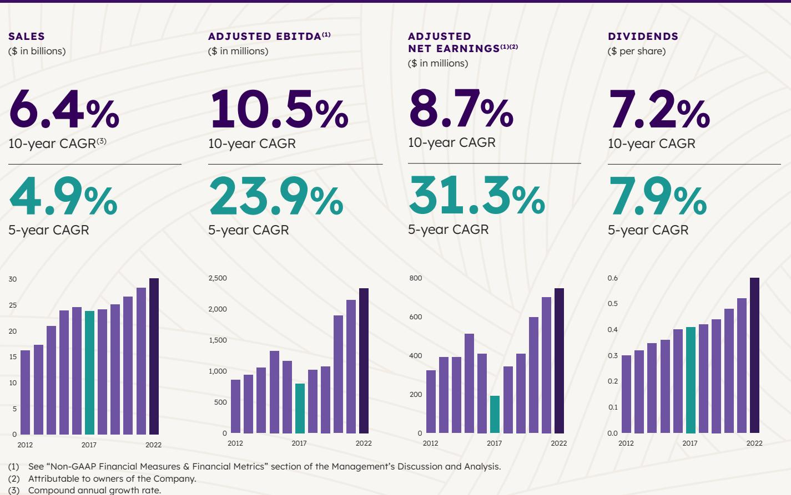
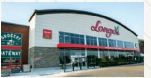
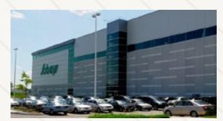
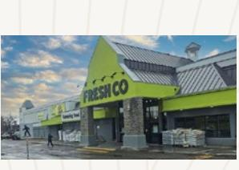
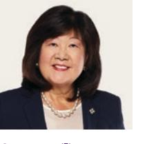

{0}------------------------------------------------

# Thriving together

2022 Annual Report

{1}------------------------------------------------

## Financial Highlights

Empire Company Limited (TSX: EMP.A) is a Canadian company headquartered in Stellarton, Nova Scotia. Empire's key businesses are food retailing and related real estate. With approximately \$30.2 billion in annual sales and \$16.6 billion in assets, Empire and its subsidiaries, franchisees and affiliates employ approximately 130,000 people.

| (\$ in millions, except per share amounts) | 53 weeks ended | May 7, 2022 | 52 weeks ended May 1, 2021 | 52 weeks ended May 2, 2020 |
|--------------------------------------------|----------------|-------------|-------------------------------|-------------------------------|
| Sales                                      | \$             | 30,162.4    | \$ 28,268.3                | \$ 26,588.2                |
| Gross profit(1)                            |                | 7,659.7     | 7,199.3                       | 6,633.3                       |
| Gross margin (1)                        |                | 25.4%       | 25.5%                         | 24.9%                         |
| Operating income                           |                | 1,363.7     | 1,299.5                       | 1,111.8                       |
| EBITDA(1)                                  |                | 2,330.8     | 2,143.8                       | 1,892.4                       |
| EBITDA margin (1)                       |                | 7.7%        | 7.6%                          | 7.1%                          |
| Net earnings(2)                            |                | 745.8       | 701.5                         | 583.5                         |
| per share (fully diluted)                  |                | 2.80        | 2.60                          | 2.15                          |
| Book value per common share(1)             |                | 18.82       | 16.30                         | 14.51                         |
| Dividends per share                        |                | 0.60        | 0.52                          | 0.48                          |

{2}------------------------------------------------

# Thriving together

Introducing the new Empire Company Limited logo – a modern, contemporary and approachable visual identity that better reflects the company we have evolved into over the past six decades.

In fiscal 2022, the spirit of collaboration among our teammates and our valued, productive working relationships with our supplier partners, enabled us to continue thriving — together. Amid some formidable challenges, the Canadian grocery industry made unprecedented strides. Our teammates worked collectively to keep shelves stocked and support our communities. Working together, we protected the food supply chain and supported customers.

At Empire, building relationships based on trust and transparency helps us maintain an unwavering focus on giving the best value to our customers. We believe this spirit of transparency and collaboration makes partnerships stronger. It's how we will continue thriving together.

{3}------------------------------------------------

# A Message from the Chair

### Thriving Together

Five years into Empire's transformation, I am pleased to report that we have met or exceeded every goal we set for ourselves on this important journey. From the important foundational work to the more recent growth and business optimization efforts, our turnaround has helped build resilience throughout all levels of the organization. We have faced many hurdles, yet emerged stronger, thanks in no small part to the purpose, passion and perseverance of our teammates from coast to coast.

Our efforts during this time of revitalization to build a stronger culture and an engaged, winning team — true champions of the community from coast to coast — has set us up to thrive in the years to come. What we could not have predicted five years ago is just how much of a difference our dedicated teammates would make in supporting Canadians through tough times in recent years, from the COVID-19 pandemic, to floods in British Columbia and Atlantic Canada, to the wildfires in the West. Despite it all, Empire was able to thrive and grow, and we continued our transformation apace.

### A Truly Sustainable Business

I have had the good fortune to work with Empire for many years, long enough to remember when our company surpassed \$1 billion in annual sales. It has been a privilege to witness Empire reach \$30 billion in fiscal 2022, another significant milestone in Empire's sustainable growth story and one that our shareholders can be most proud of.

Sustainability at Empire extends far beyond our company's solid financial performance. Our Board of Directors keeps a strong environmental, social and governance (ESG) mandate top of mind at all times. We believe good governance includes continually evaluating and elevating our ESG and sustainability goals. As a top Canadian company with a proud history and robust culture, our goal is to lead the way as a good corporate citizen.

At Empire, Diversity, Equity and Inclusion (DE&I) is part of every conversation and consideration, including business strategy. We want our teams to reflect the customers and communities we serve. Our drive to embed DE&I into every facet of our organization aims to ensure a richly diverse pool of teammates will thrive within our organization.

At Empire, we also recognize that every decision we make, and every action we take, has an impact on the environment. In recent years, we have started the journey to address the impact of our operations and, as we move forward, you will see both our efforts and our accomplishments only accelerate. Subsequent to the end of fiscal 2022, Empire announced further commitments to meaningfully reduce our carbon footprint through our comprehensive Climate Action Plan. We have set science-based targets (SBTs) that align with greenhouse gas reduction targets outlined in the Paris Agreement and are working closely with our supplier partners to help them set their own science-based targets. I encourage you to learn more about our efforts by viewing our Sustainable Business Report.

Empire has a long history of supporting communities and families. Over the last five years, our transformation journey has allowed us to be an increasingly impactful community champion, providing greater support to our community partners, to people in need, and to grassroots organizations across the country. Our landmark Family of Support: Child and Youth Mental Health Initiative, for example, launched in partnership with the Sobey Foundation in 2020, has already contributed more than \$9 million to 13 children's hospital foundations across Canada.

{4}------------------------------------------------

Five years into Empire's transformation, I am pleased to report that we have met or exceeded every goal we set for ourselves on this important journey. From the important foundational work to the more recent growth and business optimization efforts, our turnaround has helped build resilience throughout all levels of the organization. **"**

130,000 devoted teammates across the country

115 years strong

40% gender balance on our Board of Directors

### Our Bright Future

The continued resilience on the frontlines of our business — in our grocery stores and retail support centres, at our e-commerce business Voilà, in our pharmacies gives us incredible confidence in our future. That is due in no small part to the passion and steadfast vision of Empire's outstanding President and Chief Executive Officer Michael Medline. His leadership is unmatched in the industry. Throughout our transformation journey, COVID-19, supply chain hurdles and other business challenges, Michael's ability to set and routinely exceed Empire's ambitious goals over the last six years has been remarkable. Thank you, Michael, for continuing to steer us on our steady upward trajectory and for your ability to attract and retain the best team of senior retail executives in this country.

On behalf of our Board of Directors, I also commend the Company's Executive Committee for their stellar leadership. We are confident our company is in great hands. Thank you to the Board for their diligence, oversight and unwavering commitment to great governance in fiscal 2022. Finally, Empire would not be the company it is today — an essential service to Canadians, invested community advocate and exceptional corporate citizen — without the efforts of our devoted teammates. We owe our success entirely to them. Our Board thanks the 130,000 teammates for

persevering through multiple headwinds and challenges while our company and our culture continue to thrive and grow. Together, you have made our transformation a reality, now and for many years to come. We are 115 years strong, and our future has never looked brighter.

Sincerely,

signed "James M. Dickson"

James M. Dickson

Chair, Empire Company Limited

July 29, 2022

{5}------------------------------------------------

# Message from the President & CEO

### Thriving Together

This year, as the pandemic eased, I was fortunate to finally do even more of what I love best: get out into our stores and retail support centres to witness Empire's remarkable frontline teammates in action across the country. Along with our Board Chair, Jim Dickson, and other senior leadership, we were able to honour many of our teammates who helped keep our stores open and Canadians fed during the height of the pandemic. Our Empire Retail Impact Awards acknowledged 56 deserving teammates who went above and beyond to serve customers and their communities over the past couple of challenging years. With 130,000 devoted teammates across the country, we could easily have handed out thousands of awards. Empire is united by a strong culture that prizes community and rewards innovation, and our best ideas come from our stores and our teammates.

Visiting teammates across the country also gave me the chance to see firsthand how many of the exciting, transformative changes our company has put in place

over the past five years are coming to life in our stores, which remain the very heart of our business.

In only five years, we've made major strides against all of our transformation priorities. As we enter the third year of Project Horizon, we can see its benefits extending throughout the Company. Our announcement, subsequent to the end of fiscal 2022, of our co-ownership of the Scene+ loyalty program and our plans to transition to the Scene+ program, mark the most recent step in our journey.

For Empire, Scene+ will allow us to thrill our customers and unlock the true power of personalization. It will deepen our relationships with our customers and reward them for their loyalty across many of our businesses. There is a mountain of opportunity here to thrill our customers, build our strength in data and take our marketing and merchandising to the next level.

In parallel with our transformation, we have also strengthened Environmental, Social and Governance (ESG) measures at Empire. We have made tangible progress in the area of Diversity, Equity and Inclusion (DE&I) by incorporating it into our financial outcomes and every area of our business. As Jim Dickson mentions in his letter, our commitment to ESG initiatives has seen us recently table a bold new Climate Action Plan that will work toward a more sustainable future for all of us and help tackle the existential threat facing our planet. I look forward to providing you with ongoing updates of these important initiatives in the months and years to come.

### Company Performance and Strategic Initiatives

Our grocery stores connect us with communities from coast to coast and we continually refresh and refine the instore experience to meet the changing needs of our customers. By the end of fiscal 2023, Empire will have invested \$1.5 billion over five years to renovate close to half of our store network. We're reaping the dividends of this program every day. As we reshape our growing business in the West, the expansion of

### Fiscal 2022 Highlights

#### Longo's acquisition

Acquired 51% of Longo's, a specialty grocery retailer with 36 stores in Ontario, and its Grocery Gateway e-commerce business. The Longo's footprint will be expanded by two stores in fiscal 2023.

#### Bill, David and Donald Sobey RSCs

Our Rocky View (Calgary), Vaughan and Terrebonne (Montreal) RSCs are officially renamed the Bill, David and Donald Sobey RSCs to honour the Sobey family's incredible legacy.

#### Olympics & Feed the Dream Campaign

Sobeys was the Winter 2022 Official Grocer of the Canadian Olympic and the Canadian Paralympic Teams to celebrate the emotional connection between family, food and sport.

### QC and BC Voilà expansion

Newly opened Customer Fulfilment Centre (CFC) in Montreal now offers Voilà par IGA to 100 communities across Québec. We also announced our fourth CFC will be in the Greater Vancouver Area where Voilà online grocery home delivery service will be available for BC customers in 2025.

{6}------------------------------------------------

**"**Visiting teammates across the country also gave me the chance to see firsthand how many of the exciting, transformative changes our company has put in place over the past five years are coming to life in our stores, which remain the very heart of our business.

our discount business FreshCo continues, with customers embracing new stores in all four Western provinces. Our presence in urban markets has seen tremendous growth. We are realizing the rewards of our Farm Boy and Longo's partnerships in Ontario as we expand these powerhouse banners, with sustained opportunities for years to come. And with Voilà, Canada's only real scalable, profitable online grocery solution, we continue to win the hearts of customers and remain on target to reach 75% of Canadian households with our e-commerce platform within the next couple of years.

### Empire's Winning Team

Five-plus years into Empire's business transformation, I believe the best is still yet to come for the Company. We've got a great strategic plan that we are sticking to. And we're just getting started. The full benefits of our transformation strategy will unfold over the coming months and years, and we have carved a clear path for continued growth ahead.

I cannot end my remarks about our exceptional, thriving business without expressing my deep admiration and thanks to all of our dedicated teammates across the country. Empire would not be where we are today were it not for your passion to serve our customers and communities from coast to coast.

To our tireless and endlessly innovative executive team, thank you for helping make our transformation a reality. You have paved the way for our continued success in the future. I extend a special note of thanks to our Board of Directors and, in particular, to our Chair Jim Dickson, for their unparalleled insights, wise counsel and steadfast stewardship of this great company.

signed "Michael Medline"

### Michael Medline

President & Chief Executive Officer Empire Company Limited

July 29, 2022

\$30.2B in sales

10% increase in our dividend

\$1.5B invested in capital over 5 years

#### COVID-19 Efforts

Our Pharmacy teams administered over 1 million COVID-19 vaccines through our national pharmacy network, and partnered with government on pop-up vaccine clinics and Rapid Antigen Test kit distribution.

#### Kids Help Phone

Announced new Kids Help Phone partnership of two communitybased programs created with Black and Indigenous leaders: RiseUp and Finding Hope, which connect Black and Indigenous youth to real-time virtual counselling and crisis help.

#### FreshCo West Expansion

We opened a total of 12 FreshCo locations in Western Canada in fiscal 2022, bringing our total FreshCo store count in the region to 40 so far.

#### Scene+ Loyalty Program Transition

Subsequent to the end of fiscal 2022, the Company unveiled a new loyalty strategy through Scene+, one of Canada's leading loyalty programs, to be rolled out across the country through fiscal 2023.

{7}------------------------------------------------

# Sustainability Report At-a-Glance

We are proud to share our stories and our progress in our Sustainability Business Report at: www.SobeysSBReport.ca

# Planet

We're reducing our impacts and taking action on climate change to do OurPart™ to protect our planet for future generations.

### CLIMATE ACTION

55%

minimum reduction target for absolute Scope 1 and 2 emissions by 2030 (compared to 2019 base year).

# Products

| 100.000 |  |
|---------|--|
|         |  |
|         |  |

We're doing OurPart™ by delivering sustainable and ethical product choices for our customers.

ETHICAL & SUSTAINABLE SOURCING

95%+ of Own Brands seafood is sustainably sourced.

SUPPLIER PARTNERSHIPS

# People

We're focused on growing and empowering a diverse, equitable and inclusive workforce to enable our customers and communities to thrive.

DIVERSITY, EQUITY & INCLUSION

81%

of corporate retail teammates completed Serving all in Canada: A course on addressing and preventing consumer racial profiling.

6

{8}------------------------------------------------

At Empire, our purpose as a family nurturing families drives us every day. It drives our commitment to People – the customers we serve, the teammates who power our business, the communities we live in and the investors who place their trust in us. It drives our commitment to protect the Planet and reduce our impacts. And it drives our pursuit of sustainable and ethical Products that nourish us all.

CLIMATE ACTION

28%

emissions reduction target from fuel sold by 2030 (compared to 2019 base year).

62%

target of our suppliers by spend to set science-based targets for their Scope 1 and 2 emissions by 2027 (compared to 2019 base year).

FOOD WASTE

22%

reduction in food waste in our stores since 2016.

ENVIRONMENTAL MANAGEMENT

\$13M

donated in partnership with Earth Day Canada to support environmental initiatives since 2008.

### SUPPLIER PARTNERSHIPS

350+ women entrepreneurs supported

in fiscal 2022 (in English Canada).

CUSTOMER EXPERIENCE & ENGAGEMENT

43

new urban bee-keeping sites added in fiscal 2022 in partnership with Alvéole.

CUSTOMER EXPERIENCE & ENGAGEMENT

5M

litres of water saved thanks to customers purchasing fresh herbs from Infarm.

### DIVERSITY, EQUITY & INCLUSION

37%

representation of women at the senior leadership level in fiscal 2022, a 9.1% increase over last year.

COMMUNITY INVESTMENT

~\$19M

donated to support healthy bodies and minds in our communities (\$6M in corporate donations and \$13M raised) in fiscal 2022.

7

{9}------------------------------------------------

### Directors of Empire Company Limited

Michelle Banik(3) Toronto, Ontario Director since 2021 Corporate Director

Gregory Josefowicz(3) Fennville, Michigan, USA Director since 2016 Corporate Director

Cynthia Devine(5)(7) Toronto, Ontario Director since 2013 Interim President & CEO and Chief Financial Officer, Maple Leaf Sports & Entertainment

Sue Lee(3) Vancouver, British Columbia Director since 2014 Corporate Director

James M. Dickson Halifax, Nova Scotia Director since 2015 Chair of Empire Company Limited Counsel, Stewart McKelvey

William Linton(4)(5)(7) Toronto, Ontario Director since 2015 Corporate Director

Sharon Driscoll(2)(5)(7) Vancouver, British Columbia Director since 2018 EVP & Special Advisor to the CEO, Ritchie Bros. Auctioneers Inc.

Michael Medline Toronto, Ontario Director since 2017 President & Chief Executive Officer, Empire Company Limited and Sobeys Inc.

Martine Reardon(1)(5)(7) New York, New York, USA Director since 2017 Chief Marketing Officer & EVP of Content and Membership, National Retail Federation (U.S.)

Paul D. Sobey(5) Pictou County, Nova Scotia Director since 1993 Corporate Director

Frank C. Sobey(5) Pictou County, Nova Scotia Director since 2007 Corporate Director

Rob G.C. Sobey(3)(5) Stellarton, Nova Scotia Director since 1998 Corporate Director

John R. Sobey(1) Pictou County, Nova Scotia Director since 1979 Corporate Director

Martine Turcotte(1)(6)(8) Verdun, Québec Director since 2012 Corporate Director

Karl R. Sobey(3) Halifax, Nova Scotia Director since 2001 Corporate Director

- 1 Audit Committee member
- 2 Audit Committee chair
- 3 Human Resources Committee member
- 4 Human Resources Committee chair 5 Corporate Governance & Social Responsibility Committee member
- 6 Corporate Governance & Social Responsibility Committee chair
- 7 Nominating Committee member
- 8 Nominating Committee chair

To learn more, please visit www.empireco.ca/ governance

{10}------------------------------------------------

# Management's Discussion and Analysis

For the fourth quarter and fiscal year ended May 7, 2022

| Forward-Looking Information               | 10 |
|-------------------------------------------|----|
| Overview of the Business                  | 11 |
| Food Retailing                            | 11 |
| Company Strategy                          | 11 |
| Business Updates                          | 13 |
| Investments and Other Operations          | 15 |
| Outlook                                   | 15 |
| Summary Results – Fourth Quarter          | 16 |
| Sales                                     | 16 |
| Gross Profit                              | 16 |
| Operating Income                          | 17 |
| EBITDA                                    | 17 |
| Finance Costs                             | 17 |
| Income Taxes                              | 17 |
| Net Earnings                              | 17 |
| Operating Results – Full Year             | 18 |
| Sales                                     | 18 |
| Gross Profit                              | 18 |
| Operating Income                          | 19 |
| EBITDA                                    | 19 |
| Finance Costs                             | 19 |
| Income Taxes                              | 19 |
| Net Earnings                              | 19 |
| Financial Performance by Segment          | 20 |
| Food Retailing                            | 20 |
| Investments and Other Operations          | 20 |
| Quarterly Results of Operations           | 21 |
| Liquidity and Capital Resources           | 22 |
| Operating Activities                      | 22 |
| Investing Activities                      | 22 |
| Capital Expenditures                      | 22 |
| Store Network Activity and Square Footage | 23 |
| Financing Activities                      | 23 |
| Free Cash Flow                            | 24 |
| Employee Future Benefit Obligations       | 24 |
| Guarantees and Commitments                | 24 |

| Consolidated Financial Condition                | 25 |
|-------------------------------------------------|----|
| Key Financial Condition Measures                | 25 |
| Shareholders' Equity                            | 26 |
| Normal Course Issuer Bid                        | 27 |
| Accounting Standards and Policies               | 28 |
| Standards, Amendments and Interpretations       |    |
| Issued but not yet Adopted                      | 28 |
| Critical Accounting Estimates                   | 28 |
| Disclosure Controls and Procedures              | 30 |
| Internal Control Over Financial Reporting       | 30 |
| Related Party Transactions                      | 30 |
| Key Management Personnel Compensation           | 31 |
| Indemnities                                     | 31 |
| Contingencies                                   | 31 |
| Risk Management                                 | 31 |
| Designation for Eligible Dividends              | 37 |
| Non-GAAP Financial Measures & Financial Metrics | 37 |
| Financial Measures                              | 37 |
| Financial Metrics                               | 39 |
|                                                 |    |

{11}------------------------------------------------

### Management's Discussion and Analysis

The following is Management's Discussion and Analysis ("MD&A") of the consolidated financial results of Empire Company Limited ("Empire" or the "Company") (TSX: EMP.A) and its subsidiaries, including wholly-owned Sobeys Inc. ("Sobeys") for the fourth quarter and fiscal year ended May 7, 2022 compared to the fourth quarter and fiscal year ended May 1, 2021. The MD&A should be read in conjunction with the Company's audited consolidated financial statements and notes thereto for the fiscal year ended May 7, 2022, and the fiscal year ended May 1, 2021. Additional information about the Company, including the Company's Annual Information Form, can be found on SEDAR at www.sedar.com or on the Company's website at www.empireco.ca.

The audited consolidated financial statements and the accompanying notes are prepared in accordance with International Financial Reporting Standards ("IFRS") as issued by the International Accounting Standards Board ("IASB") and are reported in Canadian dollars ("CAD"). These consolidated financial statements include the accounts of Empire and its subsidiaries and structured entities which the Company is required to consolidate. The information contained in this MD&A is current to June 21, 2022, unless otherwise noted.

### Forward-Looking Information

This document contains forward-looking statements which are presented for the purpose of assisting the reader to contextualize the Company's financial position and understand management's expectations regarding the Company's strategic priorities, objectives and plans. These forward-looking statements may not be appropriate for other purposes. Forward-looking statements are identified by words or phrases such as "anticipates", "expects", "believes", "estimates", "intends", "could", "may", "plans", "predicts", "projects", "will", "would", "foresees" and other similar expressions or the negative of these terms.

These forward-looking statements include, but are not limited to, the following items:

- The Company's expectations regarding the financial impact and benefits of Project Horizon and its underlying initiatives, which could be impacted by several factors, including resource capacity to execute and the time required by the Company to complete the initiatives;
- The FreshCo expansion in Western Canada, and Farm Boy and Longo's expansion in Ontario, including the Company's expectations regarding future operating results and profitability, the amount and timing of expenses, the projected number of store openings, and the location, feasibility and timing of construction, all of which may be impacted by construction schedules and permits, the economic environment and labour relations;
- The Company's plans to further grow sales and profitability of its Own Brands, which may be impacted by future operating costs and customer response;
- The Company's expectations that fiscal 2022 will reflect the highest net earnings dilution for the Voilà program and that fiscal 2023 net earnings dilution will be marginally better, expectations which may be impacted by future operating and capital costs, customer response and the performance of its technology provider, Ocado Group plc ("Ocado");
- The Company's expectations that fiscal 2023 will achieve growth of same-store sales, which may be impacted by the duration and impact of the novel coronavirus ("COVID-19") on the business, supply chain and consumer behaviour;
- The Company's expectation of the impacts of cost inflationary pressures, which may be impacted by supplier relationships and negotiations and the macro-economic environment;
- The Company's expectation that labour shortages will not have further significant impact on supply chain challenges, which may be impacted by labour force availability;
- The Company's expectations regarding the timing and amount of expenses relating to the completion of any future Customer Fulfilment Centres ("CFC"), which may be impacted by supply of materials and equipment, construction schedules and capacity of construction contractors;
- The Company's estimates regarding future capital expenditures, which may be impacted by operating results, impacts of COVID-19 and the economic environment;
- The Company's expected contributions to its registered defined benefit plans, which could be impacted by fluctuations in capital markets;
- The Company's plans to repurchase for cancellation Non-Voting Class A shares under the normal course issuer bid which may be impacted by market and economic conditions, availability of sellers, changes in laws and regulations, and the results of operations; and
- The Company's expectation that its cash and cash equivalents on hand, unutilized credit facilities and cash generated from operating activities will enable the Company to fund future capital investments, pension plan contributions, working capital, current funded debt obligations and ongoing business requirements, and its belief that it has sufficient funding in place to meet these requirements and other short and long-term obligations, all of which could be impacted by changes in the economic environment.

{12}------------------------------------------------

By its nature, forward-looking information requires the Company to make assumptions and is subject to inherent risks, uncertainties and other factors which may cause actual results to differ materially from forward-looking statements made. For more information on risks, uncertainties and assumptions that may impact the Company's forward-looking statements, please refer to the Company's materials filed with the Canadian securities regulatory authorities, including the "Risk Management" section of this MD&A.

Although the Company believes the predictions, forecasts, expectations or conclusions reflected in the forward-looking information are reasonable, it can provide no assurance that such matters will prove correct. Readers are urged to consider the risks, uncertainties and assumptions carefully in evaluating the forward-looking information and are cautioned not to place undue reliance on such forward-looking information. The forward-looking information in this document reflects the Company's current expectations and is subject to change. The Company does not undertake to update any forward-looking statements that may be made by or on behalf of the Company other than as required by applicable securities laws.

### Overview of the Business

Empire's key businesses and financial results are segmented into two reportable segments: (i) Food retailing; and (ii) Investments and other operations. With approximately \$30.2 billion in annual sales and \$16.6 billion in assets, Empire and its subsidiaries, franchisees and affiliates employ approximately 130,000 people.

### FOOD RETAILING

Empire's Food retailing segment is carried out through Sobeys, a wholly-owned subsidiary. Proudly Canadian, with headquarters in Stellarton, Nova Scotia, Sobeys has been serving the food shopping needs of Canadians since 1907. Sobeys owns, affiliates or franchises more than 1,600 stores in all 10 provinces under retail banners that include Sobeys, Safeway, IGA, Foodland, FreshCo, Thrifty Foods, Farm Boy, Longo's and Lawtons Drugs, operates grocery e-commerce under the banners Voilà, Grocery Gateway, IGA.net and ThriftyFoods.com, and operates more than 350 retail fuel locations.

### COMPANY STRATEGY

In the first quarter of fiscal 2021, the Company launched Project Horizon, a three-year strategy focused on core business expansion and the acceleration of e-commerce. The Company remains on track to achieve an incremental \$500 million in annualized EBITDA and an improvement in EBITDA margin of 100 basis points by fiscal 2023 by growing market share and building on cost and margin discipline. The Company expects to generate a compound average growth rate in earnings per share of at least 15% over Project Horizon's three-year timeframe.

In fiscal 2021, Project Horizon benefits were achieved from the expansion and renovation of the Company's store network, the addition of new stores, improvement in store operations and merchandising from data analytics along with continued efficiencies gained through strategic sourcing initiatives.

In fiscal 2022, earnings continued to be positively impacted by Project Horizon's strategic initiatives, including promotional optimization and data analytics, the continued expansion and renovation of the store network, and strategic sourcing efficiencies. Benefits in fiscal 2021 and fiscal 2022 were partially offset by the planned investment in the Company's e-commerce network.

These initiatives will continue to deliver benefits in fiscal 2023, and additional benefits are expected from strategic initiatives launched more recently as part of Project Horizon, including the Company's new loyalty program, Scene+, which will be rolled out gradually. Project Horizon initiatives focused on loyalty, store optimization and customer experience will primarily benefit fiscal 2024 and beyond.

### Growth in Market Share

Growth in market share is expected from supporting and investing further in the store network, improving store productivity, scaling grocery e-commerce, growing the Own Brands portfolio, continuing the Western discount business expansion, increasing the Farm Boy footprint in Ontario and the acquisition of Longo's which occurred in the first quarter of fiscal 2022.

### Invest in the Company's Store Network

The Company has accelerated investments in renovations and conversions, store processes, communications, training, technology and tools. These continuing investments, coupled with refreshed brand marketing strategies and the expansion of the Farm Boy and FreshCo banners, are reflected in the Company's capital spending over the Project Horizon timeframe. See the "Capital Expenditures" section of this MD&A for further details.

### Improve Store Productivity

The Company began building the foundation of its advanced analytics capabilities a few years ago. Analytics will continue to drive improvements in customer facing elements such as store footprints, customer promotions and availability of product on shelf. These new advanced analytics capabilities enable the Company to further improve the customer experience by optimizing category and product adjacencies to tailor its assortment for each store format.

{13}------------------------------------------------

### Win Canadian Grocery E-Commerce

The first CFC in Vaughan, Ontario has been operating for two years and the second CFC, located in Montreal, began delivering to customers on March 7, 2022. The third and fourth CFCs located in Calgary and the Greater Vancouver Area ("Vancouver"), respectively, are in different stages of development. In September 2020, the Company introduced its store pick solution at select store locations and has expanded to 98 stores nationally in areas where CFCs will not deliver or are not yet operating. The Company has an e-commerce option available for customers in every province.

### Grow the Company's Own Brands Portfolio

The Company has improved its Own Brands positioning and branding. The Company reviews the specific role of Own Brands in each category and determines which categories and banners to expand based on consumer needs. Working closely with its supplier partners, the Company plans to further grow sales and profitability of its Own Brands portfolio through increased distribution, shelf placement, product innovation and cost of goods sold reduction.

### Provide Best-in-Class Customer Personalization

The Company is investing in analytics and technology to better identify customer preferences and support direct, personalized communication – evolving from mass communications to personalized connections with its customers. The goal is to deploy world-class, personalized communications and offers to inspire customers and improve the experience and relevance of promotions.

The Company has developed a next generation recommendation engine for one-to-one, machine learning powered personalization at scale. This engine has been launched in select regions with positive early results, specifically improved customer engagement and an increase in customer spending. The targeting algorithms will continue to improve as the engine is rolled out across the country, driving progressively better performance and results.

In June 2022, the Company unveiled a new loyalty strategy through Scene+, one of Canada's leading loyalty programs. Along with Scotiabank and Cineplex, the Company is now a co-owner of Scene+. The rollout will begin in Atlantic Canada in August 2022 and continue across the country, culminating in late fiscal 2023 in most of the Company's banners and liquor stores. AIR MILES® collectors will continue to earn and redeem in the Company's stores until the new Scene+program is available.

### Building on Cost and Margin Discipline

The Company has significantly improved its efficiency and cost competitiveness through Project Horizon. Further opportunity still remains to remove non value-added costs and optimize margins.

### Drive Non-Merchandising Sourcing Efficiencies

The strategic sourcing team continues to build additional efficiencies and cost reductions in indirect spend.

### Continue to Build Merchandising Sourcing Efficiencies

The Company continues to invest in advanced data analytics to support its category planning process. Merchants work with both national and private brand suppliers to sustain gains made through category by category reviews, while continuing to partner with suppliers on new opportunities to ensure the Company brings the best value and offers to its customers.

A national sourcing team was created at the end of fiscal 2021 to centralize sourcing responsibilities. This structure allows the Company to efficiently navigate inflationary pressure and supply chain disruptions, allowing merchants to focus on delivering value to the Company's customers.

### Invest in Best-in-Class Analytics to Improve Customer Value Proposition

Advanced analytics tools are helping the Company shift investments to the products customers care most about, with the goal of improving value for customers.

Advanced analytics tools are being leveraged nationally by category merchants across all formats to improve the Company's effectiveness of promotions, while improving value for customers. The promotional optimization initiative – a partnership between the advanced analytics team and category merchants – began to show benefits in margins during fiscal 2021. Additional investments in data analytics and technology drove further improvements in fiscal 2022 and will continue to do so in fiscal 2023.

### Optimize Supply Chain Productivity

The Company continues to optimize its supply chain and logistics networks and consolidate certain procurement processes.

During fiscal 2021, the Company consolidated two distribution centres in Quebec into one facility and opened a new distribution centre in British Columbia ("B.C.") which consolidates three previous distribution centres into one facility. These consolidations increased capacity and efficiency in the network.

### Improve System and Process

By leveraging technology to improve systems and process, the Company has further opportunities to generate efficiencies and cost reductions in its back office and support functions and improve its service to stores.

{14}------------------------------------------------

### BUSINESS UPDATES

### Farm Boy

The acquisition of Farm Boy on December 10, 2018 added 26 locations to the Company's Ontario store network with plans to double the store count in five years from the acquisition date, mainly in the Greater Toronto Area ("GTA"). The Company opened two locations during the fourth quarter of fiscal 2022, for a total of eight new stores (including one converted site) in the fiscal year. This is in line with management's previously stated expectation of expanding Farm Boy's footprint by seven net new stores during fiscal 2022. As at June 21, 2022, Farm Boy has 44 stores open.

In fiscal 2023, the Company expects to open four additional Farm Boy stores in Ontario.

### FreshCo

In fiscal 2018, the Company announced plans to expand its FreshCo discount format to Western Canada with expectations of converting up to 25% of the 255 Safeway and Sobeys full-service format stores in Western Canada to the FreshCo banner.

The Company opened three FreshCo locations in Alberta during the fourth quarter of fiscal 2022, for a total of 12 new stores opened in Western Canada in the fiscal year. This is in line with management's expectations of opening 10 to 15 FreshCo stores in Western Canada during fiscal 2022. As at June 21, 2022:

- 40 stores are open in the following provinces:
	- » 16 in B.C.
	- » 12 in Alberta
	- » 6 in Manitoba
	- » 5 in Saskatchewan
	- » 1 in Northern Ontario
- 4 stores are expected to open in Alberta in fiscal 2023

The Company expects to have 44 FreshCo stores open in Western Canada by the end of fiscal 2023.

### Business Acquisition

On March 16, 2021, the Company, through a wholly-owned subsidiary, signed an agreement to acquire 51% of Longo's, a long-standing, family-built network of specialty grocery stores in the GTA, and its Grocery Gateway e-commerce business. The purchase price of the transaction was \$660.6 million. The Company acquired the business through the issuance of 3,187,348 Non-Voting Class A shares with a transaction date price of \$129.6 million, cash of \$196.6 million and a contingent note payable of \$10.7 million. The acquisition closed effective May 10, 2021.

After the fifth anniversary of the transaction, the Longo's 49% non-controlling shareholders have an option to sell up to a 12.25% per annum interest in Longo's to Sobeys, at a multiple applied to the last 12 months earnings before interest, taxes, depreciation and amortization. The multiple will vary depending on achievement of certain business results. If Longo's non-controlling shareholders exercise an option to sell, Sobeys will have a corresponding call option for the same percentage in the following year. After the tenth anniversary of the transaction, both Sobeys and Longo's have mutual put and call options for any remaining minority shares outstanding. A financial liability of \$239.7 million was recognized at the date of acquisition which is remeasured at the end of each quarter.

### Store Closure, Conversion and Lease Terminations

In the fourth quarter and fiscal year ended May 7, 2022, the Company reversed \$9.1 million in accrued store closure and conversion costs primarily related to Farm Boy and FreshCo conversions (2021 – \$1.1 million). As a result of these reversals, the net fiscal 2022 store closure and conversion expense was \$8.8 million (2021 – \$29.5 million).

During the fourth quarter and fiscal year ended May 7, 2022, the Company engaged in lease termination transactions which resulted in other income of \$23.6 million and \$47.0 million, respectively (2021 – \$ nil and \$ nil).

### Ratification of New Collective Bargaining Agreement in Alberta

During the first quarter of fiscal 2021, the Company announced the ratification of a new Collective Bargaining Agreement ("CBA") for Alberta Safeway stores with UFCW 401, the Union representing the majority of Safeway teammates in Alberta. The CBA included a one-time retroactive lump sum payment to Safeway Alberta teammates for hours worked over the previous three years. The one-time retroactive lump sum payment of \$15.6 million associated with this CBA was charged to operating earnings in the second quarter of prior year.

### Sustainable Business Reporting

Environmental, Social and Governance ("ESG") has deep roots in the Company's history, and the principles of ESG have been a part of the organization since the Company started 115 years ago. The Company is focused on several initiatives as part of a continuing ESG journey such as working to remove plastics from the business, focusing on avoidable and hard-to-recycle plastics, expanding the Company's efforts to cultivate a fair, equitable and inclusive environment for all, embedding sustainable business mandates within the Company's performance management goals, and completing an extensive assessment of the Company's greenhouse gas emissions. The executive team reviewed a broad range of ESG issues that are important to stakeholders and long-term business success and that create shared value for the Company's stakeholders, business and shareholders.

{15}------------------------------------------------

The publication of the Company's 2021 Sustainable Business Report in August 2021 marked the next step in the Company's sustainability journey. This was the first year the Company reported according to the Sustainable Accounting Standards Board (SASB) Food Retailers and Distributors Standard. This disclosure provides transparency and data on the Company's progress in core ESG areas in the business and industry. The Company's 2022 Sustainable Business Report will be released in July 2022.

### Voilà

On June 22, 2020, the Company introduced the future of online grocery home delivery to GTA customers through Voilà, the Company's e-commerce platform. Voilà is powered by industry-leading technology provided by Ocado, through its automated CFCs. Robots assemble orders efficiently and safely, resulting in minimal product handling, while Voilà teammates deliver orders directly to customers' homes. In February 2022, Ocado announced a range of innovations, including next generation robots and grids, which offer efficiencies and a lighter environmental and carbon footprint. Some of these innovations will be included in the Company's fourth CFC and will be available for the Company to consider in future CFC automation and efficiency opportunities.

The Company will operate four CFCs across Canada. The Vaughan CFC services the GTA, Barrie, Kitchener, Waterloo, Guelph, Hamilton, Niagara, St. Catharines and Brantford, and was expanded to service Ottawa in the fourth quarter of fiscal 2022.

The second CFC in Montreal began deliveries to customers on March 7, 2022, beginning with a phased transition of customers to Voilà par IGA from IGA.net. The rollout was completed subsequent to the end of the fourth quarter and Voilà par IGA now services over 100 municipalities from Gatineau to Montreal to Quebec City. The second CFC is progressing well with increasing weekly order volume and strong customer experience metrics, including on-time delivery and fulfilment.

Crombie Real Estate Investment Trust ("Crombie REIT") has substantially completed the construction of the building for Voilà's third CFC in Calgary and is preparing to turn it over to Ocado to build the internal grid. The CFC will service the majority of Alberta, with deliveries expected to start in the first quarter of fiscal 2024. On February 7, 2022, the Company announced that its fourth CFC will be located in Vancouver and will service customers in B.C. starting in 2025.

In March 2021, the Company opened its first spoke location in Etobicoke, Ontario. The second and third spokes were opened in Ottawa and Quebec City during fiscal 2022, adding to the areas in Ontario and Quebec being served by Voilà. Spokes are cross dock facilities that improve efficiencies at CFCs.

In fiscal 2021, the Company launched Voilà Curbside Pickup service at 30 store locations across Atlantic Canada and Alberta, and the service has since expanded to B.C., Manitoba, Saskatchewan and Ontario. In fiscal 2022, the Company added 68 stores for a total of 98 stores providing the service. The Curbside Pickup solution is powered by Ocado's technology and serves customers in areas where future CFCs will not, or are not yet, operating.

With four CFCs, their supporting spokes and Curbside Pickup, the Company will be able to serve approximately 75% of Canadian households representing approximately 90% of Canadians' projected e-commerce spend.

The combination of improving results in Vaughan, increasing costs in Montreal, and additional Curbside Pickup locations reduced the Company's fourth quarter and fiscal 2022 net earnings by \$0.07 and \$0.28 per share, respectively (2021 – \$0.04 and \$0.18). This was in line with management's previously disclosed expectation of \$0.25 to \$0.30 per share. Management continues to expect that fiscal 2022 will represent the highest net earnings dilution for the Voilà program.

In Canada, online grocery sales have continued to grow compared to the prior year, although at a much slower pace than when COVID-19 began. In the fourth quarter of fiscal 2022, the Company's four e-commerce platforms experienced combined sales growth of 12% versus prior year (2021 – 15%). The increase was primarily driven by the acquisition of Grocery Gateway and continued growth of Voilà, partially offset by declines in IGA.net and ThriftyFoods.com due to elevated volume levels in the prior year during COVID-19 related lockdowns.

### Other Business Updates

On February 7, 2022, teammates at a distribution centre in Quebec went on strike after negotiations between the union and the Company were unsuccessful in agreeing on the terms of a new CBA. The strike ended on May 10, 2022, after an agreement was reached on a new three-year CBA. The incremental impact of the strike on earnings per share was \$0.04 and impacted earnings in the fourth quarter of fiscal 2022.

On May 3, 2022, the Company delivered a notice of early redemption of the \$500.0 million Series 2013-2 Notes ("Notes"). The redemption was effective on June 2, 2022. The early redemption premium of \$9.2 million was charged to earnings in the fourth quarter of fiscal 2022.

{16}------------------------------------------------

### INVESTMENTS AND OTHER OPERATIONS

Empire's Investments and other operations segment, as of May 7, 2022, included:

- 1. A 41.5% (41.5% fully diluted) equity accounted interest in Crombie REIT (TSX: CRR.UN), an Ontario registered, unincorporated, open-ended real estate investment trust. Crombie REIT is one of the country's leading national retail property landlords with a strategy to own, operate and develop a portfolio of high-quality grocery and pharmacyanchored shopping centres, freestanding stores and mixed-use developments primarily in Canada's top urban and suburban markets; and
- 2. A 40.7% equity accounted interest in Genstar Development Partnership, a 48.6% equity accounted interest in Genstar Development Partnership II, a 39.0% equity accounted interest in GDC Investments 4, L.P., a 39.0% equity accounted interest in GDC Investments 6, L.P., a 39.0% equity accounted interest in GDC Investments 7, L.P., a 37.1% equity accounted interest in GDC Investments 8, L.P., and a 49.0% equity accounted interest in The Fraipont Partnership (collectively referred to as "Genstar"). Genstar is a residential property developer with operations in select markets in Ontario, Western Canada and the United States.

### Outlook

During the fourth quarter of fiscal 2022, the majority of COVID-19 restrictions by government agencies were lifted. The Company and industry continues to be affected by COVID-19 as well as additional impacts such as higher than normal inflationary pressures and labour shortages. Given the unpredictability of COVID-19, the Company expects consumer behaviour in fiscal 2023, related to the pandemic, to remain broadly consistent with those experienced through the second half of fiscal 2022.

During the fourth quarter of fiscal 2022, the cost of maintaining safety and sanitization measures was approximately \$6.0 million (2021 – \$19.0 million) and are included in selling and administrative expenses. These costs have become a normal part of operating the business and will no longer be separately disclosed.

The industry continues to experience cost inflationary pressures, particularly related to cost of goods sold, including fuel. Although it is difficult to estimate how long these pressures will last, the Company is focused on supplier relationships and negotiations to ensure competitive pricing for consumers.

The industry continues to experience supply chain challenges primarily related to labour shortages. Although it is difficult to estimate the duration of these challenges, management, where necessary remains focused on utilizing alternative sourcing options and does not expect significant adverse impacts to its supply chain.

The Company expects same-store sales will grow in fiscal 2023. Margins will continue to benefit from Project Horizon initiatives and other operating improvements. These benefits could be partially offset by the effect of sales mix changes between banners and the impact of increasing fuel sales.

The Company expects continued improvements in the results of Voilà's Vaughan based e-commerce site as volumes increase and efficiencies improve. At the same time, Voilà will also incur additional costs as the Montreal facility continues to ramp up operations and the Calgary and Vancouver facilities are commissioned. Future earnings will be primarily impacted by the rate of sales growth. The Company expects fiscal 2023 net earnings dilution for the Voilà program to marginally improve over fiscal 2022 as the Vaughan CFC is expected to reflect positive EBITDA towards the end of its third year of operations. The ramp up of the Montreal facility is expected to have higher costs in the first half of fiscal 2023 with improving results in the remainder of the year.

The Company continued the expansion of its discount business in Western Canada with 40 stores now operating. In the second half of fiscal 2022, discount expanded their store footprint in the West by 40%. Newer stores improve efficiency at a faster rate than the early conversion stores as the business gains critical mass across each province. The Company expects to open an additional four stores in Alberta by the end of fiscal 2023 for a total of 44 stores.

Management continues to expect to achieve its three-year Project Horizon targets and that associated benefits will continue into fiscal 2024 and beyond, including initiatives launching in fiscal 2023 that are focused on loyalty, store optimization and customer experience.

{17}------------------------------------------------

### Summary Results – Fourth Quarter

The Company's fourth quarter ends on the first Saturday in May. As a result, the fourth quarter is usually 13 weeks but includes results for 14 weeks every five to six years. The quarters ended May 7, 2022 and May 1, 2021 were 14 and 13 weeks, respectively.

| (\$ in millions, except per share amounts) | 14 Weeks Ended May 7, 2022 | 13 Weeks Ended May 1, 2021 | \$ Change | % Change |
|--------------------------------------------|-------------------------------|-------------------------------|--------------|-------------|
| Sales                                      | \$ 7,840.8                 | \$ 6,920.0                 | \$ 920.8  | 13.3%       |
| Gross profit(1)                            | 2,004.0                       | 1,795.7                       | 208.3        | 11.6%       |
| Operating income                           | 333.6                         | 295.0                         | 38.6         | 13.1%       |
| EBITDA(1)                                  | 586.2                         | 514.4                         | 71.8         | 14.0%       |
| Finance costs, net                         | 82.0                          | 66.7                          | 15.3         | 22.9%       |
| Income tax expense                         | 58.2                          | 45.0                          | 13.2         | 29.3%       |
| Non-controlling interest                   | 14.9                          | 11.4                          | 3.5          | 30.7%       |
| Net earnings(2)                            | 178.5                         | 171.9                         | 6.6          | 3.8%        |
| Basic earnings per share                   |                               |                               |              |             |
| Net earnings(2)                            | \$ 0.68                    | \$ 0.65                    |              |             |
| Basic weighted average number of shares    |                               |                               |              |             |
| outstanding (in millions)                  | 263.0                         | 266.5                         |              |             |
| Diluted earnings per share                 |                               |                               |              |             |
| Net earnings(2)                            | \$ 0.68                    | \$ 0.64                    |              |             |
| Diluted weighted average number of         |                               |                               |              |             |
| shares outstanding (in millions)           | 264.0                         | 267.6                         |              |             |
| Dividend per share                         | \$ 0.15                    | \$ 0.13                    |              |             |

|                                          | 14 Weeks Ended May 7, 2022 | 13 Weeks Ended May 1, 2021 |
|------------------------------------------|-------------------------------|-------------------------------|
| Gross margin(1)                          | 25.6%                         | 25.9%                         |
| EBITDA margin(1)                         | 7.5%                          | 7.4%                          |
| Same-store sales(1) decline              | (0.1)%                        | (4.5)%                        |
| Same-store sales decline, excluding fuel | (2.5)%                        | (6.1)%                        |
| Effective income tax rate                | 23.1%                         | 19.7%                         |

(1) See "Non-GAAP Financial Measures & Financial Metrics" section of this MD&A.

(2) Attributable to owners of the Company.

### EMPIRE COMPANY LIMITED CONSOLIDATED OPERATING RESULTS

### Sales

Sales for the quarter ended May 7, 2022 increased by 13.3% primarily due to the additional week of operations, the acquisition of Longo's, higher fuel sales, increased food inflation and benefits from Project Horizon initiatives, including the expansion of FreshCo in Western Canada and Farm Boy in Ontario.

### Gross Profit

Gross profit for the quarter ended May 7, 2022 increased by 11.6% primarily as a result of higher sales due to the additional week of operations, the inclusion of Longo's, and benefits from Project Horizon initiatives, including the expansion of Farm Boy in Ontario, Voilà nationally and FreshCo in Western Canada and the use of advanced analytical promotional optimization tools.

Gross margin for the quarter decreased to 25.6% from 25.9% in the prior year. Gross margin decreased due to the effect of higher fuel sales, higher supply chain costs, including costs as a result of the strike at the distribution centre in Quebec, and sales mix changes between non-fuel banners. The decrease was partially offset by the inclusion of Longo's and benefits from Project Horizon initiatives. Excluding the effect of fuel mix, gross margin was 17 basis points higher than prior year.

{18}------------------------------------------------

### Operating Income

| (\$ in millions)                            | 14 Weeks Ended May 7, 2022 |       |    | 13 Weeks Ended May 1, 2021 | \$ Change |
|---------------------------------------------|-------------------------------|-------|----|-------------------------------|--------------|
| Consolidated operating income:              |                               |       |    |                               |              |
| Food retailing                              | \$                            | 321.2 | \$ | 279.8                         | \$ 41.4   |
| Investments and other operations:           |                               |       |    |                               |              |
| Crombie REIT                                |                               | 10.7  |    | 11.8                          | (1.1)        |
| Genstar                                     |                               | 3.3   |    | 4.4                           | (1.1)        |
| Other operations, net of corporate expenses |                               | (1.6) |    | (1.0)                         | (0.6)        |
|                                             |                               | 12.4  |    | 15.2                          | (2.8)        |
| Operating income                            | \$                            | 333.6 | \$ | 295.0                         | \$ 38.6   |

For the quarter ended May 7, 2022, operating income from the Food retailing segment increased mainly due to improved earnings as a result of higher sales and gross profit, partially offset by higher selling and administrative expenses. Selling and administrative expenses increased primarily as a result of the inclusion of Longo's, investment in Project Horizon initiatives (including the expansion of Voilà nationally, Farm Boy in Ontario and FreshCo in Western Canada) and increased retail labour costs as a result of the additional week of operations. The increase was partially offset by lower COVID-19 costs.

For the quarter ended May 7, 2022, operating income from the Investments and other operations segment decreased primarily as a result of lower equity earnings from Crombie REIT and Genstar compared to the prior year.

### EBITDA

For the quarter ended May 7, 2022, EBITDA increased to \$586.2 million from \$514.4 million in the prior year mainly as a result of the same factors affecting operating income. EBITDA margin increased to 7.5% from 7.4%.

### Finance Costs

For the quarter ended May 7, 2022, net finance costs increased primarily due to an early redemption premium of \$9.2 million related to the \$500.0 million Notes and increased interest expense on lease liabilities as a result of the additional week of operations.

### Income Taxes

The effective income tax rate for the quarter ended May 7, 2022 was 23.1% compared to 19.7% last year. The effective tax rate was lower than the statutory rate primarily due to benefits related to investment tax credits and capital items taxed at lower rates. The effective tax rate in the same quarter last year was lower than the statutory rate primarily due to the revaluation of tax estimates, not all of which were recurring, and non-taxable capital items.

### Net Earnings

| (\$ in millions, except per share amounts)                          | 14 Weeks Ended May 7, 2022 |       | 13 Weeks Ended May 1, 2021 | \$ Change |  |
|---------------------------------------------------------------------|-------------------------------|-------|-------------------------------|--------------|--|
| Net earnings(1)                                                     | \$                            | 178.5 | \$ 171.9                   | \$ 6.6    |  |
| EPS(2) (fully diluted)                                              | \$                            | 0.68  | \$ 0.64                    |              |  |
| Diluted weighted average number of shares outstanding (in millions) |                               | 264.0 | 267.6                         |              |  |

(1) Attributable to owners of the Company.

(2) Earnings per share ("EPS").

{19}------------------------------------------------

### Operating Results – Full Year

The Company's fiscal year ends on the first Saturday in May. As a result, the fiscal year is usually 52 weeks but includes results for 53 weeks every five to six years. The years ended May 7, 2022 and May 1, 2021 were 53 and 52 weeks, respectively.

|                                                                        |                               |                               | 52 Weeks Ended May 2, 2020 |          | 2022 Compared to 2021 |           |          |
|------------------------------------------------------------------------|-------------------------------|-------------------------------|-------------------------------|----------|-----------------------|-----------|----------|
| (\$ in millions, except per share amounts)                             | 53 Weeks Ended May 7, 2022 | 52 Weeks Ended May 1, 2021 |                               |          |                       | \$ Change | % Change |
| Sales                                                                  | \$ 30,162.4                | \$ 28,268.3                | \$                            | 26,588.2 | \$                    | 1,894.1   | 6.7%     |
| Gross profit                                                           | 7,659.7                       | 7,199.3                       |                               | 6,633.3  |                       | 460.4     | 6.4%     |
| Operating income                                                       | 1,363.7                       | 1,299.5                       |                               | 1,111.8  |                       | 64.2      | 4.9%     |
| EBITDA                                                                 | 2,330.8                       | 2,143.8                       |                               | 1,892.4  |                       | 187.0     | 8.7%     |
| Finance costs, net                                                     | 282.1                         | 269.4                         |                               | 279.1    |                       | 12.7      | 4.7%     |
| Income tax expense                                                     | 270.3                         | 265.9                         |                               | 219.9    |                       | 4.4       | 1.7%     |
| Non-controlling interest                                               | 65.5                          | 62.7                          |                               | 29.3     |                       | 2.8       | 4.5%     |
| Net earnings(1)                                                        | 745.8                         | 701.5                         |                               | 583.5    |                       | 44.3      | 6.3%     |
| Basic earnings per share                                               |                               |                               |                               |          |                       |           |          |
| Net earnings(1)                                                        | \$ 2.81                    | \$ 2.61                    | \$                            | 2.16     |                       |           |          |
| Basic weighted average number of shares outstanding (in millions)   | 265.2                         | 268.3                         |                               | 270.4    |                       |           |          |
| Diluted earnings per share                                             |                               |                               |                               |          |                       |           |          |
| Net earnings(1)                                                        | \$ 2.80                    | \$ 2.60                    | \$                            | 2.15     |                       |           |          |
| Diluted weighted average number of shares outstanding (in millions) | 266.2                         | 269.3                         |                               | 271.4    |                       |           |          |
| Dividend per share                                                     | \$ 0.60                    | \$ 0.52                    | \$                            | 0.48     |                       |           |          |
|                                                                        |                               |                               |                               |          |                       |           |          |

|                                                   | 53 Weeks Ended May 7, 2022 | 52 Weeks Ended May 1, 2021 | 52 Weeks Ended May 2, 2020 |
|---------------------------------------------------|-------------------------------|-------------------------------|-------------------------------|
| Gross margin                                      | 25.4%                         | 25.5%                         | 24.9%                         |
| EBITDA margin                                     | 7.7%                          | 7.6%                          | 7.1%                          |
| Same-store sales growth                           | 0.0%                          | 4.7%                          | 4.6%                          |
| Same-store sales (decline) growth, excluding fuel | (2.1)%                        | 5.6%                          | 5.7%                          |
| Effective income tax rate                         | 25.0%                         | 25.8%                         | 26.4%                         |

(1) Attributable to owners of the Company.

### EMPIRE COMPANY LIMITED CONSOLIDATED OPERATING RESULTS

### Sales

Sales for the fiscal year ended May 7, 2022 increased by 6.7% primarily driven by the acquisition of Longo's, higher fuel sales, the additional week of operations, benefits from Project Horizon initiatives, including the expansion of Farm Boy and Voilà in Ontario and FreshCo in Western Canada, and higher food inflation. The increase is partially offset by changes in consumer buying behaviours related to varying COVID-19 public health measures.

### Gross Profit

Gross profit for the fiscal year ended May 7, 2022 increased by 6.4% primarily as a result of increases in sales. Gross margin for the fiscal year decreased slightly to 25.4% from 25.5% last year due to the effect of higher fuel sales, partially offset by the inclusion of Longo's and benefits from Project Horizon initiatives. Excluding the effect of fuel mix, gross margin was 43 basis points higher than prior year.

{20}------------------------------------------------

### Operating Income

|                                             | 53 Weeks Ended | 52 Weeks Ended | \$         |
|---------------------------------------------|----------------|----------------|------------|
| (\$ in millions)                            | May 7, 2022    | May 1, 2021    | Change     |
| Consolidated operating income:              |                |                |            |
| Food retailing                              | \$ 1,277.0  | \$ 1,251.3  | \$ 25.7 |
| Investments and other operations:           |                |                |            |
| Crombie REIT                                | 61.0           | 32.7           | 28.3       |
| Genstar                                     | 32.4           | 21.3           | 11.1       |
| Other operations, net of corporate expenses | (6.7)          | (5.8)          | (0.9)      |
|                                             | 86.7           | 48.2           | 38.5       |
| Operating income                            | \$ 1,363.7  | \$ 1,299.5  | \$ 64.2 |

For the fiscal year ended May 7, 2022, operating income from the Investments and other operations segment increased primarily as a result of improved equity earnings from Crombie REIT and higher property sales from Genstar, as discussed in the "Investments and Other Operations" section.

For the fiscal year ended May 7, 2022, operating income from the Food retailing segment increased mainly due to higher sales, gross profit and other income (driven by lease terminations in the current year) partially offset by higher selling and administrative expenses. Selling and administrative expenses increased primarily as a result of the inclusion of Longo's, investment in Project Horizon initiatives (including the expansion of Farm Boy in Ontario, Voilà nationally and FreshCo in Western Canada) and increased right-of-use asset depreciation. The increase was partially offset by lower COVID-19 costs.

### EBITDA

For the fiscal year ended May 7, 2022, EBITDA increased to \$2,330.8 million from \$2,143.8 million in the prior year mainly as a result of the same factors affecting operating income. EBITDA margin increased to 7.7% from 7.6%.

### Finance Costs

For the fiscal year ended May 7, 2022, net finance costs increased primarily due to an early redemption premium of \$9.2 million related to the \$500.0 million Notes and increased interest expense on lease liabilities as a result of the additional week of operations. The increase was further driven by a decrease in interest income on lease receivables and cash and cash equivalents.

### Income Taxes

The effective income tax rate for the fiscal year ended May 7, 2022 was 25.0% compared to 25.8% last year. The current year effective tax rate was lower than the statutory rate primarily due to consolidated structured entities and capital items, both of which are taxed at lower rates, and benefits related to investment tax credits. The effective tax rate in the prior year was lower than the statutory rate primarily due to the revaluation of tax estimates and non-taxable capital items offset by differing tax rates of various entities.

### Net Earnings

| (\$ in millions) except per share amounts)                          | 53 Weeks Ended May 7, 2022 |       | 52 Weeks Ended May 1, 2021 | \$ Change |      |  |
|---------------------------------------------------------------------|-------------------------------|-------|-------------------------------|--------------|------|--|
| Net earnings(1)                                                     | \$                            | 745.8 | \$ 701.5                   | \$           | 44.3 |  |
| EPS (fully diluted)                                                 | \$                            | 2.80  | \$ 2.60                    |              |      |  |
| Diluted weighted average number of shares outstanding (in millions) |                               | 266.2 | 269.3                         |              |      |  |

(1) Attributable to owners of the Company.

{21}------------------------------------------------

### Financial Performance by Segment

### FOOD RETAILING

The following is a review of Empire's Food retailing segment's financial performance, comprising the consolidated results of Sobeys for the fiscal years ended May 7, 2022, May 1, 2021 and May 2, 2020.

The following financial information is Sobeys' contribution to Empire as the amounts are net of consolidation adjustments. For further analysis of these adjustments, see the "Operating Results – Full Year" section.

|                  |                               |    |                               |                               | 2022 Compared to 2021 |          |  |  |  |
|------------------|-------------------------------|----|-------------------------------|-------------------------------|-----------------------|----------|--|--|--|
| (\$ in millions) | 53 Weeks Ended May 7, 2022 |    | 52 Weeks Ended May 1, 2021 | 52 Weeks Ended May 2, 2020 | \$ Change             | % Change |  |  |  |
| Sales            | \$ 30,162.4                | \$ | 28,268.3                      | \$ 26,588.2                | \$ 1,894.1         | 6.7%     |  |  |  |
| Gross profit     | 7,659.7                       |    | 7,199.3                       | 6,633.3                       | 460.4                 | 6.4%     |  |  |  |
| Operating income | 1,277.0                       |    | 1,251.3                       | 1,040.2                       | 25.7                  | 2.1%     |  |  |  |
| EBITDA           | 2,243.9                       |    | 2,094.7                       | 1,820.7                       | 149.2                 | 7.1%     |  |  |  |
| Net earnings(1)  | 677.9                         |    | 673.9                         | 528.1                         | 4.0                   | 0.6%     |  |  |  |

(1) Attributable to owners of the Company.

To assess its financial performance and condition, Sobeys' management monitors a set of financial measures which evaluate sales growth, profitability and financial condition, and are set out below.

| (\$ in millions)                                  | 53 Weeks Ended May 7, 2022 | 52 Weeks Ended May 1, 2021 | 52 Weeks Ended May 2, 2020 |
|---------------------------------------------------|-------------------------------|-------------------------------|-------------------------------|
| Sales growth                                      | 6.7%                          | 6.3%                          | 5.8%                          |
| Same-store sales growth                           | 0.0%                          | 4.7%                          | 4.6%                          |
| Same-store sales (decline) growth, excluding fuel | (2.1)%                        | 5.6%                          | 5.7%                          |
| Return on equity(1)                               | 17.7%                         | 20.8%                         | 18.3%                         |
| Funded debt to total capital(1)                   | 65.1%                         | 66.6%                         | 69.7%                         |
| Funded debt to EBITDA(1)                          | 3.3x                          | 3.3x                          | 3.8x                          |
| Acquisitions of property, equipment,              |                               |                               |                               |
| investment property and intangibles               | \$ 817.2                   | \$ 659.1                   | \$ 574.8                   |

(1) See "Non-GAAP Financial Measures & Financial Metrics" section of this MD&A.

### INVESTMENTS AND OTHER OPERATIONS

| (\$ in millions)                            | 53 Weeks Ended May 7, 2022 | 52 Weeks Ended May 1, 2021 | \$ Change |
|---------------------------------------------|-------------------------------|-------------------------------|--------------|
| Crombie REIT                                | \$ 61.0                    | \$ 32.7                    | \$ 28.3   |
| Genstar                                     | 32.4                          | 21.3                          | 11.1         |
| Other operations, net of corporate expenses | (6.7)                         | (5.8)                         | (0.9)        |
|                                             | \$ 86.7                    | \$ 48.2                    | \$ 38.5   |

For the fiscal year ended May 7, 2022, income from Investments and other operations increased primarily due to higher equity earnings from Crombie REIT, driven by significant property sales and higher property sales from Genstar.

{22}------------------------------------------------

### Quarterly Results of Operations

|                                                                              | Fiscal 2022 |                                 |    |                                   |    |                                   | Fiscal 2021                       |    |                                 |    |                                   |    |                                   |    |                                  |
|------------------------------------------------------------------------------|-------------|---------------------------------|----|-----------------------------------|----|-----------------------------------|-----------------------------------|----|---------------------------------|----|-----------------------------------|----|-----------------------------------|----|----------------------------------|
| (\$ in millions, except per share amounts)                                |             | Q4 (14 Weeks) May 7, 2022 |    | Q3 (13 Weeks) Jan. 29, 2022 |    | Q2 (13 Weeks) Oct. 30, 2021 | Q1 (13 Weeks) Jul. 31, 2021 |    | Q4 (13 Weeks) May 1, 2021 |    | Q3 (13 Weeks) Jan. 30, 2021 |    | Q2 (13 Weeks) Oct. 31, 2020 |    | Q1 (13 Weeks) Aug. 1, 2020 |
| Sales                                                                        | \$          | 7,840.8                         | \$ | 7,377.3                           | \$ | 7,318.3                           | \$ 7,626.0                     | \$ | 6,920.0                         | \$ | 7,018.7                           | \$ | 6,975.4                           | \$ | 7,354.2                          |
| Operating income                                                             |             | 333.6                           |    | 354.8                             |    | 327.9                             | 347.4                             |    | 295.0                           |    | 320.4                             |    | 306.5                             |    | 377.6                            |
| EBITDA(1)                                                                    |             | 586.2                           |    | 597.5                             |    | 565.2                             | 581.9                             |    | 514.4                           |    | 533.5                             |    | 513.4                             |    | 582.5                            |
| Net earnings(2)                                                              |             | 178.5                           |    | 203.4                             |    | 175.4                             | 188.5                             |    | 171.9                           |    | 176.3                             |    | 161.4                             |    | 191.9                            |
| Per share information, basic                                                 |             |                                 |    |                                   |    |                                   |                                   |    |                                 |    |                                   |    |                                   |    |                                  |
| Net earnings(2)                                                              | \$          | 0.68                            | \$ | 0.77                              | \$ | 0.66                              | \$ 0.71                        | \$ | 0.65                            | \$ | 0.66                              | \$ | 0.60                              | \$ | 0.71                             |
| Basic weighted average number of shares outstanding (in millions)   |             | 263.0                           |    | 264.1                             |    | 265.4                             | 267.0                             |    | 266.5                           |    | 268.1                             |    | 269.0                             |    | 269.0                            |
| Per share information, diluted                                               |             |                                 |    |                                   |    |                                   |                                   |    |                                 |    |                                   |    |                                   |    |                                  |
| Net earnings(2)                                                              | \$          | 0.68                            | \$ | 0.77                              | \$ | 0.66                              | \$ 0.70                        | \$ | 0.64                            | \$ | 0.66                              | \$ | 0.60                              | \$ | 0.71                             |
| Diluted weighted average number of shares outstanding (in millions) |             | 264.0                           |    | 264.9                             |    | 266.3                             | 268.1                             |    | 267.6                           |    | 269.1                             |    | 270.1                             |    | 269.8                            |

(1) EBITDA is reconciled to net earnings for the current and comparable period in the "Non-GAAP Financial Measures & Financial Metrics" section of this MD&A.

(2) Attributable to owners of the Company.

For the last eight quarters, results have fluctuated due to the impacts of COVID-19 and the related shift in consumer shopping behaviours which led to fluctuation in sales during fiscal 2021. With the easing of restrictions, sales began to stabilize in the fourth quarter of fiscal 2021 but continue to trend high and compare favourably to pre-pandemic levels. The current quarter results were further impacted by an additional week of operations. Beginning on May 10, 2021, the Company's results incorporate the results of Longo's.

Sales are affected by fluctuations in inflation. Results are affected by seasonality, in particular during the summer months and over the holidays when retail sales trend higher and can result in stronger operating results. Sales, operating income, EBITDA and net earnings have been influenced by the Company's strategic investment activities, the competitive environment, cost management initiatives, food price and general industry trends as well as other risk factors as outlined in the "Risk Management" section.

{23}------------------------------------------------

### Liquidity and Capital Resources

The table below highlights significant cash flow components for the relevant periods. For additional detail, please refer to the consolidated statements of cash flows in the Company's audited consolidated financial statements for the fiscal year ended May 7, 2022.

| (\$ in millions)                                 | 14 Weeks Ended May 7, 2022 | 13 Weeks Ended May 1, 2021 | 53 Weeks Ended May 7, 2022 | 52 Weeks Ended May 1, 2021 |
|--------------------------------------------------|-------------------------------|-------------------------------|-------------------------------|-------------------------------|
| Cash flows from operating activities             | \$ 469.5                   | \$ 562.3                   | \$ 2,107.1                 | \$ 1,859.6                 |
| Cash flows used in investing activities          | (227.0)                       | (152.8)                       | (891.4)                       | (502.3)                       |
| Cash flows used in financing activities          | (295.8)                       | (303.3)                       | (1,293.9)                     | (1,475.2)                     |
| (Decrease) increase in cash and cash equivalents | \$ (53.3)                  | \$ 106.2                   | \$ (78.2)                  | \$ (117.9)                 |

### Operating Activities

Cash flows from operating activities for the quarter decreased versus prior year primarily as a result of favourable working capital changes in the prior year partially offset by higher net earnings in the current year.

Cash flows from operating activities for the fiscal year increased versus prior year primarily as a result of lower income taxes paid, higher net earnings and favourable working capital changes.

### Investing Activities

The table below outlines details of investing activities for the relevant periods:

| (\$ in millions)                                                            | 14 Weeks Ended May 7, 2022 | 13 Weeks Ended May 1, 2021 | 53 Weeks Ended May 7, 2022 | 52 Weeks Ended May 1, 2021 |
|-----------------------------------------------------------------------------|-------------------------------|-------------------------------|-------------------------------|-------------------------------|
| Increase in equity investments                                              | \$ (83.0)                  | \$ –                       | \$ (124.5)                 | \$ –                       |
| Acquisitions of property, equipment, investment property and intangibles | (205.9)                       | (210.6)                       | (780.3)                       | (659.1)                       |
| Proceeds on disposal of assets(1) and                                       |                               |                               |                               |                               |
| lease terminations                                                          | 25.5                          | 49.7                          | 175.6                         | 113.7                         |
| Leases and other receivables, net                                           | 15.7                          | (18.8)                        | 25.4                          | (30.2)                        |
| Other assets and other long-term liabilities                                | (2.1)                         | 5.0                           | (28.9)                        | 4.6                           |
| Business acquisitions                                                       | (6.0)                         | (5.5)                         | (242.0)                       | (15.9)                        |
| Payments received for finance subleases                                     | 27.3                          | 26.4                          | 79.4                          | 79.1                          |
| Interest received                                                           | 1.5                           | 1.0                           | 3.9                           | 5.5                           |
| Cash flows used in investing activities                                     | \$ (227.0)                 | \$ (152.8)                 | \$ (891.4)                 | \$ (502.3)                 |

(1) Proceeds on disposal of assets include property, equipment and investment property.

Cash used in investing activities for the quarter increased versus prior year primarily due to the purchase of \$83.0 million of Crombie REIT Class B Limited Partnership units ("Class B LP units") and lower proceeds on disposal of assets and lease terminations. The increase is partially offset by higher leases and other receivables.

Cash used in investing activities for the fiscal year increased versus prior year as a result of business acquisitions, including Longo's, the purchase of \$124.5 million of Crombie REIT Class B LP units and higher capital investments. The increase is partially offset by proceeds on disposal of assets and lease terminations and higher leases and other receivables.

### Capital Expenditures

The Company invested \$273.4 million and \$767.2 million in capital expenditures(1) for the quarter and fiscal year ended May 7, 2022, respectively (2021 – \$231.6 million and \$679.2 million) including renovations and construction of new stores, Voilà CFCs, FreshCo locations in Western Canada, and investments in advanced analytics technology and other technology systems. This is in line with management's previously disclosed expectations that capital spending in fiscal 2022 would be approximately \$765 million.

In fiscal 2023, capital spending is expected to be approximately \$800 million, with approximately half of this investment allocated to renovations and new stores. The Company expects to open four FreshCo stores in Western Canada and expand the Farm Boy and Longo's footprint in Ontario by four and two stores, respectively. The Company will invest approximately 25% of its estimated capital spending on advanced analytics technology and other technology systems.

- (1) Capital expenditures are calculated on an accrual basis and includes acquisitions of property, equipment and investment properties, and additions to intangibles.

{24}------------------------------------------------

### Store Network Activity and Square Footage

The table below outlines details of investments by Sobeys in its store network during the quarter and fiscal year ended May 7, 2022 compared to the prior year.

| # of stores                               | 14 Weeks Ended May 7, 2022 | 13 Weeks Ended May 1, 2021 | 53 Weeks Ended May 7, 2022 | 52 Weeks Ended May 1, 2021 |
|-------------------------------------------|-------------------------------|-------------------------------|-------------------------------|-------------------------------|
| Opened/relocated/acquired (1)(2)          | 4                             | 3                             | 56                            | 22                            |
| Expanded                                  | 1                             | 1                             | 2                             | 2                             |
| Rebannered/redeveloped                    | 1                             | 3                             | 8                             | 7                             |
| Closed – pending conversion               | –                             | –                             | 1                             | –                             |
| Closed(1)                                 | 12                            | 7                             | 40                            | 26                            |
| Opened – FreshCo(3)                       | 3                             | 6                             | 12                            | 15                            |
| Closed – pending conversion to FreshCo(3) | –                             | 1                             | 15                            | 1                             |
| Opened – Farm Boy                         | 2                             | 1                             | 8                             | 6                             |
| Closed – pending conversion to Farm Boy   | –                             | 1                             | –                             | 4                             |

(1) Total impact excluding the expansion of Farm Boy and FreshCo.

(2) Includes 36 Longo's stores that were acquired in the first quarter of fiscal 2022.

(3) Specific to converted Western Canada FreshCo stores.

The following table shows Sobeys' square footage changes for the 14 and 53 weeks ended May 7, 2022:

| Square feet (in thousands)                                            | 14 Weeks Ended May 7, 2022 | 53 Weeks Ended May 7, 2022 |
|-----------------------------------------------------------------------|-------------------------------|-------------------------------|
| Opened                                                                | 51                            | 261                           |
| Rebannered/redeveloped                                                | (15)                          | 22                            |
| Acquired(1)                                                           | –                             | 1,311                         |
| Expanded                                                              | 7                             | 27                            |
| Closed – pending conversion                                           | –                             | (49)                          |
| Closed                                                                | (48)                          | (275)                         |
| Net change before the impact of the expansion of Farm Boy and FreshCo | (5)                           | 1,297                         |
| Opened – FreshCo(2)                                                   | 131                           | 536                           |
| Closed – pending conversion to FreshCo(2)                             | –                             | (688)                         |
| Opened – Farm Boy                                                     | 55                            | 216                           |
| Net change                                                            | 181                           | 1,361                         |

(1) Related to the acquisition of Longo's.

(2) Specific to converted Western Canada FreshCo stores, net of Safeway and Sobeys closures.

At May 7, 2022, Sobeys' retail space totalled 41.6 million square feet, a 3.2% increase compared to 40.3 million square feet at May 1, 2021.

### Financing Activities

Cash used in financing activities for the quarter decreased versus prior year due to the higher volume of repurchases of Non-Voting Class A shares in the prior year, partially offset by increased payments of lease liabilities in the current year.

For the fiscal year, cash used in financing activities decreased versus prior year due to higher repayment of credit facilities in the prior year, partially offset by higher repurchases of Non-Voting Class A shares and increased payment of lease liabilities in the current year.

{25}------------------------------------------------

### Free Cash Flow

Management uses free cash flow as a measure to assess the amount of cash available for debt repayment, dividend payments and other investing and financing activities.

| (\$ in millions) |                                                                              | 14 Weeks Ended May 7, 2022 | 13 Weeks Ended May 1, 2021 | \$ Change  | 53 Weeks Ended May 7, 2022 |    | 52 Weeks Ended May 1, 2021 | \$ Change |
|------------------|------------------------------------------------------------------------------|-------------------------------|-------------------------------|---------------|-------------------------------|----|-------------------------------|--------------|
|                  | Cash flows from                                                              |                               |                               |               |                               |    |                               |              |
|                  | operating activities                                                         | \$ 469.5                   | \$ 562.3                   | \$ (92.8)  | \$ 2,107.1                 | \$ | 1,859.6                       | \$ 247.5  |
| Add:             | proceeds on disposal of assets(1) and                                     |                               |                               |               |                               |    |                               |              |
|                  | lease terminations                                                           | 25.5                          | 49.7                          | (24.2)        | 175.6                         |    | 113.7                         | 61.9         |
| Less:            | interest paid                                                                | (22.0)                        | (21.7)                        | (0.3)         | (56.2)                        |    | (60.4)                        | 4.2          |
|                  | payments of lease liabilities, net of payments received for finance |                               |                               |               |                               |    |                               |              |
|                  | subleases acquisitions of property, equipment, investment property  | (218.2)                       | (192.5)                       | (25.7)        | (635.0)                       |    | (569.3)                       | (65.7)       |
|                  | and intangibles                                                              | (205.9)                       | (210.6)                       | 4.7           | (780.3)                       |    | (659.1)                       | (121.2)      |
|                  | Free cash flow(2)                                                            | \$ 48.9                    | \$ 187.2                   | \$ (138.3) | \$ 811.2                   | \$ | 684.5                         | \$ 126.7  |

(1) Proceeds on disposal of assets include property, equipment and investment property.

(2) See "Non-GAAP Financial Measures & Financial Metrics" section of this MD&A.

Free cash flow for the quarter decreased versus prior year primarily as a result of a decrease in cash flows from operating activities, an increase in payments of lease liabilities, net of payments received for finance subleases, and a decrease in proceeds on disposal of assets and lease terminations.

Free cash flow for the fiscal year increased versus prior year primarily as a result of higher operating activities driven by lower income taxes paid, higher net earnings and favourable working capital changes, partially offset by higher capital investments.

### Employee Future Benefit Obligations

For the fiscal year ended May 7, 2022, the Company contributed \$20.1 million (2021 – \$17.4 million) to its registered defined benefit plans. The Company expects to contribute approximately \$14.4 million to these plans in fiscal 2023.

### Guarantees and Commitments

The following table presents the Company's commitments and other obligations that will come due over the next five fiscal years as at May 7, 2022:

| Owned properties operating leases, as lessor | (6.8)          | (6.0)   | (5.2)  | (4.7)  | (3.8)  | (11.9)     | (38.4)  |
|-------------------------------------------------|----------------|---------|--------|--------|--------|------------|---------|
| Third party finance subleases, as lessor     | (82.5)         | (77.6)  | (72.6) | (66.2) | (59.4) | (317.1)    | (675.4) |
| Contractual obligations                         | 1,358.1        | 878.7   | 717.1  | 671.9  | 631.3  | 5,465.2    | 9,722.3 |
| Capital commitments                             | 52.1           | 57.5    | –      | –      | –      | –          | 109.6   |
| Non-controlling interest liabilities            | –              | 84.0    | –      | –      | 7.3    | 270.8      | 362.1   |
| Related party finance leases, as lessee      | 177.3          | 178.7   | 179.2  | 177.8  | 174.7  | 1,614.5    | 2,502.2 |
| Third party finance leases, as lessee           | 547.7          | 547.7   | 530.7  | 488.6  | 444.6  | 3,009.8    | 5,569.1 |
| Commitments Long-term debt(1)(2)             | \$ 581.0 \$ | 10.8 \$ | 7.2 \$ | 5.5 \$ | 4.7 \$ | 570.1 \$   | 1,179.3 |
| (\$ in millions)                                | 2023           | 2024    | 2025   | 2026   | 2027   | Thereafter | Total   |
|                                                 |                |         |        |        |        |            |         |

(1) Principal debt repayments.

(2) Includes the \$500.0 million aggregate principal amount of Notes which was redeemed subsequent to the end of the quarter.

For further information on guarantees and commitments, please see Notes 10 and 16 of the Company's audited consolidated financial statements for the fiscal year ended May 7, 2022.

{26}------------------------------------------------

### Consolidated Financial Condition

### Key Financial Condition Measures

| (\$ in millions, except per share and ratio calculations) | May 7, 2022    | May 1, 2021    | May 2, 2020    |
|-----------------------------------------------------------|----------------|----------------|----------------|
| Shareholders' equity, net of non-controlling interest     | \$ 4,991.5  | \$ 4,372.7  | \$ 3,924.6  |
| Book value per common share(1)                            | \$ 18.82    | \$ 16.30    | \$ 14.51    |
| Long-term debt, including current portion                 | \$ 1,176.7  | \$ 1,225.3  | \$ 1,675.2  |
| Long-term lease liabilities, including current portion    | \$ 6,285.4  | \$ 5,908.1  | \$ 5,266.2  |
| Funded debt to total capital(1)                           | 59.9%          | 62.0%          | 63.9%          |
| Funded debt to EBITDA(1)                                  | 3.2x           | 3.3x           | 3.7x           |
| EBITDA to interest expense(1)                             | 8.3x           | 8.0x           | 6.8x           |
| Current assets to current liabilities                     | 0.8x           | 0.9x           | 0.8x           |
| Total assets                                              | \$ 16,593.6 | \$ 15,173.9 | \$ 14,632.9 |
| Total non-current financial liabilities                   | \$ 7,220.0  | \$ 7,187.7  | \$ 6,559.0  |

(1) See "Non-GAAP Financial Measures & Financial Metrics" section of this MD&A.

During fiscal 2022, DBRS Morningstar ("DBRS") confirmed Sobeys' credit rating at BBB (low) and changed the trend from stable to positive while S&P Global ("S&P") remained unchanged from the prior year. The following table shows Sobeys' credit ratings as at May 7, 2022:

| Credit Rating (Issuer rating) | Trend/Outlook |
|-------------------------------|---------------|
| BBB (low)                     | Positive      |
| BBB-                          | Stable        |
|                               |               |

Empire has a \$250.0 million senior, unsecured revolving term credit facility with a maturity date of November 4, 2022. As of May 7, 2022, the outstanding amount of the credit facility was \$47.3 million (2021 – \$119.8 million). Interest payable on this facility fluctuates with changes in the Canadian prime rate or bankers' acceptance rates.

Sobeys has a \$650.0 million senior, unsecured revolving term credit facility with a maturity date of November 4, 2022. As of May 7, 2022, the outstanding amount of the facility was \$ nil (2021 – \$ nil) and Sobeys has issued \$75.1 million in letters of credit against the facility (2021 – \$86.1 million). Interest payable on this facility fluctuates with changes in the Canadian prime rate or bankers' acceptance rates.

Through the acquisition of Longo's on May 10, 2021, Sobeys acquired their existing \$75.0 million demand operating line of credit. As of May 7, 2022, the outstanding amount of the facility was \$15.1 million (2021 – \$ nil). Interest payable on this facility fluctuates with changes in the Canadian prime rate.

The Company believes its cash and cash equivalents on hand as of May 7, 2022, together with approximately \$838 million in unutilized, aggregate credit facilities and cash generated from operating activities will enable the Company to fund future capital investments, pension plan contributions, working capital, current funded debt obligations and ongoing business requirements. The Company also believes it has sufficient funding in place to meet these requirements and other short and long-term financial obligations. The Company mitigates potential liquidity risk by ensuring its sources of funds are diversified by term to maturity and source of credit.

For additional information on Empire's long-term debt, see Note 16 of the Company's audited consolidated financial statements for the fiscal year ended May 7, 2022.

{27}------------------------------------------------

### Shareholders' Equity

The Company's share capital was comprised of the following on May 7, 2022:

|                                                                   |                     | Number of Shares |             |    |             |  |
|-------------------------------------------------------------------|---------------------|------------------|-------------|----|-------------|--|
| Authorized                                                        |                     |                  | May 7, 2022 |    | May 1, 2021 |  |
| 2002 Preferred shares, par value of \$25 each, issuable in series |                     |                  | 991,980,000 |    | 991,980,000 |  |
| Non-Voting Class A shares, without par value                      |                     |                  | 754,605,023 |    | 760,984,006 |  |
| Class B common shares, without par value, voting                  |                     |                  | 122,400,000 |    | 122,400,000 |  |
| Issued and outstanding (\$ in millions)                           | Number of Shares |                  | May 7, 2022 |    | May 1, 2021 |  |
| Non-Voting Class A shares                                         | 164,563,680         | \$               | 2,019.6     | \$ | 1,963.4     |  |
| Class B common shares                                             | 98,138,079          |                  | 7.3         |    | 7.3         |  |
| Shares held in trust                                              | (39,027)            |                  | (0.8)       |    | (0.9)       |  |
| Total                                                             |                     | \$               | 2,026.1     | \$ | 1,969.8     |  |

The Company's share capital on May 7, 2022 compared to the same period in the last fiscal year is shown in the table below:

|                                                                  | 53 Weeks Ended | 52 Weeks Ended |
|------------------------------------------------------------------|----------------|----------------|
| (Number of shares)                                               | May 7, 2022    | May 1, 2021    |
| Non-Voting Class A shares                                        |                |                |
| Issued and outstanding, beginning of year                        | 167,323,301    | 170,971,038    |
| Issued during year                                               | 3,619,362      | 476,523        |
| Purchased for cancellation                                       | (6,378,983)    | (4,124,260)    |
| Issued and outstanding, end of year                              | 164,563,680    | 167,323,301    |
| Shares held in trust, beginning of year                          | (46,512)       | (163,497)      |
| Issued for future settlement of equity settled plans             | 7,790          | 117,809        |
| Purchased for future settlement of equity settled plans          | (305)          | (824)          |
| Shares held in trust, end of year                                | (39,027)       | (46,512)       |
| Issued and outstanding, net of shares held in trust, end of year | 164,524,653    | 167,276,789    |
| Class B common shares                                            |                |                |
| Issued and outstanding, beginning and end of year                | 98,138,079     | 98,138,079     |

The outstanding options at May 7, 2022 were granted at prices between \$18.70 and \$42.60 and expire between June 2022 and June 2029 with a weighted average remaining contractual life of 5.25 years. Stock option transactions during fiscal 2022 and 2021 were as follows:

|                                        |                      | Fiscal 2022 |                                    | Fiscal 2021          |    |                                    |
|----------------------------------------|----------------------|-------------|------------------------------------|----------------------|----|------------------------------------|
|                                        | Number of Options |             | Weighted Average Exercise Price | Number of Options |    | Weighted Average Exercise Price |
| Balance, beginning of year             | 4,361,032            | \$          | 27.96                              | 4,685,664            | \$ | 26.03                              |
| Granted                                | 610,692              |             | 42.05                              | 926,108              |    | 30.90                              |
| Exercised                              | (936,807)            |             | 22.55                              | (1,196,129)          |    | 22.67                              |
| Expired                                | (9,582)              |             | 26.39                              | (5,216)              |    | 25.44                              |
| Forfeited                              | (18,009)             |             | 37.69                              | (49,395)             |    | 31.32                              |
| Balance, end of year                   | 4,007,326            | \$          | 31.33                              | 4,361,032            | \$ | 27.96                              |
| Stock options exercisable, end of year | 1,212,083            |             |                                    | 1,346,483            |    |                                    |

For the fiscal year ended May 7, 2022, the Company paid common dividends of \$156.8 million (2021 – \$139.4 million) to its common shareholders, representing \$0.60 per share (2021 – \$0.52 per share) for common shareholders.

As at June 20, 2022, the Company had Non-Voting Class A and Class B common shares outstanding of 163,759,805 and 98,138,079, respectively. Options to acquire 4,007,326 Non-Voting Class A shares were outstanding as of May 7, 2022 (May 1, 2021 – 4,361,032). As at June 20, 2022, options to acquire 3,998,354 Non-Voting Class A shares were outstanding (June 21, 2021 – 4,342,660).

{28}------------------------------------------------

The Company established a trust fund to facilitate the purchase of Non-Voting Class A shares for the future settlement of vested units under the Company's equity settled stock-based compensation plans. Contributions to the trust fund and the Non-Voting Class A shares purchased are held by TSX Trust Company as trustee. The trust fund is a structured entity and as such the accounts of the trust fund are included on the consolidated financial statements of the Company. The following represents the activity of shares held in trust, recorded at cost:

| Shares held in trust       | Number of Shares | May 7, 2022 | May 1, 2021 |
|----------------------------|------------------|-------------|-------------|
| Balance, beginning of year | 46,512           | \$ 0.9   | \$ 3.2   |
| Purchased                  | 305              | –           | –           |
| Issued                     | (7,790)          | (0.1)       | (2.3)       |
| Balance, end of year       | 39,027           | \$ 0.8   | \$ 0.9   |

### Normal Course Issuer Bid ("NCIB")

On June 21, 2022, the Company renewed its NCIB by filing a notice of intention with the Toronto Stock Exchange ("TSX") to purchase for cancellation up to 10,500,000 Non-Voting Class A shares ("Class A shares") representing 7.0% of the public float of 150,258,764 Class A shares outstanding as of June 17, 2022, subject to regulatory approval. As of June 17, 2022, there were 163,759,805 Class A shares issued and outstanding.

The Company intends to repurchase \$350.0 million of Class A shares in fiscal 2023. The purchases will be made through the facilities of the TSX and/or any alternative Canadian trading systems to the extent they are eligible. The price that Empire will pay for any such shares will be the market price at the time of acquisition. The Company believes that repurchasing shares at the prevailing market prices from time to time is a worthwhile use of funds and in the best interests of Empire and its shareholders. Purchases may commence on July 2, 2022 and shall terminate not later than July 1, 2023.

Based on average daily trading volume ("ADTV") of 382,234 over the last six months, daily purchases will be limited to 95,558 Class A shares (25% of the ADTV of the Class A shares), other than block purchase exemptions.

The Company has also renewed its automatic share purchase plan with its designated broker allowing the purchase of Class A shares for cancellation under its NCIB during trading black-out periods, subject to regulatory approval.

Under the Company's current NCIB, that commenced on July 2, 2021 and expires on July 1, 2022, the Company received approval from the TSX to purchase up to 8,468,408 Class A shares representing approximately 5.0% of the Class A shares outstanding as of June 18, 2021. As of June 17, 2022 the Company has purchased 5,309,037 (June 21, 2021 – 5,272,860) shares through the facilities of the TSX at a weighted average price of \$39.09 (June 21, 2021 – \$37.83) for a total consideration of \$207.5 million (June 21, 2021 – \$199.5 million).

Shares purchased for the quarter and fiscal year ended May 7, 2022 are shown in the table below:

| (\$ in millions, except per share amounts) | 14 Weeks Ended May 7, 2022 |         |    | 13 Weeks Ended May 1, 2021 | 53 Weeks Ended May 7, 2022 | 52 Weeks Ended May 1, 2021 |
|--------------------------------------------|-------------------------------|---------|----|-------------------------------|-------------------------------|-------------------------------|
| Number of shares                           |                               | 413,100 |    | 2,079,443                     | 6,378,983                     | 4,124,260                     |
| Weighted average price per share           | \$                            | 39.83   | \$ | 38.77                         | \$ 39.02                   | \$ 37.24                   |
| Cash consideration paid                    | \$                            | 16.5    | \$ | 80.6                          | \$ 248.9                   | \$ 153.6                   |

{29}------------------------------------------------

### Accounting Standards and Policies

### Standards, Amendments and Interpretations Issued but not yet Adopted

In May 2021, the IASB issued amendments to International Accounting Standard ("IAS") 12, "Income Taxes". The amendments require deferred tax assets and liabilities to be recognized for transactions that result in both deductible and taxable temporary differences of the same amount at initial recognition. These amendments are effective for annual reporting periods beginning on or after January 1, 2023, with early adoption permitted. The Company is assessing the potential impact of these targeted amendments.

In May 2020, the IASB issued a package of narrow-scope amendments to three standards (IFRS 3, "Business Combinations"; IAS 16, "Property, Plant and Equipment"; and IAS 37, "Provisions, Contingent Liabilities and Contingent Assets") as well as the IASB's Annual Improvements to IFRS Standards 2018 – 2020. These amendments to existing IFRS standards are to clarify guidance and wording, or to correct for relatively minor unintended consequences, conflicts or oversights. These amendments are effective for annual periods beginning on or after January 1, 2022. The amendments will not have a material impact on the Company's financial statements.

In January 2020, the IASB issued Classification of Liabilities as Current or Non-Current (Amendments to IAS 1, "Presentation of Financial Statements"). The narrow-scope amendment affects only the presentation of liabilities in the statement of financial position and not the amount or timing of recognition. Specifically, it clarifies:

- the classification of liabilities as current or non-current should be based on rights that are in existence at the end of the reporting period and align the wording in all affected paragraphs to refer to the "right" to defer settlement by at least 12 months and make explicit that only rights in place "at the end of the reporting period" should affect the classification of a liability;
- classification is unaffected by expectations about whether an entity will exercise its right to defer settlement of a liability; and
- that "settlement" refers to the transfer to the counterparty of cash, equity instruments, other assets or services.

These amendments are effective for annual periods beginning on or after January 1, 2023, with early adoption permitted. The Company is assessing the potential impact of this narrow-scope amendment.

### Critical Accounting Estimates

The preparation of consolidated financial statements, in conformity with generally accepted accounting principles ("GAAP"), requires management to make estimates, judgments and assumptions that affect the amounts reported in the consolidated financial statements and accompanying notes. Certain of these estimates require subjective or complex judgments by management that may be uncertain. Some of these items include the valuation of inventories, goodwill, employee future benefits, stock-based compensation, estimates of provisions, impairments, customer loyalty programs, useful lives of property, equipment, investment property and intangibles for purposes of depreciation and amortization, and income taxes. Changes to these estimates could materially impact the financial statements. These estimates are based on management's best knowledge of current events and actions the Company may undertake in the future. Management regularly evaluates the estimates and assumptions it uses. Actual results could differ from these estimates.

### Leases

Estimates and judgments are used in the measurement of lease liabilities and right-of-use assets, with key assumptions related to the determination of discount rates and lease term expectations.

### Non-Controlling Interest Put and Call Options

The Company has applied estimates and judgment to the non-controlling interest put and call options the Company entered into as part of business acquisitions. The calculation is an earnings multiple that has various components including estimates of cash flows and discount rates.

### Valuation of Inventories

Inventories are valued at the lower of cost and estimated net realizable value. Significant estimation or judgment are required in the determination of (i) estimated inventory provisions associated with vendor allowances and internal charges; (ii) estimated inventory provisions due to spoilage and shrinkage occurring between the last physical inventory count and the balance sheet dates; and (iii) inventories valued at retail and adjusted to cost. Changes or differences in any of these estimates may result in changes to inventories on the consolidated balance sheets and a charge or credit to operating income in the consolidated statements of earnings.

### Impairments of Non-Financial Assets

Management assesses impairment of non-financial assets such as investments in associates and joint ventures, goodwill, intangible assets, property and equipment, right-of-use assets and investment property. In assessing impairment, management estimates the recoverable amount of each asset or cash generating unit ("CGU") based on expected future cash flows. When measuring expected future cash flows, management makes assumptions about future growth of profits which relate to future events and circumstances. Actual results could vary from these estimated future cash flows. Estimation uncertainty relates to assumptions about future operating results and the application of an appropriate discount rate.

{30}------------------------------------------------

Goodwill is subject to impairment testing on an annual basis. The Company performed its annual assessment of goodwill impairment during its third quarter. However, if indicators of impairment are present, the Company will review goodwill for impairment when such indicators arise. In addition, at each reporting period, the Company reviews whether there are indicators that the recoverable amount of long-lived assets may be less than their carrying amount.

Goodwill and long-lived assets were reviewed for impairment by determining the recoverable amount of each CGU or groups of CGUs to which the goodwill or long-lived assets relate. Management estimated the recoverable amount of the CGUs based on the higher of value-in-use ("VIU") and fair value less costs of disposal. The VIU calculations are based on expected future cash flows. When measuring expected future cash flows, management makes key assumptions about future growth of profits which relate to future events and circumstances. Estimation uncertainty relates to assumptions about future operating results and the application of an appropriate discount rate. Actual results could vary from these estimates which may cause significant adjustments to the Company's goodwill or longlived assets in subsequent reporting periods.

#### Pension Benefit Plans and Other Benefit Plans

The cost of the Company's pension benefits for defined contribution plans are expensed at the time active employees are compensated. The cost of defined benefit pension plans and other benefit plans is accrued based on actuarial valuations, which are determined using the projected unit credit method pro-rated on service and management's best estimate of salary escalation, retirement ages, and expected growth rate of health care costs.

Current market values are used to value benefit plan assets. The obligation related to employee future benefits is measured using current market interest rates, assuming a portfolio of Corporate AA bonds with terms to maturity that, on average, match the terms of the obligation.

To the extent that plan amendments increase the obligation related to past service, the Company will recognize a past service cost immediately as an expense.

In measuring its defined benefit liability, the Company will recognize all of its actuarial gains and losses immediately into other comprehensive income. The key assumptions are disclosed in Note 18 of the Company's audited consolidated financial statements for the year ended May 7, 2022.

#### Income Taxes

Deferred income tax assets and liabilities are recognized for the future income tax consequences attributable to temporary differences between the financial statement carrying values of assets and liabilities and their respective income tax bases. Deferred income tax assets or liabilities are measured using enacted or substantively enacted income tax rates expected to apply to taxable income in the years in which those temporary differences are expected to be recovered or settled. The calculation of current and deferred income taxes requires management to make estimates and assumptions and to exercise a certain amount of judgment. The financial statement carrying values of assets and liabilities are subject to accounting estimates inherent in those balances. The income tax bases of assets and liabilities are based upon the interpretation of income tax legislation across various jurisdictions. The current and deferred income tax assets and liabilities are also impacted by expectations about future operating results and the timing of reversal of temporary differences as well as possible audits of tax filings by the regulatory authorities. Management believes it has adequately provided for income taxes based on current available information.

Changes or differences in these estimates or assumptions may result in changes to the current or deferred income tax balances on the consolidated balance sheets.

#### Business Acquisitions

For business acquisitions, the Company applies judgment on the recognition and measurement of assets and liabilities assumed and estimates are utilized to calculate and measure such adjustments. In measuring the fair value of an acquiree's assets and liabilities, management uses estimates about future cash flows and discount rates. Any measurement changes after initial recognition would affect the measurement of goodwill, except for deferred taxes.

#### Provisions

Provisions are recognized when there is a present legal or constructive obligation as a result of a past event, for which it is probable that a transfer of economic benefits will be required to settle the obligation, and where a reliable estimate can be made of the amount of the obligation. Provisions are discounted using a pre-tax discount rate that reflects the current market assessments of the time value of money and the risks specific to the liability, if material.

#### Vendor Allowances

The Company has supply agreements with varying terms for purchase of goods for resale, some of which include volume related allowances, purchase discounts, listing fees and other discounts and allowances. Estimates and judgment are required when the receipt of allowances is conditional on the Company achieving specified performance conditions associated with the purchase of product and determining if these have been met. These include estimates of achieving agreed volume targets based on historical and forecast performance.

{31}------------------------------------------------

### Disclosure Controls and Procedures

Management of the Company, which includes the President & Chief Executive Officer ("CEO") and Executive Vice President & Chief Financial Officer ("CFO"), is responsible for establishing and maintaining Disclosure Controls and Procedures ("DC&P") to provide reasonable assurance that material information relating to the Company is made known to management by others, particularly during the period in which the annual filings are being prepared, and that information required to be disclosed by the Company and its annual filings, interim filings and other reports filed or submitted by it under securities legislation is recorded, processed, summarized and reported within the time periods specified in securities legislation. The CEO and CFO have evaluated the effectiveness of the Company's DC&P and, based on that evaluation, the CEO and CFO have concluded that the Company's DC&P was effective as at May 7, 2022 and that there were no material weaknesses relating to the design or operation of the DC&P.

### Internal Control Over Financial Reporting

Management of the Company, which includes the CEO and CFO, is responsible for establishing and maintaining Internal Control over Financial Reporting ("ICFR"), as that term is defined in National Instrument 52-109, "Certification of Disclosure in Issuers' Annual and Interim Filings". The control framework management used to design and assess the effectiveness of ICFR is "Internal Control Integrated Framework (2013)" published by the Committee of Sponsoring Organizations of the Treadway Commission. The CEO and CFO have evaluated the effectiveness of the Company's ICFR and, based on that evaluation, the CEO and CFO have concluded that the Company's ICFR was effective as at May 7, 2022 and that there were no material weaknesses relating to the design or operation of the ICFR.

There have been no changes in the Company's ICFR during the period beginning January 30, 2022 and ended May 7, 2022 that have materially affected, or are reasonably likely to materially affect, the Company's ICFR.

### Related Party Transactions

The Company enters into related party transactions with Crombie REIT and key management personnel, including ongoing leases and property management agreements. As at May 7, 2022, the Company holds a 41.5% (2021 – 41.5%) ownership interest in Crombie REIT and accounts for its investment using the equity method. All transactions unless otherwise noted are recorded on a fair value basis.

Crombie REIT has instituted a distribution re-investment plan ("DRIP") whereby Canadian resident REIT unitholders may elect to automatically have their distributions reinvested in additional REIT units. The Company has enrolled in the DRIP to maintain its economic and voting interest in Crombie REIT.

The Company leased certain real property from Crombie REIT during the year at amounts which in management's opinion approximate fair market value that would be incurred if leased from a third party. Management has determined these amounts to be fair value based on the significant number of leases negotiated with third parties in each market it operates. The aggregate net payments under these leases totalled approximately \$213.5 million (2021 – \$209.1 million).

Crombie REIT provides administrative and property management services to the Company on a fee for service basis pursuant to a Management Agreement.

Sobeys, through wholly-owned subsidiaries, engages in property sales and sale leaseback transactions with Crombie REIT, based on fair market values. These transactions consist of the following:

|                                    |                         | 53 Weeks Ended May 7, 2022 | 52 Weeks Ended May 1, 2021 |                  |                         |    |                       |    |                  |  |  |
|------------------------------------|-------------------------|----------------------------|----------------------------|------------------|-------------------------|----|-----------------------|----|------------------|--|--|
| (\$ in millions)                   | Number of properties |                            | Cash consideration      | Pre-tax gains | Number of properties |    | Cash consideration |    | Pre-tax gains |  |  |
| Properties sold and leased back(1) | 10                      | \$                         | 95.6                       | \$ 7.1        | 6                       | \$ | 45.3                  | \$ | 0.9              |  |  |
| Properties sold                    | 1                       |                            | 2.6                        | –                | –                       |    | –                     |    | –                |  |  |
| Lease modification terminations    | 3                       |                            | 10.0                       | 22.8             | –                       |    | –                     |    | –                |  |  |
| Total                              | 14                      | \$                         | 108.2                      | \$ 29.9       | 6                       | \$ | 45.3                  | \$ | 0.9              |  |  |

(1) Includes 50% sale leaseback of a distribution centre in which Crombie REIT now owns 100% of the property.

During the year ended May 7, 2022, Crombie REIT disposed of two properties to third parties. These transactions resulted in the reversal of previously deferred pre-tax gains of \$1.7 million which has been recognized in other income on the consolidated statements of earnings.

During the year ended May 7, 2022, Sobeys, through a wholly-owned subsidiary, received \$19.5 million (2021 – \$25.4 million) for reimbursements of lessor improvements from Crombie REIT. These payments are related to modernization and efficiency improvements of existing properties, and construction allowances.

On January 31, 2022, Crombie REIT announced it had closed a bought-deal public offering of units at a price of \$17.45 per unit for aggregate proceeds of \$200.0 million. Concurrent with the public offering, a wholly-owned subsidiary of the Company purchased, on a private placement basis, \$83.0 million of Class B LP units to maintain a 41.5% ownership interest in Crombie REIT.

{32}------------------------------------------------

On May 19, 2021, Crombie REIT announced it had closed a bought-deal public offering of units at a price of \$16.60 per unit for aggregate proceeds of \$100.0 million. Concurrent with the public offering, a wholly-owned subsidiary of the Company purchased, on a private placement basis, \$41.5 million of Class B LP units to maintain a 41.5% ownership interest in Crombie REIT.

### Key Management Personnel Compensation

Key management personnel include the Board of Directors and members of the Company's executive team that have authority and responsibility for planning, directing and controlling the activities of the Company.

Key management personnel compensation is comprised of:

| (\$ in millions)                                         | 53 Weeks Ended May 7, 2022 | 52 Weeks Ended May 1, 2021 |
|----------------------------------------------------------|-------------------------------|-------------------------------|
| Salaries, bonus and other short-term employment benefits | \$ 19.5                    | \$ 20.0                    |
| Post-employment benefits                                 | 2.6                           | 1.6                           |
| Share-based payments                                     | 13.2                          | 9.4                           |
| Total                                                    | \$ 35.3                    | \$ 31.0                    |

### Indemnities

The Company has agreed to indemnify its directors, officers and particular employees in accordance with the Company's policies. The Company maintains insurance policies that may provide coverage against certain claims.

### Contingencies

The Company is subject to claims and litigation arising out of the ordinary course of business operations. The Company's management does not consider the exposure to such litigation to be material.

In the ordinary course of business, the Company is subject to ongoing audits by tax authorities. While the Company believes that its tax filing positions are appropriate and supportable, from time to time certain matters are reviewed and challenged by the tax authorities.

### Risk Management

Through its operating companies and its equity-accounted investments, Empire is exposed to a number of risks in the normal course of business that have the potential to affect operating performance. In order to achieve and sustain superior business performance an Enterprise Risk Management ("ERM") program has been established within the Company.

As part of the ERM process, the Company identifies, assesses, manages and reports on key risks to the organization and its objectives. Risks are ranked and executive ownership is established in each case. In addition, processes have been put in place to facilitate effective oversight by establishing risk appetite statements, key risk indicators, treatment action plans and dashboards for key risks identified. Key risks have been, and continue to be, embedded in the business and strategy discussions at the Board and/or Committee meetings. Annually, the senior leadership of the Company conducts a regular assessment of the Company's effectiveness in managing existing/known risks along with an identification and discussion of new and emerging risks.

### COVID-19 Pandemic

The Company has an established task force with a mandate to monitor, assess and recommend mitigation strategies for impacts of the COVID-19 pandemic. The task force implemented a governance structure and protocols at the onset of the pandemic, which has been maintained throughout fiscal 2022 to ensure the business continues to operate within the guidelines set forth by local, provincial and/or federal governments. Management's top priority continues to be the health and well-being of teammates, customers, and community health by preventing outbreaks in stores, warehouses and offices. Additional strategic risks, including labour availability due to pandemic absenteeism, as well as continuity of supply of goods for resale and pandemic supplies, such as personal protective equipment and sanitation supplies, have been mitigated to allow for continuous operation of the business. The Company continues to monitor these evolving risks. As the pandemic continues to evolve, there is still uncertainty related to the long-term impacts on the price of commodities and inflation of retail prices.

### Competition

Empire's Food retailing business, Sobeys, operates in a dynamic and competitive market. Other national and regional food distribution companies, along with non-traditional competitors, such as mass merchandisers, warehouse clubs, and online retailers, represent a competitive risk to Sobeys' ability to attract customers and operate profitably in its markets.

{33}------------------------------------------------

Sobeys maintains a strong national presence in the Canadian retail food and food distribution industry, operating in over 900 communities in Canada. A significant risk to Sobeys is the potential for reduced revenues and profit margins as a result of increased competition. A failure to maintain geographic diversification to reduce the effects of localized competition could have an adverse impact on Sobeys' operating margins and results of operations. To successfully compete, Sobeys believes it must be customer and market-driven, be focused on superior execution and have efficient, cost-effective operations. It also believes it must invest in its existing store and e-commerce network as well as its merchandising, marketing and operational execution to evolve its strategic platform to better meet the needs of consumers looking for food options. The Company updates branding strategies to remain relevant to customers. Failure to implement a marketing and branding strategy, including evaluating the strategic objectives and having people, processes and systems in place to execute the strategy, could adversely affect the Company. The consolidation of industry competitors may also lead to increased competition and loss of market share. The Company further believes it must invest in merchandising initiatives to better forecast and respond to changing consumer trends. Any failure to successfully execute in these areas could have a material adverse impact on Sobeys' financial results.

Empire's real estate operations, through its investment in Crombie REIT, compete with numerous other managers and owners of real estate properties in seeking tenants and new properties to acquire. The existence of competing managers and owners could affect their ability to: (i) acquire property in compliance with their investment criteria; (ii) lease space in their properties; and (iii) maximize rents charged and minimize concessions granted. Commercial property revenue is also dependent on the renewal of lease arrangements by key tenants. These factors could adversely affect the Company's financial results and cash flows. A failure by Crombie REIT to maintain strategic relationships with developers to ensure an adequate supply of prospective attractive properties or to maintain strategic relationships with existing and potential tenants to help achieve high occupancy levels at each of its properties could adversely affect the Company.

### Information Management, Cyber Security and Data Protection

The integrity, reliability and security of information in all its forms is critical to the Company's daily and strategic operations. Inaccurate, incomplete or unavailable information, external intrusions on information systems or inappropriate access to information could lead to incorrect financial and/or operational reporting, poor decisions, privacy breaches or inappropriate disclosure, leaks of sensitive information or system disruptions. Gathering and analyzing information regarding customers' purchasing preferences is an important part of the Company's strategy to attract and retain customers and effectively compete. In addition, sensitive personal health information is collected in order to provide pharmacy and home health care services to customers. Any failure to maintain privacy of customer information or to comply with applicable privacy laws or regulations could adversely affect the Company's reputation, competitive position and results of operations.

The Company recognizes that information is a critical enterprise asset. Currently, the information management risk is managed through a multi layered security approach involving cyber software tools based controls, policies, standards and procedures pertaining to security access, system development, change management and problem and incident management.

### Technology

The Company operates extensive and complex information technology systems that are vital to the successful operation of its business and marketing strategies. Any interruption to these systems or the information collected by them would have a significant adverse impact on the Company, its operations and its financial results. The Company is committed to improving its operating systems, tools and procedures in order to become more efficient and effective. The implementation of major information technology projects carries with it various risks, including the risk of realization of functionality.

### Product Safety and Security

Sobeys is subject to potential liabilities connected with its business operations, including potential liabilities and expenses associated with product defects, food safety and product handling, and provision of pharmacy products and related services. Such liabilities may arise in relation to the storage, distribution, display and dispensing of products and, with respect to Sobeys' private label products, in relation to the production, packaging and design of products.

A large majority of Sobeys' sales are generated from food and pharmaceutical products and Sobeys could be vulnerable in the event of a significant outbreak of food-borne illness or increased public health concerns in connection with certain food or pharmaceutical products. Such an event could materially affect Sobeys' financial performance. Procedures are in place to manage food and pharmaceutical crises, should they occur. These procedures are intended to identify risks, provide clear communication to teammates and consumers and ensure that potentially harmful products are removed from sale immediately.

Sobeys has food safety procedures and programs which address safe food handling and preparation standards. Similarly, provincial pharmacy standards and regulations are strictly followed, supported by robust internal policies and procedures to help mitigate risk along with a comprehensive reporting and follow up system is in place to quickly manage and contain any incidents. However, there can be no assurance that such measures will prevent the occurrence of any such product contamination or safety incident.

{34}------------------------------------------------

### Supply Chain Disruptions Including Impacts of Climate Change

The Company is exposed to potential supply chain disruptions and errors that could result in obsolete merchandise or an excess or shortage of merchandise in its retail store network. The Company's distribution and supply chain could be negatively impacted by over reliance on key vendors, consolidation of facilities, disruptions due to severe weather conditions, natural disasters, climate change driven disruptions or other catastrophic events, failure to manage costs and inventories, and geopolitical disruptions. A failure to develop competitive new products, deliver high-quality products and implement and maintain effective supplier selection and procurement practices could adversely affect Sobeys' ability to deliver desired products to customers and adversely affect the Company's ability to attract and retain customers, decreasing competitive advantage. A failure to maintain an efficient supply and logistics chain may adversely affect Sobeys' ability to sustain and meet growth objectives and maintain margins.

#### Environmental

The Company operates its business locations across the country, including retail stores, distribution centres and fuel sites, and is subject to environmental risks associated with the contamination of such properties and facilities. Sobeys' retail fuel locations operate underground storage tanks. Environmental contamination resulting from leaks or damages to these tanks is possible. To mitigate this environmental risk, Sobeys engages in several monitoring procedures, as well as risk assessment activities, to minimize potential environmental hazards. The Company also operates refrigeration equipment in its stores and distribution centres. These systems contain refrigerant gases which could be released if equipment fails or leaks.

When environmental issues are identified, any required environmental site remediation is completed using appropriate, qualified internal and external resources. The Company may be required to absorb all costs associated with such remediation, which may be substantial. Failure to properly manage any of these environmental risks could adversely affect the reputation, operations or financial performance of the Company.

The Company is subject to legislation that imposes liabilities on retailers for costs associated with recycling and disposal of consumer goods packaging and printed materials distributed to consumers. There is a risk that the Company will be subject to increased costs associated with these laws.

#### Business Continuity

The Company may be subject to unexpected or critical events and natural hazards, including severe weather events, interruption of utilities and infrastructure or occurrence of pandemics, which could cause sudden or complete cessation of its day-to-day operations. The Company has worked to develop an integrated Business Continuity Management framework, including a comprehensive crisis plan. The Company is monitoring the evolution of COVID-19 along with other pandemics that could occur. However, no such plan can eliminate the risks associated with events of this magnitude. Any failure to respond effectively or appropriately to such events could adversely affect the Company's operations, reputation and financial results.

#### Talent, Attraction and Retention

Effective leadership is important to the growth and continued success of the Company. The Company develops and delivers training programs at all levels across its various operating regions to improve teammate knowledge and to better serve its customers. The inability of the Company to properly attract, build talent and retain its teammates with the appropriate skill set and failure to manage and monitor teammates' performance may affect teammate morale, overall reputation and the Company's future performance.

There is always a risk associated with the loss of key personnel. Succession plans have been identified for key roles including the depth of management talent throughout the Company and its subsidiaries; these plans are overseen by the Human Resources Committee and reviewed at least annually by the Board of Directors.

#### Franchisee and Affiliates Relationships

The success of Empire is closely tied to the performance of Sobeys' network of retail stores. Franchisees and affiliates operate approximately 51% of Sobeys' retail stores. Sobeys relies on its franchisees, affiliates and corporate store management to successfully execute retail strategies and programs.

To maintain controls over Sobeys' brands and the quality and range of products and services offered at its stores, franchisees and affiliates agree to purchase merchandise from Sobeys. In addition, each store agrees to comply with the policies, marketing plans and operating standards prescribed by Sobeys. These obligations are specified under franchise and operating agreements which expire at various times for individual franchisees and affiliates. Despite these franchise and operating agreements, Sobeys may have limited ability to control a franchisees' and affiliates' business operations. A breach of these franchise and operating agreements or operational failures by a significant number of franchisees and affiliates may adversely affect Sobeys' reputation and financial performance.

#### Labour Union Relationships

A significant percentage of the Company's store and distribution centre workforce, particularly in Western Canada, is unionized. While overall the Company has and works to maintain good relationships with its teammates and unions, the renegotiation of collective agreements always presents the risk of labour disruption. The Company has consistently stated it will accept the short-term costs of labour disruption to support a commitment to building and sustaining a competitive cost structure for the long term. Any prolonged or widespread work stoppages or other labour disputes could have an adverse impact on the Company's financial results.

{35}------------------------------------------------

### Economic Environment

Management continues to closely monitor economic conditions, including foreign exchange rates, interest rates, inflation, employment rates and capital markets. Uncertainty in the economic environment could adversely impact demand for the Company's products and services which in turn could adversely affect financial performance. Management believes that although a volatile economy has an impact on all businesses and industries, the Company has an operational and capital structure that is sufficient to meet its ongoing business requirements.

### Product Costs

Sobeys is a significant purchaser of food product which is at risk of cost inflation given rising commodity prices and other costs of production to food manufacturers. Should rising costs of product materialize in excess of the Company's expectations and should the Company not be able to offset such cost inflation through higher retail prices or other cost savings, there could be a negative impact on sales and margin performance.

### Interest Rate Fluctuation

The Company's long-term debt objective is to maintain the majority of its debt at fixed interest rates. Any increase in the applicable interest rates could increase interest expense and have a material adverse effect on the Company's cash flow and results of operations. The Company monitors the respective mix of fixed and variable interest rates to maintain an appropriate level considering economic conditions. There can be no assurance that risk management strategies, if any, undertaken by the Company will be effective.

### Utility and Fuel Prices

The Company is a significant consumer of electricity, other utilities and fuel. The costs of these items have been subject to significant volatility. Unanticipated cost increases in these items could negatively affect the Company's financial performance. A failure to maintain effective consumption and procurement programs could adversely affect the Company's financial results. In addition, Sobeys operates a large number of fuel stations. Significant increases in wholesale prices or availability could adversely affect operations and financial results of the fuel retailing business.

### Drug Regulation, Legislation and Health Care Reform

The Company currently operates more than 400 in-store and freestanding pharmacies which are subject to federal, provincial, territorial and local legislation as well as regulations governing the sale of prescription drugs. Changes to reimbursement models used to fund prescription drugs, including the potential implementation of a national pharmacare model, or failure to comply with these laws and regulations could have a negative impact on financial performance, operations and reputation.

These laws and regulations typically regulate prescription drug coverage for public plans including patient and product eligibility as well as elements of drug pricing and reimbursements including product cost, markup, dispensing fee, distribution allowances and in some provinces the ability to negotiate manufacturer allowances. In some provinces, legislation requires the selling price for prescription drugs to third-party insurance plans and cash customers to not be higher than the price established for the provincial drug plan. In addition to reimbursement, these laws and regulations govern drug approval and distribution, allowable packaging and labelling, marketing, handling, storage and disposal.

Provincial governments and private plans continue to implement measures to manage the cost of their drug plans, the impact of which varies by province and by plan. The Council of the Federation, a joint collaboration created by the provincial premiers, continues to work on cost reduction initiatives within the pharmaceutical sector many of which are extended to the private sector.

The Patented Medicines Prices Review Board ("PMPRB") protects and informs Canadian consumers by regulating the prices of patented medicines sold in Canada and by reporting on pharmaceutical trends. PMPRB is a quasi-judicial body that is part of the Health Portfolio and operates at arm's length from the Minister of Health. Implementation of amendments to the Patented Medicines Regulations originally proposed in 2019, the first substantive updates to the regulations in over 30 years, were delayed due to COVID-19. As a result of changes in the pharmaceutical landscape, the Minister of Health announced in April 2022 that Health Canada will move forward with the PMPRB amendments implementing the new basket of comparator countries and reduced reporting requirements for those medicines at lowest risk of excessive pricing, coming into effect on July 1, 2022. The federal government will not proceed with the amendments related to the new price regulatory factors, nor with the requirements to file information net of all price adjustments as the PMPRB will draft and consult on new guidelines.

While timing and impact are uncertain at this time, pharmaceutical price compression will put pressure on pharmacy funding and pharmacy operating models, and it is anticipated that healthcare reform and regulation will continue to put pressure on pharmacy reimbursement through changes to patient and drug eligibility, prescription drug pricing including cost, dispensing fee, allowable markup, manufacturer allowance funding, distribution as well as potential restriction around customer inducements and expanded use of preferred providers. The Company has and will continue to identify opportunities to mitigate the negative impact these changes have on financial performance.

{36}------------------------------------------------

### Ethical Business Conduct

Any failure of the Company to adhere to its policies, the law or ethical business practices could significantly affect its reputation and brands and could therefore negatively impact the Company's financial performance. The Company's framework for managing ethical business conduct includes the adoption of a Code of Business Conduct and Ethics which directors and teammates of the Company are required to acknowledge and agree to on a regular basis and the Company maintains an anonymous, confidential whistle blowing hotline. There can be no assurance that these measures will be effective to prevent violations of law or unethical business practices.

#### Social

Social reform movements bring public awareness to issues through protests and/or media campaigns. Issues that relate to the Company's business include, but are not limited to, diversity, animal welfare, local and ethical sourcing, nutritional labelling and human rights. Oversight of the Company's social strategies and issues management is through the Executive Committee and the Board of Directors. Ineffective action or inaction on social reform matters could adversely affect the Company's reputation or financial performance.

#### Occupational Health and Safety

The Company has developed programs to promote a healthy and safe workplace, as well as progressive employment policies focused on the well-being of the thousands of teammates who work in its stores, distribution centres and offices. These policies and programs are reviewed regularly by the Human Resources Committee of the Board of Directors. Failure to comply with these policies and programs could adversely affect the Company's reputation or financial performance.

#### Real Estate

The Company utilizes a capital allocation process which is focused on obtaining the most attractive real estate locations for its retail stores, as well as for its commercial property and residential development operations, with direct or indirect Company ownership being an important, but not overriding, consideration. The Company develops certain retail store locations on owned sites; however, the majority of its store development is done in conjunction with external developers. The availability of high-potential new store sites and the ability to expand existing stores are therefore in large part contingent upon the successful negotiation of operating leases with these developers and the Company's ability to purchase high-potential sites.

#### Loyalty Program

The Company uses loyalty programs to provide additional value to customers. The Company currently utilizes a thirdparty offering. Subsequent to the end of fiscal 2022, a new loyalty program was announced where the Company is now a co-owner. The new program will be rolled out to the Company's banners throughout fiscal 2023. The decisions made by the third party or partners can adversely affect the reputation and financial operations of the Company. Promotional and other activities related to possible changes in the loyalty programs must be effectively managed and coordinated to ensure a positive customer perception. Failure to effectively manage, communicate and implement changes to the loyalty program may negatively impact the Company's reputation.

### Free Trade

The Company is susceptible to risks associated with trade relationships between Canada and other countries including the United States. Changes to trade agreements and tariffs between Canada and other countries could increase the costs of certain products and some items could become unavailable thereby having a negative impact on customer experience. While the Company can mitigate these risks to a certain extent through the use of alternative suppliers, international trade by its nature can be unpredictable and the Company may not be able to fully mitigate the negative impact of changes in trade agreements and tariffs.

#### Liquidity Risk

The Company's business is dependent in part on having access to sufficient capital and financial resources to fund its growth activities and investment in operations. Any failure to maintain adequate financial resources could alter the Company's growth or ability to satisfy financial obligations as they come due. The Company actively maintains committed credit facilities to ensure that it has sufficient available funds to meet current and foreseeable future financial requirements. The Company monitors capital markets and the related economic conditions and maintains access to debt capital markets for long-term debt issuances as deemed prudent in order to minimize risk and optimize pricing. However, there can be no assurance that adequate capital resources will be available in the future on acceptable terms or at all.

#### Legal, Taxation and Accounting

Changes to any of the various federal and provincial laws, rules and regulations related to the Company's business could have a material impact on its financial results. Compliance with any proposed changes could also result in significant cost to the Company. Failure to fully comply with various laws and rules and regulations may expose the Company to proceedings which may materially affect its performance.

{37}------------------------------------------------

Similarly, income tax regulations and/or accounting pronouncements may be changed in ways which could negatively affect the Company. The Company mitigates the risk of non-compliance with the various laws and rules and regulations by monitoring for newly adopted activities, improving technology systems and controls, improving internal controls to detect and prevent errors and overall application of more scrutiny to ensure compliance. In the ordinary course of business, the Company is subject to ongoing audits by tax authorities. While the Company believes that its tax filing positions are appropriate and supportable, from time to time certain matters are reviewed and challenged by the tax authorities.

### Credit Rating

There can be no assurance that the credit ratings assigned to the various debt instruments issued by Sobeys will remain in effect for any given period of time or that the rating will not be lowered, withdrawn or revised by DBRS or S&P at any time. Real or anticipated changes in credit ratings can affect the cost at which Sobeys can access the capital markets. The likelihood that Sobeys' creditors will receive payments owing to them will depend on Sobeys' financial health and creditworthiness. Credit ratings assigned by a ratings agency provide an opinion of that ratings agency on the risk that an issuer will fail to satisfy its financial obligations in accordance with the terms under which an obligation has been issued. Receipt of a credit rating provides no guarantee of Sobeys' future creditworthiness.

### Capital Allocation

It is important that capital allocation decisions result in an appropriate return on capital. The Company has a number of strong mitigation strategies in place regarding the allocation of capital, including the Board of Directors' review of significant capital allocation decisions. Failure to appropriately allocate capital could alter the Company's growth and adversely affect the financial performance of the Company.

### Foreign Currency

The Company conducts the majority of its operating business in CAD and its foreign exchange risk is mainly limited to currency fluctuations between the CAD, the euro, the Great British pound ("GBP") and the United States dollar ("USD"). USD purchases of products represent approximately 4.3% of Sobeys' total annual purchases. Euro and GBP purchases are primarily limited to specific contracts for capital expenditures. A failure to adequately manage the risk of exchange rate changes could adversely affect the Company's financial results.

### Pension Plans

The Company has certain retirement benefit obligations under its registered defined benefit plans. New regulations and market-driven changes may result in the Company being required to make contributions that differ from estimates, which could have an adverse effect on the financial performance of the Company.

The Company participates in various multi-employer pension plans, providing pension benefits to unionized teammates pursuant to provisions in collective bargaining agreements. Approximately 12% of the teammates of Sobeys and its franchisees and affiliates participate in these plans. The responsibility of Sobeys, its franchisees, and affiliates to make contributions to these plans is limited to the amounts established in the collective bargaining agreements and other associated agreements, however, poor performance of these plans could have a negative effect on the participating teammates or could result in changes to the terms and conditions of participation in these plans, which in turn could negatively affect the financial performance of the Company.

### Leverage Risk

The Company's degree of leverage could have adverse consequences for the Company. These include limiting the Company's ability to obtain additional financing for working capital and activities such as capital expenditures, product development, debt service requirements and acquisitions. Higher leveraging restricts the Company's flexibility and discretion to operate its business by limiting the Company's ability to declare dividends due to having to dedicate a portion of the Company's cash flows from operations to the payment of interest on its existing indebtedness. Utilizing cash flows for interest payments also limits capital available for other purposes including operations, capital expenditures and future business opportunities. Increased levels of debt expose the Company to increased interest expense on borrowings at variable rates thereby limiting the Company's ability to adjust to changing market conditions. This could place the Company at a competitive disadvantage compared to its competitors that have less debt, by making the Company vulnerable during downturns in general economic conditions and limiting the Company's ability to make capital expenditures that are important to its growth and strategies.

### Insurance

The Company and its subsidiaries are self-insured on a limited basis with respect to certain operational risks and purchase insurance coverage from financially stable third-party insurance companies. In addition to maintaining comprehensive loss prevention programs, the Company maintains management programs to mitigate the financial impact of operational risks. Such programs may not be effective to limit the Company's exposure to these risks, and to the extent that the Company is self-insured or liability exceeds applicable insurance limits, the Company's financial position could be adversely affected.

{38}------------------------------------------------

### Designation for Eligible Dividends

"Eligible dividends" receive favourable treatment for income tax purposes. To be considered an eligible dividend, a dividend must be designated as such at the time of payment.

Empire has, in accordance with the administrative position of CRA, included the appropriate language on its website to designate the dividends paid by Empire as eligible dividends unless otherwise designated.

### Non-GAAP Financial Measures & Financial Metrics

There are measures and metrics included in this MD&A that do not have a standardized meaning under GAAP and therefore may not be comparable to similarly titled measures and metrics presented by other publicly traded companies. Management believes that certain of these measures and metrics, including gross profit and EBITDA, are important indicators of the Company's ability to generate liquidity through operating cash flow to fund future working capital requirements, service outstanding debt and fund future capital expenditures and uses these metrics for these purposes.

### Financial Measures

The intent of non-GAAP financial measures is to provide additional useful information to investors and analysts. Non-GAAP financial measures should not be considered in isolation or used as a substitute for measures of performance prepared in accordance with GAAP. The Company's definitions of the non-GAAP terms included in this MD&A are as follows:

- Gross profit is calculated as sales less cost of sales. Management believes cost of sales is a useful metric to monitor profitability on a product-level basis. Gross profit represents a supplementary metric to assess underlying operating performance and profitability.
- Earnings before interest, taxes, depreciation and amortization ("EBITDA") is calculated as net earnings before finance costs (net of finance income), income tax expense, depreciation and amortization of intangibles. Management believes EBITDA represents a supplementary metric to assess profitability and measure the Company's underlying ability to generate liquidity through operating cash flows.

| (\$ in millions)            | 14 Weeks Ended May 7, 2022 |         | 13 Weeks Ended May 1, 2021 |                               | 13 Weeks Ended May 2, 2020 |                               |
|-----------------------------|-------------------------------|---------|-------------------------------|-------------------------------|-------------------------------|-------------------------------|
| Net earnings                | \$                            | 193.4   | \$                            | 183.3                         | \$                            | 188.8                         |
| Income tax expense          |                               | 58.2    |                               | 45.0                          |                               | 66.5                          |
| Finance costs, net          |                               | 82.0    |                               | 66.7                          |                               | 69.0                          |
| Operating income            |                               | 333.6   |                               | 295.0                         |                               | 324.3                         |
| Depreciation                |                               | 227.8   |                               | 200.2                         |                               | 186.7                         |
| Amortization of intangibles |                               | 24.8    |                               | 19.2                          |                               | 16.8                          |
| EBITDA                      | \$                            | 586.2   | \$                            | 514.4                         | \$                            | 527.8                         |
| (\$ in millions)            | 53 Weeks Ended May 7, 2022 |         |                               | 52 Weeks Ended May 1, 2021 |                               | 52 Weeks Ended May 2, 2020 |
|                             |                               |         |                               |                               |                               |                               |
| Net earnings                | \$                            | 811.3   | \$                            | 764.2                         | \$                            | 612.8                         |
| Income tax expense          |                               | 270.3   |                               | 265.9                         |                               | 219.9                         |
| Finance costs, net          |                               | 282.1   |                               | 269.4                         |                               | 279.1                         |
| Operating income            |                               | 1,363.7 |                               | 1,299.5                       |                               | 1,111.8                       |
| Depreciation                |                               | 872.3   |                               | 768.7                         |                               | 709.1                         |
| Amortization of intangibles |                               | 94.8    |                               | 75.6                          |                               | 71.5                          |

The following tables reconcile net earnings to EBITDA:

• Management calculates interest expense as interest expense on financial liabilities measured at amortized cost and interest expense on lease liabilities. Management believes that interest expense represents a true measure of the Company's debt service expense, without the offsetting finance income.

{39}------------------------------------------------

The following tables reconcile finance costs, net to interest expense:

| (\$ in millions)                                                        | 14 Weeks Ended May 7, 2022 | 13 Weeks Ended May 1, 2021 | 13 Weeks Ended May 2, 2020 |
|-------------------------------------------------------------------------|-------------------------------|-------------------------------|-------------------------------|
| Finance costs, net                                                      | \$ 82.0                    | \$ 66.7                    | \$ 69.0                    |
| Plus: finance income, excluding interest income on lease receivables | 2.3                           | 1.7                           | 3.7                           |
| Less: pension finance costs, net                                     | (2.0)                         | (2.1)                         | (2.2)                         |
| Less: accretion expense on provisions                                | (0.1)                         | (0.5)                         | (0.3)                         |
| Interest expense                                                        | \$ 82.2                    | \$ 65.8                    | \$ 70.2                    |
| (\$ in millions)                                                        | 53 Weeks Ended May 7, 2022 | 52 Weeks Ended May 1, 2021 | 52 Weeks Ended May 2, 2020 |
| Finance costs, net                                                      | \$ 282.1                   | \$ 269.4                   | \$ 279.1                   |
| Plus: finance income, excluding interest income on lease receivables | 7.3                           | 9.8                           | 12.1                          |
| Less: pension finance costs, net                                     | (7.8)                         | (8.1)                         | (8.9)                         |
| Less: accretion expense on provisions                                | (1.9)                         | (2.3)                         | (3.0)                         |
| Interest expense                                                        | \$ 279.7                   | \$ 268.8                   | \$ 279.3                   |

• Free cash flow is calculated as cash flows from operating activities, plus proceeds on disposal of property, equipment and investment property and lease terminations, less acquisitions of property, equipment, investment property and intangibles, interest paid, and payments of lease liabilities, net of payments received from finance subleases. Management uses free cash flow as a measure to assess the amount of cash available for debt repayment, dividend payments and other investing and financing activities. Free cash flow is reconciled to GAAP measures as reported on the consolidated statements of cash flows, and is presented in the "Free Cash Flow" section of this MD&A.

- Funded debt is all interest-bearing debt, which includes bank loans, bankers' acceptances, long-term debt and long-term lease liabilities. Management believes that funded debt represents the most relevant indicator of the Company's total financial obligations on which interest payments are made.
- Total capital is calculated as funded debt plus shareholders' equity, net of non-controlling interest.

The following table reconciles the Company's funded debt and total capital to GAAP measures as reported on the balance sheets as at May 7, 2022, May 1, 2021 and May 2, 2020, respectively:

| (\$ in millions)                                            | May 7, 2022 | May 1, 2021    | May 2, 2020    |
|-------------------------------------------------------------|-------------|----------------|----------------|
| Long-term debt due within one year \$                    | 581.0       | \$ 46.5     | \$ 570.0    |
| Long-term debt                                              | 595.7       | 1,178.8        | 1,105.2        |
| Lease liabilities due within one year                       | 509.5       | 490.5          | 466.2          |
| Long-term lease liabilities                                 | 5,775.9     | 5,417.6        | 4,800.0        |
| Funded debt                                                 | 7,462.1     | 7,133.4        | 6,941.4        |
| Total shareholders' equity, net of non-controlling interest | 4,991.5     | 4,372.7        | 3,924.6        |
| Total capital \$                                         | 12,453.6    | \$ 11,506.1 | \$ 10,866.0 |

{40}------------------------------------------------

### Financial Metrics

The intent of the following non-GAAP financial metrics is to provide additional useful information to investors and analysts. Management uses financial metrics for decision-making, internal reporting, budgeting and forecasting. The Company's definitions of the metrics included in this MD&A are as follows:

- Same-store sales are sales from stores in the same location in both reporting periods. Management believes samestore sales represents a supplementary metric to assess sales trends as it removes the effect of the opening and closure of stores.
- Gross margin is gross profit divided by sales. Management believes that gross margin is an important indicator of profitability and can help management, analysts and investors assess the competitive landscape and promotional environment of the industry in which the Company operates. An increasing percentage indicates lower cost of sales as a percentage of sales.
- EBITDA margin is EBITDA divided by sales. Management believes that EBITDA margin is an important indicator of performance and can help management, analysts and investors assess the competitive landscape, promotional environment and cost structure of the industry in which the Company operates. An increasing percentage indicates higher EBITDA as a percentage of sales.
- Return on equity, as reported by Sobeys, is net earnings for the year attributable to owners of the parent, divided by average shareholders' equity. Management believes return on equity represents a supplementary measure to assess Sobeys' profitability.
- Funded debt to total capital ratio is funded debt divided by total capital. Management believes that the funded debt to total capital ratio represents a measure upon which the Company's changing capital structure can be analyzed over time. An increasing ratio would indicate that the Company is using an increasing amount of debt in its capital structure.
- Funded debt to EBITDA ratio is funded debt divided by trailing four-quarter EBITDA. Management uses this ratio to partially assess the financial condition of the Company. An increasing ratio would indicate that the Company is utilizing more debt per dollar of EBITDA generated.
- EBITDA to interest expense ratio is trailing four-quarter EBITDA divided by trailing four-quarter interest expense. Management uses this ratio to partially assess the coverage of its interest expense on financial obligations. An increasing ratio would indicate that the Company is generating more EBITDA per dollar of interest expense, resulting in greater interest coverage.
- Book value per common share is shareholders' equity, net of non-controlling interest, divided by total common shares outstanding.

The following table shows the calculation of Empire's book value per common share as at May 7, 2022, May 1, 2021 and May 2, 2020:

| (\$ in millions, except per share information)        | May 7, 2022   | May 1, 2021   | May 2, 2020   |
|-------------------------------------------------------|---------------|---------------|---------------|
| Shareholders' equity, net of non-controlling interest | \$ 4,991.5 | \$ 4,372.7 | \$ 3,924.6 |
| Shares outstanding (basic)                            | 265.2         | 268.3         | 270.4         |
| Book value per common share                           | \$ 18.82   | \$ 16.30   | \$ 14.51   |

Additional financial information relating to Empire, including the Company's Annual Information Form, can be found on the Company's website www.empireco.ca or on the SEDAR website for Canadian regulatory filings at www.sedar.com.

Approved by Board of Directors: June 21, 2022

Stellarton, Nova Scotia, Canada

{41}------------------------------------------------

# Consolidated Financial Statements

May 7, 2022

| Management's Statement of Responsibility for    |    |
|-------------------------------------------------|----|
| Financial Reporting                             | 41 |
| Independent Auditor's Report                    | 42 |
| Consolidated Financial Statements               | 46 |
| Consolidated Balance Sheets                     | 46 |
| Consolidated Statements of Earnings             | 47 |
| Consolidated Statements of Comprehensive Income | 48 |
| Consolidated Statements of Changes in           |    |
| Shareholders' Equity                            | 49 |
| Consolidated Statements of Cash Flows           | 50 |
| Notes to the Consolidated Financial Statements  | 51 |

{42}------------------------------------------------

### Management's Statement of Responsibility for Financial Reporting

Preparation of the consolidated financial statements accompanying this annual report and the presentation of all other information in the report is the responsibility of management. The consolidated financial statements have been prepared in accordance with International Financial Reporting Standards or Generally Accepted Accounting Principles and reflect management's best estimates and judgments.

All other financial information in the report is consistent with that contained in the consolidated financial statements.

Management of the Company has established and maintains a system of internal control that provides reasonable assurance as to the integrity of the consolidated financial statements, the safeguarding of Company assets, and the prevention and detection of fraudulent financial reporting.

The Board of Directors, through its Audit Committee, oversees management in carrying out its responsibilities for financial reporting and systems of internal control. The Audit Committee, which is chaired by and composed solely of directors who are unrelated to, and independent of, the Company, meet regularly with financial management and external auditors to satisfy itself as to reliability and integrity of financial information and the safeguarding of assets. The Audit Committee reports its findings to the Board of Directors for consideration in approving the annual consolidated financial statements to be issued to shareholders.

The external auditors have full and free access to the Audit Committee.

signed "Michael Medline" signed "Matt Reindel" Michael Medline Matt Reindel

June 21, 2022 June 21, 2022

President and Chief Executive Officer Executive Vice President & Chief Financial Officer

{43}------------------------------------------------

### Independent Auditor's Report

### To the Shareholders of Empire Company Limited

### OUR OPINION

In our opinion, the accompanying consolidated financial statements present fairly, in all material respects, the financial position of Empire Company Limited and its subsidiaries (together, the Company) as at May 7, 2022 and May 1, 2021, and its financial performance and its cash flows for the 53 weeks ended May 7, 2022 and 52 weeks ended May 1, 2021 in accordance with International Financial Reporting Standards as issued by the International Accounting Standards Board (IFRS).

### What we have audited

The Company's consolidated financial statements comprise:

- the consolidated balance sheets as at May 7, 2022 and May 1, 2021;
- the consolidated statements of earnings for the 53 weeks ended May 7, 2022 and 52 weeks ended May 1, 2021;
- the consolidated statements of comprehensive income for the 53 weeks ended May 7, 2022 and 52 weeks ended May 1, 2021;
- the consolidated statements of changes in shareholders' equity for the 53 weeks ended May 7, 2022 and 52 weeks ended May 1, 2021;
- the consolidated statements of cash flows for the 53 weeks ended May 7, 2022 and 52 weeks ended May 1, 2021; and
- the notes to the consolidated financial statements, which include significant accounting policies and other explanatory information.

### BASIS FOR OPINION

We conducted our audit in accordance with Canadian generally accepted auditing standards. Our responsibilities under those standards are further described in the Auditor's responsibilities for the audit of the consolidated financial statementssection of our report.

We believe that the audit evidence we have obtained is sufficient and appropriate to provide a basis for our opinion.

### Independence

We are independent of the Company in accordance with the ethical requirements that are relevant to our audit of the consolidated financial statements in Canada. We have fulfilled our other ethical responsibilities in accordance with these requirements.

{44}------------------------------------------------

### KEY AUDIT MATTERS

Key audit matters are those matters that, in our professional judgment, were of most significance in our audit of the consolidated financial statements for the 53 weeks ended May 7, 2022. These matters were addressed in the context of our audit of the consolidated financial statements as a whole, and in forming our opinion thereon, and we do not provide a separate opinion on these matters.

### Recognition of vendor allowances

Refer to note 2 (f) – Basis of preparation (Vendor allowances) and note 3 (x) – Summary of significant accounting policies (Vendor allowances) to the consolidated financial statements.

The Company receives allowances from certain vendors whose products are purchased for resale. Included in these vendor agreements are volume-related allowances, purchase discounts, listing fees and other allowances.

The Company recognizes these vendor allowances as a reduction of cost of sales and related inventories.

The number and variety of the vendor agreements can make it complex for management to determine the performance obligations associated with the vendor allowances and the related recognition as a reduction of cost of sales and related inventories. As a result, management judgment is required.

We considered this a key audit matter due to the number of vendor allowance transactions and varying terms of the vendor agreements, making the recognition of vendor allowances more complex, requiring management judgment. This resulted in a high degree of auditor judgment and effort in performing procedures and evaluating evidence.

### Key audit matter How our audit addressed the key audit matter

Our approach to addressing the matter included the following procedures, among others:

- Tested the operating effectiveness of controls related to the recognition of vendor allowances, including management's approval and recording of vendor agreements and the monitoring of the aging of vendor allowance receivables.
- For a sample of vendor allowance transactions recognized during the year, evaluated the reasonableness of management's determination that performance obligations associated with vendor allowances have been met by:
	- » Evaluating the terms in vendor agreements and agreeing amounts recorded to vendor agreements, internal supporting documents, corresponding cash receipts/net settlements and any related correspondence with vendors.
- For a sample of vendor allowance receivables at the balance sheet date, evaluated the reasonableness of management's determination that performance obligations associated with vendor allowances have been met by:
	- » Evaluating the terms in vendor agreements and agreeing amounts recorded to vendor agreements, internal supporting documents and any related correspondence with vendors and, as applicable, recalculating the amount recognized.
	- » Obtaining an external confirmation from a vendor in respect of the vendor allowance receivable at the balance sheet date; and (ii) tracing amounts to cash receipts/net settlements after the balance sheet date, where applicable.
	- » Considering outstanding vendor claims at and after the balance sheet date, where applicable.
- Assessed the aging of vendor allowance receivables at the balance sheet date.
- Considered credit notes issued after the balance sheet date.

{45}------------------------------------------------

### Valuation of retail inventories

Refer to note 2 (a) – Basis of preparation (Inventories), note 3 (e) – Summary of significant accounting policies (Inventories) and note 4 – Inventories to the consolidated financial statements.

As at May 7, 2022, the Company held inventories of \$1,591.5 million, which included retail inventories.

The Company has more than 1,600 stores across Canada. Inventories are valued at the lower of cost and estimated net realizable value. The cost of retail inventories is determined using weighted average cost or the retail method. The retail method uses the anticipated selling price less normal profit margins, on a weighted average cost basis. The cost of inventories is reduced by the value of allowances received from vendors.

Significant estimation and judgment are required by management in the determination of (i) estimated inventory provisions associated with vendor allowances and internal charges; (ii) estimated shrinkage occurring between the last physical inventory count and the balance sheet date; and (iii) inventories valued at retail and adjusted to cost.

We considered this a key audit matter due to the magnitude of the inventories balance, the number of stores at which retail inventories are held, the volume of transactions between the last physical inventory count and the balance sheet date and the related significant estimations and judgments required by management, and the audit effort involved in testing the retail inventories at the balance sheet date.

### Key audit matter How our audit addressed the key audit matter

Our approach to addressing the matter included the following procedures, among others:

- Tested the operating effectiveness of controls related to the inventory valuation process.
- Tested the operating effectiveness of controls related to the physical inventory count process at the stores.
- Observed the physical inventory count process for a sample of stores during the year and performed independent test counts.
- For a sample of retail inventory items counted at weighted average cost value, traced the underlying data at the physical inventory count date to recent purchase invoices.
- For a sample of retail inventory items counted at retail value, traced the underlying data at the physical inventory count date to recent retail selling prices.
- Evaluated the reasonableness of the profit margins applied to retail inventories to adjust inventories valued at retail to cost by comparing profit margin rates applied to historical profit margins on a sample basis.
- For independent test counts performed on retail inventories, tested the underlying data used in management's roll-forward schedule from the last physical inventory count to the balance sheet date and recalculated the mathematical accuracy thereof.
- Tested how management estimated shrinkage and evaluated the reasonableness of shrinkage applied to inventories at the balance sheet date.
- Recalculated the adjustment to inventories at the balance sheet date for vendor allowances and internal charges.

### OTHER INFORMATION

Management is responsible for the other information. The other information comprises the Management's Discussion and Analysis, which we obtained prior to the date of this auditor's report and the information, other than the consolidated financial statements and our auditor's report thereon, included in the annual report, which is expected to be made available to us after that date.

Our opinion on the consolidated financial statements does not cover the other information and we do not and will not express an opinion or any form of assurance conclusion thereon.

In connection with our audit of the consolidated financial statements, our responsibility is to read the other information identified above and, in doing so, consider whether the other information is materially inconsistent with the consolidated financial statements or our knowledge obtained in the audit, or otherwise appears to be materially misstated.

If, based on the work we have performed on the other information that we obtained prior to the date of this auditor's report, we conclude that there is a material misstatement of this other information, we are required to report that fact. We have nothing to report in this regard. When we read the information, other than the consolidated financial statements and our auditor's report thereon, included in the annual report, if we conclude that there is a material misstatement therein, we are required to communicate the matter to those charged with governance.

### RESPONSIBILITIES OF MANAGEMENT AND THOSE CHARGED WITH GOVERNANCE FOR THE CONSOLIDATED FINANCIAL STATEMENTS

Management is responsible for the preparation and fair presentation of the consolidated financial statements in accordance with IFRS, and for such internal control as management determines is necessary to enable the preparation of consolidated financial statements that are free from material misstatement, whether due to fraud or error.

{46}------------------------------------------------

In preparing the consolidated financial statements, management is responsible for assessing the Company's ability to continue as a going concern, disclosing, as applicable, matters related to going concern and using the going concern basis of accounting unless management either intends to liquidate the Company or to cease operations, or has no realistic alternative but to do so.

Those charged with governance are responsible for overseeing the Company's financial reporting process.

### AUDITOR'S RESPONSIBILITIES FOR THE AUDIT OF THE CONSOLIDATED FINANCIAL STATEMENTS

Our objectives are to obtain reasonable assurance about whether the consolidated financial statements as a whole are free from material misstatement, whether due to fraud or error, and to issue an auditor's report that includes our opinion. Reasonable assurance is a high level of assurance, but is not a guarantee that an audit conducted in accordance with Canadian generally accepted auditing standards will always detect a material misstatement when it exists. Misstatements can arise from fraud or error and are considered material if, individually or in the aggregate, they could reasonably be expected to influence the economic decisions of users taken on the basis of these consolidated financial statements.

As part of an audit in accordance with Canadian generally accepted auditing standards, we exercise professional judgment and maintain professional skepticism throughout the audit. We also:

- Identify and assess the risks of material misstatement of the consolidated financial statements, whether due to fraud or error, design and perform audit procedures responsive to those risks, and obtain audit evidence that is sufficient and appropriate to provide a basis for our opinion. The risk of not detecting a material misstatement resulting from fraud is higher than for one resulting from error, as fraud may involve collusion, forgery, intentional omissions, misrepresentations, or the override of internal control.
- Obtain an understanding of internal control relevant to the audit in order to design audit procedures that are appropriate in the circumstances, but not for the purpose of expressing an opinion on the effectiveness of the Company's internal control.
- Evaluate the appropriateness of accounting policies used and the reasonableness of accounting estimates and related disclosures made by management.
- Conclude on the appropriateness of management's use of the going concern basis of accounting and, based on the audit evidence obtained, whether a material uncertainty exists related to events or conditions that may cast significant doubt on the Company's ability to continue as a going concern. If we conclude that a material uncertainty exists, we are required to draw attention in our auditor's report to the related disclosures in the consolidated financial statements or, if such disclosures are inadequate, to modify our opinion. Our conclusions are based on the audit evidence obtained up to the date of our auditor's report. However, future events or conditions may cause the Company to cease to continue as a going concern.
- Evaluate the overall presentation, structure and content of the consolidated financial statements, including the disclosures, and whether the consolidated financial statements represent the underlying transactions and events in a manner that achieves fair presentation.
- Obtain sufficient appropriate audit evidence regarding the financial information of the entities or business activities within the Company to express an opinion on the consolidated financial statements. We are responsible for the direction, supervision and performance of the group audit. We remain solely responsible for our audit opinion.

We communicate with those charged with governance regarding, among other matters, the planned scope and timing of the audit and significant audit findings, including any significant deficiencies in internal control that we identify during our audit.

We also provide those charged with governance with a statement that we have complied with relevant ethical requirements regarding independence, and to communicate with them all relationships and other matters that may reasonably be thought to bear on our independence, and where applicable, related safeguards.

From the matters communicated with those charged with governance, we determine those matters that were of most significance in the audit of the consolidated financial statements of the current period and are therefore the key audit matters. We describe these matters in our auditor's report unless law or regulation precludes public disclosure about the matter or when, in extremely rare circumstances, we determine that a matter should not be communicated in our report because the adverse consequences of doing so would reasonably be expected to outweigh the public interest benefits of such communication.

The engagement partner on the audit resulting in this independent auditor's report is Donald M. Flinn.

signed "PricewaterhouseCoopers LLC"

Chartered Professional Accountants

Halifax, Nova Scotia June 21, 2022

{47}------------------------------------------------

### Consolidated Balance Sheets

| As At (in millions of Canadian dollars)      | May 7, 2022    | May 1, 2021    |
|-------------------------------------------------|----------------|----------------|
| ASSETS                                          |                |                |
| Current                                         |                |                |
| Cash and cash equivalents                       | \$ 812.3    | \$ 890.5    |
| Receivables                                     | 558.8          | 547.0          |
| Inventories (Note 4)                            | 1,591.5        | 1,500.1        |
| Prepaid expenses                                | 127.6          | 101.0          |
| Leases and other receivables (Note 5)           | 73.8           | 91.0           |
| Income taxes receivable                         | 48.7           | 60.5           |
| Assets held for sale (Note 6)                   | –              | 3.4            |
|                                                 | 3,212.7        | 3,193.5        |
|                                                 |                |                |
| Leases and other receivables (Note 5)           | 549.1          | 544.2          |
| Investments, at equity (Note 7)                 | 681.5          | 570.1          |
| Other assets (Note 8)                           | 21.7           | 22.3           |
| Property and equipment (Note 9)                 | 3,159.2        | 2,977.6        |
| Right-of-use assets (Note 10)                   | 4,999.7        | 4,678.9        |
| Investment property (Note 11)                   | 146.8          | 158.6          |
| Intangibles (Note 12)                           | 1,338.5        | 976.0          |
| Goodwill (Note 13)                              | 2,059.0        | 1,577.8        |
| Deferred tax assets (Note 14)                   | 425.4          | 474.9          |
|                                                 | \$ 16,593.6 | \$ 15,173.9 |
| LIABILITIES                                     |                |                |
| Current                                         |                |                |
| Accounts payable and accrued liabilities        | \$ 2,988.9  | \$ 2,874.1  |
| Income taxes payable                            | 127.6          | 22.1           |
| Provisions (Note 15)                            | 32.7           | 55.0           |
| Long-term debt due within one year (Note 16)    | 581.0          | 46.5           |
| Lease liabilities due within one year (Note 10) | 509.5          | 490.5          |
|                                                 | 4,239.7        | 3,488.2        |
| Provisions (Note 15)                            | 44.2           | 46.5           |
| Long-term debt (Note 16)                        | 595.7          | 1,178.8        |
| Long-term lease liabilities (Note 10)           | 5,775.9        | 5,417.6        |
| Other long-term liabilities (Note 17)           | 366.0          | 100.1          |
| Employee future benefits (Note 18)              | 178.2          | 254.0          |
| Deferred tax liabilities (Note 14)              | 260.0          | 190.7          |
|                                                 | 11,459.7       | 10,675.9       |
| SHAREHOLDERS' EQUITY                            |                |                |
| Capital stock (Note 19)                         | 2,026.1        | 1,969.8        |
| Contributed surplus                             | 37.2           | 25.2           |
| Retained earnings                               | 2,914.2        | 2,363.1        |
| Accumulated other comprehensive income          | 14.0           | 14.6           |
|                                                 | 4,991.5        | 4,372.7        |
| Non-controlling interest (Note 24)              | 142.4          | 125.3          |
|                                                 | 5,133.9        | 4,498.0        |
|                                                 | \$ 16,593.6 | \$ 15,173.9 |

See accompanying notes to the consolidated financial statements.

On Behalf of the Board

signed "James M. Dickson" signed "Michael Medline"

James M. Dickson Michael Medline Director Director

{48}------------------------------------------------

### Consolidated Statements of Earnings

| 53 and 52 Weeks Ended                                                       |             |                |
|-----------------------------------------------------------------------------|-------------|----------------|
| (in millions of Canadian dollars, except share and per share amounts)       | May 7, 2022 | May 1, 2021    |
| Sales \$                                                                 | 30,162.4    | \$ 28,268.3 |
| Other income (Note 20)                                                      | 86.8        | 53.0           |
| Share of earnings from investments, at equity (Note 7)                      | 93.1        | 51.4           |
| Operating expenses                                                          |             |                |
| Cost of sales                                                               | 22,502.7    | 21,069.0       |
| Selling and administrative expenses                                         | 6,475.9     | 6,004.2        |
| Operating income                                                            | 1,363.7     | 1,299.5        |
| Finance costs, net (Note 22)                                                | 282.1       | 269.4          |
| Earnings before income taxes                                                | 1,081.6     | 1,030.1        |
| Income tax expense (Note 14)                                                | 270.3       | 265.9          |
| Net earnings \$                                                          | 811.3       | \$ 764.2    |
| Earnings for the year attributable to:                                      |             |                |
| Non-controlling interest \$                                              | 65.5        | \$ 62.7     |
| Owners of the Company                                                       | 745.8       | 701.5          |
| \$                                                                          | 811.3       | \$ 764.2    |
| Earnings per share (Note 23)                                                |             |                |
| Basic \$                                                                 | 2.81        | \$ 2.61     |
| Diluted \$                                                               | 2.80        | \$ 2.60     |
| Weighted average number of common shares outstanding, in millions (Note 23) |             |                |
| Basic                                                                       | 265.2       | 268.3          |
| Diluted                                                                     | 266.2       | 269.3          |

{49}------------------------------------------------

### Consolidated Statements of Comprehensive Income

| 53 and 52 Weeks Ended                                                     |             |             |
|---------------------------------------------------------------------------|-------------|-------------|
| (in millions of Canadian dollars)                                         | May 7, 2022 | May 1, 2021 |
| Net earnings                                                              | \$ 811.3 | \$ 764.2 |
| Other comprehensive loss                                                  |             |             |
| Items that will be reclassified subsequently to net earnings              |             |             |
| Unrealized losses on derivatives designated as cash flow hedges (Note 14) | (2.0)       | –           |
| Share of other comprehensive income of investments, at equity (Note 14)   | 1.8         | 0.6         |
| Exchange differences on translation of foreign operations (Note 14)       | (0.4)       | (2.1)       |
|                                                                           | (0.6)       | (1.5)       |
| Items that will not be reclassified subsequently to net earnings          |             |             |
| Actuarial gains on defined benefit plans (Notes 14 and 18)                | 46.1        | 31.2        |
| Total comprehensive income                                                | \$ 856.8 | \$ 793.9 |
| Total comprehensive income for the year attributable to:                  |             |             |
| Non-controlling interest                                                  | \$ 65.5  | \$ 62.7  |
| Owners of the Company                                                     | 791.3       | 731.2       |
|                                                                           | \$ 856.8 | \$ 793.9 |

{50}------------------------------------------------

### Consolidated Statements of Changes in Shareholders' Equity

| (in millions of Canadian dollars) | Capital       | Stock      | Contributed Surplus | Accumulated Other Comprehensive Income | Retained Earnings | Total Attributable to Owners of the Company | Non controlling Interest | Total Equity  |
|-----------------------------------|---------------|------------|------------------------|-------------------------------------------------|----------------------|------------------------------------------------------|--------------------------------|------------------|
| Balance at May 3, 2020            | \$ 2,013.2 \$ |            | 23.2 \$                | 16.1 \$                                         | 1,872.1 \$           | 3,924.6 \$                                           | 89.3 \$                        | 4,013.9          |
| Dividends declared on             |               |            |                        |                                                 |                      |                                                      |                                |                  |
| common shares                     |               | –          | –                      | –                                               | (139.4)              | (139.4)                                              | –                              | (139.4)          |
| Equity based                      |               |            |                        |                                                 |                      |                                                      |                                |                  |
| compensation, net                 |               | 4.1        | 2.0                    | –                                               | –                    | 6.1                                                  | –                              | 6.1              |
| Repurchase of common              |               |            |                        |                                                 |                      |                                                      |                                |                  |
| shares (Note 19)                  |               | (49.8)     | –                      | –                                               | (103.8)              | (153.6)                                              | –                              | (153.6)          |
| Shares held in trust, net         |               |            |                        |                                                 |                      |                                                      |                                |                  |
| (Note 19)                         |               | 2.3        | –                      | –                                               | –                    | 2.3                                                  | –                              | 2.3              |
| Capital transactions with         |               |            |                        |                                                 |                      |                                                      |                                |                  |
| structured entities               |               | –          | –                      | –                                               | –                    | –                                                    | (22.6)                         | (22.6)           |
| Revaluation of put options        |               | –          | –                      | –                                               | 1.5                  | 1.5                                                  | (4.1)                          | (2.6)            |
| Transactions with owners          | (43.4)        |            | 2.0                    | –                                               | (241.7)              | (283.1)                                              | (26.7)                         | (309.8)          |
| Net earnings                      |               | –          | –                      | –                                               | 701.5                | 701.5                                                | 62.7                           | 764.2            |
| Other comprehensive (loss)        |               |            |                        |                                                 |                      |                                                      |                                |                  |
| income                            |               | –          | –                      | (1.5)                                           | 31.2                 | 29.7                                                 | –                              | 29.7             |
| Total comprehensive (loss)        |               |            |                        |                                                 |                      |                                                      |                                |                  |
| income for the year               |               | –          | –                      | (1.5)                                           | 732.7                | 731.2                                                | 62.7                           | 793.9            |
| Balance at May 1, 2021            | \$            | 1,969.8 \$ | 25.2 \$                | 14.6 \$                                         | 2,363.1 \$           | 4,372.7 \$                                           |                                | 125.3 \$ 4,498.0 |
|                                   |               |            |                        |                                                 |                      |                                                      |                                |                  |
| Issuance of common                |               |            |                        |                                                 |                      |                                                      |                                |                  |
| shares on business                |               |            |                        |                                                 |                      |                                                      |                                |                  |
| acquisitions (Note 24)            | 129.6         |            | –                      | –                                               | –                    | 129.6                                                | –                              | 129.6            |
| Dividends declared on             |               |            |                        |                                                 |                      |                                                      |                                |                  |
| common shares                     |               | –          | –                      | –                                               | (156.8)              | (156.8)                                              | –                              | (156.8)          |
| Equity based                      |               |            |                        |                                                 |                      |                                                      |                                |                  |
| compensation, net                 |               | 4.0        | 12.0                   | –                                               | –                    | 16.0                                                 | –                              | 16.0             |
| Repurchase of common              |               |            |                        |                                                 |                      |                                                      |                                |                  |
| shares (Note 19)                  | (77.4)        |            | –                      | –                                               | (171.5)              | (248.9)                                              | –                              | (248.9)          |
| Shares held in trust, net         |               |            |                        |                                                 |                      |                                                      |                                |                  |
| (Note 19)                         |               | 0.1        | –                      | –                                               | –                    | 0.1                                                  | –                              | 0.1              |
| Capital transactions with         |               |            |                        |                                                 |                      |                                                      |                                |                  |
| structured entities               |               | –          | –                      | –                                               | –                    | –                                                    | (32.2)                         | (32.2)           |
| Non-controlling interest          |               |            |                        |                                                 |                      |                                                      |                                |                  |
| recognized on business            |               |            |                        |                                                 |                      |                                                      |                                |                  |
| acquisitions (Note 24)            |               | –          | –                      | –                                               | 86.7                 | 86.7                                                 | –                              | 86.7             |
| Revaluation of put options        |               | –          | –                      | –                                               | 0.8                  | 0.8                                                  | (16.2)                         | (15.4)           |
| Transactions with owners          |               | 56.3       | 12.0                   | –                                               | (240.8)              | (172.5)                                              | (48.4)                         | (220.9)          |
| Net earnings                      |               | –          | –                      | –                                               | 745.8                | 745.8                                                | 65.5                           | 811.3            |
| Other comprehensive (loss)        |               |            |                        |                                                 |                      |                                                      |                                |                  |
| income                            |               | –          | –                      | (0.6)                                           | 46.1                 | 45.5                                                 | –                              | 45.5             |
| Total comprehensive (loss)        |               |            |                        |                                                 |                      |                                                      |                                |                  |
| income for the year               |               | –          | –                      | (0.6)                                           | 791.9                | 791.3                                                | 65.5                           | 856.8            |
| Balance at May 7, 2022            | \$ 2,026.1 \$ |            | 37.2 \$                |                                                 | 14.0 \$ 2,914.2 \$   | 4,991.5 \$                                           |                                | 142.4 \$ 5,133.9 |

{51}------------------------------------------------

### Consolidated Statements of Cash Flows

| 53 and 52 Weeks Ended (in millions of Canadian dollars)          | May 7, 2022 | May 1, 2021 |
|---------------------------------------------------------------------|-------------|-------------|
| Operations                                                          |             |             |
| Net earnings                                                        | \$ 811.3 | \$ 764.2 |
| Adjustments for:                                                    |             |             |
| Depreciation                                                        | 872.3       | 768.7       |
| Income tax expense                                                  | 270.3       | 265.9       |
| Finance costs, net (Note 22)                                        | 282.1       | 269.4       |
| Amortization of intangibles                                         | 94.8        | 75.6        |
| Net gain on disposal of assets                                      | (23.1)      | (37.1)      |
| Net gain on lease terminations                                      | (47.0)      | –           |
| Impairment (reversals) losses of non-financial assets, net          | (7.4)       | 1.6         |
| Amortization of deferred items                                      | 1.8         | 2.2         |
| Equity in earnings of other entities, net of distributions received | 9.5         | 35.7        |
| Employee future benefits                                            | (12.0)      | (8.4)       |
| Decrease in long-term provisions                                    | (0.7)       | (10.5)      |
| Equity based compensation                                           | 14.6        | 11.8        |
| Net change in non-cash working capital                              | (46.8)      | (80.9)      |
| Income taxes paid, net                                              | (112.6)     | (198.6)     |
| Cash flows from operating activities                                | 2,107.1     | 1,859.6     |
| Investment                                                          |             |             |
| Increase in equity investments (Note 7)                             | (124.5)     | –           |
| Property, equipment and investment property purchases               | (633.0)     | (566.3)     |
| Intangible purchases                                                | (147.3)     | (92.8)      |
| Proceeds on disposal of assets                                      | 165.6       | 113.7       |
| Proceeds on lease terminations                                      | 10.0        | –           |
| Leases and other receivables, net                                   | 25.4        | (30.2)      |
| Other assets and other long-term liabilities                        | (28.9)      | 4.6         |
| Business acquisitions (Note 24)                                     | (242.0)     | (15.9)      |
| Payments received for finance subleases                             | 79.4        | 79.1        |
| Interest received                                                   | 3.9         | 5.5         |
| Cash flows used in investing activities                             | (891.4)     | (502.3)     |
| Financing                                                           |             |             |
| Issuance of long-term debt                                          | 94.6        | 86.4        |
| Repayments of long-term debt                                        | (96.8)      | (69.4)      |
| Repayments on credit facilities, net                                | (83.2)      | (467.8)     |
| Interest paid                                                       | (56.2)      | (60.4)      |
| Payments of lease liabilities (principal portion)                   | (482.8)     | (420.1)     |
| Payments of lease liabilities (interest portion)                    | (231.6)     | (228.3)     |
| Repurchase of common shares (Note 19)                               | (248.9)     | (153.6)     |
| Dividends paid, common shares                                       | (156.8)     | (139.4)     |
| Non-controlling interest                                            | (32.2)      | (22.6)      |
| Cash flows used in financing activities                             | (1,293.9)   | (1,475.2)   |
| Decrease in cash and cash equivalents                               | (78.2)      | (117.9)     |
| Cash and cash equivalents, beginning of year                        | 890.5       | 1,008.4     |
| Cash and cash equivalents, end of year                              | \$ 812.3 | \$ 890.5 |

{52}------------------------------------------------

### Notes to the Consolidated Financial Statements

May 7, 2022 (in millions of Canadian dollars, except share and per share amounts)

### 1. Reporting entity

Empire Company Limited ("Empire" or the "Company") is a Canadian company whose key businesses are food retailing and related real estate. The Company is incorporated in Canada and the address of its registered office of business is 115 King Street, Stellarton, Nova Scotia, B0K 1S0, Canada. The consolidated financial statements for the year ended May 7, 2022 include the accounts of Empire, all subsidiary companies, including 100% owned Sobeys Inc. ("Sobeys"), and certain enterprises considered structured entities ("SEs"), where control is achieved on a basis other than through ownership of a majority of voting rights. Investments in which the Company has significant influence and its joint ventures are accounted for using the equity method. As at May 7, 2022, the Company's business operations were conducted through its two reportable segments: Food retailing and Investments and other operations, as further described in Note 27, Segmented information. The Company's Food retailing business is affected by seasonality and the timing of holidays. Retail sales are traditionally higher in the Company's first quarter. The Company's fiscal year ends on the first Saturday in May. As a result, the fiscal year is usually 52 weeks but results in a duration of 53 weeks every five to six years. The years ended May 7, 2022 and May 1, 2021 were 53 and 52 weeks, respectively.

### 2. Basis of preparation

### STATEMENT OF COMPLIANCE

The consolidated financial statements have been prepared in accordance with International Financial Reporting Standards ("IFRS" or "GAAP") as issued by the International Accounting Standards Board ("IASB").

The consolidated financial statements were authorized for issue by the Board of Directors on June 21, 2022.

### BASIS OF MEASUREMENT

The consolidated financial statements are prepared on the historical cost basis, except the following assets and liabilities which are stated at their fair value: certain financial instruments (including derivatives) at fair value through profit and loss ("FVTPL") and cash settled stock-based compensation plans. Put option liabilities are carried at fair value through equity. Assets held for sale are stated at the lower of their carrying amount and fair value less costs to sell.

### USE OF ESTIMATES, JUDGMENTS AND ASSUMPTIONS

The preparation of the consolidated financial statements requires management to make estimates, judgments and assumptions that affect the amounts reported on the consolidated financial statements and accompanying notes. Estimates and underlying assumptions are reviewed on an ongoing basis. Revisions to accounting estimates are recognized in the period in which the estimates are revised and in any future periods affected.

The Company has applied judgment in its assessment of the appropriateness of consolidation of SEs, the appropriateness of equity accounting for its investments in associates and joint ventures, discount rate, classification of financial instruments, the level of componentization of property and equipment, the determination of cash generating units ("CGUs"), the identification of indicators of impairment for property and equipment, investment property, intangible assets and goodwill, the recognition and measurement of assets acquired and liabilities assumed, the measurement of right-of-use assets and lease liabilities, vendor allowances and the recognition of provisions and non-controlling interest put and call options.

Beginning the fourth quarter of fiscal 2020, the novel coronavirus pandemic has had a significant impact on the Company. Sales and costs have fluctuated as pandemic related restrictions have been reintroduced and lifted over this period. At the end of fiscal 2022 the pandemic related restrictions have been lifted. The ongoing economic impact the pandemic will have on the Company is subject to continued uncertainty.

Estimates, judgments and assumptions that could have a significant impact on the amounts recognized in the consolidated financial statements are summarized below. Estimates are based on management's best knowledge of current events and actions the Company may undertake in the future. Actual results could differ from these estimates.

### (A) INVENTORIES

Inventories are valued at the lower of cost and estimated net realizable value. Significant estimation and judgment is required in the determination of (i) estimated inventory provisions associated with vendor allowances and internal charges; (ii) estimated inventory provisions due to spoilage and shrinkage occurring between the last physical inventory count and the balance sheet dates; and (iii) inventories valued at retail and adjusted to cost.

{53}------------------------------------------------

### (B) IMPAIRMENT OF NON-FINANCIAL ASSETS

Assumptions are used when management assesses impairment of non-financial assets such as investments in associates and joint ventures, goodwill, intangible assets, property and equipment, right-of-use assets and investment property. Management estimates the recoverable amount of each asset or CGU based on the higher of value-in-use ("VIU") and fair value less costs of disposal ("FVLCD"). The VIU calculations are based on expected future cash flows. When measuring expected future cash flows, management makes key assumptions about future growth of profits which relate to future events and circumstances. Estimation uncertainty relates to assumptions about future operating results and the application of an appropriate discount rate. Actual results could vary from these estimates which may cause significant adjustments to the Company's non-financial assets in subsequent reporting periods. Impairment losses and reversals are disclosed in the consolidated financial statements in Notes 9, 10, 11, 12 and 13.

### (C) LEASES

Estimates and judgment are used in the measurement of lease liabilities and right-of-use assets. Key assumptions include determination of discount rates and lease term expectations. Note 10 details the right-of-use assets and lease liabilities.

### (D) INCOME TAXES

Assumptions are applied when management assesses the timing and reversal of temporary differences and estimates the Company's future earnings to determine the recognition of current and deferred income taxes. Judgments are also made by management when interpreting the tax rules in jurisdictions where the Company operates. Note 14 details the current and deferred income tax expense and deferred tax assets and liabilities.

### (E) PROVISIONS

Estimates and assumptions are used to calculate provisions when the Company estimates the expected future cash flows relating to the obligation and applies an appropriate discount rate.

### (F) VENDOR ALLOWANCES

The Company has supply agreements with varying terms for purchase of goods for resale, some of which include volume related allowances, purchase discounts, listing fees, and other discounts and allowances. Estimates and judgment are required when the receipt of allowances is conditional on the Company achieving specified performance conditions associated with the purchase of product and determining if these have been met. These include estimates of achieving agreed volume targets.

### (G) EMPLOYEE FUTURE BENEFITS

Accounting for the costs of defined benefit pension plans and other post-employment benefits requires the use of several assumptions. Pension obligations are based on current market conditions and actuarial determined data such as medical cost trends, mortality rates and future salary increases. A sensitivity analysis and more detail of key assumptions used in measuring the pension and post-employment benefit obligations are disclosed in Note 18.

### (H) BUSINESS ACQUISITIONS

For business acquisitions, the Company applies judgment on the recognition and measurement of assets acquired and liabilities assumed, and estimates are utilized to calculate and measure such adjustments. In measuring the fair value of an acquiree's assets and liabilities management uses estimates about future cash flows and discount rates. Any measurement changes after initial recognition would affect the measurement of goodwill.

### (I) NON-CONTROLLING INTEREST PUT AND CALL OPTIONS

The Company applies estimates and judgment to the non-controlling interest put and call options the Company enters into as part of business acquisitions. The calculation is an earnings multiple that has various components including estimates of cash flows and discount rates.

### 3. Summary of significant accounting policies

The significant accounting policies set out below have been applied consistently in the preparation of the consolidated financial statements for all periods presented.

### (A) BASIS OF CONSOLIDATION

The financial statements for the Company include the accounts of the Company and all of its subsidiary undertakings up to the reporting date. Subsidiaries, including SEs, are all entities the Company controls. Control exists when the Company has existing rights that give it the current ability to direct the activities that significantly affect the entity's returns. The Company reassesses control on an ongoing basis. All subsidiaries have a reporting date within six weeks of the Company's reporting date. Where necessary, adjustments have been made to reflect transactions between the reporting dates of the Company and its subsidiaries.

{54}------------------------------------------------

SEs are entities controlled by the Company which were designed so that voting or similar rights are not the dominant factor in deciding who controls the entity. SEs are consolidated if, based on an evaluation of the substance of its relationship with the Company, the Company concludes that it controls the SE. SEs controlled by the Company were established under terms that impose certain limitations on the decision-making powers of the SEs' management and that results in the Company receiving the majority of the benefits related to the SEs' operations and net assets, being exposed to the majority of risks incident to the SEs' activities, and retaining the majority of the residual or ownership risks related to the SEs or their assets.

All intercompany transactions, balances, income and expenses are eliminated in preparing the consolidated financial statements.

Earnings or losses and other comprehensive income or losses of subsidiaries acquired or disposed of during the period are recognized from the effective date of acquisition, or up to the effective date of disposal, as applicable.

Non-controlling interest represents the portion of a subsidiary's earnings and losses and net assets that is not held by the Company. If losses in a subsidiary applicable to a non-controlling interest exceed the non-controlling interest in the subsidiary's equity, the excess is allocated to the non-controlling interest except to the extent that the majority has a binding obligation and is able to cover the losses, except as discussed in Note 3(j).

### (B) BUSINESS ACQUISITIONS

Business acquisitions are accounted for by applying the acquisition method. The acquisition method involves the recognition of the acquiree's identifiable assets and liabilities, including contingent liabilities, regardless of whether they were recorded on the financial statements prior to acquisition. The acquiree's identifiable assets, liabilities and contingent liabilities that meet the conditions for recognition under IFRS 3, "Business combinations", are recognized at their fair value at the acquisition date, except for: (i) deferred tax assets or liabilities and liabilities or assets related to employee benefit arrangements which are recognized and measured in accordance with International Accounting Standard ("IAS") 12, "Income taxes", and IAS 19, "Employee benefits", respectively; (ii) right-of-use assets and lease liabilities for leases in accordance with IFRS 16, "Leases" in which the acquiree is the lessee; and (iii) assets (or disposal groups) that are classified as held for sale in accordance with IFRS 5, "Non-current assets held for sale and discontinued operations", which are measured and recognized at fair value less costs to sell. Goodwill arising on acquisition is recognized as an asset and represents the excess of acquisition cost over the fair value of the Company's share of the identifiable net assets of the acquiree at the date of the acquisition. Any excess of identifiable net assets over the acquisition cost is recognized in net earnings or loss immediately after acquisition. Transaction costs related to the acquisition are expensed as they are incurred.

#### (C) FOREIGN CURRENCY TRANSLATION

Assets and liabilities of foreign operations with a different functional currency than the Company are translated at exchange rates in effect at each reporting period end date. The revenues and expenses are translated at average exchange rates for the period. Cumulative gains and losses on translation are shown in accumulated other comprehensive income or loss ("AOCI").

Monetary assets and liabilities denominated in foreign currencies are translated into Canadian dollars at the foreign currency exchange rate in effect at each reporting period end date. Non-monetary items are translated at the historical exchange rate at the date of transaction. Exchange gains or losses arising from the translation of these balances denominated in foreign currencies are recognized in operating income or loss. Revenues and expenses denominated in foreign currencies are translated into Canadian dollars at the average foreign currency exchange rate for the period.

#### (D) CASH AND CASH EQUIVALENTS

Cash and cash equivalents are defined as cash and guaranteed investments with a maturity less than 90 days at date of acquisition, as well as, highly liquid guaranteed investments that are redeemable in cash on demand without penalty.

#### (E) INVENTORIES

Warehouse inventories are valued at the lower of cost and net realizable value with cost being determined on a weighted average cost basis. Retail inventories are valued at the lower of cost and net realizable value. Cost is determined using weighted average cost or the retail method. The retail method uses the anticipated selling price less normal profit margins, on a weighted average cost basis. The cost of inventories is comprised of directly attributable costs and includes the purchase price plus other costs incurred in bringing the inventories to their present location and condition, such as freight. The cost is reduced by the value of allowances received from vendors. The Company estimates net realizable value as the amount that inventories are expected to be sold taking into consideration fluctuations of retail price due to seasonality less estimated costs necessary to make the sale. Inventories are written down to net realizable value when the cost of inventories is not estimated to be recoverable due to obsolescence, damage or permanent declines in selling prices. When circumstances that previously caused inventories to be written down below cost no longer exist or when there is clear evidence of an increase in retail selling price, the amount of the write-down previously recorded is reversed. Costs that do not contribute to bringing inventories to their present location and condition, such as storage and administrative overheads, are specifically excluded from the cost of inventories and are expensed in the period incurred.

{55}------------------------------------------------

### (F) INCOME TAXES

Tax expense recognized in net earnings or loss comprises the sum of deferred income tax and current income tax not recognized in other comprehensive income or loss.

Current income tax assets and liabilities are comprised of claims from, or obligations to, fiscal authorities relating to the current or prior reporting periods, that are unpaid at the reporting date. Current tax is the tax expected to be payable on the taxable income for the year calculated using rates that have been enacted or substantively enacted at the balance sheet date. It includes adjustments for tax expected to be payable or recoverable in respect of previous periods. Where the amount of tax payable or recoverable is uncertain, the Company establishes provisions based on the most likely amount of the liability or recovery. The calculation of current income tax is based on tax rates and tax laws that have been enacted or substantively enacted at the end of the reporting period.

Deferred income taxes are calculated using the asset and liability method on temporary differences between the carrying amounts of assets and liabilities and their related tax bases. However, deferred tax is not provided on the initial recognition of goodwill or on the initial recognition of an asset or liability unless the related transaction is a business acquisition or affects tax or accounting profit. The deferred tax assets and liabilities have been measured using substantively enacted tax rates that will be in effect when the amounts are expected to settle. Deferred tax assets are only recognized to the extent that it is probable that they will be able to be utilized against future taxable income. The assessment of the probability of future taxable income in which deferred tax assets can be utilized is based on the Company's latest approved forecast, which is adjusted for significant non-taxable income and expenses and specific limits to the use of any unused tax loss or credit. If a positive forecast of taxable income indicates the probable use of a deferred tax asset, especially when it can be used without a time limit, that deferred tax asset is usually recognized in full. The recognition of deferred tax assets that are subject to certain legal or economic limits or uncertainties are assessed individually by management based on the specific facts and circumstances.

Deferred tax assets and liabilities are offset only when the Company has a right and intention to offset current tax assets and liabilities from the same taxation authority. Changes in deferred tax assets or liabilities are recognized as a component of income or expense in net earnings or loss, except where they relate to items that are recognized in other comprehensive income or loss (such as the unrealized gains and losses on cash flow hedges) or directly in equity.

### (G) ASSETS HELD FOR SALE

Certain property and equipment have been listed for sale and reclassified as assets held for sale on the consolidated balance sheets. These assets are expected to be sold within a 12-month period. Assets held for sale are valued at the lower of carrying value and fair value less costs to sell.

### (H) INVESTMENTS IN ASSOCIATES

Associates are those entities over which the Company is able to exert significant influence but which it does not control and which are not interests in a joint venture. Control is reassessed on an ongoing basis. Investments in associates are initially recognized at cost and subsequently accounted for using the equity method.

Acquired investments in associates are also subject to the acquisition method as explained above. However, any goodwill or fair value adjustment attributable to the Company's share in the associate is included in the amount recognized as investments in associates.

All subsequent changes to the Company's share of interest in the equity of the associate are recognized in the carrying amount of the investment. Changes resulting from the earnings or losses generated by the associate are reported within share of earnings from investments, at equity on the Company's consolidated statements of earnings or loss. These changes include subsequent depreciation, amortization or impairment of the fair value adjustments of assets and liabilities.

Changes resulting from earnings of the associate or items recognized directly in the associate's equity are recognized in earnings or losses or equity of the Company, as applicable. However, when the Company's share of losses in an associate equals or exceeds its interest in the associate, including any unsecured receivables, the Company does not recognize further losses, unless it has incurred legal or constructive obligations or made payments on behalf of the associate. If the associate subsequently reports earnings, the Company resumes recognizing its share of those earnings only after its share of the earnings exceeds the accumulated share of losses that had previously not been recognized.

Unrealized gains and losses on transactions between the Company and its associates are eliminated to the extent of the Company's interest in those entities. Where unrealized losses are eliminated, the underlying asset is also tested for impairment losses from a Company perspective.

At each reporting period end date, the Company assesses whether there are any indicators of impairment in its investment in associates. For investments in publicly traded entities, carrying value of the investment is compared to the current market value of the investment based on its quoted price at the balance sheet date. For entities which are not publicly traded, VIU of the investment is determined by estimating the Company's share of the present value of the estimated cash flows expected to be generated by the investee. If impaired, the carrying value of the Company's investment is written down to its estimated recoverable amount, being the higher of fair value less cost to sell and VIU. 

{56}------------------------------------------------

In the process of measuring future cash flows, management makes assumptions about future growth of profits. These assumptions relate to future events and circumstances. The actual results may vary and may cause significant adjustments to the Company's investments in associates in the subsequent financial years.

Each of the associates identified by the Company has a reporting year end of December 31. For purposes of the Company's consolidated year end financial statements, each of the associates' results are included based on financial statements prepared as at March 31, with any changes occurring between March 31 and the Company's year end that would materially affect the results being taken into account.

### (I) INVESTMENTS IN JOINT VENTURES

Investments in joint ventures are joint arrangements whereby the Company and the other parties to the arrangements have joint control and therefore have rights to the net assets of the arrangement. Investments in joint ventures are initially recognized at cost and subsequently accounted for using the equity method.

### (J) FINANCIAL INSTRUMENTS

Financial instruments are recognized on the consolidated balance sheets when the Company becomes a party to the contractual provisions of a financial instrument. The classification and measurement categories for financial assets are amortized cost, fair value through other comprehensive income ("FVOCI"), and FVTPL. Financial assets that are not designated as FVTPL on initial recognition are classified and measured at amortized cost if (i) they are held within a business model whose objective is to hold assets to collect contractual cash flows, and (ii) the contractual terms give rise on specified dates to cash flows that are solely payments of principal and interest. Debt investments that are not designated as FVTPL on initial recognition are classified and measured at FVOCI if (i) they are held within a business model whose objective is achieved by both collecting contractual cash flows and selling financial assets, and (ii) the contractual terms give rise on specified dates to cash flows that are solely payments of principal and interest. Equity investments held for trading are classified and measured at FVTPL. Financial assets not classified at amortized cost or FVOCI are classified and measured at FVTPL. The classification and measurement categories for other financial liabilities are amortized cost and FVTPL.

The Company's financial assets and liabilities are generally classified and measured as follows:

| Asset/Liability                               | Classification and Measurement |
|-----------------------------------------------|--------------------------------|
| Cash and cash equivalents                     | Amortized cost                 |
| Receivables                                   | Amortized cost                 |
| Leases and other receivables                  | Amortized cost                 |
| Derivative financial assets and liabilities   | FVTPL                          |
| Non-derivative other assets                   | FVTPL                          |
| Accounts payable and accrued liabilities      | Amortized cost                 |
| Long-term debt                                | Amortized cost                 |
| Other long-term liabilities (except as below) | Amortized cost                 |

Sobeys has entered into put and call options with non-controlling interest shareholders of certain subsidiary companies such that the Company may acquire their shareholdings under certain conditions on or after the exercise date. As a result, the Company recognizes a financial liability at the present value of the amount payable on exercise of the applicable put option. Remeasurement adjustments are recorded in retained earnings. At the end of each reporting period, non-controlling interests for these subsidiaries that have been recognized, including the earnings attributable to these non-controlling interests, are derecognized against the related non-controlling interest liability immediately before its period-end revaluation.

Impairment of financial assets are based on expected credit losses ("ECL"). The Company recognizes loss allowances on its trade receivables based on lifetime ECLs for those assets measured at amortized cost. Loss allowances are recognized on leases and other receivables for which the credit risk has not increased significantly since initial recognition based on the 12-month ECL. Where there is a significant increase in the credit risk of leases and other receivables subsequent to initial recognition, the Company recognizes loss allowances based on lifetime ECLs. The Company considers past events, current conditions, and reasonable and supportable forecasts affecting collectability when determining whether the credit risk of a financial asset has increased significantly since initial recognition, or in estimating lifetime ECLs.

{57}------------------------------------------------

### (K) HEDGES

The Company has cash flow hedges which are used to manage exposure to fluctuations in foreign currency exchange and energy prices. For cash flow hedges, the effective portion of the change in fair value of the hedging item is recorded in other comprehensive income or loss. To the extent the change in fair value of the derivative does not completely offset the change in fair value of the hedged item, the ineffective portion of the hedging relationship is recorded in net earnings or loss. Amounts accumulated in other comprehensive income or loss are reclassified to net earnings or loss when the hedged item is recognized in net earnings or loss. When a hedging instrument in a cash flow hedge expires or is sold, or when a hedge no longer meets the criteria for hedge accounting, any cumulative gain or loss in accumulated other comprehensive income or loss relating to the hedge is carried forward until the hedged item is recognized in net earnings or loss. When the hedged item ceases to exist as a result of its expiry or sale, or if an anticipated transaction is no longer expected to occur, the cumulative gain or loss in accumulated other comprehensive income or loss is immediately reclassified to net earnings or loss.

Financial derivatives assigned as part of a cash flow hedging relationship are classified on the consolidated balance sheets as either an other asset or other long-term liability as required based on their fair value determination.

Significant derivatives include the following:

- (i) Foreign currency forward contracts and foreign currency swaps for the primary purpose of limiting exposure to exchange rate fluctuations relating to the purchase of goods or expenditures denominated in foreign currencies. Certain contracts are designated as hedging instruments for accounting purposes. Accordingly, the effective portion of the change in the fair value of the contracts is accumulated in other comprehensive income or loss until the variability in cash flows being hedged is recognized in earnings or loss in future accounting periods.
- (ii) Electricity forward contracts for the primary purpose of limiting exposure to fluctuations in the market prices of electricity. These contracts are designated as hedging instruments for accounting purposes. Accordingly, the effective portion of the change in fair value of the contracts is accumulated in other comprehensive income or loss until the variability in cash flows being hedged is recognized in earnings or loss in future accounting periods.
- (iii) Natural gas forward contracts for the primary purpose of limiting exposure to fluctuations in the market prices of natural gas. These contracts are designated as hedging instruments for accounting purposes. Accordingly, the effective portion of the change in fair value of the contracts is accumulated in other comprehensive income or loss until the variability in cash flows being hedged is recognized in earnings or loss in future accounting periods.

### (L) PROPERTY AND EQUIPMENT

Owner-occupied land, buildings, equipment, leasehold improvements and assets under construction are carried at acquisition cost less accumulated depreciation and impairment losses.

When significant parts of property and equipment have different useful lives, they are accounted for as separate components. Depreciation is recorded on a straight-line basis from the time the asset is available or when assets under construction become available for use over the estimated useful lives of the assets as follows:

| Buildings              | 10 – 40 years                         |
|------------------------|---------------------------------------|
| Equipment              | 3 – 20 years                          |
| Leasehold improvements | Lesser of lease term and 7 – 20 years |

Depreciation is included within selling and administrative expenses on the consolidated statements of earnings. Material residual value estimates and estimates of useful life are reviewed and updated as required, or annually at a minimum.

Gains or losses arising on the disposal of property and equipment are determined as the difference between the disposal proceeds and the carrying amount of the assets and are recognized in net earnings or loss within other income. If the sale is to a Company's investment, at equity, a portion of the gain or loss is deferred and reduces the carrying value of the investment.

### (M) INVESTMENT PROPERTY

Investment properties are properties which are held either to earn rental income or for capital appreciation or for both, rather than for the principal purpose of the Company's operating activities. Investment properties are accounted for using the cost model. The depreciation policies for investment property are consistent with those described for property and equipment.

Any gain or loss arising from the sale of an investment property is immediately recognized in net earnings or loss, unless the sale is to an investment, at equity, in which case a portion of the gain or loss is deferred and would reduce the carrying value of the Company's investment. Rental income and operating expenses from investment property are reported within other income and selling and administrative expenses, respectively, on the consolidated statements of earnings.

{58}------------------------------------------------

#### (N) LEASES

#### (i) The Company as a lessee

The Company recognizes a right-of-use asset and corresponding lease liability at the commencement date. The commencement date is the date in which the lessor makes the asset available for use by the Company. Lease payments for short-term leases or variable payments that do not depend on an index or a rate are recognized in selling and administrative expenses.

Lease liabilities reflect the present value of fixed lease payments and variable lease payments that are based on an index or a rate or subject to fair market renewal amounts expected to be payable by the lessee over the lease term. Lease term reflects the period over which the lease payments are reasonably certain including renewal options that the Company is reasonably certain to exercise. Where applicable, lease liabilities will include the purchase option exercise price if the Company is reasonably certain to exercise that option, termination penalties if the lease term also reflects the termination option and amounts expected to be payable under a residual value guarantee. Subsequent to initial measurement the Company measures lease liabilities on an amortized cost basis. Lease liabilities are remeasured when there is a modification to the lease. Lease payments are discounted using the interest rate implicit in the lease, or if that rate cannot be determined, the lessee's incremental borrowing rate at the lease inception date or the modification date as applicable. Interest expense is recognized within finance costs, net on the consolidated statements of earnings.

Right-of-use assets are measured at the initial amount of the lease liabilities plus any initial direct costs, lease payments made at or before the commencement date less lease incentives received and restoration costs. Subsequent to initial measurement, the Company applies the cost model to the right-of-use assets. Right-of-use assets are measured at cost less accumulated depreciation, accumulated impairment losses and any remeasurements of lease liabilities. The assets are depreciated on a straight-line basis over the shorter of the asset's useful life consistent with the rates in note 3(l) and lease term. Depreciation begins at the commencement date of the lease.

#### (ii) The Company as a lessor

Leases are classified as finance leases whenever the terms of the lease transfer substantially all the risks and rewards of ownership to the lessee. All other leases are classified as operating leases. For subleases, where the Company acts as an intermediate lessor, the Company assesses classification with reference to the right-of-use asset arising from the head lease.

For finance subleases the Company derecognizes the corresponding right-of-use asset and records a net investment in the finance sublease and related interest income is recognized within finance costs, net on the consolidated statements of earnings.

Lease income from operating leases is recognized on a straight-line basis over the term of the relevant lease.

#### (iii) Sale and leaseback transactions

A sale and leaseback transaction involves the sale of an asset and the leasing back of the same asset. A sale and leaseback is recognized as a sale when the control of the asset has been transferred to the purchaser. The Company will measure the right-of-use asset arising from the leaseback and the proportion of the previous carrying amount of the asset that relates to the right-of-use retained by the Company. Any profit or loss in a sale and leaseback transaction related to the transfer of rights of the asset to the buyer-lessor is recognized immediately.

### (O) INTANGIBLES

Intangibles arise on the purchase of a new business, existing franchises, software (including software that is internally developed by the Company) and the acquisition of pharmacy prescription files. They are accounted for using the cost model whereby capitalized costs are amortized on a straight-line basis over their estimated useful lives as these assets are considered finite. Useful lives are reviewed annually and intangibles are subject to impairment testing. The following useful lives are applied:

| Deferred purchase agreements | 5 – 10 years |
|------------------------------|--------------|
| Franchise rights/agreements  | 10 years     |
| Lease rights                 | 5 – 10 years |
| Prescription files           | 15 years     |
| Software                     | 3 – 7 years  |
| Other                        | 5 – 10 years |

Amortization has been included within selling and administrative expenses on the consolidated statements of earnings. Expenditures made by the Company relating to intangible assets that do not meet the capitalization criteria are expensed in the period incurred.

Included in intangibles are brand names, loyalty programs and private labels, the majority of which have indefinite useful lives. Intangibles with indefinite useful lives are measured at cost less any accumulated impairment losses. These intangibles are tested for impairment on an annual basis or more frequently if there are indicators that intangibles may be impaired.

{59}------------------------------------------------

### (P) GOODWILL

Goodwill represents the excess of the purchase price of the business acquired over the fair value of the underlying net tangible and intangible assets acquired at the date of acquisition.

### (Q) IMPAIRMENT OF NON-FINANCIAL ASSETS

Goodwill and indefinite life intangibles are reviewed for impairment at least annually by assessing the recoverable amount of each CGU or groups of CGUs to which the goodwill or indefinite life intangible relates. The recoverable amount is the higher of FVLCD and VIU. When the recoverable amount of the CGU(s) is less than the carrying amount, an impairment loss is recognized immediately in net earnings or loss. Impairment losses related to goodwill cannot be reversed.

Long-lived tangible and finite life intangible assets are reviewed each reporting period for impairment when events or changes in circumstances indicate that the carrying value of the assets may not be recoverable. If such an indication exists, the recoverable amount of the asset is estimated in order to determine the extent of the impairment loss (if any). The recoverable amount is the higher of FVLCD and VIU. Where the asset does not generate cash flows that are independent from other assets, the Company estimates the recoverable amount of the CGU(s) to which the asset belongs. The Company has determined a CGU to be primarily an individual store or customer fulfilment centre. Corporate assets such as head offices and distribution centres do not individually generate separate cash inflows and are therefore aggregated for testing with the stores they service. When the recoverable amount of an asset (or CGU) is estimated to be less than its carrying amount, the carrying amount of the asset (or CGU) is reduced to the recoverable amount. An impairment loss is recognized immediately in selling and administrative expenses in the consolidated statements of earnings.

Where an impairment loss subsequently reverses, other than related to goodwill, the carrying amount of the asset (or CGU) is increased to the revised estimate, but is limited to the carrying amount that would have been determined if no impairment loss had been recognized in prior years. A reversal of impairment loss is recognized immediately in net earnings or loss.

### (R) CUSTOMER LOYALTY PROGRAMS

The AIR MILES® loyalty program is used by the Company. AIR MILES® are earned by Sobeys customers based on purchases in stores. The Company pays a per point fee under the terms of the agreement with AIR MILES®. Longo's Thank You Rewards program allows members to earn points on their purchases at Longo's stores. Members can redeem these points, for cash towards future grocery purchases or to purchase products or services. The cost of points is recorded as a reduction of revenue.

### (S) PROVISIONS

Provisions are recognized when there is a present legal or constructive obligation as a result of a past event, for which it is probable that a transfer of economic benefits will be required to settle the obligation, and where a reliable estimate can be made of the amount of the obligation. Provisions are discounted using a pre-tax discount rate that reflects the current market assessments of the time value of money and the risks specific to the liability, if material. Where discounting is used, the increase in the provision due to passage of time (unwinding of the discount) is recognized within finance costs, net on the consolidated statements of earnings.

### (T) BORROWING COSTS

Borrowing costs are primarily comprised of interest on the Company's debts. Borrowing costs directly attributable to the acquisition, construction or production of a qualifying asset are capitalized as a component of the cost of the asset to which it is related. All other borrowing costs are expensed in the period in which they are incurred and are reported within finance costs.

### (U) DEFERRED REVENUE

Deferred revenue consists of long-term supplier purchase agreements. Deferred revenue is included in other long-term liabilities and is amortized to income on a straight-line basis over the term of the related agreements.

### (V) EMPLOYEE BENEFITS

### (i) Short-term employment benefits

Short-term employee benefits include wages, salaries, compensated absences, profit-sharing and bonuses expected to be settled within 12 months from the end of the reporting period. Short-term employee benefits are measured on an undiscounted basis and are recorded as selling and administrative expenses as the related service is provided.

### (ii) Post-employment benefits

The cost of the Company's pension benefits for defined contribution plans are expensed at the time active employees are compensated. The cost of defined benefit pension plans and other benefit plans is accrued based on actuarial valuations, which are determined using the projected unit credit method pro-rated on service and management's best estimate of salary escalation and retirement ages.

{60}------------------------------------------------

The liability recognized on the consolidated balance sheets for defined benefit plans is the present value of the defined benefit obligation at the reporting date less the fair market value of plan assets. Current market values are used to value benefit plan assets. The obligation related to employee future benefits is measured using current market interest rates, assuming a portfolio of Corporate AA bonds with terms to maturity that, on average, match the terms of the obligation.

Remeasurements, comprising actuarial gains and losses and the return on plan assets (excluding amounts in net interest), are recognized immediately on the consolidated balance sheets with a corresponding charge to retained earnings through other comprehensive income or loss in the period in which they occur. Remeasurements are not reclassified to net earnings or loss in subsequent periods.

Past service costs are recognized in net earnings or loss on the earlier of the date of the plan amendment or curtailment, and the date that the Company recognizes restructuring-related costs.

Service cost on the net defined benefit liability, comprising current service costs, past service costs, gains and losses on curtailments and non-routine settlements, is included in selling and administrative expenses. Net interest expense on the net defined benefit liability is included in finance costs, net.

### (iii) Termination benefits

Termination benefits are recognized as an expense at the earlier of when the Company recognizes related restructuring costs and when the Company can no longer withdraw the offer of those benefits.

### (W) REVENUE RECOGNITION

Revenue is recognized upon delivery and acceptance of the goods. Revenue is measured at the expected consideration net of discounts and allowances. Sales include revenues from customers through corporate stores operated by the Company and consolidated SEs, customer fulfilment centers and revenue from sales to non-structured entity franchised stores, affiliated stores and independent accounts. Revenue received from non-structured entity franchised stores, affiliated stores and independent accounts is mainly derived from the sale of product. The Company also collects franchise fees under two types of arrangements: (i) franchise fees contractually due based on the dollar value of product shipped are recorded as revenue when the product is shipped; and (ii) franchise fees contractually due based on the franchisee's retail sales are recorded as revenue upon invoicing.

### (X) VENDOR ALLOWANCES

The Company receives allowances from certain vendors whose products are purchased for resale. Included in these vendor programs are volume related allowances, purchase discounts, listing fees, and other discounts and allowances. The Company recognizes these allowances as a reduction of cost of sales and related inventories. Certain allowances are contingent on the Company achieving minimum purchase levels. These allowances are recognized when it is probable that the minimum purchase level will be met and the amount of allowance can be estimated. Amounts received but not yet earned are presented in other liabilities as deferred vendor allowances.

### (Y) FINANCE AND DIVIDEND INCOME

Finance income and expenses are reported on an accrual basis using the effective interest method. Dividend income is recognized when the right to receive payment has been established.

### (Z) EARNINGS PER SHARE

Basic earnings per share is calculated by dividing the earnings available to common shareholders by the weighted average number of common shares outstanding during the period. Diluted earnings per share is calculated by adjusting the weighted average number of common shares outstanding for the dilutive effect of employee stock options and performance share units ("PSUs"). When a loss is recorded, the weighted average number of shares used for the purpose of basic and diluted loss per share is equal, as the impact of all potential common shares would be anti-dilutive.

#### (AA) STOCK-BASED COMPENSATION

The Company operates both equity and cash settled stock-based compensation plans for certain employees.

All goods and services received in exchange for the grant of any stock-based payments are measured at their fair values. Where employees are rewarded using stock-based payments, the fair values of employees' services are determined indirectly by reference to the fair value of the equity instruments granted. Cash settled plans are revalued at each reporting date (Note 28).

{61}------------------------------------------------

### (AB) STANDARDS, AMENDMENTS AND INTERPRETATIONS ISSUED BUT NOT YET ADOPTED

In May 2021, the IASB issued amendments to IAS 12, "Income Taxes". The amendments require deferred tax assets and liabilities to be recognized for transactions that result in both deductible and taxable temporary differences of the same amount at initial recognition. These amendments are effective for annual reporting periods beginning on or after January 1, 2023, with early adoption permitted. The Company is assessing the potential impact of these targeted amendments.

In May 2020, the IASB issued a package of narrow-scope amendments to three standards (IFRS 3, "Business Combinations"; IAS 16, "Property, Plant and Equipment"; and IAS 37, "Provisions, Contingent Liabilities and Contingent Assets") as well as the IASB's Annual Improvements to IFRS Standards 2018 – 2020. These amendments to existing IFRS standards are to clarify guidance and wording, or to correct for relatively minor unintended consequences, conflicts or oversights. These amendments are effective for annual periods beginning on or after January 1, 2022. The Company does not expect a material impact on its financial statements.

In January 2020, the IASB issued Classification of Liabilities as Current or Non-Current (Amendments to IAS 1, "Presentation of Financial Statements"). The narrow-scope amendment affects only the presentation of liabilities in the statement of financial position and not the amount or timing of recognition. Specifically, it clarifies:

- the classification of liabilities as current or non-current should be based on rights that are in existence at the end of the reporting period and align the wording in all affected paragraphs to refer to the "right" to defer settlement by at least 12 months and make explicit that only rights in place "at the end of the reporting period" should affect the classification of a liability;
- classification is unaffected by expectations about whether an entity will exercise its right to defer settlement of a liability; and
- that "settlement" refers to the transfer to the counterparty of cash, equity instruments, other assets or services.

These amendments are effective for annual periods beginning on or after January 1, 2023, with early adoption permitted. The Company is assessing the potential impact of this narrow-scope amendment.

### 4. Inventories

The cost of inventories recognized as an expense for the year ended May 7, 2022 was \$22,502.7 (2021 – \$21,069.0). The Company recorded an expense for the year ended May 7, 2022 of \$2.1 (2021 – \$4.9) for write-down of inventories below cost to net realizable value for inventories on hand.

### 5. Leases and other receivables

|                                 | May 7, 2022 | May 1, 2021 |
|---------------------------------|-------------|-------------|
| Lease receivable \$          | 553.1       | \$ 540.1 |
| Loans receivable                | 45.5        | 47.1        |
| Notes receivable and other      | 24.3        | 48.0        |
|                                 | 622.9       | 635.2       |
| Less amount due within one year | 73.8        | 91.0        |
| \$                              | 549.1       | \$ 544.2 |

All lease receivables are due from franchisees and affiliates and are secured by the related head lease.

Loans receivable represent long-term financing to certain retail associates. These loans are primarily secured by inventory, fixtures and equipment, bear various interest rates and have repayment terms up to 10 years. The carrying amount of the loans receivable approximates fair value based on the variable interest rates charged on the loans.

Included in notes receivable and other as at May 7, 2022 is \$ nil (2021 – \$15.0) related to property sales.

### 6. Assets held for sale

Assets held for sale relates to land, buildings and equipment expected to be sold in the next 12 months. These assets were previously used in the Company's retail and retail support operations.

During the year ended May 7, 2022, the Company sold three properties to third parties. Total proceeds from these transactions were \$23.7, resulting in a pre-tax gain of \$4.3.

During the year ended May 1, 2021, the Company sold two properties to third parties. Total proceeds from these transactions were \$36.8, resulting in a pre-tax gain of \$30.7.

{62}------------------------------------------------

### 7. Investments, at equity

|                                                       | May 7, 2022 | May 1, 2021 |
|-------------------------------------------------------|-------------|-------------|
| Investment in associates and joint ventures           |             |             |
| Crombie Real Estate Investment Trust ("Crombie REIT") | \$ 599.9 | \$ 471.4 |
| Canadian real estate partnerships                     | 77.7        | 84.9        |
| United States ("U.S.") real estate partnerships       | 1.0         | 11.3        |
| Joint ventures                                        | 2.9         | 2.5         |
| Total                                                 | \$ 681.5 | \$ 570.1 |

The fair value of the investment in Crombie REIT, which is based on a published price quoted on the Toronto Stock Exchange ("TSX"), is as follows:

|                    | May 7, 2022 | May 1, 2021   |
|--------------------|-------------|---------------|
| Crombie REIT \$ | 1,230.8     | \$ 1,074.8 |

The Canadian and U.S. real estate partnerships and joint ventures are not listed on a public stock exchange and hence published price quotes are not available.

The Company owns 72,442,967 (2021 – 64,747,332) Class B Limited Partnership ("Class B LP") units and attached special voting units of Crombie REIT, along with 909,090 (2021 – 909,090) REIT units, representing a 41.5% (2021 – 41.5%) economic and voting interest in Crombie REIT.

Crombie REIT has a distribution reinvestment plan ("DRIP") whereby Canadian resident REIT unitholders may elect to have their distributions automatically reinvested in additional REIT units. The Company is enrolled in the DRIP.

During the year ended May 7, 2022, a wholly-owned subsidiary of the Company purchased, on a private placement basis, \$124.5 of Class B LP units of Crombie REIT (2021 – \$ nil).

The Company's carrying value of its investment in Crombie REIT is as follows:

|                                                                  | May 7, 2022 | May 1, 2021 |
|------------------------------------------------------------------|-------------|-------------|
| Balance, beginning of year                                       | \$ 471.4 | \$ 501.0 |
| Equity earnings                                                  | 59.4        | 32.7        |
| Share of comprehensive income                                    | 2.5         | 0.8         |
| Distributions, net of DRIP                                       | (53.9)      | (62.2)      |
| Deferral of gains on sale of property                            | (5.7)       | (0.9)       |
| Reversal of deferred gain on sale of property to unrelated party | 1.7         | –           |
| Purchase of Class B LP units                                     | 124.5       | –           |
| Balance, end of year                                             | \$ 599.9 | \$ 471.4 |

The Company's carrying value of its investment in Canadian real estate partnerships is as follows:

|                            | May 7, 2022 | May 1, 2021 |
|----------------------------|-------------|-------------|
| Balance, beginning of year | \$ 84.9  | \$ 87.2  |
| Equity earnings            | 17.1        | 19.1        |
| Distributions              | (24.3)      | (21.4)      |
| Balance, end of year       | \$ 77.7  | \$ 84.9  |

The Company's carrying value of its investment in U.S. real estate partnerships is as follows:

|                                         | May 7, 2022 | May 1, 2021 |
|-----------------------------------------|-------------|-------------|
| Balance, beginning of year \$        | 11.3        | \$ 14.0  |
| Equity earnings                         | 15.2        | 2.2         |
| Distributions                           | (25.0)      | (3.3)       |
| Foreign currency translation adjustment | (0.5)       | (1.6)       |
| Balance, end of year \$              | 1.0         | \$ 11.3  |

{63}------------------------------------------------

The following amounts represent the revenues, expenses, assets and liabilities of Crombie REIT as at and for the 12 months ended March 31, 2022, as well as a reconciliation of the carrying amount of the Company's investment in Crombie REIT to the net assets attributable to unitholders of Crombie REIT:

|                                                                                              | March 31, 2022 | March 31, 2021 |
|----------------------------------------------------------------------------------------------|----------------|----------------|
| Revenues                                                                                     | \$ 410.3    | \$ 390.0    |
| Expenses                                                                                     | 264.4          | 312.6          |
| Earnings before income taxes                                                                 | \$ 145.9    | \$ 77.4     |
|                                                                                              |                |                |
| Loss from continuing operations                                                              | \$ (2.9)    | \$ (63.5)   |
| Other comprehensive income                                                                   | 6.2            | 1.9            |
| Total comprehensive income (loss)                                                            | \$ 3.3      | \$ (61.6)   |
|                                                                                              |                |                |
|                                                                                              | March 31, 2022 | March 31, 2021 |
| Assets                                                                                       |                |                |
| Current                                                                                      | \$ 55.0     | \$ 128.7    |
| Non-current                                                                                  | 4,065.8        | 4,006.8        |
| Total                                                                                        | \$ 4,120.8  | \$ 4,135.5  |
| Liabilities                                                                                  |                |                |
| Current                                                                                      | \$ 443.2    | \$ 467.5    |
| Non-current                                                                                  | 1,887.9        | 2,190.0        |
| Total                                                                                        | \$ 2,331.1  | \$ 2,657.5  |
|                                                                                              |                |                |
|                                                                                              | March 31, 2022 | March 31, 2021 |
| Unitholders' net assets                                                                      |                |                |
| REIT Units                                                                                   | \$ 1,060.7  | \$ 881.4    |
| Class B LP units                                                                             | 729.0          | 596.6          |
|                                                                                              | 1,789.7        | 1,478.0        |
| Less total REIT units outstanding as at March 31                                             | (1,060.7)      | (881.4)        |
| Cumulative changes since acquisition of Crombie REIT                                         |                |                |
| Issue costs related to Class B LP units                                                      | 12.7           | 12.6           |
| Deferred gains (net of depreciation addback and timing variances)                            | (163.1)        | (159.0)        |
| Dilution gains                                                                               | 38.6           | 38.6           |
| Write-off of portion of AOCI on dilution of interest in Crombie REIT                         | 0.7            | 0.7            |
| Crombie REIT tax reorganization – deferred tax adjustment                                    | (31.7)         | (31.7)         |
| Carrying amount attributable to investment in Class B LP units REIT units owned by Empire | 586.2 13.8  | 457.8 13.8  |
| Cumulative equity earnings on REIT units                                                     | 7.6            | 6.7            |
| Cumulative distributions on REIT units                                                       | (7.7)          | (6.9)          |
| Empire's carrying amount of investment in Crombie REIT                                       | \$ 599.9    | \$ 471.4    |
|                                                                                              |                |                |

{64}------------------------------------------------

The Company has interests in various Canadian real estate partnerships ranging from 40.7% to 49.0% which are involved in residential property developments in Ontario and Western Canada.

The following amounts represent the revenues, expenses, assets and liabilities of the Canadian real estate partnerships as at and for the 12 months ended March 31, 2022:

|                     | March 31, 2022 |    | March 31, 2021 |  |
|---------------------|----------------|----|----------------|--|
| Revenues            | \$ 116.6    | \$ | 117.3          |  |
| Expenses            | 76.4           |    | 72.2           |  |
| Net earnings        | \$ 40.2     | \$ | 45.1           |  |
|                     |                |    |                |  |
|                     | March 31, 2022 |    |                |  |
|                     |                |    | March 31, 2021 |  |
| Current assets      | \$ 225.4    | \$ | 236.4          |  |
| Current liabilities | 59.3           |    | 56.5           |  |
| Net assets          | \$ 166.1    | \$ | 179.9          |  |

The Company has interests in various U.S. real estate partnerships ranging from 37.1% to 39.0% which are involved in residential property developments in the U.S.

The following amounts represent the revenues, expenses, assets and liabilities of the U.S. real estate partnerships as at and for the 12 months ended March 31, 2022:

|                               | March 31, 2022 |      | March 31, 2021 |      |
|-------------------------------|----------------|------|----------------|------|
| Revenues                      | \$             | 76.4 | \$             | 9.8  |
| Expenses                      |                | 35.6 |                | 4.0  |
| Net earnings                  | \$             | 40.8 | \$             | 5.8  |
|                               |                |      |                |      |
|                               | March 31, 2022 |      | March 31, 2021 |      |
| Current assets                | \$             | 7.5  | \$             | 37.5 |
| Current liabilities           |                | 4.1  |                | 6.8  |
| Net assets                    | \$             | 3.4  | \$             | 30.7 |
| Carrying amount of investment | \$             | 1.0  | \$             | 11.3 |

### 8. Other assets

|                       | May 7, 2022 | May 1, 2021 |
|-----------------------|-------------|-------------|
| Deferred lease assets | \$ 9.5   | \$ 9.2   |
| Investments           | 3.3         | 7.6         |
| Derivative assets     | 0.9         | 0.1         |
| Other                 | 8.0         | 5.4         |
| Total                 | \$ 21.7  | \$ 22.3  |

{65}------------------------------------------------

### 9. Property and equipment

| May 7, 2022                             | Land        | Buildings     | Equipment     | Leasehold Improvements | Assets Under Construction | Total         |
|-----------------------------------------|-------------|---------------|---------------|---------------------------|------------------------------|---------------|
|                                         |             |               |               |                           |                              |               |
| Cost                                    |             |               |               |                           |                              |               |
| Opening balance                         | \$ 387.1 | \$ 1,199.9 | \$ 2,600.2 | \$ 992.7               | \$ 336.2                  | \$ 5,516.1 |
| Additions                               | 9.0         | 10.7          | 149.8         | 31.2                      | 508.8                        | 709.5         |
| Additions from business                 |             |               |               |                           |                              |               |
| acquisitions                            | –           | –             | 62.3          | 20.3                      | 1.6                          | 84.2          |
| Transfers and adjustments               | (4.1)       | 50.0          | 194.2         | 112.4                     | (484.2)                      | (131.7)       |
| Disposals and write–downs               | (19.4)      | (77.8)        | (219.4)       | (52.0)                    | (2.0)                        | (370.6)       |
| Closing balance                         | \$ 372.6 | \$ 1,182.8 | \$ 2,787.1 | \$ 1,104.6             | \$ 360.4                  | \$ 5,807.5 |
| Accumulated depreciation and impairment |             |               |               |                           |                              |               |
| Opening balance                         | \$ –     | \$ 518.3   | \$ 1,537.1 | \$ 483.1               | \$ –                      | \$ 2,538.5 |
| Disposals and write–downs               | –           | (40.1)        | (204.2)       | (47.7)                    | –                            | (292.0)       |
| Transfers and adjustments               | –           | 2.1           | (3.5)         | 9.1                       | –                            | 7.7           |
| Depreciation                            | –           | 53.5          | 274.0         | 74.0                      | –                            | 401.5         |
| Impairment losses                       | –           | –             | 2.3           | 1.1                       | –                            | 3.4           |
| Impairment reversals                    | –           | –             | (2.9)         | (7.9)                     | –                            | (10.8)        |
| Closing balance                         | \$ –     | \$ 533.8   | \$ 1,602.8 | \$ 511.7               | \$ –                      | \$ 2,648.3 |
| Net carrying value                      | \$ 372.6 | \$ 649.0   | \$ 1,184.3 | \$ 592.9               | \$ 360.4                  | \$ 3,159.2 |

|                                         |             |               |               | Leasehold    | Assets Under |               |
|-----------------------------------------|-------------|---------------|---------------|--------------|--------------|---------------|
| May 1, 2021                             | Land        | Buildings     | Equipment     | Improvements | Construction | Total         |
| Cost                                    |             |               |               |              |              |               |
| Opening balance                         | \$ 451.9 | \$ 1,184.7 | \$ 2,613.8 | \$ 789.4  | \$ 363.3  | \$ 5,403.1 |
| Additions                               | 0.8         | 8.0           | 128.3         | 47.8         | 513.8        | 698.7         |
| Additions from business                 |             |               |               |              |              |               |
| acquisitions                            | –           | 0.9           | 3.1           | 1.5          | –            | 5.5           |
| Transfers and adjustments               | (50.4)      | 73.0          | 156.7         | 173.6        | (539.9)      | (187.0)       |
| Disposals and write-downs               | (15.2)      | (66.7)        | (301.7)       | (19.6)       | (1.0)        | (404.2)       |
| Closing balance                         | \$ 387.1 | \$ 1,199.9 | \$ 2,600.2 | \$ 992.7  | \$ 336.2  | \$ 5,516.1 |
| Accumulated depreciation and impairment |             |               |               |              |              |               |
| Opening balance                         | \$ –     | \$ 490.5   | \$ 1,587.9 | \$ 441.3  | \$ –      | \$ 2,519.7 |
| Disposals and write-downs               | –           | (19.0)        | (294.1)       | (18.7)       | –            | (331.8)       |
| Transfers and adjustments               | –           | (5.0)         | (10.6)        | (0.1)        | –            | (15.7)        |
| Depreciation                            | –           | 51.8          | 252.6         | 62.9         | –            | 367.3         |
| Impairment losses                       | –           | –             | 3.0           | 0.1          | –            | 3.1           |
| Impairment reversals                    | –           | –             | (1.7)         | (2.4)        | –            | (4.1)         |
| Closing balance                         | \$ –     | \$ 518.3   | \$ 1,537.1 | \$ 483.1  | \$ –      | \$ 2,538.5 |
| Net carrying value                      | \$ 387.1 | \$ 681.6   | \$ 1,063.1 | \$ 509.6  | \$ 336.2  | \$ 2,977.6 |

### ASSETS UNDER CONSTRUCTION

During the year ended May 7, 2022, the Company capitalized borrowing costs of \$0.6 (2021 – \$0.5) on indebtedness related to property and equipment under construction. The Company used a capitalization rate of 5.9% (2021 – 4.0%).

### SECURITY

As at May 7, 2022, the net carrying value of property pledged as security for borrowings is \$42.1 (2021 – \$45.0).

### FIXED ASSET COMMITMENTS

As at May 7, 2022, the Company had entered into commitments of \$93.4 (2021 – \$16.9) for the construction, expansion and renovation of buildings.

{66}------------------------------------------------

#### IMPAIRMENT OF PROPERTY AND EQUIPMENT

The Company evaluates for indicators of impairments and indicators of impairment reversals. The Company performed an impairment test for property and equipment and determined recoverable amounts based on VIU calculations using cash flow projections from the Company's latest internal forecasts. When the recoverable amount of a CGU is less than the carrying amount, an impairment loss is recognized. When the recoverable amount of a previously impaired CGU is greater than the value of its impaired assets, an impairment reversal is recognized. Key assumptions used in determining VIU include discount rates, growth rates and expected changes in cash flows. Management estimates discount rates using pre-tax rates that reflect current market assessments of the time value of money and risks specific to the CGUs. Forecasts are projected beyond three years based on long-term growth rates ranging from 2.0% to 5.0%. Discount rates are calculated on a pre-tax basis and range from 6.0% to 11.0%.

Impairment losses of \$3.4 and reversals of \$10.8 were recorded in selling and administrative expenses during the year ended May 7, 2022 (2021 – \$3.1 and \$4.1).

All impairment losses and impairment reversals relate to the Food retailing segment.

### 10. Leases

#### Finance leases, as lessee

The Company leases various retail stores, distribution centres, offices and equipment under non-cancellable finance leases. These leases have varying terms, escalation clauses, renewal options and bases on which variable rent is payable.

Changes in right-of-use assets are as follows:

| May 7, 2022                          | Property | Other       | Total         |
|--------------------------------------|----------|-------------|---------------|
| Opening balance \$                | 4,590.3  | \$ 88.6  | \$ 4,678.9 |
| Additions                            | 566.9    | 38.1        | 605.0         |
| Additions from business acquisitions | 265.6    | –           | 265.6         |
| Disposals                            | (80.5)   | –           | (80.5)        |
| Depreciation                         | (450.7)  | (18.6)      | (469.3)       |
| Closing balance \$                | 4,891.6  | \$ 108.1 | \$ 4,999.7 |
| May 1, 2021                          | Property | Other       | Total         |
| Opening balance \$                | 3,967.7  | \$ 65.8  | \$ 4,033.5 |
| Additions                            | 1,008.1  | 37.0        | 1,045.1       |
| Depreciation                         | (385.5)  | (14.2)      | (399.7)       |
| Closing balance \$                | 4,590.3  | \$ 88.6  | \$ 4,678.9 |

During the year ended May 7, 2022, the Company completed sale and leaseback transactions which resulted in an adjustment in the right-of-use asset of \$19.0 (2021 – \$6.4).

The Company has variable rent payments which are recognized in selling and administrative expenses on the consolidated statements of earnings. Contingent rent recognized for the year ended May 7, 2022 is \$14.5 (2021 – \$11.9).

#### Finance lease liabilities

Changes in lease liabilities are as follows:

|                                       | May 7, 2022   | May 1, 2021   |
|---------------------------------------|---------------|---------------|
| Opening balance                       | \$ 5,908.1 | \$ 5,266.2 |
| Additions                             | 628.1         | 1,062.0       |
| Additions from business acquisitions  | 267.1         | –             |
| Interest expense on lease liabilities | 231.6         | 228.3         |
| Disposals                             | (35.1)        | –             |
| Lease payments                        | (714.4)       | (648.4)       |
| Closing balance                       | \$ 6,285.4 | \$ 5,908.1 |
|                                       |               |               |
| Current                               | \$ 509.5   | \$ 490.5   |
| Non-current                           | 5,775.9       | 5,417.6       |
| Total                                 | \$ 6,285.4 | \$ 5,908.1 |

{67}------------------------------------------------

The weighted average incremental borrowing rate as at May 7, 2022 is 3.7% (2021 – 3.8%). The weighted average lease term remaining as at May 7, 2022 is 14 years (2021 – 14 years).

The total future minimum rent payable under the Company's finance leases as of May 7, 2022 is \$8,071.3. The commitments over the next five fiscal years are:

|            | Third Party Lease Payments | Related Party Lease Payments |
|------------|-------------------------------|---------------------------------|
| 2023       | \$ 547.7                   | \$ 177.3                     |
| 2024       | 547.7                         | 178.7                           |
| 2025       | 530.7                         | 179.2                           |
| 2026       | 488.6                         | 177.8                           |
| 2027       | 444.6                         | 174.7                           |
| Thereafter | 3,009.8                       | 1,614.5                         |
|            |                               |                                 |

### Operating leases, as lessee

The Company has short-term operating leases that are primarily related to equipment and vehicles and has recorded \$13.6 (2021 – \$16.0) within selling and administrative expenses on the consolidated statements of earnings.

### Finance leases, as a lessor

Finance income for the year ended May 7, 2022 was \$22.2 (2021 – \$24.0). The total future minimum rent to be received by the Company relating to properties that are subleased to third parties are:

|                                              | Finance Lease Payments to be Received |
|----------------------------------------------|------------------------------------------|
| 2023                                         | \$ 82.5                               |
| 2024                                         | 77.6                                     |
| 2025                                         | 72.6                                     |
| 2026                                         | 66.2                                     |
| 2027                                         | 59.4                                     |
| Thereafter                                   | 317.1                                    |
| Total undiscounted lease payments receivable | 675.4                                    |
| Unearned finance income                      | 122.3                                    |
| Net investment in finance subleases          | \$ 553.1                              |
|                                              |                                          |

### Operating leases, as lessor

The Company leases most investment properties under operating leases. These leases have varying terms, escalation clauses, renewal options and bases upon which contingent rent is receivable.

Lease income for the year ended May 7, 2022 was \$16.7 (2021 – \$15.9) of which \$0.2 (2021 – \$0.2) was contingent rent and was recognized within other income on the consolidated statements of earnings.

The lease payments expected to be received over the next five fiscal years for owned properties are:

|            | Operating Lease Payments to be Received |  |  |  |  |
|------------|--------------------------------------------|--|--|--|--|
| 2023       | \$ 6.8                                  |  |  |  |  |
| 2024       | 6.0                                        |  |  |  |  |
| 2025       | 5.2                                        |  |  |  |  |
| 2026       | 4.7                                        |  |  |  |  |
| 2027       | 3.8                                        |  |  |  |  |
| Thereafter | 11.9                                       |  |  |  |  |
| Total      | \$ 38.4                                 |  |  |  |  |

The Company recorded \$74.8 (2021 – \$62.4) of sublease income of which \$7.8 (2021 – \$5.5) was contingent rent received which has been recognized within selling and administrative expenses on the consolidated statements of earnings.

{68}------------------------------------------------

The lease payments expected to be received over the next five fiscal years for subleased properties are:

|            | Operating Lease Payments to be Received |  |  |  |
|------------|--------------------------------------------|--|--|--|
| 2023       | \$ 69.5                                 |  |  |  |
| 2024       | 61.7                                       |  |  |  |
| 2025       | 53.1                                       |  |  |  |
| 2026       | 46.7                                       |  |  |  |
| 2027       | 37.4                                       |  |  |  |
| Thereafter | 177.0                                      |  |  |  |
| Total      | \$ 445.4                                |  |  |  |

### 11. Investment property

Investment property is primarily comprised of commercial properties owned by the Company held for income generating purposes, rather than for the principal purpose of the Company's operating activities.

|                                         | May 7, 2022 |        |    |       |  |
|-----------------------------------------|-------------|--------|----|-------|--|
| Cost                                    |             |        |    |       |  |
| Opening balance                         | \$          | 184.0  | \$ | 140.9 |  |
| Additions                               |             | –      |    | 0.3   |  |
| Additions from business acquisitions    |             | –      |    | 1.9   |  |
| Transfers and adjustments               |             | (0.4)  |    | 50.4  |  |
| Disposals and write-downs               |             | (16.5) |    | (9.5) |  |
| Closing balance                         | \$          | 167.1  | \$ | 184.0 |  |
| Accumulated depreciation and impairment |             |        |    |       |  |
| Opening balance                         | \$          | 25.4   | \$ | 26.9  |  |
| Depreciation                            |             | 1.5    |    | 1.7   |  |
| Impairment expense                      |             | –      |    | 2.6   |  |
| Transfers and adjustments               |             | –      |    | (3.6) |  |
| Disposals and write-downs               |             | (6.6)  |    | (2.2) |  |
| Closing balance                         | \$          | 20.3   | \$ | 25.4  |  |
| Net carrying value                      | \$          | 146.8  | \$ | 158.6 |  |
| Fair value                              | \$          | 244.2  | \$ | 232.3 |  |

The fair value of investment property is classified as Level 3 on the fair value hierarchy. The fair value represents the price that would be received to sell the assets in an orderly transaction between market participants at the measurement date.

An external, independent valuation company, having appropriate recognized professional qualifications and experience, assisted management in determining the fair value of investment properties chosen from a rotating sample each year at May 7, 2022 and May 1, 2021. Additions to investment property through acquisition are transacted at fair value, therefore, carrying value equals fair value at the time of acquisition. Properties reclassified from property and equipment are valued for disclosure purposes using comparable market information or the use of an external independent valuation company.

Rental income from investment property included in other income on the consolidated statements of earnings amounted to \$1.5 for the year ended May 7, 2022 (2021 – \$4.1).

Direct operating expenses (including repairs and maintenance but excluding depreciation expense) arising from investment property that generated rental income amounted to \$4.8 for the year ended May 7, 2022 (2021 – \$2.3). Direct operating expenses (including repairs and maintenance but excluding depreciation expense) arising from non-income producing investment property amounted to \$2.4 for the year ended May 7, 2022 (2021 – \$1.7). All direct operating expenses for investment properties are included in selling and administrative expenses on the consolidated statements of earnings.

Impairment of investment property follows the same methodology as property and equipment (Note 3(q)). Impairment losses of \$ nil and reversals of \$ nil were recorded during the year ended May 7, 2022 (2021 – \$2.6 and \$ nil).

{69}------------------------------------------------

### 12. Intangibles

| May 7, 2022                | Brand Names | Deferred Purchase Agreements | Prescription Files | Software    | Other       | Total         |
|----------------------------|----------------|------------------------------------|-----------------------|-------------|-------------|---------------|
|                            |                |                                    |                       |             |             |               |
| Cost                       |                |                                    |                       |             |             |               |
| Opening balance            | \$ 466.2    | \$ 174.6                        | \$ 303.1           | \$ 378.7 | \$ 232.4 | \$ 1,555.0 |
| Additions and transfers    | –              | 3.4                                | –                     | 162.6       | 21.1        | 187.1         |
| Additions from business    |                |                                    |                       |             |             |               |
| acquisitions               | 254.8          | –                                  | –                     | 3.3         | 14.3        | 272.4         |
| Disposals and write-downs  | –              | (3.1)                              | (1.2)                 | (71.2)      | (7.7)       | (83.2)        |
| Closing balance            | \$ 721.0    | \$ 174.9                        | \$ 301.9           | \$ 473.4 | \$ 260.1 | \$ 1,931.3 |
| Accumulated amortization   |                |                                    |                       |             |             |               |
| Opening balance            | \$ 28.3     | \$ 110.9                        | \$ 163.1           | \$ 183.2 | \$ 93.5  | \$ 579.0   |
| Amortization               | –              | 11.8                               | 19.3                  | 43.4        | 20.3        | 94.8          |
| Disposals, write-downs and |                |                                    |                       |             |             |               |
| transfers                  | (0.1)          | (11.3)                             | (1.2)                 | (65.2)      | (3.2)       | (81.0)        |
| Closing balance            | \$ 28.2     | \$ 111.4                        | \$ 181.2           | \$ 161.4 | \$ 110.6 | \$ 592.8   |
| Net carrying value         | \$ 692.8    | \$ 63.5                         | \$ 120.7           | \$ 312.0 | \$ 149.5 | \$ 1,338.5 |

| May 1, 2021                | Brand Names | Deferred Purchase Agreements | Prescription Files | Software    | Other       | Total         |
|----------------------------|----------------|------------------------------------|-----------------------|-------------|-------------|---------------|
| Cost                       |                |                                    |                       |             |             |               |
| Opening balance            | \$ 466.2    | \$ 171.6                        | \$ 304.0           | \$ 328.2 | \$ 257.8 | \$ 1,527.8 |
| Additions and transfers    | –              | 10.3                               | –                     | 91.3        | (15.6)      | 86.0          |
| Disposals and write-downs  | –              | (7.3)                              | (0.9)                 | (40.8)      | (9.8)       | (58.8)        |
| Closing balance            | \$ 466.2    | \$ 174.6                        | \$ 303.1           | \$ 378.7 | \$ 232.4 | \$ 1,555.0 |
| Accumulated amortization   |                |                                    |                       |             |             |               |
| Opening balance            | \$ 28.3     | \$ 101.5                        | \$ 144.6           | \$ 190.8 | \$ 93.8  | \$ 559.0   |
| Amortization               | –              | 15.0                               | 19.4                  | 33.1        | 8.1         | 75.6          |
| Disposals, write-downs and |                |                                    |                       |             |             |               |
| transfers                  | –              | (5.6)                              | (0.9)                 | (40.7)      | (8.4)       | (55.6)        |
| Closing balance            | \$ 28.3     | \$ 110.9                        | \$ 163.1           | \$ 183.2 | \$ 93.5  | \$ 579.0   |
| Net carrying value         | \$ 437.9    | \$ 63.7                         | \$ 140.0           | \$ 195.5 | \$ 138.9 | \$ 976.0   |

Included in other intangibles at May 7, 2022 are liquor licenses of \$10.9 (2021 – \$10.9). These licenses have options to renew and it is the Company's intention to renew these licenses at each renewal date indefinitely. Therefore, cash inflows are expected to be generated at each store location for which the license is valid, and these assets are considered to have indefinite useful lives. Also included in other intangibles as at May 7, 2022 are the following amounts: loyalty programs – \$16.7 (2021 – \$11.4) and private labels – \$59.5 (2021 – \$59.5). The Company has determined that brand names with a net carrying value of \$692.8 (2021 – \$437.9) have indefinite useful lives. All intangibles with indefinite useful lives relate to the Food retailing segment. Impairment of these intangibles is assessed at least annually on the same basis as goodwill (Note 13).

Impairment of intangibles follows the same methodology as property and equipment (Note 3(q)). There were no impairment losses or reversals for the years ended May 7, 2022 and May 1, 2021.

### INTANGIBLE COMMITMENTS

As at May 7, 2022, the Company had entered into commitments of \$16.1 (2021 – \$ nil) related to other intangibles.

### 13. Goodwill

|                                      | May 7, 2022 | May 1, 2021   |
|--------------------------------------|-------------|---------------|
| Opening balance \$                | 1,577.8     | \$ 1,573.7 |
| Additions from business acquisitions | 483.9       | 4.3           |
| Disposals                            | (2.7)       | (0.2)         |
| Closing balance \$                | 2,059.0     | \$ 1,577.8 |

{70}------------------------------------------------

Goodwill arising from business acquisitions is allocated at the lowest level within the organization at which it is monitored by management to make business decisions and is not higher than an operating segment before aggregation. Therefore, goodwill has been allocated to the following three operating segments within the Food retailing segment:

|                 | May 7, 2022(1) |         |    | May 1, 2021 |  |
|-----------------|----------------|---------|----|-------------|--|
| Sobeys National | \$             | 1,066.0 | \$ | –           |  |
| Farm Boy        |                | 541.4   |    | 541.4       |  |
| Longo's         |                | 451.6   |    | –           |  |
| Quebec          |                | –       |    | 641.3       |  |
| Atlantic        |                | –       |    | 193.9       |  |
| Ontario         |                | –       |    | 177.6       |  |
| Lawtons         |                | –       |    | 19.5        |  |
| West            |                | –       |    | 4.1         |  |
| Total           | \$             | 2,059.0 | \$ | 1,577.8     |  |

(1) Due to the change in operating segments in the current reporting period and the resulting change in how management monitors goodwill, the table above was updated to include the Sobeys National operating segment.

Goodwill arising on business acquisitions is not amortized but is tested for impairment on an annual basis, or more frequently if indicators that goodwill may be impaired exist. The Company's annual test of goodwill was performed during the third quarter of fiscal 2022 and resulted in no impairment (2021 – \$ nil) being recorded.

In performing the impairment test, the Company determined the recoverable amount of the CGU to which goodwill relates based on FVLCD, except for Farm Boy which was estimated using a VIU model. For all operating segments other than Farm Boy, the key assumptions used by management to determine the fair value of the CGU includes industry earnings multiples in a range from 7.0 to 14.0. Farm Boy goodwill was measured using discounted cash flow projections, based on pre-tax cash flow forecasts for the next fiscal year. Cash flow growth is based on projections for new retail sites as well as growth rate of 2.0% to 6.0% over a 10-year timeline for existing sites, with a terminal growth rate of 2.0%. A discount rate of 9.6% was used in the VIU model.

### 14. Income taxes

Income tax expense varies from the amount that would be computed by applying the combined federal and provincial statutory tax rate as a result of the following:

|                                                                               | May 7, 2022   | May 1, 2021   |
|-------------------------------------------------------------------------------|---------------|---------------|
| Earnings before income taxes                                                  | \$ 1,081.6 | \$ 1,030.1 |
| Effective combined statutory income tax rate                                  | 26.5%         | 26.5%         |
| Income tax expense according to combined statutory income tax rate            | 286.6         | 273.0         |
| Income taxes resulting from:                                                  |               |               |
| Non-deductible items                                                          | 1.2           | 0.3           |
| Non-taxable items                                                             | (7.8)         | (4.2)         |
| Change in tax rates and tax rate differential                                 | (6.3)         | 2.9           |
| Benefit of investment tax credits                                             | (3.4)         | –             |
| Revaluation of tax estimates                                                  | 1.1           | (6.0)         |
| Other                                                                         | (1.1)         | (0.1)         |
| Total income tax expense, combined effective tax rate of 25.0% (2021 – 25.8%) | \$ 270.3   | \$ 265.9   |

Current year income tax expense attributable to net earnings consists of:

|                                                   | May 7, 2022 | May 1, 2021 |
|---------------------------------------------------|-------------|-------------|
| Current tax expense \$                         | 230.8       | \$ 170.6 |
| Deferred tax expense:                             |             |             |
| Origination and reversal of temporary differences | 38.8        | 92.4        |
| Change in tax rates                               | 0.7         | 2.9         |
| Total \$                                       | 270.3       | \$ 265.9 |

{71}------------------------------------------------

Deferred taxes arising from temporary differences and unused tax losses can be summarized as follows:

|                              | Recognized in: |                    |    |                   |    |                          |                 |                    |
|------------------------------|----------------|--------------------|----|-------------------|----|--------------------------|-----------------|--------------------|
| May 7, 2022                  |                | Opening Balance |    | OCI and Equity |    | Business Acquisitions | Net Earnings | Closing Balance |
| Accounts payable and         |                |                    |    |                   |    |                          |                 |                    |
| accrued liabilities          | \$             | 6.0                | \$ | –                 | \$ | 0.5                      | \$ 10.4      | \$ 16.9         |
| Employee future benefits     |                | 65.3               |    | (17.7)            |    | –                        | (0.6)           | 47.0               |
| Goodwill and intangibles     |                | 66.9               |    | –                 |    | (72.3)                   | (14.6)          | (20.0)             |
| Inventory                    |                | 5.6                |    | –                 |    | –                        | (0.3)           | 5.3                |
| Investments                  |                | (41.9)             |    | (0.7)             |    | –                        | 3.6             | (39.0)             |
| Lease liabilities            |                | 1,565.7            |    | –                 |    | 70.5                     | 26.3            | 1,662.5            |
| Long-term debt               |                | (0.9)              |    | –                 |    | –                        | 2.4             | 1.5                |
| Other assets                 |                | (2.3)              |    | –                 |    | –                        | 1.0             | (1.3)              |
| Other long-term liabilities  |                | 12.0               |    | 1.0               |    | 1.9                      | (13.5)          | 1.4                |
| Property, equipment and      |                |                    |    |                   |    |                          |                 |                    |
| investment property          |                | (83.0)             |    | –                 |    | 2.4                      | (22.5)          | (103.1)            |
| Provisions                   |                | 35.2               |    | –                 |    | –                        | (13.2)          | 22.0               |
| Partnership deferral reserve |                | 8.7                |    | –                 |    | –                        | (4.8)           | 3.9                |
| Right-of-use assets and      |                |                    |    |                   |    |                          |                 |                    |
| lease receivables            |                | (1,383.2)          |    | –                 |    | (70.4)                   | (15.1)          | (1,468.7)          |
| Tax loss carry forwards      |                | 29.6               |    | –                 |    | 5.5                      | 2.3             | 37.4               |
| Other                        |                | 0.5                |    | –                 |    | –                        | (0.9)           | (0.4)              |
|                              | \$             | 284.2              | \$ | (17.4)            | \$ | (61.9)                   | \$ (39.5)    | \$ 165.4        |
| Recognized as:               |                |                    |    |                   |    |                          |                 |                    |
| Deferred tax assets          | \$             | 474.9              | \$ | (17.4)            | \$ | 7.8                      | \$ (39.9)    | \$ 425.4        |
| Deferred tax liabilities     | \$             | (190.7)            | \$ | –                 | \$ | (69.7)                   | \$ 0.4       | \$ (260.0)      |

|                                             |                    | Recognized in: |                   |    |                 |                    |
|---------------------------------------------|--------------------|----------------|-------------------|----|-----------------|--------------------|
| May 1, 2021                                 | Opening Balance |                | OCI and Equity |    | Net Earnings | Closing Balance |
| Accounts payable and accrued liabilities    | \$ 4.1          | \$             | –                 | \$ | 1.9             | \$ 6.0          |
| Employee future benefits                    | 83.0               |                | (10.5)            |    | (7.2)           | 65.3               |
| Goodwill and intangibles                    | 88.5               |                | –                 |    | (21.6)          | 66.9               |
| Inventory                                   | 4.7                |                | –                 |    | 0.9             | 5.6                |
| Investments                                 | (39.1)             |                | 0.4               |    | (3.2)           | (41.9)             |
| Lease liabilities                           | 1,409.3            |                | –                 |    | 156.4           | 1,565.7            |
| Long-term debt                              | (1.9)              |                | –                 |    | 1.0             | (0.9)              |
| Other assets                                | (4.8)              |                | –                 |    | 2.5             | (2.3)              |
| Other long-term liabilities                 | 40.3               |                | 0.1               |    | (28.4)          | 12.0               |
| Property, equipment and investment property | (64.1)             |                | –                 |    | (18.9)          | (83.0)             |
| Provisions                                  | 31.0               |                | –                 |    | 4.2             | 35.2               |
| Partnership deferral reserve                | 17.7               |                | –                 |    | (9.0)           | 8.7                |
| Right-of-use assets and lease receivables   | (1,233.1)          |                | –                 |    | (150.1)         | (1,383.2)          |
| Tax loss carry forwards                     | 57.5               |                | –                 |    | (27.9)          | 29.6               |
| Other                                       | (3.6)              |                | –                 |    | 4.1             | 0.5                |
|                                             | \$ 389.5        | \$             | (10.0)            | \$ | (95.3)          | \$ 284.2        |
| Recognized as:                              |                    |                |                   |    |                 |                    |
| Deferred tax assets                         | \$ 587.0        | \$             | (10.4)            | \$ | (101.7)         | \$ 474.9        |
| Deferred tax liabilities                    | \$ (197.5)      | \$             | 0.4               | \$ | 6.4             | \$ (190.7)      |

As at May 7, 2022, the Company had approximately \$135.9 of Canadian non-capital tax loss carry forwards which expire between fiscal 2034 and 2042. The remaining deductible temporary differences do not expire under current income tax legislation. All deferred tax assets (including tax losses and other tax credits) have been recognized in the consolidated balance sheets as it is probable that future taxable income will be available to the Company to utilize the benefits of those assets. The amount of deferred tax assets and deferred tax liabilities that are expected to be recovered or settled beyond the next 12 months is \$177.1.

{72}------------------------------------------------

Income tax expense (benefit) recognized in other comprehensive income is as follows:

|                                                                 | May 7, 2022 | May 1, 2021 |
|-----------------------------------------------------------------|-------------|-------------|
| Unrealized losses on derivatives designated as cash flow hedges | \$ (0.7) | \$ –     |
| Share of other comprehensive income of investments, at equity   | 0.7         | 0.2         |
| Exchange differences on translation of foreign operations       | (0.1)       | 0.5         |
| Actuarial gains on defined benefit plans                        | 17.7        | 10.5        |
| Total                                                           | \$ 17.6  | \$ 11.2  |

### 15. Provisions

| May 7, 2022               | Legal     | Environmental | Restructuring | Total       |
|---------------------------|-----------|---------------|---------------|-------------|
| Opening balance           | \$ 9.0 | \$ 39.6    | \$ 52.9    | \$ 101.5 |
| Provisions made           | 6.2       | 2.4           | 29.5          | 38.1        |
| Provisions used           | (4.9)     | (1.0)         | (33.4)        | (39.3)      |
| Provisions reversed       | (3.7)     | (1.0)         | (20.6)        | (25.3)      |
| Change due to discounting | –         | 1.0           | 0.9           | 1.9         |
| Closing balance           | \$ 6.6 | \$ 41.0    | \$ 29.3    | \$ 76.9  |
| Current                   | \$ 6.6 | \$ 1.4     | \$ 24.7    | \$ 32.7  |
| Non-current               | –         | 39.6          | 4.6           | 44.2        |
| Total                     | \$ 6.6 | \$ 41.0    | \$ 29.3    | \$ 76.9  |

### LEGAL COSTS

Legal provisions relate to claims of \$6.6 (2021 – \$9.0) that are outstanding as at May 7, 2022 that arose in the ordinary course of business.

### ENVIRONMENTAL COSTS

In accordance with legal and environmental policy requirements, the Company has recorded provisions for locations requiring environmental restoration. These provisions relate to decommissioning liabilities recorded for fuel station locations owned by the Company and other sites where restoration will be incurred at the net present value of the estimated future remediation costs. Discounting of environmental-related provisions has been calculated using pre-tax discount rate of 6.0%.

### RESTRUCTURING

Restructuring provisions made and reversed for the year ended May 7, 2022 were \$29.5 and \$20.6, respectively. Of this amount, \$14.7 provisions made and \$16.6 provisions reversed related to store closures and conversions. These costs have been recorded in selling and administrative expenses on the consolidated statements of earnings. Discounting of restructuring provisions has been calculated using a pre-tax discount rate of 7.0%.

{73}------------------------------------------------

### 16. Long-term debt

|                                                                                          | May 7, 2022 | May 1, 2021   |
|------------------------------------------------------------------------------------------|-------------|---------------|
| First mortgage loans, weighted average interest rate 5.84%, due 2033 \$               | 3.8         | \$ 3.9     |
| Medium term notes, Series D, interest rate 6.06%, due October 29, 2035                   | 175.0       | 175.0         |
| Medium term notes, Series E, interest rate 5.79%, due October 6, 2036                    | 125.0       | 125.0         |
| Medium term notes, Series F, interest rate 6.64%, due June 7, 2040                       | 150.0       | 150.0         |
| Series 2013-2 Notes, interest rate 4.70%, early redemption committed, due August 8, 2023 | 500.0       | 500.0         |
| Notes payable and other debt primarily at interest rates fluctuating with the prime rate | 163.1       | 155.4         |
| Credit facility, due on demand, interest rate fluctuates with the prime rate             | 15.1        | –             |
| Credit facility, expiring November 4, 2022, floating interest rate tied to bankers'      |             |               |
| acceptance rates                                                                         | 47.3        | 119.8         |
|                                                                                          | 1,179.3     | 1,229.1       |
| Unamortized transaction costs                                                            | (2.6)       | (3.8)         |
|                                                                                          | 1,176.7     | 1,225.3       |
| Less amount due within one year                                                          | 581.0       | 46.5          |
| \$                                                                                       | 595.7       | \$ 1,178.8 |

First mortgage loans are secured by land, buildings and specific charges on certain assets. Medium term notes and Series 2013-2 Notes are unsecured. On May 3, 2022, Sobeys announced it would redeem its Series 2013-2 Notes on June 2, 2022. This resulted in an early redemption premium of \$9.2 being recorded in finance costs on the consolidated statements of earnings for the year ended May 7, 2022.

Through the acquisition of Longo's on May 10, 2021, Sobeys assumed their existing \$75.0 demand operating line of credit. As of May 7, 2022, the outstanding amount of the facility was \$15.1. Interest payable on this facility fluctuates with changes in the Canadian prime rate.

Empire has a \$250.0 senior, unsecured revolving term credit facility with a maturity date of November 4, 2022. As of May 7, 2022, the outstanding amount of the credit facility was \$47.3 (2021 – \$119.8). Interest payable on this facility fluctuates with changes in the Canadian prime rate or bankers' acceptance rates.

On June 2, 2017, Sobeys established a senior, unsecured non-revolving credit facility for \$500.0. On September 14, 2020, this facility, originally scheduled to mature on November 4, 2020, was fully repaid.

On December 5, 2018, Sobeys established a senior, unsecured non-revolving credit facility for \$400.0. The facility was fully utilized on December 10, 2018, with the proceeds used to fund part of the Farm Boy acquisition. On November 6, 2020, this facility, originally scheduled to mature on December 10, 2020, was fully repaid.

Sobeys has a \$650.0 senior, unsecured revolving term credit facility with a maturity date of November 4, 2022. As of May 7, 2022, the outstanding amount of the facility was \$ nil (2021 – \$ nil) and Sobeys has issued \$71.5 in letters of credit against the facility (2021 – \$86.1). Interest payable on this facility fluctuates with changes in the Canadian prime rate or bankers' acceptance rates.

The following table reconciles the changes in cash flows from financing activities for long-term debt:

|                                                             | May 7, 2022   | May 1, 2021   |
|-------------------------------------------------------------|---------------|---------------|
| Opening balance                                             | \$ 1,225.3 | \$ 1,675.2 |
| Issuance of debt                                            | 94.6          | 86.4          |
| Repayments of long-term debt                                | (96.8)        | (69.4)        |
| Repayments on credit facilities, net                        | (83.2)        | (467.8)       |
| Total cash flow used in long-term debt financing activities | (85.4)        | (450.8)       |
| Assumed through business acquisitions (Note 24)             | 35.8          | –             |
| Deferred financing costs                                    | 1.0           | 0.9           |
| Closing balance                                             | \$ 1,176.7 | \$ 1,225.3 |
| Current                                                     | \$ 581.0   | \$ 46.5    |
| Non-current                                                 | 595.7         | 1,178.8       |
| Total                                                       | \$ 1,176.7 | \$ 1,225.3 |

{74}------------------------------------------------

Principal debt retirement in each of the next five fiscal years is as follows:

| 2023       | \$ 581.0 |
|------------|-------------|
| 2024       | 10.8        |
| 2025       | 7.2         |
| 2026       | 5.5         |
| 2027       | 4.7         |
| Thereafter | 570.1       |

### 17. Other long-term liabilities

|                                      | May 7, 2022 | May 1, 2021 |
|--------------------------------------|-------------|-------------|
| Non-controlling interest liabilities | \$ 342.1 | \$ 80.1  |
| Deferred revenue                     | 9.2         | 7.1         |
| Vendor allowances                    | 8.1         | 8.8         |
| Other                                | 6.6         | 4.1         |
| Total                                | \$ 366.0 | \$ 100.1 |

### 18. Employee future benefits

The Company has several defined contribution, defined benefit and multi-employer plans providing pension and other post-retirement benefits to most of its employees.

### DEFINED CONTRIBUTION PENSION PLANS

The contributions required by the employee and the employer are included in the plan terms in the plan text. The employee's pension depends on the level of retirement income achieved with the combined total of employee and employer contributions and investment income over the period of plan membership and annuity purchase rates at the time of the employee's retirement.

### DEFINED BENEFIT PENSION PLANS

The ultimate retirement benefit is defined by a formula that provides a unit of benefit for each year of service. Employee contributions, if required, fund part of the cost of the benefit and employer contributions fund the balance. The employer contributions are not specified or defined within the pension plan text, but are based on the result of actuarial valuations which determine the level of funding required to meet the total obligation as estimated at the time of the valuation.

The defined benefit plans typically expose the Company to actuarial risks such as interest rate risk, mortality risk and salary risk.

### Interest rate risk

The present value of the defined benefit liability is calculated using a discount rate that reflects the average yield, as at the measurement date, on high-quality corporate bonds of similar duration to the plans' liabilities. A decrease in the market yield on high-quality corporate bonds will increase the Company's defined benefit liability.

### Mortality risk

The present value of the defined benefit plan is calculated by reference to the best estimate of the mortality of plan participants both during and after their employment. An increase in the life expectancy of the plan participants will increase the plan's liability.

### Salary risk

The present value of the defined benefit plan liability is calculated by reference to the future salary of the plan participants. An increase in the salary of plan participants will increase the plan's liability.

The Company uses either January 1, June 30 or December 31 as an actuarial valuation date and May 1 as a measurement date for accounting purposes, for its defined benefit pension plans.

|                                 | Most Recent Valuation Date | Next Valuation Date |
|---------------------------------|----------------------------|---------------------|
| Retirement pension plans        | December 31, 2020          | December 31, 2021   |
| Senior management pension plans | June 30, 2021              | June 30, 2024       |
| Other benefit plans             | January 1, 2022            | January 1, 2025     |

{75}------------------------------------------------

### MULTI-EMPLOYER PLANS

The Company participates in various multi-employer pension plans which are administered by independent boards of trustees generally consisting of an equal number of union and employer representatives. Approximately 12% of employees in the Company and of its franchisees and affiliates participate in these plans. Defined benefit multiemployer pension plans are accounted for as defined contribution plans as adequate information to account for the Company's participation in the plans is not available due to the size and number of contributing employers in the plans. The Company's responsibility to make contributions to these plans is limited by amounts established pursuant to its collective agreements. The contributions made by the Company to multi-employer plans are expensed as contributions are due.

During the year ended May 7, 2022, the Company recognized an expense of \$38.4 (2021 – \$40.0) in selling and administrative expense which represents the contributions made in connection with multi-employer pension plans. During fiscal 2023, the Company expects to continue to make contributions to these multi-employer pension plans.

### OTHER BENEFIT PLANS

The Company also offers certain employee post-retirement and post-employment benefit plans which are not funded and include health care, life insurance and dental benefits.

### DEFINED CONTRIBUTION PLANS

The total expense, and cash contributions, for the Company's defined contribution plans was \$33.3 for the year ended May 7, 2022 (2021 – \$33.4).

### DEFINED BENEFIT PLANS

Information about the Company's defined benefit plans, in aggregate, is as follows:

|                                             | Pension Benefit Plans |             |    |             | Other Benefit Plans |             |    |             |
|---------------------------------------------|-----------------------|-------------|----|-------------|---------------------|-------------|----|-------------|
|                                             |                       | May 7, 2022 |    | May 1, 2021 |                     | May 7, 2022 |    | May 1, 2021 |
| Defined benefit obligation                  |                       |             |    |             |                     |             |    |             |
| Balance, beginning of year                  | \$                    | 750.2       | \$ | 840.1       | \$                  | 107.5       | \$ | 113.3       |
| Current service costs, net of employee      |                       |             |    |             |                     |             |    |             |
| contributions                               |                       | 1.2         |    | 1.3         |                     | 2.6         |    | 2.6         |
| Interest costs                              |                       | 22.3        |    | 21.7        |                     | 3.4         |    | 3.1         |
| Benefits paid                               |                       | (53.6)      |    | (68.5)      |                     | (5.2)       |    | (4.9)       |
| Remeasurement – actuarial gains included in |                       |             |    |             |                     |             |    |             |
| other comprehensive loss                    |                       | (107.8)     |    | (44.4)      |                     | (19.5)      |    | (6.6)       |
| Balance, end of year                        | \$                    | 612.3       | \$ | 750.2       | \$                  | 88.8        | \$ | 107.5       |

|                                                                         | Pension Benefit Plans |             |    |             | Other Benefit Plans |             |    |             |
|-------------------------------------------------------------------------|-----------------------|-------------|----|-------------|---------------------|-------------|----|-------------|
|                                                                         |                       | May 7, 2022 |    | May 1, 2021 |                     | May 7, 2022 |    | May 1, 2021 |
| Plan assets                                                             |                       |             |    |             |                     |             |    |             |
| Fair value, beginning of year                                           | \$                    | 603.7       | \$ | 649.3       | \$                  | –           | \$ | –           |
| Interest income on plan assets                                          |                       | 17.9        |    | 16.6        |                     | –           |    | –           |
| Remeasurement loss on plan assets (excluding amount in net interest) |                       | (63.5)      |    | (9.4)       |                     | –           |    | –           |
| Employer contributions                                                  |                       | 20.1        |    | 17.4        |                     | 5.2         |    | 4.9         |
| Benefits paid                                                           |                       | (53.6)      |    | (68.6)      |                     | (5.2)       |    | (4.9)       |
| Administrative costs                                                    |                       | (1.7)       |    | (1.6)       |                     | –           |    | –           |
| Fair value, end of year                                                 | \$                    | 522.9       | \$ | 603.7       | \$                  | –           | \$ | –           |

|                                               | Pension Benefit Plans |             |    |             | Other Benefit Plans |    |             |  |
|-----------------------------------------------|-----------------------|-------------|----|-------------|---------------------|----|-------------|--|
|                                               |                       | May 7, 2022 |    | May 1, 2021 | May 7, 2022         |    | May 1, 2021 |  |
| Funded status                                 |                       |             |    |             |                     |    |             |  |
| Total fair value of plan assets               | \$                    | 522.9       | \$ | 603.7       | \$ –             | \$ | –           |  |
| Present value of unfunded obligations         |                       | (77.8)      |    | (92.1)      | (88.8)              |    | (107.5)     |  |
| Present value of partially funded obligations |                       | (534.5)     |    | (658.1)     | –                   |    | –           |  |
| Accrued benefit liabilities                   | \$                    | (89.4)      | \$ | (146.5)     | \$ (88.8)        | \$ | (107.5)     |  |

{76}------------------------------------------------

|                                                      | Pension Benefit Plans |             |    | Other Benefit Plans |             |    |             |
|------------------------------------------------------|-----------------------|-------------|----|---------------------|-------------|----|-------------|
|                                                      |                       | May 7, 2022 |    | May 1, 2021         | May 7, 2022 |    | May 1, 2021 |
| Expenses                                             |                       |             |    |                     |             |    |             |
| Current service costs, net of employee contributions | \$                    | 1.2         | \$ | 1.3                 | \$ 2.6   | \$ | 2.6         |
| Net interest on net defined benefit liability        |                       | 4.4         |    | 5.1                 | 3.4         |    | 3.1         |
| Administrative costs                                 |                       | 1.7         |    | 1.6                 | –           |    | –           |
| Expenses                                             | \$                    | 7.3         | \$ | 8.0                 | \$ 6.0   | \$ | 5.7         |

Current and past service costs have been recognized within selling and administrative expenses, whereas interest costs and return on plan assets (excluding amounts in net interest costs) have been recognized within finance costs, net on the consolidated statements of earnings.

Actuarial gains and losses recognized directly in other comprehensive loss:

|                                                                 | Pension Benefit Plans |             |    |             | Other Benefit Plans |    |             |
|-----------------------------------------------------------------|-----------------------|-------------|----|-------------|---------------------|----|-------------|
|                                                                 |                       | May 7, 2022 |    | May 1, 2021 | May 7, 2022         |    | May 1, 2021 |
| Remeasurement effects recognized in other comprehensive loss |                       |             |    |             |                     |    |             |
| Loss on plan assets (excluding amounts in net                   |                       |             |    |             |                     |    |             |
| interest)                                                       | \$                    | 63.5        | \$ | 9.4         | \$ –             | \$ | –           |
| Actuarial loss (gain) – experience changes                      |                       | 4.3         |    | (2.9)       | (5.6)               |    | –           |
| Actuarial gain – demographic assumptions                        |                       | –           |    | (1.4)       | –                   |    | –           |
| Actuarial gain – financial assumptions                          |                       | (112.1)     |    | (40.2)      | (13.9)              |    | (6.6)       |
| Remeasurement effects recognized in other                       |                       |             |    |             |                     |    |             |
| comprehensive income                                            | \$                    | 44.3        | \$ | 35.1        | \$ 19.5          | \$ | 6.6         |

The significant actuarial assumptions adopted in measuring the Company's accrued benefit obligations are as follows (weighted-average assumptions as of May 7, 2022):

|                               | Pension Benefit Plans |             | Other Benefit Plans |             |  |  |
|-------------------------------|-----------------------|-------------|---------------------|-------------|--|--|
|                               | May 7, 2022           | May 1, 2021 | May 7, 2022         | May 1, 2021 |  |  |
| Discount rate                 | 4.50%                 | 3.10%       | 4.50%               | 3.20%       |  |  |
| Rate of compensation increase | 3.50%                 | 3.50%       |                     |             |  |  |

For measurement purposes, a 4.50% 2022 annual rate of increase in the per capita cost of covered health care benefits was assumed (2021 – 4.75%). The cumulative rate expectation to 2023 and thereafter is 4.50%.

These assumptions were developed by management with consideration of expert advice provided by independent actuarial appraisers. These assumptions are used in the determination of the Company's defined benefit obligations and should be regarded as management's best estimate. The actual outcome may vary. Estimation uncertainties exist, in particular regarding medical cost trends, which may vary significantly in future appraisals of the Company's obligations.

The following table outlines the sensitivity of the fiscal 2022 key economic assumptions used in measuring the accrued benefit plan obligations and related expenses of the Company's pension and other benefit plans. The sensitivity of each key assumption has been calculated independently. Changes to more than one assumption simultaneously may amplify or reduce the impact on accrued benefit obligations or benefit plan expenses.

|                                  | Pension Benefit Plans |                        |    | Other Benefit Plans |                        |    |                    |
|----------------------------------|-----------------------|------------------------|----|---------------------|------------------------|----|--------------------|
|                                  |                       | Benefit Obligations |    | Benefit Cost(1)  | Benefit Obligations |    | Benefit Cost(1) |
| Discount rate(2)                 |                       | 4.50%                  |    | 4.50%               | 4.50%                  |    | 4.50%              |
| Impact of: 1% increase           | \$                    | (69.0)                 | \$ | (2.3)               | \$ (9.8)            | \$ | 0.2                |
| Impact of: 1% decrease           | \$                    | 85.5                   | \$ | 1.0                 | \$ 11.9             | \$ | (0.3)              |
| Growth rate of health care costs |                       |                        |    |                     | 4.50%                  |    | 4.50%              |
| Impact of: 1% increase           |                       |                        |    |                     | \$ 3.6              | \$ | 0.3                |
| Impact of: 1% decrease           |                       |                        |    |                     | \$ (3.2)            | \$ | (0.3)              |

(1) Reflects the impact on the current service cost, interest cost and net interest on defined benefit liability (asset).

(2) Based on weighted average of discount rates related to all plans.

{77}------------------------------------------------

The asset mix of the defined benefit pension plans as at year end is as follows:

|                       | May 7, 2022 | May 1, 2021 |
|-----------------------|-------------|-------------|
| Canadian equity funds | 7.2%        | 6.6%        |
| Foreign equity funds  | 17.4%       | 18.5%       |
| Fixed income funds    | 75.1%       | 74.6%       |
| Net working capital   | 0.3%        | 0.3%        |
| Total investments     | 100.0%      | 100.0%      |

All the securities are valued based on quoted prices (unadjusted) in active markets for identical assets or liabilities, or based on inputs other than quoted prices in active markets that are observable for the asset or liability, either directly (as prices) or indirectly (derived from prices).

The actual (loss) return on plan assets was (\$47.4) for the year ended May 7, 2022 (2021 – \$5.6).

Management's estimate of contributions expected to be paid to the defined benefit pension plans during the annual period beginning on May 8, 2022 and ending on May 6, 2023 is \$14.4. The actual amount of contributions may vary from the estimated depending on the funded positions of the plan, filing of any actuarial valuations, and any new regulatory requirements or other factors.

### 19. Capital stock

On June 18, 2020, the Company renewed its normal course issuer bid ("NCIB") by filing a notice of intention with the TSX to purchase for cancellation up to 5,000,000 Non-Voting Class A shares representing approximately 3.0% of the Non-Voting Class A shares outstanding. The NCIB was amended on April 19, 2021 to purchase up to 8,548,551 Non-Voting Class A shares, representing approximately 5.0% of the shares outstanding, and expired on July 1, 2021.

On June 22, 2021, the Company renewed its NCIB by filing a notice of intention with the TSX to purchase for cancellation up to 8,468,408 Non-Voting Class A shares representing 5.0% of the 169,368,174 Non-Voting Class A shares outstanding as of June 18, 2021. The purchases will be made through the facilities of the TSX and/or any alternative trading systems to the extent they are eligible. The price that Empire will pay for any such shares will be the market price at the time of acquisition. Purchases could commence on July 2, 2021 and shall terminate not later than July 1, 2022.

The following table reflects shares repurchased under the NCIB:

|                                      | May 7, 2022 | May 1, 2021 |
|--------------------------------------|-------------|-------------|
| Number of shares                     | 6,378,983   | 4,124,260   |
| Weighted average price               | \$ 39.02 | \$ 37.24 |
|                                      |             |             |
| Reduction of share capital           | \$ 77.4  | \$ 49.8  |
| Premium charged to retained earnings | 171.5       | 103.8       |
| Cash consideration paid              | \$ 248.9 | \$ 153.6 |

The Company engages in an automatic share purchase plan with its designated broker allowing the purchases of Non-Voting Class A shares for cancellation under its NCIB program during trading black-out periods.

Subsequent to the year ended May 7, 2022, the Company purchased for cancellation 869,600 Non-Voting Class A shares at a weighted average price of \$41.02 for a total consideration of \$35.7.

{78}------------------------------------------------

The Company's authorized, issued and outstanding shares are as follows:

|                                                                   | Number of Shares |             |  |  |  |
|-------------------------------------------------------------------|------------------|-------------|--|--|--|
| Authorized                                                        | May 7, 2022      | May 1, 2021 |  |  |  |
| 2002 Preferred shares, par value of \$25 each, issuable in series | 991,980,000      | 991,980,000 |  |  |  |
| Non-Voting Class A shares, without par value                      | 754,605,023      | 760,984,006 |  |  |  |
| Class B common shares, without par value, voting                  | 122,400,000      | 122,400,000 |  |  |  |

|                                                 | Number of Shares |             |    | Share Capital |    |             |  |
|-------------------------------------------------|------------------|-------------|----|---------------|----|-------------|--|
| Issued and outstanding                          | May 7, 2022      | May 1, 2021 |    | May 7, 2022   |    | May 1, 2021 |  |
| Balance, beginning of period, Non-Voting        |                  |             |    |               |    |             |  |
| Class A shares                                  | 167,323,301      | 170,971,038 | \$ | 1,963.4       | \$ | 2,009.1     |  |
| Repurchase of common shares                     | (6,378,983)      | (4,124,260) |    | (77.4)        |    | (49.8)      |  |
| Issuance of shares on business acquisition      | 3,187,348        | –           |    | 129.6         |    | –           |  |
| Issuance of shares for stock-based compensation | 432,014          | 476,523     |    | 4.0           |    | 4.1         |  |
| Balance, end of period, Non-Voting Class A      |                  |             |    |               |    |             |  |
| shares                                          | 164,563,680      | 167,323,301 | \$ | 2,019.6       | \$ | 1,963.4     |  |
|                                                 |                  |             |    |               |    |             |  |
| Class B common shares, without par value        | 98,138,079       | 98,138,079  | \$ | 7.3           | \$ | 7.3         |  |
| Shares held in trust                            | (39,027)         | (46,512)    |    | (0.8)         |    | (0.9)       |  |
| Total capital stock                             |                  |             | \$ | 2,026.1       | \$ | 1,969.8     |  |

Under certain circumstances, where an offer (as defined in the share conditions) is made to purchase Class B common shares, the holders of the Non-Voting Class A shares shall be entitled to receive a follow-up offer at the highest price per share paid, pursuant to such offer to purchase Class B common shares.

During the year ended May 7, 2022, the Company paid common dividends of \$156.8 (2021 – \$139.4) to its equity holders. This represents a payment of \$0.60 per share (2021 – \$0.52 per share) for common shareholders.

The Company has established a trust fund to facilitate the purchase of Non-Voting Class A shares for the future settlement of vested units under the Company's equity settled stock-based compensation plans. Contributions to the trust fund and the Non-Voting Class A shares purchased are held by TSX Trust Company as trustee. The trust fund is an SE and as such the accounts of the trust fund are included on the consolidated financial statements of the Company. The following represents the activity of shares held in trust, recorded at cost:

|                            | Number of Shares |             |    | Share Capital |    |             |  |
|----------------------------|------------------|-------------|----|---------------|----|-------------|--|
| Shares held in trust       | May 7, 2022      | May 1, 2021 |    | May 7, 2022   |    | May 1, 2021 |  |
| Balance, beginning of year | 46,512           | 163,497     | \$ | 0.9           | \$ | 3.2         |  |
| Purchased                  | 305              | 824         |    | –             |    | –           |  |
| Issued                     | (7,790)          | (117,809)   |    | (0.1)         |    | (2.3)       |  |
| Balance, end of year       | 39,027           | 46,512      | \$ | 0.8           | \$ | 0.9         |  |

### 20. Other income

|                                  | May 7, 2022 | May 1, 2021 |
|----------------------------------|-------------|-------------|
| Net gain on lease terminations   | \$ 47.0  | \$ –     |
| Net gain on disposal of assets   | 23.1        | 37.1        |
| Lease income from owned property | 16.7        | 15.9        |
| Total                            | \$ 86.8  | \$ 53.0  |

{79}------------------------------------------------

### 21. Employee benefits expense

|                                                          | May 7, 2022   | May 1, 2021   |
|----------------------------------------------------------|---------------|---------------|
| Wages, salaries and other short-term employment benefits | \$ 3,731.4 | \$ 3,504.2 |
| Post-employment benefits                                 | 38.8          | 38.8          |
| Termination benefits                                     | 7.2           | 9.2           |
| Total                                                    | \$ 3,777.4 | \$ 3,552.2 |

### 22. Finance costs, net

|                                                                   | May 7, 2022 |       | May 1, 2021 |  |
|-------------------------------------------------------------------|-------------|-------|-------------|--|
| Finance income                                                    |             |       |             |  |
| Interest income on lease receivables                              | \$          | 22.2  | \$ 24.0  |  |
| Interest income from cash and cash equivalents                    |             | 3.9   | 5.5         |  |
| Fair value gains on forward contracts                             |             | 3.1   | 3.9         |  |
| Accretion income on leases and other receivables                  |             | 0.3   | 0.4         |  |
| Total finance income                                              |             | 29.5  | 33.8        |  |
| Finance costs                                                     |             |       |             |  |
| Interest expense on lease liabilities                             |             | 231.6 | 228.3       |  |
| Interest expense on other financial liabilities at amortized cost |             | 70.3  | 64.5        |  |
| Pension finance costs, net                                        |             | 7.8   | 8.1         |  |
| Accretion expense on provisions                                   |             | 1.9   | 2.3         |  |
| Total finance costs                                               |             | 311.6 | 303.2       |  |
| Finance costs, net                                                | \$          | 282.1 | \$ 269.4 |  |

### 23. Earnings per share

|                                                                                    | May 7, 2022 | May 1, 2021 |
|------------------------------------------------------------------------------------|-------------|-------------|
| Weighted average number of shares – basic                                          | 265,170,624 | 268,326,099 |
| Shares deemed to be issued for no consideration in respect of stock-based payments | 1,005,859   | 967,820     |
| Weighted average number of shares – diluted                                        | 266,176,483 | 269,293,919 |

{80}------------------------------------------------

### 24. Business acquisitions

### LONGO'S ACQUISITION

On March 16, 2021, the Company, through a wholly-owned subsidiary, signed an agreement to acquire 51% of Longo's, a long-standing, family-built network of specialty grocery stores in the Greater Toronto Area, and its Grocery Gateway e-commerce business. The purchase price of the transaction was \$660.6. The Company acquired the business through the issuance of 3,187,348 Non-Voting Class A shares with a transaction date price of \$129.6, cash of \$196.6 and a contingent note payable of \$10.7. The acquisition closed effective May 10, 2021.

The fair value of identifiable assets acquired, liabilities assumed and non-controlling interest as at May 10, 2021 are as follows:

| Assumed cash                             | \$ 0.6   |
|------------------------------------------|-------------|
| Receivables                              | 10.8        |
| Inventories                              | 47.3        |
| Prepaid expenses                         | 7.1         |
| Income taxes receivable                  | 0.4         |
| Property and equipment                   | 71.9        |
| Right-of-use assets                      | 262.4       |
| Intangibles                              | 261.3       |
| Goodwill                                 | 451.6       |
| Accounts payable and accrued liabilities | (73.4)      |
| Lease liabilities                        | (262.4)     |
| Long-term debt                           | (34.3)      |
| Other assets and liabilities             | (23.7)      |
| Deferred tax liabilities                 | (59.0)      |
| Non-controlling interest                 | (323.7)     |
| Total consideration                      | \$ 336.9 |

From the date of acquisition, Longo's contributed sales of \$1,041.1 and net earnings, net of non-controlling interest, of \$9.9 for the year ended May 7, 2022.

Goodwill of \$451.6 was recognized as the excess of the acquisition cost over the fair value of net identifiable assets at the date of acquisition. The goodwill recognized is attributable mainly to the workforce acquired and expected customer base of the acquired retail store locations and e-commerce business. The goodwill recognized is not deductible for tax purposes. Intangibles of \$261.3 are related to the fair value of the Longo's brand name, loyalty program and software.

After the fifth anniversary of the transaction, the Longo's 49% non-controlling shareholders have an option to sell up to a 12.25% per annum interest in Longo's to Sobeys, at a multiple applied to the last 12 months earnings before interest, taxes, depreciation and amortization. The multiple will vary depending on achievement of certain business results. If Longo's non-controlling shareholders exercise an option to sell, Sobeys will have a corresponding call option for the same percentage in the following year. After the tenth anniversary of the transaction, both Sobeys and Longo's have mutual put and call options for any remaining minority shares outstanding.

A financial liability of \$239.7 has been recognized at the date of acquisition based on the present value of the amount payable on exercise of the non-controlling interest put liability in accordance with IFRS 9, "Financial Instruments" ("IFRS 9"). The non-controlling interest put liability is calculated based on the amount payable upon exercise based on management's best estimate of future earnings of Longo's at a predetermined date. The initial and subsequent fair value measurement of the put liability is classified as Level 3 within the three-level hierarchy of IFRS 13, "Fair Value Measurement" ("IFRS 13") and is included in other long-term liabilities. The Company's accounting policy is to recognize subsequent revaluation gains or losses through retained earnings.

{81}------------------------------------------------

### OTHER ACQUISITIONS

During the year ended May 7, 2022, the Company completed the acquisition of several franchise and non-franchise stores, and other businesses. The results of these acquisitions have been included in the consolidated financial results of the Company since their acquisition dates and were accounted for through the use of the acquisition method.

The following table represents the amounts of identifiable assets and liabilities resulting from these acquisitions for the year ended:

|                                             | May 7, 2022 |       | May 1, 2021 |      |
|---------------------------------------------|-------------|-------|-------------|------|
| Receivables                                 | \$          | 2.1   | \$          | –    |
| Inventories                                 |             | 7.2   |             | 4.2  |
| Prepaid expenses                            |             | 0.3   |             | –    |
| Income taxes receivable                     |             | 0.7   |             | –    |
| Property, equipment and investment property |             | 12.3  |             | 7.4  |
| Right-of-use assets                         |             | 3.2   |             | –    |
| Intangibles                                 |             | 11.1  |             | –    |
| Goodwill                                    |             | 32.3  |             | 4.3  |
| Accounts payable and accrued liabilities    |             | (3.3) |             | –    |
| Lease liabilities                           |             | (4.7) |             | –    |
| Long-term debt                              |             | (1.5) |             | –    |
| Other assets and liabilities                |             | (1.8) |             | –    |
| Deferred tax liabilities                    |             | (2.9) |             | –    |
| Non-controlling interest                    |             | (9.6) |             | –    |
| Total consideration                         | \$          | 45.4  | \$          | 15.9 |

For acquired businesses during the year ended May 7, 2022, sales of \$67.6 (2021 – \$36.2) and net loss of \$3.7 (2021 – \$ nil) were included in the consolidated financial statements.

On August 2, 2021, concurrent with the Company's 75% acquisition of a business, Sobeys and the non-controlling shareholders entered into put and call options such that non-controlling shareholders have an option to sell and Sobeys has the ability to purchase the remaining 25% interest in the business either five or seven years subsequent to the acquisition. A financial liability of \$6.9 has been recognized at the date of acquisition based on the present value of the amount payable on exercise of the non-controlling interest put liability in accordance with IFRS 9.

Goodwill recorded on the acquisitions of franchise and non-franchise stores and other businesses relates to the acquired work force and customer base of the existing store location, along with the synergies expected from combining the efforts of the acquired stores with existing stores. The estimated fair value of identifiable net assets and goodwill acquired have been determined provisionally and are subject to adjustment pending the finalization of the valuations and related accounting.

{82}------------------------------------------------

### 25. Guarantees and contingent liabilities

### GUARANTEES

### Franchisees and affiliates

Sobeys is party to several franchise and operating agreements as part of its business model. These agreements contain clauses which require Sobeys to provide support to franchisee and affiliate operators to offset or mitigate retail store losses, reduce store rental payments, minimize the impact of promotional pricing and assist in covering other store related operating expenses. Not all of the financial support noted above will apply in each instance as the provisions of the agreements vary. Sobeys will continue to provide financial support pursuant to the franchise and operating agreements in future years.

During fiscal 2009, Sobeys entered into an additional credit enhancement contract in the form of a standby letter of credit for certain franchisees and affiliates for the purchase and installation of equipment. Under the terms of the contract, should franchisees and affiliates be unable to fulfil their lease obligations or provide an acceptable remedy, Sobeys would be required to fund the greater of \$6.0 or 10.0% (2021 – \$6.0 or 10.0%) of the authorized and outstanding obligation annually. Under the terms of the contract, Sobeys is required to provide a letter of credit in the amount of the outstanding guarantee, to be renewed each calendar year. This credit enhancement allows Sobeys to provide favourable financing terms to certain franchisees and affiliates. As at May 7, 2022, the amount of the guarantee was \$6.0 (2021 – \$6.0).

### Other

At May 7, 2022, the Company had entered into letters of credit issued in an aggregate amount of \$82.4 (2021 – \$99.3) to support the Company's obligations.

Sobeys, through its subsidiaries, has guaranteed the payment of obligations under certain commercial development agreements. As at May 7, 2022, Sobeys has guaranteed \$40.0 (2021 – \$40.0) in obligations related to these agreements.

### Contingent liabilities

On June 21, 2005, Sobeys received a notice of reassessment from Canada Revenue Agency ("CRA") for fiscal years 1999 and 2000 related to Lumsden Brothers Limited, a wholesale subsidiary of Sobeys, and the Goods and Service Tax ("GST"). The reassessment related to GST on sales of tobacco products to eligible Indigenous Peoples. CRA asserts that Sobeys was obliged to collect GST on sales of tobacco products to eligible Indigenous Peoples. The total tax, interest and penalties in the reassessment was \$13.6 (2021 – \$13.6). Sobeys has reviewed this matter, has received legal advice, and believes it was not required to collect GST. During fiscal 2006, Sobeys filed a Notice of Objection with CRA. The matter is still under dispute and accordingly, Sobeys has not recorded on its statements of earnings any of the tax, interest or penalties in the notice of reassessment. Sobeys has deposited with CRA funds equal to the total tax, interest and penalties in the reassessment and has recorded this amount as an other long-term receivable from CRA pending resolution of the matter. The continuation of the hearing of the Appeal was held in July 2021, and the court has not yet released its judgement.

There are various claims and litigation, with which the Company is involved, arising out of the ordinary course of business operations. The Company's management does not consider the exposure to such litigation to be material, although this cannot be predicted with certainty.

In the ordinary course of business, the Company is subject to ongoing audits by tax authorities. While the Company believes that its tax filing positions are appropriate and supportable, from time to time certain matters are reviewed and challenged by the tax authorities.

{83}------------------------------------------------

### 26. Financial instruments

### CREDIT RISK

Credit risk is the risk of an unexpected loss if a customer or counterparty to a financial instrument fails to meet its contractual obligations. The Company's financial instruments that are exposed to concentrations of credit risk are primarily cash and cash equivalents, receivables, leases and other receivables, derivative contracts and guarantees.

The Company's maximum exposure to credit risk corresponds to the carrying amount for all cash and cash equivalents, loans and receivables, and guarantee contracts for franchisees and affiliates (Note 25).

The Company mitigates credit risk associated with its trade receivables and loans receivables through established credit approvals, limits and a regular monitoring process. The Company generally considers the credit quality of its financial assets that are neither past due or impaired to be solid. The Company regularly monitors collection performance and pledged security for all of its receivables, and leases and other receivables to ensure adequate payments are being received and adequate security is available. Pledged security can vary by agreement, but generally includes inventory, fixed assets including land and/or building as well as personal guarantees. Credit risk is further mitigated due to the large number of customers and their dispersion across geographic areas. The Company only enters into derivative contracts with counterparties that are dual rated by recognized credit rating agencies and have a credit rating of "A" or better to minimize credit risk.

Receivables are substantially comprised of balances due from independent accounts, franchisee or affiliate locations as well as rebates and allowances from vendors. The due date of these amounts can vary by agreement but in general balances over 30 days are considered past due. The aging of the receivables is as follows:

|                                                      | May 7, 2022 | May 1, 2021 |
|------------------------------------------------------|-------------|-------------|
| 0 – 30 days                                          | \$ 456.4 | \$ 456.6 |
| 31 – 90 days                                         | 36.5        | 16.1        |
| Greater than 90 days                                 | 90.1        | 110.6       |
| Total receivables before allowance for credit losses | 583.0       | 583.3       |
| Less allowance for credit losses                     | 24.2        | 36.3        |
| Receivables                                          | \$ 558.8 | \$ 547.0 |

Interest earned on past due accounts is recorded as a reduction to selling and administrative expenses on the consolidated statements of earnings. Receivables are classified as current on the consolidated balance sheets as of May 7, 2022.

Allowance for credit losses is reviewed at each balance sheet date. An allowance is taken on receivables from independent accounts, as well as receivables, leases and other receivables from franchisee or affiliate locations and is recorded as a reduction to its respective receivable account on the consolidated balance sheets. The change in allowance for credit losses is recorded as selling and administrative expenses on the consolidated statements of earnings and is presented as follows:

|                              | May 7, 2022 | May 1, 2021 |
|------------------------------|-------------|-------------|
| Allowance, beginning of year | \$ 36.3  | \$ 38.8  |
| Provision for losses         | 4.4         | 9.3         |
| Recoveries                   | (1.0)       | (1.2)       |
| Write-offs                   | (15.5)      | (10.6)      |
| Allowance, end of year       | \$ 24.2  | \$ 36.3  |

{84}------------------------------------------------

### LIQUIDITY RISK

Liquidity risk is the risk that the Company may not have cash available to satisfy financial liabilities as they come due. The Company actively maintains a committed credit facility to ensure that it has sufficient available funds to meet current and foreseeable future financial requirements at a reasonable cost.

The Company monitors capital markets and the related conditions, and monitors its cash flows in order to assist in optimizing its cash position and evaluate longer term cash and funding requirements. Market conditions allowing, the Company will access debt capital markets for various long-term debt maturities and as other liabilities come due, or as assessed to be appropriate, in order to minimize risk and optimize pricing.

The following table summarizes the amount and the contractual maturities of both the interest and principal portion of significant financial liabilities on an undiscounted basis as at May 7, 2022:

|                                             | 2023          | 2024        | 2025       | 2026       | 2027       | Thereafter    | Total         |
|---------------------------------------------|---------------|-------------|------------|------------|------------|---------------|---------------|
| Derivative financial liabilities            |               |             |            |            |            |               |               |
| Foreign currency swaps                      | \$ 45.9    | \$ 48.1  | \$ –    | \$ –    | \$ –    | \$ –       | \$ 94.0    |
| Non-controlling interest liabilities     | –             | 84.0        | –          | –          | 7.3        | 250.8         | 342.1         |
| Non-derivative financial liabilities        |               |             |            |            |            |               |               |
| Accounts payable and accrued liabilities | 2,988.9       | –           | –          | –          | –          | –             | 2,988.9       |
| Long-term debt                              | 597.4         | 42.2        | 38.5       | 36.6       | 35.8       | 879.2         | 1,629.7       |
| Total                                       | \$ 3,632.2 | \$ 174.3 | \$ 38.5 | \$ 36.6 | \$ 43.1 | \$ 1,130.0 | \$ 5,054.7 |

#### FAIR VALUE OF FINANCIAL INSTRUMENTS

The fair value of a financial instrument is the estimated amount that the Company would receive to sell financial assets or pay to transfer financial liabilities in an orderly transaction between market participants at the measurement date.

The book value of cash and cash equivalents, receivables, current portion of leases and other receivables, and accounts payable and accrued liabilities approximates fair value at the balance sheet dates due to the short-term maturity of these instruments.

The book value of the long-term portion of leases and other receivables approximates fair value at the balance sheet dates due to the current market rates associated with these instruments.

The fair value of the variable rate long-term debt approximates its carrying amount based on current market rates and consistency of credit spread. The fair value of long-term debt has been estimated by discounting future cash flows at a rate offered for borrowings of similar maturities and credit quality.

The fair value of derivative financial assets and liabilities, classified as Level 2, is estimated using valuation models that utilize market based observable inputs. Management believes that its valuation technique is appropriate.

The fair value of the non-controlling interest put liabilities associated with the acquisitions of Farm Boy and other acquisitions is equivalent to the present value of the non-controlling interest buyout price which is based on the estimated future earnings of these entities at a predetermined date. The fair value of the non-controlling interest put liability associated with the acquisition of Longo's was determined through a statistical simulation, which is based on the estimated future earnings of Longo's at a predetermined date. The fair value of these options is classified as Level 3 within the three-level hierarchy of IFRS 13.

There were no transfers between classes of the fair value hierarchy during the year ended May 7, 2022.

The carrying amount of the Company's financial instruments approximates their fair values with the following exception:

| Long-term debt        | May 7, 2022 |         |    | May 1, 2021 |  |  |
|-----------------------|-------------|---------|----|-------------|--|--|
| Total carrying amount | \$          | 1,176.7 | \$ | 1,225.3     |  |  |
| Total fair value      | \$          | 1,210.3 | \$ | 1,406.7     |  |  |

As at May 7, 2022, the fair value hierarchy includes financial assets at FVTPL of \$ nil, \$0.9 and \$ nil for Levels 1, 2 and 3, respectively (2021 – \$ nil, \$0.1 and \$ nil).

As at May 7, 2022, the fair value hierarchy includes financial liabilities at FVTPL of \$ nil, \$4.2 and \$342.1 for Levels 1, 2 and 3, respectively (2021 – \$ nil, \$0.5 and \$80.1).

{85}------------------------------------------------

### DERIVATIVE FINANCIAL INSTRUMENTS

Derivative financial instruments are recorded on the consolidated balance sheets at fair value unless the derivative instrument is a contract to buy or sell a non-financial item in accordance with the Company's expected purchase, sale or usage requirements, referred to as a "normal purchase" or "normal sale". Changes in the fair values of derivative financial instruments are recognized in net earnings or loss unless it qualifies and is designated as an effective cash flow hedge or a normal purchase or normal sale. Normal purchases and normal sales are exempt from the application of the standard and are accounted for as executory contracts. Changes in fair value of a derivative financial instrument designated as a cash flow hedge are recorded in other assets and other long-term liabilities with the effective portion recorded in other comprehensive income or loss.

### CASH FLOW HEDGES

The Company's cash flow hedges consist principally of foreign currency swaps, electricity sales agreements and natural gas sales agreements. Foreign exchange contracts are used to hedge future purchases or expenditures of foreign currency denominated goods or services. Electricity and natural gas sales agreements are used to mitigate the risk of changes in market prices of electricity and natural gas. Gains and losses are initially recognized directly in other comprehensive income or loss and are transferred to net earnings or loss when the forecast cash flows affect income or expense for the year.

As of May 7, 2022, the fair values of the outstanding derivatives designated as cash flow hedges of forecast transactions were assets of \$0.9 (2021 – \$0.1) and liabilities of \$4.2 (2021 – \$0.5).

Cash flows from cash flow hedges are expected to flow over the next two years until fiscal 2025, and are expected to be recognized in net earnings or loss over this period, and, in the case of foreign currency swaps, over the life of the related debt in which a portion of the initial cost is being hedged.

### INTEREST RATE RISK

Interest rate risk is the potential for financial loss arising from changes in interest rates. Financial instruments that potentially subject the Company to interest rate risk include financial liabilities with floating interest rates.

The Company manages interest rate risk by monitoring market conditions and the impact of interest rate fluctuations on its debt. The majority of the Company's long-term debt is at fixed interest rates. Approximately 17.5% (2021 – 32.1%) of the Company's long-term debt is exposed to interest rate risk due to floating rates.

Net earnings or loss is impacted by a change in interest rates on the average balance of interest-bearing financial liabilities during the year. For the year ended May 7, 2022, the Company's average outstanding unhedged floating rate debt was \$210.7 (2021 – \$466.0). An increase (decrease) of 25 basis points would have impacted net earnings by \$0.4 (\$0.4) (2021 – \$0.9 (\$0.9)) as a result of the Company's exposure to interest rate fluctuations on its unhedged floating rate debt.

### FOREIGN CURRENCY EXCHANGE RISK

The Company conducts the vast majority of its business in Canadian dollars. The Company's foreign currency exchange risk principally relates to purchases made in U.S. dollars, British pound and European euros. In addition, the Company also uses forward contracts to fix the exchange rate on some of its expected requirements for foreign currencies. Amounts received or paid related to instruments used to hedge foreign exchange, including any gains and losses, are recognized in the cost of purchases. The Company does not consider its exposure to foreign currency exchange risk to be material.

The Company has entered into foreign currency forward contracts and foreign currency swaps for the primary purpose of limiting exposure to exchange rate fluctuations relating to expenditures denominated in foreign currencies. These contracts are designated as hedging instruments for accounting purposes. Accordingly, the effective portion of the change in the fair value of the forward contracts are accumulated in other comprehensive income or loss until the variability in cash flows being hedged is recognized in net earnings or loss in future accounting periods.

The Company estimates that a 10% increase (decrease) in applicable foreign currency exchange rates for these forwards and swaps would impact net earnings by \$ nil (\$ nil) (2021 – \$ nil (\$ nil)) and other comprehensive loss by \$6.5 (\$6.5) (2021 – \$3.8 (\$3.8)) for foreign currency derivatives in place at year end.

{86}------------------------------------------------

### 27. Segmented information

The Company's reportable segments are Food retailing and Investments and other operations. The Food retailing segment is comprised of three operating segments for the year ended May 7, 2022: Sobeys National, Farm Boy and Longo's. In prior year ended May 1, 2021, the Food retailing segment was comprised of six operating segments: Atlantic, Farm Boy, Lawtons, Ontario, Quebec and West. These operating segments have been aggregated into one reportable segment, Food retailing, as they all share similar economic characteristics such as: product offerings, customer base and distribution methods. The Investments and other operations segment principally consists of investments in Crombie REIT, real estate partnerships, and various other corporate operations.

Segment results and assets include items directly attributable to a segment as well as those that can be allocated on a reasonable basis.

All inter-segment transfers are carried out at arm's length prices. The measurement policies the Company uses for segment reporting under IFRS 8, "Operating segments", are the same as those used on its consolidated financial statements.

No asymmetrical allocations of income, expense or assets have been applied between segments.

All sales are generated by the Food retailing segment. Management assesses performance based on operating income generated by each of the Company's business segments which is summarized as follows:

|                                             | May 7, 2022   |    |         |  |
|---------------------------------------------|---------------|----|---------|--|
| Segmented operating income                  |               |    |         |  |
| Food retailing                              | \$ 1,277.0 | \$ | 1,251.3 |  |
| Investments and other operations            |               |    |         |  |
| Crombie REIT                                | 61.0          |    | 32.7    |  |
| Real estate partnerships                    | 32.4          |    | 21.3    |  |
| Other operations, net of corporate expenses | (6.7)         |    | (5.8)   |  |
|                                             | 86.7          |    | 48.2    |  |
| Total                                       | \$ 1,363.7 | \$ | 1,299.5 |  |

Segment operating income can be reconciled to the Company's earnings before income taxes as follows:

|                                  | May 7, 2022 | May 1, 2021    |
|----------------------------------|-------------|----------------|
| Total operating income \$     | 1,363.7     | \$ 1,299.5  |
| Finance costs, net               | 282.1       | 269.4          |
| Total \$                      | 1,081.6     | \$ 1,030.1  |
|                                  |             |                |
|                                  | May 7, 2022 | May 1, 2021    |
| Total assets by segment          |             |                |
| Food retailing \$             | 15,827.7    | \$ 14,520.6 |
| Investments and other operations | 765.9       | 653.3          |
| Total \$                      | 16,593.6    | \$ 15,173.9 |

{87}------------------------------------------------

### 28. Stock-based compensation

### PERFORMANCE SHARE UNIT PLAN

The Company awards PSUs to certain employees. The number of PSUs that vest under an award, for the most part, is dependent on service over time and the achievement of specific performance measures. Upon vesting, each employee is entitled to receive Non-Voting Class A shares equal to the number of their vested PSUs. During the year ended May 7, 2022, the Company granted 276,144 (2021 – 291,702) PSUs. The weighted average fair value of \$37.71 (2021 – \$30.45) per PSU issued during the current year was determined using the Black-Scholes model with the following weighted average assumptions:

| Share price             | \$39.14    |
|-------------------------|------------|
| Expected life           | 2.84 years |
| Risk-free interest rate | 0.59%      |
| Expected volatility     | 31.32%     |
| Dividend yield          | 1.31%      |

At May 7, 2022, there were 701,195 (2021 – 355,197) PSUs outstanding. The compensation expense for the year ended May 7, 2022 related to PSUs was \$8.0 (2021 – \$6.1).

### STOCK OPTION PLAN

During the year ended May 7, 2022, the Company granted 610,692 (2021 – 926,108) options under the stock option plan for employees of the Company whereby options are granted to purchase Non-Voting Class A shares. The weighted average fair value of \$10.06 (2021 – \$7.19) per option issued during the year was determined using the Black-Scholes model with the following weighted average assumptions:

| Share price             | \$42.05    |
|-------------------------|------------|
| Expected life           | 4.70 years |
| Risk-free interest rate | 0.94%      |
| Expected volatility     | 30.72%     |
| Dividend yield          | 1.31%      |

The compensation expense for the year ended May 7, 2022 related to the issuance of options was \$6.6 (2021 – \$5.7).

The outstanding options at May 7, 2022 were granted at prices between \$18.70 and \$42.60 and expire between June 2022 and June 2029 with a weighted average remaining contractual life of 5.25 years. Stock option transactions during fiscal 2022 and 2021 were as follows:

|                                        | 2022                 |    |                                    | 2021                 |    |                                    |  |  |  |  |
|----------------------------------------|----------------------|----|------------------------------------|----------------------|----|------------------------------------|--|--|--|--|
|                                        | Number of Options |    | Weighted Average Exercise Price | Number of Options |    | Weighted Average Exercise Price |  |  |  |  |
| Balance, beginning of year             | 4,361,032            | \$ | 27.96                              | 4,685,664            | \$ | 26.03                              |  |  |  |  |
| Granted                                | 610,692              |    | 42.05                              | 926,108              |    | 30.90                              |  |  |  |  |
| Exercised                              | (936,807)            |    | 22.55                              | (1,196,129)          |    | 22.67                              |  |  |  |  |
| Expired                                | (9,582)              |    | 26.39                              | (5,216)              |    | 25.44                              |  |  |  |  |
| Forfeited                              | (18,009)             |    | 37.69                              | (49,395)             |    | 31.32                              |  |  |  |  |
| Balance, end of year                   | 4,007,326            | \$ | 31.33                              | 4,361,032            | \$ | 27.96                              |  |  |  |  |
| Stock options exercisable, end of year | 1,212,083            |    |                                    | 1,346,483            |    |                                    |  |  |  |  |

{88}------------------------------------------------

The following table summarizes information related to stock options outstanding at May 7, 2022:

|              |                                     | Options Outstanding                                  | Options Exercisable                |                                         |    |                                    |  |  |  |  |
|--------------|-------------------------------------|------------------------------------------------------|------------------------------------|-----------------------------------------|----|------------------------------------|--|--|--|--|
| Year Granted | Number of Outstanding Options | Weighted Average Remaining Contractual Life(1) | Weighted Average Exercise Price | Number Exercisable at May 7, 2022 |    | Weighted Average Exercise Price |  |  |  |  |
| 2015         | 21,567                              | 0.15                                                 | \$ 23.25                        | 21,567                                  | \$ | 23.25                              |  |  |  |  |
| 2016         | 82,336                              | 1.15                                                 | 30.22                              | 82,336                                  |    | 30.22                              |  |  |  |  |
| 2017         | 130,675                             | 2.15                                                 | 20.65                              | 130,675                                 |    | 20.65                              |  |  |  |  |
| 2018         | 174,105                             | 3.15                                                 | 19.95                              | 174,105                                 |    | 19.95                              |  |  |  |  |
| 2019         | 484,939                             | 4.15                                                 | 26.15                              | 313,228                                 |    | 26.23                              |  |  |  |  |
| 2020         | 1,640,167                           | 5.15                                                 | 31.39                              | 294,637                                 |    | 31.49                              |  |  |  |  |
| 2021         | 873,263                             | 6.15                                                 | 30.89                              | 195,535                                 |    | 30.90                              |  |  |  |  |
| 2022         | 600,274                             | 7.15                                                 | 42.05                              | –                                       |    | –                                  |  |  |  |  |
| Total        | 4,007,326                           | 5.25                                                 | \$ 31.33                        | 1,212,083                               | \$ | 26.97                              |  |  |  |  |

(1) Weighted average remaining contractual life is expressed in years.

#### DEFERRED STOCK UNIT PLANS

Deferred stock units ("DSU") issued to employees under the Executive DSU Plan vest dependent on service over time and the achievement of specific performance measures. During the year ended May 7, 2022, the Company granted 94,839 (2021 – 204,299) DSUs. At May 7, 2022, there were 1,796,606 (2021 – 1,721,293) DSUs outstanding and the total carrying amount of the liability was \$72.2 (2021 – \$57.4). The compensation expense for the year ended May 7, 2022 related to DSUs was \$15.3 (2021 – \$30.1).

Members of the Board of Directors may elect to receive all or any portion of their fees in DSUs in lieu of cash. The number of DSUs received is determined by the market value of the Company's Non-Voting Class A shares on each directors' or employees' fee payment date. At May 7, 2022, there were 421,045 (2021 – 364,643) DSUs outstanding and the total carrying amount of the liability was \$17.7 (2021 – \$14.1). During the year ended May 7, 2022, the compensation expense recorded was \$3.6 (2021 – \$4.6).

Under both DSU plans, vested DSUs cannot be redeemed until the employee has left the Company or the holder is no longer a director of the Company. The redemption value of a DSU equals the market value of an Empire Non-Voting Class A share at the time of redemption. On an ongoing basis, the Company values the DSU obligation at the current market value of a corresponding number of Non-Voting Class A shares and records any increase or decrease in the DSU obligation as selling and administrative expenses.

{89}------------------------------------------------

### 29. Related party transactions

The Company enters into related party transactions with Crombie REIT and key management personnel, including ongoing leases and property management agreements. As at May 7, 2022, the Company holds a 41.5% (2021- 41.5%) ownership interest in Crombie REIT and accounts for its investment using the equity method.

Crombie REIT has instituted a DRIP whereby Canadian resident REIT unitholders may elect to automatically have their distributions reinvested in additional REIT units. The Company has enrolled in the DRIP to maintain its economic and voting interest in Crombie REIT.

The Company leased certain real property from Crombie REIT during the year at amounts which in management's opinion approximate fair market value that would be incurred if leased from a third party. Management has determined these amounts to be fair value based on the significant number of leases negotiated with third parties in each market it operates. The aggregate net payments under these leases totalled approximately \$213.5 (2021 – \$209.1).

Crombie REIT provides administrative and property management services to the Company on a fee for service basis pursuant to a Management Agreement.

Sobeys, through wholly-owned subsidiaries, engages in property sales and sale leaseback transactions with Crombie REIT, based on fair market values. These transactions consist of the following:

|                                    | May 7, 2022        |    |                       |    |                  |                    | May 1, 2021 |                       |    |                  |  |  |  |
|------------------------------------|--------------------|----|-----------------------|----|------------------|--------------------|-------------|-----------------------|----|------------------|--|--|--|
|                                    | Number of sites |    | Cash consideration |    | Pre-tax gains | Number of sites |             | Cash consideration |    | Pre-tax gains |  |  |  |
| Properties sold and leased back(1) | 10                 | \$ | 95.6                  | \$ | 7.1              | 6                  | \$          | 45.3                  | \$ | 0.9              |  |  |  |
| Properties sold                    | 1                  |    | 2.6                   |    | –                | –                  |             | –                     |    | –                |  |  |  |
| Lease modification terminations    | 3                  |    | 10.0                  |    | 22.8             | –                  |             | –                     |    | –                |  |  |  |
| Total                              | 14                 | \$ | 108.2                 | \$ | 29.9             | 6                  | \$          | 45.3                  | \$ | 0.9              |  |  |  |

(1) Includes a 50% sale leaseback of a distribution centre in which Crombie REIT now owns 100% of the property.

During the year ended May 7, 2022, Crombie REIT disposed of two properties to third parties. These transactions resulted in the reversal of previously deferred pre-tax gains of \$1.7 which has been recognized in other income on the consolidated statements of earnings.

During the year ended May 7, 2022, Sobeys, through a wholly-owned subsidiary, received \$19.5 (2021 – \$25.4) for reimbursements of lessor improvements from Crombie REIT. These payments are related to modernization and efficiency improvements of existing properties, and construction allowances.

On January 31, 2022, Crombie REIT announced it had closed a bought-deal public offering of units at a price of \$17.45 per unit for aggregate proceeds of \$200.0. Concurrent with the public offering, a wholly-owned subsidiary of the Company purchased, on a private placement basis, \$83.0 of Class B LP units to maintain a 41.5% ownership interest in Crombie REIT.

On May 19, 2021, Crombie REIT announced it had closed a bought-deal public offering of units at a price of \$16.60 per unit for aggregate proceeds of \$100.0. Concurrent with the public offering, a wholly-owned subsidiary of the Company purchased, on a private placement basis, \$41.5 of Class B LP units to maintain a 41.5% ownership interest in Crombie REIT.

### KEY MANAGEMENT PERSONNEL COMPENSATION

Key management personnel include the Board of Directors and members of the Company's executive team that have authority and responsibility for planning, directing and controlling the activities of the Company.

Key management personnel compensation is comprised of:

|                                                          | May 7, 2022 | May 1, 2021 |
|----------------------------------------------------------|-------------|-------------|
| Salaries, bonus and other short-term employment benefits | \$ 19.5  | \$ 20.0  |
| Post-employment benefits                                 | 2.6         | 1.6         |
| Share-based payments                                     | 13.2        | 9.4         |
| Total                                                    | \$ 35.3  | \$ 31.0  |

### INDEMNITIES

The Company has agreed to indemnify its directors, officers and particular employees in accordance with the Company's policies. The Company maintains insurance policies that may provide coverage against certain claims.

{90}------------------------------------------------

### 30. Capital management

The Company's objectives when managing capital are: (i) to ensure sufficient liquidity to support its financial obligations and execute its operating and strategic plans; (ii) to minimize the cost of capital while taking into consideration current and future industry, market and economic risks and conditions; (iii) to maintain an optimal capital structure that provides necessary financial flexibility while also ensuring compliance with any financial covenants; and (iv) to maintain an investment grade credit rating with each rating agency that assesses the credit worthiness of the Company. There have been no changes to the Company's objectives during the year ended May 7, 2022.

The Company monitors and makes adjustments to its capital structure, when necessary, in light of changes in economic conditions, the objectives of its shareholders, the cash requirements of the business and the condition of capital markets.

The Company considers its total capitalization to include all interest-bearing debt, including bank loans, long-term debt (including the current portion thereof), lease liabilities and shareholders' equity. The calculation is set out in the following table:

|                                                       | May 7, 2022    | May 1, 2021    |
|-------------------------------------------------------|----------------|----------------|
| Long-term debt due within one year                    | \$ 581.0    | \$ 46.5     |
| Long-term debt                                        | 595.7          | 1,178.8        |
| Lease liabilities due within one year                 | 509.5          | 490.5          |
| Long-term lease liabilities                           | 5,775.9        | 5,417.6        |
| Funded debt, including lease liabilities              | 7,462.1        | 7,133.4        |
| Shareholders' equity, net of non-controlling interest | 4,991.5        | 4,372.7        |
| Capital under management                              | \$ 12,453.6 | \$ 11,506.1 |

The primary investments undertaken by the Company include additions to the retail square footage of its store network through the construction of new, expanded and renovated stores, as well as additions from strategic acquisitions. These additions and modifications to the store network include related leasehold improvements and the purchase of land bank sites for future store construction. The Company makes capital investments in information technology, customer fulfilment centres, and its distribution capabilities. The Company largely relies on its cash flow from operations to fund its capital investment program as well as share repurchases and dividend distributions to its shareholders. The cash flow is supplemented, when necessary, through the incurrence of additional debt or the issuance of additional capital stock.

Under the terms of existing debt agreements, three financial covenants are monitored on a quarterly basis by management to ensure compliance with the agreements. The covenants are: (i) adjusted total debt/EBITDA – calculated as net funded debt plus letters of credit, guarantees and commitments, divided by EBITDA (as defined by the credit agreements and for the previous 53 and 52 weeks); (ii) lease adjusted debt/EBITDAR – calculated as adjusted total debt plus eight times rent, divided by EBITDAR (as defined by the credit agreements and for the previous 53 and 52 weeks); and (iii) debt service coverage ratio – calculated as EBITDA, divided by interest expense plus repayments of long-term debt (as defined by the credit agreements and for the previous 53 and 52 weeks). The Company was in compliance with these covenants during the year.

### 31. Subsequent events

On June 2, 2022, Sobeys redeemed its outstanding 4.70% Series 2013-2 \$500.0 Notes, originally due August 2023. The early redemption resulted in a premium of \$9.2 being recorded in finance costs on the consolidated statements of earnings for the year ended May 7, 2022.

On June 7, 2022, the Company announced a new loyalty strategy. The Company is now a joint investor in Scene+ along with its partners Scotiabank and Cineplex. The rollout of the Scene+ loyalty program will begin in Atlantic Canada in August 2022 and continue across the country, culminating in late fiscal 2023 in most of the Sobeys' banners and liquor stores. AIR MILES® collectors will continue to earn and redeem in the Company's stores until the new Scene+ program is available. The Company has recorded charges of \$6.7 in fiscal 2022 related to intangible amortization for the AIR MILES® loyalty intangible which previously had an indefinite useful life.

{91}------------------------------------------------

### Eleven-Year Financial Review

### SUPPLEMENTARY INFORMATION – UNAUDITED

| Year Ended(1)                                                       | 2022     | 2021     | 2020     | 2019    | 2018    | 2017                                                                                               | 2016      | 2015     | 2014        | 2013        | 2012     |
|---------------------------------------------------------------------|----------|----------|----------|---------|---------|----------------------------------------------------------------------------------------------------|-----------|----------|-------------|-------------|----------|
| Financial Results (\$ in millions)                                  |          |          |          |         |         |                                                                                                    |           |          |             |             |          |
| Sales                                                               |          |          |          |         |         | \$ 30,162.4 \$ 28,268.3 \$ 26,588.2 \$ 25,142.0 \$ 24,214.6 \$ 23,806.2 \$ 24,618.8 \$ 23,928.8 \$ |           |          | 20,957.8 \$ | 17,343.9 \$ | 16,249.1 |
| Operating income (loss)                                             | 1,363.7  | 1,299.5  | 1,111.8  | 652.3   | 346.5   | 333.0                                                                                              | (2,418.5) | 742.4    | 326.7       | 573.2       | 534.3    |
| Adjusted operating income                                           | 1,363.7  | 1,299.5  | 1,130.1  | 683.6   | 601.7   | 378.5                                                                                              | 713.7     | 867.0    | 639.7       | 553.4       | 513.9    |
| EBITDA(2)                                                           | 2,330.8  | 2,143.8  | 1,892.4  | 1,069.5 | 785.7   | 777.2                                                                                              | (1,944.7) | 1,224.9  | 753.5       | 918.1       | 876.6    |
| EBITDA margin(2)                                                    | 7.7%     | 7.6%     | 7.1%     | 4.3%    | 3.2%    | 3.3%                                                                                               | (7.9)%    | 5.1%     | 3.6%        | 5.3%        | 5.4%     |
| Adjusted EBITDA(2)                                                  | 2,330.8  | 2,143.8  | 1,892.4  | 1,076.2 | 1,014.7 | 796.9                                                                                              | 1,161.4   | 1,321.9  | 1,052.8     | 942.9       | 856.2    |
| Adjusted EBITDA margin(2)                                           | 7.7%     | 7.6%     | 7.1%     | 4.3%    | 4.2%    | 3.3%                                                                                               | 4.7%      | 5.5%     | 5.0%        | 5.4%        | 5.3%     |
| Finance costs, net                                                  | 282.1    | 269.4    | 279.1    | 91.6    | 110.5   | 118.0                                                                                              | 137.4     | 155.1    | 131.4       | 55.4        | 59.9     |
| Income tax expense (recovery)                                       | 270.3    | 265.9    | 219.9    | 144.3   | 56.2    | 42.5                                                                                               | (441.3)   | 150.4    | 36.3        | 136.4       | 122.3    |
| Non-controlling interest                                            | 65.5     | 62.7     | 29.3     | 29.1    | 20.3    | 14.0                                                                                               | 16.4      | 17.9     | 8.0         | 9.1         | 12.7     |
| Net earnings (loss)(2)(3)                                           | 745.8    | 701.5    | 583.5    | 387.3   | 159.5   | 158.5                                                                                              | (2,131.0) | 419.0    | 235.4       | 379.5       | 339.4    |
| Adjusted net earnings(2)(3)                                         | 745.8    | 701.5    | 596.8    | 410.0   | 344.3   | 191.3                                                                                              | 410.2     | 511.0    | 390.6       | 390.7       | 322.7    |
| Financial Position (\$ in millions)                                 |          |          |          |         |         |                                                                                                    |           |          |             |             |          |
| Total assets                                                        | 16,593.6 | 15,173.9 | 14,632.9 | 9,602.4 | 8,662.0 | 8,695.5                                                                                            | 9,138.5   | 11,497.2 | 12,236.6    | 7,140.4     | 6,913.1  |
| Long-term debt (excluding current portion)                          | 595.7    | 1,178.8  | 1,105.2  | 1,984.4 | 1,139.5 | 1,736.8                                                                                            | 2,017.0   | 2,230.2  | 3,282.1     | 915.9       | 889.1    |
| Long-term lease liabilities (excluding current portion)             | 5,775.9  | 5,417.6  | 4,800.0  | n/a     | n/a     | n/a                                                                                                | n/a       | n/a      | n/a         | n/a         | n/a      |
| Shareholders' equity, net of non-controlling interest               | 4,991.5  | 4,372.7  | 3,924.6  | 4,003.3 | 3,702.8 | 3,644.2                                                                                            | 3,623.9   | 5,986.7  | 5,700.5     | 3,724.8     | 3,396.3  |
| Per Share Data on a Fully Diluted Basis (\$ per share)              |          |          |          |         |         |                                                                                                    |           |          |             |             |          |
| Net earnings (loss)(3)                                              | 2.80     | 2.60     | 2.15     | 1.42    | 0.59    | 0.58                                                                                               | (7.78)    | 1.51     | 0.98        | 1.86        | 1.66     |
| Adjusted net earnings(3)                                            | 2.80     | 2.60     | 2.20     | 1.50    | 1.27    | 0.70                                                                                               | 1.50      | 1.84     | 1.62        | 1.91        | 1.58     |
| Dividends                                                           |          |          |          |         |         |                                                                                                    |           |          |             |             |          |
| Non-Voting Class A shares                                           | 0.600    | 0.520    | 0.480    | 0.440   | 0.420   | 0.410                                                                                              | 0.400     | 0.360    | 0.347       | 0.320       | 0.300    |
| Class B common shares                                               | 0.600    | 0.520    | 0.480    | 0.440   | 0.420   | 0.410                                                                                              | 0.400     | 0.360    | 0.347       | 0.320       | 0.300    |
| Book value(2)                                                       | 18.82    | 16.30    | 14.51    | 14.72   | 13.62   | 13.40                                                                                              | 13.23     | 21.61    | 20.59       | 18.27       | 16.66    |
| Share Price, Non-Voting Class A Shares (\$ per share)               |          |          |          |         |         |                                                                                                    |           |          |             |             |          |
| High                                                                | 45.64    | 40.59    | 37.36    | 31.11   | 26.15   | 22.56                                                                                              | 30.79     | 31.60    | 27.75       | 22.88       | 21.00    |
| Low                                                                 | 36.63    | 29.97    | 24.29    | 22.69   | 18.74   | 15.00                                                                                              | 20.23     | 21.67    | 21.68       | 17.85       | 17.57    |
| Close                                                               | 42.05    | 38.66    | 31.01    | 29.94   | 25.01   | 21.50                                                                                              | 21.09     | 29.15    | 22.88       | 22.86       | 19.21    |
| Diluted weighted average number of shares outstanding (in millions) | 266.2    | 269.3    | 271.4    | 272.6   | 272.1   | 272.0                                                                                              | 274.0     | 277.2    | 240.6       | 204.2       | 204.2    |

(1) Fiscal years end the first Saturday in May, consistent with the fiscal year-end of Sobeys Inc. Financial data for fiscal 2020 to 2022 is impacted by the implementation of IFRS 16, "Leases". Fiscal 2016 and 2022 are 53-week years.

(2) See "Non-GAAP Financial Measures & Financial Metrics" section of the Management's Discussion and Analysis.

(3) Attributable to owners of the Company.

{92}------------------------------------------------

### Shareholder and Investor Information

### Empire Company Limited

115 King Street Stellarton, Nova Scotia B0K 1S0 Telephone: (902) 752-8371 Fax: (902) 755-6477 www.empireco.ca

### Affiliated Company Web Address

www.sobeyscorporate.com

### Investor Relations and Inquiries

Shareholders, analysts and investors should direct their financial inquiries or requests to:

E-mail: investor.relations@empireco.ca

Communication regarding investor records including changes of address or ownership, lost certificates or tax forms, should be directed to the Company's transfer agent and registrar, TSX Trust Company.

### Transfer Agent

TSX Trust Company Investor Correspondence P.O. Box 700, Station B Montreal, Québec H3B 3K3 Telephone: 1-800-387-0825 E-mail: shareholderinquiries@tmx.com

### Multiple Mailings

If you have more than one account, you may receive a separate mailing for each. If this occurs, please contact TSX Trust Company at 1-800-387-0825 to eliminate the multiple mailings.

### Shareholders' Annual General Meeting

September 15, 2022 at 11:00 a.m. (ADT)

Cineplex Cinemas 612 East River Road New Glasgow, Nova Scotia

### Dividend Record and Payment Dates for Fiscal 2023

| Record Date       | Payment Date      |
|-------------------|-------------------|
| July 15, 2022     | July 29, 2022     |
| October 14, 2022* | October 31, 2022* |
| January 13, 2023* | January 31, 2023* |
| April 14, 2023*   | April 28, 2023*   |

* Subject to approval by the Board of Directors.

### Outstanding Shares

| As at June 20, 2022           |             |
|-------------------------------|-------------|
| Non-Voting Class A shares     | 163,759,805 |
| Class B common shares, voting | 98,138,079  |

### Stock Exchange Listing

The Toronto Stock Exchange

### Stock Symbol

Non-Voting Class A shares – EMP.A

#### Solicitors

Stewart McKelvey Halifax, Nova Scotia

#### Auditor

PricewaterhouseCoopers, LLP Halifax, Nova Scotia

{93}------------------------------------------------

www.empireco.ca