{0}------------------------------------------------

# **UNITED STATES SECURITIES AND EXCHANGE COMMISSION WASHINGTON, DC 20549**

# **FORM 20-F**

| ☐                                                                                                | REGISTRATION STATEMENT PURSUANT TO SECTION 12(b) OR 12(g) OF THE SECURITIES EXCHANGE ACT OF 1934                                    |  |  |
|--------------------------------------------------------------------------------------------------|-------------------------------------------------------------------------------------------------------------------------------------|--|--|
|                                                                                                  | OR                                                                                                                                  |  |  |
| ☒                                                                                                | ANNUAL REPORT PURSUANT TO SECTION 13 OR 15(d) OF THE SECURITIES EXCHANGE ACT OF 1934 For the fiscal year ended December 31, 2022 |  |  |
|                                                                                                  | OR                                                                                                                                  |  |  |
| ☐                                                                                                | TRANSITION REPORT PURSUANT TO SECTION 13 OR 15(d) OF THE SECURITIES EXCHANGE ACT OF 1934                                            |  |  |
|                                                                                                  | OR                                                                                                                                  |  |  |
| SHELL COMPANY REPORT PURSUANT TO SECTION 13 OR 15(d) OF THE SECURITIES EXCHANGE ACT OF 1934 ☐ |                                                                                                                                     |  |  |
|                                                                                                  | Date of event requiring this shell company report: Not applicable                                                                   |  |  |
|                                                                                                  | For the transition period from ___________________________ to ___________________________                                           |  |  |
|                                                                                                  | Commission file number 001-13944                                                                                                    |  |  |
| NORDIC AMERICAN TANKERS LIMITED                                                                  |                                                                                                                                     |  |  |
|                                                                                                  | (Exact name of Registrant as specified in its charter)                                                                              |  |  |
|                                                                                                  | (Translation of Registrant's name into English)                                                                                     |  |  |
| BERMUDA                                                                                          |                                                                                                                                     |  |  |
| (Jurisdiction of incorporation or organization)                                                  |                                                                                                                                     |  |  |
|                                                                                                  | Swan Building                                                                                                                       |  |  |
|                                                                                                  | 26 Victoria Street                                                                                                                  |  |  |
|                                                                                                  | Hamilton HM 12                                                                                                                      |  |  |

Bermuda

(Address of principal executive offices) Herbjorn Hansson, Chairman, President, and Chief Executive Officer, Tel No. 1 (441) 292-7202, Swan Building, 26 Victoria Street, Hamilton HM 12, Bermuda (Name, Telephone, E-mail and/or Facsimile number and Address of Company Contact Person)

{1}------------------------------------------------

Securities registered or to be registered pursuant to Section 12(b) of the Act:

| Title of each class                     | Trading Symbol(s) | Name of each exchange on which registered |
|-----------------------------------------|-------------------|-------------------------------------------|
| Common Shares, \$0.01 par value         | NAT               | New York Stock Exchange                   |
| Series A Participating Preferred Shares |                   | New York Stock Exchange                   |

Securities registered or to be registered pursuant to Section 12(g) of the Act: None

Securities for which there is a reporting obligation pursuant to Section 15(d) of the Act: None

Indicate the number of outstanding shares of each of the issuer's classes of capital or common stock as of the close of the period covered by the annual report:

As of December 31, 2022, there were outstanding 208,796,444 common shares of the Registrant, \$0.01 par value per share.

Indicate by check mark if the Registrant is a well-known seasoned issuer, as defined in Rule 405 of the Securities Act.

If this report is an annual report or transition report, indicate by check mark if the Registrant is not required to file reports pursuant to Section 13 or 15(d) of the Securities Exchange Act of 1934.

☐ Yes ☒ No

Note – Checking the box above will not relieve any registrant required to file reports pursuant to Section 13 or 15(d) of the Securities Exchange Act of 1934 from their obligations under those Sections.

Indicate by check mark whether the Registrant (1) has filed all reports required to be filed by Section 13 or 15(d) of the Securities Exchange Act of 1934 during the preceding 12 months (or for such shorter period that the registrant was required to file such reports), and (2) has been subject to such filing requirements for the past 90 days.

Indicate by check mark whether the Registrant has submitted electronically every Interactive Data File required to be submitted pursuant to Rule 405 of Regulation S-T (§232.405 of this chapter) during this preceding 12 months (or for such shorter period that the registrant was required to submit such files).

☒ Yes ☐ No

☒ Yes ☐ No

Indicate by check mark whether the Registrant is a large accelerated filer, an accelerated filer, a non-accelerated filer, or an emerging growth company. See definition of "large accelerated filer", "accelerated filer," and "emerging growth company" in Rule 12b-2 of the Exchange Act.

Large accelerated filer ☐ Accelerated filer ☒ Non-accelerated filer ☐ Emerging Growth Company ☐

If an emerging growth company that prepares its financial statements in accordance with U.S. GAAP, indicate by check mark if the registrant has elected not to use the extended transition period for complying with any new or revised financial accounting standards† provided pursuant to Section 13(a) of the Exchange Act. ☐

☐ Yes ☒ No

{2}------------------------------------------------

† The term "new or revised financial accounting standard" refers to any update issued by the Financial Accounting Standards Board to its Accounting Standards Codification after April 5, 2012.

Indicate by check mark whether the registrant has filed a report on and attestation to its management's assessment of the effectiveness of its internal control over financial reporting under Section 404(b) of the Sarbanes-Oxley Act (15 U.S.C. 7262(b)) by the registered public accounting firm that prepared or issued its audit report. ☒

If securities are registered pursuant to Section 12(b) of the Act, indicate by check mark whether the financial statements of the registrant included in the filing reflect the correction of an error to previously issued financial statements. ☐

Indicate by check mark whether any of those error corrections are restatements that required a recovery analysis of incentive-based compensation received by any of the registrant's executive officers during the relevant recovery period pursuant to §240.10D-1(b). ☐

Indicate by check mark which basis of accounting the Registrant has used to prepare the financial statements included in this filing:

- ☒ U.S. GAAP
- ☐ International Financial Reporting Standards as issued by the International Accounting Standards Board
- ☐ Other

If "Other" has been checked in response to the previous question, indicate by check mark which financial statement item the Registrant has elected to follow.

- ☐ Item 17
- ☐ Item 18

If this is an annual report, indicate by check mark whether the Registrant is a shell company (as defined in Rule 12b-2 of the Exchange Act).

- 
### (APPLICABLE ONLY TO ISSUERS INVOLVED IN BANKRUPTCY PROCEEDINGS DURING THE PAST FIVE YEARS)

Indicate by check mark whether the registrant has filed all documents and reports required to be filed by Sections 12, 13 or 15(d) of the Securities Exchange Act of 1934 subsequent to the distribution of securities under a plan confirmed by a court.

☐ Yes ☐ No

☐Yes ☒ No

{3}------------------------------------------------

### **TABLE OF CONTENTS1**

| PART I   |    |                                                                               |    |
|----------|----|-------------------------------------------------------------------------------|----|
| ITEM 1.  |    | IDENTITY OF DIRECTORS, SENIOR MANAGEMENT AND ADVISERS                         | 1  |
| ITEM 2.  |    | OFFER STATISTICS AND EXPECTED TIMETABLE                                       | 1  |
| ITEM 3.  |    | KEY INFORMATION                                                               | 1  |
|          | A. | SELECTED FINANCIAL DATA                                                       | 1  |
|          | B. | CAPITALIZATION AND INDEBTEDNESS                                               | 1  |
|          | C. | REASONS FOR THE OFFER AND USE OF PROCEEDS                                     | 1  |
|          | D. | RISK FACTORS                                                                  | 1  |
| ITEM 4.  |    | INFORMATION ON THE COMPANY                                                    | 31 |
|          | A. | HISTORY AND DEVELOPMENT OF THE COMPANY                                        | 31 |
|          | B. | BUSINESS OVERVIEW                                                             | 33 |
|          | C. | ORGANIZATIONAL STRUCTURE                                                      | 50 |
|          | D. | PROPERTY, PLANT AND EQUIPMENT                                                 | 50 |
| ITEM 4A. |    | UNRESOLVED STAFF COMMENTS                                                     | 50 |
| ITEM 5.  |    | OPERATING AND FINANCIAL REVIEW AND PROSPECTS                                  | 50 |
|          | A. | OPERATING RESULTS                                                             | 50 |
|          | B. | LIQUIDITY AND CAPITAL RESOURCES                                               | 55 |
|          | C. | RESEARCH AND DEVELOPMENT, PATENTS AND LICENSES, ETC.                          | 60 |
|          | D. | TREND INFORMATION                                                             | 60 |
|          | E. | CRITICAL ACCOUNTING ESTIMATES                                                 | 60 |
| ITEM 6.  |    | DIRECTORS, SENIOR MANAGEMENT AND EMPLOYEES                                    | 64 |
|          | A. | DIRECTORS AND SENIOR MANAGEMENT                                               | 64 |
|          | B. | COMPENSATION                                                                  | 65 |
|          | C. | BOARD PRACTICES                                                               | 66 |
|          | D. | EMPLOYEES                                                                     | 66 |
|          | E. | SHARE OWNERSHIP                                                               | 67 |
|          | F. | DISCLOSURE OF REGISTRANT'S ACTION TO RECOVER ERRONEOUSLY AWARDED COMPENSATION | 67 |
| ITEM 7.  |    | MAJOR SHAREHOLDERS AND RELATED PARTY TRANSACTIONS                             | 67 |
|          | A. | MAJOR SHAREHOLDERS                                                            | 67 |
|          | B. | RELATED PARTY TRANSACTIONS                                                    | 67 |
|          | C. | INTERESTS OF EXPERTS AND COUNSEL                                              | 68 |
| ITEM 8.  |    | FINANCIAL INFORMATION                                                         | 68 |
|          | A. | CONSOLIDATED STATEMENTS AND OTHER FINANCIAL INFORMATION                       | 68 |
|          | B. | SIGNIFICANT CHANGES                                                           | 68 |
| ITEM 9.  |    | THE OFFER AND LISTING                                                         | 68 |
| ITEM 10. |    | ADDITIONAL INFORMATION                                                        | 68 |
|          | A. | SHARE CAPITAL                                                                 | 68 |
|          | B. | MEMORANDUM AND ARTICLES OF ASSOCIATION                                        | 69 |
|          | C. | MATERIAL CONTRACTS                                                            | 74 |
|          | D. | EXCHANGE CONTROLS                                                             | 74 |
|          | E. | TAXATION                                                                      | 75 |
|          | F. | DIVIDENDS AND PAYING AGENTS                                                   | 83 |
|          | G. | STATEMENT BY EXPERTS                                                          | 83 |
|          | H. | DOCUMENTS ON DISPLAY                                                          | 84 |
|          | I. | SUBSIDIARY INFORMATION                                                        | 84 |
|          | J. | ANNUAL REPORT TO SECURITY HOLDERS                                             | 84 |
|          |    |                                                                               |    |

i

**Page**

{4}------------------------------------------------

# **TABLE OF CONTENTS**

(continued)

| ITEM 11.  | QUANTITATIVE AND QUALITATIVE DISCLOSURES ABOUT MARKET RISK                     | 84 |
|-----------|--------------------------------------------------------------------------------|----|
| ITEM 12.  | DESCRIPTION OF SECURITIES OTHER THAN EQUITY SECURITIES                         | 85 |
| PART II   |                                                                                |    |
| ITEM 13.  | DEFAULTS, DIVIDEND ARREARAGES AND DELINQUENCIES                                | 85 |
| ITEM 14.  | MATERIAL MODIFICATIONS TO THE RIGHTS OF SECURITY HOLDERS AND USE OF PROCEEDS   | 85 |
| ITEM 15.  | CONTROLS AND PROCEDURES                                                        | 85 |
|           | A. DISCLOSURE CONTROLS AND PROCEDURES.                                      | 85 |
|           | MANAGEMENT'S ANNUAL REPORT ON INTERNAL CONTROL OVER FINANCIAL REPORTING. B. | 85 |
|           | C. ATTESTATION REPORT OF THE REGISTERED PUBLIC ACCOUNTING FIRM.             | 86 |
|           | D. CHANGES IN INTERNAL CONTROL OVER FINANCIAL REPORTING.                    | 86 |
| ITEM 16.  | RESERVED                                                                       | 87 |
| ITEM 16A. | AUDIT COMMITTEE FINANCIAL EXPERT                                               | 87 |
| ITEM 16B. | CODE OF ETHICS                                                                 | 87 |
| ITEM 16C. | PRINCIPAL ACCOUNTANT FEES AND SERVICES                                         | 87 |
|           | A. AUDIT FEES                                                               | 87 |
|           | AUDIT-RELATED FEES B.                                                       | 87 |
|           | C. TAX FEES                                                                 | 87 |
|           | D. ALL OTHER FEES                                                           | 87 |
|           | AUDIT COMMITTEE'S PRE-APPROVAL POLICIES AND PROCEDURES E.                   | 87 |
|           | F. NOT APPLICABLE.                                                          | 87 |
| ITEM 16D. | EXEMPTIONS FROM THE LISTING STANDARDS FOR AUDIT COMMITTEES                     | 87 |
| ITEM 16E. | PURCHASES OF EQUITY SECURITIES BY THE ISSUER AND AFFILIATED PERSONS.           | 87 |
| ITEM 16F. | CHANGE IN REGISTRANT`S CERTIFYING ACCOUNTANT.                                  | 88 |
| ITEM 16G. | CORPORATE GOVERNANCE                                                           | 88 |
| ITEM 16H. | MINE SAFETY DISCLOSURE                                                         | 88 |
| ITEM 16I. | DISCLOSURE REGARDING FOREIGN JURISDICTIONS THAT PREVENT INSPECTIONS            | 88 |
| PART III  |                                                                                |    |
| ITEM 17.  | FINANCIAL STATEMENTS                                                           | 88 |
| ITEM 18.  | FINANCIAL STATEMENTS                                                           | 88 |
| ITEM 19.  | EXHIBITS                                                                       | 89 |
|           |                                                                                |    |

ii

**Page** 

{5}------------------------------------------------

### **CAUTIONARY STATEMENT REGARDING FORWARD-LOOKING STATEMENTS**

Certain matters discussed herein may constitute forward-looking statements. The Private Securities Litigation Reform Act of 1995 provides safe harbor protections for forward-looking statements in order to encourage companies to provide prospective information about their business. Forward-looking statements include statements concerning plans, objectives, goals, strategies, future events or performance, and underlying assumptions and other statements, which are other than statements of historical facts.

The Company desires to take advantage of the safe harbor provisions of the Private Securities Litigation Reform Act of 1995 and is including this cautionary statement in connection with this safe harbor legislation. This report and any other written or oral statements made by us or on our behalf may include forwardlooking statements, which reflect our current views with respect to future events and financial performance, and are not intended to give any assurance as to future results. When used in this document, the words "believe," "expect," "anticipate," "estimate," "intend," "plan," "target," "project," "likely," "will," "would," "may," "seek," "continue," "possible," "might," "forecast," "potential," "should," "could" and similar expressions, terms, or phrases may identify forward-looking statements.

The forward-looking statements are based upon various assumptions, many of which are based, in turn, upon further assumptions, including without limitation, our management's examination of historical operating trends, data contained in our records and other data available from third parties. Although we believe that these assumptions were reasonable when made, because these assumptions are inherently subject to significant uncertainties and contingencies which are difficult or impossible to predict and are beyond our control, we cannot assure you that we will achieve or accomplish these expectations, beliefs or projections. We undertake no obligation to update any forward-looking statement, whether as a result of new information, future events or otherwise.

Important factors that, in our view, could cause actual results to differ materially from those discussed in the forward-looking statements include the strength of world economies and currencies, general market conditions, including fluctuations in charter rates and vessel values, changes in demand in the tanker market, as a result of changes in the petroleum production levels set by the Organization of the Petroleum Exporting Countries ("OPEC"), and worldwide oil consumption and storage, changes in our operating expenses, including bunker prices, drydocking and insurance costs, the market for our vessels, availability of financing and refinancing, changes in governmental rules and regulations or actions taken by regulatory authorities, potential liability from pending or future litigation and potential costs due to environmental damage and vessel collisions, general domestic and international political conditions or events including "trade wars", potential disruption of shipping routes due to accidents or political events, the length and severity of future epidemics and pandemics or the continuing effects of the coronavirus ("COVID-19") and their impact on the demand for seaborne transportation in the tanker sector, vessel breakdowns and instances of offhire, failure on the part of a seller to complete a sale of a vessel to us and other important factors described from time to time in the reports filed by the Company with the Securities and Exchange Commission, or the SEC.

{6}------------------------------------------------

### **PART I**

### **ITEM 1. IDENTITY OF DIRECTORS, SENIOR MANAGEMENT AND ADVISERS**

Not applicable

### **ITEM 2. OFFER STATISTICS AND EXPECTED TIMETABLE**

Not applicable

### **ITEM 3. KEY INFORMATION**

*Throughout this annual report, all references to "Nordic American Tankers," "NAT," the "Company," "the Group," "we," "our," and "us" refer to Nordic American Tankers Limited and its subsidiaries. Unless otherwise indicated, all references to "U.S. dollars," "USD," "dollars," "US\$" and "\$" in this annual report are to the lawful currency of the United States of America and references to "Norwegian Kroner" or "NOK" are to the lawful currency of Norway.*

**Nordic American Tankers Ltd. is very different from other stock listed tanker companies. No other company has the strategy of NAT. Please see item 4. A. for the NAT overall strategy.**

### **A. [Reserved]**

- **B. Capitalization and Indebtedness**
Not applicable.

### **C. Reasons for the offer and use of Proceeds**

Not applicable.

### **D. Risk Factors**

The following constitutes a summary of the material risks relevant to an investment in our company. The occurrence of any of the events described in this section could significantly and negatively affect our business, financial condition, operating results or cash available for dividends or the trading price of our common stock.

### **Summary of Risk Factors**

- If the Suezmax tanker industry, which historically has been cyclical and volatile, is depressed in the future, our revenues, earnings and available cash flow may decrease.
- Major outbreaks of diseases and governmental responses thereto could adversely affect our business.

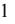

{7}------------------------------------------------

• Any decrease in shipments of crude oil may adversely affect our financial performance.

- We are dependent on spot charters and any decrease in spot charter rates in the future may adversely affect our earnings, our ability to pay dividends and our ability to repay indebtness.
- Changes in the price of fuel and regulations may adversely affect our profits.
- Inability to renew the fleet would adversely affect our business, results of operations, financial condition and ability to pay dividends.
- The international Suezmax tanker industry has experienced volatile charter rates and vessel values and there can be no assurance that these charter rates and vessel values will not decrease in the near future.
- Our results of operations are subject to seasonal fluctuations, which may adversely affect our financial condition.
- Declines in charter rates and other market deterioration could cause us to incur impairment charges.
- The value of our vessels may be depressed in the event that we sell a vessel.
- An over-supply of Suezmax tanker capacity may lead to reductions in charter rates, vessel values, and profitability.
- Delays or defaults by the shipyards in the construction of newbuildings could increase our expenses and diminish our net income and cash flows.
- International sanctions, embargoes, import and export restrictions, nationalizations, piracy, terrorist attacks and armed conflicts, including the ongoing conflict between Russia and Ukraine;
- We rely on our information systems to conduct our business, and failure to protect these systems against security breaches could adversely affect our business and results of operations. Additionally, if these systems fail or become unavailable for any significant period of time, our business could be harmed.
- If we do not manage customer relationships or successfully integrate any acquired Suezmax tankers, we may not be able to grow or effectively manage our growth.
- Because some of our expenses are incurred in foreign currencies, we are exposed to exchange rate fluctuations, which could negatively affect our results of operations.
- The operation of Suezmax tankers involves certain unique operational risks.
- We operate our Suezmax tankers worldwide and as a result, our vessels are exposed to international risks which may reduce revenue or increase expenses.
- The smuggling of drugs or other contraband onto our vessels may lead to governmental claims against us.
- Acts of piracy on ocean-going vessels could adversely affect our business.
- Maritime claimants could arrest one or more of our vessels, which could interrupt our cash flow.
- Governments could require our vessels during a period of war or emergency resulting in a loss of earnings.
- If we purchase secondhand vessels, we may not receive warranties from the builder and operating cost may increase as a result of aging of the fleet.
- Our insurance may not be adequate to cover our losses that may result from our operations due to the inherent operational risks of the tanker industry.
- An increase in operating costs would decrease earnings and dividends per share.
- We may be unsuccessful in competing in the highly competitive international Suezmax tanker market.
- We are subject to laws and regulations which can adversely affect our business, results of operations, cash flows and financial condition, and our ability to pay dividends.
- Regulations relating to ballast water discharge may adversely affect our revenues and profitability.
- Climate change and greenhouse gas restrictions may adversely impact our operations and markets.
- If we fail to comply with international safety regulations, we may be subject to increased liability, which may adversely affect our insurance coverage and may result in a denial of access to, or detention in, certain ports.
- Developments in safety and environmental requirements relating to the recycling of vessels may result in escalated and unexpected costs.
- Servicing our debt limits funds available for other purposes and if we cannot service our debt, we may lose our vessels.
- Our borrowing facilities, contains restrictive covenants which could negatively affect our growth, cause our financial performance to suffer and limit our ability to pay dividends.
- Volatility of LIBOR and potential changes of the use of LIBOR as a benchmark could affect our profitability, earnings and cash flow.
- Variable rate indebtedness could subject us to interest rate risk, which could cause our debt service obligations to increase significantly.

{8}------------------------------------------------

- We may not be able to finance our future capital commitments.
- The current state of the global financial markets and current economic conditions may adversely impact our results of operation, financial condition, cash flows and ability to obtain financing or refinance our existing and future credit facilities on acceptable terms.
- We cannot assure you that we will be able to refinance our indebtedness.
- We are subject to certain risks with respect to our counterparties on contracts, and failure of such counterparties to meet their obligations could cause us to suffer losses or negatively impact our results of operations and cash flows.
- Our share price may continue to be highly volatile, which could lead to a loss of all or part of a shareholder's investment.
- We operate in a cyclical and volatile industry and cannot guarantee that we will continue to make cash distributions.
- Future sales of our common stock could cause the market price of our common stock to decline.
- Ineffective internal controls could impact the Company's business and financial results.
- Increasing scrutiny and changing expectations from investors, lenders and other market participants with respect to our Environmental, Social and Governance ("ESG") policies may impose additional costs on us or expose us to additional risks.
- A decision of our Board of Directors and the laws of Bermuda may prevent the declaration and payment of dividends.
- We have antitakeover protections which could prevent a change of control.
- If our vessels call on ports located in countries or territories that are subject to sanctions or embargoes imposed by the U.S. government, the European Union, the United Nations or other governmental authorities, it could adversely affect the trading price of our common stock.
- Because we are a foreign corporation, you may not have the same rights that a shareholder in a U.S. corporation may have.
- We are incorporated in Bermuda and it may not be possible for our investors to enforce U.S. judgments against us.
- We may have to pay tax on United States source income, which would reduce our earnings.
- If the United States Internal Revenue Service were to treat us as a "passive foreign investment company," that could have adverse tax consequences for United States shareholders.
- We may become subject to taxation in Bermuda which would negatively affect our results.
- As a Bermuda exempted company incorporated under Bermuda law with subsidiaries in another offshore jurisdiction, our operations may be subject to economic substance requirements.

### **Risks Related to Our Business and Financial Condition**

### **If the Suezmax tanker industry, which historically has been cyclical and volatile, is depressed in the future, our revenues, earnings and available cash flow may decrease.**

It should be noted that we are specializing in Suezmax tankers. Historically, the tanker industry has been highly cyclical, with volatility in profitability, charter rates and asset values resulting from changes in the supply of and demand for tanker capacity. Fluctuations in charter rates and tanker values result from changes in the supply of and demand for tanker capacity and changes in the supply of and demand for oil and oil products. These factors may adversely affect the rates payable and the amounts we receive in respect of our vessels. Our ability to re-charter our vessels on the expiration or termination of their current spot and time charters and the charter rates payable under any renewal or replacement charters will depend upon, among other things, economic conditions in the tanker market and we cannot guarantee that any renewal or replacement charters we enter into will be sufficient to allow us to operate our vessels profitably.

The factors that influence demand for tanker capacity include:

- supply of and demand for oil and oil products;
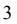

{9}------------------------------------------------

- global and regional economic and political conditions and developments, including developments in international trade, national oil reserves policies, fluctuations in industrial and agricultural production and armed conflicts;
- regional availability of refining capacity and inventories compared to geographies of oil production regions;
- environmental and other legal and regulatory developments;
- the distance oil and oil products are to be moved by sea;
- changes in seaborne and other transportation patterns, including changes in the distances over which tanker cargoes are transported by sea;
- increases in the production of oil in areas linked by pipelines to consuming areas, the extension of existing, or the development of new, pipeline systems in markets we may serve, or the conversion of existing non-oil pipelines to oil pipelines in those markets;
- currency exchange rates;
- weather and acts of God, natural disasters and health disasters;
- changes in consumption of oil and petroleum products due to competition from supply and demand for alternative sources of energy and from other shipping companies and other modes of transport;
- international sanctions, embargoes, import and export restrictions, nationalizations, piracy, terrorist attacks and armed conflicts, including the conflict between Russia and Ukraine and potential physical disruption of shipping routes as a result thereof;
- economic slowdowns caused by public health events such as the COVID-19 pandemic; and
- regulatory changes including regulations adopted by supranational authorities and/or industry bodies, such as safety and environmental regulations and requirements by major oil companies.

The factors that influence the supply of tanker capacity include:

- the demand for alternative energy resources;
- current and expected purchase orders for tankers;
- the number of tanker newbuilding deliveries;
- any potential delays in the delivery of newbuilding vessels and/or cancellations of newbuilding orders;
- the scrapping rate of older tankers;
- technological advances in tanker design and capacity;
- tanker charter rates, which are affected by factors that may affect the rate of newbuilding, swapping and laying up of tankers;
- port and canal congestion;
- price of steel and vessel equipment;

{10}------------------------------------------------

- conversion of tankers to other uses or conversion of other vessels to tankers;
- with respect to tanker vessel supply, demand for alternative sources of energy and supply and demand for energy resources and oil and petroleum products;
- product imbalances (affecting the level of trading activity) and developments in international trade;
- developments in international trade, including refinery additions and closures;
- the number of tankers that are out of service; and
- changes in environmental and other regulations that may limit the useful lives of tankers.

The factors affecting the supply and demand for tankers have been volatile and are outside of our control, and the nature, timing and degree of changes in industry conditions are unpredictable, including those discussed above. Continued volatility may reduce demand for transportation of oil over longer distances and increase supply of tankers to carry that oil, which may have a material adverse effect on our business, financial condition, results of operations, cash flows, ability to pay dividends and existing contractual obligations.

We anticipate that the future demand for our tankers will be dependent upon economic growth in the world's economies, seasonal and regional changes in demand, changes in the capacity of the global tanker fleet and the sources and supply of oil and petroleum products to be transported by sea. Given the low number of new tankers currently on order with shipyards, the capacity of the global tanker fleet seems likely to be muted, but there can be no assurance as to the timing or extent of future economic growth. Adverse economic, political, social or other developments could have a material adverse effect on our business and operating results.

Declines in oil and natural gas prices or decreases in demand for oil and natural gas for an extended period of time, or market expectations of potential decreases in these prices and demand, could negatively affect our future growth in the tanker and offshore sector. Sustained periods of low oil and natural gas prices typically result in reduced exploration and extraction because oil and natural gas companies' capital expenditure budgets are subject to cash flow from such activities and are therefore sensitive to changes in energy prices. Sustained periods of high oil prices on the other hand may be destructive for demand. These changes in commodity prices can have a material effect on demand for our services, and periods of low demand can cause excess vessel supply and intensify the competition in the industry, which often results in vessels, particularly older and less technologically advanced vessels, being idle for long periods of time. We cannot predict the future level of demand for our services or future conditions of the oil and natural gas industry. Any decrease in exploration, development or production expenditures by oil and natural gas companies or decrease in the demand for oil and natural gas could reduce our revenues and materially harm our business, results of operations and cash available for distribution.

### **We are dependent on spot charters and any decrease in spot charter rates in the future may adversely affect our earnings, our ability to pay dividends and our ability to repay our financial liabilities.**

The 19 vessels that we currently operate are primarily employed in the spot market with the two newbuildings delivered in 2022 chartered out on six-year time charter agreements, and two vessels on longer term time-charter agreements expiring in late 2023 with an option to extend the agreement for a year for one of these vessels. We are therefore highly dependent on spot market charter rates. The spot market is very volatile and there have been and will be periods when spot charter rates decline below the operating cost of vessels. If future spot charter rates decline, we may be unable to operate our vessels trading in the spot market profitably, meet our obligations, including payments on indebtedness, or pay dividends in the future. Furthermore, as charter rates for spot charters are fixed for a single voyage which may last up to several weeks, during periods in which spot charter rates are rising, we will generally experience delays in realizing the benefits from such increases.

We will be exposed to prevailing charter rates in the crude tanker sectors when these vessels' existing charters expire, and to the extent the counterparties to our fixed-rate charter contracts fail to honor their obligations to us. We will also enter into spot charters in the future. The spot charter market may fluctuate significantly based upon tanker and oil supply and demand.

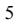

{11}------------------------------------------------

#### *Table of Contents*

The successful operation of our vessels in the competitive spot charter market depends on, among other things, obtaining profitable spot charters and minimizing, to the extent possible, time spent waiting for charters and time spent traveling in ballast to pick up cargo. When the current charters for our fleet expire or are terminated, it may not be possible to re-charter these vessels at similar rates, or at all, or to secure charters for any vessels we agree to acquire at similarly profitable rates, or at all. As a result, we may have to accept lower rates or experience off hire time for our vessels, which would adversely impact our revenues, results of operations and financial condition.

#### **Changes in the price of fuel and regulations may adversely affect our profits.**

Fuel, including bunkers, is a significant, if not the largest, expense in our shipping operations, and changes in the price of fuel may adversely affect our profitability. The price and supply of fuel is unpredictable and fluctuates based on events outside our control, including geopolitical developments, such as the ongoing conflict between Russia and Ukraine, supply and demand for oil and gas, actions by OPEC and other oil and gas producers, war and unrest in oil producing countries and regions, regional production patterns and environmental concerns, which may reduce our profitability and have a material adverse effect on our future performance, results of operations, cash flows and financial position.

Effective January 1, 2020, the International Maritime Organization, or IMO, implemented a new regulation for a 0.50% global sulfur cap on emissions from vessels. Under this new global cap, vessels must use marine fuels with a sulfur content of no more than 0.50% against the former regulations specifying a maximum of 3.50% sulfur in an effort to reduce the emission of sulfur oxide into the atmosphere.

All of our vessels have transitioned to burning IMO compliant fuels. Low sulfur fuel of 0.50% sulfur content or lower, is presently more expensive than the non-compliant Heavy Fuel Oil containing 3.5% sulfur and may become more expensive.

Our operations and the performance of our vessels, and as a result our results of operations, cash flows and financial position, may be negatively affected to the extent that compliant sulfur fuel oils are unavailable, of low or inconsistent quality, or upon occurrence of any of the other foregoing events. Costs of compliance with these and other related regulatory changes may be significant and may have a material adverse effect on our future performance, results of operations, cash flows and financial position. As a result, an increase in the price of fuel beyond our expectations may adversely affect our profitability at the time of charter negotiation. Further, fuel may become much more expensive in the future, which may reduce the profitability and competitiveness of our business versus other forms of transportation.

#### **Inability to renew the fleet would adversely affect our business, results of operations, financial condition and ability to pay dividends.**

If we do not set aside funds or are unable to borrow or raise funds for vessel replacement, we will be unable to replace the vessels in our fleet upon the expiration of their useful lives. Our cash flows and income are dependent on the revenues earned by the chartering of our vessels. If we are unable to replace the vessels in our fleet upon the expiration of their useful lives, our business, results of operations, financial condition and ability to pay dividends would be adversely affected. Any funds set aside for vessel replacement will not be available for dividends.

{12}------------------------------------------------

### **The international Suezmax tanker industry has experienced volatile charter rates and vessel values and there can be no assurance that these charter rates and vessel values will not decrease in the near future.**

The Baltic Dirty Tanker Index, or the BDTI, a U.S. dollar daily average of charter rates issued by the Baltic Exchange that takes into account input from brokers around the world regarding crude oil fixtures for various routes and oil tanker vessel sizes, is volatile. In 2022, the BDTI continued to be volatile, but with increasing levels through the year and with sharp improvement compared to 2021. During 2022, it reached a high of 2,496 and a low of 679 compared to a high of 835 and a low of 432 in 2021. The Baltic Clean Tanker Index, or BCTI, a comparable index to the BDTI, has similarly been volatile and with stronger rates in the latter part of the year. In 2022, the BCTI reached a high of 2,143 and a low of 543. Markets in 2023 has continued their strong records compared to 2021 and the early part of 2022, and the BDTI and BCTI although down from the highs of 2022, still at 1,319 and 1,014, respectively, as of April 11, 2023. There can be no assurance that the crude oil and petroleum products charter market will increase or continue at the current levels, and the market could again decline. This volatility in charter rates depends, among other factors, on changes in the supply and demand for tanker capacity and changes in the supply and demand for oil and oil products, the demand for crude oil and petroleum products, the inventories of crude oil and petroleum products in the United States and in other industrialized nations, oil refining volumes, oil prices, and any restrictions on crude oil production imposed by the Organization of the Petroleum Exporting Countries, or OPEC, and non-OPEC oil producing countries.

Charter rates in the Suezmax tanker industry are volatile. We anticipate that future demand for our vessels, and in turn our future charter rates, will be dependent upon economic growth in the world's economies, as well as seasonal and regional changes in demand and changes in the capacity of the world's fleet. There can be no assurance that economic growth will not stagnate or decline leading to a decrease in vessel values and charter rates. A decline in vessel values and charter rates would have an adverse effect on our business, financial condition, results of operation and ability to pay dividends.

### **Our results of operations are subject to seasonal fluctuations, which may adversely affect our financial condition.**

We operate our vessels in markets that have historically exhibited seasonal variations in demand and, as a result, charter rates. Seaborne trading and distribution patterns are primarily influenced by the relative advantage of the various sources of production, locations of consumption, pricing differentials and seasonality. Changes to the trade patterns of oil and oil products may have a significant negative or positive impact on the ton-mile and therefore the demand for our tankers. This could have a material adverse effect on our future performance, results of operations, cash flows and financial position.

#### **Declines in charter rates and other market deterioration could cause us to incur impairment charges.**

Our vessels are evaluated for impairment continuously or whenever events or changes in circumstances indicate that the carrying amount of a vessel may not be recoverable. The review for potential impairment indicators and projection of future cash flows related to the vessel is complex and requires us to make various estimates, including future charter rates and earnings from operating the vessel. All of these items have historically been volatile. When impairment indicators are identified, we estimate the undiscounted cash flows from operating the vessels over their remaining useful lives and compare those to the net carrying values of the vessels. If the total estimated undiscounted net cash flows for a vessel are less than the carrying amount of the vessel the vessel is deemed impaired and written down to its fair market value. The carrying values of our vessels may not represent their fair market value at any point in time because the market prices of secondhand vessels tend to fluctuate with changes in charter rates and the cost of newbuildings. Any impairment charges incurred as a result of declines in charter rates could negatively affect our business, financial condition and operating results. Impairment is assessed on a vessel by vessel basis.

#### **The value of our vessels may be depressed at the time we decide to sell a vessel.**

Tanker values have generally experienced high volatility. Investors can expect the fair market value of our tankers to fluctuate, depending on general economic and market conditions affecting the tanker industry and competition from other shipping companies, types and sizes of vessels and other modes of transportation. In addition, as vessels age, they generally decline in value. These factors will affect the value of our vessels for purposes of covenant compliance under our borrowing facilities and at the time of any vessel sale. If for any reason we sell a tanker at a time when tanker prices have fallen, the sale may be at less than the tanker's carrying amount in our financial statements, with the result that we would also incur a loss on the sale and a reduction in earnings from impairment charges, which could reduce our ability to pay dividends and negatively affect our business, financial condition and operating results. The carrying values of our vessels may not represent their charter-free market value at any point in time.

{13}------------------------------------------------

### **An over-supply of Suezmax tanker capacity may lead to reductions in charter rates, vessel values, and profitability.**

The market supply of Suezmax tankers is affected by a number of factors such as demand for energy resources, oil, and petroleum products, as well as overall economic growth in parts of the world economy, including Asia, and has been increasing as a result of the delivery of substantial newbuilding orders over the last few years.

There has been a global trend towards energy efficient technologies, lower environmental emissions and alternative sources of energy. In the long-term, demand for oil may be reduced by increased availability of such energy sources and machines that run on them. Furthermore, if the capacity of new ships delivered exceeds the capacity of tankers being scrapped and lost, tanker capacity will increase. If the supply of tanker capacity increases and if the demand for tanker capacity does not increase correspondingly, charter rates and vessel values could materially decline. These changes could have an adverse effect on our business, results of operations and financial position.

If the capacity of new ships delivered exceeds the capacity of tankers being scrapped and lost, tanker capacity will increase. If the supply of tanker capacity increases and if the demand for tanker capacity does not increase correspondingly, charter rates could materially decline. A reduction in charter rates and the value of our vessels may have a material adverse effect on our results of operations and our ability to pay dividends.

### **Delays or defaults by the shipyards in the construction of newbuildings could increase our expenses and diminish our net income and cash flows.**

Vessel construction projects are generally subject to risks of delay that are inherent in any large construction project, which may be caused by numerous factors, including shortages of equipment, materials or skilled labor, unscheduled delays in the delivery of ordered materials and equipment or shipyard construction, failure of equipment to meet quality and/or performance standards, financial or operating difficulties experienced by equipment vendors or the shipyard, unanticipated actual or purported change orders, inability to obtain required permits or approvals, design or engineering changes and work stoppages and other labor disputes, adverse weather conditions, pandemics or any other events of force majeure. Significant delays could adversely affect our financial position, results of operations and cash flows. Additionally, failure to complete a project on time may result in the delay of revenue from that vessel, and we will continue to incur costs and expenses related to delayed vessels, such as supervision expense and interest expense for the issued and outstanding debt. As of December 31, 2022, we have not placed any orders for Suezmax vessels and as such, we are not exposed to any risk related to construction of newbuildings. The two newbuildings delivered to us in 2022 were delivered on time and at agreed cost.

#### **Terrorist attacks and international hostilities and instability can affect the tanker industry, which could adversely affect our business.**

We conduct most of our operations outside of the United States, and our business, results of operations, cash flows, financial condition and ability to pay dividends, if any, in the future may be adversely affected by changing economic, political and government conditions in the countries and regions where our vessels are employed or registered. Moreover, we operate in a sector of the economy that is likely to be adversely impacted by the effects of political conflicts.

Terrorist attacks, the outbreak of war, or the existence of international hostilities could damage the world economy, adversely affect the availability of and demand for crude oil and petroleum products and adversely affect both the Company's ability to charter its vessels and the charter rates payable under any such charters. In addition, the Company operates in a sector of the economy that is likely to be adversely impacted by the effect of political instability, terrorist or other attacks, war or international hostilities. In the past, political instability has also resulted in attacks on vessels, mining of waterways and other efforts to disrupt international shipping, particularly in the Arabian Gulf region and most recently in the Black Sea in connection with the recent conflicts between Russia and the Ukraine.

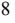

{14}------------------------------------------------

Recent developments in the Ukraine region and continuing conflicts in the Middle East may lead to additional armed conflicts around the world, which may contribute to further economic instability in the global financial markets and international commerce. Additionally, any escalations between the North Atlantic Treaty Organization countries and Russia could result in retaliation from Russia that could potentially affect the shipping industry.

These factors could also increase the costs to the Company of conducting its business, particularly crew, insurance and security costs, and prevent or restrict the Company from obtaining insurance coverage, all of which have a material adverse effect on our business, financial condition, results of operations and cash flows.

### **We rely on our information systems to conduct our business, and failure to protect these systems against security breaches could adversely affect our business and results of operations. Additionally, if these systems fail or become unavailable for any significant period of time, our business could be harmed.**

We rely on our computer systems and network infrastructure across our operations, including IT systems on our vessels operated by our technical managers. The safety and security of our vessels and efficient operation of our business, including processing, transmitting and storing electronic and financial information, are dependent on computer hardware and software systems, which are increasingly vulnerable to security breaches and other disruptions. Any significant interruption or failure of our information systems or any significant breach of security could adversely affect our business and results of operations.

Our vessels rely on information systems for a significant part of their operations, including navigation, provision of services, propulsion, machinery management, power control, communications and cargo management. We have in place safety and security measures on our vessels and onshore operations to secure our vessels against cyber-security attacks and any disruption to their information systems. However, these measures and technology may not adequately prevent security breaches despite our continuous efforts to upgrade and address the latest known threats. A disruption to the information system of any of our vessels could lead to, among other things, wrong routing, collision, grounding and propulsion failure.

Beyond our vessels, we rely on industry accepted security measures and technology to securely maintain confidential and proprietary information maintained on our information systems. However, these measures and technology may not adequately prevent security breaches. The technology and other controls and processes designed to secure our confidential and proprietary information, detect and remedy any unauthorized access to that information were designed to obtain reasonable, but not absolute, assurance that such information is secure and that any unauthorized access is identified and addressed appropriately. Such controls may in the future fail to prevent or detect, unauthorized access to our confidential and proprietary information. In addition, the foregoing events could result in violations of applicable privacy and other laws. If confidential information is inappropriately accessed and used by a third party or an employee for illegal purposes, we may be responsible to the affected individuals for any losses they may have incurred as a result of misappropriation. In such an instance, we may also be subject to regulatory action, investigation or liable to a governmental authority for fines or penalties associated with a lapse in the integrity and security of our information systems.

Our operations, including our vessels, and business administration could be targeted by individuals or groups seeking to sabotage or disrupt such systems and networks, or to steal data, and these systems may be damaged, shutdown or cease to function properly (whether by planned upgrades, force majeure, telecommunications failures, hardware or software break-ins or viruses, other cyber-security incidents or otherwise). For example, the information systems of our vessels may be subject to threats from hostile cyber or physical attacks, phishing attacks, human errors of omission or commission, structural failures of resources we control, including hardware and software, and accidents and other failures beyond our control. The threats to our information systems are constantly evolving and have become increasingly complex and sophisticated. Furthermore, such threats change frequently and are often not recognized or detected until after they have been launched, and therefore, we may be unable to anticipate these threats and may not become aware in a timely manner of such a security breach, which could exacerbate any damage we experience. We do not maintain cyber-liability insurance at this time to cover such losses. As a result, a cyber-attack or other breach of any such information technology systems could have a material adverse effect on our business, results of operations and financial condition. As of the date of this Annual Report, we have not experienced any material cybersecurity incident which would be disclosable under SEC guidelines.

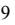

{15}------------------------------------------------

We may be required to expend significant capital and other resources to protect against and remedy any potential or existing security breaches and their consequences. A cyber-attack could materially disrupt our operations, which could also adversely affect the safety of our operations or result in the unauthorized release or alteration of information in our systems. Such an attack on us could result in significant expenses to investigate and repair security breaches or system damages and could lead to litigation, fines, other remedial action, heightened regulatory scrutiny and diminished customer confidence. In addition, our remediation efforts may not be successful and we may not have adequate insurance to cover these losses.

The unavailability of the information systems or the failure of these systems to perform as anticipated for any reason could disrupt our business and could have a material adverse effect on our business, results of operations, cash flows and financial condition.

Moreover, cyber-attacks against the Ukrainian government and other countries in the region have been reported in connection with the ongoing conflict between Russia and Ukraine. To the extent such attacks have collateral effects on global critical infrastructure or financial institutions or us, such developments could adversely affect our business, operating results and financial condition. It is difficult to assess the likelihood of such threat and any potential impact at this time.

The EU has adopted a comprehensive overhaul of its data protection regime from the current national legislative approach to a single European Economic Area Privacy Regulation, the General Data Protection Regulation ("GDPR"). The GDPR came into force on May 25, 2018, and applies to organizations located within the EU, as well as to organizations located outside of the EU if they offer goods or services to, or monitor the behavior of, EU data subjects. It imposes a strict data protection compliance regime with significant penalties and includes new rights such as the "portability" of personal data. It applies to all companies processing and holding the personal data of data subjects residing in the EU, regardless of the company's location. Implementation of the GDPR could require changes to certain of our business practices, thereby increasing our costs. Our failure to adhere to or successfully implement processes in response to changing regulatory requirements in this area could result in legal liability or impairment to our reputation in the marketplace, which could have a material adverse effect on our business, financial condition and results of operations.

Further, in March 2022, the SEC proposed amendments to its rules on cybersecurity risk management, strategy, governance, and incident disclosure. The proposed amendments, if adopted, would require us to report material cybersecurity incidents involving our information systems and periodic reporting regarding our policies and procedures to identify and manage cybersecurity risks, amongst other disclosures.

### **If we do not manage relationships with customers or successfully integrate any acquired Suezmax tankers, we may not be able to grow or effectively manage our growth.**

Our future growth will depend upon a number of factors, some of which may not be within our control. These factors include our ability to:

- identify suitable tankers and/or shipping companies for acquisitions at attractive prices, which may not be possible if asset prices rise too quickly,
- manage relationships with customers and suppliers,
- identify businesses engaged in managing, operating or owning tankers for acquisitions or joint ventures,
- integrate any acquired tankers or businesses successfully with our then-existing operations,
- hire, train and retain qualified personnel and crew to manage and operate our growing business and fleet,
- identify additional new markets,

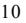

{16}------------------------------------------------

- improve our operating, financial and accounting systems and controls, and
- obtain required financing for our existing and new operations.

Our failure to effectively identify, purchase, manage customer relationships and integrate any tankers or businesses could adversely affect our business, financial condition and results of operations. We may incur unanticipated expenses as an operating company. It is possible that the number of employees employed by the company, or current operating and financial systems may not be adequate as we implement our plan to expand the size of our fleet. Finally, acquisitions may require additional equity issuances or debt issuances (with amortization payments), both of which could lower dividends per share. If we are unable to expand or execute the certain aspects of our business or events noted above, our financial condition and dividend rates may be adversely affected.

### **Because some of our expenses are incurred in foreign currencies, we are exposed to exchange rate fluctuations, which could negatively affect our results of operations.**

The charterers of our vessels pay us in U.S. dollars. While we mostly incur our expenses in U.S. dollars, we may incur expenses in other currencies, most notably the Norwegian Kroner. Declines in the value of the U.S. dollar relative to the Norwegian Kroner, or the other currencies in which we may incur expenses in the future, would increase the U.S. dollar cost of paying these expenses and thus would affect our results of operations.

#### **Risks Related to the Operations of Our Vessels and Regulations**

#### **The operation of Suezmax tankers involves certain unique operational risks.**

The operation of Suezmax tankers has unique operational risks associated with the transportation of oil. An oil spill may cause significant environmental damage, and a catastrophic spill could exceed the insurance coverage available. Compared to other types of vessels, tankers are exposed to a higher risk of damage and loss by fire, whether ignited by a terrorist attack, collision, or other cause, due to the high flammability and high volume of the oil transported in tankers.

Further, our vessels and their cargoes will be at risk of being damaged or lost because of events such as marine disasters, bad weather and other acts of God, business interruptions caused by mechanical failures, grounding, fire, explosions and collisions, human error, war, terrorism, piracy, diseases (such as the outbreak of COVID-19), quarantine and other circumstances or events. Changing economic, regulatory and political conditions in some countries, including political and military conflicts, have from time to time resulted in attacks on vessels, mining of waterways, piracy, terrorism, labor strikes and boycotts. These hazards may result in death or injury to persons, loss of revenues or property, the payment of ransoms, environmental damage, higher insurance rates, damage to our customer relationships and market disruptions, delay or rerouting.

If our vessels suffer damage, they may need to be repaired at a drydocking facility. The costs of drydock repairs are unpredictable and may be substantial. We may have to pay drydocking costs that our insurance does not cover at all or in full. The loss of revenues while these vessels are being repaired and repositioned, as well as the actual cost of these repairs, may be material. In addition, space at drydocking facilities is sometimes limited and not all drydocking facilities are conveniently located. We may be unable to find space at a suitable drydocking facility or our vessels may be forced to travel to a drydocking facility that is not conveniently located relative to our vessels' positions. The loss of earnings while these vessels are forced to wait for space or to travel to more distant drydocking facilities may also be material. Further, the total loss of any of our vessels could harm our reputation as a safe and reliable vessel owner and operator. If we are unable to adequately maintain or safeguard our vessels, we may be unable to prevent any such damage, costs or loss which could negatively impact our business, financial condition, results of operations, cash flows and ability to pay dividends.

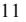

{17}------------------------------------------------

### **We operate our Suezmax tankers worldwide and as a result, our vessels are exposed to international risks which may reduce revenue or increase expenses.**

The international shipping industry is an inherently risky business involving global operations. The operations of ocean-going vessels in international trade is affected by a number of risks. Our vessels are at a risk of damage or loss because of events such as mechanical failure, collision, human error, war, terrorism, piracy, cargo loss and bad weather. In addition, changing economic, regulatory and political conditions in some countries, including political and military conflicts, have from time to time resulted in attacks on vessels, mining of waterways, piracy, terrorism, labor strikes and boycotts. These sorts of events could interfere with shipping routes and result in market disruptions which may reduce our revenue or increase our expenses.

International shipping is subject to various security and customs inspections and related procedures in countries of origin and destination and transshipment points. Inspection procedures can result in the seizure of the cargo and/or our vessels, delays in loading, offloading or delivery, and the levying of customs duties, fines or other penalties against us. It is possible that changes to inspection procedures could impose additional financial and legal obligations on us. Furthermore, changes to inspection procedures could also impose additional costs and obligations on our customers and may, in certain cases, render the shipment of certain types of cargo uneconomical or impractical. Any such changes or developments may have a material adverse effect on our business, results of operations, cash flows, financial condition and available cash.

#### **The smuggling of drugs or other contraband onto our vessels may lead to governmental claims against us.**

We expect that our vessels will call in ports where smugglers attempt to hide drugs and other contraband on vessels, with or without the knowledge of crew members. To the extent our vessels are found with contraband, whether inside or attached to the hull of our vessel and whether with or without the knowledge of any of our crew, we may face governmental or other regulatory claims which could have an adverse effect on our business, results of operations, cash flows, financial condition and ability to pay dividends.

#### **Acts of piracy on ocean-going vessels could adversely affect our business.**

Acts of piracy have historically affected ocean-going vessels trading in regions of the world such as the South China Sea, the Indian Ocean, the Gulf of Aden off the Coast of Somalia and, in particular, the Gulf of Guinea region off of Nigeria, which experienced increased incidents of piracy in recent years. Acts of piracy and war like conditions could result in harm or danger to the crews onboard our vessels. In addition, if piracy attacks occur in regions in which our vessels are deployed that insurers' characterized as "war risk" zones or by the Joint War Committee as "war and strikes" listed areas, premiums payable for such coverage could increase significantly and such insurance coverage may be more difficult to obtain. In addition, crew costs, including costs which may be incurred to the extent we employ onboard security guards, could increase in such circumstances. We may not be adequately insured to cover losses from these incidents, which could have a material adverse effect on us. In addition, detention hijacking as a result of an act of piracy against our vessels, or an increase in cost, or unavailability of insurance for our vessels, could have a material adverse impact on our business, financial condition and results of operations.

#### **Maritime claimants could arrest one or more of our vessels, which could interrupt our cash flow.**

Crew members, suppliers of goods and services to a vessel, shippers of cargo and other parties may be entitled to a maritime lien against a vessel for unsatisfied debts, claims or damages. In many jurisdictions, a maritime lien-holder may enforce its lien by "arresting" or "attaching" a vessel through foreclosure proceedings. The arrest or attachment of one or more of our vessels could result in a significant loss of earnings for the related off-hire period. In addition, in jurisdictions where the "sister ship" theory of liability applies, a claimant may arrest the vessel which is subject to the claimant's maritime lien and any "associated" vessel, which is any vessel owned or controlled by the same owner. In countries with "sister ship" liability laws, claims might be asserted against us or any of our vessels for liabilities of other vessels that we own.

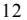

{18}------------------------------------------------

### **Governments could requisition our vessels during a period of war or emergency resulting in a loss of earnings.**

A government of a vessel's registry could requisition for title or seize one or more of our vessels. Requisition for title occurs when a government takes control of a vessel and becomes the owner. A government could also requisition one or more of our vessels for hire. Requisition for hire occurs when a government takes control of a vessel and effectively becomes the charterer at dictated charter rates. Generally, requisitions occur during a period of war or emergency. Government requisition of one or more of our vessels could have a material adverse effect on our business, results of operations, cash flows, financial condition and ability to pay dividends

#### **If we purchase secondhand vessels, we may not receive warranties from the builder and operating cost may increase as a result of aging of the fleet.**

Following a physical inspection of secondhand vessels prior to purchase, we do not have the same knowledge about their condition and cost of any required (or anticipated) repairs that we would have had if these vessels had been built for and operated exclusively by us. Accordingly, we may not discover defects or other problems with such vessels prior to purchase. Any such hidden defects or problems, when detected may be expensive to repair, and if not detected, may result in accidents or other incidents for which we may become liable to third parties. Also, when purchasing previously owned vessels, we do not receive the benefit of any builder warranties if the vessels we buy are older than one year.

In general, the costs to maintain a vessel in good operating condition increase with the age of the vessel. Older vessels are typically less fuel efficient than more recently constructed vessels due to improvements in engine technology. Governmental regulations, safety and other equipment standards related to the age of vessels may require expenditures for alterations or the addition of new equipment to some of our vessels and may restrict the type of activities in which these vessels may engage. We cannot assure you that, as our vessels age, market conditions will justify those expenditures or enable us to operate our vessels profitably during the remainder of their useful lives. As a result, regulations and standards could have a material adverse effect on our business, financial condition, results of operations, cash flows and ability to pay dividends.

#### **Our insurance may not be adequate to cover our losses that may result from our operations due to the inherent operational risks of the tanker industry.**

We carry insurance to protect us against most of the accident related risks involved in the conduct of our business, including marine hull and machinery insurance, protection and indemnity insurance, which includes pollution risks, crew insurance and war risk insurance. However, we may not be adequately insured to cover losses from our operational risks, which could have a material adverse effect on us. Additionally, our insurers may refuse to pay particular claims and our insurance may be voidable by the insurers if we take, or fail to take, certain action, such as failing to maintain certification of our vessels with applicable maritime regulatory organizations. Any significant uninsured or under-insured loss or liability could have a material adverse effect on our business, results of operations, cash flows and financial condition and our ability to pay dividends. In addition, we may not be able to obtain adequate insurance coverage at reasonable rates in the future during adverse insurance market. Any loss of a vessel or extended vessel off-hire, due to an accident or otherwise, could have a material adverse effect on our business, results of operations and financial condition and our ability to pay dividends.

#### **An increase in operating costs would decrease earnings and dividends per share.**

Under the charters of all of our operating vessels, we are responsible for vessel operating expenses. Our vessel operating expenses include the costs of crew, lube oil, provisions, deck and engine stores, insurance and maintenance and repairs, which depend on a variety of factors, many of which are beyond our control. If our vessels suffer damage, they may need to be repaired at a drydocking facility. The costs of drydock repairs are unpredictable and can be substantial. Increases in any of these expenses would decrease earnings and dividends per share.

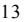

{19}------------------------------------------------

### **We may be unsuccessful in competing in the highly competitive international Suezmax tanker market.**

The operation of Suezmax tankers and transportation of crude and petroleum products is extremely competitive. Competition arises primarily from other tanker owners, including major oil companies as well as independent tanker companies. Competition for the transportation of oil and oil products can be intense and depends on price, location, size, age, condition and the acceptability of the tanker and its operators to the charterers. Competitors with greater resources could enter and operate larger tanker fleets through consolidations or acquisitions, and may be able to offer more competitive prices and fleets. We will have to compete with other tanker owners, including major oil companies as well as independent tanker companies and our market share may decrease in the future and we may not find profitable employment for our vessels, which could adversely affect our financial condition and our ability to expand our business.

### **We are subject to laws and regulations which can adversely affect our business, results of operations, cash flows and financial condition, and our ability to pay dividends.**

Our operations are subject to numerous laws and regulations in the form of international conventions and treaties, national, state and local laws and national and international regulations in force in the jurisdictions in which our vessels operate or are registered, which can significantly affect the ownership and operation of our vessels. These requirements include, but are not limited to, the United States (U.S.) Oil Pollution Act of 1990 (OPA), the Comprehensive Environmental Response, Compensation, and Liability Act (generally referred to as CERCLA), the U.S. Clean Water Act (CWA), the U.S. Clean Air Act (CAA), the U.S. Outer Continental Shelf Lands Act, European Union (EU) Regulations, the IMO, International Convention on Civil Liability for Oil Pollution Damage of 1969 (as from time to time amended and generally referred to as CLC), the IMO International Convention for the Prevention of Pollution from Ships of 1973 (as from time to time amended and generally referred to as MARPOL, including the designation of emission control areas (ECAs) thereunder), the IMO International Convention for the Safety of Life at Sea of 1974 (as from time to time amended and generally referred to as SOLAS), the IMO International Convention on Load Lines of 1966 (as from time to time amended), the International Convention on Civil Liability for Bunker Oil Pollution Damage (generally referred to as the Bunker Convention), the IMO's International Management Code for the Safe Operation of Ships and for Pollution Prevention (generally referred to as the ISM Code), the International Convention for the Control and Management of Ships' Ballast Water and Sediments Discharge (generally referred to as the BWM Convention), International Ship and Port Facility Security Code (ISPS), and the U.S. Maritime Transportation Security Act of 2002 (generally referred to as the MTSA). Compliance with such laws, regulations and standards, where applicable, may require installation of costly equipment or operational changes and may affect the resale value or useful lives of our vessels. We may also incur additional costs in order to comply with other existing and future regulatory obligations, including, but not limited to, costs relating to air emissions, including greenhouse gases, the management of ballast waters, maintenance and inspection, development and implementation of emergency procedures and insurance coverage or other financial assurance of our ability to address pollution incidents. These costs could have a material adverse effect on our business, results of operations, cash flows and financial condition and our ability to pay dividends. A failure to comply with applicable laws and regulations may result in administrative and civil penalties, criminal sanctions or the suspension or termination of our operations. Environmental laws often impose strict liability for remediation of spills and releases of oil and hazardous substances, which could subject us to liability without regard to whether we were negligent or at fault. Under OPA, for example, owners, operators and bareboat charterers are jointly and severally strictly liable for the discharge of oil within the 200-nautical mile exclusive economic zone around the U.S. (unless the spill results solely from the act or omission of a third party, an act of God or an act of war). An oil spill could result in significant liability, including fines, penalties, criminal liability and remediation costs for natural resource damages under other international and U.S. federal, state and local laws, as well as third-party damages, including punitive damages, and could harm our reputation with current or potential charterers of our tankers. We are required to satisfy insurance and financial responsibility requirements for potential oil (including marine fuel) spills and other pollution incidents. Although we have arranged insurance to cover certain environmental risks, and risk of environmental damages and impacts there can be no assurance that such insurance will be sufficient to cover all such risks or that any claims will not have a material adverse effect on our business, results of operations, cash flows and financial condition, and our ability to pay dividends.

{20}------------------------------------------------

Furthermore, the explosion of the Deepwater Horizon and the subsequent release of oil into the Gulf of Mexico, or other similar incidents in the future, may result in further regulation of the tanker industry, and modifications to statutory liability schemes, which could have a material adverse effect on our business, financial condition, results of operations and cash flows. For example, the U.S. Bureau of Safety and Environmental Enforcement's ("BSEE") revised Production Safety Systems Rule ("PSSR"), effective December 27, 2018, modified and relaxed certain environmental and safety protections under the 2016 PSSR. Additionally, the BSEE amended the Well Control Rule, effective July 15, 2019, which rolled back certain reforms regarding the safety of drilling operations, and former U.S. President Trump had proposed leasing new sections of U.S. waters to oil and gas companies for offshore drilling. In January 2021, current U.S. President Biden signed an executive order temporarily blocking new leases for oil and gas drilling in federal waters. However, attorney generals from 13 states filed suit in March 2021 to lift the executive order, and in June 2021, a federal judge in Louisiana granted a preliminary injunction against the Biden administration, stating that the power to pause offshore oil and gas leases "lies solely with Congress." In August 2022, a federal judge in Louisiana sided with Texas Attorney General Ken Paxton, along with the other 12 plaintiff states, by issuing a permanent injunction against the Biden Administration's moratorium on oil and gas leasing on federal public lands and offshore waters. With these rapid changes, compliance with any new requirements of OPA and future legislation or regulations applicable to the operation of our vessels could impact the cost of our operations and adversely affect our business.

Additional legislation, regulations, or other requirements applicable to the operation of our vessels that may be implemented in the future could adversely affect our business.

It should be noted that the U.S. is currently experiencing changes in its environmental policy, the results of which have yet to be fully determined. For example, in March 2017, former U.S. President Trump signed an executive order to review and possibly eliminate the EPA's plan to cut greenhouse gas emissions, and in August 2019, the Administration announced plans to weaken regulations for methane emissions. On August 13, 2020, the EPA released rules rolling back standards to control methane and volatile organic compound emissions from new oil and gas facilities. However, U.S. President Biden recently directed the EPA to publish a proposed rule suspending, revising, or rescinding certain of these rules, and on November 2, 2021, the EPA issued a proposed rule under the CAA designed to reduce methane emissions from oil and gas sources. The proposed rule would reduce 41 million tons of methane emissions between 2023 and 2035 and cut methane emissions in the oil and gas sector by approximately 74 percent compared to emissions from this sector in 2005. EPA also issued a supplemental proposed rule in November 2022 to include additional methane reduction measures following public input and anticipates issuing a final rule in 2023. If these new regulations are finalized, they could affect our operations.

These numerous and sometimes conflicting laws and regulations include, among others, data privacy requirements (in particular the European General Data Protection Regulation, enforceable as from May 25, 2018 and the EU-US Privacy Shield Framework, as adopted by the European Commission on July 12, 2016), labor relations laws, tax laws, anti-competition regulations, import and trade restrictions, export requirements, U.S. laws such as the FCPA and other U.S. federal laws and regulations established by the office of Foreign Asset Control, local laws such as the UK Bribery Act 2010 or other local laws which prohibit corrupt payments to governmental officials or certain payments or remunerations to customers. Given the high level of complexity of these laws, there is a risk that we, our agent or other intermediaries may inadvertently breach certain provisions thereunder. Violations of these laws and regulations could result in fines, criminal sanctions against us, our officers or our employees, requirements to obtain export licenses, cessation of business activities in sanctioned countries, implementation of compliance programs, and prohibitions on the conduct of our business. Violations of laws and regulations also could result in prohibitions on our ability to operate in one or more countries and could materially damage our reputation, our ability to attract and retain employees, or our business, results of operations and financial condition. Furthermore, detecting, investigating and resolving actual or alleged violations is expensive and can consume significant time and attention of our senior management. Though we have implemented monitoring procedures and required policies, guidelines, contractual terms and audits, these measures may not prevent or detect failures by our agents or intermediaries regarding compliance.

In addition, many environmental requirements are designed to reduce the risk of pollution, such as from oil spills, and our compliance with these requirements could be costly. To comply with these and other regulations, including: (i) the sulfur emission requirements of Annex VI of the International Convention for the Prevention of Marine Pollution from Ships ("MARPOL"), which instituted a global 0.5% (lowered from 3.5% as of January 1, 2020) sulfur cap on marine fuel consumed by a vessel, unless the vessel is equipped with a scrubber, and (ii) the BWM Convention of the International Maritime Organization ("IMO"), which requires vessels to install expensive ballast water treatment systems, we may be required to incur additional costs to meet new maintenance and inspection requirements, develop contingency plans for potential spills, and obtain insurance coverage. The increased demand for low sulfur fuels may increase the costs of fuel for our vessels, none of which have scrubbers. Additional conventions, laws and regulations may be adopted that could limit our ability to do business or increase the cost of doing business and which may materially and adversely affect our operations.

{21}------------------------------------------------

### **Regulations relating to ballast water discharge may adversely affect our revenues and profitability.**

The IMO has imposed updated guidelines for ballast water management systems specifying the maximum amount of viable organisms allowed to be discharged from a vessel's ballast water. Depending on the date of the IOPP renewal survey, existing vessels constructed before September 8, 2017 must comply with the updated D-2 standard on or after September 8, 2019. For most vessels, compliance with the D-2 standard will involve installing on-board systems to treat ballast water and eliminate unwanted organisms. Ships constructed on or after September 8, 2017 are to comply with the D-2 standards on or after September 8, 2017. We currently have 2 vessels that do not comply with the updated guideline and costs of compliance may be substantial and adversely affect our revenues and profitability.

Furthermore, United States regulations are currently changing. Although the 2013 Vessel General Permit ("VGP") program and U.S. National Invasive Species Act ("NISA") are currently in effect to regulate ballast discharge, exchange and installation, the Vessel Incidental Discharge Act ("VIDA"), which was signed into law on December 4, 2018, requires that the EPA develop national standards of performance for approximately 30 discharges, similar to those found in the VGP within two years. On October 26, 2020, the EPA published a Notice of Proposed Rulemaking for Vessel Incidental Discharge National Standards of Performance under VIDA. Within two years after the EPA publishes its final Vessel Incidental Discharge National Standards of Performance, the U.S. Coast Guard must develop corresponding implementation, compliance and enforcement regulations regarding ballast water. The new regulations will require the installation of new equipment, which may cause us to incur substantial costs.

#### **Climate change and greenhouse gas restrictions may adversely impact our operations and markets.**

Due to concern over the risk of climate change, a number of countries and the IMO have adopted, or are considering the adoption of, regulatory frameworks to reduce greenhouse gas emissions. These regulatory measures may include, among others, adoption of cap-and-trade regimes, carbon taxes, increased efficiency standards and incentives or mandates for renewable energy. More specifically, on October 27, 2016, the International Maritime Organization's Marine Environment Protection Committee ("MEPC") announced its decision concerning the implementation of regulations mandating a reduction in sulfur emissions from 3.5% currently to 0.5% as of the beginning of January 1, 2020. Additionally, in April 2018, nations at the MEPC 72 adopted an initial strategy to reduce greenhouse gas emissions from ships. The initial strategy identifies levels of ambition to reducing greenhouse gas emissions, including (1) decreasing the carbon intensity from ships through implementation of further phases of the Energy Efficiency Design Index (EEDI) for new ships; (2) reducing carbon dioxide emissions per transport work, as an average across international shipping, by at least 40% by 2030, pursuing efforts towards 70% by 2050, compared to 2008 emission levels; and (3) reducing the total annual greenhouse emissions by at least 50% by 2050 compared to 2008 while pursuing efforts towards phasing them out entirely. The European Union on the other hand has indicated that it intends to accelerate its plans to include shipping into the emissions trading scheme.

The European Commission has proposed adding shipping to the EU Emission Trading Scheme ("EU ETS") as of 2023 with a phase-in period. It is expected that shipowners will need to purchase and surrender a number of emission allowances that represent their recorded carbon emission exposure for a specific reporting period. The person or organisation responsible for the compliance with the EU ETS should be the shipping company, defined as the shipowner or any other organisation or person, such as the manager or the bareboat charterer, that has assumed the responsibility for the operation of the ship from the shipowner. On December 18, 2022, the Environmental Council and European Parliament agreed to include maritime shipping emissions within the scope of the EU ETS on a gradual introduction of obligations for shipping companies to surrender allowances: 40% for verified emissions from 2024, 70% for 2025 and 100% for 2026. Most large vessels will be included in the scope of the EU ETS from the outset. Compliance with the Maritime EU ETS could result in additional compliance and administration costs to properly incorporate the provisions of the Directive into our business routines. Additional EU regulations which are part of the EU's Fit-for-55, could also affect our financial position in terms of compliance and administration costs when they take effect.

{22}------------------------------------------------

The EU ETS will be applied for maritime shipping as of 2024 with a phase-in period. Shipowners will need to purchase and surrender a number of emission allowances that represent their Monitoring, Reporting and Verification ("MRV")-recorded carbon emission exposure for a specific reporting period. The geographical scope covers emissions generated at berth and on intra-EU voyages as well as 50% of the energy sources used on voyages inbound and outbound to/from the EU. The person or organization responsible for the compliance with the EU ETS should be the shipping company, defined as the shipowner or any other organization or person, such as the manager or the bareboat charterer, that has assumed the responsibility for the operation of the ship from the shipowner. Compliance with the Maritime EU ETS will result in additional compliance and administration costs to properly incorporate the provisions of the Directive into our business routines. Additional EU regulations which are part of the EU's Fit-for-55, could also affect our financial position in terms of compliance and administration costs when they take effect.

While an EU ETS could accelerate building more efficient ships, any regional system comes with significant administrative burden and a risk of market distortion. To drive the market towards more energy efficient ships, it is crucial that the EU polluter pays principle is applied. In terms of shipping chartering agreements, the 'polluter' might be considered as the body responsible for the decision of speed. The level of speed is dictating the fuel consumption during voyage and impact of greenhouse gas ("GHG") emissions. Therefore, we believe that compliance accountability should lie to the entities that decide on the operational speed of the vessel.

Since January 1, 2020, ships have to either remove sulfur from emissions or buy fuel with low sulfur content, which may lead to increased costs and supplementary investments for ship owners. The interpretation of "fuel oil used on board" includes use in main engine, auxiliary engines and boilers. Shipowners may comply with this regulation by (i) using 0.5% sulfur fuels on board, which are available around the world but at a higher cost; (ii) installing scrubbers for cleaning of the exhaust gas; or (iii) by retrofitting vessels to be powered by liquefied natural gas or other alternative energy sources, which may not be a viable option due to the lack of supply network and high costs involved in this process. Costs of compliance with these regulatory changes may be significant and may have a material adverse effect on our future performance, results of operations, cash flows and financial position.

In addition, although the emissions of greenhouse gases from international shipping currently are not subject to the Kyoto Protocol to the United Nations Framework Convention on Climate Change, which required adopting countries to implement national programs to reduce emissions of certain gases, or the Paris Agreement (discussed further below), a new treaty may be adopted in the future that includes restrictions on shipping emissions. Compliance with changes in laws, regulations and obligations relating to climate change affects the propulsion options in subsequent vessel designs and could increase our costs related to acquiring new vessels, operating and maintaining our existing vessels and require us to install new emission controls, acquire allowances or pay taxes related to our greenhouse gas emissions or administer and manage a greenhouse gas emissions program. Revenue generation and strategic growth opportunities may also be adversely affected.

MEPC 75 introduced draft amendments to Annex VI which impose new regulations to reduce greenhouse gas emissions from ships. These amendments introduce requirements to assess and measure the energy efficiency of all ships and set the required attainment values, with the goal of reducing the carbon intensity of international shipping. To achieve a 40% reduction in carbon emissions by 2023 compared to 2008, shipping companies are required to include: (i) a technical requirement to reduce carbon intensity based on a new Energy Efficiency Existing Ship Index ("EEXI"), and (ii) operational carbon intensity reduction requirements, based on a new operational carbon intensity indicator ("CII"). The EEXI is required to be calculated for ships of 400 gross tonnage and above. The IMO and MEPC will calculated "required" EEXI levels based on the vessel's technical design, such as vessel type, date of creation, size and baseline. Additionally, an "attained" EEXI will be calculated to determine the actual energy efficiency of the vessel. A vessel's attained EEXI must be less than the vessel's required EEXI. Non-compliant vessels will have to upgrade their engine to continue to travel. With respect to the CII, the draft amendments would require ships of 5,000 gross tonnage to document and verify their actual annual operational CII achieved against a determined required annual operational CII. The vessel's attained CII must be lower than its required CII. Vessels that continually receive subpar CII ratings will be required to submit corrective action plans to ensure compliance. MEPC 79 also adopted amendments to MARPOL Annex VI, Appendix IX to include the attained and required CII values, the CII rating and attained EEXI for existing ships in the required information to be submitted to the IMO Ship Fuel Oil Consumption Database. The amendments will enter into force on May 1, 2024.

{23}------------------------------------------------

Additionally, MEPC 75 proposed draft amendments requiring that, on or before January 1, 2023, all ships above 400 gross tonnage must have an approved Ship Energy Efficiency Management Plan, or SEEMP, on board. For ships above 5,000 gross tonnage, the SEEMP would need to include certain mandatory content. MEPC 75 also approved draft amendments to MARPOL Annex I to prohibit the use and carriage for use as fuel of heavy fuel oil by ships in Arctic waters on and after July 1, 2024. The draft amendments introduced at MEPC 75 were adopted at the MEPC 76 session held on June 2021, entered into force on November 1, 2022 and became effective on January 1, 2023.

MPEC 76 adopted amendments to the International Convention on the Control of Harmful Anti-Fouling Systems on Ships, 2001, or the AFS Convention, which have been entered into force on January 1, 2023. From this date, all ships shall not apply or re-apply anti-fouling systems containing cybutryne on or after January 1, 2023; all ships bearing an anti-fouling system that contains cybutryne in the external coating layer of their hulls or external parts or surfaced on January 1, 2023 shall either: remove the anti-fouling system or apply a coating that forms a barrier to this substance leaching from the underlying non-compliance anti-fouling system.

On November 13, 2021, the Glasgow Climate Pact was announced following discussions at the 2021 United Nations Climate Change Conference ("COP26"). The Glasgow Climate Pact calls for signatory states to voluntarily phase out fossil fuels subsidies. A shift away from these products could potentially affect the demand for our vessels and negatively impact our future business, operating results, cash flows and financial position. COP26 also produced the Clydebank Declaration, in which 22 signatory states (including the United States and United Kingdom) announced their intention to voluntarily support the establishment of zero-emission shipping routes. Governmental and investor pressure to voluntarily participate in these green shipping routes could cause us to incur significant additional expenses to "green" our vessels.

In addition, although the emissions of greenhouse gases from international shipping currently are not subject to the Kyoto Protocol to the United Nations Framework Convention on Climate Change, which required adopting countries to implement national programs to reduce emissions of certain gases, or the Paris Agreement (discussed further below), a new treaty may be adopted in the future that includes restrictions on shipping emissions. Compliance with changes in laws, regulations and obligations relating to climate change could increase our costs related to operating and maintaining our vessels and require us to install new emission controls, acquire allowances or pay taxes related to our greenhouse gas emissions or administer and manage a greenhouse gas emissions program. Revenue generation and strategic growth opportunities may also be adversely affected.

In March 2022, the SEC announced proposed rules with respect to climate-related disclosures, including with respect to greenhouse gas emissions and certain climate-related financial statement metrics, which would apply to foreign private issuers listed on US national securities exchanges, such as us. Compliance with such reporting requirements or any similar requirements may impose substantial obligations and costs on us. If we are unable to accurately measure and disclose required climate-related data in a timely manner, we could be subject to penalties in certain jurisdictions.

Adverse effects upon the oil and gas industry relating to climate change, including growing public concern about the environmental impact of climate change, may also adversely affect demand for our services. For example, increased regulation of greenhouse gases or other concerns relating to climate change may reduce the demand for oil and gas in the future or create greater incentives for use of alternative energy sources. In addition to the peak oil risk from a demand perspective, the physical effects of climate change, including changes in weather patterns, extreme weather events, rising sea levels, scarcity of water resources, may negatively impact our operations. Any long-term material adverse effect on the oil and gas industry could have a significant financial and operational adverse impact on our business that we cannot predict with certainty at this time.

{24}------------------------------------------------

### **If we fail to comply with international safety regulations, we may be subject to increased liability, which may adversely affect our insurance coverage and may result in a denial of access to, or detention in, certain ports.**

The SOLAS Convention was amended to address the safe manning of vessels and emergency training drills. The Convention of Limitation of Liability for Maritime Claims (the "LLMC") sets limitations of liability for a loss of life or personal injury claim or a property claim against ship owners. We believe that all of our vessels are in substantial compliance with SOLAS and LLMC standards.

Under Chapter IX of the SOLAS Convention, or the International Safety Management Code for the Safe Operation of Ships and for Pollution Prevention (the "ISM Code"), our operations are also subject to environmental standards and requirements. The ISM Code requires the party with operational control of a vessel to develop an extensive safety management system that includes, among other things, the adoption of a safety and environmental protection policy setting forth instructions and procedures for operating its vessels safely and describing procedures for responding to emergencies. We rely upon the safety management system that our technical management team have developed for compliance with the ISM Code. The failure of a vessel owner or bareboat charterer to comply with the ISM Code may subject such party to increased liability, may decrease available insurance coverage for the affected vessels and may result in a denial of access to, or detention in, certain ports.

The ISM Code requires that vessel operators obtain a safety management certificate for each vessel they operate. This certificate evidences compliance by a vessel's management with the ISM Code requirements for a safety management system. No vessel can obtain a safety management certificate unless its manager has been awarded a document of compliance, issued by each flag state, under the ISM Code. We have obtained applicable documents of compliance for our offices and safety management certificates for all of our vessels for which the certificates are required by the IMO. The documents of compliance and safety management certificates are renewed as required.

Regulation II-1/3-10 of the SOLAS Convention governs ship construction and stipulates that ships over 150 meters in length must have adequate strength, integrity and stability to minimize risk of loss or pollution. Goal-based standards amendments in SOLAS regulation II-1/3-10 entered into force in 2012, with July 1, 2016 set for application to new oil tankers and bulk carriers. The SOLAS Convention regulation II-1/3-10 on goal-based ship construction standards for bulk carriers and oil tankers, which entered into force on January 1, 2012, requires that all oil tankers and bulk carriers of 150 meters in length and above, for which the building contract is placed on or after July 1, 2016, satisfy applicable structural requirements conforming to the functional requirements of the International Goal-based Ship Construction Standards for Bulk Carriers and Oil Tankers (GBS Standards).

Amendments to the SOLAS Convention Chapter VII apply to vessels transporting dangerous goods and require those vessels be in compliance with the International Maritime Dangerous Goods Code ("IMDG Code"). Effective January 1, 2018, the IMDG Code includes (1) updates to the provisions for radioactive material, reflecting the latest provisions from the International Atomic Energy Agency, (2) new marking, packing and classification requirements for dangerous goods, and (3) new mandatory training requirements. Amendments which took effect on January 1, 2020 also reflect the latest material from the UN Recommendations on the Transport of Dangerous Goods, including (1) new provisions regarding IMO type 9 tank, (2) new abbreviations for segregation groups, and (3) special provisions for carriage of lithium batteries and of vehicles powered by flammable liquid or gas. Additional amendments, which came into force on June 1, 2022, include (1) addition of a definition of dosage rate, (2) additions to the list of high consequence dangerous goods, (3) new provisions for medical/clinical waste, (4) addition of various ISO standards for gas cylinders, (5) a new handling code, and (6) changes to stowage and segregation provisions.

The IMO has also adopted the International Convention on Standards of Training, Certification and Watchkeeping for Seafarers ("STCW"). As of February 2017, all seafarers are required to meet the STCW standards and be in possession of a valid STCW certificate. Flag states that have ratified SOLAS and STCW generally employ the classification societies, which have incorporated SOLAS and STCW requirements into their class rules, to undertake surveys to confirm compliance.

The IMO's Maritime Safety Committee and MEPC, respectively, each adopted relevant parts of the International Code for Ships Operating in Polar Water (the "Polar Code"). The Polar Code, which entered into force on January 1, 2017, covers design, construction, equipment, operational, training, search and rescue as well as environmental protection matters relevant to ships operating in the waters surrounding the two poles. It also includes mandatory measures regarding safety and pollution prevention as well as recommendatory provisions. The Polar Code applies to new ships constructed after January 1, 2017, and after January 1, 2018, ships constructed before January 1, 2017 are required to meet the relevant requirements by the earlier of their first intermediate or renewal survey.

{25}------------------------------------------------

Furthermore, recent action by the IMO's Maritime Safety Committee and United States agencies indicates that cybersecurity regulations for the maritime industry are likely to be further developed in the near future in an attempt to combat cybersecurity threats. For example, cyber-risk management systems must be incorporated by ship-owners and managers by 2021. This might cause companies to create additional procedures for monitoring cybersecurity, which could require additional expenses and/or capital expenditures. The impact of such regulations is hard to predict at this time.

In June 2022, SOLAS also set out new amendments that will take effect January 1, 2024, which include new requirements for: (1) the design for safe mooring operations, (2) the Global Maritime Distress and Safety System ("GMDSS"), (3) watertight integrity, (4) watertight doors on cargo ships, (5) fault-isolation of fire detection systems, (6) life-saving appliances, and (7) safety of ships using LNG as fuel. These new requirements may impact the cost of our operations.

#### **Developments in safety and environmental requirements relating to the recycling of vessels may result in escalated and unexpected costs.**

The 2009 Hong Kong International Convention for the Safe and Environmentally Sound Recycling of Ships, or the Hong Kong Convention, aims to ensure ships, being recycled once they reach the end of their operational lives, do not pose any unnecessary risks to the environment, human health and safety. Upon the Hong Kong Convention's entry into force, each ship sent for recycling will have to carry an inventory of its hazardous materials. The hazardous materials, whose use or installation are prohibited in certain circumstances, are listed in an appendix to the Hong Kong Convention. Ships will be required to have surveys to verify their inventory of hazardous materials initially, throughout their lives and prior to the ship being recycled. The Hong Kong Convention, which is currently open for accession by IMO Member States, will enter into force 24 months after the date on which 15 IMO Member States, representing at least 40% of world merchant shipping by gross tonnage, have ratified or approved accession. As of the date of this annual report, 20 countries have ratified or approved accession of the Hong Kong Convention, yet the requirement of 40% of world merchant shipping by gross tonnage has not yet been satisfied.

On November 20, 2013, the European Parliament and the Council of the EU adopted the Ship Recycling Regulation, which retains the requirements of the Hong Kong Convention and requires that certain commercial seagoing vessels flying the flag of an EU Member State may be recycled only in facilities included on the European list of permitted ship recycling facilities.

These regulatory developments, when implemented, may lead to cost escalation by shipyards, repair yards and recycling yards. This may then result in a decrease in the residual scrap value of a vessel, and a vessel could potentially not cover the cost to comply with latest requirements, which may have an adverse effect on our future performance, results of operations, cash flows and financial position.

### **Risks Related to our Indebtedness**

#### **Servicing our debt limits funds available for other purposes and if we cannot service our debt, we may lose our vessels.**

Borrowing under our credit facilities and financing arrangements requires us to dedicate a part of our cash flow from operations to paying interest and instalments on our indebtedness. These payments limit funds available for working capital, capital expenditures and other purposes, including making distributions to shareholders and further equity or debt financing in the future. Amounts borrowed under the credit facilities bear interest at variable rates. Increases in prevailing rates could increase the amounts that we would have to pay to our lenders, even though the outstanding principal amount remains the same, and our net income and cash flows would decrease. We expect our earnings and cash flow to vary from year to year due to the cyclical nature of the tanker industry. In addition, our current policy is not to accumulate cash, but rather to distribute our available cash to shareholders. If we do not generate or reserve enough cash flow from operations to satisfy our debt obligations, we may have to undertake alternative financing plans, such as:

{26}------------------------------------------------

- seeking to raise additional capital;
- refinancing or restructuring our debt;
- selling vessels or other assets; or
- reducing or delaying capital investments.

However, these alternative financing plans, if necessary, may not be sufficient to allow us to meet our debt obligations. If we are unable to meet our debt obligations or if some other default occurs under our credit facilities, the lenders could elect to declare that debt, together with accrued interest and fees, to be immediately due and payable and proceed against the collateral securing that debt, which constitutes our entire fleet.

### **Our borrowing facilities contain restrictive covenants, which could negatively affect our growth, cause our financial performance to suffer and limit our ability to pay dividends.**

Our outstanding debt requires us or our subsidiaries to maintain financial covenants. Because some of these ratios are dependent on the market value of vessels, should charter rates or vessel values materially decline in the future, we may be required to take action to reduce our debt or to act in a manner contrary to our business objectives to meet any such financial ratios and satisfy any such financial covenants. Events beyond our control, including changes in the economic and business conditions in the shipping markets in which we operate, interest rate developments, changes in the funding costs of our banks, changes in vessel earnings and asset valuations and outbreaks of epidemic and pandemic of diseases, such as the outbreak of COVID-19, may affect our ability to comply with these covenants. We cannot assure you that we will meet these ratios or satisfy our financial or other covenants or that our lenders will waive any failure to do so.

These financial and other covenants may adversely affect our ability to finance future operations or limit our ability to pursue certain business opportunities or take certain corporate actions. The covenants may also restrict our flexibility in planning for changes in our business and the industry and make us more vulnerable to economic downturns and adverse developments. A breach of any of the covenants in, or our inability to maintain the required financial ratios under the borrowing facilities would prevent us from paying dividends to our shareholders and could result in a default under our borrowing facilities. If a default occurs under our borrowing facilities, the lenders could elect to declare the issued and outstanding debt, together with accrued interest and other fees, to be immediately due and payable and foreclose on the collateral securing that debt, which could constitute all or substantially all of our assets.

As of December 31, 2022, and as of the date of this annual report, we were in compliance with the financial covenants contained and other restrictions in our debt agreements.

### *Volatility of LIBOR and potential changes of the use of LIBOR as a benchmark could affect our profitability, earnings and cash flow.*

On March 5, 2021, the U.K. Financial Conduct Authority announced the future cessation or loss of representativeness of LIBOR as currently published by the ICE Benchmark Administration ("IBA") with a target date immediately after June 30, 2023. As certain of our current financing agreements have, and our future financing arrangements may have, floating interest rates, typically based on LIBOR, movements in interest rates could negatively affect our financial performance. The publication of U.S. Dollar LIBOR for the one-week and two-month U.S. Dollar LIBOR tenors ceased on December 31, 2021, and the IBA, the administrator of LIBOR, with the support of the United States Federal Reserve and the United Kingdom's Financial Conduct Authority, announced the publication of all other U.S. Dollar LIBOR tenors will cease on June 30, 2023. The United States Federal Reserve concurrently issued a statement advising banks to cease issuing U.S. Dollar LIBOR instruments after 2021. As such, any new loan agreements we enter into will not use LIBOR as an interest rate, and we will need to transition our existing loan agreements from U.S. Dollar LIBOR to an alternative reference rate prior to June 2023.

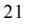

{27}------------------------------------------------

In order to manage our exposure to interest rate fluctuations under LIBOR, the Secured Overnight Financing Rate ("SOFR") or any other alternative rate, we may from time to time in the future use interest rate derivatives to effectively fix some of our floating rate debt obligations. No assurance can however be given that the use of these derivative instruments, if any, may effectively protect us from adverse interest rate movements. The use of interest rate derivatives may affect our results through mark to market valuation of these derivatives. Also, adverse movements in interest rate derivatives may require us to post cash as collateral, which may impact our free cash position. Interest rate derivatives may also be impacted by the transition from LIBOR to SOFR or other alternative rates.

The discontinuation of LIBOR presents a number of risks to our business, including volatility in applicable interest rates among our financing agreements, potential increased borrowing costs for future financing agreements or unavailability of or difficulty in attaining financing, which could in turn have an adverse effect on our profitability, earnings and cash flow.

### *Variable rate indebtedness could subject us to interest rate risk, which could cause our debt service obligations to increase significantly.*

Our credit facilities use variable interest rates and expose us to interest rate risk. If interest rates increase, our debt service obligations on the variable rate indebtedness would increase even if the amount borrowed remained the same, and our profitability and cash available for servicing our indebtedness would decrease.

#### **We may not be able to finance our future capital commitments.**

We cannot guarantee that we will be able to obtain financing at all or on terms acceptable to us. If adequate funds are not available, we may have to reduce expenditures for investments in new and existing projects, which could hinder our growth and prevent us from realizing potential revenues from prior investments which will have a negative impact on our cash flows and results of operations.

### **The current state of the global financial markets and current economic conditions may adversely impact our results of operation, financial condition, cash flows and ability to obtain financing or refinance our existing and future credit facilities on acceptable terms.**

Global financial markets and economic conditions have been disrupted and volatile at times over the past decade, including in 2020, 2021 and 2022 as a result of the COVID-19 pandemic and the ongoing conflict between Russia and Ukraine. While the global economy had improved in recent years, the outbreak of COVID-19 dramatically disrupted the global economy. Economic growth is expected to slow, including due to supply-chain disruption, the recent surge in inflation and related actions by central banks and geopolitical conditions, with a significant risk of recession in many parts of the worlds in the near term. Credit markets and the debt and equity capital markets have been distressed and the uncertainty surrounding the future of the global credit markets has resulted in reduced access to credit worldwide, particularly for the shipping industry. These issues, along with significant write-offs in the financial services sector, the re-pricing of credit risk and the uncertain economic conditions, have made, and may continue to make, it difficult to obtain additional financing. The current state of global financial markets and current economic conditions might adversely impact our ability to issue additional equity at prices that will not be dilutive to our existing shareholders or preclude us from issuing equity at all. Economic conditions may also adversely affect the market price of our ordinary shares.

Also, as a result of concerns about the stability of financial markets generally, and the solvency of counterparties specifically, the availability and cost of obtaining money from the public and private equity and debt markets has become more difficult. Many lenders have increased interest rates, enacted tighter lending standards, refused to refinance existing debt at all or on terms similar to current debt, and reduced, and in some cases ceased, to provide funding to borrowers and other market participants, including equity and debt investors, and some have been unwilling to invest on attractive terms or even at all. Due to these factors, we cannot be certain that financing will be available if needed and to the extent required, or that we will be able to refinance our existing and future credit facilities, on acceptable terms or at all. If financing or refinancing is not available when needed, or is available only on unfavorable terms, we may be unable to meet our obligations as they come due or we may be unable to enhance our existing business, complete additional vessel acquisitions or otherwise take advantage of business opportunities as they arise.

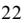

{28}------------------------------------------------

Further, in 2019, a number of leading lenders to the shipping industry and other industry participants announced a global framework by which financial institutions can assess the climate alignment of their ship finance portfolios, called the Poseidon Principles, and additional lenders have subsequently announced their intention to adhere to such principles. If the ships in our fleet are deemed not to satisfy the emissions and other sustainability standards contemplated by the Poseidon Principles, to which we are a participant, the availability and cost of bank financing for such vessels may be adversely affected.

#### **We cannot assure you that we will be able to refinance our indebtedness.**

In the event that we are unable to service or repay our debt obligations out of our operating activities, we may need to refinance our indebtedness and we cannot assure you that we will be able to do so on terms that are acceptable to us or at all. The actual or perceived tanker market rate environment and prospects and the market value of our fleet, among other things, may materially affect our ability to obtain new debt financing. If we are unable to refinance our indebtedness, we may choose to issue securities or sell certain of our assets in order to satisfy our debt obligations.

### **We are subject to certain risks with respect to our counterparties on contracts, and failure of such counterparties to meet their obligations could cause us to suffer losses or negatively impact our results of operations and cash flows.**

We have entered into various contracts, including charter agreements with our customers, our borrowing facilities, and from time to time we may enter into newbuilding contracts. Such agreements subject us to counterparty risks. The ability of each of our counterparties to perform its obligations under a contract with us will depend on a number of factors that are beyond our control and may include, among other things, general economic conditions, the condition of the maritime and offshore industries, the overall financial condition of the counterparty, charter rates received for specific types of vessels, work stoppages and other labor disturbances, including as a result of COVID-19 and various expenses. For example, the combination of a reduction of cash flow resulting from declines in world trade, a reduction in borrowing bases under reserve-based credit facilities and the lack of availability of debt or equity financing may result in a significant reduction in the ability of our charterers to make charter payments to us. In addition, in depressed market conditions, our charterers and customers may no longer need a vessel that is currently under charter or contract or may be able to obtain a comparable vessel at lower rates. As a result, charterers and customers may seek to renegotiate the terms of their existing charter parties or avoid their obligations under those contracts. Should a counterparty fail to honor its obligations under agreements with us, we could sustain significant losses which could have a material adverse effect on our business, financial condition, results of operations and cash flows. As a result, we could sustain significant losses which could have a material adverse effect on our business, financial condition, results of operations and cash flows, as well as our ability to pay dividends, if any, in the future, and comply with covenants in our borrowing facilities.

### **Risks Relating to Investing in Our Common Shares**

### **Our share price may continue to be highly volatile, which could lead to a loss of all or part of a shareholder's investment.**

The market price of our common shares has fluctuated widely since our common shares began trading in on the NYSE. Over the last few years, the stock market has experienced price and volume fluctuations, especially due to factors relating to impacts of COVID-19. This volatility has sometimes been unrelated to the operating performance of particular companies. During 2022, the price of our common shares experienced a high of \$3.80 in November and a low of \$1.41 in February. As of April 21, 2023, the price of our common shares was \$3.58. This market and share price volatility relating to the effects of the conflict in Ukraine and COVID-19, as well as general economic, market or political conditions, has and could further reduce the market price of our common shares in spite of our operating performance and could also increase our cost of capital, which could prevent us from accessing debt and equity capital on terms acceptable to us or at all.

{29}------------------------------------------------

The market price of our common shares is affected by a variety of factors, including:

- Investor reaction to the execution of our business strategy, including mergers and acquisitions;
- Shareholder activism;
- Our continued compliance with the listing standards of NYSE
- Regulatory or legal developments in the United States and other countries, especially changes in laws or regulations applicable to our industry, including those related to climate change;
- Variations in our financial results or those of companies that are perceived to be similar to us;
- Our ability or inability to raise additional capital and the terms on which we raise it;
- Declines in the market prices of stocks generally;
- Trading volume of our ordinary shares;
- Shorting activity in relation to our share;
- Sales of our ordinary shares by us or our stockholders;
- General economic, industry and market conditions; and
- Other events or factors, including those resulting from such events, or the prospect of such events, including war, terrorism and other international conflicts, public health issues including health epidemics or pandemics, such as the COVID-19 pandemic, adverse weather and climate conditions could disrupt our operations or result in political or economic instability.

These broad market and industry factors may seriously harm the market price of our ordinary shares, regardless of our operating performance, and may be inconsistent with any improvements in actual or expected operating performance, financial condition or other indicators of value. Since the stock price of our ordinary shares has fluctuated in the past, has been recently volatile and may be volatile in the future, investors in our ordinary shares could incur substantial losses. In the past, following periods of volatility in the market, securities class-action litigation has often been instituted against companies. Such litigation, if instituted against us, could result in substantial costs and diversion of management's attention and resources, which could materially and adversely affect our business, financial condition, results of operations and growth prospects. There can be no guarantee that our stock price will remain at current prices.

Additionally, recently, securities of certain companies have experienced significant and extreme volatility in stock price due short sellers of shares of ordinary shares, known as a "short squeeze". These short squeezes have caused extreme volatility in those companies and in the market and have led to the price per share of those companies to trade at a significantly inflated rate that is disconnected from the underlying value of the company. Many investors who have purchased shares in those companies at an inflated rate face the risk of losing a significant portion of their original investment as the price per share has declined steadily as interest in those stocks have abated. While we have no reason to believe our shares would be the target of a short squeeze, there can be no assurance that we will not be in the future, and you may lose a significant portion or all of your investment if you purchase our shares at a rate that is significantly disconnected from our underlying value.

{30}------------------------------------------------

### **We operate in a cyclical and volatile industry and cannot guarantee that we will continue to make cash distributions.**

We have made cash distributions quarterly since October 1997. It is possible that our revenues could be reduced as a result of decreases in charter rates or that we could incur other expenses or contingent liabilities that would reduce or eliminate the cash available for distribution as dividends. Further, our credit facilities limit our ability to distribute dividends. For more information, please see "Item 5. Operating and Financial Review and Prospectus—B. Liquidity and Capital Resources—Our Borrowing Activities." We may not continue to pay dividends at rates previously paid or at all. If we do not pay dividends, the market price for our common shares must appreciate for investors to realize a gain on their investment. This appreciation may not occur and our common shares may in fact depreciate in value, in part because of any future decreases in or elimination of our dividend payments.

#### **Future sales of our common stock could cause the market price of our common stock to decline.**

The market price of our common stock could decline due to sales of our shares in the market or the perception that such sales could occur. This could depress the market price of our common stock and make it more difficult for us to sell equity securities in the future at a time and price that we deem appropriate, or at all.

#### **Ineffective internal controls could impact the Company's business and financial results.**

The Company's internal control over financial reporting may not prevent or detect misstatements because of its inherent limitations, including the possibility of human error, the circumvention or overriding of controls, or fraud. Even effective internal controls can provide only reasonable assurance with respect to the preparation and fair presentation of financial statements. If the Company fails to maintain the adequacy of its internal controls, including any failure to implement required new or improved controls, or if the Company experiences difficulties in their implementation, the Company's business and financial results could be harmed and the Company could fail to meet its financial reporting obligations.

### **Increasing scrutiny and changing expectations from investors, lenders and other market participants with respect to our Environmental, Social and Governance ("ESG") policies may impose additional costs on us or expose us to additional risks.**

Companies across all industries are facing increasing scrutiny relating to their ESG policies. Investor advocacy groups, certain institutional investors, investment funds, lenders and other market participants are increasingly focused on ESG practices, especially as they relate to the environment health and safety, diversity, labor conditions and human rights in recent years, and have placed increasing importance on the implications and social cost of their investments.

In February 2021, the Acting Chair of the SEC issued a statement directing the Division of Corporation Finance to enhance its focus on climate-related disclosure in public company filings and in March 2021 the SEC announced the creation of a Climate and ESG Task Force in the Division of Enforcement (the "Task Force"). The Task Force's goal is to develop initiatives to proactively identify ESG-related misconduct consistent with increased investor reliance on climate and ESG-related disclosure and investment. To implement the Task Force's purpose, the SEC has taken several enforcement actions, with the first enforcement action taking place in May 2022, and promulgated new rules. On March 21, 2022, the SEC proposed that all public companies are to include extensive climate-related information in their SEC filings. On May 25, 2022, SEC proposed a second set of rules aiming to curb the practice of "greenwashing" (i.e., making unfounded claims about one's ESG efforts) and would add proposed amendments to rules and reporting forms that apply to registered investment companies and advisers, advisers exempt from registration, and business development companies. These proposed sets of rules are not effective as of the date of this annual report.

{31}------------------------------------------------

The increased focus and activism related to ESG and similar matters may hinder access to capital, as investors and lenders may decide to reallocate capital or to not commit capital as a result of their assessment of a company's ESG practices. Failure to adapt to or comply with evolving investor, lender or other industry shareholder expectations and standards, or the perception of not responding appropriately to the growing concern for ESG issues, regardless of whether there is a legal requirement to do so, may damage such a company's reputation or stock price, resulting in direct or indirect material adverse effects on the company's business and financial condition.

The increase in shareholder proposals submitted on environmental matters and, in particular, climate-related proposals in recent years indicates that we may face increasing pressures from investors, lenders and other market participants, who are increasingly focused on climate change, to prioritize sustainable energy practices, reduce our carbon footprint and promote sustainability. As a result, we may be required to implement more stringent ESG procedures or standards so that our existing and future investors and lenders remain invested in us and make further investments in us, especially given the highly focused and specific trade of crude oil transportation in which we are engaged. If we do not meet these standards, our business and/or our ability to access capital could be harmed.

We may face increasing pressures from investors, lenders, customers and other market participants, who are increasingly focused on climate change, to prioritize sustainable energy practices, reduce our carbon footprint and promote sustainability. As a result, we may be required to implement more stringent ESG procedures or standards so that our existing and future investors and lenders remain invested in us and make further investments in us. If we do not meet these standards, our business and/or our ability to access capital could be harmed.

Additionally, certain investors and lenders may exclude shipping companies, such as us, from their investing portfolios altogether due to environmental, social and governance factors. These limitations in both the debt and equity capital markets may affect our ability to grow as our plans for growth may include accessing the equity and debt capital markets. If those markets are unavailable, or if we are unable to access alternative means of financing on acceptable terms, or at all, we may be unable to implement our business strategy, which would have a material adverse effect on our financial condition and results of operations and impair our ability to service our indebtedness. Further, it is likely that we will incur additional costs and require additional resources to implement, monitor, report and comply with wide ranging ESG requirements. The occurrence of any of the foregoing could have a material adverse effect on our business and financial condition.

Moreover, from time to time, in alignment with our sustainability priorities, we aim at establishing and publicly announce goals and commitments in respect of certain ESG items, such as shipping decarbonization. While we may create and publish voluntary disclosures regarding ESG matters from time to time, many of the statements in those voluntary disclosures are based on hypothetical expectations and assumptions that may or may not be representative of current or actual risks or events or forecasts of expected risks or events, including the costs associated therewith. Such expectations and assumptions are necessarily uncertain and may be prone to error or subject to misinterpretation given the long timelines involved and the lack of an established standardized approach to identifying, measuring and reporting on many ESG matters. If we fail to achieve or improperly report on our progress toward achieving our environmental goals and commitments, the resulting negative publicity could adversely affect our reputation and/or our access to capital.

In the future there may be additional sustainability reporting requirements that the Company becomes subject to that may require us to incur additional expenditures in the future. When effective, we will focus on monitoring, managing and securing compliance with any new directives.

Finally, organizations that provide information to investors on corporate governance and related matters have developed ratings processes for evaluating companies on their approach to ESG matters. Such ratings are used by some investors to inform their investment and voting decisions. Unfavourable ESG ratings and recent activism directed at shifting funding away from companies with fossil fuel-related assets could lead to increased negative investor sentiment toward us and our industry and to the diversion of investment to other, non-fossil fuel markets, which could have a negative impact on our access to and costs of capital.

{32}------------------------------------------------

### **A decision of our Board of Directors and the laws of Bermuda may prevent the declaration and payment of dividends.**

Our ability to declare and pay dividends is subject at all times to the discretion of our board of directors, or the Board, and compliance with Bermuda law, and may be dependent, among other things, upon our having sufficient available distributable reserves. For more information, please see "Item 8. Financial Information—Dividend Policy." We may not continue to pay dividends at rates previously paid or at all.

#### **We have antitakeover protections which could prevent a change of control.**

We have antitakeover protections which could prevent a third party to acquire us without the consent of our board of directors. On June 16, 2017, our Board adopted a shareholders' rights agreement. This shareholders' rights plan was designed to enable us to protect shareholder interests in the event that an unsolicited attempt is made for a business combination with, or a takeover of, the Company. Our shareholders' rights plan is not intended to deter offers that our Board determines are in the best interests of our shareholders.

### **If our vessels call on ports located in countries or territories that are subject to sanctions or embargoes imposed by the U.S. government, the European Union, the United Nations or other governmental authorities, it could result in monetary fines or other penalties, and may adversely affect our reputation and the market and trading price of our common stock.**

 The U.S. sanctions and embargo laws and regulations vary in their application, as they do not all apply to the same covered persons or proscribe the same activities, and such sanctions and embargo laws and regulations may be amended or expanded over time as is the case with the war in Ukraine. Current or future counterparties of ours, including charterers, may be affiliated with persons or entities that are or may be in the future the subject of sanctions or embargoes imposed by the U.S., the EU, and/or other international bodies. If we determine that such sanctions require us to terminate existing or future contracts to which we, or our subsidiaries, are party, or if we are found to be in violation of such applicable sanctions or embargoes, we could be subject to monetary fines, penalties, or other sanctions, as well as suffer reputational harm, and our operations and/or the price at which our common stock trades might be adversely affected.

As a result of Russia's actions in Ukraine, the U.S., EU and United Kingdom, together with numerous other countries, have imposed significant sanctions on persons and entities associated with Russia and Belarus, as well as comprehensive sanctions on certain areas within the Donbas region of Ukraine, and such sanctions apply to entities owned or controlled by such designated persons or entities. These sanctions adversely affect our ability to operate in the region and also restrict parties whose cargo we may carry. Sanctions against Russia have also placed significant prohibitions on the maritime transportation of seaborne Russian oil, the importation of certain Russian energy products and other goods, and new investments in the Russian Federation. These sanctions further limit the scope of permissible operations and cargo we may carry.

Beginning in February of 2022, President Biden and several European leaders announced various economic sanctions against Russia in connection with the aforementioned conflicts in the Ukraine region, which may adversely impact our business, given Russia's role as a major global exporter of crude oil and natural gas. Both the EU as well as the United States have implemented sanction programs, which includes prohibitions on the import of certain Russian energy products into the United States, including crude oil, petroleum, petroleum fuels, oils, liquefied natural gas and coal, as well as prohibitions on new investments in Russia, among other restrictions. Furthermore, the EU and the United States has also prohibited a variety of specified services related to the maritime transport of Russian Federation origin crude oil and petroleum products, including trading/commodities brokering, financing, shipping, insurance (including reinsurance and protection and indemnity), flagging, and customs brokering. These prohibitions took effect on December 5, 2022 with respect to the maritime transport of crude oil and took effect on February 5, 2023 with respect to the maritime transport of other petroleum products. An exception exists to permit such services when the price of the seaborne Russian oil does not exceed the relevant price cap; but implementation of this price exception relies on a recordkeeping and attestation process that allows each party in the supply chain of seaborne Russian oil to demonstrate or confirm that oil has been purchased at or below the price cap. Violations of the price cap policy or the risk that information, documentation, or attestations provided by parties in the supply chain are later determined to be false may pose additional risks adversely affecting our business.

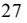

{33}------------------------------------------------

Although we believe that we have been in compliance with applicable sanctions and embargo laws and regulations in 2022, and intend to maintain such compliance, there can be no assurance that we will be in compliance in the future, particularly as the scope of certain laws may be unclear and may be subject to changing interpretations. Any such violation could result in fines, penalties or other sanctions that could severely impact our ability to access U.S. capital markets and conduct our business, and could result in some investors deciding, or being required, to divest their interest, or not to invest, in us. Additionally, some investors may decide not to invest in our company simply because we do business with companies that do business in sanctioned countries. The determination by these investors not to invest in, or to divest from, our common stock may adversely affect the price at which our common stock trades. While the terms of our charters require our charterers to operate our vessels in compliance with all applicable sanctions and embargo laws, the failure of our charterers to comply with such provisions may result in the violation of such applicable sanctions and embargo laws and regulations which could in turn negatively affect our reputation. In addition, our reputation and the market for our securities may be adversely affected if we engage in certain other activities, such as entering into charters with individuals or entities that are not controlled by the governments of countries or territories that are the subject of certain U.S. sanctions or embargo laws, or engaging in operations associated with those countries or territories pursuant to contracts with third parties that are unrelated to those countries or territories or entities controlled by their governments. Investor perception of the value of our common stock may be adversely affected by the consequences of war, the effects of terrorism, civil unrest and governmental actions in the countries or territories that we operate in.

#### **Because we are a foreign corporation, you may not have the same rights that a shareholder in a U.S. corporation may have.**

We are incorporated in the Islands of Bermuda. Our memorandum of association, bye-laws and the Companies Act, 1981 of Bermuda (the "Companies Act"), govern our affairs. The Companies Act does not as clearly establish your rights and the fiduciary responsibilities of our directors as do statutes and judicial precedent in some U.S. jurisdictions. Therefore, you may have more difficulty in protecting your interests as a shareholder in the face of actions by the management, directors or controlling shareholders than would shareholders of a corporation incorporated in a United States jurisdiction. There is a statutory remedy under Section 111 of the Companies Act which provides that a shareholder may seek redress in the courts as long as such shareholder can establish that our affairs are being conducted, or have been conducted, in a manner oppressive or prejudicial to the interests of some part of the shareholders, including such shareholder.

#### **We are incorporated in Bermuda and it may not be possible for our investors to enforce U.S. judgments against us.**

We are incorporated in the Islands of Bermuda. Substantially all of our assets are located outside the U.S. In addition, most of our directors and officers are non-residents of the U.S., and all or a substantial portion of the assets of these non-residents are located outside the U.S. As a result, it may be difficult or impossible for U.S. investors to serve process within the U.S. upon us, or our directors and officers or to enforce a judgment against us for civil liabilities in U.S. courts. In addition, you should not assume that courts in the countries in which we are incorporated or where our vessels are located (1) would enforce judgments of U.S. courts obtained in actions against us based upon the civil liability provisions of applicable U.S. federal and state securities laws or (2) would enforce, in original actions, liabilities against us based on those laws.

#### **We may have to pay tax on United States source income, which would reduce our earnings.**

Under the United States Internal Revenue Code of 1986, as amended, or the Code, 50% of the gross shipping income of a vessel owning or chartering corporation, such as ourselves, attributable to transportation that begins or ends, but that does not both begin and end, in the United States will be characterized as U.S. source shipping income and such income is subject to a 4% United States federal income tax, without the benefit of deductions, unless that corporation is entitled to a special tax exemption under the Code which applies to income derived by certain non-United States corporations from the international operations of ships. We believe that we currently qualify for this statutory tax exemption and we have taken, and will continue to take, this position on the Company's United States federal income tax returns. However, there are several risks that could cause us to become subject to tax on our United States source shipping income. Due to the factual nature of the issues involved, we can give no assurances as to our tax-exempt status for our future taxable years.

{34}------------------------------------------------

If we are not entitled to this statutory tax exemption for any taxable year, we would be subject for any such year to a 4% U.S. federal income tax on our U.S. source shipping income, without the benefit of deductions. The imposition of this tax could have a negative effect on our business and would result in decreased earnings available for distribution to our shareholders.

### **If the United States Internal Revenue Service were to treat us as a "passive foreign investment company," that could have adverse tax consequences for United States shareholders.**

A foreign corporation is treated as a "passive foreign investment company," or PFIC, for United States federal income tax purposes, if either (1) at least 75% of its gross income for any taxable year consists of certain types of "passive income" or (2) at least 50% of the average value of the corporation's assets produce or are held for the production of those types of passive income. For purposes of these tests, cash is treated as an asset that produces passive income, and passive income includes dividends, interest, and gains from the sale or exchange of investment property and rents and royalties other than rents and royalties which are received from unrelated parties in connection with the active conduct of a trade or business. Income derived from the performance of services does not constitute passive income. United States shareholders of a PFIC may be subject to a disadvantageous United States federal income tax regime with respect to the distributions they receive from the PFIC and the gain, if any, they derive from the sale or other disposition of their shares in the PFIC.

We believe that we ceased to be a PFIC beginning with the 2005 taxable year. Based on our current and expected future operations, we believe that we are not currently a PFIC, nor do we anticipate that we will become a PFIC for any future taxable year. As a result, non-corporate United States shareholders should be eligible to treat dividends paid by us in 2006 and thereafter as "qualified dividend income" which is subject to preferential tax rates.

We expect to derive more than 25% of our income each year from our spot chartering or time chartering activities. We also expect that more than 50% of the value of our assets will be devoted to our spot chartering and time chartering. Therefore, since we believe that such income will be treated for relevant United States federal income tax purposes as services income, rather than rental income, we have taken, and will continue to take, the position that such income should not constitute passive income, and that the assets that we own and operate in connection with the production of that income, in particular our vessels, should not constitute assets that produce or are held for the production of passive income for purposes of determining whether we are a PFIC in any taxable year.

There is, however, no direct legal authority under the PFIC rules addressing our method of operation. We believe there is substantial legal authority supporting our position consisting of case law and United States Internal Revenue Service, or IRS, pronouncements concerning the characterization of income derived from time charters and voyage charters as services income rather than rental income for other tax purposes. However, there is also authority which characterizes time charter income as rental income rather than services income for other tax purposes. Accordingly, no assurance can be given that the IRS or a court of law will accept our position, and there is a risk that the IRS or a court of law could determine that we are a PFIC. Moreover, no assurance can be given that we would not constitute a PFIC for any future taxable year if there were to be changes in the nature and extent of our operations.

If the IRS or a court of law were to find that we are or have been a PFIC for any taxable year beginning with the 2005 taxable year, our United States shareholders who owned their shares during such year would face adverse United States federal income tax consequences and certain information reporting obligations. Under the PFIC rules, unless those United States shareholders made or make an election available under the Code (which election could itself have adverse consequences for such United States shareholders), such United States shareholders would be subject to United States federal income tax at the then highest income tax rates on ordinary income plus interest upon excess distributions (i.e., distributions received in a taxable year that are greater than 125% of the average annual distributions received during the shorter of the three preceding taxable years or the United States shareholder's holding period for our common shares) and upon any gain from the disposition of our common shares, as if the excess distribution or gain had been recognized ratably over the United States shareholder's holding period of our common shares. In addition, non-corporate United States shareholders would not be eligible to treat dividends paid by us as "qualified dividend income" if we are a PFIC in the taxable year in which such dividends are paid or in the immediately preceding taxable year.

{35}------------------------------------------------

#### **We may become subject to taxation in Bermuda which would negatively affect our results.**

At the present time, there is no Bermuda income or profits tax, withholding tax, capital gains tax, capital transfer tax, estate duty or inheritance tax payable by us or by our shareholders in respect of our shares. We have obtained an assurance from the Minister of Finance of Bermuda under the Exempted Undertakings Tax Protection Act 1966 that, in the event that any legislation is enacted in Bermuda imposing any tax computed on profits or income, or computed on any capital asset, gain or appreciation or any tax in the nature of estate duty or inheritance tax, such tax shall not, until March 31, 2035, be applicable to us or to any of our operations or to our shares, debentures or other obligations except insofar as such tax applies to persons ordinarily resident in Bermuda or is payable by us in respect of real property owned or leased by us in Bermuda. We cannot assure you that a future Minister would honor that assurance, which is not legally binding, or that after such date we would not be subject to any such tax. If we were to become subject to taxation in Bermuda, our results of operations could be adversely affected.

### **As a Bermuda exempted company incorporated under Bermuda law with subsidiaries in another offshore jurisdiction, our operations may be subject to economic substance requirements.**

On December 5, 2017, following an assessment of the tax policies of various countries by the Code of Conduct Group for Business Taxation of the European Union (the "COCG"), the Council of the European Union approved and published Council conclusions containing a list of non-cooperative jurisdictions for tax purposes (the "Conclusions"). Although at that time not considered "non-cooperative jurisdictions," certain countries, including Bermuda and the Marshall Islands were listed as having "tax regimes that facilitate offshore structures which attract profits without real economic activity." In connection with the Conclusions, and to avoid being placed on the list of "non-cooperative jurisdictions," the government of Bermuda, among others, committed to addressing COCG proposals relating to economic substance for entities doing business in or through their respective jurisdictions and to pass legislation to implement any appropriate changes by the end of 2018.

The Economic Substance Act 2018 and the Economic Substance Regulations 2018 of Bermuda (the "Economic Substance Act" and the "Economic Substance Regulations", respectively) became operative on 31 December 2018. The Economic Substance Act applies to every registered entity in Bermuda that engages in a relevant activity and requires that every such entity shall maintain a substantial economic presence in Bermuda. A relevant activity for the purposes of the Economic Substance Act is banking business, insurance business, fund management business, financing and leasing business, headquarters business, shipping business, distribution and service centre business, intellectual property business and conducting business as a holding entity, which means acting as a pure equity holding entity.

The Economic Substance Act provides that a registered entity that carries on a relevant activity complies with economic substance requirements if (a) it is directed and managed in Bermuda, (b) its core income-generating activities (as may be prescribed) are undertaken in Bermuda with respect to the relevant activity, (c) it maintains adequate physical presence in Bermuda, (d) it has adequate full time employees in Bermuda with suitable qualifications and (e) it incurs adequate operating expenditure in Bermuda in relation to the relevant activity.

A registered entity that carries on a relevant activity is obliged under the Economic Substance Act to file a declaration in the prescribed form (the "Declaration") with the Registrar of Companies (the "Registrar") on an annual basis.

The Economic Substance Regulations provide that minimum economic substance requirements shall apply in relation to an entity if the entity is a pure equity holding entity whose sole function is to acquire and hold shares or an equitable interest in other entities, and the shares or equitable interest are controlling stakes in other entities. The minimum economic substance requirements include a) compliance with applicable corporate governance requirements set forth in the Bermuda Companies Act 1981 including keeping records of account, books and papers and financial statements and b) submission of a Declaration. Additionally, the Economic Substance Regulations provide that a pure equity holding entity complies with economic substance requirements where it also has adequate people for holding and managing equity participations, and adequate premises in Bermuda.

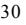

{36}------------------------------------------------

Certain of our subsidiaries may from time to time be organized in other jurisdictions identified by the COCG based on global standards set by the Organization for Economic Co-operation and Development with the objective of preventing low-tax jurisdictions from attracting profits from certain activities. These jurisdictions, including the Marshall Islands, have also enacted economic substance laws and regulations which we may be obligated to comply with. If we fail to comply with our obligations under the Economic Substance Act or any similar law applicable to us in any other jurisdiction, we could be subject to financial penalties and spontaneous disclosure of information to foreign tax officials in related jurisdictions and may be struck from the register of companies in Bermuda or such other jurisdiction. Any of these actions could have a material adverse effect on our business, financial condition and results of operations.

### **ITEM 4. INFORMATION ON THE COMPANY**

### **A. History and Development of the Company**

Nordic American Tankers Limited was formed on June 12, 1995, and organized under the laws of the Islands of Bermuda. We maintain our principal offices at Swan Building, 26 Victoria Street, Hamilton HM 12, Bermuda. Our telephone number at such address is (441) 292-7202 and we maintain an internet site at www.nat.bm. The SEC maintains an Internet site that contains reports, proxy and information statements, and other information regarding issuers that file electronically with the SEC. The address of the SEC's internet site is www.sec.gov. None of the information contained on these websites is incorporated into or forms a part of this annual report. Our common shares trade under the symbol "NAT" on the New York Stock Exchange, or the NYSE.

We are an international tanker company focusing solely on owning, operating and chartering of Suezmax tankers. In 2021, we sold one vessel built in 2000. In 2022, we have sold five vessels built in 2002 and 2003. Our newbuilding program consisted of two Suezmax newbuildings, ordered in September 2020 at Samsung shipyard in South Korea, and these two vessels, Nordic Harrier and Nordic Hunter, were delivered to us in May and June 2022, and our fleet currently consists of 19 vessels.

The vessels in our fleet are homogenous and interchangeable, which is a business strategy we refer to as the "Nordic American System". We believe NAT is unlike other companies.

The Nordic American System is transparent and predictable with the key elements of ships, people and capital. Further, we are a dividend company with the objective of having a strong balance sheet and low G&A costs. Under the "Nordic American System", we are focusing on close customer relationships and serving the "Big Oil" companies with a top-quality fleet.

{37}------------------------------------------------

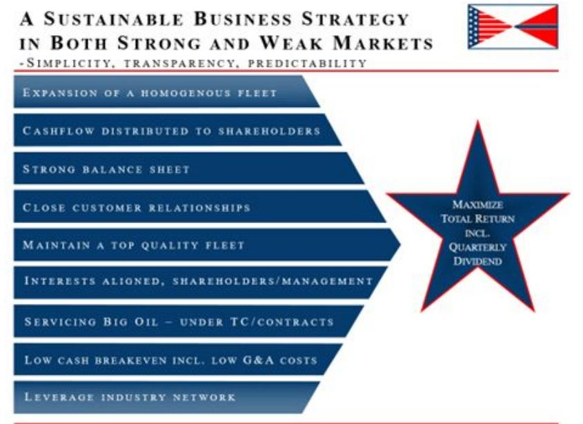

All tankers in our fleet are Suezmax vessels, which have a carrying capacity of one million barrels of oil. The vessels are highly versatile. They can be utilized on most long-haul trade routes. A homogenous fleet streamlines operating and administration costs, which helps keep our cash-breakeven low.

Cash dividends are our priority and we have paid quarterly dividends for 102 consecutive quarters. In 2022, we have declared and paid quarterly dividends in total of \$0.11 per share and we have declared a dividend in the first quarter of 2023 of \$0.15 per share that was paid on March 28, 2023.

We pay our dividends from cash on hand. We have an operating cash break-even level of about \$8,000 per day per vessel, which we consider low in the industry. The cash break-even rate is the amount of average daily revenue our vessels would need to earn in order to cover our vessel operating expenses (excluding general and administrative expenses, interest expenses and all other cash charges).

In conjunction with delivery of three vessels from Samsung shipyard during 2018, or the 2018-built Vessels, we entered into final agreements for the financing. Under the terms of the financing agreement, the lender has provided financing of 77.5% of the purchase price for each of the three 2018-built Vessels. After delivery of each of the vessels, we entered into ten-year bareboat charter agreements. We are obligated to purchase the vessels upon the completion of the ten-year bareboat charter agreement and also have the option to purchase the vessels after sixty and eighty-four months.

On February 12, 2019, we entered into a new five-year senior secured credit facility for \$306.1 million, or the 2019 Senior Secured Credit Facility. Borrowings under the facility are secured by first priority mortgages over the Company's vessels (excluding the three 2018-built Vessels and the two 2022 Newbuildings) and assignments of earnings and insurance. The loan has an annual amortization equal to a twenty-year maturity profile, carries a floating interest rate plus a margin and matures in February 2024. In 2019, we incorporated NAT Bermuda Holdings Ltd ("NATBH") as a wholly-owned subsidiary of NAT and transferred the ownership of twenty vessels used as collateral from NAT to NATBH. As of December 31, 2022, there are 14 vessels remaining in NATBH that are used as collateral for the loan.

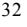

{38}------------------------------------------------

On March 29, 2019, we entered into an equity distribution agreement with B. Riley Securities, Inc. acting as a sales agent, under which we may, from time to time, offer and sell our common stock through an At-the-Market Offering, or \$40 million ATM, program having an aggregate offering price of up to \$40,000,000. This At-the-market offering was fully utilized by the end of 2020.

On October 16, 2020, we entered into our second equity distribution agreement with B. Riley Securities, Inc., acting as a sales agent, under which we may, from time to time, offer and sell our common stock through an At-the-Market Offering, or first \$60 million ATM, program having an aggregate offering price of up to \$60,000,000. In 2021, we raised \$60.0 million and \$58.5 million in gross and net proceeds, respectively, by issuing 22,025,979 common shares and this ATM was fully utilized. The 2020 \$60 million ATM program was terminated on October 14, 2021.

On December 16, 2020, we entered into a new loan agreement for the borrowing of \$30.0 million. The loan is considered an accordion loan under the 2019 Senior Secured Credit Facility. The loan has an annual amortization equal to a twenty-year maturity profile, carries a floating interest rate plus a margin and matures in February 2024.

On December 22, 2020, we entered into final agreements for the financing of the two Suezmax newbuildings that were delivered to us from Samsung Shipyard in South Korea in May and June 2022. We secured 80% financing of the newbuilding price for these two vessels at similar terms as for the 2018-built Vessels with Ocean Yield ASA and the facility was fully utilized upon delivery of the vessels in 2022.

On September 29, 2021, we entered into our third equity distribution agreement with B. Riley Securities, Inc., acting as a sales agent, under which we may, from time to time, offer and sell our common stock through an At-the-Market Offering, or second \$60 million ATM, program having an aggregate offering price of up to \$60,000,000. As of December 31, 2021, we had raised gross and net proceeds (after deducting sales commissions and other fees and expenses) of \$22.3 million and \$21.7 million, respectively, by issuing and selling 10,222,105 common shares. Subsequent to December 31, 2021, and through to February 14, 2022, the Company has raised gross and net proceeds of \$16.9 million and \$16.5 million, respectively, by issuing and selling 10,764,990 common shares. The \$60 million 2021 ATM was terminated on February 14, 2022, after having utilized \$39.2 million of the program.

On February 14, 2022, we entered into a new equity distribution agreement with B. Riley Securities, Inc, acting as sales agent, under which the Company may, from time to time, offer and sell common stock through an At-the-Market Offering (the "\$60 million 2022 ATM") program having an aggregate offering price of up to \$60,000,000. In 2022, we have raised gross and net proceeds of \$33.6 million and \$32.7 million, respectively, by issuing and selling 14,337,258 common shares with a remaining available balance of \$26.4 million under this ATM. Based on the share price of the Company of \$3.58 as of April 21, 2023, it would have resulted in 7,386,354 new shares being issued, if fully utilizing the remaining balance available through the \$60 million 2022 ATM.

For more information, please see "Item 5.B. Liquidity and Capital Resources" with regard to the above described transactions.

As of April 27, 2023, we have 208,796,444 common shares issued and outstanding.

### **B. Business Overview**

#### **Our Fleet**

Our fleet as of December 31, 2022, consisted of 19 Suezmax crude oil tankers, of which the vast majority have been built in South Korea. We have sold five vessels and taken delivery of two Suezmax newbuildings in 2022. The majority of our vessels are employed in the spot market. The two newbuildings delivered to us in May and June 2022 have been chartered out on six-year time charter agreements that commenced upon delivery of the vessels from the shipyard. We have further two vessels chartered out on longer term time-charter agreements expiring in late 2023 with an option to extend the agreement for a year for one of these vessels. The vessels in our fleet are considered homogenous and interchangeable as they have approximately the same freight capacity and ability to transport the same type of cargo.

{39}------------------------------------------------

As of December 31, 2022, and through to the date of this report, our fleet was as follows:

| Vessel          | Built in | Deadweight Tons |
|-----------------|----------|-----------------|
| Nordic Pollux   | 2003     | 150,103         |
| Nordic Apollo   | 2003     | 159,999         |
| Nordic Luna     | 2004     | 150,037         |
| Nordic Castor   | 2004     | 150,249         |
| Nordic Freedom  | 2005     | 159,331         |
| Nordic Sprinter | 2005     | 159,089         |
| Nordic Skier    | 2005     | 159,089         |
| Nordic Vega     | 2010     | 163,940         |
| Nordic Light    | 2010     | 158,475         |
| Nordic Cross    | 2010     | 158,475         |
| Nordic Breeze   | 2011     | 158,597         |
| Nordic Zenith   | 2011     | 158,645         |
| Nordic Star     | 2016     | 157,738         |
| Nordic Space    | 2017     | 157,582         |
| Nordic Aquarius | 2018     | 157,338         |
| Nordic Cygnus   | 2018     | 157,526         |
| Nordic Tellus   | 2018     | 157,407         |
| Nordic Hunter   | 2022     | 157,037         |
| Nordic Harrier  | 2022     | 157,094         |

#### **Employment of Our Fleet**

It is our policy to operate the majority of our vessels either in the spot market or on shorter-term time charters. Large international oil companies, oil traders and independent oil companies both in the Western and the Eastern parts of the world are important customers.

*Spot Charters***:** Tankers operating in the spot market are typically chartered for a single voyage which may last up to several weeks. Under a voyage charter, we are responsible for paying voyage expenses and the charterer is responsible for any delay at the loading or discharging ports. When our tankers are operating on spot charters, the vessels are traded fully at the risk and reward of the Company. Revenues are recognized in a manner to reflect the transfer of the services to our customers over the duration of the voyage and freight is generally billed to the customer upon discharge of the cargo. The Company considers it appropriate to present this type of arrangement on a gross basis in the Statements of Operations. For further information concerning our accounting policies, please see Note 2 to our financial statements.

The tanker industry has historically been stronger in the fall and winter months in anticipation of increased oil consumption in the norther hemisphere during the winter months. Seasonal variations in tanker demand normally result in seasonal fluctuations in the spot market charters.

*Time Charters:* Under a time charter, the charterer is responsible and pays for the voyage expenses, such as port, canal and fuel costs, while the shipowner is responsible and pays for vessel operating expenses, including, among other costs, crew costs, provisions, deck and engine stores, lubricating oil, insurance, maintenance and repairs and costs relating to a vessel's intermediate and special surveys. Revenue from time charter contracts are recognized daily over the term of the charter. Time charter agreements with profit-sharing are recognized when the contingency related to it is resolved. As of December 31, 2022, we did not have any time charter agreements with profit-sharing.

### **Technical Management**

The technical management of our vessels is handled by companies under direct instructions from NAT. The ship management firms V.Ships Norway AS, Columbia Shipmanagement Ltd, Cyprus and Hellespont Ship Management GmbH & Co KG, Germany, provide the technical management services. The compensation paid under the technical management agreements is in accordance with industry standards.

{40}------------------------------------------------

#### **The International Tanker Market**

International seaborne oil and petroleum products transportation services are mainly provided by two types of operators: major oil company captive fleets (both private and state-owned) and independent shipowner fleets. Both types of operators transport oil under short-term contracts (including single-voyage "spot charters") and long-term time charters with oil companies, oil traders, large oil consumers, petroleum product producers and government agencies. The oil companies own, or control through long-term time charters, approximately one third of the current world tanker capacity, while independent companies own or control the balance of the fleet. The oil companies use their fleets not only to transport their own oil, but also to transport oil for third-party charterers in direct competition with independent owners and operators in the tanker charter market.

The oil transportation industry has historically been subject to regulation by national authorities and through international conventions. Over recent years, however, an environmental protection regime has evolved which may have a significant impact on the operations of participants in the industry in the form of increasingly more stringent inspection requirements, closer monitoring of pollution-related events, and generally higher costs and potential liabilities for the owners and operators of tankers.

In order to benefit from economies of scale, tanker charterers typically charter the largest possible vessel to transport oil or products, consistent with port and canal dimensional restrictions and optimal cargo lot sizes. A tanker's carrying capacity is measured in deadweight tons, or dwt, which is the amount of crude oil measured in metric tons that the vessel is capable of loading but also in barrels of oil. VLCCs that can carry 2 million barrels of crude oil typically transport oil in longhaul trades, such as from the Arabian Gulf to Far East and Rotterdam via the Cape of Good Hope or from West Africa and US Gulf to the Far East via Cape of Good Hope. Suezmax tankers that carry 1 million barrels of crude oil also engage in long-haul as well as in medium-haul trades, such as from the Mediterranean, Black Sea, West Africa, South America and Arabian Gulf towards a variety of destinations such as India, Far East, Europe and US. Aframax-size vessels generally engage in both medium-and short-haul trades of less than 1,500 miles and carry crude oil or petroleum products. Smaller tankers mostly transport petroleum products in shorthaul to medium-haul trades.

#### **The 2022 Tanker Market (Source; Fearnleys)**

Suezmax earnings in 2022, basis fixture date for forward loading for modern vessels, averaged \$48,800/day, significantly higher than the average \$5,200/day in 2021 according to Fearnleys. Note, however, that this average was boosted by very high rates for Russia related trade. For comparison the average rate for the benchmark West Africa – UK/Continent route averaged \$29,000/day. While the Russia/Ukraine crisis and its impact dominated headlines, increasing overall tanker volumes and slower fleet growth led to steadily higher rates through the year. Earnings in the highly correlated VLCC and Aframax segments averaged \$30,300/day and \$45,400/day in 2022, respectively.

The total crude oil and product tanker fleet above 25,000 dwt grew by a net 2.9% in 2022, with the crude tanker fleet expanding 3.2% and the product tanker fleet growing 1.9%. This was higher than the 2.2% growth seen in 2021 due to more deliveries and less demolition. It was still below the ten-year average total tanker fleet growth of 3.2%.

Suezmax fleet growth of 4% was up from 2.3% in 2021 and 3.1% in 2020, albeit slightly lower than the 4.1% in 2019. It was slightly higher than the last ten years' average of 3.7%. 33 vessels were delivered vs. 20 the preceding year, while eight vessels were demolished, vs. seven in 2021. This took the total fleet at the end of 2022 to 602 vessels. Deliveries in 2022 were again front-end loaded, where 20 vessels were delivered in the first half vs. 13 in the second. By the end of the year, almost 37% of the fleet were modern, fuel-efficient vessels, up from 32% a year earlier.

As earnings rose, tanker demolition slowed through the year. The 5.2 million dwt which were broken up was down from 8.1m the previous year, and while it was higher than 2019 and 2020 combined it was still below the historical average of 7.2m. As of the beginning of 2023 there were 43 vessels at or above the past 10 year average scrap age of 22 years, and 64 vessels within the 20+ years age group.

{41}------------------------------------------------

The Suezmax orderbook stood at just 10 vessels of 1.6 million dwt at the beginning of 2023, or 1.7% of the fleet. The total crude oil and product tanker orderbook for vessels above 25,000 dwt counted 24 million dwt, or just 3.9% vs. the fleet. This is the lowest since 1983.

The year started off similarly as in 2021. Slow production increases from the OPEC+ and others did initially not sufficiently move the needle for tanker demand. While global oil supply gradually rose through the first half, demand was higher. This resulted in a tight oil market and was exacerbated by lower Russian supply and shortage fears. A steeply backwardated Brent forward curve and softer Asian than Atlantic basin oil demand development, resulted in little long-haul Atlantic-East flows.

For Aframax, Suezmax and product tankers the Russia/Ukraine conflict and its impact on trade flow was a key turning point. When western buyers selfsanctioned away from Russian oil, more Baltic and Black Sea exports were shipped long-haul to the East, giving extraordinary rate outperformance for those vessels which entered into the trade.

For the broader tanker market the key turning point was the flattening forward curves at the same time as WTI became discounted vs. Middle Eastern crude – driven by 1 mbpd U.S. Strategic Petroleum Reserve releases which boosted U.S. exports. When this West-East arbitrage opened, USG-East volumes soared to new all-time highs in September through November. This came on top of MEG exports which also reached new all-time highs, around the same time as global oil supply reached near all-time highs - and resulted in a sharp rate recovery. Toward the end of the year slower U.S. SPR releases and OPEC+ production cuts led volumes lower, which inevitably had a negative effect on rates.

With increased earnings also came a significant repricing of asset values. This was also supported by high newbuild prices, not from high tanker ordering but rather from activity in other segments, and high input costs. Values increased the most for the older end of the age bracket.

#### **The Tanker Market 2023**

 Reported spot rates in the first quarter of 2023 have lowered since the fourth quarter of 2022, and the average Suezmax earnings per day decreased from \$81,281 in the fourth quarter of 2022 to \$73,942 for the first quarter of 2023 based on the indicated rates published by Clarkson Research. The indicated rates are an average of observations and routes. Some of the trade routes going into the average are routes involving Russian oil trade and as such not routes representing an average for all market participants. From the time a voyage is booked and the rate is reported to the market, until the vessel loads the cargo and commences the voyage, there can be a delay of up to 30 days. As such, from an accounting perspective, a voyage booked at the end of a quarter may see the majority of its revenues being recorded in the following quarter's results. The earnings for vessel operators are, for this reason, not necessarily expected to fluctuate in an identical manner as the indicative rates reported by Clarkson Research on a quarter by quarter basis.

As a consequence of Russia's invasion in Ukraine, commencing February 20, 2022, and the West's strong reaction, energy security became of paramount concern during 2022 and still is. The first quarter of 2022 saw a steep increase in the price of oil that moved from \$75 per barrel at the beginning of 2022 to close off above \$123 per barrel on March 8, 2022. The still ongoing war, added to an already tight supply situation for energy world-wide with low oil inventories and the energy logistics turned upside down. Oil production increased during 2022 and several countries released strategic oil reserves to the market during the year. Further adding to demand for oil transportation was the increased voyage distances created by the official and self-imposed sanctions, with oil needing to be sourced from other regions than in the past. These changes in the energy logistics particularly favored the flexible and versatile medium sized Aframax and Suezmax tankers. Despite these challenges, 2022 ended with an oil price only \$5 per barrel above the beginning of the year (\$80 per barrel WTI), higher oil inventories globally and a resurgence in Oil E&P spending and expectations of increased oil production going forward.

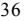

{42}------------------------------------------------

2022 also saw a continued zero tolerance for Covid-19 in China and a delayed reopening in Asia after the pandemic. The muted demand for long haul transportation of oil to China kept earnings for the Very Large Crude Carriers low for the most of 2022. With the full reopening of China and Asian economies in 2023, we now see the longer-term trend returning, namely increased demand for oil from hundreds of millions of people in Asia, where a strong middle class has taken root and continues to grow rapidly. This will have a positive impact on the overall tanker market and the larger classes of oil tankers specifically.

Finally, the Tanker Market stands to benefit from the fact that the supply of tanker vessels will remain at historic low levels for at least the next two or three years. As of April 12, 2023, the orderbook for conventional Suezmax tankers stood at 18 vessels in total. Five orders for a Suezmax vessel have been placed with the shipyards so far in 2023. In 2023, a total of seven Suezmaxes are expected to be added to the world fleet and two of these have been delivered as of April 12, 2023. Environmental regulations, increased steel and production costs, and higher interest rates make investing in new ships quite challenging and a smaller order book for new tankers has always helped the tanker industry. On the demand side, we see a strong surge in demand for oil after Asian economies fully opened up after the pandemic this year. Despite this, OPEC announced a production cut starting in May 2023 of 1.15 million barrels per day. The effectiveness of these cuts will be a function of discipline among the OPEC members and the overall demand for oil.

#### **Environmental and Other Regulations in the Shipping Industry**

Government regulation and laws significantly affect the ownership and operation of our fleet. We are subject to international conventions and treaties, national, state and local laws and regulations in force in the countries in which our vessels may operate or are registered relating to safety and health and environmental protection including the storage, handling, emission, transportation and discharge of hazardous and non-hazardous materials, and the remediation of contamination and liability for damage to natural resources. Compliance with such laws, regulations and other requirements entails significant expense, including vessel modifications and implementation of certain operating procedures.

A variety of government and private entities subject our vessels to both scheduled and unscheduled inspections. These entities include the local port authorities (applicable national authorities such as the United States Coast Guard ("USCG"), harbor master or equivalent), classification societies, flag state administrations (countries of registry) and charterers, particularly terminal operators. Certain of these entities require us to obtain permits, licenses, certificates and other authorizations for the operation of our vessels. Failure to maintain necessary permits or approvals could require us to incur substantial costs or result in the temporary suspension of the operation of one or more of our vessels.

Increasing environmental concerns have created a demand for vessels that conform to stricter environmental standards. We are required to maintain operating standards for all of our vessels that emphasize operational safety, quality maintenance, continuous training of our officers and crews and compliance with United States and international regulations. We believe that the operation of our vessels is in substantial compliance with applicable environmental laws and regulations and that our vessels have all material permits, licenses, certificates or other authorizations necessary for the conduct of our operations. However, because such laws and regulations frequently change and may impose increasingly stricter requirements, we cannot predict the ultimate cost of complying with these requirements, or the impact of these requirements on the resale value or useful lives of our vessels. In addition, a future serious marine incident that causes significant adverse environmental impact could result in additional legislation or regulation that could negatively affect our profitability.

{43}------------------------------------------------

#### *International Maritime Organization*

The International Maritime Organization, the United Nations agency for maritime safety and the prevention of pollution by vessels (the "IMO"), has adopted the International Convention for the Prevention of Pollution from Ships, 1973, as modified by the Protocol of 1978 relating thereto, collectively referred to as MARPOL 73/78 and herein as "MARPOL," the International Convention for the Safety of Life at Sea of 1974 ("SOLAS Convention"), and the International Convention on Load Lines of 1966 (the "LL Convention"). MARPOL establishes environmental standards relating to oil leakage or spilling, garbage management, sewage, air emissions, handling and disposal of noxious liquids and the handling of harmful substances in packaged forms. MARPOL is applicable to drybulk, tanker and LNG carriers, among other vessels, and is broken into six Annexes, each of which regulates a different source of pollution. Annex I relates to oil leakage or spilling; Annexes II and III relate to harmful substances carried in bulk in liquid or in packaged form, respectively; Annexes IV and V relate to sewage and garbage management, respectively; and Annex VI, lastly, relates to air emissions. Annex VI was separately adopted by the IMO in September of 1997; new emissions standards, titled IMO-2020, took effect on January 1, 2020.

In 2013, the IMO's Marine Environmental Protection Committee, or the "MEPC," adopted a resolution amending MARPOL Annex I Condition Assessment Scheme, or "CAS." These amendments became effective on October 1, 2014, and require compliance with the 2011 International Code on the Enhanced Programme of Inspections during Surveys of Bulk Carriers and Oil Tankers, or "ESP Code," which provides for enhanced inspection programs. We may need to make certain financial expenditures to comply with these amendments.

#### *Air Emissions*

In September of 1997, the IMO adopted Annex VI to MARPOL to address air pollution from vessels. Effective May 2005, Annex VI sets limits on sulfur oxide and nitrogen oxide emissions from all commercial vessel exhausts and prohibits "deliberate emissions" of ozone depleting substances (such as halons and chlorofluorocarbons), emissions of volatile compounds from cargo tanks and the shipboard incineration of specific substances. Annex VI also includes a global cap on the sulfur content of fuel oil and allows for special areas to be established with more stringent controls on sulfur emissions, as explained below. Emissions of "volatile organic compounds" from certain vessels, and the shipboard incineration (from incinerators installed after January 1, 2000) of certain substances (such as polychlorinated biphenyls, or "PCBs") are also prohibited. We believe that all our vessels are currently compliant in all material respects with these regulations.

The Marine Environment Protection Committee, or "MEPC," adopted amendments to Annex VI regarding emissions of sulfur oxide, nitrogen oxide, particulate matter and ozone depleting substances, which entered into force on July 1, 2010. The amended Annex VI seeks to further reduce air pollution by, among other things, implementing a progressive reduction of the amount of sulfur contained in any fuel oil used on board ships. On October 27, 2016, at its 70th session, the MEPC agreed to implement a global 0.5% m/m sulfur oxide emissions limit (reduced from 3.50%) starting from January 1, 2020. This limitation can be met by using low-sulfur compliant fuel oil, alternative fuels or certain exhaust gas cleaning systems. Ships are now required to obtain bunker delivery notes and International Air Pollution Prevention ("IAPP") Certificates from their flag states that specify sulfur content. Additionally, at MEPC 73, amendments to Annex VI to prohibit the carriage of bunkers above 0.5% sulfur on ships were adopted and took effect March 1, 2020, with the exception of vessels fitted with exhaust gas cleaning equipment ("scrubbers") which can carry fuel of higher sulfur content. These regulations subject ocean-going vessels to stringent emissions controls, and may cause us to incur substantial costs.

Sulfur content standards are even stricter within certain "Emission Control Areas," or ("ECAs"). As of January 1, 2015, ships operating within an ECA were not permitted to use fuel with sulfur content in excess of 0.1% m/m. Amended Annex VI establishes procedures for designating new ECAs. Currently, the IMO has designated four ECAs, including specified portions of the Baltic Sea area, North Sea area, North American area and United States Caribbean area. Ocean-going vessels in these areas will be subject to stringent emission controls and may cause us to incur additional costs. Other areas in China are subject to local regulations that impose stricter emission controls. In December 2021, the member states of the Convention for the Protection of the Mediterranean Sea Against Pollution ("Barcelona Convention") agreed to support the designation of a new ECA in the Mediterranean. On December 15, 2022, MEPC 79 adopted the designation of a new ECA in the Mediterranean, with an effective date of May 1, 2025. If other ECAs are approved by the IMO, or other new or more stringent requirements relating to emissions from marine diesel engines or port operations by vessels are adopted by the U.S. Environmental Protection Agency ("EPA") or the states where we operate, compliance with these regulations could entail significant capital expenditures or otherwise increase the costs of our operations.

{44}------------------------------------------------

Amended Annex VI also establishes new tiers of stringent nitrogen oxide emissions standards for marine diesel engines, depending on their date of installation. At the MEPC meeting held from March to April 2014, amendments to Annex VI were adopted which address the date on which Tier III Nitrogen Oxide (NOx) standards in ECAs will go into effect. Under the amendments, Tier III NOx standards apply to ships that operate in the North American and U.S. Caribbean Sea ECAs designed for the control of NOx produced by vessels with a marine diesel engine installed and constructed on or after January 1, 2016. Tier III requirements could apply to areas that will be designated for Tier III NOx in the future. At MEPC 70 and MEPC 71, the MEPC approved the North Sea and Baltic Sea as ECAs for nitrogen oxide for ships built on or after January 1, 2021. The EPA promulgated equivalent (and in some senses stricter) emissions standards in 2010. As a result of these designations or similar future designations, we may be required to incur additional operating or other costs.

As determined at the MEPC 70, the new Regulation 22A of MARPOL Annex VI became effective as of March 1, 2018 and requires ships above 5,000 gross tonnage to collect and report annual data on fuel oil consumption to an IMO database, with the first year of data collection having commenced on January 1, 2019. The IMO intends to use such data as the first step in its roadmap (through 2023) for developing its strategy to reduce greenhouse gas emissions from ships, as discussed further below.

As of January 1, 2013, MARPOL made mandatory certain measures relating to energy efficiency for ships. All ships are now required to develop and implement Ship Energy Efficiency Management Plans ("SEEMP"), and new ships must be designed in compliance with minimum energy efficiency levels per capacity mile as defined by the Energy Efficiency Design Index ("EEDI"). Under these measures, by 2025, all new ships built will be 30% more energy efficient than those built in 2014. Additionally, MEPC 75 adopted amendments to MARPOL Annex VI which brings forward the effective date of the EEDI's "phase 3" requirements from January 1, 2025 to April 1, 2022 for several ship types, including gas carriers, general cargo ships, and LNG carriers.

Additionally, MEPC 75 introduced draft amendments to Annex VI which impose new regulations to reduce greenhouse gas emissions from ships. These amendments introduce requirements to assess and measure the energy efficiency of all ships and set the required attainment values, with the goal of reducing the carbon intensity of international shipping. The requirements include (1) a technical requirement to reduce carbon intensity based on a new Energy Efficiency Existing Ship Index ("EEXI"), and (2) operational carbon intensity reduction requirements, based on a new operational carbon intensity indicator ("CII"). The attained EEXI is required to be calculated for ships of 400 gross tonnage and above, in accordance with different values set for ship types and categories. With respect to the CII, the draft amendments would require ships of 5,000 gross tonnage to document and verify their actual annual operational CII achieved against a determined required annual operational CII. Additionally, MEPC 75 proposed draft amendments requiring that, on or before January 1, 2023, all ships above 400 gross tonnage must have an approved SEEMP on board. For ships above 5,000 gross tonnage, the SEEMP would need to include certain mandatory content. MEPC 75 also approved draft amendments to MARPOL Annex I to prohibit the use and carriage for use as fuel of heavy fuel oil ("HFO") by ships in Arctic waters on and after July 1, 2024. The draft amendments introduced at MEPC 75 were adopted at the MEPC 76 session on June 2021and entered into force in November 2022, with the requirements for EEXI and CII certification coming into effect from January 1, 2023. MEPC 77 adopted a non-binding resolution which urges Member States and ship operators to voluntarily use distillate or other cleaner alternative fuels or methods of propulsion that are safe for ships and could contribute to the reduction of Black Carbon emissions from ships when operating in or near the Arctic. MEPC 79 adopted amendments to MARPOL Annex VI, Appendix IX to include the attained and required CII values, the CII rating and attained EEXI for existing ships in the required information to be submitted to the IMO Ship Fuel Oil Consumption Database. The amendments will enter into force on May 1, 2024.

We may incur costs to comply with these revised standards. Additional or new conventions, laws and regulations may be adopted that could require the installation of expensive emission control systems and could adversely affect our business, results of operations, cash flows and financial condition.

#### *Safety Management System Requirements*

The SOLAS Convention was amended to address the safe manning of vessels and emergency training drills. The Convention of Limitation of Liability for Maritime Claims (the "LLMC") sets limitations of liability for a loss of life or personal injury claim or a property claim against ship owners. We believe that our vessels are in substantial compliance with SOLAS and LLMC standards.

{45}------------------------------------------------

Under Chapter IX of the SOLAS Convention, or the International Safety Management Code for the Safe Operation of Ships and for Pollution Prevention (the "ISM Code"), our operations are also subject to environmental standards and requirements. The ISM Code requires the party with operational control of a vessel to develop an extensive safety management system that includes, among other things, the adoption of a safety and environmental protection policy setting forth instructions and procedures for operating its vessels safely and describing procedures for responding to emergencies. We rely upon the safety management system that our technical management teams have developed for compliance with the ISM Code. The failure of a vessel owner or bareboat charterer to comply with the ISM Code may subject such party to increased liability, may decrease available insurance coverage for the affected vessels and may result in a denial of access to, or detention in, certain ports.

The ISM Code requires that vessel operators obtain a safety management certificate for each vessel they operate. This certificate evidences compliance by a vessel's management with the ISM Code requirements for a safety management system. No vessel can obtain a safety management certificate unless its manager has been awarded a document of compliance, issued by each flag state, under the ISM Code. We have obtained applicable documents of compliance for our offices and safety management certificates for all of our vessels for which the certificates are required by the IMO. The documents of compliance and safety management certificates are renewed as required.

Regulation II-1/3-10 of the SOLAS Convention governs ship construction and stipulates that ships over 150 meters in length must have adequate strength, integrity and stability to minimize risk of loss or pollution. Goal-based standards amendments in SOLAS regulation II-1/3-10 entered into force in 2012, with July 1, 2016 set for application to new oil tankers and bulk carriers. The SOLAS Convention regulation II-1/3-10 on goal-based ship construction standards for bulk carriers and oil tankers, which entered into force on January 1, 2012, requires that all oil tankers and bulk carriers of 150 meters in length and above, for which the building contract is placed on or after July 1, 2016, satisfy applicable structural requirements conforming to the functional requirements of the International Goal-based Ship Construction Standards for Bulk Carriers and Oil Tankers ("GBS Standards").

Amendments to the SOLAS Convention Chapter VII apply to vessels transporting dangerous goods and require those vessels be in compliance with the International Maritime Dangerous Goods Code ("IMDG Code"). Effective January 1, 2018, the IMDG Code includes (1) updates to the provisions for radioactive material, reflecting the latest provisions from the International Atomic Energy Agency, (2) new marking, packing and classification requirements for dangerous goods and (3) new mandatory training requirements. Amendments which took effect on January 1, 2020 also reflect the latest material from the UN Recommendations on the Transport of Dangerous Goods, including (1) new provisions regarding IMO type 9 tank, (2) new abbreviations for segregation groups, and (3) special provisions for carriage of lithium batteries and of vehicles powered by flammable liquid or gas. Additional amendments, which came into force on June 1, 2022, include (1) addition of a definition of dosage rate, (2) additions to the list of high consequence dangerous goods, (3) new provisions for medical/clinical waste, (4) addition of various ISO standards for gas cylinders, (5) a new handling code, and (6) changes to stowage and segregation provisions.

The IMO has also adopted the International Convention on Standards of Training, Certification and Watchkeeping for Seafarers ("STCW"). As of February 2017, all seafarers are required to meet the STCW standards and be in possession of a valid STCW certificate. Flag states that have ratified SOLAS and STCW generally employ the classification societies, which have incorporated SOLAS and STCW requirements into their class rules, to undertake surveys to confirm compliance.

The IMO's Maritime Safety Committee and MEPC, respectively, each adopted relevant parts of the International Code for Ships Operating in Polar Water (the "Polar Code"). The Polar Code, which entered into force on January 1, 2017, covers design, construction, equipment, operational, training, search and rescue as well as environmental protection matters relevant to ships operating in the waters surrounding the two poles. It also includes mandatory measures regarding safety and pollution prevention as well as recommendatory provisions. The Polar Code applies to new ships constructed after January 1, 2017, and after January 1, 2018, ships constructed before January 1, 2017 are required to meet the relevant requirements by the earlier of their first intermediate or renewal survey.

{46}------------------------------------------------

Furthermore, recent action by the IMO's Maritime Safety Committee and United States agencies indicates that cybersecurity regulations for the maritime industry are likely to be further developed in the near future in an attempt to combat cybersecurity threats. By IMO resolution, administrations are encouraged to ensure that cyber-risk management systems are incorporated by ship-owners and managers by their first annual Document of Compliance audit after January 1, 2021. In February 2021, the U.S. Coast Guard published guidance on addressing cyber risks in a vessel's safety management system. This might cause companies to create additional procedures for monitoring cybersecurity, which could require additional expenses and/or capital expenditures. The impact of future regulations is hard to predict at this time.

In June 2022, SOLAS also set out new amendments that will take effect January 1, 2024, which include new requirements for: (1) the design for safe mooring operations, (2) the Global Maritime Distress and Safety System ("GMDSS"), (3) watertight integrity, (4) watertight doors on cargo ships, (5) fault-isolation of fire detection systems, (6) life-saving appliances, and (7) safety of ships using LNG as fuel. These new requirements may impact the cost of our operations.

#### *Pollution Control and Liability Requirements*

The IMO has negotiated international conventions that impose liability for pollution in international waters and the territorial waters of the signatories to such conventions. For example, the IMO adopted an International Convention for the Control and Management of Ships' Ballast Water and Sediments (the "BWM Convention") in 2004. The BWM Convention entered into force on September 8, 2017. The BWM Convention requires ships to manage their ballast water to remove, render harmless or avoid the uptake or discharge of new or invasive aquatic organisms and pathogens within ballast water and sediments. The BWM Convention's implementing regulations call for a phased introduction of mandatory ballast water exchange requirements, to be replaced in time with mandatory concentration limits, and require all ships to carry a ballast water record book and an international ballast water management certificate.

On December 4, 2013, the IMO Assembly passed a resolution revising the application dates of the BWM Convention so that the dates are triggered by the entry into force date and not the dates originally in the BWM Convention. This, in effect, makes all vessels delivered before the entry into force date "existing vessels" and allows for the installation of ballast water management systems on such vessels at the first International Oil Pollution Prevention ("IOPP") renewal survey following entry into force of the convention. The MEPC adopted updated guidelines for approval of ballast water management systems (G8) at MEPC 70. At MEPC 71, the schedule regarding the BWM Convention's implementation dates was also discussed and amendments were introduced to extend the date existing vessels are subject to certain ballast water standards. Those changes were adopted at MEPC 72. Ships over 400 gross tons generally must comply with a "D-1 standard," requiring the exchange of ballast water only in open seas and away from coastal waters. The "D-2 standard" specifies the maximum amount of viable organisms allowed to be discharged, and compliance dates vary depending on the IOPP renewal dates. Depending on the date of the IOPP renewal survey, existing vessels must comply with the D-2 standard on or after September 8, 2019. For most ships, compliance with the D-2 standard will involve installing on-board systems to treat ballast water and eliminate unwanted organisms. Ballast water management systems, which include systems that make use of chemical, biocides, organisms or biological mechanisms, or which alter the chemical or physical characteristics of the ballast water, must be approved in accordance with IMO Guidelines (Regulation D-3). As of October 13, 2019, MEPC 72's amendments to the BWM Convention took effect, making the Code for Approval of Ballast Water Management Systems, which governs assessment of ballast water management systems, mandatory rather than permissive, and formalized an implementation schedule for the D-2 standard. Under these amendments, all ships must meet the D-2 standard by September 8, 2024. Costs of compliance with these regulations may be substantial. Additionally, in November 2020, MEPC 75 adopted amendments to the BWM Convention which would require a commissioning test of the ballast water management system for the initial survey or when performing an additional survey for retrofits. This analysis will not apply to ships that already have an installed BWM system certified under the BWM Convention. These amendments have entered into force on June 1, 2022. In December 2022, MEPC 79 agreed that it should be permitted to use ballast tanks for temporary storage of treated sewage and grey water. MEPC 79 also established that ships are expected to return to D-2 compliance after experiencing challenging uptake water and bypassing a BWM system should only be used as a last resort. Guidance will be developed at MEPC 80 (in July 2023) to set out appropriate actions and uniform procedures to ensure compliance with the BWM Convention.

{47}------------------------------------------------

Once mid-ocean exchange ballast water treatment requirements become mandatory under the BWM Convention, the cost of compliance could increase for ocean carriers and may have a material effect on our operations. However, many countries already regulate the discharge of ballast water carried by vessels from country to country to prevent the introduction of invasive and harmful species via such discharges. The U.S., for example, requires vessels entering its waters from another country to conduct mid-ocean ballast exchange, or undertake some alternate measure, and to comply with certain reporting requirements.

The IMO adopted the International Convention on Civil Liability for Oil Pollution Damage of 1969, as amended by different Protocols in 1976, 1984 and 1992, and amended in 2000 ("the CLC"). Under the CLC and depending on whether the country in which the damage results is a party to the 1992 Protocol to the CLC, a vessel's registered owner may be strictly liable for pollution damage caused in the territorial waters of a contracting state by discharge of persistent oil, subject to certain exceptions. The 1992 Protocol changed certain limits on liability expressed using the International Monetary Fund currency unit, the Special Drawing Rights. The limits on liability have since been amended so that the compensation limits on liability were raised. The right to limit liability is forfeited under the CLC where the spill is caused by the shipowner's actual fault and under the 1992 Protocol where the spill is caused by the shipowner's intentional or reckless act or omission where the shipowner knew pollution damage would probably result. The CLC requires ships over 2,000 tons covered by it to maintain insurance covering the liability of the owner in a sum equivalent to an owner's liability for a single incident. We have protection and indemnity insurance for environmental incidents. P&I Clubs in the International Group issue the required Bunkers Convention "Blue Cards" to enable signatory states to issue certificates. All of our vessels are in possession of a CLC State issued certificate attesting that the required insurance coverage is in force.

The IMO also adopted the International Convention on Civil Liability for Bunker Oil Pollution Damage (the "Bunker Convention") to impose strict liability on ship owners (including the registered owner, bareboat charterer, manager or operator) for pollution damage in jurisdictional waters of ratifying states caused by discharges of bunker fuel. The Bunker Convention requires registered owners of ships over 1,000 gross tons to maintain insurance for pollution damage in an amount equal to the limits of liability under the applicable national or international limitation regime (but not exceeding the amount calculated in accordance with the LLMC). With respect to non-ratifying states, liability for spills or releases of oil carried as fuel in ship's bunkers typically is determined by the national or other domestic laws in the jurisdiction where the events or damages occur.

Ships are required to maintain a certificate attesting that they maintain adequate insurance to cover an incident. In jurisdictions, such as the United States where the CLC or the Bunker Convention has not been adopted, various legislative schemes or common law govern, and liability is imposed either on the basis of fault or on a strict-liability basis.

#### *Anti-Fouling Requirements*

In 2001, the IMO adopted the International Convention on the Control of Harmful Anti-fouling Systems on Ships, or the "Anti-fouling Convention." The Anti-fouling Convention, which entered into force on September 17, 2008, prohibits the use of organotin compound coatings to prevent the attachment of mollusks and other sea life to the hulls of vessels. Vessels of over 400 gross tons engaged in international voyages will also be required to undergo an initial survey before the vessel is put into service or before an International Anti-fouling System Certificate (the "IAFS Certificate") is issued for the first time; and subsequent surveys when the anti-fouling systems are altered or replaced. Vessels of 24 meters in length or more but less than 400 gross tonnage engaged in international voyages will have to carry a Declaration on Anti-fouling Systems signed by the owner or authorized agent.

In November 2020, MEPC 75 approved draft amendments to the Anti-fouling Convention to prohibit anti-fouling systems containing cybutryne, which would apply to ships from January 1, 2023, or, for ships already bearing such an anti-fouling system, at the next scheduled renewal of the system after that date, but no later than 60 months following the last application to the ship of such a system. In addition, the IAFS Certificate has been updated to address compliance options for anti-fouling systems to address cybutryne. Ships which are affected by this ban on cybutryne must receive an updated IAFS Certificate no later than two years after the entry into force of these amendments. Ships which are not affected (i.e. with anti-fouling systems which do not contain cybutryne) must receive an updated IAFS Certificate at the next Anti-fouling application to the vessel. These amendments were formally adopted at MEPC 76 in June 2021.

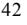

{48}------------------------------------------------

We have obtained Anti-fouling System Certificates for all of our vessels that are subject to the Anti-fouling Convention.

### *Compliance Enforcement*

Noncompliance with the ISM Code or other IMO regulations may subject the ship owner or bareboat charterer to increased liability, may lead to decreases in available insurance coverage for affected vessels and may result in the denial of access to, or detention in, some ports. The USCG and European Union authorities have indicated that vessels not in compliance with the ISM Code by applicable deadlines will be prohibited from trading in U.S. and European Union ports, respectively. As of the date of this report, each of our vessels is ISM Code certified. However, there can be no assurance that such certificates will be maintained in the future**.** The IMO continues to review and introduce new regulations. It is impossible to predict what additional regulations, if any, may be passed by the IMO and what effect, if any, such regulations might have on our operations.

#### *United States Regulations*

#### *The U.S. Oil Pollution Act of 1990 and the Comprehensive Environmental Response, Compensation and Liability Act*

The U.S. Oil Pollution Act of 1990 ("OPA") established an extensive regulatory and liability regime for the protection and cleanup of the environment from oil spills. OPA affects all "owners and operators" whose vessels trade or operate within the U.S., its territories and possessions or whose vessels operate in U.S. waters, which includes the U.S.'s territorial sea and its 200-nautical mile exclusive economic zone around the U.S. The U.S. has also enacted the Comprehensive Environmental Response, Compensation and Liability Act ("CERCLA"), which applies to the discharge of hazardous substances other than oil, except in limited circumstances, whether on land or at sea. OPA and CERCLA both define "owner and operator" in the case of a vessel as any person owning, operating or chartering by demise, the vessel. Both OPA and CERCLA impact our operations.

Under OPA, vessel owners and operators are "responsible parties" and are jointly, severally and strictly liable (unless the spill results solely from the act or omission of a third party, an act of God or an act of war) for all containment and clean-up costs and other damages arising from discharges or threatened discharges of oil from their vessels, including bunkers (fuel). OPA defines these other damages broadly to include:

- (i) injury to, destruction or loss of, or loss of use of, natural resources and related assessment costs;
- (ii) injury to, or economic losses resulting from, the destruction of real and personal property;
- (iii) loss of subsistence use of natural resources that are injured, destroyed or lost;
- (iv) net loss of taxes, royalties, rents, fees or net profit revenues resulting from injury, destruction or loss of real or personal property, or natural

resources;

- (v) lost profits or impairment of earning capacity due to injury, destruction or loss of real or personal property or natural resources; and
(vi) net cost of increased or additional public services necessitated by removal activities following a discharge of oil, such as protection from fire, safety or health hazards, and loss of subsistence use of natural resources.

{49}------------------------------------------------

OPA contains statutory caps on liability and damages; such caps do not apply to direct clean-up costs. Effective November 12, 2019, the USCG adjusted the limits of OPA liability for a tank vessel, other than a single-hull tank vessel, over 3,000 gross tons liability to the greater of \$2,300 per gross ton or \$19,943,400 (subject to periodic adjustment for inflation). On December 23, 2022, the USCG issued a final rule to adjust the limitation of liability under the OPA. Effective March 23, 2022, the new adjusted limits of OPA liability for a tank vessel, other than a single-hull tank vessel, over 3,000 gross tons liability to the greater of \$2,500 per gross ton or \$21,521,300 (subject to periodic adjustment for inflation). These limits of liability do not apply if an incident was proximately caused by the violation of an applicable U.S. federal safety, construction or operating regulation by a responsible party (or its agent, employee or a person acting pursuant to a contractual relationship) or a responsible party's gross negligence or willful misconduct. The limitation on liability similarly does not apply if the responsible party fails or refuses to (i) report the incident as required by law where the responsible party knows or has reason to know of the incident; (ii) reasonably cooperate and assist as requested in connection with oil removal activities; or (iii) without sufficient cause, comply with an order issued under the Federal Water Pollution Act (Section 311 (c), (e)) or the Intervention on the High Seas Act.

CERCLA contains a similar liability regime whereby owners and operators of vessels are liable for clean-up, removal and remedial costs, as well as damages for injury to, or destruction or loss of, natural resources, including the reasonable costs associated with assessing the same, and health assessments or health effects studies. There is no liability if the discharge of a hazardous substance results solely from the act or omission of a third party, an act of God or an act of war. Liability under CERCLA is limited to the greater of \$300 per gross ton or \$5.0 million for vessels carrying a hazardous substance as cargo and the greater of \$300 per gross ton or \$500,000 for any other vessel. These limits do not apply (rendering the responsible person liable for the total cost of response and damages) if the release or threat of release of a hazardous substance resulted from willful misconduct or negligence, or the primary cause of the release was a violation of applicable safety, construction or operating standards or regulations. The limitation on liability also does not apply if the responsible person fails or refused to provide all reasonable cooperation and assistance as requested in connection with response activities where the vessel is subject to OPA.

OPA and CERCLA each preserve the right to recover damages under existing law, including maritime tort law. OPA and CERCLA both require owners and operators of vessels to establish and maintain with the USCG evidence of financial responsibility sufficient to meet the maximum amount of liability to which the particular responsible person may be subject. Vessel owners and operators may satisfy their financial responsibility obligations by providing a proof of insurance, a surety bond, qualification as a self-insurer or a guarantee. We comply and plan to comply going forward with the USCG's financial responsibility regulations by providing applicable certificates of financial responsibility.

The 2010 *Deepwater Horizon* oil spill in the Gulf of Mexico resulted in additional regulatory initiatives or statutes, including higher liability caps under OPA, new regulations regarding offshore oil and gas drilling and a pilot inspection program for offshore facilities. However, several of these initiatives and regulations have been or may be revised. For example, the U.S. Bureau of Safety and Environmental Enforcement's ("BSEE") revised Production Safety Systems Rule ("PSSR"), effective December 27, 2018, modified and relaxed certain environmental and safety protections under the 2016 PSSR. Additionally, the BSEE amended the Well Control Rule, effective July 15, 2019, which rolled back certain reforms regarding the safety of drilling operations, and former U.S. President Trump had proposed leasing new sections of U.S. waters to oil and gas companies for offshore drilling. In January 2021, current U.S. President Biden signed an executive order temporarily blocking new leases for oil and gas drilling in federal waters. However, attorney generals from 13 states filed suit in March 2021 to lift the executive order, and in June 2021, a federal judge in Louisiana granted a preliminary injunction against the Biden administration, stating that the power to pause offshore oil and gas leases "lies solely with Congress." In August 2022, a federal judge in Louisiana sided with Texas Attorney General Ken Paxton, along with the other 12 plaintiff states, by issuing a permanent injunction against the Biden Administration's moratorium on oil and gas leasing on federal public lands and offshore waters. With these rapid changes, compliance with any new requirements of OPA and future legislation or regulations applicable to the operation of our vessels could impact the cost of our operations and adversely affect our business.

{50}------------------------------------------------

OPA specifically permits individual states to impose their own liability regimes with regard to oil pollution incidents occurring within their boundaries, provided they accept, at a minimum, the levels of liability established under OPA and some states have enacted legislation providing for unlimited liability for oil spills. Many U.S. states that border a navigable waterway have enacted environmental pollution laws that impose strict liability on a person for removal costs and damages resulting from a discharge of oil or a release of a hazardous substance. These laws may be more stringent than U.S. federal law. Moreover, some states have enacted legislation providing for unlimited liability for discharge of pollutants within their waters, although in some cases, states which have enacted this type of legislation have not yet issued implementing regulations defining vessel owners' responsibilities under these laws. The Company intends to comply with all applicable state regulations in the ports where the Company's vessels call.

We currently maintain pollution liability coverage insurance in the amount of \$1.0 billion per incident for each of our vessels. If the damages from a catastrophic spill were to exceed our insurance coverage, it could have an adverse effect on our business and results of operation.

#### *Other United States Environmental Initiatives*

The U.S. Clean Air Act of 1970 (including its amendments of 1977 and 1990) ("CAA") requires the EPA to promulgate standards applicable to emissions of volatile organic compounds and other air contaminants. Our vessels are subject to vapor control and recovery requirements for certain cargoes when loading, unloading, ballasting, cleaning and conducting other operations in regulated port areas. The CAA also requires states to draft State Implementation Plans, or "SIPs," designed to attain national health-based air quality standards in each state. Although state-specific, SIPs may include regulations concerning emissions resulting from vessel loading and unloading operations by requiring the installation of vapor control equipment. Our vessels operating in such regulated port areas with restricted cargoes are equipped with vapor recovery systems that satisfy these existing requirements.

The U.S. Clean Water Act ("CWA") prohibits the discharge of oil, hazardous substances and ballast water in U.S. navigable waters unless authorized by a duly-issued permit or exemption, and imposes strict liability in the form of penalties for any unauthorized discharges. The CWA also imposes substantial liability for the costs of removal, remediation and damages and complements the remedies available under OPA and CERCLA. In 2015, the EPA expanded the definition of "waters of the United States" ("WOTUS"), thereby expanding federal authority under the CWA. Following litigation on the revised WOTUS rule, in December 2018, the EPA and Department of the Army proposed a revised, limited definition of WOTUS. In 2019 and 2020, the agencies repealed the prior WOTUS Rule and promulgated the Navigable Waters Protection Rule ("NWPR") which significantly reduced the scope and oversight of EPA and the Department of the Army in traditionally non-navigable waterways. On August 30, 2021, a federal district court in Arizona vacated the NWPR and directed the agencies to replace the rule. On December 7, 2021, the EPA and the Department of the Army proposed a rule that would reinstate the pre-2015 definition, which is subject to public comment until February 7, 2022. On December 30, 2022, the EPA and the Department of Army announced the final WOTUS rule that largely reinstated the pre-2015 definition.

The EPA and the USCG have also enacted rules relating to ballast water discharge, compliance with which requires the installation of equipment on our vessels to treat ballast water before it is discharged or the implementation of other port facility disposal arrangements or procedures at potentially substantial costs, and/or otherwise restrict our vessels from entering U.S. Waters. The EPA will regulate these ballast water discharges and other discharges incidental to the normal operation of certain vessels within United States waters pursuant to the Vessel Incidental Discharge Act ("VIDA"), which was signed into law on December 4, 2018 and replaces the 2013 Vessel General Permit ("VGP") program (which authorizes discharges incidental to operations of commercial vessels and contains numeric ballast water discharge limits for most vessels to reduce the risk of invasive species in U.S. waters, stringent requirements for exhaust gas scrubbers, and requirements for the use of environmentally acceptable lubricants) and current Coast Guard ballast water management regulations adopted under the U.S. National Invasive Species Act ("NISA"), such as mid-ocean ballast exchange programs and installation of approved USCG technology for all vessels equipped with ballast water tanks bound for U.S. ports or entering U.S. waters. VIDA establishes a new framework for the regulation of vessel incidental discharges under Clean Water Act (CWA), requires the EPA to develop performance standards for those discharges within two years of enactment, and requires the U.S. Coast Guard to develop implementation, compliance and enforcement regulations within two years of EPA's promulgation of standards. Under VIDA, all provisions of the 2013 VGP and USCG regulations regarding ballast water treatment remain in force and effect until the EPA and U.S. Coast Guard regulations are finalized. Non-military, nonrecreational vessels greater than 79 feet in length must continue to comply with the requirements of the VGP, including submission of a Notice of Intent ("NOI") or retention of a PARI form and submission of annual reports. We have submitted NOIs for our vessels where required. Compliance with the EPA, U.S. Coast Guard and state regulations could require the installation of ballast water treatment equipment on our vessels or the implementation of other port facility disposal procedures at potentially substantial cost or may otherwise restrict our vessels from entering U.S. waters.

{51}------------------------------------------------

#### *European Union Regulations*

In October 2009, the European Union amended a directive to impose criminal sanctions for illicit ship-source discharges of polluting substances, including minor discharges, if committed with intent, recklessly or with serious negligence and the discharges individually or in the aggregate result in deterioration of the quality of water. Aiding and abetting the discharge of a polluting substance may also lead to criminal penalties. The directive applies to all types of vessels, irrespective of their flag, but certain exceptions apply to warships or where human safety or that of the ship is in danger. Criminal liability for pollution may result in substantial penalties or fines and increased civil liability claims. Regulation (EU) 2015/757 of the European Parliament and of the Council of 29 April 2015 (amending EU Directive 2009/16/EC) governs the monitoring, reporting and verification of carbon dioxide emissions from maritime transport, and, subject to some exclusions, requires companies with ships over 5,000 gross tonnage to monitor and report carbon dioxide emissions annually, which may cause us to incur additional expenses.

The European Union has adopted several regulations and directives requiring, among other things, more frequent inspections of high-risk ships, as determined by type, age and flag as well as the number of times the ship has been detained. The European Union also adopted and extended a ban on substandard ships and enacted a minimum ban period and a definitive ban for repeated offenses. The regulation also provided the European Union with greater authority and control over classification societies, by imposing more requirements on classification societies and providing for fines or penalty payments for organizations that failed to comply. Furthermore, the EU has implemented regulations requiring vessels to use reduced sulfur content fuel for their main and auxiliary engines. The EU Directive 2005/33/EC (amending Directive 1999/32/EC) introduced requirements parallel to those in Annex VI relating to the sulfur content of marine fuels. In addition, the EU imposed a 0.1% maximum sulfur requirement for fuel used by ships at berth in the Baltic, the North Sea and the English Channel (the so called "SOx-Emission Control Area"). As of January 2020, EU member states must also ensure that ships in all EU waters, except the SOx-Emission Control Area, use fuels with a 0.5% maximum sulfur content.

On September 15, 2020, the European Parliament voted to include greenhouse gas emissions from the maritime sector in the European Union's carbon market, the EU Emissions Trading System ("EU ETS"). On July 14, 2021, the European Parliament formally proposed its plan, which will require shipowners to buy permits to cover these emissions. The Environment Council adopted a general approach on the proposal in June 2022. On December 18, 2022, the Environmental Council and European Parliament agreed to include maritime shipping emissions within the scope of the EU ETS on a gradual introduction of obligations for shipping companies to surrender allowances: 40% for verified emissions from 2024, 70% for 2025 and 100% for 2026. Most large vessels will be included in the scope of the EU ETS from the start.

### *International Labour Organization*

The International Labour Organization (the "ILO") is a specialized agency of the UN that has adopted the Maritime Labor Convention 2006 ("MLC 2006"). A Maritime Labor Certificate and a Declaration of Maritime Labor Compliance is required to ensure compliance with the MLC 2006 for all ships that are 500 gross tonnage or over and are either engaged in international voyages or flying the flag of a Member and operating from a port, or between ports, in another country. We believe that all our vessels are in substantial compliance with and are certified to meet MLC 2006.

{52}------------------------------------------------

### *Greenhouse Gas Regulation*

Currently, the emissions of greenhouse gases from international shipping are not subject to the Kyoto Protocol to the United Nations Framework Convention on Climate Change, which entered into force in 2005 and pursuant to which adopting countries have been required to implement national programs to reduce greenhouse gas emissions with targets extended through 2020. International negotiations are continuing with respect to a successor to the Kyoto Protocol, and restrictions on shipping emissions may be included in any new treaty. In December 2009, more than 27 nations, including the U.S. and China, signed the Copenhagen Accord, which includes a non-binding commitment to reduce greenhouse gas emissions. The 2015 United Nations Climate Change Conference in Paris resulted in the Paris Agreement, which entered into force on November 4, 2016 and does not directly limit greenhouse gas emissions from ships. The U.S. initially entered into the agreement, but on June 1, 2017, former U.S. President Trump announced that the United States intends to withdraw from the Paris Agreement, and the withdrawal became effective on November 4, 2020. On January 20, 2021, U.S. President Biden signed an executive order to rejoin the Paris Agreement, which the U.S. officially rejoined on February 19, 2021.

At MEPC 70 and MEPC 71, a draft outline of the structure of the initial strategy for developing a comprehensive IMO strategy on reduction of greenhouse gas emissions from ships was approved. In accordance with this roadmap, in April 2018, nations at the MEPC 72 adopted an initial strategy to reduce greenhouse gas emissions from ships. The initial strategy identifies "levels of ambition" to reducing greenhouse gas emissions, including (1) decreasing the carbon intensity from ships through implementation of further phases of the EEDI for new ships; (2) reducing carbon dioxide emissions per transport work, as an average across international shipping, by at least 40% by 2030, pursuing efforts towards 70% by 2050, compared to 2008 emission levels; and (3) reducing the total annual greenhouse emissions by at least 50% by 2050 compared to 2008 while pursuing efforts towards phasing them out entirely. The initial strategy notes that technological innovation, alternative fuels and/or energy sources for international shipping will be integral to achieve the overall ambition. These regulations could cause us to incur additional substantial expenses. At MEPC 77, the Member States agreed to initiate the revision of the Initial IMO Strategy on Reduction of GHG emissions from ships, recognizing the need to strengthen the ambition during the revision process. MEPC 79 revised the EEDI calculation guidelines to include a CO2 conversion factor for ethane, a reference to the updated ITCC guidelines, and a clarification that in case of a ship with multiple load line certificates, the maximum certified summer draft should be used when determining the deadweight. A final draft Revised IMO GHG Strategy would be considered by MEPC 80 (scheduled to meet in July 2023), with a view to adoption.

The EU made a unilateral commitment to reduce overall greenhouse gas emissions from its member states from 20% of 1990 levels by 2020. The EU also committed to reduce its emissions by 20% under the Kyoto Protocol's second period from 2013 to 2020. Starting in January 2018, large ships over 5,000 gross tonnage calling at EU ports are required to collect and publish data on carbon dioxide emissions and other information. As previously discussed, regulations relating to the inclusion of greenhouse gas emissions from the maritime sector in the European Union's carbon market, EU ETS, are also forthcoming.

In the United States, the EPA issued a finding that greenhouse gases endanger the public health and safety, adopted regulations to limit greenhouse gas emissions from certain mobile sources and proposed regulations to limit greenhouse gas emissions from large stationary sources. However, in March 2017, former U.S. President Trump signed an executive order to review and possibly eliminate the EPA's plan to cut greenhouse gas emissions, and in August 2019, the Administration announced plans to weaken regulations for methane emissions. On August 13, 2020, the EPA released rules rolling back standards to control methane and volatile organic compound emissions from new oil and gas facilities. However, U.S. President Biden recently directed the EPA to publish a proposed rule suspending, revising, or rescinding certain of these rules. On November 2, 2021, the EPA issued a proposed rule under the CAA designed to reduce methane emissions from oil and gas sources. The proposed rule would reduce 41 million tons of methane emissions between 2023 and 2035 and cut methane emissions in the oil and gas sector by approximately 74 percent compared to emissions from this sector in 2005. EPA also issued a supplemental proposed rule in November 2022 to include additional methane reduction measures following public input and anticipates issuing a final rule in 2023. If these new regulations are finalized, they could affect our operations.

Any passage of climate control legislation or other regulatory initiatives by the IMO, the EU, the U.S. or other countries where we operate, or any treaty adopted at the international level to succeed the Kyoto Protocol or Paris Agreement, that restricts emissions of greenhouse gases could require us to make significant financial expenditures which we cannot predict with certainty at this time. Even in the absence of climate control legislation, our business may be indirectly affected to the extent that climate change may result in sea level changes or certain weather events.

{53}------------------------------------------------

### *Vessel Security Regulations*

Since the terrorist attacks of September 11, 2001 in the United States, there have been a variety of initiatives intended to enhance vessel security such as the U.S. Maritime Transportation Security Act of 2002 ("MTSA"). To implement certain portions of the MTSA, the USCG issued regulations requiring the implementation of certain security requirements aboard vessels operating in waters subject to the jurisdiction of the United States and at certain ports and facilities, some of which are regulated by the EPA.

Similarly, Chapter XI-2 of the SOLAS Convention imposes detailed security obligations on vessels and port authorities and mandates compliance with the International Ship and Port Facility Security Code ("the ISPS Code"). The ISPS Code is designed to enhance the security of ports and ships against terrorism. To trade internationally, a vessel must attain an International Ship Security Certificate ("ISSC") from a recognized security organization approved by the vessel's flag state. Ships operating without a valid certificate may be detained, expelled from or refused entry at port until they obtain an ISSC. The various requirements, some of which are found in the SOLAS Convention, include, for example, on-board installation of automatic identification systems to provide a means for the automatic transmission of safety-related information from among similarly equipped ships and shore stations, including information on a ship's identity, position, course, speed and navigational status; on-board installation of ship security alert systems, which do not sound on the vessel but only alert the authorities on shore; the development of vessel security plans; ship identification number to be permanently marked on a vessel's hull; a continuous synopsis record kept onboard showing a vessel's history including the name of the ship, the state whose flag the ship is entitled to fly, the date on which the ship was registered with that state, the ship's identification number, the port at which the ship is registered and the name of the registered owner(s) and their registered address; and compliance with flag state security certification requirements.

The USCG regulations, intended to align with international maritime security standards, exempt non-U.S. vessels from MTSA vessel security measures, provided such vessels have on board a valid ISSC that attests to the vessel's compliance with the SOLAS Convention security requirements and the ISPS Code. Future security measures could have a significant financial impact on us. We intend to comply with the various security measures addressed by MTSA, the SOLAS Convention and the ISPS Code.

The cost of vessel security measures has also been affected by the escalation in the frequency of acts of piracy against ships, notably off the coast of Somalia, including the Gulf of Aden and Arabian Sea area. Substantial loss of revenue and other costs may be incurred as a result of detention of a vessel or additional security measures, and the risk of uninsured losses could significantly affect our business. Costs are incurred in taking additional security measures in accordance with Best Management Practices to Deter Piracy, notably those contained in the BMP5 industry standard.

#### **Inspection by Classification Societies**

The hull and machinery of every commercial vessel must be classed by a classification society authorized by its country of registry. The classification society certifies that a vessel is safe and seaworthy in accordance with the applicable rules and regulations of the country of registry of the vessel and SOLAS. Most insurance underwriters make it a condition for insurance coverage and lending that a vessel be certified "in class" by a classification society which is a member of the International Association of Classification Societies, the IACS. The IACS has adopted harmonized Common Structural Rules, or "the Rules," which apply to oil tankers and bulk carriers contracted for construction on or after July 1, 2015. The Rules attempt to create a level of consistency between IACS Societies. All of our vessels are certified as being "in class" by all the applicable Classification Societies (e.g., American Bureau of Shipping, Lloyd's Register of Shipping).

A vessel must undergo annual surveys, intermediate surveys, drydockings and special surveys. In lieu of a special survey, a vessel's machinery may be on a continuous survey cycle, under which the machinery would be surveyed periodically over a five-year period. Every vessel is also required to be drydocked every 30 to 36 months for inspection of the underwater parts of the vessel. If any vessel does not maintain its class and/or fails any annual survey, intermediate survey, drydocking or special survey, the vessel will be unable to carry cargo between ports and will be unemployable and uninsurable which could cause us to be in violation of certain covenants in our loan agreements. Any such inability to carry cargo or be employed, or any such violation of covenants, could have a material adverse impact on our financial condition and results of operations.

{54}------------------------------------------------

### **Risk of Loss and Liability Insurance**

### *General*

The operation of any cargo vessel includes risks such as mechanical failure, physical damage, collision, property loss, cargo loss or damage and business interruption due to political circumstances in foreign countries, piracy incidents, hostilities and labor strikes. In addition, there is always an inherent possibility of marine disaster, including oil spills and other environmental mishaps, and the liabilities arising from owning and operating vessels in international trade. OPA, which imposes virtually unlimited liability upon shipowners, operators and bareboat charterers of any vessel trading in the exclusive economic zone of the United States for certain oil pollution accidents in the United States, has made liability insurance more expensive for shipowners and operators trading in the United States market. We carry insurance coverage as customary in the shipping industry. However, not all risks can be insured, specific claims may be rejected, and we might not be always able to obtain adequate insurance coverage at reasonable rates.

### *Hull and Machinery Insurance*

We procure marine hull and machinery and war risk insurance, which include the risk of actual or constructive total loss, for all of the vessels in our fleet. The vessels in our fleet are each covered up to at least fair market value, with deductibles of \$350,000 per vessel per incident. We also arranged increased value coverage for each vessel. Under this increased value coverage, in the event of total loss of a vessel, we will be able recover for amounts not recoverable under the hull and machinery policy. We generally do not maintain insurance against loss of hire (except for certain charters for which we consider it appropriate), which covers business interruptions that result in the loss of use of a vessel.

#### *Protection and Indemnity Insurance*

Protection and indemnity insurance is provided by mutual protection and indemnity associations, or "P&I Associations," and covers our third-party liabilities in connection with our shipping activities. This includes third-party liability and other related expenses of injury or death of crew, passengers and other third parties, loss or damage to cargo, claims arising from collisions with other vessels, damage to other third-party property, pollution arising from oil or other substances and salvage, towing and other related costs, including wreck removal. Protection and indemnity insurance is a form of mutual indemnity insurance, extended by protection and indemnity mutual associations, or "clubs."

Our current protection and indemnity insurance coverage for pollution is \$1 billion per vessel per incident. The 13 P&I Associations that comprise the International Group insure approximately 90% of the world's commercial tonnage and have entered into a pooling agreement to reinsure each association's liabilities. The International Group's website states that the Pool provides a mechanism for sharing all claims in excess of US\$ 10 million up to, currently, approximately \$8.58 billion. As a member of a P&I Association, which is a member of the International Group, we are subject to calls payable to the associations based on our claim records as well as the claim records of all other members of the individual associations and members of the shipping pool of P&I Associations comprising the International Group.

#### **Competition**

We operate in what we refer to as the Nordic American System, which describes our operation of our homogenous Suezmax tanker fleet in markets that are highly competitive and based primarily on supply and demand. We currently operate the majority of our vessels in the spot market. We compete for charters on the basis of price, vessel location, size, age and condition of the vessel, as well as on our reputation as an operator. For more information on the "Nordic American System", please see "Item 4.A. History and Development of the Company."

{55}------------------------------------------------

#### **Permits and Authorizations**

We are required by various governmental and quasi-governmental agencies to obtain certain permits, licenses and certificates with respect to our vessels. The kinds of permits, licenses and certificates required depend upon several factors, including the commodity transported, the waters in which the vessel operates, the nationality of the vessel's crew and the age of a vessel. We have been able to obtain all permits, licenses and certificates currently required to permit our vessels to operate. Additional laws and regulations, environmental or otherwise, may be adopted which could limit our ability to do business or increase our cost of doing business.

#### **Seasonality**

Historically, oil trade and, therefore, charter rates increased in the winter months and eased in the summer months as demand for oil in the Northern Hemisphere rose in colder weather and fell in warmer weather. The tanker industry, in general, has become less dependent on the seasonal transport of heating oil than a decade ago as new uses for oil and oil products have developed, spreading consumption more evenly over the year. This is most apparent from the higher seasonal demand during the summer months due to energy requirements for air conditioning and motor vehicles.

#### **C. Organizational Structure**

See Exhibit 8.1 to this Form 20-F for a list of our significant subsidiaries.

#### **D. Property, Plant and Equipment**

Please see "Item 4. Information on the Company B. Business Overview—Our Fleet", for a description of our vessels. The vessels are mortgaged as collateral under the 2019 Senior Secured Credit Facility including the \$30 million Accordion Loan and the financing agreements with Ocean Yield.

#### **ITEM 4A. UNRESOLVED STAFF COMMENTS**

None.

#### **ITEM 5. OPERATING AND FINANCIAL REVIEW AND PROSPECTS**

The following management's discussion and analysis should be read in conjunction with our historical financial statements and notes thereto included elsewhere in this report. This discussion contains forward-looking statements that reflect our current views with respect to future events and financial performance. Our actual results may differ materially from those anticipated in these forward-looking statements as a result of certain factors, such as those set forth in the section entitled "Item 3. Key Information—D. Risk Factors" and elsewhere in this annual report.

#### **A. Operating Results**

#### **Business overview**

Our fleet as of December 31, 2022, consisted of 19 Suezmax crude oil tankers. In 2022, we have sold five vessels and taken delivery of two Suezmax newbuildings from Samsung shipyard in South Korea. The majority of our vessels are employed in the spot market. The two newbuildings delivered to us in May and June 2022 have been chartered out on six-year time charter agreements that commenced upon delivery of the vessels from the shipyard. We have further two vessels that are chartered out longer term time-charter agreement expiring in late 2023 with an option to extend the agreement for a year for one of these vessels.

{56}------------------------------------------------

#### *Table of Contents*

The vessels in our fleet are considered homogenous and interchangeable as they have approximately the same freight capacity and ability to transport the same type of cargo.

### YEAR ENDED DECEMBER 31, 2022 COMPARED TO YEAR ENDED DECEMBER 31, 2021

|                                      | Years Ended December 31, |           |          |
|--------------------------------------|-----------------------------|-----------|----------|
| All figures in USD '000              | 2022                        | 2021      | Variance |
| Voyage Revenues                      | 339,340                     | 191,075   | 77.6%    |
| Other Income                         | -                           | 4,684     | N/A      |
| Voyage Expenses                      | (170,515)                   | (128,263) | 32.9%    |
| Vessel Operating Expenses            | (63,430)                    | (67,676)  | -6.3%    |
| Impairment Loss on Vessels           | (314)                       | (60,311)  | -99.5%   |
| Depreciation Expenses                | (50,421)                    | (68,352)  | -26.2%   |
| Gain / (Loss) on Disposal of Vessels | 6,005                       | -         | N/A      |
| General and Administrative Expenses  | (18,798)                    | (15,620)  | 20.3%    |
| Net Operating (Loss) Income          | 41,867                      | (144,463) | N/A      |
| Interest Income                      | -                           | 3         | N/A      |
| Interest Expenses                    | (27,055)                    | (26,380)  | 2.6%     |
| Other Financial Income (Expenses)    | 289                         | (488)     | N/A      |
| Net (Loss) Income                    | 15,101                      | (171,328) | N/A      |

Management believes that net voyage revenue, a non-GAAP financial measure, provides additional meaningful information because it enables us to compare the profitability of our vessels that are employed under bareboat charters, spot related time charters and spot charters. Net voyage revenues divided by the number of days on the charter provides the Time Charter Equivalent (TCE) Rate. Net voyage revenues and TCE rates are widely used by investors and analysts in the tanker shipping industry for comparing the financial performance of companies and for preparing industry averages. We believe that our method of calculating net voyage revenue is consistent with industry standards. The table below reconciles our net voyage revenues to voyage revenues.

|                                                  |              | Years Ended December 31, |          |
|--------------------------------------------------|--------------|-----------------------------|----------|
| All figures in USD '000, except TCE rate per day | 2022         | 2021                        | Variance |
| Voyage Revenues                                  | 339,340      | 191,075                     | 77.6%    |
| Less Voyage expenses                             | (170,515)    | (128,263)                   | 32.9%    |
| Net Voyage Revenue                               | 168,825      | 62,812                      | 168.8%   |
| Vessel Calendar Days (1)                         | 7,340        | 8,337                       | -12.0%   |
| Less off-hire days                               | 512          | 527                         | -2.8%    |
| Total TCE days                                   | 6,828        | 7,810                       | -12.6%   |
| TCE Rate per day (2)                             | \$ 24,725 | \$ 8,043                 | 207.4%   |

(1) Vessel Calendar Days is the total number of days the vessels were in our fleet.

(2) Time Charter Equivalent ("TCE") Rate, results from Net Voyage Revenue divided by total TCE days.

Voyage Revenues increased by \$148.2 million, or 77.6%, from \$191.1 million in 2021 to \$339.3 million in 2022 as a result of higher tanker rates partly offset by a reduction of 12.6% in Total TCE days.

The change in Net Voyage Revenue is due to two main factors:

- i) The number of TCE days
- ii) The change in the TCE rate achieved.

Number of vessel calendar days decreased by 12.0% and reflects that we took delivery of two vessels and sold five vessels during 2022 compared sale of one vessel in late 2021. With regards to i), there was a marginal reduction of 15 days in offhire days from 527 days in 2021 to 512 days in 2022, where planned offhire in 2022 related to periodical maintenance of our vessels was 398 days.

{57}------------------------------------------------

With regards to ii), the TCE rate per day increased by \$16,682, or 207.4%, from \$8,043 in 2021 to \$24,725 in 2022. The indicative rates presented by Clarkson Research increased by 504.0% for the twelve months of 2022 compared to the same twelve months in 2021 to \$44,324 from \$7,338, respectively. The indicative rates presented by Clarkson Research are an average of observations and routes and some of the trade routes going into the average are routes involving Russian oil trade and as such not routes representing an average for all market participants.

As a result of i) and ii) net voyage revenues increased by 168.8% from \$62.8 million for the year ended December 31, 2021, to \$168.8 million for the year ended December 31, 2022.

Voyage expenses increased to \$170.5 million from \$128.3 million, or 32.9%. The increase in voyage expenses was primarily due to an increase in bunker costs. Consumption of fuel oil was lower in 2022 than in 2021 due to less vessel calendar days, but the price of fuel oil increased sharply in the first half of 2022 with a peak in June 2022, before falling in the latter part of 2022. As such, the average price of fuel oil increased in 2022 compared to 2021 and caused a significant increase in voyage expenses. The increase in fuel prices Further, as a result of improved freight rates in 2022 compared to 2021, there has also been an increase in commission costs incurred.

Vessel operating expenses decreased by \$4.2 million, or 6.3%, from \$67.7 million in 2021 to \$63.4 million in 2022, and reflects that there is a net reduction of three vessels in the fleet during 2022. In cooperation with our technical managers we maintain our focus on keeping the fleet in top technical condition whilst keeping costs low.

Impairment Loss on Vessels decreased to \$0.3 million in 2022 compared to \$60.3 million in 2021. We recorded impairment charges related to six of our 2002 and 2003 built vessels in 2021. One of these vessels was classified as Held for Sale as of December 31, 2021, and this vessel was subject to impairment charges of \$0.3 million in 2022 as a result of changes in fair value of the vessel before the vessel was disposed of.

In 2022, we have sold five of the six vessels where impairment charges were taken in 2021. We have recorded a gain upon disposal of vessels of \$6.0 million in 2022 compared to \$0 in 2021 and the gain is mainly related to the last vessel sold in October 2022 reflecting rising second-hand vessel prices that evolved during the year.

Depreciation expenses decreased by \$18.0 million, or 26.2%, from \$68.4 million in 2021 to \$50.4 million in 2022. The decrease in 2022 compared to 2021 is primarily due to sale of vessels in 2022 resulting in a net reduction of three vessels in the fleet, in combination with impairment charges recorded in 2021 that lowered the carrying values of six vessels built in the years from 2002 and 2003 and accordingly lowering the associated depreciation charges for these vessels in 2022.

General and administrative expenses increased by \$3.2 million, or 20.3%, from \$15.6 million in 2021 to \$18.8 million in 2022. The increase in cost is mainly related to an increase in travel and marketing costs and variable staff costs.

Interest expenses increased marginally by \$0.7 million, or 2.6%, from \$26.4 million in 2021 to \$27.1 million in 2022. The increase is due to increases in the floating interest rates for our loans during 2022 combined with new financing agreements related to the two newbuildings delivered in 2022, offset by debt repayments during 2022 of \$105.4 million.

{58}------------------------------------------------

#### *Table of Contents*

### YEAR ENDED DECEMBER 31, 2021 COMPARED TO YEAR ENDED DECEMBER 31, 2020

|                                     |           | Years Ended December 31, |          |
|-------------------------------------|-----------|-----------------------------|----------|
| All figures in USD '000             | 2021      | 2020                        | Variance |
| Voyage Revenues                     | 191,075   | 354,619                     | -46.1%   |
| Other Income                        | 4,684     | -                           | N/A      |
| Voyage Expenses                     | (128,263) | (121,089)                   | 5.9%     |
| Vessel Operating Expenses           | (67,676)  | (66,883)                    | 1.2%     |
| Impairment Loss on Vessels          | (60,311)  | -                           | N/A      |
| Depreciation Expenses               | (68,352)  | (67,834)                    | 0.8%     |
| General and Administrative Expenses | (15,620)  | (17,586)                    | -11.2%   |
| Net Operating (Loss) Income         | (144,463) | 81,227                      | N/A      |
| Interest Income                     | 3         | 96                          | -96.9%   |
| Interest Expenses                   | (26,380)  | (31,481)                    | -16.2%   |
| Other Financial Income (Expenses)   | (488)     | 191                         | N/A      |
| Net (Loss) Income                   | (171,328) | 50,033                      | N/A      |

Management believes that net voyage revenue, a non-GAAP financial measure, provides additional meaningful information because it enables us to compare the profitability of our vessels that are employed under bareboat charters, spot related time charters and spot charters. Net voyage revenues divided by the number of days on the charter provides the Time Charter Equivalent (TCE) Rate. Net voyage revenues and TCE rates are widely used by investors and analysts in the tanker shipping industry for comparing the financial performance of companies and for preparing industry averages. We believe that our method of calculating net voyage revenue is consistent with industry standards. The table below reconciles our net voyage revenues to voyage revenues.

|                                                  | Years Ended December 31, |              |          |
|--------------------------------------------------|-----------------------------|--------------|----------|
|                                                  |                             |              |          |
| All figures in USD '000, except TCE rate per day | 2021                        | 2020         | Variance |
| Voyage Revenues                                  | 191,075                     | 354,619      | -46.1%   |
| Less Voyage expenses                             | (128,263)                   | (121,089)    | 5.9%     |
| Net Voyage Revenue                               | 62,812                      | 233,530      | -73.1%   |
| Vessel Calendar Days (1)                         | 8,337                       | 8,418        | -1.0%    |
| Less off-hire days                               | 527                         | 952          | -44.6%   |
| Total TCE days                                   | 7,810                       | 7,466        | 4.6%     |
| TCE Rate per day (2)                             | \$ 8,043                 | \$ 31,279 | -74.3%   |

(1) Vessel Calendar Days is the total number of days the vessels were in our fleet.

(2) Time Charter Equivalent ("TCE") Rate, results from Net Voyage Revenue divided by total TCE days.

Voyage Revenues decreased by \$163.5 million, or 46.1%, from \$354.6 million in 2020 to \$191.1 million in 2021 as a result of reduced tanker rates in 2021 compared to 2020.

The change in Net Voyage Revenue is due to two main factors:

- i) The number of TCE days
- ii) The change in the TCE rate achieved.

Number of vessel calendar days decreased insignificantly by 1.0% and reflects that the number of vessels in our fleet was similar in 2021 as in 2020, apart from one vessel being sold in November 2021.

With regards to i), the decrease of 425 days in offhire days was a result of less vessels undergoing planned maintenance in 2021 compared to 2020.

With regards to ii), the TCE rate per day decreased by \$23,237, or 74.3%, from \$31,279 in 2020 to \$8,043 in 2021. The indicative rates presented by Clarkson Research decreased by 75.7% for the twelve months of 2021 compared to the same twelve months in 2020 to \$7,338 from \$30,240, respectively.

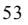

{59}------------------------------------------------

As a result of i) and ii) net voyage revenues decreased by 73.1% from \$233.5 million for the year ended December 31, 2020, to \$62.8 million for the year ended December 31, 2021. Other Income relates to a distribution from an insurance association and we received a net amount of \$4.6 million.

Voyage expenses increased to \$128.3 million from \$121.1 million, or 5.9%. Voyage expenses mainly consist of port charges, bunkers and commissions and the most influential cost is the cost of bunkers. Cost of bunkers is influenced by actual consumption in a year and the price of the fuel. The increase in voyage expenses in 2021 was primarily due to an increase in bunker costs caused by an increase in fuel oil prices compared to prior year, offset by a reduction in commission costs. Voyage expenses are relatively similar in 2021 as in 2020 and shows the activity level of our vessels and that we have operated a similar number of vessels in both years.

Vessel operating expenses increased by \$0.8 million, or 1.2%, from \$66.9 million in 2020 to \$67.7 million in 2021, and reflects that the number of vessels in the fleet was similar in 2021 as in 2020 with a similar expense per vessel for the two years. In cooperation with our technical managers we maintain our focus on keeping the fleet in top technical condition whilst keeping costs low.

General and administrative expenses decreased by \$2.0 million, or 11.2%, from \$17.6 million in 2020 to \$15.6 million in 2021. The decrease in cost is mainly related to a decrease in staff cost.

Depreciation expenses increased by \$0.5 million, or 0.8%, from \$67.8 million in 2020 to \$68.4 million in 2021. The insignificant increase in 2021 compared to 2021 is primarily a result of increase in capitalized cost in 2021 related to drydocking of our vessels that is depreciated over a period until next drydocking, offset by less depreciation related to one vessel sold in 4Q21 and one vessel held for sale.

Impairment Loss on Vessels increased to \$60.3 million in 2021 compared to \$0 in 2020. We have recorded \$8.9 million in impairment charges to adjust the carrying value to fair value less cost to sell related to one vessel classified as Held for Sale at December 31, 2021, and sold in 2022. Further \$51.4 million in impairment charges related to five of our 2002 and 2003 built vessels have been recorded due to estimated undiscounted cash flows being lower than the carrying values when performing our impairment testing for these vessels and the carrying values have accordingly been adjusted to reflect the fair value at December 31, 2021.

Interest expenses decreased by \$5.1 million, or 16.2%, from \$31.5 million in 2020 to \$26.4 million in 2021. The decrease is due to repayments on our credit facilities in 2020 and 2021 that lowers the outstanding loan balances and related interest cost.

### **Inflation**

Construction cost and periodical maintenance costs for oil tankers tend to fluctuate with the cyclicality in raw material costs, especially the price of steel and copper, and the general demand for shipbuilding services. Newbuilding prices for oil tankers have increased in 2022 as a result of full orderbooks at the shipyards for the coming years and an optimistic outlook for many shipping segments. Prices of metals have also fluctuated significantly during 2022 and at levels above previous periods. Operating costs for oil tankers have been stable with very little, or moderate inflation over the years, and our operating cost in 2022 has been in line with previous years. However, there is currently inflationary pressure in most parts of the world and we are monitoring this closely. The shipping industry has historically been able to absorb and neutralize significant cost increases related to operation of the vessels. However, oil transportation is a specialized area and if number of vessels where to increase significantly, increased demand for qualified crew can be expected, potentially putting pressure on crew cost. A general cost inflation in the world could impact the shipping industry and put inflationary pressure on cost items such as, but not limited to crew costs, spare parts, maintenance, insurance etc.

{60}------------------------------------------------

### **B. Liquidity and Capital Resources**

We operate in a cyclical and capital-intensive industry. Our fleet of Suezmax tankers are financed through a combination of earnings generated from operations, equity and borrowings.

Our main liquidity requirements are related to voyage cost and operating cost for our vessels, repayments of loans and related interest charges, general and administration cost, capital expenditure for our vessels including instalments paid for vessels under construction and working capital needs.

We have taken delivery of two Suezmax newbuildings in 2022. The financing arrangement for these two vessels are described below.

We refer to further information below and in "Item 5. Operating and Financial Review and Prospects—F. Tabular Disclosure of Contractual Obligations" for disclosure of Contractual Obligations and Financing Agreements.

#### **Our Borrowing Activities**

On February 12, 2019, we entered into the \$306 million 2019 Senior Secured Credit Facility using twenty of our vessels at that time built from year 2000 to 2017 as collateral. On December 16, 2020, we entered into a loan agreement for \$30.0 million that is considered an accordion loan under the 2019 Senior Secured Credit Facility loan agreement. In 2021, we sold one vessel built in year 2000 and in 2022 we have sold further five vessels built in the years 2002 and 2003. As of December 31, 2022, there were 14 vessels built from 2003 to 2017 used as collateral for the outstanding loan balance as of that date.

The three 2018-built vessels are financed through Ocean Yield ASA.

In May and June 2022, we took delivery of two Suezmax newbuildings from Samsung shipyard in South Korea. Financing arrangements for these two vessels were secured with Ocean Yield ASA for up to 80% of the newbuilding price at similar terms as the 2018-built vessels. During 2022 and up to the delivery of the two newbuildings we fully utilized these financing agreements. We refer to further description below.

#### *2019 Senior Secured Credit Facility and \$30 million Accordion Loan*

On February 12, 2019 we entered into a new five-year senior secured credit facility for \$306.1 million (the "2019 Senior Secured Credit Facility"). Borrowings under the 2019 Senior Secured Credit Facility are secured by first priority mortgages over our vessels (excluding the three vessels delivered in 2018 and the two newbuildings delivered in 2022, further described below) and assignments of earnings and insurance. The loan is amortizing with a twenty-year maturity profile, carries a floating interest rate and matures in February 2024. Further, the agreement contains an excess cash mechanism that equals 50% of the net earnings from the collateral vessels, less capex provision and fixed loan amortization. Net proceeds obtained from sale of a vessel used as security are at our lender's discretion subject to repayment of the outstanding loan balance and we have repaid \$80.4 million from vessel sales in 2022. The agreement contains covenants that require a minimum liquidity of \$30.0 million and a loan-to-vessel value ratio of maximum 70%.

On December 16, 2020, we entered into a new loan agreement for the borrowing of \$30.0 million (the "\$30 million Accordion Loan"). The loan is considered an accordion loan to the 2019 Senior Secured Credit Facility loan agreement and has the same amortization profile, carries a floating interest rate and matures in February 2024. Excess cash flow payments as described above are applied to the balance of the 2019 Senior Secured Credit Facility before being applied to the \$30 million Accordion Loan. The security of the loan is attached to the security of the 2019 Senior Secured Credit Facility and has equal priority, same financial covenants and repayment clauses.

As of December 31, 2021, we had \$223.1 million drawn under our 2019 Senior Secured Credit Facility, where \$29.5 million, net of deferred financing cost of \$2.3 million, was presented as Current Portion of Long-Term Debt that included \$14.9 million in debt associated with a Vessel Held for Sale.

{61}------------------------------------------------

We have repaid \$93.9 million on the facilities in the twelve months ended December 31, 2022. As of December 31, 2022, the total outstanding balance was \$129.2 million. We have presented \$25.8 million, net of deferred financing costs of \$1.5 million, under Current Portion of Long-Term Debt. Earnings generated in the fourth quarter of 2022 resulted in an additional payment of \$15.2 million related to the excess cash flow mechanism that was payable in February 2023.

Subsequent to December 31, 2022, we have repaid in total \$18.2 million, including the excess cash flow payment of \$15.2 million described above, and the total outstanding balance as of April 27, 2023, is \$111.0 million.

#### *Financing of 2018-built Vessels*

We have the three 2018-built Vessels delivered to us from Samsung shipyard. Under the terms of the financing agreements for these vessels, the lender provided financing of 77.5% of the purchase price for each of the three vessels. Upon delivery of each of the vessels, we commenced ten-year bareboat charter agreements. We have obligations to purchase the vessels for a consideration of \$13.6 million for each vessel upon the completion of the ten-year bareboat charter agreements, and we also have the option to purchase the vessels after sixty and eighty-four months. The purchase options have to be declared six months in advance of the sixty or eighty-four months' anniversaries for each vessel and we have as of the date of this report elected not to exercise any of the options related to the sixty-month anniversary. The financing agreements for the three vessels have a total effective interest rate as of December 31, 2022, ranging from 8.08% to 9.86% including a floating LIBOR element that is subject to annual adjustment. Subsequent to December 31, 2022, we have agreed a replacement of the LIBOR element with a term Secured Overnight Financing Rate ("SOFR"), plus a Credit Adjustment Spread ("CAS") of 26 basis points. The financing agreements contain certain financial covenants requiring us to maintain on a consolidated basis a minimum value adjusted equity of \$175.0 million, a minimum value adjusted equity ratio of 25%, minimum liquidity of \$20.0 million and a minimum vessel value to outstanding lease clause.

The outstanding amounts under this financing arrangement were \$96.0 million and \$104.3 million as of December 31, 2022 and 2021, respectively, where \$8.5 million and \$8.1 million, net of deferred financing costs, have been presented as Current Portion of Long-Term Debt, respectively.

### *Financing of 2022 Newbuildings*

The financing agreements for the two Suezmax newbuildings delivered to us in 2022 were entered into in late 2020. Under the terms of the financing agreements, the lender provided financing of 80.0% of the purchase price for each of the two 2022 Newbuildings. The agreements included financing of the predelivery instalments due to the shipyard in the first half of 2022 and the final payments due upon delivery of the vessels in May and June 2022. Upon delivery of each of the vessels, we commenced ten-year bareboat charter agreements. We have obligations to purchase the vessels upon the completion of the ten-year bareboat charter agreements for a consideration of \$16.5 million for each vessel, and we also have the option to purchase the vessels after sixty and eighty-four months. The financing agreements for the two vessels had a total effective interest rate as of December 31, 2022, ranging from 8.94% to 9.24% that includes a fixed interest margin plus a floating LIBOR element that is subject to quarterly adjustment. Subsequent to December 31, 2022, we have agreed a replacement of the LIBOR element with a term Secured Overnight Financing Rate ("SOFR") plus a Credit Adjustment Spread ("CAS") of 26 basis points. The financing agreements contain certain financial covenants requiring us to on a consolidated basis to maintain a minimum liquidity of \$20.0 million and a minimum vessel value to outstanding lease clause.

The outstanding amounts under this financing arrangement were \$84.9 million and nil as of December 31, 2022 and 2021, respectively, where \$5.4 million and nil, net of deferred financing costs, have been presented as Current Portion of Long-Term Debt, respectively.

{62}------------------------------------------------

### *Equity*

On October 16, 2020, we entered into a new equity distribution agreement with B. Riley Securities, Inc., acting as a sales agent, under which we may, from time to time, offer and sell shares of our common stock through the \$60 million ATM. As of December 31, 2020, we had not raised any proceeds, under the \$60 million ATM. In 2021, we raised gross and net proceeds (after deducting sales commissions and other fees and expenses) of \$60.0 million and \$58.5 million, respectively, by issuing and selling 22,025,978 common shares and this ATM was fully utilized. The 2020 \$60 million ATM program was terminated on October 14, 2021.

On September 29, 2021, we entered into a new equity distribution agreement with B. Riley Securities, Inc, acting as sales agent, under which the Company may, from time to time, offer and sell common stock through an At-the-Market Offering (the "\$60 million 2021 ATM") program having an aggregate offering price of up to \$60,000,000. As of December 31, 2021, we had raised gross and net proceeds (after deducting sales commissions and other fees and expenses) of \$22.3 million and \$21.7 million, respectively, by issuing and selling 10,222,105 common shares. Subsequent to December 31, 2021, and through to February 14, 2022, we raised gross and net proceeds of \$16.9 million and \$16.5 million, respectively, by issuing and selling 10,764,990 common shares. The \$60 million 2021 ATM was terminated on February 14, 2022, after having utilized \$39.2 million of the program.

On February 14, 2022, we entered into a new equity distribution agreement with B. Riley Securities, Inc, acting as sales agent, under which the Company may, from time to time, offer and sell common stock through an At-the-Market Offering (the "\$60 million 2022 ATM") program having an aggregate offering price of up to \$60,000,000. In 2022, we have raised gross and net proceeds of \$33.6 million and \$32.7 million, respectively, by selling and issuing 14,337,258 commons shares with a gross remaining available balance of \$26.4 million under this ATM. Based on the share price of the Company of \$3.58 as of April 21, 2023, it would have resulted in 7,386,354 new shares being issued, if fully utilizing the remaining balance available of the \$60 million 2022 ATM.

#### *Liquidity and covenant compliance*

Cash, restricted cash and cash equivalents are predominantly held in U.S. Dollars and cash and cash equivalents was \$59.6 million and \$34.7 million as of December 31, 2022 and December 31, 2021, respectively. Minor cash balances are held in NOK. Restricted cash was \$3.7 million and \$9.9 million as of December 31, 2022 and December 31, 2021, respectively. The restricted cash deposit is nominated and available for use for drydocking and other capex commitments related to the vessels used as collateral under the 2019 Senior Secured Credit Facility.

We monitor compliance with our financial covenants on a regular basis and as of December 31, 2022, we were in compliance with the financial covenants in our debt facilities. Historically, our financial minimum liquidity covenant of \$30.0 million is the most sensitive covenant. However, we had a cash balance as of December 31, 2022, of \$59.6 million.

On a regular basis, we perform cash flow projections to evaluate whether we will be in a position to cover our liquidity needs for the next 12-month period and the compliance with financial and security ratios under our existing and future financing agreements. In developing estimates of future cash flows, we make assumptions about the vessels' future performance, market rates, operating expenses, capital expenditure, fleet utilization, general and administrative expenses, loan repayments and interest charges. The assumptions applied are based on historical experience and future expectations.

We prepare cash flow projections for different scenarios and a key input factor to the cash flow projections is the estimated freight rates. We apply an average of several broker estimates in combination with own estimates for the coming 12-months period. Freight rates have strengthened during 2022 with historically strong rates in the fourth quarter of 2022 and the first quarter of 2023. As such, our company generates significant positive cash flow from operations that can be used for dividends, investments or repayment of outstanding loan balances. Our 2019 Senior Secured Credit Facility matures in February 2024 and the remaining loan balance at maturity will have to be repaid from cash generated from operations in the preceding period, refinanced with a new loan or an extension of the agreed maturity date with the current lenders. In the first quarter of 2023, we have repaid \$18.2 million on the facility and the loan-to-value ratio for the 2019 Senior Secured Credit Facility and the fourteen vessels used as collateral for the loan, is below 20%, based on an outstanding balance of \$111.0 million as of the date of this report.

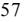

{63}------------------------------------------------

The Suezmax freight rates in the first quarter of 2023 has continued to generate significant positive earnings and we expect that additional loan repayments will be made during 2023 due to the excess cash flow mechanism included in the 2019 Senior Secured Credit Facility.

Given the current conditions of the Suezmax tanker market, which we and external market sources expect to continue at least until maturity of the 2019 Senior Secured Credit facility and the \$30 million Accordion Loan in February 2024 and considering various reasonable sensitivities, we expect that we will be able to repay the debt from cash flows from operations. In the event there is shortfall, we have financial flexibility through utilization of the existing ATM program, sale of vessels or through extensions or refinancings.

#### *Contractual Obligations*

The Company's contractual obligations as of December 31, 2022, consist mainly of our obligations as borrower under our 2019 Senior Secured Credit Facility including our \$30 million Accordion Loan and our obligations related to financing of our three 2018-built vessels and the two 2022 Newbuildings. For further information, please see "Item 5. Operating and Financial Review and Prospects—B. Liquidity and Capital Resources."

The following table sets out financing and contractual obligations outstanding as of December 31, 2022. In February 2023, we have repaid \$15.2 million of the 2019 Senior Secured Credit Facility related to the excess cash flow mechanism calculated based on the earnings generated in the fourth quarter of 2022 and the amount is included in the table below as a contractual repayment. The excess cash flow mechanism could result in higher loan repayments than indicated below, if the Company generates excess cash from operations in future periods.

|                                                                  |         | Less than 1 | 1-3     |           | More than 5 |
|------------------------------------------------------------------|---------|-------------|---------|-----------|-------------|
| Contractual Obligations in \$'000s                               | Total   | year        | years   | 3-5 years | years       |
| 2019 Senior Secured Credit Facility including Accordion Loan (1) | 129,189 | 27,285      | 101,904 | -         | -           |
| Interest Payments (2)                                            | 14,557  | 12,655      | 1,902   | -         | -           |
| Financing of 2018-built Vessels (3)                              | 95,950  | 8,711       | 18,673  | 20,408    | 48,158      |
| Interest Payments (4)                                            | 35,088  | 8,116       | 13,870  | 10,396    | 2,706       |
| Financing of 2022 Newbuildings (5)                               | 84,851  | 5,500       | 11,015  | 11,000    | 57,336      |
| Interest Payments (6)                                            | 52,760  | 7,728       | 13,956  | 11,907    | 19,169      |
| Operating Lease Liabilities (7)                                  | 1,306   | 705         | 601     | -         | -           |
| Total                                                            | 413,701 | 70,700      | 161,921 | 53,711    | 127,369     |

*Notes:*

- *(1) Refers to obligation to repay indebtedness outstanding under the 2019 Senior Secured Credit Facility including the Accordion Loan as of December 31, 2022. The facilities contain an excess cash flow mechanism that equals 50% of the net earnings from the collateral vessels, less capex provision and fixed amortization.*
- *(2) Refers to the estimated interest payments over the term of indebtedness outstanding under the 2019 Senior Secured Credit Facility including the Accordion Loan as of December 31, 2022. Estimate is based on applicable interest rate, agreed amortization and balance outstanding as of December 31, 2022.*

*(3) Refers to obligation to repay indebtedness outstanding as of December 31, 2022 for three 2018-built vessels.*

*(4) Refers to estimated interest payments over the term of the indebtedness outstanding as of December 31, 2022, for the financing of the three 2018-built vessels. Estimate is based on applicable interest rate as of December 31, 2022.*

*(5) Refers to obligation to repay indebtedness outstanding as of December 31, 2022 for the two 2022 Newbuildings.*

*(6) Refers to estimated interest payments over the term of the indebtedness outstanding as of December 31, 2022, for the financing of the two 2022 Newbuildings. Estimate is based on applicable interest rate as of December 31, 2022.*

*(7) Refers to the future obligation as of December 31, 2022, to pay for operating lease liabilities at nominal values.*

As of December 31, 2022, we do not have any liabilities, contingent or otherwise, that we would consider to be off-balance sheet arrangements.

{64}------------------------------------------------

### **Cash Flows**

The following table shows our net cash flows from operating, investing and financing activities for the periods ended December 31, 2022, 2021 and 2020.

| All figures in USD '000                                                 | 2022     | 2021     | 2020     |
|-------------------------------------------------------------------------|----------|----------|----------|
| Net Cash Provided by (Used in) Operating Activities                     | 24,134   | (44,458) | 110,944  |
| Net Cash Used in Investing Activities                                   | (14,343) | (3,465)  | (17,476) |
| Net Cash Provided by Financing Activities                               | 9,005    | 30,513   | (93,075) |
| Net Increase / (Decrease) in Cash, Cash Equivalents and Restricted cash | 18,796   | (17,410) | 393      |
| Cash, Cash Equivalents and Restricted Cash at Beginning of Year         | 44,648   | 62,070   | 61,638   |
| Cash, Cash Equivalents and Restricted Cash at End of Year               | 63,302   | 44,648   | 62,070   |

### YEAR ENDED DECEMBER 31, 2022, COMPARED TO YEAR ENDED DECEMBER 31, 2021

Cash flows provided by / (used in) operating activities increased to \$24.1 million for the year ended December 31, 2022, from (\$44.5) million for the year ended December 31, 2021. The change in cash flows provided by operating activities is primarily due to increases in market rates achieved in 2022 compared to 2021.

Cash flows used in investing activities increased to (\$14.3) million for the year ended December 31, 2022, compared to (\$3.5) million for the year ended December 31, 2021. The increase of cash flows used in investing activities is primarily due to proceeds of \$81.1 million from sale of vessels in 2022 compared to \$14.3 million in 2021, offset by increased investment in vessels of \$1.2 million in 2022 compared to 2021, and an increase in investment in vessels under construction in 2022 of \$77.0 million compared to 2021 related to the delivery of the two newbuildings in May and June 2022.

Cash flows provided by financing activities decreased to \$9.0 million for the year ended December 31, 2022, compared to cash flow provided by financing activities of \$30.5 million for the year ended December 31, 2021. The decrease is primarily due to an increase of \$ 13.0 million in distributed dividends in 2022 compared to 2021, a decrease of \$31.0 million in proceeds from issuance of common stock in 2022 compared to 2021, increases of \$63.1 million in repayments of borrowings and \$3.5 million in repayments of vessel financing in 2022 compared to 2021, offset by an increase of \$88.0 million in proceeds from borrowing activities related to the two newbuildings delivered to us in 2022.

The cash, restricted cash and cash equivalents was \$63.3 million (including \$3.7 million in restricted cash) as of December 31, 2022.

#### YEAR ENDED DECEMBER 31, 2021, COMPARED TO YEAR ENDED DECEMBER 31, 2020

Cash flows provided by / (used in) operating activities decreased to (\$44.5) million for the year ended December 31, 2021, from \$110.9 million for the year ended December 31, 2020. The change in cash flows provided by operating activities is primarily due to decreases in market rates achieved in 2021 compared to 2020.

Cash flows used in investing activities decreased to (\$3.5) million for the year ended December 31, 2021, compared to (\$17.5) million for the year ended December 31, 2020. The decrease of cash flows used in investing activities is primarily due to proceeds of \$14.3 million from sale of a vessel in 2021 and reduced investment in vessels of \$3.0 million in 2021 compared to 2020, offset by an increase in investment in vessels under construction in 2021 of \$2.3 million compared to 2020.

Cash flows provided by / (used in) financing activities increased to \$30.5 million for the year ended December 31, 2021, compared to cash flow used in financing activities of (\$93.1) million for the year ended December 31, 2020. The increase is primarily due to an increase of \$59.3 million in proceeds from issuance of common stock and reduced repayments on our borrowing facilities of \$37.1 million in 2021 compared to 2020, offset by a decrease in distributed dividends from \$67.2 million in 2020 compared to \$9.7 million in 2021 and reduced proceeds of \$29.7 million from borrowing activities in 2021 compared to 2020.

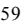

{65}------------------------------------------------

The cash, restricted cash and cash equivalents was \$44.6 million (including \$9.9 million in restricted cash) as of December 31, 2021.

### **C. Research and Development, Patents and Licenses, Etc.**

Not applicable.

### **D. Trend Information**

The oil tanker industry has been highly cyclical, experiencing volatility in charter hire rates and vessel values resulting from changes in the supply of and demand for crude oil and tanker capacity. See "Item 4. Information on the Company—B. Business Overview –The International Tanker Market."

### **E. Critical Accounting Estimates**

We prepare our financial statements in accordance with accounting principles generally accepted in the United States, or U.S. GAAP. On a regular basis, management reviews the accounting policies, assumptions, estimates and judgments to ensure that our consolidated financial statements are presented fairly and in accordance with U.S. GAAP. However, because future events and their effects cannot be determined with certainty, actual results could differ from our assumptions and estimates, and such differences could be material. For a description of our material accounting policies, please read Item 18. Financial Statements Note 2 - Summary of Significant Accounting Policies.

#### **Revenues and voyage expenses**

Revenues and voyage expenses are recognized on an accruals basis over the duration of each spot charter.

For vessels operating on spot charters, voyage revenues are recognized ratably over the estimated length of each voyage, calculated on a load-to-discharge basis under ASC 606 and, therefore, are allocated between reporting periods based on the relative transit time in each period, and revenue is therefore recognized on a pro-rata basis commencing on the date that the cargo is loaded and concluded on the date of discharge of the cargo. Voyage expenses are capitalized between the discharge port of previous cargo, or contract date if later, and the load port of the cargo to be chartered if they qualify as fulfillment costs. Incremental cost to obtain a contract is capitalized and amortized ratably over the estimated length of each voyage, calculated on a load-to-discharge basis. The impact of recognizing voyage expenses ratably over the length of each voyage is not materially different on a quarterly and annual basis from a method of recognizing such costs when incurred. We do not capitalize fulfilment cost or recognize revenue when a charter has not been contractually committed to by a customer.

### **Vessel Impairment**

The carrying values of the Company's vessels may not represent their fair value at any point in time since the market prices of second-hand vessels tend to fluctuate with changes in charter rates and the cost of newbuildings. Historically, both charter rates and vessel values tend to be cyclical.

Our vessels are evaluated for possible impairment whenever events or changes in circumstances indicate that the carrying amount of a vessel may not be recoverable. Undiscounted future cash flows are estimated on a vessel by vessel basis if events or circumstances indicate that carrying amounts may not be recoverable. If the estimated undiscounted future cash flows expected from continued use of the vessel and its eventual disposal is less than the carrying amount of the vessel, the vessel is deemed to be impaired. When applicable, we also consider if there are other factors that impact the probability for disposal of a vessel at its fair value before the end of its useful life. If a vessel is deemed to be impaired, the impairment charge is recognized based on the difference between the fair value of the vessel and its carrying value. Fair value is based on broker estimates that could be adjusted if there are actual entity specific comparable transactions available.

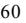

{66}------------------------------------------------

We have recognized impairment charges on vessels for the year ended December 31, 2022, December 31, 2021, December 31, 2020 of \$0.3 million, \$60.3 million and \$0.0 million, respectively. The impairment charge recorded in 2022 is related to a vessel classified as held for sale as of December 31, 2021, and as a result of a change in fair value before disposal, an impairment charge was recognized, and not due to any broader market-based impairment indicators being identified in 2022. The impairment charges of \$60.3 million recognized in 2021 included an impairment loss of \$8.9 million related to a Vessel Held for Sale that was presented at its fair value less cost to sell as of December 31, 2021.

As of December 31, 2022, as required under US GAAP, we have considered as a first step whether there were events or changes in circumstances that may indicate that the carrying value of our vessels may not be recoverable including a consideration of whether any of the key forward-looking assumptions applied in our 2021 impairment analysis, which included preparing estimates of future undiscounted cash flows, have developed negatively in 2022. There are several positive factors identified in 2022 in the areas we closely monitor, such as (1) the expected upturn in freight rates materialized including improved current earnings, (2) broker estimates for the coming years predict improved freight rates compared to broker estimates obtained one year ago, (3) a continued low order book for Suezmax tankers and (4) higher vessel values than a year ago despite adding one year of age to the vessels. We also monitor other external and internal factors including, but not limited to, our market capitalization, industry regulations, cost of operating the vessels and technological developments. We have concluded that there were no impairment indicators present and accordingly, in following US GAAP, we have not prepared an analysis of future undiscounted cash flows for our vessels as of December 31, 2022.

When impairment indicators are identified, as in 2021, we develop estimates of future undiscounted cash flows, where we make assumptions and estimates about the vessels' future performance, with the significant assumptions being related to charter rates, fleet utilization, operating expenses, capital expenditures/periodical maintenance, residual value and the estimated remaining useful life of each vessel. Many of these assumptions are relatively stable over time. However, charter rates are volatile and require management to apply significant judgment when assessing if impairment indicators are present, and when they are, for estimating future charter rates when preparing estimates of undiscounted cash flows.

The assumptions used to develop estimates of future undiscounted cash flows, when necessary, are based on historical trends as well as future expectations. The estimated net operating revenues are determined by considering an estimated daily time charter equivalent for the remaining operating days over the useful life of the vessel. The daily time charter equivalent rates are converted to annual forecasted revenues by multiplying the daily rate by the number of days in the year less days for expected off-hire and dry-docking. Although the Company believes that the assumptions used to evaluate potential impairment are reasonable and appropriate, such assumptions are subjective. There can be no assurance whether the actual outcome will be close to the estimates applied, as the tanker market is volatile in respect of both vessel values and charter rates, and we might experience changes in demand for transportation services, oil production, regulations and the size of the global tanker fleet.

The most important assumption in determining undiscounted cash flows, when necessary, is the estimated charter rates. Charter rates are volatile and the analyses have in prior periods been based on market rates obtained from third parties, in combination with historical achieved rates by us. We have historically applied an estimated daily time charter equivalents based on an average of several broker estimates for the first two years of our analysis. For the remaining period from year three and to the end of the useful life of each vessel, we have applied a daily time charter equivalent equalling the trailing fifteen-year historical companyspecific average spot market rate. The broker estimates applied in year one and two are considered a more precise forecast as it captures the shorter-term expected market development of our business. The broker estimates are normally not available for a period exceeding two years. For year 3 and beyond, we believe that the 15 year historical company-specific average is a reasonable proxy for our expected cash flows as this average is most likely to encompass the charter rate cycles that our vessels will experience.

When we calculate the expected undiscounted net cash flows for the vessels, we deduct operating expenses and expected cost of dry-docking and other expected capital expenditures from the operating revenues before adding an estimated residual value of the vessel at the end of its useful life. The operating expenses applied are based on the forecasted operating cost for the vessels, which is adjusted in subsequent periods for expected growth. We have historically applied a compounded growth factor to the operating expenses, which is calculated based on the average increase in our operating expenses over the last fifteen years. Estimated cash outflows for dry-docking are based on historical and forecasted expenditure. Vessel utilization is based on historical average levels achieved. The residual value applied is a long term estimate based on an estimated market price of scrap per ton multiplied by lightweight tonnage of the vessel, less estimated cost associated with scrapping the vessel. The scrap price applied is less than the prevailing scrap price for steel and is based on observation over a longer period of time to capture both peaks and troughs in metal prices. All vessels are maintained for and assumed to have a useful life of 25 years.

{67}------------------------------------------------

Further, we consider if there are present factors that impact the probability of disposal of a vessel before the end of its estimated useful life. These factors could include the current price of second-hand vessels, expected capital expenditure, prevailing freight rates and the price of oil. The second-hand prices of Suezmax vessels were attractive in 2021 and 2022 from a historical perspective and we have disposed of five vessels in 2022 that were subject to impairment charges in 2021. All vessels are held for use as of December 31, 2022.

In 2021, we disclosed that our 15-year historical company-specific average rate was \$23,548, which was above the 2021 break-even rate of \$22,023 that is the level that rates would have needed to fall to before the undiscounted cash flows were less than the carrying value for the first vessel in our fleet as of December 31, 2021. In 2022, we achieved a TCE rate of \$24,725 and the five and ten-year average rates charter rates achieved by the Company increased from \$18,259 and \$20,160 for the periods 2017- 2021 and 2012 – 2021, to \$20,397 and \$21,466 for the periods from 2018-2022 and 2013-2022, respectively. Our 15-year historical company-specific average rate and the breakeven rate as of December 31, 2022 were at approximately the same levels as in 2021.

**The Total Fleet – Comparison of Carrying Value versus Market Value:** During the past five years, the market values of vessels have experienced particular volatility for many vessel classes. Our fleet of Suezmax vessels experienced a positive valuation curve both in 2022 and 2021 with values at the end of 2022 above the valuations received at the end of 2021. The increase in 2021 was mainly driven by the increase in steel prices and the further increase in 2022 is considered as a reflection of the strengthening of the freight rates in the Suezmax tanker market. According to Clarkson Research 190 Suezmax tankers were sold and bought in total between 2018 and 2022, however such transactions may not be vessels as well maintained as the vessels in our fleet. For impairment testing, as described above, we perform our analysis on a vessel by vessel basis. However, as further described below, we believe that our fleet should be valued as a transportation system as it is not meaningful under our strategy to solely assess the value of each individual vessel.

Events and circumstances which could impact our estimates of future cash flows of our vessels, when developed, include:

- Declines in prevailing market charter rates;
- Delays in anticipated tanker market upturn;
- Changes in behaviours and attitudes of our charterers towards actual and preferred technical, operational and environmental standards;
- Changes in regulations over the requirements for the technical and environmental capabilities of our vessels; and
- Increased inflation as a result of factors outside our control.
- Changes in steel prices
- Political uncertainty including changes in trading routes and demand

Our estimates of market value assume that our vessels are all in good and seaworthy condition without need for repair and, if inspected, would be certified in class without notations of any kind, and are held for use. Most oil companies require CAP 2 notation or better. All relevant vessels in our fleet have CAP1 notation for Hull, as well as Machinery & Cargo. CAP is an abbreviation for Condition Assessment Program. The quality of the NAT fleet is at the top as evidenced by our vetting statistics, that is, inspections of our ships by clients. In such vetting processes safety for our crew, the environment and our assets are main considerations.

{68}------------------------------------------------

#### *Table of Contents*

Our estimates are based on the estimated market values for our vessels that we have received from shipbrokers and these are inherently uncertain. The market value of a vessel as determined by shipbrokers could be an arbitrary assessment giving an estimate of a value for a transaction that has not taken place. In Management's view the valuation of the Company on the NYSE should not be based solely upon net asset value (NAV), a measure that only is linked to the steel value of our ships. We have our own ongoing system value with a large and homogenous fleet allowing us to offer our transportation services to our clients across the globe, well-functioning processes and established customer relationships with oil majors and other reputable customers.

| Vessel          | Built | Deadweight Tons | Carrying Value \$ (millions) Dec 31, 2022 | Carrying Value \$ (millions) Dec 31, 2021 |
|-----------------|-------|--------------------|-------------------------------------------------|-------------------------------------------------|
| Nordic Apollo   | 2003  | 159,998            | 14.5                                            | 16.5                                            |
| Nordic Pollux   | 2003  | 150,103            | 19.0                                            | 18.0                                            |
| Nordic Luna     | 2004  | 150,037            | 22.0                                            | 20.9                                            |
| Nordic Castor   | 2004  | 150,249            | 19.1                                            | 19.8                                            |
| Nordic Freedom  | 2005  | 159,331            | 30.6                                            | 31.8                                            |
| Nordic Sprinter | 2005  | 159,089            | 23.8                                            | 23.3                                            |
| Nordic Skier    | 2005  | 159,089            | 22.3                                            | 24.7                                            |
| Nordic Light    | 2010  | 158,475            | 41.6                                            | 44.6                                            |
| Nordic Cross    | 2010  | 158,475            | 41.9                                            | 45.0                                            |
| Nordic Vega*    | 2010  | 163,940            | 52.3                                            | 56.1                                            |
| Nordic Breeze   | 2011  | 158,597            | 42.7                                            | 45.5                                            |
| Nordic Zenith   | 2011  | 158,645            | 43.2                                            | 46.1                                            |
| Nordic Star     | 2016  | 157,738            | 51.8                                            | 54.5                                            |
| Nordic Space    | 2017  | 157,582            | 52.9                                            | 54.0                                            |
| Nordic Tellus   | 2018  | 157,407            | 49.2                                            | 51.4                                            |
| Nordic Aquarius | 2018  | 157,338            | 47.9                                            | 50.1                                            |
| Nordic Cygnus   | 2018  | 157,526            | 48.4                                            | 50.7                                            |
| Nordic Hunter   | 2022  | 157,037            | 56.2                                            | -                                               |
| Nordic Harrier  | 2022  | 157,094            | 55.7                                            | -                                               |

The carrying value of our vessels as of December 31, 2022 is \$735.1 million. We have obtained broker estimates from two independent shipbrokers indicating a fair market value of our vessels held and used on a charter free basis to be \$955.0 million, based on an average of the two estimates including the inherent uncertainty in such estimates. One vessel marked with an asterisk (*) has a fair market value that is lower than the carrying value. This vessel has also experienced a significant increase in its estimated fair value as of December 31, 2022, compared to the broker valuation received in 2021.

#### **Vessels and Periodic Maintenance (drydocking)**

The useful life of our vessels are principally dependent on the technical condition of our vessels. Vessels are stated at their historical cost and the estimated economic useful life of a vessel is 25 years from the date of delivery from the shipyard. Certain subsequent expenditures for vessel upgrades are also capitalized if it is determined that they appreciably extend the life, increase the earning capacity or improve the efficiency or safety of the vessel and depreciated over the remaining useful life of the vessel.

Depreciation is calculated based on cost less estimated residual value using the straight-line method. The residual value is estimated by management and reviewed periodically, where the market price of scrap per ton is considered and we are monitoring the development from period to period. For the financial year ended December 31, 2022, we have maintained the scrap value of \$8.0 million in our estimates as the estimate is considered as a long-term estimate and we will observe a longer period of increased scrap values before adjusting our estimates.

{69}------------------------------------------------

Our vessels are required to be drydocked approximately every 30 to 60 months. Vessels exceeding 15 years are subject to periodical maintenance surveys every 30 months, whereas vessels under 15 years of age are subject to survey intervals every 60 months. We capitalize a substantial portion of the costs incurred during drydocking and amortize those costs on a straight-line basis from the completion of a drydocking or intermediate survey to the estimated completion of the next drydocking. Drydocking costs include a variety of costs incurred while vessels are placed within drydock, including direct expenses incurred related to the preparation for docking and port expenses at the drydock shipyard, general shipyard expenses, expenses related to hull, external surfaces and decks, expenses related to machinery and engines of the vessel, as well as expenses related to the testing and correction of findings related to safety equipment on board. We include in capitalized drydocking those costs incurred as part of the drydock to meet classification and regulatory requirements. Expenditures for normal repairs and maintenance performed during drydocking are expensed as incurred. Ballast tank improvements are capitalized and amortized on a straight-line basis over a period of eight years. The capitalized and unamortized drydocking costs are included in the book value of the vessels. Amortization expense of the drydocking costs is included in depreciation expense.

If we change our estimate of the next drydock date, we will adjust our annual amortization of drydocking expenditures accordingly.

### **ITEM 6. DIRECTORS, SENIOR MANAGEMENT AND EMPLOYEES**

### **A. Directors and Senior Management**

Set forth below are the names and positions of our directors of the Company and senior management of the Company. The directors of the Company are elected annually, and each elected director holds office until a successor is elected. Officers are elected from time to time by vote of the Board and holds office until a successor is elected.

| The Company       |     |                                                                    |  |  |
|-------------------|-----|--------------------------------------------------------------------|--|--|
| Name              | Age | Position                                                           |  |  |
| Herbjørn Hansson  | 75  | Founder, Chairman, Chief Executive Officer, President and Director |  |  |
| Jim Kelly         | 69  | Non-Executive Director                                             |  |  |
| Jenny Chu         | 69  | Non-Executive Director and Audit Committee Chairman                |  |  |
| Alexander Hansson | 41  | Director                                                           |  |  |
| Bjørn Giaever     | 55  | Chief Financial Officer                                            |  |  |
|                   |     |                                                                    |  |  |

Certain biographical information with respect to each director and senior management of the Company listed above is set forth below.

**Herbjørn Hansson** earned his M.B.A. at the Norwegian School of Economics and Business Administration and attended Harvard Business School. In 1974 he was employed by the Norwegian Shipowners' Association. In the period from 1975 to 1980, he was Chief Economist and Research Manager of INTERTANKO, an industry association whose members control about 70% of the world's independently owned tanker fleet, excluding state owned and oil company fleets. During the 1980s, he was Chief Financial Officer of Kosmos/Anders Jahre, at the time one of the largest Norwegian based shipping and industry groups. In 1989, Mr. Hansson founded Ugland Nordic Shipping AS, or UNS, which became one of the world's largest owners of specialized shuttle tankers. He served as Chairman in the first phase and as Chief Executive Officer as from 1993 to 2001 when UNS, under his management, was sold to Teekay Shipping Corporation, or Teekay, for an enterprise value of \$780.0 million. He continued to work with Teekay, and reached the position of Vice Chairman of Teekay Norway AS, until he started working full-time for the Company on September 1, 2004. Mr. Hansson is the founder and has been Chairman and Chief Executive Officer of the Company since its establishment in 1995. He also has been a member of various governing bodies of companies within shipping, insurance, banking, manufacturing, national/international shipping agencies including classification societies and protection and indemnity associations. Mr. Hansson is fluent in Norwegian and English, and has a command of German and French for conversational purposes.

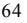

{70}------------------------------------------------

**Jim Kelly** has been a director of the Company since June 2010. Mr. Kelly has worked for Time Inc., the world's largest magazine publisher, since 1978. He served as Foreign Editor during the fall of the Soviet Union and the first Gulf War, and was named Deputy Managing Editor in 1996. In 2001, Mr. Kelly became the magazine's managing editor, and during his tenure the magazine won a record four National Magazine awards. In 2004, *Time Magazine* received its first EMMA for its contribution to the ABC News Series "Iraq: Where Things Stand." In late 2006, Mr. Kelly became the managing editor of all of Time Inc., helping supervise the work of more than 2,000 journalists working at 125 titles, including *Fortune, Money, Sports Illustrated* and *People*. Since 2009, Mr. Kelly has worked as a consultant at Bloomberg LP and taught at Princeton and Columbia Universities. Jim Kelly was elected as member of our Audit Committee in February 2012. Mr. Kelly was appointed as the Chairman of the Audit Committee on March 8, 2020. Ms. Jenny Chu took over the role as Chair of the Audit Committee in May 2022.

**Jenny Chu** was appointed to the Board of Nordic American Tankers on April 4, 2022. Ms. Chu is a US citizen, born in South-Korea, with more than 25 years of experience in the financial services industry working with wealth planning for ultra-high net worth individuals in Morgan Stanley, UBS, JP Morgan and Merrill Lynch Wealth Management. She was Managing Director at JP Morgan Securities and Senior Vice President for Merrill Lynch both in Century City, California, US. She is currently Head of Global Business Development in The Boars' Club, a by-invitation private international investment club for principals of single family offices. She is a director at the Korean American Chamber of Commerce, member of the Korea Trade Investment Promotion Agency (KOTRA) and several other director- and memberships. Ms. Chu knows and has been a close contact for NAT for many years and she brings valuable knowledge, experience and network to NAT, both in the US and in Asia. Jenny Chu is currently the Chair of the Audit Committee

**Alexander Hansson** has been a director of the Company since November 2019 and has been employed by the Company since 2009. Mr. Hansson is an investor in various markets globally and has made several successful investments in both listed and privately held companies. Mr. Hansson is the son of the Company's Chairman and Chief Executive Officer and he has built a network over the last 20 years in the shipping and finance sector. He has operated shipping and trading offices in London and Monaco. He studied at EBS Regents College in London, United Kingdom.

**Bjørn Giaever** joined the Company as Chief Financial Officer and Secretary on October 16, 2017. Mr. Giaever has over 25 years of experience in the shipping & offshore industry, holding key roles in corporate finance and equity research. He joined the Company from Fearnley Securities AS, where he served as partner and director in the Corporate Finance division. From 2006 to 2010, Mr. Giaever served as a senior corporate advisor in the John Fredriksen group in London. In addition, Mr. Giaever has been a top rated Shipping Analyst at DNB Markets and partner at Inge Steensland AS, specializing in chemical, gas and product shipping. Mr. Giaever holds a BSc in business and economics.

### **B. Compensation**

During the year ended December 31, 2022, we have paid aggregate cash compensation of \$5.5 million to our directors and executive officers (five persons). The amount includes the cash compensation paid for managing our operations in Monaco. In addition, we have in 2022 expensed \$0.3 million related to stock options granted to our directors and executive officers under the 2011 Equity Incentive Plan.

We entered into an agreement in 2020, whereby our Founder, Chairman, President and Chief Executive Officer has a right to have his present position until 2027, after which he may become non-executive Chairman as long as he lives. Our Chief Financial Officer has a regular contribution pension plan in line with the Company's policy for employees.

{71}------------------------------------------------

#### **2011 Equity Incentive Plan**

In 2011 and 2015, the Board of Directors approved an incentive plan under which 400,000 and 137,665, respectively, common shares were reserved for issuance and were allocated among persons employed in the management of the Company and the members of the Board of Directors. The holders of the restricted shares were entitled to voting rights as well as dividends paid during the vesting period. All 537,665 common shares allocated have been fully vested and this part of the plan is as such completed and closed.

In October 2019, we amended and restated the 2011 Equity Incentive Plan to reserve an additional 1,000,000 stock options for issuance to persons employed in the management of the Company and members of the Board of Directors under the same terms as the original plan. On October 28, 2019, the Company granted 755,000 and 234,000 stock options with vesting over a period of two and three years, respectively, and an exercise price of \$4.70 per share. In October 2021, the vesting period for the 755,000 stock options that originally vested in October 2021 was prolonged with one year. The stock options vested in October 2022 without any options being exercised as the strike price of the options was above the share price at the vesting date. After the expiration in October 2022, these options became eligible for re-distribution.

In November 2022, the 2011 Equity Incentive Plan was amended to reserve an additional 3,000,000 stock option for issuance to persons employed in the management of the Company and members of the Board of Directors. On November 1, 2022, we granted 3,990,000 stock options with vesting over a period of two years and an exercise price of \$3.60 per share, adjusted for dividends in the period, to 21 persons amongst our directors, employees and consultants. The options are exercisable in a period of 12 months following the vesting date.

A copy of the Amended and Restated 2011 Equity Incentive Plan is filed as Exhibit 4.11 to this annual report.

#### **C. Board Practices**

The members of our Board of Directors serve until the next annual general meeting following his or her election. The members of our current Board of Directors were elected at the annual general meeting held in 2022. Our Board of Directors has established an Audit Committee, consisting of a single independent director, Ms. Chu. Ms. Chu serves as the audit committee financial expert. The Audit Committee provides assistance to our Board of Directors in fulfilling their responsibility to shareholders, and investment community relating to corporate accounting, reporting practices of the Company, and the quality and integrity of the financial reports of the Company. The Audit Committee, among other duties, recommends to the Board of Directors the independent auditors to be selected to audit our financial statements; meets with the independent auditors and our financial management to review the scope of the proposed audit for the current year and the audit procedures to be utilized; reviews with the independent auditors, and financial and accounting personnel, the adequacy and effectiveness of the accounting and financial controls of the Company; and reviews the financial statements contained in the annual report to shareholders with management and the independent auditors.

Pursuant to an exemption for foreign private issuers, we are not required to comply with many of the corporate governance requirements of the NYSE that are applicable to U.S. listed companies. For more information, please see "Item 16G. Corporate Governance."

There are no contracts between us and any of our directors providing for benefits upon termination of their employment.

#### **D. Employees**

All our shore based employees have employment contracts and as of December 31, 2022, the Company had a total of about 18 full time employees. We have fixed contracts with three ship managers, which operate under our direct instructions. All seafarers onboard our vessels have employment contracts via the technical management companies.

{72}------------------------------------------------

### **E. Share Ownership**

With respect to the total amount of common shares owned by all of our officers and directors individually and as a group, please see "Item 7. Major Shareholders and Related Party Transactions."

### **F. Disclosure Of Registrant's Action to Recover Erroneously Awarded Compensation**

Not applicable.

### **ITEM 7. MAJOR SHAREHOLDERS AND RELATED PARTY TRANSACTIONS**

### **A. Major Shareholders**

The following table sets forth information regarding beneficial ownership of our common shares for (i) owners of more than five percent of our common shares and (ii) our directors and officers, of which we are aware of the date of this annual report.

| Title  | Identity of Person | No. of Shares | Percent of Class(1) |  |  |
|--------|--------------------|---------------|---------------------|--|--|
| Common | Hansson family (2) | 6,305,659     | 3.02%               |  |  |
|        | Jim Kelly          |               | *                   |  |  |
|        | Jenny Chu          |               | *                   |  |  |
|        | Bjørn Giæver       |               | *                   |  |  |
|        | BlackRock, Inc (3) |               | 5.82%               |  |  |
|        |                    |               |                     |  |  |

* Less than 1% of our common outstanding shares.

(1) Based on 208,796,444 common shares outstanding as of the date of this annual report.

(2) The holdings between our founder, chairman & CEO, Herbjørn Hansson, and Alexander Hansson, are reported herein. Alexander Hansson is holding 2,100,000 of these shares personally.

(3) Based solely on the Schedule 13G filed on February 3, 2023.

As of April 25, 2023, we had 465 holders of record in the United States, including Cede & Co., which is the Depositary Trust Company's nominee for holding shares on behalf of brokerage firms, as a single holder of record. We had a total of 208,796,444 Common Shares outstanding as of the date of this annual report.

### **B. Related Party Transactions**

### **Board Members and Employees:**

We have an agreement with a company owned by a Board member for the use of an asset for corporate and marketing activities. We have in 2022 paid operating cost of \$1.2 million and fees associated with actual use. In 2022, 2021 and 2020, we recognized \$0.3 million, \$0.3 million and \$0.1 million, respectively, for utilization of the asset. No amounts were due to the related party as of December 31, 2022 and 2021 related to use of the asset.

{73}------------------------------------------------

# **C. Interests of Experts and Counsel**

Not applicable.

### **ITEM 8. FINANCIAL INFORMATION**

### **A. Consolidated Statements and other Financial Information**

See Item 18.

### **Legal Proceedings**

To our knowledge, we are not currently a party to any lawsuit that, if adversely determined, would have a material adverse effect on our financial position, results of operations or liquidity.

### **Dividend Policy**

Our policy is to declare quarterly dividends to shareholders as decided by the Board of Directors. The dividend to shareholders could be higher than the operating cash flow or the dividend to shareholders could be lower than the operating cash flow after reserves as the Board of Directors may from time to time determine are required, taking into account contingent liabilities, the terms of our borrowing agreements, our other cash needs and the requirements of Bermuda law.

Total cash dividends distributed in 2022 totalled \$22.7 million. The quarterly cash dividend payments per share over the last 5 years have been as follows:

| Period      | 2022       | 2021       | 2020       | 2019       | 2018       |
|-------------|------------|------------|------------|------------|------------|
| 1st Quarter | \$ 0.01 | \$ 0.02 | \$ 0.07 | \$ 0.04 | \$ 0.03 |
| 2nd Quarter | \$ 0.02 | \$ 0.02 | \$ 0.14 | \$ 0.03 | \$ 0.01 |
| 3rd Quarter | \$ 0.03 | \$ 0.01 | \$ 0.20 | \$ 0.01 | \$ 0.02 |
| 4th Quarter | \$ 0.05 | \$ 0.01 | \$ 0.04 | \$ 0.02 | \$ 0.01 |
| Total       | \$ 0.11 | \$ 0.06 | \$ 0.45 | \$ 0.10 | \$ 0.07 |

The Company declared a dividend of \$0.15 per share in respect of the fourth quarter of 2022, which was paid to shareholders on March 28, 2023.

### **B. Significant Changes**

Not applicable.

### **ITEM 9. THE OFFER AND LISTING**

Not applicable except for Item 9.A.4. and Item 9.C.

### **Share History and Markets**

Since November 16, 2004, the primary trading market for our common shares has been the NYSE on which our shares are listed under the symbol "NAT."

### **ITEM 10. ADDITIONAL INFORMATION**

### **A. Share Capital**

Not applicable.

{74}------------------------------------------------

### **B. Memorandum and Articles of Association**

#### **Memorandum of Association and Bye-Laws**

The following description of our share capital summarizes the material terms of our Memorandum of Association and our bye-laws.

Under our Memorandum of Association, as amended, our authorized capital consists of 360,000,000 common shares having a par value of \$0.01 per share.

The purposes and powers of the Company include the entering into of any guarantee, contract, indemnity or suretyship and to assure, support, secure, with or without the consideration or benefit, the performance of any obligations of any person or persons; and the borrowing and raising of money in any currency or currencies to secure or discharge any debt or obligation in any manner.

Our bye-laws provide that our Board of Directors shall convene and the Company shall hold annual general meetings of shareholders in accordance with the requirements of the Companies Act at such times and places as the Board shall decide. However, under Bermuda law, a company may by resolution in general meeting, elect to dispense with the holding of an annual general meeting for (a) the year in which it is made and any subsequent year or years; (b) for a specified number of years; or (c) indefinitely. Our Board of Directors may call special general meetings of shareholders at its discretion or as required by the Companies Act. Under the Companies Act, holders of one-tenth of our issued common shares may call special general meetings.

Under our bye-laws, five days advance notice of an annual general meeting or any special general meeting must be given to each shareholder entitled to vote at that meeting unless, in the case of an annual general meeting, a shorter notice period for such meeting is agreed to by all of the shareholders entitled to vote thereat and, in the case of any other meeting, a shorter notice period for such meeting is agreed to by at least 75% of the shareholders entitled to vote thereat. Under Bermuda law, accidental failure to give notice will not invalidate proceedings at a meeting. Our Board of Directors may set a record date for the purpose of identifying the persons entitled to receive notice of and vote at a meeting of shareholders at any time before or after the date on which such notice is dispatched.

Our Board of Directors must consist of at least three and no more than 11 directors, or such number in excess thereof as the Board of Directors may from time to time determine by resolution. Our directors are not required to retire because of their age, and our directors are not required to be holders of our common shares. Directors serve for one-year terms, and shall serve until re-elected or until their successors are appointed at the next annual general meeting. Casual vacancies on our Board of Directors may be filled by a majority vote of the then-current directors.

Any director retiring at an annual general meeting will be eligible for reappointment and will retain office until the close of the meeting at which such director retires or (if earlier) until a resolution is passed at that meeting not to fill the vacancy or the resolution to re-appoint such director is put to a vote at the meeting and is lost. If a director's seat is not filled at the annual general meeting at which he or she retires, such director shall be deemed to have been reappointed unless it is resolved by the shareholders not to fill the vacancy or a resolution for the reappointment of the director is voted upon and lost. No person other than a director retiring shall be appointed a director at any general meeting unless (i) he or she is recommended by the Board of Directors or (ii) a notice executed by a shareholder (not being the person to be proposed) has been received by our secretary no less than 120 days and no more than 150 days prior to the date our proxy statement is released to shareholders in connection with the prior year's annual general meeting declaring the intention to propose an individual for the vacant directorship position.

A director may at any time summon a meeting of the Board of Directors. The quorum necessary for the transaction of business at a meeting of the Board of Directors may be fixed by the Board of Directors and, unless so fixed at any other number, shall be two directors. Questions arising at any meeting of the Board of Directors shall be determined by a majority of the votes cast.

{75}------------------------------------------------

Our bye-laws do not prohibit a director from being a party to, or otherwise having an interest in, any transaction or arrangement with the Company or in which the Company is otherwise interested. Our bye-laws provide that a director who has an interest in any transaction or arrangement with the Company and who has complied with the provisions of the Companies Act and with our bye-laws with regard to disclosure of such interest shall be taken into account in ascertaining whether a quorum is present, and will be entitled to vote in respect of any transaction or arrangement in which he is so interested.

Our bye-laws permit us to increase our authorized share capital with the approval of a majority of votes cast in respect of our outstanding common shares represented in person or by proxy.

There are no pre-emptive, redemption, conversion or sinking fund rights attached to our common shares. The holders of common shares are entitled to one vote per share on all matters submitted to a vote of holders of common shares. Unless a different majority is required by law or by our bye-laws, resolutions to be approved by holders of common shares require approval by a simple majority of votes cast at a meeting at which a quorum is present. Shareholders present in person or by proxy and entitled to vote at a meeting of shareholders representing the holders of at least one-third of the issued shares entitled to vote at such general meeting shall be a quorum for all purposes.

Under our bye-laws, our Board of Directors is authorized to attach to our undesignated shares such preferred, qualified or other special rights, privileges, conditions and restrictions as the Board of Directors may determine. The Board of Directors may allot our undesignated shares in more than one series and attach particular rights and restrictions to any such shares by resolution; provided, however, that the Board of Directors may not attach any rights or restrictions to our undesignated shares that would alter or abrogate any of the special rights attached to any other class or series of shares without such sanction as is required for any such alternation or abrogation unless expressly authorized to do so by the rights attaching to or by the terms of the issue of such shares.

Subject to Bermuda law, special rights attaching to any class of our shares may be altered or abrogated with the consent in writing of not less than 75% of the issued shares of that class or with the sanction of a resolution of the holders of such shares voting in person or by proxy.

In the event of our liquidation, dissolution or winding up, the holders of common shares are entitled to share in our assets, if any, remaining after the payment of all of our debts and liabilities, subject to any liquidation preference on any outstanding preference shares.

Our bye-laws provide that our Board of Directors may, from time to time, declare and pay dividends or distributions out of contributed surplus, which we refer to collectively as dividends. Each common share is entitled to dividends if and when dividends are declared by our Board of Directors, subject to any preferred dividend right of the holders of any preference shares.

There are no limitations on the right of non-Bermudians or non-residents of Bermuda to hold or vote our common shares.

Bermuda law permits the bye-laws of a Bermuda company to contain a provision indemnifying the Company's directors and officers for any loss arising or liability attaching to him or her by virtue of any rule of law in respect of any negligence, default, breach of duty or breach of trust of which the officer or person may be guilty, save with respect to fraud or dishonesty. Bermuda law also grants companies the power generally to indemnify directors and officers of a company, except in instances of fraud and dishonesty, if any such person was or is a party or threatened to be made a party to a threatened, pending or completed action, suit or proceeding by reason of the fact that he or she is or was a director and officer of such company or was serving in a similar capacity for another entity at such company's request.

Our bye-laws provide that each director, alternate director, officer, person or member of a committee, if any, resident representative, and any liquidator, manager or trustee for the time being acting in relation to the affairs of the Company, and his heirs, executors or administrators, which we refer to collectively as an indemnitee, will be indemnified and held harmless out of our assets to the fullest extent permitted by Bermuda law against all liabilities, loss, damage or expense (including, but not limited to, liabilities under contract, tort and statute or any applicable foreign law or regulation and all reasonable legal and other costs and expenses properly payable) incurred or suffered by him or by reason of any act done, conceived in or omitted in the conduct of the Company's business or in the discharge of his duties except in respect of fraud or dishonesty. In addition, each indemnitee shall be indemnified out of the assets of the Company against all liabilities incurred in defending any proceedings, whether civil or criminal, in which judgment is given in such indemnitee's favor, or in which he is acquitted.

{76}------------------------------------------------

Under our bye-laws, we and our shareholders have agreed to waive any claim or right of action we or they may have at any time against any indemnitee on account of any action taken by such indemnitee or the failure of such indemnitee to take any action in the performance of his duties with or for the Company with the exception of any claims or rights of action arising out of fraud or actions to recover any gain, personal profit or advantage to which such indemnitee is not legally entitled.

Our Board of Directors may, at its discretion, purchase and maintain insurance for, among other persons, any indemnitee or any persons who are or were at the time directors, officers or employees of the Company, or of any other company in which the Company has a direct or indirect interest that is allied or associated with the Company, or of any subsidiary undertaking of the Company or such other company, against liability incurred by such persons in respect of any act or omission in the actual or purported execution or discharge of their duties or in the exercise or purported exercise of their powers or otherwise in relation to their duties, powers or offices in relation to the Company, subsidiary undertaking or any such other company.

Our Memorandum of Association may be amended with the approval of a majority of votes cast in respect of our outstanding common shares represented in person or by proxy and our bye-laws may be amended by approval by not less than 75% of the votes cast in respect of our issued and outstanding common shares represented in person or by proxy.

#### **Shareholder Rights Agreement**

On June 16, 2017, our Board declared a dividend of one preferred share purchase right, or a Right, for each outstanding common share and adopted a shareholder rights plan, as set forth in the Shareholders Rights Agreement dated as of June 16, 2017, or the Rights Agreement, by and between the Company and Computershare Trust Company, N.A., as rights agent.

The Board adopted the Rights Agreement to protect shareholders from coercive or otherwise unfair takeover tactics. In general terms, it works by imposing a significant penalty upon any person or group that acquires 15% or more of our outstanding common shares without the approval of the Board. If a shareholder's beneficial ownership of our common shares as of the time of the public announcement of the rights plan and associated dividend declaration is at or above the applicable threshold, that shareholder's then-existing ownership percentage would be grandfathered, but the rights would become exercisable if at any time after such announcement, the shareholder increases its ownership percentage by 1% or more.

The Rights may have anti-takeover effects. The Rights will cause substantial dilution to any person or group that attempts to acquire us without the approval of our Board. As a result, the overall effect of the Rights may be to render more difficult or discourage any attempt to acquire us. Because our Board can approve a redemption of the Rights for a permitted offer, the Rights should not interfere with a merger or other business combination approved by our Board.

For those interested in the specific terms of the Rights Agreement, we provide the following summary description. Please note, however, that this description is only a summary, and is not complete, and should be read together with the entire Rights Agreement, which is an exhibit to the Form 8-A filed by us on June 16, 2017 and incorporated herein by reference. The foregoing description of the Rights Agreement is qualified in its entirety by reference to such exhibit.

*The Rights*. The Rights trade with, and are inseparable from, our common shares. The Rights are evidenced only by certificates that represent our common shares. New Rights will accompany any new common shares of the Company issues after June 26, 2017 until the Distribution Date described below.

{77}------------------------------------------------

*Exercise Price*. Each Right allows its holder to purchase from the Company one one-thousandth of a Series A Participating Preferred Share (a "Preferred Share") for \$30.00 (the "Exercise Price"), once the Rights become exercisable. This portion of a Preferred Share will give the shareholder approximately the same dividend, voting and liquidation rights as would one common share. Prior to exercise, the Right does not give its holder any dividend, voting, or liquidation rights.

*Exercisability*. The Rights are not exercisable until ten days after the public announcement that a person or group has become an "Acquiring Person" by obtaining beneficial ownership of 15% or more of our outstanding common shares.

Certain synthetic interests in securities created by derivative positions, whether or not such interests are considered to be ownership of the underlying common shares or are reportable for purposes of Regulation 13D of the Securities Exchange Act of 1934, as amended, are treated as beneficial ownership of the number of our common shares equivalent to the economic exposure created by the derivative position, to the extent our actual common shares are directly or indirectly held by counterparties to the derivatives contracts. Swaps dealers unassociated with any control intent or intent to evade the purposes of the Rights Agreement are exempt from such imputed beneficial ownership.

For persons who, prior to the time of public announcement of the Rights Agreement, beneficially own 15% or more of our outstanding common shares, the Rights Agreement "grandfathers" their current level of ownership, so long as they do not purchase additional shares in excess of certain limitations.

The date when the Rights become exercisable is the "Distribution Date." Until that date, our common share certificates (or, in the case of uncertificated shares, by notations in the book-entry account system) will also evidence the Rights, and any transfer of our common shares will constitute a transfer of Rights. After that date, the Rights will separate from our common shares and will be evidenced by book-entry credits or by Rights certificates that the Company will mail to all eligible holders of our common shares. Any Rights held by an Acquiring Person are null and void and may not be exercised.

### Preferred Share Provisions

Each one one-thousandth of a Preferred Share, if issued, will, among other things:

- not be redeemable;
- entitle holders to quarterly dividend payments in an amount per share equal to the aggregate per share amount of all cash dividends, and the aggregate per share amount (payable in kind) of all non-cash dividends or other distributions other than a dividend payable in our common shares or a subdivision of our outstanding common shares (by reclassification or otherwise), declared on our common shares since the immediately preceding quarterly dividend payment date; and
- entitle holders to one vote on all matters submitted to a vote of the shareholders of the Company.

The value of one one-thousandth interest in a Preferred Share should approximate the value of one common share.

### Consequences of a Person or Group Becoming an Acquiring Person.

- *Flip In*. If an Acquiring Person obtains beneficial ownership of 15% or more of our common shares, then each Right will entitle the holder thereof to purchase, for the Exercise Price, a number of our common shares (or, in certain circumstances, cash, property or other securities of the Company) having a then-current market value of twice the Exercise Price. However, the Rights are not exercisable following the occurrence of the foregoing event until such time as the Rights are no longer redeemable by the Company, as further described below.
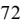

{78}------------------------------------------------

Following the occurrence of an event set forth in preceding paragraph, all Rights that are or were, under certain circumstances specified in the Rights Agreement, beneficially owned by an Acquiring Person or certain of its transferees will be null and void.

- *Flip Over*. If, after an Acquiring Person obtains 15% or more of our common shares, (i) the Company merges into another entity; (ii) an acquiring entity merges into the Company; or (iii) the Company sells
or transfers 50% or more of its assets, cash flow or earning power, then each Right (except for Rights that have previously been voided as set forth above) will entitle the holder thereof to purchase, for the Exercise Price, a number of our common shares of the person engaging in the transaction having a then-current market value of twice the Exercise Price.

- *Notional Shares*. Shares held by affiliates and associates of an Acquiring Person, including certain entities in which the Acquiring Person beneficially owns a majority of the equity securities, and Notional Common Shares (as defined in the Rights Agreement) held by counterparties to a Derivatives Contract (as defined in the Rights Agreement) with an Acquiring Person, will be deemed to be beneficially owned by the Acquiring Person.
*Redemption*. The Board may redeem the Rights for \$0.01 per Right at any time before any person or group becomes an Acquiring Person. If the Board redeems any Rights, it must redeem all of the Rights. Once the Rights are redeemed, the only right of the holders of the Rights will be to receive the redemption price of \$0.01 per Right. The redemption price will be adjusted if the Company has a stock dividend or a stock split.

*Exchange*. After a person or group becomes an Acquiring Person, but before an Acquiring Person owns 50% or more of our outstanding common shares, the Board may extinguish the Rights by exchanging one common share or an equivalent security for each Right, other than Rights held by the Acquiring Person. In certain circumstances, the Company may elect to exchange the Rights for cash or other securities of the Company having a value approximately equal to one common share.

*Expiration*. The Rights expire on the earliest of (i) June 16, 2027; or (ii) the redemption or exchange of the Rights as described above.

*Anti-Dilution Provision*s. The Board may adjust the purchase price of the Preferred Shares, the number of Preferred Shares issuable and the number of outstanding Rights to prevent dilution that may occur from a stock dividend, a stock split, or a reclassification of the Preferred Shares or our common shares. No adjustments to the Exercise Price of less than 1% will be made.

*Amendments*. The terms of the Rights and the Rights Agreement may be amended in any respect without the consent of the holders of the Rights on or prior to the Distribution Date. Thereafter, the terms of the Rights and the Rights Agreement may be amended without the consent of the holders of Rights, with certain exceptions, in order to (i) cure any ambiguities; (ii) correct or supplement any provision contained in the Rights Agreement that may be defective or inconsistent with any other provision therein; (iii) shorten or lengthen any time period pursuant to the Rights Agreement; or (iv) make changes that do not adversely affect the interests of holders of the Rights (other than an Acquiring Person or an affiliate or associate of an Acquiring Person).

*Taxes*. The distribution of Rights should not be taxable for federal income tax purposes. However, following an event that renders the Rights exercisable or upon redemption of the Rights, shareholders may recognize taxable income.

{79}------------------------------------------------

### **Dividend Reinvestment and Direct Stock Purchase Plan**

The Company's transfer agent, Computershare, maintains a dividend reinvestment program under which shareholders may reinvest their dividends for shares.

#### **Listing**

Our common shares are listed on the NYSE under the symbol "NAT."

### **Transfer Agent**

The registrar and transfer agent for our common shares is Computershare Trust Company, N.A.

### **C. Material Contracts**

For a description of our 2019 Senior Secured Credit Facility, including the \$30 million Accordion Loan, which the Company entered into on February 12, 2019, please see "Item 5. Operating and Financial Review and Prospectus B. Liquidity and Capital Resources - Our Borrowing Activities".

#### **D. Exchange Controls**

The Company has been designated as a non-resident of Bermuda for exchange control purposes by the Bermuda Monetary Authority, whose permission for the issue of its common shares was obtained prior to the offering thereof.

The Company's common shares are currently listed on an appointed stock exchange. For so long as the Company's shares are listed on an appointed stock exchange the transfer of shares between persons regarded as resident outside Bermuda for exchange control purposes and the issuance of common shares to or by such persons may be effected without specific consent under the Bermuda Exchange Control Act of 1972 and regulations made thereunder. Issues and transfers of common shares between any person regarded as resident in Bermuda and any person regarded as non-resident for exchange control purposes require specific prior approval under the Bermuda Exchange Control Act 1972 unless such common shares are listed on an appointed stock exchange.

Subject to the foregoing, there are no limitations on the rights of owners of shares in the Company to hold or vote their shares. Because the Company has been designated as non-resident for Bermuda exchange control purposes, there are no restrictions on its ability to transfer funds in and out of Bermuda or to pay to United States residents who are holders of common shares, other than in respect of local Bermuda currency.

In accordance with Bermuda law, share certificates may be issued only in the names of those with legal capacity. In the case of an applicant acting in a special capacity (for example, as an executor or trustee), certificates may, at the request of the applicant, record the capacity in which the applicant is acting. Notwithstanding the recording of any such special capacity, the Company is not bound to investigate or incur any responsibility in respect of the proper administration of any such estate or trust.

The Company will take no notice of any trust applicable to any of its shares or other securities whether or not it had notice of such trust.

As an "exempted company," the Company is exempt from Bermuda laws which restrict the percentage of share capital that may be held by non-Bermudians, but as an exempted company, the Company may not participate in certain business transactions including: (i) the acquisition or holding of land in Bermuda except for land required for its business by way of lease for a term not exceeding 50 years or otherwise, with the express authorization of the Ministers of Finance of Bermuda, land by way of lease for a term not exceeding 21 years in order to provide accommodation or recreational facilities for its officers and employees; (ii) the taking of mortgages on land in Bermuda to secure an amount in excess of \$50,000 without the consent of the Minister of Finance of Bermuda; (iii) the acquisition of securities created or issued by, or any interest in, any local company or business, other than certain types of Bermuda government securities or securities of another "exempted company, exempted partnership or other corporation or partnership resident in Bermuda but incorporated abroad"; or (iv) the carrying on of business of any kind in Bermuda, except in so far as may be necessary for the carrying on of its business outside Bermuda or under a license granted by the Minister of Finance of Bermuda.

{80}------------------------------------------------

The Bermuda government actively encourages foreign investment in "exempted" entities like the Company that are based in Bermuda but do not operate in competition with local business. In addition to having no restrictions on the degree of foreign ownership, the Company is subject neither to taxes on its income or dividends nor to any exchange controls in Bermuda other than outlined above. In addition, there is no capital gains tax in Bermuda, and profits can be accumulated by the Company, as required, without limitation.

### **E. Taxation**

### **Bermuda Tax Considerations**

Under current Bermuda law, there are no taxes on profits, income or dividends nor is there any capital gains tax. Furthermore, the Company has received from the Minister of Finance of Bermuda under the Exempted Undertakings Tax Protection Act of 1966, as amended, an undertaking that, in the event that Bermuda enacts any legislation imposing tax computed on profits or income, or computed on any capital asset, gain or appreciation, or any tax in the nature of estate duty or inheritance tax, then the imposition of any such tax shall not be applicable to the Company or to any of its operations, or the common shares, debentures or other obligations of the Company, until March 31, 2035. This undertaking does not, however, prevent the imposition of any such tax or duty on such persons as are ordinarily resident in Bermuda and holding such shares, debentures or obligations of the Company or of property taxes on Company-owned real property or leasehold interests in Bermuda.

The United States does not have a comprehensive income tax treaty with Bermuda. However, Bermuda has legislation in place (*U.S.A. – Bermuda Tax Convention Act 1986*) which authorizes the enforcement of certain obligations of Bermuda pursuant to the *Convention Between The Government Of The United Kingdom of Great Britain And Northern Ireland (On Behalf Of The Government Of Bermuda) And The Government Of The United States Of America Relating To The Taxation Of Insurance Enterprises And Mutual Assistance In Tax Matters* entered into on 11 July 1986 (the "Convention"). Article 5 of the Convention states that the U.S.A. and Bermuda "shall provide assistance as appropriate in carrying out the laws of the respective covered jurisdictions (Bermuda and U.S.A.) relating to the prevention of tax fraud and the evasion of taxes. In addition, the competent authorities shall, through consultations, develop appropriate conditions, method, and techniques for providing, and shall thereafter provide, assistance as appropriate in carrying out the fiscal laws of the respective covered jurisdictions other than those relating to tax fraud and the evasion of taxes."

### **United States Federal Income Tax Considerations**

The following discussion is a summary of the material United States federal income tax considerations relevant to the Company and to a United States Holder and Non-United States Holder (each defined below) of our common shares. This discussion is based on advice received by us from Seward & Kissel LLP, our United States counsel. This discussion does not purport to deal with the tax consequences of owning common shares to all categories of investors, some of which (such as dealers in securities or currencies, investors whose functional currency is not the United States dollar, financial institutions, regulated investment companies, real estate investment trusts, tax-exempt organizations, insurance companies, persons holding our common shares as part of a hedging, integrated, conversion or constructive sale transaction or a straddle, persons liable for alternative minimum tax, persons subject to the "base erosion and anti-avoidance" tax, persons required to recognize income for U.S. federal income tax purposes no later than when such income is included on an "applicable financial statement" and persons who are investors in pass-through entities) may be subject to special rules. This discussion only applies to shareholders who (i) own our common shares as a capital asset and (ii) own less than 10%, actually or constructively, of our common shares. Shareholders are encouraged to consult their own tax advisors with respect to the specific tax consequences to them of purchasing, holding or disposing of common shares.

{81}------------------------------------------------

# **United States Federal Income Taxation of the Company**

### *Operating Income: In General*

Unless exempt from United States federal income taxation under section 883 of the United Stated Internal Revenue Code of 1986, as amended, or the Code, a foreign corporation is subject to United States federal income taxation in the manner described below in respect of any income that is derived from the use of vessels, from the hiring or leasing of vessels for use on a time, voyage or bareboat charter basis, or from the performance of services directly related to such use, which we refer to as Shipping Income, to the extent that such Shipping Income is derived from sources within the United States, which we refer to as United States-Source Shipping Income.

Shipping Income that is attributable to transportation that begins or ends, but that does not both begin and end, in the United States will be considered to be 50% derived from sources within the United States. Shipping Income that is attributable to transportation that both begins and ends in the United States will be considered to be 100% derived from sources within the United States.

Shipping Income that is attributable to transportation exclusively between non-United States ports will be considered to be 100% derived from sources outside the United States. Shipping Income derived from sources outside the United States will not be subject to United States federal income tax.

Our vessels will be operated in various parts of the world and, in part, are expected to be involved in transportation of cargoes that begins or ends, but that does not both begin and end, in United States ports. Accordingly, it is not expected that we will engage in transportation that gives rise to 100% United States-Source Shipping Income.

### *Exemption of Operating Income from United States Federal Income Taxation*

Pursuant to section 883 of the Code, we will be exempt from United States federal income taxation on our United States-Source Shipping Income if (i) we are organized in a foreign country that grants an equivalent exemption from income taxation to corporations organized in the United States, which we refer to as the Country of Organization Requirement, and (ii) either (A) more than 50% of the value of our common shares is owned, directly or indirectly, by individuals who are "residents" of such country or of another foreign country that grants an equivalent exemption to corporations organized in the United States, which we refer to as the 50% Ownership Test, or (B) our common shares are "primarily and regularly traded on an established securities market" in such country, in another country that grants an equivalent exemption to United States corporations, or in the United States, which we refer to as the Publicly-Traded Test.

Bermuda, the country in which we are incorporated, grants an equivalent exemption to United States corporations. Therefore, we will satisfy the Country of Organization Requirement and will be exempt from United States federal income taxation with respect to our United States-Source Shipping Income if we satisfy either the 50% Ownership Test or the Publicly-Traded Test.

The regulations promulgated by the United States Department of the Treasury (the "Treasury Regulations") under section 883 of the Code provide that stock of a foreign corporation will be considered to be "primarily traded" on an established securities market in a country if the number of shares of each class of stock that is traded during any taxable year on all established securities markets in that country exceeds the number of shares in each such class that is traded during that year on established securities markets in any other single country.

The Publicly-Traded Test also requires our common shares be "regularly traded" on an established securities market. Under the Treasury Regulations, our common shares are considered to be "regularly traded" on an established securities market if shares representing more than 50% of our outstanding common shares, by both total combined voting power of all classes of stock entitled to vote and total value, are listed on the market, referred to as the "Listing Threshold." The Treasury Regulations further require that with respect to each class of stock relied upon to meet the listing threshold, (i) such class of stock is traded on the market, other than in minimal quantities, on at least 60 days during the taxable year or 1/6 of the days in a short taxable year, which is referred to as the Trading Frequency Test; and (ii) the aggregate number of shares of such class of stock traded on such market during the taxable year is at least 10% of the average number of shares of such class of stock outstanding during such year (as appropriately adjusted in the case of a short taxable year), which is referred to as the Trading Volume Test. Even if we do not satisfy both the Trading Frequency and Trading Volume Tests, the Treasury Regulations provide that the Tests will be deemed satisfied if our common shares are traded on an established securities market in the United States and such stock is regularly quoted by dealers making a market in our common shares.

{82}------------------------------------------------

We believe that we satisfied the Publicly-Traded Test for our 2022 taxable year since, on more than half the days of the taxable year, we believe the Company's common shares were primarily and regularly traded on an established securities market in the United States, namely the NYSE.

Notwithstanding the foregoing, we will not satisfy the Publicly-Traded Test if 50% or more of the vote and value of our common shares is owned (or is treated as owned under certain stock ownership attribution rules) by persons each of whom owns (or is treated as owning under certain stock ownership attribution rules) 5% or more of the value of our common shares, or 5% Shareholders, for more than half the days during the taxable year, to which we refer to as the 5% Override Rule. In the event the 5% Override Rule is triggered, the 5% Override Rule will nevertheless not apply if we can establish that among the closely-held group of 5% Shareholders, there are sufficient 5% Shareholders that are considered to be "qualified shareholders" for purposes of section 883 of the Code to preclude nonqualified 5% Shareholders in the closely-held group from owning 50% or more of our common shares for more than half the number of days during the taxable year. In order to determine the persons who are 5% Shareholders, we are permitted to rely on those persons that are identified on Schedule 13G and Schedule 13D filings with the SEC as having a 5% or more beneficial interest in our common shares.

We are not aware of any facts which would indicate that 50% or more of our common shares were actually or constructively owned by 5% Shareholders during our 2022 taxable year. Accordingly, we expect that our common shares will be considered to be "primarily and regularly traded on an established securities market" and that we will, therefore, qualify for the exemption under section 883 of the Code for our 2022 taxable year. However, because of the factual nature of the issues relating to this determination, no assurance can be given that we will qualify for the exemption in any future taxable year. For example, if 5% Shareholders owned 50% or more of our common shares, then we would have to satisfy certain requirements regarding the identity and residence of our 5% Shareholders. These requirements are onerous and there is no assurance that we could satisfy them.

#### *United States Federal Income Taxation of Gain on Sale of Vessels*

Regardless of whether we qualify for exemption under section 883 of the Code, we will generally not be subject to United States federal income taxation with respect to gain realized on the sale of a vessel, provided the sale is considered to occur outside of the United States under United States federal income tax principles. In general, a sale of a vessel will be considered to occur outside of the United States for this purpose if title to the vessel, and risk of loss with respect to the vessel, pass to the buyer outside of the United States. It is expected that any sale of a vessel by us will be considered to occur outside of the United States.

### *4% Gross Basis Tax Regime*

To the extent that the benefits of section 883 of the Code are unavailable with respect to any item of United States-Source Shipping Income, such Shipping Income that is considered not to be "effectively connected" with the conduct of a trade or business in the United States, as discussed below, would be subject to a 4% tax imposed by section 887 of the Code on a gross basis, without benefit of deductions, which we refer to as the 4% Gross Basis Tax Regime. Since under the sourcing rules described above, no more than 50% of our Shipping Income would be derived from United States sources, the maximum effective rate of United States federal income tax on our gross Shipping Income would never exceed 2% under the 4% Gross Basis Tax Regime.

{83}------------------------------------------------

### *Net Basis and Branch Profits Tax Regime*

To the extent that the benefits of the exemption under section 883 of the Code are unavailable and our United States-Source Shipping Income is considered to be "effectively connected" with the conduct of a United States trade or business, as described below, any such "effectively connected" United States-Source Shipping Income, net of applicable deductions, would be subject to the United States federal income tax imposed at corporate rate of 21% under present law. In addition, we may be subject to the 30% "branch profits" taxes on earnings effectively connected with the conduct of such trade or business, as determined after allowance for certain adjustments, and on certain interest paid or deemed paid attributable to the conduct of the United States trade or business.

Our United States-Source Shipping Income would be considered "effectively connected" with the conduct of a U.S. trade or business only if (i) we have, or are considered to have, a fixed place of business in the United States involved in the earning of Shipping Income and (ii) substantially all of our United States-Source Shipping Income is attributable to regularly scheduled transportation, such as the operation of a vessel that followed a published schedule with repeated sailings at regular intervals between the same points for voyages that begin or end in the United States, or, in the case of income from the chartering of a vessel, is attributable to a fixed place of business in the United States.

We do not intend to have a fixed place of business in the United States involved in the earning of Shipping Income. Based on the foregoing and on the expected mode of our shipping operations and other activities, we believe that none of our United States-Source Shipping Income will be "effectively connected" with the conduct of a United States trade or business.

#### **United States Federal Income Taxation of United States Holders**

As used herein, the term "United States Holder" means, for United States federal income tax purposes, a beneficial owner of common shares who is (A) an individual citizen or resident of the United States, (B) a corporation (or other entity treated as a corporation) created or organized in or under the laws of the United States or of any state or the District of Columbia, (C) an estate the income of which is includible in gross income for United States federal income tax purposes regardless of its source, or (D) a trust if (a) a court within the United States is able to exercise primary supervision over the administration of the trust and one or more United States persons have the authority to control all substantial decisions of the trust or (b) it has an election in place to be treated as a United States person.

If a partnership holds our common shares, the U.S. federal income tax treatment of a partner will generally depend on the status of the partner and the activities of the partnership. If you are a partner in a partnership holding our common shares, you are urged to consult your tax advisors.

#### *Distributions*

Subject to the discussion below of passive foreign investment companies, or PFICs, any distributions made by us with respect to our common shares to a United States Holder will generally constitute dividends, which may be taxable as ordinary income or "qualified dividend income," as described in more detail below, to the extent of our current or accumulated earnings and profits, as determined under United States federal income tax principles. Distributions in excess of our earnings and profits will be treated first as a non-taxable return of capital to the extent of the United States Holder's tax basis in his common shares on a dollar-fordollar basis and thereafter as capital gain. Because we are not a United States corporation, United States Holders that are corporations will generally not be entitled to claim a dividends received deduction with respect to any distributions they receive from us. Dividends paid with respect to our common shares will generally be treated as "passive category income" or, in the case of certain types of United States Holders, "general category income" for purposes of computing allowable foreign tax credits for United States foreign tax credit purposes.

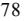

{84}------------------------------------------------

Dividends paid on our common shares to a United States Holder who is an individual, trust or estate, or a United States Individual Holder, will generally be treated as "qualified dividend income" that is taxable to such United States Individual Holders at preferential tax rates provided that (1) the common shares are readily tradable on an established securities market in the United States (such as the NYSE on which our common shares are traded); (2) we are not a PFIC for the taxable year during which the dividend is paid or the immediately preceding taxable year (as discussed below); (3) the United States Individual Holder has owned the common shares for more than 60 days in the 121-day period beginning 60 days before the date on which the common shares become ex-dividend, and (4) the United States Individual Holder is not under an obligation (whether pursuant to a short sale or otherwise) to make payments with respect to positions in substantially similar or related property. There is no assurance that any dividends paid on our common shares will be eligible for these preferential rates in the hands of a United States Individual Holder. Any dividends paid by us which are not eligible for these preferential rates will be taxed as ordinary income to a United States Individual Holder.

If we pay an "extraordinary dividend" on our common shares (generally, a dividend in an amount which is equal to or in excess of 10% of a shareholder's adjusted tax basis (or fair market value in certain circumstances) in the common shares or dividends received within a one-year period that, in the aggregate, equal or exceed 20% of a shareholder's adjusted tax basis (or fair market value upon the shareholder's election)) that is treated as "qualified dividend income," then any loss derived by a United States Individual Holder from the sale or exchange of such common shares will be treated as long-term capital loss to the extent of such dividend.

#### *Sale, Exchange or other Disposition of Common Shares*

Assuming we do not constitute a PFIC for taxable years after 2004, a United States Holder generally will recognize taxable gain or loss upon a sale, exchange or other disposition of our common shares in an amount equal to the difference between the amount realized by the United States Holder from such sale, exchange or other disposition and the United States Holder's tax basis in such common shares. Such gain or loss will be treated as long-term capital gain or loss if the United States Holder's holding period is greater than one year at the time of the sale, exchange or other disposition. Such capital gain or loss will generally be treated as United States-source income or loss, as applicable, for United States foreign tax credit purposes. A United States Holder's ability to deduct capital losses is subject to certain limitations.

Special rules may apply to a United States Holder who purchased shares before 2005 and did not make a timely QEF election or a mark-to-market election (as discussed below). Such United States Holders are encouraged to consult their tax advisors regarding the United States federal income tax consequences to them of the disposal of our common shares.

### *Passive Foreign Investment Company Considerations*

Special United States federal income tax rules apply to a United States Holder that holds shares in a foreign corporation classified as a PFIC for United States federal income tax purposes. In general, we will be treated as a PFIC with respect to a United States Holder if, for any taxable year in which such Holder held our common shares, either

- at least 75% of our gross income for such taxable year consists of passive income (e.g., dividends, interest, capital gains and rents derived other than in the active conduct of a rental business), or
- at least 50% of the average value of the assets held by us during such taxable year produce, or are held for the production of, such passive income.

For purposes of determining whether we are a PFIC, we will be treated as earning and owning our proportionate share of the income and assets, respectively, of any of our subsidiary corporations in which we own at least 25% of the value of the subsidiary's shares. Income earned, or deemed earned, by us in connection with the performance of services would not constitute passive income. By contrast, rental income would generally constitute passive income unless we were treated under specific rules as deriving our rental income in the active conduct of a trade or business.

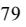

{85}------------------------------------------------

For taxable years through 2004, we were a PFIC. However, based on our current operations and future projections, we do not believe that we have been, or will become, a PFIC with respect to our taxable years after 2004. Although there is no legal authority directly on point, and we are not relying upon an opinion of counsel on this issue, our belief is based principally on the position that, for purposes of determining whether we are a PFIC, the gross income we derive or are deemed to derive from our time chartering and voyage chartering activities should constitute services income, rather than rental income. Correspondingly, such income should not constitute passive income, and the assets that we own and operate or are deemed to own and operate in connection with the production of such income, in particular, the vessels, should not constitute passive assets for purposes of determining whether we are a PFIC. We believe there is substantial legal authority supporting our position consisting of case law and Internal Revenue Service, or IRS, pronouncements concerning the characterization of income derived from time charters and voyage charters as services income for other tax purposes. However, we note that there is also authority which characterizes time charter income as rental income rather than services income for other tax purposes. In the absence of any legal authority specifically relating to the statutory provisions governing PFICs, the IRS or a court could disagree with our position. In addition, although we intend to conduct our affairs in a manner to avoid being classified as a PFIC, we cannot assure you that the nature of our operations will not change in the future.

As discussed more fully below, if we were to be treated as a PFIC for any taxable year which included a United States Holder's holding period in our common shares, then such United States Holder would be subject to different United States federal income taxation rules depending on whether the United States Holder makes an election to treat us as a "qualified electing fund," which election we refer to as a QEF Election. As an alternative to making a QEF election, a United States Holder should be able to make a "mark-to-market" election with respect to our common shares, as discussed below. In addition, if we were to be treated as a PFIC for a taxable year ending on or after December 31, 2013, a United States Holder of our common shares would be required to file an annual information return with the IRS for such year.

#### *United States Holders Making a Timely QEF Election*

**Pass-Through of Ordinary Earnings and Net Capital Gain.** A United States Holder who makes a timely QEF Election with respect to our common shares, or an Electing Holder, would report for United States federal income tax purposes his pro rata share of our "ordinary earnings" (i.e., the net operating income determined under United States federal income tax principles) and our net capital gain, if any, for our taxable year that ends with or within the taxable year of the Electing Holder. Our "net capital gain" is any excess of any of our net long term capital gains over our net short term capital losses and is reported by the Electing Holder as long term capital gain. Our net operating losses or net capital losses would not pass through to the Electing Holder and will not offset our ordinary earnings or net capital gain reportable to Electing Holders in subsequent years (although such losses would ultimately reduce the gain, or increase the loss, if any, recognized by the Electing Holder on the sale of his common shares).

For purposes of calculating our ordinary earnings, the cost of each vessel is depreciated on a straight-line basis over the applicable recovery period for vessels. Any gain on the sale of a vessel would be treated as ordinary income, rather than capital gain, to the extent of such depreciation deductions with respect to such vessel.

In general, an Electing Holder would not be taxed twice on his share of our income. Thus, distributions received from us by an Electing Holder are excluded from the Electing Holder's gross income to the extent of the Electing Holder's prior inclusions of our ordinary earnings and net capital gain. The Electing Holder's tax basis in his shares would be increased by any amount included in the Electing Holder's income. Distributions received by an Electing Holder**,** which are not includible in income because they have been previously taxed, would decrease the Electing Holder's tax basis in the common shares. Distributions, if any, in excess of such tax basis would be treated as capital gain (which gain will be treated as long-term capital gain if the Electing Holder held its common shares for more than one year at the time of distribution).

**Disposition of Common Shares.** An Electing Holder would generally recognize capital gain or loss on the sale or exchange of common shares in an amount equal to the difference between the amount realized by the Electing Holder from such sale or exchange and the Electing Holder's tax basis in the common shares. Such gain or loss would generally be treated as long-term capital gain or loss if the Electing Holder's holding period in the common shares at the time of the sale or exchange is more than one year. A United States Holder's ability to deduct capital losses may be limited.

**Making a QEF Election.** A United States Holder makes a QEF Election for a taxable year by completing and filing IRS Form 8621 (Return by a Shareholder of a Passive Foreign Investment Company or Qualified Electing Fund) in accordance with the instructions thereto. If we were aware that we were to be treated as a PFIC for any taxable year, we would provide each United States Holder with all necessary information in order to make the QEF Election described above.

{86}------------------------------------------------

### *United States Holders Making a Timely Mark-to-Market Election*

**Mark-to-Market Regime.** A United States Holder who does not make a QEF Election may make a "mark-to-market" election under section 1296 of the Code, provided that the common shares are regularly traded on a "qualified exchange." The NYSE, on which the common shares are traded, is a "qualified exchange" for these purposes. A United States Holder who makes a timely mark-to-market election with respect to the common shares would include annually in the United States Holder's income, as ordinary income, any excess of the fair market value of the common shares at the close of the taxable year over the United States Holder's then adjusted tax basis in the common shares. The excess, if any, of the United States Holder's adjusted tax basis at the close of the taxable year over the then fair market value of the common shares would be deductible in an amount equal to the lesser of the amount of the excess or the net mark-to-market gains that the United States Holder included in income in previous years with respect to the common shares. A United States Holder's tax basis in his common shares would be adjusted to reflect any income or loss amount recognized pursuant to the mark-to-market election.

**Disposition of Common Shares.** A United States Holder who makes a timely mark-to-market election would recognize ordinary income or loss on a sale, exchange or other disposition of the common shares in an amount equal to the difference between the amount realized by the United States Holder from such sale, exchange or other disposition and the United States Holder's tax basis in the common shares; provided, however, that any ordinary loss on the sale, exchange or other disposition may not exceed the net mark-to-market gains that the United States Holder included in income in previous years with respect to the common shares. The amount of any loss in excess of such net mark-to market gains is treated as capital loss.

**Making the Mark-to-Market Election.** A United States Holder makes a mark-to-market election for a taxable year by completing and filing IRS Form 8621 (Return by a Shareholder of a Passive Foreign Investment Company or Qualified Electing Fund) in accordance with the instructions thereto.

#### *United States Holders Not Making a Timely QEF Election or Mark-to-Market Election*

A United States Holder who does not make a timely QEF Election or a timely mark-to-market election, which we refer to as a Non-Electing Holder, would be subject to special rules with respect to (i) any "excess distribution" (generally, the portion of any distributions received by the Non-Electing Holder on the common shares in a taxable year in excess of 125% of the average annual distributions received by the Non-Electing Holder in the three preceding taxable years, or, if shorter, the Non-Electing Holder's holding period for the common shares), and (ii) any gain realized on the sale or other disposition of common shares. Under these rules, (i) the excess distribution or gain would be allocated ratably over the Non-Electing Holder's holding period for the common shares; (ii) the amount allocated to the current taxable year, and any taxable year prior to the first taxable year in which we were a PFIC, would be taxed as ordinary income; and (iii) the amount allocated to each of the other prior taxable years would be subject to tax at the highest rate of tax in effect for the applicable class of taxpayer for that year, and an interest charge for the deemed tax deferral benefit would be imposed with respect to the resulting tax attributable to each such other taxable year. If a Non-Electing Holder dies while owning common shares, the Non-Electing Holder's successor would be ineligible to receive a step-up in the tax basis of those common shares.

Distributions received by a Non-Electing Holder that are not "excess distributions" would be includible in the gross income of the Non-Electing Holder as dividend income to the extent that such distributions are paid out of our current or accumulated earnings and profits as determined under United States federal income tax principles. Such dividends would not be eligible to be treated as "qualified dividend income" eligible for preferential tax rates. Distributions in excess of our current or accumulated earnings and profits would be treated first as a return of the United States Holder's tax basis in the common shares (thereby increasing the amount of any gain or decreasing the amount of any loss realized on the subsequent sale or disposition of such common shares) and thereafter as capital gain.

{87}------------------------------------------------

### *United States Holders Who Acquired Shares Before 2005*

We were a PFIC through the 2004 taxable year. Therefore, a United States Holder who acquired our common shares before 2005 may be subject to special rules with respect to our common shares. In particular, a United States Holder who did not make a timely QEF Election or a mark-to-market election may continue to be subject to the PFIC rules with respect to our common shares. Such United States Holders are encouraged to consult their tax advisors regarding the application of these rules as well as the availability of certain elections which may ameliorate the application of these rules.

### **United States Federal Income Taxation of Non-United States Holders**

A beneficial owner of common shares (other than a partnership) that is not a United States Holder is referred to herein as a Non-United States Holder.

#### *Dividends on Common Shares*

Non-United States Holders generally will not be subject to United States federal income or withholding tax on dividends received from us with respect to our common shares, unless that income is effectively connected with the Non-United States Holder's conduct of a trade or business in the United States. If the Non-United States Holder is entitled to the benefits of a United States income tax treaty with respect to those dividends, that income is taxable only if it is attributable to a permanent establishment maintained by the Non-United States Holder in the United States.

#### *Sale, Exchange or Other Disposition of Common Shares*

Non-United States Holders generally will not be subject to United States federal income or withholding tax on any gain realized upon the sale, exchange or other disposition of our common shares, unless:

- the gain is effectively connected with the Non-United States Holder's conduct of a trade or business in the United States (and, if the Non-United States Holder is entitled to the benefits of a United States income tax treaty with respect to that gain, that gain is attributable to a permanent establishment maintained by the Non-United States Holder in the United States); or
- the Non-United States Holder is an individual who is present in the United States for 183 days or more during the taxable year of disposition and other conditions are met.

If the Non-United States Holder is engaged in a United States trade or business for United States federal income tax purposes, the income from the common shares, including dividends and the gain from the sale, exchange or other disposition of the common shares, that is effectively connected with the conduct of that trade or business will generally be subject to regular United States federal income tax in the same manner as discussed in the previous section relating to the taxation of United States Holders. In addition, if you are a corporate Non-United States Holder, your earnings and profits that are attributable to the effectively connected income, subject to certain adjustments, may be subject to an additional branch profits tax at a rate of 30%, or at a lower rate as may be specified by an applicable United States income tax treaty.

### **Backup Withholding and Information Reporting**

In general, dividend payments, or other taxable distributions, made within the United States to you will be subject to information reporting requirements if you are a United States Individual Holder. Such payments may also be subject to backup withholding tax if you are a United States Individual Holder and you:

- fail to provide an accurate taxpayer identification number;
- are notified by the IRS that you have failed to report all interest or dividends required to be shown on your United States federal income tax returns; or

{88}------------------------------------------------

- in certain circumstances, fail to comply with applicable certification requirements.
Non-United States Holders may be required to establish their exemption from information reporting and backup withholding by certifying their status on an IRS Form W-8.

If you are a Non-United States Holder and you sell your common shares to or through a United States office of a broker, the payment of the proceeds is subject to both United States backup withholding and information reporting unless you certify that you are a non-United States person, under penalties of perjury, or you otherwise establish an exemption. If you are a Non-United States Holder and you sell your common shares through a non-United States office of a non-United States broker and the sales proceeds are paid to you outside the United States, then information reporting and backup withholding generally will not apply to that payment. However, information reporting requirements, but not backup withholding, will apply to a payment of sales proceeds, even if that payment is made to you outside the United States, if you sell your common shares through a non-United States office of a broker that is a United States person or has some other contacts with the United States. Such information reporting requirements will not apply, however, if the broker has documentary evidence in his records that you are a non-United States person and certain other conditions are met, or you otherwise establish an exemption.

Backup withholding is not an additional tax. Rather, you generally may obtain a refund of any amounts withheld under backup withholding rules that exceed your United States federal income tax liability by filing a refund claim with the IRS.

Individuals who are United States Holders (and to the extent specified in applicable Treasury regulations, certain individuals who are Non-United States Holders and certain United States entities) who hold "specified foreign financial assets" (as defined in Section 6038D of the Code) are required to file IRS Form 8938 with information relating to the asset for each taxable year in which the aggregate value of all such assets exceeds \$75,000 at any time during the taxable year or \$50,000 on the last day of the taxable year (or such higher dollar amount as prescribed by applicable Treasury regulations). Specified foreign financial assets would include, among other assets, our common shares, unless the shares are held through an account maintained with a United States financial institution. Substantial penalties apply to any failure to timely file IRS Form 8938, unless the failure is shown to be due to reasonable cause and not due to willful neglect. Additionally, in the event an individual United States Holder (and to the extent specified in applicable Treasury regulations, an individual Non-United States Holder or a United States entity) that is required to file IRS Form 8938 does not file such form, the statute of limitations on the assessment and collection of United States federal income taxes of such holder for the related tax year may not close until three years after the date that the required information is filed. United States Holders (including United States entities) and Non- United States Holders are encouraged consult their own tax advisors regarding their reporting obligations under this legislation.

In addition to the tax consequences discussed above, we may be subject to tax in one or more other jurisdictions where we conduct activities. The amount of any such tax imposed upon our operations may be material.

The above-mentioned tax considerations does not purport to be a comprehensive description of all the tax considerations that may be relevant to a decision to purchase, own or dispose of the shares. Shareholders who wish to clarify their own tax situation should consult and rely upon their own tax advisors.

### **Other Tax Considerations**

In addition to the tax consequences discussed above, we may be subject to tax in one or more other jurisdictions where we conduct activities. The amount of any such tax imposed upon our operations may be material.

### **F. Dividends and Paying Agents**

Not applicable.

#### **G. Statement by Experts**

Not applicable.

{89}------------------------------------------------

### **H. Documents on Display**

We are subject to the informational requirements of the Securities Exchange Act of 1934, as amended. In accordance with these requirements we file reports and other information with the SEC. These materials, including this annual report and the accompanying exhibits may be inspected and copied at the public reference facilities maintained by the SEC at 100 F Street, NE, Room 1580, Washington, D.C. 20549. The SEC maintains a website (http://www.sec.gov) that contains reports, proxy and information statements and other information that we and other registrants have filed electronically with the SEC. Our filings are also available on our website at www.nat.bm. This web address is provided as an inactive textual reference only. Information contained on our website does not constitute part of this annual report.

Shareholders may also request a copy of our filings at no cost, by writing or telephoning us at the following address:

Nordic American Tankers Limited Swan Building 26 Victoria Street Hamilton, HM12, Bermuda. Tel: +1 441 292 7202

#### **I. Subsidiary Information**

Not applicable.

#### **J. Annual Report to Security Holders**

Not applicable.

#### **ITEM 11. QUANTITATIVE AND QUALITATIVE DISCLOSURES ABOUT MARKET RISK**

The Company is exposed to market risk from changes in interest rates related to the variable rate of the Company's borrowings under our 2019 Senior Secured Credit Facility including the \$30.0 million Accordion Loan, Financing of 2018-built Vessels and Financing of 2022 Newbuildings.

Amounts borrowed under these borrowing agreements bear interest at a rate equal to LIBOR plus a margin. As LIBOR is terminated as of June 30, 2023, our borrowing agreements will replace the LIBOR element with term Secured Overnight Financing Rate ("SOFR"), plus a Credit Adjustment Spread ("CAS") of 26 basis points, for the Financing of 2018-built Vessels and for the Financing of the 2022 Newbuildings, and with an interest rate based on Federal Funds Rate for the 2019 Senior Secured Credit Facility including the \$30 million Accordion Loan. Increasing interest rates could affect our future profitability. In certain situations, the Company may enter into financial instruments to reduce the risk associated with fluctuations in interest rates.

A 100 basis point increase in LIBOR would have resulted in an increase of approximately \$3.1 million in our interest expense for the year ended December 31, 2022.

The Company is exposed to the spot Suezmax tanker market. Historically, the tanker markets have been volatile as a result of the many conditions and factors that can affect the price, supply and demand for tanker capacity. Changes in demand for transportation of oil over longer distances and supply of tankers to carry that oil may materially affect our revenues, profitability and cash flows. The majority of our vessels are currently operated in the spot market and we only have three vessels on longer-term time charter agreements. We believe that over time, spot employment generates premium earnings compared to longer-term employment.

We estimate that during 2022, a \$1,000 per day per vessel decrease in the spot market rate would have decreased our voyage revenue by approximately \$6.8 million.

{90}------------------------------------------------

# **ITEM 12. DESCRIPTION OF SECURITIES OTHER THAN EQUITY SECURITIES**

Not applicable.

### **PART II**

### **ITEM 13. DEFAULTS, DIVIDEND ARREARAGES AND DELINQUENCIES**

Not applicable.

### **ITEM 14. MATERIAL MODIFICATIONS TO THE RIGHTS OF SECURITY HOLDERS AND USE OF PROCEEDS**

Not applicable.

### **ITEM 15. CONTROLS AND PROCEDURES**

### **A. Disclosure Controls and Procedures.**

Pursuant to Rules 13a-15(e) of the Securities Exchange Act of 1934, as amended (the "Exchange Act"), the Company's management, under the supervision and with the participation of the Chief Executive Officer and Chief Financial Officer, evaluated the effectiveness of the design and operation of the Company's disclosure controls and procedures as of December 31, 2022. Disclosure controls and procedures are designed to ensure that information required to be disclosed by the issuer in the reports that it files or submits under the Act is recorded, processed, summarized and reported, within the time periods specified in the U.S Securities and Exchange Commission's rules and forms. Disclosure controls and procedures include, without limitation, controls and procedures designed to ensure that information required to be disclosed by the Company in the reports that it files or submits under the Act is accumulated and communicated to the issuer's management, including its chief executive and chief financial officers, or persons performing similar functions, as appropriate to allow timely decisions regarding required disclosure. Based on this evaluation, management has concluded that our disclosure controls and procedures were effective as of December 31, 2022.

### **B. Management's annual report on internal control over financial reporting.**

Our internal control system is designed to provide reasonable assurance to the Company's management and Board of Directors regarding the reliability of financial reporting and the preparation of published financial statements for external purposes in accordance with U.S. generally accepted accounting principles. Our system of internal control over financial reporting includes those policies and procedures that:

- pertain to the maintenance of records that, in reasonable detail, accurately and fairly reflect the transactions and dispositions of our assets;
- provide reasonable assurance that transactions are recorded as necessary to permit preparation of financial statements in accordance with accounting principles generally accepted in the United States of America and that our receipts and expenditures are being made only in accordance with authorization of our management and directors; and
- provide reasonable assurance regarding prevention or timely detection of unauthorized acquisition, use or disposition of assets that could have a material effect on the consolidated financial statements.

{91}------------------------------------------------

Because of its inherent limitations, internal control over financial reporting may not prevent or detect all misstatements. All internal control systems, no matter how well designed and operated, can only provide reasonable, not absolute, assurance that the objectives of the control system will be met. Therefore, even those systems determined to be effective can provide only reasonable assurance with respect to financial statement preparation and presentation. Additionally, any projections of any evaluations of effectiveness to future periods are subject to the risk that controls may become inadequate because of changes in conditions or deterioration in the degree of compliance with our policies and procedures.

Our management, including the Chief Executive Officer and the Chief Financial Officer, evaluated the effectiveness of our internal control over financial reporting as at December 31, 2022, based on the framework established in Internal Control – Integrated Framework (2013) issued by the Committee of Sponsoring Organizations of the Treadway Commission ("COSO"). Based on this evaluation, management has concluded that our internal control over financial reporting was effective as of December 31, 2022.

### **C. Attestation report of the registered public accounting firm.**

The effectiveness of our internal control over financial reporting as of December 31, 2022 has been audited by KPMG AS, an independent registered public accounting firm, as stated in their report that appears herein.

### **D. Changes in internal control over financial reporting.**

Other than the changes referred to below, there have been no changes in internal controls over financial reporting that occurred during the year covered by this Annual Report, that have materially affected, or are reasonably likely to materially affect, the Company's internal controls over financial reporting.

### **Remediation of Material Weakness.**

As discussed in greater detail in Item 15 of our Annual Report on Form 20-F for the year ended December 31, 2021, management identified and disclosed a material weakness in our internal controls designed to timely assess, evaluate, and appropriately respond to circumstances involving a manual journal entry recorded as part of the consolidation process to reverse an impairment loss entry on vessels held and used, including timely and relevant communication to the Audit Committee.

Throughout 2022, we implemented and executed our remediation plan, as described in Item 15 of our Annual Report on Form 20-F for the year ended December 31, 2021 as follows:

- implemented new measures to ensure unimpeded communications and reporting lines and responsibilities between all parties involved with financial reporting and internal control including the Audit Committee; and
- re-emphasized roles and responsibilities and the requirement for employees to report concerns about any financial reporting or internal control matters that are deemed to be of concern and that all such matters must be reported to the Audit Committee who will have the full authority and resources to investigate matters; and
- re-established roles and responsibilities over controls for manual journal entries recorded in consolidation; and
- the Audit Committee worked with the full Board of Directors and evaluated enhancements to board level communications on financial reporting, internal controls and compliance.

We are committed to maintaining an effective internal control environment and we have concluded that the remedial actions taken would prevent a material misstatement of the Company's consolidated financial statements related to manual journal entries recorded as part of the consolidation process to occur in the future. As such, management have concluded that it has successfully remediated the material weakness as of December 31, 2022.

{92}------------------------------------------------

### **ITEM 16. [RESERVED]**

### **ITEM 16A. AUDIT COMMITTEE FINANCIAL EXPERT**

The Board of Directors has determined that Ms. Chu, who serves as Chairman of the Audit Committee, qualifies as an "audit committee financial expert" under SEC rules, and that Ms. Chu is "independent" under applicable NYSE rules and SEC standards.

### **ITEM 16B. CODE OF ETHICS**

The Company has adopted a code of ethics that applies to all of the Company's employees, including our chief executive officer, chief financial officer, principal accounting officer or controller. The code of ethics may be downloaded at our website (www.nat.bm).

### **ITEM 16C. PRINCIPAL ACCOUNTANT FEES AND SERVICES**

### **A. Audit Fees**

Our Board of Directors has established preapproval and procedures for the engagement of the Company's independent public accounting firms for all audit and non-audit services. The following table sets forth, for the two most recent fiscal years, the aggregate fees billed for professional services rendered by our principal accountant, KPMG AS, Oslo, Norway, Auditor Firm ID: 1363, for the fiscal years ended December 31, 2022 and 2021, respectively, for the audit of the Company's annual financial statements and services provided by the principal accountant in connection with statutory and regulatory filings or engagements for the years ended December 31, 2022 and 2021.

| FISCAL YEAR ENDED DECEMBER 31, 2022 | \$ 836,921 |
|-------------------------------------|---------------|
| FISCAL YEAR ENDED DECEMBER 31, 2021 | \$ 886,650 |
| B.Audit-Related Fees                |               |
| FISCAL YEAR ENDED DECEMBER 31, 2022 | \$ 0       |
| FISCAL YEAR ENDED DECEMBER 31, 2021 | \$ 0       |

### **C. Tax Fees**

Not applicable.

### **D. All Other Fees**

Not applicable.

### **E. Audit Committee's Pre-Approval Policies and Procedures**

Our audit committee pre-approves all audit, audit-related and non-audit services not prohibited by law to be performed by our independent auditors and associated fees prior to the engagement of the independent auditor with respect to such services.

**F.** Not applicable.

### **ITEM 16D. EXEMPTIONS FROM THE LISTING STANDARDS FOR AUDIT COMMITTEES**

Not applicable.

### **ITEM 16E. PURCHASES OF EQUITY SECURITIES BY THE ISSUER AND AFFILIATED PERSONS.**

Not applicable.

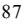

{93}------------------------------------------------

### **ITEM 16F. CHANGE IN REGISTRANT`S CERTIFYING ACCOUNTANT.**

Not applicable.

### **ITEM 16G. CORPORATE GOVERNANCE**

Pursuant to an exception for foreign private issuers, we, as a Bermuda company, are not required to comply with the corporate governance practices followed by U.S. companies under the NYSE listing standards (which are available at www.nyse.com) because in certain cases we follow our home country (Bermuda) practice. We believe that our established practices in the area of corporate governance are in line with the spirit of the NYSE standards and provide adequate protection to our shareholders.

There are four significant differences between our corporate governance practices and the NYSE standards applicable to listed U.S. companies. The NYSE requires that non-management directors meet regularly in executive sessions without management. The NYSE also requires that all independent directors meet in an executive session at least once a year. As permitted under Bermuda law and our bye-laws, our non-management directors do not regularly hold executive sessions without management and we do not expect them to do so in the future. The NYSE requires that a listed U.S. company have a nominating/corporate governance committee of independent directors and a committee charter specifying the purpose, duties and evaluation procedures of the committee. As permitted under Bermuda law and our bye-laws, we do not currently have a nominating or corporate governance committee. The NYSE requires, among other things, that a listed U.S. company have an audit committee with a minimum of three members, all of whom are independent. As permitted by Rule 10A-3 under the Securities Exchange Act of 1934, our audit committee consists of one independent member of our Board of Directors. The NYSE requires U.S. companies to adopt and disclose corporate governance guidelines. The guidelines must address, among other things: director qualification standards, director responsibilities, director access to management and independent advisers, director compensation, director orientation and continuing education, management succession and an annual performance evaluation. We are not required to adopt such guidelines under Bermuda law and we have not adopted such guidelines.

### **ITEM 16H. MINE SAFETY DISCLOSURE**

Not applicable.

### **ITEM 16I. DISCLOSURE REGARDING FOREIGN JURISDICTIONS THAT PREVENT INSPECTIONS**

Not applicable.

### **PART III**

### **ITEM 17. FINANCIAL STATEMENTS**

See Item 18.

### **ITEM 18. FINANCIAL STATEMENTS**

The financial information required by this Item is set forth on pages F-1 to F-24 filed as part of this annual report.

{94}------------------------------------------------

| Table of Contents |
|-------------------|
|                   |

| ITEM 19. | EXHIBITS                                                                                                                                                                                                                                                                                                                                        |
|----------|-------------------------------------------------------------------------------------------------------------------------------------------------------------------------------------------------------------------------------------------------------------------------------------------------------------------------------------------------|
| 1.1      | Memorandum of Association of the Company incorporated by reference to Exhibit 1.1 to the Company's annual report on Form 20-F filed with the Securities and Exchange Commission on April 17, 2012.                                                                                                                                           |
| 1.2      | By-Laws of the Company incorporated by reference to Form 6-K filed with the Securities and Exchange Commission on January 18, 2012.                                                                                                                                                                                                             |
| 2.1      | Form of Share Certificate incorporated by reference to Exhibit 2.1 to the Company's annual report on Form 20-F filed with the Securities and Exchange Commission on April 17, 2012.                                                                                                                                                          |
| 2.2      | Shareholder Rights Agreement dated as of June 16, 2017 by and between the Company and Computershare Trust Company, N.A., as rights agent incorporated by reference to Form 6-K filed with the Securities and Exchange Commission on June 16, 2017.                                                                                           |
| 2.3      | Description of Securities Registered Pursuant to Section 12 of the Securities Exchange Act of 1934 incorporated by reference to Exhibit 2.3 to the Company's annual report on Form 20-F filed with the Securities and Exchange Commission on April 16, 2020.                                                                                 |
| 4.11     | Amended and Restated 2011 Equity Incentive Plan                                                                                                                                                                                                                                                                                                 |
| 4.12     | Equity Distribution Agreement dated March 29, 2019, by and between Nordic American Tankers Limited and B. Riley FBR, Inc, incorporated by reference to Exhibit 4.14 to the Company's annual report on Form 20-F for the fiscal year ended December 31, 2019 filed with the Securities and Exchange Commission on April 16, 2020.          |
| 4.13     | Equity Distribution Agreement dated October 16, 2020, by and between Nordic American Tankers Limited and B. Riley Securities, Inc. incorporated by reference to Exhibit 4.13 to the Company's annual report on Form 20-F for the fiscal year ended December 31, 2020 filed with the Securities and Exchange Commission on April 29, 2021. |
| 4.14     | Equity Distribution Agreement dated September 29, 2021, by and between Nordic American Tankers Limited and B. Riley Securities, Inc. incorporated by reference to Exhibit 4.14 to the Company's annual report on Form 20-F for the fiscal year ended December 31, 2021 filed with Securities and Exchange Commission on May 11, 2022.     |
| 4.15     | Equity Distribution Agreement dated February 14, 2022, by and between Nordic American Tankers Limited and B. Riley Securities, Inc. incorporated by reference to Exhibit 4.15 to the Company's annual report on Form 20-F for the fiscal year ended December 31, 2021 filed with Securities and Exchange Commission on May 11, 2022.      |
| 8.1      | Subsidiaries of Nordic American Tankers Limited                                                                                                                                                                                                                                                                                                 |
| 12.1     | Rule 13a-14(a)/15d-14(a) Certification of the Chief Executive Officer.                                                                                                                                                                                                                                                                          |
| 12.2     | Rule 13a-14(a) /15d-14(a) Certification of the Chief Financial Officer.                                                                                                                                                                                                                                                                         |
| 13.1     | Certification of the Chief Executive Officer pursuant to 18 U.S.C. Section 1350, as adopted pursuant to Section 906 of the Sarbanes-Oxley Act of 2002.                                                                                                                                                                                          |
| 13.2     | Certification of the Chief Financial Officer pursuant to 18 U.S.C. Section 1350, as adopted pursuant to Section 906 of the Sarbanes-Oxley Act of 2002.                                                                                                                                                                                          |
| 15.1     | Consent of Independent Registered Public Accounting Firm – KPMG AS.                                                                                                                                                                                                                                                                             |
| 15.2     | Consent of Fearnleys                                                                                                                                                                                                                                                                                                                            |
| 101.INS  | XBRL Instance Document                                                                                                                                                                                                                                                                                                                          |

{95}------------------------------------------------

|  | Table of Contents |
|--|-------------------|

| 101.SCH | XBRL Taxonomy Extension Schema Document                       |
|---------|---------------------------------------------------------------|
|         |                                                               |
| 101.CAL | XBRL Taxonomy Extension Schema Calculation Linkbase Document  |
|         |                                                               |
| 101.DEF | XBRL Taxonomy Extension Schema Definition Linkbase Document   |
|         |                                                               |
| 101.LAB | XBRL Taxonomy Extension Schema Label Linkbase Document        |
|         |                                                               |
| 101.PRE | XBRL Taxonomy Extension Schema Presentation Linkbase Document |
|         |                                                               |
|         |                                                               |

{96}------------------------------------------------

### **SIGNATURES**

The registrant hereby certifies that it meets all of the requirements for filing on Form 20-F and has duly caused and authorized the undersigned to sign this annual report on its behalf.

NORDIC AMERICAN TANKERS LIMITED

/s/Herbjørn Hansson April 27, 2023 Name: Herbjørn Hansson Title: Founder, Chairman, President, and Chief Executive Officer

{97}------------------------------------------------

### TABLE OF CONTENTS

|                                                                                                             | Page |
|-------------------------------------------------------------------------------------------------------------|------|
| REPORTS OF INDEPENDENT REGISTERED PUBLIC ACCOUNTING FIRM – KPMG AS (PCAOB #1363)                            | F-2  |
|                                                                                                             | F-3  |
| FINANCIAL STATEMENTS:                                                                                       |      |
| Consolidated Statements of Operations for the years ended December 31, 2022, 2021 and 2020                  | F-4  |
| Consolidated Statements of Comprehensive Income (Loss) for the years ended December 31, 2022, 2021 and 2020 | F-5  |
| Consolidated Balance Sheets as of December 31, 2022 and 2021                                                | F-6  |
| Consolidated Statements of Shareholders' Equity for the years ended December 31, 2022, 2021 and 2020        | F-7  |
| Consolidated Statements of Cash Flows for the years ended December 31, 2022, 2021 and 2020                  | F-8  |
| Notes to Consolidated Financial Statements                                                                  | F-9  |

{98}------------------------------------------------

### **REPORT OF INDEPENDENT REGISTERED PUBLIC ACCOUNTING FIRM**

To the Shareholders and Board of Directors Nordic American Tankers Limited:

### *Opinion on Internal Control Over Financial Reporting*

We have audited Nordic American Tankers Limited and subsidiaries' (the Company) internal control over financial reporting as of December 31, 2022, based on criteria established in *Internal Control – Integrated Framework (2013)* issued by the Committee of Sponsoring Organizations of the Treadway Commission. In our opinion, the Company maintained, in all material respects, effective internal control over financial reporting as of December 31, 2022, based on criteria established in *Internal Control – Integrated Framework (2013)* issued by the Committee of Sponsoring Organizations of the Treadway Commission.

We also have audited, in accordance with the standards of the Public Company Accounting Oversight Board (United States) (PCAOB), the consolidated balance sheets of the Company as of December 31, 2022 and 2021, the related consolidated statements of operations, comprehensive income (loss), shareholders' equity, and cash flows for each of the years in the three-year period ended December 31, 2022, and the related notes (collectively, the consolidated financial statements), and our report dated April 27, 2023 expressed an unqualified opinion on those consolidated financial statements.

### *Basis for Opinion*

The Company's management is responsible for maintaining effective internal control over financial reporting and for its assessment of the effectiveness of internal control over financial reporting, included in the accompanying management's annual report on internal control over financial reporting. Our responsibility is to express an opinion on the Company's internal control over financial reporting based on our audit. We are a public accounting firm registered with the PCAOB and are required to be independent with respect to the Company in accordance with the U.S. federal securities laws and the applicable rules and regulations of the Securities and Exchange Commission and the PCAOB.

We conducted our audit in accordance with the standards of the PCAOB. Those standards require that we plan and perform the audit to obtain reasonable assurance about whether effective internal control over financial reporting was maintained in all material respects. Our audit of internal control over financial reporting included obtaining an understanding of internal control over financial reporting, assessing the risk that a material weakness exists, and testing and evaluating the design and operating effectiveness of internal control based on the assessed risk. Our audit also included performing such other procedures as we considered necessary in the circumstances. We believe that our audit provides a reasonable basis for our opinion.

### *Definition and Limitations of Internal Control Over Financial Reporting*

A company's internal control over financial reporting is a process designed to provide reasonable assurance regarding the reliability of financial reporting and the preparation of financial statements for external purposes in accordance with generally accepted accounting principles. A company's internal control over financial reporting includes those policies and procedures that (1) pertain to the maintenance of records that, in reasonable detail, accurately and fairly reflect the transactions and dispositions of the assets of the company; (2) provide reasonable assurance that transactions are recorded as necessary to permit preparation of financial statements in accordance with generally accepted accounting principles, and that receipts and expenditures of the company are being made only in accordance with authorizations of management and directors of the company; and (3) provide reasonable assurance regarding prevention or timely detection of unauthorized acquisition, use, or disposition of the company's assets that could have a material effect on the financial statements.

Because of its inherent limitations, internal control over financial reporting may not prevent or detect misstatements. Also, projections of any evaluation of effectiveness to future periods are subject to the risk that controls may become inadequate because of changes in conditions, or that the degree of compliance with the policies or procedures may deteriorate.

/s/ KPMG AS

Oslo, Norway April 27, 2023

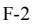

{99}------------------------------------------------

### **REPORT OF INDEPENDENT REGISTERED PUBLIC ACCOUNTING FIRM**

### To the Shareholders and Board of Directors Nordic American Tankers Limited:

### *Opinion on the* Consolidated *Financial Statements*

We have audited the accompanying consolidated balance sheets of Nordic American Tanker Limited and subsidiaries (the Company) as of December 31, 2022 and 2021, the related consolidated statements of operations, comprehensive income (loss), shareholders' equity, and cash flows for each of the years in the three-year period ended December 31, 2022, and the related notes (collectively, the consolidated financial statements). In our opinion, the consolidated financial statements present fairly, in all material respects, the financial position of the Company as of December 31, 2022 and 2021, and the results of its operations and its cash flows for each of the years in the three-year period ended December 31, 2022, in conformity with U.S. generally accepted accounting principles.

We also have audited, in accordance with the standards of the Public Company Accounting Oversight Board (United States) (PCAOB), the Company's internal control over financial reporting as of December 31, 2022, based on criteria established in *Internal Control – Integrated Framework (2013)* issued by the Committee of Sponsoring Organizations of the Treadway Commission, and our report dated April 27, 2023 expressed an unqualified opinion on the effectiveness of the Company's internal control over financial reporting.

#### *Basis for Opinion*

These consolidated financial statements are the responsibility of the Company's management. Our responsibility is to express an opinion on these consolidated financial statements based on our audits. We are a public accounting firm registered with the PCAOB and are required to be independent with respect to the Company in accordance with the U.S. federal securities laws and the applicable rules and regulations of the Securities and Exchange Commission and the PCAOB.

We conducted our audits in accordance with the standards of the PCAOB. Those standards require that we plan and perform the audit to obtain reasonable assurance about whether the consolidated financial statements are free of material misstatement, whether due to error or fraud. Our audits included performing procedures to assess the risks of material misstatement of the consolidated financial statements, whether due to error or fraud, and performing procedures that respond to those risks. Such procedures included examining, on a test basis, evidence regarding the amounts and disclosures in the consolidated financial statements. Our audits also included evaluating the accounting principles used and significant estimates made by management, as well as evaluating the overall presentation of the consolidated financial statements. We believe that our audits provide a reasonable basis for our opinion.

### *Critical Audit Matter*

The critical audit matter communicated below is a matter arising from the current period audit of the consolidated financial statements that was communicated or required to be communicated to the audit committee and that: (1) relates to accounts or disclosures that are material to the consolidated financial statements and (2) involved our especially challenging, subjective, or complex judgments. The communication of a critical audit matter does not alter in any way our opinion on the consolidated financial statements, taken as a whole, and we are not, by communicating the critical audit matter below, providing a separate opinion on the critical audit matter or on the accounts or disclosures to which it relates.

#### *Impairment indicators of vessels*

As discussed in Note 4 to the consolidated financial statements, the carrying value of vessels as of December 31, 2022 was \$735.1 million. As discussed in Note 2 to the consolidated financial statements, at each reporting date, the Company reviews its vessels for impairment whenever events or circumstances indicate that the carrying amount may not be recoverable. The Company's evaluation of events or circumstances that may indicate impairment include, amongst others, an assessment of estimated cash flows, influenced primarily by future charter rates. The Company did not identify any indicators of impairment as at December 31, 2022.

We identified the assessment of indicators of impairment for vessels as a critical audit matter. A higher degree of subjective auditor judgment was required to assess the Company's evaluation of events or circumstances that impact estimated cash flows, particularly estimated future charter rates including charter rates for the initial two-year period and for the remaining estimated useful life of the vessel. Changes in assumptions about estimated future charter rates could have a significant effect on the Company's conclusion regarding indicators of impairment.

The following are the primary procedures we performed to address this critical audit matter. We evaluated the design and tested the operating effectiveness of an internal control related to the Company's identification and evaluation of indicators of impairment, including an assessment of estimated future charter rates. We evaluated the Company's estimated future charter rates for 2023 and 2024 by comparing the Company's historical expected future charter rates to actual charter rates and comparing current expectations of charter rates to forecasts from brokers and publicly available information about the industry. To evaluate the Company's estimated charter rates from 2025 to the end of the useful life of the vessel, we compared the Company's estimated future charter rates to both Company specific historical results and to historical charter rates from brokers and publicly available information about the industry.

#### /s/ KPMG AS

We have served as the Company's auditor since 2015.

Oslo, Norway April 27, 2023

{100}------------------------------------------------

**CONSOLIDATED STATEMENTS OF OPERATIONS FOR THE YEARS ENDED DECEMBER 31, 2022, 2021 AND 2020**

*All figures in USD '000, except share and per share amount*

|                                                               |             | Year Ended December 31, |             |  |
|---------------------------------------------------------------|-------------|-------------------------|-------------|--|
|                                                               | 2022        | 2021                    | 2020        |  |
| Voyage Revenues                                               | 339,340     | 191,075                 | 354,619     |  |
| Other Income                                                  | -           | 4,684                   | -           |  |
| Voyage Expenses                                               | (170,515)   | (128,263)               | (121,089)   |  |
| Vessel Operating Expenses                                     | (63,430)    | (67,676)                | (66,883)    |  |
| Depreciation Expense                                          | (50,421)    | (68,352)                | (67,834)    |  |
| Impairment Loss on Vessels                                    | (314)       | (60,311)                | -           |  |
| Gain / (Loss) on Disposal of Vessels                          | 6,005       | -                       | -           |  |
| General and Administrative Expenses                           | (18,798)    | (15,620)                | (17,586)    |  |
| Net Operating Income (Loss)                                   | 41,867      | (144,463)               | 81,227      |  |
| Interest Income                                               | -           | 3                       | 96          |  |
| Interest Expense                                              | (27,055)    | (26,380)                | (31,481)    |  |
| Other Financial Income (Expense)                              | 312         | (429)                   | 255         |  |
| Total Other Expenses                                          | (26,743)    | (26,806)                | (31,130)    |  |
| Net Income (Loss) Before Income Taxes                         | 15,124      | (171,269)               | 50,097      |  |
| Income Tax Expense                                            | (23)        | (59)                    | (64)        |  |
| Net Income (Loss)                                             | 15,101      | (171,328)               | 50,033      |  |
| Basic and Diluted Income (Loss) per Share                     | 0.07        | (1.05)                  | 0.34        |  |
| Basic and Diluted Average Number of Common Shares Outstanding | 202,032,942 | 162,549,611             | 149,292,586 |  |

*The accompanying notes are an integral part of these consolidated financial statements.*

{101}------------------------------------------------

**CONSOLIDATED STATEMENTS OF COMPREHENSIVE INCOME (LOSS) FOR THE YEARS ENDED DECEMBER 31, 2022, 2021 AND 2020**

*All figures in USD '000, except share and per share amount*

|                                                |        | Year Ended December 31, |        |  |
|------------------------------------------------|--------|-------------------------|--------|--|
|                                                | 2022   | 2021                    | 2020   |  |
| Net Income (Loss)                              | 15,101 | (171,328)               | 50,033 |  |
| Other Comprehensive Income (Loss)              |        |                         |        |  |
| Translation Differences                        | (210)  | (102)                   | 157    |  |
| Unrealized Gain (Loss) on Defined benefit plan | (22)   | (163)                   | (76)   |  |
| Other Comprehensive Income (Loss)              | (232)  | (265)                   | 81     |  |
| Total Comprehensive Income (Loss)              | 14,869 | (171,593)               | 50,114 |  |

*The accompanying notes are an integral part of these consolidated financial statements.*

{102}------------------------------------------------

### **CONSOLIDATED BALANCE SHEETS AS OF DECEMBER 31, 2022 AND 2021**

*All figures in USD '000, except share and per share amount*

|                                                                                                                        | As of December 31, |           |
|------------------------------------------------------------------------------------------------------------------------|--------------------|-----------|
| Assets                                                                                                                 | 2022               | 2021      |
| Current Assets                                                                                                         |                    |           |
| Cash and Cash Equivalents                                                                                              | 59,583             | 34,739    |
| Restricted Cash                                                                                                        | 3,719              | 9,909     |
| Accounts Receivable, Net                                                                                               | 20,474             | 9,374     |
| Prepaid Expenses                                                                                                       | 5,975              | 4,847     |
| Inventory                                                                                                              | 25,430             | 20,873    |
| Voyages in Progress                                                                                                    | 23,997             | 10,488    |
| Other Current Assets                                                                                                   | 3,484              | 1,918     |
| Vessels Held for Sale                                                                                                  | -                  | 14,960    |
| Total Current Assets                                                                                                   | 142,662            | 107,108   |
| Non-Current Assets                                                                                                     |                    |           |
| Vessels                                                                                                                | 735,134            | 715,263   |
| Vessels under Construction                                                                                             | -                  | 24,270    |
| Right of Use Assets                                                                                                    | 1,209              | 1,857     |
| Other Non-Current Assets                                                                                               | 878                | 2,654     |
| Total Non-Current Assets                                                                                               | 737,221            | 744,044   |
| Total Assets                                                                                                           | 879,883            | 851,152   |
|                                                                                                                        |                    |           |
| Liabilities and Shareholders' Equity                                                                                   |                    |           |
| Current Liabilities                                                                                                    |                    |           |
| Accounts Payable                                                                                                       | 6,960              | 6,552     |
| Accrued Voyage Expenses                                                                                                | 11,315             | 14,985    |
| Other Current Liabilities                                                                                              | 14,439             | 8,561     |
| Current Portion of Long-Term Debt                                                                                      | 39,700             | 37,547    |
| Total Current Liabilities                                                                                              | 72,414             | 67,645    |
| Non-Current Liabilities                                                                                                |                    |           |
| Long-Term Debt                                                                                                         | 266,337            | 283,411   |
| Operating Lease Liabilities                                                                                            | 535                | 1,149     |
| Other Non-Current Liabilities                                                                                          | 615                | 724       |
| Total Non-Current Liabilities                                                                                          | 267,487            | 285,284   |
| Commitments and Contingencies                                                                                          | -                  | -         |
| Shareholders' Equity                                                                                                   |                    |           |
| Common Stock, par value \$0.01 per share 360,000,000 authorized, 208,796,444 and 183,694,196 issued and outstanding at |                    |           |
| December 31, 2022 and December 31, 2021, respectively.                                                                 | 2,087              | 1,836     |
| Additional Paid-In Capital                                                                                             | 188,801            | 139,480   |
| Contributed Surplus                                                                                                    | 507,134            | 529,816   |
| Accumulated Other Comprehensive Loss                                                                                   | (1,813)            | (1,581)   |
| Retained Earnings (Accumulated Deficit)                                                                                | (156,227)          | (171,328) |
| Total Shareholders' Equity                                                                                             | 539,982            | 498,223   |
| Total Liabilities and Shareholders' Equity                                                                             | 879,883            | 851,152   |

*The accompanying notes are an integral part of these consolidated financial statements.*

{103}------------------------------------------------

**CONSOLIDATED STATEMENTS OF SHAREHOLDERS' EQUITY FOR THE YEARS ENDED DECEMBER 31, 2022, 2021 AND 2020**

*All figures in USD '000, except number of shares*

|                                                          |                     |                    |                 |                                  |                        | Accumulated                    | Retained                             |                                  |
|----------------------------------------------------------|---------------------|--------------------|-----------------|----------------------------------|------------------------|--------------------------------|--------------------------------------|----------------------------------|
|                                                          | Number of Shares | Treasury Shares | Common Stock | Additional Paid-In Capital | Contributed Surplus | Other Comprehensive Loss | Earnings (Accumulated Deficit) | Total Shareholders' Equity |
| Balance at January 1, 2020                               | 147,230,634         | 42,000             | 1,472           | 38,499                           | 567,202                | (1,396)                        | (10,352)                             | 595,424                          |
| Net Income                                               | -                   | -                  | -               | -                                | -                      | -                              | 50,033                               | 50,033                           |
| Common Shares Issued, net of \$0.7 million issuance cost | 4,215,478           | -                  | 42              | 20,628                           | -                      | -                              | -                                    | 20,670                           |
| Other Comprehensive Loss                                 | -                   | -                  | -               | -                                | -                      | 81                             | -                                    | 81                               |
| Share Based Compensation                                 | -                   | -                  | -               | 285                              | -                      | -                              | -                                    | 285                              |
| Dividends Distributed                                    | -                   | -                  | -               | -                                | (27,686)               | -                              | (39,566)                             | (67,242)                         |
| Balance at December 31, 2020                             | 151,446,112         | 42,000             | 1,514           | 59,412                           | 539,516                | (1,316)                        | -                                    | 599,126                          |
| Net Loss                                                 | -                   | -                  | -               | -                                | -                      | -                              | (171,328)                            | (171,328)                        |
| Common Shares Issued, net of \$2.3 million issuance cost | 32,248,084          | -                  | 322             | 79,729                           | -                      | -                              | -                                    | 80,051                           |
| Other Comprehensive Loss                                 | -                   | -                  | -               | -                                | -                      | (265)                          | -                                    | (265)                            |
| Share Based Compensation                                 | -                   | (42,000)           | -               | 339                              | -                      | -                              | -                                    | 339                              |
| Dividends Distributed                                    | -                   | -                  | -               | -                                | (9,700)                | -                              | -                                    | (9,700)                          |
| Balance at December 31, 2021                             | 183,694,196         | -                  | 1,836           | 139,480                          | 529,816                | (1,581)                        | (171,328)                            | 498,223                          |
| Net Income                                               | -                   | -                  | -               | -                                | -                      | -                              | 15,101                               | 15,101                           |
| Common Shares Issued, net of \$1.4 million issuance cost | 25,102,248          | -                  | 251             | 48,845                           | -                      | -                              | -                                    | 49,096                           |
| Other Comprehensive Loss                                 | -                   | -                  | -               | -                                | -                      | (232)                          | -                                    | (232)                            |
| Share Based Compensation                                 | -                   | -                  | -               | 476                              | -                      | -                              | -                                    | 476                              |
| Dividends Distributed                                    | -                   | -                  | -               | -                                | (22,682)               | -                              | -                                    | (22,682)                         |
| Balance at December 31, 2022                             | 208,796,444         | -                  | 2,087           | 188,801                          | 507,134                | (1,813)                        | (156,227)                            | 539,982                          |

*The accompanying notes are an integral part of these consolidated financial statements.*

{104}------------------------------------------------

**CONSOLIDATED STATEMENTS OF CASH FLOWS FOR THE YEARS ENDED DECEMBER 31, 2022, 2021 AND 2020** *All figures in USD '000*

|                                                                                       | Year Ended December 31, |           |          |  |  |
|---------------------------------------------------------------------------------------|-------------------------|-----------|----------|--|--|
| Cash Flows from Operating Activities                                                  | 2022                    | 2021      | 2020     |  |  |
| Net Income (Loss)                                                                     | 15,101                  | (171,328) | 50,033   |  |  |
| Reconciliation of Net Loss to Net Cash Provided by Operating Activities               |                         |           |          |  |  |
| Depreciation Expense                                                                  | 50,421                  | 68,352    | 67,834   |  |  |
| Impairment Loss on Vessels                                                            | 314                     | 60,311    | -        |  |  |
| (Gain) / Loss on Disposal of Vessels                                                  | (6,005)                 | -         | -        |  |  |
| Change in Fair Value of Investment Securities                                         | -                       | -         | 224      |  |  |
| Drydock Expenditure                                                                   | (8,215)                 | (7,318)   | (21,045) |  |  |
| Amortization of Deferred Finance Costs                                                | 3,589                   | 2,989     | 4,354    |  |  |
| Share-based Compensation                                                              | 476                     | 339       | 285      |  |  |
| Other, net                                                                            | 84                      | 502       | (810)    |  |  |
|                                                                                       |                         |           |          |  |  |
| Changes in Operating Assets and Liabilities                                           |                         |           |          |  |  |
| Accounts Receivables                                                                  | (11,100)                | (3,025)   | 18,109   |  |  |
| Inventory                                                                             | (4,558)                 | (1,465)   | 3,068    |  |  |
| Prepaid Expenses and Other Current Assets                                             | (2,694)                 | 286       | (330)    |  |  |
| Accounts Payable and Accrued Liabilities                                              | 230                     | 11,743    | (19,258) |  |  |
| Voyages in Progress                                                                   | (13,509)                | (5,844)   | 8,480    |  |  |
| Net Cash Provided by / (Used In) Operating Activities                                 | 24,134                  | (44,458)  | 110,944  |  |  |
| Cash Flows from Investing Activities                                                  |                         |           |          |  |  |
| Investment in Vessels                                                                 | (5,116)                 | (3,868)   | (6,845)  |  |  |
| Investment in Other Fixed Assets                                                      | -                       | (589)     | (233)    |  |  |
| Investment in Newbuilds                                                               | (90,301)                | (13,270)  | (11,000) |  |  |
| Sale of Vessels                                                                       | 81,074                  | 14,262    | -        |  |  |
| Proceeds from Sale of Investment Securities                                           | -                       | -         | 602      |  |  |
| Net Cash (Used In) / Provided by Investing Activities                                 | (14,343)                | (3,465)   | (17,476) |  |  |
| Cash Flows from Financing Activities                                                  |                         |           |          |  |  |
| Proceeds from Issuance of Common Stock                                                | 49,096                  | 80,051    | 20,713   |  |  |
| Proceeds from Borrowing Activities                                                    | -                       | -         | 29,300   |  |  |
| Proceeds from Vessel Financing                                                        | 88,000                  | -         | -        |  |  |
| Repayment of Vessel financing                                                         | (11,476)                | (7,958)   | (7,630)  |  |  |
| Repayments on Borrowing Facility                                                      | (93,933)                | (30,780)  | (67,896) |  |  |
| Transaction Costs Borrowing Facilities                                                | -                       | (1,100)   | (320)    |  |  |
| Dividends Distributed                                                                 | (22,682)                | (9,700)   | (67,242) |  |  |
| Net Cash Provided by / (Used In) Financing Activities                                 | 9,005                   | 30,513    | (93,075) |  |  |
| Net Increase / (Decrease) in Cash, Cash Equivalents, and Restricted Cash              | 18,796                  | (17,410)  | 393      |  |  |
| Cash, Cash Equivalents, and Restricted Cash at Beginning of Year                      | 44,648                  | 62,070    | 61,638   |  |  |
| Effect of Exchange Rate Changes on Cash and Cash Equivalents                          | (142)                   | (12)      | 39       |  |  |
| Cash, Cash Equivalents, and Restricted Cash at End of Year                            | 63,302                  | 44,648    | 62,070   |  |  |
| Supplemental Disclosure of Cash Flow information                                      |                         |           |          |  |  |
| Cash and Cash Equivalents                                                             | 59,583                  | 34,739    | 57,847   |  |  |
| Restricted Cash                                                                       | 3,719                   | 9,909     | 4,223    |  |  |
| Total Cash, Cash equivalents and Restricted Cash Shown in the Statement of Cash Flows | 63,302                  | 44,648    | 62,070   |  |  |
| Cash Paid for Taxes                                                                   | 59                      | 64        | 71       |  |  |
| Cash Paid for Interest, Net of Amounts Capitalized                                    | 23,455                  | 23,392    | 27,128   |  |  |
|                                                                                       |                         |           |          |  |  |

*The accompanying notes are an integral part of these consolidated financial statements.*

{105}------------------------------------------------

### NOTES TO CONSOLIDATED FINANCIAL STATEMENTS *(All amounts in USD '000 except where noted)*

### **1. NATURE OF BUSINESS**

Nordic American Tankers Limited ("NAT") was formed on June 12, 1995 under the laws of the Islands of Bermuda. The Company's shares trade under the symbol "NAT" on the New York Stock Exchange. The Company was formed for the purpose of acquiring and chartering out double-hull tankers.

The Company is an international tanker company that has a fleet of 19 Suezmax tankers as of December 31, 2022. The Company has in 2022 disposed of five vessels built in 2002 and 2003 and taken delivery of two newbuildings from Samsung shipyard in South Korea. The vessels in the fleet are considered homogeneous and interchangeable as they have approximately the same freight capacity and ability to transport the same type of cargo. The fleet of 19 Suezmax tankers are predominantly employed in the spot market, together with four vessels on longer term time charter agreements, where the two newbuildings delivered in 2022 are chartered out on six-year time charter agreements that commenced directly after delivery from the shipyard in May and June 2022 and further two vessels are chartered out on agreements expiring in late 2023 with an option to extend the agreement for a year for one of these vessels.

### **The Company's Fleet**

The Company's fleet as of December 31, 2022, consists of 19 Suezmax crude oil tankers of which the vast majority have been built in Korea.

|                 |          | Deadweight |
|-----------------|----------|------------|
| Vessel          | Built in | Tons       |
| Nordic Apollo   | 2003     | 159,998    |
| Nordic Pollux   | 2003     | 150,103    |
| Nordic Castor   | 2004     | 150,249    |
| Nordic Luna     | 2004     | 150,037    |
| Nordic Freedom  | 2005     | 159,331    |
| Nordic Skier    | 2005     | 159,089    |
| Nordic Sprinter | 2005     | 159,089    |
| Nordic Cross    | 2010     | 158,475    |
| Nordic Light    | 2010     | 158,475    |
| Nordic Vega     | 2010     | 163,940    |
| Nordic Breeze   | 2011     | 158,597    |
| Nordic Zenith   | 2011     | 158,645    |
| Nordic Star     | 2016     | 157,738    |
| Nordic Space    | 2017     | 157,582    |
| Nordic Aquarius | 2018     | 157,338    |
| Nordic Cygnus   | 2018     | 157,526    |
| Nordic Tellus   | 2018     | 157,407    |
| Nordic Harrier  | 2022     | 157,094    |
| Nordic Hunter   | 2022     | 157,037    |
|                 |          |            |
|                 | F-9      |            |

{106}------------------------------------------------

### **2. SUMMARY OF SIGNIFICANT ACCOUNTING POLICIES**

**Basis of Accounting:** These consolidated financial statements ("financial statements") have been prepared in accordance with accounting principles generally accepted in the United States of America ("U.S. GAAP").

**Principles of Consolidation:** Entities in which NAT has controlling financial interest are consolidated. Subsidiaries are consolidated from the date on which control is obtained. The subsidiaries' accounting policies are in conformity with U.S. GAAP. All intercompany balances and transactions have been eliminated in consolidation.

**Use of Estimates:** Preparation of financial statements in accordance with U.S. GAAP requires management to make estimates and assumptions that affect the reported amounts of assets and liabilities, the disclosure of contingent assets and liabilities at the date of the financial statements and the reported amounts of revenue and expenses during the reporting period. Actual results could differ from those estimates. The effects of changes in accounting estimates are accounted for in the same period in which the estimates are changed.

**Foreign Currency Translation:** The functional currency of NAT is the United States ("U.S.") dollar as substantially all revenues are nominated in U.S. dollars and the majority of the expenditures are incurred and paid in U.S. dollars. Transactions in foreign currencies during the year are translated into U.S. dollars at the rates of exchange in effect at the date of the transaction**.** The Company's subsidiaries NAT Chartering AS, and the European branch of Scandic American Shipping Ltd, have Norwegian kroner as their functional currency. All assets and liabilities of those entities are translated into U.S. dollars as of each balance sheet date. Translation gains and losses are reflected in shareholders' equity as part of accumulated other comprehensive income (loss).

**Revenue and Expense Recognition:** Revenues and expenses are recognized on an accrual basis. Revenues are generated from spot and time charters.

*Spot Charters:* For vessels operating on spot charters, voyage revenues are recognized ratably over the estimated length of each voyage, on a load-to-discharge basis and, therefore, are allocated between reporting periods based on the relative transit time in each period. Voyage expenses are capitalized between the discharge port of the immediately previous cargo, or contract date if later, and the load port of the cargo to be chartered if they qualify as fulfillment costs. Incremental cost to obtain a contract is capitalized and amortized ratably over the estimated length of each voyage, calculated on a load-to-discharge basis. The impact of recognizing voyage expenses ratably over the length of each voyage is not materially different on a quarterly and annual basis from a method of recognizing such costs as incurred. Expected losses that are deemed probable on voyages are provided for in full at the time such losses can be estimated. A voyage is deemed to commence upon loading of cargo and is deemed to end upon the completion of discharge of the same cargo. The Company does not capitalize fulfilment cost or recognize revenue if a charter has not been contractually committed to by a customer.

As the Company's performance obligations are services which are received and consumed by our customers as we perform such services, revenues are recognized over time proportionate to the days elapsed since the service commencement compared to the total days anticipated to complete the service. Freight is generally billed to the customers after the cargo has been discharged and the performance obligation fulfilled by the Company. The Company is responsible for paying voyage expenses and the charterer is responsible for any delay at the load and discharge ports. Demurrage earned during a spot charter represents a variable consideration. The Company recognizes such revenues in the voyage estimates only to the extent that it is probable that a significant reversal in the amount of cumulative revenue recognized will not occur. Voyage estimates are reviewed and updated over the duration of the spot charter contract. When the Company's tankers are operating on spot charters the vessels are traded fully at the risk and reward of the Company. The Company considers it appropriate to present the gross amount of earned revenue from the spot charter, showing voyage expenses related to the voyage separately in the Statements of Operations.

{107}------------------------------------------------

*Time Charters:* Under a time charter, the charterer pays for the voyage expenses, such as port, canal and fuel costs, while the Company pays for vessel operating expenses, including, among other costs, crew costs, provisions, deck and engine stores, lubricating oil, insurance, maintenance and repairs and costs relating to a vessel's intermediate and special surveys. Revenues from time charter contracts where the Company is a lessor are accounted for as fixed rate operating leases under ASC 842 Leases and are recognized daily over the term of the charter. Time charter revenues are generally billed to the customers on a monthly basis in advance before and through the charter period. Time charter agreements with profit-sharing are recognized when the contingency related to it is resolved. The Company has applied the practical expedient to not separate non-lease components from the associated lease component and instead to account for those components as a single component if the non-lease component otherwise would be accounted for under the new revenue guidance (ASC 606); and both of the following are met: (1) the timing and patterns of transfer of the non-lease component and associated lease are the same; and (2) the lease component, if accounted for separately, would be classified as an operating lease. The pattern of revenue recognition has not changed as a result of implementation of ASC 842 Leases.

**Vessel Operating Expenses:** Vessel operating expenses include crewing, repair and maintenance, insurance, stores, lubricants, management fee, communication expenses and tonnage tax. These expenses are recognized when incurred.

**Cash, Cash Equivalents and Restricted Cash:** Cash, cash equivalents and Restricted Cash consist of highly liquid investments such as time deposits with original maturities when acquired of three months or less. Amounts included in restricted cash represent those required to be set aside by a contractual agreement with a banking institution for the payment of future estimated drydocking expenditure related to the vessels used as collateral.

**Accounts Receivable, Net:** Accounts receivable and other receivables are presented net of allowance for doubtful balances. The Company regularly reviews its accounts receivables and estimates the amount of uncollectible receivables each period and provides for an allowance for uncollectable amounts. The assessment of the allowance is based on the age of the unpaid receivables, financial status of the customer and other relevant information.

**Inventories:** Inventories are comprised of bunker fuel and lubrication oil. Cost is determined on a first-in, first-out ("FIFO") basis.

**Vessels:** Vessels are stated at their historical cost, which consists of the contracted purchase price and any direct expenses incurred upon acquisition (including improvements, on site supervision expenses incurred during the construction period, commissions paid, delivery expenses and other expenditures to prepare the vessel for its initial voyage) less accumulated depreciation. Financing costs incurred during the construction period of the vessels are capitalized and included in vessels' cost based on the weighted-average method. Certain subsequent expenditures for conversions and major improvements are capitalized if it is determined that they appreciably extend the life, increase the earning capacity or improve the efficiency or safety of the vessel. Depreciation is calculated based on cost less estimated residual value, and is expensed over the estimated useful life of the related assets using the straight-line method. The estimated useful life of a vessel is 25 years from the date the vessel is delivered from the shipyard. Estimated useful life of ballast tank improvements is eight years. Ordinary repairs and maintenance are expensed as incurred. Vessels are classified separately as held for sale as part of current assets in the balance sheet when their carrying amount is expected to be recovered through a sale rather than continued use. For this to be the case, certain criteria should be met including, but not limited to, that the vessel must be available for immediate sale in its present condition, an active program to locate a buyer must be initiated, its sale must be highly probable and the sale should be expected to be completed within one year. Vessels classified as held for sale are stated at their fair value less cost to sell. Fair value is based on broker estimates that could be adjusted if there are actual entity-specific comparable transactions available.

{108}------------------------------------------------

**Impairment of Vessels:** The Company reviews for impairment long-lived assets held and used whenever events or changes in circumstances indicate that the carrying amount of the assets may not be recoverable. Undiscounted future cash flows are estimated on a vessel by vessel basis if events or change in circumstances indicate that carrying amounts may not be recoverable. When applicable, estimates of future undiscounted cash flows are prepared and include assumptions and estimates about the vessels' future performance, with the significant assumptions being related to charter rates, fleet utilization, operating expenses, capital expenditures/periodical maintenance, residual value and the estimated remaining useful life of each vessel. The assumptions used to develop estimates of future undiscounted cash flows are based on historical trends as well as future expectations. The estimated net operating cash flows are determined by considering an estimated daily time charter equivalent for the remaining operating days of the vessel, net of brokerage commissions, expected outflows for vessels' maintenance and vessel operating expenses (including planned drydocking expenditures). The Company estimates the daily time charter equivalent for the remaining operating days, utilizing available market data for spot market rates for the initial two-year period and the most recent fifteen-year historical company-specific average rates for the remaining estimated life of the vessel. Useful economic life is assumed to be 25 years from the delivery of the vessel from the shipyard. The Company may apply a probability-weighted approach when estimating undiscounted cash flows if multiple outcomes are reasonably possible, such as vessel sales or to account for estimation uncertainty. The long-term residual value used in the impairment test is estimated to be \$8.0 million per vessel. If the Company's estimate of undiscounted future cash flows for any vessel is lower than the vessel's carrying value, the carrying value is written down to its fair value, by recording an impairment charge. The impairment loss is determined by the difference between the carrying amount of the asset and its fair value. Fair value is based on broker estimates that could be adjusted if there are actual entity specific comparable transactions available.

**Drydocking:** The Company's vessels are required to be drydocked approximately every 30 to 60 months. The Company capitalizes eligible costs incurred during drydocking and amortizes those costs on a straight-line basis from the completion of a drydocking or intermediate survey to the estimated completion of the next drydocking. Drydocking costs include a variety of costs incurred while vessels are placed within drydock, including expenses related to the dock preparation and port expenses at the drydock shipyard, general shipyard expenses, expenses related to hull, external surfaces and decks, expenses related to machinery and engines of the vessel, as well as expenses related to the testing and correction of findings related to safety equipment on board. The Company includes in capitalized drydocking those costs incurred as part of the drydock to meet classification and regulatory requirements. Expenditures for normal repairs and maintenance performed during drydocking are expensed as incurred. The capitalized and unamortized drydocking costs are included in the book value of the vessels. Amortization expense of the drydocking costs is included in depreciation expense.

**Leases:** The Company bareboat charters certain vessels under leasing agreements. Sale-leaseback arrangements where the transaction is not considered a sale under ASC 606 are accounted for as a financing transaction. Consideration received in such sale-leaseback arrangements is recorded as a financial liability. Each lease payment is allocated between liability and interest expense to achieve a constant rate on the financial liability outstanding. The interest element is charged as Interest Expense over the lease period. The Company has certain office lease contracts resulting in a right-of-use asset and a lease liability and the Company has applied an incremental borrowing rate as the discount rate to calculate the respective asset and liability. The Company determines if an arrangement is or contains a lease at contract inception. The Company recognizes a right-of-use (ROU) asset and a lease liability at the lease commencement date. For operating leases, the lease liability is initially and subsequently measured at the present value of the unpaid lease payments at the lease commencement date. Optional periods are not included in the calculation. The right-of-use asset is initially measured at cost, which comprises the initial amount of the lease liability adjusted for lease payments made at or before the lease commencement date, plus any initial direct costs incurred less any lease incentives received. For operating leases, the right-of-use asset is subsequently measured throughout the lease term at the carrying amount of the lease liability, plus initial direct costs, plus (minus) any prepaid (accrued) lease payments, less the unamortized balance of lease incentives received. Lease expense for lease payments is recognized on a straight-line basis over the lease term.

{109}------------------------------------------------

**Investment Securities:** Equity securities are recorded at fair value with changes in fair value recognized in net income.

**Segment Information:** The Company has identified only one operating segment. The Company has only one type of vessel – Suezmax crude oil tankers. The Company does not provide a geographical analysis because the Company's business is global in nature and the location of its vessels continually changes.

**Fair Value of Financial Instruments:** The fair values of cash, cash equivalents and restricted cash, accounts receivable, accounts payable and accrued liabilities approximate carrying value because of the short-term nature of these instruments.

**Deferred Financing Costs:** Financing costs, including fees, commissions and legal expenses are deferred and amortized over the term of the arrangement, which approximates the effective interest method. Incurred fees related to loans not yet drawn are presented as Other non-current Assets. Unamortized deferred financing costs are deducted from the carrying value of the associated financial liability.

#### **Share Based Compensation:**

#### *Restricted shares*

The fair value of restricted shares to employees is estimated based on the market price of the Company's shares. The fair value of restricted shares granted to employees is measured at grant date and the Company records the compensation expense for such awards over the requisite service period.

#### *Stock options*

The Company grants stock options as incentive-based compensation to certain employees. The Company measures the cost of such awards using the grant date fair value of the award and recognizes that cost over the requisite service period.

**Income Taxes:** The Company is incorporated in Bermuda. Under current Bermuda law, the Company is not subject to corporate income taxes. The statutory applicable rate to consolidated corporate earnings is 0%.

Two of the Company's wholly-owned subsidiaries are located in Norway and are subject to income tax in that jurisdiction at 22% for the years ended December 31, 2022, 2021 and 2020, respectively, of their taxable profit. The income tax expensed for year ended December 31, 2022, 2021 and 2020 was \$23,000, \$59,000 and \$64,000, respectively. Deferred tax assets related to these entities are inconsequential. The Company does not have any unrecognized tax benefits, material accrued interests or penalties related to income taxes.

**Concentration of Credit Risk:** Financial instruments that potentially subject the Company to concentrations of credit risk consist principally of cash and cash equivalents and accounts receivable. The Company's cash is primarily held in major banks and financial institutions and typically insured up to a set amount. Accordingly, the Company believes the risk of any potential loss on deposits held in these institutions is remote. Concentrations of credit risk relative to accounts receivable are limited to our client base in the oil and energy industry that may be affected by changes in economic or other external conditions. The Company does not require collateral for its accounts receivable.

For the years ending December 31, 2022, December 31, 2021 and December 31, 2020, one customer accounted for 12.2%, 12.5% and 11.4% of the voyage revenues, respectively.

Accounts receivable, Net, as of December 31, 2022, and December 31, 2021, were \$20.5 million and \$9.4 million, respectively. As of December 31, 2022, three charterers accounted for 54% of the outstanding accounts receivable, each representing 29.8%, 13.3% and 10.9% of the balance. As of December 31, 2021, three charterers accounted for 48% of the outstanding accounts receivable, each representing 22.3%, 13.3% and 12.4% of the balance. Accounts Receivable, Net, as of December 31, 2022, and December 31, 2021 are net of a provision for credit losses of \$130,000 and \$75,000, respectively.

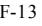

{110}------------------------------------------------

### **Recent Accounting Pronouncements**

In March 2020, the FASB issued ASU 2020-04, Reference Rate Reform (ASC 848) which provides relief for companies preparing for discontinuation of interest rates such as LIBOR. A contract modification is eligible to apply the optional relief to account for the modifications as a continuation of the existing contracts without additional analysis and consider embedded features to be clearly and closely related to the host contract without reassessment, if all of the following criteria are met: (i) contract references a rate that will be discontinued; (ii) modified terms directly replace (or have potential to replace) this reference rate; and (iii) changes to any other terms that change (or have potential to change) amount and timing of cash flows must be related to replacement of the reference rate. Relief provided by this ASU is optional and expires December 31, 2024.

In January 2021, the FASB issued ASU 2021-01, Reference Rate Reform (ASC 848) to refine the scope of ASC 848 and to clarify some of its guidance. The Company has determined that its primary exposure to LIBOR is in relation to its floating rate borrowing facilities to which it is a party. We expect to take advantage of the expedients and exceptions for applying GAAP provided by the updates when reference rates currently in use are discontinued and replaced with alternative reference rates. We expect no material effects from these transitions and we refer to footnote 8 for further details related to amendments agreed with lenders subsequent to December 31, 2022.

### **3. REVENUES**

Our voyage revenues consist of time charter revenues and spot charter revenues with the following split:

| All figures in USD '000 | 2022    | 2021    | 2020    |
|-------------------------|---------|---------|---------|
| Spot Charter Revenues   | 296,810 | 170,242 | 274,217 |
| Time Charter Revenues   | 42,530  | 20,833  | 80,402  |
| Total Voyage Revenues   | 339,340 | 191,075 | 354,619 |

The future minimum revenues as at December 31, 2022 related to time charter revenues are as follows:

| All figures in USD '000       | Amount  |
|-------------------------------|---------|
| 2023                          | 35,653  |
| 2024                          | 17,202  |
| 2025                          | 17,155  |
| 2026                          | 17,155  |
| 2027 and thereafter           | 24,561  |
| Total Future Minimum Revenues | 111,726 |

Our voyage contracts have a duration of one year or less and we applied the exemption related to excluding the disclosure of remaining performance obligations. As of December 31, 2022 and December 31, 2021, the Company has capitalized fulfilment cost of \$1.3 million and \$1.1 million, respectively.

{111}------------------------------------------------

### **4. VESSELS**

Vessels consists of the carrying value of 19 and 21 vessels for the year ended December 31, 2022 and December 31, 2021, respectively. Vessels includes capitalized drydocking costs. One vessel is presented as Held for Sale as of December 31, 2021, and is presented as a disposal in the table below.

| 2022      | 2021      |
|-----------|-----------|
| 1,244,148 | 1,316,463 |
| 117,677   | 3,868     |
| (282,829) | (76,183)  |
| 80,047    | 82,227    |
| 12,774    | 7,881     |
| (24,497)  | (10,061)  |
| 1,147,320 | 1,324,195 |
| (398,113) | (557,527) |
| (14,073)  | (51,405)  |
| 735,134   | 715,263   |
| -         | 14,960    |
|           |           |

*The Company presented as of December 31, 2021, \$24.3 million as Vessels under Construction related to payments under the shipbuilding contracts for the two newbuildings delivered in 2022 from Samsung shipyard in South Korea. Upon delivery of these two vessels in 2022, the Company transferred the balance from Vessels under Constructions to Vessels, and as such the \$117.7 million presented as Additions Vessels in 2022 in the table above includes the \$24.3 million referred to above. The book value of the two vessels delivered in 2022 are \$56.2 million and \$55.7 million as of December 31, 2022, and the vessels are chartered out on longer term time charter agreements. We refer to footnote 3 for further information.

### **Impairment and Gain (Loss) on Disposal of Vessels**

The Company has recorded impairment losses on vessels of \$0.3 million, \$60.3 million and \$0 for the years ended December 31, 2022, December 31, 2021 and December 31, 2020, respectively. The impairment charge recorded in 2022 is related to a vessel classified as held for sale as of December 31, 2021, and as a result of a change in fair value before being disposed of in 2022.

If events or change in circumstances indicate that carrying amounts may not be recoverable, the Company reviews its vessels for impairment on an asset by asset basis by comparing the carrying value of its vessels to estimated undiscounted cash flows for the remaining useful life of its vessels. If applicable, the Company develops undiscounted future cash flows for the remaining useful life of the vessels with assumptions and estimates made based on historical trends as well as future expectations. The most important assumption in determining undiscounted cash flows are the estimated charter rates. Charter rates are volatile and the analysis have in prior periods been based on market rates obtained from third parties, in combination with historical achieved rates by the Company.

The impairment charge of \$60.3 million recorded in 2021 was related to six vessels built in the period from 2002 to 2003 and included an impairment charge of \$8.9 million related to a vessel presented as Held for Sale at December 31, 2021. In 2022, five of these vessels have been sold with an accumulated gain of \$6.0 million. The gain relates in all material respects to the last vessel sold in October 2022, as a result of increasing second-hand vessel prices throughout 2022. No events or change in circumstances were identified as of December 31, 2022, that indicated that the carrying values may not be recoverable.

{112}------------------------------------------------

### **5. RELATED PARTY TRANSACTIONS**

The Company has an agreement with a company owned by a Board member for the use of an asset for corporate and marketing activities. The Company has in 2022 paid operating cost of \$1.2 million and fees associated with actual use. In 2022, 2021 and 2020, the Company recognized an expense of \$0.3 million, \$0.3 million and \$0.1 million, respectively, for utilization of the asset. No amounts were due to the related party as of December 31, 2022 or December 31, 2021.

### **6. OTHER NON-CURRENT ASSETS**

| All figures in USD '000          | 2022 | 2021  |
|----------------------------------|------|-------|
| Fixture, Furniture and Equipment | 730  | 756   |
| Prepaid Financing Cost           | -    | 1,100 |
| Other                            | 148  | 798   |
| Total as of December 31,         | 878  | 2,654 |

### **7. SHARE-BASED COMPENSATION PLAN**

In 2011, the Board of Directors decided to establish an incentive plan and the Company has amended its 2011 Equity Incentive Plan (the "Plan") in 2015, 2019 and 2022. 4,000,000 stock options are authorized under the Plan, as of December 31, 2022.

### **Stock Option Awards**

In October 2019, the 2011 Equity Incentive Plan was amended to reserve an additional 1,000,000 stock options for issuance to persons employed in the management of the Company and members of the Board of Directors. The Company granted 755,000 and 234,000 stock options with vesting over a period of two and three years, respectively, and an exercise price of \$4.70 per share. In October 2021, the vesting period for the 755,000 stock options that originally vested in October 2021 was prolonged with one year. In October 2022, 989,000 stock options vested without any options being exercised as the strike price was above the share price at the vesting date. After the expiration in October 2022, these options became eligible for re-distribution.

In November 2022, the 2011 Equity Incentive Plan was amended to reserve an additional 3,000,000 stock options for issuance to persons employed in the management of the Company and members of the Board of Directors. The Company granted 3,990,000 stock options with vesting over a period of two years and an exercise price of \$3.60 per share, adjusted for dividends. The options are exercisable in a period of twelve months following the vesting date.

{113}------------------------------------------------

#### *Table of Contents*

The Company used the Black-Scholes option pricing model to measure the grant date fair value of the options with the following assumptions applied to the model;

|                                        | Assumptions |
|----------------------------------------|-------------|
| Volatility                             | 69.0%       |
| Dividend yield*                        | 0.0%        |
| Risk-free interest rate                | 4.54%       |
| Weighted-average grant date fair value | \$ 1.15  |

*Applied nil as the exercise price is adjusted for dividends

The expected volatility was based on historical volatility observed from historical company-specific data during the two years prior to the grant date. The compensation expense related to the stock option awards was \$0.4 million, \$0.2 million and \$0.3 million for the years ended December 31, 2022, December 31, 2021 and December 31, 2020, respectively, and the remaining unrecognized cost as of December 31, 2022, related to non-vested stock options was \$4.2 million with a remaining average remaining vesting period of 1.8 years. No forfeitures have occurred and no stock options were exercisable as of December 31, 2022.

### **8. LONG-TERM DEBT AND CURRENT PORTION OF LONG-TERM DEBT**

The Company has two lenders financing its fleet of nineteen Suezmax tankers; (1) the 2019 Senior Secured Credit Facility, including the \$30 million Accordion Loan, secured by all vessels built prior to 2017, and (2) the Financing of 2018-built vessels that is related to the three vessels built in 2018 and the Financing of 2022 Newbuildings that is related to the two vessels built in 2022.

### **2019 Senior Secured Credit Facility and \$30 million Accordion Loan:**

On February 12, 2019 the Company entered into a new five-year senior secured credit facility for \$306.1 million (the "2019 Senior Secured Credit Facility"). Borrowings under the 2019 Senior Secured Credit Facility are secured by first priority mortgages over the vessels (excluding the three vessels delivered in 2018 and the two newbuildings delivered in 2022, see further description below) and assignments of earnings and insurance. The loan is amortizing with a twenty-year maturity profile, carries a floating interest rate and matures in February 2024. Further, the agreement contains an excess cash mechanism that equals 50% of the net earnings from the collateral vessels, less capex provision and fixed loan amortization. Net proceeds obtained from sale of a vessel used as security are at the lender's discretion subject to repayment of the outstanding loan balance. The agreement contains covenants that require a minimum liquidity of \$30.0 million and a loan-to-vessel value ratio of maximum 70%.

{114}------------------------------------------------

On December 16, 2020, the Company entered into a new loan agreement for the borrowing of \$30.0 million (the "\$30 million Accordion Loan"). The loan is considered an accordion loan to the 2019 Senior Secured Credit Facility loan agreement and has the same amortization profile, carries a floating interest rate and matures in February 2024. Excess cash flow payments as described above are applied to the balance of the 2019 Senior Secured Credit Facility before being applied to the \$30 million Accordion Loan. The security of the loan is attached to the security of the 2019 Senior Secured Credit Facility and has equal priority, the same financial covenants and repayment clauses.

As of December 31, 2021, the Company had \$223.1 million drawn under its 2019 Senior Secured Credit Facility, where \$29.5 million, net of deferred financing cost of \$2.3 million, was presented as Current Portion of Long-Term Debt that included \$14.9 million in debt associated with Vessel Held for Sale.

The Company has repaid \$93.9 million of the facility in the twelve months ended December 31, 2022. As of December 31, 2022, the total outstanding balance was \$129.2 million. The Company has presented \$25.8 million, net of deferred financing cost of \$1.5 million, under Current Portion of Long-Term Debt. Earnings generated in the fourth quarter of 2022 resulted in an additional payment of \$15.2 million related to the excess cash flow mechanism that was paid in February 2023.

Subsequent to December 31, 2022, the Company has repaid in total \$18.2 million, including the excess cash flow payment of \$15.2 million described above, and the total outstanding balances as of the date of this report is \$111.0 million.

The estimated fair value for the long-term debt is considered to be approximately equal to the carrying value since it carries a variable interest rate.

### *Financing of 2018-built Vessels*

The three vessels were delivered in July, August and October 2018, respectively. Under the terms of the financing agreement, the lender has provided financing of 77.5% of the purchase price for each of the three 2018-built vessels. Upon delivery of each of the vessels, the Company entered into ten-year bareboat charter agreements. The Company has obligations to purchase each vessel for \$13.6 million upon the completion of the ten-year bareboat charter agreements, and also has the option to purchase the vessels after sixty and eighty-four months. The purchase options have to be declared six months in advance of the sixty or eighty-four months' anniversaries for each vessel and the Company has as of the date of this report elected not to exercise any of the options related to the sixty-month anniversary. The financing agreements for the three vessels have a total effective interest rate as of December 31, 2022, ranging from 8.08% to 9.86% including a floating LIBOR element that is subject to annual adjustment. Subsequent to December 31, 2022, the Company has agreed a replacement of the LIBOR element with a term Secured Overnight Financing Rate ("SOFR"), plus a Credit Adjustment Spread ("CAS") of 26 basis points. The Company has incurred \$2.3 million in financing cost, which is amortized over the term of the financing arrangement and presented net of the outstanding loan balance. The financing agreement contains certain financial covenants requiring us on a consolidated basis to maintain a minimum value adjusted equity of \$175.0 million and ratio of 25%, minimum liquidity of \$20.0 million; and a minimum vessel value to outstanding lease clause.

The outstanding amounts under this financing arrangement were \$96.0 million and \$104.3 million as of December 31, 2022 and 2021, respectively, where \$8.5 million and \$8.1 million, net of deferred financing costs, have been presented as Current Portion of Long-Term Debt, respectively.

### *Financing of 2022 Newbuildings*

In 2020, the Company announced that it had entered into financing agreements for the two Suezmax newbuildings delivered in 2022. The two vessels, Nordic Harrier and Nordic Hunter, were delivered from Samsung shipyard in May and June 2022. Under the terms of the financing agreement, the lender has provided financing of 80.0% of the purchase price for each of the two newbuildings. Upon delivery of each of the vessels, the Company entered into ten-year bareboat charter agreements. The Company has obligations to purchase the vessels for \$16.5 million for each vessel upon the completion of the ten-year bareboat charter agreements, and also has the option to purchase the vessels after sixty and eighty-four months. The financing agreements for the two vessels had a total effective interest rate as of December 31, 2022, ranging from 8.94% to 9.24% including a floating LIBOR element that is subject to quarterly adjustments. Subsequent to December 31, 2022, the Company has agreed a replacement of the LIBOR element with a term Secured Overnight Financing Rate ("SOFR"), plus a Credit Adjustment Spread ("CAS") of 26 basis points. The financing agreements contain certain financial covenants requiring the Company on a consolidated basis to maintain a minimum liquidity of \$20.0 million and a minimum vessel value to outstanding lease clause.

{115}------------------------------------------------

### *Table of Contents*

The outstanding amounts under this financing arrangement were \$84.9 million and \$0 as of December 31, 2022 and 2021, respectively, where \$5.4 million and \$nil million, net of deferred financing costs, have been presented as Current Portion of Long-Term Debt, respectively.

As of December 31, 2022, the aggregate annual principal payments required to be made under the Company's outstanding debt facilities are as follows:

| Debt repayments in \$'000s* | Total   | 2023   | 2024    | 2025   | 2026   | 2027   | More than 5 years |
|-----------------------------|---------|--------|---------|--------|--------|--------|-------------------------|
| 2019 Senior Secured Credit  |         |        |         |        |        |        |                         |
| Facility including the \$30 |         |        |         |        |        |        |                         |
| mill Accordion Loan         | 129,189 | 27,285 | 101,904 | -      | -      | -      | -                       |
| Financing of 2018-built     |         |        |         |        |        |        |                         |
| Vessels                     | 95,950  | 8,711  | 9,138   | 9,534  | 9,974  | 10,434 | 48,159                  |
| Financing of 2022           |         |        |         |        |        |        |                         |
| Newbuildings                | 84,851  | 5,500  | 5,515   | 5,500  | 5,500  | 5,500  | 57,336                  |
| Total                       | 309,990 | 41,496 | 116,557 | 15,034 | 15,474 | 15,934 | 105,495                 |

The table above includes contractual repayments for the 2019 Senior Secured Credit Facility and the excess cash flow mechanism could result in higher loan repayments than indicated above, if the Company generates excess cash from operations.

The Company monitors compliance with financial covenants on a regular basis and as at December 31, 2022, the Company was in compliance with the financial covenants in its debt facilities. The financial minimum liquidity covenant of \$30.0 million has historically been the most sensitive covenant. As of December 31, 2022, the cash balance of the Company was \$59.6 million.

On a regular basis, the Company performs cash flow projections to evaluate whether it will be in a position to cover the liquidity needs for the next 12-month period and the compliance with financial and security ratios under its existing and future financing agreements. In developing estimates of future cash flows, the Company makes assumptions about the vessels' future performance, market rates, operating expenses, capital expenditure, fleet utilization, general and administrative expenses, loan repayments and interest charges. The assumptions applied are based on historical experience and future expectations.

The Company prepares cash flow projections for different scenarios and a key input factor to the cash flow projections is the estimated freight rates. The Company applies an average of several broker estimates in combination with own estimates for the coming 12-months period. Freight rates have strengthened during 2022 with historically strong rates in the fourth quarter of 2022 and the first quarter of 2023. As such, the Company generates significant positive cash flow from operations that can be used for dividends, investments or repayment of outstanding loan balances. Our 2019 Senior Secured Credit Facility matures in February 2024 and the remaining loan balance at maturity will have to be repaid from cash generated from operations in the preceding period, refinanced with a new loan or an extension of the agreed maturity date with the current lenders. In the first quarter of 2023, the Company has repaid \$18.2 million on the facility and the loan-to-value ratio for the 2019 Senior Secured Credit Facility and the fourteen vessels used as collateral for the loan, is below 20%, based on an outstanding balance of \$111.0 million as of the date of this report.

The Suezmax freight rates in the first quarter of 2023 has continued to generate significant positive earnings and the Company expects that additional loan repayments will be made during 2023 due to the excess cash flow mechanism included in the 2019 Senior Secured Credit Facility.

Given the current conditions of the Suezmax tanker market, which the Company and external market sources expect to continue at least until maturity of the 2019 Senior Secured Credit facility and the \$30 million Accordion Loan in February 2024 and considering various reasonable sensitivities, the Company expects that it will be able to repay the debt with cash flows from operations. In the event there is shortfall, the Company considers that it has financial flexibility through utilization of the existing ATM program, sale of vessels or through extensions or refinancings.

{116}------------------------------------------------

### **9. INTEREST EXPENSES**

Interest expenses consist of interest expense on the long-term debt and amortization of deferred financing costs related to the facilities described in Note 8.

| All figures in USD '000                        | 2022   | 2021   | 2020   |
|------------------------------------------------|--------|--------|--------|
| Interest Expenses, net of capitalized interest | 23,455 | 23,392 | 27,127 |
| Amortization of Deferred Financing Costs       | 3,600  | 2,988  | 4,354  |
| Total Interest Expenses                        | 27,055 | 26,380 | 31,481 |

For the years ended December 31, 2022, 2021 and 2020, \$0.8 million, \$1.5 million and \$0.1 million of interest expenses were capitalized, respectively.

### **10. OTHER CURRENT LIABILITIES**

| All figures in USD '000  | 2022   | 2021  |
|--------------------------|--------|-------|
| Accrued Expenses         | 6,472  | 4,000 |
| Other Liabilities        | 1,821  | 1,804 |
| Deferred Revenues        | 6,146  | 2,757 |
| Total as of December 31, | 14,439 | 8,561 |

### **11. EARNINGS (LOSS) PER SHARE**

Basic earnings per share ("EPS") are computed by dividing net income (loss) by the weighted-average number of common shares outstanding for the period. Diluted EPS is computed by dividing net income by the weighted-average number of common shares and dilutive common stock equivalents outstanding during the period.

| All figures in USD except number of shares and earnings (loss) per common share | 2022        | 2021        | 2020        |
|---------------------------------------------------------------------------------|-------------|-------------|-------------|
| Numerator:                                                                      |             |             |             |
| Net Income (Loss)                                                               | 15,101      | (171,328)   | 50,033      |
| Denominator:                                                                    |             |             |             |
| Basic - Weighted Average Common Shares Outstanding                              | 202,032,942 | 162,549,611 | 149,292,586 |
| Dilutive – Weighted Average Common Shares Outstanding                           | 202,032,942 | 162,549,611 | 149,292,586 |
| Earnings (Loss) per Common Share:                                               |             |             |             |
| Basic                                                                           | 0.07        | (1.05)      | 0.34        |
| Diluted                                                                         | 0.07        | (1.05)      | 0.34        |

Potentially dilutive equity instruments include unexercised stock options described in note 7 and additional dilution could result from the use of the ATM offering as further described in note 12.

{117}------------------------------------------------

### **12. SHAREHOLDERS' EQUITY**

Authorized, issued and outstanding common shares roll-forward is as follows:

| Outstanding Authorized Shares Shares Common Stock Balance as of January 1, 2020 360,000,000 147,230,634 1,472 \$40 million ATM - 4,215,478 42 Balance as of December 31, 2020 360,000,000 151,446,112 1,514 \$60 million 2020 ATM - 22,025,979 220 \$60 million 2021 ATM - 10,222,105 102 Balance as of December 31, 2021 360,000,000 183,694,196 1,836 \$60 million 2021 ATM - 10,764,990 108 |  | Issued and |  |
|---------------------------------------------------------------------------------------------------------------------------------------------------------------------------------------------------------------------------------------------------------------------------------------------------------------------------------------------------------------------------------------------------------------------------------------------------------------------------------------------|--|------------|--|
|                                                                                                                                                                                                                                                                                                                                                                                                                                                                                             |  |            |  |
|                                                                                                                                                                                                                                                                                                                                                                                                                                                                                             |  |            |  |
|                                                                                                                                                                                                                                                                                                                                                                                                                                                                                             |  |            |  |
|                                                                                                                                                                                                                                                                                                                                                                                                                                                                                             |  |            |  |
|                                                                                                                                                                                                                                                                                                                                                                                                                                                                                             |  |            |  |
|                                                                                                                                                                                                                                                                                                                                                                                                                                                                                             |  |            |  |
|                                                                                                                                                                                                                                                                                                                                                                                                                                                                                             |  |            |  |
|                                                                                                                                                                                                                                                                                                                                                                                                                                                                                             |  |            |  |
|                                                                                                                                                                                                                                                                                                                                                                                                                                                                                             |  |            |  |
| \$60 million 2022 ATM - 14,337,258 143                                                                                                                                                                                                                                                                                                                                                                                                                                             |  |            |  |
| Balance as of December 31, 2022 360,000,000 208,796,444 2,087                                                                                                                                                                                                                                                                                                                                                                                                                      |  |            |  |

On March 29, 2019, the Company entered into an equity distribution agreement with B. Riley FBR, Inc., acting as a sales agent, under which we may, from time to time, offer and sell shares of our common stock through an At-the-Market Offering (the "\$40 million ATM") program having an aggregate offering price of up to \$40,000,000. As of December 31, 2020, the Company has raised gross and net proceeds (after deducting sales commissions and other fees and expenses) of \$40.0 million and \$38.6 million, respectively, by issuing and selling 9,476,446 common shares. Through the \$40 million ATM, the Company has issued 5,260,968 shares and raised net proceeds of \$17.9 million in 2019, and has issued 4,215,478 shares and raised net proceeds of \$20.7 million in 2020.

On October 16, 2020, the Company entered into a new equity distribution agreement with B. Riley FBR, Inc., acting as a sales agent, under which we may, from time to time, offer and sell shares of our common stock through an At-the-Market Offering (the "\$60 million 2020 ATM") program having an aggregate offering price of up to \$60,000,000. As of December 31, 2020, the Company had not raised any proceeds under the \$60 million 2020 ATM. In 2021, the Company has raised \$60.0 million and \$58.5 million in gross and net proceeds, respectively by issuing 22,025,979 common shares and this ATM was fully utilized. The 2020 \$60 million ATM program was terminated on October 14, 2021.

On September 29, 2021, the Company entered into a new equity distribution agreement with B. Riley Securities, Inc, acting as sales agent, under which the Company may, from time to time, offer and sell common stock through an At-the-Market Offering (the "\$60 million 2021 ATM") program having an aggregate offering price of up to \$60,000,000. As of December 31, 2021, the Company had raised gross and net proceeds (after deducting sales commissions and other fees and expenses) of \$22.3 million and \$21.7 million, respectively, by issuing and selling 10,222,105 common shares. In the period from January 1 through to February 14, 2022, the Company raised gross and net proceeds of \$16.9 million and \$16.5 million, respectively, by issuing and selling 10,764,990 common shares. The \$60 million 2021 ATM was terminated on February 14, 2022, after having utilized \$39.2 million of the program.

On February 14, 2022, the Company entered into a new equity distribution agreement with B. Riley Securities, Inc, acting as sales agent, under which the Company may, from time to time, offer and sell common stock through an At-the-Market Offering (the "\$60 million 2022 ATM") program having an aggregate offering price of up to \$60,000,000. In 2022, the Company has raised gross and net proceeds of \$33.6 million and \$32.7 million, respectively, by selling and issuing 14,337,258 commons shares with a remaining available balance of \$26.4 million under this ATM. Based on the share price of the Company of \$3.58 as of April 21, 2023, it would have resulted in 7,386,354 new shares being issued, if fully utilizing the remaining balance available of the \$60 million 2022 ATM.

{118}------------------------------------------------

### **Additional Paid-in Capital**

Included in Additional Paid-in Capital is the Company's Share Premium Fund as defined by Bermuda law. The Share Premium Fund cannot be distributed without complying with certain legal procedures designed to protect the creditors of the Company, including public notice to its creditors and a subsequent period for creditor notice of concern, regarding the Company's intention, following shareholder approval, to transfer such funds to the Company's Contributed Surplus Account and thereby make such funds available for distribution.

The Share Premium Fund was \$167.1 million and \$118. million as of December 31, 2022 and 2021, respectively. Credits and charges to Additional Paid in Capital were a result of the accounting for the Company's share based compensation programs and issuance of shares.

#### **Contributed Surplus Account**

The Company's Contributed Surplus Account as defined by Bermuda law, consists of amounts previously recorded as share premium, transferred to Contributed Surplus Account when resolutions are adopted by the Company's shareholders to make Share Premium Fund distributable or available for other purposes. As indicated by the laws governing the Company, the Contributed Surplus Account can be used for dividend distribution and to cover accumulated losses from its operations.

For the year ended December 31, 2022, the Company paid a dividend of \$22.7 million that was charged to the Contributed Surplus Account. For the year ended December 31, 2021, the Company paid a dividend of \$9.7 million that was charged to the Contributed Surplus Account. The Company's Contributed Surplus account was \$507.1 million and \$529.8 million as of December 31, 2022 and 2021, respectively.

### **Shareholders' Rights Plan**

On June 16, 2017, the Board of Directors adopted a new shareholders' rights agreement and declared a dividend of one preferred share purchase right to purchase one one-thousandth of a Series A Participating Preferred Share of the Company for each outstanding common share, par value \$0.01 per share. The dividend was payable on June 26, 2017 to shareholders of record on that date. Each right entitles the registered holder to purchase from us one one-thousandth of a Series A Participating Preferred Share of the Company at an exercise price of \$30.00, subject to adjustment. The Company can redeem the rights at any time prior to a public announcement that a person or group has acquired ownership of 15% or more of the Company's common shares. As at December 31, 2022, no shares were issued pursuant to the plan.

{119}------------------------------------------------

This shareholders' rights plan was designed to enable us to protect shareholder interests in the event that an unsolicited attempt is made for a business combination with, or a takeover of, the Company. Our shareholders' rights plan is not intended to deter offers that the Board determines are in the best interests of our shareholders.

# **13. COMMITMENTS AND CONTINGENCIES**

The Company may become a party to various legal proceedings generally incidental to its business and is subject to a variety of environmental and pollution control laws and regulations. As is the case with other companies in similar industries, the Company faces exposure from actual or potential claims and legal proceedings. Although the ultimate disposition of legal proceedings cannot be predicted with certainty, it is the opinion of the Company's management that the outcome of any claim which might be pending or threatened, either individually or on a combined basis, will not have a materially adverse effect on the financial position of the Company, but could materially affect the Company's results of operations in a given year.

No material claims have been filed against the Company for the fiscal years ended December 31, 2022 and 2021.

The Company's newbuilding program was completed in 2022 with the delivery of the two Suezmax newbuildings in May and June 2022 from Samsung shipyard in South Korea and as such, the Company does not have any material commitments outside the ordinary operations of the Company.

# **14. FINANCIAL INSTRUMENTS AND OTHER FAIR VALUE DISCLOSURES**

The majority of the Company's transactions, assets and liabilities are denominated in United States dollars, the functional currency of the Company. There is no significant risk that currency fluctuations will have a material negative effect on the value of the Company's cash flows.

The Company categorizes its fair value estimates using a fair value hierarchy based on the inputs used to measure fair value for those assets that are recorded on the Balance Sheet at fair value. The fair value hierarchy has three levels based on the reliability of the inputs used to determine fair value as follows:

- Level 1. Quoted prices (unadjusted) in active markets for identical assets or liabilities that the reporting entity can access at the measurement date.
- Level 2. Inputs, other than the quoted prices in active markets, that are observable either directly or indirectly; and

Level 3. Unobservable inputs in which there is little or no market data, which require the reporting entity to develop its own assumptions.

The following methods and assumptions were used to estimate the fair value of each class of financial instruments and other financial assets.

- The carrying value of cash and cash equivalents and marketable securities, is a reasonable estimate of fair value.
- The estimated fair value for the long-term debt is considered to be approximately equal to the carrying values since it bears spreads and variable interest rates which approximate market rates.

$$\text{-}23$$

{120}------------------------------------------------

#### *Table of Contents*

The carrying value and estimated fair value of the Company`s financial instruments at December 31, 2022 and 2021, are as follows:

| All figures in USD '000                                    | Fair Value Hierarchy | 2022 Fair | 2022 Carrying | 2021 Fair | 2021 Carrying |
|------------------------------------------------------------|-------------------------|--------------|------------------|--------------|------------------|
| Recurring:                                                 | Level                   | Value        | Value            | Value        | Value            |
| Cash and Cash Equivalents                                  | 1                       | 59,583       | 59,583           | 34,739       | 34,739           |
| Restricted Cash                                            | 1                       | 3,719        | 3,719            | 9,909        | 9,909            |
| 2019 Senior Secured Credit Facility including \$30 million |                         |              |                  |              |                  |
| Accordion Loan                                             | 2                       | (129,189)    | (127,600)        | (223,122)    | (218,243)        |
| Financing of 2018-built Vessels                            | 2                       | (95,950)     | (94,622)         | (104,277)    | (102,715)        |
| Financing of 2022 Newbuildings                             | 2                       | (84,851)     | (83,815)         | -            | -                |
| Non-recurring:                                             |                         |              |                  |              |                  |
| Vessels* (footnote 4)                                      | 2                       | -            | -                | 93,710       | 93,710           |
|                                                            |                         |              |                  |              |                  |

* Vessels measured at fair value are included as part of the Vessels and Vessel Held for Sale balances of \$715.3 million and \$15.0 million, respectively, in our consolidated balance sheet as of December 31, 2021, and the presentation of these vessels is related to the impairment charges recorded in 2021 and presentation of the applicable vessels at their then fair value.

### **15. SUBSEQUENT EVENTS**

On February 27, 2023, the Company declared a cash dividend of \$0.15 per share in respect of the results for the fourth quarter of 2022. The dividend of \$31.3 million was paid on March 28, 2023.