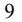
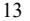
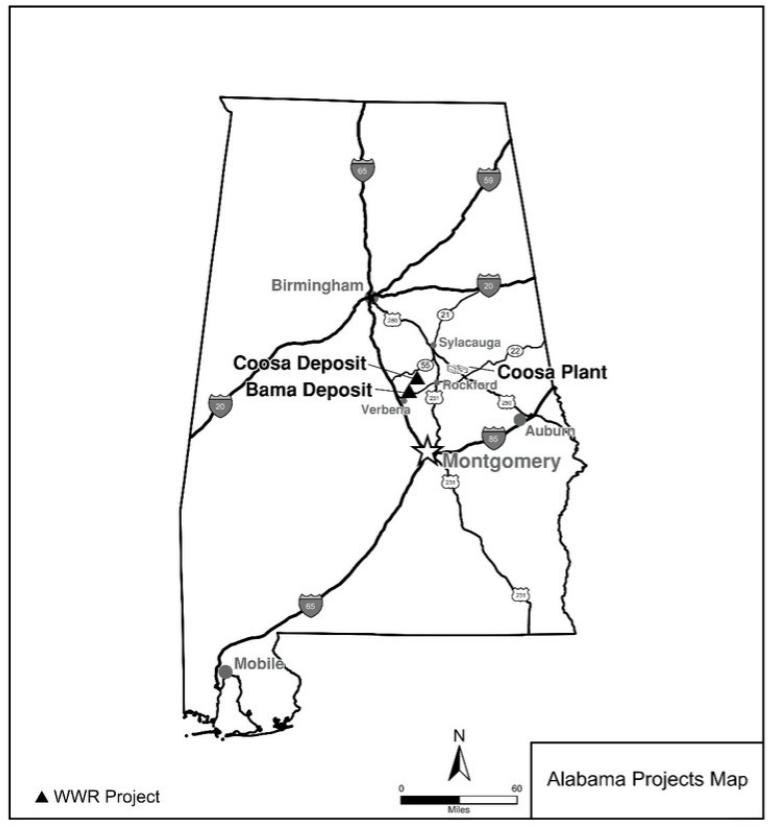
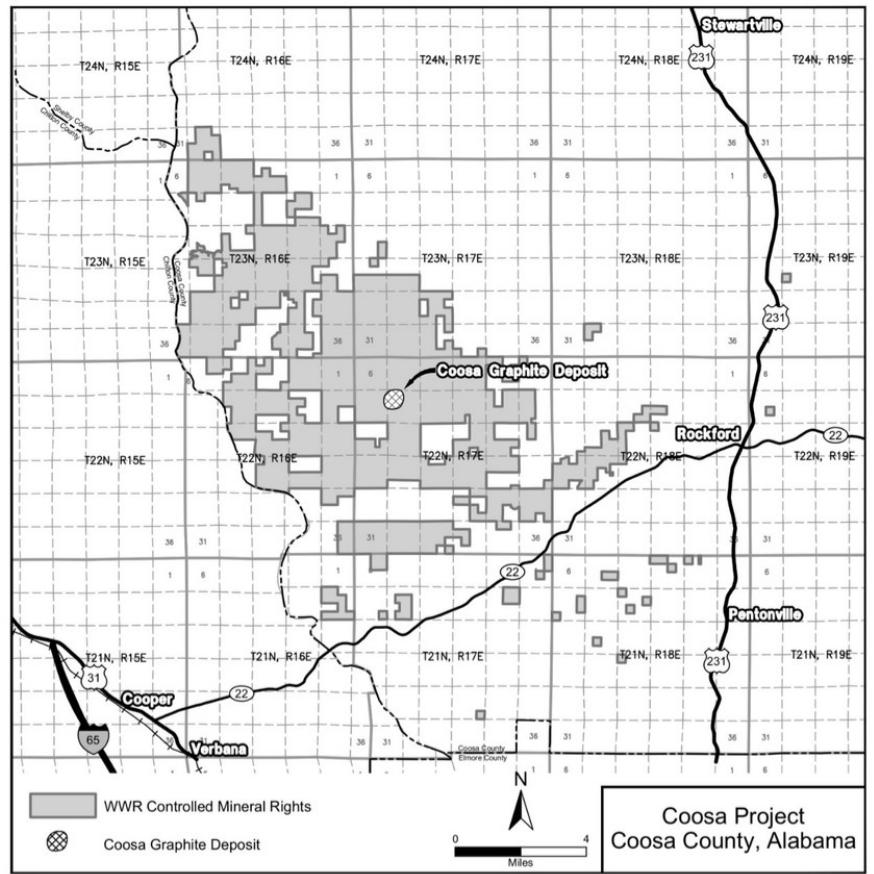
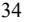
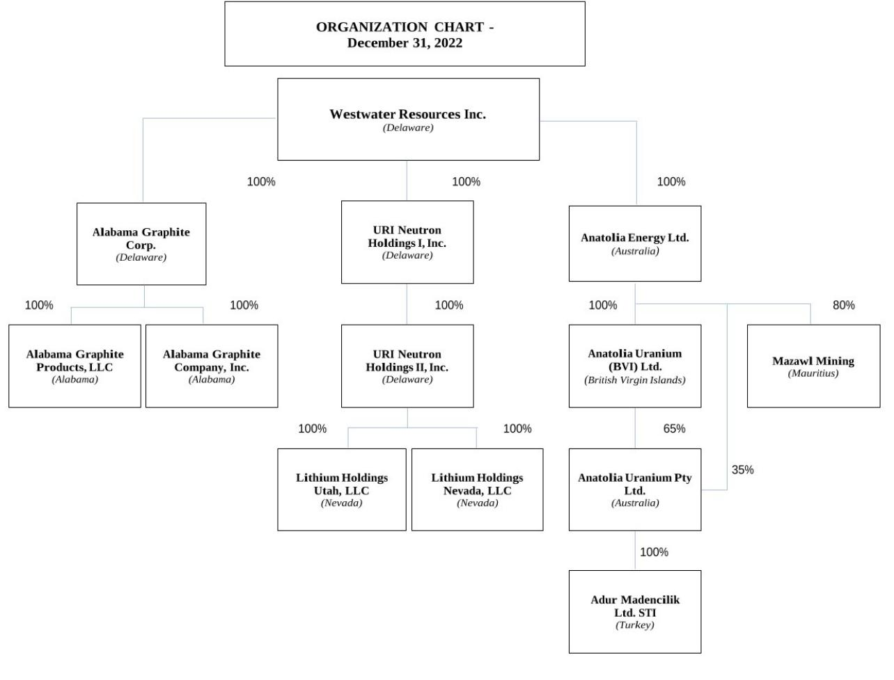
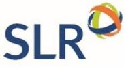

{0}------------------------------------------------

# **UNITED STATES SECURITIES AND EXCHANGE COMMISSION WASHINGTON, D.C. 20549 FORM 10-K**

**(Mark One)**

☒ **ANNUAL REPORT PURSUANT TO SECTION 13 OR 15(d) OF THE SECURITIES EXCHANGE ACT OF 1934 For the fiscal year ended December 31, 2022**

**or**

☐ **TRANSITION REPORT PURSUANT TO SECTION 13 OR 15(d) OF THE SECURITIES EXCHANGE ACT OF 1934**

**For the transition period from to** 

**Commission file number 001-33404**

# **WESTWATER RESOURCES, INC.**

(Exact name of registrant as specified in its charter)

| DELAWARE (State of Incorporation)                      |                                                                                                                             |                                                                                                                                                     | 75-2212772 (I.R.S. Employer Identification No.)                                                                                                                                                                   |  |
|-----------------------------------------------------------|-----------------------------------------------------------------------------------------------------------------------------|-----------------------------------------------------------------------------------------------------------------------------------------------------|----------------------------------------------------------------------------------------------------------------------------------------------------------------------------------------------------------------------|--|
|                                                           |                                                                                                                             |                                                                                                                                                     |                                                                                                                                                                                                                      |  |
|                                                           | 6950 S. Potomac Street, Suite 300                                                                                           |                                                                                                                                                     |                                                                                                                                                                                                                      |  |
|                                                           | Centennial, Colorado                                                                                                        |                                                                                                                                                     | 80112                                                                                                                                                                                                                |  |
|                                                           | (Address of principal executive offices)                                                                                    |                                                                                                                                                     | (Zip Code)                                                                                                                                                                                                           |  |
|                                                           |                                                                                                                             | (303) 531-0516 (Registrant's telephone number, including area code)                                                                              |                                                                                                                                                                                                                      |  |
|                                                           |                                                                                                                             | Securities registered pursuant to Section 12(b) of the Act:                                                                                         |                                                                                                                                                                                                                      |  |
| Title of each class                                       |                                                                                                                             | Trading Symbol                                                                                                                                      | Name of each exchange on which registered                                                                                                                                                                            |  |
| Common Stock, par value \$0.001 per share                 |                                                                                                                             | WWR                                                                                                                                                 | NYSE American                                                                                                                                                                                                        |  |
|                                                           |                                                                                                                             | Securities registered pursuant to section 12(g) of the Act: None                                                                                    |                                                                                                                                                                                                                      |  |
|                                                           |                                                                                                                             | Indicate by check mark if the registrant is a well-known seasoned issuer, as defined in Rule 405 of the Securities Act. Yes ☐ No ☒                  |                                                                                                                                                                                                                      |  |
|                                                           |                                                                                                                             | Indicate by check mark if the registrant is not required to file reports pursuant to Section 13 or Section 15(d) of the Act. Yes ☐ No ☒             |                                                                                                                                                                                                                      |  |
|                                                           |                                                                                                                             | period that the registrant was required to file such reports) and (2) has been subject to such filing requirements for the past 90 days. Yes ☒ No ☐ | Indicate by check mark whether the registrant (1) has filed all reports required to be filed by Section 13 or 15(d) of the Securities Exchange Act of 1934 during the preceding 12 months (or for such shorter       |  |
|                                                           | preceding 12 months (or for such shorter period that the registrant was required to submit such files). Yes ☒ No ☐          |                                                                                                                                                     | Indicate by check mark whether the registrant has submitted electronically every Interactive Data File required to be submitted pursuant to Rule 405 of Regulation S-T (§ 232.405 of this chapter) during the        |  |
|                                                           |                                                                                                                             | accelerated filer", "accelerated filer" "smaller reporting company" and "emerging growth company" in Rule 12b-2 of the Exchange Act.                | Indicate by check mark whether the registrant is a large accelerated filer, an accelerated filer, a non-accelerated filer, a smaller reporting company or emerging growth company. See the definitions of "large     |  |
| Large accelerated filer ☐                                 | Accelerated filer ☐                                                                                                         | Non-accelerated filer ☒                                                                                                                             | Smaller reporting company ☒ Emerging growth company ☐                                                                                                                                                             |  |
| pursuant to Section 13(a) of the Exchange Act. ☐          |                                                                                                                             |                                                                                                                                                     | If an emerging growth company, indicate by check mark if the registrant has elected not to use the extended transition period for complying with any new or revised financial accounting standards provided          |  |
|                                                           | Sarbanes-Oxley Act (15 U.S.C. 7262(b)) by the registered public accounting firm that prepared or issued its audit report. ☐ |                                                                                                                                                     | Indicate by check mark whether the registrant has filed a report on and attestation to its management's assessment of the effectiveness of its internal control over financial reporting under Section 404(b) of the |  |
| issued financial statements. ☐                            |                                                                                                                             |                                                                                                                                                     | If securities are registered pursuant to Section 12(b) of the Act, indicate by check mark whether the financial statements of the registrant included in the filing reflect the correction of an error to previously |  |
| the relevant recovery period pursuant to §240.10D-1(b). ☐ |                                                                                                                             |                                                                                                                                                     | Indicate by check mark whether any of those error corrections are restatements that required a recovery analysis of incentive-based compensation received by any of the registrant's executive officers during       |  |
|                                                           |                                                                                                                             | Indicate by check mark whether the registrant is a shell company (as defined in Rule 12b-2 of the Exchange Act). Yes ☐ No ☒                         |                                                                                                                                                                                                                      |  |
|                                                           |                                                                                                                             |                                                                                                                                                     | The aggregate market value of the Common Stock held by non-affiliates of the registrant at June 30, 2022 was approximately \$50,733,321. Number of shares of Common Stock, \$0.001 par value, outstanding            |  |

as of March 6, 2023 was 49,900,642 shares.

Documents incorporated by reference: specified portions of Westwater Resources, Inc.'s Definitive Proxy Statement on Schedule 14A relating to its 2023 Annual Meeting of Stockholders are incorporated by reference into Part III where indicated. Westwater Resource, Inc.'s Definitive Proxy Statement will be filed with the U.S. Securities and Exchange Commission within 120 days after the end of the fiscal year to which this report relates.

{1}------------------------------------------------

## **WESTWATER RESOURCES, INC. ANNUAL REPORT ON FORM 10-K FOR THE FISCAL YEAR ENDED DECEMBER 31, 2022**

#### **TABLE OF CONTENTS**

| DEFINITIONS                                                                                                          | 3  |
|----------------------------------------------------------------------------------------------------------------------|----|
| USE OF NAMES                                                                                                         | 5  |
| CURRENCY                                                                                                             | 5  |
| CAUTIONARY NOTE REGARDING FORWARD-LOOKING STATEMENTS                                                                 | 6  |
| STATEMENT REGARDING THIRD PARTY INFORMATION                                                                          | 7  |
| PART I                                                                                                               | 8  |
| ITEM 1. DESCRIPTION OF BUSINESS.                                                                                     | 8  |
| THE COMPANY                                                                                                          | 8  |
| OUR STRATEGY                                                                                                         | 8  |
| KEY BUSINESS AND CORPORATE DEVELOPMENTS IN 2022                                                                      | 9  |
| OVERVIEW OF THE BATTERY GRAPHITE INDUSTRY                                                                            | 9  |
| COMPETITION                                                                                                          | 12 |
| WESTWATER'S GRAPHITE BUSINESS                                                                                        | 12 |
|                                                                                                                      |    |
| CORE VALUES AND ENVIRONMENTAL, SOCIAL AND GOVERNANCE (ESG) CONSIDERATIONS                                            | 15 |
| AVAILABLE INFORMATION                                                                                                | 20 |
| ITEM 1A. RISK FACTORS                                                                                                | 20 |
| ITEM 1B. UNRESOLVED STAFF COMMENTS                                                                                   | 29 |
| ITEM 2. PROPERTIES                                                                                                   | 29 |
| INFRASTRUCTURE                                                                                                       | 34 |
| INSURANCE                                                                                                            | 34 |
| ITEM 3. LEGAL PROCEEDINGS                                                                                            | 34 |
| DISPUTE WITH FABRICE TAYLOR                                                                                          | 34 |
| ARBITRATION AGAINST TURKEY                                                                                           | 34 |
| OTHER                                                                                                                | 35 |
| ITEM 4. MINE SAFETY DISCLOSURES                                                                                      | 35 |
| PART II                                                                                                              | 35 |
| ITEM 5. MARKET FOR REGISTRANT'S COMMON EQUITY, RELATED STOCKHOLDER MATTERS AND ISSUER PURCHASES OF EQUITY SECURITIES | 35 |
| STOCK INFORMATION                                                                                                    | 35 |
| ITEM 6. [RESERVED]                                                                                                   | 35 |
| ITEM 7. MANAGEMENT'S DISCUSSION AND ANALYSIS OF FINANCIAL CONDITION AND RESULTS OF OPERATIONS                        | 36 |
| INTRODUCTION                                                                                                         | 36 |
| SUMMARY OF RECENT DEVELOPMENTS                                                                                       | 36 |
| RESULTS OF OPERATIONS                                                                                                | 37 |
| FINANCIAL POSITION                                                                                                   | 38 |
| ITEM 7A. QUANTITATIVE AND QUALITATIVE DISCLOSURES ABOUT MARKET RISK                                                  | 41 |
| ITEM 8. FINANCIAL STATEMENTS AND SUPPLEMENTARY DATA                                                                  | 41 |
| ITEM 9. CHANGES IN AND DISAGREEMENTS WITH ACCOUNTANTS ON ACCOUNTING AND FINANCIAL DISCLOSURE.                        | 62 |
| ITEM 9A. CONTROLS AND PROCEDURES                                                                                     | 62 |
| EVALUATION OF DISCLOSURE CONTROLS AND PROCEDURES                                                                     | 62 |
| MANAGEMENT'S REPORT ON INTERNAL CONTROL OVER FINANCIAL REPORTING                                                     | 62 |
| ITEM 9B. OTHER INFORMATION                                                                                           | 63 |
| ITEM 9C. DISCLOSURE REGARDING FOREIGN JURISDICTIONS THAT PREVENT INSPECTIONS                                         | 63 |
| PART III                                                                                                             | 63 |
| ITEM 15. EXHIBITS AND FINANCIAL STATEMENT SCHEDULES                                                                  | 64 |
| ITEM 16. FORM 10-K SUMMARY                                                                                           | 66 |
| SIGNATURES                                                                                                           | 67 |
|                                                                                                                      |    |

{2}------------------------------------------------

### **DEFINITIONS**

When used in this Form 10-K, the following terms have the meaning indicated.

| Term                          | Meaning                                                                                                                                                                                                                                                                                                                                                                                                                                                                                                                                                                                                                                                                                                                                                                                                                                 |  |
|-------------------------------|-----------------------------------------------------------------------------------------------------------------------------------------------------------------------------------------------------------------------------------------------------------------------------------------------------------------------------------------------------------------------------------------------------------------------------------------------------------------------------------------------------------------------------------------------------------------------------------------------------------------------------------------------------------------------------------------------------------------------------------------------------------------------------------------------------------------------------------------|--|
| AGP                           | Alabama Graphite Products, LLC, an Alabama limited liability company and wholly owned subsidiary of Westwater Resources.                                                                                                                                                                                                                                                                                                                                                                                                                                                                                                                                                                                                                                                                                                             |  |
| Alabama Graphite              | Alabama Graphite Company, Inc., an Alabama corporation and wholly owned subsidiary of Westwater Resources.                                                                                                                                                                                                                                                                                                                                                                                                                                                                                                                                                                                                                                                                                                                           |  |
| ASC                           | FASB Accounting Standards Codification.                                                                                                                                                                                                                                                                                                                                                                                                                                                                                                                                                                                                                                                                                                                                                                                                 |  |
| ASU                           | FASB Accounting Standards Update.                                                                                                                                                                                                                                                                                                                                                                                                                                                                                                                                                                                                                                                                                                                                                                                                       |  |
| ATM Offering Agreement        | Controlled Equity Offering Sale Agreement between Westwater Resources and Cantor Fitzgerald & Co. dated April 14, 2017.                                                                                                                                                                                                                                                                                                                                                                                                                                                                                                                                                                                                                                                                                                              |  |
| Benchmark                     | Benchmark Mineral Intelligence.                                                                                                                                                                                                                                                                                                                                                                                                                                                                                                                                                                                                                                                                                                                                                                                                         |  |
| Cantor                        | Cantor Fitzgerald & Co.                                                                                                                                                                                                                                                                                                                                                                                                                                                                                                                                                                                                                                                                                                                                                                                                                 |  |
| Coosa Graphite Deposit        | The Company's graphite mineral deposit located near Rockford, Alabama.                                                                                                                                                                                                                                                                                                                                                                                                                                                                                                                                                                                                                                                                                                                                                                  |  |
| DFS                           | The definitive feasibility study for Phase I of the Kellyton Graphite Plant which was completed in the fourth quarter of 2021.                                                                                                                                                                                                                                                                                                                                                                                                                                                                                                                                                                                                                                                                                                       |  |
| enCore                        | enCore Energy Corp.                                                                                                                                                                                                                                                                                                                                                                                                                                                                                                                                                                                                                                                                                                                                                                                                                     |  |
| EU Critical Raw Minerals List | The list of raw materials that are crucial to the economy of the European Union published by the European Commission.                                                                                                                                                                                                                                                                                                                                                                                                                                                                                                                                                                                                                                                                                                                |  |
| Exploration stage property    | A property that has no mineral reserves disclosed.                                                                                                                                                                                                                                                                                                                                                                                                                                                                                                                                                                                                                                                                                                                                                                                      |  |
| Graphite                      | A naturally occurring carbon material with electrical properties that enhance the performance of electrical storage batteries, listed on the U.S. Critical Minerals List and the EU Critical Raw Materials List.                                                                                                                                                                                                                                                                                                                                                                                                                                                                                                                                                                                                                     |  |
| Gross acres                   | Total acreage of land under which we have mineral rights. May include unleased fractional ownership.                                                                                                                                                                                                                                                                                                                                                                                                                                                                                                                                                                                                                                                                                                                                    |  |
| Indicated Mineral Resource    | That part of a mineral resource for which quantity and grade or quality are estimated on the basis of adequate geological evidence and sampling. The level of geological certainty associated with an indicated mineral resource is sufficient to allow a qualified person to apply modifying factors in sufficient detail to support mine planning and evaluation of the economic viability of the deposit. Because an indicated mineral resource has a lower level of confidence than the level of confidence of a measured mineral resource, an indicated mineral resource may only be converted to a probable mineral reserve.                                                                                                                                                                                       |  |
| Inferred Mineral Resource     | That part of a mineral resource for which quantity and grade or quality are estimated on the basis of limited geological evidence and sampling. The level of geological uncertainty associated with an inferred mineral resource is too high to apply relevant technical and economic factors likely to influence the prospects of economic extraction in a manner useful for evaluation of economic viability. Because an inferred mineral resource has the lowest level of geological confidence of all mineral resources, which prevents the application of the modifying factors in a manner useful for evaluation of economic viability, an inferred mineral resource may not be considered when assessing the economic viability of a mining project and may not be converted to a probable mineral reserve. |  |

{3}------------------------------------------------

| Initial Assessment      | A preliminary technical and economic study of the economic potential of all or parts of mineralization to support the disclosure of mineral resources. The initial assessment must be prepared by a qualified person and must include appropriate assessments of reasonably assumed technical and economic factors, together with any other relevant operational factors, that are necessary to demonstrate at the time of reporting that there are reasonable prospects for economic extraction. An initial assessment is required for disclosure of mineral resources but cannot be used as the basis for disclosure of mineral reserves.                                                                                                                                                                                                                                                                                                                                                                                                                                                                                                                                                         |  |  |
|-------------------------|--------------------------------------------------------------------------------------------------------------------------------------------------------------------------------------------------------------------------------------------------------------------------------------------------------------------------------------------------------------------------------------------------------------------------------------------------------------------------------------------------------------------------------------------------------------------------------------------------------------------------------------------------------------------------------------------------------------------------------------------------------------------------------------------------------------------------------------------------------------------------------------------------------------------------------------------------------------------------------------------------------------------------------------------------------------------------------------------------------------------------------------------------------------------------------------------------------------------|--|--|
| Kellyton Graphite Plant | The Company's planned battery-grade graphite processing facility near Kellyton, Alabama.                                                                                                                                                                                                                                                                                                                                                                                                                                                                                                                                                                                                                                                                                                                                                                                                                                                                                                                                                                                                                                                                                                                           |  |  |
| Lincoln Park            | Lincoln Park Capital Fund, LLC.                                                                                                                                                                                                                                                                                                                                                                                                                                                                                                                                                                                                                                                                                                                                                                                                                                                                                                                                                                                                                                                                                                                                                                                    |  |  |
| Mineral Reserve         | An estimate of tonnage and grade or quality of indicated and measured mineral resources that, in the opinion of the qualified person, can be the basis of an economically viable project. More specifically, it is the economically mineable part of a measured or indicated mineral resource, which includes diluting materials and allowances for losses that may occur when the material is mined or extracted.                                                                                                                                                                                                                                                                                                                                                                                                                                                                                                                                                                                                                                                                                                                                                                                        |  |  |
| Mineral Resource        | A mineralized body which has been delineated by appropriately spaced drilling and/or underground sampling sufficient to support the estimate of tonnages and grade of the mineral deposit. Such a deposit does not qualify as a reserve, until a comprehensive evaluation based upon unit cost, grade, recoveries, and other material factors conclude legal and economic feasibility.                                                                                                                                                                                                                                                                                                                                                                                                                                                                                                                                                                                                                                                                                                                                                                                                                    |  |  |
| Ore                     | Naturally occurring concentration of mineralization from which a mineral or minerals of economic value can be extracted at a reasonable profit.                                                                                                                                                                                                                                                                                                                                                                                                                                                                                                                                                                                                                                                                                                                                                                                                                                                                                                                                                                                                                                                                 |  |  |
| PFS                     | Pre-feasibility level study for Phase II of the Kellyton Graphite Plant.                                                                                                                                                                                                                                                                                                                                                                                                                                                                                                                                                                                                                                                                                                                                                                                                                                                                                                                                                                                                                                                                                                                                           |  |  |
| Qualified Person        | Individual who is:                                                                                                                                                                                                                                                                                                                                                                                                                                                                                                                                                                                                                                                                                                                                                                                                                                                                                                                                                                                                                                                                                                                                                                                                 |  |  |
|                         | (1) Mineral industry professional with at least five years of relevant experience in the type of mineralization and type of deposit under consideration and in the specific type of activity that person is undertaking on behalf of the registrant; and (2) An eligible member or licensee in good standing of a recognized professional organization at the time the technical report is prepared. For an organization to be a recognized professional organization, it must: a. Be either: i. An organization recognized within the mining industry as a reputable professional association; or ii. A board authorized by U.S. federal, state or foreign statute to regulate professionals in the mining, geoscience or related field; b. Admit eligible members primarily on the basis of their academic qualifications and experience; c. Establish and require compliance with professional standards of competence and ethics; d. Require or encourage continuing professional development; e. Have and apply disciplinary powers, including the power to suspend or expel a member regardless of where the member practices or resides; and |  |  |
| Roskill                 | f. Provide a public list of members in good standing. Roskill Information Services Ltd.                                                                                                                                                                                                                                                                                                                                                                                                                                                                                                                                                                                                                                                                                                                                                                                                                                                                                                                                                                                                                                                                                                                      |  |  |
| SEC                     | Securities and Exchange Commission.                                                                                                                                                                                                                                                                                                                                                                                                                                                                                                                                                                                                                                                                                                                                                                                                                                                                                                                                                                                                                                                                                                                                                                                |  |  |

{4}------------------------------------------------

| SEDAR                       | System for Electronic Document Analysis and Retrieval used for electronically filing most securities related information with the Canadian securities regulatory authorities.                                                                                                                                                                                                                                                                                                                                                                                                                      |  |
|-----------------------------|-------------------------------------------------------------------------------------------------------------------------------------------------------------------------------------------------------------------------------------------------------------------------------------------------------------------------------------------------------------------------------------------------------------------------------------------------------------------------------------------------------------------------------------------------------------------------------------------------------|--|
| SLR                         | SLR International Corporation.                                                                                                                                                                                                                                                                                                                                                                                                                                                                                                                                                                        |  |
| SPG Fines                   | Spherical purified graphite fine material produced from SPG milling.                                                                                                                                                                                                                                                                                                                                                                                                                                                                                                                                  |  |
| Spot price                  | The price at which a mineral commodity may be purchased for delivery within one year.                                                                                                                                                                                                                                                                                                                                                                                                                                                                                                                 |  |
| Surety obligations          | A bond, letter of credit, or financial guarantee posted by a party in favor of a beneficiary to ensure the performance of its or another party's obligations, e.g., reclamation bonds, workers' compensation bond, or guarantees of debt instruments.                                                                                                                                                                                                                                                                                                                                           |  |
| TRS                         | Technical Report Summary. A report prepared in accordance with Subpart 1300 of Regulation S-K promulgated by the SEC (or SK-1300) that discloses information concerning a registrant's mineral resources or mineral reserves by one or more qualified persons that, for each material property, identifies and summarizes the scientific and technical information and conclusions reached concerning an initial assessment used to support disclosure of mineral resources, or concerning a preliminary or final feasibility study used to support disclosure of mineral reserves. |  |
| ULTRA-CSPG™                 | Coated spherical purified graphite.                                                                                                                                                                                                                                                                                                                                                                                                                                                                                                                                                                   |  |
| U.S. Critical Minerals List | The list of critical minerals that are crucial to the economy of the United States of America published by the Department of the Interior.                                                                                                                                                                                                                                                                                                                                                                                                                                                         |  |
| Vanadium                    | A rare-earth metal used as a strengthening alloy in steelmaking, and in certain types of batteries, listed on the U.S. Critical Minerals List.                                                                                                                                                                                                                                                                                                                                                                                                                                                     |  |
| Westwater Resources         | Westwater Resources, Inc.                                                                                                                                                                                                                                                                                                                                                                                                                                                                                                                                                                             |  |
| 2020 Lincoln Park PA        | Purchase Agreement dated as of December 4, 2020 between Westwater Resources and Lincoln Park Capital Fund, LLC.                                                                                                                                                                                                                                                                                                                                                                                                                                                                                    |  |

### **USE OF NAMES**

In this Annual Report on Form 10-K, unless the context otherwise requires, the terms "we", "us", "our", "WWR", "Westwater", "Corporation", or the "Company" refer to Westwater Resources, Inc. and its subsidiaries. The Company changed its name from "Uranium Resources, Inc." to "Westwater Resources, Inc." effective August 21, 2017.

### **CURRENCY**

The accounts of the Company are maintained in U.S. dollars. All dollar amounts referenced in this Annual Report on Form 10-K and the consolidated financial statements are stated in U.S. dollars.

{5}------------------------------------------------

## **CAUTIONARY NOTE REGARDING FORWARD-LOOKING STATEMENTS**

With the exception of historical matters, the matters discussed in this report are forward-looking statements that involve risks and uncertainties that could cause actual results to differ materially from projections or estimates contained herein. We intend such forward-looking statements to be covered by the safe harbor provisions for forward-looking statements contained in the Private Securities Litigation Reform Act of 1995. Such forwardlooking statements include, without limitation, statements regarding the adequacy of funding, liquidity, access to capital, financing activities, the timing or occurrence of any future drilling or production from the Company's properties, economic conditions, the strategic goals of the business, arbitration matters, costs of Phase I of the Kellyton Graphite Plant and its estimated construction and commissioning timelines and completion dates, the outcome of the feasibility study and start date for the mining of the Coosa Graphite Deposit, and the Company's anticipated cash burn rate and capital requirements. Words such as "may," "could," "should," "would," "believe," "estimate," "expect," "anticipate," "plan," "forecast," "potential," "intend," "continue," "project," "target" and variations of these words, comparable words and similar expressions generally indicate forward-looking statements. You are cautioned not to place undue reliance on forward-looking statements. Actual results may differ materially from those expressed or implied by these forward-looking statements. Factors that could cause actual results to differ materially from these forward-looking statements include, among others:

- the spot price and long-term contract price of graphite (both flake graphite feedstock and purified graphite products) and vanadium, and the world-wide supply and demand of graphite and vanadium;
- the effects, extent and timing of the entry of additional competition in the markets in which we operate;
- our ability to obtain contracts or other agreements with customers;
- available sources and transportation of graphite feedstock;
- the ability to control costs and avoid cost and schedule overruns during the development, construction and operation of the Kellyton Graphite Plant;
- the ability to construct and operate the Kellyton Graphite Plant in accordance with the requirements of permits and licenses and the requirements of tax credits and other incentives;
- the effects of inflation, including labor shortages and supply chain disruptions;
- rising interest rates and the associated impact on the availability and cost of financing sources;
- the availability and supply of equipment and materials needed to construct the Kellyton Graphite Plant;
- stock price volatility;
- government regulation of the mining and manufacturing industries in the United States;
- unanticipated geological, processing, regulatory and legal or other problems we may encounter;
- the results of our exploration activities, and the possibility that future exploration results may be materially less promising than initial exploration results;
- any graphite or vanadium discoveries not being in high enough concentration to make it economic to extract the metals;
- our ability to finance growth plans;
- the potential effects of the continued COVID-19 pandemic;

{6}------------------------------------------------

- currently pending or new litigation or arbitration; and
- our ability to maintain and timely receive mining, manufacturing, and other permits from regulatory agencies.

For a more detailed discussion of such risks and other important factors that could cause actual results to differ materially from those in such forward-looking statements and forward-looking information, please see "*Item 1A. Risk Factors*" below in this Annual Report on Form 10-K. Although we have attempted to identify important factors that could cause actual results to differ materially from those described in forward-looking statements and forward-looking information, there may be other factors that cause results not to be as anticipated, estimated or intended. There can be no assurance that these statements will prove to be accurate as actual results and future events could differ materially from those anticipated in the statements. The forward-looking statements in this report are made as of the date of this filing, unless an earlier date is specified. Except as required by law, we assume no obligation to publicly update any forward-looking statements and forward-looking information, whether as a result of new information, future events or otherwise.

## **STATEMENT REGARDING THIRD PARTY INFORMATION**

Certain information provided in this report has been provided to us by third parties or is publicly available information published or filed with applicable securities regulatory bodies, including the SEC and SEDAR. WWR has not verified, and is not in a position to verify, and expressly disclaims any responsibility for, the accuracy, completeness or fairness of such third-party information and refers the reader to the information publicly published or filed by the third parties for additional information.

{7}------------------------------------------------

## **PART I**

#### **ITEM 1. DESCRIPTION OF BUSINESS.**

#### **THE COMPANY**

Westwater Resources, Inc., originally incorporated in 1977, is an energy technology company focused on developing battery-grade natural graphite materials after its acquisition of Alabama Graphite in 2018. Alabama Graphite holds mineral rights to explore and potentially mine the Coosa Graphite Deposit. During 2022, AGP, a wholly owned subsidiary of Westwater Resources, continued construction activities related to Phase I of the Kellyton Graphite Plant. In April of 2022, Alabama Graphite completed the initial drilling stage of its exploration program to further investigate the size and extent of graphite mineral concentrations at the Coosa Graphite Deposit. The Coosa Graphite Deposit is located near Rockford Alabama at 32 ° 54' 30" North and 86 ° 24' 00" West.

### **OUR STRATEGY**

Our strategy is to increase shareholder value by advancing our battery-grade graphite business. The acquisition of Alabama Graphite in 2018 provides the Company with the opportunity to provide critical raw materials utilized by the growing market for electric automobiles, trucks and buses, consumer electronics, as well as grid-based storage devices. According to Benchmark Intelligence, in 2022, the global battery market demand for both natural and synthetic graphite was estimated at 517,997 tonnes per annum (or tpa) and demand is projected to increase at a compounded annual growth rate ("CAGR") of 17% over the next 10-year period.

Our goal for the graphite business is to develop a battery-graphite manufacturing business in Alabama that produces low-cost, high-quality, and high-margin graphite products for battery manufacturers. In 2020, we began operation of a pilot program, designed both to manufacture battery-grade graphite materials in quantities suitable for potential customer testing and to inform the DFS. Both the pilot program and DFS were completed during the fourth quarter of 2021, and construction activities on Phase I of the Kellyton Graphite Plant began in the fourth quarter of 2021. In response to increasing customer demand and market conditions, the Company has completed an optimization of the original DFS to increase the expected production for Phase I of the Kellyton Graphite Plant. As a result of this optimization, the Company now expects production capacity for Phase I of the Kellyton Graphite Plant of 16,000 mt per year, and expected CSPG production of 7,500 mt per year. The Company now estimates the total costs for Phase I construction to be approximately \$271 million compared to the original estimate of \$202 million. Further, the Company now expects to begin testing and commissioning of Phase I in late 2023, and first production to occur in the first half of 2024, subject to securing the additional funding to complete construction. Additionally, we expect to complete the Phase I optimization in the second half of 2024 to increase the expected production capacity of Phase I of the Kellyton Graphite Plant. For additional information regarding the Kellyton Graphite Plant see *Item 2, Properties*.

We continue to engage with potential customers across a number of markets including automotive companies and lithium-ion battery manufacturers. Based on the positive feedback we have received to date from our potential customers, we continue to provide new or additional samples utilizing our pilot program. We believe that the Inflation Reduction Act, which sets a minimum domestic content threshold for the percentage of the value of applicable critical minerals contained in the battery of the electric vehicles, is beneficial to the domestic graphite industry and will provide additional benefit to the Company as it continues to engage with potential customers. Since the passing of the Inflation Reduction Act in August 2022, the interest of potential customers has intensified as we move towards domestic production of battery-grade natural graphite materials.

Additionally, we hold mineral rights to 41,965 acres for future mining development. The graphite deposit at the Coosa Graphite Deposit is expected to serve as future feedstock for the Kellyton Graphite Plant and provide in-house quality assurance and quality control ("QA/QC") for rawmaterial inputs. Subject to further exploration, its own definitive feasibility study, the availability of financing, and regulatory approvals, the Coosa Graphite Deposit and related mining operation is expected by the end of 2028. The Coosa Graphite Deposit also contains vanadium mineral concentrations, which the Company plans to explore and evaluate the technical feasibility of extracting and processing in the future.

{8}------------------------------------------------

Currently, the Company is not including any potential benefit related to vanadium in its economic models or resource estimates.

Our project pipeline is prioritized with a goal of achieving sustainable battery-grade graphite production over time to take advantage of rising and/or high price environments for battery materials. We may adjust near-term and long-term business priorities in accordance with market conditions.

We believe our broad base of mining and processing expertise related to graphite, base and precious metals is one of our key competitive advantages. We also believe that Westwater possesses a unique combination of battery-materials knowledge and extensive project-execution experience, coupled with decades of capital markets expertise which makes our business a powerful presence in the new energy marketplace. We intend to advance the Company's project towards production, while prudently managing our cash and liquidity position for financial flexibility.

### **KEY BUSINESS AND CORPORATE DEVELOPMENTS IN 2022**

#### *Construction Progress on Phase I of the Kellyton Graphite Plant*

Construction activities in 2022 consisted of selecting a general contractor, completing earthwork and site grading, and continuing engineering and design work. In 2022, the Company also began installing underground utilities, completed building foundations, and began erecting manufacturing buildings of the Kellyton Graphite Plant. Construction activity during the year also included receipt of certain long-lead equipment items. For full details regarding the Kellyton Graphite Plant see additional details below.

### *Coosa Graphite Deposit Technical Report Summary*

The mineral resource estimate for the Coosa Graphite Deposit, based on 205 drill holes totaling 39,434 ft., was completed by SLR on November 30, 2022 as an Initial Assessment in accordance with Subpart 1300 of Regulation S-K promulgated by the SEC (or S-K 1300). For further information regarding this Technical Report Summary and the Coosa Graphite Deposit, refer to *Item 2, Properties*, below.

## **OVERVIEW OF THE BATTERY GRAPHITE INDUSTRY**

Graphite is the name given to a common form of the element carbon. Occurring naturally as a mineral in deposits around the world, graphite is used in many industrial applications. These end uses take advantage of graphite's natural characteristics, which include high lubricity, high resistance to corrosion, the ability to withstand high temperatures while remaining highly stable, and excellent conductivity of heat and electricity.

In recent years, graphite has become an essential component in the production of all types of electrical storage batteries. Graphite's role will continue to be important as demand for these batteries increases and with the world's growing electric vehicle and energy-storage needs. Natural battery-ready graphite products are derived from flake graphite that has been transformed through a series of specialty downstream processes into various battery graphite products. These processes include, but are not limited to:

- Micronization (sizing)
- Purification to battery-grade carbon with graphitic (Cg ) content of ≥ 99.95%
- Spheroidization (shaping) and classification (sorting); and
- Surface treatment (carbon coating).

Natural flake graphite is increasingly supplanting or supplementing the use of synthetic graphite in battery applications for cost and performance reasons. Through a series of sophisticated and precise processing steps, flake-

{9}------------------------------------------------

graphite concentrates are transformed into high-value end products for the battery industry. Coated spherical purified graphite is used as a graphite anode or anode active material in lithium-ion batteries.

The global battery market demand for natural graphite in 2022 was 221,636 tpa (Benchmark, 2022). The greatest share of this market is made up of four battery-market segments that require advanced battery-grade graphite products:

- **Lithium-Ion batteries —** these are the most technologically advanced batteries used in everything from mobile phones and hand tools to laptop computers and electric vehicles, particularly because of the rechargeable nature of the batteries. Demand for lithium-ion batteries, related specifically to electric vehicles, accounted for 79% of natural graphite demand in 2022, and is projected to grow to 89% by 2032 (Benchmark, 2022).
- **Alkaline batteries —** these are the most popular consumer batteries in the world, with a global market size of approximately \$7.8 billion in 2021 and a projected CAGR of 4.9% from 2022 through 2028 (Fortune Business Insights, 2022).
- **Lead Acid batteries —** these are the workhorse batteries used in automobiles, backup power supplies, and other energy-storage applications where weight is less important than capacity. The global lead acid battery market was estimated at approximately \$83.1 billion in 2021 and a projected CAGR of 2.6% from 2022 through 2030 (Global Market Insights, 2022).
- **Primary Lithium batteries —** these are non-rechargeable, lightweight lithium-based batteries, and are typically used in flashlights, smoke detectors, and other small device applications where long life and lightweight matter most.

Graphite is a critical, non-substitutable constituent in these listed battery segments. According to Benchmark Intelligence, the need for graphite to support the battery market is expected to grow over the next decade. Total graphite demand is expected to reach 2,924,411 tpa in 2032, of which over 1,580,108 tpa are projected to be natural graphite.

Competition between natural and synthetic graphite is expected to continue in lithium-ion batteries with differentiation between the two based on price, performance, and availability. Common precursor materials in the production of synthetic graphite come from either petroleum needle coke, or coal needle coke. However, synthetic graphite and natural graphite blends are becoming popular choices for electric vehicle applications to optimize performance and cost by taking advantage of each graphite attribute, such as cycle life, energy density, and cost. Synthetic graphite consumption by anode manufacturers is expected to grow because of the concentration of the graphite industry in China; however, natural flake graphite demand is forecasted to grow at a higher rate because of natural graphite's performance and cost efficiencies.

In addition, natural graphite flake and purification costs in China have increased due to environmental factors (hydrofluoric acid handling cost) and China has become one of the major importers of natural graphite flake, relying upon less expensive African sources. China also poses a geopolitical risk, particularly to the EU and U.S. regions.

Overall battery consumption is rising at an accelerated growth rate due to recent and robust developments in electric-automobile markets, personal electronic devices, electrical grid storage, and is an enabling technology for wind and solar power installation. The global shift towards lowand zero-emissions vehicles and power sources is expected to drive increasing demand for graphite-battery materials for the foreseeable future. Recent developments in this sector include:

- The United Kingdom and France have announced a prohibition on the sale of gasoline- and diesel-powered vehicles by 2030 and 2040, respectively. Electric vehicles using battery storage are currently the only viable technology that can satisfy the demands for new cars required by these nations.

{10}------------------------------------------------

- The states of New York and California have adopted regulations requiring all new vehicles sold in those states to be zero emissions by 2035. The requirements would apply to all new cars, pickup trucks, and SUVs.
- Automobile companies are publicly announcing plans to transition to fully electric vehicles within the next 20 years. Many are developing and distributing electric-based technology to replace internal-combustion engines.
- Battery manufacturers and major automobile companies have announced plans to develop 14 different battery manufacturing facilities in the United States with more development in the pipeline.
- Governments around the world, including the United States, continue to incentivize electric vehicle ownership through subsidies and other incentives.
- The installed base of wind and solar power electrical-generating systems is increasing every year. Grid battery storage is increasing system reliability, and as a result of these catalysts, and according to Roskill, the lithium-ion battery market is expected to grow at a CAGR of over 20%.

Currently, the primary source of battery-grade graphite is from China, presenting the global battery industry with significant risks, including supply chain management risks, economic risks, geopolitical risks, and environmental sustainability concerns. Also, critical domestic production is lacking in the United States. A Presidential Executive Order signed on September 30, 2020 includes graphite on a list of minerals critical to the safety and security of the United States. With limited current domestic natural graphite production of any kind, the United States is presently required to source most of its battery graphite from China. On February 24, 2021, the President signed another Executive Order that seeks to promote more resilient supply chains, to revitalize and rebuild domestic manufacturing capacity, and maintain America's competitive edge in research and development. The 2021 Executive Order tasked the Secretary of Energy, as part of a larger study involving several branches of the United States government, to submit a report identifying risks to the supply chain for high-capacity batteries including those that power electric vehicles. On June 8, 2021, the White House released a response to the findings of this study in support of securing an end-to-end domestic supply chain for advanced batteries, including investment in domestic production and processing of critical minerals. Key recommendations in the June 8, 2021 release include, among other things, providing funding and financial incentives to encourage consumer adoption of electric vehicles, providing financing to support advanced battery production, and investing in the development of next-generation batteries.

On March 31, 2022, President Biden invoked the Defense Production Act to encourage the domestic production of critical materials, including graphite, for advanced batteries for electric vehicles and clean energy storage. On August 16, 2022, President Biden signed into law the Inflation Reduction Act ("IRA"). This legislation includes an investment of approximately \$370 billion in climate programs. The IRA provides a 10% tax credit for the costs of producing certain critical minerals, including graphite and vanadium. This credit is eligible for direct pay and is also transferable to unrelated taxpayers. In addition, a key provision of the IRA that could indirectly benefit the Company is the Clean Vehicle credit. The IRA eliminates the previous limitation on the number of electric vehicles a manufacturer can sell before the Clean Vehicle credit is phased out or eliminated. Further, the IRA sets a minimum domestic content threshold for the percentage of the value of applicable critical minerals contained in the battery of the electric vehicles. Because Westwater intends to produce battery grade graphite for lithium-ion batteries to be used in electric vehicles in the United States, management believes the domestic content requirement could provide indirect future benefit to the Company.

The State of Alabama and local municipalities have entered into incentive agreements with the Company for the siting of the Company's proposed graphite processing plant in Coosa County, Alabama. The incentive agreements provide certain tax credits and incentives under the Alabama Jobs Act in connection with the construction of the Kellyton Graphite Plant.

Westwater has developed graphite-purification technology and advanced product-development processes designed to meet the demands of potential customers for battery-grade graphite materials. Westwater is developing methodologies and constructing facilities intended to produce highpurity, battery-grade graphite products at its Kellyton Graphite Plant. These products are designed to serve all major battery sectors. In addition, we believe the processes we

{11}------------------------------------------------

intend to use are environmentally sustainable and permittable in the United States, where a robust regulatory environment complements our core values to reliably deliver safe, well-made products to our customers.

Westwater has and will continue to support the efforts by the relevant United States governmental agencies, the State of Alabama and local municipalities to ensure that they remain aware of the importance of natural battery-grade graphite, its importance to the nation's security, and how the Kellyton Graphite Plant and the Coosa Graphite Deposit fit into the critical minerals-equation.

## **COMPETITION**

In the production and marketing of graphite, there are a number of producing entities globally, some of which are government controlled and several of which have significant capitalization. Approximately 75% of natural graphite global supply comes from China (Benchmark, 2022).

With respect to sales of graphite, the Company expects to compete primarily based on price. We intend to market graphite directly to users of the product. We are in direct competition with supplies available from various sources worldwide. We compete with multiple graphite exploration, development and production companies.

## **WESTWATER'S GRAPHITE BUSINESS**

#### *Kellyton Graphite Plant*

On June 22, 2021, AGP entered into incentive agreements with the State of Alabama and local municipalities for the siting of the Kellyton Graphite Plant near Kellyton, Alabama. The incentive agreements provide certain tax credits and incentives under the Alabama Jobs Act in connection with the construction of the Kellyton Graphite Plant.

On July 23, 2021, AGP executed a land lease with the Lake Martin Area Industrial Development Authority, providing AGP rights to approximately 70 acres to construct and operate the Kellyton Graphite Plant. The lease has a term of 10 years, a nominal lease payment, and transfer of title to AGP at the end of the lease term. Further, the lease provides AGP the option to purchase the land for a nominal amount during the term of the lease.

On October 13, 2021, AGP completed the purchase of two buildings that total approximately 90,000 sq. ft. to support the development of the Kellyton Graphite Plant. The build out of one of these building was completed in April of 2022 and is being used for administrative offices and will include a laboratory space as well. The other building is being used for the control room, the maintenance shop, shipping and receiving and as warehousing space. Both buildings are adjacent to the Kellyton Graphite Plant.

Westwater plans to develop the Kellyton Graphite Plant in two phases (Phases I and II).

Phase I: Based upon the Company's optimization plan, after testing and commissioning is completed, the Kellyton Graphite Plant is now expected to have capacity to produce approximately 16,000 mt per year of two products, ULTRA-CSPG™ and SPG Fines. After processing and purification, the plant is expected to have capacity to produce the two products in the following quantities:

| ● ULTRA-CSPG™: | 7,500 mt per year |
|----------------|-------------------|
| ● SPG Fines:   | 8,500 mt per year |

Phase II: Upon completion of the Phase II expansion, the annual capacity of the Kellyton Graphite Plant is now expected to increase to approximately 86,500 mt of two products in the following quantities:

| ● ULTRA-CSPG™: | 40,500 mt per year |
|----------------|--------------------|
| ● SPG Fines:   | 46,000 mt per year |

{12}------------------------------------------------

Construction activities for Phase I of the Kellyton Graphite Plant began in the fourth quarter of 2021 and will continue in 2023. The Company expects to begin testing and commissioning of Phase I in late 2023, and first production to occur in the first half of 2024, subject to securing the additional funding to complete construction. Additionally, we expect to complete the Phase I optimization in the second half of 2024 to increase the expected production capacity of Phase I of the Kellyton Graphite Plant. The Company intends to initiate a definitive feasibility study for Phase II upon, or before, the completion of Phase I.

## *Spheroidization, Purification and Post-Processing Activities*

The Company will process natural graphite concentrate at the Kellyton Graphite Plant through a combination of sizing, shaping, spheroidization, and classification. Once completed, the purification is expected to be performed using a proprietary purification process that was developed and tested during our pilot program by Dorfner Anzaplan and other engineering consultants. The process uses a combination of technologies including a caustic bake, acid leach and thermal finishing, a process that allows for a smaller and more sustainable environmental footprint than that of a hydrofluoric acid leaching system as used by other graphite processing companies. Once the graphite is purified to a minimum graphite carbon content of 99.95%, we will then coat the SPG to manufacture the advanced graphite products we intend to sell. This unique application process developed by Westwater is the subject of a patent application that has been filed in the U.S. Patent and Trademark Office.

We currently purchase available graphite flake concentration from a qualified supplier to serve as plant feedstock for the Kellyton Graphite Plant while the Coosa Graphite Deposit is being evaluated, permitted, and developed for future mining operations. Development of a mine at the Coosa Graphite Deposit, expected by the end of 2028, is expected to serve as an in-house source of graphite feedstock and will provide in-house QA/QC for raw-material inputs.

#### *Coosa Graphite Deposit*

Westwater acquired Alabama Graphite in 2018 as part of a strategic decision to refocus the Company to supply battery manufacturers with lowcost, high-quality, and high-margin graphite products. As part of that transaction, Westwater became the owner of mineral lease rights over the Coosa Graphite Deposit, located near Rockford, Alabama, 50 miles southeast of Birmingham. For further detail on the Coosa Graphite Deposit refer to *Item 2, Properties*, below.

## *Mining Method*

The Coosa Graphite Deposit is expected to be mined by conventional small-scale open-pit mining methods.

#### *Concentrate Plant*

Mineralized material from the Coosa Graphite Deposit is projected to have an average grade of approximately 3.04% Cg, and is expected to contain impurities consisting of quartz, muscovite, iron oxides and calcite. Most of the impurities are present on the surfaces of the graphite flakes and can be easily removed during a metallurgical process known as flotation. Flotation processing maximizes the removal of these impurities while avoiding degradation of graphite flakes.

Further development work at the Coosa Graphite Deposit is expected to result in the design and construction of a milling and concentration plant.

### *Products and Business Development*

The Company is working to develop products for potential major battery markets. Based on discussions with potential customers, Westwater will focus on the production of ULTRA-CSPG™ and SPG fines during Phase I of the Kellyton Graphite Plant and expects to evaluate the production of additional products in Phase II, subject to market demand and customer interest.

{13}------------------------------------------------

The Company plans to focus on supply for several different battery types, including lithium-ion batteries, lead-acid batteries, alkaline batteries, and primary-lithium batteries. The Company has ongoing discussions with multiple potential customers, including battery manufacturers, and automobile manufacturers, with the goal of executing multi-year supply agreements. To date, the Company has executed Non-Disclosure Agreements with potential customers and has executed five letters of intent across multiple product lines, which are subject to customary conditions and quality and packaging specifications to be included in future definitive agreements. The Company has also entered into an agreement with a Tier 1 battery manufacturer for electric vehicles. Under the agreement, the parties will work together to ensure that the ULTRA-CSPG™ that is expected to be produced at the Kellyton Graphite Processing Plant can be used as a high-performance anode material for the customer's batteries. Subject to those efforts, the parties expect to negotiate another agreement that will allow for the sale of potentially all graphite anode material from the Kellyton Graphite Processing Plant for those batteries.

#### *Regulation*

Graphite extraction and processing is regulated by the federal and state governments. Compliance with such regulations has a material effect on the economics of our operations and the timing of project development. Our primary regulatory costs have been, and are expected to relate to, obtaining licenses and operating permits from federal and state agencies before the commencement of production activities, as well as the cost for continuing compliance with licenses and permits once they have been issued. The current environmental and technical regulatory requirements for the graphite extraction and processing industry are well established. However, the regulatory process can make permitting difficult and timing unpredictable.

U.S. regulations pertaining to graphite extraction and processing may evolve in the U.S. However, at this time we do not anticipate any adverse impact from these regulations that would be unique to our operations.

#### *Kellyton Graphite Plant*

For construction and operations of the Kellyton Graphite Plant, the Company is required to obtain permits related to air emissions, water discharge, storm water drainage, and possibly other regulated waste. On January 31, 2022, Westwater announced that it had received its National Pollutant Discharge Elimination System ("NPDES") construction stormwater permit, which was required to commence site grading for the Kellyton Graphite Plant. The NPDES permit has been issued by the State of Alabama under NPDES to ensure Westwater's construction efforts comply with the Federal Clean Water Act as it relates to regulated disturbances and any stormwater runoff from the Kellyton Graphite Plant site.

In June 2022 and August 2022, the Company received its air permit and its State Indirect Discharge ("SID") permit for the treatment of wastewater from the Alabama Department of Environmental Management, respectively. Consequently, the Company has all necessary permits to complete the construction of Phase I of the Kellyton Graphite Plant.

#### *Coosa Graphite Deposit*

Graphite mining and processing in Alabama requires various permits, including those for any emissions to air, water, or other aspects of the environment. Permits may be required from the State of Alabama, the U.S. Environmental Protection Agency, the Army Corps of Engineers, and other state and federal agencies. Specifically, to mine the Coosa Graphite Deposit, permits may be required in accordance with the Alabama Surface Mining Act of 1969, which is administered by the Alabama Department of Labor ("DoL"). DoL issues mining permits, ensures that mine sites are properly bonded for reclamation purposes, and makes periodic inspections. The Company is currently in the process of determining the requirements for posting surety or negotiable bonds related to the area to be disturbed. Future mining operations at the Coosa Graphite Deposit may be subject to the U.S. National Environmental Policy Act process, with potential review by various federal agencies that may include the U.S. Environmental Protection Agency, the Army Corp of Engineers, and others.

In Alabama, any surface or groundwater withdrawals are managed through the Alabama Water Use Reporting Program. The Alabama Water Resources Act and associated regulations establish the requirements for water withdrawals.

{14}------------------------------------------------

The process begins with the submission of an application form called a "Declaration of Beneficial Use" and other required information to the Office of Water Resources ("OWR") within the Alabama Department of Economic and Community Affairs. Once application information is reviewed and determined to be complete, OWR will issue a Certificate of Use ("COU") that lists the applicant's name and information concerning all registered surface and/or groundwater withdrawal points and their withdrawal information. Entities with a capacity to withdraw more than 100,000 gallons per day are required to register with OWR and obtain a COU. The COU certifies that proposed water use will not interfere with existing water use and is beneficial. The Company anticipates evaluating the future need for a COU during its development of a detailed mine plan.

## **CORE VALUES AND ENVIRONMENT, SOCIAL AND GOVERNANCE ("ESG") CONSIDERATIONS**

Westwater's core values incorporate ESG principles and drive our business and operations. Westwater's core values are:

- Safety:
	- Of each other
	- Of our environment
	- Of the communities where we work
	- Of our assets
	- Of our reputation
- Cost Management
	- Effective and efficient use of our shareholders' assets
	- Focus on cost performance
- Reliability and Integrity
	- Highest level of performance every day
	- Improving our processes
	- Conservative promises well kept

The Company works to be a good corporate citizen and to safeguard our employees, operations, neighbors and the local communities in which our employees and stakeholders live and work.

Further, Westwater intends to report its sustainability in accordance with the applicable guidelines established by the Sustainability Accounting Standards Board ("SASB"). The SASB is an independent, private sector standards-setting organization dedicated to enhancing the efficiency of the capital markets by fostering high-quality disclosure of material sustainability information.

### *Environmental Criteria and Actions*

The DFS for Phase I of the Kellyton Graphite Plant was completed in October 2021. As part of the DFS, we have defined the raw material inputs, energy inputs, product streams, and waste streams, including air, water, solids and heat, for processing our graphite into battery products. Integrated into these input and output streams, we are defining methods of reducing impacts to our environment, including:

- Assessing the origin of our graphite and its impact to the environment.
- Assessing the supply chain for reagents and their impact to the environment.
- Assessing the energy forecasted for use in the manufacturing of our products.
- Performing trade off studies for recycling our reagents and waste streams in an effort to reduce our impact to the communities where we work and where we source our input materials.

*Greenhouse gas emissions:* Estimates are being quantified and are expected to be finalized through detailed design work. During the testing and commissioning of Phase I of the Kellyton Graphite Plant, Westwater expects to commence monitoring, measuring, and to begin continuous improvement efforts related to its greenhouse gas emissions.

*Air quality:* Estimates are being quantified and are expected to be finalized in 2023.

{15}------------------------------------------------

*Energy consumption:* Estimates are being quantified and are expected to be finalized in 2023.

*Wastewater management:* We expect that the Kellyton Graphite Plant will not have surface water connections to waters of the United States, nor are there any such jurisdictional waters of the United States at the Kellyton Graphite Plant. In August 2022, the Company received its SID permit for the treatment of wastewater from the Alabama Department of Environmental Management. Under the SID, the Company provides an agreed upon wastewater profile to be processed by the local wastewater treatment plant. The Company plans to pretreat the wastewater from the Kellyton Graphite Plant through recycling, neutralizing and filtering to ensure it meets the requirements under the SID.

#### *Social Criteria and Actions*

As part of our Kellyton Graphite Plant design and analysis we are evaluating community needs, with input from the local stakeholders, and our ability to support them – whether in education, infrastructure, or in other ways applicable to community needs. Through the Alabama Industrial Training ("AIDT") program, the Company is eligible to receive a cash reimbursement for the design of a customized plan for the recruitment, screening, and training new employees. In addition to the cash reimbursement for training, AIDT offers in-kind services, which includes items such as assistance with a pre-employment selection system, maintenance assessments, safety assistance and training, and robotic and programable logic controller automation training.

During 2022, Westwater held "townhall" meetings with the local community in Coosa County, Alabama, to maintain open and transparent communication as well as to hear and work to address any concerns of the community. In April, the Company held a groundbreaking ceremony that was attended by state and local government officials and business leaders. In addition, the Company participated in a community service project, in July, to help with general cleanup of a local school. The Company also hosted a first responders luncheon in October that included a tour of the Kellyton Graphite Plant for over 100 first responders and local officials to show appreciation to those helping within the local community.

Westwater has a strong history in social license. The Company spent eight years providing scholarships to family members of the Cebolleta and Juan Tafoya Land Grants in New Mexico, where we previously had operations. We have supported this scholarship effort over the years to ensure that young people are afforded an opportunity to attend colleges and universities. As a result of this work, students in Veterinary Medicine, Mining Engineering, Nursing, Pharmacology, Criminal Justice and Business Management have been able to further their education.

#### *Westwater Team and Culture (Human Capital)*

Our team and culture are keys to our success. Management aims to foster a diverse, equitable and inclusive culture. We believe that a diverse workforce provides different viewpoints on business strategy, risk and innovation. We are committed to fostering solid relationships with all members of our workforce based on trust, treating workers fairly and providing them with safe and healthy working conditions. Our team is defined by a commitment to our mission, vision, and values, which includes providing a great place to work for teammates, being a good neighbor in the communities where we work and live, and being a good steward for our investors.

Westwater's Board of Directors and management team has focused on hiring, succession planning and talent development to produce a strong team. On January 16, 2023, the Board of Directors appointed Frank Bakker as Westwater's Chief President and Chief Executive Officer. Mr. Bakker is an experienced executive with a proven track record in engineering, project management, and plant construction and operations for large-scale process facilities that produce a wide variety of industrial products. Mr. Bakker has built and operated a number of processing plants that process ammonia, elastomers, methanol, and resins. Since the fall of 2022, Mr. Bakker has been managing the construction activities at the Kellyton Graphite Plant.

On May 10, 2021, after completing a comprehensive search process, Westwater hired Steven M. Cates as Westwater's Chief Accounting Officer and Controller. On June 23, 2022, following the announced retirement of Jeffrey L. Vigil, Chief Financial Officer and Vice President of Finance of the Company, the Board of Directors elected Mr. Cates

{16}------------------------------------------------

Chief Financial Officer and Vice President of Finance effective August 26, 2022, and subsequently promoted Mr. Cates to Senior Vice President of Finance and Chief Financial Officer on January 16, 2023.

Further, on February 26, 2022, the Board of Directors elected John W. Lawrence as the Company's General Counsel and Corporate Secretary. Mr. Lawrence had been serving, in a contractual capacity, as the Company's General Counsel since October 2012 and as the Company's Corporate Secretary since May 2013. On January 16, 2023, Mr. Lawrence was promoted to Chief Administrative Officer while retaining his other roles. Mr. Lawrence has forty years of legal and engineering experience for publicly traded companies.

As of December 31, 2022, 34 people were employed at Westwater.

Consistent with our core value of safety for each other, Westwater offers employment benefits including medical insurance, paid time off, sick leave, and retirement plans for all teammates, and a bonus structure at all salaried levels of the organization. Additionally, we have a history of supporting the professional development of members of our workforce including financial support to those wishing to obtain advance degrees, as well as leadership seminars and training.

### *Governance Criteria and Factors*

#### *Board of Directors*

The Company's business and affairs are overseen by the Board pursuant to the Delaware General Corporation Law and the Company's charter documents. Members of the Board are kept informed of the Company's business through discussions with the President and Chief Executive Officer and key members of management, by reviewing materials provided to them and by participating in Board and Committee meetings. All members of the Board are elected annually by the stockholders.

Regular attendance at Board meetings and the Annual Meeting of Stockholders is expected of each director. Our Board held 10 meetings during 2022. All directors attended all meetings of the Board and applicable Committees held during the period that such director served in 2022. The independent directors met in executive session at several of the Board meetings held in 2022. All of the directors in office at the time attended the 2022 Annual Meeting of Stockholders.

#### *Board Leadership Structure*

The Company's governing documents allow the roles of Chairman and Chief Executive Officer to be filled by the same or different individuals. This approach allows the Board flexibility to determine whether the two roles should be separate or combined based upon the Company's needs and the Board's assessment of the Company's leadership from time to time. Currently, Terence J. Cryan serves as Executive Chairman and Frank Bakker serves as Chief Executive Officer.

#### *Safety and Sustainability Committee (previously the Health, Safety, and Environmental Committee)*

We have a Safety and Sustainability Committee that reports directly to the entire Board of Directors of Westwater. The Safety and Sustainability Committee held two meetings in 2022. The Committee's charter reads, in part:

The Committee's primary purposes are to:

- provide advice, counsel and recommendations to management on:
	- o health, safety, loss prevention issues and operational security, and
	- o issues relating to sustainable development, environmental management and affairs, community relations, human rights, government relations and communications; and

{17}------------------------------------------------

- assist the Board in its oversight of:
	- o health, safety, loss prevention and operational security issues relating to the Company;
	- o sustainable development, environmental affairs, relations with communities and civil society, government relations, communications issues and human rights relating to the Company;
	- o the Company's compliance with regulations and policies that provide processes, procedures and standards to follow in accomplishing the Corporation's goals and objectives relating to:
		- ◾ health, safety, loss prevention issues and operational security ,and
		- ◾ sustainable development, environmental management affairs, community relations, human rights, government relations and communications issues; and
	- o management of risk related thereto.

The Safety and Sustainability Committee has direct experience in managing ISO 14001 Environmental Management Systems ("EMS"). These systems are designed to provide for reliable performance in sustainable management of businesses. We are committed to the continual improvement of the EMS, according to compliance obligations, by following the principles and requirement of ISO 14001. After the completion of our Phase I DFS, management has designed ISO 14001 based management systems to facilitate and govern our environmental performance. This effort includes the establishment of a preliminary set of metrics for measuring that performance.

#### *Audit Committee*

We have a separately-designated Audit Committee composed solely of independent directors. The Audit Committee held four meetings in 2022.

The Audit Committee's primary responsibilities are to:

- assist the Board in discharging its responsibilities with respect to the accounting policies, internal controls and financial reporting of the Company;
- monitor compliance with applicable laws and regulations, standards and ethical business conduct, and the systems of internal controls;
- assist the Board in its oversight of the qualifications, independence and performance of the registered public accounting firm engaged to be the independent auditor of the Company; and
- prepare the Audit Committee report required to be included in the Company's proxy statements.

#### *Compensation Committee*

The Compensation Committee held three meetings and had several informal discussions in 2022. The Compensation Committee is responsible for assisting the Board in setting the compensation of the Company's directors and executive officers and administering and implementing the Company's incentive compensation plans and equity-based plans.

{18}------------------------------------------------

## *Nominating and Governance Committee*

The Nominating and Corporate Governance Committee held one meeting during 2022, and its duties and responsibilities are to:

- recommend to the Board director nominees for the annual meeting of stockholders;
- identify and recommend candidates to fill vacancies occurring between annual stockholder meetings; and
- oversee all aspects of corporate governance of the Company.

The Nominating and Corporate Governance Committee of the Board identifies director candidates based on input provided by a number of sources, including members of the Nominating and Corporate Governance Committee, other directors, our stockholders, members of management and third parties. The Nominating and Corporate Governance Committee does not distinguish between nominees recommended by our stockholders and those recommended by other parties. Any stockholder recommendation must be sent to the Secretary of Westwater Resources, Inc. at 6950 S. Potomac Street, Suite 300, Centennial, Colorado 80112, and must include detailed background information regarding the suggested candidate that demonstrates how the individual meets the Board membership criteria discussed below. The Nominating and Corporate Governance Committee also has the authority to consult with or retain advisors or search firms to assist in the identification of qualified director candidates.

As part of the identification process, the Nominating and Corporate Governance Committee takes into account each candidate's business and professional skills, experience serving in management or on the board of directors of companies similar to the Company, financial literacy, independence, personal integrity and judgment. In conducting this assessment, the Nominating and Corporate Governance Committee will, in connection with its assessment and recommendation of candidates for director, consider diversity (including, but not limited to, gender, race, ethnicity, age, experience and skills) and such other factors as it deems appropriate given the then-current and anticipated future needs of the Board and the Company, and to maintain a balance of perspectives, qualifications, qualities and skills on the Board. The Board does not have a formal diversity policy for directors. However, the Board is committed to an inclusive membership. Although the Nominating and Corporate Governance Committee may seek candidates that have different qualities and experiences at different times in order to maximize the aggregate experience, qualities and strengths of the Board members, nominees for each election or appointment of directors will be evaluated using a substantially similar process. Incumbent directors who are being considered for re-nomination are re-evaluated both on their performance as directors and their continued ability to meet the required qualifications.

#### *Board Diversity*

Westwater's Board of Directors is comprised of five directors, three of whom are independent, and currently has diverse gender representation. In 2021, Westwater was acknowledged by, and received an award from, BoardConnect by the Women's Leadership Foundation for achieving gender balance on its Board of Directors.

#### *Covid-19*

The COVID-19 pandemic has not had a significant impact on Westwater's business activities. Prior to March 1, 2021, Westwater reduced utilization of its offices and instituted remote working arrangements to ensure that some employees were able to work remotely using systems that already were in place. On March 1, 2021, Westwater reopened its Centennial, Colorado corporate officers and allowed employees to return to the office to work together with appropriate health protocols in place. Westwater's continued focus on the health and safety of employees, the safety of operations, and the safety of the communities in which our employees live and work remains paramount. To that end, Westwater has continued to restrict unnecessary travel, and ensured that employees are permitted to take time off due to illness or the illness of those around them without penalty.

{19}------------------------------------------------

#### **AVAILABLE INFORMATION**

Our internet website address is www.westwaterresources.net. Our Annual Report on Form 10-K, Quarterly Reports on Form 10-Q, Current Reports on Form 8-K, and amendments to those reports filed or furnished pursuant to Section 13(a) of 15(d) of the Exchange Act, are available free of charge through our website under the tab "Investor" as soon as reasonably practicable after they are electronically filed with, or furnished to, the SEC. We also make available on our website copies of materials regarding our corporate governance policies and practices, including our Code of Ethics, Nominating and Governance Committee Charter, Audit Committee Charter and Compensation Committee Charter. You may read and copy any materials we file with the SEC at the SEC's website at http://www.sec.gov. You may also obtain a printed copy of the foregoing materials at no cost by sending a written request to: Westwater Resources, Inc., 6950 S. Potomac Street, Suite 300, Centennial, Colorado 80112, Attention: Information Request, or by calling 303.531.0516. The information found on our internet website is not part of this or any report filed or furnished to the SEC.

## **ITEM 1A. RISK FACTORS**

*Our business activities are subject to significant risks, including those described below. Every investor or potential investor in our securities should carefully consider these risks. If any of the described risks actually occurs, our business, financial position and results of operations could be materially adversely af ected. Such risks are not the only ones we face and additional risks and uncertainties not presently known to us or that we currently deem immaterial may also af ect our business.*

#### **Risks Related to Our Business**

#### *There is substantial doubt about our ability to continue as a going concern.*

The accompanying consolidated financial statements have been prepared assuming the Company will continue as a going concern. This assumes continuing operations and the realization of assets and liabilities in the normal course of business.

We have incurred significant losses since ceasing production of uranium in 2009 and expect to continue to incur losses as a result of costs and expenses related to maintaining our properties and general and administrative expenses. As of December 31, 2022, we had a net working capital of approximately \$51.0 million, cash of approximately \$75.2 million and an accumulated deficit of approximately \$353.3 million. As a result of our evaluation of the Company's liquidity for the next twelve months, we have included a discussion about our ability to continue as a going concern in our consolidated financial statements, and our independent auditor's report for year ended December 31, 2022 includes an explanatory paragraph that expresses substantial doubt about our ability to continue as a "going concern." Our capital needs have, in recent years, been funded through sales of our debt and equity securities. In the event that we are unable to raise sufficient additional funds, we may be required to delay, reduce or severely curtail our operations or otherwise impede our on-going business efforts, which could have a material adverse effect on our business, operating results, financial condition, long-term prospects and ability to continue as a viable business.

## *Our business could be negatively impacted by inflationary pressures, which may result in increased costs of operations and negatively impact our ability to access capital.*

The U.S. has experienced rising inflation in 2022 and U.S. inflation is currently at a 40-year high. This inflation has resulted in an increase in our costs for labor, services, and materials. Further, our suppliers face inflationary impacts such as the tight labor market and supply chain disruptions, that could increase the costs to construct and commission the Kellyton Graphite Plant, explore and develop the Coosa Graphite Deposit, and conduct our day-to-day operations. The rate and scope of these various inflationary factors may increase our operating costs materially, which may not be readily recoverable, and have an adverse effect on our costs, operating margins, results of operations and financial condition.

Further, sustained inflation has caused and may continue to cause the Federal Reserve Board to raise the target for the federal funds rate, which correspondingly causes an increase in interest rates. Increased interest rates could have a negative effect on the securities markets generally which may, in turn, have a material adverse effect on the Company's

{20}------------------------------------------------

ability to access capital, particularly debt financing, and the market price of equity securities, including the Company's common stock, which usually decrease as interest rates rise. To the extent that we access debt financing or issue variable interest rate instruments in the future, any increase in interest rates would increase our cost of borrowing and our interest expense.

## *We are currently operating in a period of economic uncertainty and capital markets disruption, which has been significantly impacted by geopolitical instability and an ongoing military conflict between Russia and Ukraine. Our business, financial condition and results of operations could be materially adversely af ected by any negative impact on the global economy and capital markets resulting from the conflict in Ukraine and geopolitical tensions.*

The ongoing military conflict in Ukraine has caused broad disruption. Although the length, impact and outcome of that military conflict in Ukraine is highly unpredictable, it could lead to significant market and other disruptions, including significant volatility in commodity prices and supply of energy resources, instability in financial markets, higher inflation, supply chain interruptions, political and social instability, changes in consumer or purchaser preferences as well as increases in cyberattacks and espionage. While we expect any direct impacts to our business to be limited, the indirect impacts on the economy and on the mining industry and other industries in general could negatively affect our business and may make it more difficult for us to raise equity or debt financing. In addition, the impact of other current macro-economic factors on our business, which may be exacerbated by the war in Ukraine - including inflation, supply chain constraints and geopolitical events - is likely to have an adverse effect on our business.

## *We face a variety of risks related to our planned battery-graphite manufacturing business.*

We plan to develop a battery-graphite manufacturing business that produces low-cost, high-quality, and high-margin graphite products for battery manufacturers. The planned battery-graphite manufacturing business is significantly different from our historic mining operations and carries a number of risks, including, without limitation:

- unanticipated liabilities or contingencies, including those related to intellectual property;
- the need for additional capital and other resources to expand into the battery-graphite manufacturing business;
- competition from better-funded public and private companies, including from producers of synthetic graphite, and competition from foreign companies that are not subject to the same environmental and other regulations as the Company;
- difficulty in hiring personnel or acquiring the intellectual property rights and know-how needed for the proposed battery-graphite manufacturing business; and
- the potential for interruptions in our sources of graphite prior to operation of the Coosa Graphite Deposit due to environmental risks, geopolitical unrest, supply chain disruptions and transportation risks, and regulatory changes.

Entry into a new line of business may also subject us to new laws and regulations with which we are not familiar and may lead to increased litigation and regulatory risk. Further, our battery-graphite manufacturing business model and strategy are still evolving and are continually being reviewed and revised, and we may not be able to successfully implement our business model and strategy. We may not be able to produce graphite with the characteristics needed for battery production, and we may not be able to attract a sufficiently large number of customers. Although we have gained experience over the past several years, neither the Company nor any member of its management team has directly engaged in producing graphite before, and our lack of this specific experience may result in delays or further complications to the new business. If we are unable to successfully implement our new battery-graphite manufacturing business, our revenue and profitability may not grow as we expect, our competitiveness may be materially and adversely affected, and our reputation and business may be harmed.

{21}------------------------------------------------

In developing our planned battery-graphite manufacturing business, we have and will continue to invest significant time and resources. Initial timetables for the development of our battery-graphite manufacturing business may not be achieved. Failure to successfully manage these risks in the development and implementation of our new battery-graphite manufacturing business could have a material adverse effect on our business, results of operations and financial condition.

### *The construction and operation of the Kellyton Graphite Plant is subject to delays, cost overruns, or may not produce expected benefits.*

Construction projects similar to our plant construction are subject to broad and strict government supervision and approval procedures, including but not limited to project approvals and filings; construction, land and project planning approvals; environment protection approvals; pollution discharge permits; work safety approvals; and the completion of inspection and acceptance by relevant authorities. As a result, construction and operation of the Kellyton Graphite Plant may be subject to administrative uncertainty, fines or the suspension of work on such projects. Construction delays related to the Kellyton Graphite Plant or failure to operate the Kellyton Graphite Plant in accordance with agreements with the State of Alabama and local municipalities could result in the loss of otherwise available tax credits and incentives.

Delays or cost overruns could also result from inaccuracies in the estimates and findings in the DFS; difficulties in negotiation of construction contracts; challenges with managing contractors and vendors; subcontractor performance; adverse weather conditions and natural disasters; increased costs, shortages, or inconsistent quality of equipment, materials, and labor; judicial or regulatory action; nonperformance under construction or other agreements; engineering or design problems; negative impacts of the COVID-19 pandemic or future pandemic health events; work stoppages; environmental and geological conditions; or challenges with start-up activities and operational performance.

To the extent we are unable to successfully complete construction on time or at all, our ability to develop the Kellyton Graphite Plant could be adversely affected, which in turn could have a material adverse effect on our business, growth prospects, results of operations and financial condition.

## *The Company is not producing any products at a commercial scale at this time. As a result, we do not currently have a reliable source of operating cash. If we cannot successfully transition to commercial scale production of graphite and vanadium, partner with another company that has cash resources, find other means of generating and/or access additional sources of private or public capital, we may not be able to remain in business.*

We do not have a committed source of financing for the development of our graphite or vanadium projects. While we have spent approximately \$55.3 million through December 31, 2022, the remaining capital expenditures to construct Phase I of the Kellyton Graphite Plant are currently estimated at approximately \$215.7 million, which amount has increased as a result of the optimization of Phase I of the Kellyton Graphite Plant, and delays in constructing the commercial scale processing facility and other cost overruns may increase that estimate. As of December 31, 2022, we have approximately \$75.2 million in cash, and there can be no assurance that we will be able to obtain financing on commercially reasonable terms, if at all, for the remainder of the amount needed to construct Phase I of the Kellyton Graphite Plant or develop our properties. Our inability to construct the Kellyton Graphite Plant or develop our properties would have a material adverse effect on our future operations.

We have incurred losses and have had no revenue from operations since 2009, and we expect to continue to incur losses until the Kellyton Graphite Plant becomes operational, which is anticipated to occur in 2024 but could be subject to delays. We have no way to generate cash inflows outside of financing activities and we will continue to incur operating losses until we begin graphite and/or vanadium production on a scale sufficient to generate revenues to fund continuing operations, which cannot be assured. Our future production of purified graphite products is dependent on completion of the Kellyton Graphite Plant and successful implementation of graphite purification technology. Our future mining of graphite and vanadium is dependent upon the completion of an evaluation that will assess the amount, location and size of graphite and vanadium concentrations at our Coosa Graphite Deposit. We can provide no assurance that we will successfully produce graphite or vanadium on a commercial scale, that our properties will be placed into production or that we will be able to continue to find, develop, acquire and finance additional mineral resources or reserves. If we fail to reach commercial scale production and cannot find other means of generating revenue other than producing graphite and

{22}------------------------------------------------

vanadium and/or access additional sources of private or public capital, we may not be able to remain in business and holders of our securities may lose their entire investment.

#### *Volatility in graphite and vanadium prices may result in the Company not receiving an adequate return on invested capital.*

Unless and until the Company produces natural graphite from the Coosa Graphite Deposit, which is not projected to occur until the end of 2028, the Company will be exposed to fluctuations in the price of natural flake graphite, which may increase substantially as the demand for graphite increases. In addition, the Company's graphite and vanadium exploration and development activities may be significantly adversely affected by volatility in the price of graphite or vanadium. The success of our mining operations and ability to achieve positive cash flow is dependent on our ability to develop our properties and then operate them at a profit sufficient to finance further mining activities and for the acquisition and development of additional properties. Any profit will necessarily be dependent upon, and affected by, the long and short-term market prices of graphite and vanadium. Mineral prices fluctuate widely and are affected by numerous factors beyond the Company's control such as global and regional supply and demand, interest rates, exchange rates, inflation or deflation, fluctuation in the value of the United States dollar and foreign currencies, and the political and economic conditions of mineral-producing countries throughout the world. The exact effect of these factors cannot be accurately predicted, but the combination of these factors may result in the Company's graphite and vanadium activities not producing an adequate return on invested capital to be profitable or viable. In addition, a significant, sustained drop in graphite and vanadium prices would cause us to recognize impairment of the carrying value of our graphite and vanadium or other assets, which could have an adverse impact on the Company's financial conditions and results of operations

#### *Our operations are subject to environmental risks.*

We are required to comply with environmental protection laws, regulations and permitting requirements in the United States, and we anticipate that we will be required to continue to do so in the future in connection with the construction and operations at our Kellyton Graphite Plant and Coosa Graphite Deposit. We have expended significant resources, both financial and managerial, to comply with environmental protection laws, regulations and permitting requirements, and we anticipate that we will be required to continue to do so in the future. The material environmental laws and regulations within the U.S. include the Clean Air Act, Clean Water Act, Safe Drinking Water Act, Federal Land Policy Management Act, National Park System Mining Regulations Act, the State Mined Land Reclamation Acts, and State Department of Environmental Quality regulations, and the rules and regulations of the NEPA, the National Pollution Discharge Elimination System (NPDES) and Section 404 of the Clean Water Act (CWA) as applicable.

We cannot predict what environmental legislation, regulation or policy will be enacted or adopted in the future or how future laws and regulations will be administered or interpreted. The recent trend in environmental legislation and regulation, generally, is toward stricter standards, and this trend is likely to continue in the future. This recent trend includes, without limitation, laws and regulations relating to air and water quality, reclamation, waste handling and disposal, the protection of certain species, the preservation of certain lands, and epidemics and pandemics to the degree they impact us or our activities. These regulations may require the acquisition of permits or other authorizations for certain activities. These laws and regulations may also limit or prohibit activities on certain lands. Compliance with more stringent laws and regulations, as well as potentially more vigorous enforcement policies or stricter interpretation of existing laws, may necessitate significant capital outlays, may materially affect our results of operations and business or may cause material changes or delay to our intended activities.

Our operations may require additional analysis in the future including environmental, cultural and social impact and other related studies. Certain activities require the submission and approval of environmental impact assessments. Environmental assessments of proposed projects carry a heightened degree of responsibility for companies and their directors, officers and employees. We cannot provide assurance that we will be able to obtain or maintain all necessary permits that may be required to continue our operation or exploration of our properties or, if feasible, to commence development, construction or operation of production or mining facilities at such properties on terms which enable operations to be conducted at economically justifiable costs. If we are unable to obtain or maintain permits or water rights for development of our properties or otherwise fail to manage adequately future environmental issues, our operations could be materially and adversely affected.

{23}------------------------------------------------

#### *Competition from better-capitalized companies af ects prices and our ability to acquire both properties and personnel.*

There is global competition for capital, graphite and vanadium customers, and qualified personnel. In the production and marketing of graphite and vanadium, there are a number of producing entities, some of which are government controlled and most of which are significantly larger and better capitalized than we are. Many of these organizations also have substantially greater financial, technical, manufacturing and distribution resources than we have. If we are unable to compete effectively in any of these areas, our ability to operate could be materially and adversely affected.

### *Because we have limited capital, inherent manufacturing and mining risks pose a significant threat to us compared with our larger competitors.*

Because we have limited capital, we may be unable to withstand significant losses that can result from risks associated with manufacturing and mining activities, including environmental hazards, industrial accidents, flooding, earthquake, pandemics, interruptions due to weather conditions and other acts of nature that larger competitors could more easily withstand. Such risks could result in damage to or destruction of our infrastructure and production facilities, as well as to adjacent properties, personal injury, environmental damage and processing and production delays, causing monetary losses and possible legal liability.

### *We are dependent on experts and subject to workforce factors that could af ect operations.*

Our business and mineral exploration and processing programs depend upon our ability to employ the services of geologists, engineers and other experts. In operating our business and in order to continue our operations, we compete with other mineral exploration and processing companies and businesses for the services of professionals. Our ability to maintain and expand our business and continue our development of the Kellyton Graphite Plant and the Coosa Graphite Deposit may be impaired if we are unable to continue to engage those parties currently providing services and expertise to us or identify and engage other qualified personnel to do so in their place.

We must attract, train and retain a workforce to meet future needs for the development of the Kellyton Graphite Plant and the Coosa Graphite Deposit. To retain key employees, we may face increased compensation costs, including potential new incentive stock grants and there can be no assurance that the incentive measures we implement will be successful in helping us retain our key personnel. Increased costs and reduced supply of labor may lead to operating challenges. Failure to hire and adequately train employees and retain key employees may adversely affect the Company's ability to manage and operate its business.

## *Our patent and other protective measures may not adequately protect our proprietary intellectual property, and we may be infringing on the rights of others.*

Our intellectual property is directed to our proprietary rights to an improved method for the purification of graphite concentrate. We have filed patent applications in the United States, and we generally enter into confidentiality and invention agreements with our employees and consultants. We can make no assurances that a patent application will result in an issued patent and our failure to secure rights under the patent application may limit our ability to protect the intellectual property rights at the core of our proposed graphite production business. In addition, such patent protection and agreements and various other measures we take to protect our intellectual property from use by others may not be effective for various reasons generally applicable to patents and their granting and enforcement. In addition, the costs associated with enforcing patents, confidentiality and invention agreements or other intellectual property rights may be expensive. Our inability to protect our proprietary intellectual property rights or gain a competitive advantage from such rights could harm our ability to generate revenues and, as a result, our business and operations.

We could also become subject to litigation claiming that our intellectual property or proprietary information infringes the rights of a third party. In that event, we could incur substantial defense costs and, if such litigation is successful, we could be required to pay the claimant damages and royalties for our past and future use of such intellectual property or proprietary information, or we could be prohibited from using it in the future, which could prevent us from pursuing our graphite production business, or we could be required to modify our process and facilities. Our inability to use our

{24}------------------------------------------------

intellectual property and proprietary information on a cost-effective basis in the future could have a material adverse effect on our revenue, cash flow and profitability.

## *Pandemics, epidemics or disease outbreaks, including the novel coronavirus (COVID-19 virus), may disrupt our business, supply chains and the business of our business partners, which could materially af ect our operations, liquidity and results of operations.*

We face various risks related to health epidemics, pandemics and similar outbreaks, including the global outbreak of coronavirus ("COVID-19"). The continued spread of COVID-19 has led to disruption and volatility in the global capital markets, which increases the cost of capital and adversely impacts our access to capital. If significant portions of our workforce are unable to work effectively, including because of illness, quarantines, government actions, facility closures or other restrictions in connection with the COVID-19 pandemic, our operations will likely be impacted. In addition, our costs may increase as a result of the COVID-19 outbreak. These cost increases may not be fully recoverable or adequately covered by insurance. The COVID-19 pandemic continues to evolve, and the extent to which the pandemic may impact our business, financial condition, liquidity, results of operations and prospects will depend highly on future developments, which are very uncertain and cannot be predicted with confidence.

## *The timing and amount of compensation relating to the revocation of the mining and exploration licenses for our Temrezli and Sefaatli projects is yet to be determined.*

On June 20, 2018, the General Directorate of Mining Affairs, a department of the Turkish Ministry of Energy and Natural Resources, notified the Company that the mining and exploration licenses for its Temrezli and Sefaatli projects located in Turkey had been revoked and potential compensation would be proffered. In 2018, Westwater reached out on numerous occasions to the Turkish government to resolve this dispute amicably, to reinstate the licenses and to remedy its unlawful actions, but to no avail. As a result, on December 13, 2018 Westwater filed a Request for Arbitration against the Republic of Turkey before the International Centre for the Settlement of Investment Disputes ("ICSID"), pursuant to the Treaty between the United States of America and the Republic of Turkey concerning the Reciprocal Encouragement and Protection of Investments, seeking damages and other relief. On December 21, 2018, ICSID advised that it had formally "registered" the Request for Arbitration. On March 11, 2020, Turkey filed a request to bifurcate the arbitration proceeding, and on March 30, 2020, Westwater filed a response in opposition to Turkey's request for bifurcation. On April 28, 2020, the arbitral tribunal denied Turkey's bifurcation request. On May 13, 2020, Turkey filed with the arbitral tribunal a request, which Westwater elected not to oppose, to extend the date on which their Counter-Memorial must be filed (and to change dates for subsequent pleadings as well as document production and witness identification deadlines), which the tribunal approved on June 3, 2020. As a result of these decisions by the tribunal, Turkey filed its Counter-Memorial on September 14, 2020. The hearing on the substantive issues and damages occurred in the third quarter of 2021 and the Company is awaiting a formal ruling on the matter.

While the Company intends to continue to seek full and fair compensation for the licenses through arbitration with ICSID, the timing of such compensation cannot yet be determined. In addition, the Company can provide no assurance about the amount of compensation, if any, and an adverse result could have an adverse impact on the Company's financial conditions and results of operations.

{25}------------------------------------------------

### **Risks Related to Exploration and Mining Activities**

## *Our property is in the exploration stage. There is no assurance that we can establish the existence of any Mineral Reserve on the property in commercially exploitable quantities. Until we can do so, we cannot earn any revenues from the property, and if we do not do so, and are unable to enter into a joint venture or sell the property, we will lose all of the funds that we expend on exploration. If we do not discover any Mineral Reserves in a commercially exploitable quantity, our business could be adversely impacted.*

We have established Mineral Resources at the Coosa Graphite Deposit but have not established any Mineral Reserves according to recognized reserve guidelines, nor can there be any assurance that we will be able to do so. A Mineral Reserve is defined by the SEC in its S-K 1300 as that part of a mineral deposit, which could be economically and legally extracted or produced at the time of the reserve determination. There is no guarantee that a deposit will also be a "reserve" that meets the requirements of S-K 1300. If Mineral Reserves on our property are established in the future, there can be no assurance that the property can be developed into a producing mine to extract those minerals. Both mineral exploration and development involve a high degree of risk.

#### *Exploration and development of graphite and vanadium properties are risky and subject to great uncertainties.*

The exploration for and development of graphite and vanadium deposits involve significant risks. It is impossible to ensure that the current and future exploration programs on our existing properties will establish reserves. Whether an ore body will be commercially viable depends on a number of factors, including, but not limited to: the particular attributes of the deposit, such as size, grade and proximity to infrastructure; graphite and vanadium prices, which cannot be predicted and which have been highly volatile in the past; mining, processing and transportation costs; perceived levels of political risk and the willingness of lenders and investors to provide project financing; availability of labor, labor costs and possible labor strikes; availability of drilling rigs; and governmental regulations, including, without limitation, regulations relating to prices, taxes, royalties, land tenure, land use, importing and exporting materials, foreign exchange, environmental protection, employment, worker safety, transportation, and reclamation and closure obligations. Most exploration projects do not result in the discovery of commercially mineable deposits of minerals and there can be no assurance that any of our exploration stage properties will be commercially mineable or can be brought into production.

## *The extent of the Company's vanadium mineral reserves at the Coosa Graphite Deposit is unknown and may not be in suf icient quantities to make its extraction and processing economically feasible.*

The Company discovered vanadium concentrations at the Coosa Graphite Deposit and is executing an exploration plan to further investigate the size and extent of those concentrations. While there can be no assurance that the extent of those concentrations will end up being economically feasible, even if the Company finds vanadium in sufficient quantities to warrant recovery, it ultimately may not be recoverable. Finally, even if any vanadium is recoverable, the Company does not know whether recovery can be done at a profit. Our vanadium activities are highly prospective, face a high risk of failure and may not result in any benefit to the Company.

Potential investors should be aware of the difficulties normally encountered by new mineral exploration ventures and the high rate of failure of such ventures. The likelihood of success of the Company's vanadium exploration activities must be considered in light of the potential problems, expenses, difficulties, complications and delays encountered in connection with the exploration of new mineral properties. These potential problems include, but are not limited to, unanticipated problems relating to exploration and additional costs and expenses that may exceed current estimates. The expenditures to be made by the Company in the exploration of its new vanadium claims may not result in the discovery of new vanadium deposits. Problems such as unusual or unexpected formations and other conditions are encountered in new mineral exploration and often result in unsuccessful exploration efforts. If the results of the Company's new exploration ventures do not reveal viable commercial mineralization, it may decide to abandon its claims. If this happens, the Company will not benefit from any of the expenditures it will incur in pursuing the claims.

{26}------------------------------------------------

### *The Company does not have and may not be able to obtain surface or access rights to all or a portion of the Coosa Graphite Deposit.*

Although the Company has rights to the minerals in the ground at the Coosa Graphite Deposit, the Company does not have rights to, or ownership of, the ground surface of the areas covered by its mineral rights. While applicable mining laws usually provide for rights of access to the surface for the purpose of carrying on mining activities, the enforcement of such rights through the courts can be costly and time consuming. It may be necessary for the Company to negotiate surface access or to purchase the surface rights if long-term access is required. There can be no guarantee that, despite having the right at law to access the surface and carry-on mining activities, the Company will be able to negotiate satisfactory agreements with any such existing landowners/occupiers for such access or purchase such surface rights, and therefore it may be unable to carry out planned exploration or mining activities at the Coosa Graphite Deposit. In addition, in circumstances where such access is denied, or no agreement can be reached, the Company may need to rely on the assistance of local officials or the courts in such jurisdiction, the outcomes of which cannot be predicted with any certainty. The inability of the Company to secure surface access or purchase required surface rights could materially and adversely affect the timing, cost or overall ability of the Company to develop any mineral deposits it may locate at the Coosa Graphite Deposit.

## *Because mineral exploration and development activities are inherently risky, we may be exposed to environmental liabilities and other dangers. If we are unable to maintain adequate insurance, or liabilities exceed the limits of our insurance policies, we may be unable to continue operations.*

The business of mineral exploration and extraction involves a high degree of risk. Few properties that are explored are ultimately developed into production. Unusual or unexpected formations, formation pressures, fires, power outages, labor disruptions, flooding, explosions, cave-ins, landslides and the inability to obtain suitable or adequate machinery, equipment or labor are some of the risks involved in extraction operations and the conduct of exploration programs. Previous mining operations may have caused environmental damage at certain of our properties. It may be difficult or impossible to assess the extent to which such damage was caused by us or by the activities of previous operators, in which case, any indemnities and exemptions from liability may be ineffective.

Although we carry property and liability insurance with respect to our mineral development and exploration operations, we may become subject to liability for damage to life and property, environmental damage, cave-ins or hazards against which we cannot insure or against which we may elect not to insure because of cost or other business reasons. In addition, the insurance industry is undergoing change and premiums are increasing. Material uninsured environmental or similar liabilities could cause us to be forced to cease operations.

### *Title to the Coosa Graphite Deposit may be subject to defects in title or other claims, which could af ect our property rights and claims.*

There are risks that title to the Coosa Graphite Deposit may be challenged or impugned. There may be valid challenges to the title of the Coosa Graphite Deposit which, if successful, could impair development or operations. This is particularly the case because we hold our interest solely through leases, as such interest is substantially based on contract as opposed to a direct interest in the property.

The lease agreements pursuant to which the Company has interests in the Coosa Graphite Deposit provide that the Company must make a series of cash payments over certain time periods. Failure by the Company to make such payments in a timely fashion may result in the Company losing its interest in the Coosa Graphite Deposit. There can be no assurance that the Company will have, or be able to obtain, the necessary financial resources to be able to maintain the lease agreements in good standing, or to be able to comply with all of its obligations thereunder, which could result in the Company forfeiting its interest in the Coosa Graphite Deposit.

{27}------------------------------------------------

## **Risks Related to Ownership of Our Common Stock**

## *Our stock price has been and may continue to be volatile and may fluctuate significantly, which may adversely impact investor confidence and results and increase the likelihood of securities class action litigation.*

Our common stock price has experienced substantial volatility in the past and may remain volatile in the future. During 2022, the sale price of our common stock ranged from a high of \$2.41 per share to a low of \$0.78 per share. Volatility in our stock price can be driven by many factors including, but not limited to, general market conditions, market conditions in the energy materials industry, announcements that we may make regarding our business plans or strategy, including announcements concerning our anticipated battery-graphite business, the substantial increase in the sale and issuance of shares of our common stock to finance our operations and the accuracy of expectations and predictions of financial analysts and the market as they pertain to our future business prospects. In addition, the price of our common stock may increase or decrease substantially for reasons unrelated to our operating performance or prospects. If our common stock continues to experience substantial price volatility, any shares investors purchase may rapidly lose some or substantially all of their value.

Shareholders of a public company sometimes bring securities class action suits against the company following periods of instability in the market price of that company's securities. If we were involved in a class action suit, it could divert a significant amount of our management's attention and other resources from our business and operations, which could harm our results of operations and require us to incur significant expenses to defend the suit. Any such class action suit, whether or not successful, could harm our reputation and restrict our ability to raise capital in the future. In addition, if a claim is successfully made against us, we may be required to pay damages, which could have a material adverse effect on our results of operations and financial condition.

Furthermore, our ability to raise funds through the issuance of equity or otherwise use our common stock as consideration is impacted by the price of our common stock. A low stock price may adversely impact our ability to fund our operating and growth plans, including Phase I of the Kellyton Graphite Plant, which would harm our business and prospects.

## *The Company has no history of paying dividends on its common stock, and we do not anticipate paying dividends in the foreseeable future.*

The Company has not previously paid dividends on its common stock. We currently anticipate that we will retain all of our available cash, if any, for use as working capital and for other general corporate purposes. Any payment of future dividends will be at the discretion of our Board of Directors and will depend upon, among other things, our earnings, financial condition, capital requirements, level of indebtedness, statutory and contractual restrictions applicable to the payment of dividends and other considerations that our Board of Directors deems relevant. Investors must rely on sales of their common stock after price appreciation, which may never occur, as the only way to realize a return on their investment.

#### *Terms of subsequent financings may adversely impact holders of our securities.*

In order to finance our future production plans and working capital needs, we may have to raise funds through the issuance of equity or debt securities. Depending on the type and the terms of any financing we pursue, holders of our securities' rights and the value of their investment in our common stock could be reduced. A financing could involve one or more types of securities including common stock, convertible debt or warrants to acquire common stock. These securities could be issued at or below the then prevailing market price for our common stock. We currently have no authorized preferred stock. In addition, if we issue secured debt securities, the holders of the debt would have a claim to our assets that would be senior to the rights of holders of our other securities until the debt is paid. Interest on these debt securities would increase financing and interest costs and could negatively our impact our operating results. If the issuance of new securities results in diminished rights to holders of our common stock, the market price of our common stock could be negatively impacted.

{28}------------------------------------------------

## *Shareholders would be diluted if we use common stock to raise capital, and the perception that such sales may occur, could cause the price of our common stock to fall.*

We plan to seek additional capital to carry out our business plan. This financing could involve one or more types of securities including common stock, convertible debt or warrants to acquire common stock. These securities could be issued at or below the then prevailing market price for our common stock. Any issuance of additional shares of our common stock could be dilutive to existing holders of our securities and could adversely affect the market price of our common stock.

## **ITEM 1B. UNRESOLVED STAFF COMMENTS**

None

## **ITEM 2. PROPERTIES**

{29}------------------------------------------------

## **KELLYTON GRAPHITE PLANT**

The Kellyton Graphite Plant is located near Kellyton, Alabama and five miles northwest of Alexander City, Alabama. AGP executed a land lease with the Lake Martin Area Industrial Development Authority, providing AGP rights to approximately 70 acres to construct and operate the Kellyton Graphite Plant. Westwater plans to develop the Kellyton Graphite Plant in two phases (Phases I and II).

Construction activities for Phase I of the Kellyton Graphite Plant began in the fourth quarter of 2021 and will continue in 2023. The Company expects to begin testing and commissioning Phase I in late 2023, and first production to occur in the first half of 2024, subject to securing the additional funding to complete construction. Additionally, we expect to spend the additional capital necessary related to the Phase I optimization in 2024 and are targeting completion of this optimization and increasing the planned throughput and production in the second half of 2024. For more developments of construction items see *Item 1, Description of Business.*

A plan and design for Phase II is in place at a pre-feasibility level ("PFS"). The future estimated costs to develop and expected production for each phase of the Kellyton Graphite Plant development is based on Westwater's completed DFS, as optimized for Phase I, and the PFS for Phase II, also as optimized. The estimated economics for both Phase I and Phase II, assume that graphite concentrate will be purchased from a third-party rather than assuming any potential production from the Coosa Graphite Deposit.

### *Production Pilot Operations*

The Company completed its pilot program in 2021 and produced approximately 13 metric tonnes of battery-grade graphite products. During the pilot scale program, graphite concentrates were purified and converted into advanced battery-grade graphite products. The majority of the pilot program was performed at contracted laboratories. The purified material was manufactured into our three products, purified micronized graphite, coated spherical purified graphite and delaminated expanded graphite. The results of the pilot program were used to inform the results of the Company's DFS, and to provide samples to potential customers. The Company continues to operate its pilot program to produce additional product samples for potential customers as needed.

#### *Project Development Plan*

Phase I: After testing and commissioning is completed, the Kellyton Graphite Plant is now expected to have production capacity of approximately 7,500 mt of ULTRA-CSPG™ and 8,500 mt of SPG fines, annually. Graphite concentrate feedstock is anticipated to be supplied from outside sources until at least 2028.

Phase II: Upon completion of Phase II, the Company now expects to have annual production capacity of approximately 40,500 mt of ULTRA-CSPG™ and 46,000 mt of SPG fines.

#### **COOSA GRAPHITE DEPOSIT**

Through its acquisition of Alabama Graphite, Westwater gained lease rights to a graphite exploration project at the Coosa Graphite Deposit. The deposit is situated in east-central Alabama, approximately 50 miles southeast of the city of Birmingham and approximately 30 miles west of Kellyton, Alabama. The Coosa Graphite Deposit is located near Rockford Alabama at 32 ° 54' 30" North and 86 ° 24' 00" West and is currently in the exploration stage.

*General.* The Coosa Graphite Deposit is situated in east-central Alabama, near the western end of Coosa County. The Coosa Graphite Deposit is located near the southwestern-most extent of the Alabama Graphite Belt.

*The Property.* The Coosa Graphite Deposit is comprised of a lease of privately-owned mineral rights from a single landowner covering an overall area of approximately 41,965 acres (approximately 65.6 square miles). The various property parcels that comprise the lease are contiguous with each other, except for a few small and isolated parcels that are situated in the far south part of the project area. The lease has a series of five-year terms (commencing August 1, 2012) that are not to exceed 70 years in total. Under the terms of the lease Alabama Graphite is required to make annual payments of \$10,000

{30}------------------------------------------------

for the original lease in order to maintain its property rights. Alabama Graphite is obligated to pay the owner of the mineral estate a net smelter return royalty of 2.00% for any production and sale of graphite, vanadium and other minerals derived from the leased lands. There is a further obligation to pay a 0.50% net smelter return royalty, not to exceed \$150,000, and make payments of \$100,000 at the time of completion of a "bankable feasibility study" and an additional \$150,000 upon completion of "full permitting" of the leased property. These payments are payable to an unaffiliated third-party. The Company does not hold any surface rights in the project area.

*Accessibility.* Access to the Coosa Graphite Deposit is good. The general area of the Coosa Graphite Deposit is accessible from local and regional population centers via a network of paved federal, state and county two-lane highways. Various parts of the project lands are traversed by numerous partially maintained dirt and gravel logging roads.

*History.* The Coosa Graphite Deposit is situated near the southwestern end of the Alabama Graphite Belt, which is a northeast-trending group of graphite deposits and occurrences that are situated in the central and eastern parts of the state. The initial attempt to produce graphite mineralization in the Alabama Graphite Belt commenced in 1888, with efforts focusing upon prospects located to the northeast of the region of the Coosa Graphite Deposit. The first commercial production of graphite from deposits in the Alabama Graphite Belt was in 1899 and limited activities continued at least into the 1940s. Within the lands that comprise the Coosa Graphite Deposit, graphite production was carried out at the Fixico mine, which operated intermittently between 1902 and 1908. Other graphite prospects in the project area were evaluated but no efforts were made to mine any other prospects in the project area. Alabama Graphite acquired property rights that comprise the Coosa Graphite Deposit and carried out trenching and drilling programs and completed an aerial geophysical survey of a portion of the project area between 2012 and 2015.

*Project Geology.* The Coosa Graphite Deposit is located at the southern-most end of the Appalachian mountain range in east-central Alabama. Within the Appalachian Mountains a group of Precambrian to Paleozoic age metamorphic rocks host scattered graphite deposits, in an area known as the Alabama Graphite Belt. At the Coosa Graphite Deposit, graphite mineralization, sometimes associated with vanadium mineralization, is hosted within the Higgins Ferry Group, which is comprised of coarse to fine-grained biotite-feldspar-quartz gneiss, various quartz-muscovite and quartz-muscovitegraphite schist, quartzite and altered mafic rocks. The rocks of the Higgins Ferry Group are thought to be Precambrian to Paleozoic in age. In the project area, graphite (and vanadium) mineralization is hosted in a series of quartz-muscovite-biotite-graphite and quartz-graphite schists that are generally medium to coarse grained, and are moderately foliated and somewhat contorted. The graphitic schist units are occasionally cut by pegmatites, which are unmineralized with respect to graphite and vanadium. Graphite grades in the quartz-muscovite-biotite-graphite schist are generally one percent graphite or less, while graphite grades in the quartz-graphite schist commonly exceed one percent. The graphitic schists are moderately to strongly weathered to depths that may extend 10s of feet to occasionally more than 100 feet, and can generally be considered to be surface minable.

*Project Activities.* Prior to its acquisition by Westwater, Alabama Graphite carried out several exploration programs to identify and partially define the potential extent and magnitude of graphite mineralization at the Coosa Graphite Deposit, including core and sonic drilling, trenching and sampling, and an airborne geophysical survey. As a result of this exploration, a near-surface graphite deposit was partially defined in the central portion of the project area.

*Permitting Status.* The Company holds an exploration license from the State of Alabama for the Coosa Graphite Deposit, and is currently reviewing and applying for local, State, and federal permits for future development.

{31}------------------------------------------------

#### *Mineral Resources*

The TRS was prepared as an Initial Assessment in accordance with S-K 1300 and was filed with the SEC on Form 8-K on December 6, 2022. The TRS was prepared on behalf of the Company by SLR, which qualifies as a Qualified Person (QP) as defined under Item 1302 of Regulation S-K.

The mineral resource estimate for the Coosa Graphite Deposit, based on 205 drill holes totaling 39,434 ft., was completed by SLR with an effective date of November 30, 2022. Based on a 1.98% graphitic carbon (Cg) cut-off grade indicated mineral resources total 26.0 million short tons (Mst) at an average grade of 2.89% Cg for a total of 755,000 short tons (st) Cg. Inferred mineral resources are estimated as 97.0 Mst at an average grade of 3.08% Cg for a total of 3.0 Mst Cg.

The TRS was prepared in accordance with the regulations set forth in S-K 1300 with the objective of disclosing the mineral resources at the Coosa Graphite Deposit. Based on the density of drilling, continuity of geology and mineralization, testing, and data verification, the mineral resource estimates meet the criteria for indicated or inferred mineral resources as summarized in the TRS.

{32}------------------------------------------------

Estimated mineral resources are summarized in the following table for indicated and inferred mineral resources, respectively, at a 1.98% Cg. Mineral resources were estimated separately for each mineralized horizon. Mineral resources are not mineral reserves and do not have demonstrated economic viability. However, considerations of reasonable prospects for economic extraction were applied to the mineral resource calculations within the TRS.

|                 | (1)(2)(3)(4)(5)(6)(7)(8) Mineral Resources as of December 31, 2022 |         |      |              |              |          |  |  |  |  |
|-----------------|-----------------------------------------------------------------------|---------|------|--------------|--------------|----------|--|--|--|--|
|                 | Redox                                                                 | Tonnage |      | Contained Cg | Contained Cg | Recovery |  |  |  |  |
| Classification  | Boundary                                                              | (Mst)   | (%)  | (Mlb)        | (000 st)     | (%)      |  |  |  |  |
|                 | Oxide                                                                 | 9       | 2.96 | 555          | 278          |          |  |  |  |  |
| Indicated       | Transition                                                            | 2       | 2.81 | 88           | 44           |          |  |  |  |  |
|                 | Reduced                                                               | 15      | 2.85 | 866          | 433          |          |  |  |  |  |
| Total Indicated |                                                                       | 26      | 2.89 | 1,509        | 755          | 87.4     |  |  |  |  |
|                 | Oxide                                                                 | 15      | 3.07 | 951          | 475          |          |  |  |  |  |
| Inferred        | Transition                                                            | 4       | 3.13 | 254          | 127          |          |  |  |  |  |
|                 | Reduced                                                               | 78      | 3.08 | 4,792        | 2,396        |          |  |  |  |  |
| Total Inferred  |                                                                       | 97      | 3.08 | 5,997        | 2,998        | 87.4     |  |  |  |  |

(1) The S-K 1300 definitions were followed for mineral resources

(2) Mineral resources are constrained within a Whittle pit shell using a cut-off grade of 1.98% Cg.

(3) Mineral resources are estimated using a long-term graphite price of US\$1,100/st.

(4) Bulk density ranges from 1.68 t/m3 to 3.03 t/m3 (0.05 st/ft3 to 0.09 st/ft3 ).

(5) Mining dilution equals 5.0%.

(6) Mineral resources are not mineral reserves and do not have demonstrated economic viability.

(7) Numbers may not sum due to rounding.

(8) Mineral Resources are 100% attributable to Westwater.

Summary capital and operating cost estimates are not included with the TRS because the Company is reporting the results of an Initial Assessment without economic analysis in accordance with S-K 1300. The technical information has been reviewed by SLR, a QP as defined under Item 1302 of Regulation S-K.

#### *Internal Control*

The Company's internal controls are designed to provide reasonable assurance that information and processes utilized assessing its indicated and inferred mineral resources are reasonable and reliable estimates aligned with industry best practices and reporting regulations. Quality assurance (QA) consists of evidence to demonstrate that the assay data has precision and accuracy within generally accepted limits for the sampling and analytical method(s) used in order to have confidence in a resource estimate. Quality control (QC) consists of procedures used to ensure that an adequate level of quality is maintained in the process of collecting, preparing, and assaying the exploration drilling samples. In general, QA/QC programs are designed to prevent or detect contamination and allow assaying (analytical), precision (repeatability), and accuracy to be quantified. In addition, a QA/QC program can disclose the overall sampling-assaying variability of the sampling method itself. Our quality assurance and control protocols over sampling and assaying of drill hole samples include insertion of certified reference materials, blanks and duplicates, as well as selective sample validation at secondary laboratories. As indicated within the TRS, the QP has determined that the Company's QA/QC programs meet current industry standard practice and the assay results within the database are suitable for use in a Mineral Resource estimate.

Management also assesses risks inherent in mineral resource estimates, such as the accuracy of geophysical data that is used to support mine planning, identify hazards and inform operations of the presence of mineable deposits. For further information on risks regarding mining and exploration activity see *Item 1A, Risk Factors* above.

{33}------------------------------------------------

## **INFRASTRUCTURE**

The Company's carrying value of property, plant and equipment at December 31, 2022 is as follows:

|                                     | Net Property, Plant and Equipment at December 31, 2022 |                      |    |    |       |        |  |
|-------------------------------------|--------------------------------------------------------|----------------------|----|----|-------|--------|--|
| (thousands of dollars)              |                                                        | Alabama Corporate |    |    | Total |        |  |
| Mineral rights and properties       | \$                                                     | 8,972                | \$ | —  | \$    | 8,972  |  |
| Other property, plant and equipment |                                                        | 5,745                |    | 24 |       | 5,769  |  |
| Construction in progress            |                                                        | 75,337               |    | —  |       | 75,337 |  |
| Total                               | \$                                                     | 90,054               | \$ | 24 | \$    | 90,078 |  |

### **INSURANCE**

Our properties are covered by various types of insurance including property and casualty, builder's risk, liability and umbrella coverage. We have not experienced any material uninsured or under insured losses related to our properties in the past and believe that sufficient insurance coverage is in place.

### **ITEM 3. LEGAL PROCEEDINGS**

## **DISPUTE WITH FABRICE TAYLOR**

On June 29, 2017, Alabama Graphite, two of its former officers and one former director were named as defendants in a lawsuit filed in the Superior Court of Justice in Ontario, Canada and styled *Fabrice Taylor v. Alabama Graphite Corp., et. al.,* CV-17-578049. The plaintiff in the lawsuit is the publisher of an investment newsletter and the complaint alleges that the defendants made certain postings on an internet website that were allegedly defamatory of the plaintiff and made certain oral statements to third parties that were allegedly slanderous of the plaintiff, and as a result the complaint seeks damages in the amount of CAD\$3.0 million, unspecified punitive damages and permanent injunctive relief. On August 9, 2017, as amended on August 29, 2017, the defendants responded to the complaint, denied the allegations contained in the complaint, filed counterclaims alleging that plaintiff made certain statements on the internet that were defamatory of the defendants, and set forth general, specific, aggravated and punitive damages in the total amount of CAD \$7.0 million as well as permanent injunctive relief. The lawsuit has not been prosecuted by the plaintiff and no schedule yet exists for its resolution or a trial on the merits.

#### **ARBITRATION AGAINST TURKEY**

On December 13, 2018, Westwater filed a Request for Arbitration against the Republic of Turkey before the International Centre for the Settlement of Investment Disputes ("ICSID"), pursuant to the Treaty between the United States of America and the Republic of Turkey concerning the Reciprocal Encouragement and Protection of Investments (the "Treaty"), seeking damages and other relief. The Request for Arbitration was filed as a result of the Republic of Turkey's unlawful actions against the Company's licenses for the Temrezli and Sefaatli uranium projects owned by Westwater's Turkish subsidiary Adur Madencilik Limited Sirketi ("Adur"). Specifically, in June 2018, the Turkish government cancelled all of Adur's exploration and operating licenses with retroactive effect, rendering Westwater's investment in Adur effectively worthless. While the Turkish authorities had variously issued, renewed and overseen these licenses for more than a decade, in June 2018 they asserted that those licenses were issued by mistake and that the Turkish government has a governmental monopoly over all uranium mining activities in Turkey, in violation of Westwater's rights under both Turkish and international law. In 2018, Westwater reached out on numerous occasions to the Turkish government to resolve this dispute amicably, to reinstate the licenses and to remedy Turkey's unlawful actions, but to no avail.

As a result, on December 13, 2018, Westwater filed before ICSID its arbitration request against the Republic of Turkey. On December 21, 2018, ICSID registered Westwater's Request for Arbitration. On May 1, 2019, the three-member ICSID Panel for the arbitration was established – one of the panel members was selected by Westwater, another was selected by Turkey, and the third panel member (serving as the Chair) was selected by the two party-appointed

{34}------------------------------------------------

arbitrators. On September 9, 2019, the ICSID Panel issued Procedural Order #1, which placed the locale for the proceeding in Washington, DC, and set numerous dates for both parties to make various filings.

On January 27, 2020, Westwater filed its Memorial, which is a document that sets out Westwater's case. On March 11, 2020, Turkey filed a request to bifurcate the arbitration proceeding, and on March 30, 2020, Westwater filed a response in opposition to Turkey's request for bifurcation. In Procedural Order #2 issued on April 28, 2020, the arbitral tribunal denied Turkey's bifurcation request. On May 13, 2020, Turkey filed with the arbitral tribunal a request which Westwater elected not to oppose, to extend the date on which their Counter-Memorial must be filed (and to change dates for subsequent pleadings as well as document production and witness identification deadlines), which the arbitral tribunal approved on June 3, 2020. As a result of these decisions by the tribunal, Turkey filed its Counter-Memorial on September 14, 2020. Westwater filed its reply to the Counter-Memorial on March 17, 2021. The hearing on the substantive issues was conducted during the week of September 13-17, 2021.

On March 3, 2023, the arbitral tribunal issued its final award in the proceeding. The tribunal agreed with Westwater that Westwater's investment in Turkey was protected by the Treaty, and that Turkey's cancellation of Adur's licenses amounted to an expropriation of Westwater's investment in violation of Turkey's obligations under the Treaty. The tribunal disagreed with Westwater's projections of what its investment was worth and how much the investment would have returned if Turkey had not cancelled the licenses. The tribunal's award requires Turkey to pay Westwater a total of approximately \$1.3 million in damages, to reimburse Westwater for its fees, expenses and costs of the arbitration amounting to approximately \$3.7 million, and to pay interest in an amount yet to be determined.

### **OTHER**

The Company is subject to periodic inspection by certain regulatory agencies for the purpose of determining compliance by the Company with the conditions of its permits and licenses. In the ordinary course of business, minor violations may occur; however, these are not expected to result in material expenditures or have any other material adverse effect on the Company.

## **ITEM 4. MINE SAFETY DISCLOSURES**

Not Applicable

#### **PART II**

## **ITEM 5. MARKET FOR REGISTRANT'S COMMON EQUITY, RELATED STOCKHOLDER MATTERS AND ISSUER PURCHASES OF EQUITY SECURITIES**

#### **STOCK INFORMATION**

Our common stock is traded on the NYSE American Capital Market under the symbol "WWR." As of February 28, 2023, there were 76 holders of record of our common stock.

We have never paid any cash or other dividends on our common stock, and we do not anticipate paying dividends for the foreseeable future. We expect to retain our earnings, if any, for the growth and development of our business. Any future determination to declare dividends will be made at the discretion of our Board of Directors and will depend on our financial condition, results of operations, capital requirements, general business conditions and other factors that our Board of Directors may consider relevant.

## **ITEM 6. [RESERVED]**

{35}------------------------------------------------

#### **ITEM 7. MANAGEMENT'S DISCUSSION AND ANALYSIS OF FINANCIAL CONDITION AND RESULTS OF OPERATIONS**

The following discussion and analysis should be read in conjunction with our consolidated financial statements as of and for the two years ended December 31, 2022 and 2021, and the related notes thereto appearing elsewhere in this Annual Report on Form 10-K, which have been prepared in accordance with generally accepted accounting principles in the United States ("U.S. GAAP"). This discussion and analysis contains forward-looking statements that involve risks, uncertainties and assumptions. Actual results may differ materially from those anticipated in these forward-looking statements as a result of many factors, including, but not limited to, those set forth under the section heading "*Item 1A. Risk Factors"* above and elsewhere in this Annual Report on Form 10-K. See "Cautionary Note Regarding Forward-Looking Statements" above.

### **INTRODUCTION**

Westwater Resources, Inc., originally incorporated in 1977, is an energy technology company focused on developing battery-grade natural graphite materials since its acquisition of Alabama Graphite in 2018. Alabama Graphite holds mineral rights to explore and potentially mine the Coosa Graphite Deposit. AGP, a wholly owned subsidiary of Westwater Resources, continued construction activities related to Phase I of the Kellyton Graphite Plant and in April of 2022 Alabama Graphite completed the initial drilling stage of its exploration program to further investigate the size and extent of both graphite and vanadium mineral concentrations at the Coosa Graphite Deposit.

## **SUMMARY OF RECENT DEVELOPMENTS**

#### *Construction and Financing Progress on Phase I of the Kellyton Graphite Plant*

Construction activities in 2022 consisted of selecting a general contractor, completing earthwork and site grading, and continuing engineering and design work. In 2022, the Company also installed underground utilities, completed building foundations, and began erecting three of the five manufacturing buildings of the Kellyton Graphite Plant. Construction activity during the year also included receipt of certain long-lead equipment items.

In response to increasing customer demand and market conditions, the Company has completed an optimization of the original DFS to increase the expected production for Phase I of the Kellyton Graphite Plant. As a result of this optimization, the Company now expects production capacity for Phase I of the Kellyton Graphite Plant of 16,000 mt per year, and expected CSPG production of 7,500 mt per year. The Company now estimates the total costs for Phase I construction to be approximately \$271 million compared to the original estimate of \$202 million. Further, the Company now expects to begin testing and commissioning of Phase I in late 2023, and first production to occur in the first half of 2024, subject to securing the additional funding to complete construction. Additionally, we expect to complete the Phase I optimization in the second half of 2024 to increase the expected production capacity of Phase I of the Kellyton Graphite Plant. As of December 31, 2022, and inclusive of liabilities at December 31, 2022, the Company has incurred approximately \$76.4 million of the cost to construct Phase I of the Kellyton Graphite Plant. On March 6, 2023, the Company executed a non-binding, non-exclusive indicative term sheet with an intermediate investment bank in New York for \$150 million of private debt financing that should be sufficient for the completion of Phase I construction. The transaction is anticipated to close in the second quarter of 2023 subject to completion of due diligence and the negotiation of final terms. However, no assurance can be given regarding the assurance of closing or the amount of the additional financing that will be available, or whether those amounts will be sufficient to meet the Company's needs. For additional information regarding the Kellyton Graphite Plant see *Item 2, Properties*.

#### *Engagement with Potential Customers*

In 2022, we continued to engage with potential customers. The Company is working with potential customers across a number of markets including automotive companies and lithium-ion battery manufacturers. We continue to operate our pilot program to provide new or additional samples at the request of potential customers. To date, the Company has executed Non-Disclosure Agreements with potential customers and has executed five letters of intent across multiple product lines, which are subject to customary conditions and quality and packaging specifications to be included in future

{36}------------------------------------------------

definitive agreements. The Company has also entered into an agreement with a Tier 1 battery manufacturer for electric vehicles. Under the agreement, the parties will work together to ensure that the ULTRA-CSPG™ that is expected to be produced at the Kellyton Graphite Processing Plant can be used as a high-performance anode material for the customer's batteries. Subject to those efforts, the parties expect to negotiate another agreement that will allow for the sale of potentially all graphite anode material from the Kellyton Graphite Processing Plant for those batteries.

### *Coosa Graphite Deposit Technical Report Summary*

The mineral resource estimate for the Coosa Graphite Deposit, based on 205 drill holes totaling 39,434 ft., was completed by SLR on November 30, 2022 as an Initial Assessment in accordance with S-K 1300. For further information regarding this Technical Report Summary and the Coosa Graphite Deposit, refer to *Item 2, Properties*.

### **RESULTS OF OPERATIONS**

## *Summary*

Our net loss from continuing operations for the year ended December 31, 2022 was \$11.1 million, or \$0.25 per share, as compared with a net loss from continuing operations of \$16.1 million, or \$0.49 per share for the same period in 2021. The \$5.0 million decrease in our net loss from continuing operations was due primarily to lower product development, arbitration costs, exploration expenses, and higher interest income; offset partially by increases in general and administrative expenses and a realized gain on equity securities that were sold in the fourth quarter of 2021.

#### *Product Development Expenses*

Product development expenses for the year ended December 31, 2022 were \$1.1 million, a decrease of \$4.8 million compared to the prior year. Product development costs for the year ended December 31, 2022 primarily relate to continued product development, product optimization costs, and continued sample production of battery-grade natural graphite products for evaluation by potential customers. Product development costs for the year ended December 31, 2021 were primarily comprised of expenses for our definitive feasibility study related to Phase I of the Kellyton Graphite Plant and our graphite processing pilot program that were both completed in 2021.

#### *Exploration Expenses*

Exploration expenses for the year ended December 31, 2022, were \$0.8 million, a decrease of \$0.3 million compared to the prior year. The decrease in exploration expenses was the result to the Company completing its initial drilling program at the Coosa Graphite Deposit in April 2022.

#### *General and Administrative Expenses*

General and administrative expenses for the year ended December 31, 2022, were \$9.9 million, an increase of approximately \$1.0 million as compared with 2021. The increase is due primarily to increased personnel costs of approximately \$0.8 million, as the Company continues to build its team and higher costs related to the Company's sales and marketing efforts of \$0.2 million.

### *Arbitration Costs*

During the year ended December 31, 2022, the Company incurred legal and expert consulting costs of \$0.1 million. This represents a decrease of \$2.0 million compared to the prior year due to lower legal fees for arbitration against the Republic of Turkey. During the year ended 2021, the Company incurred legal fees for the hearing on substantive issues, which was conducted during the week of September 13-17, 2021. For further reference, see discussion at *Part I, Item 3* of this Annual Report on Form 10-K.

{37}------------------------------------------------

### *Mineral Property Expenses*

Mineral property expenses were less than \$0.1 million for the year ended December 31, 2022, a decrease of approximately \$0.1 million compared to the prior year. The decrease in mineral property expenses was due to lower payments to land and surface owners for less activity related to our initial drilling program at the Coosa Deposit which was completed in April 2022.

### *Sale of Equity Securities*

The Company realized a \$2.1 million gain on the total sale of enCore common shares during the year ended December 31, 2021. The Company originally received these common shares as consideration for the sale of its uranium business to enCore in the fourth quarter of 2020. As of December 31, 2022 and 2021, the Company did not hold any equity investments in unaffiliated entities.

#### *Other Income*

Other income for the year ended December 31, 2022 was \$1.0 million, an increase of approximately \$1.0 million compared to prior year. The increase for the year 2022 compared to prior year is due primarily to interest income of \$1.1 million on our investment account; offset partially by foreign exchange loss adjustment of \$0.1 million for our Euro Denominated bank account. A change in the Euro to USD exchange rate of \$0.01 results in a foreign exchange adjustment of less than \$0.1 million.

## **FINANCIAL POSITION**

### *Operating Activities*

Net cash used in operating activities was \$13.2 million for the year ended December 31, 2022, as compared with \$16.9 million for the prior year. The \$3.7 million decrease in cash used in operating activities was due primarily to decreased graphite product development, arbitration and exploration costs.

### *Investing Activities*

Net cash used in investing activities was \$52.8 million for the year ended December 31, 2022, as compared with \$2.1 million of cash used in investing activities for the year ended December 31, 2021. The increase was primarily the result of increased capital expenditures related to Phase I of the Kellyton Graphite Plant totaling \$52.8 million. The \$2.1 million of cash used in investing activities for the year ended December 31, 2021, was primarily due to capital expenditures of \$3.4 million and cash deposits on long-lead equipment items of \$2.7 million, both of which primarily related to the construction of Phase I of Kellyton Graphite Plant; offset partially by cash received of \$3.6 million, net of fees, related to the sale of enCore common shares in the fourth quarter of 2021.

#### *Financing Activities*

Net cash provided by financing activities was \$25.9 million for the year ended December 31, 2022 as compared with \$84.0 million in 2021. The cash inflow for the year ending December 31, 2022 was from the sales of approximately 13.0 million shares of common stock through the Company's ATM Offering Agreement. The cash inflow for the year ended December 31, 2021 was from the sales of 10.0 million shares of common stock through the Company's ATM Offering Agreement totaling \$49.5 million in net cash proceeds, and 6.1 million common shares sold pursuant to the 2020 Lincoln Park PA totaling \$34.6 million in net cash proceeds. For the years ended December 31, 2022 and 2021, the proceeds received from sales of the Company's common stock, were primarily used to advance the Company's graphite business plan, including the construction of Phase I of the Kellyton Graphite Plant, and general operating expenses. The \$58.1 million decrease in 2022 was primarily due to lower trading volumes and lower average stock prices in 2022 compared to 2021.

{38}------------------------------------------------

## **LIQUIDITY AND CAPITAL RESOURCES**

Since 2009, the Company has relied on equity financings, debt financings and asset sales to fund its operations. During the year ended December 31, 2022, and through the date the consolidated financial statements are issued, the Company continued construction activities related to the Kellyton Graphite Plant. The Company's construction related contracts include termination provisions at the Company's election that do not obligate the Company to make payments beyond what is incurred by the third-party service provider through the date of such termination. In its going concern analysis, the Company considered the construction activity and related costs through the date the consolidated financial statements are issued, and the Company's planned non-discretionary expenditures through March 31, 2024, which combined exceed the cash on hand as of the date of these consolidated financial statements, excluding external funding opportunities and the Company's current equity facilities.

At December 31, 2022 the Company's cash balances were \$75.2 million, inclusive of approximately 5.0 million Euros. During the year ended December 31, 2022, the Company sold approximately 13.0 million shares of common stock for net proceeds of \$25.9 million pursuant to the ATM Offering Agreement. As of December 31, 2022, the Company has \$20.8 million remaining available for future sales under the ATM Offering Agreement and has 9.7 million shares of common stock available for future sales pursuant to the 2020 Lincoln Park PA.

The Company has historically and expects to rely on debt and equity financing to fund its operations and business plan until operations commence at the Kellyton Graphite Plant. Along with evaluating the continued use of the ATM Offering Agreement and the 2020 Lincoln Park PA, the Company is considering other forms of project financing to fund the construction of the Kellyton Graphite Plant, including both Phase I and Phase II. The alternative sources of project financing could include, but are not limited to, project debt, convertible debt, or pursuing a partnership or joint venture. If funds are not available to fund the construction of Phase I of the Kellyton Graphite Plant under the Company's financing facilities or through alternative financing sources, the Company may be required to reduce or severely curtail operations, change its planned business development strategies related to the Coosa Graphite Deposit and Phase I of the Kellyton Graphite Plant, alter the construction and commissioning timeline of Phase I of the Kellyton Graphite Plant, or put the construction of Phase I on hold until additional funding is obtained. If the Company is required to abandon construction and development or alter its intended long-term plans related the Kellyton Graphite Plant, the Company could be required to evaluate the recoverability of its long-lived assets.

While the Company has utilized its equity facilities to advance its business plan and has been successful in the past raising funds through equity and debt financings as well as through the sale of non-core assets, no assurance can be given that additional financing will be available in amounts sufficient to meet its needs, or on terms acceptable to the Company. Recent declines in the equity and debt capital markets, rising interest rates, inflation and generally uncertain economic conditions could significantly impact the Company's ability to access the necessary funding to advance its business plan. Further, given the recent decline in the Company's stock price, trading volume, and the decline in the equity markets, the Company's access to the available capacity on its equity financing facilities may be limited to one-third of its public float. For additional disclosure, refer to *Note 2, Liquidity and Going Concern* to these consolidated financial statements in this Annual Report on Form 10-K.

#### **OFF-BALANCE SHEET ARRANGEMENTS**

We have no off-balance sheet arrangements.

### **CRITICAL ACCOUNTING POLICIES AND ESTIMATES**

Our significant accounting policies are described in Note 1 to the consolidated financial statements in *Item 8* of this Annual Report on Form 10-K. We believe our most critical accounting policies involve those requiring the use of significant estimates and assumptions in determining values or projecting future costs.

{39}------------------------------------------------

#### *Property, Plant and Equipment*

The Company reviews and evaluates its long-lived assets for impairment when events or changes in circumstances indicate that the related carrying amounts may not be recoverable. The Company considers events or changes in circumstances such as, but not limited to, significant negative impacts in the market price of graphite and or potential graphite products, a significant adverse change in the extent or manner to which we will use our long-lived asset (or asset group), adverse social or political developments, accumulation of costs over projected budget or accumulation of costs in excess of potential future cash flows of a long-lived asset (or asset group).

Impairment is considered to exist if the total estimated future cash flows on an undiscounted basis are less than the carrying amount of the assets. An impairment loss is measured and recorded based on discounted estimated future cash flows or upon an estimate of fair value that may be received in an exchange transaction. Future cash flows are estimated based on quantities of recoverable minerals, expected commodity prices, production levels and operating costs of production and capital, based upon the projected remaining future graphite or vanadium production from each project. Existing proven and probable reserves and value beyond proven and probable reserves, including mineralization that is not part of the measured, indicated or inferred resource base, are included when determining the fair value of mine site reporting units at acquisition and, subsequently, in determining whether the assets are impaired. The term "recoverable minerals" refers to the estimated amount of graphite or vanadium that will be obtained after taking into account losses during processing and treatment. In estimating future cash flows, assets are grouped at the lowest level for which there are identifiable cash flows that are largely independent of future cash flows from other asset groups. The Company's estimates of future cash flows are based on numerous assumptions and it is likely that actual future cash flows will be significantly different than the estimates, as actual future quantities of recoverable minerals, graphite prices, production levels and operating costs of production and availability and cost of capital are each subject to significant risks and uncertainties.

No impairment was recorded in 2022 or 2021.

#### *Inventory*

Inventory consisted of raw material of natural flake graphite concentrate purchased from a non-related third party to be used in the creation of additional samples for potential customers, the testing and commissioning of Phase I of the Kellyton Graphite Plant, and future operations. The Company values the natural flake graphite concentrate at the lower of cost or net realizable value. Net realizable value represents the estimated future sales price of the product based on current and long-term graphite prices, less the estimated costs to complete production and bring the product to sale. Write-downs of the natural flake graphite concentrate to net realizable value are reported as a component of costs applicable to sales. The current portion of inventory is determined based on the expected amounts to be processed within the next 12 months and utilize the short-term metal price assumption in estimating net realizable value. Inventory not expected to be processed within the next 12 months are classified as non-current within other long-term assets and utilize the long-term metal price assumption in estimating net realizable value. Costs are removed from raw materials using an average cost basis.

#### *Accounting for Government Grants*

On June 22, 2021, AGP entered into incentive agreements with the State of Alabama and local municipalities for the siting of the Kellyton Graphite Plant. The incentive agreements provide certain tax credits and incentives under the Alabama Jobs Act in connection with the construction of the processing facility. Additionally, in connection with and in contemplation of the incentive agreements, on July 23, 2021, AGP entered into a land lease with the Lake Martin Area Industrial Development Authority. The lease provides AGP rights to approximately 70 acres to construct and operate its commercial graphite processing facility in Coosa County, Alabama. The lease has a term of 10-years, a nominal lease payment, and transfer of title to AGP at the end of the lease term. Further, the lease provides AGP the option to purchase the land for a nominal amount during the term of the lease. The incentive agreements and the lease are accounted for by the Company as a government grant.

U.S. GAAP does not contain authoritative accounting standards for incentives and grants provided by governmental entities to a for-profit entity. Absent authoritative accounting standards, interpretative guidance issued and

{40}------------------------------------------------

commonly applied by financial statement preparers allows for the selection of accounting policies amongst acceptable alternatives. Based on facts and circumstances outlined below, the Company determined it most appropriate to account for the land received from the local municipality as an insubstance government grant by analogy to International Accounting Standards 20 ("IAS 20"), Accounting for Government Grants and Disclosure of Government Assistance. Under the provisions of IAS 20, government grants "are assistance by government in the form of transfers of resources to an entity in return for past or future compliance with certain conditions relating to the operating activities of the entity." A government grant is recognized when there is reasonable assurance that the Company will meet the terms for receiving and realizing the benefit of the grant. IAS 20 does not define "reasonable assurance", however, based on certain interpretations, it is analogous to "probable" as defined in Financial Accounting Standards Board ("FASB") ASC 450-20-20 under U.S. GAAP, which is the definition the Company has applied to its determination of recognizing the land grant as of December 31, 2022. Under IAS 20, government grants are recognized in earnings on a systematic basis over the periods in which the Company recognizes costs for which the grant is intended to compensate (i.e., qualified expenses). Further, IAS 20 permits for the recognition in earnings either separately under a general heading such as other income, or as a reduction of the related expenses. The Company has elected to recognize government grant income separately within other income to present a clearer distinction in its financial statements between its operating income and the amount of net income resulting from the land grant.

As of December 31, 2021, the Company realized the fair value of the land of \$1.4 million as an increase to Property, plant, and equipment with a corresponding obligation recorded in Other long-term liabilities in the consolidated balance sheet. The land represents a non-depreciable asset on the Company's consolidated balance sheet and will evaluate the land for impairment according to its policy on long-lived assets discussed above. The corresponding obligation recorded in Other long-term liabilities on the consolidated balance sheet will be amortized to other income over the life of the Kellyton Graphite Plant once placed in service.

### **ITEM 7A. QUANTITATIVE AND QUALITATIVE DISCLOSURES ABOUT MARKET RISK**

Smaller reporting companies are not required to provide the information required by this item.

## **ITEM 8. FINANCIAL STATEMENTS AND SUPPLEMENTARY DATA**

### **REPORT OF INDEPENDENT REGISTERED PUBLIC ACCOUNTING FIRM**

To the Shareholders and the Board of Directors of Westwater Resources, Inc.

### *Opinion on the Financial Statements*

We have audited the accompanying consolidated balance sheets of Westwater Resources, Inc. (the Company) as of December 31, 2022 and 2021, the related consolidated statements of operations, stockholders' equity, and cash flows for the years then ended, and the related notes (collectively referred to as the consolidated financial statements). In our opinion, the consolidated financial statements present fairly, in all material respects, the consolidated financial position of the Company as of December 31, 2022 and 2021, and the consolidated results of its operations and its cash flows for the years then ended, in conformity with accounting principles generally accepted in the United States of America.

## *Going Concern Uncertainty*

The accompanying consolidated financial statements have been prepared assuming that the Company will continue as a going concern. As discussed in Note 2 to the consolidated financial statements, the Company has last recorded revenues from operations in 2009 and has relied on equity financings, debt financings, and asset sales to fund operations. The Company's current cost spend and planned non-discretionary expenditures exceed cash on hand, and there is no

{41}------------------------------------------------

assurance that financing facilities will be available in amounts sufficient to meet the Company's needs, which raises substantial doubt about its ability to continue as a going concern. Management's plans in regard to these matters are also described in Note 2. The consolidated financial statements do not include any adjustments that might result from the outcome of this uncertainty.

#### *Basis for Opinion*

These consolidated financial statements are the responsibility of the Company's management. Our responsibility is to express an opinion on the Company's consolidated financial statements based on our audits. We are a public accounting firm registered with the Public Company Accounting Oversight Board (United States) (PCAOB) and are required to be independent with respect to the Company in accordance with the U.S. federal securities laws and the applicable rules and regulations of the Securities and Exchange Commission and the PCAOB.

We conducted our audits in accordance with the standards of the PCAOB. Those standards require that we plan and perform the audit to obtain reasonable assurance about whether the consolidated financial statements are free of material misstatement, whether due to error or fraud. The Company is not required to have, nor were we engaged to perform, an audit of its internal control over financial reporting. As part of our audits, we are required to obtain an understanding of internal control over financial reporting but not for the purpose of expressing an opinion on the effectiveness of the Company's internal control over financial reporting. Accordingly, we express no such opinion.

Our audits included performing procedures to assess the risks of material misstatement of the consolidated financial statements, whether due to error or fraud, and performing procedures to respond to those risks. Such procedures included examining, on a test basis, evidence regarding the amounts and disclosures in the consolidated financial statements. Our audits also included evaluating the accounting principles used and significant estimates made by management, as well as evaluating the overall presentation of the consolidated financial statements. We believe that our audits provide a reasonable basis for our opinion.

#### *Critical Audit Matters*

Critical audit matters are matters arising from the current period audit of the consolidated financial statements that were communicated or required to be communicated to the audit committee and that (1) relate to accounts or disclosures that are material to the consolidated financial statements and (2) involved our especially challenging, subjective, or complex judgments. We determined that there are no critical audit matters.

/s/ Moss Adams LLP

Denver, Colorado March 6, 2023

We have served as the Company's auditor since 2017.

{42}------------------------------------------------

## **WESTWATER RESOURCES, INC. CONSOLIDATED BALANCE SHEETS (expressed in thousands of dollars, except share amounts)**

|                                                               | December 31, 2022 | December 31, 2021 |  |  |
|---------------------------------------------------------------|----------------------|----------------------|--|--|
| ASSETS                                                        |                      |                      |  |  |
| Current Assets:                                               |                      |                      |  |  |
| Cash and cash equivalents                                     | \$ 75,196         | \$ 115,293        |  |  |
| Prepaid and other current assets                              | 892                  | 320                  |  |  |
| Total Current Assets                                          | 76,088               | 115,613              |  |  |
| Property, plant and equipment, at cost:                       |                      |                      |  |  |
| Property, plant and equipment                                 | 90,335               | 14,593               |  |  |
| Less: Accumulated depreciation                                | (257)                | (114)                |  |  |
| Net property, plant and equipment                             | 90,078               | 14,479               |  |  |
| Operating lease right-of-use assets                           | 87                   | 226                  |  |  |
| Other long-term assets                                        | 2,155                | 2,665                |  |  |
| Total Assets                                                  | \$ 168,408        | \$ 132,983        |  |  |
| LIABILITIES AND STOCKHOLDERS' EQUITY                          |                      |                      |  |  |
| Current Liabilities:                                          |                      |                      |  |  |
| Accounts payable                                              | \$ 23,008         | \$ 3,043          |  |  |
| Accrued liabilities                                           | 1,963                | 2,129                |  |  |
| Operating lease liability, current                            | 91                   | 152                  |  |  |
| Total Current Liabilities                                     | 25,062               | 5,324                |  |  |
| Operating lease liability, net of current                     | —                    | 83                   |  |  |
| Other long-term liabilities                                   | 1,378                | 1,378                |  |  |
| Total Liabilities                                             | 26,440               | 6,785                |  |  |
| Commitments and Contingencies (see note 9)                    |                      |                      |  |  |
| Stockholders' Equity:                                         |                      |                      |  |  |
| Common stock, 100,000,000 shares authorized, \$.001 par value |                      |                      |  |  |
| Issued shares - 48,405,543 and 35,279,724, respectively       |                      |                      |  |  |
| Outstanding shares - 48,405,382 and 35,279,563, respectively  | 48                   | 35                   |  |  |
| Paid-in capital                                               | 495,456              | 468,578              |  |  |
| Accumulated deficit                                           | (353,278)            | (342,157)            |  |  |
| Less: Treasury stock (161 shares), at cost                    | (258)                | (258)                |  |  |
| Total Stockholders' Equity                                    | 141,968              | 126,198              |  |  |
| Total Liabilities and Stockholders' Equity                    | \$ 168,408        | \$ 132,983        |  |  |

The accompanying notes are an integral part of these consolidated financial statements.

{43}------------------------------------------------

## **WESTWATER RESOURCES, INC. CONSOLIDATED STATEMENTS OF OPERATIONS (expressed in thousands of dollars, except share and per share amounts)**

|                                               | For the Year Ended December 31, |    |            |  |  |
|-----------------------------------------------|------------------------------------|----|------------|--|--|
|                                               | 2022                               |    | 2021       |  |  |
| Operating Expenses:                           |                                    |    |            |  |  |
| Product development expenses                  | \$ (1,145)                      | \$ | (5,975)    |  |  |
| Exploration expenses                          | (756)                              |    | (1,054)    |  |  |
| General and administrative expenses           | (9,902)                            |    | (8,875)    |  |  |
| Arbitration costs                             | (142)                              |    | (2,191)    |  |  |
| Mineral property expenses                     | (34)                               |    | (110)      |  |  |
| Depreciation and amortization                 | (146)                              |    | (20)       |  |  |
| Total operating expenses                      | (12,125)                           |    | (18,225)   |  |  |
|                                               |                                    |    |            |  |  |
| Non-Operating Income:                         |                                    |    |            |  |  |
| Sale of equity securities                     | —                                  |    | 2,057      |  |  |
| Other income, net                             | 1,004                              |    | 24         |  |  |
| Total other income                            | 1,004                              |    | 2,081      |  |  |
|                                               |                                    |    |            |  |  |
| Net Loss                                      | \$ (11,121)                     | \$ | (16,144)   |  |  |
|                                               |                                    |    |            |  |  |
| BASIC AND DILUTED LOSS PER SHARE              | \$ (0.25)                       | \$ | (0.49)     |  |  |
|                                               |                                    |    |            |  |  |
| WEIGHTED AVERAGE NUMBER OF SHARES OUTSTANDING | 44,909,500                         |    | 32,653,089 |  |  |
|                                               |                                    |    |            |  |  |

The accompanying notes are an integral part of these consolidated financial statements.

{44}------------------------------------------------

## **WESTWATER RESOURCES, INC. CONSOLIDATED STATEMENTS OF STOCKHOLDERS' EQUITY (expressed in thousands of dollars, except share amounts)**

|                                                                       | Common Stock |    | Paid-In |         | Accumulated |         | Treasury     |       |          |          |
|-----------------------------------------------------------------------|--------------|----|---------|---------|-------------|---------|--------------|-------|----------|----------|
|                                                                       | Shares       |    | Amount  | Capital |             | Deficit |              | Stock |          | Total    |
| Balances, January 1, 2021                                             | 19,172,020   | \$ | 19      | \$      | 383,723     |         | (326,013) \$ |       | (258) \$ | 57,471   |
| Net loss                                                              | —            |    | —       |         | —           |         | (16,144)     |       | —        | (16,144) |
| Common stock issued, net of issuance costs                            | 16,050,518   |    | 16      |         | 84,126      |         | —            |       | —        | 84,142   |
| Stock compensation expense and related share issuances, net of shares |              |    |         |         |             |         |              |       |          |          |
| withheld for the payment of taxes                                     | 57,186       |    | —       |         | 879         |         | —            |       | —        | 879      |
| Minimum withholding taxes on net share settlements of equity awards   | —            |    | —       |         | (150)       |         | —            |       | —        | (150)    |
| Balances, December 31, 2021                                           | 35,279,724   | \$ | 35      | \$      | 468,578     | \$      | (342,157) \$ |       | (258) \$ | 126,198  |
| Net loss                                                              |              |    |         |         |             |         | (11,121)     |       | —        | (11,121) |
| Common stock issued, net of issuance costs                            | 12,957,847   |    | 13      |         | 25,888      |         | —            |       | —        | 25,901   |
| Stock compensation expense and related share issuances, net of shares |              |    |         |         |             |         |              |       |          |          |
| withheld for the payment of taxes                                     | 167,972      |    | —       |         | 1,022       |         | —            |       | —        | 1,022    |
| Minimum withholding taxes on net share settlements of equity awards   | —            |    | —       |         | (32)        |         | —            |       | —        | (32)     |
| Balances, December 31, 2022                                           | 48,405,543   | \$ | 48      | \$      | 495,456     | \$      | (353,278) \$ |       | (258) \$ | 141,968  |

The accompanying notes are an integral part of these consolidated financial statements.

{45}------------------------------------------------

## **WESTWATER RESOURCES, INC. CONSOLIDATED STATEMENTS OF CASH FLOWS (expressed in thousands of dollars)**

|                                                                                       | For the Year Ended December 31, |    |          |
|---------------------------------------------------------------------------------------|---------------------------------|----|----------|
|                                                                                       | 2022                            |    | 2021     |
| Operating Activities:                                                                 |                                 |    |          |
| Net loss                                                                              | \$ (11,121)                  | \$ | (16,144) |
| Reconciliation of net loss to cash used in operations:                                |                                 |    |          |
| Non-cash lease expense                                                                | (6)                             |    | (2)      |
| Depreciation and amortization                                                         | 146                             |    | 20       |
| Stock compensation expense                                                            | 1,022                           |    | 879      |
| Gain on equity securities                                                             | —                               |    | (2,057)  |
| Gain on disposal of fixed assets                                                      | (1)                             |    | —        |
| Effect of changes in operating working capital items:                                 |                                 |    |          |
| Increase in inventories                                                               | (785)                           |    | —        |
| (Increase) decrease in prepaids and other assets                                      | (1,942)                         |    | 101      |
| (Increase) decrease in payables and accrued liabilities                               | (489)                           |    | 287      |
| Net Cash Used In Operating Activities                                                 | (13,176)                        |    | (16,916) |
| Cash Flows From Investing Activities:                                                 |                                 |    |          |
| Proceeds from PPP loan escrow                                                         | —                               |    | 333      |
| Proceeds from the sale of equity securities, net                                      | —                               |    | 3,577    |
| Cash deposits on long lead construction items                                         | —                               |    | (2,665)  |
| Proceeds from sale of fixed assets                                                    | 1                               |    | —        |
| Capital expenditures                                                                  | (52,791)                        |    | (3,353)  |
| Net Cash Used In Investing Activities                                                 | (52,790)                        |    | (2,108)  |
|                                                                                       |                                 |    |          |
| Cash Flows From Financing Activities:                                                 |                                 |    |          |
| Issuance of common stock, net                                                         | 25,901                          |    | 84,142   |
| Payment of minimum withholding taxes on net share settlements of equity awards        | (32)                            |    | (150)    |
| Net Cash Provided By Financing Activities                                             | 25,869                          |    | 83,992   |
| Net (decrease) increase in Cash and Cash Equivalents                                  | (40,097)                        |    | 64,968   |
| Cash and Cash Equivalents, Beginning of Period                                        | 115,293                         |    | 50,325   |
| Cash and Cash Equivalents, End of Period                                              | \$ 75,196                    | \$ | 115,293  |
| Supplemental Non-Cash Information with Respect to Investing and Financing Activities: |                                 |    |          |
| Land grant received from local municipalities                                         | —                               |    | 1,378    |
| Accrued capital expenditures (at end of period)                                       | 21,070                          |    | 782      |
| Total Non-Cash Investing and Financing Activities for the Period                      |                                 |    |          |
|                                                                                       | \$ 21,070                    | \$ | 2,160    |

The accompanying notes are an integral part of these consolidated financial statements.

{46}------------------------------------------------

## **1. THE COMPANY AND SUMMARY OF SIGNIFICANT ACCOUNTING POLICIES**

### *The Company*

Westwater Resources, Inc., originally incorporated in 1977, is an energy technology company focused on developing battery-grade natural graphite materials after its acquisition of Alabama Graphite in 2018. Alabama Graphite holds mineral rights to explore and potentially mine the Coosa Graphite Deposit. AGP, a wholly owned subsidiary of Westwater Resources, is currently constructing Phase I of the Kellyton Graphite Plant to process natural flake graphite concentrate into active anode material used in the lithium-ion battery. AGP hold rights to approximately 70 acres to construct and operate the Kellyton Graphite Plant in Coosa County, Alabama.

### *Principles of Consolidation*

The consolidated financial statements have been prepared in accordance with accounting principles generally accepted in the United States of America ("U.S.") and include the accounts of Westwater Resources, Inc. and its wholly-owned subsidiaries. All significant intercompany transactions have been eliminated in consolidation.

### *Use of Estimates*

The preparation of financial statements in conformity with generally accepted accounting principles in the U.S. "U.S. GAAP" requires management to make certain estimates and assumptions. Such estimates and assumptions affect the reported amounts of assets and liabilities and disclosure of contingent assets and liabilities at the date of the financial statements and the reported amounts of revenues and expenses during the reporting period. Actual results could differ from those estimates. The most significant estimates included in the preparation of the financial statements are related to asset retirement obligations; estimates of recoverable inventories; write-down of inventory; stock-based compensation and asset impairment, including estimates used to derive future cash flows or market value associated with those assets.

## *Cash and Cash Equivalents*

Management considers all highly liquid investments with a maturity of three months or less when purchased to be cash equivalents. The Company maintains cash deposits in excess of federally insured limits. Management monitors the soundness of the financial institution and believe the risk is negligible.

## *Property, Plant and Equipment*

#### *Facilities and Equipment*

Expenditures for new facilities or equipment and expenditures that extend the useful lives of existing facilities or equipment are capitalized and recorded at cost. The facilities and equipment are amortized on a straight-line basis over the estimated life of the assets. During the periods that the Company's facilities are not in production, depreciation of its facilities and equipment is suspended as the assets are not in service.

### *Mineral Properties*

Mineral rights acquisition costs are capitalized when incurred, and exploration costs are expensed as incurred. When management determines that a mineral right can be economically developed in accordance with U.S. GAAP, the costs then incurred to develop such property will be capitalized. During the periods that the Company's facilities are not in production, depletion of its mineral interests, permits, licenses and development properties is suspended as the assets are not in service. If mineral properties are subsequently abandoned or impaired, any non-depleted costs will be charged to loss in that period.

{47}------------------------------------------------

### *Other Property, Plant and Equipment*

Other property, plant and equipment consisted of corporate office equipment, furniture and fixtures and transportation equipment. Depreciation on other property is computed based upon the estimated useful lives of the assets. Repairs and maintenance costs are expensed as incurred. Gain or loss on disposal of such assets is recorded as other income or expense upon disposition of such assets.

#### *Inventory*

Inventory consisted of approximately 603 metric tons of raw material of natural flake graphite concentrate provided by a third-party vendor totaling \$0.8 million as of December 31, 2022. The Company values the natural flake graphite concentrate at the lower of cost or net realizable value. Net realizable value represents the estimated future sales price of the product based on current and long-term graphite prices, less the estimated costs to complete production and bring the product to sale. Write-downs of the natural flake graphite concentration to net realizable value are reported as a component of costs applicable to sales. The current portion of inventory is determined based on the expected amounts to be processed within the next 12 months and utilize the short-term metal price assumption in estimating net realizable value. Inventory not expected to be processed within the next 12 months are classified as non-current within other long-term assets and utilize the long-term metal price assumption in estimating net realizable value. Costs are removed from raw materials using an average cost basis.

### *Accounting for Government Grants*

U.S. GAAP does not contain authoritative accounting standards for incentives and grants provided by governmental entities to a for-profit entity. Absent authoritative accounting standards, interpretative guidance issued and commonly applied by financial statement preparers allows for the selection of accounting policies amongst acceptable alternatives. Based on facts and circumstances outlined below, the Company determined it most appropriate to account for the land received from the local municipality as an in-substance government grant by analogy to International Accounting Standards 20 ("IAS 20"), Accounting for Government Grants and Disclosure of Government Assistance. Under the provisions of IAS 20, government grants "are assistance by government in the form of transfers of resources to an entity in return for past or future compliance with certain conditions relating to the operating activities of the entity." A government grant is recognized when there is reasonable assurance that the Company will meet the terms for receiving and realizing the benefit of the grant. IAS 20 does not define "reasonable assurance", however, based on certain interpretations, it is analogous to "probable" as defined in Financial Accounting Standards Board ("FASB") ASC 450-20-20 under U.S. GAAP, which is the definition the Company has applied to its determination of recognizing the land grant as of December 31, 2021. Under IAS 20, government grants are recognized in earnings on a systematic basis over the periods in which the Company recognizes costs for which the grant is intended to compensate (i.e. qualified expenses). Further, IAS 20 permits for the recognition in earnings either separately under a general heading such as other income, or as a reduction of the related expenses. The Company has elected to recognize government grant income separately within other income to present a clearer distinction in its financial statements between its operating income and the amount of net income resulting from the land grant.

For further information related to government grants recognized by the Company during the year ended December 31, 2021, see Note 3 to these consolidated financial statements.

#### *Asset Impairment*

The Company reviews and evaluates its long-lived assets for impairment when events or changes in circumstances indicate that the related carrying amounts may not be recoverable. The Company considers events or changes in circumstances such as, but not limited to, significant negative impacts in the market price of graphite and or potential graphite products, a significant adverse change in the extent or manner to which we will use our long-lived asset (or asset group), adverse social or political developments, accumulation of costs over projected budget or accumulation of costs in excess of potential future cash flows of a long-lived asset (or asset group).

{48}------------------------------------------------

Impairment is considered to exist if the total estimated future cash flows on an undiscounted basis are less than the carrying amount of the assets. An impairment loss is measured and recorded based on discounted estimated future cash flows or upon an estimate of fair value that may be received in an exchange transaction. Future cash flows are estimated based on quantities of recoverable minerals, expected commodity prices, production levels and operating costs of production and capital, based upon the projected remaining future mineral production from each project. Existing proven and probable reserves and value beyond proven and probable reserves, including mineralization that is not part of the measured, indicated or inferred resource base, are included when determining the fair value of mine site reporting units at acquisition and, subsequently, in determining whether the assets are impaired. The term "recoverable minerals" refers to the estimated amount of mineral that will be obtained after taking into account losses during processing and treatment. In estimating future cash flows, assets are grouped at the lowest level for which there are identifiable cash flows that are largely independent of future cash flows from other asset groups. The Company's estimates of future cash flows are based on numerous assumptions and it is likely that actual future cash flows will be significantly different than the estimates, as actual future quantities of recoverable minerals, mineral prices, production levels and operating costs of production and availability and cost of capital are each subject to significant risks and uncertainties.

## *Fair Value of Financial Instruments*

U.S. GAAP defines "fair value" as the price that would be received to sell an asset or be paid to transfer a liability in an orderly transaction between market participants at the measurement date (exit price) and establishes a fair-value hierarchy that prioritizes the inputs used to measure fair value using the following definitions (from highest to lowest priority):

- Level 1 Unadjusted quoted prices in active markets that are accessible at the measurement date for identical, unrestricted assets or liabilities.
- Level 2 Observable inputs other than quoted prices included within Level 1 that are observable for the asset or liability, either directly or indirectly, including quoted prices for similar assets and liabilities in active markets; quoted prices for identical or similar assets and liabilities in markets that are not active; or other inputs that are observable or can be corroborated by observable market data by correlation or other means.
- Level 3 Prices or valuation techniques requiring inputs that are both significant to the fair-value measurement and unobservable.

The Company considers all highly liquid instruments purchased with an original maturity of three months or less to be cash equivalents. The Company continually monitors its positions with, and the credit quality of, the financial institutions with which it invests. Periodically throughout the year, the Company has maintained balances in various U.S. operating accounts in excess of U.S. federally insured limits.

{49}------------------------------------------------

## *Recurring Fair Value Measurements*

The following tables set forth the Company's assets measured at fair value on a recurring basis by level within the fair value hierarchy as of December 31, 2022 and 2021. In accordance with U.S. GAAP, assets are classified in their entirety based on the lowest level of input that is significant to the fair value measurement. The carrying amounts of certain financial instruments, including cash and accounts payable approximate fair value due to their short maturities. Consequently, such financial instruments are not included in the following tables.

|                                             | December 31, 2022  |        |    |   |         |       |    |        |
|---------------------------------------------|--------------------|--------|----|---|---------|-------|----|--------|
| (thousands of dollars)                      | Level 1 Level 2 |        |    |   | Level 3 | Total |    |        |
| Current assets                              |                    |        |    |   |         |       |    |        |
| Cash equivalent:                            |                    |        |    |   |         |       |    |        |
| Money market account                        | \$                 | 68,676 | \$ | — | \$      | —     | \$ | 68,676 |
| Total current assets recorded at fair value | \$                 | 68,676 | \$ | — | \$      | —     | \$ | 68,676 |
|                                             |                    |        |    |   |         |       |    |        |

|                                             | December 31, 2021  |    |   |    |         |    |         |  |
|---------------------------------------------|--------------------|----|---|----|---------|----|---------|--|
| (thousands of dollars)                      | Level 1 Level 2 |    |   |    | Level 3 |    | Total   |  |
| Current assets                              |                    |    |   |    |         |    |         |  |
| Cash equivalent:                            |                    |    |   |    |         |    |         |  |
| Money market account                        | \$ 109,883      | \$ | — | \$ | —       | \$ | 109,883 |  |
| Total current assets recorded at fair value | \$ 109,883      | \$ | — | \$ | —       | \$ | 109,883 |  |

#### *Non-recurring Fair Value Measurements*

As discussed in Note 3, on July 23, 2021, the Company received a land grant from local municipalities related to the Kellyton Graphite Plant in Coosa County, Alabama. At inception, the Company estimated the fair value of the land to be approximately \$1.4 million. The fair value was determined using Level 3 inputs using the market approach, by considering comparable sales in the area, adjusted for property specific items; such as lot size, location and access to major highways and distribution channels. The Company recorded the fair value of the land granted as an increase to Property, Plant and Equipment with an offsetting obligation recorded in Other long-term liabilities on the consolidated balance sheet as of December 31, 2021. The Company will begin amortizing the obligation to income over the estimated useful life of the Kellyton Graphite Plant when the plant is placed into service.

The following table presents information about assets and liabilities recognized at fair value on a non-recurring basis by level within the fair value hierarchy as of December 31, 2021. There were no assets or liabilities recognized at fair value on a non-recurring basis by level as of December 31, 2022:

|                                                      | December 31, 2021 |   |         |   |         |         |    |         |
|------------------------------------------------------|-------------------|---|---------|---|---------|---------|----|---------|
| (thousands of dollars)                               | Level 1           |   | Level 2 |   | Level 3 |         |    | Total   |
| Non-current Assets                                   |                   |   |         |   |         |         |    |         |
| Land grant                                           | \$                | — | \$      | — | \$      | 1,378   | \$ | 1,378   |
| Total non-current assets recorded at fair value      | \$                | — | \$      | — | \$      | 1,378   | \$ | 1,378   |
| Non-current Liabilities                              |                   |   |         |   |         |         |    |         |
| Land grant obligation                                | \$                | — | \$      | — | \$      | (1,378) | \$ | (1,378) |
| Total non-current liabilities recorded at fair value | \$                | — | \$      | — | \$      | (1,378) | \$ | (1,378) |

### *Loss Per Share*

Basic loss per share is computed using the weighted-average number of shares outstanding during the period. Diluted loss per share is not presented as the effect on the basic loss per share would be anti-dilutive. At December 31, 2022 and 2021, the Company had 1,564,168 and 662,580, respectively, in potentially dilutive securities.

{50}------------------------------------------------

## *Foreign Currency*

The functional currency for all foreign subsidiaries of the Company was determined to be the U.S. dollar since its foreign subsidiaries are direct and integral components of Westwater Resources Inc. and are dependent upon the economic environment of Westwater Resources Inc.'s functional currency. Accordingly, the Company has translated its monetary assets and liabilities at the period-end exchange rate and the non-monetary assets and liabilities at historical rates, with income and expenses translated at the average exchange rate for the current period. All translation gains and losses have been included in the current period loss.

#### *Product Development Expenses*

Product development expenses for the years ended December 31, 2022, and 2021 were \$1.1 and \$6.0 million, respectively. Product development costs for the year ended December 31, 2022 primarily relate to continued product development, product optimization costs, and continued sample production of battery-grade natural graphite products for evaluation by potential customers. Product development costs for the year ended December 31, 2021 were primarily comprised of expenses for our definitive feasibility study related to Phase I of the Kellyton Graphite Plant and our graphite processing pilot program that were both completed in 2021.

#### *Recently Adopted Accounting Pronouncements*

In December 2019, the Financial Accounting Standards Board ("FASB") issued ASU 2019-12, "Income Taxes - Simplifying the Accounting for Income Taxes (Topic 740)" which is intended to simplify various aspects related to accounting for income taxes. ASU 2019-12 removes certain exceptions to the general principles in Topic 740 and also clarifies and amends existing guidance to improve consistent application. ASU 2019-12 became effective for interim and annual periods beginning after December 15, 2020. The adoption of ASU 2019-12 did not result in a material impact to our condensed consolidated financial statements.

In November 2021, the Financial Accounting Standards Board ("FASB") issued ASU 2021-10, "Government Assistance (Topic 832): Disclosures by Business Entities about Government Assistance" ("ASU 2021-10"). ASU 2021-10 increases the transparency of government assistance including the disclosure of (1) the types of assistance, (2) an entity's accounting for the assistance, and (3) the effect of the assistance on an entity's financial statements. ASU 2021-10 became effective for annual periods beginning after December 15, 2021. The adoption of ASU 2021-10 did not result in a material impact to our condensed consolidated financial statements.

#### *Recently Issued Accounting Pronouncements*

In June 2016, the FASB issued ASU 2016-13, "Measurement of Credit Losses on Financial Instruments." ASU 2016-13 will change how companies account for credit losses for most financial assets and certain other instruments. For trade receivables, loans and held-to-maturity debt securities, companies will be required to estimate lifetime expected credit losses and recognize an allowance against the related instruments. For available for sale debt securities, companies will be required to recognize an allowance for credit losses rather than reducing the carrying value of the asset. The adoption of this update, if applicable, will result in earlier recognition of losses and impairments. ASU 2016-13 will be effective for interim and annual periods beginning after December 15, 2022. The adoption of this standard on January 1, 2023, did not have an impact on our consolidated financial statements.

In November 2018, the FASB issued ASU 2018-19, "Codification Improvements to ASC 326, Financial Instruments – Credit Losses", which clarified that receivables arising from operating leases are not within the scope of Subtopic 326-20. Instead, impairment of receivables arising from operating leases should be accounted for in accordance with ASC 842, Leases. ASU 2018-19 will be effective for interim and annual periods beginning after December 15, 2022. The adoption of this standard on January 1, 2023, did not have an impact on our consolidated financial statements.

{51}------------------------------------------------

## **2. LIQUIDITY AND GOING CONCERN**

The Consolidated Financial Statements of the Company have been prepared on a "going concern" basis, which means that the continuation of the Company is presumed even though events and conditions exist that, when considered in the aggregate, raise substantial doubt about the Company's ability to continue as a going concern because it is possible that the Company will be required to adversely change its current business plan or may be unable to meet its obligations as they become due within one year after the date that these financial statements were issued.

Management considered the following events and conditions in its going concern analysis. The Company last recorded revenues from operations in 2009. Since 2009, the Company has relied on equity financings, debt financings and asset sales to fund its operations. During the year ended December 31, 2022, and through the date the consolidated financial statements are issued, the Company continued construction activities related to the Kellyton Graphite Plant. The Company's construction related contracts include termination provisions at the Company's election that do not obligate the Company to make payments beyond what is incurred by the third-party service provider through the date of such termination. In its going concern analysis, the Company considered the construction activity and related costs through the date the consolidated financial statements are issued, and the Company's planned non-discretionary expenditures through March 31, 2024, which combined exceed the cash on hand as of the date of these consolidated financial statements, excluding external funding opportunities and the Company's current equity facilities.

At December 31, 2022 the Company's cash balances were \$75.2 million, inclusive of approximately 5.0 million Euros. During the year ended December 31, 2022, the Company sold approximately 13.0 million shares of common stock for net proceeds of \$25.9 million pursuant to the ATM Offering Agreement. As of December 31, 2022, the Company has \$20.8 million remaining available for future sales under the ATM Offering Agreement and has 9.7 million shares of common stock available for future sales pursuant to the 2020 Lincoln Park PA.

The Company has historically and expects to rely on debt and equity financing to fund its operations and business plan until operations commence at the Kellyton Graphite Plant. Along with evaluating the continued use of the ATM Offering Agreement and the 2020 Lincoln Park PA, the Company is considering other forms of project financing to fund the construction of the Kellyton Graphite Plant, including both Phase I and Phase II. The alternative sources of project financing could include, but are not limited to, project debt, convertible debt, or pursuing a partnership or joint venture. If funds are not available to fund the construction of Phase I of the Kellyton Graphite Plant under the Company's financing facilities or through alternative financing sources, the Company may be required to reduce or severely curtail operations, change its planned business development strategies related to the Coosa Graphite Deposit and Phase I of the Kellyton Graphite Plant, alter the construction and commissioning timeline of Phase I of the Kellyton Graphite Plant, or put the construction of Phase I on hold until additional funding is obtained. If the Company is required to abandon construction and development or alter its intended long-term plans related the Kellyton Graphite Plant, the Company could be required to evaluate the recoverability of its long-lived assets.

While the Company has utilized its equity facilities to advance its business plan and has been successful in the past raising funds through equity and debt financings as well as through the sale of non-core assets, no assurance can be given that additional financing will be available in amounts sufficient to meet its needs, or on terms acceptable to the Company. Recent declines in the equity and debt capital markets, rising interest rates, inflation and generally uncertain economic conditions could significantly impact the Company's ability to access the necessary funding to advance its business plan. Further, given the recent decline in the Company's stock price, trading volume, and the decline in the equity markets, the Company's access to the available capacity on its equity financing facilities may be limited to one-third of its public float.

When considering the above events and conditions in the aggregate, the Company believes such events and conditions raise substantial doubt about its ability to continue as a going concern within one year after the date that these financial statements were issued.

{52}------------------------------------------------

## **3. PROPERTY, PLANT AND EQUIPMENT**

|                                     |         | Net Book Value of Property Plant and Equipment at December 31, 2022 |                                                                     |       |        |  |
|-------------------------------------|---------|---------------------------------------------------------------------|---------------------------------------------------------------------|-------|--------|--|
| (thousands of dollars)              | Alabama |                                                                     | Corporate                                                           | Total |        |  |
| Mineral rights and properties       | \$      | 8,972                                                               | \$ —                                                             | \$    | 8,972  |  |
| Other property, plant and equipment |         | 5,745                                                               | 24                                                                  |       | 5,769  |  |
| Construction in progress            |         | 75,337                                                              | —                                                                   |       | 75,337 |  |
| Total                               | \$      | 90,054                                                              | \$ 24                                                            | \$    | 90,078 |  |
|                                     |         |                                                                     |                                                                     |       |        |  |
|                                     |         |                                                                     | Net Book Value of Property Plant and Equipment at December 31, 2021 |       |        |  |
| (thousands of dollars)              |         | Alabama                                                             | Corporate                                                           |       | Total  |  |
| Mineral rights and properties       | \$      | 8,972                                                               | \$ —                                                             | \$    | 8,972  |  |
| Other property, plant and equipment |         | 4,462                                                               | 28                                                                  |       | 4,490  |  |
| Construction in progress            |         | 1,017                                                               | —                                                                   |       |        |  |
|                                     |         |                                                                     |                                                                     |       | 1,017  |  |

#### *Construction in Progress*

Construction in progress represents assets that are not ready for service or are in the construction stage. Assets are depreciated based on the estimated useful life of the asset once it is placed in service.

During the first quarter of 2022, the manufacturing of certain equipment commenced, for which the Company made cash deposits of \$2.7 million as of December 31, 2021. As such, the deposits as of December 31, 2021 are now reflected as construction in progress as of December 31, 2022, and will continue to be included in construction in progress until such assets are placed into service.

## *Impairment of Property, Plant and Equipment*

The Company reviews and evaluates its long-lived assets for impairment on an annual basis or more frequently when events or changes in circumstances indicate that the related carrying amounts may not be recoverable. For the years ended December 31, 2022 and 2021, no impairment charges were recorded on the Company's assets.

### *Land Addition*

On June 22, 2021, AGP entered into incentive agreements with the State of Alabama and local municipalities for the siting of the Kellyton Graphite Plant. The incentive agreements provide certain tax credits and incentives under the Alabama Jobs Act in connection with the construction of the processing facility. Additionally, in connection with and in contemplation of the incentive agreements, on July 23, 2021, AGP entered into a land lease with the Lake Martin Area Industrial Development Authority. The lease provides AGP rights to approximately 70 acres to construct and operate its commercial graphite processing facility in Coosa County, Alabama. The lease has a term of 10-years, a nominal lease payment, and transfer of title to AGP at the end of the lease term. Further, the lease provides AGP the option to purchase the land for a nominal amount during the term of the lease. The incentive agreements and the lease are accounted for by the Company as a government grant; whereby the Company realized the fair value of the land of \$1.4 million as an increase to Property, plant, and equipment with a corresponding obligation recorded in Other long-term liabilities in the consolidated balance sheet at December 31, 2021. The land represents a non-depreciable asset on the Company's consolidated balance sheet. The corresponding obligation recorded in Other long-term liabilities on the consolidated balance sheet will be amortized to other income over the life of the Kellyton Graphite Plant once placed in service.

{53}------------------------------------------------

## **4. ACCRUED LIABILITIES**

Accrued liabilities on the balance sheet as of December 31, 2022 and 2021 consisted of:

|                           | December 31,           |      |       |  |
|---------------------------|------------------------|------|-------|--|
|                           | 2022                   | 2021 |       |  |
|                           | (thousands of dollars) |      |       |  |
| (1) Royalties payable  | \$ 1,151            | \$   | 1,151 |  |
| Other Accrued Liabilities | 812                    |      | 978   |  |
| Accrued Liabilities       | \$ 1,963            | \$   | 2,129 |  |
|                           |                        |      |       |  |

(1) Royalties payable were derived during prior years of production. Liabilities do not accrue interest or have a stated maturity date.

## **5. STOCKHOLDER'S EQUITY**

### *Common Stock Issued, Net of Issuance Costs*

#### *December 2020 Purchase Agreement with Lincoln Park Capital, LLC ("Lincoln Park")*

On December 4, 2020, the Company entered into the 2020 Lincoln Park PA with Lincoln Park (the "2020 Lincoln Park PA") to place up to \$100.0 million or 16 million shares in the aggregate of the Company's common stock on an ongoing basis when required by the Company over a term of 36 months. The Company controls the timing and amount of any sales to Lincoln Park, and Lincoln Park is obligated to make purchases in accordance with the 2020 Lincoln Park PA. Any common stock that is sold to Lincoln Park will occur at a purchase price that is based on an agreed upon fixed discount to the Company's prevailing market prices at the time of each sale and with no upper limits to the price Lincoln Park may pay to purchase common stock. The Lincoln Park PA may be terminated by the Company at any time, in its sole discretion, without any additional cost or penalty.

The 2020 Lincoln Park PA specifically provides that the Company may not issue or sell any shares of its common stock under the agreement if such issuance or sale would breach any applicable rules of the NYSE American Stock Exchange ("NYSE American"). In particular, NYSE American General Rule 713(a) provides that the Company may not issue or sell more than 19.99% of the number of shares of the Company's common stock that were outstanding immediately prior to the execution of the December 2020 PA unless (i) shareholder approval is obtained or (ii) the average price of all applicable sales of common stock to Lincoln Park under the December 2020 PA, equals or exceeds \$6.15. The Company held its 2021 Annual Shareholders Meeting on May 21, 2021, and obtained shareholder approval for the issuance of more than 19.99% of the shares of the Company's common stock outstanding under the 2020 Lincoln Park PA.

Lincoln Park has no right to require the Company to sell any shares of common stock to Lincoln Park, but Lincoln Park is obligated to make purchases as the Company directs, subject to certain conditions. In all instances, the Company may not sell shares of its common stock to Lincoln Park under the 2020 Lincoln Park PA if it would result in Lincoln Park beneficially owning more than 9.99% of its common stock at any one point in time.

Since inception, the Company has sold 6.3 million shares of common stock to Lincoln Park pursuant to the 2020 Lincoln Park PA.

During the year ended December 31, 2022, the Company did not sell any shares of common stock pursuant to the 2020 Lincoln Park PA. During the year ended December 31, 2021, pursuant to the 2020 Lincoln Park PA, the Company sold approximately 6.1 million shares of common stock for net proceeds of \$34.6 million. These shares were sold pursuant to a prospectus supplement filed on December 4, 2020, and in accordance with Rule 424(b)(5) as a takedown off the Company's shelf registration statement, which had been declared effective by the Securities and Exchange Commission (the "SEC") on December 1, 2020.

{54}------------------------------------------------

### *Controlled Equity Of ering Sales Agreement with Cantor Fitzgerald & Co. ("Cantor")*

On April 14, 2017, the Company entered into the ATM Offering Agreement with Cantor acting as sales agent. Under the ATM Offering Agreement, the Company may from time to time sell shares of its common stock in "at-the-market" offerings. The Company pays Cantor a commission of up to 2.5% of the gross proceeds from the sale of any shares pursuant to the ATM Offering Agreement.

During the year ended December 31, 2022, the Company sold approximately 13.0 million shares of common stock for net proceeds of \$25.9 million pursuant to the ATM Offering Agreement. During the year ended December 31, 2021, the Company sold approximately 10.0 million shares of common stock for net proceeds of \$49.5 million pursuant to the ATM Offering Agreement with Cantor.

Sales made under the ATM Offering Agreement are made pursuant to a prospectus supplement filed pursuant to Rule 424(b)(5), which registered for sale up to a total of \$50.0 million of the Company's common stock, which was filed on August 20, 2021 as a takedown off the Company's shelf registration statement on Form S-3, which was declared effective by the Commission on July 8, 2021.

As of December 31, 2022, the Company has received total gross proceeds of \$29.2 million of the \$50.0 million registered for sale under the ATM Offering Agreement pursuant to Rule 424(b)(5) as described above.

## **6. STOCK BASED COMPENSATION**

Stock-based compensation awards consist of stock options, restricted stock units and bonus shares issued under the Company's equity incentive plans, which include the 2013 Omnibus Incentive Plan, as amended (the "2013 Plan") and the Amended and Restated 2004 Directors' Stock Option and Restricted Stock Plan (the "2004 Directors' Plan"). Under the 2013 Plan, the Company may grant awards of stock options, stock appreciation rights, restricted stock awards, restricted stock units ("RSUs"), unrestricted stock, dividend equivalent rights, performance shares and other performance-based awards, other equity-based awards and cash bonus awards to eligible persons. Equity awards under the 2013 Plan are granted from time to time at the discretion of the Compensation Committee of the Board (the "Committee"), with vesting periods and other terms as determined by the Committee with a maximum term of 10 years. The 2013 Plan is administered by the Committee, which can delegate the administration to the Board, other committees or to such other officers and employees of the Company as designated by the Committee and permitted by the 2013 Plan.

As of December 31, 2022, 215,025 shares were available for future issuances under the 2013 Plan. For the years ended December 31, 2022 and 2021, the Company recorded stock-based compensation expense of \$1.0 million and \$0.9 million, respectively. Stock compensation expense is recorded in general and administrative expenses.

In addition to the plans above, on May 9, 2022, the Board of Directors adopted an Employment Inducement Incentive Award Plan (the "Inducement Plan") and on May 13, 2022, the Company filed a registration statement on Form S-8 to register an aggregate of 250,000 shares of the Company's common stock. These shares may be issued pursuant to the Inducement Plan as equity awards to be granted for the sole purpose of recruiting and hiring new employees. As of December 31, 2022, 61,947 restricted stock units have been issued under the Inducement Plan that vest over two years.

{55}------------------------------------------------

## *Stock Options*

Stock options are valued using the Black-Scholes option pricing model on the date of grant. The Company accounts for forfeitures upon occurrence.

The following table summarizes stock options outstanding and changes during the years ended December 31, 2022 and 2021:

|                                                  | December 31, 2022             |                                          |      | December 31, 2021             |    |                                          |  |
|--------------------------------------------------|-------------------------------|------------------------------------------|------|-------------------------------|----|------------------------------------------|--|
|                                                  | Number of Stock Options | Weighted Average Exercise Price |      | Number of Stock Options |    | Weighted Average Exercise Price |  |
| Stock options outstanding at beginning of period | 277,576                       | \$                                       | 6.18 | 185,054                       | \$ | 7.70                                     |  |
| Granted                                          | 78,720                        |                                          | 1.09 | 94,522                        |    | 3.91                                     |  |
| Expired                                          | —                             |                                          | —    | (2,000)                       |    | 73.54                                    |  |
| Stock options outstanding at end of period       | 356,296                       |                                          | 5.06 | 277,576                       |    | 6.18                                     |  |
| Stock options exercisable at end of period       | 277,576                       | \$                                       | 6.18 | 183,054                       | \$ | 7.35                                     |  |

The weighted average remaining term for stock options outstanding as of December 31, 2022, is approximately 7.9 years. The following table summarizes stock options outstanding and exercisable by stock option plan at December 31, 2022:

|                      | Outstanding Stock Options                 |                                                                   | Exercisable Stock Options |               |                                       |           |
|----------------------|-------------------------------------------|-------------------------------------------------------------------|---------------------------|---------------|---------------------------------------|-----------|
| Stock Option Plan    | Number of Outstanding Stock Options | Weighted Number of Average Exercise Price Exercisable |                           | Stock Options | Weighted Average Exercise Price |           |
| 2004 Plan            | 92                                        | \$                                                                | 1,638.00                  | 92            | \$                                    | 1,638.00  |
| 2004 Directors' Plan | 3                                         |                                                                   | 10,380.00                 | 3             |                                       | 10,380.00 |
| 2013 Plan            | 356,201                                   |                                                                   | 4.55                      | 277,481       |                                       | 5.53      |
|                      | 356,296                                   | \$                                                                | 5.06                      | 277,576       | \$                                    | 6.18      |

The following table summarizes assumptions used to assess the fair value of stock options granted during the years ended December 31, 2022 and 2021:

|                                        | Years ended December 31, |            |  |
|----------------------------------------|--------------------------|------------|--|
|                                        | 2022                     | 2021       |  |
| Expected volatility                    | 105%                     | 113%       |  |
| Expected term of options (years)       | 6                        | 6          |  |
| Expected dividend rate                 | —                        | —          |  |
| Risk-free interest rate                | 2.95%                    | 0.82%      |  |
| Expected forfeiture rate               | —                        | —          |  |
| Weighted-average grant-date fair value | \$ 0.89               | \$ 3.28 |  |

As of December 31, 2022, the Company had less than \$0.1 million of unrecognized compensation costs related to non-vested stock options that will be recognized over a period of approximately five months.

#### *Restricted Stock Units*

Time-based and performance-based RSUs are valued using the closing share price of the Company's common stock on the date of grant. The final number of shares issued under performance-based RSUs is generally based on the Company's prior year performance as determined by the Committee at each vesting date, and the valuation of such awards assumes full satisfaction of all performance criteria.

{56}------------------------------------------------

The following table summarizes RSU activity for the years ended December 31, 2022 and 2021:

|                                      |                   | December 31, 2022                             |      |                   | December 31, 2021                            |      |  |  |
|--------------------------------------|-------------------|--------------------------------------------------|------|-------------------|-------------------------------------------------|------|--|--|
|                                      | Number of RSUs | Weighted- Average Grant Date Fair Value |      | Number of RSUs | Weighted Average Grant Date Fair Value |      |  |  |
| Unvested RSUs at beginning of period | 385,004           | \$                                               | 3.18 | 236,403           | \$                                              | 2.10 |  |  |
| Granted                              | 1,229,950         |                                                  | 1.16 | 227,402           |                                                 | 3.93 |  |  |
| Forfeited/Expired                    | (225,091)         |                                                  | 2.39 | —                 |                                                 | —    |  |  |
| Vested                               | (181,991)         |                                                  | 2.31 | (78,801)          |                                                 | 2.10 |  |  |
| Unvested RSUs at end of period       | 1,207,872         | \$                                               | 1.40 | 385,004           | \$                                              | 3.18 |  |  |

As of December 31, 2022, the Company had \$0.6 million of unrecognized compensation costs related to non-vested restricted stock units that will be recognized over a period of approximately 2 years.

### **7. OTHER INCOME, NET**

|                         |    | For the Year Ended December 31, |      |  |     |  |  |  |
|-------------------------|----|------------------------------------|------|--|-----|--|--|--|
| (thousands of dollars)  |    | 2022                               | 2021 |  |     |  |  |  |
| Other income:           |    |                                    |      |  |     |  |  |  |
| Foreign exchange loss   | \$ | (52)                               | \$   |  | —   |  |  |  |
| Interest income         |    | 1,054                              |      |  | 26  |  |  |  |
| Other income (expense)  |    | 2                                  |      |  | (2) |  |  |  |
| Total other income, net | \$ | 1,004                              | \$   |  | 24  |  |  |  |

As of December 31, 2022, the Company recognized \$0.1 million of foreign currency exchange loss related to our Euro denominated bank account. As of December 31, 2022, the Company's cash balance included approximately 5.0 million Euros. The foreign exchange loss was calculated using the exchange rate as of the balance sheet date. A change in the Euro to USD exchange rate of \$0.01 results in a foreign exchange adjustment of less than \$0.1 million.

As of December 31, 2022, the Company recognized interest income of \$1.1 million in our investment account.

#### **8. FEDERAL INCOME TAXES**

The Company recognizes future tax assets and liabilities for each tax jurisdiction based on the difference between the financial reporting and tax basis of assets and liabilities using the enacted tax rates expected to be in effect when the taxes are paid or recovered. A valuation allowance is provided against net future tax assets for which the Company does not consider the realization of such assets to meet the required "more likely than not" standard.

{57}------------------------------------------------

The Company's future tax assets and liabilities at December 31, 2022 and 2021 include the following components:

|                                    | 2022         | December 31, 2021 (thousands of dollars) |  |  |
|------------------------------------|--------------|------------------------------------------------|--|--|
| Deferred tax assets:               |              |                                                |  |  |
| Non‑Current:                       |              |                                                |  |  |
| Net operating loss carryforwards   | \$ 22,584 | \$ 21,016                                   |  |  |
| Capital loss carryforwards         | 22,508       | 22,523                                         |  |  |
| Mineral properties                 | 3,694        | 5,017                                          |  |  |
| Capitalized joint venture costs    | 3,427        | 3,427                                          |  |  |
| Fixed assets                       | 1,921        | 148                                            |  |  |
| Capitalized transaction costs      | 1,150        | 1,157                                          |  |  |
| Share based compensation           |              | 418 405                                     |  |  |
| Accrued vacation                   |              | 62 25                                       |  |  |
| Other                              |              | 26 61                                       |  |  |
| Deferred tax assets                | 55,790       | 53,779                                         |  |  |
| Valuation allowance                | (55,769)     | (53,723)                                       |  |  |
| Net deferred tax assets            |              | 21 56                                       |  |  |
|                                    |              |                                                |  |  |
| Deferred tax liabilities:          |              |                                                |  |  |
| Non‑Current:                       |              |                                                |  |  |
| Other                              |              | (21) (56)                                   |  |  |
| Deferred tax liabilities           |              | (21) (56)                                   |  |  |
|                                    |              |                                                |  |  |
| Net deferred tax asset (liability) | \$           | — \$ —                                   |  |  |

The composition of the valuation allowance by tax jurisdiction is summarized as follows:

|                           | December 31,           |      |        |
|---------------------------|------------------------|------|--------|
|                           | 2022                   | 2021 |        |
|                           | (thousands of dollars) |      |        |
| United States             | \$ 44,644           | \$   | 42,069 |
| Australia                 | 4,790                  |      | 5,096  |
| Turkey                    | 6,335                  |      | 6,558  |
| Total valuation allowance | \$ 55,769           | \$   | 53,723 |

The valuation allowance increased \$2.0 million from the year ended December 31, 2021 to the year ended December 31, 2022. There was an increase in the net deferred tax assets, net operating loss carryforwards ("NOLs"), equity-based compensation and exploration spending on mineral properties.

In December 2017, the United States enacted comprehensive tax reform legislation known as the "Tax Cuts and Jobs Act' that, among other things, reduces the U.S. Federal corporate income tax rate from 35% to 21% and implements a territorial tax system, but imposes an alternative 'base erosion and anti-abuse tax' ('BEAT'), and incremental tax on global intangible low tax foreign income ('GILTI') effective January 1, 2018. The Company has selected an accounting policy with respect to both the new BEAT and GILTI rules to compute the related taxes in the period the Company become subject to these rules. There were no inclusions of either taxes during the year ended December 31, 2022.

Because the Company does not believe it is more likely than not that the net deferred tax assets will be realized, the Company continues to record a 100% valuation against the net deferred tax assets.

At December 31, 2022, the Company had U.S. net operating loss carryforwards of approximately \$271.3 million which expire from 2023 to indefinite availability. As a result of the Tax Cuts and Jobs Act of 2017, U.S. net operating

{58}------------------------------------------------

losses generated in years ending after 2017 have an indefinite carryforward rather than the previous 20-year carryforward. This does not impact losses incurred in years ended in 2017 or earlier. At December 31, 2022, the Company had U.S. capital loss carryforwards of approximately \$106.1 million, which expire in 2026 if not utilized. In addition, at December 31, 2022, the Company had Australian net operating loss carryforwards of \$15.2 million, including approximately \$13.3 million associated with the Anatolia Transaction which are available indefinitely, subject to continuing to meet relevant statutory tests. In Turkey, the Company had net operating loss carryforwards of approximately \$3.4 million, which expire from 2023 to 2025.

Federal and state laws impose substantial restrictions on the utilization of NOL carryforwards in the event of an ownership change for income tax purposes, as defined in Section 382 of the Internal Revenue Code ("IRC"). Pursuant to IRC Section 382, annual use of the Company's NOL carryforwards may be limited in the event a cumulative change in ownership of more than 50% occurs within a three-year period. Following the issuance of the Company's Common Stock in 2001, the Neutron merger in 2012, the Anatolia Transaction in 2015 and the Alabama Graphite acquisition in 2018, the ability to utilize the net operating loss carryforwards will be severely limited on an annual and aggregate basis. A formal Section 382 study would be required to determine the actual allowable usage of US net operating loss carryforwards. However, it is possible that past ownership changes will result in the inability to utilize a significant portion of the Company's NOL carryforward that was generated prior to any change of control. The Company's ability to use its remaining NOL carryforwards may be further limited if the Company experiences an IRC Section 382 ownership change in connection with future changes in the Company's stock ownership. Based on information currently available, the Company currently estimates that \$211.9 million of the U.S. net operating losses will not be able to be utilized and have reduced the Company's deferred tax asset accordingly. This resulted in a decrease in the valuation allowance.

For financial reporting purposes, loss from operations before income taxes consists of the following components:

|               | For the year ended December 31, |      |          |  |
|---------------|---------------------------------|------|----------|--|
|               | 2022                            | 2021 |          |  |
|               | (thousands of dollars)          |      |          |  |
| United States | \$ (11,082)                  | \$   | (16,103) |  |
| Australia     | (5)                             |      | (6)      |  |
| Turkey        | (34)                            |      | (35)     |  |
|               | \$ (11,121)                  | \$   | (16,144) |  |

A reconciliation of expected income tax on net income at statutory rates is as follows:

|                                                  | Year ended December 31, |    |          |
|--------------------------------------------------|-------------------------|----|----------|
|                                                  | 2022                    |    | 2021     |
|                                                  | (thousands of dollars)  |    |          |
| Net loss                                         | \$ (11,121)          | \$ | (16,144) |
| Statutory tax rate                               | 21%                     |    | 21%      |
| Tax recovery at statutory rate                   | (2,335)                 |    | (3,390)  |
| State tax rate                                   | (672)                   |    | (1,173)  |
| Foreign tax rate                                 | (1)                     |    | (2)      |
| Change in U.S. tax rates                         | (32)                    |    | (759)    |
| Other adjustments                                | 180                     |    | 97       |
| Operating loss carryforward adjustment           | 685                     |    | (1,409)  |
| Operating loss Section 382 adjustment            | 110                     |    | (7)      |
| Nondeductible expenses and other permanent items | 19                      |    | (78)     |
| Sale of Uranium Entities                         | —                       |    | (799)    |
| Change in valuation allowance                    | 2,046                   |    | 7,520    |
| Income tax expense (recovery)                    | \$ —                 | \$ | —        |

The Company does not have any uncertain tax positions. Should the Company incur interest and penalties relating to tax uncertainties, such amounts would be classified as a component of the interest expense and operating expense, respectively.

{59}------------------------------------------------

Westwater Resources, Inc., and its wholly owned subsidiaries, files in the U.S. federal jurisdiction and various state jurisdictions. Anatolia Energy Limited and Anatolia Uranium Pty Ltd file in the Australian jurisdiction and Adur Madencilik files in the Turkish jurisdiction. Alabama Graphite Corporation files in U.S. federal and state jurisdictions.

#### **9. COMMITMENTS AND CONTINGENCIES**

#### *Legal Settlements*

Future operations on the Company's properties are subject to federal and state regulations for the protection of the environment, including air and water quality. The Company evaluates the status of current environmental laws and their potential impact on current operating costs and accrual for future costs. The Company believes its operations are materially compliant with current, applicable environmental regulations.

At any given time, the Company may enter into negotiations to settle outstanding legal proceedings and any resulting accruals will be estimated based on the relevant facts and circumstances applicable at that time. We do not expect that such settlements will, individually or in the aggregate, have a material effect on our financial position, results of operations or cash flows.

For details on current legal proceedings see *Item 3, Legal Proceedings*.

#### **10. LEASES**

The Company's lease portfolio consists of an operating lease for the corporate office, storage space and equipment. The corporate office lease has a remaining lease term of 0.6 years and includes an option to extend the lease for 3 years. Under our corporate office lease, we are required to reimburse the lessor each month for common use expenses such as maintenance and security services. Because these amounts are variable from year to year and not specifically set in the lease terms, they are not included in the measurement of the right-of-use asset and related lease liability, but rather expensed in the period incurred.

The Company is party to several leases that have terms that are less than a year in length. These include leases for land used in exploration activities, office equipment, machinery, office space, storage and other. The Company has elected the short-term lease exemption allowed under the new leasing standards, whereby leases with initial terms of one year or less are not capitalized and instead expensed on a straight-line basis over the lease term. In addition, the Company holds several leases related to mineral exploration and production to which it has not applied the new leasing standard. Leases to explore or use minerals and similar nonregenerative resources are specifically excluded by ASC 842, "Leases."

The right-of-use assets represent our right to use an underlying asset for the lease term and lease liabilities represent our obligation to make lease payments arising from the lease. Right-of-use assets and lease liabilities were recognized at the commencement date of the lease based on the present value of lease payments over the lease term using a discount rate of 9.5%. This rate is the Company's estimated incremental borrowing rate at the lease commencement date.

{60}------------------------------------------------

The components of lease expense were as follows:

|                        | For the Year Ended December 31, |     |    |      |     |
|------------------------|------------------------------------|-----|----|------|-----|
| (thousands of dollars) | 2022                               |     |    | 2021 |     |
| Operating lease cost   | \$                                 | 153 | \$ |      | 154 |

Supplemental cash flow information related to leases was as follows:

|                                                                 |      | For the Year Ended December 31, |    |      |  |
|-----------------------------------------------------------------|------|------------------------------------|----|------|--|
| (thousands of dollars)                                          | 2022 |                                    |    | 2021 |  |
| Cash paid for amounts included in lease liabilities:            |      |                                    |    |      |  |
| Operating cash flows from operating leases                      | \$   | 158                                | \$ | 154  |  |
|                                                                 |      |                                    |    |      |  |
| Right-of-use assets obtained in exchange for lease obligations: |      |                                    |    |      |  |
| Operating leases                                                | \$   | 87                                 | \$ | 226  |  |

Supplemental balance sheet information related to leases was as follows:

| (thousands of dollars)                          | December 31, 2022 |    | December 31, 2021 |  |  |
|-------------------------------------------------|----------------------|----|----------------------|--|--|
| Operating Leases                                |                      |    |                      |  |  |
| Operating lease right-of-use assets             | \$ 87             | \$ | 226                  |  |  |
|                                                 |                      |    |                      |  |  |
| Operating lease liability, current              | 91                   |    | 152                  |  |  |
| Operating lease liabilities – long term portion | —                    |    | 83                   |  |  |
| Total operating lease liabilities               | \$ 91             | \$ | 235                  |  |  |

Weighted-average remaining lease term and discount rate for the Company's operating leases are as follows:

|                                                  | For the Year Ended December 31, |       |
|--------------------------------------------------|------------------------------------|-------|
|                                                  | 2022                               | 2021  |
| Weighted Average Remaining Lease Term (in years) | 0.6                                | 1.6   |
|                                                  |                                    |       |
| Discount Rate                                    | 9.5 %                              | 9.5 % |

Maturities of lease liabilities are as follows:

| Lease payments by year (in thousands) | December 31, 2022 |
|------------------------------------------|----------------------|
| 2023                                     | 92                   |
| Total lease payments                     | 92                   |
| Less imputed interest                    | (1)                  |
| Total                                    | \$ 91             |

As of December 31, 2022, the Company has \$0.1 million in right-of-use assets and \$0.1 million in related lease liabilities (all of which is current). The most significant operating lease is for its corporate office in Centennial, Colorado, with \$0.1 million remaining in undiscounted cash payments through the end of the lease term in 2023. The total undiscounted cash payments remaining on operating leases through the end of their respective terms is \$0.1 million.

As of December 31, 2022, the Company has entered into certain leases that have not yet commenced. Each of the leases relate to equipment to be used at the Kellyton Graphite Plant and will commence in 2023 with lease terms of 5 years. The net present value of such leases is \$1.1 million.

{61}------------------------------------------------

## **11. SUBSEQUENT EVENT**

#### *Management Changes*

On January 16, 2023, the Board of Directors of Westwater Resources, Inc. appointed Frank Bakker, previously serving as Vice President and General Manager – Alabama Graphite Products, as President and Chief Executive Officer of the Company effective January 16, 2023. In addition, Steven M. Cates, previously serving as the Vice President – Finance and Chief Financial Officer, was appointed Senior Vice President – Finance and Chief Financial Officer of the Company effective January 16, 2023. Also, John W. Lawrence, the Company's General Counsel and Corporate Secretary, became Chief Administrative Officer, General Counsel and Corporate Secretary effective January 16, 2023.

### *Arbitration Against Turkey*

On March 3, 2023, the arbitral tribunal issued its final award in Westwater's proceeding against the Republic of Turkey. The tribunal determined that Westwater's investment in Turkey was protected by Reciprocal Encouragement and Protection of Investments (the "Treaty"), and that Turkey's cancellation of Company's licenses amounted to an expropriation of Westwater's investment in violation of Turkey's obligations under the Treaty. The tribunal disagreed with Westwater's projections of what its investment was worth and how much the investment would have returned if Turkey had not cancelled the licenses. The tribunal's award requires Turkey to pay Westwater a total of approximately \$1.3 million in damages, to reimburse Westwater for its fees, expenses and costs of the arbitration amounting to approximately \$3.7 million, and to pay interest in an amount yet to be determined**.**

As of December 31, 2022, Westwater has not recognized the tribunal's award in its consolidated financial statements. Recognition of the tribunal's award in Westwater's consolidated financial statements occurs when and if collection is probable.

### **ITEM 9. CHANGES IN AND DISAGREEMENTS WITH ACCOUNTANTS ON ACCOUNTING AND FINANCIAL DISCLOSURE.**

None

## **ITEM 9A. CONTROLS AND PROCEDURES**

## **EVALUATION OF DISCLOSURE CONTROLS AND PROCEDURES**

The Company maintains disclosure controls and procedures that are designed to ensure that information required to be disclosed in its filings with the SEC is recorded, processed, summarized and reported within the time period specified in the SEC's rules and forms, and that such information is accumulated and communicated to management, including its Chief Executive Officer and Chief Financial Officer, as appropriate, to allow timely decisions regarding required disclosure. In designing and evaluating the disclosure controls and procedures, management has recognized that any controls and procedures, no matter how well designed and operated, can provide only reasonable assurance of achieving the desired control objectives, and management is required to apply judgment in evaluating its controls and procedures.

During the fiscal period covered by this report, the Company's management, with the participation of the Chief Executive Officer and Chief Financial Officer of the Company, carried out an evaluation of the effectiveness of the design and operation of the Company's disclosure controls and procedures (as defined in Rules 13a-15(e) and 15d-15(e) of the Securities Exchange Act of 1934, as amended (the "Exchange Act")). Based on that evaluation, our Chief Executive Officer and Chief Financial Officer have concluded that our disclosure controls and procedures were effective as of December 31, 2022.

### **MANAGEMENT'S REPORT ON INTERNAL CONTROL OVER FINANCIAL REPORTING**

Management of the Company is responsible for establishing and maintaining adequate internal control over financial reporting as defined in Rules 13a-15(f) and 15d-15(f) under the Exchange Act. The Company's internal control

{62}------------------------------------------------

over financial reporting is designed, under the supervision of the Company's Chief Executive Officer and Chief Financial Officer, to provide reasonable assurance regarding the reliability of financial reporting and the preparation of financial statements for external purposes in accordance with U.S. GAAP. The Company's internal control over financial reporting includes those policies and procedures that: (i) pertain to the maintenance of records that, in reasonable detail, accurately and fairly reflect the transactions and dispositions of the assets of the Company; (ii) provide reasonable assurance that transactions are recorded as necessary to permit preparation of financial statements in accordance with U.S. GAAP, and that receipts and expenditures of the Company are being made only in accordance with authorizations of management and directors of the Company; and (iii) provide reasonable assurance regarding prevention or timely detection of unauthorized acquisition, use or disposition of the Company's assets that could have a material effect on the financial statements.

The Company's management conducted an evaluation of the effectiveness of the Company's internal control over financial reporting as of December 31, 2022. This evaluation was based on the framework in *Internal Control—Integrated Framework (2013)* issued by the Committee of Sponsoring Organizations of the Treadway Commission, or COSO. All internal control systems, no matter how well designed, have inherent limitations. Therefore, even those systems determined to be effective can provide only reasonable assurance regarding the reliability of financial reporting and the preparation of financial statements for external purposes in accordance with U.S. GAAP.

Based on management's evaluation under the COSO 2013 framework, management concluded that internal control over financial reporting was effective as of December 31, 2022.

This annual report does not include an attestation report of the Company's independent public accounting firm regarding internal control over financial reporting. Management's report was not subject to attestation by the Company's independent public accounting firm pursuant to rules of the SEC that permit the Company to provide only management's report in this annual report.

### *Changes in Internal Controls over Financial Reporting*

We have commenced initiatives to improve our enterprise resource planning ("ERP") system. We believe this new system will enhance our internal control over financial reporting due to increased automation. We will continue to monitor our internal control over financial reporting for effectiveness throughout the transition.

In November 2022, we implemented a new payroll system that is hosted by an external service provider. As a result of this implementation, we replaced internal controls that were previously considered effective with new or modified controls that are also effective.

Except for changes in internal controls that we have made related to the integration of the new payroll system and our continuous monitoring of the new ERP system, there were no changes in the Company's internal control over financial reporting during the quarter ended December 31, 2022 that have materially affected, or are reasonably likely to materially affect, our internal control over financial reporting.

#### **ITEM 9B. OTHER INFORMATION**

None

### **ITEM 9C. DISCLOSURE REGARDING FOREIGN JURISDICTIONS THAT PREVENT INSPECTIONS**

Not applicable

#### **PART III**

*Items 10*, *11, 12, 13* and *14* for the Company are incorporated by reference to Westwater Resources, Inc.'s Definitive Proxy Statement relating to its 2023 Annual Meeting of Stockholders. Specifically, reference is made to "Election of Directors," "Corporate Governance," "Executive Officers" and "Delinquent Section 16(a) Reports," if required, for *Item 10*, "Executives and Executive Compensation," and "Director Compensation" for *Item 11*, "Ownership

{63}------------------------------------------------

of Westwater Common Stock" and "Securities Authorized for Issuance Under Equity Compensation Plans" for *Item 12*, "Related Party Transactions" and "Director Independence" for *Items 13*, and "Audit and Non-Audit Fees" for *Item 14*. The Company's independent registered public accounting firm is Moss Adams LLP, Denver, CO, PCAOB ID: 659.

## **ITEM 15. EXHIBITS AND FINANCIAL STATEMENT SCHEDULES**

| Exhibit Number | Description                                                                                                                                                                                                                                                       |
|-------------------|-------------------------------------------------------------------------------------------------------------------------------------------------------------------------------------------------------------------------------------------------------------------|
| 2.1               | Securities Purchase Agreement, dated December 31, 2020, by and among enCore Energy Corp., the Company and URI Neutron Holdings II, Inc. (incorporated by reference to Exhibit 2.1 to the Company's Current Report on Form 8-K filed on December 31, 2020).     |
| 3.1               | Restated Certificate of Incorporation of the Company, as amended through April 22, 2019 (incorporated by reference to Exhibit 3.1 to the Company's Quarterly Report on Form 10-Q for the quarterly period ended June 30, 2019).                                |
| 3.2               | Amended and Restated Bylaws of the Company, as amended August 21, 2017 (incorporated by reference to Exhibit 3.2 to the Company's Quarterly Report on Form 10-Q for the quarterly period ended September 30, 2017).                                            |
| 4.1               | Description of Securities.                                                                                                                                                                                                                                        |
| 10.1*             | Westwater Resources, Inc. 2004 Stock Incentive Plan (incorporated by reference to Exhibit 10.35 to the Company's Quarterly Report on Form 10-QSB/A for the quarterly period ended September 30, 2005).                                                         |
| 10.2*             | Amended and Restated 2004 Directors' Stock Option Plan dated April 10, 2007 (incorporated by reference to Exhibit 10.43 to the Company's Post- Effective Amendment No. 1 to Registration Statement on Form S-3 filed April 11, 2007, SEC File No. 333-133960). |
| 10.3*             | Amended and Restated 2004 Directors' Stock Option and Restricted Stock Plan dated April 1, 2010 (incorporated by reference to Exhibit 10.43.1 to the Company's Quarterly Report on Form 10-Q for the quarterly period ended June 30, 2010).                    |
| 10.4*             | Westwater Resources, Inc. 2013 Omnibus Incentive Plan, as amended (incorporated by reference to Appendix C to the Company's Definitive Proxy Statement on Schedule 14A filed on February 25, 2019).                                                            |
| 10.5*             | Form of Restricted Stock Agreement under the Company's 2013 Omnibus Incentive Plan (incorporated by reference to Exhibit 10.2 to the Company's Current Report on Form 8-K filed on June 7, 2013).                                                              |
| 10.6*             | Form of Non-Qualified Stock Option Agreement under the Company's 2013 Omnibus Incentive Plan (incorporated by reference to Exhibit 10.3 to the Company's Current Report on Form 8-K filed on June 7, 2013).                                                    |
| 10.7*             | Form of Restricted Stock Unit Agreement under the Company's 2013 Omnibus Incentive Plan (incorporated by reference to Exhibit 10.4 to the Company's Current Report on Form 8-K filed on June 7, 2013).                                                         |
| 10.8*             | Form of Deferred Stock Unit Agreement For Non-Employee Directors under the Company's 2013 Omnibus Incentive Plan (incorporated by reference to Exhibit 10.2 to the Company's Quarterly Report on Form 10-Q for the quarterly period ended June 30, 2017).   |

{64}------------------------------------------------

- 10.9* Form of Inducement Grant Restricted Stock Unit Agreement under the Company's 2013 Omnibus Incentive Plan [(incorporated](https://www.sec.gov/Archives/edgar/data/839470/000105291820000319/ex99-1.htm) by reference to Exhibit 99.1 to the Company's Registration Statement on Form S-8 filed on November 23, 2020, SEC File No. 333- 250866).
- 10.10* Form of Inducement Grant Stock Option Agreement under the Company's 2013 Omnibus Incentive Plan (incorporated by reference to Exhibit 99.2 to the Company's Registration Statement on Form S-8 filed on November 23, 2020, SEC File No. [333-250866).](https://www.sec.gov/Archives/edgar/data/839470/000105291820000319/ex99-2.htm)
- 10.11 Purchase Agreement, dated December 4, 2020, between the Company and Lincoln Park Capital Fund, LLC [(incorporated](https://www.sec.gov/Archives/edgar/data/839470/000105291820000346/ex10-1.htm) by reference to Exhibit 10.1 to the Company's Current Report on Form 8-K filed on December 4, 2020).
- 10.12 Registration Rights Agreement, dated December 4, 2020, between the Company and Lincoln Park Capital Fund, LLC [(incorporated](https://www.sec.gov/Archives/edgar/data/0000839470/000105291820000346/ex10-2.htm) by reference to Exhibit 10.2 to the Company's Current Report on Form 8-K filed on December 4, 2020).
- 10.13 Master Service Agreement, dated February 4, 2021, between the Company and Samuel Engineering, Inc. [(incorporated](https://www.sec.gov/Archives/edgar/data/839470/000155837021000999/wwr-20201231ex1016d2625.htm) by reference to Exhibit 10.16 to the Company's Annual Report on Form 10-K filed on February 16, 2021).
- 10.14* Executive Chairman Agreement, effective February 26, 2022, between the Company and Terence J. Cryan [(incorporated](https://www.sec.gov/Archives/edgar/data/0000839470/000105291822000021/execagree_10z18.htm) by reference to Exhibit 10.18 to the Company's Current Report on Form 8-K/A filed on February 10, 2022).
- 10.15* Employment Agreement, effective February 26, 2022, between the Company and John W. Lawrence [(incorporated](https://www.sec.gov/Archives/edgar/data/839470/000110465922027310/tm227739d1_ex10-1.htm) by reference to Exhibit 10.1 to the Company's Current Report on Form 8-K filed on February 25, 2022).
- 10.16* Employment Inducement Incentive Award Plan, adopted by the Board of Directors on May 9, 2022 [(incorporated](https://www.sec.gov/Archives/edgar/data/839470/000110465922060394/tm2215306d1_ex10-1.htm) by reference to Exhibit 10.1 to the Company's Current Report on Form 8-K filed on May 13, 2022).
- 10.17* Employment Agreement, effective August 26, 2022, between the Company and Steven M. Cates [(incorporated](https://www.sec.gov/Archives/edgar/data/839470/000110465922073716/tm2219041d1_ex10-1.htm) by reference to Exhibit 10.1 to the Company's Current Report on Form 8-K filed on June 23, 2022).
- 10.18* Employment Agreement between, effective January 16, 2023, between the Company and Frank Bakker [(incorporated](https://www.sec.gov/Archives/edgar/data/839470/000110465923004092/tm233515d1_ex10-1.htm) by reference to Exhibit 10.1 to the Company's Current Report on Form 8-K filed on January 16, 2023).
- 10.19 Controlled Equity Offering SM Sales Agreement, dated April 14, 2017, between the Company and Cantor Fitzgerald & Co. [(incorporated](http://www.sec.gov/Archives/edgar/data/839470/000105291817000210/ex11.htm) by reference to Exhibit 1.1 to the Company's Current Report on Form 8-K filed on April 17, 2017).
- 10.20 Technical Summary Report for the Coosa Graphite Deposit effective November 30, 2022 [(incorporated](https://www.sec.gov/Archives/edgar/data/839470/000110465922124718/tm2231953d1_ex96-1.htm) by reference to Exhibit 96.1 to the Company's Current Report on Form 8-K filed on December 6, 2022).
- 21.1 [Subsidiaries](file:///tmp/nuydxxoc.pz3/wwr-20221231xex21d1.htm) of Registrant.
- 23.1 Consent of [Independent](file:///tmp/nuydxxoc.pz3/wwr-20221231xex23d1.htm) Registered Public Accounting Firm.
- 23.2 Consent of Qualified Person SLR [International](file:///tmp/nuydxxoc.pz3/wwr-20221231xex23d2.htm) Corporation.

{65}------------------------------------------------

| 31.1    | Certifications of Chief Executive Officer Pursuant to Rules 13a-14(a) or 15d-14(a) under the Securities Exchange Act of 1934, as amended. |
|---------|----------------------------------------------------------------------------------------------------------------------------------------------|
| 31.2    | Certifications of Chief Financial Officer Pursuant to Rules 13a-14(a) or 15d-14(a) under the Securities Exchange Act of 1934, as amended. |
| 32.1    | Certifications of Chief Executive Officer Pursuant to 18 U.S.C. Section 1350.                                                                |
| 32.2    | Certifications of Chief Financial Officer Pursuant to 18 U.S.C. Section 1350.                                                                |
| 101.INS | Inline XBRL Instance Document.                                                                                                               |
| 101.SCH | Inline XBRL Taxonomy Extension Schema Document.                                                                                              |
| 101.CAL | Inline XBRL Taxonomy Calculation Linkbase Document.                                                                                          |
| 101.LAB | Inline XBRL Taxonomy Label Linkbase Document.                                                                                                |
| 101.PRE | Inline XBRL Taxonomy Presentation Linkbase Document.                                                                                         |
| 101.DEF | Inline XBRL Taxonomy Extension Definition Linkbase Document.                                                                                 |
| 104     | Cover Page Interactive Data File (formatted as Inline XBRL and contained in Exhibit 101).                                                    |

* Indicates management contract or compensatory plan or arrangement.

#### **ITEM 16. FORM 10-K SUMMARY**

None

{66}------------------------------------------------

## **SIGNATURES**

Pursuant to the requirements of Section 13 or 15(d) of the Securities Exchange Act of 1934, the Registrant has duly caused this report to be signed on its behalf by the undersigned, thereunto duly authorized.

Date: March 6, 2023

#### WESTWATER RESOURCES, INC.

By: /s/ Frank Bakker

Frank Bakker

*President and Chief Executive Of icer*

Pursuant to the requirements of the Securities Exchange Act of 1934, this report has been signed below by the following persons on behalf of the Registrant and in the capacities and on the dates indicated.

| Signature                                                                                                                                             | Date          |
|-------------------------------------------------------------------------------------------------------------------------------------------------------|---------------|
| /s/ Frank Bakker                                                                                                                                      |               |
| Frank Bakker President and Chief Executive Of icer and Director (Principal Executive Of icer)                                                   | March 6, 2023 |
| /s/ Steven M. Cates Steven M. Cates Chief Financial Of icer and Senior Vice President – Finance (Principal Financial and Accounting Of icer) | March 6, 2023 |
| /s/ Terence J. Cryan Terence J. Cryan Executive Chairman and Chairman                                                                           | March 6, 2023 |
| /s/ Tracy D. Pagliara Tracy D. Pagliara Director                                                                                                | March 6, 2023 |
| /s/ Karli S. Anderson Karli S. Anderson Director                                                                                                | March 6, 2023 |
| /s/ Deborah A. Peacock Deborah A. Peacock Director                                                                                              | March 6, 2023 |

{67}------------------------------------------------

## **DESCRIPTION OF THE REGISTRANT'S SECURITIES REGISTERED PURSUANT TO SECTION 12 OF THE SECURITIES EXCHANGE ACT OF 1934**

*The following is a description of Westwater Resources, Inc.'s (the "Company") securities that are registered under Section 12 of the Securities Exchange Act of 1934, as amended, and does not purport to be complete. For a complete description of the terms and provisions of such securities, refer to the Company's Restated Certificate of Incorporation (the "Restated Certificate of Incorporation") and Amended and Restated Bylaws (the "Amended and Restated Bylaws"), each of which is included as an exhibit to the Annual Report on Form 10-K of which this exhibit is a part. This summary is qualified in its entirety by reference to these documents.*

## **Description of Common Stock**

Our Restated Certificate of Incorporation authorizes us to issue 100,000,000 shares of common stock, par value \$0.001 per share. As of December 31, 2019, there were 3,339,541 shares of our common stock issued and 3,339,380 shares of our common stock outstanding, all of which are fully paid and non-assessable. As of December 31, 2019, there were 37,786 shares of common stock issuable upon the exercise of outstanding options, 197,622 shares of common stock issuable upon exercise of outstanding warrants, including warrants to purchase 182,515 shares of our common stock held by Lincoln Park Capital Fund, LLC, and as of December 31, 2019, 45,886 shares of common stock reserved for future issuance under our 2013 Omnibus Incentive Plan, as amended.

Each share of our common stock is entitled to one vote for all purposes and cumulative voting is not permitted in the election of directors. Accordingly, the holders of more than fifty percent of all of the outstanding shares of our common stock can elect all of the directors. Matters to be voted upon by the holders of our common stock require the affirmative vote of a majority of the votes cast at a stockholders meeting at which a quorum is present.

There are no preemptive, subscription, conversion or redemption rights pertaining to our common stock. The absence of preemptive rights could result in a dilution of the interest of existing stockholders should additional shares of common stock be issued. Holders of our common stock are entitled to receive such dividends as may be declared by our Board of Directors out of assets legally available and to share ratably in our assets upon liquidation.

Computershare Trust Company is the transfer agent and registrar for our common stock.

Our common stock is listed on the Nasdaq Capital Market under the symbol "WWR."

### *Possible Anti-Takeover Ef ects of Delaware Law and our Restated Certificate of Incorporation and Amended and Restated Bylaws*

Certain provisions of Delaware law, our Restated Certificate of Incorporation and Amended and Restated Bylaws discussed below could discourage or make it more difficult to accomplish a proxy contest or other change in our management or the acquisition of control by a holder of a substantial amount of our common stock. It is possible that these provisions could make it more difficult to accomplish, or could deter, transactions that stockholders may otherwise consider to be in their best interests or in our best interests. These provisions are intended to enhance the likelihood of continuity and stability in the composition of our Board of Directors and in the policies formulated by the Board of Directors and may discourage certain types of transactions that may involve an actual or threatened change of control of us. The provisions also are intended to discourage certain tactics that may be used in proxy fights. Such provisions also may have the effect of preventing changes in our management.

*Delaware Statutory Business Combinations Provision.* We are subject to the anti-takeover provisions of Section 203 of the Delaware General Corporation Law. In general, Section 203 prohibits a publicly-held Delaware corporation from engaging in a "business combination" with an "interested stockholder" for a period of three years after the date of the transaction in which the person became an interested stockholder, unless the business combination is, or the transaction in which the person became an interested stockholder was, approved in a prescribed manner or another prescribed exception applies. For purposes of Section 203, a "business combination" is

{68}------------------------------------------------

defined broadly to include a merger, asset sale or other transaction resulting in a financial benefit to the interested stockholder, and, subject to certain exceptions, an "interested stockholder" is a person who, together with his or her affiliates and associates, owns (or within three years prior, did own) 15% or more of the corporation's voting stock.

*Authorized but Unissued Stock.* Our Restated Certificate of Incorporation authorizes the issuance of up to 100,000,000 shares of capital stock, par value \$0.001 per share. As of December 31, 2019, 3,339,541shares of our common stock were issued and 3,339,380 shares of our common stock were outstanding. Our Board of Directors has the authority, without further approval of the stockholders, to issue such shares, which would adversely affect the voting power and ownership interest of holders of our common stock. This authority may have the effect of deterring hostile takeovers, delaying or preventing a change in control, and discouraging bids for our common stock at a premium over the market price.

*Advance Notice Provisions for Stockholder Proposals and Stockholder Nominations of Directors.* Our Amended and Restated Bylaws provide that, for nominations to the Board of Directors or for other business to be properly brought by a stockholder before a meeting of stockholders, the stockholder must first have given timely notice of the proposal in writing to our Secretary. For an annual meeting, a stockholder's notice generally must be delivered not less than 90 days nor more than 120 days prior to the first anniversary of the preceding year's annual meeting. Detailed requirements as to the form of the notice and information required in the notice are specified in the amended and restated bylaws. If it is determined that business was not properly brought before a meeting in accordance with our bylaw provisions, such business will not be conducted at the meeting.

*Amendment of Bylaws.* Our Board of Directors is expressly authorized to alter or repeal our Amended and Restated Bylaws.

*Special Meetings of Stockholders.* Special meetings of the stockholders may be called only by our Chairman, President or pursuant to a resolution adopted by a majority of the total number of directors. Stockholders may not propose business to be brought before a special meeting of the stockholders.

{69}------------------------------------------------

## **Exhibit 21.1**

{70}------------------------------------------------

## **CONSENT OF INDEPENDENT REGISTERED PUBLIC ACCOUNTING FIRM**

We consent to the incorporation by reference in the Registration Statements on Form S-3

(Nos. 333-257434 and 333-250857 and Form S-8 Nos. 333-264958, 333-257421, 333-250866,

333-226927, 333-193075, and 333-119661) of Westwater Resources, Inc. of our report dated March 6, 2023, relating to the consolidated financial statements of Westwater Resources, Inc. (the Company) (which report expresses an unqualified opinion and includes an explanatory paragraph regarding going concern uncertainty), appearing in the Annual Report on Form 10-K of the Company for the year ended December 31, 2022 filed with the Securities and Exchange Commission.

/s/ Moss Adams LLP

Denver, Colorado March 6, 2023

{71}------------------------------------------------

**Exhibit 23.2**

March 6, 2023

## **CONSENT OF QUALIFIED PERSON**

## **Re: Form 10-K of Westwater Resources, Inc. (the "Company")**

SLR International Corporation ("**SLR**"), in connection with the Company's Annual Report on Form 10-K for the year ended December 31, 2022 (the "**Form 10-K**"), consents to:

- the incorporation by reference by the Company and use of the technical report titled "Technical Report Summary on the Coosa Project, Coosa County, Alabama, USA" (the "**Technical Report Summary**"), with an effective date of November 30, 2022 and dated December 1, 2022, that was prepared in accordance with Subpart 1300 of Regulation S-K promulgated by the U.S. Securities and Exchange Commission ("**S-K 1300**"), as an exhibit to and referenced in the Form 10-K;
- the incorporation by reference of the Technical Report Summary into the Company's Registration Statements on Form S3 Nos. 333-257434 and 333-250857 and Form S-8 Nos. 333-264958, 333-257421, 333-250866, 333-226927, 333-193075, and 333-119661 (collectively, the "**Registration Statements**");
- the use of and references to our name, including our status as an expert or "qualified person" (as defined in S-K 1300), in connection with the Form 10-K, the Registration Statements and the Technical Report Summary; and
- any extracts from or a summary of the Technical Report Summary in the Form 10-K and incorporated by reference in the Registration Statements and the use of any information derived, summarized, quoted, or referenced from the Technical Report Summary, or portions thereof, that was prepared by us, that we supervised the preparation of, and/or that was reviewed and approved by us, that is included or incorporated by reference in the Form 10-K and the Registration Statements.

SLR is responsible for authoring, and this consent pertains to, the Technical Report Summary. SLR certifies that it has read the Form 10-K and that it fairly and accurately represents the information in the Technical Report Summary for which it is responsible.

## **SLR International Corporation**

Per:

**/s/** *Richard J. Lambert*

Richard J. Lambert, MBA, P.E., P.Eng. Global Technical Director Technical Director, Mining Advisory US

www.slrconsulting.com

{72}------------------------------------------------

## **Exhibit 31.1**

## **Certification of Chief Executive Officer Pursuant to Section 302 of the Sarbanes-Oxley Act of 2002**

I, Frank Bakker, certify that:

1. I have reviewed this Annual Report on Form 10-K of Westwater Resources, Inc.;

2. Based on my knowledge, this report does not contain any untrue statement of a material fact or omit to state a material fact necessary to make the statements made, in light of the circumstances under which such statements were made, not misleading with respect to the period covered by this report;

3. Based on my knowledge, the financial statements, and other financial information included in this report, fairly present in all material respects the financial condition, results of operations and cash flows of the registrant as of, and for, the periods presented in this report;

4. The registrant's other certifying officer and I are responsible for establishing and maintaining disclosure controls and procedures (as defined in Exchange Act Rules 13a-15(e) and 15d-15(e)) and internal control over financial reporting (as defined in Exchange Act Rules 13a-15(f) and 15d-15(f)) for the registrant and have:

(a) Designed such disclosure controls and procedures, or caused such disclosure controls and procedures to be designed under our supervision, to ensure that material information relating to the registrant, including its consolidated subsidiaries, is made known to us by others within those entities, particularly during the period in which this report is being prepared;

(b) Designed such internal control over financial reporting, or caused such internal control over financial reporting to be designed under our supervision, to provide reasonable assurance regarding the reliability of financial reporting and the preparation of financial statements for external purposes in accordance with generally accepted accounting principles;

(c) Evaluated the effectiveness of the registrant's disclosure controls and procedures and presented in this report our conclusions about the effectiveness of the disclosure controls and procedures, as of the end of the period covered by this report based on such evaluation; and

(d) Disclosed in this report any change in the registrant's internal control over financial reporting that occurred during the registrant's most recent fiscal quarter (the registrant's fourth fiscal quarter in the case of an annual report) that has materially affected, or is reasonably likely to materially affect, the registrant's internal control over financial reporting; and

5. The registrant's other certifying officer and I have disclosed, based on our most recent evaluation of internal control over financial reporting, to the registrant's auditors and the audit committee of the registrant's board of directors (or persons performing the equivalent functions):

(a) All significant deficiencies and material weaknesses in the design or operation of internal control over financial reporting which are reasonably likely to adversely affect the registrant's ability to record, process, summarize and report financial information; and

(b) Any fraud, whether or not material, that involves management or other employees who have a significant role in the registrant's internal control over financial reporting.

Date: March 6, 2023

/s/ Frank Bakker

Title: President and Chief Executive Officer and Director

{73}------------------------------------------------

## **Exhibit 31.2**

## **Certification of Chief Financial Officer Pursuant to Section 302 of the Sarbanes-Oxley Act of 2002**

I, Steven M. Cates, certify that:

1. I have reviewed this Annual Report on Form 10-K of Westwater Resources, Inc.;

2. Based on my knowledge, this report does not contain any untrue statement of a material fact or omit to state a material fact necessary to make the statements made, in light of the circumstances under which such statements were made, not misleading with respect to the period covered by this report;

3. Based on my knowledge, the financial statements, and other financial information included in this report, fairly present in all material respects the financial condition, results of operations and cash flows of the registrant as of, and for, the periods presented in this report.

4. The registrant's other certifying officer and I are responsible for establishing and maintaining disclosure controls and procedures (as defined in Exchange Act Rules 13a-15(e) and 15d-15(e)) and internal control over financial reporting (as defined in Exchange Act Rules 13a-15(f) and 15d-15(f)) for the registrant and have:

(a) Designed such disclosure controls and procedures, or caused such disclosure controls and procedures to be designed under our supervision, to ensure that material information relating to the registrant, including its consolidated subsidiaries, is made known to us by others within those entities, particularly during the period in which this report is being prepared;

(b) Designed such internal control over financial reporting, or caused such internal control over financial reporting to be designed under our supervision, to provide reasonable assurance regarding the reliability of financial reporting and the preparation of financial statements for external purposes in accordance with generally accepted accounting principles;

(c) Evaluated the effectiveness of the registrant's disclosure controls and procedures and presented in this report our conclusions about the effectiveness of the disclosure controls and procedures, as of the end of the period covered by this report based on such evaluation; and

(d) Disclosed in this report any change in the registrant's internal control over financial reporting that occurred during the registrant's most recent fiscal quarter (the registrant's fourth fiscal quarter in the case of an annual report) that has materially affected, or is reasonably likely to materially affect, the registrant's internal control over financial reporting; and

5. The registrant's other certifying officer and I have disclosed, based on our most recent evaluation of internal control over financial reporting, to the registrant's auditors and the audit committee of the registrant's board of directors (or persons performing the equivalent functions):

(a) All significant deficiencies and material weaknesses in the design or operation of internal control over financial reporting which are reasonably likely to adversely affect the registrant's ability to record, process, summarize and report financial information; and

(b) Any fraud, whether or not material, that involves management or other employees who have a significant role in the registrant's internal control over financial reporting.

Date: March 6, 2023

/s/ Steven M. Cates

Title: Chief Financial Officer and Senior Vice President – Finance

{74}------------------------------------------------

## CERTIFICATION PURSUANT TO 18 U.S.C. SECTION 1350 AS ADOPTED PURSUANT TO SECTION 906 OF THE SARBANES-OXLEY ACT OF 2002

Pursuant to the requirement set forth in Rule 13a-14(b) of the Securities Exchange Act of 1934, as amended, (the "Exchange Act") and Section 1350 of Chapter 63 of Title 18 of the United States Code (18 U.S.C. §1350) as adopted pursuant to Section 906 of the Sarbanes-Oxley Act of 2002, Frank Bakker, President and Chief Executive Officer and Director of Westwater Resources, Inc. (the "Company"), hereby certifies that, to the best of his knowledge:

(1) The Annual Report on Form 10-K of the Company for the period ended December 31, 2022 (the "Report"), to which this certification is attached as Exhibit 32.1, fully complies with the requirements of Section 13(a) or Section 15(d) of the Exchange Act; and

(2) The information contained in the Report fairly presents, in all material respects, the financial condition and results of operations of the Company.

*/s/* Frank Bakker Frank Bakker President and Chief Executive Officer and Director March 6, 2023

{75}------------------------------------------------

## CERTIFICATION PURSUANT TO 18 U.S.C. SECTION 1350 AS ADOPTED PURSUANT TO SECTION 906 OF THE SARBANES-OXLEY ACT OF 2002

Pursuant to the requirement set forth in Rule 13a-14(b) of the Securities Exchange Act of 1934, as amended, (the "Exchange Act") and Section 1350 of Chapter 63 of Title 18 of the United States Code (18 U.S.C. §1350) as adopted pursuant to Section 906 of the Sarbanes-Oxley Act of 2002, Steven M. Cates, Chief Financial Officer and Senior Vice President – Finance of Westwater Resources, Inc. (the "Company"), hereby certifies that, to the best of his knowledge:

(1) The Annual Report on Form 10-K of the Company for the period ended December 31, 2022 (the "Report"), which this certification is attached as Exhibit 32.2, fully complies with the requirements of Section 13(a) or Section 15(d) of the Exchange Act; and

(2) The information contained in the Report fairly presents, in all material respects, the financial condition and results of operations of the Company.

*/s/* Steven M. Cates Steven M. Cates Chief Financial Officer and Senior Vice President – Finance March 6, 2023