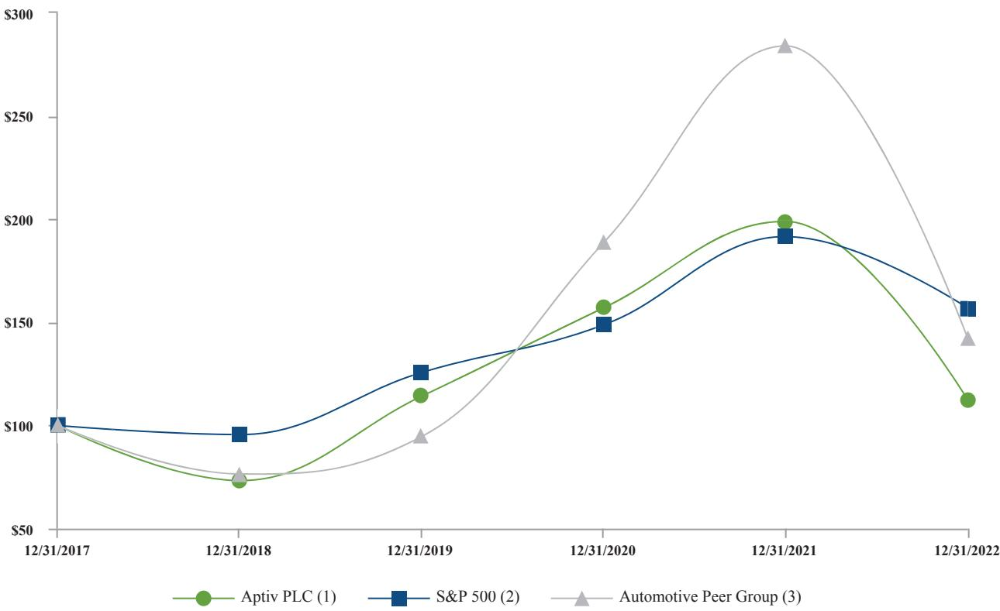

{0}------------------------------------------------

# 2022 Annual Report

{1}------------------------------------------------

#### **MESSAGE TO OUR STAKEHOLDERS**

More than a decade ago, Aptiv recognized that demands for a safer, greener and more connected world would reshape the future of the automotive industry, and since that time we have continued to refine and execute our strategy to capitalize on these megatrends. While the recent pandemic and supply chain challenges tested our resilience, our ability to meet customer demands and achieve record new bookings confirmed the strength of our portfolio, the commitment of our global workforce and the value of our mission.

Today, the megatrends are accelerating, driven by the growing appeal of feature-rich, highly electrified vehicles. Our ability to enable these advanced features at a price consumers can afford is a testament to our capabilities. We are uniquely positioned as the industry's only fullsystem solutions provider, which enables us to optimize the performance and cost of the solutions we develop. Each day, our products help customers solve their toughest challenges, support the sustainability of our planet and deliver long-term value for our shareholders.

While we are proud of the resilient and innovative company that we have built, we are even more excited about how we are positioned for the future.

#### **DEMAND ACCELERATING FOR ELECTRIFIED, FEATURE-RICH VEHICLES**

During 2022, battery electric vehicles (BEVs) accounted for approximately 10 percent of new-vehicle production, reflecting continued strong growth driven by more stringent government regulations and increasing consumer demand. As a result, we expect the market for high-voltage electrification to increase by more than 20 percent annually between now and 2030.

The demand for higher levels of vehicle safety also increased, which is reflected in almost 20 percent of new vehicles built including Level 2 or higher advanced driver-assistance systems (ADAS). Multiple OEMs have now launched hands-free driving applications, many of which are enabled by Aptiv solutions that deliver greater levels of efficiency, flexibility and robustness across the broadest possible range of driving scenarios.

2022 also saw a step-function increase in OEMs beginning the transition to next-generation hardware and software architectures. By 2030, we expect that nearly 1 out of every 4 vehicles produced will use a highly centralized, software-defined architecture approach similar to the one Aptiv has been developing.

#### **A CLEAR PATH FORWARD**

Aptiv is leading the transformation in advanced vehicle architectures. This effort has been informed by the experience of launching more than 200 BEV architecture platforms and 60 high-complexity, software-intensive programs across more than 20 OEMs — all while maintaining exceptional levels of quality and delivery.

Our Smart Vehicle Architecture™ (SVA™) solution, introduced in 2017, comprises hardware and software building blocks designed to efficiently enable new software-defined functionality. We have worked with multiple global OEMs on advanced development programs. In doing so, we have leveraged our expertise in both the "brain" (software and compute) and the "nervous system" (power and data distribution) of the vehicle to serve as a trusted technology partner. This resulted in more than \$4 billion in new SVA™ business awards during 2022 — up significantly from less than \$1 billion total when we entered the year. We continue to be recognized for our innovation. In 2022, we won our 25th *Automotive News* PACE Award for the central vehicle controller, a key component of SVA™.

At the same time, Aptiv's high-voltage solutions are reducing weight and mass while also improving range and enabling faster charging — critical factors for BEV adoption. We have a comprehensive high-voltage portfolio, which we expanded during 2022 to include integrated power electronics. This solution combines six devices into one while also hosting battery management system software, and we won our first program to deliver this integrated solution to a major OEM.

During 2022, Aptiv also acquired an 85 percent equity stake in Intercable Automotive Solutions, a pioneer in the design and manufacture of high-voltage power distribution and interconnect technology. The company's industry-leading busbar technologies enhance our high-voltage product portfolio, and Intercable Automotive is able to leverage Aptiv's global scale and manufacturing footprint.

#### **THE NEXT CHAPTER FOR APTIV**

Consumers increasingly are demanding advanced, software-enabled features, which need to be supported across the full life cycle of the vehicle. This requires a continued evolution of the in-vehicle software architecture, as well as the development tools and processes OEMs use to enable these solutions.

{2}------------------------------------------------

We acquired Wind River, a global leader in delivering software for mission-critical intelligent systems, whose technology is in more than 2 billion edge devices for more than 1,700 customers across multiple end-markets, including telecommunications, aerospace and defense and industrial. Wind River's proven solutions are ideally suited to support next-generation vehicle architectures through software abstraction and a cloud-native approach that modernizes software development, deployment and operation over the life cycle of the vehicle.

This acquisition is an enabler for our future, positioning us to move away from legacy monolithic architectures that have historically defined our industry to a more

agile, cloud-native approach. This modernizes software development and life-cycle management, enables new business models and accelerates the industry's digital transformation. As a result, Aptiv is better positioned to execute against the attractive opportunities in software-defined mobility, and Wind River can accelerate its growth in other high-value industries by providing its world-class team with additional resources.

#### **POSITIONED FOR THE EMERGING INTELLIGENT EDGE**

In the future, the vehicle will increasingly become an intelligent edge device integrated into the broader internet of things ecosystem, enabling more advanced

**"I offer my deepest thanks to our 200,000 employees around the world, whose determination and sacrifices have positioned us for the future, and I thank all our stakeholders for their continued support of our mission."**

|  |  |  |  |  |  |  |  |  |  |  |  |  |  |  |  |  | . |  |
|--|--|--|--|--|--|--|--|--|--|--|--|--|--|--|--|--|---|--|
|  |  |  |  |  |  |  |  |  |  |  |  |  |  |  |  |  |   |  |
|  |  |  |  |  |  |  |  |  |  |  |  |  |  |  |  |  |   |  |
|  |  |  |  |  |  |  |  |  |  |  |  |  |  |  |  |  |   |  |

{3}------------------------------------------------

processing to take place in the cloud, powered by machine learning for insights and deep personalization.

We are well positioned to leverage our entire hardware and software portfolio to address this expanded opportunity. Aptiv's solutions are not limited to the automotive industry, as applications in industrial, transportation, renewable energy and other attractive markets are being shaped by the same technology trends and customer needs, including increasing data, power and connectivity requirements. Looking ahead, our ability to serve these markets nearly doubles our total addressable market opportunity to \$400 billion by 2030.

#### **REALIZING OUR VISION FOR TODAY AND BEYOND**

The strategy we developed roughly a decade ago has proved to be the right one, helping us stay focused

on our goals and allowing us to successfully navigate the challenges facing our industry. Our priority remains to deliver on our commitments to our customers and our shareholders — both today and in the future.

I offer my deepest thanks to our 200,000 employees around the world, whose determination and sacrifices have positioned us for the future, and I thank all our stakeholders for their continued support of our mission.

**Kevin P. Clark** Chairman and Chief Executive Officer

**"Consumers increasingly are demanding advanced, software-enabled features, which need to be supported across the full life cycle of the vehicle. This requires a continued evolution of the in-vehicle software architecture, as well as the development tools and processes OEMs use to enable these solutions."**

{4}------------------------------------------------

## **UNITED STATES SECURITIES AND EXCHANGE COMMISSION**

**Washington, D.C. 20549**

#### **FORM 10-K**

☒ ANNUAL REPORT PURSUANT TO SECTION 13 OR 15(d) OF THE SECURITIES EXCHANGE ACT OF 1934

## **For the fiscal year ended December 31, 2022**

OR

☐ TRANSITION REPORT PURSUANT TO SECTION 13 OR 15(d) OF THE SECURITIES EXCHANGE ACT OF 1934

For the transition period from to .

Commission file number: 001-35346

#### **APTIV PLC**

(Exact name of registrant as specified in its charter)

(State or other jurisdiction of (I.R.S. Employer incorporation or organization) Identification No.)

**Jersey 98-1029562**

**5 Hanover Quay, Grand Canal Dock, Dublin, D02 VY79, Ireland**

(Address of principal executive offices)

**353-1-259-7013**

(Registrant's telephone number, including area code) Securities registered pursuant to Section 12(b) of the Act:

| Title of each class                                                                   | Trading symbol(s) | Name of each exchange on which registered |  |  |  |  |  |  |  |  |
|---------------------------------------------------------------------------------------|-------------------|-------------------------------------------|--|--|--|--|--|--|--|--|
| Ordinary Shares. \$0.01 par value per share                                           | APTV              | New York Stock Exchange                   |  |  |  |  |  |  |  |  |
| 5.50% Mandatory Convertible Preferred Shares, Series A, \$0.01 par value per share | APTV PRA          | New York Stock Exchange                   |  |  |  |  |  |  |  |  |
| 2.396% Senior Notes due 2025                                                          | APTV              | New York Stock Exchange                   |  |  |  |  |  |  |  |  |
| 1.500% Senior Notes due 2025                                                          | APTV              | New York Stock Exchange                   |  |  |  |  |  |  |  |  |
| 1.600% Senior Notes due 2028                                                          | APTV              | New York Stock Exchange                   |  |  |  |  |  |  |  |  |
| 4.350% Senior Notes due 2029                                                          | APTV              | New York Stock Exchange                   |  |  |  |  |  |  |  |  |
| 3.250% Senior Notes due 2032                                                          | APTV              | New York Stock Exchange                   |  |  |  |  |  |  |  |  |
| 4.400% Senior Notes due 2046                                                          | APTV              | New York Stock Exchange                   |  |  |  |  |  |  |  |  |
| 5.400% Senior Notes due 2049                                                          | APTV              | New York Stock Exchange                   |  |  |  |  |  |  |  |  |
| 3.100% Senior Notes due 2051                                                          | APTV              | New York Stock Exchange                   |  |  |  |  |  |  |  |  |
| 4.150% Senior Notes due 2052                                                          | APTV              | New York Stock Exchange                   |  |  |  |  |  |  |  |  |

Securities registered pursuant to Section 12(g) of the Act: None

Indicate by check mark if the registrant is a well-known seasoned issuer, as defined in Rule 405 of the Securities Act. Yes ☒. No ☐.

Indicate by check mark if the registrant is not required to file reports pursuant to Section 13 or Section 15(d) of the Act. Yes ☐. No ☒. Indicate by check mark whether the registrant (1) has filed all reports required to be filed by Section 13 or 15(d) of the Securities

Exchange Act of 1934 during the preceding 12 months (or for such shorter period that the registrant was required to file such reports), and (2) has been subject to such filing requirements for the past 90 days. Yes ☒. No ☐.

Indicate by check mark whether the registrant has submitted electronically every Interactive Data File required to be submitted pursuant to Rule 405 of Regulation S-T (§232.405 of this chapter) during the preceding 12 months (or for such shorter period that the registrant was required to submit such files). Yes ☒. No ☐.

Indicate by check mark whether the registrant is a large accelerated filer, an accelerated filer, a non-accelerated filer, a smaller reporting company, or an emerging growth company. See the definitions of "large accelerated filer," "accelerated filer," "smaller reporting company," and "emerging growth company" in Rule 12b-2 of the Exchange Act.

| Large accelerated filer | ☒ | Accelerated filer         | ☐ |
|-------------------------|---|---------------------------|---|
| Non-accelerated filer   | ☐ | Smaller reporting company | ☐ |
|                         |   | Emerging growth company   | ☐ |

If an emerging growth company, indicate by the check mark if the registrant has elected not to use the extended transition period for complying with any new or revised financial accounting standards provided pursuant to Section 13(a) of the Exchange Act. ☐.

Indicate by check mark whether the registrant has filed a report on and attestation to its management's assessment of the effectiveness of its internal control over financial reporting under Section 404(b) of the Sarbanes-Oxley Act (15 U.S.C. 7262(b)) by the registered public accounting firm that prepared or issued its audit report. ☒

{5}------------------------------------------------

If securities are registered pursuant to Section 12(b) of the Act, indicate by check mark whether the financial statements of the registrant included in the filing reflect the correction of an error to previously issued financial statements. ☐

Indicate by check mark whether any of those error corrections are restatements that required a recovery analysis of incentive-based compensation received by any of the registrant's executive officers during the relevant recovery period pursuant to §240.10D-1(b). ☐

Indicate by check mark whether the registrant is a shell company (as defined in Rule 12b-2 of the Exchange Act). Yes ☐. No ☒.

The aggregate market value of the ordinary shares held by non-affiliates of the registrant as of June 30, 2022, the last business day of the registrant's most recently completed second fiscal quarter, was \$24,055,205,443 (based on the closing sale price of the registrant's ordinary shares on that date as reported on the New York Stock Exchange).

The number of the registrant's ordinary shares outstanding, \$0.01 par value per share as of February 3, 2023, was 270,949,579.

#### **DOCUMENTS INCORPORATED BY REFERENCE**

Portions of the registrant's definitive Proxy Statement related to the 2023 Annual General Meeting of Shareholders to be filed subsequently are incorporated by reference into Part III of this Form 10-K.

{6}------------------------------------------------

## **APTIV PLC**

#### **INDEX**

|                        |                                                                                                                                                  | Page |
|------------------------|--------------------------------------------------------------------------------------------------------------------------------------------------|------|
|                        | Part I                                                                                                                                        |      |
| Item 1.             | Business                                                                                                                                         | 5    |
| Supplementary Item. | Executive Officers of the Registrant                                                                                                 | 14   |
| Item 1A.            | Risk Factors                                                                                                                                  | 16   |
| Item 1B.            | Unresolved Staff Comments                                                                                                                  | 28   |
| Item 2.             | Properties                                                                                                                                       | 28   |
| Item 3.             | Legal Proceedings                                                                                                                             | 28   |
| Item 4.             | Mine Safety Disclosures                                                                                                                    | 29   |
|                        |                                                                                                                                                  |      |
|                        | Part II                                                                                                                                       |      |
| Item 5.             | Market for Registrant's Common Equity, Related Stockholder Matters and Issuer Purchases of Equity Securities | 30   |
| Item 6.             | [Reserved]                                                                                                                                       | 31   |
| Item 7.             | Management's Discussion and Analysis of Financial Condition and Results of Operations                              | 31   |
| Item 7A.            | Quantitative and Qualitative Disclosures About Market Risk                                                                        | 60   |
| Item 8.             | Financial Statements and Supplementary Data                                                                                          | 62   |
| Item 9.             | Changes in and Disagreements With Accountants on Accounting and Financial Disclosure                               | 133  |
| Item 9A.            | Controls and Procedures                                                                                                                    | 133  |
| Item 9B.            | Other Information                                                                                                                             | 133  |
|                        |                                                                                                                                                  |      |

#### **Part III**

| Item 10. | Directors, Executive Officers and Corporate Governance                                                           | 134 |
|-------------|---------------------------------------------------------------------------------------------------------------------------------|-----|
| Item 11. | Executive Compensation                                                                                                       | 134 |
| Item 12. | Security Ownership of Certain Beneficial Owners and Management and Related Stockholder Matters | 134 |
| Item 13. | Certain Relationships and Related Transactions and Director Independence                                   | 134 |
| Item 14. | Principal Accounting Fees and Services                                                                              | 134 |

#### **Part IV**

| Item 15. | Exhibits, Financial Statement Schedules | 135 |
|-------------|--------------------------------------------------|-----|
|-------------|--------------------------------------------------|-----|

{7}------------------------------------------------

#### **CAUTIONARY STATEMENT REGARDING FORWARD-LOOKING INFORMATION**

This Annual Report on Form 10-K, including the exhibits being filed as part of this report, as well as other statements made by Aptiv PLC ("Aptiv," the "Company," "we," "us" and "our"), contain forward-looking statements that reflect, when made, the Company's current views with respect to current events, certain investments and acquisitions and financial performance. Such forward-looking statements are subject to many risks, uncertainties and factors relating to the Company's operations and business environment, which may cause the actual results of the Company to be materially different from any future results, express or implied, by such forward-looking statements. All statements that address future operating, financial or business performance or the Company's strategies or expectations are forward-looking statements. In some cases, you can identify these statements by forward-looking words such as "may," "might," "will," "should," "expects," "plans," "intends," "anticipates," "believes," "estimates," "predicts," "projects," "potential," "outlook" or "continue," and other comparable terminology. Factors that could cause actual results to differ materially from these forward-looking statements include, but are not limited to, the following: global and regional economic conditions, including conditions affecting the credit market; global inflationary pressures; uncertainties posed by the COVID-19 pandemic and the difficulty in predicting its future course and its impact on the global economy and the Company's future operations; uncertainties created by the conflict between Ukraine and Russia, and its impacts to the European and global economies and our operations in each country; fluctuations in interest rates and foreign currency exchange rates; the cyclical nature of global automotive sales and production; the potential disruptions in the supply of and changes in the competitive environment for raw material and other components integral to the Company's products, including the ongoing semiconductor supply shortage; the Company's ability to maintain contracts that are critical to its operations; potential changes to beneficial free trade laws and regulations, such as the United States-Mexico-Canada Agreement; the ability of the Company to integrate and realize the expected benefits of recent transactions; the ability of the Company to attract, motivate and/or retain key executives; the ability of the Company to avoid or continue to operate during a strike, or partial work stoppage or slow down by any of its unionized employees or those of its principal customers; and the ability of the Company to attract and retain customers. Additional factors are discussed under the captions "Risk Factors" and "Management's Discussion and Analysis of Financial Condition and Results of Operations" in the Company's filings with the Securities and Exchange Commission. New risks and uncertainties arise from time to time, and it is impossible for us to predict these events or how they may affect the Company. It should be remembered that the price of the ordinary shares and any income from them can go down as well as up. Aptiv disclaims any intention or obligation to update or revise any forwardlooking statements, whether as a result of new information, future events and/or otherwise, except as may be required by law.

{8}------------------------------------------------

#### **PART I**

#### **ITEM 1. BUSINESS**

"Aptiv," the "Company," "we," "us" and "our" refer to Aptiv PLC (formerly known as Delphi Automotive PLC), a public limited company formed under the laws of Jersey on May 19, 2011, which completed an initial public offering on November 22, 2011, and its consolidated subsidiaries. The Company's ordinary shares are publicly traded on the New York Stock Exchange under the symbol "APTV."

Aptiv is a leading global technology and mobility architecture company primarily serving the automotive sector. We deliver end-to-end mobility solutions, enabling our customers' transition to more electrified, software-defined vehicles. We design and manufacture vehicle components and provide electrical, electronic and active safety technology solutions to the global automotive and commercial vehicle markets, creating the software and hardware foundation for vehicle features and functionality. Our Advanced Safety and User Experience segment is focused on providing the necessary software and advanced computing platforms, and our Signal and Power Solutions segment is focused on providing the requisite networking architecture required to support the integrated systems in today's complex vehicles. Together, our businesses develop the 'brain' and the 'nervous system' of increasingly complex vehicles, providing integration of the vehicle into its operating environment.

We are one of the largest vehicle technology suppliers and our customers include the 25 largest automotive original equipment manufacturers ("OEMs") in the world. We operate 131 major manufacturing facilities and 11 major technical centers utilizing a regional service model that enables us to efficiently and effectively serve our global customers from best cost countries. We have a presence in 48 countries and have approximately 22,000 scientists, engineers and technicians focused on developing market relevant product solutions for our customers.

We are focused on growing and improving the profitability of our businesses, and have implemented a strategy designed to position the Company to deliver industry-leading long-term shareholder returns. This strategy includes disciplined investing in our business to grow and enhance our product offerings, strategically focusing our portfolio in high-technology, high-growth spaces in order to meet consumer preferences and leveraging an industry-leading cost structure to expand our operating margins.

#### **Website Access to Company's Reports**

Aptiv's website address is aptiv.com. Our Annual Reports on Form 10-K, Quarterly Reports on Form 10-Q, Current Reports on Form 8-K and amendments to those reports filed or furnished pursuant to Section 13(a) or 15(d) of the Securities Exchange Act of 1934 (the "Exchange Act") are available free of charge through our website as soon as reasonably practicable after they are electronically filed with, or furnished to, the Securities and Exchange Commission ("SEC").

#### **Our Company**

We believe the automotive industry is being shaped by rapidly increasing consumer demand for new mobility solutions, advanced technologies, including software-defined vehicles, and vehicle connectivity, as well as increasing government regulation related to vehicle safety, fuel efficiency and emissions control. These industry mega-trends, which we refer to as "Safe," "Green" and "Connected," are driving higher growth in products that address these trends than growth in the automotive industry overall. We have organized our business into two diversified segments, which enable us to develop technology solutions and manufacture highly-engineered products that enable our customers to respond to these mega-trends:

- *Signal and Power Solutions*—This segment provides complete design, manufacture and assembly of the vehicle's electrical architecture, including engineered component products, connectors, wiring assemblies and harnesses, cable management, electrical centers and hybrid high voltage and safety distribution systems. Our products provide the critical signal distribution and computing power backbone that supports increased vehicle content and electrification, reduced emissions and higher fuel economy.
- *Advanced Safety and User Experience*—This segment provides critical technologies and services to enhance vehicle safety, security, comfort and convenience, including sensing and perception systems, electronic control units, multidomain controllers, vehicle connectivity systems, cloud-native software platforms, application software, autonomous driving technologies and end-to-end DevOps tools. Our products increase vehicle connectivity, reduce driver distraction and enhance vehicle safety.

Refer to Results of Operations by Segment in Item 7. Management's Discussion and Analysis of Financial Condition and Results of Operations and Note 22. Segment Reporting to the audited consolidated financial statements for financial information about our business segments.

Our business is diversified across end-markets, regions, customers, vehicle platforms and products. Our customer base includes the 25 largest automotive OEMs in the world, and in 2022, 30% of our net sales came from the Asia Pacific region,

{9}------------------------------------------------

which we have identified as a key market likely to experience substantial long-term growth. Our ten largest platforms in 2022 were with seven different OEMs. In addition, in 2022 our products were found in 18 of the 20 top-selling vehicle models in the United States ("U.S."), in 18 of the 20 top-selling vehicle models in Europe and in 12 of the 20 top-selling vehicle models in China.

We have established a worldwide design and manufacturing footprint with a regional service model that enables us to efficiently and effectively serve our global customers from best cost countries. This regional model is structured primarily to service the North American market from Mexico, the South American market from Brazil, the European market from Eastern Europe and North Africa, and the Asia Pacific market from China. Our global scale and regional service model enables us to engineer globally and execute regionally to serve the largest OEMs, which are seeking suppliers that can serve them on a worldwide basis. Our footprint also enables us to adapt to the regional design variations the global OEMs require while also serving key growth market OEMs.

#### **Our Industry**

The automotive technology and components industry provides critical technologies, components, systems, subsystems and modules to OEMs for the manufacture of new vehicles, as well as to the aftermarket for use as replacement parts for current production and older vehicles. In addition, the industry is increasingly progressing towards software-defined vehicles becoming critical elements of the overall automotive ecosystem. Overall, we expect long-term growth of global vehicle sales and production in the OEM market. In 2022, the industry experienced increased global customer sales and production schedules, despite the ongoing adverse impacts of global supply chain disruptions and increased global inflationary pressures. Global automotive vehicle production increased 5% (5% on an Aptiv weighted market basis, which represents global vehicle production weighted to the geographic regions in which the Company generates its revenue) from 2021 to 2022, reflecting increased vehicle production of 10% in North America, 3% in China and 8% in South America, our smallest region, and a decrease of 1% in Europe. Demand for automotive components in the OEM market is generally a function of the number of new vehicles produced in response to consumer demand, which is primarily driven by macro-economic factors such as credit availability, interest rates, fuel prices, consumer confidence, employment and other trends. Although OEM demand is tied to actual vehicle production, participants in the automotive technology and components industry also have the opportunity to grow through increasing product content per vehicle by further penetrating business with existing customers and in existing markets, gaining new customers and increasing their presence in global markets. We believe that evolving entrants into the global transportation industry such as mobility providers, electric vehicle developers and smart cities will provide additional markets for our advanced technologies. We believe that as a company with a global presence and advanced technology, engineering, manufacturing and customer support capabilities, we are well-positioned to benefit from these opportunities.

We believe that continuously increasing societal demands have created the three "mega-trends" that serve as the basis for the next wave of market-driven automotive technology advancement. We aim to continue developing leading edge technology focused on addressing these mega-trends, and apply that technology toward products with sustainable margins that enable our customers, both OEMs and others, to produce distinctive market-leading products. We have identified a core portfolio of products that draw on our technical strengths and align with these mega-trends where we believe we can provide differentiation to our customers.

*Safe.* The first mega-trend, "Safe," represents technologies aimed not just at protecting vehicle occupants when a crash occurs, but those that actually proactively reduce the risk of a crash occurring. OEMs continue to focus on improving occupant and pedestrian safety in order to meet increasingly stringent regulatory requirements in various markets. As a result, suppliers are focused on developing technologies aimed at protecting vehicle occupants when a crash occurs, as well as advanced driver assistance systems that reduce driver distractions and automated safety features that proactively mitigate the risk of a crash occurring. Examples of new and alternative technologies that incorporate sophisticated detection and advanced software for collision avoidance include lane departure warning and centering systems, adaptive cruise control and traffic jam assist, and driver and cabin monitoring systems.

*Green.* The second mega-trend, "Green," represents technologies designed to help reduce emissions, increase fuel economy and minimize the environmental impact of vehicles. Green is a key mega-trend today because of the convergence of several issues: climate change, volatility in oil prices, an increasing number of vehicles in use worldwide and recent and pending regulation in every region regarding fuel economy and greenhouse gas ("GHG") emissions. OEMs continue to focus on improving fuel efficiency and reducing emissions in order to meet increasingly stringent regulatory requirements in various markets. On a worldwide basis, the relevant authorities in the largest markets in which we operate have already instituted regulations requiring reductions in emissions and/or increased fuel economy. In many cases, other authorities have initiated legislation or regulation that would further tighten the standards through 2023 and beyond. Based on the current regulatory environment, we believe that OEMs, including those in the U.S. and China, will be subject to requirements for even greater reductions in carbon dioxide ("CO2") emissions over the next ten years. For example, in the U.S., the California Air Resources Board

{10}------------------------------------------------

approved new rules, which require that all new passenger cars and light trucks sold in California be electric vehicles or other emissions-free models by 2035. Furthermore, the Environmental Protection Agency in December 2021 finalized more stringent GHG emissions standards for passenger car and light trucks for model years 2023-2026. These and other standards will require meaningful innovation as OEMs and suppliers are challenged to find ways to improve engine management, electrical power consumption, vehicle weight and integration of electric vehicles and alternative technologies. As a result, suppliers are developing innovations that result in significant improvements in fuel economy, emissions and performance from internal combustion engines and electric vehicles. At the same time, suppliers are also developing and marketing new and alternative technologies that support electric vehicles, hybrid vehicles and fuel cell products to improve fuel economy and emissions. We are developing key enabling technologies in the areas of vehicle charging and vehicle power distribution and control that are essential to the introduction of our customers' electrified vehicle platforms. We are also enabling the trend towards vehicle electrification with high voltage electrification solutions that reduce CO2 emissions and increase fuel economy, helping to make the world greener.

*Connected.* The third mega-trend, "Connected," represents technologies designed to seamlessly integrate today's highly complex vehicles into the electronic operating environment, and provide drivers with connectivity to the global information network. The technology content of vehicles continues to increase as consumers demand greater safety, personalization, infotainment, productivity and convenience while driving, which in turn leads to increasing demand for electrical architecture as a foundation for this content. Also with increased smart device usage in vehicles, driver distractions can be dramatically increased, which in turn results in greater risk of accidents. We are pioneering vehicle-to-vehicle (V2V) and vehicle-to-infrastructure (V2I) communication technologies which enable vehicles to detect and signal danger, reducing vehicle collisions and improving driver safety, while also maintaining connectivity to an increasing number of devices inside and outside of vehicles. We also utilize advanced connectivity solutions such as over-the-air (OTA) technology that enable vehicles to receive software updates remotely and collect market-relevant data from connected vehicles.

We expect these mega-trends to continue to create growth and opportunity for us. We believe we are well-positioned to provide solutions and products to OEMs to expand the electronic and technological content of their vehicles. We also believe electronics integration, which generally refers to products and systems that combine integrated circuits, software algorithms, sensor technologies and mechanical components within the vehicle will allow OEMs to achieve substantial reductions in weight and mechanical complexity, resulting in easier assembly, enhanced fuel economy, improved emissions control and better vehicle performance.

#### *Convergence of Safe, Green and Connected Solutions in New Mobility and Autonomous Driving*

The combination of advanced technologies being developed within these mega-trends is also contributing to increasing industry development of autonomous driving technologies, leading to a fully automated driving experience. We expect automated driving technologies will provide strong societal benefit as well as the opportunity for long-term growth for our product offerings in this space, including new potential customers such as mobility providers and smart cities that require solutions to increasing urban mobility challenges. Societal benefits of increased vehicle automation include enhanced safety (resulting from collision avoidance and improved vehicle control), environmental improvements (a reduction in CO2 emissions resulting from optimized driving behavior), labor cost savings and improved productivity (as a result of alternate uses for drive time). Growth opportunities in this space result from increased content, additional computing power and software requirements, enhanced connectivity systems and increased electrification and interconnects. We believe the complexity of these systems will also require ongoing software support services, as these vehicle systems will be continuously upgraded with new features and performance enhancements.

As part of our strategy to harness the full potential of connected intelligent systems across industries, strengthen our capabilities in software-defined mobility and to enable advanced smart vehicle architecture changes, we acquired Wind River Systems, Inc. ("Wind River") in December 2022. Wind River is a global leader in delivering software for the intelligent edge. Previously, in 2021, we executed a strategic collaboration agreement with Wind River to develop a software toolchain for various automotive applications.

We are also continuing to invest in the automated driving space, and have continued to develop market-leading automated driving platform solutions such as automated driving software, key active safety sensing technologies and our multidomain controller, which fuses information from sensing systems as well as mapping and navigation data to make driving decisions. We believe we are well-aligned with industry technology trends that will result in sustainable future growth in this space, and have partnered with leaders in their respective fields to advance the pace of development and commercialization of these emerging technologies.

In March 2020, to further our leadership position in the automated driving space, we completed a transaction with Hyundai Motor Group ("Hyundai") to form Motional AD LLC ("Motional"), a joint venture focused on the design,

{11}------------------------------------------------

development and commercialization of autonomous driving technologies. Motional brings together one of the industry's most innovative vehicle technology providers with one of the world's largest OEMs. We expect this partnership to accelerate the path towards the development of production-ready autonomous driving systems for commercialization in the new mobility space.

We believe that substantial strategic value will be created from our partnership with Hyundai through our commitment to a shared mission of making driverless vehicles a safe, reliable and accessible reality. Furthermore, we anticipate Motional's presence in both North America and Asia, along with the global presence of both Aptiv and Hyundai, to generate economies of scale to support the development of a complete autonomous driving platform, as well as to facilitate mobility infrastructure advancements.

Motional began testing fully driverless systems in 2020 and began testing a production-ready autonomous driving platform available for robotaxi providers, meal delivery providers, fleet operators and automotive manufacturers at prototype scale in 2022, with higher volume production deployments anticipated in late 2023. In addition, Motional is involved in collaborative arrangements with mobility providers and with smart cities such as Boston, Las Vegas, Los Angeles and Singapore as solutions are developed for the evolving nature of the mobility industry.

To guide our product strategies and investments in technology with a focus on developing advanced technologies to drive growth within the Safe, Green and Connected mega-trends, we utilize and benefit from our Technology Advisory Council, a panel of prominent global technology thought leaders.

#### *Standardization of Sourcing by OEMs*

Many OEMs have adopted global vehicle platforms to increase standardization, reduce per unit cost and increase capital efficiency and profitability. As a result, OEMs select suppliers that have the capability to manufacture products on a worldwide basis as well as the flexibility to adapt to regional variations. Suppliers with global scale and strong design, engineering and manufacturing capabilities, are best positioned to benefit from this trend. OEMs are also increasingly looking to their suppliers to simplify vehicle design and assembly processes to reduce costs. As a result, suppliers that sell vehicle components directly to manufacturers (Tier I suppliers) have assumed many of the design, engineering, research and development and assembly functions traditionally performed by vehicle manufacturers. Suppliers that can provide fully-engineered solutions, systems and pre-assembled combinations of component parts are positioned to leverage the trend toward system sourcing.

#### *Shorter Product Development Cycles*

As a result of government regulations and customer preferences, OEMs are requiring suppliers to respond faster with new designs and product innovations. While these trends are more prevalent in mature markets, certain key growth markets are advancing rapidly towards the regulatory standards and consumer preferences of the more mature markets. Suppliers with strong technologies, robust global engineering and development capabilities will be best positioned to meet OEM demands for rapid innovation.

#### **Products**

Our organizational structure and management reporting support the management of these core product lines:

*Signal and Power Solutions*. This segment provides complete design, manufacture and assembly of the vehicle's electrical architecture, including connectors, wiring assemblies and harnesses, cable management, electrical centers and hybrid high voltage and safety distribution systems. Our products provide the critical signal distribution and computing power backbone that supports increased vehicle content and electrification, reduced emissions and higher fuel economy.

- High quality connectors are engineered primarily for use in the automotive and related markets, but also have applications in the industrial, telematics, aerospace, defense and medical sectors.
- Electrical centers provide centralized electrical power and signal distribution and all of the associated circuit protection and switching devices, thereby optimizing the overall vehicle electrical system.
- Distribution systems, including hybrid high voltage systems, are integrated into one optimized vehicle electrical system that can utilize smaller cable and gauge sizes and ultra-thin wall insulation (which product line makes up approximately 44% of our total revenue for the year ended December 31, 2022 and 42% for each of the years ended December 31, 2021 and 2020).

*Advanced Safety and User Experience*. This segment provides critical technologies and services to enhance vehicle safety, security, comfort and convenience, including sensing and perception systems, electronic control units, multi-domain controllers, vehicle connectivity systems, cloud-native software platforms, application software, autonomous driving technologies and end-to-end DevOps tools.

- Advanced safety primarily consists of solutions that enable active and passive safety features and vehicle automation, as well as vision, radar and other sensing technologies.

{12}------------------------------------------------

- The user experience portfolio primarily enables in-cabin solutions around infotainment, driver interface and interior sensing solutions.
- Connectivity and security products primarily consists of solutions that provide body control, security and unlock vehicle data.

#### **Competition**

Although the overall number of our top competitors has decreased due to ongoing industry consolidation, the automotive technology and components industry remains extremely competitive. Furthermore, the rapidly evolving nature of the markets in which we compete has attracted, and may continue to attract, new entrants, particularly in best cost countries such as China and in areas of evolving vehicle technologies such as intelligent systems software, automated driving and mobility solutions, which has attracted competitors from outside the traditional automotive industry. OEMs rigorously evaluate suppliers on the basis of product quality, price, reliability and timeliness of delivery, product design capability, technical expertise and development capability, new product innovation, financial viability, application of lean principles, operational flexibility, customer service and overall management. In addition, our customers generally require that we demonstrate improved efficiencies, through cost reductions and/or price improvement, on a year-over-year basis.

Our competitors in each of our operating segments are as follows:

| Segment                                         | Competitors                                                                       |  |  |  |  |
|-------------------------------------------------|-----------------------------------------------------------------------------------|--|--|--|--|
| Signal and Power Solutions             | • Amphenol Corporation                                                      |  |  |  |  |
|                                                 | • Draexlmaier Automotive                                                    |  |  |  |  |
|                                                 | • Lear Corporation                                                          |  |  |  |  |
|                                                 | • Leoni AG                                                                  |  |  |  |  |
|                                                 | • Molex Inc. (a subsidiary of Koch Industries, Inc.)      |  |  |  |  |
|                                                 | • Sumitomo Corporation                                                      |  |  |  |  |
|                                                 | • TE Connectivity, Ltd.                                                     |  |  |  |  |
|                                                 | • Yazaki Corporation                                                        |  |  |  |  |
| Advanced Safety and User Experience | • Bosch Group                                                               |  |  |  |  |
|                                                 | • Continental AG                                                            |  |  |  |  |
|                                                 | • Denso Corporation                                                         |  |  |  |  |
|                                                 | • Harman International (a subsidiary of Samsung Electronics) |  |  |  |  |
|                                                 | • Hyundai Mobis                                                             |  |  |  |  |
|                                                 | • Magna International                                                       |  |  |  |  |
|                                                 | • Panasonic Corporation                                                     |  |  |  |  |
|                                                 | • Valeo                                                                        |  |  |  |  |
|                                                 | • Veoneer, Inc.                                                             |  |  |  |  |
|                                                 | • Visteon Corporation                                                       |  |  |  |  |
|                                                 | • ZF Friedrichshafen AG                                                  |  |  |  |  |

{13}------------------------------------------------

#### **Customers**

We sell our products and services to the major global OEMs in every region of the world. The following table provides the percentage of net sales to our largest customers for the year ended December 31, 2022:

| Customer                                                | Percentage of Net Sales |
|---------------------------------------------------------|-------------------------|
| General Motors Company                            | 9%                      |
| Stellantis N.V.                                   | 9%                      |
| Ford Motor Company                                | 8%                      |
| Volkswagen Group                                  | 8%                      |
| Tesla, Inc                                           | 5%                      |
| Geely Automobile Holdings Limited              | 5%                      |
| Mercedes-Benz Group AG                            | 4%                      |
| SAIC General Motors Corporation Limited  | 3%                      |
| Bayerische Motoren Werke AG                    | 2%                      |
| Toyota Motor Corporation                       | 2%                      |
| Tata Motors Limited                            | 2%                      |

#### **Supply Relationships with Our Customers**

We typically supply products to our OEM customers through purchase orders, which are generally governed by general terms and conditions established by each OEM. Although the terms and conditions vary from customer to customer, they typically contemplate a relationship under which our customers place orders for their requirements of specific components supplied for particular vehicles but are not required to purchase any minimum amount of products from us. These relationships typically extend over the life of the related vehicle. Prices are negotiated with respect to each business award, which may be subject to adjustments under certain circumstances, such as commodity or foreign exchange escalation/de-escalation clauses or for cost reductions achieved by us. The terms and conditions typically provide that we are subject to a warranty on the products supplied; in most cases, the duration of such warranty is coterminous with the warranty offered by the OEM to the end-user of the vehicle. We may also be obligated to share in all or a part of recall costs if the OEM recalls its vehicles for defects attributable to our products.

Individual purchase orders are terminable for cause or non-performance and, in most cases, upon our insolvency and certain change of control events. In addition, many of our OEM customers have the option to terminate for convenience on certain programs, which permits our customers to impose pressure on pricing during the life of the vehicle program, and issue purchase contracts for less than the duration of the vehicle program, which potentially reduces our profit margins and increases the risk of our losing future sales under those purchase contracts. We manufacture and ship based on customer release schedules, normally provided on a weekly basis, which can vary due to cyclical automobile production or dealer inventory levels.

Although customer programs typically extend to future periods, and although there is an expectation that we will supply certain levels of OEM production during such future periods, customer agreements including applicable terms and conditions do not necessarily constitute firm orders. Firm orders are generally limited to specific and authorized customer purchase order releases placed with our manufacturing and distribution centers for actual production and order fulfillment. Firm orders are typically fulfilled as promptly as possible from the conversion of available raw materials, sub-components and work-in-process inventory for OEM orders and from current on-hand finished goods inventory for aftermarket orders. The dollar amount of such purchase order releases on hand and not processed at any point in time is not believed to be significant based upon the time frame involved.

#### **Materials**

We procure our raw materials from a variety of suppliers around the world. Generally, we seek to obtain materials in the region in which our products are manufactured in order to minimize transportation and other costs. The most significant raw materials we use to manufacture our products include copper and resins. As of December 31, 2022, we have not experienced any significant shortages of raw materials, however, as a result of our customers' recent production volatility and cancellations, our balance of productive, raw and component material inventories has increased substantially from customary levels. These changes to the production environment have been primarily driven by the worldwide semiconductor shortage. We continue to actively monitor and manage inventory levels across all inventory types in order to maximize both supply continuity and the

{14}------------------------------------------------

efficient use of working capital. Normally we do not carry inventories of such raw materials in excess of those reasonably required to meet our production and shipping schedules.

Commodity cost volatility, most notably related to copper, petroleum-based resin products and fuel, is a challenge for us and our industry. Recently, the industry has been subjected to increased pricing pressures, specifically in relation to these commodities, which have experienced significant volatility in price. We have also been impacted globally by increased overall inflation as a result of a variety of global trends. We are continually seeking to manage these and other material-related cost pressures using a combination of strategies, including working with our suppliers to mitigate costs, seeking alternative product designs and material specifications, combining our purchase requirements with our customers and/or suppliers, changing suppliers, hedging of certain commodities and other means. In the case of copper, which primarily affects our Signal and Power Solutions segment, contract clauses have enabled us to pass on some of the price increases to our customers and thereby partially offset the impact of increased commodity costs on operating income for the related products. Other than in the case of copper, our overall success in passing commodity cost increases on to our customers has been limited. However, in 2022, we have negotiated, and will continue to negotiate, price increases with our customers in response to the global supply chain disruptions impacting the automotive industry. We will continue our efforts to pass market-driven commodity cost increases to our customers in an effort to mitigate all or some of the adverse earnings impacts, including by seeking to renegotiate terms as contracts with our customers expire.

#### **Seasonality**

In general, our business is moderately seasonal, as our primary North American customers historically reduce production during the month of July and halt operations for approximately one week in December. Our European customers generally reduce production during the months of July and August and for one week in December. Our Chinese customers generally halt operations for one week during the months of February and October. Shut-down periods in the rest of the world generally vary by country. In addition, automotive production is traditionally reduced in the months of July, August and September due to the launch of component production for new vehicle models.

#### **Human Capital Resources**

As of December 31, 2022, we employed approximately 160,000 people; 32,000 salaried employees and 128,000 hourly employees. In addition, we maintain a contingent workforce of approximately 42,000 to accommodate fluctuations in customer demand. We are a global company serving every major worldwide market. As of December 31, 2022 our workforce is distributed as follows:

- 53% in North America, with our largest presence in Mexico;
- 31% in the Europe, Middle East and Africa region, with our largest presence in Morocco and Serbia;
- 12% in the Asia Pacific region, with our largest presence in China and India; and
- 4% in South America, with our largest presence in Brazil.

Certain of our employees are represented worldwide by numerous unions and works councils, including the International Union of Electronic, Electrical, Salaried, Machine and Furniture Workers - Communications Workers of America, IG Metall and the Confederacion De Trabajadores Mexicanos. We maintain collaborative and constructive labor relationships with our employee representatives in order to foster positive employee relations.

#### *Talent Development*

Our people are central to our mission of developing safer, greener and more connected solutions. We continually strive to create and maintain an environment where innovation thrives and our employees are empowered to think and act like owners. To this end, we continually provide coaching and mentoring to our employees at all levels, as well as internal job opportunities including global rotations and stretch assignments to help our employees develop and grow their careers. This dedication to employee growth and development was demonstrated by more than half of our management role openings being filled through internal promotions in 2022. We manage succession planning as part of our operating cadence and top leadership succession plans are reviewed with the Board of Directors annually.

Aptiv is committed to talent development and growing the next generation of leaders. Our established leadership programs provide our leaders with the tools to be effective today while preparing them for future challenges. In 2022, our people completed over 43,000 hours of leadership and management training. Our Global Leadership Development Program develops business acumen and personal competencies, as well as the opportunity to learn and interact with peers from around the world. We also leverage Aptiv Academy, our online learning management system, across the business, using in-person, online and virtual reality learning opportunities. During 2022, our employees used this system to complete approximately 421,000 individual training hours. We continue to focus on developing great people in order to maximize organizational effectiveness.

{15}------------------------------------------------

#### *Culture*

Aptiv's culture is a key advantage to how we do business. Our culture is based on a set of distinct values and behaviors that guide what we do and how we do it. Culture is a central pillar in our business and helps to drive consistent leadership behavior across our businesses. In 2022, we hosted 16 culture training workshops with 620 participants to help newly appointed managers understand Aptiv's values and behaviors to become better leaders. Our management team actively receives feedback at all levels in our organization and utilizes this feedback to continually improve how we engage our people and improve our operations. We recognize that sustaining a leadership culture requires continual focus and attention. Accordingly, senior executives and leaders throughout the Company commit time, resources and attention to ensure our culture continues to differentiate Aptiv as a great place to work.

#### *Diversity and Inclusion*

At Aptiv, we value each individual's perspective and foster an environment of respect and inclusion. Leveraging our employees' diverse backgrounds and experiences allows us to make better decisions and supports stronger performance. Our Board of Directors reviews Aptiv's talent evolution, inclusion and diversity efforts annually, and our Compensation & Human Resources Committee reviews employee retention, attrition and pay equity on a continual basis.

Aptiv participates in, and sponsors, numerous outreach programs around the world, which seek to promote and recruit women and diverse candidates into science, technology, engineering and mathematical (STEM) fields. As of December 31, 2022, the percentage of our global workforce represented by women was approximately 50% and the percentage of management represented by women was 24%. As of December 31, 2022, the percentage of our U.S. based workforce represented by minorities was approximately 43% and the percentage of U.S. based management represented by minorities was approximately 34%. Aptiv is committed to continuing to increase its level of diversity, specifically in middle management, senior leadership and technology roles, over the coming years.

#### *Health and Safety*

We prioritize the health and safety of all our employees by focusing on prevention, training, auditing and risk mitigation in our manufacturing plants, technical centers and offices. We routinely assess occupational health and safety risks, define controls and perform internal audits for all manufacturing sites, assessing, among other things, legal compliance, controls and key workplace safety metrics. We are a leader in workplace safety as reflected in our lost time injury frequency rate of 0.143 cases per million hours worked and our lost workday case rate per 100 employees of 0.029 for the year ended December 31, 2022. Our standard safety management system is aligned with ISO 45001 and we are committed to ensuring all of our manufacturing sites are ISO 45001 certified by 2025.

#### **Commitment to Environmental Sustainability**

Sustainability has always been core to Aptiv's business, values and culture. We believe this strong, foundational focus on sustainability makes Aptiv a partner of choice for our customers, a desirable place to work for our employees and a valued contributor to the communities in which we operate. While a key part of our business is to design solutions that help transition the world's vehicles to cleaner sources of power, we are also committed to reducing our environmental footprint throughout our operations around the globe. We aim to reduce our environmental impact by decreasing our carbon footprint, reducing waste generated and consuming less water in our operations. Expenditures required to meet our environmental sustainability goals, which are described below, are included in our normal budgeting process.

#### *Decreasing our Carbon Footprint*

We have committed to becoming carbon-neutral in our global operations by 2030 and to achieve net carbon neutrality by 2040 as we transition away from carbon-intensive energy and processes in our global operations. To achieve these commitments, we are targeting:

- Reducing Scope 1 and 2 absolute CO2e emissions by 25% between the baseline year (2019) and 2025;
- Maintaining annual certification of all major manufacturing sites to the ISO 14001 standard;
- Certifying ten of the most energy-intensive sites to the ISO 50001 certification by 2025;
- Sourcing 100% of electricity for operations from renewable sources by 2030; and
- Delivering only carbon-neutral products by 2039, from sourcing to disposal.

Key to achieving these goals is our global Environmental, Health and Safety and Sustainability management system, which helps to keep us aligned with stringent environmental, health and safety regulations and provides a structure for continuous improvement. This system applies to all Aptiv sites, which means that in some countries our procedures go beyond local regulations and requirements. This system is continuously updated to ensure that our procedures remain up to date.

{16}------------------------------------------------

#### *Reducing our Water Usage and Waste Generated*

While our operations are not water intensive, we include water in our environmental risk management approach. We identify locations where we operate that are water-scarce and take action to reduce our water consumption accordingly, while also striving to comply with best practices in lower-risk locations. Our goal is to reduce water consumption in high-risk (waterscarce) locations by 2% per year.

We are also committed to reducing waste, with a waste recycled target (volume of recycled waste divided by total waste volume) of 80%. We continue to strive to actively reduce and manage waste across our manufacturing operations, as well as in our offices. We are creating packaging that uses less material and we continue to strive to increase the share of waste and excess materials we divert to recycling.

#### *Additional Sustainability Information*

Additional information regarding our environmental sustainability and human capital initiatives, as well as information on our progress towards our commitments, is available in our annual Sustainability Report located on our website at www.aptiv.com/about/sustainability. Nothing on our website, including the aforementioned Sustainability Report, shall be deemed incorporated by reference into this Annual Report.

{17}------------------------------------------------

#### **SUPPLEMENTARY ITEM. EXECUTIVE OFFICERS OF THE REGISTRANT**

The name, age (as of February 1, 2023), current positions and description of business experience of each of our executive officers are listed below. Our executive officers are elected annually by the Board of Directors and hold office until their successors are elected and qualified or until the officer's resignation or removal. Positions noted below reflect current service to Aptiv PLC and prior service to Delphi Automotive PLC and Delphi Automotive LLP.

*Kevin P. Clark*, 60, is chairman of Aptiv's board of directors and chief executive officer (CEO) of the company. Mr. Clark was named president and CEO and became a member of the board in March 2015. Previously, Mr. Clark was chief operating officer (COO) from October 2014 to March 2015. Prior to the COO position, Mr. Clark was chief financial officer and executive vice president from February 2013. He was appointed vice president and chief financial officer in July 2010. Previously, Mr. Clark was a founding partner of Liberty Lane Partners, LLC, a private-equity investment firm focused on building and improving middle-market companies. Prior to Liberty Lane Partners, Mr. Clark served as the chief financial officer of Fisher-Scientific International Inc., a manufacturer, distributor and service provider to the global healthcare market. Mr. Clark served as Fisher-Scientific's chief financial officer from the company's initial public offering in 2001 through the completion of its merger with Thermo Electron Corporation in 2006. Prior to becoming chief financial officer, Mr. Clark served as Fisher-Scientific's corporate controller and treasurer.

*Joseph R. Massaro*, 53, is Aptiv's chief financial officer and senior vice president, business operations. Mr. Massaro joined the Company in October 2013 as vice president, Internal Audit, and in September 2014 was appointed to the position of vice president, corporate controller. In March 2016, he was named senior vice president and chief financial officer and in September 2020, also assumed the role of senior vice president, business operations. Previously, Mr. Massaro was a managing director at Liberty Lane Partners from 2008 to 2010. He also served as chief financial officer of inVentiv Health Inc. from 2010 to 2013, a Liberty Lane portfolio company. Prior to Liberty Lane, he served in a variety of finance and operational roles at Thermo Fisher Scientific from 2002 to 2007, including senior vice president of Global Business Services where his responsibilities included the global sourcing and information technology functions. Prior to the merger with Thermo Electron, he also served as vice president and corporate controller of Fisher Scientific and held several other senior finance positions.

*Allan J. Brazier*, 56, is vice president and chief accounting officer of Aptiv, a position he has held since February 2011. Mr. Brazier joined the Company in June 2005 as senior manager of technical accounting and reporting, and prior to his current role served as assistant controller of technical accounting and reporting. Prior to joining Aptiv, Mr. Brazier was employed for seventeen years in financial roles of increasing responsibility at various companies. Mr. Brazier is a Certified Public Accountant and began his career with the international public accounting firm of KPMG.

*Matthew M. Cole*, 53, is senior vice president of Aptiv and president of Advanced Safety and User Experience, effective January 2023. He joined Aptiv from Tech Transformations, where he was president and business leader from September 2021 until January 2023. He previously served as senior vice president, Global Product Development at Visteon Corporation from 2014 to July 2021. Prior to Visteon, Mr. Cole served as vice president, Product Development, Global Electronics at Johnson Controls from 2010 to 2014. Prior to joining Johnson Controls, Mr. Cole served in a variety of positions of increasing responsibility at Visteon from 1999 to 2010. He began his career at Ford Motor Company in 1992.

*Glen W. De Vos*, 62, is senior vice president, transformation and special programs of Aptiv, a position he has held since December 2022. Previously, he was senior vice president and chief technology officer of Aptiv, effective March 2017, and president, Advanced Safety and User Experience, effective April 2021. From November 2017 to October 2019, he was also president of Aptiv's Mobility and Services Group. Mr. De Vos was previously vice president of Software and Services for Aptiv's Advanced Safety and User Experience segment, located at the Company's Silicon Valley Lab in Mountain View, California from 2016 to 2017. He began his Aptiv career with Advanced Safety and User Experience in 1992, and following several progressive engineering and managerial roles in infotainment and user experience, was named vice president, Global Engineering for Advanced Safety and User Experience in 2012.

*Obed D. Louissaint*, 43, is senior vice president and chief people officer of Aptiv, effective January 2023. He joined Aptiv from IBM, where he was most recently senior vice president, Transformation and Culture from August 2020 through December 2022. He previously served as vice president, Talent, Watson Health & Employee Experience from 2019 to 2020 and vice president, Human Resources, IBM Watson, Watson Health, Research, Technical Talent & Corporate from 2015 to 2020. He began his IBM career in 2001 and held several human resources positions of increasing responsibility. Before joining IBM, Mr. Louissaint was president at Student Agencies, Inc.

*Benjamin Lyon*, 43, is senior vice president and chief technology officer of Aptiv, effective December 2022. He joined Aptiv from Astra Space, Inc., a provider of space products and launch services to the global space industry, where he was chief engineer and executive vice president, Operations and Engineering from February 2021 through December 2022. Prior to joining Astra, Mr. Lyon served as senior director – Special Projects Group at Apple Inc. from April 2014 to February 2021. Mr. Lyon joined Apple in 1999, and while there, held several positions of increasing responsibility.

{18}------------------------------------------------

*William T. Presley*, 53, is senior vice president and chief operating officer of Aptiv, a position he has held since December 2022, and president, Signal and Power Solutions, a position he has held since September 2020. Mr. Presley joined Aptiv in January 2019 as president of the Electrical Distribution Systems business unit. Prior to joining Aptiv, he was at Lear Corporation. Mr. Presley most recently served as Lear's vice president of the Wire Harness and Component business unit from 2018 to 2019, vice president of the Component business unit in 2017 and vice president, Global Electrical Engineering from 2013 to 2017. He began his Lear career in 2008 and held several leadership positions of increasing responsibility. Before joining Lear, Mr. Presley held several positions at Chrysler Corporation. Mr. Presley also served in both the U.S. Army and the Michigan Army National Guard for a combined total of 13 years as a Field Artillery Officer.

*Katherine H. Ramundo*, 55, is senior vice president, chief legal officer, chief compliance officer and secretary of Aptiv, effective March 2021. Prior to joining Aptiv, Ms. Ramundo was executive vice president, chief legal officer and secretary of Howmet Aerospace Inc. (formerly Arconic Inc.), a leading global provider of advanced engineered solutions for the aerospace and transportation industries, a role she held from November 2016 to February 2021. Prior to joining Howmet Aerospace, Ms. Ramundo was executive vice president, general counsel and secretary of ANN, Inc., the owner of the Ann Taylor and LOFT brands. Previously, Ms. Ramundo served as vice president, deputy general counsel and assistant secretary of Colgate-Palmolive. Among her other positions during her 15-year tenure at Colgate, she served as general counsel of the Europe/South Pacific division, and later managed global specialty legal activities. She began her career as a litigator, practicing at major New York-based law firms, including Cravath, Swaine & Moore, and Sidley Austin.

*Sophia M. Velastegui*, 47, is senior vice president and chief product officer of Aptiv, effective February 2022. She joined Aptiv from Microsoft Corporation, where she served as the chief technology officer of Artificial Intelligence and product head of Power Apps Edge within their Business Application Group from February 2020 to January 2022, and previously served as general manager in the AI and Research group since December 2017. Prior to joining Microsoft, Ms. Velastegui served as chief product officer at Doppler Labs, an audio technology company, from April 2017 to September 2017. Prior to joining Doppler Labs, Ms. Velastegui worked at Nest Labs, Inc., a home automation specialist company that is part of Alphabet, Inc., from July 2014 to April 2017, initially as lead for Silicon/Architecture Roadmap, then as head of Silicon/Architecture Roadmap. She has also held a variety of technology and product development roles at Apple, ETM and Applied Materials.

{19}------------------------------------------------

#### **ITEM 1A. RISK FACTORS**

Set forth below are certain risks and uncertainties that could adversely affect our results of operations or financial condition and cause our actual results to differ materially from those expressed in forward-looking statements made by the Company. Also refer to the Cautionary Statement Regarding Forward-Looking Information in this Annual Report.

#### **Risks Related to Business Environment and Economic Conditions**

#### *Disruptions in the supply of raw materials and other supplies that we and our customers use in our products may adversely affect our profitability.*

We and our customers use a broad range of materials and supplies, including copper and other metals, petroleum-based resins, chemicals, electronic components and semiconductors. A significant disruption in the supply of these materials for any reason could decrease our production and shipping levels, which could materially increase our operating costs and materially decrease our profit margins.

We, as with other component manufacturers in the automotive industry, ship products to our customers' vehicle assembly plants throughout the world so they are delivered on a "just-in-time" basis in order to maintain low inventory levels. Our suppliers also use a similar method. However, this "just-in-time" method makes the logistics supply chain in our industry very complex and very vulnerable to disruptions.

Such disruptions could be caused by any one of a myriad of potential problems, such as closures of one of our or our suppliers' plants or critical manufacturing lines due to strikes, mechanical breakdowns or failures, electrical outages, fires, explosions or political upheaval, as well as logistical complications due to weather, global climate change, volcanic eruptions, or other natural or nuclear disasters, delayed customs processing, the spread of an infectious disease, virus or other widespread illness and more. Additionally, as we focus operations in best cost countries, the risk for such disruptions is heightened. The lack of any single subcomponent necessary to manufacture one of our products could force us to cease production, potentially for a prolonged period. Similarly, a potential quality issue could force us to halt deliveries while we validate the products. Even where products are ready to be shipped, or have been shipped, delays may arise before they reach our customer. Our customers may halt or delay their production for the same reason if one of their other suppliers fails to deliver necessary components. This may cause our customers, in turn to suspend their orders, or instruct us to suspend delivery, of our products, which may adversely affect our financial performance.

When we fail to make timely deliveries in accordance with our contractual obligations, we generally have to absorb our own costs for identifying and solving the "root cause" problem as well as expeditiously producing replacement components or products. Generally, we must also carry the costs associated with "catching up," such as overtime and premium freight.

Additionally, if we are the cause for a customer being forced to halt production, the customer may seek to recoup all of its losses and expenses from us. These losses and expenses could be significant, and may include consequential losses such as lost profits. Any supply-chain disruption, however small, could potentially cause the complete shutdown of an assembly line of one of our customers, and any such shutdown that is due to causes that are within our control could expose us to material claims of compensation. Where a customer halts production because of another supplier failing to deliver on time, there can be no assurance we will be fully compensated, if at all.

Due to various factors that are beyond our control, there are currently global supply chain disruptions, including a worldwide semiconductor supply shortage. The semiconductor supply shortage, due in part to increased demand across multiple industries, is impacting production in automotive and other industries. We anticipate these supply chain disruptions will persist in 2023. We, along with most automotive component manufacturers that use semiconductors, have been unable to fully meet the vehicle production demands of OEMs because of events which are outside our control, including but not limited to, the COVID-19 pandemic, the global semiconductor shortage, fires in our suppliers' facilities, unprecedented weather events in the southwestern United States, and other extraordinary events. Although we are working closely with suppliers and customers to minimize any potential adverse impacts of these events, some of our customers have indicated that they expect us to bear at least some responsibility for their lost production and other costs. While no assurances can be made as to the ultimate outcome of these customer expectations or any other future claims, we do not currently believe a loss is probable. We will continue to actively monitor all direct and indirect potential impacts of these supply chain disruptions, and will seek to aggressively mitigate and minimize their impact on our business.

In addition, we are carrying critical inventory items and key components, and we continue to procure productive, raw material and non-critical inventory components in order to satisfy our customers' vehicle production schedules. However, as a result of our customers' recent production volatility and cancellations, our balance of productive, raw and component material inventories has increased substantially from customary levels as of December 31, 2022 and 2021. We will continue to actively monitor and manage inventory levels across all inventory types in order to maximize both supply continuity and the efficient use of working capital.

{20}------------------------------------------------

#### *The extent to which the COVID-19 pandemic, including its variants, and measures taken in response thereto impact our business, financial condition, results of operations and cash flows will depend on future developments, which are highly uncertain and difficult to predict.*

The global spread of COVID-19, which originated in late 2019 and was later declared a pandemic by the World Health Organization in March 2020, negatively impacted the global economy, disrupted supply chains and created significant volatility in global financial markets in 2020 with various adverse impacts continuing to date.

The direct adverse impacts of the COVID-19 pandemic on Aptiv, which primarily affected us in the first half of 2020, included extended work stoppages and travel restrictions at our facilities and those of our customers and suppliers, decreases in consumer demand and vehicle production schedules, disruptions to our supply chain and other adverse global economic impacts, particularly those resulting from temporary governmental "lockdown" orders for all non-essential activities, initially in the first quarter of 2020 in China and subsequently in Europe, North America and South America. During the second half of 2020, many of these impacts abated, resulting in increased sales and profitability from the levels observed earlier in 2020. In 2021, our manufacturing facilities were not impacted by prolonged shutdowns directly resulting from the COVID-19 pandemic.

Beginning late in the first quarter of 2022 and continuing into the second quarter, various regions in China, including regions where Aptiv has operations, were subjected to lockdowns imposed by governmental authorities to mitigate the spread of COVID-19. In response, our manufacturing facilities located in these areas implemented measures designed to minimize the impacts of any shutdowns. Despite these measures, industry-wide production interruptions adversely impacted our sales and profitability beginning at the end of the first quarter and continuing throughout much of the second quarter. Most of the lockdowns were eased in China late in the second quarter, however many lockdowns were re-imposed and production was once again adversely impacted for portions of the fourth quarter of 2022. Estimated total indirect and direct adverse impacts to revenue as a result of these lockdowns during 2022 was approximately \$270 million. The overall duration and impact, as well as possible reoccurrence, of these lockdowns in China or other regions, or other measures aimed at containing and mitigating the effects of the pandemic, including renewed travel bans and restrictions, quarantines, social distancing orders, "lockdown" orders and shutdowns of non-essential activities, remain uncertain and may adversely impact our results of operations and cash flows in future periods. Other than these production interruptions in China, our manufacturing facilities were not impacted by prolonged shutdowns directly resulting from the COVID-19 pandemic in 2022.

Due to the continuing uncertainties of the COVID-19 pandemic, including potential future governmental actions and economic impacts, it is possible that these adverse impacts could reoccur, resulting in further adverse impacts on our future operating earnings and cash flows. In addition, to the extent the factors indicated above adversely affect our business, financial condition, results of operations and cash flows, they may also have the effect of heightening many of the other risk factors in this section.

#### *The cyclical nature of automotive sales and production can adversely affect our business.*

Our business is directly related to automotive sales and automotive vehicle production by our customers. Automotive sales and production are highly cyclical and, in addition to general economic conditions, also depend on other factors, such as consumer confidence and consumer preferences. Lower global automotive sales would be expected to result in substantially all of our automotive OEM customers lowering vehicle production schedules, which has a direct impact on our earnings and cash flows. In addition, automotive sales and production can be affected by labor relations issues, regulatory requirements, trade agreements, the availability of consumer financing, inflationary pressures, interest rate volatility, supply chain disruptions and other factors, including global health crises, such as the COVID-19 pandemic. Economic declines that result in a significant reduction in automotive sales and production by our customers have in the past had, and may in the future have, an adverse effect on our business, results of operations and financial condition.

Our sales are also affected by inventory levels and OEMs' production levels. We cannot predict when OEMs will decide to increase or decrease inventory levels or whether new inventory levels will approximate historical inventory levels. Uncertainty and other unexpected fluctuations could have a material adverse effect on our business and financial condition.

#### *A prolonged economic downturn or economic uncertainty could adversely affect our business and cause us to require additional sources of financing, which may not be available.*

Our sensitivity to economic cycles and any related fluctuation in the businesses of our customers or potential customers may have a material adverse effect on our financial condition, results of operations or cash flows. Global automotive vehicle production increased 5% (5% on an Aptiv weighted market basis, which represents global vehicle production weighted to the geographic regions in which the Company generates its revenue) from 2021 to 2022, reflecting increased vehicle production of 10% in North America, 3% in China and 8% in South America, our smallest region, and a decrease of 1% in Europe. Uncertainty relating to global or regional economic conditions may have an adverse impact on our business. A prolonged downturn in the global or regional automotive industry, or a significant change in product mix due to consumer demand, could require us to shut down plants or result in impairment charges, restructuring actions or changes in our valuation allowances

{21}------------------------------------------------

against deferred tax assets, which could be material to our financial condition and results of operations. If global economic conditions deteriorate or economic uncertainty increases, our customers and potential customers may experience deterioration of their businesses, which may result in the delay or cancellation of plans to purchase our products. If vehicle production were to remain at low levels for an extended period of time or if cash losses for customer defaults rise, our cash flow could be adversely impacted, which could result in our needing to seek additional financing to continue our operations. There can be no assurance that we would be able to secure such financing on terms acceptable to us, or at all.

#### *A drop in the market share and changes in product mix offered by our customers can impact our revenues.*

We are dependent on the continued growth, viability and financial stability of our customers. Our customers generally are OEMs in the automotive industry. This industry is subject to rapid technological change, vigorous competition, cyclical and short product life cycles, reduced consumer demand patterns and industry consolidation. When our customers are adversely affected by these factors, we may be similarly affected to the extent that our customers reduce the volume of orders for our products. As a result of changes impacting our customers, sales mix can shift which may have either favorable or unfavorable impacts on our revenues and would include shifts in regional growth, shifts in OEM sales demand, as well as shifts in consumer demand related to vehicle segment purchases and content penetration. For instance, a shift in sales demand favoring a particular OEMs' vehicle model for which we do not have a supply contract may negatively impact our revenue. A shift in regional sales demand toward certain markets could favorably impact the sales of those of our customers that have a large market share in those regions, which in turn would be expected to have a favorable impact on our revenue.

The mix of vehicle offerings by our OEM customers also impacts our sales. A decrease in consumer demand for specific types of vehicles where we have traditionally provided significant content could have a significant effect on our business and financial condition. Our sales of products in the regions in which our customers operate also depend on the success of these customers in those regions.

#### *We operate in the highly competitive automotive technology and component supply industry, and are dependent on the acceptance of new product introductions for continued growth.*

The global automotive technology and component supply industry is highly competitive. Competition is based primarily on price, technology, quality, delivery and overall customer service. There can be no assurance that our products will be able to compete successfully with the products of our competitors. Furthermore, the rapidly evolving nature of the markets in which we compete has attracted, and may continue to attract, new and disruptive entrants from outside the traditional automotive supply industry, particularly in countries such as China or in areas of evolving vehicle technologies such as automated driving technologies and advanced software. These entrants may seek to gain access to certain vehicle technology and component markets. Any of these new competitors may develop and introduce technologies that gain greater customer or consumer acceptance, which could adversely affect the future growth of the Company. Additionally, consolidation in the automotive industry may lead to decreased product purchases from us. As a result, our sales levels and margins could be adversely affected by pricing pressures from OEMs and pricing actions of competitors. These factors led to selective resourcing of business to competitors in the past and may also do so in the future.

In addition, any of our competitors may foresee the course of market development more accurately than us, develop products that are superior to our products, have the ability to produce similar products at a lower cost than us, adapt more quickly than us to new technologies or evolving customer requirements or develop or introduce new products or solutions before we do, particularly related to potential transformative technologies such as autonomous driving solutions. As a result, our products may not be able to compete successfully with their products. These trends may adversely affect our sales as well as the profit margins on our products. If we do not continue to innovate to develop or acquire new and compelling products that capitalize upon new technologies, this could have a material adverse impact on our results of operations.

#### *If we do not respond appropriately, the evolution of the automotive industry towards autonomous vehicles and mobility on demand services could adversely affect our business.*

The automotive industry is increasingly focused on the development of advanced driver assistance technologies, with the goal of developing and introducing a commercially-viable, fully automated driving experience. The high development cost of active safety and autonomous driving technologies may result in a higher risk of exposure to the success of new or disruptive technologies different than those being developed by us. There has also been an increase in consumer preferences for mobility on demand services, such as car- and ride-sharing, as opposed to automobile ownership, which may result in a long-term reduction in the number of vehicles per capita. These evolving areas have also attracted increased competition from entrants outside the traditional automotive industry. If we do not continue to respond quickly and effectively to this evolutionary process our results of operations could be adversely impacted.

{22}------------------------------------------------

#### *We have invested substantial resources in markets and technologies where we expect growth and we may be unable to timely alter our strategies should such expectations not be realized.*

Our future growth is dependent on our making the right investments at the right time to support product development and manufacturing capacity in geographic areas where we can support our customer base and in product areas of evolving vehicle technologies. We have identified the Asia Pacific region, and more specifically China, as a key geographic market, and have identified intelligent systems software, advanced driver assistance systems, autonomous driving technologies, mobility solutions and high voltage electrification systems as key product markets. We believe these markets are likely to experience substantial long-term growth, and accordingly have made and expect to continue to make substantial investments, both directly and through participation in various partnerships and joint ventures, in numerous manufacturing operations, technical centers, research and development activities and other infrastructure to support anticipated growth in these areas. If we are unable to deepen existing and develop additional customer relationships in the Asia Pacific region, or if we are unable to develop and introduce market-relevant advanced driver assistance or autonomous driving technologies, we may not only fail to realize expected rates of return on our existing investments, but we may incur losses on such investments and be unable to timely redeploy the invested capital to take advantage of other markets or product categories, potentially resulting in lost market share to our competitors. Our results will also suffer if these areas do not grow as quickly as we anticipate.

#### *We may not be able to respond quickly enough to changes in regulations, technology and technological risks, and to develop our intellectual property into commercially viable products.*

Changes in legislative, regulatory or industry requirements or in competitive technologies may render certain of our products obsolete or less attractive. Our ability to anticipate changes in technology and regulatory standards and to successfully develop and introduce new and enhanced products on a timely basis are significant factors in our ability to remain competitive and to maintain or increase our revenues. For example, the evolving sector of automated driver assistance and autonomous driving technologies has led to guidance issued by the U.S. Department of Transportation ("DOT") regarding best practices for the testing and deployment of automated driving systems, and outlining federal and state roles in the regulation of these systems, including providing state legislatures with best practices on how to safely foster the development and introduction of automated driving technologies onto public roads. There remains potential for the continued introduction of new and expanded regulations in this space, including potential requirements for autonomous vehicle systems to receive approval from the DOT or other regulatory agencies prior to commercial introduction. It is also possible that regulations in this space may diverge among jurisdictions, leading to increased compliance costs.

We cannot provide assurance that certain of our products will not become obsolete or that we will be able to achieve the technological advances that may be necessary for us to remain competitive and maintain or increase our revenues in the future. We are also subject to the risks generally associated with new product introductions and applications, including lack of market acceptance, delays in product development or production and failure of products to operate properly. The pace of our development and introduction of new and improved products depends on our ability to implement improved technological innovations in design, engineering and manufacturing, which requires extensive capital investment. Any capital expenditure cuts in these areas that we may determine to implement in the future to reduce costs and conserve cash could reduce our ability to develop and implement improved technological innovations, which may materially reduce demand for our products.

To compete effectively in the automotive technology and components industry, we must be able to launch new products to meet changing consumer preferences and our customers' demand in a timely and cost-effective manner. Our ability to respond to competitive pressures and react quickly to other major changes in the marketplace, including the potential introduction of disruptive technologies such as autonomous driving solutions or consumer desire for and availability of vehicles with advanced driver assistance technologies or which use alternative fuels is also a risk to our future financial performance.

We cannot provide assurance that we will be able to install and certify the equipment needed to produce products for new product programs in time for the start of production, or that the transitioning of our manufacturing facilities and resources to full production under new product programs will not impact production rates or other operational efficiency measures at our facilities. Development and manufacturing schedules are difficult to predict, and we cannot provide assurance that our customers will execute on schedule the launch of their new product programs, for which we might supply products. Our failure to successfully launch new products, or a failure by our customers to successfully launch new programs, could adversely affect our results.

#### *Certain of our businesses rely on relationships with collaborative partners and other third-parties for development of certain products and potential products, and such collaborative partners or other third-parties could fail to perform sufficiently.*

We believe that for certain of our businesses, success in developing market-relevant products depends in part on our ability to develop and maintain collaborative relationships with other companies. In particular, Motional is dependent on the success of our relationship with Hyundai, our joint venture partner. There are certain risks involved in such relationships, as our collaborative partners may not devote sufficient resources to the success of our collaborations; may be acquired by other

{23}------------------------------------------------

companies and subsequently terminate our collaborative arrangement; may compete with us; may not agree with us on key details of the collaborative relationship; or may not agree to renew existing collaborations on acceptable terms. Because these and other factors may be beyond our control, the development or commercialization of our products involved in collaborative partnerships may be delayed or otherwise adversely affected. If we or any of our collaborative partners terminate a collaborative arrangement, we may be required to devote additional resources to product development and commercialization or may need to cancel certain development programs, which could adversely affect our business and operational results.

#### *Declines in the market share or business of our five largest customers may adversely impact our revenues and profitability.*

Our five largest customers accounted for approximately 39% of our total net sales for the year ended December 31, 2022. Accordingly, our revenues may be adversely affected by decreases in any of their businesses or market share. For instance, the COVID-19 pandemic and the worldwide semiconductor shortage have adversely impacted the automotive industry in recent years resulting in reduced vehicle production schedules and sales from historical levels, which adversely impacted our financial condition, operating results and cash flows for portions of the years ended December 31, 2022, 2021 and 2020. Furthermore, because our customers typically have no obligation to purchase a specific quantity of parts, a decline in the production levels of any of our major customers, particularly with respect to models for which we are a significant supplier, could reduce our sales and thereby adversely affect our financial condition, operating results and cash flows.

#### *Our business in China is subject to aggressive competition and is sensitive to economic and market conditions.*

Maintaining a strong position in the Chinese market is a key component of our global growth strategy. The automotive technology and components market in China is highly competitive, with competition from many of the largest global manufacturers and numerous smaller domestic manufacturers. As the size of the Chinese market continues to increase over the long-term, we anticipate that additional competitors, both international and domestic, will seek to enter the Chinese market and that existing market participants will act aggressively to increase their market share. Increased competition may result in price reductions, reduced margins and our inability to gain or hold market share. Additionally, there have been periods of increased market volatility and moderations in the level of economic growth in China, which resulted in periods of lower automotive production growth rates in China than those previously experienced. Our business in China is sensitive to economic and market conditions that drive automotive sales volumes in China and may be impacted if there are reductions in vehicle demand in China. For example, in 2022, various regions in China, including regions where Aptiv has operations, were subjected to lockdowns imposed by governmental authorities to mitigate the spread of COVID-19, which resulted in industry-wide production interruptions during portions of the year. Estimated total indirect and direct adverse impacts to revenue as a result of these lockdowns during 2022 was approximately \$270 million. If we are unable to maintain our position in the Chinese market or if vehicle sales in China continue to experience minimal growth or decrease, our business and financial results could be materially adversely affected.

#### *We may not realize sales represented by awarded business.*

We estimate awarded business using certain assumptions, including projected future sales volumes. Our customers generally do not guarantee volumes. In addition, awarded business may include business under arrangements that our customers have the right to terminate without penalty. Therefore, our actual sales volumes, and thus the ultimate amount of revenue that we derive from such sales, are not committed. If actual production orders from our customers are not consistent with the projections we use in calculating the amount of our awarded business, we could realize substantially less revenue over the life of these projects than the currently projected estimate.

## *Continued pricing pressures, OEM cost reduction initiatives and the ability of OEMs to re-source or cancel vehicle programs may result in lower than anticipated margins, or losses, which may have a significant negative impact on our business.*

Cost-cutting initiatives adopted by our customers result in increased downward pressure on pricing. Our customer supply agreements generally require step-downs in component pricing over the period of production, typically one to three percent per year. In addition, our customers often reserve the right to terminate their supply contracts for convenience, which enhances their ability to obtain price reductions. OEMs have also possessed significant leverage over their suppliers, including us, because the automotive technology and component supply industry is highly competitive, serves a limited number of customers, has a high fixed cost base and historically has had excess capacity. Based on these factors, and the fact that our customers' product programs typically last a number of years and are anticipated to encompass large volumes, our customers are able to negotiate favorable pricing. Accordingly, as a Tier I supplier, we are subject to substantial continuing pressure from OEMs to reduce the price of our products. For example, our customer supply agreements generally provide for annual reductions in pricing of our products over the period of production. It is possible that pricing pressures beyond our expectations could intensify as OEMs pursue restructuring and cost-cutting initiatives. If we are unable to generate sufficient production cost savings in the future to offset price reductions, our gross margin and profitability would be adversely affected. See Item 1. Supply Relationships with Our Customers for a detailed discussion of our supply agreements with our customers.

{24}------------------------------------------------

#### *Our supply agreements with our OEM customers are generally requirements contracts, and a decline in the production requirements of any of our customers, and in particular our largest customers, could adversely impact our revenues and profitability.*

We receive OEM purchase orders for specific components supplied for particular vehicles. In most instances our OEM customers agree to purchase their requirements for specific products but are not required to purchase any minimum amount of products from us. The contracts we have entered into with most of our customers have terms ranging from one year to the life of the model (usually three to seven years, although customers often reserve the right to terminate for convenience). Therefore, a significant decrease in demand for certain key models or group of related models sold by any of our major customers or the ability of a manufacturer to re-source and discontinue purchasing from us, for a particular model or group of models, could have a material adverse effect on us. To the extent that we do not maintain our existing level of business with our largest customers because of a decline in their production requirements or because the contracts expire or are terminated for convenience, we will need to attract new customers or win new business with existing customers, or our results of operations and financial condition will be adversely affected. See Item 1. Supply Relationships with Our Customers for a detailed discussion of our supply agreements with our customers.

#### *Adverse developments affecting one or more of our suppliers could harm our profitability.*

Any significant disruption in our supplier relationships, particularly relationships with sole-source suppliers, could harm our profitability. Furthermore, some of our suppliers may not be able to handle commodity cost volatility and/or sharply changing volumes while still performing as we expect. To the extent our suppliers experience supply disruptions, there is a risk for delivery delays, production delays, production issues or delivery of non-conforming products by our suppliers. Even where these risks do not materialize, we may incur costs as we try to make contingency plans for such risks.

#### *The loss of business with respect to, or the lack of commercial success of a vehicle model for which we are a significant supplier could adversely affect our financial performance.*

Although we receive purchase orders from our customers, these purchase orders generally provide for the supply of a customer's requirements for a particular vehicle model and assembly plant, rather than for the purchase of a specific quantity of products. The loss of business with respect to, or the lack of commercial success of, a vehicle model for which we are a significant supplier could reduce our sales and thereby adversely affect our financial condition, operating results and cash flows.

#### *Increases in costs of the materials and other supplies that we use in our products may have a negative impact on our business.*

Significant changes in the markets where we purchase materials, components and supplies for the production of our products may adversely affect our profitability, particularly in the event of significant increases in demand where there is not a corresponding increase in supply, inflation or other pricing increases. In recent periods there have been significant fluctuations in the global prices of copper, petroleum-based resin products, semiconductors and fuel charges, which have had and may continue to have an unfavorable impact on our business, results of operations or financial condition. We will continue efforts to pass some supply and material cost increases onto our customers, although competitive and market pressures have limited our ability to do that, particularly with U.S. OEMs, and may prevent us from doing so in the future, because our customers are generally not obligated to accept price increases that we may desire to pass along to them. Even where we are able to pass price increases through to the customer, in some cases there is a lapse of time before we are able to do so. The inability to pass on price increases to our customers when raw material prices increase rapidly or to significantly higher than historic levels could adversely affect our operating margins and cash flow, possibly resulting in lower operating income and profitability. We expect to be continually challenged as demand for our principal raw materials and other supplies, including electronic components, is significantly impacted by demand in key growth markets, particularly in China. We cannot provide assurance that fluctuations in commodity prices will not otherwise have a material adverse effect on our financial condition or results of operations, or cause significant fluctuations in quarterly and annual results of operations.

#### *Our hedging activities to address commodity price fluctuations may not be successful in offsetting future increases in those costs or may reduce or eliminate the benefits of any decreases in those costs.*

In order to mitigate short-term volatility in operating results due to the aforementioned commodity price fluctuations, we hedge a portion of near-term exposure to certain raw materials used in production. The results of our hedging practice could be positive, neutral or negative in any period depending on price changes in the hedged exposures. Our hedging activities are not designed to mitigate long-term commodity price fluctuations and, therefore, will not protect from long-term commodity price increases. Our future hedging positions may not correlate to actual raw material costs, which could cause acceleration in the recognition of unrealized gains and losses on hedging positions in operating results.

{25}------------------------------------------------

#### *We may encounter manufacturing challenges.*

The volume and timing of sales to our customers may vary due to: variation in demand for our customers' products; our customers' attempts to manage their inventory; design changes; changes in our customers' manufacturing strategy; our customers' production schedules; acquisitions of or consolidations among customers; and disruptions in the supply of raw materials or other supplies used in our customers' products. Due in part to these factors, many of our customers do not commit to long-term production schedules. Our inability to forecast the level of customer orders with certainty makes it difficult to schedule production and maximize utilization of manufacturing capacity.

We rely on third-party suppliers for components used in our products, and we rely on third-party manufacturers to manufacture certain of our assemblies and finished products. Our results of operations, financial condition and cash flows could be adversely affected if our third-party suppliers lack sufficient quality control or if there are significant changes in their financial or business condition. If our third-party manufacturers fail to deliver products, parts and components of sufficient quality on time and at reasonable prices, we could have difficulties fulfilling our orders, sales and profits could decline, and our commercial reputation could be damaged.

From time to time, we have underutilized our manufacturing lines. This excess capacity means we incur increased fixed costs in our products relative to the net revenue we generate, which could have an adverse effect on our results of operations, particularly during economic downturns. If we are unable to improve utilization levels for these manufacturing lines and correctly manage capacity, the increased expense levels will have an adverse effect on our business, financial condition and results of operations. In addition, some of our manufacturing lines are located in China or other countries that are subject to a number of additional risks and uncertainties, including increasing labor costs, which may result from market demand or other factors, and political, social and economic instability.

#### *Changes in factors that impact the determination of our non-U.S. pension liabilities may adversely affect us.*

Certain of our non-U.S. subsidiaries sponsor defined benefit pension plans, which generally provide benefits based on negotiated amounts for each year of service. Our primary funded non-U.S. plans are located in Mexico and the United Kingdom and were underfunded by \$73 million as of December 31, 2022. The funding requirements of these benefit plans, and the related expense reflected in our financial statements, are affected by several factors that are subject to an inherent degree of uncertainty and volatility, including governmental regulation. In addition to the defined benefit pension plans, we have retirement obligations driven by requirements in many of the countries in which we operate. These legally required plans require payments at the time benefits are due. Obligations, net of plan assets, related to these non-U.S. defined benefit pension plans and statutorily required retirement obligations totaled \$344 million at December 31, 2022, of which \$18 million is included in accrued liabilities, \$351 million is included in long-term liabilities and \$25 million is included in long-term assets in our consolidated balance sheets. Key assumptions used to value these benefit obligations and the cost of providing such benefits, funding requirements and expense recognition include the discount rate and the expected long-term rate of return on pension assets. If the actual trends in these factors are less favorable than our assumptions, this could have an adverse effect on our results of operations and financial condition.

#### *We may suffer future asset impairment and other restructuring charges, including write downs of long-lived assets, goodwill, or intangible assets.*

We have taken, are taking, and may take future restructuring actions to realign and resize our production capacity and cost structure to meet current and projected operational and market requirements. Charges related to these actions or any further restructuring actions may have a material adverse effect on our results of operations and financial condition. We cannot ensure that any current or future restructuring actions will be completed as planned or achieve the desired results.

Additionally, from time to time, we have recorded asset impairment losses relating to specific plants and operations. Generally, we record asset impairment losses when we determine that our estimates of the future undiscounted cash flows from an operation will not be sufficient to recover the carrying value of that facility's building, fixed assets and production tooling. For goodwill, we perform a qualitative assessment of whether it is more likely than not that a reporting unit's value is less than its carrying amount. If the qualitative assessment is not met, the Company then performs a quantitative assessment by comparing the estimated fair value of each reporting unit to its carrying value, including goodwill. If the fair value of the reporting unit is less than its carrying amount, the Company recognizes an impairment loss in an amount equal to the excess, not to exceed the amount of goodwill allocated to the reporting unit. It is possible that we could incur such charges in the future as changes in economic or operating conditions impacting the estimates and assumptions could result in additional impairment.

#### *Employee strikes and labor-related disruptions involving us or one or more of our customers or suppliers may adversely affect our operations.*

Our business is labor-intensive and we have a number of unions, works councils and other represented employees. A strike or other form of significant work disruption by our employees would likely have an adverse effect on our ability to operate our business. A labor dispute involving us or one or more of our customers or suppliers or that could otherwise affect 

{26}------------------------------------------------

our operations could reduce our sales and harm our profitability. A labor dispute involving another supplier to our customers that results in a slowdown or a closure of our customers' assembly plants where our products are included in the assembled parts or vehicles could also adversely affect our business and harm our profitability. In addition, our inability or the inability of any of our customers, our suppliers or our customers' suppliers to negotiate an extension of a collective bargaining agreement upon its expiration could reduce our sales and harm our profitability. Significant increases in labor costs as a result of the renegotiation of collective bargaining agreements could also adversely affect our business and harm our profitability.

#### *We are exposed to foreign currency fluctuations as a result of our substantial global operations, which may affect our financial results.*

We have currency exposures related to buying, selling and financing in currencies other than the local currencies of the countries in which we operate. Approximately 64% of our net revenue for the year ended December 31, 2022 came from sales outside the U.S., which were primarily invoiced in currencies other than the U.S. dollar, and we expect net revenue from non-U.S. markets to continue to represent a significant portion of our net revenue. Accordingly, significant changes in currency exchange rates, particularly the Euro and Chinese Yuan (Renminbi), could cause fluctuations in the reported results of our businesses' operations that could negatively affect our results of operations. Price increases caused by currency exchange rate fluctuations may make our products less competitive or have an adverse effect on our margins. Currency exchange rate fluctuations may also disrupt the business of our suppliers by making their purchases of raw materials more expensive and more difficult to finance.

Historically, we have reduced our currency exposure by aligning our costs in the same currency as our revenues or, if that is impracticable, through financial instruments that provide offsets or limits to our exposures, which are opposite to the underlying transactions. However, any measures that we may implement to reduce the effect of volatile currencies and other risks of our global operations may not be effective.

#### *We face risks associated with doing business in various national and local jurisdictions.*

The majority of our manufacturing and distribution facilities are in Mexico, China and other countries in Asia Pacific, Eastern and Western Europe, South America and Northern Africa. We also purchase raw materials and other supplies from many different countries around the world. For the year ended December 31, 2022, approximately 64% of our net revenue came from sales outside the U.S. International operations are subject to certain risks inherent in doing business globally, including:

- exposure to local economic, political and labor conditions;
- unexpected changes in laws, regulations, economic and trade sanctions, trade or monetary or fiscal policy, including interest rates, foreign currency exchange rates and changes in the rate of inflation in the U.S. and other countries;
- tariffs, quotas, customs and other import or export restrictions and other trade barriers;
- expropriation and nationalization;
- difficulty of enforcing agreements, collecting receivables and protecting assets through certain non-U.S. legal systems;
- reduced technology, data or intellectual property protections;
- limitations on repatriation of earnings;
- withholding and other taxes on remittances and other payments by subsidiaries;
- investment restrictions or requirements;
- violence and civil unrest in local countries, including the conflict between Ukraine and Russia; and
- compliance with the requirements of an increasing body of applicable anti-bribery laws, including the U.S. Foreign Corrupt Practices Act, the U.K. Bribery Act and similar laws of various other countries.

Additionally, our global operations may also be adversely affected by political events, terrorist events and hostilities, complications due to natural, nuclear or other disasters or the spread of an infectious disease, virus or other widespread illness. For instance, the conflict between Ukraine and Russia caused the U.S., European Union and other nations to implement broad economic sanctions against Russia. These countries may impose further sanctions and take other actions as the situation continues. While the sanctions announced to date have not had a material adverse impact on us, any further sanctions imposed or actions taken by these countries, and any retaliatory measures by Russia in response, including restrictions on energy supplies from Russia to countries in the region and asset expropriations, could increase our costs, reduce our sales and earnings or otherwise have an adverse effect on our operations.

Ukraine and Russia are significant global producers of raw materials used in our supply chain, including copper, aluminum, palladium and neon gases. Disruptions in the supply and volatility in the price of these materials and other inputs produced by Ukraine or Russia, including increased logistics costs and longer transit times, could adversely impact our business and results of operations. In addition, in July 2022, the E.U. introduced an emergency natural gas rationing plan to reduce the

{27}------------------------------------------------

use of natural gas by businesses and in public buildings in E.U. member states from August 2022 through March 2023 in order to replenish gas reserves. Among other impacts, this may cause widespread economic disruptions during this time period, including potential shutdowns at our suppliers' or customers' facilities in the region. The conflict has also increased the possibility of cyberattacks occurring, which could either directly or indirectly impact our operations.

We do not have a material physical presence in either Ukraine or Russia, with less than 1% of our workforce located in the countries as of December 31, 2022 and less than 1% of our net sales for the year ended December 31, 2022 generated from manufacturing facilities in those countries. However, the impacts of the conflict have adversely impacted, and may continue to adversely impact, global economies, and in particular, the European economy, a region which accounted for approximately 31% of our net sales for the year ended December 31, 2022.

We continue to monitor the situation and will seek to minimize its impact to our business, while prioritizing the safety and well-being of our employees located in both countries and our compliance with applicable laws and regulations in the locations where we operate. Any of the impacts mentioned above, among others, could adversely affect our business, business opportunities, results of operations, financial condition and cash flows.

In addition, the global spread of COVID-19, which originated in late 2019 and was later declared a pandemic by the World Health Organization in March 2020, caused certain governmental authorities worldwide to initiate "lockdown" orders for all non-essential activities, which at times, included extended shutdowns of businesses in the impacted regions. This includes the lockdowns in China that occurred in 2022, as discussed further above. This or any further political or governmental developments or health concerns in China or Mexico and other countries in which we operate could result in social, economic and labor instability. These uncertainties could have a material adverse effect on the continuity of our business and our results of operations and financial condition.

Existing free trade laws and regulations, such as the United States-Mexico-Canada Agreement, provide certain beneficial duties and tariffs for qualifying imports and exports, subject to compliance with the applicable classification and other requirements. Changes in laws or policies governing the terms of trade, and in particular increased trade restrictions, tariffs or taxes on imports from countries where we manufacture products, such as China and Mexico, could have a material adverse effect on our business and financial results. For example, in October 2022, the U.S. government imposed additional export control restrictions targeting the export, re-export or transfer of, among other products, certain advanced computing semiconductors, semiconductor manufacturing items and related technology to China, which could further disrupt supply chains and adversely impact our business. Furthermore, management continues to monitor the volatile geopolitical environment to identify, quantify and assess threatened duties, taxes or other business restrictions which could adversely affect our business and financial results.

Increasing our manufacturing footprint in Asian markets, including China, and our business relationships with Asian automotive manufacturers are important elements of our long-term strategy. In addition, our strategy includes increasing revenue and expanding our manufacturing footprint in lower-cost regions. As a result, our exposure to the risks described above may be greater in the future. The likelihood of such occurrences and their potential impact on us vary from country to country and are unpredictable.

#### *If we fail to manage our growth effectively or to integrate successfully any new or future business ventures, acquisitions or strategic alliance into our business, our business could be materially adversely harmed. In addition, the failure to realize the expected benefits of any past or future acquisition could adversely affect our business.*

We have completed a number of acquisitions in recent years, including the acquisitions of Wind River and Intercable Automotive Solutions S.r.l. in 2022. We expect to continue to pursue business ventures, acquisitions, and strategic alliances that leverage our technology capabilities and enhance our customer base, geographic penetration and scale to complement our current businesses and we regularly evaluate potential opportunities, some of which could be material. While we believe that such transactions are an integral part of our long-term strategy, there are risks and uncertainties related to these activities. Assessing a potential growth opportunity involves extensive due diligence. However, the amount of information we can obtain about a potential growth opportunity may be limited, and we can give no assurance that new business ventures, acquisitions, and strategic alliances will positively affect our financial performance or will perform as planned. For instance, our acquisition of Wind River, is subject to numerous risks and uncertainties, which may result in the failure to realize the expected benefits of the transaction. We expect Wind River to become a foundational element of executing our business strategy as Wind River's industry-leading software services are complementary to our existing portfolio of software solutions, advanced compute and smart architectures and we intend to establish Wind River as the cornerstone of our software strategy. If we are not successful in establishing Wind River in this regard, the anticipated benefits of the acquisition may not be realized fully or at all or may take longer to realize than expected.

Furthermore, we may not be successful in fully or partially integrating companies that we acquire, including their personnel, financial systems, distribution, operations and general operating procedures. We may also encounter challenges in achieving appropriate internal control over financial reporting in connection with the integration of an acquired company. If we 

{28}------------------------------------------------

fail to assimilate or integrate acquired companies successfully, our business, reputation and operating results could be materially impacted. Likewise, our failure to integrate and manage acquired companies profitably may lead to future impairment of any associated goodwill and intangible asset balances. Furthermore, if the benefits of an acquisition do not meet the expectations of investors or securities analysts, the market price of our ordinary shares prior to the closing of the acquisition may decline.

#### *Digital technologies are increasingly crucial to our products and our business. Any significant disruptions such as disruptions caused by cyber-attacks to our information technology capabilities, or those of third parties with which we do business, could adversely impact our business. Similarly, as mobility becomes increasingly connected, electric and autonomous, vehicles increasingly depend on the proper functioning of their software and micro-electronics.*

Our ability to keep our business operating effectively depends on the functional and efficient operation of information technology capabilities, both internally and externally. Our capabilities, as well as those of our customers, suppliers, partners and service providers, are crucial to operations and contain confidential personal information, business-related information or intellectual property. These capabilities are also susceptible to interruptions (including those caused by systems failures, cyberattacks and other natural or man-made incidents or disasters), which may be prolonged or go undetected. Cyber-attacks are continually increasing in their frequency, sophistication and intensity. Although we have and continue to employ capabilities, processes and other security and privacy measures designed to prevent, detect and mitigate the risk of such events, including but not limited to geographically diverse and resilient infrastructure, third-party risk management and the implementation of proactive security and privacy measures, a significant or large-scale interruption of our information technology capabilities could result in a confidentiality, integrity or availability data breach, and adversely affect our ability to manage and keep operations running efficiently and effectively, and could result in significant costs, regulatory investigations, fines or litigation. Incidents that result in a wider or sustained disruption to our business or products, or result in a personal data breach, could have a material adverse effect on our business, reputation, financial condition and results of operations. In addition, some of our employees work from home on a full-time or part-time basis, which may increase our vulnerability to cyber and other information technology risks.

Some of our products, including but not limited to safety-critical products, contain complex digital technologies designed to support today's increasingly connected vehicles. Although we continue to employ capabilities, processes and other security and privacy measures designed to reduce risks of cyber-attacks against our products, such measures may not provide absolute security (and, in turn, privacy) and may not sufficiently mitigate all potential risks under all scenarios. Failure of such products to effectively protect against attacks targeted at our products can negatively affect our brand and harm our business, prospects, customers, financial condition and operating results.

Further, engineering and maintaining security for our systems and products may require significant costs. However, failing to properly respond to and invest in information technology and cybersecurity advancements may limit our ability to attract and retain customers, prevent us from offering similar products and services as those offered by our competitors or inhibit our ability to meet regulatory, industry or other compliance requirements.

To date, we have not experienced a system failure, cyber-attack or security breach that has resulted in a material interruption in our operations or material adverse effect on our financial condition. Our Board of Directors regularly reviews relevant information technology and cybersecurity matters and receives periodic updates from information technology and cybersecurity subject matter experts as part of its risk assessment procedures, including analysis of existing and emerging risks, as well as plans and strategies to address those risks. While we continuously seek to expand and improve our information technology systems and maintain adequate disclosure controls and procedures, there can be no assurance that we can adequately anticipate all trends of the market, technology landscapes, and threat landscapes, and there can be no assurance that such measures will prevent interruptions or security breaches that could adversely affect our business.

#### **Risks Related to Legal, Regulatory, Tax and Accounting Matters**

#### *We may incur material losses and costs as a result of warranty claims, product recalls, product liability and intellectual property infringement actions that may be brought against us.*

We face an inherent business risk of exposure to warranty claims and product liability in the event that our products fail to perform as expected and, in the case of product liability, such failure of our products results in bodily injury and/or property damage. The fabrication of the products we manufacture is a complex and precise process. Our customers specify quality, performance and reliability standards. If flaws in either the design or manufacture of our products were to occur, we could experience a rate of failure in our products that could result in significant delays in shipment and product re-work or replacement costs. Although we engage in extensive product quality programs and processes, these may not be sufficient to avoid product failures, which could cause us to:

{29}------------------------------------------------

- lose net revenue;
- incur increased costs such as warranty expense and costs associated with customer support;
- experience delays, cancellations or rescheduling of orders for our products;
- experience increased product returns or discounts; or
- damage our reputation,

all of which could negatively affect our financial condition and results of operations.

If any of our products are or are alleged to be defective, we may be required to participate in a recall involving such products. Each vehicle manufacturer has its own practices regarding product recalls and other product liability actions relating to its suppliers. However, as suppliers become more integrally involved in the vehicle design process and assume more of the vehicle assembly functions, OEMs continue to look to their suppliers for contribution when faced with recalls and product liability claims. A recall claim brought against us, or a product liability claim brought against us in excess of our available insurance, may have a material adverse effect on our business. OEMs also require their suppliers to guarantee or warrant their products and bear the costs of repair and replacement of such products under new vehicle warranties. Depending on the terms under which we supply products to a vehicle manufacturer, a vehicle manufacturer may attempt to hold us responsible for some or all of the repair or replacement costs of products under new vehicle warranties when the OEM asserts that the product supplied did not perform as warranted. Although we cannot ensure that the future costs of warranty claims by our customers will not be material, we believe our established reserves are adequate to cover potential warranty settlements. Our warranty reserves are based on our best estimates of amounts necessary to settle future and existing claims. We regularly evaluate the level of these reserves and adjust them when appropriate. However, the final amounts determined to be due related to these matters could differ materially from our recorded estimates.

In addition, as we adopt new technology, we face an inherent risk of exposure to the claims of others that we have allegedly violated their intellectual property rights. We cannot ensure that we will not experience any material warranty, product liability or intellectual property claim losses in the future or that we will not incur significant costs to defend such claims.

#### *We may be adversely affected by laws or regulations, including environmental, health and safety and climate change, regulation, litigation or other liabilities.*

We are subject to various U.S. federal, state and local, and non-U.S., laws and regulations, including those related to environmental, health and safety, financial and other matters.

We cannot predict the substance or impact of pending or future legislation or regulations, or the application thereof. The introduction of new laws or regulations or changes in existing laws or regulations, or the interpretations thereof, could increase the costs of doing business for us or our customers or suppliers or restrict our actions and adversely affect our financial condition, operating results and cash flows.

We are subject to laws and regulations governing, among other things:

- the generation, storage, handling, use, transportation, presence of, or exposure to hazardous materials;
- the emission and discharge of hazardous materials into the ground, air or water;
- climate change;
- the incorporation of certain chemical substances into our products, including electronic equipment; and
- the health and safety of our employees.

We are also required to obtain permits from governmental authorities for certain operations. We cannot assure you that we have been or will be at all times in complete compliance with such laws, regulations and permits. If we violate or fail to comply with these laws, regulations or permits, we could be fined or otherwise sanctioned by regulators. We could also be held liable for any and all consequences arising out of human exposure to hazardous substances or other environmental damage.

Certain environmental laws impose liability, sometimes regardless of fault, for investigating or cleaning up contamination on or emanating from our currently or formerly owned, leased or operated property, as well as for damages to property or natural resources and for personal injury arising out of such contamination. Some of these environmental laws may also assess liability on persons who arrange for hazardous substances to be sent to third-party disposal or treatment facilities when such facilities are found to be contaminated. At this time, we are involved in various stages of investigation and cleanup related to environmental remediation matters at a number of present and former facilities. The ultimate cost to us of site cleanups is difficult to predict given the uncertainties regarding the extent of the required cleanup, the potential for ongoing environmental monitoring and maintenance that could be required for many years, the interpretation of applicable laws and regulations, alternative cleanup methods, and potential agreements that could be reached with governmental and third parties. While we have environmental reserves of approximately \$2 million at December 31, 2022 for the cleanup of presently-known

{30}------------------------------------------------

environmental contamination conditions, it cannot be guaranteed that actual costs will not significantly exceed these reserves. We also could be named as a potentially responsible party at additional sites in the future and the costs associated with such future sites may be material.

Environmental laws and regulations are complex, change frequently and have tended to become more stringent over time. Specifically, increased public awareness and concern regarding global climate change may continue to result in more international, regional, federal, state and local requirements, or pressure from key stakeholders, to reduce or mitigate climate change, which could impose significant operational restrictions, costs and compliance burdens upon our business or our products. While we have budgeted for future capital and operating expenditures to maintain compliance with environmental laws and regulations, we cannot ensure that environmental laws and regulations will not change or become more stringent in the future. Therefore, we cannot ensure that our costs of complying with current and future environmental, health and safety laws and regulations, and our liabilities arising from past or future releases of, or exposure to, hazardous substances will not adversely affect our business, results of operations or financial condition. For example, adoption of GHG or climate change rules in jurisdictions in which we operate facilities could require installation of emission controls, acquisition of emission credits, emission reductions, or other measures that could be costly, and could also impact utility rates and increase the amount we spend annually for energy. Furthermore, if we fail to achieve our sustainability goals and reduce our impact on the environment, or if there becomes a public perception that we have failed to act responsibly regarding climate change and sustainability, we could be exposed to negative publicity, which could adversely affect our business and reputation.

#### *We may identify the need for additional environmental remediation or demolition obligations relating to facility divestiture, closure and decommissioning activities.*

As we sell, close and/or demolish facilities around the world, environmental investigations and assessments will need to be performed. We may identify previously unknown environmental conditions or further delineate known conditions that may require remediation or incur additional costs related to demolition or decommissioning activities, such as abatement of asbestos containing materials or removal of storage tanks. Such costs could exceed our reserves.

#### *We are involved from time to time in legal proceedings and commercial or contractual disputes, which could have an adverse impact on our profitability and consolidated financial position.*

We are involved in legal proceedings and commercial or contractual disputes that, from time to time, are significant. These are typically claims that arise in the normal course of business including, without limitation, commercial or contractual disputes, including warranty claims and other disputes with customers and suppliers; intellectual property matters; personal injury claims; environmental, health and safety issues; tax matters; and employment matters.

While we believe our reserves are adequate, the final amounts required to resolve these matters could differ materially from our recorded estimates and our results of operations could be materially affected.

For further information regarding our legal matters, see Item 3. Legal Proceedings. No assurance can be given that such proceedings and claims will not have a material adverse effect on our profitability and consolidated financial position.

#### *Developments or assertions by us or against us relating to intellectual property rights could materially impact our business.*

We own significant intellectual property, including a large number of patents and trade names, and are involved in numerous licensing arrangements. Our intellectual property plays an important role in maintaining our competitive position in a number of the markets we serve. Developments or assertions by or against us relating to intellectual property rights could negatively impact our business. Significant technological developments by others also could materially and adversely affect our business and results of operations and financial condition.

#### *Taxing authorities could challenge our historical and future tax positions.*

Our future effective tax rates could be affected by changes in the mix of earnings in countries with differing statutory rates and changes in tax laws or their interpretation including changes related to tax holidays or tax incentives. Our taxes could increase if certain tax holidays or incentives are not renewed upon expiration, or if tax rates or regimes applicable to us in such jurisdictions are otherwise increased. Existing income tax laws, regulations and related international agreements provide guidance and direction on the allocations of income and applicable taxing rights among the countries in which we operate. Changes in these guidelines are being contemplated at the local, national, regional (particularly in the European Union), and global levels (through organizations like the G20 and the Organisation for Economic Co-operation and Development). Any changes, especially if made inconsistently, could have a materially adverse impact on our financial results.

The amount of tax we pay is subject to our interpretation of applicable tax laws in the jurisdictions in which we file. We have taken and will continue to take tax positions based on our interpretation of such tax laws. Additionally, in determining the adequacy of our provision for income taxes, we regularly assess the likelihood of adverse outcomes resulting from tax examinations. While it is often difficult to predict the final outcome or the timing of the resolution of a tax examination, our

{31}------------------------------------------------

reserves for uncertain tax benefits reflect the outcome of tax positions that are more likely than not to occur. While we believe that we have complied with all applicable tax laws, there can be no assurance that a taxing authority will not have a different interpretation of the law and assess us with additional taxes. Should additional taxes be assessed, this may result in a material adverse effect on our results of operations and financial condition.

#### **General Risk Factors**

#### *Any changes in consumer credit availability or cost of borrowing could adversely affect our business.*

Declines in the availability of consumer credit and increases in consumer borrowing costs have negatively impacted global automotive sales and resulted in lower production volumes in the past. Substantial declines in automotive sales and production by our customers could have a material adverse effect on our business, results of operations and financial condition.

#### *We may lose or fail to attract and retain key salaried employees and management personnel.*

An important aspect of our competitiveness is our ability to attract and retain key salaried employees and management personnel. Our ability to do so is influenced by a variety of factors, including the compensation we award and the competitive market position of our overall compensation package. We may not be as successful as competitors at recruiting, assimilating and retaining highly skilled personnel. The loss of the services of any member of senior management or a key salaried employee could have an adverse effect on our business.

#### **ITEM 1B. UNRESOLVED STAFF COMMENTS**

We have no unresolved SEC staff comments to report.

#### **ITEM 2. PROPERTIES**

As of December 31, 2022, we owned or leased 131 major manufacturing sites and 11 major technical centers. A manufacturing site may include multiple plants and may be wholly or partially owned or leased. We also have many smaller manufacturing sites, sales offices, warehouses, engineering centers, joint ventures and other investments strategically located throughout the world. We have a presence in 48 countries. The following table shows the regional distribution of our major manufacturing sites by the operating segment that uses such facilities:

|                                                     | North America | Europe, Middle East & Africa | Asia Pacific | South America | Total |
|-----------------------------------------------------|---------------|------------------------------------|--------------|---------------|-------|
| Signal and Power Solutions              | 45            | 37                                 | 33           | 5             | 120   |
| Advanced Safety and User Experience  | 2             | 5                                  | 4            | —             | 11    |
| Total                                               | 47            | 42                                 | 37           | 5             | 131   |

In addition to these manufacturing sites, we had 11 major technical centers: four in North America; two in Europe, Middle East and Africa; and five in Asia Pacific.

Of our 131 major manufacturing sites and 11 major technical centers, which include facilities owned or leased by our consolidated subsidiaries, 65 are primarily owned and 77 are primarily leased.

We frequently review our real estate portfolio and develop footprint strategies to support our customers' global plans, while at the same time supporting our technical needs and controlling operating expenses. We believe our evolving portfolio will meet current and anticipated future needs.

#### **ITEM 3. LEGAL PROCEEDINGS**

We are from time to time subject to various actions, claims, suits, government investigations, and other proceedings incidental to our business, including those arising out of alleged defects, breach of contracts, competition and antitrust matters, product warranties, intellectual property matters, personal injury claims and employment-related matters. It is our opinion that the outcome of such matters will not have a material adverse impact on our consolidated financial position, results of operations, or cash flows. With respect to warranty matters, although we cannot ensure that the future costs of warranty claims by customers will not be material, we believe our established reserves are adequate to cover potential warranty settlements. However, the final amounts required to resolve these matters could differ materially from our recorded estimates.

{32}------------------------------------------------

#### **Brazil Matters**

Aptiv conducts business operations in Brazil that are subject to the Brazilian federal labor, social security, environmental, health and safety, tax and customs laws, as well as a variety of state and local laws. While Aptiv believes it complies with such laws, they are complex, subject to varying interpretations, and the Company is often engaged in litigation with government agencies regarding the application of these laws to particular circumstances. As of December 31, 2022, the majority of claims asserted against Aptiv in Brazil relate to such litigation. The remaining claims in Brazil relate to commercial and labor litigation with private parties. As of December 31, 2022, claims totaling approximately \$105 million (using December 31, 2022 foreign currency rates) have been asserted against Aptiv in Brazil. As of December 31, 2022, the Company maintains accruals for these asserted claims of \$5 million (using December 31, 2022 foreign currency rates). The amounts accrued represent claims that are deemed probable of loss and are reasonably estimable based on the Company's analyses and assessment of the asserted claims and prior experience with similar matters. While the Company believes its accruals are adequate, the final amounts required to resolve these matters could differ materially from the Company's recorded estimates and Aptiv's results of operations could be materially affected. The Company estimates the reasonably possible loss in excess of the amounts accrued related to these claims to be zero to \$40 million.

#### **ITEM 4. MINE SAFETY DISCLOSURES**

Not applicable.

{33}------------------------------------------------

#### **PART II**

#### **ITEM 5. MARKET FOR REGISTRANT'S COMMON EQUITY, RELATED STOCKHOLDER MATTERS AND ISSUER PURCHASES OF EQUITY SECURITIES**

The Company's ordinary shares are publicly traded on the New York Stock Exchange under the symbol "APTV."

As of February 3, 2023, there were 2 shareholders of record of our ordinary shares.

The following graph reflects the comparative changes in the value from December 31, 2017 through December 31, 2022, assuming an initial investment of \$100 and the reinvestment of dividends, if any in (1) our ordinary shares, (2) the S&P 500 index and (3) the Automotive Peer Group. Historical performance may not be indicative of future shareholder returns.

#### **Stock Performance Graph**

#### **COMPARISON OF FIVE-YEAR CUMULATIVE TOTAL RETURN***

- * \$100 invested on December 31, 2017 in our stock or in the relevant index, including reinvestment of dividends. Fiscal year ended December 31, 2022.
(1) Aptiv PLC

- (2) S&P 500 Standard & Poor's 500 Total Return Index
- (3) Automotive Peer Group Adient Plc, American Axle & Manufacturing Holdings Inc, Aptiv PLC, Borgwarner Inc, Cooper-Standard Holdings Inc, Dana Inc, Dorman Products Inc, Ford Motor Co, General Motors Co, Gentex Corp, Gentherm Inc, Genuine Parts Co, Goodyear Tire & Rubber Co, Lear Corp, Lkq Corp, Motorcar Parts Of America Inc, Standard Motor Products Inc, Stoneridge Inc, Tesla Inc, Visteon Corp

| Company Index                      | December 31, 2017 | December 31, 2018 | December 31, 2019 | December 31, 2020 | December 31, 2021 | December 31, 2022 |
|------------------------------------|----------------------|----------------------|----------------------|----------------------|----------------------|----------------------|
| Aptiv PLC (1)                | \$ 100.00         | \$ 73.29          | \$ 114.25         | \$ 157.12         | \$ 198.92         | \$ 112.31         |
| S&P 500 (2)                  | 100.00               | 95.62                | 125.72               | 148.85               | 191.58               | 156.89               |
| Automotive Peer Group (3) | 100.00               | 76.47                | 94.74                | 188.76               | 284.00               | 141.98               |

{34}------------------------------------------------

#### **Equity Compensation Plan Information**

The table below contains information about securities authorized for issuance under equity compensation plans. The features of these plans are discussed further in Note 21. Share-Based Compensation to our audited consolidated financial statements.

| Plan Category                                                                   | Number of Securities to be Issued Upon Exercise of Outstanding Options, Warrants and Rights (a) | Weighted-Average Exercise Price of Outstanding Options, Warrants and Rights (b) | Number of Securities Remaining Available for Future Issuance Under Equity Compensation Plans (excluding securities reflected in column (a)) (c) |  |  |  |
|---------------------------------------------------------------------------------|----------------------------------------------------------------------------------------------------------|------------------------------------------------------------------------------------------|----------------------------------------------------------------------------------------------------------------------------------------------------------------|--|--|--|
| Equity compensation plans approved by security holders        | 1,566,458 (1)                                                                                         | \$ — (2)                                                                           | 12,742,596 (3)                                                                                                                                              |  |  |  |
| Equity compensation plans not approved by security holders | —                                                                                                        | —                                                                                        | —                                                                                                                                                              |  |  |  |
| Total                                                                           | 1,566,458                                                                                                | \$ —                                                                                  | 12,742,596                                                                                                                                                     |  |  |  |

(1) Includes (a) 23,387 outstanding restricted stock units granted to our Board of Directors and (b) 1,543,071 outstanding time- and performance-based restricted stock units granted to our employees. All grants were made under the Aptiv PLC Long Term Incentive Plan, as amended and restated effective April 23, 2015 (the "PLC LTIP"). Includes accrued dividend equivalents.

(2) The restricted stock units have no exercise price.

(3) Remaining shares available under the PLC LTIP.

#### **Repurchase of Equity Securities**

There were no repurchases of equity securities during the quarter ended December 31, 2022. In January 2019, the Board of Directors authorized a share repurchase program of up to \$2.0 billion. This program will commence following the completion of the previously announced share repurchase program of \$1.5 billion, which was approved by the Board of Directors in April 2016. As of December 31, 2022, approximately \$2,013 million remained available for repurchases pursuant to these programs.

#### **ITEM 6. [RESERVED]**

Not applicable.

## **ITEM 7. MANAGEMENT'S DISCUSSION AND ANALYSIS OF FINANCIAL CONDITION AND RESULTS OF OPERATIONS**

The following management's discussion and analysis of financial condition and results of operations ("MD&A") is intended to help you understand the business operations and financial condition of the Company for the year ended December 31, 2022. This discussion should be read in conjunction with Item 8. Financial Statements and Supplementary Data. Our MD&A is presented in seven sections:

- Executive Overview
- Consolidated Results of Operations
- Results of Operations by Segment
- Liquidity and Capital Resources
- Off-Balance Sheet Arrangements
- Significant Accounting Policies and Critical Accounting Estimates
- Recently Issued Accounting Pronouncements

#### **Executive Overview**

#### *Our Business*

We are a leading global technology and mobility architecture company primarily serving the automotive sector. We deliver end-to-end mobility solutions enabling our customers' transition to more electrified, software-defined vehicles. We design and manufacture vehicle components and provide electrical, electronic and active safety technology solutions to the global automotive and commercial vehicle markets, creating the software and hardware foundation for vehicle features and functionality. Our Advanced Safety and User Experience segment is focused on providing the necessary software and advanced 

{35}------------------------------------------------

computing platforms, and our Signal and Power Solutions segment is focused on providing the requisite networking architecture required to support the integrated systems in today's complex vehicles. Together, our businesses develop the 'brain' and the 'nervous system' of increasingly complex vehicles, providing integration of the vehicle into its operating environment.

We are one of the largest vehicle technology suppliers and our customers include the 25 largest automotive OEMs in the world.

#### *Business Strategy*

We believe the Company is well-positioned for growth from increasing global vehicle production volumes, as well as the industry's accelerating transition to software-defined vehicles, the commercialization of active safety, autonomous driving, enhanced user experiences and connected services, and providing the software, advanced computing platforms and networking architecture required to do so. We have successfully created a competitive cost structure while investing in research and development to grow our product offerings, which are aligned with the high-growth industry mega-trends, and re-aligned our manufacturing footprint into an efficient, low-cost regional service model, focused on increasing our profit margins.

Our 2022 performance reflects increasing global vehicle production and our solid execution despite continued global supply chain disruptions and the global inflationary environment. Our recent financial and business achievements include the following:

- *•* Generating record new business awards of approximately \$32 billion, based on expected volumes and prices, validating our industry leading portfolio of advanced technologies tied to the accelerating megatrends in our industry
- Delivering strong revenue growth over the prior year, represented by above-market sales growth of 11% despite adverse impacts from the global supply chain disruptions and COVID-19 pandemic
- Producing \$1,263 million of operating income or \$1,585 million of adjusted operating income and cash flow from operations of \$1.3 billion, demonstrating strong operating execution in the face of ongoing disruptions and significant material cost inflation
- Continuing our relentless focus on cost structure and operational optimization
	- Maximizing our operational flexibility and profitability at all points in the normal automotive business cycle, by having approximately 97% of our hourly workforce based in best cost countries, and approximately 24% of our hourly workforce composed of contingent employees.
- Enhancing our optimized full system, edge-to-cloud capabilities
	- Advancing our software capabilities with the acquisition of Wind River Systems, Inc. ("Wind River"), a global leader in delivering software for the intelligent edge;
	- *◦* Broadening our portfolio of high-voltage system and interconnect solutions with the acquisition of Intercable Automotive Solutions S.r.l., an industry leader in high-voltage busbars and interconnect solutions; and
	- Strengthening our portfolio of power electronics and battery management systems with new product offerings.
- Leveraging our investment grade credit metrics to successfully issue \$700 million of 3-year, 2.396% senior unsecured notes, \$800 million of 10-year, 3.25% senior unsecured notes and \$1.0 billion of 30-year, 4.15% senior unsecured notes, which we utilized to partially fund the acquisition of Wind River
- Meeting the sustainability-linked targets for greenhouse gas emissions and workplace safety within our Credit Agreement.

Our strategy is to build on these accomplishments and continue to develop and manufacture innovative market-relevant products for a diverse base of customers around the globe and leverage our lean and flexible cost structure to achieve strong and disciplined earnings growth and returns on invested capital. Through our culture of innovation and world class engineering capabilities we intend to employ our rigorous, forward-looking product development process to deliver new technologies that provide solutions to our customers. We are committed to creating value for our shareholders. Our key strategic priorities include:

*Commercializing the high-tech evolution of the automotive industry*. The automotive industry is increasingly evolving towards the implementation of software-dependent components and solutions. In particular, the industry is focused on the development of advanced driver assistance technologies, with the goal of developing and introducing a commercially-viable, fully automated driving experience. We expect automated driving technologies will provide strong societal benefit as well as the opportunity for long-term growth for our product offerings in this space. We are focused on enabling and delivering end-toend smart mobility solutions, enabling our customers' transition to more electrified, software-defined vehicles, accelerating the commercialization of active safety and autonomous driving technologies and providing enhanced user experience and connected services.

{36}------------------------------------------------

As part of our strategy to harness the full potential of connected intelligent systems across industries, strengthen our capabilities in software-defined mobility and to enable advanced smart vehicle architecture changes, we acquired Wind River Systems, Inc. ("Wind River") in December 2022. Wind River is a global leader in delivering software for the intelligent edge. Previously, in 2021, we executed a strategic collaboration agreement with Wind River to develop a software toolchain for various automotive applications.

We are also continuing to invest in the automated driving space, and have continued to develop market-leading automated driving platform solutions such as automated driving software, key active safety sensing technologies and our multidomain controller, which fuses information from sensing systems as well as mapping and navigation data to make driving decisions. We believe we are well-aligned with industry technology trends that will result in sustainable future growth in this space, and have partnered with leaders in their respective fields to advance the pace of development and commercialization of these emerging technologies.

In March 2020, to further our leadership position in the automated driving space, we completed a transaction with Hyundai Motor Group to form Motional, AD LLC ("Motional"), a joint venture focused on the design, development and commercialization of autonomous driving technologies. Motional brings together one of the industry's most innovative vehicle technology providers with one of the world's largest OEMs. We expect this partnership to accelerate the path towards the development of production-ready autonomous driving systems for commercialization in the new mobility space.

We believe that substantial strategic value will be created from our partnership with Hyundai through our commitment to a shared mission of making driverless vehicles a safe, reliable, and accessible reality. Furthermore, we anticipate Motional's presence in both North America and Asia, along with the global presence of both Aptiv and Hyundai, to generate economies of scale to support the development of a complete autonomous driving platform, as well as to facilitate mobility infrastructure advancements.

Motional began testing fully driverless systems in 2020 and began testing a production-ready autonomous driving platform available for robotaxi providers, meal delivery providers, fleet operators and automotive manufacturers at prototype scale in 2022, with higher volume production deployments anticipated in late 2023. In addition, Motional is involved in collaborative arrangements with mobility providers and with smart cities such as Boston, Las Vegas, Los Angeles and Singapore as solutions are developed for the evolving nature of the mobility industry.

As a result of our substantial investments and strategic partnerships, we believe we are well-aligned with industry technology trends that will result in sustainable future growth in these evolving areas. However, there are many risks associated with these evolving areas, including the high development costs of active safety and autonomous driving technologies, the uncertain timing of customer and consumer adoption of these technologies, increased competition from entrants outside the traditional automotive industry and evolving regulations, such as the guidance for automated driving systems published by the U.S. Department of Transportation. While we believe we are well-positioned in these markets, the high development cost of active safety and autonomous driving technologies may result in a higher risk of exposure to the success of new or disruptive technologies different than those being developed by us or our partners and ultimately there can be no assurance that we will be successful in our efforts to develop these technologies.

*Leveraging our engineering and technological capabilities*. We seek to leverage our strong product portfolio tied to the industry's key mega-trends with our global footprint to increase our revenues, as well as committing to substantial annual investment in research and development to maintain and enhance our leadership in new mobility solutions across each of our product lines.

*Targeting the right business with the right customers*. We intend to be strategic in our pursuit of new business and customers in order to achieve disciplined, above-market growth. We conduct in-depth analysis of market share and product trends by region in order to prioritize research, development and engineering spend for the customers that we believe will be successful. Collaboration with customers in our 11 major technical centers around the world helps us develop innovative product solutions designed to meet their needs. As more OEMs design vehicles for global platforms, where the same vehicle architecture is shared among different regions, we are well suited to provide global design and engineering support while manufacturing these products for a specific regional market.

*Capitalizing on our scale, global footprint and established position in key growth markets*. We intend to generate sustained growth by capitalizing on the breadth and scale of our operating capabilities. Our global footprint provides us important proximity to our customers' manufacturing facilities and allows us to serve them in every region in which they operate. We anticipate that we will continue to build upon our extensive geographic reach to capitalize on growing automotive markets, particularly in China. In addition, our presence in best cost countries positions us to realize incremental margin improvements as the global balance of automotive production shifts towards key growth markets.

*Leveraging our lean and flexible cost structure to deliver profitability and cash flow*. We recognize the importance of maintaining a lean and flexible cost structure in order to deliver stable earnings and cash flow in a cyclical industry. Our focus 

{37}------------------------------------------------

is on maximizing and optimizing manufacturing output to meet increasing production requirements with minimal additions to our fixed-cost base. Additionally, we are continuing to use a meaningful amount of temporary workers to ensure we have the appropriate operational flexibility to scale our operations so that we can maintain our profitability as industry production levels increase or contract.

*Advancing and maintaining an efficient capital structure.* We actively manage our capital structure in order to maintain an investment grade credit rating and healthy capital ratios to support our business and maximize shareholder value. We will continue to make adjustments to our capital structure in light of changes in economic conditions or as opportunities arise to provide us with additional financial flexibility to invest in our business and execute our strategic objectives going forward.

*Pursuing selected acquisitions and strategic investments*. In 2022, we continued to complete selected acquisitions and strategic investments in order to continue to leverage our technology capabilities and enhance and expand our commercialization of new mobility solutions, product offerings, customer base, geographic penetration and scale to complement our current businesses, while continuing to enhance our product offerings and competitive position in growing market segments.

For example, in December 2022, we acquired Wind River for approximately \$3.5 billion. With Aptiv and Wind River's synergistic technologies and decades of experience delivering safety critical systems, the Company believes this acquisition will accelerate the journey to a software-defined future of the automotive industry. In addition, in March 2022, Aptiv invested \$220 million in TTTech Auto AG, a leading provider of safety-critical middleware solutions for advanced driver-assistance systems and autonomous driving applications. Together, these actions accelerate our software strategy, broaden our portfolio of technology solutions and enable us to capitalize on opportunities requiring comprehensive software solutions.

Furthermore, in November 2022, we acquired 85% of Intercable Automotive Solutions S.r.l. for approximately \$606 million. As an industry leader in high voltage power distribution and interconnect technology, we expect Intercable Automotive to enhance Aptiv's position as a leader in vehicle architecture systems.

*Accelerating an electric, zero-emissions future.* We are committed to becoming carbon-neutral in our global operations by 2030 and to achieving net carbon neutrality by 2040 as we transition away from carbon-intensive energy and processes in our global operations. We also continue to focus on minimizing the overall environmental impact of vehicles as a key part of our overall business strategy. We believe that this strong, foundational focus on sustainability makes Aptiv a partner of choice for our customers, a desirable place to work for our employees and a valued contributor to the communities in which we operate.

#### *Trends, Uncertainties and Opportunities*

*Ukraine/Russia conflict.* The conflict between Ukraine and Russia, which began in February 2022, has had, and is expected to continue to have, negative economic impacts to both countries and to the European and global economies. In response to the conflict, the European Union (the "E.U."), United States (the "U.S.") and other nations implemented broad economic sanctions against Russia. These countries may impose further sanctions and take other actions as the situation continues.

Given the sanctions put in place by the E.U., U.S. and other governments, which restrict our ability to conduct business in Russia, we initiated a plan to exit our majority owned subsidiary in Russia in the second quarter of 2022. As a result, the Company determined that this subsidiary, which is reported within the Signal and Power Solutions segment, met the held for sale criteria as of December 31, 2022. Consequently, for the year ended December 31, 2022, the Company recorded a pre-tax charge of \$51 million to impair the carrying value of the Russian subsidiary's net assets to fair value, which was recorded primarily within cost of sales in the consolidated statement of operations. Approximately \$25 million of these charges were attributable to the noncontrolling interest based on the noncontrolling shareholder's economic interest. The remaining assets and liabilities, which are de minimis, were reclassified to other current assets and other current liabilities, respectively, in the consolidated balance sheet as of December 31, 2022.

Ukraine and Russia are also significant global producers of raw materials used in our supply chain, including copper, aluminum, palladium and neon gases. Disruptions in the supply and volatility in the price of these materials and other inputs produced by Ukraine or Russia, including increased logistics costs and longer transit times, could adversely impact our business and results of operations. In addition, in July 2022, the E.U. introduced an emergency natural gas rationing plan to reduce the use of natural gas by businesses and in public buildings in E.U. member states from August 2022 through March 2023 in order to replenish gas reserves. Among other impacts, this may cause widespread economic disruptions during this time period, including potential shutdowns at our suppliers' or customers' facilities in the region. The conflict has also increased the possibility of cyberattacks occurring, which could either directly or indirectly impact our operations. Furthermore, the conflict has caused our customers to analyze their continued presence in the region and future customer production plans in the region remain uncertain.

{38}------------------------------------------------

We do not have a material physical presence in either Ukraine or Russia, with less than 1% of our workforce located in the countries as of December 31, 2022 and less than 1% of our net sales for the year ended December 31, 2022 generated from manufacturing facilities in those countries. However, the impacts of the conflict have adversely impacted, and may continue to adversely impact, global economies, and in particular, the European economy, a region which accounted for approximately 31% of our net sales for the year ended December 31, 2022. We have incurred costs (including capital expenditures), to relocate production for certain customers out of Ukraine and to duplicate such production in other countries, which we substantially completed in the second quarter of 2022. We have recovered substantially all of the costs related to this relocation from impacted customers as of December 31, 2022. Aggregate costs and recoveries related to this process were not significant for the year ended December 31, 2022. However, the Company recorded asset impairments and other related charges of approximately \$8 million during the year ended December 31, 2022, primarily for long-lived assets and inventory for certain sites in Ukraine. These charges were primarily recorded within cost of sales in the statement of operations. Furthermore, as a result of the conflict, we estimate that the adverse impacts to revenue from Russia operations were approximately \$65 million during the year ended December 31, 2022.

We continue to monitor the situation and will seek to minimize its impact to our business, while prioritizing the safety and well-being of our employees located in both countries and our compliance with applicable laws and regulations in the locations where we operate. Any of the impacts mentioned above, among others, could adversely affect our business, business opportunities, results of operations, financial condition and cash flows.

*COVID-19 pandemic.* The global spread of COVID-19, which originated in late 2019 and was later declared a pandemic by the World Health Organization in March 2020, negatively impacted the global economy, disrupted supply chains and created significant volatility in global financial markets in 2020 with various adverse impacts continuing to date.

The direct adverse impacts of the COVID-19 pandemic on Aptiv, which primarily affected us in the first half of 2020, included extended work stoppages and travel restrictions at our facilities and those of our customers and suppliers, decreases in consumer demand and vehicle production schedules, disruptions to our supply chain and other adverse global economic impacts, particularly those resulting from temporary governmental "lockdown" orders for all non-essential activities, initially in the first quarter of 2020 in China and subsequently in Europe, North America and South America. During the second half of 2020, many of these impacts abated, resulting in increased sales and profitability from the levels observed earlier in 2020. In 2021, our manufacturing facilities were not impacted by prolonged shutdowns directly resulting from the COVID-19 pandemic.

Beginning late in the first quarter of 2022 and continuing into the second quarter, various regions in China, including regions where Aptiv has operations, were subjected to lockdowns imposed by governmental authorities to mitigate the spread of COVID-19. In response, our manufacturing facilities located in these areas implemented measures designed to minimize the impacts of any shutdowns. Despite these measures, industry-wide production interruptions adversely impacted our sales and profitability beginning at the end of the first quarter and continuing throughout much of the second quarter. Most of the lockdowns were eased in China late in the second quarter, however many lockdowns were re-imposed and production was once again adversely impacted for portions of the fourth quarter of 2022. Estimated total indirect and direct adverse impacts to revenue as a result of these lockdowns during 2022 was approximately \$270 million. The overall duration and impact, as well as possible reoccurrence, of these lockdowns in China or other regions, or other measures aimed at containing and mitigating the effects of the pandemic, including renewed travel bans and restrictions, quarantines, social distancing orders, "lockdown" orders and shutdowns of non-essential activities, remain uncertain and may adversely impact our results of operations and cash flows in future periods. Other than these production interruptions in China, our manufacturing facilities were not impacted by prolonged shutdowns directly resulting from the COVID-19 pandemic in 2022.

Certain direct and indirect adverse impacts of the COVID-19 pandemic have persisted to date and are expected to continue in 2023, including the worldwide semiconductor supply shortage and global supply chain disruptions. As a result, due to the continuing uncertainties surrounding of the COVID-19 pandemic, including potential future governmental actions and economic impacts, it is possible that these adverse impacts could reoccur, resulting in further adverse impacts on our future operating earnings and cash flows. We will continue to actively monitor all direct and indirect potential impacts of the COVID-19 pandemic, and will seek to aggressively mitigate and minimize their impact on our business.

*Global supply chain disruptions.* Due to various factors that are beyond our control, there are currently global supply chain disruptions, including a worldwide semiconductor supply shortage. The semiconductor supply shortage, due in part to increased demand across multiple industries, is impacting production in automotive and other industries. We anticipate these supply chain disruptions will persist in 2023. We, along with most automotive component manufacturers that use semiconductors, have been unable to fully meet the vehicle production demands of OEMs because of events which are outside our control, including but not limited to, the COVID-19 pandemic, the global semiconductor shortage, fires in our suppliers' facilities, unprecedented weather events in the southwestern United States, and other extraordinary events. Although we are working closely with suppliers and customers to minimize any potential adverse impacts of these events, some of our customers have indicated that they expect us to bear at least some responsibility for their lost production and other costs. While no assurances can be made as to the ultimate outcome of these customer expectations or any other future claims, we do not

{39}------------------------------------------------

currently believe a loss is probable. We will continue to actively monitor all direct and indirect potential impacts of these supply chain disruptions, and will seek to aggressively mitigate and minimize their impact on our business.

In addition, we are carrying critical inventory items and key components, and we continue to procure productive, raw material and non-critical inventory components in order to satisfy our customers' vehicle production schedules. However, as a result of our customers' recent production volatility and cancellations, our balance of productive, raw and component material inventories has increased substantially from customary levels as of December 31, 2022 and 2021. We will continue to actively monitor and manage inventory levels across all inventory types in order to maximize both supply continuity and the efficient use of working capital.

*Economic conditions*. Our business is directly related to automotive sales and automotive vehicle production by our customers. Automotive sales depend on a number of factors, including global and regional economic conditions. Global automotive vehicle production increased 5% (5% on an Aptiv weighted market basis, which represents global vehicle production weighted to the geographic regions in which the Company generates its revenue, "AWM") from 2021 to 2022, reflecting increased vehicle production of 10% in North America, 3% in China and 8% in South America, our smallest region, and a decrease of 1% in Europe. Refer to Note 22. Segment Reporting of the notes to the audited consolidated financial statements, included in Item 8. Financial Statements and Supplementary Data of this Annual Report for financial information concerning principal geographic areas.

Economic volatility or weakness in North America, Europe, China or, to a lesser extent, South America, could result in a significant reduction in automotive sales and production by our customers, which would have an adverse effect on our business, results of operations and financial condition. In 2022, global inflationary pressures both reduced consumer demand for automotive vehicles and increased the price of inputs to our products, which has adversely impacted our profitability and this trend is expected to continue in 2023. There is also potential that geopolitical factors could adversely impact the U.S. and other economies, and specifically the automotive sector. In particular, changes to international trade agreements, such as the United States-Mexico-Canada Agreement or other political pressures could affect the operations of our OEM customers, resulting in reduced automotive production in certain regions or shifts in the mix of production to higher cost regions. Increases in interest rates could also negatively impact automotive production as a result of increased consumer borrowing costs or reduced credit availability. Additionally, economic weakness may result in shifts in the mix of future automotive sales (from vehicles with more content such as luxury vehicles, trucks and sport utility vehicles toward smaller passenger cars). While our diversified customer and geographic revenue base, along with our flexible cost structure, have well positioned us to withstand the impact of industry downturns and benefit from industry upturns, shifts in the mix of global automotive production to higher cost regions or to vehicles with less content could adversely impact our profitability.

*Key growth markets*. There have been periods of increased market volatility and moderation in the level of economic growth in China, which resulted in periods of lower automotive production growth rates in China than those previously experienced. Automotive production in China experienced growth of 3% in 2022, which follows growth of 2% in 2021. Despite the moderation in the level of economic growth in China, rising income levels in China and other key growth markets are expected to result in stronger growth rates in these markets over the long-term. Our strong global presence, and presence in these markets, has positioned us to experience above-market growth rates over the long-term. We continue to expand our established presence in key growth markets, positioning us to benefit from the expected long-term growth opportunities in these regions. We are capitalizing on our long-standing relationships with the global OEMs and further enhancing our positions with the key growth market OEMs to continue expanding our worldwide leadership. We continue to build upon our extensive geographic reach to capitalize on fast-growing automotive markets. We believe that our presence in best cost countries positions us to realize incremental margin improvements as the global balance of automotive production shifts towards the key growth markets.

We have a strong local presence in China, including a major manufacturing base and well-established customer relationships. Each of our business segments have operations and sales in China. Our business in China remains sensitive to economic and market conditions that impact automotive sales volumes in China, and may be affected if the pace of growth slows as the Chinese market matures or if there are reductions in vehicle demand in China, as have recently been experienced as a result of the COVID-19 pandemic and related governmental lockdowns. However, we continue to believe this market will benefit from long-term demand for new vehicles and stringent governmental regulation driving increased vehicle content, including accelerated demand for electrified vehicles.

*Market driven products*. Our product offerings satisfy the OEMs' needs to meet increasingly stringent government regulations and meet consumer preferences for products that address the mega-trends of Safe, Green and Connected, leading to increased content per vehicle, greater profitability and higher margins. With these offerings, we believe we are well-positioned to benefit from the growing demand for vehicle content and technology related to safety, electrification, high speed data, connectivity to the global information network and automated driving technologies. We are benefiting from the substantial increase in vehicle content, software and electrification that requires a complex and reliable electrical architecture and systems to operate, such as automated advanced driver assistance technologies, electrical vehicle monitoring, active safety systems, lane 

{40}------------------------------------------------

departure warning systems, integrated vehicle cockpit displays, navigation systems and technologies that enable connected infotainment in vehicles. Our ability to design a reliable electrical architecture that optimizes power distribution and/or consumption is key to satisfying the OEMs' needs to reduce emissions while continuing to meet consumer demand for increased vehicle content and technology.

*Global capabilities*. Many OEMs are continuing to adopt global vehicle platforms to increase standardization, reduce per unit cost and increase capital efficiency and profitability. As a result, OEMs are selecting suppliers that have the capability to manufacture products on a worldwide basis, as well as the flexibility to adapt to regional variations. Suppliers with global scale and strong design, engineering and manufacturing capabilities, are best positioned to benefit from this trend. Our global footprint enables us to serve the global OEMs on a worldwide basis as we gain market share with key growth market OEMs. This regional model is structured primarily to service the North American market from Mexico, the South American market from Brazil, the European market from Eastern Europe and North Africa, and the Asia Pacific market from China, and we have continued to rotate our manufacturing footprint to best cost locations within these regions.

Our operations are subject to certain risks inherent in doing business globally, including military conflicts in regions in which we operate, unexpected changes in laws or regulations governing trade, or other monetary or tax fiscal policy changes, including tariffs, quotas, customs and other import or export restrictions or trade barriers. We are also subject to risks associated with actions taken by governmental authorities to impose changes in laws or regulations that restrict certain business operations, trade or travel in response to a pandemic or widespread outbreak of an illness. For instance, as described above, the conflict between Ukraine and Russia has created numerous economic uncertainties, including the potential for further sanctions against Russia, the impact on the global supply chain for raw materials produced in each country, as well as increased logistics costs and transit times, the impact of the E.U. natural gas rationing plan and the actions of automotive OEMs and suppliers as they relate to production plans in each country. The impacts of any of these factors mentioned above, among others, could adversely affect our business, business opportunities, results of operations, financial condition and cash flows.

In addition, the global spread of the COVID-19 pandemic and variants thereof in recent years, has had various direct and indirect adverse impacts on our global operations, the automotive industry and economies around the world. Although certain of the adverse impacts of the pandemic abated during the second half of 2020, other direct and indirect adverse impacts continued throughout 2021 and 2022, such as the overall supply chain disruptions, including the global semiconductor supply shortage and the regional lockdowns imposed by governmental authorities in China during portions of 2022. These impacts continue to negatively affect the global economy and automotive industry, and we anticipate that certain impacts will persist in 2023. As a result, we are unable to predict the ultimate impact to our business due to a number of evolving factors, including the duration and spread of the pandemic, the impact of the pandemic on economic activity, our supply chain, consumer demand and vehicle production schedules, and the actions of governmental authorities across the globe.

Furthermore, existing free trade laws and regulations, such as the United States-Mexico-Canada Agreement, provide certain beneficial duties and tariffs for qualifying imports and exports, subject to compliance with the applicable classification and other requirements. Changes in laws or policies governing the terms of trade, and in particular increased trade restrictions, tariffs or taxes on imports from countries where we manufacture products, such as China and Mexico, could have a material adverse effect on our business and financial results. For example, in October 2022, the U.S. government imposed additional export control restrictions targeting the export, re-export or transfer of, among other products, certain advanced computing semiconductors, semiconductor manufacturing items and related technology to China, which could further disrupt supply chains and adversely impact our business. Furthermore, management continues to monitor the volatile geopolitical environment to identify, quantify and assess threatened duties, taxes or other business restrictions which could adversely affect our business and financial results.

*Product development*. The automotive technology and components industry is highly competitive and is characterized by rapidly changing technology, evolving industry standards and changes in customer needs. Our ability to anticipate changes in technology and regulatory standards and to successfully develop and introduce new and enhanced products on a timely and cost competitive basis will be a significant factor in our ability to remain competitive. To compete effectively in the automotive technology and components industry, we must be able to develop and launch new products to meet our customers' demands in a timely manner. Our innovative technologies and robust global engineering and development capabilities have us well positioned to meet the increasingly stringent vehicle manufacturer demands and consumer preferences for high-technology content in automobiles.

OEMs are increasingly looking to their suppliers to simplify vehicle design and assembly processes to reduce costs and weight. As a result, suppliers that sell vehicle components directly to manufacturers (Tier I suppliers) have assumed many of the design, engineering, research and development and assembly functions traditionally performed by vehicle manufacturers. Suppliers that can provide fully-engineered solutions, systems and pre-assembled combinations of component parts are positioned to leverage the trend toward system sourcing.

{41}------------------------------------------------

*Engineering, design and development*. Our history and culture of innovation have enabled us to develop significant intellectual property and design and development expertise to provide advanced technology solutions that meet the demands of our customers. We have a team of approximately 22,000 scientists, engineers and technicians focused on developing leading product solutions for our key markets, located at 11 major technical centers in China, Germany, India, Mexico, Poland, Singapore and the United States. Our total investment in research and development, including engineering, was approximately \$1.5 billion, \$1.4 billion and \$1.3 billion for the years ended December 31, 2022, 2021 and 2020, respectively, which includes approximately \$379 million, \$320 million and \$303 million of co-investment by customers and government agencies. Each year we share some engineering expenses with OEMs and government agencies which generally ranges from 20% to 30% of engineering expenses. This level of co-investment supports product development, accelerates the pace of innovation and reduces the risk associated with successful commercialization of technological breakthroughs. We also encourage "open innovation" and collaborate extensively with peers in the industry, government agencies and academic institutions.

In the past, suppliers often incurred the initial cost of engineering, designing and developing automotive component parts, and recovered their investments over time by including a cost recovery component in the price of each part based on expected volumes. Recently, we and many other suppliers have negotiated for cost recovery payments independent of volumes. This trend reduces our economic risk.

We utilize a Technology Advisory Council, a panel of prominent global technology thought leaders, which helps us anticipate cutting-edge technology trends and guides our product strategies and investments in technology with a focus on developing advanced technologies to drive growth and foster innovation. This independent perspective assists Aptiv in pursuing investments in the right technologies that create the most value for all of its stakeholders. We believe that our engineering and technical expertise, together with our emphasis on continuing research and development, allow us to use the latest technologies, materials and processes to solve problems for our customers and to bring new, innovative products to market. We believe that continued engineering activities are critical to maintaining our pipeline of technologically advanced products. Given our strong financial discipline, we seek to effectively manage fixed costs and efficiently rationalize capital spending by critically evaluating the profit potential of new and existing customer programs, including investment in innovation and technology. We maintain our engineering activities around our focused product portfolio and allocate our capital and resources to those products with distinctive technologies. We expect expenditures for research and development activities, including engineering, net of coinvestment, to be approximately \$1.2 billion for the year ended December 31, 2023, which includes increased expenditures as a result of our acquisition of Wind River.

We maintain a large portfolio of approximately 9,500 patents and protective rights in the operation of our business as of December 31, 2022. While no individual patent or group of patents, taken alone, is considered material to our business, taken in the aggregate, these patents provide meaningful protection for our products and technical innovations. Similarly, while our trademarks are important to identify our position in the industry, we do not believe that any of these are individually material to our business. We are actively pursuing marketing opportunities to commercialize and license our technology to both automotive and non-automotive industries and we have selectively taken licenses from others to support our business interests. These activities foster optimization of intellectual property rights.

*Pricing*. Cost-cutting initiatives adopted by our customers result in increased downward pressure on pricing. Our customer supply agreements generally require step-downs in component pricing over the periods of production and OEMs have historically possessed significant leverage over their outside suppliers because the automotive component supply industry is fragmented and serves a limited number of automotive OEMs. Our profitability depends in part on our ability to generate sufficient production cost savings in the future to offset price reductions. In addition, during recent years, global economies and our industry were subjected to significant inflationary cost pressures, and these pressures are expected to continue in 2023. We continue to work with our customers, both through price recoveries and adjustments as well as future pricing adjustments as contracts renew, to mitigate the impact of these inflationary pressures on our results of operations.

We are focused on maintaining a low fixed cost structure that provides us flexibility to remain profitable at all points of the traditional vehicle industry production cycle. As a result, approximately 97% of our hourly workforce is located in best cost countries. Furthermore, we have substantial operational flexibility by leveraging a large workforce of contingent workers, which represented approximately 24% of the hourly workforce as of December 31, 2022. However, we will continue to adjust our cost structure and optimize our manufacturing footprint in response to changes in the global and regional automotive markets and in order to increase investment in advanced technologies and engineering, as evidenced by our ongoing restructuring programs focused on reducing our global overhead costs and on the continued rotation of our manufacturing footprint to best cost locations in Europe. As we continue to operate in a cyclical industry that is impacted by movements in the global and regional economies, we continually evaluate opportunities to further refine our cost structure. Assuming constant product mix and pricing, based on our 2022 results, we estimate that our EBITDA breakeven level would be reached if we experienced a 45% downturn to current product volumes.

We have a strong balance sheet with gross debt of approximately \$6.5 billion and substantial available liquidity of approximately \$4.0 billion consisting of cash and cash equivalents, and available financing under our Revolving Credit Facility 

{42}------------------------------------------------

and committed European accounts receivable factoring facility (as defined below in Liquidity and Capital Resources) as of December 31, 2022, and no significant U.S. defined benefit or workforce postretirement health care benefits and employer-paid postretirement basic life insurance benefits liabilities. We intend to maintain strong financial discipline by targeting industryleading earnings growth, cash flow generation and return on invested capital and to maintain sufficient liquidity to sustain our financial flexibility throughout the industry cycle.

*OEM product recalls*. The number of vehicles recalled globally by OEMs has increased above historical levels. These recalls can either be initiated by the OEMs or influenced by regulatory agencies. Although there are differing rules and regulations across countries governing recalls for safety issues, the overall transition towards global vehicle platforms may also contribute to increased recalls outside of the U.S., as automotive components are increasingly standardized across regions. Given the sensitivity to safety issues in the automotive industry, including increased focus from regulators and consumers, we anticipate the number of automotive recalls may remain above historical levels in the near future. Although we engage in extensive product quality programs and processes, it is possible that we may be adversely affected in the future if the pace of these recalls continues.

*Efficient use of capital*. The global vehicle components industry is generally capital intensive and a portion of a supplier's capital equipment is frequently utilized for specific customer programs. Lead times for procurement of capital equipment are long and typically exceed start of production by one to two years. Substantial advantages exist for suppliers that can leverage their prior investments in capital equipment or amortize the investment over higher volume global customer programs.

*Industry consolidation and disruptive new entrants*. Consolidation among worldwide OEMs and suppliers is expected to continue as these companies seek to achieve operating synergies and value stream efficiencies, acquire complementary technologies and build stronger customer relationships. Additionally, the rise of advanced software and technologies in vehicles has attracted new and disruptive entrants from outside the traditional automotive supply industry. These entrants may seek to gain access to certain vehicle technology and component markets. Any of these new competitors may develop and introduce technologies that gain greater customer or consumer acceptance, which could adversely affect the future growth of the Company. We believe companies with strong balance sheets and financial discipline are in the best position to take advantage of these trends.

#### **Consolidated Results of Operations**

Our total net sales during the year ended December 31, 2022 were \$17.5 billion, an increase of approximately 12% compared to 2021. Our overall volumes increased 14%, which was driven, in part, by increased global automotive production of 5% (5% on an AWM basis) for the year ended December 31, 2022, compared to 2021 production rates. Despite the volatility caused by the global supply chain disruptions throughout 2022, our overall lean cost structure, along with continued abovemarket sales growth in all regions, has enabled us to achieve strong levels of operating income, while continuing to strategically invest in the future.

Aptiv typically experiences fluctuations in revenue due to changes in OEM production schedules, vehicle sales mix and the net of new and lost business (which we refer to collectively as volume), increased prices attributable to escalation clauses in our supply contracts for recovery of increased commodity costs (which we refer to as commodity pass-through), fluctuations in foreign currency exchange rates (which we refer to as "FX"), contractual reductions of the sales price to the OEM (which we refer to as contractual price reductions) and engineering changes. Changes in sales mix can have either favorable or unfavorable impacts on revenue. Such changes can be the result of shifts in regional growth, shifts in OEM sales demand, as well as shifts in consumer demand related to vehicle segment purchases and content penetration. For instance, a shift in sales demand favoring a particular OEM's vehicle model for which we do not have a supply contract may negatively impact our revenue. A shift in regional sales demand toward certain markets could favorably impact the sales of those of our customers that have a large market share in those regions, which in turn would be expected to have a favorable impact on our revenue.

We typically experience (as described below) fluctuations in operating income due to:

- Volume, net of contractual price reductions—changes in volume offset by contractual price reductions (which typically range from 1% to 3% of net sales) and changes in mix;
- Operational performance—changes to costs for materials and commodities or manufacturing and engineering variances; and
- Other—including restructuring costs and any remaining variances not included in Volume, net of contractual price reductions or Operational performance.

The automotive technology and component supply industry is traditionally subject to inflationary pressures with respect to raw materials and labor which may place operational and profitability burdens on the entire supply chain. For instance, the industry has recently been subjected to increased pricing pressures, specifically in relation to copper and petroleum-based resin products, which have experienced significant volatility in price. We have also been impacted globally by increased overall

{43}------------------------------------------------

inflation as a result of a variety of global trends. Due to various factors, the industry is also facing increased operating and logistics challenges from certain global supply chain disruptions, including a worldwide semiconductor supply shortage. This shortage has resulted in increased pricing pressures on semiconductors as well. In addition, we expect semiconductor supply cost and commodity cost volatility to have a continual impact on future earnings and/or operating cash flows. As such, we continually seek to mitigate both inflationary pressures and our material-related cost exposures using a number of approaches, including combining purchase requirements with customers and/or other suppliers, using alternate suppliers or product designs, negotiating cost reductions and/or commodity cost contract escalation clauses into our vehicle manufacturer supply contracts and hedging. We have also negotiated, and will continue to negotiate, price increases with our customers in response to the aforementioned global supply chain disruptions.

This section discusses our consolidated results of operations and results of operations by segment for the years ended December 31, 2022 versus 2021. A detailed discussion of our consolidated results of operations and results of operations by segment for the years ended December 31, 2021 versus 2020 can be found under Item 7. Management's Discussion and Analysis of Financial Condition and Results of Operations in our Annual Report on Form 10-K for the year ended December 31, 2021, which was filed with the SEC on February 7, 2022.

#### *2022 versus 2021*

The results of operations for the years ended December 31, 2022 and 2021 were as follows:

|                                                             |        |       | Year Ended December 31, |       |                             |
|-------------------------------------------------------------|--------|-------|-------------------------|-------|-----------------------------|
|                                                             | 2022   |       | 2021                    |       | Favorable/ (unfavorable) |
|                                                             |        |       | (dollars in millions)   |       |                             |
| Net sales \$                                                | 17,489 | \$    | 15,618                  |       | \$ 1,871                 |
| Cost of sales                                               | 14,854 |       | 13,182                  |       | (1,672)                     |
| Gross margin                                                | 2,635  | 15.1% | 2,436                   | 15.6% | 199                         |
| Selling, general and administrative                         | 1,138  |       | 1,075                   |       | (63)                        |
| Amortization                                                | 149    |       | 148                     |       | (1)                         |
| Restructuring                                               | 85     |       | 24                      |       | (61)                        |
| Operating income                                            | 1,263  |       | 1,189                   |       | 74                          |
| Interest expense                                            | (219)  |       | (150)                   |       | (69)                        |
| Other expense, net                                          | (54)   |       | (129)                   |       | 75                          |
| Income before income taxes and equity loss                  | 990    |       | 910                     |       | 80                          |
| Income tax expense                                          | (121)  |       | (101)                   |       | (20)                        |
| Income before equity loss                                   | 869    |       | 809                     |       | 60                          |
| Equity loss, net of tax                                     | (279)  |       | (200)                   |       | (79)                        |
| Net income                                                  | 590    |       | 609                     |       | (19)                        |
| Net (loss) income attributable to noncontrolling interest   | (3)    |       | 19                      |       | (22)                        |
| Net loss attributable to redeemable noncontrolling interest | (1)    |       | —                       |       | (1)                         |
| Net income attributable to Aptiv                            | 594    |       | 590                     |       | 4                           |
| Mandatory convertible preferred share dividends             | (63)   |       | (63)                    |       | —                           |
| Net income attributable to ordinary shareholders \$         | 531    | \$    | 527                     |       | \$ 4                     |

{44}------------------------------------------------

#### *Total Net Sales*

Below is a summary of our total net sales for the years ended December 31, 2022 versus 2021.

|                       | Year Ended December 31, |        |    |               |                             |       | Variance Due To: |                                                      |    |       |                              |               |       |    |             |  |  |  |
|-----------------------|-------------------------|--------|----|---------------|-----------------------------|-------|------------------|------------------------------------------------------|----|-------|------------------------------|---------------|-------|----|-------------|--|--|--|
|                       |                         | 2022   |    | 2021          | Favorable/ (unfavorable) |       |                  | Volume, net of contractual price reductions | FX |       | Commodity pass through |               | Other |    | Total       |  |  |  |
|                       |                         |        |    | (in millions) |                             |       |                  |                                                      |    |       |                              | (in millions) |       |    |             |  |  |  |
| Total net sales | \$                      | 17,489 | \$ | 15,618        | \$                          | 1,871 | \$               | 2,458                                                | \$ | (676) | \$                           | 45            | \$    | 44 | \$ 1,871 |  |  |  |

Total net sales for the year ended December 31, 2022 increased 12% compared to the year ended December 31, 2021. Our volumes increased 14% for the period, which reflects increased global automotive production of 5% (5% on an AWM basis), which was partially offset by unfavorable foreign currency impacts, primarily related to the Euro and Chinese Yuan Renminbi. The increase in volumes is primarily attributable to increases in all regions. Our total net sales also reflect the favorable impact of price recoveries, net of contractual price reductions of \$327 million, and net sales as a result of our acquisitions of Wind River and Intercable Automotive of \$44 million, which is reflected in Other above. Refer to Note 20. Acquisitions and Divestitures to the audited consolidated financial statements included herein for further detail of the Company's business acquisitions.

#### *Cost of Sales*

Cost of sales is primarily comprised of material, labor, manufacturing overhead, freight, fluctuations in foreign currency exchange rates, product engineering, design and development expenses, depreciation and amortization, warranty costs and other operating expenses. Gross margin is revenue less cost of sales and gross margin percentage is gross margin as a percentage of net sales.

Cost of sales increased \$1,672 million for the year ended December 31, 2022 compared to the year ended December 31, 2021, as summarized below. The Company's material cost of sales was approximately 55% and 50% of net sales for the years ended December 31, 2022 and 2021, respectively.

|                                  | Year Ended December 31, |                       |                                                 |         |    | Variance Due To: |    |      |                            |               |    |       |    |         |       |  |       |
|----------------------------------|-------------------------|-----------------------|-------------------------------------------------|---------|----|------------------|----|------|----------------------------|---------------|----|-------|----|---------|-------|--|-------|
|                                  | 2022 2021            |                       | Favorable/ (unfavorable) Volume (a) FX |         |    |                  |    |      | Operational performance |               |    |       |    |         | Other |  | Total |
|                                  |                         | (dollars in millions) |                                                 |         |    |                  |    |      |                            | (in millions) |    |       |    |         |       |  |       |
| Cost of sales              | \$14,854                | \$13,182              | \$                                              | (1,672) | \$ | (1,481)          | \$ | 588  | \$                         | (620)         | \$ | (159) | \$ | (1,672) |       |  |       |
| Gross margin                  | \$ 2,635             | \$ 2,436           | \$                                              | 199     | \$ | 977              | \$ | (88) | \$                         | (620)         | \$ | (70)  | \$ | 199     |       |  |       |
| Percentage of net sales | 15.1                    | % 15.6 %        |                                                 |         |    |                  |    |      |                            |               |    |       |    |         |       |  |       |

(a) Presented net of contractual price reductions for gross margin variance.

The increase in cost of sales reflects increased volumes, the impacts from currency exchange and operational performance. Our operational performance for the year ended December 31, 2022 includes approximately \$565 million of increased costs for semiconductors and commodities. Cost of sales was also impacted by the following items in Other above:

- \$59 million of charges, primarily to impair the carrying value of our majority owned Russian subsidiary's net assets to fair value;
- \$45 million of increased commodity pass-through costs; and
- Increased costs of \$26 million resulting from the operations of the businesses acquired during the year ended December 31, 2022, as further described in Note 20. Acquisitions and Divestitures to the audited consolidated financial statements included herein.

{45}------------------------------------------------

|                                                             |                      |    | Year Ended December 31, |                             |
|-------------------------------------------------------------|----------------------|----|-------------------------|-----------------------------|
|                                                             | 2022                 |    | 2021                    | Favorable/ (unfavorable) |
|                                                             |                      |    | (dollars in millions)   |                             |
| Selling, general and administrative expense  | \$ 1,138          | \$ | 1,075                   | \$ (63)                  |
| Percentage of net sales                         | 6.5 % 6.9 % |    |                         |                             |

Selling, general and administrative expense ("SG&A") includes administrative expenses, information technology costs and incentive compensation related costs. SG&A decreased as a percentage of net sales for the year ended December 31, 2022 as compared to 2021, primarily due to increased sales in 2022, partially offset by increased incentive compensation costs.

#### *Amortization*

|              |    | Year Ended December 31, |               |    |                             |  |
|--------------|----|-------------------------|---------------|----|-----------------------------|--|
|              |    | 2022                    | 2021          |    | Favorable/ (unfavorable) |  |
|              |    |                         | (in millions) |    |                             |  |
| Amortization | \$ | 149                     | \$ 148     | \$ | (1)                         |  |

Amortization expense reflects the non-cash charge related to definite-lived intangible assets. The consistency in amortization during the year ended December 31, 2022 compared to 2021 primarily reflects the continued amortization of our definite-lived intangible assets, which resulted primarily from our acquisitions, over their estimated useful lives. Refer to Note 20. Acquisitions and Divestitures to the audited consolidated financial statements included herein for further detail of our business acquisitions, including details of the intangible assets recorded in each transaction.

In 2023, we expect to incur non-cash amortization charges of approximately \$230 million, an increase from the year ended December 31, 2022 as a result of charges expected to be incurred from the acquisitions of Wind River and Intercable Automotive in the fourth quarter of 2022.

#### *Restructuring*

|                                      |          | Year Ended December 31, |    |                             |
|--------------------------------------|----------|-------------------------|----|-----------------------------|
|                                      | 2022     | 2021                    |    | Favorable/ (unfavorable) |
|                                      |          | (dollars in millions)   |    |                             |
| Restructuring                     | \$ 85 | \$ 24                | \$ | (61)                        |
| Percentage of net sales  | 0.5 % | 0.2                     | %  |                             |

The Company recorded employee-related and other restructuring charges totaling approximately \$85 million during the year ended December 31, 2022, of which \$61 million was recognized for programs implemented in the European region and \$23 million was recognized for programs implemented in the North America region. We expect to make cash payments of approximately \$65 million in 2023 pursuant to currently implemented restructuring programs.

The Company recorded employee-related and other restructuring charges related to these programs totaling approximately \$24 million during the year ended December 31, 2021.

We expect to continue to incur additional restructuring expense in 2023 and beyond, primarily related to programs focused on reducing global overhead costs and the continued rotation of our manufacturing footprint to best cost locations in Europe, which includes approximately \$10 million (of which approximately \$5 million relates to the Advanced Safety and User Experience segment and approximately \$5 million relates to the Signal and Power Solutions segment) for programs approved as of December 31, 2022. Additionally, as we continue to operate in a cyclical industry that is impacted by movements in the global and regional economies, we continually evaluate opportunities to further adjust our cost structure and optimize our manufacturing footprint. The Company plans to implement additional restructuring activities in the future, if necessary, in order to align manufacturing capacity and other costs with prevailing regional automotive production levels and locations, to improve the efficiency and utilization of other locations and in order to increase investment in advanced technologies and engineering. Such future restructuring actions are dependent on market conditions, customer actions and other factors.

{46}------------------------------------------------

Refer to Note 10. Restructuring to the audited consolidated financial statements included herein for additional information.

#### *Interest Expense*

|                         |    |     | Year Ended December 31, |               |                             |      |  |
|-------------------------|----|-----|-------------------------|---------------|-----------------------------|------|--|
|                         |    |     | 2022 2021            |               | Favorable/ (unfavorable) |      |  |
|                         |    |     |                         | (in millions) |                             |      |  |
| Interest expense  | \$ | 219 | \$                      | 150           | \$                          | (69) |  |

The increase in interest expense during the year ended December 31, 2022 compared to 2021 reflects the issuance of \$2.5 billion in aggregate principal amount of senior unsecured notes in February 2022 (the "2022 Senior Notes"), partially offset by the issuance of \$1.5 billion in aggregate principal amount of 3.10% senior unsecured notes due 2051, which were utilized to redeem \$700 million in aggregate principal amount of 4.15% senior unsecured notes due 2024 (the "2014 Senior Notes") and \$650 million in aggregate principal amount of 4.25% senior unsecured notes due 2026 (the "4.25% Senior Notes").

Refer to Note 11. Debt to the audited consolidated financial statements included herein for additional information.

*Other Income, Net*

|                              | Year Ended December 31, |    |               |  |    |                             |  |
|------------------------------|-------------------------|----|---------------|--|----|-----------------------------|--|
|                              | 2022                    |    | 2021          |  |    | Favorable/ (unfavorable) |  |
|                              |                         |    | (in millions) |  |    |                             |  |
| Other expense, net  | \$ 54                | \$ | 129           |  | \$ | 75                          |  |

Other expense, net for the year ended December 31, 2022 includes \$61 million in transaction costs, primarily related to the acquisitions of Wind River and Intercable Automotive, as further discussed in Note 20. Acquisitions and Divestitures to the audited consolidated financial statements included herein. During the year ended December 31, 2022, the Company also recognized interest income of \$86 million, partially offset by losses of \$52 million for the change in fair value of publicly traded equity securities. The Company also recorded \$15 million during the year ended December 31, 2022 related to the components of net periodic pension and postretirement benefit cost other than service costs, as further described in Note 12. Pension Benefits to the audited consolidated financial statements included herein.

As further discussed in Note 11. Debt to the audited consolidated financial statements included herein, during the year ended December 31, 2021, Aptiv redeemed for cash the entire \$700 million aggregate principal amount outstanding of the 2014 Senior Notes and the entire \$650 million aggregate principal amount outstanding of the 4.25% Senior Notes, resulting in a loss on debt extinguishment of approximately \$126 million. As further discussed in Note 5. Investments in Affiliates to the audited consolidated financial statements included herein, during the year ended December 31, 2021, Aptiv recorded a pre-tax unrealized gain of \$9 million related to increases in fair value of its equity investments without readily determinable fair values. The Company also recorded \$21 million during the year ended December 31, 2021 related to the components of net periodic pension and postretirement benefit cost other than service costs.

Refer to Note 19. Other Income, Net to the audited consolidated financial statements included herein for additional information.

#### *Income Taxes*

|                              |    |     | Year Ended December 31, |               |    |      |  |                             |  |
|------------------------------|----|-----|-------------------------|---------------|----|------|--|-----------------------------|--|
|                              |    |     |                         | 2022 2021  |    |      |  | Favorable/ (unfavorable) |  |
|                              |    |     |                         | (in millions) |    |      |  |                             |  |
| Income tax expense  | \$ | 121 | \$                      | 101           | \$ | (20) |  |                             |  |

The Company's tax rate is affected by the fact that its parent entity is an Irish resident taxpayer, the tax rates in Ireland and other jurisdictions in which the Company operates, the relative amount of income earned by jurisdiction and the relative amount of losses or income for which no tax benefit or expense was recognized due to a valuation allowance. The Company's 

{47}------------------------------------------------

effective tax rate is also impacted by the receipt of certain tax incentives and holidays that reduce the effective tax rate for certain subsidiaries below the statutory rate.

The Company's effective tax rate was 12% and 11% for the years ended December 31, 2022 and 2021, respectively. The effective tax rate in the year ended December 31, 2022 was impacted by favorable changes in valuation allowances offset by changes in reserves and provision to return adjustments. The effective tax rate was also impacted by impairments and charges related to our planned exit from our majority owned Russian subsidiary and other charges in Ukraine for which no tax benefit was recognized.

The effective tax rate for the year ended December 31, 2021 was impacted by favorable provision to return adjustments as well as releases of valuation allowances as a result of the Company's determination that it was more likely than not that certain deferred tax assets would be realized. The Company also accrued \$19 million of reserve adjustments for uncertain tax positions during the year ended December 31, 2021.

Refer to Note 14. Income Taxes to the audited consolidated financial statements included herein for additional information.

#### *Equity Loss*

|                                     |    | Year Ended December 31, |              |               |    |      |  |  |                             |  |
|-------------------------------------|----|-------------------------|--------------|---------------|----|------|--|--|-----------------------------|--|
|                                     |    |                         | 2022 2021 |               |    |      |  |  | Favorable/ (unfavorable) |  |
|                                     |    |                         |              | (in millions) |    |      |  |  |                             |  |
| Equity loss, net of tax | \$ | 279                     | \$           | 200           | \$ | (79) |  |  |                             |  |

Equity loss, net of tax reflects the Company's interest in the results of ongoing operations of entities accounted for as equity method investments. The equity losses recognized by Aptiv for each period presented are primarily attributable to the Motional autonomous driving joint venture.

#### **Results of Operations by Segment**

We operate our core business along the following operating segments, which are grouped on the basis of similar product, market and operating factors:

- Signal and Power Solutions, which includes complete electrical architecture and component products.
- Advanced Safety and User Experience, which includes vehicle technology and services in advanced safety, user experience and connectivity and security solutions, as well as cloud-native software platforms, autonomous driving technologies and DevOps tools.
- Eliminations and Other, which includes i) the elimination of inter-segment transactions, and ii) certain other expenses and income of a non-operating or strategic nature.

Generally, Aptiv evaluates segment performance based on stand-alone segment net income before interest expense, other income (expense), net, income tax (expense) benefit, equity income (loss), net of tax, amortization, restructuring, other acquisition and portfolio project costs (which includes costs incurred to integrate acquired businesses and to plan and execute product portfolio transformation actions, including business and product acquisitions and divestitures), asset impairments and other related charges and gains (losses) on business divestitures and other transactions ("Adjusted Operating Income") and accounts for inter-segment sales and transfers as if the sales or transfers were to third parties, at current market prices.

Effective on January 1, 2022, the Company now excludes amortization expense of intangible assets from the calculation of Adjusted Operating Income, as reflected in the definition below. The Company's management believes that the updated calculation of this financial measure will be more useful to both management and investors in their analysis of the Company's results of operations due to recent acquisitions. Amortization of intangible assets generally results from a write-up in the value of assets in connection with an acquisition. The Company believes that exclusion of amortization expense will facilitate more comparable operating results of the Company over time, between periods when the Company is more or less acquisitive and allows for improved comparison with both acquisitive and non-acquisitive peer companies. The historical presentation of Adjusted Operating Income in the tables below has been revised to be consistent with this updated calculation.

Our management utilizes segment Adjusted Operating Income as the key performance measure of segment income or loss to evaluate segment performance, and for planning and forecasting purposes to allocate resources to the segments, as management believes this measure is most reflective of the operational profitability or loss of our operating segments. Segment

{48}------------------------------------------------

Adjusted Operating Income should not be considered a substitute for results prepared in accordance with U.S. GAAP and should not be considered an alternative to net income attributable to Aptiv, which is the most directly comparable financial measure to Adjusted Operating Income that is prepared in accordance with U.S. GAAP. Segment Adjusted Operating Income, as determined and measured by Aptiv, should also not be compared to similarly titled measures reported by other companies.

The reconciliation of Adjusted Operating Income to operating income includes, as applicable, amortization, restructuring, other acquisition and portfolio project costs (which includes costs incurred to integrate acquired businesses and to plan and execute product portfolio transformation actions, including business and product acquisitions and divestitures), asset impairments and other related charges and gains (losses) on business divestitures and other transactions. The reconciliations of Adjusted Operating Income to net income attributable to Aptiv for the years ended December 31, 2022 and 2021 are as follows:

|                                                                                   | Signal and Power Solutions |       |    | Advanced Safety and User Experience | Total       |
|-----------------------------------------------------------------------------------|-------------------------------|-------|----|-------------------------------------------|-------------|
|                                                                                   |                               |       |    | (in millions)                             |             |
| For the Year Ended December 31, 2022:                           |                               |       |    |                                           |             |
| Adjusted operating income                                                | \$                            | 1,441 | \$ | 144                                       | \$ 1,585 |
| Amortization                                                                      |                               | (139) |    | (10)                                      | (149)       |
| Restructuring                                                                  |                               | (30)  |    | (55)                                      | (85)        |
| Other acquisition and portfolio project costs                      |                               | (15)  |    | (11)                                      | (26)        |
| Asset impairments                                                              |                               | (8)   |    | —                                         | (8)         |
| Other charges related to Ukraine/Russia conflict (1)            |                               | (54)  |    | —                                         | (54)        |
| Operating income                                                               | \$                            | 1,195 | \$ | 68                                        | 1,263       |
| Interest expense                                                               |                               |       |    |                                           | (219)       |
| Other expense, net                                                          |                               |       |    |                                           | (54)        |
| Income before income taxes and equity loss                      |                               |       |    |                                           | 990         |
| Income tax expense                                                          |                               |       |    |                                           | (121)       |
| Equity loss, net of tax                                            |                               |       |    |                                           | (279)       |
| Net income                                                                     |                               |       |    |                                           | 590         |
| Net loss attributable to noncontrolling interest                   |                               |       |    |                                           | (3)         |
| Net loss attributable to redeemable noncontrolling interest  |                               |       |    |                                           | (1)         |
| Net income attributable to Aptiv                                   |                               |       |    |                                           | \$ 594   |

(1) Primarily consists of charges related to the designation of our majority owned Russian subsidiary as held for sale as of December 31, 2022. Refer to Note 20. Acquisitions and Divestitures to the audited consolidation financial statements included herein for further information.

{49}------------------------------------------------

|                                                                       | Advanced Signal and Safety and User Power Solutions Experience |    |               | Total       |
|-----------------------------------------------------------------------|----------------------------------------------------------------------------|----|---------------|-------------|
|                                                                       |                                                                            |    | (in millions) |             |
| For the Year Ended December 31, 2021:               |                                                                            |    |               |             |
| Adjusted operating income                                    | \$ 1,225                                                                | \$ | 153           | \$ 1,378 |
| Amortization                                                          | (141)                                                                      |    | (7)           | (148)       |
| Restructuring                                                      | (8)                                                                        |    | (16)          | (24)        |
| Other acquisition and portfolio project costs          | (11)                                                                       |    | (4)           | (15)        |
| Asset impairments                                                  | (1)                                                                        |    | (1)           | (2)         |
| Operating income                                                   | \$ 1,064                                                                | \$ | 125           | 1,189       |
| Interest expense                                                   |                                                                            |    |               | (150)       |
| Other expense, net                                              |                                                                            |    |               | (129)       |
| Income before income taxes and equity loss          |                                                                            |    |               | 910         |
| Income tax expense                                              |                                                                            |    |               | (101)       |
| Equity loss, net of tax                                |                                                                            |    |               | (200)       |
| Net income                                                         |                                                                            |    |               | 609         |
| Net income attributable to noncontrolling interest  |                                                                            |    |               | 19          |
| Net income attributable to Aptiv                       |                                                                            |    |               | \$ 590   |

Net sales, gross margin as a percentage of net sales and Adjusted Operating Income by segment for the years ended December 31, 2022 and 2021 are as follows:

#### *Net Sales by Segment*

|                                                     | Year Ended December 31, |               |    |                             |    | Variance Due To:                                     |             |                              |               |       |    |       |       |
|-----------------------------------------------------|-------------------------|---------------|----|-----------------------------|----|------------------------------------------------------|-------------|------------------------------|---------------|-------|----|-------|-------|
|                                                     | 2022                    | 2021          |    | Favorable/ (unfavorable) |    | Volume, net of contractual price reductions | FX          | Commodity Pass through |               | Other |    | Total |       |
|                                                     |                         | (in millions) |    |                             |    |                                                      |             |                              | (in millions) |       |    |       |       |
| Signal and Power Solutions                 | \$ 12,943            | \$ 11,598  | \$ | 1,345                       | \$ | 1,908                                                | \$ (626) | \$                           | 45            | \$    | 18 | \$    | 1,345 |
| Advanced Safety and User Experience  | 4,587                   | 4,056         |    | 531                         |    | 558                                                  | (53)        |                              | —             |       | 26 |       | 531   |
| Eliminations and Other                        | (41)                    | (36)          |    | (5)                         |    | (8)                                                  | 3           |                              | —             |       | —  |       | (5)   |
| Total                                               | \$ 17,489            | \$ 15,618  | \$ | 1,871                       | \$ | 2,458                                                | \$ (676) | \$                           | 45            | \$    | 44 | \$    | 1,871 |

#### *Gross Margin Percentage by Segment*

|                                                     | Year Ended December 31, |           |  |
|-----------------------------------------------------|-------------------------|-----------|--|
|                                                     | 2022                    | 2021      |  |
| Signal and Power Solutions                 | 17.2 %               | 17.6 % |  |
| Advanced Safety and User Experience  | 8.9 %                | 9.8 %  |  |
| Total                                            | 15.1 %               | 15.6 % |  |

{50}------------------------------------------------

#### *Adjusted Operating Income by Segment*

|                                                 | Year Ended December 31, |              |    |                             | Variance Due To: |                                                      |    |                            |    |               |    |       |       |     |
|-------------------------------------------------|-------------------------|--------------|----|-----------------------------|------------------|------------------------------------------------------|----|----------------------------|----|---------------|----|-------|-------|-----|
|                                                 |                         | 2022 2021 |    | Favorable/ (unfavorable) |                  | Volume, net of contractual price reductions |    | Operational performance |    | Other         |    |       | Total |     |
|                                                 |                         |              |    | (in millions)               |                  |                                                      |    |                            |    | (in millions) |    |       |       |     |
| Signal and Power Solutions             | \$                      | 1,441        | \$ | 1,225                       | \$               | 216                                                  | \$ | 712                        | \$ | (304)         | \$ | (192) | \$    | 216 |
| Advanced Safety and User Experience |                         | 144          |    | 153                         |                  | (9)                                                  |    | 265                        |    | (316)         |    | 42    |       | (9) |
| Total                                        | \$                      | 1,585        | \$ | 1,378                       | \$               | 207                                                  | \$ | 977                        | \$ | (620)         | \$ | (150) | \$    | 207 |

As noted in the table above, Adjusted Operating Income for the year ended December 31, 2022 as compared to the year ended December 31, 2021 was impacted by volume, including product mix, and the favorable impact of price recoveries, net of contractual price reductions, and operational performance. Our operational performance for the year ended December 31, 2022 includes approximately \$565 million of increased costs for semiconductors and commodities. Adjusted Operating Income was also impacted by the following items included within Other in the table above:

- \$42 million of increased SG&A expense, not including the impact of other acquisition and portfolio project costs, which includes increased incentive compensation costs; and
- \$41 million of unfavorable foreign currency impacts, primarily related to the Chinese Yuan Renminbi.

#### **Liquidity and Capital Resources**

#### *Overview of Capital Structure*

Our liquidity requirements are primarily to fund our business operations, including capital expenditures and working capital requirements, as well as to fund debt service requirements, operational restructuring activities and dividends on our outstanding preferred shares. Our primary sources of liquidity are cash flows from operations, our existing cash balance, and as necessary and available, borrowings under credit facilities and issuance of long-term debt and equity. To the extent we generate discretionary cash flow we may consider using this additional cash flow for optional prepayments of existing indebtedness, strategic acquisitions or investments, and/or general corporate purposes. We also continually explore ways to enhance our capital structure.

As of December 31, 2022, we had cash and cash equivalents of \$1.5 billion and net debt (defined as outstanding debt less cash and cash equivalents) of \$5.0 billion. We also have access to additional liquidity pursuant to the terms of the \$2.0 billion Revolving Credit Facility and the committed European accounts receivable factoring facility, as described below. The following table summarizes our available liquidity, which includes cash, cash equivalents and funds available under our significant committed credit facilities, as of December 31, 2022.

|                                                                                                           | December 31, 2022 |
|-----------------------------------------------------------------------------------------------------------|----------------------|
|                                                                                                           | (in millions)        |
| Cash and cash equivalents                                                                        | \$ 1,531          |
| Revolving Credit Facility, unutilized portion (1)                                          | 2,000                |
| Committed European accounts receivable factoring facility, unutilized portion (2) | 482                  |
| Total available liquidity                                                                        | \$ 4,013          |

(1) Availability reduced by less than \$1 million in letters of credit issued under the Credit Agreement as of December 31, 2022.

(2) Based on December 31, 2022 foreign currency rates, subject to the availability of eligible accounts receivable.

Despite the current global economic impacts and uncertainties resulting from the conflict between Ukraine and Russia, the ongoing global supply chain disruptions, the COVID-19 pandemic and the resulting direct and indirect impacts on global vehicle production, we currently expect existing cash, available liquidity and cash flows from operations to continue to be sufficient to fund our global operating activities, including restructuring payments, any mandatory payments required under the Credit Agreement as described below, dividends on preferred shares and capital expenditures.

We also continue to expect to be able to move funds between different countries to manage our global liquidity needs without material adverse tax implications, subject to current monetary policies. We utilize a combination of strategies, including 

{51}------------------------------------------------

dividends, cash pooling arrangements, intercompany loan repayments and other distributions and advances to provide the funds necessary to meet our global liquidity needs. There are no significant restrictions on the ability of our subsidiaries to pay dividends or make other distributions to Aptiv. As of December 31, 2022, the Company's cash and cash equivalents held by our non-U.S. subsidiaries totaled approximately \$1.4 billion. If additional non-U.S. cash was needed for our U.S. operations, we may be required to accrue and pay withholding if we were to distribute such funds from non-U.S. subsidiaries to the U.S.; however, based on our current liquidity needs and strategies, we do not anticipate a need to accrue and pay such additional amounts.

Based on these factors, we believe we possess sufficient liquidity to fund our global operations and capital investments in 2023 and beyond.

#### *2020 Public Equity Offering*

In June 2020, the Company completed the underwritten public offering of approximately 15.1 million ordinary shares at a price of \$75.91 per share, resulting in net proceeds of approximately \$1,115 million, after deducting expenses and the underwriters' discount of \$35 million. Simultaneously, the Company completed the underwritten public offering of 11.5 million 5.50% Mandatory Convertible Preferred Shares, Series A, \$0.01 par value per share (the "MCPS") with a liquidation preference of \$100 per share, resulting in net proceeds of approximately \$1,115 million, after deducting expenses and the underwriters' discount of \$35 million. Each share of MCPS will convert on the mandatory conversion date of June 15, 2023, into between 1.0754 and 1.3173 shares of the Company's ordinary shares, subject to customary anti-dilution adjustments.

Holders of the MCPS will be entitled to receive, when and if declared by the Company's Board of Directors, cumulative dividends at the annual rate of 5.50% of the liquidation preference of \$100 per share (equivalent to \$5.50 annually per share), payable in cash or, subject to certain limitations, by delivery of the Company's ordinary shares or any combination of cash and the Company's ordinary shares, at the Company's election. If declared, dividends on the MCPS are payable quarterly on March 15, June 15, September 15 and December 15 of each year (commencing on September 15, 2020 to, and including June 15, 2023), to the holders of record of the MCPS as they appear on the Company's share register at the close of business on the immediately preceding March 1, June 1, September 1 or December 1, respectively. Refer to Note 15. Shareholders' Equity and Net Income Per Share to the audited consolidated financial statements included herein for further detail on the June 2020 public equity offering.

#### *Share Repurchases*

In April 2016, the Board of Directors authorized a share repurchase program of up to \$1.5 billion of ordinary shares, which commenced in September 2016. This share repurchase program provides for share purchases in the open market or in privately negotiated transactions, depending on share price, market conditions and other factors, as determined by the Company.

There were no shares repurchased during the years ended December 31, 2022 and 2021. A summary of the ordinary shares repurchased during the year ended December 31, 2020 is as follows:

| Total number of shares repurchased  | 1,059,075   |
|----------------------------------------------------|-------------|
| Average price paid per share           | \$ 53.73 |
| Total (in millions)                          | \$ 57    |

As of December 31, 2022, approximately \$13 million of share repurchases remained available under the April 2016 share repurchase program, which is in addition to the share repurchase program of up to \$2.0 billion that was previously announced in January 2019. This program, which will commence following the completion of the April 2016 share repurchase program, provides for share purchases in the open market or in privately negotiated transactions, depending on share price, market conditions and other factors, as determined by the Company. All previously repurchased shares were retired, and are reflected as a reduction of ordinary share capital for the par value of the shares, with the excess applied as reductions to additional paidin-capital and retained earnings.

#### *Preferred Dividends*

In the fourth quarter of 2022, the Board of Directors declared and paid a quarterly cash dividend of approximately \$1.375 per mandatory convertible preferred share outstanding.

#### *Dividends from Equity Investments*

During the years ended December 31, 2022, 2021 and 2020, Aptiv received dividends of \$5 million, \$6 million and \$9 million, respectively, from its equity method investments. The dividends were recognized as a reduction to the investment and represented a return on investment included in cash flows from operating activities.

{52}------------------------------------------------

#### *Acquisitions and Other Transactions*

*Wind River*—On December 23, 2022, Aptiv acquired 100% of the equity interests of Wind River, a global leader in delivering software for the intelligent edge, for total consideration of approximately \$3.5 billion, instead of the initial purchase price of \$4.3 billion agreed to in January 2022. Aptiv and the seller agreed to the amended purchase price, in part, as a result of certain changes in Wind River's current operating structure required to bring the regulatory approval process to a satisfactory conclusion. The results of operations of Wind River are reported within the Advanced Safety and User Experience segment from the date of acquisition. The Company acquired Wind River utilizing cash on hand, which included proceeds from the 2022 Senior Notes. Upon completion of the acquisition, Aptiv incurred transaction related expenses totaling approximately \$43 million, which were recorded within other expense, net in the statement of operations.

*Intercable Automotive*—On November 30, 2022, Aptiv acquired 85% of the equity interests of Intercable Automotive Solutions S.r.l. ("Intercable Automotive"), a manufacturer of high-voltage busbars and interconnect solutions, for total consideration of \$606 million. The results of operations of Intercable Automotive are reported within the Signal and Power Solutions segment from the date of acquisition. The Company acquired its interest in Intercable Automotive utilizing cash on hand. Upon completion of the acquisition, Aptiv incurred transaction related expenses totaling approximately \$10 million, which were recorded within other expense, net in the statement of operations.

Concurrent with the acquisition, the Company entered into an agreement with the noncontrolling interest holders that provides the Company with the right to purchase, and the noncontrolling interest holders with the right to sell, the remaining 15% of Intercable Automotive for cash of up to €155 million, beginning in 2026. The final purchase price is contractually defined and will be determined based on Intercable Automotive's 2025 operating results.

*El-Com*—On December 30, 2021, Aptiv acquired 100% of the equity interests of El-Com, Inc. ("El-Com"), a manufacturer of custom wire harnesses and cable assemblies for high-reliability products and industries, for total consideration of up to \$88 million. The total consideration includes a cash payment of up to \$10 million, contingent upon the achievement of certain performance metrics over a one-year period following the acquisition. The acquisition was accounted for as a business combination, with the operating results of El-Com included within the Company's Signal and Power Solutions segment from the date of acquisition. The Company acquired El-Com utilizing cash on hand.

*Krono-Safe Automotive*—On November 9, 2021, Aptiv acquired 100% of the equity interests of Krono-Safe Automotive, SAS ("Krono-Safe Automotive"), a leading software developer of safety-critical real-time embedded systems, for total consideration of \$13 million, which was comprised of Aptiv's previous investment of \$6 million in Krono-Safe, SAS and \$7 million of cash. The acquisition was accounted for as a business combination, with the operating results of Krono-Safe Automotive included within the Company's Advanced Safety and User Experience segment from the date of acquisition.

*Ulti-Mate*—On April 30, 2021, Aptiv acquired certain assets of Ulti-Mate Connector, Inc. ("Ulti-Mate"), a manufacturer of miniature and micro-miniature connectors and cable assemblies, for total consideration of \$45 million. The acquisition was accounted for as a business combination, with the operating results of Ulti-Mate included within the Company's Signal and Power Solutions segment from the date of acquisition. The Company acquired Ulti-Mate utilizing cash on hand.

*Dynawave*—On August 4, 2020, Aptiv acquired 100% of the equity interests of Dynawave Inc. ("Dynawave"), a specialized manufacturer of custom-engineered interconnect solutions for a wide range of industries, for total consideration of \$22 million. The acquisition was accounted for as a business combination, with the operating results of Dynawave included within the Company's Signal and Power Solutions segment from the date of acquisition. The Company acquired Dynawave utilizing cash on hand.

*Planned Exit from Majority Owned Russian Subsidiary*—Given the sanctions put in place by the E.U., U.S. and other governments, which restrict our ability to conduct business in Russia, we initiated a plan to exit our majority owned subsidiary in Russia in the second quarter of 2022. As a result, the Company determined that this subsidiary, which is reported within the Signal and Power Solutions segment, met the held for sale criteria as of December 31, 2022. Consequently, for the year ended December 31, 2022, the Company recorded a pre-tax charge of \$51 million to impair the carrying value of the Russian subsidiary's net assets to fair value, which was recorded primarily within cost of sales in the consolidated statement of operations. Approximately \$25 million of these charges were attributable to the noncontrolling interest based on the noncontrolling shareholder's economic interest. The remaining assets and liabilities, which are de minimis, were reclassified to other current assets and other current liabilities, respectively, in the consolidated balance sheet as of December 31, 2022.

Refer to Note 20. Acquisitions and Divestitures to the audited consolidated financial statements included herein for further detail of the Company's business acquisitions.

{53}------------------------------------------------

*Investment in TTTech Auto AG*—On March 15, 2022, Aptiv acquired approximately 20% of the equity interests of TTTech Auto AG ("TTTech Auto"), a leading provider of safety-critical middleware solutions for advanced driver-assistance systems and autonomous driving applications, for €200 million (approximately \$220 million, using foreign currency rates on the investment date). The Company made the investment in TTTech Auto utilizing cash on hand. The Company's investment in TTTech Auto is accounted for using the equity method of accounting following the date of the investment.

*Technology Investments*—In May 2022, the Company's Advanced Safety and User Experience segment made an investment totaling 50 billion South Korean Won (approximately \$40 million, using foreign currency rates on the investment date) in StradVision, Inc., a provider of deep learning-based camera perception software for automotive applications.

In February 2022, Quanergy Systems, Inc. ("Quanergy") merged with a publicly traded special purpose acquisition company ("SPAC") and shares of Quanergy began trading on the New York Stock Exchange ("NYSE") under the symbol QNGY. As part of the SPAC merger, our preferred shares in Quanergy were converted into Quanergy ordinary shares. During the remainder of 2022, the Company sold all of its Quanergy ordinary shares for net proceeds of approximately \$3 million. The Company's Advanced Safety and User Experience segment had previously made a \$3 million investment in Quanergy during 2016, which was in addition to the Company's \$3 million investment made during 2015.

In September 2021, Valens Semiconductor Ltd. ("Valens") merged with a publicly traded SPAC and shares of Valens began trading on the NYSE under the symbol VLN. As part of the SPAC merger, our preferred shares in Valens were converted into Valens ordinary shares.

In August 2021, Otonomo Technologies Ltd. ("Otonomo") merged with a publicly traded SPAC and shares of Otonomo began trading on the Nasdaq Capital Market under the symbol OTMO. As part of the SPAC merger, our preferred shares in Otonomo were converted into Otonomo ordinary shares. During the second half of 2021, the Company sold a portion of its Otonomo ordinary shares for net proceeds of approximately \$3 million. The Company's Advanced Safety and User Experience segment had previously made a \$3 million investment in Otonomo during 2019, which was in addition to the Company's \$15 million investment made during 2017.

In June 2021, Affectiva, Inc. ("Affectiva") was acquired by Smart Eye AB ("Smart Eye"), which is publicly traded on the Nasdaq Stockholm AB stock exchange. As part of the acquisition, Aptiv received shares of Smart Eye in exchange for Aptiv's Affectiva preferred shares.

In April 2021, Innoviz Technologies ("Innoviz") merged with a publicly traded SPAC and shares of Innoviz began trading on the Nasdaq Capital Market under the symbol INVZ. As part of the SPAC merger, our preferred shares in Innoviz were converted into Innoviz ordinary shares. During the second half of 2021, the Company sold all of its Innoviz ordinary shares for net proceeds of approximately \$18 million. The Company's Advanced Safety and User Experience segment had previously made a \$15 million investment in Innoviz during 2017.

Following each of the transactions described above for Quanergy, Valens, Otonomo, Smart Eye and Innoviz, the fair value of each respective investment is measured on a recurring basis, with changes in fair value recorded to other income (expense), net.

Refer to Note 5. Investments in Affiliates to the audited consolidated financial statements included herein for further detail of the Company's technology investments.

#### *Autonomous Driving Joint Venture*

On March 26, 2020, Aptiv completed a transaction with Hyundai to form Motional, a joint venture focused on the design, development and commercialization of autonomous driving technologies. Under the terms of the agreement, Aptiv contributed to Motional autonomous driving technology, intellectual property and approximately 700 employees for a 50% ownership interest in Motional. Hyundai contributed to Motional approximately \$1.6 billion in cash, along with vehicle engineering services, research and development resources and access to intellectual property for a 50% ownership interest in Motional. As a result, Motional is expected to fund all of its future operating expenses and investments in autonomous driving technologies for the foreseeable future. Consequently, Aptiv is not required to fund these investments and expenses, which approximated \$180 million for the year ended December 31, 2019 prior to Motional's formation. Upon closing of the transaction, Aptiv deconsolidated the carrying value of the associated assets and liabilities contributed to Motional, previously classified as held for sale, and recognized an asset of approximately \$2 billion within investments in affiliates in the consolidated balance sheet, based on the preliminary fair value of its investment in Motional. The Company recognized a pre-tax gain of approximately \$1.4 billion in the consolidated statement of operations (approximately \$5.32 per diluted share for the year ended December 31, 2020), net of transaction costs of \$22 million, based on the difference between the carrying value of its contribution to Motional and the preliminary fair value of its investment in Motional. The estimated fair value of Aptiv's ownership interest in Motional was determined primarily based on third-party valuations and management estimates, generally utilizing income and market approaches. Determining the fair value of Motional and the underlying assets required the use of management's judgment and involved significant estimates and assumptions with respect to the timing and amount of future cash flows, market rate

{54}------------------------------------------------

assumptions, projected growth rates and margins, and appropriate discount rates, among other items. The estimated fair value was determined on a preliminary basis using information available in the first quarter of 2020 and was finalized in the first quarter of 2021. The effects of this transaction would not materially impact the Company's reported results for any period presented, and the transaction did not meet the criteria to be reflected as a discontinued operation.

The Company's investment in Motional is accounted for using the equity method of accounting and Aptiv recognized an equity loss of \$291 million, \$215 million and \$98 million, net of tax, during the years ended December 31, 2022, 2021 and 2020, respectively.

#### *Credit Agreement*

Aptiv PLC and its wholly-owned subsidiary, Aptiv Corporation, entered into a credit agreement (the "Credit Agreement") with JPMorgan Chase Bank, N.A., as administrative agent (the "Administrative Agent"), under which it maintains senior unsecured credit facilities currently consisting of a term loan (the "Tranche A Term Loan") and a revolving credit facility of \$2 billion (the "Revolving Credit Facility"). Subsequently, Aptiv Global Financing Limited ("AGFL"), a wholly-owned subsidiary of Aptiv PLC, executed a joinder agreement to the Credit Agreement, which allows it to act as a borrower under the Credit Agreement, and a guaranty supplement, under which AGFL guarantees the obligations under the Credit Agreement, subject to certain exceptions.

The Credit Agreement was entered into in March 2011 and has been subsequently amended and restated on several occasions, most recently on June 24, 2021. The June 2021 amendment, among other things, (1) refinanced and replaced the existing term loan A and revolver with a new term loan A that matures in 2026, and a new five-year revolving credit facility with aggregate commitments of \$2 billion, (2) utilized the Company's existing sustainability-linked metrics and commitments, that, if achieved, would change the facility fee and interest rate margins as described below, and (3) established the leverage ratio maintenance covenant that requires the Company to maintain total net leverage (as calculated in accordance with the Credit Agreement) of less than 3.5 to 1.0 (or 4.0 to 1.0 for four full fiscal quarters following completion of material acquisitions, as defined in the Credit Agreement) and allowed for dividends and other payments on equity. Losses on modification of debt totaled \$1 million and \$4 million during the years ended December 31, 2021 and 2020, respectively, related to the June 2021 amendment and May 2020 amendment. Aptiv paid amendment fees of \$6 million and \$18 million during the years ended December 31, 2021 and 2020, respectively, which are reflected as financing activities in the consolidated statements of cash flows.

The Tranche A Term Loan and the Revolving Credit Facility mature on June 24, 2026. Beginning in the third quarter of 2022, Aptiv was obligated to begin making quarterly principal payments on the Tranche A Term Loan according to the amortization schedule in the Credit Agreement. The Credit Agreement also contains an accordion feature that permits Aptiv to increase, from time to time, the aggregate borrowing capacity under the Credit Agreement by up to an additional \$1 billion upon Aptiv's request, the agreement of the lenders participating in the increase, and the approval of the Administrative Agent.

As of December 31, 2022, there were no amounts drawn on the Revolving Credit Facility and less than \$1 million in letters of credit were issued under the Credit Agreement. Letters of credit issued under the Credit Agreement reduce availability under the Revolving Credit Facility. No amounts were drawn on the Revolving Credit Facility during the year ended December 31, 2022.

Loans under the Credit Agreement bear interest, at Aptiv's option, at either (a) the Administrative Agent's Alternate Base Rate ("ABR" as defined in the Credit Agreement) or (b) the London Interbank Offered Rate (the "Adjusted LIBO Rate" as defined in the Credit Agreement) ("LIBOR") plus in either case a percentage per annum as set forth in the table below (the "Applicable Rate"). The June 2021 amendment also contains provisions to facilitate the replacement of the LIBOR-based rate with a Secured Overnight Financing Rate ("SOFR") based rate upon the discontinuation or unavailability of LIBOR. The Applicable Rates under the Credit Agreement on the specified dates are set forth below:

|                                     | December 31, 2022 |            | December 31, 2021 |            |  |  |
|-------------------------------------|-------------------|------------|-------------------|------------|--|--|
|                                     | LIBOR plus        | ABR plus   | LIBOR plus        | ABR plus   |  |  |
| Revolving Credit Facility  | 1.06 %         | 0.06 %  | 1.10 %         | 0.10 %  |  |  |
| Tranche A Term Loan     | 1.105 %        | 0.105 % | 1.125 %        | 0.125 % |  |  |

Under the June 2021 amendment, the Applicable Rate under the Credit Agreement, as well as the facility fee, may increase or decrease from time to time based on changes in the Company's credit ratings and whether the Company achieves or fails to achieve certain sustainability-linked targets with respect to greenhouse gas emissions and workplace safety. Such adjustments may be up to 0.04% per annum on interest rate margins on the Revolving Credit Facility, 0.02% per annum on interest rate margins on the Tranche A Term Loan and 0.01% per annum on the facility fee. Accordingly, the interest rate is subject to fluctuation during the term of the Credit Agreement based on changes in the ABR, LIBOR, changes in the Company's corporate credit ratings or whether the Company achieves or fails to achieve its sustainability-linked targets. The

{55}------------------------------------------------

Credit Agreement also requires that Aptiv pay certain facility fees on the Revolving Credit Facility, which are also subject to adjustment based on the sustainability-linked targets as described above, and certain letter of credit issuance and fronting fees. As a result of meeting the sustainability-linked targets for the 2021 calendar year, the interest rate margins and facility fees were reduced by the amounts specified above, effective in the third quarter of 2022.

The interest rate period with respect to LIBOR interest rate options can be set at one-, three-, or six-months as selected by Aptiv in accordance with the terms of the Credit Agreement (or other period as may be agreed by the applicable lenders). Aptiv may elect to change the selected interest rate option in accordance with the provisions of the Credit Agreement. As of December 31, 2022, Aptiv selected the one-month LIBOR interest rate option on the Tranche A Term Loan, and the rate effective as of December 31, 2022, as detailed in the table below, was based on the Company's current credit rating and the Applicable Rate for the Credit Agreement:

|                                  |                      | Borrowings as of  |                       |  |
|----------------------------------|----------------------|-------------------|-----------------------|--|
|                                  |                      | December 31, 2022 | Rates effective as of |  |
|                                  | Applicable Rate      | (in millions)     | December 31, 2022     |  |
| Tranche A Term Loan  | LIBOR plus 1.105% | \$ 309         | 5.48 %             |  |

Borrowings under the Credit Agreement are prepayable at Aptiv's option without premium or penalty.

The Credit Agreement contains certain covenants that limit, among other things, the Company's (and the Company's subsidiaries') ability to incur certain additional indebtedness or liens or to dispose of substantially all of its assets. In addition, under the June 2021 amendment, the Credit Agreement requires that the Company maintain a consolidated leverage ratio (the ratio of Consolidated Total Indebtedness to Consolidated EBITDA, each as defined in the Credit Agreement) of not more than 3.5 to 1.0 (or 4.0 to 1.0 for four full fiscal quarters following completion of material acquisitions, as defined in the Credit Agreement). Following completion of the acquisition of Wind River in December 2022, the Company elected to increase the ratio of Consolidated Total Indebtedness to Consolidated EBITDA to 4.0 to 1.0 commencing with the fiscal quarter ending December 31, 2022. Refer to Note 20. Acquisitions and Divestitures to the audited consolidated financial statements included herein for further information on this acquisition.

The Credit Agreement also contains events of default customary for financings of this type. The Company was in compliance with the Credit Agreement covenants as of December 31, 2022.

As of December 31, 2022, all obligations under the Credit Agreement were borrowed by Aptiv Corporation and jointly and severally guaranteed by AGFL and Aptiv PLC, subject to certain exceptions set forth in the Credit Agreement.

#### *Senior Unsecured Notes*

As of December 31, 2022, the Company had the following senior unsecured notes issued and outstanding:

| Aggregate Principal Amount (in millions) | Stated Coupon Rate | Issuance Date     | Maturity Date     | Interest Payment Date                 |
|------------------------------------------------|-----------------------|-------------------|-------------------|---------------------------------------|
| \$ 700                                      | 2.396%                | February 2022  | February 2025  | February 18 and August 18 |
| 749                                            | 1.50%                 | March 2015     | March 2025     | March 10                           |
| 535                                            | 1.60%                 | September 2016 | September 2028 | September 15                       |
| 300                                            | 4.35%                 | March 2019     | March 2029     | March 15 and September 15 |
| 800                                            | 3.25%                 | February 2022  | March 2032     | March 1 and September 1   |
| 300                                            | 4.40%                 | September 2016 | October 2046   | April 1 and October 1     |
| 350                                            | 5.40%                 | March 2019     | March 2049     | March 15 and September 15 |
| 1,500                                          | 3.10%                 | November 2021  | December 2051  | June 1 and December 1     |
| 1,000                                          | 4.15%                 | February 2022  | May 2052       | May 1 and November 1      |

Although the specific terms of each indenture governing each series of senior notes vary, the indentures contain certain restrictive covenants, including with respect to Aptiv's (and Aptiv's subsidiaries) ability to incur liens, enter into sale and leaseback transactions and merge with or into other entities. As of December 31, 2022, the Company was in compliance with the provisions of all series of the outstanding senior notes. Refer to Note 11. Debt to the audited consolidated financial statements included herein for additional information.

{56}------------------------------------------------

#### *Guarantor Summarized Financial Information*

As further described in Note 11. Debt to the audited consolidated financial statements included herein, Aptiv PLC, Aptiv Corporation and AGFL are each potential borrowers under the Credit Agreement, under which such borrowings would be guaranteed by each of the other two entities. Aptiv PLC issued the 2015 Euro-denominated Senior Notes, 2016 Eurodenominated Senior Notes, 2016 Senior Notes, 2019 Senior Notes and 2021 Senior Notes. In February 2022, Aptiv Corporation and AGFL were added as guarantors on each series of outstanding senior notes previously issued by Aptiv PLC. AGFL was added as a joint and several co-issuer of the 2021 Senior Notes in December 2021, effective as of the date of issuance. Aptiv PLC and Aptiv Corporation jointly issued the 2022 Senior Notes, which are guaranteed by AGFL. Together, Aptiv PLC, Aptiv Corporation and AGFL comprise the "Obligor Group." All other consolidated direct and indirect subsidiaries of Aptiv PLC are not subject to any guarantee under any series of notes outstanding (the "Non-Guarantors"). The guarantees rank equally in right of payment with all of the guarantors' existing and future senior indebtedness, are effectively subordinated to any of their existing and future secured indebtedness to the extent of the value of the collateral securing such indebtedness and are structurally subordinated to the indebtedness of each of their existing and future subsidiaries that is not a guarantor.

The below summarized financial information is presented on a combined basis after the elimination of intercompany balances and transactions among the Obligor Group and equity in earnings from and investments in the Non-Guarantors. The below summarized financial information should be read in conjunction with the Company's audited consolidated financial statements included herein, as the financial information may not necessarily be indicative of results of operations or financial position had the subsidiaries operated as independent entities.

The historical presentation of the summarized financial information has been revised to be consistent with the presentation of the entities that comprise the structure of the Obligor Group as of December 31, 2022.

|                                                |    | Obligor Group |  |
|------------------------------------------------|----|---------------|--|
| Year Ended December 31, 2022       |    | (in millions) |  |
| Net sales                                   | \$ | —             |  |
| Gross margin                                | \$ | —             |  |
| Operating loss                           | \$ | (67)          |  |
| Net loss                                    | \$ | (299)         |  |
| Net loss attributable to Aptiv  | \$ | (299)         |  |
| As of December 31, 2022            |    |               |  |
| Current assets (1)                       | \$ | 5,340         |  |
| Long-term assets (2)                     | \$ | 516           |  |
| Current liabilities (3)                  | \$ | 7,372         |  |
| Long-term liabilities (3)                | \$ | 6,668         |  |
| Noncontrolling interest                     | \$ | —             |  |
| As of December 31, 2021            |    |               |  |
| Current assets (1)                       | \$ | 6,432         |  |
| Long-term assets                            | \$ | 14            |  |

| Current liabilities (3)   | \$ 6,572 |
|---------------------------------|-------------|
| Long-term liabilities (3) | \$ 4,276 |
| Noncontrolling interest      | \$ —     |

(1) Includes current assets of \$4,763 million and \$4,136 million due from Non-Guarantors as of December 31, 2022 and December 31, 2021, respectively, which includes amounts due from affiliates of \$1 million and \$5 million, respectively.

(2) Includes long-term assets of \$507 million due from Non-Guarantors as of December 31, 2022.

(3) Includes current liabilities of \$7,261 million and \$6,530 million, and long-term liabilities of \$226 million and \$226 million, due to Non-Guarantors as of December 31, 2022 and December 31, 2021, respectively.

{57}------------------------------------------------

#### *Other Financing*

*Receivable factoring*—Aptiv maintains a €450 million European accounts receivable factoring facility that is available on a committed basis and allows for factoring of receivables denominated in both Euros and U.S. dollars ("USD"). This facility is accounted for as short-term debt and borrowings are subject to the availability of eligible accounts receivable. Collateral is not required related to these trade accounts receivable. This facility became effective on January 1, 2021 and has an initial term of three years, subject to Aptiv's right to terminate at any time with three months' notice. After expiration of the three-year term, either party can terminate with three months' notice. Borrowings denominated in Euros under the facility bear interest at the three-month Euro Interbank Offered Rate ("EURIBOR") plus 0.50% and USD borrowings bear interest at two-month LIBOR plus 0.50%, with borrowings under either denomination carrying a minimum interest rate of 0.20%. As of December 31, 2022 and 2021, Aptiv had no amounts outstanding under the European accounts receivable factoring facility. No amounts were drawn under this facility during the year ended December 31, 2022.

*Finance leases and other*—As of December 31, 2022 and 2021, approximately \$38 million and \$14 million, respectively, of other debt primarily issued by certain non-U.S. subsidiaries and finance lease obligations were outstanding.

*Letter of credit facilities*—In addition to the letters of credit issued under the Credit Agreement, Aptiv had approximately \$3 million and \$3 million outstanding through other letter of credit facilities as of December 31, 2022 and 2021, respectively, primarily to support arrangements and other obligations at certain of its subsidiaries.

#### *Contractual Commitments*

The following table summarizes our expected cash outflows resulting from financial contracts and commitments as of December 31, 2022, with amounts denominated in foreign currencies translated using foreign currency rates as of December 31, 2022. We have not included information on our recurring purchases of materials for use in our manufacturing operations. These amounts are generally consistent from year to year, closely reflect our levels of production, and are not long-term in nature. The amounts below exclude the gross liability for uncertain tax positions of \$224 million as of December 31, 2022. We do not expect a significant payment related to these obligations to be made within the next twelve months. We are not able to provide a reasonably reliable estimate of the timing of future payments relating to the non-current portion of obligations associated with uncertain tax positions. For more information, refer to Note 14. Income Taxes to the audited consolidated financial statements included herein.

|                                                                                                       | Payments due by Period |        |    |      |    |               |    |             |    |            |  |
|-------------------------------------------------------------------------------------------------------|------------------------|--------|----|------|----|---------------|----|-------------|----|------------|--|
|                                                                                                       |                        | Total  |    | 2023 |    | 2024 & 2025   |    | 2026 & 2027 |    | Thereafter |  |
|                                                                                                       |                        |        |    |      |    | (in millions) |    |             |    |            |  |
| Debt and finance lease obligations (excluding interest)                             | \$                     | 6,581  | \$ | 31   | \$ | 1,501         | \$ | 264         | \$ | 4,785      |  |
| Estimated interest costs related to debt and finance lease obligations  |                        | 3,868  |    | 217  |    | 407           |    | 344         |    | 2,900      |  |
| Operating lease obligations                                                                     |                        | 514    |    | 121  |    | 173           |    | 114         |    | 106        |  |
| Contractual commitments for capital expenditures                                          |                        | 253    |    | 253  |    | —             |    | —           |    | —          |  |
| Other contractual purchase commitments, including information technology            |                        | 421    |    | 259  |    | 147           |    | 10          |    | 5          |  |
| Total                                                                                                 | \$                     | 11,637 | \$ | 881  | \$ | 2,228         | \$ | 732         | \$ | 7,796      |  |

In addition to the obligations discussed above, certain of our non-U.S. subsidiaries sponsor defined benefit pension plans, some of which are funded. We have minimum funding requirements with respect to certain of our pension obligations and may periodically elect to make discretionary contributions to the plans in support of risk management initiatives. We will also have payments due with respect to our other postretirement benefit obligations. We do not fund our other postretirement benefit obligations and payments are made as costs are incurred by covered retirees. Refer to Note 12. Pension Benefits to the audited consolidated financial statements included herein for additional detail regarding our expected contributions to our pension plans and expected distributions to participants in future periods.

#### *Capital Expenditures*

Supplier selection in the automotive industry is generally finalized several years prior to the start of production of the vehicle. Therefore, current capital expenditures are based on customer commitments entered into previously, generally several years ago when the customer contract was awarded. As of December 31, 2022, we had approximately \$253 million in outstanding cancellable and non-cancellable capital commitments. Capital expenditures by operating segment and geographic region for the periods presented were:

{58}------------------------------------------------

|                                                     |      |     | Year Ended December 31, |      |     |
|-----------------------------------------------------|------|-----|-------------------------|------|-----|
|                                                     | 2022 |     | 2021                    | 2020 |     |
|                                                     |      |     | (in millions)           |      |     |
| Signal and Power Solutions                 | \$   | 573 | \$ 434               | \$   | 355 |
| Advanced Safety and User Experience  |      | 196 | 124                     |      | 173 |
| Other (1)                                     |      | 75  | 53                      |      | 56  |
| Total capital expenditures                    | \$   | 844 | \$ 611               | \$   | 584 |
| North America                                    | \$   | 312 | \$ 218               | \$   | 235 |
| Europe, Middle East & Africa            |      | 271 | 233                     |      | 212 |
| Asia Pacific                                     |      | 249 | 149                     |      | 129 |
| South America                                    |      | 12  | 11                      |      | 8   |
| Total capital expenditures                    | \$   | 844 | \$ 611               | \$   | 584 |

(1) Other includes capital expenditures attributable to corporate administrative and support functions, including corporate headquarters and certain technical centers.

#### *Cash Flows*

Intra-month cash flow cycles vary by region, but in general we are users of cash through the first half of a typical month and we generate cash during the latter half of a typical month. Due to this cycle of cash flows, we may utilize short-term financing, including our Revolving Credit Facility and European accounts receivable factoring facility, to manage our intramonth working capital needs. Our cash balance typically peaks at month end.

We utilize a combination of strategies, including dividends, cash pooling arrangements, intercompany loan structures and other distributions and advances to provide the funds necessary to meet our global liquidity needs. We utilize a global cash pooling arrangement to consolidate and manage our global cash balances, which enables us to efficiently move cash into and out of a number of the countries in which we operate.

*Operating activities*—Net cash provided by operating activities totaled \$1,263 million and \$1,222 million for the years ended December 31, 2022 and 2021, respectively. Cash flows provided by operating activities for the year ended December 31, 2022 consisted primarily of net earnings of \$590 million, increased by \$792 million for non-cash charges for depreciation, amortization and pension costs, partially offset by \$409 million related to changes in operating assets and liabilities, net of restructuring and pension contributions. Cash flows provided by operating activities for the year ended December 31, 2021 consisted primarily of net earnings of \$609 million, increased by \$938 million for non-cash charges for depreciation, amortization, pension costs and extinguishment of debt, partially offset by \$567 million related to changes in operating assets and liabilities, net of restructuring and pension contributions.

*Investing activities*—Net cash used in investing activities totaled \$5,182 million and \$729 million for the years ended December 31, 2022 and 2021, respectively. The increase in usage is primarily attributable to \$4,310 million paid for business acquisitions and other transactions, principally Wind River and Intercable Automotive, as compared to \$130 million during the year ended December 31, 2021. Additionally, capital expenditures increased \$233 million during the year ended December 31, 2022 as compared to the year ended December 31, 2021.

*Financing activities*—Net cash provided by financing activities totaled \$2,359 million for the year ended December 31, 2022 and net cash used in financing activities totaled \$191 million for the year ended December 31, 2021. Cash flows provided by financing activities for the year ended December 31, 2022 primarily included net proceeds of \$2,472 million received from the issuance of the 2022 Senior Notes, partially offset by \$63 million of MCPS dividend payments. Cash flows used in financing activities for the year ended December 31, 2021 included proceeds of \$1,450 million received from the issuance of the 2021 Senior Notes, which were utilized to redeem the \$700 million 2014 Senior Notes and \$650 million 4.25% Senior Notes, and \$63 million of MCPS dividend payments.

#### **Off-Balance Sheet Arrangements**

We do not engage in any off-balance sheet financial arrangements that have or are reasonably likely to have a material current or future effect on our financial condition, changes in financial condition, revenues or expenses, results of operations, liquidity, capital expenditures or capital resources.

{59}------------------------------------------------

#### **Significant Accounting Policies and Critical Accounting Estimates**

Our significant accounting policies are described in Note 2. Significant Accounting Policies to the audited consolidated financial statements included herein. Certain of our accounting policies require the application of significant judgment by management in selecting the appropriate assumptions for calculating financial estimates. By their nature, these judgments are subject to an inherent degree of uncertainty, which is further exacerbated by, among other factors, the unknown future duration and severity of the impacts of the ongoing global supply chain disruptions and the conflict between Ukraine and Russia. These judgments are based on our historical experience, terms of existing contracts, our evaluation of trends in the industry, information provided by our customers and information available from other outside sources, as appropriate.

We consider an accounting estimate to be critical if:

- It requires us to make assumptions about matters that were uncertain at the time we were making the estimate, and
- Changes in the estimate or different estimates that we could have selected would have had a material impact on our financial condition or results of operations.

#### *Acquisitions and Other Transactions*

In accordance with the accounting guidance in Financial Accounting Standards Board ("FASB") Accounting Standards Codification ("ASC") Topic 805, *Business Combinations*, we allocate the purchase price of an acquired business to its identifiable assets and liabilities based on estimated fair values. The excess of the purchase price over the amount allocated to the assets and liabilities, if any, is recorded as goodwill. The process to estimate fair value described herein is generally applicable to other transactions, including the fair value estimates used in establishing the identifiable assets, liabilities and goodwill recorded upon formation of Motional, Aptiv's autonomous driving joint venture, and the resulting equity method investment recorded on Aptiv's balance sheet.

An acquisition may include a contingent consideration component. The fair value of the contingent consideration is estimated as of the date of the acquisition and is recorded as part of the purchase price. This estimate is updated in future periods and any changes in the estimate, which are not considered an adjustment to the purchase price, are recorded in our consolidated statements of operations.

An acquisition may also include a redeemable noncontrolling interest component. The fair value of the noncontrolling interest is recorded to temporary equity in the consolidated balance sheet and is estimated as of the date of acquisition using a Monte Carlo simulation approach, which includes several assumptions including estimated future profitability, expected volatility rate and risk free rate. The redeemable noncontrolling interest is then adjusted each reporting period for the income (loss) attributable to the noncontrolling interest, and for any measurement period adjustments necessary to record the redeemable noncontrolling interest at the higher of its redemption value, assuming it was redeemable at the reporting date, or its carrying value. Any measurement period adjustments are recorded to retained earnings, with a corresponding increase or reduction to net income attributable to Aptiv.

We use all available information to estimate fair values. We typically engage outside appraisal firms to assist in the fair value determination of identifiable intangible assets and any other significant assets or liabilities. We adjust the preliminary purchase price allocation, as necessary, up to one year after the acquisition closing date as we obtain more information regarding asset valuations and liabilities assumed.

Our purchase price allocation methodology contains uncertainties because it requires management to make assumptions and to apply judgment to estimate the fair value of acquired assets and liabilities. Management estimates the fair value of assets and liabilities based upon quoted market prices, the carrying value of the acquired assets and widely accepted valuation techniques, including discounted cash flows and market multiple analyses. Unanticipated events or circumstances may occur which could affect the accuracy of our fair value estimates, including assumptions regarding industry economic factors and business strategies.

Other estimates used in determining fair value include, but are not limited to, future cash flows or income related to intangibles, market rate assumptions, actuarial assumptions for benefit plans and appropriate discount rates. Our estimates of fair value are based upon assumptions believed to be reasonable, but that are inherently uncertain, and therefore, may not be realized. Accordingly, there can be no assurance that the estimates, assumptions, and values reflected in the valuations will be realized, and actual results could vary materially.

#### *Warranty Obligations and Product Recall Costs*

Estimating warranty obligations requires us to forecast the resolution of existing claims and expected future claims on products sold. We base our estimate on historical trends of units sold and payment amounts, combined with our current understanding of the status of existing claims and discussions with our customers. The key factors which impact our estimates are (1) the stated or implied warranty period; (2) OEM source; (3) OEM policy decisions regarding warranty claims; and (4) OEMs seeking to hold suppliers responsible for product warranties. These estimates are re-evaluated on an ongoing basis.

{60}------------------------------------------------

Actual warranty obligations could differ from the amounts estimated requiring adjustments to existing reserves in future periods. Due to the uncertainty and potential volatility of the factors contributing to developing these estimates, changes in our assumptions could materially affect our results of operations.

In addition to our ordinary warranty provisions with customers, we are also at risk for product recall costs, which are costs incurred when a customer or the Company recalls a product through a formal campaign soliciting return of that product. In addition, the National Highway Traffic Safety Administration ("NHTSA") has the authority, under certain circumstances, to require recalls to remedy safety concerns. Product recall costs typically include the cost of the product being replaced as well as the customer's cost of the recall, including labor to remove and replace the recalled part. The Company accrues for costs related to product recalls as part of our warranty accrual at the time an obligation becomes probable and can be reasonably estimated. Actual costs incurred could differ from the amounts estimated, requiring adjustments to these reserves in future periods. It is possible that changes in our assumptions or future product recall issues could materially affect our financial position, results of operations or cash flows.

#### *Legal and Other Contingencies*

We are involved from time to time in various legal proceedings and claims, including commercial or contractual disputes, product liability claims, government investigations, product warranties and environmental and other matters, that arise in the normal course of business. We routinely assess the likelihood of any adverse judgments or outcomes related to these matters, as well as ranges of probable losses, by consulting with internal personnel involved with such matters as well as with outside legal counsel handling such matters. We have accrued for estimated losses for those matters where we believe that the likelihood of a loss has occurred, is probable and the amount of the loss is reasonably estimable. The determination of the amount of such reserves is based on knowledge and experience with regard to past and current matters and consultation with internal personnel involved with such matters and with outside legal counsel handling such matters. The amount of such reserves may change in the future due to new developments or changes in circumstances. The inherent uncertainty related to the outcome of these matters can result in amounts materially different from any provisions made with respect to their resolution. Refer to Note 13. Commitments and Contingencies to the audited consolidated financial statements included herein for additional information.

#### *Restructuring*

Accruals have been recorded in conjunction with our restructuring actions. These accruals include estimates primarily related to employee termination costs, contract termination costs and other related exit costs in conjunction with workforce reduction and programs related to the rationalization of manufacturing and engineering processes. Actual costs may vary from these estimates. These accruals are reviewed on a quarterly basis and changes to restructuring actions are appropriately recognized when identified.

#### *Pensions*

We use actuarial estimates and related actuarial methods to calculate our obligation and expense. We are required to select certain actuarial assumptions, which are determined based on current market conditions, historical information and consultation with and input from our actuaries and asset managers. Refer to Note 12. Pension Benefits to the audited consolidated financial statements included herein for additional details. The key factors which impact our estimates are (1) discount rates; (2) asset return assumptions; and (3) actuarial assumptions such as retirement age and mortality which are determined as of the current year measurement date. We review our actuarial assumptions on an annual basis and make modifications to the assumptions based on current rates and trends when appropriate. Experience gains and losses, as well as the effects of changes in actuarial assumptions and plan provisions are recognized in other comprehensive income. Cumulative actuarial gains and losses in excess of 10% of the projected benefit obligation ("PBO") for a particular plan are amortized over the average future service period of the employees in that plan.

The principal assumptions used to determine the pension expense and the actuarial value of the projected benefit obligation for the U.S. and non-U.S. pension plans were:

#### **Assumptions used to determine benefit obligations at December 31:**

|                                                                            | Pension Benefits |           |                |           |  |  |
|----------------------------------------------------------------------------|------------------|-----------|----------------|-----------|--|--|
|                                                                            | U.S. Plans       |           | Non-U.S. Plans |           |  |  |
|                                                                            | 2022             | 2021      | 2022           | 2021      |  |  |
| Weighted-average discount rate                                    | 5.20 %        | 1.90 % | 5.95 %      | 3.09 % |  |  |
| Weighted-average rate of increase in compensation levels | N/A              | N/A       | 2.82 %      | 2.47 % |  |  |

{61}------------------------------------------------

#### **Assumptions used to determine net expense for years ended December 31:**

|                                                                                           | Pension Benefits |           |           |                |           |           |  |  |
|-------------------------------------------------------------------------------------------|------------------|-----------|-----------|----------------|-----------|-----------|--|--|
|                                                                                           | U.S. Plans       |           |           | Non-U.S. Plans |           |           |  |  |
|                                                                                           | 2022             | 2021      | 2020      | 2022           | 2021      | 2020      |  |  |
| Weighted-average discount rate                                                   | 1.90 %        | 1.20 % | 2.40 % | 3.09 %      | 2.21 % | 2.87 % |  |  |
| Weighted-average rate of increase in compensation levels                | N/A              | N/A       | N/A       | 2.47 %      | 3.64 % | 3.69 % |  |  |
| Weighted-average expected long-term rate of return on plan assets | N/A              | N/A       | N/A       | 4.46 %      | 4.29 % | 4.68 % |  |  |

We select discount rates by analyzing the results of matching each plan's projected benefit obligations with a portfolio of high-quality fixed income investments rated AA or higher by Standard and Poor's or Moody's.

Aptiv does not have any U.S. pension assets; therefore no U.S. asset rate of return calculation was necessary. The primary funded non-U.S. plans are in the U.K. and Mexico. For the determination of 2022 expense, we assumed a long-term expected asset rate of return of approximately 3.75% and 7.50% for the U.K. and Mexico, respectively. We evaluated input from local actuaries and asset managers, including consideration of recent fund performance and historical returns, in developing the longterm rate of return assumptions. The assumptions for the U.K. and Mexico are primarily conservative long-term, prospective rates. To determine the expected return on plan assets, the market-related value of our plan assets is actual fair value.

Our pension expense for 2023 is determined at the December 31, 2022 measurement date. For purposes of analysis, the following table highlights the sensitivity of our pension obligations and expense attributable to changes in key assumptions:

| Change in Assumption                                                          | Impact on Pension Expense           | Impact on PBO         |
|-------------------------------------------------------------------------------|-------------------------------------|-----------------------|
| 25 basis point ("bp") decrease in discount rate       | Less than + \$1 million | '+ \$16 million |
| 25 bp increase in discount rate                             | '- \$1 million                | '- \$15 million |
| 25 bp decrease in long-term expected return on assets | '+ \$1 million                | —                     |
| 25 bp increase in long-term expected return on assets | '- \$1 million                | —                     |

The above sensitivities reflect the effect of changing one assumption at a time. It should be noted that economic factors and conditions often affect multiple assumptions simultaneously and the effects of changes in key assumptions are not necessarily linear. The above sensitivities also assume no changes to the design of the pension plans and no major restructuring programs.

Based on information provided by our actuaries and asset managers, we believe that the assumptions used are reasonable; however, changes in these assumptions could impact our financial position, results of operations or cash flows. Refer to Note 12. Pension Benefits to the audited consolidated financial statements included herein for additional information.

#### *Valuation of Long-Lived Assets, Intangible Assets and Investments in Affiliates and Expected Useful Lives*

We monitor our long-lived and definite-lived assets, including our investments in affiliates, the most significant of which is our investment in Motional AD LLC, for impairment indicators on an ongoing basis based on projections of anticipated future cash flows, including future profitability assessments of various manufacturing sites when events and circumstances warrant such a review. If impairment indicators exist, we perform the required impairment analysis by comparing the undiscounted cash flows expected to be generated from the long-lived assets to the related net book values. If the net book value exceeds the undiscounted cash flows, an impairment loss is measured and recognized. An impairment loss is measured as the difference between the net book value and the estimated fair value of the long-lived assets. Even if an impairment charge is not required, a reassessment of the useful lives over which depreciation or amortization is being recognized may be appropriate based on our assessment of the recoverability of these assets. We estimate cash flows and fair value using internal budgets based on recent sales data, independent automotive production volume estimates and customer commitments and review of appraisals. The key factors which impact our estimates are (1) future production estimates; (2) customer preferences and decisions; (3) product pricing; (4) manufacturing and material cost estimates; and (5) product life / business retention. Any differences in actual results from the estimates could result in fair values different from the estimated fair values, which could materially impact our future results of operations and financial condition. We believe that the projections of anticipated future cash flows and fair value assumptions are reasonable; however, changes in assumptions underlying these estimates could affect our valuations.

{62}------------------------------------------------

#### *Goodwill and Intangible Assets*

We periodically review goodwill for impairment indicators. We review goodwill for impairment annually in the fourth quarter or more frequently if events or changes in circumstances indicate that goodwill might be impaired. The Company performs the goodwill impairment review at the reporting unit level. We perform a qualitative assessment (step 0) of whether it is more likely than not that a reporting unit's fair value is less than its carrying amount. If not, no further goodwill impairment testing is performed. If so, we perform the step 1 test discussed hereafter. Our qualitative assessment involves significant estimates, assumptions, and judgments, including, but not limited to, macroeconomic conditions, industry and market conditions, financial performance of the Company, reporting unit specific events and changes in the Company's share price.

If the fair value of the reporting unit is greater than its carrying amount (step 1), goodwill is not considered to be impaired. We estimate the fair value of our reporting units using a combination of a future discounted cash flow valuation model and, if possible, a comparable market transaction model. Estimating fair value requires the Company to make judgments about appropriate discount rates, growth rates, relevant comparable company earnings multiples and the amount and timing of expected future cash flows. If the fair value of the reporting unit is less than its carrying amount, an entity must record an impairment charge based on the amount by which a reporting unit's carrying value exceeds its estimated fair value, limited to the amount of goodwill allocated to that reporting unit.

We review indefinite-lived intangible assets for impairment annually or more frequently if events or changes in circumstances indicate the assets might be impaired. Similar to the goodwill assessment described above, the Company first performs a qualitative assessment of whether it is more likely than not that an indefinite-lived intangible asset is impaired. If necessary, the Company then performs a quantitative impairment test by comparing the estimated fair value of the asset, based upon its forecasted cash flows, to its carrying value. Other intangible assets with definite lives are amortized over their useful lives and are subject to impairment testing only if events or circumstances indicate that the asset might be impaired, as described above.

#### *Income Taxes*

Deferred tax assets and liabilities reflect temporary differences between the amount of assets and liabilities for financial and tax reporting purposes. Such amounts are adjusted, as appropriate, to reflect changes in tax rates expected to be in effect when the temporary differences reverse. A valuation allowance is recorded to reduce our deferred tax assets to the amount that is more likely than not to be realized. Changes in tax laws or accounting standards and methods may affect recorded deferred taxes in future periods.

When establishing a valuation allowance, we consider future sources of taxable income such as "future reversals of existing taxable temporary differences, future taxable income exclusive of reversing temporary differences and carryforwards" and "tax planning strategies." A tax planning strategy is defined as "an action that: is prudent and feasible; an enterprise ordinarily might not take, but would take to prevent an operating loss or tax credit carryforward from expiring unused; and would result in realization of deferred tax assets." In the event we determine it is more likely than not that the deferred tax assets will not be realized in the future, the valuation adjustment to the deferred tax assets will be charged to earnings in the period in which we make such a determination. The valuation of deferred tax assets requires judgment and accounting for the deferred tax effect of events that have been recorded in the financial statements or in tax returns and our future projected profitability. Changes in our estimates, due to unforeseen events or otherwise, could have a material impact on our financial condition and results of operations.

We calculate our current and deferred tax provision based on estimates and assumptions that could differ from the actual results reflected in income tax returns filed in subsequent years. Adjustments based on filed returns are recorded when identified. The amount of income taxes we pay is subject to ongoing audits by federal, state and foreign tax authorities. Our estimate of the potential outcome of any uncertain tax issue is subject to management's assessment of relevant risks, facts, and circumstances existing at that time. We use a more-likely-than-not threshold for financial statement recognition and measurement of tax positions taken or expected to be taken in a tax return. We record a liability for the difference between the benefit recognized and measured and tax position taken or expected to be taken on our tax return. To the extent that our assessment of such tax positions changes, the change in estimate is recorded in the period in which the determination is made. We report tax-related interest and penalties as a component of income tax expense. We do not believe there is a reasonable likelihood that there will be a material change in the tax related balances or valuation allowance balances. However, due to the complexity of some of these uncertainties, the ultimate resolution may be materially different from the current estimate. Refer to Note 14. Income Taxes to the audited consolidated financial statements included herein for additional information.

{63}------------------------------------------------

#### **Recently Issued Accounting Pronouncements**

Refer to Note 2. Significant Accounting Policies to the audited consolidated financial statements included herein for a complete description of recent accounting standards which we have not yet been required to implement which may be applicable to our operations. Additionally, the significant accounting standards that have been adopted during the year ended December 31, 2022 are described.

#### **ITEM 7A. QUANTITATIVE AND QUALITATIVE DISCLOSURES ABOUT MARKET RISK**

We are exposed to market risks from changes in currency exchange rates and certain commodity prices. In order to manage these risks, we operate a centralized risk management program that consists of entering into a variety of derivative contracts with the intent of mitigating our risk to fluctuations in currency exchange rates and commodity prices. We do not enter into derivative transactions for speculative or trading purposes.

A discussion of our accounting policies for derivative instruments is included in Note 2. Significant Accounting Policies to the audited consolidated financial statements included herein and further disclosure is provided in Note 17. Derivatives and Hedging Activities to the audited consolidated financial statements included herein. We maintain risk management control systems to monitor exchange and commodity risks and related hedge positions. Positions are monitored using a variety of analytical techniques including market value and sensitivity analysis. The following analyses are based on sensitivity tests, which assume instantaneous, parallel shifts in currency exchange rates and commodity prices. For options and instruments with non-linear returns, appropriate models are utilized to determine the impact of shifts in rates and prices.

We have currency exposures related to buying, selling and financing in currencies other than the local currencies in which we operate. Historically, we have reduced our exposure through financial instruments (hedges) that provide offsets or limits to our exposures, which are opposite to the underlying transactions. We also face an inherent business risk of exposure to commodity prices risks, and have historically offset our exposure, particularly to changes in the price of various non-ferrous metals used in our manufacturing operations, through fixed price purchase agreements, commodity swaps and option contracts. We continue to manage our exposures to changes in currency rates and commodity prices using these derivative instruments.

#### *Currency Exchange Rate Risk*

Currency exposures may impact future earnings and/or operating cash flows. We have currency exposures related to buying, selling and financing in currencies other than the local functional currencies in which we operate ("transactional exposure"). We also have currency exposures related to the translation of the financial statements of our foreign subsidiaries that use the local currency as their functional currency into U.S. dollars, the Company's reporting currency ("translational exposure"). The impact of translational exposure is recorded within currency translation adjustment in the consolidated statements of comprehensive income. During the year ended December 31, 2022, the foreign currency translation adjustment loss of \$198 million was primarily due to the impact of a strengthening U.S. dollar, which increased approximately 5% in relation to the Euro and 8% in relation to the Chinese Yuan Renminbi from December 31, 2021.

As described in Note 17. Derivatives and Hedging Activities to the audited consolidated financial statements included herein, in order to manage certain translational exposure, we have designated the 2015 Euro-denominated Senior Notes and the 2016 Euro-denominated Senior Notes as net investment hedges of the foreign currency exposure of our investments in certain Euro-denominated subsidiaries. We have also entered into forward contracts designated as net investment hedges of the foreign currency exposure of our investments in certain Chinese Yuan Renminbi-denominated subsidiaries. The effective portion of the gains or losses on instruments designated as net investment hedges are recognized within the cumulative translation adjustment component in the consolidated statements of comprehensive income to offset changes in the value of the net investment in these foreign currency-denominated operations.

In some instances, we choose to reduce our transactional exposures through financial instruments (hedges) that provide offsets or limits to our exposures. Currently, our most significant hedged currency exposures relate to the Mexican Peso, Chinese Yuan Renminbi, Polish Zloty, Euro and Hungarian Forint. As of December 31, 2022 and 2021 the net fair value liability of all financial instruments, including hedges and underlying transactions, with exposure to currency risk was approximately \$446 million and \$876 million, respectively. The potential change in fair value for such financial instruments from a hypothetical 10% adverse change in quoted currency exchange rates would be a gain of approximately \$17 million and a loss of approximately \$34 million as of December 31, 2022 and 2021, respectively. The potential change in fair value from a hypothetical 10% favorable change in quoted currency exchange rates would be a loss of approximately \$6 million and a gain of approximately \$43 million as of December 31, 2022 and 2021, respectively. The impact of a 10% change in rates on fair value differs from a 10% change in the net fair value liability due to the existence of hedges. The model assumes a parallel shift in currency exchange rates; however, currency exchange rates rarely move in the same direction. The assumption that currency exchange rates change in a parallel fashion may overstate the impact of changing currency exchange rates on assets and liabilities denominated in currencies other than the U.S. dollar.

{64}------------------------------------------------

#### *Commodity Price Risk*

Commodity swaps/average rate forward contracts are executed to offset a portion of our exposure to the potential change in prices mainly for various non-ferrous metals used in the manufacturing of automotive components, primarily copper. The net fair value of our contracts was a liability of \$35 million and an asset of \$34 million as of December 31, 2022 and 2021, respectively. If the price of the commodities that are being hedged by our commodity swaps/average rate forward contracts changed adversely or favorably by 10%, the fair value of our commodity swaps/average rate forward contracts would decrease or increase by \$37 million and \$36 million as of December 31, 2022 and 2021, respectively. A 10% change in the net fair value asset differs from a 10% change in rates on fair value due to the relative differences between the underlying commodity prices and the prices in place in our commodity swaps/average rate forward contracts. These amounts exclude the offsetting impact of the price risk inherent in the physical purchase of the underlying commodities.

#### *Interest Rate Risk*

Our exposure to market risk associated with changes in interest rates relates primarily to our debt obligations. We do not use interest rate swap or other derivative contracts to manage our exposure to fluctuations in interest rates. As of December 31, 2022, we had approximately \$309 million of floating rate debt, related to the Credit Agreement. The Credit Agreement carries an interest rate, at our option, on Tranche A Term Loan borrowings of either (a) the ABR plus 0.105% per annum, or (b) LIBOR plus 1.105% per annum, and on Revolving Credit Facility borrowings of either (a) the ABR plus 0.06% per annum, or (b) LIBOR plus 1.06% per annum, each of which include an adjustment resulting from the Company having met the sustainability-linked targets for the 2021 calendar year.

The interest rate period with respect to the LIBOR interest rate option can be set at one-, three-, or six-months as selected by us in accordance with the terms of the Credit Agreement (or other period as may be agreed by the applicable lenders), but payable no less than quarterly. We may elect to change the selected interest rate option over the term of the credit facilities in accordance with the provisions of the Credit Agreement. The applicable interest rates listed above for the Revolving Credit Facility and the Tranche A Term Loan may increase or decrease from time to time in increments of 0.01% to 0.25%, up to a maximum of 0.50% based on changes to our corporate credit ratings or based on whether the Company achieves or fails to achieve certain sustainability-linked targets with respect to greenhouse gas emissions and workplace safety, as further discussed in Note 11. Debt to the audited consolidated financial statements included herein. Accordingly, the interest rate will fluctuate during the term of the Credit Agreement based on changes in the Alternate Base Rate, LIBOR, future changes in our corporate credit ratings or the sustainability-linked targets as discussed above.

The table below indicates interest rate sensitivity on interest expense to floating rate debt based on amounts outstanding as of December 31, 2022.

|                           | Credit Agreement                                    |
|---------------------------|-----------------------------------------------------|
| Change in Rate            | (impact to annual interest expense, in millions) |
| 25 bps decrease  | - \$1                                            |
| 25 bps increase     | +\$1                                                |

{65}------------------------------------------------

#### **ITEM 8. FINANCIAL STATEMENTS AND SUPPLEMENTARY DATA**

#### **Report of Independent Registered Public Accounting Firm**

To the Shareholders and the Board of Directors of Aptiv PLC

#### **Opinion on the Financial Statements**

We have audited the accompanying consolidated balance sheets of Aptiv PLC (the Company) as of December 31, 2022 and 2021, the related consolidated statements of operations, comprehensive income, redeemable noncontrolling interest and shareholders' equity and cash flows for each of the three years in the period ended December 31, 2022, and the related notes and financial statement schedule listed in the Index at Item 15(a)(2) (collectively referred to as the "consolidated financial statements"). In our opinion, the consolidated financial statements present fairly, in all material respects, the financial position of the Company at December 31, 2022 and 2021, and the results of its operations and its cash flows for each of the three years in the period ended December 31, 2022, in conformity with U.S. generally accepted accounting principles.

We also have audited, in accordance with the standards of the Public Company Accounting Oversight Board (United States) (PCAOB), the Company's internal control over financial reporting as of December 31, 2022, based on criteria established in Internal Control-Integrated Framework issued by the Committee of Sponsoring Organizations of the Treadway Commission (2013 framework), and our report dated February 8, 2023 expressed an unqualified opinion thereon.

## **Basis for Opinion**

These financial statements are the responsibility of the Company's management. Our responsibility is to express an opinion on the Company's financial statements based on our audits. We are a public accounting firm registered with the PCAOB and are required to be independent with respect to the Company in accordance with the U.S. federal securities laws and the applicable rules and regulations of the Securities and Exchange Commission and the PCAOB.

We conducted our audits in accordance with the standards of the PCAOB. Those standards require that we plan and perform the audit to obtain reasonable assurance about whether the financial statements are free of material misstatement, whether due to error or fraud. Our audits included performing procedures to assess the risks of material misstatement of the financial statements, whether due to error or fraud, and performing procedures that respond to those risks. Such procedures included examining, on a test basis, evidence regarding the amounts and disclosures in the financial statements. Our audits also included evaluating the accounting principles used and significant estimates made by management, as well as evaluating the overall presentation of the financial statements. We believe that our audits provide a reasonable basis for our opinion.

## **Critical Audit Matters**

The critical audit matters communicated below are matters arising from the current period audit of the consolidated financial statements that were communicated or required to be communicated to the audit committee and that: (1) relate to accounts or disclosures that are material to the financial statements and (2) involved our especially challenging, subjective, or complex judgments. The communication of critical audit matters does not alter in any way our opinion on the consolidated financial statements, taken as a whole, and we are not, by communicating the critical audit matters below, providing separate opinions on the critical audit matters or on the accounts or disclosures to which they relate.

#### **Uncertain Tax Positions**

*Description of the Matter* As described in Notes 2 and 14, the Company establishes reserves for uncertain tax positions for positions that are taken on their income tax returns that might not be sustained upon examination by the taxing authorities. At December 31, 2022, the Company has recorded approximately \$224 million relating to uncertain tax positions.

> In determining whether an uncertain tax position exists, the Company determines, based solely on its technical merits, whether the tax position is more likely than not to be sustained upon examination, and if so, a tax benefit is measured on a cumulative probability basis that is more likely than not to be realized upon the ultimate settlement. The Company identifies its certain and uncertain tax positions and then evaluates the recognition and measurement steps to determine the amount that should be recognized. The Company then evaluates uncertain tax positions in subsequent periods for recognition, de-recognition or re-measurement if changes have occurred, or when effective settlement or expiration of the statute of limitations occurs.

{66}------------------------------------------------

Auditing the uncertain tax positions is complex because of the judgmental nature of the tax accruals and various other tax return positions that might not be sustained upon review by taxing authorities. The Company files tax returns in multiple jurisdictions and is subject to examination by taxing authorities throughout the world due to its complex global footprint. Taxing jurisdictions significant to Aptiv include Barbados, China, Germany, Ireland, Luxembourg, Mexico, South Korea, the U.K. and the U.S.

*How We Addressed the Matter in Our Audit*

We obtained an understanding, evaluated the design, and tested the operating effectiveness of controls related to the recognition, measurement and the evaluation of changes in uncertain tax positions. This included testing controls over management's review of the tax positions, their evaluation of whether they met the measurement threshold and then recalculating the amounts recognized based upon a cumulative probability assessment performed by management.

Our audit procedures to test the Company's uncertain tax positions included, among others, involvement of our tax professionals, including transfer pricing professionals. This included evaluating tax opinions and third-party transfer pricing studies obtained by the Company and assessing the Company's correspondence with the relevant tax authorities. We analyzed the Company's assumptions and data used to determine the amount of tax benefit to recognize and tested the accuracy of the calculations. Our testing also included the evaluation of the ongoing positions and consideration of changes, the recording of penalties and interest and the ultimate settlement and payment of certain tax matters.

#### **Revenue Recognition**

*Description of the Matter* As described in Notes 2 and 24, Aptiv occasionally enters into pricing agreements with its customers that provide for price reductions, some of which are conditional upon achieving certain joint cost saving targets. In addition, from time to time, Aptiv makes payments to customers in conjunction with ongoing business. Revenue is recognized based on the agreed-upon price at the time of shipment, and sales incentives, allowances and certain customer payments are recognized as a reduction to revenue at the time of the commitment to provide such incentives or make these payments. Certain other customer payments or upfront fees are considered to be a cost to obtain a contract as they are directly attributable to a contract, are incremental and management expects the payments to be recoverable. In these cases, the customer payment is capitalized and amortized to revenue based on the transfer of goods and services to the customer for which the upfront payment relates. As of December 31, 2022, Aptiv has recorded \$78 million related to these capitalized upfront payments.

> Auditing the accounting for and completeness of arrangements containing elements such as sales incentives, allowances and customer payments, including the appropriate timing and presentation of adjustments to revenue as well as costs to obtain a contract is judgmental due to the unique facts and circumstances involved in each revenue arrangement, as well as on-going commercial negotiations with customers.

*How We Addressed the Matter in Our Audit* We obtained an understanding, evaluated the design and tested the operating effectiveness of controls over the review of customer contracts. This included testing controls over management's process to identify and evaluate customer contracts that contain sales incentives, allowances and customer payments that impact revenue recognition.

> Our audit procedures to test the completeness of the Company's identification of such contracts included, among others, interviewing sales representatives who are responsible for negotiations with customers and testing cash payments and credit memos issued to customers. To test management's assessment of customer contracts containing sales incentives, allowances and customer payments, our procedures included, among others, selecting a sample of customer agreements, obtaining and reviewing source documentation, including master agreements, and other documents that were part of the agreement, and evaluating the contract terms to determine the appropriateness of the accounting treatment.

{67}------------------------------------------------

#### **Acquisition of Wind River - Valuation of Intangible Assets**

*Description of the Matter* As described in Note 20, Aptiv completed the acquisition of Wind River Systems, Inc. ("Wind River") on December 23, 2022, for total consideration of approximately \$3.5 billion. The acquisition was accounted for as a business combination and, as such, the Company measured the assets acquired and liabilities assumed at their acquisition-date fair values, including the estimated fair values of the technology-related and customer-based intangible assets of \$750 million and \$630 million, respectively. The estimated fair value of these assets was based on third-party valuations and management's estimates, generally utilizing income and market approaches.

> Auditing the Company's valuation of technology-related and customer-based intangible assets was complex and required significant auditor judgment due to the high degree of subjectivity in evaluating certain assumptions required to estimate the fair value of these intangible assets. The fair value measurement was sensitive to underlying assumptions including discount rates, and management's estimate of projected revenue growth rates and profit margins. These assumptions relate to the future performance of the acquired business, are forwardlooking and could be affected by future economic and market conditions.

*How We Addressed the Matter in Our Audit* We obtained an understanding, evaluated the design and tested the operating effectiveness of controls over the valuation of the technology-related and customer-based intangible assets. This included testing controls over management's review of the significant assumptions and other inputs used in the valuation of these intangible assets, and review of the valuation model.

> Our audit procedures to test the estimated fair value of the acquired technology-related and customer-based intangible assets included, among others, evaluating the Company's use of valuation methodologies, evaluating the prospective financial information and testing the completeness and accuracy of the underlying data supporting the significant assumptions and estimates. We involved our valuation specialists to review the valuation model and assist in testing the significant assumptions used to value the technology-related and customer-based intangible assets. Our testing also included comparing significant management assumptions to current industry and market trends, historical results of the acquired business and to other relevant factors. We also performed sensitivity analyses of the significant assumptions to evaluate the change in the fair value resulting from changes in the assumptions.

/s/ Ernst & Young LLP We have served as the Company's auditor since 2006 Detroit, Michigan February 8, 2023

{68}------------------------------------------------

#### **Report of Independent Registered Public Accounting Firm**

To the Shareholders and the Board of Directors of Aptiv PLC

#### **Opinion on Internal Control Over Financial Reporting**

We have audited Aptiv PLC's internal control over financial reporting as of December 31, 2022, based on criteria established in Internal Control-Integrated Framework issued by the Committee of Sponsoring Organizations of the Treadway Commission (2013 framework) (the COSO criteria). In our opinion, Aptiv PLC (the Company) maintained, in all material respects, effective internal control over financial reporting as of December 31, 2022, based on the COSO criteria.

As indicated in the accompanying Management's Report on Internal Control Over Financial Reporting, management's assessment of and conclusion on the effectiveness of internal control over financial reporting did not include the internal controls of Wind River Systems, Inc. or Intercable Automotive Solutions S.r.l, which are included in the 2022 consolidated financial statements of the Company and constituted 23% of total assets as of December 31, 2022 and less than 1% of net sales and net income for the year then ended. Our audit of internal control over financial reporting of the Company also did not include an evaluation of the internal control over financial reporting of Wind River Systems, Inc. or Intercable Automotive Solutions S.r.l.

We also have audited, in accordance with the standards of the Public Company Accounting Oversight Board (United States) (PCAOB), the consolidated balance sheets of the Company as of December 31, 2022 and 2021, and the related consolidated statements of operations, comprehensive income, shareholders' equity and cash flows for each of the three years in the period ended December 31, 2022, and the related notes and financial statement schedule and our report dated February 8, 2023 expressed an unqualified opinion thereon.

## **Basis for Opinion**

The Company's management is responsible for maintaining effective internal control over financial reporting and for its assessment of the effectiveness of internal control over financial reporting included in the accompanying Management's Report on Internal Control over Financial Reporting. Our responsibility is to express an opinion on the Company's internal control over financial reporting based on our audit. We are a public accounting firm registered with the PCAOB and are required to be independent with respect to the Company in accordance with the U.S. federal securities laws and the applicable rules and regulations of the Securities and Exchange Commission and the PCAOB.

We conducted our audit in accordance with the standards of the PCAOB. Those standards require that we plan and perform the audit to obtain reasonable assurance about whether effective internal control over financial reporting was maintained in all material respects.

Our audit included obtaining an understanding of internal control over financial reporting, assessing the risk that a material weakness exists, testing and evaluating the design and operating effectiveness of internal control based on the assessed risk, and performing such other procedures as we considered necessary in the circumstances. We believe that our audit provides a reasonable basis for our opinion.

#### **Definition and Limitations of Internal Control Over Financial Reporting**

A company's internal control over financial reporting is a process designed to provide reasonable assurance regarding the reliability of financial reporting and the preparation of financial statements for external purposes in accordance with generally accepted accounting principles. A company's internal control over financial reporting includes those policies and procedures that (1) pertain to the maintenance of records that, in reasonable detail, accurately and fairly reflect the transactions and dispositions of the assets of the company; (2) provide reasonable assurance that transactions are recorded as necessary to permit preparation of financial statements in accordance with generally accepted accounting principles, and that receipts and expenditures of the company are being made only in accordance with authorizations of management and directors of the company; and (3) provide reasonable assurance regarding prevention or timely detection of unauthorized acquisition, use, or disposition of the company's assets that could have a material effect on the financial statements.

{69}------------------------------------------------

Because of its inherent limitations, internal control over financial reporting may not prevent or detect misstatements. Also, projections of any evaluation of effectiveness to future periods are subject to the risk that controls may become inadequate because of changes in conditions, or that the degree of compliance with the policies or procedures may deteriorate.

/s/ Ernst & Young LLP Detroit, Michigan February 8, 2023

{70}------------------------------------------------

#### **APTIV PLC CONSOLIDATED STATEMENTS OF OPERATIONS**

|                                                                                              | Year Ended December 31, |    |                                         |    |         |  |
|----------------------------------------------------------------------------------------------|-------------------------|----|-----------------------------------------|----|---------|--|
|                                                                                              | 2022                    |    | 2021                                    |    | 2020    |  |
|                                                                                              |                         |    | (in millions, except per share amounts) |    |         |  |
| Net sales                                                                              | \$ 17,489            | \$ | 15,618                                  | \$ | 13,066  |  |
| Operating expenses:                                                                       |                         |    |                                         |    |         |  |
| Cost of sales                                                                          | 14,854                  |    | 13,182                                  |    | 11,126  |  |
| Selling, general and administrative                                                 | 1,138                   |    | 1,075                                   |    | 976     |  |
| Amortization                                                                              | 149                     |    | 148                                     |    | 144     |  |
| Restructuring (Note 10)                                                             | 85                      |    | 24                                      |    | 136     |  |
| Gain on autonomous driving joint venture (Note 20)                      | —                       |    | —                                       |    | (1,434) |  |
| Total operating expenses                                                               | 16,226                  |    | 14,429                                  |    | 10,948  |  |
| Operating income                                                                       | 1,263                   |    | 1,189                                   |    | 2,118   |  |
| Interest expense                                                                          | (219)                   |    | (150)                                   |    | (164)   |  |
| Other expense, net (Note 19)                                                     | (54)                    |    | (129)                                   |    | —       |  |
| Income before income taxes and equity loss                                 | 990                     |    | 910                                     |    | 1,954   |  |
| Income tax expense                                                                     | (121)                   |    | (101)                                   |    | (49)    |  |
| Income before equity loss                                                           | 869                     |    | 809                                     |    | 1,905   |  |
| Equity loss, net of tax                                                          | (279)                   |    | (200)                                   |    | (83)    |  |
| Net income                                                                             | 590                     |    | 609                                     |    | 1,822   |  |
| Net (loss) income attributable to noncontrolling interest                  | (3)                     |    | 19                                      |    | 18      |  |
| Net loss attributable to redeemable noncontrolling interest                | (1)                     |    | —                                       |    | —       |  |
| Net income attributable to Aptiv                                              | 594                     |    | 590                                     |    | 1,804   |  |
| Mandatory convertible preferred share dividends (Note 15)               | (63)                    |    | (63)                                    |    | (35)    |  |
| Net income attributable to ordinary shareholders                           | \$ 531               | \$ | 527                                     | \$ | 1,769   |  |
| Basic net income per share:                                                      |                         |    |                                         |    |         |  |
| Basic net income per share attributable to ordinary shareholders  | \$ 1.96              | \$ | 1.95                                    | \$ | 6.72    |  |
| Weighted average number of basic shares outstanding                     | 270.90                  |    | 270.46                                  |    | 263.43  |  |
|                                                                                              |                         |    |                                         |    |         |  |
| Diluted net income per share (Note 15):                                    |                         |    |                                         |    |         |  |
| Diluted net income per share attributable to ordinary shareholders   | \$ 1.96              | \$ | 1.94                                    | \$ | 6.66    |  |
| Weighted average number of diluted shares outstanding                   | 271.18                  |    | 271.22                                  |    | 270.70  |  |
|                                                                                              |                         |    |                                         |    |         |  |

{71}------------------------------------------------

#### **APTIV PLC**

#### **CONSOLIDATED STATEMENTS OF COMPREHENSIVE INCOME**

|                                                                                                                               | Year Ended December 31, |       |    |               |    |       |  |
|-------------------------------------------------------------------------------------------------------------------------------|-------------------------|-------|----|---------------|----|-------|--|
|                                                                                                                               |                         | 2022  |    | 2021          |    | 2020  |  |
|                                                                                                                               |                         |       |    | (in millions) |    |       |  |
| Net income                                                                                                              | \$                      | 590   | \$ | 609           | \$ | 1,822 |  |
| Other comprehensive (loss) income:                                                                                   |                         |       |    |               |    |       |  |
| Currency translation adjustments                                                                                        |                         | (198) |    | (143)         |    | 154   |  |
| Net change in unrecognized gain (loss) on derivative instruments, net of tax (Note 17) |                         | 24    |    | (57)          |    | 27    |  |
| Employee benefit plans adjustment, net of tax (Note 12)                                               |                         | 59    |    | 73            |    | (5)   |  |
| Other comprehensive (loss) income                                                                                 |                         | (115) |    | (127)         |    | 176   |  |
| Comprehensive income                                                                                                    |                         | 475   |    | 482           |    | 1,998 |  |
| Comprehensive (loss) income attributable to noncontrolling interest                                         |                         | (1)   |    | 19            |    | 20    |  |
| Comprehensive income attributable to redeemable noncontrolling interest                                  |                         | 1     |    | —             |    | —     |  |
| Comprehensive income attributable to Aptiv                                                                        | \$                      | 475   | \$ | 463           | \$ | 1,978 |  |

{72}------------------------------------------------

|                                                                                                                                                                                                                        |        | December 31,  |        |  |
|------------------------------------------------------------------------------------------------------------------------------------------------------------------------------------------------------------------------|--------|---------------|--------|--|
|                                                                                                                                                                                                                        | 2022   |               | 2021   |  |
|                                                                                                                                                                                                                        |        | (in millions) |        |  |
| ASSETS                                                                                                                                                                                                                 |        |               |        |  |
| Current assets:                                                                                                                                                                                                        |        |               |        |  |
| Cash and cash equivalents \$                                                                                                                                                                                           | 1,531  | \$            | 3,139  |  |
| Accounts receivable, net of allowance for doubtful accounts of \$52 million and \$37 million, respectively (Note 2)                                                                                                 | 3,433  |               | 2,784  |  |
| Inventories (Note 3)                                                                                                                                                                                                   | 2,340  |               | 2,014  |  |
| Other current assets (Note 4)                                                                                                                                                                                          | 480    |               | 499    |  |
| Total current assets                                                                                                                                                                                                   | 7,784  |               | 8,436  |  |
| Long-term assets:                                                                                                                                                                                                      |        |               |        |  |
| Property, net (Note 6)                                                                                                                                                                                                 | 3,495  |               | 3,294  |  |
| Operating lease right-of-use assets (Note 25)                                                                                                                                                                          | 451    |               | 383    |  |
| Investments in affiliates (Note 5)                                                                                                                                                                                     | 1,723  |               | 1,797  |  |
| Intangible assets, net (Note 7)                                                                                                                                                                                        | 2,585  |               | 964    |  |
| Goodwill (Note 7)                                                                                                                                                                                                      | 5,106  |               | 2,511  |  |
| Other long-term assets (Note 4)                                                                                                                                                                                        | 740    |               | 622    |  |
| Total long-term assets                                                                                                                                                                                                 | 14,100 |               | 9,571  |  |
| Total assets  \$                                                                                                                                                                                                       | 21,884 | \$            | 18,007 |  |
| LIABILITIES, REDEEMABLE NONCONTROLLING INTEREST AND SHAREHOLDERS' EQUITY                                                                                                                             |        |               |        |  |
| Current liabilities:                                                                                                                                                                                                   |        |               |        |  |
| Short-term debt (Note 11) \$                                                                                                                                                                                           | 31     | \$            | 8      |  |
| Accounts payable                                                                                                                                                                                                       | 3,150  |               | 2,953  |  |
| Accrued liabilities (Note 8)                                                                                                                                                                                           | 1,684  |               | 1,246  |  |
| Total current liabilities                                                                                                                                                                                              | 4,865  |               | 4,207  |  |
| Long-term liabilities:                                                                                                                                                                                                 |        |               |        |  |
| Long-term debt (Note 11)                                                                                                                                                                                               | 6,460  |               | 4,059  |  |
| Pension benefit obligations (Note 12)                                                                                                                                                                                  | 354    |               | 440    |  |
| Long-term operating lease liabilities (Note 25)                                                                                                                                                                        | 361    |               | 304    |  |
| Other long-term liabilities (Note 8)                                                                                                                                                                                   | 750    |               | 436    |  |
| Total long-term liabilities                                                                                                                                                                                            | 7,925  |               | 5,239  |  |
| Total liabilities                                                                                                                                                                                                      | 12,790 |               | 9,446  |  |
| Commitments and contingencies (Note 13)                                                                                                                                                                                |        |               |        |  |
| Redeemable noncontrolling interest (Note 2)                                                                                                                                                                            | 96     |               | —      |  |
| Shareholders' equity:                                                                                                                                                                                                  |        |               |        |  |
| Preferred shares, \$0.01 par value per share, 50,000,000 shares authorized; 11,500,000 shares of 5.50% Mandatory Convertible Preferred Shares, Series A, issued and outstanding as of December 31, 2022 and 2021 | —      |               | —      |  |
| Ordinary shares, \$0.01 par value per share, 1,200,000,000 shares authorized, 270,949,579 and 270,514,140 issued and outstanding as of December 31, 2022 and 2021, respectively                                     | 3      |               | 3      |  |
| Additional paid-in-capital                                                                                                                                                                                             | 3,989  |               | 3,939  |  |
| Retained earnings                                                                                                                                                                                                      | 5,608  |               | 5,077  |  |
| Accumulated other comprehensive loss (Note 16)                                                                                                                                                                         | (791)  |               | (672)  |  |
| Total Aptiv shareholders' equity                                                                                                                                                                                       | 8,809  |               | 8,347  |  |
| Noncontrolling interest                                                                                                                                                                                                | 189    |               | 214    |  |
| Total shareholders' equity                                                                                                                                                                                             | 8,998  |               | 8,561  |  |
| Total liabilities, redeemable noncontrolling interest and shareholders' equity \$                                                                                                                                      | 21,884 | \$            | 18,007 |  |
|                                                                                                                                                                                                                        |        |               |        |  |

{73}------------------------------------------------

#### **APTIV PLC CONSOLIDATED STATEMENTS OF CASH FLOWS**

|                                                                                    | Year Ended December 31, |         |    |               |    |         |  |  |
|------------------------------------------------------------------------------------|-------------------------|---------|----|---------------|----|---------|--|--|
|                                                                                    |                         | 2022    |    | 2021          |    | 2020    |  |  |
| Cash flows from operating activities:                                              |                         |         |    | (in millions) |    |         |  |  |
| Net income  \$                                                                     |                         | 590     | \$ | 609           | \$ | 1,822   |  |  |
| Adjustments to reconcile net income to net cash provided by operating activities:  |                         |         |    |               |    |         |  |  |
| Depreciation                                                                       |                         | 613     |    | 625           |    | 620     |  |  |
| Amortization                                                                       |                         | 149     |    | 148           |    | 144     |  |  |
| Amortization of deferred debt issuance costs                                       |                         | 9       |    | 8             |    | 9       |  |  |
| Restructuring expense, net of cash paid                                            |                         | 18      |    | (56)          |    | (15)    |  |  |
| Deferred income taxes                                                              |                         | (144)   |    | (60)          |    | (52)    |  |  |
| Pension and other postretirement benefit expenses                                  |                         | 30      |    | 39            |    | 38      |  |  |
| Loss from equity method investments, net of dividends received                     |                         | 284     |    | 206           |    | 92      |  |  |
|                                                                                    |                         |         |    |               |    |         |  |  |
| Loss on modification of debt                                                       |                         | —       |    | 1             |    | 4       |  |  |
| Loss on extinguishment of debt                                                     |                         | —       |    | 126           |    | —       |  |  |
| Loss on sale of assets                                                             |                         | 1       |    | —             |    | 3       |  |  |
| Share-based compensation                                                           |                         | 86      |    | 87            |    | 60      |  |  |
| Gain on autonomous driving joint venture, net                                      |                         | —       |    | —             |    | (1,434) |  |  |
| Other charges related to Ukraine/Russia conflict                                   |                         | 54      |    | —             |    | —       |  |  |
| Changes in operating assets and liabilities:                                       |                         |         |    |               |    |         |  |  |
| Accounts receivable, net                                                           |                         | (497)   |    | 37            |    | (243)   |  |  |
| Inventories                                                                        |                         | (258)   |    | (710)         |    | (8)     |  |  |
| Other assets                                                                       |                         | 66      |    | 61            |    | 78      |  |  |
| Accounts payable                                                                   |                         | 137     |    | 265           |    | 186     |  |  |
| Accrued and other long-term liabilities                                            |                         | 142     |    | (110)         |    | 173     |  |  |
| Other, net                                                                         |                         | 7       |    | (26)          |    | (31)    |  |  |
| Pension contributions                                                              |                         | (24)    |    | (28)          |    | (33)    |  |  |
| Net cash provided by operating activities                                          |                         | 1,263   |    | 1,222         |    | 1,413   |  |  |
| Cash flows from investing activities:                                              |                         |         |    |               |    |         |  |  |
| Capital expenditures                                                               |                         | (844)   |    | (611)         |    | (584)   |  |  |
| Proceeds from sale of property                                                     |                         | 4       |    | 9             |    | 10      |  |  |
| Cost of business acquisitions and other transactions, net of cash acquired         |                         | (4,310) |    | (130)         |    | (49)    |  |  |
| Proceeds from sale of technology investments                                       |                         | 3       |    | 22            |    | —       |  |  |
| Cost of technology investments                                                     |                         | (42)    |    | (2)           |    | (2)     |  |  |
| Settlement of derivatives                                                          |                         | 7       |    | (17)          |    | (1)     |  |  |
| Net cash used in investing activities                                              |                         | (5,182) |    | (729)         |    | (626)   |  |  |
| Cash flows from financing activities:                                              |                         |         |    |               |    |         |  |  |
| Net repayments under other short-term debt agreements                              |                         | (1)     |    | (22)          |    | (372)   |  |  |
| Net repayments under other long-term debt agreements                               |                         | (4)     |    | (8)           |    | (39)    |  |  |
| Repayment of senior notes                                                          |                         | —       |    | (1,473)       |    | —       |  |  |
| Proceeds from issuance of senior notes, net of issuance costs                      |                         | 2,472   |    | 1,450         |    | —       |  |  |
| Fees related to modification of debt agreements                                    |                         | —       |    | (6)           |    | (18)    |  |  |
| Proceeds from the public offering of ordinary shares, net of issuance costs        |                         | —       |    | —             |    | 1,115   |  |  |
| Proceeds from the public offering of preferred shares, net of issuance costs       |                         | —       |    | —             |    | 1,115   |  |  |
| Contingent consideration payments                                                  |                         | —       |    | (24)          |    | —       |  |  |
| Dividend payments of consolidated affiliates to minority shareholders              |                         | (9)     |    | —             |    | (10)    |  |  |
| Repurchase of ordinary shares                                                      |                         | —       |    | —             |    | (57)    |  |  |
| Distribution of mandatory convertible preferred share cash dividends               |                         | (63)    |    | (63)          |    | (32)    |  |  |
| Distribution of ordinary share cash dividends                                      |                         | —       |    | —             |    | (56)    |  |  |
| Taxes withheld and paid on employees' restricted share awards                      |                         | (36)    |    | (45)          |    | (33)    |  |  |
| Net cash provided by (used in) financing activities                                |                         | 2,359   |    | (191)         |    | 1,613   |  |  |
| Effect of exchange rate fluctuations on cash, cash equivalents and restricted cash |                         | (24)    |    | (16)          |    | 24      |  |  |
| (Decrease) increase in cash, cash equivalents and restricted cash                  |                         | (1,584) |    | 286           |    | 2,424   |  |  |
| Cash, cash equivalents and restricted cash at beginning of the year                |                         | 3,139   |    | 2,853         |    | 429     |  |  |
| Cash, cash equivalents and restricted cash at end of the year \$                   |                         | 1,555   | \$ | 3,139         | \$ | 2,853   |  |  |
|                                                                                    |                         |         |    |               |    |         |  |  |

{74}------------------------------------------------

## **Reconciliation of cash, cash equivalents and restricted cash and cash classified as assets held for sale:**

|                                                      | December 31, |       |               |       |    |       |  |
|------------------------------------------------------|--------------|-------|---------------|-------|----|-------|--|
|                                                      |              | 2022  |               | 2021  |    | 2020  |  |
|                                                      |              |       | (in millions) |       |    |       |  |
| Cash, cash equivalents and restricted cash \$        |              | 1,531 | \$            | 3,139 | \$ | 2,853 |  |
| Cash classified as assets held for sale              |              | 24    |               | —     |    | —     |  |
| Total cash, cash equivalents and restricted cash  \$ |              | 1,555 | \$            | 3,139 | \$ | 2,853 |  |

{75}------------------------------------------------

#### **%)+ %! \$#(\$!) ())"#)( \$ '"! #\$#\$#)'\$!!# #)'() # ('\$!'(K &*).**

|                                                                          | .51B >454 535=25B                       |                        |                       |                        |                       |                                |                     |             |                                              |                                      |                           |                                 |       |
|--------------------------------------------------------------------------|-----------------------------------------|------------------------|-----------------------|------------------------|-----------------------|--------------------------------|---------------------|-------------|----------------------------------------------|--------------------------------------|---------------------------|---------------------------------|-------|
|                                                                          |                                         |                        | \$B49>1BI (81B5C      |                        | %B565BB54 (81B5C      |                                |                     |             |                                              |                                      |                           |                                 |       |
|                                                                          | '5455=12<5 #?>3?>DB?<<9>7 >D5B5CD | #E=25B ?6 (81B5C | =?E>D ?6 (81B5C | #E=25B ?6 (81B5C | =?E>D ?6 (81B5C | 449D9?>1< %194 9> 1@9D1< | '5D19>54 1B>9>7C |             | 33E=E<1D54 \$D85B ?=@B585>C9F5 !?CC | )?D1< @D9F (81B58?<45BCK AE9DI | #?>3?>DB?<<9>7 >D5B5CD | )?D1< (81B58?<45BCK AE9DI |       |
|                                                                          |                                         |                        |                       |                        |                       |                                |                     | 9> =9<<9?>C |                                              |                                      |                           |                                 |       |
| 1<1>35 1D 1>E1BI     															 \$                                 | —                                       | 271                    | \$ 3               | 12                     | \$ —               | \$ 3,939                    | \$                  | 5,077       | \$ (672) \$                               | 8,347                                | \$ 214                 | \$ 8,561                     |       |
| Net income                                                               | —                                       | —                      | —                     | —                      | —                     | —                              |                     | 594         | —                                            | 594                                  | —                         |                                 | 594   |
| Other comprehensive loss                                                 | —                                       | —                      | —                     | —                      | —                     | —                              |                     | —           | (119)                                        | (119)                                | —                         |                                 | (119) |
| Net loss attributable to noncontrolling interest                      | (1)                                     | —                      | —                     | —                      | —                     | —                              |                     | —           | —                                            | —                                    | (3)                       |                                 | (3)   |
| Other comprehensive income attributable to noncontrolling interest | 2                                       | —                      | —                     | —                      | —                     | —                              |                     | —           | —                                            | —                                    | 2                         |                                 | 2     |
| Dividend payments of consolidated affiliates to minority shareholders | —                                       | —                      | —                     | —                      | —                     | —                              |                     | —           | —                                            | —                                    | (24)                      |                                 | (24)  |
| Mandatory convertible preferred share cumulative dividends            | —                                       | —                      | —                     | —                      | —                     | —                              |                     | (63)        | —                                            | (63)                                 | —                         |                                 | (63)  |
| Taxes withheld on employees' restricted share award vestings          | —                                       | —                      | —                     | —                      | —                     | (36)                           |                     | —           | —                                            | (36)                                 | —                         |                                 | (36)  |
| Share-based compensation                                                 | —                                       | —                      | —                     | —                      | —                     | 86                             |                     | —           | —                                            | 86                                   | —                         |                                 | 86    |
| Acquired redeemable noncontrolling interest (Note 20)                 | 95                                      | —                      | —                     | —                      | —                     | —                              |                     | —           | —                                            | —                                    | —                         |                                 | —     |
| 1<1>35 1D 535=25B     										 \$                                     | 96                                      | 271                    | \$ 3               | 12                     | \$ —               | \$ 3,989                    | \$                  | 5,608       | \$ (791) \$                               | 8,809                                | \$ 189                 | \$ 8,998                     |       |
|                                                                          |                                         |                        |                       |                        |                       |                                |                     |             |                                              |                                      |                           |                                 |       |
| 1<1>35 1D 1>E1BI    															 \$                                 | —                                       | 270                    | \$ 3               | 12                     | \$ —               | \$ 3,897                    | \$                  | 4,550       | \$ (545) \$                               | 7,905                                | \$ 195                 | \$ 8,100                     |       |
| Net income                                                               | —                                       | —                      | —                     | —                      | —                     | —                              |                     | 590         | —                                            | 590                                  | —                         |                                 | 590   |
| Other comprehensive loss                                                 | —                                       | —                      | —                     | —                      | —                     | —                              |                     | —           | (127)                                        | (127)                                | —                         |                                 | (127) |
| Net income attributable to noncontrolling interest                    | —                                       | —                      | —                     | —                      | —                     | —                              |                     | —           | —                                            | —                                    | 19                        |                                 | 19    |
| Mandatory convertible preferred share cumulative dividends            | —                                       | —                      | —                     | —                      | —                     | —                              |                     | (63)        | —                                            | (63)                                 | —                         |                                 | (63)  |
| Taxes withheld on employees' restricted share award vestings          | —                                       | —                      | —                     | —                      | —                     | (45)                           |                     | —           | —                                            | (45)                                 | —                         |                                 | (45)  |
| Share-based compensation                                                 | —                                       | 1                      | —                     | —                      | —                     | 87                             |                     | —           | —                                            | 87                                   | —                         |                                 | 87    |
| 1<1>35 1D 535=25B    										 \$                                     | —                                       | 271                    | \$ 3               | 12                     | \$ —               | \$ 3,939                    | \$                  | 5,077       | \$ (672) \$                               | 8,347                                | \$ 214                 | \$ 8,561                     |       |

{76}------------------------------------------------

#### **%)+ %! \$#(\$!) ())"#)( \$ '"! #\$#\$#)'\$!!# #)'() # ('\$!'(K &*). ?>D9>E54**

|                                                                          | .51B >454 535=25B                       |                        |                       |                        |                       |                                |      |                     |                                              |                                      |                           |                                 |
|--------------------------------------------------------------------------|-----------------------------------------|------------------------|-----------------------|------------------------|-----------------------|--------------------------------|------|---------------------|----------------------------------------------|--------------------------------------|---------------------------|---------------------------------|
|                                                                          |                                         |                        | \$B49>1BI (81B5C      |                        | %B565BB54 (81B5C      |                                |      |                     |                                              |                                      |                           |                                 |
|                                                                          | '5455=12<5 #?>3?>DB?<<9>7 >D5B5CD | #E=25B ?6 (81B5C | =?E>D ?6 (81B5C | #E=25B ?6 (81B5C | =?E>D ?6 (81B5C | 449D9?>1< %194 9> 1@9D1< |      | '5D19>54 1B>9>7C | 33E=E<1D54 \$D85B ?=@B585>C9F5 !?CC | )?D1< @D9F (81B58?<45BCK AE9DI | #?>3?>DB?<<9>7 >D5B5CD | )?D1< (81B58?<45BCK AE9DI |
|                                                                          |                                         |                        |                       |                        |                       |                                |      | 9> =9<<9?>C         |                                              |                                      |                           |                                 |
| 1<1>35 1D 1>E1BI    															 \$                                  | —                                       | 255                    | \$ 3               | —                      | \$ —               | \$ 1,645                    | \$   | 2,890               | \$ (719) \$                               | 3,819                                | \$ 192                 | \$ 4,011                     |
| Net income                                                               | —                                       | —                      | —                     | —                      | —                     |                                | —    | 1,804               | —                                            | 1,804                                | —                         | 1,804                           |
| Other comprehensive income                                               | —                                       | —                      | —                     | —                      | —                     |                                | —    | —                   | 174                                          | 174                                  | —                         | 174                             |
| Net income attributable to noncontrolling interest                    | —                                       | —                      | —                     | —                      | —                     |                                | —    | —                   | —                                            | —                                    | 18                        | 18                              |
| Other comprehensive income attributable to noncontrolling interest | —                                       | —                      | —                     | —                      | —                     |                                | —    | —                   | —                                            | —                                    | 2                         | 2                               |
| Dividends on ordinary shares                                             | —                                       | —                      | —                     | —                      | —                     |                                | 1    | (57)                | —                                            | (56)                                 | —                         | (56)                            |
| Dividend payments of consolidated affiliates to minority shareholders | —                                       | —                      | —                     | —                      | —                     |                                | —    | —                   | —                                            | —                                    | (17)                      | (17)                            |
| Mandatory convertible preferred share cumulative dividends            | —                                       | —                      | —                     | —                      | —                     |                                | —    | (35)                | —                                            | (35)                                 | —                         | (35)                            |
| Taxes withheld on employees' restricted share award vestings          | —                                       | —                      | —                     | —                      | —                     |                                | (33) | —                   | —                                            | (33)                                 | —                         | (33)                            |
| Repurchase of ordinary shares                                            | —                                       | (1)                    | —                     | —                      | —                     |                                | (6)  | (51)                | —                                            | (57)                                 | —                         | (57)                            |
| Issuance of ordinary shares                                              | —                                       | 15                     | —                     | —                      | —                     | 1,115                          |      | —                   | —                                            | 1,115                                | —                         | 1,115                           |
| Issuance of mandatory convertible preferred shares                    | —                                       | —                      | —                     | 12                     | —                     | 1,115                          |      | —                   | —                                            | 1,115                                | —                         | 1,115                           |
| Share-based compensation                                                 | —                                       | 1                      | —                     | —                      | —                     |                                | 60   | —                   | —                                            | 60                                   | —                         | 60                              |
| Adjustment for recently adopted accounting pronouncements             | —                                       | —                      | —                     | —                      | —                     |                                | —    | (1)                 | —                                            | (1)                                  | —                         | (1)                             |
| 1<1>35 1D 535=25B    										 \$                                      | —                                       | 270                    | \$ 3               | 12                     | \$ —               | \$ 3,897                    | \$   | 4,550               | \$ (545) \$                               | 7,905                                | \$ 195                 | \$ 8,100                     |
|                                                                          |                                         |                        |                       |                        |                       |                                |      |                     |                                              |                                      |                           |                                 |

{77}------------------------------------------------

#### **APTIV PLC NOTES TO CONSOLIDATED FINANCIAL STATEMENTS**

#### **1. GENERAL**

**General and basis of presentation**—"Aptiv," the "Company," "we," "us" and "our" refer to Aptiv PLC (formerly known as Delphi Automotive PLC), a public limited company formed under the laws of Jersey on May 19, 2011, which completed an initial public offering on November 22, 2011, and its consolidated subsidiaries. The Company's ordinary shares are publicly traded on the New York Stock Exchange under the symbol "APTV."

The consolidated financial statements have been prepared in accordance with accounting principles generally accepted in the United States of America ("U.S. GAAP").

**Nature of operations**—Aptiv is a leading global technology and mobility architecture company primarily serving the automotive sector. We deliver end-to-end mobility solutions enabling our customers' transition to more electrified, softwaredefined vehicles. We design and manufacture vehicle components and provide electrical, electronic and active safety technology solutions to the global automotive and commercial vehicle markets. Aptiv is one of the largest vehicle technology suppliers and our customers include the 25 largest automotive original equipment manufacturers ("OEMs") in the world. Aptiv operates 131 major manufacturing facilities and 11 major technical centers utilizing a regional service model that enables the Company to efficiently and effectively serve its global customers from best cost countries. Aptiv has a presence in 48 countries and has approximately 22,000 scientists, engineers and technicians focused on developing market relevant product solutions for its customers.

#### **2. SIGNIFICANT ACCOUNTING POLICIES**

**Consolidation**—The consolidated financial statements include the accounts of Aptiv and the subsidiaries in which Aptiv holds a controlling financial or management interest and variable interest entities of which Aptiv has determined that it is the primary beneficiary. Aptiv's share of the earnings or losses of non-controlled affiliates, over which Aptiv exercises significant influence (generally a 20% to 50% ownership interest), is included in the consolidated operating results using the equity method of accounting. When Aptiv does not have the ability to exercise significant influence (generally when ownership interest is less than 20%), investments in non-consolidated affiliates without readily determinable fair value are measured at cost, less impairments, adjusted for observable price changes in orderly transactions for identical or similar investments of the same issuer, while investments in publicly traded equity securities are measured at fair value based on quoted prices for identical assets on active market exchanges as of each reporting date. The Company monitors its investments in affiliates for indicators of other-than-temporary declines in value on an ongoing basis. If the Company determines that such a decline has occurred, an impairment loss is recorded, which is measured as the difference between carrying value and estimated fair value. Estimated fair value is generally determined using an income approach based on discounted cash flows or negotiated transaction values.

Intercompany transactions and balances between consolidated Aptiv businesses have been eliminated.

During the years ended December 31, 2022, 2021 and 2020, Aptiv received dividends of \$5 million, \$6 million and \$9 million, respectively, from one of its equity method investments. The dividends were recognized as a reduction to the investment and represented a return on investment in cash flows from operating activities.

Aptiv's equity investments without readily determinable fair value totaled \$67 million and \$30 million as of December 31, 2022 and 2021, respectively, and are classified within other long-term assets in the consolidated balance sheets. Aptiv's investments in publicly traded equity securities totaled \$17 million and \$66 million as of December 31, 2022 and 2021, respectively, and are classified within other long-term assets in the consolidated balance sheet. Refer to Note 5. Investments in Affiliates for further information regarding Aptiv's equity investments.

In 2022, the Company acquired 85% of the equity interests of Intercable Automotive Solutions ("Intercable Automotive"). Concurrent with the acquisition, the Company entered into an agreement with the noncontrolling interest holders that provides the Company with the right to purchase, and the noncontrolling interest holders with the right to sell, the remaining 15% of Intercable Automotive for cash at a contractually defined value beginning in 2026. As a result of this redemption feature, the Company recorded the redeemable noncontrolling interest at its acquisition-date fair value to temporary equity in the consolidated balance sheet. The redeemable noncontrolling interest is adjusted each reporting period for the income (loss) attributable to the noncontrolling interest, and for any measurement period adjustments necessary to record the redeemable noncontrolling interest at the higher of its redemption value, assuming it was redeemable at the reporting date, or its carrying value. Any measurement period adjustments are recorded to retained earnings, with a corresponding increase or reduction to net income attributable to Aptiv. Refer to Note 20. Acquisitions and Divestitures for further information regarding this acquisition and the redeemable noncontrolling interest.

{78}------------------------------------------------

**Use of estimates**—Preparation of consolidated financial statements in conformity with U.S. GAAP requires the use of estimates and assumptions that affect amounts reported therein. Generally, matters subject to estimation and judgment include amounts related to accounts receivable realization, inventory obsolescence, asset impairments, useful lives of intangible and fixed assets, deferred tax asset valuation allowances, income taxes, pension benefit plan assumptions, accruals related to litigation, warranty costs, environmental remediation costs, contingent consideration arrangements, redeemable noncontrolling interest, worker's compensation accruals and healthcare accruals. Due to the inherent uncertainty involved in making estimates, including the duration and severity of the impacts of the ongoing global supply chain disruptions and the conflict between Ukraine and Russia, actual results reported in future periods may be based upon amounts that differ from those estimates.

**Revenue recognition**—Revenue is measured based on consideration specified in a contract with a customer. Customer contracts for production parts generally are represented by a combination of a current purchase order and a current production schedule issued by the customer. Customer contracts for software licenses are generally represented by a sales contract or purchase order. The Company recognizes revenue when it satisfies a performance obligation by transferring control over a product or service to a customer. Revenue from software licenses is generally recognized at a point in time upon delivery while revenue from post delivery support and maintenance for software contracts are recognized over time on a ratable basis over the contract term. From time to time, Aptiv enters into pricing agreements with its customers that provide for price reductions, some of which are conditional upon achieving certain joint cost saving targets. In these instances, revenue is recognized based on the agreed-upon price at the time of shipment.

Sales incentives and allowances are recognized as a reduction to revenue at the time of the related sale. In addition, from time to time, Aptiv makes payments to customers in conjunction with ongoing business. These payments to customers are generally recognized as a reduction to revenue at the time of the commitment to make these payments. However, certain other payments to customers, or upfront fees, meet the criteria to be considered a cost to obtain a contract as they are directly attributable to a contract, are incremental and management expects the fees to be recoverable.

Aptiv collects and remits taxes assessed by different governmental authorities that are both imposed on and concurrent with a revenue-producing transaction between the Company and the Company's customers. These taxes may include, but are not limited to, sales, use, value-added, and some excise taxes. Aptiv reports the collection of these taxes on a net basis (excluded from revenues). Shipping and handling fees billed to customers are included in net sales, while costs of shipping and handling are included in cost of sales. Refer to Note 24. Revenue for further information.

**Net income per share**—Basic net income per share is computed by dividing net income attributable to ordinary shareholders by the weighted average number of ordinary shares outstanding during the period. Diluted net income per share reflects the weighted average dilutive impact of all potentially dilutive securities from the date of issuance and is computed using the treasury stock and if-converted methods. The if-converted method is used to determine if the impact of conversion of the 5.50% Mandatory Convertible Preferred Shares, Series A, \$0.01 par value per share (the "MCPS") into ordinary shares is more dilutive than the MCPS dividends to net income per share. If so, the MCPS are assumed to have been converted at the later of the beginning of the period or the time of issuance, and the resulting ordinary shares are included in the denominator and the MCPS dividends are added back to the numerator. Unless otherwise noted, share and per share amounts included in these notes are on a diluted basis. Refer to Note 15. Shareholders' Equity and Net Income Per Share for additional information including the calculation of basic and diluted net income per share.

**Research and development**—Costs are incurred in connection with research and development programs that are expected to contribute to future earnings. Such costs are charged against income as incurred. Total research and development expenses, including engineering, net of customer reimbursements, were approximately \$1,120 million, \$1,030 million and \$1,024 million for the years ended December 31, 2022, 2021 and 2020, respectively.

**Cash and cash equivalents**—Cash and cash equivalents are defined as short-term, highly liquid investments with original maturities of three months or less, for which the book value approximates fair value.

**Accounts receivable**—Aptiv enters into agreements to sell certain of its accounts receivable, primarily in Europe. Sales of receivables are accounted for in accordance with Financial Accounting Standards Board ("FASB") ASC Topic 860, *Transfers and Servicing* ("ASC 860"). Agreements which result in true sales of the transferred receivables, as defined in ASC 860, which occur when receivables are transferred without recourse to the Company, are excluded from amounts reported in the consolidated balance sheets. Cash proceeds received from such sales are included in operating cash flows. Agreements that allow Aptiv to maintain effective control over the transferred receivables and which do not qualify as a sale, as defined in ASC 860, are accounted for as secured borrowings and recorded in the consolidated balance sheets within accounts receivable, net and short-term debt. The expenses associated with receivables factoring are recorded in the consolidated statements of operations within interest expense.

The Company exchanges certain amounts of accounts receivable, primarily in the Asia Pacific region, for bank notes with original maturities greater than three months. The collection of such bank notes are included in operating cash flows based on the substance of the underlying transactions, which are operating in nature. Bank notes held by the Company with original

{79}------------------------------------------------

maturities of three months or less are classified as cash and cash equivalents within the consolidated balance sheets, and those with original maturities of greater than three months are classified as notes receivable within other current assets. The Company may hold such bank notes until maturity, exchange them with suppliers to settle liabilities, or sell them to third-party financial institutions in exchange for cash.

**Credit losses**—Aptiv is exposed to credit losses primarily through the sale of vehicle components and services. Aptiv assesses the creditworthiness of a counterparty by conducting ongoing credit reviews, which considers the Company's expected billing exposure and timing for payment, as well as the counterparty's established credit rating. When a credit rating is not available, the Company's assessment is based on an analysis of the counterparty's financial statements. Aptiv also considers contract terms and conditions, country and political risk, and business strategy in its evaluation. Based on the outcome of this review, the Company establishes a credit limit for each counterparty. The Company continues to monitor its ongoing credit exposure through active review of counterparty balances against contract terms and due dates, which includes timely account reconciliation, payment confirmation and dispute resolution. The Company may also employ collection agencies and legal counsel to pursue recovery of defaulted receivables, if necessary.

Aptiv primarily utilizes historical loss and recovery data, combined with information on current economic conditions and reasonable and supportable forecasts to develop the estimate of the allowance for doubtful accounts in accordance with ASC Topic 326, *Financial Instruments – Credit Losses* ("ASC 326"). As of December 31, 2022 and December 31, 2021, the Company reported \$3,433 million and \$2,784 million, respectively, of accounts receivable, net of the allowances, which includes the allowance for doubtful accounts of \$52 million and \$37 million, respectively. The provision for doubtful accounts was \$27 million, \$22 million, and \$39 million for the years ended December 31, 2022, 2021 and 2020, respectively. Other changes in the allowance were not material for the year ended December 31, 2022.

**Inventories**—As of December 31, 2022 and 2021, inventories are stated at the lower of cost, determined on a first-in, first-out basis, or net realizable value, including direct material costs and direct and indirect manufacturing costs. Refer to Note 3. Inventories for additional information. Obsolete inventory is identified based on analysis of inventory for known obsolescence issues, and, generally, the market value of inventory on hand in excess of one year's supply is fully-reserved.

From time to time, payments may be received from suppliers. These payments from suppliers are recognized as a reduction of the cost of the material acquired during the period to which the payments relate. In some instances, supplier rebates are received in conjunction with or concurrent with the negotiation of future purchase agreements and these amounts are amortized over the prospective agreement period.

**Property**—Major improvements that materially extend the useful life of property are capitalized. Expenditures for repairs and maintenance are charged to expense as incurred. Depreciation is determined based on a straight-line method over the estimated useful lives of groups of property. Leasehold improvements under finance leases are depreciated over the period of the lease or the life of the property, whichever is shorter. Refer to Note 6. Property, Net and Note 25. Leases for additional information.

**Pre-production costs related to long-term supply agreements**—The Company incurs pre-production engineering, development and tooling costs related to products produced for its customers under long-term supply agreements. Engineering, testing and other costs incurred in the design and development of production parts are expensed as incurred, unless the costs are reimbursable, as specified in a customer contract. As of December 31, 2022 and 2021, \$250 million and \$286 million of such contractually reimbursable costs were capitalized, respectively. These amounts are recorded within other current and other longterm assets in the consolidated balance sheets, as further detailed in Note 4. Assets.

Special tools represent Aptiv-owned tools, dies, jigs and other items used in the manufacture of customer components that will be sold under long-term supply arrangements, the costs of which are capitalized within property, plant and equipment if the Company has title to the assets. Special tools also include capitalized unreimbursed pre-production tooling costs related to customer-owned tools for which the customer has provided Aptiv a non-cancellable right to use the tool. Aptiv-owned special tool balances are depreciated over the expected life of the special tool or the life of the related vehicle program, whichever is shorter. The unreimbursed costs incurred related to customer-owned special tools that are not subject to reimbursement are capitalized and depreciated over the expected life of the special tool or the life of the related vehicle program, whichever is shorter. At December 31, 2022 and 2021, the special tools balance, net of accumulated depreciation, was \$437 million and \$405 million, respectively, included within property, net in the consolidated balance sheets. As of December 31, 2022 and 2021, the Aptiv-owned special tools balance was \$350 million and \$303 million, respectively, and the customer-owned special tools balance was \$87 million and \$102 million, respectively.

**Valuation of long-lived assets**—The carrying value of long-lived assets held for use, including definite-lived intangible assets, is periodically evaluated when events or circumstances warrant such a review. The carrying value of a long-lived asset held for use is considered impaired when the anticipated separately identifiable undiscounted cash flows from the asset are less than the carrying value of the asset. In that event, a loss is recognized based on the amount by which the carrying value exceeds the estimated fair value of the long-lived asset. Impairment losses on long-lived assets held for sale are recognized if the

{80}------------------------------------------------

carrying value of the asset is in excess of the asset's estimated fair value, reduced for the cost to dispose of the asset. Fair value of long-lived assets is determined primarily using the anticipated cash flows discounted at a rate commensurate with the risk involved (an income approach), and in certain situations Aptiv's review of appraisals (a market approach). Refer to Note 6. Property, Net and Note 7. Intangible Assets and Goodwill for additional information.

**Leases**—The Company accounts for leases in accordance with FASB ASC Topic 842, *Leases*. The Company determines whether an arrangement is a lease at inception. For leases where the Company is the lessee, a lease liability and a right-of-use asset is recognized for all leases, with the exception of short-term leases with terms of twelve months or less. The lease liability represents the lessee's obligation to make lease payments arising from a lease, and is measured as the present value of the lease payments. As the rate implicit in the lease is usually not known at lease commencement, the Company uses its incremental borrowing rate to discount the lease obligation. The right-of-use asset represents the lessee's right to use a specified asset for the lease term, and is measured at the lease liability amount, adjusted for lease prepayment, lease incentives received and the Company's initial direct costs.

The Company applies the short-term lease exception, which results in a single lease cost being allocated over the lease term, generally on a straight-line basis, for leases with a term of twelve months or less. These leases are not presented in the consolidated balance sheets. Additionally, the Company applies the practical expedient to not separate lease components from non-lease components and instead accounts for both as a single lease component for all asset classes. Refer to Note 25. Leases for additional information.

**Assets and liabilities held for sale**—The Company considers assets to be held for sale when management, having the appropriate authority, approves and commits to a formal plan to actively market the assets for sale at a price reasonable in relation to their estimated fair value, the assets are available for immediate sale in their present condition, an active program to locate a buyer and other actions required to complete the sale have been initiated, the sale of the assets is probable and expected to be completed within one year and it is unlikely that significant changes will be made to the plan. Upon designation as held for sale, the Company records the assets at the lower of their carrying value or their estimated fair value, less cost to sell, and ceases to record depreciation expense on the assets.

Assets and liabilities of a discontinued operation are reclassified as held for sale for all comparative periods presented in the consolidated balance sheets. For assets that meet the held for sale criteria but do not meet the definition of a discontinued operation, the Company reclassifies the assets and liabilities in the period in which the held for sale criteria are met, but does not reclassify prior period amounts.

**Intangible assets**—The Company amortizes definite-lived intangible assets over their estimated useful lives. The Company has definite-lived intangible assets related to patents and developed technology, customer relationships and trade names. Indefinite-lived in-process research and development intangible assets are not amortized, but are tested for impairment annually, or more frequently when indicators of potential impairment exist, until the completion or abandonment of the associated research and development efforts. Upon completion of the projects, the assets will be amortized over the expected economic life of the asset, which will be determined on that date. Should the project be determined to be abandoned, and if the asset developed has no alternative use, the full value of the asset will be charged to expense. The Company also has intangible assets related to acquired trade names that are classified as indefinite-lived when there are no foreseeable limits on the periods of time over which they are expected to contribute cash flows. These indefinite-lived trade name assets are tested for impairment annually, or more frequently when indicators of potential impairment exist. Costs to renew or extend the term of acquired intangible assets are recognized as expense as incurred. No intangible asset impairment charges were recorded during the years ended December 31, 2022, 2021 and 2020. Refer to Note 7. Intangible Assets and Goodwill for additional information.

**Goodwill**—Goodwill is the excess of the purchase price over the estimated fair value of identifiable net assets acquired in business combinations. The Company tests goodwill for impairment annually in the fourth quarter, or more frequently when indications of potential impairment exist. The Company monitors the existence of potential impairment indicators throughout the fiscal year. The Company tests for goodwill impairment at the reporting unit level. Our reporting units are the components of operating segments which constitute businesses for which discrete financial information is available and is regularly reviewed by segment management.

The impairment test involves first qualitatively assessing goodwill for impairment. If the qualitative assessment is not met the Company then performs a quantitative assessment by comparing the estimated fair value of each reporting unit to its carrying value, including goodwill. Fair value reflects the price a market participant would be willing to pay in a potential sale of the reporting unit. If the estimated fair value exceeds carrying value, then we conclude that no goodwill impairment has occurred. If the carrying value of the reporting unit exceeds its estimated fair value, the Company recognizes an impairment loss in an amount equal to the excess, not to exceed the amount of goodwill allocated to the reporting unit. Refer to Note 20. Acquisitions and Divestitures, for further information on the goodwill attributable to the Company's acquisitions.

{81}------------------------------------------------

**Goodwill impairment**—In the fourth quarter of 2022, 2021 and 2020, the Company completed a qualitative goodwill impairment assessment, and after evaluating the results, events and circumstances of the Company, we concluded that sufficient evidence existed to assert qualitatively that it was more likely than not that the estimated fair value of each reporting unit remained in excess of its carrying values. Therefore, a quantitative impairment assessment was not necessary. No goodwill impairments were recorded in 2022, 2021 or 2020. Refer to Note 7. Intangible Assets and Goodwill for additional information.

**Warranty and product recalls**—Expected warranty costs for products sold are recognized at the time of sale of the product based on an estimate of the amount that eventually will be required to settle such obligations. These accruals are based on factors such as past experience, production changes, industry developments and various other considerations. Costs of product recalls, which may include the cost of the product being replaced as well as the customer's cost of the recall, including labor to remove and replace the recalled part, are accrued as part of our warranty accrual at the time an obligation becomes probable and can be reasonably estimated. These estimates are adjusted from time to time based on facts and circumstances that impact the status of existing claims. Refer to Note 9. Warranty Obligations for additional information.

**Income taxes**—Deferred tax assets and liabilities reflect temporary differences between the amount of assets and liabilities for financial and tax reporting purposes. Such amounts are adjusted, as appropriate, to reflect changes in tax rates expected to be in effect when the temporary differences reverse. The effect on deferred tax assets and liabilities of a change in tax rates is recognized in earnings in the period that includes the enactment date. A valuation allowance is recorded to reduce deferred tax assets to the amount that is more likely than not to be realized. In the event the Company determines it is more likely than not that the deferred tax assets will not be realized in the future, the valuation allowance adjustment to the deferred tax assets will be charged to earnings in the period in which the Company makes such a determination. In determining whether an uncertain tax position exists, the Company determines, based solely on its technical merits, whether the tax position is more likely than not to be sustained upon examination, and if so, a tax benefit is measured on a cumulative probability basis that is more likely than not to be realized upon the ultimate settlement. In determining the provision for income taxes for financial statement purposes, the Company makes certain estimates and judgments which affect its evaluation of the carrying value of its deferred tax assets, as well as its calculation of certain tax liabilities. As it relates to changes in accumulated other comprehensive income (loss), the Company's policy is to release tax effects from accumulated other comprehensive income (loss) when the underlying components affect earnings. Refer to Note 14. Income Taxes for additional information.

**Foreign currency translation**—Assets and liabilities of non-U.S. subsidiaries that use a currency other than U.S. dollars as their functional currency are translated to U.S. dollars at end-of-period currency exchange rates. The consolidated statements of operations of non-U.S. subsidiaries are translated to U.S. dollars at average-period currency exchange rates. The effect of translation for non-U.S. subsidiaries is generally reported in other comprehensive income ("OCI"). The accumulated foreign currency translation adjustment related to an investment in a foreign subsidiary is reclassified to net income upon sale or upon complete or substantially complete liquidation of the respective entity. The effect of remeasurement of assets and liabilities of non-U.S. subsidiaries that use the U.S. dollar as their functional currency is primarily included in cost of sales. Also included in cost of sales are gains and losses arising from transactions denominated in a currency other than the functional currency of a particular entity. Net foreign currency transaction losses of \$30 million were included in the consolidated statements of operations for the year ended December 31, 2022. There were no net foreign currency transaction gains or losses for the year ended December 31, 2021. Net foreign currency transaction losses of \$20 million were included in the consolidated statements of operations for the year ended December 31, 2020.

**Restructuring**—Aptiv continually evaluates alternatives to align the business with the changing needs of its customers and to lower operating costs. This includes the realignment of its existing manufacturing capacity, facility closures, or similar actions, either in the normal course of business or pursuant to significant restructuring programs. These actions may result in employees receiving voluntary or involuntary employee termination benefits, which are mainly pursuant to union or other contractual agreements or statutory requirements. Voluntary termination benefits are accrued when an employee accepts the related offer. Involuntary termination benefits are accrued upon the commitment to a termination plan and when the benefit arrangement is communicated to affected employees, or when liabilities are determined to be probable and estimable, depending on the existence of a substantive plan for severance or termination. Contract termination costs and certain early termination lease costs are recorded when contracts are terminated. All other exit costs are expensed as incurred. Refer to Note 10. Restructuring for additional information.

{82}------------------------------------------------

**Customer concentrations**—As reflected in the table below, net sales to General Motors ("GM"), Stellantis N.V. ("Stellantis"), Ford Motor Company ("Ford") and Volkswagen Group ("VW"), Aptiv's four largest customers, totaled approximately 34%, 35% and 38% of our total net sales for the years ended December 31, 2022, 2021 and 2020, respectively. Both of Aptiv's operating segments recognized net sales to these customers during each period presented.

|                   |        | Percentage of Total Net Sales | Accounts Receivable |              |               |  |
|-------------------|--------|-------------------------------|---------------------|--------------|---------------|--|
|                   |        | Year Ended December 31,       | December 31,        | December 31, |               |  |
|                   | 2022   | 2021 2020                  |                     | 2022         | 2021          |  |
|                   |        |                               |                     |              | (in millions) |  |
| GM                | 9 % | 8 %                        | 9 %              | \$ 231    | \$ 208     |  |
| Stellantis (1) | 9 % | 11 %                       | 12 %             | 325          | 317           |  |
| Ford              | 8 % | 7 %                        | 7 %              | 250          | 220           |  |
| VW                | 8 % | 9 %                        | 10 %             | 186          | 163           |  |

(1) On January 16, 2021, Fiat Chrysler Automobiles N.V. ("FCA") and Peugeot Citroën ("PSA") merged to form Stellantis. Net sales to FCA and PSA before the date of the merger are included in net sales to Stellantis in the table above for the years ended December 31, 2021 and 2020.

**Derivative financial instruments**—All derivative instruments are required to be reported on the balance sheet at fair value unless the transactions qualify and are designated as normal purchases or sales. Changes in fair value are reported currently through earnings unless they meet hedge accounting criteria.

Exposure to fluctuations in currency exchange rates, interest rates and certain commodity prices are managed by entering into a variety of forward and option contracts and swaps with various counterparties. Such financial exposures are managed in accordance with the policies and procedures of Aptiv. Aptiv does not enter into derivative transactions for speculative or trading purposes. As part of the hedging program approval process, Aptiv identifies the specific financial risk which the derivative transaction will minimize, the appropriate hedging instrument to be used to reduce the risk and the correlation between the financial risk and the hedging instrument. Purchase orders, sales contracts, letters of intent, capital planning forecasts and historical data are used as the basis for determining the anticipated values of the transactions to be hedged. Aptiv does not enter into derivative transactions that do not have a high correlation with the underlying financial risk. Hedge positions, as well as the correlation between the transaction risks and the hedging instruments, are reviewed on an ongoing basis.

Foreign exchange forward contracts are accounted for as hedges of firm or forecasted foreign currency commitments or foreign currency exposure of the net investment in certain foreign operations to the extent they are designated and assessed as highly effective. All foreign exchange contracts are marked to market on a current basis. Commodity swaps are accounted for as hedges of firm or anticipated commodity purchase contracts to the extent they are designated and assessed as effective. All other commodity derivative contracts that are not designated as hedges are either marked to market on a current basis or are exempted from mark to market accounting as normal purchases. At December 31, 2022 and 2021, the Company's exposure to movements in interest rates was not hedged with derivative instruments. Refer to Note 17. Derivatives and Hedging Activities and Note 18. Fair Value of Financial Instruments for additional information.

**Extended disability benefits**—Costs associated with extended disability benefits provided to inactive employees are accrued throughout the duration of their active employment. Workforce demographic data and historical experience are utilized to develop projections of time frames and related expense for post-employment benefits.

**Workers' compensation benefits**—Workers' compensation benefit accruals are actuarially determined and are subject to the existing workers' compensation laws that vary by location. Accruals for workers' compensation benefits represent the discounted future cash expenditures expected during the period between the incidents necessitating the employees to be idled and the time when such employees return to work, are eligible for retirement or otherwise terminate their employment.

**Share-based compensation**—The Company's share-based compensation arrangements consist of the Aptiv PLC Long Term Incentive Plan, as amended and restated effective April 23, 2015 (the "PLC LTIP"), under which grants of restricted stock units ("RSUs") have been made each year. The RSU awards include a time-based vesting portion and a performance-based vesting portion. The performance-based vesting portion includes performance and market conditions in addition to service conditions. The grant date fair value of the RSUs is determined based on the closing price of the Company's ordinary shares on the date of the grant of the award, including an estimate for forfeitures, or a contemporaneous valuation performed by an independent valuation specialist with respect to awards with market conditions. Compensation expense is recognized based upon the grant date fair value of the awards applied to the Company's best estimate of ultimate performance against the respective targets on a straight-line basis over the requisite vesting period of the awards. The performance conditions require management to make assumptions regarding the likelihood of achieving certain performance goals. Changes in these performance assumptions, as well as differences in actual results from management's estimates, could result in estimated or actual values different from previously estimated fair values. Refer to Note 21. Share-Based Compensation for additional information.

{83}------------------------------------------------

**Business combinations**—The Company accounts for its business combinations in accordance with the accounting guidance in FASB ASC 805, *Business Combinations*. The purchase price of an acquired business is allocated to its identifiable assets and liabilities based on estimated fair values. The excess of the purchase price over the amount allocated to the assets and liabilities, if any, is recorded as goodwill. Determining the fair values of assets acquired and liabilities assumed requires management's judgment, the utilization of independent appraisal firms and often involves the use of significant estimates and assumptions with respect to the timing and amount of future cash flows, market rate assumptions, actuarial assumptions, and appropriate discount rates, among other items. Refer to Note 20. Acquisitions and Divestitures for additional information.

**Government incentives**—From time to time, Aptiv receives government incentives in the form of cash grants and other incentives in return for past or future compliance with certain conditions. The Company accounts for funds received from government grants that are not in the form of an income tax credit, revenue from a contract with a customer or a loan, by analogy to International Accounting Standards 20, *Accounting for Government Grants and Disclosure of Government Assistance*. Accordingly, we recognize funds we receive from government grants in the consolidated statement of operations when there is reasonable assurance that Aptiv will comply with the conditions associated with the grant and the grants will be received. Recognition occurs on a systematic basis over the periods in which Aptiv recognizes, as expenses, the related costs for which the grants are intended to defray.

Aptiv is eligible to receive certain government grants because we engage in qualifying capital investments and other activities as defined by the relevant governmental entities awarding the grants. Typically, grant agreements require that Aptiv complies with certain conditions, including committing to minimum levels of capital investment and maintenance of a minimum level of headcount at the impacted manufacturing site. Aptiv generally recognizes government grants of an operating nature as a reduction to operating expenses (primarily cost of sales) in the consolidated statements of operations. During the year ended December 31, 2022, government grants were recognized as reductions to operating expenses of approximately \$20 million.

Aptiv records capital-related grants as a reduction to property, plant and equipment, net in the consolidated balance sheets, which ultimately results in a reduction to depreciation expense over the useful life of the corresponding asset. Capital-related grants reduced gross property, plant and equipment by approximately \$10 million during the year ended December 31, 2022. Amounts recorded as due from and due to governmental entities in the consolidated balance sheets were not significant for any period presented.

Our agreements with governmental entities have an average duration of five years and certain of these agreements include provisions for the recapture of funding if the Company fails to comply with various aspects of the agreement.

**Recently adopted accounting pronouncements**—In June 2022, the FASB issued Accounting Standards Update ("ASU") 2022-03, *Fair Value Measurement (Topic 820): Fair Value Measurement of Equity Securities Subject to Contractual Sale Restrictions*. The amendments in this update clarify the guidance when measuring the fair value of an equity security subject to contractual restrictions that prohibit the sale of an equity security and introduces new disclosure requirements for equity securities subject to contractual sale restrictions that are measured at fair value in accordance with Topic 820. As permitted, the Company elected to early adopt this guidance effective in the second quarter of 2022. The adoption of this guidance resulted in incremental disclosures in the Company's financial statements.

Aptiv adopted ASU 2021-10, *Government Assistance (Topic 832): Disclosures by Business Entities about Government Assistance* in the first quarter of 2022. This guidance is intended to improve the transparency of government assistance received by most business entities by requiring disclosure of: (1) the types of government assistance received; (2) the accounting for such assistance; and (3) the effect of the assistance on the registrant's financial statements. The adoption of this guidance resulted in insignificant incremental disclosures in the Company's financial statements.

In October 2021, the FASB issued ASU 2021-08, *Business Combinations (Topic 805): Accounting for Contract Assets and Contract Liabilities from Contracts with Customers*. This guidance requires that an acquirer recognize and measure contract assets and contract liabilities acquired in a business combination in accordance with ASC Topic 606, *Revenue from Contracts with Customers* ("ASC 606"). At the acquisition date, an acquirer should account for the related revenue contracts in accordance with ASC 606 as if it had originated the contracts. As permitted, the Company elected to early adopt this guidance effective January 1, 2022. This guidance was applied to the Company's 2022 business combinations and will be applied to any business combinations that occur in future periods.

**Recently issued accounting pronouncements not yet adopted**—In September 2022, the FASB issued ASU 2022-04, *Liabilities - Supplier Finance Programs (Subtopic 405-50): Disclosure of Supplier Finance Program Obligations*. The amendments in this update intend to improve the transparency of supplier finance programs by requiring a buyer in a supplier finance program to disclose sufficient information about the program to allow a user of the financial statements to understand the program's nature, key terms, outstanding balances and activity during the period. The new guidance will be applied retrospectively and is effective for fiscal years beginning after December 15, 2022, except for the amendment on rollforward information, which is to be applied prospectively and is effective for fiscal years beginning after December 15, 2023. Early

{84}------------------------------------------------

|                            | December 31, 2022 | December 31, 2021 |  |
|----------------------------|----------------------|----------------------|--|
|                            | (in millions)        |                      |  |
| Productive material  | \$ 1,570          | \$ 1,311          |  |
| Work-in-process            | 164                  | 172                  |  |
| Finished goods          | 606                  | 531                  |  |
| Total                      | \$ 2,340          | \$ 2,014          |  |

|                                                        | December 31, 2022 | December 31, 2021 |
|--------------------------------------------------------|----------------------|----------------------|
|                                                        |                      | (in millions)        |
| Value added tax receivable                 | \$ 167            | \$ 178            |
| Prepaid insurance and other expenses       | 75                   | 63                   |
| Reimbursable engineering costs                   | 90                   | 110                  |
| Notes receivable                                    | 8                    | 16                   |
| Income and other taxes receivable       | 40                   | 54                   |
| Deposits to vendors                              | 7                    | 6                    |
| Derivative financial instruments (Note 17) | 44                   | 38                   |
| Capitalized upfront fees (Note 24)         | 17                   | 34                   |
| Contract assets (Note 24)                     | 24                   | —                    |
| Other                                               | 8                    | —                    |
| Total                                                  | \$ 480            | \$ 499            |

|                                                                                 | December 31, 2022 |     | December 31, 2021 |     |
|---------------------------------------------------------------------------------|----------------------|-----|----------------------|-----|
| Deferred income taxes, net (Note 14)                             |                      |     | (in millions)        |     |
|                                                                                 | \$                   | 259 | \$                   | 159 |
| Unamortized Revolving Credit Facility debt issuance costs  |                      | 8   |                      | 11  |
| Income and other taxes receivable                                |                      | 30  |                      | 28  |
| Reimbursable engineering costs                                            |                      | 160 |                      | 176 |
| Value added tax receivable                                          |                      | 2   |                      | 20  |
| Equity investments (Note 5)                                         |                      | 84  |                      | 96  |
| Derivative financial instruments (Note 17)                          |                      | 14  |                      | 3   |
| Capitalized upfront fees (Note 24)                                  |                      | 61  |                      | 58  |
| Contract assets (Note 24)                                              |                      | 43  |                      | —   |
| Other                                                                        |                      | 79  |                      | 71  |
| Total                                                                           | \$                   | 740 | \$                   | 622 |

{85}------------------------------------------------

#### **5. INVESTMENTS IN AFFILIATES**

#### **Equity Method Investments**

As part of Aptiv's operations, it has investments in five non-consolidated affiliates accounted for under the equity method of accounting. These affiliates are not publicly traded companies and are located primarily in North America, Europe and Asia Pacific. Aptiv's ownership percentages vary generally from approximately 20% to 50%, with the most significant investments being in Motional AD LLC ("Motional") (of which Aptiv owns 50%), TTTech Auto AG ("TTTech Auto") (of which Aptiv owns approximately 20%) and in Promotora de Partes Electricas Automotrices, S.A. de C.V. (of which Aptiv owns approximately 40%). Refer to Note 20. Acquisitions and Divestitures for additional information on the formation of Motional. The Company's aggregate investments in affiliates was \$1,723 million and \$1,797 million at December 31, 2022 and 2021, respectively. Dividends of \$5 million, \$6 million and \$9 million for the years ended December 31, 2022, 2021 and 2020, respectively, have been received from these non-consolidated affiliates. No impairment charges were recorded for the years ended December 31, 2022, 2021 and 2020.

Motional was deemed a significant equity investee under Rule 3-09 of Regulation S-X for the year ended December 31, 2022. Accordingly, separate audited financial statements of Motional have been included as Exhibit 99.1 in Part IV Item 15 of this Annual Report on Form 10-K.

The following is a summary of the combined financial information of significant affiliates accounted for under the equity method as of December 31, 2022 and 2021 and for the years ended December 31, 2022, 2021 and 2020:

|                                                        | December 31, |               |    |       |  |
|--------------------------------------------------------|--------------|---------------|----|-------|--|
|                                                        |              | 2022          |    | 2021  |  |
|                                                        |              | (in millions) |    |       |  |
| Current assets                                      | \$           | 1,059         | \$ | 794   |  |
| Non-current assets                                  |              | 2,672         |    | 3,163 |  |
| Total assets                                        | \$           | 3,731         | \$ | 3,957 |  |
| Current liabilities                                 | \$           | 252           | \$ | 194   |  |
| Non-current liabilities                             |              | 87            |    | 112   |  |
| Shareholders' equity                             |              | 3,392         |    | 3,651 |  |
| Total liabilities and shareholders' equity | \$           | 3,731         | \$ | 3,957 |  |

|                   | Year Ended December 31, |           |       |  |  |  |
|-------------------|-------------------------|-----------|-------|--|--|--|
| Net sales   | 2022                    | 2021      | 2020  |  |  |  |
|                   | (in millions)           |           |       |  |  |  |
|                   | \$ 761 \$         | 599 \$ | 553   |  |  |  |
| Gross loss  | (357)                   | (244)     | (71)  |  |  |  |
| Net loss       | (589)                   | (393)     | (154) |  |  |  |

A summary of transactions with affiliates is shown below:

|                                 | Year Ended December 31, |    |      |               |    |      |
|---------------------------------|-------------------------|----|------|---------------|----|------|
|                                 | 2022                    |    | 2021 |               |    | 2020 |
|                                 |                         |    |      | (in millions) |    |      |
| Sales to affiliates    | \$                      | 35 | \$   | 30            | \$ | 7    |
| Purchases from affiliates |                         | 18 |      | 19            |    | 32   |

A summary of amounts recorded in the Company's consolidated balance sheets related to its affiliates is shown below:

|                                          | December 31, |               |      |
|------------------------------------------|--------------|---------------|------|
|                                          | 2022         |               | 2021 |
|                                          |              | (in millions) |      |
| Receivables due from affiliates | \$ 8      | \$            | 11   |
| Payables due to affiliates      | 18           |               | 20   |

{86}------------------------------------------------

#### *Motional Cybersecurity Incident*

In October 2022, Motional experienced a cybersecurity incident involving unauthorized access to, and theft of data from, certain Motional systems. Upon discovering the unauthorized activity, Motional took immediate action, including terminating the unauthorized access and pausing certain operations. With assistance from forensic information technology firms and legal counsel, Motional conducted an investigation of the incident, communicated with law enforcement authorities regarding this matter, subsequently resumed its testing operations and determined that the incident did not have a material impact to its operations or financial results and financial condition.

#### *Investment in TTTech Auto AG*

On March 15, 2022, Aptiv acquired approximately 20% of the equity interests of TTTech Auto, a leading provider of safety-critical middleware solutions for advanced driver-assistance systems and autonomous driving applications, for €200 million (approximately \$220 million, using foreign currency rates on the investment date). The Company made the investment in TTTech Auto utilizing cash on hand.

The carrying value of the Company's investment in TTTech Auto was \$205 million as of December 31, 2022, which is included in the Advanced Safety and User Experience segment. As of December 31, 2022, the difference between the amount at which the Company's investment is carried and the amount of the Company's share of the underlying equity in net assets of TTTech Auto was approximately \$151 million. The basis difference is primarily attributable to equity method goodwill associated with the investment, which is not amortized.

#### **Technology Investments**

The Company has made technology investments in certain non-consolidated affiliates for ownership interests of less than 20% (where Aptiv does not have the ability to exercise significant influence) as described in Note 2. Significant Accounting Policies. Certain of these investments do not have readily determinable fair values and are measured at cost, less impairments, adjusted for observable price changes in orderly transactions for identical or similar investments of the same issuer. The Company also holds technology investments in publicly traded equity securities. These investments are measured at fair value based on quoted prices for identical assets on active market exchanges.

**December 31, Investment Name Segment 2022 2021 (in millions) Equity investments without readily determinable fair values:** StradVision, Inc. ........................................ Advanced Safety and User Experience \$ 40 \$ — LeddarTech, Inc......................................... Advanced Safety and User Experience 19 19 Quanergy Systems, Inc (1) ........................ Advanced Safety and User Experience — 6 Other investments...................................... Various 8 5 Total equity investments without readily determinable fair values................................... 67 30 **Publicly traded equity securities:** Smart Eye AB ........................................... Advanced Safety and User Experience 2 11 Otonomo Technologies Ltd. ...................... Advanced Safety and User Experience 4 39 Valens Semiconductor Ltd. ....................... Signal and Power Solutions 11 16 Total publicly traded equity securities .............................................................................. 17 66 **Total investments............................................................................................................** \$ 84 \$ 96

The following is a summary of technology investments, which are classified within other long-term assets in the consolidated balance sheets, as of December 31, 2022 and 2021:

(1) Quanergy Systems, Inc. experienced a change in measurement basis due to an underlying transaction during the year ended December 31, 2022 and we liquidated our entire investment in the company after the transaction during the year ended December 31, 2022. See below for further details on the transaction.

In May 2022, the Company's Advanced Safety and User Experience segment made an investment totaling 50 billion South Korean Won (approximately \$40 million, using foreign currency rates on the investment date) in StradVision, Inc., a provider of deep learning-based camera perception software for automotive applications.

{87}------------------------------------------------

In February 2022, Quanergy Systems, Inc. ("Quanergy") merged with a publicly traded special purpose acquisition company ("SPAC") and shares of Quanergy began trading on the NYSE under the symbol QNGY. As part of the SPAC merger, our preferred shares in Quanergy were converted into Quanergy ordinary shares. During the remainder of 2022, the Company sold all of its Quanergy ordinary shares for net proceeds of approximately \$3 million. The Company's Advanced Safety and User Experience segment had previously made a \$3 million investment in Quanergy during 2016, which was in addition to the Company's \$3 million investment made during 2015.

In September 2021, Valens Semiconductor Ltd. ("Valens") merged with a publicly traded SPAC and shares of Valens began trading on the NYSE under the symbol VLN. As part of the SPAC merger, our preferred shares in Valens were converted into Valens ordinary shares.

In August 2021, Otonomo Technologies Ltd. ("Otonomo") merged with a publicly traded SPAC and shares of Otonomo began trading on the Nasdaq Capital Market under the symbol OTMO. As part of the SPAC merger, our preferred shares in Otonomo were converted into Otonomo ordinary shares. During the second half of 2021, the Company sold a portion of its Otonomo ordinary shares for net proceeds of approximately \$3 million. The Company's Advanced Safety and User Experience segment had previously made a \$3 million investment in Otonomo during 2019, which was in addition to the Company's \$15 million investment made during 2017.

In June 2021, Affectiva, Inc. ("Affectiva") was acquired by Smart Eye AB ("Smart Eye"), which is publicly traded on the Nasdaq Stockholm AB stock exchange. As part of the acquisition, Aptiv received shares of Smart Eye in exchange for Aptiv's Affectiva preferred shares.

In April 2021, Innoviz Technologies ("Innoviz") merged with a publicly traded SPAC and shares of Innoviz began trading on the Nasdaq Capital Market under the symbol INVZ. As part of the SPAC merger, our preferred shares in Innoviz were converted into Innoviz ordinary shares. During the second half of 2021, the Company sold all of its Innoviz ordinary shares for net proceeds of approximately \$18 million. The Company's Advanced Safety and User Experience segment had previously made a \$15 million investment in Innoviz during 2017.

Following each of the transactions described above for Quanergy, Valens, Otonomo, Smart Eye and Innoviz, the fair value of each respective investment is measured on a recurring basis, with changes in fair value recorded to other income (expense), net.

Certain of the equity securities measured at fair value disclosed above are subject to contractual sale restrictions which prohibit the sale of the security over contractually defined periods of time. The fair value of equity securities with contractual sale restrictions was approximately \$1 million as of December 31, 2022. These contractual sale restrictions will fully expire during the next twelve months as of December 31, 2022.

During the year ended December 31, 2021, the Company's investment in LeddarTech, Inc., was remeasured to a fair value of \$19 million, based on a subsequent round of financing observed for identical or similar investments of the same issuer. As a result, the Company recorded a pre-tax unrealized gain of \$9 million to other income, net during the year ended December 31, 2021.

During the year ended December 31, 2020, the Company's investment in Innoviz, while being classified as an equity investment without readily determinable fair value, was remeasured to a fair value of \$25 million, based on a subsequent round of financing observed for identical or similar investments of the same issuer. As a result, the Company recorded a pre-tax unrealized gain of \$10 million to other income, net during the year ended December 31, 2020.

There were no other material transactions, events or changes in circumstances requiring an impairment or an observable price change adjustment to our investments without readily determinable fair value. The Company continues to monitor these investments to identify potential transactions which may indicate an impairment or an observable price change requiring an adjustment to its carrying value.

{88}------------------------------------------------

#### **6. PROPERTY, NET**

Property, net consisted of:

|                                             | Estimated Useful |             | December 31,  |         |  |
|---------------------------------------------|------------------|-------------|---------------|---------|--|
|                                             | Lives            | 2022        | 2021          |         |  |
|                                             | (Years)          |             | (in millions) |         |  |
| Land                                        | —                | \$ 79    | \$            | 82      |  |
| Land and leasehold improvements    | 3-20             | 200         |               | 186     |  |
| Buildings                                | 40               | 699         |               | 679     |  |
| Machinery, equipment and tooling   | 3-20             | 5,263       |               | 4,899   |  |
| Furniture and office equipment  | 3-10             | 871         |               | 802     |  |
| Construction in progress              | —                | 463         |               | 365     |  |
| Total                                       |                  | 7,575       |               | 7,013   |  |
| Less: accumulated depreciation        |                  | (4,080)     |               | (3,719) |  |
| Total property, net                   |                  | \$ 3,495 | \$            | 3,294   |  |

For the years ended December 31, 2022, 2021 and 2020, Aptiv recorded non-cash asset impairment charges of \$8 million, \$2 million and \$10 million, respectively, in cost of sales related to declines in the fair values of certain fixed assets.

As of December 31, 2022, 2021 and 2020, capital expenditures recorded in accounts payable totaled \$300 million, \$280 million and \$164 million, respectively.

#### **7. INTANGIBLE ASSETS AND GOODWILL**

The changes in the carrying amount of intangible assets and goodwill were as follows as of December 31, 2022 and 2021. See Note 20. Acquisitions and Divestitures for a further description of the goodwill and intangible assets resulting from Aptiv's acquisitions in 2022 and 2021.

|                                              |                              | As of December 31, 2022 |                             |               |                                                          |    |       |               | As of December 31, 2021 |    |       |    |       |  |  |  |  |  |  |  |  |  |  |  |  |  |                             |  |  |  |  |  |  |  |  |  |  |  |                             |  |                           |
|----------------------------------------------|------------------------------|-------------------------|-----------------------------|---------------|----------------------------------------------------------|----|-------|---------------|-------------------------|----|-------|----|-------|--|--|--|--|--|--|--|--|--|--|--|--|--|-----------------------------|--|--|--|--|--|--|--|--|--|--|--|-----------------------------|--|---------------------------|
|                                              | Estimated Useful Lives |                         | Gross Carrying Amount |               | Net Accumulated Carrying Amortization Amount |    |       |               |                         |    |       |    |       |  |  |  |  |  |  |  |  |  |  |  |  |  | Gross Carrying Amount |  |  |  |  |  |  |  |  |  |  |  | Accumulated Amortization |  | Net Carrying Amount |
|                                              | (Years)                      |                         |                             | (in millions) |                                                          |    |       | (in millions) |                         |    |       |    |       |  |  |  |  |  |  |  |  |  |  |  |  |  |                             |  |  |  |  |  |  |  |  |  |  |  |                             |  |                           |
| Amortized intangible assets:           |                              |                         |                             |               |                                                          |    |       |               |                         |    |       |    |       |  |  |  |  |  |  |  |  |  |  |  |  |  |                             |  |  |  |  |  |  |  |  |  |  |  |                             |  |                           |
| Patents and developed technology    | 3-16                         | \$                      | 1,504                       | \$            | 551                                                      | \$ | 953   | \$            | 673                     | \$ | 506   | \$ | 167   |  |  |  |  |  |  |  |  |  |  |  |  |  |                             |  |  |  |  |  |  |  |  |  |  |  |                             |  |                           |
| Customer relationships                    | 9-22                         |                         | 1,981                       |               | 661                                                      |    | 1,320 |               | 1,186                   |    | 578   |    | 608   |  |  |  |  |  |  |  |  |  |  |  |  |  |                             |  |  |  |  |  |  |  |  |  |  |  |                             |  |                           |
| Trade names                               | 15-20                        |                         | 206                         |               | 52                                                       |    | 154   |               | 75                      |    | 50    |    | 25    |  |  |  |  |  |  |  |  |  |  |  |  |  |                             |  |  |  |  |  |  |  |  |  |  |  |                             |  |                           |
| Total                                        |                              |                         | 3,691                       |               | 1,264                                                    |    | 2,427 |               | 1,934                   |    | 1,134 |    | 800   |  |  |  |  |  |  |  |  |  |  |  |  |  |                             |  |  |  |  |  |  |  |  |  |  |  |                             |  |                           |
| Unamortized intangible assets:         |                              |                         |                             |               |                                                          |    |       |               |                         |    |       |    |       |  |  |  |  |  |  |  |  |  |  |  |  |  |                             |  |  |  |  |  |  |  |  |  |  |  |                             |  |                           |
| In-process research and development | —                            |                         | 4                           |               | —                                                        |    | 4     |               | 4                       |    | —     |    | 4     |  |  |  |  |  |  |  |  |  |  |  |  |  |                             |  |  |  |  |  |  |  |  |  |  |  |                             |  |                           |
| Trade names                               | —                            |                         | 154                         |               | —                                                        |    | 154   |               | 160                     |    | —     |    | 160   |  |  |  |  |  |  |  |  |  |  |  |  |  |                             |  |  |  |  |  |  |  |  |  |  |  |                             |  |                           |
| Goodwill                                     | —                            |                         | 5,106                       |               | —                                                        |    | 5,106 |               | 2,511                   |    | —     |    | 2,511 |  |  |  |  |  |  |  |  |  |  |  |  |  |                             |  |  |  |  |  |  |  |  |  |  |  |                             |  |                           |
| Total                                        |                              | \$                      | 8,955                       | \$            | 1,264                                                    | \$ | 7,691 | \$            | 4,609                   | \$ | 1,134 | \$ | 3,475 |  |  |  |  |  |  |  |  |  |  |  |  |  |                             |  |  |  |  |  |  |  |  |  |  |  |                             |  |                           |

Estimated amortization expense for the years ending December 31, 2023 through 2027 is presented below:

|                                      | Year Ending December 31, |     |    |              |    |               |    |      |      |     |
|--------------------------------------|--------------------------|-----|----|--------------|----|---------------|----|------|------|-----|
|                                      | 2023                     |     |    | 2024 2025 |    |               |    | 2026 | 2027 |     |
|                                      |                          |     |    |              |    | (in millions) |    |      |      |     |
| Estimated amortization expense | \$                       | 230 | \$ | 210          | \$ | 210           | \$ | 210  | \$   | 195 |

{89}------------------------------------------------

A roll-forward of the gross carrying amounts of intangible assets for the years ended December 31, 2022 and 2021 is presented below.

|                                                    | 2022          | 2021 |       |  |
|----------------------------------------------------|---------------|------|-------|--|
|                                                    | (in millions) |      |       |  |
| Balance at January 1                   | \$ 4,609   | \$   | 4,675 |  |
| Acquisitions (1)                                | 4,434         |      | 132   |  |
| Foreign currency translation and other | (88)          |      | (198) |  |
| Balance at December 31                 | \$ 8,955   | \$   | 4,609 |  |

(1) Primarily attributable to the 2022 acquisitions of Wind River and Intercable Automotive and the 2021 acquisitions of El-Com, Krono-Safe and Ulti-Mate, as further described in Note 20. Acquisitions and Divestitures.

A roll-forward of the accumulated amortization for the years ended December 31, 2022 and 2021 is presented below:

|                                                    | 2022              | 2021  |  |  |
|----------------------------------------------------|-------------------|-------|--|--|
|                                                    | (in millions)     |       |  |  |
| Balance at January 1                   | \$ 1,134 \$ | 1,004 |  |  |
| Amortization                                       | 149               | 148   |  |  |
| Foreign currency translation and other | (19)              | (18)  |  |  |
| Balance at December 31                 | \$ 1,264 \$ | 1,134 |  |  |

A roll-forward of the carrying amount of goodwill, by operating segment, for the years ended December 31, 2022 and 2021 is presented below:

|                                                    | Signal and Power Solutions |       | Advanced Safety and User Experience |               | Total |       |
|----------------------------------------------------|-------------------------------|-------|-------------------------------------------|---------------|-------|-------|
|                                                    |                               |       |                                           | (in millions) |       |       |
| Balance at January 1, 2021             | \$                            | 2,553 | \$                                        | 27            | \$    | 2,580 |
| Acquisitions (1)                             |                               | 65    |                                           | 9             |       | 74    |
| Foreign currency translation and other |                               | (143) |                                           | —             |       | (143) |
| Balance at December 31, 2021           | \$                            | 2,475 | \$                                        | 36            | \$    | 2,511 |
| Acquisitions (2)                             | \$                            | 357   | \$                                        | 2,302         | \$    | 2,659 |
| Foreign currency translation and other |                               | (76)  |                                           | 12            |       | (64)  |
| Balance at December 31, 2022           | \$                            | 2,756 | \$                                        | 2,350         | \$    | 5,106 |

(1) Primarily attributable to the acquisitions of El-Com, Krono-Safe and Ulti-Mate, as further described in Note 20. Acquisitions and Divestitures.

(2) Primarily attributable to the acquisitions of Wind River and Intercable Automotive, as further described in Note 20. Acquisitions and Divestitures.

{90}------------------------------------------------

#### **8. LIABILITIES**

Accrued liabilities consisted of the following:

|                                                                         | December 31, 2022 |       | December 31, 2021 |       |  |
|-------------------------------------------------------------------------|----------------------|-------|----------------------|-------|--|
|                                                                         |                      |       | (in millions)        |       |  |
| Payroll-related obligations                                          | \$                   | 330   | \$                   | 286   |  |
| Employee benefits, including current pension obligations |                      | 151   |                      | 83    |  |
| Income and other taxes payable                           |                      | 188   |                      | 157   |  |
| Warranty obligations (Note 9)                               |                      | 43    |                      | 41    |  |
| Restructuring (Note 10)                                        |                      | 65    |                      | 42    |  |
| Customer deposits                                                    |                      | 82    |                      | 83    |  |
| Derivative financial instruments (Note 17)                  |                      | 29    |                      | 13    |  |
| Accrued interest                                                  |                      | 51    |                      | 30    |  |
| MCPS dividends payable                                            |                      | 3     |                      | 3     |  |
| Contract liabilities (Note 24)                                 |                      | 90    |                      | —     |  |
| Operating lease liabilities (Note 25)                    |                      | 109   |                      | 92    |  |
| Other                                                                |                      | 543   |                      | 416   |  |
| Total                                                                   | \$                   | 1,684 | \$                   | 1,246 |  |

Other long-term liabilities consisted of the following:

|                                                        | December 31, 2022 |               | December 31, 2021 |  |
|--------------------------------------------------------|----------------------|---------------|----------------------|--|
|                                                        |                      | (in millions) |                      |  |
| Environmental (Note 13)                       | \$ 1              | \$            | 4                    |  |
| Extended disability benefits                     | 4                    |               | 5                    |  |
| Warranty obligations (Note 9)              | 9                    |               | 8                    |  |
| Restructuring (Note 10)                       | 18                   |               | 21                   |  |
| Payroll-related obligations                         | 10                   |               | 11                   |  |
| Accrued income taxes                             | 161                  |               | 153                  |  |
| Deferred income taxes, net (Note 14)    | 481                  |               | 153                  |  |
| Contract liabilities (Note 24)                | 9                    |               | —                    |  |
| Derivative financial instruments (Note 17) | 7                    |               | 7                    |  |
| Other                                               | 50                   |               | 74                   |  |
| Total                                                  | \$ 750            | \$            | 436                  |  |

#### **9. WARRANTY OBLIGATIONS**

Expected warranty costs for products sold are recognized principally at the time of sale of the product based on an estimate of the amount that eventually will be required to settle such obligations. These accruals are based on factors such as past experience, production changes, industry developments and various other considerations. The estimated costs related to product recalls based on a formal campaign soliciting return of that product are accrued at the time an obligation becomes probable and can be reasonably estimated. These estimates are adjusted from time to time based on facts and circumstances that impact the status of existing claims. Aptiv has recognized its best estimate for its total aggregate warranty reserves, including product recall costs, across all of its operating segments as of December 31, 2022. The Company estimates the reasonably possible amount to ultimately resolve all matters in excess of the recorded reserves as of December 31, 2022 to be zero to \$10 million.

{91}------------------------------------------------

The table below summarizes the activity in the product warranty liability for the years ended December 31, 2022 and 2021:

|                                                                                  | Year Ended December 31, |               |      |      |  |
|----------------------------------------------------------------------------------|-------------------------|---------------|------|------|--|
|                                                                                  |                         | 2022          | 2021 |      |  |
|                                                                                  |                         | (in millions) |      |      |  |
| Accrual balance at beginning of year                              | \$                      | 49            | \$   | 59   |  |
| Provision for estimated warranties incurred during the year |                         | 44            |      | 36   |  |
| Changes in estimate for pre-existing warranties                   |                         | 3             |      | 15   |  |
| Settlements made during the year (in cash or in kind) |                         | (43)          |      | (59) |  |
| Foreign currency translation and other                               |                         | (1)           |      | (2)  |  |
| Accrual balance at end of year                                    | \$                      | 52            | \$   | 49   |  |

#### **10. RESTRUCTURING**

Aptiv's restructuring activities are undertaken as necessary to implement management's strategy, streamline operations, take advantage of available capacity and resources, and ultimately achieve net cost reductions. These activities generally relate to the realignment of existing manufacturing capacity and closure of facilities and other exit or disposal activities, as it relates to executing Aptiv's strategy, either in the normal course of business or pursuant to significant restructuring programs.

As part of the Company's continued efforts to optimize its cost structure, it has undertaken several restructuring programs which include workforce reductions as well as plant closures. These programs are primarily focused on reducing global overhead costs and the continued rotation of our manufacturing footprint to best cost locations in Europe. During the year ended December 31, 2022, the Company recorded employee-related and other restructuring charges related to these programs totaling approximately \$85 million, of which \$61 million was recognized for programs implemented in the European region and \$23 million was recognized for programs implemented in the North America region. None of the Company's individual restructuring programs initiated during 2022 were material and there have been no changes in previously initiated programs that have resulted (or are expected to result) in a material change to our restructuring costs. The Company expects to incur additional restructuring costs of approximately \$10 million (of which approximately \$5 million relates to the Advanced Safety and User Experience segment and approximately \$5 million relates to the Signal and Power Solutions segment) for programs approved as of December 31, 2022, which are expected to be incurred within the next twelve months.

During the year ended December 31, 2021, the Company recorded employee-related and other restructuring charges totaling approximately \$24 million. During the year ended December 31, 2020, the Company recorded employee-related and other restructuring charges totaling approximately \$136 million, of which \$62 million was recognized for programs implemented in the North America region and \$57 million was recognized for programs implemented in the European region. The charges recorded during the year ended December 31, 2020 included the recognition of approximately \$90 million of employee-related and other costs related to actions taken as a result of the global impacts of the COVID-19 pandemic.

Restructuring charges for employee separation and termination benefits are paid either over the severance period or in a lump sum in accordance with either statutory requirements or individual agreements. Aptiv incurred cash expenditures related to its restructuring programs of approximately \$67 million, \$80 million and \$151 million in the years ended December 31, 2022, 2021 and 2020, respectively.

The following table summarizes the restructuring charges recorded for the years ended December 31, 2022, 2021 and 2020 by operating segment:

|                                                     | Year Ended December 31, |    |      |               |      |     |  |  |
|-----------------------------------------------------|-------------------------|----|------|---------------|------|-----|--|--|
|                                                     | 2022                    |    | 2021 |               | 2020 |     |  |  |
|                                                     |                         |    |      | (in millions) |      |     |  |  |
| Signal and Power Solutions                 | \$                      | 30 | \$   | 8             | \$   | 90  |  |  |
| Advanced Safety and User Experience  |                         | 55 |      | 16            |      | 46  |  |  |
| Total                                               | \$                      | 85 | \$   | 24            | \$   | 136 |  |  |

{92}------------------------------------------------

|                                                                                |    | Employee Termination Benefits Liability | Other Exit Costs Liability |               | Employee Termination Benefits |      |
|--------------------------------------------------------------------------------|----|-----------------------------------------------|-------------------------------|---------------|-------------------------------------|------|
|                                                                                |    |                                               |                               | (in millions) |                                     |      |
| Accrual balance at January 1, 2021                           | \$ | 125                                           | \$                            | —             | \$                                  | 125  |
| Provision for estimated expenses incurred during the year |    | 24                                            |                               | —             |                                     | 24   |
| Payments made during the year                                   |    | (80)                                          |                               | —             |                                     | (80) |
| Foreign currency and other                                         |    | (6)                                           |                               | —             |                                     | (6)  |
| Accrual balance at December 31, 2021                         | \$ | 63                                            | \$                            | —             | \$                                  | 63   |
| Provision for estimated expenses incurred during the year | \$ | 85                                            | \$                            | —             | \$                                  | 85   |
| Payments made during the year                                   |    | (67)                                          |                               | —             |                                     | (67) |
| Foreign currency and other                                         |    | 2                                             |                               | —             |                                     | 2    |
| Accrual balance at December 31, 2022                         | \$ | 83                                            | \$                            | —             | \$                                  | 83   |

#### **11. DEBT**

The following is a summary of debt outstanding, net of unamortized issuance costs and discounts, as of December 31, 2022 and 2021:

|                                                                                                                                                                                                |             | December 31,  |       |  |
|------------------------------------------------------------------------------------------------------------------------------------------------------------------------------------------------|-------------|---------------|-------|--|
|                                                                                                                                                                                                | 2022        |               | 2021  |  |
|                                                                                                                                                                                                |             | (in millions) |       |  |
| 2.396%, senior notes, due 2025 (net of \$3 and \$0 unamortized issuance costs, respectively)                                                            | \$ 697   | \$            | —     |  |
| 1.50%, Euro-denominated senior notes, due 2025 (net of \$1 and \$2 unamortized issuance costs and \$1 and \$1 discount, respectively) | 747         |               | 790   |  |
| 1.60%, Euro-denominated senior notes, due 2028 (net of \$2 and \$3 unamortized issuance costs, respectively)                                         | 533         |               | 563   |  |
| 4.35%, senior notes, due 2029 (net of \$2 and \$2 unamortized issuance costs, respectively)                                                             | 298         |               | 298   |  |
| 3.25%, senior notes, due 2032 (net of \$7 and \$0 unamortized issuance costs and \$3 and \$0 discount, respectively)                  | 790         |               | —     |  |
| 4.40%, senior notes, due 2046 (net of \$3 and \$3 unamortized issuance costs and \$1 and \$1 discount, respectively)                  | 296         |               | 296   |  |
| 5.40%, senior notes, due 2049 (net of \$4 and \$4 unamortized issuance costs and \$1 and \$1 discount, respectively)                  | 345         |               | 345   |  |
| 3.10%, senior notes, due 2051 (net of \$16 and \$17 unamortized issuance costs and \$32 and \$33 discount, respectively)              | 1,452       |               | 1,450 |  |
| 4.15%, senior notes, due 2052 (net of \$11 and \$0 unamortized issuance costs and \$2 and \$0 discount, respectively)                 | 987         |               | —     |  |
| Tranche A Term Loan, due 2026 (net of \$1 and \$2 unamortized issuance costs, respectively).                                                         | 308         |               | 311   |  |
| Finance leases and other                                                                                                                                                           | 38          |               | 14    |  |
| Total debt                                                                                                                                                                                  | 6,491       |               | 4,067 |  |
| Less: current portion                                                                                                                                                                 | (31)        |               | (8)   |  |
| Long-term debt                                                                                                                                                                           | \$ 6,460 | \$            | 4,059 |  |

{93}------------------------------------------------

The principal maturities of debt, at nominal value, are as follows:

|            | Debt and Finance Lease Obligations |
|------------|------------------------------------------|
|            | (in millions)                            |
| 2023    | \$ 31                                 |
| 2024    | 32                                       |
| 2025    | 1,469                                    |
| 2026    | 262                                      |
| 2027    | 2                                        |
| Thereafter | 4,785                                    |
| Total   | \$ 6,581                              |
|            |                                          |

#### **Credit Agreement**

Aptiv PLC and its wholly-owned subsidiary Aptiv Corporation entered into a credit agreement (the "Credit Agreement") with JPMorgan Chase Bank, N.A., as administrative agent (the "Administrative Agent"), under which it maintains senior unsecured credit facilities currently consisting of a term loan (the "Tranche A Term Loan") and a revolving credit facility of \$2 billion (the "Revolving Credit Facility"). Subsequently, Aptiv Global Financing Limited ("AGFL"), a wholly-owned subsidiary of Aptiv PLC, executed a joinder agreement to the Credit Agreement, which allows it to act as a borrower under the Credit Agreement, and a guaranty supplement, under which AGFL guarantees the obligations under the Credit Agreement, subject to certain exceptions.

The Credit Agreement was entered into in March 2011 and has been subsequently amended and restated on several occasions, most recently on June 24, 2021. The June 2021 amendment, among other things, (1) refinanced and replaced the existing term loan A and revolver with a new term loan A that matures in 2026, and a new five-year revolving credit facility with aggregate commitments of \$2 billion, (2) utilized the Company's existing sustainability-linked metrics and commitments, that, if achieved, would change the facility fee and interest rate margins as described below, and (3) established the leverage ratio maintenance covenant that requires the Company to maintain total net leverage (as calculated in accordance with the Credit Agreement) of less than 3.5 to 1.0 (or 4.0 to 1.0 for four full fiscal quarters following completion of material acquisitions, as defined in the Credit Agreement) and allowed for dividends and other payments on equity. Losses on modification of debt totaled \$1 million and \$4 million during the years ended December 31, 2021 and 2020, respectively, related to the June 2021 amendment and May 2020 amendment. Aptiv paid amendment fees of \$6 million and \$18 million during the years ended December 31, 2021 and 2020, respectively, which are reflected as financing activities in the consolidated statements of cash flows.

The Tranche A Term Loan and the Revolving Credit Facility mature on June 24, 2026. Beginning in the third quarter of 2022, Aptiv was obligated to begin making quarterly principal payments on the Tranche A Term Loan according to the amortization schedule in the Credit Agreement. The Credit Agreement also contains an accordion feature that permits Aptiv to increase, from time to time, the aggregate borrowing capacity under the Credit Agreement by up to an additional \$1 billion upon Aptiv's request, the agreement of the lenders participating in the increase, and the approval of the Administrative Agent.

As of December 31, 2022, Aptiv had no amounts outstanding under the Revolving Credit Facility and less than \$1 million in letters of credit were issued under the Credit Agreement. Letters of credit issued under the Credit Agreement reduce availability under the Revolving Credit Facility.

Loans under the Credit Agreement bear interest, at Aptiv's option, at either (a) the Administrative Agent's Alternate Base Rate ("ABR" as defined in the Credit Agreement) or (b) the London Interbank Offered Rate (the "Adjusted LIBO Rate" as defined in the Credit Agreement) ("LIBOR") plus in either case a percentage per annum as set forth in the table below (the "Applicable Rate"). The June 2021 amendment also contains provisions to facilitate the replacement of the LIBOR-based rate with a Secured Overnight Financing Rate ("SOFR") based rate upon the discontinuation or unavailability of LIBOR. The Applicable Rates under the Credit Agreement on the specified dates are set forth below:

|                                     | December 31, 2022 |            | December 31, 2021 |            |  |
|-------------------------------------|-------------------|------------|-------------------|------------|--|
|                                     | LIBOR plus        | ABR plus   | LIBOR plus        | ABR plus   |  |
| Revolving Credit Facility  | 1.06 %         | 0.06 %  | 1.10 %         | 0.10 %  |  |
| Tranche A Term Loan     | 1.105 %        | 0.105 % | 1.125 %        | 0.125 % |  |

{94}------------------------------------------------

Under the June 2021 amendment, the Applicable Rate under the Credit Agreement, as well as the facility fee, may increase or decrease from time to time based on changes in the Company's credit ratings and whether the Company achieves or fails to achieve certain sustainability-linked targets with respect to greenhouse gas emissions and workplace safety. Such adjustments may be up to 0.04% per annum on interest rate margins on the Revolving Credit Facility, 0.02% per annum on interest rate margins on the Tranche A Term Loan and 0.01% per annum on the facility fee. Accordingly, the interest rate is subject to fluctuation during the term of the Credit Agreement based on changes in the ABR, LIBOR, changes in the Company's corporate credit ratings or whether the Company achieves or fails to achieve its sustainability-linked targets. The Credit Agreement also requires that Aptiv pay certain facility fees on the Revolving Credit Facility, which are also subject to adjustment based on the sustainability-linked targets as described above, and certain letter of credit issuance and fronting fees. The Company achieved the sustainability-linked targets for the 2021 calendar year, and the interest rate margins and facility fees were reduced by the amounts specified above, effective in third quarter of 2022.

The interest rate period with respect to LIBOR interest rate options can be set at one-, three-, or six-months as selected by Aptiv in accordance with the terms of the Credit Agreement (or other period as may be agreed by the applicable lenders). Aptiv may elect to change the selected interest rate option in accordance with the provisions of the Credit Agreement. As of December 31, 2022, Aptiv selected the one-month LIBOR interest rate option on the Tranche A Term Loan, and the rate effective as of December 31, 2022, as detailed in the table below, was based on the Company's current credit rating and the Applicable Rate for the Credit Agreement:

|                                  | Borrowings as of     |                   |                       |  |
|----------------------------------|----------------------|-------------------|-----------------------|--|
|                                  |                      | December 31, 2022 | Rates effective as of |  |
|                                  | Applicable Rate      | (in millions)     | December 31, 2022     |  |
| Tranche A Term Loan  | LIBOR plus 1.105% | \$ 309         | 5.48 %             |  |

Borrowings under the Credit Agreement are prepayable at Aptiv's option without premium or penalty.

The Credit Agreement contains certain covenants that limit, among other things, the Company's (and the Company's subsidiaries') ability to incur certain additional indebtedness or liens or to dispose of substantially all of its assets. In addition, under the June 2021 amendment, the Credit Agreement requires that the Company maintain a consolidated leverage ratio (the ratio of Consolidated Total Indebtedness to Consolidated EBITDA, each as defined in the Credit Agreement) of not more than 3.5 to 1.0 (or 4.0 to 1.0 for four full fiscal quarters following completion of material acquisitions, as defined in the Credit Agreement). Following completion of the acquisition of Wind River in December 2022, the Company elected to increase the ratio of Consolidated Total Indebtedness to Consolidated EBITDA to 4.0 to 1.0 commencing with the fiscal quarter ending December 31, 2022. Refer to Note 20. Acquisitions and Divestitures for further information on this acquisition.

The Credit Agreement also contains events of default customary for financings of this type. The Company was in compliance with the Credit Agreement covenants as of December 31, 2022.

As of December 31, 2022, all obligations under the Credit Agreement were borrowed by Aptiv Corporation and jointly and severally guaranteed by AGFL and Aptiv PLC, subject to certain exceptions set forth in the Credit Agreement.

#### **Senior Unsecured Notes**

On March 10, 2015, Aptiv PLC issued €700 million in aggregate principal amount of 1.50% Euro-denominated senior unsecured notes due 2025 (the "2015 Euro-denominated Senior Notes") in a transaction registered under the Securities Act of 1933, as amended (the "Securities Act"). The 2015 Euro-denominated Senior Notes were priced at 99.54% of par, resulting in a yield to maturity of 1.55%. The proceeds were primarily utilized to redeem \$500 million of 6.125% senior unsecured notes due 2021, and to fund growth initiatives, such as acquisitions, and share repurchases. Aptiv incurred approximately \$5 million of issuance costs in connection with the 2015 Euro-denominated Senior Notes. Interest is payable annually on March 10. The Company has designated the 2015 Euro-denominated Senior Notes as a net investment hedge of the foreign currency exposure of its investments in certain Euro-denominated wholly-owned subsidiaries. Refer to Note 17. Derivatives and Hedging Activities for further information.

On September 15, 2016, Aptiv PLC issued €500 million in aggregate principal amount of 1.60% Euro-denominated senior unsecured notes due 2028 (the "2016 Euro-denominated Senior Notes") in a transaction registered under the Securities Act. The 2016 Euro-denominated Senior Notes were priced at 99.881% of par, resulting in a yield to maturity of 1.611%. The proceeds, together with proceeds from the 2016 Senior Notes described below, were utilized to redeem \$800 million of 5.00% senior unsecured notes due 2023. Aptiv incurred approximately \$4 million of issuance costs in connection with the 2016 Eurodenominated Senior Notes. Interest is payable annually on September 15. The Company has designated the 2016 Eurodenominated Senior Notes as a net investment hedge of the foreign currency exposure of its investments in certain Eurodenominated wholly-owned subsidiaries. Refer to Note 17. Derivatives and Hedging Activities for further information.

{95}------------------------------------------------

On September 20, 2016, Aptiv PLC issued \$300 million in aggregate principal amount of 4.40% senior unsecured notes due 2046 (the "2016 Senior Notes") in a transaction registered under the Securities Act. The 2016 Senior Notes were priced at 99.454% of par, resulting in a yield to maturity of 4.433%. The proceeds, together with proceeds from the 2016 Eurodenominated Senior Notes, were utilized to redeem \$800 million of 5.00% senior unsecured notes due 2023. Aptiv incurred approximately \$3 million of issuance costs in connection with the 2016 Senior Notes. Interest is payable semi-annually on April 1 and October 1 of each year to holders of record at the close of business on March 15 or September 15 immediately preceding the interest payment date.

On March 14, 2019, Aptiv PLC issued \$650 million in aggregate principal amount of senior unsecured notes in a transaction registered under the Securities Act, comprised of \$300 million of 4.35% senior unsecured notes due 2029 (the "4.35% Senior Notes") and \$350 million of 5.40% senior unsecured notes due 2049 (the "5.40% Senior Notes") (collectively, the "2019 Senior Notes"). The 4.35% Senior Notes were priced at 99.879% of par, resulting in a yield to maturity of 4.365%, and the 5.40% Senior Notes were priced at 99.558% of par, resulting in a yield to maturity of 5.430%. The proceeds were utilized to redeem \$650 million of 3.15% senior unsecured notes due 2020. Aptiv incurred approximately \$7 million of issuance costs in connection with the 2019 Senior Notes. Interest on the 2019 Senior Notes is payable semi-annually on March 15 and September 15 of each year to holders of record at the close of business on March 1 or September 1 immediately preceding the interest payment date.

On November 23, 2021, Aptiv PLC issued \$1.5 billion in aggregate principal amount of 3.10% senior unsecured notes due 2051 (the "2021 Senior Notes") in a transaction registered under the Securities Act. The 2021 Senior Notes were priced at 97.814% of par, resulting in a yield to maturity of 3.214%. The proceeds were utilized to redeem the \$700 million of 4.15% senior unsecured notes due 2024 (the "2014 Senior Notes") and \$650 million of 4.25% senior unsecured notes due 2026 (the "4.25% Senior Notes"). As a result of the redemption of the 2014 Senior Notes and the 4.25% Senior Notes, Aptiv recognized a loss on debt extinguishment of approximately \$126 million during the year ended December 31, 2021 within other expense, net in the consolidated statement of operations. Aptiv incurred approximately \$17 million of issuance costs in connection with the 2021 Senior Notes. Interest on the 2021 Senior Notes is payable semi-annually on June 1 and December 1 of each year (commencing on June 1, 2022) to holders of record at the close of business on May 15 or November 15 immediately preceding the interest payment date. On December 27, 2021, Aptiv PLC entered into a supplemental indenture to add AGFL as a joint and several co-issuer of the 2021 Senior Notes effective as of the date of issuance.

On February 18, 2022, Aptiv PLC and Aptiv Corporation (together, the "Issuers") issued \$2.5 billion in aggregate principal amount of senior unsecured notes in a transaction registered under the Securities Act, comprised of \$700 million of 2.396% senior unsecured notes due 2025 (the "2.396% Senior Notes"), \$800 million of 3.25% senior unsecured notes due 2032 (the "3.25% Senior Notes") and \$1.0 billion of 4.15% senior unsecured notes due 2052 (the "4.15% Senior Notes") (collectively, the "2022 Senior Notes"). The 2022 Senior Notes are guaranteed by AGFL. The 2.396% Senior Notes were priced at 100% of par, resulting in a yield to maturity of 2.396%; the 3.25% Senior Notes were priced at 99.600% of par, resulting in a yield to maturity of 3.297%; and the 4.15% Senior Notes were priced at 99.783% of par, resulting in a yield to maturity of 4.163%. On or after February 18, 2023, the 2.396% Senior Notes may be optionally redeemed at a price equal to their principal amount plus accrued and unpaid interest thereon. The proceeds from the 2022 Senior Notes were utilized to fund a portion of the cash consideration payable in connection with the acquisition of Wind River.

Aptiv incurred approximately \$22 million of issuance costs in connection with the 2022 Senior Notes. Interest on the 2.396% Senior Notes, 3.25% Senior Notes and 4.15% Senior Notes is payable semi-annually on February 18 and August 18 (commencing August 18, 2022), March 1 and September 1 (commencing September 1, 2022) and May 1 and November 1 (commencing May 1, 2022), respectively, of each year to holders of record at the close of business on February 3 or August 3, February 15 or August 15, April 15 or October 15, respectively, immediately preceding the interest payment date.

Although the specific terms of each indenture governing each series of senior notes vary, the indentures contain certain restrictive covenants, including with respect to Aptiv's (and Aptiv's subsidiaries') ability to incur liens, enter into sale and leaseback transactions and merge with or into other entities. In February 2022, Aptiv Corporation and AGFL were added as guarantors on each series of outstanding senior notes previously issued by Aptiv PLC. As of December 31, 2022, the Company was in compliance with the provisions of all series of the outstanding senior notes.

#### **Other Financing**

*Receivable factoring*—Aptiv maintains a €450 million European accounts receivable factoring facility that is available on a committed basis and allows for factoring of receivables denominated in both Euros and U.S. dollars ("USD"). This facility is accounted for as short-term debt and borrowings are subject to the availability of eligible accounts receivable. Collateral is not required related to these trade accounts receivable. This facility became effective on January 1, 2021 and has an initial term of three years, subject to Aptiv's right to terminate at any time with three months' notice. After expiration of the three-year term, either party can terminate with three months' notice. Borrowings denominated in Euros under the facility bear interest at the three-month Euro Interbank Offered Rate ("EURIBOR") plus 0.50% and USD borrowings bear interest at two-month LIBOR

{96}------------------------------------------------

plus 0.50%, with borrowings under either denomination carrying a minimum interest rate of 0.20%. As of December 31, 2022 and 2021, Aptiv had no amounts outstanding under the European accounts receivable factoring facility.

*Finance leases and other*—As of December 31, 2022 and 2021, approximately \$38 million and \$14 million, respectively, of other debt primarily issued by certain non-U.S. subsidiaries and finance lease obligations were outstanding.

*Interest*—Cash paid for interest related to debt outstanding totaled \$190 million, \$159 million and \$154 million for the years ended December 31, 2022, 2021 and 2020, respectively.

*Letter of credit facilities*—In addition to the letters of credit issued under the Credit Agreement, Aptiv had approximately \$3 million and \$3 million outstanding through other letter of credit facilities as of December 31, 2022 and 2021, respectively, primarily to support arrangements and other obligations at certain of its subsidiaries.

#### **12. PENSION BENEFITS**

Certain of Aptiv's non-U.S. subsidiaries sponsor defined benefit pension plans, which generally provide benefits based on negotiated amounts for each year of service. Aptiv's primary non-U.S. plans are located in France, Germany, Mexico, Portugal and the United Kingdom ("U.K."). The U.K. and certain Mexican plans are funded. In addition, Aptiv has defined benefit plans in South Korea, Turkey and Italy for which amounts are payable to employees immediately upon separation. The obligations for these plans are recorded over the requisite service period.

Aptiv sponsors a Supplemental Executive Retirement Program ("SERP") for those employees who were U.S. executives of the former Delphi Corporation prior to September 30, 2008 and were still U.S. executives of the Company on October 7, 2009, the effective date of the program. This program is unfunded. Executives receive benefits over five years after an involuntary or voluntary separation from Aptiv. The SERP is closed to new members.

#### **Funded Status**

The amounts shown below reflect the change in the U.S. defined benefit pension obligations during 2022 and 2021.

|                                                                                                             | Year Ended December 31, |      |               |      |
|-------------------------------------------------------------------------------------------------------------|-------------------------|------|---------------|------|
|                                                                                                             |                         | 2022 |               | 2021 |
|                                                                                                             |                         |      | (in millions) |      |
| Benefit obligation at beginning of year                                                      | \$                      | 5    | \$            | 8    |
| Actuarial gain                                                                                        |                         | (1)  |               | —    |
| Benefits paid                                                                                            |                         | (1)  |               | (3)  |
| Benefit obligation at end of year                                                            | \$                      | 3    | \$            | 5    |
| Change in plan assets:                                                                             |                         |      |               |      |
| Fair value of plan assets at beginning of year                                   | \$                      | —    | \$            | —    |
| Aptiv contributions                                                                                      |                         | 1    |               | 3    |
| Benefits paid                                                                                            |                         | (1)  |               | (3)  |
| Fair value of plan assets at end of year                                            | \$                      | —    | \$            | —    |
| Underfunded status                                                                                       | \$                      | (3)  | \$            | (5)  |
| Amounts recognized in the consolidated balance sheets consist of:                   |                         |      |               |      |
| Current liabilities                                                                                      | \$                      | (1)  | \$            | (1)  |
| Long-term liabilities                                                                                    |                         | (2)  |               | (4)  |
| Total                                                                                                    | \$                      | (3)  | \$            | (5)  |
| Amounts recognized in accumulated other comprehensive loss consist of (pre-tax): |                         |      |               |      |
| Actuarial loss                                                                                           | \$                      | 4    | \$            | 6    |
| Total                                                                                                    | \$                      | 4    | \$            | 6    |
|                                                                                                             |                         |      |               |      |

{97}------------------------------------------------

|                                                                                                             | Year Ended December 31, |       |               |       |
|-------------------------------------------------------------------------------------------------------------|-------------------------|-------|---------------|-------|
|                                                                                                             |                         | 2022  |               | 2021  |
|                                                                                                             |                         |       | (in millions) |       |
| Benefit obligation at beginning of year                                                      | \$                      | 861   | \$            | 977   |
| Service cost                                                                                             |                         | 15    |               | 18    |
| Interest cost                                                                                            |                         | 23    |               | 19    |
| Actuarial gain                                                                                        |                         | (171) |               | (62)  |
| Benefits paid                                                                                            |                         | (35)  |               | (36)  |
| Impact of curtailments                                                                                |                         | —     |               | (3)   |
| Exchange rate movements and other                                                               |                         | (42)  |               | (52)  |
| Benefit obligation at end of year                                                            | \$                      | 651   | \$            | 861   |
| Change in plan assets:                                                                             |                         |       |               |       |
| Fair value of plan assets at beginning of year                                   | \$                      | 438   | \$            | 438   |
| Actual return on plan assets                                                                    |                         | (89)  |               | 23    |
| Aptiv contributions                                                                                      |                         | 23    |               | 25    |
| Benefits paid                                                                                            |                         | (35)  |               | (36)  |
| Exchange rate movements and other                                                               |                         | (30)  |               | (12)  |
| Fair value of plan assets at end of year                                            | \$                      | 307   | \$            | 438   |
| Underfunded status                                                                                       | \$                      | (344) | \$            | (423) |
| Amounts recognized in the consolidated balance sheets consist of:                   |                         |       |               |       |
| Long-term assets                                                                                         | \$                      | 25    | \$            | 29    |
| Current liabilities                                                                                      |                         | (18)  |               | (17)  |
| Long-term liabilities                                                                                    |                         | (351) |               | (435) |
| Total                                                                                                    | \$                      | (344) | \$            | (423) |
| Amounts recognized in accumulated other comprehensive loss consist of (pre-tax): |                         |       |               |       |
| Actuarial loss                                                                                           | \$                      | 17    | \$            | 101   |
| Total                                                                                                    | \$                      | 17    | \$            | 101   |

{98}------------------------------------------------

The projected benefit obligation ("PBO"), accumulated benefit obligation ("ABO"), and fair value of plan assets for pension plans with accumulated benefit obligations in excess of plan assets and with plan assets in excess of accumulated benefit obligations are as follows:

|                                                                  |                                         | U.S. Plans |    | Non-U.S. Plans                                           |    |      |    |      |
|------------------------------------------------------------------|-----------------------------------------|------------|----|----------------------------------------------------------|----|------|----|------|
|                                                                  |                                         | 2022       |    | 2021                                                     |    | 2022 |    | 2021 |
|                                                                  |                                         |            |    | (in millions) Plans with ABO in Excess of Plan Assets |    |      |    |      |
| PBO                                                              | \$                                      | 3          | \$ | 5                                                        | \$ | 449  | \$ | 445  |
| ABO                                                              |                                         | 3          |    | 5                                                        |    | 398  |    | 405  |
| Fair value of plan assets at end of year |                                         | —          |    | —                                                        |    | 80   |    | 7    |
|                                                                  | Plans with Plan Assets in Excess of ABO |            |    |                                                          |    |      |    |      |
| PBO                                                              | \$                                      | —          | \$ | —                                                        | \$ | 202  | \$ | 416  |
| ABO                                                              |                                         | —          |    | —                                                        |    | 193  |    | 393  |
| Fair value of plan assets at end of year |                                         | —          |    | —                                                        |    | 227  |    | 431  |
|                                                                  |                                         |            |    | Total                                                    |    |      |    |      |
| PBO                                                              | \$                                      | 3          | \$ | 5                                                        | \$ | 651  | \$ | 861  |
| ABO                                                              |                                         | 3          |    | 5                                                        |    | 591  |    | 798  |
| Fair value of plan assets at end of year |                                         | —          |    | —                                                        |    | 307  |    | 438  |

Benefit costs presented below were determined based on actuarial methods and included the following:

|                                           | U.S. Plans              |   |      |               |    |   |
|-------------------------------------------|-------------------------|---|------|---------------|----|---|
|                                           | Year Ended December 31, |   |      |               |    |   |
|                                           | 2022                    |   | 2021 | 2020          |    |   |
|                                           |                         |   |      | (in millions) |    |   |
| Amortization of actuarial losses | \$                      | 1 | \$   | 1             | \$ | 1 |
| Net periodic benefit cost        | \$                      | 1 | \$   | 1             | \$ | 1 |

|                                                | Non-U.S. Plans          |      |    |               |    |      |
|------------------------------------------------|-------------------------|------|----|---------------|----|------|
|                                                | Year Ended December 31, |      |    |               |    |      |
|                                                | 2022                    |      |    | 2021          |    | 2020 |
|                                                |                         |      |    | (in millions) |    |      |
| Service cost                                | \$                      | 15   | \$ | 18            | \$ | 18   |
| Interest cost                               |                         | 23   |    | 19            |    | 20   |
| Expected return on plan assets  |                         | (17) |    | (17)          |    | (17) |
| Settlement loss                             |                         | —    |    | 1             |    | 1    |
| Curtailment loss                         |                         | —    |    | 3             |    | —    |
| Amortization of actuarial losses      |                         | 8    |    | 14            |    | 14   |
| Other                                          |                         | —    |    | —             |    | 1    |
| Net periodic benefit cost             | \$                      | 29   | \$ | 38            | \$ | 37   |

Other postretirement benefit obligations were approximately \$1 million and \$1 million at December 31, 2022 and 2021, respectively.

Experience gains and losses, as well as the effects of changes in actuarial assumptions and plan provisions are recognized in other comprehensive income. Cumulative gains and losses in excess of 10% of the PBO for a particular plan are amortized over the average future service period of the employees in that plan.

{99}------------------------------------------------

The principal assumptions used to determine the pension expense and the actuarial value of the projected benefit obligation for the U.S. and non-U.S. pension plans were:

#### **Assumptions used to determine benefit obligations at December 31:**

|                                                                            | Pension Benefits |           |                |           |  |
|----------------------------------------------------------------------------|------------------|-----------|----------------|-----------|--|
|                                                                            | U.S. Plans       |           | Non-U.S. Plans |           |  |
|                                                                            | 2022             | 2021      | 2022           | 2021      |  |
| Weighted-average discount rate                                       | 5.20 %        | 1.90 % | 5.95 %      | 3.09 % |  |
| Weighted-average rate of increase in compensation levels | N/A              | N/A       | 2.82 %      | 2.47 % |  |

#### **Assumptions used to determine net expense for years ended December 31:**

|                                                                                           | Pension Benefits |           |           |                |           |           |  |
|-------------------------------------------------------------------------------------------|------------------|-----------|-----------|----------------|-----------|-----------|--|
|                                                                                           | U.S. Plans       |           |           | Non-U.S. Plans |           |           |  |
|                                                                                           | 2022             | 2021      | 2020      | 2022           | 2021      | 2020      |  |
| Weighted-average discount rate                                                   | 1.90 %        | 1.20 % | 2.40 % | 3.09 %      | 2.21 % | 2.87 % |  |
| Weighted-average rate of increase in compensation levels                | N/A              | N/A       | N/A       | 2.47 %      | 3.64 % | 3.69 % |  |
| Weighted-average expected long-term rate of return on plan assets | N/A              | N/A       | N/A       | 4.46 %      | 4.29 % | 4.68 % |  |

Aptiv selects discount rates by analyzing the results of matching each plan's projected benefit obligations with a portfolio of high-quality fixed income investments rated AA or higher by Standard and Poor's or Moody's.

Aptiv does not have any U.S. pension assets; therefore no U.S. asset rate of return calculation was necessary. The primary funded non-U.S. plans are in the U.K. and Mexico. For the determination of 2022 expense, Aptiv assumed a long-term expected asset rate of return of approximately 3.75% and 7.50% for the U.K. and Mexico, respectively. Aptiv evaluated input from local actuaries and asset managers, including consideration of recent fund performance and historical returns, in developing the longterm rate of return assumptions. The assumptions for the U.K. and Mexico are primarily long-term, prospective rates. To determine the expected return on plan assets, the market-related value of our plan assets is actual fair value.

Aptiv's pension expense for 2023 is determined at the 2022 year end measurement date. For purposes of analysis, the following table highlights the sensitivity of the Company' pension obligations and expense to changes in key assumptions:

| Change in Assumption                                                          | Impact on Pension Expense        | Impact on PBO         |
|-------------------------------------------------------------------------------|-------------------------------------|-----------------------|
| 25 basis point ("bp") decrease in discount rate       | Less than + \$1 million | '+ \$16 million |
| 25 bp increase in discount rate                             | '- \$1 million                | '- \$15 million |
| 25 bp decrease in long-term expected return on assets | '+ \$1 million                | —                     |
| 25 bp increase in long-term expected return on assets | '- \$1 million                | —                     |

The above sensitivities reflect the effect of changing one assumption at a time. It should be noted that economic factors and conditions often affect multiple assumptions simultaneously and the effects of changes in key assumptions are not necessarily linear. The above sensitivities also assume no changes to the design of the pension plans and no major restructuring programs.

{100}------------------------------------------------

#### **Pension Funding**

The following benefit payments, which reflect expected future service, as appropriate, are expected to be paid:

|                       | Projected Pension Benefit Payments |                |     |  |  |  |  |
|-----------------------|------------------------------------|----------------|-----|--|--|--|--|
|                       | U.S. Plans                         | Non-U.S. Plans |     |  |  |  |  |
|                       | (in millions)                      |                |     |  |  |  |  |
| 2023               | \$ 1                            | \$             | 49  |  |  |  |  |
| 2024               | 1                                  |                | 41  |  |  |  |  |
| 2025               | 1                                  |                | 43  |  |  |  |  |
| 2026               | —                                  |                | 49  |  |  |  |  |
| 2027               | —                                  |                | 53  |  |  |  |  |
| 2028 – 2032  | —                                  |                | 285 |  |  |  |  |

Aptiv anticipates making pension contributions and benefit payments of approximately \$36 million in 2023.

Aptiv sponsors defined contribution plans for certain hourly and salaried employees. Expense related to the contributions for these plans was \$39 million, \$37 million, and \$17 million for the years ended December 31, 2022, 2021 and 2020, respectively.

#### **Plan Assets**

Certain pension plans sponsored by Aptiv invest in a diversified portfolio consisting of an array of asset classes that attempts to maximize returns while minimizing volatility. These asset classes include developed market equities, emerging market equities, private equity, global high quality and high yield fixed income, real estate and absolute return strategies.

The fair values of Aptiv's pension plan assets weighted-average asset allocations at December 31, 2022 and 2021, by asset category, are as follows:

|                                    |    | Fair Value Measurements at December 31, 2022 |                                                                         |               |                                               |     |                                                 |    |  |  |  |  |
|------------------------------------|----|----------------------------------------------|-------------------------------------------------------------------------|---------------|-----------------------------------------------|-----|-------------------------------------------------|----|--|--|--|--|
| Asset Category                     |    | Total                                        | Quoted Prices in Active Markets for Identical Assets (Level 1) |               | Significant Observable Inputs (Level 2) |     | Significant Unobservable Inputs (Level 3) |    |  |  |  |  |
|                                    |    |                                              |                                                                         | (in millions) |                                               |     |                                                 |    |  |  |  |  |
| Cash and cash equivalents | \$ | 12                                           | \$                                                                      | 4             | \$                                            | 8   | \$                                              | —  |  |  |  |  |
| Time deposits                |    | 28                                           |                                                                         | —             |                                               | 28  |                                                 | —  |  |  |  |  |
| Equity mutual funds          |    | 6                                            |                                                                         | —             |                                               | 6   |                                                 | —  |  |  |  |  |
| Bond mutual funds            |    | 110                                          |                                                                         | —             |                                               | 110 |                                                 | —  |  |  |  |  |
| Real estate trust funds   |    | 36                                           |                                                                         | —             |                                               | —   |                                                 | 36 |  |  |  |  |
| Private debt funds           |    | 17                                           |                                                                         | —             |                                               | —   |                                                 | 17 |  |  |  |  |
| Insurance contracts             |    | 2                                            |                                                                         | —             |                                               | —   |                                                 | 2  |  |  |  |  |
| Debt securities                 |    | 59                                           |                                                                         | 59            |                                               | —   |                                                 | —  |  |  |  |  |
| Equity securities               |    | 37                                           |                                                                         | 37            |                                               | —   |                                                 | —  |  |  |  |  |
| Total                              | \$ | 307                                          | \$                                                                      | 100           | \$                                            | 152 | \$                                              | 55 |  |  |  |  |

{101}------------------------------------------------

|                                    | Fair Value Measurements at December 31, 2021 |       |                                                                         |               |                                               |     |                                                 |    |  |  |  |
|------------------------------------|----------------------------------------------|-------|-------------------------------------------------------------------------|---------------|-----------------------------------------------|-----|-------------------------------------------------|----|--|--|--|
| Asset Category                     |                                              | Total | Quoted Prices in Active Markets for Identical Assets (Level 1) |               | Significant Observable Inputs (Level 2) |     | Significant Unobservable Inputs (Level 3) |    |  |  |  |
|                                    |                                              |       |                                                                         | (in millions) |                                               |     |                                                 |    |  |  |  |
| Cash and cash equivalents | \$                                           | 13    | \$                                                                      | 13            | \$                                            | —   | \$                                              | —  |  |  |  |
| Time deposits                |                                              | 29    |                                                                         | —             |                                               | 29  |                                                 | —  |  |  |  |
| Equity mutual funds          |                                              | 33    |                                                                         | —             |                                               | 33  |                                                 | —  |  |  |  |
| Bond mutual funds            |                                              | 216   |                                                                         | —             |                                               | 216 |                                                 | —  |  |  |  |
| Real estate trust funds   |                                              | 35    |                                                                         | —             |                                               | —   |                                                 | 35 |  |  |  |
| Hedge funds                     |                                              | 11    |                                                                         | —             |                                               | —   |                                                 | 11 |  |  |  |
| Insurance contracts             |                                              | 4     |                                                                         | —             |                                               | —   |                                                 | 4  |  |  |  |
| Debt securities                 |                                              | 56    |                                                                         | 56            |                                               | —   |                                                 | —  |  |  |  |
| Equity securities               |                                              | 41    |                                                                         | 41            |                                               | —   |                                                 | —  |  |  |  |
| Total                              | \$                                           | 438   | \$                                                                      | 110           | \$                                            | 278 | \$                                              | 50 |  |  |  |

Following is a description of the valuation methodologies used for pension assets measured at fair value.

*Time deposits*—The fair value of fixed-maturity certificates of deposit was estimated using the rates offered for deposits of similar remaining maturities.

*Equity mutual funds*—The fair value of the equity mutual funds is determined by the indirect quoted market prices on regulated financial exchanges of the underlying investments included in the fund.

*Bond mutual funds*—The fair value of the bond mutual funds is determined by the indirect quoted market prices on regulated financial exchanges of the underlying investments included in the fund.

*Real estate*—The fair value of real estate properties is estimated using an annual appraisal provided by the administrator of the property investment. Management believes this is an appropriate methodology to obtain the fair value of these assets.

*Private debt funds*—The fair value of the private debt funds is determined by the fund administrator based on available market quotes on the subject securities or an income approach valuation in order to estimate fair value. Management believes this is an appropriate methodology to obtain the fair value of these assets.

*Hedge funds*—The fair value of the hedge funds is accounted for by a custodian. The custodian obtains valuations from the underlying hedge fund managers based on market quotes for the most liquid assets and alternative methods for assets that do not have sufficient trading activity to derive prices. Management and the custodian review the methods used by the underlying managers to value the assets. Management believes this is an appropriate methodology to obtain the fair value of these assets.

*Insurance contracts*—The insurance contracts are invested in a fund with guaranteed minimum returns. The fair values of these contracts are based on the net asset value underlying the contracts.

*Debt securities*—The fair value of debt securities is determined by direct quoted market prices on regulated financial exchanges.

*Equity securities*—The fair value of equity securities is determined by direct quoted market prices on regulated financial exchanges.

{102}------------------------------------------------

|                                                                                 | Fair Value Measurements Using Significant Unobservable Inputs (Level 3) |     |               |      |                        |     |    |                          |  |  |
|---------------------------------------------------------------------------------|----------------------------------------------------------------------------|-----|---------------|------|------------------------|-----|----|--------------------------|--|--|
|                                                                                 | Real Estate Trust Fund                                                  |     | Hedge Funds   |      | Insurance Contracts |     |    | Private Lending Funds |  |  |
|                                                                                 |                                                                            |     | (in millions) |      |                        |     |    |                          |  |  |
| Beginning balance at January 1, 2021                             | \$                                                                         | 34  | \$            | 9    | \$                     | 7   | \$ | —                        |  |  |
| Actual return on plan assets:                                       |                                                                            |     |               |      |                        |     |    |                          |  |  |
| Relating to assets still held at the reporting date  |                                                                            | 3   |               | 2    |                        | —   |    | —                        |  |  |
| Purchases, sales and settlements                                       |                                                                            | (1) |               | —    |                        | (3) |    | —                        |  |  |
| Foreign currency translation and other                           |                                                                            | (1) |               | —    |                        | —   |    | —                        |  |  |
| Ending balance at December 31, 2021                           | \$                                                                         | 35  | \$            | 11   | \$                     | 4   | \$ | —                        |  |  |
| Actual return on plan assets:                                       |                                                                            |     |               |      |                        |     |    |                          |  |  |
| Relating to assets still held at the reporting date  | \$                                                                         | 5   | \$            | 1    | \$                     | —   | \$ | (2)                      |  |  |
| Purchases, sales and settlements                                       |                                                                            | —   |               | (10) |                        | —   |    | 19                       |  |  |
| Foreign currency translation and other                           |                                                                            | (4) |               | (2)  |                        | (2) |    | —                        |  |  |
| Ending balance at December 31, 2022                           | \$                                                                         | 36  | \$            | —    | \$                     | 2   | \$ | 17                       |  |  |

#### **13. COMMITMENTS AND CONTINGENCIES**

#### **Ordinary Business Litigation**

Aptiv is from time to time subject to various legal actions and claims incidental to its business, including those arising out of alleged defects, alleged breaches of contracts, product warranties, intellectual property matters, and employment-related matters. It is the opinion of Aptiv that the outcome of such matters will not have a material adverse impact on the consolidated financial position, results of operations, or cash flows of Aptiv. With respect to warranty matters, although Aptiv cannot ensure that the future costs of warranty claims by customers will not be material, Aptiv believes its established reserves are adequate to cover potential warranty settlements.

#### **Matters Related to Global Supply Chain Disruptions**

Due to various factors that are beyond our control, there are currently global supply chain disruptions, including a worldwide semiconductor supply shortage. The semiconductor supply shortage, due in part to increased demand across multiple industries, is impacting production in automotive and other industries. We anticipate these supply chain disruptions will persist in 2023. We, along with most automotive component manufacturers that use semiconductors, have been unable to fully meet the vehicle production demands of OEMs because of events which are outside our control, including but not limited to, the COVID-19 pandemic, the global semiconductor shortage, fires in our suppliers' facilities, unprecedented weather events in the southwestern United States, and other extraordinary events. Although we are working closely with suppliers and customers to minimize any potential adverse impacts of these events, some of our customers have indicated that they expect us to bear at least some responsibility for their lost production and other costs. While no assurances can be made as to the ultimate outcome of these customer expectations or any other future claims, we do not currently believe a loss is probable, and accordingly, no reserve has been made as of December 31, 2022. We will continue to actively monitor all direct and indirect potential impacts of these supply chain disruptions, and will seek to aggressively mitigate and minimize their impact on our business.

#### **Brazil Matters**

Aptiv conducts business operations in Brazil that are subject to the Brazilian federal labor, social security, environmental, health and safety, tax and customs laws, as well as a variety of state and local laws. While Aptiv believes it complies with such laws, they are complex, subject to varying interpretations, and the Company is often engaged in litigation with government agencies regarding the application of these laws to particular circumstances. As of December 31, 2022, the majority of claims asserted against Aptiv in Brazil relate to such litigation. The remaining claims in Brazil relate to commercial and labor litigation with private parties. As of December 31, 2022, claims totaling approximately \$105 million (using December 31, 2022 foreign currency rates) have been asserted against Aptiv in Brazil. As of December 31, 2022, the Company maintains accruals for these asserted claims of \$5 million (using December 31, 2022 foreign currency rates). The amounts accrued represent claims that are deemed probable of loss and are reasonably estimable based on the Company's analyses and assessment of the asserted claims and prior experience with similar matters. While the Company believes its accruals are adequate, the final amounts required to resolve these matters could differ materially from the Company's recorded estimates and Aptiv's results of operations could be

{103}------------------------------------------------

materially affected. The Company estimates the reasonably possible loss in excess of the amounts accrued related to these claims to be zero to \$40 million.

#### **Environmental Matters**

Aptiv is subject to the requirements of U.S. federal, state, local and non-U.S. environmental, health and safety laws and regulations. As of December 31, 2022 and 2021, the undiscounted reserve for environmental investigation and remediation recorded in other liabilities was approximately \$2 million and \$4 million, respectively. Aptiv cannot ensure that environmental requirements will not change or become more stringent over time or that its eventual environmental remediation costs and liabilities will not exceed the amount of its current reserves. In the event that such liabilities were to significantly exceed the amounts recorded, Aptiv's results of operations could be materially affected. At December 31, 2022 the difference between the recorded liabilities and the reasonably possible range of potential loss was not material.

#### **14. INCOME TAXES**

Income before income taxes and equity income for U.S. and non-U.S. operations are as follows:

|                                                              | Year Ended December 31, |     |               |     |    |       |  |  |  |
|--------------------------------------------------------------|-------------------------|-----|---------------|-----|----|-------|--|--|--|
|                                                              | 2022                    |     | 2021          |     |    | 2020  |  |  |  |
|                                                              |                         |     | (in millions) |     |    |       |  |  |  |
| U.S. income (loss)                                  | \$                      | 24  | \$            | (2) | \$ | (65)  |  |  |  |
| Non-U.S. income                                           |                         | 966 |               | 912 |    | 2,019 |  |  |  |
| Income before income taxes and equity loss | \$                      | 990 | \$            | 910 | \$ | 1,954 |  |  |  |

The provision (benefit) for income taxes is comprised of:

|                                                            | Year Ended December 31, |      |               |    |      |  |  |  |
|------------------------------------------------------------|-------------------------|------|---------------|----|------|--|--|--|
|                                                            | 2022                    | 2021 |               |    | 2020 |  |  |  |
|                                                            |                         |      | (in millions) |    |      |  |  |  |
| Current income tax expense (benefit):          |                         |      |               |    |      |  |  |  |
| U.S. federal                                            | \$ 45                | \$   | 1             | \$ | (53) |  |  |  |
| Non-U.S                                                    | 205                     |      | 156           |    | 154  |  |  |  |
| U.S. state and local                           | 15                      |      | 4             |    | —    |  |  |  |
| Total current                                           | 265                     |      | 161           |    | 101  |  |  |  |
| Deferred income tax expense (benefit), net: |                         |      |               |    |      |  |  |  |
| U.S. federal                                            | (43)                    |      | (17)          |    | (14) |  |  |  |
| Non-U.S                                                    | (90)                    |      | (43)          |    | (37) |  |  |  |
| U.S. state and local                           | (11)                    |      | —             |    | (1)  |  |  |  |
| Total deferred                                          | (144)                   |      | (60)          |    | (52) |  |  |  |
| Total income tax provision                        | \$ 121               | \$   | 101           | \$ | 49   |  |  |  |

Cash paid or withheld for income taxes was \$194 million, \$172 million and \$106 million for the years ended December 31, 2022, 2021 and 2020, respectively.

{104}------------------------------------------------

For purposes of comparability and consistency, the Company uses the notional U.S. federal income tax rate when presenting the Company's reconciliation of the income tax provision. The Company is an Irish resident taxpayer. A reconciliation of the provision for income taxes compared with the amounts at the notional U.S. federal statutory rate was:

|                                                                               |    |         | Year Ended December 31, 2022 2021 2020 (in millions) |         |    |        |  |  |  |
|-------------------------------------------------------------------------------|----|---------|------------------------------------------------------------------|---------|----|--------|--|--|--|
|                                                                               |    |         |                                                                  |         |    |        |  |  |  |
|                                                                               |    |         |                                                                  |         |    |        |  |  |  |
| Notional U.S. federal income taxes at statutory rate  | \$ | 208     | \$                                                               | 191     | \$ | 410    |  |  |  |
| Income taxed at other rates                                       |    | (61)    |                                                                  | (81)    |    | (339)  |  |  |  |
| Change in valuation allowance                                        |    | (63)    |                                                                  | (17)    |    | 10     |  |  |  |
| Other change in tax reserves                                      |    | 10      |                                                                  | 19      |    | 30     |  |  |  |
| Intragroup reorganizations                                              |    | —       |                                                                  | (7)     |    | (49)   |  |  |  |
| Withholding taxes                                                          |    | 38      |                                                                  | 37      |    | 26     |  |  |  |
| Tax credits                                                                |    | (19)    |                                                                  | (23)    |    | (16)   |  |  |  |
| Change in tax law                                                    |    | —       |                                                                  | (7)     |    | (2)    |  |  |  |
| Other adjustments                                                          |    | 8       |                                                                  | (11)    |    | (21)   |  |  |  |
| Total income tax expense                                             | \$ | 121     | \$                                                               | 101     | \$ | 49     |  |  |  |
| Effective tax rate                                                   |    | 12 % |                                                                  | 11 % |    | 3 % |  |  |  |

The Company's tax rate is affected by the tax rates in Ireland and other jurisdictions in which the Company operates, the relative amount of income earned by jurisdiction and the relative amount of losses or income for which no tax benefit or expense was recognized due to a valuation allowance. Included in the non-U.S. income taxed at other rates are tax incentives obtained in various non-U.S. countries, primarily the High and New Technology Enterprise ("HNTE") status in China and a Free Trade Zone exemption in Honduras which totaled \$12 million in 2022, \$10 million in 2021 and \$5 million in 2020, as well as tax benefit for income earned, and no tax benefit for losses incurred, in jurisdictions where a valuation allowance has been recorded. The Company currently benefits from tax holidays in various non-U.S. jurisdictions with expiration dates from 2023 through 2041. The income tax benefits attributable to these tax holidays are approximately \$3 million (\$0.01 per share) in 2022, \$1 million (less than \$0.01 per share) in 2021 and \$1 million (less than \$0.01 per share) in 2020.

The effective tax rate in the year ended December 31, 2022 was impacted by favorable changes in valuation allowances offset by changes in reserves and provision to return adjustments. The effective tax rate was also impacted by impairments and charges related to our planned exit from our majority owned Russian subsidiary and other charges in Ukraine for which no tax benefit was recognized.

The effective tax rate in the year ended December 31, 2021 was impacted by favorable provision to return adjustments as well as releases of valuation allowances as a result of the Company's determination that it was more likely than not that certain deferred tax assets would be realized. The Company also accrued \$19 million of reserve adjustments for uncertain tax positions.

The effective tax rate in the year ended December 31, 2020 was impacted by changes in reserves, provision to return adjustments, changes in valuation allowances and the tax impact of certain intragroup reorganizations meant to streamline and simplify the Company's operating and legal structure, which resulted in the recognition of losses for tax purposes. The effective tax rate was also impacted by the beneficial impact from the gain on the formation of the Motional autonomous driving joint venture. The tax expense associated with the gain was insignificant as Aptiv's aggregate autonomous driving assets were exempt from capital gains tax in the jurisdiction from which they were sold. The aggregate autonomous driving assets had been acquired, purchased or developed in taxable transactions in prior periods and reflect changes made to the corporate entity operating structure for intellectual property following the separation of its former Powertrain Systems segment.

On August 16, 2022, the Inflation Reduction Act ("IRA") was signed into law in the U.S. Among other provisions, the IRA includes a 15% corporate minimum tax rate applied to certain large corporations and a 1% excise tax on corporate stock repurchases made after December 31, 2022. The IRA is not expected to have a significant impact on Aptiv's consolidated financial statements.

The Tax Cuts and Jobs Act, which was enacted in the U.S. in 2017, created a provision known as Global Intangible Low-Taxed Income ("GILTI") that imposes a tax on certain earnings of foreign subsidiaries. U.S. GAAP allows companies to make an accounting policy election to either recognize deferred taxes for temporary basis differences expected to reverse as GILTI in future years or to provide for the tax expense related to GILTI in the year the tax is incurred. We have elected to account for GILTI in the year the tax is incurred.

{105}------------------------------------------------

As described above, certain of the Company's Chinese subsidiaries benefit from a reduced corporate income tax rate as a result of their HNTE status. Aptiv regularly submits applications to reapply for HNTE status as they expire. The Company believes each of the applicable entities will continue to renew HNTE status going forward and has reflected this in calculating total income tax expense.

#### **Deferred Income Taxes**

The Company accounts for income taxes and the related accounts under the liability method. Deferred income tax assets and liabilities reflect the impact of temporary differences between amounts of assets and liabilities for financial reporting purposes and the bases of such assets and liabilities as measured by tax laws. Significant components of the deferred tax assets and liabilities are as follows:

| 2022 2021 (in millions) Deferred tax assets: Pension \$ 56 \$ 76 Employee benefits 26 30 Net operating loss carryforwards 735 699 Warranty and other liabilities 85 77 Operating lease liabilities 98 78 |
|-------------------------------------------------------------------------------------------------------------------------------------------------------------------------------------------------------------------------------------------------------------------------------------------------------|
|                                                                                                                                                                                                                                                                                                       |
|                                                                                                                                                                                                                                                                                                       |
|                                                                                                                                                                                                                                                                                                       |
|                                                                                                                                                                                                                                                                                                       |
|                                                                                                                                                                                                                                                                                                       |
|                                                                                                                                                                                                                                                                                                       |
|                                                                                                                                                                                                                                                                                                       |
|                                                                                                                                                                                                                                                                                                       |
| Capitalized R&D 111 —                                                                                                                                                                                                                                                                        |
| Other  222 184                                                                                                                                                                                                                                                                               |
| Total gross deferred tax assets 1,333 1,144                                                                                                                                                                                                                                         |
| Less: valuation allowances  (756) (766)                                                                                                                                                                                                                                                |
| Total deferred tax assets (1) \$ 577 \$ 378                                                                                                                                                                                                                                   |
| Deferred tax liabilities:                                                                                                                                                                                                                                                                       |
| Fixed assets \$ 45 \$ 55                                                                                                                                                                                                                                                               |
| Tax on unremitted profits of certain foreign subsidiaries 69 65                                                                                                                                                                                                            |
| Intangibles 588 174                                                                                                                                                                                                                                                                             |
| Operating lease right-of-use assets 97 78                                                                                                                                                                                                                                              |
| Total gross deferred tax liabilities 799 372                                                                                                                                                                                                                                        |
| Net deferred tax (liabilities) assets \$ (222) \$ 6                                                                                                                                                                                                                           |

(1) Reflects gross amount before jurisdictional netting of deferred tax assets and liabilities.

Deferred tax assets and liabilities are classified as long-term in the consolidated balance sheets. Net deferred tax assets and liabilities are included in the consolidated balance sheets as follows:

|                                                      | December 31, |       |               |       |  |
|------------------------------------------------------|--------------|-------|---------------|-------|--|
|                                                      | 2022         |       | 2021          |       |  |
|                                                      |              |       | (in millions) |       |  |
| Long-term assets                                  | \$           | 259   | \$            | 159   |  |
| Long-term liabilities                             |              | (481) |               | (153) |  |
| Total deferred tax (liability) asset  | \$           | (222) | \$            | 6     |  |

The net deferred tax liability of \$222 million as of December 31, 2022 is primarily comprised of deferred tax liability amounts in the U.S., Italy, Korea and Singapore partially offset by deferred tax assets primarily in Luxembourg, Mexico and the U.K.

{106}------------------------------------------------

#### **Net Operating Loss and Tax Credit Carryforwards**

As of December 31, 2022, the Company has gross deferred tax assets of approximately \$715 million for non-U.S. net operating loss ("NOL") carryforwards with recorded valuation allowances of \$596 million. These NOLs are available to offset future taxable income and realization is dependent on generating sufficient taxable income prior to expiration of the loss carryforwards. The NOLs primarily relate to Luxembourg, Poland, Germany, the U.K., France and Ireland. The NOL carryforwards have expiration dates ranging from one year to an indefinite period.

Deferred tax assets include \$68 million and \$87 million of tax credit carryforwards with recorded valuation allowances of \$61 million and \$71 million at December 31, 2022 and 2021, respectively. These tax credit carryforwards expire at various times from 2023 through 2042.

#### **Cumulative Undistributed Foreign Earnings**

No income taxes have been provided on indefinitely reinvested earnings of certain foreign subsidiaries at December 31, 2022.

Withholding taxes of \$69 million have been accrued on undistributed earnings that are not indefinitely reinvested and are primarily related to China, Honduras, Morocco and Germany. There are no other material liabilities for income taxes on the undistributed earnings of foreign subsidiaries, as the Company has concluded that such earnings are either indefinitely reinvested or should not give rise to additional income tax liabilities as a result of the distribution of such earnings.

#### **Uncertain Tax Positions**

The Company recognizes tax benefits only for tax positions that are more likely than not to be sustained upon examination by tax authorities. The amount recognized is measured as the largest amount of benefit that is greater than 50 percent likely of being realized upon ultimate settlement. Unrecognized tax benefits are tax benefits claimed in the Company's tax returns that do not meet these recognition and measurement standards.

A reconciliation of the gross change in the unrecognized tax benefits balance, excluding interest and penalties is as follows:

|                                                                              | Year Ended December 31, |      |    |               |    |      |  |
|------------------------------------------------------------------------------|-------------------------|------|----|---------------|----|------|--|
|                                                                              |                         | 2022 |    | 2021          |    | 2020 |  |
|                                                                              |                         |      |    | (in millions) |    |      |  |
| Balance at beginning of year                                     | \$                      | 224  | \$ | 231           | \$ | 217  |  |
| Additions related to current year                             |                         | 12   |    | 12            |    | 35   |  |
| Additions related to prior years                                 |                         | 29   |    | 20            |    | 31   |  |
| Reductions related to prior years                                |                         | (33) |    | (36)          |    | (20) |  |
| Reductions due to expirations of statute of limitations |                         | (7)  |    | (3)           |    | (28) |  |
| Settlements                                                                  |                         | (1)  |    | —             |    | (4)  |  |
| Balance at end of year                                        | \$                      | 224  | \$ | 224           | \$ | 231  |  |

A portion of the Company's unrecognized tax benefits would, if recognized, reduce its effective tax rate. The remaining unrecognized tax benefits relate to tax positions that, if recognized, would result in an offsetting change in valuation allowance and for which only the timing of the benefit is uncertain. Recognition of these tax benefits would reduce the Company's effective tax rate only through a reduction of accrued interest and penalties. As of December 31, 2022 and 2021, the amounts of unrecognized tax benefit that would reduce the Company's effective tax rate were \$214 million and \$207 million, respectively. For 2022 and 2021, respectively, \$83 million and \$105 million of reserves for uncertain tax positions would be offset by the write-off of a related deferred tax asset, if recognized.

The Company recognizes interest and penalties relating to unrecognized tax benefits as part of income tax expense. Total accrued liabilities for interest and penalties were \$25 million and \$28 million at December 31, 2022 and 2021, respectively. Total interest and penalties recognized as part of income tax expense were a benefit of \$2 million, and expenses of \$4 million and \$13 million for the years ended December 31, 2022, 2021 and 2020, respectively.

The Company files tax returns in multiple jurisdictions and is subject to examination by taxing authorities throughout the world. Taxing jurisdictions significant to Aptiv include Barbados, China, Germany, Ireland, Luxembourg, Mexico, South Korea, the U.K. and the U.S. Open tax years related to these taxing jurisdictions remain subject to examination and could result in additional tax liabilities. In general, the Company's affiliates are no longer subject to income tax examinations by foreign tax authorities for years before 2002. It is reasonably possible that audit settlements, the conclusion of current examinations or the

{107}------------------------------------------------

expiration of the statute of limitations in several jurisdictions could impact the Company's unrecognized tax benefits. A reversal of approximately \$5 million is reasonably possible in the next 12 months, due to the running of statutes of limitations in various taxing jurisdictions.

#### **15. SHAREHOLDERS' EQUITY AND NET INCOME PER SHARE**

#### **2020 Public Equity Offering**

In June 2020, the Company completed the underwritten public offering of approximately 15.1 million ordinary shares at a price of \$75.91 per share, resulting in net proceeds of approximately \$1,115 million, after deducting expenses and the underwriters' discount of \$35 million. Simultaneously, the Company completed the underwritten public offering of 11.5 million 5.50% Mandatory Convertible Preferred Shares, Series A, \$0.01 par value per share (the "MCPS") with a liquidation preference of \$100 per share, resulting in net proceeds of approximately \$1,115 million, after deducting expenses and the underwriters' discount of \$35 million.

Each share of MCPS will convert on the mandatory conversion date of June 15, 2023, into between 1.0754 and 1.3173 shares of the Company's ordinary shares, subject to customary anti-dilution adjustments, and further adjustment if there are any accumulated and unpaid MCPS dividends at the conversion date. The number of the Company's ordinary shares issuable upon conversion will be determined based on the volume-weighted average price per share of the Company's ordinary shares over the 20 consecutive trading day period beginning on, and including the 21st scheduled trading day immediately before June 15, 2023. Subject to certain exceptions, at any time prior to June 15, 2023, holders of the MCPS may elect to convert each share into 1.0754 ordinary shares, subject to further anti-dilution adjustments. In the event of a fundamental change, the MCPS will convert at the fundamental change rates specified in the statement of rights, and the holders of the MCPS would be entitled to a fundamental change make-whole dividend.

Holders of the MCPS will be entitled to receive, when and if declared by the Company's Board of Directors, cumulative dividends at the annual rate of 5.50% of the liquidation preference of \$100 per share (equivalent to \$5.50 annually per share), payable in cash or, subject to certain limitations, by delivery of the Company's ordinary shares or any combination of cash and the Company's ordinary shares, at the Company's election. If declared, dividends on the MCPS are payable quarterly on March 15, June 15, September 15 and December 15 of each year (commencing on September 15, 2020 to, and including June 15, 2023), to the holders of record of the MCPS as they appear on the Company's share register at the close of business on the immediately preceding March 1, June 1, September 1 or December 1, respectively.

#### **Net Income Per Share**

Basic net income per share is computed by dividing net income attributable to ordinary shareholders by the weighted average number of ordinary shares outstanding during the period. Diluted net income per share reflects the weighted average dilutive impact of all potentially dilutive securities from the date of issuance and is computed using the treasury stock and ifconverted methods. The if-converted method is used to determine if the impact of the conversion of the MCPS into ordinary shares is more dilutive than the MCPS dividends to net income per share. If so, the MCPS are assumed to have been converted at the later of the beginning of the period or the time of issuance, and the resulting ordinary shares are included in the denominator and the MCPS dividends are added back to the numerator. For the years ended December 31, 2022 and 2021, the impact of the MCPS calculated under the if-converted method was anti-dilutive, and as such 12.37 million and 12.37 million ordinary shares underlying the MCPS, respectively, were excluded from the diluted net income per share calculation. For the year ended December 31, 2020, the calculation of net income per share includes the dilutive impacts of the MCPS under the ifconverted method. For all periods presented, the calculation of net income per share also contemplates the dilutive impacts, if any, of the Company's share-based compensation plans. Refer to Note 21. Share-Based Compensation for additional information.

{108}------------------------------------------------

#### *Weighted Average Shares*

The following table illustrates net income per share attributable to ordinary shareholders and the weighted average shares outstanding used in calculating basic and diluted income per share:

|                                                                                              | Year Ended December 31,              |        |    |        |    |        |
|----------------------------------------------------------------------------------------------|--------------------------------------|--------|----|--------|----|--------|
|                                                                                              |                                      | 2022   |    | 2021   |    | 2020   |
|                                                                                              | (in millions, except per share data) |        |    |        |    |        |
| Numerator, basic:                                                                         |                                      |        |    |        |    |        |
| Net income attributable to ordinary shareholders                              | \$                                   | 531    | \$ | 527    | \$ | 1,769  |
| Numerator, diluted:                                                                       |                                      |        |    |        |    |        |
| Net income attributable to Aptiv                                                 | \$                                   | 594    | \$ | 590    | \$ | 1,804  |
| MCPS dividends (1)                                                                  |                                      | (63)   |    | (63)   |    | —      |
| Numerator, diluted                                                                     | \$                                   | 531    | \$ | 527    | \$ | 1,804  |
| Denominator:                                                                                 |                                      |        |    |        |    |        |
| Weighted average ordinary shares outstanding, basic                        |                                      | 270.90 |    | 270.46 |    | 263.43 |
| Dilutive shares related to RSUs                                                  |                                      | 0.28   |    | 0.76   |    | 0.44   |
| Weighted average MCPS converted shares (1)                                    |                                      | —      |    | —      |    | 6.83   |
| Weighted average ordinary shares outstanding, including dilutive shares |                                      | 271.18 |    | 271.22 |    | 270.70 |
| Net income per share attributable to ordinary shareholders:             |                                      |        |    |        |    |        |
| Basic                                                                                        | \$                                   | 1.96   | \$ | 1.95   | \$ | 6.72   |
| Diluted                                                                                      | \$                                   | 1.96   | \$ | 1.94   | \$ | 6.66   |

(1) For purposes of calculating net income per share under the if-converted method, the Company has included the impact of the MCPS dividends for the years ended December 31, 2022 and 2021 as the impact was more dilutive to net income per share than the impact of assuming the conversion of the MCPS into ordinary shares on a weighted average basis. The Company has excluded the impact of the MCPS dividends for the year ended December 31, 2020, as the assumed conversion of the MCPS into ordinary shares on a weighted average basis was more dilutive to net income per share than the impact of the MCPS dividends.

#### **Share Repurchase Programs**

In April 2016, the Board of Directors authorized a share repurchase program of up to \$1.5 billion of ordinary shares, which commenced in September 2016. This share repurchase program provides for share purchases in the open market or in privately negotiated transactions, depending on share price, market conditions and other factors, as determined by the Company.

There were no shares repurchased during the years ended December 31, 2022 and 2021. A summary of the ordinary shares repurchased during the year ended December 31, 2020 is as follows:

| Total number of shares repurchased  | 1,059,075   |
|----------------------------------------------------|-------------|
| Average price paid per share           | \$ 53.73 |
| Total (in millions)                          | \$ 57    |

As of December 31, 2022, approximately \$13 million of share repurchases remained available under the April 2016 share repurchase program, which is in addition to the share repurchase program of up to \$2.0 billion that was previously announced in January 2019. This program, which will commence following the completion of the April 2016 share repurchase program, provides for share purchases in the open market or in privately negotiated transactions, depending on share price, market conditions and other factors, as determined by the Company. All previously repurchased shares were retired, and are reflected as a reduction of ordinary share capital for the par value of the shares, with the excess applied as reductions to additional paidin-capital and retained earnings.

{109}------------------------------------------------

|                      |    | Dividend Per Share |    | Amount (in millions) |  |
|----------------------|----|-----------------------|----|-------------------------|--|
| 2022:                |    |                       |    |                         |  |
| Fourth quarter    | \$ | 1.375                 | \$ | 16                      |  |
| Third quarter     |    | 1.375                 |    | 15                      |  |
| Second quarter    |    | 1.375                 |    | 16                      |  |
| First quarter  |    | 1.375                 |    | 16                      |  |
| Total                | \$ | 5.500                 | \$ | 63                      |  |
| 2021:                |    |                       |    |                         |  |
| Fourth quarter    | \$ | 1.375                 | \$ | 16                      |  |
| Third quarter     |    | 1.375                 |    | 15                      |  |
| Second quarter    |    | 1.375                 |    | 16                      |  |
| First quarter  |    | 1.375                 |    | 16                      |  |
| Total                | \$ | 5.500                 | \$ | 63                      |  |

{110}------------------------------------------------

#### **16. CHANGES IN ACCUMULATED OTHER COMPREHENSIVE INCOME (LOSS)**

The changes in accumulated other comprehensive income (loss) attributable to Aptiv (net of tax) are shown below.

|                                                                                                                                                  | Year Ended December 31, |       |    |               |      |       |  |
|--------------------------------------------------------------------------------------------------------------------------------------------------|-------------------------|-------|----|---------------|------|-------|--|
|                                                                                                                                                  |                         | 2022  |    | 2021          | 2020 |       |  |
|                                                                                                                                                  |                         |       |    | (in millions) |      |       |  |
| Foreign currency translation adjustments:                                                                                               |                         |       |    |               |      |       |  |
| Balance at beginning of year                                                                                                         | \$                      | (588) | \$ | (445)         | \$   | (597) |  |
| Aggregate adjustment for the year (1)                                                                                          |                         | (202) |    | (143)         |      | 152   |  |
| Balance at end of year                                                                                                               |                         | (790) |    | (588)         |      | (445) |  |
| Gains (losses) on derivatives:                                                                                                          |                         |       |    |               |      |       |  |
| Balance at beginning of year                                                                                                         | \$                      | (17)  | \$ | 40            | \$   | 13    |  |
| Other comprehensive income before reclassifications (net tax effect of \$10, \$0 and \$0 )                |                         | 37    |    | 8             |      | 6     |  |
| Reclassification to income (net tax effect of \$1, \$0 and \$0)                                                    |                         | (13)  |    | (65)          |      | 21    |  |
| Balance at end of year                                                                                                               |                         | 7     |    | (17)          |      | 40    |  |
| Pension and postretirement plans:                                                                                                       |                         |       |    |               |      |       |  |
| Balance at beginning of year                                                                                                         | \$                      | (67)  | \$ | (140)         | \$   | (135) |  |
| Other comprehensive income (loss) before reclassifications (net tax effect of \$(26), \$(23) and \$7)  |                         | 51    |    | 57            |      | (18)  |  |
| Reclassification to income (net tax effect of \$(2), \$(4) and \$(3))                                              |                         | 8     |    | 16            |      | 13    |  |
| Balance at end of year                                                                                                               |                         | (8)   |    | (67)          |      | (140) |  |
| Accumulated other comprehensive loss, end of year                                                                           | \$                      | (791) | \$ | (672)         | \$   | (545) |  |

(1) Includes gains of \$74 million and \$116 million and losses of \$132 million for the years ended December 31, 2022, 2021 and 2020, respectively, related to non-derivative net investment hedges. Refer to Note 17. Derivatives and Hedging Activities for further description of these hedges. Includes \$6 million of accumulated currency translation adjustment losses reclassified to net income as a result of the liquidation of a foreign subsidiary for the year ended December 31, 2022.

{111}------------------------------------------------

Reclassifications from accumulated other comprehensive income (loss) to income were as follows:

|                                                    |    |                         |    |               |    |      | Reclassification Out of Accumulated Other Comprehensive Income (Loss)       |
|----------------------------------------------------|----|-------------------------|----|---------------|----|------|-----------------------------------------------------------------------------|
| Details About Accumulated Other                    |    | Year Ended December 31, |    |               |    |      |                                                                             |
| Comprehensive Income Components                    |    | 2022                    |    | 2021          |    | 2020 | Affected Line Item in the Statement of Operations                           |
|                                                    |    |                         |    | (in millions) |    |      |                                                                             |
| Foreign currency translation adjustments: |    |                         |    |               |    |      |                                                                             |
| Liquidation of foreign subsidiary (1)  | \$ | (6)                     | \$ | —             | \$ | —    | Other expense, net                                                    |
|                                                    |    | (6)                     |    | —             |    | —    | Income before income taxes                                         |
|                                                    |    | —                       |    | —             |    | —    | Income tax expense                                                    |
|                                                    |    | (6)                     |    | —             |    | —    | Net income                                                               |
|                                                    |    | —                       |    | —             |    | —    | Net (loss) income attributable to noncontrolling interest |
|                                                    | \$ | (6)                     | \$ | —             | \$ | —    | Net income attributable to Aptiv                                |
| Gains (losses) on derivatives:            |    |                         |    |               |    |      |                                                                             |
| Commodity derivatives                           | \$ | (5)                     | \$ | 68            | \$ | (7)  | Cost of sales                                                         |
| Foreign currency derivatives                 |    | 19                      |    | (3)           |    | (14) | Cost of sales                                                         |
|                                                    |    | 14                      |    | 65            |    | (21) | Income before income taxes                                         |
|                                                    |    | (1)                     |    | —             |    | —    | Income tax expense                                                    |
|                                                    |    | 13                      |    | 65            |    | (21) | Net income                                                               |
|                                                    |    | —                       |    | —             |    | —    | Net (loss) income attributable to noncontrolling interest |
|                                                    | \$ | 13                      | \$ | 65            | \$ | (21) | Net income attributable to Aptiv                                |
| Pension and postretirement plans:         |    |                         |    |               |    |      |                                                                             |
| Actuarial loss                                  | \$ | (10)                    | \$ | (15)          | \$ | (16) | Other expense, net (2)                                             |
| Curtailment loss                                |    | —                       |    | (5)           |    | —    | Other expense, net (2)                                             |
|                                                    |    | (10)                    |    | (20)          |    | (16) | Income before income taxes                                         |
|                                                    |    | 2                       |    | 4             |    | 3    | Income tax expense                                                    |
|                                                    |    | (8)                     |    | (16)          |    | (13) | Net income                                                               |
|                                                    |    | —                       |    | —             |    | —    | Net (loss) income attributable to noncontrolling interest |
|                                                    | \$ | (8)                     | \$ | (16)          | \$ | (13) | Net income attributable to Aptiv                                |
| Total reclassifications for the year   | \$ | (1)                     | \$ | 49            | \$ | (34) |                                                                             |

(1) Represents accumulated currency translation adjustment losses reclassified to net income as a result of the liquidation of a foreign subsidiary during the year ended December 31, 2022.

(2) These accumulated other comprehensive loss components are included in the computation of net periodic pension cost (see Note 12. Pension Benefits for additional details).

#### **17. DERIVATIVES AND HEDGING ACTIVITIES**

#### **Cash Flow Hedges**

Aptiv is exposed to market risk, such as fluctuations in foreign currency exchange rates, commodity prices and changes in interest rates, which may result in cash flow risks. To manage the volatility relating to these exposures, Aptiv aggregates the exposures on a consolidated basis to take advantage of natural offsets. For exposures that are not offset within its operations, Aptiv enters into various derivative transactions pursuant to its risk management policies, which prohibit holding or issuing derivative financial instruments for speculative purposes, and designation of derivative instruments is performed on a transaction basis to support hedge accounting. The changes in fair value of these hedging instruments are offset in part or in

{112}------------------------------------------------

whole by corresponding changes in the fair value or cash flows of the underlying exposures being hedged. Aptiv assesses the initial and ongoing effectiveness of its hedging relationships in accordance with its documented policy.

As of December 31, 2022, the Company had the following outstanding notional amounts related to commodity and foreign currency forward and option contracts designated as cash flow hedges that were entered into to hedge forecasted exposures:

| Commodity                   | Quantity Hedged | Unit of Measure |    | Notional Amount (Approximate USD Equivalent) |
|-----------------------------|--------------------|--------------------|----|----------------------------------------------------|
|                             |                    | (in thousands)     |    |                                                    |
| Copper                      | 96,785             | pounds             | \$ | 365                                                |
| Foreign Currency            | Quantity Hedged | Unit of Measure |    | Notional Amount (Approximate USD Equivalent) |
|                             |                    | (in millions)      |    |                                                    |
| Mexican Peso             | 22,516             | MXN                | \$ | 1,155                                              |
| Chinese Yuan Renminbi | 3,223              | RMB                |    | 465                                                |
| Euro                        | 128                | EUR                |    | 135                                                |
| Polish Zloty             | 730                | PLN                |    | 165                                                |
| Hungarian Forint         | 24,013             | HUF                |    | 65                                                 |

As of December 31, 2022, Aptiv has entered into derivative instruments to hedge cash flows extending out to December 2024.

Gains and losses on derivatives qualifying as cash flow hedges are recorded in accumulated OCI, to the extent that hedges are effective, until the underlying transactions are recognized in earnings. Unrealized amounts in accumulated OCI will fluctuate based on changes in the fair value of hedge derivative contracts at each reporting period. Net gains on cash flow hedges included in accumulated OCI as of December 31, 2022 were \$29 million (approximately \$40 million, net of tax). Of this total, approximately \$15 million of gains are expected to be included in cost of sales within the next 12 months and approximately \$14 million of gains are expected to be included in cost of sales in subsequent periods. Cash flow hedges are discontinued when Aptiv determines it is no longer probable that the originally forecasted transactions will occur. Cash flows from derivatives used to manage commodity and foreign exchange risks designated as cash flow hedges are classified as operating activities within the consolidated statements of cash flows.

#### **Net Investment Hedges**

The Company is also exposed to the risk that adverse changes in foreign currency exchange rates could impact its net investment in non-U.S. subsidiaries. To manage this risk, the Company designates certain qualifying derivative and nonderivative instruments, including foreign currency forward contracts and foreign currency-denominated debt, as net investment hedges of certain non-U.S. subsidiaries. The gains or losses on instruments designated as net investment hedges are recognized within OCI to offset changes in the value of the net investment in these foreign currency-denominated operations. Gains and losses reported in accumulated OCI are reclassified to earnings only when the related currency translation adjustments are required to be reclassified, usually upon sale or liquidation of the investment. Cash flows from derivatives designated as net investment hedges are classified as investing activities within the consolidated statements of cash flows.

The Company has entered into a series of forward contracts, each of which have been designated as net investment hedges of the foreign currency exposure of the Company's investments in certain Chinese Yuan Renminbi ("RMB") denominated subsidiaries. During the years ended December 31, 2022, 2021 and 2020, the Company received \$7 million, and made net payments of \$17 million and \$1 million, respectively, at settlement related to these series of forward contracts which matured throughout each respective year. In December 2022, the Company entered into forward contracts with a total notional amount of 700 million RMB (approximately \$100 million, using December 31, 2022 foreign currency rates), which mature in March 2023. Refer to the tables below for details of the fair value recorded in the consolidated balance sheets and the effects recorded in the consolidated statements of operations and consolidated statements of comprehensive income related to these derivative instruments.

{113}------------------------------------------------

The Company has designated the €700 million 2015 Euro-denominated Senior Notes and the €500 million 2016 Eurodenominated Senior Notes, as more fully described in Note 11. Debt, as net investment hedges of the foreign currency exposure of its investments in certain Euro-denominated subsidiaries. Due to changes in the value of the Euro-denominated debt instruments designated as net investment hedges, during the years ended December 31, 2022 and 2021, \$74 million and \$116 million of gains, respectively, were recognized within the cumulative translation adjustment component of OCI. Included in accumulated OCI related to these net investment hedges were cumulative gains of \$37 million as of December 31, 2022 and losses of \$37 million as of December 31, 2021.

#### **Derivatives Not Designated as Hedges**

In certain occasions the Company enters into certain foreign currency and commodity contracts that are not designated as hedges. When hedge accounting is not applied to derivative contracts, gains and losses are recorded to other income (expense), net and cost of sales in the consolidated statements of operations.

#### **Fair Value of Derivative Instruments in the Balance Sheet**

The fair value of derivative financial instruments recorded in the consolidated balance sheets as of December 31, 2022 and 2021 are as follows:

|                                           | Asset Derivatives                 |                      |    | Liability Derivatives             |                      |    |                      | Net Amounts of Assets and (Liabilities) Presented in the Balance Sheet |
|-------------------------------------------|-----------------------------------|----------------------|----|-----------------------------------|----------------------|----|----------------------|------------------------------------------------------------------------------------|
|                                           | Balance Sheet Location            | December 31, 2022 |    | Balance Sheet Location            | December 31, 2022 |    | December 31, 2022 |                                                                                    |
|                                           |                                   |                      |    | (in millions)                     |                      |    |                      |                                                                                    |
| Derivatives designated as cash   | flow hedges:                   |                      |    |                                   |                      |    |                      |                                                                                    |
| Commodity derivatives                  | Other current assets        | \$                   | —  | Accrued liabilities            | \$                   | 28 |                      |                                                                                    |
| Foreign currency derivatives*    | Other current assets        |                      | 54 | Other current assets        |                      | 11 | \$                   | 43                                                                                 |
| Commodity derivatives                  | Other long-term assets      |                      | —  | Other long-term liabilities |                      | 7  |                      |                                                                                    |
| Foreign currency derivatives*    | Other long-term assets      |                      | 17 | Other long-term assets      |                      | 3  |                      | 14                                                                                 |
| Foreign currency derivatives*    | Other long-term liabilities |                      | 1  | Other long-term liabilities |                      | 1  |                      | —                                                                                  |
| Derivatives designated as net    | investment hedges:             |                      |    |                                   |                      |    |                      |                                                                                    |
| Foreign currency derivatives     | Other current assets        |                      | —  | Accrued liabilities            |                      | 1  |                      |                                                                                    |
| Total derivatives designated as  | hedges                            | \$                   | 72 |                                   | \$                   | 51 |                      |                                                                                    |
| Derivatives not designated:         |                                   |                      |    |                                   |                      |    |                      |                                                                                    |
| Foreign currency derivatives*    | Other current assets        | \$                   | 1  | Other current assets        | \$                   | —  |                      | 1                                                                                  |
| Total derivatives not designated | as hedges                      | \$                   | 1  |                                   | \$                   | —  |                      |                                                                                    |

{114}------------------------------------------------

|                                           | Asset Derivatives                 |                      | Liability Derivatives             |                      |    | Net Amounts of Assets and (Liabilities) Presented in the Balance Sheet |                      |  |
|-------------------------------------------|-----------------------------------|----------------------|-----------------------------------|----------------------|----|------------------------------------------------------------------------------------|----------------------|--|
|                                           | Balance Sheet Location            | December 31, 2021 | Balance Sheet Location            | December 31, 2021 |    |                                                                                    | December 31, 2021 |  |
|                                           |                                   |                      | (in millions)                     |                      |    |                                                                                    |                      |  |
| Derivatives designated as cash   | flow hedges:                   |                      |                                   |                      |    |                                                                                    |                      |  |
| Commodity derivatives                  | Other current assets        | \$ 27             | Accrued liabilities            | \$                   | —  |                                                                                    |                      |  |
| Foreign currency derivatives*    | Other current assets        | 15                   | Other current assets        |                      | 9  | \$                                                                                 | 6                    |  |
| Foreign currency derivatives*    | Accrued liabilities            | 5                    | Accrued liabilities            |                      | 16 |                                                                                    | (11)                 |  |
| Commodity derivatives                  | Other long-term assets      | 2                    | Other long-term liabilities |                      | —  |                                                                                    |                      |  |
| Foreign currency derivatives*    | Other long-term assets      | 2                    | Other long-term assets      |                      | 1  |                                                                                    | 1                    |  |
| Foreign currency derivatives*    | Other long-term liabilities | 1                    | Other long-term liabilities |                      | 8  |                                                                                    | (7)                  |  |
| Derivatives designated as net    | investment hedges:             |                      |                                   |                      |    |                                                                                    |                      |  |
| Foreign currency derivatives     | Other current assets        | —                    | Accrued liabilities            |                      | 1  |                                                                                    |                      |  |
| Total derivatives designated as  | hedges                            | \$ 52             |                                   | \$                   | 35 |                                                                                    |                      |  |
| Derivatives not designated:         |                                   |                      |                                   |                      |    |                                                                                    |                      |  |
| Commodity derivatives                  | Other current assets        | \$ 5              | Accrued liabilities            | \$                   | —  |                                                                                    |                      |  |
| Foreign currency derivatives*    | Accrued liabilities            | —                    | Accrued liabilities            |                      | 1  |                                                                                    | (1)                  |  |
| Total derivatives not designated | as hedges                      | \$ 5              |                                   | \$                   | 1  |                                                                                    |                      |  |
|                                           |                                   |                      |                                   |                      |    |                                                                                    |                      |  |

* Derivative instruments within this category are subject to master netting arrangements and are presented on a net basis in the consolidated balance sheets in accordance with accounting guidance related to the offsetting of amounts related to certain contracts.

The fair value of Aptiv's derivative financial instruments were in a net asset position as of December 31, 2022 and 2021.

#### **Effect of Derivatives on the Statements of Operations and Statements of Comprehensive Income**

The pre-tax effects of derivative financial instruments in the consolidated statements of operations and consolidated statements of comprehensive income for the years ended December 31, 2022, 2021 and 2020 are as follows:

| Year Ended December 31, 2022                                    |    | (Loss) Gain Recognized in OCI |    | (Loss) Gain Reclassified from OCI into Income |  |
|-----------------------------------------------------------------|----|----------------------------------|----|-----------------------------------------------------|--|
|                                                                 |    | (in millions)                    |    |                                                     |  |
| Derivatives designated as cash flow hedges:      |    |                                  |    |                                                     |  |
| Commodity derivatives                                        | \$ | (70)                             | \$ | (5)                                                 |  |
| Foreign currency derivatives                              |    | 90                               |    | 19                                                  |  |
| Derivatives designated as net investment hedges: |    |                                  |    |                                                     |  |
| Foreign currency derivatives                              |    | 7                                |    | —                                                   |  |
| Total                                                           | \$ | 27                               | \$ | 14                                                  |  |
|                                                                 |    |                                  |    | Loss Recognized in Income                        |  |
|                                                                 |    |                                  |    | (in millions)                                       |  |
| Derivatives not designated:                               |    |                                  |    |                                                     |  |
| Foreign currency derivatives                              |    |                                  | \$ | (8)                                                 |  |
| Total                                                        |    |                                  | \$ | (8)                                                 |  |

{115}------------------------------------------------

| Year Ended December 31, 2021                                    | Gain (Loss) Recognized in OCI | Gain (Loss) Reclassified from OCI into Income |               |                                           |
|-----------------------------------------------------------------|----------------------------------|-----------------------------------------------------|---------------|-------------------------------------------|
|                                                                 |                                  |                                                     | (in millions) |                                           |
| Derivatives designated as cash flow hedges:      |                                  |                                                     |               |                                           |
| Commodity derivatives                                        | \$                               | 60                                                  | \$            | 68                                        |
| Foreign currency derivatives                              |                                  | (35)                                                |               | (3)                                       |
| Derivatives designated as net investment hedges: |                                  |                                                     |               |                                           |
| Foreign currency derivatives                              |                                  | (17)                                                |               | —                                         |
| Total                                                           | \$                               | 8                                                   | \$            | 65                                        |
|                                                                 |                                  |                                                     |               | Gain (Loss) Recognized in Income    |
|                                                                 |                                  |                                                     |               | (in millions)                             |
| Derivatives not designated:                               |                                  |                                                     |               |                                           |
| Commodity derivatives                                     |                                  |                                                     | \$            | 3                                         |
| Foreign currency derivatives                              |                                  |                                                     |               | (5)                                       |
| Total                                                        |                                  |                                                     | \$            | (2)                                       |
| Year Ended December 31, 2020                                    |                                  | Gain (Loss) Recognized in OCI                    |               | Loss Reclassified from OCI into Income |
|                                                                 |                                  |                                                     | (in millions) |                                           |
| Derivatives designated as cash flow hedges:      |                                  |                                                     |               |                                           |
| Commodity derivatives                                        | \$                               | 31                                                  | \$            | (7)                                       |
| Foreign currency derivatives                              |                                  | (23)                                                |               | (14)                                      |
| Derivatives designated as net investment hedges: |                                  |                                                     |               |                                           |
| Foreign currency derivatives                              |                                  | (2)                                                 |               | —                                         |
| Total                                                           | \$                               | 6                                                   | \$            | (21)                                      |
|                                                                 |                                  |                                                     |               | Gain Recognized in Income              |
|                                                                 |                                  |                                                     |               | (in millions)                             |
| Derivatives not designated:                               |                                  |                                                     |               |                                           |
| Foreign currency derivatives                              |                                  |                                                     | \$            | —                                         |
| Total                                                        |                                  |                                                     | \$            | —                                         |

The gain or loss recognized in income for designated and non-designated derivative instruments was recorded to cost of sales and other income (expense), net in the consolidated statements of operations for the years ended December 31, 2022, 2021 and 2020.

## **18. FAIR VALUE OF FINANCIAL INSTRUMENTS**

Fair value is defined as the exchange price that would be received to sell an asset or paid to transfer a liability (an exit price) in the principal or most advantageous market for the asset or liability in an orderly transaction between market participants on the measurement date. Fair value measurements are based on one or more of the following three valuation techniques:

*Market*—This approach uses prices and other relevant information generated by market transactions involving identical or comparable assets or liabilities.

*Income*—This approach uses valuation techniques to convert future amounts to a single present value amount based on current market expectations.

*Cost*—This approach is based on the amount that would be required to replace the service capacity of an asset (replacement cost).

{116}------------------------------------------------

Aptiv uses the following fair value hierarchy prescribed by U.S. GAAP, which prioritizes the inputs used to measure fair value as follows:

*Level 1*—Unadjusted quoted prices in active markets for identical assets or liabilities.

*Level 2*—Observable inputs other than Level 1 prices, such as quoted prices for similar assets or liabilities; quoted prices in markets that are not active; or other inputs that are observable or can be corroborated by observable market data for substantially the full term of the assets or liabilities.

*Level 3*—Unobservable inputs that are supported by little or no market activity and that are significant to the fair value of the assets or liabilities.

Typically, assets and liabilities are considered to be fair valued on a recurring basis if fair value is measured regularly. However, if the fair value measurement of an instrument does not necessarily result in a change in the amount recorded on the consolidated balance sheets, assets and liabilities are considered to be fair valued on a nonrecurring basis. This generally occurs when accounting guidance requires assets and liabilities to be recorded at the lower of cost or fair value, or assessed for impairment.

#### **Fair Value Measurements on a Recurring Basis**

*Derivative instruments*—All derivative instruments are required to be reported on the balance sheet at fair value unless the transactions qualify and are designated as normal purchases or sales. Changes in fair value are reported currently through earnings unless they meet hedge accounting criteria. Aptiv's derivative exposures are with counterparties with long-term investment grade credit ratings. Aptiv estimates the fair value of its derivative contracts using an income approach based on valuation techniques to convert future amounts to a single, discounted amount. Estimates of the fair value of foreign currency and commodity derivative instruments are determined using exchange traded prices and rates. Aptiv also considers the risk of non-performance in the estimation of fair value, and includes an adjustment for non-performance risk in the measure of fair value of derivative instruments. The non-performance risk adjustment reflects the credit default spread ("CDS") applied to the net commodity by counterparty and foreign currency exposures by counterparty. When Aptiv is in a net derivative asset position, the counterparty CDS rates are applied to the net derivative asset position. When Aptiv is in a net derivative liability position, estimates of peer companies' CDS rates are applied to the net derivative liability position.

In certain instances where market data is not available, Aptiv uses management judgment to develop assumptions that are used to determine fair value. This could include situations of market illiquidity for a particular currency or commodity or where observable market data may be limited. In those situations, Aptiv generally surveys investment banks and/or brokers and utilizes the surveyed prices and rates in estimating fair value.

As of December 31, 2022 and 2021, Aptiv was in a net derivative asset position of \$22 million and \$21 million, respectively, and no significant adjustments were recorded for nonperformance risk based on the application of peer companies' CDS rates, evaluation of our own nonperformance risk and because Aptiv's exposures were to counterparties with investment grade credit ratings. Refer to Note 17. Derivatives and Hedging Activities for further information regarding derivatives.

*Contingent consideration*—The liability for contingent consideration is estimated as of the date of the acquisition and is recorded as part of the purchase price, and is subsequently re-measured to fair value at each reporting date, based on a probability-weighted analysis using a rate that reflects the uncertainty surrounding the expected outcomes, which the Company believes is appropriate and representative of market participant assumptions. The measurement of the liability for contingent consideration is based on significant inputs that are not observable in the market, and is therefore classified as a Level 3 measurement in accordance with ASC Topic 820-10-35. Examples of utilized unobservable inputs are estimated future earnings or milestone achievements of the acquired businesses and applicable discount rates. The estimate of the liability may fluctuate if there are changes in the forecast of acquired businesses' future earnings or milestone achievements, as a result of actual earnings or milestone achievements or in the discount rates used to determine the present value of contingent future cash flows. The Company regularly reviews these assumptions and makes adjustments to the fair value measurements as required by facts and circumstances. As of December 31, 2022, the Company has determined that all earn-out provisions have been achieved under existing agreements.

As of December 31, 2022 and 2021, the liability for contingent consideration was \$10 million (which was classified within other current liabilities) and \$10 million (which was classified within other long-term liabilities), respectively, representing the maximum required amounts to be paid under existing agreements. Adjustments to this liability for interest accretion are recognized in interest expense, and any other changes in the fair value of this liability are recognized within other income (expense), net in the consolidated statement of operations.

{117}------------------------------------------------

The changes in the contingent consideration liability classified as a Level 3 measurement for the years ended December 31, 2022 and 2021 were as follows:

|                                                    | Year Ended December 31, |      |               |      |
|----------------------------------------------------|-------------------------|------|---------------|------|
|                                                    |                         | 2022 |               | 2021 |
|                                                    |                         |      | (in millions) |      |
| Fair value at beginning of year  | \$                      | 10   | \$            | 52   |
| Additions                                          |                         | —    |               | 10   |
| Payments                                        |                         | —    |               | (52) |
| Fair value at end of year           | \$                      | 10   | \$            | 10   |

During the year ended December 31, 2021, Aptiv recorded liabilities of \$10 million for the estimated fair values of contingent consideration related to our acquisitions, as further described in Note 20. Acquisitions and Divestitures.

In accordance with previous agreements, the Company was required to deposit a total of \$52 million from 2019 to 2021 related to the contingent consideration liability into an escrow account, which was classified as restricted cash in the consolidated balance sheet upon deposit. During the year ended December 31, 2021, the Company released \$52 million from the escrow account which represented the maximum required amount to be paid under these agreements. In accordance with ASC Topic 230-10-45, \$24 million of this payment was recorded as a cash outflow from financing activities in the consolidated statement of cash flows, which represents the acquisition date fair value of the contingent consideration liability, with the remaining \$28 million recorded as a cash outflow from operating activities for year ended December 31, 2021.

*Publicly traded equity securities*—All publicly traded equity securities are reported at fair value as of each reporting date. The measurement of the asset is based on quoted prices for identical assets on active market exchanges. Gains and losses from changes in the fair value of these securities are recorded within other income (expense), net on the consolidated statement of operations.

As of December 31, 2022 and 2021, Aptiv had the following assets measured at fair value on a recurring basis:

|                                            | Total |               |    | Quoted Prices in Active Markets Level 1 | Significant Other Observable Inputs Level 2 |    | Significant Unobservable Inputs Level 3 |   |
|--------------------------------------------|-------|---------------|----|-----------------------------------------------|---------------------------------------------------|----|-----------------------------------------------|---|
|                                            |       | (in millions) |    |                                               |                                                   |    |                                               |   |
| As of December 31, 2022        |       |               |    |                                               |                                                   |    |                                               |   |
| Foreign currency derivatives         | \$    | 58            | \$ | —                                             | \$                                                | 58 | \$                                            | — |
| Publicly traded equity securities |       | 17            |    | 17                                            |                                                   | —  |                                               | — |
| Total                                      | \$    | 75            | \$ | 17                                            | \$                                                | 58 | \$                                            | — |
| As of December 31, 2021        |       |               |    |                                               |                                                   |    |                                               |   |
| Commodity derivatives                   | \$    | 34            | \$ | —                                             | \$                                                | 34 | \$                                            | — |
| Foreign currency derivatives         |       | 7             |    | —                                             |                                                   | 7  |                                               | — |
| Publicly traded equity securities |       | 66            |    | 66                                            |                                                   | —  |                                               | — |
| Total                                      | \$    | 107           | \$ | 66                                            | \$                                                | 41 | \$                                            | — |
|                                            |       |               |    |                                               |                                                   |    |                                               |   |

{118}------------------------------------------------

As of December 31, 2022 and 2021, Aptiv had the following liabilities measured at fair value on a recurring basis:

|                                     | Total |    |    | Quoted Prices in Active Markets Level 1 | Significant Other Observable Inputs Level 2 |    | Significant Unobservable Inputs Level 3 |
|-------------------------------------|-------|----|----|-----------------------------------------------|---------------------------------------------------|----|-----------------------------------------------|
|                                     |       |    |    | (in millions)                                 |                                                   |    |                                               |
| As of December 31, 2022 |       |    |    |                                               |                                                   |    |                                               |
| Commodity derivatives            | \$    | 35 | \$ | —                                             | \$                                                | 35 | \$ —                                       |
| Foreign currency derivatives  |       | 1  |    | —                                             |                                                   | 1  | —                                             |
| Contingent consideration      |       | 10 |    | —                                             |                                                   | —  | 10                                            |
| Total                               | \$    | 46 | \$ | —                                             | \$                                                | 36 | \$ 10                                      |
| As of December 31, 2021 |       |    |    |                                               |                                                   |    |                                               |
| Foreign currency derivatives  | \$    | 20 | \$ | —                                             | \$                                                | 20 | \$ —                                       |
| Contingent consideration      |       | 10 |    | —                                             |                                                   | —  | 10                                            |
| Total                               | \$    | 30 | \$ | —                                             | \$                                                | 20 | \$ 10                                      |

*Non-derivative financial instruments*—Aptiv's non-derivative financial instruments include cash and cash equivalents, accounts and notes receivable, accounts payable, as well as debt, which consists of its accounts receivable factoring arrangement, finance leases and other debt issued by Aptiv's non-U.S. subsidiaries, the Revolving Credit Facility, the Tranche A Term Loan and all series of outstanding senior notes. The fair value of debt is based on quoted market prices for instruments with public market data or significant other observable inputs for instruments without a quoted public market price (Level 2). As of December 31, 2022 and 2021, total debt was recorded at \$6,491 million and \$4,067 million, respectively, and had estimated fair values of \$5,241 million and \$4,297 million, respectively. For all other financial instruments recorded as of December 31, 2022 and 2021, fair value approximates book value.

#### **Fair Value Measurements on a Nonrecurring Basis**

In addition to items that are measured at fair value on a recurring basis, Aptiv also has items in its balance sheet that are measured at fair value on a nonrecurring basis. As these items are not measured at fair value on a recurring basis, they are not included in the tables above. Financial and nonfinancial assets and liabilities that are measured at fair value on a nonrecurring basis include certain inventories, long-lived assets, assets and liabilities held for sale, intangible assets, equity investments without readily determinable fair values and liabilities for exit or disposal activities measured at fair value upon initial recognition. During the year ended December 31, 2022, Aptiv recorded non-cash long-lived asset impairment charges of \$8 million and other charges of \$3 million. These charges were primarily related to the conflict between Ukraine and Russia and were recorded within cost of sales. During the years ended December 31, 2021 and 2020, Aptiv recorded non-cash asset impairment charges totaling \$2 million and \$10 million, respectively, within cost of sales related to declines in the fair values of certain fixed assets. In addition, Aptiv determined that our majority owned subsidiary in Russia met the held for sale criteria as of December 31, 2022. Consequently, during the year ended December 31, 2022, the Company recorded a charge of \$51 million to reduce the carrying value of the subsidiary to fair value, which was recorded primarily within cost of sales. Fair value of long-lived and other assets is determined primarily using the anticipated cash flows discounted at a rate commensurate with the risk involved and a review of appraisals or other market indicators and management estimates. As such, Aptiv has determined that the fair value measurements of long-lived and other assets fall in Level 3 of the fair value hierarchy.

{119}------------------------------------------------

#### **19. OTHER INCOME, NET**

Other income (expense), net included:

|                                                                                                                                        | Year Ended December 31, |      |               |    |      |  |  |
|----------------------------------------------------------------------------------------------------------------------------------------|-------------------------|------|---------------|----|------|--|--|
|                                                                                                                                        |                         | 2022 | 2021          |    | 2020 |  |  |
|                                                                                                                                        |                         |      | (in millions) |    |      |  |  |
| Interest income                                                                                                                  | \$                      | 86   | \$ 9       | \$ | 8    |  |  |
| Loss on extinguishment of debt (Note 11)                                                                             |                         | —    | (126)         |    | —    |  |  |
| Loss on modification of debt                                                                                               |                         | —    | (1)           |    | (4)  |  |  |
| Components of net periodic benefit cost other than service cost                                          |                         | (15) | (21)          |    | (20) |  |  |
| Costs associated with acquisitions and other transactions                                                         |                         | (61) | —             |    | —    |  |  |
| Change in fair value of equity investments without readily determinable fair value (Note 5)  |                         | —    | 9             |    | 10   |  |  |
| Loss on change in fair value of publicly traded equity securities (Note 5)                         |                         | (52) | —             |    | —    |  |  |
| Other, net                                                                                                                          |                         | (12) | 1             |    | 6    |  |  |
| Other expense, net                                                                                                               | \$                      | (54) | \$ (129)   | \$ | —    |  |  |

During the years ended December 31, 2022 and 2021, Aptiv recognized net unrealized losses of \$49 million and gains of \$5 million, respectively, for publicly traded equity securities still held as of December 31, 2022. As further discussed in Note 20. Acquisitions and Divestitures, Aptiv also incurred approximately \$43 million and \$10 million in transaction costs related to the acquisitions of Wind River and Intercable Automotive, respectively, during the year ended December 31, 2022.

As further discussed in Note 11. Debt, during the year ended December 31, 2021, Aptiv redeemed for cash the entire \$700 million aggregate principal amount outstanding of the 2014 Senior Notes and the entire \$650 million aggregate principal amount outstanding of the 4.25% Senior Notes, resulting in a loss on debt extinguishment of approximately \$126 million. As further discussed in Note 5. Investments in Affiliates, during the year ended December 31, 2021, Aptiv recorded a pre-tax unrealized gain of \$9 million related to increases in fair value of its equity investments without readily determinable fair values.

As further discussed in Note 5. Investments in Affiliates, during the year ended December 31, 2020, Aptiv recorded a pre-tax unrealized gain of \$10 million related to increases in fair value of its equity investments without readily determinable fair values. Also, during the year ended December 31, 2020, Aptiv recorded a loss on modification of debt of \$4 million, in conjunction with the May 2020 amendment to the Credit Agreement.

#### **20. ACQUISITIONS AND DIVESTITURES**

#### **Acquisition of Wind River Systems, Inc.**

On December 23, 2022, Aptiv acquired 100% of the equity interests of Wind River Systems, Inc. ("Wind River"), a global leader in delivering software for the intelligent edge, for total consideration of approximately \$3.5 billion, instead of the initial purchase price of \$4.3 billion agreed to in January 2022. Aptiv and the seller agreed to the amended purchase price, in part, as a result of certain changes in Wind River's current operating structure required to bring the regulatory approval process to a satisfactory conclusion. The results of operations of Wind River are reported within the Advanced Safety and User Experience segment from the date of acquisition. The Company acquired Wind River utilizing cash on hand, which included proceeds from the 2022 Senior Notes. Refer to Note 11. Debt for additional information regarding the 2022 Senior Notes. Upon completion of the acquisition, Aptiv incurred transaction related expenses totaling approximately \$43 million, which were recorded within other expense, net in the statement of operations.

{120}------------------------------------------------

The acquisition was accounted for as a business combination, with the total purchase price allocated on a preliminary basis using information available in the fourth quarter of 2022. The preliminary purchase price and related allocation to the acquired net assets of Wind River based on their estimated fair values is shown below (in millions):

| Assets acquired and liabilities assumed                                      |             |
|------------------------------------------------------------------------------------------|-------------|
| Purchase price, cash consideration, net of cash acquired (1)  | \$ 3,519 |

| Accounts receivable, net                | \$ 91    |
|-----------------------------------------------|-------------|
| Contract assets                            | 67          |
| Property, plant and equipment           | 14          |
| Intangible assets                          | 1,490       |
| Contract liabilities                       | (101)       |
| Accrued liabilities                        | (62)        |
| Deferred tax liabilities                | (287)       |
| Other assets, net                       | 5           |
| Identifiable net assets acquired  | 1,217       |
| Goodwill resulting from purchase  | 2,302       |
| Total purchase price allocation   | \$ 3,519 |

(1) Approximately \$35 million of the cash consideration was unpaid as of December 31, 2022 and was therefore not recognized as a cash outflow from investing activities for the year ended December 31, 2022. This amount is expected to be paid during the first quarter of 2023.

Intangible assets primarily include \$750 million of technology-related assets with approximate useful lives of sixteen years, \$630 million for the fair value of customer-based assets with approximate useful lives ranging from sixteen to twentytwo years and \$110 million recognized for the fair value of the acquired trade name with an approximate useful life of eighteen years. The estimated fair value of these assets was based on third-party valuations and management's estimates, generally utilizing income and market approaches and is sensitive to certain assumptions including discount rates, projected revenue growth rates and profit margin. These assumptions are forward-looking in nature and are dependent on the future performance of Wind River and could be affected by future economic and market conditions. Goodwill recognized in this transaction is primarily attributable to expanded market opportunities, including integrating Wind River's product offerings with existing Company offerings, synergies expected to arise after the acquisition and the assembled workforce of Wind River and is not deductible for tax purposes.

The purchase price and related allocation are preliminary and could be revised as a result of adjustments made to the purchase price, additional information obtained regarding liabilities assumed, including, but not limited to, contingent liabilities, revisions of provisional estimates of fair values, including, but not limited to, the completion of independent valuations related to intangible assets and certain tax attributes.

The pro forma effects of this acquisition would not materially impact the Company's reported results for any period presented, and as a result no pro forma financial statements were presented.

#### **Acquisition of Controlling Interest in Intercable Automotive Solutions**

On November 30, 2022, Aptiv acquired 85% of the equity interests of Intercable Automotive Solutions S.r.l. ("Intercable Automotive"), a manufacturer of high-voltage busbars and interconnect solutions, for total consideration of \$606 million. Intercable Automotive was formerly a subsidiary of Intercable S.r.l. The results of operations of Intercable Automotive are reported within the Signal and Power Solutions segment from the date of acquisition. The Company acquired its interest in Intercable Automotive utilizing cash on hand. Upon completion of the acquisition, Aptiv incurred transaction related expenses totaling approximately \$10 million, which were recorded within other expense, net in the statement of operations.

The acquisition was accounted for as a business combination, with the total purchase price allocated on a preliminary basis using information available, in the fourth quarter of 2022. The preliminary purchase price and related allocation to the acquired net assets of Intercable Automotive based on their estimated fair values is shown below (in millions):

{121}------------------------------------------------

#### *Assets acquired and liabilities assumed*

| Purchase price, cash consideration, net of cash acquired  | \$ 606 |
|-----------------------------------------------------------------------------------|-----------|
|                                                                                   |           |
| Inventory                                                                         | \$ 77  |
| Property, plant and equipment                                               | 77        |
| Intangible assets                                                              | 285       |
| Deferred tax liabilities                                                    | (82)      |
| Other liabilities, net                                                   | (13)      |
| Identifiable net assets acquired                                      | 344       |
| Goodwill resulting from purchase                                      | 357       |
| Total                                                                          | 701       |
| Less: redeemable noncontrolling interest                                 | (95)      |
| Total purchase price allocation                                       | \$ 606 |

Intangible assets include \$201 million recognized for the fair value of customer-based assets with approximate useful lives of nineteen years, \$63 million of technology-related assets with estimated useful lives of approximately fifteen years and \$21 million recognized for the fair value of the trade name license with an approximate useful life of fifteen years. The estimated fair value of these assets was based on third-party valuations and management's estimates, generally utilizing income and market approaches. Goodwill recognized in this transaction is primarily attributable to synergies expected to arise after the acquisition and the assembled workforce of Intercable Automotive and is not deductible for tax purposes.

Concurrent with the acquisition, the Company entered into an agreement with the noncontrolling interest holders that provides the Company with the right to purchase, and the noncontrolling interest holders with the right to sell, the remaining 15% of Intercable Automotive for cash of up to €155 million, beginning in 2026. The final purchase price is contractually defined and will be determined based on Intercable Automotive's 2025 operating results. Due to the noncontrolling interest holders' redemption rights, the noncontrolling interest has been classified as redeemable noncontrolling interest in the temporary equity section of the consolidated balance sheet. The fair value of the noncontrolling interest was determined using a Monte Carlo simulation approach and includes several assumptions including estimated future profitability, expected volatility rate and risk free rate.

The purchase price and related allocation are preliminary and could be revised as a result of adjustments made to the purchase price, additional information obtained regarding liabilities assumed, including, but not limited to, contingent liabilities, revisions of provisional estimates of fair values, including, but not limited to, the completion of independent valuations related to intangible assets and certain tax attributes.

The pro forma effects of this acquisition would not materially impact the Company's reported results for any period presented, and as a result no pro forma financial statements were presented.

#### **Acquisition of El-Com, Inc.**

On December 30, 2021, Aptiv acquired 100% of the equity interests of El-Com, Inc. ("El-Com"), a manufacturer of custom wire harnesses and cable assemblies for high-reliability products and industries, for total consideration of up to \$88 million.

The total consideration includes a cash payment of up to \$10 million, contingent upon the achievement of certain performance metrics over a one-year period following the acquisition. The range of the undiscounted amounts the Company could be required to pay under this arrangement is between zero and \$10 million. As of the closing date of the acquisition, the contingent consideration was assigned a fair value of approximately \$10 million. Refer to Note 18. Fair Value of Financial Instruments for additional information regarding the measurement of the contingent consideration liability. The results of operations of El-Com are reported within the Signal and Power Solutions segment from the date of acquisition. The Company acquired El-Com utilizing cash on hand.

The acquisition was accounted for as a business combination, with the total purchase price allocated on a preliminary basis using information available, in the fourth quarter of 2021. The purchase price and related allocation were finalized in the fourth quarter of 2022, and resulted in minor adjustments from the amounts previously disclosed. These adjustments were not significant for any period presented after the acquisition date. The final purchase price and related allocation to the acquired net assets of El-Com based on their estimated fair values is shown below (in millions):

{122}------------------------------------------------

#### *Assets acquired and liabilities assumed*

| Purchase price, cash consideration, net of cash acquired  | \$ 78 |
|-----------------------------------------------------------------------------------|----------|
| Purchase price, fair value of contingent consideration          | 10       |
| Total consideration, net of cash acquired                          | \$ 88 |
|                                                                                   |          |
| Intangible assets                                                              | \$ 35 |
| Other assets, net                                                           | 10       |
| Identifiable net assets acquired                                      | 45       |
| Goodwill resulting from purchase                                      | 43       |
| Total purchase price allocation                                       | \$ 88 |

Intangible assets primarily include amounts recognized for the fair value of customer-based assets, which will be amortized over their estimated useful lives of approximately nine years. The estimated fair value of these assets was based on third-party valuations and management's estimates, generally utilizing income and market approaches. Goodwill recognized in this transaction is primarily attributable to synergies expected to arise after the acquisition and is expected to be partially deductible for tax purposes.

The pro forma effects of this acquisition would not materially impact the Company's reported results for any period presented, and as a result no pro forma financial statements were presented.

#### **Acquisition of Krono-Safe Automotive, SAS**

On November 9, 2021, Aptiv acquired 100% of the equity interests of Krono-Safe Automotive ("Krono-Safe Automotive"), a leading software developer of safety-critical real-time embedded systems, for total consideration of \$13 million, which was comprised of Aptiv's previous investment of \$6 million in Krono-Safe, SAS that was previously made in 2019 and \$7 million of cash. The results of operations of Krono-Safe Automotive are reported within the Advanced Safety and User Experience segment from the date of acquisition.

The acquisition was accounted for as a business combination, with the total purchase price allocated on a preliminary basis using information available, in the fourth quarter of 2021, which primarily resulted in the recognition of goodwill of \$9 million and intangible assets of \$4 million. Goodwill recognized in this transaction is primarily attributable to synergies expected to arise after the acquisition and is not deductible for tax purposes. The purchase price and related allocation were finalized in the fourth quarter of 2022.

The pro forma effects of this acquisition would not materially impact the Company's reported results for any period presented, and as a result no pro forma financial statements were presented.

#### **Acquisition of Ulti-Mate Connector, Inc.**

On April 30, 2021, Aptiv acquired certain assets of Ulti-Mate Connector, Inc. ("Ulti-Mate"), a manufacturer of miniature and micro-miniature connectors and cable assemblies, for total consideration of \$45 million. The results of the operations of Ulti-Mate are reported within the Signal and Power Solutions segment from the date of acquisition. The Company acquired Ulti-Mate utilizing cash on hand.

The acquisition was accounted for as a business combination, with the total purchase price allocated on a preliminary basis using information available, in the second quarter of 2021. The purchase price and related allocation were finalized in the second quarter of 2022. The final purchase price and related allocation to the acquired net assets of Ulti-Mate based on their estimated fair values is shown below (in millions):

*Assets acquired and liabilities assumed*

| Purchase price, cash consideration, net of cash acquired  \$ | 45 |
|-----------------------------------------------------------------------------------------|----|
| Intangible assets \$                                                              | 17 |
| Other assets, net                                                                 | 5  |
| Identifiable net assets acquired                                            | 22 |
| Goodwill resulting from purchase                                            | 23 |
| Total purchase price allocation  \$                                      | 45 |

{123}------------------------------------------------

Intangible assets primarily include amounts recognized for the fair value of customer-based assets, which will be amortized over their estimated useful lives of approximately nine years. The estimated fair value of these assets was based on third-party valuations and management's estimates, generally utilizing income and market approaches. Goodwill recognized in this transaction is primarily attributable to synergies expected to arise after the acquisition, and an insignificant portion of the goodwill is expected to be deductible for tax purposes.

The pro forma effects of this acquisition would not materially impact the Company's reported results for any period presented, and as a result no pro forma financial statements were presented.

#### **Acquisition of Dynawave Inc.**

On August 4, 2020, Aptiv acquired 100% of the equity interests of Dynawave Inc. ("Dynawave"), a specialized manufacturer of custom-engineered interconnect solutions for a wide range of industries, for total consideration of \$22 million. The results of the operations of Dynawave are reported within the Signal and Power Solutions segment from the date of the acquisition. The Company acquired Dynawave utilizing cash on hand.

The acquisition was accounted for as a business combination, with the total purchase price allocated on a preliminary basis using information available, in the third quarter of 2020. The purchase price and related allocation were finalized in the third quarter of 2021, and resulted in minor adjustments from the amounts previously disclosed. These adjustments were not significant for any period presented after the acquisition date. The final purchase price and related allocation to the acquired net assets of Dynawave based on their estimated fair values is shown below (in millions):

*Assets acquired and liabilities assumed*

| Purchase price, cash consideration, net of cash acquired  | \$ 22 |
|-----------------------------------------------------------------------------------|----------|
|                                                                                   |          |
| Intangible assets                                                              | \$ 8  |
| Other assets, net                                                           | 4        |
| Identifiable net assets acquired                                      | 12       |
| Goodwill resulting from purchase                                      | 10       |
| Total purchase price allocation                                       | \$ 22 |

Intangible assets primarily include amounts recognized for the fair value of customer-based assets, which will be amortized over their estimated useful lives of approximately nine years. The estimated fair value of these assets was based on third-party valuations and management's estimates, generally utilizing income and market approaches. Goodwill recognized in this transaction is primarily attributable to synergies expected to arise after the acquisition and the assembled workforce of Dynawave, and an insignificant portion of the goodwill is expected to be deductible for tax purposes.

The pro forma effects of this acquisition would not materially impact the Company's reported results for any period presented, and as a result no pro forma financial statements were presented.

#### **Autonomous Driving Joint Venture**

On March 26, 2020, Aptiv completed a transaction with Hyundai to form Motional, a joint venture focused on the design, development and commercialization of autonomous driving technologies. Under the terms of the agreement, Aptiv contributed to Motional autonomous driving technology, intellectual property and approximately 700 employees for a 50% ownership interest in Motional. Hyundai contributed to Motional approximately \$1.6 billion in cash, along with vehicle engineering services, research and development resources and access to intellectual property for a 50% ownership interest in Motional. As a result, Motional is expected to fund all of its future operating expenses and investments in autonomous driving technologies for the foreseeable future. Consequently, Aptiv is not required to fund these investments and expenses, which approximated \$180 million for the year ended December 31, 2019 prior to Motional's formation. Upon closing of the transaction, Aptiv deconsolidated the carrying value of the associated assets and liabilities contributed to Motional, previously classified as held for sale, and recognized an asset of approximately \$2 billion within investments in affiliates in the consolidated balance sheet, based on the preliminary fair value of its investment in Motional. The Company recognized a pre-tax gain of approximately \$1.4 billion in the consolidated statement of operations (approximately \$5.32 per diluted share for the year ended December 31, 2020), net of transaction costs of \$22 million, based on the difference between the carrying value of its contribution to Motional and the preliminary fair value of its investment in Motional. The estimated fair value of Aptiv's ownership interest in Motional was determined primarily based on third-party valuations and management estimates, generally utilizing income and market approaches. Determining the fair value of Motional and the underlying assets required the use of management's judgment and involved significant estimates and assumptions with respect to the timing and amount of future cash flows, market rate

{124}------------------------------------------------

assumptions, projected growth rates and margins, and appropriate discount rates, among other items. The estimated fair value was determined on a preliminary basis using information available in the first quarter of 2020 and was finalized in the first quarter of 2021. The effects of this transaction would not materially impact the Company's reported results for any period presented, and the transaction did not meet the criteria to be reflected as a discontinued operation.

The Company's investment in Motional is accounted for using the equity method of accounting and Aptiv recognized an equity loss of \$291 million, \$215 million and \$98 million, net of tax, during the years ended December 31, 2022, 2021, and 2020, respectively. Refer to Note 5. Investments in Affiliates for further information on Aptiv's equity method investments. The pre-tax loss of Aptiv's autonomous driving operations that were contributed to the joint venture on March 26, 2020, included within Aptiv's consolidated operating results, was \$41 million for the year ended December 31, 2020.

#### **Planned Exit from Majority Owned Russian Subsidiary**

Given the sanctions put in place by the European Union (the "E.U."), U.S. and other governments, which restrict our ability to conduct business in Russia, we initiated a plan to exit our majority owned subsidiary in Russia in the second quarter of 2022. As a result, the Company determined that this subsidiary, which is reported within the Signal and Power Solutions segment, met the held for sale criteria as of December 31, 2022. Consequently, during the year ended December 31, 2022, the Company recorded a pre-tax charge of \$51 million to impair the carrying value of the Russian subsidiary's net assets to fair value, which was recorded primarily within cost of sales in the consolidated statement of operations. Approximately \$25 million of these charges were attributable to the noncontrolling interest based on the noncontrolling shareholder's economic interest. The remaining assets and liabilities of the subsidiary were reclassified as held for sale and reflect the appropriate valuation allowances. The net assets and liabilities are de minimis and are presented as other current assets and other current liabilities, respectively, in the consolidated balance sheet as of December 31, 2022. These assets and liabilities represent the only balances recorded as held for sale as of December 31, 2022.

#### **21. SHARE-BASED COMPENSATION**

#### **Long Term Incentive Plan**

The PLC LTIP allows for the grant of awards of up to 25,665,448 ordinary shares for long-term compensation. The PLC LTIP is designed to align the interests of management and shareholders. The awards can be in the form of shares, options, stock appreciation rights, restricted stock, RSUs, performance awards and other share-based awards to the employees, directors, consultants and advisors of the Company. The Company has awarded annual long-term grants of RSUs under the PLC LTIP in order to align management compensation with Aptiv's overall business strategy. In addition, the Company has competitive and market-appropriate ownership requirements for its directors and officers. All of the RSUs granted under the PLC LTIP are eligible to receive dividend equivalents for any dividend paid from the grant date through the vesting date. Dividend equivalents are generally paid out in ordinary shares upon vesting of the underlying RSUs.

#### *Board of Director Awards*

Aptiv has granted RSUs to the Board of Directors as detailed in the table below:

| Grant Date        | RSUs granted | Grant Date Fair Value (1) |   | Vesting Date          | Shares Issued Upon Vesting | Fair Value of Shares at Issuance | Shares Withheld to Cover Withholding Taxes |  |  |
|-------------------|--------------|------------------------------|---|-----------------------|-------------------------------|-------------------------------------|--------------------------------------------------|--|--|
|                   |              |                              |   | (dollars in millions) |                               |                                     |                                                  |  |  |
| April 2022  | 23,387       | \$                           | 2 | April 2023         | N/A                           | N/A                                 | N/A                                              |  |  |
| April 2021  | 17,589       |                              | 3 | April 2022         | 15,633                        | \$ 2                             | 1,956                                            |  |  |
| April 2020  | 48,745       |                              | 3 | April 2021         | 41,896                        | 6                                   | 6,849                                            |  |  |

(1) Determined based on the closing price of the Company's ordinary shares on the date of the grant.

#### *Executive Awards*

Aptiv has made annual grants of RSUs to its executives in February of each year beginning in 2012. These awards include a time-based vesting portion and a performance-based vesting portion, as well as continuity awards in certain years. The timebased RSUs, which make up 40% (25% prior to 2021) of the awards for Aptiv's officers and 50% for Aptiv's other executives, vest ratably over three years beginning on the first anniversary of the grant date. The performance-based RSUs, which make up 60% (75% prior to 2021) of the awards for Aptiv's officers and 50% for Aptiv's other executives, vest at the completion of a three-year performance period if certain targets are met. Each executive will receive between 0% and 200% (150% for the 2019 and 2020 grants based on the executive performance grant modification in 2020 described below) of his or her target

{125}------------------------------------------------

performance-based award based on the Company's performance against established company-wide performance metrics, which are:

| Metric                                            | 2020 - 2022 Grants | 2018 - 2019 Grants |
|---------------------------------------------------|--------------------|--------------------|
| Average return on net assets (1)   | 33%                | 50%                |
| Cumulative net income                       | 33%                | 25%                |
| Relative total shareholder return (2) | 33%                | 25%                |

(1) Average return on net assets is measured by tax-affected operating income divided by average net working capital plus average net property, plant and equipment for each calendar year during the respective performance period.

(2) Relative total shareholder return is measured by comparing the average closing price per share of the Company's ordinary shares for the specified trading days in the fourth quarter of the end of the performance period to the average closing price per share of the Company's ordinary shares for the specified trading days in the fourth quarter of the year preceding the grant, including dividends, and assessed against a comparable measure of competitor and peer group companies.

The details of the executive grants were as follows:

| Grant Date           | RSUs Grant Date Granted Fair Value |               |    | Time-Based Award Vesting Dates                                             | Performance-Based Award Vesting Date |  |
|----------------------|---------------------------------------------|---------------|----|----------------------------------------------------------------------------|-----------------------------------------|--|
|                      |                                             | (in millions) |    |                                                                            |                                         |  |
| February 2018  | 0.63                                        | \$            | 61 | Annually on anniversary of grant date, 2019 - 2021 | December 31, 2020                 |  |
| February 2019  | 0.71                                        |               | 62 | Annually on anniversary of grant date, 2020 - 2022 | December 31, 2021                 |  |
| February 2020  | 0.75                                        |               | 62 | Annually on anniversary of grant date, 2021 - 2023 | December 31, 2022                 |  |
| February 2021  | 0.44                                        |               | 72 | Annually on anniversary of grant date, 2022 - 2024 | December 31, 2023                 |  |
| February 2022  | 0.59                                        |               | 80 | Annually on anniversary of grant date, 2023 - 2025 | December 31, 2024                 |  |

The grant date fair value of the RSUs is determined based on the target number of awards issued, the closing price of the Company's ordinary shares on the date of the grant of the award, including an estimate for forfeitures, and a contemporaneous valuation performed by an independent valuation specialist with respect to the relative total shareholder return awards.

Any new executives hired after the annual executive RSU grant date may be eligible to participate in the PLC LTIP. The Company has also granted additional awards to employees in certain periods under the PLC LTIP. Any off cycle grants made for new hires or to other employees are valued at their grant date fair value based on the closing price of the Company's ordinary shares on the date of such grant.

The details of the shares issued upon vesting of the executive grants are as follows:

|              |                                                                       | Time-Based Awards |                                                           | Performance-Based Awards                  |                                     |    |                                                           |         |  |  |
|--------------|-----------------------------------------------------------------------|-------------------|-----------------------------------------------------------|-------------------------------------------|-------------------------------------|----|-----------------------------------------------------------|---------|--|--|
| Vesting Date | Ordinary Shares Issued Upon Grant Date Fair Vesting Value |                   | Ordinary Shares Withheld to Cover Withholding Taxes | Ordinary Shares Issued Upon Vesting | Fair Value of Shares at Issuance |    | Ordinary Shares Withheld to Cover Withholding Taxes |         |  |  |
|              |                                                                       |                   |                                                           | (dollars in millions)                     |                                     |    |                                                           |         |  |  |
| Q1 2022      | 354,600                                                               | \$                | 46                                                        | 140,409                                   | 325,283                             | \$ | 42                                                        | 136,143 |  |  |
| Q1 2021      | 449,426                                                               |                   | 67                                                        | 177,825                                   | 288,074                             |    | 43                                                        | 121,609 |  |  |
| Q1 2020      | 468,240                                                               |                   | 37                                                        | 181,495                                   | 580,390                             |    | 45                                                        | 243,080 |  |  |

As a result of the impacts of the COVID-19 pandemic on the Company's industry and operations, during the fourth quarter of 2020 the financial performance targets associated with February 2018, 2019 and 2020 executive performance grants were modified, which impacted approximately 300 award recipients and resulted in the recognition of approximately \$22 million of incremental compensation expense during the year ended December 31, 2020.

{126}------------------------------------------------

A summary of RSU activity, including award grants, vesting and forfeitures is provided below:

|                                       | RSUs           | Weighted Average Grant Date Fair Value |
|---------------------------------------|----------------|-------------------------------------------|
|                                       | (in thousands) |                                           |
| Nonvested, January 1, 2020   | 1,822          | \$ 89.32                               |
| Granted                               | 934            | 99.14                                     |
| Vested                                | (773)          | 98.90                                     |
| Forfeited                             | (197)          | 82.93                                     |
| Nonvested, December 31, 2020 | 1,786          | 102.95                                    |
| Granted                               | 661            | 161.90                                    |
| Vested                                | (829)          | 98.55                                     |
| Forfeited                             | (274)          | 118.97                                    |
| Nonvested, December 31, 2021 | 1,344          | 131.40                                    |
| Granted                               | 939            | 122.73                                    |
| Vested                                | (713)          | 109.36                                    |
| Forfeited                             | (323)          | 134.75                                    |
| Nonvested, December 31, 2022 | 1,247          | 136.61                                    |

As of December 31, 2022, there were approximately 318,000 Aptiv performance-based RSUs, with a weighted average grant date fair value of \$121.04, that were vested but not yet distributed.

Aptiv recognized share-based compensation expense of \$86 million (\$85 million, net of tax), \$87 million (\$86 million, net of tax) and \$60 million (\$60 million net of tax) based on the Company's best estimate of ultimate performance against the respective targets during the years ended December 31, 2022, 2021 and 2020, respectively. Aptiv will continue to recognize compensation expense, based on the grant date fair value of the awards applied to the Company's best estimate of ultimate performance against the respective targets, over the requisite vesting periods of the awards. Based on the grant date fair value of the awards and the Company's best estimate of ultimate performance against the respective targets as of December 31, 2022, unrecognized compensation expense on a pre-tax basis of approximately \$105 million is anticipated to be recognized over a weighted average period of approximately two years. For the years ended December 31, 2022, 2021 and 2020, respectively, approximately \$36 million, \$45 million and \$33 million of cash was paid and reflected as a financing activity in the statements of cash flows related to the tax withholding for vested RSUs.

#### **22. SEGMENT REPORTING**

Aptiv operates its core business along the following operating segments, which are grouped on the basis of similar product, market and operating factors:

- Signal and Power Solutions, which includes complete electrical architecture and component products.
- Advanced Safety and User Experience, which includes vehicle technology and services in advanced safety, user experience and connectivity and security solutions, as well as cloud-native software platforms, autonomous driving technologies and DevOps tools.
- Eliminations and Other, which includes i) the elimination of inter-segment transactions, and ii) certain other expenses and income of a non-operating or strategic nature.

The accounting policies of the segments are the same as those described in Note 2. Significant Accounting Policies, except that the disaggregated financial results for the segments have been prepared using a management approach, which is consistent with the basis and manner in which management internally disaggregates financial information for which Aptiv's chief operating decision maker regularly reviews financial results to assess performance of, and make internal operating decisions about allocating resources to, the segments.

Generally, Aptiv evaluates segment performance based on stand-alone segment net income before interest expense, other income (expense), net, income tax (expense) benefit, equity income (loss), net of tax, amortization, restructuring, other acquisition and portfolio project costs (which includes costs incurred to integrate acquired businesses and to plan and execute product portfolio transformation actions, including business and product acquisitions and divestitures), asset impairments and other related charges and gains (losses) on business divestitures and other transactions ("Adjusted Operating Income") and accounts for inter-segment sales and transfers as if the sales or transfers were to third parties, at current market prices.

{127}------------------------------------------------

Effective on January 1, 2022, the Company now excludes amortization expense of intangible assets from the calculation of Adjusted Operating Income, as reflected in the definition above. The Company's management believes that the updated calculation of this financial measure will be more useful to both management and investors in their analysis of the Company's results of operations due to recent acquisitions. Amortization of intangible assets generally results from a write-up in the value of assets in connection with an acquisition. The Company believes that exclusion of amortization expense will facilitate more comparable operating results of the Company over time, between periods when the Company is more or less acquisitive and allows for improved comparison with both acquisitive and non-acquisitive peer companies. The historical presentation of Adjusted Operating Income in the tables below has been revised to be consistent with this updated calculation.

Aptiv's management utilizes Adjusted Operating Income as the key performance measure of segment income or loss to evaluate segment performance, and for planning and forecasting purposes to allocate resources to the segments, as management believes this measure is most reflective of the operational profitability or loss of Aptiv's operating segments. Segment Adjusted Operating Income should not be considered a substitute for results prepared in accordance with U.S. GAAP and should not be considered an alternative to net income attributable to Aptiv, which is the most directly comparable financial measure to Adjusted Operating Income that is prepared in accordance with U.S. GAAP. Segment Adjusted Operating Income, as determined and measured by Aptiv, should also not be compared to similarly titled measures reported by other companies.

Included below are sales and operating data for Aptiv's segments for the years ended December 31, 2022, 2021 and 2020, as well as balance sheet data as of December 31, 2022 and 2021.

|                                                                                | Signal and Power Solutions |        | Advanced Safety and User Experience |               | Eliminations and Other (1) |      | Total        |
|--------------------------------------------------------------------------------|-------------------------------|--------|-------------------------------------------|---------------|-------------------------------|------|--------------|
|                                                                                |                               |        |                                           | (in millions) |                               |      |              |
| For the Year Ended December 31, 2022:                        |                               |        |                                           |               |                               |      |              |
| Net sales                                                                   | \$                            | 12,943 | \$                                        | 4,587         | \$                            | (41) | \$ 17,489 |
| Depreciation and amortization                                         | \$                            | 584    | \$                                        | 178           | \$                            | —    | \$ 762    |
| Adjusted operating income                                             | \$                            | 1,441  | \$                                        | 144           | \$                            | —    | \$ 1,585  |
| Operating income (2)                                                  | \$                            | 1,195  | \$                                        | 68            | \$                            | —    | \$ 1,263  |
| Equity income (loss), net of tax                             | \$                            | 20     | \$                                        | (299)         | \$                            | —    | \$ (279)  |
| Net loss attributable to noncontrolling interest             | \$                            | (3)    | \$                                        | —             | \$                            | —    | \$ (3)    |
| Net loss attributable to redeemable noncontrolling interest. | \$                            | (1)    | \$                                        | —             | \$                            | —    | \$ (1)    |
| Capital expenditures                                                        | \$                            | 573    | \$                                        | 196           | \$                            | 75   | \$ 844    |

|                                                                   | Signal and Power Solutions | Advanced Safety and User Experience |               | Eliminations and Other (1) |      | Total        |  |
|-------------------------------------------------------------------|-------------------------------|-------------------------------------------|---------------|-------------------------------|------|--------------|--|
|                                                                   |                               |                                           | (in millions) |                               |      |              |  |
| For the Year Ended December 31, 2021:           |                               |                                           |               |                               |      |              |  |
| Net sales                                                      | \$ 11,598                  | \$                                        | 4,056         | \$                            | (36) | \$ 15,618 |  |
| Depreciation and amortization                            | \$ 595                     | \$                                        | 178           | \$                            | —    | \$ 773    |  |
| Adjusted operating income (3)                            | \$ 1,225                   | \$                                        | 153           | \$                            | —    | \$ 1,378  |  |
| Operating income (4)                                     | \$ 1,064                   | \$                                        | 125           | \$                            | —    | \$ 1,189  |  |
| Equity income (loss), net of tax                | \$ 15                      | \$                                        | (215)         | \$                            | —    | \$ (200)  |  |
| Net income attributable to noncontrolling interest | \$ 19                      | \$                                        | —             | \$                            | —    | \$ 19     |  |
| Capital expenditures                                           | \$ 434                     | \$                                        | 124           | \$                            | 53   | \$ 611    |  |

{128}------------------------------------------------

|                                                                   | Signal and Power Solutions |       | Advanced Safety and User Experience |       | Eliminations and Other (1) |      | Total        |  |
|-------------------------------------------------------------------|-------------------------------|-------|-------------------------------------------|-------|-------------------------------|------|--------------|--|
|                                                                   |                               |       |                                           |       | (in millions)                 |      |              |  |
| For the Year Ended December 31, 2020:           |                               |       |                                           |       |                               |      |              |  |
| Net sales                                                      | \$                            | 9,522 | \$                                        | 3,573 | \$                            | (29) | \$ 13,066 |  |
| Depreciation and amortization                            | \$                            | 588   | \$                                        | 176   | \$                            | —    | \$ 764    |  |
| Adjusted operating income (3)                            | \$                            | 900   | \$                                        | 111   | \$                            | —    | \$ 1,011  |  |
| Operating income (5)                                     | \$                            | 656   | \$                                        | 1,462 | \$                            | —    | \$ 2,118  |  |
| Equity income (loss), net of tax                | \$                            | 15    | \$                                        | (98)  | \$                            | —    | \$ (83)   |  |
| Net income attributable to noncontrolling interest | \$                            | 18    | \$                                        | —     | \$                            | —    | \$ 18     |  |
| Capital expenditures                                           | \$                            | 355   | \$                                        | 173   | \$                            | 56   | \$ 584    |  |
|                                                                   |                               |       |                                           |       |                               |      |              |  |

(1) Eliminations and Other includes the elimination of inter-segment transactions. Capital expenditures amounts are attributable to corporate administrative and support functions, including corporate headquarters and certain technical centers.

(2) Includes charges recorded in 2022 related to costs associated with employee termination benefits and other exit costs of \$30 million for Signal and Power Solutions and \$55 million for Advanced Safety and User Experience.

(3) As described above, the calculation of adjusted operating income excludes amortization expense effective on January 1, 2022. The historical presentation of adjusted operating income as shown in this table has been revised to be consistent with the updated calculation.

(4) Includes charges recorded in 2021 related to costs associated with employee termination benefits and other exit costs of \$8 million for Signal and Power Solutions and \$16 million for Advanced Safety and User Experience.

- (5) Includes a pre-tax gain in 2020 of \$1.4 billion within Advanced Safety and User Experience for the completion of the Motional autonomous driving joint venture. Also, includes charges recorded in 2020 related to costs associated with employee termination benefits and other exit costs of \$90 million for Signal and Power Solutions and \$46 million for Advanced Safety and User Experience.

|                                                 | Signal and Power Solutions | Advanced Safety and User Experience |               | Eliminations and Other (1) |               | Total  |
|-------------------------------------------------|-------------------------------|-------------------------------------------|---------------|-------------------------------|---------------|--------|
|                                                 |                               |                                           | (in millions) |                               |               |        |
| Balance as of December 31, 2022: |                               |                                           |               |                               |               |        |
| Investment in affiliates               | \$ 126                     | \$                                        | 1,597         | \$                            | — \$       | 1,723  |
| Goodwill (2)                              | \$ 2,756                   | \$                                        | 2,350         | \$                            | — \$       | 5,106  |
| Total segment assets (2)            | \$ 14,575                  | \$                                        | 11,864        | \$                            | (4,555) \$ | 21,884 |
| Balance as of December 31, 2021: |                               |                                           |               |                               |               |        |
| Investment in affiliates               | \$ 110                     | \$                                        | 1,687         | \$                            | — \$       | 1,797  |
| Goodwill                                        | \$ 2,475                   | \$                                        | 36            | \$                            | — \$       | 2,511  |
| Total segment assets                      | \$ 13,385                  | \$                                        | 7,244         | \$                            | (2,622) \$ | 18,007 |

(1) Eliminations and Other includes the elimination of inter-segment transactions.

(2) Signal and Power Solutions includes amounts recognized as part of the preliminary purchase price allocation following the acquisition of Intercable Automotive in November 2022. Advanced Safety and User Experience includes amounts recognized as part of the preliminary purchase price allocation following the acquisition of Wind River in December 2022. Refer to Note 20. Acquisitions and Divestitures for additional information on these acquisitions.

The reconciliation of Adjusted Operating Income to operating income includes, as applicable, amortization, restructuring, other acquisition and portfolio project costs (which includes costs incurred to integrate acquired businesses and to plan and execute product portfolio transformation actions, including business and product acquisitions and divestitures), asset impairments and other related charges and gains (losses) on business divestitures and other transactions. The reconciliations of Adjusted Operating Income to net income attributable to Aptiv for the years ended December 31, 2022, 2021 and 2020 are as follows:

{129}------------------------------------------------

|                                                                                   | Signal and Power Solutions |       |    | Advanced Safety and User Experience | Total       |
|-----------------------------------------------------------------------------------|-------------------------------|-------|----|-------------------------------------------|-------------|
|                                                                                   |                               |       |    | (in millions)                             |             |
| For the Year Ended December 31, 2022:                           |                               |       |    |                                           |             |
| Adjusted operating income                                                | \$                            | 1,441 | \$ | 144                                       | \$ 1,585 |
| Amortization                                                                      |                               | (139) |    | (10)                                      | (149)       |
| Restructuring                                                                  |                               | (30)  |    | (55)                                      | (85)        |
| Other acquisition and portfolio project costs                      |                               | (15)  |    | (11)                                      | (26)        |
| Asset impairments                                                              |                               | (8)   |    | —                                         | (8)         |
| Other charges related to Ukraine/Russia conflict (1)            |                               | (54)  |    | —                                         | (54)        |
| Operating income                                                               | \$                            | 1,195 | \$ | 68                                        | 1,263       |
| Interest expense                                                               |                               |       |    |                                           | (219)       |
| Other expense, net                                                          |                               |       |    |                                           | (54)        |
| Income before income taxes and equity loss                      |                               |       |    |                                           | 990         |
| Income tax expense                                                          |                               |       |    |                                           | (121)       |
| Equity loss, net of tax                                            |                               |       |    |                                           | (279)       |
| Net income                                                                     |                               |       |    |                                           | 590         |
| Net loss attributable to noncontrolling interest                   |                               |       |    |                                           | (3)         |
| Net loss attributable to redeemable noncontrolling interest  |                               |       |    |                                           | (1)         |
| Net income attributable to Aptiv                                   |                               |       |    |                                           | \$ 594   |

(1) Primarily consists of charges related to the designation of our majority owned Russian subsidiary as held for sale as of December 31, 2022. Refer to Note 20. Acquisitions and Divestitures for further information.

|                                                                       |    | Signal and Power Solutions | Advanced Safety and User Experience |               | Total       |
|-----------------------------------------------------------------------|----|-------------------------------|-------------------------------------------|---------------|-------------|
|                                                                       |    |                               |                                           | (in millions) |             |
| For the Year Ended December 31, 2021:               |    |                               |                                           |               |             |
| Adjusted operating income                                    | \$ | 1,225                         | \$                                        | 153           | \$ 1,378 |
| Amortization                                                          |    | (141)                         |                                           | (7)           | (148)       |
| Restructuring                                                      |    | (8)                           |                                           | (16)          | (24)        |
| Other acquisition and portfolio project costs          |    | (11)                          |                                           | (4)           | (15)        |
| Asset impairments                                                  |    | (1)                           |                                           | (1)           | (2)         |
| Operating income                                                   | \$ | 1,064                         | \$                                        | 125           | 1,189       |
| Interest expense                                                   |    |                               |                                           |               | (150)       |
| Other expense, net                                              |    |                               |                                           |               | (129)       |
| Income before income taxes and equity loss          |    |                               |                                           |               | 910         |
| Income tax expense                                              |    |                               |                                           |               | (101)       |
| Equity loss, net of tax                                |    |                               |                                           |               | (200)       |
| Net income                                                         |    |                               |                                           |               | 609         |
| Net income attributable to noncontrolling interest  |    |                               |                                           |               | 19          |
| Net income attributable to Aptiv                       |    |                               |                                           |               | \$ 590   |

{130}------------------------------------------------

|                                                                        | Signal and Power Solutions |       | Advanced Safety and User Experience |               | Total       |
|------------------------------------------------------------------------|-------------------------------|-------|-------------------------------------------|---------------|-------------|
|                                                                        |                               |       |                                           | (in millions) |             |
| For the Year Ended December 31, 2020:                |                               |       |                                           |               |             |
| Adjusted operating income                                     | \$                            | 900   | \$                                        | 111           | \$ 1,011 |
| Amortization                                                           |                               | (138) |                                           | (6)           | (144)       |
| Restructuring                                                       |                               | (90)  |                                           | (46)          | (136)       |
| Other acquisition and portfolio project costs           |                               | (12)  |                                           | (11)          | (23)        |
| Asset impairments                                                   |                               | (4)   |                                           | (6)           | (10)        |
| Deferred compensation related to acquisitions              |                               | —     |                                           | (14)          | (14)        |
| Gain on business divestitures and other transactions |                               | —     |                                           | 1,434         | 1,434       |
| Operating income                                                    | \$                            | 656   | \$                                        | 1,462         | 2,118       |
| Interest expense                                                    |                               |       |                                           |               | (164)       |
| Income before income taxes and equity loss           |                               |       |                                           |               | 1,954       |
| Income tax expense                                               |                               |       |                                           |               | (49)        |
| Equity loss, net of tax                                 |                               |       |                                           |               | (83)        |
| Net income                                                          |                               |       |                                           |               | 1,822       |
| Net income attributable to noncontrolling interest   |                               |       |                                           |               | 18          |
| Net income attributable to Aptiv                        |                               |       |                                           |               | \$ 1,804 |

Information concerning principal geographic areas is set forth below. Net sales reflects the manufacturing location and is for the years ended December 31, 2022, 2021 and 2020. Long-lived assets is as of December 31, 2022, 2021 and 2020.

|                                                     | Year Ended December 31, 2022 |           |                          |       | Year Ended December 31, 2021 |        |                          |       | Year Ended December 31, 2020 |        |    |                          |
|-----------------------------------------------------|------------------------------|-----------|--------------------------|-------|------------------------------|--------|--------------------------|-------|------------------------------|--------|----|--------------------------|
|                                                     |                              | Net Sales | Long-Lived Assets (1) |       | Net Sales                    |        | Long-Lived Assets (1) |       | Net Sales                    |        |    | Long-Lived Assets (1) |
|                                                     |                              |           |                          |       | (in millions)                |        |                          |       |                              |        |    |                          |
| United States (2)                             | \$                           | 6,292     | \$                       | 1,136 | \$                           | 5,196  | \$                       | 1,010 | \$                           | 4,382  | \$ | 985                      |
| Other North America                        |                              | 159       |                          | 291   |                              | 136    |                          | 248   |                              | 112    |    | 253                      |
| Europe, Middle East & Africa (3)  |                              | 5,372     |                          | 1,429 |                              | 5,179  |                          | 1,390 |                              | 4,483  |    | 1,440                    |
| Asia Pacific (4)                              |                              | 5,274     |                          | 1,031 |                              | 4,829  |                          | 978   |                              | 3,898  |    | 953                      |
| South America                                 |                              | 392       |                          | 59    |                              | 278    |                          | 51    |                              | 191    |    | 50                       |
| Total                                            | \$                           | 17,489    | \$                       | 3,946 | \$                           | 15,618 | \$                       | 3,677 | \$                           | 13,066 | \$ | 3,681                    |

(1) Includes property, plant and equipment, net of accumulated depreciation and operating lease right-of-use assets.

(2) Includes net sales and machinery, equipment and tooling that relate to the Company's maquiladora operations located in Mexico. These assets are utilized to produce products sold to customers located in the U.S.

(3) Includes Aptiv's country of domicile, Jersey. The Company had no sales or long-lived assets in Jersey in any period. The largest portion of net sales in the Europe, Middle East & Africa region was \$1,485 million, \$1,436 million and \$1,248 million in Germany for the years ended December 31, 2022, 2021 and 2020, respectively.

(4) Net sales and long-lived assets in Asia Pacific are primarily attributable to China.

{131}------------------------------------------------

#### **23. FOURTH QUARTER DATA (UNAUDITED)**

The following is a condensed summary of the Company's unaudited results of operations for the three months ended December 31, 2022 and 2021.

|                                                                                                | Three Months Ended December 31, |                                |          |        |  |  |  |
|------------------------------------------------------------------------------------------------|---------------------------------|--------------------------------|----------|--------|--|--|--|
|                                                                                                |                                 | 2022                           |          | 2021   |  |  |  |
|                                                                                                |                                 | (in millions, except per share | amounts) |        |  |  |  |
| Net sales                                                                                | \$                              | 4,640                          | \$       | 4,134  |  |  |  |
| Cost of sales                                                                         |                                 | 3,827                          |          | 3,543  |  |  |  |
| Gross margin                                                                                | \$                              | 813                            | \$       | 591    |  |  |  |
| Operating income                                                                         | \$                              | 440                            | \$       | 260    |  |  |  |
| Net income (1)                                                                           |                                 | 266                            |          | 39     |  |  |  |
| Net income attributable to Aptiv                                                   |                                 | 249                            |          | 31     |  |  |  |
| Net income attributable to ordinary shareholders                                |                                 | 233                            |          | 15     |  |  |  |
| Basic net income per share:                                                        |                                 |                                |          |        |  |  |  |
| Basic net income per share attributable to ordinary shareholders    | \$                              | 0.86                           | \$       | 0.06   |  |  |  |
| Weighted average number of basic shares outstanding                          |                                 | 270.95                         |          | 270.52 |  |  |  |
| Diluted net income per share:                                                      |                                 |                                |          |        |  |  |  |
| Diluted net income per share attributable to ordinary shareholders  | \$                              | 0.86                           | \$       | 0.06   |  |  |  |
| Weighted average number of diluted shares outstanding                        |                                 | 271.40                         |          | 271.47 |  |  |  |

(1) In the fourth quarter of 2022, Aptiv incurred approximately \$53 million in transaction costs related to the acquisitions of Wind River and Intercable Automotive. In the fourth quarter of 2021, Aptiv recognized a loss on extinguishment of debt of \$126 million.

#### **24. REVENUE**

Refer to Note 2. Significant Accounting Policies for a complete description of the Company's revenue recognition accounting policy.

#### **Nature of Goods and Services**

The principal activity from which the Company generates its revenue is the manufacturing of production parts for OEM customers. Aptiv recognizes revenue for production parts at a point in time, rather than over time, as the performance obligation is satisfied when customers obtain control of the product upon title transfer and not as the product is manufactured or developed.

Although production parts are highly customized with no alternative use, Aptiv does not have an enforceable right to payment as customers have the right to cancel a product program without a notification period. The amount of revenue recognized is based on the purchase order price and adjusted for revenue allocated to variable consideration (i.e. estimated rebates and price discounts), as applicable. Customers typically pay for production parts based on customary business practices with payment terms averaging 60 days.

The Company also generates revenue from the sale of software licenses, post delivery support and maintenance and professional software services, primarily from Wind River, which the Company acquired in December 2022. Refer to Note 20. Acquisitions and Divestitures for further information on this acquisition. The Company generally recognizes revenue for software licenses and professional software services at a point in time upon delivery or when the services are provided. Revenue from post delivery support and maintenance for software contracts are recognized over time on a ratable basis over the contract term. Under certain of these arrangements, timing may differ between revenue recognition and billing.

{132}------------------------------------------------

#### **Disaggregation of Revenue**

Revenue generated from Aptiv's operating segments is disaggregated by primary geographic market in the following tables for the years ended December 31, 2022, 2021 and 2020. Information concerning geographic market reflects the manufacturing location.

| For the Year Ended December 31, 2022: |               | Signal and Power Solutions |    | Advanced Safety and User Experience |    | Eliminations and Other |    | Total  |  |
|---------------------------------------------------------|---------------|-------------------------------|----|-------------------------------------------|----|---------------------------|----|--------|--|
|                                                         | (in millions) |                               |    |                                           |    |                           |    |        |  |
| Geographic Market                                    |               |                               |    |                                           |    |                           |    |        |  |
| North America                                        | \$            | 5,026                         | \$ | 1,435                                     | \$ | (10)                      | \$ | 6,451  |  |
| Europe, Middle East and Africa              |               | 3,289                         |    | 2,094                                     |    | (11)                      |    | 5,372  |  |
| Asia Pacific                                      |               | 4,236                         |    | 1,058                                     |    | (20)                      |    | 5,274  |  |
| South America                                        |               | 392                           |    | —                                         |    | —                         |    | 392    |  |
| Total net sales                                   | \$            | 12,943                        | \$ | 4,587                                     | \$ | (41)                      | \$ | 17,489 |  |

| For the Year Ended December 31, 2021: |    | Signal and Power Solutions | Advanced Safety and User Experience |       | Eliminations and Other |      | Total |        |
|---------------------------------------------------------|----|-------------------------------|-------------------------------------------|-------|---------------------------|------|-------|--------|
|                                                         |    |                               |                                           |       | (in millions)             |      |       |        |
| Geographic Market                                    |    |                               |                                           |       |                           |      |       |        |
| North America                                        | \$ | 4,135                         | \$                                        | 1,204 | \$                        | (7)  | \$    | 5,332  |
| Europe, Middle East and Africa              |    | 3,387                         |                                           | 1,802 |                           | (10) |       | 5,179  |
| Asia Pacific                                      |    | 3,798                         |                                           | 1,050 |                           | (19) |       | 4,829  |
| South America                                        |    | 278                           |                                           | —     |                           | —    |       | 278    |
| Total net sales                                   | \$ | 11,598                        | \$                                        | 4,056 | \$                        | (36) | \$    | 15,618 |

| For the Year Ended December 31, 2020: |    | Signal and Power Solutions |    | Advanced Safety and User Experience |    | Eliminations and Other |    | Total  |  |
|---------------------------------------------------------|----|-------------------------------|----|-------------------------------------------|----|---------------------------|----|--------|--|
|                                                         |    |                               |    |                                           |    |                           |    |        |  |
| Geographic Market                                    |    |                               |    |                                           |    |                           |    |        |  |
| North America                                        | \$ | 3,527                         | \$ | 970                                       | \$ | (3)                       | \$ | 4,494  |  |
| Europe, Middle East and Africa              |    | 2,869                         |    | 1,625                                     |    | (11)                      |    | 4,483  |  |
| Asia Pacific                                      |    | 2,935                         |    | 978                                       |    | (15)                      |    | 3,898  |  |
| South America                                        |    | 191                           |    | —                                         |    | —                         |    | 191    |  |
| Total net sales                                   | \$ | 9,522                         | \$ | 3,573                                     | \$ | (29)                      | \$ | 13,066 |  |

#### **Contract Balances**

As of December 31, 2022, the balance of contract liabilities, which solely consisted of deferred revenue, was \$99 million (of which \$90 million was recorded in other current liabilities and \$9 million was recorded in other long-term liabilities). There were no contract liabilities recorded as of December 31, 2021.

Contract assets include amounts related to the Company's contractual right to consideration for both completed and partially completed performance obligations that have not been invoiced. As of December 31, 2022, the balance of contract assets was \$67 million (of which \$24 million was recorded in other current assets and \$43 million was recorded in other longterm assets). There were no contract assets recorded as of December 31, 2021.

The increase in our contract liabilities and contract assets during the year ended December 31, 2022 is due to the acquisition of Wind River.

#### **Remaining Performance Obligations**

For production parts, customer contracts generally are represented by a combination of a current purchase order and a current production schedule issued by the customer. There are no contracts for production parts outstanding beyond one year. 

{133}------------------------------------------------

Aptiv does not enter into fixed long-term supply agreements. As permitted, Aptiv does not disclose information about remaining performance obligations that have original expected durations of one year or less for production parts.

Customer contracts for sales of software and related services are generally represented by a sales contract or purchase order with contract durations typically ranging from one to three years. Remaining performance obligations include contract liabilities and unbilled amounts that will be recognized as revenue in future periods. Transaction price allocated to the remaining performance obligation is based on the standalone selling price. The value of the transaction price allocated to remaining performance obligations under software and related service contracts as of December 31, 2022 was approximately \$135 million. The Company expects to recognize approximately 67% of remaining performance obligations as revenue in the next twelve months, and the remainder thereafter.

#### **Costs to Obtain a Contract**

From time to time, Aptiv makes payments to customers in conjunction with ongoing business. These payments to customers are generally recognized as a reduction to revenue at the time of the commitment to make these payments. However, certain other payments to customers, or upfront fees, meet the criteria to be considered a cost to obtain a contract as they are directly attributable to a contract, are incremental and management expects the fees to be recoverable. As of December 31, 2022 and 2021, Aptiv has recorded \$78 million (of which \$17 million was classified within other current assets and \$61 million was classified within other long-term assets) and \$92 million (of which \$34 million was classified within other current assets and \$58 million was classified within other long-term assets), respectively, related to these capitalized upfront fees.

Capitalized upfront fees are amortized to revenue based on the transfer of goods and services to the customer for which the upfront fees relate, which typically range from three to five years. There have been no impairment losses in relation to the costs capitalized. The amount of amortization to net sales was \$28 million, \$31 million and \$18 million for the years ended December 31, 2022, 2021 and 2020, respectively.

#### **25. LEASES**

#### **Lease Portfolio**

The Company has operating and finance leases for real estate, office equipment, automobiles, forklifts and certain other equipment. The Company's leases have remaining lease terms of one year to 30 years, some of which include options to extend the leases for up to eight years, and some of which include options to terminate the leases within one year. Certain of our lease agreements include rental payments which are adjusted periodically for inflation. Our lease agreements do not contain any material residual value guarantees or material restrictive covenants. When available, we use the rate implicit in the lease to discount lease payments to present value; however, most of our leases do not provide a readily determinable implicit rate. Therefore, we must estimate our incremental borrowing rate to discount the lease payments based on information available at lease commencement. The incremental borrowing rate is not a quoted rate and is primarily derived by applying a spread over U.S. Treasury rates with a similar duration to the Company's lease payments. The spread utilized is based on the Company's credit rating and the impact of full collateralization.

#### *Related Party Lease Agreement*

Aptiv subleases certain office space to Motional, our autonomous driving joint venture, which has a remaining lease term of approximately six years as of December 31, 2022. Total income under the agreement was \$4 million, \$3 million and \$3 million during the years ended December 31, 2022, 2021 and 2020, respectively. The sublease income and Aptiv's associated operating lease cost are recorded to cost of sales in the consolidated statement of operations. The Company believes the terms of the lease agreement have not significantly been affected by the fact the Company and the lessee are related parties.

{134}------------------------------------------------

The components of lease expense were as follows:

|                                              |      | Year Ended December 31, |    |               |    |      |  |  |  |
|----------------------------------------------|------|-------------------------|----|---------------|----|------|--|--|--|
|                                              | 2022 |                         |    | 2021          |    | 2020 |  |  |  |
|                                              |      |                         |    | (in millions) |    |      |  |  |  |
| Lease cost:                               |      |                         |    |               |    |      |  |  |  |
| Finance lease cost:                    |      |                         |    |               |    |      |  |  |  |
| Amortization of right-of-use assets | \$   | 4                       | \$ | 4             | \$ | 5    |  |  |  |
| Interest on lease liabilities       |      | 1                       |    | 1             |    | 1    |  |  |  |
| Total finance lease cost            |      | 5                       |    | 5             |    | 6    |  |  |  |
| Operating lease cost                   |      | 122                     |    | 119           |    | 111  |  |  |  |
| Short-term lease cost                  |      | 14                      |    | 13            |    | 13   |  |  |  |
| Variable lease cost                 |      | 1                       |    | —             |    | —    |  |  |  |
| Sublease income (1)                    |      | (5)                     |    | (4)           |    | (4)  |  |  |  |
| Total lease cost                       | \$   | 137                     | \$ | 133           | \$ | 126  |  |  |  |

(1) Sublease income excludes rental income from owned properties of \$8 million, \$10 million and \$10 million for the years ended December 31, 2022, 2021 and 2020, respectively, which is included in other income, net.

Supplemental cash flow and other information related to leases was as follows:

|                                                                                                       | Year Ended December 31, |  |  |  |  |
|-------------------------------------------------------------------------------------------------------|-------------------------|--|--|--|--|
| 2022 2021 2020                                                                                  |                         |  |  |  |  |
| (in millions)                                                                                         |                         |  |  |  |  |
| Cash paid for amounts included in the measurement of lease liabilities: |                         |  |  |  |  |
| Operating cash flows for finance leases \$ 1 \$ 1 \$                    | 1                       |  |  |  |  |
| Operating cash flows for operating leases 116 122                                | 107                     |  |  |  |  |
| Financing cash flows for finance leases 4 4                                      | 4                       |  |  |  |  |
| Right-of-use assets obtained in exchange for lease obligations:                  |                         |  |  |  |  |
| Operating leases \$ 102 \$ 74 \$                                                    | 35                      |  |  |  |  |
| Finance leases  3 1                                                                       | 1                       |  |  |  |  |

{135}------------------------------------------------

|                                                                    |                       | December 31, |    |            |  |
|--------------------------------------------------------------------|-----------------------|--------------|----|------------|--|
|                                                                    |                       | 2022         |    | 2021       |  |
|                                                                    | (dollars in millions) |              |    |            |  |
| Operating leases:                                               |                       |              |    |            |  |
| Operating lease right-of-use assets                       | \$                    | 451          | \$ | 383        |  |
| Accrued liabilities (Note 8)                           | \$                    | 109          | \$ | 92         |  |
| Long-term operating lease liabilities                     |                       | 361          |    | 304        |  |
| Total operating lease liabilities                         | \$                    | 470          | \$ | 396        |  |
| Finance leases:                                                 |                       |              |    |            |  |
| Property and equipment                                       | \$                    | 35           | \$ | 26         |  |
| Less: accumulated depreciation                               |                       | (19)         |    | (15)       |  |
| Total property, net                                          | \$                    | 16           | \$ | 11         |  |
| Short-term debt (Note 11)                                 | \$                    | 6            | \$ | 3          |  |
| Long-term debt (Note 11)                                  |                       | 12           |    | 10         |  |
| Total finance lease liabilities                           | \$                    | 18           | \$ | 13         |  |
| Weighted average remaining lease term:                 |                       |              |    |            |  |
| Operating leases                                                |                       | 6 years   |    | 6 years |  |
| Finance leases                                                  |                       | 4 years   |    | 5 years |  |
| Weighted average discount rate:                           |                       |              |    |            |  |
| Operating leases                                                |                       | 3.25 %    |    | 3.00 %  |  |
| Finance leases                                                  |                       | 4.00 %    |    | 3.50 %  |  |
| Maturities of lease liabilities were as follows: |                       |              |    |            |  |

|                                     | Operating Leases | Finance Leases |     |  |
|-------------------------------------|---------------------|-------------------|-----|--|
|                                     |                     | (in millions)     |     |  |
| As of December 31, 2022 |                     |                   |     |  |
| 2023                                | \$ 121           | \$                | 6   |  |
| 2024                                | 95                  |                   | 5   |  |
| 2025                                | 78                  |                   | 4   |  |
| 2026                                | 65                  |                   | 3   |  |
| 2027                                | 49                  |                   | 2   |  |
| Thereafter                       | 106                 |                   | 1   |  |
| Total lease payments          | 514                 |                   | 21  |  |
| Less: imputed interest        | (44)                |                   | (3) |  |
| Total                               | \$ 470           | \$                | 18  |  |

{136}------------------------------------------------

#### **ITEM 9. CHANGES IN AND DISAGREEMENTS WITH ACCOUNTANTS ON ACCOUNTING AND FINANCIAL DISCLOSURE**

None.

#### **ITEM 9A. CONTROLS AND PROCEDURES**

#### **Evaluation of Disclosure Controls and Procedures**

Management of the Company, under the supervision and with the participation of the Chief Executive Officer and the Chief Financial Officer, carried out an evaluation of the effectiveness of the design and operation of the Company's disclosure controls and procedures as of December 31, 2022. As defined in Rule 13a-15(e) under the Securities Exchange Act of 1934 (the "Exchange Act"), disclosure controls and procedures are controls and procedures designed to provide reasonable assurance that information required to be disclosed in reports filed or submitted under the Exchange Act is recorded, processed, summarized and reported on a timely basis, and that such information is accumulated and communicated to management, including the Company's Chief Executive Officer and Chief Financial Officer, as appropriate, to allow timely decisions regarding required disclosure. The Company's disclosure controls and procedures include components of the Company's internal control over financial reporting. Based upon this evaluation, the Chief Executive Officer and Chief Financial Officer have concluded that the Company's disclosure controls and procedures were effective as of December 31, 2022.

#### **Management's Report on Internal Control Over Financial Reporting**

Management is responsible for establishing and maintaining adequate internal control over financial reporting, as such term is defined in Exchange Act Rules 13a-15(f) and 15d-15(f), for the Company. Under the supervision of the Chief Executive Officer and Chief Financial Officer, management conducted an evaluation of the effectiveness of the Company's internal control over financial reporting as of December 31, 2022 based on the framework set forth by the Committee of Sponsoring Organizations of the Treadway Commission (COSO) in "Internal Control-Integrated Framework (2013)." Based on that evaluation, management has concluded that the Company's internal control over financial reporting was effective as of December 31, 2022. Due to the timing of each respective acquisition during the fourth quarter of 2022, the Company has excluded the acquired operations of Wind River Systems, Inc. ("Wind River") and Intercable Automotive S.r.l. ("Intercable Automotive") from its assessment of the effectiveness of the Company's internal controls over financial reporting. Wind River and Intercable Automotive represented approximately 23% of the Company's assets as of December 31, 2022 and less than 1% of net sales and net income for the year ended December 31, 2022.

Ernst & Young LLP has issued an attestation report which is included herein as the Report of Independent Registered Public Accounting Firm under the section headed Financial Statements and Supplementary Data for the year ended December 31, 2022.

#### **Changes in Internal Control Over Financial Reporting**

There were no material changes in the Company's internal control over financial reporting, identified in connection with management's evaluation of internal control over financial reporting, that occurred during the quarter and year ended December 31, 2022 that have materially affected, or are reasonably likely to materially affect, the Company's internal control over financial reporting. The Company is integrating Wind River and Intercable Automotive into the Company's operations, compliance programs and internal control processes. Specifically, as permitted by SEC rules and regulations, the Company has excluded Wind River and Intercable Automotive from management's evaluation of internal controls over financial reporting as of December 31, 2022.

#### **ITEM 9B. OTHER INFORMATION**

None.

{137}------------------------------------------------

#### **PART III**

#### **ITEM 10. DIRECTORS, EXECUTIVE OFFICERS AND CORPORATE GOVERNANCE**

The information called for by Item 10, as to the audit committee and the audit committee financial expert, is incorporated by reference to the Company's Definitive Proxy Statement to be filed with the SEC pursuant to Regulation 14A in connection with the Company's 2023 Annual General Meeting of Shareholders (the "Proxy Statement") under the headings "Board Practices" and "Board Committees." The information called for by Item 10, as to executive officers, is set forth under Executive Officers of the Registrant in the Supplementary Item in Part I of this Annual Report on Form 10-K. The information called for by Item 10, as to directors, is incorporated by reference to the Company's Proxy Statement under the headings "Election of Directors" and "Board Practices."

The Company has adopted a code of ethics, the Code of Ethical Business Conduct, which applies to its principal executive officer, principal financial officer, principal accounting officer or controller, or persons performing similar functions, and all other employees and non-employee directors of the Company. The Code of Ethical Business Conduct is posted on the Company's website (aptiv.com). The Company intends to satisfy the disclosure requirement under Item 5.05 of Form 8-K regarding an amendment to, or waiver from, a provision of the code of ethics that applies to the Company's principal executive officer, principal financial officer, principal accounting officer or controller, or persons performing similar functions, by posting such information on the Company's website, at the address specified above.

The Company's Corporate Governance Guidelines and charters for each Committee of its Board of Directors are also available on the Company's website. The Code of Ethical Business Conduct, Corporate Governance Guidelines and charters are also available in print to any shareholder who submits a request to: Corporate Secretary, Aptiv PLC, 5 Hanover Quay, Grand Canal Dock, Dublin, D02 VY79, Ireland.

Information on the Company's website is not deemed to be incorporated by reference into this Annual Report on Form 10-K.

#### **ITEM 11. EXECUTIVE COMPENSATION**

The information called for by Item 11 is incorporated by reference to the Company's Proxy Statement under the headings "Director Compensation," "Compensation Discussion and Analysis" and "Compensation Committee Report."

#### **ITEM 12. SECURITY OWNERSHIP OF CERTAIN BENEFICIAL OWNERS AND MANAGEMENT AND RELATED STOCKHOLDER MATTERS**

The information called for by Item 12, as to security ownership of certain beneficial owners, directors and management, is incorporated by reference to the Company's Proxy Statement under the headings "Security Ownership of Certain Beneficial Owners" and "Security Ownership of Management."

Information as of December 31, 2022 about the Company's ordinary shares that may be issued under all of its equity compensation plans is set forth in Part II Item 5 of this Annual Report on Form 10-K.

#### **ITEM 13. CERTAIN RELATIONSHIPS AND RELATED TRANSACTIONS AND DIRECTOR INDEPENDENCE**

The information called for by Item 13, as to director independence, is incorporated by reference to the Company's Proxy Statement under the heading "Board Practices." The information called for by Item 13, as to related person transactions, is incorporated by reference to the Company's Proxy Statement under the heading "Relationships and Related Party Transactions."

#### **ITEM 14. PRINCIPAL ACCOUNTING FEES AND SERVICES**

The information called for by Item 14 is incorporated by reference to the Company's Proxy Statement under the heading "Independent Registered Public Accounting Firm's Fees."

{138}------------------------------------------------

#### **PART IV**

#### **ITEM 15. EXHIBITS, FINANCIAL STATEMENT SCHEDULES**

(a) The following documents are filed as part of this Form 10-K.

- (1) Financial Statements:

|                                                                                                                                                                                                        | Page No. |
|--------------------------------------------------------------------------------------------------------------------------------------------------------------------------------------------------------|-------------|
| — Reports of Independent Registered Public Accounting Firm (PCAOB ID: 42)                                                                                                | 62          |
| — Consolidated Statements of Operations for the Years Ended December 31, 2022, 2021 and 2020                                                                 | 67          |
| — Consolidated Statements of Comprehensive Income for the Years Ended December 31, 2022, 2021 and 2020                                                    | 68          |
| — Consolidated Balance Sheets as of December 31, 2022 and 2021                                                                                                           | 69          |
| — Consolidated Statements of Cash Flows for the Years Ended December 31, 2022, 2021 and 2020                                                              | 70          |
| — Consolidated Statements of Redeemable Noncontrolling Interest and Shareholders' Equity for the Years Ended December 31, 2022, 2021 and 2020 | 72          |
| — Notes to Consolidated Financial Statements                                                                                                                                            | 74          |

(2) Financial Statement Schedule:

#### SCHEDULE II—VALUATION AND QUALIFYING ACCOUNTS AND RESERVES

|                                          |                                      | Additions                        |    |               |                |                             |
|------------------------------------------|--------------------------------------|----------------------------------|----|---------------|----------------|-----------------------------|
|                                          | Balance at Beginning of Period | Charged to Costs and Expenses |    | Deductions    | Other Activity | Balance at End of Period |
|                                          |                                      |                                  |    | (in millions) |                |                             |
| December 31, 2022:                 |                                      |                                  |    |               |                |                             |
| Allowance for doubtful accounts | \$ 37                             | \$                               | 27 | \$ (12)    | \$ —        | \$ 52                    |
| Tax valuation allowance (a)     | \$ 766                            | \$                               | 57 | \$ (83)    | \$ 16       | \$ 756                   |
| December 31, 2021:                 |                                      |                                  |    |               |                |                             |
| Allowance for doubtful accounts | \$ 40                             | \$                               | 22 | \$ (24)    | \$ (1)      | \$ 37                    |
| Tax valuation allowance (a)     | \$ 832                            | \$                               | 25 | \$ (78)    | \$ (13)     | \$ 766                   |
| December 31, 2020:                 |                                      |                                  |    |               |                |                             |
| Allowance for doubtful accounts | \$ 37                             | \$                               | 39 | \$ (39)    | \$ 3        | \$ 40                    |
| Tax valuation allowance (a)     | \$ 1,075                          | \$                               | 84 | \$ (333)   | \$ 6        | \$ 832                   |

(a) Additions Charged to Costs and Expenses and Deductions are primarily related to taxable losses for which the tax benefit has been reserved.

The other schedules have been omitted because they are not applicable, not required or the information to be set forth therein is included in the Consolidated Financial Statements or notes thereto.

{139}------------------------------------------------

(3) Exhibits: (including those incorporated by reference)

| Exhibit Number | Description                                                                                                                                                                                                                                                                                                                                                                                                                      |
|-------------------|----------------------------------------------------------------------------------------------------------------------------------------------------------------------------------------------------------------------------------------------------------------------------------------------------------------------------------------------------------------------------------------------------------------------------------|
| 3.1               | Memorandum and Articles of Association (incorporated by reference to Exhibit 3.1 to the Current Report on Form 8-K of the Company filed with the SEC on December 7, 2017)                                                                                                                                                                                                                                                     |
| 3.2               | Statement Of Rights of the 5.50% Series A Mandatory Convertible Preferred Shares Of Aptiv PLC, effective June 12, 2020 (incorporated by reference to Exhibit 3.1 to the Current Report on Form 8-K of the Company filed with the SEC on June 12, 2020)                                                                                                                                                                     |
| 4.1               | Senior Notes Indenture, dated as of March 10, 2015, among Aptiv PLC, Wilmington Trust, National Association, as Trustee and Deutsche Bank Trust Company Americas, as Registrar, Paying Agent and Authenticating Agent (incorporated by reference to Exhibit 4.1 to the Current Report on Form 8-K of the Company filed with the SEC on March 10, 2015)                                                                     |
| 4.2               | First Supplemental Indenture, dated as of March 10, 2015, among Aptiv PLC, the guarantors named therein, Wilmington Trust, National Association, as Trustee and Deutsche Bank Trust Company Americas, as Registrar, Paying Agent and Authenticating Agent (incorporated by reference to Exhibit 4.2 to the Current Report on Form 8-K of the Company filed with the SEC on March 10, 2015)                              |
| 4.3               | Second Supplemental Indenture, dated as of November 19, 2015, among Aptiv PLC, the guarantors named therein, Wilmington Trust, National Association, as Trustee and Deutsche Bank Trust Company Americas, as Registrar, Paying Agent and Authenticating Agent (incorporated by reference to Exhibit 4.2 to the Current Report on Form 8-K of the Company filed with the SEC on November 19, 2015)                       |
| 4.4               | Third Supplemental Indenture, dated as of September 15, 2016, among Aptiv PLC, the guarantors named therein, Wilmington Trust, National Association, as Trustee and Deutsche Bank Trust Company Americas, as Registrar, Paying Agent and Authenticating Agent (incorporated by reference to Exhibit 4.2 to the Current Report on Form 8-K of the Company filed with the SEC on September 15, 2016)                      |
| 4.5               | Fourth Supplemental Indenture, dated as of September 20, 2016, among Aptiv PLC, the guarantors named therein, Wilmington Trust, National Association, as Trustee and Deutsche Bank Trust Company Americas, as Registrar, Paying Agent and Authenticating Agent (incorporated by reference to Exhibit 4.2 to the Current Report on Form 8-K of the Company filed with the SEC on September 20, 2016)                     |
| 4.6               | Fifth Supplemental Indenture, dated as of March 14, 2019, among Aptiv PLC, the guarantors named therein, Wilmington Trust, National Association, as Trustee, and Deutsche Bank Trust Company Americas, as Registrar, Paying Agent and Authenticating Agent (incorporated by reference to Exhibit 4.2 to the Current Report on Form 8-K of the Company filed with the SEC on March 14, 2019)                             |
| 4.7               | Sixth Supplemental Indenture, dated as of November 23, 2021, among Aptiv PLC, the guarantors named therein, Wilmington Trust, National Association, as Trustee, and Deutsche Bank Trust Company Americas, as Registrar, Paying Agent and Authenticating Agent (incorporated by reference to Exhibit 4.2 to the Current Report on Form 8-K of the Company filed with the SEC on November 23, 2021)                       |
| 4.8               | Seventh Supplemental Indenture, dated as of December 27, 2021, among Aptiv PLC, Aptiv Global Financing Limited, the guarantors named therein, Wilmington Trust, National Association, as Trustee, and Deutsche Bank Trust Company Americas, as Registrar, Paying Agent and Authenticating Agent*                                                                                                                           |
| 4.9               | Description of Securities Registered Pursuant to Section 12 of the Securities Exchange Act of 1934*                                                                                                                                                                                                                                                                                                                              |
| 4.10              | Eighth Supplemental Indenture, dated as of February 18, 2022, among Aptiv PLC, Aptiv Corporation, Aptiv Global Financing Limited, Wilmington Trust, National Association, as Trustee, and Deutsche Bank Trust Company Americas, as Registrar, Paying Agent and Authenticating Agent (incorporated by reference to Exhibit 4.2 to the Current Report on Form 8-K of the Company filed with the SEC on February 18, 2022) |
| 4.11              | Ninth Supplemental Indenture, dated as of February 18, 2022, among Aptiv PLC, Aptiv Corporation, Aptiv Global Financing Limited, Wilmington Trust, National Association, as Trustee, and Deutsche Bank Trust Company Americas, as Registrar, Paying Agent and Authenticating Agent (incorporated by reference to Exhibit 4.3 to the Current Report on Form 8-K of the Company filed with the SEC on February 18, 2022)  |
| 10.1              | Third Amended and Restated Credit Agreement, dated as of June 24, 2021, among Aptiv PLC, Aptiv Corporation, Aptiv Global Financing Limited and JPMorgan Chase Bank, N.A., as Administrative Agent, and the lenders party thereto (incorporated by reference to Exhibit 1.1 to the Current Report on Form 8-K of the Company filed with the SEC on June 25, 2021)                                                        |
| 10.2              | Aptiv PLC Executive Severance Plan, effective February 1, 2017(7)+                                                                                                                                                                                                                                                                                                                                                               |
| 10.3              | Aptiv PLC Executive Change in Control Severance Plan, effective February 1, 2017(7)+                                                                                                                                                                                                                                                                                                                                             |
| 10.4              | Aptiv Corporation Supplemental Executive Retirement Program(1)+                                                                                                                                                                                                                                                                                                                                                                  |
| 10.5              | Aptiv Corporation Salaried Retirement Equalization Savings Program(1)+                                                                                                                                                                                                                                                                                                                                                           |
| 10.6              | Offer letter for Kevin P. Clark, dated June 10, 2010(1)+                                                                                                                                                                                                                                                                                                                                                                         |
| 10.7              | Offer letter for Joseph R. Massaro, dated September 13, 2013(6)+                                                                                                                                                                                                                                                                                                                                                                 |
| 10.8              | Form of Non-Employee Director RSU Award Agreement pursuant to Aptiv PLC Long Term Incentive Plan, as amended(2)+                                                                                                                                                                                                                                                                                                                 |
| 10.9              | Letter Agreement, dated October 29, 2012, between the Company and Kevin P. Clark(3)+                                                                                                                                                                                                                                                                                                                                             |
| 10.10             | Aptiv PLC Long-Term Incentive Plan, as amended and restated (incorporated by reference to the Company's Proxy Statement dated March 9, 2015)+                                                                                                                                                                                                                                                                                 |

{140}------------------------------------------------

**Exhibit**

#### **Number Description**

- 10.11 Form of Officer Performance-Based RSU Award pursuant to the Aptiv PLC Long-Term Incentive Plan, as amended and restated, effective 2016(5)+
- 10.12 Form of Officer Time-Based RSU Award pursuant to the Aptiv PLC Long-Term Incentive Plan, as amended and restated(4)+
- 10.13 Form of Allocation Letter for Executives, effective 2019(8)+
- 10.14 Aptiv PLC Annual Incentive Plan (as Amended and Restated Effective January 1, 2021)(9)+
- 10.15 Form of Officer Time-Based RSU Award pursuant to the Aptiv PLC Long-Term Incentive Plan, as amended and restated, effective 2022(10)+
- 10.16 Form of Officer Performance-Based RSU Award pursuant to the Aptiv PLC Long-Term Incentive Plan, as amended and restated, effective 2022(10)+
- 10.17 Offer letter for Katherine H. Ramundo, dated December 12, 2020(10)+
- 10.18 Offer letter for William T. Presley, dated December 15, 2022*+
- 21.1 Subsidiaries of the Registrant*
- 22 List of Guarantor Subsidiaries*
- 23.1 Consent of Ernst & Young LLP*
- 23.2 Consent of Ernst & Young LLP, Independent Auditors of Motional AD LLC , dated February 7, 2023*
- 31.1 Rule 13a-14(a)/15d-14(a) Certification of Principal Executive Officer*
- 31.2 Rule 13a-14(a)/15d-14(a) Certification of Principal Financial Officer*
- 32.1 Certification by Chief Executive Officer pursuant to 18 U.S.C. Section 1350, as adopted pursuant to Section 906 of the Sarbanes-Oxley Act of 2002*
- 32.2 Certification by Chief Financial Officer pursuant to 18 U.S.C. Section 1350, as adopted pursuant to Section 906 of the Sarbanes-Oxley Act of 2002*
- 99.1 Audited Consolidated Financial Statements of Motional AD LLC as of December 31, 2022 and 2021 and for each of the three years in the period ended December 31, 2022*
- 101.INS Inline XBRL Instance Document# The instance document does not appear in the Interactive Data File because its XBRL tags are embedded within the Inline XBRL document.
- 101.SCH Inline XBRL Taxonomy Extension Schema Document#
- 101.CAL Inline XBRL Taxonomy Extension Calculation Linkbase Document#
- 101.DEF Inline XBRL Taxonomy Extension Definition Linkbase Document#
- 101.LAB Inline XBRL Taxonomy Extension Label Linkbase Document#
- 101.PRE Inline XBRL Taxonomy Extension Presentation Linkbase Document#
- 104 Cover Page Interactive Data File# The cover page interactive data file does not appear in the Interactive Data File because its XBRL tags are embedded within the Inline XBRL document.
- * Filed herewith.
- + Management contract or compensatory plan or arrangement.
- (1) Filed with the Registration Statement on Form S-1 (File No. 333-174493) on June 30, 2011 and incorporated herein by reference.
- (2) Filed with Form 10-Q for the period ended June 30, 2012 on July 31, 2012 and incorporated herein by reference.
- (3) Filed with Form 10-Q for the period ended September 30, 2012 on November 1, 2012 and incorporated herein by reference.
- (4) Filed with Form 10-Q for the period ended March 31, 2015 on April 30, 2015 and incorporated herein by reference.
- (5) Filed with Form 10-Q for the period ended March 31, 2016 on May 4, 2016 and incorporated herein by reference.
- (6) Filed with Form 10-Q for the period ended June 30, 2016 on August 3, 2016 and incorporated herein by reference.
- (7) Filed with Form 10-K for the year ended December 31, 2016 on February 6, 2017 and incorporated herein by reference.
- (8) Filed with Form 10-Q for the period ended March 31, 2019 on May 2, 2019 and incorporated herein by reference.
- (9) Filed with Form 10-Q for the period ended June 30, 2021 on August 5, 2021 and incorporated herein by reference.
- (10) Filed with Form 10-Q for the period ended March 31, 2022 on May 5, 2022 and incorporated herein by reference.

# Filed electronically with the Report.

{141}------------------------------------------------

#### **SIGNATURES**

Pursuant to the requirements of Section 13 or 15(d) of the Securities Exchange Act of 1934, the registrant has duly caused this report to be signed on its behalf by the undersigned, thereunto duly authorized.

APTIV PLC

/s/ Joseph R. Massaro

By: Joseph R. Massaro Chief Financial Officer and Senior Vice President, Business Operations

Dated: February 8, 2023

Pursuant to the requirements of the Securities Exchange Act of 1934, this report has been signed below as of February 8, 2023, by the following persons on behalf of the registrant and in the capacities indicated:

| Signature                                                                | Title                                                                                                                                 |
|--------------------------------------------------------------------------|---------------------------------------------------------------------------------------------------------------------------------------|
| /s/ Kevin P. Clark Kevin P. Clark                      | Chairman and Chief Executive Officer (Principal Executive Officer)                                               |
| /s/ Joseph R. Massaro Joseph R. Massaro                      | Chief Financial Officer and Senior Vice President, Business Operations (Principal Financial Officer) |
| /s/ Allan J. Brazier Allan J. Brazier                  | Vice President and Chief Accounting Officer (Principal Accounting Officer)                                    |
| /s/ Richard L. Clemmer Richard L. Clemmer              | Director                                                                                                                              |
| /s/ Nancy E. Cooper Nancy E. Cooper                    | Director                                                                                                                              |
| /s/ Joseph L. Hooley Joseph L. Hooley                        | Director                                                                                                                              |
| /s/ Merit E. Janow                                              | Director                                                                                                                              |
| Merit E. Janow /s/ Sean O. Mahoney                     | Director                                                                                                                              |
| Sean O. Mahoney /s/ Paul M. Meister Paul M. Meister | Director                                                                                                                              |

{142}------------------------------------------------

/s/ Robert K. Ortberg Director

Robert K. Ortberg

/s/ Colin J. Parris Director

Colin J. Parris

/s/ Ana G. Pinczuk Director

Ana G. Pinczuk

{143}------------------------------------------------

#### **CERTIFICATIONS**

#### **Certification of Principal Executive Officer**

I, Kevin P. Clark, certify that:

- 1. I have reviewed this annual report on Form 10-K of Aptiv PLC;
- 2. Based on my knowledge, this report does not contain any untrue statement of a material fact or omit to state a material fact necessary to make the statements made, in light of the circumstances under which such statements were made, not misleading with respect to the period covered by this report;
- 3. Based on my knowledge, the financial statements, and other financial information included in this report, fairly present in all material respects the financial condition, results of operations and cash flows of the registrant as of, and for, the periods presented in this report;
- 4. The registrant's other certifying officer and I are responsible for establishing and maintaining disclosure controls and procedures (as defined in Exchange Act Rules 13a-15(e) and 15d-15(e)) and internal control over financial reporting (as defined in Exchange Act Rules 13a-15(f) and 15d-15(f)) for the registrant and have:
	- (a) Designed such disclosure controls and procedures, or caused such disclosure controls and procedures to be designed under our supervision, to ensure that material information relating to the registrant, including its consolidated subsidiaries, is made known to us by others within those entities, particularly during the period in which this report is being prepared;
	- (b) Designed such internal control over financial reporting, or caused such internal control over financial reporting to be designed under our supervision, to provide reasonable assurance regarding the reliability of financial reporting and the preparation of financial statements for external purposes in accordance with generally accepted accounting principles;
	- (c) Evaluated the effectiveness of the registrant's disclosure controls and procedures and presented in this report our conclusions about the effectiveness of the disclosure controls and procedures, as of the end of the period covered by this report based on such evaluation; and
	- (d) Disclosed in this report any change in the registrant's internal control over financial reporting that occurred during the registrant's most recent fiscal quarter (the registrant's fourth fiscal quarter in the case of an annual report) that has materially affected, or is reasonably likely to materially affect, the registrant's internal control over financial reporting; and
- 5. The registrant's other certifying officer and I have disclosed, based on our most recent evaluation of internal control over financial reporting, to the registrant's auditors and the audit committee of the registrant's board of directors (or persons performing the equivalent functions):
	- (a) All significant deficiencies and material weaknesses in the design or operation of internal control over financial reporting which are reasonably likely to adversely affect the registrant's ability to record, process, summarize and report financial information; and
	- (b) Any fraud, whether or not material, that involves management or other employees who have a significant role in the registrant's internal control over financial reporting.

Date: February 8, 2023

/s/ Kevin P. Clark

Kevin P. Clark Chairman and Chief Executive Officer (Principal Executive Officer)

{144}------------------------------------------------

#### **CERTIFICATIONS**

#### **Certification of Principal Financial Officer**

I, Joseph R. Massaro, certify that:

- 1. I have reviewed this annual report on Form 10-K of Aptiv PLC;
- 2. Based on my knowledge, this report does not contain any untrue statement of a material fact or omit to state a material fact necessary to make the statements made, in light of the circumstances under which such statements were made, not misleading with respect to the period covered by this report;
- 3. Based on my knowledge, the financial statements, and other financial information included in this report, fairly present in all material respects the financial condition, results of operations and cash flows of the registrant as of, and for, the periods presented in this report;
- 4. The registrant's other certifying officer and I are responsible for establishing and maintaining disclosure controls and procedures (as defined in Exchange Act Rules 13a-15(e) and 15d-15(e)) and internal control over financial reporting (as defined in Exchange Act Rules 13a-15(f) and 15d-15(f)) for the registrant and have:
	- (a) Designed such disclosure controls and procedures, or caused such disclosure controls and procedures to be designed under our supervision, to ensure that material information relating to the registrant, including its consolidated subsidiaries, is made known to us by others within those entities, particularly during the period in which this report is being prepared;
	- (b) Designed such internal control over financial reporting, or caused such internal control over financial reporting to be designed under our supervision, to provide reasonable assurance regarding the reliability of financial reporting and the preparation of financial statements for external purposes in accordance with generally accepted accounting principles;
	- (c) Evaluated the effectiveness of the registrant's disclosure controls and procedures and presented in this report our conclusions about the effectiveness of the disclosure controls and procedures, as of the end of the period covered by this report based on such evaluation; and
	- (d) Disclosed in this report any change in the registrant's internal control over financial reporting that occurred during the registrant's most recent fiscal quarter (the registrant's fourth fiscal quarter in the case of an annual report) that has materially affected, or is reasonably likely to materially affect, the registrant's internal control over financial reporting; and
- 5. The registrant's other certifying officer and I have disclosed, based on our most recent evaluation of internal control over financial reporting, to the registrant's auditors and the audit committee of the registrant's board of directors (or persons performing the equivalent functions):
	- (a) All significant deficiencies and material weaknesses in the design or operation of internal control over financial reporting which are reasonably likely to adversely affect the registrant's ability to record, process, summarize and report financial information; and
	- (b) Any fraud, whether or not material, that involves management or other employees who have a significant role in the registrant's internal control over financial reporting.

Date: February 8, 2023

/s/ Joseph R. Massaro

Joseph R. Massaro Chief Financial Officer and Senior Vice President, Business Operations (Principal Financial Officer)

{145}------------------------------------------------

## **CERTIFICATION PURSUANT TO 18 U.S.C. SECTION 1350, AS ADOPTED PURSUANT TO SECTION 906 OF THE SARBANES-OXLEY ACT OF 2002**

In connection with the filing of this annual report on Form 10-K of Aptiv PLC (the "Company") for the period ended December 31, 2022, with the Securities and Exchange Commission on the date hereof (the "Report"), I, Kevin P. Clark, Chief Executive Officer, certify, pursuant to 18 U.S.C. Section 1350, as adopted pursuant to Section 906 of the Sarbanes-Oxley Act of 2002 to the best of my knowledge, that:

- 1. The Report fully complies with the requirements of section 13(a) or 15(d) of the Securities Exchange Act of 1934; and
- 2. The information contained in the Report fairly presents, in all material respects, the financial condition and results of operations of the Company.

Date: February 8, 2023

/s/ Kevin P. Clark

Kevin P. Clark Chairman and Chief Executive Officer (Principal Executive Officer)

A signed original of this written statement required by Section 906 has been provided to the Company and will be retained by the Company and furnished to the Securities and Exchange Commission or its staff upon request.

{146}------------------------------------------------

## **CERTIFICATION PURSUANT TO 18 U.S.C. SECTION 1350, AS ADOPTED PURSUANT TO SECTION 906 OF THE SARBANES-OXLEY ACT OF 2002**

In connection with the filing of this annual report on Form 10-K of Aptiv PLC (the "Company") for the period ended December 31, 2022, with the Securities and Exchange Commission on the date hereof (the "Report"), I, Joseph R. Massaro, Chief Financial Officer, certify, pursuant to 18 U.S.C. Section 1350, as adopted pursuant to Section 906 of the Sarbanes-Oxley Act of 2002 to the best of my knowledge, that:

- 1. The Report fully complies with the requirements of section 13(a) or 15(d) of the Securities Exchange Act of 1934; and
- 2. The information contained in the Report fairly presents, in all material respects, the financial condition and results of operations of the Company.

Date: February 8, 2023

/s/ Joseph R. Massaro

Joseph R. Massaro Chief Financial Officer and Senior Vice President, Business Operations

(Principal Financial Officer)

A signed original of this written statement required by Section 906 has been provided to the Company and will be retained by the Company and furnished to the Securities and Exchange Commission or its staff upon request.

{147}------------------------------------------------

[PAGE INTENTIONALLY LEFT BLANK]

{148}------------------------------------------------

[PAGE INTENTIONALLY LEFT BLANK]

{149}------------------------------------------------

# OUR LEADERSHIP as of March 1, 2023

#### **BOARD OF DIRECTORS**

**KEVIN P. CLARK** Chairman and Chief Executive Officer

**PAUL M. MEISTER** Partner, Novalis LifeSciences and Co-founder and Chief Executive Officer, Liberty Lane Partners LLC

**RICHARD L. CLEMMER** Former Chief Executive Officer and President, NXP Semiconductors

**NANCY E. COOPER** Former Executive Vice President and Chief Financial Officer, CA Technologies

**JOSEPH L. (JAY) HOOLEY** Former Chairman and Chief Executive Officer, State Street Corporation

**MERIT E. JANOW** Professor and Dean Emerita, School of International and Public Affairs (SIPA) at Columbia University

**SEAN O. MAHONEY** Private Investor

#### **ROBERT K. (KELLY) ORTBERG**

Former Chairman, President and Chief Executive Officer Rockwell Collins Inc.

**COLIN J. PARRIS** Senior Vice President and Chief Technology Officer, GE Digital

**ANA G. PINCZUK** Chief Operating Officer, Dexterity Inc.

#### **SENIOR LEADERSHIP**

**KEVIN P. CLARK** Chairman and Chief Executive Officer

**ARTURO ALVAREZ** President, Latin America, and President, Electrical Distribution Systems

**JOSIE ARCHER** Senior Vice President, Global Sales

**MATTHEW COLE** Senior Vice President and President, Advanced Safety & User Experience

**GLEN W. DE VOS** Senior Vice President, Transformation and Special Programs

**MICHAEL GASSEN** Senior Vice President and President, Aptiv Europe, Middle East, and Africa

**JOSE CARLOS JIMENEZ** President, Connection Systems

**OBED LOUISSAINT** Senior Vice President and Chief People Officer

**BENJAMIN LYON** Senior Vice President and Chief Technology Officer

**JOSEPH R. MASSARO** Chief Financial Officer and Senior Vice President, Business Operations

**MATTHEW PETERSON** Senior Vice President and Chief Information Officer

**WILLIAM T. PRESLEY** Senior Vice President and Chief Operating Officer, and President, Signal & Power Solutions

**KATHERINE H. RAMUNDO** Senior Vice President, Chief Legal Officer, Chief Compliance Officer and Secretary

**ANANT THAKER** Senior Vice President and Chief Strategy Officer

**SOPHIA VELASTEGUI** Senior Vice President and Chief Product Officer

**SIMON X. YANG** President, Asia Pacific

#### **COMPANY AND INVESTOR INFORMATION**

#### **ANNUAL MEETING**

Aptiv's Annual Meeting of Shareholders will be held on Wednesday, April 26, 2023, at 9:00 a.m. local time, at Aptiv's Global Headquarters

**GLOBAL HEADQUARTERS**

5 Hanover Quay Grand Canal Dock Dublin 2, Ireland, D02VY79

**INDEPENDENT AUDITORS** Ernst & Young LLP

#### **STOCK EXCHANGE**

The company's ordinary shares are traded on the New York Stock Exchange under the ticker symbol APTV.

#### **SHAREHOLDER SERVICES**

Information about change of address, ownership transfer or other shareholder matters can be obtained from:

First Class/Registered/Certified Mail: Computershare Investor Services P.O. BOX 505000 Louisville, KY 40233

Overnight Delivery: Computershare Investor Services 462 South 4th Street, Suite 1600 Louisville, KY 40202

Shareholder Services Number: (877) 373-6374

Investor Centre™ portal: www.computershare.com/ investor

#### **INVESTOR RELATIONS CONTACT**

Copies of the Annual Report, Forms 10-K and 10-Q, and other Aptiv publications are available via Aptiv's website at ir.aptiv.com or contact:

Aptiv Investor Relations 125 Park Avenue, Suite 1535 New York, NY 10017 Email: ir@aptiv.com

#### **COMPANY CERTIFICATIONS**

Aptiv has filed as exhibits to its Annual Report on Form 10-K for the fiscal year ended December 31, 2022, the Chief Executive Officer and Chief Financial Officer certificates required by Section 302 of the Sarbanes-Oxley Act of 2002.

**@aptiv**

{150}------------------------------------------------

**"While we are proud of the resilient and innovative company that we have built, we are even more excited about how we are positioned for the future."**

**Kevin P. Clark** Chairman and Chief Executive Officer

{151}------------------------------------------------

