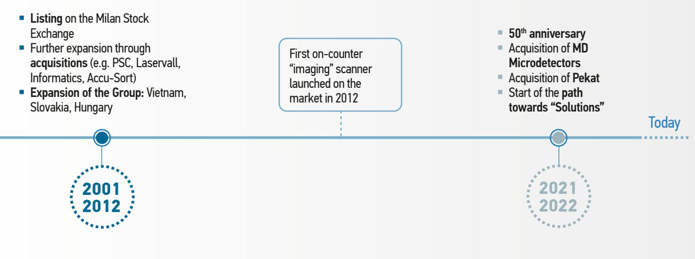

{0}------------------------------------------------

<span id="page-0-0"></span>


## Annual Report **2022**

{1}------------------------------------------------


{2}------------------------------------------------


## Annual Report **2022**

{3}------------------------------------------------


{4}------------------------------------------------

## **Table of contents**

| Letter to Shareholders                                                                                           | 4   |
|------------------------------------------------------------------------------------------------------------------|-----|
| Highlights 2022                                                                                                  | 9   |
| Consolidated Annual Financial Report December 31, 2022                                                           | 33  |
| Group structure                                                                                                  | 34  |
| Composition of Corporate Bodies                                                                                  | 36  |
| Report on Operations                                                                                             | 37  |
| Consolidated Financial Statements                                                                                | 69  |
| Explanatory Notes to the Consolidated Financial Statements                                                       | 79  |
| Annual Statutory Financial Report December 31, 2022                                                              | 147 |
| Financial Statements of the Parent Company                                                                       | 149 |
| Explanatory Notes to the Financial Statements                                                                    | 159 |
| Annexes                                                                                                          | 205 |
| Certifications by the Manager in charge of drawing up the<br>Company's accounting statements (annexes 1a and 1b) | 206 |
| Consolidation scope (annex 2)                                                                                    | 208 |
| Reconciliation of Alternative Performance Indicators (annex 3)                                                   | 210 |
| Restatement 2021 (annex 4)                                                                                       | 211 |
| List of Investments (annex 5)                                                                                    | 213 |
| Independent Auditor Reports (annexes 6a and 6b)                                                                  | 214 |
| Statutory Auditors Report (annex 7)                                                                              | 224 |

DISCLAIMER

This document contains forward-looking statements relating to future events and operating, income and financial results of the Group. These forecasts have by nature an element of risk and uncertainty, as they depend on the materialisation of future events and developments. Actual results may differ even significantly from those disclosed due to a variety of factors, most of which beyond the Group's control.

The accompanying consolidated financial statements of Datalogic Group constitute a non-official version which has not been prepared in accordance with the provisions of the Commission Delegated Regulation (EU) 2019/815.

{5}------------------------------------------------

## Shareholders,

In 2022, our Group made significant strides and concluded the year by generating revenue of approximately €655 million, representing an almost doubledigit YoY growth. The remarkable achievement is even more important as it coincided with the Group's fiftieth-anniversary celebration and was accomplished amidst significant market uncertainties that surfaced over the past year. The Group's growth was well-balanced across all its geographies and key business segments. Highlights show a positive performance in the Americas region, up by over 18%, followed by a robust growth in EMEAI and APAC.

The Retail industry, where the Group boasts a prominent global position, stands out for its impressive results. Revenue in the segment increased by 12.5% YoY, with a strong rise in Asia (+33.9%) and in Americas (+29.4%), driven mainly by the investments in self-checkout systems by large retailers. Manufacturing also delivered a strong performance, achieving a YoY growth of 8.4% overall, thanks to the expansion of the range of sensors and safety devices, resulting from the acquisition of the MD Group in 2021. Americas (+28.1%) and EMEAI (+11.4%) highly contributed to this performance. Lastly, Transportation & Logistics grew by 12.9% versus 2021, with growth rates of +26.5% in the Americas and +13.1% in EMEAI, thanks to relevant orders from major shipping and logistics companies.

Although the year was marked by geopolitical tensions, a severe energy crisis, electronic component shortages and rapidly increasing global inflation, the Group's year-end results were remarkably positive, achieved through tenacity and competence. In re-


{6}------------------------------------------------


{7}------------------------------------------------

sponse to this challenging environment, we acted swiftly and decisively by carrying out a thorough redesign of several products, including on technology, and diversifying our supply chain to safeguard our competitive advantage in terms of delivery times and ensure continuity of supply. Thanks to our strategy, we were able to acquire new market shares and mitigate the inevitable downturns experienced in certain segments and geographies. By implementing changes to our price lists, we were able to partly offset the inflationary pressures on raw material costs and prevent significant deterioration in our margin levels. Despite the increase in Net Trade Working Capital, and the reduction of margins in 2022, the Group managed to generate cash from operations.

This exceptional and gratifying effort also coincided with another significant event for the Datalogic Group: the celebration of 50 years since its establishment. This milestone is the demonstration of the Company's forward-thinking approach and its unwavering commitment to continuously adapt and evolve. By closely monitoring future trends, the Company shown its expertise and dedication to anticipating market demands and creating innovative high-quality solutions. A tangible example of innovation is the acquisition in 2022 of the entire share capital of Pekat S.r.o, a start-up focused on the creation of machine learning and deep learning algorithms designed to automate manufacturing and logistics processes, with potential applications in the retail segment. Thanks to Pekat's know-how, our Group will be able to enhance its offerings with state-of-the-art and seamlessly integrated solutions aimed at boosting productivity and fostering growth for our Customers. This initiative marks a crucial step in the Group's growth, aligned with our ongoing efforts to strengthen our product offerings with solutions that streamline and improve our Customers' processes. In 2022, R&D expenditure reached €65 million, approximately 10% of turnover, while 13.4% of turnover had been generated by new products (vitality index). Our technological DNA was reaffirmed by a portfolio of more than 1,200 patents.

In the previous year we reinforced our committment to the environment, sustainable economic development and especially to our people. We achieved the SA800 ethical certification for Corporate Social Responsibility as result of the Group effort in enhancing human resources and ensuring respect for the rights and values of equality and development, protection of diversity, and the highest standards of health and safety is reflected in our achievement of the SA8000 ethical certification for Corporate Social Responsibility. Additionally, we prioritized strengthening our employer branding by investing time and resources into actively listening to people. We measured their engagement and provided tangible solutions to address the concerns raised during virtual focus groups held in 2021. In 2022, we achieved the further goal of integrating sustainability principles into the development of new products by measuring and monitoring environmental impacts and optimizing life cycle and ecodesign policies.

In conclusion, I would like to express my gratitude to our Founder and Executive Chairman for his visionary leadership, as well as to all those who have supported and continue to support our activities and choices. To all our employees, who have shown 

{8}------------------------------------------------

exceptional levels of dedication, passion, and commitment. And to our customers and suppliers, whose contributions were essential to overcome the challenges of the year. Our achievements have once again demonstrated that a united group of exceptional professionals, who strive to push their limits daily in pursuit of our collective growth, is the driving force behind every goal we attain. We are proud and grateful of the trust and loyalty expressed towards our Group.

#### **Valentina Volta**

Chief Executive Officer

{9}------------------------------------------------


{10}------------------------------------------------

# **Highlights 2022**

{11}------------------------------------------------

# **Our profile**

## Vision

To provide customers with the best quality and efficiency. All thanks to advanced technology, innovative products, first-class solutions and highly-talented people.

The Datalogic Group is a global technological leader in the segments of automatic data capture and factory automation. The Group, which boasts over 50 years of history, is specialized in the design and production of barcode readers, mobile computers, detection, measurement and safety sensors, machine vision and laser marking systems and RFID. The Group's proposed solutions increase the efficiency and quality of processes, along the entire value chain in the Retail, Manufacturing, Transportation & Logistics and Healthcare segments. Datalogic is a strong and steadily expanding business, thanks to the strong R&D activity that

## Mission

A world identified, detected, inspected, marked and verified by Datalogic.

marks its lines of development. The Group's barcode reading systems are used in over half of the world's supermarkets and retail outlets, as well as in major airports, manufacturing industries and large hospital complexes, and help make the work of most logistics and shipping companies more agile and functional. The Group employs over 3,000 people worldwide, with offices and facilities in 29 countries, manufacturing plants and repair centres in the United States, Italy, Slovakia, Hungary, Vietnam, China and Australia, and R&D centres in Italy, the United States, China and Vietnam.

■ Establishment of the Company, based on a sensor-related product portfolio ■ Transition from "laser" to "image". Datalogic becomes the technology leader in barcode reading ■ Entry into the "Mobile Computers" market with the acquisition of IDWare Mobile Computing First baggage sorting system based on barcode reading installed at Linate (Milan) airport in 1984 ■ Expansion of the product portfolio with barcode reading applications and technologies **1974 1988 1997 1972**

{12}------------------------------------------------

## Values rooted in time


### **OWNERSHIP** *We think and act*

*as if Datalogic is our own*


## **FOCUS ON RESULTS**

*We accomplish what we set out to do*


## **EFFICIENCY**

*We manage the Company's expenses as if they were our own*


**REALISM** *We face reality and fix what is wrong*


## **NO SHORTCUTS**

*We never compromise on strategy, culture, or achievement of results*


### **TOGETHERNESS**

*We work together as a team to solve seemingly unsolvable problems*



{13}------------------------------------------------

# **50 years of ongoing innovation**

The year 2022 marked a significant milestone in the history of Datalogic: 50 years of business. The first step was taken in 1972 in the rectory of a small parish in Quarto Inferiore (BO), and since then, a long sequence of achievements has followed, all thanks to an industrial design based on vision, innovation, and tenacity. These elements are tangibly reflected in the ingenuity and passion of so many brilliant professionals. "*Our Group has always kept pace with the latest technological advancements, very often anticipating them, because innovation is part of our DNA*", emphasized Datalogic founder and Chairman Romano Volta. "*Today, we can proudly affirm that we are a genuine example of Italian excellence*", states Valentina Volta, CEO of Datalogic. "*Our unwavering focus on the quality of our products and solutions enable us to support over* 

*10,000 customers globally, many of whom are part of Fortune magazine's list of 500 companies".* A thriving and dynamic business with highly qualified and results-oriented resources, ready to innovate and grow towards an increasingly sustainable and technological future.


{14}------------------------------------------------

# **Our strategy**

- To achieve above-market growth rates while enhancing profitability margins.


- To be a product company capable of developing integrated solutions that can identify and meet the needs of end customers.
- To consolidate our market position in Europe and become a key player in North America.
- To increase our presence in APAC by positioning ourselves more effectively in China.


## **Goal Scope Advantage**

- Having a wide range of products to meet both automatic data capture and industrial automation needs, providing solutions along the entire value chain of our customers.


{15}------------------------------------------------

# **The Group's global footprint**


{16}------------------------------------------------

## **Innovative and dynamic strength**

Advanced technology, robust and ergonomic design, sustainable production and materials. These are the signature features of Datalogic Group's products, which enable the Company to meet the needs of its customers in the target markets. Cutting-edge lines that evolve with the pace of digital progress.


{17}------------------------------------------------

# **Target markets**

## Retail

## Ready for the challenges of the future

## **Market trends**

The diverse retail landscape continues to be one of the most significant areas of penetration for the full range of Datalogic products. Despite a mature market environment that favours replacement cycles, the Retail segment globally has room for growth, especially in the area of new in-store experiences capable of increasing customer flow, including the rising prevalence of self-checkout stations. Omnichannel development is a fast-growing opportunity to harness the potential of mobile.

## **Group main goals**

- To maintain market leadership throughout the entire supply chain.
- To uphold the level of excellence for self-checkout and manned lanes in both Grocery and Non-Food.
- To become the ideal partner for automating operations and enhancing data capture through artificial intelligence and machine learning applications.
- To offer innovative solutions to integrate in-store and warehouse operations.

## **2022 results**

The Retail segment grew by 12.5% (6.2% at constant exchange rates), driven by the remarkable performance of APAC (+33.9%) and the Americas (+29.4%).


Distribution Center | Warehouse | Store Management | Checkout POS

{18}------------------------------------------------

## Manufacturing In the spirit of process digitization

## **Market trends**

The Manufacturing segment boasts a wide range of solutions, including state-of-the-art industrial barcode readers and laser markers, dedicated to all types of manufacturing firms, from Automotive to Food&Beverage, from Automated Machinery and Electronics to Packaging and Intralogistics. A "holistic" approach that identifies the activities of Datasensing, Italy's main hub in the field of sensors for industrial automation, born from the merging of Datalogic's activities with those of M.D. Micro Detectors, as one of the operational reference points for the entire Group. Steady growth driven by an ongoing increase in business efficiency and a new and more strategic relocation of manufacturing sites to different geographies.

## **Group main goals**

- To boast a growing portfolio to serve all major customers in the manufacturing segment.
- To consolidate its leadership in traceability with the most comprehensive and high-performance stationary industrial scanner offerings.
- To be recognized as the key providers of smart, interconnected devices that can open new frontiers of analytics, such as predictive maintenance.

## **2022 results**

Thanks also to the acquisition of MD in 2021, Datalogic's Manufacturing segment grew by 8.4% (+4.8% at constant exchange rates). The Americas region leads this increase with a 28.1% growth, followed by EMEAI, which gains 11.4%.


Automotive | Electronics | Packaging | Intralogistics

{19}------------------------------------------------

## Transportation & Logistics Greater stability after strong growth of e-commerce

## **Market trends**

As the growth of e-commerce has gradually subsided over the past two years, the forecasts for the relating business growth have stabilized accordingly. The Datalogic Group still maintains a global leadership position in offering dedicated solutions for automating the logistics of Couriers, Postal Services, Airports and Retailers. The Group is also continuing

its efforts in the digitization of processes, ranging from hand-held devices to portable terminals and stationary readers, for the creation of information collection points that are essential in the processing of market analysis, system reliability and forecast development.

## **Group goals**

- To strengthen the operations of Couriers, Airports and Logistics.
- To further develop airport systems, with recent contracts for 3 of the world's top 5 airports (source: SkyTrax rating).
- To maintain its leadership in stationary industrial scanners with high-performance solutions for high-speed goods sorting.
- To increase the level of efficiency and tracking capabilities along the different stages of the supply chain resulting in improved decision making.

## **2022 results**

The Transportation & Logistics segment grew by 12.9% (+7.8% at constant exchange rates) versus 2021, with a 26.5% increase in the Americas region and a 13.1% increase in EMEAI.


Courier & Parcel | Logistics | Postal | Airports

{20}------------------------------------------------

## Healthcare Digitization and remote medicine spearheading the way

## **Market trends**

The Healthcare segment is undergoing a significant transformation worldwide, partly driven by the pandemic, with a focus on bridging the digital gap. Specifically, the segment is focused on adopting remote medicine systems for remote verification and tracking of patient profiles, supported by the development of new Internet of Things-based solutions. Several national public and private health systems are also planning to enter the Metaverse, where they will introduce integrated care pathways that combine digital (e-Care) and physical (presence-Care) components.

## **Group goals**

- To provide expert support for the advancement of the entire global health ecosystem, from drug production to personal care.
- To solidify its business and technology leadership position related to healthcare supplies, such

as antimicrobial enclosures, wireless charging technology for batteries, and Green Spots to ensure the correct drug-patient association.

## **2022 results**

Overall, the Healthcare segment shrank by 5.2%, although the Group recorded a 3.9% increase in EMEAI. In 2022, Datalogic contributed its range of solutions for tracking vaccines and inpatients, processing medical records, and ensuring the ad-

ministration of proper therapies. The Company placed significant emphasis on reducing the risk of hospital contamination by using antimicrobial and disinfectant-ready external plastics for their devices.


Pharmacy | Hospital - Labs | Pharmaceutical

{21}------------------------------------------------

# **Sustainability goal, a Group priority**

People at the core. In 2022, the Datalogic Group reasserted the significance of aligning its sustainability goals towards improving its human resources. A crucial assumption of responsibility that led the Company, as outlined in the opening of the document, to the attainment of the SA8000 ethical certification on Corporate Social Responsibility, confirming its willingness to ensure the respect for Human Rights and the values of equality and development, the protection of diversity and the highest standards of health and safety, building long-term partnerships.

Aligned with its "Human Rights and Social Accountability" policies, the Group worked towards establishing workplace environments that offer equal opportunities to all individuals, enabling them to pursue their professional and personal growth based on their abilities and skills. Therefore, in 2022, Datalogic made significant investments towards enhancing its employees' work experience, establishing a solid corporate welfare system, attaining a more equitable work-life balance, and reinforcing its "Employer branding" to attract new talent. Last year, the Group also achieved another important milestone: the ISO45001 certification on Occupational Health and Safety at Datasensing S.r.l., which is in addition to the same certification obtained by Datalogic for its offices in Italy, Slovakia and Vietnam.

In 2022, the Group also committed to the application of sustainability principles from the development stages of a new product. The Company placed particular emphasis on adopting a life-cycle optimization-oriented approach and on ecodesign policies, aimed at implementing a virtuous circular economy system and enhancing the identification and management of critical environmental impacts. This approach enabled Datalogic to extend the ISO14001 certification to the Castiglione Messer Raimondo (TE) site and maintain it at the remaining production sites in Italy, Hungary, Slovakia, and Vietnam, as well as to achieve an overall 6% reduction in energy consumption versus 2021. Datalogic has started a process to align its reporting methods with the new 2021 version of the GRI Standard, aimed at making a tangible contribution to the UN 2030 Agenda Sustainable Development Goals.

{22}------------------------------------------------

## Shaping our future together


Top priority: health and safety of our workers


Enhancing talent


Human capital, always a crucial resource for growth


A solid framework for responsible management


Innovation and research: combining progress and sustainability

Together to do more


Environmental protection and combating climate change


{23}------------------------------------------------

# **Events and trade fairs**

2022 was a busy and eventful year for Datalogic, filled with noteworthy milestones that reaffirmed the Company's leadership role on the global stage, thanks to its efforts to upgrade and develop its human capital, and to its unwavering commitment to innovation, which has long been part of the DNA of the Group.

The events that Datalogic took part in during the year were major international gatherings in the fields of automatic data capture and factory automation.

These include SITL in Paris, an exhibition show that has featured major suppliers of technology, solutions and services for the T&L segment for approximately thirty years.

At the two SPS trade fairs in Parma and Nuremberg, dedicated to industrial automation, Datalogic showcased its solutions for the future of smart automation, which include traceability, inspection and safety devices driving the renewal of Industry 4.0 production processes.


SITL 2022, Paris


MODEX 2022, Atlanta

In 2022, Datalogic also participated in MODEX, North America's major logistics trade fair, showcasing Visual Supply Chain Intelligence products and solutions that integrate barcodes, vision systems, artificial intelligence and machine learning. Possible applications range from warehouse automation to traceability, reverse logistics to palletizing and highspeed sorting.

{24}------------------------------------------------

Following the extended pandemic period, Datalogic resumed its presence at SIAF, South China's premier automation trade fair. During the event, the Company showcased a range of hand-held scanners and cutting-edge products for identification and laser marking in industrial settings.

In 2022, Datalogic focused heavily on people development, organizing events for employees, academia, and research. Many initiatives also aimed at nurturing new talent entering the job world.

In fact, during the year, the Company prioritized creating professional development opportunities, leading to various initiatives engaging young university students. Datalogic professionals and experts were invited multiple times to introduce the Datalogic Group to students at several universities, such as Bologna, Modena, and Reggio Emilia, providing insights into technology and market trends. The meetings held at our headquarters in Lippo di Calderara di Reno (BO) featured, among others, students from the prestigious BBS (Bologna Business School).

Continuing along this path, Datalogic experts participated in a range of prominent academic events, delving into current technology topics such as deep learning and artificial intelligence. Speeches were held at the School in Artificial Intelligence of the University of Modena and Reggio Emilia, the Executive Master in Technology & Innovation Management of the Bologna Business School and the University of Bologna.

The Company also offered its contribution in support of the scholarships awarded to the best students at the Aldini Valeriani Industrial Technical Institute in Bologna in the last two years, and sponsored the organization of the Computer Science Olympiad, an event in which the Bologna Technical Institute itself was one of the main players, originated at local level in 2009 and now characterized by international recognition.

Datalogic has also taken a step towards promoting talent development by launching the MECOP (Multi-


SIAF 2022, Guangzhou


Open House Datasensing, Modena

ple Engineering Cooperative Program) internship program, which aims to attract the interest of top students from Oregon State, Oregon Tech, Portland State and the University of Portland. In the United States, Datalogic also participated in the Virtual Career Fair for the Master's Degree of Computer and Information Technology at the University of Pennsylvania.

In Vietnam, Datalogic took centre stage at the Job Fair Event of the HCMC University of Technology and Education and the University of Technology (Bach Khoa University).

The Datalogic Group took also part in the Career Days at the University of Bologna and Ferrara, educational events where students and companies met for an open discussion between academia and the job world.

{25}------------------------------------------------

## **DATALOGIC HIGHLIGHTS** 2022

2022 marked a significant milestone for Datalogic as it celebrated its 50th anniversary since its establishment in 1972.

For the celebrations, the Company organized Open House days at major locations in different countries: from the Lippo headquarters in Calderara di Reno (BO), to the Labs and research centres in Monte San Pietro (BO) in Italy, Eugene and Hatfield in the United States, the manufacturing centres in Castiglione Messer Raimondo (TE), Zavar in Slovakia, Ho Chi Minh City in Vietnam, and Balatonboglár in Hungary. These were moments of gathering and sharing, open to the participation of the families of the employees, who were able to explore and learn more about the Company.

The 50th anniversary initiatives culminated at an event in Bologna on November 16 attended by more than one thousand participants. Dinner, entertainment and commemorative videos marked the memorable evening, capped by the presentation of the book "*Romano Volta – fondatore di Datalogic*", in which the Chairman and founder shares the many challenges overcome over the past fifty years.

Again on the subject of celebrations, Datalogic's Vietnam plant, the largest in terms of volume, celebrated fifteen million devices produced in 2022.


Datalogic 50th Anniversary Celebration, Bologna, Italy


Open House in Castiglione Messer Raimondo, Teramo


Open House in Vietnam, Ho Chi Minh City


Open House in Lippo di Calderara di Reno, Bologna

{26}------------------------------------------------

# **Products and innovation**

In 2022, continuous cutting-edge R&D activities led to the creation of significant products and solutions tailored to the needs of various target markets.

The Magellan™ 9800i TDi, Datalogic's top down imager, was launched on the market. This device enables retailers to combine one of the world's highest performing fixed on-counter scanners with extraordinary artificial intelligence functions, including automatic identification of fruits and vegetables.

Also unveiled was the new PowerScan™ 9600 series of hand-held scanners, a top-of-the-line model that offers high performance and benefits in manufacturing, warehouse management and retail applications.

Other noteworthy solutions were the new QuickScan™ 2500 2D scanners, an entry-level solution to meet Retail needs. Performance, connectivity and ruggedness - the QuickScan 2500 is always ready for action.


Magellan 9800i TDi


QuickScan™ 2500 in a café


PowerScan 9600


QuickScan™ 2500 in a medical laboratory

{27}------------------------------------------------

## **DATALOGIC HIGHLIGHTS** 2022

Traceability applications in the intralogistics, distribution, 3PL, retail logistics, and store segments were expanded with the new Matrix™ 320 5MP imager, which allows multiple labels or codes to be red in a single capture, significantly improving productivity and operational capacity for customers.

The new Joya™ Touch 22 self-shopping device, was also launched which offers a highly personalized shopping experience supported by leading independent software vendors (ISVs).

Demonstrating the broad international acclaim it boasts, in 2022 the Datalogic Group was again awarded funding for two cutting-edge technology research projects. The developments of the ROSSINI project (RObot enhanced SenSing, INtelligence and actuation to Improve job quality in manufacturing) came to conclusion; this is part of the European Commission's "Horizon 2020" funding program, in which Datalogic, the consortium leader, contributed to the development of an innovative hardware-software platform for the design and implementation of human-robot collaboration applications in manufacturing.

In parallel, the innovative FLUTE (Flexibility, Usability, Ease of Installation and Configuration, Eco-sustainability) project came to conclusion; this project is funded by the Emilia-Romagna Region and enabled the definition of a new generation of vision systems characterized by ease of installation and use. Additionally, FLUTE enabled the study of environmentally-friendly laser marking techniques alternative to inkjet printers.


Matrix 320 5MP Joya Touch 22

{28}------------------------------------------------

# **Datalogic share performance**

Datalogic S.p.A. has been listed on the Italian Stock Exchange since 2001 - Euronext STAR Milan segment (High Requirements Shares Segment) of the Euronext Milan Market of Borsa Italiana, which includes medium-sized companies with a capitalisation between €40 million and €1 billion that are committed to meet standards of excellence.

In 2022, the share was down by 45.6%. It reached a high of €15.560 per share on January 5, 2022 and a low of €6.285 on September 29, 2022. Average daily volumes traded in 2022 were approximately 110,000 shares, up slightly from the average of 90,000 in the prior year.

#### **DATI DI BORSA 2021 STOCK EXCHANGE 2022**

| SEGMENTO              | EURONEXT STAR MILAN – EURONEXT MILAN                                                                                |
|-----------------------|---------------------------------------------------------------------------------------------------------------------|
| SEGMENT               | EURONEXT STAR MILAN – EURONEXT MILAN                                                                                |
| CODICE BLOOMBERG      | DAL.IM                                                                                                              |
| BLOOMBERG CODE        | DAL.IM                                                                                                              |
| CODICE REUTERS        | DAL.MI                                                                                                              |
| REUTERS CODE          | DAL.MI                                                                                                              |
| NUMERO AZIONI         | 58.446.491 (di cui n. 2.000.000 azioni proprie)<br>NUMBER OF SHARES 58,446,491 (of which 1,667,053 treasury shares) |
| 2021 MIN              | 14,04 EURO (7 gennaio 2021)                                                                                         |
| 2022 LOW              | 6.285 EURO (September 29, 2022)                                                                                     |
| 2021 MAX<br>2022 HIGH | 21,98 EURO (1o<br>giugno 2021)<br>15.560 EURO (January 5, 2022)                                                     |
| CAPITALIZZAZIONE      | 894,23 MIL EURO al 31 dicembre 2021                                                                                 |
| CAPITALISATION        | 486.57 MN EURO at December 31, 2022                                                                                 |


{29}------------------------------------------------

# **2022 Key Figures**

## **REVENUE** (MN. EURO) **R&D** (MN. EURO)*


<sup>*%</sup> on revenue ** restated *** gross of R&D capitalisation effects

## **EBITDA** (MN. EURO)*


**NET PROFIT** (MN. EURO)*


*% on revenue

{30}------------------------------------------------

## **NET TRADE WORKING CAPITAL** (MN. EURO)*


#### *% on revenue

## **NET FINANCIAL POSITION** (MN. EURO)


## **DIVIDEND PER SHARE** (DPS - EURO)


## **EARNINGS PER SHARE** (EPS - EURO)


{31}------------------------------------------------

## **DATALOGIC HIGHLIGHTS** 2022

## **2022 REVENUE**

## Total **654.6 MN. Euro**

#### Revenue by division*


Revenue by geographical area


*-0.3% Intersegment adjustments.

## **2022 EMPLOYEES**

Total **3,069**

#### Employees by geographical area


Employees by gender


{32}------------------------------------------------

## **INCOME STATEMENT**

| MN. EURO                            | 2018  | 2019<br>Restated | 2020  | 2021<br>Restated | 2022  |
|-------------------------------------|-------|------------------|-------|------------------|-------|
| REVENUE                             | 631.0 | 585.8            | 479.8 | 597.8            | 654.6 |
| EBITDA                              | 105.5 | 92.1             | 58.3  | 85.7             | 80.3  |
| % on revenue                        | 16.7  | 15.7             | 12.2  | 14.3             | 12.3  |
| EBIT                                | 77.8  | 62.7             | 18.4  | 47.0             | 40.9  |
| % on revenue                        | 12.3  | 10.7             | 3.8   | 7.9              | 6.3   |
| PROFIT                              | 62.2  | 50.3             | 13.9  | 39.5             | 30.1  |
| % on revenue                        | 9.9   | 8.6              | 2.9   | 6.6              | 4.6   |
| HEADCOUNT TREND                     | 3,157 | 3,074            | 2,826 | 2,990            | 3,069 |
| DIVIDEND<br>PER SHARE (EURO)        | 0.5   | 0.3              | 0.3   | 0.17             | 0.30  |
| DIVIDENDS DISTRIBUTED<br>(MN. EURO) | 28.9  | 28.7             | 17.0  | 9.6              | 16.9  |

{33}------------------------------------------------

## **DATALOGIC HIGHLIGHTS** 2022

## **STATEMENT OF FINANCIAL POSITION**

| MN. EURO                  | 2018   | 2019   | 2020   | 2021   | 2022   |
|---------------------------|--------|--------|--------|--------|--------|
| FIXED ASSETS              | 369.7  | 391.1  | 384.9  | 457.3  | 484.2  |
| CURRENT ASSETS            | 228.1  | 230.5  | 173.1  | 253.3  | 253.8  |
| CURRENT LIABILITIES       | -195.2 | -184.2 | -150.7 | -206.5 | -183.7 |
| NET WORKING CAPITAL       | 32.9   | 46.2   | 22.4   | 46.8   | 70.1   |
| NET CAPITAL EMPLOYED      | 352.0  | 390.8  | 362.1  | 447.8  | 493.6  |
| EQUITY                    | 375.8  | 404.2  | 370.4  | 421.7  | 451.6  |
| NET FINANCIAL POSITION    | 23.8   | 13.4   | 8.2    | -26.1  | -42.0  |
| CAPEX*                    | 28.9   | 38.0   | 42.6   | 26.5   | 26.3   |
| % on revenue              | 4.6    | 6.5    | 8.9    | 4.4    | 4.0    |
| NET TRADE WORKING CAPITAL | 69.1   | 75.1   | 47.8   | 84.9   | 109.1  |
| % on revenue              | 11.0   | 12.8   | 10.0   | 14.2   | 16.7   |
| ROE %                     | 17.1   | 12.9   | 3.6    | 10.0   | 6.9    |
| DEBT/EQUITY %             | -6.3   | -3.3   | -2.2   | 6.2    | 9.3    |

* net investment value, excluding IFRS16

{34}------------------------------------------------

**Consolidated Annual Financial Report at December 31, 2022**

{35}------------------------------------------------

## **Group structure**


Datalogic Australia Pty, Ltd. (100%)

Micro Detectors Iberica S.A.U. (100%)

Datasensing S.r.l. (Succursale en France)

> Datalogic S.r.l. Niederlassung Deutschland

Datalogic Vietnam LLC

(100%)

Datalogic Slovakia S.r.o.

(100%)

Datalogic Japan Co. Ltd (100%)

Datasensing S.r.l. (100%)

Datalogic Hungary Kſt.

(100%)

M.D. Micro Detectors (Tianjin) Co. Ltd. (100%)

Datalogic Scanning Eastern Europe GmbH (Germany) (100%)

Pekat S.r.o. (Czech Republic) (100%)

Datalogic Real Estate UK Ltd. (100%)

Datalogic Real Estate France Sas (100%)

Datalogic S.r.l. UK

Datalogic S.r.l. (Succursale en France)

Datalogic S.r.l. (Sucursal en España)

Datalogic S.r.l. Benelux

Datalogic S.r.l. Italian Filial

Datalogic S.r.l. (Spòlka z ograniczona odpowiedzialnoscia) oddzial w Polsce

Datalogic S.r.l. Merkezi Italya Istanbul Merkez Subesi

> Datalogic S.r.l. (Incorporated in Bologna Italy)

Datalogic S.r.l. Niederlassung Central Europe

> Datalogic S.r.l. Organizačná zložka zahraničnej osoby pre Slovensko

Datalogic S.r.l. Sucursal bucuresti Informatics Holdings, Inc. (100%)

WASP Barcode Technologies, Ltd. (100%)

|  | ITALY/EMEA | AMERICAS | APAC | IP TECH | REAL ESTATE | OTHER |
|--|------------|----------|------|---------|-------------|-------|
|--|------------|----------|------|---------|-------------|-------|

{36}------------------------------------------------


Datalogic USA, Inc. (100%)

Datalogic IP Tech S.r.l.

Datalogic S.p.A.

(50.0%)

Datalogic Technologias de Mexico S. de R.L. de C.V.

(99.9%) (0.1%)

Datalogic do Brasil Ltda.

(99.999%) (0.001%)

ITALY/EMEA

Legal entity

Branch

Solution Net Systems Inc. (15%)

CAEN RFID S.r.l. (20%)

R4i S.r.l. (20%)

Datasensor GmbH (30%)

Datalogic Automation AB (Sweden) (20%)

Datalogic (Shenzhen) Industrial Automation Co., Ltd. (100%)

(50.0%)

Suzhou Mobydata Smart System Co. Ltd. (51%)

AMERICAS APAC IP TECH REAL ESTATE OTHER

Datalogic Singapore Asia Pacific Pte. Ltd. (100%)

Datalogic Singapore Asia Pacific Pte. Ltd. (Korea Branch)

Datalogic (Shenzhen) Industrial Automation Co. Ltd. (Shangai Branch)

Datalogic S.r.I. (100%)

Datalogic (Shenzhen) Industrial Automation Co. Ltd. (Beijing Branch)

{37}------------------------------------------------

## **Composition of Corporate Bodies**

#### **Board of Directors(1)**

- Valentina Volta Chief Executive Officer(2) Angelo Manaresi Independent Director Chiara Giovannucci Orlandi Independent Director Filippo Maria Volta Non-Executive Director Vera Negri Zamagni Independent Director Maria Grazia Filippini Independent Director Pietro Todescato Executive Director
### Romano Volta Executive Chairman(2)

#### **Board of Statutory Auditors(3)**

Diana Rizzo Chairman

Elena Lancellotti Standing Statutory Auditor Roberto Santagostino Standing Statutory Auditor

Giulia De Martino Alternate Statutory Auditor Eugenio Burani Alternate Statutory Auditor Patrizia Cornale Alternate Statutory Auditor

#### **Control, Risks, Remuneration and Appointments Committee**

| Angelo Manaresi            | Chairman             |
|----------------------------|----------------------|
| Chiara Giovannucci Orlandi | Independent Director |
| Vera Negri Zamagni         | Independent Director |

#### **Independent Auditors(4)**

Deloitte & Touche S.p.A.

(1) The Board of Directors will remain in office until the Shareholders' Meeting called to approve the financial statements at December 31, 2023. (2) Legal representative before third parties.

- (3) The Board of Statutory Auditors will remain in office until the Shareholders' Meeting called to approve the financial statements at December 31, 2024.
- (4) Deloitte & Touche S.p.A. were appointed Independent Auditors for the nine-year period from 2019 to 2027 by the Shareholders' Meeting held on April 30, 2019 and will remain in office until the Shareholders' Meeting called to approve the financial statements at December 31, 2027.

{38}------------------------------------------------

## **Report on Operations**

{39}------------------------------------------------

## **Introduction**

This Consolidated Annual Financial Report at December 31, 2022 was prepared in accordance with Article 154 ter of the TUF (Consolidated Law on Finance) and was drawn up in compliance with the International Accounting Standards (IAS/IFRS) adopted by the European Union.

The amounts shown in the Directors' Report on Operations are expressed in Euro thousands, while the explanatory notes are expressed in Euro millions.

## **Group profile**

Datalogic S.p.A. and its subsidiaries ("Group" or "Datalogic Group") is a global technological leader in the automatic data capture and process automation markets. The Group is specialized in the design and production of barcode readers, mobile computers, detection, measurement and safety sensors, vision and laser marking systems and RFID. Its pioneering solutions help increase the efficiency and quality of processes along the entire value chain in the Retail, Manufacturing, Transportation & Logistics and Healthcare segments.

## **Highlights for the year**

The table below summarises the main income and financial results of the Datalogic Group at December 31, 2022 and the comparison with the prior year, the figures of which have been restated with regard to the classification of certain income statement items in order to ensure better comparability, as required by IAS 1 and for details of which reference should be made to Annex 4 of this document.

The income statement and balance sheet figures at December 31, 2022 include the balances of Pekat Vision, consolidated following the acquisition completed on March 21, 2022, while the comparative income statement figures for 2021 include the balances of the M.D. Group, now Datasensing, for ten months.

|                              | 31.12.2022 | % on<br>Revenue | 31.12.2021<br>Restated | % on<br>Revenue | Change   | % chg. | % chg.<br>net FX |
|------------------------------|------------|-----------------|------------------------|-----------------|----------|--------|------------------|
| Revenue                      | 654,632    | 100.0%          | 597,846                | 100.0%          | 56,786   | 9.5%   | 4.4%             |
| Adjusted EBITDA              | 80,286     | 12.3%           | 85,692                 | 14.3%           | (5,406)  | -6.3%  | -1.1%            |
| Adjusted EBIT                | 49,096     | 7.5%            | 58,193                 | 9.7%            | (9,097)  | -15.6% | -6.7%            |
| EBIT                         | 40,935     | 6.3%            | 47,014                 | 7.9%            | (6,079)  | -12.9% | -1.8%            |
| Profit/(Loss) for the year   | 30,126     | 4.6%            | 39,540                 | 6.6%            | (9,414)  | -23.8% | -10.6%           |
| Net Financial Position (NFP) | (42,007)   |                 | (26,060)               |                 | (15,947) |        |                  |

At December 31, 2022, Group revenue amounted to €654.6 million, growing by 9.5% (4.4% at constant exchange rates) versus €597.8 million recorded in 2021.

Sales from new products *(Vitality Index*) accounted for 13.4% of total sales at December 31, 2022 versus 12.5% recorded in the comparison period.

{40}------------------------------------------------

Adjusted EBITDA margin of 12.3% (14.3% in the prior year), while improving versus the result of first nine months 2022, continues to be negatively affected by inflationary pressure and lower availability on the supply chain. These trends, while gradually easing in the second half of the year, basically increased production and distribution costs for the entire year and deteriorated the Group's industrial margins, despite the partial mitigation resulting from gradual sales price adjustment actions.

Owing to the abovementioned trends, adjusted EBIT stood at 7.5% of revenue and amounted to €49.1 million (€58.2 million at December 31, 2021).

Net profit for the year amounted to €30.1 million (4.6% of revenue) versus €39.5 million in the prior year (6.6% of revenue).

Net Financial Debt stood at €42.0 million at December 31, 2022 (€26.1 million at December 31, 2021), deteriorating by €15.9 million.

## **Alternative performance indicators (NON-GAAP measures)**

Management uses certain performance indicators, not identified as accounting measures under IFRS (NON-GAAP measures), to provide a clearer picture of the Group's performance. The measurement criterion applied by the Group might not be the same as the one adopted by other groups and the measures might not be comparable with theirs. These performance indicators, determined according to provisions set out by the Guidelines on performance indicators, issued by ESMA/2015/1415 and adopted by CONSOB with Communication no. 92543 of 3 December 2015, refer only to the performance of the year related to this Consolidated Annual Financial Report and the comparison periods. The performance indicators must be considered as supplementary and do not supersede the information provided under the IFRS standards. The main measures adopted are described below.

- Special Items: income items arising from non-recurring events or transactions, restructuring activities, business reorganization, write-downs of fixed assets, ancillary expense from acquisitions of businesses or companies or their disposals, including amortisation resulting from the recognition of purchase price allocation, and any other event deemed by Management not to represent current business activity.
- EBITDA (Earnings Before Interest, Taxes, Depreciation and Amortisation) or Gross Operating Margin: profit/(loss) for the year from continuing operations before depreciation and amortisation of tangible and intangible fixed assets and rights of use, net financials (including foreign exchange income and expense) and income tax.
- Adjusted EBITDA or Gross Operating Margin: profit/(loss) for the year from continuing operations before depreciation and amortisation of tangible and intangible fixed assets and rights of use, net financials (including foreign exchange income and expense), income tax and Special Items, as defined above.
- EBIT (Earnings Before Interest, Taxes) or Operating Result: profit/(loss) for the year from continuing operations before net financials (including foreign exchange income and expense) and income tax.
- Adjusted EBIT or Operating Result: profit/(loss) for the year from continuing operations before net financials (including foreign exchange income and expense), income tax and Special Items, as defined above.
- Net Trade Working Capital: the sum of Inventory and Trade Receivables, less Trade Payables.
- Net Working Capital: the sum of Net Trade Working Capital and Other Current Assets and Liabilities including Provisions for Current Risks and Charges.

{41}------------------------------------------------

- Net Capital Employed: the total of Current and Non-Current Assets, excluding financial assets, less Current and Non-Current Liabilities, excluding financial liabilities.
- NFP (Net Financial Position or Net Financial Debt): calculated in accordance with the provisions of "Warning Notice no. 5/21" of April 29, 2021 issued by CONSOB and referring to ESMA guideline 32-382-1138 of March 4, 2021.
- Cash Flow from Operations: the sum of Adjusted EBITDA, changes in Net Trade Working Capital, expenditure in tangible and intangible fixed assets (excluding fixed assets under right of use recognised during the year according to IFRS 16), tax paid, financial expense/income, changes in Other Current Assets and Liabilities, and Special Items, as defined above.
- Free Cash Flow: cash flow from operations, net of expenditure in tangible and intangible fixed assets (excluding fixed assets under right of use recognised during the year according to IFRS 16) and financial and tax income and expense for operations.

{42}------------------------------------------------

## **Group reclassified income results**

The table below shows the main income items of the year versus the prior year:

|                                                   | 31.12.2022 |        | 31.12.2021<br>Restated |        | Change   | % chg. |
|---------------------------------------------------|------------|--------|------------------------|--------|----------|--------|
| Revenue                                           | 654,632    | 100.0% | 597,846                | 100.0% | 56,786   | 9.5%   |
| Cost of goods sold                                | (380,112)  | -58.1% | (340,256)              | -56.9% | (39,856) | 11.7%  |
| Gross Operating Margin                            | 274,520    | 41.9%  | 257,590                | 43.1%  | 16,930   | 6.6%   |
| Research and Development expense                  | (61,529)   | -9.4%  | (54,774)               | -9.2%  | (6,755)  | 12.3%  |
| Distribution expense                              | (112,560)  | -17.2% | (98,815)               | -16.5% | (13,745) | 13.9%  |
| Administrative and General expense                | (53,333)   | -8.1%  | (47,436)               | -7.9%  | (5,897)  | 12.4%  |
| Other (expense) income                            | 1,998      | 0.3%   | 1,629                  | 0.3%   | 369      | 22.7%  |
| Total operating costs and other expense           | (225,424)  | -34.4% | (199,397)              | -33.4% | (26,027) | 13.1%  |
| Adjusted EBIT                                     | 49,096     | 7.5%   | 58,193                 | 9.7%   | (9,097)  | -15.6% |
| Special Items - Other (Expense) and Income        | (2,922)    | -0.4%  | (5,867)                | -1.0%  | 2,945    | -50.2% |
| Special Items - D&A from acquisitions             | (5,239)    | -0.8%  | (5,312)                | -0.9%  | 73       | -1.4%  |
| EBIT                                              | 40,935     | 6.3%   | 47,014                 | 7.9%   | (6,079)  | -12.9% |
| Net financials                                    | (2,877)    | -0.4%  | (2,271)                | -0.4%  | (606)    | 26.7%  |
| Foreign exchange gains/(losses)                   | (3,802)    | -0.6%  | (352)                  | -0.1%  | (3,450)  | 980.1% |
| EBT                                               | 34,256     | 5.2%   | 44,391                 | 7.4%   | (10,135) | -22.8% |
| Tax                                               | (4,130)    | -0.6%  | (4,851)                | -0.8%  | 721      | -14.9% |
| Profit/(Loss) for the year                        | 30,126     | 4.6%   | 39,540                 | 6.6%   | (9,414)  | -23.8% |
|                                                   |            |        |                        |        |          |        |
| EBIT                                              | 40,935     | 6.3%   | 47,014                 | 7.9%   | (6,079)  | -12.9% |
| Special Items - Other (Expense) and Income        | 2,922      | 0.4%   | 5,867                  | 1.0%   | (2,945)  | -50.2% |
| Special Items - D&A from acquisitions             | 5,239      | 0.8%   | 5,312                  | 0.9%   | (73)     | -1.4%  |
| Depreciation Tang. Fixed Assets and Rights of Use | 17,911     | 2.7%   | 17,058                 | 2.9%   | 853      | 5.0%   |
| Amortisation Intang. Fixed Assets                 | 13,279     | 2.0%   | 10,441                 | 1.7%   | 2,838    | 27.2%  |
| Adjusted EBITDA                                   | 80,286     | 12.3%  | 85,692                 | 14.3%  | (5,406)  | -6.3%  |

Consolidated revenue amounted to €654.6 million at December 31, 2022, growing by 9.5% versus €597.8 million recorded at December 31, 2021; at constant exchange rates, sales increased by 4.4%. Organic growth net of exchange rate effects stood at 3.4%.

{43}------------------------------------------------

|                         | 31.12.2022 | %      | 31.12.2021<br>Restated | %      | Change | % chg. | % chg.<br>net FX |
|-------------------------|------------|--------|------------------------|--------|--------|--------|------------------|
| Italy                   | 62,181     | 9.5%   | 58,059                 | 9.7%   | 4,122  | 7.1%   | 7.1%             |
| EMEAI (excluding Italy) | 292,705    | 44.7%  | 276,402                | 46.2%  | 16,303 | 5.9%   | 4.8%             |
| Total EMEAI             | 354,886    | 54.2%  | 334,461                | 55.9%  | 20,426 | 6.1%   | 5.2%             |
| Americas                | 199,137    | 30.4%  | 168,142                | 28.1%  | 30,996 | 18.4%  | 5.7%             |
| APAC                    | 100,609    | 15.4%  | 95,244                 | 15.9%  | 5,364  | 5.6%   | -1.0%            |
| Total revenue           | 654,632    | 100.0% | 597,846                | 100.0% | 56,786 | 9.5%   | 4.4%             |

The breakdown by geographical area of Group revenue for the year versus the prior year is shown below:

Driving the Group's revenue growth are the Americas, with an 18.4% growth rate, thanks also to exchange rate effects; EMEAI closes with a 6.1% increase in revenue versus the prior year, with Italy up by 7.1%, and APAC is up by 5.6%.

Gross Operating Margin amounted to €274.5 million (41.9% of sales) versus €257.6 million at December 31, 2021 (43.1% of sales), down by 1.2% versus 2021, due to the lingering inflationary pressure on procurement costs, although the reduction versus the prior year was less in the latter part of the year.

Operating costs and other expense, amounting to €225.4 million (€199.4 million at December 31, 2021), increased slightly as a percentage of sales, from 33.4% to 34.4%.

Research and Development expense, amounting to €61.5 million, accounted for 9.4% of revenue, basically in line with 9.2% recorded at December 31, 2021. Total monetary costs in R&D, gross of investments and without depreciation and amortisation (R&D Cash Out), amounted to €64.6 million (€57.6 million in the prior year), with a percentage of sales of 9.9%, up slightly versus 2021 (9.6%).

Distribution expense amounted to €112.6 million, up by 13.9% versus December 31, 2021 (€98.8 million in 2021), increasing the percentage on revenue by 0.7% from 16.5% to 17.2%. The change in the period is a result of increased sales and marketing initiatives, and of the resumption of trade fairs and events and customer visits, versus the prior year when expense was still curbed by the effects of the Covid-19 pandemic.

Administrative and General expense, amounting to €53.3 million at December 31, 2022, increased slightly as a percentage of sales by approximately 0.2% from 7.9% to 8.1%, due mainly to the increase in utilities, EDP and depreciation/amortisation costs.

Adjusted EBITDA came to €80.3 million, with an adjusted EBITDA margin accounting for 12.3% of sales, down by 2.0% versus 14.3% recorded in 2021. Despite the continued inflationary pressure and critical issues on the supply side, starting from the second quarter of the year, the Group gradually recovered operating margins, thanks to actions on sales prices and the mitigation of critical issues on the supply side and less reliance on the brokerage channel.

{44}------------------------------------------------

Adjusted EBIT came to €49.1 million, or 7.5% of revenue (9.7% at December 31, 2021), also gradually improving versus the first part of the year, but not in line with the performance of the prior period.

Net financials closed with a negative €6.7 million, deteriorating by €4.1 million versus December 31, 2021, as a result of the highly adverse trend in exchange rate differences, due in particular to the appreciation of the US dollar.

| Net financials             | 31.12.2022 | 31.12.2021 | Change  |
|----------------------------|------------|------------|---------|
| Financial income/(expense) | (1,841)    | (1,802)    | (39)    |
| Exchange differences       | (3,802)    | (352)      | (3,450) |
| Fair value investments     | (193)      | 169        | (362)   |
| Bank expense               | (1,471)    | (1,132)    | (339)   |
| Dividends                  | 255        | 299        | (44)    |
| Other                      | 373        | 195        | 178     |
| Total Net financials       | (6,679)    | (2,623)    | (4,056) |

Net profit for the year amounted to €30.1 million (4.6% of revenue) versus €39.5 million in 2021 (6.6% of revenue).

## **Divisional income results for the year**

Operating segments are identified based on operating reports used at the highest decision-making level to allocate resources and assess results. The operating segments are shown below:

- Datalogic represents the Group's core business and designs and produces barcode readers, mobile computers, detection, measurement and safety sensors, vision and laser marking systems and RFID that help increase the efficiency and quality of processes in the Retail, Manufacturing, Transportation & Logistics and Healthcare segments, along the entire value chain. As described in the notes, the newly-acquired Pekat S.r.o. was included in this operating segment.
- Informatics sells and distributes products and solutions for the management of inventories and mobile assets tailored to small and medium-sized companies.

{45}------------------------------------------------

The tables below show the comparison of Revenue and Adjusted EBITDA by Division in the year versus the prior year:

#### **Revenue by division**

|                          | 31.12.2022 | %      | 31.12.2021<br>Restated | %      | Change | % chg. | % chg.<br>net FX |
|--------------------------|------------|--------|------------------------|--------|--------|--------|------------------|
| Datalogic                | 638,273    | 97.5%  | 580,063                | 97.0%  | 58,210 | 10.0%  | 5.0%             |
| Informatics              | 18,198     | 2.8%   | 18,898                 | 3.2%   | (700)  | -3.7%  | -13.7%           |
| Intersegment adjustments | (1,839)    | -0.3%  | (1,115)                | -0.2%  | (724)  |        |                  |
| Total revenue            | 654,632    | 100.0% | 597,846                | 100.0% | 56,786 | 9.5%   | 4.4%             |

#### **Adjusted EBITDA by division**

|                          | 31.12.2022 | % on<br>Revenue | 31.12.2021 | % on<br>Revenue | Change  | % chg. |
|--------------------------|------------|-----------------|------------|-----------------|---------|--------|
| Datalogic                | 77,862     | 12.2%           | 82,953     | 14.3%           | (5,091) | -6.1%  |
| Informatics              | 2,672      | 14.7%           | 2,776      | 14.7%           | (104)   | -3.7%  |
| Intersegment adjustments | (248)      |                 | (37)       |                 | (211)   |        |
| Total Adjusted EBITDA    | 80,286     | 12.3%           | 85,692     | 14.3%           | (5,406) | -6.3%  |

### **Datalogic division**

The Datalogic division recorded sales revenue of €638.3 million at December 31, 2022, up by 10.0% versus 2021. The division's adjusted EBITDA amounted to €77.9 million, equal to 12.2% of sales (14.3% at December 31, 2021). Below is the breakdown of Datalogic Division's revenue by business segment:

|                            | 31.12.2022 | %      | 31.12.2021<br>Restated | %      | Change | % chg. | % chg.<br>net FX |
|----------------------------|------------|--------|------------------------|--------|--------|--------|------------------|
| Retail                     | 237,033    | 37.1%  | 210,614                | 36.3%  | 26,419 | 12.5%  | 6.2%             |
| Manufacturing              | 184,789    | 29.0%  | 170,525                | 29.4%  | 14,264 | 8.4%   | 4.8%             |
| Transportation & Logistics | 91,201     | 14.3%  | 80,759                 | 13.9%  | 10,442 | 12.9%  | 7.8%             |
| Healthcare                 | 17,218     | 2.7%   | 18,160                 | 3.1%   | (943)  | -5.2%  | -10.3%           |
| Channel                    | 108,033    | 16.9%  | 100,006                | 17.2%  | 8,027  | 8.0%   | 3.5%             |
| Total revenue              | 638,273    | 100.0% | 580,063                | 100.0% | 58,210 | 10.0%  | 5.0%             |

{46}------------------------------------------------

#### **Retail**

Retail, the Group's main segment with 37.1% of divisional sales (36.3% at December 31, 2021), recorded a growth of 12.5% versus 2021, with an extremely buoyant trend in both the APAC (+33.9%) and the Americas region, closing the period growing by 29.4%, while EMEAI was on a downtrend.

#### **Manufacturing**

The Manufacturing segment grew by 8.4% at December 31, 2022, thanks mainly to the expansion of the range of sensors and safety devices, thanks also to the acquisition of the MD Group last year. Americas and EMEAI lead the segment's performance, recording a growth of 28.1% and 11.4%, respectively; APAC was down slightly by -6.0% versus the comparison period.

#### **Transportation & Logistics**

The Transportation & Logistics segment recorded an overall growth of 12.9% (+7.8% at constant exchange rates) versus 2021, growing by 26.5% in the Americas and by 13.1% in EMEAI, respectively, but dropping by 6.7% in APAC.

#### **Healthcare**

The Healthcare segment dropped by 5.2% versus the same period of 2021, despite the positive performance achieved in EMEAI (+3.9%), which failed to offset the slowdown in other geographies.

#### **Channel**

Sales through the distribution channel to small and medium-sized customers grew versus the same period of 2021 (+8.0%), with a good performance in APAC (24.7%), EMEAI (+7.9%), and in the Americas too, thanks mainly to a positive exchange rate effect (+3.1%).

#### **Informatics division**

The Informatics division recorded sales of €18.2 million at December 31, 2022 (€18.9 million at December 31, 2021), down by 3.7% versus the comparison period, thanks specifically to foreign exchange effects, net of which the drop amounts to 13.7%. This is attributable to the exit from the "System ID" market and the resulting strategic repositioning on higher value business segments, including the services segment with the *Software as a Service (SaaS*) offerings.

The adjusted EBITDA margin stood at 14.7% at December 31, 2022, in line with the prior year, despite the decline in volumes, offset by the improved margins of the higher value segments, on which the company has fine-tuned its strategic positioning.

{47}------------------------------------------------

#### **Group reclassified income results for the quarter**

The following statement summarises the Datalogic Group's key income and financial results of fourth quarter 2022 versus the same quarter of the prior year:

|                              |            | Quarter ended   |                        |                 |        |        |                  |  |  |  |
|------------------------------|------------|-----------------|------------------------|-----------------|--------|--------|------------------|--|--|--|
|                              | 31.12.2022 | % on<br>Revenue | 31.12.2021<br>Restated | % on<br>Revenue | Change | % chg. | % chg.<br>net FX |  |  |  |
| Revenue                      | 178,136    | 100.0%          | 165,901                | 100.0%          | 12,235 | 7.4%   | 3.3%             |  |  |  |
| Adjusted EBITDA              | 23,998     | 13.5%           | 19,537                 | 11.8%           | 4,461  | 22.8%  | 25.1%            |  |  |  |
| Adjusted EBIT                | 15,833     | 8.9%            | 12,344                 | 7.4%            | 3,489  | 28.3%  | 33.2%            |  |  |  |
| EBIT                         | 12,843     | 7.2%            | 9,612                  | 5.8%            | 3,231  | 33.6%  | 40.0%            |  |  |  |
| Profit/(Loss) for the period | 14,287     | 8.0%            | 9,265                  | 5.6%            | 5,022  | 54.2%  | 60.8%            |  |  |  |

In fourth quarter 2022, revenue increased by €12.2 million, or by 7.4% (+3.3% at constant exchange rates) to €178.1 million.

The breakdown of Group revenue by geographical area in fourth quarter 2022 versus the same quarter of 2021 is shown below:

|                         | Quarter ended |        |                        |        |        |        |                  |  |
|-------------------------|---------------|--------|------------------------|--------|--------|--------|------------------|--|
|                         | 31.12.2022    | %      | 31.12.2021<br>Restated | %      | Change | % chg. | % chg.<br>net FX |  |
| Italy                   | 15,525        | 8.7%   | 14,407                 | 8.7%   | 1,118  | 7.8%   | 7.7%             |  |
| EMEAI (excluding Italy) | 83,388        | 46.8%  | 78,735                 | 47.5%  | 4,653  | 5.9%   | 4.8%             |  |
| Total EMEAI             | 98,912        | 55.5%  | 93,141                 | 56.1%  | 5,771  | 6.2%   | 5.3%             |  |
| Americas                | 50,324        | 28.3%  | 44,158                 | 26.6%  | 6,166  | 14.0%  | 2.2%             |  |
| APAC                    | 28,900        | 16.2%  | 28,602                 | 17.2%  | 298    | 1.0%   | -1.6%            |  |
| Total revenue           | 178,136       | 100.0% | 165,901                | 100.0% | 12,235 | 7.4%   | 3.3%             |  |

The Americas enjoyed the highest growth in the quarter, with a 14.0% increase in sales (2.2% at constant exchange rates). EMEAI ended the quarter up by 6.2% (5.3% at constant exchange rates); APAC grew by 1.0%, but declined by 1.6% at constant exchange rates.

Adjusted EBITDA for the quarter came to €24.0 million (13.5% of revenue), improving in absolute and percentage terms versus the same period of the prior year, thanks mainly to the actions on sales prices, the mix and logistics productivity, offsetting inflationary effects on procurement costs and the negative exchange rate effect.

Net profit for the quarter amounted to €14.3 million (8.0% of sales) versus €9.3 million in fourth quarter 2021 (5.6% of sales).

{48}------------------------------------------------

#### **Divisional income results for the quarter**

The tables below show the trend in Revenue and Adjusted EBITDA by division in fourth quarter 2022 versus the same quarter of 2021:

#### **Revenue by division**

|                          | Quarter ended |        |                        |        |        |        |                  |  |  |
|--------------------------|---------------|--------|------------------------|--------|--------|--------|------------------|--|--|
|                          | 31.12.2022    | %      | 31.12.2021<br>Restated | %      | Change | %      | % chg.<br>net FX |  |  |
| Datalogic                | 174,078       | 97.7%  | 160,932                | 97.0%  | 13,146 | 8.2%   | 4.2%             |  |  |
| Informatics              | 4,464         | 2.5%   | 5,199                  | 3.1%   | (735)  | -14.1% | -22.5%           |  |  |
| Intersegment adjustments | (406)         |        | (230)                  |        | (176)  |        |                  |  |  |
| Total revenue            | 178,136       | 100.0% | 165,901                | 100.0% | 12,235 | 7.4%   | 3.3%             |  |  |

#### **Adjusted EBITDA by division**

|                       | 31.12.2022 | % on<br>Revenue | 31.12.2021<br>Restated | % on<br>Revenue | Change | % chg. |
|-----------------------|------------|-----------------|------------------------|-----------------|--------|--------|
| Datalogic             | 23,146     | 13.3%           | 18,744                 | 11.6%           | 4,402  | 23.5%  |
| Informatics           | 859        | 19.2%           | 811                    | 15.6%           | 48     | 5.9%   |
| Adjustments           | (7)        |                 | (18)                   |                 | 11     |        |
| Total Adjusted EBITDA | 23,998     | 13.5%           | 19,537                 | 11.8%           | 4,461  | 22.8%  |

#### **Datalogic division**

The Datalogic division reported sales of €174.1 million in fourth quarter 2022, up by 8.2% overall (+4.2% at constant exchange rates) versus the same quarter of 2021. The geography that contributed most to growth was APAC with +14.3% (+11.5% at constant exchange rates), followed by Americas with +8.4% (-3.7% at constant exchange rates) and EMEAI with +6.2% (+5.3% at constant exchange rates).

The division's adjusted EBITDA stood at €23.1 million or 13.3% of sales (11.6% in fourth quarter 2021), improving by 1.7% versus fourth quarter 2021 and gradually higher than in the first part of the year.

{49}------------------------------------------------

|                            | Quarter ended |        |                        |        |        |        |                  |  |  |
|----------------------------|---------------|--------|------------------------|--------|--------|--------|------------------|--|--|
|                            | 31.12.2022    | %      | 31.12.2021<br>Restated | %      | Change | % chg. | % chg.<br>net FX |  |  |
| Retail                     | 68,191        | 39.2%  | 57,445                 | 35.7%  | 10,746 | 18.7%  | 13.2%            |  |  |
| Manufacturing              | 51,938        | 29.8%  | 50,018                 | 31.1%  | 1,921  | 3.8%   | 1.5%             |  |  |
| Transportation & Logistics | 22,265        | 12.8%  | 21,997                 | 13.7%  | 268    | 1.2%   | -1.9%            |  |  |
| Healthcare                 | 4,952         | 2.8%   | 4,240                  | 2.6%   | 712    | 16.8%  | 11.3%            |  |  |
| Channel                    | 26,732        | 15.4%  | 27,233                 | 16.9%  | (501)  | -1.8%  | -6.2%            |  |  |
| Total revenue              | 174,078       | 100.0% | 160,932                | 100.0% | 13,146 | 8.2%   | 4.2%             |  |  |

The breakdown of Datalogic Division revenue by business segment is shown below:

In fourth quarter 2022, growth was recorded across all segments, with Retail and Healthcare in particular showing double-digit growth, except for the distribution channel, down versus last year.

#### **Informatics division**

The Informatics division recorded a 14.1% drop in revenue (-22.5% at constant exchange rates) in fourth quarter 2022. EBITDA came to €0.9 million, or 19.2% of revenue (€0.8 million in fourth quarter 2021, 15.6% of revenue).

{50}------------------------------------------------

## **Group reclassified financial position for the year**

The following table shows the main financial and equity items at December 31, 2022 versus December 31, 2021.

|                                                    | 31.12.2022 | 31.12.2021 | Change   | % chg. |
|----------------------------------------------------|------------|------------|----------|--------|
| Intangible fixed assets                            | 91,971     | 81,631     | 10,340   | 12.7%  |
| Goodwill                                           | 212,043    | 193,497    | 18,546   | 9.6%   |
| Tangible fixed assets                              | 114,557    | 118,918    | (4,361)  | -3.7%  |
| Financial assets and investments in associates     | 8,679      | 12,335     | (3,656)  | -29.6% |
| Other fixed assets                                 | 56,975     | 50,889     | 6,086    | 12.0%  |
| Fixed Assets                                       | 484,225    | 457,270    | 26,955   | 5.9%   |
| Trade receivables                                  | 91,299     | 87,279     | 4,020    | 4.6%   |
| Trade payables                                     | (112,054)  | (139,121)  | 27,067   | -19.5% |
| Inventory                                          | 129,824    | 136,721    | (6,897)  | -5.0%  |
| Net Trade Working Capital                          | 109,069    | 84,879     | 24,190   | 28.5%  |
| Other current assets                               | 32,681     | 29,309     | 3,372    | 11.5%  |
| Other liabilities and provisions for current risks | (71,605)   | (67,349)   | (4,256)  | 6.3%   |
| Net Working Capital                                | 70,145     | 46,839     | 23,306   | 49.8%  |
| Other non-current liabilities                      | (49,440)   | (44,923)   | (4,517)  | 10.1%  |
| Post-employment benefits                           | (6,163)    | (7,088)    | 925      | -13.1% |
| Provisions for non-current risks                   | (5,193)    | (4,314)    | (879)    | 20.4%  |
| Net Invested Capital                               | 493,574    | 447,784    | 45,790   | 10.2%  |
| Equity                                             | (451,567)  | (421,724)  | (29,843) | 7.1%   |
| Net Financial Position (NFP)                       | (42,007)   | (26,060)   | (15,947) | 61.2%  |

Net Invested Capital, at €493.6 million (€447.8 million at December 31, 2021), increased by an overall €45.8 million, of which €23.3 million on Net Working Capital and €27.0 million on Fixed Capital.

Fixed Assets, amounting to €484.2 million (€457.3 million at December 31, 2021), increased by €27.0 million, attributable mainly to translation differences of €15.1 million (of which €10.9 million recognised on goodwill) and the recognition of goodwill and technological know-how from the acquisition of Pekat Vision of approximately €16.0 million.

Net Trade Working Capital at December 31, 2022 amounted to €109.1 million, increasing by €24.2 million versus December 31, 2021, with the percentage of sales increasing from 14.2% at December 31, 2021 to 16.7% at December 31, 2022. The change in the period is explained by the higher payments to suppliers as a result of cost inflation and increased average inventory volumes, especially in the first part of the year, caused by shortages.

{51}------------------------------------------------

The Net Financial Position at December 31, 2022 stood at a negative €42.0 million. The cash flows that led to the change in the consolidated Net Financial Position at December 31, 2021 are detailed below.

|                                                                  | 31.12.2022 | 31.12.2021 | Change   |
|------------------------------------------------------------------|------------|------------|----------|
| Net Financial Position (Net Financial Debt) at beginning of year | (26,060)   | 8,218      | (34,278) |
| Adjusted EBITDA                                                  | 80,286     | 85,692     | (5,406)  |
| Change in net trade working capital                              | (24,190)   | (28,529)   | 4,339    |
| Other changes in net working capital and special items           | (5,949)    | 959        | (6,908)  |
| Net expenditure                                                  | (26,289)   | (26,484)   | 195      |
| Tax paid                                                         | (7,338)    | (7,201)    | (137)    |
| Net financial income (expense)                                   | (6,679)    | (2,464)    | (4,215)  |
| Cash Flow from Operations                                        | 9,841      | 21,973     | (12,131) |
| Dividend distribution                                            | (16,934)   | (9,638)    | (7,296)  |
| Sale (Purchase) of treasury shares                               | -          | (4,197)    | 4,197    |
| Acquisitions                                                     | (15,994)   | (34,972)   | 18,978   |
| Other changes                                                    | 7,139      | (7,444)    | 14,583   |
| Change in Net Financial Position                                 | (15,947)   | (34,278)   | 18,331   |
| Net Financial Position (Net Financial Debt) at year end          | (42,007)   | (26,060)   | (15,947) |

Despite the increase in Net Trade Working Capital and lower profitability in 2022, the Group generated cash through its core operations. Cash Flow from Operations closed at a positive €9.8 million at December 31, 2022, down versus €22.0 million at December 31, 2021.

Mention should also be made of the acquisition in 2022 of Pekat Vision for an outlay of €16.0 million, and the distribution of dividends to Group shareholders for €16.9 million.

{52}------------------------------------------------

At December 31, the Net Financial Debt is broken down as follows:

|                                                                   | 31.12.2022 | 31.12.2021 |
|-------------------------------------------------------------------|------------|------------|
| A.<br>Cash                                                        | 107,469    | 106,068    |
| B.<br>Cash equivalents                                            | 13         | 12         |
| C.<br>Other current financial assets                              | -          | 2,207      |
| D.<br>Liquid assets (A) + (B) + (C)                               | 107,482    | 108,287    |
| E.<br>Current financial debt                                      | 36,612     | 8,041      |
| E1. Of which lease payables                                       | 4,164      | 4,446      |
| F.<br>Current portion of non-current financial debt               | 33,810     | 62,888     |
| G.<br>Current Financial Debt (E) + (F)                            | 70,422     | 70,929     |
| H.<br>Current Net Financial Debt (Financial Position) (G) - (D)   | (37,060)   | (37,358)   |
| I.<br>Non-current financial debt                                  | 79,067     | 63,418     |
| I1. of which lease payables                                       | 11,962     | 13,100     |
| J.<br>Debt instruments                                            | -          | -          |
| K.<br>Trade and other non-current payables                        | -          | -          |
| L.<br>Non-Current Financial Debt (I) + (J) + (K)                  | 79,067     | 63,418     |
| M.<br>Total Net Financial Debt/(Net Financial Position) (H) + (L) | 42,007     | 26,060     |

At December 31, 2022, the Group had outstanding financial credit lines of approximately €270.0 million, of which approximately €200.0 million committed. Undrawn and readily available financial lines amounted to €140.0 million.

Indirect and conditional debt at December 31, 2022 is represented exclusively by the Group's provision for post-employment benefits of €6.2 million.

{53}------------------------------------------------

## **Research and development**

In the Group's market of operation, one of the key competitive factors is the ability to generate and implement innovative solutions.

Innovation at Datalogic is about developing resources, skills, technologies and processes within our community. Innovation is concurrently nurtured by a fertile network of partnerships with strategic players who share an Open Innovation path aimed at generating ideas, developing innovative solutions and transferring them to products.

In recent years, Datalogic's market of operation has undergone sweeping changes, especially in the retail and logistics segments. Digital Transformation and e-commerce are trends that have gained strong momentum in the pandemic period, thanks also to the rapid advancement of technology, artificial intelligence in particular.

The wide diversification of Datalogic products equipped with state-of-the-art industrial and mobile connectivity solutions and with broad configuration flexibility has enabled it to intercept and drive these changes by anticipating latent customer needs. Constantly investing in research and innovation is crucial to preserve competitiveness and expand in this rapidly evolving landscape, keeping the Customer at the heart of the innovation process.

The processes of innovation and product development are based on the "*Technology Roadmap*" and the "*Product Roadmap*" stemming from accurate medium and long-term planning and annually updated by Group Management. The R&D department employs over 400 resources in Datalogic. The results of the innovation processes are protected through patents, with the Group's portfolio consisting of approximately 1,200 patents and patent applications at end 2022.

In 2022, R&D worked on numerous product redesigns that helped mitigate the effects of the shortage of electronic components.

The following is a brief description of the main new product rollouts in the year.

### **Handheld scanners**

- Quickscan 2500 Series: Quickscan family of scanners for data identification and tracking for the Retail market, available in the *Corded Entry Level, Corded Value, Cordless Star* and *Cordless Bluetooth* options. Data tracking is performed through recognition and reading of 2D symbologies.
- Powerscan 9600 Series: Powerscan family of scanners for data identification and tracking for the Retail, Transportation & Logistics and Manufacturing markets, available in the *Corded, Cordless Star* and *Bluetooth* options, both with and without Display. Data tracking is performed through recognition and reading of 2D symbologies.

#### **Mobile computing**

- Joya Touch 22: tracking device for Self-Shopping Applications and Inventory management for the Retail Markets, available with Android 11.
- Android 11 for Skorpio and Memor 20 families: upgrade to version 11 of Android OS for Skorpio X5 and Memor 20 product families.

#### **Fixed retail scanners**

- Magellan 3410VSi OEM: high-performance on-counter imaging scanner developed for a variety of applications, including self-checkout, customer service kiosks, mobile reading of loyalty cards, coupons, tickets or boarding passes.

{54}------------------------------------------------

- Magellan 9600i, 9900i: new fixed on-counter scanners for assisted and unassisted Check-out applications throughout the Retail market. Coming in 3 lengths to fit different space requirements and equipped with the latest imaging technology and multi-core processor, these scanners ensure superb scanning performance, preventing errors and theft attempts. They can track any kind of symbology adopted in the Retail world.
#### **Stationary industrial scanners**

- Matrix 320 5MP: extension of the Matrix 320 family with the rollout of 5MP C-Mount optical models for tracking applications in the Logistics and Intralogistics segments.
#### **Sensors, safety devices and artificial vision**

- S3N Series: complete line of miniature photoelectric sensors based on the new proprietary ASIC platform. S3N offers state-of-the-art performance and connectivity and is seeing increasing use across a broad spectrum of applications in industrial automation.
- SH4 Series: complete family of safety barriers for operator protection in factory and logistic automation environments. SH4 offers a full range, from basic models to fully programmable options via the innovative APP and Wi-Fi connectivity.
- P2x Smart Camera C-Mount: extension of the P2x smart camera range with the rollout of C-Mount lens versions to provide greater installation and application flexibility.

## **Human resources and industrial relations**

The HR Management is located in Bologna at the Lippo di Calderara HQ. The Chief People Officer is assisted by the HR unit that comprises the *Centre of Expertise (COE)*, *HR Business Partners and Regional Heads of HR*, each with well-defined responsibilities.

The *Centres of Expertise* are tasked with defining and overseeing the policies, functional processes and technical components within their remit, defining processes and related KPIs: *Talent Development* involving staff engagement, development and training, performance appraisal management; *Organization & HR Systems* focused on organizational development issues, role and position definition, and management of relevant information systems; *Total Rewards* involving company compensation and benefit systems.

The *HR Business Partners*, to whom the *HR Business Managers* report, owing to their function, represent the point of reference on HR issues related to organization and workforce planning, HR management and enhancement, ensuring the implementation of all business processes designed to ensure the operation and achievement of set established business results.

Lastly, the *Regional Heads of HR* are the local point of reference to ensure any operational and transactional adjustments that may be required to the individual countries from a regulatory, contractual and cultural perspective for the timely implementation of HR guidelines, policies and processes.

#### **Staff recruitment**

The *Employer Branding & Talent Acquisition team* ensures the development of practices aimed at identifying Datalogic as an employer of value to potential candidates, with the intent of strengthening the active search for specific profiles for sustainable growth in the field of innovation. Bearing this in mind, the company revised its global *Talent Acquisition* process and current onboarding procedures in 2022, with a view to ongoing improvement, aimed at pursuing greater efficiency through a more effective global connection with *Talent Acquisition* specialists, shared learning/training on best practices and use of TA tools (such as our candidate tracking system, 

{55}------------------------------------------------

Success Factors and external tools such as LinkedIn), increased speed of job offer approvals. Relationships with the main Universities in the area (e.g. University of Bologna, University of Modena and Reggio Emilia) continued and further strengthened, in order to enhance the wealth of know-how and attract the best Talents with updated and strategic skills for the Group. Lastly, great importance is also attached to the strong external communication activity through *Social Media (LinkedIn, Instagram)* on Datalogic people initiatives to continue to give exposure to the Datalogic Brand as an employer of value for potential candidates.

### **Training**

The pursuit of excellence that sets Datalogic apart also embraces the impact the Company has on its people, with a focus on enhancing their skills. To better support skills and behaviour functional to achieving business goals, a new training architecture based on 4 pillars was launched in 2022:

- Datalogic DNA, aimed at spreading corporate culture from the earliest moments in the Company through a dedicated onboarding program.
- *Talent & Leadership*, with the launch of the *Datalogic Talent Program*, engaged a pool of talent and people in key positions in a premium leadership empowerment journey.
- *Technical Fab*, for the continuous updating of key technical skills with specific focus on R&D and Operations functions.
- Soft skills, namely a digital library with more than 1000 pieces of content open to all employees to promote continuous learning and improvement of soft skills. An opportunity is provided for each employee to take advantage of self-learning content based on suggestions offered by their direct senior or based on development needs identified by each person to support professional growth.

#### **Assessment of performance**

At Datalogic, the performance assessment process is based on a goal-oriented mindset; the Company leverages on a culture of excellence and sustainability to achieve extraordinary and consistent results.

The performance management process is a continuous process between the employee and the stakeholders involved in the assessment of their performance. This process helps to keep the expectations of the company and its employees aligned, enhancing the commitment and contribution of each single person. Individuals are assessed based on their performance at year end, focusing on two aspects: achievement of goals and compliance of behaviour with company values. Specifically, this process is divided into the phases of Goal Assignment, Half-Year Review, Self-Assessment, Manager's Assessment, Assessment Calibration, and Feedback. The performance assessment process is also an important moment for gathering people's professional aspirations and building individual development plans aimed at supporting the performance over time and professional growth of the Group's people.

#### **Relations with trade unions**

The good labour relations conducted by Datalogic are reflected in the three successful initiatives achieved in agreement with the RSU (company-level union officials) assisted by FIOM-CGIL Bologna and Teramo, UGLM Bologna and FIM-CISL Bologna Metropolitan Area.

#### **Corporate Welfare**

The 2019-2022 Performance Bonus Agreement allows and encourages the use of the Bonus for the purchase of recreational goods and services and, above all, of so-called "social utility", that is, dedicated to the employee's personal care (understood both as health and wellness in a broad sense) and family care. The incentive is for

{56}------------------------------------------------

those who opt for full conversion of the Performance Bonus into credit, expendable on the IT platform specially purchased by Datalogic, and consists of the disbursement of an additional sum equal to 10% of the converted amount.

#### **Competitiveness agreement for the Castiglione Messer Raimondo (CMR) site**

Established for the three-year period 2019-2021 and renewed until 2024, this agreement allows the CMR site to be able to flexibilise labour input from production staff, and also confirms Datalogic's commitment to the gradual stabilization of staff employed on temporary contracts and/or through agencies. Additionally, thanks to this agreement, the CMR site maintains excellent competitiveness resulting from the virtuous balance between flexibility and human capital development.

#### **Solidarity Leave Fund**

In agreement with the RSUs and trade unions, as of October 2022, Datalogic has established a "Solidarity Leave Fund", allowing workers to anonymously give up hours of their leave and holiday time free of charge, and then be able to give them to colleagues in situations of hardship. The Fund, besides intervening in the situations already envisaged in the National Collective Labour Agreement (care of minor children in need of constant care and personal conditions of pathology), also offers support in situations that are currently less or not at all covered by current regulations, such as serious family disruptions, involving the need to assist oneself or one's family members (e.g., separations and litigation) external traumatic events, such as wars, criminal acts or natural disasters, with critical repercussions on oneself or one's family; bereavement due to death of cohabiting family members (additional to what is already envisaged in the company bargaining in force). In 2022, the Fund had already collected donations of hours totalling more than €20 thousand and provided support to three applicants.

{57}------------------------------------------------

## **Reconciliation statement of the result for the year and Equity of the Parent Company and of the Group**

The Reconciliation Statements of equity and net profit of Datalogic S.p.A. and the corresponding consolidated amounts at December 31, 2022 and December 31, 2021, as envisaged in CONSOB Communication no. DEM/6064293 of July 28, 2006, are shown below.

|                                                            | December 31, 2022 |                        | December 31, 2021 |                        |  |
|------------------------------------------------------------|-------------------|------------------------|-------------------|------------------------|--|
|                                                            | Total Equity      | Result<br>for the year | Total Equity      | Result<br>for the year |  |
| Parent Company equity and profit                           | 361,137           | 30,418                 | 348,205           | 7,550                  |  |
| Equity and result of consolidated companies                | 148,629           | 40,606                 | 120,791           | 54,831                 |  |
| Elimination of dividends                                   |                   | (29,971)               |                   | (23,907)               |  |
| Amortisation of intangible assets "business combination"   | (9,651)           | (2,518)                | (7,133)           | (1,306)                |  |
| Effect of acquisition "under common control"               | (31,733)          |                        | (31,733)          |                        |  |
| Elimination of capital gain on sale of business unit       | (17,067)          |                        | (17,067)          |                        |  |
| Effect on elimination of intercompany transactions         | (12,253)          | (12,711)               | 458               | 2,485                  |  |
| Adjustment of write-downs and capital gains on investments | 5,517             |                        | 5,517             |                        |  |
| Goodwill impairment                                        | (1,395)           |                        | (1,395)           |                        |  |
| Other                                                      | 615               |                        | 615               |                        |  |
| Tax effect                                                 | 7,770             | 4,301                  | 3,468             | (113)                  |  |
| Group equity and profit                                    | 451,567           | 30,126                 | 421,724           | 39,540                 |  |

{58}------------------------------------------------

## **Parent Company reclassified financial position, results and cash flows for the year**

The following table shows the main reclassified financial and equity items for the Parent Company Datalogic S.p.A. at December 31, 2022 versus December 31, 2021.

|                                                    | 31.12.2022 | 31.12.2021 | Change   | % chg. |
|----------------------------------------------------|------------|------------|----------|--------|
| Intangible fixed assets                            | 7,760      | 8,905      | (1,145)  | -12.9% |
| Tangible fixed assets                              | 21,174     | 21,448     | (274)    | -1.3%  |
| Financial assets and investments in associates     | 197,283    | 201,495    | (4,212)  | -2.1%  |
| Other fixed assets                                 | 1,739      | 1,707      | 32       | 1.9%   |
| Fixed Assets                                       | 227,956    | 233,555    | (5,599)  | -2.4%  |
| Trade receivables                                  | 15,417     | 10,519     | 4,898    | 46.6%  |
| Trade payables                                     | (5,605)    | (6,911)    | 1,306    | -18.9% |
| Net Trade Working Capital                          | 9,812      | 3,608      | 6,204    | 172.0% |
| Other current assets                               | 5,416      | 5,562      | (146)    | -2.6%  |
| Other liabilities and provisions for current risks | (22,439)   | (14,647)   | (7,792)  | 53.2%  |
| Net Working Capital                                | (7,211)    | (5,477)    | (1,734)  | 31.7%  |
| Other non-current liabilities                      | (2,235)    | (2,078)    | (157)    | 7.6%   |
| Post-employment benefits                           | (716)      | (693)      | (23)     | 3.3%   |
| Net Invested Capital                               | 217,794    | 225,307    | (7,513)  | -3.3%  |
| Equity                                             | (361,137)  | (348,205)  | (12,932) | 3.7%   |
| Net Financial Position (NFP)                       | 143,342    | 122,898    | 20,444   | 16.6%  |

{59}------------------------------------------------

|                                               | 31.12.2022 |        | 31.12.2021 |        | Change  | % chg.   |
|-----------------------------------------------|------------|--------|------------|--------|---------|----------|
| Revenue                                       | 35,943     | 100.0% | 32,374     | 100.0% | 3,569   | 11.0%    |
| Cost of goods sold                            | (1,627)    | -4.5%  | (1,730)    | -5.3%  | 103     | -6.0%    |
| Gross Operating Margin                        | 34,316     | 95.5%  | 30,644     | 94.7%  | 3,672   | 12.0%    |
| Research and Development expense              | (829)      | -2.3%  | (861)      | -2.7%  | 32      | -3.7%    |
| Distribution expense                          | (2,105)    | -5.9%  | (1,425)    | -4.4%  | (680)   | 47.7%    |
| Administrative and General expense            | (29,372)   | -81.7% | (26,256)   | -81.1% | (3,116) | 11.9%    |
| Other (expense) income                        | 584        | 1.6%   | 266        | 0.8%   | 318     | 119.6%   |
| Total operating costs and other expense       | (31,722)   | -88.3% | (28,276)   | -87.3% | (3,446) | 12.2%    |
| Non-recurring costs, revenue, and write-downs | (927)      | -2.6%  | (3,169)    | -9.8%  | 2,242   | -70.7%   |
| EBIT                                          | 1,667      | 4.6%   | (801)      | -2.5%  | 2,468   | -308.1%  |
| Net financials                                | 29,432     | 81.9%  | 8,263      | 25.5%  | 21,169  | 256.2%   |
| Foreign exchange gains/(losses)               | 1,406      | 3.9%   | (89)       | -0.3%  | 1,495   | -1680.0% |
| EBT                                           | 32,505     | 90.4%  | 7,373      | 22.8%  | 25,132  | 340.9%   |
| Tax                                           | 2,087      | 5.8%   | (177)      | -0.5%  | 2,264   | -1279.1% |
| Profit/(Loss) for the year                    | 30,418     | 84.6%  | 7,550      | 23.3%  | 22,868  | 302.9%   |

#### The following table shows the main reclassified income items of the year versus the prior year:

{60}------------------------------------------------

## **Stock performance**

Datalogic S.p.A. has been listed on the Italian Stock Exchange since 2001 - Euronext STAR Milan segment (High Requirements Shares Segment) of the Euronext Milan Market of Borsa Italiana, which includes medium-sized companies with a capitalisation between €40 million and €1 billion that are committed to meeting standards of excellence.

In 2022, the share was down by 45.6%. It reached a high of €15.56 per share on January 05, 2022 and a low of €6.285 on September 29, 2022. Average daily volumes traded in 2022 were approximately 110,000 shares, up slightly from the average of 90,000 in the prior year.


#### **STOCK EXCHANGE 2022**

| SEGMENT        | EURONEXT STAR MILAN – EURONEXT MILAN                             |
|----------------|------------------------------------------------------------------|
| BLOOMBERG CODE | DAL.IM                                                           |
| REUTERS CODE   | DAL.MI                                                           |
|                | NUMBER OF SHARES 58,446,491 (of which 1,667,053 treasury shares) |
| 2022 MIN       | €6.28 (September 29, 2022)                                       |
| 2022 HIGH      | €15.560 (January 05, 2022)                                       |
| CAPITALISATION | €486.57 MILLION at December 31, 2022                             |


{61}------------------------------------------------

## **Relations with institutional investors and shareholders**

Datalogic actively strives to maintain an ongoing dialogue with shareholders and institutional investors, periodically arranging meetings with representatives of the Italian and international financial community, including annual roadshows organised by Borsa Italiana for companies listed in the Euronext STAR Milan segment.

In 2022, the Company met 64 institutional investors in one to one, lunch meetings and corporate events.

## **Risk management policy**

Effective risk management is a key factor in maintaining the Group's value over time. In this regard, as part of the Corporate Governance system, Datalogic has defined an Internal Control and Risk Management System compliant with the principles set forth in Article 6 of the Corporate Governance Code related to the Internal Control and Risk Management System and, more generally, to national and international best practices.

This system represents the set of organizational structures, rules and procedures aimed at allowing the identification, measurement, management and monitoring of the main business risks within the Group, contributing to a sound and correct management of the Company and consistent with the objectives defined by the Board of Directors and encouraging the making of informed decisions consistent with the risk appetite, as well as the dissemination of a correct knowledge of risks, legality and company values.

The Board of Directors is responsible for defining the guidelines so that the main risks relating to Datalogic S.p.A. and its subsidiaries are correctly identified, as well as adequately measured, managed and monitored.

The Board of Directors identifies the following corporate functions responsible for risk management, defining their respective tasks and responsibilities within the Internal Control and Risk Management System:

- Executive Board, which identifies and assesses operational risks, directly expressed by the strategy and related to the achievement of strategic goals in line with the execution responsibilities assigned to them.
- Control, Risks, Remuneration and Appointments Committee (composed, in line with the provisions of the Corporate Governance Code, of 3 independent and non-executive Directors) has the task of supporting, with adequate preliminary activities, the assessments and decisions of the Board of Directors relating to the internal control and risk management system.

The general principles of risk management and the bodies entrusted with their assessment and monitoring are contained in the Corporate Governance Report, in the Organizational, Management and Control Model pursuant to Legislative Decree no. 231/2001 and in the accounting and administrative control model (pursuant to Article 154 bis of the TUF).

In order to allow the organization to define the risk categories on which to focus its attention, the Datalogic Group has adopted a risk identification and classification model, starting from risk classes divided by type, in relation to the managerial level or to the company department in which they originate or which has the responsibility for their monitoring and management.

The Internal Audit department systematically assesses the effectiveness and efficiency of the Internal Control and Risk Management System as a whole, reporting the results of its activities to the Chairman, the Chief Executive Officer, the Board of Statutory Auditors and the Control, Risks, Remuneration and Appointments Committee and to the Supervisory Body for the specific risks related to the obligations of Legislative Decree no. 231/2001 and at least once a year to the Board of Directors.

{62}------------------------------------------------

The main risks for each of the risk families listed above are shown below. The order in which they are shown does not imply any classification, either in terms of likelihood of their occurrence, or in terms of possible impact. The first-level risk families identified on the basis of the Risk Management Policy are as follows:

- External risks;
- Strategic risks;
- Operational risks;
- Financial risks.

### **External risks**

#### **Country Risk**

With regard to its international footprint, Datalogic is exposed to country risk, in any case mitigated by the adoption of a business diversification policy by product and geographical area, in order to allow the balancing of this risk at Group level.

### **Strategic risks**

#### **Technological Innovation**

The Group's core market is characterized by the design and production of high-tech products, with the resulting risk that the technologies might be subject to obsolescence or copied and used by other industry players. With regard to this risk, the Group has developed an innovation and product development strategy updated annually and constantly monitored by Management also with regard to the competitive scenario. The Group has set up a unit dedicated to the management and protection of intellectual property, which operates by implementing all the tools required to mitigate the risk of infringement. For further information, reference is made to the "Research and Development" section of this Directors' Report on Operations.

#### **Market**

The Group operates in a market that is extremely dynamic and potentially attractive for new players with financial resources greater than those of the Group. To mitigate the risk associated with these events, the Group maintains a high level of investment in research and development and a large portfolio of patents that represents a significant barrier to the entry of new competitors. The Datalogic Group also has a strong commercial structure (direct presence in the key countries where the Group operates) and a solid network of commercial partners, which allow it to ensure a high level of customer service and a high loyalty rate.

#### **Corporate Social Responsibility**

Datalogic has embarked on an evolutionary path aimed at strengthening its Sustainability Model and fulfilling the non-financial regulatory requirements of disclosure, introduced with Legislative Decree no. 254/2016. Datalogic manages the risks linked to climate change, as well as the increase in regulatory constraints in relation to the reduction of greenhouse gas emissions and, more generally, the increasing push from civil society and the end consumers towards the development of industrial products and processes with less impact on the environment.

{63}------------------------------------------------

To date, the Group does not envision a high risk profile from climate change. The gradual move towards a low-carbon economy will not, in the Directors' expectation, have a significant impact on the business, and the technological change that may ensue is not currently expected to have a significant effect on the reference market. Where possible, the Group in any case takes measures to reduce greenhouse gas emissions from its activities, for example by implementing energy efficiency measures in the buildings in use and entering into agreements to procure energy from renewable sources.

The Datalogic Group has embarked on an evolutionary path aimed at enhancing its Sustainability Model and fulfilling the non-financial regulatory disclosure requirements, introduced with Legislative Decree no. 254/2016. Datalogic manages the risks linked to climate change, as well as the increase in regulatory constraints in relation to the reduction of greenhouse gas emissions and, more generally, the increasing push from civil society and the end consumers towards the development of industrial products and processes with less impact on the environment. In order to mitigate the risks associated with environmental aspects, the Datalogic Group has included the risk of climate change within the Health Emergency and Disaster business risk assessment model, assigning it the lowest value of the metrics related to the likelihood of occurrence. This assessment is updated periodically and is grounded in the type of activities carried out (basically components assembly) at the Group's factories, as well as in the maturity of the Environmental Management Systems implemented at all major production sites (Italy, Vietnam, Slovakia and Hungary). Mention should also be made that to date, the Group's production sites have never been affected or damaged by natural phenomena attributable to ongoing climate change. To date therefore, the Group does not envision a high risk profile from climate change. The gradual move towards a low-carbon economy will not, in the Directors' expectation, have a significant impact on the business, and the technological change that may ensue is not currently expected to have a significant effect on the reference market. Where possible, the Group in any case takes measures to reduce greenhouse gas emissions from its activities, for example by implementing energy efficiency measures in the buildings in use and entering into agreements to procure energy from renewable sources.

#### **Operational risks**

The main operational risks intrinsic to the nature of the business are those related to the supply chain, the unavailability of production sites, product marketing, information technology, health, safety in the workplace, and the environment.

#### **Supply Chain**

The risk related to the supply chain can materialise with the volatility of the prices of raw materials and with the dependence on strategic suppliers that, if they were to suddenly interrupt their supply relationships, could jeopardise the production processes and the ability to fill customer orders in time. To cope with this risk, the Purchasing department constantly monitors the market in order to identify alternative suppliers, providing where possible potential replacements for supplies deemed strategic (supplier risk management program). The supplier selection process also includes the assessment of their financial strength. Any fluctuations in the main cost factors are neutralised through their partial transfer to the sales prices and a continuous process of improving production, purchase and distribution efficiency.

{64}------------------------------------------------

#### **Business Interruption**

Natural or accidental events (such as earthquakes or fires), malicious behaviour (vandalism) or plant malfunctions can cause damage to assets, unavailability of production sites and their operational discontinuity. Datalogic has therefore strengthened the mitigation process with the planning of loss prevention engineering activities on the basis of internationally recognised standards, aimed at reducing the risk of such events as much as possible, as well as implementing protections aimed at limiting their impacts, with the continuous consolidation of the current operational continuity in the Group's production sites.

#### **Information Technology**

Datalogic considers the operational continuity of IT systems to be crucial and has implemented risk mitigation measures to ensure network connectivity, data availability and security, while ensuring the processing of personal data in relation to the European GDPR and the national regulations applicable in the individual EU member countries. To this end, Datalogic has implemented an Information Security Management System (ISMS) and obtained two ISO 27001 certificates.

Datalogic also signed a memorandum of understanding with the Postal Police for the purpose of combating cybercrime and sharing information and set up an interdepartmental committee (Cybersecurity Committee), composed of representatives of various company functions, for analysis and management of cyber risks linked to products and business areas. Additionally, to ensure compliance with the data and information protection requirements along the entire value chain, Datalogic has adopted a supplementary document (SAA - Security Access Agreement) for supply contracts, with the security requirements for guaranteeing company resources, to ensure proper management of IT risks associated with critical suppliers.

#### **Environment, Safety and Health**

The Group is exposed to risks related to health, safety in the workplace, and the environment, which can fall into the following cases:

- poor protection of the health and safety of employees, which can materialise with the occurrence of serious accidents or occupational diseases;
- environmental pollution linked, for example, to uncontrolled emissions, inadequate waste disposal or the spillage of hazardous substances on land;
- non-compliance or incomplete compliance with sector regulations and laws, also in relation to the regulatory volatility of some countries.

Any occurrence of these events may result in penal and/or administrative sanctions or financial outlays for Datalogic, the amount of which could be significant. Additionally, in particularly critical cases, the actions of the controlling public bodies may interfere with normal production activities, even potentially stopping the production lines or closing the production site itself. Datalogic addresses this type of risk with a continuous and systematic assessment of its specific risks and with the consequent reduction and elimination of those deemed unacceptable. All this is organized within a Management System (which refers to the international standards ISO 14001 and OHSAS 18001 and is certified by an independent third party) that includes both health and safety in the workplace and environmental matters.

With regard to other compliance risks, reference is made to the Datalogic Report on Corporate Governance and Ownership Structure available on the Datalogic website.

{65}------------------------------------------------

#### **Financial risks**

The Group is exposed to various types of corporate risk in carrying out its business, such as:

- market risk;
- credit risk;
- liquidity risk.

The management of these risks is the responsibility of the Treasury and Credit department of the Parent Company Datalogic S.p.A., in agreement with the Group's Administration and Finance department, as described in the Explanatory Notes to this Consolidated Annual Financial Report in the section "Financial Risk Management".

Datalogic has adequate insurance coverage to reduce exposure to intrinsic risks associated with the activity carried out. All Group companies are now insured against the main risks considered strategic such as: property all risks, third party liability, product liability, product recall. The analysis and insurance transfer of risks affecting the Group is carried out in association with brokers of primary standing.

## **Information on ownership structure/Corporate Governance Report**

Pursuant to and for the purposes of Article 123-bis, paragraph 3, of Legislative Decree 58 of February 24, 1998 (as subsequently amended and supplemented), the Board of Directors of Datalogic S.p.A. approved a Report on Corporate Governance and Ownership Structure for the year ended December 31, 2022, separate from the Directors' Report on Operations, containing information pursuant to paragraphs 1 and 2 of Article 123-bis above. This report is publicly available on the Company website www.datalogic.com.

## **Other information**

Datalogic S.p.A. indirectly controls a number of companies established and governed by the law of non-European Union countries, that have relevant importance under Article 15 of CONSOB Regulation 20249/2017 (former Article 36 of CONSOB Regulation 16191/2007) on market regulation ("Market Regulation").

Also pursuant to the above regulation, the Company has implemented in-house procedures to monitor the compliance with provisions set out by the CONSOB regulations. Specifically, the relevant corporate departments ensure the timely and periodic identification of relevant "non-EU" companies and, with the cooperation of the companies concerned, ensure the collection of data, information and ascertainment of the circumstances referred to in Article 15 above.

It is, therefore, acknowledged that Datalogic has fully complied with the provisions of Article 15 of the above CONSOB Regulation 20249/2017 and that the conditions required have been met.

The Company adopted the opt-out system set forth in Articles 70, paragraph 8, and 71, paragraph 1-bis, of the Issuer Regulation (adopted by CONSOB with resolution no. 11971 of May 14, 1999 as subsequently amended), by making use of the right to depart from the obligation to publish information documents required on the occasion of significant mergers, demergers, capital increase by non-cash contributions, acquisitions and disposals.

Pursuant to the provisions set out by Article 5, paragraph 3, letter b, of Legislative Decree 254/2016, the Group has separately prepared the Consolidated Non-Financial Statement. The 2022 Consolidated Non-Financial Statement, prepared according to the "GRI Standards" reporting (or based on the "GRI G4 Sustainability Reporting Guidelines") is available on the Group website.

{66}------------------------------------------------

## **Number and value of treasury shares**

At December 31, 2022, the total number of ordinary shares was 58,446,491, including 1,667,053 held as treasury shares, equal to 2.9% of the share capital; hence, the number of outstanding shares at that date is 56,779,438. The shares have a unit par value of €0.52 and are fully paid up.

## **Related-party transactions**

Related-party transactions, as disclosed in the reporting formats and described in detail in the related notes to the Income Statement items, to which reference is made, cannot be qualified as atypical or unusual, given that they are part of the normal business of the Group companies, and are governed at arm's length.

With regard to the Procedure for Related-Party Transactions, reference is made to the documents published on the website www.datalogic.com, *Investor Relations* section.

With resolution no. 17221 of March 12, 2010, also pursuant to and for the purposes of Article 2391-bis of the Italian Civil Code, CONSOB adopted the Regulation with provisions on related-party transactions subsequently amended with resolution no. 17389 of June 23, 2010 ("CONSOB Regulations").

Following the adoption of the CONSOB Regulations, in order to ensure transparency as well as substantive and procedural fairness of any transactions entered into by Datalogic with parties qualified as "related parties" under the above Regulations, on November 4, 2010, the Company approved a specific and structured procedure for related-party transactions (most recently amended on July 24, 2015), available on the website www.datalogic.com. Pursuant to Article 5, paragraph 8, of the CONSOB Regulations, it should be noted that, over the period 01.01.2022 – 31.12.2022, the Company's Board of Directors did not approve any transaction of greater significance, as set out by Article 3, paragraph 1, letter b) of the CONSOB Regulations, or any related-party transactions of a lesser significance that had a significant impact on the Group's equity position or results.

## **Tax consolidation**

The Parent Company Datalogic S.p.A., as Consolidating Company, and the subsidiaries Datalogic S.r.l. and Datasensing S.r.l., as Consolidated Companies, have opted for the "national tax consolidation" for the three-year period 2022-2024, as governed by Article 117 et seq. of the TUIR. This optional system results in the transfer of the respective individual taxable income, as well as receivables, advances and other tax attributes, from each consolidated company to the consolidating Parent Company Datalogic S.p.A.. The latter will therefore settle the overall tax, valuing the credit or debit position *vis-à-vis* the tax authorities. The subsidiary IP Tech S.r.l., on the other hand, has opted, as of 2021, for the transparency tax regime pursuant to Article 115 TUIR for the three-year period 2021-2023 with the participating companies Datalogic S.p.A and Datalogic S.r.l.

## **Significant events during the year**

#### **Acquisition of Pekat Vision**

On March 21, 2022, the acquisition of the entire share capital of Pekat S.r.o. ("Pekat"), a company based in Brno, Czech Republic, was completed through the subsidiary Datalogic S.r.l. Pekat is a start-up developing proprietary machine and deep learning algorithms in vision systems for process automation mainly in the Manufacturing and T&L segments, with further potential in Retail. Pekat's highly innovative and high-performance solutions are 

{67}------------------------------------------------

interoperable and easily integrated with devices and platforms in different application areas. The €16.0 million acquisition allows the Group to pursue its strategic goals of growth and technological innovation by enhancing Datalogic's offering with cutting-edge solutions based on Artificial Intelligence (AI).

#### **Governance**

On April 29, 2022, the Shareholders' Meeting approved the distribution of an ordinary unit dividend, gross of tax, of 30 Euro cents per share, for a total of €16.9 million.

The same Meeting also resolved to

- confirm, pursuant to and for the purposes of Article 2386, first paragraph, of the Italian Civil Code and Article 15 of the Bylaws, Maria Grazia Filippini as a Director of the Company, envisaging that she will remain in office until expiration of the other directors currently in office, therefore, until the date of the Shareholders' Meeting convened to approve the financial statements for the year ending December 31, 2023;
- set the number of members of the Board of Directors at eight and appoint a new director of the Company, in the person of Pietro Todescato, envisaging that he will remain in office until expiration of the other directors currently in office, therefore, until the date of the Shareholders' Meeting convened to approve the financial statements for the year ending December 31, 2023;
- appoint the Board of Statutory Auditors and the Chairman of the Board of Statutory Auditors for the term of three years, therefore until the date of the Shareholders' Meeting to be convened to approve the financial statements for the year ending December 31, 2024, in the persons of: Diana Rizzo, Chair; Elena Lancellotti, Standing Auditor; Roberto Santagostino, Standing Auditor; Giulia De Martino, Alternate Auditor; Patrizia Cornale, Alternate Auditor; Eugenio Burani, Alternate Auditor.

### **Russian-Ukrainian conflict**

The socio-political tensions that escalated into a conflict between Russia and Ukraine on February 24, 2022, the developments of which are unpredictable to date, have led Western countries to impose economic sanctions on Russia. The Group has no offices in the countries currently directly affected by the conflict, nor do they represent significant outlet or supply markets for it. The conflict contributed, however, to the increase in inflationary pressure in 2022, with particular regard to energy and certain commodity prices, and to market uncertainty, with a reflection on rising interest rates.

The increase in the energy component had a minor impact on the Group's results, as the related production processes are mainly assembly-related and therefore not marked by high energy consumption. Mention should also be made that the Group's debt is mostly fixed-rate.

The potential effects of this situation on the Group's income and financial results are constantly monitored. Since the outbreak of the conflict and the adoption of sanctions by the EU against Russia, a cross-functional working group has been established to assess and ascertain (including monitoring of "Denied Parties"), from a technical point of view, which Datalogic products and which business partner relationships could potentially be subject to sanctions. Following entry into force of the ninth European sanctions package, the Group companies have suspended all sales and post-sales activities with Russia (trade with Belarus had already been blocked) and implemented control systems in order to prevent business transactions with sanctioned countries.

{68}------------------------------------------------

## **Events after year end**

Nothing to report.

## **Business outlook**

The forecast macroeconomic scenario for 2023 is marked by uncertainty. The lingering inflationary pressure and the tight monetary policies, the specific though no longer widespread critical issues in supply markets, and the global geo-political tensions caused by the continued conflict between Russia and Ukraine, play their part in curbing consumption and investment, and continue to generate high uncertainty on the developments of demand even in the Group's industry, especially in the first part of the year.

Against this backdrop, despite the above effects, the Group continues to put in place actions for a gradual recovery and improvement of operating margins and operating cash generation capacity, while continuing to maintain solid levels of expenditure in research and development.

## **Secondary locations**

The Parent Company has no secondary locations.

Chairman of the Board of Directors (Romano Volta)

{69}------------------------------------------------


{70}------------------------------------------------

## **Consolidated Financial Statements**

{71}------------------------------------------------

#### **Consolidated Statement of Financial Position**

|    | ASSETS (Euro/000)                                     | Notes | 31.12.2022 | 31.12.2021 |
|----|-------------------------------------------------------|-------|------------|------------|
| A) | Non-current assets (1+2+3+4+5+6+7)                    |       | 484,225    | 457,270    |
| 1) | Tangible fixed assets                                 |       | 98,799     | 101,780    |
|    | Land                                                  | 1     | 12,740     | 12,524     |
|    | Buildings                                             | 1     | 52,449     | 52,649     |
|    | Other assets                                          | 1     | 29,825     | 32,600     |
|    | Fixed assets under construction and advances          | 1     | 3,785      | 4,007      |
| 2) | Intangible fixed assets                               |       | 304,014    | 275,128    |
|    | Goodwill                                              | 2     | 212,043    | 193,497    |
|    | Development costs                                     | 2     | 27,209     | 21,786     |
|    | Other                                                 | 2     | 43,206     | 39,703     |
|    | Fixed assets under construction and advances          | 2     | 21,556     | 20,142     |
| 3) | Right of use fixed assets                             | 3     | 15,758     | 17,138     |
| 4) | Investments in associates                             | 4     | 560        | 530        |
| 5) | Non-current financial assets                          | 6     | 8,119      | 11,805     |
| 6) | Trade and other receivables                           | 7     | 768        | 821        |
| 7) | Deferred tax assets                                   | 12    | 56,207     | 50,068     |
| B) | Current assets (8+9+10+11+12)                         |       | 361,286    | 361,596    |
| 8) | Inventory                                             |       | 129,824    | 136,721    |
|    | Raw and ancillary materials and consumables           | 8     | 62,503     | 83,681     |
|    | Work in progress and semi-finished products           | 8     | 25,864     | 19,865     |
|    | Finished products and goods                           | 8     | 41,457     | 33,175     |
| 9) | Trade and other receivables                           |       | 109,845    | 105,145    |
|    | Trade receivables                                     | 7     | 91,299     | 87,279     |
|    | of which associates                                   | 7     | 2,861      | 2,435      |
|    | of which related parties                              | 7     | 11         | 7          |
|    | Other receivables, accrued income and prepaid expense | 7     | 18,546     | 17,866     |
|    | 10) Tax receivables                                   | 9     | 14,135     | 11,443     |
|    | of which Parent Company                               |       | 1,807      | 1,807      |
|    | 11) Current financial receivables                     |       | -          | 2,207      |
|    | 12) Cash and cash equivalents                         | 5     | 107,482    | 106,080    |
|    | Total Assets (A+B)                                    |       | 845,511    | 818,866    |

{72}------------------------------------------------

#### **Consolidated Statement of Financial Position**

| LIABILITIES (Euro/000)                                               | Notes | 31.12.2022 | 31.12.2021 |
|----------------------------------------------------------------------|-------|------------|------------|
| A)<br>Total Equity (1+2+3+4+5+6)                                     | 10    | 451,567    | 421,724    |
| 1)<br>Share capital                                                  | 10    | 30,392     | 30,392     |
| 2)<br>Reserves                                                       | 10    | 132,266    | 119,668    |
| 3)<br>Retained earnings (losses)                                     | 10    | 255,840    | 229,691    |
| 4)<br>Profit (loss) for the year                                     | 10    | 29,550     | 38,913     |
| 5)<br>Group Equity                                                   | 10    | 448,048    | 418,665    |
| Profit (loss) for the year attributable to non-controlling interests | 10    | 576        | 627        |
| Share capital attributable to non-controlling interests              | 10    | 2,943      | 2,432      |
| 6)<br>Equity attributable to non-controlling interests               |       | 3,519      | 3,060      |
| B)<br>Non-current liabilities (7+8+9+10+11+12)                       |       | 139,863    | 119,743    |
| 7)<br>Non-current financial payables                                 | 11    | 79,067     | 63,418     |
| 8)<br>Tax payables                                                   |       | -          | 793        |
| 9)<br>Deferred tax liabilities                                       | 12    | 28,680     | 25,844     |
| 10) Provisions for post-employment and retirement benefits           | 13    | 6,163      | 7,088      |
| 11) Provisions for non-current risks and charges                     | 14    | 5,193      | 4,314      |
| 12) Other liabilities                                                | 15    | 20,760     | 18,286     |
| C)<br>Current liabilities (13+14+15+16)                              |       | 254,081    | 277,399    |
| 13) Trade and other payables                                         |       | 166,713    | 190,566    |
| Trade payables                                                       | 15    | 112,054    | 139,121    |
| of which associates                                                  | 15    | 101        | 156        |
| of which related parties                                             |       | 24         | 105        |
| Other payables, accrued expense and deferred income                  | 15    | 54,659     | 51,445     |
| 14) Tax payables                                                     | 9     | 13,478     | 12,420     |
| of which Parent Company                                              |       | 2,013      | 3,450      |
| 15) Provisions for current risks and charges                         | 14    | 3,468      | 3,484      |
| 16) Current financial payables                                       | 11    | 70,422     | 70,929     |
| Total Liabilities (A+B+C)                                            |       | 845,511    | 818,866    |

{73}------------------------------------------------

#### **Consolidated Income Statement**

| (Euro/000) |                                                     | Notes | 31.12.2022 | 31.12.2021<br>Restated |
|------------|-----------------------------------------------------|-------|------------|------------------------|
| 1)         | Revenue                                             | 16    | 654,632    | 597,846                |
|            | Revenue from sale of products                       |       | 607,524    | 558,077                |
|            | Revenue from services                               |       | 47,108     | 39,769                 |
|            | of which related parties and associates             |       | 13,119     | 11,417                 |
| 2)         | Cost of goods sold                                  | 17    | 380,525    | 340,823                |
|            | of which related parties and associates             |       | 304        | 750                    |
|            | Gross contribution margin (1-2)                     |       | 274,107    | 257,023                |
| 3)         | Other revenue                                       | 18    | 4,612      | 4,596                  |
| 4)         | Research and development expense                    | 17    | 63,090     | 56,208                 |
|            | of which related parties and associates             |       | 655        | 544                    |
| 5)         | Distribution expense                                | 17    | 114,909    | 100,472                |
|            | of which related parties and associates             |       | 235        | 111                    |
| 6)         | Administrative and general expense                  | 17    | 57,171     | 54,861                 |
|            | of which related parties and associates             |       | 213        | 330                    |
|            | of which Parent Company                             |       | 90         | -                      |
| 7)         | Other operating expense                             | 17    | 2,614      | 3,064                  |
|            | Total operating costs                               |       | 237,784    | 214,605                |
|            | EBIT                                                |       | 40,935     | 47,014                 |
| 8)         | Financial income                                    | 19    | 28,203     | 19,683                 |
| 9)         | Financial expense                                   | 19    | 34,882     | 22,306                 |
|            | Net financials (8-9)                                |       | (6,679)    | (2,623)                |
|            | Profit/(Loss) before tax from continuing operations |       | 34,256     | 44,391                 |
|            | Income tax                                          | 20    | 4,130      | 4,851                  |
|            | Net Profit/(Loss) for the year                      |       | 30,126     | 39,540                 |
|            | Basic earnings/(loss) per share (€)                 | 22    | 0.52       | 0.69                   |
|            | Diluted earnings/(loss) per share (€)               | 22    | 0.52       | 0.68                   |
|            | Attributable to:                                    |       |            |                        |
|            | Shareholders of the Parent Company                  |       | 29,550     | 38,913                 |
|            | Non-controlling interests                           |       | 576        | 627                    |

{74}------------------------------------------------

#### **Consolidated Statement of Comprehensive Income**

| (Euro/000)                                                                                                                      | Notes | 31.12.2022 | 31.12.2021<br>Restated |
|---------------------------------------------------------------------------------------------------------------------------------|-------|------------|------------------------|
| Net Profit/(Loss) for the year                                                                                                  |       | 30,126     | 39,540                 |
| Other items of the statement of comprehensive income                                                                            |       |            |                        |
| Other items of the Statement of Comprehensive Income that will later be<br>reclassified to Profit/(Loss) for the year           |       |            |                        |
| Profit/(Loss) on cash flow hedges (CFH)                                                                                         | 10    | 90         | (155)                  |
| Profit (loss) from the translation of financial statements of foreign companies                                                 | 10    | 16,497     | 20,694                 |
| Total other items of the statement of comprehensive income that will<br>later be reclassified to Profit/(Loss) for the year     |       | 16,587     | 20,539                 |
| Other items of the statement of comprehensive income that will not be<br>later reclassified to Profit/(Loss) for the year       |       |            |                        |
| Actuarial gains (losses) on defined-benefit plans                                                                               |       | 558        | 235                    |
| of which tax effect                                                                                                             |       | (216)      | (74)                   |
| Profit/(Loss) from financial assets at FVOCI                                                                                    | 10    | (298)      | 3,259                  |
| of which tax effect                                                                                                             |       | 2          | (37)                   |
| Total other items of the statement of comprehensive income that will not<br>be later reclassified to Profit/(Loss) for the year |       | 260        | 3,494                  |
| Total profit/(loss) of the statement of comprehensive income                                                                    |       | 16,847     | 24,033                 |
| Total comprehensive profit/(loss) for the year                                                                                  |       | 46,973     | 63,573                 |
| Attributable to:                                                                                                                |       |            |                        |
| Shareholders of the Parent Company                                                                                              |       | 46,485     | 62,667                 |
| Non-controlling interests                                                                                                       |       | 488        | 906                    |

{75}------------------------------------------------

#### **Consolidated Statement of Cash Flows**

| (Euro/000)                                                                       | Notes  | 31.12.2022 | 31.12.2021<br>Restated |
|----------------------------------------------------------------------------------|--------|------------|------------------------|
| Profit/(Loss) before tax                                                         |        | 34,256     | 44,391                 |
| Depreciation of tangible fixed assets and write-downs                            | 1, 2   | 13,395     | 12,825                 |
| Amortisation of intangible fixed assets and write-downs                          | 1, 2   | 18,518     | 15,678                 |
| Depreciation of Right of use fixed assets                                        | 3      | 4,517      | 4,253                  |
| Losses (Gains) from sale of fixed assets                                         | 17, 18 | (34)       | 89                     |
| Change in provisions for risks and charges                                       | 14     | 854        | (592)                  |
| Change in provision for obsolescence                                             |        | 1,542      | (626)                  |
| Net financials                                                                   | 19     | 6,679      | 2,623                  |
| Monetary effect foreign exchange gains/(losses)                                  |        | (2,304)    | 971                    |
| Other non-monetary changes                                                       |        | (294)      | 1,653                  |
| Cash flow generated (absorbed) from operations before changes in working capital |        | 77,129     | 81,265                 |
| Change in trade receivables                                                      | 7      | (2,549)    | (14,289)               |
| Change in final inventory                                                        | 8      | 8,357      | (52,648)               |
| Change in trade payables                                                         | 15     | (30,187)   | 39,007                 |
| Change in other current assets                                                   | 7      | (65)       | (822)                  |
| Change in other current liabilities                                              | 15     | 2,012      | 7,920                  |
| Change in other non-current assets                                               | 6      | 48         | 343                    |
| Change in other non-current liabilities                                          | 5      | 2,046      | 2,216                  |
| Cash flow generated (absorbed) from operations after changes in working capital  |        | 56,792     | 62,992                 |
| Change in tax assets and liabilities                                             |        | (11,111)   | (7,165)                |
| Interest paid                                                                    |        | (3,263)    | (2,863)                |
| Interest collected                                                               |        | 395        | 482                    |
| Cash flow generated (absorbed) from operations (A)                               |        | 42,813     | 53,446                 |
| Increase in intangible fixed assets                                              | 2      | (17,376)   | (16,681)               |
| Decrease in intangible fixed assets                                              | 2      | 27         | -                      |
| Increase in tangible fixed assets                                                | 1      | (9,032)    | (10,016)               |
| Decrease in tangible fixed assets                                                | 1      | 92         | 212                    |
| Cash flow from business combinations, net of cash acquired                       |        | (15,994)   | (34,972)               |
| Change in investments and current and non-current financial assets               | 5      | 5,487      | 10,072                 |

{76}------------------------------------------------

| (Euro/000)                                                   | Notes | 31.12.2022 | 31.12.2021<br>Restated |
|--------------------------------------------------------------|-------|------------|------------------------|
| Cash flow generated (absorbed) from investments (B)          |       | (36,796)   | (51,384)               |
| Payment of financial payables                                | 11    | (52,579)   | (67,132)               |
| New financial payables                                       | 11    | 70,000     | 50,000                 |
| Other changes in financial payables                          | 11    | (558)      | 43                     |
| Payments of financial liabilities from leases                |       | (4,758)    | (4,450)                |
| (Purchase) sale of treasury shares                           | 10    | -          | (4,197)                |
| Dividend payment                                             | 10    | (16,934)   | (9,638)                |
| Effect of change in cash and cash funds                      |       | 390        | 1,942                  |
| Other changes                                                |       | (176)      | -                      |
| Cash flow generated (absorbed) from financing activities (C) |       | (4,615)    | (33,432)               |
| Net increase (decrease) in cash funds (A+B+C)                |       | 1,402      | (31,370)               |
| Net cash and cash equivalents at beginning of year           |       | 106,080    | 137,451                |
| Net cash and cash equivalents at year end                    |       | 107,482    | 106,080                |

{77}------------------------------------------------

#### **Consolidated changes in Equity**

| Description                                          | Share capital | Share<br>premium res. | Treasury<br>shares | Translation<br>reserve | Other   | Retained<br>earnings |  |
|------------------------------------------------------|---------------|-----------------------|--------------------|------------------------|---------|----------------------|--|
| 01.01.2022                                           | 30,392        | 111,779               | (26,096)           | 22,746                 | 11,239  | 229,692              |  |
| Allocation of profit                                 |               |                       |                    |                        |         | 38,913               |  |
| Dividends                                            |               |                       |                    |                        |         | (16,934)             |  |
| Treasury shares                                      |               |                       |                    |                        |         |                      |  |
| Share-based incentive plan                           |               |                       | 3,905              |                        | (4,582) | 219                  |  |
| Other changes                                        |               |                       |                    |                        | (3,660) | 3,950                |  |
| Net Profit/(Loss) for the year                       | -             | -                     | -                  | -                      | -       | -                    |  |
| Other items of the statement of comprehensive income |               |                       |                    | 16,585                 | 350     | -                    |  |
| Total comprehensive Profit (Loss)                    |               |                       |                    | 16,585                 | 350     | -                    |  |
| 31.12.2022                                           | 30,392        | 111,779               | (22,191)           | 39,331                 | 3,347   | 255,840              |  |

| Description                                          | Share capital | Share<br>premium res. | Treasury<br>shares | Translation<br>reserve | Other  | Retained<br>earnings |  |
|------------------------------------------------------|---------------|-----------------------|--------------------|------------------------|--------|----------------------|--|
| 01.01.2021                                           | 30,392        | 111,779               | (21,899)           | 2,331                  | 6,204  | 225,816              |  |
| Allocation of profit                                 |               |                       |                    |                        |        | 13,582               |  |
| Dividends                                            |               |                       |                    |                        |        | (9,638)              |  |
| Treasury shares                                      |               |                       | (4,197)            |                        |        |                      |  |
| Share-based incentive plan                           |               |                       |                    |                        | 1,696  |                      |  |
| Other changes                                        |               |                       |                    |                        |        | (68)                 |  |
| Net Profit/(Loss) for the year                       | -             | -                     | -                  | -                      | -      | -                    |  |
| Other items of the statement of comprehensive income |               |                       |                    | 20,415                 | 3,339  |                      |  |
| Total comprehensive Profit (Loss)                    | -             | -                     | -                  | 20,415                 | 3,339  | -                    |  |
| 31.12.2021                                           | 30,392        | 111,779               | (26,096)           | 22,746                 | 11,239 | 229,692              |  |

{78}------------------------------------------------

| Equity   | Profit (Loss) | Equity attributable<br>to non-controlling<br>interests | Share capital and<br>reserves of non<br>controlling interest | Profit (Loss)<br>of non-controlling<br>interests | Group Equity | Group Profit (Loss) |
|----------|---------------|--------------------------------------------------------|--------------------------------------------------------------|--------------------------------------------------|--------------|---------------------|
| 421,724  | 39,540        | 3,060                                                  | 2,432                                                        | 627                                              | 418,665      | 38,913              |
|          | (39,540)      | -                                                      | 627                                                          | (627)                                            | -            | (38,913)            |
| (16,934) |               | -                                                      |                                                              |                                                  | (16,934)     |                     |
|          |               | -                                                      |                                                              |                                                  | -            |                     |
| (458)    |               | -                                                      |                                                              |                                                  | (458)        |                     |
| 262      |               | (28)                                                   | (28)                                                         | -                                                | 290          |                     |
| 30,126   | 30,126        | 576                                                    | -                                                            | 576                                              | 29,550       | 29,550              |
| 16,847   |               | (88)                                                   | (88)                                                         |                                                  | 16,935       |                     |
| 46,973   | 30,126        | 488                                                    | (88)                                                         | 576                                              | 46,485       | 29,550              |
| 451,567  | 30,126        | 3,519                                                  | 2,943                                                        | 576                                              | 448,048      | 29,550              |

**Consolidated changes in Equity**

| Equity  | Profit (Loss) | Equity attributable<br>to non-controlling<br>interests | Share capital and<br>reserves of non<br>controlling interest | Profit (Loss)<br>of non-controlling<br>interests | Group Equity | Group Profit (Loss) |  |
|---------|---------------|--------------------------------------------------------|--------------------------------------------------------------|--------------------------------------------------|--------------|---------------------|--|
| 370,358 | 13,882        | 2,153                                                  | 1,853                                                        | 300                                              | 368,205      | 13,582              |  |
|         | (13,882)      | -                                                      | 300                                                          | (300)                                            | -            | (13,582)            |  |
| (9,638) | -             | -                                                      |                                                              |                                                  | (9,638)      |                     |  |
| (4,197) | -             | -                                                      |                                                              |                                                  | (4,197)      |                     |  |
| 1,696   | -             | -                                                      |                                                              |                                                  | 1,696        |                     |  |
| (68)    | -             | -                                                      |                                                              |                                                  | (68)         |                     |  |
| 39,540  | 39,540        | 627                                                    | -                                                            | 627                                              | 38,913       | 38,913              |  |
| 24,033  | -             | 279                                                    | 279                                                          |                                                  | 23,754       |                     |  |
| 63,573  | 39,540        | 906                                                    | 279                                                          | 627                                              | 62,667       | 38,913              |  |
| 421,724 | 39,540        | 3,060                                                  | 2,432                                                        | 627                                              | 418,665      | 38,913              |  |

{79}------------------------------------------------


{80}------------------------------------------------

**Explanatory Notes to the Consolidated Financial Statements**

{81}------------------------------------------------

## **General information**

Datalogic is a global technological leader in the automatic data capture and process automation markets. The Company is specialised in the design and production of barcode readers, mobile computers, detection, measurement and safety sensors, vision and laser marking systems and RFID.

Its pioneering solutions help increase efficiency and quality of processes in the areas of Retail, Manufacturing, Transportation & Logistics, and Healthcare, along the entire value chain.

Datalogic S.p.A. (hereinafter "Datalogic", the "Parent Company" or the "Company") is a joint-stock company listed on Euronext STAR Milan of Borsa Italiana S.p.A. and is headquartered in Italy. The registered office is in Via Candini 2, Lippo di Calderara (BO).

This Consolidated Annual Financial Report for the year ended December 31, 2022 includes the figures of the Parent Company and its subsidiaries (defined hereinafter as "Group") and the relevant shares in associates.

The publication of this Consolidated Annual Financial Report at December 31, 2022 of the Datalogic Group was authorised by resolution of the Board of Directors dated March 9, 2023.

### **Basis of presentation**

#### **1) General criteria**

In accordance with European Regulation no. 1606/2002, the Consolidated Financial Statements were prepared in accordance with the International Accounting Standards (IAS/IFRS) issued by the IASB - International Accounting Standard Board and endorsed by the European Union in accordance with European Regulation 1725/2003 and subsequent updates, with all the interpretations of the International Financial Reporting Standard Interpretations Committee ("IFRS-IC"), formerly known as the Standing Interpretations Committee ("SIC") endorsed by the European Commission at the date of approval of the draft Financial Statements by the Parent Company's Board of Directors and contained in the relevant E.U. Regulations published on that date and in compliance with the provisions of CONSOB Regulation 11971 of 14/05/99 and subsequent updates.

#### **2) Reporting formats**

The reporting formats adopted are compliant with those required by IAS 1 and were used in the Consolidated Annual Financial Report for the year ended December 31, 2021, in particular:

- current and non-current assets, as well as current and non-current liabilities are shown separately in the Statement of Financial Position. Current assets, which include cash and cash equivalents, are those intended to be realized, sold or used during the Group's normal operating cycle; current liabilities are those expected to be settled in the Group's normal operating cycle or in the twelve months following the end of the year;
- with regard to the Income Statement, cost and revenue items are shown based on grouping by function, as this classification was deemed more explanatory for understanding the Group's results of operations;
- the Statement of Comprehensive Income presents the items that determine profit/(loss) for the period and the costs and revenue recognised directly under equity;
- the Statement of Cash Flows is presented using the "indirect method".

{82}------------------------------------------------

The Consolidated Annual Financial Report was prepared based on the draft Financial Statements at December 31, 2022, drawn up by the Boards of Directors or, if available, based on the Financial Statements approved by the Shareholders' Meetings of the related consolidated companies, duly adjusted, if applicable, to align them to the classification and accounting criteria adopted by the Group.

The Consolidated Annual Financial Report was prepared in compliance with the general criterion of reliable and truthful presentation of the Group's financial position, results of operations and cash flows, on a going concern and on an accrual basis, in compliance with the general principles of consistency of presentation, materiality and aggregation, prohibition of offsetting and comparability of information.

The Statement of Changes in Equity analytically details the changes occurring in the year and in the prior year.

In preparing the Consolidated Annual Financial Report, the historic cost principle was adopted for all assets and liabilities, except for certain financial assets for which the fair value principle was applied.

The preparation of IFRS-compliant financial statements requires the use of certain estimates. Reference is made to the section describing the main estimates made in these Consolidated financial statements.

The Accounting Standards were uniformly applied to all Group companies and for all periods presented.

This Consolidated Annual Financial Report is drawn up in Euro thousands, which is the Group's "functional" and "presentation" currency as envisaged by IAS 21.

## **3) Consolidation standards and policies**

#### **Subsidiaries**

Control is obtained when the Group is exposed or entitled to variable returns, arising from its relationship with the investee and, concurrently, has the ability to affect those returns by exercising its power over that entity, as envisaged by IFRS 10. Specifically, the Group controls an investee if, and only if the Group has:

- power over the investee (i.e., holds valid rights that give it the current ability to direct the relevant activities of the investee);
- exposure, or rights, to variable returns from its involvement with the investee;
- the ability to use its power over the investee to affect the amount of its returns.

There is generally the assumption that a majority of voting rights involves control. To corroborate this assumption, and when the Group holds less than the majority of voting rights (or similar rights), the Group considers all relevant facts and circumstances in order to define whether it controls the investee, including:

- contractual arrangements with other vote holders;
- rights arising from contractual agreements;
- voting rights and potential voting rights of the Group.

{83}------------------------------------------------

The Group reconsiders whether it has control over an investee if the facts and circumstances show that changes occurred in one or more of the three elements used for the definition of control. An investee is consolidated when the Group obtains its control and the consolidation ends when the Group loses control. Assets, liabilities, revenue and costs of the investee acquired or sold during the year are included in the Consolidated Financial Statements at the date on which the Group obtains control until the date on which the Group no longer exercises control over the entity.

In order to ensure consistency with the Group accounting criteria, when necessary, the financial statements of the investees are adequately adjusted. All assets and liabilities, Equity, revenue, costs and intercompany cash flows related to transactions between Group entities are entirely derecognised when consolidated.

Changes in interests in a subsidiary that do not result in loss of control are accounted for in Equity.

If the Group loses control over an investee, all related assets (including goodwill), liabilities, non-controlling interests and other items in Equity must be derecognised, while any possible profit or loss will be recognised in the Income Statement. Any retained interest must be recognised at fair value.

Mutual debt and credit and cost and revenue transactions, between companies within the consolidation scope, as well as the effects of all significant transactions between them, are derecognised. Specifically, unrealized gains with third parties from transactions between Group companies, including those arising from the valuation at the balance sheet date of inventory, were derecognised, if any.

#### **Business combinations**

Business combinations are accounted through the acquisition method. The cost of an acquisition is the acquisition-date fair value of the consideration transferred, plus the amount of the non-controlling interest held. For each business combination, the Group assesses whether to measure any non-controlling interest in the acquiree at fair value or in proportion to the non-controlling interest's share of the acquiree's identifiable net assets. The acquisition costs are recognised in the year and classified under administrative expense.

If the business combination is carried out in more than one step, the investment previously held is recalculated at fair value at the acquisition date and any resulting profit or loss is recognised in the Income Statement.

Any contingent consideration, to be recognised, is measured by the purchaser at fair value on the acquisition date. The change in fair value of the contingent consideration classified as financial asset or liability must be recognised in the Income Statement.

Goodwill is initially measured at cost, which is the excess of the consideration paid, as compared to the fair value of the net identifiable assets acquired and the liabilities undertaken by the Group. If the fair value of the net assets acquired exceeds the total consideration paid, the Group checks again whether it has correctly identified all the assets acquired and liabilities incurred and reviews the procedures adopted to determine the amounts to be recorded at the acquisition date. If the new measurement still shows a fair value of the net assets acquired that is higher than the consideration, the difference (profit) is recognised in the Income Statement.

After initial recognition, goodwill is measured at cost less any accumulated impairment losses. For the purpose of impairment testing, goodwill acquired in a business combination is allocated, from the acquisition date, to each of the Group's cash-generating units that are expected to benefit from the synergies of the combination, regardless of whether other assets or liabilities of the target company are assigned to those units.

{84}------------------------------------------------

#### **Associates**

Associates are those companies in which the Group has significant influence, but over which, however, it does not exercise management control. Significant influence is presumed to apply when the Group holds 20% to 50% of voting rights at Shareholders' Meetings. Failing so, the Group assesses specific facts and circumstances to verify the presence of significant influence.

Investments in associates are measured at equity. Under this method, the investment in an associate is initially recognised according to the above acquisition method and the book value is increased or decreased to recognise the investor's share of the profit and loss of the investee after the date of acquisition. Goodwill related to the associate is included in the book value of the investment and is not subject to amortisation.

The Group's share of associates' post-acquisition profits or losses is recognised in the Income Statement, whereas its post-acquisition share of changes in reserves is recognised in reserves. Cumulative post-acquisition changes are included in the book value of the investment.

Unrealized profits relating to transactions between the Group and its associates are derecognised in proportion to the Group's interests in such associates. Unrealized losses are also derecognised unless the loss is considered to represent impairment of the assets transferred. The accounting standards adopted by associates are adapted when necessary to ensure consistency with the policies adopted by the Group.

Upon losing significant influence over an associate, the Group measures and recognises the residual investment at fair value. Any difference between the carrying amount of the investment on the date that significant influence is lost, as well as the fair value of the residual investment and the consideration received must be recognised in the Income Statement.

#### **4) Translation criteria of foreign currency financial statements**

Financial statements prepared in currencies other than the currency in which the Group's consolidated financial statements are presented, i.e. the Euro, are consolidated using the method described above, subject to translation into Euro. The translation is carried out as follows:

- the assets and liabilities are translated using the exchange rates in force at the consolidated balance sheet date;
- costs and revenue are translated at the average exchange rate for the year;
- exchange rate differences generated from the translation of income statement items at a rate different from the closing rate and from the translation of opening equity at an exchange rate different from the closing rate of the reporting year, are recognised as an item of comprehensive income under "Translation Reserve"; this reserve is recognised in full in the income statement in the year in which the Group relinquishes or loses control of the investee;
- goodwill and fair value adjustments related to the acquisition of a foreign entity are treated as assets and liabilities of the foreign entity and translated at the closing exchange rate for the year.

{85}------------------------------------------------

The exchange rates used to determine the value in Euro of financial statements denominated in foreign currency of subsidiaries (currency for 1 Euro) are shown hereunder:

| Currency (ISO Code)          | Quantity of currency for 1 Euro |                                       |                     |                                       |  |  |  |  |  |
|------------------------------|---------------------------------|---------------------------------------|---------------------|---------------------------------------|--|--|--|--|--|
|                              | December 2022                   |                                       | December 2021       |                                       |  |  |  |  |  |
|                              | Final exchange rate             | Average exchange rate<br>for the year | Final exchange rate | Average exchange rate<br>for the year |  |  |  |  |  |
| US Dollar (USD)              | 1.07                            | 1.05                                  | 1.13                | 1.18                                  |  |  |  |  |  |
| British Pound Sterling (GBP) | 0.89                            | 0.85                                  | 0.84                | 0.86                                  |  |  |  |  |  |
| Swedish Krona (SEK)          | 11.12                           | 10.63                                 | 10.25               | 10.15                                 |  |  |  |  |  |
| Singapore Dollar (SGD)       | 1.43                            | 1.45                                  | 1.53                | 1.59                                  |  |  |  |  |  |
| Japanese Yen (JPY)           | 140.66                          | 138.03                                | 130.38              | 129.88                                |  |  |  |  |  |
| Australian Dollar (AUD)      | 1.57                            | 1.52                                  | 1.56                | 1.57                                  |  |  |  |  |  |
| Hong Kong Dollar (HKD)       | 8.32                            | 8.25                                  | 8.83                | 9.19                                  |  |  |  |  |  |
| Chinese Renminbi (CNY)       | 7.36                            | 7.08                                  | 7.19                | 7.63                                  |  |  |  |  |  |
| Brazilian Real (BRL)         | 5.64                            | 5.44                                  | 6.31                | 6.38                                  |  |  |  |  |  |
| Mexican Peso (MXN)           | 20.86                           | 21.19                                 | 23.14               | 23.99                                 |  |  |  |  |  |
| Hungarian Forint (HUF)       | 400.87                          | 391.29                                | 369.19              | 358.52                                |  |  |  |  |  |
| Czech Crown (CZK)            | 24.12                           | 24.57                                 | n.a.                | n.a.                                  |  |  |  |  |  |

#### **5) Accounting policies and standards applied**

The following are the policies adopted in the preparation of the Group's Consolidated Financial Statements at December 31, 2022; the Accounting Standards below have been consistently applied by all Group entities.

#### **Tangible fixed assets**

Owned tangible fixed assets are recognised at the cost of contribution, purchase, or internal construction. The cost includes all directly attributable costs required to make the asset available for use (including, when relevant and where there are present obligations, the present value of estimated costs for decommissioning, asset removal, and site remediation), net of trade discounts and rebates.

Certain tangible fixed assets in the "Land and buildings" categories were measured at fair value (market value) at January 1, 2004 (IFRS transition date) and this value was used as the deemed cost. The cost of buildings is depreciated net of the residual value estimated as the realization value obtainable through sale at the end of the useful life of the building.

Costs incurred after purchase are accounted for in the book value of the asset, or are recognised as a separate asset, only if it is believed likely that the future economic benefits associated with the asset will flow to the entity 

{86}------------------------------------------------

and the asset's cost can be reliably measured. Maintenance and repair costs or replacement costs that do not have the above characteristics are recognised in the income statement in the year in which they are incurred.

Fixed assets are systematically depreciated in each year from the time the fixed asset is available for use, or is potentially able to provide the associated economic benefits, based on economic-technical rates determined with regard to the remaining possibility of use of the assets and taking account of the month of availability for the first year. Land is considered to be an asset with indefinite useful life and therefore not subject to depreciation.

The depreciation rates applied by the Group are as follows:

| Asset category                                | Rates               |
|-----------------------------------------------|---------------------|
| Property:                                     |                     |
| Buildings                                     | 2% - 3.3%           |
| Land                                          | 0%                  |
| Plant and equipment:                          |                     |
| Automatic operating machines                  | 20% - 14.29%        |
| Furnaces and appurtenances                    | 14%                 |
| Generic/specific production plant             | 20% - 10%           |
| Other assets:                                 |                     |
| Plants pertaining to buildings                | 8.33% - 10% - 6.67% |
| Lightweight constructions                     | 6.67% - 4% - 33.3%  |
| Production equipment & electronic instruments | 20% - 10%           |
| Moulds                                        | 20%                 |
| Electronic office machinery                   | 33% - 20%- 10%      |
| Office furniture and fittings                 | 10% - 6.67% - 5%    |
| Cars                                          | 25%                 |
| Freight vehicles                              | 14%                 |
| Trade show & exhibition equipment             | 11% - 20%           |
| Leasehold improvements                        | Contract duration   |

If a fixed asset suffers an impairment loss, then, regardless of the depreciation already recognised, the value of the fixed asset is accordingly written down; if the reasons for the impairment loss no longer apply in subsequent years, the original value is restored. The residual value and useful life of assets are reviewed at least at each yearend in order to assess any significant changes in value.

{87}------------------------------------------------

#### **Fixed assets held under leases**

Assets held by the Group under lease contracts, including operating leases, in accordance with IFRS 16, effective January 1, 2019, are recognised as assets with a financial payable as a balancing entry. Specifically, assets are recognised at a value equal to the present value of future payments at the date of signing of the contract, discounted using the applicable incremental borrowing rate for each contract, and depreciated over the duration of the underlying contract, taking account of the effects of any extension or early termination clauses whose exercise was deemed reasonably certain.

In compliance with the provisions of IFRS 16, starting from January 1, 2019, the Group identifies contracts for which it obtains the right to use an identifiable asset for a period of time in exchange for a consideration as leases. For each lease contract, starting from the commencement date, the Group recognises an asset (right of use of the asset) under tangible assets as a balancing entry to a corresponding financial liability (lease payable), with the exception of the following cases: (i) short-term lease contracts; (ii) low-value lease contracts applied to situations in which the leased asset has a value not exceeding €5 thousand (new value).

For short-term and low-value lease contracts, the financial liabilities related to the leases and corresponding right of use are not recognised, but the lease payments are recognised in the income statement on a straight-line basis for the duration of the respective contracts.

In the case of a complex contract that includes a lease component, the latter is always managed separately from the other services included in the contract.

Rights of use are shown in a specific item of the financial statements. At the time of initial recognition of the lease contract, the right of use is recognised at a value corresponding to the lease payable, determined as described above, increased by the instalments paid in advance and the ancillary expense and net of any incentives received. Where applicable, the initial value of the rights of use also includes the related costs of dismantling and restoring the area.

The situations involving the recalculation of the lease payable imply a corresponding change in the value of the right of use.

After initial recognition, the right of use is depreciated on a straight-line basis, starting from the commencement date, and subject to write-downs in the event of impairment. Depreciation is carried out over the shorter of the lease term and the useful life of the underlying asset; however, in cases where the lease contract envisages the transfer of ownership, possibly also as a result of the use of redemption options included in the value of the right of use, depreciation is carried out over the useful life of the asset.

Lease payables are shown in the financial statements under current and non-current financial liabilities, together with the other financial payables of the Group. At the time of initial recognition, the lease payable is recorded on the basis of the present value of the lease instalments to be settled determined using the implicit interest rate of the contract (i.e. the interest rate that forms the present value of the sum of the payments and the residual value equal to the sum of the fair value of the underlying asset and the initial direct costs incurred by the Group); if this rate is not indicated in the contract or easily determinable, the present value is determined using the "incremental borrowing rate", i.e. the incremental interest rate that, in a similar economic context and in order to obtain an amount equal to the value of the right of use, the Group would have paid for a loan with similar duration and collateral.

The lease payments subject to discounting include fixed payments; variable fees due to an index or a rate; the redemption price, if any and if the Group is reasonably certain to use it; the amount of payment envisaged for any issue of collateral on the residual value of the asset; the amount of penalties to be paid in the 

{88}------------------------------------------------

event of the exercise of options for early termination of the contract, where the Group is reasonably certain to exercise them.

After initial recognition, the lease payable is increased to take account of the interest accrued, determined on the basis of the amortized cost, and decreased against the lease payments paid.

Additionally, the lease payable is subject to restatement, upward or downward, in the event of changes to the contracts or other situations envisaged by IFRS 16 that involve a change in the amount of the instalments and/ or the duration of the lease. Specifically, in the presence of situations that involve a change in the estimate of the probability of exercise (or non-exercise) of the options for renewal or early termination of the contract or in the redemption (or not) provisions of the asset upon expiry of the contract, the lease payable is restated by discounting the new value of the instalments to be paid on the basis of a new discount rate.

#### **Intangible fixed assets**

Intangible assets are recognised under assets in the statement of financial position when it is likely that use of the asset will generate future economic benefits and when the asset's costs can be reliably determined. They are initially recognised at the value of contribution or at acquisition or production cost, inclusive of any ancillary expense.

If tangible and intangible fixed assets are sold, the date of disposal will be the date when the purchaser obtains the control of the assets, pursuant to requirements set forth on performance obligations by IFRS 15. The profit or loss generated by the consideration is accounted for in the Income Statement and is determined according to requirements to determine the transaction price envisaged by IFRS 15. Subsequent changes to the estimated amount of consideration used to determine profit or loss must be accounted for in accordance with the requirements for changes in transaction pricing in IFRS 15.

#### **Goodwill**

Goodwill is recognised in accordance with what was stated above with regard to business combinations in Note 3) Consolidation standards and policies. After initial recognition, goodwill is measured at cost less any accumulated impairment losses.

Goodwill is allocated to the cash generating units (CGUs) and is tested for impairment annually or more frequently, if specific events or changes in circumstances suggest possible impairment, pursuant to IAS 36 – "Impairment of Assets".

If goodwill has been allocated to a cash generating unit (CGU) and the entity disposes of part of this unit, goodwill associated with the sold unit must be included in the book value of the asset when the profit or loss on disposal is determined. Goodwill associated with the discontinued operation must be calculated on the basis of the relating values of the discontinued operation and the retained portion of the cash-generating unit. The same criterion of related values is applied also when the format of the internal reporting is changed and affects the composition of the cash generating units that received the goodwill, in order to define its new allocation.

#### **Research and Development expense**

Under IAS 38, research expense is charged to the Income Statement at the time the cost is incurred.

Development costs for projects concerning significantly innovative products or processes are capitalised only if the following can be shown:

- the technical possibility of completing the intangible asset so that it will be available for use or sale;
- the intention to complete the intangible asset and use or sell it;
- the ability to use or sell the intangible asset;

{89}------------------------------------------------

- the ability to reliably measure the cost attributable to the intangible asset during its development;
- the availability of adequate technical, financial and other resources to complete the development and to use or sell the intangible asset;
- how the intangible asset will generate probable future economic benefits.

In the absence of any of the above requirements, the costs in question are fully recognised in the Income Statement at the time they are incurred.

Development costs have a finite useful life and are capitalised and amortised on a straight-line basis from the start of the product's commercial production for a period equal to the useful life of the products to which they refer.

#### **Other intangible fixed assets**

Other intangible fixed assets include specific intangible assets purchased by the Group, also as part of business combinations, and therefore identified and recognised at fair value at the acquisition date according to the purchase method of accounting mentioned above.

These assets are considered to be intangible assets with finite life and are amortised over their presumable useful life (see the next table).

#### **Amortisation**

Intangible fixed assets with finite useful life are amortised systematically in accordance with their expected future use, so that the net value at the end of the year corresponds to their remaining use or the amount recoverable according to the company's plans for carrying out production activities. Amortisation starts when the asset is available for use.

The useful life for each category is detailed below:

| Description              | Years                  |
|--------------------------|------------------------|
| Goodwill                 | Indefinite useful life |
| Development costs        | 3/5                    |
| Other intangible assets: |                        |
| - Software licences      | 3/5                    |
| - Patents (formerly PSC) | 20                     |
| - Patents                | 10                     |
| - Know-how               | 8/10                   |
| - Customer portfolio     | 15                     |
| - SAP licences           | 10                     |
| - User licences          | Contract duration      |

{90}------------------------------------------------

Intangible assets with indefinite useful life are not amortised but tested to identify any impairment annually, or more frequently when there is evidence that the asset may have suffered impairment. The residual values, the useful lives and the amortisation of intangible fixed assets are reviewed at each year end and, where appropriate, adjusted prospectively. The useful lives shown remained unchanged versus the prior year.

#### **Impairment**

When there are specific indicators of impairment, and at least annually, with regard to intangible fixed assets and goodwill, tangible and intangible fixed assets are subject to an impairment test.

The aim of this impairment test is to ensure that tangible and intangible fixed assets are not carried at a value exceeding their recoverable value, consisting of the higher of fair value, less costs to sell and the value in use. Value in use is determined based on the future cash flows expected to originate from the asset or cash-gener-

ating unit (hereafter also CGU) to which the asset belongs. Expected cash flows are discounted using a discount rate that reflects the current market estimate referring to the time-related cost of money and the risks specific to the asset or cash generating unit to which the assumed realizable value refers.

If the recoverable value of the asset or CGU, to which it belongs, is less than the net book value, the asset in question is written down to reflect its impairment, with recognition of the latter in the Income Statement for the year.

Impairment losses relating to CGUs are allocated firstly to goodwill and, for the remaining amount, to the other assets on a proportional basis.

An impairment loss, in the event that the assumptions that generated it no longer apply, is reinstated, up to the amount corresponding to the book value that would have been determined, net of depreciation calculated on the historical cost, if no impairment loss had ever been recognised.

Any reinstatements are recognised in the Income Statement. The value of goodwill previously written down cannot be reinstated, as required by International Accounting Standards.

#### **Financial assets and liabilities**

The Group measures certain financial assets and liabilities at fair value. Fair value is the price that would be received to sell an asset or paid to transfer a liability in an orderly transaction between market participants at the measurement date.

A fair value measurement assumes that the transaction to sell the asset or transfer the liability takes place either:

- in the principal market of the asset or liability; or
- in the absence of a principal market, in the most advantageous market for the asset or liability.

The principal market or most advantageous market must be accessible for the Group. The fair value of an asset or liability is measured by using the assumptions that market participants would use when pricing the asset or liability, assuming that they act in their economic best interest. A fair value measurement of a non-financial asset takes account of a market participant's ability to generate economic benefits by using the asset in its highest and best use or by selling it to another market participant that would use the asset in its highest and best use.

{91}------------------------------------------------

The Group uses measurement methods that are appropriate to the circumstances, and for which data available to measure fair value are sufficient, maximising the use of relevant observable inputs and minimising the use of non-observable inputs. All assets and liabilities for which fair value is measured or disclosed in the financial statements are categorized according to the fair value hierarchy, as described below:

- Level 1 quoted prices (unadjusted) in active markets for identical assets or liabilities that the entity can access at the measurement date;
- Level 2 inputs other than quoted prices included within Level 1 that are observable for the asset or liability, either directly or indirectly;
- Level 3 measurement techniques for which input data are unobservable for the asset or liability.

The fair value measurement is classified in its entirety in the same level of the fair value hierarchy as the lowest level input used for the measurement.

As regards assets and liabilities that are recognised in the financial statements at fair value on a recurring basis, the Group determines whether transfers between hierarchy levels occurred while revising the classification at each annual reporting date.

#### *Financial instruments*

A financial instrument is any contract that gives rise to a financial asset for one entity and a financial liability or equity instrument for another entity.

#### *Financial assets*

Financial assets are initially recognised at their fair value plus, in the case of a financial asset not at fair value through profit or loss, any ancillary expense. Exceptions are trade receivables that do not contain a significant financing component for which the Group applies the practical expedient by measuring them at the transaction price determined in accordance with IFRS 15.

Upon recognition, for subsequent measurement purposes, financial assets are classified according to the four possible measurement methods described below:

- Financial assets at amortized cost;
- Financial assets at fair value through OCI with reclassification of cumulative gains and losses;
- Financial assets at fair value through OCI without reversal of cumulative gains and losses on derecognition (equity instruments);
- Financial assets at fair value through profit or loss.

The selection of the classification of financial assets depends on the following:

- nature of financial assets, determined primarily by the characteristics of expected contractual cash flows;
- business model that the Group applies to the management of the financial assets in order to generate cash flows, which may result from the collection of contractual cash flows, as well as from the sale of financial assets or from both.

For a financial asset to be classified and measured at amortized cost or at fair value through OCI, it must generate cash flows that depend solely on the principal and interest on the amount of principal to be repaid (so-called *solely payments of principal and interest* - SPPI). This measurement is referred to as a SPPI test and is performed at the level of each instrument.

{92}------------------------------------------------

Financial assets are derecognised from the financial statements when the right to receive cash ceases, the Group has transferred the right to receive cash flows from the asset or has assumed the contractual obligation to pay them to a third party in their entirety and without delay and (1) has transferred essentially all the risks and benefits of ownership of the financial asset or (2) has not transferred or essentially held all the risks and benefits of the asset, but has transferred control of the asset.

In the cases where the Group has transferred the rights to receive cash flows from an asset or has entered into an arrangement based on which it retains the contractual rights to receive the cash flows of the financial asset, but takes on a contractual obligation to pay the cash flows to one or more beneficiaries (pass-through), it assesses whether and to what extent it has retained the risks and benefits pertaining to ownership.

Valuations are regularly carried out in order to verify whether there is objective evidence that a financial asset or a group of assets may have suffered impairment. If there is objective evidence, the impairment is recognised as a cost in the income statement for the year.

For trade receivables and contract assets, the Group applies a simplified approach to the calculation of expected losses. Therefore, the Group does not monitor changes in credit risk, but the expected loss is fully recognised at each reporting date. The Group has established a matrix system based on historical information, reviewed to consider prospective elements with regard to the specific types of debtors and their economic environment, as a tool for determining expected losses.

#### *Financial liabilities*

Financial liabilities are measured using the amortised cost method, recognising expense through the effective interest rate method in the income statement, except for financial liabilities acquired for trading purposes or derivatives (see next paragraph), or those designated at FVTPL by Management on the date of initial recognition, which are measured at fair value with a balancing entry in the income statement.

Financial guarantees payable are contracts that require a payment to reimburse the holder of a debt security for a loss incurred by it as a result of the debtor's failure to make payment on the contractually stipulated due date. If the financial guarantees are issued by the Group, they are initially recognised as liabilities at fair value, increased by transaction costs that are directly attributable to the issue of the guarantee itself. The liability is then measured at the higher of the best estimate of the outlay required to meet the guaranteed obligation at the balance sheet date and the amount initially recognised, net of accumulated amortisation.

A financial liability is removed from the balance sheet when the obligation underlying the liability has been discharged, cancelled or satisfied. Where an existing financial liability is exchanged for another from the same lender on substantially different terms, or the terms of an existing liability are substantially changed, such an exchange or change is treated as a derecognition of the original liability and a recognition of a new liability, with any differences between the carrying amounts recognised in the Income Statement. In the event of amendments on financial liabilities defined as irrelevant, the income effects of renegotiation are recognised in the Income Statement.

#### *Offsetting of financial instruments*

A financial asset and liability can be offset and the net balance can be shown in the Statement of Financial Position if there is a current legal right to offset the amounts recognised and there is the intention to settle the net remainder, or realize the asset and at the same time settle the liability.

{93}------------------------------------------------

#### *Financial derivatives*

Derivatives, including embedded derivatives, separate from the main contract, are initially recognised at fair value.

Derivatives are classified as hedging instruments when the relationship between the derivative and the hedged item is formally documented and the effectiveness of the hedge, assessed periodically, is high.

When hedging derivatives hedge the risk of change in the fair value of the hedged instruments, they are recorded at fair value and the effects are posted to the Income Statement; accordingly, the hedged instruments are adjusted to reflect the changes in fair value associated with the risk hedged.

When derivatives hedge the risk of changes in the cash flows of the hedged instruments (cash flow hedges), the hedges made are designated against exposure to variability in cash flows attributable to risks that may affect the Income Statement at a later date; these risks are generally associated with an asset or liability recognised in the Balance Sheet (such as future payments on debt at floating rates).

The effective portion of the change in the fair value of the portion of derivative contracts designated as hedges, in accordance with the requirements of the standard, is recognised as an item of the Statement of Comprehensive Income (Hedging Reserve); this reserve is then charged to income for the year in which the hedged transaction affects the Income Statement.

Instead, the ineffective portion of the change in fair value, as well as the entire change in fair value of derivatives that have not been designated as hedges or that do not meet the requirements of IFRS 9, is recognised directly in the Income Statement.

#### **Inventory**

Inventory is measured at the lower of cost and net realisable value. Cost is calculated using the weighted average cost method. Finished and semi-finished product costs include the cost of raw materials, direct labour, and other directly and indirectly attributable production costs (charged back based on normal production capacity). For raw and ancillary materials and consumables, the net presumable realisable value is represented by the replacement cost. For finished and semi-finished products, the net presumable realisable value is the estimated selling price in the ordinary course of business less the estimated costs of completion and the costs necessary to make the sale.

Obsolete and slow turnover inventory is written-down based on its estimated possible use or future sale, through entry in a special provision, adjusted by the value of inventory.

#### **Non-current assets held for sale and discontinued operations**

The Group classifies non-current assets held for sale as held for sale if their book value will be recovered primarily through a sale transaction, rather than through their continued use. These non-current assets held for sale classified as held for sale are measured at the lower of their book value and their fair value less costs to sell. Costs to sell are any additional costs directly attributable to the sale, excluding financial expense and tax.

The condition for classifying an asset as held for sale is considered met only when the sale is highly probable and the asset or disposal group is available for immediate sale in its current condition. The actions required to conclude the sale should indicate that it is unlikely that significant changes in the sale will occur or that the sale will be cancelled. Management must be engaged in the sale, whose completion should be planned within one year from the date of classification.

The depreciation of property, plant and equipment and amortisation of intangible assets ceases when they are classified as available for sale.

{94}------------------------------------------------

Assets and liabilities classified as held for sale are shown separately under current items in the Financial Statements.

Income items related to assets held for sale and discontinued operations, when related to significant business lines or geographical areas of operation, are excluded from the result of continuing operations and are shown in the income statement in a single line as net profit/(loss) from assets held for sale or discontinued operations net of the related tax effect.

#### **Cash and cash equivalents**

Cash and cash equivalents comprise cash on hand, bank and postal deposits, and short-term financial investments (maturity of three months or less after purchase date) that are highly liquid, readily convertible into cash and are subject to insignificant risk of changes in value.

#### **Equity**

Share capital consists of the outstanding ordinary shares recorded at par value.

Costs related to the issuance of new shares or options are classified in Equity (net of the associated tax benefit) as a deduction from the proceeds arising from the issuance of these instruments.

#### **Treasury shares**

In the case of buyback of treasury shares, the price paid, inclusive of any directly attributable ancillary expense, is deducted from the Group's Equity until such shares are cancelled, re-issued, or sold. When treasury shares are resold or re-issued, the proceeds, net of any directly attributable ancillary expense and related tax effect, are accounted for as Group Equity.

Consequently, no profit or loss is recognised in the consolidated Income Statement at the time of purchase, sale or cancellation of treasury shares.

#### **Liabilities from employee benefits**

Post-employment benefits are defined on the basis of plans, which according to their characteristics are divided into "defined-contribution" and "defined-benefit" plans.

Employee benefits substantially include the provisions for severance indemnities of the Group's Italian companies and of retirement provisions.

#### **Defined-contribution plans**

Defined-contribution plans are formalised post-employment benefit plans under which a company makes payments to an insurance company or pension fund and will have no legal or implied obligation to pay further contributions if the fund does not have sufficient assets at vesting to pay all employee benefits related to employment in the current and prior years. These contributions, paid in exchange for employee service, are recorded as an expense in the period incurred.

#### **Defined-benefit plans and other long-term benefits**

Defined-benefit plans are formalised post-employment benefit plans that constitute a future obligation for the Group. The entity is underwriting the actuarial and investment risks associated with the plan.

The Group uses the projected unit credit method to determine the present value of liabilities of the plan and the cost of services.

{95}------------------------------------------------

This actuarial calculation method requires the use of objective, and mutually compatible actuarial assumptions on demographic (mortality rate, staff turnover rate) and financial (discount rate, future increases in salary and benefit levels) variables. When a defined-benefit plan is entirely or partly financed by contributions paid to a fund, legally separate from the company, or to an insurance company, the plan assets are measured at fair value. The amount of the obligation is thus accounted for, net of the fair value of the plan assets that will be used to settle that obligation directly.

Revaluations, which include actuarial gains and losses, changes in the effect of the asset ceiling (excluding net interest), and the return on plan assets (excluding net interest), are recognised immediately in the Statement of Financial Position by debiting or crediting retained earnings through the other items of the Statement of Comprehensive Income in the year in which they arise. Revaluations are not reclassified in the Income Statement in subsequent years. Other long-term benefits are employee benefits other than post-employment benefits. Accounting is similar to defined-benefit plans.

#### **Provisions for risks and charges**

Provisions for risks and charges are set aside to cover liabilities of uncertain amount or due date that must be recognised in the financial statements when the following concurrent conditions are met:

- the entity has a present obligation (legal or constructive), i.e. under way at the reporting date, as a result of a past event;
- it is likely that economic resources will be required to fulfil the obligation;
- the amount needed to fulfil the obligation can be reliably estimated;
- risks for which the onset of a liability is merely potential are shown in the notes to the financial statements, in the commentary part of the provisions, without making a provision.

In the case of events that are only remote, i.e., events that have minor chances of occurring, no provision is accounted for, nor is additional or supplementary information provided.

Allocations are booked at the amount representing the best estimate of the amount that the company would pay to pay the obligation or to transfer it to third parties at the reporting date. If the effect of discounting the value of money is significant, allocations are determined by discounting expected future cash flows at a pre-tax discount rate that reflects the current market valuation of the time value of money. When discounting is carried out, the increase in the provision due to the passage of time is recognised as a financial expense.

Provisions are recorded at the present value of the expected financial resources to be used against the obligation. Provisions are periodically updated to reflect changes in cost estimates, timing of implementation, and discounted value, if any; revisions in provision estimates are charged to the same line item in the Income Statement that previously included the allocation and to the Income Statement for the year in which the change occurred.

The Group recognises restructuring provisions if there is an implied obligation to restructure and there is a formal plan for restructuring, which has raised a valid expectation in those affected that it will carry out the restructuring either by starting to implement that plan or because it has announced its main features to those affected by it.

{96}------------------------------------------------

#### **Share-based incentive plan - Equity-settled payment transactions**

A number of Group employees receive part of the remuneration as share-based payments, therefore the employees provide services in exchange for shares ("equity settled transactions").

The cost of equity-settled transactions is determined by the fair value on the date the assignment is made using an appropriate valuation method.

This cost is recognised under labour costs for the period in which the conditions related to the achievement of targets and/or the performance of the services are fulfilled, with a corresponding increase in equity as a balancing entry. The cumulative costs recorded for such transactions at the end of each financial year up to the vesting date are commensurate with the expiry of the vesting period and the best estimate of the number of equity instruments that will actually vest.

Service or performance conditions are not taken into account when defining the fair value of the plan at the grant date. However, the probability of these conditions being met is taken into account when defining the best estimate of the number of equity instruments that will vest. Arm's length conditions are reflected in the fair value at the grant date. Any other conditions attached to the plan that do not involve a service obligation are not considered to be a vesting condition. Non-vesting conditions are reflected in the fair value of the plan and result in the immediate recognition of the cost of the plan, unless there are also service or performance conditions.

No cost is recognised for rights that do not ultimately vest because the performance and/or service conditions have not been met. When rights include a market condition or a non-vesting condition, they are treated as if they had vested regardless of whether the market conditions or other non-vesting conditions they are subject to are met or not, with the understanding that all other performance and/or service conditions must be met.

If the conditions of the plan are changed, the minimum cost to be recognised is the fair value at the grant date in the absence of the plan change, assuming that the original conditions of the plan are met. Additionally, a cost is recognised for any change that results in an increase in the total fair value of the payment plan, or is otherwise favourable to employees; this cost is measured by reference to the date of change. When a plan is cancelled by the entity or the counterpart, any remaining fair value element in the plan is immediately transferred to the income statement.

#### **Income tax**

Income tax includes current and deferred tax. Income tax is generally charged to the Income Statement, except when it relates to cases recognised directly in Equity, in which case the tax effect is recognised directly in Equity. Current income tax is calculated by applying to taxable income the tax rate in force at the reporting date and includes the adjustments to tax related to prior periods.

Deferred tax is calculated using the liability method applied to temporary differences between the amount of assets and liabilities in the consolidated financial statements and the corresponding amounts recognised for tax purposes.

Deferred tax assets are recognised against all deductible temporary differences and unused tax receivables and losses carried forward, to the extent that it is probable that there will be adequate future taxable profits that may make the use of deductible temporary differences and tax receivables and losses carried forward applicable.

{97}------------------------------------------------

Deferred tax is calculated at the tax rate expected to be in force at the time the asset is sold or the liability is settled.

Datalogic S.r.l. and Datasensing S.r.l. participate in the "national tax consolidation" governed by Article 117 et seq. of the TUIR of Datalogic S.p.A. for the three-year period 2022-2024. This optional regime determines the transfer by each consolidated company of the respective individual taxable income, whether positive or negative, to Datalogic S.p.A., which consolidates an overall tax result by aggregating the individual tax results, including its own, valuing the unitary credit or payable position *vis-à-vis* the tax authorities. The subsidiary IP Tech S.r.l., on the other hand, has opted, as of 2021-2023, for the transparency tax regime pursuant to Article 115 TUIR with the participating companies Datalogic S.p.A and Datalogic S.r.l.

#### **Revenue recognition**

Revenue is measured at fair value of the amount collected or collectable from the sale of goods or provision of services within the scope of the Group's ordinary business activity. Revenue is shown net of VAT, returns, discounts and rebates and after eliminating sales with Group companies.

Pursuant to IFRS 15, the Group recognises revenue after identifying the contracts with its customers, as well as performance obligations to be fulfilled, determining the consideration it expects to be entitled to in exchange for the sale of goods or provision of services, and after evaluating the manners to satisfy such performance obligations (satisfaction at point in time or over the time).

Pursuant to the provisions set out by IFRS 15, the Group recognises revenue only when the following obligations have been met:

- the parties to the contract have approved the contract and are committed to perform their respective obligations;
- each party's rights regarding the goods or services to be transferred can be identified;
- payment terms of transferable goods and services can be identified;
- the contract is of a commercial type;
- consideration in exchange for the goods sold or transferred services is likely to be received.

If the aforesaid requirements are met, the Group recognises revenue by applying the above rules.

{98}------------------------------------------------

#### *Sale of goods*

Revenue resulting from the sale of equipment is recognised when the control of the goods is transferred to the customer.

The Group considers whether there are other promises in the contract that represent performance obligations on which a portion of the transaction consideration is to be allocated (e.g., guarantees, customer loyalty plans). In determining the transaction price for the sale of the equipment, the Group considers the impact resulting from the existence of the variable consideration, significant financing items, non-monetary considerations and considerations to be paid to the customer (if applicable).

The Datalogic Group grants trade discounts and rebates for achieving certain targets to its customers and accepts returns from them in accordance with existing contractual agreements. These adjustments are recorded as a reduction in revenue. Specifically, the Group grants certain customers the right to return, under certain contractual conditions, goods sold and to receive a full or partial refund of any consideration paid or another product in return. Returns are accounted for in accordance with IFRS 15, recognising:

- as a reduction in revenue, the amount of consideration expected for the return;
- as an increase in liabilities, the amount of future refunds to be paid to the customer as a source of the return under the credit note to be issued;
- as an increase in assets, the amount relating to inventory (and the corresponding adjustment of the cost of sales) for the right to recover the products from the customer upon settlement of the liability for future refunds.

The processes and methods for assessing and determining the estimated portion of discounts to be paid and returns to be received after year end are based on the conditions agreed with the large distributors, as well as on accounting and management data produced internally and received from the sales network.

#### *Provision of services*

The Group provides installation, maintenance, repair and technical support services. The services are provided both separately, based on contracts signed with customers, and jointly with the sale of the goods to customers.

As regards contracts related to both the sale of goods and the provision of services, the Group recognises two separate obligations when the promises to transfer equipment and provide services can be divided and identified separately. As a result, the Group allocates the transaction price based on the related prices for the sale of goods and services.

#### *Revenue on construction contract*

Contracts that envisage the construction of an asset or the combination of closely related goods and services are recognised over time if the following conditions set out in IFRS 15 are met: *(i)* the service does not create an asset with an alternative use for the Group, *(ii)* the Group has an enforceable right to payment for performance completed until the date considered.

Revenue related to these contractual cases is recognised based on the status of performance obligations, when control of the goods and services is transferred to the customer for an amount that reflects the consideration the Group expects to receive in exchange for them.

{99}------------------------------------------------

Their presentation in the Statement of Financial Position is as follows:

- the amount due from customers for contract works is shown as an asset under "trade receivables from third parties", when incurred costs plus margins recognised (less losses recognised) exceed the advances received;
- the amount due to customers for contract works is shown as a liability, under "trade payables to third parties", when advances received exceed costs incurred plus margins recognised (less losses recognised).

Government grants are recognised - regardless of the existence of a formal grant resolution - when there is reasonable assurance that the entity will comply with any conditions attached to the grant and therefore that the grant will be received.

Government grants obtainable as reimbursement for expense and costs already incurred, or for the purpose of providing immediate financial aid to the recipient company with no future related costs, are recognised as income in the period in which they become receivable.

#### *Income from dividends and interest*

Income from dividends and interest is respectively recognised as follows:

- dividends, when the right to receive payment is determined (with receivable offset at the time of the distribution resolution);
- interest, applying the effective interest rate method.

#### *Dividends distributed*

Dividends are recognised when the right for shareholders to receive payment arises, which normally corresponds to the date of the Annual Shareholders' Meeting that resolves on the distribution of dividends.

The dividends distributable to Group Shareholders are recognised as an equity movement in the year when they are approved by the Shareholders' Meeting.

#### **Earnings per share**

#### *Basic*

Basic EPS is calculated by dividing the Group's profit by the weighted average number of ordinary shares outstanding during the year, excluding treasury shares.

#### *Diluted*

Diluted EPS is calculated by dividing the Group's profit by the weighted average number of ordinary shares outstanding during the year, excluding treasury shares. For the purpose of calculating diluted EPS, the weighted average number of shares outstanding is adjusted by assuming the conversion of all potential shares with dilutive effects, while the Group's net result is adjusted for the after-tax effects of conversion.

{100}------------------------------------------------

#### **Treatment of foreign currency transactions**

#### *Functional presentation currency*

The financial statement items of each Group entity are shown in the currency of the economic environment in which the entity operates, so-called functional currency. The Consolidated Financial Statements are presented in Euro thousands, the Euro being the Parent Company's functional and presentation currency.

#### *Transactions in currencies other than the functional currency*

Transactions in currencies other than the functional currency are initially translated into the functional currency by using the exchange rate at the transaction date. At the end of the reporting period, monetary assets and liabilities denominated in non-functional currencies are translated into the functional currency at the exchange rate in effect on the closing date. Exchange differences realised upon collection of receivables and payment of payables in foreign currencies and those arising from the translation of monetary assets and liabilities into non-functional currencies at the closing date are recorded in the Income Statement under financial income and expense. Non-monetary assets and liabilities denominated in non-functional currencies that are measured at cost are translated at the exchange rate on the date of the transaction, while those measured at fair value are translated at the exchange rate on the date such value is determined.

#### **Segment disclosure**

Operating segments are identified based on the internal reports used by senior management in order to allocate resources and assess results (internal reporting for performance analysis) for the relevant year. Based on the definition envisaged in the IFRS 8 Standard, an operating segment is a component of an entity:

- that undertakes business activities that generate costs and revenue;
- whose operating results are regularly reviewed by the top operating decision-makers of the entity for the adoption of decisions on resources to be allocated to the segment and the assessment of results;
- for which separate information is available.

In light of the above definition, the operating segments defined by the Group are represented by Business Units that report to the corporate top management and maintain periodic contacts to discuss operations, results, forecasts or plans. For the purposes of disclosures in the financial statements, the Group has therefore aggregated the following operating segments:

- Datalogic;
- Informatics.

The segments that are included in each single combination share, in fact, the following aspects:

- a) the nature of products;
- b) the nature of production processes;
- c) the type of customers;
- d) the methods used to distribute products/services;
- e) the economic characteristics.

The transfer prices applied to transactions between segments and regarding the exchange of goods and services provided are governed at arm's length.

{101}------------------------------------------------

### **6) IFRS accounting standards, amendments and interpretations applied by the Group from January 1, 2022**

The following IFRS international accounting standards, amendments and interpretations have been applied for the first time by the Group as from January 1, 2022:

On May 14, 2020, the IASB published the following amendments:

- *Amendments to IFRS 3 Business Combinations*: the purpose of these amendments is to update the reference in IFRS 3 to the Conceptual Framework in its revised version, without this entailing any changes to the provisions of the standard.
- *Amendments to IAS 16 Property, Plant and Equipment*: the purpose of these amendments is not to allow deduction from the cost of property, plant and equipment of the amount received from the sale of goods produced during the testing phase of the asset itself. The sales revenue and related costs will be therefore recognised in the income statement.
- *Amendments to IAS 37 Provisions, Contingent Liabilities and Contingent Assets*: the amendment clarifies that all costs directly attributable to the contract must be considered when estimating whether a contract is onerous. As a result, the assessment of whether a contract is onerous includes not only incremental costs (such as the cost of direct material used in the work), but also any costs that the company cannot avoid because it has entered into the contract (such as the share of depreciation of machinery used to perform the contract).
- *Annual Improvements 2018-2020*: amendments were made to IFRS 1 *First-time Adoption of International Financial Reporting Standards*, IFRS 9 *Financial Instruments*, IAS 41 *Agriculture, and Illustrative Examples of IFRS 16 Leases*.

The adoption of these amendments had no effect on the Consolidated Annual Financial Report.

### **7) IFRS accounting standards, amendments and interpretations approved by the European Union, not yet mandatorily applicable and not adopted in advance by the Group at December 31, 2022**

- On 18 May 2017, the IASB issued IFRS 17 *Insurance Contracts*, intended to supersede IFRS 4 *Insurance Contracts*. The aim of the new standard is to ensure that an entity provides relevant information that faithfully represents the rights and obligations deriving from insurance contracts issued. The IASB developed the standard to eliminate the inconsistencies and weaknesses of the existing accounting standards, providing a single principle-based framework to take account of all types of insurance contracts, including reinsurance contracts that an insurer holds. The new standard also sets out reporting and disclosure requirements in order to improve comparability between entities from the same sector. The new standard measures an insurance contract based on a General Model or a simplified version, called the Premium Allocation Approach ("PAA"). The entity must apply the new standard to insurance contracts issued, including reinsurance contracts issued, reinsurance contracts held and also investment contracts with a discretionary participation feature (DPF).
The standard applies as of January 1, 2023, but early application is permitted only for those entities that adopt IFRS 9 – Financial Instruments and IFRS 15 – Revenue from Contracts with Customers. The Directors do not expect a material effect on the Consolidated Annual Financial Report from the adoption of this standard.

- On December 9, 2021, the IASB published the amendment named *"Amendments to IFRS 17 Insurance contracts: Initial Application of IFRS 17 and IFRS 9 - Comparative Information"*. The amendment is a transition

{102}------------------------------------------------

option related to comparative information on financial assets presented at the date of initial application of IFRS 17. The amendment is intended to avoid temporary accounting mismatches between financial assets and insurance contract liabilities, and thus improve the usefulness of comparative information for financial statement readers. The amendments will apply as of 1 January 2023, together with the application of IFRS 17. The Directors do not expect a material effect on the Consolidated Annual Financial Report from the adoption of this amendment.

- On February 12, 2021, the IASB published two amendments named *"Disclosure of Accounting Policies-Amendments to IAS 1 and IFRS Practice Statement 2" and "Definition of Accounting Estimates-Amendments to IAS 8".* The amendments are intended to improve accounting policy disclosures so that they provide more useful information to investors and other primary users of financial statements, as well as to help entities distinguish changes in accounting estimates from changes in accounting policies. The amendments will apply from January 1, 2023, but early application is permitted. The Directors do not expect a material effect on the Consolidated Annual Financial Report from the adoption of these amendments.
- On May 7, 2021, the IASB published an amendment named *"Amendments to IAS 12 Income Taxes: Deferred Tax related to Assets and Liabilities arising from a Single Transaction"*. The document clarifies how entities should account for deferred tax on certain transactions that can generate assets and liabilities of equal amounts, such as leases and decommissioning provisions. The amendments will apply from January 1, 2023, but early application is permitted. The Directors do not expect a material effect on the Consolidated Annual Financial Report from the adoption of this amendment.

### **8) IFRS accounting standards, amendments and interpretations not yet endorsed by the European Union**

At the date of this Consolidated Annual Financial Report, the competent bodies of the European Union had not yet completed the endorsement process required for the adoption of the amendments and standards described below.

- On January 23, 2020, the IASB published an amendment named "*Amendments to IAS 1 Presentation of Financial Statements*: *Classification of Liabilities as Current or Non-current"* and on October 31, 2022 published an amendment named *"Amendments to IAS 1 Presentation of Financial Statements: Non-Current Liabilities with Covenants".* The documents aim to clarify how to classify payables and other short-term or long-term liabilities. The amendments come into force on January 1, 2024, but early application is permitted.
- On September 22, 2022, the IASB published an amendment named "Amendments to IFRS 16 Leases: *Lease Liability in a Sale and Leaseback"*. The document requires the seller-lessee to measure the lease liability arising from a sale & leaseback transaction in a way that it does not recognise the gain or loss that relates to the right of use it retains. The amendments will apply from January 1, 2024, but early application is permitted.

The Directors do not expect a material effect on the Consolidated Annual Financial Report from the adoption of these amendments.

{103}------------------------------------------------

#### **9) Consolidation scope**

This Consolidated Annual Financial Report at December 31, 2022 includes the income statement and balance sheet data of Datalogic S.p.A. and all the companies that it directly or indirectly controls.

The list of investments included in the consolidation scope appears in Annex 2 of the Explanatory Notes, with an indication of the methodology used.

At December 31, 2022, there was a change in the consolidation scope following the acquisition on March 21, 2022 of the entire share capital of Pekat S.r.o.

#### **10) Use of estimates and assumptions**

The preparation of the Consolidated Annual Financial Report requires the Directors to apply accounting standards and methods that, in certain cases, are based on valuations and estimates based on historical experience and assumptions that are evaluated from time to time according to the specific cases. The application of these estimates and assumptions affects the amounts of revenue, expense, assets and liabilities and their disclosure, as well as the disclosure of contingent liabilities. The results of financial statement items for which the above estimates and assumptions were used may differ from those shown owing to the uncertainty surrounding the assumptions and conditions on which the estimates are based.

Following are the assumptions regarding the future and other main causes of uncertainty in estimates that, at the reporting date, show a risk of resulting in adjustments to the carrying amounts of assets and liabilities within the next year. The Group has based its assumptions and estimates on parameters available when preparing the Consolidated Financial Statements. The current circumstances and assumptions on future developments may however change upon occurrence of market changes or events beyond the Group's control. Upon their occurrence, these changes are reflected in the assumptions.

#### **Impairment of non-financial assets (Goodwill, Tangible and Intangible Fixed Assets and Rights of Use)**

An impairment occurs when the book value of an asset or CGU exceeds its recoverable value, which is the higher of its fair value less costs to sell and its value in use. Fair value less costs to sell is the amount obtainable from the sale of an asset or cash-generating unit in an arm's length transaction between knowledgeable, willing parties, less the costs to sell. The value in use is calculated by using a discounted cash-flow model. Cash flows result from plans. The recoverable value depends significantly on the discounting rate used in the discounted cash flow model, as well as on expected future cash flows and the growth rate used for extrapolation. Key assumptions used to determine the recoverable value for the various cash generating units, including a sensitivity analysis, are described in Note 2.

#### **Tax**

Deferred tax assets are recognised to the extent that it is probable that there will be a taxed profit in the future such that they can be used. Significant estimates by Management are required to determine the amount of tax assets that can be recognised based on the level of future taxable profits, the timing of their occurrence, and tax planning strategies. Deferred tax liabilities for tax on retained earnings of subsidiaries, affiliates or joint ventures are not recognised to the extent that it is probable that their distribution will not occur in the foreseeable future. Therefore, estimates by Management are required to determine the amount of tax assets that may be recognised and tax liabilities that may not be recognised based on the level of future taxable profits, the timing of their occurrence, and tax planning strategies. The long-term nature, as well as the complexity of regulations in various

{104}------------------------------------------------

jurisdictions, differences arising between actual results and the assumptions made, or future changes in those assumptions, may require future adjustments to income tax and costs and benefits already recorded.

#### **Fair value of financial instruments**

When the fair value of a financial asset or liability recognised in the statement of financial position cannot be measured by relying on quotations in an active market, fair value is determined using various valuation techniques. Inputs included in this model are taken from observable markets where possible, otherwise, some degree of estimation is required to define fair values.

#### **Development costs**

The Group capitalises costs related to projects for the development of products. The initial cost capitalisation is based on the confirmation by Management of the technical and economic feasibility of the project. In order to determine the amounts to be capitalised, the Directors assess the expected future cash flows related to the project, as well as the discount rates to be applied and the periods when the expected benefits arise.

#### **Share-based incentive plan - Equity-settled payment transactions**

Certain employees of the Group receive a portion of their compensation as share-based payments. The cost of equity-settled transactions is determined by the fair value of instruments on the date the assignment is made. The cumulative costs recorded for such transactions at the end of each year up to the vesting date are commensurate with the expiry of the vesting period and the best estimate of the number of equity instruments that will actually vest. Evaluation processes and manners, as well as the determination of the abovementioned estimates, are based on assumptions that, for their nature, involve reliance on the judgement of the Directors.

#### **Other (Provisions for risks and charges, doubtful accounts, inventory write-down, revenue, discounts and returns)**

Provisions for risks are based on assessments and estimates based on historical experience and assumptions that are deemed reasonable and realistic from time to time depending on the relevant circumstances.

The recognition process of Group revenue includes estimates related to both the amount of revenue, based on the criterion of completion percentage, and the determination of discounts and returns granted to customers, but still unclaimed. Evaluation processes and manners, as well as the determination of such estimates, are based on assumptions that, for their nature, involve reliance on the judgement of the Directors.

{105}------------------------------------------------

## **Management of financial risks**

#### **Risk factors**

The Group is exposed to various types of financial risks in carrying out its business, including:

- market risk, specifically:
	- ͖ foreign exchange risk, relating to operations in currency areas other than the currency of denomination;
	- ͖ interest rate risk, connected with the Group's level of exposure to financial instruments, generating interest and recognised in the Statement of Financial Position;
- credit risk, deriving from trade transactions or from financing activities;
- liquidity risk, referring to the availability of financial resources and access to the credit market.

Financial risk management is an integral part of management of the Datalogic Group's business activities. Market and liquidity risk management is carried out centrally by the Parent Company through the central treasury, which acts directly on the market possibly also on behalf of subsidiaries and investees. Credit risk management is instead assigned to the Group's operating units.

## **Market risk**

#### **Foreign exchange risk**

Datalogic operates internationally and is exposed to translational and transactional foreign exchange risk. Translational risk refers to the translation into Euro during consolidation of the financial statements of foreign companies that have not adopted the Euro as functional and presentation currency. The key currencies are the US dollar, the Chinese Renminbi and the British pound. Transactional risk refers to trade transactions (foreign currency receivables/ payables) and financial transactions (foreign currency borrowings or loans) of Group companies in currencies other than their functional and presentation currency. The currency to which the Group is most exposed is the US dollar. To enable full understanding of the impact of foreign exchange risk on the Group's consolidated financial statements, a sensitivity analysis of foreign exchange balances to changes in the exchange rate was conducted. The variability parameters applied were identified among the foreign exchange rate differences considered reasonably possible, with all other variables remaining equal.

The following table shows the results of the analysis at December 31, 2022:

| USD                            | Nominal value | Portion exposed to<br>exchange rate risk | 5%      | -5%     |
|--------------------------------|---------------|------------------------------------------|---------|---------|
| Exchange rates                 |               | 1.0666                                   | 1.1199  | 1.0133  |
| Financial assets               |               |                                          |         |         |
| Cash and cash funds            | 107,482       | 29,852                                   | (1,422) | 1,571   |
| Trade and other receivables    | 110,613       | 39,604                                   | (1,886) | 2,084   |
| Financial liabilities          |               |                                          |         |         |
| Loans                          | 149,489       | 615                                      | 29      | (32)    |
| Trade and other payables       | 187,473       | 87,439                                   | 4,164   | (4,602) |
| Net impact on Income Statement |               |                                          | 886     | (979)   |

{106}------------------------------------------------

| CNY                            | Nominal value | Portion exposed to<br>exchange rate risk | 5%     | -5%    |
|--------------------------------|---------------|------------------------------------------|--------|--------|
| Exchange rates                 |               | 7.3582                                   | 7.7261 | 6.9903 |
| Financial assets               |               |                                          |        |        |
| Cash and cash funds            | 107,482       | 12,346                                   | (588)  | 650    |
| Trade and other receivables    | 110,613       | 11,843                                   | (564)  | 623    |
| Financial liabilities          |               |                                          |        |        |
| Loans                          | 149,489       | 1,421                                    | 68     | (75)   |
| Trade and other payables       | 187,473       | 5,018                                    | 239    | (264)  |
| Net impact on Income Statement |               |                                          | (845)  | 934    |

At December 31, 2022, the Group has no financial instruments to hedge changes in foreign exchange rates.

#### **Interest rate risk**

The Datalogic Group is exposed to interest rate risk associated with the financial assets and liabilities in place. The aim of interest rate risk management is to limit and stabilize the negative effects on cash flows subject to changes in interest rates. At December 31, 2022, the Group has no financial instruments in place to hedge against changes in interest rates, however, it should be noted that the Group's main bank loan is fixed-rate.

To enable full understanding of the potential effects of rate fluctuations the Group is subject to, a sensitivity analysis was carried out on the items most subject to risk, assuming a change in the interest rate for Euro and USD underlyings of 50 basis points and the interest rate for CNY underlyings of 10 basis points. The analysis was carried out on reasonable assumptions, and the results are shown below with regard to the date of December 31, 2022:

| EUR                            | Nominal value | Portion exposed to<br>interest rate risk | +50bp | -50bp |
|--------------------------------|---------------|------------------------------------------|-------|-------|
| Financial assets               |               |                                          |       |       |
| Cash and cash funds            | 107,482       | 54,730                                   | 274   | (274) |
| Financial liabilities          |               |                                          |       |       |
| Loans                          | 149,489       | 45,206                                   | (226) | 226   |
| Net impact on Income Statement |               |                                          | 48    | (48)  |
|                                |               |                                          |       |       |
| USD                            | Nominal value | Portion exposed to<br>interest rate risk | +50bp | -50bp |
| Financial assets               |               |                                          |       |       |
| Cash and cash funds            | 107,482       | 29,852                                   | 149   | (149) |
| Financial liabilities          |               |                                          |       |       |
| Loans                          | 149,489       | 615                                      | (3)   | 3     |

{107}------------------------------------------------

| CNY                            | Nominal value | Portion exposed to<br>interest rate risk | +10bp | -10bp |
|--------------------------------|---------------|------------------------------------------|-------|-------|
| Financial assets               |               |                                          |       |       |
| Cash and cash funds            | 107,482       | 12,346                                   | 12    | (12)  |
| Financial liabilities          |               |                                          |       |       |
| Loans                          | 149,489       | 1,421                                    | (1)   | 1     |
| Net impact on Income Statement |               |                                          | 11    | (11)  |

#### **Credit risk**

The Group is exposed to the credit risk associated with commercial transactions and has therefore put in place risk protection measures to minimize non-performing amounts through timely monitoring of overdue receivables, management of customer credit limits, and collection of financial information of companies with higher exposure. Much of Datalogic's business is conveyed on a network of well-known customers/distributors, who statistically have no credit recoverability issues. Customers requesting deferred conditions of payment are subject to screening procedures concerning their creditworthiness (degree of solvency and reliability). Trade receivables are subject to individual impairment testing if they show potential and significant impairment indicators. The Group protects itself against credit risk also through factoring instruments without recourse. At December 31, 2022, factored trade receivables amounted to €29,877 thousand (versus €33,052 thousand at end 2021). The maximum exposure to credit risk on the balance sheet date is the book value of each class of financial asset presented in Note 5.

#### **Liquidity risk**

The Datalogic Group's liquidity risk is minimized by the timely management by the Parent Company's treasury department. Bank debt and liquidity are managed centrally through financial resource optimization tools, including cash pooling. The Parent Company manages and negotiates medium/long-term loans and credit lines to meet the Group's requirements. Centralized negotiation of credit lines and loans, together with management of the Group's cash resources, are aimed at optimizing financing costs.

Mention should also be made that at December 31, 2022, the Group's liquidity reserve – which includes uncommitted but undrawn credit lines of €40 million – is considered adequate to meet commitments existing on the date of preparation of the financial statements.

{108}------------------------------------------------

The following table shows financial liabilities by maturity:

|                                 | December 31, 2022 |             |              |  |
|---------------------------------|-------------------|-------------|--------------|--|
|                                 | 0 - 1 year        | 1 - 5 years | over 5 years |  |
| Loans                           | 63,810            | 67,105      |              |  |
| Financial payables from leases  | 4,164             | 8,335       | 3,627        |  |
| Bank overdrafts                 | 166               |             |              |  |
| Other financial payables        | 53                |             |              |  |
| Payables to factoring companies | 2,229             |             |              |  |
| Trade and other payables        | 166,713           | 20,760      |              |  |
| Total                           | 237,135           | 96,200      | 3,627        |  |

#### **Changes in liabilities resulting from cash flows**

The change in financial liabilities is shown below with a distinction between the current (C) and non-current (NC) portions.

| Financial liabilities - Loans |          | Factoring<br>payables |       | Bank loans<br>Lease payables |         |       |     |          |  | Other<br>financial<br>payables | Bank<br>overdrafts | Total |
|-------------------------------|----------|-----------------------|-------|------------------------------|---------|-------|-----|----------|--|--------------------------------|--------------------|-------|
|                               | C        | NC                    | C     | C                            | NC      | C     | C   |          |  |                                |                    |       |
| 01.01.2022                    | 62,888   | 50,318                | 2,537 | 4,446                        | 13,100  | 998   | 60  | 134,347  |  |                                |                    |       |
| New loans                     | 20,000   | 50,000                |       | 1,401                        | 2,307   |       | 106 | 73,814   |  |                                |                    |       |
| Repayments                    | (52,579) |                       | (308) | (4,758)                      |         | (945) |     | (58,590) |  |                                |                    |       |
| Transfers                     | 33,213   | (33,213)              |       | 3,168                        | (3,167) |       |     | 1        |  |                                |                    |       |
| Chg. Cons. Scope              |          |                       |       |                              |         |       |     | 0        |  |                                |                    |       |
| Exchange differences          |          |                       |       |                              |         |       |     | 0        |  |                                |                    |       |
| Chg. Amort. Cost              | 288      |                       |       |                              |         |       |     | 288      |  |                                |                    |       |
| Other movements               |          |                       |       | (94)                         | (278)   |       |     | (372)    |  |                                |                    |       |
| 31.12.2022                    | 63,810   | 67,105                | 2,229 | 4,164                        | 11,962  | 53    | 166 | 149,489  |  |                                |                    |       |

The Group manages capital with the intention of protecting its own continuity and optimizing shareholder value, maintaining an optimal capital structure while reducing its cost. In line with sector practice, the Group monitors capital based on the gearing ratio. This is expressed by the ratio between net debt and total capital as explained below.

|                           | 31.12.2022 | 31.12.2021 |
|---------------------------|------------|------------|
| Net debt (A)              | 42,007     | 26,060     |
| Equity (B)                | 451,567    | 421,724    |
| Total capital [(A)+(B)]=C | 493,574    | 447,784    |
| "Gearing ratio" (A)/(C)   | 8.51%      | 5.82%      |

{109}------------------------------------------------

## **Segment disclosure**

Operating segments are identified based on operating reports used at the highest decision-making level to allocate resources and assess results. Transfers amongst the operating segments indicated hereunder are executed at arm's length conditions, based on the Group transfer pricing policies. For 2022, the operating segments are identified as follows:

- Datalogic, the Group's core business, designs and produces barcode readers, mobile computers, detection, measurement and safety sensors, vision and laser marking systems and RFID that help increase the efficiency and quality of processes in the areas of Retail, Manufacturing, Transportation & Logistics and Healthcare. The newly-acquired Pekat S.r.o. was included in this operating segment;
- Informatics sells and distributes products and solutions for the management of inventories and mobile assets tailored to small and medium-sized companies.

The income information related to operating segments at December 31, 2022 and December 31, 2021 is the following.

| Divisional income position | Datalogic<br>Business | Informatics | Adjustments | Total Group<br>31.12.2022 |
|----------------------------|-----------------------|-------------|-------------|---------------------------|
| Revenue                    | 638,273               | 18,198      | (1,839)     | 654,632                   |
| Adjusted EBITDA            | 77,862                | 2,672       | (248)       | 80,286                    |
| % Revenue                  | 12.20%                | 14.68%      |             | 12.26%                    |
| EBIT                       | 38,831                | 2,348       | (244)       | 40,935                    |

| Divisional income position | Datalogic<br>Business | Informatics | Adjustments | Total Group<br>31.12.2021<br>Restated |
|----------------------------|-----------------------|-------------|-------------|---------------------------------------|
| Revenue                    | 580,063               | 18,898      | (1,115)     | 597,846                               |
| Adjusted EBITDA            | 82,953                | 2,776       | (37)        | 85,692                                |
| % Revenue                  | 14.30%                | 14.69%      |             | 14.33%                                |
| EBIT                       | 44,563                | 2,488       | (37)        | 47,014                                |

{110}------------------------------------------------

The equity information related to the operating segments at December 31, 2022 and December 31, 2021 is the following.

| Divisional income position | Datalogic<br>Business | Informatics | Adjustments | Total Group<br>31.12.2022 |  |  |  |
|----------------------------|-----------------------|-------------|-------------|---------------------------|--|--|--|
| Total Assets               | 848,979               | 28,416      | (31,884)    | 845,511                   |  |  |  |
| Total Liabilities          | 392,016               | 8,666       | (6,738)     | 393,944                   |  |  |  |
| Equity                     | 456,963               | 19,750      | (25,146)    | 451,567                   |  |  |  |
|                            |                       |             |             |                           |  |  |  |
| Divisional income position | Datalogic<br>Business | Informatics | Adjustments | Total Group<br>31.12.2021 |  |  |  |
| Total Assets               | 824,658               | 24,891      | (30,683)    | 818,866                   |  |  |  |
| Total Liabilities          | 395,093               | 7,784       | (5,735)     | 397,142                   |  |  |  |

Equity 429,565 17,107 (24,948) 421,724

{111}------------------------------------------------

## **Business combination**

On 21 March 2022, the acquisition through the subsidiary Datalogic S.r.l. of the entire share capital of Pekat S.r.o. was completed.

Pekat S.r.o. is based in Brno in the Czech Republic and develops machine learning and deep learning algorithms for applications in the field of supply chain and industrial automation.

The value resulting from the purchase price allocation at December 31, 2022 of the acquisition assets and liabilities, goodwill arising from the transaction, and the net cash used in the acquisition are shown in the table below:

| PPA PEKAT                                 | Amounts Acquired | Adjustments | Fair value |
|-------------------------------------------|------------------|-------------|------------|
| Tangible fixed assets                     | 7                |             | 7          |
| Intangible fixed assets                   | 384              | 10,089      | 10,473     |
| Other non-current receivables             | -                |             | -          |
| Inventory                                 | -                |             | -          |
| Trade and other current receivables       | 77               |             | 77         |
| Cash and cash equivalents                 | 6                |             | 6          |
| Financial liabilities                     | -                |             | -          |
| Liabilities for defined employee benefits | -                |             | -          |
| Deferred tax liabilities                  | -                | (1,917)     | (1,917)    |
| Trade payables                            | (63)             |             | (63)       |
| Other payables                            | (191)            |             | (191)      |
| Net assets at acquisition date            | 221              | 8,172       | 8,393      |
| % pertaining to Group                     | 100%             | 100%        | 100%       |
| Group net assets                          | 221              | 8,172       | 8,393      |
| Acquisition cost                          | 16,000           | -           | 16,000     |
| Goodwill at acquisition date              | 15,779           | (8,172)     | 7,607      |

| Net cash used in acquisition:         |         |        |
|---------------------------------------|---------|--------|
| Cash and cash equivalents of acquiree | [A]     | 6      |
| Payments made to the seller           | [B]     | 16,000 |
| Net cash used in acquisition          | [A]-[B] | 15,994 |

The acquisition qualifies as a business combination and, therefore, the Group has applied the purchase method of accounting as required by IFRS 3 revised. The cost of an acquisition is determined as the sum of the consideration transferred, measured at fair value on the acquisition date.

{112}------------------------------------------------

The residual goodwill of the purchase price allocation ultimately recognised at December 31, 2022 amounted to €7,607 thousand.

Specifically, it should be noted that, as part of accounting for the above acquisition under the purchase method, Group Management identified technological know-how as acquired intangible assets and recognised it at fair value.

The fair value of the know-how was determined using the 'Multi-period Excess Earnings Method' ("MEEM"), applying a discount rate of 15.1% (corresponding to the value of the WACC specifically calculated by Group Management plus an Execution Risk Premium of 5%). The useful life of the know-how was estimated to be eight years. The assessment was prepared on the basis of an expert appraisal prepared by an independent expert.

{113}------------------------------------------------

## **INFORMATION ON THE CONSOLIDATED STATEMENT OF FINANCIAL POSITION**

### **ASSETS**

### **Note 1. Tangible fixed assets**

Tangible fixed assets at December 31, 2022 amounted to €98,799 thousand. During the year, net expenditure of €8,974 thousand and depreciation of €13,395 thousand were recognised, while exchange rate effects closed with a positive €1,433 thousand. The breakdown of the item at December 31, 2022 and December 31, 2021 is shown below.

|                                              | 31.12.2022 | 31.12.2021 | Change  |
|----------------------------------------------|------------|------------|---------|
| Land                                         | 12,740     | 12,524     | 216     |
| Buildings                                    | 52,449     | 52,649     | (200)   |
| Other assets                                 | 29,825     | 32,600     | (2,775) |
| Fixed assets under construction and advances | 3,785      | 4,007      | (222)   |
| Total                                        | 98,799     | 101,780    | (2,981) |

"Other assets" at December 31, 2022 includes the following categories: industrial equipment and moulds (€11,745 thousand, of which expenditure for €2,453 thousand), plant and machinery (€8,020 thousand, of which expenditure for €1,519 thousand), office furniture and machinery (€6,120 thousand, of which expenditure for €1,988 thousand), generic plant related to buildings (€2,473 thousand), lightweight constructions (€360 thousand), commercial equipment and demo rooms (€572 thousand), maintenance on third-party assets (€440 thousand) and motor vehicles (€96 thousand).

The balance of "Fixed assets under construction and advances", equal to €3,785 thousand, is composed primarily of €2,135 thousand for moulds under construction, €1,194 thousand for equipment and production lines built in house and €394 thousand for improvements to owned buildings.

{114}------------------------------------------------

|                                           | Land   | Buildings | Other assets | Fixed assets<br>under<br>construction<br>and advances | Total     |
|-------------------------------------------|--------|-----------|--------------|-------------------------------------------------------|-----------|
| Historical cost                           | 12,524 | 62,352    | 163,492      | 4,007                                                 | 242,375   |
| Accumulated depreciation                  | 0      | (9,703)   | (130,892)    | 0                                                     | (140,595) |
| Net book value at 01.01.2022              | 12,524 | 52,649    | 32,600       | 4,007                                                 | 101,780   |
| Increases 31.12.2022                      |        |           |              |                                                       |           |
| Capital expenditure                       | 0      | 157       | 6,661        | 2,214                                                 | 9,032     |
| Change in consolidation scope             | 0      | 0         | 14           | 3                                                     | 17        |
| Total                                     | 0      | 157       | 6,675        | 2,217                                                 | 9,049     |
| Decreases 31.12.2022                      |        |           |              |                                                       |           |
| Disposals, historical cost                | 0      | (34)      | (6,257)      |                                                       | (6,291)   |
| Disposals, accumulated depreciation       |        | 33        | 6,200        |                                                       | 6,233     |
| Change in consolidation scope             |        | 0         | (10)         |                                                       | (10)      |
| Depreciation                              |        | (1,202)   | (12,193)     |                                                       | (13,395)  |
| Total                                     | 0      | (1,203)   | (12,260)     | 0                                                     | (13,463)  |
| Other changes 31.12.2022                  |        |           |              |                                                       |           |
| Incoming transfers at historical cost     | 0      | 54        | 5,674        | (2,418)                                               | 3,310     |
| (Outgoing transfers, accum. depreciation) |        |           | (3,310)      |                                                       | (3,310)   |
| Exchange diff. in historical cost         | 216    | 986       | 2,002        | (21)                                                  | 3,183     |
| Exchange diff. in accum. depreciation     |        | (194)     | (1,556)      |                                                       | (1,750)   |
| Total                                     | 216    | 846       | 2,810        | (2,439)                                               | 1,433     |
| Historical cost                           | 12,740 | 63,515    | 171,586      | 3,785                                                 | 251,626   |
| Accumulated depreciation                  | 0      | (11,066)  | (141,761)    | 0                                                     | (152,827) |
| Net book value at 31.12.2022              | 12,740 | 52,449    | 29,825       | 3,785                                                 | 98,799    |

Details of changes at December 31, 2022 and December 31, 2021 are as follows:

{115}------------------------------------------------

|                                           | Land   | Buildings | Other assets | Fixed assets<br>under<br>construction<br>and advances | Total     |
|-------------------------------------------|--------|-----------|--------------|-------------------------------------------------------|-----------|
| Historical cost                           | 10,066 | 54,793    | 158,173      | 3,375                                                 | 226,407   |
| Accumulated depreciation                  |        | (6,601)   | (125,448)    |                                                       | (132,049) |
| Net book value at 01.01.2021              | 10,066 | 48,192    | 32,725       | 3,375                                                 | 94,358    |
| Increases 31.12.2021                      |        |           |              |                                                       |           |
| Capital expenditure                       | 0      | 532       | 7,227        | 2,257                                                 | 10,016    |
| Change in consolidation scope             | 2,055  | 5,243     | 16,355       | 23                                                    | 23,676    |
| Total                                     | 2,055  | 5,775     | 23,582       | 2,280                                                 | 33,692    |
| Decreases 31.12.2021                      |        |           |              |                                                       |           |
| Disposals, historical cost                | (29)   |           | (7,548)      |                                                       | (7,577)   |
| Disposals, accumulated depreciation       |        |           | 7,276        |                                                       | 7,276     |
| Change in consolidation scope             |        | (1,800)   | (14,431)     |                                                       | (16,231)  |
| Depreciation                              |        | (1,127)   | (11,698)     |                                                       | (12,825)  |
| Total                                     | (29)   | (2,927)   | (26,401)     |                                                       | (29,357)  |
| Other changes 31.12.2021                  |        |           |              |                                                       |           |
| Incoming transfers at historical cost     |        | 1         | 12           | (1,726)                                               | (1,713)   |
| (Outgoing transfers, accum. depreciation) |        |           | 1,713        |                                                       | 1,713     |
| Exchange diff. in historical cost         | 432    | 1,783     | 3,704        | 78                                                    | 5,997     |
| Exchange diff. in accum. depreciation     |        | (175)     | (2,735)      |                                                       | (2,910)   |
| Total                                     | 432    | 1,609     | 2,694        | (1,648)                                               | 3,087     |
| Historical cost                           | 12,524 | 62,352    | 163,492      | 4,007                                                 | 242,375   |
| Accumulated depreciation                  |        | (9,703)   | (130,892)    |                                                       | (140,595) |
| Net book value at 31.12.2021              | 12,524 | 52,649    | 32,600       | 4,007                                                 | 101,780   |

{116}------------------------------------------------

#### **Note 2. Intangible fixed assets**

Intangible fixed assets at December 31, 2022 amounted to €304,014 thousand; the period saw net expenditure of €17,349 thousand, a change in the consolidation scope of €18,081 thousand (commented on in the above section "Business Combination") and amortisation of €18,518 thousand, while exchange rate effects came to a positive €11,974 thousand. The breakdown of the item at December 31, 2022 and December 31, 2021 is shown below.

|                                              | 31.12.2022 | 31.12.2021 | Change |
|----------------------------------------------|------------|------------|--------|
| Goodwill                                     | 212,043    | 193,497    | 18,546 |
| Development costs                            | 27,209     | 21,786     | 5,423  |
| Other                                        | 43,206     | 39,703     | 3,503  |
| Fixed assets under construction and advances | 21,556     | 20,142     | 1,414  |
| Total                                        | 304,014    | 275,128    | 28,886 |

Details of changes at December 31, 2022 and December 31, 2021 are as follows:

|                                           | Goodwill | Development<br>costs | Other     | Fixed assets<br>under construction<br>and advances | Total     |
|-------------------------------------------|----------|----------------------|-----------|----------------------------------------------------|-----------|
| Historical cost                           | 193,497  | 54,055               | 175,382   | 20,142                                             | 443,076   |
| Accumulated amortisation                  |          | (32,269)             | (135,679) |                                                    | (167,948) |
| Net book value at 01.01.2022              | 193,497  | 21,786               | 39,703    | 20,142                                             | 275,128   |
| Increases 31.12.2022                      |          |                      |           |                                                    |           |
| Capital expenditure                       |          | 3,770                | 1,357     | 12,249                                             | 17,376    |
| Change in consolidation scope             | 7,607    |                      | 10,761    | 44                                                 | 18,412    |
| Total                                     | 7,607    | 3,770                | 12,118    | 12,293                                             | 35,788    |
| Decreases 31.12.2022                      |          |                      |           |                                                    |           |
| Disposals, historical cost                |          | (7)                  | (2,417)   |                                                    | (2,424)   |
| Disposals, accum. amortisation            |          |                      | 2,397     |                                                    | 2,397     |
| Change in consolidation scope             |          |                      | (331)     |                                                    | (331)     |
| Amortisation                              |          | (8,879)              | (9,639)   |                                                    | (18,518)  |
| Total                                     |          | (8,886)              | (9,990)   |                                                    | (18,876)  |
| Other changes 31.12.2022                  |          |                      |           |                                                    |           |
| Incoming transfers at historical cost     |          | 10,111               | (722)     | (10,876)                                           | (1,487)   |
| (Outgoing transfers, accum. amortisation) |          | 425                  | 1,062     |                                                    | 1,487     |
| Exchange diff. in historical cost         | 10,939   | 478                  | 6,355     | (3)                                                | 17,769    |
| Exchange diff. in accum. amortisation     |          | (475)                | (5,320)   |                                                    | (5,795)   |
| Total                                     | 10,939   | 10,539               | 1,375     | (10,879)                                           | 11,974    |
| Historical cost                           | 212,043  | 68,407               | 190,716   | 21,556                                             | 492,722   |
| Accumulated amortisation                  |          | (41,198)             | (147,510) |                                                    | (188,708) |
| Net book value at 31.12.2022              | 212,043  | 27,209               | 43,206    | 21,556                                             | 304,014   |

{117}------------------------------------------------

|                                           | Goodwill | Development<br>costs | Other     | Fixed assets<br>under construction<br>and advances | Total     |
|-------------------------------------------|----------|----------------------|-----------|----------------------------------------------------|-----------|
| Historical cost                           | 171,372  | 45,224               | 144,197   | 12,650                                             | 373,443   |
| Accumulated amortisation                  |          | (23,116)             | (119,780) |                                                    | (142,896) |
| Net book value at 01.01.2021              | 171,372  | 22,108               | 24,417    | 12,650                                             | 230,547   |
| Increases 31.12.2021                      |          |                      |           |                                                    |           |
| Capital expenditure                       |          | 2,554                | 3,152     | 10,952                                             | 16,658    |
| Change in consolidation scope             | 8,790    | 2,452                | 21,428    | 5                                                  | 32,675    |
| Total                                     | 8,790    | 5,006                | 24,580    | 10,957                                             | 49,333    |
| Decreases 31.12.2021                      |          |                      |           |                                                    |           |
| Disposals, historical cost                |          |                      | (1,148)   |                                                    | (1,148)   |
| Disposals, accum. amortisation            |          |                      | 1,148     |                                                    | 1,148     |
| Change in consolidation scope             |          | (1,648)              | (1,781)   |                                                    | (3,429)   |
| Amortisation                              |          | (6,886)              | (8,792)   |                                                    | (15,678)  |
| Total                                     |          | (8,534)              | (10,573)  |                                                    | (19,107)  |
| Other changes 31.12.2021                  |          |                      |           |                                                    |           |
| Incoming transfers at historical cost     |          | 3,228                | 237       | (3,465)                                            |           |
| (Outgoing transfers, accum. amortisation) |          |                      |           |                                                    |           |
| Exchange diff. in historical cost         | 13,335   | 597                  | 7,516     |                                                    | 21,448    |
| Exchange diff. in accum. amortisation     |          | (619)                | (6,474)   |                                                    | (7,093)   |
| Total                                     | 13,335   | 3,206                | 1,279     | (3,465)                                            | 14,355    |
| Historical cost                           | 193,497  | 54,055               | 175,382   | 20,142                                             | 443,076   |
| Accumulated amortisation                  |          | (32,269)             | (135,679) |                                                    | (167,948) |
| Net book value at 31.12.2021              | 193,497  | 21,786               | 39,703    | 20,142                                             | 275,128   |

#### Goodwill

"Goodwill", equal to €212,043 thousand, is allocated to the CGUs identified by Management as shown below.

|                 | 31.12.2022 | 31.12.2021 | Change |
|-----------------|------------|------------|--------|
| Datalogic CGU   | 197,989    | 180,101    | 17,888 |
| Informatics CGU | 14,054     | 13,396     | 658    |
| Total           | 212,043    | 193,497    | 18,546 |

The change versus the prior year was attributable to €10,939 thousand in translation differences and €7,607 thousand in goodwill arising from the first-time consolidation of Pekat following the final recording of the Purchase Price Allocation (PPA) and included in the Datalogic CGU.

{118}------------------------------------------------

Goodwill are allocated to the CGUs *(Cash Generating Units)* represented by the individual companies and/or subgroups to which they refer.

The estimated recoverable value of each CGU, associated with each Goodwill item measured, consists of its corresponding value in use. Value in use was calculated by discounting at a given discount rate the future cash flows expected to be generated by the CGU, in the production phase and at the time of its disposal, based on the Discounted Cash Flow method.

The cash flows of the individual CGUs are estimated based on forward-looking plans prepared by Management. These plans represent the best estimate of the foreseeable outlook, based on the business strategies and growth indicators of the relevant industry and markets.

The assumptions used for the purposes of impairment were approved by the Board of Directors and the Control, Risks, Remuneration and Appointments Committee of Datalogic S.p.A. on February 2, 2023.

Based on an Unlevered approach, the Group used, through the DCF method, Unlevered Free Cash Flows from Operations (FCFO). The flows expected for the period 2023 - 2027, subject to an explicit forecast, are complemented by the flows related to so-called Perpetuity, which is representative of the Terminal Value. This was calculated using a 3% growth rate *g*, which represents the long-term expectations for growth.

The discount rate, consisting of the weighted average cost of invested capital (WACC), was estimated before tax and based on the financial structure of the Datalogic Group's industry. The WACC used, ranging from 9.55% to 9.78% for the respective CGUs measured, reflects the return-opportunity for all capital contributions, in whatever capacity made.

The following table shows the values of Goodwill and the discount (WACC) and long-term growth (g) rates used for testing purposes at year-end:

|                                         | CGU Datalogic | Informatics |
|-----------------------------------------|---------------|-------------|
| Goodwill                                | 197,989       | 14,054      |
| Weighted average cost of capital (WACC) | 9.55%         | 9.78%       |
| Long-term growth rate (G)               | 3%            | 3%          |

The impairment tests carried out according to the above methods did not indicate any impairment losses, as the recoverable value of the CGUs at December 31, 2022 was higher than the corresponding net capital employed (carrying amount).

Since the market capitalisation of Datalogic S.p.A. is higher than the consolidated equity of the Group, the Directors did not deem it necessary to prepare a second level impairment test on the entire Datalogic Group.

{119}------------------------------------------------

#### *Datalogic CGU*

The recoverable amount of the Datalogic CGU was determined on the basis of the calculation of the value in use, adopting the cash flow projections from the plan prepared by Management based on the assumptions approved by the Board of Directors. The discount rate applied to cash flow projections is 9.55% (5.99% in 2021), and cash flows beyond five years were estimated using a 3% growth rate (1% in 2021). During testing for impairment, goodwill of the Datalogic CGU confirmed its carrying amount.

#### *Informatics CGU*

Goodwill attributed to the Informatics CGU results from the acquisition of the investee Informatics Inc. in 2005. The recoverable amount of the Informatics CGU was determined on the basis of the calculation of the value in use, adopting the cash flow projections from the plan prepared by Management based on the assumptions approved by the Board of Directors. The discount rate applied to cash flow projections is 9.78% (6.80% in 2021), and cash flows beyond five years were drawn using a 3% growth rate (1% in 2021). During testing for impairment, goodwill of the Informatics CGU confirmed its carrying amount.

#### *Sensitivity to changes in assumptions*

The calculation of value in use for selected CGUs is related to the following assumptions:

- gross margin;
- discount rates;
- growth rate used to calculate cash flows after the forecast period.

Gross margin - The forecast of gross margin over the plan years was prepared by the Directors based on historical data of the Group's CGUs and taking account of expectations of trends in the relevant markets and the effects of planned strategies. A decrease in demand and deteriorating economic conditions, for example due to inflationary effects, can lead to a reduction in gross margin, and impairment.

Discount rates – Discount rates reflect the market assessment of the specific risk of each cash-generating unit, considering the time value of money and the specific risks of the underlying assets that have not already been included in the cash flow estimate. The calculation of the discount rate is based on Group specific circumstances and its operating segments, and it derives from its weighted average cost of capital (WACC).

Estimates of growth rates – The rates are based on business sector analyses. Management acknowledges that the speed of technological development and the possible entry of new players in the market may have a significant impact on the growth rate.

The sensitivity analyses were carried out assuming changes in the abovementioned key assumptions. Sensitivity analyses were based on the changes occurring in certain key assumptions, keeping all other assumptions unchanged. Specifically, the Directors point out that the sensitivity analyses carried out did not show any critical situations.

{120}------------------------------------------------

#### **Development costs, Other intangible fixed assets and Fixed assets under construction and advances** "Development costs", amounting to €27,209 thousand at December 31, 2022, consists of product development

projects.

"Other", amounting to €43,206 thousand, consists primarily of intangible assets acquired through business combinations carried out by the Group, and software licences as detailed below:

|                    | 31.12.2022 | 31.12.2021 | Change  |
|--------------------|------------|------------|---------|
| Patents            | 5,710      | 7,608      | (1,898) |
| Know-how           | 14,483     | 6,307      | 8,176   |
| Customer portfolio | 11,842     | 12,742     | (899)   |
| Licences           | 1,662      | 1,888      | (226)   |
| Software           | 9,508      | 11,158     | (1,650) |
| Total              | 43,206     | 39,703     | 3,503   |

"Know-How" increased as a result of the purchase price allocation related to the acquisition of Pekat, explained above.

"Fixed assets under construction and advances", amounting to €21,556 thousand, is attributable, for €20,763 thousand, to the capitalisation of costs for product development projects currently under way.

### **Note 3. Right of use fixed assets**

Net changes of €3,118 thousand were recorded during the year and depreciation of €4,517 thousand, while the exchange rates closed with a positive €19 thousand. The breakdown of the item at December 31, 2022 and December 31, 2021 is shown below.

|                  | 31.12.2022 | 31.12.2021 | Change  |
|------------------|------------|------------|---------|
| Buildings        | 13,590     | 14,989     | (1,399) |
| Vehicles         | 1,997      | 1,974      | 23      |
| Office equipment | 171        | 175        | (4)     |
| Total            | 15,758     | 17,138     | (1,380) |

{121}------------------------------------------------

Details of changes at December 31, 2022 and December 31, 2021 are as follows:

|                                                                 | Buildings | Vehicles | Office equipment | Total    |
|-----------------------------------------------------------------|-----------|----------|------------------|----------|
| Historical cost                                                 | 20,143    | 4,537    | 309              | 24,989   |
| Accumulated depreciation                                        | (5,154)   | (2,563)  | (134)            | (7,851)  |
| Net book value at 01.01.2022                                    | 14,989    | 1,974    | 175              | 17,138   |
| Increases 31.12.2022                                            |           |          |                  |          |
| Increases from changes in contracts                             | 2,096     | 1,367    | 74               | 3,537    |
| Total                                                           | 2,096     | 1,367    | 74               | 3,537    |
| Decreases 31.12.2022                                            |           |          |                  |          |
| Decreases in historical cost from changes in contracts          | (1,451)   | (1,124)  | (14)             | (2,589)  |
| Decreases in accumulated depreciation from changes in contracts | 1,174     | 982      | 14               | 2,170    |
| Depreciation                                                    | (3,230)   | (1,206)  | (81)             | (4,517)  |
| Total                                                           | (3,507)   | (1,348)  | (81)             | (4,936)  |
| Other changes 31.12.2022                                        |           |          |                  |          |
| Exchange diff. in historical cost                               | (40)      | 5        | 5                | (30)     |
| Exchange diff. in accum. depreciation                           | 52        | (1)      | (2)              | 49       |
| Total                                                           | 12        | 4        | 3                | 19       |
| Historical cost                                                 | 20,748    | 4,785    | 374              | 25,907   |
| Accumulated depreciation                                        | (7,158)   | (2,788)  | (203)            | (10,149) |
| Net book value at 31.12.2022                                    | 13,590    | 1,997    | 171              | 15,758   |

{122}------------------------------------------------

|                                                                 | Buildings | Vehicles | Office equipment | Total   |
|-----------------------------------------------------------------|-----------|----------|------------------|---------|
| Historical cost                                                 | 11,787    | 4,313    | 254              | 16,354  |
| Accumulated depreciation                                        | (5,071)   | (2,099)  | (136)            | (7,306) |
| Net book value at 01.01.2021                                    | 6,716     | 2,214    | 118              | 9,048   |
| Increases 31.12.2021                                            |           |          |                  |         |
| Increases from changes in contracts                             | 10,937    | 925      | 118              | 11,980  |
| First-time adoption                                             | 296       |          |                  | 296     |
| Change in consolidation scope                                   | 884       | 112      |                  | 996     |
| Total                                                           | 12,117    | 1,037    | 118              | 13,272  |
| Decreases 31.12.2021                                            |           |          |                  |         |
| Decreases in historical cost from changes in contracts          | (4,868)   | (809)    | (70)             | (5,747) |
| Decreases in accumulated depreciation from changes in contracts | 3,749     | 766      | 62               | 4,577   |
| Depreciation                                                    | (2,966)   | (1,231)  | (56)             | (4,253) |
| Total                                                           | (4,085)   | (1,274)  | (64)             | (5,423) |
| Other changes 31.12.2021                                        |           |          |                  |         |
| Incoming transfers at historical cost                           | 667       |          |                  | 667     |
| (Outgoing transfers, accum. depreciation)                       | (667)     |          |                  | (667)   |
| Exchange diff. in historical cost                               | 440       | (4)      | 7                | 443     |
| Exchange diff. in accum. depreciation                           | (199)     | 1        | (4)              | (202)   |
| Total                                                           | 241       | (3)      | 3                | 241     |
| Historical cost                                                 | 20,143    | 4,537    | 309              | 24,989  |
| Accumulated depreciation                                        | (5,154)   | (2,563)  | (134)            | (7,851) |
| Net book value at 31.12.2021                                    | 14,989    | 1,974    | 175              | 17,138  |

#### **Note 4. Investments in associates**

Investments in associates held by the Group, detailed in Annex 2, amounted to €560 thousand at December 31, 2022.

{123}------------------------------------------------

#### **Note 5. Financial assets and liabilities by category**

The following table provides a breakdown of "Financial assets and liabilities" under IFRS 9.

#### **Financial assets**

|                                              | Financial assets at<br>amortized cost | Financial assets at FV<br>through profit and loss | Financial assets at FV<br>through OCI | 31.12.2022 |
|----------------------------------------------|---------------------------------------|---------------------------------------------------|---------------------------------------|------------|
| Non-current financial assets                 | 768                                   | 3,818                                             | 4,301                                 | 8,887      |
| Non-current financial assets and investments | -                                     | 3,818                                             | 4,301                                 | 8,119      |
| Other receivables                            | 768                                   | -                                                 | -                                     | 768        |
| Current financial assets                     | 217,327                               | -                                                 | -                                     | 217,327    |
| Trade receivables                            | 91,299                                | -                                                 | -                                     | 91,299     |
| Other receivables                            | 18,546                                | -                                                 | -                                     | 18,546     |
| Financial assets - Loans                     | -                                     | -                                                 | -                                     | -          |
| Cash and cash equivalents                    | 107,482                               | -                                                 | -                                     | 107,482    |
| Total                                        | 218,095                               | 3,818                                             | 4,301                                 | 226,214    |

|                                              | Financial assets at<br>amortized cost | Financial assets at FV<br>through profit and loss | Financial assets at FV<br>through OCI | 31.12.2021 |
|----------------------------------------------|---------------------------------------|---------------------------------------------------|---------------------------------------|------------|
| Non-current financial assets                 | 821                                   | 1,301                                             | 10,504                                | 12,626     |
| Non-current financial assets and investments | -                                     | 1,301                                             | 10,504                                | 11,805     |
| Other receivables                            | 821                                   |                                                   |                                       | 821        |
| Current financial assets                     | 211,225                               | 2,207                                             | -                                     | 213,432    |
| Trade receivables                            | 87,279                                |                                                   |                                       | 87,279     |
| Other receivables                            | 17,866                                |                                                   |                                       | 17,866     |
| Financial assets - Loans                     |                                       | 2,207                                             |                                       | 2,207      |
| Cash and cash equivalents                    | 106,080                               |                                                   |                                       | 106,080    |
| Total                                        | 212,046                               | 3,508                                             | 10,504                                | 226,058    |

"Cash and cash equivalents" amounted to €107,482 thousand. Details are found in the Net Financial Debt schedule in the Directors' Report on Operations.

{124}------------------------------------------------

#### **Financial liabilities**

|                                   | Derivatives | Financial liabilities<br>at amortized cost | 31.12.2022 |
|-----------------------------------|-------------|--------------------------------------------|------------|
| Non-current financial liabilities | -           | 99,827                                     | 99,827     |
| Financial payables                | -           | 79,067                                     | 79,067     |
| Other payables                    | -           | 20,760                                     | 20,760     |
| Current financial liabilities     | -           | 237,135                                    | 237,135    |
| Trade payables                    | -           | 112,054                                    | 112,054    |
| Other payables                    | -           | 54,659                                     | 54,659     |
| Current financial payables        | -           | 70,422                                     | 70,422     |
| Total                             | -           | 336,962                                    | 336,962    |

|                                   | Derivatives | Financial liabilities<br>at amortized cost | 31.12.2021 |
|-----------------------------------|-------------|--------------------------------------------|------------|
| Non-current financial liabilities | -           | 81,704                                     | 81,704     |
| Financial payables                | -           | 63,418                                     | 63,418     |
| Other payables                    | -           | 18,286                                     | 18,286     |
| Current financial liabilities     | -           | 261,495                                    | 261,495    |
| Trade payables                    | -           | 139,121                                    | 139,121    |
| Other payables                    | -           | 51,445                                     | 51,445     |
| Current financial payables        | -           | 70,929                                     | 70,929     |
| Total                             | -           | 343,199                                    | 343,199    |

The fair value of financial assets and financial liabilities is determined according to methods classifiable in the various levels of the fair value hierarchy as envisaged by IFRS 13. Specifically, the Group uses internal valuation models generally used in financial practice, based on prices provided by market participants or quotations recorded on active markets.

{125}------------------------------------------------

#### **Fair value - hierarchy**

All the financial instruments measured at fair value are classified in the three categories shown below: Level 1: market prices;

Level 2: valuation techniques (based on observable market data);

Level 3: valuation techniques (not based on observable market data).

| Assets measured at fair value                | Level 1 | Level 2 | Level 3 | 31.12.2022 |
|----------------------------------------------|---------|---------|---------|------------|
| Non-current financial assets and investments | 4,301   | -       | 3,818   | 8,119      |
| Total                                        | 4,301   | -       | 3,818   | 8,119      |

#### **Note 6. Financial assets and current financial receivables**

Financial assets include the following:

|                              | 31.12.2022 | 31.12.2021 | Change  |
|------------------------------|------------|------------|---------|
| Non-current financial assets | 8,119      | 11,805     | (3,685) |
| Current financial assets     | -          | 2,207      | (2,207) |
| Total                        | 8,119      | 14,012     | (5,892) |

The change in "Non-current financial assets" is shown below:

|                                                   | 2022    | 2021   |
|---------------------------------------------------|---------|--------|
| At January 1                                      | 11,805  | 7,823  |
| Investments (Divestments)                         | (5,594) | 537    |
| Reclassification                                  | 2,207   | -      |
| Change in consolidation scope                     | -       | 3      |
| Gains (Losses) recognised in OCI                  | (124)   | 3,299  |
| Gains/(Losses) recognised in the income statement | (224)   | 83     |
| Exchange rate adjustments                         | 49      | 61     |
| At December 31                                    | 8,119   | 11,805 |

Non-current financial assets amounted to €8,119 thousand and consisted of 4,263 thousand from the investment in the capital of the Japanese company Idec Corporation, €2,207 thousand from the investment in a financial instrument convertible into capital issued by AWM Smart Shelf, investment funds amounting to €1,370 thousand and investments in capital instruments in other companies amounting to €279 thousand. The change in the year is attributable mainly to disinvestment of financial assets.

{126}------------------------------------------------

#### **Note 7. Trade and other receivables**

The breakdown of the item at December 31, 2022 and December 31, 2021 is shown below:

|                                                                    | 31.12.2022 | 31.12.2021 | Change |
|--------------------------------------------------------------------|------------|------------|--------|
| Trade receivables                                                  | 84,880     | 80,389     | 4,491  |
| Contract assets - Invoices to be issued                            | 6,385      | 7,105      | (720)  |
| Bad debt provisions                                                | (2,838)    | (2,657)    | (181)  |
| Net trade receivables                                              | 88,427     | 84,837     | 3,590  |
| Receivables from associates                                        | 2,861      | 2,435      | 426    |
| Receivables from related parties                                   | 11         | 7          | 4      |
| Sub-total - Trade receivables                                      | 91,299     | 87,279     | 4,020  |
| Other receivables - current accrued income and prepaid expense     | 18,546     | 17,866     | 680    |
| Other receivables - non-current accrued income and prepaid expense | 768        | 821        | (53)   |
| Sub-total - Other receivables - accrued income and prepaid expense | 19,314     | 18,687     | 627    |
| Less: non-current portion                                          | 768        | 821        | (53)   |
| Trade and other receivables - current                              | 109,845    | 105,145    | 4,700  |

#### **Trade receivables**

"Trade receivables" amounted to €91,299 thousand at December 31, 2022, increasing by €4,020 thousand versus December 31, 2021. The upswing in demand and the rapid growth in turnover led to a gradual increase in trade exposure towards customers. At December 31, 2022, trade receivables factored without recourse amounted to €29,877 thousand (versus €33,052 thousand at December 31, 2021). Trade receivables from associates arise from commercial transactions carried out at normal market conditions.

At December 31, 2022, the breakdown of the item by maturity, versus the prior year, was as follows:

|                               | 31.12.2022 | 31.12.2021 |
|-------------------------------|------------|------------|
| Not overdue                   | 75,051     | 78,761     |
| Past due by 30 days           | 13,172     | 5,731      |
| Past due by 31 - 90 days      | 3,523      | 4,072      |
| Past due by more than 90 days | 2,391      | 1,373      |
| Bad debt provisions           | (2,838)    | (2,657)    |
| Total                         | 91,299     | 87,279     |

{127}------------------------------------------------

The following table shows the breakdown of trade receivables by currency at December 31, 2022 and December 31, 2021:

|                              | 31.12.2022 | 31.12.2021 |
|------------------------------|------------|------------|
| Euro                         | 39,375     | 40,332     |
| US Dollar (USD)              | 32,697     | 32,341     |
| Chinese Renminbi (CNY)       | 11,215     | 8,739      |
| British Pound Sterling (GBP) | 4,150      | 2,182      |
| Japanese Yen (JPY)           | 2,379      | 1,727      |
| Australian Dollar (AUD)      | 1,273      | 1,804      |
| Czech Crown (CZK)            | 113        | 0          |
| Vietnam Dong (VND)           | 92         | 119        |
| Swedish Krona (SEK)          | 5          | 5          |
| Hungarian Forint (HUF)       | 1          | 30         |
| Brazilian Real (BRL)         | 0          | 0          |
| Total                        | 91,299     | 87,279     |

Receivables from customers are entered net of bad debt provisions totalling €2,838 thousand (€2,657 thousand at December 31, 2021). Changes in bad debt provisions during the year were as follows:

|                               | 2022  | 2021  | Change |
|-------------------------------|-------|-------|--------|
| At January 1                  | 2,657 | 2,262 | 395    |
| Exchange difference           | 17    | 49    | (32)   |
| Allocations                   | 818   | 573   | 245    |
| Change in consolidation scope | -     | 373   | (373)  |
| Releases                      | (267) | (600) | 333    |
| Utilizations                  | (387) | -     | (387)  |
| At December 31                | 2,838 | 2,657 | 181    |

{128}------------------------------------------------

#### **Other receivables - accrued income and prepaid expense**

The details of "Other receivables - accrued income and prepaid expense" are shown below.

|                                    | 31.12.2022 | 31.12.2021 | Change |
|------------------------------------|------------|------------|--------|
| Other current receivables          | 1,639      | 1,763      | (124)  |
| Other non-current receivables      | 768        | 821        | (53)   |
| VAT receivables                    | 12,972     | 12,632     | 340    |
| Accrued income and prepaid expense | 3,935      | 3,471      | 464    |
| Total                              | 19,314     | 18,687     | 627    |

The "VAT receivable" of €12,972 thousand refers to normal commercial transactions.

"Accrued income and prepaid expense" consists mainly of the recognition of insurance contracts and hardware and software licenses, the change in the period is attributable to contract renewals of license contracts.

#### **Note 8. Inventory**

Inventory amounted to €129,824 thousand, down by €6,897 thousand during the year.

|                                             | 31.12.2022 | 31.12.2021 | Change   |
|---------------------------------------------|------------|------------|----------|
| Raw and ancillary materials and consumables | 62,503     | 83,681     | (21,178) |
| Work in progress and semi-finished products | 25,864     | 19,865     | 5,999    |
| Finished products and goods                 | 41,457     | 33,175     | 8,282    |
| Total                                       | 129,824    | 136,721    | (6,897)  |

Inventory is shown net of an obsolescence provision totalling €12,387 thousand at December 31, 2022 (€10,777 thousand at December 31, 2021). Changes in the obsolescence provision at December 31, 2022 and December 31, 2021 are shown below:

|                               | 2022    | 2021    |
|-------------------------------|---------|---------|
| At January 1                  | 10,777  | 10,187  |
| Exchange differences          | 68      | 161     |
| Allocations                   | 3,001   | 713     |
| Change in consolidation scope | -       | 1,055   |
| Releases/Utilizations         | (1,459) | (1,339) |
| At December 31                | 12,387  | 10,777  |

{129}------------------------------------------------

#### **Note 9. Tax receivables and payables**

|                         | 31.12.2022 | 31.12.2021 | Change  |
|-------------------------|------------|------------|---------|
| Tax receivables         | 14,135     | 11,443     | 2,692   |
| of which Parent Company | 1,807      | 1,807      | -       |
| Tax payables            | (13,478)   | (12,420)   | (1,058) |
| of which Parent Company | (2,013)    | (3,450)    | 1,437   |
| Total                   | 657        | (977)      | 1,634   |

At December 31, 2022, the net balance of "Tax receivables and payables" closed with a positive €657 thousand, up by €1,634 thousand versus December 31, 2021.

{130}------------------------------------------------

## **LIABILITIES AND EQUITY**

#### **Note 10. Equity**

The composition of Equity at December 31, 2022 is shown below.

|                                                                      | 31.12.2022 | 31.12.2021 | Change  |
|----------------------------------------------------------------------|------------|------------|---------|
| Share capital                                                        | 30,392     | 30,392     | -       |
| Share premium reserve                                                | 111,779    | 111,779    | -       |
| Treasury shares held in portfolio                                    | (22,191)   | (26,096)   | 3,905   |
| Share capital and reserves                                           | 119,980    | 116,075    | 3,905   |
| Translation reserve                                                  | 39,331     | 22,746     | 16,585  |
| Other reserves                                                       | 3,347      | 11,239     | (7,892) |
| Retained earnings                                                    | 255,840    | 229,691    | 26,149  |
| Profit for the year                                                  | 29,550     | 38,913     | (9,363) |
| Total Group equity                                                   | 448,048    | 418,664    | 29,384  |
| Profit (loss) for the year attributable to non-controlling interests | 576        | 627        | (51)    |
| Share capital attributable to non-controlling interests              | 2,943      | 2,433      | 510     |
| Total consolidated equity                                            | 451,567    | 421,724    | 29,843  |

Details of the changes in equity items that occurred during the year, and in the prior year, can be found in the appropriate statement in the financial statements.

#### **Share capital**

At December 31, 2022, the share capital of €30,392 thousand represents the fully subscribed and paid-up share capital of the Parent Company Datalogic S.p.A.. It comprises ordinary shares for a total of 58,446,491, of which 1,667,053 held as treasury shares for a value of €22,191 thousand, therefore the outstanding shares at that date amounted to 56,779,438. The shares have a par value of €0.52 each.

#### **Other Reserves**

The "Reserve for Treasury shares held in portfolio" at December 31, 2022 shows a decrease of €3,905 thousand following termination of the 2019-2021 share-based incentive plan.

The "Translation Reserve" shows an incremental change of €16,585 thousand in the reporting period, due in particular to the effects of the performance of the U.S. dollar, the functional currency of a number of the Group's major investees.

With regard to the change in the "Share-based incentive plan reserve", mention should be made that such change refers to the allocation in the year for the plan approved by the Shareholders' Meeting on April 29, 2022, as well as the release for the conclusion of the previous 2019-2021 plan. The rights to receive the Company's shares, on achievement of the set performance targets, were granted to the beneficiaries by the Directors on July 28, 2022 (grant date). The abovementioned increase in Equity was recognised, for the portion pertaining to the year, based on the measurement at fair value of the entire plan, carried out by a primary expert.

{131}------------------------------------------------

At December 31, 2022, "Other reserves", including the "Share-based incentive plan reserve", amounted to €3,347 thousand. The decrease, amounting to €7,892 thousand, refers mainly to the release of the reserve related to the 2019-2021 share-based incentive plan that ended in the amount of €4,933 thousand, concurrent to the allocation for the new plan resolved in the year in the amount of €351 thousand, the positive change in the reserve for actuarial gains/losses in the amount of €558 thousand, due to the reclassification to retained earnings of €3,660 thousand related to the sale of financial instruments, as well as to the adjustment for the year to the fair value of financial assets in the amount of €298 thousand.

#### **Note 11. Financial payables**

"Financial payables" at December 31, 2022 amounted to €149,489 thousand, increasing by €15,142 thousand as detailed below.

|                                 | 31.12.2022 | 31.12.2021 | Change  |
|---------------------------------|------------|------------|---------|
| Bank loans                      | 130,915    | 113,206    | 17,709  |
| Financial payables from leases  | 16,126     | 17,546     | (1,420) |
| Payables to factoring companies | 2,229      | 2,537      | (308)   |
| Other financial payables        | 53         | 998        | (945)   |
| Bank overdrafts                 | 166        | 60         | 106     |
| Total                           | 149,489    | 134,347    | 15,142  |

The change in "Bank loans" for the year is a result of the drawing of credit lines for €70,000 thousand, of which €50,000 thousand is long-term on "Roller Coaster" loans and €20,000 thousand on short-term "Hot Money" lines. Instalments due and credit lines repaid during the year totaled €52,579 thousand. The movements are shown below:

|                                    | 2022     | 2021     |
|------------------------------------|----------|----------|
| At January 1                       | 113,206  | 130,753  |
| Increases                          | 70,000   | 50,000   |
| Change in consolidation scope      | -        | 1,667    |
| Decreases for borrowing repayments | (52,579) | (69,171) |
| Other changes                      | 288      | (43)     |
| At December 31                     | 130,915  | 113,206  |

"Financial payables from leases" decreased by €1,420 thousand.

{132}------------------------------------------------

The breakdown of financial payables divided into current and non-current portion is shown below:

|                                | 31.12.2022 | 31.12.2021 | Change |
|--------------------------------|------------|------------|--------|
| Non-current financial payables | 79,067     | 63,418     | 15,649 |
| Current financial payables     | 70,422     | 70,929     | (507)  |
| Total                          | 149,489    | 134,347    | 15,142 |

At December 31, 2022, the Group had credit lines in place for a total of €270.0 million, of which €140.0 million undrawn, including €100.0 million long-term and €40.0 million short-term. On August 5, 2021, the Group concluded a "Roller-Coaster" loan with a pool of banks for a total of €100 million with a 7-year fixed-rate term, of which €75.0 million repaid at December 31, 2022.

#### **Covenants**

Some loan agreements require the Group to comply with financial covenants, measured on a half-year basis at June 30 and December 31, summarized in the following table:

| Loan           | Company          |            | Covenants | Frequency | Reference financial<br>statements |
|----------------|------------------|------------|-----------|-----------|-----------------------------------|
| Club Deal      | Datalogic S.p.A. | NFP/EBITDA | 2.75      | Half-year | Consolidated                      |
| RCF            | Datalogic S.p.A. | NFP/EBITDA | 2.75      | Half-year | Consolidated                      |
| Roller Coaster | Datalogic S.p.A. | NFP/EBITDA | 3.00      | Half-year | Consolidated                      |

At December 31, 2022, all covenants were met*.*

### **Note 12. Net deferred tax**

Deferred tax assets and deferred tax liabilities result both from positive items already recognised in the income statement and subject to deferred taxation under current tax regulations and temporary differences between recorded assets and liabilities and their relevant taxable value.

Deferred tax assets are accounted for in accordance with the assumptions of future recoverability of the temporary differences they originated from, i.e., on the basis of strategic economic and tax plans.

{133}------------------------------------------------

Temporary differences generating deferred tax assets consist mainly of tax losses and tax paid abroad, provisions for risks and charges, and foreign exchange adjustments. Deferred tax liabilities are attributable mainly to temporary differences in exchange rate adjustments and statutory and tax differences in the amortisation/depreciation schedules of tangible and intangible fixed assets and fair value measurements of assets as part of business combinations carried out by the Group.

|                          | 31.12.2022 | 31.12.2021 | Change  |
|--------------------------|------------|------------|---------|
| Deferred tax assets      | 56,207     | 50,068     | 6,139   |
| Deferred tax liabilities | (28,680)   | (25,844)   | (2,836) |
| Net deferred tax         | 27,527     | 24,224     | 3,303   |

Deferred tax assets amounted to €56,207 thousand and included Foreign tax credits incurred mainly by Datalogic USA Inc.

The increase in deferred tax assets is attributable to tax effects related to consolidation processes, as well as temporary tax differences of a different nature that are expected to allow benefits in later years. The Provision for deferred tax liabilities at December 31, 2022 amounted to €28,680 thousand and refers mainly to temporary differences related to asset depreciation/amortisation schedules, as well as tax adjustments resulting from the consolidation processes of recent acquisitions made by the Group.

{134}------------------------------------------------

The main items composing deferred tax assets and deferred tax liabilities and changes during the year are shown below:

| Deferred tax assets                   | 31.12.2021 | Allocated<br>(released)<br>to Income Stat. | Allocated<br>(released)<br>to Equity | Foreign exchange<br>differences | 31.12.2022 |
|---------------------------------------|------------|--------------------------------------------|--------------------------------------|---------------------------------|------------|
| Receivables, foreign tax              | 19,040     | -                                          | -                                    | 1,111                           | 20,151     |
| Exchange differences                  | 1,209      | 211                                        | -                                    | 18                              | 1,437      |
| Differences Depreciation/Amortisation | 2,507      | (42)                                       | -                                    | 115                             | 2,580      |
| Asset write-downs                     | 1,100      | 265                                        | -                                    | -                               | 1,365      |
| Non-deduct. temp. differences         | 18,406     | 4,887                                      | (32)                                 | 817                             | 24,078     |
| Other                                 | 1,100      | (9)                                        | (215)                                | -                               | 877        |
| Adjustments                           | 6,706      | (599)                                      | -                                    | (389)                           | 5,719      |
| Total                                 | 50,068     | 4,714                                      | (247)                                | 1,672                           | 56,207     |

| Deferred tax liabilities              | 31.12.2021 | Allocated<br>(released)<br>to Income Stat. | Allocated<br>(released)<br>to Equity | Foreign exchange<br>differences | 31.12.2022 |
|---------------------------------------|------------|--------------------------------------------|--------------------------------------|---------------------------------|------------|
| NOLs                                  | 16         | -                                          | -                                    | -                               | 16         |
| Exchange differences                  | 2,236      | (12)                                       | (50)                                 | -                               | 2,175      |
| Differences Depreciation/Amortisation | 13,235     | 882                                        | -                                    | 658                             | 14,775     |
| IAS Reserves                          | 315        | -                                          | -                                    | -                               | 315        |
| Non-taxable temp. differences         | 983        | (12)                                       | -                                    | 6                               | 977        |
| Other                                 | 1,057      | 35                                         | -                                    | -                               | 1,092      |
| Adjustments                           | 8,001      | (640)                                      | 1,917                                | 53                              | 9,331      |
| Total                                 | 25,844     | 253                                        | 1,867                                | 717                             | 28,680     |

{135}------------------------------------------------

#### **Note 13. Provisions for post-employment and retirement benefits**

The breakdown of changes in "Provisions for post-employment and retirement benefits" at December 31, 2022 and December 31, 2021 is shown below:

|                                | 2022    | 2021    |
|--------------------------------|---------|---------|
| At January 1                   | 7,088   | 6,862   |
| Amount allocated in the period | 2,860   | 2,099   |
| Utilizations                   | (2,361) | (1,746) |
| Discounting                    | (773)   | (163)   |
| Change in consolidation scope  | -       | 516     |
| Receivable from INPS           | (666)   | (607)   |
| Other movements                | -       | 127     |
| Exchange rate adjustments      | 15      | -       |
| At December 31                 | 6,163   | 7,088   |

#### **Note 14. Provisions for risks and charges**

"Provisions for risks and charges" at December 31, 2022, amounted to €8,661 thousand (€7,798 thousand at December 31, 2021) represented by the best estimate of the contingent liabilities to which the Group is exposed in relation to contractual obligations for product guarantees and long-term incentive and retention plans for personnel (middle management and key people), as well as contingent liabilities of a tax, labour law and supplementary agents' indemnity nature, as shown below.

|                                                   | 31.12.2021 | Increases | (Utilizations)<br>and (Releases) | Exchange<br>differences | 31.12.2022 |
|---------------------------------------------------|------------|-----------|----------------------------------|-------------------------|------------|
| Product warranty provision                        | 6,844      | 353       | (30)                             | 2                       | 7,169      |
| Provision for staff incentive and retention plans |            | 534       |                                  | (3)                     | 531        |
| Other provisions                                  | 954        | 43        | (43)                             | 7                       | 961        |
| Total                                             | 7,798      | 930       | (73)                             | 6                       | 8,661      |

The "Product warranty provision" covers the estimated cost of repairing products sold up to December 31, 2022 and covered by a warranty period; said provision amounted to €7,169 thousand (of which €4,791 thousand longterm).

"Provision for staff incentive and retention plans" refers to the estimated bonuses to be paid to staff based on long-term incentive and retention plans established during the year.

"Other provisions" at December 31, 2022 amounted to €961 thousand and consisted mainly of provisions for supplementary agent's indemnity and for contingent liabilities of a fiscal and labour law nature.

{136}------------------------------------------------

The breakdown of provisions for risks is shown below, divided into current and non-current portions:

|                                                       | 31.12.2022 | 31.12.2021 | Change |
|-------------------------------------------------------|------------|------------|--------|
| Provisions for risks and charges, current portion     | 3,468      | 3,484      | (16)   |
| Provisions for risks and charges, non-current portion | 5,193      | 4,314      | 879    |
| Total                                                 | 8,661      | 7,798      | 863    |

### **Note 15. Trade and other payables, accrued expense and deferred income**

|                                                            | 31.12.2022 | 31.12.2021 | Change   |
|------------------------------------------------------------|------------|------------|----------|
| Trade payables                                             | 108,363    | 135,427    | (27,065) |
| Contractual liabilities - customer advances                | 3,566      | 3,433      | 134      |
| Trade payables                                             | 111,929    | 138,860    | (26,931) |
| Payables to associates                                     | 101        | 156        | (55)     |
| Payables to related parties                                | 24         | 105        | (81)     |
| Total trade payables                                       | 112,054    | 139,121    | (27,067) |
| Other current payables                                     | 33,603     | 33,091     | 512      |
| Current accrued expense and deferred income                | 21,056     | 18,354     | 2,702    |
| Non-current accrued expense and deferred income            | 20,760     | 18,286     | 2,474    |
| Total Other payables - accrued expense and deferred income | 75,419     | 69,731     | 5,688    |
| Less: non-current portion                                  | 20,760     | 18,286     | 2,474    |
| Current portion                                            | 166,713    | 190,566    | (23,853) |

#### **Trade payables**

"Trade payables" amounted to €112,054 thousand, down by €27,067 thousand versus the end of the prior year.

{137}------------------------------------------------

#### **Other current payables**

|                                                  | 31.12.2022 | 31.12.2021 | Change |
|--------------------------------------------------|------------|------------|--------|
| Payables to employees                            | 21,078     | 20,402     | 676    |
| Payables to welfare and social security entities | 7,130      | 7,028      | 102    |
| Other payables                                   | 2,850      | 2,525      | 325    |
| VAT payables                                     | 2,545      | 3,136      | (591)  |
| Total                                            | 33,603     | 33,091     | 512    |

"Other current payables" amounting to €33,603 thousand at December 31, 2022 consists mainly of "Payables to employees" for the fixed and variable components of salaries and holiday entitlements, as well as the related "Payables to welfare and social security entities".

#### **Accrued expense and deferred income**

"Accrued expense and deferred income", amounting to €41,816 thousand at December 31, 2022, is composed mainly of deferred revenue related to the Ease of Care long-term maintenance contracts. The increase in the year of €5,176 thousand (€36,640 thousand at December 31, 2021) is attributable to the signing of new contracts related particularly to the American companies.

{138}------------------------------------------------

#### **INFORMATION ON THE INCOME STATEMENT**

The income statement figures at December 31, 2022 include the balances of Pekat Vision, consolidated following the acquisition completed on March 21, 2022, while the comparative income statement figures for 2021 include the balances of the M.D. Group, now Datasensing, for ten months.

#### **Note 16. Revenue**

Revenue classified by type is shown in the following table:

|                               | 31.12.2022 | 31.12.2021<br>Restated | Change |
|-------------------------------|------------|------------------------|--------|
| Revenue from sale of products | 607,524    | 558,077                | 49,447 |
| Revenue from services         | 47,108     | 39,769                 | 7,339  |
| Total revenue                 | 654,632    | 597,846                | 56,786 |

At December 31, 2022, consolidated net revenue amounted to €654,632 thousand, up by 9.5% versus €597,846 thousand in the prior year. The Group's revenue, classified by recognition method and business segment, is broken down as follows:

| Revenue broken down by recognition method               | Datalogic | Informatics | Adjustments | 31.12.2022 |
|---------------------------------------------------------|-----------|-------------|-------------|------------|
| Revenue from sale of goods and services - point in time | 575,396   | 10,743      | (1,839)     | 584,300    |
| Revenue from sale of goods and services - over the time | 62,877    | 7,455       | -           | 70,332     |
| Total                                                   | 638,273   | 18,198      | (1,839)     | 654,632    |

| Revenue broken down by recognition method               | Datalogic | Informatics | Adjustments | 31.12.2021<br>Restated |
|---------------------------------------------------------|-----------|-------------|-------------|------------------------|
| Revenue from sale of goods and services - point in time | 530,494   | 13,119      | (1,115)     | 542,498                |
| Revenue from sale of goods and services - over the time | 49,569    | 5,779       | -           | 55,348                 |
| Total                                                   | 580,063   | 18,898      | (1,115)     | 597,846                |

{139}------------------------------------------------

The Group recognises revenue for the sale of goods and services at a specific point in time when control of the activities has been transferred to the customer, usually at the same time as the delivery of the good or provision of the service.

Instead, revenue recognition takes place over time, based on the status of performance of contractual obligations, when the performance does not create an asset that has an alternative use for the Group and the Group has the collectible right to payment for the completed performance up to the date considered.

| Revenue broken down by type | Datalogic | Informatics | Adjustments | 31.12.2022 |
|-----------------------------|-----------|-------------|-------------|------------|
| Sale of goods               | 598,711   | 10,393      | (1,580)     | 607,524    |
| Sale of services            | 39,562    | 7,805       | (259)       | 47,108     |
| Total                       | 638,273   | 18,198      | (1,839)     | 654,632    |

| Revenue broken down by type | Datalogic | Informatics | Adjustments | 31.12.2021<br>Restated |
|-----------------------------|-----------|-------------|-------------|------------------------|
| Sale of goods               | 546,433   | 12,759      | (1,115)     | 558,077                |
| Sale of services            | 33,630    | 6,139       | -           | 39,769                 |
| Total                       | 580,063   | 18,898      | (1,115)     | 597,846                |

#### **Note 17. Cost of goods sold and operating costs**

The following table shows the trends of cost of goods sold and operating costs at December 31, 2022, versus the prior year, before special items.

|                                    | 31.12.2022 | 31.12.2021<br>Restated | Change |
|------------------------------------|------------|------------------------|--------|
| Cost of goods sold                 | 380,525    | 340,823                | 39,702 |
| Operating costs                    | 237,784    | 214,605                | 23,179 |
| Research and development expense   | 63,090     | 56,208                 | 6,882  |
| Distribution expense               | 114,909    | 100,472                | 14,437 |
| Administrative and general expense | 57,171     | 54,861                 | 2,310  |
| Other operating expense            | 2,614      | 3,064                  | (450)  |
| Total                              | 618,309    | 555,428                | 62,881 |

### **Cost of goods sold**

The Cost of Goods Sold at December 31, 2022 amounted to €380,525 thousand, increasing by 11.6% versus 2021, with the percentage of revenue increasing by approximately 1 percentage point from 57.0% in 2021 to 58.1% in 2022. The change from the prior year was affected by inflationary pressure that led to a higher cost of procurement of materials and components during the year, resulting in a deterioration of the percentage on sales by approximately 2 points versus the prior year; transportation costs recovered and improved the percentage on sales by approximately 1 percentage point.

{140}------------------------------------------------

#### **Operating costs**

Operating Costs amounted to €237,784 thousand, up by €23,179 thousand (+10.8%) versus 2021, slightly deteriorating as a percentage of sales by 0.4% from 35.9% to 36.3%.

"Research and development expense" at December 31, 2022 amounted to €63,090 thousand, up by €6,882 thousand versus the prior year, accounting for 9.6% of sales (9.4% in the prior year). The increase for the year is attributable mainly to higher amortisation, technical consulting services for development projects, and higher personnel costs.

 "Distribution expense" amounted to €114,909 thousand, up by 14.4% versus 2021. The percentage on sales deteriorated from 16.8% to 17.6%, with the year's increase explained in particular by expense for marketing, travel and customer visits, trade shows and business events, which were still contained in the prior year owing to the COVID-19 pandemic; installation and personnel costs were also on the rise.

"Administrative and general expense" amounted to €57,171 thousand at December 31, 2022, increasing by 4.2%, but improving as a percentage of sales by approximately half a percentage point from 9.2% to 8.7%.

"Other operating expense", amounting to €2,614 thousand, was down versus the prior year. The item consists mainly of non-income tax and duties and other operating expense; the decrease for the year is attributable mainly to lower capital losses from the disposal of assets with long-term useful life.

{141}------------------------------------------------

#### **Costs by type**

The following table provides the details of total costs (cost of goods sold and total operating expense) by type:

|                                                  | 31.12.2022   | 31.12.2021<br>Restated | Change   |
|--------------------------------------------------|--------------|------------------------|----------|
| Purchases                                        | 281,074      | 306,085                | (25,012) |
| Change in inventory                              | 5,615        | (55,803)               | 61,418   |
| Personnel costs                                  | 184,192      | 171,798                | 12,394   |
| Amortisation, depreciation and write-downs       | 36,429       | 32,831                 | 3,598    |
| Goods receipt and shipment expense               | 33,523       | 37,745                 | (4,222)  |
| Travel and meetings expense                      | 8,455        | 4,303                  | 4,152    |
| EDP expense                                      | 7,388        | 6,021                  | 1,367    |
| Consumables and R&D material                     | 7,113        | 5,821                  | 1,292    |
| Marketing expense                                | 5,840        | 3,172                  | 2,668    |
| Legal, tax and other consulting                  | 5,743        | 7,943                  | (2,200)  |
| R&D technical consulting                         | 4,715        | 2,922                  | 1,792    |
| Utilities                                        | 4,188        | 2,408                  | 1,780    |
| Royalties                                        | 3,078        | 2,925                  | 153      |
| Repairs and warranty provision accrual           | 2,357        | 1,918                  | 439      |
| Building expense                                 | 2,335        | 2,358                  | (23)     |
| Directors' fees                                  | 2,307        | 1,824                  | 483      |
| Installations                                    | 2,272        | 1,532                  | 739      |
| Telephone expense                                | 2,031        | 1,948                  | 82       |
| Fees                                             | 1,899        | 1,674                  | 225      |
| Recruitment fees                                 | 1,878        | 1,315                  |          |
| Expense for plant and machinery and other assets | 1,805        | 1,350                  | 455      |
| Sundry service costs                             | 1,732        | 1,641                  | 90       |
| Non-warranty repairs                             | 1,482        | 1,123                  | 359      |
| Vehicle expense                                  | 1,336        | 1,015                  | 321      |
| Insurance                                        | 1,233        | 939                    | 294      |
| Audit fees                                       | 976          | 833                    | 143      |
| Quality certification expense                    | 916<br>1,721 |                        | (805)    |
| Entertainment expense                            | 903<br>581   |                        | 322      |
| Subcontracted work                               | 834<br>943   |                        | (109)    |
| Other                                            | 4,661        | 4,541                  | 120      |
| Total cost of goods sold and operating costs     | 618,309      | 555,428                | 62,881   |

{142}------------------------------------------------

Costs for acquisitions and changes in inventory increased to reach €36,406 thousand (+14.5%) versus 2021. The percentage of sales stood at 43.8% versus 41.9% in 2021, due to the increase in material and procurement costs.

Personnel costs of €184,192 thousand (€171,797 thousand in 2021) increased by €12,395 thousand versus the prior year (+7.2%), although the percentage improved from 28.7% to 28.1% in 2021. The change in the year is attributable mainly to foreign exchange effects of approximately €8,700 thousand, and to the change in the consolidation scope of approximately €1,050 thousand.

The detailed breakdown of personnel costs is as follows.

|                                  | 31.12.2022 | 31.12.2021 | Change |
|----------------------------------|------------|------------|--------|
| Wages and salaries               | 142,678    | 132,877    | 9,801  |
| Social security charges          | 28,520     | 26,819     | 1,701  |
| Post-employment benefits         | 2,630      | 2,582      | 48     |
| Retirement benefits and the like | 1,958      | 1,805      | 153    |
| Other personnel costs            | 8,406      | 7,715      | 691    |
| Total                            | 184,192    | 171,798    | 12,394 |

"Depreciation, amortisation and write-downs", amounting to €36,429 thousand, increased by €3,598 thousand, due to the higher expenditure made in recent years, to the change in the consolidation scope and amortisation resulting from the recognition of purchase price allocations of acquisitions made.

"Goods receipt and shipment expense", amounting to €33,523 thousand, decreased by €4,222 thousand versus the prior year, during which the higher cost of transportation and logistics had impacted significantly on the item versus prior years, with a 2.2% increase as a percentage of sales versus 2020; the percentage of sales decreased to 5.1% (6.3% in 2021).

"Travel and meetings expense" and "Marketing expense", amounting to €8,455 thousand and €5,840 thousand, respectively, was up by a total of €6,820 thousand versus the prior year, as a result of the resumption of site visits to customers, events, and trade fairs, which were suspended for most of 2021 due to the COVID-19 pandemic.

"Utilities", amounting to €4,188 thousand, increased by €1,780 thousand versus the prior year, reflecting the increase in the cost of energy against the current economic backdrop.

"Consumables and R&D material", "R&D technical consulting" increased by a total of €3,084 thousand versus the prior year, related to the development of ongoing R&D projects.

"EDP expense" rose by €1,367 thousand, due mainly to activities to strengthen cyber security and outsourcing of certain IT support services.

{143}------------------------------------------------

#### **Note 18. Other revenue**

At December 31, 2022, "Other revenue" amounted to €4,612 thousand, and consisted mainly of grants, indemnities and reimbursements received from Group companies. Other revenue is broken down as follows:

|                                            | 31.12.2022 | 31.12.2021 | Change |
|--------------------------------------------|------------|------------|--------|
| Grants to Research and Development expense | 2,685      | 2,732      | (47)   |
| Miscellaneous income and revenue           | 1,543      | 1,368      | 175    |
| Rents                                      | 112        | 28         | 84     |
| Gains from disposal of fixed assets        | 92         | 230        | (138)  |
| Contingent assets                          | 149        | 169        | (20)   |
| Other                                      | 31         | 69         | (38)   |
| Total                                      | 4,612      | 4,596      | 16     |

"Grants to Research and Development expense" is related mainly to the recognition of the tax receivable for R&D activities for €2,308 thousand (€2,292 thousand in 2021).

#### **Note 19. Net financials**

|                            | 31.12.2022 | 31.12.2021 | Change  |
|----------------------------|------------|------------|---------|
| Financial income/(expense) | (1,841)    | (1,802)    | (39)    |
| Exchange differences       | (3,802)    | (352)      | (3,450) |
| Fair Value investments     | (193)      | 169        | (362)   |
| Bank expense               | (1,471)    | (1,132)    | (339)   |
| Dividends                  | 255        | 299        | (44)    |
| Other                      | 373        | 195        | 178     |
| Total net financials       | (6,679)    | (2,623)    | (4,056) |

Net financials closed with a negative €6,679 thousand, deteriorating by €4,056 thousand versus the prior year; the change in the year is attributable in particular to the adverse trend in exchange rate differences due to the appreciation of the U.S. dollar against the Euro.

{144}------------------------------------------------

#### **Note 20. Tax**

The Group's tax burden at December 31, 2022 was €4,130 thousand, with an effective tax rate of 12.1% on pre-tax profit as shown below.

|                                                     | 31.12.2022 | 31.12.2021 | Change   |
|-----------------------------------------------------|------------|------------|----------|
| Pre-tax profit/(loss)                               | 34,256     | 44,391     | (10,135) |
| Tax income (expense) - for current tax              | (12,417)   | (7,203)    | (5,214)  |
| Tax income (expense) - for deferred and prepaid tax | 8,287      | 2,352      | 5,935    |
| Total Tax                                           | (4,130)    | (4,851)    | 721      |
| Tax rate                                            | -12.1%     | -10.9%     | -1.1%    |

The following table shows the reconciliation between the nominal rate in force for the consolidating company, and the effective rate:

|                                                                       | 2022    |        | 2021     |        |
|-----------------------------------------------------------------------|---------|--------|----------|--------|
| Profit before tax                                                     | 34,256  |        | 44,391   |        |
| Nominal tax rate                                                      | (8,221) | -24.0% | (10,654) | -24.0% |
| Effects of local tax                                                  | (720)   | -2.1%  | (950)    | -2.1%  |
| Effects of intercompany dividend taxation                             | 360     | 1.1%   | (1,419)  | -3.2%  |
| Cumulative effect of different tax rates applied in foreign countries | 606     | 1.8%   | (2,872)  | -6.5%  |
| Tax effects - prior years                                             | (335)   | -1.0%  | (281)    | -0.6%  |
| Other effects                                                         | 4,179   | 12.2%  | 1,288    | 2.9%   |
| Patent revaluation benefit                                            | 0       | 0.0%   | 10,038   | 22.6%  |
| Consolidated effective tax rate                                       | (4,130) | -12.1% | (4,851)  | -10.9% |

The effective tax rate of 12.1% (10.9% in the prior year) versus the notional tax rate of 24.0% is subject to the recognition in the income statement of tax assets, included under "Other effects", and associated with temporary differences generated as a result of consolidation processes of intercompany transactions.

#### **Note 21. Earnings/loss per share**

#### **Earnings/loss per share**

As required by IAS 33, information on data used to calculate the earning/loss per share is provided below. Basic EPS is calculated by dividing the result for the year, profit and/or loss, attributable to shareholders of the Parent Company by the weighted average number of shares outstanding during the reporting year. For the purpose of calculating diluted EPS, the weighted average number of shares outstanding is adjusted by assuming the con

{145}------------------------------------------------

version of all potential shares with dilutive effects (such as the share-based incentive plan), while the Group's net result is adjusted for the after-tax effects of conversion.

|                                                                           | 31.12.2022 | 31.12.2021 |
|---------------------------------------------------------------------------|------------|------------|
| Profit/(Loss) for the year attributable to the shareholders of the parent | 29,550     | 38,913     |
| Average number of shares (thousands)                                      | 56,610     | 56,483     |
| Basic earnings/(loss) per share                                           | 0.52       | 0.69       |
| Profit/(Loss) for the year attributable to the shareholders of the parent | 29,550     | 38,913     |
| Average number of shares (thousands) - Diluted effect                     | 56,995     | 57,108     |
| Diluted earnings/(loss) per share                                         | 0.52       | 0.68       |

#### **Note 22. Audit fees**

In accordance with the provisions of Article 149-duodecies of the Issuer Regulation, implementing Legislative Decree no. 58 of February 24, 1998, the following is a table with the fees for 2022 paid to the Independent Auditors.

|                                                                                                      | 2022 |
|------------------------------------------------------------------------------------------------------|------|
| Fees for services provided by the Independent Auditors to the Parent Company and to the subsidiaries |      |
| Datalogic S.p.A. – auditing                                                                          | 157  |
| Italian subsidiaries – auditing                                                                      | 225  |
| Foreign subsidiaries – auditing                                                                      | 308  |
| Total auditing*                                                                                      | 690  |
| Non-auditing services                                                                                | 51   |
| Total                                                                                                | 741  |

* Fees relating to foreign subsidiaries include €27 thousand for auditing services provided by independent auditors outside the network of the Independent Auditors of the Parent Company (Deloitte & Touche S.p.A.).

Other services refer for €25 thousand to the limited audit of the consolidated non-financial statement for the year ended December 31, 2022 and the certification of expense incurred for Research and Development activities.

#### **Note 23. Fees paid to Directors**

Reference for this information is made to the remuneration report that will be published pursuant to Article 123 ter of the T.U.F. and made available on the Company website.

{146}------------------------------------------------

### **TRANSACTIONS WITH SUBSIDIARIES THAT ARE NOT CONSOLIDATED LINE BY LINE, ASSOCIATES AND RELATED PARTIES**

For the definition of "Related Parties", reference is made not only to IAS 24, approved by EC Regulation no. 1725/2003, but also to the Procedure for Related-Party Transactions approved by the Board of Directors on November 4, 2010 (last amended on June 23, 2021) available on the Company website www.datalogic.com. The Parent Company of the Datalogic Group is Hydra S.p.A.

Intercompany transactions are carried out as part of the ordinary operations and at normal market conditions. Additionally, there are related-party transactions carried out again in the ordinary course of business and at normal market conditions, of an immaterial amount pursuant to and for the purposes of the "RPT Procedure", attributable mainly to Hydra S.p.A. or to entities subject (with Datalogic S.p.A.) to common control or to persons exercising administrative and management functions at Datalogic S.p.A. (including entities controlled by them and close family members).

Related-party transactions refer mainly refer to commercial and property transactions (instrumental and non-instrumental premises for the Group leased or rented out), consulting services, and participation in tax consolidation. None of them are of particular economic or strategic importance to the Group, since receivables, payables, revenue, and expense from related parties do not have a material percentage impact on the total amounts of the financial statements.

Pursuant to Article 5, paragraph 8, of the CONSOB Regulations, it should be noted that, over the period 01.01.2022 – 31.12.2022, the Company's Board of Directors did not approve any transaction of greater significance, as set out by Article 3, paragraph 1, letter b) of the CONSOB Regulations, or any related-party transactions of a lesser significance that had a significant impact on the Group's equity position or results.

|                                                        | Parent Company | Company control<br>led by Chairman of<br>B.o.D. | Companies not<br>consolidated on a<br>line-by-line basis | 31.12.2022 |
|--------------------------------------------------------|----------------|-------------------------------------------------|----------------------------------------------------------|------------|
| Investments                                            | -              | -                                               | 560                                                      | 560        |
| Trade receivables - accrued income and prepaid expense | -              | 11                                              | 2,861                                                    | 2,872      |
| Receivables from tax consolidation                     | 1,807          | -                                               | -                                                        | 1,807      |
| Financial receivables                                  | -              | -                                               | -                                                        | -          |
| Payables from tax consolidation                        | 2,013          | -                                               | -                                                        | 2,013      |
| Trade payables - accrued expense and deferred income   | -              | 24                                              | 192                                                      | 216        |
| Financial payables                                     | -              | -                                               | -                                                        | -          |
| Commercial and service costs                           | 90             | 1,188                                           | 219                                                      | 1,497      |
| Trade revenue                                          | -              | -                                               | 13,119                                                   | 13,119     |
| Other revenue                                          | -              | 11                                              | 143                                                      | 154        |

{147}------------------------------------------------

## **HEADCOUNT**

|             | 31.12.2022 | 31.12.2021 | Change |
|-------------|------------|------------|--------|
| Datalogic   | 3,001      | 2,923      | 78     |
| Informatics | 68         | 67         | 1      |
| Total       | 3,069      | 2,990      | 79     |

The Chairman of the Board of Directors (Romano Volta)

{148}------------------------------------------------

**Annual Statutory Financial Report at December 31, 2022**

{149}------------------------------------------------


{150}------------------------------------------------

**Financial Statements of the Parent Company**

{151}------------------------------------------------

#### **Statement of Financial Position**

|    | ASSETS (Euro/000)                                     | Notes | 31.12.2022 | 31.12.2021 |
|----|-------------------------------------------------------|-------|------------|------------|
| A) | Non-current assets (1+2+3+4+5+6+7)                    |       | 227,956    | 233,555    |
| 1) | Tangible fixed assets                                 | 1     | 19,872     | 20,635     |
|    | Land                                                  |       | 2,466      | 2,466      |
|    | Buildings                                             |       | 14,632     | 14,866     |
|    | Other assets                                          |       | 2,774      | 3,303      |
| 2) | Intangible fixed assets                               | 2     | 7,760      | 8,905      |
|    | Software                                              |       | 7,282      | 8,798      |
|    | Fixed assets under construction and advances          |       | 478        | 107        |
| 3) | Right of use fixed assets                             | 3     | 1,302      | 813        |
|    | Buildings                                             |       | 1,073      | 588        |
|    | Vehicles                                              |       | 229        | 225        |
| 4) | Investments in subsidiaries and associates            | 4     | 189,335    | 189,812    |
| 5) | Non-current financial assets                          | 6     | 7,948      | 11,683     |
| 6) | Trade and other receivables                           |       | 194        | 184        |
| 7) | Deferred tax assets                                   | 12    | 1,545      | 1,523      |
| B) | Current assets (8+9+10+11)                            |       | 337,218    | 329,364    |
| 8) | Trade and other receivables                           |       | 20,063     | 15,860     |
|    | Trade receivables                                     | 7     | 15,417     | 10,519     |
|    | of which subsidiaries                                 |       | 15,389     | 10,497     |
|    | of which related parties                              |       | 9          | 9          |
|    | Other receivables, accrued income and prepaid expense | 7     | 4,646      | 5,341      |
|    | of which subsidiaries                                 |       | 1,334      | 812        |
| 9) | Tax receivables                                       | 8     | 770        | 221        |
|    | 10) Current financial receivables                     | 9     | 276,530    | 259,501    |
|    | Loans to subsidiaries                                 |       | 276,530    | 257,294    |
|    | Loans to third parties                                |       | -          | 2,207      |
|    | 11) Cash and cash equivalents                         | 16    | 39,855     | 53,782     |
|    | Total Assets (A+B)                                    |       | 565,174    | 562,919    |

{152}------------------------------------------------

### **Statement of Financial Position**

| LIABILITIES (Euro/000)                                       | Notes | 31.12.2022 | 31.12.2021 |
|--------------------------------------------------------------|-------|------------|------------|
| A)<br>Equity (1+2+3+4+5+6)                                   | 10    | 361,137    | 348,205    |
| 1)<br>Share capital                                          |       | 30,392     | 30,392     |
| 2)<br>Share premium reserve                                  |       | 111,779    | 111,779    |
| 3)<br>Treasury shares held in portfolio                      |       | (22,191)   | (26,096)   |
| 4)<br>Other reserves                                         |       | 2,848      | 11,233     |
| 5)<br>Retained earnings (losses carried forward)             |       | 207,892    | 213,347    |
| 6)<br>Profit (loss) for the year                             |       | 30,418     | 7,550      |
| B)<br>Non-current liabilities (7+8+9+10)                     |       | 70,997     | 53,662     |
| 7)<br>Non-current financial payables                         | 11    | 68,046     | 50,891     |
| 8)<br>Deferred tax liabilities                               | 12    | 2,171      | 2,078      |
| 9)<br>Provisions for post-employment and retirement benefits | 13    | 716        | 693        |
| 10) Provisions for non-current risks and charges             | 14    | 64         | -          |
| C)<br>Current liabilities (11+12+13+14)                      |       | 133,040    | 161,052    |
| 11) Trade and other payables                                 |       | 23,328     | 18,726     |
| Trade payables                                               | 15    | 5,605      | 6,911      |
| of which subsidiaries                                        |       | 890        | 147        |
| of which related parties                                     |       | 2          | 2          |
| Other payables, accrued expense and deferred income          | 15    | 17,723     | 11,815     |
| of which subsidiaries                                        |       | 12,808     | 6,783      |
| of which related parties                                     |       | 70         | 61         |
| 12) Tax payables                                             | 8     | 4,466      | 2,582      |
| of which Parent Company                                      |       | 192        | 711        |
| of which subsidiaries                                        |       | 3,185      | 961        |
| 13) Provisions for current risks and charges                 | 14    | 250        | 250        |
| 14) Current financial payables                               | 11    | 104,997    | 139,494    |
| of which subsidiaries                                        |       | 71,061     | 87,105     |
| Total Liabilities (A+B+C)                                    |       | 565,174    | 562,919    |

{153}------------------------------------------------

#### **Income Statement**

|      | (Euro/000)                                          | Note | 31.12.2022 | 31.12.2021 |
|------|-----------------------------------------------------|------|------------|------------|
| 1)   | Revenue from services                               | 17   | 35,943     | 32,374     |
| 2)   | Cost of goods sold                                  | 18   | 1,817      | 1,980      |
|      | Gross contribution margin (1-2)                     |      | 34,126     | 30,394     |
| 3)   | Other revenue                                       | 19   | 915        | 857        |
|      | of which subsidiaries                               |      | 631        | 623        |
|      | of which related parties                            |      | 136        | 129        |
| 4)   | Research and development expense                    | 18   | 829        | 861        |
|      | of which subsidiaries                               |      | 122        | 190        |
| 5)   | Distribution expense                                | 18   | 2,379      | 1,425      |
|      | of which subsidiaries                               |      | 164        | 167        |
| 6)   | Administrative and general expense                  | 18   | 29,835     | 29,175     |
|      | of which Parent Company                             |      | 90         | 73         |
|      | of which related parties                            |      | 55         | 69         |
|      | of which subsidiaries                               |      | 89         | 62         |
| 7)   | Other operating expense                             | 18   | 331        | 591        |
|      | of which related parties                            |      | 1          | (9)        |
|      | of which subsidiaries                               |      | (1,273)    | (593)      |
|      | Total operating costs (4+5+6+7)                     |      | 33,374     | 32,052     |
| EBIT |                                                     |      | 1,667      | (801)      |
| 8)   | Financial income                                    | 20   | 36,630     | 12,675     |
|      | of which subsidiaries                               |      | 32,225     | 9,719      |
| 9)   | Financial expense                                   | 20   | 5,792      | 4,501      |
|      | of which subsidiaries                               |      | 1,188      | 96         |
|      | Net Financials (8-9)                                |      | 30,838     | 8,174      |
|      | Profit/(Loss) before tax from continuing operations |      | 32,505     | 7,373      |
|      | Income tax                                          | 21   | 2,087      | (177)      |
|      | Net Profit/(Loss) for the year                      |      | 30,418     | 7,550      |

{154}------------------------------------------------

#### **Statement of Comprehensive Income**

| (Euro/000)                                                                                                                      | Note | 31.12.2022 | 31.12.2021 |
|---------------------------------------------------------------------------------------------------------------------------------|------|------------|------------|
| Net Profit/(Loss) for the year                                                                                                  |      | 30,418     | 7,550      |
| Other items of the statement of comprehensive income                                                                            |      |            |            |
|                                                                                                                                 |      |            |            |
| Other items of the statement of comprehensive income that will later be<br>reclassified to Profit/(Loss) for the year:          |      | -          | -          |
|                                                                                                                                 |      |            |            |
| Profit/(Loss) on cash flow hedges (CFH)                                                                                         | 10   | 90         | (155)      |
|                                                                                                                                 |      |            |            |
| Total other items of the statement of comprehensive income that will<br>later be reclassified to Profit/(Loss) for the year     |      | 90         | (155)      |
|                                                                                                                                 |      |            |            |
| Other items of the statement of comprehensive income that will not be<br>later reclassified to Profit/(Loss) for the year       |      |            |            |
|                                                                                                                                 |      |            |            |
| Actuarial gains (losses) on defined-benefit plans                                                                               | 10   | (3)        | 4          |
| of which tax effect                                                                                                             |      | 1          | (1)        |
| Profit/(Loss) from financial assets at FVOCI                                                                                    | 10   | (230)      | 3,259      |
| of which tax effect                                                                                                             |      | (3)        | (39)       |
|                                                                                                                                 |      |            |            |
| Total other items of the statement of comprehensive income that will not<br>be later reclassified to Profit/(Loss) for the year |      | (233)      | 3,263      |
|                                                                                                                                 |      |            |            |
| Total profit/(loss) of the statement of comprehensive income                                                                    |      | (143)      | 3,109      |
| Total comprehensive profit/(loss) for the year                                                                                  |      | 30,275     | 10,659     |

{155}------------------------------------------------

#### **Statement of Cash Flows**

| (Euro/000)                                                                          | Note   | 31.12.2022 | 31.12.2021 |
|-------------------------------------------------------------------------------------|--------|------------|------------|
| Profit before tax                                                                   |        | 32,505     | 7,373      |
| Amortisation of intangible fixed assets                                             | 1, 2   | 2,419      | 2,195      |
| Depreciation of tangible fixed assets                                               | 1, 2   | 1,482      | 1,649      |
| Depreciation of ROU fixed assets                                                    | 3      | 243        | 197        |
| Losses (Gains) from sale of fixed assets                                            | 18, 19 | (4)        |            |
| Change in provisions for risks and charges                                          | 14     | 64         | 250        |
| Change in provision for employee benefits                                           | 13     | 19         | 51         |
| Net financial income (expense)                                                      |        | (30,838)   | (8,174)    |
| Allocation to the share-based incentive plan                                        | 14     | 241        | 820        |
| Other non-monetary changes                                                          |        | 1,591      | (183)      |
| Cash flow generated (absorbed) from operations before changes<br>in working capital |        | 7,722      | 4,178      |
| Change in trade receivables                                                         | 7      | (4,898)    | (353)      |
| Change in trade payables                                                            | 15     | (1,306)    | 721        |
| Change in other current assets                                                      | 7      | 705        | (452)      |
| Change in other current liabilities                                                 | 15     | 5,908      | 5,057      |
| Change in other non-current assets                                                  |        | (10)       | (12)       |
| Cash flow generated (absorbed) from operations after changes<br>in working capital  |        | 8,121      | 9,139      |
| Tax paid                                                                            |        | (640)      | (107)      |
| Interest paid                                                                       |        | (2,927)    | (2,032)    |
| Interest collected                                                                  |        | 5,227      | 2,295      |
| Dividends collected                                                                 |        | 27,328     | 7,730      |
| Cash flow generated (absorbed) from operations (A)                                  |        | 37,109     | 17,025     |
| Increase in intangible fixed assets                                                 | 2      | (1,278)    | (2,395)    |
| Decrease in intangible fixed assets                                                 | 2      | 4          | -          |
| Increase in tangible fixed assets                                                   | 1      | (733)      | (515)      |
| Decrease in tangible fixed assets                                                   | 1      | 18         | -          |
| Change in financial fixed assets                                                    | 4, 5   | 5,487      | (538)      |
| Change in financial receivables and other financial assets                          | 6      | (19,236)   | (12,269)   |

{156}------------------------------------------------

| (Euro/000)                                                   | Note | 31.12.2022 | 31.12.2021 |
|--------------------------------------------------------------|------|------------|------------|
| Cash flow generated (absorbed) from investments (B)          |      | (15,738)   | (15,717)   |
| Change in financial payables                                 | 11   | (16,044)   | 13,934     |
| Payment of financial payables                                |      | (52,083)   | (67,878)   |
| New financial payables                                       |      | 50,000     | 40,000     |
| Payments of financial liabilities from leases                | 11   | (237)      | (203)      |
| (Purchase) sale of treasury shares                           | 10   | -          | (4,197)    |
| Dividends paid                                               | 10   | (16,934)   | (9,638)    |
| Cash flow generated (absorbed) from financing activities (C) |      | (35,298)   | (27,982)   |
| Net increase (decrease) in available cash (A+B+C)            |      | (13,927)   | (26,674)   |
| Net cash and cash equivalents at beginning of period         |      | 53,782     | 80,456     |
| Net cash and cash equivalents at end of period               |      | 39,855     | 53,782     |

{157}------------------------------------------------

#### **Changes in Equity**

|                                                      | Share capital | Share premium<br>reserve | Treasury shares<br>held in portfolio |
|------------------------------------------------------|---------------|--------------------------|--------------------------------------|
| 01.01.2022                                           | 30,392        | 111,779                  | (26,096)                             |
| Allocation of profit                                 |               |                          |                                      |
| Dividends                                            |               |                          |                                      |
| Sale/purchase of treasury shares                     |               |                          |                                      |
| Other changes                                        |               |                          |                                      |
| Share-based incentive plan                           |               |                          | 3,905                                |
| Result at 31.12.2022                                 |               |                          |                                      |
| Other items of the statement of comprehensive income |               |                          |                                      |
| Total comprehensive Profit (Loss)                    |               |                          |                                      |
| 31.12.2022                                           | 30,392        | 111,779                  | (22,191)                             |

|                                                      | Share capital | Share premium<br>reserve | Treasury shares<br>held in portfolio |
|------------------------------------------------------|---------------|--------------------------|--------------------------------------|
| 01.01.2021                                           | 30,392        | 111,779                  | (21,899)                             |
| Allocation of profit                                 |               |                          |                                      |
| Dividends                                            |               |                          |                                      |
| Sale/purchase of treasury shares                     |               |                          | (4,197)                              |
| Other changes                                        |               |                          |                                      |
| Share-based incentive plan                           |               |                          |                                      |
| Result at 31.12.2021                                 |               |                          |                                      |
| Other items of the statement of comprehensive income |               |                          |                                      |
| Total comprehensive Profit (Loss)                    |               |                          |                                      |
| 31.12.2021                                           | 30,392        | 111,779                  | (26,096)                             |

{158}------------------------------------------------

| Equity   | Profit for the year | Retained earnings | Other reserves | Share capital<br>and reserves |  |
|----------|---------------------|-------------------|----------------|-------------------------------|--|
| 348,205  | 7,550               | 213,347           | 11,233         | 116,075                       |  |
| -        | (7,550)             | 7,550             |                | -                             |  |
| (16,934) |                     | (16,934)          |                | -                             |  |
|          |                     |                   |                | -                             |  |
| 50       |                     | 3,710             | (3,660)        | -                             |  |
| (458)    |                     | 219               | (4,582)        | 3,905                         |  |
| 30,418   | 30,418              |                   |                | -                             |  |
| (143)    |                     |                   | (143)          | -                             |  |
| 30,275   | 30,418              |                   | (143)          | -                             |  |
| 361,137  | 30,418              | 207,892           | 2,848          | 119,980                       |  |

**Changes in Equity**

| Equity  | Profit for the year | Retained earnings | Other reserves | Share capital<br>and reserves |
|---------|---------------------|-------------------|----------------|-------------------------------|
| 349,685 | 19,905              | 203,080           | 6,428          | 120,272                       |
|         | (19,905)            | 19,905            |                | -                             |
| (9,638) |                     | (9,638)           |                | -                             |
| (4,197) |                     |                   |                | (4,197)                       |
|         |                     |                   |                | -                             |
| 1,696   |                     |                   | 1,696          | -                             |
| 7,550   | 7,550               |                   |                | -                             |
| 3,109   |                     |                   | 3,109          | -                             |
| 10,659  | 7,550               |                   | 3,109          | -                             |
| 348,205 | 7,550               | 213,347           | 11,233         | 116,075                       |

{159}------------------------------------------------


{160}------------------------------------------------

## **Explanatory Notes to the Financial Statements**

{161}------------------------------------------------

## **General information**

Datalogic S.p.A. (the "Company" or the "Parent Company") is a joint-stock company listed on Euronext STAR Milan of Borsa Italiana S.p.A. and is headquartered in Italy. The registered office is in Via Candini 2, Lippo di Calderara (BO). The Company is a subsidiary of Hydra S.p.A., also based in Bologna.

Datalogic S.p.A. is the Parent Company of the Datalogic Group ("Group"), a global technological leader in the data capture and process automation markets. The Company is specialized in the design and production of barcode readers, mobile computers, detection, measurement and safety sensors, vision and laser marking systems and RFID.

The publication of the Company's Financial Statements at December 31, 2022 was authorized by resolution of the Board of Directors of March 9, 2023.

## **Basis of presentation**

#### **1) General criteria**

In compliance with European Regulation no. 1606/2002, the Financial Statements were prepared in accordance with the International Accounting Standards (IAS/IFRS) issued by the IASB - International Accounting Standard Board and endorsed by the European Union pursuant to European Regulation 1725/2003 and subsequent updates, with all the interpretations of the International Financial Reporting Standard Interpretations Committee ("IFRS-IC"), formerly known as the Standing Interpretations Committee ("SIC") endorsed by the European Commission at the date of approval of the draft Financial Statements by the Board of Directors and contained in the relevant E.U. Regulations published on that date and in compliance with the provisions set forth in CONSOB Regulation 11971 of 14/05/99 and subsequent updates.

These Financial Statements were drawn up in Euro thousands, which is the Company's "functional" and "presentation" currency.

#### **2) Reporting formats**

The reporting formats adopted comply with those required by IAS 1 and were used in the Financial Statements for the year ended December 31, 2021, in particular:

- current and non-current assets, as well as current and non-current liabilities are shown separately in the Statement of Financial Position. Current assets, which include cash and cash equivalents, are those intended to be realized, sold or consumed in the Group's normal operating cycle; current liabilities are those expected to be settled in the Group's normal operating cycle or in the twelve months following the end of the period;
- with regard to the Income Statement, cost and revenue items are shown based on grouping by function, as this classification was deemed more explanatory for understanding the Group's results of operations;
- the Statement of Comprehensive Income shows the items that determine profit/(loss) for the period, considering income and expense recognised directly in equity;
- the Statement of Cash Flows is presented using the "indirect method".

The Financial Statements were prepared in accordance with the general criterion of reliable and truthful presentation of the Company's financial position, results of operations and cash flows, in compliance with the general principles of going concern, accrual basis, consistency of presentation, materiality and aggregation, prohibition of offsetting and comparability of information.

{162}------------------------------------------------

The Statement of Changes in Equity analytically details the changes occurring in the year and in the prior year. In preparing the Financial Statements, the historic cost principle was adopted for all assets and liabilities, except for certain financial assets for which the fair value principle was applied.

The preparation of IFRS-compliant financial statements requires the use of certain estimates. Reference is made to the section describing the main estimates made in these Financial Statements.

#### **3) Accounting policies and standards applied**

The policies adopted for the preparation of the Company's financial statements at December 31, 2022 are shown below.

#### **Tangible fixed assets**

Owned tangible fixed assets are recognised at the cost of contribution, purchase, or internal construction. The cost includes all directly attributable costs required to make the asset available for use (including, when relevant and where there are present obligations, the present value of estimated costs for decommissioning, asset removal, and site remediation), net of trade discounts and rebates.

Certain tangible fixed assets in the "Land and buildings" categories were measured at fair value (market value) at January 1, 2004 (date of first-time adoption of IFRS) and this value was used as the deemed cost. The cost of buildings is depreciated net of the residual value estimated as the realization value obtainable through sale at the end of the useful life of the building.

Costs incurred after purchase are accounted for in the book value of the asset, or are recognised as a separate asset, only if it is believed likely that the future economic benefits associated with the asset will flow to the entity and the asset's cost can be reliably measured. Maintenance and repair costs or replacement costs that do not have the above characteristics are recognised in the income statement in the year in which they are incurred.

Fixed assets are systematically depreciated in each year from the time the fixed asset is available for use, or is potentially able to provide the associated economic benefits, based on economic-technical rates determined with regard to the remaining possibility of use of the assets and taking account of the month of availability for the first year.

Land is considered to be an asset with indefinite life and therefore not subject to depreciation.

{163}------------------------------------------------

The depreciation rates applied by the Company are as follows:

| Asset category                                | Rates               |
|-----------------------------------------------|---------------------|
| Property:                                     |                     |
| Buildings                                     | 2% - 3.3%           |
| Other assets:                                 |                     |
| Plants pertaining to buildings                | 8.33% - 10% - 6.67% |
| Lightweight constructions                     | 6.67% - 4% - 33.3%  |
| Production equipment & electronic instruments | 20% - 10%           |
| Moulds                                        | 20%                 |
| Electronic office machinery                   | 33% - 20% - 10%     |
| Office furniture and fittings                 | 10% - 6.67% - 5%    |
| Cars                                          | 25%                 |
| Freight vehicles                              | 14%                 |
| Trade show & exhibition equipment             | 11% - 20%           |
| Leasehold improvements                        | Contract duration   |

If a fixed asset suffers an impairment loss, then, regardless of the depreciation already recognised, the value of the fixed asset is accordingly written down; if the reasons for the impairment loss no longer apply in subsequent years, the original value is restored. The residual value and useful life of assets are reviewed at least at each yearend in order to assess any significant changes in value.

#### **Fixed assets held under leases**

Assets held by the Company under lease contracts, including operating leases, in accordance with IFRS 16, in force since January 1, 2019, are recorded under assets with a financial payable as a balancing entry*.* Specifically, assets are recognised at a value equal to the present value of future payments at the date of signing of the contract, discounted using the applicable incremental borrowing rate for each contract, and depreciated over the duration of the underlying contract, taking account of the effects of any extension or early termination clauses whose exercise was deemed reasonably certain.

In compliance with the provisions of IFRS 16, starting from January 1, 2019, the Company identifies contracts for which it obtains the right to use an identifiable asset for a period of time in exchange for a consideration as leases. For each lease contact, starting from the commencement date, the Company recognises an asset (right of use of the asset) under tangible fixed assets as a balancing entry to a corresponding financial liability (lease payable), with the exception of the following cases: (i) short-term lease contracts; (ii) low-value lease contracts applied to situations where the leased asset has a value not exceeding €5 thousand (new value).

{164}------------------------------------------------

For short-term and low-value lease contracts, the financial liabilities related to the leases and corresponding right of use are not recognised, but the lease payments are recognised in the income statement on a straight-line basis for the duration of the respective contracts.

In the case of a complex contract that includes a lease component, the latter is always managed separately from the other services included in the contract.

Rights of use are shown in a specific item of the financial statements. At the time of initial recognition of the lease contract, the right of use is recognised at a value corresponding to the lease payable, determined as described above, increased by the instalments paid in advance and the ancillary expense and net of any incentives received. Where applicable, the initial value of the rights of use also includes the related costs of dismantling and restoring the area.

The situations involving the recalculation of the lease payable imply a corresponding change in the value of the right of use.

After initial recognition, the right of use is depreciated on a straight-line basis, starting from the commencement date, and subject to write-downs in the event of impairment. Depreciation is carried out over the shorter of the lease term and the useful life of the underlying asset; however, in cases where the lease contract envisages the transfer of ownership, possibly also as a result of the use of redemption options included in the value of the right of use, depreciation is carried out over the useful life of the asset.

Lease payables are shown in the financial statements under current and non-current financial liabilities, together with the Company's other financial payables. At the time of initial recognition, the lease payable is recorded on the basis of the present value of the lease instalments to be settled determined using the implicit interest rate of the contract (i.e. the interest rate that forms the present value of the sum of the payments and the residual value equal to the sum of the fair value of the underlying asset and the initial direct costs incurred by the Company); if this rate is not indicated in the contract or easily determinable, the present value is determined using the "incremental borrowing rate", i.e. the incremental interest rate that, in a similar economic context and in order to obtain an amount equal to the value of the right of use, the Company would have paid for a loan with similar duration and collateral.

The lease payments subject to discounting include fixed payments; variable fees due to an index or a rate; the redemption price, if any and if the Company is reasonably certain to use it; the amount of payment envisaged for any issue of collateral on the residual value of the asset; the amount of penalties to be paid in the event of the exercise of options for early termination of the contract, where the Company is reasonably certain to exercise them. After initial recognition, the lease payable is increased to take account of the interest accrued, determined on the basis of the amortized cost, and decreased against the lease payments paid.

Additionally, the lease payable is subject to restatement, upward or downward, in the event of changes to the contracts or other situations envisaged by IFRS 16 that involve a change in the amount of the instalments and/ or the duration of the lease. Specifically, in the presence of situations that involve a change in the estimate of the probability of exercise (or non-exercise) of the options for renewal or early termination of the contract or in the redemption (or not) provisions of the asset upon expiry of the contract, the lease payable is restated by discounting the new value of the instalments to be paid on the basis of a new discount rate.

{165}------------------------------------------------

#### **Intangible fixed assets**

Intangible assets are recognised under assets in the statement of financial position when it is likely that use of the asset will generate future economic benefits and when the asset's costs can be reliably determined. They are initially recognised at the value of contribution or at acquisition or production cost, inclusive of any ancillary expense.

If tangible and intangible fixed assets are sold, the date of disposal will be the date when the purchaser obtains the control of the assets, pursuant to requirements set forth on performance obligations by IFRS 15. The profit or loss generated by the consideration is accounted for in the Income Statement and is determined according to requirements to determine the transaction price envisaged by IFRS 15. Subsequent changes to the estimated amount of consideration used to determine profit or loss must be accounted for in accordance with the requirements for changes in transaction pricing in IFRS 15.

Intangible fixed assets with finite useful life are amortised systematically in accordance with their expected future use, so that the net value at the end of the year corresponds to their remaining use or the amount recoverable according to the company's plans for carrying out production activities. Amortisation starts when the asset is available for use.

The useful life for each category is detailed below:

| Description              | Years             |
|--------------------------|-------------------|
| Other intangible assets: |                   |
| - Software licences      | 3/5               |
| - SAP licences           | 10                |
| - User licences          | Contract duration |

The residual values, the useful lives and the amortisation of intangible fixed assets are reviewed at each year end and, where appropriate, adjusted prospectively. The useful lives shown remained unchanged versus the prior year.

#### **Investments**

Investments in subsidiaries and associates, not classified as "held for sale", are measured at cost, adjusted for impairment. Where there are indications that investments may be impaired, they are subject to impairment testing and written down if necessary. Impairment is charged to the income statement when there is objective evidence that events have occurred that impact the estimated future cash flows of the investments. Any losses, exceeding the carrying amount of investments, that may arise due to legal obligations or implicit obligations to cover losses of investees, are recognised under Provisions for risks and charges.

The original value is restored in subsequent years if the reasons for the write-downs no longer apply. The related dividends are recorded under financial income from investments at the time the right to receive them is determined, generally coinciding with the resolution taken by the Shareholders' Meeting.

{166}------------------------------------------------

#### *Subsidiaries*

Subsidiaries are all those companies over which the Company exercises control by having the power to determine, directly or indirectly, financial and operational policies and obtain benefits from their activities.

#### *Associates*

Associates are all those companies over which the Company exercises significant influence but does not have control over management or the power to determine financial and operational policies and obtain benefits from the activities of those companies.

#### **Impairment**

If there are specific indicators of impairment, tangible fixed assets, intangible fixed assets and investments are subject to an impairment test.

The aim of the impairment test is to ensure that tangible and intangible fixed assets, as well as investments, are not carried at a value exceeding their recoverable value, consisting of the higher of their fair value, less costs to sell and their value in use.

Value in use is determined based on the future cash flows expected to originate from the asset or cash-generating unit (hereafter also CGU) to which the asset belongs. Expected cash flows are discounted using a discount rate that reflects the current market estimate referring to the time-related cost of money and the risks specific to the asset or cash generating unit to which the assumed realizable value refers.

If the recoverable value of the asset or CGU, to which it belongs, is less than the net book value, the asset in question is written down to reflect its impairment, with recognition of the latter in the Income Statement for the year.

As no goodwill is recognised in the financial statements, impairment losses relating to CGUs are allocated on a proportional basis.

An impairment loss, in the event that the assumptions that generated it no longer apply, is reinstated, up to the amount corresponding to the book value that would have been determined, net of depreciation calculated on the historical cost, if no impairment loss had ever been recognised. Any reinstatements are recognised in the Income Statement.

#### **Financial assets and liabilities**

The Company measures certain financial assets and liabilities at fair value. Fair value is the price that would be received to sell an asset or paid to transfer a liability in an orderly transaction between market participants at the measurement date.

A fair value measurement assumes that the transaction to sell the asset or transfer the liability takes place either:

- in the principal market of the asset or liability; or
- in the absence of a principal market, in the most advantageous market for the asset or liability.

The principal market or most advantageous market must be accessible for the Company. The fair value of an asset or liability is measured by using the assumptions that market participants would use when pricing the asset or liability, assuming that they act in their economic best interest. A fair value measurement of a non-financial asset takes account of a market participant's ability to generate economic benefits by using the asset 

{167}------------------------------------------------

in its highest and best use or by selling it to another market participant that would use the asset in its highest and best use.

The Company uses measurement methods that are appropriate to the circumstances, and for which data available to measure fair value are sufficient, maximising the use of relevant observable inputs and minimising the use of non-observable inputs. All assets and liabilities for which fair value is measured or disclosed in the financial statements are categorized according to the fair value hierarchy, as described below:

- Level 1 quoted prices (unadjusted) in active markets for identical assets or liabilities that the entity can access at the measurement date;
- Level 2 inputs other than quoted prices included within Level 1 that are observable for the asset or liability, either directly or indirectly;
- Level 3 measurement techniques for which input data are unobservable for the asset or liability.

The fair value measurement is classified in its entirety in the same level of the fair value hierarchy as the lowest level input used for the measurement.

For assets and liabilities recognised in the financial statements on a recurring basis, the Company determines whether transfers have occurred between levels of the hierarchy by reviewing the categorisation at each annual reporting date.

#### *Financial instruments*

A financial instrument is any contract that gives rise to a financial asset for one entity and a financial liability or equity instrument for another entity.

#### *Financial assets*

Financial assets are initially recognised at their fair value plus, in the case of a financial asset not at fair value through profit or loss, any ancillary expense. Exceptions are trade receivables that do not contain a significant financing component for which the Company applies the practical expedient by measuring them at the transaction price determined in accordance with IFRS 15.

Upon recognition, for subsequent measurement purposes, financial assets are classified according to the four possible measurement methods described below:

- Financial assets at amortized cost;
- Financial assets at fair value through OCI with reclassification of cumulative gains and losses;
- Financial assets at fair value through OCI without reversal of cumulative gains and losses on derecognition (equity instruments);
- Financial assets at fair value through profit or loss.

The selection of the classification of financial assets depends on the following:

- nature of financial assets, determined primarily by the characteristics of expected contractual cash flows;
- business model that the Company applies to the management of the financial assets in order to generate cash flows, which may result from the collection of contractual cash flows, as well as from the sale of financial assets or from both.

{168}------------------------------------------------

In order to classify and measure a financial asset at amortized cost or at fair value through OCI, this asset must generate cash flows that depend solely on payments of principal and interest (SPPI). This measurement is referred to as a SPPI test and is performed at the level of each instrument.

Financial assets are derecognised when the right to receive cash ceases to exist, the Company has transferred to a third party the right to receive cash flows from the asset or has a contractual obligation to pay them in full and without delay, and (1) has transferred substantially all risks and rewards of ownership of the financial asset or (2) has neither transferred nor retained substantially all the risks and rewards of the asset, but has transferred control of the asset.

In the cases where the Company has transferred the rights to receive cash flows from an asset or has signed an agreement based on which it retains the contractual rights to receive the cash flows of the financial asset, but undertakes a contractual obligation to pay the cash flows to one or more beneficiaries (pass-through), it assesses whether and to what extent it has retained the risks and benefits pertaining to ownership.

Valuations are regularly carried out in order to verify whether there is objective evidence that a financial asset or a group of assets may have suffered impairment. If there is objective evidence, the impairment is recognised as a cost in the income statement for the year.

As regards trade receivables, the Company applies a simplified approach in calculating the expected losses. Therefore, the Company does not monitor changes in credit risk, but the expected loss is fully recognised at each reporting date. The Company has established a matrix system based on historical information, reviewed to consider prospective elements with regard to the specific types of debtors and their economic environment, as a tool for determining expected losses.

#### *Financial liabilities*

Financial liabilities are measured using the amortised cost method, recognising expense through the effective interest rate method in the income statement, except for financial liabilities acquired for trading purposes or derivatives (see next paragraph), or those designated at FVTPL by Management on the date of initial recognition, which are measured at fair value with a balancing entry in the income statement.

Financial guarantees payable are contracts that require a payment to reimburse the holder of a debt security for a loss incurred by it as a result of the debtor's failure to make payment on the contractually stipulated due date. When issued by the Company, financial guarantee contracts are initially recognised as liabilities at fair value, increased by transaction costs directly attributable to issuance of the guarantee. The liability is then measured at the higher of the best estimate of the outlay required to meet the guaranteed obligation at the balance sheet date and the amount initially recognised, net of accumulated amortisation.

A financial liability is removed from the balance sheet when the obligation underlying the liability has been discharged, cancelled or satisfied. Where an existing financial liability is exchanged for another from the same lender on substantially different terms, or the terms of an existing liability are substantially changed, such an exchange or change is treated as a derecognition of the original liability and a recognition of a new liability, with any differences between the carrying amounts recognised in the Income Statement. In the event of amendments on financial liabilities defined as irrelevant, the income effects of renegotiation are recognised in the Income Statement.

{169}------------------------------------------------

#### *Offsetting of financial instruments*

A financial asset and liability can be offset and the net balance can be shown in the Statement of Financial Position if there is a current legal right to offset the amounts recognised and there is the intention to settle the net remainder, or realize the asset and at the same time settle the liability.

#### *Financial derivatives*

Derivatives, including embedded derivatives, separate from the main contract, are initially recognised at fair value.

Derivatives are classified as hedging instruments when the relationship between the derivative and the hedged item is formally documented and the effectiveness of the hedge, assessed periodically, is high.

When hedging derivatives hedge the risk of changes in fair value of the hedged instruments, they are recognised at fair value, and the effects are charged to the Income Statement; accordingly, the hedged instruments are adjusted to reflect the changes in fair value, associated with the hedged risk.

When derivatives hedge the risk of changes in the cash flows of the hedged instruments (cash flow hedges), the hedges made are designated against exposure to variability in cash flows attributable to risks that may affect the Income Statement at a later date; these risks are generally associated with an asset or liability recognised in the Balance Sheet (such as future payments on debt at floating rates).

The effective portion of the change in the fair value of the portion of derivative contracts that have been designated as hedges, in accordance with the requirements of the standard, is recognised as an item of the Statement of Comprehensive Income (Hedging Reserve); this reserve is then charged to the result in the period in which the hedged transaction affects the Income Statement.

Instead, the ineffective portion of the change in fair value, as well as the entire change in fair value of derivatives that have not been designated as hedges or that do not meet the requirements of IFRS 9, is recognised directly in the Income Statement.

#### **Non-current assets held for sale and discontinued operations**

The Company classifies non-current assets held for sale as held for sale if their book value will be recovered primarily through a sale transaction, rather than through their continued use. These non-current assets held for sale classified as held for sale are measured at the lower of their book value and their fair value less costs to sell. Costs to sell are any additional costs directly attributable to the sale, excluding financial expense and tax.

The condition for classifying an asset as held for sale is considered met only when the sale is highly probable and the asset or disposal group is available for immediate sale in its current condition. The actions required to conclude the sale should indicate that it is unlikely that significant changes in the sale will occur or that the sale will be cancelled. Management must be engaged in the sale, whose completion should be planned within one year from the date of classification.

The depreciation of property, plant and equipment and amortisation of intangible assets ceases when they are classified as available for sale.

Assets and liabilities classified as held for sale are shown separately under current items in the Financial Statements.

{170}------------------------------------------------

Income items related to assets held for sale and discontinued operations, when related to significant business lines or geographical areas of operation, are excluded from the result of continuing operations and are shown in the income statement in a single line as net profit/(loss) from assets held for sale or discontinued operations net of the related tax effect.

#### **Cash and cash equivalents**

Cash and cash equivalents comprise cash on hand, bank and postal deposits, and short-term financial investments (maturity of three months or less after purchase date) that are highly liquid, readily convertible into cash and are subject to insignificant risk of changes in value.

#### **Equity**

Share capital consists of the outstanding ordinary shares recorded at par value.

Costs related to the issuance of new shares or options are classified in Equity (net of the associated tax benefit) as a deduction from the proceeds arising from the issuance of these instruments.

#### **Treasury shares**

In the case of buyback of treasury shares, the price paid, inclusive of any directly attributable ancillary expense, is deducted from the Company's Equity until such shares are cancelled, re-issued, or sold. When these treasury shares are resold or re-issued, the proceeds, net of any directly attributable ancillary expense and related tax effect, are accounted for as Equity of the Company.

Therefore, no profit or loss is recognised in the Income Statement upon the purchase, sale or cancellation of treasury shares.

#### **Liabilities from employee benefits**

Post-employment benefits are defined on the basis of plans, which according to their characteristics are divided into "defined-contribution" and "defined-benefit" plans.

Employee benefits substantially include the provisions for severance indemnities of the Company.

#### **Defined-contribution plans**

Defined-contribution plans are formalised post-employment benefit plans under which a company makes payments to an insurance company or pension fund and will have no legal or implied obligation to pay further contributions if the fund does not have sufficient assets at vesting to pay all employee benefits related to employment in the current and prior years. These contributions, paid in exchange for employee service, are recorded as an expense in the period incurred.

#### **Defined-benefit plans and other long-term benefits**

Defined-benefit plans are formalised post-employment benefit plans that constitute a future obligation for the Company. The entity is underwriting the actuarial and investment risks associated with the plan.

The Company uses the projected unit credit method to determine the present value of liabilities of the plan and the cost of services.

{171}------------------------------------------------

This actuarial calculation method requires the use of objective, and mutually compatible actuarial assumptions on demographic (mortality rate, staff turnover rate) and financial (discount rate, future increases in salary and benefit levels) variables. When a defined-benefit plan is entirely or partly financed by contributions paid to a fund, legally separate from the company, or to an insurance company, the plan assets are measured at fair value. The amount of the obligation is thus accounted for, net of the fair value of the plan assets that will be used to settle that obligation directly.

Revaluations, which include actuarial gains and losses, changes in the effect of the asset ceiling (excluding net interest), and the return on plan assets (excluding net interest), are recognised immediately in the Statement of Financial Position by debiting or crediting retained earnings through the other items of the Statement of Comprehensive Income in the year in which they arise. Revaluations are not reclassified in the Income Statement in subsequent years. Other long-term benefits are employee benefits other than post-employment benefits. Accounting is similar to defined-benefit plans.

#### **Provisions for risks and charges**

Provisions for risks and charges are set aside to cover liabilities of uncertain amount or due date that must be recognised in the financial statements when the following concurrent conditions are met:

- the entity has a present obligation (legal or constructive), i.e. under way at the reporting date, as a result of a past event;
- it is likely that economic resources will be required to fulfil the obligation;
- the amount needed to fulfil the obligation can be reliably estimated;
- risks for which the onset of a liability is merely potential are shown in the notes to the financial statements, in the commentary part of the provisions, without making a provision.

In the case of events that are only remote, i.e., events that have minor chances of occurring, no provision is accounted for, nor is additional or supplementary information provided.

Allocations are booked at the amount representing the best estimate of the amount that the company would pay to pay the obligation or to transfer it to third parties at the reporting date. If the effect of discounting the value of money is significant, allocations are determined by discounting expected future cash flows at a pre-tax discount rate that reflects the current market valuation of the time value of money. When discounting is carried out, the increase in the provision due to the passage of time is recognised as a financial expense.

Provisions are recorded at the present value of the expected financial resources to be used against the obligation. Provisions are periodically updated to reflect changes in cost estimates, timing of implementation, and discounted value, if any; revisions in provision estimates are charged to the same line item in the Income Statement that previously included the allocation and to the Income Statement for the year in which the change occurred.

The Company recognises restructuring provisions if there is an implied obligation to restructure and there is a formal plan for restructuring, which has raised a valid expectation in those affected that it will carry out the restructuring either by starting to implement that plan or because it has announced its main features to those affected by it.

{172}------------------------------------------------

#### **Share-based incentive plan - Equity-settled payment transactions**

A number of Company and Group employees receive part of the remuneration as share-based payments, therefore these employees provide services in exchange for shares ("equity settled transactions").

The cost of equity-settled transactions is determined by the fair value on the date the assignment is made using an appropriate valuation method.

This cost is recognised in the case of the Company's employees under personnel costs for the period in which the conditions related to the achievement of targets and/or the performance of services are fulfilled, with a corresponding increase in equity as a balancing entry, while, in the case of employees of other Group companies, directly and indirectly controlled, as an increase in the carrying amount of investments. Cumulative costs and increases in investments recognised in respect of such transactions at the reporting date of each year to the vesting date are commensurate with the maturity of the vesting period and the best estimate of the number of equity instruments that will actually vest.

Service or performance conditions are not taken into account when defining the fair value of the plan at the grant date. However, the probability of these conditions being met is taken into account when defining the best estimate of the number of equity instruments that will vest. Arm's length conditions are reflected in the fair value at the grant date. Any other conditions attached to the plan that do not involve a service obligation are not considered to be a vesting condition. Non-vesting conditions are reflected in the fair value of the plan and result in the immediate recognition of the cost of the plan, unless there are also service or performance conditions.

No cost or increase in investments is recognised for rights that do not ultimately vest because the performance and/or service conditions have not been met. When rights include a market condition or a non-vesting condition, they are treated as if they had vested regardless of whether the market conditions or other non-vesting conditions they are subject to are met or not, with the understanding that all other performance and/or service conditions must be met.

If the conditions of the plan are changed, the minimum cost to be recognised is the fair value at the grant date in the absence of the plan change, assuming that the original conditions of the plan are met. Additionally, a cost is recognised for any change that results in an increase in the total fair value of the payment plan, or is otherwise favourable to employees; this cost is measured by reference to the date of change. When a plan is cancelled by the entity or the counterpart, any remaining fair value element in the plan is immediately transferred to the income statement.

#### **Income tax**

Income tax includes current and deferred tax. Income tax is generally charged to the Income Statement, except when it relates to cases recognised directly in Equity, in which case the tax effect is recognised directly in Equity. Current income tax is calculated by applying to taxable income the tax rate in force at the reporting date and includes the adjustments to tax related to prior periods.

Deferred tax is calculated using the liability method applied to temporary differences between the amount of assets and liabilities in the financial statements and the corresponding amounts recognised for tax purposes.

{173}------------------------------------------------

Deferred tax assets are recognised against all deductible temporary differences and unused tax receivables and losses carried forward, to the extent that it is probable that there will be adequate future taxable profits that may make the use of deductible temporary differences and tax receivables and losses carried forward applicable.

Deferred tax is calculated at the tax rate expected to be in force at the time the asset is sold or the liability is settled.

Datalogic S.p.A. participates in the "national tax consolidation" of Hydra S.p.A., which allows the total net income or tax loss of the individual participating companies to be transferred to the parent, which will determine a single taxable income of the company or a single tax loss that can be carried forward, as the algebraic sum of the income and/or losses, and therefore will record a single tax liability or tax receivable with the tax authorities. Additionally, as of this year, the subsidiary Datalogic IP Tech S.r.l. has adopted the "Tax Transparency" option (pursuant to Article 115 et seq. of the TUIR) for the three-year period 2021-2023, transferring its net comprehensive income or tax loss to the parent companies Datalogic S.p.A. and Datalogic S.r.l., both of which hold the 50% equal share.

#### **Revenue recognition**

Revenue is measured at fair value of the amount collected or collectable from the provision of services within the scope of the Company's ordinary business activity. Revenue is shown net of VAT, discounts and rebates.

Pursuant to IFRS 15, the Company recognises revenue after identifying the contracts with its customers, as well as performance obligations to be fulfilled, determining the consideration it expects to be entitled to in exchange for the services, and after evaluating the manners to satisfy such performance obligations (satisfaction at point in time or over the time).

Pursuant to the provisions set out by IFRS 15, the Company recognises revenue only when the following obligations have been met:

- the parties to the contract have approved the contract and are committed to perform their respective obligations;
- each party's rights regarding the goods or services to be transferred can be identified;
- payment terms of transferable goods and services can be identified;
- the contract is of a commercial type;
- consideration in exchange for the transferred services is likely to be received.

If the aforesaid requirements are met, the Company recognises revenue by applying the above rules.

#### *Provision of services*

The Company provides services to its subsidiaries. The Company recognises revenue from services when it has fulfilled its performance obligation, transferring the promised service (i.e., asset) to the customer. An asset is transferred when the customer obtains control of that asset.

#### *Government grants*

Government grants are recognised - regardless of the existence of a formal grant resolution - when there is reasonable assurance that the entity will comply with any conditions attached to the grant and therefore that the grant will be received.

{174}------------------------------------------------

Government grants obtainable as reimbursement for expense and costs already incurred, or for the purpose of providing immediate financial aid to the recipient company with no future related costs, are recognised as income in the year in which they become receivable.

#### *Income from dividends and interest*

Income from dividends and interest is respectively recognised as follows:

- dividends, when the right to receive payment is determined (with receivable offset at the time of the distribution resolution);
- interest, applying the effective interest rate method.

#### *Dividends distributed*

Dividends are recognised when the right for shareholders to receive payment arises, which normally corresponds to the date of the Annual Shareholders' Meeting that resolves on the distribution of dividends.

The dividends distributable to Company shareholders are recognised as an equity movement in the year when they are approved by the Shareholders' Meeting.

#### **Treatment of foreign currency transactions**

#### *Functional presentation currency*

The Company's financial statement items are shown in the currency of the economic environment in which the entity operates, so-called functional currency. The Financial Statements are presented in Euro thousands, the Euro being the Company's functional and presentation currency.

#### *Transactions in currencies other than the functional currency*

Transactions in currencies other than the functional currency are initially translated into the functional currency by using the exchange rate at the transaction date. At the end of the reporting period, monetary assets and liabilities denominated in non-functional currencies are translated into the functional currency at the exchange rate in effect on the closing date. Exchange differences realised upon collection of receivables and payment of payables in foreign currencies and those arising from the translation of monetary assets and liabilities into non-functional currencies at the closing date are recorded in the Income Statement under financial income and expense. Non-monetary assets and liabilities denominated in non-functional currencies that are measured at cost are translated at the exchange rate on the date of the transaction, while those measured at fair value are translated at the exchange rate on the date such value is determined.

### **4) IFRS accounting standards, amendments and interpretations applied as from January 1, 2022**

The following IFRS international accounting standards, amendments and interpretations have been applied for the first time by the Company as from January 1, 2022:

On May 14, 2020, the IASB published the following amendments:

- *Amendments to IFRS 3 Business Combinations*: the purpose of these amendments is to update the reference in IFRS 3 to the Conceptual Framework in its revised version, without this entailing any changes to the provisions of the standard.
- *Amendments to IAS 16 Property, Plant and Equipment*: the purpose of these amendments is not to allow deduction from the cost of property, plant and equipment of the amount received from the sale of goods produced during the testing phase of the asset itself. The sales revenue and related costs will be therefore recognised in the income statement.

{175}------------------------------------------------

- *Amendments to IAS 37 Provisions, Contingent Liabilities and Contingent Assets*: the amendment clarifies that all costs directly attributable to the contract must be considered when estimating whether a contract is onerous. As a result, the assessment of whether a contract is onerous includes not only incremental costs (such as the cost of direct material used in the work), but also any costs that the company cannot avoid because it has entered into the contract (such as the share of depreciation of machinery used to perform the contract).
- *Annual Improvements 2018-2020*: amendments were made to IFRS 1 *First-time Adoption of International Financial Reporting Standards*, IFRS 9 *Financial Instruments*, IAS 41 *Agriculture, and Illustrative Examples of IFRS 16 Leases*.

The adoption of these amendments had no effect on the financial statements.

### **5) IFRS accounting standards, amendments and interpretations endorsed by the European Union but not yet applicable on a compulsory basis and not adopted in advance by the Company at December 31, 2022**

- On May 18, 2017, the IASB published IFRS 17 *Insurance Contracts*, intended to supersede IFRS 4 *Insurance Contracts*.
The aim of the new standard is to ensure that an entity provides relevant information that faithfully represents the rights and obligations deriving from insurance contracts issued. The IASB developed the standard to eliminate the inconsistencies and weaknesses of the existing accounting standards, providing a single principle-based framework to take account of all types of insurance contracts, including reinsurance contracts that an insurer holds.

The new standard also sets out reporting and disclosure requirements in order to improve comparability between entities from the same sector.

The new standard measures an insurance contract based on a General Model or a simplified version, called the Premium Allocation Approach ("PAA").

The entity must apply the new standard to insurance contracts issued, including reinsurance contracts issued, reinsurance contracts held and also investment contracts with a discretionary participation feature (DPF).

The standard applies as of January 1, 2023, but early application is permitted only for those entities that adopt IFRS 9 – Financial Instruments and IFRS 15 – Revenue from Contracts with Customers. The Directors do not expect a material effect on the financial statements from the adoption of this amendment.

- On December 9, 2021, the IASB published the amendment named *"Amendments to IFRS 17 Insurance contracts: Initial Application of IFRS 17 and IFRS 9 - Comparative Information"*. The amendment is a transition option related to comparative information on financial assets presented at the date of initial application of IFRS 17. The amendment is intended to avoid temporary accounting mismatches between financial assets and insurance contract liabilities, and thus improve the usefulness of comparative information for financial statement readers. The amendments will apply from January 1, 2023, together with the application of IFRS 17. The Directors do not expect a material effect on the financial statements from the adoption of this amendment.
- On February 12, 2021, the IASB published two amendments named "*Disclosure of Accounting Policies-Amendments to IAS 1 and IFRS Practice Statement 2"* and *"Definition of Accounting Estimates-Amendments to IAS 8".* The amendments are intended to improve accounting policy disclosures so that they provide more

{176}------------------------------------------------

useful information to investors and other primary users of financial statements, as well as to help entities distinguish changes in accounting estimates from changes in accounting policies. The amendments will apply from January 1, 2023, but early application is permitted. The Directors do not expect a material effect on the financial statements from the adoption of these amendments.

- On May 7, 2021, the IASB published the amendment named "*Amendments to IAS 12 Income Taxes: Deferred Tax related to Assets and Liabilities arising from a Single Transaction*". The document clarifies how entities should account for deferred tax on certain transactions that can generate assets and liabilities of equal amounts, such as leases and decommissioning provisions. The amendments will apply from January 1, 2023, but early application is permitted. The Directors do not expect a material effect on the financial statements from the adoption of this amendment.
### **6) IFRS accounting standards, amendments and interpretations not yet endorsed by the European Union**

At the date of this document, the competent bodies of the European Union have not yet completed the endorsement process required for the adoption of the amendments and the standards described below.

- On January 23, 2020, the IASB published an amendment named "*Amendments to IAS 1 Presentation of Financial Statements*: *Classification of Liabilities as Current or Non-current"* and on October 31, 2022 published an amendment named *"Amendments to IAS 1 Presentation of Financial Statements: Non-Current Liabilities with Covenants".* The documents aim to clarify how to classify payables and other shortterm or long-term liabilities. The amendments come into force on January 1, 2024, but early application is permitted. The Directors do not expect a material effect on the financial statements from the adoption of this amendment.
- On September 22, 2022, the IASB published an amendment named "Amendments to IFRS 16 Leases: Lease Liability in a Sale and Leaseback". The document requires the seller-lessee to measure the lease liability arising from a sale & leaseback transaction in a way that it does not recognise the gain or loss that relates to the right of use it retains. The amendments will apply from January 1, 2024, but early application is permitted. The Directors do not expect a material effect on the financial statements from the adoption of this amendment.

#### **7) Use of estimates and assumptions**

The preparation of the IFRS-compliant Financial Statements requires the Directors to apply accounting standards and methods that, in certain cases, are based on valuations and estimates based on historical experience and assumptions that are evaluated from time to time according to the specific cases. The application of these estimates and assumptions affects the amounts of revenue, expense, assets and liabilities and their disclosure, as well as the disclosure of contingent liabilities. The results of financial statement items for which the above estimates and assumptions were used may differ from those shown owing to the uncertainty surrounding the assumptions and conditions on which the estimates are based.

Following are the assumptions regarding the future and other main causes of uncertainty in estimates that, at the reporting date, show a risk of resulting in adjustments to the carrying amounts of assets and liabilities within the next year. The Company has based its assumptions and estimates on parameters available when preparing the Financial Statements. The current circumstances and assumptions on future developments may however change upon occurrence of market changes or events beyond the Company's control. Upon their occurrence, these changes are reflected in the assumptions.

{177}------------------------------------------------

#### **Tax**

Deferred tax assets are recognised to the extent that it is probable that there will be a taxed profit in the future such that they can be used. Significant estimates by Management are required to determine the amount of tax assets that can be recognised based on the level of future taxable profits, the timing of their occurrence, and tax planning strategies. Deferred tax liabilities for tax on retained earnings of subsidiaries, affiliates or joint ventures are not recognised to the extent that it is probable that their distribution will not occur in the foreseeable future. Therefore, estimates by Management are required to determine the amount of tax assets that may be recognised and tax liabilities that may not be recognised based on the level of future taxable profits, the timing of their occurrence, and tax planning strategies. The long-term nature, as well as the complexity of regulations in various jurisdictions, differences arising between actual results and the assumptions made, or future changes in those assumptions, may require future adjustments to income tax and costs and benefits already recorded.

#### **Fair value of financial instruments**

When the fair value of a financial asset or liability recognised in the statement of financial position cannot be measured by relying on quotations in an active market, fair value is determined using various valuation techniques. Inputs included in this model are taken from observable markets where possible, otherwise, some degree of estimation is required to define fair values.

#### **Share-based incentive plan - Equity-settled payment transactions**

Certain employees of the Company and the Group receive a portion of their compensation as share-based payments. The cost of equity-settled transactions is determined by the fair value of instruments at the date of the assignment. The cumulative costs recorded for such transactions at the end of each year up to the vesting date are commensurate with the expiry of the vesting period and the best estimate of the number of equity instruments that will actually vest. Evaluation processes and manners, as well as the determination of the abovementioned estimates, are based on assumptions that, for their nature, involve reliance on the judgement of the Directors.

{178}------------------------------------------------

## **Management of financial risks**

#### **Risk factors**

The Company is exposed to various types of financial risks in carrying out its business, including:

- market risk, specifically:
	- ͖ foreign exchange risk, relating to operations in currency areas other than the currency of denomination;
	- ͖ interest rate risk, connected with the Company's level of exposure to financial instruments, generating interest and recognised in the Statement of Financial Position;
- credit risk, deriving from trade transactions or from financing activities;
- liquidity risk, referring to the availability of financial resources and access to the credit market.

The Company specifically monitors each of the abovementioned financial risks, taking prompt action in order to minimize such risks. The sensitivity analysis then shows the potential impact on final results from hypothetical fluctuations in the relevant parameters. Under IFRS 7, the analyses are based on simplified scenarios applied to the figures and, by their very nature, cannot be considered indicators of the actual effects of future changes.

## **Market risk**

#### **Foreign exchange risk**

The Company operates internationally and is exposed to transactional foreign exchange risk. Transactional risk relates to the trade (receivables/payables in foreign currencies) and financial (loans drawn or granted in foreign currencies) transactions of the Company in currencies other than the functional and presentation currency. The foreign currency to which the Company is most exposed is the US dollar.

To enable full understanding of the impact of foreign exchange risk on the Company's financial statements, a sensitivity analysis of foreign exchange balances to changes in the exchange rate was conducted. The variability parameters applied were identified among the foreign exchange rate differences considered reasonably possible, with all other variables remaining equal. The following table shows the results of the analysis at December 31, 2022:

| USD                            | Nominal value | Portion exposed to<br>exchange rate risk | 5%      | -5%     |
|--------------------------------|---------------|------------------------------------------|---------|---------|
| Exchange rates                 |               | 1.0666                                   | 1.1199  | 1.0133  |
| Financial assets               |               |                                          |         |         |
| Cash and cash funds            | 39,855        | 23,099                                   | (1,100) | 1,216   |
| Trade and other receivables    | 20,257        | 815                                      | (39)    | 43      |
| Financial assets and loans     | 276,530       | 7,129                                    | (339)   | 375     |
| Financial liabilities          |               |                                          |         |         |
| Loans                          | 173,043       | 50,128                                   | 2,387   | (2,638) |
| Trade and other payables       | 23,328        | 704                                      | 34      | (37)    |
| Net impact on Income Statement |               |                                          | 943     | (1,041) |

At December 31, 2022, the Company has no financial instruments to hedge changes in foreign exchange rates.

{179}------------------------------------------------

#### **Interest rate risk**

The Company is exposed to interest rate risk associated with the financial assets and liabilities in place. The aim of interest rate risk management is to limit and stabilize the negative effects on cash flows subject to changes in interest rates. At December 31, 2022, the Company has no financial instruments to hedge interest rate changes.

To enable full understanding of the potential effects of rate fluctuations the Company is subject to, a sensitivity analysis was carried out on the items most subject to risk, assuming a change in the interest rate for Euro and USD underlying of 50 basis points. The analysis was carried out on reasonable assumptions, and the results are shown below with regard to the date of December 31, 2022:

| EUR                            | Nominal value | Portion exposed to<br>interest rate risk | +50bp | -50bp   |
|--------------------------------|---------------|------------------------------------------|-------|---------|
| Financial assets               |               |                                          |       |         |
| Cash and cash funds            | 39,855        | 16,756                                   | 84    | (84)    |
| Financial assets and loans     | 276,530       | 269,401                                  | 1,347 | (1,347) |
| Financial liabilities          |               |                                          |       |         |
| Loans                          | 173,043       | 22,254                                   | (111) | 111     |
| Net impact on Income Statement |               |                                          | 1,320 | (1,320) |

| USD                            | Nominal value | Portion exposed to<br>interest rate risk | +50bp | -50bp |
|--------------------------------|---------------|------------------------------------------|-------|-------|
| Financial assets               |               |                                          |       |       |
| Cash and cash funds            | 39,855        | 19,181                                   | 115   | (115) |
| Financial assets and loans     | 276,530       | 7,129                                    | 36    | (36)  |
| Financial liabilities          |               |                                          |       |       |
| Loans                          | 173,043       | 50,128                                   | (251) | 251   |
| Net impact on Income Statement |               |                                          | (100) | 100   |

#### **Credit risk**

Since the Company has no trade or financial relations with customers outside the Datalogic Group, but only with Group Companies, it is not significantly exposed to this risk.

#### **Liquidity risk**

The Company's liquidity risk is minimized by the timely management by the Treasury department. Bank debt and liquidity are managed through financial resource optimization tools, including cash pooling. The Company manages and negotiates medium/long-term loans and credit lines to meet the Group's requirements. Centralized negotiation of credit lines and loans, together with the management of the Group's cash resources, are aimed at optimizing financing costs.

{180}------------------------------------------------

#### The following table shows financial liabilities by maturity:

| Financial liabilities by maturity     | 0 - 1 year | 1 - 5 years | over 5 years | Total   |
|---------------------------------------|------------|-------------|--------------|---------|
| Loans                                 | 33,663     | 66,998      |              | 100,661 |
| Financial payables from leases        | 273        | 796         | 252          | 1,321   |
| Financial payables to Group companies | 71,061     |             |              | 71,061  |
| Trade and other payables              | 23,328     |             |              | 23,328  |
| Total                                 | 128,324    | 67,794      | 252          | 196,370 |

{181}------------------------------------------------

## **INFORMATION ON THE STATEMENT OF FINANCIAL POSITION**

#### **ASSETS**

### **Note 1. Tangible fixed assets**

Tangible fixed assets at December 31, 2022 amounted to €19,872 thousand; net expenditure of €719 thousand and depreciation of €1,482 thousand were recognised during the year. The breakdown of the item at December 31, 2022 and December 31, 2021 is shown below.

|              | 31.12.2022 | 31.12.2021 | Variazione |
|--------------|------------|------------|------------|
| Land         | 2,466      | 2,466      | -          |
| Buildings    | 14,632     | 14,866     | (234)      |
| Other assets | 2,774      | 3,303      | (529)      |
| Total        | 19,872     | 20,635     | (763)      |

"Other assets" at December 31, 2022 includes: office furniture and equipment (€2,210 thousand), generic plant related to buildings (€517 thousand), lightweight constructions (€39 thousand) and motor vehicles (€7 thousand). Expenditure made during the year relates mainly to office equipment and refers both to their normal replacement and to upgrades and improvements to the Company's infrastructure.

Details of changes at December 31, 2022 and December 31, 2021 are as follows:

|                                | Land  | Buildings | Other assets | Total    |
|--------------------------------|-------|-----------|--------------|----------|
| Historical cost                | 2,466 | 18,177    | 16,320       | 36,963   |
| Accumulated depreciation       | -     | (3,311)   | (13,017)     | (16,328) |
| Net book value at 01.01.2022   | 2,466 | 14,866    | 3,303        | 20,635   |
| Increases 31.12.2022           |       |           |              |          |
| Capital expenditure            | -     | -         | 733          | 733      |
| Total                          | -     | -         | 733          | 733      |
| Decreases 31.12.2022           | -     | -         | -            | -        |
| Disposals, historical cost     | -     | -         | (108)        | (108)    |
| Disposals, accum. depreciation | -     | -         | 94           | 94       |
| Depreciation                   | -     | (234)     | (1,248)      | (1,482)  |
| Total                          | -     | (234)     | (1,262)      | (1,496)  |
| Historical cost                | 2,466 | 18,177    | 16,945       | 37,588   |
| Accumulated depreciation       | -     | (3,545)   | (14,171)     | (17,716) |
| Net book value at 31.12.2022   | 2,466 | 14,632    | 2,774        | 19,872   |

{182}------------------------------------------------

|                                | Land  | Buildings | Other assets | Total    |
|--------------------------------|-------|-----------|--------------|----------|
| Historical cost                | 2,466 | 18,177    | 15,841       | 36,484   |
| Accumulated depreciation       | -     | (3,077)   | (11,638)     | (14,715) |
| Net book value at 01.01.2021   | 2,466 | 15,100    | 4,203        | 21,769   |
| Increases 31.12.2021           |       |           |              |          |
| Capital expenditure            | -     | -         | 519          | 519      |
| Total                          | -     | -         | 519          | 519      |
| Decreases 31.12.2021           | -     | -         | -            |          |
| Disposals, historical cost     | -     | -         | (40)         | (40)     |
| Disposals, accum. depreciation | -     | -         | 36           | 36       |
| Depreciation                   | -     | (234)     | (1,415)      | (1,649)  |
| Total                          | -     | (234)     | (1,419)      | (1,653)  |
| Historical cost                | 2,466 | 18,177    | 16,320       | 36,963   |
| Accumulated depreciation       |       | (3,311)   | (13,017)     | (16,328) |
| Net book value at 31.12.2021   | 2,466 | 14,866    | 3,303        | 20,635   |

#### **Note 2. Intangible fixed assets**

Intangible fixed assets at December 31, 2022 amounted to €7,760 thousand; net expenditure for €1,273 thousand and amortisation for €2,419 thousand were recognised during the year. The breakdown of the item at December 31, 2022 and December 31, 2021 is shown below.

|                                              | 31.12.2022 | 31.12.2021 | Change  |
|----------------------------------------------|------------|------------|---------|
| Software                                     | 7,282      | 8,798      | (1,516) |
| Fixed assets under construction and advances | 478        | 107        | 371     |
| Total                                        | 7,760      | 8,905      | (1,145) |

"Fixed assets under construction and advances", amounting to €478 thousand, is attributable to the implementation and customization of proprietary software licenses to be completed.

{183}------------------------------------------------

|                                       | Software | Other | Fixed assets under<br>construction and<br>advances | Total    |
|---------------------------------------|----------|-------|----------------------------------------------------|----------|
| Historical cost                       | 20,394   | 641   | 107                                                | 21,142   |
| Accumulated amortisation              | (11,596) | (641) | -                                                  | (12,237) |
| Net book value at 01.01.2022          | 8,798    | -     | 107                                                | 8,905    |
| Increases 31.12.2022                  |          |       |                                                    |          |
| Capital expenditure                   | 800      | -     | 478                                                | 1,278    |
| Total                                 | 800      | -     | 478                                                | 1,278    |
| Decreases 31.12.2022                  |          |       |                                                    |          |
| Disposals, historical cost            | (10)     |       | -                                                  | (10)     |
| Disposals, accum. amortisation        | 6        | -     | -                                                  | 6        |
| Amortisation                          | (2,419)  | -     | -                                                  | (2,419)  |
| Total                                 | (2,423)  | -     | -                                                  | (2,423)  |
| Other changes 31.12.2022              |          |       |                                                    |          |
| Incoming transfers at historical cost | 107      | -     | (107)                                              | -        |
| Total                                 | 107      | -     | (107)                                              | -        |
| Historical cost                       | 21,291   | 641   | 478                                                | 22,410   |
| Accumulated amortisation              | (14,009) | (641) | -                                                  | (14,650) |
| Net book value at 31.12.2022          | 7,282    | -     | 478                                                | 7,760    |

Details of changes at December 31, 2022 and December 31, 2021 are as follows:

{184}------------------------------------------------

|                                       | Software | Other | Fixed assets under<br>construction and<br>advances | Total    |
|---------------------------------------|----------|-------|----------------------------------------------------|----------|
| Historical cost                       | 18,053   | 641   | 53                                                 | 18,747   |
| Accumulated amortisation              | (9,401)  | (641) | -                                                  | (10,042) |
| Net book value at 01.01.2021          | 8,652    | -     | 53                                                 | 8,705    |
| Increases 31.12.2021                  |          |       |                                                    |          |
| Capital expenditure                   | 2,303    | -     | 92                                                 | 2,395    |
| Total                                 | 2,303    | -     | 92                                                 | 2,395    |
| Decreases 31.12.2021                  |          |       |                                                    |          |
| Amortisation                          | (2,195)  | -     | -                                                  | (2,195)  |
| Total                                 | (2,195)  | -     | -                                                  | (2,195)  |
| Other changes 31.12.2021              |          |       |                                                    |          |
| Incoming transfers at historical cost | 38       | -     | (38)                                               |          |
| Total                                 | 38       | -     | (38)                                               |          |
| Historical cost                       | 20,394   | 641   | 107                                                | 21,142   |
| Accumulated amortisation              | (11,596) | (641) |                                                    | (12,237) |
| Net book value at 31.12.2021          | 8,798    | -     | 107                                                | 8,905    |

### **Note 3. Right of use fixed assets**

Net changes for €732 thousand and depreciation for €243 thousand were recognised during the year. The breakdown of the item at December 31, 2022 and December 31, 2021 is shown below.

|           | 31.12.2022 | 31.12.2021 | Change |
|-----------|------------|------------|--------|
| Buildings | 1,073      | 588        | 485    |
| Vehicles  | 229        | 225        | 4      |
| Total     | 1,302      | 813        | 489    |

The increase in "Buildings" is attributable mainly to the renewal of the property leases.

{185}------------------------------------------------

#### Details of changes at December 31, 2022 and December 31, 2021 are as follows:

|                                                                 | Buildings | Vehicles | Total |
|-----------------------------------------------------------------|-----------|----------|-------|
| Historical cost                                                 | 724       | 477      | 1,238 |
| Accumulated depreciation                                        | (136)     | (252)    | (425) |
| Net book value at 01.01.2022                                    | 588       | 225      | 813   |
| Increases 31.12.2022                                            |           |          |       |
| Increases from changes in contracts                             | 607       | 152      | 759   |
| Total                                                           | 607       | 152      | 759   |
| Decreases 31.12.2022                                            |           |          |       |
| Decreases in historical cost from changes in contracts          | (89)      | (99)     | (188) |
| Decreases in accumulated depreciation from changes in contracts | 89        | 74       | 163   |
| Depreciation                                                    | (122)     | (121)    | (243) |
| Total                                                           | (122)     | (146)    | (268) |
| Historical cost                                                 | 1,243     | 529      | 1,772 |
| Accumulated depreciation                                        | (169)     | (300)    | (469) |
| Net book value at 31.12.2022                                    | 1,073     | 229      | 1,302 |

|                                     | Buildings | Vehicles | Total |
|-------------------------------------|-----------|----------|-------|
| Historical cost                     | 319       | 398      | 717   |
| Accumulated depreciation            | (146)     | (175)    | (321) |
| Net book value at 01.01.2021        | 172       | 223      | 395   |
| Increases 31.12.2021                |           |          |       |
| Increases from changes in contracts | 668       | 108      | 776   |
| Total                               | 668       | 108      | 776   |
| Decreases 31.12.2021                |           |          |       |
| Decreases from changes in contracts | (161)     | -        | (161) |
| Depreciation                        | (91)      | (106)    | (197) |
| Total                               | (252)     | (106)    | (358) |
| Historical cost                     | 724       | 477      | 1,238 |
| Accumulated depreciation            | (136)     | (252)    | (425) |
| Net book value at 31.12.2021        | 588       | 225      | 813   |

{186}------------------------------------------------

#### **Note 4. Investments in subsidiaries and associates**

Investments held by the Company at December 31, 2022 amounted to €189,335 thousand (€189,812 thousand at December 31, 2021).

|                  | 31.12.2021 | Increases | Decreases | Other changes | 31.12.2022 |
|------------------|------------|-----------|-----------|---------------|------------|
| Subsidiaries     | 189,112    | 111       | (588)     | -             | 188,635    |
| Associates       | 700        | -         | -         | -             | 700        |
| Total affiliates | 189,812    | 111       | (588)     | -             | 189,335    |

The net decrease of €477 thousand relates to the recognition, under IFRS 2, of the share-based incentive plan payments related to the rights granted by the Company to employees of the subsidiaries (period 2022-2024), as well as changes arising from the conclusion of the plan relating to the three-year period 2019-2021.

Information on investments in subsidiaries and associates is shown in Annex 2. Negative differences between pro-rata equity and the carrying amount of certain investments are not deemed to represent impairment losses in relation to the future earnings expectations of the investees and the contribution they are expected to make to the business of the Company and the Group.

#### **Note 5. Financial assets and liabilities by category**

The following table provides a breakdown of "Financial assets and liabilities" in accordance with IFRS 9.

#### **Financial assets**

|                                              | Financial Assets at<br>Amortized Cost | Financial assets at FV<br>through profit and loss | Financial assets at FV<br>through OCI | 31.12.2022 |
|----------------------------------------------|---------------------------------------|---------------------------------------------------|---------------------------------------|------------|
| Non-current financial assets                 | 194                                   | 3,646                                             | 4,302                                 | 8,142      |
| Non-current financial assets and investments |                                       | 3,646                                             | 4,302                                 | 7,948      |
| Other receivables                            | 194                                   |                                                   |                                       | 194        |
| Current financial assets                     | 336,448                               | -                                                 | -                                     | 336,448    |
| Trade receivables                            | 15,417                                |                                                   |                                       | 15,417     |
| Other receivables                            | 4,646                                 |                                                   |                                       | 4,646      |
| Loans to subsidiaries                        | 276,530                               |                                                   |                                       | 276,530    |
| Cash and cash equivalents                    | 39,855                                |                                                   |                                       | 39,855     |
| Total                                        | 336,642                               | 3,646                                             | 4,302                                 | 344,590    |

{187}------------------------------------------------

|                                              | Financial Assets at<br>Amortized Cost | Financial assets at FV<br>through profit and loss | Financial assets at FV<br>through OCI | 31.12.2021 |
|----------------------------------------------|---------------------------------------|---------------------------------------------------|---------------------------------------|------------|
| Non-current financial assets                 | 184                                   | 1,301                                             | 10,382                                | 10,566     |
| Non-current financial assets and investments |                                       | 1,301                                             | 10,382                                | 10,382     |
| Other receivables                            | 184                                   |                                                   |                                       | 184        |
| Current financial assets                     | 326,936                               | 2,207                                             | -                                     | 329,143    |
| Trade receivables                            | 10,519                                |                                                   |                                       | 10,519     |
| Other receivables                            | 5,341                                 |                                                   |                                       | 5,341      |
| Financial assets - Other                     |                                       |                                                   |                                       | -          |
| Loans to subsidiaries                        | 257,294                               |                                                   |                                       | 257,294    |
| Financial assets - Loans                     |                                       | 2,207                                             |                                       | 2,207      |
| Cash and cash equivalents                    | 53,782                                |                                                   |                                       | 53,782     |
| Total                                        | 327,120                               | 3,508                                             | 10,382                                | 341,010    |

#### **Financial liabilities**

|                                   | Derivatives | Financial liabilities at<br>amortized cost | 31.12.2022 |
|-----------------------------------|-------------|--------------------------------------------|------------|
| Non-current financial liabilities | -           | 68,046                                     | 68,046     |
| Non-current financial payables    | -           | 68,046                                     | 68,046     |
| Current financial liabilities     | -           | 128,324                                    | 128,324    |
| Trade payables                    | -           | 5,605                                      | 5,605      |
| Other payables                    | -           | 17,723                                     | 17,723     |
| Current financial payables        | -           | 104,997                                    | 104,997    |
| Total                             | -           | 196,370                                    | 196,370    |

|                                   | Derivatives | Financial liabilities at<br>amortized cost | 31.12.2021 |
|-----------------------------------|-------------|--------------------------------------------|------------|
| Non-current financial liabilities | -           | 50,891                                     | 50,891     |
| Non-current financial payables    | -           | 50,891                                     | 50,891     |
| Current financial liabilities     | -           | 158,220                                    | 158,220    |
| Trade payables                    | -           | 6,911                                      | 6,911      |
| Other payables                    | -           | 11,815                                     | 11,815     |
| Current financial payables        | -           | 139,494                                    | 139,494    |
| Total                             | -           | 209,111                                    | 209,111    |

{188}------------------------------------------------

The fair value of financial assets and financial liabilities is determined according to methods classifiable in the various levels of the fair value hierarchy as envisaged by IFRS 13. Specifically, the Company uses internal valuation models generally used in financial practice, based on prices provided by market participants or quotations recorded on active markets.

#### **Fair value - hierarchy**

All the financial instruments measured at fair value are classified in the three categories shown below:

Level 1: market prices;

Level 2: valuation t echniques (based on observable market data);

Level 3: valuation techniques (not based on observable market data).

| Assets measured at fair value                | Level 1 | Level 2 | Level 3 | 31.12.2022 |
|----------------------------------------------|---------|---------|---------|------------|
| Non-current financial assets and investments | 5,702   | -       | 2,246   | 7,948      |
| Total assets measured at fair value          | 5,702   | -       | 2,246   | 7,948      |

#### **Note 6. Financial assets and Loans to third parties**

Financial assets and Loans to third parties include the following:

|                              | 31.12.2022 | 31.12.2021 | Change  |
|------------------------------|------------|------------|---------|
| Non-current financial assets | 7,948      | 11,683     | (3,735) |
| Loans                        | -          | 2,207      | (2,207) |
| Total                        | 7,948      | 13,890     | (5,942) |

The change in "Non-current financial assets" is detailed below:

|                                                 | 2022    | 2021   | Change  |
|-------------------------------------------------|---------|--------|---------|
| At January 1                                    | 11,683  | 7,764  | 3,919   |
| Investments/Divestments                         | (5,931) | 537    | (6,468) |
| Gains/(Losses) recognised in OCI                | 77      | 3,299  | (3,222) |
| Gains/losses recognised in the Income Statement | (88)    | 83     | (171)   |
| Other movements                                 | 2,207   | -      | 2,207   |
| At December 31                                  | 7,948   | 11,683 | (3,735) |

Non-current financial assets amounted to €7,948 thousand and refer mainly to: €4,263 thousand from the investment in the share capital of the Japanese company Idec Corporation, €2,207 thousand from the investment in a financial instrument convertible into capital issued by AWM Smart Shelf, and investment funds for €1,370 thousand. The change in the year is attributable mainly to disinvestment of financial assets.

{189}------------------------------------------------

#### **Note 7. Trade and other receivables**

The breakdown of the item at December 31, 2022 and December 31, 2021 is shown below:

|                                                        | 31.12.2022 | 31.12.2021 | Change |
|--------------------------------------------------------|------------|------------|--------|
| Trade receivables                                      | 15,417     | 10,519     | 4,898  |
| of which subsidiaries                                  | 15,389     | 10,497     | 4,892  |
| of which related parties                               | 9          | 9          | -      |
| Other receivables - accrued income and prepaid expense | 4,646      | 5,341      | (695)  |
| of which subsidiaries                                  | 1,334      | 812        | 522    |
| Total                                                  | 20,063     | 15,860     | 4,203  |

#### **Trade receivables**

Trade receivables at December 31, 2022 amounted to €15,417 thousand and included mainly trade transactions for intercompany services provided to subsidiaries at normal market conditions. At December 31, 2022, the breakdown of the item by maturity, versus the prior year, was as follows:

|                               | 31.12.2022 | 31.12.2021 |
|-------------------------------|------------|------------|
| Not overdue                   | 3,828      | 10,346     |
| Past due by 30 days           | 1,001      | -          |
| Past due by 31 - 90 days      | 41         | 9          |
| Past due by more than 90 days | 10,547     | 164        |
| Total                         | 15,417     | 10,519     |

The following table shows the breakdown of trade receivables by currency at December 31, 2022 and December 31, 2021:

|                              | 31.12.2022 | 31.12.2021 |
|------------------------------|------------|------------|
| Euro (EUR)                   | 14,602     | 10,338     |
| US Dollar (USD)              | 808        | 124        |
| British Pound Sterling (GBP) | 4          | 5          |
| Japanese Yen (JPY)           | -          | 51         |
| Turkish Lira (TRY)           | 3          | -          |
| Romanian Ron (RON)           | -          | 1          |
| Total                        | 15,417     | 10,519     |

{190}------------------------------------------------

#### **Other receivables - accrued income and prepaid expense**

The details of "Other receivables - accrued income and prepaid expense" are shown below.

|                                    | 31.12.2022 | 31.12.2021 | Change  |
|------------------------------------|------------|------------|---------|
| Other current receivables          | 1,612      | 1,160      | 452     |
| of which subsidiaries              | 1,334      | 812        | 522     |
| Other non-current receivables      | 194        | 184        | 10      |
| VAT receivables                    | 1,232      | 2,672      | (1,440) |
| Accrued income and prepaid expense | 1,801      | 1,508      | 293     |
| Total                              | 4,840      | 5,525      | (685)   |

"Other current receivables" from subsidiaries comprises €896 thousand for VAT receivables from the companies participating in the Group's VAT consolidation.

"Accrued income and prepaid expense" is composed mainly of the recognition of insurance contracts and hardware and software licenses. The increase in the year is attributable mainly to the acquisition of software licenses, with particular regard to the area related to the security of information systems.

#### **Note 8. Tax receivables and payables**

|                         | 31.12.2022 | 31.12.2021 | Change  |
|-------------------------|------------|------------|---------|
| Tax receivables         | 770        | 221        | 549     |
| Tax payables            | (4,466)    | (2,582)    | (1,884) |
| of which Parent Company | (192)      | (711)      | 519     |
| of which subsidiaries   | (1,093)    | (961)      | (132)   |
| Total                   | (3,696)    | (2,361)    | (1,335) |

At December 31, 2022, the net balance of "Tax receivables and payables" was negative and amounted to €3,696 thousand, with a negative change of €1,335 thousand versus December 31, 2021, when the net balance showed a payable of €2,361 thousand. This item includes the IRES payable to the Parent Company Hydra S.p.A. arising from the 2021 tax consolidation procedure, last with the Parent Company Hydra S.p.A., as explained in the Report on Operations in the specific paragraph, in the amount of €192 thousand, and the tax payable to the subsidiary participating in the "Tax transparency" option, pursuant to Articles 115 et seq. of the TUIR, in the amount of €1,093 thousand.

{191}------------------------------------------------

### **Note 9. Loans to subsidiaries**

|                                         | 31.12.2022 | 31.12.2021 | Change   |
|-----------------------------------------|------------|------------|----------|
| Loans to subsidiaries                   | 217,959    | 182,500    | 35,459   |
| Financial receivables from cash pooling | 58,572     | 74,794     | (16,222) |
| Total                                   | 276,530    | 257,294    | 19,236   |

At December 31, 2022, "Loans to subsidiaries" amounted to €276,530 thousand (€257,294 thousand at December 31, 2021); the change in the year is due primarily to the granting of a new loan to a subsidiary, in addition to the change in short-term financial receivables from subsidiaries under the cash pooling agreement. The abovementioned loans bear interest at normal market conditions.

For details on the breakdown of the item by counterparty, reference is made to the following section on relatedparty transactions.

{192}------------------------------------------------

### **LIABILITIES AND EQUITY**

#### **Note 10. Equity**

Equity at December 31, 2022 is broken down as follows:

|                                   | 31.12.2022 | 31.12.2021 | Change  |
|-----------------------------------|------------|------------|---------|
| Share capital                     | 30,392     | 30,392     | -       |
| Share premium reserve             | 111,779    | 111,779    | -       |
| Treasury shares held in portfolio | (22,190)   | (26,096)   | 3,906   |
| Share capital and reserves        | 119,981    | 116,075    | 3,906   |
| Other reserves                    | 2,848      | 11,233     | (8,385) |
| Retained earnings                 | 207,890    | 213,347    | (5,457) |
| Profit for the year               | 30,418     | 7,550      | 22,868  |
| Total                             | 361,137    | 348,205    | 12,932  |

Details of the changes in equity items that occurred during the year, and in the prior year, can be found in the appropriate statement in the financial statements.

#### **Share capital**

At December 31, 2022, the share capital of €30,392 thousand represents the fully subscribed and paid-up share capital. It is made up of a total number of 58,446,491 ordinary shares, of which 1,667,053 are held as treasury shares for a value of €22,191 thousand, therefore the outstanding shares at that date are 56,779,438. The shares have a par value of €0.52 each.

#### **Other Reserves**

The "Reserve for Treasury shares held in portfolio" at December 31, 2022 shows a decrease of €3,905 thousand following termination of the 2019-2021 share-based incentive plan.

With regard to the change in the "Share-based incentive plan reserve", mention should be made that such change refers to the allocation in the year for the plan approved by the Shareholders' Meeting on April 29, 2022, as well as the release for the conclusion of the previous 2019-2021 plan. The rights to receive the Company's shares, on achievement of the set performance targets, were granted to the beneficiaries by the Directors on July 28, 2022 (grant date). The abovementioned increase in Equity was recognised, for the portion pertaining to the year, based on the measurement at fair value of the entire plan, carried out by a primary expert.

At December 31, 2022, "Other reserves", including the "Share-based incentive plan reserve", amounted to €2,848 thousand. The decrease, amounting to €8,385 thousand, refers mainly to the release of the reserve related to the 2019-2021 share-based incentive plan that ended in the amount of €4,933 thousand, concurrent to the allocation for the new plan resolved in the year in the amount of €351 thousand, the negative change in the reserve for actuarial gains/losses in the amount of €3 thousand, due to the reclassification to retained earnings of €3,660 

{193}------------------------------------------------

thousand related to the sale of financial instruments, as well as to the negative adjustment for the year to the fair value of financial assets in the amount of €140 thousand.

#### **Note 11. Financial payables**

"Financial payables" at December 31, 2022 amounted to €232,819 thousand, increasing by €13,489 thousand as detailed below.

|                                                   | 31.12.2022 | 31.12.2021 | Change  |
|---------------------------------------------------|------------|------------|---------|
| Bank loans                                        | 100,661    | 102,455    | (1,794) |
| Financial payables to subsidiaries (cash pooling) | 130,837    | 87,105     | 43,733  |
| Financial payables from leases                    | 1,321      | 825        | 496     |
| Total                                             | 232,819    | 190,385    | 42,435  |

Financial payables are broken down by maturity date as follows:

|                                      | 0-1 year | 1-5 years | over 5 years | 31.12.2022 |
|--------------------------------------|----------|-----------|--------------|------------|
| Bank loans                           | 33,663   | 66,998    | -            | 100,661    |
| Financial payables from cash pooling | 71,061   | -         | -            | 71,061     |
| Financial payables from leases       | 273      | 796       | 252          | 1,321      |
| Total                                | 104,997  | 67,794    | 252          | 173,043    |

Bank borrowings at December 31, 2022, totaling €100,661 thousand, were taken out at a fixed rate. The change in the year is due to loan repayment and new borrowings or the drawdown of existing lines as detailed below.

|                                    | 2022     | 2021     |
|------------------------------------|----------|----------|
| At January 1                       | 102,455  | 130,376  |
| Increases                          | 50,000   | 40,000   |
| Decreases for borrowing repayments | (52,083) | (67,878) |
| Other changes                      | 289      | (43)     |
| At December 31                     | 100,661  | 102,455  |

On August 5, 2021, the Company signed a new "Roller-Coaster" loan with a pool of banks for a total of €100 million with a 7-year fixed-rate term, €75.0 million of which disbursed at December 31, 2022.

{194}------------------------------------------------

#### **Covenants**

Certain loan agreements require the Company to comply with financial covenants, measured on a half-year basis at June 30 and December 31, summarized in the following table:

| Loan           | Company          | Covenants          | Frequency | Reference financial<br>statements |
|----------------|------------------|--------------------|-----------|-----------------------------------|
| Club Deal      | Datalogic S.p.A. | NFP/EBITDA<br>2.75 | Half-year | Consolidated                      |
| RCF            | Datalogic S.p.A. | NFP/EBITDA<br>2.75 | Half-year | Consolidated                      |
| Roller Coaster | Datalogic S.p.A. | NFP/EBITDA<br>3.00 | Half-year | Consolidated                      |

At December 31, 2022, all covenants were met*.*

#### **Note 12. Net deferred tax**

Deferred tax assets and deferred tax liabilities arise both from positive items already recorded in the income statement, the taxation of which is deferred in application of current tax regulations, and from differences of a temporary nature between the value of assets and liabilities recorded in the financial statements for the year and the relevant value for tax purposes.

Deferred tax assets are accounted for in accordance with the assumptions of future recoverability of the temporary differences they originated from, i.e., on the basis of strategic economic and tax plans.

The net balance of prepaid tax assets and deferred tax liabilities came to a negative €626 thousand at December 31, 2022 (a negative €555 thousand at December 31, 2021).

|                          | 31.12.2022 | 31.12.2021 | Change |
|--------------------------|------------|------------|--------|
| Deferred tax assets      | 1,545      | 1,523      | 22     |
| Deferred tax liabilities | (2,171)    | (2,078)    | (93)   |
| Net deferred tax         | (626)      | (555)      | (71)   |

{195}------------------------------------------------

The main items of deferred tax assets and deferred tax liabilities and their changes during the year are shown below:

| Prepaid tax                              | 31.12.2021 | Allocated (released)<br>to Income Statement | Allocated (released)<br>to Equity | 31.12.2022 |
|------------------------------------------|------------|---------------------------------------------|-----------------------------------|------------|
| Foreign exchange gains/(losses)          | 584        | (22)                                        |                                   | 562        |
| Differences on amortisation/depreciation | 252        | (19)                                        |                                   | 233        |
| Allocations to provisions                | 493        | 55                                          |                                   | 548        |
| Other                                    | 195        | 6                                           | 1                                 | 202        |
| Total                                    | 1,523      | 20                                          | 1                                 | 1,545      |
|                                          |            |                                             |                                   |            |
| Deferred tax                             | 31.12.2021 | Allocated (released) to<br>Income Statement | Allocated (released) to<br>Equity | 31.12.2022 |
| Foreign exchange gains/(losses)          | 632        | 143                                         | (50)                              | 725        |
| Differences on amortisation/depreciation | 1,391      | (0)                                         |                                   | 1,391      |
| Other                                    | 55         |                                             |                                   | 55         |
| Total                                    | 2,078      | 143                                         | (50)                              | 2,171      |

#### **Note 13. Provisions for post-employment and retirement benefits**

The breakdown of changes in "Provisions for post-employment and retirement benefits" at December 31, 2022 and December 31, 2021 is shown below:

|                                | 2022  | 2021  | Change |
|--------------------------------|-------|-------|--------|
| At January 1                   | 693   | 646   | 47     |
| Amount allocated in the period | 367   | 297   | 70     |
| Utilizations                   | (239) | (226) | (13)   |
| Receivables from INPS          | (87)  | (149) | 62     |
| Discounting                    | 4     | (4)   | 8      |
| Other movements                | (22)  | 129   | (151)  |
| At December 31                 | 716   | 693   | 23     |

{196}------------------------------------------------

#### **Note 14. Provisions for risks and charges**

"Provisions for non-current risks and charges" at December 31, 2022 amounted to €64 thousand and refer to the portion accrued during the year in connection with long-term incentive and retention plans for personnel (middle management and key people).

"Provisions for current risks and charges" at December 31, 2022 amounted to €250 thousand and are represented by the best estimate of the potential liabilities the Company is exposed to in connection with pending litigation, the risk assessment of which, carried out by the consultants the Company uses, is deemed likely.

#### **Note 15. Trade and other payables, accrued expense and deferred income**

|                                             | 31.12.2022 | 31.12.2021 | Change  |
|---------------------------------------------|------------|------------|---------|
| Trade payables                              | 5,605      | 6,911      | (1,306) |
| of which subsidiaries                       | 890        | 147        | 743     |
| of which related parties                    | 2          | 2          | -       |
| Other current payables                      | 17,210     | 11,313     | 5,897   |
| of which subsidiaries                       | 12,808     | 6,783      | 6,025   |
| of which related parties                    | -          | 61         | (61)    |
| Current accrued expense and deferred income | 513        | 502        | 11      |
| of which related parties                    | 70         | -          | 70      |

#### **Trade payables**

"Trade payables" amounted to €5,605 thousand, down by €1,306 thousand versus the end of the prior year, and refers to trade transactions.

#### **Other current payables**

|                                                  | 31.12.2022 | 31.12.2021 | Change |
|--------------------------------------------------|------------|------------|--------|
| Payables to employees                            | 2,161      | 2,342      | (181)  |
| Payables to welfare and social security entities | 1,234      | 1,390      | (156)  |
| Other payables                                   | 13,816     | 7,581      | 6,235  |
| Total                                            | 17,210     | 11,313     | 5,897  |

"Other current payables", amounting to €17,210 thousand at December 31, 2022, is explained below:

- "Payables to employees" for the fixed and variable component of remuneration, for holidays, as well as the related "Payables to welfare and social security entities" regarding social security contributions. The change in the year of payables to personnel and social security entities increased due to the variable component;
- "Other payables" regards mainly payables to Group companies participating in the "Consolidated VAT" option, which increased during the year due to the greater volume of business generated by the investees participating in the option.

{197}------------------------------------------------

#### **Note 16. Net Financial Position**

At December 31, 2022, the Net Financial Debt/(Net Financial Position) is broken down as follows:

|                                                                | 31.12.2022 | 31.12.2021 |
|----------------------------------------------------------------|------------|------------|
| A. Cash                                                        | 39,855     | 53,782     |
| B. Cash equivalents                                            | -          | -          |
| C. Other current financial assets                              | 276,530    | 259,501    |
| D. Liquid assets (A) + (B) + (C)                               | 316,385    | 313,283    |
| E. Current financial debt                                      | 71,334     | 87,363     |
| E1. of which lease payables                                    | 273        | 258        |
| F. Current portion of non-current financial debt               | 33,663     | 52,131     |
| G. Current Financial Debt (E) + (F)                            | 104,997    | 139,494    |
| H. Current Net Financial Debt (Financial Position) (G) - (D)   | 211,388    | 173,789    |
| I. Non-current financial debt                                  | 68,046     | 50,891     |
| I1. of which lease payables                                    | 1,048      | 567        |
| J. Debt instruments                                            | -          | -          |
| K. Trade and other non-current payables                        | -          | -          |
| L. Non-Current Financial Debt (I) + (J) + (K)                  | 68,046     | 50,891     |
| M. Total Net Financial Debt/(Net Financial Position) (H) + (L) | (143,341)  | (122,898)  |

The Net Financial Position at December 31, 2022 stood at €143,341 thousand, improving by €20,443 thousand versus the prior year).

At December 31, 2022, the Company had credit lines for approximately €225 million, of which approximately €125 million undrawn and of which €100 million long term and €25 million short term.

Indirect debt subject to conditions at December 31, 2022 is represented exclusively by the provision for post-employment benefits, amounting to €716 thousand.

{198}------------------------------------------------

### **INFORMATION ON THE INCOME STATEMENT**

#### **Note 17. Revenue**

The Company's revenue of €35,943 thousand consists of royalties charged to subsidiaries for use of the Datalogic trademark and of invoices issued for intercompany services. The increase amounted to €3,569 thousand versus the prior year (+11.0%), consistent with the increase in Group revenue.

#### **Note 18. Cost of goods sold and operating costs**

The following table shows the trends of cost of goods sold and operating costs at December 31, 2022, versus the prior year, before non-recurring income and expense.

|                                    | 31.12.2022 | 31.12.2021 | Change |
|------------------------------------|------------|------------|--------|
| Cost of goods sold                 | 1,817      | 1,980      | (163)  |
| Operating costs                    | 33,374     | 32,052     | 1,322  |
| Research and development expense   | 829        | 861        | (32)   |
| Distribution expense               | 2,379      | 1,425      | 954    |
| Administrative and general expense | 29,835     | 29,175     | 660    |
| Other operating expense            | 331        | 591        | (260)  |
| Total                              | 35,191     | 34,032     | 1,159  |

The Cost of Goods Sold amounted to €1,817 thousand, down by €163 thousand versus the prior year. Operating costs amounted to €33,374 thousand, up by 4.1% versus the prior year. The breakdown of "Other operating expense" is as follows:

|                | 31.12.2022 | 31.12.2021 | Change |
|----------------|------------|------------|--------|
| Non-income tax | 323        | 586        | (263)  |
| Other          | 8          | 5          | 3      |
| Total          | 331        | 591        | (260)  |

{199}------------------------------------------------

#### **Costs by type**

The following table shows the detail of costs (cost of goods sold and operating costs) by type:

|                                              | 31.12.2022 | 31.12.2021 | Change  |
|----------------------------------------------|------------|------------|---------|
| Personnel costs                              | 16,439     | 15,566     | 873     |
| Software maintenance and assistance          | 5,283      | 4,467      | 816     |
| Amortisation                                 | 4,126      | 4,024      | 102     |
| Directors' fees                              | 2,239      | 1,752      | 487     |
| Technical, legal and tax consulting          | 1,610      | 3,991      | (2,381) |
| Utilities and telephone subscriptions        | 1,443      | 1,083      | 360     |
| Travel and accommodation                     | 315        | 70         | 245     |
| Stock exchange costs and membership fees     | 403        | 384        | 19      |
| Recruitment costs                            | 767        | 428        | 339     |
| Costs for services provided by subsidiary    | 354        | 400        | (46)    |
| Rental and building maintenance              | 292        | 277        | 15      |
| Advertising and Marketing                    | 246        | 103        | 143     |
| Audit Fees                                   | 279        | 204        | 75      |
| Expense for personnel training               | 313        | 66         | 247     |
| Entertainment expense                        | 47         | 30         | 17      |
| Insurance expense                            | 181        | 154        | 27      |
| Vehicle leasing and maintenance              | 116        | 93         | 23      |
| Meeting expense                              | 84         | 83         | 1       |
| Fees to the Board of Statutory Auditors      | 68         | 68         | -       |
| Patents                                      | 26         | 39         | (13)    |
| Other costs                                  | 560        | 750        | (190)   |
| Total cost of goods sold and operating costs | 35,191     | 34,032     | 1,159   |

Versus the prior year, mention should be made of the increase in personnel costs, as well as the higher variable fees paid to the directors.

{200}------------------------------------------------

"Personnel costs", amounting to €16,439 thousand (€15,566 thousand in the prior year), increased by €873 thousand versus the prior year (+5.6%). Below are the details:

|                                  | 31.12.2022 | 31.12.2021 | Change |
|----------------------------------|------------|------------|--------|
| Wages and salaries               | 11,774     | 11,406     | 368    |
| Social security charges          | 3,214      | 2,934      | 280    |
| Post-employment benefits         | 355        | 298        | 57     |
| Retirement benefits and the like | 467        | 368        | 99     |
| Other costs                      | 628        | 560        | 68     |
| Total                            | 16,439     | 15,566     | 873    |

#### **Note 19. Other revenue**

|                        | 31.12.2022 | 31.12.2021 | Change |
|------------------------|------------|------------|--------|
| Rents                  | 634        | 627        | 7      |
| Operating grants       | 47         | 2          | 45     |
| Ordinary capital gains | 6          | -          | 6      |
| Other                  | 228        | 228        | -      |
| Total                  | 915        | 857        | 58     |

"Other revenue" shows a positive change of €58 thousand: this change is due mainly to the operating grants.

#### **Note 20. Net Financials**

|                            | 31.12.2022 | 31.12.2021 | Change |
|----------------------------|------------|------------|--------|
| Financial income (expense) | 2,438      | 367        | 2,071  |
| Exchange differences       | 1,406      | (89)       | 1,495  |
| Fair Value                 | (223)      | 178        | (401)  |
| Bank expense               | (138)      | (199)      | 61     |
| Dividends                  | 27,328     | 7,730      | 19,598 |
| Other                      | 27         | 187        | (160)  |
| Total net financials       | 30,838     | 8,174      | 22,664 |

Net financials show a positive €30,838 thousand versus €8,174 thousand at December 31, 2021. The change from the comparison year is due mainly to higher dividends received from investees.

{201}------------------------------------------------

#### **Note 21. Tax**

|                          | 31.12.2022 | 31.12.2021 | Change |
|--------------------------|------------|------------|--------|
| Profit (loss) before tax | 32,505     | 7,373      | 25,132 |
| Income tax               | 1,964      | 170        | 1,794  |
| Deferred tax             | 122        | (347)      | 469    |
| Total Tax                | 2,087      | (177)      | 2,264  |
| Tax rate                 | 6.4%       | -2.4%      | 8.8%   |

The average tax rate is 6.4% (-2.4% at December 31, 2021). The reconciliation for 2022 and 2021 of the nominal tax rate and the actual rate used in the Financial Statements is shown below:

|                                           | 31.12.2022 |        | 31.12.2021 |        |  |
|-------------------------------------------|------------|--------|------------|--------|--|
| Profit before tax                         | 32,505     |        | 7,373      |        |  |
| Nominal tax rate under Italian law        | (7,801)    | -24.0% | (1,769)    | -24.0% |  |
| Effects of local tax                      | (337)      | -1.0%  | (137)      | -1.9%  |  |
| Effects of intercompany dividend taxation | 6,231      | 19.2%  | 1,762      | 23.9%  |  |
| Tax effects - prior years                 | (434)      | -1.3%  | 239        | 3.2%   |  |
| Other effects                             | 255        | 0.8%   | 82         | 1.1%   |  |
| Actual tax rate                           | (2,087)    | -6.4%  | 177        | 2.4%   |  |

#### **Note 22. Audit fees**

In accordance with the provisions of Article 149-duodecies of the Issuer Regulation, implementing Legislative Decree no. 58 of February 24, 1998, the following is a table with the fees for 2022 paid to the Independent Auditors, broken down by auditing and other services:

|                             | 2022 |
|-----------------------------|------|
| Datalogic S.p.A. – auditing | 157  |
| Total auditing              | 157  |
| Non-auditing services       | 27   |
| Total                       | 184  |

Other services refer to the limited audit of the consolidated non-financial statement for the year ended December 31, 2022.

{202}------------------------------------------------

#### **Note 23. Fees paid to Directors and Statutory Auditors**

Reference for this information is made to the remuneration report that will be published pursuant to Article 123 ter of the T.U.F. and made available on www.datalogic.com.

#### **RELATED-PARTY TRANSACTIONS**

For the definition of "Related Parties", reference is made not only to IAS 24, approved by EC Regulation no. 1725/2003, but also to the Procedure for Related-Party Transactions approved by the Board of Directors on November 4, 2010 (most recently amended on June 23, 2021) available on the Company website www.datalogic. com. The Company's parent is Hydra S.p.A. Related-party transactions are conducted in the ordinary course of business and at normal market conditions. Additionally, there are related-party transactions carried out again in the ordinary course of business and at normal market conditions, of an immaterial amount pursuant to and for the purposes of the "RPT Procedure", attributable mainly to Hydra S.p.A. or to entities subject (with Datalogic S.p.A.) to common control or to persons exercising administrative and management functions at Datalogic S.p.A. (including entities controlled by them and close family members).

Related-party transactions refer mainly refer to commercial and property transactions (instrumental and non-instrumental premises for the Company leased or rented out), consulting services, and participation in tax consolidation. None of them are of particular economic or strategic importance to the Company, since receivables, payables, revenue, and expense from related parties do not have a material percentage impact on the total amounts of the financial statements. Pursuant to Article 5, paragraph 8 of the CONSOB Regulations, in 2022, the Company's Board of Directors did not approve any transactions of greater significance as defined by Article 3, paragraph 1, letter b) of the CONSOB Regulations, nor any other related-party transactions of minor significance that materially affected the Company's financial position or results.

{203}------------------------------------------------

|                                            | Hydra<br>S.p.A. | Hydra<br>Immobiliare<br>S.n.c. | Datalogic<br>S.r.l. | Subsidiaries<br>of Datalogic<br>S.r.l. | Solution<br>Net<br>Systems<br>Inc. | Real Estate<br>Group<br>Companies | Informatics<br>Holdings<br>Inc. | Datalogic Ip<br>Tech S.r.l. | 31.12.2022 |
|--------------------------------------------|-----------------|--------------------------------|---------------------|----------------------------------------|------------------------------------|-----------------------------------|---------------------------------|-----------------------------|------------|
| Receivables                                | -               | -                              | 253,550             | 37,951                                 | 9                                  | 60                                | 343                             | 1,349                       | 293,263    |
| Trade receivables                          |                 |                                | 11,591              | 3,198                                  | 9                                  | 60                                | 343                             | 197                         | 15,398     |
| Consolidated VAT receivables               |                 |                                |                     |                                        |                                    |                                   |                                 | 896                         | 896        |
| Other receivables                          |                 |                                | 182                 |                                        |                                    |                                   |                                 | 256                         | 438        |
| Financial receivables from<br>cash pooling |                 |                                | 43,277              | 15,295                                 |                                    |                                   |                                 |                             | 58,572     |
| Loans to subsidiaries                      |                 |                                | 198,500             | 19,459                                 |                                    |                                   |                                 |                             | 217,959    |
| Payables                                   | 192             | 2                              | 13,268              | 59,095                                 | 70                                 | 2,326                             | 6,065                           | 7,191                       | 88,208     |
| Payables from tax<br>consolidation         | 192             |                                |                     |                                        |                                    |                                   |                                 | 3,185                       | 3,377      |
| Payables from VAT tax<br>consolidation     |                 |                                | 12,598              |                                        |                                    |                                   |                                 |                             | 12,598     |
| Other payables                             |                 |                                | 211                 |                                        | 70                                 |                                   |                                 |                             | 281        |
| Trade payables                             |                 | 2                              | 459                 | 334                                    |                                    | 4                                 | 83                              | 10                          | 892        |
| Financial payables from<br>cash pooling    |                 |                                |                     | 58,761                                 |                                    | 2,322                             | 5,982                           | 3,996                       | 71,061     |
| Costs                                      | (90)            | (55)                           | (272)               | 26                                     | -                                  | (5)                               | (56)                            | 16                          | (436)      |
| Commercial/service costs                   | (90)            | (55)                           | (355)               | (20)                                   |                                    |                                   |                                 |                             | (520)      |
| Other operating expense                    |                 | (1)                            | 746                 | 469                                    |                                    | 0                                 | 26                              | 30                          | 1,272      |
| Financial expense                          |                 |                                | (663)               | (423)                                  |                                    | (5)                               | (82)                            | (14)                        | (1,188)    |
| Revenue                                    | -               | -                              | 63,760              | 4,012                                  | 136                                | 80                                | 257                             | 689                         | 68,934     |
| Trade revenue                              |                 |                                | 32,429              | 2,575                                  |                                    | 80                                | 257                             | 601                         | 35,943     |
| Other revenue                              |                 |                                | 572                 | 1                                      | 136                                |                                   |                                 | 58                          | 766        |
| Financial income                           |                 |                                | 30,760              | 1,436                                  |                                    |                                   |                                 | 29                          | 32,225     |

{204}------------------------------------------------

### **ALLOCATION OF PROFIT FOR THE YEAR**

Shareholders,

given that the Financial Statements of Datalogic S.p.A. show a net profit for the year of €30,418,035, and since the legal reserve has reached one-fifth of the share capital pursuant to Article 2430 of the Italian Civil Code, the Board of Directors proposes the distribution to the Shareholders of an ordinary unit dividend, gross of tax, of 30 Euro cents per share, for a maximum total amount of €17,033,831, drawing from profit for the year, with ex-dividend date of May 22, 2023 (record date May 23, 2023) and payment starting on May 24, 2023.

> The Chairman of the Board of Directors (Romano Volta)

{205}------------------------------------------------


{206}------------------------------------------------


{207}------------------------------------------------

## **Annex 1a**

### **Certification of the Consolidated Financial Statements pursuant to Article 81-ter of CONSOB Regulation no. 11971 of May 14, 1999 as subsequently amended and supplemented**

1. The undersigned Valentina Volta, as Chief Executive Officer, and Alessandro D'Aniello, as Manager responsible for the preparation of the Company's financial reports, also in compliance with the provisions set out in Article 154-bis, paragraphs 3 and 4, of Legislative Decree no. 58 of February 24, 1998, hereby certify:

- the adequacy of the characteristics of the Company and
- the actual application

of the administrative and accounting procedures in preparing the 2022 Consolidated Financial Statements.

2. The assessment of the adequacy of the administrative and accounting procedures for the preparation of the consolidated financial statements at December 31, 2022 was based on a specific process defined by Datalogic S.p.A. consistent with the Internal Control – Integrated Framework model issued by the Committee of Sponsoring Organizations of the Treadway Commission, which groups together a set of general principles of reference generally accepted at the international level.

- 3. Moreover, the following is certified:
- 3.1 the Consolidated Financial Statements:
	- a. were prepared in accordance with the International Financial Reporting Standards endorsed by the European Union pursuant to EC Regulation no. 1606/2002 of the European Parliament and Council of 19 July 2002;
	- b. correspond to the books and accounting records;
	- c. provide a true and fair view of the financial position, the results of operations and the cash flows of the Issuer and of the companies included in the consolidation scope;

3.2 the Directors' Report on Operations contains a reliable analysis on performance and operating results, as well as on the position of the Issuer and on the companies included in the consolidation scope, together with a description of the principal risks and uncertainties they are exposed to.

Lippo di Calderara di Reno (BO), March 9, 2023

Chief Executive Officer Manager responsible for the preparation of the Company's financial reports Valentina Volta Alessandro D'Aniello

{208}------------------------------------------------

## **Annex 1b**

## **Certification of the Financial Statements pursuant to Article 81-ter of CONSOB Regulation no. 11971 of 14 May 1999 as subsequently amended and supplemented**

1. The undersigned Valentina Volta, as CEO, and Alessandro D'Aniello, as the Manager responsible for the preparation of the Company's financial reports, certify, also taking account of the provisions of Article 154-bis, paragraphs 3 and 4, of Legislative Decree no. 58 of February 24, 1998:

- the adequacy of the characteristics of the Company and
- the actual application

of the administrative and accounting procedures in preparing the 2022 financial statements.

2. The assessment on the adequacy of the administrative and accounting procedures for the preparation of the financial statements at December 31, 2022 is based on a procedure established by Datalogic S.p.A. in compliance with the Internal Control – Integrated Framework model, issued by the Committee of Sponsoring Organizations of the Treadway Commission, which is the reference framework generally accepted at the international level.

- 3. Moreover, the following is certified:
- 3.1 the Financial Statements:
	- a. were prepared in accordance with the International Financial Reporting Standards endorsed by the European Union pursuant to EC Regulation no. 1606/2002 of the European Parliament and Council of 19 July 2002;
	- b. correspond to the books and accounting records;
	- c. provide a true and fair view of the financial position, the results of operations and the cash flows of the Issuer;

3.2 the Directors' Report on Operations contains a reliable analysis of performance and the results of operations, as well as of the position of the Issuer, together with a description of the main risks and uncertainties it is exposed to.

Lippo di Calderara di Reno (BO), March 9, 2023

Chief Executive Officer Manager responsible for the preparation of the Company's financial reports Valentina Volta Alessandro D'Aniello

{209}------------------------------------------------

## **Annex 2**

### **Consolidation scope**

The Consolidated Annual Financial Report includes the interim statements of the Parent Company and of the companies in which it directly and/or indirectly has control or significant influence. The statements of the subsidiaries were duly adjusted, where necessary, to make them consistent with the Parent Company's Accounting Standards. The companies included in the consolidation scope at December 31, 2022, consolidated on a line-by-line basis, are shown hereunder:

| Company name                                                             | Registered office                             | Share capital |            | Total equity<br>(Euro/thousands) | Result for the<br>year (Euro/<br>thousands) | %<br>Ownership |
|--------------------------------------------------------------------------|-----------------------------------------------|---------------|------------|----------------------------------|---------------------------------------------|----------------|
| Datalogic S.p.A.                                                         | Bologna - Italy                               | Euro          | 30,392,175 | 361,137                          | 30,418                                      |                |
| Datalogic Real Estate France Sas                                         | Courtabeuf Cedex - France                     | Euro          | 2,227,500  | 3,923                            | 89                                          | 100%           |
| Datalogic Real Estate UK Ltd.                                            | Redbourn - United Kingdom<br>of Great Britain | GBP           | 3,500,000  | 4,751                            | 247                                         | 100%           |
| Datalogic IP Tech S.r.l.                                                 | Bologna - Italy                               | Euro          | 65,677     | 36,076                           | (1,512)                                     | 100%           |
| Informatics Holdings, Inc.                                               | Plano, Texas - USA                            | USD           | 1,568      | 19,497                           | 1,613                                       | 100%           |
| Wasp Barcode Technologies Ltd.                                           | Redbourn - United Kingdom                     | GBP           | 0          | 253                              | 21                                          | 100%           |
| Datalogic (Shenzhen) Industrial Automation Co. Ltd.                      | Shenzhen - China                              | CNY           | 2,136,696  | 5,843                            | 1,554                                       | 100%           |
| Datalogic Hungary Kft                                                    | Balatonboglar - Hungary                       | HUF           | 3,000,000  | (2,303)                          | (3,858)                                     | 100%           |
| Datalogic S.r.l.                                                         | Bologna - Italy                               | Euro          | 10,000,000 | 149,828                          | 6,976                                       | 100%           |
| Datalogic Slovakia S.r.o.                                                | Trnava - Slovakia                             | Euro          | 66,388     | 4,481                            | 2,934                                       | 100%           |
| Datalogic USA Inc.                                                       | Eugene OR - USA                               | USD           | 100        | 260,235                          | 22,846                                      | 100%           |
| Datalogic do Brazil Comercio de Equipamentos e<br>Automacao Ltda.        | Sao Paulo - Brazil                            | BRL           | 20,257,000 | 706                              | 393                                         | 100%           |
| Datalogic Technologias de Mexico S. de R.L. de C.V. Colonia Cuauhtemoc - | Mexico                                        | MXN           | 0          | (407)                            | (18)                                        | 100%           |
| Datalogic Scanning Eastern Europe GmbH                                   | Langen - Germany                              | Euro          | 25,000     | 3,827                            | (130)                                       | 100%           |
| Datalogic Australia Pty Ltd                                              | Mount Waverley (Melbourne)<br>- Australia     | AUD           | 3,188,120  | 1,449                            | 185                                         | 100%           |
| Datalogic Vietnam LLC                                                    | Vietnam                                       | USD           | 3,000,000  | 27,021                           | 4,615                                       | 100%           |
| Datalogic Singapore Asia Pacific Pte Ltd.                                | Singapore                                     | SGD           | 3          | 3,590                            | 499                                         | 100%           |
| Datasensing S.r.l.                                                       | Modena - Italy                                | Euro          | 2,500,000  | 20,651                           | 3,798                                       | 100%           |
| M.D. Micro Detectors (Tianjin) CO., Ltd.                                 | Tianjin - China                               | CNY           | 13,049,982 | 1,317                            | 45                                          | 100%           |
| Datasensing Ibérica,S.A.U.                                               | Barcelona - Spain                             | Euro          | 120,000    | 1,377                            | 210                                         | 100%           |
| Datalogic Japan Co., Ltd.                                                | Tokyo - Japan                                 | JPY           | 9,913,000  | 144                              | 75                                          | 100%           |
| PEKAT S.r.o.                                                             | Brno - Czech Republic                         | CKZ           | 202,020    | (803)                            | (1,153)                                     | 100%           |
| Suzhou Mobydata Smart System Co. Ltd                                     | Suzhou, JiangSu - China                       | CNY           | 161,224    | 7,076                            | 1,176                                       | 51%            |

{210}------------------------------------------------

#### Companies consolidated by the equity method at December 31, 2022 are as follows:

| Company name                 | Registered office    | Share capital |         | Total equity<br>(Euro/thousands) | Result for the<br>year (Euro/<br>thousands) | %<br>Ownership |
|------------------------------|----------------------|---------------|---------|----------------------------------|---------------------------------------------|----------------|
| Datasensor GmbH (*)          | Otterfing - Germany  | Euro          | 150,000 | 1                                | 13                                          | 30%            |
| CAEN RFID S.r.l. (***)       | Viareggio LU - Italy | Euro          | 150,000 | 756                              | (114)                                       | 20%            |
| R4I S.r.l. (***)             | Benevento - Italy    | Euro          | 131,171 | 279                              | (108)                                       | 20%            |
| Datalogic Automation AB (**) | Malmö - Sweden       | SEK           | 100,000 | 1,763                            | 842                                         | 20%            |

(*) figures at December 31, 2020.

(**) figures at June 30, 2022.

(***) figures at December 31, 2021.

{211}------------------------------------------------

## **Annex 3**

### **Reconciliation of Alternative Performance Indicators (NON-GAAP measures)**

Below is a reconciliation of EBIT and Adjusted EBIT at December 31, 2022 versus December 31, 2021:

|                                            | 31.12.2022 |       | 31.12.2021<br>Restated |       | Change  |
|--------------------------------------------|------------|-------|------------------------|-------|---------|
| Adjusted EBIT                              | 49,096     | 7.50% | 58,193                 | 9.73% | (9,097) |
| Special Items - Other Expense and (Income) | 2,922      | 0.45% | 5,867                  | 0.98% | (2,945) |
| Special Items - D&A from acquisitions      | 5,239      | 0.80% | 5,312                  | 0.89% | (73)    |
| Total                                      | 8,161      | 1.25% | 11,179                 | 1.87% | (3,018) |
| EBIT                                       | 40,935     | 6.3%  | 47,014                 | 7.9%  | (6,079) |

Below is a reconciliation of EBITDA and Adjusted EBITDA at December 31, 2022 versus December 31, 2021.

|                                    | 31.12.2022 |        | 31.12.2021<br>Restated |        | Change  |
|------------------------------------|------------|--------|------------------------|--------|---------|
| Adjusted EBITDA                    | 80,286     | 12.26% | 85,692                 | 14.33% | (5,406) |
| Cost of goods sold                 | 413        | 0.06%  | 567                    | 0.09%  | (154)   |
| Research and Development expense   | -          | 0.00%  | 925                    | 0.15%  | (925)   |
| Distribution expense               | 1,450      | 0.22%  | 907                    | 0.15%  | 543     |
| Administrative and General expense | 1,059      | 0.16%  | 3,371                  | 0.56%  | (2,312) |
| Other (expense) income             | -          | 0.00%  | 97                     | 0.02%  | (97)    |
| Total                              | 2,922      | 0.45%  | 5,867                  | 0.98%  | (2,945) |
| EBITDA                             | 77,364     | 11.82% | 79,825                 | 13.35% | (2,461) |

The above alternative performance indicators are adjusted for income items arising from non-recurring events or transactions, restructuring activities, business reorganization, write-downs of fixed assets, ancillary expense from acquisitions of businesses or companies or their disposals, including amortisation resulting from the recognition of purchase price allocation, any other event not representative of normal business activity.

{212}------------------------------------------------

## **Annex 4**

### **Restatement 2021**

Comparative results at December 31, 2022 have been restated, as required by IAS 1, in connection with reclassifications of certain items to ensure full comparability of the 2021 results with the 2022 results.

#### **Restatement of Income Statement**

Below is a reconciliation of the Income Statement shown in the Annual Financial Report at December 31, 2021 and the Restated Income Statement at the same date.

| (Euro/000)                                          | 31.12.2021 | Restatement | 31.12.2021<br>Restated |
|-----------------------------------------------------|------------|-------------|------------------------|
| 1)<br>Revenue                                       | 600,521    | (2,675)     | 597,846                |
| Revenue from sale of products                       | 560,752    | (2,675)     | 558,077                |
| Revenue from services                               | 39,769     |             | 39,769                 |
| 2)<br>Cost of goods sold                            | 343,498    | (2,675)     | 340,823                |
| Gross Operating Margin (1-2)                        | 257,023    |             | 257,023                |
| 3)<br>Other revenue                                 | 4,596      |             | 4,596                  |
| 4)<br>Research and development expense              | 56,208     |             | 56,208                 |
| 5)<br>Distribution expense                          | 100,472    |             | 100,472                |
| 6)<br>Administrative and general expense            | 54,861     |             | 54,861                 |
| 7)<br>Other operating expense                       | 3,064      |             | 3,064                  |
| Total operating costs                               | 214,605    |             | 214,605                |
| EBIT                                                | 47,014     |             | 47,014                 |
| 8)<br>Financial income                              | 19,683     |             | 19,683                 |
| 9)<br>Financial expense                             | 22,306     |             | 22,306                 |
| Net financials (8-9)                                | (2,623)    |             | (2,623)                |
| Profit/(Loss) before tax from continuing operations | 44,391     |             | 44,391                 |
| Income tax                                          | 4,851      |             | 4,851                  |
| Net Profit/(Loss) for the year                      | 39,540     |             | 39,540                 |
| Basic earnings/(loss) per share (€)                 | 0.70       |             | 0.70                   |
| Diluted earnings/(loss) per share (€)               | 0.69       |             | 0.69                   |
| Attributable to:                                    |            |             |                        |
| Shareholders of the Parent Company                  | 38,913     |             | 38,913                 |
| Non-controlling interests                           | 627        |             | 627                    |

{213}------------------------------------------------

#### **Restatement of segment disclosure**

#### **Group revenue by geographical area**

|                         | 31.12.2021 | Restatement | 31.12.2021<br>Restated |
|-------------------------|------------|-------------|------------------------|
| Italy                   | 57,702     | 357         | 58,059                 |
| EMEAI (excluding Italy) | 280,083    | (3,682)     | 276,402                |
| Total EMEAI             | 337,785    | (3,325)     | 334,461                |
| Americas                | 167,692    | 449         | 168,142                |
| APAC                    | 95,043     | 201         | 95,244                 |
| Total revenue           | 600,521    | (2,675)     | 597,846                |

#### **Datalogic division revenue by business segment**

|                            | 31.12.2021 | Restatement | 31.12.2021<br>Restated |
|----------------------------|------------|-------------|------------------------|
| Retail                     | 210,515    | 98          | 210,614                |
| Manufacturing              | 165,736    | 4,789       | 170,525                |
| Transportation & Logistics | 81,208     | (449)       | 80,759                 |
| Healthcare                 | 16,187     | 1,974       | 18,160                 |
| Channel                    | 109,090    | (9,084)     | 100,006                |
| Total revenue              | 582,736    | (2,673)     | 580,063                |

{214}------------------------------------------------

## **Annex 5**

## **List of Investments in subsidiaries and associates at December 31, 2022**

| Company name                     | Registered office            |     | Share capital<br>in local<br>currency | Equity^ | Pro-rata<br>Equity^ | Result for<br>the period^ | % Owned | Carrying<br>amount^ | Difference |
|----------------------------------|------------------------------|-----|---------------------------------------|---------|---------------------|---------------------------|---------|---------------------|------------|
| Informatics Holdings, Inc.       | Plano (Texas) - USA          | USD | 1,568                                 | 19,750  | 19,750              | 1,633                     | 100%    | 11,011              | 8,739      |
| Datalogic S.r.l.                 | Bologna - Italy              | EUR | 10,000,000                            | 149,828 | 149,828             | 6,977                     | 100%    | 151,942             | (2,114)    |
| Datalogic Real Estate France Sas | Courtabeuf Cedex –<br>France | EUR | 2,227,500                             | 3,923   | 3,923               | 89                        | 100%    | 3,919               | 4          |
| Datalogic Real Estate UK Ltd.    | Redbourn - United<br>Kingdom | GBP | 3,500,000                             | 4,751   | 4,751               | 247                       | 100%    | 3,668               | 1,083      |
| Datalogic IP Tech S.r.l.         | Bologna - Italy              | EUR | 65,677                                | 36,076  | 18,038              | (1,512)                   | 50%     | 18,095              | (57)       |
| Total subsidiaries               |                              |     |                                       |         |                     |                           |         | 188,635             | 7,655      |
| CAEN RFID S.r.l.(*)              | Viareggio Lu - Italy         | EUR | 150,000                               | 756     | 151                 | (114)                     | 20%     | 550                 | (399)      |
| R4I S.r.l.(*)                    | Benevento - Italy            | EUR | 131, 171                              | 279     | 56                  | (108)                     | 20%     | 150                 | (94)       |
| Total associates                 |                              |     |                                       |         |                     |                           |         | 700                 | (493)      |
| Nomisma S.p.A.(*)                | Bologna - Italy              | EUR | 6,963,500                             | 10,951  | 7                   | 1,131                     | 0.0%    | 7                   | 0          |
| Conai                            |                              |     |                                       |         |                     |                           |         | 0                   | n.a.       |
| Caaf Ind. Emilia Romagna         | Bologna - Italy              | EUR | 377,884                               | 670     | 6                   | 2                         | 1.0%    | 4                   | 2          |
| Consorzio T3 LAB                 |                              |     |                                       |         |                     |                           |         | 7                   | (7)        |
| Crit S.r.l.(*)                   | Modena - Italy               | EUR | 413,800                               | 926     | 0                   | 83                        | 0.0%    | 52                  | (52)       |
| IDEC Corporation                 | Osaka - Japan                | YEN |                                       |         |                     |                           | 0.1%    | 4,262               | n.a.       |
| Mandarin III                     | Luxembourg                   | EUR |                                       |         |                     |                           |         | 1,370               | n.a.       |
| Total other companies            |                              |     |                                       |         |                     |                           |         | 5,702               | (57)       |

(*) at 31.12.2021

^ amounts in Euro thousands at 31.12.2022

{215}------------------------------------------------

## **Annex 6a**

### **Report on the Audit of the Consolidated Financial Statements 2022**


Piazza Malpighi, 4/2 40123 Bologna Italia

Tel: +39 051 65811 Fax: +39 051 230874 www.deloitte.it

#### INDEPENDENT AUDITOR'S REPORT PURSUANT TO ARTICLE 14 OF LEGISLATIVE DECREE No. 39 OF JANUARY 27, 2010 AND ARTICLE 10 OF THE EU REGULATION 537/2014

To the Shareholders of Datalogic S.p.A.

#### REPORT ON THE AUDIT OF THE CONSOLIDATED FINANCIAL STATEMENTS

#### Opinion

We have audited the consolidated financial statements of Datalogic S.p.A. and its subsidiaries ("Datalogic Group" or the "Group"), which comprise the consolidated statement of financial position as at December 31, 2021, the consolidated income statement, the consolidated statement of comprehensive income, the statement of consolidated changes in equity and the consolidated statement of cash flow for the year then ended and the explanatory notes to the consolidated financial statements, including a summary of significant accounting policies.

In our opinion, the accompanying consolidated financial statements give a true and fair view of the consolidated financial position of the Group as at December 31, 2022, and of its consolidated financial performance and its consolidated cash flows for the year then ended in accordance with International Financial Reporting Standards as adopted by the European Union and the requirements of national regulations issued pursuant to art. 9 of Italian Legislative Decree no. 38/05.

#### Basis for Opinion

We conducted our audit in accordance with International Standards on Auditing (ISA Italia). Our responsibilities under those standards are further described in the *Auditor's Responsibilities for the Audit of the Consolidated Financial Statements* section of our report. We are independent of Datalogic S.p.A. (the "Company") in accordance with the ethical requirements applicable under Italian law to the audit of the financial statements. We believe that the audit evidence we have obtained is sufficient and appropriate to provide a basis for our opinion.

#### Key Audit Matters

Key audit matters are those matters that, in our professional judgment, were of most significance in our audit of the consolidated financial statements of the current period. These matters were addressed in the context of our audit of the consolidated financial statements as a whole, and in forming our opinion thereon, and we do not provide a separate opinion on these matters.

Ancona Bari Bergamo Bologna Brescia Cagliari Firenze Genova Milano Napoli Padova Parma Roma Torino Treviso Udine Verona Sede Legale: Via Tortona, 25 - 20144 Milano | Capitale Sociale: Euro 10.328.220,00 i.v.

Codice Fiscale/Registro delle Imprese di Milano Monza Brianza Lodi n. 03049560166 - R.E.A. n. MI-1720239 | Partita IVA: IT 03049560166

Il nome Deloitte si riferisce a una o più delle seguenti entità: Deloitte Touche Tohmatsu Limited, una società inglese a responsabilità limitata ("DTTL"), le member firm aderenti al suo network e le entità a esse correlate. DTTL e ciascuna delle sue member firm sono entità giuridicamente separate e indipendenti tra loro. DTTL (denominata anche "Deloitte Global") non fornisce servizi ai clienti. Si invita a leggere l'informativa completa relativa alla descrizione della struttura legale di Deloitte Touche Tohmatsu Limited e delle sue member firm all'indirizzo www.deloitte.com/about.

```
© Deloitte & Touche S.p.A.
```

{216}------------------------------------------------

#### Stimate of revenue adjustments for discounts and returns

| Description of the key<br>audit matter | Datalogic Group grants to its customers commercial discounts and accepts<br>returns from them, in accordance with the existing contractual agreements;<br>these adjustments are accounted for against revenues.                                                                                                                                |
|----------------------------------------|------------------------------------------------------------------------------------------------------------------------------------------------------------------------------------------------------------------------------------------------------------------------------------------------------------------------------------------------|
|                                        | The processes and methodologies to evaluate and determine the estimated<br>portion of discounts to be granted and returns to be received after year-end<br>are based on the terms agreed with the customers as well as on accounting<br>and operating data both prepared internally by Group companies and<br>received by the sales network.   |
|                                        | Since the computation of the above adjustments to revenues requires<br>significant judgments by the Management, both with reference to when they<br>should be accounted for and the estimate of their amounts, we considered<br>the accounting of these adjustments as a key audit matter of the Group's<br>consolidated financial statements. |
|                                        | The disclosures related to this matter are included in the note "10) Use of<br>estimates and assumptions" and in the note "5) Accounting policies and<br>standards applied" at the paragraph "Revenues recognition".                                                                                                                           |
| Audit procedures<br>performed          | With reference to the identified key audit matter, we performed the<br>following audit procedures:                                                                                                                                                                                                                                             |
|                                        | •<br>identification and understanding of key controls implemented by<br>Management over the computation of the above adjustments to revenue<br>and test of the related operating effectiveness;                                                                                                                                                |
|                                        | •<br>analysis of the reasonableness of Managements' main assumptions used<br>to estimate the adjustments to revenues;                                                                                                                                                                                                                          |
|                                        | •<br>performance of analytical and substantive procedures in order to verify<br>the accuracy and completeness of the data used by Management;                                                                                                                                                                                                  |
|                                        | •<br>analysis of the main sales agreements in place, in order to ascertain that<br>the relevant terms and clauses have been taken into account by<br>Management in determining the adjustments to revenues;                                                                                                                                    |
|                                        | •<br>performance of analytical review procedures comparing historical data<br>related to actual returns and discounts and the estimates made by<br>Management.                                                                                                                                                                                 |
|                                        |                                                                                                                                                                                                                                                                                                                                                |

{217}------------------------------------------------

#### Responsibilities of the Directors and the Board of Statutory Auditors for the Consolidated Financial Statements

The Directors are responsible for the preparation of consolidated financial statements that give a true and fair view in accordance with International Financial Reporting Standards as adopted by the European Union and the requirements of national regulations issued pursuant to art. 9 of Italian Legislative Decree no. 38/05, and, within the terms established by law, for such internal control as the Directors determine is necessary to enable the preparation of consolidated financial statements that are free from material misstatement, whether due to fraud or error.

3

In preparing the consolidated financial statements, the Directors are responsible for assessing the Group's ability to continue as a going concern, disclosing, as applicable, matters related to going concern and using the going concern basis of accounting unless they have identified the existence of the conditions for the liquidation of the Company or the termination of the business or have no realistic alternatives to such choices.

The Board of Statutory Auditors is responsible for overseeing, within the terms established by law, the Group's financial reporting process.

#### Auditor's Responsibilities for the Audit of the Consolidated Financial Statements

Our objectives are to obtain reasonable assurance about whether the consolidated financial statements as a whole are free from material misstatement, whether due to fraud or error, and to issue an auditor's report that includes our opinion. Reasonable assurance is a high level of assurance, but is not a guarantee that an audit conducted in accordance with International Standards on Auditing (ISA Italia) will always detect a material misstatement when it exists. Misstatements can arise from fraud or error and are considered material if, individually or in the aggregate, they could reasonably be expected to influence the economic decisions of users taken on the basis of these consolidated financial statements.

As part of an audit in accordance with International Standards on Auditing (ISA Italia), we exercise professional judgment and maintain professional skepticism throughout the audit. We also:

- Identify and assess the risks of material misstatement of the consolidated financial statements, whether due to fraud or error, design and perform audit procedures responsive to those risks, and obtain audit evidence that is sufficient and appropriate to provide a basis for our opinion. The risk of not detecting a material misstatement resulting from fraud is higher than for one resulting from error, as fraud may involve collusion, forgery, intentional omissions, misrepresentations, or the override of internal control.
- Obtain an understanding of internal control relevant to the audit in order to design audit procedures that are appropriate in the circumstances, but not for the purpose of expressing an opinion on the effectiveness of the Group's internal control.
- Evaluate the appropriateness of accounting policies used and the reasonableness of accounting estimates and related disclosures made by the Directors.

{218}------------------------------------------------

- Conclude on the appropriateness of Management's use of the going concern basis of accounting and, based on the audit evidence obtained, whether a material uncertainty exists related to events or conditions that may cast significant doubt on the Group's ability to continue as a going concern. If we conclude that a material uncertainty exists, we are required to draw attention in our auditor's report to the related disclosures in the consolidated financial statements or, if such disclosures are inadequate, to modify our opinion. Our conclusions are based on the audit evidence obtained up to the date of our auditor's report. However, future events or conditions may cause the Group to cease to continue as a going concern.
- Evaluate the overall presentation, structure and content of the consolidated financial statements, including the disclosures, and whether the consolidated financial statements represent the underlying transactions and events in a manner that achieves fair presentation.
- Obtain sufficient appropriate audit evidence regarding the financial information of the entities or business activities within the Group to express an opinion on the consolidated financial statements. We are responsible for the direction, supervision and performance of the group audit. We remain solely responsible for our audit opinion.

We communicate with those charged with governance, identified at an appropriate level as required by ISA Italia, regarding, among other matters, the planned scope and timing of the audit and significant audit findings, including any significant deficiencies in internal control that we identify during our audit.

We also provide those charged with governance with a statement that we have complied with relevant ethical requirements regarding independence applicable in Italy, and to communicate with them all relationships and other matters that may reasonably be thought to bear on our independence, and where applicable, actions taken to eliminate threats or safeguards applied.

From the matters communicated with those charged with governance, we determine those matters that were of most significance in the audit of the consolidated financial statements of the current period and are therefore the key audit matters. We describe these matters in our auditors' report.

#### Other information communicated pursuant to art. 10 of the EU Regulation 537/2014

The Shareholders' Meeting of Datalogic S.p.A. has appointed us on April 30, 2019 as auditors of the Company for the years from December 31, 2019 to December 31, 2027.

We declare that we have not provided prohibited non-audit services referred to in art. 5 (1) of EU Regulation 537/2014 and that we have remained independent of the Company in conducting the audit.

We confirm that the opinion on the financial statements expressed in this report is consistent with the additional report to the Board of Statutory Auditors, in its role of Audit Committee, referred to in art. 11 of the said Regulation.

{219}------------------------------------------------

#### REPORT ON OTHER LEGAL AND REGULATORY REQUIREMENTS

#### Opinion on the compliance with the provisions of the Delegated Regulation (EU) 2019/815

The Directors of Datalogic S.p.A. are responsible for the application of the provisions of the European Commission Delegated Regulation (EU) 2019/815 with regard to the regulatory technical standards on the specification of the single electronic reporting format (ESEF - European Single Electronic Format) (hereinafter referred to as the "Delegated Regulation") to the consolidated financial statements as at December 31, 2022, to be included in the annual financial report.

5

We have carried out the procedures set forth in the Auditing Standard (SA Italia) no. 700B in order to express an opinion on the compliance of the consolidated financial statements with the provisions of the Delegated Regulation.

In our opinion, the consolidated financial statements as at December 31, 2022 have been prepared in XHTML format and have been marked up, in all material respects, in accordance with the provisions of the Delegated Regulation.

Due to certain technical limitations, some information contained in the explanatory notes to the consolidated financial statements, when extracted from XHTML format in an XBRL instance, may not be reproduced in the same way as the corresponding information displayed in the consolidated financial statements in XHTML format.

#### Opinion pursuant to art. 14 paragraph 2 (e) of Legislative Decree 39/10 and art. 123-bis, paragraph 4, of Legislative Decree 58/98

The Directors of Datalogic S.p.A. are responsible for the preparation of the report on operations and the report on corporate governance and the ownership structure] of Datalogic Group as at December 31, 2022, including their consistency with the related consolidated financial statements and their compliance with the law.

We have carried out the procedures set forth in the Auditing Standard (SA Italia) no. 720B in order to express an opinion on the consistency of the report on operations and some specific information contained in the report on corporate governance and the ownership structure set forth in art. 123-bis, no. 4 of Legislative Decree 58/98, with the consolidated financial statements of Datalogic Group as at December 31, 2022 and on their compliance with the law, as well as to make a statement about any material misstatement.

In our opinion, the above-mentioned report on operations and some specific information contained in the report on corporate governance and the ownership structure are consistent with the consolidated financial statements of Datalogic Group as at December 31, 2022 and are prepared in accordance with the law.

With reference to the statement referred to in art. 14, paragraph 2 (e), of Legislative Decree 39/10, made on the basis of the knowledge and understanding of the entity and of the related context acquired during the audit, we have nothing to report.

{220}------------------------------------------------

#### Statement pursuant to art. 4 of the Consob Regulation for the implementation of Legislative Decree 30 December 2016, no. 254

The Directors of Datalogic S.p.A. are responsible for the preparation of the non-financial statement pursuant to Legislative Decree 30 December 2016, no. 254.

We verified the approval by the Directors of the non-financial statement.

Pursuant to art. 3, paragraph 10 of Legislative Decree 30 December 2016, no. 254, this statement is subject of a separate attestation issued by us.

DELOITTE & TOUCHE S.p.A.

Signed by Alberto Guerzoni Partner

Bologna, Italy March 30, 2023

*As disclosed by the Directors on page 2, the accompanying consolidated financial statements of Datalogic S.p.A. constitute a nonofficial version which has not been prepared in accordance with the provisions of the Commission Delegated Regulation (EU) 2019/815. This independent auditor's report has been translated into the English language solely for the convenience of international readers. Accordingly, only the original text in Italian language is authoritative*

{221}------------------------------------------------

**Annex 6b**

**Report on the Audit of the Financial Statements 2022**


Piazza Malpighi, 4/2 40123 Bologna Italia

Tel: +39 051 65811 Fax: +39 051 230874 www.deloitte.it

#### INDEPENDENT AUDITOR'S REPORT PURSUANT TO ARTICLE 14 OF LEGISLATIVE DECREE No. 39 OF JANUARY 27, 2010 AND ARTICLE 10 OF THE EU REGULATION 537/2014

 

To the Shareholders of Datalogic S.p.A.

#### REPORT ON THE AUDIT OF THE FINANCIAL STATEMENTS

#### Opinion

We have audited the financial statements of Datalogic S.p.A. (the "Company"), which comprise the statement of financial position as at December 31, 2022, the income statement, the statement of comprehensive income, the statement of changes in equity and the statement of cash flow for the year then ended, and the explanatory notes to the financial statements, including a summary of significant accounting policies.

In our opinion, the accompanying financial statements give a true and fair view of the financial position of the Company as at December 31, 2022, and of its financial performance and its cash flows for the year then ended in accordance with International Financial Reporting Standards as adopted by the European Union and the requirements of national regulations issued pursuant to art. 9 of Italian Legislative Decree no. 38/05.

#### Basis for Opinion

We conducted our audit in accordance with International Standards on Auditing (ISA Italia). Our responsibilities under those standards are further described in the *Auditor's Responsibilities for the Audit of the Financial Statements* section of our report. We are independent of the Company in accordance with the ethical requirements applicable under Italian law to the audit of the financial statements. We believe that the audit evidence we have obtained is sufficient and appropriate to provide a basis for our opinion.

#### Key Audit Matters

There are not key audit matters to be communicated in the hereby report.

Ancona Bari Bergamo Bologna Brescia Cagliari Firenze Genova Milano Napoli Padova Parma Roma Torino Treviso Udine Verona

Sede Legale: Via Tortona, 25 - 20144 Milano | Capitale Sociale: Euro 10.328.220,00 i.v.

Codice Fiscale/Registro delle Imprese di Milano Monza Brianza Lodi n. 03049560166 - R.E.A. n. MI-1720239 | Partita IVA: IT 03049560166

Il nome Deloitte si riferisce a una o più delle seguenti entità: Deloitte Touche Tohmatsu Limited, una società inglese a responsabilità limitata ("DTTL"), le member firm aderenti al suo network e le entità a esse correlate. DTTL e ciascuna delle sue member firm sono entità giuridicamente separate e indipendenti tra loro. DTTL (denominata anche "Deloitte Global") non fornisce servizi ai clienti. Si invita a leggere l'informativa completa relativa alla descrizione della struttura legale di Deloitte Touche Tohmatsu Limited e delle sue member firm all'indirizzo www.deloitte.com/about.

© Deloitte & Touche S.p.A.

{222}------------------------------------------------

#### Responsibilities of the Directors and the Board of Statutory Auditors for the Financial Statements

The Directors are responsible for the preparation of financial statements that give a true and fair view in accordance with International Financial Reporting Standards as adopted by the European Union and the requirements of national regulations issued pursuant to art. 9 of Italian Legislative Decree no. 38/05 and, within the terms established by law, for such internal control as the Directors determine is necessary to enable the preparation of financial statements that are free from material misstatement, whether due to fraud or error.

In preparing the financial statements, the Directors are responsible for assessing the Company's ability to continue as a going concern, disclosing, as applicable, matters related to going concern and using the going concern basis of accounting unless they have identified the existence of the conditions for the liquidation of the Company or for the termination of the operations or have no realistic alternative to such choices.

The Board of Statutory Auditors is responsible for overseeing, within the terms established by law, the Company's financial reporting process.

#### Auditor's Responsibilities for the Audit of the Financial Statements

Our objectives are to obtain reasonable assurance about whether the financial statements as a whole are free from material misstatement, whether due to fraud or error, and to issue an auditor's report that includes our opinion. Reasonable assurance is a high level of assurance, but is not a guarantee that an audit conducted in accordance with International Standards on Auditing (ISA Italia) will always detect a material misstatement when it exists. Misstatements can arise from fraud or error and are considered material if, individually or in the aggregate, they could reasonably be expected to influence the economic decisions of users taken on the basis of these financial statements.

As part of an audit in accordance with International Standards on Auditing (ISA Italia), we exercise professional judgment and maintain professional skepticism throughout the audit. We also:

- Identify and assess the risks of material misstatement of the financial statements, whether due to fraud or error, design and perform audit procedures responsive to those risks, and obtain audit evidence that is sufficient and appropriate to provide a basis for our opinion. The risk of not detecting a material misstatement resulting from fraud is higher than for one resulting from error, as fraud may involve collusion, forgery, intentional omissions, misrepresentations, or the override of internal control.
- Obtain an understanding of internal control relevant to the audit in order to design audit procedures that are appropriate in the circumstances, but not for the purpose of expressing an opinion on the effectiveness of the Company's internal control.
- Evaluate the appropriateness of accounting policies used and the reasonableness of accounting estimates and related disclosures made by the Directors.
- Conclude on the appropriateness of Management's use of the going concern basis of accounting and, based on the audit evidence obtained, whether a material uncertainty exists related to events or conditions that may cast significant doubt on the Company's ability to continue as a going concern. If we conclude that a material uncertainty exists, we are required to draw attention in our auditor's

{223}------------------------------------------------

report to the related disclosures in the financial statements or, if such disclosures are inadequate, to modify our opinion. Our conclusions are based on the audit evidence obtained up to the date of our auditor's report. However, future events or conditions may cause the Company to cease to continue as a going concern.

3

- Evaluate the overall presentation, structure and content of the financial statements, including the disclosures, and whether the financial statements represent the underlying transactions and events in a manner that achieves fair presentation.
We communicate with those charged with governance, identified at an appropriate level as required by ISA Italia, regarding, among other matters, the planned scope and timing of the audit and significant audit findings, including any significant deficiencies in internal control that we identify during our audit.

We also provide those charged with governance with a statement that we have complied with relevant ethical requirements regarding independence applicable in Italy, and to communicate with them all relationships and other matters that may reasonably be thought to bear on our independence and, where applicable, actions taken to eliminate threats or safeguards applied.

#### Other information communicated pursuant to art. 10 of the EU Regulation 537/2014

The Shareholders' Meeting of Datalogic S.p.A. has appointed us on April 30, 2019 as auditors of the Company for the years from December 31, 2019 to December 31, 2027.

We declare that we have not provided prohibited non-audit services referred to in art. 5 (1) of EU Regulation 537/2014 and that we have remained independent of the Company in conducting the audit.

We confirm that the opinion on the financial statements expressed in this report is consistent with the additional report to the Board of Statutory Auditors, in its role of Audit Committee, referred to in art. 11 of the said Regulation.

#### REPORT ON OTHER LEGAL AND REGULATORY REQUIREMENTS

#### Opinion on the compliance with the provisions of the Delegated Regulation (EU) 2019/815

The Directors of Datalogic S.p.A. are responsible for the application of the provisions of the European Commission Delegated Regulation (EU) 2019/815 with regard to the regulatory technical standards on the specification of the single electronic reporting format (ESEF - European Single Electronic Format) (hereinafter referred to as the "Delegated Regulation") to the financial statements as at December 31, 2022, to be included in the annual financial report.

We have carried out the procedures set forth in the Auditing Standard (SA Italia) no. 700B in order to express an opinion on the compliance of the financial statements with the provisions of the Delegated Regulation.

In our opinion, the financial statements as at December 31, 2022 have been prepared in XHTML format in accordance with the provisions of the Delegated Regulation.

{224}------------------------------------------------

#### Opinion pursuant to art. 14, paragraph 2 (e), of Legislative Decree 39/10 and art. 123-bis, paragraph 4, of Legislative Decree 58/98

4

The Directors of Datalogic S.p.A. are responsible for the preparation of the report on operations and the report on corporate governance and ownership structure of Datalogic S.p.A. as at December 31, 2022, including their consistency with the related financial statements and their compliance with the law.

We have carried out the procedures set forth in the Auditing Standard (SA Italia) no. 720B in order to express an opinion on the consistency of the report on operations and some specific information contained in the report on corporate governance and ownership structure set forth in art. 123-bis, no. 4 of Legislative Decree 58/98 with the financial statements of Datalogic S.p.A. as at December 31, 2022 and on their compliance with the law, as well as to make a statement about any material misstatement.

In our opinion, the above-mentioned report on operations and information contained in the report on corporate governance and ownership structure are consistent with the financial statements of Datalogic S.p.A. as at December 31, 2022 and are prepared in accordance with the law.

With reference to the statement referred to in art. 14, paragraph 2 (e), of Legislative Decree 39/10, made on the basis of the knowledge and understanding of the entity and of the related context acquired during the audit, we have nothing to report.

DELOITTE & TOUCHE S.p.A.

Signed by Alberto Guerzoni Partner

Bologna, Italy March 30, 2023

*As disclosed by the Directors on page 2, the accompanying financial statements of Datalogic S.p.A. constitute a non-official version which has not been prepared in accordance with the provisions of the Commission Delegated Regulation (EU) 2019/815. This independent auditor's report has been translated into the English language solely for the convenience of international readers. Accordingly, only the original text in Italian language is authoritative.*

{225}------------------------------------------------

#### **Annex 7**

#### **Statutory Auditors Report**

BOARD OF STATUTORY AUDITORS' REPORT TO THE SHAREHOLDERS' MEETING OF DATALOGIC S.P.A. PURSUANT TO ARTICLE 153 OF LEGISLATIVE DECREE 58/1998 AND ARTICLE 2429, PARAGRAPH 2, OF THE ITALIAN CIVIL CODE

* * *

#### Shareholders,

this report was prepared by the Board of Statutory Auditors of Datalogic S.p.A., composed of Chair Diana Rizzo and Standing Auditors Elena Lancellotti and Roberto Santagostino, appointed by the Shareholders' Meeting of April 29, 2022. The Board of Statutory Auditors remains in office until the Shareholders' Meeting called to approve the financial statements at December 31, 2024.

In the year ended December 31, 2022, the Board carried out its supervisory activities in compliance with the provisions of the Italian Civil Code and Legislative Decree no. 58/1998 - TUF, conforming to the principles of conduct recommended by the Italian Association of Public Accountants and Accounting Professionals, CONSOB provisions on corporate controls and the activities of the Board of Statutory Auditors, and the recommendations of the Corporate Governance Code.

Additionally, since Datalogic has adopted the conventional governance model, the Board of Statutory Auditors is identified with the "Internal Control and Audit Committee", which holds specific audit and oversight responsibilities in financial reporting and statutory auditing in accordance with Article 19 of Legislative Decree no. 39 of January 27, 2010, as amended.

This report was drawn up in accordance with the recommendations and instructions provided by CONSOB with communication of April 6, 2001 no. DEM/1025564, as amended with communication of April 4, 2003 no. DEM/3021582 and communication of April 7, 2006 no. DEM/6031329.

The draft financial statements and consolidated financial statements were approved, also in ESEF format, by the Board of Directors on March 9, 2023. This report was approved by the Board of Statutory Auditors on March 30, 2023.

#### Introduction

The Board of Directors currently in office was appointed by the Shareholders' Meeting of April 29, 2021 and its term of office ends with the approval of the financial statements for the year ending December 31, 2023.

The statutory auditing required under Legislative Decree 58/1998 and Legislative Decree 39/2010 will be carried out by Deloitte & Touche S.p.A., as resolved by the Shareholders' Meeting of April 30, 2019, for nine financial years (2019-2027). The audit assignment will come to an end upon approval of the financial statements for the year ending December 31, 2027. In 2022, the following were held:

1

− 5 meetings of the Board of Statutory Auditors;

{226}------------------------------------------------

- − 6 meetings of the Board of Directors;
- − 6 meetings of the Control, Risks, Remuneration and Appointments Committee, jointly with the Board of Statutory Auditors.

In 2023, up to the date of this report, the following were held:

- − 3 meetings of the Board of Statutory Auditors;
- − 2 meetings of the Board of Directors;
- − 3 meetings of the Control, Risks, Remuneration and Appointments Committee, jointly with the Board of Statutory Auditors.

All members of the Board of Statutory Auditors attended the above meetings of the Board of Directors and the Control, Risks, Remuneration and Appointments Committee, with the exception of one statutory auditor's attendance in 2023 at a meeting of the Board and a meeting held jointly with the Committee.

With regard to its operation and assessment of the requirements of the Statutory Auditors, the supervisory body:

- carried out the self-assessment pursuant to the "Rules of Conduct for the Board of Statutory Auditors of Listed Companies" issued by the Italian Association of Public Accountants and Accounting Professionals. The overall evaluation process produced a favourable assessment of the Board;
- assessed the requirements of the Statutory Auditors, finding that all members of the Board of Statutory Auditors continued to meet the requirements, including the independence requirements pursuant to Article 148, third paragraph, of the TUF and the recommendations of the Corporate Governance Code.

With regard to the activity within its remit, in 2022 and up to the date of this report, the Board of Statutory Auditors declares to have:

- − received from the directors, the executive directors in particular, sufficient information on the overall performance of operations and the business outlook, as well as on the most significant strategic, equity, income and financial transactions carried out by the Company and its subsidiaries, including by taking part in the Board of Directors' meetings, comprising the transaction to acquire the entire share capital of Pekat s.r.o. by Datalogic S.r.l. in March 2022;
- − acquired the necessary elements to assess compliance with the law, bylaws, proper administration principles, and adequacy of the organizational, administrative, and accounting structure of the Company and its Group, through the acquisition of documents and information from the heads of the various departments involved, periodic sharing of

{227}------------------------------------------------

information with the Independent Auditors, with auditors of Group companies based in Italy, and the Supervisory Board as per Legislative Decree 231/2001;

- − oversaw the operation and effectiveness of the internal control systems and the adequacy of the administrative and accounting system, especially in terms of the latter's reliability in presenting operations;
- − oversaw statutory audit activities as the "Internal Control and Audit Committee";
- − periodically shared information with the representatives of the Independent Auditors on activities performed, during several meetings held at the meetings of the Board of Statutory Auditors, as well as through review of the results of the work performed by the auditor and the receipt of the reports required by Legislative Decree 39/2010;
- − received confirmation from the Independent Auditors stating that their independence was not compromised and there were no causes of incompatibility;
- − received the additional Auditor's Report referred to in Article 11 of European Regulation 537/2014, which will be forwarded to the Board of Directors, review of which revealed no issues that need to be highlighted in this report;
- − oversaw the proper operation of the control system on Group companies and the appropriateness of the instructions given to them, pursuant also to Article 114, paragraph 2, of Legislative Decree no. 58/1998;
- − oversaw the implementation of the corporate governance rules adopted by the Company in accordance with the Corporate Governance Code;
- − supervised the compliance of the procedure for related-party transactions adopted by the Company with the principles set forth in the relevant CONSOB Regulation adopted by resolution No. 17221 of March 12, 2010, as amended, as well as compliance with the same Regulation;
- − supervised the corporate reporting process, assessing the directors' compliance with the procedural rules related to the preparation, approval and publication of the Annual Financial Report;
- − assessed, in terms of consistency and adequacy of the procedures used, the impairment test performed in view of the approval of the Annual Financial Report and the methods adopted, noting compliance with CONSOB recommendations also in terms of procedure;
- − analysed the 2022 Annual Financial Report, the Report on Corporate Governance and Ownership Structure, prepared in accordance with Article 123-bis of the TUF, finding compliance of these reports with the regulations in force;
- − supervised compliance with the provisions established by Legislative Decree 254/2016, and

{228}------------------------------------------------

reviewed the consolidated non-financial report, finding the report to be in accordance with prevailing laws.

During the supervisory activity carried out, based on the information and data acquired, there were no facts that could imply non-compliance with the law and the bylaws or such as to justify reports to the Supervisory Authorities or mention in this report.

#### Report

Indications requested by CONSOB Communication no. DEM/1025564 of April 6, 2001 as amended are provided below.

- 1. Based on the information provided and the meetings held with the Board of Directors and CEO in accordance with Article 150 TUF, as well as the analyses conducted during 2022, the Board of Statutory Auditors may reasonably deem that the significant income, financial, and equity transactions carried out by the Company are in compliance with the principles of proper administration, in accordance with the law and the Bylaws, not excessively risky or imprudent, and in alignment with the resolutions passed by the Shareholders' Meeting without compromising the integrity of the company's assets.
- 2. During its supervisory activities, the Board of Statutory Auditors did not come across or receive any notifications from the Independent Auditors or the Internal Audit Department regarding any abnormal or unusual transactions carried out with third parties, related parties, or intercompany, as outlined by CONSOB Communication of April 6, 2001. Intercompany and related-party transactions were conducted in the ordinary course of business and at normal market conditions, and related information was disclosed in the Consolidated Financial Statements at December 31, 2022.

Related-party transactions refer mainly to trade and property transactions and tax consolidation.

- 3. The Board of Statutory Auditors believes that the information provided by the Directors in the 2022 Annual Financial Report regarding intergroup transactions and related-party transactions is adequate.
- 4. The Independent Auditors Deloitte & Touche S.p.A. rendered on March 30, 2023, with an unqualified opinion requiring no supplemental disclosures, their report pursuant to Article 14 of Legislative Decree. 39/2010, certifying that the financial statements and the Group's consolidated financial statements at December 31, 2022 provide a true and fair view of the Company's financial position at December 31, 2022, results of operations and cash flows for the year ended in accordance with International Financial Reporting Standards as adopted by the European Union as well as the measures issued in implementation of Article 9 of Legislative Decree no. 38/05.

{229}------------------------------------------------

Additionally, the Independent Auditors performed the procedures outlined in Auditing Standard (SA Italy) no. 700B in order to express an opinion on whether the consolidated financial statements comply with the provisions of the Delegated Regulations.

In the opinion of the Independent Auditors, the financial statements and consolidated financial statements at December 31, 2022 have been prepared in XHTML format and the consolidated financial statements have been marked in all significant aspects in accordance with the provisions of the Delegated Regulations.

The Independent Auditors also certified that the Directors' Report on Operations and certain specific information in the Report on Corporate Governance and Ownership Structure are consistent with the financial statements of Datalogic S.p.A. and the consolidated financial statements of the Group at December 31, 2022, and are prepared in accordance with legal regulations.

With regard to the statement in Article 14, paragraph 2, letter e) of Legislative Decree 39/10, issued on the basis of the knowledge and understanding of the company and its related context gained in the course of the audit, the Independent Auditors have nothing to report.

The audit of the consolidated financial statements highlighted the estimation of adjustments to revenue for discounts and returns as a key factor, according to the Independent Auditors.

On March 30, 2023, the Independent Auditors also rendered their report on the consolidated non-financial statement, in compliance with Article 3, paragraph 10, of Legislative Decree no. 254/2016 and Article 5 of CONSOB Regulation no. 20267/2018, certifying that the consolidated non-financial statement of the Datalogic Group for the year ended December 31, 2022 was prepared in all material respects, and no evidence suggesting otherwise came to their attention.

- 5. In 2022, no complaints were submitted to the Board of Statutory Auditors in accordance with Article 2408 of the Italian Civil Code.
- 6. In 2022, no claims were submitted to the Board of Statutory Auditors.
- 7. In addition to the audit of the statutory and consolidated financial statements, limited audit of the half-year report, assessment of the proper maintenance of accounting records and the correct recognition of operations in the accounting records, and the certification related to the consolidated non-financial statement (the assignment of which was granted jointly with the audit appointment), in 2022 Datalogic S.r.l. and Datalogic IP Tech S.r.l. granted additional assignments to Deloitte & Touche S.p.A. for minor, immaterial amounts.
- 8. In 2022 and up to the date of the report, there have been no appointments of individuals related to the Independent Auditors.
- 9. In 2022 and up to the date of the report, the Board of Statutory Auditors issued, in accordance

{230}------------------------------------------------

with the law (including regulatory and self-regulatory), the envisaged favourable opinions on:

- − the proposed allocation of the maximum overall fees to the members of the Board of Directors resolved by the Shareholders' Meeting on April 29, 2022;
- − the variable compensation of the Executive Chairman and the Chief Executive Officer, including pursuant to Article 2389 of the Italian Civil Code;
- − the remuneration of the Head of Internal Audit and the adequacy of the resources allocated to carry out responsibilities;
- − the adoption of Datalogic's Remuneration Policy;
- − the proposal to submit the guidelines of the "Performance Shares Plan 2022 2024 of Datalogic S.p.A." to the Shareholders' Meeting on April 29, 2022;
- − the correct application of the criteria and assessment procedures adopted by the Board of Directors to assess the independence of its members qualified as such upon their appointment;
- − the possession of the independence requirements, also based on the criteria set forth in the Corporate Governance Code with regard to directors, also assessed with positive outcomes during self-assessment;
- − the consistency and adequacy of the impairment procedure used by the Company;
- − the proper application of the accounting standards and their consistency for the purposes of preparing the consolidated financial statements;
- − the approval of the Audit Plan.
- 10. Regarding the frequency and number of meetings of corporate bodies, reference is made to the introduction.
- 11. The Board of Statutory Auditors took note and oversaw compliance with proper administration principles within its remit, gathering information from the heads of the departments within the company, including the Director in charge of the internal control and risk management system, through direct observation, meetings with the Control, Risks, Remuneration and Appointments Committee, and with the heads of the Independent Auditors, where relevant data and information were exchanged, and with the Supervisory Board in accordance with Legislative Decree 231/2001. Specifically, with regard to the decision-making processes of the Board of Directors, the Board of Statutory Auditors assessed, including through direct participation in board meetings, compliance with the law and the Bylaws in the management choices made by the Directors.
- 12. The Board of Statutory Auditors was kept informed of changes in the organizational structure of the Company and its major subsidiaries. It noted that the Board of Directors, at its meeting on

{231}------------------------------------------------

March 9, 2023, based on the opinion expressed by the Control, Risks, Remuneration and Appointments Committee, and taking account of the implemented procedures, assessed the Company's organizational, administrative and accounting structure as adequate, effective and in operation. In this regard, the Board supervised the evaluation process without finding any elements to report. The Board of Statutory Auditors acquired knowledge of and supervised the adequacy of the Company's organizational structure and its operation, including by gathering information from the relevant departments, hearing from the heads of the relevant corporate functions, and meeting with the heads of internal audit.

- 13. The Board of Directors, based on the assessments conducted by the Control, Risk, Remuneration and Appointments Committee, based on the information gathered by the Internal Audit Department and the Supervisory Board, having heard the Board of Statutory Auditors, at its meeting on March 9, 2023, positively assessed the adequacy, effectiveness and effective operation of the internal control system.
As a result of the supervisory activity performed and on the basis of the information acquired during the meetings with the Control, Risk, Remuneration and Appointments Committee, Internal Audit, the Supervisory Board, the Financial Reporting Manager, the Independent Auditors, the Chief Executive Officer in his capacity as the main person responsible for managing the company and as the director in charge of the internal control and risk management system, the Chairman and other corporate departments, no noteworthy situations or critical issues of particular importance arose. From the dealings with the Supervisory Board as well as from the information acquired by the Board of Statutory Auditors through the usual meetings with the appointed Independent Auditors, no violations of the provisions of the 231 Organizational Model or situations worthy of note arose.

- 14. The Board of Statutory Auditors assessed and supervised the adequacy of the financial reporting process and the administrative-accounting system and its reliability in correctly presenting operations, by obtaining information from the heads of the relevant corporate departments (including the Financial Reporting Manager, the Group Accounting and Financial Report Director, and the Head of Internal Audit), reviewing corporate documents, and analysing the results of the work performed by the Independent Auditors Deloitte & Touche S.p.A.; the audits conducted by the Board of Statutory Auditors showed that the company procedures and control procedures under Law no. 262/2005 are updated to take account of organizational and business developments, as well as to ensure ongoing improvement of the system of internal controls; these procedures proved to be adequate with regard to the size and business of the Company and the Group.

{232}------------------------------------------------

The Board of Statutory Auditors also took note of the certifications issued - pursuant to and for the purposes of Article 154-bis, paragraph 5 of the TUF - by the Chief Executive Officer and the Financial Reporting Manager regarding the adequacy and effective application, in 2022, of the administrative and accounting procedures for the preparation of the statutory and consolidated financial statements.

The Board of Statutory Auditors was also able to assess the certification - pursuant to and for the purposes of Article 154-bis, paragraph 2 of the TUF - of the Company's acts and notices, disclosed to the market, relating to accounting information, including interim reports.

- 15. The Board of Statutory Auditors oversaw the adequacy of the set of provisions issued by the Company to its subsidiaries, pursuant to Article 114, paragraph 2, of Legislative 58/98 and deems them suitable for the purpose of fulfilling the reporting requirements of law. During the year, the Board of Statutory Auditors also supervised the activities carried out by the subsidiaries through the acquisition of information from the Chairman, the Chief Executive Officer and the Financial Reporting Manager, the activities of Internal Audit, which carries out assessment on the subsidiaries. Subsidiaries are also subject to audits under Law 262/2005 carried out by the Internal Audit Department.
- 16. In accordance with the provisions of Article 19 of Legislative Decree no. 39/2010, the Board of Statutory Auditors, identified as the "Internal Control and Audit Committee" carried out the required supervisory activity on the operations of the Independent Auditors through various assessment activities, including the acquisition of data and documents. To share information related to the control activities, the Board of Statutory Auditors frequently held productive meetings with Deloitte in accordance with Article 150 of the TUF. At these meetings, the Independent Auditors did not point out any facts deemed reprehensible or irregularities such as to require reporting under Article 155, paragraph 2 of the TUF, and the Board of Statutory Auditors also informed the Independent Auditors about its activities and reported on relevant and significant facts of which it was aware.

The Board of Statutory Auditors also assessed, through direct audits and information from the Independent Auditors Deloitte & Touche S.p.A., compliance with IAS/IFRS standards, as well as with rules and laws regarding the formation and layout of the annual financial statements, the consolidated financial statements, and the directors' report on operations.

- 17. The Company prepared the "Report on Corporate Governance and Ownership Structure", referring to 2022, according to the format of Borsa Italiana S.p.A.; in this regard, the Board of Statutory Auditors assessed its approval by the Board of Directors on March 9, 2023; the Report is published on the Company website and through the authorized storage mechanism "eMarket

{233}------------------------------------------------

Storage". Furthermore, as specified in the report above, the Company adhered to and implemented the provisions of the Corporate Governance Code of Borsa Italiana S.p.A., with particular regard to companies with concentrated ownership, excluding "large" companies. The Board of Statutory Auditors gives a positive assessment of the Company's corporate governance system, on which for more information reference is made to the Report on Corporate Governance and Ownership Structure.

- 18. The Board of Statutory Auditors did not come across any omissions, irregularities, or reprehensible facts during their supervisory and control activities that would warrant inclusion in this report or report to the supervisory bodies.
- 19. Based on the supervisory and control activities conducted, the Board of Statutory Auditors concludes that there are no grounds to exercise the power to make proposals to the Shareholders' Meeting, as per Article 153, paragraph 2 of the TUF.

#### Shareholders,

based on its audits, the Board of Statutory Auditors has concluded that there are no issues that would impede the approval of the draft financial statements at December 31, 2022, along with the Directors' Report on Operations. Similarly, there are no comments on the consolidated financial statements submitted to you, nor are there any objections to the proposed resolution to allocate profit.

9

Lippo di Calderara, March 30, 2023

The Board of Statutory Auditors

Diana Rizzo

Elena Lancellotti

Roberto Santagostino

{234}------------------------------------------------


{235}------------------------------------------------

#### Datalogic Headquarters

Via Candini, 2 40012 Lippo di Calderara di Reno (BO) - Italy Tel. +39 051 3147011 Fax +39 051 3147205

www.datalogic.com

{236}------------------------------------------------


{237}------------------------------------------------


{238}------------------------------------------------


{239}------------------------------------------------

