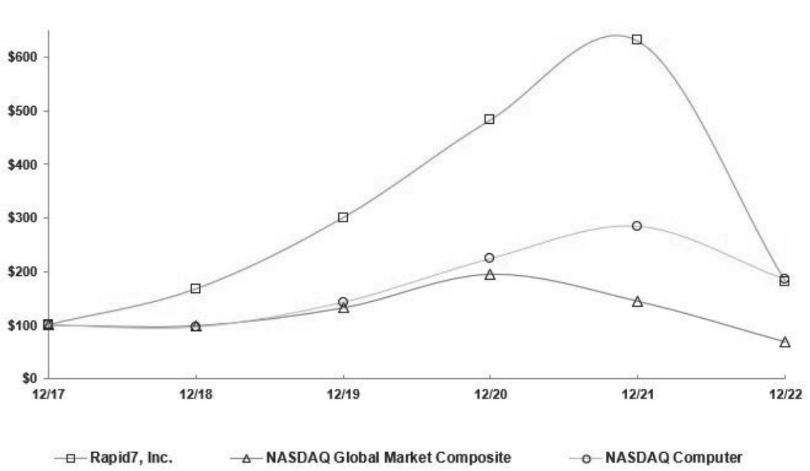
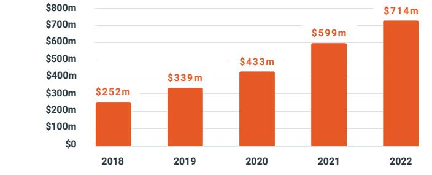
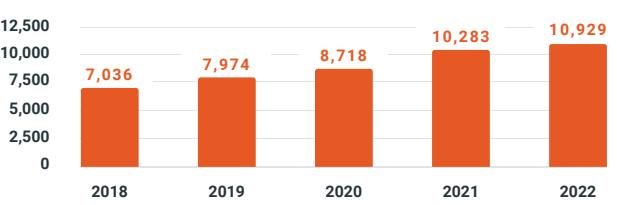
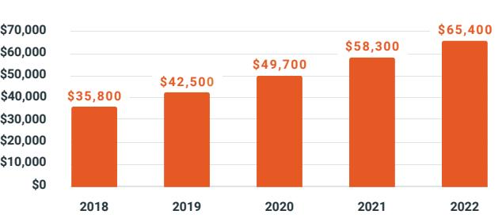
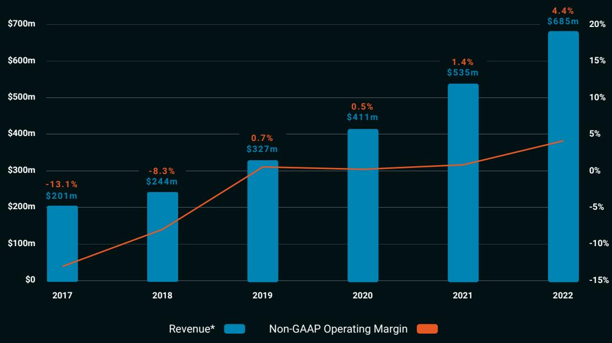

{0}------------------------------------------------

# 2022 Annual Report

**Let's secure the digital future.**

{1}------------------------------------------------

### Fellow Stockholders,

.SXJHZWNY^UWFHYNYNTSJWXKFHJIXNLSNܪHFSY challenges in protecting their organizations from threats and malicious actors. The cybersecurity environment becomes increasingly complex each year, and customers of all sizes continue to grapple with resource constraints around security talent. Last year customers also KTZSIYMJRXJQ[JXTUJWFYNSLNSFSNSHWJFXNSLQ^INKܪHZQY budgetary environment, as businesses worked through various levels of macroeconomic uncertainty.

Against this backdrop, we were able to deliver value for customers through Rapid7's Insight platform, which enables security practitioners to bridge best-inclass security operations across traditional and cloud environments. The ability to gain visibility and assess risk across the broader IT environment remains critical, and during 2022 we saw increased urgency around projects to help practitioners secure their growing cloud environments as well as to detect and respond YTYMWJFYXNSFSJKKJHYN[JJKܪHNJSYFSIFZYTRFYJI\F^ 8JHZWNY^YJFRXFQXTQTTPJIYTIWN[JGJYYJWJKܪHFH^TKYMJNW UWTLWFRXFQTSLXNIJGJYYJWJKܪHNJSH^KTWYMJNWGZILJYX as part of a broad-based effort towards optimizing their spend via vendor consolidation.

Rapid7 leaned into these dynamics and the evolving environment by introducing our new core consolidation offerings: Cloud Risk Complete and Threat Complete. The breadth and depth of these Insight platform offerings allow us to bring a better value proposition to customers, giving security teams a compelling way to reduce their number of vendors while improving security outcomes. These offerings also speak to the customers project FWJFX\NYMYMJMNLMJXYGZILJYZWLJSH^&X\JWJܪSJTZW go-to-market strategy and how our sellers approach YMJRFWPJY\JFWJGJSJܪYYNSLKWTRTZWFGNQNY^YTTKKJW comprehensive visibility across traditional and expanding cloud environments.

Rapid7's total ARR grew 19% year-over-year to \$714 million at the end of 2022, supported partly by new customer growth that brought our global customer count to nearly 11,000. Our journey as a platform consolidator gained traction, ending the year with ARR per customer of over \$65,000, representing 12% growth over 2021. We were also able to deliver over 300 basis points of Non-GAAP Operating Margin1 expansion and over \$40 million of Free Cash Flow, as we continued to effectively GFQFSHJLWT\YMFSIUWTܪYFGNQNY^NSQNSJ\NYMTZWXYFYJI KWFRJ\TWP9MJKTHZXTSIWN[NSLUWTܪYFGQJLWT\YM remains one of our core strategic goals.

As we look forward to the rest of 2023, our team at Rapid7 remains focused as ever on closing the security achievement gap and creating a more secure digital future for all. We will continue to execute on strong secular demand and adapt to changing market conditions. We remain obsessed with understanding customer dynamics and using this knowledge to engineer the most innovative and value-added offerings. And as we march towards our goal of being a "Rule of 40" company, we remain committed to achieving this success alongside all our stakeholders - employees, customers, communities, and stockholders.

Thank you for your support over the past year and looking forward, as we continue our journey to provide better security experiences and outcomes for all.

With warm regards,

Corey Thomas Chairman & CEO Rapid7

1. Non-GAAP operating margin is a non-GAAP metric, which is our non-GAAP income (loss) from operations divided by revenue. See the reconciliation of non-GAAP income (loss) from operations in our Annual Report on Form 10-K for the year ended December 31, 2022 included herein to its comparable GAAP measure.

{2}------------------------------------------------

### ***#)())( (*')(#-#\$""((\$#**

**,3E:;@9FA@ 2222222222222222222222222222222222222222222222222222**

## **\$'" 2222222222222222222222222222222222222222222222222222**

**"3D=\$@7**

- **##*!'%\$')%*'(*#))\$()\$#\$'6\$)(*')(-#)\$** 

**ADF:78;E53>K73D7@676757?47D** 

**\$'**

 **)'#()\$#'%\$')%*'(*#))\$()\$#\$'6\$)(*')(-#) \$ \$'))'#()\$#%'\$'\$")\$**

> **A??;EE;A@;>7#G?47D 2222222222222222222222222222222222222222222222222222**

#### **'%#**

**J35F@3?7A8D79;EFD3@F3EEB75;8;76;@;FE5:3DF7D 2222222222222222222222222222222222222222222222222222**

**7>3I3D7 (F3F7ADAF:7D<GD;E6;5F;A@A8 ;@5ADBAD3F;A@ADAD93@;L3F;A@ '
(
?B>AK7D**

**67@F;8;53F;A@#A** 

**3GE7I3K(FD77F AEFA@"**

**66D7EEA8BD;@5;B3>7J75GF;H7A88;57E /;BA67**

**'79;EFD3@FNEF7>7B:A@7@G?47D;@5>G6;@93D735A67
  2222222222222222222222222222222222222222222222222222**

-:8JG>I>:HG:<>HI:G:9EJGHJ6CIID-:8I>DC7D;I=:8I

.>IA:D;:68=8A6HH .G69>C<-NB7DAH (6B:D;:68=:M8=6C<:DCL=>8=G:<>HI:G:9 DBBDC-ID8@E6GK6AJ:
E:GH=6G: ,* .=:(6H96F!AD76A'6G@:I

-:8JG>I>:HG:<>HI:G:9EJGHJ6CIID-:8I>DC<D;I=:8I**#A@7**

#C9>86I:7N8=:8@B6G@>;I=:G:<>HIG6CI>H6L:AA@CDLCH:6HDC:9>HHJ:G6H9:;>C:9>C,JA:D;I=:-:8JG>I>:H8I
3:H-(D

#C9>86I:7N8=:8@B6G@>;I=:G:<>HIG6CI>HCDIG:FJ>G:9ID;>A:G:EDGIHEJGHJ6CIID-:8I>DCDG9D;I=:8I
3:H(D-

#C9>86I:7N8=:8@B6G@L=:I=:GI=:G:<>HIG6CI=6H;>A:96AAG:EDGIHG:FJ>G:9ID7:;>A:97N-:8I>DCDG9D;I=:-:8JG>I>:HM8=6C<: 8ID;9JG>C<I=:EG:8:9>C<BDCI=HDG;DGHJ8=H=DGI:GE:G>D9I=6II=:G:<>HIG6CIL6HG:FJ>G:9ID;>A:HJ8=G:EDGIH6C9=6H7::C HJ7?:8IIDHJ8=;>A>C<G:FJ>G:B:CIH;DGI=:E6HI96NH
3:H-(D

#C9>86I:7N8=:8@B6G@L=:I=:GI=:G:<>HIG6CI=6HHJ7B>II:9:A:8IGDC>86AAN:K:GN#CI:G68I>K:6I6 >A:G:FJ>G:9ID7:HJ7B>II:9EJGHJ6CIID ,JA: D;,:<JA6I>DC -. P
 D;I=>H 8=6EI:G 9JG>C<I=: EG:8:9>C< BDCI=H DG ;DG HJ8= H=DGI:G E:G>D9I=6II=: G:<>HIG6CIL6H G:FJ>G:9IDHJ7B>I6C9EDHIHJ8=;>A:H
3:H-(D

#C9>86I:7N8=:8@B6G@L=:I=:GI=:G:<>HIG6CI>H6A6G<:688:A:G6I:9;>A:G6C688:A:G6I:9;>A:G6CDC688:A:G6I:9;>A:GDG6HB6AA:GG:EDGI>C< 8DBE6CN
-::I=:9:;>C>I>DCD;UA6G<:688:A:G6I:9;>A:GVU688:A:G6I:9;>A:GV6C9UHB6AA:GG:EDGI>C<8DBE6CNV>C,JA:7D;I=:M8=6C<: 8I
=:8@DC:

&6G<:88:A:G6I:9 >A:G - 88:A:G6I:9 >A:G (DC688:A:G6I:9 >A:G -B6AA,:EDGI>C<DBE6CN B:G<>C<!GDLI=DBE6CN

{3}------------------------------------------------

If an emerging growth company, indicate by check mark if the registrant has elected not to use the extended transition period for complying with any or revised financial accounting standards provided pursuant to Section 13(a) of the Exchange Act. □

Indicate by check mark whether the registrant has filed a report on and attestation to its management of the effectiveness of its internal control over financial reporting under Section 404(b) of the Sarbanes-Oxley Act (15 U.S.C 7262(b)) by the registered public accounting firm that prepared or issued its audit report. Yes 图 No □

If securities are registered pursuant to Section 12(b) of the Act, indicate by check mark whether the financial statements of the registrant included in the filing reflect the correction of an error to previously issued financial statements. □

Indicate by check mark whether any of those error corrections are restatements that recovery analysis of incentive-based compensation received by any of the registrant's executive officers during the relevant recovery period pursuant to §240.10D-1(b). □

Indicate by check mark whether the registrant is a shell company (as defined in Rule 12b-2 of the Exchange Act). Yes □ No ሬ

As of June 30, 2022, the aggregate market value of the registrant's voting common stock held by non-affiliates of the registrant, based on a closing price of \$66.80 per share of the registrant's common stock as reported on The Nasdaq Global Market on June 30, 2022, was approximately \$3.860.661.578. For purposes of this computation, all officers, directors and 10% beneficial overs of the registration are deemed to be affiliates. Such determination should not be an admission that such officers, directors or 10% beneficial owners are, in fact, affiliates of the registrant. The number of registrant's common stock outstanding as of February 17, 2023 was 60.040.675.

#### DOCUMENTS INCORPORATED BY REFERENCE

Portions of the registrant's definitive Proxy Statement for its 2023 Annual Meeting of Stockholders to be filed with the Securities and Exchange Commission pursuant to Regulation 14A not later than 120 days after the end of this Annual Report on Form 10-K are incorporated by reference in Part III, Items 10-14 of this Annual Report on Form 10-K.

{4}------------------------------------------------

### Table of Contents

|          |                                                                                                                 | Page  |
|----------|-----------------------------------------------------------------------------------------------------------------|-------|
| PART I   |                                                                                                                 |       |
| Item 1.  | Business                                                                                                        | 3     |
| Item 1A. | Risk Factors                                                                                                    | 14    |
| Item 1B. | Unresolved Staff Comments                                                                                       | 37    |
| Item 2.  | Properties                                                                                                      | 37    |
| Item 3.  | Legal Proceedings                                                                                               | 38    |
| Item 4.  | Mine Safety Disclosures                                                                                         | 38    |
| PART II  |                                                                                                                 |       |
| Item 5.  | Market for Registrant's Common Equity, Related Stockholder Matters and Issuer Purchases of Equity Securities | 39    |
| Item 6.  | [Reserved]                                                                                                      | 40    |
| Item 7.  | Management's Discussion and Analysis of Financial Condition and Results of Operations                           | 41    |
| Item 7A. | Quantitative and Qualitative Disclosures About Market Risk                                                      | ਟੇ ਰੇ |
| Item 8.  | Financial Statements and Supplementary Data                                                                     | 60    |
| Item 9.  | Changes in and Disagreements With Accountants on Accounting and Financial Disclosure                            | 92    |
| Item 9A. | Controls and Procedures                                                                                         | 92    |
| Item 9B. | Other Information                                                                                               | 93    |
| Item 9C. | Disclosure Regarding Foreign Jurisdictions that Prevent Inspections                                             | 93    |
| PART III |                                                                                                                 |       |
| Item 10. | Directors, Executive Officers and Corporate Governance                                                          | 94    |
| Item 11. | Executive Compensation                                                                                          | 94    |
| Item 12. | Security Ownership of Certain Beneficial Owners and Management and Related Stockholder Matters                  | 94    |
| Item 13. | Certain Relationships and Related Transactions, and Director Independence                                       | 94    |
| Item 14. | Principal Accounting Fees and Services                                                                          | 94    |
| PART IV  |                                                                                                                 |       |
| Item 15. | Exhibits, Financial Statement Schedules                                                                         | તે રે |
| Item 16. | Form 10-K Summary                                                                                               | 98    |

{5}------------------------------------------------

{6}------------------------------------------------

#### Special Note Regarding Forward-Looking Statements

This Annual Report on Form 10-K, including the sections entitled "Business," "Risk Factors," and "Management's Discussion and Analysis of Financial Condition and Results of Operations," contains forward-looking statements that involve risks and uncertainties, as well as assumptions that, if they never materialize or prove incorrect, could cause our results to differ materially from those expressed or implied by such forward-looking statements that are not purely historical are forward-looking statements within the meaning of Section 27A of the Securities Act of 1933, as amended, and Section 21E of the Securities Exchange Act of 1934, as amended. Forward-looking statements are often identified by the use of words such as, but not limited to, "anticipate," "believe," "continue," "estimate," "expect," "intend," "may," "plan," "project," "seek." "should." "target." "will," "would" and similar expressions intended to identify forward-looking statements. These forward-looking statements include, but are not limited to, statements concerning the following:

• our ability to continue to add new customers and sell new products and sell new products and professional services to new and existing customers;

· uncertain impacts that changes in overall level of software spending and ongoing volatility in the global economy as well as effects of inflation and increased interest rates may have on our business, strategy, operating results, financial condition and cash flows;

- · the effects of increased competition as well as innovations by new and existing competitors in our market;
- · our ability to adapt to technological change and effectively enhance, innovate and scale our solutions;
- · our ability to effectively manage or sustain our growth and to attain and sustain profitability;
- · our ability to diversify our sources of revenue;
- · potential acquisitions and integration of complementary business and technologies;
- our expected use of proceeds from future issuances of equity or convertible debt securities;
- · our ability to maintain, or strengthen awareness of, our brand;
- · perceived or actual security, reliability, quality or compatibility problems with our solutions, including related to security breaches in our customers; systems, unscheduled downtime or outages;

· statements regarding future revenue, hiring plans, expenditures, capital requirements and stock performance;

• our ability to meet publicly announced guidance or other expectations about our business, key metrics and future operating results;

- · our ability to maintain an adequate annualized recurring revenue growth;
- our ability to attract and retain qualified employees and further expand our overall headcount;
- · our ability to grow, both domestically and internationally;

• our ability to stay abreast of new or modified laws and regulations that currently apply or become applicable to our business both in the United States and internationally;

- · our ability to maintain, protect and enhance our intellectual property;
- · costs associated with defending intellectual property infringement and other claims; and
- · the future trading prices of our common stock and the impact of securities analysts' reports on these prices.

These statements represent the heliefs and assumptions of our management based on information currently available to us. Such forward-looking statements are subject to risks, uncertainties and other important factors that could cause and the timing of certain events to differ materially from future results expressed or implied by such forward-looking statements. Factors that could cause or contribute to such differences include, but are not limited below, and those discussed in the section titled "Risk Factors" included under Part I, Item 1A. Furthermore, such forward-looking statements speak only as of the date of this report. Except as required by law, we undertake no obligation to update any forward-looking statements to reflect events or circumstances that occur after the date of this report.

As used in this report, the terms "Rapid7," the "company," "we," "us," and "our" mean Rapid7, Inc. and its subsidiaries unless the context indicates otherwise.

{7}------------------------------------------------

#### Summary of Risk Factors

Our business is subject to numerous risks and uncertainties, including those described in Item 1A "Risk Factors". These risks include, but are not limited to the following:

- Our quarterly operating results may vary from period, which could result in our failure to meet expectations . with respect to operating results and cause the trading price of our stock to decline.
- . Our business and operations have experienced significant growth, and if we do not appropriately manage any future growth, or are unable to maintain and scale our infrastructure, systems and processes, our business and results of operations may be negatively affected.
- . Prolonged economic uncertainties or downturns could adversely affect our business.
- . Real or perceived failures, errors or defects in our solutions could adversely affect our brand and reputation, which could have an adverse effect on our business and results of operations.
- . Our brand, reputation and ability to attract, retain and serve our customers are dependent in part upon the reliable performance of our products and network infrastructure.
- . Our business and growth depend substantially on customers renewing their subscriptions with us. Any decline in our customer renewals or failure to convince customers to expand their use of our subscription offerings could adversely affect our future operating results.
- . If we or our third party service providers experience a security breach or unauthorized parties obtain access to our customers' data, our reputation may be harmed, demand for our solutions may be reduced and we may incur significant liabilities.
- . We face intense competition in our market, which could adversely affect our business, financial condition, and results of operations.
- . If we are unable to successfully hire, train, and retain qualified personnel our business may suffer.
- . A component of our growth strategy is dependent on our continued international expansion, which adds complexity to our operations.
- . Because our products collect and store user and related information, domestic and international privacy and cybersecurity concerns, and other laws and regulations, could have a material adverse effect on our business.
- . If our customers are unable to implement our products successfully or we fail to maintain high quality customer support, customer perceptions of our offerings may be impaired or our reputation and brand may suffer.
- . We may fail to meet our publicly announced guidance or other expectations about our business and future operating results, which would cause our stock price to decline.
- . If we are not able to maintain and enhance our brand, our business and operating results may be adversely affected.
- . We use third-party software and data to operate certain functions of our business and deliver our offerings that may be difficult to replace or that may cause errors or failures of our solutions, which could lead to lost customers or harm to our reputation and our operating results.
- . Assertions by third parties of infringement or other violations by us of their intellectual property rights, whether or not correct, could result in significant costs and harm our business and operating results.
- . Organizations may be reluctant to purchase our cloud-based offerings due to the actual or perceived vulnerability of cloud solutions.
- . We have a significant amount of debt that may decrease our business flexibility, access to capital, and/or increase our borrowing costs, and we may still incur additional debt in the future, which may adversely affect our operations and financial results. We may not have sufficient cash flow from our business to pay our substantial debt when due.
- . We may require additional capital to support business growth, and this capital might not be available on acceptable terms, if at all.

The summary risk factors described above should be read together with the text of the full risk faction entitled "Risk Factors" and the other information set forth in this Annual Report on Form 10-K ("Form 10-K"), including our consolidated financial statements and the related notes, as well as in other documents that we file with the U.S. Securities and Exchange Commission ("SEC"). The risks summarized above or described in full below are not the only risks that we face. Additional risks and uncertaintes not precisely known to us or that we currently deem to be immaterially adversely affect our business, financial condition, results of operations, and future growth prospects.

{8}------------------------------------------------

### PART I

#### Item 1. Business

#### Overview

Rapid7 is on a mission to create a safer digital world by making cybersecurity simpler and more accessible. We empower security professionals to manage a modern attack surface through our best-in-class technology, leading-edge research, and broad, strategic expertise. Our comprehensive security solutions help our customers unite cloud risk management and threat detection to reduce attack surfaces and eliminate threats with speed and precision.

In the over 20 years that Rapid7 has been in business, security companies and trends have come and gone, while broader technology innovation continues to advance rapidly. Every company is now a technology company, and rampant innovation inevitably creates security risk. The migration of businesses to the cloud, more distributed workforces, and ubiquitous connected devices present security teams with an increasingly complex, ever-changing, and unpredictable attack surface.

We believe as cybersecurity challenges continue to rise exponentially, two key factors can prevent organizations from effectively managing their growing security exposure. First, the tools to manage complex security problems are often equally complicated to use. Second, there is a scarcity of cybersecurity professionals who are qualified to successfully manage these sophisticated tools. These two factors compound the difficulties that resource-constrained organizations face when attempting to minimize their security exposure, meet security compliance regulations, and provide visibility to their leadership. We call the expanding divide between risk created through innovation and risk effectively managed by security achievement gap.

We believe Rapid7 is uniquely positioned to improve how security challenges are addressed. Our solutions and services are built with and supported by the expertise of our dedicated team of security researchers, expert SOC analysts, who bring knowledge of attacker behavior and emerging vulnerabilities directly to customers. We also continue to invest in further simplifying our technology to improve usability, lowering the barrier for teams and organizations who lack resources to manage their security posture.

While our security technology is the foundation of our mission to make successful security accessible to all, technology alone will not solve today's cybersecurity challenges. Our ongoing commitment to researching and partnering with the technology community helps to curb new security risks born through innovation. We are also investing in under-served, at risk communities, like non-profits and hospitals, to better understand their needs and make security technology and services accessible. By continuously improving our technology, stemming the creation of risk in the community, and making security more usable and accessible, Rapid7 aims to close the security achievement gap.

As of December 31, 2022, we had more than 10,000 customers that rely on Rapid7 technology, services, and research to improve security outcomes and securely advance their organizations. We have experienced strong revenue growth with revenue increasing from \$244.1 million in 2018 to \$685.1 million in 2022, representing a 29% compound annual growth rate.

In 2022, 2021 and 2020 recurring revenue from term software licenses, content subscriptions, managed services, cloud-based subscriptions and maintenance and support, was 94%, 92%, respectively, of total revenue. We incurred net losses of \$124.7 million and \$98.8 million in 2022, 2021 and 2020, respectively, as we continued to invest for long-term growth.

#### Our Solutions

We offer products across multiple pillars on our Insight Platform:

- . Incident Detection and Response: Our industry-leading Incident Detection and Response ("IDR") solutions are designed to enable organizations to rapidly detect and respond to cybersecurity incidents across physical, virtual, and cloud assets. Equipped with user behavior analytics ("UBA"), attacker behavior analytics ("ABA"), network traffic analysis ("NTA"), end-point detection and response ("EDR") and deception technology, our Extended Detection and Response ("XDR") solution is designed to provide comprehensive network visibility and accelerate threat investigation and response.
- . Cloud Security: Our Cloud Security solutions are designed to effectively manage and protect cloud and container environments. By combining continuous real-time monitoring with automation, our solutions quickly assess an organization's security and compliance posture and automate remediation of misconfigurations and policy violations to help deliver continuous security and compliance across multi-cloud environments.
- . Vulnerability Risk Management: Our industry-leading Vulnerability Risk Management ("VRM") solutions provide clarity into risk across traditional and modern IT environments, and the capabilities and data to influence remediation

{9}------------------------------------------------

teams and track progress. With built-in risk prioritization projects, tracking of goals and service level agreements, and pre-built automation workflows, our solutions are designed to not just enumerate risk, but also accelerate risk mitigation.

- . Application Security: Our Application Security offerings provide dynamic application security testing and run-time application security monitoring and protection solutions that are designed to continuously analyze web applications for security vulnerabilities throughout a customer's software development life cycle.
- . Threat Intelligence: Our advanced external threat intelligence tool finds and mitigates threats by proactively monitoring thousands of sources across the clear, deep, and dark web. By providing actionable, real-time information on threats outside their infrastructure coupled with automated remediation capabilities, customers have visibility to tailored threats and can make informed decisions.
- o Security Orchestration and Automation Response: Our Security Orchestration and Automation Response ("SOAR") solutions allow security teams to connect disparate solutions within their cybersecurity, IT and development operations and build automated workflows, without requiring code, to eliminate repetitive, manual and labor-intensive tasks, resulting in measurable time and cost savings.

Finally, to complement our products, we offer a range of managed services based on our software solutions and professional services, including penetration testing services, incident response services, and deployment and training.

### Insight Platform

Our cloud-native Insight Platform is at the core of our product offerings. The platform was built using our extensive experience in collecting and analyzing data to enable our customers to create and manage analytics-driven cybersecurity risk management programs. By utilizing our powerful, proprietary analytics to assess and understand relationships around users, IT assets and cyber threats within a customer's environment, our solutions make it easier for teams to identify and remediate vulnerabilities, monitor for misconfigurations behavior, investigate and shutdown attacks, and automate operations.

Our Insight Platform provides a high level of scalability. We leverage cloud technologies to achieve a scalable delivery model with a high degree of redundancy, fault tolerance, and cost-effectiveness.

We also designed our Insight Platform to provide a secure environment for our customers' data. We deploy a variety of technologies and practices that are designed to help ensure that the data collected from a customer's environment remains proprietary, secure and operational.

### Insight Platform's Features:

Visibility: The Insight Platform allows security professionals to collect data once across their IT environment, enabling Security. IT, and development operations ("DevOps") teams to collaborate effectively as they analyze shared data.

- . Unified Data Collection: We designed the Insight Platform to allow customers to collect their data once and leverage that same data across multiple solutions, providing shared visibility across teams and reducing time to value for additional solutions. Our robust data collection architecture supports gathering a wide swath of operational data from endpoints to the cloud, including key data about assets and user-specific behavior, into a unified, searchable dataset.
- . Agentless and Agent-Based Architecture: We developed our platform with flexible processing technologies that employ both agentless data collection and our own internally-developed endpoint agent technology, which enables rapid and seamless integration of our products into our customers' modern IT environments and provides security and IT professionals with instant visibility into their dynamic and rapidly-expanding IT ecosystem. Our lightweight endpoint Insight Agent is designed to automatically collect data from all endpoints, even those from remote workers and sensitive assets that cannot be actively scanned, or that rarely join the corporate network.
- . Endpoint Detection and Visibility: With a universal lightweight agent and endpoint scanning, the Insight Platform provides real-time detection and the ability to proactively remediate IT environments, before a potential attack happens.
- . Network Traffic Analysis: Network flow data illuminates environments and helps accelerate investigations. Our lightweight Network Sensor passively analyzes raw traffic to increase visibility into user activity, pinpoint real threats, and accelerate investigations with granular detail of attacker movement.

{10}------------------------------------------------

- . Cloud and Virtual Infrastructure Assessment: Modern networks are constantly changing. The Insight Platform integrates with cloud services and virtual infrastructure to help ensure that technology is configured securely and that security professionals know when new devices are brought online.
- . Attack Surface Monitoring with Project Sonar: As organizations grow and infrastructure becomes more complex, maintaining visibility into attack surface becomes more challenging. Our platform directly integrates with Project Sonar, a Rapid7 research project that regularly scans the public internet, to gain insights into global exposure to common vulnerabilities. This capability also enables security professionals to identify previously unknown, externally facing assets connected to the internet.

Analytics: Increasing IT environment complexity coupled with a severe lack of cybersecurity professionals is overwhelming security and IT teams, who are struggling to deal with false positives and maintain adequate levels of cybersecurity. Our Insight Platform addresses these challenges with the following features:

- User and Attacker Behavior Analytics: Our Insight Platform incorporates extensive user behavior analytics ("UBA") and attacker behavior analytics ("ABA") to provide rapid context around users, attackers and assets involved in an incident, enabling organizations to more quickly respond to, contain and mitigate breaches. Our platform incorporates comprehensive UBA to create a behavior profile for each user and correlates every event with a user, asset or application to detect compromised credentials, lateral movement and other malicious behavior.
- . Risk Prioritization and Management: With built-in risk assessment and risk prioritization, IT-integrated remediation projects, and pre-built automation workflows, the Insight Platform provides a granular view of what is relevant and critical today, to help ensure risks can be prioritized and mitigated more effectively.
- . Threat Detection: Our Insight Platform includes integrated threat by public data as well as proprietary threat intelligence and adversary research, and continuously gathers and combines them with a customer's IT environment, to show threats that are most relevant to them.
- . Centralized Log Management: Our cloud-based platform correlates millions of daily events in any IT environment directly to the users and assets behind them to highlight risk across the environment and help prioritize where to search and automate compliance without the requirement of extensive hardware.
- . Deception Technology: Monitoring solutions that only analyze log files leave traces of the attacker unfound. Through our deep understanding of attacker behavior, our Insight Platform provides not only UBA and endpoint detection, but also easy-to-deploy intruder traps. These include honey users, honey credentials, and honey files, all crafted to identify malicious behavior earlier in the attack chain.
- . Industry Experts: With a highly specialized team of penetration testing, incident response, threat hunting and security operation center experts, we believe we are uniquely positioned to stay ahead of emerging threats and help detect threats quickly across a customer's entire IT ecosystem.

Automation: Our Insight Platform unites technology stacks and allows security operations teams to connect disparate solutions within their cybersecurity, IT and development operations.

- . Built-in Workflows: Security tools have not historically been built to work well together, and without deep programming knowledge, building automation between tools was nearly impossible. With our Insight Platform, security professionals can streamline their operations with connect-and-go workflows, without requiring any code, resulting in significant time and cost savings. Examples of these workflows include assisted patching and automated containment.
- . Highly Customizable: The Insight Platform not only has a wide range of pre-built workflows and integrations, but it is also highly extensible. With approximately 500 plugins to connect security tools and easily customizable connectand-go workflows, the Insight Platform frees up security teams to tackle other challenges, while still leveraging human decision points when it is most critical.

### Insight Platform Product Offerings

We offer our Insight Platform solutions as software-as-a-service products, on a subscription basis. Our Insight Platform products are available globally and reduce the need for customers to manage large, complex, data infrastructure. We offer the following cloud products across the main pillars of Security Operations ("SecOps"):

Insight DR: Insight DR, our unified extended detection and response ("XDR") and next-gen security information and event management ("SIEM") solution, is designed to enable organizations to rapidly detect and respond to cyberseurity incidents and breaches across the entirety of their modern environment.

{11}------------------------------------------------

Insight!DR unifies SIEM, UEBA, EDR, NTA, and cloud detection to detect stealthy attacks across today's complex networks. It analyzes the billions of events that occur daily in organizations to reduce them to the important behaviors and deliver highfidelity and prioritized alerts. In addition to identifying stealthy attacks. InsightIDR reduces the signal-to-noise ratio to deliver reliable, high-context alerts and reduce the time to investigate with its correlation engine, powerful search and forensic capabilities.

Insight!DR is designed to provide a cost-effective response to the need for a modern SIEM or XDR solution. With our Metasploit and open source community, research and incident response services, we are continually studying and identifying the latest attacker methods. We have increased accuracy, speed processes, and achieve greater confidence, even as attacker methods change. With diverse detection capabilities across known and unknown threats, and constant curation. Insight!DR customers benefit from an always up-to-date library of detections and overage against the most evasve and emergent threats.

Unlike most SIEMs, InsightIDR also provides expertly vetted recommendations with every alert and a number of prebuilt workflows and automation capabilities - giving customers the ability to respond quickly and confidently, reducing mean time to respond ("MTTR"). Prebuilt workflows span a number of use cases - including productivity and ticketing workflows, user and asset containment, threat enrichment and more - helping SecOps teams realize greater efficiency and gain time back.

While InsightIDR is optimized to drive ultimate efficiency for resource constrained teams, customers with greater security maturity can also have access to a number of advanced modules to unlock expanded use cases. Enhanced Network Traffic Analysis continuously monitors network traffic at any location or site across your network - east / west and north / south. This data not only increases visibility across the attack surface and detects intrusions or other potential security events, it also is incredibly difficult for attackers to tamper with - making it an excellent source of forensic and information. With Enhanced Endpoint Telemetry, InsightIDR collects detailed process activity logs off every endpoint, providing visibility into all endpoint activity whether events occurred before, during, or after a detection. With this holistic view into endpoint activity, customers can unlock custom use cases and enrich investigations in InsightIDR.

Insight!DR is offered through a cloud-based subscription. Customers that seek greater support and expertise also have the option of leveraging our Managed Detection and Response ("MDR") service, an outsourced service that leverages elite security experts to deliver 24 x 7 x 365 monitoring of your environment and a first line of defense and triage against attacks. When attacks are found, customers are promptly informed of all known details and our team moves to incident response, providing security teams with detailed, easy-to-follow remediation steps tailored to the environment. This MDR service is powered by InsightIDR - providing a real-ime feedback loop and constant vetting of our technology. This infused expertise means that even software only customers benefit from having the insights, input, and vetting of experts across all of our detections, investigation capabilities, and overall user experience.

InsightCloudSec: InsightCloudSec, our cloud risk and compliance management platform, enables customers to securely accelerate cloud adoption with continuous security and compliance throughout the entire software development lifecycle.

InsightCloudSec is a fully-integrated solution that integrates posture management, workload protecture entitlements management, infrastructure-as-code security, and Kubernetes protection. It helps Security and DevOps teams surface risk in cloud and container environments, shift their cloud security program earlier in the development lifecycle, and automate workflows to speed up remediation and implement cost-saving best-of-breed technologies, InsightCloudSec provides unified visibility and robust context across multi-cloud environments to analyze, prioritize, and remediate issues as they arise.

By performing real-time, continuous discovery and analysis of cloud and container resources, we allow customers to identify security risks, threats and policy compliance violations such as data breaches, account hijacking, insecure interfaces, and weak authentication. InsightCloudSec can then to remediate identified issues based on user-defined and/or automated parameters before they are exploited by a malicious actor.

InsightCloudSec is offered through a cloud-based subscription.

InsightVM: Leveraging the power of our InsightVM helps organizations to discover and remediate vulnerability risk across their network in a fully available, and efficient manner.

InsightVM is designed to provide continuous visibility across a company's IT environment through lightweight agents and prioritize those valnerabilities using our real risk score with an integrated threat feed - including CVSS scores, malware exposure, exploit exposure and ease of use, and vulnerability age - which provides organizations with the business context of vulnerabilities to focus on what is most important. Customers can visualize these risk scores through Live Dashboards and our IT-integrated remediation projects help to assign and track remediation duties and provide continuous visibility into how well issues are being fixed. In-product integrations include ServiceNow, IBM Bigfix, Microsoft SCCM and Jira ticketing systems.

{12}------------------------------------------------

InsightVM is offered through a cloud-based subscription or as a managed service. The managed service is known as Managed Vulnerability Risk Management, which provides our resource constrained customers with a fully outsourced option for leveraging our innovation, expertise and technology.

InsightAppSec: InsightAppSec provides comprehensive dynamic application security testing ("DAST") that continuously analyzes web applications for security weaknesses and vulnerabilities. InsightAppSec assesses web applications with both out of the box and custom attack modules such as scanning for OWASP Top 10 and Out of Band injections. InsightAppSec also allows security teams to easily partner with our Attack Replay functionality and integrations with CVCD pipeline and key ticketing systems.

InsightAppSec is offered on a cloud-based subscription basis. For customers that seek greater support and expertise, they can leverage our Managed Application Security ("MAS") solution which is powered by InsightAppSec and supported by experts.

Insight onnect: InsightConnect is our SOAR solution that is used by security professionals to connect their many disparate solutions and automate workflows to increase the speed with which they can identify risk and respond to incidents, and accelerate communication workflows with key remediators, such as development teams. With a growing library of over 500 integration plugins and easily customizable pre-built workflows, it allows our customers to automate manual and tedious tasks, while still leveraging their expertise when it is most critical, thereby saving time and improving efficiency. InsightConnect is offered on a cloud-based subscription basis.

### Other Products

Threat Intelligence: Threat Intelligence finds and mitigates threats by proactively monitoring thousands of sources across the clear, deep, and dark web. By providing actionable, real-time information on threats outside their infrastructure coupled with automated remediation capabilities, customers have visibility to tailored threats and can make informed decisions. Threat Intelligence is offered on a cloud-based subscription basis.

Nexpose: Nexpose is an on-premise version of our Vulnerability Risk Management solution, that enables customers to assess and remediate their overall exposure to cyber risk across their increasingly complex IT environments. Nexpose is offered through term-based software licenses.

AppSpider: AppSpider is the on-premise version of our Application Security Testing solution that provides comprehensve dynamic application security testing that continuously analyzes web applications for security vulnerabilities. AppSpider is offered through term-based software licenses.

Metasploit: Metasploit is an industry-leading penetration testing software solution, developed on an open source framework. Metasploit can be used to safely simulate attacks on an organization's network in order to uncover vulnerabilities before they are exploited by cyber attackers and assess the effectiveness of an organization's existing defenses, security controls and mitigation efforts. The Metasploit open source framework is freely available and geared toward developers and security researchers. We also offer Metasploit Pro, the commercial penetration testing software based on the Metasploit framework, through term-based software licenses.

#### Professional Services

Our professional services offerings enhance our ability to serve as a trusted advisor in assisting organizations to think proactively about their security programs and implement strategic, analytics-driven security strategies. We believe that our role as a trusted advisor helps drive better security outcomers, as well as loyalty and further usage of our products. Our professional services offerings include, but are not limited to, Penetration Testing, Cybersecurity Maturity Assessments, Security & Incident Response Program Development Services, IoT & Internet Embedded Device testing as well as Threat Modeling, TableTop Exercises and Incident Response services. In addition, we offer deployment and training services related to our platform, to further help customers operationalize their platform experience. For example, our Cybersecurity Maturity Assessments provide our customers with a view of their current security posture, an objective review of their existing plans, and a guide to their strategic planning. By accessing our security talent, we help organizations develop an approach and road map to further mature and strengthen their program efforts - often simplifying the otherwise complex.

#### Our Growth Strategy

Our goal is to make advanced security accessible to resource constrained enterprises of all sizes of our growth strategy are:

- . Continued investments in product development: We intend to invest heavily in our product development to enhance our Insight Platform and deliver additional features, which will allow us to further penetrate and grow our addressable markets.

{13}------------------------------------------------

- . Grow our customer base: We believe we have a strong opportunity to address the security needs of resource constrained organizations of any size. We will continue to increase investments in our sales and marketing efforts and foster the growth of our channel relationships to enable acquisition of these customers.
- . Upsell and cross-sell to our existing customer base: We see significant opportunity to deepen our relationship with our existing customers. With a strong focus on customer experience, satisfaction, and the value proposition of our Insight Platform, we intend to expand customers' usage of products they own (upsell) and help them adopt additional products (cross-sell).
- . Further strengthen our customer renewal rate: We intend to continue to drive customer satisfaction and renewals by offering professional services, support, and strong investments in customer success functions. Our customer success teams provide expertise to help our customers improve their security outcomes, leading to higher customer satisfaction.
- . Expand our partner ecosystem: We continue to expand our strategic partnerships with our channel partners and system integrators. Technology alliances with partners such as ServiceNow. Microsoft. AWS and Palo Networks enable our customers to succeed with our technology and platform in their ecosystem and deliver more value from their security operations program.
- . International expansion: We continue to make investments to expand our international presence. These include investments in infrastructure, sales and marketing, and strategic partnerships.
- . Strategic M&A: We have and may continue to make acquisitions that enhance the value of our Insight Platform and bolster our ability to solve emerging customer challenges, allowing us to deliver on the vision of becoming the SecOps leader.

#### Sales, Customer Support, and Marketing

We sell our solutions through direct inside and field sales teams and indirect channel partner relationships.

Sales: Our sales teams focus on both new customer acquisition as well as upselling and cross-selling additional offerings to our existing customers. Our sales teams are organized by geography, consisting of the Americas; Europe, the Middle East and Africa ("EMEA"); and Asia Pacific ("APAC"), as well as by target organization size. Our sales team consists of a mix of inside sales and field sales professionals, that sell to small, medium and large customers. Our highly technical sales engineers help define customer use cases, manage solution evaluations and train channel partners.

We maintain a global channel partner network that complements our sales organization, particularly in EMEA, APAC and Latin America. We have established strong co-sell relationships with strategic channel partners, who provide additional leverage through customer acquisition, deal execution and providing value in securing renewals. We continue to invest in partner models that enable us to create long term customer value.

We generated 57%, 52%, and 47% of sales from channel partners, in 2022, 2021, and 2020, respectively. Our revenue is not concentrated with any individual channel partner represented more than 10% of our revenue in 2022, 2021 or 2020.

Customer Support: Our customer support organization is responsible for providing technical support to our customers acquired directly and through channel partners. We believe that a dedicated support team is essential to a successful customer deployment and ongoing experience, as well as overall customer satisfaction.

Marketing: We focus our marketing efforts on increasing the Rapid7 brand, communicating product advantages and business benefits, generating leads force and channel partners and driving product adoption. We deliver targeted content to demonstrate our thought leadership in security and use digital advertising methods to drive downloads of our free trial software, which deliver opportunities to our sales organization. We work with our own researchers, as well as the broader IT and security community, to share important information about vulnerabilities and threats. We share that research through our blog, social media and traditions. In addition, we host regional and national events to engage both customers and prospects, deliver product training and foster community collaboration.

Consolidation Offerings: In addition to offering compelling platform technology, our consolidation offerings are refining how our salesforce goes to market. For example, our Threat Complete consolidation offerings lean into vendor consolidation as well as the prioritization of security budgets around critical spending areas that include Detection & Response and Cloud Security. Threat Complete enables customers to consolidate our expert-driven threat detection and response solution along with unlimited VM coverage together in one platform subscription. Cloud Risk Complete is our cloud-centered risk visibility offering, which consolidates visibility across customers' on-prem, cloud, and external environments, at various stages of transition to the cloud and Application Security with unlimited VM 

{14}------------------------------------------------

coverage together in one platform subscription. These consolidation offerings are part of the realignment of our sales strategy, and an important step in advancing our platform selling motion.

#### Research and Development Efforts

We invest substantial resources in research and development to enhance our core technology platform and products, develop new end market-specific solutions and applications, and conduct and quality assurance testing. Our technical and engineering team monitors and tests our products on a regular release process to refease process to refine, update, and enhance our existing products. We also have a team of experienced security researchers who work to keep us abreast of the latest developments in the cyberseurity landscape. Our research and development teams are located in our offices in Boston. Massachusetts: Austin, Texas: Los Angeles and San Francisco, Virginia: Toronto, Canada: Dublin and Galway, Ireland; Belfast, Northern Ireland; Tel Aviv, Israel and Stockholm, Sweden, providing us with a broad, worldwide reach to engineering talent.

Metasploit Community: Our Metasploit product has an active community of contributors and users. This online security community provides us with a robust and growing network of active users who promote the usage of our software. Security researchers contribute modules to the Metasploit Framework that serve as a resource about real-world attacker techniques. The community also provides us with near real-time visibility into new cyber and a deep understanding of attacker behaviors.

We perform security research that enables the analytics in our platform and products as well as delivers strategic value to the security community at large. The output of our research results in threat intelligence, exposure analysis and attacker awareness that we publish as well as integrate into our platform. This data is used for security research, product development, and across our services to help protect and inform our customers, partners and community. We share this data with validated educational and private security researchers, research partners, vetted threat sharing communities, and organizational security teams through our Open Data portal to foster collaboration and encourage discovery of new insights. We collect data for research purposes through a few key areas:

Attacker Intelligence: We collect data from across the internet through a variety of honeypots distributed both geographically and across IP space. The honeypots collect many data types which are then analyzed to help enhance our understanding of attacker methods.

Internet Intelligence: We conduct internet-wide scans across many services and protocols to gam insight into global exposures and vulnerabilities.

This data collected is analyzed for the purpose of analytics in our platform and results in core research reports. We publish a variety of reports including The National Exposure Index. The Industry Cyber Exposure Report and Under the Hoodie. The National Exposure Index, published annually, is a census report that highlights the state of exposed internet services at the nation-state level and provides key trending information on the use of insecure protocols. The Industry Cyber Exposure Index details the attack surface, insecure service, email safety configurations, malware infection rates and internet supplychain risks of Fortune 500 companies. The Under the Hoodie report sheds light on the art of penetration testing by revealing not just the process, techniques and tools that go it, but also revealing the real-world experience of our engineers and investigators, gathered over thousands of penetration tests.

Velociraptor Open Source DFIR: Velociraptor is a unique, advanced open-source endpoint monitoring, digital forensic and cyber response platform. It was developed by Digital Forensic and Incident Response ("DFIR") professionals who needed a powerful and efficient way to hunt for specific artifacts and monitor activities across fleets of endpoints.

Velociraptor provides you with the ability to more effectively respond to a wide range and cyber incident response investigations and data breaches such as:

- . Reconstruct attacker activities through digital forensic analysis
- Hunt for evidence of sophisticated adversaries .
- . Investigate malware outbreaks and other suspicious network activities
- . Monitor continuously for suspicious user activities, such as files copied to USB devices
- . Discover whether disclosure of confidential information occurred outside the network
- . Gather endpoint data over time for use in threat hunting and future investigations

Velociraptor's power and flexibility comes from the Velociraptor Query Language ("VQL"). VQL is a framework for creating highly customized artifacts, which allow you to collect, query, and monitor almost any aspect of an endpoint, groups of

{15}------------------------------------------------

endpoints, or an entire network. It can also be used to create continuous monitoring rules on the endpoint, as well as automate tasks on the server.

#### Our Customers

Our customer base has grown from approximately 8,700 customers at the end of 2020 to more than 10,000 customers as of December 31, 2022, in 146 countries, including 48% of the organizations in the Fortune 100. We define a customer as any entity that has an active Rapid7 recurring revenue contract as of the specified measurement date, excluding InsightOps and Logentries only customers with a contract value less than \$2,400 per year.

Our customers span a wide variety of industries including technology, energy, financial services, healthcare and life sciences, manufacturing, media and entertainment, real estate, transportation, government and professional services, with customers in the services industry representing our largest industry in 2022 at 17% of our revenue. In 2022, 43% of our revenue was generated from enterprises, which we define as organizations that have either than \$1.0 billion or more than 2,500 employees, and the balance was generated from middle-market and small organizations.

Our revenue is not concentrated with any individual customer represented more than 1% of our revenue in 2022, 2021 or 2020.

#### Our Competition

The markets we operate in are highly competitive, fragmented, and subject to technology change and innovation. Our primary competitors in XDR and SIEM include CrowdStrike, Exabeam, LogRhythm, Microsoft, and Splunk; in Cloude Orca Security, Palo Alto Networks, and Wiz; in Vulnerability Risk Management include Qualys and Tenable; in Application Security include IBM and Micro Focus; in Threat Intelligence include Digital Shadows and finally, while the competition in our professional services is diverse, our competitors include Crowdstrike, Mandiant (Google), and SecureWorks.

We compete on the basis of a number of factors, including:

- product functionality; .
- . breadth of offerings:
- . depth and expertise of our security service providers;
- . performance;
- . brand name, reputation and customer satisfaction;
- . ease of implementation, use and maintenance;
- . total cost of ownership; and
- . scalability, reliability and security.

Some of our competitors have greater sales, marketing and financial resources, more extensive geographic presence or greater brand awareness than we do. We may face future competition in our markets from other large, established companies, as well as from emerging companies. In addition, we expect that there is likely to be continued consolidation in our industry that could lead to increased price competition and other forms of competition.

#### Government Regulations

We are subject to various federal, state and international laws and regulations that affect our business including those relating to the privacy and security of customer and employee personal information and export of our products to certain countries, governments or entities. Additional laws in all of these areas are likely to be passed in the future, which could result in significant limitations on or changes to the ways in which we can collect, use, host, store or transmit the personal information and data of our customers or employees, communicate with our customers, and deliver products and services, which may significantly increase our compliance costs.

#### Intellectual Property

Our future success and competitive position depends in part on our ability to protect our intellectual property and proprietary technologies. To safequard these rights, we rely on a combination of patents, copyrights, trade secrets, employee and third-party nondisclosure agreements and other contractual protections to protections to protect our intellectual property in the United States and other jurisdictions.

{16}------------------------------------------------

We have numerous issued patents and a number of registered trademarks. We believe that the duration of our issued patents is sufficient when considering the expected lives of our products. We file patent our intellectual property and have a number of patent applications pending. We require our employees, consultants and other third parties to enter into confidentiality and proprietary rights agreements and control access to software, and other proprietary information. Although we rely on intellectual property rights, including trade secrets, patents, copyrights and trademarks, as well as contractual protect our protect our proprietary rights, we believe that factors such as the technological and creative skills of our personnel, creation of new modules, features and frequent enhancements to our solutions are more essential to establishing and maintaining our technology leadership position.

We also license software from third parties for into our offerings, including open source software and other software available on commercially reasonable terms. We believe our continuing research and product development are not materially dependent on any single license or other agreement with a third party relating to the development of our products.

#### Human Capital

Rapid 7 is dedicated to making the best in security operations achievable for all, and our employees are critical to achieving this mission. In order to continue to innovate, compete and succeed in our highly competitive and rapidly evolving market, it is crucial that we continue to attract and retain experienced employees. As part of these efforts, we strive to offer a competitive compensation and benefits program, foster a community where everyone feels included and empowered to do their best work, and give employees the opportunity to give back to their communities and make a social impact.

As of December 31, 2022, we had 2,623 full-time employees, including 497 in product and service delivery and support, 1,031 in sales and marketing, 780 in research and 315 in general and administrative. As of December 31, 2022, we had 1,672 full-time employees in the U.S. and 951 full-time employees internationally. None of our U.S. employees are covered by collective bargaining agreements. We believe our employee relations are good and we have not experienced any work stoppages.

#### Compensation, Benefits and Well-being

Our compensation program is designed to attract and reward talented individuals who possess the skills necessary to support our business objectives, assist in the achievement of our strate long-term value for our stockholders and fit within our company culture. In addition to their base salary, eligible employees are compensated for their contributions to the Company's goals with short-term incentives and long-term equity awards tied to the value of our stock price. We believe that a compensation program with both short-term awards provides fair and competitive compensation and aligns employee and stockholder interests, including by incentivizing business and individual performance), motivating based on long-term company performance and integrating compensation with our business plans. In addition to cash and equity compensation, we also offer employees a wide array of benefits such as life and health (medical, dental and vision) insurance, paid time off and retirement benefits. We also provide emotional well-being services through our Employee Assistance Program.

As an initial response to the COVID-19 pandemic, we implemented significant changes, including having the vast majority of our employees work from home and providing regular testing for employees continuing critical on-site work. Over the course of 2022, we evolved to a hybrid-first model, in which employees who are assigned to an office can divide their work between the office and home. We are actively iterating our approach to support new ways of working and evolving the employee experience. Moving forward we intend to continue with a hybrid-first work model through which we balance our view that the office remains a critical environment for mentorship, career development and the kinds of lasting bonds that create a great work culture, with flexibility and trust in our employees to work with their teams to find the allows us to deliver for our customers.

#### Talent Development

We believe in investing in the growth and development of all of our employees so they may build the career experience of their lifetime. "Never Done" is one of our core values, and our employees take advantage of a mvriad of opportunities for continuous learning, both through internal training and development experiences, on-demand learning modules, and access to contentspecific curriculum based on need and interest. We have designed and implemented learning experiences for our employees at every stage of their careers. including personalized leadership development experiences that build capabilities for both nontechnical and technical leaders at each stage of the leadership journey. These experiences align to our core values and promote the leadership skills and behaviors we believe are critical to the success of our mission, customers of our people. As a supporter of internal career growth, we actively mentor and invest in the pipeline of our future leaders. Additionally, new employees engage in our 90-day onboarding experience, Making the Band, which is intended to support the embodiment of our core values, and shorten their time to create impact.

To supplement our internal learning experiences, as well as provide opportunities for independent study, employees have access to online education tools, including a digital library, to build the necessary skills to pursue additional certifications related to 

{17}------------------------------------------------

one's role. To further invest in the future of cyberseurity and to deliver on our company mission, we created a platform that includes the most recent product training materials, as well as makes certification exams available at zero cost. Electronic certificates can be published to an employee's LinkedIn professional profile, and the CPEs associated with the exam and learning materials help cybersecurity professionals maintain their minimum "continuing development" points for their professional certifications such as Certified Information Systems Security Professional. Global Information Assurance Certification and Certified Professional Hacker. We believe our investment in these resources, along with flexible working environments, will support our employees in their pursuit of lifelong learning.

We believe we will positively impact the experience of our customers by focusing on the development of our employees.

#### Diversity, Equity and Inclusion

We believe that a company culture focused on diversity and inclusion is a key driver of creativity and that diverse and inclusive teams make better business decisions, which ultimately drive better busines. We are committed to recruiting, retaining and developing high-performing, innovative and engaged employees with diverse backgrounds and experiences.

Several years ago, we set out to ensure we were creating a more diverse workforce population, while simultaneously ensuring we are creating the best possible environment for everyone to thrive. Specifically, we sought to increase the number of underrepresented groups (in particular women and people of color) to 50% of the employee base in the U.S. Having achieved those goals in 2021, we focused on increasing our global population of women to 35% and investing and retaining of employees who identify as Black, Latinx or multi-racial, with the goal of increasing our U.S. population of this demographic to 18%. While we had originally expected to achieve these goals by the end of 2022. over the course of the vear we adjusted the pace of hiring to better align with our operational performance and profitability goals amidst an evolving economic environment.

Despite these pressures, we still made strides towards our goals. At the end of 2022, we increased our representation of underrepresented communities, including Black, Latinx, and those who identify as multi-racial to 14% of U.S. employees, Additionally, 33% of our U.S. employees identify as women, and in our international offices, employees identifying as women make up 30% of our staff.

We aim to promote transparency by publishing our workforce demographic data and encouraging thoughtful discussions across the Company, including through unconscious bias training and a mandatory Global Diversity, Equity and Inclusion e-learning titled "Laying the foundation - Diversity, Equity and Inclusion" which was implemented at the end of 2022. In addition, we continued our efforts to recruit under-represented groups through referrals and beyond the traditional networks from which we previously recruited.

We are also focused on identifying and promoting diverse leaders through the organization at all levels and signed the Corporate Party Pledge, which includes, among other things, a commitment to interview at least one woman and one person of color for every open role at the vice president level and above. We have also directed our talent acquisition team to take the further step of interviewing at least one woman and/or person of color for every role we hire for.

#### Community Involvement & The Rapid7 Cybersecurity Foundation

We give back to the communities where we live and work, and believe that this commitment helps in our efforts to attract and retain employees. We partner with a variety of STEM and inclusion-focused programs to promote technology education for all. Bevond contributions of cash, we encourage employee volunteerism at all our locations. In 2021, we formed the Rapid7 Cybersecurity Foundation (the "Foundation's mission, which aligns closely to that of Rapid7, is to help close the cybersecurity achievement gap by promoting a more diverse and inclusive cyber workforce and advancing security by supporting cybersecurity programs and solutions that are free and open. These include, among others, Hack.Diversity, the Cyber Peace Institute and its program Cyber Peace Builders and Cyversity. After seeding the initial contribution of \$1.0 million in 2021, Rapid7 continued its support of the Foundation with an additional investment of \$0.5 million in 2022.

In February 2023. Rapid7 and its Foundation announced a multi-vear partnership and a \$1.5 million dollar commitment to create the Rapid7 Cyber Threat Intelligence Lab at the University of South Florida ("USP"). The goal of the interdisciplinary lab at USF is to catalyze new collaborative research efforts in cyber threat detection, track malicious through an extensive sensor network, support an inclusive approach to diverse talent development in cybersecurity, and serve as a hub for thought leadership and community-engaged programming both locally and within the global cybersecurity industry.

{18}------------------------------------------------

#### Corporate Information

Our principal executive offices are located at 120 Causeway Street, Boston, Massachusetts. Our telephone number is +1 617-247-1717. Our website address is www.rapid7.com.

"Rapid7," the Rapid7 logo, and other trademarks or service marks of Rapid7, Inc. appearing in this Annual Report on Form 10-K are the property of Rapid7. Inc. This Annual Report on Form 10-K contains additional trade names, trademarks and service marks of others, which are the property of their respective owners. Solely for convenience, trademarks and trade names referred to in this Annual Report on Form 10-K may appear without the ® or TM symbols. The information contained on our website or information that may be accessed through links on our website is not incorporated by reference into this Annual Report on Form 10-K.

#### Available Information

Our Annual Report on Form 10-K, Quarterly Reports on Form 10-Q, Current Reports on Form 8-K, and amendments to these reports filed pursuant to Sections 13(a) of the Securities Exchange Act of 1934, as amended, are made available free of charge on or through our website at investors.rapid7.com as soon as reasonably practicable after such reports are filed with, or furnished to, the SEC.

{19}------------------------------------------------

#### Item 1A. Risk Factors.

Our operations and financial results are subject to various risks and uncertainties including those described below. You should consider carefully the risks and uncertainties described below, in addition to other information on this Annual Report on Form 10-K, including our consolidated financial statements and related notes, as well as our other public filings with the Securities and Exchange Commission (the "SEC"). The risks and uncertainties described below are not the only ones we face. Additional risks and uncertainties that we are unaware of, or that we currently believe are not material, may also become important factors that adversely affect our business. If any of the following risks or others not specified belov materialize, our business, financial condition and results of operations could be materially adversely affected. In that event, the trading price of our common stock could decline. Please also see "Special Note Regarding Forward-Looking Statements."

### Risks Related to Our Business and Industry

#### Our quarterly operating results may vary from period, which could result in our failure to meet expectations with respect to operating results and cause the trading price of our stock to decline.

Our operating results, including the levels of our revenue ("ARR"), cash flow, deferred revenue and gross margins, have historically varied from period, and we expect that they will continue to do so a result of a number of factors, many of which are outside of our control, including:

- . the level of demand for our products and professional services;
- . customer renewal rates and ability to attract new customers;
- . the extent to which customers purchase additional products or professional services;
- . the mix of our products, as well as professional services, sold during a period;
- . the ability to successfully grow our sales of our cloud-based solutions, including through the shift to a consolidated platform sales approach;
- . the level of perceived threats to organizations' cybersecurity;
- network outages, security breaches, technical difficulties or interruptions with our products; .
- . changes in the growth rate of the markets in which we compete;
- . sales of our products and professional services due to seasonality and customer demand;
- . the timing and success of new product or service introductions by us or our competitors or any other changes in the competitive landscape of our industry, including consolidation among our competitors;
- . the introduction or adoption of new technologies that compete with our offerings;
- decisions by potential customers to purchase cybersecurity products or professional services from other vendors;
- . the amount and timing of operating costs and capital expenditures related to the operations and expansion of our business;
- . price competition;
- . our ability to successfully manage and integrate any acquired businesses, including IntSights Cyber Intelligence Ltd. ("IntSights"), and including without limitation, the amount and timing of expenses and potential future charges for impairment of goodwill from acquired companies;
- . business disruptions in regions affecting our operations, stemming from actual, imminent or perceived outbreak or reemergence of contagious disease, including the COVID-19 pandemic;
- . our ability to increase retain and incentivize the channel partners that market and sell our products and professional services:
- . our continued international expansion and associated exposure to changes in foreign currency exchange rates;
- . the amount and timing of operating expenses related to the maintenance and expansion of our business, operations and infrastructure;
- the announcement or adoption of new regulations and policy mandates or changes to existing regulations and policy . mandates that impact our business or industry;
- the cost or results of existing or unforeseen litigation and intellectual property infringement; .

{20}------------------------------------------------

- . the strength of regional, national and global economies;
- . the impact of climate change, natural disasters or manmade problems, including terrorism or war (such as the Russia- Ukraine war); and
- . future accounting pronouncements or changes in our accounting policies or practices.

Each factor above or discussed elsewhere herein or the cumulative effect of some of these factors may result in fluctuations in our operating results. This variability and unpredictability could result in our failure to meet to operating results, or those of securities analysts or investors, for a particular period. If we fail to meet or exceed expectations for our operating results for these or any other reasons, the market price of our stock could fall and we could face costly lawsuits, including securities class action suits.

### Our business and operations have experienced significant growth, and if we do not appropriately manage any future growth. or are unable to maintain and scale our infrastructure, systems and results of operations may be negatively affected.

From the year ended December 31, 2018 to the year ended December 31, 2022, our revenue grew from \$244.1 million to \$685.1 million and our headcount grew from 1,246 to 2,623 employees. Our future growth is dependent upon our ability to continue to meet the expanding needs of our customers. Although we have experienced rapid growth historically, we cannot provide any assurance that our business will continue to grow at the same rate or at all.

As existing customers gain more experience with our products, they may broaden their reliance on our products, which will require that we expand our operations infrastructure. We also seek to maintain excess capacity in our operations infrastructure to facilitate the rapid provision of new customer deployments. In addition, we need to properly manage our technological operations infrastructure in order to support changes in hardware parameters and the evolution of our products, all of which require significant lead time. If we do not accurately predict our infrastructure requirements, our existing customers may experience service outages that may subject us to financial liabilities and customer losses. If our operations infrastructure fails to keep pace with increased sales, customers may experience delays as we seek to obtain additional capacity, which could adversely affect our reputation and our revenue.

To continue to grow and expand our business while meeting the performance and other requirements of our customers, we intend to continue to make significant financial investments. Our future success will depend in part on our ability to manage our growth effectively, which will require us to, among other things:

- . maintain and expand our customer base, including through continued investments and strategies to evolve to a consolidated platform sales approach;
- . increase revenues from existing customers through increased or broader use of our products and professional services within their organizations;
- . improve the performance and capabilities of our products through research and development;
- . continue to develop our cloud-based solutions;
- . maintain the rate at which customers purchase and renew subscriptions to our cloud-based solutions, content subscriptions, maintenance and support and managed services;
- . continue to successfully expand our business domestically and internationally;
- . continue to improve our key business applications, processes and IT infrastructure to support our business needs and appropriately documenting such systems and processes;
- . continue to effectively attract, integrate and retain employees, particularly members of our sales and marketing and research and development teams;
- . enhance our information and communication systems to ensure that our employees and offices around the world are well coordinated and can effectively communicate with each other and our growing base of customers and partners;
- . improve our financial, management, and compliance systems and controls, and
- . successfully compete with other companies.

If we fail to achieve these objectively, our ability to manage our expected growth may be impaired and we may be unable to maintain the quality of our offerings, consistent revenue growth, our stock price could be volatile, and it may be difficult to achieve and maintain profitability. You should not rely on our prior quarterly or annual periods performance as any indication of our future growth.

{21}------------------------------------------------

#### We have not been profitable historically and may not achieve or maintain profitability in the future.

We have posted a net loss in each vear since inception. including net losses of \$124.7 million and \$98.8 million in the years ended December 31, 2022, 2021 and 2020, respectively. As of December 31, 2022, we had an accumulated deficit of \$860.7 million. While we have experienced significant revenue growth in recent periods, we may not obtain a high enough volume of sales of our products and professional services to sustain or increase our growth or achieve or maintain profitability in the future. We also expect our costs to inture periods, which could negatively affect our future operating results if our revenue does not increase. In particular, we expect to continue to expend financial and other resources on:

- research and development related to our offerings, including investments in our research and development team; .
- . sales and marketing, including a continued expansion of our sales organization, both domestically and internationally;
- . continued international expansion of our business;
- strategic acquisitions and expansion of our partner ecosystem; and .
- . general and administrative expenses as we continue to implement and enhance our administrative, financial and operational systems, procedures and controls.

These investments may not result in increased revenue or growth in our business. If we are unable to increase our revenue at a rate sufficient to offset the expected increase in our costs, our business, financial position and results of operations will be harmed, and we may not be able to achieve or maintain profitability over the long term. Additionally, we may encounter unforeseen operating expenses, difficulties, complications, delays and other unknown factors that may result in losses in future periods. If our revenue growth does not meet our expectations in financial performance may be harmed, and we may not achieve or maintain profitability in the future.

#### Prolonged economic uncertainties or downturns could adversely affect our business.

Proloned economic uncertainties or downturns could adversely affect our business operations or financial results. Negative conditions in the general economy in either the United States or abroad, including from financial and credit market fluctuations, changes in economic policy, inflation, foreign currency exchange rate fluctuations, trade uncertantly, including changes in tariffs, sanctional treational treaties, and other trade restrictions, the occurrence of a natural disaster, outbreaks of epidemics or pandemics such as COVID-19, political unrest and social strife, including acts of terrorism, armed conflicts, such as the one between Russia and Ukraine, have caused and could continue to cause a decrease in corporate spending on security offerings or information technology in general and negatively affect the rate of growth of our business.

Our customer base spans a variety of industries, including the business services, energy, financial services, healthcare and pharmaceuticals, technology, manufacturing, media and entertainment, online services, retail, telecommunications and travel and transportation industries. A substantial downturn in any of these industries may cause companies to reduce their capital expenditures in general or by specifically reducing their spending on information technology or security offerings. As a result. our current or prospective customers in these industries may delay or cancel information technology projects or seek to lower their costs by renegotiating vendor contracts. For example, due to economic volatility as a result of the ongoing COVID-19 pandemic, inflationary pressures and other global events, we have and may continue to see delays in our sales cycle, failures of customers to renew the anticipated scope their subscriptions with us, requests from customers for payment term deferrals as well as pricing or bundling concessions, which, if significant, could materially and adversely affect our business, results of operations and financial condition. To the extent purchases of our offerings are perceived by customers and potential customers to be discretionary, our revenues may be disproportionately affected by delays or reductions in general information technology spending. Also, customers may choose to develop in-house software as an alternative to using our offerings. Moreover, competitors may respond to market conditions by lowering prices and attempting to lure away our customers. In addition, the increased pace of consolidation in certain industries may result in reduced overall spending on our offerings.

In addition, adverse economic condition, inflation, may also increase the costs of operating our business, including vendor, supplier and workforce expenses.

We cannot predict the timing, strength or any economic slowdown, instability or recovery, generally or within any particular industry or geography. Although we expect that our current cash and cash equivalent balances, including the proceeds of our convertible senior notes offering in March 2021, together with cash flows that are generations and availability under our revolving credit facility, will be sufficient to meet our domestic and international working capital needs and other capital and liquidity requirements for at least the next 12 months, if the economic conditions of the general economy or industries in which we operate worsent levels, our business operations and financial results could be adversely affected.

{22}------------------------------------------------

Macroeconomic events and conditions, such as those discussed above, may also have the effect of heightening many of the other risks described in this "Risk Factors" section, including risks associated with our guidance, our potential customers, our market opportunity, renewals and sales cycle, among others.

#### Our business and growth depend substantially on customers renewing their subscriptions with us. Any decline in our customer renewals or failure to convince customers to expand their use of our subscription offerings could adversely affect our future operating results.

Our subscription offerings are sold on a term basis. In order for us to improve our operating results, it is important that our existing customers renew their subscriptions with us when the existing subscription term expires, and renew or more favorable terms. Our customers have no obligation to renew their subscriptions with us and we may not be able to accurately predict customer renewal rates may decline or fluctuate as a result of a number of factors, including their satisfaction with our new or current product offerings, our pricing, the effects of economic conditions, including due to a global economic slowdown, inflation, foreign currency exchange rate fluctuation, the Russia-Ukraine war and the global economic uncertainty and financial market conditions caused by the COVID-19 pandemic, competitive offerings, our customers' perception of their exposure, or alterations in their spending levels. If our customers do not renew their agreements with us or renew on terms less favorable to us, our revenues and results of operations may be adversely impacted.

Our future growth is also affected by our ability to sell additional offerings to our existing customers, which depends on a number of factors, including customers' satisfaction with our products and general economic conditions. If our efforts to cross-sell and upsell to our customers are unsuccessful, the rate at which our business grows might decline.

#### If our new and existing product offerings and product enhancements do not achieve sufficient market acceptance, our financial results and competitive position will suffer.

Our business substantially depends on, and we expect our business to continue to substantially depend on, sales of our Insight Platform solutions. As such, market acceptance of our Insight Platform is critical to our continued success. Demand for Insight Platform solutions are affected by a number of factors beyond our continued market acceptance of cloudbased offerings, the timing of development and release of new products by our competitors, technological change, and growth or contraction in our market and the economy in general. If we are unable to continue to meet customer demands or to achieve more widespread market acceptance of our Insight Platform solutions through evolution of our sales model to a consolidated platform sales approach, our business operations, financial results and growth prospects will be materially and adversely affected.

We spend substantial amounts of time and money to research and develop or acquire new offerings and enhanced versions of our existing offerings to incorporate additional features, improve functionality or other enhancements in order to meet our customers' rapidly evolving demands. In addition, we continue to invest in solutions that can be deployed on top of our platform to target specific use cases and to cultivate our community. When we develop a new or enhanced version of an existing offering, we typically incur expend resources upfront to market, promote and sell the new offering. Therefore, when we develop or acquire new or enhanced offerings, their introduction must achieve high levels of market acceptance in order to justify the amount of our investment in developing and bringing them to market. For example, if our recent product expansions and offerings, such as our Cloud Security and Threat Intelligence offerings, do not garner widespread market adoption and implementation, or our consolidated platform sales approach is not successful, our financial results and competitive position could suffer.

Further, we may make changes to our offerings that our customers do not like, find useful or agree with. We may also discontinue certain features, begin to charge for certain features that are currently free or increase fees for any of our features or usage of our offerings.

Our new and existing offerings or product enhancements and changes to our existings could fail to attain sufficient market acceptance for many reasons, including:

- . our failure to predict market demand accurately in terms of product functionality and to supply offerings that meet this demand in a timely fashion, including declines in demand as a result of the broader macroeconomic environment;
- . the failure of our consolidated platform sales approach in execution or timing or both;
- . real or perceived defect, errors or failures;
- . negative publicity about their performance or effectiveness;
- . delays in releasing to the market our new offerings or enhancements to our existing offerings;
- . introduction or anticipated introduction of competing products by our competitors;

{23}------------------------------------------------

- . inability to scale and perform to meet customer demands;
- . poor business conditions for our customers, causing them to delay IT purchases, including as a result of the COVID-19 pandemic; and
- . reluctance of customers to purchase cloud-based offerings.

If our new or existing offerings or enhancements and changes do not achieve adequate acceptance in the market, our competitive position will be impaired, and our revenue, business and financial results will be negatively impacted. The adverse effect on our financial results may be particularly acute because of the significant research, development, marketing, sales and other expenses we will have incurred in connection with the new offerings or enhancements.

### We face intense competition in our market, which could adversely affect our business, financial condition, and results of operations.

The market for SecOps solutions is highly fragmented, intensely competitive and constantly evolving. We compete with an array of established and emerging security software and services vendors. With the introduction of new technologies and market entrants, we expect the competitive environment to remain intense going forward. Our primary competitors in XDR and SIEM include CrowdStrike, Exabeam, LogRhythm, Microsoft, and Splunk; in Cloud Security include Orca Security, Palo Alto Networks, and Wiz, in Vulnerability Risk Management include Qualys and Tenable; in Application Security include IBM and Micro Focus; in Threat Intelligence include Digital Shadows and finally, while the competition in our professional services business is diverse, our competitors include Crowdstrike, Mandiant (Google), and SecureWorks.

Some of our actual and potential competitors have advantages over us, such as longer operating histories, significantly greater financial, technical, marketing or other resources, stronger brand and business user recognition, larger mature intellectual property portfolios and broader global distribution and presence. In addition, our industry is evolving rapidly and is becoming increasingly competitive. Larger and more established companies may focus on security operations and could directly compete with us. Smaller companies could also launch new products and services that we do not offer and that could gain market acceptance quickly.

Our competitors may be able to respond more quickly and effectively than we can to new or changing opportunities. technologies, standards or customer requirements. With the introduction of new technologies, the evolution of our offerings and new market entrants, we expect competition to intensify in the future. In addition, some of our larger competitors have substantially broader product offerings and can bundle competing products and services with other software offerings. As a result, customers may choose a bundled product offering from our competitors, even if individual products have more limited functionality than our solutions. These competitors may also offer their products at a lower price as part of this larger sale, which could increase pricing pressure on our offerings and cause the average sales price for our offerings to decline. These larger competitors are also often in a better position to withstand any significant reduction in spending by customers, and will therefore not be as susceptible to economic downturns.

Furthermore, our current and potential competitors may establish cooperative relationships among themselves or with third parties that may further enhance their resources and product and services offerings in the markets we address. In addition, current or potential competitors may be acquired by third parties with greater available resources. As a result of such relationships and acquisitions, our current or potential competitors might be able to adapt more quickly to new technologies and customer needs, devote greater resources to the promotion or sale of their products and services, initiate or withstand substantial price competition, take advantage of other opportunities more readily or develop and their product and service offerings more quickly than we do.

These competitive pressures in our market or our failure to compete effectively may result in price reductions, fewer orders. reduced renewals, reduced revenue and gross margins, and loss of market share. Any failure to address these factors could seriously harm our business and operating results.

For all of these reasons, we may not be able to compete successfully against our current or future competitors, or we may be required to expend significant resources in order to remain competitors are more successful than we are in developing new product and service offerings or in attracting and retaining customers, financial condition and results of operations could be adversely affected.

#### If we are unable to successfully hire, train, and retain qualified personnel our business may suffer.

We continue to be substantially dependent on our sales force to obtain new customers and increase sales with existing customers. Our ability to successfully pursue our growth strategy will also depend on our ability to attract, motivate and retain our personnel, especially those in sales, marketing and development. In addition, in recent years, recruiting, hiring and retaining employees with expertise in the cybersecurity industry has become increasingly difficult as the demand for cybersecurity professionals has increased as a result of the recent cybersecurity attacks on global corporations and governments. We face intense competition for these employees from numerous technology, software and other companies, especially in 

{24}------------------------------------------------

certain geographic areas in which we operate, and we cannot ensure that we will be able to attract, motivate and/or retain sufficient qualified employees in the future particularly in tight labor markets. If we are unable to attract new employees and retain our current employees, we may not be able to adequately develop and maintain new products or professional services or market our existing products or professional services at the same levels as our competitors and we may, therefore, lose customers and market share. Our failure to attract and retain personnel, especially those in sales and research and development positions for which we have historically had a high turnover rate, could have an adverse effect on our ability to execute our business objectives and, as a result, our ability to compete could decrease, our operating results could suffer and our revenue could decrease. Even if we are able to identify and recruit a sufficient number of new hires will require significant training before they achieve full productivity and they may not become productive as quickly as we would like or at all.

We believe that our corporate culture has been a critical component to our success. We have invested substantial time and resources in building our team. As we grow and mature as a public company, we may find it difficult to maintain our corporate culture. Any failure to preserve our culture could negatively affect our future success, including our ability to attract, motivate and retain personnel and effectively focus on and pursue our business strategy.

#### Our sales cycle may be unpredictable.

The timing of sales of our offerings is difficult to forecast because of the length and unpredictability of our sales cycle, particularly with large enterprises and with respect to certain of our products primarily to IT departments that are managing a growing set of user and compliance demands, which has increased the complexity of customer requirements to be met and confirmed during the sales cycle and prolonged our sales cycle. Further, the length of time that potential customers devote to their testing and evaluation and budgeting processes varies significantly, depending on the size of the organization, budgetary constrants, nature of the product or service under consideration and the seniority of the approval required. In addition, we might devote substantial time and effort to a particular unsuccessful sales effort, and as a result, we could lose other sales opportunities or incur expenses that are not offset by an increase in revenue, which could harm our business.

### To date, we have derived a significant anount of our revenue from our vulnerability management offerings. If we are unable to renew or increase sales of our vulnerability management offerings, or if we are unable to increase sales of our other offerings, our business and operating results could be adversely affected.

Although we continue to introduce and acquire new products and professional services, we derive and expect to continue to derive a significant amount of our revenue from customers using certain of our vulnerability management offerings ("VM"). InsightVM, Nexpose and Metasploit. Approximately half of our revenue was attributable to InsightVM, Nexpose and Metasploit for the year ended December 31, 2022. As a result, our operating results could suffer due to:

- . any decline in demand for our vulnerability management offerings;
- . failure of our vulnerability management offerings to detect vulnerabilities in our customers' IT environments;
- . the introduction of products and technologies that serve as a replacement or substitute for, or represent an improvement over, our vulnerability management offerings;
- . technological innovations or new standards that our vulnerability management offerings do not address;
- . sensitivity to current or future prices offered by us or competing solutions;
- our inability to release enhanced versions of our vulnerability management offerings on a timely basis in response to . the dynamic threat landscape; and
- . a decline in overall IT spending due to inflation, weakness or deterioration in global macroeconomic and market conditions and foreign currency exchange rate pressure.

Our inability to renew or increase sales of our vulnerability management offerings, including cloud-based subscriptions, content subscriptions, managed services and content and support subscriptions, or a decline in prices of our vulnerability management offerings would harm our business and operating results more seriously than if we derived significant revenues from a variety of offerings. In addition, while we have introduced several non-VM subscription products, including InsightAppSec, InsightConnect, InsightCloudSec and Threat Intelligence, these products are relatively new, and it is uncertain whether they will gain the market acceptance we expect. Any factor adversely affecting sales of our non-VM products or professional services, including release cycles, market acceptance, competition, performance and reliability, reputation and economic and market conditions, could adversely affect our business and operating results.

{25}------------------------------------------------

#### A component of our growth strategy is dependent on our continued internation, which adds complexity to our operations.

We market and sell our products and professional services throughout the world and have personnel in many parts of the world. For the years ended December 31, 2022, 2021 and 2020, operations located outside of North America generated 21%, 19% and 17%, respectively, of our revenue. Our growth strategy is dependent, in part, on our continued international expansion. We expect to conduct a significant amount of our business with organizations that are located outside the United States, particularly in Europe and Asia. We cannot assure you that our expansion efforts into international markets will be successful in creating further demand for our products and professional services or in effectively selling our products and professional services in the international markets that we enter. Our current internations and future initiatives will involve a variety of risks. including:

- . increased management, infrastructure and legal costs associated with having international operations;
- reliance on channel partners; .
- . trade and foreign exchange restrictions;
- . economic or political instability or uncertainty in foreign markets and around the world;
- . foreign currency exchange rate fluctuations;
- greater difficulty in enforcing contracts, accounts receivable collection and longer collection periods; .
- . changes in regulatory requirements, including, but not limited to data protection and data security regulations;
- difficulties and costs of staffing and managing foreign operations; .
- . the uncertainty and limitation of protection for intellectual property rights in some countries;
- . costs of compliance with foreign laws and regulations and the risks and costs of non-compliance with such laws and regulations:
- costs of compliance with U.S. laws and regulations for foreign operations, including the U.S. Foreign Corrupt . Practices Act, import and export control laws, tariffs, trade barriers, economic sanctions and other regulatory or contractual limitations on our ability to sell or provide our solutions in certain foreign markets, and the risks and costs of non-compliance;
- heightened risks of unfair or corrupt business practices in certain geographies and of improper or fraudulent sales • arrangements that may impact financial results and result in restatements of, and irregularities in, financial statements:
- . the potential for political unrest, acts of terrorism, hostilities or war;
- . management communication and integration problems resulting from cultural differences and geographic dispersion;
- . costs associated with language localization of our products;
- . increased exposure to climate change, natural disasters, acts of war (including the Russia-Ukraine war), terrorism, epidemics, or pandemics and other health crises, including the ongoing COVID-19 pandemic; and
- . costs of compliance with multiple and possibly overlapping tax structures.

Our business, including the sales of our products and professional services by us and our channel partners, may be subject to foreign governmental regulations, which vary substantially from country and change from time to time. Our failure, or the failure by our channel partners, to comply with these regulations could adversely affect our business. Further, in many foreign countries it is common for others to engage in business practices that are prohibited by our internal policies and procedures or U.S. regulations applicable to us. Although we have implemented policies and procedures designed to comply with these laws and policies, there can be no asployees, contractors, channel partners and agents have complied, or will comply, with these laws and policies. Violations of laws or key control policies by our employees, contractors, channel partners or agents could result in revenue recognition, financial reporting misstatements, fines, penalties or the prohibition of the importation of our products and could have a material adverse effect on our business and results of operations.

Further, in late February 2022. Russian military forces launched a significant military action against Ukraine. While our business and operations have not been significantly impacted, it is not possible to predict the broader or longer-term consequences of this crisis. Consequences of the crisis could include further sanctions, embargoes, regional instability, geopolitical shifts and adverse effects on macroeconomic conditions, surrency exchange rates and financial

{26}------------------------------------------------

markets. There can be no assurance that the Russia-Ukraine war, including any resulting sanctions, export controls or other restrictive actions, will not have a material adverse impact on our future operations and results.

If we are unable to successfully manage the challenges of international expansion , our business and operating results could be adversely affected.

#### We recognize a significant percentage of our revenue ratably over the term of our agreements with customers, and as a result, downturns or upturns in sales may not be immediately reflected in our operating results.

We recognize a significant percentage of our revenue ratably over the various terms of our agreements with customers. As a result, a substantial portion of the revort in each period will be derived from the recognition of deferred revenue relaing to agreements entered into during previous. Consequently, a decline in new sales or renewals in any one period may not be immediately reflected in our revenue results for that period. This decline, however, will negatively affect our revenue in future periods. Accordingly, the effect of significant downturns in sales and market acceptance of our products and potential changes in our rate of renewals may not be fully reflected in our results of operations until future periods. Our model also makes it difficult for us to rapidly increase our revenue through additional sales in any period, as revenue from new customers generally will be recognized over the applicable term.

We also intend to increase our investment in research and development, sales and marketing, and general and administrative functions and other areas to grow our business. We are likely to recognize with these increased investments earlier than some of the anticipated benefits and the return on these investments may be lower, or may develop more slowly, than we expect, which could adversely affect our operating results.

We may be unable to rapidly and efficiently adjust our cost structure in response to significant revenue declines, which could adversely affect our operating results.

#### If our customers are unable to implement our products successfully or we fail to maintain high quality customer support, customer perceptions of our offerings may be impaired or our reputation and brand may suffer.

Our products are deployed in a wide variety of IT environments, including large-scale, complex infrastructures, and we often must assist our customers in achieving successful implementations for such large, complex deployments. In the past, some of our customers have experienced difficulties implementing our products and may experience implementation difficulties in the future. If our customers are unable to implement our products successfully, customer perceptions of our offerings may be impaired or our reputation and brand may suffer.

In addition, in order for our products to achieve their functional potential, our products must effectively integrate into our customers' IT infrastructures, which have different specifications, utilize varied protocol standards, deploy products from multiple different vendors and contain multiple layers of products that have been added over time. Our customers' TT infrastructures are also dynamic, with a myriad of devices and exiting the customers' IT systems on a regular basis, including remote devices, and our products must be able to effectively adapt to and track these changes. We must be able to interoperate and provide our security offerings to customers with these highly complex and customized networks, which requires significant coordination between our customer support teams and our channel partners.

Once our products are deployed within our customers depend on our technical and other customer support services to resolve any issues relating to the implementation and maintenance of our products. If we do not effectively assist our customers in deploying our products, help our customers quickly resolve post-deployment issues or provide effective ongoing support, our ability to renew or sell additional products or professional services to existing customers would be adversely affected and our reputation with potential customers could be damaged. Further, to the extent that we are unsuccessful in hiring, training adequate technical and customer support and success personnel, our ability to provide adequate and timely support to our customers will be negatively impacted, and our customers' satisfaction with our offerings will be adversely affected.

Any failure by our customers to appropriately implement our products or any failure of our products to effectively integrate and operate within our customers' IT infrastructures could result in customer dissatisfaction, impact the perceived reliability of our products, result in negative press coverage, negatively affect our reputation and harm our financial results.

#### Our success in acquiring and integrating other businesses, products could impact our financial position.

In order to remain competitive, we have in the past and may in the future seek to acquire additional businesses, products or technologies. We also may not find suitable acquisitions we complete may be complete may be unsuccessful.

Achieving the anticipated benefits of past or future acquisitions will depend in part upon whether we can integrate acquired operations, products and technology in a timely and cost-effective manner and successfully market and sell these as new product offerings, or as new features within our existing offerings. For example, on July 16, 2021, we acquired IntSights, a provider of contextualized external threat intelligence and proactive threat remediation which were intend the cloud

{27}------------------------------------------------

security capabilities of our Insight Platform. The integration of IntSights and any other acquisition may prove to be difficult due to the necessity of coordinating geographications and integrating personnel with disparate business backgrounds and accustomed to different corporate cultures and internal systems. We may need to implement or improve controls, procedures, and policies at a business that prior to the acquisition may have lacked sufficiently effective controls, procedures and policies. The acquisition processes are complex, expensive and time consuming, and may cause an interruption of, or loss of momentum in, product development, sales activities and operations of both companies. Further, we may be unable to retain key personnel of an acquired company following the acquisition. If we are unable to effectively execute or integrate acquisitions, the anticipated benefits of such acquisition, including sales or growth opportunities or targeted synergies may not be realized, and our business, financial condition and operating results could be adversely affected.

In addition, we may only be able to conduct limited due diligence on an acquired company's operations or may discover that the products or technology acquired were not as we thought based upon the initial or limited due diligence. Following an acquisition, we may be subject to unforeseen liabilities arising from an acquired company's past or present operations and these liabilities may be greater than the warranty limitations that we negotiate. Any unforeseen liability that is greater than these warranty limitations could have a negative impact on our financial condition.

#### We may fail to meet our publicly announced guidance or other expectations about our business and future operating results, which would cause our stock price to decline.

We have provided and may continue to provide guidance about our business. future operating results and key metrics, including ARR. In developing this guidance, our management must make certain assumptions and judgments about our future performance. Some of those key assumptions relate to the impact of macroeconomic pressures on our business and the timing and soope of economic recovery globally, which are inherently difficult to presented with numerical specificity, this guidance is necessarily speculative in nature, and is inherently subject to significant business, economic and competitive uncertainties and contingencies, many of which are beyond our control and are based upon specific assumptions with respect to future business decisions or economic conditions, some of which may change. This guidance, which inherently consists of forward-looking statements, is also qualified by, and subject to, assumptions, estimates and expectations as of the date given. Forward-looking statements are subject to a number of risks, uncertainties, assumptions and other factors that could cause actual results and the timing of certain events to differ materially from future results expressed or implied by the forwardlooking statements including the risks described in this Risk Factors section of our future SEC filings. It can be expected that some or all of the assumptions, estimates and expectations of any guidance we have furnished will not materialize or will vary significantly from actual results. Accordingly, our guidance is only an estimate of what management believes is realizable as of the date of release of such guidance.

Furthermore, analysts and investors may develop and publish their own projections of our business, which may form a consensus about our future performance. Our business results may vary significantly from such projections or that consensus due to a number of factors, many of which are outside of our control, including due to the global economic uncertainty and financial market conditions which could adversely affect our operating results. Furthermore, if we make downward revisions of our previously announced guidance, or if our publicly announced guidance of future operating results fails to meet expectations of securities analysts, investors or other interested parties, the price of our common stock would decline.

#### If we are unable to maintain successful relationships with our channel partners, our business financial results and growth prospects could be adversely affected.

Our success is dependent in part upon establishing relationships with a variety of channel partners that we utilize to extend our geographic reach and market penetration. We anticipate that we will continue to rely on these partners in order to help facilitate sales of our offerings as part of larger purchases in the United States and to grow our business internationally. For the years ended December 31, 2022, 2021 and 2020, we derived approximately 57%, 52%, and 47%, respectively, of our revenue from sales of products and professional services through channel partners of revenue derived from channel partners may increase in future periods. Our agreements with our channel partners are nonexclusive and do not prohibit them from working with our competing solutions, and some of our channel partners may have more established relationships with our channel partners choose to place greater emphasis on products of their own or those offered by our competitors or do not effectively market and professional services, our ability to grow our business and professional services, particularly in key international markets, may be adversely affected. In addition, our failure to recruit additional channel partners, or any reduction or delay in their sales of our products and professional services or conflicts between channel sales and marketing activities may harm our results of operations. Finally, even if we are successful, our relationships with channel partners may not result in greater customer usage of our products and professional services or increased revenue.

{28}------------------------------------------------

#### If we are not able to maintain and enhance our brand, our business and operating results may be adversely affected.

We believe that maintaining and enhancing our brand identity is critical to our relationships with our customers and channel partners and to our ability to attract new customers. The successful promotion of our brand will depend largely upon our marketing efforts, our ability to continue to offer high-quality offerings and our ability to successfully differentiate our offerings from those of our competion activities may not be successful or yield increased revenues. In addition, independent industry analysts of our offerings, as well as those of our competitors, and perception of our offerings in the marketplace may be significantly influenced by these reviews. If these reviews are negative, or less positive as compared to those of our competitors' products and professional services, our brand may be adversely affected.

Moreover, it may be difficult to maintain and enhance our brand in connection with sales through channel or strategic partners. The promotion of our brand requires us to make substantial expenditures, and we anticipate will increase as our market becomes more competitive, as we expand into new markets and as more sales are generated through our channel partners. To the extent that these activities yield increased revenues may not offset the increased expenses we incur. If we do not successfully maintain and enhance our business may not grow, we may have reduced pricing power relative to competitors with stronger brands, and we could lose customers and channel partners, all of which would adversely affect our business operations and financial results.

#### We are dependent on the continued services and performance of our senior management and other key employees, the loss of any of whom could adversely affect our business, operating results and financial condition.

Our future performance depends on the continued services and contributions of our senior management, particularly Corev Thomas, our Chief Executive Officer, and other key employees to execute on our business plan and to identify and pursue new opportunities and product innovations. From time there may be changes in our senior management team resulting from the termination or departure of our executive officers and key employees. Our senior management and key employees are employed on an at-will basis, which means that they could terminate their employment with us at any time. The temporary or permanent loss of the services of our senior management, particularly Mr. Thomas, or other key employees for any reason could significantly delay or prevent the achievement of our development and harm our business, financial condition and results of operations.

### We use third-party software and data to operate certain functions of our offerings that may be difficult to replace or that may cause errors or failures of our solutions, which could lead to lost customers or harm to our reputation and our operating results.

We use software vendors to operate certain critical functions of our business, including financial management, customer relationship management and human resource management. If we experience difficulties in implementing new software or if these services become unavailable due to extended outages or interruptions or because they are no longer available on commercially reasonable terms or prices, our expenses could increase, our finances could be interrupted and our processes for managing sales of our solutions and supporting our customers could be impaired until equivalent services. if available, are identified, obtained and integrated, all of which could harm our business.

Additionally, we license third-party software and security and compliance data from various third parties to utilize in our solutions to deliver our offerings. In the future, this software or data may not be available to us on commercially reasonable terms, or at all. Any loss of the right to use any of this software or data could result in the provisioning of our offerings until equivalent technology or data is either developed by us, or, if available, is identified, obtained and integrated, which could harm our business. In addition, any errors or defects in or failures of this third-party software could result in errors or defects in our products or cause our products to fail, which could harm our business and be costly to correct. Many of these providers attempt to impose limitations on their lability for such errors, defects or failures, and if enforceable, we may have additional liability to our customers or third-party providers that could harm our reputation and increase our operating costs.

We will need to maintain our relationships with third-party software and data providers, and to obtain software and data from such providers that do not contain errors or defects. Any failure to do so could adversely impact our ability to deliver effective solutions to our customers and could harm our operating results.

#### Our technology alliance partnerships expose us to a range of business risks and uncertainties that could have a material adverse impact on our business and financial results.

We have entered, and intend to continue to enter, into technology alliance partnerships with third parties to support our future growth plans, including with certain of our actual or potential competitors. For example, through these technology alliance partnerships, we integrate with certain third-party application program interfaces ("APIs"), which enhance our data collection capabilities in our customers' IT environments. If these third parties no longer allow us to integrate with their APIs, or if we determine not to maintain these integrations, the functionality of our products may be reduced and our products may not be as marketable to certain potential customers. Technology alliance partnerships require significant coordination between the parties 

{29}------------------------------------------------

involved, particularly if a partner requires that we integrate its products. Further, we have invested and will continue to invest significant time, money and resources to establish and maintains with our technology alliance partners. but we have no assurance that any particular relationship will continue for any specific period of time, result in new offerings that we can effectively commercialize or result in enhancements to our existings. In addition, while we believe that entering into technology alliance partnerships with or potential competitors is currently beneficial to our competitive position in the market, such partnerships may also give our offerings that they may not otherwise have, thereby allowing them to compete more effectively against us.

### If our products fail to help our customers achieve and maintain compliance with regulations and/or industry standards, our revenue and operating results could be harmed.

We generate a portion of our revenue from our vulnerability management offerings that help organizations achieve and maintain compliance with regulations and industry standards both domestically and internationally. For example, many of our customers subscribe to our vulnerability management offerings to help them comply with the security standards developed and maintained by the Payment Card Industry Standards Council (the "PCI Council"), which apply to companies that process, transmit or store cardholder data. In addition, our vulnerability management offerings are used by customers in the health care industry to help them comply with numerous federal and regulations related to patient privacy. In particular, HIPAA, and the 2009 Health Information Technology for Economic and Clinical Health Act include privacy standards that protect individual privacy by limiting the uses and disclosures of individually identifiable health information and implementing data security standards. The foregoing and other state, federal and regulatory regimes may affect our customers' requirements for, and demand for, our products and professional services. Governments and industry organizations, such as the PCI Council, may also adopt new laws, requirements, or make changes to existing laws or regulations, that could impact the demand for, or value of, our products. If we are unable to adapt our products to changing legal and regulatory standards or other requirements in a timely manner, or if our products fail to assist with, or expedite, our customers' cybersecurity defense and compliance efforts, our customers in our products and could switch to products offered by our competitors or threaten or bring legal actions against us. In addition, if laws, regulations or standards related to data security, vulnerability management and other IT security and compliance requirements are relaxed or the penalties for non-compliance are changed in a manner that makes them less onerous, our customers may view government and industry regulatory compliance as less critical to their businesses, and our customers may be less willing to purchase our products. In any of these cases, our revenue and operating results could be harmed.

In addition, government and other customers may require our products to comply with certain privacy, security or other certifications and standards. If our products are late in achieve or maintain compliance with these certifications and standards, or our competitors achieve compliance with these certifications and standards, we may be disqualified from selling our products to such customers, or may otherwise be at a competitive disadvantage, either of which would harm our business, results of operations, and financial condition.

#### A portion of our revenue is generated by sales to government entities, which are subject to a number of challenges and risks.

Selling to government entities can be highly competitive, expensive and often requires significant upfront time and expense without any assurance that we will win a sale. Government demand and payment for our products and professional services may also be impacted by public sector budgetary cycles and funding authorizations, with funding reductions or delays adversely affecting public sector demand for our offerings. Government entities also have heightened sensitivity surrounding the purchase of cyberseurity solutions due to the critical importance of their IT infrastructures, the nature of the information contained within those infrastructures and the fact that they are highly-visible targets for cyber attacks. For example, the conflict in Ukraine and associated activities in Ukraine and Russia may increase the risk of cyberattacks on various types of infrastructure and operations, and the United States government has warned for a significant increase in Russian cyberattacks in response to the sanctions on Russia. Accordingly, increasing sales of our products and professional services to government entities may be more challenging than selling to commercial organizations. Further, in the course of providing our products and professional services to government entities, our employees and those of our channel partners may be exposed to sensitive government information. Any failure by us or our channel partners to safeguard and maintain the confidentiality of such information could subject us to liability and reputational harm, which could materially and adversely affect our results of operations and financial performance. Additionally, in the United States, federal government agencies may promulgate regulations, and the President may issue executive orders, requiring federal contractors to adhere to different or additional requirements after a contract is signed. If we do not meet applicable requirements of law or contract, we could be subject to significant liability from our customers or regulators.

#### We are exposed to fluctuations in currency exchange rates, which could negatively affect our financial condition and results of operations.

Our reporting currency is the U.S. dollar and we generate a majority of our revenue in U.S. dollars. However, for the years ended December 31, 2022, 2021 and 2020 we incurred 16%, respectively, of our expenses outside of the 

{30}------------------------------------------------

United States in foreign currencies, primarily the British pound sterling and euro, principally with respect to salaries and related personnel expenses associated with our sales and research and development operations. Additionally, for the years ended December 31, 2022, 2021 and 2020, 10%, 10% and 9%, respectively, of our revenue was generated in foreign currencies. Accordingly, changes in exchange rates may have an adverse effect on our business, operating results and financial condition, The exchange rate between the U.S. dollar and foreign currencies has fluctuated substantially in recent vears and may fluctuate in the future. Furthermore, a strengthening of the U.S. dollar could increase the cost in local currency of our products and services to customers outside the United States, which could adversely affect our business, financial condition and cash flows. We enter into forward contracts designated as cash flow hedges in order to mitigate our exposure to foreign currency fluctuations resulting from certain operating expenses denominated in certain foreign currencies. These forward contracts and other hedging strategies such as options and foreign exchange swaps related to transaction exposures that we may implement to mitigate this risk in the future may not eliminate our exposure to foreign exchange fluctuations.

#### Risks Related to Intellectual Property, Litigation and Government Regulation

#### Failure to protect our proprietary technology and intellectual property rights could substantially harm our business and operating results.

Our success and competitive position depend in part on our ability to protect our intellectual property and proprietary technologies. To safeguard these rights, we rely on a combination of patent, copyright and trade secret laws and contractual protections in the United States and other jurisdictions, all of which provide only limited protection and may not now or in the future provide us with a competitive advantage.

We cannot assure you that any patents will issue from any patent that issue from such applications will give us the protection that we seek or that any such patents will not be challenged, invalidated, or circumvented. Any patents that may issue in the future from our pending or future patent applications may not provide sufficiently broad protection and may not be enforceable in actions against alleged infringers. We have registered the "Rapid7," "Nexpose" and "Metasploit" names and logos in the United States and certain other countries. We have registrations and/or pending applications for additional marks in the United States and other countries; however, we cannot assure you that any future trademark registrations will be issued for pending or that any registered trademarks will be enforceable or provide adequate protection of our proprietary rights. While we have copyrights in our software, we do not typically register such copyrights with the United States Copyright Office. This failure to register the copyrights in our software may preclude us from obtaining statutory damages for infringement under certain circumstances. We also license software from third parties for integration into our products, including open source software available on commercially reasonable terms. We cannot assure you that such third parties will maintain such software or continue to make it available.

In order to protect our unpatented proprietary technologies and processes, we rely on trade secret laws and confidentiality agreements with our employees, consultants, channel partners, vendors and others. Despite our proprietary technology and trade secrets, unauthorized parties may attempt to misappropriate, reverse engineer obtain and use them. In addition, others may independently discover our trade secrets, in which case we would not be able to assert trade secret rights, or develop similar technologies and processes. Further, the contractual provisions that we enter into may not prevent unauthorized use or disclosure of our proprietary technology or intellectual property rights and may not provide an adequate remedy in the event of unauthorized use or disclosure of our proprietary technology or intellectual property rights. Moreover, policing unauthorized use of our technologies, trade secrets and intellectual property is difficult, expensive and timeconsuming, particularly in foreign countries where the laws may not be as protective of intellectual property rights as those in the United States and where mechanisms for enforcement of intellectual property rights may be unable to determine the extent of any unauthorized use or infringement of our solutions, technologies or intellectual property rights.

From time to time, legal action by us may be necessary to enforce our patents and other intellectual property rights, to protect our trade secrets, to determine the validity and scope of the intellectual property rights of others of infringement or invalidity. Such litigation could result in substantial costs and could result in impairment or loss of portions of our intellectual property. Furthermore, our intellectual property rights may be met with defenses, countersuits attacking the validity and enforceability of our intellectual property rights. Our failure to secure, protect and enforce our intellectual property rights could negatively affect our brand and adversely impact our business, operating results and financial condition.

#### Assertions by third parties of infringement or other intellectual property rights, whether or not correct, could result in significant costs and harm our business and operating results.

Patent and other intellectual property disputes are common in our industry. We are periodically involved in disputes brought by non-practions entities alleging patent infringement and we may, from time to time, be involved in other such disputes in the ordinary course of our business. Some companies, including some of our competitors, own large numbers of patents, copyrights and trademarks, which they may use to assert claims against us. Many of the capability to dedicate substantially greater resources to enforce their intellectual property rights. Third parties have in the future 

{31}------------------------------------------------

assert claims of infringement, misappropriation or other violations of intellectual property rights against us and we are currently involved in legal proceedings with Finian, Inc., which has filed a complaint against us and our wholly-owned subsidiary. Rapid 7 LLC, in the United States District of Delaware, alleging patent infringement. Third parties may also assert claims against our customers, whom we typically indemnify against claims that our solutions infringe, misappropriate or otherwise violate the intellectual property rights of third parties. As the numbers of products and competitors in our market increase and overlaps occur, claims of infringement, misappropriation and other violations of intellectual property rights may increase. Any claim of infringement, misappropriation of intellectual property rights by a third party, even those without merit, could cause us to incur substantial costs defending against the claim and could distract our management from our business.

The patent portfolios of our most significant competitors are larger than ours. This disparity may increase the risk that they may sue us for patent infringement and may limit our ability to counterclaim for patent infringement or settle through patent crosslicenses. In addition, future assertions of patent rights by third parties, and any resulting litigation, may involve patent holding companies or other adverse patent owners who have no relevant product revenues and against may therefore provide little or no deterrence or protection. There can be no assurance that we will not be found to infringe or otherwise violate any third-party intellectual property rights or to have done so in the past.

An adverse outcome of a dispute may require us to:

- . pay substantial damages, including treble damages, if we are found to have willfully infringed a third party's patents or copyrights;
- . cease making, licensing or using solutions that are alleged to infringe or misappropriate the intellectual property of others:
- . expend additional development resources to attempt to redesign our solutions or otherwise develop non-infringing technology, which may not be successful;
- . enter into potentially unfavorable royalty or license agreements in order to obtain the right to use necessary technologies or intellectual property rights; and
- . indemnify our partners and other third parties.

In addition, royalty or licensing agreements, if required or desirable, may be unavailable on terms acceptable to us, or at all, and may require significant royalty payments and other expenditures. Some licenses may also be non-exclusive, and therefore, our competitors may have access to the same technology licensed to us.

Any of the foregoing events could seriously harm our business, financial condition and results of operations.

#### Our products contain third-party open source software to components, and our failure to comply with the terms of the underlying open source software licenses could restrict our ability to sell our products.

Our products contain software licensed to us by third parties under so-called "open source" licenses, including the GNU General Public License, the GNU Lesser General Public License, the Apache License and others. From time to time, there have been claims against companies that distribute or use open source software in their products and services, asserting that such open source software infringes the claimants' intellectual property rights. We could be subject to suits by parties claiming that what we belicensed open source software infringes their intellectual property rights. Use and distribution of open source software may entail greater risks than use of third-party commercial software, as open source licensors generally do not provide warranties or other contractions regarding infringement claims or the quality of the code. In addition, certain open source licenses require that source code for software programs that are subject to the license be made available to the public and that any modifications or derivative works to such open source software continue to be licensed under the same terms.

Although we monitor our use of open source software in an effort both the terms of the applicable open source licenses and to avoid subjecting our products to conditions we do not intend, the terms of many open source licenses have not been interpreted by U.S. courts, and there is a risk that these licenses could be construed in a way that could impose unanticipated conditions or restrictions on our ability to commercialize our products. The terms of certain open source licenses require us to release the source code of our applications and to make our applications available under those open source licenses if we combine or distribute our applications with open source software in a certain manner. In the event that portions of our applications are determined to be subject to an open source license, we could be required to publicly release the affected portions of our source code, re-engineer all, or a portion of, those applications or otherwise of our applications. Disclosing our proprietary source code could allow our competitors to create with lower development effort and time and ultimately, could result in a loss of sales for us. Disclosing the source code of our proprietary software could also make it easier for cyber attackers and other third parties to discover vulnerabilities in or to defeat the protections of our products, which could result in our products failing to provide our customers with the expect.

{32}------------------------------------------------

Likewise, some open source projects have known security and other vulnerabilities and architecture instabilities, or are otherwise subject to security attacks due to their wide availability, and are provided on an "as-is" basis. Any of these events could have a material adverse effect on our business. operating results and financial condition.

#### We are subject to governmental export and impart our ability to compete in international markets and/or subject us to liability if we are not in compliance with applicable laws.

Like other U.S.-based IT security products are subject to U.S. export control and import laws and regulations, including the U.S. Export Administration Regulations and trade sanctions regulations administered by the U.S. Treasury Department's Office of Foreign Assets Control. Exports of these products must be made in compliance with these laws and regulations. Although we take precautions to prevent our provided in violation of these laws, our products could be provided inadvertently in violation of such laws, despite the precautions we take. Compliance with these laws and regulations is complex, and if we were to fail to comply with these laws and regulations, we and certain of our employees could be subject to substantial civil and criminal penalties for our company and responsible employees or managers, and, in extreme cases, incarceration of responsible employees and the possible loss of export privileges. Complying with export control laws and regulations, including obtaining the necessary licenses or authorizations, for a particular sale may be time-consuming, is not guaranteed and may result in the delay or loss of sales opportunities. Changes in export or import laws and regulations, shifts in the enforcement or scope of existing laws and regulations, or changes in the countries, gersons, products or services targeted by such laws and regulations, could also result in decreased use of our products by, or in our decreased ability to export or sell our products to, existing or potential customers. For example, in response to the Russia-Ukraine war, countries such as Canada, the United Kingdom, the European Union, the United States and organizations have implemented new and stricter sanctions and export controls against officials, individuals, regions, and industries in Russia, Ukraine and Belarus. Each country's potential response to such sanctions, export controls, tensions could damage or disrupt international commerce and the global economy and could have a material adverse effect on our business and results of operations or impact our ability to continue to operate in affected regions.

A decreased use of our products or limitation on our ability to export or sell our products could adversely affect our business, financial condition and results of operations.

We also incorporate encryption technology into our products. These encryption products may be exported outside of the United States only with the required export authorizations, including by a license exception or other appropriate government authorizations, including the filing of a product classification request. In addition, various countries regulate the import and domestic use of certain encryption technology, including through import permitting and licensing requirements, and have enacted laws that could limit our ability to distribute our products or customers' ability to implement our products in those countries. Governmental regulation of encryption of imports or exports of encryption products, or our failure to obtain required import or export approval for our products, when applicable, could harm our international sales and adversely affect our revenue. Compliance with applicable laws and regulations regarding the export and import of our products, including with respect to new products or changes in existing products, may create delays in the introduction of our products in international markets, prevent our customers with international operations from deploying our products globally or, in some cases, could prevent the export or our products to certain countries, governments, entities or persons altogether.

#### Our ability to use net operating losses to offset future taxable income may be subject to certain limitations.

As of December 31, 2022, we had federal and state net operating loss carryforwards ("NOLs"), of \$450.5 million and \$345.4 million, respectively, available to offset future taxable income, which expire in various years beginning in 2023 if not utilized. A lack of future taxable income would adversely affect our ability to utilize these NOLs before they expire. Under the provisions of the Internal Revenue Code of 1986, as amended (the "Internal Revenue Code"), substantial changes in our ownership may limit the amount of pre-change NOLs that can be utilized annually in the future to offset taxable income. Section 382 of the Internal Revenue Code imposes limitations on a company's ability to use NOLs if a company experiences a more-than-50-percentage point ownership change over a three-year testing period. Based upon our historical analysis, we determined that although a limitation on our historical NOLs exists, we do not expect this limitation to use our NOLs prior to expiration. However, if changes in our ownership occur in the future, our ability to use our NOLs may be further limited. For these reasons, we may not be able to utilize a material portion of the NOLs, even if we achieve profitability. If we are limited in our ability to use our NOLs in future years in which we have taxable income, we will pay more taxes than if we were able to fully utilize our NOLs. This could adversely affect our operating results, cash balances and the market price of our common stock.

#### We could be subject to additional tax liabilities.

We are subject to U.S. federal, state, local and sales in the United States and foreign income taxes and transaction taxes in numerous foreign jurisdictions. We generally conduct our international operations through wholly-owned

{33}------------------------------------------------

subsidiaries and report our taxable income in various jurisdictions worldwide based upon our business operations in those jurisdictions. Our intercompany relations are and will continue to be subject to complex transfer pricing requations administered by taxing authorities in various jurisdictions. Significant judgment is required in evaluating our tax positions and our worldwide provision for taxes. During the ordinary course of business, there are many activities and transactions for which the ultimate tax determination is uncertain and the relevant taxing authorities may disagree with our determinations as to the income and expenses attributable to specific jurisdictions. In addition, our tax obligations and effective tax rates could be adversely affected by changes in the relevant tax, accounting and other laws, regulations, principles and interpretations by recognizing tax losses or lower than anticipated earnings in jurisdictions where statutory rates and higher than anticipated earnings in jurisdictions where we have higher statutory rates, by changes in foreign currency exchange rates, or by changes in the valuation of our deferred tax assets and liabilities. We may be audited in various jurisdictions, and such jurisdictions may assess additional taxes, sales and value-added taxes against us. Although we believe our tax estimates are reasonable, the final determination of any tax audits or litigation could be materially different from our historical tax provisions and accruals, which could have a material adverse effect on our operating results or cash flows in the period for which a determination is made.

#### Risks Related to Data Privacy and Cybersecurity

#### Real or perceived failures, errors or defects in our solutions could adversely affect our brand and reputation, which could have an adverse effect on our business and results of operations.

If our products or professional services fail to detect vulnerabilities in our customers' cybersecurity infrastructure, or if our products or professional services fail to identify and respond to new and increasingly complex methods of cyber attacks, our business and reputation may suffer. There is no guarantee that our professional services will detect all vulnerabilities and threats, especially in light of the rapidly changing security landscape to which we must respond, including the constantly evolving techniques used by attackers to access or sample, the conflict in Ukraine and associated activities in Ukraine and Russia may increase the risk of cyberattacks on various types of infrastructure and operations, and the United States government has warned companies to be prepared for a significant increase in Russian cyberattacks in response to the sanctions on Russia. If we fail to update our solutions in a timely or effective manner to respond to these threats, our customers could experience security breaches. Many federal, state and foreign governments have enacted laws requiring companies to notify individuals of data security breaches involving their personal data. These mandatory disclosures regarding a security breach often lead to widespread negative publicity, and any association of us with such publicity may cause our customers to lose confidence in the effectiveness of our solutions. An actual or perceived security breach or theft of sensitive data of one of our customers, regardless of whether the failure of our products or professional services, could adversely affect the market's perception of our offerings and subject us to legal claims.

Additionally, our products may falsely detect vulnerabilities or threats that do not actually exist. For example, our Metasploit offering relies on information provided by an active community of security researchers who contribute new exploits, attacks and vulnerabilities. We expect that the contributions from these third parties will both enhance the robustness of Metasploit and also support our sales and marketing efforts. However, to the information from these third parties is inaccurate or malicious, the potential for false indications of security vulnerability to attack increases. These false positives, while typical in the industry, may impair the perceived reliability of our offerings and may therefore adversely impact market acceptance of our products and professional services and could result in negative publicity, loss of customers and sales and increased costs to remedy any problem. Further, to the extent that our community of third parties is reduced in size or participants become less active, we may lose valuable insight into the dynamic threat landscape and our ability to quickly respond to new exploits, attacks and vulnerabilities may be reduced.

Our products may also contain undetected errors or defects. Errors or defects may be more likely when a product is first introduced or as new versions are released, or when we introduce an acquired company's products. We have experienced these errors or defects in the past in connection with new products and products and product upgrades and we expect that these errors or defects will be found from time in the future in new, acquired or enhanced products after commercial release. Defects may cause our products to be vulnerable to attacks, cause them to fail to detect vulnerabilities or threats, or temporarily interrupt customers' networking traffic. Any errors, defects, disruptions in service or other performance problems with our products may damage our customers' businesses and could hurt our reputation. If our products or professional services fail to detect vulnerabilities or threats for any reason, we may incur significant costs, the attention of our key personnel could be diverted, our customers may delay or withold payment to us or elect not to renew or other significant customer relations problems may arise. We may also be subject to liability claims for damages related to errors or defects in our products. A material liability claim or other occurrence that harms our reputation or decreases market acceptance of our products may harm our business and operating results. Limitation of liability provisions in our standard terms and our other agreements may not adequately or effectively protect us from any claims related to errors or defects in our solutions, including as a result of federal, state or local laws or ordinances or unfavorable judicial decisions in the United States or other countries.

{34}------------------------------------------------

#### Our brand, reputation and ability to attract, retain and serve our customers are dependent in part upon the reliable performance of our products and network infrastructure.

Our brand, reputation and ability to attract, retain and serve our customers are dependent in part upon the reliable performance of our products and network infrastructure. We have experienced, and may in the future experience, disruptions, outages and other performance problems due to a variety of factors, including infrastructure changes, human or software errors, capacity constraints and fraud or security attacks. In some instances, we may not be able to identify the cause of these performance problems within an acceptable period of time.

We utilize third-party data centers located in North America, Europe, Australia and Asia, in addition to operating and maintaining certain elements of our own network infrastructure. Some elements of our complex infrastructure are operated by third parties that we do not control and that could require significant time to replace. We expect this dependence on third parties to continue. More specifically, certain of our products, in particular our cloud-based products, are hosted on cloud providers such as Amazon Web Services, which computing and storage capacity. Interruptions in our systems or the third-party systems on which we rely, whether due to system failures, physical or electronic break-ins, or other factors, could affect the security or availability of our products, network infrastructure and website.

Prolonged delays or unforeseen difficulties in connection with adding capacity or upgrading our network architecture when required may cause our service quality to suffer. Problems with the reliability or security of our systems or third-party systems on which we rely could harm our reputation. Damage to our reputation and the cost of remedying these problems could negatively affect our business, financial condition, and operating results.

Additionally, our existing data center facilities and third-party hosting providers have no renew their agreements with us on commercially reasonable terms or at all, and certain of the agreements governing these relationships may be terminated by either party at any time. If we are unable to maintain or renew our agreements with these providers on commercially reasonable terms or if in the future we add additional data center facilities or third-party hosting providers, we may experience additional costs or downtime or delays as we transition our operations.

Any disruptions or other performance problems with our products could harm our reputation and business and may damage our customers' businesses. Interruptions in our service delivery might reduce our revenue, cause us to issue credits to customers, due to our inability to meet stated service level commitments, subject us to potential liability and cause customers to not renew their purchases or our products.

### If we or our third party service providers experience a security breach or unauthorized parties obtain access to our customers' data, our reputation may be harmed, demand for our solutions may be reduced and we may incur significant liabilities.

We sell cybersecurity and data analytics products. As a result, we have been and will continue to be a target of cyber attacks designed to impede the performance of our products, penetrate our network security of our cloud platform or our internal systems, or that of our customers, misappropriate proprietary information and/or cause interruptions to our services. For example, because Metasploit serves as an introduction to hacking for many individuals, a successful cyber attack on us may be perceived as a victory for the cyber attacker, the likelihood that we may be a target of cyber attacks, even absent financial motives.

We also process, store and transmit our own data as part of our business and operations, including personal, confidential or proprietary information. As many of our customers and employees will continue to work remotely, we expect there will continue to be an increased amount of such in our solutions, which increases the exposure and risk of attempted security breaches, cyberattacks and other malicious internet-based activity. Additionally, we make use of third-party technology and systems for a variety of reasons, including, without limitation, encryption and authentication technology, employee email, content delivery to customers, back-office support, credit card processing, customer relationship management, human resources services and other functions.

Computer malware, ransomware, cyber viruses, social engineering (phishing attacks, denial of service or other attacks, employee theft or misuse and increasingly sophisticated network attacks have become more prevalent in our industry, particularly against cloud services. In particular, ransomware attacks, including by organized criminal threat actors, nation-states, and nation-state-supported actors, are becoming increasingly prevalent and severe and can lead to significant interruptions in our operations, loss of data and income, reputational harm, and diversion of funds. While extortion payments may alleviate the negative impact of a ransomware attack, we may be unwilling or unable to make such payments due to, for example, applicable laws or regulations prohibiting such payments. Similarly, supply-chain attacks have increased in frequency and severity, and we cannot guarantee that third parties and infrastructure in our third-party partners' supply chains have not been compromised or that they do not contain exploitable defects or bugs that could result of or disruption to our information technology systems (including our products) or the third-party information technology systems that support us and our services. Such attacks may also include exploitation of vulnerabilities in third party or open source 

{35}------------------------------------------------

software code that may be incorporated into our own or our customers' or supplier's systems, such as the vulnerability in the lava logging library known as "log4" identified in late 2021 that affected many in our industry. Further, if our systems or those of our third-party service providers are breached as a result of third-party action, employee error or misconduct, attackers could learn critical information about how our products operate to help protect our customers from cyber risk, thereby making our customers more vulnerable to cyber attacks. While we maintain measures designed to integrity. confidentiality and security of our security measures could fail and those of our third-party service providers have failed and could fail, any of which could result in unauthorized access to or disclosure, modification, misuse, loss or destruction of such data or financial loss.

Additionally, the growth in state sponsored cyber activity, including those actions taken in connections with the Russia-Ukraine war, demonstrates the increasing sophistication and evolution of cyber threats. As a result, we may be unable to anticipate the techniques used or implement adequate measures to prevent an electronic into our customers through our cloud platform or to prevent breaches and other security incidents affecting our cloud platform, internal networks, systems or data. Further, once identified, we may be unable to remediate or other incident in a breach or other incident in a timely manner. Actual or perceived security breaches of our cloud platform could result in actual or perceived breaches of our customers' networks and systems.

Since our business is focused on providing reliable security solutions to our customers, a security breach or other security incident, or the perception that one has occurred, could result in a loss of customer confidence in the security of our offerings and damage to our brand, reduce the demand for our offerings, disrupt normal business operations, require us to spend material resources to investigate or correct the breach and to prevent future security breaches and incidents, expose us to legal liabilities, including litigation, regulatory enforcement, and indemnity obligations, and adversely affect our revenues and operating results. These risks may increase as we continue to grow the number and scale of our cloud services, and process, store, and transmit increasing amounts of data.

Additionally, we cannot be certain that our insurance coverage will be adequate for data security liabilities actually incurred, that insurance will cover any indemnification claims to any incident, that insurance will continue to be available to us on economically reasonable terms, or at all, or that any insurer will not denv coverage as to any future claim. The successful assertion of one or more large claims against us that exceed available insurance of the occurrence of changes in our insurance policies, including premium increases or the imposition of co-insurance requirements, could have a material adverse effect on our financial condition, operating results, and reputation.

### If Metasploit were to be used by attackers to exploit vulnerabilities in the cybersecurity infrustructures of third parties, our reputation and business could be harmed.

Although Metasploit is a penetration testing tool that is intended to allow organizations to test the effectiveness of their cybersecurity programs, Metasploit has in the past and may in the future be used to exploit vulnerabilities in the cybersecurity infrastructures of third parties. While we have incorporated certain features into Metasploit to deter misuse, there is no guarantee that these controls will not be circumvented or that Metasploit will only be used defensively or for research purposes. Any actual or perceived security breach, malicious intrusion or theft of sensitive data in which Metasploit is believed to have been used could adversely affect perception of, and demand for, our offerings. Further, the identification of new exploits and vulnerabilities by the Metasploit community may enhance the knowledge base of cyber attackers or enable them to undertake new forms of attacks. If any of the foregoing were to occur, we could suffer negative publicity and loss of customers and sales, as well as possible legal claims.

#### Because our products collect and related information, domestic and international privacy and cybersecurity concerns, and other laws and regulations, could have a material adverse effect on our business.

We, and our customers, are subject to a number of stringent and changing obligations in domestic and international laws. regulations, guidance, industry standards, external and internal policies and other obligations that address a range of issues including data privacy and cybersecurity, and restrictions or technological requirements regarding the collection, use, storage, protection, retention or transfer of data. The regulatory framework for online services, data privacy and cybersecurity issues worldwide can vary substantially from jurisdiction, is rapidly evolving and is likely to remain uncertain for the foreseable future. This creates some uncertainty as to the effective legal frameworks and our obligations may be subject to differing applications and interpretations, which may be inconsistent or in conflict among jurisdictions. Preparation for and compliance with these obligations requires ignificant resources (including, without limitation, financial and timerelated resources). These obligations may necessitate changes to our information technologies, systems and practices and to those of any third parties that process personal data on our behalf. Although we strive to comply with all applicable data privacy and security obligations, we may at times fail (or be perceived to have failed) to do so. Moreover, despite our efforts, our personnel or third parties upon whom we rely may fail to comply with such obligations. If we (or third parties upon whom we rely) fail, or are perceived to have failed, to address and comply with data privacy and security 

{36}------------------------------------------------

obligations, we could face significant consequences may include but are not limited to: government enforcement actions (e.g., investigations, fines, penalties, and similar consequences); litigation (including class-related claims); additional reporting requirements and oversight; bans on processing personal data; orders to destroy and not to use personal data; and imprisonment of company officials. Any of these events could have a material adverse effect on our reputation and our business, and financial condition, including but not limited to: loss of customers; interruptions or stoppages in our business or operations; inability to process personal data; inability to operate in specific jurisdictions; limitations in our ability to develop our products and professional services; management's time and other resource expenditures; adverse publicity; and revisions to our operations.

In the United States, federal, state and local governments have enacted numerous data privacy and cybersecurity laws (including data breach notification laws, personal data privacy laws and consumer protection laws). For example, the California Privacy Rights Act, which updated the California Consumer Privacy Act of 2018 ("CCPA"), went into effect on January 1, 2023. ("CPRA"), imposes obligations on businesses, service providers, third parties and contractors to which it applies. These obligations include, but are not limited to, providing specific disclosures in privacy notices and affording cesidents certain rights related to their personal data. The CCPA allows for statutory fines for non-compliance (up to \$7.500 per violation). Other states have proposed data privacy laws which may come into effect. If we become subject to new data privacy or security laws, the risk of enforcement action against us could increase because we may become subject to additional obligations, and the number of individuals or entities that can initiate actions against us may increase (including individuals, via a private right of action, and state actors).

Internationally, virtually every jurisdiction in which we operate has established its own data security and cyberprivacy legal frameworks with which we, and/or our comply, including the European Union's General Data Protection Regulation, 2016/679 ("GDPR"), laws implemented by European Union ("EU") member states and, following the withdrawal of the United Kingdom ("UK") from the EU, the so-called 'UK GDPR' ("European Data Protection Laws"). The UK's decision to leave the EU and ongoing developments in the UK have created uncertainty with regard to data protection in the UK. Going forward, there may be an increasing scope for divergence in the application, interpretation and enforcement of data protection laws as between the UK and EU. The European Data Protection Laws present risks, compliance burdens and costs for companies with users and operations in the EU and UK. Under the GDPR, fines of up to 20 million euros or up to 4% of the annual global turnover of the infringer, whichever is greater, could be imposed for significant noncompliance and similar levels of fines could also be imposed under the UK GDPR.

The European Data Protection Laws are broad in their application and apply when we do business with EU- and UK-based customers and when our U.S.-based customers collect and use personal data that originates from individuals resident in the EU and UK. They also apply to transfers of personal data between us and UK-based subsidiaries, including employee information. Further, many U.S. federal and other foreign government bodies and agencies have introduced, and are currently considering, additional laws and regulations. Non-compliance with result in penalties or significant legal liability. We could be adversely affected if legislations are expanded to require changes in our business practices or if governing jurisdictions interpret or implement their legislations in ways that negatively affect our business, results of operations or financial condition.

In addition, certain jurisdictions have enacted data localization laws and cross-border personal data transfer laws. For example, European Data Protection Laws generally prohibit the transfer of personal data from the European Economic Area ("EEA") and, the UK and Switzerland (collectively, "Europe"), to most other non-European countries unless the transfer have implemented specific safeguards to protect the transferred personal data. In particular, government regulators in Europe have found that the United States does not provide an adequate level of data privacy and cybersecurity protection and although there are legal mechanisms to allow for the transfer of personal data from Europe to the United States, uncertains remains about compliance and such mechanisms may not be available or applicable with respect to our personal data processing activities. For example, the "Standard Clauses" ("SCCs") that are designed to be a valid mechanism by which parties can transfer personal data out of Europe to jurisdictions that are not found to provide an adequate level of protection, must be assessed on a case-by-case basis taking into account the legal regime applicable in the destination country. Specifically, the parties to the cross-border personal data transfer must evaluate the importing jurisdiction's laws and implement supplemental security measures as necessary to protect the at-issue personal data. It is likely that there will continue to be some uncertainty regarding the mechanisms by which parties transfer personal data out of Europe to jurisdictions such as the United States. At present, there are few if any viable alternatives to the SCCs. If we cannot implement and maintain a for cross-border personal data transfers, we may face increased exposure to regulatory actions, substantial fines and injunctions against processing (including prohibitions on transfering personal data out of the EU and UK). This may also reduce demand for our services from companies subject to European Data Protection Laws. Loss of our ability to import personal data from the EU and UK may also require us to increase our data processing capabilities in the EEA at significant expense.

The costs of compliance with, and other burdens imposed by, the laws, rules, regulations and policies that are applicable to the businesses of our customers may limit the use and adoption of, and reduce the overall demand for, our software. Privacy or

{37}------------------------------------------------

cybersecurity concerns, whether valid, may inhibit market adoption of our products particularly in certain industries and foreign countries.

Further, there are active legislative discussions regarding the implementation of laws or regulations that could restrict the manner in which security research is conducted and that could restrict or possibly bar the conduct of penetration testing and the use of exploits, which are an essential component of our Metasploit product and our business strategy more generally. Our failure to comply with existing laws, rules or regulations, changes to existing laws or their interpretation, or the imposition of new laws, rules or regulations, could result in additional costs and may necessitate changes to our business practices and divergent operating models, which may have a material and adverse impact on our business, results of operations, and financial condition.

#### Organizations may be reluctant to purchase our cloud-based offerings due to the actual or perceived vulnerability of cloud solutions.

Some organizations have been reluctant to use cloud solutions for cybersecurity, such as our InsightVM, InsightIDR, InsightAppSec. InsightConnect, InsightCloudSec and Threat Intelligence, because they have concerns regarding the risks associated with the reliability or security of the technology delivery model associated with this solution. If we or other cloud service providers experience security incidents, breaches of customer data, disruptions in service delivery or other problems, the market for cloud solutions as a whole may be negatively impacted, which could harm our business.

#### Risks Related to our Common Stock

#### The market price of our common stock has been and is likely to continue to be volatile.

The market price of our common stock may be highly volatile and may fluctuate substantially as a result of a variety of factors, some of which are related in complex ways. Since shares of our common stock were sold in our initial public offering ("IPO"), in July 2015 at a price of \$16.00 per share, our stock price has ranged from an intraday high of \$145.00 through February 17, 2023. Factors that may affect the market price of our common stock include:

- actual or anticipated fluctuations in our financial condition and operating results; .
- . variance in our financial performance from expectations of securities analysts;
- . changes in our projected operating and financial results;
- changes in the prices of our products and professional services;
- . changes in laws or regulations applicable to our products or professional services;
- . announcements by us or our competitors of significant business developments, acquisitions or new offerings;
- . our involvement in any litigation or investigations by regulators;
- . our sale of our common stock or other securities in the future;
- . changes in our board of directors, senior management or key personnel;
- . trading volume of our common stock;
- . price and volume fluctuations in the overall stock market;
- . effects of inflation and increased interest rates;
- changes in the anticipated future size and growth rate of our market; .
- sales of shares of our common stock by us or our stockholders, including sales and purchases of any common stock . issued upon conversion of our convertible senior notes; and
- general economic, regulatory and market conditions and/or market speculation or rumors. .

Recently, the stock markets, and in particular the market on which our common stock is listed, have experienced price and volume fluctuations that have affected and continue to affect the market prices of equity securities due to, among other factors, the actions of market participants or other actions outside of our control, including general market volatility. These fluctuations have often been unrelated or disproportionate to the operating performance of those companies. Broad market and industry fluctuations, as well as general economic, political, regulatory and market conditions, may negatively impact the market price of our common stock. In the past, companies that have experienced volatility in the market price of their securities have been subject to securities class action litigation. We may be the target of this type of hitigation in the future, which could result in substantial costs and divert our management's attention.

{38}------------------------------------------------

#### If securities or industry analysts do not publish research or reports about our business, or publish negative reports about our business, our stock price and trading volume could decline.

The trading market for our common stock depends, in part, on the research and reports that securities or industry analysts publish about us or our business. We do not have any control over these analysts. If our financial performance fails to meet analyst estimates or one or more of the analysts who cover us downgrade our shares or change their opinion of our shares, our share price would likely decline. If one or more of these analysts cease coverage of our company or fail to regularly publish reports on us, we could lose visibility in the financial markets, which could cause our share price or trading volume to decline.

#### We do not intend to pay dividends for the foreseable future and, as a result, your ability to achieve a return on your investment will depend on appreciation in the price of our common stock.

We have never declared or paid any cash dividends on our common stock and do not intend to pay any cash dividends in the foreseable future. We anticipate that we will retain all of our future earnings for use in the development of our business and for general corporate purposes. Any determination to pay dividends in the future will be at the discretion of our board of directors. Accordingly, investors must rely on sales of their common stock after price appreciation, which may never occur, as the only way to realize any future gains on their investments.

#### Future sales of our common stock or equity-linked securities in the public market price for our common stock and adversely impact the trading price of the Notes.

In the future, we may sell additional shares of our common stock or equity-linked securities to raise capital. In addition, a substantial number of shares of our common stock is reserved for issuance upon the exercise of stock options, settlement of other equity incentive awards and upon conversion of the 2025 Notes (the "Notes"). The indentures for the Notes do not restrict our ability to issue additional common stock or equity-linked securities in the fiture. We cannot predict the size of future issuances or the effect, if any, that they may have on the market price for our common stock. The issuance and sale of substantial amounts of common stock or equity-linked securities, or the perception that such issuances and sales may occur, could adversely affect the trading price of the market price of our common stock and impair our ability to raise capital through the sale of additional equity or equity-linked securities.

#### Risks Related to our Indebtedness

#### We have a significant amount of debt that may decrease our business flexibility, access to capital, and/or increase our borrowing costs, and we may still incur additional debt in the future, which may adversely affect our operations and financial results. We may not have sufficient cash flow from our business to pay our substantial debt when due.

In May 2020, we issued \$230.0 million aggregate principal amount of 2025 Notes and in March 2021, we issued \$600.0 million aggreeate principal amount of 2027 Notes. In addition, we may also incur our revolving credit facility. Our indebtedness may:

- . limit our ability to borrow additional funds for working capital, capital expenditures, acquisitions or other general business purposes;
- . limit our ability to use our cash flow or obtain additional financing for future working capital expenditures, acquisitions or other general business purposes;
- require us to use a substantial portion of our cash flow from operations to make debt service payments; .
- . limit our flexibility to plan for, or react to, changes in our business and industry;
- place us at a competitive disadvantage compared to our less leveraged competitors; and .
- increase our vulnerability to the impact of adverse economic and industry conditions.

Further, the indentures governing the Notes do not restrict our ability to incur additional indebtedness, secure existing or future debt, recapitalize our existing or future debt or take a number of other actions that could intensify the risks discussed above and below. Further, we and our subsidiaries may incur substantial additional indebtedness in the restrictions contained in our revolving credit facility and any future debt instruments existing at the time, some of which may be secured indebtedness. While our revolving credit facility to incur additional indebtedness, if our revolving credit facility is terminated, we may not be subject to such restriction under the terms of such indebtedness.

Our ability to pay our debt when due or to refinance our indebtedness, including the Notes, depends on our future performance, which is subject to economic, financial, competitive, and other factors beyond our control. Our business may not generate cash flow from operations in the future sufficient to service our debt and make necessary capital expenditures. In addition, any required repurchase of the Notes for cash as a result of a fundamental change or voluntary redemption (in each case, pursuant to the terms of the Notes) would lower our current cash on hand such that we would not have that cash available to fund operations. If we are unable to generate sufficient cash flow, we may be required to adopt one or more alternatives, such as

{39}------------------------------------------------

selling assets. restructuring our debt or obtaining additional equity capital on terms that may be onerous or highly dilutive. Our ability to refinance our indebtedness will depend on the capital markets and our financial condition at such time. We may not be able to engage in any of these activities or engage in these activities on desirable terms, which could result on our debt obligations.

In addition, our revolving credit facility contains, and any future additional indebtedness that we may contain, financial and other restrictive covenants that limit our ability to operate our business, raise capital, pay dividends and/or make payments under our other indebtedness. If we fail to comply with these covenants or to make payments under our indebtedness when due, then we would be in default under that indebtedness, which could, in that and our other indebtedness becoming immediately payable in full. Any such event of default under our revolving credit facility would give the lenders the right to terminate their commitments to provide additional loans under our revolving credit facility and to declare any and all borrowings outstanding, together with accrued and unpaid interest and fees, to be immediately due and payable. In addition, the lenders under our revolving credit facility would have the right to proceed against the collateral in which we granted a security interest to them, which consists of substantially all our assets. If the debt under our revolving credit facility were to be accelerated, we may not have sufficient cash or be able to borrow sufficient funds to refinance the debt or sell sufficient assets to repay the debt, which could immediately materially and adversely affect our cash flows, business, results of operations, financial condition and our ability to make payments under our indebtedness, including the Notes, the terms of any new or additional financing may be on terms that are more restrictive or on terms that are less desirable to us.

### The conditional conversion feature of the Notes, if triggered, may adversely affect our financial condition and operating results.

In the event the conditional conversion feature of the Notes is triggered, holders of the Notes will be entitled to convert their Notes at any time during specified periods at their option. If one or more holders elect to convert their Notes, unless we elect to satisfy our conversion obligation by dely shares of our common stock (other than paying cash in lieu of delivering any fractional share), we would be required to settle a portion or all of our conversion obligation in cash, which could adversely affect our liquidity. As disclosed in Note 10, Debt, to our consolidated financial statements, during the six months ended June 30. 2022, the 2025 Notes were convertible at the option of the holders. During this period an out of the 2025 Notes were requested for conversion and settled in cash. As of December 31, 2022, the 2027 Notes were not convertible at the option of the holder. Whether the Notes will be convertible following the year ended December 31, 2022, will depend on the future satisfaction of a conversion condition, even if holders of Notes do not elect to convert their Notes, we could be required under applicable accounting rules to reclassify all or a portion of the outstanding principal of the Notes as a current rather than long-term liability, which would result in a material reduction of our net working capital.

#### The capped call transactions may affect the value of the Notes and our common stock.

In connection with the issuance of the 2023 Notes and the 2027 Notes, we entered into capped call transactions with certain counterparties (the "Capped Calls cover, subject to customary adjustments, the number of shares of our common stock initially underlying each of the 2025 Notes and the 2027 Notes. The Capped Calls are expected to offset the potential dilution as a result of connection with establishing their initial hedge of the capped call transactions, the counterparties or their respective affiliates entered into various derivations with respect to our common stock concurrently with or shortly after the pricings of the respective Notes, including with certain investors in the applicable Notes. The counterparties and/or or their respective affiliates may modify or unwind their hedge positions by entering into or unwinding various derivatives with respect to our common stock and/or purchasing or selling our common stock or other securities of ours in secondary market transactions prior to the applicable Notes (and are likely to do so on each exercise date of the capped call transactions, which are scheduled to occur during the applicable observation period relating to any conversion of the 2025 Notes on or after November 1, 2024 or relating to any conversion of the 2027 Notes on or after December 15, 2026, in each case that is not in connection with a redemed the 2023 Notes in November 2021. As described elsewhere in this Annual Report on Form 10-K, the 2023 Capped Calls were not redeemed with the redemption of the 2023 Notes. We cannot make any prediction or magnitude of any potential effect that the transactions described above may have on the Notes or the shares of our common stock. Any of these activities could adversely affect the value of the Notes and our common stock.

#### We are subject to counterparty risk with respect to the capped call transactions.

The option counterparties are financial institutions, and we will be subject to the risk that one or more of the option counterparties may default or otherwise fail to perform, or may exercise certain rights to terminate, their obligations under the Capped Calls. Our exposure to the option counterparties will not be secured by any collateral. Recent global economic conditions have resulted in the actual or perceived failure of many financial institutions. If an option counterparty becomes subject to insolvency proceedings, we will become an unsecured creditor in those proceedings with a claim equal to our exposure at the time under such transaction. Our exposure will depend on many factors but, generally, 

{40}------------------------------------------------

our exposure will increase if the market price or the volatility of our common stock increases. In addition, upon a default or other failure to perform, or a termination of obligations, by an option counterparty, we may suffer adverse and more dilution than we currently anticipate with respect to our common stock. We can provide no assurances as to the financial stability or viability of the option counterparties.

### Conversion of the Notes will dilute the ownership interest of existing stockholders who had previously converted their Notes, or may otherwise depress the price of our common stock.

The conversion of some or all of the Notes will dilute the ownership interests of existing stockholders to the extent we deliver shares of our common stock upon conversion of any of the Notes. As disclosed in Note 10, 2022 the Notes were not convertible at the option of the holder. Any sales in the common stock issuable upon such conversion could adversely affect prevailing market prices of our common stock. In addition, the existence of the Notes may encourage short selling by market participants because the conversion of the Notes could be used to satisfy short positions, or anticipated conversion of the Notes into shares of our common stock could depress the price of our common stock.

#### General Risks

#### Failure to comply with governmental laws and regulations could harm our business.

Our business is subject to regulation by various federal, state, local and foreign governments. In certain jurisdictions, these regulatory requirements may be more stringent than those in the United States. Noncompliance with applicable regulations or requirements could subject us to investigations, mandatory product recalls, enforcement actions, disgorgement of profits, fines, damages, civil and criminal penalties, injunctions or other collateral consequences. If any governmental sanctions are imposed, or if we do not prevail in any possible civil or criminal litigation, our business, results of operations, and financial condition could be materially adversely affected. In addition, responding to any action will likely result in a significant diversion of management's attention and resources and an increase in professional fees. Enforcement actions could harm our business, reputation, results of operations and financial condition.

#### Our business is subject to the risks of climate change, pandemics, fire, power outages, floods and other catastrophic events, and to interruption by manmade problems such as terrorism.

A significant public health crisis, epidemic (including the ongoing COVID-19 pandemic), or climate change, or a natural disaster, such as an earthquake, fire or a flood, or a significant power outage could have a material adverse impact on our business, operating results and financial condition, public health crises, climate change, or natural disasters could affect our channel partners' ability to perform services for us on a timely basis. In the event we or our channel partners are hindered by any of the events discussed above, our ability to provide our professional services to customers could be delayed.

In addition, our facilities and those of our third-party data centers and hosting providers are vulnerable to damage or interruption from human error, intentional bad acts, pandemics, earthquakes, hurricanes, floods, fires, war (including the Russia-Ukraine war), terrorist attacks, power losses, hardware failures, telecommunications failures and similar events. The occurrence of a public health crisis, climate change, natural disaster, power failure or an act of terrorism, vandalism or other misconduct, a decision by a third party to close a facility on which we rely without adequate notice, or other unanticipated problems could result interruptions in provision or delivery of our products, potentially leaving our customers vulnerable to cyber attacks. The occurrence of any of the foregoing events could damage our systems and hardware or could cause them to fail completely, and our insurance may not cover sor may be insufficient to compensate us for the potentially significant losses, including the potential harm to the future growth of our business, that may result from interruptions in our service as a result of system failures.

In addition, while the long-term effects of climate change on the technology industry in particular are unclear, we recognize that there are inherever business is conducted. Any of our primary locations may be vulnerable to the adverse effects of climate change. Climate-related events, including the increasing frequency of extreme weather events and their impact on critical infrastructure in the United States and elsewhere, have the potential to disrupt our business, our third-party suppliers, and/or the business of our customers, and may cause us to experience higher attrition, losses and additional costs to maintain and resume operations. Transitional climate change risks that result from a shift to a low-carbon economy may subject us to increased regultements, standards, or expectations regarding the environmental impacts of our business and untimely or inaccurate disclosure could adversely affect our reputation, business or financial performance.

All of the aforementioned risks may be exacerbated if our disaster recovery plans or the disaster recovery plans established for our third-party data centers and hosting prove to be inadequate. To the extent that any of the above results in delayed or reduced customer sales, our business, financial condition and results of operations could be adversely affected.

{41}------------------------------------------------

### We are obligated to maintain proper and effective internal controls over financial reporting and any failure to maintain the adequacy of these internal controls may adversely affect in our company and, as a result, the value of our common stock.

We have been and are required, pursuant to Section 404 of the Sarbanes-Oxley Act ("Section 404"), to furnish a report by management on, among other things, the effectiveness of our internal reporting on an annual basis. This assessment includes disclosure of any material weaknesses identified by our management in our internal control over financial reporting. During the evaluation and testing process, if we identify one or more material veaknesses in our internal control over financial reporting, we will be unable to assert that our internal controls are effective. While we have established certain procedures and control over our financial reporting processes, we cannot assure vou that these efforts will prevent restatements of our financial statements in the future.

Our independent registered public accounting firm is also required, pursuant to Section 404, to report annually on the effectiveness of our internal control over financial reporting. This assessment is required to include disclosure of any material weaknesses identified by our management in our internal control over financial reporting. For future reporting periods, our independent registered public accounting firm may issue a report that is adverse in the event it is not satisfied with the level at which our controls are documented, designed or operating. We may not be able to remediate any future material weaknesses, or to complete our evaluation, testing and any required remediation in a timely fashion.

If we are unable to conclude that our internal control over financial reporting is effective, or if our independent registered public accounting firm is unable to express an opinion that our internal reporting are effective, investors could lose confidence in the accuracy and completeness of our financial reports, which could cause the price of our common stock to decline, and we could be subject to sanctions by regulatory authorities, including the SEC and Nasdaq. Fallure to remediate any material weakness in our internal control over financial reporting, or to maintain other effective control systems required of public companies, could also restrict our future access to the capital markets.

#### Changes in financial accounting standards may adversely impact our reported results of operations.

A change in accounting standards or practices could adversely affect our operating results and may even affect our reporting of transactions completed before the change is effective. New accounting pronouncements and varying interpretations of accounting pronouncements have occurred and may occur in the future. Changes to existing of current practices may adversely affect our operating results.

#### We may require additional capital to support business growth, and this capital might not be available on acceptable terms, if at all.

We intend to continue to make investments to support our business growth and may require additional funds to respond to business challenges, including the need to develop new features or enhance our products, improve our operating infrastucture or acquire complementary businesses and technologies. Accordingly, we may need to engage in equity or debt financings to secure additional funds. If we raise additional future issuances of equity or convertible debt securities, our existing stockholders could suffer significant dilution, and any new equity securities we issue could have rights, preferences and privileges superior to those of holders of our common stock. Any debt financing that we may secure in the future could involve restrictive covenants relating to our capital raising activities and operational matters, which may make it more difficult for us to obtain additional capital and to pursue business opportunities, including potential acquisitions. We may not be able to obtain additional financing on terms favorable to us, if at all. For example, while the potential impact and duration of the COVID-19 pandemic on the global economy and our business in particular may be difficult to assess or predict, the pandemic has resulted in, and may continue to result in significant disruption of global financial markets, reducing our ability to access capital, which could in the future negatively affect our liguidity. Although we expect that current cash and cash equivalent balances and cash flows that are generated from operations will be sufficient to meet our international working capital needs and other capital and liquidity requirements for at least the next 12 months, if we are unable to obtain adequate financing or financing on terms satisfactory to us if and when we require it, our ability to continue to support our business growth and to respond to business could be significantly impared, and our business may be adversely affected.

### Anti-takeover provisions in our charter documents, our indenture and under Delaware law could make acquiring us more difficult, limit attempts by our stockholders to remove our current management and limit the market price of our common stock.

Provisions in our amended and restated certificate of incorporation and restated bylaws may have the effect of delaying or preventing a change in control or changement. Among other things, our amended and restated certificate of incorporation and amended and restated bylaws include provisions that:

- authorize our board of directors to issue preferred stock without further stockholder action and with voting . liquidation, dividend and other rights superior to our common stock;

{42}------------------------------------------------

- . require that any action to be taken by our stockholders be effected at a duly called annual or special meeting and not by written consent, and limit the ability of our stockholders to call special meetings;
- . establish an advance notice procedure for stockholder proposals to be brought before an annual meeting, including proposed nominations of persons for director nominees;
- . establish that directors elected prior to our 2021 annual meeting serve three-year staggered terms and subsequent to the 2023 annual meeting, each director will hold office for a term of one year;
- . require the approval of the holders of a majority of the voting power of all of the then-outstanding shares of capital stock of the Company entitled to yote generally at an election of directors, voting together as a single class, to adopt. amend or repeal our amended and restated bylaws or amend or repeal the provisions of our amended and restated certificate of incorporation regarding the election and removal of directors and the ability of stockholders to take action by written consent or call a special meeting;
- . prohibit cumulative voting in the election of directors; and
- . provide that vacancies on our board of directors may be filled only by a majority of directors then in office, even though less than a quorum.

These provisions may frustrate or prevent any attempts by our stockholders to replace or remove our current management by making it more difficult for stockholders to replace of directors, who are responsible for appointing the members of our management.

If a fundamental change occurs prior to the maturity date of the Notes will have the right, at their option, to require us to repurchase all or a portion of their Notes. In addition, if a "make-whole fundamental change" (as defined in the indentures) occurs prior the maturity date, we will in some cases the conversion rate of the Notes for a holder that elects to convert its Notes in connection with such make-whole fundamental change.

Furthermore, the indentures governing the Notes prohibit us from engaging in certain mergers or acquisitions unless, among other things, the surviving entity assumes our obligations under the Notes. These and other provisions in the indentures could deter or prevent a third party from acquiring us even when the acquisition may be favorable to our stockholders.

In addition, because we are incorporated in Delaware, we are governed by the provisions of Section 203 of the Delaware General Corporation Law, which generally prohibits a Delaware corporation from engaging in any of a broad range of business combinations with any "interested" stockholder for a period of three years following the date on which the stockholder became an "interested" stockholder. Any of the foregoing provisions could limit the opportunity for our stockholders to receive a premium for their shares of our common stock and could also affect the price that some investors are willing to pay for our common stock.

### Our amended and restated certificate of incorporation designates the Court of the State of Delaware as the exclusive for m for certain litigation that may be initiated by our stockholders' ability to obtain a favorable judicial forum for disputes with us.

Pursuant to our amended and restated certificate of incorporation writing to the selection of an alternative forum, the Court of Chancery of the State of Delaware is the sole and exclusive forum for (1) any derivative action or proceeding brought on our behalf. (2) any action a claim of breach of a fiduciary duty owed by any of our directors, officers or other employees to us or our stockholders, (3) any action asserting a claim arising pursuant to any provision of the Delaware General Corporation Law, our amended and restated certificate of incorporation or our amended and restated bylaws or (4) any action asserting a claim governed by the internal affairs doctrine. Our amended and restated certificate of incorporation further provides that any person or entity purchasing or otherwise any interest in shares of our common stock is deemed to have notice of and consented to the foregoing provision. The forum selection clause in our amended and restated certificate of incorporation may limity to obtain a favorable judicial forum for disputes with us.

### Item 1B. Unresolved Staff Comments.

None.

### Item 2. Properties.

Our corporate headquarters occupy approximately 214,000 square feet in Boston, Massachusetts under operating leases that expire in November 2029. We have additional U.S. offices including Los Angeles and San Francisco, California: Austin, Texas; Arlington, Virginia and Tampa, Florida. We also lease various international offices including in Toronto, Canada, Reading, United Kingdom; Belfast, Northern Ireland; Dublin and Galway, Ireland; Tel Aviv, Israel; Melbourne, Australia, Germany and Singapore.

{43}------------------------------------------------

We believe that our current facilities are suitable and adequate to meet our current needs. We intend to add new facilities or expand existing facilities as we add employees, and we believe that suitable additional or substitute space will be available as needed to accommodate any such expansion of our operations.

### Item 3. Legal Proceedings.

In October 2018, Finjan, Inc. ("Finjan") filed a complaint against us and our wholly-owned subsidiary, Rapid7 LLC, in the United States District Court, District of Delaware, alleging patent infringement of seven patents held by them. In the complaint, Finjan sought unspecified damages, attorneys' fees and injunctive relief. We intend to vigorously contest Finjan's claims. The final outcome. including our liability, if any, with respect to Finian's claims, is uncertain. Regardless of the outcome, ititization can have an adverse impact on us because of defense and settlement costs, diversion of management resources and other factors.

In addition, from time to time, we are a party to litigation or subject to the ordinary course of business. Although the results of litigation and claims cannot be predicted with certainty, we currently believe of these ordinary course matters will not have a material adverse effect on our business, financial condition or results of operations. Regardless of the outcome, litigation can adverse impact on us because of defense and settlement costs, diversion of management resources and other factors.

#### Item 4. Mine Safety Disclosures.

Not applicable.

{44}------------------------------------------------

#### **%')**

#### **F7? 
 "3D=7F 8AD '79;EFD3@FNE A??A@ CG;FK '7>3F76 (FA5=:A>67D "3FF7DE 3@6 EEG7D %GD5:3E7E A8 CG;FK (75GD;F;7E**

#### **"3D=7F@8AD?3F;A@**

)JG8DBBDCHID8@>HA>HI:9DCI=:(6H96F!AD76A'6G@:IJC9:GI=:HNB7DAU,*
V

HD;:8:B7:GI=:G:L:G:=DA9:GHD; G:8DG9D;DJG8DBBDCHID8@>C8AJ9>C<:9:D
6CDB>C:: ;DG.=: :EDH>IDGN .GJHI DBE6CN U.V L=>8= =DA9H H=6G:H D; DJG 8DBBDC HID8@ DC 7:=6A; D; 6C >C9:I:GB>C6I: CJB7:G D; 7:C:;>8>6A DLC:GH
 AA D; I=: H=6G:H D; 8DBBDC HID8@ =:A9 7N 7GD@:G6<: ;>GBH 76C@H 6C9 DI=:G ;>C6C8>6A >CHI>IJI>DCH 6H CDB>C::H;DG7:C:;>8>6ADLC:GH6G:9:EDH>I:9>CIDE6GI>8>E6CI688DJCIH6I.6C96G:8DCH>9:G:9ID7:=:A9D;G:8DG97N:9: D
6HDC:HID8@=DA9:G
:86JH:B6CND;DJGH=6G:H6G:=:A97N7GD@:GH6C9DI=:G>CHI>IJI>DCHDC7:=6A;D;HID8@=DA9:GHL: 6G:JC67A:ID:HI>B6I:I=:IDI6ACJB7:GD;HID8@=DA9:GHG:EG:H:CI:97NI=:H:G:8DG9=DA9:GH

#### **(FA5=%7D8AD?3@57D3B:**

 *)&'0--08*/(4)"--/05#&%&&.&%*/\$03103"5&%#:3&'&3&/\$&*/50"/:0'06305)&3'*-*/(46/%&35)&&\$63*5*&49\$)"/(&\$50' 
"4".&/%&%035)&&\$63*5*&4\$50' "4".&/%&%&9\$&15505)&&95&/58&41&\$*'*\$"--:*/\$03103"5&*5#:3&'&3&/\$& */5046\$)'*-*/(4*

.=:;DAADL>C<<G6E=H=DLH68DBE6G>HDC;GDB:8:B7:GI=GDJ<=:8:B7:GD;I=:8JBJA6I>K:IDI6AG:IJGC ;DG 6C>CK:HIB:CI D; >C DJG 8DBBDC HID8@I=: (6H96F !AD76A'6G@:I 6C9I=: (6H96F DBEJI:G #C9:M
 6I6 ;DGI=: (6H96F!AD76A'6G@:I6C9I=:(6H96FDBEJI:G#C9:M6HHJB:G:>CK:HIB:CID;9>K>9:C9H

.=:8DBE6G>HDCH>CI=:<G6E=7:ADL6G:76H:9JEDC=>HIDG>86A96I66C96G:CDI>C9>86I>K:D;CDG>CI:C9:9ID ;DG:86HI ;JIJG: E:G;DGB6C8:D;DJG8DBBDCHID8@

{45}------------------------------------------------

|                                |  | December 31, 2017 |  | December 31, 2018 |  | December 31, 2019 |  | December 31. 2020 |  | December 31. 2021 |  | December 31. 2022 |  |
|--------------------------------|--|----------------------|--|----------------------|--|----------------------|--|----------------------|--|----------------------|--|----------------------|--|
| Rapid7, Inc                    |  | 100.00               |  | 166.99               |  | 300.21               |  | 483.17 /             |  | 630.71               |  | 182.10               |  |
| Nasdaq Global Market Composite |  | 100.00               |  | 98.79                |  | 132.31               |  | 195.39               |  | 144.92               |  | 68.75                |  |
| Nasdaq Computer                |  | 100.00               |  | 96.27                |  | 142.73               |  | 224.55               |  | 285.17               |  | 185.29               |  |

#### Recent Sales of Unregistered Securities

None.

### Use of Proceeds from Initial Public Offering of Common Stock

None.

#### Purchase of Equity Securities by the Issuer and Affiliated Purchasers

On July 16, 2021, we acquired IntSights Cyber Intelligence Ltd. ("IntSights") for a purchase price with an aggregate fair value of \$322.3 million (the "IntSights Acquisition"). Each of IntSights' founders agreed that the payment of 30% of their portion of the consideration for the IntSights Acquisition") would be in the form of an aggregate of 206.608 shares of our common stock. The common stock portion of the Consideration was deferred and to be paid over a thirty-month period following the closing of the IntSights Acquisition (the "Holdback"), subject to certain conditions set forth in the Stock Purchase Agreement (the "Purchase Agreement").

On December 31, 2022, two of the IntSights Founders voluntarily terminated their employment with us. Pursuant to the Purchase Agreement, upon voluntary termination of employment, we have the right to immediately reacquire any unvested shares that were subject to the Holdback.

| Period                              | Total Number of Shares Purchased | Average Price Paid Per Share | Total Number of Shares Purchased as Part of Publicly Announced Program | Maximum Value of Shares that May Yet be Purchased Under Programs |
|-------------------------------------|-------------------------------------|---------------------------------|------------------------------------------------------------------------------------|------------------------------------------------------------------------|
| 1 - December 31, 2022 December 1 | 82,771                              | 0.01                            | N/A                                                                                | N/A (1)                                                                |

(1) These shares were repurchased pursuant to the Purchase Agreement and not in connection with a share repurchase program.

#### Securities Authorized for Issuance Under Equity Compensation Plans

Information about securities authorized for issuance under our equity compensation plan is incorporated herein by reference to Item 12 of Part III of this Annual Report on Form 10-K.

#### Item 6. [Reserved].

{46}------------------------------------------------

#### **F7?
"3@397?7@FNE;E5GEE;A@3@6@3>KE;EA8;@3@5;3>A@6;F;A@3@6'7EG>FEA8\$B7D3F;A@E**

 *)&'0--08*/(%*4\$644*0/"/%"/"-:4*40'063'*/"/\$*"-\$0/%*5*0/"/%3&46-540'01&3"5*0/44)06-%#&3&"%*/\$0/+6/\$5*0/8*5) 063\$0/40-*%"5&%'*/"/\$*"-45"5&.&/54"/%3&-"5&%/05&4"11&"3*/(&-4&8)&3&*/5)*4//6"-&10350/03./"%%*5*0/ 50 )*4503*\$"- '*/"/\$*"- */'03."5*0/ 5)& '0--08*/( %*4\$644*0/ \$0/5"*/4 '038"3%-00,*/( 45"5&.&/54 5)"5 3&'-&\$5 063 1-"/4 &45*."5&4 "/% #&-*&'4 63 "\$56"- 3&46-54 \$06-% %*''&3 ."5&3*"--:'30.5)04& \$0/5"*/&%*/ 03*.1-*&% #: "/:'038"3%-00,*/( 45"5&.&/54"\$50345)"5\$06-%\$"64&03\$0/53*#65&505)&4&%*''&3&/\$&4*/\$-6%&5)04&6/%&3<*4,"\$5034=*/\$-6%&%*/"35 5&.03*/05)&31"3540'5)*4//6"-&10350/03.*

#### **\$H7DH;7I**

,6E>9 >H DC 6 B>HH>DC ID 8G:6I: 6 H6;:G 9><>I6A LDGA9 7N B6@>C< 8N7:GH:8JG>IN H>BEA:G 6C9 BDG: 688:HH>7A:
1: :BEDL:G H:8JG>IN EGD;:HH>DC6AH ID B6C6<: 6 BD9:GC 6II68@ HJG;68: I=GDJ<= DJG 7:HI>C8A6HH I:8=CDAD<N A:69>C<:9<: G:H:6G8= 6C9 7GD69 HIG6I:<>8 :ME:GI>H:
)JG 8DBEG:=:CH>K: H:8JG>IN HDAJI>DCH =:AE DJG 8JHIDB:GH JC>I: 8ADJ9 G>H@B6C6<:B:CI 6C9I=G:6I 9:I:8I>DCIDG:9J8:6II68@HJG;68:H6C9:A>B>C6I:I=G:6IHL>I=HE::96C9EG:8>H>DC

#C I=: DK:G N:6GH I=6I ,6E>9 =6H 7::C >C 7JH>C:HH H:8JG>IN 8DBE6C>:H 6C9 IG:C9H =6K: 8DB: 6C9 <DC: L=>A: 7GD69:G I:8=CDAD<N>CCDK6I>DC8DCI>CJ:HID69K6C8: G6E>9AN
K:GN8DBE6CN>H CDL6I:8=CDAD<N8DBE6CN6C9 G6BE6CI>CCDK6I>DC >C:K>I67AN 8G:6I:H H:8JG>IN G>H@
 .=: B><G6I>DC D; 7JH>C:HH:H ID I=: 8ADJ9 BDG: 9>HIG>7JI:9 LDG@;DG8:H 6C9 J7>FJ>IDJH 8DCC:8I:99:K>8:HEG:H:CIH:8JG>INI:6BHL>I=6C>C8G:6H>C<AN8DBEA:M:K:G8=6C<>C<6C9JCEG:9>8I67A:6II68@HJG;68:

1: 7:A>:K: 6H 8N7:GH:8JG>IN 8=6AA:C<:H 8DCI>CJ: ID G>H: :MEDC:CI>6AAN ILD @:N ;68IDGH 86C EG:K:CI DG<6C>O6I>DCH ;GDB :;;:8I>K:ANB6C6<>C<I=:>G<GDL>C<H:8JG>IN:MEDHJG:
 >GHII=:IDDAHIDB6C6<:8DBEA:MH:8JG>INEGD7A:BH6G:D;I:C:FJ6AAN 8DBEA>86I:9IDJH:
-:8DC9I=:G:>H6H86G8>IND;8N7:GH:8JG>INEGD;:HH>DC6AHL=D6G:FJ6A>;>:9IDHJ88:HH;JAANB6C6<:I=:H: HDE=>HI>86I:9IDDAH
.=:H:ILD;68IDGH8DBEDJC9I=:9>;;>8JAI>:HI=6IG:HDJG8:8DCHIG6>C:9DG<6C>O6I>DCH;68:L=:C6II:BEI>C< IDB>C>B>O:I=:>GH:8JG>IN:MEDHJG:B::IH:8JG>IN8DBEA>6C8:G:<JA6I>DCH6C9EGDK>9:K>H>7>A>INIDI=:>GA:69:GH=>E
1:86AAI=: :ME6C9>C< 9>K>9: 7:IL::C G>H@ 8G:6I:9 I=GDJ<= >CCDK6I>DC 6C9 G>H@ :;;:8I>K:AN B6C6<:9 7N H:8JG>IN I:6BH I=: H:8JG>IN 68=>:K:B:CI<6E

1:7:A>:K:,6E>9>HJC>FJ:ANEDH>I>DC:9ID>BEGDK:=DL8JHIDB:GH:8JG>IN8=6AA:C<:H6G:699G:HH:9
AAD;DJGHDAJI>DCH6C9 H:GK>8:H6G:7J>AIL>I=6C9HJEEDGI:97NI=::ME:GI>H:D;DJG9:9>86I:9I:6BD;H:8JG>ING:H:6G8=:GH:ME:GI-)6C6ANHIH6C9 8DCHJAI6CIHL=D7G>C<@CDLA:9<:D;6II68@:G7:=6K>DG6C9:B:G<>C<KJAC:G67>A>I>:H9>G:8IANID8JHIDB:GH
1:6AHD8DCI>CJ:ID >CK:HI>C ;JGI=:G H>BEA>;N>C< DJGI:8=CDAD<NID>BEGDK: JH67>A>INADL:G>C<I=: 76GG>:G ;DGI:6BH6C9 DG<6C>O6I>DCHL=DA68@ G:HDJG8:HIDB6C6<:I=:>GH:8JG>INEDHIJG:

1=>A:DJGH:8JG>INI:8=CDAD<N>HI=:;DJC96I>DCD;DJGB>HH>DCIDB6@:HJ88:HH;JAH:8JG>IN688:HH>7A:ID6AAI:8=CDAD<N6ADC: L>AA CDI HDAK:ID96NXH8N7:GH:8JG>IN8=6AA:C<:H
)JG DC<D>C<8DBB>IB:CIID G:H:6G8=>C<6C9 E6GIC:G>C<L>I=I=:I:8=CDAD<N 8DBBJC>IN =:AEH ID 8JG7 C:L H:8JG>IN G>H@H 7DGC I=GDJ<= >CCDK6I>DC
 1: 6G: 6AHD >CK:HI>C< >C JC9:GH:GK:9 6I G>H@ 8DBBJC>I>:H A>@: CDCEGD;>IH 6C9 =DHE>I6AH ID 7:II:G JC9:GHI6C9 I=:>G C::9H 6C9 B6@: H:8JG>IN I:8=CDAD<N 6C9 H:GK>8:H 688:HH>7A:
N8DCI>CJDJHAN>BEGDK>C<DJGI:8=CDAD<NHI:BB>C<I=:8G:6I>DCD; G>H@>CI=:8DBBJC>IN6C9B6@>C<H:8JG>IN BDG:JH67A:6C9688:HH>7A:,6E>96>BHID8ADH:I=:H:8JG>IN68=>:K:B:CI<6E

1: B6G@:I 6C9 H:AA DJG EGD9J8IH 6C9 EGD;:HH>DC6A H:GK>8:H ID DG<6C>O6I>DCH D; 6AA H>O:H <AD76AAN >C8AJ9>C< B>9B6G@:I 7JH>C:HH:H :CI:GEG>H:H CDCEGD;>IH :9J86I>DC6A>CHI>IJI>DCH 6C9 <DK:GCB:CI 6<:C8>:H
 )JG 8JHIDB:GH HE6C 6 L>9: K6G>:IN D; >C9JHIG>:HHJ8=6HI:8=CDAD<N:C:G<N;>C6C8>6AH:GK>8:H=:6AI=86G:6C9A>;:H8>:C8:HB6CJ;68IJG>C<B:9>66C9:CI:GI6>CB:CI G:I6>A :9J86I>DC G:6A :HI6I: IG6CHEDGI6I>DC <DK:GCB:CI 6C9 EGD;:HH>DC6A H:GK>8:H
 H D; :8:B7:G L: =69 DK:G 8JHIDB:GH>C8DJCIG>:H>C8AJ9>C<D;I=: DGIJC:
)JGG:K:CJ:L6HCDI8DC8:CIG6I:9L>I=6CN>C9>K>9J6A 8JHIDB:G6C9CD8JHIDB:GG:EG:H:CI:9BDG:I=6CD;DJGG:K:CJ:>CDG

#### **\$GDGE;@7EE"A67>**

1: =6K: D;;:G>C<H >C H>M @:N 6G:6H #C8>9:CI :I:8I>DC 6C9 ,:HEDCH: ADJ9 -:8JG>IN 0JAC:G67>A>IN ,>H@ '6C6<:B:CIEEA>86I>DC-:8JG>IN.=G:6I#CI:AA><:C8:6C9-:8JG>IN)G8=:HIG6I>DC6C9JIDB6I>DC,:HEDCH:

1:D;;:GDJGEGD9J8IHI=GDJ<=6K6G>:IND;9:A>K:GNBD9:AHIDB::II=:C::9HD;DJG9>K:GH:8JHIDB:G76H:>C8AJ9>C<

- Q ADJ976H:9 HJ7H8G>EI>DCHL=>8= EGDK>9: DJG HD;IL6G:86E67>A>I>:HID DJG8JHIDB:GHI=GDJ<=8ADJ9688:HH6C9 DC6 HJ7H8G>EI>DC 76H>H
 )JG #CH><=I#, #CH><=IADJ9-:8 #CH><=I0' #CH><=IEE-:8 #CH><=IDCC:8I 6C9 .=G:6I #CI:AA><:C8:EGD9J8IH6G:D;;:G:96H8ADJ976H:9HJ7H8G>EI>DCH<:C:G6AANL>I=6DC:N:6GI:GB
- Q '6C6<:9 H:GK>8:HI=GDJ<=L=>8=L: DE:G6I: DJG EGD9J8IH6C9 EGDK>9: DJG86E67>A>I>:H DC 7:=6A; D; DJG8JHIDB:GH )JG '6C6<:9 0JAC:G67>A>IN '6C6<:B:CI '6C6<:9 EEA>86I>DC -:8JG>IN 6C9 '6C6<:9 :I:8I>DC 6C9 ,:HEDCH: EGD9J8IH6G:D;;:G:9DC6B6C6<:9H:GK>8:76H>H<:C:G6AANEJGHJ6CIIDDC:N:6G6<G::B:CIH

{47}------------------------------------------------

- . Licensed software consists of term licensed software is purchased, maintenance and support and content subscriptions, as applicable, are bundled with the license for the term period. Our Nexpose, Metasploit and AppSpider products are offered through term software licenses. Our maintenance and support provides our customers with telephone and web-based support and ongoing bug fixes and repairs during the term of the maintenance and support agreement, and our customers who purchase our Nexpose and Metasploit products also purchase content subscriptions, which provide them with real-time access to the latest vulnerabilities and exploits.
We also offer various professional services across all of our offerings, including deployment and training services related to our software and cloud-based products, incident response services, penetration testing and security advisory services. Customers can purchase our professional services together with our product offerings or on a stand-alone basis pursuant to fixed fee or time-and-materials agreements.

In 2022, 2021 and 2020 recurring revenue from term software licenses, content subscriptions, managed services, cloud-based subscriptions and maintenance and support, was 94%, respectively, of total revenue.

#### Key Metrics

We monitor the following key metrics to help us measure and evaluate the effectiveness of our operations and as a means to evaluate period comparisons. We believe that both management and investors benefit from referring to these key metrics as supplemental information in assessing our performance and when planning, forecasting, and analyzing future periods. These key metrics also facilitate management's internal comparisons to our historical performance as well as comparisons to certain competitors' operating results. We believe these key metrics are useful to investors both because they allow for greater transparency with respect to key menagement in its financial and operational decision-making and also because they are used by institutional investors and the analyst community to help evaluate the health of our business:

|                                 | Year Ended December 31, |         |  |                        |   |          |  |  |
|---------------------------------|-------------------------|---------|--|------------------------|---|----------|--|--|
|                                 | 2022                    |         |  | 2021                   |   | 2020     |  |  |
|                                 |                         |         |  | (dollars in thousands) |   |          |  |  |
| Total revenue                   |                         | 685,083 |  | 535,404                |   | 411,486  |  |  |
| Year-over-year growth           |                         | 28.0 %  |  | 30.1 %                 |   | 25.9 %   |  |  |
| Non-GAAP income from operations |                         | 30,386  |  | 7,599                  | 1 | 2,032    |  |  |
| Non-GAAP operating margin       |                         | 4.4 %   |  | 1.4 %                  |   | 0.5 %    |  |  |
| Free cash flow                  |                         | 40,677  |  | 35,053                 |   | (15,045) |  |  |

|                                                                                                                                                                                | As of December 31, |                        |   |            |
|--------------------------------------------------------------------------------------------------------------------------------------------------------------------------------|--------------------|------------------------|---|------------|
|                                                                                                                                                                                | 2022               |                        |   | 2021       |
|                                                                                                                                                                                |                    | (dollars in thousands) |   |            |
| Annualized recurring revenue ("ARR")……………………………………………………………………………………………………………………………………………………………………………………………………………………………………………………………………………………………………………………………………………………………………………… |                    | 714,231                |   | \$ 599,020 |
| Year-over-year growth                                                                                                                                                          |                    | 19.2 %                 |   | 38.4 %     |
| Number of customers                                                                                                                                                            |                    | 10.929                 |   | 10,283     |
| Year-over-year growth                                                                                                                                                          |                    | 6.3 %                  |   | 18.0 %     |
| ARR per customer                                                                                                                                                               |                    | 65.4                   | S | 58.3       |
| Year-over-year growth                                                                                                                                                          |                    | 12.2 %                 |   | 17.3 %     |

Total Revenue and Growth. We are focused on driving continued revenue growth through increased sales of our products and professional services to new and existing customers. We monitor total revenue and believe it is useful to investors as a measure of the overall success of our business.

Non-GAAP Income from Operations and Non-GAAP Operating Margin. We monitor non-GAAP income from operations and non-GAAP operating mon-GAAP financial measures, to analyze our financial results. We believe non-GAAP income from operations and non-GAAP operating margin are useful to investors, as supplements to U.S. GAAP measures, in evaluating our ongoing operational performance and enhancing an overall understanding of our past financial performance and allowing for greater transparency with respect to metrics used by our management in its financial and operational decision-making. See Non-GAAP Financial Results below for further information on non-GAAP income from operations and a reconciliation of non-GAAP income from operations to the comparable GAAP financial measure.

Free Cash Flow. Free cash flow is a non-GAAP measure that we define as cash provided by operating activities less purchases of property and equipment and capitalization of internal-use software costs. We consider free cash flow to be a liquidity measure that provides useful information to management and investors about the amount of cash generated by the

{48}------------------------------------------------

business after necessary capital expenditures. See Non-GAAP Financial Results below for a reconciliation of non-GAAP free cash flow to the comparable GAAP financial measure.

Annualized Recurring Revenue and Growth. Annualized Recurring Revenue ("ARR") is defined as the annual value of all recurring revenue related to contracts in place at the end of the quarter. ARR should be viewed independently of revenue and deferred revenue as ARR is an operating metric and is not intended to be combined with or replace thems. ARR is not a forecast of future revenue, which can be impacted by contract start and end dates and does not include revenue reported as perpetual license or professional services revenue in our consolidated statement of operations. We use ARR and believe it is useful to investors as a measure of the overall success of our business.

Number of Customers. We believe that the size of our customer base is an indicator of our global market penetration and that our net customer additions are an indicator of the growth of our business. We definer as any entity that has an active Rapid7 recurring revenue contract as of the specified measurement date, excluding InsightOps and Logentries only customers with a contract value less than \$2,400 per year.

ARR per Customer. ARR per customer is defined as ARR divided by the number of customers at the end of the

period.

#### Non-GAAP Financial Results

To supplement our consolidated financial statements, which are prepared in accordance with GAAP, we provide investors with certain non-GAAP financial measures, including non-GAAP income from operations, non-GAAP operating margin, non-GAAP net income (loss), non-GAAP net income (loss) per share, adjusted EBITDA and free cash flow. The presentation of the non-GAAP financial measures is not intended in isolation or as a substitute for, or superior to, the financial information prepared and presented in accordance with GAAP. We use these non-GAAP financial measures for financial and operational decision-making purposes and as a means to evaluate period-to-period comparisons, and use certain non-GAAP financial measures under our executive bonus plan. We believe that these non-GAAP financial measures provide useful information about our operating results, enhance the overall understanding of past financial performance and future prospects and allow for greater transparency with respect to metrics used by our management in its financial and operational decision-making. While our non-GAAP financial measures are an important tool for financial and operational decision-making our own operating results over different periods of time, you should review the reconciliation of our non-GAAP financial measures to the comparable GAAP financial measures included below, and not rely on any single financial measure to evaluate our business.

We define non-GAAP gross profit, non-GAAP income from operating margin, non-GAAP net income (loss) and non-GAAP net income (loss) per share as the respective GAAP balances excluding the effect of stock-based compensation expense, amortization of acquired intangible assets, amortization of debt discount and issuance costs and certain other items such as acquisition-related expenses, litigation-related expenses and induced conversion expense. Non-GAAP net income (loss) per basic and diluted share is calculated as non-GAAP net income (loss) divided by the weighted average shares used to compute net income (loss) per share, with the number of weighted average shares decreased, when applicable, to reflect the anti-dilutive impact of the capped call transactions entered into in connection with our convertible senior notes.

We believe these non-GAAP financial measures are useful to investors in assessing our operating performance due to the following factors:

- . Stock-based compensation expense. We exclude stock-based compense because of varying available valuation methodologies, subjective assumptions and the variety of equity instruments that can impact our non-cash expense. We believe that providing non-GAAP financial measures that exclude stock-based compensation expense allows for more meaningful comparisons between our operating results from period to period.
- Amortization of acquired intangible assets. We believe that excluding the impact of acquired . intangible assets allows for more meaningful comparisons between operating results from period as the intangible assets are valued at the time of acquisition and are amortized over several years after the acquisition.
- . Amortization of debt discount and issuance costs. The expense for the amortization of debt issuance costs related to our convertible senior notes and revolving credit facility is a non-cash item and we believe the exclusion of this interest expense provides a more useful comparison of our operational performance in different periods.
- Induced conversion expense. In conjunction with the first quarter of 2021 partial repurchase of our 1,25% convertible . senior notes due 2023 (the "2023 Notes"), we incurred an induced conversion expense of \$2.7 million. We exclude induced conversion expense because this amount is not indicative of the performance of, or trends in, our business and is neither comparable to the prior period nor predictive of future results.

{49}------------------------------------------------

- . Litication-related expenses. We exclude non-ordinary course because we do not consider legal costs and settlement fees incurred in litigation-related matters of non-ordinary course lawsuits and other disputes to be indicative of our core operating performance. We do not adjust for ordinary course legal expenses, including those expenses resulting from maintaining and enforcing our intellectual property portfolio and license agreements.
- . Acquisition-related expenses. We exclude acquisition-related expenses that are unrelated to the current operations and neither are comparable to the prior period nor predictive of future results. Our acquisition-related expenses for the year ended December 31, 2021 include \$9.0 million of tax expense related to the sale of acquired intellectual property through an intercompany transaction related to the Alcide acquisition.
- . Anti-dilutive impact of capped call transactions are intended to offset potented to offset potential dilution from the conversion features in our convertible senior notes. Although we cannot reflect the anti-dilutive impact of the capped call transactions under GAAP, we do reflect the anti-dilutive impact of the capped call transactions in non-GAAP net income (loss) per diluted share, when applicable, to provide investors with useful information in evaluating our financial performance on a per share basis.

We define adjusted EBITDA as net loss before (1) interest expense, (3) other income (expense), net, (4) provision for income taxes, (5) depreciation expense, (6) amortization of intangible assets, (7) stock-based compensation expense, (8) acquisition-related expenses and (9) litigation-related expenses. We believe that the use of adjusted EBITDA is useful to investors and other users of our financial statements in evaluating our operating performance because it provides them with an additional tool to compare business performance across companies and across periods.

Our non-GAAP financial measures may not provide information that is directly comparable to that provided by other companies in our industry, as other companies in our industry may calculate non-GAAP financial results differently, particularly related to non-recurring, unusual items. In addition, there are limitations in using non-GAAP financial measures because the non-GAAP financial measures are not prepared in accordance with GAAP, may be different from non-GAAP financial measures used by other companies and exclude expenses that may have a material impact upon our reported financial results. Further, stock-based compensation expense has been and will continue to be for the foreseeable future a significant recurring expense in our business and an important part of the compensation provided to our employees.

{50}------------------------------------------------

.=:;DAADL>C<I67A:HG:8DC8>A:!*<GDHHEGD;>IIDCDC!*<GDHHEGD;>I;DGI=:N:6GH:C9:9:8:B7:G6C9 

|                                                                                                        | .73D@676757?47D |  |  |                 |  |  |  |  |
|--------------------------------------------------------------------------------------------------------|-----------------|--|--|-----------------|--|--|--|--|
|                                                                                                        |                 |  |  |                 |  |  |  |  |
|                                                                                                        |                 |  |  | ;@F:AGE3@6E     |  |  |  |  |
| !*IDI6A <gdhhegd;>I                                                                        </gdhhegd;> |                 |  |  |                 |  |  |  |  |
| -ID8@76H:98DBE:CH6I>DC:ME:CH:                                                                         |                 |  |  |                 |  |  |  |  |
| BDGI>O6I>DCD;68FJ>G:9>CI6C<>7A:6HH:IH                                                                  |                 |  |  |                 |  |  |  |  |
| (DC!*IDI6A <gdhhegd;>I                                                                </gdhhegd;>     |                 |  |  |                 |  |  |  |  |
|                                                                                                        |                 |  |  | .73D@676757?47D |  |  |  |  |
|                                                                                                        |                 |  |  |                 |  |  |  |  |
|                                                                                                        |                 |  |  | ;@F:AGE3@6E     |  |  |  |  |
| !* <gdhhegd;>ISEGD9J8IH                                                             </gdhhegd;>        |                 |  |  |                 |  |  |  |  |
| -ID8@76H:98DBE:CH6I>DC:ME:CH:                                                                         |                 |  |  |                 |  |  |  |  |
| BDGI>O6I>DCD;68FJ>G:9>CI6C<>7A:6HH:IH                                                                  |                 |  |  |                 |  |  |  |  |
| (DC!* <gdhhegd;>ISEGD9J8IH                                                     </gdhhegd;>            |                 |  |  |                 |  |  |  |  |
|                                                                                                        | .73D@676757?47D |  |  |                 |  |  |  |  |
|                                                                                                        |                 |  |  |                 |  |  |  |  |
|                                                                                                        |                 |  |  | ;@F:AGE3@6E     |  |  |  |  |
| !* <gdhhegd;>ISEGD;:HH&gt;DC6AH:GK&gt;8:H                                           </gdhhegd;>        |                 |  |  |                 |  |  |  |  |
| -ID8@76H:98DBE:CH6I>DC:ME:CH:                                                                         |                 |  |  |                 |  |  |  |  |
| (DC!* <gdhhegd;>ISEGD;:HH&gt;DC6AH:GK&gt;8:H                                  </gdhhegd;>             |                 |  |  |                 |  |  |  |  |

.=: ;DAADL>C< I67A: G:8DC8>A:H !* ADHH ;GDB DE:G6I>DCH ID CDC!* >C8DB: ;GDB DE:G6I>DCH ;DG I=: N:6GH :C9:9 :8:B7:G6C9

|                                       | .73D@676757?47D |   |  |             |  |  |
|---------------------------------------|-----------------|---|--|-------------|--|--|
|                                       |                 |   |  |             |  |  |
|                                       |                 |   |  | ;@F:AGE3@6E |  |  |
| !*ADHH;GDBDE:G6I>DCH                  |                 |   |  |             |  |  |
| -ID8@76H:98DBE:CH6I>DC:ME:CH:        |                 |   |  |             |  |  |
| BDGI>O6I>DCD;68FJ>G:9>CI6C<>7A:6HH:IH |                 |   |  |             |  |  |
| 8FJ>H>I>DCG:A6I:9:ME:CH:H            |                 | T |  |             |  |  |
| &>I><6I>DCG:A6I:9:ME:CH:H            |                 |   |  |             |  |  |
| (DC!*>C8DB:;GDBDE:G6I>DCH            |                 |   |  |             |  |  |

{51}------------------------------------------------

The following table reconciles GAAP net income (loss) for the years ended December 31, 2022, 2021 and 2020:

|                                                                                     | Year Ended December 31, |                                                 |        |                                                                                                                                                                                |    |                                                                                                                                                                                |  |
|-------------------------------------------------------------------------------------|-------------------------|-------------------------------------------------|--------|--------------------------------------------------------------------------------------------------------------------------------------------------------------------------------|----|--------------------------------------------------------------------------------------------------------------------------------------------------------------------------------|--|
|                                                                                     |                         | 2022                                            |        | 2021                                                                                                                                                                           |    | 2020                                                                                                                                                                           |  |
|                                                                                     |                         | (in thousands, except share and per share data) |        |                                                                                                                                                                                |    |                                                                                                                                                                                |  |
| GAAP net loss                                                                       | S                       | (124,717) \$                                    |        | (146,334)                                                                                                                                                                      | 8  | (98,849)                                                                                                                                                                       |  |
| Stock-based compensation expense                                                    |                         | 119,902                                         |        | 102,579                                                                                                                                                                        |    | 63,888                                                                                                                                                                         |  |
| Amortization of acquired intangible assets                                          |                         | 21,983                                          |        | 17,305                                                                                                                                                                         |    | 9,138                                                                                                                                                                          |  |
| Acquisition-related expenses                                                        |                         | -                                               |        | 16,176                                                                                                                                                                         |    | 1,343                                                                                                                                                                          |  |
| Litigation-related expenses                                                         |                         | । 15                                            |        | ર્સ્વે                                                                                                                                                                         |    | 1,762                                                                                                                                                                          |  |
| Amortization of debt discount and issuance costs                                    |                         | 4,085                                           |        | 3,982                                                                                                                                                                          |    | 17,518                                                                                                                                                                         |  |
| Induced conversion expense                                                          |                         | -                                               |        | 2,740                                                                                                                                                                          |    |                                                                                                                                                                                |  |
| Non-GAAP net income (loss)                                                          |                         | 21,368                                          | S      | (2,983)                                                                                                                                                                        | ತಿ | (5,200)                                                                                                                                                                        |  |
| Interest expense of convertible senior notes (1)                                    |                         | 1,500                                           |        |                                                                                                                                                                                |    |                                                                                                                                                                                |  |
| Numerator for non-GAAP earnings per share calculation                               | S                       | 22,868                                          | સ્ત્રિ | (2,983)                                                                                                                                                                        | S  | (5,200)                                                                                                                                                                        |  |
|                                                                                     |                         |                                                 |        |                                                                                                                                                                                |    |                                                                                                                                                                                |  |
| Weighted average shares used in GAAP earnings per share calculation, basic       |                         | 58,552,065                                      |        | 55,270,998                                                                                                                                                                     |    | 51,036,824                                                                                                                                                                     |  |
| Dilutive effect of convertible senior notes (1)                                     |                         | 5,803,831                                       |        | --                                                                                                                                                                             |    | ------------------------------------------------------------------------------------------------------------------------------------------------------------------------------ |  |
| Dilutive effect of employee equity incentive plans (2)                              |                         | 1,251,725                                       |        | ------------------------------------------------------------------------------------------------------------------------------------------------------------------------------ |    | ------------------------------------------------------------------------------------------------------------------------------------------------------------------------------ |  |
| Weighted average shares used in non-GAAP earnings per share calculation, diluted |                         | 65,607,621                                      |        | 55,270,998                                                                                                                                                                     |    | 51,036,824                                                                                                                                                                     |  |
|                                                                                     |                         |                                                 |        |                                                                                                                                                                                |    |                                                                                                                                                                                |  |
| Non-GAAP net income (loss) per share:                                               |                         |                                                 |        |                                                                                                                                                                                |    |                                                                                                                                                                                |  |
| Basic                                                                               | S                       | 0.36                                            | S      | (0.05)                                                                                                                                                                         | S  | (0.10)                                                                                                                                                                         |  |
| Diluted                                                                             | S                       | 0.35                                            | S      | (0.05)                                                                                                                                                                         | S  | (0.10)                                                                                                                                                                         |  |

(1) We use the if-converted method to compute diluted earnings per share with respect to our convertible senior notes. There was no add-back of interest expense or additional dilutive shares related to the convertible senior notes where the effect was anti-dilutive. On an if-converted basis, for the year ended December 31, 2022, the 2027 convertible senior notes were dilutive and the 2025 convertible senior notes were anti-dilutive.

(2) We use the treasury method to compute the dilutive effect of employee equity incentive plan awards.

The following table reconciles GAAP net loss to adjusted EBITDA for the years ended December 31, 2022, 2021 and 2020:

|                                   | Year Ended December 31, |                                                                                                                                                                                |      |                |  |          |
|-----------------------------------|-------------------------|--------------------------------------------------------------------------------------------------------------------------------------------------------------------------------|------|----------------|--|----------|
|                                   | 2022                    |                                                                                                                                                                                | 2021 |                |  | 2020     |
|                                   |                         |                                                                                                                                                                                |      | (in thousands) |  |          |
| GAAP net loss                     |                         | (124,717) \$                                                                                                                                                                   |      | (146,334) \$   |  | (98,849) |
| Interest income                   |                         | (1,813)                                                                                                                                                                        |      | (365)          |  | (1,454)  |
| Interest expense                  |                         | 10,982                                                                                                                                                                         |      | 14,292         |  | 24.137   |
| Other (income) expense, net       |                         | 1,522                                                                                                                                                                          |      | 1.921          |  | 81       |
| Provision for income taxes        |                         | 2,412                                                                                                                                                                          |      | 10,421         |  | 1,986    |
| Depreciation expense              |                         | 13,571                                                                                                                                                                         |      | 12,342         |  | 11,036   |
| Amortization of intangible assets |                         | 27,467                                                                                                                                                                         |      | 21,159         |  | 11,595   |
| Stock-based compensation expense  |                         | 119,902                                                                                                                                                                        |      | 102,579        |  | 63.888   |
| Acquisition-related expenses      |                         | ------------------------------------------------------------------------------------------------------------------------------------------------------------------------------ |      | 7,211          |  | 1.343    |
| Litigation-related expenses       |                         | ાં કિ                                                                                                                                                                          |      | 569            |  | 1,762    |
| Adjusted EBITDA                   |                         | 49,441                                                                                                                                                                         | 8    | 23,795         |  | 15,525   |

{52}------------------------------------------------

The following table reconciles net cash provided by operating activities to free cash flow for the years ended December 31, 2022, 2021 and 2020:

|                                           | Year Ended December 31, |          |      |                |  |          |  |  |
|-------------------------------------------|-------------------------|----------|------|----------------|--|----------|--|--|
|                                           | 2022                    |          | 2021 |                |  | 2020     |  |  |
|                                           |                         |          |      | (in thousands) |  |          |  |  |
| Net cash provided by operating activities |                         | 78,204   |      | 53,917 \$      |  | 4,887    |  |  |
| Purchases of property and equipment       |                         | (20,382) |      | (9,010)        |  | (13,802) |  |  |
| Capitalized internal-use software costs   |                         | (17,145) |      | (9,854)        |  | (6.130)  |  |  |
| Free cash flow                            |                         | 40.677   |      | 35.053         |  | (15.045) |  |  |

#### Components of Results of Operations

#### Revenue

We generate revenue primarily from selling products and professional services through a variety of delivery models to meet the needs of our diverse customer base.

#### Products

We generate products revenue from the sale of ( ) cloud-based subscriptions, (2) managed services offerings, which utilize our products and (3) software licenses with related maintenance and support and content subscription, as applicable. Software license revenue consists of revenues from licenses. When software licenses are purchased, maintenance and support and content subscription, as applicable, is bundled with the license for the term period.

#### Professional Services

We generate professional service revenue from the sale of deployment and training services related to our products, incident response services and security advisory services.

#### Cost of Revenue

Our total cost of revenue consists of the costs of products and professional services, as noted below. In addition, cost of revenue includes overhead costs for depreciation, facilities, IT, information security, Our IT overhead costs include IT personnel compensation costs and costs associated with our IT infrastructure. All overhead costs are allocated based on relative headcount.

#### Cost of Products

Cost of products consists of personnel and related costs for our content, support, managed service and cloud operations teams, including salaries and other payroll related costs, bonuses, stock-based overhead costs. Also included in cost of products are software fees, cloud computing costs and internet connectivity expenses directly related to delivering our products, amortization of contract fulfillment costs, as well as amortization of certain intangible assets including internally developed software.

#### Cost of Professional Services

Cost of professional services consists of personnel and related costs for our professional services team, including salaries and other payroll related costs, bonuses, stock-based compensation, costs of contracted third-party vendors, travel and entertainment expenses and allocated overhead costs.

We expect our cost of revenue to increase on an absolute dollar basis as we continue to grow our revenue.

### Gross Margin

Gross margin, or gross profit as a percentage of revenue, has been and will continue to be affected by a variety of factors, including the average sales price of our products and services, transaction volume growth, the mix of revenue between software licenses, cloud-based subscriptions, managed services and professional services and changes in cloud computing costs.

We expect our gross margins to fluctuate over time depending on the factors described above.

{53}------------------------------------------------

#### Operating Expenses

Operating expenses consist of research and development, sales and marketing, and general and administrative expenses. Operating expenses include overhead costs for depreciation, facilities, IT, information security and recruiting. Our IT overhead costs include IT personnel compensation costs associated with our IT infrastructure. All overhead costs are allocated based on relative headcount.

#### Research and Development Expense

Research and development expense consists of personnel costs for our research and development team, including salaries and other payroll related costs, bonuses and stock-based compensation. Additional expenses include third-party infrastructure costs. travel and entertainment, consulting and professional fees for third-party development resources as well as allocated overhead costs.

We expect research and development expense to increase on an absolute dollar basis in the near term as we continue to increase investments in our products and technology platform innovation, but to decrease as a percentage of total revenue.

#### Sales and Marketing Expense

Sales and marketing expense consists of personnel costs for our sales and marketing team, including salaries and other payroll related costs, commissions, including amortization of deferred commissions, bonuses and stock-based compensation. Additional expenses include marketing activities and promotional events, travel and entertamment, traming costs, amortization of certain intangible assets and allocated overhead costs.

We expect sales and marketing expense to increase on an absolute dollar basis in the near term as we continue to increase investments to drive our revenue growth, but to decrease as a percentage of total revenue.

#### General and Administrative Expense

General and administrative expense consists of personnel costs for our executive, legal, human resources, and finance and accounting departments, including salaries and other payroll related costs, bonuses and stock-based compensation. Additional expenses include travel and entertainment, professional fees, litigation-related expenses, insurance, acquisition-related expenses, amortization of certain intangible assets and allocated overhead costs.

We expect general and administrative expense to increase on an absolute dollar basis in the near term as we continue to increase investments to support our growth, but to remain relatively consistent as a percentage of total revenue.

#### Interest Income

Interest income consists primarily of interest income on our cash equivalents and our short and long-term investments.

#### Interest Expense

Interest expense consists primarily of contractual interest expense, amortization of debt issuance costs related to our convertible senior notes and revolving credit facility and induced conversion expense in the near term to represent contractual interest expense and amortization of debt issuance costs related to our convertible senior notes and revolving credit facility.

#### Other Income (Expense), Net

Other income (expense), net consists primarily of unrealized gains and losses related to changes in foreign currency exchange rates.

#### Provision for Income Taxes

Provision for income taxes consists of income taxes in foreign jurisdictions where we conduct business, and state income taxes in the United States. We maintain allowance for domestic and certain foreign deferred tax assets, including net operating loss carryforwards and tax credits. Based on our history of losses, we expect to maintain this full valuation allowance for the foreseable future as it is more likely than not that some or all of those deferred tax assess may not be realized.

{54}------------------------------------------------

### **'7EG>FEA8\$B7D3F;A@E**

|                                      | .73D@676757?47D |  |  |             |  |  |
|--------------------------------------|-----------------|--|--|-------------|--|--|
|                                      |                 |  |  |             |  |  |
|                                      |                 |  |  | ;@F:AGE3@6E |  |  |
| A@EA>;63F76(F3F7?7@FA8\$B7D3F;A@E3F3 |                 |  |  |             |  |  |
| ,:K:CJ:                              |                 |  |  |             |  |  |
| *GD9J8IH                             |                 |  |  |             |  |  |
| *GD;:HH>DC6AH:GK>8:H                 |                 |  |  |             |  |  |
| .DI6AG:K:CJ:                         |                 |  |  |             |  |  |
| DHID;G:K:CJ:                         |                 |  |  |             |  |  |
| *GD9J8IH                             |                 |  |  |             |  |  |
| *GD;:HH>DC6AH:GK>8:H                 |                 |  |  |             |  |  |
| .DI6A8DHID;G:K:CJ:                   |                 |  |  |             |  |  |
| )E:G6I>C<:ME:CH:H                    |                 |  |  |             |  |  |
| ,:H:6G8=6C99:K:ADEB:CI               |                 |  |  |             |  |  |
| -6A:H6C9B6G@:I>C<                    |                 |  |  |             |  |  |
| !:C:G6A6C969B>C>HIG6I>K:             |                 |  |  |             |  |  |
| .DI6ADE:G6I>C<:ME:CH:H               |                 |  |  |             |  |  |
| &DHHGDBDE:G6I>DCH                    |                 |  |  |             |  |  |
| #CI:G:HI>C8DB:                       |                 |  |  |             |  |  |
| #CI:G:HI:ME:CH:                      |                 |  |  |             |  |  |
| )I=:G>C8DB::ME:CH:C:I                |                 |  |  |             |  |  |
| &DHH7:;DG:>C8DB:I6M:H                |                 |  |  |             |  |  |
| *GDK>H>DC;DG>C8DB:I6M:H              |                 |  |  |             |  |  |
| (:IADHH                              |                 |  |  |             |  |  |

 DHID;G:K:CJ:6C9DE:G6I>C<:ME:CH:H>C8AJ9:HID8@76H:98DBE:CH6I>DC:ME:CH:6C99:EG:8>6I>DC6C96BDGI>O6I>DC :ME:CH:6H;DAADLH

|                                     | .73D@676757?47D |  |  |  |  |  |  |  |
|-------------------------------------|-----------------|--|--|--|--|--|--|--|
|                                     |                 |  |  |  |  |  |  |  |
|                                     | ;@F:AGE3@6E     |  |  |  |  |  |  |  |
| (FA5=	43E765A?B7@E3F;A@7JB7@E7      |                 |  |  |  |  |  |  |  |
| DHID;G:K:CJ:                        |                 |  |  |  |  |  |  |  |
| ,:H:6G8=6C99:K:ADEB:CI              |                 |  |  |  |  |  |  |  |
| -6A:H6C9B6G@:I>C<                   |                 |  |  |  |  |  |  |  |
| !:C:G6A6C969B>C>HIG6I>K:            |                 |  |  |  |  |  |  |  |
| .DI6AHID8@76H:98DBE:CH6I>DC:ME:CH: |                 |  |  |  |  |  |  |  |

|                                         | .73D@676757?47D |  |  |             |  |  |  |  |  |
|-----------------------------------------|-----------------|--|--|-------------|--|--|--|--|--|
|                                         |                 |  |  |             |  |  |  |  |  |
|                                         |                 |  |  | ;@F:AGE3@6E |  |  |  |  |  |
| 7BD75;3F;A@3@63?ADF;L3F;A@7JB7@E7       |                 |  |  |             |  |  |  |  |  |
| DHID;G:K:CJ:                            |                 |  |  |             |  |  |  |  |  |
| ,:H:6G8=6C99:K:ADEB:CI                  |                 |  |  |             |  |  |  |  |  |
| -6A:H6C9B6G@:I>C<                       |                 |  |  |             |  |  |  |  |  |
| !:C:G6A6C969B>C>HIG6I>K:                |                 |  |  |             |  |  |  |  |  |
| .DI6A9:EG:8>6I>DC6C96BDGI>O6I>DC:ME:CH: |                 |  |  |             |  |  |  |  |  |

{55}------------------------------------------------

The following table sets forth our consolidated statements of operations data expressed as a percentage of revenue:

|                                            | Year Ended December 31, |         |                                                                                                                                                                                |  |  |  |
|--------------------------------------------|-------------------------|---------|--------------------------------------------------------------------------------------------------------------------------------------------------------------------------------|--|--|--|
|                                            | 2022                    | 2021    | 2020                                                                                                                                                                           |  |  |  |
| Consolidated Statement of Operations Data: |                         |         |                                                                                                                                                                                |  |  |  |
| Revenue:                                   |                         |         |                                                                                                                                                                                |  |  |  |
| Products                                   | 94.5 %                  | 93.5 %  | 93.1 %                                                                                                                                                                         |  |  |  |
| Professional services                      | ર .5                    | 6.5     | 6.9                                                                                                                                                                            |  |  |  |
| Total revenue                              | 100.0                   | 100.0   | 100.0                                                                                                                                                                          |  |  |  |
| Cost of revenue:                           |                         |         |                                                                                                                                                                                |  |  |  |
| Products                                   | 26.6                    | 26.3    | 23.5                                                                                                                                                                           |  |  |  |
| Professional services                      | 4.7                     | 5.3     | 6.0                                                                                                                                                                            |  |  |  |
| Total cost of revenue                      | 31.3                    | 31.6    | 29.5                                                                                                                                                                           |  |  |  |
| Operating expenses:                        |                         |         |                                                                                                                                                                                |  |  |  |
| Research and development                   | 27.7                    | 30.0    | 26.4                                                                                                                                                                           |  |  |  |
| Sales and marketing                        | 44.9                    | 46.2    | 47.6                                                                                                                                                                           |  |  |  |
| General and administrative                 | 12.4                    | 14.6    | 14.5                                                                                                                                                                           |  |  |  |
| Total operating expenses                   | 85.0                    | 90.8    | 88.5                                                                                                                                                                           |  |  |  |
| Loss from operations                       | (16.3)                  | (22.4)  | (18.0)                                                                                                                                                                         |  |  |  |
| Interest income                            | 0.3                     | 0.1     | 0.4                                                                                                                                                                            |  |  |  |
| Interest expense                           | (1.6)                   | (2.7)   | (5.9)                                                                                                                                                                          |  |  |  |
| Other income (expense), net                | (0.2)                   | (0.4)   | ------------------------------------------------------------------------------------------------------------------------------------------------------------------------------ |  |  |  |
| Loss before income taxes                   | (17.8)                  | (25.4)  | (23.5)                                                                                                                                                                         |  |  |  |
| Provision for income taxes                 | 0.4                     | 1.9     | 0.5                                                                                                                                                                            |  |  |  |
| Net loss                                   | (18.2)%                 | (27.3)% | (24.0)%                                                                                                                                                                        |  |  |  |

### Year Ended December 31, 2022 Compared to the Year Ended December 31, 2021

#### Revenue

|                       | Year Ended December 31, |              |  |         | Change |         |        |  |
|-----------------------|----------------------------|--------------|--|---------|--------|---------|--------|--|
|                       |                            | 2022 2021 |  | f       |        | 0/0     |        |  |
|                       | (dollars in thousands)     |              |  |         |        |         |        |  |
| Products              |                            | 647,535      |  | 500,843 |        | 146,692 | 29.3 % |  |
| Professional services |                            | 37,548       |  | 34,561  |        | 2,987   | 8.6    |  |
| Total revenue         |                            | 685,083      |  | 535.404 |        | 149.679 | 28.0 % |  |

Total revenue increased by \$149.7 million in 2022 compared to 2021 and consisted of \$133.9 million of organic growth and \$15.8 million related to the acquisition of IntSights in July 2021. The \$13.9 million increase in revenue related to organic growth consisted of a \$12.7 million increase in revenue from new customers and a \$121.2 million increase in revenue from existing customers. The \$121.2 million increase in revenue from existing customers was due to an increase in revenue from renewals, upsells and cross-sells as a result of the continued growth of our existing customer base. All renewals, upsells and cross-sells are considered revenue from existing customers.

The increase in total revenue in 2022 was comprised of \$108.7 million generated from sales in North America and \$41.0 million generated from sales from the rest of the world.

{56}------------------------------------------------

### Cost of Revenue

|                       |            | Year Ended December 31, | Change |        |        |  |
|-----------------------|------------|----------------------------|--------|--------|--------|--|
|                       | 2022       | 2021                       |        | ક      | 0/0    |  |
|                       |            | (dollars in thousands)     |        |        |        |  |
| Products              | \$ 182,212 | \$ 140,773                 | ಕ      | 41,439 | 29.4 % |  |
| Professional services | 32.137     | 28,175                     |        | 3.962  | 14.1   |  |
| Total cost of revenue | \$ 214,349 | \$ 168,948                 |        | 45.401 | 26.9 % |  |
| Gross margin %:       |            |                            |        |        |        |  |
| Products              | 71.9 %     | 71.9 %                     |        |        |        |  |
| Professional services | 14.4       | 18.5                       |        |        |        |  |
| Total gross margin %  | 68.7 %     | 68.4 %                     |        |        |        |  |

Total cost of revenue increased by \$45.4 million in 2022 comparily due to a \$18.2 million increase in personnel costs, inclusive of a \$3.9 million increase in stock-based compensation expense in headcount to support our growing customer base, as well as \$1.5 million of additional costs attributable to the employes acquired in the IntSights acquisition in July 2021. Our increase in total cost of revenue also included a \$14.8 million increase in cloud computing costs related to growing cloud-based subscription and managed services revenue, a \$5.9 million increase in allocated overhead driven largely by an increase in IT and facilities costs, a \$3.1 million increase for acquired intangible assets, a \$1.6 million increase in amortization expense for capitalized internally-developed software and a \$1.8 million increase in other expenses.

Total gross margin percentage increased slightly in 2022 compared to 2021 due to a higher mix of products revenue as compared to professional services revenue. The gross margin for products remained consistent. The decrease in professional services gross margin was due to an increase in personnel cost inclusive of stock-based compensation expense.

#### Operating Expenses

Research and Development Expense

|                          |                        | Year Ended December 31, |  |         | Change |        |        |  |  |
|--------------------------|------------------------|----------------------------|--|---------|--------|--------|--------|--|--|
|                          |                        | 2022                       |  | 2021    |        |        | 0/0    |  |  |
|                          | (dollars in thousands) |                            |  |         |        |        |        |  |  |
| Research and development |                        | 189.970                    |  | 160,779 |        | 29,191 | 18.2 % |  |  |
| % of revenue             |                        | 27.7 %                     |  | 30.0 %  |        |        |        |  |  |

Research and development expensed by \$29.2 million in 2022 compared to 2021, primarily due to a \$18.5 million increase in personnel costs. a \$8.1 million increase in allocated overhead driven largely by an increase in IT and facilities costs and a \$2.6 million increase in other expenses. The \$18.5 million increase in personnel costs was primarily due to a \$15.2 million increase in salaries and related costs driven by growth in headcount, inclusive of \$5.6 million in additional salaries and related costs attributable to the employees acquired in the acquisitions of IntSights in July 2021, and a \$3.3 million increase in stock-based compensation expense.

#### Sales and Marketing Expense

|                     | Year Ended December 31, |  |            |  | Change |        |  |
|---------------------|----------------------------|--|------------|--|--------|--------|--|
|                     | 2022                       |  | 2021       |  |        | 0/0    |  |
|                     | (dollars in thousands)     |  |            |  |        |        |  |
| Sales and marketing | 307,409                    |  | \$ 247,453 |  | 59,956 | 24.2 % |  |
| % of revenue        | 44.9 %                     |  | 46.2 %     |  |        |        |  |

Sales and marketing expense increased by S60.0 million in 2022 compared to 2021, primarily due to a \$30.4 million increase in personnel costs, a \$10.6 million increase in commission expense, a \$10.0 million increase in allocated overhead driven largely by an increase in IT and facilities costs, a \$3.2 million increase in marketing costs, a \$1.2 million increase in amortization of acquired intangible assets, a \$2.5 million increase in travel and entertainment expense and a \$2.1 million increase in other expenses. The \$30.4 million increase in personnel costs was primarily due to a \$23.0 million increase in salaries and related costs driven by growth in headcount, inclusive of \$5.2 million of additional costs attributable to the employees acquired in the IntSights acquisition in July 2021, and a \$7.4 million increase in stock-based compensation expense.

{57}------------------------------------------------

#### General and Administrative Expense

|                            |              | Year Ended December 31, |                        |  | Change |       |  |
|----------------------------|--------------|----------------------------|------------------------|--|--------|-------|--|
|                            | 2022 2021 |                            |                        |  |        | 0/0   |  |
|                            |              |                            | (dollars in thousands) |  |        |       |  |
| General and administrative | 84,969       |                            | 78,289                 |  | 6,680  | 8.5 % |  |
| % of revenue               | 12.4 %       |                            | 14.6 %                 |  |        |       |  |

General and administrative expense increased by \$6.7 million in 2022 compared to 2021, primarily due to a \$8.1 million increase in personnel costs due to an increase in headcount, inclusive of a \$2.7 million increase in stock-based compensation expense, a \$1.2 million increase in allocated overhead driven largely by an increase in IT and facilities costs and a \$2.5 million increase in other expenses. These increases were partially offset by a \$5.1 million decrease in professional fees primarily due to a decrease in acquisition-related expenses and other professional consulting fees.

#### Interest Income

|                 | Year Ended December 31, |                        |       |  | Change |         |  |
|-----------------|----------------------------|------------------------|-------|--|--------|---------|--|
|                 | 2022                       |                        | 2021  |  |        | 0/0     |  |
|                 |                            | (dollars in thousands) |       |  |        |         |  |
| Interest income | 1.813                      |                        | 365   |  | 1,448  | 396.7 % |  |
| % of revenue    | 0.3 %                      |                        | 0.1 % |  |        |         |  |

Interest income increased by \$1.4 million in 2022 compared to 2021 primarily due to an increase in interest rates.

#### Interest Expense

|                  | Year Ended December 31, |  |                        |  | Change |         |  |     |
|------------------|----------------------------|--|------------------------|--|--------|---------|--|-----|
|                  | 2022                       |  |                        |  | 2021   |         |  | 0/0 |
|                  |                            |  | (dollars in thousands) |  |        |         |  |     |
| Interest expense | (10,982)                   |  | (14,292)               |  | 3,310  | (23.2)% |  |     |
| % of revenue     | (1.6)%                     |  | (2.7)%                 |  |        |         |  |     |

Interest expense decreased by \$3.3 million in 2022 compared to 2021 primarily due to a \$2.7 million decrease of induced conversion expense incurred in conjunction with the partial repurchase of the 2021 and a decrease in contractual interest expense related to the 2023 Notes which were partially repurchased in the first quarter of 2021, with the remaining amount repurchased in the fourth quarter of 2021.

#### Other Income (Expense), Net

|                             |  | Year Ended December 31, |  |                        | Change |     |         |  |  |  |  |      |  |  |  |     |  |
|-----------------------------|--|----------------------------|--|------------------------|--------|-----|---------|--|--|--|--|------|--|--|--|-----|--|
|                             |  | 2022                       |  |                        |        |     |         |  |  |  |  | 2021 |  |  |  | 0/0 |  |
|                             |  |                            |  | (dollars in thousands) |        |     |         |  |  |  |  |      |  |  |  |     |  |
| Other income (expense), net |  | (1,522)                    |  | (1,921                 |        | 399 | (20.8)% |  |  |  |  |      |  |  |  |     |  |
| % of revenue                |  | (0.2)%                     |  | (0.4)%                 |        |     |         |  |  |  |  |      |  |  |  |     |  |

Other income (expense), net decreased by \$0.4 million in 2022 compared to 2021 due to realized and unrealized foreign currency losses, primarily related to the euro and British pound sterling.

{58}------------------------------------------------

#### *529,6,21)251&20(\$;(6*

|                         | .73D@676 757?47D |  |      |  | :3@97 |  |  |
|-------------------------|---------------------|--|------|--|-------|--|--|
|                         |                     |  |   |  |       |  |  |
|                         | 6A>>3DE;@F:AGE3@6E  |  |      |  |       |  |  |
| *GDK>H>DC;DG>C8DB:I6M:H |                     |  |      |  |       |  |  |
| D;G:K:CJ:               |                     |  |      |  |       |  |  |

*GDK>H>DC;DG>C8DB:I6M:H9:8G:6H:97N
B>AA>DC>C8DBE6G:9IDEG>B6G>AN9J:ID
B>AA>DCD;I6M:ME:CH: 6HHD8>6I:9L>I=I=:>CI:G8DBE6CNH6A:D;>CI:AA:8IJ6AEGDE:GIN6HE6GID;EDHI68FJ>H>I>DCI6MEA6CC>C<G:A6I:9IDI=:A8>9: 68FJ>H>I>DCE6GI>6AAND;;H:I7N6C>C8G:6H:D;
B>AA>DC9J:IDDJG>C8G:6H:9DE:G6I>DCH>C;DG:><C?JG>H9>8I>DCH

#### *#(\$51'('(&(0%(5

203\$5('727+(#(\$51'('(&(0%(5*

#### *(9(18(*

|                      | .73D@676 757?47D |  |  |  | :3@97 |  |  |  |  |
|----------------------|---------------------|--|--|--|-------|--|--|--|--|
|                      |                     |  |  |  |    |  |  |  |  |
|                      | 6A>>3DE;@F:AGE3@6E  |  |  |  |       |  |  |  |  |
| *GD9J8IH             |                     |  |  |  |       |  |  |  |  |
| *GD;:HH>DC6AH:GK>8:H |                     |  |  |  |       |  |  |  |  |
| .DI6AG:K:CJ:         |                     |  |  |  |       |  |  |  |  |

.DI6A G:K:CJ:>C8G:6H:97N
B>AA>DC>C8DBE6G:9ID6C98DCH>HI:9D;
B>AA>DCD;DG<6C>8<GDLI=6C9 B>AA>DC G:A6I:9 ID I=: 68FJ>H>I>DC D; #CI-><=IH >C \$JAN 
 .=: 
 B>AA>DC >C8G:6H: >C G:K:CJ: G:A6I:9 ID DG<6C>8 <GDLI= 8DCH>HI:9 D; 6 
 B>AA>DC>C8G:6H:>C G:K:CJ: ;GDB C:L 8JHIDB:GH 6C9 6 
 B>AA>DC>C8G:6H:>C G:K:CJ: ;GDB :M>HI>C<8JHIDB:GH
.=: 
B>AA>DC>C8G:6H:>C G:K:CJ: ;GDB:M>HI>C<8JHIDB:GHL6H 9J:ID6C>C8G:6H:>C G:K:CJ: ;GDB G:C:L6AHJEH:AAH6C98GDHHH:AAH6H6G:HJAID;DJG<GDL>C<76H:D;:M>HI>C<8JHIDB:GH
,:K:CJ:;GDBC:L8JHIDB:GHG:EG:H:CIH I=:G:K:CJ:G:8D<C>O:9;GDBI=:8JHIDB:GH>C>I>6AEJG8=6H:
AAG:C:L6AHJEH:AAH6C98GDHHH:AAH6G:8DCH>9:G:9G:K:CJ:;GDB :M>HI>C<8JHIDB:GH

.=:>C8G:6H:>CIDI6AG:K:CJ:>CL6H8DBEG>H:9D;
B>AA>DC<:C:G6I:9;GDBH6A:H>C(DGI=B:G>866C9
B>AA>DC <:C:G6I:9;GDBH6A:H;GDBI=:G:HID;I=:LDGA9

### *2672)(9(18(*

|                              | .73D@676 757?47D |  |  |  | :3@97 |  |  |  |  |  |  |  |  |  |  |  |  |
|------------------------------|---------------------|--|--|--|-------|--|--|--|--|--|--|--|--|--|--|--|--|
|                              |                     |  |  |  |       |  |  |  |  |  |  |  |  |  |  |  |  |
|                              | 6A>>3DE;@F:AGE3@6E  |  |  |  |       |  |  |  |  |  |  |  |  |  |  |  |  |
| *GD9J8IH                     |                     |  |  |  |       |  |  |  |  |  |  |  |  |  |  |  |  |
| *GD;:HH>DC6AH:GK>8:H         |                     |  |  |  |       |  |  |  |  |  |  |  |  |  |  |  |  |
| .DI6A8DHID;G:K:CJ:           |                     |  |  |  |       |  |  |  |  |  |  |  |  |  |  |  |  |
| !GDHHB6G<>C                  |                     |  |  |  |       |  |  |  |  |  |  |  |  |  |  |  |  |
| *GD9J8IH                     |                     |  |  |  |       |  |  |  |  |  |  |  |  |  |  |  |  |
| *GD;:HH>DC6AH:GK>8:H         |                     |  |  |  |       |  |  |  |  |  |  |  |  |  |  |  |  |
| .DI6A <gdhhb6g<>C</gdhhb6g<> |                     |  |  |  |       |  |  |  |  |  |  |  |  |  |  |  |  |

.DI6A8DHID;G:K:CJ:>C8G:6H:97N
B>AA>DC>C8DBE6G:9IDEG>B6G>AN9J:ID6
B>AA>DC>C8G:6H:>C8ADJ9 8DBEJI>C< 8DHIH G:A6I:9ID <GDL>C< 8ADJ976H:9 HJ7H8G>EI>DC 6C9B6C6<:9 H:GK>8:H G:K:CJ: 6C9 6 
B>AA>DC>C8G:6H:>C E:GHDCC:A 8DHIH >C8AJH>K: D; 6 
 B>AA>DC >C8G:6H: >C HID8@76H:9 8DBE:CH6I>DC :ME:CH: G:HJAI>C< ;GDB 6C >C8G:6H: >C =:698DJCI ID HJEEDGI DJG <GDL>C< 8JHIDB:G 76H: 6H L:AA 6H 
 B>AA>DC D; 699>I>DC6A 8DHIH 6IIG>7JI67A: ID I=: :BEADN::H 68FJ>G:9>CI=: #CI-><=IH68FJ>H>I>DC>C\$JAN6C9I=:>KKNADJ968FJ>H>I>DC>C'6N
)JG>C8G:6H:>CIDI6A8DHID; G:K:CJ:6AHD>C8AJ9:96
B>AA>DC>C8G:6H:>C6BDGI>O6I>DC:ME:CH:;DG68FJ>G:9>CI6C<>7A:6HH:IH6
B>AA>DC>C8G:6H:>C I=>G9E6GIN EGD;:HH>DC6A H:GK>8: 8DCHJAI>C< 8DHIH 6 
 B>AA>DC >C8G:6H: >C 6BDGI>O6I>DC :ME:CH: ;DG 86E>I6A>O:9 >CI:GC6AAN 9:K:ADE:9HD;IL6G:6C96
B>AA>DC>C8G:6H:>CDI=:G:ME:CH:H

.DI6A<GDHHB6G<>CE:G8:CI6<:9:8G:6H:9>C8DBE6G:9ID
.=:9:8G:6H:>CEGD9J8IH<GDHHB6G<>CL6HEG>B6G>AN9J: ID6C>C8G:6H:>C G:K:CJ: ;GDB8ADJ976H:9HJ7H8G>EI>DCH6C9B6C6<:9H:GK>8:HL=>8==6K:ADL:GB6G<>CHI=6CDJGA>8:CH:9 

{59}------------------------------------------------

software products as well as an increase in amortization expense for the developed technology acquired intangible asset related to the acquisition of IntSights. The increase in professional services gross margin was primarily due to the increase in professional services revenue.

#### Operating Expenses

#### Research and Development Expense

|                          |  | Year Ended December 31, |  |                        | Change |       |        |      |  |  |  |  |     |  |
|--------------------------|--|----------------------------|--|------------------------|--------|-------|--------|------|--|--|--|--|-----|--|
|                          |  | 2021                       |  |                        |        |       |        | 2020 |  |  |  |  | 0/0 |  |
|                          |  |                            |  | (dollars in thousands) |        |       |        |      |  |  |  |  |     |  |
| Research and development |  | 160,779                    |  | \$ 108,568             |        | 52,21 | 48.1 % |      |  |  |  |  |     |  |
| % of revenue             |  | 30.0 %                     |  | 26.4 %                 |        |       |        |      |  |  |  |  |     |  |

Research and development expensed by \$52.2 million in 2021 compared to 2020, primarily due to a \$44.5 million increase in personnel costs, a \$4.4 million increase in allocated overhead driven largely by an increase in IT and facilities costs, a \$2.5 million increase in third-party infrastructure costs and a \$0.8 million increase The \$44.5 million increase in personnel costs was primarily due to a \$22.3 million increase in salaries and related costs driven by growth in headcount, inclusive of \$13.7 million in additional salaries and related costs attributable to the employees acquired in the acquisitions of IntSights in July 2021, Alcide in January 2021 and DivvyCloud in May 2020, and a \$22.2 million increase in stock-based compensation expense. The \$22.2 million increase in stock-based compense includes \$16.4 million of stock-based compensation for employees acquired in the acquisitions of IntSights, DivvyCloud and Alcide, inclusive of \$6.9 million of stock-based compensation expense related vesting of a stock award which was deemed a modification of the original award.

#### Sales and Marketing Expense

|                     |                        | Year Ended December 31, |  |         |  | Change |        |  |  |      |  |  |     |  |
|---------------------|------------------------|----------------------------|--|---------|--|--------|--------|--|--|------|--|--|-----|--|
|                     |                        | 2021                       |  |         |  |        |        |  |  | 2020 |  |  | 0/0 |  |
|                     | (dollars in thousands) |                            |  |         |  |        |        |  |  |      |  |  |     |  |
| Sales and marketing |                        | 247.453                    |  | 195,981 |  | 51,472 | 26.3 % |  |  |      |  |  |     |  |
| % of revenue        |                        | 46.2 %                     |  | 47.6 %  |  |        |        |  |  |      |  |  |     |  |

Sales and marketing expense increased by S51.5 million in 2021 comparily due to a \$32.9 million increase in personnel costs, an S8.4 million increase in commission expense, a \$6.1 million increase in marketing and advertising costs, a \$1.2 million increase in amortization of acquired intangible asset and a \$2.9 million increase in other expenses. The \$32.9 million increase in personnel costs was primarily due to a \$25.9 million increase in salaries and related costs driven by growth in headcount, inclusive of \$7.0 million of additional costs attributable to the employees acquired in the aquisitions of IntSights in July 2021 and DivvyCloud in May 2020, and a \$7.0 million increase in stock-based compensation expense.

#### General and Administrative Expense

|                            | Year Ended December 31, |  |        |  | Change |        |  |
|----------------------------|----------------------------|--|--------|--|--------|--------|--|
|                            | 2021 2020               |  |        |  | 0/0    |        |  |
|                            | (dollars in thousands)     |  |        |  |        |        |  |
| General and administrative | 78,289                     |  | 59,519 |  | 18.770 | 31.5 % |  |
| % of revenue               | 14.6 %                     |  | 14.5 % |  |        |        |  |

General and administrative expense increased by \$18.8 million in 2021, primarily due to a \$1.8 million increase in personnel costs due to an increase in headcount, inclusive of a \$7.3 million increase in stock-based compensation expense, a \$6.8 million increase in professional fees primarily due to acquisition-related expenses and other professional consulting fees and a \$3.0 million increase in other expenses. These increases were partially offset by a \$2.8 million decrease in bad debt expense.

{60}------------------------------------------------

#### Interest Income

|                 | Year Ended December 31, |  |                        |  | Change  |         |  |
|-----------------|----------------------------|--|------------------------|--|---------|---------|--|
|                 | 2021 2020               |  |                        |  | 0/0     |         |  |
|                 |                            |  | (dollars in thousands) |  |         |         |  |
| Interest income | 365                        |  | 1,454                  |  | (1,089) | (74.9)% |  |
| % of revenue    | 0.1 %                      |  | 0.4 %                  |  |         |         |  |

Interest income decreased by \$1.1 million in 2021 compared to 2020 primarily due to a decrease in interest rates.

#### Interest Expense

|                  | Year Ended December 31, |  |                        |  | Change |         |  |  |      |  |  |     |
|------------------|----------------------------|--|------------------------|--|--------|---------|--|--|------|--|--|-----|
|                  | 2021                       |  |                        |  |        |         |  |  | 2020 |  |  | 0/0 |
|                  |                            |  | (dollars in thousands) |  |        |         |  |  |      |  |  |     |
| Interest expense | (14,292)                   |  | (24,137)               |  | 9,845  | (40.8)% |  |  |      |  |  |     |
| % of revenue     | (2.7)%                     |  | (5.9)%                 |  |        |         |  |  |      |  |  |     |

Interest expense decreased by \$9.8 million in 2021 compared to 2020 primarily due to a \$15.8 million decrease in amortization of debt discount costs as a result of our adoption of ASU 2020-06, partially offset by \$2.7 million of induced conversion expense incurred in conjunction with the partial repurchase of the 2021, a \$1.0 million increase in contractual interest and a \$2.3 million increase in amortization of debt issuance costs related to the 2025 Notes issued in May 2020, the 2027 Notes issued in March 2021 and the revolving credit facility issued in April 2020 and amended in December 2021.

#### Other Income (Expense), Net

|                             |                        | Year Ended December 31, |       |  | Change  |     |  |
|-----------------------------|------------------------|----------------------------|-------|--|---------|-----|--|
|                             | 2021                   |                            | 2020  |  |         | 0/0 |  |
|                             | (dollars in thousands) |                            |       |  |         |     |  |
| Other income (expense), net | (1,921)                |                            | (81)  |  | (1,840) | NM  |  |
| % of revenue                | (0.4)%                 |                            | 0.0 % |  |         |     |  |

Other income (expense), net reflected a \$1.8 million decrease in 2021 compared to 2020 due to realized and unrealized foreign currency losses, primarily related to the euro and British pound sterling.

#### Provision for Income Taxes

|                            | Year Ended December 31, |  |       |  | Change |     |  |
|----------------------------|----------------------------|--|-------|--|--------|-----|--|
|                            | 2021                       |  | 2020  |  |        | 0/0 |  |
|                            | (dollars in thousands)     |  |       |  |        |     |  |
| Provision for income taxes | 10.421                     |  | 1,986 |  | 8,435  | NM  |  |
| % of revenue               | 1.9 %                      |  | 0.5 % |  |        |     |  |

Provision for income taxes increased by \$8.4 million in 2021 compared to 2020 primarily due to \$9.0 million of tax expense recorded for an intercompany sale of intellectual property as part of post-acquisition tax planning related to the Alcide acquisition.

#### Liquidity and Capital Resources

As of December 31, 2022, we had \$207.3 million in cash and cash equivalents and \$93.9 million of investments that have maturities ranging from 2 to 19 months. Since our inception, we have generated significant losses and expect to continue to generate losses for the foreseable future and as of December 31, 2022 have an accumulated deficit of \$860.7 million. Our principal sources of liquidity are cash and cash equivalents, investments and our Credit and Security Agreement ("Credit Agreement"). To date, we have financed our operations private and public equity financings and issuance of convertible senior notes and through cash generated by operating activities.

We believe that our existing cash and cash equivalents, our available borrowings under our Credit Agreement and cash generated by operating activities will be sufficient to meet our operating and capital requirements for at least the next 12 months as well as our longer-term expected future cash requirements and obligations. Our foreseable cash needs, in

{61}------------------------------------------------

addition to our recurring operating expenses, include our expected capital expenditures to support expansion of our infrastructure and workforce, office facilities lease obligations, including our cloud infrastructure services (including with Amazon Web Services ("AWS")), potential future acquisitions of technology businesses and any election we make to redeem our convertible senior notes.

Our future capital requirements will depend on many factors, including our growth rate, the timing and extent of spending to support research and development efforts, the expansion of sales and marketing activities, particularly, the introduction of new and enhanced products and service offerings, the cost of any future acquisitions of technology or businesses and any election we make to redeem our convertible senior notes. In the event that additional financing is required from outside sources, we may be unable to raise the funds on acceptable terms. if at all. If we are unable to raise additional capital on terms satisfactory to us when we require it, our business, operating results and financial condition could be adversely affected.

#### Cash Flows

The following table shows a summary of our cash flows for the years ended December 31, 2022, 2021 and 2020:

|                                                                                                                                                                | Year Ended December 31, |                |               |  |  |  |  |
|----------------------------------------------------------------------------------------------------------------------------------------------------------------|-------------------------|----------------|---------------|--|--|--|--|
|                                                                                                                                                                | 2022                    | 2021           | 2020          |  |  |  |  |
|                                                                                                                                                                |                         | (in thousands) |               |  |  |  |  |
| Cash, cash equivalents and restricted cash at beginning of period _________________________________________________________________________________________ \$ | 165,017                 | 173,617 f   | 18 123,413 |  |  |  |  |
| Net cash provided by operating activities                                                                                                                      | 78,204                  | 53,917         | 4,887         |  |  |  |  |
| Net cash used in investing activities                                                                                                                          | (39,988)                | (325,378)      | (156,287      |  |  |  |  |
| Net cash provided by financing activities                                                                                                                      | 7.416                   | 264.133        | 200,925       |  |  |  |  |
| Effects of exchange rates on cash, cash equivalents and restricted cash .                                                                                      | (2,845)                 | (1,272)        | 679           |  |  |  |  |
| Cash, cash equivalents and restricted cash at end of period                                                                                                    | 207,804                 | 165.017        | 173,617 ુક |  |  |  |  |

### Uses of Funds

Our historical uses of cash have primarily consisted of cash used for operating activities such as expansion of our sales and marketing operations, research and development activities and other working capital needs, as well as cash used for business acquisitions and purchases of property and equipment, including leasehold improvements for our facilities.

### Operating Activities

Operating activities provided \$78.2 million of cash in 2022, which reflects continued growth in revenue partially offset by our continued investments in our operations and a net benefit from changes in working capital items. Cash provided by operating activities reflected our net loss of \$124.7 million, offset by a decrease in our net operating assets of \$39.5 million and non-cash charges of \$163.4 million related primarily to depreciation, stock-based compensation expense, deferred income taxes, amortization of debt issuance costs and other non-cash charges. The decrease in our net operating assets was primarily due to a \$52.5 million increase in deferred revenue due to increased billings, a \$8.0 million increase in accounts payable, an increase in accrued expenses of \$3.7 million increase in other liabilities, which each had a positive impact on operating cash flow. These factors were partially offset by a \$15.9 million increase in deferred contract acquisition and fulfillment costs, a \$9.0 million increase in acounts receivable and a \$2.2 million increase in prepaid expenses and other assets, which each had a negative impact on operating cash flow.

Operating activities provided \$53.9 million of cash in 2021, which reflects continued growth in revenue partially offset by our continued investments in our operations and a net benefit from changes in working capital items. Cash provided by operating activities reflected our net loss of \$146.3 million, offset by a decrease in our net operating assets of \$5.0 million and non-cash charges of \$145.2 million related primarily to depreciation, stock-based compensation expense, deferred income taxes, induced conversion expense, amortization of debt issuance costs and other non-cash charges. The decrease in our net operating assets was primarily due to a \$85.6 million increase in deferred revenue due to increased billings, a \$19.2 million increase in accrued expenses and a \$3.7 million increase in other liabilities, which each had a positive impact on operating cash flow. These factors were partially offset by a \$25.5 million increase in accounts receivable, a \$22.5 million increase in deferred contract acquisition and fulfillment costs, a \$3.4 million increase and other assets and a \$2.1 million decrease in accounts payable, which each had a negative impact on operating cash flow.

Operating activities provided \$4.9 million of cash in 2020, which reflects continued growth in revenue partially offset by our continued investments in our operations and changes in working capital items. Cash provided by operating activities reflected our net loss of \$98.8 million and an increase in our net operating assets and liabilities of \$3.5 million, offset by \$106.7 million of non-cash charges related primarily to depreciation, stock-based compensation expense, amortization of debt

{62}------------------------------------------------

discount and debt issuance costs, provision for doubtful accounts, defered income taxes and other non-cash charges. The increase in our net operating assets and liabilities was primarily due to a \$24.4 million increase in accounts receivable, a \$13.4 million increase in deferred contract acquisition and fulfillment costs, a \$8.9 million increase and other assets, a \$2.4 million decrease in accounts payable and a \$0.4 million decrease in other liabilities, which each had a negative impact on operating cash flow. These factors were partially offset by a \$37.4 million increase of our products and services and a \$8.6 million increase in accrued expenses, which each had a positive impact on operating cash flow.

### Investing Activities

Investing activities used \$40.0 million of cash in 2022, consisting of \$20.4 million in capital expenditures to purchase computer equipment and leasehold improvements, \$17.1 million for capitalization of internal-use software costs, \$1.5 million of investment purchases, net of sales and maturities, and \$1.0 million of other investments.

Investing activities used \$325.4 million of cash in 2021, consisting of cash paid for the acquisitions of IntSights, Alcide and Velocidex, net of cash acquired, \$9.9 million for capitalization of internal-use software costs, \$9.0 million in capital expenditures to purchase computer equipment, furniture and leasehold improvements, \$3.0 million for other investing activities, partially offset by \$54.9 million of investment sales and maturities, net of purchases.

Investing activities used \$156.3 million of cash in 2020, consisting of \$125.8 million of cash paid for the acquisition of DivvyCloud, net of cash acquired of \$5.0 million in capital expenditures to purchase leasehold improvements, furniture and fixtures and computer equipment, \$10.6 million for purchases of investments, net of sales and maturities, and \$6.1 million for capitalization of internal-use software costs.

#### Financing Activities

Financing activities provided \$7.4 million of cash in 2022, which consisted primarily of \$11.9 million in proceeds from the issuance of common stock purchased by employees under the Rapid7, Inc. 2015 Employee Stock Purchase Plan ("ESPP") and \$3.3 million in proceeds from the exercise of stock options, partially offset by \$7.5 million in withholding taxes paid for the net share settlement of equity awards and \$0.3 million in payments related to the acquisition of Velocidex.

Financing activities provided \$264.1 million of cash in 2021, which consisted primarily of \$585.0 million in proceeds from the issuance of the 2027 Notes, net of issuance costs paid of \$15.0 million in proceeds from the issuance of common stock purchased by employees under the ESPP and \$4.3 million in proceeds from the exercise of stock options, partially offset by \$230.0 million for the redemption, repurchase and conversion of the 2023 Notes, \$76.0 million for the purchase of 2027 Capped Calls, \$16.0 million in withholding taxes paid for the net of equity awards, \$12.1 million for payments related to the acquisitions of DivvyCloud, Alcide and IntSights, and \$0.3 million for payments of debt issuance costs.

Financing activities provided \$200.9 million of cash in 2020, which consisted primarily of \$222.8 million in proceeds from the issuance of the 2025 Notes, net of issuance costs paid of \$7.2 million in proceeds from the exercise of stock options and \$7.1 million in proceeds from the issuance of common stock purchased by employees under the ESPP, partially offset by \$27.3 million for the purchase of 2025 Capped Calls, \$8.9 million in withholding taxes paid for the net share settlement of equity awards, \$0.4 million of payments of debt issuance costs and \$0.2 million of deferred consideration payments.

#### Off-Balance Sheet Arrangements

We do not have any relationships with unconsolidated entities or financial partnerships, including entities sometimes referred to as structured finance or special purpose entities that were established for the purpose of facilitating off-balance sheet arrangements or other contractually narrow or limited purposes. We do not engage in off-balance sheet financing arrangements. In addition, we do not engage in trading activities involving non-exchange traded contracts. We therefore believe that we are not materially exposed to any financing, iquidity, market or credit risk that could arise if we had engaged in these relationships.

{63}------------------------------------------------

#### Critical Accounting Estimates

Our consolidated financial statements are prepared in accepted accounting principles in the United States ("GAAP"). The preparation of our consolidated financial statements requires us to make estimates and assumptions that affect the reported amounts of assets, liabilities, revenue, expenses and disclosures. We base our estimates on historical experience and other factors that we believe to be reasonable under the circumstances. We evaluate our estimates and assumptions on an ongoing basis. Our actual results may differ from these estimates.

Our significant accounting policies, including those considered to be critical accounting estimates are summarized in Note 2. Summary of Significant Accounting Policies, in the Notes to our Consolidated Financial Statements included in this Annual Report on Form 10-K.

### Revenue Recognition

We generate revenue primarily from: (1) subscriptions from the sale of cloud-based subscriptions, managed services, term software licenses, content subscriptions and support associated with our software licenses and (2) professional services from the sale of our deployment and training services related to our solutions, incident response services, penetration testing and security advisory services.

The majority of our contracts with customers contain multiple performance obligations. For these contracts, we account for individual performance obligations separately if they are distinct. The transaction price is allocated to the separate performance obligations on a relative standalone selling price ("SSP") basis. We determine SSP of our products and services based on our overall pricing objectives using all information reasonably available to us, taking into consideration market conditions and other factors, including the geographic locations of our customers, negotiated discounts from price lists and selling method (i.e. partner or direct). When available, we use directly observable stansactions to determine SSP. When not regularly sold on a stand-alone basis. we estimate SSP for our products and services sales data, including discounts from list price. The historical data is aggregated and analyzed by geographic location and selling method to establish a median or average price. Once SSP is established it is applied consistently to all transactions involving that product or service utilizing a portfolio approach.

#### Deferred Contract Acquisition Costs

We defer contract costs that are recoverable and incremental to obtaining customer contracts. Contract costs, which primarily consist of sales commissions, are amortized on a systematic basis that is consistent with the transfer of the goods or services to which the asset relates. Contract costs for a new customer, upsell or cross-sell are amortized on a straightline basis over an estimated period of benefit of five years as sales commissions on initial sales are not commensurate with sales commissions on contract renewals. We determined the estimated period of benefit by taking into contractual term and expected renewals of customer contracts, our technology and other factors, including the fact that commissions paid on renewals are not commensurate with commissions paid on initial sales transactions. Contract renewals are deferred and amortized on a straight-line basis over the related renewal period. Contract costs for professional services arrangements are expensed as incurred in accordance with the practical expedient as the contractual period of our professional services arrangements are one year or less. We periodically review the carrying amount of deferred contract acquisition costs to determine whether events or circumstances have occurred that could impact the period of benefit.

#### Recent Accounting Pronouncements

See Note 2, Summary of Significant Accounting Policies, in the Notes to our Consolidated Financial Statements in Item 8 of Part II of this Annual Report on Form 10-K for a description of recent accounting pronouncements and our expectation of their impact, if any, on our results of operations and financial conditions.

{64}------------------------------------------------

#### Item 7A. Quantitative and Qualitative Disclosures About Market Risk.

### Foreign Currency Exchange Risk

Our results of operations and cash flows are subject to fluctuations due to changes in foreign currency exchange rates. A majority of our customers enter into contracts that are denominated in U.S. dollars. Our expenses are generally denominated in the currencies of the countries where our operations are located, which is primarily in the United States and to a lesser extent in the United Kingdom, other Euro-zone countries within mainland Europe, Canada, Australia, Israel, Singapore and Japan, Our results of operations and cash flows are, therefore, subject to fluctuations due to changes in foreign currency exchange rates and may be adversely affected in the future due to changes in foreign currency exchange rates. During the years ended December 31, 2022 and 2021, the effect of a hypothetical 10% adverse change in foreign currency exchange rates on monetary assets and liabilities would not have been material to our financial condition or results of operations.

We enter into forward contracts designated as cash flow hedges to manage the foreign currency exchange rate risk associated with our foreign currency denominated expenditures. The effectiveness of our existing hedging transactions and the availability and effectiveness of any hedging transactions we may decide to enter into in the future may not be able to successfully hedge our exposure, which could adversely affect our financial condition and operating results. For further information, see Note 2, Summary of Significant Accounting Policies, in the Notes to our Consolidated Financial Statements included in this Annual Report on Form 10-K. As our internations grow, we will continue to reasess our approach to manage our risk relating to fluctuations in foreign currency rates.

#### Interest Rate Risk

As of December 31, 2022, we had cash and cash equivalents of \$207.3 million consisting of bank deposits and money market funds and investments of \$93.9 million consisting of U.S. Government agencies, corporate bonds, commercial paper and agency bonds. Our investments are made for capital preservation purposes. We do not enter into investments for trading or speculative purposes.

Our cash and cash equivalents and investments are subject to market risk due to changes in interest rates, which may aftect our interest income and the fair value of our in part to these factors, our future investment income may fluctuate due to changes in interest rates or we may suffer losses in principal if we are forced to sell securities that decline in market value due to changes in interest rates. However, because we classify our investments as available-for-sale securities, no gains or losses are recognized due to the changes in interest rates unless securities are sold prior to maturity or declines in fair value are determined to be other-than-temporary.

The fair values of our convertible senior notes are subject to interest rate risk, market risk and other factors due to the conversion feature of the notes. The convertible senior notes may increase or decrease for various reasons, including fluctuations in the market price of our common stock, fluctuations in market interest rates and fluctuations in general economic conditions. The interest and market value changes affect the fair values of the convertible senior notes but does not impact our financial position, cash flows or results of operations due to the debt obligation. Based upon the quoted market prices as of December 31, 2022, the fair values of our 2025 Notes were \$220.3 million and \$468.6 million, respectively.

As of December 31, 2022, the effect of a hypothetical 10% increase or decrease in interest rates would not have had a material impact on our financial statements.

#### Inflation Risk

We do not believe that inflation had a material effect on our business, financial condition or results of operations in the last three years. If our costs were to become subject to significant inflationary pressures, we may not be able to fully offset such higher costs through price increases. Our inability or failure to do so could harm our business, financial condition and results of operations.

{65}------------------------------------------------

### Item 8. Financial Statements and Supplementary Data.

### INDEX TO CONSOLIDATED FINANCIAL STATEMENTS

### Consolidated Financial Statements:

| Report of Independent Registered Public Accounting Firm (KPMG LLP, Boston, MA, Auditor |    |
|----------------------------------------------------------------------------------------|----|
| Firm: 185)                                                                             | 61 |
| Consolidated Balance Sheets                                                            | 63 |
| Consolidated Statements of Operations                                                  | 64 |
| Consolidated Statements of Comprehensive Loss                                          | 65 |
| Consolidated Statements of Changes Stockholders' Equity (Deficit)                      | 66 |
| Consolidated Statements of Cash Flows                                                  | 67 |
| Notes to Consolidated Financial Statements                                             | 68 |

{66}------------------------------------------------

#### REPORT OF INDEPENDENT REGISTERED PUBLIC ACCOUNTING FIRM

To the Stockholders and Board of Directors Rapid7, Inc.:

#### Opinions on the Consolidated Financial Statements and Internal Control Over Financial Reporting

We have audited the accompanying consolidated balance sheets of Rapid7, Inc. and subsidiaries (the Company) as of December 31, 2022 and 2021, the related consolidated statements of operations, comprehensive loss, changes in stockholders' equity (deficit), and cash flows for each of the three-year period ended December 31, 2022, and the related notes (collectively, the consolidated financial statements). We also have audited the Company's internal control over financial reporting as of December 31, 2022, based on criteria established in Internal Control - Integrated Framework (2013) issued by the Committee of Sponsoring Organizations of the Treadway Commission.

In our opinion, the consolidated financial statements referred to above present fairly, in all material respects, the financial position of the Company as of December 31, 2022 and 2021, and the results of its operations and its cash of the years in the three-year period ended December 31, 2022, in conformity with U.S. generally accepted accounting principles. Also in our opinion, the Company mantained, in all material respects, effective internal over financial reporting as of December 31, 2022 based on criteria established in Internal Control - Integrated Framework (2013) issued by the Committee of Sponsoring Organizations of the Treadway Commission.

#### Basis for Opinions

The Company's management is responsible for these consolidated financial statements, for maintaining effective internal control over financial reporting, and for its assessment of the effectiveness of internal reporting, included in the accompanying Management's Report on Internal Control Over Financial Reporting. Our responsibility is to express an opinion on the Company's consolidated financial statements and an opinion on the Company's internal control over financial reporting based on our audits. We are a public accounting firm registered with the Public Company Accounting Oversight Board (United States) (PCAOB) and are required to be independent with respect to the Company in accordance with the U.S. federal securities laws and the applicable rules and regulations of the Securities and Exchange Commission and the PCAOB.

We conducted our audits in accordance with the standards of the PCAOB. Those standards require that we plan and perform the audits to obtain reasonable assurance about whether the consolidated financial statements are free of material misstatement, whether due to error or fraud, and whether effective internal ceporting was maintained in all material respects.

Our audits of the consolidated financial statements included performing procedures to assess the risks of material misstatement of the consolidated financial statements, whether due to error or fraud, and performing procedures that respond to those risks. Such procedures included examining, on a test basis, evidence regarding the amounts and disclosures in the consolidated financial statements. Our audits also included evaluating the accounting principles used and significant estimates made by management, as well as evaluating the overall presentation of the consolidated financial statements. Our audit of internal control over financial reporting included obtaining of internal control over financial reporting, assessing the risk that a material weakness exists, and testing and evaluating the design and operating effectiveness of internal control based on the assessed risk. Our audits also included performing such other procedures as we considered necessary in the circumstances. We believe that our audits provide a reasonable basis for our opinions.

### Definition and Limitations of Internal Control Over Financial Reporting

A company's internal control over financial reporting is a process designed to provide reasonable assurance regarding the reliability of financial reporting and the preparation of financial statements for external purposes in accordance with generally accepted accounting principles. A company's internal control over financial reporting includes those policies and procedures that (1) pertain to the mantenance of records that, accurately and fairly reflect the transactions and dispositions of the assets of the company; (2) provide reasonable assurance that transactions are recorded as necessary to permit preparation of financial statements in accordance with generally accepted accounting principles, and that receipts and expenditures of the company are being made only in accordance with authorizations of management and directors of the company; and (3) provide reasonable assurance regarding prevention of unauthorized acquisition, use, or disposition of the company's assets that could have a material effect on the financial statements.

Because of its inherent limitations, internal control over financial reporting may not prevent or detect misstatements. Also, projections of any evaluation of effectiveness to future periods are subject to the risk that controls may become inadequate because of changes in conditions, or that the degree of compliance with the policies or procedures may deteriorate.

{67}------------------------------------------------

### Critical Audit Matter

The critical audit matter communicated below is a matter arising from the current period audit of the consolidated financial statements that was communicated or required to be communicated to the audit committee and that: (1) relates to accounts or disclosures that are material to the consolidated financial statements and (2) involved our especially challenging, subjective, or complex judgments. The communication of a critical audit matter does not alter in any way our opinion on the consolidated financial statements, taken as a whole, and we are not, by communicating the critical audit matter below, providing a separate opinion on the critical audit matter or on the accounts or disclosures to which it relates.

#### Evaluation of standalone selling prices of revenue performance obligations

As discussed in Notes 2 and 3 to the consolidated financial statements, the Company recognized products revenue of \$647.5 million and professional services revenue of \$37.6 million for the year ended December 31, 2022. The Company allocates value to each distinct performance obligation on a relative selling price basis. The Company determines standalone selling pricing objectives, taking into consideration market conditions and other factors, including the geographic locations of customers, negotiated discounts from price lists and selling method.

We identified the evaluation of standalone selling prices for the Company's products and services as a critical audit matter. Subjective auditor judgment was involved in evaluating the Company's assumptions regarding market conditions and pricing practices, including historical sales and discounts from list price, where there was no direct observable data available.

The following are primary procedures we performed to address this critical audit matter. We evaluated the design and tested the operating effectiveness of certain internal controls in the Company's revenue process, including controls over the determination of standalone selling prices, and the assumptions described above. We evaluated the Company's estimated standalone selling prices, including their compliance with the Company's accounting policy, by assessing available, relevant external information and comparing the estimated standalone selling prices to internal historical disaggregated sales data, including discounts from list price, by geographic location and selling method. We selected certain customer agreements and read contract source documents to assess the relevance and reliability of the historical sales data used by the Company to estimate standalone selling prices, and tested the mathematical accuracy of the median or average discount from list price for the products and services.

/s/ KPMG LLP

We have served as the Company's auditor since 2013.

Boston, Massachusetts

February 24, 2023

{68}------------------------------------------------

### CONSOLIDATED BALANCE SHEETS

(in thousands, except share and per share data)

| Assets Current assets: Cash and cash equivalents S 164,582 207,287 Short-term investments 84,162 58,850 Accounts receivable, net of allowance for credit losses of \$2,299 and \$1,978 at December 31, 2022 and 2021, respectively 152,045 146,094 Deferred contract acquisition and fulfillment costs, current portion 29,974 34,906 Prepaid expenses and other current assets 31,907 33,236 Total current assets 432,736 510,307 Long-term investments 9,756 34,068 Property and equipment, net 57,891 50,225 Operating lease right-of-use assets 79,342 83,751 Deferred contract acquisition and fulfillment costs, non-current portion 68,169 57,191 Goodwill 515,631 515,258 Intangible assets, net 101,269 111,591 Other assets 16,626 11,191 Total assets ക 1,296,011 1,358,991 Liabilities and Stockholders' Equity (Deficit) Current liabilities: 10,255 Accounts payable 3,521 S Accrued expenses 80,306 82,620 Operating lease liabilities, current portion 12,444 9,630 372,067 Deferred revenue, current portion 426,599 Other current liabilities 1,663 842 Total current liabilities 531,267 468,680 Convertible senior notes, net 815,948 812,063 Operating lease liabilities, non-current portion 85.946 90,865 Deferred revenue, non-current portion ________________________________________________________________________________________________________________________________________ 31,040 33,056 Other long-term liabilities 14,864 17,342 Total liabilities 1,479,065 1,422,006 Stockholders' equity (deficit): Preferred stock, \$0.01 par value per share; 10,000,000 shares authorized at December 31, 2022 and 2021; 0 shares issued and outstanding at December 31, 2021 and 2020 Common stock, \$0.01 par value per share; 100,000,000 shares authorized at December 31, 2022 and 2021; 60,206,277 and 58,181,816 shares issued at December 31, 2022 and 2021, respectively; 59,719,469 and 57,695,008 shares 597 outstanding at December 31, 2022 and 2021, respectively 577 Treasury stock, at cost, 486,808 shares at December 31, 2022 and 2021 (4,764) (4,764) 746,249 Additional paid-in-capital 615,032 Accumulated other comprehensive loss (812) (1,411) Accumulated deficit (860,745) (736,028) Total stockholders' equity (deficit) (120,074) (125,995) Total liabilities and stockholders' equity (deficit) 1,296,011 |  | December 31, 2022   |  | December 31, 2021 |
|--------------------------------------------------------------------------------------------------------------------------------------------------------------------------------------------------------------------------------------------------------------------------------------------------------------------------------------------------------------------------------------------------------------------------------------------------------------------------------------------------------------------------------------------------------------------------------------------------------------------------------------------------------------------------------------------------------------------------------------------------------------------------------------------------------------------------------------------------------------------------------------------------------------------------------------------------------------------------------------------------------------------------------------------------------------------------------------------------------------------------------------------------------------------------------------------------------------------------------------------------------------------------------------------------------------------------------------------------------------------------------------------------------------------------------------------------------------------------------------------------------------------------------------------------------------------------------------------------------------------------------------------------------------------------------------------------------------------------------------------------------------------------------------------------------------------------------------------------------------------------------------------------------------------------------------------------------------------------------------------------------------------------------------------------------------------------------------------------------------------------------------------------------------------------------------------------------------------------------------------------------------------------------------------------------------------------------------------------------------------------------------------------------------------------------------------------------------------------------------------------------------------------------------------------------------------------------------------------------------------------------------------------------------------------------------------------------------|--|---------------------|--|-------------------|
|                                                                                                                                                                                                                                                                                                                                                                                                                                                                                                                                                                                                                                                                                                                                                                                                                                                                                                                                                                                                                                                                                                                                                                                                                                                                                                                                                                                                                                                                                                                                                                                                                                                                                                                                                                                                                                                                                                                                                                                                                                                                                                                                                                                                                                                                                                                                                                                                                                                                                                                                                                                                                                                                                                              |  |                     |  |                   |
|                                                                                                                                                                                                                                                                                                                                                                                                                                                                                                                                                                                                                                                                                                                                                                                                                                                                                                                                                                                                                                                                                                                                                                                                                                                                                                                                                                                                                                                                                                                                                                                                                                                                                                                                                                                                                                                                                                                                                                                                                                                                                                                                                                                                                                                                                                                                                                                                                                                                                                                                                                                                                                                                                                              |  |                     |  |                   |
|                                                                                                                                                                                                                                                                                                                                                                                                                                                                                                                                                                                                                                                                                                                                                                                                                                                                                                                                                                                                                                                                                                                                                                                                                                                                                                                                                                                                                                                                                                                                                                                                                                                                                                                                                                                                                                                                                                                                                                                                                                                                                                                                                                                                                                                                                                                                                                                                                                                                                                                                                                                                                                                                                                              |  |                     |  |                   |
|                                                                                                                                                                                                                                                                                                                                                                                                                                                                                                                                                                                                                                                                                                                                                                                                                                                                                                                                                                                                                                                                                                                                                                                                                                                                                                                                                                                                                                                                                                                                                                                                                                                                                                                                                                                                                                                                                                                                                                                                                                                                                                                                                                                                                                                                                                                                                                                                                                                                                                                                                                                                                                                                                                              |  |                     |  |                   |
|                                                                                                                                                                                                                                                                                                                                                                                                                                                                                                                                                                                                                                                                                                                                                                                                                                                                                                                                                                                                                                                                                                                                                                                                                                                                                                                                                                                                                                                                                                                                                                                                                                                                                                                                                                                                                                                                                                                                                                                                                                                                                                                                                                                                                                                                                                                                                                                                                                                                                                                                                                                                                                                                                                              |  |                     |  |                   |
|                                                                                                                                                                                                                                                                                                                                                                                                                                                                                                                                                                                                                                                                                                                                                                                                                                                                                                                                                                                                                                                                                                                                                                                                                                                                                                                                                                                                                                                                                                                                                                                                                                                                                                                                                                                                                                                                                                                                                                                                                                                                                                                                                                                                                                                                                                                                                                                                                                                                                                                                                                                                                                                                                                              |  |                     |  |                   |
|                                                                                                                                                                                                                                                                                                                                                                                                                                                                                                                                                                                                                                                                                                                                                                                                                                                                                                                                                                                                                                                                                                                                                                                                                                                                                                                                                                                                                                                                                                                                                                                                                                                                                                                                                                                                                                                                                                                                                                                                                                                                                                                                                                                                                                                                                                                                                                                                                                                                                                                                                                                                                                                                                                              |  |                     |  |                   |
|                                                                                                                                                                                                                                                                                                                                                                                                                                                                                                                                                                                                                                                                                                                                                                                                                                                                                                                                                                                                                                                                                                                                                                                                                                                                                                                                                                                                                                                                                                                                                                                                                                                                                                                                                                                                                                                                                                                                                                                                                                                                                                                                                                                                                                                                                                                                                                                                                                                                                                                                                                                                                                                                                                              |  |                     |  |                   |
|                                                                                                                                                                                                                                                                                                                                                                                                                                                                                                                                                                                                                                                                                                                                                                                                                                                                                                                                                                                                                                                                                                                                                                                                                                                                                                                                                                                                                                                                                                                                                                                                                                                                                                                                                                                                                                                                                                                                                                                                                                                                                                                                                                                                                                                                                                                                                                                                                                                                                                                                                                                                                                                                                                              |  |                     |  |                   |
|                                                                                                                                                                                                                                                                                                                                                                                                                                                                                                                                                                                                                                                                                                                                                                                                                                                                                                                                                                                                                                                                                                                                                                                                                                                                                                                                                                                                                                                                                                                                                                                                                                                                                                                                                                                                                                                                                                                                                                                                                                                                                                                                                                                                                                                                                                                                                                                                                                                                                                                                                                                                                                                                                                              |  |                     |  |                   |
|                                                                                                                                                                                                                                                                                                                                                                                                                                                                                                                                                                                                                                                                                                                                                                                                                                                                                                                                                                                                                                                                                                                                                                                                                                                                                                                                                                                                                                                                                                                                                                                                                                                                                                                                                                                                                                                                                                                                                                                                                                                                                                                                                                                                                                                                                                                                                                                                                                                                                                                                                                                                                                                                                                              |  |                     |  |                   |
|                                                                                                                                                                                                                                                                                                                                                                                                                                                                                                                                                                                                                                                                                                                                                                                                                                                                                                                                                                                                                                                                                                                                                                                                                                                                                                                                                                                                                                                                                                                                                                                                                                                                                                                                                                                                                                                                                                                                                                                                                                                                                                                                                                                                                                                                                                                                                                                                                                                                                                                                                                                                                                                                                                              |  |                     |  |                   |
|                                                                                                                                                                                                                                                                                                                                                                                                                                                                                                                                                                                                                                                                                                                                                                                                                                                                                                                                                                                                                                                                                                                                                                                                                                                                                                                                                                                                                                                                                                                                                                                                                                                                                                                                                                                                                                                                                                                                                                                                                                                                                                                                                                                                                                                                                                                                                                                                                                                                                                                                                                                                                                                                                                              |  |                     |  |                   |
|                                                                                                                                                                                                                                                                                                                                                                                                                                                                                                                                                                                                                                                                                                                                                                                                                                                                                                                                                                                                                                                                                                                                                                                                                                                                                                                                                                                                                                                                                                                                                                                                                                                                                                                                                                                                                                                                                                                                                                                                                                                                                                                                                                                                                                                                                                                                                                                                                                                                                                                                                                                                                                                                                                              |  |                     |  |                   |
|                                                                                                                                                                                                                                                                                                                                                                                                                                                                                                                                                                                                                                                                                                                                                                                                                                                                                                                                                                                                                                                                                                                                                                                                                                                                                                                                                                                                                                                                                                                                                                                                                                                                                                                                                                                                                                                                                                                                                                                                                                                                                                                                                                                                                                                                                                                                                                                                                                                                                                                                                                                                                                                                                                              |  |                     |  |                   |
|                                                                                                                                                                                                                                                                                                                                                                                                                                                                                                                                                                                                                                                                                                                                                                                                                                                                                                                                                                                                                                                                                                                                                                                                                                                                                                                                                                                                                                                                                                                                                                                                                                                                                                                                                                                                                                                                                                                                                                                                                                                                                                                                                                                                                                                                                                                                                                                                                                                                                                                                                                                                                                                                                                              |  |                     |  |                   |
|                                                                                                                                                                                                                                                                                                                                                                                                                                                                                                                                                                                                                                                                                                                                                                                                                                                                                                                                                                                                                                                                                                                                                                                                                                                                                                                                                                                                                                                                                                                                                                                                                                                                                                                                                                                                                                                                                                                                                                                                                                                                                                                                                                                                                                                                                                                                                                                                                                                                                                                                                                                                                                                                                                              |  |                     |  |                   |
|                                                                                                                                                                                                                                                                                                                                                                                                                                                                                                                                                                                                                                                                                                                                                                                                                                                                                                                                                                                                                                                                                                                                                                                                                                                                                                                                                                                                                                                                                                                                                                                                                                                                                                                                                                                                                                                                                                                                                                                                                                                                                                                                                                                                                                                                                                                                                                                                                                                                                                                                                                                                                                                                                                              |  |                     |  |                   |
|                                                                                                                                                                                                                                                                                                                                                                                                                                                                                                                                                                                                                                                                                                                                                                                                                                                                                                                                                                                                                                                                                                                                                                                                                                                                                                                                                                                                                                                                                                                                                                                                                                                                                                                                                                                                                                                                                                                                                                                                                                                                                                                                                                                                                                                                                                                                                                                                                                                                                                                                                                                                                                                                                                              |  |                     |  |                   |
|                                                                                                                                                                                                                                                                                                                                                                                                                                                                                                                                                                                                                                                                                                                                                                                                                                                                                                                                                                                                                                                                                                                                                                                                                                                                                                                                                                                                                                                                                                                                                                                                                                                                                                                                                                                                                                                                                                                                                                                                                                                                                                                                                                                                                                                                                                                                                                                                                                                                                                                                                                                                                                                                                                              |  |                     |  |                   |
|                                                                                                                                                                                                                                                                                                                                                                                                                                                                                                                                                                                                                                                                                                                                                                                                                                                                                                                                                                                                                                                                                                                                                                                                                                                                                                                                                                                                                                                                                                                                                                                                                                                                                                                                                                                                                                                                                                                                                                                                                                                                                                                                                                                                                                                                                                                                                                                                                                                                                                                                                                                                                                                                                                              |  |                     |  |                   |
|                                                                                                                                                                                                                                                                                                                                                                                                                                                                                                                                                                                                                                                                                                                                                                                                                                                                                                                                                                                                                                                                                                                                                                                                                                                                                                                                                                                                                                                                                                                                                                                                                                                                                                                                                                                                                                                                                                                                                                                                                                                                                                                                                                                                                                                                                                                                                                                                                                                                                                                                                                                                                                                                                                              |  |                     |  |                   |
|                                                                                                                                                                                                                                                                                                                                                                                                                                                                                                                                                                                                                                                                                                                                                                                                                                                                                                                                                                                                                                                                                                                                                                                                                                                                                                                                                                                                                                                                                                                                                                                                                                                                                                                                                                                                                                                                                                                                                                                                                                                                                                                                                                                                                                                                                                                                                                                                                                                                                                                                                                                                                                                                                                              |  |                     |  |                   |
|                                                                                                                                                                                                                                                                                                                                                                                                                                                                                                                                                                                                                                                                                                                                                                                                                                                                                                                                                                                                                                                                                                                                                                                                                                                                                                                                                                                                                                                                                                                                                                                                                                                                                                                                                                                                                                                                                                                                                                                                                                                                                                                                                                                                                                                                                                                                                                                                                                                                                                                                                                                                                                                                                                              |  |                     |  |                   |
|                                                                                                                                                                                                                                                                                                                                                                                                                                                                                                                                                                                                                                                                                                                                                                                                                                                                                                                                                                                                                                                                                                                                                                                                                                                                                                                                                                                                                                                                                                                                                                                                                                                                                                                                                                                                                                                                                                                                                                                                                                                                                                                                                                                                                                                                                                                                                                                                                                                                                                                                                                                                                                                                                                              |  |                     |  |                   |
|                                                                                                                                                                                                                                                                                                                                                                                                                                                                                                                                                                                                                                                                                                                                                                                                                                                                                                                                                                                                                                                                                                                                                                                                                                                                                                                                                                                                                                                                                                                                                                                                                                                                                                                                                                                                                                                                                                                                                                                                                                                                                                                                                                                                                                                                                                                                                                                                                                                                                                                                                                                                                                                                                                              |  |                     |  |                   |
|                                                                                                                                                                                                                                                                                                                                                                                                                                                                                                                                                                                                                                                                                                                                                                                                                                                                                                                                                                                                                                                                                                                                                                                                                                                                                                                                                                                                                                                                                                                                                                                                                                                                                                                                                                                                                                                                                                                                                                                                                                                                                                                                                                                                                                                                                                                                                                                                                                                                                                                                                                                                                                                                                                              |  |                     |  |                   |
|                                                                                                                                                                                                                                                                                                                                                                                                                                                                                                                                                                                                                                                                                                                                                                                                                                                                                                                                                                                                                                                                                                                                                                                                                                                                                                                                                                                                                                                                                                                                                                                                                                                                                                                                                                                                                                                                                                                                                                                                                                                                                                                                                                                                                                                                                                                                                                                                                                                                                                                                                                                                                                                                                                              |  |                     |  |                   |
|                                                                                                                                                                                                                                                                                                                                                                                                                                                                                                                                                                                                                                                                                                                                                                                                                                                                                                                                                                                                                                                                                                                                                                                                                                                                                                                                                                                                                                                                                                                                                                                                                                                                                                                                                                                                                                                                                                                                                                                                                                                                                                                                                                                                                                                                                                                                                                                                                                                                                                                                                                                                                                                                                                              |  |                     |  |                   |
|                                                                                                                                                                                                                                                                                                                                                                                                                                                                                                                                                                                                                                                                                                                                                                                                                                                                                                                                                                                                                                                                                                                                                                                                                                                                                                                                                                                                                                                                                                                                                                                                                                                                                                                                                                                                                                                                                                                                                                                                                                                                                                                                                                                                                                                                                                                                                                                                                                                                                                                                                                                                                                                                                                              |  |                     |  |                   |
|                                                                                                                                                                                                                                                                                                                                                                                                                                                                                                                                                                                                                                                                                                                                                                                                                                                                                                                                                                                                                                                                                                                                                                                                                                                                                                                                                                                                                                                                                                                                                                                                                                                                                                                                                                                                                                                                                                                                                                                                                                                                                                                                                                                                                                                                                                                                                                                                                                                                                                                                                                                                                                                                                                              |  |                     |  |                   |
|                                                                                                                                                                                                                                                                                                                                                                                                                                                                                                                                                                                                                                                                                                                                                                                                                                                                                                                                                                                                                                                                                                                                                                                                                                                                                                                                                                                                                                                                                                                                                                                                                                                                                                                                                                                                                                                                                                                                                                                                                                                                                                                                                                                                                                                                                                                                                                                                                                                                                                                                                                                                                                                                                                              |  |                     |  |                   |
|                                                                                                                                                                                                                                                                                                                                                                                                                                                                                                                                                                                                                                                                                                                                                                                                                                                                                                                                                                                                                                                                                                                                                                                                                                                                                                                                                                                                                                                                                                                                                                                                                                                                                                                                                                                                                                                                                                                                                                                                                                                                                                                                                                                                                                                                                                                                                                                                                                                                                                                                                                                                                                                                                                              |  |                     |  |                   |
|                                                                                                                                                                                                                                                                                                                                                                                                                                                                                                                                                                                                                                                                                                                                                                                                                                                                                                                                                                                                                                                                                                                                                                                                                                                                                                                                                                                                                                                                                                                                                                                                                                                                                                                                                                                                                                                                                                                                                                                                                                                                                                                                                                                                                                                                                                                                                                                                                                                                                                                                                                                                                                                                                                              |  |                     |  |                   |
|                                                                                                                                                                                                                                                                                                                                                                                                                                                                                                                                                                                                                                                                                                                                                                                                                                                                                                                                                                                                                                                                                                                                                                                                                                                                                                                                                                                                                                                                                                                                                                                                                                                                                                                                                                                                                                                                                                                                                                                                                                                                                                                                                                                                                                                                                                                                                                                                                                                                                                                                                                                                                                                                                                              |  |                     |  |                   |
|                                                                                                                                                                                                                                                                                                                                                                                                                                                                                                                                                                                                                                                                                                                                                                                                                                                                                                                                                                                                                                                                                                                                                                                                                                                                                                                                                                                                                                                                                                                                                                                                                                                                                                                                                                                                                                                                                                                                                                                                                                                                                                                                                                                                                                                                                                                                                                                                                                                                                                                                                                                                                                                                                                              |  |                     |  |                   |
|                                                                                                                                                                                                                                                                                                                                                                                                                                                                                                                                                                                                                                                                                                                                                                                                                                                                                                                                                                                                                                                                                                                                                                                                                                                                                                                                                                                                                                                                                                                                                                                                                                                                                                                                                                                                                                                                                                                                                                                                                                                                                                                                                                                                                                                                                                                                                                                                                                                                                                                                                                                                                                                                                                              |  | S 1,358,991 ದ |  |                   |
|                                                                                                                                                                                                                                                                                                                                                                                                                                                                                                                                                                                                                                                                                                                                                                                                                                                                                                                                                                                                                                                                                                                                                                                                                                                                                                                                                                                                                                                                                                                                                                                                                                                                                                                                                                                                                                                                                                                                                                                                                                                                                                                                                                                                                                                                                                                                                                                                                                                                                                                                                                                                                                                                                                              |  |                     |  |                   |

{69}------------------------------------------------

### CONSOLIDATED STATEMENTS OF OPERATIONS

|  |  | (in thousands, except share and per share data) |  |  |  |  |  |  |  |
|--|--|-------------------------------------------------|--|--|--|--|--|--|--|
|--|--|-------------------------------------------------|--|--|--|--|--|--|--|

|                                                               | Year Ended December 31, |            |        |            |   |            |
|---------------------------------------------------------------|-------------------------|------------|--------|------------|---|------------|
|                                                               |                         | 2022       |        | 2021       |   | 2020       |
| Revenue:                                                      |                         |            |        |            |   |            |
| Products                                                      |                         | 647,535    | S      | 500,843    | S | 382,922    |
| Professional services                                         |                         | 37,548     |        | 34,561     |   | 28.564     |
| Total revenue                                                 |                         | 685,083    |        | 535.404    |   | 411.486    |
| Cost of revenue:                                              |                         |            |        |            |   |            |
| Products                                                      |                         | 182,212    |        | 140,773    |   | 96,864     |
| Professional services                                         |                         | 32,137     |        | 28,175     |   | 24,653     |
| Total cost of revenue                                         |                         | 214,349    |        | 168,948    |   | 121,517    |
| Total gross profit                                            |                         | 470,734    |        | 366,456    |   | 289,969    |
| Operating expenses:                                           |                         |            |        |            |   |            |
| Research and development                                      |                         | 189,970    |        | 160,779    |   | 108,568    |
| Sales and marketing                                           |                         | 307,409    |        | 247,453    |   | 195,981    |
| General and administrative                                    |                         | 84,969     |        | 78,289     |   | 59,519     |
| Total operating expenses                                      |                         | 582,348    |        | 486,521    |   | 364,068    |
| Loss from operations                                          |                         | (111,614)  |        | (120,065)  |   | (74,099)   |
| Other income (expense), net:                                  |                         |            |        |            |   |            |
| Interest income                                               |                         | 1,813      |        | 365        |   | 1,454      |
| Interest expense                                              |                         | (10,982)   |        | (14,292)   |   | (24,137)   |
| Other income (expense), net                                   |                         | (1,522)    |        | (1,921)    |   | (81)       |
| Loss before income taxes                                      |                         | (122,305)  |        | (135,913)  |   | (96,863)   |
| Provision for income taxes                                    |                         | 2,412      |        | 10,421     |   | 1,986      |
| Net loss                                                      |                         | (124,717)  | સ્ત્રિ | (146,334)  | S | (98,849    |
| Net loss per share, basic and diluted                         |                         | (2.13)     | S      | (2.65)     | S | (1.94)     |
| Weighted-average common shares outstanding, basic and diluted |                         | 58,552,065 |        | 55,270,998 |   | 51,036,824 |

{70}------------------------------------------------

### CONSOLIDATED STATEMENTS OF COMPREHENSIVE LOSS

|                                                                                            | Year Ended December 31, |              |  |           |   |         |
|--------------------------------------------------------------------------------------------|-------------------------|--------------|--|-----------|---|---------|
|                                                                                            |                         | 2022         |  | 2021      |   | 2020    |
| Net loss                                                                                   | 8                       | (124,717) \$ |  | (146,334) | S | (98,849 |
| Other comprehensive (loss) income:                                                         |                         |              |  |           |   |         |
| Change in fair value of cash flow hedges                                                   |                         | (3,874)      |  | (86)      |   | (170)   |
| Adjustment for net losses (gains) realized on cash flow hedges and included in net loss |                         | 4.053        |  |           |   | (21     |
| Total change in unrealized gains (losses) on cash flow hedges                              |                         | 179          |  | (86)      |   | (191    |
| Change in unrealized (losses) gains on investments                                         |                         | (778)        |  | (1,043)   |   | 432     |
| Adjustment for net gains realized and included in net loss                                 |                         | --           |  | (137)     |   |         |
| Total change in unrealized (losses) gains on investments                                   |                         | (778)        |  | (1,180)   |   | 432     |
| Total other comprehensive (loss) income                                                    |                         | (599)        |  | (1,266)   |   | 241     |
| Comprehensive loss                                                                         | 99                      | (125,316)    |  | (147,600) | દ | (98,608 |

### (in thousands)

{71}------------------------------------------------

### CONSOLIDATED STATEMENTS OF CHANGES IN STOCKHOLDERS' EQUITY (DEFICIT)

#### (in thousands)

|                                                                                                                                                                                                                       | Common stock                                                                                                                                                                   |       |                                                                                                                                                                                     | Treasury stock                                                                                                                                                                                                                                                                                                                                                   |       |                                                                                                                                                                                                                                                                                                                                                                  |     | Accumulated other                                                                                                                                                           |                       |                                                                                                                                                                                                                                                                                                                                                                  |      | Total                                                                                                                                                                                                                                                                                                                                                            |       |                                                                                                                                                                                            |
|-----------------------------------------------------------------------------------------------------------------------------------------------------------------------------------------------------------------------|--------------------------------------------------------------------------------------------------------------------------------------------------------------------------------|-------|-------------------------------------------------------------------------------------------------------------------------------------------------------------------------------------|------------------------------------------------------------------------------------------------------------------------------------------------------------------------------------------------------------------------------------------------------------------------------------------------------------------------------------------------------------------|-------|------------------------------------------------------------------------------------------------------------------------------------------------------------------------------------------------------------------------------------------------------------------------------------------------------------------------------------------------------------------|-----|--------------------------------------------------------------------------------------------------------------------------------------------------------------------------------|-----------------------|------------------------------------------------------------------------------------------------------------------------------------------------------------------------------------------------------------------------------------------------------------------------------------------------------------------------------------------------------------------|------|------------------------------------------------------------------------------------------------------------------------------------------------------------------------------------------------------------------------------------------------------------------------------------------------------------------------------------------------------------------|-------|--------------------------------------------------------------------------------------------------------------------------------------------------------------------------------------------|
|                                                                                                                                                                                                                       | Shares                                                                                                                                                                         |       | Amount                                                                                                                                                                              | Shares                                                                                                                                                                                                                                                                                                                                                           |       | Amount                                                                                                                                                                                                                                                                                                                                                           |     | Additional paid-in-capital                                                                                                                                                  | comprehensive loss |                                                                                                                                                                                                                                                                                                                                                                  |      | Accumulated deficit                                                                                                                                                                                                                                                                                                                                           |       | stockholders' equity (deficit)                                                                                                                                                          |
| Balance, December 31, 2019                                                                                                                                                                                            | 49,911                                                                                                                                                                         | S     | 499                                                                                                                                                                                 | 487                                                                                                                                                                                                                                                                                                                                                              | ಳಿ    | (4,764)                                                                                                                                                                                                                                                                                                                                                          | S   | 605,650                                                                                                                                                                        | S                     | 213                                                                                                                                                                                                                                                                                                                                                              | S    | (518,430)                                                                                                                                                                                                                                                                                                                                                        | ಕ     | 83,168                                                                                                                                                                                     |
| Stock-based compensation expense                                                                                                                                                                                      | -                                                                                                                                                                              |       | ------------------------------------------------------------------------------------------------------------------------------------------------------------------------------      | ------------------------------------------------------------------------------------------------------------------------------------------------------------------------------                                                                                                                                                                                   |       | ------------------------------------------------------------------------------------------------------------------------------------------------------------------------------                                                                                                                                                                                   |     | 61,419                                                                                                                                                                         |                       | ------------------------------------------------------------------------------------------------------------------------------------------------------------------------------                                                                                                                                                                                   |      | ------------------------------------------------------------------------------------------------------------------------------------------------------------------------------                                                                                                                                                                                   |       | 61,419                                                                                                                                                                                     |
| Issuance of common stock under employee stock purchase plan                                                                                                                                                        | 233                                                                                                                                                                            |       | 2                                                                                                                                                                                   | ------------------------------------------------------------------------------------------------------------------------------------------------------------------------------                                                                                                                                                                                   |       | -                                                                                                                                                                                                                                                                                                                                                                |     | 7,080                                                                                                                                                                          |                       | --                                                                                                                                                                                                                                                                                                                                                               |      | -                                                                                                                                                                                                                                                                                                                                                                |       | 7,082                                                                                                                                                                                      |
| Vesting of restricted stock units                                                                                                                                                                                     | 1,451                                                                                                                                                                          |       | ા ર                                                                                                                                                                                 | ------------------------------------------------------------------------------------------------------------------------------------------------------------------------------                                                                                                                                                                                   |       | ------------------------------------------------------------------------------------------------------------------------------------------------------------------------------                                                                                                                                                                                   |     | (12)                                                                                                                                                                           |                       | ------------------------------------------------------------------------------------------------------------------------------------------------------------------------------                                                                                                                                                                                   |      | ------------------------------------------------------------------------------------------------------------------------------------------------------------------------------                                                                                                                                                                                   |       | -                                                                                                                                                                                          |
| Shares withheld for employee taxes                                                                                                                                                                                    | (154)                                                                                                                                                                          |       | (2)                                                                                                                                                                                 | ---                                                                                                                                                                                                                                                                                                                                                              |       | -                                                                                                                                                                                                                                                                                                                                                                |     | (8,919)                                                                                                                                                                        |                       | --                                                                                                                                                                                                                                                                                                                                                               |      | ------------------------------------------------------------------------------------------------------------------------------------------------------------------------------                                                                                                                                                                                   |       | (8,921)                                                                                                                                                                                    |
| Issuance of common stock upon exercise of stock options                                                                                                                                                            | 784                                                                                                                                                                            |       | 8                                                                                                                                                                                   | ------------------------------------------------------------------------------------------------------------------------------------------------------------------------------                                                                                                                                                                                   |       | ——————————————————————————————————————————————————————————————————————————————————————————————————————————————————————————————————————————————————————————————————————————————                                                                                                                                                                                   |     | 7,811                                                                                                                                                                          |                       | ——                                                                                                                                                                                                                                                                                                                                                               |      | — —                                                                                                                                                                                                                                                                                                                                                              |       | 7,819                                                                                                                                                                                      |
| Equity component of convertible senior notes, net                                                                                                                                                                  | -                                                                                                                                                                              |       | --                                                                                                                                                                                  | ------------------------------------------------------------------------------------------------------------------------------------------------------------------------------                                                                                                                                                                                   |       | ------------------------------------------------------------------------------------------------------------------------------------------------------------------------------                                                                                                                                                                                   |     | 46,832                                                                                                                                                                         |                       | ------------------------------------------------------------------------------------------------------------------------------------------------------------------------------                                                                                                                                                                                   |      | ------------------------------------------------------------------------------------------------------------------------------------------------------------------------------                                                                                                                                                                                   |       | 46,832                                                                                                                                                                                     |
| Purchase of capped called related to convertible senior notes                                                                                                                                                      | ------------------------------------------------------------------------------------------------------------------------------------------------------------------------------ |       | ------------------------------------------------------------------------------------------------------------------------------------------------------------------------------      | ------------------------------------------------------------------------------------------------------------------------------------------------------------------------------                                                                                                                                                                                   |       | ------------------------------------------------------------------------------------------------------------------------------------------------------------------------------                                                                                                                                                                                   |     | (27,255)                                                                                                                                                                       |                       | ------------------------------------------------------------------------------------------------------------------------------------------------------------------------------                                                                                                                                                                                   |      | ——————————————————————————————————————————————————————————————————————————————————————————————————————————————————————————————————————————————————————————————————————————————                                                                                                                                                                                   |       | (27,255)                                                                                                                                                                                   |
| Other comprehensive income                                                                                                                                                                                            | ---                                                                                                                                                                            |       | ---                                                                                                                                                                                 | ---                                                                                                                                                                                                                                                                                                                                                              |       | ------------------------------------------------------------------------------------------------------------------------------------------------------------------------------                                                                                                                                                                                   |     | -                                                                                                                                                                              |                       | 241                                                                                                                                                                                                                                                                                                                                                              |      | ------------------------------------------------------------------------------------------------------------------------------------------------------------------------------                                                                                                                                                                                   |       | 241                                                                                                                                                                                        |
| Net loss                                                                                                                                                                                                              | -                                                                                                                                                                              |       | ------------------------------------------------------------------------------------------------------------------------------------------------------------------------------      | ------------------------------------------------------------------------------------------------------------------------------------------------------------------------------                                                                                                                                                                                   |       | ------------------------------------------------------------------------------------------------------------------------------------------------------------------------------                                                                                                                                                                                   |     | ------------------------------------------------------------------------------------------------------------------------------------------------------------------------------ |                       | ------------------------------------------------------------------------------------------------------------------------------------------------------------------------------                                                                                                                                                                                   |      | (98,849)                                                                                                                                                                                                                                                                                                                                                         |       | (98,849)                                                                                                                                                                                   |
| Balance, December 31, 2020                                                                                                                                                                                            | 52,225                                                                                                                                                                         | ക്ക   | 522                                                                                                                                                                                 | 487                                                                                                                                                                                                                                                                                                                                                              | ક્તિ  | (4,764)                                                                                                                                                                                                                                                                                                                                                          | ക   | 692,603                                                                                                                                                                        | S                     | 454                                                                                                                                                                                                                                                                                                                                                              | ಕ್ಕೆ | (617,279)                                                                                                                                                                                                                                                                                                                                                        | ಕಾ    | 71,536                                                                                                                                                                                     |
| Stock-based compensation expense                                                                                                                                                                                      |                                                                                                                                                                                |       |                                                                                                                                                                                     |                                                                                                                                                                                                                                                                                                                                                                  |       |                                                                                                                                                                                                                                                                                                                                                                  |     | 100,317                                                                                                                                                                        |                       |                                                                                                                                                                                                                                                                                                                                                                  |      |                                                                                                                                                                                                                                                                                                                                                                  |       | 100,317                                                                                                                                                                                    |
| Issuance of common stock under employee stock purchase plan ______                                                                                                                                                 | - 222                                                                                                                                                                       |       | ------------------------------------------------------------------------------------------------------------------------------------------------------------------------------ 2 | - ------------------------------------------------------------------------------------------------------------------------------------------------------------------------------                                                                                                                                                                              |       | ------------------------------------------------------------------------------------------------------------------------------------------------------------------------------ ------------------------------------------------------------------------------------------------------------------------------------------------------------------------------ |     | 9,274                                                                                                                                                                          |                       | - ------------------------------------------------------------------------------------------------------------------------------------------------------------------------------                                                                                                                                                                              |      | ------------------------------------------------------------------------------------------------------------------------------------------------------------------------------ -                                                                                                                                                                              |       | 9,276                                                                                                                                                                                      |
| Vesting of restricted stock units                                                                                                                                                                                     |                                                                                                                                                                                |       |                                                                                                                                                                                     |                                                                                                                                                                                                                                                                                                                                                                  |       |                                                                                                                                                                                                                                                                                                                                                                  |     |                                                                                                                                                                                |                       |                                                                                                                                                                                                                                                                                                                                                                  |      |                                                                                                                                                                                                                                                                                                                                                                  |       |                                                                                                                                                                                            |
| Shares withheld for employee taxes                                                                                                                                                                                    | 1,611 (157)                                                                                                                                                                 |       | 16 (2)                                                                                                                                                                           | ------------------------------------------------------------------------------------------------------------------------------------------------------------------------------ ------------------------------------------------------------------------------------------------------------------------------------------------------------------------------ |       | ------------------------------------------------------------------------------------------------------------------------------------------------------------------------------ --                                                                                                                                                                             |     | (16) (16,042)                                                                                                                                                               |                       | —————————————————————————————————————————————————————————————————————————————————————————————————————————————————————————————————————————————————————————————————————————————— ------------------------------------------------------------------------------------------------------------------------------------------------------------------------------ |      | —————————————————————————————————————————————————————————————————————————————————————————————————————————————————————————————————————————————————————————————————————————————— ------------------------------------------------------------------------------------------------------------------------------------------------------------------------------ |       | ------------------------------------------------------------------------------------------------------------------------------------------------------------------------------ (16,044) |
| Issuance of common stock upon exercise of stock options                                                                                                                                                            | 521                                                                                                                                                                            |       | 6                                                                                                                                                                                   | ——————————————————————————————————————————————————————————————————————————————————————————————————————————————————————————————————————————————————————————————————————————————                                                                                                                                                                                   |       | ——————————————————————————————————————————————————————————————————————————————————————————————————————————————————————————————————————————————————————————————————————————————                                                                                                                                                                                   |     | 4,300                                                                                                                                                                          |                       | ——————————————————————————————————————————————————————————————————————————————————————————————————————————————————————————————————————————————————————————————————————————————                                                                                                                                                                                   |      | ——————————————————————————————————————————————————————————————————————————————————————————————————————————————————————————————————————————————————————————————————————————————                                                                                                                                                                                   |       | 4,306                                                                                                                                                                                      |
| Purchase of capped calls related to convertible senior notes _____________________________________________________________________________________________________________________________________________________ | -                                                                                                                                                                              |       | --                                                                                                                                                                                  | ------------------------------------------------------------------------------------------------------------------------------------------------------------------------------                                                                                                                                                                                   |       | --                                                                                                                                                                                                                                                                                                                                                               |     | (76,020)                                                                                                                                                                       |                       | ------------------------------------------------------------------------------------------------------------------------------------------------------------------------------                                                                                                                                                                                   |      | ------------------------------------------------------------------------------------------------------------------------------------------------------------------------------                                                                                                                                                                                   |       | (76,020)                                                                                                                                                                                   |
| Issuance of common stock in connection with redemption, repurchase and conversion of convertible senior notes                                                                                                   | 2,897                                                                                                                                                                          |       | 29                                                                                                                                                                                  | ------------------------------------------------------------------------------------------------------------------------------------------------------------------------------                                                                                                                                                                                   |       | ------------------------------------------------------------------------------------------------------------------------------------------------------------------------------                                                                                                                                                                                   |     | (3,094)                                                                                                                                                                        |                       | -                                                                                                                                                                                                                                                                                                                                                                |      | ------------------------------------------------------------------------------------------------------------------------------------------------------------------------------                                                                                                                                                                                   |       | (3,065)                                                                                                                                                                                    |
| Issuance of common stock in connection with inducement of convertible senior notes                                                                                                                              | 35                                                                                                                                                                             |       | --                                                                                                                                                                                  | ---                                                                                                                                                                                                                                                                                                                                                              |       | ------------------------------------------------------------------------------------------------------------------------------------------------------------------------------                                                                                                                                                                                   |     | 2,740                                                                                                                                                                          |                       | ------------------------------------------------------------------------------------------------------------------------------------------------------------------------------                                                                                                                                                                                   |      | ------------------------------------------------------------------------------------------------------------------------------------------------------------------------------                                                                                                                                                                                   |       | 2,740                                                                                                                                                                                      |
| Issuance of common stock related to                                                                                                                                                                                   |                                                                                                                                                                                |       |                                                                                                                                                                                     |                                                                                                                                                                                                                                                                                                                                                                  |       |                                                                                                                                                                                                                                                                                                                                                                  |     |                                                                                                                                                                                |                       |                                                                                                                                                                                                                                                                                                                                                                  |      |                                                                                                                                                                                                                                                                                                                                                                  |       |                                                                                                                                                                                            |
| acquisition                                                                                                                                                                                                           | 341                                                                                                                                                                            |       | 4                                                                                                                                                                                   | ——                                                                                                                                                                                                                                                                                                                                                               |       | ——————————————————————————————————————————————————————————————————————————————————————————————————————————————————————————————————————————————————————————————————————————————                                                                                                                                                                                   |     | (4)                                                                                                                                                                            |                       | ——                                                                                                                                                                                                                                                                                                                                                               |      | — —                                                                                                                                                                                                                                                                                                                                                              |       | ------------------------------------------------------------------------------------------------------------------------------------------------------------------------------             |
| Cumulative-effect adjustment for the adoption of ASU 2020-06                                                                                                                                                       | -                                                                                                                                                                              |       | -                                                                                                                                                                                   | --                                                                                                                                                                                                                                                                                                                                                               |       | ------------------------------------------------------------------------------------------------------------------------------------------------------------------------------                                                                                                                                                                                   |     | (99,026)                                                                                                                                                                       |                       | --                                                                                                                                                                                                                                                                                                                                                               |      | 27,585                                                                                                                                                                                                                                                                                                                                                           |       | (71,441)                                                                                                                                                                                   |
| Other comprehensive loss                                                                                                                                                                                              | ------------------------------------------------------------------------------------------------------------------------------------------------------------------------------ |       | ------------------------------------------------------------------------------------------------------------------------------------------------------------------------------      | ------------------------------------------------------------------------------------------------------------------------------------------------------------------------------                                                                                                                                                                                   |       | ------------------------------------------------------------------------------------------------------------------------------------------------------------------------------                                                                                                                                                                                   |     | ------------------------------------------------------------------------------------------------------------------------------------------------------------------------------ |                       | (1,266)                                                                                                                                                                                                                                                                                                                                                          |      | ------------------------------------------------------------------------------------------------------------------------------------------------------------------------------                                                                                                                                                                                   |       | (1,266)                                                                                                                                                                                    |
| Net loss                                                                                                                                                                                                              | ------------------------------------------------------------------------------------------------------------------------------------------------------------------------------ |       | -                                                                                                                                                                                   | ------------------------------------------------------------------------------------------------------------------------------------------------------------------------------                                                                                                                                                                                   |       | ------------------------------------------------------------------------------------------------------------------------------------------------------------------------------                                                                                                                                                                                   |     | ------------------------------------------------------------------------------------------------------------------------------------------------------------------------------ |                       | ------------------------------------------------------------------------------------------------------------------------------------------------------------------------------                                                                                                                                                                                   |      | (146,334)                                                                                                                                                                                                                                                                                                                                                        |       | (146,334)                                                                                                                                                                                  |
| Balance, December 31, 2021                                                                                                                                                                                            | 57,695                                                                                                                                                                         | સ્ક્ર | 577                                                                                                                                                                                 | 487                                                                                                                                                                                                                                                                                                                                                              | સ્ક્ર | (4,764)                                                                                                                                                                                                                                                                                                                                                          | ക്ക | 615,032                                                                                                                                                                        | S                     | (812)                                                                                                                                                                                                                                                                                                                                                            | ಕ್ಕೆ | (736,028)                                                                                                                                                                                                                                                                                                                                                        | ક્ષ્દ | (125,995)                                                                                                                                                                                  |
| Stock-based compensation expense                                                                                                                                                                                      | -                                                                                                                                                                              |       | -                                                                                                                                                                                   | ---                                                                                                                                                                                                                                                                                                                                                              |       | ------------------------------------------------------------------------------------------------------------------------------------------------------------------------------                                                                                                                                                                                   |     | 123,441                                                                                                                                                                        |                       | -                                                                                                                                                                                                                                                                                                                                                                |      | ------------------------------------------------------------------------------------------------------------------------------------------------------------------------------                                                                                                                                                                                   |       | 123,441                                                                                                                                                                                    |
| Issuance of common stock under employee stock purchase plan                                                                                                                                                        | 218                                                                                                                                                                            |       | 2                                                                                                                                                                                   | —                                                                                                                                                                                                                                                                                                                                                                |       | ——                                                                                                                                                                                                                                                                                                                                                               |     | 11,941                                                                                                                                                                         |                       | ------------------------------------------------------------------------------------------------------------------------------------------------------------------------------                                                                                                                                                                                   |      | ——————————————————————————————————————————————————————————————————————————————————————————————————————————————————————————————————————————————————————————————————————————————                                                                                                                                                                                   |       | 11,943                                                                                                                                                                                     |
| Vesting of restricted stock units                                                                                                                                                                                     | 1.482                                                                                                                                                                          |       | ા ર                                                                                                                                                                                 | ---                                                                                                                                                                                                                                                                                                                                                              |       | ------------------------------------------------------------------------------------------------------------------------------------------------------------------------------                                                                                                                                                                                   |     | (15)                                                                                                                                                                           |                       | --                                                                                                                                                                                                                                                                                                                                                               |      |                                                                                                                                                                                                                                                                                                                                                                  |       | --                                                                                                                                                                                         |
| Shares withheld for employee taxes                                                                                                                                                                                    | (105)                                                                                                                                                                          |       | (1)                                                                                                                                                                                 | ------------------------------------------------------------------------------------------------------------------------------------------------------------------------------                                                                                                                                                                                   |       | ------------------------------------------------------------------------------------------------------------------------------------------------------------------------------                                                                                                                                                                                   |     | (7,461)                                                                                                                                                                        |                       | —                                                                                                                                                                                                                                                                                                                                                                |      | ------------------------------------------------------------------------------------------------------------------------------------------------------------------------------                                                                                                                                                                                   |       | (7,462)                                                                                                                                                                                    |
| Issuance of common stock upon exercise of stock options                                                                                                                                                            | 480                                                                                                                                                                            |       | 5                                                                                                                                                                                   | ------------------------------------------------------------------------------------------------------------------------------------------------------------------------------                                                                                                                                                                                   |       | -                                                                                                                                                                                                                                                                                                                                                                |     | 3,313                                                                                                                                                                          |                       | ------------------------------------------------------------------------------------------------------------------------------------------------------------------------------                                                                                                                                                                                   |      | ------------------------------------------------------------------------------------------------------------------------------------------------------------------------------                                                                                                                                                                                   |       | 3,318                                                                                                                                                                                      |
| Issuance of common stock in connection with conversion of convertible senior notes                                                                                                                              | ------------------------------------------------------------------------------------------------------------------------------------------------------------------------------ |       | -                                                                                                                                                                                   | ------------------------------------------------------------------------------------------------------------------------------------------------------------------------------                                                                                                                                                                                   |       | ------------------------------------------------------------------------------------------------------------------------------------------------------------------------------                                                                                                                                                                                   |     | (3)                                                                                                                                                                            |                       | ------------------------------------------------------------------------------------------------------------------------------------------------------------------------------                                                                                                                                                                                   |      | ------------------------------------------------------------------------------------------------------------------------------------------------------------------------------                                                                                                                                                                                   |       | (3)                                                                                                                                                                                        |
| Issuance of common stock related to acquisition                                                                                                                                                                    | 33                                                                                                                                                                             |       | ------------------------------------------------------------------------------------------------------------------------------------------------------------------------------      | ------------------------------------------------------------------------------------------------------------------------------------------------------------------------------                                                                                                                                                                                   |       | ------------------------------------------------------------------------------------------------------------------------------------------------------------------------------                                                                                                                                                                                   |     | —                                                                                                                                                                              |                       | ---                                                                                                                                                                                                                                                                                                                                                              |      | ------------------------------------------------------------------------------------------------------------------------------------------------------------------------------                                                                                                                                                                                   |       | --                                                                                                                                                                                         |
| Repurchase of common stock issued in relation to acquisition                                                                                                                                                       | (83)                                                                                                                                                                           |       | (1)                                                                                                                                                                                 | ------------------------------------------------------------------------------------------------------------------------------------------------------------------------------                                                                                                                                                                                   |       | ------------------------------------------------------------------------------------------------------------------------------------------------------------------------------                                                                                                                                                                                   |     | l                                                                                                                                                                              |                       | ------------------------------------------------------------------------------------------------------------------------------------------------------------------------------                                                                                                                                                                                   |      | ------------------------------------------------------------------------------------------------------------------------------------------------------------------------------                                                                                                                                                                                   |       | ------------------------------------------------------------------------------------------------------------------------------------------------------------------------------             |
| Other comprehensive loss                                                                                                                                                                                              | ---                                                                                                                                                                            |       | -                                                                                                                                                                                   | --                                                                                                                                                                                                                                                                                                                                                               |       | ------------------------------------------------------------------------------------------------------------------------------------------------------------------------------                                                                                                                                                                                   |     | --                                                                                                                                                                             |                       | (599)                                                                                                                                                                                                                                                                                                                                                            |      | ------------------------------------------------------------------------------------------------------------------------------------------------------------------------------                                                                                                                                                                                   |       | (299)                                                                                                                                                                                      |
| Net loss                                                                                                                                                                                                              | ------------------------------------------------------------------------------------------------------------------------------------------------------------------------------ |       | ------------------------------------------------------------------------------------------------------------------------------------------------------------------------------      | ------------------------------------------------------------------------------------------------------------------------------------------------------------------------------                                                                                                                                                                                   |       | ------------------------------------------------------------------------------------------------------------------------------------------------------------------------------                                                                                                                                                                                   |     | ------------------------------------------------------------------------------------------------------------------------------------------------------------------------------ |                       | ------------------------------------------------------------------------------------------------------------------------------------------------------------------------------                                                                                                                                                                                   |      | (124,717)                                                                                                                                                                                                                                                                                                                                                        |       | (124,717)                                                                                                                                                                                  |
| Balance, December 31, 2022                                                                                                                                                                                            | 59,720                                                                                                                                                                         | S     | 297                                                                                                                                                                                 | 487                                                                                                                                                                                                                                                                                                                                                              | S     | (4,764)                                                                                                                                                                                                                                                                                                                                                          | ક્ક | 746,249                                                                                                                                                                        | S                     | (1,411)                                                                                                                                                                                                                                                                                                                                                          | ક    | (860,745)                                                                                                                                                                                                                                                                                                                                                        | S     | (120,074)                                                                                                                                                                                  |

{72}------------------------------------------------

### CONSOLIDATED STATEMENTS OF CASH FLOWS

#### (in thousands)

|                                                                                                                                                                                            |      | Year Ended December 31,                                                                                                                                                        |         |              |        |                                                                                                                                                                                |  |  |
|--------------------------------------------------------------------------------------------------------------------------------------------------------------------------------------------|------|--------------------------------------------------------------------------------------------------------------------------------------------------------------------------------|---------|--------------|--------|--------------------------------------------------------------------------------------------------------------------------------------------------------------------------------|--|--|
|                                                                                                                                                                                            |      | 2022                                                                                                                                                                           |         | 2021         |        | 2020                                                                                                                                                                           |  |  |
| Cash flows from operating activities:                                                                                                                                                      |      |                                                                                                                                                                                |         |              |        |                                                                                                                                                                                |  |  |
| Net loss ------------------------------------------------------------------------------------------------------------------------------------------------------------------------------ | ಕೆ   | (124,717) \$                                                                                                                                                                   |         | (146,334) \$ |        | (98,849)                                                                                                                                                                       |  |  |
| Adjustments to reconcile net loss to net cash provided by operating activities:                                                                                                            |      |                                                                                                                                                                                |         |              |        |                                                                                                                                                                                |  |  |
| Depreciation and amortization                                                                                                                                                              |      | 41,038                                                                                                                                                                         |         | 33,501       |        | 22,631                                                                                                                                                                         |  |  |
| Amortization of debt discount and issuance costs                                                                                                                                           |      | 4,085                                                                                                                                                                          |         | 3,982        |        | 17,518                                                                                                                                                                         |  |  |
| Stock-based compensation expense                                                                                                                                                           |      | 119,902                                                                                                                                                                        |         | 102,579      |        | 63,888                                                                                                                                                                         |  |  |
| Deferred income taxes                                                                                                                                                                      |      | (1,440)                                                                                                                                                                        |         | 466          |        | 737                                                                                                                                                                            |  |  |
| Induced conversion expense                                                                                                                                                                 |      | -                                                                                                                                                                              |         | 2,740        |        | ------------------------------------------------------------------------------------------------------------------------------------------------------------------------------ |  |  |
| Other                                                                                                                                                                                      |      | (200)                                                                                                                                                                          |         | 1,920        |        | 2,428                                                                                                                                                                          |  |  |
| Changes in assets and liabilities:                                                                                                                                                         |      |                                                                                                                                                                                |         |              |        |                                                                                                                                                                                |  |  |
| Accounts receivable                                                                                                                                                                        |      | (9,050)                                                                                                                                                                        |         | (25,475)     |        | (24,380)                                                                                                                                                                       |  |  |
| Deferred contract acquisition and fulfillment costs                                                                                                                                        |      | (15,910)                                                                                                                                                                       |         | (22,526)     |        | (13,379)                                                                                                                                                                       |  |  |
| Prepaid expenses and other assets                                                                                                                                                          |      | (2,231)                                                                                                                                                                        |         | (3,355)      |        | (8,956)                                                                                                                                                                        |  |  |
| Accounts payable                                                                                                                                                                           |      | 7,977                                                                                                                                                                          |         | (2,077)      |        | (2,394)                                                                                                                                                                        |  |  |
| Accrued expenses                                                                                                                                                                           |      | 3,741                                                                                                                                                                          |         | 19,205       |        | 8,640                                                                                                                                                                          |  |  |
| Deferred revenue                                                                                                                                                                           |      | 52,516                                                                                                                                                                         |         | 85,562       |        | 37,428                                                                                                                                                                         |  |  |
| Other liabilities                                                                                                                                                                          |      | 2,493                                                                                                                                                                          |         | 3,729        |        | (425)                                                                                                                                                                          |  |  |
| Net cash provided by operating activities                                                                                                                                                  |      | 78,204                                                                                                                                                                         |         | 53,917       |        | 4,887                                                                                                                                                                          |  |  |
| Cash flows from investing activities:                                                                                                                                                      |      |                                                                                                                                                                                |         |              |        |                                                                                                                                                                                |  |  |
| Business acquisitions, net of cash acquired                                                                                                                                                |      | ------------------------------------------------------------------------------------------------------------------------------------------------------------------------------ |         | (358.420)    |        | (125,826)                                                                                                                                                                      |  |  |
| Purchases of property and equipment                                                                                                                                                        |      | (20,382)                                                                                                                                                                       |         | (9,010)      |        | (13,802)                                                                                                                                                                       |  |  |
| Capitalization of internal-use software                                                                                                                                                    |      | (17,145)                                                                                                                                                                       |         | (9.854)      |        | (6.130)                                                                                                                                                                        |  |  |
| Purchases of investments                                                                                                                                                                   |      | (122,765)                                                                                                                                                                      |         | (93,092)     |        | (177.053)                                                                                                                                                                      |  |  |
| Sales and maturities of investments                                                                                                                                                        |      | 121,304                                                                                                                                                                        |         | 147,998      |        | 166,524                                                                                                                                                                        |  |  |
| Other investments                                                                                                                                                                          |      | (1,000)                                                                                                                                                                        |         | (3,000)      |        | -                                                                                                                                                                              |  |  |
| Net cash used in by investing activities                                                                                                                                                   |      | (39,988)                                                                                                                                                                       |         | (325,378)    |        | (156,287)                                                                                                                                                                      |  |  |
| Cash flows from financing activities:                                                                                                                                                      |      |                                                                                                                                                                                |         |              |        |                                                                                                                                                                                |  |  |
| Proceeds from issuance of convertible senior notes, net of issuance costs of \$14,976 and \$7,201 for the year ended December 31, 2021 and 2020, respectively                           |      | ------------------------------------------------------------------------------------------------------------------------------------------------------------------------------ |         | 585,024      |        | 222.799                                                                                                                                                                        |  |  |
| Purchase of capped calls related to convertible senior notes                                                                                                                               |      | ---                                                                                                                                                                            |         | (76,020)     |        | (27,255)                                                                                                                                                                       |  |  |
| Payment of debt issuance costs                                                                                                                                                             |      | (71)                                                                                                                                                                           |         | (300)        |        | (440)                                                                                                                                                                          |  |  |
| Payments for redemption, repurchase and conversion of convertible senior notes                                                                                                             |      | (12)                                                                                                                                                                           |         | (230,000)    |        | -                                                                                                                                                                              |  |  |
| Payments related to business acquisitions                                                                                                                                                  |      | (300)                                                                                                                                                                          |         | (12,118)     |        | (150)                                                                                                                                                                          |  |  |
| Taxes paid related to net share settlement of equity awards                                                                                                                                |      | (7,462)                                                                                                                                                                        |         | (16,044)     |        | (8,921)                                                                                                                                                                        |  |  |
| Proceeds from employee stock purchase plan                                                                                                                                                 |      | 11,943                                                                                                                                                                         |         | 9,276        |        | 7,082                                                                                                                                                                          |  |  |
| Proceeds from stock option exercises                                                                                                                                                       |      | 3,318                                                                                                                                                                          |         | 4,315        |        | 7,810                                                                                                                                                                          |  |  |
| Net cash provided by financing activities                                                                                                                                                  |      | 7,416                                                                                                                                                                          |         | 264,133      |        | 200.925                                                                                                                                                                        |  |  |
| Effect of exchange rate changes on cash ,cash equivalents and restricted cash ________________________________________________________________________________________________             |      | (2,845)                                                                                                                                                                        |         | (1,272)      |        | 679                                                                                                                                                                            |  |  |
| Net increase (decrease) in cash, cash equivalents and restricted cash                                                                                                                      |      | 42,787                                                                                                                                                                         |         | (8,600)      |        | 50,204                                                                                                                                                                         |  |  |
| Cash, cash equivalents and restricted cash, beginning of period                                                                                                                            |      | 165,017                                                                                                                                                                        |         | 173,617      |        | 123,413                                                                                                                                                                        |  |  |
| Cash, cash equivalents and restricted cash, end of period                                                                                                                                  | ક્ક  | 207,804                                                                                                                                                                        | ക       | 165,017      | સ્ત્રે | 173,617                                                                                                                                                                        |  |  |
| Supplemental cash flow information:                                                                                                                                                        |      |                                                                                                                                                                                |         |              |        |                                                                                                                                                                                |  |  |
|                                                                                                                                                                                            |      |                                                                                                                                                                                |         |              |        |                                                                                                                                                                                |  |  |
| Cash paid for interest on convertible senior notes                                                                                                                                         | ಕ್ಕಾ | 6,675                                                                                                                                                                          | ક્ષ્ટિન | 7,345        | ਵਿੱਚ   | 5,463                                                                                                                                                                          |  |  |
| Cash paid for income taxes, net of refunds                                                                                                                                                 | S    | 1,571                                                                                                                                                                          | ತಿ      | 3,305        | ಕಾ     | 312                                                                                                                                                                            |  |  |
| Reconciliation of cash, cash equivalents and restricted cash:                                                                                                                              |      |                                                                                                                                                                                |         |              |        |                                                                                                                                                                                |  |  |
| Cash and cash equivalents                                                                                                                                                                  | ക    | 207,287                                                                                                                                                                        | ಕಾ      | 164,582      | ക      | 173,617                                                                                                                                                                        |  |  |
| Restricted cash included in prepaid expenses and other assets                                                                                                                              |      | 517                                                                                                                                                                            |         | 435          |        | ------------------------------------------------------------------------------------------------------------------------------------------------------------------------------ |  |  |
| Total cash, cash equivalents and restricted cash                                                                                                                                           | ക്ക  | 207,804                                                                                                                                                                        | S       | 165,017      | ക്ക    | 173,617                                                                                                                                                                        |  |  |

{73}------------------------------------------------

#### Notes to Consolidated Financial Statements

#### (1) Nature of the Business

Rapid7. Inc. and subsidiaries ("we." "us" or "our") are advancing security with visibility, analytics, and automation delivered through our Insight Platform. Our solutions simplify the complex, allowing security teams to work more effectively with IT and development to reduce vulnerabilities, monitor for malicious behavior, investigate and shut down attacks, and automate routine tasks.

#### (2) Summary of Significant Accounting Policies

#### (a) Basis of Presentation and Consolidation

The accompanying consolidated financial statements have been prepared in accordance with accounting principles generally accepted in the United States of America ("GAAP"). The consolidated financial statements include our results of operations and those of our wholly-owned subsidiaries. All intercompany transactions and balances have been eliminated in consolidation.

#### (b) Use of Estimates

The preparation of consolidated financial statements in conformity with GAAP requires management to make estimates, judgments and assumptions that affect the amounts reported in the consolidated financial statements and accompanying notes. The management estimates but are not limited to the determination of standalone selling prices in revenue transactions with multiple performance obligations, the estimated period of benefit for deferred contract acquisition costs, the useful lives and recoverability of longlived assets, the valuation for credit losses, the valuation of stock-based compensation, the fair value of assets acquired and liabilities assumed in business combinations, the incremental borrowing rate for operating leases and the valuation for deferred tax assets. We base our estimates on historical experience and on various other assumptions that we believe are reasonable. Actual results could differ from those estimates.

#### Revenue Recognition (c)

We generate revenue primarily from: (1) subscriptions from the sale of cloud-based subscriptions, managed services, term software licenses, content subscriptions and support associated with our software licenses and (2) professional services from the sale of our deployment and training services related to our solutions, incident response services, penetration testing and security advisory services.

We recognize revenue when a customer obtains control of promised products or services. The amount of revenue recognized reflects the consideration that we expect to be entitled to receive in exchange for these products or services. To achieve the core principle of this standard, we apply the following four steps:

#### 1) Identify the contract with a customer

We consider the terms and conditions of the contracts and our customary business practices in identifying our contracts. We determine we have a contract with a customer when the contract is approved, we can identify each party's rights regarding the services to be transferred, we can identify the payment terms for the services, and we have determined the customer has the ability and intent to pay and the contract has commercial substance. We apply judgment in determining the customer's ability and intent to pay, which is based on a variety of factors, including the customer's historical payment experience or, in the case of a new customer. credit and financial information pertaining to the customer.

#### 2) Identify the performance obligations in the contract

Performance obligations promised in a contract are identified based on the products and services that will be transferred to the customer that are both capable of being distinct, whereby the customer can benefit from the product or service either on its own or together with other resources that are readily available from third parties or from us, and are distinct in the contract, whereby the transfer of the products or services is separately identifiable from other promises in the contract.

{74}------------------------------------------------

#### 3) Determine the transaction price

The transaction price is determined based on the consideration to which we expect to be entitled in exchange for transferring products or services to the customer. Variable consideration is included in the transaction price if, in our judgment, it is probable that no significant future reversal of cumulative revenue under the contract will occur.

In instances where the timing of revenue recognition differs from the timing of invoicing, we have determined our contracts generally do not include a significant financing component. The primary purpose of our invoicing terms is to provide customers with simplified and predictable ways of purchasing our products and services, not to receive financing from our customers with financing. Examples include invoicing at the beginning of a subscription term with revenue recognized ratably over the contract period.

Sales through our channel network of distributors and resellers are generally discounted as compared to the price that we would sell to an end user. Revenue for sales through our channel network is recorded net of any distributor or reseller margin.

If the contract contains a single performance obligation, the entire transaction price is allocated to the single performance obligation. The majority of our contracts with customers contain multiple performance obligations. For these contracts, we account for individual performance obligations separately if they are distinct. The transaction price is allocated to the separate performance obligations on a relative standalone selling price ("SSP") basis. We determine SSP of our products and services based on our overall pricing objectives using all information reasonably available to us taking into consideration market conditions and other factors, including the geographic locations of our customers, negotiated discounts from price lists and selling method (i.e., partner or direct). When available, we use directly observable stand-alone transactions to determine SSP. When not regularly sold on a stand-alone basis, we estimate SSP for our products and services utilizing historical sales data, including discounts from list price. The historical data is aggregated and analyzed by geographic location and selling method to establish a median or average price. Once SSP is established it is applied consistently to all transactions including that product or service utilizing a portfolio approach.

#### 4) Recognize revenue when or as we satisfy a performance obligation

Revenue is recognized at the time the related performance obligation is satisfied by transferring the promised product or service to a customer. Revenue is recognized when control of the products or services are transferred to our customers, in an amount that reflects the consideration that we expect to receive in exchange for those products or services.

#### Subscriptions

Subscriptions consists of revenue from our cloud-based subscription, term software licenses, managed services offerings, content subscriptions and maintenance and support associated with our software licenses.

- . We generate cloud-based subscription revenue primarily from sales of subscriptions to access our cloud platform, together with related support services to our customers. These arrangements do not provide the customer with the right to take possession of our software operating on our cloud platform at any time. Instead, customers are granted continuous access to our cloud platform over the contractual period. Revenue is recognized over time on a ratable basis over the contract term beginning on the date that our service is made available to the customer. Our cloud-based subscription contracts generally have annual or multi-year contractual terms which are billed in advance of the annual subscription period and are non-cancellable.
- . Managed services offerings consist of fees generated when we operate our software and provide our capabilities on behalf of our customers. Revenue is recognized on a ratable basis over the contract term beginning on the date that our service is made available to the customer. Our managed services offerings generally have annual or multi-year contractual terms which are billed in advance of the annual subscription period and are non-cancellable.
- . For our term software licenses where the utility to the customer is dependent on the continued delivery of content subscriptions, we recognize the license revenue over the contractual term of the content subscription. For our term software licenses which are not dependent on the continued delivery of content subscriptions, the license is considered distinct from the maintenance and support, and we therefore recognize revenue attributable to the license at the time of delivery.

{75}------------------------------------------------

- . Content subscriptions and our maintenance and support services are sold with our perpetual and term software licenses. Revenue related to our content subscriptions associated with our software licenses is recognized ratably over the contractual period. Maintenance and support services are distinct from the perpetual and term software license and revenue attributable to maintenance and support services is recognized ratably over the contractual period.
#### Professional Services

All of our professional services are considered distinct performance obligations when sold stand alone or with other products. These contracts generally have terms of one vear or less. For the majority of these arrangements, revenue is recognized over time based upon the proportion of work performed to date.

#### Contract Balances

Contract liabilities consist of deferred revenue and include payments received in advance of performance under the contract. Such amounts are recognized as revenue over the contractual period consistent with the above methodology. For the year ended December 31, 2022, we recognized revenue of \$400.5 million that was included in the corresponding contract liability balance at the beginning of the period presented. Deferred revenue that will be realized during the succeeding 12-month period is current, and the remaining deferred revenue is recorded as non-current.

We receive payments from customers based upon contractual billing schedules. Accounts receivable are recorded when the right to consideration becomes unconditional. Unbilled receivables include amounts related to our contractual right to consideration for both completed and partially completed performance obligations that have not been invoiced. If the right to consideration is based on satisfaction of another performance obligation in the contract other than the passage of time, we would record a contract asset. As of December 31, 2022 and 2021, unbilled receivables of \$1.1 million, respectively, are included in prepaid expenses and other current assets in our consolidated balance sheet. As of December 31, 2022 and 2021, we have no contract assets recorded on our consolidated balance sheet.

#### (d) Cash and Cash Equivalents

We consider all highly liquid instruments with original maturities of three months or less at the date of purchase to be cash equivalents. Cash and cash equivalents are recorded at cost, which approximates fair value.

#### Investments (e)

Our investments consist of U.S. government agencies, corporate bonds, commercial paper and agency bonds. We classify our investments as available-for-sale and record these investments at fair value. When the fair value of an investment declines below its amortized cost basis, any portion of that decline attributable to credit losses, to the extent expected to be nonrecoverable before the sale of the security, is recognized in our consolidated statements of operations. When the fair value of the investment declines below its amortized cost basis due to changes in interest rates, such amounts are recorded in accumulated other comprehensive income (loss), and are recognized in our consolidated statement of operations only if we sell or intend to sell the security before recovery of its cost basis. Realized gains and losses are determined based on the specific identification method, and are reflected in our consolidated statements of operations.

Investments with an original maturity of greater than three months at the date of purchase and less than one year from the date of the balance sheet are classified as short-term and those with maturities of more than one year from the date of the balance sheet are classified as long-term in the consolidated balance sheet. We do not invest in any securities with contractual maturities greater than 24 months.

#### (f) Accounts Receivable and Allowance for Credit Losses

Accounts receivable are recorded at the invoiced amount, net of allowances for credit losses for any potential uncollectible amounts. We maintain an allowance for estimated credit losses resulting from the inability of our customers to make required payments. Management regularly reviews the adequacy of the allowance for credit loss based upon historical collection experience, the age of the receivable, an evaluation of each customer's expected ability to pay and current and future economic and market conditions. Additions to the allowance for credit losses are recorded in general and administrative expense in the consolidated statement

{76}------------------------------------------------

of operations. Accounts receivable deemed uncollectible are charged against the allowance for credit losses. We do not have any off-balance sheet credit exposure related to our customers.

#### Concentration of Credit Risk (g)

Financial instruments that potentially expose us to concentrations of credit risk consist primarily of cash and cash equivalents, accounts receivable, investments and derivative financial instruments.

We invest only in high-quality credit instruments and our cash and cash equivalents and available for sale investments consist primarily of fixed income securities. Management believes that the financial institutions that hold our investments are financially sound and, accordingly, are subject to minimal credit risk. Deposits held with banks may exceed the amount of insurance provided on such deposits.

We provide credit to customers in the normal course of business. Collateral is not required for accounts receivable, but ongoing credit evaluations of customers' financial condition are performed. We maintain reserves for potential credit losses. No single customer, including channel partners, accounted for 10% or more of our total revenues in 2022, 2021 or 2020 or accounts receivable as of December 31, 2022 or 2021.

Our derivative financial instruments expose us to credit risk to the extent that the counterparties may be unable to meet the terms of the arrangement. We mitigate this credit risk by transacting with major financial institutions with high credit ratings.

#### Deferred Contract Acquisition Costs (h)

We defer contract costs that are recoverable and incremental to obtaining customer contracts. Contract costs. which primarily consist of sales commissions, are amortized on a systematic basis that is consistent with the transfer to the customer of the goods or services to which the asset relates. Contract costs for a new customer. upsell or cross-sell are amortized on a straight-line basis over an estimated period of benefit of five years as sales commissions on initial sales are not commensurate with sales commissions on contract renewals. We determined the estimated period of benefit by taking into contractual term and expected renewals of customer contracts, our technology and other factors, including the fact that sales commissions paid on renewals are not commensurate with commissions paid on initial sales transactions. Contract costs relating to contract renewals are deferred and amortized on a straight-line basis over the related renewal period. Contract costs for professional services arrangements are expensed as incurred in accordance with the practical expedient as the contractual period of our professional services arrangements are one year or less.

We classify deferred contract costs as short-term or long-term based on when we expect to recognize the expense. Amortization expense associated with deferred contract acquisition costs is recorded to sales and marketing expense in our consolidated statements of operations. We periodically review the carrying amount of deferred contract acquisition costs to determine whether events or changes in circumstances have occurred that could impact the period of benefit.

#### (i) Property and Equipment

Property and equipment are recorded at cost and depreciated over their estimated useful lives using the straight-line method. The following table presents the useful lives of our property and equipment:

|                                 | Useful Lives                                              |
|---------------------------------|-----------------------------------------------------------|
| Computer equipment and software | 3 years                                                   |
| Furniture and fixtures          | 3 - 5 years                                               |
| Leasehold improvements          | Shorter of the useful life of the asset or the lease term |

Repairs and maintenance costs are expensed as incurred.

#### Software Development Costs (j)

Software development costs associated with the development of products for sale are recorded to research and development expense until technological feasibility has been established for the product. Once technological feasibility is established, all software costs are capitalized until the product is available for release to customers. To date, the software development costs have not been capitalized as the cost incurred and time between technological feasibility and product release was insignificant. As such, these costs are expensed as incurred and recognized in research and development expenses in our consolidated statements of operations.

{77}------------------------------------------------

Costs related to software developed, acquired or modified for internal use are capitalized. Costs incurred during the preliminary planning and evaluation stage of the post implementation stages of the project are expensed as incurred during the application development stage of the project are capitalized. These capitalized costs consist of internal compensation related costs and external direct costs. Costs related to software developed for internal use are amortized over an estimated useful life of 3 years. We capitalized \$17.1 million, \$9.9 million of costs related to software developed for internal use in the years ended December 31, 2022, 2021 and 2020, respectively. Management evaluates the useful lives of these assets on an annual basis and tests for impairment whenever events or changes in circumstances occur that could impact the recoverability of these assets.

#### (k) Leases

We determine whether an arrangement is or contains a lease at inception. We evaluate the classification of a lease at inception and, as necessary, at modification. Operating leases are recognized on the consolidated balance sheet as right-of-use ("ROU") assets, lease liabilities and, if applicable, long-term lease liabilities.

Operating lease ROU assets represent our right to use an underlying asset for the lease term. Operating lease liabilities represent our obligation to make payments arising from the lease. Operating lease ROU assets and liabilities are recognized at the present value of future lease payments at the lease commencement date. The implicit rate within our operating leases are generally not determinable and therefore we use the incremental borrowing rate at the lease commencement date to determine the present value of lease payments. We determine our incremental borrowing rate for each lease using our estimated borrowing rate, adjusted for various factors including level of collateralization, term and currency to align with the terms of the lease. The operating lease ROU asset also includes any lease prepayments and initial direct costs, offset by lease incentives. Operating lease cost is recognized on a straight-line basis over the lease term.

Certain of our leases include options to extend or terminate the lease. An option to extend the lease is considered in connection with determining the ROU asset and lease liability when it is reasonably certain we will exercise that option. An option to terminate is considered unless it is reasonably certain we will not exercise the option.

We account for lease and non-lease components as a single lease component and do not recognize operating lease ROU assets and lease liabilities for leases with a term of one year or less.

#### (1) Impairment of Long-Lived Assets

We evaluate our long-lived assets for impairment whenever events or circumstances indicate that the carrying value of these assets may not be recoverable. When such events or changes in circumstances occur. recoverability of these assets or asset groups is measured by a comparison of the carrying value of the assets to the future net undiscounted cash flows directly associated with the assets. If such assets or asset groups are considered to be impairment recognized is the amount by which the carrying value exceeds the fair value of the assets or asset groups. For the year ended December 31, 2022, there was no material impairment of our long-lived assets.

#### Business Combinations (m)

We allocate the fair value of purchase consideration to the tangible asset acquired, liabilities assumed, and intangible assets acquired based on their estimated fair values. The excess of the fair value of purchase consideration over the fair value these identifiable assets and liabilities is recorded as goodwill. Determining the fair value of the tangible assets acquired, liabilities assumed and intangible assets requires management to make significant estimates and assumptions, especially with respect to intangible assets. Significant estimates in valuing certain intangible assets include, but are not limited to, cash flows that an asset is expected to generate in the future, technology migration curves, discount rates, and useful lives. While we use our best estimates and judgements, our estimates are inherently uncertain and subject to refinement.

During the measurement period, which may be up to one year from the acquisition date, we may record adjustments to the fair value of these assets acquired and liabilities assumed with the corresponding offset to goodwill. Upon the conclusion of the final determination of assets acquired or liabilities assumed any subsequent adjustments are recorded to the consolidated statements of operations. Acquisitionrelated transaction costs are expensed as incurred.

{78}------------------------------------------------

#### (n) Goodwill

We perform an annual goodwill impairment test on the last day of each fiscal year and whenever events or changes in circumstances indicate that the carrying amount of this asset may exceed its fair value. For our goodwill impairment analysis, we operate with a single reporting unit. To test goodwill impairment, we perform a single-step goodwill impairment test to identify potential goodwill impairment. The single-step impairment test begins with an estimation of the fair value of a reporting unit. Goodwill impairment exists when the net assets of a reporting unit exceed its fair value. In performing the single step of the goodwill impairment testing and measurement process, we estimated the fair value of our single reporting unit using our market capitalization. Based upon our assessment performed as of December 31, 2022, we concluded the fair value of our single reporting unit exceeded its' carrying value and there was no impairment of goodwill.

#### (0) Foreign Currency

The functional currency of our foreign subsidiaries is the U.S. dollar. We translate all monetary assets and liabilities denominated in foreign currencies into U.S. dollars using the exchange rates in effect at the balance sheet dates and non-monetary assets and liabilities using historical exchange rates. Foreign currency denominated expenses are re-measured using the average exchange rates for the period. Foreign currency transaction and re-measurement gains and losses are included in other income (expense), net. In 2022, foreign currency transaction losses were \$1.4 million and foreign currency re-measurement gains (losses) were not material. In 2021, foreign currency transaction losses and foreign currency re-measurement losses were \$0.3 million and \$1.7 million, respectively.

#### Derivative and Hedging Activities (p)

We are exposed to currency exchange rate risk. Although the majority of our revenue is denominated in U.S. dollars, a portion of our operating expenses are denominated in foreign currencies, making them subject to fluctuations in foreign currency exchange rates. We enter into foreign currency derivative contracts, which we designate as cash flow hedges, to manage the foreign currency exchange risk associated with these expenses.

Our derivative financial instruments are recorded at fair value and reported as either an asset or liability on our consolidated balance sheets. Gains or losses related to our cash flow hedges are recorded as a component of accumulated other comprehensive income (loss) in our consolidated balance sheets and are reclassified into the financial statement line item associated with the underlying hedged transaction in our consolidated statement of operations when the underlying hedged transaction is recognized in our earnings. If it becomes probable that the hedged transaction will not occur, the cumulative unrealized gain or loss is reclassified immediately from accumulated other comprehensive income (loss) into the financial statement line item associated with the underlying hedged transaction in our consolidated statement of operations. Derivatives designated as cash flow hedges are classified in our consolidated statements of cash flow in the same manner as the underlying hedged transaction, primarily within cash flow from operating activities.

As of December 31, 2022 and 2021, our cash flow hedges had contractual maturities of eighteen months or less, and as of December 31, 2022 and 2021, outstanding forward contracts had a total notional value of \$44.9 million and \$34.7 million, respectively. The notional value represents the gross amount of foreign currency that will be bought or sold upon maturity of the forward contract. During the years ended December 31, 2022 and 2021, all cash flow hedges were considered effective. Refer to Note 6, Fair Value Measurements, for the fair values of our outstanding derivative instruments.

#### (q) Stock-Based Compensation

Stock-based compensation expense related to our stock options, restricted stock units ("RSUs"), performancebased restricted stock units ("PSUs") and purchase rights issued under our 2015 Employee Stock Purchase Plan ("ESPP") is calculated based on the estimated fair value of the award on the grant date.

The fair values of RSUs and PSUs are based on the value of our common stock on the date of grant. The fair values of stock options and ESPP purchase rights are estimated on the grant date using the Black-Scholes option pricing model which requires management to make a number of assumptions, including the expected life of the option, the volatility of the underlying stock, the risk-free interest rate and expected dividends. The assumptions used in our Black-Scholes option-pricing model represent management's best estimates at the time of grant. These estimates involve a number of variables, uncertainties and the application of management's judgment, as they are inherently subjective. If any assumptions change, our stock-based compensation expense could be materially different in the future.

{79}------------------------------------------------

The fair value is recognized as expense on a straight-line basis over the requisite service period, which is generally the vesting period of the respective award. The actual number of PSUs earned and eligible to vest are determined based on the performance conditions defined when the awards are granted. We recognize share-based compensation expense for the PSUs on a straight-line basis over the requisite service period for each separately vesting portion of the award when it is probable that the performance conditions will be achieved. We reassess the probability of vesting at each reporting period for awards with performance conditions and adjust stock-based compensation cost based on its probability assessment. We recognize forfeitures as they occur and do not estimate a forfeiture rate when calculating the stock-based compensation expense.

#### Advertising (r)

Advertising costs are expensed as incurred, and are recorded in sales and marketing expense in our consolidated statement of operations. We incurred \$22.7 million and \$16.4 million in advertising expense in 2022, 2021 and 2020, respectively.

#### Income Taxes (s)

Income taxes are accounted for using the asset and liability method, deferred tax assets and liabilities are recognized for differences between the consolidated financial statements carrying amounts of assets and liabilities and their respective income tax bases, and operating loss and tax credit carryforwards using enacted tax rates expected to apply to taxable income in the differences are expected to reverse. Deferred tax assets are reduced by a valuation allowance if it is more likely than not that some or all of the deferred tax assets will not be realized. Significant judgment is required in determining any valuation allowance recorded against deferred tax assets. In assessing the need for a valuation allowance, we consider all available evidence, including past operating results, estimates of future taxable income, and the feasibility of tax planning strategies. In the event that we change our determination as to the amount of deferred tax assets that can be realized, we will adjust our valuation allowance with a corresponding impact to the provision for income taxes in the period in which such determination is made.

We recognize tax benefits from uncertain tax positions if it is more likely than not that the tax position will be sustained on examination by the taxing authorities based on the technical merits of the position. Interest and penalties associated with such uncertain tax positions are classified as a component of income tax expense.

#### Net Loss per Share (t)

We calculate basic net loss per share by dividing our net loss by the weighted-average number of common shares outstanding during the period. Diluted net loss per share is computed by giving effect to all potentially dilutive securities, including stock options, RSUs, the impact of our ESPP, common shares issued in connection with acquisitions and the impact of our convertible senior notes ("Notes"). We intend to settle any conversion of our Notes in cash, shares, or a combination thereof. As a result of Financial Accounting Standards Board ("FASB") Accounting Standard Update ("ASU") 2020-06 ("ASU 2020-06") on January 1, 2021, the dilutive impact of the Notes for our calculation of diluted net loss per share is considered using the if-converted method. For periods prior to our January 1, 2021 adoption of ASU 2020-06, we considered the impact of the Notes on our diluted net loss per share calculation based on applying the treasury stock method as we had the ability, and intent, to settle any conversions of the Notes solely in cash at that time. Basic and diluted net loss per share was the same for all periods presented as the inclusion of all potentially dilutive securities outstanding was anti-dilutive.

#### (u) Recent Accounting Pronouncements

#### Accounting Pronouncements Recently Adopted

In October 2021, the FASB issued ASU 2021-08, Business Combinations (Topic 805): Accounting for Contract Assets and Contract Liabilities from Contracts with Customers ("ASU 2021-08"), which requires companies to apply revenue guidance to recognize and measure contract assets and contract liabilities from contracts with customers acquired in a business combination on the acquisition date, instead of measuring them at fair value. This standard is effective for interim and annual periods beginning after December 15, 2022, with early adoption permitted. We early adopted this standard on January 1, 2022. This guidance will be applied prospectively to all business combinations that occur on or after January 1, 2022.

{80}------------------------------------------------

#### (3) Revenue from Contracts with Customers

The following table summarizes revenue from contracts with customers for the years ended December 31, 2022, 2021 and 2020:

|                       | Year Ended December 31, |            |    |                |  |         |  |  |  |
|-----------------------|-------------------------|------------|----|----------------|--|---------|--|--|--|
|                       | 2022                    |            |    | 2021           |  | 2020    |  |  |  |
|                       |                         |            |    | (in thousands) |  |         |  |  |  |
| Subscriptions         |                         | 643,247 \$ |    | 492,608        |  | 371,975 |  |  |  |
| Professional services |                         | 37,548     |    | 34,561         |  | 28,564  |  |  |  |
| Other                 |                         | 4,288      |    | 8.235          |  | 10.947  |  |  |  |
| Total revenue         |                         | 685,083    | ี้ | 535,404 \$     |  | 411,486 |  |  |  |

The following table summarizes the revenue by region based on the shipping address of customers who have contracted to use our product or service for the years ended December 31, 2022, 2021 and 2020:

|               | Year Ended December 31, |            |  |                |  |         |  |  |  |  |
|---------------|-------------------------|------------|--|----------------|--|---------|--|--|--|--|
|               | 2022                    |            |  | 2021           |  | 2020    |  |  |  |  |
|               |                         |            |  | (in thousands) |  |         |  |  |  |  |
| United States |                         | 515,894 \$ |  | 414,856 \$     |  | 329,753 |  |  |  |  |
| All other     |                         | 169,189    |  | 120,548        |  | 81,733  |  |  |  |  |
| Total revenue |                         | 685,083 \$ |  | 535.404        |  | 411.486 |  |  |  |  |

Transaction Price Allocated to the Remaining Performance Obligations

The following table includes estimated revenue expected to the future related to performance obligations that are unsatisfied or partially unsatisfied as of December 31, 2022. The estimated revenues do not include unexercised contract renewals.

|                       |  | Next Twelve Months |  | Thereafter |
|-----------------------|--|--------------------|--|------------|
|                       |  |                    |  |            |
| Subscriptions         |  | 478,174 \$         |  | 191,817    |
| Professional services |  | 17,404             |  | 4,496      |
| Other                 |  | 462                |  | 131        |
| Total                 |  | 496,040            |  | 196.444    |

#### (4) Business Combinations

#### IntSights Cyber Intelligence Ltd.

On July 16, 2021, we acquired IntSights Cyber Intelligence Ltd. ("IntSights"), a provider of contextualized external threat intelligence and proactive threat remediation, for a purchase price with an aggregate fair value of \$322,3 million. The purchase consideration consisted of \$319.2 million in cash paid at closing, \$3.4 million in deferred cash payments and a \$0.3 million receivable for purchase price adjustments. The deferred cash payments were held by us to satisfy indemnification obligations and certain post-closing purchase price adjustments for a period of eighteen months from the acquisition date and were paid in January 2023.

The assets acquired and liabilities assumed were recorded at their estimated fair values as of the acquisition date. The excess of the purchase price over the assets acquired and liabilities assumed was recorded as goodwill. The fair value of net assets acquired, goodwill and intangible assets were \$61.1 million and \$65.2 million, respectively. The goodwill was allocated to our one reporting unit. The acquired goodwill and intangible assets were not deductible for tax purposes.

#### Velocidex Enterprises Pty Ltd

On April 12, 2021, we acquired Velocidex Enterprises Pty Ltd ("Velocidex"), a leading open-source technology and community used for endpoint monitoring, digital forensics, and incident response. The purchase price consisted of \$2.7 million paid in cash and \$0.3 million in deferred cash payments paid in April 2022. The purchase price was allocated to developed technology intangible asset which has an estimated useful life of 6 years.

{81}------------------------------------------------

#### Alcide.IO Ltd.

On January 28, 2021, we acquired Alcide.IO Ltd. ("Alcide"), a leading provider of Kubernetes security, for a purchase price of \$50.5 million, which was funded in cash.

The assets acquired and liabilities assumed were recorded at their estimated fair values as of the acquisition date. The excess of the purchase price over the assets acquired and liabilities assumed was recorded as goodwill. The fair value of net assets acquired, goodwill and intangible assets were \$(0,7) million and \$10,4 million. respectively. The goodwill was allocated to our one reporting unit. The acquired goodwill and intangible assets were not deductible for tax purposes.

#### Divvy Cloud Corporation

On May 1, 2020, we acquired Divy Cloud Corporation ("DivyCloud"), a Cloud Security Posture Management ("CSPM") company, for a purchase price with an aggregate fair value of \$137.8 million.

The assets acquired and liabilities assumed were recorded at their estimated fair values as of the acquisition date. The excess of the purchase price over the assets acquired and liabilities assumed was recorded as goodwill. The fair value of net assets acquired, goodwill and intangible assets were \$0.9 million and \$21.2 million, respectively. The goodwill was allocated to our one reporting unit. The acquired goodwill and intangible asset were not deductible for tax purposes.

#### (5) Investments

Our investments, which are all classified as available-for-sale, consisted of the following:

|                          | As of December 31, 2022 |        |  |      |                              |          |                               |        |  |            |
|--------------------------|-------------------------|--------|--|------|------------------------------|----------|-------------------------------|--------|--|------------|
|                          | Amortized Cost       |        |  |      | Gross Unrealized Gains |          | Gross Unrealized Losses |        |  | Fair Value |
|                          | (in thousands)          |        |  |      |                              |          |                               |        |  |            |
| Description:             |                         |        |  |      |                              |          |                               |        |  |            |
| U.S. Government agencies |                         | 66,234 |  | ব    | S                            | (545) \$ |                               | 65.693 |  |            |
| Corporate bonds          |                         | 14,351 |  |      |                              | (230)    |                               | 14,121 |  |            |
| Commercial paper         |                         | 7.944  |  |      |                              |          |                               | 7.944  |  |            |
| Agency bonds             |                         | 6,231  |  |      |                              | (71)     |                               | 6.160  |  |            |
| Total                    |                         | 94,760 |  | 4 \$ |                              | (846)    |                               | 93.918 |  |            |

|                          | As of December 31, 2021 |        |                              |  |                               |      |  |            |  |  |
|--------------------------|-------------------------|--------|------------------------------|--|-------------------------------|------|--|------------|--|--|
|                          | Amortized Cost       |        | Gross Unrealized Gains |  | Gross Unrealized Losses |      |  | Fair Value |  |  |
|                          | (in thousands)          |        |                              |  |                               |      |  |            |  |  |
| Description:             |                         |        |                              |  |                               |      |  |            |  |  |
| Commercial paper         |                         | 37,778 | ಳಿ                           |  |                               |      |  | 37,778     |  |  |
| Corporate bonds          |                         | 32,059 |                              |  |                               | (32) |  | 32,027     |  |  |
| U.S. Government agencies |                         | 22,396 |                              |  |                               | (31) |  | 22,365     |  |  |
| Agency bonds             |                         | 749    |                              |  |                               | (1   |  | 748        |  |  |
| Total                    |                         | 92,982 |                              |  |                               | (64) |  | 92.918     |  |  |

As of December 31, 2022 and 2021, our available-for-sale investments had maturities ranging from 2 to 19 months and from 2 to 23 months, respectively.

Unrealized losses related to our available-for-sale investments are fluctuations as opposed to credit quality. We do not intend to sell any of the securities in an unrealized loss position and it is not likely that we would be required to sell these securities before recovery of their amortized cost basis, which may be at maturity. We did not recognize any credit losses related to our available-for-sale investments during the years ended December 31, 2022 and 2021.

{82}------------------------------------------------

#### (6) Fair Value Measurements

We measure certain financial assets and liabilities at fair value is determined based upon the exit price that would be received to sell an asset or paid to transfer a liability in an orderly transaction between market participants, as determined by either the principal market or the most advantageous market. Inputs used in the valuation techniques to derive fair values are classified based on a three-level hierarchy, as follows:

- Level 1: Observable inputs that reflect quoted prices (unadjusted) for identical assets or liabilities in active . markets.
- . Level 2: Observable inputs other than Level 1 prices such as quoted prices for similar assets or liabilities; quoted prices in markets with insufficient volume or infrequent transactions (less active markets); or modelderived valuations in which all significant inputs are observable or can be derived principally from or corroborated by observable market data for substantially the full term of the assets or liabilities.
- Level 3: Unobservable inputs that are supported by little or no market activity and that are significant to the . fair value of the asset or liability.

We consider an active market to be one in which transactions for the asset or liability occur with sufficient frequency and volume to provide pricing information on an ongoing basis, and consider an inactive market to be one in which there are infrequent or few transactions for the asset or liability, the prices are not current, or price quotations vary substantially either over time or among market makers.

The following table presents our financial assets measured and recorded at fair value on a recurring basis using the above input categories:

|                                                                                                                                      | As of December 31, 2022 |                                                                                                                                                                                |    |                                                                                                                                                                                |    |                                                                                                                                                                                |    |         |
|--------------------------------------------------------------------------------------------------------------------------------------|-------------------------|--------------------------------------------------------------------------------------------------------------------------------------------------------------------------------|----|--------------------------------------------------------------------------------------------------------------------------------------------------------------------------------|----|--------------------------------------------------------------------------------------------------------------------------------------------------------------------------------|----|---------|
|                                                                                                                                      |                         | Level 1                                                                                                                                                                        |    | Level 2                                                                                                                                                                        |    | Level 3                                                                                                                                                                        |    | Total   |
|                                                                                                                                      |                         |                                                                                                                                                                                |    | (in thousands)                                                                                                                                                                 |    |                                                                                                                                                                                |    |         |
| Description:                                                                                                                         |                         |                                                                                                                                                                                |    |                                                                                                                                                                                |    |                                                                                                                                                                                |    |         |
| Assets:                                                                                                                              |                         |                                                                                                                                                                                |    |                                                                                                                                                                                |    |                                                                                                                                                                                |    |         |
| Money market funds                                                                                                                   | S                       | 88,039                                                                                                                                                                         | 8  | ------------------------------------------------------------------------------------------------------------------------------------------------------------------------------ | S  | ------------------------------------------------------------------------------------------------------------------------------------------------------------------------------ | S  | 88.039  |
| Corporate bonds                                                                                                                      |                         |                                                                                                                                                                                |    | 14.121                                                                                                                                                                         |    |                                                                                                                                                                                |    | 14.121  |
| Commercial paper                                                                                                                     |                         | -                                                                                                                                                                              |    | 7,944                                                                                                                                                                          |    |                                                                                                                                                                                |    | 7.944   |
| U.S. Government agencies                                                                                                             |                         | 65,693                                                                                                                                                                         |    | ------------------------------------------------------------------------------------------------------------------------------------------------------------------------------ |    |                                                                                                                                                                                |    | 65,693  |
| Agency bonds                                                                                                                         |                         |                                                                                                                                                                                |    | 6.160                                                                                                                                                                          |    |                                                                                                                                                                                |    | 6.160   |
| Foreign currency forward contracts designated as cash flow hedges (prepaid expenses and other current assets and other assets) |                         |                                                                                                                                                                                |    |                                                                                                                                                                                |    |                                                                                                                                                                                |    |         |
|                                                                                                                                      |                         |                                                                                                                                                                                |    | 988                                                                                                                                                                            |    |                                                                                                                                                                                |    | 988     |
| Total assets                                                                                                                         | S                       | 153,732                                                                                                                                                                        | S  | 29,213                                                                                                                                                                         | S  |                                                                                                                                                                                | S  | 182,945 |
| Liabilities:                                                                                                                         |                         |                                                                                                                                                                                |    |                                                                                                                                                                                |    |                                                                                                                                                                                |    |         |
| Foreign currency forward contracts designated as cash flow hedges (other current liabilities and other                            |                         |                                                                                                                                                                                |    |                                                                                                                                                                                |    |                                                                                                                                                                                |    |         |
| long term liabilities)                                                                                                               | ಕ                       |                                                                                                                                                                                | ಳಿ | 1.559                                                                                                                                                                          | ಕ  |                                                                                                                                                                                | ಳಿ | 1.559   |
| Total liabilities                                                                                                                    | S                       | ------------------------------------------------------------------------------------------------------------------------------------------------------------------------------ | S  | 1 -559                                                                                                                                                                         | ಕೆ | ------------------------------------------------------------------------------------------------------------------------------------------------------------------------------ | S  | 1.559   |

{83}------------------------------------------------

|                                                                                                                                      | As of December 31, 2021 |         |      |                                                                                                                                                                                |         |                                                                                                                                                                                |    |         |
|--------------------------------------------------------------------------------------------------------------------------------------|-------------------------|---------|------|--------------------------------------------------------------------------------------------------------------------------------------------------------------------------------|---------|--------------------------------------------------------------------------------------------------------------------------------------------------------------------------------|----|---------|
|                                                                                                                                      | Level 1                 |         |      | Level 2                                                                                                                                                                        | Level 3 |                                                                                                                                                                                |    | Total   |
|                                                                                                                                      | (in thousands)          |         |      |                                                                                                                                                                                |         |                                                                                                                                                                                |    |         |
| Description:                                                                                                                         |                         |         |      |                                                                                                                                                                                |         |                                                                                                                                                                                |    |         |
| Assets:                                                                                                                              |                         |         |      |                                                                                                                                                                                |         |                                                                                                                                                                                |    |         |
| Money market funds                                                                                                                   |                         | 86,835  | S    |                                                                                                                                                                                | S       |                                                                                                                                                                                | S  | 86,835  |
| Commercial paper                                                                                                                     |                         |         |      | 37.778                                                                                                                                                                         |         |                                                                                                                                                                                |    | 37,778  |
| Corporate bonds                                                                                                                      |                         | -       |      | 32,027                                                                                                                                                                         |         | -                                                                                                                                                                              |    | 32.027  |
| U.S. Government agencies                                                                                                             |                         | 22,365  |      | ------------------------------------------------------------------------------------------------------------------------------------------------------------------------------ |         | ------------------------------------------------------------------------------------------------------------------------------------------------------------------------------ |    | 22,365  |
| Agency bonds                                                                                                                         |                         |         |      | 748                                                                                                                                                                            |         |                                                                                                                                                                                |    | 748     |
| Foreign currency forward contracts designated as cash flow hedges (prepaid expenses and other current assets and other assets) |                         |         |      | 73                                                                                                                                                                             |         |                                                                                                                                                                                |    | 73      |
| Total assets                                                                                                                         |                         | 109,200 | S    | 70,626                                                                                                                                                                         | S       |                                                                                                                                                                                | S  | 179,826 |
| Liabilities:                                                                                                                         |                         |         |      |                                                                                                                                                                                |         |                                                                                                                                                                                |    |         |
| Foreign currency forward contracts designated as cash flow hedges (other current liabilities and other long-term liabilities)  |                         |         |      | 823                                                                                                                                                                            |         |                                                                                                                                                                                |    | 823     |
| Total liabilities                                                                                                                    | S                       |         | ಕ್ಕಾ | 823                                                                                                                                                                            | S       |                                                                                                                                                                                | ನಿ | 823     |

As of December 31, 2022, the fair value of our 2.25% convertible senior notes due 2025 and 2027, respectively, as further described in Note 10, Debt, was \$220.3 million, respectively, based upon quoted market prices. We consider the fair value of the notes to be a Level 2 measurement due to limited trading activity of the notes.

#### (7) Property and Equipment

Property and equipment are recorded at cost and consist of the following:

|                                     | As of December 31, |                |     |          |  |
|-------------------------------------|--------------------|----------------|-----|----------|--|
|                                     |                    | 2022           |     | 2021     |  |
|                                     |                    | (in thousands) |     |          |  |
| Computer equipment and software     |                    | 24,568         | છે. | 19,879   |  |
| Furniture and fixtures              |                    | 11,823         |     | 10,360   |  |
| Leasehold improvements              |                    | 66,180         |     | 51,983   |  |
| Total property and equipment, gross |                    | 102,571        |     | 82.222   |  |
| Less accumulated depreciation       |                    | (44,680)       |     | (31,997) |  |
| Total property and equipment, net   |                    | 57,891         | ge  | 50.225   |  |

We recorded depreciation expense of \$13.6 million and \$11.0 million in 2022, 2021 and 2020, respectively.

#### (8) Goodwill and Intangible Assets

Goodwill was \$515.6 million and \$515.3 million as of December 31, 2022 and 2021, respectively. There were no goodwill impairment charges in 2022, 2021 or 2020. The following table displays the changes in the gross carrying amount of goodwill:

|                                   | Amount |                |  |
|-----------------------------------|--------|----------------|--|
|                                   |        | (in thousands) |  |
| Balance at December 31, 2020      |        | 213,601        |  |
| Alcide acquisition                |        | 40.783         |  |
| IntSights acquisition             |        | 260,874        |  |
| Balance at December 31, 2021      |        | 515,258        |  |
| IntSights acquisition adjustments |        | 373            |  |
| Balance at December 31, 2022      |        | 515,631        |  |

{84}------------------------------------------------

The following table presents details of our intangible assets which include acquired identifiable intangible assets and capitalized internal-use software costs:

|                                               | Weighted- Average Estimated | As of December 31, 2022 |                          |    |                             |        |                       | As of December 31, 2021  |         |                             |          |   |                       |  |  |
|-----------------------------------------------|-----------------------------------|-------------------------|--------------------------|----|-----------------------------|--------|-----------------------|--------------------------|---------|-----------------------------|----------|---|-----------------------|--|--|
|                                               | Useful Life (vears)            |                         | Gross Carrying Amount |    | Accumulated Amortization |        | Net Carrying Value | Gross Carrying Amount |         | Accumulated Amortization |          |   | Net Carrying Value |  |  |
|                                               |                                   |                         |                          |    |                             |        |                       | (in thousands)           |         |                             |          |   |                       |  |  |
| Intangible assets subject to amortization: |                                   |                         |                          |    |                             |        |                       |                          |         |                             |          |   |                       |  |  |
| Developed technology                          | 5.2                               | S                       | 122.555                  | ತಿ | (58.645)                    | સ્ક્રિ | 63.910                | ಕ್ಕೆ                     | 122,555 | ક્ષ્મ                       | (40,152) | 8 | 82.403                |  |  |
| Customer relationships                        | 4.5                               |                         | 12.000                   |    | (5,146)                     |        | 6,854                 |                          | 12,000  |                             | (2.436)  |   | 9.564                 |  |  |
| Trade names                                   | 3.1                               |                         | 2.619                    |    | (1,874)                     |        | 745                   |                          | 2,619   |                             | (1.094)  |   | 1.525                 |  |  |
| Total acquired intangible assets           |                                   | S                       | 137.174                  | 8  | (65,665)                    | 8      | 71,509                | 8                        | 137,174 | S                           | (43.682) | S | 93.492                |  |  |
| Internal-use software                         | 3.0                               |                         | 43.002                   |    | (13,242)                    |        | 29,760                |                          | 25.857  |                             | (7.758)  |   | 18.099                |  |  |
| Total intangible assets                       |                                   | S                       | 180.176                  | 8  | (78.907)                    | ಕೆ     | 101,269               | 8                        | 163,031 | S                           | (51.440) | S | 111,591               |  |  |

Intangible assets are expensed on a straight-line basis over the useful life of the asset. Amortization expense was \$27.5 million, \$21.2 million and \$11.6 million in 2022, 2021 and 2020, respectively.

Estimated future amortization expense of the acquired identifiable intangible assets and completed capitalized internaluse software costs as of December 31, 2022 was as follows (in thousands):

| 2023  | 25,988 |
|-------|--------|
| 2024  | 21,283 |
| 2025  | 17,283 |
| 2026  | 12,492 |
| 2027  | 5,206  |
| Total | 82,252 |

The table above excludes the impact of \$19.0 million of capitalized internal-use software costs for projects that have not been completed as of December 31, 2022, and therefore, we have not determined the useful life of the software, nor have all the costs associated with these projects been incurred.

#### Deferred Contract Acquisition and Fulfillment Costs (9)

The following table summarizes the activity of the deferred contract acquisition and fulfillment costs for the years ended December 31, 2022 and 2021:

|                                                                     | Year Ended December 31, |          |                                                                                          |          |  |  |
|---------------------------------------------------------------------|-------------------------|----------|------------------------------------------------------------------------------------------|----------|--|--|
|                                                                     | 2022                    |          |                                                                                          | 2021     |  |  |
|                                                                     | (in thousands)          |          |                                                                                          |          |  |  |
| Beginning balance                                                   |                         | 87,165   | ું તેમ જ દૂધની ડેરી જેવી સવલતો પ્રાપ્ય થયેલી છે.  આ ગામના લોકોનો મુખ્ય વ્યવસાય ખેતી, ખેત | 64,639   |  |  |
| Capitalization of contract acquisition and fulfillment costs        |                         | 51,054   |                                                                                          | 48.951   |  |  |
| Amortization of deferred contract acquisition and fulfillment costs |                         | (35,144) |                                                                                          | (26,425) |  |  |
| Ending balance                                                      |                         | 103.075  |                                                                                          | 87.165   |  |  |

#### (10) Debt

#### Convertible Senior Notes

In May 2020, we issued \$230.0 million aggregate principal amount of convertible senior notes due May 1, 2025 (the "2025 Notes") and in March 2021, we issued \$600.0 million aggregate principal amount of convertible senior notes due March 15, 2027 (the "2027 Notes") (collectively, the "Notes"). Further details of the Notes are as follows:

{85}------------------------------------------------

| EEG3@57 | "3FGD;FK3F7 | @F7D7EF '3F7 | ;DEF@F7D7EF %3K?7@F3F7 | 8875F;H7 @F7D7EF '3F7 | (7?;	@@G3>@F7D7EF %3K?7@F3F7E | @;F;3> A@H7DE;A@ '3F7B7D   %D;@5;B3> | @;F;3> A@H7DE;A@ %D;57 | #G?47DA8 (:3D7E;@ ?;>>;A@E |  |
|---------|-------------|-----------------|---------------------------|-----------------------------|----------------------------------|-----------------------------------------------------|------------------------------|----------------------------------|--|
| (DI:H   | '6N         |                 | (DK:B7:G                  |                             | '6N6C9(DK:B7:G                   |                                                     |                           |                                  |  |
| (DI:H   | '6G8=       |                 | -:EI:B7:G                 |                             | '6G8=6C9-:EI:B7:G                |                                                     |                           |                                  |  |

#### *&3.40'5)&05&4*

.=:=DA9:GHD;I=:(DI:HB6N8DCK:GII=:>GG:HE:8I>K:(DI:H6II=:>GDEI>DC6I6CNI>B:EG>DGIDI=:8ADH:D;7JH>C:HHDC I=:7JH>C:HH96N>BB:9>6I:ANEG:8:9>C<I=:>GG:HE:8I>K:8DCK:GI>7A:96I:HDCANJC9:GI=:;DAADL>C<8>G8JBHI6C8:H

- Q 9JG>C< 6CN 86A:C96G FJ6GI:G 8DBB:C8>C< 6;I:GI=: 86A:C96G FJ6GI:G :C9>C< DC -:EI:B7:G ;DGI=: (DI:H 6C9 '6G8= ;DG I=: (DI:H 6C9 DCAN 9JG>C< HJ8= 86A:C96G FJ6GI:G >; I=: A6HI G:EDGI:9 H6A: EG>8: D; DJG8DBBDC HID8@ ;DG6IA:6HI IG69>C< 96NH L=:I=:G DG CDI8DCH:8JI>K: 9JG>C<6 E:G>D9 D; 8DCH:8JI>K: IG69>C< 96NH :C9>C< DC 6C9 >C8AJ9>C< I=: A6HI IG69>C< 96N D; I=: >BB:9>6I:AN EG:8:9>C<86A:C96GFJ6GI:G>H<G:6I:GI=6CDG:FJ6AIDD;I=:8DCK:GH>DCEG>8:D;I=:G:HE:8I>K:(DI:HDC :68=6EEA>867A:IG69>C<96N
- Q 9JG>C<I=:;>K:7JH>C:HH96NE:G>D96;I:G6CN;>K:8DCH:8JI>K:IG69>C<96NE:G>D9;DGI=:(DI:H6C96CN I:C8DCH:8JI>K:IG69>C<96NE:G>D9;DGI=:(DI:HB:6HJG:B:CIE:G>D9H>CL=>8=I=:IG69>C<EG>8:6H 9:;>C:9>CI=:#C9:CIJG:HE:GEG>C8>E6A6BDJCID;I=:6EEA>867A:H:G>:HD;(DI:H;DG:68=IG69>C<96N D;I=:B:6HJG:B:CIE:G>D9L6HA:HHI=6CD;I=:EGD9J8ID;I=:A6HI G:EDGI:9H6A:EG>8:D;DJG8DBBDC HID8@6C9I=:8DCK:GH>DCG6I:D;I=:G:HE:8I>K:(DI:HDC:68=HJ8=IG69>C<96N
- Q >;L:86AA6CNDG6AAD;I=:G:HE:8I>K:(DI:H;DGG:9:BEI>DC6I6CNI>B:EG>DGIDI=:8ADH:D;7JH>C:HHDCI=: H8=:9JA:9IG69>C<96N>BB:9>6I:ANEG:8:9>C<I=:G:HE:8I>K:G:9:BEI>DC96I:DG
- Q JEDCI=:D88JGG:C8:D;HE:8>;>:98DGEDG6I::K:CIH6HH:I;DGI=>CI=:#C9:CIJG:H

.=:=DA9:GHB6N8DCK:GII=:(DI:H6C9I=:(DI:H6I6CNI>B:DCDG6;I:G(DK:B7:G6C9:8:B7:G G:HE:8I>K:AN JCI>A I=: 8ADH: D; 7JH>C:HH DC I=: H:8DC9 H8=:9JA:9 IG69>C< 96N >BB:9>6I:AN EG:8:9>C< I=: B6IJG>IN 96I: G:<6G9A:HH D;I=:8>G8JBHI6C8:H H:I ;DGI=67DK:
/EDC8DCK:GH>DCL:L>AA E6N DG 9:A>K:G6HI=:86H: B6N7:86H=H=6G:HD;DJG8DBBDCHID8@DG68DB7>C6I>DCD;86H=6C9H=6G:HD;DJG8DBBDCHID8@6IDJG:A:8I>DC >CI=:B6CC:G6C9HJ7?:8IIDI=:I:GBH6C98DC9>I>DCHEGDK>9:9>CI=:#C9:CIJG:H

#;L:JC9:G<D6;JC96B:CI6A8=6C<:6HH:I;DGI=>CI=:#C9:CIJG:H6I6CNI>B:EG>DGIDI=:B6IJG>IN96I:=DA9:GHD; I=:(DI:HL>AA=6K:I=:G><=I6II=:>GDEI>DCIDG:FJ>G:JHIDG:EJG8=6H:;DG86H=6AADG6CNEDGI>DCD;I=:>G(DI:H6I6 G:EJG8=6H: EG>8: :FJ6A ID D; I=: EG>C8>E6A 6BDJCI D; I=: (DI:H ID 7: G:EJG8=6H:9 EAJH 688GJ:9 6C9 JCE6>9 >CI:G:HIID7JI:M8AJ9>C<I=:;JC96B:CI6A8=6C<:G:EJG8=6H:96I:
#C699>I>DC;DAADL>C<8:GI6>C8DGEDG6I::K:CIHI=6I D88JGEG>DGIDI=:B6IJG>IN96I:DG;DAADL>C<DJG>HHJ6C8:D;6CDI>8:D;G:9:BEI>DC>C:68=86H:6H9:H8G>7:9>CI=: #C9:CIJG:HL:L>AA>C8G:6H:I=:8DCK:GH>DCG6I:;DG6=DA9:GD;I=:(DI:HL=D:A:8IHID8DCK:GI>IH(DI:H>C8DCC:8I>DC L>I=HJ8=68DGEDG6I::K:CIDG9JG>C<I=:G:A6I:9G:9:BEI>DCE:G>D9>C8:GI6>C8>G8JBHI6C8:H

.=: (DI:H 6C9 I=: (DI:H 6G: G:9::B67A: 6;I:G '6N 6C9 '6G8= ,:9:BEI>DC 6I:H G:HE:8I>K:AN
 )C DG 6;I:GI=: G:HE:8I>K:,:9:BEI>DC 6I:H L:B6N G:9::B ;DG 86H= 6AA DG 6CN EDGI>DC D;I=: (DI:HDGI=:(DI:H6IDJGDEI>DC>;I=:A6HIG:EDGI:9H6A:EG>8:D;DJG8DBBDCHID8@=6H7::C6IA:6HID; I=:8DCK:GH>DCEG>8:I=:C>C:;;:8I;DG6IA:6HIIG69>C<96NHL=:I=:GDGCDI8DCH:8JI>K:9JG>C<6CN8DCH:8JI>K: IG69>C<96NE:G>D9>C8AJ9>C<I=:A6HIIG69>C<96ND;HJ8=E:G>D9:C9>C<DC6C9>C8AJ9>C<I=:IG69>C<96N>BB:9>6I:AN EG:8:9>C<I=:96I:DCL=>8=L:EGDK>9:I=:G:9:BEI>DCCDI>8:6I6G:9:BEI>DCEG>8::FJ6AIDEG>C8>E6A6BDJCI D; I=: (DI:H DG I=: (DI:H ID 7: G:9::B:9 EAJH 688GJ:9 6C9 JCE6>9 >CI:G:HI ID 7JI :M8AJ9>C< I=: G:9:BEI>DC96I:

#### *\$\$06/5*/('035)&05&4*

#C 688DJCI>C< ;DG I=: >HHJ6C8: D; I=: (DI:H I=: EG>C8>E6A A:HH 9:7I >HHJ6C8: 8DHIH 6G: G:8DG9:9 6H 9:7I DC DJG 8DCHDA>96I:9 76A6C8: H=::I
 .=: 9:7I >HHJ6C8: 8DHIH 6G: 6BDGI>O:9 ID >CI:G:HI :ME:CH: JH>C< I=: :;;:8I>K: >CI:G:HI B:I=D9DK:GI=:8DCIG68IJ6AI:GBD;I=:(DI:H

{86}------------------------------------------------

The net carrying amount of the Notes as of December 31, 2022 and 2021 was as follows (in thousands):

|                                     | 2025 Notes |         |                                       |         |       | 2027 Notes |           |         |                                       |          |       |         |
|-------------------------------------|------------|---------|---------------------------------------|---------|-------|------------|-----------|---------|---------------------------------------|----------|-------|---------|
|                                     | Principal  |         | Unamortized debt issuance costs |         | Total |            | Principal |         | Unamortized debt issuance costs |          | Total |         |
| Balance at December 31, 2021        |            | 230,000 |                                       | (4.905) |       | 225.095    |           | 600.000 |                                       | (13.032) |       | 586.968 |
| Amortization of debt issuance costs |            |         |                                       | 1.425   |       | 1.425      |           |         |                                       | 2.468    |       | 2.468   |
| Conversion of Notes                 |            | (8)     |                                       |         |       | (8)        |           |         |                                       |          |       |         |
| Balance at December 31.2022.        |            | 229.992 |                                       | (3.480) |       | 226.512    |           | 600.000 |                                       | (10,564) |       | 589.436 |

During the six months ended June 30, 2022, the 2025 Notes were convertible at the option of the holders. During this period an immaterial principal amount of the 2025 Notes were requested for conversion and settled in cash. As of December 31, 2022, the 2025 Notes and 2027 Notes were not convertible at the option of the holder.

Interest expense related to the Notes was as follows (in thousands):

|                                        | Year Ended December 31, |               |          |               |               |               |          |               |               |          |
|----------------------------------------|-------------------------|---------------|----------|---------------|---------------|---------------|----------|---------------|---------------|----------|
|                                        | 2022                    |               |          |               |               | 2021          | 2020     |               |               |          |
|                                        | 2025 Notes           | 2027 Notes | Total    | 2023 Notes | 2025 Notes | 2027 Notes | Total    | 2023 Notes | 2025 Notes | Total    |
| Contractual interest expense \$ 5.174  |                         | \$ 1,502      | \$ 6.676 | 8 950      | \$ 5,175      | \$1.164       | \$ 7.289 | \$ 2.875      | \$ 3.450      | \$ 6.325 |
| Amortization of debt d1scount       |                         |               |          |               |               |               |          | 10.342        | 5.417         | 15.759   |
| Amortization of debt issuance costs | .425                    | 2.468         | 3.893    | 498           | 1.384         | 1.948         | 3.830    | 1.023         | 637           | 1.660    |
| Induced conversion expense             |                         |               |          | 2,740         |               |               | 2.740    |               |               |          |
| Total interest expense .               | \$6.599                 | \$ 3.970      | \$10.569 | \$4.188       | \$6.559       | \$3.112       | \$13.859 | \$14.240      | \$ 9.504      | \$23.744 |

During the first quarter of 2021, we used a portion of the issuance of the 2027 Notes, together with 2.2 million shares of our common stock, to repurchase and retire \$182.6 million aggregate principal amount of the convertible senior notes due August 1, 2023 (the "2023 Notes"), and paid accrued and unpaid interest thereon. The 2023 Notes repurchase was accounted for as an induced conversion in accordance with Accounting Standards Codification 470-20, Debt with Conversion and Other Options ("ASC 470-20"). The total fair value of the additional common stock issued to induce the conversion of \$2.7 million was recognized as an inducement expense and classified as a component of interest expense in our consolidated statement of operations. The remaining cash and common stock consideration issued under the original terms of the 2023 Notes was accounted for under the general conversion accounting guidance where the difference between the carrying amount of the 2023 Notes retired, including unamortized debt issuance cost of \$2.7 million, and the cash consideration paid and the par amount of the common stock issued, was recorded in additional paid-in capital. In addition, during the first quarter of 2021, holders of the 2023 Notes elected to convert Notes with a principal amount of \$2.0 million. Cash was paid for the principal and the excess conversion spread was paid in 23,123 shares of our common stock. During the fourth quarter of 2021, we redeemed the remaining \$45.4 million aggregate principal amount outstanding of the 2023 Notes. We paid \$43.4 million in cash and issued 697.262 shares of our common stock to the 2023 Notes who submitted conversion notices, and the remaining \$2.0 million of 2023 Notes were redeemed in cash, plus accrued and unpaid interest.

#### Capped Calls

In connection with the offering of the 2023 Notes and the 2027 Notes, we entered into privately negotiated capped call transactions with certain counterparties (the "2025 Capped Calls" and "2027 Capped Calls") (collectively, the "Capped Calls").

The Capped Calls are expected to reduce potential dilution to our common stock upon conversion of a given series of notes and/or offset any cash payments that we are required to make in excess of the principal amount of converted notes of such series, as the case may be, with such reduction and/or offset subject to a cap. The Capped Calls are subject to adjustment upon the occurrence of certain specified extraordinary events affecting us, including merger events, tender offers and announcement events. In addition, the Capped Calls are subject to certain specified additional disruption events that may give rise to a termination of the Capped Calls, including nationalization, insolvency or delisting, changes in law, failures to deliver, insolvency filings and hedging disruptions.

{87}------------------------------------------------

The following table sets forth other key terms and premiums paid for the Capped Calls related to each series of Notes:

|                                                         | Capped Calls Entered into in Connection with the Issuance of the 2023 Notes | Capped Calls Entered into in Connection with the Issuance of the 2025 Notes | Capped Calls Entered into in Connection with the Issuance of the 2027 Notes |
|---------------------------------------------------------|-----------------------------------------------------------------------------------|-----------------------------------------------------------------------------------|-----------------------------------------------------------------------------------|
| Initial strike price, subject to certain adjustments | 41.59                                                                             | 61.02 \$ 18                                                                    | 103.38                                                                            |
| Cap price, subject to certain adjustments               | 63.98 \$                                                                          | 93.88                                                                             | 159.04                                                                            |
| Total premium paid (in thousands)  \$                   | 26.910 \$                                                                         | 27.255                                                                            | 76.020                                                                            |
| Expiration dates                                        |                                                                                   | June 2, 2023 - July 28, 2023 - March 4, 2025 - April 29, 2025                     | January 1, 2027 - March 11, 2027                                                  |

The 2023 Capped Calls were not redeemed with the repayment of the 2023 Notes and remain outstanding.

For accounting purposes, the 2023 Capped Calls, the 2025 Capped Calls and the 2027 Capped Calls are separate transactions, and not part of the 2023 Notes, the 2025 Notes and the 2027 Notes. The 2023 Capped Calls, the 2025 Capped Calls and the 2027 Capped Calls are recorded in stockholders' equity and are not accounted for as derivatives.

#### Credit Agreement

In April 2020, we entered into a Credit and Security Agreement (the "Credit Agreement"), with KeyBank National Association that provided for a \$30.0 million revolving credit facility, with a letter of credit sublimit of \$15.0 million and an accordion feature under which we could increase the credit facility to up to \$70.0 million. In May 2020, we utilized the accordion feature to increase the credit facility to \$50.0 million.

In December 2021, we entered into an Amendment (the "Amendment") in respect of our Credit and Security Agreement (as amended, the "Credit Agreement", with KeyBank National Association, to, among other things, increase the credit facility from \$50.0 million to \$100.0 million and extend the maturity date to December 22, 2024. The Credit Agreement provides for a \$100.0 million revolving credit facility, with a letter of credit sublimit of \$15.0 million, and an accordion feature under which we can increase the credit facility to up to \$150.0 million. We incurred fees of \$0.4 million in connection with entering into the Credit Agreement. The fees are recorded in other current assets on the consolidated balance sheet and are amortized on a straight-line basis over the contractual term of the arrangement. The commitment fee of 0.2% per annum on the unused portion of the credit facility is expensed as incurred and included within interest expense on the consolidated statement of operations. The Credit Agreement contains certain financial covenants including a requirement that we maintain specified minimum recurring revenue and liquidity amounts.

The borrowings under the Credit Agreement bear interest, at our option, at a rate equal to either (i) term SOFR plus a credit spread adjustment of 0.10% per annum plus a margin of 2.50% per annum or (ii) the alternate base rate (subject to a floor), plus an applicable margin equal to 0% per annum.

As of December 31, 2022, we did not have any outstanding borrowings and we were in compliance with all covenants under the Credit Agreement.

As of December 31, 2022, we had a total of \$9.8 million in letters of credit outstanding as collateral for certain office space leases and corporate credit card programs which reduce the amount of borrowing available under our Credit Agreement.

{88}------------------------------------------------

#### (11) Leases

Our leases primarily relate to office that have remaining terms of up to 9.3 years, some of which include one or more options to renew with renewal terms of up to 7 years and some of which include options to terminate the leases within the next 6.8 years. All of our leases are classified as operating leases.

The components of lease expense were as follows:

|                        | Year Ended December 31, |                |   |        |  |
|------------------------|-------------------------|----------------|---|--------|--|
|                        | 2022 2021            |                |   |        |  |
|                        |                         | (in thousands) |   |        |  |
| Operating lease costs  |                         | 19,829         | 6 | 16.475 |  |
| Short-term lease costs |                         | 1,820          |   | 773    |  |
| Variable lease costs   |                         | 8.941          |   | 5,982  |  |
| Total lease costs      |                         | 30,590         |   | 23.230 |  |

Supplemental balance sheet information related to the operating leases was as follows:

|                                                                      | As of December 31, |       |  |
|----------------------------------------------------------------------|--------------------|-------|--|
|                                                                      | 2022               | 2021  |  |
| Weighted average remaining lease terms (in years) - operating leases | 6.6                | 7.2   |  |
| Weighted average discount rate - operating leases                    | 6.2 %              | 6.2 % |  |

Supplemental cash flow information related to leases was as follows:

|                                                                        | As of December 31, |                |  |        |  |
|------------------------------------------------------------------------|--------------------|----------------|--|--------|--|
|                                                                        | 2022 2021       |                |  |        |  |
|                                                                        |                    | (in thousands) |  |        |  |
| Cash paid for amounts included in the measurement of lease liabilities |                    | 17,572 \$      |  | 17.967 |  |
| ROU assets obtained in exchange for new lease obligations              |                    | 10.327         |  | 27.331 |  |

Maturities of operating lease liabilities as of December 31, 2022 were as follows (in thousands):

| 2023                   | 16.665   |
|------------------------|----------|
| 2024                   | 18,856   |
| 2025                   | 18,091   |
| 2026                   | 16,721   |
| 2027                   | 15,908   |
| 2028 and thereafter    | 34,782   |
| Total lease payments   | 121,023  |
| Less: imputed interest | (22,633) |
| Total                  | 98,390   |

#### (12) Stock-Based Compensation

#### General (a)

In connection with our IPO, our board of directors resolved not to make future grants under our 2011 Stock Option and Grant Plan (the "2011 Plan"). The 2011 Plan will continue to govern outstanding awards granted thereunder. The 2011 Plan provided for the grant of qualified incentive stock options and nongualified stock options or other awards such as restricted stock awards ("RSAs") to our employees, officers, and outside consultants.

In July 2015, our board of directors adopted and our stockholders approved our 2015 Equity Incentive Plan (the "2015 Plan"). We initially reserved 800,000 shares of our common stock for the issuance of awards under the 2015 Plan plus the number of shares of common stock reserved for issuance under the 2011 Plan at the time the 2015 Plan became effective. The 2015 Plan also provides that (i) any shares subject to awards granted under the 2011 Plan that would have otherwise returned to the 2011 Plan (such as upon the expiration 

{89}------------------------------------------------

or termination of a stock award prior to vesting) will be added to, and available for issuance under, the 2015 Plan and (ii) the number of shares reserved and available for issuance under the 2015 Plan automatically increases each January 1, beginning on January 1, 2016, by 4% of the outstanding number of shares of our common stock on the immediately preceding December 31 (known as the "evergreen" provision) or such lesser number of shares as determined by our board of directors. Additionally, on October 8, 2015, our board of directors amended, the 2015 Plan to reserve an additional 1.500.000 shares of our common stock for issuance of inducement awards.

As of December 31, 2022, the shares of common stock authorized to be issued under the 2015 Plan totaled 20.185.353 and there were 3.811.978 shares of common stock available for grant.

We recognize stock-based compensation expense for all awards on a straight-line basis over the applicable vesting period, which is generally four years.

Stock-based compensation expense for restricted stock units ("RSUs"), performance-based restricted stock units ("PSUs"), stock options and purchase rights issued under our employee stock purchase plan was classified in the accompanying consolidated statements of operations as follows:

|                                            | Year Ended December 31, |  |          |  |        |  |
|--------------------------------------------|-------------------------|--|----------|--|--------|--|
|                                            | 2022 2021            |  | 2020     |  |        |  |
|                                            | (in thousands)          |  |          |  |        |  |
| Stock-based compensation expense:          |                         |  |          |  |        |  |
| Cost of revenue                            | 10,367 \$               |  | 6.491 \$ |  | 4.298  |  |
| Research and development                   | 49.940                  |  | 46.622   |  | 24.423 |  |
| Sales and marketing                        | 31,217                  |  | 23,828   |  | 16.826 |  |
| General and administrative                 | 28,378                  |  | 25,638   |  | 18.341 |  |
| Total stock-based compensation expense  \$ | 119.902                 |  | 102,579  |  | 63.888 |  |

Our Compensation Committee approved the performance goals, targets and payout formulas for our 2022, 2021 and 2020 bonus plans, including permitting our executive officers and certain other employees the opportunity to receive payment of their earned bonuses in the form of common stock (in lieu of cash). For the years ended December 31, 2022 2021, and 2020 we recognized stock-based compensation expense related to such bonuses in the amount of \$1.0 million , \$4.7 million and \$2.5 million respectively, based on the performance against the pre-established corporate financial objectives as of December 31, 2022, 2021 and 2020. For all employees, including executive officers, who elect to receive their bonuses in the form of common stock (in lieu of cash), the payouts are expected to be made in the form of fully vested stock awards in the first quarter of the following year pursuant to our 2015 Equity Incentive Plan, as amended. The number of shares underlying such awards is determined by dividing the dollar value of the actual bonus award payment by the closing price per share of our common stock on the date of grant.

In 2021, we accelerated the vesting of a stock award which was deemed a modification of the original award resulting in \$6.1 million of incremental stock-based compensation which we recorded in the year ended December 31, 2021.

{90}------------------------------------------------

#### (b) Restricted Stock Units and Performance-Based Restricted Stock Units

RSUs and PSUs activity during 2022, 2021 and 2020 was as follows:

|                                          | Shares      | Weighted- Average Grant Date Fair Value |       |  |
|------------------------------------------|-------------|--------------------------------------------------|-------|--|
| Unvested balance as of December 31, 2019 | 2,936,924   | ಕ                                                | 32.43 |  |
| Granted                                  | 1,725,531   |                                                  | 57.57 |  |
| Vested                                   | (1,451,618) |                                                  | 33.66 |  |
| Forfeited                                | (268,923)   |                                                  | 40.56 |  |
| Unvested balance as of December 31, 2020 | 2,941,914   |                                                  | 45.86 |  |
| Granted                                  | 1,957,794   |                                                  | 92.74 |  |
| Vested                                   | (1,610,517) |                                                  | 47.00 |  |
| Forfeited                                | (510,314)   |                                                  | 66.67 |  |
| Unvested balance as of December 31, 2021 | 2,778,877   |                                                  | 74.40 |  |
| Granted                                  | 2,327,216   |                                                  | 86.78 |  |
| Vested                                   | (1,481,333) |                                                  | 69.80 |  |
| Forfeited                                | (623,317)   |                                                  | 85.93 |  |
| Unvested balance as of December 31, 2022 | 3,001,443   | S                                                | 83.88 |  |

As of December 31, 2022, the unrecognized compensation cost related to shares of unvested RSUs and PSUs expected to vest was \$231.0 million. This unrecognized compensation will be recognized over an estimated weighted-average amortization period of 2.7 years.

#### (c) Stock Options

The following table summarizes information about stock option activity during the reporting periods:

|                                                   | Shares    | Weighted Average Exercise Price | Weighted Average Remaining Contractual Life (in vears) |   | Aggregate Intrinsic Value (in thousands) |
|---------------------------------------------------|-----------|------------------------------------------|--------------------------------------------------------------------|---|---------------------------------------------------|
| Outstanding as of December 31, 2019               | 2,735,392 | 10.10 ಕೆ                              |                                                                    | S | 124,007                                           |
| Granted                                           |           |                                          |                                                                    |   |                                                   |
| Exercised                                         | (783.645) | 9.98                                     |                                                                    | S | 39.095                                            |
| Forfeited/cancelled                               | (18,734)  | 17.87                                    |                                                                    |   |                                                   |
| Outstanding as of December 31, 2020               | 1,933,013 | 10.07                                    |                                                                    | S | 154.816                                           |
| Granted                                           |           |                                          |                                                                    |   |                                                   |
| Exercised                                         | (521,326) | 8.26                                     |                                                                    | S | 49,522                                            |
| Forfeited/cancelled                               | (300)     | 7.73                                     |                                                                    |   |                                                   |
| Outstanding as of December 31, 2021               | 1,411,387 | 10.74                                    |                                                                    | S | 150.951                                           |
| Granted                                           |           |                                          |                                                                    |   |                                                   |
| Exercised                                         | (479,223) | 6.92                                     |                                                                    | S | 20.764                                            |
| Forfeited/cancelled                               | (38)      | 21.15                                    |                                                                    |   |                                                   |
| Outstanding as of December 31, 2022               | 932,126   | ಕ 12.70                               | 3.19                                                               | B | 19,837                                            |
| Vested and exercisable as of December 31, 2022 | 932.126   |                                          | 3.19                                                               | ಕ | 19.837                                            |

The total fair value of stock options vested in 2022, 2021 and 2020 was \$0.1 million, \$0.6 million and \$2.2 million, respectively.

#### Employee Stock Purchase Plan (d)

The number of shares reserved and available for issuance under our 2015 Employee Stock Purchase Plan ("ESPP") automatically increases each January 1, beginning on January 1, 2016, by 1% of the outstanding 

{91}------------------------------------------------

number of shares of our common stock on the immediately preceding December 31 (known as the "evergreen" provision) or such lesser number of shares as determined by our board of directors. As of December 31, 2022, the shares of common stock authorized to be issued under the ESPP totaled 4,155,805 and there were 2,484,322 shares of common stock available for grant.

Under the ESPP, employees may set aside up to 15% of their gross earnings, on an after-tax basis, to purchase our common shares at a discounted price, which is calculated at 85% of the lesser of: (i) the market value of our common stock at the beginning of each offering period and (ii) the market value of our common stock on the applicable purchase date.

The fair value of shares issued under our ESPP are estimated on the grant date using the Black-Scholes option pricing model. The expected term represents the term from the first day of the offering period to the purchase dates within each offering period. The expected volatility is based on the historical volatilities of our own common stock. The risk-free interest rate is based on U.S. Treasury zero-coupon securities with maturities consistent with the estimated expected term. We have not paid dividends on our common stock nor do we expect to pay dividends in the foreseeable future.

The following table reflects the assumptions used in the Black-Scholes option pricing model to calculate the expense related to the ESPP:

|                                 | Year Ended December 31, |                  |                  |  |  |  |
|---------------------------------|-------------------------|------------------|------------------|--|--|--|
|                                 | 2022                    | 2021             | 2020             |  |  |  |
| Expected term (in years)        | 0.5 - 1.0               | 0.5 - 1.0        | 0.5 - 1.0        |  |  |  |
| Expected volatility             | 37 - 57%                | 31 - 48%         | 47% - 53%        |  |  |  |
| Risk-free interest rate         | 0.1 - 4.0%              | 0.5 - 0.7%       | 0.1 -0.3%        |  |  |  |
| Expected dividend yield         |                         |                  |                  |  |  |  |
| Grant date fair value per share | \$15.50 - \$29.58       | \$20.32 -\$34.98 | \$9.63 - \$22.30 |  |  |  |

The following table provides the number of common shares issued to employees, the purchase prices and aggregate proceeds for the purchase dates in the years ended December 31, 2022, 2021 and 2020:

|                                                                                                   | September 15, 2022 | March 15, 2022      |  | September 15. 2021  |  | March 15, 2021      |  | September 15. 2020 |  | March 15, 2020 |
|---------------------------------------------------------------------------------------------------|-----------------------|------------------------|--|------------------------|--|------------------------|--|-----------------------|--|----------------|
| Common shares 1ssued                                                                           | 218,314               | 80.747                 |  | 73.676                 |  | 147.837                |  | 131,585               |  | 101.806        |
| Purchase prices                                                                                   | \$45.31               | \$67.59 and \$81.37 |  | \$52.60 and \$67.59 |  | \$28.39 and \$52.60 |  | \$28.39               |  | \$32.87        |
| Aggregate proceeds  \$ 6.2 million \$ 4.5 million \$ 4.5 million \$ 4.5 million \$ 3.7 million \$ |                       |                        |  |                        |  |                        |  |                       |  | 3.3 million    |

{92}------------------------------------------------

#### **@5A?7)3J7E**

&DHH7:;DG:>C8DB:I6M:H>C8AJ9:9>CI=:8DCHDA>96I:9HI6I:B:CIHD;DE:G6I>DCHL6H6H;DAADLH

|                                                                            | .73D@676757?47D |  |  |             |  |  |
|----------------------------------------------------------------------------|-----------------|--|--|-------------|--|--|
|                                                                            |                 |  |  |             |  |  |
|                                                                            |                 |  |  | ;@F:AGE3@6E |  |  |
| /C>I:9-I6I:H                                                               |                 |  |  |             |  |  |
| DG:> <c< td=""><td></td><td></td><td></td><td></td><td></td><td></td></c<> |                 |  |  |             |  |  |
| &DHH7:;DG:>C8DB:I6M:H                                                      |                 |  |  |             |  |  |

#C8DB:I6M:ME:CH:>C8AJ9:9>CI=:8DCHDA>96I:9HI6I:B:CIHD;DE:G6I>DCHL6H6H;DAADLH

|                                                                   | .73D@676757?47D |  |  |             |      |
|-------------------------------------------------------------------|-----------------|--|--|-------------|------|
|                                                                   |                 |  |  |             |      |
|                                                                   |                 |  |  | ;@F:AGE3@6E |      |
| JGG:CI                                                            |                 |  |  |             |      |
| :9:G6A                                                            |                 |  |  |             |   |
| -I6I:6C9AD86A                                                     |                 |  |  |             |      |
| DG:> <c< td=""><td></td><td></td><td></td><td></td><td></td></c<> |                 |  |  |             |      |
| .DI6A8JGG:CII6M:ME:CH:                                            |                 |  |  |             |      |
| :;:GG:9                                                           |                 |  |  |             |      |
| :9:G6A                                                            |                 |  |  |             |      |
| -I6I:6C9AD86A                                                     |                 |  |  |             |      |
| DG:> <c< td=""><td></td><td></td><td></td><td></td><td></td></c<> |                 |  |  |             |      |
| .DI6A9:;:GG:9I6M:ME:CH:7:C:;>I                                    |                 |  |  |             |      |
| #C8DB:I6M:ME:CH:                                                  |                 |  |  |             |   |

{93}------------------------------------------------

|                                         | Year Ended December 31, |        |        |  |  |
|-----------------------------------------|-------------------------|--------|--------|--|--|
|                                         | 2022                    | 2021   | 2020   |  |  |
| Federal statutory rate                  | 21.0 %                  | 21.0 % | 21.0 % |  |  |
| State taxes, net of federal benefit     | (0.1)                   | (0.1)  | (0.1)  |  |  |
| Permanent differences                   | (0.2)                   | (0.2)  | (0.7)  |  |  |
| Stock-based compensation                | (2.4)                   | 14.2   | 12.1   |  |  |
| Federal research and development credit | 1.4                     | 1.4    | 1.1    |  |  |
| Foreign rate differential               | 0.1                     | (0.5)  | (1.4)  |  |  |
| Change in valuation allowance           | (24.8)                  | (36.7) | (30.0) |  |  |
| Excess officers' compensation           | (3.1)                   | (ર તે) | (3.3)  |  |  |
| Tax rate change                         | 7.8                     | 11.2   | —      |  |  |
| Tax reserves                            | (0.2)                   | (3.8)  | —      |  |  |
| Capital gain on sale                    | --                      | (7.0)  | --     |  |  |
| Other                                   | (1.4)                   | (1.2)  | (0.8)  |  |  |
| Effective income tax rate               | (1.9)%                  | (7.6)% | (2.1)% |  |  |

The reconciliation of the federal statutory rate of 21% to the effective income tax rate for the years ended December 31, 2022, 2021 and 2020 was as follows:

Net deferred tax assets and liabilities, as set forth in the table below, reflect the impact of temporary differences between the amounts of assets and liabilities recorded for financial statement purposes and such amounts measured in accordance with tax laws:

|                                                                                                                                                                                | As of December 31, |    |           |  |
|--------------------------------------------------------------------------------------------------------------------------------------------------------------------------------|--------------------|----|-----------|--|
|                                                                                                                                                                                | 2022               |    | 2021      |  |
|                                                                                                                                                                                | (in thousands)     |    |           |  |
| Deferred tax assets:                                                                                                                                                           |                    |    |           |  |
| Accruals and reserves                                                                                                                                                          | 109                | ಕೆ | 157       |  |
| Net operating loss carryforwards _____________________________________________________________________________________________________________________________________________ | 166,173            |    | 176,417   |  |
| Deferred revenue                                                                                                                                                               | 9,597              |    | 9,518     |  |
| Depreciation                                                                                                                                                                   | 3,258              |    | 3,808     |  |
| Research and development credits                                                                                                                                               | 11,047             |    | 8,950     |  |
| Capitalized research and development                                                                                                                                           | 40,253             |    | -         |  |
| Operating lease liabilities                                                                                                                                                    | 25,134             |    | 25,235    |  |
| Stock-based compensation                                                                                                                                                       | 9,072              |    | 7,497     |  |
| Tax credits                                                                                                                                                                    | 1,148              |    | 1,148     |  |
| Other                                                                                                                                                                          | 1,918              |    | 3,439     |  |
| Gross deferred tax assets                                                                                                                                                      | 267,709            |    | 236,169   |  |
| Valuation allowance                                                                                                                                                            | (230,205)          |    | (187,397) |  |
| Total deferred tax assets                                                                                                                                                      | 37,504             |    | 48,772    |  |
| Deferred tax liabilities:                                                                                                                                                      |                    |    |           |  |
| Intangible assets                                                                                                                                                              |                    |    | (15,957)  |  |
| Operating lease ROU assets                                                                                                                                                     | (20,159)           |    | (20,921)  |  |
| Deferred contract acquisition and fulfillment costs                                                                                                                            | (22,664)           |    | (18,278)  |  |
| Other                                                                                                                                                                          | (રર)               |    | (636)     |  |
| Total deferred tax liabilities                                                                                                                                                 | (42,878)           |    | (55,792)  |  |
| Net deferred tax liabilities                                                                                                                                                   | (5,374)            | ಳಿ | (7,020)   |  |

Beginning January 1, 2022, the Tax Cuts and Jobs Act (the "Tax Act") eliminated the option to deduct research and development expenditures in the current year and requires taxpayers to capitalize such expenses pursuant to Internal Revenue Code ("IRC") Section 174. The capitalized expenses are amortized over a 5-year period for domestic 

{94}------------------------------------------------

expenses and a 15-year period for foreign expenses. We have included the impact of this provision, which results in additional deferred tax assets of approximately \$37.1 million as of December 31, 2022.

As of December 31, 2022, we have evaluated the need for a valuation allowance on deferred tax assets. In assessing whether the deferred tax assets are realized, management considered whether it is more likely than not that some portion or all of the deferred tax assets will not be realized. Due to our history of generating losses in the United States, the United Kingdom and Ireland, we continue to record a full valuation allowance against our deferred tax assets in these jurisdictions. If we achieve future profitability, a significant portion of these deferred tax assets could be available to offset future income taxes.

The valuation allowance increased by \$42.8 million for the year ended December 31. 2022, primarily due to additional deferred tax assets established in the United States related to Section 174 R&D Capitalization.

We plan to permanently reinvest the undistributed earnings of our foreign subsidiaries. If we repatriate these earnings. we may be required to pay U.S. state and local taxes, as well as foreign withholding taxes.

As of December 31, 2022, we had federal and state net operating loss carryforwards of \$450.5 million and \$345.4 million, respectively. Of our federal net operating losses, \$389.7 million will carry forward indefinitely. The remaining federal and state net operating loss carryforwards expire at various dates beginning in 2023. As of December 31, 2022, we had foreign net operating loss carryforwards of \$246.3 million that can be carried forward indefinitely. We also had federal, state and international research and development credit carryforwards of \$7.7 million and \$0.2 million as of December 31, 2022, respectively. These credit carryforwards expire at various dates beginning in 2023.

A U.S. corporation's ability to utilize its net operating loss carryforwards is limited under Section 382 of the Internal Revenue Code of 1986, as amended, if the corporation undergoes an ownership change by which one or more stockholders or groups of stockholders that own at least 5% of the company's stock increase their ownership by more than 50 percentage points over their lowest ownership percentage within a rolling three-year period. We experienced an ownership change, as defined in Section 382, in January 2018. As such, we are currently subject to the annual limitation under Sections 382 and 383 of the Internal Revenue Code. We will not be precluded from realizing the net operating loss carryforwards and tax credits but may be limited in the amount we could utilize in any given tax year in the event that the federal and state taxable income exceeds the limitation imposed by Section 382. The amount of the annual limitation is determined based on our value immediately prior to the ownership change. Subsequent ownership changes may further affect the limitation in future years.

We file income tax returns in all jurisdictions in which we operate. In the normal course of business, we are subject to examination by federal, state, and foreign tax authorities, where applicable. The statute of limitations for these jurisdictions is generally three to seven years. However, to the extent we utilize net operating losses or other similar carryforward attributes such as credits, the statute remams open to the net operating losses or credits that are utilized. We currently are under examination in Israel for tax years 2016 through 2019.

We have established reserves to provide for additional income taxes that management believes will more likely than not be due in future years. The reserves have been established based upon our assessment of the potential exposure. Changes in our reserve for unrecognized income tax benefits for the years ended December 31, 2022 was as follows (in thousands):

| Balance at December 31, 2021                   | 5.041 |
|------------------------------------------------|-------|
| Additions based on current year tax provisions |       |
| Balance at December 31, 2022                   | 5.041 |

We recorded \$0.2 million of interest in 2022 related to uncertain tax positions. During the next twelve months, we do not expect any change to our uncertain tax positions other than the accrual of interest in the normal course of business.

{95}------------------------------------------------

#### (14) Net Loss Per Share

The following table summarizes the computation of basic and diluted net loss per share of our common stock for 2022, 2021 and 2020:

|                                                                  | Year Ended December 31, |              |   |                                                 |  |            |
|------------------------------------------------------------------|-------------------------|--------------|---|-------------------------------------------------|--|------------|
|                                                                  |                         | 2022         |   | 2021                                            |  | 2020       |
|                                                                  |                         |              |   | (in thousands, except share and per share data) |  |            |
| Numerator:                                                       |                         |              |   |                                                 |  |            |
| Net loss                                                         | ુક્દ                    | (124,717) \$ |   | (146,334) \$                                    |  | (98.849)   |
| Denominator:                                                     |                         |              |   |                                                 |  |            |
| Weighted-average common shares outstanding, basic and diluted |                         | 58,552,065   |   | 55,270,998                                      |  | 51,036,824 |
| Net loss per share, basic and diluted                            |                         | (2.13)       | S | (2.65) \$                                       |  | (1 94      |

We intend to settle any conversion of our 2025 Notes in cash, shares, or a combination thereof. As a result of our adoption of ASU 2020-06 on January 1, 2021, the dilutive impact of the Notes for our calculation of diluted net income (loss) per share is considered using the if-converted method. For periods prior to our January 1, 2021 adoption of ASU 2020-06, we considered the impact of the Notes on our diluted net income (loss) per share calculation based on applying the treasury stock method as we had the ability, and intent, to settle any conversions of the Notes solely in cash at that time. For the years ended December 31, 2022 and 2021, the shares underlying the Notes were not considered in the calculation of diluted net loss per share as the effect would have been anti-dilutive under each respective method.

In connection with the issuance of the 2025 Notes and the 2027 Notes, we entered into 2023 Capped Calls, 2025 Capped Calls and 2027 Capped Calls, which were not included for the purpose of calculating the number of diluted shares outstanding, as their effect would have been anti-dilutive. As further described in Note 10, Debt, the 2023 Capped Calls were not redeemed with the redemption of the 2023 Notes.

As of December 31, 2022, the 2025 Notes and 2027 Notes were not convertible at the option of the holder. We had not received any conversion notices through the issuance date of our audited financial statements. For disclosure purposes, we have calculated the potentially dilutive effect of the conversion spread, which is included in the table below.

The following potentially dilutive securities outstanding, prior to the treasury stock method, have been excluded from the computation of diluted weighted-average shares outstanding for the respective periods below because they would have been anti-dilutive:

|                                                 | Year Ended December 31, |            |            |
|-------------------------------------------------|-------------------------|------------|------------|
|                                                 | 2022                    | 2021       | 2020       |
| Options to purchase common stock                | 932,126                 | 1,411,387  | 1.933.013  |
| Unvested restricted stock units                 | 3,001,443               | 2,778,877  | 2.941.914  |
| Common stock to be issued to DivyCloud founders | 33.433                  | 66,865     | 200.596    |
| Common stock issued to IntSights founders       | 41.194                  | 206.608    |            |
| Shares to be issued under ESPP                  | 106,965                 | 36,831     | 101.658    |
| Convertible senior notes                        | 9,572,955               | 9,573,087  | 9.299.432  |
| Total                                           | 13,688,116              | 14,073,655 | 14.476.613 |

#### (15) Commitments and Contingencies

#### Purchase Obligations (a)

As of December 31, 2022, we have non-cancellable firm purchase commitments relating to cloud infrastructure services, including with Amazon Web Services ("AWS"), and software subscriptions.

{96}------------------------------------------------

The following table presents details of the future non-cancellable purchase commitments under these agreements as of December 31, 2022 (in thousands):

| 2023                | 113,953    |
|---------------------|------------|
| 2024                | 131,538    |
| 2025                | 39,107     |
| 2026                | 6,265      |
| 2027 and thereafter | 3,613      |
| Total               | \$ 294,476 |

#### (b) Warranty

We provide limited product warranties. Historically, any payments made under these provisions have been immaterial.

#### Litigation and Claims (c)

In October 2018, Finjan, Inc. ("Finjan") filed a complaint against us and our wholly-owned subsidiary, Rapid7 LLC, in the United States District Court, District of Delaware, alleging patent infringement of seven patents held by them. In the complaint. Finjan sought unspecified damages, attorneys' fees and injunctive relief. We intend to vigorously contest Finian's claims. The final outcome, including our liability, if any, with respect to Finjan's claims, is uncertain. Regardless of the outcome, litigation can have an adverse impact on us because of defense and settlement costs, diversion of management resources and other factors.

In addition, from time to time, we may be a party to litigation or subject to claims incident to the ordinary course of business. Although the results of litigation and claims cannot be predicted with certainty, we currently believe that the final outcome of these ordinary course matters will not have a material adverse effect on our business. Regardless of the outcome, litigation can adverse impact on us because of defense and settlement costs, diversion of management resources and other factors.

#### Indemnification Obligations (d)

We agree to standard indemnification provisions in the ordinary course of business. Pursuant to these provisions, we agree to indemnify, hold harmless and reimburse the indemnified party for losses suffered or incurred by the indemnified party, generally our customers, in connection with any United States patent, copyright or other intellectual property infringement claim by any third party arising from the use of our products or services in accordance with the agreement or arising from our gross negligence, willful misconduct or violation of the law (provided that there is not gross or willful misconduct on the part of the other party) with respect to our products or services. The term of these indemnification provisions is generally perpetual from the time of execution of the agreement. We carry insurance that covers certain third-party claims relating to our services and limits our exposure. We have never incurred costs to defend lawsuits or settle claims related to these indemnification provisions.

As permitted under Delaware law, we have entered into indemnification agreements with our officers and directors, indemnifying them for certain events or occurrences while they serve as officers of the company.

#### (16) Employee Benefit Plan

In December 2008, we established a discretionary 401(k) plan in which all full-time U.S. employees above the age 18 are eligible to participate after they have been employed for us for 90 days following the applicable date of hire. Matching contributions to the 401(k) plan can be made at our discretion. In 2022, 2021 and 2020, we made discretionary contributions of \$4.3 million and \$2.9 million respectively, to the plan.

#### (17) Segment Information and Information about Geographic Areas

We operate in one segment. Our chief operating decision maker is our Chief Executive Officer, who makes operating decisions, assesses performance and allocates resources on a consolidated basis.

{97}------------------------------------------------

(:IG:K:CJ:H7N<:D<G6E=>86G:6EG:H:CI:976H:9JEDCI=:AD86I>DCD;I=:8JHIDB:G6G:6H;DAADLH

|              | .73D@676757?47D |  |  |             |      |
|--------------|-----------------|--|--|-------------|------|
|              |                 |  |  |             |      |
|              |                 |  |  | ;@F:AGE3@6E |      |
| /C>I:9-I6I:H |                 |  |  |             |   |
| )I=:G        |                 |  |  |             |      |
| .DI6A        |                 |  |  |             |   |

*GDE:GIN6C9:FJ>EB:CIC:I7N<:D<G6E=>86G:66HD;:8:B7:G6C9>HEG:H:CI:9>CI=:I67A:7:ADL

|              | EA8757?47D  |  |  |
|--------------|-------------|--|--|
|              |             |  |  |
|              | ;@F:AGE3@6E |  |  |
| /C>I:9-I6I:H |       |  |  |
| )I=:G        |             |  |  |
| .DI6A        |       |  |  |

#### **F7?
:3@97E;@3@6;E39D77?7@FEI;F:55AG@F3@FEA@55AG@F;@93@6;@3@5;3>;E5>AEGD7**

(DC:

#### **F7?
A@FDA>E3@6%DA576GD7E**

#### **H3>G3F;A@A8;E5>AEGD7A@FDA>E3@6%DA576GD7E**

)JGB6C6<:B:CIL>I=I=:E6GI>8>E6I>DCD;DJG8=>:;:M:8JI>K:D;;>8:G6C98=>:;;>C6C8>6AD;;>8:G:K6AJ6I:9I=::;;:8I>K:C:HHD; DJG9>H8ADHJG:8DCIGDAH6C9EGD8:9JG:H6HD;:8:B7:G
.=:I:GBU9>H8ADHJG:8DCIGDAH6C9EGD8:9JG:HV6H9:;>C:9>C ,JA:H 6: 6C9 9: JC9:G I=: M8=6C<: 8I D; 6H 6B:C9:9 B:6CH 8DCIGDAH 6C9 DI=:G EGD8:9JG:H D; 6 8DBE6CN I=6I 6G: 9:H><C:9 ID :CHJG: I=6I >C;DGB6I>DC G:FJ>G:9 ID 7: 9>H8ADH:9 7N 6 8DBE6CN >C I=: G:EDGIH I=6I >I ;>A:H DG HJ7B>IH JC9:G I=: M8=6C<: 8I >H G:8DG9:9 EGD8:HH:9 HJBB6G>O:9 6C9 G:EDGI:9 L>I=>C I=: I>B: E:G>D9H HE:8>;>:9 >C I=: -XH GJA:H 6C9 ;DGBH
 >H8ADHJG: 8DCIGDAH 6C9 EGD8:9JG:H>C8AJ9: L>I=DJIA>B>I6I>DC 8DCIGDAH 6C9 EGD8:9JG:H 9:H><C:9ID :CHJG:I=6I>C;DGB6I>DCG:FJ>G:9ID7:9>H8ADH:97N68DBE6CN>CI=:G:EDGIHI=6I>I;>A:HDGHJ7B>IHJC9:GI=:M8=6C<:8I>H 688JBJA6I:9 6C9 8DBBJC>86I:9 ID I=: 8DBE6CNXH B6C6<:B:CI >C8AJ9>C< >IH EG>C8>E6A :M:8JI>K: 6C9 EG>C8>E6A ;>C6C8>6A D;;>8:GH6H6EEGDEG>6I:ID6AADLI>B:AN9:8>H>DCHG:<6G9>C<G:FJ>G:99>H8ADHJG:
'6C6<:B:CIG:8D<C>O:HI=6I6CN8DCIGDAH6C9 EGD8:9JG:HCDB6II:G=DLL:AA9:H><C:96C9DE:G6I:986CEGDK>9:DCANG:6HDC67A:6HHJG6C8:D;68=>:K>C<I=:>GD7?:8I>K:H6C9 B6C6<:B:CI C:8:HH6G>AN 6EEA>:H>IH?J9<B:CI>C :K6AJ6I>C<I=: 8DHI7:C:;>I G:A6I>DCH=>E D; EDHH>7A: 8DCIGDAH 6C9 EGD8:9JG:H 6H:9 DCI=::K6AJ6I>DC D; DJG 9>H8ADHJG:8DCIGDAH6C9 EGD8:9JG:H6H D;:8:B7:G DJG8=>:;:M:8JI>K: D;;>8:G6C9 8=>:;;>C6C8>6AD;;>8:G8DC8AJ9:9I=6I6HD;HJ8=96I:DJG9>H8ADHJG:8DCIGDAH6C9EGD8:9JG:HL:G::;;:8I>K:6II=:G:6HDC67A: 6HHJG6C8:A:K:A

#### **"3@397?7@FNE'7BADFA@@F7D@3>A@FDA>\$H7D;@3@5;3>'7BADF;@9**

)JGB6C6<:B:CI>HG:HEDCH>7A:;DG:HI67A>H=>C<6C9B6>CI6>C>C<69:FJ6I:>CI:GC6A8DCIGDADK:G;>C6C8>6AG:EDGI>C<6HHJ8=I:GB >H9:;>C:9>C,JA:H6;6C99;D;I=:M8=6C<:8I
)JGB6C6<:B:CI6HH:HH:9I=::;;:8I>K:C:HHD;DJG>CI:GC6A 8DCIGDA DK:G ;>C6C8>6A G:EDGI>C< 6H D; :8:B7:G 76H:9 DC I=: 8G>I:G>6 H:I ;DGI= 7N I=: DBB>II:: D; -EDCHDG>C< )G<6C>O6I>DCH D; I=: .G:69L6N DBB>HH>DC )-) >C #CI:GC6A DCIGDA S #CI:<G6I:9 G6B:LDG@ 
 6H:9 DC I=>H 6HH:HHB:CIB6C6<:B:CI8DC8AJ9:9I=6I6HD;:8:B7:GDJG>CI:GC6A8DCIGDADK:G;>C6C8>6AG:EDGI>C<L6H:;;:8I>K:

.=>HCCJ6A,:EDGIDC DGB%>C8AJ9:H6C6II:HI6I>DCG:EDGID;DJG>C9:E:C9:CIG:<>HI:G:9EJ7A>8688DJCI>C<;>GBG:<6G9>C< >CI:GC6A8DCIGDADK:G;>C6C8>6AG:EDGI>C<L=>8=6EE:6GH>C*6GI###I:BD;I=>HCCJ6A,:EDGIDC DGB%

#### **@:7D7@F!;?;F3F;A@EA8@F7D@3>A@FDA>E**

)JGB6C6<:B:CI>C8AJ9>C<DJG8=>:;:M:8JI>K:D;;>8:G6C98=>:;;>C6C8>6AD;;>8:G9D:HCDI:ME:8II=6IDJG9>H8ADHJG:8DCIGDAH 6C9EGD8:9JG:HDGDJG>CI:GC6A8DCIGDAHL>AAEG:K:CI6AA:GGDGH6C96AA;G6J9
8DCIGDAHNHI:BCDB6II:G=DLL:AA8DC8:>K:96C9 DE:G6I:986CEGDK>9:DCANG:6HDC67A:CDI67HDAJI:6HHJG6C8:I=6II=:D7?:8I>K:HD;I=:8DCIGDAHNHI:B6G:B:I
:86JH:D;I=: >C=:G:CIA>B>I6I>DCH>C6AA8DCIGDAHNHI:BHCD:K6AJ6I>DCD;8DCIGDAH86CEGDK>9:67HDAJI:6HHJG6C8:I=6I6AA8DCIGDA>HHJ:H6C9 >CHI6C8:H D; ;G6J9 >; 6CN L>I=>C I=: 8DBE6CN =6K: 7::C 9:I:8I:9
 .=:H: >C=:G:CI A>B>I6I>DCH >C8AJ9: I=: G:6A>I>:H I=6I ?J9<B:CIH>C9:8>H>DCB6@>C<86C7:;6JAIN6C9I=6I7G:6@9DLCH86CD88JG7:86JH:D;6H>BEA::GGDGDGB>HI6@:
99>I>DC6AAN 

{98}------------------------------------------------

controls can be circumvented by the individual acts of some persons, by collusion of two or more people, or by management override of the control. The design of any system of controls also is based in part upon certain assumptions about the likelihood of future events, and there can be no assurance that any design will succeed in achieving its stated goals under all potential future conditions. Over time, controls may become inadequate of changes in conditions, or the degree of compliance with the policies or procedures may deteriorate. Because of the inherent limitations in a cost-effective control system, misstatements due to error or fraud may occur and not be detected.

### Changes in Internal Control over Financial Reporting

There were no changes in our internal over financial reporting identified in connection with the evaluation required by Rule 13a-15(d) and 15d-15(d) of the Exchange Act that occurred during the period covered by this Annual Report on Form 10-K that has materially affected, or is reasonably likely to materially affect, our internal control over financial reporting.

#### Item 9B. Other Information.

None.

### Item 9C. Disclosure Regarding Foreign Jurisdictions that Prevent Inspections.

Not Applicable.

{99}------------------------------------------------

#### PART III

#### Item 10. Directors, Executive Officers and Corporate Governance.

The information required by this item is incorporated by reference to our 2023 Annual Meeting of Stockholders to be filed with the SEC within 120 days after the end of the fiscal year ended December 31, 2022.

As part of our system of corporate governance, our board of directors has adopted a code of business conduct and ethics. The code applies to all of our employees, officers (including our principal financial officer, principal accounting officer or controller, or persons performing similar functions), agents and representatives, including our independent directors and consultants, who are not employees of ours, with regard to their Company-related activities. Our code of business conduct and ethics is available on our website at www.rapid7.com. We intend to post on this section of our website any amendment to our code of business conduct and ethics, as well as any waivers of our code of business conduct and ethics, that are required to be disclosed by the rules of the SEC or the Nasdaq Stock Market.

#### Item 11. Executive Compensation.

The information required by this item is incorporated by reference to our 2023 Annual Meeting of Stockholders to be filed with the SEC within 120 days after the end of the year ended December 31, 2022.

#### Item 12. Security Ownership of Certain Beneficial Owners and Management and Related Stockholder Matters.

The information required by this item is incorporated by reference to our 2023 Annual Meeting of Stockholders to be filed with the SEC within 120 days after the end of the year ended December 31, 2022.

#### Item 13. Certain Relationships and Related Transactions, and Director Independence.

The information required by this item is incorporated by reference to our 2023 Annual Meeting of Stockholders to be filed with the SEC within 120 days after the end of the vear ended December 31, 2022.

#### Item 14. Principal Accounting Fees and Services.

The information required by this item is incorporated by reference to our 2023 Annual Meeting of Stockholders to be filed with the SEC within 120 days after the end of the year ended December 31, 2022.

{100}------------------------------------------------

#### Item 15. Exhibits, Financial Statement Schedules.

#### (a)(1) Financial Statements

See Index to Consolidated Financial Statements on page 61 of this Annual Report on Form 10-K, which is incorporated into this item by reference.

### (a)(2) Financial Statement Schedules

All financial statement schedules are omitted because they are not applicable or the required information is shown in the financial statements or notes thereto.

#### (b) Exhibits

The following list of exhibits includes exhibits submitted with this Annual Report on Form 10-K as filed with the SEC and others incorporated by reference to other filings.

| Exhibit Number | Description                                                                                                                                                                                                          |
|-------------------|----------------------------------------------------------------------------------------------------------------------------------------------------------------------------------------------------------------------|
|                   |                                                                                                                                                                                                                      |
| 3.1 (1)           | Amended and Restated Certificate of Incorporation of Rapid7, Inc., as of June 3, 2020.                                                                                                                               |
| 3.2 (2)           | Amended and Restated Bylaws of Rapid7, Inc., as of June 3, 2020.                                                                                                                                                     |
| 4.1 (3)           | Form of common stock certificate of Rapid7, Inc.                                                                                                                                                                     |
| 4.2 (4)           | Amended and Restated Investors' Rights Agreement by and among Rapid7, Inc. and certain of its stockholders, dated December 9, 2014.                                                                               |
| 4.3 (5)           | Amendment No. 1 to Investors' Rights Agreement, dated October 13, 2015.                                                                                                                                              |
| 4.4 (6)           | Description of Securities Registered Pursuant to Section 12 of the Securities Exchange Act of 1934.                                                                                                                  |
| 4.5 (7)           | Indenture, dated as of May 1, 2020, by and between Rapid7, Inc. and U.S. Bank National Association, as Trustee.                                                                                                   |
| 4.6               | Form of Global Note, representing Rapid7, Inc.'s 2.25% Convertible Senior Notes due 2025 (included in Exhibit 4.5).                                                                                               |
| 4.7 (8)           | Indenture, dated as of March 19, 2021, by and between Rapid7, Inc. and U.S. Bank National Association, as Trustee.                                                                                                |
| 4.8               | Form of Global Note, representing Rapid7, Inc.'s 0.25% Convertible Senior Notes due 2027 (included in Exhibit 4.7).                                                                                               |
| 10.1 (9)          | Form of Confirmation for Capped Call Transactions.                                                                                                                                                                   |
| 10.2 (10)         | Purchase Agreement, dated April 28, 2020, by and between Rapid7, Inc. and Barclays Capital Inc.                                                                                                                      |
| 10.3 (11)         | Purchase Agreement, dated March 16, 2021, by and between Rapid7, Inc., Goldman Sachs & Co. LLC and Barclays Capital Inc.                                                                                          |
| 10.4 (12)         | Form of Confirmation for Capped Call Transactions.                                                                                                                                                                   |
| 10.5 (13)         | Credit and Security Agreement, dated as of April 23, 2020, by and among Rapid7, Inc., Rapid7 LLC, KeyBank National Association, and the lenders party thereto.                                                    |
| 10.6 (14)         | Merger Agreement, dated as of April 24, 2020, by and between Rapid7, Inc., Rapid7 LLC, Stratus Acquisition, Inc., Divvy Cloud Corporation and Fortis Advisors LLC.                                                |
| 10.7 (15)         | Stock Purchase Agreement, dated July 16, 2021, by and between Rapid7, Inc., Rapid7 International Holdings Limited, IntSights Cyber Intelligence Ltd., the Sellers and Shareholder Representative Services LLC. |
| 10.8 (16)         | First Amendment Agreement, dated as of May 29, 2020, by and among Rapid7, Inc., Rapid7 LLC, KeyBank National Association, and the lenders party thereto.                                                          |
| 10.9 (17)         | Form of Confirmation for Capped Call Transactions.                                                                                                                                                                   |
| 10.10 (18)        | Second Amendment Agreement, dated as of December 22, 2021, by and among Rapid7, Inc., Rapid7 LLC, KeyBank National Association, and the lenders party thereto.                                                    |
| 10.11+(19)        | 2011 Stock Option and Grant Plan and Forms of Stock Option Agreement, Stock Option Exercise Notice and Restricted Stock Agreement thereunder.                                                                     |

{101}------------------------------------------------

| 10.12+(20) | Rapid7. Inc. 2015 Equity Incentive Plan, as amended.                                                                                                                                                                 |
|------------|----------------------------------------------------------------------------------------------------------------------------------------------------------------------------------------------------------------------|
| 10.13+(21) | Forms of Stock Option Agreement, Notice of Exercise, Stock Option Grant Notice and Restricted Stock Unit Agreement under the Rapid7, Inc. 2015 Equity Incentive Plan, as amended.                                 |
| 10.14+(22) | Rapid7, Inc. 2015 Employee Stock Purchase Plan.                                                                                                                                                                      |
| 10.15+(23) | Form of Indemnification Agreement by and between Rapid7, Inc. and each of its directors and executive officers.                                                                                                   |
| 10.16 (24) | Stock Purchase Agreement, dated July 16, 2021, by and between Rapid7, Inc., Rapid7 International Holdings Limited, IntSights Cyber Intelligence Ltd., the Sellers and Shareholder Representative Services LLC. |
| 10.17 (25) | Lease dated November 16, 2017 between Podium Developer LLC and Rapid7, Inc.                                                                                                                                          |
| 10.18 (26) | Lease dated July 19, 2019 between Office Tower Developer LLC and Rapid7, Inc.                                                                                                                                        |
| 10.19 (27) | First Amendment to Lease, dated as of September 9, 2020 by and between Office Tower Developer LLC and Rapid7, Inc.                                                                                                |
| 10.20 (28) | Second Amendment to Lease, dated as of November 9, 2020 by and between Office Tower Developer LLC and Rapid7, Inc.                                                                                                |
| 10.21 (29) | Third Amendment to Lease, dated as of February 5, 2021 by and between Office Tower Developer LLC and Rapid7, Inc.                                                                                                 |
| 10.22+(30) | Rapid7, Inc. Executive Incentive Bonus Plan.                                                                                                                                                                         |
| 10.23+(31) | Employment Agreement, dated as of January 3, 2013, by and between Rapid7, Inc. and Corey Thomas.                                                                                                                     |
| 10.24+(32) | Amendment to Employment Agreement, dated as of April 4, 2016, by and between Rapid7, Inc. and Corey Thomas.                                                                                                       |
| 10.25+(33) | Second Amendment to Employment Agreement, dated as of March 24, 2017, by and between Rapid7, Inc. and Corey Thomas.                                                                                               |
| 10.26+(34) | Offer Letter Agreement, dated as of October 3, 2016, by and between Rapid7, Inc. and Andrew Burton.                                                                                                                  |
| 10.27+(35) | Offer Letter, dated as of November 23, 2021, by and between Rapid7, Inc. and Tim Adams.                                                                                                                              |
| 10.28+(36) | Employment Agreement, dated as of November 28, 2016, by and between Rapid7, Inc. and Jeffrey Kalowski.                                                                                                            |
| 10.29+(37) | Severance and Equity Award Vesting Acceleration Letter, dated as of March 28, 2017, by and between Rapid7, Inc. and Andrew Burton.                                                                                |
| 10.30+(38) | Form of Severance and Equity Award Vesting Acceleration Letter.                                                                                                                                                      |

{102}------------------------------------------------

| loxhibit Number | Description                                                                                                                                                                                                |  |  |
|--------------------|------------------------------------------------------------------------------------------------------------------------------------------------------------------------------------------------------------|--|--|
|                    |                                                                                                                                                                                                            |  |  |
| 21.1*              | List of subsidiaries of Rapid7, Inc.                                                                                                                                                                       |  |  |
| 23.1*              | Consent of KPMG, LLP.                                                                                                                                                                                      |  |  |
| 24.1               | Power of Attorney (incorporated by reference to the signature pages of this Annual Report on Form 10-K).                                                                                                   |  |  |
| 31.1*              | Certification of Principal Executive Officer Pursuant to Rules 13a-14(a) and 15d-14(a) under the Securities Exchange Act of 1934, as Adopted Pursuant to Section 302 of the Sarbanes-Oxley Act of 2002. |  |  |
| 31.2*              | Certification of Principal Financial Officer Pursuant to Rules 13a-14(a) and 15d-14(a) under the Securities Exchange Act of 1934, as Adopted Pursuant to Section 302 of the Sarbanes-Oxley Act of 2002. |  |  |
| 32.1**             | Certification of Principal Executive Officer Pursuant to 18 U.S.C. Section 1350, as Adopted Pursuant to Section 906 of the Sarbanes-Oxley Act of 2002.                                                  |  |  |
| 32.2**             | Certification of Principal Financial Officer Pursuant to 18 U.S.C. Section 1350, as Adopted Pursuant to Section 906 of the Sarbanes-Oxley Act of 2002.                                                  |  |  |
| 101.INS            | Inline XBRL Instance Document - the instance document does not appear in the Interactive Data file because its XBRL tags are embedded within the inline XBRL document.                                  |  |  |
| 101.SCH            | Inline XBRL Taxonomy Extension Schema Document.                                                                                                                                                            |  |  |
| 101.CAL            | Inline XBRL Taxonomy Extension Calculation Linkbase Document.                                                                                                                                              |  |  |
| 101.DEF            | Inline XBRL Taxonomy Extension Definition Linkbase Document.                                                                                                                                               |  |  |
| 101.LAB            | Inline XBRL Taxonomy Extension Label Linkbase Document.                                                                                                                                                    |  |  |
| 101.PRE            | Inline XBRL Taxonomy Extension Presentation Linkbase Document.                                                                                                                                             |  |  |
| 104                | Cover Page Interactive Data file (formatted as inline XBRL with applicable taxonomy extension information contained in Exhibits 101)                                                                    |  |  |

- (1) Previously filed as Exhibit 3.1 to the Registrant's Quarterly Report on Form 10-Q (File No. 001-37496), filed with the Securities and Exchange Commission on August 10, 2020, and incorporated herein by reference.
(2) Previously filed as Exhibit 3.2 to the Registrant's Quarterly Report on Form 10-Q (File No. 001-37496), filed with the Securities and Exchange Commission on August 10, 2020, and incorporated herein by reference.

(3) Previously filed as Exhibit 4.1 to the Registration Statement on Form S-1/A (File No. 33-20474), filed with the Securities and Exchange Commission on July 6, 2015, and incorporated herein by reference.

- (4) Previously filed as Exhibit 4.2 to the Registrant's Registration Statement on Form S-1 (File No. 33-204874), filed with the Securities and Exchange Commission on June 11, 2015, and incorporated herein by reference.
(5) Previously filed as Exhibit 4.1 to the Registrant's Current Report on Form 8-K (File No. 001-37496), filed with the Securities and Exchange Commission on October 13, 2015, and incorporated herein by reference.

- (6) Previously filed as Exhibit 4.6 to the Registran's Annual Report on Form 10-K (File No. 001-37496), filed with the Securities and Exchange Commission on February 26, 2021, and incorporated herein by reference.
- (7) Previously filed as Exhibit 4.1 to the Registrant's Current Report on Form 8-K (File No. 001-37496), filed with the Securities and Exchange Commission on May 4, 2020, and incorporated herein by reference, and included as Exhibit A to the Indenture filed as Exhibit 4.7 hereto).
- (8) Previously filed as Exhibit 4.1 to the Registrant's Current Report on Form 8-K (File No. 001-37496), filed with the Securities and Exchange Commission on March 19, 2021, and incorporated herein by reference, and included as Exhibit A to the Indenture filed as Exhibit 4.9 hereto).

(9) Previously filed as Exhibit 4.1 to the Registrant's Current Report on Form 8-K (file No. 001-37496), filed with the Securities and Exchange Commission on August 13, 2018, and incorporated herein by reference.

- (10) Previously filed as Exhibit 10.1 to the Registrant's Current Report on Form 8-K (File No. 001-37496), filed with the Securities and Exchange Commission on May 4, 2020, and incorporated herein by reference.
(11) Previously filed as Exhibit 10.1 to the Registrant's Current Report on Form 8-K (File No. 001-37496), filed with the Securities and Exchange Commission on March 19, 2021, and incorporated herein by reference.

- (12) Previously filed as Exhibit 10.2 to the Registrant's Current Report on Form 8-K (File No. 001-37496), filed with the Securities and Exchange Commission on May 4, 2020, and incorporated herein by reference.
- (13) Previously filed as Exhibit 10.1 to the Registrant's Current Report on Form 8-K (File No. 001-37496), filed with the Securities and Exchange Commission on April 28, 2020, and incorporated herein by reference.
- (14) Previously filed as Exhibit 10.2 to the Registrant's Current Report on Form 8-K (File No. 001-37496), filed with the Securities and Exchange Commission on April 28, 2020, and incorporated herein by reference.
- (15)Previously filed as Exhibit 10.1 to the Registrant's Current Report on Form 8-K (File No. 001-37496), filed with the Securities and Exchange Commission on July 19, 2021, and incorporated herein by reference.

{103}------------------------------------------------

- (16) Previously filed as Exhibit 10.4 to the Registrant's Quarterly Report on Form 10-Q (File No. 001-37496), filed with the Securities and Exchange Commission on August 10, 2020, and incorporated herein by reference.
- (17) Previously filed as Exhibit 10.2 to the Registrant's Current Report on Form 8-K (File No. 001-37496), filed with the Securities and Exchange Commission on March 19, 2021, and incorporated herein by reference.
- (18) Previously filed as Exhibit 10.9 to the Registrant's Annual Report on Form 10-K (File No. 001-37496), filed with the Securities and Exchange Commission on February 24, 2022, and incorporated herein by reference.
- (19) Previously filed as Exhibit 10.2 to the Registration Statement on Form S-1 (File No. 33-204874), filed with the Securities and Exchange Commission on June 11, 2015, and incorporated herein by reference.
- (20) Previously filed as Exhibit 10.1 to the Registrant's Current Report on Form 8-K (File No. 001-37496), filed with the Securities and Exchange Commission on October 13, 2015, and incorporated herein by reference.
- (21) Previously filed as Exhibit 10.3 to the Registration Statement on Form S-1/A (File No. 33-204874), filed with the Securities and Exchange Commission on July 6, 2015, and incorporated herein by reference.
- (22) Previously filed as Exhibit 10.4 to the Registration Statement on Form S-1/A (File No. 33-204874), filed with the Securities and Exchange Commission on July 6, 2015, and incorporated herein by reference.
- (23) Previously filed as Exhibit 10.5 to the Registrant's Annual Report on Form 10-K (File No. 001-37496), filed with the Securities and Exchange Commission on March 10, 2016, and incorporated herein by reference.
- (24) Previously filed as Exhibit 10.1 to the Registrant's Current Report on Form 8-K (file No. 001-37496), filed with the Securities and Exchange Commission on July 19, 2021, and incorporated herein by reference.
- (25) Previously filed as Exhibit 10.1 to the Registrant's Current Report on Form 8-K (File No. 001-37496), filed with the Securities and Exchange Commission on November 16. 2017, and incorporated herein by reference.
- (26) Previously filed as Exhibit 10.1 to the Registrant's Current Report on Form 8-K (File no. 001-37496), filed with the Securities and Exchange Commission on July 25, 2019, and incorporated herein by reference.
- (27) Previously filed as Exhibit 10.1 to the Registrant's Quarterly Report on Form 10-Q (File No. 001-37496), filed with the Securities and Exchange Commission on November 5, 2020, and incorporated herein by reference.
- (28) Previously filed as Exhibit 10.15 to the Registrant's Annual Report on Form 10-K (File no. 001-37496), filed with the Securities and Exchange Commission on February 26, 2021, and incorporated herein by reference.
- (29) Previously filed as Exhibit 10.16 to the Registrant's Annual Report on Form 10-K (File no. 001-37496), filed with the Securities and Exchange Commission on February 26, 2021, and incorporated herein by reference.
- (30) Previously filed as Exhibit 10.1 to the Registrant's Current Report on Form 8-K (File No. 001-37496), filed with the Securities and Exchange Commission on February 2, 2017, and incorporated herein by reference.
- (31) Previously filed as Exhibit 10.9 to the Registration Statement on Form S-1(File No. 33-204874), filed with the Securities and Exchange Commission on June 11, 2015, and incorporated herein by reference.
- (32) Previously filed as Exhibit 10.1 to the Registrant's Current Report on Form 8-K (File No. 001-37496), filed with the Securities and Exchange Commission on April 5, 2016, and incorporated herein by reference.
- (33) Previously filed as Exhibit 10.2 to the Registrant's Quarterly Report on Form 10-Q (File No. 001-37496), filed with the Securities and Exchange Commission on May 10, 2017, and incorporated herein by reference.
- (34) Previously filed as Exhibit 10.1 to the Registrant's Current Report on Form 8-K (File No. 001-37496), filed with the Securities and Exchange Commission on October 4, 2016, and incorporated herein by reference.
- (35) Previously filed as Exhibit 10.1 to the Registrant's Current Report on Form 8-K (File No. 001-37496), filed with the Securities and Exchange Commission on November 29, 2021, and incorporated herein by reference.
- (36) Previously filed as Exhibit 10.1 to the Registrant's Current Report on Form 8-K (File No. 001-37496), filed with the Securities and Exchange Commission on November 28, 2016, and incorporated herein by reference.
- (37) Previously filed as Exhibit 10.3 to the Registrant's Quarterly Report on Form 10-Q (File No. 001-37496), filed with the Securities and Exchange Commission on May 10, 2017, and incorporated herein by reference.
- (38) Previously filed as Exhibit 10.19 to the Registrant's Annual Report on Form 10-K (File No. 001-37496), filed with the Securities and Exchange Commission on March 8, 2018, and incorporated herein by reference.
	- * Filed herewith.
- ** This certification is deemed not filed for purposes of Section 18 of the Securities Exchange Act of 1934, as amended, or otherwise subject to the liability of that section, nor shall it be deemed incorporated by reference into any filing under the Securities Act of 1933, as amended, or the Securities Exchange Act of 1934, as amended.
- + Indicates management contract or compensatory plan.

#### Item 16. Form 10-K Summary.

Not applicable.

{104}------------------------------------------------

### SIGNATURES

Pursuant to the requirements of Section 13 or 15(d) of the Securities Exchange Act of 1934, as amended, the registrant has duly caused this report to be signed on its behalf by the undersigned, thereunto duly authorized.

### RAPID7, INC.

Date: February 24, 2023

By:

/s/ Corey E. Thomas

Name: Corey E. Thomas Title: Chief Executive Officer

{105}------------------------------------------------

#### POWER OF ATTORNEY

KNOW ALL BY THESE PRESENTS, that each person whose signature appears below constitutes and appoints Corey E. Thomas and Tim Adams, and each of them, as his true and lawful attorneys-in-fact and agents, each with the full power of substitution, for him and in his name, place or stead, in any and all capacities, to sign any and all amendments to this report, with exhibits thereto and other documents in connection therewith, with the Securities and Exchange Commission, granting unto said attorneys-in-fact and agents, and each of them, full power and authority to do and perform each and every act and thing requisite and necessary to be done in and about the premises, as fully to all intents and purposes as he might or could do in person, hereby ratifying and confirming all that said attorneys-in-fact and agents, or their, his substitutes, may lawfully do or cause to be done by virtue hereof.

Pursuant to the requirements of the Securities Exchange Act of 1934, as amended, this report has been signed below by the following persons on behalf of the registrant in the capacities and on the dates indicated.

| Name                    | Title                                                          | Date              |
|-------------------------|----------------------------------------------------------------|-------------------|
| /s/ Corey E. Thomas     | Chief Executive Officer and Director                           | February 24, 2023 |
| Corey E. Thomas         | (Principal Executive Officer)                                  |                   |
| /s/ Tim Adams           | Chief Financial Officer                                        | February 24, 2023 |
| Tim Adams               | (Principal Financial Officer and Principal Accounting Officer) |                   |
| /s/ Michael Berry       | Director                                                       | February 24, 2023 |
| Michael Berry           |                                                                |                   |
| /s/ Marc Brown          | Director                                                       | February 24, 2023 |
| Marc Brown              |                                                                |                   |
| /s/ Judy Bruner         | Director                                                       | February 24, 2023 |
| Judy Bruner             |                                                                |                   |
| /s/ Benjamin Holzman    | Director                                                       | February 24, 2023 |
| Benjamin Holzman        |                                                                |                   |
| /s/ Christina Kosmowski | Director                                                       | February 24, 2023 |
| Christina Kosmowski     |                                                                |                   |
| /s/ J. Benjamin Nye     | Director                                                       | February 24, 2023 |
| J. Benjamin Nye         |                                                                |                   |
| /s/ Thomas Schodorf     | Director                                                       | February 24, 2023 |
| Thomas Schodorf         |                                                                |                   |
| /s/ Reeny Sondhi        | Director                                                       | February 24, 2023 |
| Reeny Sondhi            |                                                                |                   |

{106}------------------------------------------------

### RAPID7 TEAM

### Executive Leadership

Corey Thomas Chairman and (MNJK*]JHZYN[J4KܪHJW

Tim Adams (MNJK+NSFSHNFQ4KܪHJW

Andrew Burton President and (MNJK4UJWFYNSL4KܪHJW

Tas Giakouminakis Co-Founder and (MNJK9JHMSTQTL^4KܪHJW

Christina Luconi (MNJK5JTUQJ4KܪHJW

### Board of Directors

Corey Thomas Chairman and (MNJK*]JHZYN[J4KܪHJW

Michael Berry Executive Vice President and Chief +NSFSHNFQ4KܪHJWKTW3JY&UU

Marc Brown Global Head of EQT AB's Growth Equity Fund

Judy Bruner Board Member

Ben Holzman Partner, Venture Guides

Christina Kosmowski (MNJK*]JHZYN[J4KܪHJW of LogicMonitor

Ben Nye Partner, Venture Guides

Tom Schodorf Board Member

Reeny Sondhi (MNJK)NLNYFQ4KܪHJWTK9\NQNT.SH

### Common Stock Listing

Listed: NASDAQ Global Market Symbol: RPD

### Transfer Agent and Registrar

**Computershare, Inc.** 462 South 4th Street, Suite 1600 Louisville, KY 40202 https://www.computershare.com/ investor

### Legal Counsel

**Davis Polk & Wardwell LLP** 450 Lexington Avenue, New York, NY 10017

### Independent Accountants

**KPMG LLP** Two Financial Center 60 South Street Boston, MA 02111

### Investor Relations

+TWHTUNJXTKYMNXWJUTWYTWTYMJWܪSFSHNFQ information, please visit our website or contact:

#### **Rapid7 Investor Relations**

investors@rapid7.com +1 617.865.4277

Website: investors.rapid7.com

### Corporate Headquarters

#### **Rapid7**

120 Causeway St #400 Boston, MA 02114 +1 617.247.1717

Website: www.rapid7.com

This Annual Report contains forward-looking statements within the meaning of the Private Securities Litigation Reform Act of 1995 regarding future events and our future results that are based on our current expectations, estimates, forecasts, and projections about our business, our results of operations, the industry in which we operate and the beliefs and assumptions of our management. All statements contained herein, other than statements of historical fact, could be deemed forward-looking including, but are not limited to, statements regarding our growth strategy, our future market opportunities and demand for our offerings, the evolution of our solutions and product portfolio, growing macroeconomic uncertainty, unstable market and economic conditions, the ability of our products and professional services to correctly detect vulnerabilities, competition in the markets in which we operate, market growth, our ability to innovate and manage our growth, our ability to integrate acquired companies, as well as plans for future offerings and delivery to customers. Our expectations and beliefs regarding these matters may not materialize, and actual results in future periods are subject to risks and uncertainties that could cause actual results to differ materially from YMTXJUWTOJHYJI<JZWLJNS[JXYTWXYTWJ[NJ\NSIJYFNQYMJWNXPXFSIZSHJWYFNSYNJXQNXYJITWIJXHWNGJINSTZWܪQNSLX\NYMYMJ8JHZWNYNJXFSI*]HMFSLJ(TRRNXXNTS including our most recent Annual Report on Form 10-K for the year ended December 31, 2022. Investors are cautioned not to place undue reliance on any such forward-looking statements, which speak only as of the date they are made. We undertake no obligation to update any forward-looking statement, except as required by law.

{107}------------------------------------------------

#### DRIVING DURABLE GROWTH

**2018-2022** CUSTOMERS CAGR 12%

**2018-2022** ARR CAGR

30%

**2018-2022** ARR PER CUSTOMER CAGR 16%

#### SCALING EFFICIENTLY

*2019 to 2022 numbers are under ASC 606 and prior periods are under ASC 605

Non-GAAP operating margin is a non-GAAP metric, which is our non-GAAP income (loss) from operations divided by revenue. See the reconciliation of non-GAAP income (loss) from operations in our Annual Report on Form 10-K for the year ended December 31, 2022 included herein to its comparable GAAP measure.