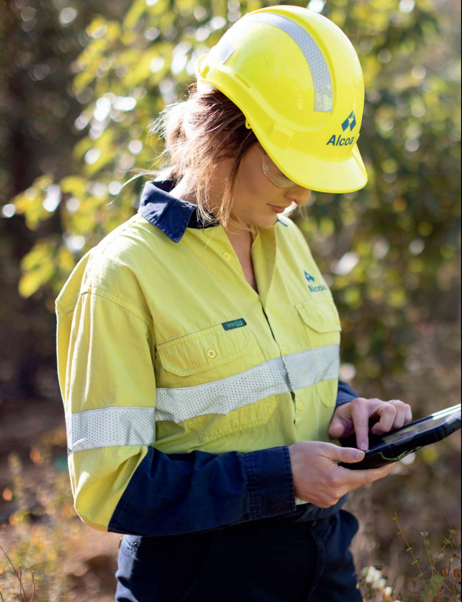
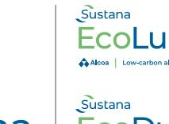
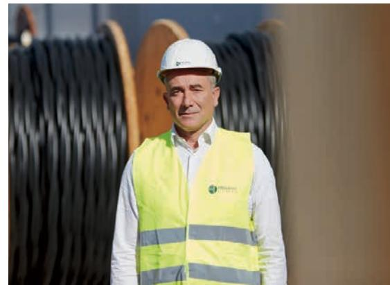
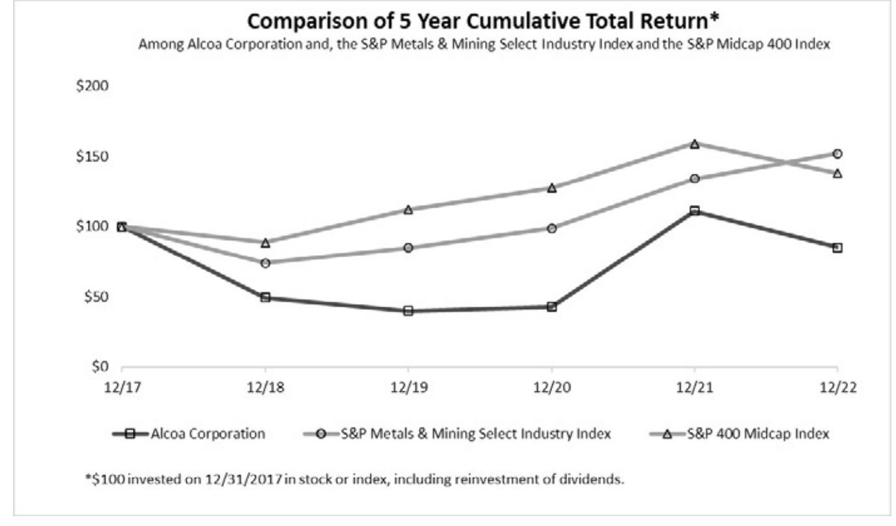

{0}------------------------------------------------

# **Ready and Resilient**

2022 Annual Report

86930.indd 1 3/14/23 11:33 AM

{1}------------------------------------------------

86930.indd 2 3/14/23 11:33 AM

{2}------------------------------------------------

# **What we believe**

Aluminum is a critical material for the world's economies, and we believe its importance will only increase as societies transition to sustainable solutions that demand light-weight, strong materials that can help reduce carbon emissions.

Alcoa is well positioned for the future with our continuing focus on our purpose, vision, and values, which enables our strength and resilience to navigate through market cycles.

86930.indd 3 3/14/23 11:33 AM

{3}------------------------------------------------

# Our Purpose:

To Turn Raw Potential into Real Progress

Our purpose informs every goal we set, decision we make, action we take, and strategy we implement. It supports our goal to unlock the true potential of our people, products, and processes to create value and move our Company and industry forward.

# Our Vision:

To Reinvent the Aluminum Industry for a Sustainable Future

Our vision inspires our work—it influences how we produce products, develop new processes, interact with suppliers, customers, and communities. This vision also helps inspire our work on a roadmap of breakthrough technologies that have the potential to differentiate Alcoa and decarbonize the upstream aluminum value chain.

# Our Values:

Act with Integrity Operate with Excellence Care for People Lead with Courage

Our values are clear and concise, setting the expectation for how we endeavor to operate around the globe, in every aspect of our business and in every market.

{4}------------------------------------------------

# Strategic Priorities

Three strategic priorities drive our company forward and enable long-term value today and in the future

# Reduce Complexity

Operating with a lean, cost-focused approach

Actively managing our portfolio of assets to drive profitability through all phases of the commodity cycle

# Drive Returns

Driving margin-focused growth via our differentiated, value-add products

Improving commercial capabilities, leveraging quality, technical excellence, and delivery performance

Investing in targeted growth opportunities

Championing environmental, social and governance processes across our operations

Creating value and maintaining a strong balance sheet

Developing breakthrough technologies that have the potential to decarbonize the aluminum value chain

{5}------------------------------------------------

# Letter to Stockholders

## **Dear Stockholders,**

The year 2022 was defined by volatility, both for Alcoa Corporation and the global commodity industry. The first half of the year saw historically high aluminum prices. But then global instability partly driven by the war in Ukraine and the resulting European energy crisis—upended markets in the second half of the year.

The year and its study in contrasts gave us another opportunity to demonstrate the strength and resiliency of our business.

Across Alcoa, we have worked diligently to build a stronger foundation, and our work has made us a more agile and resilient business for the various phases of the commodity cycle. We are focused on delivering value today while continuing to focus on tomorrow.

## Responding to short-term challenges

Issues stemming from the widespread global instability in 2022 shocked the aluminum market, but we acted swiftly. We reduced some production capacity—when and where conditions warranted. For example, to mitigate exorbitant energy costs, we curtailed one-third of our production capacity at our smelter in Lista, Norway and worked to sign a more competitive energy agreement for the future.

Similarly, we also reduced the output at our alumina refinery in San Ciprián, Spain, due to high costs of natural gas. We also safely completed the curtailment

Across Alcoa, we have worked diligently to build a stronger foundation, and our work has made us a more agile and resilient business for the various phases of the commodity cycle.

of the smelter there in January of 2022, per the terms of an agreement signed in December of 2021. Since the curtailment, we have obtained two new windbased power purchase agreements that can supply up to three-fourths of the electricity at the smelter's full capacity, assuming final permitting needed for construction. A progressive restart of the site is now slated to begin in January of 2024.

We also advanced strategic restarts of aluminum smelting capacity that we expect will bring value to our business, including Alumar in Brazil and Portland Aluminium, two smelter joint ventures we operate as majority owners.

Our decisive actions throughout the year helped our Company effectively mitigate the effect of rapidly changing market conditions, while still delivering against our strategic priorities.

Favorable market dynamics in the first two quarters, including higher aluminum and alumina pricing, yielded \$1 billion in net income despite high raw materials, energy, and production costs. In the third and fourth quarters, we saw lower sales prices in alumina and aluminum and incurred restructuring related charges related to noncash pension settlement charges, contributing to a full year net loss of \$123 million.

Despite these challenges, we continue to be well-positioned with a strong balance sheet, ending the year with \$1.4 billion in cash and net debt of \$444 million and proportional adjusted net debt of \$1.1 billion, as a result of our strategic, financial, and operational actions over the past several years that have strengthened the Company.

In 2022, we returned \$572 million in capital to our stockholders through share repurchases and our quarterly cash dividend program.

## Supporting our long-term vision

While we addressed short-term challenges, we continued to work on our long-term vision to reinvent the aluminum industry for a sustainable future.

{6}------------------------------------------------

We saw impressive year-over-year growth in sales volume from our Sustana™ line of low-carbon products, further underscoring the demand from customers who seek solutions to lower the carbon footprint in their supply chains. While still a small percentage of our overall volume, our sales of Sustana's low-carbon EcoLum™ metal grew more than four times the previous year, driven mostly by demand from the European market.

Importantly, we also made progress on our roadmap of breakthrough technologies. This includes our Refinery of the Future initiative, which seeks to adapt technologies used in other industries to alumina refining. The R&D work has the potential to further decarbonize the refining process, and the Australian Renewable Energy Agency has provided grants to assist with this work.

Meanwhile, our ELYSIS™ partnership continues to progress toward commercializing a carbon-free smelting process, first developed at Alcoa's Technical Center. The process eliminates direct greenhouse gas emissions from the traditional smelting process. Quantities of the ELYSIS metal, produced at R&D scale, have been used by top-tier brands including Audi and Apple.

ELYSIS and other technologies align with our ambition to reach net zero greenhouse gas emissions by 2050, supported by our mid-range climate goals. Today, 86 percent of our global smelting portfolio is powered by renewable energy.

For environmental, sustainable and governance criteria, Alcoa was again named a top tier aluminum industry producer by the Dow Jones Sustainability Indices, and we certified more of our locations in 2022 to the Aluminium Stewardship Initiative, the industry's most comprehensive, third-party system to verify responsible production.

#### Looking to the future

We remain optimistic about aluminum's long-term fundamentals. Our metal is a key component to modern life, and the structural factors in the aluminum market remain positive.

Aluminum is important to the ongoing transition to build electric vehicles and renewable energy infrastructure, helping society move toward a low-carbon future.

As we look forward to 2023 and beyond, our intent is to stay true to our values, deliver operational and commercial excellence with rigorous cost management and drive forward next-generation technologies via our technology roadmap.

We are honored to be part of a team of more than 13,000 employees working to deliver on our corporate purpose to turn raw potential into real progress.

Sincerely,

**Steven W. Williams** chairman of the board

**Roy C. Harvey** president and chief executive officer

{7}------------------------------------------------

# 2022 Highlights

All data for year ending December 31, 2022

**Employees:** ~13,100 **Sales Revenue:** \$12.45 Billion **Cash Balance:** \$1.4 Billion

- First quartile of bauxite cost curve
- World's second largest bauxite miner, using responsible methods

- First quartile of alumina cost curve
- Offering low-carbon alumina via our EcoSource™ brand, which can be sourced globally from our premier refining system

# ALUMINUM

- Second quartile of aluminum cost curve
- 86 percent of smelting portfolio powered by renewable energy
- Offering EcoLum™ low-carbon aluminum from hydro-powered facilities, and EcoDura™ aluminum with at least 50 percent recycled content

42.1 Million Dry Metric Tons

> ALUMINA PRODUCTION

12.5 Million Metric Tons

PRIMARY ALUMINUM PRODUCTION

> 2.0 Million Metric Tons

BAUXITE SHIPMENTS

43.0 Million Dry Metric Tons

**8% 92%**

ALUMINA SHIPMENTS **70%**

13.1 Million Metric Tons **30%**

ALUMINUM SHIPMENTS

2.6 Million Metric Tons

{8}------------------------------------------------

{9}------------------------------------------------

# Our Business Model

Alcoa is an integrated, upstream aluminum company, mining bauxite, refining alumina, and smelting and casting aluminum. Through a relentless focus on our strategic priorities, we have developed greater resilience, and we consistently strive to deliver through market cycles. While we focus on today, we believe we are well positioned for the future, when we expect aluminum will play an even larger role in a world that is working to decarbonize.

Five key attributes:

- We are driven by our values and focused on our environmental, social and governance (ESG) metrics.
- We are a pure play aluminum company with assets across the upstream value chain.
- Our global scope, with operational assets on six continents, positions us well to serve major markets.
- We strive for strong operational performance and a culture focused on continuous improvement.
- We prioritize disciplined capital allocation and financial management.

Alcoa's legacy dates to the invention in 1886 of the commercial process that allowed aluminum to be produced in an economical way, transforming society. Through innovation and hard work, we launched an industry. Aluminum has helped transform the way we live, build, move, and fly. That innovative spirit continues to inspire us today, and in 2022 we delivered solutions for our customers across our business segments:

#### Alcoa is one of the largest bauxite miners in the world, and we have earned global recognition for our comprehensive approach to responsible mining practices. BAUXITE

We successfully completed the installation of press filtration technology for bauxite residue at our Poços de Caldas refinery in Brazil, which is expected to reduce carbon emissions and lower water and energy use.

## ALUMINA

Our world-class alumina refining portfolio has the industry's lowest average carbon footprint and includes our low-carbon alumina brand, EcoSource™. We operate the world's largest third-party alumina business, with six refineries on three continents.

We received grant approvals from the Australian government to pilot two carbon emission-reduction technologies, supporting our Refinery of the Future initiative. The funding will be used to test the application of electric calcination and mechanical vapor recompression to alumina refining.

# ALUMINUM

Alcoa offers a comprehensive portfolio of aluminum products, including value-add castings, innovative patented alloys, and our Sustana™ line of products, including primary aluminum produced with low-carbon processes, including renewable energy, and aluminum that contains at least 50 percent recycled content. We also market and sell aluminum certified by the Aluminum Stewardship Initiative, the aluminum industry's most comprehensive system to verify responsible production.

{10}------------------------------------------------

# **Where We Operate** (as of December 31, 2022)

#### **Alcoa Locations**

| Willowdale, Australia       |  |
|-----------------------------|--|
| Huntly, Australia           |  |
| Pinjarra, Australia         |  |
| Wagerup, Australia          |  |
| Kwinana, Australia          |  |
| Portland, Australia         |  |
| Poços de Caldas, Brazil     |  |
| São Luís (Alumar), Brazil   |  |
| Juruti, Brazil              |  |
| Baie-Comeau, Canada         |  |
| Deschambault, Canada        |  |
| Bécancour, Canada           |  |
| Fjarðaál, Iceland           |  |
| Lista, Norway               |  |
| Mosjøen, Norway             |  |
| San Ciprián, Spain          |  |
| Massena, United States      |  |
| Warrick, United States      |  |
| Lake Charles, United States |  |
| Intalco, United States*     |  |

## **Joint Ventures, Non-Operating Partner**

| Estreito, Brazil                                   |  |
|----------------------------------------------------|--|
| Barra Grande, Brazil                               |  |
| Machadinho, Brazil                                 |  |
| Serra do Facão, Brazil                             |  |
| Manicouagan, Canada                                |  |
| Compagnie des Bauxites de Guinée, (CBG), Guinea |  |
| Ma'aden, Saudi Arabia                              |  |
| Strathcona, Canada                                 |  |
|                                                    |  |

*Aluminum smelting and casting capacity is fully curtailed.

| Bauxite |  |
|---------|--|
|         |  |

- Alumina
- Aluminum Smelting
- Aluminum Casting
- Energy
- Calcined Coke

{11}------------------------------------------------

Our employees are carrying forward our company's legacy of innovation, working to provide the materials the world needs today and in the future. Our inclusive and values-based culture is the perfect environment for Alcoans to shape our world and transform ideas into impact for the benefit of our business and the communities where we operate.

# **Advancing Equity, Inclusion and Diversity**

- We are working to create a diverse and welcoming workplace, through efforts to increase gender diversity in a historically male-dominated industry and improve diversity of underrepresented groups related to ethnicity and disability.
- We are honored to receive recognition by several organizations, including Bloomberg's Gender-Equality Index, a listing awarded to fewer than 450 global companies.

## **DEVELOPING A FLEXIBILITY FIRST WORKPLACE PROGRAM**

- In response to the needs of our workforce and an evolving business, we created a flexible work program, offering opportunities to work remotely or in traditional office environments.
- We strive to promote work-life balance, respecting the roles that our employees also play as parents, spouses, partners, friends and active members in their communities.

# **WORKING WITH OUR COMMUNITIES**

- We continued to implement a social performance management system across our operations. It includes a host of policies and standards to support effective engagement with our communities, including managing risks and maintaining our social license to operate.
- To foster stronger and more inclusive communities, Alcoa of Australia launched its second Reconciliation Action Plan that outlines broadened engagement with the indigenous communities where we operate.

{12}------------------------------------------------

We are building on our history of innovation and operational expertise, working to create more efficient solutions that solve customer needs. We remain focused on consistent improvement today while simultaneously focusing on technologies for tomorrow.

## **SOME 2022 HIGHLIGHTS:**

- Our Mosjøen plant in Norway deployed an induction recycling furnace, powered by renewable hydropower energy. The furnace is expected to avoid as much as 4,440 metric tons of carbon dioxide emissions per year by not using a traditional, natural gas furnace.
- Apple announced that aluminum produced by our ELYSIS™ partnership's zero-carbon aluminum smelting process, first developed by Alcoa, will be used in the iPhone SE. ELYSIS is working to ramp up this breakthrough technology, which eliminates all greenhouse gas emissions from the traditional smelting process.

## **New Brazilian processing facility conserves water and energy use**

In November of 2022, Alcoa completed the installation of press filtration technology for bauxite residue at the Poços de Caldas refinery in Brazil. The technology is a first for Alcoa in Brazil, allowing the facility to use less water to process the residue, as well as less land to store it.

Two refineries in Western Australia have already adopted this technology, which has allowed an annual reduction in freshwater use by as much as a collective 2.2 gigalitres (581 million gallons), the equivalent of 800 Olympic-sized swimming pools.

{13}------------------------------------------------

# Our Products

A world focusing on decarbonization requires solutions to reduce greenhouse gas emissions to meet the expectations of businesses, governments, consumers, and investors. Aluminum, with its light weight, strength and recyclability is fundamental to modern life, and Alcoa offers an industry-leading portfolio of products to meet these needs.

## **IN 2022, ALCOA:**

- Continued to grow the product margins and volume of our Sustana™ line, which is our portfolio of alumina and aluminum products made with lower greenhouse gas emissions. Annual sales of Alcoa's EcoLum™ aluminum grew more than four times over the prior year.

- Pushed the boundaries of alloy innovation with the introduction of A210 ExtruStrong™ alloy, which can be used in highly-demanding structural and lightweight applications in the automotive and construction industries. Additionally, our C611 EZCast™ high-performance alloy, which does not require a dedicated heat treatment, continued to receive recognition for its application in megacasting, an important factor in electric vehicle construction where large components of a vehicle are diecast as one piece, saving time and energy.

# **Alcoa's EcoLum**™ **helps Hellenic Cables develop renewable energy**

Alcoa supplies EcoLum to Hellenic Cables, one of the largest cable producers in Europe with key markets in renewable energy transmission and distribution.

*"Hellenic Cables is committed not only to reducing its own operational emissions, but to also drive decarbonization activities across the entire business' areas of influence. Alcoa is a key enabler that contributes efficiently in this direction. We prioritize the urgency of deep and immediate mitigation actions, hence EcoLum minimizes our environmental impacts and enhances the value of our products."*

- —**ALEXIS ALEXIOU** CEO of Cenergy Holdings
*(Cenergy Holdings is the parent company of Hellenic Cables.)*

{14}------------------------------------------------

# **UNITED STATES SECURITIES AND EXCHANGE COMMISSION**

**WASHINGTON, D.C. 20549**

# **FORM 10-K**

**(Mark One)**

☒ **ANNUAL REPORT PURSUANT TO SECTION 13 OR 15(d) OF THE SECURITIES EXCHANGE ACT OF 1934**

**For the fiscal year ended December 31, 2022**

**OR**

☐ **TRANSITION REPORT PURSUANT TO SECTION 13 OR 15(d) OF THE SECURITIES EXCHANGE ACT OF 1934**

**For the transition period from _______ to _______**

**Commission File Number 1-37816**

# **ALCOA CORPORATION**

**(Exact name of registrant as specified in its charter)**

**Delaware (State or other jurisdiction of incorporation or organization)**

**201 Isabella Street, Suite 500, Pittsburgh, Pennsylvania (Address of principal executive offices)**

**81-1789115 (I.R.S. Employer Identification No.)**

> **15212-5858 (Zip Code)**

**(Registrant's telephone number, including area code): 412-315-2900**

Securities registered pursuant to Section 12(b) of the Act:

| Title of each class                      | Trading Symbol(s) | Name of each exchange on which registered |
|------------------------------------------|-------------------|-------------------------------------------|
| Common Stock, par value \$0.01 per share | AA                | New York Stock Exchange                   |

Securities registered pursuant to Section 12(g) of the Act: **None**

Indicate by check mark if the registrant is a well-known seasoned issuer, as defined in Rule 405 of the Securities Act. Yes ☑ No ☐

Indicate by check mark if the registrant is not required to file reports pursuant to Section 13 or Section 15(d) of the Act. Yes ☐ No ☑

Indicate by check mark whether the registrant (1) has filed all reports required to be filed by Section 13 or 15(d) of the Securities Exchange Act of 1934 during the preceding 12 months (or for such shorter period that the registrant was required to file such reports), and (2) has been subject to such filing requirements for the past 90 days. Yes ☑ No ☐

Indicate by check mark whether the registrant has submitted electronically every Interactive Data File required to be submitted pursuant to Rule 405 of Regulation S-T (§ 232.405 of this chapter) during the preceding 12 months (or for such shorter period that the registrant was required to submit such files). Yes ☑ No ☐

Indicate by check mark whether the registrant is a large accelerated filer, an accelerated filer, a non-accelerated filer, a smaller reporting company, or an emerging growth company. See the definitions of "large accelerated filer," "accelerated filer," "smaller reporting company," and "emerging growth company" in Rule 12b-2 of the Exchange Act.

| Large accelerated filer | ☒ | Accelerated filer         | ☐ |
|-------------------------|---|---------------------------|---|
| Non-accelerated filer   | ☐ | Smaller reporting company | ☐ |
| Emerging growth company | ☐ |                           |   |

If an emerging growth company, indicate by check mark if the registrant has elected not to use the extended transition period for complying with any new or revised financial accounting standards provided pursuant to Section 13(a) of the Exchange Act. ☐

Indicate by check mark whether the registrant has filed a report on and attestation to its management's assessment of the effectiveness of its internal control over financial reporting under Section 404(b) of the Sarbanes-Oxley Act (15 U.S.C. 7262(b)) by the registered public accounting firm that prepared or issued its audit report. ☑

If securities are registered pursuant to Section 12(b) of the Act, indicate by check mark whether the financial statements of the registrant included in the filing reflect the correction of an error to previously issued financial statements. ☐

Indicate by check mark whether any of those error corrections are restatements that required a recovery analysis of incentive-based compensation received by any of the registrant's executive officers during the relevant recovery period pursuant to §240.10D-1(b). ☐

Indicate by check mark whether the registrant is a shell company (as defined in Rule 12b-2 of the Act). Yes ☐ No ☑

The aggregate market value of the registrant's voting stock held by non-affiliates at June 30, 2022 was approximately \$8.2 billion, based on the closing price per share of Common Stock on June 30, 2022 of \$45.58 as reported on the New York Stock Exchange.

As of February 17, 2023, there were 178,349,345 shares of the registrant's common stock, par value \$0.01 per share, outstanding.

DOCUMENTS INCORPORATED BY REFERENCE

Part III of this Form 10-K incorporates by reference certain information from the registrant's Definitive Proxy Statement for its 2023 Annual Meeting of Stockholders to be filed pursuant to Regulation 14A.

{15}------------------------------------------------

#### **TABLE OF CONTENTS**

| Part I   |                                                                                                              |    |
|----------|--------------------------------------------------------------------------------------------------------------|----|
| Item 1.  | Business                                                                                                     | 1  |
|          | Item 1A. Risk Factors                                                                                        | 14 |
|          | Item 1B. Unresolved Staff Comments                                                                           | 28 |
| Item 2.  | Properties                                                                                                   | 28 |
| Item 3.  | Legal Proceedings                                                                                            | 40 |
| Item 4.  | Mine Safety Disclosures                                                                                      | 40 |
| Part II  |                                                                                                              |    |
| Item 5.  | Market for Registrant's Common Equity, Related Stockholder Matters and Issuer Purchases of Equity Securities | 41 |
| Item 6.  | [RESERVED]                                                                                                   | 42 |
| Item 7.  | Management's Discussion and Analysis of Financial Condition and Results of Operations                        | 43 |
|          | Item 7A. Quantitative and Qualitative Disclosures About Market Risk                                          | 64 |
| Item 8.  | Financial Statements and Supplementary Data                                                                  | 65 |
| Item 9.  | Changes in and Disagreements With Accountants on Accounting and Financial Disclosure  123                    |    |
|          | Item 9A. Controls and Procedures 123                                                                         |    |
|          | Item 9B. Other Information 123                                                                               |    |
|          | Item 9C. Disclosure Regarding Foreign Jurisdictions that Prevent Inspections  123                            |    |
| Part III |                                                                                                              |    |
| Item 10. | Directors, Executive Officers and Corporate Governance  123                                                  |    |
| Item 11. | Executive Compensation  123                                                                                  |    |
| Item 12. | Security Ownership of Certain Beneficial Owners and Management and Related Stockholder Matters  124          |    |
| Item 13. | Certain Relationships and Related Transactions, and Director Independence 124                                |    |
| Item 14. | Principal Accountant Fees and Services 124                                                                   |    |
| Part IV  |                                                                                                              |    |
| Item 15. | Exhibit and Financial Statement Schedules  125                                                               |    |
| Item 16. | Form 10-K Summary 128                                                                                        |    |
|          | Signatures  129                                                                                              |    |
|          |                                                                                                              |    |

#### **Note on Incorporation by Reference**

In this Form 10-K, selected items of information and data are incorporated by reference to portions of Alcoa Corporation's Definitive Proxy Statement for its 2023 Annual Meeting of Stockholders (Proxy Statement), which will be filed with the Securities and Exchange Commission within 120 days after the end of Alcoa Corporation's fiscal year ended December 31, 2022. Unless otherwise provided herein, any reference in this Form 10-K to disclosures in the Proxy Statement shall constitute incorporation by reference of only that specific disclosure into this Form 10-K.

#### **Page**

{16}------------------------------------------------

#### **Item 1. Business.**

#### (dollars in millions, except per-share amounts, average realized prices, and average cost amounts)

#### **The Company**

Alcoa Corporation, a Delaware corporation (the Company), is active in all aspects of the upstream aluminum industry with bauxite mining, alumina refining, and aluminum smelting and casting. The Company has direct and indirect ownership of 27 locations across nine countries on six continents.

The Company's operations in 2022 comprised three reportable business segments: Bauxite, Alumina, and Aluminum. The Bauxite and Alumina segments primarily consist of a series of affiliated operating entities held in Alcoa World Alumina and Chemicals, a global, unincorporated joint venture between Alcoa and Alumina Limited (described below). The Aluminum segment consists of the Company's aluminum smelting and casting operations along with most of the Company's energy production assets. Beginning in January 2023, the Company changed its operating segments, by combining the Bauxite and Alumina segments, and will report its financial results in the following two segments: (i) Alumina and (ii) Aluminum.

Aluminum, as an element, is abundant in the earth's crust, but a multi-step process is required to make finished metal. Aluminum metal is produced by refining alumina oxide from bauxite into alumina, which is then smelted into aluminum and can be cast into many shapes and forms.

Alcoa smelts and casts aluminum in various shapes and sizes for global customers, including developing and creating various alloy combinations for specific applications.

Aluminum metal is a commodity traded on the London Metal Exchange (LME) and priced daily. Additionally, alumina is subject to market pricing through the Alumina Price Index (API), which is calculated by the Company based on the weighted average of a prior month's daily spot prices published by the following three indices: CRU Metallurgical Grade Alumina Price, Platts Metals Daily Alumina PAX Price, and FastMarkets Metal Bulletin Non-Ferrous Metals Alumina Index. As a result, the prices of both aluminum and alumina are subject to significant volatility and, therefore, influence the operating results of Alcoa.

Alcoa Corporation became an independent, publicly traded company on November 1, 2016, following its separation (the Separation Transaction) from its former parent company, Alcoa Inc. References herein to "ParentCo" refer to Alcoa Inc. and its consolidated subsidiaries through October 31, 2016, at which time it was renamed Arconic Inc. (Arconic) and since has been subsequently renamed Howmet Aerospace Inc.

#### **Business Strategy**

Alcoa has three strategic priorities: reduce complexity, drive returns and advance sustainably. The Company strives to operate with lean overhead and manage its portfolio of assets with the goal of profitability through all market cycles. Alcoa aims to drive marginfocused growth and innovate and create low-carbon solutions. Alcoa works to be a responsible and reliable producer, which includes engagement with communities in which it operates to bring shared value.

Today, Alcoa has a comprehensive suite of SustanaTM brand products, which includes EcoDuraTM aluminum, EcoLumTM aluminum, and EcoSourceTM alumina.

Further, Alcoa has active research and development projects that have the potential to drive value by reducing costs, improving efficiency, and reducing greenhouse gas emissions in both alumina refining and aluminum smelting. The roadmap of technologies include:

- The ELYSISTM joint venture uses an aluminum smelting technology that eliminates all direct greenhouse gas emissions from the traditional smelting process, instead emitting pure oxygen as a byproduct. The research and development program is being ramped up to commercial scale and commercial-grade research and development scale quantities of the metal have been used by top-tier brands including Apple Inc. and Audi AG.
- The Refinery of the Future initiative aims to achieve alumina refining with no direct greenhouse gas emissions through adapting various processes and new technologies under development for alumina refining, such as mechanical vapor recompression (MVR) and electric calcination.
- The ASTRAEATM process is a proprietary technology under development that can purify post-consumer aluminum scrap, regardless of alloy combination, and beneficiate it up to high purity levels that exceed what is produced at most primary aluminum smelters operating today, permitting use in high tolerance applications, such as aerospace.

Alcoa has received annual recognition from S&P Dow Jones Sustainability Indices and has also earned certifications from the Aluminium Stewardship Initiative (ASI), a comprehensive third-party program to verify responsible production in the aluminum industry. Alcoa has certified 17 operating sites and can market globally ASI-certified bauxite, alumina, and aluminum.

{17}------------------------------------------------

In 2019, the Company announced a five year strategic portfolio review of smelting and refining capacity to improve cost positioning, including curtailment, closure or divestiture. Through 2021, Alcoa reached approximately 75 and 58 percent of its target to improve, curtail, close, or divest 1.5 and 4 million metric tons of smelting and refining capacity, respectively. While no actions were taken in 2022 related to these targets, the Company took actions in response to market conditions, and the strategic portfolio review is continuing.

The Company has the goal of being the lowest emitter of carbon dioxide among all global aluminum companies, per ton of emissions in both smelting and refining, and aims to move its aluminum asset portfolio to a first quartile cost position relative to other aluminum producers upon completion of our portfolio review. In 2022, Alcoa exceeded its target of 85 percent of its smelting portfolio being powered by renewable energy, attaining 86 percent. Renewable energy is derived from natural processes that are replenished constantly, such as sunlight, wind, and hydropower.

See Part II Item 7 of this Form 10-K in Management's Discussion and Analysis of Financial Condition and Results of Operations under caption Business Update.

### **Joint Ventures**

#### **Alcoa World Alumina and Chemicals (AWAC)**

AWAC is an unincorporated global joint venture between Alcoa Corporation and Alumina Limited, a company incorporated under the laws of the Commonwealth of Australia and listed on the Australian Securities Exchange. AWAC consists of a number of affiliated entities that own, operate, or have an interest in bauxite mines and alumina refineries, as well as an aluminum smelter, in seven countries. Alcoa Corporation owns 60% and Alumina Limited owns 40% of these entities, directly or indirectly, with such entities being consolidated by Alcoa Corporation for financial reporting purposes. The scope of AWAC generally includes the mining of bauxite and other aluminous ores; the refining, production, and sale of smelter grade and non-metallurgical alumina; and the production of certain primary aluminum products.

Alcoa provides the operating management for AWAC, which is subject to direction provided by the Strategic Council of AWAC. The Strategic Council consists of five members, three of whom are appointed by Alcoa (of which one is the Chair) and two of whom are appointed by Alumina Limited (of which one is the Deputy Chair). Matters are decided by a majority vote with certain matters requiring approval by at least 80% of the members, including: changes to the scope of AWAC; changes in the dividend policy; equity calls in aggregate greater than \$1,000 in any year; sales of all or a majority of the AWAC assets; loans from AWAC companies to Alcoa or Alumina Limited; certain acquisitions, divestitures, expansions, curtailments or closures; certain related-party transactions; financial derivatives, hedges or swap transactions; a decision by AWAC entities to file for insolvency; and changes to pricing formula in certain offtake agreements which may be entered into between AWAC entities and Alcoa or Alumina Limited.

#### *AWAC Operations*

AWAC entities' assets include the following interests:

- 100% of the bauxite mining, alumina refining, and aluminum smelting operations of Alcoa's affiliate, Alcoa of Australia Limited (AofA);
- 100% of the Juruti bauxite deposit and mine in Brazil;
- 45% interest in Halco (Mining) Inc., a bauxite consortium that owns a 51% interest in Compagnie des Bauxites de Guinée (CBG), a bauxite mine in Guinea;
- 9.62% interest in the bauxite mining operations in Brazil of Mineração Rio Do Norte (MRN), a Brazilian company, until the sale of its interest in April 2022;
- 39.96% interest in the São Luís refinery in Brazil;
- 55% interest in the Portland, Australia smelter that AWAC manages on behalf of the joint venture partners;
- 25.1% interest in the mine and refinery in Ras Al Khair, Saudi Arabia;
- 100% of the refinery and alumina-based chemicals assets at San Ciprián, Spain;
- 100% of Alcoa Steamship Company LLC, a company that procures ocean freight and commercial shipping services for Alcoa in the ordinary course of business;
- 100% of the refinery assets at the closed facility in Point Comfort, Texas, United States; and,
- 100% interest in various assets formerly used for mining and refining in the Republic of Suriname (Suriname).

#### *Exclusivity*

Under the terms of their joint venture agreements, Alcoa and Alumina Limited have agreed that, subject to certain exceptions, AWAC is their exclusive vehicle for their investments, operations or participation in the bauxite and alumina business, and they will not compete with AWAC in those businesses. In the event of a change of control of either Alcoa or Alumina Limited, this exclusivity and non-compete restriction will terminate, and the partners will then have opportunities to unilaterally pursue bauxite or alumina projects outside of or within AWAC, subject to certain conditions provided in the Amended and Restated Charter of the Strategic Council.

{18}------------------------------------------------

## *Equity Calls*

The cash flow of AWAC and borrowings are the preferred sources of funding for the needs of AWAC. An equity call can be made on 30 days' notice, subject to certain limitations, in the event the aggregate annual capital budget of AWAC requires an equity contribution from Alcoa and Alumina Limited.

#### *Dividend Policy*

AWAC will generally be required to distribute at least 50% of the prior calendar quarter's net income of each AWAC entity, and certain AWAC entities will also be required to pay a distribution every three months equal to the amount of available cash above specified thresholds and subject to the forecast cash needs of the AWAC entity.

#### *Leveraging Policy*

Debt of AWAC is subject to a limit of 30% of total capital (defined as the sum of debt (net of cash) plus any minority interest plus shareholder equity). The AWAC joint venture has raised a limited amount of debt to fund growth projects as permitted under Alcoa's revolving credit line and in accordance with the joint venture partnership agreements.

#### **Saudi Arabia Joint Venture**

In December 2009, Alcoa entered into a joint venture with the Saudi Arabian Mining Company (Ma'aden), which was formed by the government of Saudi Arabia to develop its mineral resources and create a fully integrated aluminum complex in Saudi Arabia. Ma'aden is listed on the Saudi Stock Exchange (Tadawul). The joint venture complex includes a bauxite mine with estimated capacity of 5 million dry metric tons per year; an alumina refinery with a capacity of 1.8 million metric tons per year (mtpy); and an aluminum smelter with a capacity of 780,000 mtpy.

The joint venture is currently comprised of two entities: the Ma'aden Bauxite and Alumina Company (MBAC) and the Ma'aden Aluminium Company (MAC). Ma'aden owns a 74.9% interest in the MBAC and MAC joint venture. Alcoa owns a 25.1% interest in MAC, which holds the smelter; AWAC holds a 25.1% interest in MBAC, which holds the mine and refinery. The refinery and smelter are located within the Ras Al Khair industrial zone on the east coast of Saudi Arabia.

In accordance with the June 2019 amended joint venture agreement, Ma'aden's put option and Alcoa Corporation's call option, relating to additional interests in the joint venture, were exercisable for a period of six months after October 1, 2021. On March 31, 2022, Ma'aden's and Alcoa's put and call options, respectively, expired with neither party exercising their options.

The amended joint venture agreement defined October 1, 2021 as the date after which Alcoa is permitted to sell all of its shares in both MBAC and MAC collectively, for which Ma'aden has a right of first refusal. Prior to this date, Ma'aden and Alcoa Corporation could not sell, transfer, or otherwise dispose of, pledge, or encumber any interests in the joint venture. Under the amended joint venture agreement, upon the occurrence of an unremedied event of default by Alcoa, Ma'aden may purchase, or, upon the occurrence of an unremedied event of default by Ma'aden, Alcoa may sell, its interest in the joint venture for consideration that varies depending on the time of the default.

#### **ELYSIS**

ELYSIS Limited Partnership is a joint venture between wholly-owned subsidiaries of Alcoa (48.235%) and Rio Tinto Alcan Inc. (Rio Tinto) (48.235%), respectively, and Investissement Québec (3.53%), a company wholly-owned by the Government of Québec, Canada. The purpose of the ELYSIS joint venture is to advance larger scale development and commercialization of its patentprotected technology that produces oxygen and eliminates all direct greenhouse gas emissions from the traditional aluminum smelting process. Alcoa invented the inert anode technology for the aluminum smelting process that serves as the basis for the ELYSIS joint venture. Batches of aluminum produced by ELYSIS have been sold for use by such companies as Apple Inc. and Audi AG, as the joint venture continues working toward an industrial scale with a technology package planned for sale beginning in 2024.

#### **Others**

The Company is party to several other joint ventures and consortia. See additional details within each business segment discussion below.

The Aluminerie de Bécancour Inc. (ABI) smelter is a joint venture between Alcoa and Rio Tinto located in Bécancour, Québec. Alcoa owns 74.95% of the joint venture through the equity investment in Pechiney Reynolds Quebec, Inc., which owns a 50.1% share of the smelter, and two wholly-owned Canadian subsidiaries, which own 49.9% of the smelter. Rio Tinto owns the remaining 25.05% interest in the joint venture.

{19}------------------------------------------------

CBG is a joint venture between Boké Investment Company (51%) and the Government of Guinea (49%) for the operation of a bauxite mine in the Boké region of Guinea. Boké Investment Company is owned 100% by Halco (Mining) Inc.; AWA LLC holds a 45% interest in Halco. AWA LLC is part of the AWAC group of companies and is ultimately owned 60% by Alcoa and 40% by Alumina Limited.

Until the sale of Alcoa's interest in April 2022, MRN was a joint venture between Alcoa Alumínio (8.58%), AWA Brasil (AWAB) (4.62%), and AWA LLC (5%), each a subsidiary of Alcoa, and affiliates of Rio Tinto (12%), Companhia Brasileira de Alumínio (10%), Vale S.A. (Vale) (40%), South32 Limited (South32) (14.8%), and Norsk Hydro ASA (5%) for the operation of a bauxite mine in Porto Trombetas in the state of Pará in Brazil. AWAB and AWA LLC are part of the AWAC group of companies and are ultimately owned 60% by Alcoa and 40% by Alumina Limited.

On April 30, 2022, Alcoa completed the sale of its investment in MRN for proceeds of \$10. An additional \$30 in cash could be paid to the Company in the future if certain post-closing conditions related to future MRN mine development are satisfied. Related to this transaction, the Company recorded an asset impairment of \$58 in the first quarter of 2022 in Restructuring and other charges, net on the Statement of Consolidated Operations. In addition, the Company entered into several bauxite offtake agreements with South32 Minerals S.A. to provide bauxite supply for existing long-term supply contracts.

Alumar is an unincorporated joint venture for the operation of a refinery, smelter, and casthouse in Brazil. The refinery is owned by AWAB (39.96%), Rio Tinto (10%), Alcoa Alumínio (14.04%), and South32 (36%). AWAB is part of the AWAC group of companies and is ultimately owned 60% by Alcoa and 40% by Alumina Limited. With respect to Rio Tinto and South32, the named company or an affiliate thereof holds the interest. The smelter and casthouse are owned by Alcoa Alumínio (60%) and South32 (40%).

Strathcona calciner is a joint venture between affiliates of Alcoa and Rio Tinto. Calcined coke is used as a raw material in aluminum smelting. The calciner is owned by Alcoa (39%) and Rio Tinto (61%); Alcoa's capacity is currently idled in connection with the curtailment of the Intalco aluminum smelter.

## *Hydropower*

Machadinho Hydro Power Plant (HPP) is a consortium located on the Pelotas River in southern Brazil in which the Company has a 25.7% ownership interest through Alcoa Alumínio. The remaining ownership interests are held by unrelated third parties.

Barra Grande HPP is a joint venture located on the Pelotas River in southern Brazil in which the Company has a 42.2% ownership interest through Alcoa Alumínio. The remaining ownership interests are held by unrelated third parties.

Estreito HPP is a consortium between Alcoa Alumínio, through Estreito Energia S.A. (25.5%) and unrelated third parties located on the Tocantins River, northern Brazil.

Serra do Facão HPP is a joint venture between Alcoa Alumínio (35%) and unrelated third parties located on the Sao Marcos River, central Brazil.

Manicouagan Power Limited Partnership (Manicouagan) is a joint venture between affiliates of Alcoa and Hydro-Québec. Manicouagan owns and operates the 335 megawatt McCormick hydroelectric project, which is located on the Manicouagan River in the Province of Québec, Canada. Alcoa owns 40% of the joint venture.

#### **Bauxite**

This segment consists of the Company's global bauxite mining operations. Bauxite is the principal raw material used to produce alumina and contains various aluminum hydroxide minerals, the most important of which are gibbsite and boehmite. Bauxite is refined using the Bayer process, the principal industrial chemical process for refining bauxite to produce alumina, a compound of aluminum and oxygen that is the raw material used by smelters to produce aluminum metal. The Company obtains bauxite from its own resources, including those belonging to AWAC, as well as through long-term and short-term contracts and mining leases. Tons of bauxite are reported on a zero-moisture basis in millions of dry metric tons (mdmt) unless otherwise stated.

In 2022, Alcoa-operated mines supplied 92 percent of their volume to Alcoa refineries and sold the remaining 8 percent to third-party customers. Alcoa-operated mines produced 36.7 mdmt of bauxite and mines operated by partnerships in which Alcoa, including AWAC, has equity interests produced 5.4 mdmt of bauxite on a proportional equity basis, for a total Company bauxite production of 42.1 mdmt.

On April 30, 2022, Alcoa completed the sale of its investment in MRN. The Company entered into several bauxite offtake agreements with South32 to provide bauxite supply for existing long-term supply contracts.

Based on the terms of its bauxite supply contracts, the amount of bauxite AWAC purchases from its minority-owned joint ventures, MRN (until its sale in April 2022) and CBG, differ from its proportional equity in those mines. Therefore, in 2022, Alcoa had access to 43.0 mdmt of production from its portfolio of bauxite interests and bauxite offtake and supply agreements and sold 3.5 mdmt of bauxite to third parties; 39.5 mdmt of bauxite was delivered to Alcoa refineries.

{20}------------------------------------------------

Beginning in January 2023, financial information for the activities of the bauxite mines and the alumina refineries will be combined and the Company will report its financial results in the following two segments: (i) Alumina, and (ii) Aluminum. Accordingly, segment information for all prior periods presented will be updated to reflect the new segment structure in future Quarterly Report on Form 10-Q and Annual Report on Form 10-K filings.

Information regarding the Company's bauxite mining properties and bauxite mineral resources and reserves is included in Part 1 Item 2 of this Form 10-K.

## **Alumina**

This segment consists of the Company's worldwide refining system, which processes bauxite into alumina. Alcoa's alumina sales are made to customers globally and are typically priced by reference to published spot market prices. The Company produces smelter grade alumina and non-metallurgical grade alumina. The Company's largest customer for smelter grade alumina is its own aluminum smelters, which in 2022 accounted for approximately 30% of its total alumina shipments. A small portion of the alumina (nonmetallurgical grade) is sold to third-party customers who process it into industrial chemical products. This segment also includes AWAC's 25.1% share of MBAC.

The Company primarily sells alumina through fixed price spot sales and contracts containing two pricing components: (1) the API price basis and (2) a negotiated adjustment basis that takes into account various factors, including freight, quality, customer location, and market conditions. In 2022, approximately 96% of the Company's smelter grade alumina shipments to third parties were sold on a fixed price spot basis or adjusted API price basis.

Alcoa's alumina refining facilities and its worldwide alumina capacity stated in metric tons per year (mtpy) are shown in the following table:

| Country          | Facility          | Nameplate Capacity1 (000 mtpy) | Alcoa Corporation Consolidated Capacity1 (000 mtpy) |
|------------------|-------------------|--------------------------------------|-----------------------------------------------------------------|
| Australia (AofA) | Kwinana           | 2,190                                | 2,190                                                           |
|                  | Pinjarra          | 4,700                                | 4,700                                                           |
|                  | Wagerup           | 2,879                                | 2,879                                                           |
| Brazil           | Poços de Caldas   | 390                                  | 390                                                             |
|                  | São Luís (Alumar) | 3,860                                | 2,084                                                           |
| Spain            | San Ciprián       | 1,600                                | 1,600                                                           |
| TOTAL            |                   | 15,619                               | 13,843                                                          |

#### **Equity Interests:**

|              |                     |            | Alcoa        |
|--------------|---------------------|------------|--------------|
|              |                     |            | Corporation  |
|              |                     | Nameplate  | Consolidated |
|              |                     | Capacity1  | Capacity1    |
| Country      | Facility            | (000 mtpy) | (000 mtpy)   |
| Saudi Arabia | Ras Al Khair (MBAC) | 1,800      | 452          |

(1) Nameplate Capacity is an estimate based on design capacity and normal operating efficiencies and does not necessarily represent maximum possible production. Alcoa Corporation Consolidated Capacity represents our share of production from these facilities. For facilities wholly-owned by AWAC, Alcoa takes 100% of the production.

As of December 31, 2022, Alcoa had approximately 1,014,000 mtpy of idle capacity relative to total Alcoa consolidated capacity of 13,843,000 mtpy. Idle capacity of 800,000 mtpy at the San Ciprián refinery is due to the partial curtailment of the refinery in 2022 and 214,000 mtpy of idle capacity at the Poços de Caldas facility is a result of the previous full curtailment of the Poços de Caldas smelter.

In October 2019, the Company announced a five-year review of our production assets that includes a range of potential outcomes for these facilities to improve cost positioning, including curtailment, closure, or divestiture. The review includes 4 million metric tons of global refining capacity, of which 2,305,000 mtpy of capacity has been permanently closed since the announced review.

In 2022, production at the San Ciprián refinery was reduced to approximately 50 percent of the 1.6 million metric tons of annual capacity to mitigate the financial impact of high natural gas costs. The Company is actively reviewing the location's operating levels given the ongoing volatility in European energy markets.

{21}------------------------------------------------

In January 2023, the Company reduced production at the Kwinana (Australia) refinery by approximately 30 percent in response to a domestic natural gas shortage in Western Australia due to production challenges experienced by key gas suppliers.

#### **Aluminum**

This segment currently consists of (i) the Company's worldwide smelting and casthouse system and (ii) a portfolio of energy assets in Brazil, Canada, and the United States. The smelting operations produce molten primary aluminum, which is then formed by the casting operations into either common alloy ingot (e.g., t-bar, sow, standard ingot) or into value add ingot products (e.g., foundry, billet, rod, and slab). The energy assets supply power to external customers in Brazil and the United States, as well as internal customers in the Aluminum segment (Baie-Comeau (Canada) smelter and Warrick (Indiana) smelter) and, to a lesser extent, the Alumina segment (Brazilian refineries). This segment also includes Alcoa's 25.1% share of MAC, the smelting joint venture company in Saudi Arabia.

#### *Smelting and Casting Operations*

Contracts for primary aluminum vary widely in duration, from multi-year supply contracts to spot purchases. Pricing for primary aluminum products is typically comprised of three components: (i) the published LME aluminum price for commodity grade P1020 aluminum, (ii) the published regional premium applicable to the delivery locale, and (iii) a negotiated product premium that accounts for factors such as shape and alloy.

Alcoa's primary aluminum facilities and its global smelting capacity stated in metric tons per year (mtpy) are shown in the following table:

| Country       | Facility                 | Nameplate Capacity1 (000 mtpy) | Alcoa Corporation Consolidated Capacity1 (000 mtpy) |
|---------------|--------------------------|--------------------------------------|-----------------------------------------------------------------|
| Australia     | Portland                 | 358                                  | 197                                                             |
| Brazil        | Poços de Caldas2         | N/A                                  | N/A                                                             |
|               | São Luís (Alumar)        | 447                                  | 268                                                             |
| Canada        | Baie Comeau, Québec      | 314                                  | 314                                                             |
|               | Bécancour, Québec        | 413                                  | 350                                                             |
|               | Deschambault, Québec     | 287                                  | 287                                                             |
| Iceland       | Fjarðaál                 | 351                                  | 351                                                             |
| Norway        | Lista                    | 95                                   | 95                                                              |
|               | Mosjøen                  | 200                                  | 200                                                             |
| Spain         | San Ciprián              | 228                                  | 228                                                             |
| United States | Massena West, NY         | 130                                  | 130                                                             |
|               | Ferndale, WA (Intalco)   | 279                                  | 279                                                             |
|               | Evansville, IN (Warrick) | 269                                  | 269                                                             |
| TOTAL         |                          | 3,371                                | 2,968                                                           |

#### **Equity Interests:**

|              |                    |            | Alcoa        |
|--------------|--------------------|------------|--------------|
|              |                    |            | Corporation  |
|              |                    | Nameplate  | Consolidated |
|              |                    | Capacity1  | Capacity1    |
| Country      | Facility           | (000 mtpy) | (000 mtpy)   |
| Saudi Arabia | Ras Al Khair (MAC) | 804        | 202          |

(1) Nameplate Capacity is an estimate based on design capacity and normal operating efficiencies and does not necessarily represent maximum possible production. Alcoa Corporation's consolidated capacity is its share of Nameplate Capacity based on its ownership interest in the respective smelter.

(2) The Poços de Caldas facility is a casthouse and does not include a smelter.

{22}------------------------------------------------

The Company's five-year review of our production assets first announced in October 2019 includes 1.5 million metric tons of smelting capacity. The portfolio review includes evaluations to improve cost positioning, including curtailments, closures, or divestitures. As of December 31, 2022, the Company had approximately 868,000 mtpy of idle smelting capacity relative to total Alcoa consolidated capacity of 2,968,000 mtpy. The idle capacity includes the capacity at the fully curtailed Intalco smelter, 228,000 mtpy of idle capacity at the San Ciprián smelter, 162,000 mtpy of idle capacity at the Warrick smelter, 157,000 mtpy of idle capacity at the Alumar smelter, 31,000 mtpy of idle capacity at the Lista smelter, and 11,000 mtpy of idle capacity at the Portland smelter.

On August 30, 2022, the Company announced the curtailment of one-third of its production capacity (31 kmt) at the Lista (Norway) smelter. The site's exposure to spot energy pricing during the third quarter of 2022 caused significant cost increases. In July 2022, the Company entered into a fixed price power agreement effective for the fourth quarter of 2022 through December 31, 2023. In February 2023, the agreement was amended with improved fixed pricing and lower volume commitments.

On July 1, 2022, the Company announced curtailment of approximately 54,000 mtpy at the Warrick smelter in the state of Indiana.

In January 2022, Alcoa completed the curtailment of the San Ciprián aluminum smelter's 228,000 mtpy of annual capacity while the casthouse continues to operate. The curtailment is a result of an agreement that was reached with the workers' representatives in December 2021 to suspend production due to exorbitant energy prices in Spain and to begin the restart process in January 2024. On February 3, 2023, the Company reached an updated agreement with the workers' representatives to commence the restart process in phases beginning in January 2024. Alcoa plans that all pots will be restarted by October 1, 2025, and from October 1, 2025 until the end of 2026, the minimum production will be 75 percent of the nominal capacity of 228,000 mtpy.

On September 20, 2021, the Company announced its plan to restart its 268,000 mtpy per year share of capacity at the Alumar smelter in São Luís, Brazil, which had been fully curtailed since 2015. The first metal sales occurred in the second quarter of 2022 and the Company continues to progress the restart of the smelter.

In October 2022, the Company completed the restart of 35,000 mtpy (19,000 mtpy Alcoa share) of previously curtailed annual capacity at the Portland aluminum smelter in Australia that was previously announced in November 2021. With the restart complete, the plant is operating at approximately 95 percent of its total capacity and Alcoa has approximately 186,000 mtpy of consolidated annual capacity operating at Portland.

## *Energy Facilities and Sources*

In 2022, energy comprises approximately 30% of the Company's total alumina refining production costs and electric power comprises approximately 25% of the Company's primary aluminum production costs.

Electricity markets are regional and are limited by physical and regulatory constraints, including the physical inability to transport electricity efficiently over long distances, the design of the electric grid, including interconnections, and the regulatory structure imposed by various federal and state entities.

Electricity contracts may be short-term (real-time or day ahead) or years in duration, and contracts can be executed for immediate delivery or years in advance. Pricing may be fixed, indexed to an underlying fuel source or other index such as LME, cost-based or based on regional market pricing. In 2022, Alcoa generated approximately 11% of the power used at its smelters worldwide and generally purchased the remainder under long-term arrangements.

The following table sets forth the electricity generation capacity and 2022 generation of facilities in which Alcoa Corporation has an ownership interest. See also the Joint Ventures section above.

| Country       | Facility       | Alcoa Corporation Consolidated Capacity (MW) | 2022 Generation (MWh) |
|---------------|----------------|-------------------------------------------------------|--------------------------|
| Brazil        | Barra Grande   | 150                                                   | 1,108,364                |
|               | Estreito       | 155                                                   | 1,075,678                |
|               | Machadinho     | 119                                                   | 1,343,885                |
|               | Serra do Facão | 60                                                    | 176,617                  |
| Canada        | Manicouagan    | 133                                                   | 1,160,170                |
| United States | Warrick        | 657                                                   | 4,072,355                |
| TOTAL         |                | 1,274                                                 | 8,937,069                |

The figures in this table are presented in megawatts (MW) and megawatt hours (MWh), respectively.

{23}------------------------------------------------

Each facility listed above generates hydroelectric power except the Warrick facility, which generates substantially all of the power used by the Warrick smelting facility from the co-located Warrick power plant using coal purchased from third parties at nearby coal reserves. During 2022, approximately 37% of the generation from the Warrick power plant was sold into the market under its current operating permits. Alcoa Power Generating Inc., a subsidiary of the Company, also owns certain Federal Energy Regulatory Commission (FERC)-regulated transmission assets in Indiana, Tennessee, New York, and Washington.

The consolidated capacity of the Brazilian energy facilities shown above in megawatts (MW) is the assured energy, representing approximately 52% of hydropower plant nominal capacity. Since May 2015 (after curtailment of the Poços de Caldas and São Luís smelters in Brazil), the excess generation capacity from the Brazilian hydroelectric facilities has been sold into the market.

Below is an overview of our external energy for our smelters and refineries.

|                  | External Energy Source                                                                                                                                                                                                                                                                                                                                                                                                                                                                                                                                                                                                                                                                                                                                                                          |                                                                                                                                                                                                                                                                                                                                                                                                                                                                                                                                                                                                                                                                                                                                                                                                                                                                                                       |  |
|------------------|-------------------------------------------------------------------------------------------------------------------------------------------------------------------------------------------------------------------------------------------------------------------------------------------------------------------------------------------------------------------------------------------------------------------------------------------------------------------------------------------------------------------------------------------------------------------------------------------------------------------------------------------------------------------------------------------------------------------------------------------------------------------------------------------------|-------------------------------------------------------------------------------------------------------------------------------------------------------------------------------------------------------------------------------------------------------------------------------------------------------------------------------------------------------------------------------------------------------------------------------------------------------------------------------------------------------------------------------------------------------------------------------------------------------------------------------------------------------------------------------------------------------------------------------------------------------------------------------------------------------------------------------------------------------------------------------------------------------|--|
| Region           | Electricity                                                                                                                                                                                                                                                                                                                                                                                                                                                                                                                                                                                                                                                                                                                                                                                     | Natural Gas                                                                                                                                                                                                                                                                                                                                                                                                                                                                                                                                                                                                                                                                                                                                                                                                                                                                                           |  |
| North America | Québec, Canada Alcoa's smelter located in Baie-Comeau, Quebec, purchases approximately one quarter of its electricity needs from Manicouagan Power Limited Partnership. Otherwise, all electricity consumed by the three smelters in Québec is purchased under contracts with Hydro-Québec that expire on December 31, 2029. Massena, New York (Massena West) The Massena West smelter in New York receives power from the New York Power Authority (NYPA) pursuant to a contract between Alcoa and NYPA that expires in March 2026.                                                                                                                                                                                                                                    | Alcoa generally procures natural gas on a competitive bid basis from a variety of sources, including producers in the gas production areas and independent gas marketers. Contract pricing for gas is typically based on a published industry index such as the New York Mercantile Exchange (NYMEX).                                                                                                                                                                                                                                                                                                                                                                                                                                                                                                                                                                            |  |
| Australia        | Portland This smelter purchases power from the National Electricity Market (NEM) variable spot market in the state of Victoria. During 2021, the smelter entered into fixed-for-floating swap contracts with AGL Hydro Partnership, Origin Energy Electricity Limited and Alinta Energy CEA Trading Pty Ltd, at a combined level of 515 MW. In addition, in November 2021 the Portland Aluminium joint venture announced the planned restart of 35,000 mtpy of idle capacity (19,000 mtpy Alcoa share) which was underpinned by an additional fixed-for-floating swap contract with AGL Hydro Partnership for 72 MW. These swap contracts manage exposure to the variable energy rates from the NEM spot market. The swap contracts will expire on June 30, 2026. | Western Australia AofA uses gas to co-generate steam and electricity for its alumina refining processes at the Kwinana, Pinjarra and Wagerup refineries. In 2015, AofA secured a significant portion of gas supplies to 2032, covering more than 95 percent of the refineries' gas requirements through 2023 and decreasing percentages thereafter. In 2020 and 2022, AofA contracted for additional gas supplies starting in 2024. On a combined basis, these gas supply arrangements are expected to cover approximately 80% of the refineries' gas requirements through 2027. In January 2023, the Company reduced production at the Kwinana (Australia) refinery by approximately 30 percent in response to a domestic natural gas shortage in Western Australia due to production challenges experienced by key gas suppliers. |  |

{24}------------------------------------------------

|                  | External Energy Source                                                                                                                                                                                                                                                                                                                                                                                                                                                                                                                                                                                                                                                                                                                                                                                                                                                                                                                                                                                                                                                                                                                                                                                                                                                                                                                                                                                                                                                                                                                                                                                                                                                                                                                                                                                                                                                                                                                                                                                                                                                                                                                                                                                                                                                  |                                                                                                                                                                                                                                                                                            |  |  |  |  |
|------------------|-------------------------------------------------------------------------------------------------------------------------------------------------------------------------------------------------------------------------------------------------------------------------------------------------------------------------------------------------------------------------------------------------------------------------------------------------------------------------------------------------------------------------------------------------------------------------------------------------------------------------------------------------------------------------------------------------------------------------------------------------------------------------------------------------------------------------------------------------------------------------------------------------------------------------------------------------------------------------------------------------------------------------------------------------------------------------------------------------------------------------------------------------------------------------------------------------------------------------------------------------------------------------------------------------------------------------------------------------------------------------------------------------------------------------------------------------------------------------------------------------------------------------------------------------------------------------------------------------------------------------------------------------------------------------------------------------------------------------------------------------------------------------------------------------------------------------------------------------------------------------------------------------------------------------------------------------------------------------------------------------------------------------------------------------------------------------------------------------------------------------------------------------------------------------------------------------------------------------------------------------------------------------|--------------------------------------------------------------------------------------------------------------------------------------------------------------------------------------------------------------------------------------------------------------------------------------------|--|--|--|--|
| Region           | Electricity                                                                                                                                                                                                                                                                                                                                                                                                                                                                                                                                                                                                                                                                                                                                                                                                                                                                                                                                                                                                                                                                                                                                                                                                                                                                                                                                                                                                                                                                                                                                                                                                                                                                                                                                                                                                                                                                                                                                                                                                                                                                                                                                                                                                                                                             | Natural Gas                                                                                                                                                                                                                                                                                |  |  |  |  |
| Europe           | San Ciprián, Spain The Company completed the temporary curtailment of its 228,000 mtpy smelting capacity at the San Ciprián smelter in January 2022 pursuant to the agreement reached with the workers' representatives on December 29, 2021. The smelter purchases its reduced electricity requirements under a bilateral spot power contract that expired on June 30, 2022. In anticipation of a phased restart beginning in 2024 as agreed with workers' representatives (see above), up to approximately 75 percent of the smelter's future power needs have been secured under long-term agreements with renewable energy providers to date. The Company continues to negotiate with other generators to secure the remaining power supply needs for the smelter. The supply of energy will depend on the permitting and development of the windfarms. Lista and Mosjøen, Norway Beginning in 2017, Alcoa entered into several long-term power purchase agreements, which secured approximately 50 percent of the necessary power for the Norwegian smelters for the period of 2020 to 2035. The remaining 50 percent was purchased under short-term contracts. In 2022, approximately 25 percent of the necessary power at the Mosjøen (Norway) smelter was purchased at spot rates. Financial compensation of the indirect carbon emissions costs passed through in the electricity bill is received in accordance with EU Commission Guidelines and the Norwegian compensation regime. During 2022, the Company acted to mitigate spot energy pricing at the Lista (Norway) smelter. In July 2022, the Company entered into a fixed price power agreement effective for the fourth quarter of 2022 through December 31, 2023. In February 2023, the agreement was amended with improved fixed pricing and lower volume commitments. The Company is continuing to review operating levels with changes in market conditions. Iceland Landsvirkjun, the Icelandic national power company, supplies competitively priced electricity from a hydroelectric facility to Alcoa's Fjarðaál smelter under a 40-year power contract, which will expire in 2047 with a price | Spain In January 2022, Naturgy terminated its contract supplying 50 percent of the refinery's natural gas demand until June 2022 and 25 percent from July to December 2022. Subsequent to February 2022, the Company has access to adequate supply at spot gas rates. |  |  |  |  |
|                  | renegotiation effective from 2027.                                                                                                                                                                                                                                                                                                                                                                                                                                                                                                                                                                                                                                                                                                                                                                                                                                                                                                                                                                                                                                                                                                                                                                                                                                                                                                                                                                                                                                                                                                                                                                                                                                                                                                                                                                                                                                                                                                                                                                                                                                                                                                                                                                                                                                      |                                                                                                                                                                                                                                                                                            |  |  |  |  |
| South America | Alumar On September 20, 2021, the Company announced its plan to restart its 268 kmt per year share of capacity at the Alumar smelter in São Luís, Brazil, which had been fully curtailed since 2015. The first metal sales occurred in the second quarter of 2022 and the Company continues to progress the restart of the smelter. Alcoa entered into several short-term power purchase agreements which secured substantially all of the necessary power for its share of the Alumar smelter for the restart period in 2022 through the end of 2023. Alcoa also entered into multiple long-term power purchase agreements which collectively secured all of the necessary power for its share of the Alumar smelter for the period of 2024 through 2038. All power secured for short and long term is from renewable sources.                                                                                                                                                                                                                                                                                                                                                                                                                                                                                                                                                                                                                                                                                                                                                                                                                                                                                                                                                                                                                                                                                                                                                                                                                                                                                                                                                                                                        |                                                                                                                                                                                                                                                                                            |  |  |  |  |

## **Sources and Availability of Raw Materials**

The Company believes that the raw materials necessary to its business are and will continue to be available and that the sources and availability of such raw materials are currently adequate. Generally, materials are purchased from third-party suppliers under competitively priced supply contracts or bidding arrangements. Substantially all of the raw materials required to manufacture our products are available from more than one supplier. Some sources of these raw materials are located in countries that may be subject to unstable political and economic conditions, which could disrupt supply or affect the price of these materials.

Certain raw materials, such as caustic soda and calcined petroleum coke, may be subject to significant price volatility which could impact our financial results.

{25}------------------------------------------------

Alcoa sources bauxite from its own resources, including AWAC entities, and believes its present sources of bauxite on a global basis are sufficient to meet the forecasted requirements of its alumina refining operations for the foreseeable future.

For each metric ton (mt) of alumina produced, Alcoa consumes the following amounts of the identified raw material inputs (approximate range across relevant facilities):

| Raw Material             | Units | Consumption per mt of Alumina                 |
|--------------------------|-------|-----------------------------------------------|
| Bauxite                  | mt    | 2.2 – 4.1                                     |
| Caustic soda             | kg    | 60 – 100                                      |
| Electricity              | kWh   | 170 to 260 total consumed (0 to 230 imported) |
| Fuel oil and natural gas | GJ    | 6 – 13.5                                      |
| Lime (CaO)               | kg    | 6 – 60                                        |

For each metric ton of aluminum produced, Alcoa consumes the following amounts of the identified raw material inputs (approximate range across relevant facilities):

| Raw Material            | Units | Consumption per mt of Primary Aluminum |
|-------------------------|-------|----------------------------------------|
| Alumina                 | mt    | 1.92 ± 0.02                            |
| Aluminum fluoride       | kg    | 17.0 ± 2.6                             |
| Calcined petroleum coke | mt    | 0.38 ± 0.03                            |
| Cathode blocks          | mt    | 0.005 ± 0.001                          |
| Electricity             | kWh   | 13.27 – 16.69                          |
| Liquid pitch            | mt    | 0.09 ± 0.02                            |
| Natural gas             | mcf   | 3.0 ± 1.0                              |

Certain aluminum we produce includes alloying materials. Because of the number of different types of elements that can be used to produce various alloys, providing a range of such elements would not be meaningful. With the exception of a very small number of internally used products, Alcoa produces its aluminum alloys in adherence to an Aluminum Association (of which Alcoa is an active member) standard, which uses a specific designation system to identify alloy types. In general, each alloy type has a major alloying element other than aluminum but will also include lesser amounts of other constituents.

#### **Competition**

Alcoa is subject to highly competitive conditions in all aspects of the aluminum supply chain in which it competes. With our business segments operating in close proximity to our broad, worldwide customer base, we endeavor to meet customer demand in key markets in North America, South America, Europe, the Middle East, Australia, and China.

We compete with a variety of both U.S. and non-U.S. companies in all major markets across the aluminum supply chain. Competitors include bauxite miners who supply to the third-party bauxite market, alumina suppliers, refiners and producers, commodity traders, aluminum producers, and producers of alternative materials such as steel, titanium, copper, carbon fiber, composites, plastic, and glass.

By having an integrated aluminum value chain, we are able to offer our Sustana line of products manufactured through low-carbon emitting processes, which includes: EcoSource alumina, Ecolum aluminum, and EcoDura aluminum.

#### *Bauxite*

We are among the world's largest bauxite miners. The majority of bauxite mined globally is converted to alumina for the production of aluminum. In 2022, approximately 8% of Alcoa's bauxite shipments were sold to third-party customers and Alcoa-operated mines supply approximately 92% of their volume to Alcoa refineries.

Alcoa's share of mines operated by partnerships in which Alcoa, including AWAC, has equity interests, supply approximately 55% of their volume to Alcoa refineries. Our principal competitors in the third-party bauxite market include Rio Tinto and multiple suppliers from Guinea, Australia, Indonesia, and Brazil, among other countries. We compete largely based on bauxite quality, price, and proximity to customers, as well as strategically located long-term bauxite resources in Australia, Brazil, and Guinea, which is home to the world's largest reserves of high-quality metallurgical grade bauxite.

#### *Alumina*

We are the world's largest alumina producer outside of China. The alumina market is global and highly competitive, with many active suppliers, producers, and commodity traders. Our main competitors in the third-party alumina market are Aluminum Corporation of China, South32, Hangzhou Jinjiang Group, Rio Tinto, and Norsk Hydro ASA. In recent years, there has been significant growth in alumina refining in China and India. The majority of our product is sold in the form of smelter grade alumina.

{26}------------------------------------------------

Key factors influencing competition in the alumina market include cost position, price, reliability of bauxite supply, quality, and proximity to customers and end markets. We had an average cost position in the first quartile of global alumina production in 2022. Our refineries are strategically located near low-cost bauxite mines, which provide a long-term supply of bauxite to our refining portfolio. Our alumina refineries include sophisticated refining technology to maximize efficiency with the bauxite grades from these internal mines.

The Company anticipates continuing growth in its EcoSource low carbon smelter-grade alumina from smelting customers. Aluminaassociated emissions are generally the third largest component of aluminum's carbon footprint.

#### *Aluminum*

In our Aluminum segment, competition is dependent upon the type of product we are selling.

The market for primary aluminum is global, and demand for aluminum varies widely from region to region. We compete with commodity traders, such as Glencore, Trafigura, J. Aron and Gerald Group, and aluminum producers such as Emirates Global Aluminum, Norsk Hydro ASA, Rio Tinto, Century Aluminum, Vedanta Aluminum Ltd., and United Company RUSAL Plc.

Several of the most critical competitive factors in our industry are product quality, production costs (including source, reliability of supply, and cost of energy), price, access and proximity to raw materials, customers and end markets, timeliness of delivery, customer service (including technical support), product innovation, and breadth of offerings. Where aluminum products compete with other materials, the characteristics of aluminum are also a significant factor, particularly its light weight, strength, and recyclability.

Increasingly, Alcoa is seeing higher demand for its Sustana line of products by customers focused on low carbon inputs throughout their supply chain.

The strength of our position in the primary aluminum market is largely attributable to: our integrated supply chain; long-term energy arrangements; the ability of our casthouses to provide customers with a diverse product portfolio in terms of shapes and alloys; and our decreasing demand for fossil fuels, as approximately 86% of the aluminum smelting portfolio operated by the Company was powered by renewable (primarily hydropower) energy sources in 2022. The Company intends to continue to focus on optimizing capacity utilization.

#### **Patents, Trade Secrets and Trademarks**

The Company believes that its domestic and international patent, trade secret and trademark assets provide it with a competitive advantage. The Company's rights under its intellectual property, as well as the technology and products made and sold under them, are important to the Company as a whole and, to varying degrees, important to each business segment. Alcoa's business as a whole is not, however, materially dependent on any single patent, trade secret or trademark. As a result of product development and technological advancement, the Company continues to pursue patent protection in jurisdictions throughout the world. As of December 31, 2022, Alcoa's worldwide patent portfolio consisted of approximately 400 granted patents and 180 pending patent applications. The Company also has a number of domestic and international registered trademarks that have significant recognition within the markets that are served, including the name "Alcoa" and the Alcoa symbol.

In connection with the Separation Transaction, Alcoa Corporation and ParentCo entered into certain intellectual property license agreements that provide for a license of certain patents, trademarks, and know-how from ParentCo or Alcoa Corporation, as applicable, to the other, on a perpetual, royalty-free, and non-exclusive basis, subject to certain exceptions.

#### **Government Regulations and Environmental Matters**

Alcoa's global operations subject it to compliance with various types of government laws, regulations, permits, and other requirements which often provide discretion to government authorities and could be interpreted, applied, or modified in ways to make the Company's operations or compliance activities more costly. These laws and regulations include those relating to safety and health, environmental protection and compliance, tailings management, data privacy and security, anti-corruption, human rights, competition, and trade, such as tariffs or other import or export restrictions that may increase the cost of raw material or cross-border shipments and impact our ability to do business with certain countries or individuals. Though we cannot predict the collective potential adverse impact of the expanding body of laws, regulations, and interpretations, we believe that we are in compliance with such laws and regulations in all material respects and do not expect that continued compliance with such regulations will have a material effect upon capital expenditures, earnings, or our competitive position. For a discussion of the risks associated with certain applicable laws and regulations, see Part I Item 1A of this Form 10-K.

{27}------------------------------------------------

## *Environmental*

Alcoa is subject to extensive federal, state/provincial, and local environmental laws and regulations and other requirements, in the U.S. and abroad, including those relating to the release or discharge of materials into the air, water and soil, waste management, pollution prevention measures, the generation, storage, handling, use, transportation and disposal of hazardous materials, and the exposure of persons to hazardous materials. Alcoa is working towards the implementation of the Global Industry Standard on Tailings Management (GISTM), an integrated approach to the management and operations of our tailings storage facilities to enhance the safety of these facilities. Additionally, we are and may become subject to various laws and regulations related to climate change, particularly related to the reduction of greenhouse gas emissions.

We maintain remediation and reclamation plans for various sites, and we manage environmental assessments and cleanups at approximately 60 locations, which include currently owned or operated facilities and adjoining properties, previously owned or operated facilities and adjoining properties, and waste sites, such as U.S. Superfund (Comprehensive Environmental Response, Compensation and Liability Act (CERCLA)) sites. In 2022, capital expenditures for new or expanded facilities for environmental control were approximately \$136 and approximately \$162 is expected in 2023. See Part II Item 8 of this Form 10-K in Note S to the Consolidated Financial Statements under caption Contingencies for additional information.

## *Safety and Health*

We are subject to a broad range of foreign, federal, state, and local laws and regulations relating to occupational health and safety, and our safety program includes measures required for compliance. We have incurred, and will continue to incur, capital expenditures to meet our health and safety compliance requirements, as well as to continually improve our safety systems.

For a discussion of the risks associated with certain applicable laws and regulations, see Part I Item 1A of this Form 10-K.

#### **Human Capital Resources**

Our core values – Act with Integrity, Operate with Excellence, Care for People, and Lead with Courage – guide us as a company, including our approach to human capital management. We believe that our people are our greatest asset. The success and growth of our business depend in large part on our ability to attract, develop, and retain a diverse population of talented, qualified, and highly skilled employees at all levels of our organization, including the individuals who comprise our global workforce, our executive officers and other key personnel.

Our Company policies, including the Code of Conduct and Ethics, Harassment and Bullying Free Workplace Policy, and EHS Vision, Values, Mission, and Policy, support our mission to advance our Company culture and core values. Alcoa maintains a Human Rights Policy that applies globally to the Company, its partnerships, and other business associates, which incorporates international human rights principles encompassed in the Universal Declaration of Human Rights, the International Labor Organization's Declaration on Fundamental Principles and Rights at Work, the United Nations Global Compact, and the United Nations Guiding Principles on Business and Human Rights.

#### *Employees*

As of December 31, 2022, Alcoa had approximately 13,100 employees in 17 countries. Approximately 9,600 of our global employees are covered by collective bargaining agreements with certain unions and varying expiration dates, including approximately 1,000 employees in the U.S., 1,900 employees in Europe, 1,400 employees in Canada, 2,500 employees in South America, and 2,800 employees in Australia. Approximately 900 U.S. employees are covered by a collective bargaining agreement in place with the United Steelworkers (USW). There are also U.S. collective bargaining agreements in place, with varying expiration dates, with the International Association of Machinists and Aerospace Workers (IAM) and the International Brotherhood of Electric Workers (IBEW).

In 2022, the Company continued the process of hiring employees for the restart of the Alumar smelter in Brazil and approximately 420 additional employees were hired.

#### *Safety and Health*

The safety and health of our employees, contractors, temporary workers, and visitors are top priorities and key to our ability to attract and retain talent. We aspire to work safely, all the time, everywhere. We strive to foster a culture of hazard and risk awareness, the effective understanding and use of our safe systems of work, proactive incident reporting, and knowledge sharing.

Our safety programs and systems are designed to prevent loss of life and serious injury at our locations and include rigorous safety standards and controls, periodic risk-based audits, a formal and standardized process for investigating fatal and serious injury incidents (including potential incidents), management of critical risks and safety hazards, and efforts to eliminate hazards or implement controls to prevent and mitigate risks. We have operating standards based on human performance, which teach employees how to anticipate and recognize situations where errors are likely to occur, which help enable us to predict, reduce, manage, and prevent fatalities and injuries.

{28}------------------------------------------------

We strive to maintain a culture of speaking up, where incidents are reported and ideas are shared. We integrate our temporary workers, contractors, and visitors into our safety programs and data.

We have included a safety metric focused on reducing fatalities and serious injuries in our annual incentive program for the past several years.

#### *Inclusion, Diversity, and Equity*

Alcoa's vision is to provide trusting workplaces that are safe, respectful, and inclusive of all individuals and that reflect the diversity of the communities in which we operate. Our mission is to build a stronger Everyone Culture – a more inclusive culture where inclusion, diversity, and equity (IDE) is embedded in our actions and employees feel valued, empowered, and respected.

As of December 31, 2022, women comprised approximately 18 percent of our global workforce. To support our efforts to increase employee diversity, for the past several years, we have included a metric in our annual incentive plan focused on increasing the gender diversity of our global workforce as well as other underrepresented groups. We also recognize the benefits and importance of diversity among our senior management. Of the eight executive team members, 50 percent are women and 12 percent are racially/ethnically diverse.

In 2022, we continued our IDE strategic efforts with leadership from our Global Inclusion & Diversity Council and three inclusion groups: AWARE – Alcoans working actively for racial-ethnic equality; EAGLE, our LGBT+ Equality inclusion group; and AWN – Alcoa Women's Network. At the end of 2022, we announced the expansion of our inclusion groups for 2023, by adding ABLE – Alcoans moving beyond limited expectations, for those with disabilities.

#### **Available Information**

The Company's internet website address is www.alcoa.com. Alcoa makes available free of charge on or through its website its Annual Reports on Form 10-K, Quarterly Reports on Form 10-Q, Current Reports on Form 8-K, and amendments to those reports as soon as reasonably practicable after the Company electronically files such material with, or furnishes it to, the Securities and Exchange Commission (the SEC). These documents can be accessed on the investor relations portion of our website www.alcoa.com/investors. This information can also be found on the SEC's internet website, www.sec.gov. The information on the Company's website is included as an inactive textual reference only and is not a part of, or incorporated by reference in, this Annual Report on Form 10-K.

#### **Dissemination of Company Information**

Alcoa Corporation intends to make future announcements regarding Company developments and financial performance through its website, www.alcoa.com, as well as through press releases, filings with the SEC, conference calls, and webcasts.

#### **Information about our Executive Officers**

The names, ages, positions, and areas of responsibility of the executive officers of the Company as of the filing date of this Form 10-K are listed below.

**Roy C. Harvey**, 49, is President and Chief Executive Officer of Alcoa Corporation. He became Chief Executive Officer in November 2016 and assumed the role of President in May 2017. Mr. Harvey served as Executive Vice President of ParentCo and President of ParentCo's Global Primary Products (GPP) division from October 2015 to November 2016. From June 2014 to October 2015, he was Executive Vice President, Human Resources and Environment, Health, Safety and Sustainability at ParentCo. Prior to that time, Mr. Harvey served as Chief Operating Officer, and was also Chief Financial Officer, for GPP at ParentCo. In addition to these roles, Mr. Harvey served in the roles of Director of Investor Relations and Director of Corporate Treasury at ParentCo. Mr. Harvey joined ParentCo in 2002.

**Molly S. Beerman**, 59, has served as Executive Vice President and Chief Financial Officer of Alcoa Corporation since February 1, 2023. Prior to this, Ms. Beerman was Senior Vice President and Controller of the Company from November 2019 to January 2023 and Vice President and Controller from December 2016 through October 2019. Ms. Beerman was Director, Global Shared Services Strategy and Solutions from November to December 2016. In 2016, Ms. Beerman held a consulting role with the Finance Department of ParentCo. From 2012 to 2015, Ms. Beerman served as Vice President, Finance and Administration for a non-profit organization focused on community issues. Prior to that, Ms. Beerman was employed by ParentCo from 2001 to 2012, having held several roles in the finance function and eventually becoming the director of global procurement center of excellence from 2008 to 2012. Ms. Beerman is a certified public accountant.

{29}------------------------------------------------

**Renato Bacchi,** 46, has served as Executive Vice President and Chief Strategy and Innovation Officer of Alcoa Corporation since February 1, 2023. Mr. Bacchi is responsible for strategy, corporate and business development, energy, non-operated joint ventures, and curtailed and closed sites, and he oversees the Company's innovations and technologies, including the Company's Technical Center for research and development (R&D) activities. Previously, he was Executive Vice President and Chief Strategy Officer from February 2022 through January 2023, Senior Vice President and Treasurer from November 2019 through January 2022, and Vice President and Treasurer from November 2016 through October 2019. Prior to the Separation Transaction, Mr. Bacchi served as the Assistant Treasurer of ParentCo from October 2014 through October 2016 and the Director, Corporate Treasury from 2012 to 2014. Prior to this time, Mr. Bacchi held various roles of increasing responsibility in areas including finance, strategy, procurement, energy and sales. Mr. Bacchi joined ParentCo in Brazil in 1997.

**Sonya Elam Harden**, 58, has served as Executive Vice President and Chief External Affairs Officer of Alcoa Corporation since August 2020. In this role, Ms. Elam Harden is responsible for global government affairs, community relations, and sustainability, and she oversees the Alcoa Foundation. Ms. Elam Harden was the Interim Head of External Affairs of Alcoa Corporation from March 2020 through July 2020 and served as the Vice President, Government Affairs for the Western Hemisphere from November 2016 through July 2020. Prior to the Separation Transaction, Ms. Elam Harden held various roles of increasing responsibility in communications, marketing, and government affairs at ParentCo, including as Director of Communications for the GPP division from November 2010 through October 2016 and as Director of Marketing from October 2009 to November 2010. Ms. Elam Harden initially joined ParentCo in 1989, and rejoined in 2001, after having left ParentCo in 1998.

**Jeffrey D. Heeter**, 57, has served as Executive Vice President and General Counsel of Alcoa Corporation since November 2016. In this role, Mr. Heeter has overall responsibility for the Company's global legal, compliance, governance, and security matters. He previously also served as the Secretary of Alcoa Corporation from November 2016 to December 2019. Mr. Heeter served as Assistant General Counsel and an Assistant Officer of ParentCo from 2014 to November 2016. Mr. Heeter was Group Counsel for the GPP division of ParentCo from 2010 to 2014. From 2008 to 2010, Mr. Heeter was General Counsel of Alcoa of Australia in Perth, Australia. Mr. Heeter joined ParentCo in 1998.

**Tammi A. Jones,** 43, has served as Executive Vice President and Chief Human Resources Officer of Alcoa Corporation since April 2020. Ms. Jones oversees all aspects of human resources management, including talent and recruitment, compensation and benefits, inclusion and diversity, training and development, and labor relations. Ms. Jones served as Vice President, Compensation and Benefits from January 2019 through March 2020 and was the Director, Organizational Effectiveness from April 2017 to December 2018. From April 2015 through March 2017, Ms. Jones served as Human Resources Director, Aluminum (including of GPP at ParentCo until the Separation Transaction), and she served as Human Resources Director for ParentCo Wheels and Transportation Products from April 2013 to April 2015. Ms. Jones joined ParentCo in 2006 and held a variety of human resource positions at ParentCo, including Human Resources Director, Europe Building & Construction and Human Resources Director, UK and Ireland in ParentCo's Building and Construction Systems division.

**William F. Oplinger**, 56, has served as Executive Vice President and Chief Operations Officer of Alcoa Corporation since February 1, 2023. In this role, Mr. Oplinger is responsible for the daily operations of the Company's bauxite, alumina, and aluminum assets. From November 2016 to January 2023, Mr. Oplinger was Executive Vice President and Chief Financial Officer of the Company. Prior to this, Mr. Oplinger served as Executive Vice President and Chief Financial Officer of ParentCo from April 1, 2013 to November 2016. Mr. Oplinger joined ParentCo in 2000, and through 2013 held key corporate positions in financial analysis and planning and also served as Director of Investor Relations. Mr. Oplinger also held principal positions in the ParentCo's GPP division, including as Controller, Operational Excellence Director, Chief Financial Officer, and Chief Operating Officer.

**Kelly R. Thomas,** 53, has served as Executive Vice President and Chief Commercial Officer of Alcoa Corporation since February 14, 2022. In this role, Ms. Thomas is responsible for leading the Company' commercial function, including sales and trading, marketing, supply chain, commercial operations, and procurement. Prior to joining Alcoa, Ms. Thomas was the Vice President, Finance at Vista Metals Corporation, an aluminum products company, from October 2015 to February 2022 and the Chief Operating Officer at Electronic Recyclers International, an electronics recycler, from June 2014 through September 2015. Prior to this time, from 2010 to 2014, Ms. Thomas held various positions of increasing responsibility at Aleris Corporation, including Senior Vice President and General Manager of North American Rolled Products. Ms. Thomas joined Reynolds Metals in 1999, later acquired by ParentCo, and held various roles in sales, risk management, and marketing at ParentCo from 2001 to 2009.

#### **Item 1A. Risk Factors.**

There are inherent risks associated with Alcoa's business and industry. In addition to the factors discussed elsewhere in this report, the following risks and uncertainties could have a material adverse effect on our business, financial condition, or results of operations, including causing Alcoa's actual results to differ materially from those projected in any forward-looking statements. Although the risks are organized by heading, and each risk is described separately, many of the risks are interrelated. You should not interpret the disclosure of any risk factor to imply that the risk has not already materialized. While we believe we have identified and discussed below the key risk factors affecting our business, there may be additional risks and uncertainties that are not presently known to Alcoa or that Alcoa currently deems immaterial that also may materially adversely affect us in future periods. See Part II Item 7 of this Form 10-K in Management's Discussion and Analysis of Financial Condition and Results of Operations under caption Forward-Looking Statements.

{30}------------------------------------------------

#### **Industry and Global Market Risks**

#### *The aluminum industry and aluminum end-use markets are highly cyclical and are influenced by several factors, including global economic conditions, the Chinese market, and overall consumer confidence.*

The nature of the industries in which our customers operate causes demand for our products to be cyclical, creating potential uncertainty regarding future profitability. The demand for aluminum is sensitive to, and impacted by, demand for the finished goods manufactured by our customers in industries, such as the commercial construction, transportation, and automotive industries, which may change as a result of changes in the global economy, foreign currency exchange rates, energy prices, or other factors beyond our control. The demand for aluminum is also highly correlated to economic growth, and we could be adversely affected by large or sudden shifts in the global inventory of aluminum and the resulting market price impacts.

We believe the long-term prospects for aluminum and aluminum products are positive; however, we are unable to predict the future course of industry variables or the strength of the global economy and the effects of government intervention. Our business, financial condition, and results of operations may be materially affected by the conditions in the global economy generally, including inflationary and recessionary conditions, and in global capital markets, including in the end markets and geographic regions in which we and our customers operate. Many of the markets in which our customers participate are also cyclical in nature and experience significant fluctuations in demand for their products based on economic conditions, consumer demand, raw material and energy costs, and government actions. Many of these factors are beyond our control.

The Chinese market is a significant source of global demand for, and supply of, commodities, including aluminum. Chinese production rates of aluminum, both from new construction and installed smelting capacity, can fluctuate based on Chinese government policy, such as the level of enforcement of capacity limits and/or licenses and environmental policies. In addition, industry overcapacity, a sustained slowdown in Chinese aluminum demand, or a significant slowdown in other markets, that is not offset by decreases in supply of aluminum or increased aluminum demand in emerging economies, such as India, Brazil, and several Southeast Asian countries, could have an adverse effect on the global supply and demand for aluminum and aluminum prices. Also, changes in the aluminum market can cause changes in the alumina and bauxite markets, which could also materially affect our business, financial condition, or results of operations. As a result of these factors, our profitability is subject to significant fluctuation.

A decline in consumer and business confidence and spending, severe reductions in the availability and cost of credit, and volatility in the capital and credit markets could adversely affect the business and economic environment in which we operate and the profitability of our business. We are also exposed to risks associated with the creditworthiness of our suppliers and customers. If the availability of credit to fund or support the continuation and expansion of our customers' business operations is curtailed or if the cost of that credit is increased, the resulting inability of our customers or of their customers to either access credit or absorb the increased cost of that credit could adversely affect our business by reducing our sales or by increasing our exposure to losses from uncollectible customer accounts. These conditions and a disruption of the credit markets could also result in financial instability of some of our suppliers and customers. The consequences of such adverse effects could include the interruption of production at the facilities of our customers, the reduction, delay or cancellation of customer orders, delays or interruptions of the supply of raw materials we purchase, and bankruptcy of customers, suppliers, or other creditors. Any of these events could adversely affect our business, financial condition, and results of operations.

#### *Market-driven balancing of global aluminum supply and demand may be disrupted by non-market forces.*

In response to market-driven factors relating to the global supply and demand of aluminum and alumina, including energy prices and environmental policies, other industry producers have independently undertaken to reduce or increase production. Changes in production may be delayed or impaired by the ability to secure, or the terms of long-term contracts, to buy energy or raw materials.

The impact of non-market forces on global aluminum industry capacity, such as political instability or pressures or governmental policies in certain countries relating to employment, the environment, or maintaining or further developing industry self-sufficiency, may affect overall supply and demand in the aluminum industry. For example, the ongoing active conflict between Russia and Ukraine could adversely impact macroeconomic conditions and result in heightened economic sanctions from the U.S. and the international community in a manner that adversely affects our industry. The disruption of the market-driven balancing of the global supply and demand of aluminum, a resulting weak pricing environment and margin compression may adversely affect our business, financial condition, and results of operations.

{31}------------------------------------------------

#### *We could be materially adversely affected by volatility and declines in aluminum and alumina, including global, regional, and product-specific prices, or by significant changes in production costs which are linked to LME or other commodities.*

The overall price of primary aluminum consists of several components: (i) the underlying base metal component, which is typically based on quoted prices from the LME; (ii) the regional premium, which comprises the incremental price over the base LME component that is associated with the physical delivery of metal to a particular region (e.g., the Midwest premium for metal sold in the United States); and (iii) the product premium, which represents the incremental price for receiving physical metal in a particular shape (e.g., foundry, billet, slab, rod, etc.) and/or alloy. Each of the above three components has its own drivers of variability.

The LME price volatility is typically driven by macroeconomic factors (including political instability), global supply and demand of aluminum (including expectations for growth, contraction, and the level of global inventories), and trading activity of financial investors. LME cash prices reached the highest level in over a decade in March 2022 at \$3,985 per metric ton, with the low point of the year in September 2022 at \$2,080 per metric ton.

While global inventories declined in 2022, high LME inventories could lead to a reduction in the price of aluminum and declines in the LME price have had a negative impact on our business, financial condition, and results of operations. Regional premiums tend to vary based on the supply of and demand for metal in a particular region, associated transportation costs, and import tariffs. Product premiums generally are a function of supply and demand for a given primary aluminum shape and alloy combination in a particular region. Periods of industry overcapacity may also result in a weak aluminum pricing environment.

A sustained weak LME aluminum pricing environment, deterioration in LME aluminum prices, or a decrease in regional premiums or product premiums could have a material adverse effect on our business, financial condition, or results of operations. Similarly, our operating results are affected by significant changes in key costs of production that are commodity or LME-linked.

Most of our alumina contracts contain two pricing components: (1) the API price basis and (2) a negotiated adjustment basis that takes into account various factors, including freight, quality, customer location, and market conditions. Because the API component can exhibit significant volatility due to market exposure, revenues associated with our alumina operations are exposed to market pricing.

#### *Our participation in increasingly competitive and complex global markets exposes us to risks, including legal and regulatory risks and changes in conditions beyond our control, that could adversely affect our business, financial condition, or results of operations.*

We have operations or activities in numerous countries and regions outside the United States, including Australia, Brazil, Canada, Europe, Guinea, and the Saudi Arabia. The risks associated with the Company's global operations include:

- Geopolitical risks, such as political instability, coups d'états, civil unrest, strikes and work stoppages, expropriation, nationalization of properties by a government, imposition of sanctions, changes to import or export regulations and fees, renegotiation, revocation or nullification of existing agreements, leases, licenses, and permits, and changes to mining royalty rules or laws;
- Economic and commercial instability risks, including those caused by sovereign and private debt default, corruption, and changes in local government laws, regulations, and policies, such as those related to tariffs and trade barriers, trade tensions, taxation, exchange controls, employment regulations, and repatriation of earnings;
- Weakening macroeconomic conditions;
- Contracting manufacturing activity, especially in the global automotive sector;
- War or terrorist activities;
- Major public health issues, such as an outbreak of a pandemic or epidemic, which could cause disruptions in our operations, supply chain, or workforce;
- Information systems failures or disruptions, including due to cyber attacks;
- Difficulties enforcing intellectual property and contractual rights, or limitations in the protection of technology, data, and intellectual property, in certain jurisdictions; and,
- Unexpected events, accidents, or environmental incidents, including natural disasters.

We have experienced some of these events, and while the impact of any of the foregoing factors is difficult to predict, any one or more of them could adversely affect our business, financial condition, or results of operations. Existing insurance arrangements may not provide sufficient coverage or reimbursement for significant costs that may arise from such events.

Unexpected or uncontrollable events or circumstances in any of the foreign markets in which we operate, including actions by foreign governments such as changes in foreign policy or fiscal regimes, termination of our leases or agreements with such foreign governments, increased government regulation, or forced curtailment or continuation of operations, could materially and adversely affect our business, financial condition, or results of operations.

{32}------------------------------------------------

#### *We may be unable to obtain, maintain, or renew permits or approvals necessary for our mining operations, which could materially adversely affect our operations and profitability.*

Our mining operations are subject to extensive permitting and approval requirements. These include permits and approvals issued by various government agencies and regulatory bodies at the federal, state, and local levels of governments in the countries in which we operate. The permitting and approval rules are complex, are often subject to interpretations by regulators, which may change over time, and may be impacted by heightened levels of regulatory oversight and stakeholder focus on addressing environmental and social impacts of mining activities. Changing expectations and increased information required by regulators could make our ability to comply with the applicable requirements more difficult, inhibit or delay our ability to timely obtain the necessary approvals, if at all, result in approvals being conditioned in a manner that may restrict the Company's ability to efficiently and economically conduct its mining activities, require us to adjust our mining plans, or preclude the continuation of certain ongoing operations and mining activities or the development of future mining operations. Failure to obtain, maintain, or renew permits or approvals, or permitting or approval delays, restrictions, or conditions may impact the quality of the bauxite we are able to mine and could increase our costs and affect our ability to efficiently and economically conduct our operations, potentially having a materially adverse impact on our results of operations and profitability.

In addition, the permitting processes, restrictions, and requirements imposed by conditional permits or approvals, and associated costs and liabilities, may be extensive and may delay or prevent commencing or continuing exploration or production operations, which could adversely affect the Company's mining operations and production, and consequently our refining and smelting operations, and could require us to curtail, close, or otherwise modify our production, operations, and sites. Additionally, the Company's mining permits may be rescinded or modified, or our mining plans may be adjusted, to mitigate against adverse impacts to sites within or near our mining areas that have environmental, biodiversity, or cultural significance, potentially having a materially adverse impact on our results of operations and profitability. Due to mining plan approval delays in Western Australia, the Company is currently mining and processing lower grade bauxite, which has caused increased production costs.

## *Our operations and profitability have been and could continue to be adversely affected by unfavorable changes in the cost, quality, or availability of raw materials or other key inputs, or by disruptions in the supply chain.*

Our business, financial condition, and results of operations have been and could continue to be negatively affected by unfavorable changes in the cost, quality, or availability of energy, raw materials, including carbon products, caustic soda, and other key inputs, such as bauxite, as well as freight costs associated with transportation of raw materials and key inputs to refining and smelting locations. We may not be able to fully offset the effects of higher raw material or energy costs through price increases, productivity improvements, cost reduction programs, or reductions or curtailments to production at our operations. A decrease in the quality of raw materials or key inputs has in the past and could continue to cause increased production costs, which also has in the past and could continue to result in lower production volumes. For example, the Company is currently mining and processing lower grade bauxite in Western Australia, which has caused increased production costs. Changes in the costs of bauxite, alumina, energy and other inputs during a particular period may not be adequate to offset concurrent sharper decreases in the price of alumina or aluminum and could have a material adverse effect on our operating results.

In addition, due to global supply chain disruptions, we may not be able to obtain sufficient supply of our raw materials, energy, or other key inputs in a timely manner, including due to shortages, inflationary cost pressures, or transportation delays, which could cause disruption in our operations or production curtailments. Though we have been able to source our raw materials and other key inputs in adequate amounts from other suppliers or our own stockpiles to date, there can be no guarantee that our operations or profitability will not be adversely affected in the future. Our suppliers, vendors, and customers could experience similar constraints that could impact our operations and profitability.

#### *Our operations consume substantial amounts of energy and could be disrupted, and our profitability could decline, if energy costs rise or if energy supplies are interrupted or become uncertain*.

Our refineries and smelters consume substantial amounts of natural gas and electricity in the production of alumina and aluminum. The prices for and availability of energy are subject to volatile market conditions that can be affected by factors beyond our control such as weather, political, regulatory, and economic conditions. For example, significantly higher market power prices in Europe in 2022 have caused competitors' smelters to announce production cuts, as well as the production cuts announced by Alcoa in 2022 due to rising energy costs (see Part 1 Item 1 of this Form 10-K).

Though we have ownership in certain hydroelectricity assets, we rely on third parties for our supply of energy resources consumed in the manufacture of our products. Energy supply contracts for our operations vary in length and market exposure, and we could be, and have been, negatively impacted by:

- Significant increases in LME prices, or spot electricity, fuel oil and/or natural gas prices;
- Unavailability of or interruptions or uncertainty in energy supply or unplanned outages due to political instability, droughts, hurricanes, wildfires, other natural disasters, equipment failure, or other causes;
- Unavailability of long-term energy from renewable sources in particular locations or at competitive rates;

{33}------------------------------------------------

- Curtailment of one or more refineries or smelters due to the inability to extend energy contracts upon expiration or negotiate new arrangements on cost-effective terms, the unavailability of energy at competitive rates; and,
- Curtailment of one or more facilities due to high energy costs that render their continued operation uneconomic, discontinuation of power supply interruptibility rights granted to us under a regulatory regime in the country in which the facility is located, or due to a determination that energy arrangements do not comply with applicable laws, thus rendering the operations that had been relying on such country's energy framework uneconomic.

Events, such as those listed above, can result in high energy costs, the disruption of an energy source, finding a replacement energy source at a higher cost, the requirement to repay all or a portion of the benefit we received under a power supply interruptibility regime, or the requirement to remedy any non-compliance of an energy framework to comply with applicable laws. These events could disrupt our operations or result in production curtailments that could have a material adverse effect on our business, financial condition or results of operations.

#### **Business Strategy Risks**

#### *We have incurred, and may incur in the future, significant costs associated with our strategy to be a lower cost, competitive, and integrated aluminum production business and we may not be able to realize the anticipated benefits from announced plans, programs, initiatives relating to our portfolio, capital investments, and developing technologies.*

We are executing a strategy to be a low cost, competitive, and integrated aluminum production business by implementing productivity and cost-reduction initiatives, optimizing our portfolio of assets, and investing in technology to advance sustainably. We have been taking decisive actions to lower the cost base of our operations through procurement strategies for raw materials, labor productivity, improving operating performance, deploying Company-wide business process models, and reducing overhead costs. In 2019, the Company announced a five year strategic portfolio review of smelting and refining capacity. Through 2021, Alcoa reached approximately 75 and 58 percent of its target to improve cost positioning, including curtailment, closure or divestiture of 1.5 and 4 million metric tons of smelting and refining capacity, respectively. While no actions were taken in 2022 related to these targets, the Company took actions in response to market conditions, and the strategic portfolio review is continuing. Though we have made progress on this strategy, we may not be able to realize the expected benefits or cost savings from this strategy.

We have made and may continue to plan and execute other actions to grow or streamline our portfolio. There is no assurance that anticipated benefits of our strategic actions will be realized. With respect to portfolio optimization actions such as divestitures, curtailments, closures, and restarts, we may face barriers to exit from unprofitable businesses or operations, including high exit costs or objections from various stakeholders, the lack of availability of buyers willing to purchase such assets at prices acceptable to us, delays due to any regulatory approvals or government intervention, continuing environmental obligations, and third parties unwilling to release us from guarantees or other credit support provided in connection with the sale of assets. In addition, we may retain liabilities from such transactions, have ongoing indemnification obligations, and incur unforeseen liabilities for divested entities if a buyer fails to honor all commitments.

Our business operations are capital intensive, and portfolio optimization actions such as the curtailment or closure of operations or facilities may include significant costs and charges, including asset impairment charges and other measures. There can be no assurance that such actions will be undertaken or completed in their entirety as planned at the anticipated cost or will result in being beneficial to the Company. The effect of closures, curtailments, and divestitures over time will reduce the Company's cash flow and earnings capacity and result in a less diversified portfolio of businesses, and we will have a greater dependency on remaining businesses for our financial results. Additionally, curtailing certain existing facilities, whether temporarily or permanently, may require us to incur curtailment and carrying costs related to those facilities, as well as further increased costs should production be resumed at any curtailed facility, which could have an adverse effect on our business, financial results, and results of operations.

Our announced multi-year portfolio review of Company assets includes evaluating our portfolio to assess each facility's strategic benefits, competitiveness, and viability. Following this review, we expect to be a low cost, first quartile producer across our product segments of bauxite, alumina, and aluminum, and have up to 85% of smelting production from renewable energy sources, which aligns with our long-term goal of having the lowest carbon-producing refineries and smelters in the industry. Our announced roadmap of technologies under development to support our long-term goal of having the lowest carbon-producing alumina refineries and aluminum smelters includes investments to develop, implement, and commercialize new technologies to reduce carbon emissions in the aluminum production process. We may not be able to implement, fully or in a cost-effective or timely way, the actions necessary to achieve this strategy and goal, which actions could include capturing, maintaining and/or expanding margins from new products, continued product innovation investment in research and development projects and new technologies, successful deployment and commercialization of effective new technologies, and cost-effective long-term energy solutions. We may not achieve the expected results from technology innovation or other benefits, including certain emissions or environmental-related goals, or expected profitability associated with this strategy. In addition, even if we are able to cost effectively develop our technologies, alternatives to technologies may be more acceptable to the market. Executing these actions also diverts senior management time and resources from our regular business operations, each of which could adversely affect the Company's business, financial condition, and results of operations.

{34}------------------------------------------------

#### *Joint ventures, other strategic alliances, and strategic business transactions may not achieve intended results. We may experience operational challenges in integrating or segregating assets for such a venture or transaction, and such a venture or transaction could increase the number of our outstanding shares or amount of outstanding debt and affect our financial position.*

We participate in joint ventures, have formed strategic alliances, and may enter into other similar arrangements in the future. For example, AWAC is an unincorporated global joint venture between Alcoa and Alumina Limited. AWAC consists of a number of affiliated entities, which own, operate, or have an interest in, bauxite mines and alumina refineries, as well as an aluminum smelter, in seven countries. In addition, Alcoa is minority owner of a joint venture with the Saudi Arabian Mining Company (Ma'aden). Although the Company has, in connection with these and our other existing joint ventures and strategic alliances, sought to protect our interests, joint ventures, and strategic alliances inherently involve special risks. Whether or not the Company holds majority interests or maintains operational control in such arrangements, our joint venture and other business partners may take certain actions and positions, or experience difficulties, that may negatively impact the Company and/or its reputation, such as:

- Advancing economic, political, social, or business interests or goals that are inconsistent with, or opposed to those of, the Company and our stakeholders;
- Exercising veto rights to block actions that we believe to be in our or the joint venture's or strategic alliance's best interests;
- Taking action contrary to our policies or objectives with respect to our investments; and,
- As a result of financial or other difficulties, be unable or unwilling to fulfill their obligations under the joint venture, strategic alliance, or other agreements, such as contributing capital to expansion or maintenance projects.

We continuously evaluate and may in the future enter into additional strategic business transactions. Any such transactions could happen at any time, could be material to our business, and could take any number of forms, including, for example, an acquisition, merger, sale or distribution of certain assets, refinancing, or other recapitalization or material strategic transaction. There can be no assurance that our joint ventures, strategic alliances, or additional strategic business transactions will be beneficial to us, whether due to the above-described risks, unfavorable global economic conditions, increases in costs, foreign currency fluctuations, political risks, government interventions, retained liabilities, indemnification obligations, or other factors. Evaluating potential transactions and integrating completed ones may divert the attention of our management from ordinary operating matters. In addition, to the extent we consummate an agreement for the sale and disposition of an asset or asset group we may experience operational difficulties segregating them from our retained assets and operations, which could impact the execution or timing of such dispositions and could result in disruptions to our operations and/or claims for damages, among other things.

If we engage in a strategic transaction, we may require additional financing that could result in an increase in the number of our outstanding shares of stock or the aggregate amount and/or cost of our debt, which may result in an adverse impact to our credit ratings or adversely impact our business, financial condition, or results of operations. The number of shares of our stock or the aggregate principal amount of our debt that we may issue in connection with such a transaction could be significant.

#### **Global Operational Risks**

#### *Our global operations expose us to risks related to economic, political, and social conditions, including the impact of trade policies and adverse industry publicity, which may negatively impact our business and our ability to operate in certain locations.*

We are subject to risks associated with doing business internationally, including foreign or domestic government fiscal and political crises, political and economic disputes and sanctions, social requirements and conditions, and adverse industry publicity. These factors, among others, bring uncertainty to the markets in which we compete, and may adversely affect our business, financial condition, and results of operations.

In addition, we operate in communities around the world, and social issues in the communities where we operate could affect our ability to maintain our operations; furthermore, incidents related to our industry could generate negative publicity and impact the social acceptability of our operations in such locations, including by damaging our reputation, our relationships with stakeholders, and our competitive position. Growing expectations of hosting communities as well as increasing social activism pose additional challenges to us maintaining our social license to operate and expand our business. For example, community and stakeholder concerns in Juruti, Brazil have affected our ability to access certain mining areas at times. In certain jurisdictions, there are increasing regulatory developments to protect minority groups, such as Indigenous People in Australia. This could have an adverse effect on our ability to secure expansions to our operations at all or in the expected timeframe, could significantly increase our cost of doing business, and could disrupt our operations.

{35}------------------------------------------------

In the United States, in recent years, the U.S. government has taken actions with respect to the implementation of significant changes to certain trade policies, including import tariffs and quotas, modifications to international trade policy, the withdrawal from or renegotiation of certain trade agreements, and other changes that have affected U.S. trade relations with other countries, any of which may require us to significantly modify our current business practices or may otherwise materially and adversely affect our business or those of our customers. The U.S. government continues to review trade policies and negotiate new agreements with countries globally that could impact the Company. For example, the U.S. government is negotiating agreements with countries in relation to the tariffs initially applied under Section 232 of the Trade Expansion Act of 1962 (Section 232) in 2018. In 2021, the U.S. and European Union (EU) reached agreement whereby the U.S. lifted the Section 232 duties and applied a tariff-rate-quota allowing duty-free importation of aluminum from the EU based on historical volumes, and the EU suspended its retaliatory tariffs that had been in place on certain U.S. products. To the extent that further agreements are reached on a broader range of imports, or these tariffs and other trade actions result in a decrease in international demand for aluminum produced in the United States or otherwise negatively impact demand for our products, our business may be adversely impacted, and could further exacerbate aluminum and alumina price volatility and overall market uncertainty.

#### *We are exposed to fluctuations in foreign currency exchange rates and interest rates, as well as inflation and other economic factors in the countries in which we operate.*

Economic factors, including inflation and fluctuations in foreign currency exchange rates and interest rates, competitive factors in the countries in which we operate, and volatility or deterioration in the global economic and financial environment, could affect our business, financial condition, and results of operations. Changes in the valuation of the U.S. dollar against other currencies, particularly the Australian dollar, Brazilian real, Canadian dollar, euro, and Norwegian kroner, which are the currencies of certain countries in which we have operations, may affect our profitability, as some important inputs are purchased in other currencies, while our products are generally sold in U.S. dollars. As the U.S. dollar strengthens, the cost curve shifts down for smelters outside the United States, but costs for our U.S. smelting portfolio may not decline.

#### *Changes in tax laws or exposure to additional tax liabilities could affect our future profitability.*

We are subject to income taxes in both the United States and various non-U.S. jurisdictions. Changes in foreign and domestic tax laws, regulations, or policies, or their interpretation and application by regulatory bodies, or exposure to additional tax liabilities could affect our future profitability. For example, in October 2021, a new framework for international tax was agreed to by 137 member countries and jurisdictions of the Organisation for Economic Co-operation and Development (OECD), with rules targeted to be finalized in 2023 and implemented by participating jurisdictions as early as 2024. The impact to the Company of such an agreement is uncertain until applicable rules are promulgated and implemented by the participating jurisdictions. In December 2022, the European Union Council formally adopted the Global Minimum Tax portion of this framework, requiring member states to implement certain tax rules for tax years beginning in 2024. Our domestic and international tax liabilities are dependent upon the distribution of profits among these different jurisdictions. Our tax expense includes estimates of additional tax that may be incurred for tax exposures and reflects various estimates and assumptions. The assumptions include assessments of future earnings of the Company that could impact the valuation of our deferred tax assets. Our future results of operations could be adversely affected by changes in the effective tax rate as a result of a change in the mix of earnings in countries with differing statutory tax rates, changes in the overall profitability of the Company, changes in tax legislation and rates, changes in generally accepted accounting principles, and changes in the valuation of deferred tax assets and liabilities. Significant changes to tax laws or regulations and the positions of taxing authorities could have a substantial impact, positive or negative, on our effective tax rate, cash tax expenditures and cash flows, and deferred tax assets and liabilities.

We are subject to tax audits by various tax authorities in many jurisdictions, such as Australia, Brazil, Canada, and Spain. For example, in July 2020, AofA received Notices of Assessment (the Notices) from the Australian Taxation Office (ATO) related to the pricing of certain historic third-party alumina sales. The Notices asserted claims for income tax payable by AofA of approximately \$143 (A\$214), exclusive of interest and penalties. The Notices also include claims for compounded interest on the tax amount totaling approximately \$474 (A\$707). In accordance with the ATO's dispute resolution practices, AofA paid 50% of the assessed income tax amount exclusive of interest and any penalties to the ATO during the third quarter of 2020, and the ATO is not expected to seek further payment prior to final resolution of the matter. If AofA is ultimately successful, any amounts paid to the ATO as part of the 50% payment would be refunded. The ATO has also issued a position paper with its preliminary view on the imposition of administrative penalties related to the tax assessment, proposing penalties of approximately \$86 (A\$128). AofA disagrees with the ATO's proposed position on penalties and submitted a response to the position paper in the fourth quarter of 2020. After the ATO completes its review of AofA's response, the ATO could issue a penalty assessment. The Company does not agree with the ATO's positions, and AofA will continue to defend this matter in the Australian Courts. We regularly assess the potential outcomes of examinations by tax authorities in determining the adequacy of our provision for income taxes. The results of tax audits and examinations of previously filed tax returns or related litigation and continuing assessments of our tax exposures could materially affect our financial results. See Part II Item 8 of this Form 10-K in Notes Q and S to the Consolidated Financial Statements under captions Unrecognized Tax Benefits and Contingencies, respectively.

{36}------------------------------------------------

On August 16, 2022, the U.S. enacted the Inflation Reduction Act of 2022, which includes a 15% minimum tax on book income of certain large corporations, a 1% excise tax on net stock repurchases after December 31, 2022 and several tax incentives to promote clean energy. This legislation did not have a material impact on the Company's Consolidated Financial Statements as of December 31, 2022.

#### *We face significant competition globally within and beyond the aluminum industry, which may have an adverse effect on profitability.*

We compete with a variety of both U.S. and non-U.S. aluminum industry competitors as well as with producers of other materials, such as steel, titanium, plastics, composites, ceramics, and glass, among others. Use of such materials could reduce the demand for aluminum products, which may reduce our profitability and cash flow. Factors affecting our ability to compete include increased competition from overseas producers, our competitors' pricing strategies, the introduction or advancement of new technologies and equipment by our competitors or our customers, changes in our customers' strategy or material requirements, and our ability to maintain the cost-efficiency of our facilities. Certain competitors possess financial, technical and management resources to develop and market products that may compete favorably against our products, and consolidation among our competitors may also allow them to compete more effectively. In addition, our competitive position depends, in part, on our ability to operate as an integrated aluminum value chain, leverage innovation expertise across businesses and key end markets, and access an economical power supply to sustain our operations in various countries. See Business—Competition.

#### *We may not be able to obtain or maintain adequate insurance coverage.*

We maintain various forms of insurance, including insurance covering claims related to our properties and risks associated with our operations. Our existing property and liability insurance coverages contain exclusions and limitations on coverage. In connection with renewals of insurance, we have experienced, or could experience in the future, additional exclusions and limitations on coverage, significantly increased self-insured retentions and deductibles, and significantly higher premiums. We may not be able to procure adequate insurance coverage for certain risks, if at all, and existing insurance arrangements may not provide sufficient coverage or reimbursement for significant costs that may arise. As a result, in the future our insurance coverage may not cover claims to the extent that it has in the past and the costs that we incur to procure insurance may increase significantly, either of which could have an adverse effect on our results of operations.

#### *Our business, financial condition and results of operations could be adversely affected by disruptions in the global economy caused by the ongoing conflict between Russia and Ukraine.*

The global economy has been negatively impacted by the conflict between Russia and Ukraine. Such adverse and uncertain economic conditions have exacerbated supply chain disruptions and increased our costs for energy, particularly in Spain, and for certain raw materials. During the first quarter of 2022, in response to the conflict, we ceased purchasing raw materials from and selling our products to Russian businesses. To date, these actions have not had a material adverse impact on the Company's business, financial condition and results of operations, but they could have material negative impacts if the conflict continues and global sales of our products are impacted. Furthermore, governments in the U.S., United Kingdom and European Union have each imposed export controls on certain products and financial and economic sanctions on certain industry sectors and parties in Russia. Although we have no operations in Russia or Ukraine and our sales into these regions were historically minimal and have recently been discontinued, we will continue to monitor the conflict between Russia and Ukraine and the potential impact of financial and economic sanctions on the regional and global economy.

Increased trade barriers or restrictions on global trade, or retaliatory measures taken by Russia, or other countries in response, as well as the destabilizing effects of the conflict, could also adversely affect our business, financial condition and results of operations by limiting sales, restricting access to required raw materials, or raising costs thereof. Destabilizing effects that the ongoing conflict may pose for the global oil and natural gas markets could also adversely impact our operations by further increasing our energy costs. In addition, further escalation of geopolitical tensions related to the conflict could result in loss of property, cyberattacks, additional supply disruptions, an inability to obtain key supplies and materials, reduced production and sales, and/or operational curtailments, and adversely affect our business and our supply chain.

{37}------------------------------------------------

## **Legal and Regulatory Risks**

#### *We may be exposed to significant legal proceedings, investigations, or changes in foreign and/or U.S. federal, state, or local laws, regulations, or policies.*

Our results of operations or liquidity in a particular period could be affected by new or increasingly stringent laws, regulatory requirements or interpretations, or outcomes of significant legal proceedings or investigations adverse to the Company. We may become subject to unexpected or rising costs associated with business operations, compliance measures, or provision of health or welfare benefits to employees due to changes in laws, regulations, or policies. We are also subject to a variety of legal and compliance risks, including, among other things, potential claims relating to health and safety, environmental matters, intellectual property rights, product liability, data privacy, taxes and compliance with U.S. and foreign export, anti-bribery, and competition laws, and sales and trading practices. We could be subject to fines, penalties, interest, or damages (in certain cases, treble damages). In addition, if we violate the terms of our agreements with governmental authorities, we may face additional monetary sanctions and other remedies as a court deems appropriate.

While we believe we have adopted appropriate risk management and compliance programs to address and reduce these risks, the global and diverse nature of our operations means that these risks continue to exist, and additional legal proceedings and contingencies may arise from time to time. In addition, various factors or developments can lead the Company to change current estimates of liabilities or make estimates for matters previously not susceptible of reasonable estimates, such as a significant judicial ruling, judgment, or settlement, or significant regulatory developments or changes in applicable law. A future adverse ruling or settlement or unfavorable changes in laws, regulations or policies, or other contingencies that the Company cannot predict with certainty could have a material adverse effect on our results of operations or cash flows in a particular period. See Part I Item 3 of this Form 10-K and Part II Item 8 of this Form 10-K in Note S to the Consolidated Financial Statements under caption Contingencies.

#### *Climate change, climate change legislation or regulations, and efforts to reduce greenhouse gases and build operational resilience to extreme weather conditions may adversely impact our operations and markets.*

Energy is a significant input in a number of our operations and there is growing recognition that consumption of energy derived from fossil fuels is a contributor to climate change. Several governments or regulatory bodies in areas where we operate, such as in Canada and the EU, have introduced or are contemplating legislative and regulatory change in response to the potential impacts of climate change, which could result in changes to the margins of greenhouse gas (GHG) intensive assets and energy-intensive assets. These regulatory mechanisms relating to carbon may be either voluntary or legislated and the inconsistency of associated regulations may impact our operations directly or indirectly through customers or our supply chain. Assessments of the potential impact of future climate change legislation, regulation, and international treaties and accords are uncertain, given the wide scope of potential regulatory change in countries in which we operate and the diversity in the scope and development of such regulations. For example, in 2021, the European Commission proposed a Carbon Border Adjustment Mechanism (CBAM) as a levy on carbon-intensive imports, which was provisionally approved in December 2022 and would include aluminum in the first phase of implementation beginning in 2023. We may realize increased capital expenditures, costs, or taxes resulting from required compliance with revised or new legislation or regulations, including costs to purchase or profits from sales of allowances or credits under a carbon credit/pricing or "cap and trade" system, increased insurance premiums and deductibles as new actuarial tables are developed to reshape coverage, a change in competitive position relative to industry peers, and changes to profit or loss arising from increased or decreased demand for goods produced by the Company and, indirectly, from changes in costs of goods sold.

Though we are investing in technology to reduce the production of greenhouse gases in the manufacture of our products, such as our ELYSIS joint venture aluminum smelting technology and other technologies that limit the production of carbon in alumina refining, in certain aspects of our operations, our ability to reduce our greenhouse gas emissions is also dependent on the actions of third parties, especially energy providers, and our ability to make significant changes in our greenhouse gas emissions. As a result, we could face additional costs associated with any new regulation of GHG emissions, and our ability to modify our operations to avoid these costs may be limited in the near term.

In addition, regulations to combat climate change could impact the competitiveness of the Company, including the attractiveness of the locations of some of the Company's assets. The global focus on climate is raising awareness in all countries, such as the agreement at the 26th United Nations Climate Change Conference of the Parties (COP26) by many governments of countries where the Company operates to combat deforestation, which could adversely affect our ability to mine and operate in sensitive areas like the Jarrah Forest and the Amazon.

{38}------------------------------------------------

The potential physical impacts of climate change or extreme weather conditions on the Company's operations are highly uncertain and will be particular to the geographic circumstances. These may include changes in rainfall patterns, wildfires, heat waves, shortages of water or other natural resources, changing sea levels, changing storm patterns, flooding, increased frequency and intensities of storms, and changing temperature levels. Any of these may disrupt our operations, hinder transportation of products to us or of our products to customers, prevent access to our facilities, negatively impact our suppliers' or customers' operations and their ability to fulfill contractual obligations to us, and/or cause damage to our facilities, all of which may increase our costs, reduce production, and adversely affect our business, financial condition, or results of operations.

From time to time, we establish strategies and expectations related to climate change and other environmental matters. Our ability to achieve any such strategies or expectations is subject to numerous factors and conditions, many of which are outside of our control. Examples of such factors include, but are not limited to, evolving legal, regulatory, and other standards, processes, and assumptions, the pace of scientific and technological developments, increased costs, the availability of requisite financing, and changes in carbon markets. Failures or delays (whether actual or perceived) in achieving our strategies or expectations related to climate change and other environmental matters could adversely affect our business, operations, and reputation, and increase the risk of litigation.

#### *We are subject to a broad range of health, safety and environmental laws, regulations, and other requirements in the jurisdictions in which we operate that may expose us to substantial claims, costs, and liabilities.*

Our operations worldwide are subject to numerous complex and increasingly stringent federal, state, local and foreign laws, regulations, policies, and permitting, licensing, and other requirements, including those related to health, safety, environmental, and waste management and disposal matters, which may expose us to substantial claims, costs, and liabilities. We may be subject to fines, penalties, and other damages, such as natural resource or community damages and the costs associated with the investigation and cleanup of soil, surface water, groundwater, and other media under laws such as CERCLA (commonly known as Superfund) or similar U.S. and foreign regulations. These laws, regulations, policies, and permitting, licensing, and other requirements could change or could be, and have been, applied or interpreted in ways that could (i) require us to enjoin, curtail, close or otherwise modify our operations and sites, including the implementation of corrective measures, the installation of additional equipment or structures, or the undertaking of other remedial actions, or (ii) subject us to enforcement risk or impose on or require us to incur additional capital expenditures, compliance or other costs, fines, penalties, or damages, any of which could adversely affect our results of operations, cash flows and financial condition, and the trading price of our common stock.

The costs of complying with such laws, regulations, policies, and other requirements, including participation in assessments, remediation activities, and cleanups of sites, as well as internal voluntary programs, are significant and will continue to be so for the foreseeable future. Environmental laws may impose cleanup liability on owners and occupiers of contaminated property, including previously owned, non-operational, or divested properties, regardless of whether the owners and occupiers caused the contamination or whether the activity that caused the contamination was lawful at the time it was conducted. As a result, we may be subject to claims arising from current or former conditions at sites that we own or operate currently, as well as at sites that we owned or operated in the past, and at contaminated sites that have always been owned or operated by third parties, regardless of whether we caused the contamination or whether the activity that caused the contamination was lawful at the time it was conducted. Liability may be without regard to fault and may be joint and several, so that we may be held responsible for more than our share of the contamination or other damages, or even for the entire share.

In addition, because environmental laws, regulations, policies, and other requirements are constantly evolving, we will continue to incur costs to maintain compliance and such costs could increase materially and prove to be more limiting and costly than we anticipate. Evolving standards and expectations can result in increased litigation and/or increased costs, all of which can have a material and adverse effect on our business operations, earnings, and cash flows. Future compliance with environmental, health and safety legislation and other regulatory requirements or expectations may prove to be more limiting and costly than we anticipate and may disrupt our business operations and require significant expenditures. Our business, financial condition, or results of operations in a particular period could be materially affected by certain health, safety, or environmental matters, including remediation costs and damages related to certain sites.

#### *Our operations include impoundment structures, which could impact the environment or cause exposure to hazardous substances or other damage, which could result in material liabilities to us.*

Some of our operations generate hazardous waste and other byproducts, which we contain in tailing facilities, residue storage areas, and other structural impoundments that are subject to extensive regulation and increasingly strict industry standards. Overtopping of storage areas caused by extreme weather events, erosion, or unanticipated structural failure of impoundments could result in severe, and in some cases catastrophic, damage to the environment, natural resources, or property, or personal injury and loss of life. These and other similar impacts that our operations may have on the environment, as well as exposures to hazardous substances or wastes associated with our operations, could result in significant costs, civil or criminal damages, fines or penalties, and enforcement actions issued by regulatory or judicial authorities enjoining, curtailing, or closing operations or requiring corrective measures, any of which could materially and adversely affect us.

{39}------------------------------------------------

#### **Cybersecurity Risks**

*Cyber attacks, security breaches, system failures, software or application vulnerabilities, or other cyber incidents may threaten the integrity of our information technology infrastructure and other sensitive business information, disrupt our operations and business processes, expose us to potential liability, and result in reputational harm and other negative consequences that could have a material adverse effect on our business, financial condition, and results of operations.*

We depend on information and communications technology, networks, software, and related systems to operate our business, including production controls and operating systems at our facilities and systems for recording and processing transactions, interfacing with customers, financial reporting, and protecting the personal data of our employees and other confidential information. Our global operations require increased reliance on technology, which expose us to risks of theft of proprietary information, including trade secrets and other intellectual property that could have a material adverse effect on our business, financial condition, and results of operations. The protection of such information, as well as sensitive customer information, personal data of our employees, and other confidential information, is critical to us. We face global cybersecurity threats, which may range from uncoordinated individual attempts to sophisticated and targeted measures, known as advanced persistent threats, directed at the Company. In addition, a greater number of our employees are working remotely since the COVID-19 pandemic, which has increased cybersecurity vulnerabilities and risk to our information technologies systems.

Cyber attacks and other cyber incidents are becoming more frequent and sophisticated, are constantly evolving, and are being made by groups and individuals with significant resources and a wide range of expertise and motives. Cyber attacks and security breaches may include, but are not limited to, unauthorized attempts to access information or digital infrastructure, efforts to direct payments to fictitious parties, viruses, ransomware, malicious codes, hacking, phishing (including through social engineering), denial of service, human error, and other electronic security breaches, any of which could have a material adverse effect on our business, financial condition, and results of operations. As techniques used in cyber attacks change frequently and may not be immediately detectable, we may be unable to anticipate or detect these techniques, such as use of a zero-day exploit or unknown malware, immediately identify the scope and impact of an incident, contain the incident within our systems, or implement preventative or remediation measures. In addition, we utilize third-party vendors for certain software applications, storage systems, and cloud computing services. Cyber attacks, security breaches, or other incidents on the information technology systems of our service providers or business partners could materially impact us. We have in the past experienced attempts and incidents by external parties to penetrate our and our service providers or business partners networks and systems. Such attempts and incidents to date have not resulted in any material breaches, disruptions, or loss of information.

We continue to assess potential cyber threats and invest in our information technology infrastructure to address these threats, including by monitoring networks and systems, training employees on cyber threats, and enhancing security policies of the Company and its third-party providers. While the Company continually works to strengthen our systems and security measures, safeguard information, and mitigate potential risks, there is no assurance that such actions will be sufficient to prevent or timely detect cyber attacks or security breaches. Such intrusions could manipulate or improperly use our systems or networks, disclose, or compromise confidential or protected information, destroy, or corrupt data, or otherwise disrupt our operations, any of which could have a material adverse effect on our business, financial condition, and results of operations.

In addition, cybersecurity incidents could negatively impact our reputation and competitive position, and could result in litigation with third parties, regulatory action, loss of business, theft of assets, and significant remediation costs, any of which could have a material adverse effect on our financial condition and results of operations. Such security breaches could also result in a violation of applicable U.S. and international privacy and other laws, and subject us to litigation and governmental investigations and proceedings, any of which could result in our exposure to material civil or criminal liability. For example, the European Union's General Data Privacy Regulation subjects companies to a range of compliance obligations regarding the handling of personal data. In the event our operations are found to be in violation of the GDPR's requirements, we may be subject to significant civil penalties, business disruption and reputational harm, any of which could have a material adverse effect on our business, financial condition, or results of operations. Cyber attacks or breaches could require significant management attention and resources and result in the diminution of the value of our investment in research and development, which could have a material adverse effect on our business, financial condition, or results of operations.

Though we have disaster recovery and business continuity plans in place, if our information technology systems, or those of our thirdparty providers, are damaged, breached, interrupted, or cease to function properly for any reason, and, if the disaster recovery and business continuity plans do not effectively resolve the incident on a timely basis, we may suffer interruptions in our ability to manage or conduct business and we may be exposed to reputational, competitive and business harm as well as litigation and regulatory action, which may materially and adversely impact our business, financial condition, or results of operations.

{40}------------------------------------------------

### **Available Capital and Credit-Related Risks**

## *Our business and growth prospects may be negatively impacted by limits on our ability to fund capital expenditures.*

We require substantial capital to invest in growth opportunities and to maintain and prolong the life and capacity of our existing facilities. Our ability to generate cash flows is affected by many factors, including market and pricing conditions. Insufficient cash generation or capital project overruns may negatively impact our ability to fund as planned our sustaining and return-seeking capital projects, and such postponement in funding capital expenditures or inadequate funding to complete projects could result in operational issues. For 2023, we project capital expenditures of \$600 million, of which \$485 million is for sustaining capital and \$115 million for return-seeking capital. If our technology research and development projects prove feasible with an acceptable expected rate of return, our capital expenditures for return-seeking projects would increase significantly over the next several years. To the extent our access to competitive financial, credit, capital, and/or banking markets becomes impaired, our operations, financial results, and cash flows could be adversely impacted. We may also need to address commercial, political, and social issues in relation to capital expenditures in certain of the jurisdictions in which we operate. If our interest in our joint ventures is diluted or we lose key concessions, our growth could be constrained. Any of the foregoing could have a material adverse effect on our business, results of operations, financial condition, and prospects.

## *We cannot guarantee that we will continue to return capital to our stockholders through the payment of cash dividends and/or the repurchase of our common stock. The reduction or discontinuation of the payment of cash dividends to our stockholders or the repurchase of our shares of common stock could adversely affect the market price or liquidity of our shares***.**

In October 2021, the Company's Board of Directors initiated a quarterly cash dividend program, at \$0.10 per share and authorized a \$500 share repurchase program, which was fully used with the completion of \$150 in repurchases during the third quarter of 2022. In July 2022, the Board of Directors approved an additional common stock repurchase program under which the Company may purchase shares of its outstanding common stock up to an aggregate transactional value of \$500, depending on the Company's continuing analysis of market, financial, and other factors (the New Repurchase Program). This share repurchase authorization does not have a predetermined expiration date. The Company is under no obligation to pay any cash dividends to stockholders or to repurchase our outstanding shares of common stock at any particular price or at all, and the payment of dividends and/or repurchases of stock may be limited, suspended, or discontinued at any time in our discretion and without notice. The Company set each of the current dividend and new share repurchase program authorizations at a level it believes is sustainable throughout the commodity cycle, based on our current financial position and reasonable expectations of cash flow. In addition, as described elsewhere in this "Risk Factors" section, the Company's Revolving Credit Facility (as defined below) could inhibit the Company's ability to make certain restricted payments, including the amount of dividends and payments to redeem, repurchase, or retire equity securities or other indebtedness, if the Company does not maintain certain financial ratios.

The Company intends to pay dividends on a quarterly basis. Dividends on Alcoa Corporation common stock are subject to authorization by the Company's Board of Directors. The payment, amount, and timing of dividends, if any, depends upon matters deemed relevant by the Company's Board of Directors, such as Alcoa Corporation's financial position, results of operations, cash flows, capital requirements, business condition, future prospects, any limitations imposed by law, credit agreements or senior securities, and other factors deemed relevant and appropriate.

Declines in asset values or increases in liabilities, including liabilities associated with benefit plans or taxes, can reduce stockholders' equity. A deficit in stockholders' equity could limit our ability under Delaware law to pay dividends and repurchase shares in the future.

The reduction, suspension, or elimination of our cash dividend or our share repurchase program could adversely affect the market price of our stock and/or significantly increase its trading price volatility. The payment of any future dividends and the existence of a share repurchase program could cause our stock price to be higher than it would otherwise be and could potentially reduce the market liquidity for our stock. Additionally, any future payment of dividends or repurchases of our common stock could negatively impact our financial position and our ability to fund ordinary and existing operations, capital expenditures, the payment of taxes, and growth or other opportunities.

{41}------------------------------------------------

#### *Deterioration in our credit profile or increases in interest rates could increase our costs of borrowing money and limit our access to the capital markets and commercial credit.*

The major credit rating agencies evaluate our creditworthiness and give us specified credit ratings. These ratings are based on a number of factors, including our financial strength and financial policies as well as our strategies, operations, and execution of announced actions. These credit ratings are limited in scope and do not address all material risks related to an investment in us, but rather reflect only the view of each rating agency at the time its rating is issued. Nonetheless, the credit ratings we receive impact our borrowing costs as well as our access to sources of capital on terms advantageous to our business. Failure to obtain or maintain sufficiently high credit ratings could adversely affect our interest rates in financings, our liquidity, or our competitive position, and could also restrict our access to capital markets. In addition, our credit ratings could be lowered or withdrawn entirely by a rating agency if, in its judgment, the circumstances warrant. If a rating agency were to downgrade our rating, our borrowing costs could increase, our funding sources could decrease, and we would need to rely on our cash flows from operations. As a result of these factors, a downgrade of our credit ratings could have a materially adverse impact on our future operations, cash flows, and financial position.

#### *Our indebtedness restricts our current and future operations, which could adversely affect our ability to respond to changes in our business and manage our operations, and failure to comply with the agreements relating to our outstanding indebtedness, including due to events beyond our control, could result in an event of default that could materially and adversely affect our business, financial condition, results of operations, or cash flows.*

Alcoa and Alcoa Nederland Holding B.V. (ANHBV), a wholly-owned subsidiary of Alcoa, are party to a revolving credit agreement with a syndicate of lenders and issuers named therein (as subsequently amended, the Revolving Credit Facility). The terms of the Revolving Credit Facility and the indentures governing our outstanding notes contain covenants that could impose significant operating and financial restrictions on us upon non-compliance with them, including on our ability to, among other things:

- Make investments, loans, advances, and acquisitions;
- Amend certain material documents;
- Dispose of assets;
- Incur or guarantee additional debt and issue certain disqualified equity interests and preferred stock;
- Make certain restricted payments, including limiting the amount of dividends on equity securities and payments to redeem, repurchase or retire equity securities or other indebtedness;
- Engage in transactions with affiliates;
- Materially alter the business we conduct;
- Enter into certain restrictive agreements;
- Create liens on assets to secure lenders and issuers;
- Consolidate, merge, sell or otherwise dispose of all or substantially all of Alcoa's, ANHBV's or a subsidiary guarantor's assets; and,
- Take any actions that would reduce our ownership of AWAC entities below an agreed level.

The Revolving Credit Facility requires us to comply with financial covenants which includes maintaining an interest expense coverage ratio of not less than 4.00 to 1.00, and a debt to capitalization ratio not to exceed .60 to 1.00 (replaced the maximum leverage ratio upon a ratings upgrade to investment grade by Moody's Investor Service (Moody's) on July 26, 2022). The results of the calculation of these ratios, when considering the Company's existing debt obligations, affects and could restrict the amount of additional borrowing capacity under the Company's Revolving Credit Facility or other credit facilities, and ANHBV's ability to make restricted payments, to make investments and to incur indebtedness.

The Revolving Credit Facility released the collateral package that had previously secured the Revolving Credit Facility, which will continue so long as certain credit ratings are maintained. If Alcoa Corporation or ANHBV, as applicable, fails to have a rating of at least Ba1 from Moody's and BB+ from S&P, then the Company would be required to execute all security documents to re-secure collateral under the Revolving Credit Facility by, subject to certain exceptions, a first priority security interest in substantially all assets of Alcoa Corporation, ANHBV, the material domestic wholly-owned subsidiaries of Alcoa Corporation, and the material foreign wholly-owned subsidiaries of Alcoa Corporation located in Australia, Brazil, Canada, Luxembourg, the Netherlands, Norway, and Switzerland including equity interests of certain subsidiaries that directly hold equity interests in AWAC entities. Our ability to comply with these agreements may be affected by events beyond our control, including prevailing economic, financial, and industry conditions. These covenants could have an adverse effect on our business by limiting our ability to take advantage of financing, merger and acquisition, or other opportunities. The breach of any of these covenants or restrictions could result in a default under the Revolving Credit Facility or the indentures governing our notes and other outstanding indebtedness, including such indebtedness for which the Company is a guarantor.

See Part II Item 7 of this Form 10-K in Management's Discussion and Analysis of Financial Condition and Results of Operations under caption Liquidity and Capital Resources – Financing Activities for more information on the restrictive covenants in the Revolving Credit Facility.

{42}------------------------------------------------

If an event of default were to occur under any of the agreements relating to our outstanding indebtedness, including the Revolving Credit Facility and the indenture governing our notes, we may not be able to incur additional indebtedness under the Revolving Credit Facility and the holders of the defaulted debt could cause all amounts outstanding with respect to that debt to be due and payable immediately. We cannot assure that our assets or cash flow would be sufficient to fully repay borrowings under our outstanding debt instruments if accelerated upon an event of default, which could have a material adverse effect on our ability to continue to operate as a going concern. Further, if we are unable to repay, refinance, or restructure our secured indebtedness, the holders of such indebtedness could proceed against the collateral securing that indebtedness. In addition, any event of default or declaration of acceleration under one debt instrument also could result in an event of default under one or more of our other debt instruments.

#### **Labor- and Pension-Related Risks**

#### *Union disputes and other employee relations issues, as well as labor market conditions, could adversely affect our business, financial condition, or results of operations.*

A significant portion of our employees are represented by labor unions in a number of countries under various collective bargaining agreements with varying durations and expiration dates. Union disputes and other employee relations issues could, and have, adversely affected our business, financial condition, or results of operations. For example, in 2022, a strike at the Mosjøen (Norway) smelter commenced, after negotiations for a nationwide collective labor agreement between Industri Energi, a federation of Norwegian industries that includes Alcoa and Norsk Industri, which represents workers reached an impasse. The strike affected numerous industrial plants representing the Norwegian electrochemical industry. The strike ended on August 24, 2022, with a solution reached on the labor dispute, and normal operations resumed at the Mosjøen smelter with no material impact on the Company.

We may not be able to satisfactorily renegotiate collective bargaining agreements when they expire. In addition, existing collective bargaining agreements may not prevent strikes, work stoppages, work slowdowns, union organizing campaigns, or lockouts at our facilities in the future. We may also be subject to general country strikes or work stoppages unrelated to our business or collective bargaining agreements. A labor dispute or work stoppage of employees could have a material adverse effect on production at one or more of our facilities, and depending on the length of work stoppage, on our business, financial condition, or results of operations. Additionally, in the current competitive labor market, if we lose critical or a significant number of workers to attrition, it may be difficult or costly to find and recruit replacement employees, which could have a material adverse effect on our business, financial condition, and results of operations.

#### *A decline in the liability discount rate, lower-than-expected investment return on pension assets and other factors could affect our business, financial condition, results of operations, or amount of pension funding contributions in future periods.*

Our results of operations may be negatively affected by the amount of expense we record for our pension and other postretirement benefit plans, reductions in the fair value of plan assets, and other factors. We calculate income or expense for our plans using actuarial valuations in accordance with accounting principles generally accepted in the United States of America (GAAP).

These valuations reflect assumptions about financial market and other economic conditions, which may change based on changes in key economic indicators. The most significant year-end assumptions used by the Company to estimate pension or other postretirement benefit income or expense for the following year are the discount rate applied to plan liabilities and the expected long-term rate of return on plan assets. In addition, the Company is required to make an annual measurement of plan assets and liabilities, which may result in a significant charge to stockholders' equity. See Part II Item 7 of this Form 10-K in Management's Discussion and Analysis of Financial Condition and Results of Operations under caption Critical Accounting Policies and Estimates—Pension and Other Postretirement Benefits and Part II Item 8 of this Form 10-K in Note O to the Consolidated Financial Statements. Although GAAP expense and pension funding contributions are impacted by different regulations and requirements, the key economic factors that affect GAAP expense would also likely affect the amount of cash or securities we would contribute to the pension plans.

Potential pension contributions include both mandatory amounts required under federal law and discretionary contributions to improve the plans' funded status. While the Company took several actions in 2022 to improve the funded status of its pension plans and adjust its asset allocation to reduce variance risk, declines in the discount rate or lower-than-expected investment returns on plan assets could have a material negative effect on our cash flows. Adverse capital market conditions could result in reductions in the fair value of plan assets and increase our liabilities related to such plans, adversely affecting our liquidity and results of operations.

{43}------------------------------------------------

#### **Item 1B. Unresolved Staff Comments.**

None.

#### **Item 2. Properties.**

Alcoa Corporation's principal executive office, located at 201 Isabella Street, Suite 500, Pittsburgh, Pennsylvania 15212-5858, is leased. Alcoa also leases several office facilities and sites, both domestically and internationally. In addition, Alcoa owns or has an ownership interest in its production sites, both domestically and internationally. Alcoa owns active mines and plants classified under the Bauxite, Alumina, and Aluminum segments of its business. These include facilities and assets around the world used for Alcoa's bauxite mining, alumina refining, aluminum smelting, and casting production and energy generation. Capacity and utilization of these facilities varies by segment and the level of demand for each product. See Part I Item 1 of this Form 10-K for additional information, including the ownership, capacity, and utilization of these facilities, used in the Alumina and Aluminum segments. A discussion of our bauxite mining properties is below.

The following map shows the locations of our operations as of December 31, 2022:

#### *Alcoa Locations and Properties.*

Although Alcoa's facilities vary in terms of age and condition, management believes that its facilities are suitable and generally adequate to support the current and projected operations of the business. See Part II Item 8 of this Form 10-K in Notes B and K to the Consolidated Financial Statements for more information on properties, plants, and equipment.

#### **Bauxite Mining Properties**

Alcoa has access to large bauxite deposit areas with mining rights that extend in many cases more than 15 years from the date of this Form 10-K. The Company obtains bauxite from its own resources and from those belonging to AWAC, located in the countries listed in the table below, as well as pursuant to both long-term and short-term contracts and mining leases. Tons of bauxite are reported on a zero-moisture basis in millions of dry metric tons (mdmt) unless otherwise stated.

As of December 31, 2022, the Company's individually material mining properties, as determined in accordance with subpart 1300 of Regulation S-K, are our bauxite mining properties in the Darling Range of Western Australia (Darling Range) and Juruti, Brazil (Juruti).

{44}------------------------------------------------

As used in this Form 10-K, the terms "mineral resource," "measured mineral resource," "indicated mineral resource," "inferred mineral resource," "mineral reserve," "proven mineral reserve" and "probable mineral reserve" are defined and used in accordance with subpart 1300 of Regulation S-K. Under subpart 1300 of Regulation S-K, mineral resources may not be classified as "mineral reserves" unless the determination has been made by a qualified person (as defined under subpart 1300 of Regulation S-K) that the mineral resources can be the basis of an economically viable project. Part or all of the mineral deposits (including any mineral resources) in these categories may never be converted into mineral reserves. Further, except for the portion of mineral resources classified as mineral reserves, mineral resources do not have demonstrated economic value. Estimates of inferred mineral resources have too high of a degree of uncertainty as to their existence and may not be converted to a mineral reserve. Therefore, it should not be assumed that all or any part of an inferred mineral resource exists, that it can be the basis of an economically viable project, or that it will ever be upgraded to a higher category. Likewise, it should not be assumed that all or any part of measured or indicated mineral resources will ever be converted to mineral reserves. Management relies on estimates of our recoverable mineral reserves, which estimation is complex due to geological characteristics of the properties and the number of assumptions made and variable factors, some of which are beyond our control.

The following table shows the AWAC and/or Alcoa share (proportion) of annual production tonnage at each of our bauxite mining properties and in the aggregate for each of the last three fiscal years.

| Country      | Property (Region)                     | 2022 | 2021 | 2020 |
|--------------|---------------------------------------|------|------|------|
| Australia    | Darling Range (Western Australia, WA) | 31.4 | 34.7 | 34.8 |
| Brazil       | Juruti (Pará State)                   | 4.9  | 5.8  | 6.1  |
| Brazil       | (1) Trombetas (Pará State)         | 0.5  | 2.0  | 2.1  |
| Brazil       | Poços de Caldas (Minas Gerais)        | 0.4  | 0.4  | 0.2  |
| Guinea       | Boké (Sangaredi)                      | 3.6  | 3.5  | 3.6  |
| Saudi Arabia | Al Ba'itha (Al Qassim)                | 1.3  | 1.2  | 1.2  |
|              |                                       | 42.1 | 47.6 | 48.0 |

Summary of Attributable Annual Bauxite Production (mdmt) for the years ended December 31, 2022, 2021, and 2020, respectively:

(1) Represents production prior to the Company's sale of its interest in the MRN property on April 30, 2022. Related mining operations are not material to the Company's business or financial condition after consideration of both quantitative and qualitative factors assessed in the context of the Company's overall business and financial condition.

The following tables summarize certain information regarding our bauxite mining properties. The information that follows relating to Darling Range and Juruti is derived, for the most part, from the technical report summaries relating to such properties prepared in compliance with Item 601(b)(96) and subpart 1300 of Regulation S-K. Portions of the following information are based on assumptions, qualifications, and procedures that are not fully described herein. Reference should be made to the full text of the Technical Report Summary for Darling Range, Western Australia, dated February 23, 2023, with an effective date of December 31, 2022, filed as Exhibit 96.1 to this Form 10-K (the Darling Range TRS), and the Technical Report Summary for Juruti, Brazil, dated February 24, 2022, with an effective date of December 31, 2021, incorporated by reference as Exhibit 96.2 to this Form 10-K (the Juruti TRS), which are incorporated by reference herein.

{45}------------------------------------------------

Bauxite Interests and Operators:

|                                         |                                                                                                                                                                                      |                   | Owners'   | Expiration Date of |                                                                                                                                                                                                                                |            |
|-----------------------------------------|--------------------------------------------------------------------------------------------------------------------------------------------------------------------------------------|-------------------|-----------|-----------------------|--------------------------------------------------------------------------------------------------------------------------------------------------------------------------------------------------------------------------------|------------|
| Property                                |                                                                                                                                                                                      |                   | Mining    | Mining                |                                                                                                                                                                                                                                | Area       |
| (Region)                                | Access/Transportation                                                                                                                                                                | Operator          | Rights(1) | Rights                | Titles, Rights, Leases or Options                                                                                                                                                                                              | (hectares) |
| Darling Range(2) (WA)             | Accessed by road. Ore transported via long distance conveyor and rail to refineries.                                                                                              | AofA              | 100%      | 2024(5)               | Mining lease from the WA Government. ML1SA.                                                                                                                                                                                 | 702,261    |
| Juruti(3) (Pará State)               | Accessed by road from Juruti town, by boat along the Amazon River, or by air from Juruti Airport. Ore transported from the mine to Juruti port by company-operated rail. | AWAB              | 100%      | 2100(4)               | Mining licenses from the Government of Brazil and Pará. Mining rights do not have a legal expiration date. Operating licenses for the mine, washing plant, and exploration are in the process of being renewed. | 227,276    |
| Poços de Caldas (Minas Gerais) | Accessed by road. Ore transported from the mine to the refinery by road.                                                                                                          | Alcoa Alumínio | 100%      | 2031(4)               | Mining licenses from the Government of Brazil and Minas Gerais. Company claims and third party leases. Operation licenses were renewed and unified and now expires in 2032.                                           | 7,424      |
| Boké (Sangaredi)                     | Accessed by road from Sangaredi and public airports. Ore transported by company-operated rail to Kamsar port.                                                                  | CBG               | 22.95%    | 2038                  | Mining lease from Government of Guinea. The lease is renewable in 25-year increments. CBG's rights are specified within the Basic Agreement and Amendment 1 to the Basic Agreement with the Government of Guinea.  | 293,900    |
| Al Ba'itha (Al Qassim)               | Accessed by road. Ore is transported to the refinery by rail and truck.                                                                                                           | MBAC              | 25.1%     | 2037                  | Mining lease granted to Ma'aden by Kingdom of Saudi Arabia Ministry of Petroleum and Mineral Resources, with a duration of 30 years. Exclusive rights to utilize bauxite and annexed minerals.                     | 14,776     |

(1) Owners' Mining Rights reflects AWAC's and/or Alcoa's ownership interest(s) in the properties and related share (proportion) of the mineral resources and reserves and annual production.

(2) For more information, see "Individual Property Disclosure—Darling Range" below.

(3) For more information, see "Individual Property Disclosure—Juruti" below.

(4) Brazilian mineral legislation does not limit the duration of mining concessions; rather, the concession remains in force until the deposit is exhausted. These concessions may be extended later or expire earlier than estimated, based on the rate at which these deposits are exhausted and on obtaining any additional governmental approval, as necessary.

(5) Prior to September 24, 2024, Alcoa will notify the State Government of Western Australia of its intention to exercise its right to renew for a further 21-year period to extend the concession to 2045. Subject to Alcoa having complied with the Alumina Refinery Agreement Act, 1961, the State Government will grant Alcoa the renewal.

{46}------------------------------------------------

Bauxite Mine Types and Facilities:

| Property (Region)                    | Development Stage     | Type of Mine and Mineralization                                                                                                                                                                                                                                                                                                                                                                                                   | Processing Plant                                               | Other Facilities                                                                                                                                                                                                                                                                                                                            |
|-----------------------------------------|--------------------------|--------------------------------------------------------------------------------------------------------------------------------------------------------------------------------------------------------------------------------------------------------------------------------------------------------------------------------------------------------------------------------------------------------------------------------------|----------------------------------------------------------------|---------------------------------------------------------------------------------------------------------------------------------------------------------------------------------------------------------------------------------------------------------------------------------------------------------------------------------------------|
| Darling Range(1) (WA)             | Production/ Operating | Open-cut mines. Bauxite is lateritic formed through weathering of Archean granites and gneisses                                                                                                                                                                                                                                                                                                                                | N/A Ore crushing only.                                      | Administrative buildings and workshops, crushers, long distance conveyors. Power supplied from natural gas.                                                                                                                                                                                                                              |
| Juruti(2) (Pará State)               | Production/ Operating | Open-cut mines. Bauxite is lateritic formed through weathering of Cretaceous Alter do Chao Formation sedimentary sequence.                                                                                                                                                                                                                                                                                                     | Fixed plant for ore crushing and washing.                   | Mine: Administrative buildings and workshops, water supply pumps and pipeline from Juruti Grande, ore stockpiles, railroad, tailings thickening and settling ponds. Port: Administrative buildings, port control, ore stockpiles, rail siding, and ship loader. Power supplied by thermoelectric units at the mine and port. |
| Poços de Caldas (Minas Gerais) | Production/ Operating | Open-cut mines. Bauxite derived from the weathering of nepheline syenite and phonolite.                                                                                                                                                                                                                                                                                                                                           | N/A Run of mine (ROM) trucked to refinery stockpiles. | Mining offices and services are located at the refinery. Power supplied by commercial grid.                                                                                                                                                                                                                                              |
| Boké (Sangaredi)                     | Production/ Operating | Open-cut mines: The bauxite deposits within the CBG lease are of two general types. TYPE 1: In-situ laterization of Ordovician and Devonian plateau sediments locally intruded by dolerite dikes and sills. TYPE 2: Sangaredi type deposits are derived from clastic deposition of material eroded from the TYPE 1 laterite deposits and possibly some of the proliths from the TYPE 1 plateaus deposits. | N/A Ore crushed and dried at Kamsar port facilities.  | Mine: Administrative buildings, workshops, and water/power supply are in Sangaredi. Port: Administrative buildings, port control, ore stockpiles, ore drying facilities, rail siding, and ship loader. Power supplied by fuel oil generators at the mine and port.                                                              |
| Al Ba'itha (Al Qassim)               | Production/ Operating | Open-cut mine. Bauxite occurs as a paleolaterite profile developed at an angular unconformity between underlying late Triassic to early Cretaceous sediments (parent rock sequence Biyadh Formation) and the overlying late Cretaceous Wasia Formation (overburden sequence).                                                                                                                                      | Fixed plant for ore crushing and train loading           | The mine includes fixed plants for crushing and train loading; workshops and ancillary services; power plant; and water supply. There is a company village with supporting facilities                                                                                                                                              |

(1) For more information, see "Individual Property Disclosure—Darling Range Mines" below.

(2) For more information, see "Individual Property Disclosure—Juruti" below.

#### **Bauxite Mineral Resources and Mineral Reserves**

In accordance with subpart 1300 of Regulation S-K, management engaged SLR International Corporation as the qualified persons to prepare technical report summaries for the disclosure of mineral resources and reserves at Darling Range and Juruti. The tables shown below of resources and reserves by mining property were prepared using the results of the procedures performed by the qualified persons, which have no affiliation with or interest in Alcoa or our mining properties.

Summary of Attributable Bauxite Mineral Resources at December 31, 2022:

|                           |           | Measured |        |           | Indicated |        | Measured + Indicated |         |        | Inferred  |         |        |  |
|---------------------------|-----------|----------|--------|-----------|-----------|--------|----------------------|---------|--------|-----------|---------|--------|--|
| Property                  | Tonnage   | Alumina  | Silica | Tonnage   | Alumina   | Silica | Tonnage              | Alumina | Silica | Tonnage   | Alumina | Silica |  |
| (Region)                  | (mdmt)(1) | (%)      | (%)    | (mdmt)(1) | (%)       | (%)    | (mdmt)(1)            | (%)     | (%)    | (mdmt)(1) | (%)     | (%)    |  |
| Darling Range (WA)(2)     | 44.9      | 31.2     | 1.2    | 51.8      | 31.4      | 1.2    | 96.7                 | 31.3    | 1.2    | 140.3     | 32.9    | 1.3    |  |
| Juruti (Pará State)(3)    | 5.7       | 44.5     | 5.3    | 58.6      | 45.3      | 4.4    | 64.2                 | 45.3    | 4.5    | 563.7     | 45.7    | 4.7    |  |
| Poços de Caldas (Minas    |           |          |        |           |           |        |                      |         |        |           |         |        |  |
| Gerais)(4)                | 2.5       | 38.3     | 4.7    | 10.7      | 36.9      | 5.6    | 13.2                 | 37.1    | 5.5    | 21.4      | 35.2    | 5.9    |  |
| Boké (Sangaredi)(5)       | —         | —        | —      | 1,350.7   | 46.6      | 2.3    | 1,350.7              | 46.6    | 2.3    | 168.1     | 45.8    | 2.4    |  |
| Al Ba'itha (Al Qassim)(6) | —         | —        | —      | —         | —         | —      | —                    | —       | —      | 0.7       | 48.3    | 11.7   |  |

(1) This table shows only the AWAC and/or Alcoa share (proportion) of mineral resources. The reference point for the mineral resource is the in situ predicted dry tonnage and grade of material to be delivered to the refinery stockpile following the application of mining design parameters. Certain totals may not sum due to rounding.

(2) Alumina for the Darling Range is stated as Available Alumina (as A.Al2O3) and Silica is stated as Reactive Silica (as R.SiO2). Further, mineral resources are estimated using a reasonable market expectation of arms-length sales of bauxite from Darling Range, approximately \$21 per ton. Darling Range mineral resources are estimated at a ≥ 27.5% A.Al2O3 and ≤3.5% R.SiO2 cut-off grade and at a minimum mining thickness of 1.5 m.

- (3) Alumina for Juruti is stated as Available Alumina (as A.Al2O3) and Silica is stated as Reactive Silica (as R.SiO2). Juruti mineral resources are estimated at a pit discard cut-off value based on a benefit calculation that determines whether a block is economically viable. Further, mineral resources are estimated using a long-term bauxite price of approximately \$35 (wetbase) per ton, representing a 30% increase over the mineral reserve bauxite price.

{47}------------------------------------------------

- (4) Alumina for Poços de Caldas is stated as Available Alumina (as A.Al2O3) and Silica is stated as Reactive Silica (as R.SiO2). Poços de Caldas mineral resources are estimated at a pit discard cut-off value based on a benefit calculation that determines whether a block is economically viable.
- (5) Alumina for Boké is stated as Total Alumina (as T.Al2O3) and Silica is stated as Total Silica (as T.SiO2). Boké resources are estimated at a ≥ 41% T.Al2O3 and ≤10% T.SiO2 cut-off grade. Tonnage reported on a 3% moisture basis.
- (6) Alumina for Al Ba'itha is stated as Total Available Alumina (as TAA) and Silica is stated as Total Silica (as T.SiO2). Al Ba'itha mineral resources are estimated at a ≥ 40% TAA cut-off grade and a minimum mining thickness of 1.0 m.

The following table shows only the AWAC and/or Alcoa share (proportion) of mineral reserves. These estimates are periodically updated to reflect past bauxite production, updated mine plans, new exploration information, and other geologic or mining data. Given the Company's extensive bauxite resources, the abundant supply of bauxite globally, and the length of the Company's rights to bauxite, it is not cost-effective to establish bauxite reserves that reflect the total size of the bauxite resources available to the Company. Certain totals may not sum due to rounding.

Summary of Attributable Bauxite Mineral Reserves at December 31, 2022:

|                                   |           | Proven  |        |           | Probable |        | Total     |         |        |  |
|-----------------------------------|-----------|---------|--------|-----------|----------|--------|-----------|---------|--------|--|
|                                   | Tonnage   | Alumina | Silica | Tonnage   | Alumina  | Silica | Tonnage   | Alumina | Silica |  |
| Property (Region)                 | (mdmt)(1) | (%)     | (%)    | (mdmt)(1) | (%)      | (%)    | (mdmt)(1) | (%)     | (%)    |  |
| Darling Range(2)                  | 145.8     | 31.4    | 1.2    | 255.8     | 32.4     | 1.2    | 401.6     | 32.1    | 1.2    |  |
| Juruti (Pará State)(3)            | 48.6      | 47.6    | 3.5    | 36.8      | 46.4     | 3.4    | 85.4      | 47.1    | 3.5    |  |
| Poços de Caldas (Minas Gerais)(4) | 1.1       | 39.6    | 3.7    | 1.8       | 38.8     | 4.0    | 3.0       | 39.1    | 3.9    |  |
| Boké (Sangaredi)(5)               | 79.0      | 47.0    | 1.9    | 4.1       | 49.3     | 2.5    | 83.1      | 47.1    | 1.9    |  |
| Al Ba'itha (Al Qassim)(6)         | 17.2      | 50.0    | 8.1    | 31.0      | 46.7     | 10.4   | 48.2      | 47.9    | 9.5    |  |

(1) The reference point for the mineral reserve is the refinery processing plant gate, with crushing, washing (as applicable), and transportation being the only process employed. Metallurgical recovery factors are not applicable to the mineral reserve estimate.

(2) Alumina for the Darling Range is stated as Available Alumina (as A.Al2O3) and Silica is stated as Reactive Silica (as R.SiO2). Darling Range mineral reserves are estimated at variable cut-off grades, dependent on operating costs and ore quality for blending to meet refinery target grades. Mineral reserves are estimated using a reasonable market expectation of arms-length sales of bauxite from Darling Range, approximately \$21 per ton.

- (3) Alumina for Juruti is stated as Available Alumina (as A.Al2O3) and Silica is stated as Reactive Silica (as R.SiO2). Juruti mineral reserves are estimated at a pit discard cut-off value based on a benefit calculation that determines whether a block is economically viable. Further, mineral reserves are estimated using a one-year weighted average bauxite price of approximately \$27 per ton, based on contractual agreements with an Alumina segment refinery.
- (4) Alumina for Poços de Caldas is stated as Available Alumina (as A.Al2O3) and Silica is stated as Reactive Silica (as R.SiO2). Poços de Caldas mineral reserves are estimated at a pit discard cut-off value based on a benefit calculation that determines whether a block is economically viable.
- (5) Alumina for Boké is stated as Total Alumina (as T.Al2O3) and Silica is stated as Total Silica (as T.SiO2). Boké reserves are estimated at a ≥ 45% T.Al2O3 and ≤10% T.SiO2 cut-off grade. Tonnage reported on a 3% moisture basis.

(6) Alumina for Al Ba'itha is stated as Total Available Alumina (as TAA) and Silica is stated as Total Silica (as T.SiO2). Al Ba'itha mineral reserves are estimated at a ≥ 40% TAA cut-off grade.

#### **Individual Property Disclosure—Darling Range**

#### Property Location and Description

The Darling Range bauxite deposits comprise the mining centers of (i) Huntly, located approximately 80 kilometers (km) to the southeast of Perth and 30 km east of Pinjarra, Western Australia, Australia, and (ii) Willowdale, located approximately 100 km southsoutheast of Perth and 15 km east of Waroona, Western Australia, Australia. The Huntly and Willowdale mining centers/regions are separate open pit, surface mines and are both located within Mining Lease ML1SA. Darling Range is owned and operated by Alcoa through AofA.

{48}------------------------------------------------

All spatial data used for mineral resource and reserve estimation are reported using a local grid based on Australian Map Grid 1984 system (Zone 50) and using the Australian Geodetic Datum 1984 coordinate set. The approximate coordinates of the mining areas are 410,000 meters (m) East and 6,390,000 m North (Huntly) and 410,000 m East and 6,365,000 m North (Willowdale).

{49}------------------------------------------------

#### *Darling Range Location, Lease Area, Mining Centers, and Mining Regions*

Refer to the Darling Range TRS in Sections 2.0 through 5.0 for more information on the Darling Range mining centers – their history, location, accessibility, and other relevant details.

#### Infrastructure

The figure above illustrates the relative location of each of the individual mining areas within the Huntly and Willowdale centers. These areas include, but are not limited to, Myara, Larego, Orion, and Arundel.

Mining infrastructure in the Darling Range is generally concentrated in the Myara area in the northwest of the Huntly mining center, and at the Larego area (20 km southeast of the Wagerup refinery) in the center of the Willowdale mining center. Both infrastructure areas include:

- Ore crushing and handling facilities;
- Ore stockpile stacker/reclaimer;
- Maintenance facilities;
- Sampling stations;
- Site offices including a production tracking room;
- Haul road networks;
- Overland conveyors, as illustrated on the above map;
- Water supplies consisting of abstraction from licensed surface water sources supplemented with treated wastewater from vehicle washdowns, stormwater runoff, and maintenance workshops; and,
- Power supply lines direct from certain of the Company's refineries.

Personnel are sourced from the area around Perth, Western Australia, which benefits from a skilled workforce due to the relatively large number of operating mines in the region.

Huntly is accessible from the South Western Highway via Del Park Road, which connects the town of North Dandalup in the north with Dwellingup in the south. From Del Park Road, a 3 km road following the route of the bauxite conveyor to the Pinjarra refinery provides access to the Huntly site administration offices. Willowdale is similarly accessible, 19 km from the South Western Highway via Willowdale Road, a road to the south of Waroona. There are several airstrips in the region, although the closest major airport is in Perth, approximately 70 km north of North Dandalup. The nearest commercial port is at the Kwinana refinery, approximately 40 km south of Perth.

While an extensive haul road network and overland conveyors transport crushed bauxite from the main mining hub to the Wagerup and Pinjarra refineries, bauxite is also transferred to the Kwinana refinery via the Kwinana freight railway system, using the Kwinana– Mundijong line.

Alcoa's Darling Range mining operations do not produce mine waste in the same manner as conventional mining operations and waste dumps are not constructed.

Alcoa's Darling Range facilities are in a well-maintained condition. Net book value of these facilities for the year-ended 2022 is \$434 million included in Properties, plants, and equipment, net on the Consolidated Balance Sheet.

Refer to the Darling Range TRS in Sections 14.0 and 15.0 for more information on the surface infrastructure and facilities of the Darling Range.

#### Land Tenure and Permitting

Bauxite occurrences were first recorded in the Darling Range in 1902, with studies and exploration subsequently conducted by the Geological Survey of Western Australia until the 1950s. Commercial exploration took place from 1957 by Western Mining Corporation Ltd (WMC, later WANL), across a large portion of southwest Western Australia within a Special Mineral Lease (ML1SA) granted in 1961. Commercial mining first took place within the Darling Range in 1963 at the former Jarrahdale mining center with WANL having joined with Alcoa. The Huntly and Willowdale mines commenced commercial production in 1972 and 1984, respectively. Huntly supplies bauxite to the Kwinana and Pinjarra refineries (approximately 25 Mtpa), while Willowdale supplies the Wagerup refinery (approximately 10 Mtpa).

{50}------------------------------------------------

The ML1SA lease allows for exploration and mining of bauxite within the tenement boundaries. ML1SA was granted in 1961, by the State Government of Western Australia under the Alumina Refinery Act, 1961, for four 21-year periods, and the current lease expires on September 24, 2024. Prior to September 24, 2024, Alcoa will notify the State Government of Western Australia of its intention to exercise its right to renew for a further 21-year period to extend the concession to 2045. The State Government concession agreement includes the provision for conditional renewal beyond 2045. Alcoa pays rent for each square mile of ML1SA in accordance with the Alumina Refinery Agreement Act 1961 (WA), providing exclusive rights to explore for and mine bauxite on all Crown Land within the ML1SA. The current lease covers an area of 702,261 hectares (ha).

There are certain annual requirements to maintain the existing permits and approvals associated with ML1SA, including:

- Submission of annual mine plans for mining associated with the Wagerup refinery;
- Maintain public Completion Criteria documentation for its bauxite mining operations;
- Annual submission and approval of Mining and Management Programs (MMPs) that include five-year mining schedules;
- Annual reporting of bauxite processed and any non-compliances to maintain environmental operational licenses; and,
- Maintain compliance with environmental protection orders.

The ML1SA area includes sub-lease arrangements made between Alcoa and the Worsley Alumina joint venture participants. The agreements, made in August 2001 and September 2016, provide bauxite mining concessions to the Worsley Participants. No mineral resources or mineral reserves attributable to the Darling Range mining areas have been declared within these sub-lease areas.

Constraints on mining activities within the ML1SA concession are in place, among others, which prevent mining within: 200 m of the top water level of drinking water reservoirs; National Parks; Aboriginal Heritage Sites; Old Growth Forest; formal Conservation Areas; and 50 m of granite outcrop (greater than 1 ha). Mineral resources and mineral reserves have not been defined in these restricted areas.

Mining on a day-only basis is conducted in "noise zones" where noise from the mining operations will potentially exceed allowable levels. The operation actively seeks to maintain lower noise levels than those mandated, thus mining in these areas is undertaken by contract miners using smaller equipment on day shifts only.

The Company has all environmental permits and operating licenses required for current mining activities. Outcomes of and compliance with the management and monitoring programs are tracked within Alcoa's Environmental Management System and reported within the Annual Environmental Review report.

Refer to the Darling Range TRS in Section 3.0 for more information on Land Permitting and Tenure for the Darling Range.

#### Geology and Exploration

The Darling Range comprises a low incised plateau formed by uplift along the north-south trending Darling Fault, a major structural lineament that extends for over 250 km, from Bindoon in the north to Collie in the south. Bauxite deposits have been identified throughout the Darling Range and generally occur as erratically distributed alumina-rich lenses. Lateralization and subsequent periodic activity of the Darling Fault has resulted in the current landform of scarps and deeply incised valleys on the western edge of the Darling Range.

Systematic exploration for bauxite within the region commenced in the 1960s and is currently conducted on a continuous basis to establish optimal mine plans to achieve a uniform quality of bauxite production. Current mine plans include further exploration throughout all areas where Alcoa has mining permits to sustain future production.

Refer to the Darling Range TRS in Sections 6.0 through 11.0 for more information on the geology, mineralization, and exploration history of the Darling Range, including Quality Assurance / Quality Control (QA/QC) procedures and data used in the current mineral resource estimate.

#### Mining and Processing

The Huntly and Willowdale mines employ conventional open pit surface mining practices and equipment. Following definition of mineral reserve blocks, vegetation is cleared after which Alcoa operations commence stripping topsoil and secondary overburden removal using small excavators, scrapers, and trucks. Soil is stockpiled at the site, away from the proposed pit, for rehabilitation purposes. After completion of mining, overburden is progressively backfilled into adjacent exhausted pits, topsoiled, and rehabilitated by re-establishment of native vegetation, creating a stable post-mining landform that replicates the pre-existing environment.

{51}------------------------------------------------

The process plant for the Darling Range operations consists of two separate crushing facilities at the Huntly and Willowdale mines, respectively. Both facilities crush the run of mine (ROM) ore and convey the crushed ore to three separate refineries located at Pinjarra, Kwinana, and Wagerup. The Pinjarra refinery is located adjacent to the east of the town of Pinjarra and is approximately 25 km southwest of the Huntly mining areas. The Kwinana refinery, also supplied by Huntly, is approximately 50 km northwest of Huntly in the city of Kwinana, approximately 40 km south of Perth. The Wagerup refinery, supplied by Willowdale, is located immediately adjacent to the west of the South Western Highway, approximately 8 km south of Waroona and 20 km west of the Willowdale mining area.

The process plant is a dry crushing operation and therefore water is not required as a consumable for the plant. Alcoa's Darling Range mining operations do not produce mine waste in the same manner as conventional mining operations and waste dumps are not constructed.

Refer to the Darling Range TRS in Sections 12.0 and 13.0 for a detailed description of the mineral reserves and mining methods used in the Darling Range.

#### Environmental and Social

Alcoa's mine sites are monitored in accordance with the conditions of Government authorizations and its operational licenses at Huntly and Willowdale. Outcomes of and compliance with the management and monitoring programs are tracked within Alcoa's Environmental Management System and reported within a Triennial Environmental Review report.

Alcoa works proactively with key regulatory agencies to address operational incidents and implement operational improvements to reduce releases to the environment.

Refer to the Darling Range TRS in Section 17.0 for more information on the environmental, social, compliance, and permitting aspects of the Darling Range.

#### Mineral Resources and Mineral Reserves

For information on Darling Range mineral resources and mineral reserves, refer to the tables above. For comparative purposes, measured and indicated mineral resources were 96.7 mdmt and 82.8 mdmt for the years ended 2022 and 2021, respectively, representing an increase of 17 percent. Inferred mineral resources were 140.3 mdmt and 320.0 mdmt for the years ended 2022 and 2021, respectively, representing a decrease of 56 percent. Probable reserves were 255.8 mdmt and 132.7 mdmt for the years ended 2022 and 2021, respectively, representing an increase of 93 percent, and proven reserves were 145.8 mdmt and 108.6 mdmt for the years ended 2022 and 2021, respectively, representing an increase of 34 percent. The decrease in inferred mineral resources from 2021 is partially reflected in the increase in measured and indicated mineral resources (and the subsequent conversion to mineral reserves). The decrease is mostly attributable to the change to a 3D modelling method and the continued increased confidence through the continuous drilling program. Further mine planning work has allowed subsequent conversion of mineral resources to mineral reserves. The mineral reserves increase is mostly attributable to the conversion from mineral resources to mineral reserves, partially offset by mining depletion in 2022. Additionally, refer to the Darling Range TRS for more information on the mineral resources and mineral reserves of the Darling Range mines.

#### **Individual Property Disclosure—Juruti**

#### Property Location and Description

The Juruti bauxite mine is located in the west of Para State in northern Brazil. The mine is approximately 55 km south from the town of Juruti on the southern shore of the Amazon River. The mine is owned and operated by Alcoa through AWAB. The Juruti bauxite mine represents an established mining operation which commenced commercial production of bauxite in 2009.

{52}------------------------------------------------

All spatial data used for the mineral resource and mineral reserve estimation are reported using a local grid based on SIRGAS 2000 (21S). The approximate coordinates of the mining area for the Capiranga Central, Mauari, São Francisco, Mutum and Santarém plateaus are 618,879 m East and 9,721,768 m North, and for the Nhamundá plateau are 521,657 m East and 9,773,299 m North.

#### *Juruti Location and Bauxite Mine Permit Areas*

Refer to the Juruti TRS in Sections 2.0 through 5.0 for more information on the Juruti mine – history, location, accessibility, and other relevant details.

#### Infrastructure

Infrastructure required for bauxite mining operations is well-established and available, the majority of which is located within the area of the Juruti bauxite mine. The required infrastructure includes the following:

- Rail siding and loading equipment;
- Bauxite beneficiation plant for ore crushing and washing;
- Mine waste facilities including tailings thickening lagoons and tailings disposal ponds;
- ROM and product stockpiles and materials handling conveyors;
- Ancillary buildings (offices, warehouses, laboratory, workshops);
- Fuel station;
- Water supply intake raft, pumps, and approximate 9 km pipeline from the Juruti Grande stream;
- Power generation via thermoelectric units at the mine and port;
- Surface water management including drainage channels and pumps;
- Off-site rail corridor between the mine and port; and,
- Port facilities including rail siding, material handling equipment, ship loader.

The Juruti mining area is connected to Juruti town and port facilities by a road that joins to the PA-257 road near the town, and a dedicated railway between the mining area and port. There are very few major roads across the region and the only major road in this area is the PA-257.

The nearest major city to Juruti is Santarem, approximately 160 km to the east and is only accessible by boat or by air from Juruti Airport (JRT) to Santarem-Maestro Wilson Fonseca Airport (STM). National roads connect Santarem to wider Para State including the port city of Belem on Brazil's northern coast, approximately 1,300 km by road via the 230 and PA-151 roads.

Juruti began production in 2009 and the facilities are in a well-maintained condition. Net book value of these facilities for the yearended 2022 is \$464 million included in Properties, plants, and equipment, net on the Consolidated Balance Sheet.

Refer to the Juruti TRS in Sections 14.0 and 15.0 for more information on the surface infrastructure and facilities of the Juruti mine.

{53}------------------------------------------------

### Land Tenure and Permitting

All exploration and mining activities are managed by the National Mining Agency, Agencia Nacional de Mineracao (ANM), under the Mining Code (1967). Permits are granted by the ANM falls into two categories:

- Exploration Permits: granted to support ongoing exploration activities. On submittal of an approved Exploration Report, the holder is then granted one year to present a Mining Plan as a precursor to obtaining a Mining Concession. Exploration Permits require:
	- o Initial application fee and submission by a registered professional geologist or mining engineer;
	- o Annual fee payment to the ANM;
	- o Declaration of exploration expenditures on an annual basis; and,
	- o Survey visit fee payment to the ANM.
- Mining Concession: following a successful Mining Plan submission, enabling exploitation once Environmental Licenses are granted. Concession holders are required to:
	- o Commence mining activities within 6 months of being granted;
	- o Submit annual reports on all mining / processing activities (Relatorio Annual de Lavra, or RAL) to the ANM;
	- o Make compensation payments to landowners in line with the agreements made for mining easement; and,
	- o Make Brazilian Mineral Royalty payments (Compensacao Financeira pela Exploracao de Recursos Minerais, or CFEM).

At Juruti there are three continuous mining concessions for an aggregated 29,410 hectares (ha), where current mineral reserves are determined. Brazilian mineral legislation does not limit the duration of mining concessions and instead the concession remains in force until the deposit is exhausted. These concessions may be extended later or expire earlier than estimated, based on the rate at which the deposits are exhausted and on obtaining any additional governmental approval, as necessary, such as operational licenses and environmental approvals.

In addition to the mining rights, there are thirteen requests for mining concessions, fourteen exploration permits, and two requests for exploration permits. The aggregated area for these permits is 197,866 ha.

The mining operations at Juruti take place on third-party land and, in accordance with the Mining Concession requirements, Alcoa currently has agreements in place with respective landowners. Agreements form a "mining easement," which grants Alcoa access to the mining areas in exchange for compensation payments. As a result, there are no other titles, claims, leases, or options applicable to the exploration or mining permit areas which may limit Alcoa's rights. Similarly, there are no liens or encumbrances.

The Company has all environmental permits and operating licenses required for current mining activities; there are no liens or encumbrances.

Refer to the Juruti TRS in Sections 3.0 and 17.0 for more information on Land Permitting and Tenure for the Juruti mine.

#### Geology and Exploration

The bauxite deposit of the Juruti bauxite mine consist of several lateritic bauxite plateaus which exist over a large lateral extent (several km) in comparison to the total thickness of the deposit (typically up to 20 m below surface).

Systematic exploration for bauxite within the region has persisted since Alcoa's ownership and is currently conducted on a continuous basis to establish optimal mine plans to achieve a uniform quality of bauxite production. Current mine plans include further exploration throughout all areas where Alcoa has mining permits to sustain future production.

Refer to the Juruti TRS in Sections 6.0 through 11.0 for more information on the geology, mineralization, and exploration history of the Juruti mine, including QA/QC procedures and data used in the current mineral resource estimate.

#### Mining and Processing

Juruti is an active mining operation using surface strip mining methods over a total of eight plateaus whereby land clearance, topsoil removal, and overburden stripping is followed by bauxite deposit excavation and stockpiling. Waste is subsequently backfilled, and overburden and topsoil are re-instated for surface rehabilitation.

Juruti produces both a washed and unwashed bauxite product; however, all tonnage is presented on a zero-moisture basis. Bauxite processing takes place at a dedicated plant facility located at the Juruti mine site which has been operating since 2009 and comprises a simple comminution (crushing, screening) and washing circuit designed to remove fine particles from the ore.

Fine materials removed from ore are deposited in a thickening pond for settling and water reclamation, after which solid tailings are discarded into separate tailings ponds. There is currently one thickening pond and seven disposal ponds.

{54}------------------------------------------------

Refer to the Juruti TRS in Sections 12.0 and 13.0 for a detailed description of the mineral reserves and mining methods used in the Juruti mine.

#### Environmental and Social

Alcoa submits an Annual Environmental Report in compliance with the Juruti operating licenses and approvals. This report includes detailed descriptions of activities undertaken for the year and environmental and social monitoring. No significant compliance issues were identified in the 2020/2021 and 2021/2022 Annual Environmental Reports, although certain environmental incidents were recorded in December 2020 and February 2021 which involved siltation of downstream watercourses following extreme rainfall events.

Additionally, Alcoa works proactively with key regulatory agencies to address operational non-compliances and implement operational improvements to reduce releases to the environment. None of the reportable non-compliances represent a risk that could adversely affect its license to operate.

Refer to the Juruti TRS in Section 17.0 for more information on the environmental, social, compliance, and permitting aspects of the Juruti mine.

#### Mineral Resources and Mineral Reserves

For information on Juruti mineral resources and mineral reserves, refer to the tables above. For comparative purposes, probable reserves were 36.8 mdmt and 37.7 mdmt for the years ended 2022 and 2021, respectively, representing a decrease of 2 percent. Proven reserves were 48.6 mdmt and 50.9 mdmt for the years ended 2022 and 2021, respectively, representing a decrease of 5 percent. The decrease in mineral reserves from 2021 reflects mining depletion during 2022. Mineral resources were unchanged from 2021. Additionally, refer to the Juruti TRS for more information on the mineral resources and mineral reserves of the Juruti mine.

#### **Internal Controls**

Alcoa has a long history of mining bauxite, with the majority of bauxite production having been used to supply Alcoa refineries. Despite having longstanding and robust processes for sampling, analysis, ore definition, and grade control, it is only within the last ten years that structured and documented QA/QC practices have spread beyond the laboratories of many of the operations.

Internal controls used by the Company are informed by internal reviews, representation on Technical Committees of Joint Venture operations, and by reviews, audits, and studies performed by third-party mining consultants. The controls include: surveying of drillhole collar locations, drill sample logging, collection and security, database verification and security, QA/QC programs, internal and third-party qualified person statistical analysis, internal and third-party qualified person model validation, and reconciliation. Modelling and analysis of the Company's resources is completed internally and reviewed by a qualified person, with the exception of Al Ba'itha where modelling and analysis is completed by a third-party consultant.

As the ore bodies are shallow and generally horizontal, two-dimensional seam modelling has been the standard practice; however, many operations are implementing more conventional 3D block modelling using geostatistical interpolation methods. Mineral resource estimation is validated internally through visual comparison of drillholes and model blocks as well as through the use of swath plots and statistical distributions. Mineral resource estimation is reviewed and adopted by a qualified person. Mineral reserve estimation is completed internally and reviewed by a qualified person, with the exception of Boké and Al Ba'itha where reserve estimation is completed by a third-party consultant.

Labelled samples from the drill site are securely transported for logging or temporary storage by the drilling contractor or Alcoa personnel. Additional transport to internal or external laboratories is controlled and completed, as necessary, by Alcoa personnel or by courier.

Drillhole databases are all site specific; most sites use industry standard drillhole database software, applications, and processes with security and backup protocols in place. Prior to modelling, secondary validation and cleansing of the modelling datasets is performed. Wherever possible, data collection is digital to allow direct loading into the database.

The Company has well-established QA/QC programs that are site specific and range from in-development to mature. Although some programs are limited to laboratory protocols only covering analysis of duplicate pulps and standards, others involve, to varying degrees, the range of activities from twin hole drilling and collection of field duplicates, submission of blind duplicates and standards and submission of duplicate samples to umpire laboratories. Regardless of the level of QA/QC, all sites have well established and documented sampling and analysis regimes. QA/QC practices and available data is reviewed by a qualified person.

As discussed above, management relies on estimates for our mineral reserves and these estimates could change due to a number of factors, including future changes in: permitting requirements, geological conditions, ongoing mine planning, macroeconomic and industry conditions, and regulatory disclosure requirements. See Part I Item 1A of this Form 10-K for more information on risks.

{55}------------------------------------------------

### **Item 3. Legal Proceedings.**

In the ordinary course of its business, Alcoa is involved in a number of lawsuits and claims, both actual and potential. Proceedings that were previously disclosed may no longer be reported because, as a result of rulings in the case, settlements, changes in our business, or other developments, in our judgment, they are no longer material to Alcoa's business, financial position or results of operations. See Part II Item 8 of this Form 10-K in Note S to the Consolidated Financial Statements for additional information.

In addition to the matters discussed below, various other lawsuits, claims, and proceedings have been or may be instituted or asserted against Alcoa Corporation, including those pertaining to environmental, safety and health, commercial, tax, product liability, intellectual property infringement, employment, employee and retiree benefit matters, and other actions and claims arising out of the normal course of business. While the amounts claimed in these other matters may be substantial, the ultimate liability is not readily determinable because of the considerable uncertainties that exist. Accordingly, it is possible that the Company's liquidity or results of operations in a particular period could be materially affected by one or more of these other matters. However, based on facts currently available, management believes that the disposition of these other matters that are pending or asserted will not have a material adverse effect, individually or in the aggregate, on the financial position of the Company.

## **Environmental Matters**

Alcoa is involved in proceedings under CERCLA and analogous state or other statutory or jurisdictional provisions regarding the usage, disposal, storage, or treatment of hazardous substances at a number of sites. The Company has committed to participate, or is engaged in negotiations with authorities relative to its alleged liability for participation, in clean-up efforts at several such sites. The most significant of these matters are discussed in Part II Item 8 of this Form 10-K in Note S to the Consolidated Financial Statements under the caption Contingencies.

In August 2005, Dany Lavoie, a resident of Baie-Comeau in the Canadian Province of Québec, filed a Motion for Authorization to Institute a Class Action and for Designation of a Class Representative against Alcoa Canada Ltd., Alcoa Limitée, Société Canadienne de Metaux Reynolds Limitée, and Canadian British Aluminum in the Superior Court of Québec in the District of Baie-Comeau, alleging that defendants, as the present and past owners and operators of an aluminum smelter in Baie-Comeau, had negligently allowed the emission of certain contaminants from the smelter on the lands and houses of the St. Georges neighborhood and its environs causing property damage and personal injury. In May 2007, the court authorized a class action suit on behalf of all people who suffered property or personal injury damages caused by the emission of polycyclic aromatic hydrocarbons from the Company's aluminum smelter in Baie-Comeau. In September 2007, plaintiffs filed the claim against the original defendants. The Soderberg smelting operations that plaintiffs allege to be the source of emissions of concern ceased operations in 2013 and have been dismantled. A court appointed expert, engaged to perform analysis of the potential impacts from the emissions in accordance with a sampling protocol agreed to by the parties, submitted its report to the court in May 2019. In 2021, plaintiffs filed their amended claim and expert reports, and defendants filed their amended defense and expert reports. In October 2021, the parties participated in mediation. In March 2022, the parties reached a settlement for damages that is subject to court approval. On May 31, 2022, the court entered a judgement approving the settlement and formally concluding the litigation. The settlement does not have a material impact on the Company's financial results.

Intalco (Washington) Notice of Violation—In May 2022, the Company received a Notice of Violation (NOV) from the U.S. Environmental Protection Agency (the EPA). The NOV alleges violations under the Clean Air Act at the Company's curtailed Intalco (Washington) smelter from when the smelter was operational. The EPA has referred the matter to the U.S. Department of Justice, Environment and Natural Resources Division (the DOJ). The DOJ and the Company are engaged in discussions with respect to a resolution of this matter.

## **Asbestos Litigation**

Some of our subsidiaries as premises owners are defendants in active lawsuits filed in various jurisdictions on behalf of persons seeking damages for alleged personal injury as a result of occupational exposure to asbestos at various facilities. Our subsidiaries and acquired companies all have had numerous insurance policies over the years that provide coverage for asbestos based claims. Many of these policies provide layers of coverage for varying periods of time and for varying locations. We have significant insurance coverage and believe that our reserves are adequate for known asbestos exposure related liabilities. The costs of defense and settlement have not been and are not expected to be material to the results of operations, cash flows, and financial position of Alcoa Corporation.

## **Item 4. Mine Safety Disclosures.**

Not applicable.

{56}------------------------------------------------

#### **PART II**

#### **Item 5. Market for Registrant's Common Equity, Related Stockholder Matters, and Issuer Purchases of Equity Securities.**

Shares of the Company's common stock are listed on the New York Stock Exchange and trade under the symbol "AA."

On October 14, 2021, Alcoa Corporation announced the initiation of a quarterly cash dividend program and the Board of Directors declared the first quarterly cash dividend of \$0.10 per share of the Company's common stock, which was paid during the fourth quarter of 2021. Alcoa Corporation paid quarterly cash dividends of \$0.10 per share in 2022. The Company intends to pay cash dividends on a quarterly basis. Dividends on Alcoa Corporation common stock are subject to authorization by the Company's Board of Directors. The payment, amount, and timing of dividends, if any, depends upon matters deemed relevant by the Company's Board of Directors, such as Alcoa Corporation's financial position, results of operations, cash flows, capital requirements, business condition, future prospects, any limitations imposed by law, credit agreements or senior securities, and other factors deemed relevant and appropriate. See Part II Item 7 of this Form 10-K in Management's Discussion and Analysis of Financial Condition and Results of Operations under caption Liquidity and Capital Resources – Financing Activities for more information.

As of February 17, 2023, there were approximately 8,000 holders of record of shares of the Company's common stock. Because many of Alcoa Corporation's shares are held by brokers and other institutions on behalf of stockholders, the Company is unable to estimate the total number of stockholders represented by these holders.

#### **Stock Performance Graph**

The following graph compares Alcoa Corporation's cumulative total stockholder return (i.e., stock price change plus reinvestment of dividends) with the cumulative total stockholder returns of (1) the S&P MidCap 400® Index, and (2) the S&P Metals & Mining Select Industry Index. This comparison was based on an initial investment of \$100, including the reinvestment of any dividends, on December 31, 2017 through December 31, 2022.

The stock performance information included in this graph is based on historical results and is not necessarily indicative of future stock price performance.

| December 31,                              |    | 2017 |    | 2018 |    | 2019 |    | 2020 |    | 2021 |    | 2022 |  |
|-------------------------------------------|----|------|----|------|----|------|----|------|----|------|----|------|--|
| Alcoa Corporation                         | \$ | 100  | \$ | 49   | \$ | 40   | \$ | 43   | \$ | 111  | \$ | 85   |  |
| S&P Metals & Mining Select Industry Index |    | 100  |    | 74   |    | 85   |    | 99   |    | 134  |    | 152  |  |
| S&P 400 Midcap Index                      |    | 100  |    | 89   |    | 112  |    | 128  |    | 159  |    | 138  |  |

{57}------------------------------------------------

#### **Issuer Purchases of Equity Securities**

|                           |                        |                        | Total Number of Shares | Approximate Dollar       |
|---------------------------|------------------------|------------------------|------------------------|--------------------------|
|                           |                        |                        | Purchased as Part of   | Value of Shares that May |
|                           | Total Number of Shares | Weighted Average Price | Publicly Announced     | Yet be Purchased Under   |
| Fourth Quarter 2022       | Purchased              | Paid Per Share         | Program                | the Program(1)           |
| October 1 to October 31   | -                      | \$ -                | -                      | \$ 500,000,000        |
| November 1 to November 30 | -                      | -                      | -                      | 500,000,000              |
| December 1 to December 31 | -                      | -                      | -                      | 500,000,000              |
| Total                     | -                      | -                      | -                      |                          |

(1) On July 20, 2022, Alcoa Corporation announced that its Board of Directors approved an additional common stock repurchase program under which the Company may purchase shares of its outstanding common stock up to an aggregate transactional value of \$500, depending on the Company's continuing analysis of market, financial, and other factors (the New Repurchase Program).

As of the date of this report, the Company is currently authorized to repurchase up to a total of \$500, in the aggregate, of its outstanding shares of common stock under the New Repurchase Program. Repurchases under this program may be made using a variety of methods, which may include open market purchases, privately negotiated transactions, or pursuant to a Rule 10b5-1 plan. This program may be suspended or discontinued at any time and does not have a predetermined expiration date. Alcoa Corporation intends to retire repurchased shares of common stock.

**Item 6. [RESERVED]**

{58}------------------------------------------------

#### **Item 7. Management's Discussion and Analysis of Financial Condition and Results of Operations.**

#### **(dollars in millions, except per-share amounts, average realized prices, and average cost amounts; dry metric tons in millions (mdmt); metric tons in thousands (kmt))**

#### **Forward-Looking Statements**

*This report contains statements that relate to future events and expectations and as such constitute forward-looking statements within the meaning of the Private Securities Litigation Reform Act of 1995. Forward-looking statements include those containing such words as "aims," "ambition," "anticipates," "believes," "could," "develop," "endeavors," "estimates," "expects," "forecasts," "goal," "intends," "may," "outlook," "potential," "plans," "projects," "reach," "seeks," "sees," "should," "strive," "targets," "will," "working," "would," or other words of similar meaning. All statements by Alcoa Corporation that reflect expectations, assumptions or projections about the future, other than statements of historical fact, are forward-looking statements, including, without limitation, forecasts concerning global demand growth for bauxite, alumina, and aluminum, and supply/demand balances; statements, projections or forecasts of future or targeted financial results, or operating or sustainability performance (including our ability to execute on strategies related to environmental, social and governance matters); statements about strategies, outlook, and business and financial prospects; and statements about capital allocation and return of capital. These statements reflect beliefs and assumptions that are based on Alcoa Corporation's perception of historical trends, current conditions, and expected future developments, as well as other factors that management believes are appropriate in the circumstances.*

*Forward-looking statements are not guarantees of future performance and are subject to known and unknown risks, uncertainties, and changes in circumstances that are difficult to predict. Although Alcoa Corporation believes that the expectations reflected in any forward-looking statements are based on reasonable assumptions, it can give no assurance that these expectations will be attained and it is possible that actual results may differ materially from those indicated by these forward-looking statements due to a variety of risks and uncertainties. Such risks and uncertainties include, but are not limited to: (a) current and potential future impacts to the global economy and our industry, business and financial condition caused by various worldwide or macroeconomic events, such as the COVID-19 pandemic and the ongoing conflict between Russia and Ukraine, and related regulatory developments; (b) material adverse changes in aluminum industry conditions, including global supply and demand conditions and fluctuations in London Metal Exchange-based prices and premiums, as applicable, for primary aluminum and other products, and fluctuations in indexed-based and spot prices for alumina; (c) changes in global economic and financial market conditions generally, such as inflation, recessionary conditions, and interest rate increases, which may also affect Alcoa Corporation's ability to obtain credit or financing upon acceptable terms or at all; (d) unfavorable changes in the markets served by Alcoa Corporation; (e) the impact of changes in foreign currency exchange and tax rates on costs and results; (f) unfavorable changes in cost, quality, or availability of key inputs, including energy and raw materials, or uncertainty of or disruption to the supply chain including logistics; (g) the inability to execute on strategies related to or achieve improvement in profitability and margins, cost savings, cash generation, revenue growth, fiscal discipline, environmental- and social-related goals and targets (including due to delays in scientific and technological developments), or strengthening of competitiveness and operations anticipated from portfolio actions, operational and productivity improvements, technology advancements, and other initiatives; (h) the inability to realize expected benefits, in each case as planned and by targeted completion dates, from acquisitions, divestitures, restructuring activities, facility closures, curtailments, restarts, expansions, or joint ventures; (i) political, economic, trade, legal, public health and safety, and regulatory risks in the countries in which Alcoa Corporation operates or sells products; (j) labor disputes and/or work stoppages and strikes; (k) the outcome of contingencies, including legal and tax proceedings, government or regulatory investigations, and environmental remediation; (l) the impact of cyberattacks and potential information technology or data security breaches; (m) risks associated with long-term debt obligations; (n) the timing and amount of future cash dividends and share repurchases; (o) declines in the discount rates used to measure pension and other postretirement benefit liabilities or lower-than-expected investment returns on pension assets, or unfavorable changes in laws or regulations that govern pension plan funding; and, (p) the other risk factors discussed in Part 1 Item 1A of this Form 10-K and other reports filed by Alcoa Corporation with the U.S. Securities and Exchange Commission, including those described in this report.*

*Alcoa Corporation disclaims any obligation to update publicly any forward-looking statements, whether in response to new information, future events or otherwise, except as required by applicable law. Market projections are subject to the risks described above and other risks in the market.*

{59}------------------------------------------------

#### **Overview**

#### **Our Business**

Alcoa Corporation (Alcoa or the Company) is a vertically integrated aluminum company comprised of bauxite mining, alumina refining, aluminum production (smelting and casting), and energy generation. Aluminum is a commodity that is traded on the London Metal Exchange (LME) and priced daily. Additionally, alumina is subject to market pricing through the Alumina Price Index (API), which is calculated by the Company based on the weighted average of a prior month's daily spot prices published by the following three indices: CRU Metallurgical Grade Alumina Price, Platts Metals Daily Alumina PAX Price, and FastMarkets Metal Bulletin Non-Ferrous Metals Alumina Index. As a result, the price of both aluminum and alumina is subject to significant volatility and, therefore, influences the operating results of Alcoa Corporation.

Through direct and indirect ownership, Alcoa Corporation has 27 operating locations in nine countries around the world, situated primarily in Australia, Brazil, Canada, Iceland, Norway, Spain, and the United States. Governmental policies, laws and regulations, and other economic factors, including inflation and fluctuations in foreign currency exchange rates and interest rates, affect the results of operations in these countries.

#### **Business Update**

In 2022, world events, including the on-going conflict between Russia and Ukraine, influenced costs for raw materials and created a global energy crisis, particularly in Europe. The Company saw significant decreases in market pricing for alumina and aluminum between the first and the second half of the year.

Despite the significant change in alumina and aluminum prices during 2022, the alumina and aluminum markets ended 2022 balanced or in a slight volume deficit, respectively, while the cost for raw materials remained high throughout the year. All direct material costs increased since the end of 2021, driven by inflation pressures and multiple supply chain disruptions.

Alcoa worked to offset negative market impacts, including the high costs of energy in Europe. The Company partially curtailed two facilities, adjusting production rates to approximately 50 percent of the 1.6 million metric tons of annual capacity at the San Ciprián alumina refinery in Spain due to high costs of natural gas, and curtailing one of three potlines at the Lista aluminum smelter in Norway due to high electricity costs. Additionally, in July, the Company curtailed one aluminum potline at Warrick Operations in the U.S. due to workforce shortages in the region, and sold the excess power into the market.

The Company also continued its work to support the planned restart of the San Ciprián smelter in Spain. Alcoa signed two power purchase agreements for wind-based electricity for up to approximately 75 percent of the smelter's power needs.

The Company continued to progress the full restart at the Alumar smelter in Brazil and in the fourth quarter 2022 completed the restart of some modest capacity at the Portland Aluminium joint venture in Australia. Those sites have competitive, multi-year energy agreements; with fully renewable power sources (hydropower) for the Alumar smelter.

Lower bauxite quality in areas where the Company is currently mining in Australia impacted production levels in 2022 at certain of the Australia refineries.

During 2022, the Company maintained a strong balance sheet and further reduced pension liabilities by completing a \$1,000 transfer of obligations and related assets for certain U.S. retirees and their beneficiaries.

In 2019, the Company announced a five year strategic portfolio review of smelting and refining capacity to improve cost positioning, including curtailment, closure, or divestiture. Through 2021, Alcoa reached approximately 75 and 58 percent of its target to improve, curtail, close, or divest 1.5 and 4 million metric tons of smelting and refining capacity, respectively. While no actions were taken in 2022 related to these targets, the Company took actions in response to market conditions as noted above, and the strategic portfolio review is continuing.

Although 2022 was an unusual year with global events influencing energy and raw material costs, the Company continues to project strong long-term demand for aluminum, as a key material for a global economy with a growing focus on lower carbon dioxide emissions, including renewable energy infrastructure and transmission, electric and electric-intensive vehicles and packaging markets.

Even in a challenging market, the Company saw continued evidence of the growth of aluminum demand. In 2022, Alcoa saw a significant increase in year-over-year demand for its EcoLum aluminum, which is part of our Sustana brand, through both increased margins and deliveries while still a relatively small portion of the Company's overall sales volume. The year-over-year volume increase for EcoLum, which is aluminum produced with no more than 4.0 metric tons of carbon dioxide equivalents per metric ton of aluminum produced, grew more than four times over 2021, driven mostly by the European market.

Due to renewable energy sources and low carbon dioxide intensity in our operations, Alcoa believes that it is well positioned as a supplier of choice, especially in a world that is working to further reduce greenhouse gas emissions. The Company has a global refining system with the industry's lowest carbon dioxide intensity (per CRU Group's 2021 results published in third quarter 2022), and 86 percent of the Company's smelting portfolio was powered by renewable energy sources in 2022.

{60}------------------------------------------------

#### *San Ciprián Smelter*

In January 2022, Alcoa completed the curtailment of the San Ciprián aluminum smelter's 228 kmt of annual capacity while the casthouse continues to operate. The curtailment is a result of an agreement that was reached with the workers' representatives in December 2021 to suspend production until January 2024 due to exorbitant energy prices in Spain. In 2022, cash payments of \$26 were made to reduce the related reserve for certain employee and contractual obligations that was recorded in December 2021. In connection with the agreement, the Company has restricted cash of \$103 to be made available for \$68 in capital improvements at the site and \$35 in smelter restart costs.

During 2022, Alcoa signed two long-term power purchase agreements for wind-based electricity for up to approximately 75 percent of the San Ciprián smelter's power needs upon restart, although permitting approvals are required by the regional and national Spanish governments before construction can begin.

On February 3, 2023, the Company reached an updated agreement with the workers' representatives to commence the restart process in phases beginning in January 2024. Alcoa plans that all pots will be restarted by October 1, 2025, and from October 1, 2025 until the end of 2026, the minimum production will be 75 percent of the annual capacity of 228 kmt. Under the terms of the updated agreement, the Company is responsible for certain employee obligations during the extended curtailment period. As a result, the Company will record charges of approximately \$50 (pre- and after-tax) in the first quarter of 2023 in Restructuring and other charges, net on the Statement of Consolidated Operations. Cash outlays related to these obligations are expected in 2024 and 2025. In connection with the updated agreement, the Company made additional commitments of \$78 for capital improvements at the site to be spent primarily between 2024 and 2025.

During the second quarter of 2022, the Company repaid carbon dioxide credits related to the San Ciprián smelter. Spain has a compensatory mechanism for the indirect cost of carbon dioxide and provides associated credits. Upon receipt of the credits in each of the applicable years, the Company recorded the cash received as deferred income (liability) due to a three-year clawback provision based on continued operations and employment. In June 2021, the Spanish Ministry of Industry, Trade and Tourism (the Ministry) initiated the process to request repayment of 2018 and 2019 credits due to Alcoa's decision to implement the collective dismissal process and its potential impact on operations and employment at San Ciprián. Alcoa disagreed with the Ministry's position as the collective dismissal process was not concluded and qualifying operations and employment at San Ciprián were maintained during the relevant three-year period. The Company requested to suspend the payment of the claimed credits (and interest) in exchange for a bank guarantee. On April 26, 2022, the Spanish National Court rejected the Company's request and the Company made a repayment of approximately \$41 (€37) for the 2018 and 2019 compensation credits and interest.

#### *Alumar Smelter*

On September 20, 2021, the Company announced its plan to restart its 268 kmt per year share of capacity at the Alumar smelter in São Luís, Brazil, which had been fully curtailed since 2015. Alcoa incurred restart expenses of \$75 during 2022. The first metal sales occurred in the second quarter of 2022 and the Company continues to progress the restart of the smelter.

The restart leverages the site's integration with an alumina refinery, new long-term contracts for renewable energy and an available skilled workforce, as well as tax efficiencies and a strong U.S. dollar. With the completion of the planned restart, Alcoa will have approximately 76 percent of its 2.97 million metric tons of global aluminum smelting capacity operating.

## *Other Portfolio Actions*

Kwinana—In January 2023, the Company reduced production at the Kwinana (Australia) refinery by approximately 30 percent in response to a domestic natural gas shortage in Western Australia due to production challenges experienced by key gas suppliers.

Portland—In October 2022, the Company completed the restart of 35 kmt (19 kmt Alcoa share) of previously curtailed annual capacity at the Portland aluminum smelter in Australia that was previously announced in November 2021. With the restart complete, the plant is operating at approximately 95 percent of its total capacity and Alcoa has approximately 186 kmt of consolidated annual capacity at Portland.

Lista—On August 30, 2022, the Company announced the curtailment of one third of the production capacity (31 kmt) at the Lista smelter in Norway to mitigate high energy costs for the site. The site was exposed to spot energy pricing, which had increased to above \$600 per megawatt hour. In July 2022, the Company entered into a fixed price power agreement effective for the fourth quarter of 2022 through December 31, 2023. In February 2023, the agreement was amended with improved fixed pricing and lower volume commitments.

Warrick—On July 1, 2022, Alcoa curtailed one of the three operating smelting potlines (54 kmt) at its Warrick Operations site due to operational challenges stemming from labor shortages in the region.

{61}------------------------------------------------

Addy, Washington—In July 2022, Alcoa made the decision to permanently close the previously curtailed magnesium smelter in Addy (Washington). The facility has been fully curtailed since 2001. The Company recorded a charge of \$29 to establish reserves for environmental and demolition obligations in Restructuring and other charges, net on the Statement of Consolidated Operations in the third quarter of 2022. Associated cash outlays are expected to be paid over the next three to five years.

MRN—On April 30, 2022, Alcoa completed the sale of its investment in MRN for proceeds of \$10. An additional \$30 in cash could be paid to the Company in the future if certain post-closing conditions related to future MRN mine development are satisfied. Related to this transaction, the Company recorded an asset impairment of \$58 in the first quarter of 2022 in Restructuring and other charges, net on the Statement of Consolidated Operations. In addition, the Company entered into several bauxite offtake agreements with South32 to provide bauxite supply for existing long-term supply contracts.

#### *Capital Returns*

On July 20, 2022, Alcoa Corporation announced that its Board of Directors approved a new common stock repurchase program under which the Company may purchase shares of its outstanding common stock up to an aggregate transactional value of \$500, depending on the Company's continuing analysis of market, financial, and other factors (the New Repurchase Program). The Company had \$500 available for share repurchases at the end of 2021 from a prior authorization in October 2021. The share repurchase programs may be suspended or discontinued at any time and do not have predetermined expiration dates.

In 2022, the Company repurchased 8,565,200 shares of its common stock for \$500 under the previously authorized program; the shares were immediately retired. As of the date of this report, the Company is currently authorized to repurchase up to a total of \$500, in the aggregate, of its outstanding shares of common stock under the New Repurchase Program. Refer to Liquidity and Capital, for more information.

In each quarter of 2022, the Board of Directors declared a quarterly cash dividend of \$0.10 per share of the Company's common stock, totaling \$72 for the year.

#### *Balance Sheet Actions*

In the third quarter of 2022, the Company purchased group annuity contracts to transfer the obligation to pay remaining retirement benefits for approximately 4,400 retirees and beneficiaries from its U.S. defined benefit pension plans. The transfer of approximately \$1,000 in both plan obligations and plan assets was completed in August 2022. As a result, Alcoa recognized a non-cash settlement loss of \$617 (pre- and after-tax) in Restructuring and other charges, net on the Statement of Consolidated Operations. See Part II Item 2 of this Form 10-K in Note O to the Consolidated Financial Statements for additional information.

On June 27, 2022, the Company successfully amended and restated its Revolving Credit Facility, which includes terms that provide improved flexibility to execute on Alcoa's long-term strategies. Among other improvements, the Revolving Credit Facility released the collateral package that had previously secured the Revolving Credit Facility, which will continue so long as certain credit ratings are maintained, and provides a debt to capitalization ratio not to exceed .60 to 1.00 to replace the maximum leverage ratio upon a ratings upgrade to investment grade by Moody's or S&P. On July 26, 2022, Moody's upgraded the rating of ANHBV's senior unsecured notes to Baa3 (investment grade) from Ba1 and set the current outlook to stable. Refer to Liquidity and Capital, for more information.

#### Other Matters

During the fourth quarter of 2022, the Norwegian government approved a 2023 budget proposal that sets a floor for the carbon dioxide compensation to be paid in 2023 based on 2022 power purchased. The Company recorded an adjustment of \$25 in the fourth quarter of 2022 to Cost of goods sold to reverse amounts accrued for 2022 credits earned through September 30, 2022 under the prior carbon dioxide compensation program.

On August 16, 2022, the U.S. enacted the Inflation Reduction Act of 2022, which includes a 15% minimum tax on book income of certain large corporations, a 1% excise tax on net stock repurchases after December 31, 2022, and several tax incentives to promote clean energy. This legislation did not have a material impact on the Company's Consolidated Financial Statements.

In the first quarter of 2022, the Company recorded a charge of \$77 in Restructuring and other charges, net to reflect its estimate for the agreement reached with the workers of the divested Avilés and La Coruña facilities (Spain) to settle various legal disputes related to the 2019 divestiture. In April 2022, the Company received unanimous acceptance of the offer from all active workers of the divested Avilés and La Coruña facilities and a Global Settlement Agreement (GSA) was fully executed. The Company recorded a charge of \$2 in Restructuring and other charges, net in second quarter of 2022 to reflect an update to its estimated liability for the GSA. The Company expects to make cash payments in 2023 upon completion of certain administrative and judicial approvals (See Note S).

On March 31, 2022, Ma'aden's put option and the Company's call option, relating to additional interests in the joint venture, expired with neither party exercising their options. In accordance with the joint venture agreement, the call and put options were exercisable for a period of six months after October 1, 2021.

{62}------------------------------------------------

In March 2022, in response to the conflict between Russia and Ukraine, Alcoa announced that it would cease the purchase of raw materials from, or the selling of products to, Russian businesses. The Company identified alternate sources for securing the limited number of materials that would have been purchased from Russian suppliers without any supply interruption or material financial impact on the Company.

See the below sections for additional details on the above-described actions.

#### **Basis of Presentation**

The Consolidated Financial Statements of Alcoa Corporation are prepared in conformity with accounting principles generally accepted in the United States of America (GAAP). In accordance with GAAP, certain situations require management to make estimates based on judgments and assumptions, which may affect the reported amounts of assets and liabilities and the disclosure of contingent assets and liabilities at the date of the financial statements. They also may affect the reported amounts of revenues and expenses during the reporting periods. Actual results could differ from those estimates upon subsequent resolution of identified matters.

#### **Results of Operations**

The discussion that follows includes a comparison of our results of operations and liquidity and capital resources for the fiscal years ended December 31, 2022 and 2021. For a comparison of changes for the fiscal years ended December 31, 2021 and 2020, refer to Management's Discussion and Analysis of Financial Condition and Results of Operation in Part II Item 7 of Alcoa Corporation's Annual Report on Form 10-K for the year ended December 31, 2021 (filed February 24, 2022).

|                                                          | For the year ended December 31, |        |    |        |  |  |  |  |  |
|----------------------------------------------------------|---------------------------------|--------|----|--------|--|--|--|--|--|
| Statement of Operations                                  | 2022                            |        |    | 2021   |  |  |  |  |  |
| Sales                                                    | \$                              | 12,451 | \$ | 12,152 |  |  |  |  |  |
| Cost of goods sold (exclusive of expenses below)         |                                 | 10,212 |    | 9,153  |  |  |  |  |  |
| Selling, general administrative, and other expenses      |                                 | 204    |    | 227    |  |  |  |  |  |
| Research and development expenses                        |                                 | 32     |    | 31     |  |  |  |  |  |
| Provision for depreciation, depletion, and amortization  |                                 | 617    |    | 664    |  |  |  |  |  |
| Restructuring and other charges, net                     |                                 | 696    |    | 1,128  |  |  |  |  |  |
| Interest expense                                         |                                 | 106    |    | 195    |  |  |  |  |  |
| Other income, net                                        |                                 | (118)  |    | (445)  |  |  |  |  |  |
| Total costs and expenses                                 |                                 | 11,749 |    | 10,953 |  |  |  |  |  |
| Income before income taxes                               |                                 | 702    |    | 1,199  |  |  |  |  |  |
| Provision for income taxes                               |                                 | 664    |    | 629    |  |  |  |  |  |
| Net income                                               |                                 | 38     |    | 570    |  |  |  |  |  |
| Less: Net income attributable to noncontrolling interest |                                 | 161    |    | 141    |  |  |  |  |  |
| Net (loss) income attributable to Alcoa Corporation      | \$                              | (123)  | \$ | 429    |  |  |  |  |  |

| Selected Financial Metrics                                | 2022         | 2021        |  |  |
|-----------------------------------------------------------|--------------|-------------|--|--|
| Diluted (loss) income per share attributable to Alcoa     |              |             |  |  |
| Corporation common shareholders                           | \$ (0.68) | \$ 2.26  |  |  |
| Third-party shipments of alumina (kmt)                    | 9,169        | 9,629       |  |  |
| Third-party shipments of aluminum products (kmt)          | 2,570        | 3,007       |  |  |
| Average realized price per metric ton of alumina          | \$ 384    | \$ 326   |  |  |
| Average realized price per metric ton of primary aluminum | \$ 3,457  | \$ 2,879 |  |  |
| Average Alumina Price Index (API)(1)                      | \$ 365    | \$ 324   |  |  |
| Average London Metal Exchange (LME) 15-day lag(2)         | \$ 2,726  | \$ 2,443 |  |  |

(1) API (Alumina Price Index) is a pricing mechanism that is calculated by the Company based on the weighted average of a prior month's daily spot prices published by the following three indices: CRU Metallurgical Grade Alumina Price, Platts Metals Daily Alumina PAX Price, and FastMarkets Metal Bulletin Non-Ferrous Metals Alumina Index.

(2) LME (London Metal Exchange) is a globally recognized exchange for commodity trading, including aluminum. The LME pricing component represents the underlying base metal component, based on quoted prices for aluminum on the exchange.

{63}------------------------------------------------

#### **Overview**

Net (loss) income attributable to Alcoa Corporation decreased \$552 primarily as a result of:

- Higher raw material costs due to inflation pressures and multiple supply chain disruptions
- Higher energy costs, primarily in Europe
- Higher costs primarily associated with maintenance, transportation, direct material usage, and labor
- Absence of gains on the sale of non-core assets
- Valuation allowance recorded against the deferred tax assets of Alcoa Alumínio
- Lower shipments across all segments

Partially offset by:

- Higher average realized prices of aluminum and alumina
- Lower restructuring charges
- Favorable mark-to-market results on derivative instruments
- Favorable currency impacts
- Increase in value add product sales

#### **Sales**

Sales increased \$299 primarily as a result of:

- Higher average realized prices of aluminum and alumina
- Increase in value add product sales
- Higher shipments from the Alumar smelter and Portland smelter due to the restarts
- Favorable changes to customer mix in the Alumina segment

Partially offset by:

- Lower trading activities
- Lower shipments across all segments
- Absence of sales from the divested Warrick Rolling Mill
- Decreased sales from the San Ciprián smelter due to the smelter curtailment
- Lower pricing at the Brazil hydro-electric facilities as 2021 drought conditions elevated prices in the prior year period

## **Cost of goods sold**

Cost of goods sold as a percentage of sales increased 7% primarily as a result of:

- Higher raw material costs due to inflation pressures and multiple supply chain disruptions
- Higher energy costs, primarily in Europe
- Higher costs primarily associated with maintenance, transportation, direct material usage, and labor Partially offset by:
- Higher average realized prices of aluminum and alumina
- Increase in value add product sales

## **Selling, general administrative, and other expenses**

Selling, general administrative, and other expenses decreased \$23 primarily as a result of:

- Lower variable compensation
## **Provision for depreciation, depletion, and amortization**

The Provision for depreciation, depletion, and amortization decreased \$47 primarily as a result of:

- Currency translation impacts
## **Interest expense**

Interest expense decreased \$89 primarily as a result of:

- Absence of interest on \$750 6.75% Senior Notes redeemed early in April 2021 and early redemption costs
- Absence of interest on \$500 7.00% Senior Notes redeemed early in September 2021 and early redemption costs Partially offset by:
- Interest on \$500 4.125% Senior Notes issued in March 2021

{64}------------------------------------------------

#### **Other income, net**

Other income, net decreased \$327 primarily as a result of:

- Absence of gains on the sale of the former Rockdale site, the former Eastalco site, and the Warrick Rolling Mill
- Decrease in equity earnings from the Ma'aden bauxite and alumina joint venture and aluminum joint venture primarily due to higher raw material and energy costs primarily driven by inflation, partially offset by higher alumina and aluminum prices

Partially offset by:

- Favorable mark-to-market results on derivative instruments primarily due to higher power prices in the current year
#### **Restructuring and other charges, net**

In 2022, Restructuring and other charges, net of \$696, primarily related to:

- \$632 for U.S. pension group annuity contracts and lump sum settlements
- \$79 for the agreement reached with the workers of the divested Avilés and La Coruña facilities
- \$58 for an asset impairment related to the sale of the Company's interest in the MRN mine
- \$29 for the permanent closure of the previously curtailed magnesium smelter in Addy (Washington) Partially offset by:

• \$83 reversal of Brazil state VAT valuation allowance associated with the restart of the Alumar smelter

- In 2021, Restructuring and other charges, net of \$1,128, primarily related to:
- \$858 for U.S. pension group annuity contracts and lump sum settlements
- \$80 for the permanent closure of the previously curtailed Wenatchee (Washington) smelter
- \$63 for Suriname pension group annuity contract
- \$62 for the temporary curtailment of the San Ciprián (Spain) smelter
- \$47 for the settlement of certain pension benefits
- \$27 for the permanent closure of the anode portion of the Lake Charles (Louisiana) facility
- \$9 in settlements and curtailments of certain other postretirement benefits related to the sale of the Warrick Rolling Mill Partially offset by:
- \$22 of reversals for environmental and asset retirement obligation reserves at previously closed locations
- \$17 for the reversal of a reserve related to the divested Avilés and La Coruña entities

#### **Provision for income taxes**

The Provision for income taxes in 2022 was \$664 on income before taxes of \$702 or 94.6%. In comparison, the 2021 Provision for income taxes was \$629 on income before taxes of \$1,199 or 52.5%.

The increase in tax expense is primarily attributable to a charge to record a full valuation allowance of \$217 against the deferred tax assets of Alcoa Alumínio (Alumínio), and a charge of \$30 primarily to write off the deferred tax assets of Alcoa Norway ANS due to a legal entity restructuring in 2022. This increase was partially offset by a tax benefit of \$33 recognized due to changes in the utilization of the tax holiday rate in AWAB, lower income in some of the jurisdictions where the Company records taxes, and a valuation allowance of \$103 recorded in 2021 against the net deferred tax assets of Alúmina Española, S.A (Española).

The 2022 full valuation allowance for Alumínio was a result of Alumínio's three-year cumulative loss position for the period ended December 31, 2022. Although the Company entered into aluminum contracts to manage exposures associated with the restart, these contracts were held by another legal entity, and the associated realized gains are not available to Alumínio to offset the restart losses. While management believes Alumínio will return to profitability in the future with the restart of the Alumar smelter, current volatility in the market does not provide a reliable basis for concluding that it is more likely than not that Alumínio's net deferred tax assets, which consist primarily of tax loss carryforwards with indefinite life, will be realized. Alumar smelter profitability in future periods could prompt the Company to evaluate the realizability of the deferred tax asset and assess the possibility of a reversal of the valuation allowance, which could have a significant impact on net income in the quarter the valuation allowance is reversed.

In 2021, a valuation allowance of \$103 was recorded against the net deferred tax assets of Española. Management concluded that it was more likely than not that Española's net deferred tax assets, which consist primarily of tax loss carryforwards, would not be realized as the entity's sole operating asset, the San Ciprián refinery, was in a three-year cumulative loss position for the period ended December 31, 2021.

#### **Noncontrolling interest**

Net income attributable to noncontrolling interest was \$161 in 2022 compared with \$141 in 2021. These amounts are entirely related to Alumina Limited's 40% ownership interest in several affiliated operating entities.

The increase is primarily a result of higher average realized prices of alumina, lower elimination of intercompany profit in inventory, higher other income primarily related to favorable mark-to-market results on derivative instruments, lower taxes on lower profits before taxes and the absence of the Española valuation allowance, lower restructuring charges primarily due to lower pension actions, and a decrease in equity earnings from the Ma'aden bauxite and alumina joint venture, partially offset by higher raw material costs, energy prices and production costs.

{65}------------------------------------------------

#### **Segment Information**

Alcoa Corporation is a producer of bauxite, alumina, and aluminum products. The Company's operations consist of three worldwide reportable segments: Bauxite, Alumina, and Aluminum. Segment performance under Alcoa Corporation's management reporting system is evaluated based on a number of factors; however, the primary measure of performance is the Adjusted EBITDA (Earnings before interest, taxes, depreciation, and amortization) of each segment. The Company calculates Segment Adjusted EBITDA as Total sales (third-party and intersegment) minus the following items: Cost of goods sold; Selling, general administrative, and other expenses; and Research and development expenses. Alcoa Corporation believes that the presentation of Adjusted EBITDA is useful to investors because such measure provides both additional information about the operating performance of Alcoa Corporation and insight on the ability of Alcoa Corporation to meet its financial obligations. The presentation of Adjusted EBITDA is not intended to be a substitute for, and should not be considered in isolation from, the financial measures reported in accordance with GAAP. Alcoa Corporation's Adjusted EBITDA may not be comparable to similarly titled measures of other companies.

Segment Adjusted EBITDA totaled \$2,275 in 2022, \$3,053 in 2021, and \$1,317 in 2020. The following information provides production, shipments, sales, and Segment Adjusted EBITDA data for each reportable segment, as well as certain realized price and average cost data, for each of the three years in the period ended December 31, 2022. See Part II Item 8 of this Form 10-K in Note E to the Consolidated Financial Statements for additional information.

#### **Bauxite**

|                                                    | 2022      | 2021      |
|----------------------------------------------------|-----------|-----------|
| Production (mdmt)                                  | 42.1      | 47.6      |
| Third-party shipments (mdmt)                       | 3.5       | 5.7       |
| Intersegment shipments (mdmt)                      | 39.5      | 42.4      |
| Total shipments (mdmt)                             | 43.0      | 48.1      |
| Third-party sales                                  | \$ 204 | \$ 236 |
| Intersegment sales                                 | 680       | 711       |
| Total sales                                        | \$ 884 | \$ 947 |
| Segment Adjusted EBITDA                            | \$ 82  | \$ 172 |
| Operating costs                                    | \$ 919 | \$ 912 |
| Average cost per dry metric ton of bauxite shipped | \$ 21  | \$ 19  |

Production in the above table can vary from Total shipments due primarily to differences between the equity allocation of production, offtake agreements with the respective equity investment, and other supply agreements. Additionally, Total shipments include dry metric tons that were not produced by the Bauxite segment. Such bauxite was purchased to satisfy certain customer commitments. The Bauxite segment bears the risk of loss of the purchased bauxite until control of the product has been transferred to this segment's customers. Operating costs in the table above includes all production-related costs: conversion costs, such as labor, materials, and utilities; depreciation, depletion, and amortization; and plant administrative expenses.

Overview. This segment represents the Company's global bauxite mining operations. A portion of this segment's production represents the offtake from equity method investments in Brazil (prior to the MRN sale in April 2022) and Guinea, as well as AWAC's share of production related to the equity investment in Saudi Arabia. The bauxite mined by this segment is sold primarily to internal customers within the Alumina segment; a portion of the bauxite is sold to external customers. Bauxite mined by this segment and used internally is transferred to the Alumina segment at negotiated terms that are intended to approximate market prices; sales to third-parties are conducted on a contract basis. Generally, this segment's sales are transacted in U.S. dollars while costs and expenses are transacted in the local currency of the respective operations, which are the Australian dollar and the Brazilian real. Most of the operations that comprise the Bauxite segment are part of AWAC (see Noncontrolling Interest in Earnings Summary above).

Business Update. Total shipments decreased 5.1 million dry metric tons compared to 2021 primarily due to lower demand from certain Alumina segment refineries, the cessation of bauxite sales to Russian aluminum businesses, decreased demand in the Atlantic bauxite market, and the expiration of the Company's license to export bauxite from Australia.

On April 30, 2022, Alcoa completed the sale of its investment in MRN for proceeds of \$10. An additional \$30 in cash could be paid to the Company in the future if certain post-closing conditions related to future MRN mine development are satisfied. Related to this transaction, the Company recorded an asset impairment of \$58 in the first quarter of 2022 in Restructuring and other charges, net on the Statement of Consolidated Operations. In addition, the Company entered into several bauxite offtake agreements with South32 Minerals S.A. to provide bauxite supply for existing long-term supply contracts.

Mining operations are relocated periodically in support of optimizing the value extracted from bauxite reserves. In 2022, the Company continued the process of moving the Juruti mining operations, which is scheduled to be completed in the first quarter of 2023. During 2022, the Company incurred \$41 in capital expenditures related to the Juruti mining operation relocation.

{66}------------------------------------------------

## **Production**

Production decreased 12% primarily as a result of:

- Lower demand from certain Alumina segment refineries
- Sale of the Company's interest in the MRN mine
- Cessation of bauxite sales to Russian aluminum businesses
- Expiration of the Company's license to export bauxite from Australia

#### **Third-party sales**

Third-party sales decreased \$32 primarily as a result of:

- Lower shipments primarily due to lower customer demand from Juruti and the cessation of bauxite sales to Russian aluminum businesses, decreased demand in the Atlantic bauxite market, and the expiration of the Company's license to export bauxite from Australia
Partially offset by:

- Higher volumes from offtake and supply agreements caused by the shift to third-party sales due to reduced production at the San Ciprián refinery
#### **Intersegment sales**

Intersegment sales decreased \$31 primarily as a result of:

- Lower intersegment shipments primarily due to lower demand from certain Alumina segment refineries Partially offset by:
- Higher average internal prices on sales to the Alumina segment

## **Segment Adjusted EBITDA**

Segment Adjusted EBITDA decreased \$90 primarily as a result of:

- Lower shipments as discussed above
- Higher production costs primarily due to inefficiencies at lower production rates
- Higher energy costs, primarily diesel costs in Australia
- Lower average margins on sales to the Alumina segment

Partially offset by:

- Favorable currency impacts
- Higher earnings from equity investments

Forward-Look. Beginning in January 2023, financial information for the activities of the bauxite mines and the alumina refineries will be combined and the Company will report its financial results in the following two segments: (i) Alumina, and (ii) Aluminum. Accordingly, segment information for all prior periods presented will be updated to reflect the new segment structure in future Quarterly Report on Form 10-Q and Annual Report on Form 10-K filings.

In Australia, the Company seeks annual approvals from relevant state government agencies for a rolling five-year mine plan and related forest clearing activities that are needed to sustain bauxite mining. The Company's annual mine plan approvals process for the Huntly and Willowdale mines is currently taking longer than it has historically. Alcoa will mine bauxite with a lower bauxite grade from April 2023 through December 2023 at the Huntly mine to extend operations permitted under existing approvals, providing more time to work through the approvals process. See Alumina Forward Look below.

#### **Alumina**

|                                                              | 2022        | 2021        |
|--------------------------------------------------------------|-------------|-------------|
| Production (kmt)                                             | 12,544      | 13,259      |
| Third-party shipments (kmt)                                  | 9,169       | 9,629       |
| Intersegment shipments (kmt)                                 | 3,958       | 4,287       |
| Total shipments (kmt)                                        | 13,127      | 13,916      |
| Third-party sales                                            | \$ 3,520 | \$ 3,139 |
| Intersegment sales                                           | 1,754       | 1,586       |
| Total sales                                                  | \$ 5,274 | \$ 4,725 |
| Segment Adjusted EBITDA                                      | \$ 701   | \$ 1,002 |
| Average realized third-party price per metric ton of alumina | \$ 384   | \$ 326   |
| Operating costs                                              | \$ 4,406 | \$ 3,678 |
| Average cost per metric ton of alumina shipped               | \$ 336   | \$ 264   |

{67}------------------------------------------------

In the above table, total shipments include metric tons that were not produced by the Alumina segment. Such alumina was purchased to satisfy certain customer commitments. The Alumina segment bears the risk of loss of the purchased alumina until control of the product has been transferred to this segment's customers. Additionally, operating costs in the table above includes all productionrelated costs: raw materials consumed; conversion costs, such as labor, materials, and utilities; depreciation and amortization; and plant administrative expenses.

Overview. This segment represents the Company's worldwide refining system, which processes bauxite into alumina. The alumina produced by this segment is sold primarily to internal and external aluminum smelter customers; a portion of the alumina is sold to external customers who process it into industrial chemical products. Approximately two-thirds of Alumina's production is sold under supply contracts to third parties worldwide, while the remainder is used internally by the Aluminum segment. Alumina produced by this segment and used internally is transferred to the Aluminum segment at prevailing market prices. A portion of this segment's thirdparty sales are completed through the use of alumina traders. Generally, this segment's sales are transacted in U.S. dollars while costs and expenses are transacted in the local currency of the respective operations, which are the Australian dollar, the Brazilian real, and the euro. Most of the operations that comprise the Alumina segment are part of AWAC (see Noncontrolling Interest in Earnings Summary above). This segment also includes AWAC's 25.1% ownership interest in the mining and refining joint venture company in Saudi Arabia.

Business Update. During 2022, the average API of \$365 per metric ton trended favorably compared to 2021 reflecting a 13% sequential increase.

Alumina production decreased 5% in 2022 compared to 2021 primarily due to the reduced production at the Australian refineries, and the reduction in the daily production rate at the San Ciprián refinery, partially offset by increased production at the Alumar refinery due to the non-recurrence of the ship unloader outage in 2021. Australian refinery production in 2022 was less than 2021 due to extended and unplanned maintenance periods and lower bauxite quality impacting production levels.

During 2022, the Alumina segment experienced higher raw material costs, higher energy costs predominantly related to the San Ciprián refinery, and higher caustic usage at certain Australian refineries related to lower bauxite quality, due to the location of mining areas.

In the third quarter of 2022, the Company reduced production at the San Ciprián refinery to 50 percent of the 1.6 million metric tons of annual capacity to lessen the financial impact from rising natural gas prices in Spain.

In December 2022, the Company recorded a charge of \$25 to Cost of goods sold to increase the AROs at the Alumar refinery when updated estimates became available for improvements required on closed bauxite residue areas.

During the second quarter of 2022, the Company recorded the reversal of a valuation allowance on Brazil state VAT of \$46 in Cost of goods sold. In the fourth quarter of 2018, after an assessment of the future realizability of the state VAT credits, Alcoa established an allowance on the accumulated state VAT credit balances and stopped recording any future credit benefits. With the restart of the Alumar smelter in Brazil and the first metal sales in June 2022, the Company has the ability to monetize these credits and reversed the valuation allowance in the second quarter of 2022.

During 2022, the Company recorded a charge of \$48 to Cost of goods sold and an increase to the capitalized asset retirement cost of \$9 to increase the AROs at the Poços de Caldas refinery for improvements required on both operating and closed bauxite residue areas to comply with updated impoundment regulations in the region.

Capacity. The Alumina segment had a base annual capacity of 13,843 kmt with 1,014 kmt of curtailed refining capacity. In the third quarter of 2022, curtailed capacity increased 800 kmt, due to the partial curtailment of the San Ciprián refinery (see above).

*Annual Comparison*

#### **Production**

Production decreased 5% primarily as a result of:

- Reduced alumina production at the Australian refineries due to extended and unplanned equipment maintenance and lower bauxite quality impacting production levels
- Decreased production at the San Ciprián refinery due to the partial curtailment in the third quarter of 2022 Partially offset by:
- Increased production at Alumar refinery due to non-recurrence of ship unloader outage in 2021

## **Third-party sales**

Third-party sales increased \$381 primarily as a result of:

- Higher average realized price of \$58/ton principally driven by a higher average API

{68}------------------------------------------------

## • Favorable changes to customer mix

Partially offset by:

- Lower shipments due to decreased production at the Australian refineries
#### **Intersegment sales**

Intersegment sales increased \$168 primarily as a result of:

- Higher average realized prices on sales to the Aluminum segment Partially offset by:
- Lower shipments due to the San Ciprián smelter curtailment

## **Segment Adjusted EBITDA**

Segment Adjusted EBITDA decreased \$301 primarily as a result of:

- Higher raw material costs primarily due to higher market prices for caustic and lime
- Higher energy costs, primarily in Europe
- Higher costs primarily associated with increased maintenance costs, direct material usage, and higher transportation costs
- Higher costs associated with impoundments

• Lower shipments primarily from Australian refineries due to decreased production Partially offset by:

- Higher average realized price of \$58/ton principally driven by a higher average API
- Favorable changes to customer mix
- Favorable currency impacts
- Reversal of a valuation allowance on Brazil VAT associated with the restart of the Alumar smelter

Forward-Look. Beginning in January 2023, financial information for the activities of the bauxite mines and the alumina refineries will be combined and the Company will report its financial results in the following two segments: (i) Alumina, and (ii) Aluminum. Accordingly, segment information for all prior periods presented will be updated to reflect the new segment structure in future Quarterly Report on Form 10-Q and Annual Report on Form 10-K filings.

In January 2023, the Company reduced production at the Kwinana (Australia) refinery by approximately 30 percent in response to a domestic natural gas shortage in Western Australia due to production challenges experienced by key gas suppliers.

Alcoa will mine bauxite with a lower bauxite grade from April 2023 through December 2023 to provide additional time for an extended mining approvals process. This change is isolated to the Huntly mine that supplies the Pinjarra and Kwinana refineries. Operating those refineries with lower quality bauxite decreases alumina output and increases caustic usage.

The Company projects total alumina shipments to range between 12.7 and 12.9 million metric tons in 2023, down from 2022 primarily due to the full year impact of the partial curtailment of the San Ciprián refinery and the reduction of bauxite grade at the Huntly mine.

As discussed above, in the third quarter of 2022, the Company reduced production at the San Ciprián refinery to 50 percent of the 1.6 million tons of annual capacity in an effort to reduce the refinery's losses related to natural gas prices. The Company is actively reviewing the refinery's operating levels, commercial options, and other support, given the ongoing volatility in European energy markets. Commercial actions taken in late 2022 to mitigate the impact of energy and raw material costs at the San Ciprián refinery are expected to improve segment profitability in 2023.

{69}------------------------------------------------

#### **Aluminum**

| Total Aluminum information                              | 2022        | 2021        |
|---------------------------------------------------------|-------------|-------------|
| Third-party aluminum shipments (kmt)                    | 2,570       | 3,007       |
| Third-party sales                                       | \$ 8,735 | \$ 8,766 |
| Intersegment sales                                      | 27          | 18          |
| Total sales                                             | \$ 8,762 | \$ 8,784 |
| Segment Adjusted EBITDA                                 | \$ 1,492 | \$ 1,879 |
| Primary aluminum information                            | 2022        | 2021        |
| Production (kmt)                                        | 2,010       | 2,193       |
| Third-party shipments (kmt)                             | 2,570       | 2,924       |
| Third-party sales                                       | \$ 8,887 | \$ 8,420 |
| Average realized third-party price per metric ton       | \$ 3,457 | \$ 2,879 |
| Total shipments (kmt)                                   | 2,570       | 2,949       |
| Operating costs                                         | \$ 7,278 | \$ 6,593 |
| Average cost per metric ton of primary aluminum shipped | \$ 2,831 | \$ 2,235 |

In the above table, total aluminum third-party shipments and total primary aluminum shipments include metric tons that were not produced by the Aluminum segment. Such aluminum was purchased by this segment to satisfy certain customer commitments. The Aluminum segment bears the risk of loss of the purchased aluminum until control of the product has been transferred to this segment's customer. Until the sale of the Warrick Rolling Mill on March 31, 2021, total aluminum information includes flat-rolled aluminum while primary aluminum information does not. Primary aluminum third-party sales exclude realized gains and losses related to embedded derivative instruments designated as cash flow hedges of forward sales of aluminum. Operating costs includes all production-related costs: raw materials consumed; conversion costs, such as labor, materials, and utilities; depreciation and amortization; and plant administrative expenses.

The average realized third-party price per metric ton of primary aluminum includes three elements: a) the underlying base metal component, based on quoted prices from the LME; b) the regional premium, which represents the incremental price over the base LME component that is associated with the physical delivery of metal to a particular region (e.g., the Midwest premium for metal sold in the United States); and c) the product premium, which represents the incremental price for receiving physical metal in a particular shape (e.g., billet, slab, rod, etc.) or alloy.

Overview. This segment consists of the Company's (i) worldwide smelting and casthouse system, which processes alumina into primary aluminum, and the (ii) portfolio of energy assets in Brazil, Canada, and the United States.

Aluminum's combined smelting and casting operations produce primary aluminum products, virtually all of which are sold to external customers and traders. The smelting operations produce molten primary aluminum, which is then formed by the casting operations into either common alloy ingot (e.g., t-bar, sow, standard ingot) or into value add ingot products (e.g., foundry, billet, rod, and slab). A variety of external customers purchase the primary aluminum products for use in fabrication operations, which produce products primarily for the transportation, building and construction, packaging, wire, and other industrial markets. Results from the sale of aluminum powder and scrap are also included in this segment, as well as the impacts of embedded aluminum derivatives related to energy supply contracts.

The energy assets supply power to external customers in Brazil and, to a lesser extent, in the United States, as well as internal customers in the Aluminum (Canadian smelters and Warrick (Indiana) smelter) and Alumina segments (Brazilian refineries).

Generally, this segment's aluminum sales are transacted in U.S. dollars while costs and expenses of this segment are transacted in the local currency of the respective operations, which are the U.S. dollar, the euro, the Norwegian krone, the Icelandic króna, the Canadian dollar, the Brazilian real, and the Australian dollar.

This segment also includes Alcoa Corporation's 25.1% ownership interest in the smelting joint venture company in Saudi Arabia.

Business Update. During 2022, third-party sales were flat compared to 2021 on higher LME and regional premiums, partially offset by lower trading activities, as well as lower shipments. Metal prices increased with LME prices on a 15-day lag averaging \$2,726 per metric ton. The Aluminum segment also experienced higher raw material and energy costs during 2022.

During the fourth quarter of 2022, the Norwegian government approved a 2023 budget proposal that sets a floor for the carbon dioxide compensation to be paid in 2023 based on 2022 power purchased. The Company recorded an adjustment of \$25 in the fourth quarter of 2022 to Cost of goods sold to reverse amounts accrued for 2022 credits earned through September 30, 2022 under the prior carbon dioxide compensation program.

{70}------------------------------------------------

On December 29, 2021, the Company and workers' representatives at the San Ciprián, Spain aluminum facility reached an agreement for the two-year curtailment of the smelter's 228 kmt of annual capacity due to exorbitant energy prices in Spain. The curtailment was completed in January 2022 while the casthouse continues to operate. During 2022, \$26 of payments were made to reduce the employee leave compensation and take or pay contractual obligations of \$62 recorded in the fourth quarter of 2021. The Company incurred \$5 of capital investment expenditures against the commitments for capital investments of \$68 and restart costs of \$35. In October 2022, the Company signed an agreement with a renewable energy provider for approximately 30 percent of the smelter's power needs upon restart and continues to negotiate with other generators to secure the remaining power supply needs for the smelter. When combined with the 45 percent of the smelter's power needs secured in the second quarter of 2022, up to approximately 75 percent of the smelter's power needs have been secured under long-term agreements with renewable energy providers to date. On February 3, 2023, the Company reached an updated agreement with the workers' representatives to commence the restart process in phases beginning in January 2024. Alcoa plans that all pots will be restarted by October 1, 2025, and from October 1, 2025 until the end of 2026, the minimum production will be 75 percent of the annual capacity of 228 kmt. See Part II Item 8 of this Form 10-K in Note V to the Consolidated Financial Statements.

In conjunction with the previously announced restart of the Alumar smelter in São Luís, Brazil, Alcoa incurred restart expenses of \$75 during 2022. The first metal sales occurred in the second quarter of 2022 and the Company continues to progress the restart of the Alumar smelter.

In October 2022, the Company completed the previously announced restart of 19 kmt (Alcoa share) of previously curtailed capacity at the Portland (Australia) smelter. Alcoa incurred restart expenses of \$12 during 2022.

On August 30, 2022, the Company announced the curtailment of one third of the production capacity (31 kmt) at the Lista (Norway) smelter to mitigate high energy costs for the site. The site was exposed to spot energy pricing, which had increased to above \$600 per megawatt hour. In July 2022, the Company entered into a fixed price power agreement effective for the fourth quarter 2022 through December 31, 2023.

On July 1, 2022, Alcoa curtailed one of the three operating smelting potlines (54 kmt) at the Warrick Operations site due to operational challenges stemming from labor shortages in the region.

Capacity. At December 31, 2022, the Aluminum segment had 868 kmt of idle smelting capacity on a base capacity of 2,968 kmt, an increase from 2021 of 183 kmt in idle capacity due to the San Ciprián smelter curtailment and partial curtailment of the Warrick and Lista smelters, partially offset by the Alumar and Portland smelter restarts in 2022.

*Annual Comparison*

#### **Production**

Production decreased 8% primarily as a result of:

- Curtailment of the San Ciprián smelter, completed in January 2022
- Partial curtailment of the Warrick smelter in July 2022
- Partial curtailment of the Lista smelter in August 2022
- Partially offset by:
- Alumar smelter restart
- Portland smelter restart

#### **Third-party sales**

Third-party sales decreased \$31 primarily as a result of:

- Lower trading activities
- Absence of sales from the divested Warrick Rolling Mill
- Decreased sales from the San Ciprián smelter due to the smelter curtailment, partially offset by increased price
- Lower pricing at the Brazil hydro-electric facilities as 2021 drought conditions elevated prices in the prior year period
- Lower shipments mainly due to the partial curtailments of the Warrick smelter and the Lista smelter and maintenance at European smelters, partially offset by higher shipments from the Alumar smelter and Portland smelter due to the restarts Partially offset by:
- Higher average realized price of \$578/ton driven by a higher average LME (on a 15-day lag) and regional premiums
- Increase in value add product sales

#### **Segment Adjusted EBITDA**

Segment Adjusted EBITDA decreased \$387 primarily as a result of:

- Unfavorable raw material costs, primarily on higher market prices for carbon and average alumina input costs
- Higher costs primarily associated with higher transportation costs, increased maintenance costs, and higher labor expenses
- Lower pricing at the Brazil hydro-electric facilities

{71}------------------------------------------------

- Higher energy costs, primarily in Europe
- Lower shipments mainly related to the partial curtailment of the Warrick smelter Partially offset by:
- Higher average realized price driven by higher average LME (on a 15-day lag) and regional premiums
- Increase in value add product sales
- Favorable currency impacts

Forward-Look. The Company projects total aluminum shipments to range between 2.5 and 2.6 million metric tons in 2023, consistent with 2022 as the restarts at the Alumar and Portland smelters offset the partial curtailments at the Warrick and Lista smelters. Additionally, the Company engages in trading activity when favorable market conditions allow. Availability of trading opportunities in 2023 may impact the Company's shipment projection.

Further, in 2023, the Aluminum segment expects to benefit from lower energy costs in Europe.

#### **Reconciliations of Certain Segment Information**

#### **Reconciliation of Total Segment Third-Party Sales to Consolidated Sales**

|                                 | 2022 |        | 2021         |
|---------------------------------|------|--------|--------------|
| Bauxite                         | \$   | 204    | \$ 236    |
| Alumina                         |      | 3,520  | 3,139        |
| Aluminum:                       |      |        |              |
| Primary aluminum                |      | 8,887  | 8,420        |
| Other(1)                        |      | (152)  | 346          |
| Total segment third-party sales |      | 12,459 | 12,141       |
| Other                           |      | (8)    | 11           |
| Consolidated sales              | \$   | 12,451 | \$ 12,152 |

(1) Other includes third-party sales of flat-rolled aluminum (prior to the sale of the Warrick Rolling Mill on March 31, 2021), and energy, as well as realized gains and losses related to embedded derivative instruments designated as cash flow hedges of forward sales of aluminum.

#### **Reconciliation of Total Segment Operating Costs to Consolidated Cost of Goods Sold**

|                                                            | 2022         | 2021        |
|------------------------------------------------------------|--------------|-------------|
| Bauxite                                                    | \$ 919    | \$ 912   |
| Alumina                                                    | 4,406        | 3,678       |
| Primary aluminum                                           | 7,278        | 6,593       |
| Other(1)                                                   | 533          | 737         |
| Total segment operating costs                              | 13,136       | 11,920      |
| Eliminations(2)                                            | (2,604)      | (2,214)     |
| Provision for depreciation, depletion, and amortization(3) | (595)        | (639)       |
| Other(4)                                                   | 275          | 86          |
| Consolidated cost of goods sold                            | \$ 10,212 | \$ 9,153 |

(1) Prior to the sale of the Warrick Rolling Mill on March 31, 2021, Other largely relates to the Aluminum segment's flat-rolled aluminum product division.

- (2) Represents the elimination of Cost of goods sold related to intersegment sales between Bauxite and Alumina and between Alumina and Aluminum.
- (3) Provision for depreciation, depletion, and amortization is included in the operating costs used to calculate average cost for each of the bauxite, alumina, and primary aluminum product divisions (see Bauxite, Alumina, and Aluminum above). However, for financial reporting purposes, Provision for depreciation, depletion, and amortization is presented as a separate line item on Alcoa Corporation's Statement of Consolidated Operations.
- (4) Other includes costs related to Transformation, and certain other items that are not included in the operating costs of segments (see footnotes 1 and 3 in the Reconciliation of Total Segment Adjusted EBITDA to Consolidated Net (Loss) Income Attributable to Alcoa Corporation below).

{72}------------------------------------------------

### **Reconciliation of Total Segment Adjusted EBITDA to Consolidated Net (Loss) Income Attributable to Alcoa Corporation**

|                                                         |    | 2022        | 2021    |  |
|---------------------------------------------------------|----|-------------|---------|--|
| Net (loss) income attributable to Alcoa Corporation:    |    |             |         |  |
| Total Segment Adjusted EBITDA                           | \$ | 2,275 \$ | 3,053   |  |
| Unallocated amounts:                                    |    |             |         |  |
| Transformation(1)                                       |    | (66)        | (44)    |  |
| Intersegment eliminations                               |    | 143         | (101)   |  |
| Corporate expenses(2)                                   |    | (128)       | (129)   |  |
| Provision for depreciation, depletion, and amortization |    | (617)       | (664)   |  |
| Restructuring and other charges, net                    |    | (696)       | (1,128) |  |
| Interest expense                                        |    | (106)       | (195)   |  |
| Other income, net                                       |    | 118         | 445     |  |
| Other(3)                                                |    | (221)       | (38)    |  |
| Consolidated income before income taxes                 |    | 702         | 1,199   |  |
| Provision for income taxes                              |    | (664)       | (629)   |  |
| Net income attributable to noncontrolling interest      |    | (161)       | (141)   |  |
| Consolidated net (loss) income attributable to Alcoa    |    |             |         |  |
| Corporation                                             | \$ | (123) \$ | 429     |  |

(1) Transformation includes, among other items, the Adjusted EBITDA of previously closed operations.

(2) Corporate expenses are composed of general administrative and other expenses of operating the corporate headquarters and other global administrative facilities, as well as research and development expenses of the corporate technical center.

(3) Other includes certain items that are not included in the Adjusted EBITDA of the reportable segments.

#### **Environmental Matters**

See Part II Item 8 of this Form 10-K in Note S to the Consolidated Financial Statements under caption Contingencies—Environmental Matters.

#### **Liquidity and Capital Resources**

Alcoa Corporation's primary future cash flows are centered on operating activities, particularly working capital, as well as capital expenditures and capital returns. Alcoa's ability to fund its cash needs depends on the Company's ongoing ability to generate and raise cash in the future.

In 2022, the Company generated lower profitability due to higher raw material, energy and production costs, partially offset by higher prices for aluminum and alumina and lower restructuring charges. Despite the challenging year, the Company maintained a strong cash position and successfully completed the following actions:

- Returned capital to stockholders of \$572, including \$500 for the repurchase of common stock and \$72 of dividends;
- Funded \$480 in capital expenditures to sustain and grow our operations;
- Purchased group annuity contracts to transfer the obligation to pay remaining retirement benefits for approximately 4,400 retirees and beneficiaries from its U.S. defined benefit pension plans. Transferred approximately \$1,000 in both plan obligations and plan assets;
- Amended and restated the Company's Revolving Credit Facility to provide additional flexibility to the Company and ANHBV by (i) extending the maturity date of the Revolving Credit Facility from November 2023 to June 2027, (ii) reducing the aggregate commitments under the facility from \$1,500 to \$1,250, (iii) releasing the collateral package that had previously secured the Revolving Credit Facility, which will continue so long as certain credit ratings are maintained, (iv) increasing the maximum leverage ratio from 2.75 to 1.00 to 3.25 to 1.00, which increases following material acquisitions for four consecutive fiscal quarters following an acquisition, (v) providing a debt to capitalization ratio not to exceed .60 to 1.00 to replace the maximum leverage ratio upon a ratings upgrade to investment grade by Moody's or S&P, and (vi) providing flexibility for dividends and other restricted payments, to make investments, and to incur additional indebtedness. The Revolving Credit Facility implements a sustainability adjustment to the applicable margin and commitment fee that may result in a positive or negative adjustment based on two of the Company's existing sustainability metrics;
- Achieved investment grade credit rating. On July 26, 2022, Moody's upgraded the rating of ANHBV's senior unsecured notes to Baa3 (investment grade) from Bal and set the current outlook to stable; and,
- Renewed \$79 term loan in Australia with extended maturity date to 2024.

{73}------------------------------------------------

On January 31, 2023, a wholly-owned subsidiary of the Company entered into a one-year Receivables Purchase Agreement to sell up to \$150 of certain customer receivables without recourse on a revolving basis. The unsold portion of the specified receivable pool is pledged as collateral to the purchasing bank to secure the sold receivables. Alcoa Corporation will guarantee the performance obligations of the wholly-owned subsidiary under the facility; however no assets (other than the receivables) will be pledged as collateral.

Management believes that the Company's cash on hand, future operating cash flows, and liquidity options, combined with its strategic actions, are adequate to fund its short term and long term operating and investing needs for at least twelve months and the foreseeable future thereafter. Further, the Company has flexibility related to its use of cash; the Company has no significant debt maturities until 2027 and no significant cash contribution requirements related to its U.S. pension plan obligations for the foreseeable future (refer to Material Cash Requirements, below, for more information).

Although management believes that Alcoa's future cash from operations and other liquidity options will provide adequate resources to fund operating and investing needs, the Company's access to, and the availability of, financing on acceptable terms in the future will be affected by many factors, including: (i) Alcoa Corporation's credit rating; (ii) the liquidity of the overall capital markets; (iii) the current state of the economy and commodity markets, and (iv) short- and long-term debt ratings. There can be no assurances that the Company will continue to have access to capital markets on terms acceptable to Alcoa Corporation.

Changes in market conditions caused by global or macroeconomic events, such as the ongoing conflict between Russia and Ukraine, high inflation, and changing global monetary policies could have adverse effects on Alcoa's ability to obtain additional financing and cost of borrowing. Inability to generate sufficient earnings could impact the Company's ability to meet the financial covenants in our outstanding debt and revolving credit facility agreements and limit our ability to access these sources of liquidity or refinance or renegotiate our outstanding debt or credit agreements on terms acceptable to the Company. Additionally, the impact on market conditions from such events could adversely affect the liquidity of Alcoa's customers, suppliers, and joint venture partners and equity method investments, which could negatively impact the collectability of outstanding receivables and our cash flows.

At December 31, 2022, the Company's cash and cash equivalents were \$1,363, of which \$1,280 was held outside the United States. Alcoa Corporation has a number of commitments and obligations related to the Company's operations in various foreign jurisdictions, resulting in the need for cash outside the United States. Alcoa Corporation continuously evaluates its local and global cash needs for future business operations, which may influence future repatriation decisions. See Part II Item 8 of this Form 10-K in Note Q to the Consolidated Financial Statements for additional information related to undistributed net earnings.

## **Cash from Operations**

Cash provided from operations was \$822 in 2022 compared with \$920 in 2021. Notable changes to the sources and (uses) of cash include:

- (\$964) lower net income generation, excluding the impacts from restructuring charges, primarily due to higher raw materials, energy and production costs, partially offset by higher aluminum and alumina pricing**;**
- (\$372) in income taxes paid on prior year earnings, as well as on higher current year earnings in jurisdictions where the Company pays taxes;
- \$282 in certain working capital accounts, primarily a lower increase in receivables relating to higher aluminum and alumina prices than in 2021, a lower increase in inventories on higher raw material volumes in 2021, and a lower increase in accounts payable as raw material and energy costs increased less than in 2021; and,
- \$562 in lower pension contributions to the Company's defined benefit pension plans.

In the third quarter of 2020, AofA paid approximately \$74 (A\$107) to the ATO related to the tax dispute described in Note S to the Consolidated Financial Statements in Part II Item 8 of this Form 10-K. Upon payment, AofA recorded a noncurrent prepaid tax asset, as the Company continues to believe it is more likely than not that AofA's tax position will be sustained and therefore is not recognizing any tax expense in relation to this matter. In accordance with Australian tax laws, the initial interest assessment and additional interest are deductible against AofA's taxable income resulting in approximately \$169 (A\$219) in 2020, \$14 (A\$19) in 2021, and \$15 (A\$22) in 2022 in lower cash tax payments. If AofA is ultimately successful, the interest deduction would become taxable as income in the year the dispute is resolved. In addition, should the ATO decide in the interim to reduce any interest already assessed, the reduction would be taxable as income at that point in time. During 2022, AofA continued to record its tax provision and tax liability without effect of the ATO assessment, since it expects to prevail. The tax payable will remain on AofA's balance sheet as a noncurrent liability, increased by the tax effect of subsequent periods' interest deductions, until dispute resolution, which is expected to take several years. At December 31, 2022, the noncurrent liability resulting from the cumulative interest deductions was approximately \$174 (A\$260).

## **Financing Activities**

Cash used for financing activities was \$768 in 2022 compared with \$1,158 in 2021.

The use of cash in 2022 was primarily \$165 of net cash paid to Alumina Limited (see Noncontrolling interest in Results of Operations above), \$500 for the repurchase of common stock, and \$72 of dividends paid.

{74}------------------------------------------------

The use of cash in 2021 was primarily \$775 for the full, early repayment of \$750 aggregate principal amount of 2024 Notes (including \$25 redemption premium) in April 2021, \$518 for the full, early repayment of \$500 aggregate principal amount of 2026 Notes (including \$18 redemption premium) in September 2021, \$194 in net cash paid to Alumina Limited, \$150 for the repurchase of common stock, \$19 for dividends paid on common stock, and \$17 in financial contributions primarily related to the divested Spanish facilities. The uses of cash were partially offset by the issuance of \$500 aggregate principal amount 2029 Notes by ANHBV in March 2021 with net proceeds of approximately \$493.

**Credit Facilities.** On June 27, 2022, Alcoa Corporation and ANHBV, a wholly owned subsidiary of Alcoa Corporation and the borrower, entered into an amendment and restatement agreement (the Third Amendment and Restatement) (as amended and restated, the Revolving Credit Facility) that provides additional flexibility to the Company and ANHBV by (i) extending the maturity date of the Revolving Credit Facility from November 2023 to June 2027, (ii) reducing the aggregate commitments under the facility from \$1,500 to \$1,250, (iii) releasing the collateral package that had previously secured the Revolving Credit Facility, which will continue so long as certain credit ratings are maintained, (iv) increasing the maximum leverage ratio from 2.75 to 1.00 to 3.25 to 1.00, which increases following material acquisitions for four consecutive fiscal quarters following an acquisition, (v) providing a debt to capitalization ratio not to exceed .60 to 1.00 to replace the maximum leverage ratio upon a ratings upgrade to investment grade by Moody's or S&P, and (vi) providing flexibility for dividends and other restricted payments, to make investments, and to incur additional indebtedness. The Revolving Credit Facility implements a sustainability adjustment to the applicable margin and commitment fee that may result in a positive or negative adjustment based on two of the Company's existing sustainability metrics.

If Alcoa Corporation or ANHBV, as applicable, fails to have a rating of at least Ba1 from Moody's and BB+ from S&P, then the Company would be required to execute all security documents to re-secure collateral under the Revolving Credit Facility.

As of December 31, 2022, the Company was in compliance with all covenants. There were no borrowings outstanding at December 31, 2022 and 2021, and no amounts were borrowed during 2022 and 2021 under the Revolving Credit Facility.

The Company may draw on the facility periodically to ensure working capital needs are met. See Part II Item 8 of this Form 10-K in Note M to the Consolidated Financial Statements for additional information related to the Revolving Credit Facility.

**Guarantees of Third Parties.** As of December 31, 2022 and 2021, the Company had no outstanding potential future payments for guarantees issued on behalf of a third-party.

**Bank Guarantees and Letters of Credit.** Alcoa Corporation has outstanding bank guarantees and letters of credit related to, among others, energy contracts, environmental obligations, legal and tax matters, leasing obligations, workers compensation, and customs duties. The total amount committed under these instruments, which automatically renew or expire at various dates between 2023 and 2024, was \$293 (includes \$131 issued under a standby letter of credit agreement —see below) at December 31, 2022. Additionally, ParentCo has outstanding bank guarantees and letters of credit related to the Company of \$14 at December 31, 2022. In the event ParentCo would be required to perform under any of these instruments, ParentCo would be indemnified by Alcoa Corporation in accordance with the Separation and Distribution Agreement. Likewise, the Company has outstanding bank guarantees and letters of credit related to ParentCo of \$8 at December 31, 2022. In the event Alcoa Corporation would be required to perform under any of these instruments, the Company would be indemnified by ParentCo in accordance with the Separation and Distribution Agreement.

In August 2017, Alcoa Corporation entered into a standby letter of credit agreement, which expires on June 27, 2024 (extended in August 2018, May 2019, May 2021, and June 2022), with three financial institutions. The agreement provides for a \$200 facility used by the Company for matters in the ordinary course of business. Alcoa Corporation's obligations under this facility are secured in the same manner as obligations under the Company's revolving credit facility. Additionally, this facility contains similar representations and warranties and affirmative, negative, and financial covenants as the Company's revolving credit facility. See Part II Item 8 of this Form 10-K in Note M to the Consolidated Financial Statements for additional information related to the Company's debt. As of December 31, 2022, letters of credit aggregating \$131 were issued under this facility.

**Surety Bonds.** Alcoa Corporation has outstanding surety bonds primarily related to tax matters, contract performance, workers compensation, environmental-related matters, and customs duties. The total amount committed under these bonds, which automatically renew or expire at various dates between 2023 and 2027, was \$174 at December 31, 2022. Additionally, ParentCo has outstanding surety bonds related to the Company of \$11 at December 31, 2022. In the event ParentCo would be required to perform under any of these instruments, ParentCo would be indemnified by Alcoa Corporation in accordance with the Separation and Distribution Agreement. Likewise, the Company has outstanding surety bonds related to ParentCo of \$3 at December 31, 2022. In the event Alcoa Corporation would be required to perform under any of these instruments, the Company would be indemnified by ParentCo in accordance with the Separation and Distribution Agreement.

{75}------------------------------------------------

**Debt.** As of December 31, 2022, Alcoa Corporation had three outstanding Notes maturing at varying times. A summary of the Notes and other long-term debt is shown below. See Part II Item 8 of this Form 10-K in Note M to the Consolidated Financial Statements for additional information related to the Company's debt.

| December 31,                                       | 2022 |       | 2021        |
|----------------------------------------------------|------|-------|-------------|
| 5.500% Notes, due 2027                             |      | 750   | \$ 750   |
| 6.125% Notes, due 2028                             |      | 500   | 500         |
| 4.125% Notes, due 2029                             |      | 500   | 500         |
| Other                                              |      | 84    | 5           |
| Unamortized discounts and deferred financing costs |      | (27)  | (28)        |
| Total                                              |      | 1,807 | 1,727       |
| Less: amount due within one year                   |      | 1     | 1           |
| Long-term debt, less amount due within one year    | \$   | 1,806 | \$ 1,726 |

**Ratings.** Alcoa Corporation's cost of borrowing and ability to access the capital markets are affected not only by market conditions but also by the short- and long-term debt ratings assigned to Alcoa Corporation's debt by the major credit rating agencies.

On July 26, 2022, Moody's upgraded the rating of ANHBV's senior unsecured notes to Baa3 (investment grade) from Ba1 and set the current outlook to stable.

**Dividend.** In each quarter of 2022, the Board of Directors declared and paid a quarterly cash dividend of \$0.10 per share of the Company's common stock, totaling \$72 for the year.

The details of any future cash dividend declaration, including the amount of such dividend and the timing and establishment of the record and payment dates, will be determined by the Board of Directors. The decision of whether to pay future cash dividends and the amount of any such dividends will be based on the Company's financial position, results of operations, cash flows, capital requirements, business conditions, the requirements of applicable law, and any other factors the Board of Directors may deem relevant.

#### **Common Stock Repurchase Program.**

In October 2021, Alcoa Corporation's Board of Directors approved a common stock repurchase program under which the Company may purchase shares of its outstanding common stock up to an aggregate transactional value of \$500, depending on cash availability, market conditions, and other factors.

On July 20, 2022, Alcoa Corporation announced that its Board of Directors approved an additional common stock repurchase program under which the Company may purchase shares of its outstanding common stock up to an aggregate transactional value of \$500, depending on the Company's continuing analysis of market, financial, and other factors (the New Repurchase Program). Prior to this authorization, \$150 remained available for share repurchases at the end of the second quarter of 2022 from a prior authorization in October 2021 of \$500 which was fully exhausted in 2022 with the Company's repurchase activity (see below).

In 2022, the Company repurchased 8,565,200 shares of its common stock for \$500, under the previously authorized program; the shares were immediately retired. As of the date of this report, the Company is currently authorized to repurchase up to a total of \$500, in the aggregate, of its outstanding shares of common stock under the New Repurchase Program. Repurchases under this program may be made using a variety of methods, which may include open market purchases, privately negotiated transactions, or pursuant to a Rule 10b5-1 plan. This program may be suspended or discontinued at any time and does not have a predetermined expiration date. Alcoa Corporation intends to retire repurchased shares of common stock.

In 2021, the Company repurchased 3,184,300 shares of its common stock for \$150; the shares were immediately retired.

#### **Investing Activities**

Cash used for investing activities was \$495 in 2022 compared with cash provided from investing activities of \$565 in 2021.

In 2022, the use of cash was primarily attributable to \$480 of capital expenditures and \$32 of cash contributions to the ELYSIS joint venture, partially offset by the sale of the Company's interest in the MRN mine of \$10.

In 2021, the source of cash was primarily attributable to proceeds from the sale of assets of \$966, primarily the Warrick Rolling Mill, Rockdale, and Eastalco site sales, partially offset by \$390 in capital expenditures.

In 2023, Alcoa expects capital expenditures of approximately \$600 related to sustaining capital projects and growth projects. The timing and amount of capital expenditures may fluctuate as a result of the Company's normal operations.

{76}------------------------------------------------

#### **Material Cash Requirements**

As discussed above, the Company relies primarily on operating cash flows to fund its cash commitments and management believes its operating cash flows, cash on hand, and liquidity options will be adequate to fund its cash needs for at least 12 months and the foreseeable future thereafter. We have committed cash outflows related to pension and postretirement benefit obligations and operating lease agreements. See Part II Item 8 of this Form 10-K in Notes O and T, respectively, to the Consolidated Financial Statements for additional information. As of December 31, 2022, a summary of Alcoa Corporation's outstanding material cash requirements are as follows:

|                                     |    | Total 2023 |    |       | 2024-2025   | 2026-2027   | Thereafter |        |  |
|-------------------------------------|----|---------------|----|-------|-------------|-------------|------------|--------|--|
| Operating activities:               |    |               |    |       |             |             |            |        |  |
| Energy-related purchase obligations | \$ | 13,911        | \$ | 1,563 | \$ 2,400 | \$ 2,241 | \$         | 7,707  |  |
| Raw material purchase obligations   |    | 8,639         |    | 2,516 | 1,872       | 943         |            | 3,308  |  |
| Other purchase obligations          |    | 794           |    | 382   | 186         | 133         |            | 93     |  |
| Interest related to debt            |    | 513           |    | 97    | 185         | 185         |            | 46     |  |
| Financing activities:               |    |               |    |       |             |             |            |        |  |
| Long-term debt                      |    | 1,834         |    | 1     | 81          | 751         |            | 1,001  |  |
| Totals                              | \$ | 25,691        | \$ | 4,559 | \$ 4,724 | \$ 4,253 | \$         | 12,155 |  |

Purchase obligations—Energy-related purchase obligations consist primarily of electricity and natural gas contracts with expiration dates ranging from 1 year to 25 years. Raw material obligations consist mostly of bauxite (relates to AWAC's bauxite mine interests in Guinea and Brazil), caustic soda, lime, alumina, aluminum fluoride, calcined petroleum coke, anodes and cathode blocks with expiration dates ranging from less than 1 year to 13 years. Other purchase obligations consist principally of freight for bauxite and alumina with expiration dates ranging from 1 to 10 years. Many of these purchase obligations contain variable pricing components, and, as a result, actual cash payments may differ from the estimates provided in the preceding table. In accordance with the terms of several of these supply contracts, obligations may be reduced as a result of an interruption to operations, such as a plant curtailment or a force majeure event.

Interest related to total debt—Interest is based on interest rates in effect as of December 31, 2022 and is calculated on debt with maturities that extend to 2029.

Long-term debt—Total debt amounts in the preceding table represent the principal amounts of all outstanding long-term debt, which have maturities that extend to 2029.

## **Critical Accounting Policies and Estimates**

The preparation of the Company's Consolidated Financial Statements in accordance with GAAP requires management to make certain estimates based on judgments and assumptions regarding uncertainties that affect the amounts reported in the Consolidated Financial Statements and disclosed in the Notes to the Consolidated Financial Statements. Areas that require such estimates include the review of properties, plants, and equipment and goodwill for impairment, and accounting for each of the following: asset retirement and environmental obligations; litigation matters; pension plans and other postretirement benefits obligations; derivatives and hedging activities; and income taxes.

Management uses historical experience and all available information to make these estimates; actual results may differ from those used to prepare the Company's Consolidated Financial Statements at any given time. Despite these inherent limitations, management believes that the amounts recorded in the financial statements related to these items are based on its best estimates and judgments using all relevant information available at the time.

A summary of the Company's significant accounting policies is included in Part II Item 8 of this Form 10-K in Note B to the Consolidated Financial Statements.

**Properties, Plants, and Equipment.** Properties, plants, and equipment are reviewed for impairment whenever events or changes in circumstances indicate that the carrying amount of such assets (asset group) may not be recoverable, including in the period when assets have met the criteria to be classified as held for sale. The model used to determine recoverability of an asset or asset group would leverage the model that management uses for planning and strategic review of the entire business, including related inputs and assumptions. Management's impairment assessment process is described in Part II Item 8 of this Form 10-K in Note B to the Consolidated Financial Statements. Refer to Part II Item 8 of this Form 10-K in Note K to the Consolidated Financial Statements for more information regarding properties, plants, and equipment.

**Goodwill.** Goodwill is reviewed for impairment annually (in the fourth quarter) or more frequently if indicators of impairment exist or if a decision is made to sell or exit a business. A significant amount of judgment is involved in determining if an indicator of impairment has occurred. Such indicators may include, among others, deterioration in general economic conditions, negative developments in equity and credit markets, adverse changes in the markets in which an entity operates, increases in input costs that have a negative effect on earnings and cash flows, or a trend of negative or declining cash flows over multiple periods. The fair value that could be realized in an actual transaction may differ from that used to evaluate goodwill for impairment.

{77}------------------------------------------------

Under the qualitative impairment test, management considers a number of factors in its assessment, such as: general economic conditions, equity and credit markets, industry and market conditions, and earnings and cash flow trends.

Under the quantitative impairment test, management uses a discounted cash flow (DCF) model to estimate the current fair value of its reporting units. A number of significant assumptions and estimates are involved in the application of the DCF model to forecast operating cash flows, including markets and market share, sales volumes and prices, production costs, production capability, tax rates, capital spending, discount rate, and working capital changes. The model used for the goodwill impairment test leverages the model, including related inputs and assumptions, that management uses for planning and strategic review of the entire business.

Management will test goodwill on a qualitative or quantitative basis. Refer to Part II Item 8 of this Form 10-K in Note B to the Consolidated Financial Statements for more information regarding management's impairment assessment process.

Management performed a quantitative assessment for the Bauxite and Alumina reporting units in 2022. As a result of the assessments, the estimated fair values of the Bauxite and Alumina reporting units were substantially in excess of their carrying values, resulting in no impairment. The impact on the estimated fair values of an increase in the discount rate of 1% would not result in a change in the conclusions reached, the estimated fair values would remain in excess of carrying values.

Further, in all years presented, there have been no triggering events that necessitated an impairment test for either the Bauxite or Alumina reporting units. Refer to Part II Item 8 of this Form 10-K in Note L to the Consolidated Financial Statements for more information regarding goodwill.

**Asset Retirement and Environmental Obligations.** Estimates are used to record environmental remediation and asset retirement obligation (ARO) reserves based on the best available information at the time of recognition. Several assumptions are used to estimate the costs required to demolish, environmentally remediate, or reclaim the site, including:

- Engineering estimates and benchmarks to other similar projects;
- Mining area to be reclaimed and estimated restoration costs;
- Volume of regulated materials to be removed (asbestos, PCB fluids, spent potlining);
- Disposition of materials;
- Extent of contamination based on available data;
- Scope of remediation to mitigate human health or environmental risks and/or to meet likely regulatory requirements; and,
- Commercial availability and pricing for off-site treatment or disposal applications.

As the site is demolished, remediated, or reclaimed, the assumptions and estimates used to record the reserve may change to account for:

- Actual site conditions that require more or less remediation or reclamation;
- Legislation that becomes more or less stringent;
- Regulative authorities requiring updates to final design prior to completion;
- Alternative disposal methods for waste;
- Technological changes which allow remediation to be more efficient;
- Market factors; and,
- Variances in work that is atypical from prior work experience.

Changes to the estimates may result in material changes to the reserve that may require an increase to or a reversal of a previously recorded reserve. Historically, the Company has not had material changes in established reserves. Refer to Part II Item 8 of this Form 10-K in Note R and Note S to the Consolidated Financial Statements for more information regarding current reserves.

**Litigation Matters.** For asserted claims and assessments, liabilities are recorded when an unfavorable outcome of a matter is deemed to be probable and the loss is reasonably estimable. Management determines the likelihood of an unfavorable outcome based on many factors such as, among others, the nature of the matter, available defenses and case strategy, progress of the matter, views and opinions of legal counsel and other advisors, applicability and success of appeals processes, and the outcome of similar historical matters. Once an unfavorable outcome is deemed probable, management weighs the probability of estimated losses, and the most reasonable loss estimate is recorded. If an unfavorable outcome of a matter is deemed to be reasonably possible, then the matter is disclosed, and no liability is recorded. With respect to unasserted claims or assessments, management must first determine that the probability that an assertion will be made is likely, then, a determination as to the likelihood of an unfavorable outcome and the ability to reasonably estimate the potential loss is made. Legal matters are reviewed on a continuous basis to determine if there has been a change in management's judgment regarding the likelihood of an unfavorable outcome or the estimate of a potential loss. Refer to Part II Item 8 of this Form 10-K in Note B to the Consolidated Financial Statements for more information regarding management's litigation matters policy.

{78}------------------------------------------------

**Pension and Other Postretirement Benefits.** Liabilities and expenses for pension and other postretirement benefits are determined using actuarial methodologies and incorporate significant assumptions, including the interest rate used to discount the future estimated liability, the expected long-term rate of return on plan assets, and several assumptions relating to the employee workforce (salary increases, health care cost trend rates, retirement age, and mortality).

The yield curve model used to develop the discount rate parallels the plans' projected cash flows and has a weighted average duration of 11 years. The underlying cash flows of the high-quality corporate bonds included in the model exceed the cash flows needed to satisfy the Company's plan obligations multiple times. If a deep market of high-quality corporate bonds does not exist in a country, then the yield on government bonds plus a corporate bond yield spread is used. The impact on the combined pension and other postretirement liabilities of a change in the weighted average discount rate of ¼ of 1% would be approximately \$75 and either a charge or credit of approximately \$1 to pretax earnings in the following year.

The expected long-term rate of return on plan assets is generally applied to a five-year market-related value of plan assets (a four-year average or the fair value at the plan measurement date is used for certain non-U.S. plans). The process used by management to develop this assumption is one that relies on forward-looking investment returns by asset class. Management incorporates expected future investment returns on current and planned asset allocations using information from various external investment managers and consultants, as well as management's own judgment. A change in the assumption for the weighted average expected long-term rate of return on plan assets of ¼ of 1% would impact pretax earnings by approximately \$7 for 2023.

Mortality rate assumptions are based on mortality tables and future improvement scales published by third parties, such as the Society of Actuaries, and consider other available information including historical data as well as studies and publications from reputable sources.

Refer to Part II Item 8 of this Form 10-K in Note O to the Consolidated Financial Statements for more information regarding pension and other postretirement benefits including accounting impacts of current year actions.

**Derivatives and Hedging.** To calculate the fair value of certain derivatives, management uses discounted cash flow (DCF) and other simulation models that consider the following inputs and assumptions: quoted market prices (e.g., aluminum prices on the 10-year London Metal Exchange (LME) forward curve and energy prices), information concerning time premiums and volatilities for certain option type embedded derivatives and regional premiums for aluminum contracts, aluminum and energy prices beyond those quoted in the market, and the estimated credit spread between Alcoa and the counterparty. The quoted market prices used in the valuation models are dependent on market fundamentals, the relationship between supply and demand at any point in time, seasonal conditions, inventories, and interest rates. For periods beyond the term of quoted market prices, management estimates the price of aluminum by extrapolating the 10-year LME forward curve and estimates the Midwest premium based on recent transactions.

Changes in estimates can have a material impact on the derivative valuations. Refer to Part II Item 8 of this Form 10-K in Note P to the Consolidated Financial Statements for more information regarding derivatives and hedging and related activity during the period.

**Income Taxes.** Valuation allowances are recorded to reduce deferred tax assets when it is more likely than not (greater than 50%) that a tax benefit will not be realized. In evaluating the need for a valuation allowance, management applies judgment in assessing all available positive and negative evidence and considers all potential sources of taxable income, including income available in carryback periods, future reversals of taxable temporary differences, projections of taxable income, and income from tax planning strategies. Positive evidence includes factors such as a history of profitable operations, projections of future profitability within the carryforward period, including from tax planning strategies, and Alcoa Corporation's experience with similar operations. Existing favorable contracts and the ability to sell products into established markets are additional positive evidence. Negative evidence includes items such as cumulative losses, projections of future losses, or carryforward periods that are not long enough to allow for the utilization of a deferred tax asset based on existing projections of income. In certain jurisdictions, deferred tax assets related to cumulative losses may exist without a valuation allowance where in management's judgment the weight of the positive evidence more than offsets the negative evidence of the cumulative losses. Upon changes in facts and circumstances, management may conclude that deferred tax assets for which no valuation allowance is currently recorded may not be realized, resulting in a future charge to establish a valuation allowance. Financial information utilized in this analysis leverages the same financial information, including related inputs and assumptions, that management uses for planning and strategic review of the entire business.

Tax benefits related to uncertain tax positions taken or expected to be taken on a tax return are recorded when such benefits meet a more likely than not threshold. Otherwise, these tax benefits are recorded when a tax position has been effectively settled, which means that the statute of limitations has expired, or the appropriate taxing authority has completed their examination even though the statute of limitations remains open.

Changes in estimates can have a material impact on the deferred taxes and uncertain tax positions. Refer to Part II Item 8 of this Form 10-K in Note Q to the Consolidated Financial Statements for more information regarding income taxes and deferred tax assets and related activity during the period.

{79}------------------------------------------------

## **Related Party Transactions**

Alcoa Corporation buys products from and sells products to various related companies, consisting of entities in which Alcoa Corporation retains a 50% or less equity interest, at negotiated prices between the two parties. These transactions were not material to the financial position or results of operations of Alcoa Corporation for all periods presented.

#### **Recently Adopted Accounting Guidance**

See Part II Item 8 of this Form 10-K in Note B to the Consolidated Financial Statements under caption Recently Adopted Accounting Guidance.

#### **Recently Issued Accounting Guidance**

See Part II Item 8 of this Form 10-K in Note B to the Consolidated Financial Statements under caption Recently Issued Accounting Guidance.

## **Item 7A. Quantitative and Qualitative Disclosures About Market Risk.**

See Part II Item 8 of this Form 10-K in Note P to the Consolidated Financial Statements under caption Derivatives.

{80}------------------------------------------------

#### **Item 8. Financial Statements and Supplementary Data.**

#### **Management's Reports to Alcoa Corporation Stockholders**

#### **Management's Report on Financial Statements and Practices**

The accompanying Consolidated Financial Statements of Alcoa Corporation and its subsidiaries (the Company) were prepared by management, which is responsible for their integrity and objectivity, in accordance with accounting principles generally accepted in the United States of America (GAAP) and include amounts that are based on management's best judgments and estimates. The other financial information included in the Company's Annual Report on Form 10-K for the year ended December 31, 2022 is consistent with that in the Consolidated Financial Statements.

Management recognizes its responsibility for conducting the Company's affairs according to the highest standards of personal and corporate conduct. This responsibility is characterized and reflected in key policy statements issued from time to time regarding, among other things, conduct of its business activities within the laws of the host countries in which the Company operates and potentially conflicting outside business interests of its employees. The Company maintains a systematic program to assess compliance with these policies.

#### **Management's Report on Internal Control over Financial Reporting**

Management is responsible for establishing and maintaining adequate internal control over financial reporting, as defined in Rules 13a-15(f) and 15d-15(f) of the U.S. Securities Exchange Act of 1934 (as amended), for the Company. The Company's internal control over financial reporting is a process designed to provide reasonable assurance regarding the reliability of financial reporting and the preparation of financial statements for external purposes in accordance with GAAP. The Company's internal control over financial reporting includes those policies and procedures that (i) pertain to the maintenance of records that, in reasonable detail, accurately and fairly reflect the transactions and dispositions of the assets of the Company, (ii) provide reasonable assurance that transactions are recorded as necessary to permit preparation of financial statements in accordance with GAAP, and that receipts and expenditures of the Company are being made only in accordance with authorizations of management and directors of the Company, and (iii) provide reasonable assurance regarding prevention or timely detection of unauthorized acquisition, use, or disposition of the Company's assets that could have a material effect on the financial statements.

Because of its inherent limitations, internal control over financial reporting may not prevent or detect misstatements. Also, projections of any evaluation of effectiveness to future periods are subject to the risk that controls may become inadequate because of changes in conditions, or that the degree of compliance with the policies or procedures may deteriorate.

Management conducted an assessment to evaluate the effectiveness of the Company's internal control over financial reporting as of December 31, 2022 using the criteria in *Internal Control—Integrated Framework* (2013) issued by the Committee of Sponsoring Organizations of the Treadway Commission. Based on this assessment, management concluded that the Company maintained effective internal control over financial reporting as of December 31, 2022.

PricewaterhouseCoopers LLP, the independent registered public accounting firm that audited the Company's financial statements included in this Annual Report on Form 10-K for the year ended December 31, 2022, has audited the Company's internal control over financial reporting as of December 31, 2022 and has issued an attestation report, which is included herein.

/s/ Roy C. Harvey Roy C. Harvey President and Chief Executive Officer

/s/ Molly S. Beerman Molly S. Beerman Executive Vice President and Chief Financial Officer

February 23, 2023

{81}------------------------------------------------

#### **Report of Independent Registered Public Accounting Firm**

To the Board of Directors and Shareholders of Alcoa Corporation

#### *Opinions on the Financial Statements and Internal Control over Financial Reporting*

We have audited the accompanying consolidated balance sheets of Alcoa Corporation and its subsidiaries (the "Company") as of December 31, 2022 and 2021, and the related consolidated statements of operations, comprehensive income, changes in equity and cash flows for each of the three years in the period ended December 31, 2022, including the related notes (collectively referred to as the "consolidated financial statements"). We also have audited the Company's internal control over financial reporting as of December 31, 2022, based on criteria established in *Internal Control—Integrated Framework* (2013) issued by the Committee of Sponsoring Organizations of the Treadway Commission (COSO).

In our opinion, the consolidated financial statements referred to above present fairly, in all material respects, the financial position of the Company as of December 31, 2022 and 2021, and the results of its operations and its cash flows for each of the three years in the period ended December 31, 2022 in conformity with accounting principles generally accepted in the United States of America. Also in our opinion, the Company maintained, in all material respects, effective internal control over financial reporting as of December 31, 2022, based on criteria established in *Internal Control—Integrated Framework* (2013) issued by the COSO.

#### *Basis for Opinions*

The Company's management is responsible for these consolidated financial statements, for maintaining effective internal control over financial reporting, and for its assessment of the effectiveness of internal control over financial reporting, included in the accompanying Management's Report on Internal Control over Financial Reporting. Our responsibility is to express opinions on the Company's consolidated financial statements and on the Company's internal control over financial reporting based on our audits. We are a public accounting firm registered with the Public Company Accounting Oversight Board (United States) (PCAOB) and are required to be independent with respect to the Company in accordance with the U.S. federal securities laws and the applicable rules and regulations of the Securities and Exchange Commission and the PCAOB.

We conducted our audits in accordance with the standards of the PCAOB. Those standards require that we plan and perform the audits to obtain reasonable assurance about whether the consolidated financial statements are free of material misstatement, whether due to error or fraud, and whether effective internal control over financial reporting was maintained in all material respects.

Our audits of the consolidated financial statements included performing procedures to assess the risks of material misstatement of the consolidated financial statements, whether due to error or fraud, and performing procedures that respond to those risks. Such procedures included examining, on a test basis, evidence regarding the amounts and disclosures in the consolidated financial statements. Our audits also included evaluating the accounting principles used and significant estimates made by management, as well as evaluating the overall presentation of the consolidated financial statements. Our audit of internal control over financial reporting included obtaining an understanding of internal control over financial reporting, assessing the risk that a material weakness exists, and testing and evaluating the design and operating effectiveness of internal control based on the assessed risk. Our audits also included performing such other procedures as we considered necessary in the circumstances. We believe that our audits provide a reasonable basis for our opinions.

## *Definition and Limitations of Internal Control over Financial Reporting*

A company's internal control over financial reporting is a process designed to provide reasonable assurance regarding the reliability of financial reporting and the preparation of financial statements for external purposes in accordance with generally accepted accounting principles. A company's internal control over financial reporting includes those policies and procedures that (i) pertain to the maintenance of records that, in reasonable detail, accurately and fairly reflect the transactions and dispositions of the assets of the company; (ii) provide reasonable assurance that transactions are recorded as necessary to permit preparation of financial statements in accordance with generally accepted accounting principles, and that receipts and expenditures of the company are being made only in accordance with authorizations of management and directors of the company; and (iii) provide reasonable assurance regarding prevention or timely detection of unauthorized acquisition, use, or disposition of the company's assets that could have a material effect on the financial statements.

Because of its inherent limitations, internal control over financial reporting may not prevent or detect misstatements. Also, projections of any evaluation of effectiveness to future periods are subject to the risk that controls may become inadequate because of changes in conditions, or that the degree of compliance with the policies or procedures may deteriorate.

{82}------------------------------------------------

## *Critical Audit Matters*

The critical audit matter communicated below is a matter arising from the current period audit of the consolidated financial statements that was communicated or required to be communicated to the audit committee and that (i) relates to accounts or disclosures that are material to the consolidated financial statements and (ii) involved our especially challenging, subjective, or complex judgments. The communication of critical audit matters does not alter in any way our opinion on the consolidated financial statements, taken as a whole, and we are not, by communicating the critical audit matter below, providing a separate opinion on the critical audit matter or on the accounts or disclosures to which it relates.

#### *U.S. Pension Annuitizations*

As described in Notes B and O to the consolidated financial statements, the Company had a projected benefit obligation related to its defined pension plans of \$2,518 million as of December 31, 2022, including \$1,113 million of benefit obligations in the U.S. In the third quarter of 2022, the Company purchased group annuity contracts to transfer the obligation to pay remaining retirement benefits of certain retirees and beneficiaries from its U.S. defined benefit pension plans and transferred approximately \$1,000 million in both benefit obligations and plan assets. As a result, the Company remeasured its U.S. defined benefit pension plans and recognized a \$617 million settlement loss. As disclosed by management, the remeasurement of its U.S. defined benefit pension plans was performed using actuarial methodologies and incorporated significant assumptions, including the discount rate, expected long-term rate of return on plan assets, and several assumptions relating to the employee workforce (salary increases, retirement age, and mortality rate).

The principal considerations for our determination that performing procedures relating to the U.S. pension annuitizations is a critical audit matter are (i) the significant judgment by management in determining the valuation of the U.S. pension annuitizations, as well as their consideration of the accounting for the non-recurring nature of the U.S. pension annuitizations; (ii) a high degree of auditor judgment, subjectivity, and effort in performing procedures and evaluating audit evidence relating to the accounting for the U.S. pension annuitizations, participants transferred, and significant assumptions related to the discount rate, expected long-term rate of return on plan assets, and mortality rate used in determining the valuation of the U.S. pension annuitizations; and (iii) the audit effort involved the use of professionals with specialized skill and knowledge.

Addressing the matter involved performing procedures and evaluating audit evidence in connection with forming our overall opinion on the consolidated financial statements. These procedures included testing the effectiveness of controls relating to management's accounting for and valuation of the U.S. pension annuitizations, including controls over management's methodology and significant assumptions. These procedures also included, among others, (i) testing management's process for determining the valuation of the U.S. pension annuitizations; (ii) testing the participants transferred, the settlement loss recognized, and the completeness and accuracy of the underlying data used in the valuation of the U.S. pension annuitizations; and (iii) the involvement of professionals with specialized skill and knowledge to assist in (a) evaluating the appropriateness of the actuarial methodology used by management; and (b) evaluating the reasonableness of the discount rate, expected long-term rate of return on plan assets, and mortality rate assumptions.

/s/ PricewaterhouseCoopers LLP

Pittsburgh, Pennsylvania February 23, 2023

We have served as the Company's auditor since 2015.

{83}------------------------------------------------

## **Alcoa Corporation and Subsidiaries Statement of Consolidated Operations (in millions, except per-share amounts)**

| For the year ended December 31,                             | 2022         | 2021         | 2020         |
|-------------------------------------------------------------|--------------|--------------|--------------|
| Sales (E)                                                   | \$ 12,451 | \$ 12,152 | \$ 9,286  |
| Cost of goods sold (exclusive of expenses below)            | 10,212       | 9,153        | 7,969        |
| Selling, general administrative, and other expenses         | 204          | 227          | 206          |
| Research and development expenses                           | 32           | 31           | 27           |
| Provision for depreciation, depletion, and amortization     | 617          | 664          | 653          |
| Restructuring and other charges, net (D)                    | 696          | 1,128        | 104          |
| Interest expense (U)                                        | 106          | 195          | 146          |
| Other (income) expenses, net (U)                            | (118)        | (445)        | 8            |
| Total costs and expenses                                    | 11,749       | 10,953       | 9,113        |
| Income before income taxes                                  | 702          | 1,199        | 173          |
| Provision for income taxes (Q)                              | 664          | 629          | 187          |
| Net income (loss)                                           | 38           | 570          | (14)         |
| Less: Net income attributable to noncontrolling interest    | 161          | 141          | 156          |
| Net (loss) income attributable to Alcoa Corporation         | (123)        | 429          | (170)        |
| Earnings per share attributable to Alcoa Corporation common |              |              |              |
| shareholders (F):                                           |              |              |              |
| Basic                                                       | \$ (0.68) | \$ 2.30   | \$ (0.91) |
| Diluted                                                     | \$ (0.68) | \$ 2.26   | \$ (0.91) |

{84}------------------------------------------------

#### **Alcoa Corporation and Subsidiaries Statement of Consolidated Comprehensive Income (in millions)**

|                                                                                                                |             |                   |             |           | Noncontrolling |           |           |           |             |
|----------------------------------------------------------------------------------------------------------------|-------------|-------------------|-------------|-----------|----------------|-----------|-----------|-----------|-------------|
|                                                                                                                |             | Alcoa Corporation |             |           | interest       |           |           | Total     |             |
| For the year ended December 31,                                                                                | 2022        | 2021              | 2020        | 2022      | 2021           | 2020      | 2022      | 2021      | 2020        |
| Net (loss) income                                                                                              | \$ (123) | \$ 429         | \$ (170) | \$ 161 | \$ 141      | \$ 156 | \$ 38  | \$ 570 | \$ (14)  |
| Other comprehensive income (loss), net of tax (G):                                                          |             |                   |             |           |                |           |           |           |             |
| Change in unrecognized net actuarial loss and prior service cost/benefit related to pension and other |             |                   |             |           |                |           |           |           |             |
| postretirement benefits                                                                                        | 944         | 1,654             | (254)       | 8         | 54             | (11)      | 952       | 1,708     | (265)       |
| Foreign currency translation adjustments                                                                    | (71)        | (229)             | (225)       | (103)     | (93)           | (10)      | (174)     | (322)     | (235)       |
| Net change in unrecognized gains/losses on cash flow                                                        |             |                   |             |           |                |           |           |           |             |
| hedges                                                                                                         | 180         | (388)             | (176)       | 2         | —              | (21)      | 182       | (388)     | (197)       |
| Total Other comprehensive income (loss), net of tax                                                         | 1,053       | 1,037             | (655)       | (93)      | (39)           | (42)      | 960       | 998       | (697)       |
| Comprehensive income (loss)                                                                                    | \$ 930   | \$ 1,466          | \$ (825) | \$ 68  | \$ 102      | \$ 114 | \$ 998 | \$ 1,568  | \$ (711) |

{85}------------------------------------------------

#### **Alcoa Corporation and Subsidiaries Consolidated Balance Sheet (in millions)**

| December 31,                                            | 2022         | 2021 |         |  |  |
|---------------------------------------------------------|--------------|------|---------|--|--|
| Assets                                                  |              |      |         |  |  |
| Current assets:                                         |              |      |         |  |  |
| Cash and cash equivalents (P)                           | \$ 1,363  | \$   | 1,814   |  |  |
| Receivables from customers                              | 778          |      | 757     |  |  |
| Other receivables                                       | 131          |      | 127     |  |  |
| Inventories (J)                                         | 2,427        |      | 1,956   |  |  |
| Fair value of derivative instruments (P)                | 134          |      | 14      |  |  |
| Prepaid expenses and other current assets               | 417          |      | 358     |  |  |
| Total current assets                                    | 5,250        |      | 5,026   |  |  |
| Properties, plants, and equipment, net (K)              | 6,493        |      | 6,623   |  |  |
| Investments (H)                                         | 1,122        |      | 1,199   |  |  |
| Deferred income taxes (Q)                               | 296          |      | 506     |  |  |
| Fair value of derivative instruments (P)                | 2            |      | 7       |  |  |
| Other noncurrent assets (U)                             | 1,593        |      | 1,664   |  |  |
| Total Assets                                            | \$ 14,756 | \$   | 15,025  |  |  |
| Liabilities                                             |              |      |         |  |  |
| Current liabilities:                                    |              |      |         |  |  |
| Accounts payable, trade                                 | \$ 1,757  | \$   | 1,674   |  |  |
| Accrued compensation and retirement costs               | 335          |      | 383     |  |  |
| Taxes, including income taxes                           | 230          |      | 374     |  |  |
| Fair value of derivative instruments (P)                | 200          |      | 274     |  |  |
| Other current liabilities                               | 481          |      | 517     |  |  |
| Long-term debt due within one year (M & P)              | 1            |      | 1       |  |  |
| Total current liabilities                               | 3,004        |      | 3,223   |  |  |
| Long-term debt, less amount due within one year (M & P) | 1,806        |      | 1,726   |  |  |
| Accrued pension benefits (O)                            | 213          |      | 417     |  |  |
| Accrued other postretirement benefits (O)               | 480          |      | 650     |  |  |
| Asset retirement obligations (R)                        | 711          |      | 622     |  |  |
| Environmental remediation (S)                           | 226          |      | 265     |  |  |
| Fair value of derivative instruments (P)                | 1,026        |      | 1,048   |  |  |
| Noncurrent income taxes (Q)                             | 215          |      | 191     |  |  |
| Other noncurrent liabilities and deferred credits (U)   | 486          |      | 599     |  |  |
| Total liabilities                                       | 8,167        |      | 8,741   |  |  |
| Contingencies and commitments (S)                       |              |      |         |  |  |
| Equity                                                  |              |      |         |  |  |
| Alcoa Corporation shareholders' equity:                 |              |      |         |  |  |
| Common stock (N)                                        | 2            |      | 2       |  |  |
| Additional capital                                      | 9,183        |      | 9,577   |  |  |
| Accumulated deficit                                     | (570)        |      | (315)   |  |  |
| Accumulated other comprehensive loss (G)                | (3,539)      |      | (4,592) |  |  |
| Total Alcoa Corporation shareholders' equity            | 5,076        |      | 4,672   |  |  |
| Noncontrolling interest (A)                             | 1,513        |      | 1,612   |  |  |
| Total equity                                            | 6,589        |      | 6,284   |  |  |
| Total Liabilities and Equity                            | \$ 14,756 | \$   | 15,025  |  |  |

{86}------------------------------------------------

#### **Alcoa Corporation and Subsidiaries Statement of Consolidated Cash Flows (in millions)**

| For the year ended December 31,                                          | 2022        | 2021        | 2020        |  |  |
|--------------------------------------------------------------------------|-------------|-------------|-------------|--|--|
| Cash from Operations                                                     |             |             |             |  |  |
| Net income (loss)                                                        | \$ 38    | \$ 570   | \$ (14)  |  |  |
| Adjustments to reconcile net income (loss) to cash from operations:      |             |             |             |  |  |
| Depreciation, depletion, and amortization                                | 617         | 664         | 653         |  |  |
| Deferred income taxes (Q)                                                | 219         | 147         | (26)        |  |  |
| Equity loss (earnings), net of dividends (H)                             | 4           | (138)       | 20          |  |  |
| Restructuring and other charges, net (D)                                 | 696         | 1,128       | 104         |  |  |
| Net loss (gain) from investing activities—asset sales (U)                | 10          | (354)       | (173)       |  |  |
| Net periodic pension benefit cost (O)                                    | 54          | 47          | 138         |  |  |
| Stock-based compensation (N)                                             | 40          | 39          | 25          |  |  |
| Premium paid on early redemption of debt                                 | —           | 43          | —           |  |  |
| (Gain) loss on mark-to-market derivative financial contracts             | (44)        | (24)        | 5           |  |  |
| Other                                                                    | 53          | 49          | 29          |  |  |
| Changes in assets and liabilities, excluding effects of divestitures and |             |             |             |  |  |
| foreign currency translation adjustments:                                |             |             |             |  |  |
| (Increase) decrease in receivables                                       | (59)        | (414)       | 16          |  |  |
| (Increase) decrease in inventories (J)                                   | (547)       | (639)       | 122         |  |  |
| Decrease (increase) in prepaid expenses and other current assets         | 44          | (41)        | 17          |  |  |
| Increase in accounts payable, trade                                      | 189         | 354         | 25          |  |  |
| Decrease in accrued expenses                                             | (173)       | (38)        | (153)       |  |  |
| (Decrease) increase in taxes, including income taxes                     | (152)       | 301         | 119         |  |  |
| Pension contributions (O)                                                | (17)        | (579)       | (343)       |  |  |
| Increase in noncurrent assets                                            | (87)        | (160)       | (82)        |  |  |
| Decrease in noncurrent liabilities                                       | (63)        | (35)        | (88)        |  |  |
| Cash provided from operations                                            | 822         | 920         | 394         |  |  |
| Financing Activities                                                     |             |             |             |  |  |
| Additions to debt (original maturities greater than three months) (M)    | 4           | 495         | 739         |  |  |
| Payments on debt (original maturities greater than three months) (M)     | (1)         | (1,294)     | (1)         |  |  |
| Proceeds from the exercise of employee stock options (N)                 | 22          | 25          | 1           |  |  |
| Repurchase of common stock (N)                                           | (500)       | (150)       | —           |  |  |
| Dividends paid on Alcoa common stock (N)                                 | (72)        | (19)        | —           |  |  |
| Payments related to tax withholding on stock-based compensation awards   | (19)        | (1)         | (1)         |  |  |
| Financial contributions for the divestiture of businesses (C)            | (33)        | (17)        | (38)        |  |  |
| Contributions from noncontrolling interest (A)                           | 214         | 21          | 24          |  |  |
| Distributions to noncontrolling interest                                 | (379)       | (215)       | (207)       |  |  |
| Other                                                                    | (4)         | (3)         | (3)         |  |  |
| Cash (used for) provided from financing activities                       | (768)       | (1,158)     | 514         |  |  |
| Investing Activities                                                     |             |             |             |  |  |
| Capital expenditures                                                     | (480)       | (390)       | (353)       |  |  |
| Proceeds from the sale of assets and businesses (C)                      | 5           | 966         | 198         |  |  |
| Additions to investments (H)                                             | (32)        | (11)        | (12)        |  |  |
| Sale of investments (H)                                                  | 10          | —           | —           |  |  |
| Other                                                                    | 2           | —           | —           |  |  |
| Cash (used for) provided from investing activities                       | (495)       | 565         | (167)       |  |  |
| Effect of exchange rate changes on cash and cash                         |             |             |             |  |  |
| equivalents and restricted cash                                          | (9)         | (13)        | (14)        |  |  |
| Net change in cash and cash equivalents and restricted cash              | (450)       | 314         | 727         |  |  |
| Cash and cash equivalents and restricted cash at beginning of year       | 1,924       | 1,610       | 883         |  |  |
| Cash and cash equivalents and restricted cash at end of                  |             |             |             |  |  |
| year                                                                     | \$ 1,474 | \$ 1,924 | \$ 1,610 |  |  |

{87}------------------------------------------------

#### **Alcoa Corporation and Subsidiaries Statement of Changes in Consolidated Equity (in millions)**

|                                       |            |            | Alcoa Corporation shareholders |                      |                |        |
|---------------------------------------|------------|------------|--------------------------------|----------------------|----------------|--------|
|                                       |            |            |                                | Accumulated          |                |        |
|                                       |            |            | Retained                       | other                |                |        |
|                                       | Common     | Additional | (deficit)                      | comprehensive (loss) | Noncontrolling | Total  |
|                                       | stock      | capital    | earnings                       | income               | interest       | equity |
| Balance at December 31, 2019          | \$ 2 \$ | 9,639      | \$ (555) \$                 | (4,974) \$           | 1,774 \$    | 5,886  |
| Net (loss) income                     | —          | —          | (170)                          | —                    | 156            | (14)   |
| Other comprehensive loss (G)          | —          | —          | —                              | (655)                | (42)           | (697)  |
| Stock-based compensation (N)          | —          | 25         | —                              | —                    | —              | 25     |
| Common stock issued:                  |            |            |                                |                      |                |        |
| Compensation plans (N)                | —          | 1          | —                              | —                    | —              | 1      |
| Contributions                         | —          | —          | —                              | —                    | 24             | 24     |
| Distributions                         | —          | —          | —                              | —                    | (207)          | (207)  |
| Other                                 | —          | (2)        | —                              | —                    | —              | (2)    |
| Balance at December 31, 2020          | 2          | 9,663      | (725)                          | (5,629)              | 1,705          | 5,016  |
| Net income                            | —          | —          | 429                            | —                    | 141            | 570    |
| Other comprehensive income (loss) (G) | —          | —          | —                              | 1,037                | (39)           | 998    |
| Stock-based compensation (N)          | —          | 39         | —                              | —                    | —              | 39     |
| Common stock issued:                  |            |            |                                |                      |                |        |
| Compensation plans (N)                | —          | 25         | —                              | —                    | —              | 25     |
| Repurchase of common                  |            |            |                                |                      |                |        |
| stock (N)                             | —          | (150)      | —                              | —                    | —              | (150)  |
| Dividends paid on Alcoa               |            |            |                                |                      |                |        |
| common stock (\$0.10 per share) (N)   | —          | —          | (19)                           | —                    | —              | (19)   |
| Contributions                         | —          | —          | —                              | —                    | 21             | 21     |
| Distributions                         | —          | —          | —                              | —                    | (215)          | (215)  |
| Other                                 | —          | —          | —                              | —                    | (1)            | (1)    |
| Balance at December 31, 2021          | 2          | 9,577      | (315)                          | (4,592)              | 1,612          | 6,284  |
| Net (loss) income                     | —          | —          | (123)                          | —                    | 161            | 38     |
| Other comprehensive income (loss) (G) | —          | —          | —                              | 1,053                | (93)           | 960    |
| Stock-based compensation (N)          | —          | 40         | —                              | —                    | —              | 40     |
| Common stock issued:                  |            |            |                                |                      |                |        |
| Compensation plans (N)                | —          | 3          | —                              | —                    | —              | 3      |
| Repurchase of common                  |            |            |                                |                      |                |        |
| stock (N)                             | —          | (440)      | (60)                           | —                    | —              | (500)  |
| Dividends paid on Alcoa               |            |            |                                |                      |                |        |
| common stock (\$0.10 per share) (N)   | —          | —          | (72)                           | —                    | —              | (72)   |
| Contributions                         | —          | —          | —                              | —                    | 214            | 214    |
| Distributions                         | —          | —          | —                              | —                    | (379)          | (379)  |
| Other                                 | —          | 3          | —                              | —                    | (2)            | 1      |
| Balance at December 31, 2022          | \$ 2 \$ | 9,183      | \$ (570) \$                 | (3,539) \$           | 1,513 \$    | 6,589  |

{88}------------------------------------------------

#### **Alcoa Corporation and subsidiaries Notes to the Consolidated Financial Statements (dollars in millions, except per-share amounts; metric tons in thousands (kmt))**

#### **A. Basis of Presentation**

Alcoa Corporation (or the Company) is a vertically integrated aluminum company comprised of bauxite mining, alumina refining, aluminum production (smelting and casting), and energy generation. Through direct and indirect ownership, the Company has 27 operating locations in nine countries around the world, situated primarily in Australia, Brazil, Canada, Iceland, Norway, Spain, and the United States.

Alcoa Corporation became an independent, publicly traded company on November 1, 2016, following its separation (the Separation Transaction) from its former parent company, Alcoa Inc. References herein to "ParentCo" refer to Alcoa Inc. and its consolidated subsidiaries through October 31, 2016, at which time it was renamed Arconic Inc. (Arconic) and since has been subsequently renamed Howmet Aerospace Inc.

**Basis of Presentation.** The Consolidated Financial Statements of Alcoa Corporation are prepared in conformity with accounting principles generally accepted in the United States of America (GAAP). In accordance with GAAP, certain situations require management to make estimates based on judgments and assumptions, which may affect the reported amounts of assets and liabilities and the disclosure of contingent assets and liabilities at the date of the financial statements. They also may affect the reported amounts of revenues and expenses during the reporting periods. Management uses historical experience and all available information to make these estimates. Management regularly evaluates the judgments and assumptions used in its estimates, and results could differ from those estimates upon future events and their effects or new information. Certain amounts in previously issued financial statements were reclassified to conform to the current period presentation.

**Principles of Consolidation.** The Consolidated Financial Statements of the Company include the accounts of Alcoa Corporation and companies in which Alcoa Corporation has a controlling interest, including those that comprise the Alcoa World Alumina & Chemicals (AWAC) joint venture (see below). Intercompany transactions have been eliminated. The equity method of accounting is used for investments in affiliates and other joint ventures over which the Company has significant influence but does not have effective control. Investments in affiliates in which Alcoa Corporation cannot exercise significant influence are accounted at cost less any impairment, a measurement alternative in accordance with GAAP.

AWAC is an unincorporated global joint venture between Alcoa Corporation and Alumina Limited and consists of several affiliated operating entities, which own, have an interest in, or operate the bauxite mines and alumina refineries within the Company's Bauxite and Alumina segments (except for the Poços de Caldas mine and refinery, portions of the São Luís refinery and investment in Mineração Rio do Norte S.A. (MRN) until its sale in April 2022, all in Brazil) and a portion (55%) of the Portland smelter (Australia) within the Company's Aluminum segment. Alcoa Corporation owns 60% and Alumina Limited owns 40% of these individual entities, which are consolidated by the Company for financial reporting purposes and include Alcoa of Australia Limited (AofA), Alcoa World Alumina LLC (AWA), Alcoa World Alumina Brasil Ltda. (AWAB), and Alúmina Española, S.A. (Española). Alumina Limited's interest in the equity of such entities is reflected as Noncontrolling interest on the accompanying Consolidated Balance Sheet.

Management evaluates whether an Alcoa Corporation entity or interest is a variable interest entity and whether the Company is the primary beneficiary. Consolidation is required if both of these criteria are met. Alcoa Corporation does not have any variable interest entities requiring consolidation.

**Related Party Transactions.** Alcoa Corporation buys products from and sells products to various related companies, consisting of entities in which the Company retains a 50% or less equity interest, at negotiated prices between the two parties. These transactions were not material to the financial position or results of operations of Alcoa Corporation for all periods presented.

#### **B. Summary of Significant Accounting Policies**

**Cash Equivalents.** Cash equivalents are highly liquid investments purchased with an original maturity of three months or less.

**Restricted Cash.** Restricted cash is included with Cash and cash equivalents when reconciling the Cash and cash equivalents and restricted cash at beginning of year and Cash and cash equivalents and restricted cash at end of year on the accompanying Statement of Consolidated Cash Flows. Current restricted cash amounts are reported in Prepaid expenses and other current assets on the accompanying Consolidated Balance Sheet. Noncurrent restricted cash amounts are reported in Other noncurrent assets on the accompanying Consolidated Balance Sheet (see Note U for a reconciliation of Cash and cash equivalents and restricted cash).

**Inventory Valuation.** Inventories are carried at the lower of cost or net realizable value, with the cost of inventories principally determined under the average cost method.

{89}------------------------------------------------

**Properties, Plants, and Equipment.** Properties, plants, and equipment are recorded at cost. Interest related to the construction of qualifying assets is capitalized as part of the construction costs. Depreciation is recorded principally on the straight-line method over the estimated useful lives of the assets. Depreciation is recorded on temporarily idled facilities until such time management approves a permanent closure. The following table details the weighted average useful lives of structures and machinery and equipment by type of operation (numbers in years):

|                               |            | Machinery and |
|-------------------------------|------------|------------------|
|                               | Structures | equipment        |
| Bauxite mining                | 33         | 17               |
| Alumina refining              | 29         | 29               |
| Aluminum smelting and casting | 37         | 22               |
| Energy generation             | 33         | 24               |

Repairs and maintenance are charged to expense as incurred while costs for significant improvements that add productive capacity or that extend the useful life are capitalized. Gains or losses from the sale of assets are generally recorded in Other (income) expenses, net.

Properties, plants, and equipment are reviewed for impairment whenever events or changes in circumstances indicate that the carrying amount of such assets (asset group) may not be recoverable. Recoverability of assets is determined by comparing the estimated undiscounted net cash flows of the operations related to the assets (asset group) to their carrying amount. An impairment loss would be recognized when the carrying amount of the assets (asset group) exceeds the fair value. The amount of the impairment loss to be recorded is calculated as the excess of the carrying value of the assets (asset group) over their fair value, with fair value determined using the best information available, which generally is a discounted cash flow (DCF) model. The determination of what constitutes an asset group, the associated estimated undiscounted net cash flows, and the estimated useful lives of assets also require significant judgments.

**Leases.** The Company determines whether an arrangement is a lease at the inception of the arrangement based on the terms and conditions in the contract. A contract contains a lease if there is an identified asset which the Company has the right to control. Lease right-of-use (ROU) assets are included in Properties, plants, and equipment with the corresponding operating lease liabilities included within Other current liabilities and Other noncurrent liabilities and deferred credits.

Operating lease ROU assets and liabilities are recognized at the lease commencement date based on the present value of lease payments over the lease term. The Company uses its incremental borrowing rate at the commencement date in determining the present value of lease payments unless a rate is implicit in the lease. Lease terms include options to extend the lease when it is reasonably certain that those options will be exercised. Leases with an initial term of 12 months or less, including anticipated renewals, are not recorded on the Consolidated Balance Sheet.

The Company made a policy election not to record any non-lease components of a lease agreement in the lease liability. Variable lease payments are not presented as part of the ROU asset or liability recorded at the inception of a contract. Lease expense for operating lease payments is recognized on a straight-line basis over the lease term.

**Equity Investments.** Alcoa invests in a number of privately-held companies, primarily through joint ventures and consortia, which are accounted for using the equity method. The equity method is applied in situations where the Company has the ability to exercise significant influence, but not control, over the investee. Management reviews equity investments for impairment whenever certain indicators are present suggesting that the carrying value of an investment is not recoverable.

**Deferred Mining Costs.** Alcoa incurs deferred mining costs during the development stage of a mine life cycle. Such costs include the construction of access and haul roads, detailed drilling and geological analysis to further define the grade and quality of the known bauxite, and overburden removal costs. These costs relate to sections of the related mines where the Company is currently extracting bauxite or preparing for production in the near term. These sections are outlined and planned incrementally and generally are mined over periods ranging from one to five years, depending on specific mine plans. The amount of geological drilling and testing necessary to determine the economic viability of the bauxite deposit being mined is such that the reserves are considered to be proven. Deferred mining costs are amortized on a units-of-production basis and included in Other noncurrent assets on the accompanying Consolidated Balance Sheet.

**Goodwill and Other Intangible Assets.** Goodwill is not amortized but is reviewed for impairment annually (in the fourth quarter) or more frequently if indicators of impairment exist or if a decision is made to sell or exit a business.

Goodwill is allocated among and evaluated for impairment at the reporting unit level, which is defined as an operating segment or one level below an operating segment. The Company has four reporting units, of which two are included in the Aluminum segment (smelting/casting and energy generation). The remaining two reporting units are the Bauxite and Alumina segments. Of these four reporting units, only Bauxite and Alumina contain goodwill (see Note L).

{90}------------------------------------------------

Goodwill is tested for impairment by assessing qualitative factors to determine whether it is more likely than not (greater than 50%) that the fair value of the reporting unit is less than its carrying amount or performing a quantitative assessment using a discounted cash flow model. If the qualitative assessment indicates a possible impairment, then a quantitative impairment test is performed to determine the fair value of the reporting unit using a discounted cash flow method. Otherwise, no further analysis is required.

Under the quantitative assessment, the evaluation of impairment involves comparing the current fair value of each reporting unit to its carrying value, including goodwill. In the event the estimated fair value of a reporting unit is less than the carrying value, an impairment loss equal to the excess of the reporting unit's carrying value over its fair value not to exceed the total amount of goodwill applicable to that reporting unit would be recognized.

Alcoa's policy for its annual review of goodwill is to perform the quantitative impairment test for each of its two reporting units that contain goodwill at least once during every three-year period.

Intangible assets with finite useful lives are amortized generally on a straight-line basis over the periods benefited. The following table details the weighted average useful lives of software and other intangible assets by type of operation (numbers in years):

|                               |          | Other intangible |
|-------------------------------|----------|------------------|
|                               | Software | assets           |
| Bauxite mining                | 3        | —                |
| Alumina refining              | 7        | 25               |
| Aluminum smelting and casting | 3        | 40               |
| Energy generation             | 3        | 29               |

**Asset Retirement Obligations.** Alcoa recognizes asset retirement obligations (AROs) related to legal obligations associated with the standard operation of bauxite mines, alumina refineries, and aluminum smelters. These AROs consist primarily of costs associated with mine reclamation, closure of bauxite residue areas, spent pot lining and regulated waste materials disposal, and landfill closure. Additionally, costs are recorded as AROs upon management's decision to permanently close and demolish certain structures and for any significant lease restoration obligations. The fair values of these AROs are recorded on a discounted basis at the time the obligation is incurred and accreted over time for the change in present value; related accretion is recorded as a component of Cost of goods sold. Additionally, the Company capitalizes asset retirement costs by increasing the carrying amount of the related long-lived assets and depreciating these assets over their remaining useful life. Certain conditional asset retirement obligations related to alumina refineries, aluminum smelters, and energy generation facilities have not been recorded in the Consolidated Financial Statements due to uncertainties surrounding the ultimate settlement date. The fair value of these asset retirement obligations will be recorded when a reasonable estimate of the ultimate settlement date can be made. Subsequent adjustments to estimates of previously established AROs for current operations are capitalized by increasing the carrying amount of the related long-lived assets and depreciating these assets over their remaining useful life. Adjustments to estimates of AROs for closed locations are charged to Restructuring and other charges, net on the accompanying Statement of Consolidated Operations (see Note R).

**Environmental Matters.** Environmental related expenditures for current operations are expensed as a component of Cost of goods sold or capitalized, as appropriate. Expenditures relating to existing conditions caused by past operations, generally for closed locations which will not contribute to future revenues, are charged to Restructuring and other charges, net. Liabilities are recorded when remediation costs are probable and can be reasonably estimated. In instances where the Company has ongoing monitoring and maintenance responsibilities, it is Alcoa's policy to maintain a reserve equal to five years of expected costs. The liability is continuously reviewed and adjusted to reflect current remediation progress, rate and pricing changes, actual volumes of material requiring management, changes to the original assumptions regarding how the site was to be remediated, and other factors that may be relevant, including changes in technology or regulations. The estimates may also include costs related to other potentially responsible parties to the extent that Alcoa has reason to believe such parties will not fully pay their proportionate share.

**Litigation Matters.** For asserted claims and assessments, liabilities are recorded when an unfavorable outcome of a matter is deemed to be probable and the loss is reasonably estimable. With respect to unasserted claims or assessments, liabilities are recorded when the probability that an assertion will be made is likely, an unfavorable outcome of the matter is deemed to be probable, and the loss is reasonably estimable. Legal matters are reviewed on a continuous basis to determine if there has been a change in management's judgment regarding the likelihood of an unfavorable outcome or the estimate of a potential loss. Legal costs, which are primarily for general litigation, environmental compliance, tax disputes, and general corporate matters, are expensed as incurred.

**Revenue Recognition.** The Company recognizes revenue when it satisfies a performance obligation(s) in accordance with the provisions of a customer order or contract. This is achieved when control of the product has been transferred to the customer, which is generally determined when title, ownership, and risk of loss pass to the customer, all of which occurs upon shipment or delivery of the product. The shipping terms vary across all businesses and depend on the product, the country of origin, and the type of transportation. Accordingly, the sale of Alcoa's products to its customers represent single performance obligations for which revenue is recognized at a point in time, except for the Company's Energy product division in which the customer simultaneously receives and consumes electricity (see Note E). Revenue is based on the consideration the Company expects to receive in exchange for its products. Returns and other adjustments have not been material. Based on the foregoing, no significant judgment is required to determine when control of a product has been transferred to a customer.

{91}------------------------------------------------

The Company considers shipping and handling activities as costs to fulfill the promise to transfer the related products. As a result, customer payments of shipping and handling costs are recorded as a component of revenue. Taxes collected (e.g., sales, use, value added, excise) from its customers related to the sale of its products are remitted to governmental authorities and excluded from Sales.

**Cost of goods sold.** The Company includes the following in Cost of goods sold: operating costs of our three segments, excluding depreciation, depletion, and amortization, but including all production related costs: raw materials consumed; purchases of metal for consumption or trade; conversion costs, such as labor, materials, and utilities; equity earnings of certain investments integral to the Company's supply chain; and plant administrative expenses. Also included in Cost of goods sold are: costs related to the Transformation function, which focuses on the management of expenses and obligations of previously closed operations; pension and other postretirement benefit service cost for employees maintaining closed locations; and other costs not included in the operating costs of the segments.

**Selling, general administrative, and other expenses.** The Company includes the costs of corporate-wide functional support in Selling, general administrative, and other expenses. Such costs include: executive; sales; marketing; strategy; operations administration; finance; information technology; legal; human resources; and government affairs and communications.

**Stock-Based Compensation.** Compensation expense for employee equity grants is recognized using the non-substantive vesting period approach, in which the expense is recognized ratably over the requisite service period based on the grant date fair value. Forfeitures are accounted for as they occur. The fair value of performance stock units containing a market condition is valued using a Monte Carlo valuation model. There were no stock options granted in 2022 or 2021. In 2020, the fair value of stock options was estimated on the date of grant using a lattice pricing model. Determining the fair value at the grant date requires judgment, including estimates for the average risk-free interest rate, dividend yield, volatility, annual forfeiture rate, and exercise behavior. These assumptions may differ significantly between grant dates because of changes in the actual results of these inputs that occur over time.

Refer to Note N for more information regarding stock-based compensation.

**Pension and Other Postretirement Benefits.** Alcoa sponsors several defined benefit pension plans and health care postretirement benefit plans. The Company recognizes on a plan-by-plan basis the net funded status of these pension and postretirement benefit plans as either an asset or a liability on its Consolidated Balance Sheet. The net funded status represents the difference between the fair value of each plan's assets and the benefit obligation of the respective plan. The benefit obligation represents the present value of the estimated future benefits the Company currently expects to pay to plan participants based on past service. Unrecognized gains and losses related to the plans are deferred in Accumulated other comprehensive loss on the Consolidated Balance Sheet until amortized into net income.

The plan assets and benefit obligations are measured at the end of each year or more frequently, upon the occurrence of certain events such as a significant plan amendment, settlement, or curtailment. For interim plan remeasurements, it is the Company's policy to record the related accounting impacts within the same quarter as the triggering event.

Liabilities and expenses for pension and other postretirement benefits are determined using actuarial methodologies and incorporate significant assumptions, including the interest rate used to discount the future estimated liability, the expected long-term rate of return on plan assets, and several assumptions relating to the employee workforce (salary increases, health care cost trend rates, retirement age, and mortality).

The yield curve model used to develop the discount rate parallels the plans' projected cash flows and has a weighted average duration of 11 years. The underlying cash flows of the high-quality corporate bonds included in the model exceed the cash flows needed to satisfy the Company's plan obligations multiple times. If a deep market of high-quality corporate bonds does not exist in a country, then the yield on government bonds plus a corporate bond yield spread is used.

The expected long-term rate of return on plan assets is generally applied to a five-year market-related value of plan assets (a four-year average or the fair value at the plan measurement date is used for certain non-U.S. plans). The process used by management to develop this assumption is one that relies on forward-looking investment returns by asset class. Management incorporates expected future investment returns on current and planned asset allocations using information from various external investment managers and consultants, as well as management's own judgment.

Mortality rate assumptions are based on mortality tables and future improvement scales published by third parties, such as the Society of Actuaries, and consider other available information including historical data as well as studies and publications from reputable sources.

A change in one or a combination of these assumptions, or the effects of actual results differing from assumptions, could have a material impact on Alcoa's projected benefit obligation. These changes or differences are recorded in Accumulated other comprehensive loss and are amortized into net income as a component of the net periodic benefit cost (income) over the average future working lifetime or average remaining life expectancy, as appropriate, of the plan's participants.

{92}------------------------------------------------

One-time accounting impacts, such as curtailment and settlement losses (gains), are recognized immediately and are reclassified from Accumulated other comprehensive loss to Restructuring and other charges, net on the accompanying Statement of Consolidated Operations.

Refer to Note O for more information regarding pension and other postretirement benefits including accounting impacts of current year actions.

**Derivatives and Hedging.** Derivatives are held for purposes other than trading and are part of a formally documented risk management program.

Alcoa accounts for hedges of firm customer commitments for aluminum as fair value hedges. The fair values of the derivatives and changes in the fair values of the underlying hedged items are reported as assets and liabilities in the Consolidated Balance Sheet. Changes in the fair values of these derivatives and underlying hedged items generally offset and are recorded each period in Sales, consistent with the underlying hedged item.

The Company accounts for hedges of foreign currency exposures and certain forecasted transactions as cash flow hedges. The fair values of the derivatives are recorded as assets and liabilities in the Consolidated Balance Sheet. The changes in the fair values of these derivatives are recorded in Other comprehensive income (loss) and are reclassified to Sales, Cost of goods sold, or Other (income) expenses, net in the period in which earnings are impacted by the hedged items or in the period that the transaction no longer qualifies as a cash flow hedge. These contracts cover the same periods as known or expected exposures, generally not exceeding five years.

If no hedging relationship is designated, the derivative is marked to market through Other (income) expenses, net.

Cash flows from derivatives are recognized in the Statement of Consolidated Cash Flows in a manner consistent with the underlying transactions.

**Income Taxes.** The provision for income taxes is determined using the asset and liability approach of accounting for income taxes. Under this approach, the provision for income taxes represents income taxes paid or payable (or received or receivable) for the current year plus the change in deferred taxes during the year. Deferred taxes represent the future tax consequences expected to occur when the reported amounts of assets and liabilities are recovered or paid, result from differences between the financial and tax bases of Alcoa's assets and liabilities and are adjusted for changes in tax rates and tax laws when enacted.

Valuation allowances are recorded to reduce deferred tax assets when it is more likely than not (greater than 50%) that a tax benefit will not be realized. In evaluating the need for a valuation allowance, management applies judgement in assessing all available positive and negative evidence and considers all potential sources of taxable income. Deferred tax assets for which no valuation allowance is recorded may not be realized upon changes in facts and circumstances, resulting in a future charge to establish a valuation allowance. Existing valuation allowances are re-examined under the same standards of positive and negative evidence. If it is determined that it is more likely than not that a deferred tax asset will be realized, the appropriate amount of the valuation allowance, if any, is released. Deferred tax assets and liabilities are also re-measured to reflect changes in underlying tax rates due to law changes and the granting and lapse of tax holidays.

Tax benefits related to uncertain tax positions taken or expected to be taken on a tax return are recorded when such benefits meet a more likely than not threshold. Otherwise, these tax benefits are recorded when a tax position has been effectively settled, which means that the statute of limitation has expired or the appropriate taxing authority has completed their examination even though the statute of limitations remains open. Interest and penalties related to uncertain tax positions are recognized as part of the provision for income taxes and are accrued in the period that such interest and penalties would be applicable under relevant tax law until such time that the related tax benefits are recognized.

**Foreign Currency.** The local currency is the functional currency for Alcoa's significant operations outside the United States, except for certain operations in Canada and Iceland, and a holding and trading company in the Netherlands, where the U.S. dollar is used as the functional currency. The determination of the functional currency for Alcoa's operations is made based on the appropriate economic and management indicators. Where local currency is the functional currency, assets and liabilities are translated into U.S. dollars using year-end exchange rates and income and expenses are translated using the average exchange rates for the reporting period. Unrealized foreign currency translation gains and losses are deferred in Accumulated other comprehensive loss on the Consolidated Balance Sheet.

**Recently Adopted Accounting Guidance.** In March 2020 and January 2021, the FASB issued ASU No. 2020-04 and ASU No. 2021- 01, respectively. Together, the ASUs provide temporary optional expedients and exceptions to the U.S. GAAP guidance on contract modifications and hedge accounting to ease the financial reporting burdens related to the expected market transition from the London Interbank Offered Rate (LIBOR) and other interbank offered rates to alternative reference rates. The Company adopted this guidance in 2022, and there was no material impact on the Company's financial statements.

{93}------------------------------------------------

**Recently Issued Accounting Guidance.** In September 2022, the FASB issued ASU 2022-04 which requires a buyer in a supplier finance program to disclose qualitative and quantitative information about its supplier finance programs, including the key terms of the program, the amount of obligations outstanding at the end of the reporting period, a description of where those obligations are presented in the balance sheet, and a roll-forward of such amounts during the annual period. The new guidance is effective for fiscal years beginning after December 15, 2022, including interim periods within those fiscal years, except for roll-forward information, which is effective for fiscal years beginning after December 15, 2023. Early adoption is permitted. The adoption of this guidance will provide enhanced disclosures regarding these programs and will not have a material impact on the Company's financial statements.

#### **C. Divestitures**

#### Rockdale Site

During the fourth quarter of 2021, the Company completed the sale of land and industrial assets at the previously closed Rockdale smelter site in the state of Texas in a transaction valued at \$240. Upon closing of the transaction, the Company received \$230 in cash and recorded a net gain of \$202 in Other (income) expenses, net (pre- and after-tax; see Note U) on the Statement of Consolidated Operations.

#### Eastalco Site

During the second quarter of 2021, the Company completed the sale of land at the previously closed Eastalco smelter site in the state of Maryland in a transaction valued at \$100. Upon closing of the transaction, the Company received \$94 in cash and recorded a gain of \$90 in Other (income) expenses, net (\$90 pre- and \$89 after-tax; see Note U) on the Statement of Consolidated Operations.

#### Warrick Rolling Mill

In November 2020, Alcoa entered into an agreement to sell its rolling mill located at Warrick Operations (Warrick Rolling Mill), an integrated aluminum manufacturing site near Evansville, Indiana (Warrick Operations), to Kaiser Aluminum Corporation (Kaiser).

In March 2021, Alcoa completed the sale for total consideration of approximately \$670, which included the assumption of \$69 in other postretirement benefit liabilities. The Company recorded a net gain of \$30 in Other (income) expenses, net (pre- and after-tax, see Note U) on the Statement of Consolidated Operations. Upon the closing of the transaction, the Company recorded estimated liabilities for future site separation commitments and remaining transaction costs associated with the sales agreement. The Company recorded a charge of \$8 in 2022 in Other (income) expenses, net related to additional costs of existing site separation commitments. In 2022, the Company spent \$37 against the reserve. The remaining balance of \$46 at December 31, 2022 is expected to be spent in 2023.

In connection with the transaction, Alcoa and Kaiser entered into a market-based metal supply agreement. The remaining Warrick Operations results are included within the Aluminum segment.

#### Gum Springs Waste Treatment Business

During the first quarter of 2020, the Company sold Elemental Environmental Solutions LLC (EES), a wholly-owned Alcoa subsidiary that operated the waste processing facility in Gum Springs, Arkansas, to a global environmental firm in a transaction valued at \$250. Related to this transaction, the Company received \$200 in cash and recorded a gain of \$181 (pre- and after-tax; see Note U). Further, an additional \$50 is held in escrow to be paid to Alcoa if certain post-closing conditions are satisfied, which would result in additional gain being recorded.

#### **D. Restructuring and Other Charges, Net**

Restructuring and other charges, net were comprised of the following:

|                                                                    | 2022            | 2021        | 2020 |
|--------------------------------------------------------------------|-----------------|-------------|------|
| Settlements and/or curtailments related to retirement benefits (O) | \$ 632 \$ | 977 \$   | 58   |
| Severance and employee termination costs                           | 1               | 1           | 16   |
| Loss on divestitures                                               | 79              | —           | —    |
| Asset impairments                                                  | 58              | 75          | 2    |
| Asset retirement obligations (R)                                   | 34              | 23          | 2    |
| Environmental remediation (S)                                      | 21              | 15          | 1    |
| Other                                                              | (7)             | 82          | 36   |
| Reversals of previously recorded charges                           | (122)           | (45)        | (11) |
| Restructuring and other charges, net                               | \$ 696 \$ | 1,128 \$ | 104  |

{94}------------------------------------------------

Severance and employee termination costs were recorded based on approved detailed action plans submitted by the operating locations that specified positions to be eliminated, benefits to be paid under existing severance plans, union contracts or statutory requirements, and the expected timetable for completion of the plans.

**2022 Actions.** In 2022 Alcoa Corporation recorded Restructuring and other charges, net, of \$696 which were primarily comprised of the following components:

- Non-cash settlement charges related to pension benefits (see Note O):
	- o \$635 related to the purchase of group annuity contracts to transfer approximately \$1,000 of pension obligations and assets associated with defined benefit pension plans for approximately 4,400 United States retirees and beneficiaries, as well as lump sum settlements;
- Charges related to portfolio actions:
	- o \$79 for the agreement reached with the workers of the divested Avilés and La Coruña facilities to settle various legal disputes related to the 2019 divestiture (see Note S);
	- o \$58 for an asset impairment related to the sale of the Company's interest in MRN (see Note H);
	- o \$29 related to the closure of the previously curtailed magnesium smelter facility in Addy (Washington) (see below);
- Other charges and credits:
	- o \$26 to record additional environmental and asset retirement related reserves at previously closed sites (see Note R and Note S);
	- o \$7 net credit for revaluation of adjustments to take-or-pay contract reserves related to the closed Wenatchee
	- (Washington) and curtailed Intalco (Washington) smelters;
- Reversals:
	- o \$83 for the release of a valuation allowance on Brazil value added taxes (VAT) (see Note Q); and,
	- o \$34 due to lower costs for demolition and remediation at previously closed sites (see Note S).

In July 2022, Alcoa made the decision to permanently close the previously curtailed magnesium smelter in Addy (Washington). The facility has been fully curtailed since 2001. The Company recorded a charge of \$29 to establish reserves for environmental and demolition obligations in Restructuring and other charges, net on the Statement of Consolidated Operations in the third quarter of 2022. Associated cash outlays are expected to be paid over the next three to five years.

**2021 Actions.** In 2021 Alcoa Corporation recorded Restructuring and other charges, net, of \$1,128 which were comprised of the following components**:**

- Non-cash settlement charges related to pension and certain other postretirement benefits (see Note O):
	- o \$858 related to the purchase of group annuity contracts to transfer approximately \$1,500 of pension obligations and assets associated with defined benefit pension plans for approximately 14,000 United States retirees and beneficiaries, as well as lump sum settlements;
	- o \$63 related to the purchase of a group annuity contract to transfer approximately \$55 of pension obligations and assets associated with a Suriname pension plan for approximately 800 retirees and beneficiaries;
	- o \$47 related to lump sum settlements;
	- o Net \$9 related to the settlement and curtailment of certain other postretirement benefits resulting from the sale of the Warrick Rolling Mill;
- Charges related to portfolio actions taken as part of the Company's ongoing strategic review (see details below):
	- o \$80 related to the closure of the previously curtailed aluminum smelter facility in Wenatchee (Washington);
	- o \$62 related to the agreement reached with the workers at the San Ciprián (Spain) aluminum smelter to curtail smelting capacity;
	- o \$27 related to the closure of the previously curtailed anode facility in Lake Charles (Louisiana);
- Other charges:
	- o \$13 for additional take-or-pay contract costs related to the curtailed Wenatchee (Washington) and Intalco (Washington) smelters;
	- o \$11 to record additional environmental and asset retirement related reserves (see Note R and Note S);
	- o \$3 for several other insignificant items;
- Reversals:
	- o \$6 for a take-or-pay energy-related obligation at the Alumar smelter no longer required due to the announced restart;
	- o \$17 related to the divestiture of the Avilés and La Coruña entities (see below); and,
	- o \$22 due to lower costs for demolition and remediation related to previously established reserves (see Note R and Note S).

{95}------------------------------------------------

In December 2021, the Company announced the two-year curtailment of 228 kmt of smelting capacity at the San Ciprián (Spain) aluminum smelter. The temporary curtailment, which began at the end of January 2022, was the result of an agreement reached with the workers at the site to suspend production due to exorbitant energy prices in Spain. Under the terms of the agreement, the Company is responsible for certain employee and contractual obligations during the curtailment period. As a result, the Company recorded charges of \$62 in the fourth quarter of 2021 in Restructuring and other charges, net on the Statement of Consolidated Operations to establish the related reserve. In 2022, cash payments of \$26 were made to reduce the reserve. Additionally, in connection with the agreement, the Company committed to restart the smelter beginning in January of 2024 and has restricted cash of \$103 to be made available in the future to cover \$68 in capital improvements at the site and \$35 in smelter restart costs. Restricted cash is included in Prepaid expenses and other current assets and Other noncurrent assets on the Consolidated Balance Sheet (see Note U). The San Ciprián smelter continues to incur operating costs for the casthouse as well as resources to maintain and improve the smelter for restart.

During the fourth quarter of 2021, as part of the Company's ongoing strategic portfolio review, the Company announced the permanent closure of the Wenatchee (Washington) aluminum smelter. The smelter has been fully curtailed since 2015. Charges related to the closure totaled \$90 in the fourth quarter of 2021 and included a charge of \$10 for the write down of remaining inventories to net realizable value recorded in Cost of goods sold on the Statement of Consolidated Operations and a charge of \$80 recorded in Restructuring and other charges, net on the Statement of Consolidated Operations. The restructuring charges were comprised of: \$30 to write-off the remaining net book value of various assets; \$23 of asset impairments; \$21 to establish reserves related to environmental and demolition obligations; \$5 related to take-or-pay contractual obligations; and \$1 of severance and employee termination costs from the separation of approximately 10 employees. Cash outlays related to demolition and environmental related activities are expected to be spread over approximately 5 years.

During the third quarter of 2021, as part of the Company's ongoing strategic portfolio review, the Company announced the decision to permanently close the previously curtailed anode facility in Lake Charles (Louisiana). The anode facility within the Lake Charles site has been fully curtailed since 2015. The Company recorded charges of \$27 in the third quarter of 2021, which were recorded in Restructuring and other charges, net on the Statement of Consolidated Operations, comprised of asset impairments of \$22 and cashbased charges for closure and asset retirement obligations of \$5. The closure was completed in September 2022. The decision to permanently close the facility was made as part of the Company's on-going portfolio review. The Company's petroleum coke calciner located at the same site in Lake Charles remains in operation, unaffected by the closure of the anode facility.

**2020 Actions.** In 2020, Alcoa Corporation recorded Restructuring and other charges, net, of \$104 which were comprised of the following components: \$59 related to settlements and curtailments of certain pension and other postretirement benefits (see Note O); \$28 (net) for costs related to the curtailment of the Intalco (Washington) smelter; \$20 for additional contract costs related to the then curtailed Wenatchee (Washington) smelter; and several other insignificant items.

In April 2020, as part of the Company's portfolio review, Alcoa Corporation announced the curtailment of the remaining 230 kmt of uncompetitive smelting capacity at the Intalco (Washington) smelter amid declining market conditions. The full curtailment, which included 49 kmt of earlier-curtailed capacity, was completed during the third quarter of 2020. The \$28 net restructuring charge recorded during 2020 was comprised of \$13 for severance and employee termination costs from the separation of approximately 685 employees, \$16 for contract termination costs, and a net curtailment gain of \$1 related to the U.S. hourly defined benefit pension and retiree life plans (see Note O). Additional contract termination costs related to take-or-pay agreements may recur during the curtailment period.

Alcoa Corporation does not include Restructuring and other charges, net in the results of its reportable segments. The impact of allocating such charges to segment results would have been as follows:

|                                            | 2022            | 2021  | 2020      |
|--------------------------------------------|-----------------|-------|-----------|
| Bauxite                                    | \$ 58 \$  | —     | \$ 1   |
| Alumina                                    | (85)            | 1     | 5         |
| Aluminum                                   | 82              | 184   | 53        |
| Segment total                              | 55              | 185   | 59        |
| Corporate                                  | 641             | 943   | 45        |
| Total Restructuring and other charges, net | \$ 696 \$ | 1,128 | \$ 104 |

{96}------------------------------------------------

Activity and reserve balances for restructuring charges were as follows:

|                               |       | Severance and employee |           |       |  |
|-------------------------------|-------|------------------------------|-----------|-------|--|
|                               |       | termination                  |           |       |  |
|                               | costs |                              | costs     | Total |  |
| Balances at December 31, 2019 | \$    | 35 \$                     | 102       | 137   |  |
| Restructuring charges, net    |       | 16                           | 36        | 52    |  |
| Cash payments                 |       | (41)                         | (79)      | (120) |  |
| Reversals and other           |       | (4)                          | (2)       | (6)   |  |
| Balances at December 31, 2020 |       | 6                            | 57        | 63    |  |
| Restructuring charges, net    |       | 1                            | 80        | 81    |  |
| Cash payments                 |       | (4)                          | (25)      | (29)  |  |
| Reversals and other           |       | —                            | (22)      | (22)  |  |
| Balances at December 31, 2021 |       | 3                            | 90        | 93    |  |
| Restructuring charges, net    |       | 1                            | 73        | 74    |  |
| Cash payments                 |       | (2)                          | (37)      | (39)  |  |
| Reversals and other           |       | (1)                          | (10)      | (11)  |  |
| Balances at December 31, 2022 | \$    | 1 \$                      | 116 \$ | 117   |  |

The activity and reserve balances include only Restructuring and other charges, net that impact the reserves for Severance and employee termination costs and Other costs. Restructuring and other charges, net that affected other liability accounts such as Environmental remediation (see Note S), Asset retirement obligations (see Note R), and Accrued pension benefits and Accrued other postretirement benefits (see Note O) are excluded from the above activity and balances. Reversals and other include reversals of previously recorded liabilities and foreign currency translation impacts.

The current portion of the reserve balance is reflected in Other current liabilities on the Consolidated Balance Sheet and the noncurrent portion of the reserve balance is reflect in Other noncurrent liabilities and deferred credits on the Consolidated Balance Sheet. The noncurrent portion of the reserve was \$3 and \$43 at December 31, 2022 and 2021, respectively.

#### **E. Segment and Related Information**

#### **Segment Information**

Alcoa Corporation is a producer of bauxite, alumina, and aluminum products. The Company has three operating and reportable segments, which are organized by product on a global basis: Bauxite, Alumina, and Aluminum. Segment performance under Alcoa Corporation's management reporting system is evaluated based on a number of factors; however, the primary measure of performance is the Adjusted EBITDA (Earnings before interest, taxes, depreciation, and amortization) of each segment. The Company calculates Segment Adjusted EBITDA as Total sales (third-party and intersegment) minus the following items: Cost of goods sold; Selling, general administrative, and other expenses; and Research and development expenses. Alcoa Corporation's Adjusted EBITDA may not be comparable to similarly titled measures of other companies. The chief operating decision maker function regularly reviews the financial information, including Sales and Adjusted EBITDA, of these three operating segments to assess performance and allocate resources. Beginning in January 2023, the Company changed its operating segments by combining the Bauxite and Alumina segments, and will report its financial results in the following two segments: (i) Alumina, and (ii) Aluminum (see Note V).

Segment assets include, among others, customer receivables (third-party and intersegment), inventories, properties, plants, and equipment, and equity investments. The accounting policies of the segments are the same as those described in the Summary of Significant Accounting Policies (see Note B). Transactions among segments are established based on negotiation among the parties. Differences between segment totals and Alcoa Corporation's consolidated totals for line items not reconciled are in Corporate.

The following are detailed descriptions of Alcoa Corporation's reportable segments:

**Bauxite.** This segment represents the Company's global bauxite mining operations. A portion of this segment's production represents the offtake from equity method investments in Brazil (prior to the MRN sale in April 2022) and Guinea, as well as AWAC's share of bauxite production related to an equity investment in Saudi Arabia. The bauxite mined by this segment is sold primarily to internal customers within the Alumina segment; a portion of the bauxite is sold to external customers. Bauxite mined by this segment and used internally is transferred to the Alumina segment at negotiated terms that are intended to approximate market prices; sales to thirdparties are conducted on a contract basis. Generally, this segment's sales are transacted in U.S. dollars while costs and expenses are transacted in the local currency of the respective operations, which are the Australian dollar and the Brazilian real. Most of the operations that comprise the Bauxite segment are part of AWAC (see Principles of Consolidation in Note A).

{97}------------------------------------------------

**Alumina.** This segment represents the Company's worldwide refining system, which processes bauxite into alumina. The alumina produced by this segment is sold primarily to internal and external aluminum smelter customers; a portion of the alumina is sold to external customers who process it into industrial chemical products. Approximately two-thirds of Alumina's production is sold under supply contracts to third parties worldwide, while the remainder is used internally by the Aluminum segment. Alumina produced by this segment and used internally is transferred to the Aluminum segment at prevailing market prices. A portion of this segment's thirdparty sales are completed through the use of alumina traders. Generally, this segment's sales are transacted in U.S. dollars while costs and expenses are transacted in the local currency of the respective operations, which are the Australian dollar, the Brazilian real, and the euro. Most of the operations that comprise the Alumina segment are part of AWAC (see Principles of Consolidation in Note A). This segment also includes AWAC's 25.1% ownership interest in a mining and refining joint venture company in Saudi Arabia (see Note H).

**Aluminum.** This segment consists of the Company's (i) worldwide smelting and casthouse system, which processes alumina into primary aluminum, and (ii) portfolio of energy assets in Brazil, Canada, and the United States.

Aluminum's combined smelting and casting operations produce primary aluminum products, nearly all of which are sold to external customers and traders. The smelting operations produce molten primary aluminum, which is then formed by the casting operations into either common alloy ingot (e.g., t-bar, sow, standard ingot) or into value-add ingot products (e.g., foundry, billet, rod, and slab). A variety of external customers purchase the primary aluminum products for use in fabrication operations, which produce products primarily for the transportation, building and construction, packaging, wire, and other industrial markets. Results from the sale of aluminum powder and scrap are also included in this segment, as well as the impacts of embedded aluminum derivatives (see Note P) related to energy supply contracts.

The energy assets supply power to external customers in Brazil and the United States, as well as internal customers in the Aluminum segment (Canadian smelters and Warrick (Indiana) smelter) and, to a lesser extent, the Alumina segment (Brazilian refineries).

On March 31, 2021, Alcoa completed the sale of its rolling mill located at Warrick Operations (Warrick Rolling Mill) an integrated aluminum manufacturing site near Evansville, Indiana (Warrick Operations), to Kaiser Aluminum Corporation (Kaiser) (see Note C). Results from the Warrick Rolling Mill are included in this segment through the first quarter of 2021. Alcoa continues to own and operate the site's aluminum smelter and the power plant. On July 1, 2022, Alcoa curtailed one of the three operating smelting potlines (54 kmt) at its Warrick Operations site due to operational challenges stemming from labor shortages in the region.

Generally, this segment's aluminum sales are transacted in U.S. dollars while costs and expenses of this segment are transacted in the local currency of the respective operations, which are the U.S. dollar, the euro, the Norwegian krone, the Icelandic króna, the Canadian dollar, the Brazilian real, and the Australian dollar.

This segment also includes Alcoa Corporation's 25.1% ownership interest in a smelting joint venture company in Saudi Arabia (see Note H).

{98}------------------------------------------------

The operating results, capital expenditures, and assets of Alcoa Corporation's reportable segments were as follows:

| 2022 Sales: Third-party sales \$ 204 \$ 3,520 \$ 8,735 \$ 12,459 Intersegment sales 680 1,754 27 2,461 Total sales \$ 884 \$ 5,274 \$ 8,762 \$ 14,920 Segment Adjusted EBITDA \$ 82 \$ 701 \$ 1,492 \$ 2,275 Supplemental information: Depreciation, depletion, and amortization \$ 130 \$ 182 \$ 283 \$ 595 Equity (loss) income — (39) 48 9 2021 Sales: Third-party sales \$ 236 \$ 3,139 \$ 8,766 \$ 12,141 Intersegment sales 711 1,586 18 2,315 Total sales \$ 947 \$ 4,725 \$ 8,784 \$ 14,456 Segment Adjusted EBITDA \$ 172 \$ 1,002 \$ 1,879 \$ 3,053 Supplemental information: Depreciation, depletion, and amortization \$ 153 \$ 198 \$ 289 \$ 640 Equity loss — 4 116 120 2020 Sales: Third-party sales \$ 272 \$ 2,627 \$ 6,365 \$ 9,264 Intersegment sales 941 1,268 12 2,221 Total sales \$ 1,213 \$ 3,895 \$ 6,377 \$ 11,485 Segment Adjusted EBITDA \$ 495 \$ 497 \$ 325 \$ 1,317 Supplemental information: Depreciation, depletion, and amortization \$ 135 \$ 172 \$ 322 \$ 629 Equity loss — (23) (7) (30) 2022 Assets: Capital expenditures \$ 104 \$ 216 \$ 153 \$ 473 Equity investments 188 234 685 1,107 Total assets 1,474 4,447 6,358 12,279 2021 Assets: Capital expenditures \$ 95 \$ 178 \$ 107 \$ 380 Equity investments 234 270 678 1,182 |              | Bauxite | Alumina | Aluminum | Total  |
|------------------------------------------------------------------------------------------------------------------------------------------------------------------------------------------------------------------------------------------------------------------------------------------------------------------------------------------------------------------------------------------------------------------------------------------------------------------------------------------------------------------------------------------------------------------------------------------------------------------------------------------------------------------------------------------------------------------------------------------------------------------------------------------------------------------------------------------------------------------------------------------------------------------------------------------------------------------------------------------------------------------------------------------------------------------------------------------------------------------------------------------------------------------------------------------------------------------------------------------------------------------------------------------------------------------------------------------------------------------------------------------------------------------------------------------------------------------------------------------------------------------------------------------------------------------------------------------------------------------------------------------------------------------------------------------------------------------------------------------------------------------------------------------------------------------------------------------------|--------------|---------|---------|----------|--------|
|                                                                                                                                                                                                                                                                                                                                                                                                                                                                                                                                                                                                                                                                                                                                                                                                                                                                                                                                                                                                                                                                                                                                                                                                                                                                                                                                                                                                                                                                                                                                                                                                                                                                                                                                                                                                                                                |              |         |         |          |        |
|                                                                                                                                                                                                                                                                                                                                                                                                                                                                                                                                                                                                                                                                                                                                                                                                                                                                                                                                                                                                                                                                                                                                                                                                                                                                                                                                                                                                                                                                                                                                                                                                                                                                                                                                                                                                                                                |              |         |         |          |        |
|                                                                                                                                                                                                                                                                                                                                                                                                                                                                                                                                                                                                                                                                                                                                                                                                                                                                                                                                                                                                                                                                                                                                                                                                                                                                                                                                                                                                                                                                                                                                                                                                                                                                                                                                                                                                                                                |              |         |         |          |        |
|                                                                                                                                                                                                                                                                                                                                                                                                                                                                                                                                                                                                                                                                                                                                                                                                                                                                                                                                                                                                                                                                                                                                                                                                                                                                                                                                                                                                                                                                                                                                                                                                                                                                                                                                                                                                                                                |              |         |         |          |        |
|                                                                                                                                                                                                                                                                                                                                                                                                                                                                                                                                                                                                                                                                                                                                                                                                                                                                                                                                                                                                                                                                                                                                                                                                                                                                                                                                                                                                                                                                                                                                                                                                                                                                                                                                                                                                                                                |              |         |         |          |        |
|                                                                                                                                                                                                                                                                                                                                                                                                                                                                                                                                                                                                                                                                                                                                                                                                                                                                                                                                                                                                                                                                                                                                                                                                                                                                                                                                                                                                                                                                                                                                                                                                                                                                                                                                                                                                                                                |              |         |         |          |        |
|                                                                                                                                                                                                                                                                                                                                                                                                                                                                                                                                                                                                                                                                                                                                                                                                                                                                                                                                                                                                                                                                                                                                                                                                                                                                                                                                                                                                                                                                                                                                                                                                                                                                                                                                                                                                                                                |              |         |         |          |        |
|                                                                                                                                                                                                                                                                                                                                                                                                                                                                                                                                                                                                                                                                                                                                                                                                                                                                                                                                                                                                                                                                                                                                                                                                                                                                                                                                                                                                                                                                                                                                                                                                                                                                                                                                                                                                                                                |              |         |         |          |        |
|                                                                                                                                                                                                                                                                                                                                                                                                                                                                                                                                                                                                                                                                                                                                                                                                                                                                                                                                                                                                                                                                                                                                                                                                                                                                                                                                                                                                                                                                                                                                                                                                                                                                                                                                                                                                                                                |              |         |         |          |        |
|                                                                                                                                                                                                                                                                                                                                                                                                                                                                                                                                                                                                                                                                                                                                                                                                                                                                                                                                                                                                                                                                                                                                                                                                                                                                                                                                                                                                                                                                                                                                                                                                                                                                                                                                                                                                                                                |              |         |         |          |        |
|                                                                                                                                                                                                                                                                                                                                                                                                                                                                                                                                                                                                                                                                                                                                                                                                                                                                                                                                                                                                                                                                                                                                                                                                                                                                                                                                                                                                                                                                                                                                                                                                                                                                                                                                                                                                                                                |              |         |         |          |        |
|                                                                                                                                                                                                                                                                                                                                                                                                                                                                                                                                                                                                                                                                                                                                                                                                                                                                                                                                                                                                                                                                                                                                                                                                                                                                                                                                                                                                                                                                                                                                                                                                                                                                                                                                                                                                                                                |              |         |         |          |        |
|                                                                                                                                                                                                                                                                                                                                                                                                                                                                                                                                                                                                                                                                                                                                                                                                                                                                                                                                                                                                                                                                                                                                                                                                                                                                                                                                                                                                                                                                                                                                                                                                                                                                                                                                                                                                                                                |              |         |         |          |        |
|                                                                                                                                                                                                                                                                                                                                                                                                                                                                                                                                                                                                                                                                                                                                                                                                                                                                                                                                                                                                                                                                                                                                                                                                                                                                                                                                                                                                                                                                                                                                                                                                                                                                                                                                                                                                                                                |              |         |         |          |        |
|                                                                                                                                                                                                                                                                                                                                                                                                                                                                                                                                                                                                                                                                                                                                                                                                                                                                                                                                                                                                                                                                                                                                                                                                                                                                                                                                                                                                                                                                                                                                                                                                                                                                                                                                                                                                                                                |              |         |         |          |        |
|                                                                                                                                                                                                                                                                                                                                                                                                                                                                                                                                                                                                                                                                                                                                                                                                                                                                                                                                                                                                                                                                                                                                                                                                                                                                                                                                                                                                                                                                                                                                                                                                                                                                                                                                                                                                                                                |              |         |         |          |        |
|                                                                                                                                                                                                                                                                                                                                                                                                                                                                                                                                                                                                                                                                                                                                                                                                                                                                                                                                                                                                                                                                                                                                                                                                                                                                                                                                                                                                                                                                                                                                                                                                                                                                                                                                                                                                                                                |              |         |         |          |        |
|                                                                                                                                                                                                                                                                                                                                                                                                                                                                                                                                                                                                                                                                                                                                                                                                                                                                                                                                                                                                                                                                                                                                                                                                                                                                                                                                                                                                                                                                                                                                                                                                                                                                                                                                                                                                                                                |              |         |         |          |        |
|                                                                                                                                                                                                                                                                                                                                                                                                                                                                                                                                                                                                                                                                                                                                                                                                                                                                                                                                                                                                                                                                                                                                                                                                                                                                                                                                                                                                                                                                                                                                                                                                                                                                                                                                                                                                                                                |              |         |         |          |        |
|                                                                                                                                                                                                                                                                                                                                                                                                                                                                                                                                                                                                                                                                                                                                                                                                                                                                                                                                                                                                                                                                                                                                                                                                                                                                                                                                                                                                                                                                                                                                                                                                                                                                                                                                                                                                                                                |              |         |         |          |        |
|                                                                                                                                                                                                                                                                                                                                                                                                                                                                                                                                                                                                                                                                                                                                                                                                                                                                                                                                                                                                                                                                                                                                                                                                                                                                                                                                                                                                                                                                                                                                                                                                                                                                                                                                                                                                                                                |              |         |         |          |        |
|                                                                                                                                                                                                                                                                                                                                                                                                                                                                                                                                                                                                                                                                                                                                                                                                                                                                                                                                                                                                                                                                                                                                                                                                                                                                                                                                                                                                                                                                                                                                                                                                                                                                                                                                                                                                                                                |              |         |         |          |        |
|                                                                                                                                                                                                                                                                                                                                                                                                                                                                                                                                                                                                                                                                                                                                                                                                                                                                                                                                                                                                                                                                                                                                                                                                                                                                                                                                                                                                                                                                                                                                                                                                                                                                                                                                                                                                                                                |              |         |         |          |        |
|                                                                                                                                                                                                                                                                                                                                                                                                                                                                                                                                                                                                                                                                                                                                                                                                                                                                                                                                                                                                                                                                                                                                                                                                                                                                                                                                                                                                                                                                                                                                                                                                                                                                                                                                                                                                                                                |              |         |         |          |        |
|                                                                                                                                                                                                                                                                                                                                                                                                                                                                                                                                                                                                                                                                                                                                                                                                                                                                                                                                                                                                                                                                                                                                                                                                                                                                                                                                                                                                                                                                                                                                                                                                                                                                                                                                                                                                                                                |              |         |         |          |        |
|                                                                                                                                                                                                                                                                                                                                                                                                                                                                                                                                                                                                                                                                                                                                                                                                                                                                                                                                                                                                                                                                                                                                                                                                                                                                                                                                                                                                                                                                                                                                                                                                                                                                                                                                                                                                                                                |              |         |         |          |        |
|                                                                                                                                                                                                                                                                                                                                                                                                                                                                                                                                                                                                                                                                                                                                                                                                                                                                                                                                                                                                                                                                                                                                                                                                                                                                                                                                                                                                                                                                                                                                                                                                                                                                                                                                                                                                                                                |              |         |         |          |        |
|                                                                                                                                                                                                                                                                                                                                                                                                                                                                                                                                                                                                                                                                                                                                                                                                                                                                                                                                                                                                                                                                                                                                                                                                                                                                                                                                                                                                                                                                                                                                                                                                                                                                                                                                                                                                                                                |              |         |         |          |        |
|                                                                                                                                                                                                                                                                                                                                                                                                                                                                                                                                                                                                                                                                                                                                                                                                                                                                                                                                                                                                                                                                                                                                                                                                                                                                                                                                                                                                                                                                                                                                                                                                                                                                                                                                                                                                                                                |              |         |         |          |        |
|                                                                                                                                                                                                                                                                                                                                                                                                                                                                                                                                                                                                                                                                                                                                                                                                                                                                                                                                                                                                                                                                                                                                                                                                                                                                                                                                                                                                                                                                                                                                                                                                                                                                                                                                                                                                                                                |              |         |         |          |        |
|                                                                                                                                                                                                                                                                                                                                                                                                                                                                                                                                                                                                                                                                                                                                                                                                                                                                                                                                                                                                                                                                                                                                                                                                                                                                                                                                                                                                                                                                                                                                                                                                                                                                                                                                                                                                                                                |              |         |         |          |        |
|                                                                                                                                                                                                                                                                                                                                                                                                                                                                                                                                                                                                                                                                                                                                                                                                                                                                                                                                                                                                                                                                                                                                                                                                                                                                                                                                                                                                                                                                                                                                                                                                                                                                                                                                                                                                                                                |              |         |         |          |        |
|                                                                                                                                                                                                                                                                                                                                                                                                                                                                                                                                                                                                                                                                                                                                                                                                                                                                                                                                                                                                                                                                                                                                                                                                                                                                                                                                                                                                                                                                                                                                                                                                                                                                                                                                                                                                                                                |              |         |         |          |        |
|                                                                                                                                                                                                                                                                                                                                                                                                                                                                                                                                                                                                                                                                                                                                                                                                                                                                                                                                                                                                                                                                                                                                                                                                                                                                                                                                                                                                                                                                                                                                                                                                                                                                                                                                                                                                                                                |              |         |         |          |        |
|                                                                                                                                                                                                                                                                                                                                                                                                                                                                                                                                                                                                                                                                                                                                                                                                                                                                                                                                                                                                                                                                                                                                                                                                                                                                                                                                                                                                                                                                                                                                                                                                                                                                                                                                                                                                                                                |              |         |         |          |        |
|                                                                                                                                                                                                                                                                                                                                                                                                                                                                                                                                                                                                                                                                                                                                                                                                                                                                                                                                                                                                                                                                                                                                                                                                                                                                                                                                                                                                                                                                                                                                                                                                                                                                                                                                                                                                                                                |              |         |         |          |        |
|                                                                                                                                                                                                                                                                                                                                                                                                                                                                                                                                                                                                                                                                                                                                                                                                                                                                                                                                                                                                                                                                                                                                                                                                                                                                                                                                                                                                                                                                                                                                                                                                                                                                                                                                                                                                                                                |              |         |         |          |        |
|                                                                                                                                                                                                                                                                                                                                                                                                                                                                                                                                                                                                                                                                                                                                                                                                                                                                                                                                                                                                                                                                                                                                                                                                                                                                                                                                                                                                                                                                                                                                                                                                                                                                                                                                                                                                                                                | Total assets | 1,430   | 4,385   | 6,251    | 12,066 |

The following tables reconcile certain segment information to consolidated totals:

|                                   | 2022         | 2021         | 2020         |
|-----------------------------------|--------------|--------------|--------------|
| Sales:                            |              |              |              |
| Total segment sales               | \$ 14,920 | \$ 14,456 | \$ 11,485 |
| Elimination of intersegment sales | (2,461)      | (2,315)      | (2,221)      |
| Other                             | (8)          | 11           | 22           |
| Consolidated sales                | \$ 12,451 | \$ 12,152 | \$ 9,286  |

{99}------------------------------------------------

|                                                         | 2022        | 2021        | 2020        |
|---------------------------------------------------------|-------------|-------------|-------------|
| Net (loss) income attributable to Alcoa Corporation:    |             |             |             |
| Total Segment Adjusted EBITDA                           | \$ 2,275 | \$ 3,053 | \$ 1,317 |
| Unallocated amounts:                                    |             |             |             |
| Transformation(1)                                       | (66)        | (44)        | (45)        |
| Intersegment eliminations                               | 143         | (101)       | (8)         |
| Corporate expenses(2)                                   | (128)       | (129)       | (102)       |
| Provision for depreciation, depletion, and amortization | (617)       | (664)       | (653)       |
| Restructuring and other charges, net (D)                | (696)       | (1,128)     | (104)       |
| Interest expense (U)                                    | (106)       | (195)       | (146)       |
| Other income (expenses), net (U)                        | 118         | 445         | (8)         |
| Other(3)                                                | (221)       | (38)        | (78)        |
| Consolidated income before income taxes                 | 702         | 1,199       | 173         |
| Provision for income taxes (Q)                          | (664)       | (629)       | (187)       |
| Net income attributable to noncontrolling interest      | (161)       | (141)       | (156)       |
| Consolidated net (loss) income attributable to          |             |             |             |
| Alcoa Corporation                                       | \$ (123) | \$ 429   | \$ (170) |

(1) Transformation includes, among other items, the Adjusted EBITDA of previously closed operations.

(2) Corporate expenses are composed of general administrative and other expenses of operating the corporate headquarters and other global administrative facilities, as well as research and development expenses of the corporate technical center.

(3) Other includes certain items that are not included in the Adjusted EBITDA of the reportable segments.

| December 31,                            | 2022 |        |    | 2021   |  |  |
|-----------------------------------------|------|--------|----|--------|--|--|
| Assets:                                 |      |        |    |        |  |  |
| Total segment assets                    | \$   | 12,279 | \$ | 12,066 |  |  |
| Elimination of intersegment receivables |      | (197)  |    | (261)  |  |  |
| Unallocated amounts:                    |      |        |    |        |  |  |
| Cash and cash equivalents               |      | 1,363  |    | 1,814  |  |  |
| Corporate fixed assets, net             |      | 364    |    | 374    |  |  |
| Corporate goodwill                      |      | 141    |    | 140    |  |  |
| Deferred income taxes                   |      | 296    |    | 506    |  |  |
| Pension assets                          |      | 146    |    | 164    |  |  |
| Other                                   |      | 364    |    | 222    |  |  |
| Consolidated assets                     | \$   | 14,756 | \$ | 15,025 |  |  |

#### **Product Information**

Alcoa Corporation has four product divisions and one divested product division as follows:

**Bauxite—**Bauxite is a reddish clay rock that is mined from the surface of the earth's terrain. This ore is the basic raw material used to produce alumina and is the primary source of aluminum.

**Alumina—**Alumina is an oxide that is extracted from bauxite and is the basic raw material used to produce primary aluminum. This product can also be consumed for non-metallurgical purposes, such as industrial chemical products.

**Primary aluminum—**Primary aluminum is metal in the form of a common alloy ingot or a value-add ingot (e.g., foundry, billet, rod, and slab). These products are sold primarily to customers, that produce products for the transportation, building and construction, packaging, wire, and other industrial markets, and traders.

**Energy—**Energy is the generation of electricity, which is sold in the wholesale market to traders, large industrial consumers, distribution companies, and other generation companies.

**Flat-rolled aluminum—**Flat-rolled aluminum is metal in the form of sheet, which is sold primarily to customers that produce beverage and food cans, including body, tab, and end stock. As noted above, the Company sold the Warrick Rolling Mill in the first quarter of 2021 which represented the Company's only Flat-rolled aluminum asset. The results of the Warrick Rolling Mill are included in this product division through the first quarter of 2021.

{100}------------------------------------------------

The following table represents the general commercial profile of the Company's Bauxite, Alumina, and Primary aluminum product divisions (see text below table for Energy):

| Product division   | Pricing components                          | Shipping terms(3) | Payment terms(4)         |
|--------------------|---------------------------------------------|-------------------|--------------------------|
| Bauxite            | Negotiated                                  | FOB/CIF           | LC Sight                 |
| Alumina:           |                                             |                   |                          |
| Smelter-grade      | API(1)/spot/fixed                           | FOB/CIF           | LC Sight/CAD/Net 30 days |
| Non-metallurgical  | Negotiated                                  | FOB/CIF           | Net 30 days              |
| Primary aluminum:  |                                             |                   |                          |
| Common alloy ingot | LME + Regional premium(2)                   | DAP/CIF           | Net 30 to 45 days        |
| Value-add ingot    | LME + Regional premium + Product premium(2) | DAP/CIF           | Net 30 to 45 days        |

(1) API (Alumina Price Index) is a pricing mechanism that is calculated by the Company based on the weighted average of a prior month's daily spot prices published by the following three indices: CRU Metallurgical Grade Alumina Price, Platts Metals Daily Alumina PAX Price, and FastMarkets Metal Bulletin Non-Ferrous Metals Alumina Index.

- (2) LME (London Metal Exchange) is a globally recognized exchange for commodity trading, including aluminum. The LME pricing component represents the underlying base metal component, based on quoted prices for aluminum on the exchange. The regional premium represents the incremental price over the base LME component that is associated with the physical delivery of metal to a particular region (e.g., the Midwest premium for metal sold in the United States). The product premium represents the incremental price for receiving physical metal in a particular shape or alloy.
- (3) CIF (cost, insurance, and freight) means that the Company pays for these items until the product reaches the buyer's designated destination point related to transportation by vessel. DAP (delivered at place) means the same as CIF related to all methods of transportation. FOB (free on board) means that the Company pays for costs, insurance, and freight until the product reaches the seller's designated shipping point.
- (4) The net number of days means that the customer is required to remit payment to the Company for the invoice amount within the designated number of days. LC Sight is a letter of credit that is payable immediately (usually within five to ten business days) after a seller meets the requirements of the letter of credit (i.e. shipping documents that evidence the seller performed its obligations as agreed to with a buyer). CAD (cash against documents) is a payment arrangement in which a seller instructs a bank to provide shipping and title documents to the buyer at the time the buyer pays in full the accompanying bill of exchange.

For the Company's Energy product division, sales of electricity are based on current market prices. Electricity is provided to customers on demand through a national or regional power grid; the customer simultaneously receives and consumes the electricity. Payment terms are generally within 10 days related to the previous 30 days of electricity consumption.

The following table details Alcoa Corporation's Third-party sales by product division:

|                         | 2022               | 2021         | 2020  |
|-------------------------|--------------------|--------------|-------|
| Sales:                  |                    |              |       |
| Primary aluminum        | \$ 8,887 \$  | 8,420 \$  | 5,190 |
| Alumina                 | 3,478              | 3,125        | 2,624 |
| Flat-rolled aluminum(1) | —                  | 320          | 1,115 |
| Energy                  | 201                | 286          | 141   |
| Bauxite                 | 168                | 207          | 238   |
| Other(2)                | (283)              | (206)        | (22)  |
|                         | \$ 12,451 \$ | 12,152 \$ | 9,286 |

(1) Flat-rolled aluminum represented sales of the Warrick Rolling Mill through the sale of the facility on March 31, 2021 (see Note C).

(2) Other includes realized gains and losses related to embedded derivative instruments designated as cash flow hedges of forward sales of aluminum (see Note P).

{101}------------------------------------------------

#### **Geographic Area Information**

Geographic information for Third-party sales was as follows (based upon the country where the point of sale originated):

|                  | 2022               | 2021   | 2020        |
|------------------|--------------------|--------|-------------|
| Sales:           |                    |        |             |
| United States(1) | \$ 5,462 \$  | 5,290  | \$ 4,246 |
| Netherlands(2)   | 3,031              | 2,644  | —           |
| Australia        | 2,742              | 2,092  | 1,884       |
| Spain(3)         | 618                | 1,465  | 2,766       |
| Brazil           | 527                | 610    | 346         |
| Canada           | 1                  | 11     | 31          |
| Other            | 70                 | 40     | 13          |
|                  | \$ 12,451 \$ | 12,152 | \$ 9,286 |

(1) Sales of a portion of the alumina from refineries in Australia and Brazil and most of the aluminum from smelters in Canada occurred in the United States. Additionally, sales of aluminum off-take related to an interest in the Saudi Arabia joint venture (see Note H) occurred in the United States beginning at the end of the third quarter of 2021.

(2) Sales of the aluminum produced from smelters in Iceland and Norway occurred in the Netherlands beginning at the end of the first quarter of 2021.

(3) Sales of the aluminum produced from smelters in Iceland and Norway occurred in Spain through most of the first quarter of 2021 and in the Netherlands thereafter. Sales of aluminum off-take related to an interest in the Saudi Arabia joint venture (see Note H), occurred in Spain through most of the third quarter of 2021 and in the United States thereafter.

Geographic information for long-lived assets was as follows (based upon the physical location of the assets):

| December 31,       | 2022        |    |       |
|--------------------|-------------|----|-------|
| Long-lived assets: |             |    |       |
| Australia          | \$ 1,944 | \$ | 2,091 |
| Brazil             | 1,298       |    | 1,118 |
| Iceland            | 1,002       |    | 1,048 |
| Canada             | 919         |    | 958   |
| United States      | 830         |    | 874   |
| Norway             | 304         |    | 338   |
| Spain              | 194         |    | 193   |
| Other              | 2           |    | 3     |
|                    | \$ 6,493 | \$ | 6,623 |

#### **F. Earnings Per Share**

Basic earnings per share (EPS) amounts are computed by dividing Net (loss) income attributable to Alcoa Corporation by the average number of common shares outstanding. Diluted EPS amounts assume the issuance of common stock for all potentially dilutive share equivalents outstanding.

The share information used to compute basic and diluted EPS attributable to Alcoa Corporation common shareholders was as follows (shares in millions):

|                                    | 2022 | 2021 | 2020 |
|------------------------------------|------|------|------|
| Average shares outstanding—basic   | 181  | 186  | 186  |
| Effect of dilutive securities:     |      |      |      |
| Stock options                      | —    | —    | —    |
| Stock units                        | —    | 4    | —    |
| Average shares outstanding—diluted | 181  | 190  | 186  |

In 2022, basic average shares outstanding and diluted average shares outstanding were the same because the effect of potential shares of common stock was anti-dilutive. Had Alcoa generated net income in 2022, three million common share equivalents related to five million outstanding stock units and stock options combined would have been included in diluted average shares outstanding for the period.

{102}------------------------------------------------

In 2021, options to purchase less than two hundred thousand shares of common stock outstanding as of December 31, 2021 at a weighted average exercise price of \$38.67 per share were not included in the computation of diluted EPS because the exercise prices of these options were greater than the annual average market price of Alcoa Corporation's common stock.

In 2020, basic average shares outstanding and diluted average shares outstanding were the same because the effect of potential shares of common stock was anti-dilutive. Had Alcoa generated net income in 2020, one million common share equivalents related to five million outstanding stock units and stock options combined would have been included in diluted average shares outstanding for the respective period. Options to purchase two million shares of common stock outstanding at December 31, 2020 had a weighted average exercise price of \$26.85 per share which was greater than the annual average market price per share of Alcoa Corporation's common stock.

#### **G. Accumulated Other Comprehensive Loss**

The following table details the activity of the three components that comprise Accumulated other comprehensive loss for both Alcoa Corporation's shareholders and noncontrolling interest:

|                                                  | Alcoa Corporation |          |    | Noncontrolling interest |                |    |          |    |        |    |        |
|--------------------------------------------------|-------------------|----------|----|-------------------------|----------------|----|----------|----|--------|----|--------|
|                                                  |                   | 2022     |    | 2021                    | 2020           |    | 2022     |    | 2021   |    | 2020   |
| Pension and other postretirement benefits (O)    |                   |          |    |                         |                |    |          |    |        |    |        |
| Balance at beginning of period                   | \$                | (882 )   | \$ | (2,536 )                | \$ (2,282 ) | \$ | (13 )    | \$ | (67 )  | \$ | (56 )  |
| Other comprehensive income (loss):               |                   |          |    |                         |                |    |          |    |        |    |        |
| Unrecognized net actuarial gain (loss) and prior |                   |          |    |                         |                |    |          |    |        |    |        |
| service cost/benefit                             |                   | 263      |    | 550                     | (545 )         |    | 7        |    | 30     |    | (19 )  |
| Tax (expense) benefit                            |                   | (42 )    |    | (37 )                   | 31             |    | —        |    | (6 )   |    | 3      |
| Total Other comprehensive income                 |                   |          |    |                         |                |    |          |    |        |    |        |
| (loss) before reclassifications,                 |                   |          |    |                         |                |    |          |    |        |    |        |
| net of tax                                       |                   | 221      |    | 513                     | (514 )         |    | 7        |    | 24     |    | (16 )  |
| Amortization of net actuarial loss and prior     |                   |          |    |                         |                |    |          |    |        |    |        |
| service cost/benefit(1)                          |                   | 723      |    | 1,144                   | 269            |    | 1        |    | 30     |    | 6      |
| Tax expense(2)                                   |                   | —        |    | (3)                     | (9)            |    | —        |    | —      |    | (1)    |
| Total amount reclassified from                   |                   |          |    |                         |                |    |          |    |        |    |        |
| Accumulated other comprehensive                  |                   |          |    |                         |                |    |          |    |        |    |        |
| loss, net of tax(6)                              |                   | 723      |    | 1,141                   | 260            |    | 1        |    | 30     |    | 5      |
| Total Other comprehensive income (loss)          |                   | 944      |    | 1,654                   | (254 )         |    | 8        |    | 54     |    | (11 )  |
| Balance at end of period                         | \$                | 62       | \$ | (882 )                  | \$ (2,536 ) | \$ | (5 )     | \$ | (13 )  | \$ | (67 )  |
|                                                  |                   |          |    |                         |                |    |          |    |        |    |        |
| Foreign currency translation                     |                   |          |    |                         |                |    |          |    |        |    |        |
| Balance at beginning of period                   | \$                | (2,614 ) | \$ | (2,385 )                | \$ (2,160 ) | \$ | (937 )   | \$ | (844 ) | \$ | (834 ) |
| Other comprehensive loss                         |                   | (71 )    |    | (229 )                  | (225 )         |    | (103 )   |    | (93 )  |    | (10 )  |
| Balance at end of period                         | \$                | (2,685 ) | \$ | (2,614 )                | \$ (2,385 ) | \$ | (1,040 ) | \$ | (937 ) | \$ | (844)  |
| Cash flow hedges (P)                             |                   |          |    |                         |                |    |          |    |        |    |        |
| Balance at beginning of period                   | \$                | (1,096 ) | \$ | (708 )                  | \$ (532 )   | \$ | (1 )     | \$ | (1 )   | \$ | 20     |
| Other comprehensive loss:                        |                   |          |    |                         |                |    |          |    |        |    |        |
| Net change from periodic revaluations            |                   | (119 )   |    | (782 )                  | (345 )         |    | 2        |    | (2 )   |    | (36 )  |
| Tax benefit                                      |                   | 43       |    | 140                     | 74             |    | —        |    | 1      |    | 10     |
| Total Other comprehensive (loss)                 |                   |          |    |                         |                |    |          |    |        |    |        |
| income before reclassifications, net             |                   |          |    |                         |                |    |          |    |        |    |        |
| of tax                                           |                   | (76 )    |    | (642 )                  | (271 )         |    | 2        |    | (1 )   |    | (26 )  |
| Net amount reclassified to earnings:             |                   |          |    |                         |                |    |          |    |        |    |        |
| Aluminum contracts(3)                            |                   | 316      |    | 288                     | 66             |    | —        |    | —      |    | —      |
| Financial contracts(4)                           |                   | —        |    | 2                       | 15             |    | —        |    | 1      |    | 6      |
| Foreign exchange contracts(3)                    |                   | (5 )     |    | (3 )                    | 20             |    | —        |    | —      |    | —      |
| Interest rate contracts(5)                       |                   | 5        |    | 8                       | 5              |    | —        |    | 1      |    | —      |
| Sub-total                                        |                   | 316      |    | 295                     | 106            |    | —        |    | 2      |    | 6      |
| Tax expense(2)                                   |                   | (60 )    |    | (41 )                   | (11 )          |    | —        |    | (1 )   |    | (1 )   |
| Total amount reclassified                        |                   |          |    |                         |                |    |          |    |        |    |        |
| from Accumulated other                           |                   |          |    |                         |                |    |          |    |        |    |        |
| comprehensive loss, net of                       |                   |          |    |                         |                |    |          |    |        |    |        |
| tax(6)                                           |                   | 256      |    | 254                     | 95             |    | —        |    | 1      |    | 5      |
| Total Other comprehensive income (loss)          |                   | 180      |    | (388 )                  | (176 )         |    | 2        |    | —      |    | (21 )  |
| Balance at end of period                         | \$                | (916 )   | \$ | (1,096 )                | \$ (708 )   | \$ | 1        | \$ | (1 )   | \$ | (1 )   |
|                                                  |                   |          |    |                         |                |    |          |    |        |    |        |
| Total Accumulated other comprehensive loss       | \$                | (3,539 ) | \$ | (4,592 )                | \$ (5,629 ) | \$ | (1,044 ) | \$ | (951 ) | \$ | (912 ) |

(1) These amounts were included in the computation of net periodic benefit cost for pension and other postretirement benefits. The amounts related to settlements and/or curtailments of certain pension and other postretirement benefits for Alcoa Corporation include \$633, \$952, and \$55 for the years ended December 31, 2022, 2021, and 2020, respectively. The amounts related to settlements and/or curtailments of certain pension and other postretirement benefits for Noncontrolling interest include (\$1), \$25, and \$3 for the years ended December 31, 2022, 2021, and 2020, respectively (see Note O).

{103}------------------------------------------------

- (2) These amounts were reported in Provision for income taxes on the accompanying Statement of Consolidated Operations.
- (3) These amounts were reported in Sales on the accompanying Statement of Consolidated Operations.
- (4) These amounts were reported in Cost of goods sold on the accompanying Statement of Consolidated Operations.
- (5) These amounts were included in Other (income) expenses, net on the accompanying Statement of Consolidated Operations.
- (6) A positive amount indicates a corresponding charge to earnings and a negative amount indicates a corresponding benefit to earnings.

## **H. Investments**

| December 31,       | 2022        | 2021        |
|--------------------|-------------|-------------|
| Equity investments | \$ 1,112 | \$ 1,189 |
| Other investments  | 10          | 10          |
|                    | \$ 1,122 | \$ 1,199 |

**Equity Investments.** The following table summarizes information of Alcoa Corporation's equity investments as of December 31, 2022 and 2021. In 2022, 2021, and 2020, Alcoa Corporation received \$127, \$50, and \$44, respectively, in dividends from these equity investments. Each of the investees either owns the facility listed or has an ownership interest in an entity that owns the facility listed:

|                                       |              |                                   | Income Statement Location    | Ownership |
|---------------------------------------|--------------|-----------------------------------|------------------------------|-----------|
| Investee                              | Country      | Nature of investment              | of Equity Earnings           | interest  |
| Ma'aden Aluminum Company              | Saudi Arabia | Aluminum smelter and casthouse    | Other (income) expenses, net | 25.1%     |
| Ma'aden Bauxite and Alumina Company   | Saudi Arabia | Bauxite mine and alumina refinery | Other (income) expenses, net | 25.1%     |
| Halco Mining, Inc.                    | Guinea       | Bauxite mine                      | Cost of goods sold           | 45%       |
| Energética Barra Grande S.A.          | Brazil       | Hydroelectric generation facility | Cost of goods sold           | 42.18%    |
| Pechiney Reynolds Quebec, Inc.        | Canada       | Aluminum smelter                  | Cost of goods sold           | 50%       |
| Consorcio Serra do Facão              | Brazil       | Hydroelectric generation facility | Cost of goods sold           | 34.97%    |
| Mineração Rio do Norte S.A. (1)       | Brazil       | Bauxite mine                      | Cost of goods sold           | 18.2%     |
| Manicouagan Power Limited Partnership | Canada       | Hydroelectric generation facility | Cost of goods sold           | 40%       |
| ElysisTM Limited Partnership          | Canada       | Aluminum smelting technology      | Other (income) expenses, net | 48.235%   |

(1) On April 30, 2022, Alcoa completed the sale of its 18.2% interest in Mineração Rio do Norte S.A. to South32 Minerals S.A.

**Saudi Arabia Joint Venture—**Alcoa Corporation and Ma'aden have a 30-year (from December 2009) joint venture shareholders agreement (automatic extension for an additional 20 years, unless the parties agree otherwise or unless earlier terminated) setting forth the terms for the development, construction, ownership, and operation of an integrated aluminum complex in Saudi Arabia. The project developed by the joint venture consists of a bauxite mine from the Al Ba'itha bauxite deposit in the northern part of Saudi Arabia, an alumina refinery, a primary aluminum smelter, and an aluminum rolling mill.

The joint venture is owned 74.9% by Ma'aden and 25.1% by Alcoa Corporation and originally consisted of three separate companies as follows: the bauxite mine and alumina refinery (MBAC), the smelter (MAC), and the rolling mill (MRC). In June 2019, Alcoa Corporation and Ma'aden amended the joint venture agreement that governs the operations of each of the three companies that comprise the joint venture. Under the terms of the agreement, Alcoa Corporation transferred its 25.1% interest in MRC to Ma'aden and, as a result, has no further direct or indirect equity interest in MRC. In accordance with the June 2019 amended joint venture agreement, Ma'aden's put option and Alcoa Corporation's call option, relating to additional interests in the joint venture, were exercisable for a period of six months after October 1, 2021. On March 31, 2022, Ma'aden's and Alcoa's put and call options, respectively, expired with neither party exercising their options.

The results for the joint venture for the year ended December 31, 2022 include a charge related to a dispute with an industrial utility for periods in 2021 and 2022 that progressed in early 2023. Alcoa's share of this charge is \$21 which is included in Other (income) expenses, net on the Statement of Consolidated Operations for the year ended December 31, 2022. As of December 31, 2022 and 2021, the carrying value of Alcoa's investment in this joint venture was \$710 and \$687, respectively.

**ELYSIS Limited Partnership—**In June 2018, Alcoa Corporation, Rio Tinto Alcan Inc. (Rio Tinto), and Investissement Québec, a company wholly-owned by the Government of Québec, Canada, launched the ELYSIS Limited Partnership (ELYSIS). The purpose of this partnership is to advance larger scale development and commercialization of its patent-protected technology that produces oxygen and eliminates all direct greenhouse gas emissions from the traditional aluminum smelting process. Alcoa and Rio Tinto plc, as general partners, each own a 48.235% stake in ELYSIS, and the Québec provincial government, as a limited partner, owns a 3.53% stake. The federal government of Canada and Apple Inc., as well as the Québec provincial government, are providing initial financing to the partnership.

Through December 31, 2022, the Company has contributed \$55 (C\$71) toward its investment commitment in ELYSIS. The Company's basis in the investment has been reduced to zero for its share of losses incurred to date. As a result, the Company has \$69 in unrecognized losses as of December 31, 2022 that will be recognized upon additional contributions into the partnership.

{104}------------------------------------------------

The following table summarizes the profit and loss data for the respective periods ended December 31, as it relates to Alcoa Corporation's equity investments. Information shown for the Saudi Arabia Joint Venture for all periods presented includes the combined balances for MAC and MBAC. The investments are grouped based on the nature of the investment. The Mining investments are part of the Bauxite segment, while the Energy and Other investments are primarily part of the Aluminum segment.

|                                                             |               | Saudi Arabia |        |        |           |    |      |
|-------------------------------------------------------------|---------------|--------------|--------|--------|-----------|----|------|
|                                                             | Joint Venture |              | Mining | Energy | Other     |    |      |
| 2022                                                        |               |              |        |        |           |    |      |
| Sales                                                       | \$            | 3,317        | \$     | 763    | \$ 252 | \$ | 488  |
| Cost of goods sold                                          |               | 2,696        |        | 488    | 120       |    | 445  |
| Net income (loss)                                           |               | 42           |        | 110    | 109       |    | (75) |
| Equity in net income (loss) of affiliated companies, before |               |              |        |        |           |    |      |
| reconciling adjustments                                     |               | 11           |        | 39     | 41        |    | (36) |
| Other                                                       |               | (7)          |        | (2)    | (3)       |    | 15   |
| Alcoa Corporation's equity in net income (loss) of          |               |              |        |        |           |    |      |
| affiliated companies                                        |               | 4            |        | 37     | 38        |    | (21) |
| 2021                                                        |               |              |        |        |           |    |      |
| Sales                                                       | \$            | 3,127        | \$     | 794    | \$ 264 | \$ | 404  |
| Cost of goods sold                                          |               | 2,083        |        | 571    | 135       |    | 365  |
| Net income (loss)                                           |               | 495          |        | 30     | 114       |    | (42) |
| Equity in net income (loss) of affiliated companies, before |               |              |        |        |           |    |      |
| reconciling adjustments                                     |               | 124          |        | 18     | 45        |    | (20) |
| Other                                                       |               | (8 )         |        | 5      | (1 )      |    | 25   |
| Alcoa Corporation's equity in net income of                 |               |              |        |        |           |    |      |
| affiliated companies                                        |               | 116          |        | 23     | 44        |    | 5    |
| 2020                                                        |               |              |        |        |           |    |      |
| Sales                                                       | \$            | 2,279        | \$     | 841    | \$ 238 | \$ | 316  |
| Cost of goods sold                                          |               | 1,829        |        | 543    | 107       |    | 283  |
| Net (loss) income                                           |               | (108)        |        | 46     | 74        |    | (24) |
| Equity in net (loss) income of affiliated companies, before |               |              |        |        |           |    |      |
| reconciling adjustments                                     |               | (27)         |        | 23     | 31        |    | (11) |
| Other                                                       |               | (7)          |        | (1)    | 2         |    | 14   |
| Alcoa Corporation's equity in net (loss) income of          |               |              |        |        |           |    |      |
| affiliated companies                                        |               | (34)         |        | 22     | 33        |    | 3    |

The following table summarizes the balance sheet data for the respective periods ended December 31, as it relates to Alcoa Corporation's equity investments.

|                        | Saudi Arabia  |            |           |           |
|------------------------|---------------|------------|-----------|-----------|
|                        | Joint Venture | Mining (1) | Energy    | Other     |
| 2022                   |               |            |           |           |
| Current assets         | \$ 1,769   | \$ 5    | \$ 114 | \$ 134 |
| Noncurrent assets      | 6,993         | 363        | 301       | 757       |
| Current liabilities    | 1,255         | 3          | 13        | 114       |
| Noncurrent liabilities | 4,314         | 24         | 26        | 84        |
| 2021                   |               |            |           |           |
| Current assets         | \$ 1,748   | \$ 142  | \$ 96  | \$ 246 |
| Noncurrent assets      | 7,330         | 852        | 316       | 755       |
| Current liabilities    | 956           | 158        | 17        | 95        |
| Noncurrent liabilities | 5,018         | 331        | 27        | 73        |

(1) The assets and liabilities of MRN were excluded from the December 31, 2022 balances in the table above due to the sale of Alcoa's interest in the investment.

On February 15, 2022, the Company signed an agreement to sell its share of its investment in MRN in Brazil for \$10 to South32 Minerals S.A. Related to this transaction, the Company recorded an asset impairment of \$58 in the first quarter of 2022 in Restructuring and other charges, net on the Statement of Consolidated Operations. On April 30, 2022, Alcoa completed the sale of its investment in MRN. An additional \$30 in cash could be paid to the Company in the future if certain post-closing conditions related to future MRN mine development are satisfied.

#### **I. Receivables**

On October 25, 2019, a wholly-owned subsidiary of the Company entered into a \$120 three-year revolving credit facility agreement secured by certain customer receivables. Alcoa Corporation guaranteed the performance obligations of the wholly-owned subsidiary under the facility; however no assets (other than the receivables) were pledged as collateral.

{105}------------------------------------------------

On April 20, 2020, the Company amended this agreement converting it to a Receivables Purchase Agreement to sell up to \$120 of the receivables previously secured by the credit facility without recourse on a revolving basis. The unsold portion of the specified receivable pool is pledged as collateral to the purchasing bank to secure the sold receivables.

On November 8, 2021, the Company terminated the Receivables Purchase Agreement. No receivables were sold under this agreement.

On January 31, 2023, a wholly-owned subsidiary of the Company entered into a one-year Receivables Purchase Agreement to sell up to \$150 of certain customer receivables without recourse on a revolving basis. The unsold portion of the specified receivable pool is pledged as collateral to the purchasing bank to secure the sold receivables. Alcoa Corporation will guarantee the performance obligations of the wholly-owned subsidiary under the facility; however no assets (other than the receivables) will be pledged as collateral.

#### **J. Inventories**

| December 31,            | 2022        | 2021        |
|-------------------------|-------------|-------------|
| Finished goods          | \$ 385   | \$ 529   |
| Work-in-process         | 350         | 257         |
| Bauxite and alumina     | 584         | 376         |
| Purchased raw materials | 923         | 619         |
| Operating supplies      | 185         | 175         |
|                         | \$ 2,427 | \$ 1,956 |

The Finished goods, Work-in-process and Bauxite and alumina balances as of December 31, 2021 reported above reflect an adjustment related to a misclassification of an intercompany profit reserve previously presented in Work-in-process. This resulted in an increase in Work-in-process of \$172 and reductions of \$9 and \$163 in Finished goods and Bauxite and alumina, respectively. This adjustment had no impact on the total Inventories balance as of December 31, 2021.

#### **K. Properties, Plants, and Equipment, Net**

| December 31,                                                | 2022        | 2021        |
|-------------------------------------------------------------|-------------|-------------|
| Land and land rights, including mines                       | \$ 253   | \$ 264   |
| Structures (by type of operation):                          |             |             |
| Bauxite mining                                              | 1,234       | 1,148       |
| Alumina refining                                            | 2,281       | 2,400       |
| Aluminum smelting and casting                               | 3,265       | 3,298       |
| Energy generation                                           | 354         | 339         |
| Other                                                       | 346         | 340         |
|                                                             | 7,480       | 7,525       |
| Machinery and equipment (by type of operation):             |             |             |
| Bauxite mining                                              | 569         | 565         |
| Alumina refining                                            | 3,658       | 3,946       |
| Aluminum smelting and casting                               | 5,813       | 5,877       |
| Energy generation                                           | 851         | 836         |
| Other                                                       | 461         | 452         |
|                                                             | 11,352      | 11,676      |
|                                                             | 19,085      | 19,465      |
| Less: accumulated depreciation, depletion, and amortization | 13,112      | 13,130      |
|                                                             | 5,973       | 6,335       |
| Construction work-in-progress                               | 520         | 288         |
|                                                             | \$ 6,493 | \$ 6,623 |

{106}------------------------------------------------

#### **L. Goodwill and Other Intangible Assets**

Goodwill, which is included in Other noncurrent assets on the accompanying Consolidated Balance Sheet, was as follows:

| December 31, | 2022 |     | 2021      |
|--------------|------|-----|-----------|
| Bauxite      | \$   | 2   | \$ 2   |
| Alumina      |      | 2   | 2         |
| Aluminum     |      | —   | —         |
| Corporate(1) |      | 141 | 140       |
|              | \$   | 145 | \$ 144 |

(1) The carrying value of Corporate's goodwill is net of accumulated impairment losses of \$742 as of both December 31, 2022 and 2021. As of December 31, 2022, the \$141 of goodwill reflected in Corporate is allocated to two of Alcoa Corporation's three reportable segments (\$48 to Bauxite and \$93 to Alumina) for purposes of impairment testing (see Note B). This goodwill is reflected in Corporate for segment reporting purposes because it is not included in management's assessment of performance by the two reportable segments. Changes in the carrying amount of goodwill were attributable to foreign currency translation as of December 31, 2022 and 2021.

Management performed a quantitative assessment for the Bauxite and Alumina reporting units in 2022. The estimated fair values of the Bauxite and Alumina reporting units in both assessments were substantially in excess of the reporting units' carrying values, resulting in no impairment.

Other intangible assets, which are included in Other noncurrent assets on the accompanying Consolidated Balance Sheet, were as follows:

|                               |    |          | 2022 | 2021         |  |          |    |          |    |              |          |
|-------------------------------|----|----------|------|--------------|--|----------|----|----------|----|--------------|----------|
|                               |    | Gross    |      |              |  | Net      |    | Gross    |    |              | Net      |
|                               |    | carrying |      | Accumulated  |  | carrying |    | carrying |    | Accumulated  | carrying |
| December 31,                  |    | amount   |      | amortization |  | amount   |    | amount   |    | amortization | amount   |
| Computer software             | \$ | 206      | \$   | (202) \$     |  | 4        | \$ | 214      | \$ | (204) \$     | 10       |
| Patents and licenses          |    | 25       |      | (9)          |  | 16       |    | 25       |    | (9)          | 16       |
| Other intangibles             |    | 20       |      | (11)         |  | 9        |    | 19       |    | (10)         | 9        |
| Total other intangible assets | \$ | 251      | \$   | (222) \$     |  | 29       | \$ | 258      | \$ | (223) \$     | 35       |

Computer software consists primarily of software costs associated with the enterprise business solution within Alcoa to drive common systems among all businesses.

Amortization expense related to the intangible assets in the table above for the years ended December 31, 2022, 2021, and 2020 was \$7, \$11, and \$9, respectively, and is expected to be approximately \$10 annually from 2023 to 2027.

#### **M. Debt**

#### **Short-term borrowings.**

| December 31,          | 2022 |         | 2021 |
|-----------------------|------|---------|------|
| Short-term borrowings | \$   | — \$ | 75   |

Short-term borrowings are reported in Other current liabilities on the accompanying Consolidated Balance Sheet.

#### **Long-Term Debt.**

| December 31,                                       | 2022        |    | 2021  |
|----------------------------------------------------|-------------|----|-------|
| 5.500% Notes, due 2027                             | 750         | \$ | 750   |
| 6.125% Notes, due 2028                             | 500         |    | 500   |
| 4.125% Notes, due 2029                             | 500         |    | 500   |
| Other                                              | 84          |    | 5     |
| Unamortized discounts and deferred financing costs | (27)        |    | (28)  |
| Total                                              | 1,807       |    | 1,727 |
| Less: amount due within one year                   |             | 1  | 1     |
| Long-term debt, less amount due within one year    | \$ 1,806 | \$ | 1,726 |

{107}------------------------------------------------

The principal amount of long-term debt maturing in each of the next five years is: \$1 in 2023, \$80 in 2024, \$1 in each of 2025 and 2026, and \$750 in 2027. At December 31, 2022, Other includes \$79 related to a term loan that was extended to 2024.

## **144A Debt**.

2029 Notes. In March 2021, Alcoa Nederland Holding B.V. (ANHBV), a wholly-owned subsidiary of Alcoa Corporation, completed a Rule 144A (U.S. Securities Act of 1933, as amended) debt issuance for \$500 aggregate principal amount of 4.125% Senior Notes due 2029 (the 2029 Notes) with the following terms:

- Net proceeds were approximately \$493, reflecting a discount to the initial purchasers as well as issuance costs. The discount, as well as costs to complete the financing, were deferred and are being amortized to interest expense over the term;
- Interest is paid semi-annually in March and September, which commenced September 30, 2021;
- Indenture contains customary affirmative and negative covenants, see below;
- Option to redeem on at least 10 days, but not more than 60 days, prior notice to the holders under multiple scenarios, including, in whole or in part, at any time, or from time to time after March 31, 2024, at a redemption price up to 102.063% of the principal amount, plus any accrued and unpaid interest; and,
- Subject to repurchase upon the occurrence of a change in control repurchase event (as defined in the indenture) at a repurchase price in cash equal to 101% of the aggregate principal amount of the notes repurchased, plus any accrued and unpaid interest.

The Company used the net proceeds of the 2029 Notes, together with cash on hand, to contribute \$500 to its U.S. defined benefit pension plans applicable to salaried and hourly employees on April 1, 2021 (see Note O), to redeem in full \$750 aggregate principal amount of the Company's outstanding 6.75% Senior Notes due 2024 (the 2024 Notes) on April 7, 2021, and to pay transaction-related fees and expenses.

2027 Notes. In July 2020, ANHBV completed a Rule 144A debt issuance for \$750 aggregate principal amount of 5.500% Senior Notes due 2027 (the 2027 Notes) with the following terms:

- Net proceeds were approximately \$736, reflecting a discount to the initial purchasers as well as issuance costs. The discount, as well as costs to complete the financing, were deferred and are being amortized to interest expense over the term;
- Interest is paid semi-annually in June and December, which commenced on December 15, 2020;
- Indenture contains customary affirmative and negative covenants, see below;
- Option to redeem on at least 15 days, but not more than 60 days, prior notice to the holders under multiple scenarios, including, in whole or in part, at any time, or from time to time after June 15, 2023, at a redemption price up to 102.750% of the principal amount, plus any accrued and unpaid interest; and,
- Subject to repurchase upon the occurrence of a change in control repurchase event (as defined in the indenture) at a repurchase price in cash equal to 101% of the aggregate principal amount of the notes repurchased, plus any accrued and unpaid interest.

The Company used the net proceeds of the 2027 Notes for general corporate purposes, including adding cash to its balance sheet.

2028 Notes. In May 2018, ANHBV completed a Rule 144A debt issuance for \$500 aggregate principal amount of 6.125% Senior Notes due 2028 (the 2028 Notes) with the following terms:

- Net proceeds were approximately \$492, reflecting a discount to the initial purchasers as well as issuance costs. The discount, as well as costs to complete the financing, were deferred and are being amortized to interest expense over the term;
- Interest is paid semi-annually in November and May, which commenced November 15, 2018;
- Indenture contains customary affirmative and negative covenants, see below;
- Option to redeem on at least 30 days, but not more than 60 days, prior notice to the holders under multiple scenarios, including, in whole or in part, at any time, or from time to time after May 2023, at a redemption price up to 103.063% of the principal amount, plus any accrued and unpaid interest; and,
- Subject to repurchase upon the occurrence of a change in control repurchase event (as defined in the indenture) at a repurchase price in cash equal to 101% of the aggregate principal amount of the notes repurchased, plus any accrued and unpaid interest.

The Company used the net proceeds of the 2028 Notes, together with cash on hand, to make discretionary contributions to certain U.S. defined benefit pension plans.

The indentures of the 2027 Notes, 2028 Notes, and 2029 Notes contain customary affirmative and negative covenants, such as limitations on liens, limitations on sale and leaseback transactions, and a prohibition on a reduction in the ownership of AWAC entities below an agreed level. The negative covenants in the indentures are less extensive than those in the Revolving Credit Facility (see below). For example, the indentures do not include a limitation on restricted payments, such as repurchases of common stock and dividends to stockholders.

{108}------------------------------------------------

The 2027 Notes, the 2028 Notes, and the 2029 Notes are senior unsecured obligations of ANHBV and do not entitle the holders to any registration rights pursuant to a registration rights agreement. ANHBV does not intend to file a registration statement with respect to resales of or an exchange offer for the notes. The notes are guaranteed on a senior unsecured basis by Alcoa Corporation and its subsidiaries that are guarantors under the Facility (the "subsidiary guarantors" and, together with Alcoa Corporation, the "guarantors"). Each of the subsidiary guarantors will be released from their guarantees upon the occurrence of certain events, including the release of such guarantor from its obligations as a guarantor under the Facility.

The 2027 Notes, the 2028 Notes, and the 2029 Notes rank equally in right of payment with each other and with all of ANHBV'S existing and future senior unsecured indebtedness; rank senior in right of payment to any future subordinated obligations of ANHBV; and are effectively subordinated to ANHBV's existing and future secured indebtedness, including under the Facility, to the extent of the value of property and assets securing such indebtedness. The guarantees of the notes rank equally in right of payment with each other and with all the guarantors' existing and future senior unsecured indebtedness; rank senior in right of payment to any future subordinated obligations of the guarantors; and are effectively subordinated to the guarantors' existing and future secured indebtedness, including under the Facility, to the extent of the value of property and assets securing such indebtedness.

Redemption events. On April 7, 2021, the Company redeemed in full \$750 aggregate principal amount notes due in 2024 at a redemption price equal to 103.375% of the principal amount, plus accrued and unpaid interest. The issuance of the 2029 Notes and this redemption were determined to be an issuance of new debt and an extinguishment of existing debt. As a result, the Company recorded a loss of \$32 on the extinguishment of debt in the second quarter of 2021 in Interest expense, which was comprised of the redemption premium and the write-off of deferred financing fees and unamortized debt issuance costs. The cash flows related to the transaction were classified as financing cash flows.

On September 30, 2021, the Company redeemed in full \$500 aggregate principal amount notes due in 2026 at a redemption price equal to 103.5% of the principal amount, plus accrued and unpaid interest. As a result, the Company recorded a loss of \$22 on the extinguishment of debt in the third quarter of 2021 in Interest expense, which was comprised of the redemption premium and the write-off of deferred financing fees and unamortized debt issuance costs. The cash flows related to the transaction were classified as financing cash flows.

## **Credit Facilities.**

#### Revolving Credit Facility

On June 27, 2022, Alcoa Corporation and Alcoa Nederland Holding B.V. (ANHBV), a wholly owned subsidiary of Alcoa Corporation and the borrower, entered into an amendment and restatement agreement (the Third Amendment and Restatement) (as amended and restated, the Revolving Credit Facility) that provides additional flexibility to the Company and ANHBV by (i) extending the maturity date of the Revolving Credit Facility from November 2023 to June 2027, (ii) reducing the aggregate commitments under the facility from \$1,500 to \$1,250, (iii) releasing the collateral package that had previously secured the Revolving Credit Facility, which will continue so long as certain credit ratings are maintained, (iv) increasing the maximum leverage ratio from 2.75 to 1.00 to 3.25 to 1.00, which increases following material acquisitions for four consecutive fiscal quarters following an acquisition, (v) providing a debt to capitalization ratio not to exceed .60 to 1.00 to replace the maximum leverage ratio upon a ratings upgrade to investment grade by Moody's Investor Service (Moody's) or Standard and Poor's Global Ratings (S&P), and (vi) providing flexibility for dividends and other restricted payments, to make investments, and to incur additional indebtedness. The Revolving Credit Facility implements a sustainability adjustment to the applicable margin and commitment fee that may result in a positive or negative adjustment based on two of the Company's existing sustainability metrics.

If Alcoa Corporation or ANHBV, as applicable, fails to have a rating of at least Ba1 from Moody's and BB+ from S&P, then the Company would be required to execute all security documents to re-secure collateral under the Revolving Credit Facility.

On July 26, 2022, Moody's upgraded the rating of ANHBV's senior unsecured notes to Baa3 (investment grade) from Ba1 and set the current outlook to stable.

In addition to the financial covenants, the Revolving Credit Facility includes several customary affirmative and negative covenants (applicable to Alcoa Corporation and certain subsidiaries described as restricted), that, subject to certain exceptions, include limitations on (among other things): indebtedness, liens, investments, sales of assets, restricted payments, entering into restrictive agreements, a covenant prohibiting reductions in the ownership of AWAC entities, and certain other specified restricted subsidiaries of Alcoa Corporation, below an agreed level. The Revolving Credit Facility also contains customary events of default, including failure to make payments under the Revolving Credit Facility, cross-default and cross-judgment default, and certain bankruptcy and insolvency events.

As of December 31, 2022, the Company was in compliance with all financial covenants. There were no borrowings outstanding at December 31, 2022 and 2021, and no amounts were borrowed during 2022 and 2021 under the Revolving Credit Facility.

{109}------------------------------------------------

#### Alcoa Norway ANS

On October 2, 2019, Alcoa Norway ANS, a wholly-owned subsidiary of Alcoa Corporation, entered into a one-year, multicurrency revolving credit facility agreement for NOK 1.3 billion (approximately \$149) which was fully and unconditionally guaranteed on an unsecured basis by Alcoa Corporation. The maturity date of the facility was subsequently extended by one year.

On April 8, 2020, Alcoa Norway ANS drew \$100 against this facility. Repayment of the drawn amount, including interest accrued at 2.93%, occurred upon maturity on June 29, 2020.

In September 2021, Alcoa Norway ANS made the decision not to extend the maturity of the facility allowing it to expire, effective October 4, 2021. During 2021, no amounts were drawn related to this credit facility. In all periods, Alcoa Norway ANS was in compliance with related covenants.

#### **N. Preferred and Common Stock**

**Preferred Stock.** Alcoa Corporation is authorized to issue 100,000,000 shares of preferred stock at a par value of \$0.01 per share. At December 31, 2022 and 2021, the Company had no issued preferred stock.

**Common Stock.** Alcoa Corporation is authorized to issue 750,000,000 shares of common stock at a par value of \$0.01 per share. As of December 31, 2022 and 2021, Alcoa Corporation had 176,969,091 and 184,099,748, respectively, issued and outstanding shares of common stock.

Under its employee stock-based compensation plan, the Company issued shares of 1,434,543 in 2022, 1,305,979 in 2021, and 397,903 in 2020. The Company issues new shares to satisfy the exercise of stock options and the conversion of stock units. As of December 31, 2022, 22,028,804 shares of common stock were available for issuance.

#### Share Repurchase

In October 2021, Alcoa Corporation's Board of Directors approved a common stock repurchase program under which the Company may purchase shares of its outstanding common stock up to an aggregate transactional value of \$500, depending on cash availability, market conditions, and other factors.

In July 2022, Alcoa Corporation announced that its Board of Directors approved an additional common stock repurchase program under which the Company may purchase shares of its outstanding common stock up to an aggregate transactional value of \$500, depending on the Company's continuing analysis of market, financial, and other factors (the New Repurchase Program).

In 2022, the Company repurchased 8,565,200 shares of its common stock for \$500, which fully exhausted the October 2021 authorization; the shares were immediately retired. As of the date of this report, the Company is currently authorized to repurchase up to a total of \$500, in the aggregate, of its outstanding shares of common stock under the New Repurchase Program. Repurchases under this program may be made using a variety of methods, which may include open market purchases, privately negotiated transactions, or pursuant to a Rule 10b5-1 plan. This program may be suspended or discontinued at any time and does not have a predetermined expiration date. Alcoa Corporation intends to retire repurchased shares of common stock.

In 2021, the Company repurchased 3,184,300 shares of its common stock for \$150; the shares were immediately retired.

No shares were repurchased in 2020.

#### Dividend

Dividends on common stock are subject to authorization by Alcoa Corporation's Board of Directors.

In October 2021, the Company announced the initiation of a quarterly cash dividend on its common stock and the Board of Directors declared the first quarterly cash dividend of \$0.10 per share of the Company's common stock. Dividends paid totaled \$19 in 2021.

Quarterly dividends paid were \$0.10 per share in 2022, totaling \$72.

The Company did not declare any dividends in 2020.

The details of any future cash dividend declaration, including the amount of such dividend and the timing and establishment of the record and payment dates, will be determined by the Board of Directors. The decision of whether to pay future cash dividends and the amount of any such dividends will be based on the Company's financial position, results of operations, cash flows, capital requirements, business conditions, the requirements of applicable law, and any other factors the Board of Directors may deem relevant.

{110}------------------------------------------------

#### Stock-based Compensation

Restricted stock units are generally granted in either January or February each calendar year to eligible employees (the Company's Board of Directors also receive certain stock units; however, these amounts are not material). Time-based restricted stock units (RSUs) generally cliff vest on the third anniversary of the award grant date. The Company also grants performance restricted stock units (PRSUs), which are subject to performance conditions. Prior to 2021, stock options were historically granted at the closing market price of Alcoa Corporation's common stock on the date of grant and grade vested over a three-year service period (1/3 each year) with a ten-year contractual term. As of January 1, 2021, the Company no longer grants stock options.

The final number of PRSUs earned is dependent on Alcoa Corporation's achievement of certain targets over a three-year measurement period for grants. For PRSUs granted in 2020, the award was earned after the end of the measurement period of January 1, 2020 through December 31, 2022 based on performance against four measures: (1) the Company's total shareholder return measured against the ranked total shareholder return of the Standard & Poor's Metals and Mining Select Industry Index components; (2) a preestablished return-on-equity target; (3) an improvement in proportional net debt; and (4) a reduction in carbon intensity in both refining (through reduced carbon dioxide emissions) and smelting (through increased production from renewable energy) operations. For PRSUs granted in 2021, the award will be earned after the end of the measurement period of January 1, 2021 through December 31, 2023 based on performance against four measures: (1) the Company's total shareholder return measured against the ranked total shareholder return of the Standard & Poor's Metals and Mining Select Industry Index components; (2) a pre-established return-onequity target; (3) an improvement in proportional net debt; and (4) a reduction in carbon intensity in both refining (through reduced carbon dioxide emissions) and smelting (through increased production from renewable energy) operations. For PRSUs granted in 2022, the award will be earned after the end of the measurement period of January 1, 2022 through December 31, 2024 based on performance against three measures: (1) the Company's total shareholder return measured against the ranked total shareholder return of the Standard & Poor's Metals and Mining Select Industry Index components; (2) a pre-established return-on-equity target; and (3) a reduction in carbon intensity in both refining (through reduced carbon dioxide emissions) and smelting (through increased production from renewable energy) operations.

In 2022, 2021, and 2020, Alcoa Corporation recognized stock-based compensation expense of \$40, \$39, and \$25, respectively, of which approximately 85% to 100% was related to stock units in each period. There was no stock-based compensation expense capitalized in 2022, 2021, or 2020.

Stock-based compensation expense is based on the grant date fair value of the applicable equity grant. For both RSUs and PRSUs, the fair value was equivalent to the closing market price per share of Alcoa Corporation's common stock on the date of grant in the respective periods. For stock units with a market condition, the fair value was estimated on the date of grant using a Monte Carlo simulation model, which generated a result of \$126.86, \$39.88, and \$21.43 per unit in 2022, 2021, and 2020, respectively. The Monte Carlo simulation model uses certain assumptions to estimate the fair value of a market-based stock unit, including volatility (65.25%, 60.19%, and 41.65% in 2022, 2021, and 2020, respectively, for the Company) and a risk-free interest rate (1.71%, 0.22%, and 1.38% in 2022, 2021, and 2020, respectively), to estimate the probability of satisfying market conditions. For stock options, the fair value was estimated on the date of grant using a lattice pricing model, which generated a result of \$6.12 per option in 2020. There were no stock options granted in 2022 and 2021. The lattice pricing model uses several assumptions to estimate the fair value of a stock option, including an average risk-free interest rate, dividend yield, volatility, annual forfeiture rate, exercise behavior, and contractual life.

The activity for stock units and stock options during 2022 was as follows:

|                                |                    | Stock units                            |                      |                                                           |  |  |
|--------------------------------|--------------------|----------------------------------------|----------------------|-----------------------------------------------------------|--|--|
|                                | Number of units | Weighted average FMV per unit | Number of options | Stock options Weighted average exercise price |  |  |
| Outstanding, January 1, 2022   | 4,702,546          | \$ 22.23                            | 910,420              | \$ 29.61                                               |  |  |
| Granted                        | 624,441            | 67.50                                  | —                    | —                                                         |  |  |
| Exercised                      | —                  | —                                      | (686,097)            | 31.50                                                     |  |  |
| Converted                      | (1,056,571)        | 30.07                                  | —                    | —                                                         |  |  |
| Expired or forfeited           | (100,726)          | 26.63                                  | (3,727)              | 21.13                                                     |  |  |
| Performance share adjustment   | 436,525            | 18.00                                  | —                    | —                                                         |  |  |
| Outstanding, December 31, 2022 | 4,606,215          | 26.08                                  | 220,596              | 23.88                                                     |  |  |

The number of Converted units includes 308,125 shares withheld to meet the Company's statutory tax withholding requirements related to the income earned by the employees as a result of vesting in the units.

{111}------------------------------------------------

As of December 31, 2022, the 220,596 outstanding stock options had a weighted average remaining contractual life of 5.23 years and a total intrinsic value of \$5. Additionally, 131,546 of the total outstanding stock options were fully vested and exercisable and had a weighted average remaining contractual life of 4.75 years, a weighted average exercise price of \$29.02, and a total intrinsic value of \$2 as of December 31, 2022. Cash received from stock option exercises was \$22, \$25, and \$1 in 2022, 2021, and 2020, respectively. The total intrinsic value of stock options exercised during 2022, 2021, and 2020 was \$22, \$17, and \$0, respectively. The total fair value of stock units converted during 2022, 2021 and 2020 was \$32, \$19 and \$17, respectively.

At December 31, 2022, there was \$34 (pretax) of combined unrecognized compensation expense related to non-vested grants of both stock units and stock options. This expense is expected to be recognized over a weighted average period of 1.77 years.

#### **O. Pension and Other Postretirement Benefits**

#### **Defined Benefit Plans**

Alcoa sponsors several defined benefit pension plans covering certain employees in the U.S. and foreign locations. Pension benefits generally depend on length of service, job grade, and remuneration. Substantially all benefits are paid through pension trusts that are sufficiently funded to ensure that all plans can pay benefits to retirees as they become due. Most salaried and non-bargaining hourly U.S. employees hired after March 1, 2006 and most bargaining hourly U.S. employees hired after January 1, 2020 participate in a defined contribution plan instead of a defined benefit plan.

The Company also maintains health care postretirement benefit plans covering certain eligible U.S. retired employees and certain retirees from foreign locations. Generally, the medical plans are unfunded and pay a percentage of medical expenses, reduced by deductibles and other coverage. The Company retains the right, subject to existing agreements, to change or eliminate these benefits. All salaried and certain non-bargaining hourly U.S. employees hired after January 1, 2002 and certain bargaining hourly U.S. employees hired after July 1, 2010 are not eligible for postretirement health care benefits.

As of January 1, 2022, the pension benefit plans and the other postretirement benefit plans covered an aggregate of approximately 22,000 and approximately 22,000 participants, respectively.

**2022 Plan Actions.** In 2022, management initiated the following actions to certain pension plans:

**Action #1** – In the third quarter of 2022, settlement accounting and related plan remeasurements were triggered within Alcoa's U.S. pension plans as a result of the Company's purchase of group annuity contracts to transfer the obligation to pay the remaining retirement benefits of approximately 4,400 retirees and beneficiaries from its U.S. defined benefit pension plans. The transfer of approximately \$1,000 in both plan obligations and plan assets was completed in August 2022. As a result, Alcoa recorded a \$5 increase to Accrued pension benefits and a \$27 increase to Other noncurrent assets and recognized a non-cash settlement loss of \$617 (pre- and after-tax) in Restructuring and other charges, net on the Statement of Consolidated Operations.

**Action #2** – In the third quarter of 2022, settlement accounting and related plan remeasurements were triggered within Alcoa's U.S. pension plans as a result of participants electing lump sum payments. Alcoa recognized a non-cash settlement loss of \$11 (pre- and after-tax) in Restructuring and other charges, net on the Statement of Consolidated Operations.

**Action #3** – In the third quarter of 2022, settlement accounting and a related plan remeasurement was triggered within Alcoa's U.S. salaried pension plan as a result of participants electing lump sum payments. Alcoa recorded a \$23 increase to Accrued pension benefits and a \$12 decrease to Other noncurrent assets and recognized a non-cash settlement loss of \$1 (pre- and after-tax) in Restructuring and other charges, net on the Statement of Consolidated Operations.

**Action #4** – In the third quarter of 2022, settlement accounting and a related plan remeasurement was triggered within Alcoa's Australian pension plan as a result of participants electing lump sum payments. Alcoa recorded a \$21 increase to Other noncurrent assets and recognized a non-cash settlement gain of \$3 (pre- and after-tax) in Restructuring and other charges, net on the Statement of Consolidated Operations.

**Action #5** – In the fourth quarter of 2022, settlement accounting was triggered within Alcoa's U.S. pension plans as a result of participants electing lump sum payments. Alcoa recorded a \$3 increase to Accrued pension benefits and recognized a non-cash settlement loss of \$6 (pre- and after-tax) in Restructuring and other charges, net on the Statement of Consolidated Operations.

{112}------------------------------------------------

The following table presents certain information and the financial impacts of these actions on the accompanying Consolidated Financial Statements:

| Action # | Number of affected plan participants | Weighted average discount rate as of prior plan remeasurement date | Plan remeasurement date | Weighted average discount rate as of plan remeasurement date | Increase to accrued pension benefits liability(1) |    | Increase (decrease) to other noncurrent assets(1) | Settlement loss (gain)(2) |
|----------|-----------------------------------------|--------------------------------------------------------------------------------|----------------------------|--------------------------------------------------------------------------|---------------------------------------------------------|----|------------------------------------------------------------|------------------------------|
| 1        | ~4,400                                  | 2.90%                                                                          | July 31, 2022              | 4.63%                                                                    | \$                                                      | 5  | \$ 27                                                   | \$ 617                    |
| 2        | ~45                                     | 2.90%                                                                          | July 31, 2022              | 4.63%                                                                    |                                                         | —  | —                                                          | 11                           |
| 3        | ~5                                      | 4.57%                                                                          | September 30, 2022         | 5.71%                                                                    |                                                         | 23 | (12 )                                                      | 1                            |
| 4        | ~25                                     | 2.46%                                                                          | September 30, 2022         | 4.99%                                                                    |                                                         | —  | 21                                                         | (3 )                         |
| 5        | ~20                                     | N/A                                                                            | December 31, 2022          | N/A                                                                      |                                                         | 3  | —                                                          | 6                            |
|          | ~4,495                                  |                                                                                |                            |                                                                          | \$                                                      | 31 | \$ 36                                                   | \$ 632                    |

(1) Actions 1-4 caused interim plan remeasurements, including an update to the discount rates used to determine the benefit obligations of the affected plans. These amounts include impacts due to interim plan remeasurements.

(2) These amounts represent the net actuarial loss (gain) and were reclassified from Accumulated other comprehensive loss to Restructuring and other charges, net (see Note D) on the accompanying Statement of Consolidated Operations.

**2021 Plan Actions.** In 2021, management initiated the following actions to certain pension and other postretirement benefit plans:

**Action #1** – On March 31, 2021, Alcoa completed the sale of the Warrick Rolling Mill to Kaiser Aluminum Corporation for total consideration of \$670, which included the assumption of \$69 in other postretirement benefit liabilities. Approximately 1,150 employees at the rolling operations, which includes the casthouse, hot mill, cold mills, and coating and slitting lines, became employees of Kaiser. As a result, the affected plan was remeasured, including an update to the discount rate used to determine the benefit obligation of the plan. Accrued other postretirement benefits reflects a decrease of \$40 related to the remeasurement in addition to the \$69 assumed by Kaiser. Further, Alcoa recognized a curtailment gain of \$17 (pre- and after-tax) and a settlement loss of \$26 (pre- and after-tax).

**Action #2** – In the second quarter of 2021, settlement accounting and a related plan remeasurement was triggered within Alcoa's U.S. salaried pension plan as a result of a high number of participants electing lump sum payments. This includes former employees of the Warrick Rolling Mill, as well as other Alcoa employees making this election at retirement. Alcoa recorded a \$90 decrease to Accrued pension benefits related to this remeasurement and recognized a settlement loss of \$39 (pre- and after-tax).

**Action #3** – In the third quarter of 2021, settlement accounting and a related plan remeasurement was triggered within Alcoa's U.S. salaried pension plan as a result of participants electing lump sum payments. Alcoa recorded a \$7 increase to Accrued pension benefits related to this remeasurement and recognized a settlement loss of \$7 (pre- and after-tax).

**Action #4** – In the third quarter of 2021, settlement accounting and a related plan remeasurement was triggered within Alcoa's Australian pension plan as a result of participants electing lump sum payments. Alcoa recorded a \$38 decrease to Accrued pension benefits related to this remeasurement and recognized a settlement loss of \$1 (pre- and after-tax).

**Action #5** – In the fourth quarter of 2021, the Company purchased a group annuity contract to transfer the obligation to pay the remaining retirement benefits of approximately 800 retirees and deferred vested participants from one of its Suriname pension plans to an insurance company. The transfer of \$55 in both plan obligations and plan assets were completed on October 19, 2021. As a result, the Company recorded a settlement loss of \$63 (pre- and after-tax) in Restructuring and other charges, net on the Statement of Consolidated Operations in the fourth quarter of 2021.

**Action #6** – In the fourth quarter of 2021, settlement accounting and related plan remeasurements were triggered within Alcoa's U.S. pension plans as a result of the Company purchasing group annuity contracts to transfer the obligation to pay remaining retirement benefits of approximately 14,000 retirees and beneficiaries from its U.S. defined benefit pension plans and transferred approximately \$1,540 in both plan obligations and plan assets. The transfers were completed on November 23, 2021 and December 16, 2021. As a result, the Company recorded a \$84 decrease to Accrued pension benefits related to this remeasurement and recognized a non-cash settlement loss of \$848 (pre- and after-tax) in Restructuring and other charges, net on the Statement of Consolidated Operations in the fourth quarter of 2021.

**Action #7** – In the fourth quarter of 2021, settlement accounting and related plan remeasurements were triggered within Alcoa's U.S. pension plans as a result of participants electing lump sum payments (and the group annuity contracts discussed in Action 6 above). Alcoa recorded a \$1 decrease to Accrued pension benefits related to this remeasurement and recognized a settlement loss of \$10 (preand after-tax).

{113}------------------------------------------------

The following table presents certain information and the financial impacts of these actions on the accompanying Consolidated Financial Statements:

| Action # | Number of affected plan participants | Weighted average discount rate as of prior plan remeasurement date | Plan remeasurement date | Weighted average discount rate as of plan remeasurement date | Increase (decrease) to accrued pension benefits liability | Decrease to accrued other postretirement benefits liability | Curtailment gain(1) | Settlement loss(1) |
|----------|--------------------------------------------|-----------------------------------------------------------------------------------|-------------------------------|-----------------------------------------------------------------------------|--------------------------------------------------------------------|----------------------------------------------------------------------|------------------------|-----------------------|
| 1        | ~840                                       | 2.45%                                                                             | March 31, 2021                | 3.06%                                                                       | \$ —                                                            | \$ (106 )                                                         | \$ (17 )            | \$ 26              |
| 2        | ~120                                       | 2.38%                                                                             | June 30, 2021                 | 2.71%                                                                       | (90 )                                                              | —                                                                    | —                      | 39                    |
| 3        | ~20                                        | 2.71%                                                                             | September 30, 2021            | 2.74%                                                                       | 7                                                                  | —                                                                    | —                      | 7                     |
| 4        | ~20                                        | 1.34%                                                                             | September 30, 2021            | 1.53%                                                                       | (38 )                                                              | —                                                                    | —                      | 1                     |
| 5        | ~800                                       | N/A                                                                               | N/A                           | N/A                                                                         | N/A                                                                | —                                                                    | —                      | 63                    |
| 6        | ~14,000                                    | 2.59%                                                                             | November 30, 2021             | 2.79%                                                                       | (84 )                                                              | —                                                                    | —                      | 848                   |
| 7        | ~60                                        | 2.59%                                                                             | November 30, 2021             | 2.79%                                                                       | (1 )                                                               | —                                                                    | —                      | 10                    |
|          |                                            |                                                                                   |                               |                                                                             | \$ (206 )                                                       | \$ (106 )                                                         | \$ (17 )            | \$ 994             |

(1) These amounts primarily represent the accelerated amortization of a portion of the existing prior service benefit for curtailments and net actuarial loss for settlements and were reclassified from Accumulated other comprehensive loss to Restructuring and other charges, net (see Note D) on the accompanying Statement of Consolidated Operations.

**2020 Plan Actions.** In 2020, management initiated the following actions to certain pension and other postretirement benefit plans:

**Action #1** – In February 2020, the Company entered into a new, six-year collective bargaining agreement with the Union of Professional and Office Workers of the Alcoa Smelter of Baie-Comeau in Canada. Under the agreement, all unionized office employees that are participants in one of the Company's defined benefit pension plans ceased accruing retirement benefits for future service effective January 1, 2021. This change affected approximately 20 employees, who were transitioned to a target benefit plan, where the funding risk is assumed by the employees. The Company will contribute approximately 12% of these participants' eligible earnings to the new plan on an annual basis. Participants already collecting benefits or who terminated with a vested benefit under the defined benefit pension plan were not affected by these changes.

**Action #2** – In February 2020, the Company notified all non-unionized hourly employees of Aluminerie de Deschambault, who are participants in one of the Company's defined benefit pension plans, that they will cease accruing retirement benefits for future service effective January 1, 2021. This change affected approximately 430 employees, who were transitioned to a to a member-funded pension plan, where the funding risk is assumed by the employees. The Company will contribute approximately 12% of these participants' eligible earnings to the new plan on an annual basis. Participants already collecting benefits or who terminated with a vested benefit under the defined benefit pension plan were not affected by these changes.

**Action #3** – In April 2020**,** as part of the Company's portfolio review, Alcoa announced that it will curtail the remaining capacity at its Intalco smelter in Ferndale, Washington amid declining market conditions. The full curtailment was completed during the third quarter of 2020, and the workforce was reduced by approximately 685 people. As a result, curtailment accounting was triggered in the U.S. hourly defined benefit pension and retiree life plans (3a and 3b in the below table, respectively).

**Action #4** – In September 2020, the Company and the United Steelworkers jointly notified certain U.S. retirees that their medical and prescription drug coverage will be provided through an insured group Medicare Advantage and Prescription Drug plan and will include an increase to participant contributions, effective January 1, 2021. These changes affected approximately 8,600 participants. Although the plan change and related remeasurement increased the other postretirement benefit liability by \$74, the plan change lowered the Company's expected cash requirements for the program over the next five years.

**Action #5** – In October 2020, the Company offered lump sum buyouts to specific participants in its U.S. defined benefit pension plans. As a result, the Company paid approximately \$33 from plan assets on December 31, 2020 to approximately 430 participants, was relieved of the corresponding pension obligation of \$35, and recognized a settlement loss of \$44 (pre- and after-tax).

**Action #6** – On November 30, 2020, Alcoa announced an agreement to sell the Warrick Rolling Mill to Kaiser. The sale closed on March 31, 2021. Approximately 1,170 employees at the rolling operations, which includes the casthouse, hot mill, cold mills, and coating and slitting lines, will become employees of Kaiser once the transaction is complete. As a result, Alcoa recognized a pension curtailment loss of \$5 (pre- and after-tax) in the fourth quarter of 2020.

{114}------------------------------------------------

The following table presents certain information and the financial impacts of these actions on the accompanying Consolidated Financial Statements:

| Action # | Number of affected plan participants | Weighted average discount rate as of December 31, 2019 | Plan remeasurement date | Weighted average discount rate as of plan remeasurement date | Increase (decrease) to accrued pension benefits liability(1) | Increase to accrued other postretirement benefits liability(1) | Curtailment loss (gain)(2) | Settlement loss(2) |
|----------|--------------------------------------------|--------------------------------------------------------------------|-------------------------------|-----------------------------------------------------------------------------|--------------------------------------------------------------------------|----------------------------------------------------------------------------|-------------------------------|-----------------------|
| 1        | ~20                                        | 3.15%                                                              | January 31, 2020              | 2.75%                                                                       | \$ 18                                                                 | \$ —                                                                    | \$ 1                       | \$ —               |
| 2        | ~430                                       | 3.20%                                                              | January 31, 2020              | 2.75%                                                                       | 28                                                                       | —                                                                          | 2                             | —                     |
| 3a       | ~300                                       | 3.25%                                                              | April 30, 2020                | 2.92%                                                                       | 156                                                                      | —                                                                          | 1                             | —                     |
| 3b       | ~600                                       | 3.75%                                                              | April 30, 2020                | 3.44%                                                                       | —                                                                        | —                                                                          | (2 )                          | —                     |
| 4        | ~8,600                                     | 3.11%                                                              | August 31, 2020               | 2.65%                                                                       | —                                                                        | 74                                                                         | —                             | —                     |
| 5        | ~430                                       | N/A                                                                | December 31, 2020             | N/A                                                                         | (2 )                                                                     | —                                                                          | —                             | 44                    |
| 6        | ~900                                       | N/A                                                                | December 31, 2020             | N/A                                                                         | 5                                                                        | —                                                                          | 5                             | —                     |
|          | ~11,280                                    |                                                                    |                               |                                                                             | \$ 205                                                                | \$ 74                                                                   | \$ 7                       | \$ 44              |

(1) Actions 1-4 caused interim plan remeasurements, including an update to the discount rates used to determine the benefit obligations of the affected plans. These amounts include impacts due to interim plan remeasurements

(2) These amounts primarily represent the accelerated amortization of a portion of the existing prior service benefit for curtailments and net actuarial loss for settlements and were reclassified from Accumulated other comprehensive loss to Restructuring and other charges, net (see Note D) on the accompanying Statement of Consolidated Operations.

{115}------------------------------------------------

#### **Obligations and Funded Status**

|                                                      |    |                  |    |         |    | Other                   |    |       |  |  |
|------------------------------------------------------|----|------------------|----|---------|----|-------------------------|----|-------|--|--|
|                                                      |    | Pension benefits |    |         |    | postretirement benefits |    |       |  |  |
| December 31,                                         |    | 2022             |    | 2021    |    | 2022                    |    | 2021  |  |  |
| Change in benefit obligation                         |    |                  |    |         |    |                         |    |       |  |  |
| Benefit obligation at beginning of year              | \$ | 4,594            | \$ | 6,904   | \$ | 710                     | \$ | 892   |  |  |
| Service cost                                         |    | 13               |    | 22      |    | 4                       |    | 4     |  |  |
| Interest cost                                        |    | 107              |    | 120     |    | 15                      |    | 15    |  |  |
| Actuarial gains                                      |    | (803)            |    | (305)   |    | (140)                   |    | (78)  |  |  |
| Settlements                                          |    | (1,090)          |    | (1,763) |    | —                       |    | —     |  |  |
| Benefits paid, net of participants' contributions    |    | (211)            |    | (362)   |    | (53)                    |    | (56)  |  |  |
| Medicare Part D subsidy receipts                     |    | —                |    | —       |    | —                       |    | 2     |  |  |
| Divestitures                                         |    | —                |    | —       |    | —                       |    | (69)  |  |  |
| Foreign currency translation impact                  |    | (92)             |    | (22)    |    | —                       |    | —     |  |  |
| Benefit obligation at end of year                    | \$ | 2,518            | \$ | 4,594   | \$ | 536                     | \$ | 710   |  |  |
| Change in plan assets                                |    |                  |    |         |    |                         |    |       |  |  |
| Fair value of plan assets at beginning of year       | \$ | 4,306            | \$ | 5,356   | \$ | —                       | \$ | —     |  |  |
| Actual return on plan assets                         |    | (528)            |    | 513     |    | —                       |    | —     |  |  |
| Employer contributions                               |    | 18               |    | 581     |    | —                       |    | —     |  |  |
| Participant contributions                            |    | 4                |    | 5       |    | —                       |    | —     |  |  |
| Benefits paid                                        |    | (204)            |    | (356)   |    | —                       |    | —     |  |  |
| Administrative expenses                              |    | (6)              |    | (4)     |    | —                       |    | —     |  |  |
| Settlements                                          |    | (1,090)          |    | (1,763) |    | —                       |    | —     |  |  |
| Annuity purchase premium refund                      |    | 22               |    | —       |    | —                       |    | —     |  |  |
| Foreign currency translation impact                  |    | (88)             |    | (26)    |    | —                       |    | —     |  |  |
| Fair value of plan assets at end of year             | \$ | 2,434            | \$ | 4,306   | \$ | —                       | \$ | —     |  |  |
| Funded status                                        | \$ | (84)             | \$ | (288)   | \$ | (536)                   | \$ | (710) |  |  |
| Less: Amounts attributed to joint venture partners   |    | (6)              |    | (25)    |    | —                       |    | —     |  |  |
| Net funded status                                    | \$ | (78)             | \$ | (263)   | \$ | (536)                   | \$ | (710) |  |  |
| Amounts recognized in the Consolidated Balance       |    |                  |    |         |    |                         |    |       |  |  |
| Sheet consist of:                                    |    |                  |    |         |    |                         |    |       |  |  |
| Noncurrent assets                                    | \$ | 146              | \$ | 164     | \$ | —                       | \$ | —     |  |  |
| Current liabilities                                  |    | (11)             |    | (10)    |    | (55)                    |    | (60)  |  |  |
| Noncurrent liabilities                               |    | (213)            |    | (417)   |    | (481)                   |    | (650) |  |  |
| Net amount recognized                                | \$ | (78)             | \$ | (263)   | \$ | (536)                   | \$ | (710) |  |  |
| Amounts recognized in Accumulated Other              |    |                  |    |         |    |                         |    |       |  |  |
| Comprehensive Loss consist of:                       |    |                  |    |         |    |                         |    |       |  |  |
| Net actuarial loss                                   | \$ | 1,016            | \$ | 1,877   | \$ | 95                      | \$ | 253   |  |  |
| Prior service cost (benefit)                         |    | 2                |    | 2       |    | (111)                   |    | (125) |  |  |
| Total, before tax effect                             |    | 1,018            |    | 1,879   |    | (16)                    |    | 128   |  |  |
| Less: Amounts attributed to joint venture partners   |    | 27               |    | 38      |    | —                       |    | —     |  |  |
| Net amount recognized, before tax effect             | \$ | 991              | \$ | 1,841   | \$ | (16)                    | \$ | 128   |  |  |
| Other Changes in Plan Assets and Benefit Obligations |    |                  |    |         |    |                         |    |       |  |  |
| Recognized in Other Comprehensive Income (Loss)      |    |                  |    |         |    |                         |    |       |  |  |
| consist of:                                          |    |                  |    |         |    |                         |    |       |  |  |
| Net actuarial benefit                                | \$ | (141)            | \$ | (527)   | \$ | (140)                   | \$ | (74)  |  |  |
| Amortization of accumulated net actuarial loss       |    | (720)            |    | (1,159) |    | (18)                    |    | (47)  |  |  |
| Amortization of prior service benefit                |    | —                |    | —       |    | 14                      |    | 31    |  |  |
| Total, before tax effect                             |    | (861)            |    | (1,686) |    | (144)                   |    | (90)  |  |  |
| Less: Amounts attributed to joint venture partners   |    | (11)             |    | (19)    |    | —                       |    | —     |  |  |
| Net amount recognized, before tax effect             | \$ | (850)            | \$ | (1,667) | \$ | (144)                   | \$ | (90)  |  |  |

At December 31, 2022, the benefit obligation, fair value of plan assets, and funded status for U.S. pension plans were \$1,113, \$1,064, and (\$49), respectively. At December 31, 2021, the benefit obligation, fair value of plan assets, and funded status for U.S. pension plans were \$2,712, \$2,681, and (\$31), respectively.

{116}------------------------------------------------

#### **Pension Plan Benefit Obligations**

|                                                                                | Pension benefits |       |      |       |  |
|--------------------------------------------------------------------------------|------------------|-------|------|-------|--|
|                                                                                |                  | 2022  | 2021 |       |  |
| The aggregate projected benefit obligation and accumulated benefit obligation  |                  |       |      |       |  |
| for all defined benefit pension plans was as follows:                          |                  |       |      |       |  |
| Projected benefit obligation                                                   | \$               | 2,518 | \$   | 4,594 |  |
| Accumulated benefit obligation                                                 |                  | 2,453 |      | 4,438 |  |
| The aggregate projected benefit obligation and fair value of plan assets for   |                  |       |      |       |  |
| pension plans with projected benefit obligations in excess of plan assets      |                  |       |      |       |  |
| was as follows:                                                                |                  |       |      |       |  |
| Projected benefit obligation                                                   |                  | 1,465 |      | 3,031 |  |
| Fair value of plan assets                                                      |                  | 1,232 |      | 2,579 |  |
| The aggregate accumulated benefit obligation and fair value of plan assets for |                  |       |      |       |  |
| pension plans with accumulated benefit obligations in excess of plan assets    |                  |       |      |       |  |
| was as follows:                                                                |                  |       |      |       |  |
| Accumulated benefit obligation                                                 |                  | 1,458 |      | 2,918 |  |
| Fair value of plan assets                                                      |                  | 1,232 |      | 2,579 |  |

#### **Components of Net Periodic Benefit Cost**

|                                                 | Pension benefits(1) |       |    | Other postretirement benefits |           |    |      |    |      |          |
|-------------------------------------------------|---------------------|-------|----|-------------------------------|-----------|----|------|----|------|----------|
|                                                 |                     | 2022  |    | 2021                          | 2020      |    | 2022 |    | 2021 | 2020     |
| Service cost                                    | \$                  | 13    | \$ | 22                            | \$ 54  | \$ | 4    | \$ | 4    | \$ 5  |
| Interest cost(2)                                |                     | 104   |    | 116                           | 164       |    | 15   |    | 15   | 19       |
| Expected return on plan assets(2)               |                     | (151) |    | (281)                         | (292)     |    | —    |    | —    | —        |
| Recognized net actuarial loss(2)                |                     | 88    |    | 190                           | 212       |    | 18   |    | 21   | 20       |
| Amortization of prior service cost (benefit)(2) |                     | —     |    | —                             | —         |    | (14) |    | (14) | (15)     |
| Settlements(3)                                  |                     | 632   |    | 968                           | 51        |    | —    |    | 26   | —        |
| Curtailments(4)                                 |                     | —     |    | —                             | 9         |    | —    |    | (17) | (2)      |
| Net periodic benefit cost(5)                    | \$                  | 686   | \$ | 1,015                         | \$ 198 | \$ | 23   | \$ | 35   | \$ 27 |

(1) In 2022, 2021, and 2020, net periodic benefit cost for U.S pension plans was \$698, \$962, and \$154, respectively.

(2) These amounts were reported in Other (income) expenses, net on the accompanying Statement of Consolidated Operations.

(3) These amounts were reported in Restructuring and other charges, net on the accompanying Statement of Consolidated Operations (see Note D). In 2022 and 2021, settlements were due to management actions (see Plan Actions above). In 2020, settlements were due to management actions (\$44) (see Plan Actions above) and payment of additional lump sum benefits (\$7).

(4) These amounts were reported in Restructuring and other charges, net on the accompanying Statement of Consolidated Operations (see Note D). In 2021 and 2020, curtailments were due to management actions (see Plan Actions above).

(5) Amounts attributed to joint venture partners are not included.

**Assumptions.** Liabilities and expenses for pension and other postretirement benefits are determined using actuarial methodologies and incorporate significant assumptions, including the interest rate used to discount the future estimated liability, the expected long-term rate of return on plan assets, and several assumptions relating to the employee workforce (salary increases, health care cost trend rates, retirement age, and mortality).

Weighted average assumptions used to determine benefit obligations for pension and other postretirement benefit plans were as follows:

| December 31,                                     | 2022  | 2021  |
|--------------------------------------------------|-------|-------|
| Discount rate—pension plans                      | 5.41% | 2.99% |
| Discount rate—other postretirement benefit plans | 5.54  | 2.82  |
| Rate of compensation increase—pension plans      | 3.21  | 3.11  |

The yield curve model used to develop the discount rate parallels the plans' projected cash flows and has a weighted average duration of 11 years. The underlying cash flows of the high-quality corporate bonds included in the model exceed the cash flows needed to satisfy the Company's plan obligations multiple times. If a deep market of high-quality corporate bonds does not exist in a country, then the yield on government bonds plus a corporate bond yield spread is used.

{117}------------------------------------------------

Weighted average assumptions used to determine net periodic benefit cost for pension and other postretirement benefit plans were as follows:

|                                                                | 2022  | 2021  | 2020  |  |
|----------------------------------------------------------------|-------|-------|-------|--|
| Discount rate—pension plans                                    | 2.66% | 1.91% | 3.02% |  |
| Discount rate—other postretirement benefit plans               | 2.46  | 1.99  | 2.84  |  |
| Expected long-term rate of return on plan assets—pension plans | 4.94  | 5.66  | 6.28  |  |
| Rate of compensation increase—pension plans                    | 3.11  | 2.58  | 3.25  |  |

For 2022, 2021, and 2020, the expected long-term rate of return used by management was based on the prevailing and planned strategic asset allocations, as well as estimates of future returns by asset class. For 2023, management anticipates that 6.21% will be the weighted average expected long-term rate of return.

Assumed health care cost trend rates for U.S. other postretirement benefit plans were as follows (non-U.S. plans are not material):

|                                                                      | 2022 | 2021 | 2020 |
|----------------------------------------------------------------------|------|------|------|
| Health care cost trend rate assumed for next year                    | 7.0% | 5.5% | 5.5% |
| Rate to which the cost trend rate gradually declines                 | 5.0% | 4.5% | 4.5% |
| Year that the rate reaches the rate at which it is assumed to remain | 2028 | 2026 | 2026 |

The assumed health care cost trend rate is used to measure the expected cost of gross eligible charges covered by the Company's other postretirement benefit plans. For 2023, a 7.0% trend rate will be used, reflecting management's best estimate of the change in future health care costs covered by the plans.

**Plan Assets.** Alcoa's pension plan weighted average target and actual asset allocations at December 31, 2022 and 2021, by asset class, were as follows:

|                   | Plan assets at Target asset allocation December 31, |      |      |      |  |  |  |
|-------------------|-----------------------------------------------------------|------|------|------|--|--|--|
| Asset class       | 2022                                                      | 2021 | 2022 | 2021 |  |  |  |
| Equities          | 20%                                                       | 25%  | 29%  | 28%  |  |  |  |
| Fixed income      | 65                                                        | 65   | 57   | 64   |  |  |  |
| Other investments | 15                                                        | 10   | 14   | 8    |  |  |  |
| Total             | 100%                                                      | 100% | 100% | 100% |  |  |  |

The principal objectives underlying the investment of the pension plan assets are to ensure that the Company can properly fund benefit obligations as they become due under a broad range of potential economic and financial scenarios, maximize the long-term investment return with an acceptable level of risk based on such obligations, and broadly diversify investments across and within various asset classes to protect asset values against adverse movements. Investment risk is controlled by rebalancing to target allocations on a periodic basis and ongoing monitoring of investment manager performance.

The portfolio includes an allocation to investments in long-duration corporate credit and government debt, public and private market equities, intermediate duration corporate credit and government debt, global-listed infrastructure, high-yield bonds and bank loans, real estate, and securitized credit.

In late 2022, management began restructuring the asset portfolios of certain non-U.S. pension plans. The new strategy will increase the amount and duration of the fixed income asset portfolios to reduce exposure to interest rates and will be substantially implemented by the end of the first quarter in 2023.

Investment practices comply with the requirements of applicable laws and regulations in the respective jurisdictions, including the Employee Retirement Income Security Act of 1974 (ERISA) in the United States.

The following section describes the valuation methodologies used by the trustees to measure the fair value of pension plan assets. For plan assets measured at net asset value, this refers to the net asset value of the investment on a per share basis (or its equivalent) as a practical expedient. Otherwise, an indication of the level in the fair value hierarchy in which each type of asset is generally classified is provided (see Note P for the definition of fair value and a description of the fair value hierarchy).

**Equities—**These securities consist of: (i) direct investments in the stock of publicly traded U.S. and non-U.S. companies and are valued based on the closing price reported in an active market on which the individual securities are traded (generally classified in Level 1); (ii) the plans' share of commingled funds that are invested in the stock of publicly traded companies and are valued at net asset value; and (iii) direct investments in long/short equity hedge funds and private equity (limited partnerships and venture capital partnerships) and are valued at net asset value.

{118}------------------------------------------------

**Fixed income—**These securities consist of: (i) U.S. government debt and are generally valued using quoted prices (included in Level 1); (ii) cash and cash equivalents invested in publicly-traded funds and are valued based on the closing price reported in an active market on which the individual securities are traded (generally classified in Level 1); (iii) publicly traded U.S. and non-U.S. fixed interest obligations (principally corporate bonds and debentures) and are valued through consultation and evaluation with brokers in the institutional market using quoted prices and other observable market data (included in Level 2); and (iv) cash and cash equivalents invested in institutional funds and are valued at net asset value.

**Other investments—**These investments include, among others: (i) real estate investment trusts valued based on the closing price reported in an active market on which the investments are traded (included in Level 1); (ii) the plans' share of commingled funds that are invested in real estate partnerships and are valued at net asset value; (iii) direct investments in private real estate (includes limited partnerships) and are valued at net asset value; and (iv) absolute return strategy funds and are valued at net asset value.

The fair value methods described above may not be indicative of net realizable value or reflective of future fair values. Additionally, while Alcoa believes the valuation methods used by the plans' trustees are appropriate and consistent with other market participants, the use of different methodologies or assumptions to determine the fair value of certain financial instruments could result in a different fair value measurement at the reporting date.

The following table presents the fair value of pension plan assets classified under either the appropriate level of the fair value hierarchy or net asset value:

|                                                  |         |         |         |         | Net Asset |         |       |           |       |       |  |
|--------------------------------------------------|---------|---------|---------|---------|-----------|---------|-------|-----------|-------|-------|--|
| December 31, 2022                                | Level 1 |         | Level 2 |         |           | Level 3 | Value |           | Total |       |  |
| Equities:                                        |         |         |         |         |           |         |       |           |       |       |  |
| Equity securities                                | \$      | 71      | \$      | —       | \$        | —       | \$    | 480       | \$    | 551   |  |
| Long/short equity hedge funds                    |         | —       |         | —       |           | —       |       | 8         |       | 8     |  |
| Private equity                                   |         | —       |         | —       |           | —       |       | 145       |       | 145   |  |
|                                                  | \$      | 71      | \$      | —       | \$        | —       | \$    | 633       | \$    | 704   |  |
| Fixed income:                                    |         |         |         |         |           |         |       |           |       |       |  |
| Intermediate and long-duration government/credit | \$      | 390     | \$      | 426     | \$        | —       | \$    | 420       | \$    | 1,236 |  |
| Cash and cash equivalent funds                   |         | 38      |         | —       |           | —       |       | 118       |       | 156   |  |
| Other                                            |         | —       |         | —       |           | —       |       | —         |       | -     |  |
|                                                  | \$      | 428     | \$      | 426     | \$        | —       | \$    | 538       | \$    | 1,392 |  |
| Other investments:                               |         |         |         |         |           |         |       |           |       |       |  |
| Real estate                                      | \$      | 20      | \$      | —       | \$        | —       | \$    | 282       | \$    | 302   |  |
| Other                                            |         | —       |         | —       |           | —       |       | 28        |       | 28    |  |
|                                                  | \$      | 20      | \$      | —       | \$        | —       | \$    | 310       | \$    | 330   |  |
| Total(1)                                         | \$      | 519     | \$      | 426     | \$        | —       | \$    | 1,481     | \$    | 2,426 |  |
|                                                  |         |         |         |         |           |         |       | Net Asset |       |       |  |
| December 31, 2021                                |         | Level 1 |         | Level 2 |           | Level 3 |       | Value     |       | Total |  |
| Equities:                                        |         |         |         |         |           |         |       |           |       |       |  |
| Equity securities                                | \$      | 210     | \$      | —       | \$        | —       | \$    | 671       | \$    | 881   |  |
| Long/short equity hedge funds                    |         | —       |         | —       |           | —       |       | 4         |       | 4     |  |
| Private equity                                   |         | —       |         | —       |           | —       |       | 281       |       | 281   |  |
|                                                  | \$      | 210     | \$      | —       | \$        | —       | \$    | 956       | \$    | 1,166 |  |
| Fixed income:                                    |         |         |         |         |           |         |       |           |       |       |  |
| Intermediate and long-duration government/credit | \$      | 827     | \$      | 1,027   | \$        | —       | \$    | 651       | \$    | 2,505 |  |
| Cash and cash equivalent funds                   |         | 64      |         | —       |           | —       |       | 172       |       | 236   |  |
| Other                                            |         | —       |         | —       |           | —       |       | —         |       | -     |  |
|                                                  | \$      | 891     | \$      | 1,027   | \$        | —       | \$    | 823       | \$    | 2,741 |  |
| Other investments:                               |         |         |         |         |           |         |       |           |       |       |  |
|                                                  |         |         |         |         |           |         |       |           |       |       |  |
| Real estate                                      | \$      | 63      | \$      | —       | \$        | —       | \$    | 263       | \$    | 326   |  |
| Other                                            |         | —       |         | —       |           | —       |       | 31        |       | 31    |  |
|                                                  | \$      | 63      | \$      | —       | \$        | —       | \$    | 294       | \$    | 357   |  |

(1) As of December 31, 2022, the total fair value of pension plan assets excludes a net receivable of \$8, which primarily represents securities not yet settled plus interest and dividends earned on various investments.

(2) As of December 31, 2021, the total fair value of pension plan assets excludes a net receivable of \$42, which primarily represents securities not yet settled plus interest and dividends earned on various investments.

{119}------------------------------------------------

**Funding and Cash Flows.** It is Alcoa's policy to fund amounts for defined benefit pension plans sufficient to meet the minimum requirements set forth in applicable country benefits laws and tax laws, including ERISA for U.S. plans. From time to time, the Company contributes additional amounts as deemed appropriate.

In 2022, 2021, and 2020, cash contributions to Alcoa's defined benefit pension plans were \$17, \$579, and \$343.

During 2020, the Company initially deferred approximately \$200 in pension contributions under provisions in the U.S. Government's Coronavirus Aid, Relief, and Economic Security (CARES) Act. With ample cash on hand and having achieved its objective to hold cash during uncertain times in 2020, the Company made a \$250 pension contribution to its U.S. pension plans in late December to cover both the deferred contributions due on January 4, 2021 and a discretionary prepayment. During 2021, Alcoa made \$500 in unscheduled contributions to certain U.S. defined benefit pension plans. The additional contributions were discretionary in nature and were funded with net proceeds from a March 2021 debt issuance (see Note M) plus available cash on hand. There were no discretionary contributions made in 2022.

Alcoa's minimum required contribution to defined benefit pension plans in 2023 is estimated to be \$75, of which approximately \$55 is for U.S. plans. Under ERISA regulations, a plan sponsor that establishes a pre-funding balance by making discretionary contributions to a U.S. defined benefit pension plan may elect to apply all or a portion of this balance toward its minimum required contribution obligations to the related plan in future years. In 2023, management intends to make such election related to the Company's U.S. plans.

Benefit payments expected to be paid to pension and other postretirement benefit plan participants are as follows:

| Year ending December 31, | Pension benefits | Other postretirement benefits |     |
|--------------------------|---------------------|-------------------------------------|-----|
| 2023                     | \$ 195           | \$                                  | 55  |
| 2024                     | 190                 |                                     | 55  |
| 2025                     | 190                 |                                     | 50  |
| 2026                     | 190                 |                                     | 50  |
| 2027                     | 195                 |                                     | 45  |
| 2028 through 2032        | 915                 |                                     | 210 |
|                          | \$ 1,875         | \$                                  | 465 |

## **Defined Contribution Plans**

The Company sponsors savings and investment plans in several countries, primarily in Australia and the United States. In the United States, employees may contribute a portion of their compensation to the plans, and Alcoa matches a specified percentage of these contributions in equivalent form of the investments elected by the employee. Also, the Company makes contributions to a retirement savings account based on a percentage of eligible compensation for certain U.S. employees that are not able to participate in Alcoa's defined benefit pension plans. The Company's expenses related to all defined contribution plans were \$71 in 2022, \$72 in 2021, and \$73 in 2020.

#### **Member-funded Pension Plans**

The Company contributes to member-funded pension plans for the employees of Aluminerie de Bécancour Inc. and Aluminerie de Deschambault in Canada. Alcoa makes contributions to the plans based on a percentage of the employees' eligible compensation. The Company's expenses related to the member-funded pension plans were \$17 in 2022, \$17 in 2021, and \$10 in 2020.

#### **Target Benefit Plan**

The Company contributes to a target benefit plan for the employees of Baie-Comeau in Canada. Alcoa makes contributions to the plan based on a percentage of the employees' eligible compensation. The Company's expenses related to the target benefit plan were \$9 in 2022, and \$9 in 2021.

{120}------------------------------------------------

## **P. Derivatives and Other Financial Instruments**

**Fair Value.** The Company follows a fair value hierarchy to measure its assets and liabilities. As of December 31, 2022 and 2021, respectively, the assets and liabilities measured at fair value on a recurring basis were primarily derivative instruments. In addition, the Company measures its pension plan assets at fair value (see Note O). Fair value is defined as the price that would be received to sell an asset or paid to transfer a liability in an orderly transaction between market participants at the measurement date. The fair value hierarchy distinguishes between (i) market participant assumptions developed based on market data obtained from independent sources (observable inputs) and (ii) an entity's own assumptions about market participant assumptions developed based on the best information available in the circumstances (unobservable inputs). The fair value hierarchy consists of three broad levels, which gives the highest priority to unadjusted quoted prices in active markets for identical assets or liabilities (Level 1) and the lowest priority to unobservable inputs (Level 3). The three levels of the fair value hierarchy are described below:

- Level 1—Unadjusted quoted prices in active markets that are accessible at the measurement date for identical, unrestricted assets or liabilities;
- Level 2—Inputs other than quoted prices included within Level 1 that are observable for the asset or liability, either directly or indirectly, including quoted prices for similar assets or liabilities in active markets; quoted prices for identical or similar assets or liabilities in markets that are not active; inputs other than quoted prices that are observable for the asset or liability (e.g., interest rates); and inputs that are derived principally from or corroborated by observable market data by correlation or other means; and,
- Level 3—Inputs that are both significant to the fair value measurement and unobservable.

**Derivatives.** Alcoa Corporation is exposed to certain risks relating to its ongoing business operations, including the risks of changing commodity prices, foreign currency exchange rates and interest rates. Alcoa Corporation's commodity and derivative activities include aluminum, energy, foreign exchange, and interest rate contracts, which are held for purposes other than trading. They are used to mitigate uncertainty and volatility, and to cover underlying exposures. While Alcoa does not generally enter into derivative contracts to mitigate the risk associated with changes in aluminum price, the Company may do so in isolated cases to address discrete commercial or operational conditions. Alcoa is not involved in trading activities for energy, weather derivatives, or other nonexchange commodities.

Alcoa Corporation's commodity and derivative activities are subject to the management, direction, and control of the Strategic Risk Management Committee (SRMC), which consists of at least three members, including the chief executive officer, the chief financial officer, and the chief commercial officer. The remaining member(s) are other officers and/or employees of the Company as the chief executive officer may designate from time to time. The SRMC meets on a periodic basis to review derivative positions and strategy and reports to the Audit Committee of Alcoa Corporation's Board of Directors on the scope of its activities.

Alcoa Corporation's aluminum and foreign exchange contracts are predominately classified as Level 1 under the fair value hierarchy. All of the Level 1 contracts are designated as either fair value or cash flow hedging instruments (except as described below). Alcoa Corporation also has several derivative instruments classified as Level 3 under the fair value hierarchy, which are either designated as cash flow hedges or undesignated. Alcoa includes the changes in its equity method investee's Level 2 derivatives in Accumulated other comprehensive loss.

The following tables present the detail for Level 1 and 3 derivatives (see additional Level 3 information in further tables below):

|                                              |        | 2022                                                         |      |                                                 |                                                              | 2021 |                                                             |  |
|----------------------------------------------|--------|--------------------------------------------------------------|------|-------------------------------------------------|--------------------------------------------------------------|------|-------------------------------------------------------------|--|
| Balance at December 31,                      | Assets |                                                              |      | Liabilities                                     | Assets                                                       |      | Liabilities                                                 |  |
| Level 1 derivative instruments               | \$     | 84                                                           | \$   | 14                                              | \$ 19                                                     | \$   | 29                                                          |  |
| Level 3 derivative instruments               |        | 52                                                           |      | 1,212                                           | 2                                                            |      | 1,293                                                       |  |
| Total                                        | \$     | 136                                                          | \$   | 1,226                                           | \$ 21                                                     | \$   | 1,322                                                       |  |
| Less: Current                                |        | 134                                                          |      | 200                                             | 14                                                           |      | 274                                                         |  |
| Noncurrent                                   | \$     | 2                                                            | \$   | 1,026                                           | \$ 7                                                      | \$   | 1,048                                                       |  |
|                                              |        |                                                              | 2022 | Realized loss reclassed                         |                                                              | 2021 |                                                             |  |
| Year ended December 31,                      |        | Unrealized loss recognized in Other comprehensive loss |      | from Other comprehensive loss to earnings | Unrealized loss recognized in Other comprehensive loss |      | Realized loss reclassed from Other comprehensive loss |  |
| Level 1 derivative instruments               | \$     | 116                                                          | \$   | 35                                              | \$ (28 )                                                  | \$   | (10 )                                                       |  |
| Level 3 derivative instruments               |        | (247 )                                                       |      | (345 )                                          | (759 )                                                       |      | (279 )                                                      |  |
| Noncontrolling and equity interest (Level 2) |        | 12                                                           |      | (6 )                                            | 5                                                            |      | (6 )                                                        |  |
| Total                                        | \$     | (119 )                                                       | \$   | (316 )                                          | \$ (782 )                                                 | \$   | (295 )                                                      |  |

The 2022 realized gain of \$35 on Level 1 cash flow hedges was comprised of a \$40 gain recognized in Sales and a \$5 loss recognized in Cost of goods sold. The 2021 realized loss of \$10 on Level 1 cash flow hedges was comprised of a \$7 loss recognized in Sales and a \$3 loss recognized in Cost of goods sold.

{121}------------------------------------------------

The following table presents the outstanding quantities of derivative instruments classified as Level 1:

|                                                   | Classification                 | December 31, 2022 | December 31, 2021 |
|---------------------------------------------------|--------------------------------|-------------------|-------------------|
| Aluminum (in kmt)                                 | Commodity buy forwards         | 176               | 166               |
| Aluminum (in kmt)                                 | Commodity sell forwards        | 337               | 485               |
| Foreign currency (in millions of euro)            | Foreign exchange buy forwards  | 60                | 92                |
| Foreign currency (in millions of Norwegian krone) | Foreign exchange buy forwards  | 302               | —                 |
| Foreign currency (in millions of Brazilian real)  | Foreign exchange buy forwards  | 1,008             | 1,318             |
| Foreign currency (in millions of Brazilian real)  | Foreign exchange sell forwards | 7                 | —                 |

Alcoa routinely uses Level 1 aluminum derivative instruments to manage exposures to changes in the fair value of firm commitments for the purchases or sales of aluminum. Additionally, Alcoa uses Level 1 aluminum derivative instruments to manage exposures to changes in the LME associated with the Alumar (Brazil) restart (April 2022 through December 2023) and the San Ciprián (Spain) strike (expired October 2022). As a result of a delay with the Alumar restart, it became probable that certain of the original forecasted transactions would not occur by the end of the originally specified time period and Alcoa dedesignated certain aluminum sell forwards. The Company reclassified the related unrealized gain of \$20 included in Accumulated other comprehensive loss to Sales during the year ended December 31, 2022. In conjunction with the dedesignations, the Company entered into aluminum buy forwards in 2022 for the same volume and periods which were also not designated. The unrealized and realized gains and losses on the aluminum buy and sell forwards that are not designated will offset resulting in no impact to Alcoa's earnings.

Alcoa Corporation uses Level 1 foreign exchange forward contracts to mitigate the risk of foreign exchange exposure related to euro power purchases in Norway (expires December 2026), krone capital expenditures in Norway (expires June 2025), and U.S. dollar alumina and aluminum sales in Brazil (expires December 2024).

Derivative instruments classified as Level 3 in the fair value hierarchy represent those in which management has used at least one significant unobservable input in the valuation model. Alcoa Corporation uses a discounted cash flow model to fair value all Level 3 derivative instruments. Inputs in the valuation models for Level 3 derivative instruments are composed of the following: (i) quoted market prices (e.g., aluminum prices on the 10-year LME forward curve and energy prices), (ii) significant other observable inputs (e.g., information concerning time premiums and volatilities for certain option type embedded derivatives and regional premiums for aluminum contracts), and (iii) unobservable inputs (e.g., aluminum and energy prices beyond those quoted in the market, and estimated credit spread between Alcoa and the counterparty). For periods beyond the term of quoted market prices for aluminum, Alcoa Corporation estimates the price of aluminum by extrapolating the 10-year LME forward curve. For periods beyond the term of quoted market prices for the Midwest premium, management estimates the Midwest premium based on recent transactions. Where appropriate, valuations are adjusted for various factors such as liquidity, bid/offer spreads, and credit considerations. Such adjustments are generally based on available market evidence (Level 2). In the absence of such evidence, management's best estimate is used (Level 3). If a significant input that is unobservable in one period becomes observable in a subsequent period, the related asset or liability would be transferred to the appropriate classification (Level 1 or 2) in the period of such change (there were no such transfers in the periods presented). There were no sales or settlements of Level 3 derivative instruments in the periods presented.

Level 3 derivative instruments outstanding as of December 31, 2022 are described in the table below:

| Description                                                                                                                | Designation                                        | Contract Termination                      | Unobservable Inputs Impacting Valuation     | Sensitivity to Inputs                                                                                                                   |
|----------------------------------------------------------------------------------------------------------------------------|----------------------------------------------------|----------------------------------------------|---------------------------------------------------|-----------------------------------------------------------------------------------------------------------------------------------------|
| Power contracts                                                                                                            |                                                    |                                              |                                                   |                                                                                                                                         |
| Embedded derivative that indexes the price of power to the LME price of aluminum plus the Midwest premium            | Cash flow hedge of forward sales of aluminum | March 2026 December 2029 February 2036 | LME price, Midwest premium and MWh per year | Increase in LME price and/or the Midwest premium results in a higher cost of power and an increase to the derivative liability |
| Embedded derivative that indexes the price of power to the LME price of aluminum                                     | Cash flow hedge of forward sales of aluminum | September 2027                               | LME price and MWh per year                     | Increase in LME price results in a higher cost of power and an increase to the derivative liability                               |
| Embedded derivative that indexes the price of power to the credit spread between the Company and the counterparty | Not designated                                     | October 2028                                 | Estimated credit spread                        | Wider credit spread results in a higher cost of power and increase in the derivative liability                                    |
| Financial contracts                                                                                                        |                                                    |                                              |                                                   |                                                                                                                                         |
| Hedge power prices                                                                                                         | Not designated                                     | June 2026                                    | LME price and power price                      | Lower prices in the power market or higher LME prices result in an increase in the derivative liability                           |
| Hedge power prices                                                                                                         | Cash flow hedge of forward sales of power       | March 2023                                   | Power price                                       | Higher prices in the power market results in an increase in the derivative liability                                                 |

{122}------------------------------------------------

In December 2022, Alcoa entered into a financial contract (Financial contract, below) with a counterparty to hedge power price exposure through March 31, 2023. The Financial contract is designated as a cash flow hedge of future sales of power. Unrealized gains and losses are recognized in Accumulated other comprehensive loss on the accompanying Consolidated Balance Sheet, and realized gains and losses are recognized in Cost of goods sold on the accompanying Statement of Consolidated Operations.

In addition to the instruments presented above, Alcoa had a financial contract that expired in July 2021 that hedged the anticipated power requirements at one of its smelters and was designated as a cash flow hedge of future purchases of electricity. In March 2021, Alcoa entered into four financial contracts (Financial contracts (undesignated), below) with three counterparties to hedge the anticipated power requirements at this smelter for the period from August 1, 2021 through June 30, 2026. A fifth financial contract (undesignated) was entered into in November 2021, with an effective date of September 30, 2022 through June 30, 2026. Two of these financial contracts include LME-linked pricing components and do not qualify for hedge accounting treatment. Management elected not to apply hedge accounting treatment for the other three financial contracts. Unrealized and realized gains and losses on these financial contracts are included in Other (income) expenses, net on the accompanying Statement of Consolidated Operations.

At December 31, 2022, the outstanding Level 3 instruments are associated with eight smelters. At December 31, 2022 and 2021, the power contracts with embedded derivatives designated as cash flow hedges hedge forecasted aluminum sales of 1,683 kmt and 1,905 kmt, respectively.

The following table presents quantitative information related to the significant unobservable inputs described above for Level 3 derivative instruments (megawatt hours in MWh):

|                               | December 31, |                              |                          |                                      |  |  |  |  |
|-------------------------------|--------------|------------------------------|--------------------------|--------------------------------------|--|--|--|--|
|                               | 2022         | Unobservable input           | Unobservable input range |                                      |  |  |  |  |
| Asset Derivatives             |              |                              |                          |                                      |  |  |  |  |
| Financial contracts           | \$ 32     | Interrelationship of         | Electricity (per MWh)    | 2023: \$56.79                        |  |  |  |  |
| (undesignated)                |              | forward energy price, LME    |                          | 2023: \$75.71                        |  |  |  |  |
|                               |              | forward price and the        | LME (per mt)             | 2023: \$2,350                        |  |  |  |  |
|                               |              | Consumer Price Index         |                          | 2023: \$2,406                        |  |  |  |  |
| Financial contract            | 20           | Interrelationship of         | Electricity (per MWh)    | 2023: \$196.85                       |  |  |  |  |
|                               |              | forward energy price and the |                          |                                      |  |  |  |  |
|                               |              | contract price               |                          |                                      |  |  |  |  |
| Total asset derivatives       | \$ 52     |                              |                          |                                      |  |  |  |  |
| Liability Derivatives         |              |                              |                          |                                      |  |  |  |  |
| Power contract                | \$ 237    | MWh of energy needed         | LME (per mt)             | 2023: \$2,350                        |  |  |  |  |
|                               |              | to produce the forecasted    |                          | 2027: \$2,791                        |  |  |  |  |
|                               |              | mt of aluminum               | Electricity              | Rate of 4 million MWh per year       |  |  |  |  |
| Power contracts               | 975          | MWh of energy needed         | LME (per mt)             | 2023: \$2,350                        |  |  |  |  |
|                               |              | to produce the forecasted    |                          | 2029: \$2,886                        |  |  |  |  |
|                               |              | mt of aluminum               |                          | 2036: \$3,182                        |  |  |  |  |
|                               |              |                              | Midwest premium          | 2023: \$0.240                        |  |  |  |  |
|                               |              |                              | (per pound)              | 2029: \$0.265                        |  |  |  |  |
|                               |              |                              |                          | 2036: \$0.265                        |  |  |  |  |
|                               |              |                              | Electricity              | Rate of 18 million MWh per year      |  |  |  |  |
| Power contract                | —            | MWh of energy needed         | LME                      | 2023: \$2,350                        |  |  |  |  |
|                               |              | to produce the forecasted    |                          | 2023: \$2,372                        |  |  |  |  |
|                               |              | mt of aluminum               | Midwest premium          | 2023: \$0.240                        |  |  |  |  |
|                               |              |                              |                          | 2023: \$0.253                        |  |  |  |  |
|                               |              |                              | Electricity              | Rate of 2 million megawatt hours per |  |  |  |  |
|                               |              |                              |                          | year                                 |  |  |  |  |
| Power contract (undesignated) | —            | Estimated spread between     | Credit spread            | 1.10%: 30-year debt yield spread     |  |  |  |  |
|                               |              | the 30-year debt yield of    |                          | 6.63%: Alcoa (estimated)             |  |  |  |  |
|                               |              | Alcoa and the counterparty   |                          | 5.53%: counterparty                  |  |  |  |  |
| Total liability derivatives   | \$ 1,212  |                              |                          |                                      |  |  |  |  |

{123}------------------------------------------------

The fair values of Level 3 derivative instruments recorded in the accompanying Consolidated Balance Sheet were as follows:

| Asset Derivatives                                       | December 31, 2022 |    |       |  |
|---------------------------------------------------------|----------------------|----|-------|--|
| Derivatives designated as hedging instruments:          |                      |    | 2021  |  |
| Current—financial contract                              | \$ 20             | \$ | —     |  |
| Total derivatives designated as hedging instruments     | \$ 20             | \$ | —     |  |
| Derivatives not designated as hedging instruments:      |                      |    |       |  |
| Current—financial contracts                             | \$ 32             | \$ | 2     |  |
| Total derivatives not designated as hedging instruments | \$ 32             | \$ | 2     |  |
| Total asset derivatives                                 | \$ 52             | \$ | 2     |  |
| Liability Derivatives                                   |                      |    |       |  |
| Derivatives designated as hedging instruments:          |                      |    |       |  |
| Current—power contracts                                 | \$ 195            | \$ | 262   |  |
| Noncurrent—power contracts                              | 1,017                |    | 1,028 |  |
| Total derivatives designated as hedging instruments     | \$ 1,212          | \$ | 1,290 |  |
| Derivatives not designated as hedging instruments:      |                      |    |       |  |
| Current—embedded credit derivative                      | \$ —              | \$ | 1     |  |
| Noncurrent—embedded credit derivative                   | —                    |    | 2     |  |
| Total derivatives not designated as hedging instruments | \$ —              | \$ | 3     |  |
| Total liability derivatives                             | \$ 1,212          | \$ | 1,293 |  |

The following table shows the net fair values of the Level 3 derivative instruments at December 31, 2022 and the effect on these amounts of a hypothetical change (increase or decrease of 10%) in the market prices or rates that existed as of December 31, 2022:

|                            | Fair value asset (liability) |          |    |     |  |
|----------------------------|---------------------------------|----------|----|-----|--|
| Power contracts            | \$                              | (1,212 ) | \$ | 329 |  |
| Embedded credit derivative |                                 | -        |    | -   |  |
| Financial contracts        |                                 | 52       |    | 6   |  |

The following tables present a reconciliation of activity for Level 3 derivative instruments:

|                                                                                                                    |    | Liabilities            |                 |        |    |                                  |
|--------------------------------------------------------------------------------------------------------------------|----|------------------------|-----------------|--------|----|----------------------------------|
| 2022                                                                                                               |    | Financial contracts | Power contracts |        |    | Embedded credit derivative |
| January 1, 2022                                                                                                    | \$ | 2                      | \$              | 1,290  | \$ | 3                                |
| Total gains or losses included in:                                                                                 |    |                        |                 |        |    |                                  |
| Sales (realized)                                                                                                   |    | —                      |                 | (345 ) |    | —                                |
| Other income, net (unrealized)                                                                                     |    | 171                    |                 | —      |    | (3 )                             |
| Other comprehensive (income) loss (unrealized)                                                                     |    | 20                     |                 | 267    |    | —                                |
| Settlements and other                                                                                              |    | (141 )                 |                 | —      |    | —                                |
| December 31, 2022                                                                                                  | \$ | 52                     | \$              | 1,212  | \$ | —                                |
| Change in unrealized gains or losses included in earnings for derivative instruments held at December 31, 2022: |    |                        |                 |        |    |                                  |

Other income, net \$ 171 \$ — \$ (3 )

|                                                                                                                    | Assets                |      |                    | Liabilities |                       |      |                                  |       |  |  |
|--------------------------------------------------------------------------------------------------------------------|-----------------------|------|--------------------|-------------|-----------------------|------|----------------------------------|-------|--|--|
| 2021                                                                                                               | Financial contract |      | Power contracts |             | Financial contract |      | Embedded credit derivative |       |  |  |
| January 1, 2021                                                                                                    | \$                    | —    | \$                 | 814         | \$                    | 1    | \$                               | 23    |  |  |
| Total gains or losses included in:                                                                                 |                       |      |                    |             |                       |      |                                  |       |  |  |
| Sales (realized)                                                                                                   |                       | —    |                    | (277 )      |                       | —    |                                  | —     |  |  |
| Cost of goods sold (realized)                                                                                      |                       | (6 ) |                    | —           |                       | (8 ) |                                  | —     |  |  |
| Other (income) expenses, net (unrealized/realized)                                                                 |                       | 7    |                    | —           |                       | —    |                                  | (20 ) |  |  |
| Other comprehensive loss (unrealized)                                                                              |                       | —    |                    | 753         |                       | 6    |                                  | —     |  |  |
| Other                                                                                                              |                       | 1    |                    | —           |                       | 1    |                                  | —     |  |  |
| December 31, 2021                                                                                                  | \$                    | 2    | \$                 | 1,290       | \$                    | —    | \$                               | 3     |  |  |
| Change in unrealized gains or losses included in earnings for derivative instruments held at December 31, 2021: |                       |      |                    |             |                       |      |                                  |       |  |  |
| Other (income) expenses, net                                                                                       | \$                    | 5    | \$                 | —           | \$                    | (1 ) | \$                               | (19 ) |  |  |

{124}------------------------------------------------

## **Derivatives Designated As Hedging Instruments—Cash Flow Hedges**

Assuming market rates remain constant with the rates at December 31, 2022, a realized loss of \$195 related to power contracts is expected to be recognized in Sales over the next 12 months.

#### **Material Limitations**

The disclosures with respect to commodity prices and foreign currency exchange risk do not consider the underlying commitments or anticipated transactions. If the underlying items were included in the analysis, the gains or losses on the futures contracts may be offset. Actual results will be determined by several factors that are not under Alcoa Corporation's control and could vary significantly from those factors disclosed.

Alcoa Corporation is exposed to credit loss in the event of nonperformance by counterparties on the above instruments, as well as credit or performance risk with respect to its hedged customers' commitments. Alcoa Corporation does not anticipate nonperformance by any of these parties. Contracts are with creditworthy counterparties and are further supported by cash, treasury bills, or irrevocable letters of credit issued by carefully chosen banks. In addition, various master netting arrangements are in place with counterparties to facilitate settlement of gains and losses on these contracts.

**Other Financial Instruments.** The carrying values and fair values of Alcoa Corporation's other financial instruments were as follows:

|                                                 | 2022     |       |    |       | 2021 |          |    |       |  |
|-------------------------------------------------|----------|-------|----|-------|------|----------|----|-------|--|
|                                                 | Carrying |       |    | Fair  |      | Carrying |    | Fair  |  |
| December 31,                                    | value    |       |    | value |      | value    |    | value |  |
| Cash and cash equivalents                       | \$       | 1,363 | \$ | 1,363 | \$   | 1,814    | \$ | 1,814 |  |
| Restricted cash                                 |          | 111   |    | 111   |      | 110      |    | 110   |  |
| Short-term borrowings                           |          | —     |    | —     |      | 75       |    | 75    |  |
| Long-term debt due within one year              |          | 1     |    | 1     |      | 1        |    | 1     |  |
| Long-term debt, less amount due within one year |          | 1,806 |    | 1,744 |      | 1,726    |    | 1,865 |  |

**Cash and cash equivalents and Restricted cash.** The carrying amounts approximate fair value because of the short maturity of the instruments. The fair value amounts for Cash and cash equivalents and Restricted cash were classified in Level 1 of the fair value hierarchy.

**Short-term borrowings and Long-term debt, including amounts due within one year.** The fair value of Long-term debt, less amount due within one year was based on quoted market prices for public debt and on interest rates that are currently available to Alcoa Corporation for issuance of debt with similar terms and maturities for non-public debt. The fair value amounts for all Shortterm borrowings and Long-term debt were classified in Level 2 of the fair value hierarchy.

## **Q. Income Taxes**

**Provision for income taxes.** The components of Income before income taxes were as follows:

|          | 2022        | 2021        | 2020        |
|----------|-------------|-------------|-------------|
| Domestic | \$ (652) | \$ (663) | \$ (328) |
| Foreign  | 1,354       | 1,862       | 501         |
| Total    | \$ 702   | \$ 1,199 | \$ 173   |

Provision for income taxes consisted of the following:

|                 | 2022      | 2021      | 2020       |
|-----------------|-----------|-----------|------------|
| Current:        |           |           |            |
| Federal         | \$ —   | \$ 8   | \$ 2    |
| Foreign         | 445       | 473       | 211        |
| State and local | —         | 1         | —          |
|                 | \$ 445 | \$ 482 | \$ 213  |
| Deferred:       |           |           |            |
| Federal         | (3)       | 6         | —          |
| Foreign         | 222       | 141       | (26)       |
| State and local | —         | —         | —          |
|                 | \$ 219 | \$ 147 | \$ (26) |
| Total           | \$ 664 | \$ 629 | \$ 187  |

{125}------------------------------------------------

Federal includes U.S. income taxes related to foreign income.

A reconciliation of the U.S. federal statutory rate to Alcoa's effective tax rate was as follows:

|                                               | 2022  | 2021  | 2020   |
|-----------------------------------------------|-------|-------|--------|
| U.S. federal statutory rate                   | 21.0% | 21.0% | 21.0%  |
| Changes in valuation allowances               | 76.7  | 23.4  | 168.3  |
| Taxes on foreign operations—rate differential | 9.9   | 10.8  | 34.5   |
| Tax on foreign operations—other               | 1.3   | 1.7   | (0.7)  |
| Noncontrolling interest                       | 0.8   | 0.5   | 1.6    |
| Uncertain tax positions                       | 0.4   | —     | (21.5) |
| Impacts of the TCJA                           | —     | 2.0   | (88.8) |
| Adjustment of prior year income taxes         | —     | —     | (2.5)  |
| Equity (loss) income                          | (2.0) | (2.5) | 2.0    |
| Tax holidays                                  | (5.2) | (2.8) | (1.9)  |
| Internal legal entity reorganizations         | (9.0) | —     | —      |
| Other                                         | 0.7   | (1.6) | (3.9)  |
| Effective tax rate                            | 94.6% | 52.5% | 108.1% |

In the fourth quarter of 2020, the Supreme Court of Spain ruled in favor of Alcoa regarding the 2006 through 2009 tax year assessment. As a result, the reserve for Uncertain tax positions that was established in 2018 was released in 2020.

On December 22, 2017, U.S. tax legislation known as the U.S. Tax Cuts and Jobs Act of 2017 (the TCJA) was enacted. In 2018, the Company made an accounting policy election to include as a period cost the tax impact generated by including Global Intangible Low-Taxed Income provisions (GILTI) in U.S. taxable income. During 2020, the U.S. Treasury Department finalized regulations implementing the GILTI provisions of the TCJA. Included in these regulations is an exclusion from GILTI for income subject to a high rate of foreign tax, which permits taxpayers to elect to apply the exception to previously filed tax returns. During 2020, an amended tax return was filed for 2018 to make this election. As a result, the Company recorded a tax benefit of (\$138) in 2020 to reflect the re-establishment of certain U.S. Federal net operating loss carryforwards and a corresponding tax charge of \$138 to record a full valuation allowance against the increased deferred tax asset.

Certain income earned by AWAB is eligible for a tax holiday, which decreases the tax rate on this income from 34% to 15.25%, which will result in future cash tax savings. The holiday related to production at the Alumar refinery will end on December 31, 2027, and the holiday related to the operation of the Juruti (Brazil) bauxite mine will end on December 31, 2026. In 2020, deferred tax assets expected to reverse in the holiday period were revalued at the holiday rate. This resulted in a discrete income tax charge of \$15 in 2020. In 2021, it was determined that the deferred taxes associated with the tax holiday would be fully exhausted within the holiday period and the amounts were therefore maintained on the balance sheet at the holiday tax rate. In 2022, the Company's projection of the reversal of deferred tax assets during the holiday tax period was lowered, and as a result, the remainder was revalued at the statutory rate of 34%, resulting in a discrete income tax benefit of \$33, which is included in Tax holidays, above.

In October 2022, Alcoa completed the liquidation of Alcoa Saudi Rolling Inversiones S.L. (ASRI), a wholly owned subsidiary that previously held the Company's investment in the Ma'aden Rolling Company. This liquidation resulted in a deductible loss in the Netherlands and a tax benefit of \$94 was recognized in 2022, however, this tax benefit was substantially offset by a valuation allowance.

In December 2022, Alcoa commenced an internal reorganization to reduce its number of legal entities in Norway from four to one to simplify accounting and treasury functions and reduce external costs. As a result of the simplification, the Company recorded a deferred tax expense of \$30 in 2022.

{126}------------------------------------------------

**Deferred income taxes.** The components of deferred tax assets and liabilities based on the underlying attributes without regard to jurisdiction were as follows:

|                                    |                 | 2022    |             |          |    | 2021     |    |             |  |  |  |  |
|------------------------------------|-----------------|---------|-------------|----------|----|----------|----|-------------|--|--|--|--|
|                                    | Deferred tax |         |             | Deferred |    | Deferred |    | Deferred    |  |  |  |  |
|                                    |                 |         |             | tax      |    | tax      |    | tax         |  |  |  |  |
| December 31,                       |                 | assets  | liabilities |          |    | assets   |    | liabilities |  |  |  |  |
| Tax loss carryforwards             | \$              | 1,781   | \$          | —        | \$ | 1,554    | \$ | —           |  |  |  |  |
| Employee benefits                  |                 | 297     |             | —        |    | 409      |    | —           |  |  |  |  |
| Derivatives and hedging activities |                 | 283     |             | 24       |    | 345      |    | —           |  |  |  |  |
| Loss provisions                    |                 | 174     |             | —        |    | 214      |    | —           |  |  |  |  |
| Depreciation                       |                 | 128     |             | 336      |    | 128      |    | 425         |  |  |  |  |
| Interest                           |                 | 127     |             | 2        |    | 105      |    | 1           |  |  |  |  |
| Investment basis differences       |                 | 75      |             | —        |    | 117      |    | —           |  |  |  |  |
| Lease assets and liabilities       |                 | 24      |             | 23       |    | 26       |    | 22          |  |  |  |  |
| Tax credit carryforwards           |                 | 23      |             | —        |    | 26       |    | —           |  |  |  |  |
| Deferred income/expense            |                 | 10      |             | 153      |    | 2        |    | 135         |  |  |  |  |
| Other                              |                 | 36      |             | —        |    | 38       |    | —           |  |  |  |  |
|                                    | \$              | 2,958   | \$          | 538      | \$ | 2,964    | \$ | 583         |  |  |  |  |
| Valuation allowance                |                 | (2,333) |             | —        |    | (2,062)  |    | —           |  |  |  |  |
| Total                              | \$              | 625     | \$          | 538      | \$ | 902      | \$ | 583         |  |  |  |  |

The following table details the expiration periods of the deferred tax assets presented above:

| December 31, 2022      | Expires within 10 years | Expires within 11-20 years | No expiration | Other     | Total       |
|------------------------|-------------------------------|-------------------------------------|------------------|-----------|-------------|
| Tax loss carryforwards | \$ 298                     | \$ 364                           | \$ 1,119      | \$ —   | \$ 1,781 |
| Tax credit             |                               |                                     |                  |           |             |
| carryforwards          | 23                            | —                                   | —                | —         | 23          |
| Other                  | —                             | —                                   | 142              | 1,012     | 1,154       |
| Valuation allowance    | (321)                         | (363)                               | (1,141)          | (508)     | (2,333)     |
| Total                  | \$ —                       | \$ 1                             | \$ 120        | \$ 504 | \$ 625   |

Deferred tax assets with no expiration may still have annual limitations on utilization. Other represents deferred tax assets whose expiration is dependent upon the reversal of the underlying temporary difference.

The total deferred tax asset (net of valuation allowance) is supported by projections of future taxable income exclusive of reversing temporary differences and taxable temporary differences that reverse within the carryforward period. The composition of Alcoa's net deferred tax asset by jurisdiction as of December 31, 2022 was as follows:

|                          | Domestic  | Foreign     | Total       |  |
|--------------------------|-----------|-------------|-------------|--|
| Deferred tax assets      | \$ 964 | \$ 1,994 | \$ 2,958 |  |
| Valuation allowance      | (897)     | (1,436)     | (2,333)     |  |
| Deferred tax liabilities | (67)      | (471)       | (538)       |  |
| Total                    | \$ —   | \$ 87    | \$ 87    |  |

The Company has several income tax filers in various foreign countries. Of the \$87 net deferred tax asset included under the Foreign column in the table above, approximately 85% relates to five of Alcoa's income tax filers (the "Foreign Filers") as follows: a \$108 net deferred tax asset for Alcoa Canada Company in Canada; a \$96 net deferred tax asset for AWAB in Brazil; a \$43 net deferred tax asset for Alcoa Lauralco Management Company in Canada; a \$33 net deferred tax asset for Alcoa Wolinbec Company in Canada; and, a \$207 net deferred tax liability for AofA in Australia.

The future realization of the net deferred tax asset for each of the Foreign Filers was based on projections of the respective future taxable income (defined as the sum of pretax income, other comprehensive income, and permanent tax differences), exclusive of reversing temporary differences and carryforwards. The realization of the net deferred tax assets of the Foreign Filers is not dependent on any future tax planning strategies.

{127}------------------------------------------------

The Foreign Filers do not have a history of tax loss carryforwards expiring unused. Additionally, tax loss carryforwards have an infinite life under the income tax code in Brazil. However, utilization of an existing tax loss carryforward is limited to 30% of taxable income in a particular year in Brazil.

Accordingly, management concluded that the net deferred tax assets of the Foreign Filers referenced above will more likely than not be realized in future periods, resulting in no need for a partial or full valuation allowance as of December 31, 2022.

In December 2022, Alcoa recorded a valuation allowance of \$217 against the net deferred tax assets of Alumínio, of which \$150 related to the balance as of December 31, 2021. The 2022 full valuation allowance for Alumínio was a result of Alumínio's three-year cumulative loss position for the period ended December 31, 2022. Although the Company entered into aluminum contracts to manage exposures associated with the restart, these contracts were held by another legal entity, and the associated realized gains are not available to Alumínio to offset the restart losses. While management believes Alumínio will return to profitability in the future with the restart of the Alumar smelter, current volatility in the market does not provide a reliable basis for concluding that it is more likely than not that Alumínio's net deferred tax assets, which consist primarily of tax loss carryforwards with indefinite life, will be realized. Alumar smelter profitability in future periods could prompt the Company to evaluate the realizability of the deferred tax asset and assess the possibility of a reversal of the valuation allowance, which could have a significant impact on net income in the quarter the valuation allowance is reversed.

The Company's subsidiaries in Iceland have a full valuation allowance recorded against deferred tax assets, which was established in 2015 and 2017, as the Company believed it was more likely than not that these tax benefits would not be realized. Strong market conditions in the first half of 2022 prompted management to reevaluate the realizability of the deferred tax asset and assess the possibility of a reversal of the valuation allowance. However, after weighing all available positive and negative evidence as of December 31, 2022, management's position continues to be that it is more likely than not that Alcoa Corporation would not realize the benefit of these deferred tax assets and continues to have a full valuation allowance recorded against Iceland deferred tax assets.

In 2021, Alcoa recorded a valuation allowance of \$103 against the net deferred tax assets of Alúmina Española, S.A. (Española). Management concluded that it was more likely than not that Española's net deferred tax assets, which consisted primarily of tax loss carryforwards, would not be realized as the entity's sole operating asset, the San Ciprián refinery, was in a three-year cumulative loss position for the period ended December 31, 2021. This cumulative loss position was the result of recent operating losses due to the high energy costs in Spain and the impact of the refinery workers' strike on the fourth quarter of 2021. After weighing all available positive and negative evidence as of December 31, 2022, management's position continues to be that it is more likely than not that Alcoa Corporation would not realize the benefit of these deferred tax assets and continues to have a full valuation allowance recorded against the deferred tax assets.

The following table details the changes in the valuation allowance:

| December 31,                         | 2022                | 2021          | 2020    |
|--------------------------------------|---------------------|---------------|---------|
| Balance at beginning of year         | \$ (2,062) \$ | (2,127) \$ | (1,778) |
| Establishment of new allowances(1)   | (150)               | (103)         | —       |
| Net change to existing allowances(2) | (151)               | 139           | (315)   |
| Foreign currency translation         | 30                  | 29            | (34)    |
| Balance at end of year               | \$ (2,333) \$ | (2,062) \$ | (2,127) |

(1) This line item reflects valuation allowances initially established as a result of a change in management's judgment regarding the realizability of deferred tax assets.

(2) This line item reflects movements in previously established valuation allowances, which increase or decrease as the related deferred tax assets increase or decrease. Such movements occur as a result of remeasurement due to a tax rate change and changes in the underlying attributes of the deferred tax assets, including expiration of the attribute and reversal of the temporary difference that gave rise to the deferred tax asset.

**Undistributed net earnings.** Certain earnings of Alcoa's foreign subsidiaries are deemed to be permanently reinvested outside the United States. The cumulative amount of Alcoa's foreign undistributed net earnings deemed to be permanently reinvested was approximately \$2,794 as of December 31, 2022. Alcoa Corporation has several commitments and obligations related to the Company's operations in various foreign jurisdictions; therefore, management has no plans to distribute such earnings in the foreseeable future. Alcoa Corporation continuously evaluates its local and global cash needs for future business operations and anticipated debt facilities, which may influence future repatriation decisions. If these earnings were distributed in the form of dividends or otherwise, we could be subject to foreign income or withholding taxes and state income taxes. Due to the uncertainty of the manner in which the undistributed earnings would be brought back to the United States and the tax laws in effect at that time, it is not practicable to estimate the tax liability that might be incurred if such earnings were remitted to the U.S.

{128}------------------------------------------------

**Unrecognized tax benefits.** Alcoa and its subsidiaries file income tax returns in the U.S. federal jurisdiction and various foreign and U.S. state jurisdictions. With few exceptions, the Company is not subject to income tax examinations by tax authorities for years prior to 2014. The U.S. federal income tax filings of the Company's U.S. consolidated tax group have been examined through the 2018 tax year. Foreign jurisdiction tax authorities are in the process of examining income tax returns of several of Alcoa's subsidiaries for various tax years. Excluding the Australia tax matter discussed in Note S, the period under foreign examination includes the income tax years from 2012 through 2021. For U.S. state income tax purposes, the Company and its subsidiaries remain subject to income tax examinations for the 2017 tax year and forward.

In the third quarter of 2020, AofA paid approximately \$74 (A\$107) to the ATO related to the tax dispute described in Note S. Upon payment, AofA recorded a noncurrent prepaid tax asset, as the Company continues to believe it is more likely than not that AofA's tax position will be sustained and therefore is not recognizing any tax expense in relation to this matter. In accordance with Australian tax laws, the initial interest assessment and additional interest are deductible against AofA's taxable income resulting in approximately \$169 (A\$219) in 2020, \$14 (A\$19) in 2021, and \$15 (A\$22) in 2022 in lower cash tax payments. Interest compounded in future years is also deductible against AofA's income in the respective periods. If AofA is ultimately successful, the interest deduction would become taxable as income in the year the dispute is resolved. In addition, should the ATO decide in the interim to reduce any interest already assessed, the reduction would be taxable as income at that point in time. During 2022, AofA continued to record its tax provision and tax liability without effect of the ATO assessment, since it expects to prevail. The tax payable will remain on AofA's balance sheet as a noncurrent liability, increased by the tax effect of subsequent periods' interest deductions, until dispute resolution, which is expected to take several years. The noncurrent liability resulting from the cumulative interest deductions was approximately \$174 (A\$260) and \$174 (A\$238) at December 31, 2022 and 2021, respectively.

The reserve balance for unrecognized tax benefits is included in Noncurrent income taxes on the Consolidated Balance Sheet. A reconciliation of the beginning and ending amount of unrecognized tax benefits (excluding interest and penalties) was as follows:

| December 31,                                | 2022 |         | 2021    | 2020 |
|---------------------------------------------|------|---------|---------|------|
| Balance at beginning of year                | \$   | 4 \$ | 4 \$ | 29   |
| Additions for tax positions of prior years  |      | 2       | —       | —    |
| Reductions for tax positions of prior years |      | —       | —       | (26) |
| Expiration of the statute of limitations    |      | (1)     | —       | —    |
| Foreign currency translation                |      | —       | —       | 1    |
| Balance at end of year                      | \$   | 5 \$ | 4 \$ | 4    |

For all periods presented, a portion of the balance at end of year pertains to state tax liabilities, which are presented before any offset for federal tax benefits. The effect of unrecognized tax benefits, if recorded, that would impact the annual effective tax rate for 2022, 2021, and 2020 would be 1%, 0%, and 3%, respectively, of Income before income taxes. In 2018, the Company recorded a charge of \$30 (€26), including \$10 (€9) for interest, in Provision for income taxes on the accompanying Statement of Consolidated Operations to establish a liability for its 49% share of the estimated loss on a disputed income tax matter (see Spain in the Tax section of Note S). In 2020, the Company received a favorable final ruling in the Supreme Court of Spain on the Spain tax matter and recorded income of \$32 (€26) from the reversal of the 2018 entry and the interest expense accrued through 2019. This change is reflected in the above table as Reductions for tax positions of prior years in the amount of \$21 (€17), which is exclusive of interest previously charged to expense. The remainder of the change in Reductions for tax positions of prior years is primarily related to changes in Brazil income tax positions. There were no material changes in Reductions for tax positions of prior years in 2021 or 2022. Alcoa does not anticipate that changes in its unrecognized tax benefits will have a material impact on the Statement of Consolidated Operations during 2023.

It is the Company's policy to recognize interest and penalties related to income taxes as a component of the Provision for income taxes on the accompanying Statement of Consolidated Operations. In 2022, 2021, and 2020 Alcoa recognized \$1, \$0, and \$0, in interest and penalties, respectively. Due to the expiration of the statute of limitations, settlements with tax authorities, and refunded overpayments, the Company also recognized interest income of \$1, \$0, and \$13 in 2022, 2021, and 2020, respectively. As of December 31, 2022 and 2021, the amount accrued for the payment of interest and penalties was \$3 and \$2, respectively.

On August 16, 2022, the U.S. enacted the Inflation Reduction Act of 2022, which includes a 15% minimum tax on book income of certain large corporations, a 1% excise tax on net stock repurchases after December 31, 2022, and several tax incentives to promote clean energy. This legislation did not have a material impact on the Company's Consolidated Financial Statements as of December 31, 2022.

#### **R. Asset Retirement Obligations**

Alcoa records AROs related to legal obligations associated with the standard operation of bauxite mines, alumina refineries, and aluminum smelters. These AROs consist primarily of costs associated with mine reclamation, closure of bauxite residue areas, spent pot lining disposal, and landfill closures. The Company also recognizes AROs for the disposal of regulated waste materials related to the demolition of facilities and for any significant lease restoration obligations, if required by a lease agreement.

{129}------------------------------------------------

The following table details the carrying value of recorded AROs by major category, of which \$117 and \$116 was classified as a current liability as of December 31, 2022 and 2021, respectively:

| December 31,                     | 2022      | 2021      |
|----------------------------------|-----------|-----------|
| Closure of bauxite residue areas | \$ 342 | \$ 274 |
| Mine reclamation                 | 279       | 255       |
| Spent pot lining disposal        | 115       | 107       |
| Demolition                       | 61        | 72        |
| Landfill closure                 | 31        | 30        |
| Balance at end of year           | \$ 828 | \$ 738 |

The following table details the changes in the total carrying value of recorded AROs:

| December 31,                                 | 2022            | 2021  |
|----------------------------------------------|-----------------|-------|
| Balance at beginning of year                 | \$ 738 \$ | 753   |
| Accretion expense                            | 20              | 20    |
| Liabilities incurred                         | 224             | 101   |
| Payments                                     | (114)           | (101) |
| Reversals of previously recorded liabilities | (12)            | (6)   |
| Foreign currency translation and other       | (28)            | (29)  |
| Balance at end of year                       | \$ 828 \$ | 738   |

Liabilities incurred in 2022 include:

- \$81 related to improvements required on both operating and non-operating bauxite residue areas at the Poços de Caldas and Alumar (Brazil) refineries for changes in closure estimates and to comply with updated impoundment regulations in the regions;
- \$79 for new mining areas opened during the year and higher estimated mine reclamation costs;
- \$28 related to spent pot lining treatment and disposal;
- \$18 for bauxite residue areas related to water management at non-operating bauxite residue areas and changes in engineering designs for closure of operating bauxite residue areas;
- \$15 related to the closure of the previously curtailed magnesium smelter in Addy (Washington). The facility has been fully curtailed since 2001; and,
- \$3 related to accruals for demolition projects at closed sites.

The additional accruals were primarily recorded with corresponding capitalized asset retirement costs (see Note B) except for \$72 related to non-operating bauxite reside areas which were recorded to Cost of Goods Sold at Poços de Caldas and Alumar and \$34 related to the closure of the smelter in Addy (Washington) and adjustments to other previously closed sites which were recorded to Restructuring and other charges, net on the accompanying Statement of Consolidated Operations (see Note D).

Liabilities incurred in 2021 include:

- \$30 for new mine areas opened during the year and higher estimated mine reclamation costs, partially driven by increased complexity of reclamation areas due to steeper mine pits and grades;
- \$28 for bauxite residue areas, including new bauxite residue areas as well as changes in engineering designs for both operating and non-operating bauxite residue areas;
- \$17 related to spent pot lining treatment and disposal;
- \$16 related to the closure of the Wenatchee smelter announced in the fourth quarter of 2021;
- \$5 related to the closure of the Lake Charles anode facility announced in the third quarter of 2021; and,
- \$5 related to changes in scope for landfill closures.

The additional accruals were primarily recorded with corresponding capitalized asset retirement costs (see Note B) except for \$23 related to closed sites which were recorded to Restructuring and other charges, net on the accompanying Statement of Consolidated Operations (see Note D).

In 2022, reversals of previously recorded liabilities included a reversal of \$12 due to the completion of demolition projects at numerous permanently closed sites. In 2021, reversals of previously recorded liabilities included a reversal of \$5 due to the determination that previously estimated demolition costs were not required at the previously closed Tennessee site.

{130}------------------------------------------------

## **S. Contingencies and Commitments**

## **Contingencies**

### Environmental Matters

Alcoa Corporation participates in environmental assessments and cleanups at several locations. These include currently or previously owned or operated facilities and adjoining properties, and waste sites, including Superfund (Comprehensive Environmental Response, Compensation and Liability Act (CERCLA)) sites.

Alcoa Corporation's environmental remediation reserve balance reflects the most probable costs to remediate identified environmental conditions for which costs can be reasonably estimated. The following table details the changes in the carrying value of recorded environmental remediation reserves:

| Balance at December 31, 2019                 | \$ 335 |
|----------------------------------------------|-----------|
| Liabilities incurred                         | 7         |
| Cash payments                                | (19)      |
| Reversals of previously recorded liabilities | (1)       |
| Balance at December 31, 2020                 | 322       |
| Liabilities incurred                         | 21        |
| Cash payments                                | (23)      |
| Reversals of previously recorded liabilities | (17)      |
| Foreign currency translation and other       | 6         |
| Balance at December 31, 2021                 | 309       |
| Liabilities incurred                         | 32        |
| Cash payments                                | (26)      |
| Reversals of previously recorded liabilities | (30)      |
| Foreign currency translation and other       | (1)       |
| Balance at December 31, 2022                 | \$ 284 |

At December 31, 2022 and 2021, the current portion of the remediation reserve balance was \$58 and \$44, respectively.

In 2022, the Company incurred liabilities of \$32 primarily related to \$14 for the closure of the previously curtailed magnesium smelter in Addy (Washington), \$6 for estimates for environmental remediation at the Point Henry site, \$4 for a new phase of work at the former East St. Louis site and \$9 for environmental activities at various sites. These charges are recorded in Cost of goods sold and Restructuring and other charges, net (see Note D) on the accompanying Statement of Consolidated Operations. Payments related to remediation expenses applied against the reserve were \$26 in 2022. These amounts include mandated expenditures as well as those not required by any regulatory authority or third party. Further, the Company recorded a reversals of reserves of \$30 during 2022, primarily related to changes in estimates for site remediation at Massena East of \$18 and Suralco of \$5, and completion of remediation at a previously closed site in Brazil of \$6.

In 2021, the Company incurred liabilities of \$21 primarily related to remediation design considerations at the Longview site in Washington, closure of the Wenatchee aluminum smelter in Washington, environmental activities at the Point Comfort site in Texas, closure of the anode plant at the Lake Charles site in Louisiana, and wetlands mitigation at the Longview site in Washington, as well as other increases for ongoing monitoring and maintenance at various sites. These charges are primarily recorded in Cost of goods sold and Restructuring and other charges, net on the accompanying Statement of Consolidated Operations. These amounts include mandated expenditures as well as those not required by any regulatory authority or third-party. Further, the Company recorded reversals of reserves of \$17 related to:

- \$7 due to the determination that previously estimated site remediation is not required at the previously closed Tennessee site;
- \$5 due to lower costs for waste treatment at a previously closed Suriname site; and,
- \$5 due to lower costs for site remediation related to a previously closed site in Brazil.

In 2020, the Company incurred liabilities of \$7 which were primarily related to ongoing remediation work at various sites. The additional accruals were recorded to Cost of goods sold except for \$1 which was recorded to Restructuring and other charges, net on the accompanying Statement of Consolidated Operations (see Note D).

{131}------------------------------------------------

The estimated timing of cash outflows from the environmental remediation reserve at December 31, 2022 is as follows:

| 2023        | \$ 58  |
|-------------|-----------|
| 2024 - 2027 | 169       |
| Thereafter  | 57        |
| Total       | \$ 284 |

Reserve balances at December 31, 2022 and 2021, associated with significant sites with active remediation underway or for future remediation were \$234 and \$247, respectively. In management's judgment, the Company's reserves are sufficient to satisfy the provisions of the respective action plans. Upon changes in facts or circumstances, a change to the reserve may be required. The Company's significant sites include:

**Poços de Caldas, Brazil**—The reserve associated with the 2015 closure of the Alcoa Alumínio S.A. smelter in Poços de Caldas, Brazil, is for remediation of historic smelting operations, spent potlining storage and disposal areas.

**Fusina and Portovesme, Italy**—Alcoa Corporation's subsidiary Alcoa Trasformazioni S.r.l. has remediation projects underway for its closed smelter sites at Fusina and Portovesme which have been approved by the Italian Ministry for Ecologic Transition (MET). Soil remediation at the Fusina site was mostly completed in the first half of 2022, however, the scope of the project was changed to include the northwest area of the site; approval of the change is expected in the second half of 2023 with completion by the end of 2024. Soil remediation at the Portovesme site was completed in the first half of 2022.

**Suriname**—The reserve associated with the 2017 closure of the Suralco refinery and bauxite mine is for treatment and disposal of refinery waste and soil remediation. The work began in 2017 and is expected to be completed at the end of 2025.

**Hurricane Creek, Arkansas**—The reserve associated with the 1990 closure of two mining areas and refineries near Hurricane Creek, Arkansas is for ongoing monitoring and maintenance for water quality surrounding the mine areas and residue disposal areas.

**Massena, New York**—The reserve associated with the 2015 closure of the Massena East smelter by the Company's subsidiary, Reynolds Metals Company, is for subsurface soil remediation to be performed after demolition of the structures. Remediation work commenced in 2021 and will take four to eight years to complete.

**Point Comfort, Texas**—The reserve associated with the 2019 closure of the Point Comfort alumina refinery is for disposal of industrial wastes contained at the site, subsurface remediation, and post-closure monitoring and maintenance. The final remediation plan is currently under review, which may result in a change to the existing reserve.

**Sherwin, Texas**—In connection with the 2018 settlement of a dispute related to the previously-owned Sherwin alumina refinery, the Company's subsidiary, Copano Enterprises LLC, accepted responsibility for the final closure of four bauxite residue waste disposal areas (known as the Copano facility). Work commenced on the first residue disposal area in 2018 and will take up to three additional years to complete, depending on the nature of its potential re-use. Other than ongoing maintenance and repair activities, work on the next three areas has not commenced but is expected to be completed by 2048, depending on its potential re-use.

**Longview, Washington**— In connection with a 2018 Consent Decree and Cleanup Action Plan with the State of Washington Department of Ecology, the Company's subsidiary, Northwest Alloys as landowner, accepted certain responsibilities for future remediation of contaminated soil and sediments at the site located near Longview, Washington. In December 2020, the lessee of the land, who was a partner in the remediation of the site, filed for bankruptcy and exited the site in January 2021. Remediation design changes for consolidation and remediation of the onsite industrial waste landfills, groundwater remediation, and post-closure monitoring and maintenance at the site was completed in 2021.

**Addy, Washington**—The reserve associated with the 2022 closure of the Addy magnesium smelter facility is for site-wide remediation and investigation and post-closure monitoring and maintenance. Remediation work is not expected to begin until 2024 and will take three to five years to complete. The final remediation plan is currently being developed, which may result in a change to the existing reserve.

**Other Sites**—The Company is in the process of decommissioning various other plants and remediating sites in several countries for potential redevelopment or to return the land to a natural state. In aggregate, there are approximately 30 remediation projects at these other sites that are planned or underway. These activities will be completed at various times in the future with the latest expected to be in 2026, after which ongoing monitoring and other activities may be required. At December 31, 2022 and 2021, the reserve balance associated with these activities was \$50 and \$62, respectively.

{132}------------------------------------------------

**Brazil (AWAB)**— In March 2013, AWAB was notified by the Brazilian Federal Revenue Office (RFB) that approximately \$110 (R\$220) of value added tax credits previously claimed were being disallowed and a penalty of 50% was assessed. Of this amount, AWAB received \$41 (R\$82) in cash in May 2012. The value added tax credits were claimed by AWAB for both fixed assets and export sales related to the Juruti bauxite mine and São Luís refinery expansion for tax years 2009 through 2011. The RFB has disallowed credits they allege belong to the consortium in which AWAB owns an interest and should not have been claimed by AWAB. Credits have also been disallowed as a result of challenges to apportionment methods used, questions about the use of the credits, and an alleged lack of documented proof. AWAB presented defense of its claim to the RFB on April 8, 2013. In February 2022, the RFB notified AWAB that it had inspected the value added tax credits claimed for 2012 and disallowed \$4 (R\$19). In its decision, the RFB allowed credits of \$14 (R\$65) that were similar to those previously disallowed for 2009 through 2011. In July 2022, the RFB notified AWAB that it had inspected the value added tax credits claimed for 2013 and disallowed \$13 (R\$70). In its decision, the RFB allowed credits of \$16 (R\$84) that were similar to those previously disallowed for 2009 through 2011. The decisions on the 2012 and 2013 credits provide positive evidence to support management's opinion that there is no basis for these credits to be disallowed. AWAB received the 2012 allowed credits with interest of \$9 (R\$44) in March 2022 and the 2013 allowed credits with interest of \$6 (R\$31) in August 2022. AWAB will continue to dispute the credits that were disallowed for 2012 and 2013. If AWAB is successful in this administrative process, the RFB would have no further recourse. If unsuccessful in this process, AWAB has the option to litigate at a judicial level. Separately from AWAB's administrative appeal, in June 2015, a new tax law was enacted repealing the provisions in the tax code that were the basis for the RFB assessing a 50% penalty in this matter. As such, the estimated range of reasonably possible loss for these matters is \$0 to \$45 (R\$239). It is management's opinion that the allegations have no basis; however, at this time, the Company is unable to reasonably predict an outcome for this matter.

**Australia (AofA)**— In December 2019, AofA received a statement of audit position (SOAP) from the Australian Taxation Office (ATO) related to the pricing of certain historic third-party alumina sales. The SOAP proposed adjustments that would result in additional income tax payable by AofA. During 2020, the SOAP was the subject of an independent review process within the ATO. At the conclusion of this process, the ATO determined to continue with the proposed adjustments and issued Notices of Assessment (the Notices) that were received by AofA on July 7, 2020. The Notices asserted claims for income tax payable by AofA of approximately \$143 (A\$214). The Notices also included claims for compounded interest on the tax amount totaling approximately \$474 (A\$707).

On September 17, 2020, the ATO issued a position paper with its preliminary view on the imposition of administrative penalties related to the tax assessment issued to AofA. This paper proposed penalties of approximately \$86 (A\$128).

AofA disagreed with the Notices and with the ATO's proposed position on penalties. In September 2020, AofA lodged formal objections to the Notices. In the fourth quarter of 2020, AofA provided a submission on the ATO's imposition of interest and also submitted a response to the ATO's position paper on penalties. After the ATO completes its review of AofA's response to the penalties position paper, the ATO could issue a penalty assessment.

To date, AofA has not received a response to its submission on the ATO's imposition of interest or its response to the ATO's position paper on penalties.

Through February 1, 2022, AofA did not receive a response from the ATO on AofA's formal objections to the Notices and, on that date, AofA submitted statutory notices to the ATO requiring the ATO to make decisions on AofA's objections within a 60-day period. On April 1, 2022, the ATO issued its decision disallowing the Company's objections related to the income tax assessment, while the position on penalties and interest remains outstanding.

On April 29, 2022, AofA filed proceedings in the Australian Administrative Appeals Tribunal (AAT) against the ATO to contest the Notices, a process which could last several years. The AAT held the first directions hearing on July 25, 2022 ordering AofA to file its evidence and related materials by November 4, 2022, ATO to file its materials by April 14, 2023 and AofA to file reply materials by May 26, 2023. AofA filed its evidence and related materials on November 4, 2022. The Company maintains that the sales subject to the ATO's review, which were ultimately sold to Aluminium Bahrain B.S.C., were the result of arm's length transactions by AofA over two decades and were made at arm's length prices consistent with the prices paid by other third-party alumina customers.

In accordance with the ATO's dispute resolution practices, AofA paid 50% of the assessed income tax amount exclusive of interest and any penalties, or approximately \$74 (A\$107), during the third quarter 2020, and the ATO is not expected to seek further payment prior to final resolution of the matter. If AofA is ultimately successful, any amounts paid to the ATO as part of the 50% payment would be refunded. AofA funded the payment with cash on hand and recorded the payment within Other noncurrent assets as a noncurrent prepaid tax asset; the related December 31, 2022 balance is \$72 (A\$107).

Further interest on the unpaid tax will continue to accrue during the dispute. The initial interest assessment and the additional interest accrued are deductible against taxable income by AofA but would be taxable as income in the year the dispute is resolved if AofA is ultimately successful. AofA applied this deduction beginning in the third quarter of 2020 which reduced cash tax payments by approximately \$169 (A\$219) in 2020, \$14 (A\$19) in 2021, and \$15 (A\$22) in 2022. This amount has been reflected within Other noncurrent liabilities and deferred credits as a noncurrent accrued tax liability; the related December 31, 2022 balance is \$174 (A\$260).

{133}------------------------------------------------

The Company continues to believe it is more likely than not that AofA's tax position will be sustained and therefore is not recognizing any tax expense in relation to this matter. However, because the ultimate resolution of this matter is uncertain at this time, the Company cannot predict the potential loss or range of loss associated with the outcome, which may materially affect its results of operations and financial condition. References to any assessed U.S. dollar amounts presented in connection with this matter have been converted into U.S. dollars from Australian dollars based on the exchange rate in the respective period.

AofA is part of the Company's joint venture with Alumina Limited, an Australian public company listed on the Australian Securities Exchange. The Company and Alumina Limited own 60% and 40%, respectively, of the joint venture entities, including AofA.

#### Other

**Spain**— In July 2019, the Company completed the divestiture of the Avilés and La Coruña (Spain) aluminum facilities to PARTER Capital Group AG (PARTER) in a sale process endorsed by the Spanish government and supported by the workers' representatives following a collective dismissal process.

In connection with the divestiture, Alcoa committed to make financial contributions to the divested entities of up to \$95; a total of \$78 was paid through December 31, 2021.

In early 2020, PARTER sold a majority stake in the facilities to an unrelated party. Alcoa had no knowledge of the subsequent transaction prior to its announcement and on August 28, 2020, Alcoa filed a lawsuit with the Court of First Instance in Madrid, Spain asserting that the sale was in breach of the sale agreement between Alcoa and PARTER.

Related to this subsequent sale transaction, certain proceedings and investigations have been initiated by or at the request of the employees of the facilities against their current employers, the new owners of the current employers, and Alcoa, alleging that certain agreements from the 2019 collective dismissal process remain in force and that, under such agreements, Alcoa remains liable for certain related employment benefits. One such proceeding is a collective case before the Spanish National Court, filed on November 10, 2020, wherein the workers' representatives and employees are seeking to have the terms of a Collective Dismissal Agreement signed between Alcoa and the workers in January 2019 be fulfilled. Other proceedings include: a second collective claim filed in National Court on behalf of employees that were not affected by the 2019 collective dismissal process, numerous individual labor claims filed in the labor courts of Avilés and La Coruña and the initiation of a separate criminal investigation by the National Court.

On June 15, 2021, the Spanish National Court ruled that the collective dismissal agreement for the divested Avilés and La Coruña aluminum facilities should be applied to the situation of the claimant workers, and that Alcoa should be liable for the severance of those employees to the extent they were affected by the 2019 collective dismissal process. Alcoa appealed this ruling to the Supreme Court of Spain.

In July 2021, the Spanish National Court appointed a judicial director to oversee the facilities and later declared the facilities insolvent. In early 2022, the insolvency administrators appointed by the courts (one for each facility) announced their intention to collectively dismiss all employees at the two facilities.

In the first quarter of 2022, the Company recorded a charge of \$77 in Restructuring and other charges, net to reflect its estimate for the agreement reached with the workers of the divested Avilés and La Coruña facilities (Spain) to settle various legal disputes related to the 2019 divestiture.

In April 2022, the Company received unanimous acceptance of the offer from all active workers of the divested Avilés and La Coruña facilities and a Global Settlement Agreement (GSA) was fully executed. The Company recorded a charge of \$2 in Restructuring and other charges, net in the quarter ended June 30, 2022 to reflect an update to its estimated liability for the GSA. The Company expects to make cash payments in 2023 upon completion of certain administrative and judicial approvals.

## General

In addition to the matters discussed above, various other lawsuits, claims, and proceedings have been or may be instituted or asserted against Alcoa Corporation, including those pertaining to environmental, safety and health, commercial, tax, product liability, intellectual property infringement, employment, and employee and retiree benefit matters, and other actions and claims arising out of the normal course of business. While the amounts claimed in these other matters may be substantial, the ultimate liability is not readily determinable because of the considerable uncertainties that exist. Accordingly, it is possible that the Company's liquidity or results of operations in a particular period could be materially affected by one or more of these other matters. However, based on facts currently available, management believes that the disposition of these other matters that are pending or asserted will not have a material adverse effect, individually or in the aggregate, on the financial position of the Company.

{134}------------------------------------------------

## **Commitments**

**Purchase Obligations.** Alcoa Corporation is party to unconditional purchase obligations for energy that expire between 2040 and 2041. Commitments related to these contracts total \$59 in 2023, \$62 in 2024, \$64 in 2025, \$66 in 2026, \$68 in 2027, and \$716 thereafter. Expenditures under these contracts totaled \$58 in 2022, \$86 in 2021, and \$79 in 2020. Additionally, the Company has entered into other purchase commitments for energy, raw materials, and other goods and services, which total \$4,402 in 2023, \$2,328 in 2024, \$2,004 in 2025, \$1,665 in 2026, \$1,518 in 2027, and \$10,392 thereafter.

AofA has a gas supply agreement to power its three alumina refineries in Western Australia which began in July 2020 for a 12-year period. The terms of this agreement required AofA to make a prepayment of \$500 in two installments, the first of which was made in June 2015 for \$300. The second installment of \$200 was made in April 2016. At December 31, 2022, Alcoa Corporation had a total asset of \$348 (A\$519), which was included in Prepaid expenses and other current assets (\$37) and Other noncurrent assets (\$311) (see Note U) on the accompanying Consolidated Balance Sheet related to these prepayments. At December 31, 2021, Alcoa Corporation had a total asset of \$417 (A\$571), which was included in Prepaid expenses and other current assets (\$40) and Other noncurrent assets (\$377) (see Note U) on the accompanying Consolidated Balance Sheet.

**Guarantees of Third Parties.** As of December 31, 2022 and 2021, the Company had no outstanding potential future payments for guarantees issued on behalf of a third-party.

**Bank Guarantees and Letters of Credit.** Alcoa Corporation has outstanding bank guarantees and letters of credit related to, among others, energy contracts, environmental obligations, legal and tax matters, leasing obligations, workers compensation, and customs duties. The total amount committed under these instruments, which automatically renew or expire at various dates between 2023 and 2024, was \$293 (includes \$131 issued under a standby letter of credit agreement —see below) at December 31, 2022. Additionally, ParentCo has outstanding bank guarantees and letters of credit related to the Company of \$14 at December 31, 2022. In the event ParentCo would be required to perform under any of these instruments, ParentCo would be indemnified by Alcoa Corporation in accordance with the Separation and Distribution Agreement. Likewise, the Company has outstanding bank guarantees and letters of credit related to ParentCo of \$8 at December 31, 2022. In the event Alcoa Corporation would be required to perform under any of these instruments, the Company would be indemnified by ParentCo in accordance with the Separation and Distribution Agreement.

In August 2017, Alcoa Corporation entered into a standby letter of credit agreement, which expires on June 27, 2024 (extended in August 2018, May 2019, May 2021, and June 2022), with three financial institutions. The agreement provides for a \$200 facility used by the Company for matters in the ordinary course of business. Alcoa Corporation's obligations under this facility are secured in the same manner as obligations under the Company's revolving credit facility. Additionally, this facility contains similar representations and warranties and affirmative, negative, and financial covenants as the Company's revolving credit facility (see Note M). As of December 31, 2022, letters of credit aggregating \$131 were issued under this facility.

**Surety Bonds.** Alcoa Corporation has outstanding surety bonds primarily related to tax matters, contract performance, workers compensation, environmental-related matters, and customs duties. The total amount committed under these bonds, which automatically renew or expire at various dates between 2023 and 2027, was \$174 at December 31, 2022. Additionally, ParentCo has outstanding surety bonds related to the Company of \$11 at December 31, 2022. In the event ParentCo would be required to perform under any of these instruments, ParentCo would be indemnified by Alcoa Corporation in accordance with the Separation and Distribution Agreement. Likewise, the Company has outstanding surety bonds related to ParentCo of \$3 at December 31, 2022. In the event Alcoa Corporation would be required to perform under any of these instruments, the Company would be indemnified by ParentCo in accordance with the Separation and Distribution Agreement.

#### **T. Leasing**

Management records a right-of-use asset and lease liability for several types of operating leases, including land and buildings, alumina refinery process control technology, plant equipment, vehicles, and computer equipment. These amounts are equivalent to the aggregate future lease payments on a discounted basis. The leases have remaining terms of less than one to 35 years. The discount rate applied to these leases is the Company's incremental borrowing rate based on the information available at the commencement date in determining the present value of lease payments, unless there is a rate implicit in the lease agreement. The Company does not have material financing leases.

Lease expense and operating cash flows include:

|                             | 2022     | 2021     |
|-----------------------------|----------|----------|
| Costs from operating leases | \$ 54 | \$ 70 |
| Variable lease payments     | \$ 16 | \$ 13 |
| Short-term rental expense   | \$ 2  | \$ 3  |

{135}------------------------------------------------

The weighted average lease term and weighted average discount rate were as follows:

| December 31,                                             | 2022 | 2021 |
|----------------------------------------------------------|------|------|
| Weighted average lease term for operating leases (years) | 5.1  | 4.9  |
| Weighted average discount rate for operating leases      | 5.6% | 5.2% |

The following represents the aggregate right-of-use assets and related lease obligations recognized in the Consolidated Balance Sheet:

| December 31,                                      | 2022 |    | 2021     |
|---------------------------------------------------|------|----|----------|
| Properties, plants, and equipment, net            | \$   | 89 | \$ 97 |
| Other current liabilities                         |      | 30 | 35       |
| Other noncurrent liabilities and deferred credits |      | 59 | 64       |
| Total operating lease liabilities                 | \$   | 89 | \$ 99 |

New leases of \$26 and \$24 were added during the years ended December 31, 2022 and 2021, respectively.

The future cash flows related to the operating lease obligations as of December 31, 2022 were as follows:

| Year Ending December 31,            |          |
|-------------------------------------|----------|
| 2023                                | \$ 37 |
| 2024                                | 25       |
| 2025                                | 14       |
| 2026                                | 11       |
| 2027                                | 8        |
| Thereafter                          | 16       |
| Total lease payments (undiscounted) | 111      |
| Less: discount to net present value | (22)     |
| Total                               | \$ 89 |

#### **U. Other Financial Information**

#### **Interest Cost Components**

|                           | 2022      | 2021      | 2020      |
|---------------------------|-----------|-----------|-----------|
| Amount charged to expense | \$ 106 | \$ 195 | \$ 146 |
| Amount capitalized        | 3         | 6         | 9         |
|                           | \$ 109 | \$ 201 | \$ 155 |

#### **Other (Income) Expenses, Net**

|                                                              | 2022              | 2021  | 2020     |
|--------------------------------------------------------------|-------------------|-------|----------|
| Equity loss (gain)                                           | \$ 27 \$    | (105) | \$ 46 |
| Foreign currency losses, net                                 | 9                 | 3     | 20       |
| Net loss (gain) from asset sales                             | 10                | (354) | (173)    |
| Net (gain) loss on mark-to-market derivative instruments (P) | (174)             | (25)  | 11       |
| Non-service costs – pension and OPEB (O)                     | 60                | 47    | 108      |
| Other, net                                                   | (50)              | (11)  | (4)      |
|                                                              | \$ (118) \$ | (445) | \$ 8  |

In 2021, Net loss (gain) from asset sales of \$354 was primarily related to the sales of the Rockdale site, the Eastalco site, and the Warrick Rolling Mill (see Note C). In 2020, Net gain from asset sales included a \$181 gain related to the sale of EES (see Note C).

In 2022, Other, net of \$50 was primarily related to interest income for the Brazil value added tax credits (see Note S).

{136}------------------------------------------------

#### **Other Noncurrent Assets**

| December 31,                           | 2022        |           | 2021  |
|----------------------------------------|-------------|-----------|-------|
| Gas supply prepayment (S)              | \$          | 311 \$ | 377   |
| Prepaid gas transmission contract      |             | 285       | 304   |
| Value added tax credits                |             | 294       | 215   |
| Deferred mining costs, net             |             | 161       | 149   |
| Prepaid pension benefit (O)            |             | 146       | 164   |
| Goodwill (L)                           |             | 145       | 144   |
| Noncurrent restricted cash (see below) |             | 56        | 106   |
| Noncurrent prepaid tax asset (S)       |             | 72        | 78    |
| Intangibles, net (L)                   |             | 29        | 35    |
| Other                                  |             | 94        | 92    |
|                                        | \$ 1,593 | \$        | 1,664 |

**Prepaid gas transmission contract**—As part of a previous sale transaction of an equity investment, Alcoa maintained access to approximately 30% of the Dampier to Bunbury Natural Gas Pipeline transmission capacity in Western Australia for gas supply to three alumina refineries. At December 31, 2022 and 2021, AofA had an asset of \$285 and \$304, respectively, representing prepayments made under the agreement for future gas transmission services.

**Value added tax credits**—The Value added tax (VAT) credits (federal and state) relate to two of the Company's subsidiaries in Brazil, AWAB and Alumínio, concerning the São Luís smelter and refinery and the Juruti mine. This refinery pays VAT on the purchase of goods and services used in the alumina production process. The credits generally can be utilized to offset the VAT charged on domestic sales of alumina and aluminum.

In March 2021, the Brazil Federal Supreme Court provided clarification on an earlier ruling that found the inclusion of state VAT within the federal VAT tax base to be unconstitutional. After receiving further clarification from the court in August 2021, the Company finalized the amount of its recovery claim and submitted the claim to the tax authorities in the fourth quarter and received acknowledgment of the claim in January 2022. As a result, in the fourth quarter of 2021, the Company recorded \$95 of additional VAT credits in Other noncurrent assets, \$47 payable to Arconic Corporation within Other noncurrent liabilities, \$34 in Sales, and \$14 of interest income within Other (income) expenses, net. The amount due to Arconic Corporation represents VAT payments related to an Arconic subsidiary previously owned by Alumínio for a portion of the claim years and covered under agreements related to the Separation Transaction (see Note A).

In the fourth quarter of 2018, after an assessment of the future realizability of the state VAT credits, the Company established an allowance on the accumulated state VAT credit balances and recorded a \$107 charge in Restructuring and other charges, net, on the accompanying Statement of Consolidated Operations. With the restart of the Alumar smelter in São Luís, Brazil and its first metal sales in June 2022, the Company now has the ability to monetize these credits. In June 2022, the Company reversed the allowance with a credit of \$83 to Restructuring and other charges, net and reversed the subsequent additions to the valuation allowance with a credit of \$46 to Cost of goods sold (same accounts as when incurred).

#### **Other Noncurrent Liabilities and Deferred Credits**

| December 31,                                           | 2022      | 2021      |
|--------------------------------------------------------|-----------|-----------|
| Noncurrent accrued tax liability (S)                   | \$ 174 | \$ 174 |
| Accrued compensation and retirement costs              | 95        | 120       |
| Operating lease obligations (T)                        | 59        | 64        |
| Deferred energy credits                                | 37        | 54        |
| Value added tax credits payable to Arconic Corporation | 51        | 47        |
| Noncurrent restructuring reserve (D)                   | 3         | 43        |
| Deferred alumina sales revenue                         | 28        | 36        |
| Noncurrent site separation reserve (C)                 | —         | 26        |
| Other                                                  | 39        | 35        |
|                                                        | \$ 486 | \$ 599 |

{137}------------------------------------------------

**Deferred energy credits**—Deferred energy credits relate to cash received for 2018 and 2019 carbon dioxide emissions related to the San Ciprián smelter (\$40) and refinery (\$6), as well as the divested Avilés and La Coruña facilities (\$7), from a governmental agency in Spain. During 2022, these credits were repaid and cash was received for 2021 San Ciprián smelter carbon dioxide emission credits (\$30). The terms of the credits require the Company to comply with certain conditions for a period of three years. These deferred credits will be recognized as a reduction to Cost of goods sold once it is determined to be probable the Company will satisfy all conditions. Should the Company not meet all conditions during the three-year period, the credits will be repaid to the governmental agency.

During the fourth quarter of 2022, the Norwegian government approved a 2023 budget proposal that sets a floor for the carbon dioxide compensation to be paid in 2023 based on 2022 power purchased. The Company recorded an adjustment of \$25 in the fourth quarter of 2022 to Cost of goods sold to reverse amounts accrued for 2022 credits earned through September 30, 2022 under the prior carbon dioxide compensation program.

**Value added tax credits payable to Arconic Corporation**—See, Other noncurrent assets—Value added tax credits, above.

## **Cash and Cash Equivalents and Restricted Cash**

| December 31,               | 2022        | 2021        |
|----------------------------|-------------|-------------|
| Cash and cash equivalents  | \$ 1,363 | \$ 1,814 |
| Current restricted cash    | 55          | 4           |
| Noncurrent restricted cash | 56          | 106         |
|                            | \$ 1,474 | \$ 1,924 |

On December 29, 2021, the Company announced the two-year curtailment of the San Ciprián aluminum smelter in Spain. As a result of the agreement reached between Alcoa and the San Ciprián workers' representatives, the Company has restricted cash of \$103 to be made available in the future to cover capital expenditures and future restart costs associated with the planned restart at the end of the curtailment period.

## **Cash Flow Information**

Cash paid for interest and income taxes was as follows:

|                                      | 2022      | 2021      | 2020      |
|--------------------------------------|-----------|-----------|-----------|
| Interest, net of amount capitalized  | \$ 100 | \$ 191 | \$ 135 |
| Income taxes, net of amount refunded | 504       | 152       | 183       |

## **V. Subsequent Events**

On February 23, 2023, the Board of Directors declared a quarterly cash dividend of \$0.10 per share of the Company's common stock, to be paid on March 23, 2023 to stockholders of record as of the close of business on March 7, 2023.

On February 3, 2023, the Company reached an updated agreement with the workers' representatives to commence the restart process of the San Ciprián (Spain) aluminum smelter in phases beginning in January 2024. Alcoa plans that all pots will be restarted by October 1, 2025, and from October 1, 2025 until the end of 2026, the minimum production will be 75 percent of the annual capacity of 228 kmt. Under the terms of the updated agreement, the Company is responsible for certain employee obligations during the extended curtailment period. As a result, the Company will record charges of approximately \$50 (pre- and after-tax) in the first quarter of 2023 in Restructuring and other charges, net on the Statement of Consolidated Operations. Cash outlays related to these obligations are expected in 2024 and 2025. In connection with the updated agreement, the Company made additional commitments of \$78 for capital improvements at the site to be spent primarily between 2024 and 2025.

In January 2023, the Company reduced production at the Kwinana (Australia) refinery by approximately 30 percent in response to a domestic natural gas shortage in Western Australia due to production challenges experienced by key gas suppliers.

Beginning in January 2023, the financial information provided to the chief operating decision maker (CODM) for the activities of the bauxite mines and the alumina refineries was combined, and accordingly the Company changed its operating segments. Beginning with the first quarter of 2023, the Company will report its financial results in the following two segments: (i) Alumina, and (ii) Aluminum. Segment information for all prior periods presented will be updated to reflect the new segment structure.

{138}------------------------------------------------

## **Item 9. Changes in and Disagreements with Accountants on Accounting and Financial Disclosure.**

None.

### **Item 9A. Controls and Procedures.**

(a) Evaluation of Disclosure Controls and Procedures

Alcoa Corporation's Chief Executive Officer and Chief Financial Officer have evaluated the Company's disclosure controls and procedures, as defined in Rules 13a-15(e) and 15d-15(e) of the U.S. Securities Exchange Act of 1934, as amended, as of the end of the period covered by this report, and they have concluded that these controls and procedures were effective as of December 31, 2022.

(b) Management's Annual Report on Internal Control over Financial Reporting

Management's Report on Internal Control over Financial Reporting is included in Part II Item 8 of this Form 10-K.

(c) Attestation Report of the Registered Public Accounting Firm

The effectiveness of Alcoa Corporation's internal control over financial reporting as of December 31, 2022 has been audited by PricewaterhouseCoopers LLP (PCAOB ID No. 238), an independent registered public accounting firm, as stated in their report, which is included in Part II Item 8 of this Form 10-K.

(d) Changes in Internal Control over Financial Reporting

There have been no changes in internal control over financial reporting during the fourth quarter of 2022 that have materially affected, or are reasonably likely to materially affect, the Company's internal control over financial reporting.

## **Item 9B. Other Information.**

None.

## **Item 9C. Disclosure Regarding Foreign Jurisdictions that Prevent Inspections.**

Not applicable.

## **PART III**

## **Item 10. Directors, Executive Officers and Corporate Governance.**

The information required by Item 401 of Regulation S-K regarding executive officers is set forth in Part I Item 1 of this Form 10-K under the caption "Information about our Executive Officers." The information required by Item 401 of Regulation S-K regarding directors is contained under the caption "Item 1 Election of 9 Director Nominees to Serve for One-Year Terms Expiring in 2024" of Alcoa Corporation's Definitive Proxy Statement for the 2023 Annual Meeting of Stockholders (Proxy Statement), which will be filed with the SEC within 120 days of the end of Alcoa Corporation's fiscal year ended December 31, 2022 (Proxy Statement) and is incorporated herein by reference.

The Company's Code of Conduct and Ethics (Code of Conduct), which incorporates a code of ethics that applies to our principal executive officer, principal financial officer, principal accounting officer or controller, is publicly available on the Company's website at www.alcoa.com under the section "Investors—Governance—Governance Documents—Code of Conduct." Alcoa Corporation will post any amendments to, or waivers of, its Code of Conduct that apply to its principal executive officer, principal financial officer, principal accounting officer or controller on its website at www.alcoa.com.

The information required by Items 407(c)(3), (d)(4) and (d)(5) of Regulation S-K is included under the captions "Item 1 Election of 9 Director Nominees to Serve for One-Year Terms Expiring in 2024—Nominating Board Candidates—Procedures and Director Qualifications," "Corporate Governance—Board Information—Meetings, Attendance and Committee Composition" and "Corporate Governance—Board Information—Committees of the Board" of the Proxy Statement and is incorporated herein by reference.

#### **Item 11. Executive Compensation.**

The information required by Item 402 and Item 407(e)(4) and (e)(5) of Regulation S-K is contained under the captions "Item 1 Election of 9 Director Nominees to Serve for One-Year Terms Expiring in 2024—Non-Employee Director Compensation Program," "Executive Compensation," "Corporate Governance—Board Information—The Board's Role in Risk Oversight," "Corporate Governance—Board Information—Committees of the Board," and "Corporate Governance—Compensation Matters" of the Proxy Statement. Such information (other than the Compensation Committee Report, which shall not be deemed to be filed) is incorporated herein by reference.

{139}------------------------------------------------

#### **Item 12. Security Ownership of Certain Beneficial Owners and Management and Related Stockholder Matters.**

The information required by Item 201(d) of Regulation S-K is contained under the caption "Equity Compensation Plan Information" of the Proxy Statement and is incorporated herein by reference.

The information required by Item 403 of Regulation S-K is contained under the caption "Beneficial Ownership" of the Proxy Statement and is incorporated herein by reference.

#### **Item 13. Certain Relationships and Related Transactions, and Director Independence.**

The information required by Item 404 of Regulation S-K is contained under the caption "Corporate Governance —Related Person Transactions" of the Proxy Statement and is incorporated herein by reference.

The information required by Item 407(a) of Regulation S-K is contained under the caption "Corporate Governance—Board Information" of the Proxy Statement and is incorporated herein by reference.

#### **Item 14. Principal Accountant Fees and Services.**

The information required by Item 9(e) of Schedule 14A is contained under the caption "Item 2 Ratification of the Appointment of PricewaterhouseCoopers LLP as the Company's Independent Auditor for 2023—Audit Committee Pre-Approval Policy" and "Item 2 Ratification of the Appointment of PricewaterhouseCoopers LLP as the Company's Independent Auditor for 2023—Auditor Fees" of the Proxy Statement and is incorporated herein by reference.

{140}------------------------------------------------

#### **PART IV**

#### **Item 15. Exhibit and Financial Statement Schedules.**

(a) The consolidated financial statements and exhibits listed below are filed as part of this report.

(1) The Company's consolidated financial statements, the notes thereto and the report of the Independent Registered Public Accounting Firm are included in Part II Item 8 of this report.

(2) Financial statement schedules have been omitted because they are not applicable, not required, or the required information is included in the consolidated financial statements or notes thereto.

(3) Exhibits.

#### **Description of Exhibit**

#### **Exhibit No.**

- 3.1 Amended and Restated Certificate of Incorporation of Alcoa Corporation (incorporated by reference to Exhibit 3.1 to the Company's Current Report on Form 8-K filed November 3, 2016 (File No. 1-37816))
- 3.2 Amended and Restated Bylaws of Alcoa Corporation, as adopted on December 6, 2017 (incorporated by reference to Exhibit 3.1 to the Company's Current Report on Form 8-K filed December 8, 2017 (File No. 1-37816))
- 4.1 Indenture, dated May 17, 2018, among Alcoa Nederland Holding B.V., Alcoa Corporation, certain subsidiaries of Alcoa Corporation, and the Bank of New York Mellon Trust Company, N.A., as trustee (incorporated by reference to Exhibit 4.1 to the Company's Current Report on Form 8-K filed May 17, 2018 (File No. 1-37816))
- 4.2 Supplemental Indenture, dated as of December 9, 2019, among Alcoa Corporation, Alcoa Treasury S.à r.l, Alcoa Nederland Holding B.V., and The Bank of New York Mellon Trust Company, N.A. under the Indenture dated May 17, 2018 (incorporated by reference to Exhibit 4.5 to the Company's Annual Report on Form 10-K for the year ended December 31, 2019, filed February 21, 2020 (File No. 1-137816))
- 4.3 Indenture, dated July 13, 2020, among Alcoa Nederland Holding B.V., Alcoa Corporation, certain subsidiaries of Alcoa Corporation, and The Bank of New York Mellon Trust Company, National Association, as trustee (incorporated by reference to Exhibit 4.1 to the Company's Current Report on Form 8-K filed July 13, 2020 (File No. 1-37816))
- 4.4 Indenture, dated as of March 24, 2021, among Alcoa Nederland Holding B.V., Alcoa Corporation, certain subsidiaries of Alcoa Corporation, and The Bank of New York Mellon Trust Company, N.A., as trustee (incorporated by reference to Exhibit 4.1 to the Company's Current Report on Form 8-K filed March 24, 2021 (File No. 1-37816))
- 4.5 Description of Securities (incorporated by reference to Exhibit 4.6 to the Company's Annual Report on Form 10-K for the year ended December 31, 2019, filed February 21, 2020 (File No. 1-137816))
- 10.1 Separation and Distribution Agreement, dated as of October 31, 2016, by and between Arconic Inc. and Alcoa Corporation (incorporated by reference to Exhibit 2.1 to the Company's Current Report on Form 8-K filed November 4, 2016 (File No. 1-37816))
- 10.2 Tax Matters Agreement, dated as of October 31, 2016, by and between Arconic Inc. and Alcoa Corporation (incorporated by reference to Exhibit 2.3 to the Company's Current Report on Form 8-K filed November 4, 2016 (File No. 1-37816))
- 10.3 Alcoa Corporation to Arconic Inc. Patent, Know-How, and Trade Secret License Agreement, dated as of October 31, 2016, by and between Alcoa USA Corp. and Arconic Inc. (incorporated by reference to Exhibit 2.5 to the Company's Current Report on Form 8-K filed November 4, 2016 (File No. 1-37816))
- 10.4 First Amendment to Alcoa Corporation to Arconic Inc. Patent, Know-How, and Trade Secret License Agreement, dated January 5, 2017, by and between Alcoa USA Corp. and Arconic Inc. (incorporated by reference to Exhibit 10.4 to the Company's Annual Report on Form 10-K for the year ended December 31, 2021, filed February 24, 2022 (File No. 1-137816))
- 10.5 Second Amendment to Alcoa Corporation to Arconic Inc. Patent, Know-How, and Trade Secret License Agreement, effective as of October 18, 2021, by and between Alcoa USA Corp. and Howmet Aerospace Inc. (f/k/a Arconic Inc.) (incorporated by reference to Exhibit 10.5 to the Company's Annual Report on Form 10-K for the year ended December 31, 2021, filed February 24, 2022 (File No. 1-137816))
- 10.6 Arconic Inc. to Alcoa Corporation Patent, Know-How, and Trade Secret License Agreement, dated as of October 31, 2016, by and between Arconic Inc. and Alcoa USA Corp. (incorporated by reference to Exhibit 2.6 to the Company's Current Report on Form 8-K filed November 4, 2016 (File No. 1-37816))

{141}------------------------------------------------

| Exhibit |  |  |
|---------|--|--|
|         |  |  |

**No.**

#### **Description of Exhibit**

- 10.7 Amended and Restated Alcoa Corporation to Arconic Inc. Trademark License Agreement, dated as of June 25, 2017, by and between Alcoa USA Corp. and Arconic Inc. (incorporated by reference to Exhibit 2 to the Company's Quarterly Report on Form 10-Q filed August 3, 2017 (File No. 1-37816))
- 10.8 First Amendment to the Amended and Restated Alcoa Corporation to Arconic Inc. Trademark License Agreement, dated as of April 1, 2022, by and between Alcoa USA Corp and Howmet Aerospace Inc. (f/k/a Arconic Inc.) (incorporated by reference to Exhibit 10.2 to the Company's Quarterly Report on Form 10-Q filed July 25, 2022 (File No. 1-37816))
- 10.9 Third Amendment and Restatement Agreement, dated as of June 27, 2022, which includes, as Exhibit A thereto, the Revolving Credit Agreement, dated as of September 16, 2016, as amended as of October 26, 2016, as amended and restated as of November 14, 2017, as amended and restated as of November 21, 2018, as amended as of August 16, 2019, as amended as of April 21, 2020, as amended as of June 24, 2020, as amended as of March 4, 2021 and as amended and restated as of June 27, 2022, among Alcoa Corporation, Alcoa Nederland Holding B.V., the lenders and issuers from time to time party thereto, and JPMorgan Chase Bank N.A., as administrative agent for the lenders and issuers (incorporated by reference to Exhibit 10.1 to the Company's Current Report on Form 8-K filed June 29, 2022 (File No. 1-37816))
- 10.10 Amended and Restated Charter of the Strategic Council for the AWAC Joint Venture (incorporated by reference to Exhibit 10.1 to the Company's Current Report on Form 8-K filed November 4, 2016 (File No. 1-37816))
- 10.11 Side Letter of November 1, 2016, between Alcoa Corporation and Alumina Limited clarifying transfer restrictions (incorporated by reference to Exhibit 10.3 to the Company's Current Report on Form 8-K filed November 4, 2016 (File No. 1-37816))
- 10.12 Third Amended and Restated Limited Liability Company Agreement of Alcoa World Alumina LLC, dated as of November 1, 2016, by and among Alcoa USA Corp., ASC Alumina, Alumina International Holdings Pty Ltd, Alumina (USA) Inc., Reynolds Metals Company, LLC and Reynolds Metals Exploration, Inc. (incorporated by reference to Exhibit 10.2 to the Company's Current Report on Form 8-K filed November 4, 2016 (File No. 1-37816))
- 10.13 Shareholders' Agreement between Alcoa of Australia Limited, Alcoa Australian Holdings Pty Ltd and Alumina Limited, originally dated as of May 10, 1996 (incorporated by reference to Exhibit 10.13 to Amendment No. 2 to the Company's Registration Statement on Form 10 filed September 1, 2016 (File No. 1-37816))
- 10.14 Kwinana State Agreement of 1961 (incorporated by reference to Exhibit 10.7 to Amendment No. 2 to the Company's Registration Statement on Form 10 filed September 1, 2016 (File No. 1-37816))
- 10.15 Pinjarra State Agreement of 1969 (incorporated by reference to Exhibit 10.8 to Amendment No. 2 to the Company's Registration Statement on Form 10 filed September 1, 2016 (File No. 1-37816))
- 10.16 Wagerup State Agreement of 1978 (incorporated by reference to Exhibit 10.9 to Amendment No. 2 to the Company's Registration Statement on Form 10 filed September 1, 2016 (File No. 1-37816))
- 10.17 Alumina Refinery Agreement of 1987 (incorporated by reference to Exhibit 10.10 to Amendment No. 2 to the Company's Registration Statement on Form 10 filed September 1, 2016 (File No. 1-37816))
- 10.18 Framework Agreement, dated June 26, 2019, between Saudi Arabian Mining Company (Ma'aden) and Alcoa Corporation (incorporated by reference to Exhibit 10.1 to the Company's Quarterly Report on Form 10-Q filed July 31, 2019 (File No. 1-37816))
- 10.19 Amendment and Restatement Deed dated June 26, 2019 relating to the Aluminium Project Framework Shareholders' Agreement originally dated December 20, 2009 between Saudi Arabian Mining Company (Ma'aden) and Alcoa Corporation (incorporated by reference to Exhibit 10.2 to the Company's Quarterly Report on Form 10-Q filed July 31, 2019 (File No. 1-37816))
- 10.20 Alcoa Corporation 2016 Stock Incentive Plan (as Amended and Restated as of May 9, 2018), (incorporated by reference to Exhibit 99.1 to the Company's Current Report on Form 8-K filed May 15, 2018 (File No. 1-37816))*
- 10.21 Alcoa USA Corp. Deferred Compensation Plan, effective August 1, 2016, as amended November 15, 2021 (incorporated by reference to Exhibit 10.24 to the Company's Annual Report on Form 10-K for the year ended December 31, 2021, filed February 24, 2022 (File No. 1-137816))*
- 10.22 Alcoa USA Corp. Nonqualified Supplemental Retirement Plan C (incorporated by reference to Exhibit 10.3 to Amendment No. 1 to the Company's Registration Statement on Form 10 filed August 12, 2016 (File No. 1-37816))*
- 10.23 Amendment 1 to Alcoa USA Corp. Nonqualified Supplemental Retirement Plan C, effective January 1, 2021 (incorporated by reference to Exhibit 10.9 to the Company's Annual Report on Form 10-K for the year ended December 31, 2017, filed February 23, 2018 (File No. 1-37816))*

{142}------------------------------------------------

| Exhibit No. | Description of Exhibit                                                                                                                                                                                                                                                                                      |
|----------------|-------------------------------------------------------------------------------------------------------------------------------------------------------------------------------------------------------------------------------------------------------------------------------------------------------------|
| 10.24          | Form of Amended and Restated Indemnification Agreement by and between Alcoa Corporation and individual directors or officers, effective August 1, 2017 (incorporated by reference to Exhibit 10.5 to the Company's Quarterly Report on Form 10-Q filed August 3, 2017 (File No. 1-37816))*            |
| 10.25          | Alcoa Corporation Annual Cash Incentive Compensation Plan (as Amended and Restated), effective February 21, 2018 (incorporated by referenced to Exhibit 10 to the Company's Quarterly Report on Form 10-Q filed May 9, 2018 (File No. 1-37816))*                                                      |
| 10.26          | Alcoa Corporation Amended and Restated Change in Control Severance Plan, dated July 30, 2019 (incorporated by reference to Exhibit 10.5 to the Company's Quarterly Report on Form 10-Q filed October 31, 2019 (File No. 1- 37816))*                                                                |
| 10.27          | Amendment No. 1, dated as of January 8, 2023 to the Alcoa Corporation Amended and Restated Change in Control Severance Plan, dated July 30, 2019 (filed herewith)*                                                                                                                                       |
| 10.28          | Amended and Restated Form of Alcoa Corporation Chief Executive Officer and Chief Financial Officer Executive Severance Agreement, effective as of July 30, 2019 (incorporated by reference to Exhibit 10.6 to the Company's Quarterly Report on Form 10-Q filed October 31, 2019 (File No. 1-37816))* |
| 10.29          | Amendment No. 1 to Amended and Restated Executive Severance Agreement, between William F. Oplinger and Alcoa Corporation, effective February 1, 2023 (filed herewith)*                                                                                                                                   |
| 10.30          | Amended and Restated Form of Alcoa Corporation Corporate Officer Executive Severance Agreement, effective as of July 30, 2019 (incorporated by reference to Exhibit 10.7 to the Company's Quarterly Report on Form 10-Q filed October 31, 2019 (File No. 1-37816))*                                   |
| 10.31          | Terms and Conditions for Employee Stock Option Awards (incorporated by reference to Exhibit 10.30 to the Company's Registration Statement on Form S-1 filed January 18, 2017 (File No. 333-215606))*                                                                                                  |
| 10.32          | Terms and Conditions for Employee Stock Option Awards, dated January 24, 2018 (incorporated by reference to Exhibit 10.30 to the Company's Annual Report on Form 10-K for the year ended December 31, 2017, filed February 23, 2018 (File No. 1-37816))*                                           |
| 10.33          | Terms and Conditions for Employee Restricted Share Units, effective October 1, 2019 (incorporated by reference to Exhibit 10.2 to the Company's Quarterly Report on Form 10-Q filed October 31, 2019 (File No. 1-37816))*                                                                                |
| 10.34          | Terms and Conditions for Employee Stock Option Awards, effective October 1, 2019 (incorporated by reference to Exhibit 10.3 to the Company's Quarterly Report on Form 10-Q filed October 31, 2019 (File No. 1-37816))*                                                                                   |
| 10.35          | Terms and Conditions for Employee Special Retention Awards, effective October 1, 2019 (incorporated by reference to Exhibit 10.4 to the Company's Quarterly Report on Form 10-Q filed October 31, 2019 (File No. 1-37816))*                                                                              |
| 10.36          | Terms and Conditions for Employee Restricted Share Units, effective December 8, 2021 (incorporated by reference to Exhibit 10.37 to the Company's Annual Report on Form 10-K for the year ended December 31, 2021, filed February 24, 2022 (File No. 1-137816))*                                   |
| 10.37          | Terms and Conditions for Employee Special Retention Awards, effective December 8, 2021 (incorporated by reference to Exhibit 10.38 to the Company's Annual Report on Form 10-K for the year ended December 31, 2021, filed February 24, 2022 (File No. 1-137816))*                                    |
| 10.38          | Alcoa Corporation Non-Employee Director Compensation Policy, effective September 28, 2022 (incorporated by reference to Exhibit 10.1 to the Company's Quarterly Report on Form 10-Q filed October 27, 2022))*                                                                                            |
| 10.39          | Terms and Conditions for Deferred Fee Restricted Share Units Director Awards, effective December 1, 2016 (incorporated by reference to Exhibit 10.34 to the Company's Registration Statement on Form S-1 filed January 18, 2017 (File No. 333-215606))*                                               |
| 10.40          | Terms and Conditions for Deferred Fee Restricted Share Units Director Awards, effective May 4, 2022 (incorporated by reference to Exhibit 10.3 to the Company's Quarterly Report on Form 10-Q filed July 25, 2022 (File No. 1- 37816))*                                                               |
| 10.41          | Terms and Conditions for Restricted Share Units Annual Director Awards, effective December 1, 2016 (incorporated by reference to Exhibit 10.35 to the Company's Registration Statement on Form S-1 filed January 18, 2017 (File No. 333-215606))*                                                     |
| 10.42          | Terms and Conditions for Restricted Share Units Annual Director Awards, effective May 9, 2017 (incorporated by reference to Exhibit 10.3 to the Company's Quarterly Report Form 10-Q filed August 3, 2017 (File No. 1-37816))*                                                                           |

{143}------------------------------------------------

| Exhibit No. | Description of Exhibit                                                                                                                                                                                                                                                                                                             |
|----------------|------------------------------------------------------------------------------------------------------------------------------------------------------------------------------------------------------------------------------------------------------------------------------------------------------------------------------------|
| 10.43          | Terms and Conditions for Restricted Share Units Annual Director Awards, effective May 4, 2022 (incorporated by reference to Exhibit 10.4 to the Company's Quarterly Report on Form 10-Q filed July 25, 2022 (File No. 1-37816))*                                                                                                |
| 10.44          | Alcoa Corporation 2016 Deferred Fee Plan for Directors, effective November 1, 2016, as amended and restated on December 5, 2018 (incorporated by reference to Exhibit 10.37 to the Company's Annual Report on Form 10-K for the fiscal year ended December 31, 2018, filed February 26, 2019 (1-37816))*                     |
| 21.1           | List of Subsidiaries (filed herewith)                                                                                                                                                                                                                                                                                              |
| 23.1           | Consent of PricewaterhouseCoopers LLP (filed herewith)                                                                                                                                                                                                                                                                             |
| 23.2           | Consent of SLR International Corporation (filed herewith)                                                                                                                                                                                                                                                                          |
| 31.1           | Certification of Principal Executive Officer required by Securities and Exchange Commission Rule 13a-14(a) or 15d 14(a) (filed herewith)                                                                                                                                                                                        |
| 31.2           | Certification of Principal Financial Officer required by Securities and Exchange Commission Rule 13a-14(a) or 15d 14(a) (filed herewith)                                                                                                                                                                                        |
| 32.1           | Certification of Principal Executive Officer, required by Rule 13a-14(b) or Rule 15d-14(b) and Section 1350 of Chapter 63 of Title 18 of the United States Code (furnished herewith)                                                                                                                                            |
| 32.2           | Certification of Principal Financial Officer, required by Rule 13a-14(b) or Rule 15d-14(b) and Section 1350 of Chapter 63 of Title 18 of the United States Code (furnished herewith)                                                                                                                                            |
| 96.1           | Technical Report Summary for Darling Range, Western Australia (filed herewith)                                                                                                                                                                                                                                                     |
| 96.2           | Technical Report Summary for Juruti, Brazil (incorporated by reference to Exhibit 96.2 to the Company's Annual Report on Form 10-K for the year ended December 31, 2021, filed February 24, 2022 (File No. 1-137816))                                                                                                        |
| 99.1           | Amended and Restated Grantor Trust Agreement by and between Alcoa Corporation and Wells Fargo Bank, National Association, effective October 24, 2017 (incorporated by reference to Exhibit 99.1 to the Company's Annual Report on Form 10-K for the year ended December 31, 2017, filed February 23, 2018 (File No. 137816)) |
| 101.INS        | Inline XBRL Instance Document                                                                                                                                                                                                                                                                                                      |
| 101.SCH        | Inline XBRL Taxonomy Extension Schema Document                                                                                                                                                                                                                                                                                     |
| 101.CAL        | Inline XBRL Taxonomy Extension Calculation Linkbase Document                                                                                                                                                                                                                                                                       |
| 101.DEF        | Inline XBRL Taxonomy Extension Definition Linkbase Document                                                                                                                                                                                                                                                                        |
| 101.LAB        | Inline XBRL Taxonomy Extension Label Linkbase Document                                                                                                                                                                                                                                                                             |
| 101.PRE        | Inline XBRL Taxonomy Extension Presentation Linkbase Document                                                                                                                                                                                                                                                                      |
| 104            | Cover Page Interactive Data File (formatted as Inline XBRL and contained in Exhibit 101)                                                                                                                                                                                                                                           |

Certain schedules exhibits, and appendices have been omitted in accordance with to Item 601(a)(5) of Regulation S-K. The Company hereby undertakes to furnish copies of any omitted schedule, exhibit, or appendix to the Commission upon request.

* Denotes management contracts or compensatory plans or arrangements required to be filed as Exhibits to this Form 10-K.

#### **Item 16. Form 10-K Summary.**

Not applicable.

{144}------------------------------------------------

#### **SIGNATURES**

Pursuant to the requirements of Section 13 or 15(d) of the Securities Exchange Act of 1934, the registrant has duly caused this report to be signed on its behalf by the undersigned, thereunto duly authorized.

#### **ALCOA CORPORATION**

By: /s/ Molly S. Beerman

Molly S. Beerman Executive Vice President and Chief Financial Officer

February 23, 2023

Pursuant to the requirements of the Securities Exchange Act of 1934, this report has been signed below by the following persons on behalf of the registrant and in the capacities indicated and as of February 23, 2023.

| /s/ Roy C. Harvey                               | /s/ Molly S. Beerman                                           |  |  |  |  |  |  |  |  |
|-------------------------------------------------|----------------------------------------------------------------|--|--|--|--|--|--|--|--|
| Roy C. Harvey                                   | Molly S. Beerman                                               |  |  |  |  |  |  |  |  |
| President, Chief Executive Officer and Director | Executive Vice President and Chief Financial Officer           |  |  |  |  |  |  |  |  |
| (Principal Executive Officer and Director)      | (Principal Financial Officer and Principal Accounting Officer) |  |  |  |  |  |  |  |  |
| /s/ Steven W. Williams                          | /s/ Mary Anne Citrino                                          |  |  |  |  |  |  |  |  |
| Steven W. Williams                              | Mary Anne Citrino                                              |  |  |  |  |  |  |  |  |
| Director, Chairman of the Board of Directors    | Director                                                       |  |  |  |  |  |  |  |  |
|                                                 |                                                                |  |  |  |  |  |  |  |  |
| /s/ Pasquale Fiore                              | /s/ Thomas J. Gorman                                           |  |  |  |  |  |  |  |  |
| Pasquale Fiore                                  | Thomas J. Gorman                                               |  |  |  |  |  |  |  |  |
| Director                                        | Director                                                       |  |  |  |  |  |  |  |  |
|                                                 |                                                                |  |  |  |  |  |  |  |  |
| /s/ James A. Hughes                             | /s/ Carol L. Roberts                                           |  |  |  |  |  |  |  |  |
| James A. Hughes                                 | Carol L. Roberts                                               |  |  |  |  |  |  |  |  |
| Director                                        | Director                                                       |  |  |  |  |  |  |  |  |
|                                                 |                                                                |  |  |  |  |  |  |  |  |
| /s/ Jackson P. Roberts                          | /s/ Ernesto Zedillo                                            |  |  |  |  |  |  |  |  |
| Jackson P. Roberts                              | Ernesto Zedillo                                                |  |  |  |  |  |  |  |  |
| Director                                        | Director                                                       |  |  |  |  |  |  |  |  |
|                                                 |                                                                |  |  |  |  |  |  |  |  |

{145}------------------------------------------------

#### **SUBSIDIARIES OF THE REGISTRANT**

|                                   | State or Country of |
|-----------------------------------|------------------------|
| Name                              | Organization           |
| Alcoa Alumínio S.A.               | Brazil                 |
| Alcoa Australian Holdings Pty Ltd | Australia              |
| Alcoa Nederland Holding B.V.      | Netherlands            |
| Alcoa of Australia Limited1       | Australia              |
| Alcoa USA Corp.                   | Delaware               |
| Alcoa USA Holding Company         | Delaware               |
| Aluminerie Lauralco B.V.          | Netherlands            |

The names of particular subsidiaries have been omitted because, considered in the aggregate as a single subsidiary, they would not constitute, as of the end of the year covered by this report, a "significant subsidiary" as defined in Regulation S-X under the Securities Exchange Act of 1934, as amended.

1 Part of the AWAC joint venture.

{146}------------------------------------------------

#### **CONSENT OF INDEPENDENT REGISTERED PUBLIC ACCOUNTING FIRM**

We hereby consent to the incorporation by reference in the Registration Statement on Form S-8 (Nos. 333-214420, 333-214423, 333- 218038, and 333-228258) of Alcoa Corporation of our report dated February 23, 2023 relating to the financial statements and the effectiveness of internal control over financial reporting, which appears in this Form 10-K.

/s/ PricewaterhouseCoopers LLP

PricewaterhouseCoopers LLP Pittsburgh, Pennsylvania February 23, 2023

{147}------------------------------------------------

**Exhibit 23.2**

February 23, 2023

# **CONSENT OF QUALIFIED PERSON**

## **Re: Form 10-K of Alcoa Corporation (the "Company")**

SLR Consulting Limited ("**SLR**"), in connection with the Company's Annual Report on Form 10-K for the year ended December 31, 2022 (the "**Form 10-K**"), consents to:

- the public filing by the Company and use of the technical report summary titled "Technical Report Summary on the Darling Range, Western Australia," with an effective date of December 31, 2022 and dated February 23, 2023, and the technical report summary titled "Technical Report Summary for Juruti, Brazil," with an effective date of December 31, 2021 and dated February 24, 2022 (together, the "**Technical Report Summaries**"), that were prepared in accordance with Subpart 1300 of Regulation S-K promulgated by the U.S. Securities and Exchange Commission, as exhibits to and referenced in the Form 10-K;
- the incorporation by reference of the Technical Report Summaries into the Company's Registration Statements on Form S-8 (Nos. 333-214420, 333-214423, 333-218038, and 333- 228258) (collectively, the "**Registration Statements**");
- the use of and references to our name, including our status as an expert or "qualified person" (as defined in Subpart 1300 of Regulation S-K promulgated by the U.S. Securities and Exchange Commission), in connection with the Form 10-K, the Registration Statements, and the Technical Report Summaries; and
- any extracts from or a summary of the Technical Report Summaries in the Form 10-K and incorporated by reference in the Registration Statements and the use of any information derived, summarized, quoted, or referenced from the Technical Report Summaries, or portions thereof, that was prepared by us, that we supervised the preparation of, and/or that was reviewed and approved by us, that is included or incorporated by reference in the Form 10-K and the Registration Statements.

SLR is responsible for authoring, and this consent pertains to, the Technical Report Summaries. SLR certifies that it has read the Form 10-K and that it fairly and accurately represents the information in the Technical Report Summaries for which it is responsible.

## **SLR Consulting Limited**

Per:

# **/s/** *John R. Walker*

John R. Walker, FGS, MIMMM, FIQ Technical Director, Mining Advisory Europe

{148}------------------------------------------------

#### CERTIFICATIONS

I, Roy C. Harvey, certify that:

- 1. I have reviewed this annual report on Form 10-K of Alcoa Corporation;
- 2. Based on my knowledge, this report does not contain any untrue statement of a material fact or omit to state a material fact necessary to make the statements made, in light of the circumstances under which such statements were made, not misleading with respect to the period covered by this report;
- 3. Based on my knowledge, the financial statements, and other financial information included in this report, fairly present in all material respects the financial condition, results of operations and cash flows of the registrant as of, and for, the periods presented in this report;
- 4. The registrant's other certifying officer and I are responsible for establishing and maintaining disclosure controls and procedures (as defined in Exchange Act Rules 13a-15(e) and 15d-15(e)) and internal control over financial reporting (as defined in Exchange Act Rules 13a-15(f) and 15d-15(f)) for the registrant and have:
	- (a) Designed such disclosure controls and procedures, or caused such disclosure controls and procedures to be designed under our supervision, to ensure that material information relating to the registrant, including its consolidated subsidiaries, is made known to us by others within those entities, particularly during the period in which this report is being prepared;
	- (b) Designed such internal control over financial reporting, or caused such internal control over financial reporting to be designed under our supervision, to provide reasonable assurance regarding the reliability of financial reporting and the preparation of financial statements for external purposes in accordance with generally accepted accounting principles;
	- (c) Evaluated the effectiveness of the registrant's disclosure controls and procedures and presented in this report our conclusions about the effectiveness of the disclosure controls and procedures, as of the end of the period covered by this report based on such evaluation; and
	- (d) Disclosed in this report any change in the registrant's internal control over financial reporting that occurred during the registrant's most recent fiscal quarter (the registrant's fourth fiscal quarter in the case of an annual report) that has materially affected, or is reasonably likely to materially affect, the registrant's internal control over financial reporting; and
- 5. The registrant's other certifying officer and I have disclosed, based on our most recent evaluation of internal control over financial reporting, to the registrant's auditors and the audit committee of the registrant's board of directors (or persons performing the equivalent functions):
	- (a) All significant deficiencies and material weaknesses in the design or operation of internal control over financial reporting which are reasonably likely to adversely affect the registrant's ability to record, process, summarize and report financial information; and
	- (b) Any fraud, whether or not material, that involves management or other employees who have a significant role in the registrant's internal control over financial reporting.

Date: February 23, 2023

/s/ Roy C. Harvey

Name: Roy C. Harvey Title: President and Chief Executive Officer

{149}------------------------------------------------

#### CERTIFICATIONS

I, Molly S. Beerman, certify that:

- 1. I have reviewed this annual report on Form 10-K of Alcoa Corporation;
- 2. Based on my knowledge, this report does not contain any untrue statement of a material fact or omit to state a material fact necessary to make the statements made, in light of the circumstances under which such statements were made, not misleading with respect to the period covered by this report;
- 3. Based on my knowledge, the financial statements, and other financial information included in this report, fairly present in all material respects the financial condition, results of operations and cash flows of the registrant as of, and for, the periods presented in this report;
- 4. The registrant's other certifying officer and I are responsible for establishing and maintaining disclosure controls and procedures (as defined in Exchange Act Rules 13a-15(e) and 15d-15(e)) and internal control over financial reporting (as defined in Exchange Act Rules 13a-15(f) and 15d-15(f)) for the registrant and have:
	- (a) Designed such disclosure controls and procedures, or caused such disclosure controls and procedures to be designed under our supervision, to ensure that material information relating to the registrant, including its consolidated subsidiaries, is made known to us by others within those entities, particularly during the period in which this report is being prepared;
	- (b) Designed such internal control over financial reporting, or caused such internal control over financial reporting to be designed under our supervision, to provide reasonable assurance regarding the reliability of financial reporting and the preparation of financial statements for external purposes in accordance with generally accepted accounting principles;
	- (c) Evaluated the effectiveness of the registrant's disclosure controls and procedures and presented in this report our conclusions about the effectiveness of the disclosure controls and procedures, as of the end of the period covered by this report based on such evaluation; and
	- (d) Disclosed in this report any change in the registrant's internal control over financial reporting that occurred during the registrant's most recent fiscal quarter (the registrant's fourth fiscal quarter in the case of an annual report) that has materially affected, or is reasonably likely to materially affect, the registrant's internal control over financial reporting; and
- 5. The registrant's other certifying officer and I have disclosed, based on our most recent evaluation of internal control over financial reporting, to the registrant's auditors and the audit committee of the registrant's board of directors (or persons performing the equivalent functions):
	- (a) All significant deficiencies and material weaknesses in the design or operation of internal control over financial reporting which are reasonably likely to adversely affect the registrant's ability to record, process, summarize and report financial information; and
	- (b) Any fraud, whether or not material, that involves management or other employees who have a significant role in the registrant's internal control over financial reporting.

Date: February 23, 2023

/s/ Molly S. Beerman

Name: Molly S. Beerman Title: Executive Vice President and Chief Financial Officer

{150}------------------------------------------------

#### CERTIFICATION PURSUANT TO 18 U.S.C. SECTION 1350 AS ADOPTED PURSUANT TO SECTION 906 OF THE SARBANES-OXLEY ACT OF 2002

In connection with the Annual Report of Alcoa Corporation (the "Company") on Form 10-K for the period ended December 31, 2022 as filed with the Securities and Exchange Commission on the date hereof (the "Report"), the undersigned, in the capacity and on the date indicated below, hereby certifies pursuant to 18 U.S.C. Section 1350, as adopted pursuant to Section 906 of the Sarbanes-Oxley Act of 2002, that to his knowledge:

- 1. The Report fully complies with the requirements of Section 13(a) or 15(d) of the Securities Exchange Act of 1934; and
- 2. The information contained in the Report fairly presents, in all material respects, the financial condition and results of operations of the Company.

Date: February 23, 2023 /s/ Roy C. Harvey

Roy C. Harvey President and Chief Executive Officer

A signed original of this written statement required by Section 906, or other document authenticating, acknowledging, or otherwise adopting the signature that appears in typed form within the electronic version of this written statement required by Section 906, has been provided to the Company and will be retained by the Company and furnished to the Securities and Exchange Commission or its staff upon request.

The foregoing certification is being furnished solely pursuant to 18 U.S.C. Section 1350 and is not being filed as part of this report.

{151}------------------------------------------------

#### CERTIFICATION PURSUANT TO 18 U.S.C. SECTION 1350 AS ADOPTED PURSUANT TO SECTION 906 OF THE SARBANES-OXLEY ACT OF 2002

In connection with the Annual Report of Alcoa Corporation (the "Company") on Form 10-K for the period ended December 31, 2022 as filed with the Securities and Exchange Commission on the date hereof (the "Report"), the undersigned, in the capacity and on the date indicated below, hereby certifies pursuant to 18 U.S.C. Section 1350, as adopted pursuant to Section 906 of the Sarbanes-Oxley Act of 2002, that to her knowledge:

- 1. The Report fully complies with the requirements of Section 13(a) or 15(d) of the Securities Exchange Act of 1934; and
- 2. The information contained in the Report fairly presents, in all material respects, the financial condition and results of operations of the Company.

Date: February 23, 2023 /s/ Molly S. Beerman

Molly S. Beerman Executive Vice President and Chief Financial Officer

A signed original of this written statement required by Section 906, or other document authenticating, acknowledging, or otherwise adopting the signature that appears in typed form within the electronic version of this written statement required by Section 906, has been provided to the Company and will be retained by the Company and furnished to the Securities and Exchange Commission or its staff upon request.

The foregoing certification is being furnished solely pursuant to 18 U.S.C. Section 1350 and is not being filed as part of this report.

{152}------------------------------------------------

## Alcoa Corporation and subsidiaries Calculation of Financial Measures (unaudited) (in millions, except per-share amounts)

## Reconciliation of Net Debt

|                                                 | December 31, 2022 |       |             |    |                       | December 31, 2021 |              |    |              |                       |       | December 31, 2020 |       |     |             |                       |       |
|-------------------------------------------------|-------------------|-------|-------------|----|-----------------------|-------------------|--------------|----|--------------|-----------------------|-------|-------------------|-------|-----|-------------|-----------------------|-------|
|                                                 | Consolidated NCI  |       |             |    | Alcoa Proportional |                   | Consolidated |    | NCI          | Alcoa Proportional |       | Consolidated      |       |     | NCI         | Alcoa Proportional |       |
| Short-term borrowings                           | \$                | —     | \$ —        | \$ | —                     | \$                | 75           | \$ | 30           | \$                    | 45    | \$                | 77    | \$  | 31          | \$                    | 46    |
| Long-term debt due within one year              |                   | 1     | —           |    | 1                     |                   | 1            |    | —            |                       | 1     |                   | 2     |     | —           |                       | 2     |
| Long-term debt, less amount due within one year |                   | 1,806 | 32          |    | 1,774                 |                   | 1,726        |    | —            |                       | 1,726 |                   | 2,463 |     | —           |                       | 2,463 |
| Total debt                                      |                   | 1,807 | 32          |    | 1,775                 |                   | 1,802        |    | 30           |                       | 1,772 |                   | 2,542 |     | 31          |                       | 2,511 |
| Less: Cash and cash equivalents                 |                   | 1,363 | 94          |    | 1,269                 |                   | 1,814        |    | 177          |                       | 1,637 |                   | 1,607 |     | 176         |                       | 1,431 |
| Net debt (net cash)                             |                   | 444   | (62 )       |    | 506                   |                   | (12 )        |    | (147 )       |                       | 135   |                   | 935   |     | (145 )      |                       | 1,080 |
| Plus: Net pension / OPEB liability              |                   | 614   | 9           |    | 605                   |                   | 973          |    | 15           |                       | 958   |                   | 2,395 | (1) | 52          |                       | 2,343 |
| Adjusted net debt (net cash)                    | \$                | 1,058 | \$ (53 ) \$ |    | 1,111                 | \$                | 961          |    | \$ (132 ) \$ |                       | 1,093 | \$                | 3,330 |     | \$ (93 ) \$ |                       | 3,423 |

Net debt is a non-GAAP financial measure. Management believes that this measure is meaningful to investors because management assesses Alcoa Corporation's leverage position after considering available cash that could be used to repay outstanding debt. When cash exceeds total debt, the measure is expressed as net cash.

Adjusted net debt and proportional adjusted net debt are also non-GAAP financial measures. Management believes that these additional measures are meaningful to investors because management also assesses Alcoa Corporation's leverage position after considering available cash that could be used to repay outstanding debt and net pension/OPEB liability, net of the portion of those items attributable to noncontrolling interest (NCI).

(1) Includes OPEB liabilities of approximately \$83 million related to the Warrick rolling mill sale which was a negotiated estimate as of December 31, 2020 and subsequently trued up in 2021. Recorded in Liabilities held for sale.

{153}------------------------------------------------

# **ALCOA CORPORATION DIRECTORS AND OFFICERS AS OF MARCH 1, 2023**

## **Directors**

**Steven W. Williams** *(Non-Executive Chairman of the Board) Retired President and Chief Executive Officer, Suncor Energy, Inc.*

**Mary Anne Citrino** *Senior Advisor, The Blackstone Group*

**Pasquale (Pat) Fiore** *Former Managing Director, Réseau express métropolitain*

**Thomas J. Gorman** *Retired Chief Executive Officer, Brambles Ltd*

**Roy C. Harvey** *President and Chief Executive Officer, Alcoa Corporation*

**James A. Hughes** *Managing Partner, EnCap Investments*

**Carol L. Roberts** *Retired Senior Vice President and Chief Financial Officer, International Paper Company*

**Jackson (Jackie) P. Roberts** *Senior ESG Advisor, Hunter Point Capital and Capitol Meridian Partners*

## **Ernesto Zedillo**

*Senior Fellow, Jackson School of Global Affairs and Director of the Program for the Study of Globalization and Professor, Yale University*

# **Officers**

**Renato Bacchi** *Executive Vice President and Chief Strategy & Innovation Officer*

**Molly S. Beerman** *Executive Vice President and Chief Financial Officer*

**Marissa P. Earnest** *Senior Vice President, Chief Governance Counsel and Secretary* **Sonya Elam Harden** *Executive Vice President and Chief External Affairs Officer*

**Catherine L. Garfinkel** *Senior Vice President and Chief Ethics, Compliance and Privacy Officer*

**Roy C. Harvey** *President and Chief Executive Officer* **Jeffrey D. Heeter** *Executive Vice President and General Counsel*

**Heather Hudak** *Senior Vice President, Tax*

**Tammi A. Jones** *Executive Vice President and Chief Human Resources Officer*

**Louis Langlois** *Senior Vice President and Treasurer*

**William F. Oplinger** *Executive Vice President and Chief Operations Officer*

**Kelly R. Thomas** *Executive Vice President and Chief Commercial Officer*

{154}------------------------------------------------

# **Stockholder Information**

# **Annual Meeting**

The annual meeting of stockholders will be held virtually via live webcast on Friday, May 5, 2023 at 9:30 am EDT at www.virtualshareholdermeeting.com/AA2023

# **Company News**

Visit www.alcoa.com for Securities and Exchange Commission fi lings, quarterly earnings reports and other company news.

Copies of the annual report and Forms 10-K and 10-Q may be requested at no cost at https://investors.alcoa.com or by writing to: Corporate Communications, Alcoa Corporation 201 Isabella Street, Suite 500 Pittsburgh, PA 15212-5858.

# **Investor Information**

Securities analysts and investors may write to: Investor Relations, Alcoa Corporation 201 Isabella Street, Suite 500 Pittsburgh, PA 15212-5858; call 1.412.992.5450; or e-mail Investor.Relations@alcoa.com.

# **Other Publications**

For Alcoa's Sustainability Report, visit www.alcoa.com/sustainability; write to: Sustainability, Alcoa Corporation 201 Isabella Street, Suite 500 Pittsburgh, PA 15212-5858; or e-mail sustainability@alcoa.com.

For more information about the Alcoa Foundation and Alcoa community investments, visit www.alcoa.com/foundation.

# **Stockholder Services**

Stockholders of record with questions on account balances, address changes, or other account matters may contact Alcoa's stock transfer agent and registrar, Computershare.

# **BY TELEPHONE**

1.800.522.6645 (in the United States and Canada) 1.201.680.6578 (all other calls) 1.800.231.5469 (Telecommunications Device for the Deaf: TDD)

**BY INTERNET** www.computershare.com

## **CORRESPONDENCE** Computershare Investor Services P.O. Box 43006 Providence, RI 02940-3006

# **OVERNIGHT CORRESPONDENCE**

Computershare Investor Services 150 Royall Street Suite 101 Canton, MA 02021

For stockholder questions on other matters related to Alcoa, write to: Alcoa Corporation Attn: Corporate Secretary's Offi ce 201 Isabella Street, Suite 500 Pittsburgh, PA 15212-5858; call 1.412.315.2900; or email Corporate_Secretary@alcoa.com.

# **Stock Listing**

# **COMMON STOCK**

86930.indd 15 3/14/23 11:36 AM

New York Stock Exchange | Ticker symbol: AA

{155}------------------------------------------------

## **ALCOA CORPORATION** 201 Isabella Street

Suite 500 Pittsburgh, PA 15212-5858 Tel 1.412.315.2900 www.alcoa.com

**CONNECT WITH US**

**COVER IMAGE: Detail shot of aluminum slab cast at Alcoa's smelter in Norway at Mosjøen**

86930.indd 16 3/14/23 11:36 AM