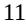

{0}------------------------------------------------

**As filed with the Securities and Exchange Commission on April 4, 2023**

**UNITED STATES**

**SECURITIES AND EXCHANGE COMMISSION**

**WASHINGTON, D.C. 20549**

**FORM 20-F**

☐ **REGISTRATION STATEMENT PURSUANT TO SECTION 12(b) OR (g) OF THE SECURITIES EXCHANGE ACT OF 1934**

**OR**

☒ **ANNUAL REPORT PURSUANT TO SECTION 13 OR 15(d) OF THE SECURITIES EXCHANGE ACT OF 1934**

**For the fiscal year ended December 31, 2022 OR**

☐ **TRANSITION REPORT PURSUANT TO SECTION 13 OR 15(d) OF THE SECURITIES EXCHANGE ACT OF 1934**

**OR**

☐ **SHELL COMPANY REPORT PURSUANT TO SECTION 13 OR 15(d) OF THE SECURITIES EXCHANGE ACT OF 1934**

**For the transition period from** _______________________ to ______________________________

Commission File Number 001-38215

**NUCANA PLC**

(Exact name of Registrant as specified in its charter) **England and Wales**

(Jurisdiction of incorporation or organization)

**NuCana plc**

**3 Lochside Way**

**Edinburgh EH12 9DT United Kingdom**

**Telephone: +44 (0)131 357 1111**

(Address of principal executive offices)

**Hugh S. Griffith, Chief Executive Officer NuCana plc**

**3 Lochside Way**

**Edinburgh EH12 9DT**

**United Kingdom**

**Telephone: +44 (0)131 357 1111 Email: info@nucana.com**

(Name, Telephone, E-mail and/or Facsimile number and Address of Company Contact Person)

**Securities registered or to be registered pursuant to Section 12(b) of the Act:**

| Title of each class                                        | Trading Symbol(s) | Name of each exchange on which registered |
|------------------------------------------------------------|-------------------|-------------------------------------------|
| American Depositary Shares, each representing one Ordinary | NCNA              | The Nasdaq Stock Market LLC               |
| Share, nominal value £0.04 per share                       |                   |                                           |

Securities registered or to be registered pursuant to Section 12(g) of the Act: **None**

Securities for which there is a reporting obligation pursuant to Section 15(d) of the Act: **None**

Indicate the number of outstanding shares of each of the issuer's classes of capital or common stock as of the close of the period covered by the annual report: 52,372,887 ordinary shares, par value £0.04 per share.

Indicate by check mark if the registrant is a well-known seasoned issuer, as defined in Rule 405 of the Securities Act. Yes ☐ No ☒

If this report is an annual or transition report, indicate by check mark if the registrant is not required to file reports pursuant to Section 13 or 15(d) of the Securities Exchange Act of 1934. Yes ☐ No ☒

Indicate by check mark whether the registrant (1) has filed all reports required to be filed by Section 13 or 15(d) of the Securities Exchange Act of 1934 during the preceding 12 months (or for such shorter period that the registrant was required to file such reports), and (2) has been subject to such filing requirements for the past 90 days. Yes ☒ No ☐

Indicate by check mark whether the registrant has submitted electronically every Interactive Data File required to be submitted pursuant to Rule 405 of Regulation S-T (§232.405 of this chapter) during the preceding 12 months (or for such shorter period that the registrant was required to submit such files). Yes ☒ No ☐

Indicate by check mark whether the registrant is a large accelerated filer, an accelerated filer, a non-accelerated filer or an emerging growth company. See definition of "large accelerated filer," "accelerated filer" and "emerging growth company" in Rule 12b-2 of the Exchange Act.

Large accelerated filer ☐ Accelerated filer ☐ Non-accelerated filer ☒ Emerging growth company ☐

If an emerging growth company that prepares its financial statements in accordance with U.S. GAAP, indicate by check mark if the registrant has elected not to use the extended transition period for complying with any new or revised financial accounting standards† provided pursuant to Section 13(a) of the Exchange Act. ☐

† The term "new or revised financial accounting standard" refers to any update issued by the Financial Accounting Standards Board to its Accounting Standards Codification after April 5, 2012. Indicate by check mark whether the registrant has filed a report on and attestation to its management's assessment of the effectiveness of its internal control over financial reporting under Section 404(b) of the Sarbanes-Oxley Act (15 U.S.C. 7262(b)) by the registered public accounting firm that prepared or issued its audit report. ☐

If securities are registered pursuant to Section 12(b) of the Act, indicate by check mark whether the financial statements of the registrant included in the filing reflect the correction of an error to previously issued financial statements. ☐

Indicate by check mark whether any of those error corrections are restatements that required a recovery analysis of incentive-based compensation received by any of the registrant's executive officers during the relevant recovery period pursuant to §240.10D-1(b). ☐

Indicate by check mark which basis of accounting the registrant has used to prepare the financial statements included in this filing:

U.S. GAAP ☐ International Financial Reporting Standards as issued by the International Accounting Standards Board ☒ Other ☐

If "Other" has been checked in response to the previous question, indicate by check mark which financial statement item the registrant has elected to follow. Item 17 ☐ Item 18 ☐

If this is an annual report, indicate by check mark whether the registrant is a shell company (as defined in Rule 12b-2 of the Exchange Act). Yes ☐ No ☒

{1}------------------------------------------------

#### **A TABLE OF CONTENTS**

|          |    |                                                         | Page |
|----------|----|---------------------------------------------------------|------|
|          |    | GENERAL INFORMATION                                     | iv   |
|          |    | PRESENTATION OF FINANCIAL AND OTHER DATA                | iv   |
|          |    | INFORMATION REGARDING FORWARD-LOOKING STATEMENTS        | iv   |
|          |    | WEBSITE DISCLOSURE                                      | v    |
| PART I   |    |                                                         | 1    |
| Item 1.  |    | Identity of Directors, Senior Management and Advisers   | 1    |
| Item 2.  |    | Offer Statistics and Expected Timetable                 | 1    |
| Item 3.  |    | Key Information                                         | 1    |
|          | A. | Selected Financial Data                                 | 1    |
|          | B. | Capitalization and Indebtedness                         | 2    |
|          | C. | Reasons for the Offer and Use of Proceeds               | 2    |
|          | D. | Risk Factors                                            | 2    |
| Item 4.  |    | Information on the Company                              | 57   |
|          | A. | History and Development of the Company                  | 57   |
|          | B. | Business                                                | 57   |
|          | C. | Organizational Structure                                | 97   |
|          | D. | Property, Plant and Equipment                           | 97   |
| Item 4A. |    | Unresolved Staff Comments                               | 97   |
| Item 5.  |    | Operating and Financial Review and Prospects            | 98   |
|          | A. | Operating Results                                       | 98   |
|          | B. | Liquidity and Capital Resources                         | 103  |
|          | C. | Research and Development, Patents and Licenses, etc.    | 105  |
|          | D. | Trend Information                                       | 105  |
|          | E. | Critical Accounting Estimates                           | 105  |
|          | F. | [Reserved]                                              | 105  |
|          | G. | [Reserved]                                              | 105  |
|          | H  | Non-GAAP Financial Measures                             | 105  |
| Item 6.  |    | Directors, Senior Management and Employees              | 106  |
|          | A. | Directors and Senior Management                         | 106  |
|          | B. | Compensation                                            | 108  |
|          | C. | Board Practices                                         | 117  |
|          | D. | Employees                                               | 119  |
|          | E. | Share Ownership                                         | 119  |
| Item 7.  |    | Major Shareholders and Related Party Transactions       | 119  |
|          | A. | Major Shareholders                                      | 119  |
|          | B. | Related Party Transactions                              | 122  |
|          | C. | Interests of Experts and Counsel                        | 122  |
| Item 8.  |    | Financial Information                                   | 123  |
|          | A. | Consolidated Statements and Other Financial Information | 123  |
|          | B. | Significant Changes                                     | 123  |
| Item 9.  |    | The Offer and Listing                                   | 123  |
|          | A. | Offer and Listing Details                               | 123  |
|          | B. | Plan of Distribution                                    | 123  |
|          | C. | Markets                                                 | 123  |
|          | D. | Selling Shareholders                                    | 123  |
|          | E. | Dilution                                                | 123  |
|          | F. | Expenses of the Issue                                   | 123  |

{2}------------------------------------------------

## **TABLE OF CONTENTS**

(continued)

| Item 10.  |    | Additional Information                                                       | 123 |
|-----------|----|------------------------------------------------------------------------------|-----|
|           | A. | Share Capital                                                                | 123 |
|           | B. | Memorandum and Articles of Association                                       | 123 |
|           | C. | Material Contracts                                                           | 139 |
|           | D. | Exchange Controls                                                            | 139 |
|           | E. | Taxation                                                                     | 139 |
|           | F. | Dividends and Paying Agents                                                  | 147 |
|           | G. | Statement by Experts                                                         | 148 |
|           | H. | Documents on Display                                                         | 148 |
|           | I. | Subsidiary Information                                                       | 148 |
| Item 11.  |    | Quantitative and Qualitative Disclosures About Market Risk                   | 148 |
| Item 12.  |    | Description of Securities Other than Equity Securities                       | 149 |
|           | A. | Debt Securities                                                              | 149 |
|           | B. | Warrants and Rights                                                          | 149 |
|           | C. | Other Securities                                                             | 149 |
|           | D. | American Depositary Shares                                                   | 149 |
| PART II   |    |                                                                              | 151 |
| Item 13.  |    | Defaults, Dividend Arrearages and Delinquencies                              | 151 |
| Item 14.  |    | Material Modifications to the Rights of Security Holders and Use of Proceeds | 151 |
| Item 15.  |    | Controls and Procedures                                                      | 151 |
|           | A. | Disclosure Controls and Procedures                                           | 151 |
|           | B. | Management's Annual Report on Internal Control over Financial Reporting      | 151 |
|           | C. | Attestation Report of the Registered Public Accounting Firm                  | 151 |
|           | D. | Changes in Internal Control Over Financial Reporting                         | 151 |
| Item 16A. |    | Audit Committee Financial Expert                                             | 151 |
| Item 16B. |    | Code of Ethics                                                               | 152 |
| Item 16C. |    | Principal Accountant Fees and Services                                       | 152 |
| Item 16D. |    | Exemptions From the Listing Standards For Audit Committees                   | 152 |
| Item 16E. |    | Purchases of Equity Securities by the Issuer and Affiliated Purchasers       | 152 |
| Item 16F. |    | Change in the Registrant's Certifying Accountant                             | 152 |
| Item 16G. |    | Corporate Governance                                                         | 152 |
| Item 16H. |    | Mine Safety Disclosure                                                       | 153 |
| Item 16I. |    | Disclosure Regarding Foreign Jurisdictions that Prevent Inspections          | 153 |
| PART III  |    |                                                                              | 154 |
| Item 17   |    | Financial Statements                                                         | 154 |
| Item 18   |    | Financial Statements                                                         | 154 |
| Item 19   |    | Exhibits                                                                     | 155 |

## iii

{3}------------------------------------------------

## **GENERAL INFORMATION**

In this annual report on Form 20-F ("Annual Report"), "NuCana," "NuCana plc," the "Group," the "Company," "we," "us" and "our" refer to NuCana plc and its consolidated subsidiaries, except where the context otherwise requires.

NuCana® and Acelarin® are our registered trademarks and ProTides TM is our trademark.

#### **PRESENTATION OF FINANCIAL AND OTHER DATA**

The consolidated financial statement data as at December 31, 2022, 2021, 2020, 2019, and 2018 and for the years ended December 31, 2022, 2021, 2020, 2019, and 2018 have been derived from our consolidated financial statements, which have been prepared in accordance with International Financial Reporting Standards, or IFRS, as issued by the International Accounting Standards Board, or IASB and audited in accordance with the standards of the Public Company Accounting Oversight Board (United States). The financial statement data as at December 31, 2020, 2019 and 2018 and for the years ended December 31, 2019 and 2018 have been derived from our consolidated financial statements, which are not presented herein, which have also been prepared in accordance with IFRS as issued by IASB.

All references in this Annual Report to "\$" are to U.S. dollars and all references to "£" are to pounds sterling.

### **INFORMATION REGARDING FORWARD-LOOKING STATEMENTS**

This Annual Report contains estimates and forward-looking statements, principally in the sections titled "Risk Factors," "Operating and Financial Review and Prospects" and "Business." Some of the matters discussed concerning our operations and financial performance include forward-looking statements and estimates within the meaning of the Securities Act of 1933, as amended, and the Securities Exchange Act of 1934, as amended. The words "believe," "may," "will," "estimate," "continue," "anticipate," "intend," "expect" and similar words are intended to identify forward-looking statements and estimates. Forward-looking statements include, but are not limited to, statements about:

- the development of NUC-3373 and NUC-7738, as well as Acelarin, including statements regarding the expected initiation, timing, progress and availability of data from our clinical trials;
- the potential attributes and benefit of our ProTides and their competitive positions;
- our ability to successfully commercialize our ProTides, if approved;
- our estimates regarding expenses, capital requirements and our need for additional financing;
- our ability to acquire or in-license new product candidates;
- potential collaborations; and
- the duration and strength of our patent portfolio.

These forward-looking statements are subject to known and unknown risks, uncertainties, assumptions and other factors that could cause our actual results of operations, financial condition, liquidity, performance, prospects, opportunities, achievements or industry results, as well as those of the markets we serve or intend to serve, to differ materially from those expressed in, or suggested by, these forward-looking statements. Factors that could cause actual results, financial condition, liquidity, performance, prospects, opportunities, achievements or industry results to differ materially include, but are not limited to, those discussed under "Risk Factors" in this Annual Report. Additional risks that we may currently deem immaterial or that are not presently known to us could also cause the forward-looking events discussed in this Annual Report not to occur. These forward-looking statements are based on assumptions regarding our present and future business strategies and the environment in which we expect to operate in the future.

Forward-looking statements and estimates speak only at the date they were made, and we undertake no obligation to update or to review any forward-looking statement or estimate because of new information, future events or other factors. Forward-looking statements and estimates involve risks and uncertainties and are not guarantees of future performance. Our future results may differ materially from those expressed in these forward-looking statements and estimates.

iv

{4}------------------------------------------------

The words "believe," "may," "will," "estimate," "continue," "anticipate," "intend," "expect" and similar words are intended to identify estimates and forward-looking statements. Estimates and forward-looking statements speak only at the date they were made, and we undertake no obligation to update or to review any estimate and/or forward-looking statement because of new information, future events or other factors. Estimates and forward-looking statements involve risks and uncertainties and are not guarantees of future performance. Our future results may differ materially from those expressed in these estimates and forward-looking statements. In light of the risks and uncertainties described above, the estimates and forward-looking statements discussed in this Annual Report might not occur, and our future results and our performance may differ materially from those expressed in these forwardlooking statements due to, inclusive of, but not limited to, the factors mentioned above. Because of these uncertainties, you should not make any investment decision based on these estimates and forward-looking statements.

#### **WEBSITE DISCLOSURE**

We maintain a public website at https://www.nucana.com and use our website as a routine channel of distribution of company information, including press releases, analyst presentations, and supplemental financial information, as a means of disclosing material non-public information and for complying with our disclosure obligations under Regulation FD. Our website includes an Investors section through which we make available, free of charge, our Annual Reports on Form 20-F, Reports on Form 6-K, as well as any amendments to those reports filed or furnished pursuant to the Exchange Act as soon as reasonably practicable after we electronically file such material with, or furnish it to, the SEC. Accordingly, investors should monitor our website in addition to following press releases, filings with the SEC, and public conference calls and webcasts.

None of the information provided on our website, in our press releases or public conference calls and webcasts or through social media is incorporated into, or deemed to be a part of, this Annual Report or in any other report or document we file with the SEC, and any references to such website is intended to be inactive textual references only.

v

{5}------------------------------------------------

#### **Item 1. Identity of Directors, Senior Management and Advisers**

Not Applicable.

#### **Item 2. Offer Statistics and Expected Timetable**

Not Applicable.

#### **Item 3. Key Information**

#### **A. Selected Financial Data**

The following tables summarize our consolidated financial data as of the dates and for the periods indicated. The consolidated financial data as of and for the years ended December 31, 2022, 2021, 2020, 2019 and 2018 have been derived from our consolidated financial statements, which have been prepared in accordance with International Financial Reporting Standards, or IFRS, as issued by the International Accounting Standard Board, or IASB, and audited in accordance with the standards of the Public Company Accounting Oversight Board (United States).

Our historical results are not necessarily indicative of the results that may be expected in the future. The following selected consolidated financial data should be read in conjunction with Item 5, "Operating and Financial Review and Prospects" and our consolidated financial statements included elsewhere in this Annual Report.

|                                                                      | Year Ended December 31,               |           |   |           |   |           |   |           |   |             |
|----------------------------------------------------------------------|---------------------------------------|-----------|---|-----------|---|-----------|---|-----------|---|-------------|
|                                                                      |                                       | 2022      |   | 2021      |   | 2020      |   | 2019      |   | 2018        |
|                                                                      | (in thousands, except per share data) |           |   |           |   |           |   |           |   |             |
| Consolidated statement of operations and comprehensive loss data: |                                       |           |   |           |   |           |   |           |   |             |
| Research and development expenses                                    | £                                     | (36,426 ) | £ | (36,834 ) | £ | (25,899 ) | £ | (19,728 ) |   | £ (16,846 ) |
| Administrative expenses                                              |                                       | (7,291 )  |   | (8,529 )  |   | (7,050 )  |   | (5,953 )  |   | (5,184 )    |
| Impairment of intangible assets                                      |                                       | (292 )    |   | (2,809 )  |   | —         |   | —         |   | —           |
| Net foreign exchange gains (losses)                                  |                                       | 4,887     |   | 267       |   | (3,472 )  |   | (1,019 )  |   | 2,902       |
| Operating loss                                                       |                                       | (39,122 ) |   | (47,905 ) |   | (36,421 ) |   | (26,700 ) |   | (19,128 )   |
| Finance income                                                       |                                       | 669       |   | 103       |   | 246       |   | 1,049     |   | 1,065       |
| Loss before tax                                                      |                                       | (38,453 ) |   | (47,802 ) |   | (36,175 ) |   | (25,651 ) |   | (18,063 )   |
| Income tax credit                                                    |                                       | 6,432     |   | 7,269     |   | 5,493     |   | 4,239     |   | 4,223       |
| Loss for the year                                                    |                                       | (32,021 ) |   | (40,533 ) |   | (30,682 ) |   | (21,412 ) |   | (13,840 )   |
| Other comprehensive income (expense):                                |                                       |           |   |           |   |           |   |           |   |             |
| Items that may be reclassified subsequently to profit or loss:    |                                       |           |   |           |   |           |   |           |   |             |
| Exchange differences on translation of foreign operations         |                                       | 61        |   | 5         |   | (12 )     |   | (11 )     |   | 12          |
| Total comprehensive loss for the year                                | £                                     | (31,960 ) | £ | (40,528 ) | £ | (30,694 ) | £ | (21,423 ) |   | £ (13,828 ) |
|                                                                      |                                       |           |   |           |   |           |   |           |   |             |
| Basic and diluted loss per share                                     | £                                     | (0.61 )   | £ | (0.78 )   | £ | (0.81 )   | £ | (0.66 )   | £ | (0.43 )     |

{6}------------------------------------------------

|                                      |   | As of December 31, |                |            |   |            |   |           |   |           |
|--------------------------------------|---|--------------------|----------------|------------|---|------------|---|-----------|---|-----------|
|                                      |   | 2022               | 2021           |            |   | 2020       |   | 2019      |   | 2018      |
|                                      |   |                    | (in thousands) |            |   |            |   |           |   |           |
| Consolidated statement of            |   |                    |                |            |   |            |   |           |   |           |
| financial position data:             |   |                    |                |            |   |            |   |           |   |           |
| Cash and cash equivalents            | £ | 41,912             | £              | 60,264     | £ | 87,356     | £ | 51,962    | £ | 76,972    |
| Total assets                         |   | 58,254             |                | 77,474     |   | 107,792    |   | 70,268    |   | 87,185    |
| Share capital                        |   | 2,095              |                | 2,087      |   | 2,047      |   | 1,299     |   | 1,289     |
| Share premium                        |   | 141,108            |                | 141,050    |   | 140,890    |   | 79,541    |   | 79,426    |
| Accumulated deficit                  |   | (180,573 )         |                | (149,726 ) |   | (110,594 ) |   | (80,055 ) |   | (58,813 ) |
| Capital reserve (1)                  |   | 42,466             |                | 42,466     |   | 42,466     |   | 42,466    |   | 42,466    |
| Net assets/Total equity attributable |   |                    |                |            |   |            |   |           |   |           |
| to equity holders of the Company     |   | 38,502             |                | 65,548     |   | 99,230     |   | 63,522    |   | 81,594    |
| Total liabilities                    |   | (19,752 )          |                | (11,926 )  |   | (8,562 )   |   | (6,746 )  |   | (5,591 )  |
|                                      |   |                    |                |            |   |            |   |           |   |           |
| Number of shares                     |   | 52,373             |                | 52,180     |   | 51,175     |   | 32,479    |   | 32,226    |

(1) The capital reserve balance arose from the impact of the reduction of our share premium account and corresponding increase to our capital reserve account reflected as of December 31, 2017 in connection with our re-registration as a public limited company, as further described in footnote 13 to the consolidated financial statements.

## **B. Capitalization and Indebtedness**

Not Applicable.

## **C. Reasons for the Offer and Use of Proceeds**

Not Applicable.

## **D. Risk Factors**

*Our business has significant risks. You should carefully consider the following risk factors and all other information contained in our Annual Report on Form 20-F for the year ended December 31, 2022 (our "Annual Report") and in subsequent reports filed on Form 6-K, including our consolidated financial statements and the related notes. The risks and uncertainties described below are those significant risk factors, currently known and specific to us, that we believe are relevant to our business, results of operations and financial condition. If any of these risks materialize, our business, results of operations or financial condition could suffer and the price of the ADSs could decline. Additional risks and uncertainties not currently known to us or that we now deem immaterial may also harm us and adversely affect our business, results of operations and financial condition.*

## **Summary of Risk Factors**

*An investment in our ADSs is subject to a number of risks, including risks related to our business and industry, risks related to development of our product candidates, and risks related to our ADSs. The following summarizes some, but not all, of these risks. Please carefully consider all of the information discussed in our Annual Report and in subsequent reports filed on Form 6-K for a more thorough description of these and other risks.*

## **Risks Related to Our Business and Industry**

- We have incurred significant operating losses since our inception. We expect to incur losses for the foreseeable future and may never achieve or maintain profitability.
- We depend heavily on the success of our product candidates NUC-3373 and NUC-7738. We cannot give any assurance that these product candidates will receive regulatory approval for any indication, which is necessary before any of them can be commercialized. If we, and any collaborators with whom we may enter into agreements for the development and commercialization of any of these product candidates, are unable to commercialize them, or experience significant delays in doing so, our ability to generate revenue and our financial condition will be adversely affected.
- Our lack of any approved products may make it difficult for you to evaluate the success of our business to date and to assess our future viability.

{7}------------------------------------------------

- Our business could be significantly and adversely affected by the COVID-19 pandemic.
- Exchange rate fluctuations may adversely affect our results of operations and financial condition.

## **Risks Related to Development of Our Product Candidates**

- Initial success in the ongoing and completed early-stage clinical trials may not be indicative of results obtained when these trials are completed or in later stage trials.
- Drug development involves a lengthy and expensive process, with an uncertain outcome. We may incur additional costs or experience delays in completing, or ultimately be unable to complete, the development and may experience delays in obtaining, or ultimately be unable to obtain, the approval of our product candidates.
- Due to our limited resources and access to capital, we must, and have in the past decided to, prioritize development of certain ProTide candidates over other potential candidates and certain indications over other potential indications. These decisions may prove to have been wrong and may adversely affect our performance.
- We may not be successful in our efforts to use and expand our technology platform to build a pipeline of additional ProTide candidates.

## **Risks Related to Marketing Approval of Our Product Candidates**

- If we are not able to obtain, or if there are delays in obtaining, required marketing approvals, we will not be able to commercialize our product candidates and our ability to generate revenue will be impaired.
- Our product candidates may cause undesirable side effects that could delay or prevent their marketing approval, limit the commercial profile of an approved label, or result in significant negative consequences following marketing approval, if any.
- Any product candidate for which we obtain marketing approval will be subject to extensive post-marketing regulatory requirements and could be subject to post-marketing restrictions or withdrawal from the market, and we may be subject to penalties if we fail to comply with regulatory requirements or if we experience unanticipated problems with our products, when and if any of them are approved.

## **Risks Related to Our Dependence on Third Parties**

- We rely on, and expect to continue to rely on, third parties to conduct our clinical trials for our product candidates. If these third parties do not successfully carry out their contractual duties, comply with regulatory requirements or meet expected deadlines, we may not be able to obtain marketing approval for or commercialize our product candidates, and our business could be substantially harmed.
- We contract with third parties for the manufacture and shipment of our product candidates for preclinical studies and clinical trials and expect to continue to do so for commercialization. This reliance on third parties increases the risk that we will not have sufficient quantities of our product candidates or drugs or such quantities at an acceptable cost, which could delay, prevent or impair our development or commercialization efforts.
- If we fail to comply with our obligations under our license and collaboration agreement with Cardiff ProTides Ltd., we could lose rights to licensed and assigned intellectual property that are necessary for developing and commercializing certain potential product candidates.

## **Risks Related to the Commercialization of Our Product Candidates**

- Even if any of our product candidates receives marketing approval, it may fail to achieve the degree of market acceptance by physicians, patients, third-party payors and others in the medical community necessary for commercial success.
- We face substantial competition, which may result in others discovering, developing or commercializing competing products before or more successfully than we do.
- Even if we are able to commercialize any product candidates, such drugs may become subject to unfavorable pricing regulations or thirdparty coverage and reimbursement policies.

{8}------------------------------------------------

## **Risks Related to Our Intellectual Property**

- If we are unable to obtain and maintain intellectual property protection for our technology and products, or if the scope of the intellectual property protection obtained is not sufficiently broad, our competitors could commercialize technology and products similar or identical to ours, and our ability to successfully commercialize our technology and products may be impaired. In addition, if we infringe the valid patent rights of others, we may be prevented from making, using or selling our products or may be subject to damages or penalties.
- If our trademarks and trade names are not adequately protected, then we may not be able to build name recognition in our markets of interest, and our business may be adversely affected.
- Obtaining and maintaining our patent protection depends on compliance with various procedural, document submission, fee payment and other requirements imposed by governmental patent agencies, and our patent protection could be reduced or eliminated for non-compliance with these requirements.
- Intellectual property litigation could cause us to spend substantial resources and distract our personnel from their normal responsibilities.
- Our proprietary information, or that of our suppliers and any future collaborators, may be lost or we may suffer security breaches.

## **Risks Related to Employee Matters, Managing Growth and Other Risks Related to Our Business**

- We currently have a limited number of employees, and our future success depends on our ability to retain key executives and to attract, retain and motivate qualified personnel.
- We expect to expand our development and regulatory capabilities and potentially implement sales, marketing and distribution capabilities, and as a result, we may encounter difficulties in managing our growth, which could disrupt our operations.

## **Risks Related to the ADSs**

- The price of our ADSs may be volatile and may fluctuate due to factors beyond our control.
- We will continue to incur increased costs as a result of operating as a public company in the United States, and our management is required to devote substantial time to new compliance initiatives and corporate governance practices.
- Certain of our existing shareholders, members of our board of directors and senior management maintain the ability to exercise significant control over us. Your interests may conflict with the interests of these existing shareholders.
- Future sales, or the possibility of future sales, of a substantial number of our ADSs or ordinary shares could adversely affect the price of our ADSs.
- Holders of our ADSs may be subject to limitations on transfer of their ADSs.

## **Risks Related to Our Business and Industry**

## *We have incurred significant operating losses since our inception. We expect to incur losses for the foreseeable future and may never achieve or maintain profitability.*

We have incurred significant operating losses since our inception. We incurred net losses of £13.8 million for the year ended December 31, 2018, £21.4 million for the year ended December 31, 2019, £30.7 million for the year ended December 31, 2020, £40.5 million for the year ended December 31, 2021, and £32.0 million for the year ended December 31, 2022. As of December 31, 2022, we had an accumulated deficit of £180.6 million. Our product candidate, NUC-3373, is currently in a Phase 1b/2 clinical trial, in combination with other agents, in patients with advanced colorectal cancer. We have also initiated a randomized Phase 2 clinical trial of NUC-3373, in combination with other agents, for the second-line treatment of patients with advanced colorectal cancer. In addition, we have initiated a Phase 1b/2 modular clinical trial of NUC-3373 in combination with the PD-1 inhibitor pembrolizumab in patients with advanced solid tumors and in combination with docetaxel in patients with lung cancer. Our product candidate NUC-7738 is currently in the Phase 2 part of a Phase 1/2 clinical trial for patients with advanced solid tumors which is evaluating NUC-7738 as a monotherapy and in combination

{9}------------------------------------------------

with pembrolizumab. It may be several years, if ever, before we have a product candidate ready for commercialization. To date, we have financed our operations primarily through public and private placements of our equity securities. We expect to continue to incur significant expenses and increasing operating losses for the foreseeable future. The net losses we incur may fluctuate significantly from quarter to quarter. We anticipate that our expenses will increase substantially if and as we:

- continue development of our ProTides, including completing ongoing clinical trials and initiating additional clinical trials of NUC-3373 and NUC-7738;
- complete preclinical studies and potentially initiate clinical trials of any preclinical-stage product candidates;
- identify and develop new product candidates;
- establish a robust supply chain for the manufacture of our product candidates in accordance with current good manufacturing practice, or cGMP;
- seek marketing approvals for our product candidates that successfully complete pivotal clinical trials;
- establish a sales, marketing and distribution infrastructure to commercialize any products for which we obtain marketing approval;
- pursue market acceptance of our product candidates in the medical community and with third-party payors;
- maintain, expand and protect our intellectual property portfolio;
- expand our headcount by recruiting personnel to drive our clinical development programs and effectively manage out-sourced development activities;
- enter into collaboration arrangements, if any, for the development of our product candidates or in-license other products and technologies;
- achieve milestones which will trigger payments under our license agreements; and
- add operational, financial and management information systems and personnel, including personnel to support our product development and planned future commercialization efforts.

In addition, protecting our intellectual property may result in litigation aimed at enforcing or defending our patents. Intellectual property litigation is expensive and, in the event that we lose any such litigation, we may be subject to additional significant legal expense, including the potential requirement to pay the legal expenses of opposing parties.

Because of the numerous risks and uncertainties associated with developing new pharmaceutical drugs, we are unable to predict the extent of any future losses or when we will become profitable, if at all. In addition, our expenses could increase beyond expectations if we are required by the Food and Drug Administration, or FDA, the European Medicines Agency, or EMA, or other foreign regulatory agencies, to perform studies and clinical trials in addition to those that we currently anticipate, or if there are any delays in the completion of planned clinical trials or the development of any of our ProTides.

To become and remain profitable, we must develop and eventually commercialize products with significant market potential. This will require us to be successful in a range of challenging activities, including the following:

- completing clinical trials of our product candidates that achieve their clinical endpoints;
- obtaining marketing approval for our product candidates;
- manufacturing, marketing and selling those products for which we may obtain marketing approval; and
- achieving market acceptance of our product candidates in the medical community and with third-party payors.

We may never succeed in these activities and, even if we do, may never generate revenues that are significant or large enough to achieve profitability. If we do achieve profitability, we may not be able to sustain or increase profitability on a quarterly or annual basis. Our failure to become and remain profitable would decrease the value of the company and could impair our ability to raise capital, maintain our discovery and preclinical development efforts, expand our business or continue our operations and may require us to raise additional capital that may dilute your ownership interest. A decline in the value of the company could also cause you to lose all or part of your investment.

{10}------------------------------------------------

*We depend heavily on the success of our product candidates, NUC-3373 and NUC-7738. We cannot give any assurance that these product candidates will receive regulatory approval for any indication, which is necessary before any of them can be commercialized. If we, and any collaborators with whom we may enter into agreements for the development and commercialization of any of these product candidates, are unable to commercialize them, or experience significant delays in doing so, our ability to generate revenue and our financial condition will be adversely affected.*

We do not currently generate any revenues from sales of any products, and we may never be able to develop or commercialize a marketable product. We have invested substantially all of our efforts and financial resources to date in the development of NUC-3373 and NUC-7738, as well as Acelarin, for which we discontinued the NuTide:121 clinical trial in March 2022. Our ability to generate product revenues, which we do not expect will occur for at least the next several years, if ever, will depend heavily on the successful development and eventual commercialization of these product candidates, if approved, which may never occur. Each of NUC-3373 and NUC-7738 will require additional clinical development, management of clinical, preclinical and manufacturing activities, regulatory approval in multiple jurisdictions, procurement of manufacturing supply, commercialization, substantial additional investment and significant marketing efforts before we generate any revenues from product sales, if at all. We are not permitted to market or promote any product candidates in the United States, Europe or other countries before we receive regulatory approval from the FDA, the EMA or comparable foreign regulatory authorities, and we may never receive such regulatory approval for NUC-3373, NUC-7738 or any future product candidate. We have not submitted a New Drug Application, or NDA, to the FDA, a Marketing Authorization Application, or MAA, to the EMA or comparable applications to other regulatory authorities for any of our product candidates and do not expect to be in a position to do so in the foreseeable future. The success of our product candidates will depend on many factors, including the following:

- we may not be able to demonstrate that the product candidate is safe and effective as a treatment for our targeted indications to the satisfaction of the applicable regulatory authorities;
- the applicable regulatory authorities may require additional preclinical or clinical trials of the product candidate, including additional toxicology trials, which would increase our costs and prolong our development;
- the results of clinical trials of our product candidates may not meet the level of statistical or clinical significance required by the applicable regulatory authorities for marketing approval;
- the applicable regulatory authorities may disagree with the number, design, size, conduct or implementation of our planned clinical trials;
- the contract research organizations, or CROs, that we retain to conduct clinical trials may take actions outside of our control that adversely impact our clinical trials;
- the applicable regulatory authorities may not find the data from preclinical studies and clinical trials sufficient to demonstrate that the clinical and other benefits of the product candidate outweigh its safety risks;
- the applicable regulatory authorities may disagree with our interpretation of data from preclinical studies and clinical trials or may require that we conduct additional studies;
- the applicable regulatory authorities may not accept data generated at our clinical trial sites;
- if we submit an NDA to the FDA or an MAA to the EMA, and it is reviewed by an advisory committee, the advisory committee may recommend against approval of our application or may recommend that the FDA or the EMA require, as a condition of approval, additional preclinical studies or clinical trials, limitations on approved labeling or distribution and use restrictions;
- the applicable regulatory authorities may require development of a risk evaluation and mitigation strategy, or REMS, as a condition of approval;
- the applicable regulatory authorities may change its approval policies or adopt new regulations;
- the applicable regulatory authorities may identify deficiencies in our formulation and manufacturing processes or facilities of our third-party manufacturers;
- we may face delays in our formulation and manufacturing process as a result of having not yet optimized formulations or due to lack of availability of starting materials;
- we may be unable to scale up the manufacture process for some of our product candidates;
- we may face challenges on the safe and appropriate administration of our drugs in the clinic, including with respect to the conversion of our product candidates from a dry powder formulation to a liquid formulation prior

{11}------------------------------------------------

to intravenous, or IV, administration, precipitation or other blockages in IV infusion lines, and the handling and storage of the IV infusion bags containing our product candidates, any of which may result in the need to carry out additional studies on the administration and compatibility of our product candidates with infusion sets and pumps;

- we may be faced with challenges from third parties with respect to our right to use certain processes used in the formulation and process development of our product candidates;
- we may have to defend our patents against infringement by third parties;
- we may unknowingly infringe third-party patents;
- we may face a "freedom to operate" issue;
- we will be dependent on the efforts of third parties in completing clinical trials of, receiving regulatory approval for and commercializing, any product candidate we license to such third parties;
- through our clinical trials, we may discover factors that limit the commercial viability of the product candidate or make its commercialization unfeasible;
- we may not be successful in completing preclinical studies and clinical trials of, receiving marketing approvals for, establishing commercial manufacturing capabilities for and commercializing, any product candidate to which we retain rights under a collaboration agreement; and
- we may not be successful in gaining acceptance of any product candidate by patients, the medical community and third-party payors, effectively competing with other therapies, maintaining a continued acceptable safety profile following approval and qualifying for, maintaining, enforcing and defending our intellectual property rights and claims.

With respect to each of NUC-3373 and NUC-7738, if we or our suppliers, as applicable, do not overcome one or more of these factors in a timely manner or at all, we could experience significant delays or an inability to successfully commercialize that product candidate.

We cannot be certain that NUC-3373 or NUC-7738 or any future product candidates will be successful in clinical trials or receive regulatory approval. Further, NUC-3373 or NUC-7738 or any future product candidates may not receive regulatory approval even if they are successful in clinical trials. If we do not receive regulatory approvals for NUC-3373 or NUC-7738 or any future product candidates, we may not be able to continue our operations. Even if we successfully obtain regulatory approvals to manufacture and market NUC-3373 or NUC-7738 or any future product candidates, our revenues will be dependent, in part, upon the size of the markets in the territories for which we gain regulatory approval and have commercial rights. If the markets for patient groups that we are targeting are not as significant as we estimate, we may not generate significant revenues from sales of such products, if approved.

We plan to seek regulatory approval to commercialize NUC-3373 and NUC-7738 in the United States and the European Union, and potentially in additional foreign countries. While the scope of regulatory approval is similar in many countries, to obtain separate regulatory approval in multiple countries requires us to comply with the numerous and varying regulatory requirements of such countries regarding safety and efficacy and governing, among other things, clinical trials, commercial sales, pricing and distribution of NUC-3373 and NUC-7738, and we cannot predict success in these jurisdictions.

Products studied for their safety and effectiveness in treating serious or life-threatening illnesses and that provide meaningful therapeutic benefit over existing treatments may receive accelerated approval from the FDA and may be approved on the basis of adequate and well-controlled clinical trials establishing that the drug product has an effect on a surrogate endpoint that is reasonably likely to predict clinical benefit or an effect on an intermediate clinical endpoint that can be measured earlier than an effect on irreversible morbidity or mortality. Discussions with the FDA about the feasibility of an accelerated approval typically begin early in the development of a new drug or biological product in order to identify, among other things, an appropriate surrogate or intermediate clinical endpoint.

However, even if we were to generate clinical data sufficient to support an NDA submission seeking accelerated approval for any of our product candidates, there can be no assurance that such marketing application will be accepted by the FDA for substantive review or that approval will be granted on a timely basis, or at all. In addition, if another company receives full approval from the FDA to market a product for treatment of a similar indication to our product candidate, our ability to seek and obtain accelerated approval for our product candidate in the same or similar indication may be materially adversely affected. The FDA or foreign regulatory authorities also could require us to conduct further studies or trials prior to

{12}------------------------------------------------

considering our application or granting a marketing approval of any type. We might not be able to fulfill the FDA's requirements in a timely manner, which would cause delays, or approval might not be granted because our submission is deemed incomplete by the FDA. A failure to obtain accelerated approval for any of our product candidates would result in a longer time period to obtain approval for and commercialize such product candidate, could increase the cost of development of such product candidates and could harm our competitive position in the marketplace.

Even if we were to receive accelerated approval from the FDA for any of our other product candidates, we will be subject to rigorous post-marketing requirements, including the submission of confirmatory clinical data verifying the clinical benefit of the product. Drug products marketed under an accelerated approval NDA also are subject to a requirement that all promotional materials must be submitted to the FDA at least 30 days prior to their dissemination. The FDA could seek to withdraw accelerated approval for multiple reasons, including if we fail to conduct the required post-marketing study with due diligence, the post-marketing study fails to verify the product's clinical benefit, other evidence shows that the product is not safe or effective under the conditions of use, or we disseminate promotional materials that are found by the FDA to be false and misleading.

## *Our lack of any approved products may make it difficult for you to evaluate the success of our business to date and to assess our future viability.*

Biopharmaceutical drug development is a highly speculative undertaking and involves a substantial degree of risk. Our operations to date have been limited to organizing and staffing our company, business planning, raising capital, developing our technology, identifying potential product candidates, undertaking preclinical studies, and conducting clinical trials of our product candidates. We have not yet demonstrated our ability to successfully complete large-scale, randomized, pivotal clinical trials compared to standards of care, obtain marketing approvals, manufacture a commercial scale product, or arrange for a third party to do so on our behalf, or conduct sales and marketing activities necessary for successful product commercialization. Typically, it takes several years to develop one new drug from the time it is discovered to when it is available for treating patients. In addition, we may encounter unforeseen expenses, difficulties, complications, delays and other known and unknown factors. We will need to transition from a company with a research and development focus to a company capable of supporting commercial activities. We may not be successful in such a transition.

## *We will require substantial additional funding which may not be available to us on acceptable terms, or at all. If we fail to obtain additional financing, we may be unable to complete the development and commercialization of our product candidates or continue our development programs.*

The development of pharmaceutical drugs is capital-intensive. We expect our expenses to increase with our ongoing activities, particularly as we conduct larger-scale clinical trials of, and seek marketing approval for, our product candidates. In addition, if we obtain marketing approval for any of our product candidates, we expect to incur significant commercialization expenses related to product sales, marketing, manufacturing and distribution. We may also need to raise additional funds sooner if we choose to pursue additional indications or geographies for our product candidates or otherwise expand more rapidly than we presently anticipate. Furthermore, we will continue to incur costs associated with operating as a public company. Accordingly, we will need to obtain substantial additional funding in connection with our continuing operations.

As of December 31, 2022, we had £41.9 million in cash and cash equivalents. We believe, based upon our current operating plan, that, our cash and cash equivalents on hand will be sufficient to fund our anticipated operations for at least the next twelve months. Our future capital requirements and the period for which we expect our existing resources to support our operations may vary significantly from what we expect. Our monthly spending levels vary based on new and ongoing research and development and other corporate activities. Because the length of time and activities associated with successful research and development of our product candidates is highly uncertain, we are unable to estimate the actual funds we will require for development and any approved marketing and commercialization activities. In addition, our future capital requirements will depend on many factors, and could increase significantly as a result of many factors, including:

- the scope, progress, results and costs of preclinical development, laboratory testing and clinical trials for our product candidates;
- the scope, prioritization and number of our research and development programs;
- the costs, timing and outcome of regulatory review of our product candidates;
- the extent to which we enter into non-exclusive, jointly funded clinical research collaboration arrangements, if any, for the development of our product candidates in combination with other companies' products;

{13}------------------------------------------------

- our ability to establish collaboration arrangements for the development of our product candidates on favorable terms, if at all;
- the achievement of milestones or occurrence of other developments that trigger payments under our license agreements and any collaboration agreements into which we may enter, if any;
- the extent to which we are obligated to reimburse, or entitled to reimbursement of, clinical trial costs under future collaboration agreements, if any;
- the extent to which we acquire or in-license product candidates and technologies, and the terms of such in-licenses;
- the costs of future commercialization activities, including product sales, marketing, manufacturing and distribution, for any of our product candidates for which we receive marketing approval;
- revenue, if any, received from commercial sales of our product candidates, should any of our product candidates receive marketing approval; and
- the costs of preparing, filing and prosecuting patent applications, maintaining and enforcing our intellectual property rights and defending intellectual property-related claims.

Conducting preclinical studies and clinical trials is a time-consuming, expensive and uncertain process that can take years to complete, and we may never generate the necessary data or results required to obtain marketing approval and achieve product sales. In addition, our product candidates, if approved, may not achieve commercial success. Our commercial revenues, if any, will be derived from sales of products that may not be commercially available for several years, if ever. Accordingly, we will need to continue to rely on additional financing to achieve our business objectives.

Any additional fundraising efforts may divert our management from their day-to-day activities, which may adversely affect our ability to develop and commercialize our product candidates. Volatility in the financial markets has generally made equity and debt financing more difficult to obtain and may compromise our ability to meet our fundraising needs. We cannot guarantee that future financing will be available in sufficient amounts or on terms acceptable to us, if at all.

If we are unable to obtain funding on a timely basis, we may be required to significantly curtail, delay or discontinue one or more of our research or development programs or the commercialization of any product candidate or be unable to expand our operations or otherwise capitalize on our business opportunities.

## *Raising additional capital may cause dilution to our shareholders, restrict our operations or require us to relinquish rights to our technologies or product candidates.*

Until such time, if ever, as we can generate substantial product revenues, we expect to finance our cash needs through a combination of equity and debt financings. The sale of additional equity or convertible debt securities would dilute all of our shareholders. The incurrence of indebtedness could result in increased fixed payment obligations, and we may be required to agree to certain restrictive covenants, such as limitations on our ability to incur additional debt, limitations on our ability to acquire, sell or license intellectual property rights, limitations on declaring dividends and other operating restrictions that could adversely impact our ability to conduct our business. Moreover, the terms of any financing may adversely affect the holdings or the rights of our shareholders and the issuance of additional securities, whether equity or debt, by us, or the possibility of such issuance, may cause the market price of our ADSs to decline.

We could decide to seek funds through collaborations, strategic alliances or licensing arrangements with third parties, and we could be required to do so at an earlier stage than otherwise would be desirable. In connection with any such collaborations, strategic alliances or licensing arrangements, we may be required to relinquish valuable rights to our intellectual property, future revenue streams, research programs or product candidates, grant rights to develop and market product candidates that we would otherwise prefer to develop and market ourselves, or otherwise agree to terms unfavorable to us.

{14}------------------------------------------------

## *Inadequate funding for the FDA, the SEC and other, government agencies could hinder such agencies' ability to hire and retain key leadership and other personnel, prevent new products and services from being developed or commercialized in a timely manner or otherwise prevent those agencies from performing normal business functions on which the operation of our business may rely, which could negatively impact our business.*

The ability of the FDA to review and approve new products can be affected by a variety of factors, including government budget and funding levels, ability to hire and retain key personnel and accept the payment of user fees, and statutory, regulatory, and policy changes. Average review times at the agency have fluctuated in recent years as a result. In addition, government funding of the SEC and other government agencies on which our operations may rely, including those that fund research and development activities is subject to the political process, which is inherently fluid and unpredictable.

Disruptions at the FDA and other agencies may also slow the time necessary for new drugs to be reviewed and/or approved by necessary government agencies, which would adversely affect our business. For example, over the last several years, the U.S. government has shut down several times and certain regulatory agencies, such as the FDA and the SEC, have had to furlough critical FDA, SEC and other government employees and stop critical activities. Moreover, recent shutdowns or slowdowns in normal agency work caused by the federal response to the COVID-19 public health emergency can increase the time needed for the agency to complete its review or make final approval or other administrative decisions. If a prolonged government shutdown or slowdown occurs, it could significantly impact the ability of the FDA to timely review and process our regulatory submissions, which could have a material adverse effect on our business. Further, in our operations as a public company, future government shutdowns could impact our ability to access the public market and obtain necessary capital in order to properly capitalize and continue our operations.

## *We may be unable to use net operating loss and tax credit carryforwards and certain built-in losses to reduce future tax payments or benefit from favorable United Kingdom tax legislation.*

As a United Kingdom resident company, we are subject to U.K. corporate taxation. We have generated losses since inception. As of December 31, 2022, we had cumulative carry forward tax losses of £84.6 million. Subject to any relevant restrictions, including the Corporate Income Loss Restriction and the Corporate Capital Loss Restriction that, broadly, restrict the amount of carried forward losses that can be utilized to 50% of group profits or gains arising above £5.0 million per tax year, we expect these to be available to carry forward and offset against future operating profits.

As a company that carries out extensive research and development activities, we benefit from the United Kingdom research and development tax credit regime for small and medium-sized companies, whereby we are able to surrender the trading losses that arise from our qualifying research and development activities for a payable tax credit of up to 33.35% in respect of eligible research and development expenditures incurred prior to April 1, 2023. This rate generally reduces to a general rate of 18.6% in respect of expenditure incurred on or after April 1, 2023. However, at the Spring Budget 2023, the U.K. Government announced a new tax credit rate under this scheme for R&D intensive companies, which will amount to a payable tax credit of up to 26.97% of eligible research and development expenditures incurred on or after April 1, 2023. R&D intensive companies will be those that spend 40% or more of their total expenditure on qualifying R&D in a given period, although detailed guidance and draft legislation on this new rate is yet to be published. Based on the amount of our qualifying R&D expenditure in the fiscal year ended December 31, 2022 and our expectations as to the amount of our qualifying R&D expenditure in the current fiscal year, we believe that we qualified as an R&D intensive company for 2022 and we currently expect to qualify for 2023. Our qualifying expenditures largely comprise employment costs for research staff, consumables and subcontract costs incurred as part of research projects. Certain subcontracted qualifying research expenditures are eligible for a cash rebate of up to 21.68% in respect of eligible research and development expenditures incurred prior to April 1, 2023 (reducing to a general rate of 12.09%, or, on the assumption that the new R&D intensive companies rules will also apply to subcontracted R&D, an enhanced rate of 17.53% for R&D intensive companies, in respect of expenditure incurred on or after April 1, 2023). The majority of our pipeline research, clinical trials management and manufacturing development activities are currently eligible for inclusion within these tax credit cash rebate claims. In relation to accounting periods beginning on or after April 1, 2021 there is a cap on payable credit claims in excess of £20,000 by reference to, broadly, three times the total Pay As You Earn, or PAYE, and national insurance contributions, or NICs, liability of the company. Unless an exemption applies, this could restrict the amount of payable credit that we can claim. In addition to the rate reductions referred to above, there are further changes to the U.K.'s research and development tax regime which will apply in respect of expenditure incurred on or after April 1, 2024. These include the introduction of a territoriality restriction to refocus the relief on activity carried out in the U.K.. This is subject to an exemption where it would be wholly unreasonable for the claimant to replicate the conditions necessary for the research and development activity within the U.K.. This new requirement may have an impact on our ability to claim relief in respect of certain costs in the future. The U.K. Government is considering and has consulted on further reforms to the United Kingdom's research and development tax

{15}------------------------------------------------

relief system, including the introduction of a new single research and development tax relief regime in place of the two regimes currently in place and these reforms may also affect our ability to claim such relief in the future. Also, we may not be able to continue to claim payable research and development tax credits in the future because we may no longer qualify as a small or medium-sized company.

We may benefit in the future from the United Kingdom's "patent box" regime, which allows certain profits attributable to revenues from patented products to be taxed at an effective rate of 10%. As we have many different patents covering our products, future upfront fees, milestone fees, product revenues and royalties could be taxed at this favorably low tax rate. When taken in combination with the enhanced relief available on our research and development expenditures, we expect a long-term lower rate of corporation tax to apply to us. If, however, there are unexpected adverse changes to the United Kingdom research and development tax credit regime (whether as a result of the potential reform of the U.K. research and development tax regime outlined above, or otherwise) or the "patent box" regime, or for any reason we are unable to qualify for such advantageous tax legislation, or we are unable to use net operating loss and tax credit carryforwards and certain built-in losses to reduce future tax payments then our business, results of operations and financial condition may be adversely affected.

## *Tax authorities may disagree with our positions and conclusions regarding certain tax positions, or may apply existing rules in an arbitrary or unforeseen manner, resulting in unanticipated costs, taxes or non-realization of expected benefits.*

A tax authority may disagree with tax positions that we have taken, which could result in increased tax liabilities. For example, His Majesty's Revenue & Customs, or HMRC, the U.S. Internal Revenue Service or another tax authority could challenge our allocation of income by tax jurisdiction and the amounts paid between our affiliated companies pursuant to our intercompany arrangements and transfer pricing policies, including methodologies for valuing developed technology and amounts paid with respect to our intellectual property development. Similarly, a tax authority could assert that we are subject to tax in a jurisdiction where we believe we have not established a taxable connection, often referred to as a "permanent establishment" under international tax treaties, and such an assertion, if successful, could increase our expected tax liability in one or more jurisdictions.

A tax authority may take the position that material income tax liabilities, interest and penalties are payable by us, for example where there has been a technical violation of contradictory laws and regulations that are relatively new and have not been subject to extensive review or interpretation, in which case we expect that we might contest such assessment. Contesting such an assessment may be lengthy and costly and if we were unsuccessful in disputing the assessment, the implications could increase our anticipated effective tax rate, where applicable.

## *Changes and uncertainties in the tax system in the countries in which we have operations, could materially adversely affect our financial condition and results of operations, and reduce net returns to our shareholders.*

We are unable to predict what tax reform may be proposed or enacted in the future or what effect such changes would have on our business, but such changes, to the extent they are brought into tax legislation, regulations, policies or practices in jurisdictions in which we operate or in the future into which we sell our products, could increase the estimated tax liability that we have expensed to date and paid or accrued on our balance sheets, and otherwise affect our financial position, future results of operations, cash flows in a particular period and overall or effective tax rates in the future in countries where we have operations or may sell our products, reduce post-tax returns to our shareholders and increase the complexity, burden and cost of tax compliance.

## *Our business may become subject to economic, political, regulatory and other risks associated with international operations.*

As a company based in the United Kingdom, our business is subject to risks associated with conducting business internationally. Many of our suppliers and collaborative and clinical trial relationships are located outside of the United States. Accordingly, our future results could be harmed by a variety of factors, including:

- economic weakness, including inflation, or political instability;
- differing and changing regulatory requirements for drug approvals;
- differing jurisdictions could present different issues for securing, maintaining or obtaining freedom to operate in such jurisdictions;
- potentially reduced protection for intellectual property rights;

{16}------------------------------------------------

- difficulties in compliance with non-U.S. laws and regulations;
- changes in regulations and customs, tariffs and trade barriers;
- changes in currency exchange rates of the pound sterling, the euro and currency controls;
- changes in a specific country's or region's political or economic environment, including the implications of the United Kingdom's withdrawal from the European Union, or any potential future referendum regarding the independence of Scotland;
- trade protection measures, import or export licensing requirements or other restrictive actions by U.S. or non-U.S. governments;
- differing reimbursement regimes and price controls in certain non-U.S. markets;
- negative consequences from changes in tax laws;
- compliance with tax, employment, immigration and labor laws for employees living or traveling abroad;
- workforce uncertainty in countries where labor unrest is more common than in the United States;
- difficulties associated with staffing and managing international operations, including differing labor relations;
- production shortages resulting from any events affecting raw material supply or manufacturing capabilities abroad;
- business interruptions resulting from geo-political actions, including war and terrorism, or natural disasters including earthquakes, typhoons, floods and fires; and
- changes in financial markets or general economic conditions, including the effects of recession or slow economic growth in the U.S. and abroad, interest rates, fuel prices, international currency fluctuations, corruption, political instability, acts of war, including the ongoing conflict in Ukraine and any potential spread of the conflict into a wider war, acts of terrorism, and the ongoing COVID-19 pandemic or other public health crises.

## *We may be adversely affected by the effects of inflation.*

Inflation has the potential to adversely affect our liquidity, business, financial condition and results of operations by increasing our overall cost structure. The existence of inflation in the economy has resulted in, and may continue to result in, higher interest rates and capital costs, shipping costs, supply shortages, increased costs of labor, weakening exchange rates and other similar effects. As a result of inflation, we have experienced and may continue to experience, cost increases. Although we may take measures to mitigate the impact of this inflation, if these measures are not effective our business, financial condition, results of operations and liquidity could be materially adversely affected. Even if such measures are effective, there could be a difference between the timing of when these beneficial actions impact our results of operations and when the cost inflation is incurred.

## *Adverse developments affecting the financial services industry, such as actual events or concerns involving liquidity, defaults or non-performance by financial institutions or transactional counterparties, could adversely affect our current and projected business operations and its financial condition and results of operations.*

Actual events involving limited liquidity, defaults, non-performance or other adverse developments that affect financial institutions, transactional counterparties or other companies in the financial services industry or the financial services industry generally, or concerns or rumors about any events of these kinds or other similar risks, have in the past and may in the future lead to market-wide liquidity problems. For example, on March 10, 2023, Silicon Valley Bank, or SVB, was closed by the California Department of Financial Protection and Innovation, which appointed the Federal Deposit Insurance Corporation, or the FDIC, as receiver. Similarly, on March 12, 2023, Signature Bank and Silvergate Capital Corp. were each swept into receivership. A statement issued on March 12, 2023, by the Department of the Treasury, the Federal Reserve and the FDIC stated that all depositors of SVB would have access to all of their money, including funds held in uninsured deposit accounts, borrowers under credit agreements, letters of credit and certain other financial instruments with SVB, Signature Bank or any other financial institution that is placed into receivership by the FDIC. In the United Kingdom, on March 13, 2023, the Bank of England, or BoE, issued a press release stating that the BoE, in consultation with the Prudential Regulation Authority, or PRA, HM Treasury, or HMT, and the Financial Conduct Authority, or FCA, had taken the decision (using the resolution powers for stabilizing failing banks under the Banking Act 2009) to sell Silicon Valley Bank UK Limited, or SVBUK, the U.K. affiliate of SVB, to HSBC UK Bank Plc. According to the press release, the BoE and HMT confirmed

{17}------------------------------------------------

that depositors would have access to all of their money with SVBUK as a result of this transaction. However, if any of our other counterparties to instruments such as uninsured deposit accounts, credit agreements, letters of credit and certain other financial instruments were to be placed into receivership, we may be unable to access such funds. In addition, if any parties with whom we conduct business are unable to access funds pursuant to such instruments or lending arrangements with such a financial institution, such parties' ability to pay their obligations to us or to enter into new commercial arrangements requiring additional payments to us could be adversely affected. In this regard, counterparties to SVB credit agreements and arrangements, and third parties such as beneficiaries of letters of credit (among others), may experience direct impacts from the closure of SVB and uncertainty remains over liquidity concerns in the broader financial services industry. Similar impacts have occurred in the past, such as during the 2008-2010 financial crisis.

Inflation and rapid increases in interest rates have led to a decline in the trading value of previously issued government securities with interest rates below current market interest rates. Although the U.S. Department of Treasury, FDIC and Federal Reserve Board have announced a program to provide up to \$25 billion of loans to financial institutions secured by certain of such government securities held by financial institutions to mitigate the risk of potential losses on the sale of such instruments, widespread demands for customer withdrawals or other liquidity needs of financial institutions for immediate liquidity may exceed the capacity of such program. There is no guarantee that the U.S. Department of Treasury, FDIC and Federal Reserve Board will provide access to uninsured funds in the future in the event of the closure of other banks or financial institutions, or that they would do so in a timely fashion.

Although we assess our banking relationships as we believe necessary or appropriate, our access to funding sources and other credit arrangements in amounts adequate to finance or capitalize our current and projected future business operations could be significantly impaired by factors that affect us, the financial institutions with which we have arrangements directly, or the financial services industry or economy in general. These factors could include, among others, events such as liquidity constraints or failures, the ability to perform obligations under various types of financial, credit or liquidity agreements or arrangements, disruptions or instability in the financial services industry or financial markets, or concerns or negative expectations about the prospects for companies in the financial services industry. These factors could involve financial institutions or financial services industry companies with which we have financial or business relationships, but could also include factors involving financial markets or the financial services industry generally.

The results of events or concerns that involve one or more of these factors could include a variety of material and adverse impacts on our current and projected business operations and our financial condition and results of operations. These could include, but may not be limited to, the following:

- Delayed access to deposits or other financial assets or the uninsured loss of deposits or other financial assets;
- Loss of access to revolving existing credit facilities or other working capital sources and/or the inability to refund, roll over or extend the maturity of, or enter into new credit facilities or other working capital resources;
- Potential or actual breach of contractual obligations that require us to maintain letters of credit or other credit support arrangements; or
- Termination of cash management arrangements and/or delays in accessing or actual loss of funds subject to cash management arrangements.

In addition, investor concerns regarding the U.S., U.K. or international financial systems could result in less favorable commercial financing terms, including higher interest rates or costs and tighter financial and operating covenants, or systemic limitations on access to credit and liquidity sources, thereby making it more difficult for us to acquire financing on acceptable terms or at all. Any decline in available funding or access to our cash and liquidity resources could, among other risks, adversely impact our ability to meet our operating expenses, financial obligations or fulfill our other obligations, result in breaches of our financial and/or contractual obligations or result in violations of federal or state wage and hour laws. Any of these impacts, or any other impacts resulting from the factors described above or other related or similar factors not described above, could have material adverse impacts on our liquidity and our current and/or projected business operations and financial condition and results of operations.

In addition, any further deterioration in the macroeconomic economy or financial services industry could lead to losses or defaults by parties with whom we conduct business, which in turn, could have a material adverse effect on our current and/or projected business operations and results of operations and financial condition. For example, a party with whom we conduct business may fail to make payments when due, default under their agreements with us, become insolvent or declare

{18}------------------------------------------------

bankruptcy. Any bankruptcy or insolvency, or the failure to make payments when due, of any counterparty of ours, or the loss of any significant relationships, could result in material losses to us and may material adverse impacts on our business.

## *The COVID-19 pandemic or future pandemics or public health crises could adversely impact our business, including our preclinical studies and clinical trials.*

Public health crises such as pandemics or similar outbreaks could adversely impact our business. The coronavirus, SARS-CoV-2, which causes COVID-19, and its variants have spread to every country in the world and throughout the United States and the United Kingdom. Many countries, as well as most states of the United States, reacted by instituting quarantines, "lockdowns" and other public health restrictions on leisure activities, work and travel. Although pandemic-related restrictions have been eased or removed in most geographies, our business remains subject to pandemic-related controls, which may become more restrictive at any time. We rely on third-party manufacturers, distributors, information technology and software service providers, law and accounting firms, CROs, and consultants who are subject to, or may become subject to, pandemic-related controls. COVID-19 may also affect employees of third-party CROs located in affected geographies that we rely upon to carry out clinical trials. If these third parties cannot perform the services we require in a timely way and we cannot successfully implement replacements or workarounds, our business, results of operations, and financial condition could be harmed. As a result of the COVID-19 pandemic, or potential future pandemics, we have experienced and may in the future experience disruptions that could severely impact our business, preclinical studies and clinical trials, including:

- delays or difficulties in enrolling patients in our clinical trials;
- delays or difficulties in clinical site initiation, including difficulties in recruiting clinical site investigators and clinical site staff;
- delays or disruptions in preclinical experiments and investigational new drug application-enabling good laboratory practice standard toxicology studies due to unforeseen circumstances at contract research organizations and vendors along their supply chain;
- increased rates of patients withdrawing from our clinical trials following enrollment as a result of contracting COVID-19, being forced to quarantine, or not wanting to attend hospital visits;
- diversion of healthcare resources away from the conduct of clinical trials, including the diversion of hospitals serving as our clinical trial sites and hospital staff supporting the conduct of our clinical trials;
- interruption of key clinical trial activities, such as clinical trial site data monitoring, due to limitations on travel imposed or recommended by national, state or local governments, employers and others or interruption of clinical trial subject visits and trial procedures (particularly any procedures that may be deemed non-essential), which may impact the integrity of subject data and clinical trial endpoints;
- interruption or delays in the operations of the FDA, the EMA or other foreign regulatory agencies, which may impact approval timelines;
- interruption of, or delays in receiving, supplies of our product candidates from our contract manufacturing organizations due to staffing shortages, production slowdowns or stoppages and disruptions in our supply chain or distribution vendors' ability to ship product candidates; and
- limitations on employee resources that would otherwise be focused on the conduct of our preclinical studies and clinical trials, including because of sickness of employees or their families, the desire of employees to avoid contact with large groups of people, an increased reliance on working from home or mass transit disruptions.

These and other factors arising from the COVID-19 pandemic could worsen in countries that are already afflicted with COVID-19, could continue to spread to additional countries, or could return to countries where the pandemic has been partially contained, each of which could further adversely impact our ability to conduct clinical trials and our business generally, and could have a material adverse impact on our operations and financial condition and results.

In addition, the trading prices for our ADSs and for the securities of other biopharmaceutical companies have been highly volatile during certain periods as a result of the COVID-19 pandemic. As a result, we may face difficulties raising capital through sales of our ADSs or such sales may be on unfavorable terms. The COVID-19 pandemic continues to evolve. The extent to which this pandemic may impact our business, preclinical studies and clinical trials will depend on future developments, which are highly uncertain and cannot be predicted with confidence, such as the emergence, severity and spread of new variants of the disease, the duration of the pandemic and any outbreak of future variants, the potential

{19}------------------------------------------------

imposition of travel restrictions and actions to contain the pandemic and any future outbreaks, such as social distancing and quarantines or lock-downs in the United Kingdom, the United States and other countries, business closures or business disruptions and the effectiveness of actions taken in the United Kingdom, the United States and other countries to contain and treat the disease.

## *The ongoing conflict in Ukraine could adversely impact our business, in particular with respect to enrollment and data collection in any clinical trials of our product candidates conducted in Ukraine, Russia or Belarus.*

The ongoing military conflict in Ukraine could disrupt our clinical trials and increase our costs in this region. Although the length and impacts of any military action are highly unpredictable, clinical trial sites in Ukraine, Russia and Belarus and neighboring countries could suspend or terminate their participation in trials, and patients and physicians could be forced to evacuate or voluntarily choose to relocate far from clinical trial sites, making them unavailable and potentially making data collection more difficult or not possible. Any such difficulties at clinical trial sites, or the unavailability of such clinical trial sites, could result in delays in enrolling or completing clinical trials, the need to identify alternative clinical trial sites, and increased overall development costs. Furthermore, the United States and its European allies have imposed significant sanctions against Russia and Belarus, including embargoes, sanctions and other restrictions targeting major Russian financial institutions. Our ability to conduct future clinical trials or purchases from suppliers located in Russia, Belarus and parts of Ukraine and elsewhere in the region has become restricted under applicable sanctions laws. All of the foregoing could impede the execution of our clinical development plans, which could materially harm our business.

## *Exchange rate fluctuations may adversely affect our results of operations and financial condition.*

Owing to the international scope of our operations, fluctuations in exchange rates, particularly between the pound sterling and the U.S. dollar, may adversely affect us. Although we are based in the United Kingdom, we source our active pharmaceutical ingredient, or API, and other raw materials and our research and development, manufacturing, consulting and other services worldwide, including from the United States, the European Union and India. Any weakening of the pound sterling against the currencies of such other jurisdictions makes the purchase of such goods and services more expensive for us. Further, potential future revenue may be derived from abroad, particularly from the United States. As a result, our business and the price of our ADSs may be affected by fluctuations in foreign exchange rates not only between the pound sterling and the U.S. dollar, but also the currencies of other countries, which may have a significant impact on our results of operations and cash flows from period to period. Currently, we do not have any exchange rate hedging arrangements in place.

#### *Our business may be negatively impacted by future changes in applicable regulatory regimes.*

We may face new regulatory costs and challenges that could have an adverse effect on our operations. The regulatory frameworks applicable to our operations and the development of our product candidates, including those with respect to the FDA and the EMA, can change at any time as a result of political decisions. Any changes to the applicable regulatory frameworks could have a material impact on our plans and development strategy, including our supply of investigational medicinal products. Furthermore, the implications of the withdrawal of the United Kingdom from the European Union and any other significant European political changes could result in disruption that could in turn delay the approval of new medicines at the EMA.

#### **Risks Related to Development of Our Product Candidates**

## *Initial success in the completed and ongoing early-stage clinical trials may not be indicative of results obtained when these trials are completed or in later stage trials.*

NUC-3373 is currently being evaluated, in combination with other agents, in a Phase 1b/2 clinical trial in patients with advanced colorectal cancer. We have also initiated a randomized Phase 2 clinical trial of NUC-3373, in combination with other agents, for the second-line treatment of patients with advanced colorectal cancer. In addition, we have initiated a Phase 1b/2 modular clinical trial of NUC-3373 in combination with the PD-1 inhibitor pembrolizumab in patients with advanced solid tumors and in combination with docetaxel in patients with lung cancer. Favorable results obtained from our Phase 1 clinical trial of NUC-3373 in patients with advanced solid tumors and our ongoing Phase 1b/2 clinical trial of NUC-3373 in patients with advanced colorectal cancer may not be replicated in any future clinical trials. Similarly, while NUC-7738 is currently being evaluated in the Phase 2 part of a Phase 1/2 clinical trial in patients with advanced solid tumors which is evaluating NUC-7738 as a monotherapy and in combination with the PD-1 inhibitor pembrolizumab, favorable results obtained to date may not be replicated in any future clinical trials. In addition, data generated in these early-stage trials in particular are not the basis on which marketing approval by the FDA or a comparable foreign regulatory authority would be

{20}------------------------------------------------

sought. Furthermore, the results of our clinical trials may not meet the level of statistical significance required by the FDA or comparable foreign regulatory authorities for marketing approval. Statistical significance means that an effect is unlikely to have occurred by chance. Clinical trial results are considered statistically significant when the probability of the results occurring by chance, rather than from the efficacy of the product candidate, is sufficiently low. There can be no assurance that any of our clinical trials will ultimately be successful or support further clinical development of any of our product candidates. There is a high failure rate for drugs proceeding through clinical trials. A number of companies in the pharmaceutical and biotechnology industries have suffered significant setbacks in clinical development even after achieving promising results in earlier studies.

## *Preliminary and interim data from our clinical trials that we may announce or publish from time to time may change as patient enrollment continues, patient data are further examined and more patient data become available.*

From time to time, we may announce or publish preliminary or interim data from our clinical studies, which include preliminary or interim data from our clinical trials, including those from the Phase 1b/2 clinical trial in patients with advanced colorectal cancer, Phase 2 clinical trial of NUC-3373 for the second-line treatment of patients with advanced colorectal cancer, or the Phase 1b/2 modular clinical trial of NUC-3373 in patients with advanced solid tumors, the Phase 2 part of the Phase 1/2 trial of NUC-7738 for patients with advanced solid tumors, and any future clinical trials of any of product candidates. Preliminary and interim data from a clinical trial are not always entirely representative of final data. Preliminary and interim data are subject to the risk that one or more of the clinical outcomes may materially change as patient enrollment continues, patient data are further examined, more patient data become available, and we prepare and issue our final clinical trial report. As a result, preliminary and interim data should be viewed with caution until the final data are available. Material adverse changes in the final data compared to the preliminary or interim data could significantly harm our business prospects.

## *We are relatively early in our development efforts. If we are unable to successfully develop and commercialize our product candidates or experience significant delays in doing so, our business will be harmed.*

We currently do not have any products that have gained marketing approval. We have invested substantially all of our efforts and financial resources identifying and developing our ProTides, such as NUC-3373 and NUC-7738, as well as Acelarin for which we discontinued the NuTide:121 clinical trial in March 2022. Our ability to generate product revenues, which may not occur for several years, if ever, will depend on the successful development and eventual commercialization of our product candidates: NUC-3373, for which a Phase 1b/2 clinical trial in patients with advanced colorectal cancer, Phase 2 clinical trial of NUC-3373 for the second-line treatment of patients with advanced colorectal cancer and Phase 1b/2 modular clinical trial of NUC-3373 in combination with the PD-1 inhibitor pembrolizumab, in patients with advanced solid tumors or in combination with docetaxel in patients with lung cancer are ongoing; and NUC-7738, for which the Phase 2 part of the Phase 1/2 trial is ongoing which is evaluating NUC-7738 as a monotherapy and in combination with the PD-1 inhibitor pembrolizumab for patients with advanced solid tumors. We currently do not generate any revenues from sales of any products, and we may never be able to develop or commercialize a marketable drug. Each of our product candidates will require development, management of development and manufacturing activities, marketing approval in multiple jurisdictions, obtaining manufacturing supply, building of a commercial organization, substantial investment and significant marketing efforts before we generate any revenues from drug sales.

We have not yet demonstrated an ability to successfully overcome many of the risks and uncertainties frequently encountered by companies in new and rapidly evolving fields, particularly in the biopharmaceutical area. For example, to execute our business plan, we will need to successfully:

- execute development activities for our product candidates, including successful enrollment in and completion of clinical trials;
- manage our spending as costs and expenses increase due to preclinical development, clinical trials, marketing approvals and commercialization;
- obtain required marketing approvals for the development and commercialization of our product candidates;
- obtain and maintain patent and trade secret protection and regulatory exclusivity for our product candidates and ensure that we do not infringe the valid patent rights of third parties;
- protect, leverage and expand our intellectual property portfolio;
- establish and maintain clinical and commercial manufacturing capabilities or make arrangements with third-party manufacturers for clinical and commercial manufacturing;

{21}------------------------------------------------

- build and maintain robust sales, distribution and marketing capabilities, either on our own or in collaboration with strategic partners, if our product candidates are approved;
- gain acceptance for our product candidates, if approved, by patients, the medical community and third-party payors;
- compete effectively with other therapies;
- obtain and maintain healthcare coverage and adequate reimbursement;
- maintain a continued acceptable safety profile for our product candidates following approval, if approved; and
- develop and maintain any strategic relationships we elect to enter into, if any.

If we do not achieve one or more of these factors in a timely manner or at all, we could experience significant delays or an inability to successfully commercialize our product candidates, which would harm our business. If we do not receive marketing approvals for our product candidates, we may not be able to continue our operations.

## *If we experience delays or difficulties in the enrollment of patients in clinical trials, development of our product candidates may be delayed or prevented.*

Identifying and qualifying patients to participate in clinical trials for our product candidates is critical to our success. We may not be able to initiate or continue clinical trials for our product candidates if we are unable to locate and enroll a sufficient number of eligible patients to participate in these trials. Patient enrollment may be affected by many factors including:

- the severity of the disease under investigation;
- the size of the patient population for a product indication;
- the eligibility criteria for the clinical trial in question;
- the perceived risks and benefits of the product candidate under study;
- the efforts to facilitate timely enrollment in clinical trials;
- the patient referral practices of physicians;
- the availability of competing therapies and clinical trials; and
- the proximity and availability of clinical trial sites for prospective patients.

If we experience delays or difficulties in the enrollment of patients in clinical trials, including those that may be caused by the ongoing COVID-19 pandemic, our clinical trials may be delayed or terminated. Any delays in completing our clinical trials will increase our costs, delay or prevent our product candidate development and approval process, and jeopardize our ability to commence product sales and generate revenue.

## *Clinical drug development involves a lengthy and expensive process, with an uncertain outcome. We may incur additional costs or experience delays in completing, or ultimately be unable to complete, the development and may experience delays in obtaining, or ultimately be unable to obtain, the approval of our product candidates.*

The risk of failure in drug development is high. NUC-3373 is currently being studied in two Phase 1b/2 trials and a Phase 2 trial, and NUC-7738 is in the Phase 2 part of a Phase 1/2 trial. Before obtaining marketing approval from regulatory authorities for the sale of any product candidate, we must complete preclinical development and conduct extensive clinical trials to demonstrate the safety and efficacy of our product candidates in patients. Clinical trials are expensive, difficult to design and implement and can take several years to complete, and their outcome is inherently uncertain. Failure can occur at any time during the clinical trial process. Further, the results of preclinical studies and early clinical trials of our product candidates may not be predictive of the results of later-stage clinical trials, and interim results of a clinical trial do not necessarily predict final results. Moreover, preclinical and clinical data are often susceptible to varying interpretations and analyses, and many companies that have believed their product candidates performed satisfactorily in preclinical studies and clinical trials have nonetheless failed to obtain marketing approval of their products. It is impossible to predict when or if any of our product candidates will prove effective or safe in humans or will receive marketing approval.

{22}------------------------------------------------

We may experience numerous unforeseen events during, or as a result of, clinical trials that could delay or prevent our ability to receive marketing approval or commercialize our product candidates. Clinical trials may be delayed, suspended or prematurely terminated because costs are greater than we anticipate or for a variety of reasons, such as:

- the COVID-19 pandemic, which may affect the ability to initiate and/or complete preclinical studies or conduct ongoing clinical trials, and may delay initiation of planned and future clinical trials;
- delay or failure in reaching agreement with the FDA, the EMA or a comparable foreign regulatory authority on a trial design that we are able to execute;
- delay or failure in obtaining authorization to commence a trial or inability to comply with conditions imposed by a regulatory authority regarding the scope or design of a clinical trial;
- delays in reaching, or failure to reach, agreement on acceptable terms with prospective trial sites and prospective CROs, the terms of which can be subject to extensive negotiation and may vary significantly among different CROs and trial sites;
- inability, delay, or failure in identifying and maintaining a sufficient number of trial sites, many of which may already be engaged in other clinical programs;
- delay or failure in recruiting and enrolling suitable subjects to participate in a trial;
- delay or failure in having subjects complete a trial or return for post-treatment follow-up;
- clinical sites and investigators deviating from the clinical protocol, failing to conduct the trial in accordance with regulatory requirements, or dropping out of a trial;
- failure to initiate or delay of or failure to complete a clinical trial as a result of an Investigational New Drug Application, or IND, being placed on clinical hold by the FDA, or for other reasons;
- lack of adequate funding to continue a clinical trial, including unforeseen costs due to enrollment delays, requirements to conduct additional clinical trials and increased expenses associated with the services of our CROs and other third parties;
- clinical trials of our product candidates may produce negative or inconclusive results, and we may decide, or regulators may require us, to conduct additional clinical trials or abandon product development programs;
- the number of patients required for clinical trials of our product candidates may be larger than we anticipate, enrollment in these clinical trials may be slower than we anticipate or participants may drop out of these clinical trials at a higher rate than we anticipate;
- our third-party contractors may fail to comply with regulatory requirements or meet their contractual obligations to us in a timely manner, or at all;
- regulators, or a Data Safety Monitoring Board, or DSMB, if one is used for our clinical trials, may require that we suspend or terminate our clinical trials for various reasons, including noncompliance with regulatory requirements, unforeseen safety issues or adverse side effects, failure to demonstrate a benefit from using a drug, or a finding that the participants are being exposed to unacceptable health risks;
- the supply or quality of our product candidates or other materials necessary to conduct clinical trials of our product candidates may be insufficient;
- the FDA or other regulatory authorities may require us to submit additional data or impose other requirements before permitting us to initiate a clinical trial; or
- there may be changes in governmental regulations or administrative actions.

Many of the factors that cause, or lead to, a delay in the commencement or completion of clinical trials may also ultimately lead to the denial of marketing approval for our product candidates. The FDA may disagree with our clinical trial design and our interpretation of data from clinical trials, or may change the requirements for approval even after it has reviewed and commented on the design for our clinical trials. For example, the FDA published guidance in 2022 on "Project Optimus", an initiative to reform dose selection in oncology drug development. If the FDA does not believe we have sufficiently demonstrated that the selected doses for our investigational products maximize not only the efficacy of the investigational product, but the safety and tolerability as well, our ability to initiate new studies may be delayed. Even if we

{23}------------------------------------------------

conducted the additional studies or generated the additional information requested, the FDA could disagree that we have satisfied their requirements, all of which will cause significant delays and expense to our programs.

In addition, even though NUC-3373 is a transformation of a chemotherapeutic agent that has been widely used for many years and there is a clear unmet medical need in each of the indications that we are currently pursuing in the clinic, there can be no assurance that the FDA will permit us to move more quickly to the initiation of pivotal clinical trials in large patient populations. Furthermore, NUC-7738 is a transformation of 3'-deoxyadenosine, a nucleoside analog that has never been successfully developed or approved as a chemotherapy, which may result in the need for more preclinical studies or clinical trials than would be the case for transformations of approved chemotherapeutic agents.

If we are required to conduct additional clinical trials or other studies of our product candidates beyond those that we currently contemplate, if we are unable to successfully complete clinical trials of our product candidates or other studies, if the results of these trials or tests are not positive or are only modestly positive or if there are safety concerns, we may:

- be delayed in obtaining marketing approval for our product candidates;
- not obtain marketing approval for our product candidates at all;
- obtain approval for indications or patient populations that are not as broad as intended or desired;
- obtain approval with labeling that includes significant use or distribution restrictions or safety warnings that would reduce the potential market for our products or inhibit our ability to successfully commercialize our products;
- be subject to additional post-marketing restrictions or requirements, including confirmatory trials; or
- have the product removed from the market after obtaining marketing approval.

Our product development costs will also increase if we experience delays in preclinical and clinical development or receiving the requisite marketing approvals. We do not know whether any of our preclinical studies or clinical trials will need to be restructured or will be completed on schedule, or at all. Significant preclinical or clinical trial delays also could shorten any periods during which we may have the exclusive right to commercialize our product candidates or allow our competitors to bring products to market before we do and impair our ability to successfully commercialize our product candidates and may harm our business and results of operations.

## *We face regulation and potential liability related to the privacy of health information we obtain from clinical trials sponsored by us or our collaborators.*

The regulatory environment surrounding information security and privacy is increasingly demanding, and these laws and regulations are increasing in complexity and number, and may change frequently and sometimes conflict. We are subject to numerous regulations governing the protection of personal and confidential information of our clinical trial subjects, clinical investigators, and employees, including in relation to medical records, credit card data and financial information, which encompass state privacy and confidentiality laws (including state laws requiring disclosure of breaches), federal and state consumer protection and employment laws, the Health Insurance Portability and Accountability Act, or HIPAA, and European and other foreign data protection laws. For example, the European Union General Data Protection Regulation, or GDPR, is applicable in all E.U. member states and member states of the European Economic Area, or E.E.A. Following the United Kingdom's withdrawal from the European Union, the data protection obligations of the GDPR continue to apply to U.K.-related processing of personal data in substantially unvaried form and fashion (retained in U.K. law as the "U.K. GDPR").

We are subject to the GDPR and/or U.K. GDPR when conducting clinical trials involving U.K.- or E.E.A.-based data subjects (whether the trials are conducted directly by us or through a clinical vendor or collaborator) or offering approved products (or any other products or services) to U.K. or E.E.A. based data subjects (regardless of whether involving a U.K. or E.E.A. based subsidiary or operation), when monitoring of their behavior of data subjects in the United Kingdom or E.E.A. and/or when acting through a U.K.- or E.E.A.-based subsidiary, operation or other establishment.

The GDPR (and U.K. GDPR) sets out a number of requirements that must be complied with when handling personal data (i.e. data relating to an identified or identifiable living individual) in these circumstances, including: the obligation to appoint data protection officers in certain circumstances; accountability and record-keeping obligations; transparency obligations for data controllers; the obligation to carry out 'data protection impact assessments' in certain circumstances; rights for data subjects (such as rights for individuals to be "forgotten", rights to data portability, rights to object etc.); a stringent standard of data subject consent; and the obligation to notify certain significant personal data breaches to the relevant Supervisory Authority(ies) and affected individuals. In addition, the GDPR provides a very broad definition of what

{24}------------------------------------------------

constitutes personal data (for example, the GDPR expressly clarifies that it applies to 'pseudonymized' (i.e., key-coded) data). A number of opinions from Supervisory Authorities has further supported a very wide interpretation of the concept of personal data and, thus, the application of the GDPR.

The GDPR and U.K. GDPR also impose strict rules on the transfer of personal data out of the E.E.A. and U.K. to U.S. and other Third Countries. Recent legal developments in the European Union have created further complexity and uncertainty regarding transfers of personal data from the E.E.A. and United Kingdom to the United States, e.g. on July 16, 2020, the Court of Justice of the European Union, or CJEU, made it clear that reliance on any of the specific safeguards for data transfers provided for in the GDPR (the most common of which is the standard contractual clauses, a standard form contract approved by the European Commission) alone may not necessarily be sufficient in all circumstances. Use of the standard contractual clauses must now be assessed on a case-by-case basis taking into account the legal regime applicable in the destination country, in particular applicable surveillance laws and rights of individuals and additional measures and/or contractual provisions may need to be put in place, however, the nature of these additional measures is currently uncertain. Guidance from the European Data Protection Board on what is required by way of additional measures further emphasized the challenges of transferring personal data, in particular unencrypted data, from the E.E.A. A small number of enforcement decisions have also been issued. As supervisory authorities issue further guidance on personal data export mechanisms, including circumstances where the standard contractual clauses can/cannot be used, and/or increase their enforcement activities, we could suffer additional costs, complaints, and/or regulatory scrutiny, investigations or fines, and/or if we are otherwise unable to transfer personal data between and among countries and regions in which we operate, it could affect the manner in which we provide our services, the geographical location or segregation of our relevant systems and operations, and could adversely affect our financial results and generally increase compliance risk.

On June 28, 2021, the European Commission adopted an 'adequacy decision' in respect of the United Kingdom, allowing the unrestricted transfer of personal data from the E.E.A. to the United Kingdom. The adequacy decision is intended to apply for a period of four years; however, the Commission is also tasked with monitoring developments in the United Kingdom on an ongoing basis; if it considers that the United Kingdom no longer ensures an essentially equivalent level of data protection, the decision could be suspended or repealed. Were the adequacy decision to be invalidated or withdrawn, this would likely necessitate additional compliance costs and increase our overall risk.

On December 13, 2022, the European Commission launched the process to adopt a new adequacy decision for the 'E.U. - U.S. Data Privacy Framework', which would allow personal data to be transferred from the E.E.A to U.S. entities who self-certify under the Data Privacy Framework. Although there is no specified timeframe for the adequacy decision, it is expected to be approved at some point in the Summer of 2023. While the Data Privacy Framework adequacy decision (if issued) will, in principle, make it easier to transfer personal data from the E.E.A. to the U.S., prominent European privacy campaigners have already indicated their intention to bring a legal challenge against any such decision. Consequently, it is expected that the uncertainty surrounding data transfers will continue in 2023 and beyond.

The GDPR also provides that E.E.A. member states may make their own further laws and regulations to introduce specific requirements related to the processing of: "special categories of personal data", including personal data related to health, biometric data used for unique identification purposes and genetic information; as well as personal data related to criminal offences or convictions — for example, in the United Kingdom, the Data Protection Act 2018 complements the GDPR in this regard in the United Kingdom. This fact may lead to greater divergence on the law that applies to the processing of such data types across the E.E.A. and U.K., compliance with which as and where applicable may increase our costs and could increase our overall risk.

Now that the United Kingdom is no longer a member of the European Union, there is increasing scope for divergence in application, interpretation and enforcement of the data protection law between the United Kingdom and European Union. On March 8, 2023, the U.K. Government presented the 'Data Protection and Digital Information Bill' to Parliament, seeking to amend various aspects of the United Kingdom's data protection regime. As currently drafted, the Bill will result in only minor changes to the substance of the U.K. GDPR, and so the United Kingdom will remain very closely aligned with the European Union in this regard. However, any changes relating to the U.K. and E.U. position regarding aspects of data protection law may lead to additional compliance costs and could increase our overall risk. There are also concerns that changes to the U.K. regime, in particular changes to the data transfer rules, could increase the risk of the European Commission's adequacy decision in respect of the U.K. being invalidated or withdrawn.

Alongside the GDPR, the European Union has a number of new laws currently going through the legislative process, including the European Health Data Space (EHDS) Regulation. The EHDS Regulation may, for example, require us to make health data available to other organizations in this sector (in an anonymized form) and to the patients themselves. Although

{25}------------------------------------------------

this law is still only in the initial stages and so unlikely to be applicable for several years, we may have to devote substantial resources to understanding and preparing for it.

These laws and regulations are increasing in complexity and number, and new regulatory guidance and case law means the regulatory landscape changes frequently. Complying with these numerous, complex and often changing regulations is expensive and difficult. Failure by us, any partners, our service providers, or our employees or contractors to comply with the GDPR could result in regulatory investigations, enforcement notices and/or fines of up to the higher of €20 million or up to 4% of our total worldwide annual turnover. Further, following the withdrawal of the United Kingdom from the European Union, we now have to comply with the GDPR and U.K. GDPR separately, each regime separately having the ability to fine up to the higher of €20 million / £17.5 million or 4% of global turnover. Numerous multi-million € / £ fines have been issued by supervisory authorities across the E.E.A. and by the U.K. Information Commissioner's Office. In addition to administrative fines, a wide variety of other potential enforcement powers are available to competent authorities in respect of potential and suspected violations of the GDPR, including extensive audit and inspection rights, and powers to order temporary or permanent bans on all or some processing of personal data carried out by non-compliant actors.

In addition to the foregoing, a breach of privacy laws or data security laws, particularly those resulting in a significant security incident or breach involving the misappropriation, loss or other unauthorized use or disclosure of sensitive or confidential patient or consumer information, could have a material adverse effect on our business, reputation and financial condition. In addition, widely publicized security breaches are increasingly being followed in the European Union by large 'class action' style claims. Although these have yet to succeed in any significant compensation orders, defending these claims is costly and could still result in substantial liability for compensation and legal fees. As a data controller, we are accountable for any third-party service providers we engage to process personal data on our behalf, including our CROs. We attempt to mitigate the associated risks by performing security assessments and due diligence of our vendors and requiring all such third-party providers with data access to sign agreements, and obligating them to only process data according to our instructions and to take sufficient security measures to protect such data. There is no assurance that these contractual measures and our own privacy and security-related safeguards will protect us from the risks associated with the third-party processing, storage and transmission of such information. Any violation of data or security laws by our third-party processors could have a material adverse effect on our business and result in the fines, penalties and/or other enforcement actions outlined above.

We strive to comply with all applicable laws, but they may conflict with each other, and by complying with the laws or regulations of one jurisdiction, we may find that we are violating the laws or regulations of another jurisdiction. Despite our efforts, we may not have fully complied in the past and may not in the future. If we become liable under laws or regulations applicable to us, we could be required to pay significant fines and penalties (including those described above), our reputation may be harmed and we may be forced to change the way we operate. That could require us to incur significant expenses or to discontinue certain services, which could negatively affect our business.

## *Due to our limited resources and access to capital, we must, and have in the past decided to, prioritize development of certain ProTide candidates over other potential candidates. These decisions may prove to have been wrong and may adversely affect our performance.*

Because we have limited resources and access to capital to fund our operations, we must decide which ProTides to pursue and the resources to allocate to each. Our decisions concerning the allocation of research, collaboration, management and financial resources toward particular ProTides or therapeutic areas may not lead to the development of viable commercial products and may divert resources away from better opportunities. Similarly, our decisions to delay, terminate or collaborate with third parties in respect of product development programs may also prove not to be optimal and could cause us to miss valuable opportunities. If we make incorrect determinations regarding the market potential of our ProTides or misread trends in the biopharmaceutical industry, in particular for our lead ProTides, then our business may be adversely affected.

## *We may not be successful in our efforts to use and expand our technology platform to build a pipeline of additional ProTide candidates.*

A key element of our strategy is to use and expand our proprietary ProTide technology to build a pipeline of additional ProTide candidates and progress these ProTide candidates through clinical development for the treatment of cancer. Although our research and development efforts to date have resulted in a pipeline of ProTide candidates directed at the treatment of many solid tumors and hematological malignancies, we may not be able to develop ProTide candidates that are safe and effective. Even if we are successful in continuing to build our pipeline, the potential product candidates that we identify may not be suitable for clinical development, including as a result of being shown to have harmful side effects or other

{26}------------------------------------------------

characteristics that indicate that they are unlikely to be products that will receive marketing approval and achieve market acceptance.

## **Risks Related to Marketing Approval of Our Product Candidates**

## *If we are not able to obtain, or if there are delays in obtaining, required marketing approvals, we will not be able to commercialize our product candidates and our ability to generate revenue will be impaired.*

Our product candidates and the activities associated with their development and commercialization, including their design, testing, manufacture, safety, efficacy, recordkeeping, labeling, storage, approval, advertising, promotion, sale, distribution, import and export are subject to comprehensive regulation by the FDA and other regulatory agencies in the United States and by comparable authorities in other countries.

These requirements include submissions of safety and other post-marketing information and reports, registration and listing requirements, current good manufacturing practice, or cGMP, requirements relating to manufacturing, quality control, quality assurance and corresponding maintenance of records and documents, including periodic inspections by FDA and other regulatory authorities, requirements regarding the distribution of samples to physicians and recordkeeping. Before we can commercialize any of our product candidates, each such product candidate must be approved by the FDA pursuant to an NDA in the United States, by the EMA pursuant to an MAA in the European Union, and by similar regulatory authorities outside the United States prior to commercialization.

The process of obtaining marketing approvals, both in the United States and abroad, is expensive and takes several years, if approval is obtained at all, and can vary substantially based upon a variety of factors, including the type, complexity and novelty of the product candidates involved. Failure to obtain marketing approval for a product candidate will prevent us from commercializing the product candidate. We have not received approval to market any of our product candidates from regulatory authorities in any jurisdiction. We have limited experience in planning and conducting the clinical trials required for marketing approvals, and we expect to rely on third-party contract research organizations, or CROs, to assist us in this process. Obtaining marketing approval requires the submission of extensive preclinical and clinical data and supporting information to regulatory authorities for each therapeutic indication to establish the product candidate's safety and efficacy. Securing marketing approval also requires the submission of information about the product manufacturing process, and in many cases the inspection of manufacturing facilities by the regulatory authorities. Our product candidates may not be effective, may be only moderately effective or may prove to have undesirable or unintended side effects, toxicities or other characteristics that may preclude our obtaining marketing approval or prevent or limit commercial use. Because a number of our clinical trials will be in combination with other approved therapies, there may also be undesirable or unintended side effects, toxicities or other characteristics resulting from the other therapy or from its combination with our product candidate.

In addition, because our product candidates are transformations of nucleoside analogs, including those that are approved chemotherapeutic agents and those that have never been approved as chemotherapeutic agents, our product candidates could be negatively impacted by the identification of any new undesirable or unintended side effects, toxicities or other characteristics in such existing nucleoside analogs, in particular in those that have never been approved as chemotherapeutic agents.

Regulatory authorities have substantial discretion in the new drug approval process and may refuse to accept any application or may decide that our data are insufficient for approval and require additional preclinical studies or clinical trials. Our product candidates could be delayed in receiving, or fail to receive, marketing approval for many reasons, including the following:

- the FDA or comparable foreign regulatory authorities may disagree with the design or implementation of our clinical trials or require that we perform additional clinical trials, including toxicology trials;
- we may be unable to demonstrate to the satisfaction of the FDA or comparable foreign regulatory authorities that a product candidate is safe and effective for its proposed indication;
- the results of our clinical trials may not meet the level of statistical significance required by the FDA or comparable foreign regulatory authorities for marketing approval;
- we may be unable to demonstrate that a product candidate's clinical and other benefits outweigh its safety risks;
- the FDA or comparable foreign regulatory authorities may disagree with our interpretation of data from preclinical studies or clinical trials;

{27}------------------------------------------------

- the data collected from clinical trials of our product candidates may not be sufficient to support the submission of an NDA or other submission to obtain marketing approval in the United States or elsewhere;
- third-party manufacturers or our clinical or commercial product candidates may be unable to meet the FDA's cGMP requirements or similar requirements of foreign regulatory authorities; and
- the approval requirements or policies of the FDA or comparable foreign regulatory authorities may significantly change in a manner rendering our clinical data insufficient for approval.

In addition, even if we were to obtain approval, regulatory authorities may approve our product candidates for fewer or more limited indications than we request, may grant approval contingent on the performance of costly post-marketing clinical trials, may approve a product candidate with restrictions on distribution or other REMS elements, or may approve a product candidate with a label that does not include the labeling claims necessary or desirable for the successful commercialization of that product candidate. Any of the foregoing scenarios could harm the commercial prospects for our product candidates.

If we experience delays in obtaining approval or if we fail to obtain approval of our product candidates, the commercial prospects for our product candidates may be harmed and our ability to generate revenues will be impaired.

## *Our product candidates may cause undesirable side effects that could delay or prevent their marketing approval, limit the commercial profile of an approved label, or result in significant negative consequences following marketing approval, if any.*

Undesirable side effects caused by our product candidates could cause us or the FDA or other regulatory authorities to interrupt, delay or halt our clinical trials and could result in more restrictive labels or the delay or denial of marketing approval by the FDA or other regulatory authorities of our product candidates. Results of our clinical trials could reveal a high and unacceptable severity and prevalence of these or other side effects. In such an event, our trials could be suspended or terminated and the FDA or comparable foreign regulatory authorities could order us to cease further development of or deny approval of our product candidates for any or all targeted indications. The drug-related side effects could also affect patient recruitment or the ability of enrolled patients to complete the trial or result in potential product liability claims.

Further, clinical trials by their nature utilize a sample of the potential patient population. With a limited number of patients, rare and severe side effects of our product candidates may only be uncovered with a significantly larger number of patients exposed to the product candidate. If our product candidates receive marketing approval and we or others identify undesirable side effects caused by such product candidates or any other similar drugs after such approval, a number of potentially significant negative consequences could result, including:

- regulatory authorities may withdraw or limit their approval of such product candidates;
- regulatory authorities may require the addition of labeling statements, such as a "boxed" warning or a contraindication;
- we may be required to create a medication guide outlining the risks of such side effects for distribution to patients;
- we may be required to change the way such product candidates are distributed or administered, conduct additional clinical trials or change the labeling of the product candidates;
- regulatory authorities may require a REMS plan to mitigate risks, which could include medication guides, physician communication plans, or elements to assure safe use, such as restricted distribution methods, patient registries and other risk minimization tools;
- we may be subject to regulatory investigations and government enforcement actions;
- we may decide to remove such product candidates from the marketplace after they are approved;
- we could be sued and held liable for injury caused to individuals exposed to or taking our product candidates; and
- our reputation may suffer.

In addition, the patient profile in the indications for which we are currently developing our product candidates, with many patients already seriously ill at the time of initiation of treatment, may result in an increased risk of claims that undesirable side effects or poor prognoses or outcomes are related to our product candidates. Regardless of whether or not

{28}------------------------------------------------

such side effects or prognoses or outcomes are ultimately determined to be related to our product candidates, the claims themselves could result in some or all of the foregoing negative consequences.

We believe that any of these events could prevent us from achieving or maintaining market acceptance of the affected product candidates and could substantially increase the costs of commercializing our product candidates, if approved, and significantly impact our ability to successfully commercialize our product candidates and generate revenues.

## *A Fast Track Designation by the FDA, even if granted for any of our product candidates, may not lead to a faster development or regulatory review or approval process and does not increase the likelihood that our product candidates will receive marketing approval.*

If a drug is intended for the treatment of a serious or life-threatening condition and the drug demonstrates the potential to address unmet medical needs for this condition, the drug sponsor may apply for FDA Fast Track Designation. The FDA has broad discretion whether to grant this designation. Even if we believe a particular product candidate is eligible for this designation, we cannot assure you that the FDA would decide to grant it. Even if we do receive Fast Track Designation, we may not experience a faster development process, review or approval compared to conventional FDA procedures. The FDA may withdraw Fast Track Designation if it believes that the designation is no longer supported by data from our clinical development program. Many drugs that have received Fast Track Designation have failed to obtain drug approval.

## *Any product candidate for which we obtain marketing approval will be subject to extensive post-marketing regulatory requirements and could be subject to post-marketing restrictions or withdrawal from the market, and we may be subject to penalties if we fail to comply with regulatory requirements or if we experience unanticipated problems with our products, when and if any of them are approved.*

If the FDA or a comparable foreign regulatory authority approves any of our product candidates, activities such as the manufacturing processes, labeling, packaging, distribution, adverse event reporting, storage, advertising, promotion and recordkeeping for the product will be subject to extensive and ongoing regulatory requirements. The FDA or a comparable foreign regulatory authority may also impose requirements for costly post-marketing preclinical studies or clinical trials and surveillance programs to monitor the safety or efficacy of the product. The FDA closely regulates the post-approval marketing and promotion of drugs to ensure drugs are marketed only for the approved indications and in accordance with the provisions of the approved labeling. The FDA imposes stringent restrictions on manufacturers' communications regarding use of their products, and if we promote our products beyond their approved indications or in a way that is inconsistent with the FDA-approved labeling, we may be subject to enforcement actions or prosecution arising from that off-label promotion. Violations of the Federal Food, Drug, and Cosmetic Act, or the FD&C, relating to the promotion of prescription drugs may also lead to investigations alleging violations of federal and state healthcare fraud and abuse and other laws, as well as state consumer protection laws.

Drug manufacturers and manufacturers' facilities are also required to continuously comply with FDA and comparable foreign regulatory authority requirements, including ensuring that quality control and manufacturing procedures conform to cGMP regulations and corresponding foreign regulatory manufacturing requirements. As such, we and our third-party suppliers will be subject to continual review and inspections to assess compliance with cGMP and adherence to commitments made in any NDA or other marketing authorization application.

In addition, later discovery of previously unknown adverse events or other problems with our products, manufacturers or manufacturing processes, or failure to comply with regulatory requirements, may yield various results, including:

- restrictions on such products, manufacturers or manufacturing processes;
- restrictions on the labeling or marketing of a product;
- restrictions on product distribution or use;
- requirements to conduct post-marketing studies or clinical trials;
- warning or untitled letters;
- withdrawal of the products from the market;
- refusal to approve pending applications or supplements to approved applications that we submit;
- recall of products;
- fines, restitution or disgorgement of profits or revenues;

{29}------------------------------------------------

- suspension or withdrawal of marketing approvals;
- refusal to permit the import or export of our products;
- product seizure; or
- injunctions or the imposition of civil or criminal penalties.

Non-compliance with European Union requirements regarding safety monitoring or pharmacovigilance can also result in significant financial penalties. Similarly, failure to comply with the European Union's requirements regarding the protection of personal information can also lead to significant penalties and sanctions.

The FDA's or other regulatory authorities' policies may change and additional government regulations may be enacted that could prevent, limit or delay marketing approval of our product candidates. If we are slow or unable to adapt to changes in existing requirements or the adoption of new requirements or policies, or if we are not able to maintain regulatory compliance, we may lose any marketing approval that we may have obtained.

## *Our relationships with customers and third-party payors will be subject to applicable anti-kickback, fraud and abuse and other healthcare laws and regulations, which could expose us to criminal sanctions, civil penalties, contractual damages, reputational harm and diminished profits and future earnings.*

Although we do not currently have any drugs on the market, once we begin commercializing our product candidates, we will be subject to additional healthcare statutory and regulatory requirements and enforcement by the U.S. federal and state governments and the foreign governments in the jurisdictions in which we conduct our business. Healthcare providers, physicians and third-party payors will play a primary role in the recommendation and prescription of any product candidates for which we obtain marketing approval. Our future arrangements with third-party payors and customers may expose us to broadly applicable fraud and abuse and other healthcare laws and regulations that may constrain the business or financial arrangements and relationships through which we market, sell and distribute any products for which we obtain marketing approval. Restrictions under applicable U.S. federal and state healthcare laws and regulations include the following:

- the federal Anti-Kickback Statute prohibits, among other things, persons from knowingly and willfully soliciting, offering, receiving or paying remuneration, directly or indirectly, in cash or in kind, to induce or reward, or in return for, either the referral of an individual for, or the purchase, order or recommendation of, any good or service for which payment may be made under a federal healthcare program such as Medicare and Medicaid; a person or entity does not need to have actual knowledge of the statute or specific intent to violate it in order to have committed a violation;
- the federal false claims laws, including, without limitation, the civil False Claims Act (which can be enforced by private citizens through qui tam actions), impose criminal and civil penalties against individuals or entities for knowingly presenting, or causing to be presented, to the federal government, claims for payment that are false or fraudulent or making a false statement to avoid, decrease or conceal an obligation to pay money to the federal government; in addition, the government may assert that a claim including items and services resulting from a violation of the federal Anti-Kickback Statute constitutes a false or fraudulent claim for purposes of the False Claims Act;
- HIPAA imposes criminal and civil liability for executing a scheme to defraud any healthcare benefit program, or knowingly and willfully falsifying, concealing or covering up a material fact or making any materially false statement in connection with the delivery of or payment for healthcare benefits, items or services; similar to the federal Anti-Kickback Statute, a person or entity does not need to have actual knowledge of the statute or specific intent to violate it in order to have committed a violation;
- the federal physician payment transparency requirements under the Physician Payments Sunshine Act, enacted as part of the Affordable Care Act, or ACA, require manufacturers of drugs, devices, biologics and medical supplies that are reimbursable under Medicare, Medicaid, or the Children's Health Insurance Program to report to the Centers for Medicare & Medicaid Services, or CMS, information related to payments and other transfers of value to physicians and teaching hospitals, and certain advanced non-physician health care practitioners and the ownership and investment interests of physicians and their immediate family members in such manufacturers;
- HIPAA, as amended by the Health Information Technology for Economic and Clinical Health Act and its implementing regulations, which also imposes obligations on certain covered entity healthcare providers, health plans, and healthcare clearinghouses as well as their business associates that perform certain services involving

{30}------------------------------------------------

the use or disclosure of individually identifiable health information, including mandatory contractual terms, with respect to safeguarding the privacy, security and transmission of individually identifiable health information;

- some state laws that require pharmaceutical companies to comply with the pharmaceutical industry's voluntary compliance guidelines and the relevant compliance guidance promulgated by the federal government and may require drug manufacturers to report information related to payments and other transfers of value to physicians and other healthcare providers or marketing expenditures; and
- state and foreign laws that govern the privacy and security of health information in certain circumstances, many of which differ from each other in significant ways and often are not preempted by HIPAA, thus complicating compliance efforts.

Analogous state and foreign laws and regulations, such as state anti-kickback and false claims laws, may apply to sales or marketing arrangements and claims involving healthcare items or services reimbursed by non-governmental third-party payors, including private insurers.

Efforts to ensure that our business arrangements with third parties will comply with applicable healthcare laws and regulations will involve substantial costs. It is possible that governmental authorities will conclude that our business practices may not comply with current or future statutes, regulations or case law involving applicable fraud and abuse or other healthcare laws and regulations. If our operations are found to be in violation of any of these laws or any other governmental regulations that may apply to us, we may be subject to significant civil, criminal and administrative penalties, damages, fines, disgorgement, imprisonment, exclusion of our products from government funded healthcare programs, such as Medicare and Medicaid, additional reporting requirements and oversight if we become subject to a corporate integrity agreement or similar agreement to resolve allegations of noncompliance with these laws, reputational harm, and the curtailment or restructuring of our operations. In addition, if any of the physicians or other healthcare providers or entities with whom we expect to do business are found to be not in compliance with applicable laws, they may be subject to significant criminal, civil or administrative sanctions, including exclusions from government funded healthcare programs.

## *Current and future legislation may increase the difficulty and cost for us to obtain marketing approval of and commercialize our product candidates and affect the prices we may obtain.*

In the United States and some foreign jurisdictions, there have been a number of legislative and regulatory changes and proposed changes regarding the healthcare system that could prevent or delay marketing approval of our product candidates, restrict or regulate post-approval activities and affect our ability to profitably sell any product candidates for which we obtain marketing approval. For example, in August 2017, the FDA Reauthorization Act was signed into law, which reauthorized the FDA's user fee programs and included additional drug and device provisions. On September 30, 2022, the FDA User Fee Reauthorization Act of 2022 was signed into law, which reauthorized the Prescription Drug User Fee Act (PDUFA VII) from fiscal year 2023 through 2027. If we are slow or unable to adapt to changes in existing requirements or the adoption of new requirements or policies, or if we are not able to maintain regulatory compliance, we may lose any marketing approval that we otherwise may have obtained and we may not achieve or sustain profitability, which would adversely affect our business, prospects, financial condition and results of operations.

In addition, there have been and continue to be a number of initiatives at the U.S. federal and state levels that seek to reduce healthcare costs and improve the quality of healthcare. For example, in March 2010, the ACA was enacted in the United States, substantially changing the way healthcare is financed by both governmental and private insurers and significantly affecting the pharmaceutical industry. The ACA contained a number of provisions, including those governing enrollment in federal healthcare programs, reimbursement adjustments and changes to fraud and abuse laws. As another example, the 2021 Consolidated Appropriations Act signed into law on December 27, 2020 incorporated extensive health care provisions and amendments to existing laws, including a requirement that all manufacturers of drugs products covered under Medicare Part B report the product's average sales price to the federal.

Since the enactment of the ACA, there have been numerous judicial, administrative, executive and legislative challenges to certain of its provisions. On June 17, 2021 the U.S. Supreme Court dismissed the recent judicial challenge to the ACA brought by several states without specifically ruling on the constitutionality of the ACA. Thus, the ACA will remain in effect in its current form. Further, prior to the U.S. Supreme Court ruling, President Biden issued an executive order to initiate a special enrollment period from February 15, 2021 through August 15, 2021 for purposes of obtaining health insurance coverage through the ACA marketplace. The executive order also instructed certain governmental agencies to review and reconsider their existing policies and rules that limit access to healthcare, including among others, reexamining

{31}------------------------------------------------

Medicaid demonstration projects and waiver programs that include work requirements, and policies that create unnecessary barriers to obtaining access to health insurance coverage through Medicaid or the ACA.

In addition, other legislative changes have been proposed and adopted in the United States since the ACA was enacted. For example, on March 11, 2021, President Biden signed the American Rescue Plan Act of 2021 into law, which eliminates the statutory Medicaid drug rebate cap, currently set at 100% of a drug's AMP, for single source and innovator multiple source drugs, beginning January 1, 2024. Payment methodologies may also be subject to changes in healthcare legislation and regulatory initiatives. For example, CMS may develop new payment and delivery models, such as bundled payment models. Recently, there has been heightened governmental scrutiny over the manner in which manufacturers set prices for their products. Such scrutiny has resulted in several recent U.S. Congressional inquiries and proposed and enacted federal and state legislation designed to, among other things, bring more transparency to drug pricing, reduce the cost of prescription drugs under Medicare, review the relationship between pricing and manufacturer patient programs, and reform government program reimbursement methodologies for drugs. By way of example, in August 2022, the Inflation Reduction Act of 2022, or IRA, was signed into law. Among other things, the IRA requires manufacturers of certain drugs to engage in price negotiations with Medicare (beginning in 2026), with prices that can be negotiated subject to a cap; imposes rebates under Medicare Part B and Medicare Part D to penalize price increases that outpace inflation (first due in 2023); and replaces the Part D coverage gap discount program with a new discounting program (beginning in 2025). The IRA permits the Secretary of the Department of Health and Human Services to implement many of these provisions through guidance, as opposed to regulation, for the initial years. For that and other reasons, it is currently unclear how the IRA will be effectuated, or the impact of the IRA on our business.

Further, there has been heightened governmental scrutiny over the manner in which manufacturers set prices for their marketed products, which have resulted in several recent Congressional inquiries and proposed federal and state legislation designed to, among other things, bring more transparency to product pricing, contain the cost of drugs, review the relationship between pricing and manufacturer patient programs, and reform government program reimbursement methodologies for products. It is also possible that additional governmental action is taken in response to the COVID-19 pandemic.

In addition, Congress has been considering ways to decrease drug prices and increase access to drugs. Although a number of the considered measures may require additional authorization to become effective, Congress has indicated that it will continue to seek new legislative and/or administrative measures to control drug costs. In July 2021, the Biden administration issued an executive order to promote competition in the U.S. economy, which included measures intended to lower drug prices through increased competition in the pharmaceutical industry. In particular, the executive order seeks to continue ongoing action plans to increase access to and market competitiveness of generics and biosimilars and to expand drug importation programs. The executive order also supports legislative reforms to allow Medicare to negotiate drug prices, redesign Part D to reduce costs, and implement rebate penalties for exorbitant drug price increases.

In addition, individual states in the U.S. have also passed legislation and implemented regulations designed to control pharmaceutical product pricing, including price or patient reimbursement constraints, discounts, restrictions on certain product access and marketing cost disclosure and transparency measures, and regional healthcare authorities and individual hospitals are increasingly using bidding procedures to determine what pharmaceutical products and which suppliers will be included in their prescription drug and other healthcare programs. In December 2020, the U.S. Supreme Court held unanimously that federal law does not preempt the states' ability to regulate pharmaceutical benefit managers, or PBMs and other members of the health care and pharmaceutical supply chain, an important decision that may lead to further and more aggressive efforts by states in this area.

In the European Union, similar political, economic and regulatory developments may affect our ability to profitably commercialize our products. In addition to continuing pressure on prices and cost containment measures, legislative developments at the European Union or E.U. member state level may result in significant additional requirements or obstacles that may increase our operating costs.

We expect that the ACA and the IRA, as well as other healthcare reform measures that may be adopted in the future, may result in more rigorous coverage criteria and in additional downward pressure on the price that we will receive for any approved product. Any reduction in payments from Medicare or other government programs may result in a similar reduction in payments from private payors. The implementation of cost containment measures or other healthcare reforms may prevent us from being able to generate revenue, attain profitability, or commercialize any of our products for which we receive marketing approval.

{32}------------------------------------------------

Legislative and regulatory proposals have also been made in recent years to expand post-approval requirements and restrict sales and promotional activities for pharmaceutical products. We cannot be sure whether additional legislative changes will be enacted, or whether the FDA regulations, guidance or interpretations will be changed or what the impact of such changes on the marketing approvals, if any, of our product candidates, may be. In addition, increased scrutiny by the U.S. Congress of the FDA's approval process may significantly delay or prevent marketing approval, as well as subject us to more stringent product labeling and post-marketing conditions and other requirements.

## *Our future growth may depend, in part, on our ability to penetrate foreign markets, where we would be subject to additional regulatory burdens and other risks and uncertainties.*

Our future profitability may depend, in part, on our ability to commercialize our product candidates in foreign markets. In order to market and sell our products in the European Union and many other jurisdictions, we or our third-party collaborators must obtain separate marketing approvals and comply with numerous and varying regulatory requirements. The approval procedure varies among countries and economic areas and can involve additional testing. The time required to obtain approval may differ substantially from that required to obtain FDA approval. The marketing approval process outside the United States generally includes all of the risks associated with obtaining FDA approval. In addition, in many countries outside the United States, it is required that the product be approved for reimbursement before the product can be approved for sale in that country. We or these third parties may not obtain approvals from regulatory authorities outside the United States on a timely basis, if at all. Approval by the FDA does not ensure approval by regulatory authorities in other countries or jurisdictions, and approval by one regulatory authority outside the United States does not ensure approval by regulatory authorities in other countries or jurisdictions or by the FDA. Additionally, a failure or delay in obtaining marketing approval in one jurisdiction may have a negative effect on the marketing approval process in others. Approval procedures vary among jurisdictions and can involve requirements and administrative review periods different from, and greater than, those in the United States, including additional preclinical studies or clinical trials. Obtaining foreign marketing approvals and compliance with foreign regulatory requirements could result in significant delays, difficulties and costs for us and could delay or prevent the introduction of our products in certain countries. If we fail to comply with the regulatory requirements in international markets or receive applicable marketing approvals, our target market will be reduced and our ability to realize the full market potential of our product candidates will be harmed.

We may not be able to file for marketing approvals and may not receive necessary approvals to commercialize our products in any market. If we obtain approval of our product candidates and ultimately commercialize our product candidates in foreign markets, we would be subject to additional risks and uncertainties, including:

- our customers' ability to obtain reimbursement for our product candidates in foreign markets;
- our inability to directly control commercial activities because we are relying on third parties;
- the burden of complying with complex and changing foreign regulatory, tax, accounting and legal requirements;
- different medical practices and customs in foreign countries affecting acceptance in the marketplace;
- import or export licensing requirements;
- longer accounts receivable collection times;
- longer lead times for shipping;
- language barriers for technical training;
- reduced or no protection on pharmaceutical products or their use in some foreign countries;
- the unwillingness of courts in some foreign jurisdictions to enforce patents even when valid and infringed in that country;
- the possibility of pre-grant or post-grant review proceedings in certain foreign countries that allow a petitioner to hold up patent rights for an extended period or permanently by challenging the patent filing at the patent office of that country;
- the possibility of a compulsory license issued by a foreign country that allows a third-party entity or a government to manufacture, use or sell our products with a government-set low royalty to us;
- the existence of additional potentially relevant third-party intellectual property rights;
- foreign currency exchange rate fluctuations;

{33}------------------------------------------------

- an increase in restrictions on trade or other protectionist measures; and
- the interpretation of contractual provisions governed by foreign laws in the event of a contract dispute.

Foreign sales of our product candidates could also be adversely affected by the imposition of governmental controls, political and economic instability, trade restrictions and changes in tariffs.

#### *Governments outside the United States tend to impose strict price controls, which may adversely affect our revenues, if any.*

In some countries, particularly the countries of the European Union, the pricing of prescription pharmaceuticals is subject to governmental control. In these countries, pricing negotiations with governmental authorities can take considerable time after the receipt of marketing approval for a product. To obtain reimbursement or pricing approval in some countries, we may be required to conduct a clinical trial that compares the cost-effectiveness of our product candidate to other available therapies. If reimbursement of our products is unavailable or limited in scope or amount, or if pricing is set at unsatisfactory levels, our financial results would suffer.

## *We are subject to the U.K. Bribery Act, the U.S. Foreign Corrupt Practices Act and other anti-corruption laws, as well as export control laws, import and customs laws, trade and economic sanctions laws and other laws governing our operations.*

Our operations are subject to anti-corruption laws, including the U.K. Bribery Act 2010, or the Bribery Act, the Foreign Corrupt Practices Act, or FCPA, the U.S. domestic bribery statute contained in 18 U.S.C. §201, the U.S. Travel Act, and other anti-corruption laws that apply in countries where we do business. The Bribery Act, the FCPA and these other laws generally prohibit us and our employees and intermediaries from authorizing, promising, offering, soliciting, requesting, or providing, directly or indirectly, improper or prohibited payments, or anything else of value, to or from persons in the public or private sector to obtain or retain business or gain some other business advantage.

Under the Bribery Act, we may also be liable for failing to prevent a person associated with us from committing a bribery offense. We and those acting on our behalf operate in a number of jurisdictions that pose a high risk of potential Bribery Act or FCPA violations, and we participate in collaborations and relationships with third parties whose corrupt or illegal activities could potentially subject us to liability under the Bribery Act, FCPA or local anticorruption laws, even if we do not explicitly authorize or have actual knowledge of such activities. In addition, we cannot predict the nature, scope or effect of future regulatory requirements to which our international operations might be subject or the manner in which existing laws might be administered or interpreted.

Compliance with the Bribery Act, the FCPA and these other laws is expensive and difficult, particularly in countries in which corruption is a recognized problem. In addition, anti-corruption laws present particular challenges in the pharmaceutical industry, because, in many countries, hospitals are operated by the government, and doctors and other hospital employees are considered foreign officials under anti-corruption laws. Certain payments to health care providers in connection with clinical trials and other work have been deemed to be improper payments to government officials and have led to enforcement actions.

Our operations are also subject to the Criminal Finances Act 2017, or CFA 2017, which contains offences of failing to prevent the facilitation of tax evasion in the United Kingdom and abroad. This legislation makes organizations accountable for any part played by their personnel in deliberately and dishonestly facilitating tax evasion by others, where those organizations have not made reasonable efforts to prevent such facilitation.

We are also subject to other laws and regulations governing our international operations, including regulations administered by the governments of the United States and the United Kingdom, and authorities in the European Union, including applicable export control regulations, economic sanctions and embargoes on certain countries and persons, anti-money laundering laws, import and customs requirements and currency exchange regulations, collectively referred to as the Trade Control laws. Such Trade Control laws include restrictions or prohibitions on the sale or supply of certain products and services to embargoed countries or sanctioned countries, governments, persons and entities.

There is no assurance that we will be completely effective in ensuring our compliance with all applicable anti-corruption laws, including the Bribery Act, the FCPA, the CFA 2017 or other legal requirements, including Trade Control laws. If we are not in compliance with the Bribery Act, the FCPA, the CFA 2017 and other anti-corruption laws or Trade Control laws, we may be subject to criminal and civil penalties, disgorgement and other sanctions and remedial measures, and legal expenses, which could have an adverse impact on our business, financial condition, results of operations and

{34}------------------------------------------------

liquidity. Likewise, any investigation of any potential violations of the Bribery Act, the FCPA, the CFA 2017, other anti-corruption laws or Trade Control laws by United States, United Kingdom or other authorities could also have an adverse impact on our reputation, our business, results of operations and financial condition. Further, the failure to comply with laws governing international business practices may result in substantial civil and criminal penalties and suspension or debarment from government contracting.

## *If we fail to comply with environmental, health and safety laws and regulations, we could become subject to fines or penalties or incur costs that could harm our business.*

We are subject to numerous environmental, health and safety laws and regulations, including those governing laboratory procedures and the handling, use, storage, treatment and disposal of hazardous materials and wastes. Our operations, and the operations of our contracted third parties, may involve the use of hazardous and flammable materials, including chemicals and biological materials. The risk of contamination or injury from these materials cannot be eliminated. In the event of contamination or injury resulting from the use of hazardous materials, we could be held liable for any resulting damages, and the amount of the liability could exceed our resources or those of our contracted third parties. We also could incur significant costs associated with civil or criminal fines and penalties for failure to comply with such laws and regulations.

Although we maintain workers' compensation insurance to cover us for costs and expenses we may incur due to injuries to our employees, this insurance may not provide adequate coverage. We do not maintain insurance for environmental liability or toxic tort claims that may be asserted against us. In addition, we may incur substantial costs in order to comply with current or future environmental, health and safety laws and regulations. These current or future laws and regulations may impair our discovery, preclinical development or production efforts. Our failure to comply with these laws and regulations also may result in substantial fines, penalties or other sanctions.

## **Risks Related to Our Dependence on Third Parties**

## *We rely on, and expect to continue to rely on, third parties to conduct our clinical trials for our product candidates. If these third parties do not successfully carry out their contractual duties, comply with regulatory requirements or meet expected deadlines, we may not be able to obtain marketing approval for or commercialize our product candidates, and our business could be substantially harmed.*

We do not have the ability to independently conduct clinical trials. We rely on medical institutions, clinical investigators, contract laboratories and other third parties, such as CROs, to conduct or otherwise support clinical trials for our product candidates. We expect to rely heavily on these parties for performance of clinical trials for our product candidates. Nevertheless, we will be responsible for ensuring that each of our clinical trials is conducted in accordance with the applicable protocol, legal and regulatory requirements and scientific standards.

We, our investigators, and our CROs will be required to comply with regulations, including good clinical practice, or GCP, and other related requirements for conducting, monitoring, recording and reporting the results of clinical trials to ensure that the data and results are scientifically credible and accurate, and that the trial patients are adequately informed of the potential risks of participating in clinical trials and their rights are protected. These regulations are enforced by the FDA, the Competent Authorities of the Member States of the European Economic Area and comparable foreign regulatory authorities for any drugs in clinical development. The FDA enforces GCPs through periodic inspections of clinical trial sponsors, principal investigators and trial sites. If we, our investigators or our CROs fail to comply with applicable GCPs, the clinical data generated in our clinical trials may be called into question and the FDA or comparable foreign regulatory authorities may require us to perform additional clinical trials before considering our marketing applications for approval. We cannot assure you that, upon inspection, the FDA will determine that any of our future clinical trials will comply with GCPs.

In addition, our clinical trials must be conducted with product candidates produced under cGMPs. Our failure or the failure of our investigators or CROs to comply with these requirements may require us to repeat clinical trials, which would delay the marketing approval process and could also subject us to enforcement action. We also are required to register certain clinical trials and post the results of such completed clinical trials involving product candidates for which we receive marketing approval on a government-sponsored database, ClinicalTrials.gov, within certain timeframes. Failure to do so can result in fines, adverse publicity and civil and criminal sanctions.

Although we intend to design the clinical trials for our product candidates, CROs and individual site investigators will administer the clinical trials. As a result, many important aspects of our development programs, including their conduct and timing, will be outside of our direct control. Our reliance on third parties to conduct future clinical trials will also result in less direct control over the management of data developed through clinical trials than would be the case if we were relying

{35}------------------------------------------------

entirely upon our own staff. Communicating with outside parties can also be challenging, potentially leading to mistakes as well as difficulties in coordinating activities. Outside parties may:

- have staffing difficulties;
- fail to comply with contractual obligations;
- experience regulatory compliance issues;
- undergo changes in priorities or become financially distressed;
- make errors in the design, management or retention of our data or data systems; or
- form relationships with other entities, some of which may be our competitors.

These factors may adversely affect the willingness or ability of third parties to conduct our clinical trials and may subject us to unexpected cost increases that are beyond our control. If the CROs do not perform clinical trials in a satisfactory manner, breach their obligations to us or fail to comply with regulatory requirements, the development, marketing approval and commercialization of our product candidates may be delayed, we may not be able to obtain marketing approval and commercialize our product candidates, or our development program may be irreversibly harmed. If we are unable to rely on clinical data collected by our CROs, we could be required to repeat, extend the duration of, or increase the size of any clinical trials we conduct and this could significantly delay commercialization and require significantly greater expenditures.

If any of our relationships with these third-party CROs terminate, we may not be able to enter into arrangements with alternative CROs. If CROs do not successfully carry out their contractual duties or obligations or meet expected deadlines, if they need to be replaced or if the quality or accuracy of the clinical data they obtain is compromised due to the failure to adhere to our clinical protocols, regulatory requirements or for other reasons, any clinical trials such CROs are associated with may be extended, delayed or terminated and we may not be able to obtain marketing approval for or successfully commercialize our product candidates. As a result, we believe that our financial results and the commercial prospects for our product candidates in the subject indication would be harmed, our costs could increase and our ability to generate revenue could be delayed.

## *We contract with third parties for the manufacture and shipment of our product candidates for preclinical studies and clinical trials and expect to continue to do so for commercialization. This reliance on third parties increases the risk that we will not have sufficient quantities of our product candidates or drugs or such quantities at an acceptable cost, which could delay, prevent or impair our development or commercialization efforts.*

We do not currently own or operate, nor do we have any plans to establish in the future, any manufacturing facilities or personnel. We rely, and expect to continue to rely, on third parties for the manufacture and shipment of our product candidates for preclinical studies and clinical trials, as well as for the commercial manufacture of our drugs if any of our product candidates receive marketing approval. This reliance on third parties increases the risk that we will not have sufficient quantities of our product candidates or drugs or such quantities at an acceptable cost or quality, which could delay, prevent or impair our development or commercialization efforts.

The facilities used to manufacture our product candidates must be evaluated by the FDA pursuant to inspections that will be conducted after we submit our marketing applications to the FDA to ensure compliance with cGMP. We do not control the manufacturing and shipment process of, and will be completely dependent on, our contract manufacturers for compliance with cGMPs in connection with the manufacture and shipment of our product candidates. If our contract manufacturers cannot successfully manufacture and ship material that conforms to our specifications and the regulatory requirements of the FDA or others, we will not be able to use the products produced at their manufacturing facilities. In addition, we have no control over the ability of our contract manufacturers to maintain adequate quality control, quality assurance and qualified personnel. If the FDA or a comparable foreign regulatory authority finds that these facilities do not comply with cGMP, we may need to find alternative manufacturing facilities, which would significantly impact our ability to develop, obtain marketing approval for or market our product candidates, if approved. Further, our failure, or the failure of our third-party manufacturers, to comply with these or other applicable regulations could result in sanctions being imposed on us, including clinical holds, fines, injunctions, civil penalties, delays, suspension or withdrawal of approvals, license revocation, seizures or recalls of product candidates or drugs, if approved, operating restrictions and criminal prosecutions.

We may be unable to establish any agreements with third-party manufacturers or do so on acceptable terms. Even if we are able to establish agreements with third-party manufacturers, reliance on third-party manufacturers entails additional risks, including:

{36}------------------------------------------------

- reliance on the third party for regulatory compliance and quality assurance;
- the possible breach of the manufacturing agreement by the third party;
- the possible misappropriation of our proprietary information, including our trade secrets and know-how; and
- the possible termination or non-renewal of the agreement by the third party at a time that is costly or inconvenient for us.

Our product candidates and any other drugs that we may develop may compete with other product candidates and approved drugs for access to manufacturing facilities. There are a limited number of manufacturers that operate under cGMP regulations and that might be capable of manufacturing for us.

Any performance failure on the part of our existing or future manufacturers could delay clinical development or marketing approval. If our current contract manufacturers cannot perform as agreed, we may be required to replace such manufacturers. Although we believe that there are several potential alternative manufacturers who could manufacture our product candidates, we may incur added costs and delays in identifying and qualifying any such replacement.

Our current and anticipated future dependence upon others for the manufacture and shipment of our product candidates or drugs may adversely affect our future profit margins and our ability to commercialize any drugs that receive marketing approval on a timely and competitive basis.

## *We, or our third-party manufacturers, may be unable to successfully scale-up manufacturing of our product candidates in sufficient quality and quantity, which would delay or prevent us from developing our product candidates and commercializing approved products, if any.*

In order to conduct large-scale clinical trials of our product candidates, we will need to manufacture them in large quantities. We, or any of our manufacturing partners, may be unable to successfully increase the manufacturing capacity for any of our product candidates in a timely or cost-effective manner, or at all. In addition, quality issues may arise during scale-up activities. If we, or any manufacturing partners, are unable to successfully scale up the manufacture of our product candidates in sufficient quality and quantity, the development, testing, and clinical trials of that product candidate may be delayed or infeasible, and regulatory approval or commercial launch of any resulting product may be delayed or not obtained, which could significantly harm our business.

## *The third parties upon which we rely for the supply of the active pharmaceutical ingredients, formulations, and drug products for certain of our product candidates are our sole sources of supply and have limited capacity, and the loss of any of these suppliers could harm our business.*

The API, formulations and drug products for certain of our product candidates are supplied to us from single-source suppliers with limited capacity. Our ability to successfully develop our product candidates, and to ultimately supply our commercial drugs in quantities sufficient to meet the market demand, depends in part on our ability to obtain the API, formulations and drug products in accordance with cGMP requirements and in sufficient quantities for commercialization and clinical trials.

We do not know whether our suppliers will be able to meet our demand, either because of the nature of our agreements with those suppliers, our current experience with those suppliers or our relative importance as a customer to those suppliers. It may be difficult for us to assess their ability to timely meet our demand in the future based on past performance. While our suppliers have generally met our demand for their products on a timely basis in the past, they may subordinate our needs in the future to their other customers.

For all of our product candidates, we intend to identify and qualify additional manufacturers to provide API, formulations and drug products prior to submission of an NDA to the FDA or an MAA to the EMA. Establishing additional or replacement suppliers for the API, formulations and drug products for our product candidates, if required, may not be accomplished quickly. If we are able to find a replacement supplier, such replacement supplier would need to be qualified, or we may have to perform comparative studies comparing the drug product from a new manufacturer to the product used in any completed clinical trials. All of this may require additional marketing approval, which could result in further delay. While we seek to maintain adequate inventory of the API, formulations and drug products for our product candidates, any interruption or delay in the supply of components or materials, or our inability to obtain such API, formulation and drug product from alternate sources at acceptable prices in a timely manner could impede, delay, limit or prevent our development efforts.

{37}------------------------------------------------

## *We have entered into, and may in the future enter into, collaborations with third parties to discover or develop product candidates. If these collaborations are not successful, our business could be adversely affected.*

We have, and may potentially in the future, enter into collaborations with third parties. On December 31, 2021, our research, collaboration and license agreement with Cardiff University and University College Cardiff Consultants Ltd., or Cardiff Consultants, for the design, synthesis, characterization and evaluation of ProTides, as amended, or the Cardiff Agreement, expired pursuant to its terms. In connection with the expiration, we exercised our right under the Cardiff Agreement to extend the license of the ProTide-related intellectual property owned or controlled by Cardiff University as of the date of the Cardiff Agreement or owned or controlled by Cardiff University during the term of that Agreement, which we refer to as the Cardiff intellectual property, granted to NuCana under the Cardiff Agreement for a period of three months from the expiration of the Cardiff Agreement in order to continue evaluating additional ProTides generated under the Cardiff Agreement. This period expired on March 31, 2022. See "Collaboration and License Agreements–Cardiff University License" in this Annual Report for more information on the terms of our agreement and its expiration. While we chose not to further renew the Cardiff Agreement, the expiration of the Cardiff Agreement may result in a reduction in our ability to identify and develop additional ProTides.

In any collaboration that we may enter into, we would expect to have limited control over the amount and timing of resources that our collaborators dedicate to the collaboration efforts, including, if applicable, the development of ProTides. Our ability to generate potential additional ProTides from any such arrangements will depend on our and our collaborators' abilities to successfully perform the functions assigned to each of us in these arrangements. In addition, our collaborators have the ability to abandon research or development projects and terminate applicable agreements. Our prior collaboration and any collaborations we enter into in the future, may pose several risks, including the following:

- collaborators have significant discretion in determining the efforts and resources that they will apply to these collaborations;
- collaborators may not perform their obligations as expected;
- the clinical trials conducted as part of, or as a result of, these collaborations may not be successful;
- collaborators may not pursue development or commercialization of any product candidates that achieve regulatory approval or may elect not to continue or renew development or commercialization programs based on clinical trial results, changes in the collaborators' strategic focus or available funding or external factors, such as an acquisition, that divert resources or create competing priorities;
- collaborators may delay clinical trials, provide insufficient funding for clinical trials, stop a clinical trial or abandon a product candidate, repeat or conduct new clinical trials or require a new formulation of a product candidate for clinical testing;
- we may not have access to, or may be restricted from disclosing, certain information regarding product candidates being developed or commercialized under a collaboration and, consequently, may have limited ability to inform our shareholders about the status of such product candidates;
- collaborators could independently develop, or develop with third parties, products that compete directly or indirectly with our product candidates if the collaborators believe that competitive products are more likely to be successfully developed or can be commercialized under terms that are more economically attractive than ours;
- product candidates developed in collaboration with us may be viewed by our collaborators as competitive with their own product candidates or products, which may cause collaborators to cease to devote resources to the commercialization of our product candidates;
- a collaborator with marketing and distribution rights to one or more of our product candidates that achieve regulatory approval may not commit sufficient resources to the marketing and distribution of any such product candidate;
- disagreements with collaborators, including disagreements over proprietary rights, contract interpretation or the preferred course of development of any product candidates, may cause delays or termination of the research, development or commercialization of such product candidates, may lead to additional responsibilities for us with respect to such product candidates or may result in litigation or arbitration, any of which would be time-consuming and expensive;

{38}------------------------------------------------

- collaborators may not properly maintain or defend our intellectual property rights or may use our proprietary information in such a way as to invite litigation that could jeopardize or invalidate our intellectual property or proprietary information or expose us to potential litigation;
- disputes may arise with respect to the ownership of intellectual property developed pursuant to our collaborations;
- collaborators may infringe the intellectual property rights of third parties, which may expose us to litigation and potential liability; and
- collaborations may be terminated for the convenience of the collaborator and, if terminated, we could be required to raise additional capital to pursue further development or commercialization of the applicable product candidates.

If our collaborations do not result in the successful development and commercialization of products, or if one of our collaborators terminates its agreement with us, we may not receive any future research funding or milestone or royalty payments under the collaboration. If we do not receive the funding we expect under these agreements, our development of product candidates could be delayed and we may need additional resources to develop our product candidates. In addition, if one of our collaborators terminates its agreement with us, we may find it more difficult to attract new collaborators and the perception of us in the business and financial communities could be adversely affected. All of the risks relating to product development, regulatory approval and commercialization described in this Annual Report also apply to the activities of our collaborators.

We may in the future decide to collaborate with pharmaceutical and biotechnology companies and other organizations for the development and potential commercialization of our product candidates. These relationships, or those like them, may require us to incur non-recurring and other charges, increase our near- and long-term expenditures, issue securities that dilute our existing shareholders or disrupt our management and business. In addition, we could face significant competition in seeking appropriate collaborators and the negotiation process is time-consuming and complex. Our ability to reach a definitive collaboration agreement will depend, among other things, upon our assessment of the collaborator's resources and expertise and the terms and conditions of the proposed collaboration. If we license rights to product candidates, we may not be able to realize the benefit of such transactions if we are unable to successfully integrate them with our existing operations and strategy.

## *If we fail to comply with our obligations under our license and collaboration agreement with Cardiff ProTides Ltd., we could lose rights to licensed and assigned intellectual property that are necessary for developing and commercializing certain potential product candidates.*

We entered into an exclusive, worldwide assignment, license and collaboration agreement with Cardiff ProTides Ltd., or Cardiff ProTides, for certain of the patents related to Acelarin and other potential ProTides. This agreement imposes various development, commercialization, royalty payment, diligence and other obligations on us. Among other obligations, we are specifically required to: pay Cardiff ProTides potential milestone payments; pay Cardiff ProTides royalties equal to mid- to high-single digit percentages of sales of such products, including sales by sublicensees; use commercially reasonable efforts to bring products to market; provide development and financial reports to Cardiff ProTides; file, prosecute, defend and maintain patent rights; indemnify Cardiff ProTides against certain claims and maintain insurance coverage; and direct future medicinal chemistry work related to certain compounds to Cardiff ProTides on a preferential basis.

If we breach any of these obligations, Cardiff ProTides may have the right to terminate the license and require us to assign back to Cardiff ProTides the intellectual property which was assigned to us under this agreement, which would result in our being unable to develop, manufacture and sell products that are covered by the licensed intellectual property or the assigned intellectual property or in a competitor's gaining access to the licensed intellectual property or the assigned intellectual property.

#### **Risks Related to the Commercialization of Our Product Candidates**

## *Even if any of our product candidates receives marketing approval, it may fail to achieve the degree of market acceptance by physicians, patients, thirdparty payors and others in the medical community necessary for commercial success.*

If any of our product candidates receives marketing approval, it may nonetheless fail to gain sufficient market acceptance by physicians, patients, third-party payors and others in the medical community. If our product candidates do not achieve an adequate level of acceptance, we may not generate significant product revenues and we may not become

{39}------------------------------------------------

profitable. The degree of market acceptance of our product candidates, if approved for commercial sale, will depend on a number of factors, including:

- the timing of our receipt of any marketing approvals;
- the terms of any approvals and the countries in which approvals are obtained;
- the efficacy and safety and potential advantages and disadvantages compared to alternative treatments;
- the prevalence and severity of any side effects associated with our products or with any product that is used in combination with our product;
- the indications for which our products are approved;
- adverse publicity about our products or favorable publicity about competing products;
- the approval of other products for the same indications as our products;
- our ability to offer our products for sale at competitive prices;
- the convenience and ease of administration compared to alternative treatments;
- the willingness of the target patient population to try new therapies and of physicians to prescribe these therapies;
- the success of our physician education programs;
- the strength of our marketing and distribution;
- the availability of third-party coverage and adequate reimbursement, including patient cost-sharing programs such as copays and deductibles; and
- any restrictions on the use of our products together with other medications.

## *We face substantial competition, which may result in others discovering, developing or commercializing competing products before or more successfully than we do.*

The development and commercialization of new drug products is highly competitive. We face competition with respect to our current product candidates and will face competition with respect to any product candidates that we may seek to develop or commercialize in the future, from major pharmaceutical companies, specialty pharmaceutical companies and biotechnology companies worldwide. There are a number of large pharmaceutical and biotechnology companies that currently market and sell products or are pursuing the development of products for the treatment of the disease indications for which we are developing our product candidates. Some of these competitive products and therapies are based on scientific approaches that are the same as, or similar to, our approach, and others are based on entirely different approaches. Potential competitors also include academic institutions, government agencies and other public and private research organizations that conduct research, seek patent protection and establish collaborative arrangements for research, development, manufacturing and commercialization.

Specifically, there are a large number of companies developing or marketing treatments for cancer, including many major pharmaceutical and biotechnology companies. If NUC-3373 is approved, it would compete with (a) existing chemotherapies, including 5-FU, (b) existing targeted therapies or immunotherapies and, if approved, targeted therapies or immunotherapies in clinical trials for the treatment of patients with cancer and (c) multiple approved drugs or drugs that may be approved in the future for indications for which we may develop NUC-3373. If NUC-7738 is approved, it would compete with existing chemotherapies and multiple approved drugs or drugs that may be approved in the future for indications for which we may develop NUC-7738. Existing chemotherapies with which we may compete, including 5-FU and gemcitabine, are no longer under patent and are produced by numerous generic pharmaceutical manufacturers. As a result, these chemotherapies are and will continue to be substantially less expensive to patients than many other potential therapies, including our ProTide candidates, if approved.

Our commercial opportunity could be reduced or eliminated if our competitors develop and commercialize products that are safer, more effective, more convenient or less expensive or have fewer or less severe side effects than any products that we may develop. Our competitors also may obtain FDA or other marketing approval for their products more rapidly than we may obtain approval for ours, which could result in our competitors establishing a strong market position before we are able to enter the market or slow our marketing approval. Some of the important competitive factors affecting the success of

{40}------------------------------------------------

all of our product candidates, if approved, are likely to be their efficacy, safety, convenience, price and the availability of reimbursement from government and other third-party payors.

Many of the companies against which we are competing or against which we may compete in the future have significantly greater financial resources and expertise in research and development, manufacturing, preclinical studies, conducting clinical trials, obtaining marketing approvals and marketing approved products than we do. Mergers and acquisitions in the pharmaceutical and biotechnology industries may result in even more resources being concentrated among a smaller number of our competitors. Smaller and early-stage companies may also prove to be significant competitors, particularly through collaborative arrangements with large and established companies. These third parties compete with us in recruiting and retaining qualified scientific and management personnel and in establishing clinical trial sites and patient registration for clinical trials, as well as in acquiring technologies complementary to, or necessary for, our programs.

## *Even if we are able to commercialize any product candidates, such drugs may become subject to unfavorable pricing regulations or third-party coverage and reimbursement policies.*

The regulations that govern marketing approvals, pricing and reimbursement for new drugs vary widely from country to country. Some countries require approval of the sale price of a drug before it can be marketed. In many countries, the pricing review period begins after marketing approval is granted. In some foreign markets, prescription pharmaceutical pricing remains subject to continuing governmental control even after initial approval is granted. As a result, we might obtain marketing approval for a product candidate in a particular country but then be subject to price regulations that delay our commercial launch of the product candidate, possibly for lengthy time periods, and negatively impact the revenues we are able to generate from the sale of the product candidate in that country. Adverse pricing limitations may hinder our ability to recoup our investment in one or more product candidates, even if our product candidates obtain marketing approval.

Our ability to successfully commercialize any product candidates, if approved, will depend in part on the extent to which coverage and adequate reimbursement for these product candidates and related treatments will be available from government authorities, private health insurers and other organizations. In the United States, the principal decisions about coverage and reimbursement for new medicines under Medicare are made by the Centers for Medicare & Medicaid Services, or CMS, an agency within the U.S. Department of Health and Human Services, or HHS. Private payors ultimately determine which drugs they will cover and the amount of reimbursement they will provide for a covered drug. While there is no uniform system among payors for making coverage and reimbursement decisions, private payors tend to follow CMS to a substantial degree. It is difficult to predict what CMS will decide with respect to reimbursement. Reimbursement agencies in Europe may be more conservative than CMS. For example, a number of cancer drugs are generally covered and paid for in the United States but have not been approved for reimbursement in certain European countries. A primary trend in the U.S. healthcare industry and elsewhere is cost containment. Government authorities and third-party payors have attempted to control costs by limiting coverage and the amount of payments for particular drugs. Increasingly, third-party payors are requiring that drug companies provide them with predetermined discounts from list prices and are challenging the prices charged for drugs. We may also need to conduct expensive pharmacoeconomic studies, in addition to the costly studies required to obtain FDA or other comparable regulatory approvals, in order to demonstrate the medical necessity and cost-effectiveness of the product in order to secure coverage and reimbursement. We cannot be sure that coverage will be available for any product candidate that we commercialize and, if coverage is available, the level of payments. Reimbursement may impact the demand for, or the price of, any product candidate for which we obtain marketing approval. If reimbursement is not available or is available only to limited levels, we may not be able to successfully commercialize any product candidate for which we obtain marketing approval.

There may be significant delays in obtaining reimbursement for newly approved drugs, and coverage may be more limited than the purposes for which the drug is approved by the FDA or similar regulatory authorities outside the United States. Moreover, eligibility for reimbursement does not imply that any drug will be paid for in all cases or at a rate that covers our costs, including research, development, manufacture, sale and distribution. Interim reimbursement levels for new drugs, if applicable, may also not be sufficient to cover our costs and may not be made permanent. Reimbursement rates may vary according to the use of the drug and the clinical setting in which it is used, may be based on reimbursement levels already set for lower cost drugs and may be incorporated into existing payments for other services. Net prices for drugs may be reduced by mandatory discounts or rebates required by government healthcare programs or private payors and by any future relaxation of laws that presently restrict imports of drugs from countries where they may be sold at lower prices than in the United States. Our inability to promptly obtain coverage and profitable payment rates from both government-funded and private payors for any approved drugs that we develop could compromise our operating results, our ability to raise capital needed to commercialize drugs and our overall financial condition.

{41}------------------------------------------------

## *We currently have no marketing capability or sales force. If we are unable to establish effective sales or marketing capabilities or enter into agreements with third parties to sell or market our product candidates, we may not be able to effectively sell or market our product candidates, if approved, or generate product revenues.*

We currently have no marketing capability or sales force, but we intend to commercialize or participate in the commercialization of our product candidates for which we receive regulatory approval in major markets, such as the United States and Europe. This may necessitate building a specialized sales force and other commercial capabilities in such markets. To achieve commercial success for any approved product candidate for which we retain sales and marketing responsibilities, we must build our sales, marketing, managerial and other non-technical capabilities or make arrangements with third parties to perform these services. There are risks involved with both establishing our own sales and marketing capabilities and entering into arrangements with third parties to perform these services. For example, recruiting and training a sales force is expensive and time consuming and could delay any drug launch. If the commercial launch of a product candidate for which we recruit a sales force and establish marketing capabilities is delayed or does not occur for any reason, we would have prematurely or unnecessarily incurred these commercialization expenses. This may be costly, and our investment would be lost if we cannot retain or reposition our sales and marketing personnel.

Factors that may inhibit our efforts to commercialize our product candidates on our own include:

- our inability to recruit and retain adequate numbers of effective sales and marketing personnel;
- the inability of sales personnel to obtain access to physicians or persuade adequate numbers of physicians to prescribe any future drugs;
- the lack of complementary drugs to be offered by sales personnel, which may put us at a competitive disadvantage relative to companies with more extensive product lines; and
- unforeseen costs and expenses associated with creating an independent sales and marketing organization.

If we enter into arrangements with third parties to perform sales, marketing and distribution services, our drug revenues or the profitability of these drug revenues to us are likely to be lower than if we were to market and sell any product candidates that we develop ourselves. In addition, we may not be successful in entering into arrangements with third parties to sell and market our product candidates or may be unable to do so when needed or on terms that are favorable to us. We likely will have little control over such third parties, and any of them may fail to devote the necessary resources and attention to sell and market our product candidates effectively. If we do not establish sales and marketing capabilities successfully, either on our own or in collaboration with third parties, we will not be successful in commercializing our product candidates that receive marketing approval or any such commercialization may experience delays or limitations.

## *Product liability lawsuits against us could cause us to incur substantial liabilities and to limit commercialization of any products that we may develop. If we are unable to obtain adequate insurance or are required to pay for liabilities resulting from a claim excluded from, or beyond the limits of, our insurance coverage, a material liability claim could adversely affect our financial condition.*

We face an inherent risk of product liability exposure related to the evaluation of our product candidates in human clinical trials and will face an even greater risk if we commercially sell any products that we may develop. If we cannot successfully defend ourselves against claims that our product candidates or products caused injuries, we will incur substantial liabilities. Regardless of merit or eventual outcome, liability claims may result in:

- decreased demand for any product candidates or products that we may develop;
- injury to our reputation and significant negative media attention;
- withdrawal of clinical trial participants;
- significant costs to defend the related litigation;
- substantial monetary awards to trial participants or patients;
- loss of revenue;
- reduced resources of our management to pursue our business strategy; and
- the inability to successfully commercialize any products that we may develop.

{42}------------------------------------------------

Although we maintain product liability insurance coverage, our product liability insurance may not be adequate to cover all liabilities that we may incur. We may need to increase our insurance coverage as we expand our clinical trials or if we commence commercialization of our product candidates. Insurance coverage is increasingly expensive. We may not be able to maintain insurance coverage at a reasonable cost or in an amount adequate to satisfy any liability that may arise.

## **Risks Related to Our Intellectual Property**

*If we are unable to obtain and maintain intellectual property protection for our technology and products, or if the scope of the intellectual property protection obtained is not sufficiently broad, our competitors could commercialize technology and products similar or identical to ours, and our ability to successfully commercialize our technology and products may be impaired. In addition, if we infringe the valid patent rights of others, we may be prevented from making, using or selling our products or may be subject to damages or penalties.*

Our success depends in large part on our ability to obtain and maintain patents in the United States and other countries that adequately protect our proprietary technology and products. We seek to protect our proprietary position by filing patent applications in the United States and in foreign countries that cover our novel product candidates and their uses, pharmaceutical formulations and dosages, and processes for the manufacture of them. Our patent portfolio currently includes both patents and patent applications.

The patent prosecution process is expensive and time-consuming. We may not be able to file and prosecute all necessary or desirable patent applications at a reasonable cost or in a timely manner. We may choose not to seek patent protection for certain innovations and may choose not to pursue patent protection in certain jurisdictions. Under the laws of certain jurisdictions, patents or other intellectual property rights may be unavailable or limited in scope. It is also possible that we will fail to identify patentable aspects of our research and development before it is too late to obtain patent protection.

We currently solely own or exclusively license our patents and patent applications and we have the right to control the prosecution of the in-licensed patent applications. In the future, we may choose to in-license additional patents or patent applications from third parties that we conclude are useful or necessary for our business goals. We may not have the right to control the preparation, filing, prosecution or maintenance of such patent applications. Therefore, if we do license additional patents or patent applications in the future, these patents and applications may not be prosecuted and enforced in a manner consistent with the best interests of our business.

The patent position of biotechnology and pharmaceutical companies generally is highly uncertain, involves complex legal and factual questions and has in recent years been the subject of much litigation. Publications of discoveries in the scientific literature often lag behind the actual discoveries, and patent applications in the United States and other jurisdictions are typically not published until 18 months after filing, or, in some cases, not at all. Therefore, we cannot know with certainty whether we were the first to make the inventions claimed in our owned or licensed patents or pending patent applications, or that we were the first to file for patent protection of such inventions. As a result, the issuance, scope, validity, enforceability and commercial value of our patent rights are highly uncertain. Our pending and future patent applications may not result in patents being issued which protect our technology or products, in whole or in part, or which effectively prevent others from commercializing competitive technologies and products. Changes in either the patent laws or interpretation of the patent laws in the United States and other countries may diminish the value of our patents or narrow the scope of our patent protection.

Patent reform legislation could increase the uncertainties and costs surrounding the prosecution of our patent applications and the enforcement or defense of our issued patents. On September 16, 2011, the Leahy-Smith America Invents Act, or the Leahy-Smith Act, was signed into law. The Leahy-Smith Act includes a number of significant changes to U.S. patent law. These include provisions that affect the way patent applications are prosecuted and may also affect patent litigation. The U.S. Patent and Trademark Office, or USPTO, developed new regulations and procedures to govern administration of the Leahy-Smith Act, and many of the substantive changes to patent law associated with the Leahy-Smith Act, and in particular, the first to file provisions, became effective on March 16, 2013. The Leahy-Smith Act also created certain new administrative adversarial proceedings, discussed below. It is not clear what, if any, impact the Leahy-Smith Act will have on the operation of our business. However, the Leahy-Smith Act and its implementation could increase the uncertainties and costs surrounding the prosecution of our patent applications and the enforcement or defense of our issued patents.

The U.S. Supreme Court has issued opinions in patent cases in the last few years that many consider may weaken patent protection in the United States, either by narrowing the scope of patent protection available in certain circumstances,

{43}------------------------------------------------

holding that certain kinds of innovations are not patentable or generally otherwise making it easier to invalidate patents in court. Additionally, there have been recent proposals for additional changes to the patent laws of the United States and other countries that, if adopted, could impact our ability to obtain patent protection for our proprietary technology or our ability to enforce our proprietary technology. Depending on future actions by the U.S. Congress, the U.S. courts, the USPTO and the relevant law-making bodies in other countries, the laws and regulations governing patents could change in unpredictable ways that would weaken our ability to obtain new patents or to enforce our existing patents and patents that we might obtain in the future.

## *Even if our patent applications issue as patents, they may not issue in a form that will provide us with any meaningful protection, prevent competitors from competing with us or otherwise provide us with any competitive advantage. Our competitors may be able to circumvent our owned or licensed patents by developing similar or alternative technologies or products in a non-infringing manner.*

The issuance of a patent is not conclusive as to its inventorship, scope, validity or enforceability, and our owned and licensed patents may be challenged in the courts or patent offices in the United States and in other countries. Such challenges may result in loss of exclusivity or in patent claims being narrowed, invalidated or held unenforceable, in whole or in part, which could limit our ability to stop others from using or commercializing similar or identical technology and products, or limit the duration of the patent protection of our technology and products. In particular, third parties, such as generics companies, may seek to develop or acquire intellectual property rights proximate to our patents, including with respect to formulation and process matters, and may be able to do so in a non-infringing manner. Additionally, given the amount of time required for the development, testing and regulatory review of new product candidates, patents protecting such candidates might expire before or shortly after such candidates are commercialized. As a result, our owned and licensed patent portfolio may not provide us with sufficient rights to exclude others from commercializing products similar or identical to ours. Likewise, a court could uphold and enforce a third-party patent that it rules we have infringed, which would subject us to damages or prevent us from making, using or selling our products.

During patent prosecution in the United States and in most foreign countries, a third party can submit prior art or arguments to the reviewing patent office to attempt to prevent the issuance of a competitor's patent. For example, our pending patent applications may be subject to a third-party preissuance submission of prior art to the USPTO or Third Party Observations in Europe. Such submission may convince the receiving patent office not to issue the patent. In addition, if the breadth or strength of protection provided by our patents and patent applications is reduced by such third-party submission, it could affect the value of our resulting patent or dissuade companies from collaborating with us to license, develop or commercialize current or future product candidates. We may also seek to have issued patents re-issued for purposes of strengthening our patent position; however, such requests for reissuance may not result in the issuance of the new patent and could result in loss of the originally issued patent.

The risks described here pertaining to our patents and other intellectual property rights also apply to any intellectual property rights that we currently license or may license in the future. In some cases, we may not have control over the prosecution, maintenance or enforcement of the patents that we license, and our licensors may fail to take the steps that we believe are necessary or desirable in order to obtain, maintain and enforce the licensed patents.

## *Third parties seeking to acquire intellectual property rights in our technology and products may be successful in securing such rights through the grant of patent applications in the United States and in other jurisdictions; if we are forced to defend our granted intellectual property rights for any of our product candidates, we may become involved in costly litigation or other administrative proceedings before the USPTO or comparable non-U.S. regulatory authorities, which could delay or prevent the development and commercialization of our current or future product candidates.*

Biopharmaceutical drug development is inherently uncertain in a rapidly evolving technological environment such as ours in which there may be numerous patent applications pending in multiple jurisdictions at any given time, many of which are confidential when filed, with regard to the same or similar technologies. Any patents issued to third parties may contain claims that conflict with our patents and that may place restrictions on the commercial viability of our products and technologies. For example, we are aware of several issued, allowed or pending patent applications in several countries, including the United States, filed by BrightGene Bio-Medical Technology Co., Ltd., or BrightGene, a pharmaceutical company based in Suzhou, China, directed to various aspects of a process for the manufacture of Acelarin. While we believe that BrightGene's process patent filings are invalid, challenging such filings could compel us to engage in costly patent litigation or certain other administrative proceedings before the USPTO, in U.S. federal courts, or in the courts or patent offices of other countries. These activities could result in substantial cost to us and could result in diversion of the efforts of our management and technical personnel.

{44}------------------------------------------------

In addition, BrightGene has also pursued patent claims to the composition of matter of Acelarin in the United States and several other foreign countries. We believe that their claims to the composition of matter of Acelarin are invalid. BrightGene's claims to Acelarin in the United States were rejected by the USPTO as lacking novelty over our prior filed patents. Patents have been issued to BrightGene with composition of matter claims directed to Acelarin in Japan and Canada which we believe are invalid for the same reasons stated by the USPTO. To address these patents in Japan and Canada, and any equivalent patents that may be issued in other jurisdictions, may require oppositions, patent litigation or other administrative proceedings as necessary, which may be costly and time-consuming. If we do not choose to challenge any such granted patent, or are not successful in the challenge, then there is the possibility of a patent infringement lawsuit by BrightGene, which may also be costly and time-consuming for us to challenge in order to establish the invalidity of its patents. These activities could also result in substantial cost to us and could result in significant diversion of the efforts of our management and technical personnel.

An adverse outcome of any such litigation or proceeding could subject us to significant liabilities to third parties, require disputed rights to be licensed from third parties (which licenses may not be available at all or on reasonable terms) or require us to cease using our technology, which could delay or prevent the development and commercialization of our current or future product candidates. If we engage in patent litigation or other administrative proceedings to defend our patents, there is no guarantee that we will be successful in defending our patents, which would result in a loss of the challenged patent right to us and thus adversely affect our business.

## *We may become involved in administrative adversarial proceedings in the USPTO or in the patent offices of foreign countries brought by a third party to attempt to cancel or invalidate our patent rights, which could be expensive, time consuming and cause a loss of patent rights.*

The Leahy-Smith Act created for the first time new procedures to challenge issued patents in the United States, including post-grant review and *inter partes* review proceedings, which some third parties have been using to cause the cancellation of selected or all claims of issued patents of competitors. For a patent with a priority date of March 16, 2013 or later, a petition for post-grant review can be filed by a third party in a nine-month window from issuance of the patent. A petition for *inter partes* review can be filed immediately following the issuance of a patent if the patent was filed prior to March 16, 2013. A petition for *inter partes* review can be filed after the nine-month period for filing a post-grant review petition has expired for a patent with a priority date of March 16, 2013 or later. Post-grant review proceedings can be brought on any ground of challenge, whereas *inter partes* review proceedings can only be brought to raise a challenge based on published prior art. These administrative adversarial actions at the USPTO review patent claims without the presumption of validity afforded to U.S. patents in lawsuits in U.S. federal courts, use a lower burden of proof than used by U.S. federal courts and interpret patent claims using a "broadest reasonable construction" instead of "plain and ordinary meaning," which is used in court litigation. Because of these differences between U.S. administrative and judicial adversarial patent proceedings, it is generally considered easier for a competitor or third party to have a U.S. patent cancelled in a patent office post-grant review or *inter partes* review proceeding than invalidated in a litigation in a U.S. federal court. If any of our patents are challenged by a third party in such a U.S. patent office proceeding, there is no guarantee that we will be successful in defending the patent, which would result in a loss of the challenged patent right to us.

Opposition or invalidation procedures are also available in most foreign countries. Many foreign authorities, such as the authorities at the European Patent Office, or EPO, have only post-grant opposition proceedings. However, certain countries, such as India, have both pre-grant and post-grant opposition proceedings. These procedures have been used frequently against pharmaceutical patents in foreign countries. For example, in some foreign countries, these procedures are used by generic companies to hold up an innovator's patent rights as a means to allow the generic company to enter the market. This activity is particularly prevalent in India, China and South America and may become more prevalent in Africa and other parts of Asia as certain countries reach more established economies. If any of our patents are challenged in a foreign opposition or invalidation proceeding, we could face significant costs to defend our patents and may not be successful. Further, in many foreign jurisdictions, the losing party must pay the attorneys' fees of the winning party, which can be substantial.

## *We may have to file one or more lawsuits in court to prevent a third party from selling a product or using a product in a manner that infringes our patent, which could be expensive, time consuming and unsuccessful, and ultimately result in the loss of our proprietary market.*

Because competition in our industry is intense, competitors may infringe or otherwise violate our issued patents, patents of our licensors or other intellectual property. To counter infringement or unauthorized use, we may be required to file infringement lawsuits, which can be expensive and time consuming. Any claims we assert against perceived infringers could provoke these parties to assert counterclaims against us alleging that we infringe their patents. In addition, in a patent

{45}------------------------------------------------

infringement proceeding, a court may decide that a patent of ours is invalid or unenforceable, in whole or in part, construe the patent's claims narrowly or refuse to stop the other party from using the technology at issue on the grounds that our patents do not cover the technology in question. An adverse result in any litigation proceeding could put one or more of our patents at risk of being invalidated or interpreted narrowly. We may also elect to enter into license agreements in order to settle patent infringement claims or to resolve disputes prior to litigation, and any such license agreements may require us to pay royalties and other fees that could be significant. Furthermore, because of the substantial amount of discovery required in connection with intellectual property litigation, there is a risk that some of our confidential information could be compromised by disclosure.

Because our ProTides are small molecules, after commercialization they will be subject to the patent litigation process of the Hatch-Waxman Act, which allows a generic company to submit an Abbreviated New Drug Application, or ANDA, to the FDA to obtain approval to sell our drug using bioequivalence data only. Under the Hatch-Waxman Act, since our candidates will be considered new chemical entities, we will have the opportunity to list all of our patents that cover our drug product or its method of use in the FDA's compendium of "Approved Drug Products with Therapeutic Equivalence Evaluation," sometimes referred to as the FDA's Orange Book. A generic company can submit an ANDA to the FDA four years after our drug approval. The submission of the ANDA by a generic company is considered a technical act of patent infringement. The generic company can certify that it will wait until the natural expiration date of our listed patents to sell a generic version of our product or can certify that one or more of our listed patents are invalid, unenforceable, or not infringed. If the latter, we will have 45 days to bring a patent infringement lawsuit against the generic company. This will initiate a challenge to one or more of our Orange Book-listed patents based on arguments from the generic company that either our patent is invalid, unenforceable or not infringed. Under the Hatch-Waxman Act, if a lawsuit is brought, the FDA is prevented from issuing a final approval on the generic drug until the earlier of seven-and-a-half years from our drug approval or a final decision of a court holding that our asserted patent claims are invalid, unenforceable or not infringed. If we do not properly list our relevant patents in the Orange Book, timely file a lawsuit in response to a certification from a generic company under an ANDA or prevail in the resulting patent litigation, we can lose our proprietary market, which can rapidly become generic. Further, even if we do correctly list our relevant patents in the Orange Book, bring a lawsuit in a timely manner and prevail in that lawsuit, it may be at a very significant cost to us of attorneys' fees and employee time and distraction over a long period. Further, it is common for more than one generic company to try to sell an innovator drug at the same time, so we may be faced with the cost and distraction of multiple lawsuits. We may also determine it is necessary to settle the lawsuit in a manner that allows the generic company to enter our market prior to the expiration of our patent or otherwise in a manner that adversely affects the strength, validity or enforceability of our patent.

A number of pharmaceutical companies have been the subject of intense review by the U.S. Federal Trade Commission, or FTC, or a corresponding agency in another country based on how they have conducted or settled drug patent litigation, and certain reviews have led to an allegation of an antitrust violation, sometimes resulting in a fine or loss of rights. We cannot be sure that we would not also be subject to such a review or that the result of the review would be favorable to us, which could result in a fine or penalty.

The FTC has brought a number of lawsuits in federal court in the past few years to challenge Hatch-Waxman ANDA litigation settlements between innovator companies and generic companies as anti-competitive. The FTC has taken an aggressive position that anything of value is a payment, whether money is paid or not. Under their approach, if an innovator as part of a patent settlement agrees not to launch or delay launch of an authorized generic during the 180-day period granted to the first generic company to challenge an Orange Book-listed patent covering an innovator drug, or negotiates a delay in entry without payment, the FTC may consider it an unacceptable reverse payment. The biopharmaceutical industry argues that such agreements are rational business decisions to dismiss risk and are immune from antitrust attack if the terms of the settlement are within the scope of the exclusionary potential of the patent. In 2013, the U.S. Supreme Court, in a five-to-three decision in *FTC v. Actavis, Inc.*, rejected both the biopharmaceutical industry's and FTC's arguments with regard to so-called reverse payments, and held that whether a "reverse payment" settlement involving the exchange of consideration for a delay in entry is subject to an anticompetitive analysis depends on five considerations: (a) the potential for genuine adverse effects on competition; (b) the justification of payment; (c) the patentee's ability to bring about anticompetitive harm; (d) whether the size of the payment is a workable surrogate for the patent's weakness; and (e) that antitrust liability for large unjustified payments does not prevent litigating parties from settling their lawsuits, for example, by allowing the generic to enter the market before the patent expires without the patentee's paying the generic. Furthermore, whether a reverse payment is justified depends upon its size, its scale in relation to the patentee's anticipated future litigation costs, its independence from other services for which it might represent payment, as was the case in Actavis, and the lack of any other convincing justification. The Court held that reverse payment settlements can potentially violate antitrust laws and are subject to the standard antitrust rule-of-reason analysis, with the burden of proving that an agreement is unlawful on the FTC and leaving to lower courts the structuring of such rule of reason analysis. If we are faced with drug patent litigation, including Hatch-Waxman litigation with a generic company, we could be faced with such an FTC challenge based on that activity, including

{46}------------------------------------------------

how or whether we settle the case, and even if we strongly disagree with the FTC's position, we could face a significant expense or penalty.

## *If our trademarks and trade names are not adequately protected, then we may not be able to build name recognition in our markets of interest, and our business may be adversely affected.*

NuCana is our registered trademark, as is Acelarin. ProTides TM is our trademark. Any additional trademark applications in the United States, Europe and in other foreign jurisdictions where we may file may not be allowed or may subsequently be opposed. Once filed and registered, our trademarks or trade names may be challenged, infringed, circumvented or declared generic or determined to be infringing on other marks. Moreover, there can be no guarantee that FDA will approve the use of the trade name that we propose for our product candidates, which would require us to develop different proprietary names for any such drug product that could meet the agency's standards related to reducing the risk of medication errors and other regulatory considerations (and take additional measures under trademark law to protect such new proprietary name). As a means to enforce our trademark rights and prevent infringement, we may be required to file trademark claims against third parties or initiate trademark opposition proceedings. This can be expensive and time-consuming, particularly for a company of our size. We may not be able to protect our rights to these trademarks and trade names, which we need to build name recognition among potential partners or customers in our markets of interest. At times, competitors may adopt trade names or trademarks similar to ours, thereby impeding our ability to build brand identity and possibly leading to market confusion. In addition, there could be potential trade name or trademark infringement claims brought by owners of other registered trademarks or trademarks that incorporate variations of our registered or unregistered trademarks or trade names. Over the long term, if we are unable to establish name recognition based on our trademarks and trade names, then we may not be able to compete effectively and our business may be adversely affected. Our efforts to enforce or protect our proprietary rights related to trademarks, trade secrets, domain names, copyrights or other intellectual property may be ineffective and could result in substantial costs and diversion of resources and could adversely impact our business, financial condition, results of operations, or prospects.

## *Third parties may initiate legal proceedings alleging that we are infringing their intellectual property rights, the outcome of which would be uncertain and could hurt our business.*

Our commercial success depends upon our ability to develop, manufacture, market and sell NUC-3373 and NUC-7738 and our other potential product candidates and use our proprietary technologies without infringing the proprietary rights of third parties. While our product candidates are in preclinical studies and clinical trials, we believe that the use of our product candidates in these preclinical studies and clinical trials falls within the scope of the exemptions provided by 35 U.S.C. Section 271(e) in the United States, which exempts from patent infringement liability activities reasonably related to the development and submission of information to the FDA. As NUC-3373, NUC-7738 and our other potential product candidates progress toward commercialization, the possibility of patent infringement claims against us increases. There can be no assurance that our product candidates do not infringe other parties' patents or other proprietary rights, however, and competitors or other parties may assert that we infringe their proprietary rights in any event.

We may become party to, or threatened with, future adversarial proceedings or litigation regarding intellectual property rights covering our products and technology, including interference or derivation proceedings before the USPTO, in U.S. federal courts, or in the courts or patent offices of other countries. Third parties may assert infringement claims against us based on existing patents or patents that may be granted in the future, including against our product candidates themselves, our formulation and manufacturing processes or our drug administration methods. In particular, because NUC-3373 is a transformation of widely used approved chemotherapeutic agents, there is significant intellectual property held by third parties with respect to the formulation and manufacturing of those existing agents, which may increase the risk that such third parties allege infringement by us in the formulation and manufacture processes of our product candidates. Furthermore, if any of our future ProTides are transformations of an existing chemotherapeutic agent that remains on patent, we could be subject to claims of infringement by the holder of such patents.

If we are found to infringe a third party's intellectual property rights, we could be required to obtain a license from such third party to continue developing and marketing our products and technology. However, we may not be able to obtain any required license on commercially reasonable terms or at all. Even if we were able to obtain a license, it could be non-exclusive, thereby giving our competitors access to the same technologies licensed to us. Alternatively, we may need to redesign infringing products, which may be impossible or require substantial time and monetary expenditure. Under certain circumstances, we could be forced, including by court order, to cease commercializing the infringing technology or product. In addition, we could be found liable for monetary damages, including treble damages and attorneys' fees if we are found to have willfully infringed a patent. A finding of infringement could prevent us from commercializing our product candidates or force us to cease some of our business operations, which could harm our business. Claims that we have misappropriated the confidential information or trade secrets of third parties could have a similar negative impact on our business.

{47}------------------------------------------------

#### *We may not be able to effectively enforce our intellectual property rights throughout the world.*

We generally file our first patent application, or priority filing, at the United Kingdom Intellectual Property Office. International applications under the Patent Cooperation Treaty, or PCT, are usually filed within 12 months after the priority filing. Based on the PCT filing, national and regional patent applications may be filed in additional jurisdictions where we believe our product candidates may be marketed or manufactured. Filing, prosecuting and defending patents on our product candidates in all countries throughout the world would be prohibitively expensive, and therefore we only file for patent protection in selected countries. The requirements for patentability may differ in certain countries, particularly in developing countries. Moreover, our ability to protect and enforce our intellectual property rights may be adversely affected by unforeseen changes in foreign intellectual property laws.

The laws of foreign countries may not protect our rights to the same extent as the laws of the United States. For example, Europe, India, China and certain other countries do not allow patents for methods of treating the human body. Many companies have encountered significant problems in protecting and defending intellectual property rights in certain foreign jurisdictions that do not favor patent protection on drugs. This could make it difficult for us to stop the infringement of our patents or the misappropriation of our other intellectual property rights. Competitors may use our technologies in jurisdictions where we have not obtained patent protection to develop their own drugs and, further, may export otherwise infringing drugs to territories where we have patent protection, if our ability to enforce our patents to stop infringing activities is inadequate. These drugs may compete with our product candidates, and our patents or other intellectual property rights may not be effective or sufficient to prevent them from competing.

Proceedings to enforce our patent rights in foreign jurisdictions, whether or not successful, could result in substantial costs and divert our efforts and resources from other aspects of our business. Furthermore, while we intend to protect our intellectual property rights in the major markets for our product candidates, we cannot ensure that we will be able to initiate or maintain similar efforts in all jurisdictions in which we may wish to market our product candidates. Accordingly, our efforts to protect our intellectual property rights in such countries may be inadequate.

A number of foreign countries have stated that they are willing to issue compulsory licenses to patents held by innovator companies on approved drugs to allow the government or one or more third-party companies to sell the approved drug without the permission of the innovator patentee where the foreign government concludes it is in the public interest. India, for example, has used such a procedure to allow domestic companies to make and sell patented drugs without innovator approval. There is no guarantee that patents covering any of our drugs will not be subject to a compulsory license in a foreign country, or that we will have any influence over if or how such a compulsory license is granted. Further, Brazil allows its regulatory agency, ANVISA, to participate in deciding whether to grant a drug patent in Brazil, and patent grant decisions are made based on several factors, including whether the patent meets the requirements for a patent and whether such a patent is deemed in the country's interest. In addition, several other countries have created laws that make it more difficult to enforce drug patents than patents on other kinds of technologies. Further, under the treaty on the Trade-Related Aspects of Intellectual Property, or TRIPS, as interpreted by the Doha Declaration, countries in which drugs are manufactured are required to allow exportation of the drug to a developing country that lacks adequate manufacturing capability. Therefore, our drug markets in the United States or foreign countries may be affected by the influence of current public policy on patent issuance, enforcement or involuntary licensing in the healthcare area.

In November 2015, members of the World Trade Organization, or the WTO, which administers TRIPS, voted to extend the exemption against enforcing pharmaceutical drug patents in least developed countries until 2033. We currently have no patent applications filed in least developed countries, and our current intent is not to file in these countries in the future, at least in part due to this WTO pharmaceutical patent exemption.

In addition, some countries have compulsory licensing laws under which a patent owner may be compelled to grant licenses to third parties. Further, some countries limit the enforceability of patents against government agencies or government contractors. In these countries, the patent owner may have limited remedies, which could materially diminish the value of such patent. If we or any of our licensors is forced to grant a license to third parties with respect to any patents relevant to our business, our competitive position may be impaired.

*Obtaining and maintaining our patent protection depends on compliance with various procedural, document submission, fee payment and other requirements imposed by governmental patent agencies, and our patent protection could be reduced or eliminated for non-compliance with these requirements.*

{48}------------------------------------------------

Periodic maintenance fees, renewal fees, annuity fees and various other governmental fees on patents or applications will be due to be paid to the USPTO and various governmental patent agencies outside of the United States in several stages over the lifetime of the patents or applications. We have systems in place to remind us to pay these fees, and we employ an outside firm and rely on our outside counsel to pay these fees due to non-U.S. patent agencies. We employ reputable law firms and other professionals to help us comply, and in many cases, an inadvertent lapse can be cured by payment of a late fee or by other means in accordance with the applicable rules. However, there are situations in which non-compliance can result in abandonment or lapse of the patent or patent application, resulting in partial or complete loss of patent rights in the relevant jurisdiction. In such an event, our competitors might be able to enter the market, which could compromise our competitive position.

#### *Intellectual property litigation could cause us to spend substantial resources and distract our personnel from their normal responsibilities.*

Litigation or other legal proceedings relating to intellectual property claims, with or without merit, is unpredictable, generally expensive and time consuming and is likely to divert significant resources from our core business, including distracting our technical and management personnel from their normal responsibilities. Furthermore, because of the discovery that is required in connection with intellectual property litigation, there is a risk that some of our confidential information could be compromised by disclosure during this type of litigation. In addition, there could be public announcements of the results of hearings, motions or other interim proceedings or developments and, if securities analysts or investors perceive these results to be negative, it could have a substantial adverse effect on the price of our ADSs. Such litigation or proceedings could substantially increase our operating losses and reduce the resources available for development activities or any future sales, marketing or distribution activities.

For example, in 2018, we were granted a European patent from the European Patent Office, or EPO, EP 2955190, or EP 190, that covered the composition of matter of a genus of phosphoramidate nucleotide compounds that includes sofosbuvir, sold under the brand name Sovaldi ® , a leading drug for the treatment of hepatitis C sold by Gilead Sciences, Inc. Sofosbuvir is also a key component of Harvoni®, Vosevi® and Epclusa®. Later in 2018, Gilead filed an Opposition to EP 190 at the EPO in an attempt to revoke it. In February 2021, the Opposition Division of the EPO upheld EP 190 in an amended form. In June 2021, this decision was appealed by Gilead to the EPO Technical Boards of Appeal. We also filed an appeal regarding the Opposition Division's decision only to allow the patent in an amended form. On March 24, 2023, the EPO Technical Boards of Appeal issued an oral decision revoking EP 190. This decision is final and has retroactive effect.

Subsequent to the decision of the Opposition Division, but also in February 2021, Gilead Sciences, Inc. and Gilead Sciences Limited filed a lawsuit against us in the Patents Court of the High Court of Justice of England and Wales requesting revocation of the U.K. part of EP 190. In March 2021, we filed a counterclaim against Gilead Sciences, Inc. and Gilead Sciences Limited alleging infringement of EP 190 resulting from acts including the sale of Sovaldi ® , as well as its combination products Harvoni ® , Vosevi ®and Epclusa ® , in the United Kingdom. In September 2022, we were granted a further European patent from the EPO, EP 3904365, orEP 365, that covered the composition of matter of a smaller genus of phosphoramidate nucleotide compounds that includes sofosbuvir. The Patents Court of the High Court of Justice of England and Wales heard this case between January 20, 2023 and February 3, 2023 and a judgment was handed down on March 21, 2023. In its judgment, the High Court deemed that EP 190 and EP 365 were invalid in the United Kingdom. As a result of this decision, we will be liable to pay a proportion of Gilead's legal fees for these legal proceedings in the United Kingdom.

In April 2021, we initiated legal proceedings against Gilead Sciences Ireland UC and Gilead Sciences GmbH in the German Regional Court of Dusseldorf for patent infringement for the sale of Sovaldi as well as its combination products Harvoni, Vosevi and Epclusa in Germany. In July 2022, the German Regional Court of Dusseldorf issued a judgment that Gilead Sciences Ireland UC and Gilead Sciences GmbH had infringed the German part of EP 190. Gilead has appealed this decision and the Higher Regional Court of Dusseldorf appeal hearing is currently scheduled for August 17, 2023. In addition, Gilead has launched proceedings before the German courts to request a compulsory license under EP 190. However, as a result of the decision by the EPO Technical Boards of Appeal in March 2023, we plan to abandon further proceedings in Germany and, as a result, we will be liable to pay a proportion of Gilead's legal fees for these legal proceedings in Germany.

We may not have sufficient financial or other resources to adequately conduct litigation or proceedings relating to intellectual property claims. Some of our competitors may be able to sustain the costs of such litigation or proceedings more effectively than we can because of their greater financial resources and more mature and developed intellectual property portfolios. Accordingly, despite our efforts, we may not be able to prevent third parties from infringing upon, misappropriating or successfully challenging our intellectual property rights.

{49}------------------------------------------------

## *Our intellectual property licenses with third parties may be subject to disagreements over contract interpretation, which could narrow the scope of our rights to the relevant intellectual property or technology or increase our financial or other obligations to our licensors.*

Our intellectual property licenses with third parties may be subject to disagreements over contract interpretation, which could narrow the scope of our rights to the relevant intellectual property or technology or increase our financial or other obligations to our licensors. The agreements under which we currently license intellectual property or technology from third parties are complex, and certain provisions in such agreements may be susceptible to multiple interpretations. The resolution of any contract interpretation disagreement that may arise could narrow what we believe to be the scope of our rights to the relevant intellectual property or technology, or increase what we believe to be our financial or other obligations under the relevant agreement.

If any of our licenses or material relationships or any in-licenses upon which our licenses are based are terminated or breached, we may:

- lose our rights to develop and market our product candidates;
- lose patent protection for our product candidates;
- experience significant delays in the development or commercialization of our product candidates;
- not be able to obtain any other licenses on acceptable terms, if at all; or
- incur liability for damages.

These risks apply to any agreements that we may enter into in the future for our current or any future product candidates. If we experience any of the foregoing, it could have a negative impact on our business, financial condition, results or operations and prospects.

If we fail to comply with our obligations in the agreements under which we license intellectual property rights from third parties or otherwise experience disruptions to our business relationships with our licensors, we could lose license rights that are important to our business.

We have entered into license agreements with third parties and may need to obtain additional licenses from one or more of these same third parties or from others to advance our research or allow commercialization of our product candidates. It is possible that we may be unable to obtain additional licenses at a reasonable cost or on reasonable terms, if at all. In that event, we may be required to expend significant time and resources to redesign our product candidates or the methods for manufacturing them or to develop or license replacement technology, all of which may not be feasible on a technical or commercial basis. If we are unable to do so, we may be unable to develop or commercialize our product candidates, which would harm our business. We cannot provide any assurances that third-party patents or other intellectual property rights do not exist which might be enforced against our current manufacturing methods, product candidates or future methods, resulting in either an injunction prohibiting our manufacture or sales, or, with respect to our sales, an obligation on our part to pay royalties or other forms of compensation to third parties.

It is possible that in any future license agreements, patent prosecution of our licensed technology may be controlled solely by the licensor, and we may be required to reimburse the licensor for their costs of patent prosecution. If our licensors fail to obtain and maintain patent or other protection for the proprietary intellectual property we license from them, we could lose our rights to the intellectual property or our exclusivity with respect to those rights, and our competitors could market competing products using the intellectual property. Disputes may arise regarding intellectual property subject to a licensing agreement, including:

- the scope of rights granted under the license agreement and other interpretation-related issues;
- the extent to which our technology and processes infringe on intellectual property of the licensor that is not subject to the licensing agreement;
- the sublicensing of patent and other rights under our collaborative development relationships;
- our diligence obligations under the license agreement and what activities satisfy those diligence obligations;
- the inventorship or ownership of inventions and know-how resulting from the joint creation or use of intellectual property by our licensors and us and our partners; and

{50}------------------------------------------------

- the priority of invention of patented technology.
If disputes over intellectual property that we have licensed prevent or impair our ability to maintain our current licensing arrangements on acceptable terms, we may be unable to successfully develop and commercialize our product candidates.

## *We may be subject to claims by third parties asserting that our employees or we have misappropriated their intellectual property, or claiming ownership of what we regard as our own intellectual property.*

Many of our employees were previously employed at universities or other biotechnology or pharmaceutical companies, including our competitors or potential competitors. Although we try to ensure that our employees do not use the proprietary information or know-how of others in their work for us, we may be subject to claims that these employees or we have used or disclosed intellectual property, including trade secrets or other proprietary information, of any such employee's former employer. Litigation may be necessary to defend against these claims.

In addition, while it is our policy to require our employees and contractors who may be involved in the development of intellectual property to execute agreements assigning such intellectual property to us, we may be unsuccessful in executing such an agreement with each party who in fact develops intellectual property that we regard as our own. Our and their assignment agreements may not be self-executing or may be breached, and we may be forced to bring claims against third parties, or defend claims they may bring against us, to determine the ownership of what we regard as our intellectual property.

If we fail in prosecuting or defending any such claims, in addition to paying monetary damages, we may lose valuable intellectual property rights or personnel. Even if we are successful in prosecuting or defending against such claims, litigation could result in substantial costs and be a distraction to management.

#### *If we are unable to protect the confidentiality of our trade secrets, our business and competitive position would be harmed.*

In addition to seeking patents for some of our technology and product candidates, we also rely on trade secrets, including unpatented know-how, technology and other proprietary information, to maintain our competitive position. We seek to protect these trade secrets, in part, by entering into nondisclosure and confidentiality agreements with parties who have access to them, such as our employees, corporate collaborators, outside scientific collaborators, contract manufacturers, consultants, advisors and other third parties. We seek to protect our confidential proprietary information but enforcing a claim that a party illegally disclosed or misappropriated a trade secret is difficult, expensive and time-consuming, and the outcome is unpredictable. In addition, some courts inside and outside the United States are less willing or unwilling to protect trade secrets. If any of our trade secrets were to be lawfully obtained or independently developed by a competitor, we would have no right to prevent them, or those to whom they communicate it, from using that technology or information to compete with us. If any of our trade secrets were to be disclosed to or independently developed by a competitor, our competitive position would be harmed.

## *Our proprietary information, or that of our suppliers and any future collaborators, may be lost or we may suffer security breaches.*

In the ordinary course of our business, our CROs and other third parties on which we rely, collect and store sensitive data, including intellectual property, clinical trial data, proprietary business information, personally identifiable information of our employees and, potentially in the future, personally identifiable information of our clinical trial subjects, in our data centers and on our networks. The secure processing, maintenance and transmission of this information is critical to our operations. Despite our security measures, our information technology and infrastructure may be vulnerable to attacks by hackers or breached due to employee error, malfeasance or other disruptions. Although to our knowledge we have not experienced any such material security breach to date, any such breach could compromise our networks and the information stored there could be accessed, publicly disclosed, lost or stolen. Any such access, disclosure or other loss of information could result in legal claims or proceedings, liability under laws that protect the privacy of personal information, regulatory penalties, disrupt our operations, damage our reputation, and cause a loss of confidence in us and our ability to conduct clinical trials, which could adversely affect our reputation and delay the clinical development of our product candidates.

#### *Intellectual property rights do not necessarily address all potential threats to our competitive advantage.*

{51}------------------------------------------------

The degree of future protection afforded by our intellectual property rights is uncertain because intellectual property rights have limitations, and may not adequately protect our business, or permit us to maintain our competitive advantage. The following examples are illustrative:

- others may be able to make, use or sell compounds that are similar to our product candidates but that are not covered by the claims of the patents that we own or have exclusively licensed;
- we, our licensors or strategic partners might not have been the first to make the inventions covered by the issued patent or pending patent application that we own or have exclusively licensed;
- we, our licensors or strategic partners, or future licensors or strategic partners might not have been the first to file patent applications covering certain of our inventions;
- others may independently develop similar or alternative technologies, or duplicate any of our technologies without infringing our intellectual property rights;
- it is possible that our pending patent applications will not lead to issued patents;
- issued patents that we own or have exclusively licensed may not provide us with any competitive advantages, or may be held invalid or unenforceable as a result of legal challenges by our competitors;
- our competitors might conduct research and development activities in countries where we do not have patent rights and then use the information learned from such activities to develop competitive products for sale in our major commercial markets;
- we may not develop additional proprietary technologies that are patentable; and
- the patents of others may have an adverse effect on our business.

#### **Risks Related to Employee Matters, Managing Growth and Other Risks Related to Our Business**

## *We currently have a limited number of employees, and our future success depends on our ability to retain key executives and to attract, retain and motivate qualified personnel.*

We are a clinical development-stage company, and, as of December 31, 2022, had 31 employees, including four executive officers. We are highly dependent on the research and development, clinical and business development expertise of Hugh Griffith, our Chief Executive Officer, as well as the other principal members of our management team and our collaborators' scientific and clinical team. Although we have entered into service agreements with our executive officers, each of them may at any time serve notice to terminate their employment with us. Other than for Mr. Griffith, we do not maintain "key person" insurance for any of our executives or other employees. In addition, we rely on consultants and advisors, including scientific and clinical advisors, to assist us in formulating our research and development and commercialization strategy. Our consultants and advisors may be employed by employers other than us and may have commitments under consulting or advisory contracts with other entities that may limit their availability to us. If we or our collaborators are unable to continue to attract and retain high quality personnel, our ability to pursue our growth strategy will be limited.

Recruiting and retaining qualified scientific, clinical, manufacturing, finance, sales and marketing personnel will also be critical to our success. The loss of the services of our executive officers or other key employees could impede the achievement of our research, development and commercialization objectives and seriously harm our ability to successfully implement our business strategy. Furthermore, replacing executive officers and key employees may be difficult and may take an extended period of time because of the limited number of individuals in our industry with the breadth of skills and experience required to successfully develop, obtain marketing approval of and commercialize products. Competition to hire from this limited pool is intense and we may be unable to hire, train, retain or motivate these key personnel on acceptable terms given the competition among numerous pharmaceutical and biotechnology companies for similar personnel. We also experience competition for the hiring of scientific and clinical personnel from universities and research institutions. Failure to succeed in clinical trials may make it more challenging to recruit and retain qualified scientific personnel. If we or our collaborators are unable to continue to attract and retain high quality personnel, our ability to pursue our growth strategy will be limited.

{52}------------------------------------------------

## *We expect to expand our development and regulatory capabilities and potentially implement sales, marketing and distribution capabilities, and as a result, we may encounter difficulties in managing our growth, which could disrupt our operations.*

To manage our anticipated development and expansion, we must continue to implement and improve our managerial, operational and financial systems, expand our facilities and continue to recruit and train additional qualified personnel. Also, our management may need to divert a disproportionate amount of its attention away from its day-to-day activities and devote a substantial amount of time to managing these development activities. Due to our limited resources, we may not be able to effectively manage the expansion of our operations or recruit and train additional qualified personnel. This may result in weaknesses in our infrastructure, give rise to operational mistakes, loss of business opportunities, loss of employees and reduced productivity among remaining employees. The physical expansion of our operations may lead to significant costs and may divert financial resources from other projects, such as the development of our product candidates. If our management is unable to effectively manage our expected development and expansion, our expenses may increase more than expected, our ability to generate or increase our revenue could be reduced and we may not be able to implement our business strategy. Our future financial performance and our ability to commercialize our product candidates, if approved, and compete effectively will depend, in part, on our ability to effectively manage the future development and expansion of the company.

## *The implications of the United Kingdom's withdrawal from the European Union may have a negative effect on global economic conditions, financial markets and our business, which could reduce the price of our ADSs.*

On January 31, 2020, the United Kingdom left the European Union. The terms of a withdrawal agreement, provided for a "Transition Period" during which E.U. rules continued to apply in the United Kingdom until December 31, 2020. The Trade and Cooperation Agreement, or the TCA, which governs the future relationship between the United Kingdom and the European Union, was agreed upon in December 2020 and implemented in the United Kingdom through the European Union (Future Relationship) Act 2020, which came into force when the Transition Period ended. The TCA provides for zero tariff/zero quota trade in goods (including medicinal products) between the United Kingdom and E.U. member states, and includes commitments from the United Kingdom and the European Union to maintain common high standards across a number of areas, such as intellectual property, competition and taxation, as well as a number of other benefits, such as a commitment to the United Kingdom's continued access to the Horizon Europe research program. However, the United Kingdom's departure from the European Union single market has resulted in substantial changes for U.K. businesses, including an end to the free movement of persons, goods and services between the United Kingdom and the European Union, and the loss of a number of other benefits afforded to citizens and businesses in the United Kingdom and the European Union prior to the withdrawal, such as the mutual recognition of professional qualifications, or passporting for financial services. Furthermore, as the United Kingdom is no longer subject to E.U. law, or the jurisdiction of the European Court of Justice, there is increasing scope for divergence between United Kingdom and E.U. member states' laws and regulations, including through the amendment, application, interpretation and enforcement of the body of domestic law, as retained E.U. law, which is based on the E.U. law that applied to the United Kingdom at the end of the Transition Period.

These developments, and continued uncertainty around how the United Kingdom's legal, political and economic relationship with the European Union will evolve following the withdrawal, have had and may continue to have a significant adverse effect on global economic conditions and the stability of global financial markets, and could significantly reduce global market liquidity. Asset valuations, currency exchange rates and credit ratings may be especially subject to increased market volatility. These developments may also have a significant effect on our ability to attract and retain employees, including scientists and other employees who are important for our and our collaborators' research and development efforts.

#### *If Scotland decides to secede from the United Kingdom, our business may be adversely affected.*

We are headquartered in Scotland. A referendum on Scottish independence from the United Kingdom took place on September 18, 2014, the result of which was that Scotland remained part of the United Kingdom. There may in the future be a second referendum on Scottish independence from the United Kingdom. Any such referendum, even if it again ultimately resulted in Scotland remaining part of the United Kingdom, could lead to uncertainty and disrupt the markets in which we operate, and might cause us to lose potential customers, suppliers, collaborators and employees, including scientists and other key employees employed by us or our collaborators. In the event that Scotland determined to secede from the United Kingdom, the changes that would result are impossible to predict with certainty at present, and would depend on post-referendum negotiations and agreements between the Scottish Government and other organizations in the United Kingdom (and, potentially, the E.U.). Independence could result in changes in the monetary system, currency, taxation and the regulatory and legal framework, and even Scotland seeking to reinstate its membership of the European Union. Some

{53}------------------------------------------------

possible outcomes of independence could significantly impact our costs, including levels of taxation applicable to us, and have an adverse effect on our business, financial condition and results of operations in the future.

## *Unfavorable global economic conditions could adversely affect our business, financial condition or results of operations.*

Our results of operations could be adversely affected by general conditions in the global economy and in the global financial markets. For example, the 2008 global financial crisis and the ongoing COVID-19 pandemic each caused volatility and disruptions in the capital and credit markets. A severe or prolonged economic downturn, such as resulted from each of the 2008 global financial crisis and the ongoing COVID-19 pandemic, could result in a variety of risks to our business, including our ability to raise additional capital when needed on acceptable terms, if at all. A weak or declining economy could also strain our suppliers, possibly resulting in supply disruption.

#### *Our business and operations could suffer in the event of information technology and other internal infrastructure system failures.*

Despite the implementation of security measures, our information technology and other internal infrastructure systems and those of our third-party CROs and other contractors and consultants, including corporate firewalls, servers, leased lines and connections to the Internet, are vulnerable to damage from computer viruses, unauthorized access, natural disasters, terrorism, war and telecommunication and electrical failures. Furthermore, we have little or no control over the security measures and computer systems of our third-party CROs and other contractors and consultants. While we have not experienced any such system failure, accident or security breach to date, if such an event were to occur and cause interruptions in our operations, it could result in a material disruption of our programs. For example, the loss of clinical trial data for our product candidates could result in delays in our marketing approval efforts and significantly increase our costs to recover or reproduce the data. To the extent that any disruption or security breach results in a loss of or damage to our data or applications or other data or applications relating to our technology or product candidates, or inappropriate disclosure of confidential or proprietary information, we could incur liabilities and the further development of our product candidates could be delayed.

## *Our employees, principal investigators, CROs and consultants may engage in misconduct or other improper activities, including non-compliance with regulatory standards and requirements and insider trading.*

We are exposed to the risk that our employees, principal investigators, CROs and consultants may engage in fraudulent conduct or other illegal activity. Misconduct by these parties could include intentional, reckless or negligent conduct or disclosure of unauthorized activities to us that violate the regulations of the FDA and other regulatory authorities, including those laws requiring the reporting of true, complete and accurate information to such authorities; healthcare fraud and abuse laws and regulations in the United States and abroad; or laws that require the reporting of financial information or data accurately. In particular, sales, marketing and business arrangements in the healthcare industry are subject to extensive laws and regulations intended to prevent fraud, misconduct, kickbacks, self-dealing and other abusive practices. These laws and regulations may restrict or prohibit a wide range of pricing, discounting, marketing and promotion, sales commission, customer incentive programs and other business arrangements. Activities subject to these laws also involve the improper use of information obtained in the course of clinical trials or creating fraudulent data in our preclinical studies or clinical trials, which could result in regulatory sanctions and cause serious harm to our reputation. It is not always possible to identify and deter misconduct by employees and other third parties, and the precautions we take to detect and prevent this activity may not be effective in controlling unknown or unmanaged risks or losses or in protecting us from governmental investigations or other actions or lawsuits stemming from a failure to comply with these laws or regulations. Additionally, we are subject to the risk that a person could allege such fraud or other misconduct, even if none occurred. If any such actions are instituted against us, and we are not successful in defending ourselves or asserting our rights, those actions could have a significant impact on our business, including the imposition of civil, criminal and administrative penalties, damages, monetary fines, disgorgement, possible exclusion from participation in Medicare, Medicaid and other federal healthcare programs, contractual damages, reputational harm, diminished profits and future earnings, additional reporting requirements and oversight if we become subject to a corporate integrity agreement to resolve allegations of non-compliance with these laws, and curtailment of our operations, any of which could adversely affect our ability to operate our business and our results of operations.

{54}------------------------------------------------

## *We may expend our limited resources to pursue a particular product candidate and fail to capitalize on product candidates that may be more profitable or for which there is a greater likelihood of success.*

Because we have limited financial and managerial resources, we focus on specific product candidates. As a result, we may forgo or delay pursuit of opportunities with other product candidates that later prove to have greater commercial potential. Our resource allocation decisions may cause us to fail to capitalize on viable commercial products or profitable market opportunities. Our spending on current and future research and development programs and product candidates for specific indications may not yield any commercially viable product candidates. If we do not accurately evaluate the commercial potential or target market for a particular product candidate, we may relinquish valuable rights to that product candidate through collaboration, licensing or other royalty arrangements in cases in which it would have been more advantageous for us to retain sole development and commercialization rights to such product candidate.

## *We may acquire businesses or drugs or form strategic alliances in the future and we may not realize the benefits of such acquisitions.*

We may acquire additional businesses or drugs, form strategic alliances or create joint ventures with third parties that we believe will complement or augment our existing business. If we acquire businesses with promising markets or technologies, we may not be able to realize the benefit of acquiring such businesses if we are unable to successfully integrate them with our existing operations and strategy. We may encounter numerous difficulties in developing, manufacturing and marketing any new drugs resulting from a strategic alliance or acquisition that delay or prevent us from realizing their expected benefits or enhancing our business. We cannot assure you that, following any such acquisition, we will achieve the expected synergies to justify the transaction.

## *We or the third parties upon which we depend may be adversely affected by natural disasters and our business continuity and disaster recovery plans may not adequately protect us from a serious disaster.*

Natural disasters could severely disrupt our operations and hurt our financial condition. If a natural disaster, power outage or other event occurred that prevented us from using all or a significant portion of our headquarters, that damaged critical infrastructure, such as the manufacturing facilities of our third-party contract manufacturers, or that otherwise disrupted operations, it may be difficult or, in certain cases, impossible for us to continue our business for a substantial period of time. The disaster recovery and business continuity plans we have in place may prove inadequate in the event of a serious disaster or similar event. We may incur substantial expenses as a result of the limited nature of our disaster recovery and business continuity plans.

## **Risks Related to the ADSs**

## *The price of our ADSs may be volatile and may fluctuate due to factors beyond our control.*

The trading price of the ADSs has fluctuated, and is likely to continue to fluctuate substantially. The trading price of those securities depends on a number of factors, including those described in this "Risk Factors" section, many of which are beyond our control and may not be related to our operating performance. In addition, although the ADSs are listed on the Nasdaq Global Select Market or Nasdaq, we cannot assure you that a trading market for those securities will be maintained.

Since the ADSs were sold in our initial public offering in October 2017 at a price of \$15.00 per ADS, the closing price per ADS has ranged as low as \$0.59 and as high as \$29.84 through March 28, 2023. The market price of our ADSs may fluctuate significantly due to a variety of factors, many of which are beyond our control, including:

- positive or negative results from, or delays in, testing and clinical trials by us, collaborators or competitors;
- technological innovations or commercial product introductions by us or competitors;
- changes in government regulations;
- developments concerning proprietary rights, including patents and litigation matters;
- public concern relating to the commercial value or safety of NUC-3373 or NUC-7738 or any of our other potential product candidates;
- financing, collaborations or other corporate transactions;
- publication of research reports or comments by securities or industry analysts;
- general market conditions in the biotechnology or pharmaceutical industries or in the economy as a whole;

{55}------------------------------------------------

- the loss of any of our key scientific or senior management personnel;
- sales of our ADSs or ordinary shares by us, our senior management and board members, holders of our ADSs or our ordinary shares in the future;
- price and volume fluctuations attributable to inconsistent trading volume levels of the ADSs; and
- other events and factors, many of which are beyond our control.

In addition, if we fail to maintain compliance with Nasdaq's continued listing requirements, including the minimum closing bid price requirement, Nasdaq may take steps to de-list our ADSs. Such a de-listing would likely have a negative effect on the price of our ADSs and may impair investors' ability to sell or purchase our ADSs when they wish to do so. In the event of a de-listing, we may take actions to restore our compliance with Nasdaq's listing requirements, but we can provide no assurance that any such action taken by us would allow our ADSs to become listed again, stabilize the market price or improve the liquidity of our ADSs, or prevent future non-compliance with Nasdaq's listing requirements.

These and other market and industry factors may cause the market price and demand for our ADSs to fluctuate substantially, regardless of our actual operating performance, which may limit or prevent investors from readily selling their ADSs and may otherwise negatively affect the liquidity of our ADSs. In addition, the stock market in general, and biopharmaceutical companies in particular, have experienced extreme price and volume fluctuations that have often been unrelated or disproportionate to the operating performance of these companies. In the past, when the market price of a stock has been volatile, holders of that stock have sometimes instituted securities class action litigation against the issuer. If any of the holders of our ADSs were to bring such a lawsuit against us, we could incur substantial costs defending the lawsuit and the attention of our senior management would be diverted from the operation of our business. Any adverse determination in litigation could also subject us to significant liabilities.

## *We will continue to incur increased costs as a result of operating as a public company in the United States, and our management is required to devote substantial time to new compliance initiatives and corporate governance practices.*

As a public company whose ADSs commenced trading in the United States in September 2017, we incur, and particularly now that we no longer qualify as an "emerging growth company", or EGC, we will continue to incur, significant legal, accounting and other expenses that we did not incur previously. The Sarbanes-Oxley Act of 2002, the Dodd-Frank Wall Street Reform and Consumer Protection Act, the listing requirements of Nasdaq, and other applicable securities rules and regulations impose various requirements on non-U.S. reporting public companies, including the establishment and maintenance of effective disclosure and financial controls and corporate governance practices. Our senior management and other personnel need to devote a substantial amount of time to these compliance initiatives. Moreover, these rules and regulations will continue to increase our legal and financial compliance costs and will make some activities more time-consuming and costly. For example, these rules and regulations have made it more difficult and more expensive for us to obtain director and officer liability insurance, which in turn makes it more difficult for us to attract and retain qualified senior management personnel or members for our board of directors.

However, these rules and regulations are often subject to varying interpretations, in many cases due to their lack of specificity, and, as a result, their application in practice may evolve over time as new guidance is provided by regulatory and governing bodies. This could result in continuing uncertainty regarding compliance matters and higher costs necessitated by ongoing revisions to disclosure and governance practices.

Pursuant to Section 404 of the Sarbanes-Oxley Act of 2002, or Section 404, we are required to furnish a report by our senior management on our internal control over financial reporting. We no longer remain an EGC and we would now be required to include an attestation report on internal control over financial reporting issued by our independent registered public accounting firm; however, we remain exempt from this requirement due to our current status as a non-accelerated filer. We ceased to be an EGC on the last day of 2022. To prepare for compliance with Section 404(b), once we no longer qualify as a non-accelerated filer, we are engaged in a process to document and evaluate our internal control over financial reporting, which is both costly and challenging. In this regard, we will need to continue to dedicate internal resources, potentially engage outside consultants, adopt a detailed work plan to assess and document the adequacy of internal control over financial reporting, continue steps to improve control processes as appropriate, validate through testing that controls are functioning as documented, and implement a continuous reporting and improvement process for internal control over financial reporting. Despite our efforts, there is a risk that we will not be able to conclude, within the prescribed timeframe or at all, that our internal control over financial reporting is effective as required by Section 404(b). If we identify one or more material

{56}------------------------------------------------

weaknesses, it could result in an adverse reaction in the financial markets due to a loss of confidence in the reliability of our financial statements.

## *Certain of our existing shareholders, members of our board of directors and senior management maintain the ability to exercise significant control over us. Your interests may conflict with the interests of these existing shareholders.*

As of December 31, 2022, our senior management, board of directors and greater than 5% shareholders and their respective affiliates, in the aggregate, owned 40.8% of our ordinary shares (including ordinary shares in the form of ADSs). These shareholders, either alone or voting together as a group, may be in a position to determine or significantly influence the outcome of decisions taken at any general meeting. Any shareholder or group of shareholders controlling more than 50% of the share capital present and voting at our general meetings of shareholders may control any shareholder resolution requiring a simple majority, including the appointment of board members, certain decisions relating to our capital structure and the approval of certain significant corporate transactions. Among other consequences, this concentration of ownership may have the effect of delaying or preventing a change in control and might therefore negatively affect the market price of our ADSs.

## *SEC regulations could limit the amount of funds we can raise during any 12-month period pursuant to our shelf registration statement on Form F-3 if we become subject to the Baby Shelf Limitation.*

SEC regulations limit the amount that companies with a public float of less than \$75 million may raise during any 12-month period pursuant to a shelf registration statement on Form F-3. We are not currently limited by the Baby Shelf Limitation, but in the event we are, we may not sell securities in a primary offering with a value exceeding more than one-third of our public float in any 12-month period for so long as our public float remains below \$75 million, as measured in accordance with the Baby Shelf Limitation.

## *Future sales, or the possibility of future sales, of a substantial number of our ADSs or ordinary shares could adversely affect the price of our ADSs.*

Future sales of a substantial number of our ADSs or ordinary shares, or the perception that such sales will occur, could cause a decline in the market price of our ADSs. If any of our large shareholders or members of our management team sell substantial amounts of our securities in the public market, or the market perceives that such sales may occur, the market price of our ADSs and our ability to raise capital through an issue of equity securities in the future could be adversely affected. We have also entered into a registration rights agreement pursuant to which we have agreed under specified circumstances to file a registration statement to register the resale of the ordinary shares (which may be converted to ADSs) held by some of our existing shareholders, as well as to cooperate in specified public offerings of such shares.

## *Because we do not anticipate paying any cash dividends on our ADSs or ordinary shares in the foreseeable future, capital appreciation, if any, will be the sole source of potential gains with respect to such securities.*

Under current English law, a company's accumulated realized profits must exceed its accumulated realized losses on a non-consolidated basis before dividends can be paid. Therefore, we must have distributable profits before issuing a dividend. We have not paid dividends in the past on our ordinary shares. We intend to retain earnings, if any, for use in our business and do not anticipate paying any cash dividends in the foreseeable future. As a result, capital appreciation, if any, on our ADSs or ordinary shares will be the sole source of potential gains with respect to such securities for the foreseeable future.

## *Holders of our ADSs may not have the same voting rights as the holders of our ordinary shares and may not receive voting materials in time to be able to exercise their right to vote.*

Except as described in this Annual Report, holders of our ADSs will not be able to exercise voting rights attaching to the ordinary shares evidenced by our ADSs on an individual basis. Holders of our ADSs appoint the depositary or its nominee as their representative to exercise the voting rights attaching to the ordinary shares in the form of ADSs in accordance with the deposit agreement. Holders of ADSs may not receive voting materials in time to instruct the depositary to vote, and it is possible that they, or persons who hold their ADSs through brokers, dealers or other third parties, will not have the opportunity to exercise a right to vote. In certain cases, the shares represented by ADSs may be voted contrary to the holder's instructions and the holder may be deemed to have instructed the depositary to give a discretionary proxy to a person we designate to vote shares represented by the ADSs in such person's discretion. Furthermore, the depositary will not be liable for any failure to carry out any instructions to vote, for the manner in which any vote is cast or for the effect of any such vote. As a result, holders of ADSs may not be able to exercise voting rights and may lack recourse if their ADSs are not

{57}------------------------------------------------

voted as requested. In addition, in their capacity as ADS holders, purchasers of our ADSs will not be able to call a shareholders' meeting.

## *Holders of our ADSs may not receive distributions on our ordinary shares in the form of ADSs or any value for them if it is illegal or impractical to make them available to holders of ADSs.*

The depositary for our ADSs has agreed to pay to holders of our ADSs the cash dividends or other distributions it or the custodian receives on our ordinary shares or other deposited securities after deducting its fees and expenses and certain taxes. Holders of our ADSs will receive these distributions in proportion to the number of our ordinary shares their ADSs represent. However, in accordance with the limitations set forth in the deposit agreement, it may be unlawful or impractical to make a distribution available to holders of ADSs. We have no obligation to take any other action to permit the distribution of our ADSs, ordinary shares, rights or anything else to holders of our ADSs. This means that holders of our ADSs may not receive the distributions we make on our ordinary shares or any value from them if it is unlawful or impractical to make them available to them. These restrictions may have a negative impact on the market value of our ADSs.

## *Holders of our ADSs may be subject to limitations on transfer of their ADSs.*

ADSs are transferable on the books of the depositary. However, the depositary may close its transfer books at any time or from time to time when it deems expedient in connection with the performance of its duties. In addition, the depositary may refuse to deliver, transfer or register transfers of ADSs generally when our books or the books of the depositary are closed, or at any time if we or the depositary deems it advisable to do so because of any requirement of law or of any government or governmental body, or under any provision of the deposit agreement, or for any other reason in accordance with the terms of the deposit agreement.

## *The rights of our shareholders may differ from the rights typically offered to shareholders of a U.S. corporation.*

We are incorporated under English law. The rights of holders of ordinary shares and, therefore, certain of the rights of holders of ADSs, are governed by English law, including the provisions of the Companies Act 2006, and by our Articles of Association. These rights differ in certain respects from the rights of shareholders in typical U.S. corporations. See "Description of Issued Share Capital—Differences in Corporate Law" in Item 10. B of this Annual Report for a description of the principal differences between the provisions of the Companies Act 2006 applicable to us and, for example, the Delaware General Corporation Law relating to shareholders' rights and protections.

## *Shareholder protections found in provisions under the U.K. City Code on Takeovers and Mergers, or the Takeover Code, will not apply if our place of management and control is considered to change to outside the United Kingdom.*

We are a public limited company incorporated in England and Wales and have our place of central management and control in the United Kingdom. Accordingly, we are currently subject to the Takeover Code and, as a result, our shareholders are entitled to the benefit of certain takeover offer protections provided under the Takeover Code. The Takeover Code provides a framework within which takeovers of companies are regulated and conducted. If, at the time of a takeover offer, the Panel on Takeovers and Mergers, or the Panel, determines that we do not have our place of central management and control in the United Kingdom, then the Takeover Code would not apply to us and our shareholders would not be entitled to the benefit of the various protections that the Takeover Code affords. In particular, we would not be subject to the rules regarding mandatory takeover bids. The Panel had published a brief summary of some of the most important rules of the Takeover Code, which we quote here:

- "When a person or group acquires interests in shares carrying 30% or more of the voting rights of a company, they must make a cash offer to all other shareholders at the highest price paid in the 12 months before the offer was announced (30% of the voting rights of a company is treated by the Code as the level at which effective control is obtained).
- When interests in shares carrying 10% or more of the voting rights of a class have been acquired by an offeror (i.e. a bidder) in the offer period and the previous 12 months, the offer must include a cash alternative for all shareholders of that class at the highest price paid by the offeror in that period. Further, if an offeror acquires for cash any interest in shares during the offer period, a cash alternative must be made available at that price at least.
- If the offeror acquires an interest in shares in an offeree company (i.e. a target) at a price higher than the value of the offer, the offer must be increased accordingly.

{58}------------------------------------------------

- The offeree company must appoint a competent independent adviser whose advice on the financial terms of the offer must be made known to all the shareholders, together with the opinion of the board.
- Favorable deals for selected shareholders are banned.
- All shareholders must be given the same information.
- Those issuing takeover circulars must include statements taking responsibility for the contents.
- Profit forecasts, quantified financial benefits statements and asset valuations must be made to specified standards and must be reported on by professional advisers.
- Misleading, inaccurate or unsubstantiated statements made in documents or to the media must be publicly corrected immediately.
- Actions during the course of an offer by the offeree company which might frustrate the offer are generally prohibited unless shareholders approve these plans.
- Stringent requirements are laid down for the disclosure of dealings in relevant securities during an offer.
- Employees of both the offeror and the offeree company and the trustees of the offeree company's pension scheme must be informed about an offer. In addition, the offeree company's employee representatives and pension scheme trustees have the right to have a separate opinion on the effects of the offer on employment appended to the offeree board's circular or published on a website."

## *Claims of U.S. civil liabilities may not be enforceable against us.*

We are incorporated under English law. Substantially all of our assets are located outside the United States. The majority of our senior management and board of directors reside outside the United States. As a result, it may not be possible for investors to effect service of process within the United States upon such persons or to enforce judgments obtained in U.S. courts against them or us, including judgments predicated upon the civil liability provisions of the U.S. federal securities laws.

The United States and the United Kingdom do not currently have a treaty providing for the reciprocal recognition and enforcement of judgments (other than arbitration awards) in civil and commercial matters. Consequently, a final judgment for payment given by a court in the United States, whether or not predicated solely upon U.S. securities laws, would not automatically be recognized or enforceable in England and Wales. In addition, uncertainty exists as to whether the English and Welsh courts would entertain original actions brought in England and Wales against us or our directors or senior management predicated upon the securities laws of the United States or any state in the United States. Any final and conclusive monetary judgment for a definite sum obtained against us in U.S. courts would be treated by the courts of England and Wales as a cause of action in itself and sued upon as a debt so that no retrial of the issues would be necessary, provided that certain requirements are met consistent with English law and public policy. Whether these requirements are met in respect of a judgment based upon the civil liability provisions of the U.S. securities laws is an issue for the English court making such decision. If an English court gives judgment for the sum payable under a U.S. judgment, the English judgment will be enforceable by methods generally available for this purpose.

As a result, U.S. investors may not be able to enforce against us or our senior management, board of directors or certain experts named herein who are residents of the United Kingdom or countries other than the United States any judgments obtained in U.S. courts in civil and commercial matters, including judgments under the U.S. federal securities laws.

## *We qualify as a foreign private issuer and, as a result, we are not subject to U.S. proxy rules and are subject to Exchange Act reporting obligations that, to some extent, are more lenient and less frequent than those of a U.S. domestic public company.*

We report under the Securities Exchange Act of 1934, as amended, or the Exchange Act, as a non-U.S. company with foreign private issuer status. Because we qualify as a foreign private issuer under the Exchange Act, we are exempt from certain provisions of the Exchange Act that are applicable to U.S. domestic public companies, including (i) the sections of the Exchange Act regulating the solicitation of proxies, consents or authorizations in respect of a security registered under the Exchange Act; (ii) the sections of the Exchange Act requiring insiders to file public reports of their stock ownership and trading activities and liability for insiders who profit from trades made in a short period of time; and (iii) the rules under the Exchange Act requiring the filing with the SEC of quarterly reports on Form 10-Q containing unaudited financial and other

{59}------------------------------------------------

specified information, or current reports on Form 8-K upon the occurrence of specified significant events. In addition, foreign private issuers are not required to file their annual report on Form 20-F until 120 days after the end of each fiscal year, while U.S. domestic issuers that are accelerated filers are required to file their annual report on Form 10-K within 75 days after the end of each fiscal year. Foreign private issuers also are exempt from Regulation Fair Disclosure, aimed at preventing issuers from making selective disclosures of material information. As a result of the above, our shareholders may not have the same protections afforded to shareholders of companies that are not foreign private issuers.

## *As a foreign private issuer, we are permitted to adopt certain home country practices in relation to corporate governance matters that differ significantly from Nasdaq corporate governance listing standards. These practices may afford less protection to shareholders than they would enjoy if we complied fully with Nasdaq corporate governance listing standards.*

As a foreign private issuer listed on Nasdaq, we are subject to corporate governance listing standards. However, Nasdaq rules permit a foreign private issuer like us to follow the corporate governance practices of its home country in lieu of certain Nasdaq corporate governance listing standards. Certain corporate governance practices in the United Kingdom, which is our home country, may differ significantly from Nasdaq corporate governance listing standards. For example, neither the corporate laws of the United Kingdom nor our Articles of Association require a majority of our directors to be independent; we can and do include non-independent directors as members of our nominations; and our independent directors are not required to hold regularly scheduled meetings at which only independent directors are present. Therefore, our shareholders may be afforded less protection than they otherwise would have under Nasdaq corporate governance listing standards applicable to U.S. domestic issuers.

## *We may lose our foreign private issuer status, which would then require us to comply with the Exchange Act's domestic reporting regime and cause us to incur significant legal, accounting and other expenses.*

As a foreign private issuer, we are not required to comply with all of the periodic disclosure and current reporting requirements of the Exchange Act applicable to U.S. domestic issuers. We may no longer be a foreign private issuer as of June 30, 2023 (the end of our next second fiscal quarter), which would require us to comply with all of the periodic disclosure and current reporting requirements of the Exchange Act applicable to U.S. domestic issuers as of January 1, 2024. In order to maintain our current status as a foreign private issuer, either (a) a majority of our voting securities must be either directly or indirectly owned of record by non-residents of the United States or (b)(i) a majority of our executive officers or directors cannot be U.S. citizens or residents, (ii) more than 50% of our assets must be located outside the United States and (iii) our business must be administered principally outside the United States. If we lose our status as a foreign private issuer, we would be required to comply with the Exchange Act reporting and other requirements applicable to U.S. domestic issuers, which are more detailed and extensive than the requirements for foreign private issuers. We may also be required to make changes in our corporate governance practices in accordance with various SEC and Nasdaq rules. The regulatory and compliance costs to us under U.S. securities laws if we are required to comply with the reporting requirements applicable to a U.S. domestic issuer may be significantly higher than the cost we incur as a foreign private issuer. As a result, we expect that a loss of foreign private issuer status would increase our legal and financial compliance costs and would make some activities highly time consuming and costly. We also expect that if we were required to comply with the rules and regulations applicable to U.S. domestic issuers, it would make it more difficult and expensive for us to obtain director and officer liability insurance, and we may be required to accept reduced coverage or incur substantially higher costs to obtain coverage. These rules and regulations could also make it more difficult for us to attract and retain qualified members of our board of directors.

## *We are no longer an "emerging growth company," and will thus be subject to additional reporting requirements.*

We ceased to be an EGC as defined in the Jumpstart Our Business Startups Act, or JOBS Act, on the last day of 2022. As a result, we may no longer take advantage of exemptions from various reporting requirements that are available to EGCs, including not being required to comply with the auditor attestation requirements of Section 404(b); however, we remain exempt from this requirement due to our current status as a non-accelerated filer. We are no longer able to report only two years of financial results and selected financial data and will have to report three and five years, respectively.

## *If we fail to maintain an effective system of internal controls over financial reporting, we may not be able to accurately report our financial results or prevent fraud. As a result, shareholders could lose confidence in our financial and other public reporting, which would harm our business and the trading price of our ADSs.*

Effective internal controls over financial reporting are necessary for us to provide reliable financial reports and, together with adequate disclosure controls and procedures, are designed to prevent fraud. Any failure to implement required new or improved controls, or difficulties encountered in their implementation could cause us to fail to meet our reporting obligations. In addition, any testing by us conducted in connection with Section 404, or any subsequent testing by our independent registered public accounting firm, may reveal deficiencies in our internal controls over financial reporting that

{60}------------------------------------------------

are deemed to be material weaknesses or that may require prospective or retroactive changes to our financial statements or identify other areas for further attention or improvement. Inadequate internal controls could also cause investors to lose confidence in our reported financial information, which could have a negative effect on the trading price of our ADSs.

Management is required to assess the effectiveness of our internal controls annually. We are no longer an EGC under the JOBS Act and our independent registered public accounting firm would be required to attest to the effectiveness of our internal controls over financial reporting pursuant to Section 404(b); however, we remain exempt from this requirement due to our current status as a non-accelerated filer. We ceased to be an EGC on the last day of 2022. An independent assessment of the effectiveness of our internal controls could detect problems that our management's assessment might not. Undetected material weaknesses in our internal controls could lead to financial statement restatements requiring us to incur the expense of remediation and could also result in an adverse reaction in the financial markets due to a loss of confidence in the reliability of our financial statements.

## *If securities or industry analysts do not publish research, or publish inaccurate or unfavorable research, about our business, the price of our ADSs and our trading volume could decline.*

The trading market for our ADSs depends in part on the research and reports that securities or industry analysts publish about us or our business. Securities and industry analysts do not currently, and may never, publish research on us. If no or too few securities or industry analysts commence coverage on us, the trading price for our ADSs would likely be negatively affected. In the event securities or industry analysts initiate coverage, if one or more of the analysts who cover us downgrade our ADSs or publish inaccurate or unfavorable research about our business, the price of our ADSs would likely decline. If one or more of these analysts cease coverage of us or fail to publish reports on us regularly, demand for our ADSs could decrease, which might cause the price of our ADSs and trading volume to decline.

## *We may be a passive foreign investment company, or PFIC, for any taxable year, which could result in material adverse U.S. federal income tax consequences if you are a U.S. investor.*

Generally, if for any taxable year, at least 75% of our gross income is passive income, or at least 50% of the value of our assets is attributable to assets that produce passive income or are held for the production of passive income, including cash, we would be characterized as a passive foreign investment company, or PFIC, for U.S. federal income tax purposes. The determination of whether we are a PFIC depends on the particular facts and circumstances (such as the valuation of our assets, including goodwill and other intangible assets, and the characterization of our income, including whether certain research and development tax credits received from the government of the United Kingdom will constitute gross income, and if they do, whether they will constitute passive income for purposes of the PFIC income test) and may also be affected by the application of the PFIC rules, which are subject to differing interpretations. In addition, for purpose of the PFIC asset test, the value of our assets will depend in part on the market price of our ordinary shares, which may fluctuate significantly. Based on our estimated gross income, the average value of our assets, including goodwill and the nature of our active business, we believe we were a PFIC for U.S. federal income tax purposes for the taxable year ended December 31, 2022. There can be no assurance regarding our PFIC status for the current taxable year or any particular year in the future because PFIC status is factual in nature, depends upon factors not wholly within our control, generally cannot be determined until the close of the taxable year in question and is determined annually. Accordingly, U.S. investors should invest in our ADSs only if they are willing to bear the U.S. federal income tax consequences associated with investments in PFICs.

If we are a PFIC, U.S. holders of our ADSs may be subject to adverse U.S. federal income tax consequences, such as the ineligibility for any preferred tax rates on capital gains or on actual or deemed dividends for individuals who are U.S. holders, having interest apply to distributions by us and the proceeds of sales of the ADSs, and additional reporting requirements under U.S. federal income tax laws and regulations. Investors should consult their own tax advisors regarding all aspects of the application of the PFIC rules to our ADSs. We intend to provide the information necessary for a U.S. investor to make a qualifying electing fund election with respect to us. For further information, see "Taxation—Material U.S. Federal Income Tax Consideration— Passive Foreign Investment Company Considerations" in this Annual Report.

{61}------------------------------------------------

## **Item 4. Information on the Company**

#### **A. History and Development of the Company**

We were incorporated under the laws of England and Wales in 1997 under the name Biomed (UK) Limited, and commenced operations in 2008. On April 28, 2008, we changed our name to NuCana BioMed Limited. On August 29, 2017, we re-registered as a public limited company and changed our name to NuCana plc. On October 2, 2017, we completed our initial public offering of American Depositary Shares, or ADSs, on The Nasdaq Global Select Market. Our ADSs are traded under the symbol "NCNA".

Our registered office is located at 77/78 Cannon Street, London EC4N 6AF, United Kingdom. Our principal executive offices are located at 3 Lochside Way, Edinburgh, EH12 9DT, United Kingdom, our general telephone number is +44 (0)131 357 1111 and our internet address is https://www.nucana.com. Our website and the information contained on or accessible through our website are not part of this Annual Report. Our agent for service of process in the United States is Corporation Service Company, 251 Little Falls Drive, Wilmington, DE 19808. The SEC maintains an internet site that contains reports, proxy and information statements, and other information regarding issuers that file electronically with the SEC (http://www.sec.gov).

#### **B. Business**

#### **Overview**

We are a clinical-stage biopharmaceutical company focused on significantly improving treatment outcomes for patients with cancer by applying our ProTide™ technology to transform some of the most widely prescribed chemotherapy agents, nucleoside analogs, into more effective and safer medicines. While these conventional agents are central to the treatment of many solid tumors and hematological malignancies, their efficacy can be limited by: rapid breakdown, which can lead to the generation of toxic by-products; poor uptake by cell membrane transporters; inefficient metabolism to the active anticancer metabolite; and poor pharmacokinetic, or PK, properties which often require challenging administration schedules. Utilizing our proprietary technology, we are developing new medicines called ProTides, designed to overcome all these key limitations, resulting in much higher concentrations of the active anti-cancer metabolites in cancer cells and avoiding the off-target toxicity associated with conventional chemotherapy.

NUC-3373 is a new chemical entity derived from the nucleoside analog 5-fluorouracil, a widely used chemotherapy agent, which we believe has the potential to replace 5-FU as the standard of care in the treatment of a wide range of cancers. 5-FU is one of the world's most widely prescribed anti-cancer agents and is on the World Health Organization's List of Essential Medicines. NUC-3373 has been evaluated in a Phase 1 clinical trial for patients with advanced solid tumors. NUC-3373 is currently in a Phase 1b/2 clinical trial, in combination with other agents, for patients with advanced colorectal cancer. We have also initiated a randomized Phase 2 study of NUC-3373, in combination with other agents, for the second-line treatment of patients with advanced colorectal cancer. In addition, NuCana has initiated a Phase 1b/2 modular clinical trial of NUC-3373 in combination with the PD-1 inhibitor pembrolizumab for patients with advanced solid tumors and in combination with docetaxel for patients with lung cancer.

NUC-7738 is a ProTide transformation of 3'-deoxyadenosine, a novel anti-cancer nucleoside analog, that has shown potent anti-cancer activity in preclinical studies but due to rapid breakdown has not been successfully developed or approved as an anti-cancer agent. NUC-7738 is in the Phase 2 part of a Phase 1/2 clinical trial for patients with advanced solid tumors which is evaluating NUC-7738 as a monotherapy and in combination with pembrolizumab.

The treatment of cancer can be divided into three major categories: surgery, radiotherapy and therapeutics. Therapeutics include chemotherapy, immunotherapy, cell-based therapies and targeted and hormonal agents. The backbone of treatment for patients with cancer consists of chemotherapeutics, which are expected to achieve global revenues of approximately \$74.3 billion by 2027. Despite significant progress having been made in the development of new therapeutics, most patients continue to receive chemotherapy either in combination with other treatments or as single agents at some point in their treatment pathway. Thus, we believe that more effective and safer chemotherapeutic agents will have an important role to play in the treatment of patients with cancer for the foreseeable future. We are transforming an important class of chemotherapeutic agents, nucleoside analogs, by applying a well-validated medicinal chemistry approach to overcome their limitations.

Through harnessing the power of phosphoramidate chemistry, we convert nucleoside analogs into activated nucleotide analogs with the addition of a phosphate group, which is protected by specific combinations of aryl, ester and amino acid groupings. By adding and protecting this phosphate group, we design our ProTides to avoid or overcome the limitations

{62}------------------------------------------------

associated with breakdown, uptake, activation and administration of nucleoside analogs. In the antiviral field, this phosphoramidate chemistry approach has resulted in the most successful drug launches in the history of medicine, Gilead's sofosbuvir, or Sovaldi® which is also a key component of Harvoni®, Vosevi® and Epclusa®;and tenofovir alafenamide fumarate, or TAF, which is a key component of Genvoya®, Descovy® and Odefsey®. In addition, phosphoramidate chemistry is used in Gilead's remdesivir, or Veklury®, for the treatment of patients with COVID-19.

In preclinical studies, NUC-3373 overcame the key limitations associated with 5-FU, generating higher intracellular levels of the active anti-cancer metabolite than 5-FU while not generating toxic metabolites commonly associated with 5-FU's side effects. NUC-3373 has been evaluated in a Phase 1 clinical trial, also known as the NuTide:301 trial, in patients with advanced solid tumors. Enrollment in this trial has been completed with 59 patients receiving NUC-3733. The maximum tolerated dose and schedule for NUC-3373 monotherapy was established as 2500 mg/m2 weekly. NUC-3373 generated high levels of the active anti-cancer metabolite inside the patients' cells and demonstrated a favorable pharmacokinetic and safety profile. Evidence of durable anti-cancer activity was observed, with at least 10 patients remaining on treatment for more than four months and three of these patients achieving prolonged stable disease with progression-free survival, or PFS, lasting more than nine months. The results of this trial suggest that NUC-3373 has the potential to overcome the limitations associated with 5-FU and may be capable of achieving anti-cancer activity even in patients who have progressed on prior treatment with a fluoropyrimidine.

NUC-3373 is being evaluated in an ongoing Phase 1b/2 trial, known as the NuTide:302 trial, in patients with advanced colorectal cancer in which NUC-3373 is being combined with agents typically used with 5-FU, including leucovorin, irinotecan, oxaliplatin and bevacizumab. In October 2019, we presented interim data from this trial at the AACR-NCI-EORTC International Conference on Molecular Targets and Cancer Therapeutics. These interim data supported the previously reported favorable pharmacokinetic profile of NUC-3373. In April 2021, we presented further interim data from this trial at the virtual AACR Annual Meeting. These interim data highlighted 38 patients who received NUC-3373 either as monotherapy or in combination with leucovorin. Eleven patient case studies showed NUC-3373's ability to stabilize disease in a heavily pre-treated population of patients with advanced colorectal cancer and achieve prolonged durations of progression-free survival. Several patients achieved periods of progression-free survival that were longer than those achieved on previous regimens and tumor shrinkages have been observed, including in a patient known to be refractory to all prior fluoropyrimidine-containing regimens. NUC-3373 was also shown to have a favorable safety profile with no hand-foot syndrome observed, which is associated with the toxic metabolite, FBAL, and no neutropenia or Grade 3 or 4 mucositis or diarrhea adverse events, which are associated with the toxic metabolite, FUTP. In September 2022, we presented data from this trial at the ESMO Congress. These data demonstrated promising anti-tumor activity and a favorable safety and pharmacokinetic profile as a single agent and in combination of leucovorin in heavily pre-treated patients with advanced colorectal cancer.

The anti-cancer mechanism of action of NUC-3373 has been established in preclinical studies, which we believe further supports the biological advantages of NUC-3373 over 5-FU. We believe NUC-3373 has significant commercial potential as approximately 500,000 patients in North America are estimated to receive intravenous 5-FU each year. Replacing 5-FU with NUC-3373 in the treatment of patients with colorectal cancer offers a substantial commercial opportunity. Colorectal cancer is the third most common cancer type globally, representing 10% of the overall annual global cancer incidence. In the United States alone, more than 150,000 new cases of colorectal cancer are diagnosed each year. It is expected that the global colorectal cancer burden will increase by 60% from approximately 1.9 million cases in 2020 to approximately 3.1 million cases in 2040. As colorectal cancer is often diagnosed late in most patients when it is locally advanced or metastatic, and only 14% of patients with stage 4 disease survive for five years, there is a high unmet need for more effective treatment options.

The NuTide:302 trial had completed Part 2 of the trial and data from this Part were presented at the ESMO Congress in September 2022. These data demonstrated promising anti-tumor activity and a favorable safety and pharmacokinetic profile in combination with leucovorin and either irinotecan (NUFIRI) or oxaliplatin (NUFOX) in heavily pre-treated patients with advanced colorectal cancer. NuTide:302 is currently enrolling patients into Part 3 of the trial, which is evaluating NUFIRI and NUFOX in combination with bevacizumab for the second-line treatment of patients with colorectal cancer. We expect to report additional data from Part 3 of the NuTide:302 trial in 2023.

A randomized Phase 2 trial, known as the NuTide:323 trial, of NUC-3373 in combination with other agents for the second-line treatment of patients with advanced colorectal cancer was initiated in 2022. We expect to report initial data from the NuTide:323 trial in 2023.

{63}------------------------------------------------

In order to capitalize on the widespread usage of 5-FU and the significant global commercial opportunity for a more effective and safer fluoropyrimidine, we initiated a Phase 1/2 modular trial, known as the NuTide:303 trial, in 2022 of NUC-3373 in combination with the PD-1 inhibitor pembrolizumab in patients with advanced solid tumors and in combination with docetaxel for patients with lung cancer. We expect to report initial data from the NuTide:303 trial in 2023.

In preclinical studies, NUC-7738, generated significantly higher levels of the key anti-cancer metabolite, 3'deoxyadenosine triphosphate or 3'-dATP, inside cancer cells compared to the parent nucleoside analog, 3'-dA, causing increased cancer cell injury. In October 2019, we announced preclinical data on NUC-7738, detailing multiple potential anti-cancer modes of action.

NUC-7738, is being evaluated in an ongoing Phase 1/2 clinical trial, known as the NuTide:701 trial, in patients with advanced solid tumors and is currently in the Phase 2 part of the clinical trial. In September 2021, we presented interim data from the first 29 patients treated in this trial at the ESMO Virtual Congress. These interim data indicated a favorable pharmacokinetic and safety profile for NUC-7738. Additionally, three case studies highlighted patients with encouraging tumor reductions who remained on NUC-7738 treatment for extended periods of time. The NuTide:701 trial has completed the Phase 1 dose-finding part with the maximum tolerated dose established. In June 2022, we presented data at the European Hematology Association 2022 Hybrid Congress that showed that NUC-7738 can suppress the expansion and survival of AML cells by reducing ß-catenin signaling, a key pathway in AML. In September 2022, we presented data from the Phase 1 the NuTide:701 trial at the ESMO Congress. These data showed encouraging signals of anti-tumor activity across a range of tumor types, particularly melanoma. Promising data were observed in a variety of solid tumors with numerous patients staying on treatment for extended periods, including one patient with metastatic melanoma who became eligible for complete surgical resection following eleven months of treatment with NUC-7738. NUC-7738 also had a favorable safety profile with low rates of treatment-related AEs (TRAEs), very few Grade 3 TRAEs and no patients experiencing Grade 4 or 5 TRAEs. We expect to report additional data from the NuTide:701 trial in 2023.

Acelarin is a ProTide transformation of the nucleoside analog gemcitabine. In clinical trials, Acelarin was well tolerated and showed anti-cancer activity in patients who were refractory to, or had progressed on, prior gemcitabine treatment. Disease control, as well as tumor shrinkages, including partial and complete responses, were observed in challenging indications, including ovarian and biliary tract cancers. In March 2022, we announced the discontinuation of the Phase 3 clinical trial, also known as the NuTide:121 trial, investigating Acelarin in combination with cisplatin versus the standard of care, gemcitabine plus cisplatin, in patients with previously untreated locally advanced or metastatic biliary tract cancer. This decision was made following a pre-planned futility analysis by the trial's Independent Data Monitoring Committee. Although a higher objective response rate, as assessed by Blinded Independent Central Review, was observed in the Acelarin plus cisplatin arm, this did not translate into an overall survival benefit. We are assessing future development options for Acelarin in biliary tract cancer which may explore lower doses of Acelarin, alternative combination partners or specific sub-sets of biliary tract cancer patients. Indications other than biliary tract cancer are also being assessed as future development options for Acelarin.

Our proprietary ProTide technology was invented in the Cardiff University laboratory of our late Chief Scientific Officer, Professor Christopher McGuigan, who conceived of and filed the original composition of matter patents for our initial ProTides. The unique feature of his discovery was the specific combination of aryl, ester and amino acid groupings that protect the activated, or phosphorylated, nucleoside analog. This phosphoramidate chemistry approach is the key to the ProTide technology. Every ProTide grouping is distinct, and Professor McGuigan and his team synthesized and tested thousands of compounds in order to identify the optimal ProTide grouping for each underlying nucleoside analog.

We have licensed what we believe to be the foundational patent estate for the application of phosphoramidate chemistry in oncology. We have granted patents in key markets, including the United States, Europe and Japan, protecting the composition of matter of NUC-3373, NUC-7738, Acelarin and other of our product candidates. Professor McGuigan's work preceded and helped lead to the development of several FDA-approved anti-viral drugs containing ProTides, including: sofosbuvir, or Sovaldi®, which is also a key component of Harvoni®, Vosevi® and Epclusa®; and tenofovir alafenamide fumarate, or TAF, which is a key component of Genvoya®, Descovy® and Odefsey®; and remdesivir, or Veklury®.

We are led by Hugh Griffith, our founder and Chief Executive Officer, who brings over 30 years of experience in the biopharmaceutical industry, including at Abbott Laboratories (now AbbVie Inc.) and Parke-Davis Warner Lambert (now Pfizer Inc.). Before founding NuCana, he led the operations of Bioenvision, Inc. from start-up through its acquisition by Genzyme Corporation. While at Bioenvision, he was instrumental in developing and commercializing clofarabine, a nucleoside analog for the treatment of pediatric acute leukemia.

{64}------------------------------------------------

## **Our Strategy**

Our goal is to transform standards of care and improve survival for patients across a wide range of cancer indications. Our strategy includes the following key components:

## • **Rapidly develop NUC-3373 to replace 5-FU as the standard of care for the treatment of patients with colorectal cancer.**

We plan to report additional data from our Phase lb/2 trial, NuTide:302, in patients with advanced colorectal cancer in 2023. In this trial, NUC-3373 is being assessed for safety and a recommended Phase 2 dose when combined with many of the agents typically combined with 5- FU, including leucovorin, irinotecan, oxaliplatin and bevacizumab. We have also initiated a randomized Phase 2 clinical trial of NUC-3373, NuTide:323, in combination with leucovorin, irinotecan and bevacizumab versus the standard of care FOLFIRI (5-FU, leucovorin, irinotecan and bevacizumab) in patients with second-line colorectal cancer and plan to report initial data from the NuTide:323 trial.

## • **Identify additional indications for development of NUC-3373.**

In order to capitalize on the widespread usage of 5-FU and the significant global commercial opportunity for a more effective and safer fluoropyrimidine, we have initiated a Phase 1b/2 modular trial, NuTide:303, of NUC-3373 in combination with the PD-1 inhibitor pembrolizumab for patients with advanced solid tumors and in combination with docetaxel for patients with lung cancer.

## • **Rapidly develop NUC-7738 as a treatment for patients with solid tumors**.

We completed enrollment in the Phase 1 part of the ongoing Phase 1/2 trial, NuTide:701, of NUC-7738 in patients with advanced solid tumors, and NUC-7738 is currently in the Phase 2 part of the NuTide:701 clinical trial, which is evaluating NUC-7738 as a monotherapy and in combination with the PD-1 inhibitor pembrolizumab for patients with advanced solid tumors.

## • **Leverage our proprietary ProTide technology platform to develop additional product candidates**.

We are pursuing the transformation of both well-established and widely used nucleoside analogs as well as novel nucleoside analogs, which we believe have the potential to address additional areas of unmet medical need in oncology.

## • **Continue to protect and strengthen our intellectual property position**.

We own or have exclusive rights to the core technologies underlying our ProTide technology platform. We have been granted patents in key markets, including the United States, Europe and Japan, protecting the composition of matter of NUC-3373, NUC-7738, Acelarin and other of our product candidates. We intend to further expand and enhance our intellectual property position. Our patent portfolio has grown substantially in the past year and we are actively evaluating new intellectual property opportunities as they arise, with the intention of further expanding our intellectual property position and defending our patents when necessary.

## • **Build a focused commercial organization**.

We have worldwide rights to all product candidates that we are developing. We believe that healthcare professionals who treat the majority of patients with the cancers we are initially targeting with our ProTides can be addressed by a relatively focused sales and marketing team. We currently plan to commercialize any product candidates for which we receive regulatory marketing approval using a specialized sales force, either independently or in partnership with a commercialization partner, in the United States and Europe.

{65}------------------------------------------------

## **Our Pipeline**

We take a scientifically driven approach to designing ProTides, which we believe have the potential to result in highly efficacious cancer therapies with improved tolerability. Our pipeline of product candidates in clinical development and their current development stage is summarized below.

## **Cancer and the Need for Improved Treatment Options**

Cancer is the second leading cause of death in the United States, with approximately 1.96 million new cases and approximately 610,000 deaths expected in 2023 according to the American Cancer Society.

The treatment of cancer can be divided into three major categories: surgery, radiotherapy and therapeutics. Therapeutics include chemotherapy, immunotherapy, cell-based therapies and targeted and hormonal agents.

The backbone of treatment for patients with cancer consists of chemotherapeutics, which are expected to achieve revenues of approximately \$74.3 billion by 2027. The number of new patients requiring chemotherapy each year is also predicted to increase, with projections estimated to rise from 9.8 million in 2018 to 15 million in 2040. Chemotherapeutics exert their effects by killing cancer cells or preventing them from replicating and are often used in combination with other therapies. Within the larger universe of chemotherapy, nucleoside analogs, such as 5-FU, play a significant role. Nucleoside analogs have been in clinical use for over 50 years and have become cornerstones of treatment for patients with cancer. The FDA has approved 16 nucleoside analogs for the treatment of cancer and many of these have become the standard of care globally for patients. FDA-approved anti-cancer nucleoside analogs are: 5-FU; capecitabine; gemcitabine; floxuridine; clofarabine; fludarabine; cytarabine; azacytidine; decitabine; nelarabine; cladribine; pentostatin; 6-mercaptopurine; tipiracil; 6-thioguanine; and trifluorothymidine. The World Health Organization has classified seven of these nucleoside analogs, including 5-FU, as Essential Medicines, which they define as medicines that satisfy the priority healthcare needs of the population and should be available at all times.

Many chemotherapies have generated significant sales. Approximately 500,000 patients per year in North America receive 5-FU, which is widely used for the treatment of many cancers, including colorectal, breast, stomach, head and neck, and pancreatic cancers. The oral version of a derivative of 5- FU, known as capecitabine and marketed as Xeloda® for the treatment of colorectal and breast cancer, had worldwide sales of \$1.5 billion in 2012, before the market launch of generic competitors. We believe the number of patients receiving capecitabine represents a small proportion of the overall number of patients treated with 5-FU and its derivatives.

{66}------------------------------------------------

## **Shortcomings of Nucleoside Analogs**

Despite the widespread use of nucleoside analogs, their efficacy and safety is severely limited by major shortcomings, including breakdown, poor pharmacokinetic properties, requirement for uptake by transporters, and inefficient metabolic pathways to generate the active anti-cancer metabolite.

Nucleoside analogs block the replication of cancer cells by providing faulty DNA and RNA building blocks during the cell replication process or by blocking enzymes necessary for the production of these DNA and RNA building blocks. These processes lead to disruption of DNA and RNA replication resulting in cancer cell death, known as apoptosis. However, there are several major shortcomings that limit the efficacy of existing nucleoside analogs including:

- *Breakdown*. Multiple enzymatic processes can break down nucleoside analogs, resulting in their degradation prior to phosphorylation. In addition to preventing the generation of the active anti-cancer metabolite, breakdown can also result in the release of metabolites that can lead to off-target toxicity. For example, the breakdown of 5-FU is known to result in the generation of a toxic byproduct called FBAL, which has been associated with off-target toxicity including "hand-foot syndrome", a debilitating side effect that commonly causes dose reductions or discontinuation of therapy. Breakdown can take place either inside or outside the cancer cell.
- *Uptake by transporters*. Nucleoside analogs require specific active-transport proteins in the cell membrane to enter cancer cells. If these proteins are missing or down-regulated, nucleoside analogs cannot enter the cancer cell to exert their anti-cancer effect. Transport proteins are often not expressed at sufficient levels in many solid tumor cancers which can result in poorer outcomes for patients treated with nucleoside analogs.
- *Inefficient metabolic pathways*. Nucleoside analogs are all dosed as inactive precursors, or prodrugs, because their active forms are unstable and their negative charge further prevents them from entering cells. They must therefore undergo activation through complex pathways to generate the anti-cancer metabolites. Naturally occurring enzymes are required for this activation and the levels of these enzymes vary from person to person and can also be poorly expressed in cancer cells. This results in unpredictable metabolism and activation of nucleoside analogs.
- *Poor pharmacokinetic properties*. Due to rapid breakdown and poor PK properties, nucleoside analogs can require challenging administration schedules, which are burdensome and inconvenient for both patients and healthcare providers. For example, the plasma halflife of 5-FU is very short at 8 to 14 minutes, resulting in the need for prolonged infusion times over 46 hours to enable uptake and activation of 5-FU's main anti-cancer metabolite in the cancer cell.

{67}------------------------------------------------

## **Our ProTide Technology and its Key Advantages**

NuCana's ProTides are new chemical entities specifically designed to overcome the key challenges associated with existing nucleoside analogs, as shown below:

| KEY LIMITATIONS OF NUCLEOSIDE ANALOGS | OUTCOMES                                                                                | OUR SOLUTION                                                               |
|------------------------------------------|-----------------------------------------------------------------------------------------|-------------------------------------------------------------------------------|
| Breakdown                                | Degraded before it gets to ■ cancer cells Generates toxic metabolites ■     | ■ Resistant to breakdown Avoids generation of toxic ■ metabolites |
| Uptake                                   | I Membrane transporters required                                                  | ■ Membrane transporters not required                                    |
| Activation                               | Inefficient generation of active I metabolite Generates toxic metabolites ■ | Delivers active metabolite Avoids generation of toxic metabolites       |
| Administration Challenges             | Poor PK profile ■ Challenging dosing ■                                         | ■ Improved PK profile Simplified dosing ■                            |

By harnessing the power of phosphoramidate chemistry, we transform nucleoside analogs into activated nucleotide analogs with the addition of a phosphate group, which is protected by specific combinations of aryl, ester and amino acid groupings. We refer to these compounds as ProTides. We are applying our ProTide technology both to nucleoside analogs currently approved for the treatment of patients with cancer and to nucleoside analogs that have great promise, but have not successfully been developed due to challenges with breakdown, uptake, activation and/or administration.

{68}------------------------------------------------

A graphical representation of the chemical structure of nucleoside analogs, nucleotide analogs and ProTides is shown below:

Our researchers have invested over two decades of work in designing, synthesizing and screening ProTides, which we believe are optimally designed to overcome the key limitations of nucleoside analogs for the treatment of patients with cancer. We have gained considerable insight from our scientific founders and executives in understanding phosphoramidate chemistry and the biology of how nucleotide analogs are able to exert their anti-cancer effects. Based on these learnings, we are able to efficiently create hundreds of target candidates from the millions of potential candidates. We then perform biological testing on these target candidates to select our lead ProTides.

## **NUC-3373: A Transformation of 5-FU**

Our lead product candidate, NUC-3373, has been designed to overcome the major shortcomings and pharmacologic challenges that limit the clinical utility of 5-FU. We believe NUC-3373 has significant commercial potential as 5-FU is one of the most widely used cancer therapies in the world. NUC-3373 has been designed to improve the efficacy and safety profile, as well as reduce the administration burdens, associated with 5-FU. We are advancing NUC-3373 in the clinic and developing this new chemical entity as a potential treatment for patients with colorectal cancer and other solid tumors.

## *5-FU and its Limitations*

First introduced in 1957, 5-FU remains a cornerstone of treatment for patients with many types of cancers, including all gastrointestinal malignancies (including colorectal, gastric, pancreatic and small bowel), breast and head and neck cancers.

{69}------------------------------------------------

Two other drugs have been approved that aim to generate the same active anti-cancer metabolite as 5-FU: fluorodeoxyuridine, or Floxuridine, marketed as FUDR ®, and capecitabine, marketed as Xeloda ®. Capecitabine is a derivative of 5-FU containing a chemical modification of the nucleoside ring, which allows oral dosing.

The anti-cancer activity of 5-FU and its other forms, FUDR and capecitabine, is largely attributed to the phosphorylated active anti-cancer metabolite, fluorodeoxyuridine monophosphate, FdUMP or FUDR-MP, which binds to and inhibits the intracellular enzyme, thymidylate synthase, or TS. TS, a critical enzyme in *de novo* nucleotide synthesis and cell survival, is required to convert uridine, specifically deoxy-uridine monophosphate, or dUMP, to thymidine, specifically deoxy-thymidine monophosphate, or dTMP, one of the four nucleotides that comprise DNA. The inhibition of TS therefore results in an imbalance in the ratio of the nucleotides dUMP and dTMP, disrupting DNA synthesis and repair, which leads to cancer cell death.

Several key limitations have been associated with a poor prognosis to a 5-FU therapeutic regimen. We believe NUC-3373, overcomes these limitations, as well as the dosing administration challenges, associated with 5-FU.

*1. Subject to breakdown.* Approximately 85% of 5-FU is degraded by dihydropyrimidine dehydrogenase, or DPD, an enzyme largely expressed in the liver. This breakdown destroys most of the drug before it has an opportunity to enter the cancer cell, become activated and exert any therapeutic effect. Furthermore, this breakdown results in the generation of a toxic byproduct, FBAL, which has been associated with off-target toxicity, including "hand-foot syndrome," which is reported in various sources as affecting 25% to 75% of patients treated with fluoropyrimidines. Hand-foot syndrome is a debilitating side effect characterized by reddening, swelling, numbness and skin sloughing or peeling on the palms of the hands and soles of the feet and commonly leads to dose reductions or discontinuation of therapy for patients receiving 5-FU. In addition, high levels of DPD have also been found to be elevated in tumors that are resistant to 5-FU.

*2. Requires active transport.* 5-FU relies on specific transporters in order to cross the cellular membrane. If these transporters are not present or are expressed at low levels, 5-FU's ability to enter the cancer cell will be limited. For example, low expression of the nucleoside transporter, hENT1, has been associated with cancer cell resistance to 5-FU.

*3. Inefficient metabolic pathways.* Once 5-FU enters cells, it must be processed by a series of enzymes to generate the active anti-cancer metabolite, FUDR-MP. FUDR-MP binds to and inhibits TS, leading to increased levels of uridine and decreased levels of thymidine which result in cancer cell death. There are several key enzymes involved in the conversion of 5-FU to FUDR-MP. One of these is orotate phosphoribosyl transferase, or OPRT. Lower levels of OPRT in tumor cells are associated with resistance to 5-FU. Another intracellular enzyme, thymidine phosphorylase, or TP, can reversibly convert 5-FU to fluorodeoxyuridine, or FUDR, an intermediate to the formation of FUDR-MP. Low expression of TP in human cancer cells is associated with resistance to 5-FU. In addition, thymidine kinase, or TK, is the enzyme that converts FUDR to the active anti-cancer metabolite, FUDR-MP. Low expression of TK in human cancer cells is associated with resistance to 5-FU. 5-FU's metabolic pathway also results in the generation of the metabolite FUTP, which is associated with dose limiting toxicities such as diarrhea, mucositis and neutropenia.

*4. Poor pharmacokinetic profile.* The pharmacokinetic properties of 5-FU also lead to dosing administration challenges. 5-FU has a short half-life of between 8 and 14 minutes in plasma. In an effort to counter the short time period that cells are exposed to 5-FU, healthcare providers often administer 5-FU as a continuous infusion over extended periods of time. For example, patients being treated for colorectal cancer typically receive 5-FU through a continuous infusion over 46 hours using a portable pump. This dosing requirement creates burdens for providers, inconveniences patients and contributes additional costs to the healthcare system. Furthermore, 5-FU's pharmacokinetic profile is unpredictable and patients with certain characteristics can experience dangerously high levels of 5-FU, which can be fatal, or ineffective levels of 5-FU.

## *Our Solution: NUC-3373*

NUC-3373 is a protected form of the active anti-cancer metabolite, FUDR-MP, specifically designed to overcome the key shortcomings that limit the clinical utility of the fluoropyrimidines. NUC-3373 is a nucleotide analog that releases the same active anti-cancer metabolite, FUDR-MP, that 5-FU aims to generate within a cancer cell, but at significantly higher intracellular concentrations. NUC-3373 has been evaluated in a Phase 1 clinical trial, NuTide:301, in patients with advanced solid tumors. NUC-3373, is currently in a Phase 1b/2 clinical trial, NuTide:302, in combination with other agents, for patients with advanced colorectal cancer. We have also initiated a randomized Phase 2 clinical trial of NUC-3373, in combination with other agents, for the second-line treatment of patients with advanced colorectal cancer. In addition, we have initiated a

{70}------------------------------------------------

Phase 1b/2 modular clinical trial of NUC-3373 in combination with the PD-1 inhibitor pembrolizumab for patients with advanced solid tumors and in combination with docetaxel for patients with lung cancer.

Unlike 5-FU, NUC-3373 consists of the active anti-cancer metabolite, FUDR-MP, and a protective phosphoramidate moiety. This moiety protects the FUDR-MP making it resistant to breakdown by the enzyme DPD, which reduces the generation of toxic byproducts such as FBAL. It also confers a more predictable pharmacokinetic profile including a longer half-life, estimated at between 6 to 14 hours in plasma, and a better distribution into tissues. These properties allow NUC-3373 to be administered through a short infusion of approximately 2 hours. The chemical structure of the ProTide alters the lipophilicity of the molecule, allowing NUC-3373 to enter cancer cells without the need for membrane transporters. Once inside the cancer cell, the phosphoramidate moiety is cleaved off, resulting in deprotection and the release of FUDR-MP. This bypasses the need for any activating enzymes, resulting in significantly higher levels of the active anti-cancer metabolite, which we believe will lead to improved efficacy as compared to 5-FU. Furthermore, the metabolic pathways utilized by NUC-3373 avoid the generation of the toxic metabolite FUTP so toxicities such as neutropenia, diarrhea and mucositis should be significantly reduced.

The metabolism of NUC-3373 compared to 5-FU as described above is illustrated in the following graphic.

#### *NUC-3373 Preclinical Data*

*NUC-3373 has greater anti-cancer activity than 5-FU*. In preclinical studies, NUC-3373 was not reliant on activating enzymes, including OPRT, TP and TK, all of which are essential for activating 5-FU. In addition, we measured the anti-cancer activity of NUC-3373 and 5-FU across a range of human tumor cell lines, including colorectal, ovarian and lung cancers. NUC-3373 had up to 330 times greater activity than 5-FU. The following figure shows the levels of NUC-3373 or

{71}------------------------------------------------

5-FU required, in various tumor cell lines, to kill half of the cancer cells, with the shorter bars representing more potent activity.

Preclinical studies in human colorectal cancer cells showed that NUC-3373 generated intracellular levels of the active anti-cancer metabolite, FUDR-MP, 366 times higher than those achieved by administering equivalent amounts of 5-FU. We believe that these increased intracellular levels of FUDR-MP could translate into the ability of NUC-3373 to kill various cancer cells at much lower equimolar doses than those of 5-FU. Moreover, in a preclinical colorectal cancer xenograft study, NUC-3373 showed a greater ability to reduce tumor weight and volume than 5-FU.

*NUC-3373 has multiple potential anti-cancer mechanisms of action*. Experiments in human colorectal cancer cell lines have shown that NUC-3373 may kill cancer cells through several different mechanisms. In cells, the enzyme thymidylate synthase, or TS, is required to convert uridine, specifically deoxy-uridine monophosphate, or dUMP, to thymidine, specifically deoxy-thymidine monophosphate or dTMP. Thymidine is one of the nucleotides that comprises DNA. The inhibition of TS therefore results in an imbalance in the ratio of the nucleotides dUMP and dTMP, disrupting DNA synthesis and repair, which leads to cancer cell death. Patients with cancer can have different levels of the enzyme TS in their tumor cells, and this is thought to affect how well drugs such as 5-FU work. However, in our experiments we found that the level of TS in different colorectal cancer cells did not predict the ability of NUC-3373 to kill the cancer cells. This suggests that NUC-3373 may have anti-cancer activity against tumors even when their TS levels are high. In another experiment, adding thymidine to the cancer cells reduced the ability of NUC-3373 to cause cell death. This confirms that NUC‑3373 causes cancer cell death by inhibiting TS and reducing thymidine levels. In addition, when cancer cells were treated with NUC-3373, more of them had TS in the cytoplasm of the cell compared to untreated cells, which mostly had TS in the nucleus of the cell. We believe that by keeping TS in the cell cytoplasm and preventing it from moving to the nucleus, NUC-3373 causes a further imbalance in the levels of dUMP and dTMP.

In another set of experiments, the activity and metabolism of NUC-3373 was directly compared to that of 5-FU in colorectal cancer cell lines. The active anti-cancer metabolite, FUDR-MP, inhibits thymidine synthesis through binding to and forming a ternary complex with TS. This causes an imbalance in the cellular nucleotide pools by preventing the conversion of dUMP to dTMP and leads to disruption of DNA synthesis and repair. In these experiments, NUC-3373 was shown to cause greater TS complex formation than 5-FU, even at lower drug concentrations. This suggests that NUC-3373 may be a more potent inhibitor of TS than 5‑FU. Furthermore, when anti-cancer metabolite generation was assessed in these cell lines it was found that NUC-3373 generated significantly higher levels of FUDR-MP compared to 5-FU and had a more pronounced effect on the dUMP levels, suggesting a greater impact on nucleotide pools. NUC-3373's ability to generate high intracellular levels of FUDR-MP resulted in the generation of the triphosphate form of the anti-cancer metabolite, or FUDR-TP (also referred to as FdUTP), which was shown to be incorporated into the DNA of cancer cells. This effect was not observed with 5-FU. These results suggest that NUC-3373 may be not only a more potent TS inhibitor, but also a more efficient DNA- damaging agent compared to 5-FU. Finally, while 5-FU treatment led to the production of the toxic metabolite FUTP in these cells, FUTP was not detectable following treatment of these cells with NUC-3373.

{72}------------------------------------------------

A further set of experiments showed that NUC-3373 also causes a prolonged type of cell stress, called endoplasmic reticulum, or ER, stress in cancer cells. This leads to the release of molecules called Damage Associated Molecular Patterns, or DAMPs, from the cancer cells as they die, or so-called immunogenic cell death, or ICD. This process of ICD is characterized by the cell surface exposure or extracellular release of calreticulin, or CRT, and highmobility-group box 1 protein, or HMGB1, from dying cells, as depicted in the diagram below. These DAMPs help the immune system to recognize cancer cells in the body, thus promoting the further killing of cancer cells by immune cells.

Overall, these non-clinical studies suggest that NUC-3373 potentially has the ability to enhance the activity of immunotherapy agents by making tumors more visible to the immune system. This was demonstrated in a series of experiments in which cancer cells treated with NUC-3373 were exposed to immune cells in combination with the immunotherapy agent nivolumab, a PD-L1 inhibitor. These experiments showed that the combination of NUC-3373 and nivolumab resulted in greater cancer cell death than either agent alone, indicating that NUC-3373 enhances the activity of immunotherapy.

## *NUC-3373 Clinical Data*

NUC-3373 has been evaluated in a Phase 1 trial in patients with advanced solid tumors, the NuTide:301 trial, and is currently being evaluated in three ongoing trials. A Phase 1b/2 trial of NUC-3373 in combination with other agents for patients with advanced colorectal cancer, the NuTide:302 trial. A randomized Phase 2 clinical trial of NUC-3373 in combination with other agents as a second-line treatment for patients with colorectal cancer in 2022, the NuTide:323 trial. A Phase 1b/2 modular trial of NUC‑3373 in combination with the PD-1 inhibitor pembrolizumab for the treatment of patients with advanced solid tumors and in combination with docetaxel for the treatment of patients with lung cancer, the NuTide:303 trial.

*NUC-3373: Phase 1 clinical trial*. NUC-3373 has demonstrated a favorable safety and pharmacokinetic profile with promising clinical activity in a Phase 1 clinical trial in patients with advanced solid tumors. In this trial, the maximum tolerated dose and schedule was established as 2,500 mg/m2 weekly. In addition, we measured various pharmacokinetic and

{73}------------------------------------------------

pharmacodynamic parameters, including plasma concentration of NUC-3373, intracellular concentrations of the active anti-cancer metabolite, FUDR-MP, the ability of NUC-3373 to bind to its target enzyme, TS, and the downstream effects on the levels of dTMP. The anti-cancer mechanism of action of NUC-3373 has been previously observed in preclinical studies, which NuCana believes further supports the biological advantages of NUC-3373 over 5-FU.

In September 2021, at the Virtual ESMO Congress, we presented PK data from patients treated with NUC-3373 at doses ranging from 500 mg/m2 to 3,250 mg/m2 . The graph below illustrates the plasma concentrations of NUC-3373 over time, as measured by AUC, and shows a dose proportional increase. NUC-3373 also had a long plasma half-life of 6 to 14 hours compared with the half-life of 8 to 14 minutes for 5-FU. Intracellular levels of the active anti-cancer metabolite, FUDR-MP, also increased in a dose proportional manner and were substantially higher than those reported in the literature for 5-FU.

Overall, 59 patients with advanced cancer, who had exhausted all other available treatment options, were enrolled in the trial. This heavily pretreated patient population, who had received an average of 3 prior lines of chemotherapy, had a variety of primary tumor types. Forty-three patients received NUC-3373 on a weekly schedule on days one, eight, 15 and 22 of a 28-day cycle at doses ranging from 125 mg/m2 to 3,250 mg/m2and 16 patients received NUC-3373 on an alternate-week, or fortnightly, schedule on days one and 15 of a 28-day cycle at doses ranging from 1,500 mg/m2 to 2,500 mg/m2 . Evidence of durable anti-cancer activity was noted, with at least 10 patients remaining on treatment for more than four months and three of these patients achieving prolonged stable disease with PFS lasting more than nine months. Both dosing schedules were observed to be well tolerated with no unexpected adverse events or cumulative toxicity. Importantly, only one patient developed hand-foot syndrome (Grade 1). However, this patient had received prior treatment with fluoropyrimidines immediately before entering the NuTide:301 trial and had experienced hand-foot syndrome on these prior treatments, strongly supporting the likelihood that it was related to prior toxicities and not to NUC-3373 treatment. NUC-3373's plasma half-life of 6 to 14 hours enables it to be infused over a much shorter time frame of 30 minutes to four hours compared to the 46-hour continuous infusion required with 5-FU.

{74}------------------------------------------------

*NUC-3373: Phase 1b/2 clinical trial*. A Phase 1b/2 trial, also known as the NuTide:302 trial, in patients with advanced colorectal cancer in which NUC-3373 is combined with agents typically combined with 5-FU to treat patients with colorectal cancer, including leucovorin, irinotecan, oxaliplatin and bevacizumab is currently ongoing. This is a three-part dose escalation and expansion trial designed to determine a recommended combination dose and schedule for NUC‑3373, as illustrated in the trial schema below. In Part 1, the safety and tolerability of NUC‑3373 when co-administered with leucovorin was assessed. Part 1 established that leucovorin has no impact on the pharmacokinetic or safety profile of NUC-3373. Part 2 is assessing increasing doses of NUC-3373 plus leucovorin given in combination with either oxaliplatin (NUFOX) or irinotecan (NUFIRI). The objective of this part of the trial is to establish doses to be further examined in NUFOX and NUFIRI regimens in Part 3. Part 3 is evaluating the combinations of NUFOX and NUFIRI with bevacizumab for second-line colorectal cancer patients.

In April 2021, at the AACR Annual Meeting, we reported interim data from 38 heavily pre-treated patients (median of 4 prior lines of therapy) who had received NUC-3373 with or without leucovorin in Part 1. NUC-3373 was shown to have a favorable safety profile with no hand-foot syndrome observed, which is associated with the toxic metabolite, FBAL, and no neutropenia, or Grade 3 or 4 mucositis or diarrhea adverse events, which are associated with the toxic metabolite, FUTP. Efficacy signals have been observed, with several patients achieving longer periods of progression-free survival than those achieved on previous regimens (as illustrated in the graph below). Tumor shrinkages have also been observed, including in a patient who was refractory to all prior fluoropyrimidine-containing regimens.

{75}------------------------------------------------

In September 2022, at the ESMO Annual Meeting, we reported data from 46 heavily pre-treated patients with advanced colorectal cancer who had received NUC-3373 in combination with leucovorin and either irinotecan (NUFIRI) or oxaliplatin (NUFOX) in Part 2 of the NuTide:302 trial. These data indicated favorable safety profiles for both NUFIRI and NUFOX regimens when compared to historical data for the 5-FU containing regimens FOLFIRI and FOLFOX, with lower rates of toxicities such as neutropenia and gastrointestinal disturbances. Of the 46 patients who received either NUFIRI or NUFOX, 12 (6 from each cohort) achieved progression-free survival (PFS) of greater than 3 months, including 3 patients who achieved a PFS of 6 months or longer. The disease control rates for the NUFIRI and NIFOX regimens were 55% and 80% respectively. The recommended Phase 2 dose for NUC-3373 as part of NUFIRI and NUFOX regimens has been established. We plan to report further data from the NuTide:302 trial in 2023.

## *NUC-3373 Development Strategy and Ongoing / Planned Clinical Trials*

We aim to develop NUC-3373 for multiple indications with an initial focus on colorectal cancer. The Phase 1 trial in advanced solid tumors was investigator-sponsored and was conducted under a Clinical Trial Application, or CTA. The ongoing Phase 1b/2 trial in patients with colorectal cancer is being conducted under a CTA in the United Kingdom, France and Spain and an IND in the United States. We initiated a randomized Phase 2 clinical trial of NUC-3373 in combination with other agents for the second-line treatment of patients with advanced colorectal cancer in 2022. We also initiated a Phase 1b/2 clinical trial of NUC‑3373 in combination with the PD-1 inhibitor pembrolizumab for patients with solid tumors and in combination with docetaxel in patients with lung cancer, in 2022.

*NUC-3373: Ongoing randomized Phase 2 clinical trial (NuTide:323)*. In 2022, we initiated a randomized Phase 2 clinical trial of NUC-3373 in combination with leucovorin, irinotecan and bevacizumab (referred to as NUFIRI-bev) versus 5‑FU in combination with leucovorin, irinotecan and bevacizumab (referred to as FOLFIRI-bev) for the second-line treatment of patients with advanced colorectal cancer who have progressed on first-line FOLFOX (5-FU in combination with leucovorin and oxaliplatin). This trial will include two NUC-3373 treatment arms to evaluate a weekly and a fortnightly, or alternate week, administration schedule.

*NUC-3373: Planned randomized Phase 3 clinical trial (NuTide:333)*. Following the randomized Phase 2 clinical trial (NuTide:323), we anticipate initiating a Phase 3 clinical trial of NUFIRI-bev, using the schedule determined in the NuTide:323 trial, versus FOLFIRI-bev for the second-line treatment of patients with advanced colorectal cancer who have progressed on first-line FOLFOX.

{76}------------------------------------------------

*NUC-3373: Ongoing Phase 1b/2 clinical trial (NuTide:303)*. In 2022, we initiated a Phase 1b/2 trial to identify additional indications and treatment combinations for further development. This is a modular, multi-arm, parallel-cohort dose-finding and expansion trial of NUC-3373 in combination with other agents for the treatment of patients with different types of advanced solid tumors. Each module of this trial consists of a dose-validation phase (Phase 1) and a dose-expansion phase (Phase 2). Phase 1 will determine the appropriate combination dose for further clinical evaluation in Phase 2 of each module. Approximately six to twenty evaluable patients will be enrolled in the Phase 1 stage of each module to determine safety, preliminary efficacy and maximum tolerated dose for NUC-3373 in combination with other agents. Each module may then move into Phase 2 to enable a further assessment of safety and efficacy. We plan to evaluate NUC-3373 in combination with pembrolizumab, a PD-1 inhibitor, for the treatment of patients with solid tumors and NUC‑3373 in combination with docetaxel for patients with lung cancer.

#### *Colorectal Cancer Overview*

Colorectal cancer is the third most common cancer type globally, representing approximately 10% of overall annual cancer incidence worldwide. In the United States, over 150,000 new cases of colorectal cancer and approximately 53,000 deaths due to the disease occur annually. Worldwide, there were an estimated 1.9 million new colorectal cancer cases and 916,000 deaths in 2020, and the global burden is expected to increase by 60% to approximately 3.1 million new cases and 1.6 million deaths annually by 2040. Most treatment regimens for colorectal cancer include 5-FU as the cornerstone of therapy, either as monotherapy or in combination with another chemotherapeutic, typically oxaliplatin or irinotecan. Nevertheless, despite being the standard of care, the effectiveness of 5-FU is modest. Overall response rates are in the range of 10% to 15%. Furthermore, colorectal cancer is typically diagnosed late when it is already locally advanced or metastatic and only 14% of patients with Stage 4 disease at diagnosis survive five years. Thus, there is a high unmet need for more effective and safer treatment options than the current standard of care, 5-FU.

### **NUC-7738: A Transformation of 3'-dA**

NUC-7738 is a ProTide transformation of 3'-deoxyadenosine, or 3'-dA, also known as cordycepin, a nucleoside analog that was originally isolated from the fungus *Cordyceps sinensis* in 1950. Since that time, 3'-dA has shown potent anti-cancer activity in preclinical studies, but has not been successfully developed or approved as a treatment for patients with cancer. The cytotoxic effect of 3'-dA is largely attributed to the generation of the main active anti-cancer metabolite, 3'-deoxyadenosine triphosphate, or 3'-dATP. Similar to our other ProTides, NUC-7738 is designed to generate the active anticancer metabolite of 3'-dA directly inside cells, bypassing the key limitations associated with breakdown, transportation and activation.

#### *3'-dA and its limitations*

Similar to other nucleoside analogs, major shortcomings have limited the successful clinical development of 3'-dA.

*1. Subject to breakdown.* 3'-dA is rapidly broken down by the enzyme adenosine deaminase, or ADA, preventing its activation and generation of its active anti-cancer form. As a result, the anti-cancer effect of 3'-dA is readily negated by ADA. This rapid breakdown is the key limiting factor that has prevented the successful development of 3'-dA in the clinic.

*2. Requires active transport.* 3'-dA requires the nucleoside transporter, hENT1, to cross the cancer cell membrane. Therefore, hENT1-deficient cancer cells are highly resistant to 3'-dA.

*3. Requires activation within the cancer cell.* 3'-dA must be converted to its active form once inside the cancer cell. The rate-limiting step of activation requires the addition of the first phosphate group, in this case by an enzyme called adenosine kinase, or AK. This phosphorylated form of 3'-dA, 3'-dA monophosphate, or 3'-dAMP, is subsequently converted into 3'-dA diphosphate, or 3'-dADP, which is then converted to 3'-dA triphosphate, or 3' dATP.

*4. Poor PK properties.* 3'-dA has a short half-life both in plasma and intracellularly, due to rapid deamination by the enzyme adenosine deaminase, or ADA. These poor PK properties lead to dosing administration challenges and have also prevented the clinical development of 3'-dA as a cancer therapy.

#### *Our Solution: NUC-7738*

NUC-7738 is a ProTide transformation of 3'-dA, specifically designed to generate the active anti-cancer metabolite, 3'-dATP, in cancer cells. Importantly, NUC-7738 is not a substrate for ADA and is therefore not broken down by this enzyme. This results in greater stability and increased generation of 3'-dATP following administration. NUC-7738 is highly lipophilic and is able to enter cells independently of nucleoside transporters, including hENT1. Once inside the cancer cell,

{77}------------------------------------------------

NUC-7738 is presented in the phosphorylated form, 3'-dAMP, thus bypassing the first rate-limiting phosphorylation step by AK required to generate the active anti-cancer metabolite 3'-dATP. These attributes result in significantly higher levels of the active anti-cancer metabolite 3'-dATP inside cancer cells compared to 3'-dA. Primarily, 3'-dATP disrupts RNA polyadenylation, causing changes in the expression of genes involved in metabolism, differentiation, and apoptosis, ultimately leading to metabolic stress, cessation of cancer cell growth and cell death.

The metabolism of NUC-7738 compared to 3'-dA as described above is shown in the following graphic.

## *NUC-7738 Preclinical Data*

*NUC-7738 is resistant to breakdown*. In our preclinical studies in human leukemia cell lines, NUC-7738, unlike 3'-dA, was resistant to breakdown by the enzyme ADA, which rapidly breaks down 3'-dA into an inactive metabolite and is a major factor in reducing the potential clinical benefit of 3'-dA. The ability of NUC-7738 to resist breakdown by ADA should result in greater stability and much higher intracellular concentrations of the active anticancer metabolite, 3'-dATP. In addition, NUC-7738 does not have the dosing administration challenges that have also limited the clinical utility of 3'-dA.

*NUC-7738 enters cancer cells independently of nucleoside transporters*. In human leukemia cell lines, inhibition of nucleoside transporter activity did not have an effect on the cytotoxicity of NUC-7738 or on its ability to generate the active anti-cancer metabolite, 3'-dATP, demonstrating that the activity of NUC-7738 is not dependent on nucleoside transporters. By contrast, the activity of 3'-dA was reduced in the presence of nucleoside transporter inhibitors, as shown by a decrease in cytotoxicity as well as in the ability to generate 3'-dATP.

*NUC-7738 does not require activation to 3'-dAMP*. As NUC-7738 is presented in the phosphorylated form, 3'-dAMP, it bypasses the first ratelimiting phosphorylation step by the enzyme AK which is required for 3'-dA to generate the active anti-cancer metabolite, 3'-dATP.

{78}------------------------------------------------

*NUC-7738 has greater anti-cancer activity than 3'-dA*. In a preclinical study, we examined the *in vitro* cytotoxic activity of NUC-7738 across a range of different human cancer cell lines, including leukemia, non-Hodgkin lymphoma, Hodgkin lymphoma, T-cell leukemia, multiple myeloma, pancreas, colon, liver and breast cancers, as compared with 3'-dA. NUC-7738 was found, in 16 of the 20 cell lines examined in this study, to be more potent than 3' dA when comparing the concentrations of the respective compounds required to kill 50% of the cancer cells. In three leukemia cell lines, NUC-7738 was found to be more than 50-times more potent than 3'-dA.

## *NUC-7738 Development Strategy and Ongoing Clinical Trials*

We are developing NUC-7738 for patients with either solid or hematological malignancies based on the broad activity seen in preclinical studies.

*NUC-7738: Ongoing Phase 1/2 clinical trial*. A Phase 1/2 first-in-human dose escalation and expansion clinical trial, also known as the NuTide:701 trial, in patients with advanced solid tumors who have exhausted all treatment options is currently ongoing and is currently in the Phase 2 part of the clinical trial. The objective of the Phase 1 part of the trial is to establish the recommended dose and schedule for NUC-7738, as illustrated in the schema below. The maximum tolerated dose was 1,350 mg/m2 administered on a weekly schedule. The Phase 2 part of the trial is to evaluate efficacy and further characterize the safety profile of NUC-7738 at the recommended Phase 2 dose both as a monotherapy and in combination with the PD-1 inhibitor, pembrolizumab.

In September 2021, at the Virtual ESMO Congress, we presented interim data from the first 29 patients treated in this trial. These interim data indicated a favorable pharmacokinetic and tolerability profile of NUC-7738. In plasma samples from patients treated with NUC-7738, a dose-proportional increase in exposure was observed. NUC-7738 was efficiently converted to the active anti-cancer metabolite, 3'-dATP, in patients white blood cells, where high levels of 3'-dATP were detected. The intracellular 3'-dATP generated also had a prolonged half-life, with detectable levels in some patients more than 50 hours after infusion. NUC-7738 has been found to be well tolerated. Additionally, three case studies highlighted patients with encouraging tumor reductions who remained on NUC-7738 treatment for extended periods of time. In June 2022, we presented data at the European Hematology Association 2022 Hybrid Congress that showed that NUC-7738 can suppress the expansion and survival of AML cells by reducing ß-catenin signaling, a key pathway in AML.

In September 2022, we presented data from the Phase 1 part of NuTide:701 at the ESMO Congress. These data showed encouraging signals of antitumor activity across a range of tumor types, particularly melanoma. Promising data were observed in a variety of solid tumors with numerous patients staying on treatment for extended periods, including one patient

{79}------------------------------------------------

with metastatic melanoma who became eligible for complete surgical resection following eleven months of treatment with NUC-7738. Four case studies highlighted patients with encouraging tumor reductions who remained on NUC-7738 treatment for extended periods of time, as shown below. NUC-7738 also had a favorable safety profile with low rates of treatment-related AEs (TRAEs), very few Grade 3 TRAEs and no patients experiencing Grade 4 or 5 TRAEs. We expect to report additional interim data from the NuTide:701 trial in 2023.

## **Acelarin: A Transformation of Gemcitabine**

Acelarin was designed to overcome the key cancer resistance mechanisms associated with the nucleoside analog gemcitabine.

## *Gemcitabine and its Limitations*

Gemcitabine is a nucleoside analog that is used as a chemotherapeutic to treat a wide range of tumors and has been investigated in over 1,900 clinical trials. It is approved as a monotherapy for the treatment of pancreatic cancer and in combination with other chemotherapeutic drugs for the treatment of advanced ovarian, metastatic breast, and non-small cell lung cancers. Gemcitabine is also used to treat many other types of tumors, including biliary tract cancer, both as monotherapy and in combination with other therapeutics.

Gemcitabine is a conventional nucleoside analog which, like all nucleoside analogs, is an inactive prodrug. There are key limitations that have been associated with a poor survival prognosis for gemcitabine therapy: breakdown, transport and activation. While there have been attempts to address the requirement for active transport of gemcitabine into cancer cells, we believe we are the first to address all three limitations at once.

*1. Subject to breakdown.* Gemcitabine, prior to being phosphorylated to its active form, is susceptible to being broken down chemically by metabolic enzymes, such as cytidine deaminase, or CDA, which irreversibly degrades up to 90% of gemcitabine to an inactive form. A study published in the *British Journal of Cancer* in 2005 showed that increased levels of

{80}------------------------------------------------

CDA were associated with an approximate five-month reduction in median overall survival in patients with pancreatic cancer who were treated with gemcitabine.

*2. Requires active transport.* Gemcitabine requires the membrane transporter hENT1 to enter cancer cells. Patients with a low level of hENT1 who receive gemcitabine have lower overall survival as compared to patients with a high level of hENT1. In a study published in 2004 in the journal *Clinical Cancer Research*, it was reported that pancreatic cancer patients with a high level of hENT1 expression had a median overall survival of 13 months compared to four months for those patients with a low level of hENT1 expression.

Some previous product candidates that have been tested clinically by others were designed to address the challenge of membrane transport but these efforts failed even when the transport of these candidates across the cell membrane appeared to succeed. We believe that this was due to the failure of those candidates to address the other cancer resistance mechanisms of breakdown and activation.

*3. Requires activation within the cancer cell.* Once gemcitabine enters cells, it must be activated by the addition of phosphate groups before it can exert its cell-killing effect. The rate-limiting addition of the first phosphate group is rapidly followed by the addition of a second and third phosphate group. The end result of this phosphorylation is the creation of the active anti-cancer metabolite, which is known as dFdCTP. A specific enzyme, deoxycytidine kinase, or dCK, is responsible for the first rate-limiting phosphorylation step. Initially, about one-third of cancer cells have reduced levels of dCK, which has negative consequences for the efficacy of gemcitabine. A study published in the journal *Gastroenterology* in 2012 reported that decreased expression of dCK led to resistance to gemcitabine treatment in cellular assays. In another published study, low levels of dCK in the pancreatic cancer cells of patients who were treated with gemcitabine were associated with a median overall survival that was seven months shorter than that observed in patients with medium to high levels of dCK. dCK is also associated with acquired resistance, and studies have shown that cancer cells can downregulate the production of dCK in the presence of gemcitabine leading to drug resistance and reduced efficacy.

Because gemcitabine has a short half-life ranging from 42 to 94 minutes, even with dCK present in the cancer cell, much of the gemcitabine will have broken down before it can be converted to its active anti-cancer metabolite, dFdCTP.

#### *Contribution of resistance mechanisms to survival*

Each of these resistance mechanisms on its own negatively impacts the survival of patients with cancer receiving gemcitabine therapy by at least five months. While studies have not been done to assess the effect of the combination of all three of these resistance mechanisms, one study in patients with pancreatic cancer who had undergone resection found that two of these resistance mechanisms had a cumulative effect. Specifically, patients with low levels of hENT1 and any level of dCK experienced a median overall survival of 16.2 months, while patients with high levels of hENT1 and low levels of dCK had a median overall survival of 33.6 months, and patients with high levels of hENT1 and moderate to high levels of dCK had a median overall survival of 61.4 months.

## *Our Solution: Acelarin*

Acelarin was designed to overcome the key cancer resistance mechanisms associated with gemcitabine by generating and maintaining higher concentrations of the active anti-cancer metabolite inside the tumor compared to gemcitabine. Acelarin is comprised of gemcitabine, a phosphate group and a specific combination of aryl, ester and amino acid, also referred to as the phosphoramidate moiety. Acelarin's distinctive feature is this proprietary moiety, which protects the phosphate group. The moiety also enables Acelarin to enter cancer cells independent of the presence of the hENT1 transporter. Once Acelarin has entered the cell, the protective groups are cleaved off, releasing a pre-phosphorylated form of gemcitabine, dFdCMP. Accordingly, the delivery of dFdCMP means that cancer cell deficiency of the activating enzyme, dCK, which drives the rate-limiting phosphorylation of gemcitabine, does not result in resistance to Acelarin, as it does with gemcitabine. This activated nucleotide analog, dFdCMP, is then rapidly converted to dFdCDP and then the key anti-cancer metabolite, dFdCTP. Moreover, Acelarin, like the phosphorylated forms of gemcitabine, is not subject to breakdown by CDA, thus bypassing another key resistance mechanism. As a result, Acelarin generates much higher levels of dFdCTP than does gemcitabine.

{81}------------------------------------------------

The metabolism of Acelarin compared to gemcitabine as described above is illustrated in the following graphic.

## *Clinical Data*

Acelarin has been evaluated in multiple clinical trials: a Phase 1 dose-ranging clinical trial of Acelarin monotherapy for patients with advanced solid tumors; a Phase 1b dose-ranging clinical trial of Acelarin in combination with carboplatin for patients with recurrent ovarian cancer; a Phase 1b clinical trial of Acelarin in combination with cisplatin for patients with biliary tract cancer; a Phase 2 clinical trial of Acelarin monotherapy for patients with platinum-resistant ovarian cancer; a Phase 3 trial of Acelarin monotherapy for patients with pancreatic cancer who are unable to receive combination chemotherapy; and a Phase 3 trial of Acelarin in combination with cisplatin for previously untreated patients with biliary tract cancer that was recently closed.

The majority of patients in the clinical trials had very poor prognoses and yet a high proportion obtained significant tumor regression or stable disease when treated with Acelarin. Despite the heavily pre-treated nature of the patient populations in the early phase clinical trials, Acelarin has been well tolerated and showed anti-cancer activity in patients who were resistant to, or had progressed on, prior gemcitabine treatment.

## *Acelarin: Phase 1 clinical trial (PRO-001)*

In the completed Phase 1 trial, 68 patients with advanced solid tumors and metastatic disease who had exhausted all other standard treatment options received Acelarin as monotherapy at doses ranging from 375 mg/m 2 to 1,000 mg/m 2 . All of these patients had rapidly progressing recurrent disease and had received on average 2.7 prior lines of chemotherapy. Initial signs of efficacy were evaluated using the standard scoring system known as Response Evaluation Criteria In Solid Tumors,

{82}------------------------------------------------

or RECIST. A subset of 49 patients received two or more cycles of Acelarin, equivalent to two or more months of therapy, and had at least one follow-up radiographic assessment to measure changes in tumor size. Of these patients, five achieved a partial response, with at least a 30% decrease in tumor size, although not all of these five patients received a final confirmatory scan as technically required by the RECIST criteria for classification as a partial response. Another 33 patients had tumors that either decreased by up to 30% or increased by less than 20% and were scored as having stable disease. This resulted in an overall disease control rate, the combination of both partial response and stable disease, of 78% in the total 49-patient evaluable population.

We observed intracellular levels of the active anti-cancer metabolite, dFdCTP, that were still higher 24 hours after dosing with Acelarin than the maximum reported concentration generated with gemcitabine at its peak level two hours after dosing. Furthermore, the concentration of intracellular dFdCTP over a 24-hour period, as measured by the area under the curve, or AUC, a measure of drug exposure over time, was 139 times higher for Acelarin on an equimolar dose comparison compared to the levels reported for gemcitabine in the literature.

Acelarin was generally well-tolerated. The most common Grade 3 and Grade 4 treatment-related adverse events were fatigue (19%), decreased lymphocytes (18%), neutropenia (15%), decreased white blood cells (13%), and thrombocytopenia (10%). A total of eight dose-limiting toxicities were observed in four patients at doses of 725 mg/m 2 and above. These included Grade 3 increases in liver enzymes known as transaminases, and Grade 4 decreases in platelets and neutrophils. All of these adverse events were transient and all patients recovered. To date, we have not observed any treatmentrelated adverse events that have not previously been associated with gemcitabine.

## *Acelarin: Phase 1b clinical trial in combination with carboplatin (PRO-002)*

In the Phase 1b trial, 25 patients with recurrent ovarian cancer received Acelarin at doses from 500 mg/m 2 to 750 mg/m2 in combination with carboplatin for a maximum of six treatment cycles lasting three weeks each. Patients had received on average four prior lines of chemotherapy and had a median age of 65. Of the 25 patients enrolled, 23 were evaluable and these patients were characterized by their platinum status: seven were platinumrefractory, 10 were platinum-resistant, three were partially platinum-sensitive and three were platinum-sensitive. Efficacy was evaluated using the RECIST standard scoring system. The 23 evaluable patients had received one or more cycles of Acelarin in combination with carboplatin and had at least one follow-up radiographic assessment to measure changes in tumor size. Of the evaluable patients, one achieved a confirmed complete response, with a complete disappearance of all target lesions, and eight achieved a partial response (four confirmed), with at least a 30% decrease in tumor size. This resulted in an overall response rate of 39% (22% confirmed). Another 13 patients had tumors that either decreased by up to 30% or increased by less than 20% and were scored as having stable disease. This resulted in a disease control rate of 96%. The median progression-free survival duration was 6.2 months. In all 25 patients, the incidence of Grade 3 and Grade 4 neutropenia and thrombocytopenia was 52% and 28%, respectively. The results of the Phase 1b Acelarin trial suggest that Acelarin can be combined with carboplatin at a higher, more optimal carboplatin dose.

Initial success with either interim or final data in early-stage clinical trials may not be indicative of results obtained in later-stage trials, and the results of our clinical trials may not meet the level of statistical significance required by the FDA or comparable foreign regulatory authorities for marketing approval. Statistical significance means that an effect is unlikely to have occurred by chance. Clinical trial results are considered statistically significant when the probability of the results occurring by chance, rather than from the efficacy of the product candidate, is sufficiently low. We plan to design our later stage trials to establish the statistical significance of the efficacy of our ProTides.

#### *Acelarin: Phase 2 clinical trial in patients with platinum-resistant ovarian cancer (PRO-105)*

Acelarin was evaluated in a Phase 2 clinical trial in patients with platinum-resistant ovarian cancer. Part I of the trial compared a 500 mg/m2 dose of Acelarin with a 750 mg/m2 dose of Acelarin in heavily pre-treated patients who had received at least 3 prior lines of chemotherapy. Part II of the trial was designed to then investigate the optimal dose identified in part I in an expansion cohort. In December 2019, consistent with our previous announcement that we were prioritizing our resources on our key programs of Acelarin in biliary tract cancer and NUC-3373 in colorectal cancer, we decided not to proceed with part II of the PRO-105 trial. In part I of the trial, doses of 500 mg/m2 and 750 mg/m2 were assessed with dosing on days one, eight and fifteen of a 4 week cycle. Fifty patients with platinum-resistant ovarian cancer were evaluable for response and all responders had confirmatory scans. The patient population included in Part I was heavily pre-treated, with a median of 5 prior lines of therapy, and 72% had underlying comorbidities. Despite this, NUC-1031 was well-tolerated, with no unexpected adverse events reported. Based on an assessment by blinded independent central review, anti-cancer activity was observed with one patient achieving a complete response, two patients achieving a partial response and 16 patients

{83}------------------------------------------------

achieving stable disease as their best response. Across both treatment arms, 11 patients had reductions of at least 10% in the size of their tumors.

By contrast, in a 2019 report from the CLIO trial in patients with platinum-resistant ovarian cancer, no patients in the chemotherapy group achieved a complete response and only one patient achieved a confirmed partial response which resulted in a confirmed overall response rate of 3%. The CLIO study reported on the efficacy of the current chemotherapy standards of care, namely paclitaxel, pegylated liposomal doxorubicin, topotecan and gemcitabine. Thirty-three patients received chemotherapy in the CLIO trial and were significantly less heavily pre-treated than those in the PRO-105 trial, with a median of 3 prior lines of treatment. However, given differences in trial design and statistical analyses, comparisons across studies should be interpreted with caution.

The advent of PARP inhibitors has changed the ovarian cancer treatment landscape markedly in recent years resulting in a more complex regulatory pathway for single-agent therapy. In addition, we have been very encouraged by the synergy we have observed with Acelarin in combination with platinum agents, both in patients with biliary tract cancer and ovarian cancer. Based on the regulatory pathway for single-agent therapy, our review of the results from the PRO-105 trial of single-agent Acelarin, and the promising activity we have observed of Acelarin in combination therapy, should we elect to pursue any further development of Acelarin in patients with ovarian cancer, we would anticipate combining it with platinum agents.

## *Acelarin: Phase 1b clinical trial in combination with cisplatin (ABC-08) in patients with advanced biliary tract cancer*

In November 2020, the final results from the ABC-08 trial were published in *The Oncologist*. In this Phase 1b multi-center, open-label trial, Acelarin, when combined with cisplatin, achieved a high response rate and was well-tolerated as first-line treatment for patients with advanced biliary tract cancer. Twentyone patients received Acelarin (625 mg/m2 or 725 mg/m2 ) and cisplatin (25 mg/m2 ) on days one and eight of 21-day cycles. Of the 21 patients in the intentto-treat, or ITT, population, 16 patients with measurable disease received at least one cycle of study treatment and had at least one follow-up radiographic scan and were thus efficacy evaluable. In the efficacy-evaluable population, an ORR (based on unconfirmed responses) of 44% was achieved (1 complete response and 6 partial responses). In addition, 6 patients had Stable Disease, resulting in a disease control rate of 81%. Responses were seen across all five biliary tract cancer sub-types. One additional patient, who was initially assessed as having measurable disease at baseline, achieved a partial response with a 67% reduction in the volume of target lesions based on investigator assessment. However, the baseline target lesion was subsequently reclassified as nonmeasurable by the Sponsor resulting in the exclusion of this patient from the efficacy-evaluable population. Furthermore, one patient with stable disease, whose tumor was initially considered unsuitable for surgical resection, became eligible for surgical resection following treatment with Acelarin plus cisplatin and underwent surgery that resulted in complete removal of the tumor. Four patients were still alive at the end of follow-up, having survived between 16 and 36 months. The results showed that the combination of Acelarin and cisplatin was well-tolerated over multiple cycles with no unexpected adverse events, no dose-limiting toxicities, and no discontinuations due to Acelarin-associated toxicity.

## *Acelarin: Phase 3 clinical trial (ACELARATE) in patients with metastatic pancreatic cancer*

ACELARATE was a Phase 3, open-label, randomized trial, facilitated by the National Cancer Research Institute in the United Kingdom, and was designed to compare Acelarin to gemcitabine as first-line therapy in patients with metastatic pancreatic carcinoma who were not eligible for combination chemotherapy. Acelarin (825 mg/m2 ) and gemcitabine (1,000 mg/m2 ) were administered on days one, eight, and 15 of 28-day cycles.

The primary objective was to determine whether Acelarin is superior to gemcitabine in terms of overall survival. A total of 200 patients were enrolled, with 100 patients receiving Acelarin, which included 48 males and 52 females with an average age of 73 years.

This trial included a prespecified futility analysis, which indicated that the primary efficacy objective of Acelarin monotherapy reducing the risk of death by at least 42% compared to gemcitabine was unlikely to be met in this difficult-to-treat patient population. Upon review of the interim data by the Independent Safety and Data Monitoring Committee, the sponsor decided to suspend recruitment, allow the data to mature and conduct additional subgroup analyses. Patients who were deriving benefit could continue treatment with Acelarin. The additional analyses also indicated that achieving the primary objective was unlikely and the trial was closed in June 2021.

{84}------------------------------------------------

#### *Acelarin: Phase 3 clinical trial (NuTide:121)*

A Phase 3 clinical trial, also known as the NuTide:121 trial, comparing Acelarin in combination with cisplatin to gemcitabine in combination with cisplatin as a first-line treatment for patients with locally advanced or metastatic biliary tract cancer was closed in March 2022 following the first preplanned interim analysis.

NuTide:121 was a global, multi-center, randomized Phase 3 trial in approximately 125 sites across North America, Europe, Asia and Australia. Patients were randomized 1:1 and treated with either a combination of Acelarin (725 mg/m2 ) plus cisplatin (25 mg/m2 ) or the current standard of care regimen, gemcitabine (1,000 mg/m2 ) plus cisplatin (25 mg/m2 ). The dual primary endpoints of the trial were overall survival, or OS, and overall response rate, or ORR.

Three interim efficacy analyses, including two designed to support accelerated approval of Acelarin in the United States, were planned in addition to the final analysis. The first interim analysis was performed by the Independent Data Monitoring Committee after 418 patients with measurable disease at baseline had been randomized and followed for 28 weeks. This analysis evaluated the ORR primary endpoint and also included a pre-planned futility analysis.

Following the first interim analysis, NuCana made the decision to discontinue the NuTide:121 trial in March 2022 based on the recommendations of the trial's Independent Data Monitoring Committee. Analysis of the study dataset demonstrated that the overall response rate (ORR), as assessed by Blinded Independent Central Review, was 18.7% (3 Complete Responses and 50 Partial Responses) in the Acelarin plus cisplatin arm and 12.4% (0 Complete Responses and 34 Partial Responses) in the gemcitabine plus cisplatin arm. However, this improvement in ORR was not reflected by an improvement in overall survival (OS). Median OS was 9.2 months in the Acelarin plus cisplatin arm and 12.6 months in the gemcitabine plus cisplatin arm corresponding to a hazard ratio of 1.79. Treatment exposure was lower in the Acelarin plus cisplatin arm, which may be at least partially explained by a higher discontinuation rate due to treatment emergent adverse events (TEAEs) in the Acelarin plus cisplatin arm (30%) compared to the gemcitabine plus cisplatin arm (16%). More patients discontinued during the first 30 days of treatment in the Acelarin plus cisplatin arm (11% vs 1%) and this was predominantly due to liver-related TEAEs, which occurred with a higher incidence in the Acelarin plus cisplatin arm. An evaluation of the liver-related TEAEs observed in this trial suggested that the assessment of drug-induced liver toxicity is potentially confounded by disease progression and the corresponding high frequency of liver dysfunction in patients with advanced biliary tract cancer which are difficult to distinguish from the pattern of drug related liver toxicity.

The development of Acelarin in biliary tract cancer was accelerated from Phase 1b to Phase 3; therefore, limited data were available to support the Acelarin dose in NuTide:121. Given that Acelarin is designed to enter cells more easily and generate higher tissue levels of active metabolite than gemcitabine, the selected Phase 3 dose may have been too high in some patients, potentially causing increased toxicity without additional durable tumor control benefit.

Overall, the Acelarin safety profile was generally similar to that of gemcitabine. The lower treatment exposure in the Acelarin plus cisplatin arm due to adverse event related early discontinuations may partially explain why the increased ORR did not translate into a survival benefit. We are assessing future development options for Acelarin in biliary tract cancer which may explore lower doses of Acelarin, alternative combination partners or specific subsets of biliary tract cancer patients. Indications other than biliary tract cancer are also being assessed as future development options for Acelarin.

NuCana believes that the pattern of liver-related TEAEs observed in NuTide:121 is specific to biliary tract cancer and potentially the combination with cisplatin. The pattern of liver-related TEAEs observed in NuTide:121 was not observed in trials that assessed Acelarin as a monotherapy (PRO-001, PRO-105 and ACELARATE) or in combination with carboplatin (PRO-002). Furthermore, this pattern of liver-related TEAEs has not been observed in clinical studies assessing NUC-3373 as a monotherapy (NuTide:301) or in combination with leucovorin, bevacizumab and either irinotecan or oxaliplatin (NuTide:302) or in the clinical study assessing NUC-7738 as a monotherapy (NuTide:701).

## **Molecular Profiling**

Healthcare professionals often use molecular-profiling tools to help choose the optimal therapy for patients with cancer. Therapeutic responses vary among patients because cancers are heterogeneous, even for tumors arising from the same site in the body. Molecular diagnostics assays that detect specific biomarkers can provide a framework to classify tumors according to their molecular signature. In turn, the cancer profile can guide the choice of therapy for a particular patient.

As part of our clinical development strategy, we are investigating the molecular profile of cancer cells with the aim of identifying patients who may receive the greatest benefit from our ProTides compared with the current nucleoside analog standards of care. We are working to identify and quantify key biomarkers relevant to NUC-3373, NUC-7738 and Acelarin,

{85}------------------------------------------------

as well as to assess their predictive nature with regard to treatment. In addition, such assays may become relevant to our eventual commercial and reimbursement strategy by helping to pre-identify those patients for whom existing nucleoside analogs are unlikely to provide a significant benefit.

#### **Manufacturing**

We currently rely, and expect to continue to rely, on third-party contract manufacturing organizations, or CMOs, for the supply of clinical trial materials of NUC-3373, NUC-7738 and Acelarin, and any future product candidates under the cGMP specified by the FDA and other regulatory organizations. cGMP is a regulatory standard for the production of pharmaceuticals to be used in humans. In the future, we intend to also rely on our CMOs to produce sufficient commercial quantities of our ProTides, if approved. We source key materials from third parties, either directly from suppliers or indirectly through our CMOs. These raw materials are generally available from multiple vendors, which provides us with a robust and cost-effective supply chain.

Manufacturing of any product candidate is subject to extensive regulations that impose various procedural and documentation requirements governing recordkeeping, manufacturing processes and controls, personnel, quality control and quality assurance, among others. We expect that all of our CMOs will manufacture NUC-3373, NUC-7738 and Acelarin under cGMP conditions and in compliance with any similar regulatory requirements outside the United States.

#### **Competition**

The development and commercialization of new drug therapies is highly competitive. While we believe that our scientific knowledge, proprietary ProTide technology and development experience provide us with competitive advantages, we face potential competition from many different sources, including major pharmaceutical, biotechnology and specialty pharmaceutical companies, academic institutions, governmental agencies and public and private research institutions. Any ProTide candidates that we successfully develop and commercialize will compete with existing products and new products that may become available in the future. Key product features that would affect our ability to effectively compete with other therapeutics include efficacy, safety profile, price, convenience of administration and level of promotional activity.

The most common methods of treating patients with cancer are surgery, radiation and drug therapy, including chemotherapy, hormone therapy, immunotherapy and targeted drug therapy. There are a variety of available drug therapies marketed for cancer, including many which are administered in combination to enhance efficacy. We believe that our product candidates, if approved, will principally face competition from other chemotherapies, immunotherapy and targeted drug therapies. In the field of chemotherapy, our competitors include companies that manufacture off-patent chemotherapies, including 5-FU, as well as companies that have developed new or improved chemotherapies.

In addition, our product candidates, if approved, may face competition from cancer therapies developed by other companies using phosphoramidate chemistry, as well as other approved drugs or drugs that may be approved in the future for indications for which we may develop our product candidates.

The availability of reimbursement from government and other third-party payors will also significantly affect the pricing and competitiveness of our products. Our competitors also may obtain FDA or other regulatory approval for their products more rapidly than we may obtain approval for ours, which could result in our competitors establishing a strong market position before we are able to enter the market. Many of the companies against which we may compete have significantly greater financial resources and expertise in research and development, manufacturing, preclinical testing, conducting clinical trials, obtaining regulatory approvals and marketing approved products than we do. Smaller or early-stage companies may also prove to be significant competitors, particularly through collaborative arrangements with large and established companies. These competitors also compete with us in recruiting and retaining qualified scientific and management personnel and establishing clinical trial sites and patient registration for clinical trials, as well as in acquiring technologies complementary to, or necessary for, our programs.

#### **Intellectual Property**

We actively seek to protect the intellectual property and proprietary technology that we believe is important to our business, including seeking, maintaining, enforcing and defending patent rights for our therapeutics and processes, whether developed internally or licensed from third parties. Our success will depend on our ability to obtain and maintain patent and other protection including data/market exclusivity for our product candidates and platform technology, preserve the confidentiality of our know-how and operate without infringing the valid and enforceable patents and proprietary rights of third parties. See "Risk Factors — Risks Related to Our Intellectual Property."

{86}------------------------------------------------

Our policy is to seek to protect our proprietary position, generally by filing an initial priority filing at the U.K. Intellectual Property Office. This is followed by the filing of a patent application under the Patent Co-operation Treaty claiming priority from the initial application(s) and then filing applications for patent grant in territories including, for example, the United States, Europe and Japan. In each case, we determine the strategy and territories required after discussion with our patent attorneys so that we obtain relevant coverage in territories that are commercially important to us and our product candidates. We additionally rely on data exclusivity, market exclusivity and patent term extensions when available. We also rely on trade secrets and know-how relating to our underlying platform technology and product candidates. Prior to making any decision on filing any patent application, we consider with our patent attorneys whether patent protection is the most sensible strategy for protecting the invention concerned or whether the invention should be maintained as confidential.

As of March 29, 2023, we owned 844 granted patents (of which 28 are U.S. issued patents) and 263 pending patent applications (of which 16 are U.S. pending patent applications). Commercially or strategically important non-U.S. jurisdictions in which we hold issued or pending patent applications include: Australia, Canada, China, Eurasia (in the form of a regional patent), Europe (in the form of a regional patent), Hong Kong, India, Israel, Japan, South Korea, Malaysia, Mexico, Philippines, Singapore and South Africa.

#### *NUC-3373*

We own 102 granted patents and three pending applications covering the composition of matter of NUC-3373, a genus around NUC-3373 and specific uses of NUC-3373. Those patents were granted in major territories, including the United States, Europe and Japan. These granted patents and patents arising from the pending applications, if issued, are expected to expire in 2032, excluding any patent term adjustments and any patent term extensions.

We own patent applications covering formulations of NUC-3373 (including those used in the clinical trials), methods of making NUC-3373, and specific uses of NUC-3373. A patent claiming the clinical formulation of NUC-3373 has been granted in Japan. These patents and patents arising from these pending applications are expected to expire in 2036, 2037 and 2038 excluding any patent term adjustments and any patent term extensions.

#### *NUC-7738*

We own 76 granted patents and 12 pending applications covering the composition of matter of NUC-7738, a genus around NUC-7738 and specific uses of NUC-7738. Patents directed to NUC-7738 have been granted in major jurisdictions, including U.S., Europe and Japan. These granted patents and patents arising from these pending applications, if issued, are expected to expire in 2035 excluding any patent term adjustments and any patent term extensions.

We own patent applications covering formulations of NUC-7738, methods of making NUC-7738, and specific uses of NUC-7738. Patents arising from these pending applications are expected to expire in 2036 and 2038 excluding any patent term adjustments and any patent term extensions.

#### *Acelarin*

We own 88 granted patents covering the composition of matter of our Acelarin product candidate. The patent claims are directed to the Acelarin product candidate and to a genus around that candidate. Acelarin was originally formed as a mixture of two diastereoisomers, both of which are biologically active, and each of these composition of matter patents covers Acelarin both as a single diastereoisomer and as a mixture of diastereoisomers. The composition of matter patents for Acelarin have been granted in major territories, including United States, Europe and Japan. These granted patents are expected to expire in 2024, excluding any patent term adjustments and any patent term extensions.

Additionally, we own 65 granted patents, as well as seven pending patent applications, directed towards Acelarin in single diastereoisomer form. A patent claiming the more soluble single diastereoisomer of Acelarin has been granted in the United States and Europe, and corresponding patent applications are pending in other major territories, including Japan. These granted patents and patents arising from the pending applications, if issued, are expected to expire in 2033 and 2035, excluding any patent term adjustments and any patent term extensions.

We own granted patents and patent applications covering formulations of Acelarin (including those used in the clinical trials), methods of making Acelarin (including as a single diastereoisomer), and specific uses of Acelarin, including the use of Acelarin in combination with carboplatin and Acelarin in combination with cisplatin. These pending applications have been filed in the commercially or strategically important territories mentioned above, including the United States, Europe and

{87}------------------------------------------------

Japan. Patents claiming the clinical formulation of Acelarin have been granted in the United States, Europe and Japan. These patents and patents arising from these pending applications are expected to expire in 2035 and 2036, excluding any patent term adjustments and any patent term extensions.

## *Laws and Regulations Regarding Patent Terms*

The term of individual patents depends upon the legal term of the patents in the countries in which they are obtained. In most countries in which we file, the patent term is 20 years from the earliest date of filing a non-provisional patent application. In the United States, a patent term may be shortened if a patent is terminally disclaimed over another patent or as a result of delays in patent prosecution by the patentee. A patent's term may be lengthened by a patent term adjustment, which compensates a patentee for administrative delays by the USPTO in granting a patent. The patent term of a European patent is 20 years from its effective filing date, which, unlike in the United States, is not subject to patent term adjustments in the same way as U.S. patents.

The term of a patent that covers an FDA-approved drug or biologic may also be eligible for patent term extension, which permits patent term restoration as compensation for the patent term lost during the FDA regulatory review process. The Drug Price Competition and Patent Term Restoration Act of 1984, or the Hatch-Waxman Act, permits a patent term extension of up to five years beyond the expiration of the patent. The length of the patent term extension is related to the length of time the drug or biologic is under regulatory review. Patent extension cannot extend the remaining term of a patent beyond a total of 14 years from the date of product approval and only one patent applicable to an approved drug may be extended. Similar provisions are available in Europe and other jurisdictions to extend the term of a patent that covers an approved drug, for example Supplementary Protection Certificates. In the future, if and when our products receive FDA approval, we expect to apply for patent term extensions on patents covering those products. We anticipate that some of our issued patents may be eligible for patent term extensions but such extensions may not be available and therefore our commercial exclusivity may be restricted.

#### **Collaboration and License Agreements**

#### *Cardiff University License*

In August 2009, we entered into a research, collaboration and license agreement with Cardiff University and University College Cardiff Consultants Ltd., or Cardiff Consultants, which we refer to as the Cardiff Agreement. The Cardiff Agreement was renewed with an effective date of January 1, 2018 for an additional two years on substantially the same terms. In February 2020, we amended the Cardiff Agreement to expire at the end of 2020, which amendment afforded us (at our sole discretion) an option to extend the expiration for one additional year until the end of 2021, and for further periods thereafter upon written agreement by the parties. In December 2020, we further amended the Cardiff Agreement to expire at the end of 2021.

At the end of 2021, the Cardiff Agreement expired pursuant to its terms and we exercised our right under the Cardiff Agreement to extend the license of the ProTide-related intellectual property owned or controlled by Cardiff University as of the date of the Cardiff Agreement or owned or controlled by Cardiff University during the term of that Agreement, which we refer to as the Cardiff Intellectual Property, granted to NuCana under the Cardiff Agreement for a period of three months from the expiration of the Cardiff Agreement at the end of 2021 in order to continue evaluating additional ProTides generated under the Cardiff Agreement.

Prior to the expiration of the Cardiff Agreement, we collaborated pursuant to the Cardiff Agreement with Cardiff University in the design, synthesis, characterization and evaluation of phosphoramidate prodrugs, which we refer to as ProTides, based on certain nucleosides. We were responsible for funding certain work performed by Cardiff University and making other payments, which totaled £175,052 in 2020, £136,481 in 2021, and £68,737 in 2022. Cardiff University and Cardiff Consultants, which is a holder of intellectual property developed by Cardiff University, have assigned to us all rights in the results of the research under the Cardiff Agreement.

Upon our completion of the evaluation of the ProTides, we had the right to select one or more of the evaluated ProTides as candidates for potential development of commercial products. At the end of March 2022, we notified Cardiff University and Cardiff Consultants regarding our selected ProTides. Pursuant to the terms set out in the Cardiff Agreement, Cardiff University and Cardiff Consultants have granted us an exclusive worldwide license to use for all purposes the Cardiff intellectual property in respect of the nucleoside family of our selected ProTides. This license survives the expiration of the Cardiff Agreement. During the license period, Cardiff University and Cardiff Consultants may not undertake any research for any competing third party on nucleoside families covered by the license where such research would make use of the Cardiff intellectual property, or to grant rights in the Cardiff intellectual property to any third party for use in connection with nucleosides covered by the licenses.

{88}------------------------------------------------

On our filing, or that of a sublicensee, of patent applications resulting from research under the Cardiff Agreement, we will owe Cardiff Consultants certain immaterial payments. If we or our sublicensees develop and commercialize a product resulting from such research, we will owe Cardiff Consultants clinical development milestone payments of up to £1,875,000, provided that such milestone payments are due only with respect to the first product within each nucleoside family to achieve the milestone. We will also owe Cardiff Consultants royalties equal to a low-single digit percentage on our sales of a product resulting from such research. Should we sublicense our right to commercialize a product resulting from the research, we will owe Cardiff Consultants a high-single digit percentage of payments received in consideration of the sublicense.

## *Cardiff ProTides Agreement*

In October 2009, we entered into a license and collaboration agreement with Cardiff ProTides Ltd., or Cardiff ProTides, which agreement was subsequently amended and restated as an assignment, license and collaboration agreement in March 2012 and was further amended in May 2012, which we refer to as the ProTides Agreement. Under the ProTides Agreement, we collaborated with Cardiff ProTides in the discovery, drug design and *in vitro* screening of purine and pyrimidine-based nucleosides as potential drug candidates. We funded certain work at Cardiff ProTides, and Cardiff ProTides has assigned to us all rights in the results of its research under the ProTides Agreement. Cardiff ProTides also assigned to us patents related to certain compounds of interest, including with respect to Acelarin, and granted us an exclusive, worldwide license, including the right to grant sublicenses, to rights in and technical information related to certain unpatented compounds for all therapeutic, diagnostic, prognostic and prophylactic applications.

If we or a sublicensee develop one or more products covered by a valid claim of an assigned patent or patent resulting from Cardiff ProTides' research, such as Acelarin, we will owe Cardiff ProTides up to approximately \$4.5 million in development and approval milestone payments in the aggregate for the first such product. Additional development and approval milestones would be payable for the first additional product in a new nucleoside series covered by a valid claim of an assigned patent or a patent resulting from Cardiff ProTides' research, although the maximum potential value of such milestone payments is approximately half the value of the milestone payments associated with the first product. We will also owe Cardiff ProTides royalties equal to a percentage in mid- to high-single digits on sales of such products, subject to reduction under certain circumstances. Royalties on sales by sublicensees are set by formula, which formula would be likely to result in a royalty in the mid-single digits.

The ProTides Agreement expires, on a country-by-country basis, on the later of the expiration, invalidity, abandonment, lapsing or rejection of the last valid claim of an assigned patent or patent resulting from Cardiff ProTides' research, or, if certain technical information licensed from Cardiff ProTides remains confidential or the product is covered by a period of data exclusivity, ten years from the date of first commercial sale of a product in such country. The ProTides Agreement may be sooner terminated on an uncured material breach, bankruptcy of a party or, by Cardiff ProTides, if we challenge, or assist in a challenge, of the validity or ownership of an assigned patent or patent resulting from Cardiff ProTides' research, or fail to pay amounts payable under the ProTides Agreement. It may also be sooner terminated where sums payable by us remain unpaid for 45 days after we receive a notice from Cardiff ProTides that the relevant sums are overdue. Upon a termination of the ProTides Agreement, our license rights will terminate except where the breach results from certain breaches by Cardiff ProTides, in which case our license rights continue on a non-exclusive basis, subject to reduced payment obligations. Upon termination of the ProTides Agreement, including as a result of our breach, we will be under an obligation to assign back to Cardiff ProTides the patents which Cardiff ProTides originally assigned to us.

## **Government Regulation and Product Approval**

## *FDA Approval Process*

In the United States, pharmaceutical products are subject to extensive regulation by the FDA. The FD&C Act and other federal and state statutes and regulations, govern, among other things, the research, development, testing, manufacture, storage, recordkeeping, approval, labeling, promotion and marketing, distribution, post-approval monitoring and reporting, sampling, and import and export of pharmaceutical products. Failure to comply with applicable U.S. requirements may subject a company to a variety of administrative or judicial sanctions, such as FDA refusal to approve pending new drug applications, or NDAs, warning letters, voluntary product recalls, product seizures, total or partial suspension of production or distribution, injunctions, fines, civil penalties and criminal prosecution.

Pharmaceutical product development in the United States typically involves the performance of preclinical laboratory and animal tests, the submission to the FDA of an IND which must become effective before clinical testing may commence, and adequate, well-controlled clinical trials to establish the safety and effectiveness of the drug for each indication for which FDA approval is sought. Satisfaction of FDA pre-market approval requirements typically takes many years and the actual time required may vary substantially based upon the type, complexity, and novelty of the product or disease.

{89}------------------------------------------------

Preclinical tests include laboratory evaluation of product chemistry, formulation, and toxicity, as well as animal studies to assess the characteristics and potential safety and efficacy of the product. The conduct of the preclinical and other nonclinical tests must comply with certain federal regulations and requirements, including good laboratory practices. The results of preclinical testing are submitted to the FDA as part of an IND along with other information, including information about product chemistry, manufacturing and controls, and a proposed clinical trial protocol. Long term nonclinical tests, such as animal tests of reproductive toxicity and carcinogenicity, may continue after the IND is submitted.

Clinical trials involve the administration of the investigational new drug to healthy volunteers or patients under the supervision of a qualified investigator. Clinical trials must be conducted: (i) in compliance with federal regulations, (ii) in compliance with good clinical practice, or GCP, an international standard meant to protect the rights and health of patients and to define the roles of clinical trial sponsors, administrators, and monitors, and (iii) under protocols detailing the objectives of the clinical trial, the parameters to be used in monitoring safety and the effectiveness criteria to be evaluated. Each protocol and subsequent protocol amendments must be submitted to the FDA as part of the IND.

A 30-day waiting period after the submission of each IND is required prior to the commencement of clinical testing in humans. If the FDA has neither commented on nor questioned the IND within this 30-day period, the clinical trial proposed in the IND may begin.

The FDA may order the temporary, or permanent, discontinuation of a clinical trial at any time (including prior to its initiation in response to the original IND submission) or impose other sanctions if it believes that the clinical trial either is not being conducted in accordance with FDA requirements or presents an unacceptable risk to the clinical trial patients. The clinical trial protocol and informed consent information for patients in clinical trials must also be submitted to an institutional review board, or IRB, at each site where a clinical trial will be performed for approval. An IRB may also require the clinical trial at the site to be halted, either temporarily or permanently, for failure to comply with the IRB's requirements or it may impose other conditions. An IRB must operate in compliance with FDA regulations.

Clinical trials to support NDAs for marketing approval are typically conducted in three sequential phases, but the phases may overlap. In Phase 1, the initial introduction of the drug into healthy human subjects or patients, the drug is tested to assess metabolism, pharmacokinetics, pharmacological actions, side effects associated with increasing doses, and, if possible, early evidence on effectiveness. Phase 2 usually involves clinical trials in a limited patient population to determine the effectiveness of the drug for a particular indication, dosage tolerance, and optimum dosage, and to identify common adverse effects and safety risks. If a compound demonstrates evidence of effectiveness and an acceptable safety profile in Phase 2 evaluations, Phase 3 clinical trials are undertaken to obtain the additional information about clinical efficacy and safety in a larger number of patients, typically at geographically dispersed clinical trial sites, to permit the FDA to evaluate the overall benefit-risk relationship of the drug and to provide adequate information for the labeling of the drug. In most cases, the FDA requires two adequate and well-controlled Phase 3 clinical trials to demonstrate the efficacy of the drug. A single Phase 3 clinical trial with other confirmatory evidence may be sufficient in rare instances where the clinical trial is a large multicenter trial demonstrating internal consistency and a statistically very persuasive finding of a clinically meaningful effect on mortality, irreversible morbidity, or prevention of a disease with potentially serious outcome, and confirmation of the result in a second clinical trial would be practically or ethically impossible. In some cases, Phase 4 or post-approval clinical trials may be conducted after initial marketing approval to gain additional experience from the treatment of patients in the intended therapeutic indication, particularly for long-term safety follow up. In certain instances, the FDA may mandate the performance of Phase 4 clinical trials as a condition of marketing approval for an NDA.

After completion of the required clinical testing, an NDA is prepared and submitted to the FDA. FDA approval of the NDA is required before marketing of the drug product may begin in the United States. The NDA must include the results of all preclinical, clinical, and other testing and a compilation of data relating to the product's pharmacology, chemistry, manufacture, and controls. The cost of preparing and submitting an NDA is substantial. Under federal law, the submission of most NDAs is additionally subject to a substantial application user fee (for example, for fiscal year 2023 this application fee exceeds \$3.2 million). These fees are typically increased annually.

This FDA review typically takes twelve months from the date the NDA is submitted to the FDA (for a standard review) and eight months from the date the NDA is submitted (for a "priority review") because the FDA has approximately two months, or 60 days, after NDA submission to make a "filing" decision. The FDA has 60 days from its receipt of an NDA to determine whether the application will be accepted for filing based on the agency's threshold determination that it is sufficiently complete to permit substantive review. Once the submission is accepted for filing, the FDA begins an in-depth review. Under the goals and policies agreed to by the FDA under the Prescription Drug User Fee Act, or PDUFA, the FDA has agreed to certain performance goals in the review of NDAs. For most applications involving first-in-kind molecular entities, FDA has ten months from the filing date in which to complete its initial review of a standard application and respond to the applicant, and six months from the filing date for an application with priority review. Priority review can be applied to drugs intended to treat a serious condition and that the FDA determines offer major advances in treatment by providing a

{90}------------------------------------------------

significant improvement in safety or effectiveness, or that provide a treatment where no adequate therapy exists. The FDA does not always meet its PDUFA goal dates, and the review process for both standard and priority new drug applications may be extended by FDA for three additional months to consider certain late-submitted information, or information intended to clarify information already provided in the submission.

The FDA may also refer applications for novel drug products, or drug products that present difficult questions of safety or efficacy, to an advisory committee, which is typically a panel made up of independent clinicians and other experts, for review, evaluation, and a recommendation as to whether the application should be approved. The FDA is not bound by the recommendation of an advisory committee, but it considers such recommendations when making final decisions on approval. The FDA also may require submission of a risk evaluation and mitigation strategy, or REMS, plan if it determines that a REMS is necessary to ensure that the benefits of the drug outweigh its risks and to assure the safe use of the drug or biological product. The REMS plan could include medication guides, physician communication plans, assessment plans and/or elements to assure safe use, such as restricted distribution methods, patient registries or other risk minimization tools. The FDA determines the requirement for a REMS, as well as the specific REMS provisions, on a case-by-case basis. If the FDA concludes a REMS plan is needed, the sponsor of the NDA must submit a proposed REMS. The FDA will not approve an NDA without a REMS, if required.

Before approving an NDA, the FDA will typically inspect one or more clinical sites to assure compliance with GCP. Additionally, the FDA will inspect the facility or the facilities at which the drug is manufactured. The FDA will not approve the product unless compliance with current good manufacturing practice requirements, or cGMP, is satisfactory and the NDA contains data that provide substantial evidence that the drug is safe and effective in the indication studied.

The approval process is lengthy and often difficult, and the FDA may refuse to approve an NDA if the applicable regulatory criteria are not satisfied or may require additional clinical or other data and information. On the basis of the FDA's evaluations of the NDA and accompanying information, including the results of the inspection of the manufacturing facilities, it issues either an approval letter or a complete response letter. A complete response letter generally outlines the deficiencies in the submission and may require substantial additional testing, or information, in order for the FDA to reconsider the application. If, or when, those deficiencies have been addressed to the FDA's satisfaction in a resubmission of the NDA, the FDA will issue an approval letter. The FDA has committed to reviewing such resubmissions in two or six months depending on the type of information included. Even with the submission of this additional information, however, the FDA ultimately may decide that the application does not satisfy the regulatory criteria for approval.

An NDA approval letter authorizes commercial marketing of the drug with specific prescribing information for specific indications as described in the application. Further, depending on the specific risk(s) to be addressed, the FDA may require that contraindications, warnings or precautions be included in the product labeling, require that post-approval trials, including Phase 4 clinical trials, be conducted to further assess a product's safety after approval, require testing and surveillance programs to monitor the product after commercialization, or impose other conditions, including distribution and use restrictions or other risk management mechanisms under a REMS, which can materially affect the potential market and profitability of the drug. Moreover, the FDA may prevent or limit further marketing of a product based on the results of post-marketing trials or surveillance programs. Once granted, product approvals may be withdrawn if compliance with regulatory requirements is not maintained or problems are identified following initial marketing or any time thereafter, and certain types of changes to the approved product, such as adding new indications, manufacturing changes and additional labeling claims, are subject to further testing requirements and FDA review and approval.

#### *Disclosure of Clinical Trial Information*

Sponsors of clinical trials of certain FDA-regulated products, including prescription drugs, are required to register and disclose certain clinical trial information within specific timeframes on a public website maintained by the U.S. National Institutes of Health called ClinicalTrials.gov. Information related to the product, patient population, phase of investigation, clinical trial sites and investigator, and other aspects of the clinical trial is made public as part of the registration of the clinical trial. Sponsors are also obligated to disclose the results of these clinical trials after completion if the product candidate is ultimately approved, and disclosure of the results of these clinical trials will be delayed until such approval. Competitors may use this publicly-available information to gain knowledge regarding the design and progress of our development programs.

#### *The Hatch-Waxman Act*

*Orange Book Listing.* In seeking approval for a drug through an NDA, applicants are required to list with the FDA each patent whose claims cover the applicant's product. Upon approval of a drug, each of the patents listed in the application

{91}------------------------------------------------

for the drug is then published in the FDA's Approved Drug Products with Therapeutic Equivalence Evaluations, commonly known as the Orange Book. FDA-approved drugs identified in the Orange Book (often called reference listed drugs or listed drugs) can, in turn, be cited by potential generic competitors in support of approval of an abbreviated new drug application, or ANDA, or by other follow-on product developers in support of a 505(b)(2) NDA, which relies in part on previous FDA findings of safety and effectiveness for one or more approved drug products, among other possible supporting information. An ANDA provides for marketing of a drug product that has the same active ingredients in the same strengths and dosage form as the listed drug and has been shown through bioequivalence testing to be therapeutically equivalent to the listed drug. Other than the requirement for bioequivalence testing, ANDA applicants are not required or allowed to conduct, or submit results of, preclinical or clinical tests to prove the safety or effectiveness of their drug product. Drugs approved in this way are commonly referred to as "generic equivalents" to the listed drug, and can often be substituted by pharmacists under prescriptions written for the original listed drug. In contrast, the 505(b)(2) regulatory pathway does not preclude the possibility that a follow-on applicant would need to conduct additional clinical trials or preclinical studies; for example, they may be seeking approval to market a previously approved drug for new indications or for a new patient population that would require new clinical data to demonstrate safety or effectiveness.

Any ANDA or 505(b)(2) NDA applicant is required to certify to the FDA concerning any patents listed in the FDA's Orange Book for the NDAapproved drug product on which it is relying (in whole or in part). Specifically, the follow-on applicant must certify that: (i) the required patent information has not been filed; (ii) the listed patent has expired; (iii) the listed patent has not expired, but will expire on a particular date and approval is sought after patent expiration; or (iv) the listed patent is invalid or will not be infringed by the new product. An ANDA applicant may also elect to submit a section viii statement, certifying that its proposed ANDA label does not contain or carve out any language regarding the patented method-of-use, rather than certify to a listed method-of-use patent.

If the follow-on applicant does not challenge the listed patents, the ANDA or 505(b)(2) application will not be approved until all the listed patents claiming the referenced drug have expired. A certification that the new product will not infringe the already approved product's listed patents, or that such patents are invalid, is called a Paragraph IV certification. If the ANDA or 505(b)(2) applicant has provided a Paragraph IV certification to the FDA, the applicant must also send notice of the Paragraph IV certification to the NDA and patent holders once the follow-on application has been accepted for filing by the FDA. The referenced NDA and patent holders may then initiate a patent infringement lawsuit in response to the notice of the Paragraph IV certification. The filing of a patent infringement lawsuit within 45 days of the receipt of a Paragraph IV certification automatically prevents the FDA from approving the ANDA or 505(b)(2) NDA until the earlier of 30 months, expiration of the patent, settlement of the lawsuit, or a decision in the infringement case that is favorable to the ANDA or 505(b)(2) applicant.

An ANDA or 505(b)(2) application also will not be approved until any applicable non-patent exclusivity listed in the Orange Book for the referenced product has expired.

*Exclusivity.* Upon NDA approval of a new chemical entity, or NCE, which is a drug that contains no active moiety that has been previously approved by the FDA in any other NDA, the NCE receives five years of marketing exclusivity during which time the FDA cannot receive any ANDA or 505(b)(2) NDA seeking approval of a generic or follow-on version of that drug if the follow-on applicant does not own or have a legal right of reference to all the data required for approval.

However, an ANDA or 505(b)(2) NDA may be submitted one year before NCE exclusivity expires if a Paragraph IV certification is filed. If there is no listed patent in the Orange Book for the reference drug, there may not be a Paragraph IV certification, in which case no ANDA or 505(b)(2) NDA may be filed before the expiration of the exclusivity period attached to the referenced NDA product.

The FD&C Act also provides three years of marketing exclusivity for a NDA, 505(b)(2) NDA or supplement to an existing NDA if new clinical investigations, other than bioavailability studies, that were conducted or sponsored by the applicant are deemed by the FDA to be essential to the approval of the application, for example, new indications, dosages or strengths of an existing drug. This three-year exclusivity covers only the conditions of use associated with the new clinical investigations and does not prohibit the FDA from approving ANDAs for drugs containing the original active agent. Fiveyear and three-year exclusivity will not delay the submission or approval of a full traditional NDA filed under Section 505(b)(1) of the FD&C Act. However, an applicant submitting a full traditional NDA would be required to either conduct or obtain a right of reference to all of the preclinical studies and adequate and well-controlled clinical trials necessary to demonstrate safety and effectiveness.

*Patent Term Extension.* After NDA approval, owners of relevant drug patents may apply for up to a five-year patent term extension. The allowable patent term extension is calculated as half of the drug's testing phase—the time between IND submission and NDA submission—and all of the review phase—the time between NDA submission and approval up to a

{92}------------------------------------------------

maximum of five years. The time can be shortened if FDA determines that the applicant did not pursue approval with due diligence. The total patent term after the extension may not exceed 14 years.

For patents that might expire during the application review phase, the patent owner may request an interim patent extension. An interim patent extension increases the patent term by one year and may be renewed up to four times. For each interim patent extension granted, the post-approval patent extension is reduced by one year. The director of the USPTO must determine that approval of the drug covered by the patent for which a patent extension is being sought is likely. Interim patent extensions are not available for a drug for which an NDA has not been submitted.

### *Post-Marketing Requirements*

Once an NDA is approved, the manufacturer and the new drug product will be subject to continuing regulation by the FDA, including, among other things, monitoring and recordkeeping activities, reporting of adverse experiences, and complying with promotion and advertising requirements, which include restrictions on promoting approved drugs for unapproved uses or patient populations (known as "off-label use"). The FDA closely regulates the post-approval marketing and promotion of drugs, including standards and regulations for direct-to-consumer advertising, off-label promotion, industrysponsored scientific and educational activities and promotional activities involving the internet. Although physicians may prescribe legally available drugs for off-label uses, manufacturers may market their drugs only for the approved indications and in accordance with the provisions of the approved labeling. The FDA and other agencies actively enforce the laws and regulations prohibiting the promotion of off-label uses, and a company that is found to have improperly promoted off-label uses may be subject to significant liability. Prescription drug promotional materials also must be submitted to the FDA in conjunction with their first use. Further, changes to some of the conditions established in an approved application, including changes in indications, labeling, or certain manufacturing processes or facilities, require submission and FDA approval of a new NDA or NDA supplement before the change can be implemented. An NDA supplement for a new indication typically requires clinical data similar to that in the original application, and the FDA uses the same procedures and actions in reviewing NDA supplements as it does in reviewing NDAs.

Adverse event reporting and submission of periodic reports is required following FDA approval of an NDA, in addition to annual marketing reports specific to each NDA. The FDA also may require post-marketing testing, sometimes called Phase 4 testing, REMS, and surveillance to monitor the effects of an approved product, or the FDA may place conditions on an approval that could restrict the distribution or use of the product.

In addition, quality-control, drug manufacture, packaging, and labeling procedures, among other things, must continue to conform to cGMP after approval. The cGMP regulations include requirements relating to organization of personnel, buildings and facilities, equipment, control of components and drug product containers and closures, production and process controls, packaging and labeling controls, holding and distribution, laboratory controls, records and reports and returned or salvaged products. Drug manufacturers and certain of their subcontractors are required to register their establishments with FDA and certain state agencies. Registration with the FDA subjects entities to periodic unannounced inspections by the FDA, during which the agency inspects manufacturing facilities to assess compliance with cGMP. Accordingly, manufacturers must continue to expend time, money and effort in the areas of production, quality control and recordkeeping to maintain compliance with cGMP. Regulatory authorities may impose a range of enforcement actions, including bringing a seizure and injunction in court, withdraw product approvals or request a product recall if a company fails to comply with cGMP requirements, and the discovery of problems with a product after approval may result in restrictions on a product, manufacturer or holder of an approved NDA, including recall.

Once an approval or clearance of a drug is granted, the FDA may withdraw the approval if compliance with regulatory requirements and standards is not maintained or if problems occur after the product reaches the market. Later discovery of previously unknown problems with a product, including adverse events of unanticipated severity or frequency, or with manufacturing processes, or failure to comply with regulatory requirements, may result in mandatory revisions to the approved labeling to add new safety information; imposition of post-market or clinical trials to assess new safety risks; or imposition of distribution or other restrictions under a REMS program. Other potential consequences include, among other things:

- restrictions on the marketing or manufacturing of the product, complete withdrawal of the product from the market or product recalls;
- fines, warning letters or other enforcement-related letters or clinical holds on post-approval clinical trials;
- refusal of the FDA to approve pending NDAs or supplements to approved NDAs, or suspension or revocation of product approvals;
- product seizure or detention, or refusal to permit the import or export of products;
- injunctions or the imposition of civil or criminal penalties; and

{93}------------------------------------------------

- consent decrees, corporate integrity agreements, debarment, or exclusion from federal health care programs; or mandated modification of promotional materials and labeling and the issuance of corrective information.
#### *Pediatric Information and Pediatric Exclusivity*

Under the Pediatric Research Equity Act, or PREA, amendments to the FD&C Act, NDAs or supplements to NDAs must contain data that are adequate to assess the safety and effectiveness of the drug for the claimed indications in all relevant pediatric subpopulations and to support dosing and administration for each pediatric subpopulation for which the drug is safe and effective. The Food and Drug Administration Safety and Innovation Act, or FDASIA, enacted in 2012, made permanent PREA to require that a sponsor who is planning to submit a marketing application for a drug that includes a new active ingredient, new indication, new dosage form, new dosing regimen or new route of administration must submit an initial Pediatric Study Plan, or PSP, within 60 days of an end-of-Phase 2 meeting or as may be agreed between the sponsor and the FDA. The initial PSP must include an outline of the pediatric study or studies that the sponsor plans to conduct, including study objectives and design, age groups, relevant endpoints and statistical approach, or a justification for not including such detailed information, and any request for a deferral of pediatric assessments or a full or partial waiver of the requirement to provide data from pediatric studies along with supporting information. The FDA and the sponsor must reach agreement on the PSP. A sponsor can submit amendments to an agreed-upon initial PSP at any time if changes to the pediatric plan need to be considered based on data collected from preclinical studies, early phase clinical trials or other clinical development programs. The FDA may grant full or partial waivers, or deferrals, for submission of pediatric data. The FDA Reauthorization Act of 2017 amended the FD&C Act to require pediatric investigations of drugs intended for treatment of an adult cancer if directed at a molecular target the FDA determines to be substantially relevant to the growth or progression of a pediatric cancer, unless the FDA waives or defers the requirement.

In addition, pediatric exclusivity is another type of non-patent marketing exclusivity available in the United States that, if granted, provides for the attachment of an additional six months of marketing protection to the term of any existing regulatory exclusivity or listed patents. This six-month exclusivity may be granted if an NDA sponsor submits pediatric data that fairly respond to a Written Request from the FDA for such data. The data do not need to show the product to be effective in the pediatric population studied; rather, if the clinical trial is deemed to fairly respond to the FDA's request, the additional protection is granted. If reports of requested pediatric studies are submitted to and accepted by the FDA within the statutory time limits, whatever statutory or regulatory periods of exclusivity or patent protection cover the product are extended by six months. This is not a patent term extension, but it effectively extends the regulatory period during which the FDA cannot approve another application. The issuance of a Written Request does not require the sponsor to undertake the described studies.

#### *Special Protocol Assessment*

A company may reach an agreement with FDA under the Special Protocol Assessment, or SPA, process as to the required design and size of clinical trials intended to form the primary basis of an efficacy claim. Under the FDC Act and FDA guidance implementing the statutory requirement, an SPA is generally binding upon the FDA except in limited circumstances, such as if the FDA identifies a substantial scientific issue essential to determining safety or efficacy after the clinical trial begins, public health concerns emerge that were unrecognized at the time of the protocol assessment, the sponsor and FDA agree to the change in writing, or if the clinical trial sponsor fails to follow the protocol that was agreed upon with the FDA.

#### *Expedited Development and Review Programs*

The FDA is authorized to designate certain products for expedited development or review if they are intended to address an unmet medical need in the treatment of a serious or life-threatening disease or condition. These programs include fast track designation, breakthrough therapy designation and priority review designation. Even if a drug qualifies for one or more of these expedited development and review programs, the FDA may later decide that the drug no longer meets the conditions for qualification or that the time period for FDA review or approval will not be shortened, and the designation may be withdrawn.

To be eligible for a Fast Track designation, the FDA must determine, based on the request of a sponsor, that a product is intended to treat a serious or life-threatening disease or condition and demonstrates the potential to address an unmet medical need by providing a therapy where none exists or a therapy that may be potentially superior to existing therapy based on efficacy or safety factors. Fast track designation provides opportunities for more frequent interactions with the FDA review team to expedite development and review of the product. The FDA may also review sections of the NDA for a Fast Track product on a rolling basis before the complete application is submitted, if the sponsor and the FDA agree on a schedule for the submission of the application sections, and the sponsor pays any required user fees upon submission of the first

{94}------------------------------------------------

section of the NDA. The request may be made at the time of IND submission and generally no later than the pre-NDA meeting. The FDA will respond within 60 calendar days of receipt of the request.

Priority review, which is requested at the time of NDA submission, is designed to give drugs that offer major advances in treatment or provide a treatment where no adequate therapy exists an initial review within six months as compared to a standard review time of ten months (starting from the date of filing for a new molecular entity, or NME, or from the date of receipt for a non-NME application). The FDA determines on a case-by-case basis whether the proposed drug represents a significant improvement in treatment, prevention or diagnosis of disease when compared with other available therapies. Significant improvement may be illustrated by evidence of increased effectiveness in the treatment of a condition, elimination or substantial reduction of a treatment-limiting drug reaction, documented enhancement of patient compliance that may lead to improvement in serious outcomes, or evidence of safety and effectiveness in a new subpopulation. A priority review designation is intended to direct overall agency attention and resources to the evaluation of such applications, and to shorten the FDA's goal for taking action under its PDUFA agreements.

In addition, with the enactment of FDASIA in 2012, Congress created a new regulatory program for product candidates designated by FDA as "breakthrough therapies" upon a request made by the IND sponsors. A Breakthrough Therapy designation is designed to expedite the development and review of drugs that are intended to treat, alone or in combination with another therapy, a serious or life-threatening disease or condition and preliminary clinical evidence indicates that the drug may demonstrate substantial improvement over available therapy on one or more clinically significant endpoints. A sponsor may request Breakthrough Therapy designation at the time that the IND is submitted, or no later than at the end-of-Phase 2 meeting. The FDA will respond to a Breakthrough Therapy designation request within 60 days of receipt of the request. A drug that receives Breakthrough Therapy designation is eligible for all fast track designation features, intensive guidance on an efficient drug development program, beginning as early as Phase 1 and commitment from the FDA involving senior managers.

Fast track designation, breakthrough therapy designation and priority review do not change the standards for approval and may not ultimately expedite the development or NDA approval process.

## *Accelerated Approval*

Products studied for their safety and effectiveness in treating serious or life-threatening illnesses and that provide meaningful therapeutic benefit over existing treatments may receive accelerated approval from the FDA and may be approved on the basis of adequate and well-controlled clinical trials establishing that the drug product has an effect on a surrogate endpoint that is reasonably likely to predict clinical benefit. The FDA may also grant accelerated approval for such a drug or biologic when the product has an effect on an intermediate clinical endpoint that can be measured earlier than an effect on irreversible morbidity or mortality, or IMM, and that is reasonably likely to predict an effect on IMM or other clinical benefit, taking into account the severity, rarity, or prevalence of the condition and the availability or lack of alternative treatments. Discussions with the FDA about the feasibility of an accelerated approval typically begin early in the development of the drug in order to identify, among other things, an appropriate endpoint. As a condition of approval, the FDA may require that a sponsor of a drug receiving accelerated approval perform post-marketing clinical trials to verify and describe the predicted effect on IMM or other clinical endpoint, and the product may be subject to expedited withdrawal procedures. Drugs and biologics granted accelerated approval must meet the same statutory standards for safety and effectiveness as those granted traditional approval.

For the purposes of accelerated approval, a surrogate endpoint is a marker, such as a laboratory measurement, radiographic image, physical sign, or other measure that is thought to predict clinical benefit, but is not itself a measure of clinical benefit. Surrogate endpoints can often be measured more easily or more rapidly than clinical endpoints. An intermediate clinical endpoint is a measurement of a therapeutic effect that is considered reasonably likely to predict the clinical benefit of a drug, such as an effect on IMM. The FDA has limited experience with accelerated approvals based on intermediate clinical endpoints, but has indicated that such endpoints generally may support accelerated approval when the therapeutic effect measured by the endpoint is not itself a clinical benefit and basis for traditional approval, if there is a basis for concluding that the therapeutic effect is reasonably likely to predict the ultimate long-term clinical benefit of a drug.

The accelerated approval pathway is most often used in settings in which the course of a disease is long and an extended period of time is required to measure the intended clinical benefit of a drug, even if the effect on the surrogate or intermediate clinical endpoint occurs rapidly. For example, accelerated approval has been used extensively in the development and approval of drugs for treatment of a variety of cancers in which the goal of therapy is generally to improve survival or decrease morbidity and the duration of the typical disease course requires lengthy and sometimes large clinical trials to demonstrate a clinical or survival benefit.

{95}------------------------------------------------

The accelerated approval pathway is usually contingent on a sponsor's agreement to conduct, in a diligent manner, additional post-approval confirmatory studies to verify and describe the drug's clinical benefit. As a result, a product candidate approved on this basis is subject to rigorous postmarketing compliance requirements, including the completion of Phase 4 or post-approval clinical trials to confirm the effect on the clinical endpoint. Failure to conduct required post-approval studies, or to confirm the predicted clinical benefit of the product during post-marketing studies, would allow the FDA to withdraw approval of the drug. All promotional materials for product candidates being considered and approved under the accelerated approval program are subject to prior review by the FDA.

## *Regulation of Companion Diagnostic Devices*

If we decide that a diagnostic test would provide useful information for patient selection following commercialization of our future drug products or if the FDA requires us to develop such a test and to include screening requirements in the prescribing information for our future approved drug products, we may work with a collaborator to develop an *in vitro* diagnostic, or companion test. The FDA regulates *in vitro* diagnostic tests as medical devices and requires separate regulatory authorization prior to commercialization. The type of regulation to which such a test will be subjected will depend in part on a risk assessment by the FDA as well as a determination of whether the test is intended to yield results that would be helpful for prescribers to know versus results that the FDA or we believe are necessary for the safe and effective use of our drugs under development.

Companion diagnostics and complementary diagnostics can identify patients who are most likely to benefit from a particular therapeutic product; identify patients likely to be at increased risk for serious side effects as a result of treatment with a particular therapeutic product; or monitor response to treatment with a particular therapeutic product for the purpose of adjusting treatment to achieve improved safety or effectiveness. Companion diagnostics and complementary diagnostics are regulated as medical devices by the FDA. The level of risk associated with a new diagnostic test combined with available controls to mitigate risk determines whether a companion diagnostic device requires Premarket Approval (PMA) from the FDA or if it can be cleared by the agency through the 510(k) premarket notification process based on a showing of substantial equivalence to a commercially available device. The use of an IVD companion diagnostic device with a therapeutic product will be stipulated in the instructions for use in the labeling of both the diagnostic device and the corresponding therapeutic product, including the labeling of any generic equivalents of the therapeutic product. For a novel therapeutic product for which a companion diagnostic device is essential for the safe and effective use of the product, the FDA expects that the therapeutic sponsor will address the need for an approved or cleared IVD companion diagnostic device in its therapeutic product development plan and that, in most cases, the therapeutic product and its corresponding companion diagnostic will be developed contemporaneously, such that the companion diagnostic device is PMA-approved or 510(k)-cleared contemporaneously with the therapeutic product.

### *Europe/Rest of World Government Regulation*

In addition to regulations in the United States, we are and will be subject, either directly or through our distribution partners, to a variety of regulations in other jurisdictions governing, among other things, clinical trials and commercial sales and distribution of our products, if approved.

Whether or not we obtain FDA approval for a product, we must obtain the requisite approvals from regulatory authorities in non-U.S. countries prior to the commencement of clinical trials or marketing of the product in those countries. Moreover, the time required to obtain approval in other countries and jurisdictions might differ from and be longer than that required to obtain FDA approval. Regulatory approval in one country or jurisdiction does not ensure regulatory approval in another, but a failure or delay in obtaining regulatory approval in one country or jurisdiction may negatively impact the regulatory process in others.

Certain countries outside of the United States have a process that requires the submission of a CTA much like an IND prior to the commencement of human clinical trials. In Europe, for example, a CTA must be submitted to the competent national health authority and to independent ethics committees in each country in which a company plans to conduct clinical trials. Once the CTA is approved in accordance with a country's requirements, clinical trials may proceed in that country.

The requirements and process governing the conduct of clinical trials, product licensing, pricing and reimbursement vary from country to country, even though there is already some degree of legal harmonization in the E.U. member states resulting from the national implementation of underlying E.U. legislation. In all cases, the clinical trials are conducted in accordance with GCP and other applicable regulatory requirements. The Clinical Trials Regulation (Regulation (E.U.) 536/2014) began to harmonize the assessment and supervision processes for clinical trials throughout the European Union and when it came in to force on January 31, 2022, it repealed the existing E.U. Clinical Trials Directive (EC) 2001/20/EC and national legislation that was put in place to implement the Directive.

{96}------------------------------------------------

To obtain regulatory approval of a new drug, or medicinal product, in the European Union, a sponsor must obtain approval of a marketing authorization application, or MAA. The way in which a medicinal product can be approved in the European Union depends on the nature of the medicinal product.

The centralized procedure results in a single MAA granted by the European Commission that is valid across the European Union, as well as in Iceland, Liechtenstein and Norway. The centralized procedure is compulsory for human drugs that are: (i) derived from biotechnology processes, such as genetic engineering, (ii) contain a new active substance indicated for the treatment of certain diseases, such as HIV/AIDS, cancer, diabetes, neurodegenerative diseases, autoimmune and other immune dysfunctions and viral diseases, (iii) officially designated "orphan drugs" (drugs used for rare human diseases) and (iv) advanced-therapy medicines, such as gene-therapy, somatic cell-therapy or tissue-engineered medicines. The centralized procedure may, at the request of the applicant, also be used for human drugs which do not fall within the above mentioned categories if the human drug (a) contains a new active substance which, on the date of entry into force of this Regulation, was not authorized in the Community; or (b) the applicant shows that the medicinal product constitutes a significant therapeutic, scientific or technical innovation or that the granting of authorization in the centralized procedure is in the interests of patients or animal health at European Community level.

Under the centralized procedure in the European Union, the maximum timeframe for the evaluation of a MAA by the EMA is 210 days (excluding clock stops, when additional written or oral information is to be provided by the applicant in response to questions asked by the Committee for Medicinal Products for Human Use, or CHMP), with adoption of the actual marketing authorization by the European Commission thereafter. Accelerated evaluation might be granted by the CHMP in exceptional cases, when a medicinal product is expected to be of a major public health interest from the point of view of therapeutic innovation, defined by three cumulative criteria: the seriousness of the disease to be treated; the absence of an appropriate alternative therapeutic approach, and anticipation of exceptional high therapeutic benefit. In this circumstance, EMA ensures that the evaluation for the opinion of the CHMP is completed within 150 days and the opinion issued thereafter.

The mutual recognition procedure, or MRP, for the approval of human drugs is an alternative approach to facilitate individual national marketing authorizations within the European Union. Basically, the MRP may be applied for all human drugs for which the centralized procedure is not obligatory. The MRP is applicable to the majority of conventional medicinal products, and is based on the principle of recognition of an already existing national marketing authorization by one or more member states.

The characteristic of the MRP is that the procedure builds on an already existing marketing authorization in a member state of the European Union that is used as reference in order to obtain marketing authorizations in other E.U. member states. In the MRP, a marketing authorization for a drug already exists in one or more E.U. member states and subsequently marketing authorization applications are made in other E.U. member states by referring to the initial marketing authorization. The member state in which the marketing authorization was first granted will then act as the reference member state. The member states where the marketing authorization is subsequently applied for act as concerned member states.

The MRP is based on the principle of the mutual recognition by E.U. member states of their respective national marketing authorizations. Based on a marketing authorization in the reference member state, the applicant may apply for marketing authorizations in other member states. In such case, the reference member state shall update its existing assessment report about the drug in 90 days. After the assessment is completed, copies of the report are sent to all member states, together with the approved summary of product characteristics, labeling and package leaflet. The concerned member states then have 90 days to recognize the decision of the reference member state and the summary of product characteristics, labeling and package leaflet. National marketing authorizations shall be granted within 30 days after acknowledgement of the agreement.

Should any Member State refuse to recognize the marketing authorization by the reference member state, on the grounds of potential serious risk to public health, the issue will be referred to a coordination group. Within a timeframe of 60 days, member states shall, within the coordination group, make all efforts to reach a consensus. If this fails, the procedure is submitted to an EMA scientific committee for arbitration. The opinion of this EMA Committee is then forwarded to the Commission, for the start of the decision making process. As in the centralized procedure, this process entails consulting various European Commission Directorates General and the Standing Committee on Human Medicinal Products or Veterinary Medicinal Products, as appropriate.

The United Kingdom formally left the European Union on January 31, 2020. At that time, U.K. legislation was updated via the Human Medicines Regulations (Amendment etc.) (E.U. Exit) Regulations 2019, or the Exit Regulations. The Exit Regulations updated the existing U.K. legislation by, for example, replacing references to E.U. databases and community marketing authorization with newly established U.K. databases and U.K. marketing authorizations. From January 1, 2021, E.U. pharmaceutical law has applied to the United Kingdom in respect of Northern Ireland only. U.K.

{97}------------------------------------------------

pharmaceutical legislation moving forward will depend on negotiations between the United Kingdom and the European Union. The United Kingdom may elect to adopt the Swiss model; *i.e*., the United Kingdom would adopt E.U. pharmaceutical legislation into U.K. law so that U.K. medicines law shadows E.U. medicines legislation while it remains outside of both the European Union and the European Economic Area.

For other countries outside of the European Union, such as countries in Eastern Europe, Latin America or Asia, the requirements governing the conduct of clinical trials, product licensing, pricing and reimbursement vary from country to country. In all cases, again, the clinical trials are conducted in accordance with GCP and the other applicable regulatory requirements.

If we fail to comply with applicable foreign regulatory requirements, we may be subject to, among other things, fines, suspension of clinical trials, suspension or withdrawal of regulatory approvals, product recalls, seizure of products, operating restrictions and criminal prosecution.

#### *Coverage, Pricing and Reimbursement*

Significant uncertainty exists as to the coverage and reimbursement status of any products for which we may obtain regulatory approval from the FDA. Sales of any of our product candidates, if approved, will depend, in part, on the extent to which the costs of the products will be covered by thirdparty payors, including government healthcare programs such as Medicare and Medicaid, and private payors, such as commercial health insurers and managed care organizations. Third-party payors determine which drugs they will cover and the amount of reimbursement they will provide for a covered drug. In the United States, there is no uniform system among payors for making coverage and reimbursement decisions. In addition, the process for determining whether a payor will provide coverage for a product may be separate from the process for setting the price or reimbursement rate that the payor will pay for the product once coverage is approved. Third-party payors may limit coverage to specific products on an approved list, or formulary, which might not include all of the FDA-approved products for a particular indication.

In order to secure coverage and reimbursement for our products, if approved for sale, we may need to conduct expensive pharmacoeconomic studies in order to demonstrate the medical necessity and cost-effectiveness of the product, in addition to the costly studies required to obtain FDA or other comparable regulatory approvals. Even if we conduct pharmacoeconomic studies, our product candidates may not be considered medically necessary or cost-effective by payors. Further, a payor's decision to provide coverage for a product does not imply that an adequate reimbursement rate will be approved.

The containment of healthcare costs has become a priority of federal, state and foreign governments, and the prices of drugs have been a focus in this effort. The U.S. government, state legislatures, and foreign governments have shown significant interest in implementing cost-containment programs to limit the growth of government-paid healthcare costs, including price controls, restrictions on reimbursement, and requirements for substitution of generic products for branded prescription drugs. For example, in the United States, the ACA contains provisions that may reduce the profitability of products, including, for example, increased rebates for products sold to Medicaid programs, extension of Medicaid rebates to Medicaid managed care plans, mandatory discounts for certain Medicare Part D beneficiaries and annual fees based on pharmaceutical companies' share of sales to federal health care programs. Adoption of government controls and measures, and tightening of restrictive policies in jurisdictions with existing controls and measures, could limit future payments for our products. On March 11, 2021, President Biden signed the American Rescue Plan Act of 2021 into law, which eliminates the statutory Medicaid drug rebate cap, currently set at 100% of a drug's average manufacturer price, for single source and innovator multiple source drugs, beginning January 1, 2024. Payment methodologies may also be subject to changes in healthcare legislation and regulatory initiatives. For example, Centers for Medicare and Medicaid Services may develop new payment and delivery models, such as bundled payment models. There also has been heightened governmental scrutiny in the United States of pharmaceutical pricing practices in light of the rising cost of prescription drugs and biologics. Such scrutiny has resulted in several recent U.S. Congressional inquiries and proposed and enacted federal and state legislation designed to, among other things, bring more transparency to drug pricing, reduce the cost of prescription drugs under Medicare, review the relationship between pricing and manufacturer patient programs and reform government program reimbursement methodologies for drugs. By way of example, in August 2022, the Inflation Reduction Act of 2022, or the IRA, was signed into law. Among other things, the IRA requires manufacturers of certain drugs to engage in price negotiations with Medicare (beginning in 2026), with prices that can be negotiated subject to a cap; imposes rebates under Medicare Part B and Medicare Part D to penalize price increases that outpace inflation (first due in 2023); and replaces the Part D coverage gap discount program with a new discounting program (beginning in 2025). The IRA permits the Secretary of the Department of Health

{98}------------------------------------------------

and Human Services to implement many of these provisions through guidance, as opposed to regulation, for the initial years. For that and other reasons, it is currently unclear how the IRA will be effectuated, or the impact of the IRA on our business.

The marketability of any products for which we receive regulatory approval for commercial sale may suffer if the government and third-party payors fail to provide adequate coverage and reimbursement. The focus on cost containment measures in the United States has increased and we expect will continue to increase the pressure on pharmaceutical pricing. Coverage policies and third-party reimbursement rates may change at any time. Even if we attain favorable coverage and reimbursement status for one or more products for which we receive regulatory approval, less favorable coverage policies and reimbursement rates may be implemented in the future.

In addition, in some foreign countries, the proposed pricing for a drug must be approved before it may be lawfully marketed. The requirements governing drug pricing vary widely from country to country. Some countries provide that drug products may be marketed only after a reimbursement price has been agreed. Some countries may require the completion of additional studies that compare the cost-effectiveness of our product candidate to currently available therapies (so called health technology assessment, or HTA) in order to obtain reimbursement or pricing approval. For example, the European Union provides options for its member states to restrict the range of medicinal products for which their national health insurance systems provide reimbursement and to control the prices of medicinal products for human use. A member state may approve a specific price for the medicinal product or it may instead adopt a system of direct or indirect controls on the profitability of the company placing the medicinal product on the market. Other member states allow companies to fix their own prices for drug products but monitor and control prescription volumes and issue guidance to physicians to limit prescriptions. There can be no assurance that any country that has price controls or reimbursement limitations for pharmaceutical products will allow favorable reimbursement and pricing arrangements for any of our products. Historically, products launched in the European Union do not follow price structures of the United States and generally tend to by significantly lower.

## *Other U.S. Healthcare Laws and Regulations*

Physicians, other healthcare providers, and third-party payors will play a primary role in the recommendation and prescription of any product candidates for which we obtain marketing approval. Although we currently do not have any products on the market, our current and future business operations are and will be subject to various U.S. federal and state and other foreign fraud and abuse laws and other healthcare laws and regulations. These laws and regulations may impact, among other things, our arrangements with third-party payors, healthcare professionals who participate in our clinical research programs, healthcare professionals and others who purchase, recommend or prescribe our approved products, and our proposed sales, marketing, distribution, and education programs. The U.S. federal and state healthcare laws and regulations that may affect our ability to operate include:

- the federal Anti-Kickback Statute, which prohibits persons from, among other things, knowingly and willfully soliciting, offering, receiving, offering or paying anything of value, directly or indirectly, in cash or in kind, to induce or reward either the referral of an individual for, or the purchase, order or recommendation of, any good or service, for which payment may be made under federally funded healthcare programs, such as Medicare and Medicaid;
- the federal civil and criminal false claims laws, including, without limitation, the federal civil monetary penalties law and the civil False Claims Act (which can be enforced by private citizens through *qui tam*actions), which prohibit individuals or entities from, among other things, knowingly presenting, or causing to be presented, false or fraudulent claims for payment of federal funds, and knowingly making, or causing to be made, a false record or statement material to a false or fraudulent claim to avoid, decrease or conceal an obligation to pay money to the federal government;
- HIPAA, which imposes criminal and civil liability for executing or attempting to execute a scheme to defraud any healthcare benefit program and prohibits knowingly and willfully falsifying, concealing or covering up a material fact or making any materially false statement in connection with the delivery of or payment for healthcare benefits, items or services;
- HIPAA, as amended by HITECH, and its implementing regulations, which imposes certain obligations, including mandatory contractual terms, with respect to safeguarding the privacy, security and transmission of individually identifiable health information without the appropriate authorization by entities subject to the law, such as healthcare providers, health plans, and healthcare clearinghouses and their respective business associates that perform certain functions or activities that involve the use or disclosure of protected health information on their behalf;

{99}------------------------------------------------

- the federal transparency requirements under the Physician Payments Sunshine Act, created under the ACA, which requires certain manufacturers of drugs, devices, biologics and medical supplies reimbursed under Medicare, Medicaid, or CHIP to report, on an annual basis, to the United States Department of HHS information related to payments and other transfers of value provided to physicians, teaching hospitals and certain advanced non-physician health care practitioners and physician ownership and investment interests; and
- analogous state laws and regulations, such as state anti-kickback and false claims laws, that impose similar restrictions and may apply to items or services reimbursed by non-governmental third-party payors, including private insurers; state laws that require pharmaceutical companies to implement compliance programs, comply with the pharmaceutical industry's voluntary compliance guidelines and the relevant compliance guidance promulgated by the federal government, or to track and report gifts, compensation and other remuneration provided to physicians and other health care providers; and state health information privacy and data breach notification laws, which govern the collection, use, disclosure, and protection of health-related and other personal information, many of which differ from each other in significant ways and often are not pre-empted by HIPAA, thus complicating compliance efforts.

If our product candidates are approved in the United States, we will be required to spend substantial time and money to ensure that our business arrangements with third parties comply with applicable healthcare laws and regulations. In the United States, healthcare reform legislation has strengthened these federal and state healthcare laws. For example, the ACA amended the intent requirement of the federal Anti-Kickback Statute and criminal healthcare fraud statutes to clarify that liability under these statutes does not require a person or entity to have actual knowledge of the statutes or a specific intent to violate them. Moreover, the ACA provided that the government may assert that a claim that includes items or services resulting from a violation of the federal Anti-Kickback Statute constitutes a false or fraudulent claim for purposes of the civil False Claims Act. Because of the breadth of these laws and the narrowness of the statutory exceptions and safe harbors available, it is possible that some of our business activities could be subject to challenge under one or more of such laws.

Violations of these laws can subject us to criminal, civil and administrative sanctions including monetary penalties, damages, fines, disgorgement, individual imprisonment, and exclusion from participation in government funded healthcare programs, such as Medicare and Medicaid, additional reporting requirements and oversight if we become subject to a corporate integrity agreement or similar agreement to resolve allegations of non-compliance with these laws, reputational harm, and we may be required to curtail or restructure our operations. Moreover, we expect that there will continue to be federal and state laws and regulations, proposed and implemented, that could impact our future operations and business.

#### *Healthcare Reform in the United States and Potential Changes to Health Care Laws*

The FDA's and other regulatory authorities' policies may change and additional government regulations may be enacted that could prevent, limit or delay regulatory approval of our product candidates. For example, in December 2016, the 21st Century Cures Act, or Cures Act, was signed into law. The Cures Act, among other things, is intended to modernize the regulation of drugs and devices and to spur innovation, but its ultimate implementation is uncertain. In addition, in August 2017, the FDA Reauthorization Act was signed into law, which reauthorized the FDA's user fee programs and included additional drug and device provisions that build on the Cures Act. If we are slow or unable to adapt to changes in existing requirements or the adoption of new requirements or policies, or if we are not able to maintain regulatory compliance, we may lose any marketing approval that we otherwise may have obtained and we may not achieve or sustain profitability, which would adversely affect our business, prospects, financial condition and results of operations.

A primary trend in the U.S. health care industry and elsewhere is cost containment. We expect that there will continue to be a number of federal and state proposals to implement governmental pricing controls and limit the growth of healthcare costs, including the cost of prescription drugs. For example, in March 2010, the Patient Protection and Affordable Care Act, ACA, which, among other things, the ACA increased the minimum Medicaid rebates owed by most manufacturers under the Medicaid Drug Rebate Program; introduced a new methodology by which rebates owed by manufacturers under the Medicaid Drug Rebate Program are calculated for drugs that are inhaled, infused, instilled, implanted or injected; extended the Medicaid Drug Rebate Program to utilization of prescriptions of individuals enrolled in Medicaid managed care plans; imposed mandatory discounts for certain Medicare Part D beneficiaries as a condition for manufacturers' outpatient drugs coverage under Medicare Part D; and established a Center for Medicare Innovation at the US Centers for Medicare and Medicaid Services, or CMS, to test innovative payment and service delivery models to lower Medicare and Medicaid spending.

Since its enactment, there have been judicial, administrative, executive and legislative challenges to certain aspects of the ACA. On June 17, 2021 the U.S. Supreme Court dismissed the most recent judicial challenge to the ACA brought by several states without specifically ruling on the constitutionality of the ACA. Thus, the ACA will remain in effect in its

{100}------------------------------------------------

current form. Further, prior to the U.S. Supreme Court ruling, President Biden issued an executive order to, among other things, instruct certain governmental agencies to review and reconsider their existing policies and rules that limit access to health care, including among others, reexamining Medicaid demonstration projects and waiver programs that include work requirements, and policies that create unnecessary barriers to obtaining access to health insurance coverage through Medicaid or the ACA.

In addition, other federal health reform measures have been proposed and adopted in the United States since the ACA that affect health care expenditures. There has been heightened governmental scrutiny over the manner in which manufacturers set prices for their marketed products, which have resulted in several recent Congressional inquiries and proposed and enacted federal and state legislation designed to, among other things, bring more transparency to product pricing, contain the cost of drugs, review the relationship between pricing and manufacturer patient programs, and reform government program reimbursement methodologies for pharmaceutical products.

Moreover, payment methodologies may be subject to changes in healthcare legislation and regulatory initiatives. Individual states in the United States have also become increasingly aggressive in passing legislation and implementing regulations designed to control pharmaceutical and biological product pricing, including price or patient reimbursement constraints, discounts, restrictions on certain product access and marketing cost disclosure and transparency measures, and, in some cases, designed to encourage importation from other countries and bulk purchasing. Under the Trump Administration's Safe Importation Plan, at the end of December 2019, the FDA issued a notice of proposed rulemaking to establish a system whereby state governmental entities could lawfully import and distribute prescription drugs sourced from Canada, although the impact of such future programs is uncertain. Legally mandated price controls on payment amounts by third-party payors or other restrictions could also compromise our ability to profitably commercialize any of our product candidates, if approved for marketing. In addition, regional healthcare authorities and individual hospitals are increasingly using bidding procedures to determine what pharmaceutical products and which suppliers will be included in their prescription drug and other healthcare programs. This could reduce the ultimate demand for our products or put pressure on our product pricing, which could negatively affect our business, results of operations, financial condition and prospects.

In the European Union, similar political, economic and regulatory developments may affect our ability to profitably commercialize any of our product candidates, if approved. In addition to continuing pressure on prices and cost containment measures, legislative developments at the European Union or member state level may result in significant additional requirements or obstacles that may increase our operating costs. The delivery of healthcare in the European Union, including the establishment and operation of health services and the pricing and reimbursement of medicines, is almost exclusively a matter for national, rather than European Union, law and policy. National governments and health service providers have different priorities and approaches to the delivery of health care and the pricing and reimbursement of products in that context. In general, however, the healthcare budgetary constraints in most E.U. member states have resulted in restrictions on the pricing and reimbursement of medicines by relevant health service providers. Coupled with increasing European Union and national regulatory burdens on those wishing to develop and market products, this could prevent or delay marketing approval of our product candidates, restrict or regulate post-approval activities and affect our ability to commercialize any products for which we obtain marketing approval. In international markets, reimbursement and healthcare payment systems vary significantly by country, and many countries have instituted price ceilings on specific products and therapies.

Since the withdrawal of the United Kingdom from the European Union, the U.K. regulator, the Medicines and Healthcare products Regulatory Agency, or MHRA, has issued guidance on how to apply for Marketing Authorization. In addition, the MHRA has outlined the European Commission, or EC, Decision Reliance Procedure, whereby the United Kingdom may rely on a decision taken by the EC on the approval of a new Marketing Authorization in the European Union via the centralized procedure. When an EC Decision Reliance Procedure submission is made, the MHRA will aim to grant U.K. Marketing Authorization as soon as possible, and within 67 days at the latest.

We cannot predict the likelihood, nature or extent of government regulation that may arise from future legislation or administrative or executive action, either in the United States or abroad. We expect that additional state and federal health care reform measures will be adopted in the future, any of which could limit the amounts that federal and state governments will pay for health care products and services, including prescription pharmaceuticals.

## **Legal Proceedings**

From time to time, we may be party to litigation that arises in the ordinary course of our business. Other than as discussed below, we do not have any pending litigation that, separately or in the aggregate, would, in the opinion of management, have a material adverse effect on our results of operations, financial condition or cash flows.

In 2018, we were granted a European patent from the European Patent Office, or EPO, EP 2955190, or EP 190, that covered the composition of matter of a genus of phosphoramidate nucleotide compounds that includes sofosbuvir, sold under the brand name Sovaldi ® , a leading drug for the treatment of hepatitis C sold by Gilead Sciences, Inc. Later in 2018, Gilead

{101}------------------------------------------------

filed an Opposition to our patent at the EPO in an attempt to revoke it. In February 2021, the EPO Opposition Division disagreed with Gilead and upheld amended patent claims that cover sofosbuvir. In June 2021, the decision by the EPO Opposition Division to uphold our EP 190 was appealed by Gilead to the EPO Technical Boards of Appeal. We also filed an appeal to the EPO Technical Boards of Appeal against the decision by the EPO Opposition Division to only allow the patent in an amended form. On March 24, 2023, the EPO Technical Boards of Appeal issued an oral decision revoking EP 190. This decision is final and has retroactive effect. Subsequent to the decision of the EPO Opposition Division, but also in February 2021, Gilead Sciences, Inc. and Gilead Sciences Limited filed a lawsuit against us in the Patents Court of the High Court of Justice of England and Wales requesting revocation of the U.K. part of EP 190. In March 2021, we filed a counterclaim against Gilead Sciences, Inc. and Gilead Sciences Limited alleging infringement of our patent resulting from acts including the sale of Sovaldi ® , as well as its combination products Harvoni ® , Vosevi ® and Epclusa ® , in the United Kingdom. In 2022, we were granted a further European patent from the EPO, EP 3904365, or EP 365, that covered the composition of matter of a smaller genus of phosphoramidate nucleotide compounds that includes sofosbuvir. Gilead Sciences, Inc. and Gilead Sciences Limited subsequently amended their claim to request revocation of the U.K. part of EP 365 and we counterclaimed for infringement. The U.K. Patents Court trial for this case took place between January 20, 2023 and February 3, 2023 and a judgment was handed down by the court on March 21, 2023. In its judgment, the High Court deemed that EP 190 and EP 365 were invalid in the United Kingdom. As a result of this decision, we will be liable to pay a proportion of Gilead's legal fees for these legal proceedings in the United Kingdom.

Additionally, in April 2021, we initiated legal proceedings against Gilead Sciences Ireland UC and Gilead Sciences GmbH in the German Regional Court of Dusseldorf for patent infringement for the sale of Sovaldi ® as well as its combination products Harvoni ® , Vosevi ® and Epclusa ® in Germany. In July 2022, the German Regional Court of Dusseldorf issued a judgment that Gilead Sciences Ireland UC and Gilead Sciences GmbH had infringed EP 190. Gilead has appealed this decision and the Higher Regional Court of Dusseldorf appeal hearing is currently scheduled for August 17, 2023. However, as a result of the decision in March 2023 by the EPO Technical Boards of Appeal, we plan to abandon further proceedings in Germany and, as a result, we will be liable to pay a proportion of Gilead's legal fees for these legal proceedings in Germany.

The litigation described above has, and any future litigation regarding our intellectual property could, subject us to significant legal expense. See "Risk Factors -- Intellectual property litigation could cause us to spend substantial resources and distract our personnel from their normal responsibilities."

The litigation described above does not affect the patent protection on any of our product candidates, which are covered by separate patents that were not involved in this litigation.

## **C. Organizational Structure**

The following is a list of our significant subsidiaries:

| Name of undertaking                   | Country of registration | Activity                               | Percent holding |
|---------------------------------------|----------------------------|----------------------------------------|--------------------|
| NuCana, Inc.                          | United States              | Biotechnology Research and Development | 100                |
| NuCana Limited                        | Ireland                    | Biotechnology Research and Development | 100                |
| NuCana BioMed Trustee Company Limited | Scotland                   | Employee Benefit Trust                 | 100                |

## **D. Property, Plant and Equipment**

| Type             | Location                  | Size (sq ft) | Expiry            |
|------------------|---------------------------|--------------|-------------------|
| Executive office | Edinburgh, United Kingdom | 4,236        | December 5, 2024  |
| Executive office | Edinburgh, United Kingdom | 3,900        | August 14, 2027   |
| Executive office | Newton, MA, United States | 312          | December 31, 2024 |

All of our property is leased. We believe that our office facilities are sufficient to meet our current needs.

## **Item 4A. Unresolved Staff Comments**

Not applicable.

{102}------------------------------------------------

## **Item 5. Operating and Financial Review and Prospects**

You should read the following discussion and analysis of financial condition and operating results together with the information in "Selected Consolidated Financial Data" and our consolidated financial statements and the related notes to those statements included elsewhere in this Annual Report. We present our consolidated financial statements in pounds sterling and in accordance with International Financial Reporting Standards, or IFRS, as issued by the International Accounting Standards Board, or IASB, which may differ in material respects from generally accepted accounting principles in other jurisdictions, including generally accepted accounting principles in the United States, or U.S. GAAP.

The statements in this discussion regarding industry outlook, our expectations regarding our future performance, liquidity and capital resources and other non-historical statements are forward-looking statements. These forward-looking statements are subject to numerous risks and uncertainties, including the risks and uncertainties described in the section titled "Risk Factors." Our actual results may differ materially from those contained in or implied by any forward-looking statements.

## **A. Operating Results**

## **COVID-19**

We continue to evaluate and assess the impact of COVID-19 on our operations and believe if there is a resurgence in COVID-19 that this will potentially cause some delays to the timing and progress of our clinical trials.

## **Financial Operations Overview**

## *Revenues*

We do not have any approved products. Accordingly, we have not generated any revenue, and we do not expect to generate any revenue from the sale of any products unless and until we obtain regulatory approvals for, and commercialize any of, our product candidates. In the future, we will seek to generate revenue primarily from product sales and, potentially, regional or global collaborations with strategic partners.

## *Operating Expenses*

We classify our operating expenses into two categories: research and development expenses and administrative expenses. Personnel costs, including salaries, benefits, bonuses and share-based payment expense, comprise a component of each of these expense categories. We allocate expenses associated with personnel costs based on the function performed by the respective employees.

*Research and Development Expenses*. The largest component of our total operating expenses since inception has been costs related to our research and development activities, including the preclinical and clinical development of our product candidates.

Research and development costs are expensed as incurred. Our research and development expense primarily consists of:

- costs incurred under agreements with contract research organizations, or CROs, and investigative sites that conduct preclinical studies and clinical trials;
- costs related to manufacturing active pharmaceutical ingredients and drug products for preclinical studies and clinical trials;
- salaries and personnel-related costs, including bonuses, benefits and any share-based payment expense, for our personnel performing research and development activities or managing those activities that have been out-sourced;
- fees paid to consultants and other third parties who support our product candidate development;
- costs of maintaining and defending patents;
- other costs incurred in seeking regulatory approval of our product candidates; and
- payments under our license agreements.

{103}------------------------------------------------

The successful development of our ProTides is highly uncertain. Product candidates in later stages of clinical development generally have higher development costs than those in earlier stages of clinical development, primarily due to the increased size and duration of later-stage clinical trials. However, we do not believe that it is possible at this time to accurately project total program specific expenses through commercialization. We are also unable to predict when, if ever, material net cash inflows will commence from our product candidates to offset these expenses. Our expenditures on current and future preclinical and clinical development programs are subject to numerous uncertainties in timing and cost to completion.

The duration, costs and timing of clinical trials and development of our product candidates will depend on a variety of factors including:

- the scope, rate of progress, results and expenses of our ongoing and future clinical trials, preclinical studies and research and development activities;
- the potential need for additional clinical trials or preclinical studies requested by regulatory agencies;
- potential uncertainties in clinical trial enrollment rates or drop-out or discontinuation rates of patients;
- competition with other drug development companies in, and the related expense of, identifying and enrolling patients in our clinical trials and contracting with third-party manufacturers for the production of the drug product needed for our clinical trials;
- the achievement of milestones requiring payments under in-licensing agreements;
- any significant changes in government regulation;
- the terms and timing of any regulatory approvals;
- the expense of filing, prosecuting, defending and enforcing patent claims and other intellectual property rights; and
- the ability to market, commercialize and achieve market acceptance for any of our product candidates, if approved.

We track research and development expenses on a program-by-program basis for both clinical-stage and preclinical product candidates. Where appropriate, manufacturing and non-clinical research and development expenses are assigned or allocated to individual product candidates.

*Administrative Expenses*. Administrative expenses consist of personnel costs, depreciation, amortization and other expenses for outside professional services, including legal, audit and accounting services. Personnel costs consist of salaries, bonuses, benefits and share-based payment expense. Other administrative expenses include office-related costs, professional fees and costs of our information systems. We anticipate that our administrative expenses will continue to increase in the future as we increase our headcount to support our continued research and development and potential commercialization of our product candidates. We also incur expenses as a public company, including expenses related to compliance with the rules and regulations of the SEC and The Nasdaq Global Select Market, additional insurance expenses, and expenses related to investor relations and other administrative and professional services.

#### *Net Foreign Exchange Gains (Losses)*

Net foreign exchange gains (losses) primarily relates to cash held in U.S. dollars.

#### *Finance Income*

Finance income relates to interest earned on our cash and cash equivalents.

{104}------------------------------------------------

### *Income Tax Credit*

We are subject to corporate taxation in the United Kingdom and our wholly owned U.S. subsidiary, NuCana, Inc., is subject to corporate taxation in the United States. Due to the nature of our business, since our inception, we have generated losses in the United Kingdom. Our income tax credit recognized represents the sum of the research and development tax credits recoverable in the United Kingdom and in the United States, and income tax payable in the United States.

As a company that carries out extensive research and development activities, we benefit from the U.K. and U.S. research and development tax credit regimes. In the United Kingdom, we are able to surrender some of our losses for a cash rebate of up to 33.35% of eligible expenditures on qualifying research and development projects incurred prior to April 1, 2023 (set to reduce with respect to eligible expenditures incurred on or after April 1, 2023). In the United States, we are able to offset the research and development credits against corporation tax payable. Our qualifying expenditures in the United Kingdom largely comprise clinical trial and manufacturing costs, employment costs for relevant staff and consumables incurred as part of research and development projects. In the United Kingdom, where we receive the larger proportion of the research and development credit, certain subcontracted qualifying research and development expenditures incurred prior to April 1, 2023 are eligible for a cash rebate of up to 21.68% (set to reduce with respect to eligible expenditures incurred on or after April 1, 2023). These rates are subject to the introduction of a territoriality restriction which may restrict our ability to claim relief in respect of research and development activity taking place outside the United Kingdom, which will apply to accounting periods beginning after April 1, 2024. A large portion of costs relating to our research and development, clinical trials and manufacturing activities are eligible for inclusion within these tax credit cash rebate claims.

We may not be able to continue to claim research and development tax credits in the United Kingdom in the future under the current research and development tax credit scheme because we may no longer qualify as a small or medium-sized company. However, in that scenario, we may be able to file under a large company scheme.

Unsurrendered tax losses are carried forward to be offset against future taxable profits. After accounting for tax credits receivable, we had accumulated tax losses for carry forward in the United Kingdom of £84.6 million as of December 31, 2022. There were also temporary differences on share-based compensation arrangements of £1.3 million. No deferred tax asset is recognized in respect of accumulated tax losses or temporary differences on share-based compensation arrangements because future profits are not sufficiently certain.

In the event we generate revenues in the future, we may benefit from the "patent box" initiative that allows profits attributable to revenues from patents or patented products to be taxed at a lower rate than other revenue. The effective rate of tax for relevant streams of revenue for companies receiving this relief is currently 10%.

#### **Results of Operations**

#### *Comparison of Year Ended December 31, 2021 and 2022*

The following table summarizes the results of our operations for the years ended December 31, 2021 and 2022.

|                                                |   | Year ended December 31, |                |  |
|------------------------------------------------|---|-------------------------|----------------|--|
|                                                |   | 2022                    | 2021           |  |
|                                                |   | (in thousands)          |                |  |
| Research and development expenses              | £ | (36,426 )               | £ (36,834 ) |  |
| Administrative expenses                        |   | (7,291 )                | (8,529 )       |  |
| Impairment of intangible assets                |   | (292 )                  | (2,809 )       |  |
| Net foreign exchange gains                     |   | 4,887                   | 267            |  |
| Operating loss                                 |   | (39,122 )               | (47,905 )      |  |
| Finance income                                 |   | 669                     | 103            |  |
| Loss before tax                                |   | (38,453 )               | (47,802 )      |  |
| Income tax credit                              |   | 6,432                   | 7,269          |  |
| Loss for the year                              |   | (32,021 )               | (40,533 )      |  |
| Other comprehensive income:                    |   |                         |                |  |
| Items that may be reclassified subsequently to |   |                         |                |  |
| profit or loss:                                |   |                         |                |  |
| Exchange differences on translation of foreign |   |                         |                |  |
| operations                                     |   | 61                      | 5              |  |
| Total comprehensive loss for the year          | £ | (31,960 )               | £ (40,528 ) |  |

{105}------------------------------------------------

## *Research and Development Expenses*

Research and development expenses were £36.4 million for the year ended December 31, 2022 as compared to £36.8 million for the year ended December 31, 2021, a decrease of £0.4 million. The decrease resulted from lower expenses incurred related to clinical trials of £16.5 million in 2022, compared with £20.4 million in 2021. Manufacturing costs in 2022 were £2.2 million compared to £3.3 million in 2021, a decrease of £1.1 million. The decrease in clinical trial and manufacturing costs is primarily due to the discontinuation of the Phase 3 clinical trial of Acelarin in March 2022. Patent costs increased by £5.1 million in 2022 compared with 2021 primarily due to patent defense activity. The £5.1 million increase includes total provisions of £4.1 million recognized in the year ended December 31, 2022 with respect to estimates for the total cost reimbursement due to Gilead Sciences, Inc., Gilead Sciences Limited, Gilead Sciences Ireland UC and Gilead Sciences GmbH in relation to the following:

- Judgment of the Patents Court of the High Court of Justice of England and Wales handed down on March 21, 2023, which is a post balance sheet adjusting event; and
- Decision of the EPO Technical Board of Appeal on March 24, 2023 revoking EP 190, which means we have reassessed our estimate of the outcome and financial effect of the patent infringement proceedings in Germany.

Other research and development costs decreased in 2022 by £0.5 million primarily due to lower share-based payment expenses and non-clinical costs, partially offset by higher personnel costs. The following table gives a breakdown of the research and development costs incurred by product for the years ended December 31, 2022 and 2021:

|          |   | Year ended December 31, |             |        |
|----------|---|-------------------------|-------------|--------|
|          |   | 2022                    | 2021        |        |
|          |   | (in thousands)          | (unaudited) |        |
| NUC-3373 | £ | 12,045                  | £           | 7,303  |
| NUC-7738 |   | 3,711                   |             | 4,029  |
| Acelarin |   | 19,315                  |             | 22,800 |
| Other    |   | 1,355                   |             | 2,702  |
|          | £ | 36,426                  | £           | 36,834 |

#### *Administrative Expenses*

Administrative expenses were £7.3 million for the year ended December 31, 2022 as compared to £8.5 million for the year ended December 31, 2021, a decrease of £1.2 million. The decrease was primarily related to lower share-based payment expenses, professional fees, insurance and amortization, partially offset by higher personnel costs.

#### *Impairment of Intangible Assets*

We regularly review our patent portfolio and during 2022 further development of a limited number of patents, relating mainly to preclinical drug candidates, was discontinued. Management concluded that this was an indication of impairment and an impairment charge of £0.3 million has been recognized, representing the full aggregate carrying value of these patents as of December 31, 2022.

On March 2, 2022 we announced that the Phase 3 clinical trial of Acelarin for patients with advanced biliary tract cancer was being discontinued following a pre-planned futility analysis by the trial's Independent Data Monitoring Committee ("IDMC"). Management concluded that this was an indication of impairment and hence reviewed the assets associated with both the clinical trial and Acelarin. Based on this review, in the year ended December 31, 2021 an impairment charge of £2.8 million was recognized, representing the full aggregate carrying value of the patents relating to Acelarin as of December 31, 2021.

## *Net Foreign Exchange Gains*

For the year ended December 31, 2022, we reported a net foreign exchange gain of £4.9 million as compared to a net foreign exchange gain of £0.3 million for the year ended December 31, 2021. In 2022, the gain primarily arose from cash balances held in U.S. dollars and the U.S. dollar appreciating relative to the U.K. pound sterling at a higher rate than in 2021.

{106}------------------------------------------------

## *Finance Income*

Finance income represents bank interest and was £0.7 million for the year ended December 31, 2022 and £0.1 million for the year ended December 31, 2021. The increase in bank interest resulted from higher rates of interest being earned on cash deposits.

## *Income Tax Credit*

The income tax credit, which is largely comprised of research and development tax credits, amounted to £6.4 million for the year ended December 31, 2022 and £7.3 million for the year ended December 31, 2021.

In the United Kingdom, research and development tax credits are obtained at a maximum rate of 33.35% of our qualifying research and development expenses incurred prior to April 1, 2023 (set to reduce for expenditure incurred from April 1, 2023 onwards). The decrease in the income tax credit was primarily attributable to a decrease in our eligible research and development expenses.

## *Comparison of Year Ended December 31, 2020 and 2021*

The following table summarizes the results of our operations for the years ended December 31, 2020 and 2021.

|                                                |   | Year Ended December 31, |   |           |
|------------------------------------------------|---|-------------------------|---|-----------|
|                                                |   | 2021                    |   | 2020      |
|                                                |   | (in thousands)          |   |           |
| Research and development expenses              | £ | (36,834 )               | £ | (25,899 ) |
| Administrative expenses                        |   | (8,529 )                |   | (7,050 )  |
| Impairment of intangible assets                |   | (2,809 )                |   | —         |
| Net foreign exchange gains (losses)            |   | 267                     |   | (3,472 )  |
| Operating loss                                 |   | (47,905 )               |   | (36,421 ) |
| Finance income                                 |   | 103                     |   | 246       |
| Loss before tax                                |   | (47,802 )               |   | (36,175 ) |
| Income tax credit                              |   | 7,269                   |   | 5,493     |
| Loss for the year                              |   | (40,533 )               |   | (30,682 ) |
| Other comprehensive income (expense):          |   |                         |   |           |
| Items that may be reclassified subsequently to |   |                         |   |           |
| profit or loss:                                |   |                         |   |           |
| Exchange differences on translation of foreign |   |                         |   |           |
| operations                                     |   | 5                       |   | (12 )     |
| Total comprehensive loss for the year          | £ | (40,528 )               | £ | (30,694 ) |

## *Research and Development Expenses*

Research and development expenses were £36.8 million for the year ended December 31, 2021 as compared to £25.9 million for the year ended December 31, 2020, an increase of £10.9 million. The increase resulted primarily from higher expenses incurred related to clinical trials of £20.4 million in 2021, compared with £12.5 million in 2020. Manufacturing costs in 2021 were £3.3 million compared to £3.2 million in 2020. Patent costs increased by £1.3 million in 2021 compared with 2020 primarily due to higher patent defense activity. Other research and development costs increased in 2021 by £1.6 million primarily due to higher personnel costs and share-based payment expenses incurred during the year, partially offset by lower non-clinical costs. The following table gives a breakdown of the research and development costs incurred by product for the years ended December 31, 2020 and 2021:

|          |   | Year Ended December 31,       |   |        |  |
|----------|---|-------------------------------|---|--------|--|
|          |   | 2021                          |   | 2020   |  |
|          |   | (unaudited) (in thousands) |   |        |  |
| NUC-3373 | £ | 7,303                         | £ | 6,305  |  |
| NUC-7738 |   | 4,029                         |   | 3,746  |  |
| Acelarin |   | 22,800                        |   | 13,927 |  |
| Other    |   | 2,702                         |   | 1,921  |  |
|          | £ | 36,834                        | £ | 25,899 |  |

{107}------------------------------------------------

## *Administrative Expenses*

Administrative expenses were £8.5 million for the year ended December 31, 2021 as compared to £7.1 million for the year ended December 31, 2020, an increase of £1.4 million. The increase was primarily related to higher insurance, professional fees and share-based payment expenses.

#### *Impairment of Intangible Assets*

On March 2, 2022 we announced that the Phase 3 clinical trial of Acelarin for patients with advanced biliary tract cancer was being discontinued following a pre-planned futility analysis by the trial's IDMC. Management concluded that this was an indication of impairment and hence reviewed the assets associated with both the clinical trial and Acelarin. Based on this review, an impairment charge of £2.8 million was recognized, representing the full aggregate carrying value of the patents relating to Acelarin as of December 31, 2021. The announcement was an adjusting event, as the data that supported the recommendation of the IDMC to discontinue the clinical trial existed at December 31, 2021, although this data had not been compiled, analyzed or communicated to the IDMC at that time.

#### *Net Foreign Exchange Gains (Losses)*

For the year ended December 31, 2021, we reported a net foreign exchange gain of £0.3 million as compared to a net foreign exchange loss of £3.5 million for the year ended December 31, 2020. In 2021 the gain primarily arose from cash balances held in U.S. dollars and the U.S. dollar appreciating relative to the U.K. pound sterling and conversely in 2020 the loss arose from cash balances held in U.S. dollars and the U.S. dollar depreciating relative to the U.K. pound sterling.

#### *Finance Income*

Finance income represents bank interest and was £0.1 million for the year ended December 31, 2021 and £0.2 million for the year ended December 31, 2020.

## *Income Tax Credit*

The income tax credit, which is largely comprised of research and development tax credits, amounted to £7.3 million for the year ended December 31, 2021 and £5.5 million for the year ended December 31, 2020.

In the United Kingdom, research and development tax credits are obtained at a maximum rate of 33.35% of our qualifying research and development expenses incurred prior to April 1, 2023 (set to reduce for expenditure incurred from April 1, 2023 onwards). The increase in the income tax credit was primarily attributable to an increase in our eligible research and development expenses.

#### **B. Liquidity and Capital Resources**

#### *Overview*

Since our inception, we have incurred significant operating losses and negative operating cash flows. We anticipate that we will continue to incur losses for at least the next several years. As a result, we will need additional capital to fund our operations, which we may obtain from additional equity financings, debt financings, research funding, collaborations, contract and grant revenue or other sources.

As of December 31, 2022 and December 31, 2021, we had cash and cash equivalents of £41.9 million and £60.3 million, respectively. We do not currently have any approved products and have never generated any revenue from product sales. To date we have financed our operations primarily through the issuances of our equity securities.

In August 2021, we entered into an "at-the-market" (ATM) sales agreement with Jefferies LLC, or Jefferies, pursuant to which we may sell from time to time ADSs having an aggregate offering price of up to \$100.0 million through Jefferies, acting as our agent. Sales of our ADSs pursuant to this ATM program are subject to certain conditions specified in the sales agreement. In connection with entering into the agreement with Jefferies, we terminated a previous ATM sales agreement between us and Cowen and Company, LLC. Sales under the ATM program are registered on a shelf registration statement on Form F-3 that we filed with the SEC in August 2021, and which permits the offering, issuance and sale by us of up to a maximum aggregate offering price of \$400.0 million of our securities, inclusive of our ADSs sold under the ATM program.

{108}------------------------------------------------

## *Cash Flows*

The following table summarizes the results of our cash flows for the years ended December 31, 2021 and 2022.

|                                              |   | Year ended December 31, |      |           |  |  |
|----------------------------------------------|---|-------------------------|------|-----------|--|--|
|                                              |   | 2022                    | 2021 |           |  |  |
|                                              |   | (in thousands)          |      |           |  |  |
| Net cash used in operating activities        | £ | (23,158 ) £             |      | (23,824 ) |  |  |
| Net cash from (used in) investing activities |   | 120                     |      | (3,561 )  |  |  |
| Net cash used in financing activities        |   | (161 )                  |      | (98 )     |  |  |
| Net decrease in cash and cash equivalents    | £ | (23,199 ) £             |      | (27,483 ) |  |  |

*Operating activities*. Net cash used in operating activities was £23.2 million in 2022 as compared to £23.8 million in 2021, a net decrease in cash outflows of £0.6 million. Operating loss cash flows were lower by £3.7 million in 2022, primarily reflecting lower research and development costs. Working capital inflows were £3.7 million for the year ended December 31, 2022 as compared to working capital inflows of £4.1 million for the year ended December 31, 2021. In addition, a tax refund of £7.2 million was received in 2022 compared to £9.9 million in 2021.

*Investing activities*. Net cash from investing activities was £0.1 million in 2022 as compared with net cash used in investing activities of £3.6 million in 2021. The year ended December 31, 2021 included payments for other non-current assets of £2.6 million with no similar payments in 2022. Interest received in 2022 was £0.6 million compared with £0.1 million in 2021, an increase of £0.5 million. In 2022, cash used to acquire intangible assets was £0.5 million lower than in 2021.

*Financing activities*. Net cash used in financing activities was £0.2 million in 2022 as compared to £0.1 million from financing activities in 2021 reflecting a decrease in the proceeds from the issue of share capital.

The following table summarizes the results of our cash flows for the years ended December 31, 2020 and 2021.

|                                                      |   | Year Ended December 31, |  |           |  |
|------------------------------------------------------|---|-------------------------|--|-----------|--|
|                                                      |   | 2021 2020            |  |           |  |
|                                                      |   | (in thousands)          |  |           |  |
| Net cash used in operating activities                | £ | (23,824 ) £             |  | (21,619 ) |  |
| Net cash used in investing activities                |   | (3,561 )                |  | (1,313 )  |  |
| Net cash (used in) from financing activities         |   | (98 )                   |  | 61,800    |  |
| Net (decrease) increase in cash and cash equivalents | £ | (27,483 ) £             |  | 38,868    |  |

*Operating activities*. Net cash used in operating activities was £23.8 million in 2021 as compared to £21.6 million in 2020, reflecting a net increase in cash outflows of £2.2 million. Operating loss cash flows were higher by £10.1 million in 2021, primarily reflecting higher research and development costs. The increase in operating loss cash flows was offset by working capital inflows of £4.1 million in 2021 as compared to working capital inflows of £1.9 million in 2020. Also, tax refunds of £9.9 million were received in 2021 compared to £4.2 million in 2020.

*Investing activities*. Net cash used in investing activities was £3.6 million in 2021 as compared with £1.3 million in 2020, reflecting a net increase in outflows of £2.3 million. Interest received in 2021 was £0.1 million compared with £0.3 million in 2020, a decrease of £0.2 million. In 2021, cash used to acquire property, plant and equipment was lower by £0.3 million than in 2020, and cash used to acquire intangible assets was £0.3 million lower. 2021 included payments for other non-current assets of £2.6 million with no similar payments in 2020.

*Financing activities*. Net cash used in financing activities was £0.1 million in 2021 as compared to £61.8 million from financing activities in 2020. In 2021 the Company generated net proceeds from the issue of share capital on exercise of share options of £0.2 million, as compared to £62.1 million in 2020, which included proceeds from the follow-on public offering in September 2020.

## *Contractual Obligations*

The following table summarizes our contractual lease commitments and obligations as of December 31, 2022.

|                             | Payments Due by Period |       |                     |     |                                  |     |                |     |                      |
|-----------------------------|------------------------|-------|---------------------|-----|----------------------------------|-----|----------------|-----|----------------------|
|                             |                        | Total | Less than 1 year |     | 1 - 3 years (in thousands) |     | 3 - 5 years |     | More than 5 years |
| Operating lease obligations | £                      | 701   | £                   | 272 | £                                | 306 | £              | 123 | —                    |

{109}------------------------------------------------

Operating lease obligations relate to rental of office space.

We have agreed to make milestone payments and pay royalties and annual maintenance fees to third parties under various licensing and related agreements and we have agreed to make payments to CROs and manufacturers under various CRO and manufacturing agreements. We have not included any such contingent payment obligations in the table above as the amount, timing and likelihood of such payments are not fixed or determinable.

## *Operating and Capital Expenditure Requirements*

We have not achieved profitability on an annual basis since our inception, and we expect to incur net losses in the future. We expect that our operating expenses will increase as we continue to invest in our research and development programs, exploit our ProTide pipeline and build out our organization with additional employees.

We believe that our existing capital resources will be sufficient to fund our operations, including currently anticipated research and development activities and planned capital spending, for at least the next 12 months.

Our future funding requirements will depend on many factors, including but not limited to:

- the scope, rate of progress and cost of our clinical trials, preclinical programs and other related activities;
- the extent of success in our early preclinical and clinical stage research programs, which will determine the amount of funding required to further the development of our product candidates;
- the progress that we make in developing new product candidates based on our proprietary ProTide technology;
- the cost of manufacturing clinical supplies and establishing commercial supplies of our product candidates and any products that we may develop;
- the costs involved in filing and prosecuting patent applications and enforcing and defending potential patent claims;
- the outcome, timing and cost of regulatory approvals of our ProTide product candidates;
- the cost and timing of establishing sales, marketing and distribution capabilities;
- the costs associated with hiring additional skilled employees to support our continued growth and the related costs of leasing additional office space; and
- developments related to COVID-19 and its impact on the costs and timing associated with the conduct of our clinical trials, preclinical programs and other related activities.

## **C. Research and Development, Patents and Licenses, etc.**

Full details of our research and development activities and expenditures are given in "Item 4. Information on the Company–B. Business" and "Item 5A. Operating Results" within this Annual Report.

## **D. Trend Information**

See "Item 5A. Operating Results" within this Annual Report.

## **E. Critical Accounting Estimates**

Not Applicable.

- **F. [Reserved]**
## **G. [Reserved]**

## **H. Non-GAAP Financial Measures**

Not Applicable.

{110}------------------------------------------------

## **Item 6. Directors, Senior Management and Employees**

#### **A. Directors and Senior Management**

The following table sets forth the names, ages and positions of our executive officers and directors:

| Name                    | Age | Position                             |
|-------------------------|-----|--------------------------------------|
| Executive Officers      |     |                                      |
| Hugh Griffith           | 55  | Chief Executive Officer and Director |
| Donald Munoz            | 54  | Chief Financial Officer              |
| Jeffrey Bloss           | 66  | Chief Medical Officer                |
| David Harrison          | 64  | Head of Translational Studies        |
| Non-Executive Directors |     |                                      |
| Andrew Kay              | 67  | Non-Executive Director and Chairman  |
| Martin Mellish          | 65  | Non-Executive Director               |
| Adam George             | 53  | Non-Executive Director               |
| Cyrille Leperlier       | 69  | Non-Executive Director               |
| Elliott Levy            | 64  | Non-Executive Director               |
| Bali Muralidhar         | 43  | Non-Executive Director               |

#### **Executive Officers**

*Hugh Griffith* is our co-founder and has served as our Chief Executive Officer and as a member of our board of directors since our operations began in March 2008. In addition, he currently serves as a non-executive director of Thirty Holdings Limited, EdixoMed Limited and MedAnnex Limited. Prior to founding NuCana, Mr. Griffith was Chief Operating Officer of Bioenvision, Inc., a biopharmaceutical company, from July 2004 until December 2007, when it was acquired by Genzyme Corporation (now Sanofi). He previously served as Commercial Director of Bioenvision, Inc. from September 2002 to June 2004. Before that, Mr. Griffith held several senior commercial positions at Quantanova Limited, a biopharmaceutical company, from January 2002 to July 2002, Abbot Laboratories (now AbbVie Inc.) from October 1995 to December 2001 and Warner-Lambert Company (now Pfizer Inc.) from April 1992 to October 1995. He currently serves on the advisory board of the Scottish Lifesciences Association. In 2018, Mr. Griffith received a lifetime achievement award for 'Outstanding Contribution to Life Sciences' by the Scottish Government. Mr. Griffith is a named inventor on over 398 patents and over 300 pending patent applications. He received an M.B.A. from Cardiff Business School and a B.Sc. Honours in Biology from the University of Stirling. We believe that Mr. Griffith possesses specific attributes that qualify him to serve as a member of our board of directors, including the perspective and experience he brings as our Chief Executive Officer, which provides historic knowledge of our company, operational expertise and continuity to our board of directors, and his significant experience in the biopharmaceutical industry in positions including chief executive officer, chief operating officer and executive director.

*Donald Munoz* has served as our Chief Financial Officer since October 2015. Mr. Munoz has served as Director of Enterin, Inc. since April 2021. Prior to joining NuCana, Mr. Munoz served as Group Chief Financial Officer of NOXXON Pharma AG (now NOXXON Pharma N.V.), a biopharmaceutical company, from September 2014 to September 2015. Before that, he was Head of Investment Banking at Summer Street Research Partners, an investment banking and institutional securities firm focused exclusively on healthcare, from August 2012 to September 2014. Mr. Munoz previously served as a Managing Director leading the medical technology investment banking franchises at Cowen and Company, LLC from 2009 to 2011 and Leerink Partners LLC from 2005 to 2009. Prior to that, he spent approximately ten years in the healthcare investment banking group at Alex. Brown & Sons and its successor, Deutsche Bank Securities. Mr. Munoz received an M.B.A. in Finance and Accounting from Columbia Business School and a B.A. from Dartmouth College.

{111}------------------------------------------------

*Jeffrey Bloss, M.D.* has served as our Chief Medical Officer since August 2021. In addition, he has over 20 years of leadership experience in oncology at multiple biopharmaceutical companies. Immediately prior to joining NuCana, Dr. Bloss served as Chief Medical Officer of Tarveda Therapuetics a venture-backed clinical stage oncology company from August 2018 to August 2021. Prior to Tarveda, Dr. Bloss was Chief Medical Officer and Senior Vice President, Medical Affairs at Aegerion Pharmaceuticals from June 2017 to August 2018. Dr. Bloss completed his Residency in Obstetrics & Gynecology at Wilford Hall USAF Medical Center and his Fellowship in Gynecologic Oncology at the University of California, Irvine. Dr. Bloss received his M.D. from Thomas Jefferson University Medical College and B.S. from Juniata College.

*David Harrison, M.D.* has served as our Head of Translational Medicine since December 2017. Since February 2019, Dr. Harrison has been a Director and research team leader at iCAIRD University where he researches artificial intelligence relevant to radiology and pathology. Dr. Harrison has served as Chair of the Government advisory committee relating to cancer for the Public England Committee Carcinogenicity since May 2015. Dr. Harrison has been a Director of Research & Development at Beneox Ltd, a dietary supplement supplier, since April 2014. In addition, Dr. Harrison has served as a professor of Pathology at the University of St. Andrews since May 2012. Further, Dr. Harrison is a director at PathAlba Limited, Viewbank Leuchars Limited, and ILC Therapeutics Limited. Dr. Harrison completed his fellowship in Pathology at the Royal College of Pathologists, London, and received his M.D. and a Bachelor of Medicine and Surgery from the University of Edinburgh.

## **Non-Executive Directors**

*Andrew Kay* has served as Chairman of our board of directors since December 2020. Mr. Kay has served as Chairman of the Board of NeRRe Therapeutics since September 2017, as Chairman of the Board of Blueberry Therapeutics since August 2015, as Chairman of WalkSafe Chaperhome Limited since March 2021, and as Chairman and director or Amulet Consulting since 2014. From January 2019 to September 2020, he held the same role for KaNDy Therapeutics, a biotechnology company that was acquired by Bayer. From September 2015 to June 2018, Mr. Kay served as Chairman of the Board of Wilson Therapeutics, a biopharmaceutical company acquired by Alexion Pharmaceuticals in 2018. Prior to that, Mr. Kay served as the President and Chief Executive Officer for Algeta from January 2009 to May 2014. Prior to Algeta, Mr. Kay was the Global Head of Marketing and Sales and a Member of the Healthcare Committee and Pharmaceutical Executive Committee at Novartis 1999 to 2003, and held several other senior commercial positions in Europe and the United States having worked at Renovo, AstraZeneca, Eli Lilly, Sandoz and Boots. Mr. Kay earned his Bachelor of Honors in Pharmacy from Nottingham University. We believe Mr. Kay possesses specific attributes that qualify him to serve as a member of our board of directors, including his extensive experience with biotechnology and pharmaceutical companies.

*Martin Mellish* has served as a member of our board of directors since December 2009. Mr. Mellish has served as founding director of Aspen Advisory Services Ltd., a London-based private office responsible for the administration of investments in North America, Europe and Asia since 1994. Mr. Mellish also serves as a non-executive Chairman of Spectral MD Holdings Ltd., (London AIM:SMD), a company developing a medical Artificial Intelligence technology for the evaluation of acute burn and chronic diabetic wounds. Mr. Mellish is also director and Chairman of the Audit Committee of Levitronix Technologies Inc., a technology company, handling high-purity fluids for the semiconductor and life science industries. Mr. Mellish holds an M.Sc. from the Master of Health Care Delivery Science program at Dartmouth's Geisel School of Medicine and Tuck School of Business; an SM (Management) from the Massachusetts Institute of Technology and an M.Sc. (Accounting) from Northeastern University. We believe that Mr. Mellish possesses specific attributes that qualify him to serve as a member of our board of directors, including his significant experience in accounting and finance.

*Adam George* has served as a member of our board of directors since April 2018. Mr. George served as GW Pharmaceutical's U.K. Managing Director from March 2017 to December 2020, Company Secretary from September 2007 to December 2020, Chief Financial Officer from 2012 to March 2017, and Financial Controller from 2007 to 2012. GW Pharmaceuticals is a biopharmaceutical company focused on discovering, developing and commercializing novel therapeutics from its proprietary cannabinoid product platform in a broad range of disease areas. In addition, Mr. George has served as chairman of the board of directors and chief executive officer of Psi Pharmaceuticals Ltd since December 2021 and as a member of the board of directors of Beckley Psytech Ltd since June 2021. Before joining GW Pharmaceuticals, Mr. George held several senior finance roles within both public and private companies. Mr. George holds a BSc. in Biology from Bristol University and is a Chartered Accountant. He also serves as Chairman of NuCana's Audit Committee. We believe that Mr. George possesses the specific attributes that qualify him to serve as a member of our board of directors, including significant management experience in the biopharmaceutical industry at both public and private companies.

*Cyrille Leperlier, M.D.* has served as a member of our board of directors since May 2018. He brings to NuCana over 30 years of experience in the pharmaceutical and biotechnology industry. Dr. Leperlier also served as the Chief Executive

{112}------------------------------------------------

Officer of Divlal SAS from June 2020 to November 2022. From 2009 to 2016, Dr. Leperlier also served as Vice President of Medical Assessment for Corporate Strategy for Sanofi's Corporate Business Development and M&A Group, where, among other transactions, he was deeply involved in Sanofi's acquisition of Genzyme. Prior to this role, Dr. Leperlier served at Sanofi as Medical Director in Japan from 2007 to 2009 and Head of Medical Affairs, International Region from 2004 to 2007. Before joining Sanofi, Dr. Leperlier was Medical Director and Global Head of Clinical Development at Rhone Poulenc Rorer and previously worked for Takeda in a variety of operational and medical affairs roles. Dr. Leperlier received an M.D. from the University of Paris, Saint-Antoine School of Medicine and a Master in Human Biology (major in physiology) from the Medical University of Paris. He is a recognized expert in oncology drug development, strategic portfolio prioritization, and business development, with extensive leadership experience at a number of global biotechnology and pharmaceutical companies. We believe that Dr. Leperlier possesses specific attributes that qualify him to serve as a member of our board of directors, including his experience in global drug development and marketing.

*Elliott Levy, M.D.* has served as a member of our board of directors since November 2021. Dr. Levy was Senior Vice President of Research & Development, Strategy and Operations of Amgen Inc., a biotechnology firm from June 2020 to May 2021. Prior to June 2020, Dr. Levy was also a Senior Vice President of Global Development at Amgen Inc. Dr. Levy is currently on the board of directors at Omega Therapeutics, Inc. (Nasdaq: OMGA), and serves as a director of Intrepid Alliance, Inc., a non-profit whose objective is to facilitate the development of small molecule therapeutics for future pandemic agents. Dr. Levy also serves as a director of Transcelerate Biopharma, Inc. Dr. Levy has 24 years' experience in the clinical development and regulatory approval of investigational medicines in the biopharmaceutical industry. Dr. Levy holds an M.D. from the Yale School of Medicine and a B.A. in History from Yale College. We believe that Dr. Levy possesses specific attributes that qualify him to serve as a member of our board of directors, including extensive experience in clinical development and regulatory approval of investigational medicines in the biopharmaceutical industry.

*Bali Muralidhar, M.D., Ph.D.* has served as a member of our board of directors since October 2020. Dr. Muralidhar is a Managing Partner at Abingworth LLP, or Abingworth, a transatlantic investment group dedicated to life sciences. Prior to joining Abingworth, Dr. Muralidhar was a senior partner at MVM Partners LLP, or MVM, from November 2012 to March 2019. He represents Abingworth on the boards of Spruce Biosciences (Nasdaq: SPRB), Reneo Pharmaceuticals, Onbone Oy, Zipline Medical, Inmediata, Gynesonics, and Absolutely Foods. Prior to MVM, he was a member of Bain Capital LP's leveraged buyout team, focusing on healthcare from April 2011 to November 2012. Dr. Muralidhar previously served on the supervisory board of Valneva SE, a French biotechnology company traded on Euronext and Wilson Therapeutics traded in Nasdaq OMX. Dr. Muralidhar earned a degree in clinical medicine from the University of Oxford and has a Ph.D. in translational cancer research from the MRC Cancer Cell Unit, University of Cambridge. We believe Dr. Muralidhar possesses specific attributes that qualify him to serve as a member of our board of directors, including his investment experience in the healthcare.

#### **Departure of Director**

On April 25, 2022, James Healy notified the Company of his intent to depart the board of directors and its Remuneration Committee and Nominations Committee effective as of April 27, 2022. Dr. Healy's departure did not result from any disagreement with the Company or its auditors regarding any matter related to the Company's operations, policies or practices.

#### **B. Compensation**

The following discussion provides the amount of compensation paid, and benefits in kind granted, by us and our subsidiaries to our directors and members of management for services in all capacities to us and our subsidiaries for the year ended December 31, 2022, as well as the amount contributed by us or our subsidiaries into money purchase plans for the year ended December 31, 2022 to provide pension, retirement or similar benefits to, our directors and members of the executive management board.

#### *Directors' and Executive Officers' Compensation*

#### *Directors' Compensation*

For the year ended December 31, 2022, the table below sets forth the compensation paid to our directors, and, in the case of Mr. Griffith, reflects the compensation paid for services as our Chief Executive Officer.

{113}------------------------------------------------

## **Year Ended December 31, 2022 Directors' Compensation (1)**

|                                     |                  | Benefit Annual Excluding |                  | Pension          |            |
|-------------------------------------|------------------|--------------------------------|------------------|------------------|------------|
| Name                                | Salary/Fees £ | Bonus £                     | Pension (2) £ | Benefit (3) £ | Total £ |
| Hugh Griffith                       |                  |                                |                  |                  |            |
| Executive Director                  |                  |                                |                  |                  |            |
| Chief Executive Officer             | 551,623          | 414,331                        | 3,404            | 53,119           | 1,022,477  |
| Andrew Kay                          |                  |                                |                  |                  |            |
| Chairman and Non-Executive Director | 72,061           | —                              | —                | —                | 72,061     |
| (4) James Healy                  |                  |                                |                  |                  |            |
| Non-Executive Director              | 17,026           | —                              | —                | —                | 17,026     |
| Martin Mellish                      |                  |                                |                  |                  |            |
| Non-Executive Director              | 44,525           | —                              | —                | —                | 44,525     |
| Adam George                         |                  |                                |                  |                  |            |
| Non-Executive Director              | 52,670           | —                              | —                | —                | 52,670     |
| Bali Muralidhar                     |                  |                                |                  |                  |            |
| Non-Executive Director              | 29,249           | —                              | —                | —                | 29,249     |
| Cyrille Leperlier                   |                  |                                |                  |                  |            |
| Non-Executive Director              | 60,449           | —                              | —                | —                | 60,449     |
| Elliott Levy                        |                  |                                |                  |                  |            |
| Non-Executive Director              | 48,276           | —                              | —                | —                | 48,276     |

(1) For the year ended December 31, 2022, the majority of compensation was set and paid in pounds sterling (£).

(2) The amount for benefits represents our contribution to medical insurance.

(3) The amount for pension benefit represents our contribution into a money purchase plan.

(4) James Healy retired from the board on April 27, 2022.

#### *Executive Officers' Compensation*

The compensation for each of our executive directors and executive officers is comprised of the following elements: base salary, annual bonus, personal benefits and pension or 401(k) plan. The total amount of compensation paid and benefits in kind granted to our executive officers, whether or not a director, for the year ended December 31, 2022 was £2.6 million.

#### *Bonus Plans*

Our executive officers and directors are eligible for an annual bonus at the discretion of the Remuneration Committee. Bonus awards are reviewed at the end of each calendar year and any such awards are determined by the performance of the individual and the company as a whole based upon the achievement of strategic objectives set at the beginning of the year.

{114}------------------------------------------------

## *Outstanding Equity Awards, Grants and Option Exercises*

During the year ended December 31, 2022, options to purchase 1,237,013 ordinary shares were awarded to executive officers and non-executive directors.

|                                  | Type of                       |         | Nominal |       | Exercise |       | First date of |                |
|----------------------------------|-------------------------------|---------|---------|-------|----------|-------|---------------|----------------|
| Name                             | Plan(1)                       | Granted |         | value |          | price | exercise (2)  | Date of expiry |
| Directors and Executive Officers |                               |         |         |       |          |       |               |                |
| Hugh S. Griffith                 | 2020 Long Term Incentive Plan | 401,450 | £       | 0.04  | £        | 0.56  | Mar 9, 2023   | Mar 9, 2032    |
|                                  | 2020 Long Term Incentive Plan | 200,725 | £       | 0.04  | £        | 0.04  | Jul 12, 2023  | Jul 12, 2032   |
| Donald Munoz                     | 2020 Long Term Incentive Plan | 173,225 | £       | 0.04  | £        | 0.56  | Mar 9, 2023   | Mar 9, 2032    |
|                                  | 2020 Long Term Incentive Plan | 86,613  | £       | 0.04  | £        | 0.04  | Jul 12, 2023  | Jul 12, 2032   |
| David Harrison                   | 2020 Long Term Incentive Plan | 25,000  | £       | 0.04  | £        | 0.56  | Mar 9, 2023   | Mar 9, 2032    |
|                                  | 2020 Long Term Incentive Plan | 12,500  | £       | 0.04  | £        | 0.04  | Mar 9, 2023   | Mar 9, 2032    |
| Non-Executive Directors          |                               |         |         |       |          |       |               |                |
| Martin Mellish                   | 2020 Long Term Incentive Plan | 37,500  | £       | 0.04  | £        | 0.56  | Mar 9, 2023   | Mar 9, 2032    |
|                                  | 2020 Long Term Incentive Plan | 18,750  | £       | 0.04  | £        | 0.04  | Jul 12, 2023  | Jul 12, 2032   |
| Adam George                      | 2020 Long Term Incentive Plan | 37,500  | £       | 0.04  | £        | 0.56  | Mar 9, 2023   | Mar 9, 2032    |
|                                  | 2020 Long Term Incentive Plan | 18,750  | £       | 0.04  | £        | 0.04  | Jul 12, 2023  | Jul 12, 2032   |
| Cyrille Leperlier                | 2020 Long Term Incentive Plan | 37,500  | £       | 0.04  | £        | 0.56  | Mar 9, 2023   | Mar 9, 2032    |
|                                  | 2020 Long Term Incentive Plan | 18,750  | £       | 0.04  | £        | 0.04  | Jul 12, 2023  | Jul 12, 2032   |
| Bali Muralidhar                  | 2020 Long Term Incentive Plan | 37,500  | £       | 0.04  | £        | 0.56  | Mar 9, 2023   | Mar 9, 2032    |
|                                  | 2020 Long Term Incentive Plan | 18,750  | £       | 0.04  | £        | 0.04  | Jul 12, 2023  | Jul 12, 2032   |
| Andrew Kay                       | 2020 Long Term Incentive Plan | 56,250  | £       | 0.04  | £        | 0.56  | Mar 9, 2023   | Mar 9, 2032    |
| Elliott Levy                     | 2020 Long Term Incentive Plan | 37,500  | £       | 0.04  | £        | 0.56  | Mar 9, 2023   | Mar 9, 2032    |
|                                  | 2020 Long Term Incentive Plan | 18,750  | £       | 0.04  | £        | 0.04  | Jul 12, 2023  | Jul 12, 2032   |

(1) Further details of the 2020 Long Term Incentive Plan are given on pages 115 – 116.

- (2) Options granted will vest if the option holder remains under their respective employment contract or contract of services for the agreed vesting period. The share options granted under these plans will vest equally over a period of four years.
As of December 31, 2022, our executive officers and directors held options to purchase 8,536,648 ordinary shares.

We periodically grant share options to employees, directors and consultants to enable them to share in our successes and to reinforce a corporate culture that aligns their interests with that of our shareholders. During the year ended December 31, 2022, we granted options to purchase 1,237,013 ordinary shares to our executive officers and non-executive directors. During the year ended December 31, 2022, we granted options to purchase 260,000 ordinary shares to 25 employees and consultants who are not directors or executive officers.

#### *Pension, Retirement and Similar Benefits*

For the year ended December 31, 2022, we and our subsidiaries contributed a total of £86,671 into money purchase plans to provide pension, retirement or similar benefits to our executive officers and directors.

### *Insurance and Indemnification*

To the extent permitted by the Companies Act 2006, we are permitted to indemnify our directors against any liability they incur by reason of their directorship. We maintain directors' and officers' insurance to insure such persons against certain liabilities and expect to enter into a deed of indemnity with each of our directors and executive officers.

Insofar as indemnification of liabilities arising under the Securities Act may be permitted to our directors, executive officers or persons controlling us pursuant to the foregoing provisions, we have been informed that, in the opinion of the SEC, such indemnification is against public policy as expressed in the Securities Act and is therefore unenforceable.

{115}------------------------------------------------

## **Equity Compensation Plans**

As of December 31, 2022, we have granted options to purchase our shares under four share option schemes, which are summarized in this section.

## *2009 Share Option Scheme*

On August 1, 2009, we adopted a share option scheme, or the 2009 Share Option Scheme, for the purpose of enabling the grant of share options to incentivize our employees, consultants and directors and those employees, consultants and directors of our subsidiary companies. The 2009 Share Option Scheme was subsequently amended and approved by our board of directors and by our shareholders on November 15, 2011, November 17, 2011, September 14, 2017 and October 2, 2017, respectively.

The 2009 Share Option Scheme permits grants of (i) enterprise management incentive options which are potentially tax-advantaged in the United Kingdom under the terms of Schedule 5 to the United Kingdom Income Tax (Earnings and Pensions) Act 2003 (subject to the relevant conditions being met by the company and the grantee) and (ii) "unapproved" options (which do not attract tax advantages as they have not been "approved" by the U.K. tax authority, HMRC).

As of December 31, 2022, we had granted options to purchase 1,032,500 ordinary shares to directors, employees and consultants under the 2009 Share Option Scheme. 10,000 of these options lapsed before December 31, 2022 and 1,022,500 were exercised by December 31, 2022, which includes 437,500 exercised in 2022. There are no remaining options under the 2009 Share Option Scheme.

*Class of Share.* An option granted under the 2009 Share Option Scheme entitles the option holder, subject to the satisfaction, waiver or acceleration of specific exercise conditions, to subscribe for ordinary shares.

*Exercise Conditions.* Options granted under our 2009 Share Option Scheme may be granted subject to vesting schedules, performance targets or other conditions which must be satisfied or waived before exercise. Exercise conditions may be removed or varied by our board of directors, provided that any variation shall be (in the reasonable opinion of our board of directors) no more difficult to satisfy than the original exercise condition.

Each option grant is documented through an option agreement. Most of the option agreements entered into under the 2009 Share Option Scheme provide that all unexercised options are exercisable upon one or more of the following events: (i) the admission of part of or the entirety of issued share capital (or of any holding company) to listing on the Official List of the U.K. Listing Authority and to trading on the market for listed securities of London Stock Exchange plc, or to trading on AIM, a market of the London Stock Exchange, or to trading on any recognized investment exchange (as that term was defined in Section 841 of Income and Corporation Taxes Act 1988, or ICTA, and as now contained in Section 1137 of the Corporation Tax Act 2010, or CTA); (ii) a change of control; or (iii) a sale of the company.

*Takeovers and Corporate Events.* If (a) any person or group of persons acting in concert obtains control (as defined in section 840 of ICTA and as now contained in section 995 Income Tax Act, or ITA) of the company, as a result of making either (i) an offer to acquire shares amounting to more than 50% of the issued share capital of the company on a condition such that if it is satisfied the person or group of persons will have control of the company, or (ii) a general offer to acquire all of the issued share capital of the company (or all of the ordinary shares of the company in issue); or (b) any person becomes entitled or bound to acquire shares in the company under sections 428 to 430F of the Companies Act 1985 (since repealed and replaced by sections 974 to 991 of the Companies Act 2006); or (c) under section 425 of the Companies Act 1985 (since repealed and replaced by sections 895 to 901 of the Companies Act 2006) the courts of England and Wales sanction a compromise or arrangement proposed for the purpose of or in connection with a scheme for the reconstruction of the company or its amalgamation with any other company or companies, and, in each case an option holder's option agreement expressly so provides, an option holder may at any time exercise his or her options or any part thereof which has not lapsed within a specified period. To the extent they are not exercised, such options will lapse at the end of the specified period for exercise.

*Lapse of Options.* If not otherwise lapsed in accordance with the provisions of the 2009 Share Option Scheme, an option granted under the 2009 Share Option Scheme shall lapse at 5 p.m. on the day before the 10th anniversary of the grant of the option.

{116}------------------------------------------------

If an option holder dies, his or her personal representatives may exercise his or her options within a period ending on the earlier of (i) the expiry of 12 months after the date of death, and (ii) 5 p.m. on the day before the 10th anniversary of the grant of the option, only to the extent that any exercise conditions have been met at the time of death. Failing such exercise, the deceased option holder's options shall lapse.

*Adjustment of Awards.* In the event that there is any variation in our share capital that affects the value of the options, our board of directors will make such adjustments to the number and exercise price of shares subject to each option or the option price as our board of directors considers appropriate in accordance with the rules of the 2009 Share Option Scheme.

*Transferability.* No options under the 2009 Share Option Scheme may be transferred, assigned or have any charge created over them and will lapse immediately upon an attempt to do so.

*Amendment.* Our board of directors may amend the 2009 Share Option Scheme, provided that any amendment shall not, without the consent of an option holder, materially increase his or her liabilities or materially decrease the value of his or her subsisting rights under an outstanding option.

Any amendment to the scheme shall take effect without the requirement for the prior approval of our shareholders, except as otherwise required by applicable laws or the rules of any securities exchange on which our securities are listed.

## *2012 Share Option Scheme*

On July 3, 2012, we adopted a share option scheme, or the 2012 Share Option Scheme, for the purpose of enabling the grant of share options to incentivize our employees and directors and those employees and directors of our subsidiary companies. The 2012 Share Option Scheme was subsequently amended and approved by our board of directors and by our shareholders on September 14, 2017 and October 2, 2017.

The 2012 Share Option Scheme permits grants of (i) enterprise management incentive options, which are potentially tax advantaged in the United Kingdom, and (ii) "unapproved" options, which do not attract tax advantages as they have not been "approved" by HMRC.

As of December 31, 2022, we had granted options to purchase 1,908,935 ordinary shares to directors and employees under the 2012 Share Option Scheme. Of these, options to purchase 112,688 shares have been cancelled by December 31, 2022. Options to purchase 37,500 shares were exercised in 2016, 42,500 options to purchase were exercised in 2018, 32,500 options to purchase were exercised in 2020, 549,999 options to purchase were exercised in 2021, and 139,905 options to purchase were exercised in 2022. The remaining options to purchase 993,843 shares have vested and are exercisable.

*Class of Share.* An option granted under the 2012 Share Option Scheme entitles the option holder, subject to the satisfaction, waiver or acceleration of specific exercise conditions, to subscribe for ordinary shares.

*Exercise Conditions.* Options granted under our 2012 Share Option Scheme may be granted subject to vesting schedules, performance targets or other conditions which must be satisfied or waived before exercise. Exercise conditions may be removed or varied by our board of directors, provided that any variation shall be (in the reasonable opinion of our board of directors) no more difficult to satisfy than the original exercise condition. Each option grant is documented through an option agreement.

*Leaver Provisions.* Absent summary dismissal with just cause, options will be retained by an option holder once they have ceased to be an employee or director of the company or a subsidiary. Where an option holder has been summarily dismissed for cause, such option holder's unexercised options shall immediately cease to be exercisable and shall lapse after 90 days unless our board of directors determines within such 90 day period that the option holder may exercise all or part of his options within a specified period.

*Lapse of Options.* If not otherwise lapsed in accordance with the provisions of the 2012 Share Option Scheme, an option granted under the 2012 Share Option Scheme shall lapse at 5 p.m. on the day before the 10th anniversary of the grant of the option.

{117}------------------------------------------------

If an option holder dies, his personal representatives may exercise his options within a period ending on the earlier of (i) the expiry of 12 months after the date of death, and (ii) 5 p.m. on the day before the 10th anniversary of the grant of the option, only to the extent that any exercise conditions have been met at the time of death. Failing such exercise, the deceased option holder's options shall lapse.

*Takeovers and Corporate Events.* If (a) any person or group of persons acting in concert obtains control (as defined in section 840 of ICTA and as now contained in section 995 of ITA) of the company, as a result of making either (i) an offer to acquire shares amounting to more than 50% of the issued share capital of the company on a condition such that if it is satisfied the person or group of persons will have control of the company, or (ii) a general offer to acquire all of the issued share capital of the company (or all of the ordinary shares of the company in issue); or (b) any person becomes entitled or bound to acquire shares in the company under sections 428 to 430F of the Companies Act 1985 (since repealed and replaced by sections 974 to 991 of the Companies Act 2006); or (c) under section 425 of the Companies Act 1985 (since repealed and replaced by sections 895 to 901 of the Companies Act 2006) the courts of England and Wales sanction a compromise or arrangement proposed for the purpose of or in connection with a scheme for the reconstruction of the company or its amalgamation with any other company or companies, and, in each case an option holder's option agreement expressly so provides, an option holder may at any time exercise his or her options or any part thereof which has not lapsed within a specified period. To the extent they are not exercised, such options will lapse at the end of the specified period for exercise.

*Adjustment of Awards.* In the event that there is any variation in our share capital that affects the value of the options, our board of directors will make such adjustments to the number and exercise price of shares subject to each option or the option price as our board of directors considers appropriate in accordance with the rules of the 2012 Share Option Scheme.

*Transferability.* No options under the 2012 Share Option Scheme may be transferred, assigned or have any charge created over them and will lapse immediately upon an attempt to do so.

*Amendment.* Our board of directors may amend the 2012 Share Option Scheme, provided that any amendment shall not, without the consent of an option holder, materially increase his or her liabilities or materially decrease the value of his or her subsisting rights under an outstanding option.

Any amendment to the scheme shall take effect without the requirement for the prior approval of our shareholders, except as otherwise required by applicable laws or the rules of any securities exchange on which our securities are listed.

#### *2016 Share Option Scheme*

On January 14, 2016 we adopted a share option scheme, or the 2016 Share Option Scheme, for the purpose of enabling the grant of share options to incentivize our employees and directors and those employees and directors of our subsidiary companies. The 2016 Share Option Scheme incorporates a sub-plan for option holders subject to taxation in the United States, or the 2016 U.S. Sub-Plan. The 2016 Share Option Scheme was subsequently amended and approved by our board of directors and by our shareholders on September 14, 2017 and October 2, 2017.

The 2016 Share Option Scheme permits grants of (i) enterprise management incentive options, (ii) "unapproved" options, and (iii) incentive stock options and non-qualified stock options under the 2016 U.S. Sub-Plan.

As of December 31, 2022, we had granted options to purchase 5,638,435 ordinary shares to directors and employees under the 2016 Share Option Scheme. Options to purchase 92,312 shares were exercised by December 31, 2018, and a further 23,437 options were exercised in 2019. Of the remaining options granted under this scheme, 3,540,448 had vested at December 31, 2022, 757,081 had been forfeited or cancelled, and the remaining 1,225,157 are unvested.

*Class of Share.* An option granted under the 2016 Share Option Scheme entitles the option holder, subject to the satisfaction, waiver or acceleration of specific exercise conditions, to subscribe for ordinary shares.

*Exercise Conditions.* Options granted under our 2016 Share Option Scheme may be granted subject to vesting schedules, performance targets or other conditions which must be satisfied or waived before exercise. Exercise conditions may be removed or varied by our board of directors, provided that any variation shall be (in the reasonable opinion of our board of directors) no more difficult to satisfy than the original exercise condition.

Each option grant is documented through an option agreement. Most of the option agreements entered into under the 2016 Share Option Scheme provide that all unvested options shall immediately vest if, following one of the Takeover and

{118}------------------------------------------------

Corporate Events listed below, the option holder (i) remains an eligible employee for the purpose of the plan; and (ii) has experienced a material reduction in base compensation that was payable as of the date of grant or has otherwise experienced a material change or reduction in authority, duties, reporting or responsibilities.

*Leaver Provisions.* If an option holder ceases to be an employee or director of the company or a subsidiary for a variety of specified reasons (including ill health, retirement, sale of a subsidiary company or part of the business to a third party, or if his employment/directorship ceases for any reason apart from summary dismissal from fraud or gross misconduct) then the option holder may exercise his options during the 12 months after the date of such cessation of employment/directorship only to the extent that any exercise conditions have been met at the time of such cessation of employment/directorship. Any part of an option in respect of which the relevant exercise conditions have not been met at the point at which the option holder ceases his employment/directorship shall lapse.

*Lapse of Options.* If not otherwise lapsed in accordance with the provisions of the 2016 Share Option Scheme, an option granted under the 2016 Share Option Scheme shall lapse at 5 p.m. on the day before the 10th anniversary of the grant of the option.

If an option holder dies, his personal representatives may exercise his options within a period ending on the earlier of (i) the expiry of 12 months after the date of death, and (ii) 5 p.m. on the day before the 10th anniversary of the grant of the option, only to the extent that any exercise conditions have been met at the time of death. Failing such exercise, the deceased option holder's options shall lapse.

*Takeovers and Corporate Events.* If (a) any person or group of persons acting in concert obtains control (as defined in section 840 of ICTA and as now contained in section 995 of ITA) of the company, as a result of making either (i) an offer to acquire shares amounting to more than 50% of the issued share capital of the company on a condition such that if it is satisfied the person or group of persons will have control of the company, or (ii) a general offer to acquire all of the issued share capital of the company (or all of the ordinary shares of the company in issue); or (b) any person becomes entitled or bound to acquire shares in the company under sections 974 to 991 of the Companies Act 2006; or (c) under sections 895 to 901 of the Companies Act 2006 the courts of England and Wales sanction a compromise or arrangement proposed for the purpose of or in connection with a scheme for the reconstruction of the company or its amalgamation with any other company or companies, and, in each case an option holder's option agreement expressly so provides, an option holder may at any time exercise his or her options or any part thereof which has not lapsed within a specified period. To the extent they are not exercised, such options will lapse at the end of the specified period for exercise.

*Adjustment of Awards.* In the event that there is any variation in our share capital that affects the value of the options, our board of directors will make such adjustments to the number and exercise price of shares subject to each option or the option price as our board of directors considers appropriate in accordance with the rules of the 2016 Share Option Scheme.

*Transferability.* No options under the 2016 Share Option Scheme may be transferred, assigned or have any charge created over them and will lapse immediately upon an attempt to do so.

*Amendment.* Our board of directors may amend the 2016 Share Option Scheme, provided that any amendment shall not, without the consent of an option holder, materially increase his or her liabilities or materially decrease the value of his or her subsisting rights under an outstanding option.

Any amendment to the scheme shall take effect without the requirement for the prior approval of our shareholders, except as otherwise required by applicable laws or the rules of any securities exchange on which our securities are listed.

#### *2016 U.S. Sub-Plan*

The 2016 U.S. Sub-Plan applies to grantees that are subject to U.S. federal income tax. The 2016 U.S. Sub-Plan provides that options granted to the U.S. grantees will either be incentive stock options pursuant to Section 422 of the Internal Revenue Code or nonqualified stock options. Options, other than certain incentive stock options described below, must have an exercise price not less than 100% of the fair market value of an underlying share on the date of grant. Incentive stock options that are not exercised within 10 years from the grant date expire, provided that incentive stock options granted to a person holding more than 10% of our voting power will expire within five years from the date of the grant date and must have an exercise price at least equal to 110% of the fair market value of an underlying share on the date of grant. The number of shares available under the 2016 Share Option Scheme for grants of incentive stock options shall not exceed 5,008,284 ordinary shares, subject to any applicable adjustment pursuant to the 2016 Share Option Scheme due to a variation of capital. With respect to grantees that are subject to U.S. federal income tax, the 2016 Share Option Scheme, the 2016 U.S. Sub-Plan and all options issued thereunder are intended to comply with, or be exempt from, Section 409A of the Internal Revenue Code, and they are to be interpreted accordingly. In the event that any option is subject to Section 409A of the Internal Revenue Code, our board of directors or our general counsel may, in their sole discretion, amend the 2016 Share Option

{119}------------------------------------------------

Scheme, the 2016 U.S. Sub-Plan and any option issued thereunder, adopt policies and procedures or take such other actions as our board of directors or our general counsel deem appropriate, to exempt the 2016 Share Option Scheme, the 2016 U.S. Sub-Plan or any option from Section 409A of the Internal Revenue Code, preserve the intended tax treatment of such option or comply with the requirements of Section 409A of the Internal Revenue Code.

## *2020 Long Term Incentive Plan (2020 LTIP)*

On June 25, 2020, we adopted a share option scheme, or the 2020 LTIP, for the purpose of enabling the grant of share options to incentivize our employees, directors and consultants, and those employees, directors and consultants of our subsidiary companies.

The 2020 LTIP permits grants of options or conditional awards in relation to Ordinary Shares or ADS's, and where in relation to options whether the grants are i) "Regular Options", (ii) "Short-Term Options", or (iii) "RSU-style Options". Options granted as RSU-style options are automatically exercised when the vesting conditions are satisfied.

As of December 31, 2022, we had granted to directors, employees and consultants, 5,859,381 Regular options and 446,404 RSU-style options to purchase ordinary shares under the 2020 LTIP. Options to purchase 27,440 had been exercised at December 31, 2021, and a further 79,315 options to purchase were exercised in 2022. Of the remaining options granted under this scheme, 1,164,764 had vested at December 31, 2022, 236,802 had been forfeited or cancelled, and the remaining 4,797,464 are unvested.

*Class of Share.* An option granted under the 2020 LTIP entitles the option holder, subject to the satisfaction, waiver or acceleration of specific exercise conditions, to subscribe for ordinary shares.

*Cash Alternative.* An option granted under the 2020 LTIP may be settled in cash as an alternative to the right to subscribe for ordinary shares. The decision to settle in cash is reserved for the Remuneration Committee to determine.

*Exercise Conditions.* Options granted under our 2020 LTIP may be granted subject to vesting schedules, performance targets or other conditions which must be satisfied or waived before exercise. Exercise conditions may be removed or varied by our board of directors, provided that any variation shall be (in the reasonable opinion of our board of directors) no more difficult to satisfy than the original exercise condition.

Each option grant is documented through an option agreement. Most of the option agreements entered into under the 2020 LTIP provide that all unvested options shall immediately vest if, following one of the Takeover and Corporate Events listed below, the option holder (i) remains an eligible employee for the purpose of the plan; and (ii) has experienced a material reduction in base compensation that was payable as of the date of grant or has otherwise experienced a material change or reduction in authority, duties, reporting or responsibilities.

*Leaver Provisions.* If an option holder ceases to be an employee, director or consultant of the company or a subsidiary for a variety of specified reasons (including ill health, retirement, sale of a subsidiary company or part of the business to a third party, or if his employment/directorship ceases for any reason apart from summary dismissal from fraud or gross misconduct) then the option holder may exercise his options during the 12 months after the date of such cessation of employment/directorship only to the extent that any exercise conditions have been met at the time of such cessation of employment/directorship. Any part of an option in respect of which the relevant exercise conditions have not been met at the point at which the option holder ceases his employment/directorship shall lapse.

*Lapse of Options.* If not otherwise lapsed in accordance with the provisions of the 2020 LTIP, an option granted under the 2020 LTIP shall lapse at 5 p.m. on the day before the 10th anniversary of the grant of the option.

If an option holder dies, his personal representatives may exercise his options within a period ending on the earlier of (i) the expiry of 12 months after the date of death, and (ii) 5 p.m. on the day before the 10th anniversary of the grant of the option, only to the extent that any exercise conditions have been met at the time of death. Failing such exercise, the deceased option holder's options shall lapse.

*Takeovers and Corporate Events.* If (a) any person or group of persons acting in concert obtains control (as defined in section 840 of ICTA and as now contained in section 995 of ITA) of the company, as a result of making either (i) an offer to acquire shares amounting to more than 50% of the issued share capital of the company on a condition such that if it is satisfied the person or group of persons will have control of the company, or (ii) a general offer to acquire all of the issued share capital of the company (or all of the ordinary shares of the company in issue); or (b) any person becomes entitled or bound to acquire shares in the company under sections 974 to 991 of the Companies Act 2006; or (c) under sections 895 to

{120}------------------------------------------------

901 of the Companies Act 2006 the courts of England and Wales sanction a compromise or arrangement proposed for the purpose of or in connection with a scheme for the reconstruction of the company or its amalgamation with any other company or companies, and, in each case an option holder's option agreement expressly so provides, an option holder may at any time exercise his or her options or any part thereof which has not lapsed within a specified period. To the extent they are not exercised, such options will lapse at the end of the specified period for exercise.

*Adjustment of Awards.* In the event that there is any variation in our share capital that affects the value of the options, our board of directors will make such adjustments to the number and exercise price of shares subject to each option or the option price as our board of directors considers appropriate in accordance with the rules of the 2020 LTIP.

*Transferability.* No options under the 2020 LTIP may be transferred, assigned or have any charge created over them and will lapse immediately upon an attempt to do so.

*Amendment.* Our board of directors may amend the 2020 LTIP, provided that any amendment shall not, without the consent of an option holder, materially increase his or her liabilities or materially decrease the value of his or her subsisting rights under an outstanding option.

Any amendment to the scheme shall take effect without the requirement for the prior approval of our shareholders, except as otherwise required by applicable laws or the rules of any securities exchange on which our securities are listed.

## *2020 Company Share Option Plan (2020 CSOP)*

On June 25, 2020, we adopted a share option plan, or the 2020 CSOP. The CSOP is an option scheme that provides for the grant of options under a Company Share Option Plan in accordance with Schedule 4 of the Income Tax (Earnings and Pensions) Act 2003 which affords some tax advantages to the option holder. We no longer qualify for the tax-advantageous EMI option scheme rules but will qualify for the CSOP scheme. While the CSOP scheme is broadly similar in terms of its tax advantages it is more limited in terms of the quantum of the award. Grants under the CSOP would only be applicable to U.K. taxpayers. As of December 31, 2022, we have not granted any options under the 2020 CSOP.

## *Key points:*

- CSOP options must only be granted to full-time directors or employees;
- each recipient can receive options to buy company shares worth up to £30,000 (as valued (ignoring any restrictions) at the date of grant or such earlier agreed time) with this figure increasing to £60,000 with effect from 6 April 2023;
- on grant of the CSOP option, there is generally no liability to income tax or NICs (employee's and employer's) unless the exercise price (together with any grant price) is less than the market value of the shares at the date of grant;
- no income tax or NICs will be payable on the exercise of a tax advantaged CSOP option if the CSOP option is exercised whilst the scheme is still a tax advantaged scheme and the option is exercised;
	- o on or before the tenth anniversary of the date of grant of the option, and either;
	- o on or after the third anniversary of the date of grant; or
	- o pursuant to the terms of the CSOP, prior to the third anniversary of the date of grant and, broadly, within six months of certain takeover events;
- there is no capital gains tax (CGT) payable on the grant or exercise of a qualifying CSOP option. On sale of the option shares, CGT may be payable on any gain;
- the CSOP scheme rules include the concept of a vesting requirement before they can be exercised and CSOP option awards are generally structured so that they do not become exercisable/vest earlier than three years from grant so that they provide the preferential tax treatment to the option holder;
- option awards which have not vested on an option holder's cessation of employment lapse; and
- the option holder indemnifies the Company in relation to Tax Liabilities (as defined in the CSOP rules).

{121}------------------------------------------------

## *Employee Benefit Trust*

On December 19, 2011, we established a discretionary employee benefit trust under the terms of a trust deed, or the Employee Benefit Trust, to operate in conjunction with our share option schemes. The beneficiaries of the Employee Benefit Trust are our employees and former employees (including executive directors) and their spouses, civil partners, surviving spouses and civil partners, children and step-children under the age of 18. The trustee of the Employee Benefit Trust is NuCana BioMed Trustee Company Limited, or the Trustee, our wholly owned subsidiary. As of December 31, 2022, the Trustee holds 500,000 of our ordinary shares in trust under the terms of the trust deed, which, pursuant to the terms of our three option schemes, and at the election of the Trustee, may be used to satisfy awards under our share option schemes. Under the terms of the trust deed, unless we direct otherwise, the Trustee must abstain from voting at a general meeting any of our shares held in the trust fund for which the Trustee holds the whole of the beneficial interest.

## **C. Board Practices**

#### **Board Composition and Director Independence**

Our business affairs are managed under the direction of our board of directors, which is currently composed of seven members. Under the rules and regulations of Nasdaq a director will qualify as "independent" if our board of directors affirmatively determines that he or she has no material relationship with us (either directly or as a partner, stockholder or officer of an organization that has a relationship with us). Our board of directors has established guidelines to assist it in determining whether a director has such a material relationship. Ownership of a significant amount of our shares, by itself, does not constitute a material relationship.

Pursuant to Nasdaq rules, a director employed by us cannot be deemed to be an "independent director," and consequently Hugh Griffith does not qualify as an independent director.

Our board of directors has reviewed the materiality of any relationship that each of our directors has with us, either directly or indirectly. Based on this review, our board of directors has determined that the following directors are "independent directors" as defined by the applicable rules and regulations of Nasdaq: Martin Mellish, Adam George, Cyrille Leperlier, Bali Muralidhar, Elliott Levy and Andrew Kay.

#### **Terms of Directors and Executive Officers**

Our executive officers are selected by and serve at the discretion of our board of directors. Our board of directors is divided into three classes, with the members of each class serving staggered three year terms. See "Memorandum and Articles of Association — Directors — Classified board of directors" in this Annual Report for a description of each director's current term of office.

There are no arrangements or understanding between us and any of the members of our board of directors providing for benefits upon termination of their service.

## **Committees of the Board of Directors and Corporate Governance**

Subject to certain exceptions, the rules of the Nasdaq permit a foreign private issuer to follow its home country practice in lieu of the listing requirements of Nasdaq.

The committees of our board of directors consist of an audit committee, a remuneration committee, a nominations committee and a development committee. As permitted by home country practice, our remuneration and nominations committees may include non-independent directors. Each of these committees has the responsibilities described below. Our board of directors may also establish other committees from time to time to assist in the discharge of its responsibilities.

#### *Audit Committee*

The members of our audit committee are currently three of our non-executive directors, Adam George, Martin Mellish and Cyrille Leperlier. Each of these members is an "independent director" as such term is defined in Rule 10A-3 under the Exchange Act. Mr. George serves as chair of the audit committee. Our board of directors has determined that Mr. George is a financial expert as contemplated by the rules of the SEC implementing Section 407 of the Sarbanes Oxley Act of 2002. Our audit committee meets at least four times per year and oversees the monitoring of our internal controls, accounting policies and financial reporting and provides a forum through which our external auditors and independent registered public accounting firm reports. Our audit committee meets at least once a year with the external auditors and our independent registered public accounting firm without executive board members present. The audit committee is also responsible for overseeing the activities of the external auditors and our independent registered public accounting firm, including their appointment, reappointment, or removal as well as monitoring their objectivity and independence. The audit committee also reviews and approves the fees paid to our external auditors and independent registered public accounting firm and determines whether the fee levels for non-audit services, individually and in aggregate, relative to the audit fee are appropriate so as not to undermine their independence.

{122}------------------------------------------------

#### *Remuneration Committee*

The members of the remuneration committee are two of our non-executive directors, Bali Muralidhar and Elliott Levy. Each of these non-executive director members is a non-employee director as defined in Rule 166-3 under the Exchange Act and an outside director as defined in Section 162(m) of the Internal Revenue Code of 1986, as amended. Dr. Muralidhar serves as chair of the remuneration committee. Our remuneration committee reviews, among other things, the performance of the executive officers and sets the scale and structure of their remuneration and the basis of their service agreements with due regard to the interests of the shareholders. It is a policy of the remuneration committee that no individual participates in discussions or decisions concerning his or her own remuneration.

#### *Nominating and Governance Committee*

The members of the nominating and governance committee are Hugh Griffith and two of our non-executive directors, Andrew Kay and Bali Muralidhar. Andrew Kay serves as chair of the nominating and governance committee and oversees the evaluation of the board of directors' performance. The nominating and governance committee meets at least twice a year and reviews the structure, size and composition of the board of directors, supervises the selection and appointment process of directors, making recommendations to the board of directors with regard to any changes and using an external search consultancy if considered appropriate. For new appointments, the nominating and governance committee makes a final recommendation to the board of directors, and the board of directors has the opportunity to meet the candidate prior to approving the appointment. Once appointed, the nominating and governance committee oversees the induction of new directors and provides the appropriate training to the board of directors during the course of the year in order to ensure that they have the knowledge and skills necessary to operate effectively. The nominating and governance committee is also responsible for annually evaluating the performance of the board of directors, both on an individual basis and for the board of directors as a whole, taking into account such factors as attendance record, contribution during board of directors meetings and the amount of time that has been dedicated to board matters during the course of the year.

#### *Development Committee*

The members of the development committee are two of our non-executive directors, Elliott Levy and Cyrille Leperlier. Dr. Leperlier serves as chair of the development committee. The development Committee meets at least twice a year and reviews and advises the board of directors on the Company's strategic direction and investment in the research and development of the Company's pipeline and products. It is a policy of the development committee that majority of the members of the committee shall be independent non-employee directors and in addition to the independence standard required for membership all members must disclose any personal financial interests known to the development committee as soon as any such interest arises.

#### **Code of Business Conduct and Ethics**

We have adopted a Code of Business Conduct and Ethics that covers a broad range of matters including the handling of conflicts of interest, compliance issues and other corporate policies such as equal opportunity and non-discrimination standards.

$$\mathbf{1}\mathbf{1}\mathbf{B}$$

{123}------------------------------------------------

## **Board Diversity**

The table below provides certain information regarding the diversity of our board of directors as of the date of this Annual Report.

| Board Diversity Matrix (As of March 28, 2023) |        |      |            |                               |
|-----------------------------------------------|--------|------|------------|-------------------------------|
| Total Number of Directors                     | 7      |      |            |                               |
|                                               | Female | Male | Non-Binary | Did Not Disclose Gender |
| Part I: Gender Identity                       |        |      |            |                               |
| Directors                                     | -      | 7    | -          | -                             |
| Part II: Demographic Background               |        |      |            |                               |
| African American or Black                     | -      | -    | -          | -                             |
| Alaskan Native or Native American             | -      | -    | -          | -                             |
| Asian                                         | -      | 1    | -          | -                             |
| Hispanic or Latinx                            | -      | -    | -          | -                             |
| Native Hawaiian or Pacific Islander           | -      | -    | -          | -                             |
| White                                         | -      | 6    | -          | -                             |
| Two or More Races or Ethnicities              | -      | -    | -          | -                             |
| LGBTQ+                                        |        |      | -          |                               |
| Did Not Disclose Demographic Background       | -      |      |            |                               |

## **D. Employees**

The number of employees by function and geographic location as of the end of the period for our fiscal years ended December 31, 2020, 2021 and 2022 was as follows:

| At December 31, |      |      |
|-----------------|------|------|
| 2022            | 2021 | 2020 |
|                 |      |      |
| 25              | 27   | 23   |
| 6               | 6    | 6    |
| 31              | 33   | 29   |
|                 |      |      |
| 29              | 30   | 27   |
| 2               | 3    | 2    |
| 31              | 33   | 29   |
|                 |      |      |

As of December 31, 2022, we had 28 full-time employees and 3 part-time employees. We have never had a work stoppage and none of our employees are covered by collective bargaining agreements or represented by a labor union. We believe our employee relations are good.

## **E. Share Ownership**

For information regarding the share ownership of our directors and executive officers, see "Item 6.B—Compensation" and "Item 7.A—Major Shareholders."

## **Item 7. Major Shareholders and Related Party Transactions**

## **A. Major Shareholders**

The following table and related footnotes set forth information with respect to the beneficial ownership of our ordinary shares as of December 31, 2022 by:

- each of our executive officers and directors;
- each person beneficially owning more than 5% of our share capital as of December 31, 2022; and

{124}------------------------------------------------

- all executive officers and directors as a group.
Beneficial ownership is determined in accordance with the rules and regulations of the SEC. In computing the number of ordinary shares owned by a person and the percentage ownership of that person, we have included shares that the person has the right to acquire within 60 days from December 31, 2022, including through the exercise of any option, warrant or other right or the conversion of any other security. These ordinary shares, however, are not included in the computation of the percentage ownership of any other person except with respect to the percentage ownership of all board members and executive officers, as a group. Based on our share register and other information made available to us by certain of our shareholders, as of December 31, 2022, there was one U.S. record holder holding 86,578 ordinary shares, representing 0.17% of our issued and outstanding ordinary shares.

Unless otherwise indicated, the address for each of the shareholders in the table below is c/o NuCana plc, 3 Lochside Way, Edinburgh, EH12 9DT, United Kingdom.

|                                                                   | Ordinary Shares Beneficially Owned(1) |         |
|-------------------------------------------------------------------|---------------------------------------------|---------|
| Name of Beneficial Owner                                          | Number                                      | Percent |
| Greater than 5% Shareholders                                      |                                             |         |
| Entities affiliated with Sofinnova Investments (2)                | 7,999,999                                   | 15.3    |
| Sofinnova Capital VI FCPR (3)                                     | 4,978,993                                   | 9.5     |
| Baillie Gifford & Co (4)                                          | 3,659,030                                   | 7.0     |
| Entities affiliated with the Carlyle Group and Abingworth LLP (5) | 3,333,333                                   | 6.4     |

## **Named Executive Officers and Directors**

| Hugh Griffith (6)                                    | 4,794,907 | 9.2    |
|------------------------------------------------------|-----------|--------|
| Donald Munoz (7)                                     | 929,220   | 1.8    |
| Bali Muralidhar (8)                                  | 3,362,337 | 6.4    |
| Martin Mellish (9)                                   | 121,664   | *      |
| Elliott Levy (10)                                    | 22,500    | *      |
| Adam George (11)                                     | 96,912    | *      |
| Cyrille Leperlier (12)                               | 96,914    | *      |
| Andrew Kay (13)                                      | 100,000   | *      |
| Jeffrey Bloss (14)                                   | 100,100   | *      |
| David Harrison (15)                                  | 109,375   | *      |
| All of our current executive officers and directors, | 9,733,929 | 18.6 % |
| as a group (10 persons)                              |           |        |

* Indicates beneficial ownership of less than one percent of our ordinary shares.

- (1) Number of shares owned as shown both in this table and the accompanying footnotes and percentage ownership is based on 52,372,887 ordinary shares outstanding on December 31, 2022.
- (2) Includes 5,777,777 shares held by Sofinnova Venture Partners VIII, L.P. ("SVP VIII"), of which 1,777,777 shares are held in the form of ADSs. Dr. James Healy, a former member of our board of directors, together with Dr. Michael F. Powell, are the managing members of Sofinnova Management VIII, L.L.C. ("SM VIII"), the general partner of SVP VIII, and as such, may be deemed to share joint voting and dispositive power with respect to the shares held by SVP VIII. Each of Dr. Powell and Dr. Healy disclaims beneficial ownership of the shares held by SVP VIII, except to the extent of his pecuniary interest therein, if any. Also includes 2,222,222 shares held by Sofinnova Venture Partners X, L.P. ("SVP X"), all of which are held in the form of ADSs. Dr. Healy, together with Dr. Powell and Dr. Maha Katabi, are the managing members of Sofinnova Management X, L.L.C. ("SM X"), the general partner of SVP X, and as such, may be deemed to share joint voting and dispositive power with respect to the shares held by SVP X. Each of Dr. Healy, Dr. Katabi and Dr. Powell disclaims beneficial ownership of the shares held by SVP X, except to the extent of his or her pecuniary interest therein, if any.

{125}------------------------------------------------

Beneficial ownership information is based on information known to us and a Schedule 13D filed on February 28, 2022. The mailing address of SVP III and SVP X is c/o Sofinnova Investments, Inc., 3000 Sand Hill Road, Bldg. 4, Suite 250, Menlo Park, CA 94025.

- (3) All shares are held by Sofinnova Capital VI FCPR ("Sofinnova Capital"), all of which are held in the form of ADSs. Sofinnova Partners SAS, a French corporation, is the management company of Sofinnova Capital, and may be deemed to have sole voting and investment power with respect to the shares held by Sofinnova Capital. Denis Lucquin, Antoine Papiernik, Henrijette Richter, Monique Saulnier and Graziano Seghezzi are the managing partners of Sofinnova Partners SAS, and, as such, may be deemed to have joint voting and investment power with respect to the shares held by Sofinnova Capital. Beneficial ownership information is based on information known to us and a Schedule 13D filed on June 15, 2021. The address of Sofinnova Capital is Sofinnova Partners, Immeuble le Centorial, 7-11 boulevard Haussmann, 75009 Paris, France.
- (4) All shares are held by Baillie Gifford & Co. and/or one or more of its investment adviser subsidiaries, which may include Baillie Gifford Overseas Limited, on behalf of investment advisory clients, which may include investment companies registered under the Investment Company Act, employee benefit plans, pension funds or other institutional clients. Beneficial ownership information is based on information known to us and a Schedule 13G filed on January 23, 2023. The address of Baillie Gifford & Co is Calton Square, 1 Greenside Row, Edinburgh EH1 3AN, Scotland.
- (5) The securities reported herein include 3,333,333 ADSs, each representing one ordinary share, held of record by Abingworth Bioventures VII LP ("Abingworth VII"). The Carlyle Group Inc., which is a publicly traded entity listed on Nasdaq, is the sole shareholder of Carlyle Holdings I GP Inc., which is the sole member of Carlyle Holdings I GP Sub L.L.C., which is the general partner of Carlyle Holdings I L.P., which, with respect to the securities reported herein, is the managing member of CG Subsidiary Holdings L.L.C., which is the managing member of TC Group, L.L.C., which is the managing member of Carlyle Investment Management, L.L.C., which is the sole member of Carlyle Genesis UK LLC, which is the principal member of Abingworth LLP. Abingworth VII has delegated to Abingworth LLP all investment and dispositive power over the securities held of record by Abingworth VII. Accordingly, each of the foregoing entities may be deemed to share beneficial ownership of the securities held of record by Abingworth VII , but each disclaims beneficial ownership of such securities. Beneficial ownership information is based on information known to us and a Schedule 13D filed on August 11, 2022. The address of Abingworth LLP and Abingworth VII is c/o Abingworth LLP, Princes House, 38 Jermyn Street, London, England SW1Y 6DN. The address of Carlyle Group Inc., Carlyle Holdings I GP Inc. Carlyle Holdings I GP Sub L.L.C., Carlyle Holdings I L.P., CG Subsidiary Holdings L.L.C., TC Group, L.L.C., Carlyle Investment Management, L.L.C., and Carlyle Genesis UK LLC is c/o The Carlyle Group, 1001 Pennsylvania Avenue NW, Suite 220 South, Washington, DC 20004-2505.
- (6) Consists of (a) 1,000,000 ordinary shares, (b) 265,026 ADSs, and (c) options to purchase 3,529,881 ordinary shares that are or will be immediately exercisable within 60 days of December 31, 2022.
- (7) Consists of (a) 86,578 ordinary shares and (b) options to purchase 842,642 ordinary shares that are or will be immediately exercisable within 60 days of December 31, 2022.
- (8) Consists of (a) 540 ADSs, (b) 3,333,333 ADSs held by Abingworth VII, and (c) options to purchase 28,464 ordinary shares that are or will be immediately exercisable within 60 days of December 31, 2022. Abingworth VII (acting by its general partner Abingworth GP, acting by its general partner Abingworth General Partner VII LLP) has delegated to Abingworth LLP, all investment and dispositive power over the securities held by Abingworth VII. Abingworth LLP holds the reported securities indirectly through Abingworth VII. Dr. Muralidhar, a member of our board of directors, is a partner and investment committee member of Abingworth LLP and disclaims beneficial ownership of the ADSs held by Abingworth VII.
- (9) Consists of (a) 22,672 ADSs and (b) 98,992 options to purchase ordinary shares that are or will be immediately exercisable within 60 days of December 31, 2022.

{126}------------------------------------------------

- (10) Consists of options to purchase 22,500 ordinary shares that are or will be immediately exercisable within 60 days of December 31, 2022.
- (11) Consists of options to purchase 96,912 ordinary shares that are or will be immediately exercisable within 60 days of December 31, 2022.
- (12) Consists of options to purchase 96,914 ordinary shares that are or will be immediately exercisable within 60 days of December 31, 2022.
- (13) Consists of options to purchase 100,000 ordinary shares that are or will be immediately exercisable within 60 days of December 31, 2022.
- (14) Consists of (a) 100 ADSs and (b) 100,000 options to purchase ordinary shares that are or will be immediately exercisable within 60 days of December 31, 2022.
- (15) Consists of options to purchase 109,375 ordinary shares that are or will be immediately exercisable within 60 days of December 31, 2022.

To our knowledge, other than as provided in the table above, our other filings with the SEC and this Annual Report, there has been no significant change in the percentage ownership held by any major shareholder since January 1, 2020.

The major shareholders listed above do not have voting rights with respect to their ordinary shares that are different from the voting rights of other holders of our ordinary shares.

#### **B. Related Party Transactions**

The following is a description of related party transactions we have entered into since January 1, 2020 with any members of our board of directors or executive officers or the holders of more than 5% of our share capital.

#### **Agreements with Our Executive Officers and Directors**

We have entered into service agreements with each of our executive officers as follows: each of Hugh Griffith, Donald Munoz and David Harrison in 2017, and Jeffrey Bloss in 2021.

#### **Indemnification Agreements**

We have entered into deeds of indemnity with each of our directors and executive officers. See "Management — Compensation — Insurance and Indemnification."

## **Agreements with Affiliates of Abingworth LLP**

We have previously entered into contracts in the ordinary course with CFGI, LLC, or CFGI, for financial consulting services and with Curia Global, Inc. (formerly Albany Molecular Research, Inc.), or Curia, for contract research and manufacturing services. Both of these companies are currently owned by The Carlyle Group Inc., or Carlyle. Subsequent to entering into such contracts, in August 2022, Carlyle acquired Abingworth LLP, a greater than 5% shareholder of NuCana and an affiliate of Bali Muralidhar, one of our non-executive directors.

#### **Related Person Transaction Policy**

We have adopted a related person transaction policy requiring that all related person transactions required to be disclosed by a foreign private issuer pursuant to the Exchange Act be approved by the audit committee or another independent body of our board of directors.

#### **C. Interests of Experts and Counsel**

Not Applicable.

{127}------------------------------------------------

## **Item 8 Financial Information**

## **A. Consolidated Statements and Other Financial Information**

See "Item 18. Financial Statements."

## **Dividend Policy**

We have never declared or paid a dividend, and we do not anticipate declaring or paying dividends in the foreseeable future. We intend to retain all available funds and any future earnings to fund the development and expansion of our business.

Under English law, among other things, we may only pay dividends if we have sufficient distributable reserves (on a non-consolidated basis), which are our accumulated realized profits that have not been previously distributed or capitalized less our accumulated realized losses, so far as such losses have not been previously written off in a reduction or reorganization of capital.

## **B. Significant Changes**

Any significant changes since December 31, 2022 are disclosed in Note 20 to the consolidated financial statements included elsewhere in this Annual Report.

## **Item 9 The Offer and Listing**

## **A. Offer and Listing Details**

The ADSs have been listed on The Nasdaq Global Select Market under the symbol "NCNA" since October 2, 2017.

## **B. Plan of Distribution**

Not Applicable.

## **C. Markets**

The ADSs have been listed on The Nasdaq Global Select Market under the symbol "NCNA" since October 2, 2017.

## **D. Selling Shareholders**

Not Applicable.

## **E. Dilution**

Not Applicable.

## **F. Expenses of the Issue**

Not Applicable.

## **Item 10. Additional Information**

## **A. Share Capital**

Not Applicable.

## **B. Memorandum and Articles of Association**

*A copy of our Articles of Association is attached as Exhibit 1.1 to this Annual Report.*

## **General**

We were incorporated in England and Wales with the Registrar of Companies of England and Wales, United Kingdom on January 28, 1997 under the name Biomed (UK) Limited as a private company limited by shares with company number 03308778.

{128}------------------------------------------------

On April 28, 2008, our name was changed to NuCana BioMed Limited. On August 29, 2017, we re-registered as a public limited company and changed our name to NuCana plc. Such re-registration required the passing of special resolutions by our shareholders to approve the re-registration as a public limited company, the name change to NuCana plc and to effect certain amendments to our articles of association.

Our registered office is located at 77/78 Cannon Street, London, EC4N 6AF, United Kingdom. The principal legislation under which we operate and our shares are issued is the Companies Act 2006.

#### **Issued Share Capital**

Our issued share capital as of December 31, 2022 is £2,094,915 divided into: 52,372,887 ordinary shares of £0.04 each. A summary of increases in, and changes to, our issued share capital since our incorporation is set out below.

We issued one quarter of one ordinary share of £4.00 each to each of London Law Services Limited and London Law Secretarial Limited, respectively, upon incorporation.

On March 20, 2008, we subdivided the outstanding issued fractions of ordinary shares of £4.00 each into 50 ordinary shares of £0.04 each and we subdivided the remaining authorized yet unissued fractions of the ordinary shares of £4.00 each into 2,450 ordinary shares of £0.04 each. Further, our authorized share capital was increased from £100 to £500,000 by the creation of 12,497,500 new ordinary shares of £0.04 each. On March 20, 2008, we issued 4,499,950 ordinary shares of £0.04 each.

On July 27, 2008, we issued a further 200,000 ordinary shares of £0.04 each.

On August 20, 2009, we issued 350,000 ordinary shares of £0.04 each.

On December 18, 2009, we issued 1,816,976 ordinary shares of £0.04 each (500,000 of which were available for such issue, having previously been issued to, but subsequently surrendered by, a shareholder).

On December 14, 2010, we issued 1,566,359 ordinary shares of £0.04 each.

On November 24, 2011, we issued 7,483,334 series A convertible participating shares of £0.04 each.

On March 28, 2012, we issued 222,222 ordinary shares of £0.04 each.

On March 31, 2014, we issued 8,462,500 series B convertible participating shares of £0.004 each.

On November 30, 2016, we issued 37,500 ordinary shares of £0.04 each, pursuant to the exercise of share options granted under the 2012 Share Option Scheme.

On December 31, 2016, we issued 45,750 ordinary shares of £0.04 each, pursuant to the exercise of share options granted under the 2016 Share Option Scheme.

On August 17, 2017, we issued 30,000 ordinary shares of £0.04 each, pursuant to the exercise of share options granted under the 2016 Share Option Scheme.

On September 14, 2017, we completed a one-for-four reverse share split and an associated, prior, bonus allotment of three ordinary shares and five series A convertible participating shares to eliminate fractional entitlements. References to the one-for-four reverse share split in this Annual Report include the associated bonus allotment. The share numbers and nominal values set out above have, for presentational purposes, been adjusted to reflect the aforementioned reverse share split (which has necessitated reference to notional fractions of shares and resulted in certain numbers of shares having been rounded up). These share numbers and nominal values are therefore not representative of, for example, the entries made at the relevant time in our statutory registers nor filings we have made at the U.K. Registrar of Companies.

On October 2, 2017, immediately prior to closing our initial public offering, we converted all issued series A convertible participating shares, series B convertible participating shares, founder ordinary 1 shares and founder ordinary 2 shares into ordinary shares, on a one-for-one basis. For the purpose of facilitating the conversion of each series B convertible participating share (nominal value £0.004 per share), into an ordinary share (nominal value £0.04 per share), immediately

{129}------------------------------------------------

prior to this conversion, on October 2, 2017, we allotted to holders of series B convertible participating shares an additional nine series B convertible participating shares for each series B convertible participating share held.

On October 2, 2017, we issued 7,596,505 ordinary shares pursuant to our initial public offering.

During 2018 we issued 415,312 ordinary shares pursuant to the exercise of share options.

During 2019 we issued 252,187 ordinary shares pursuant to the exercise of share options.

On September 21, 2020, we issued 17,888,889 ordinary shares pursuant to our follow-on public offering.

During 2020 we issued 774,511 ordinary shares pursuant to our "at-the-market" (ATM) sales agreement.

During 2020 we issued 32,500 ordinary shares pursuant to the exercise of share options.

During 2021 we issued 1,005,434 ordinary shares pursuant to the exercise of share options.

During 2022 we issued 192,908 ordinary shares pursuant to the exercise of share options.

#### **Ordinary Shares**

As of December 31, 2022, we had issued and outstanding 52,372,887 ordinary shares of £0.04 each. Each issued ordinary share is fully paid.

Holders of ordinary shares are entitled to one vote for each share held of record on all matters submitted to a vote of shareholders and do not have cumulative voting rights.

Any distribution made as a result of winding-up, dissolution or liquidation of our company and any dividend declared will be distributed in proportion to the number of fully paid ordinary shares held.

#### **Registration Rights**

We have entered into a registration rights agreement pursuant to which we have agreed under specified circumstances to file a registration statement to register the resale of the ordinary shares held by some of our existing shareholders, as well as to cooperate in specified public offerings of such shares. These rights are described below.

*Demand Registration Rights*. If at any time when we are eligible to use a Form F-3 registration statement, the holders of at least 25% of the registrable securities then outstanding have the right to demand that we file a Form F-3 registration statement with respect to such registrable securities. These registration rights are subject to specified conditions and limitations, including the right of the underwriters, if any, to limit the number of shares included in any such registration under specified circumstances. Upon such a request, we are required to use commercially reasonable efforts to effect such registration.

*Company Registration*. If we propose to register any of our equity securities under the Securities Act, other than in connection with certain specified registrations, including a registration relating solely to our employee equity incentive plans or a registration relating solely to certain business combinations or mergers involving us, the holders of these registrable securities are entitled to notice of such registration and are entitled to include their ordinary shares in the registration. Under certain circumstances, the underwriters, if any, may limit the number of ordinary shares included in any such registration.

*Termination of Registration Rights*. The registration rights granted under the registration rights agreement shall terminate upon the earlier to occur of (i) the fifth anniversary of the closing of our initial public offering and (ii) the date on which there are no registrable securities remaining pursuant to the registration rights agreement.

{130}------------------------------------------------

## **Articles of Association**

*The following is a summary of certain provisions of our articles of association. Please note that this is only a summary and is not intended to be exhaustive. For further information please refer to the full version of our articles of association, which is included as an exhibit to this Annual Report.*

#### *Shares and Rights Attaching to Them*

*General.* All ordinary shares have the same rights and rank pari passu in all respects. Subject to the provisions of the Companies Act 2006 and any other relevant legislation, our board of directors may, from time to time, allot and issue shares following an ordinary resolution of the shareholders granting authority to the directors to allot shares (and if applicable, and not already disapplied, a special resolution to disapply pre-emption rights).

Our shares may be issued with or have attached to them any preferred, deferred, qualified or other special rights or restrictions, whether in relation to dividends, returns of capital, voting or otherwise, as set out in our articles of association or as the shareholders may determine by ordinary resolution (or, if the shareholders have not so determined, as our board of directors may determine).

*Voting rights.* Subject to any other provisions of our articles of association and without prejudice to any special rights, privileges or restrictions as to voting attached to any shares forming part of our share capital, the voting rights of shareholders are as follows. Unless a poll vote is demanded, shareholders shall vote on all resolutions on a show of hands. Our articles of association provide that a poll vote may be demanded before, or on the declaration of, the result of a vote on a show of hands: (a) by the chairman of a general meeting, (b) by at least five shareholders present at a meeting and entitled to vote, or (c) by any shareholder or shareholders present representing not less than ten per cent of the total voting rights or more than ten per cent of the total sum paid up on all voting shares. For these purposes, a shareholder will be present at a meeting if attending in person, by proxy, or, in the case of a shareholder that is a corporation (as broadly defined under the Companies Act 2006), by duly authorized representative.

On a show of hands, each shareholder present in person, and each duly authorized representative present in person of a shareholder that is a corporation, has one vote. On a show of hands, each proxy present in person who has been duly appointed by one or more shareholders has one vote, but a proxy has one vote for and one vote against a resolution if the proxy is instructed to vote on a resolution by more than one shareholder and is instructed to vote in different ways on such resolution.

On a poll, each shareholder present in person or by proxy or, with respect to a corporation, by a duly authorized representative has one vote for each share held by the shareholder. We are prohibited from exercising any rights to attend or vote at meetings in respect of any shares held by us as treasury shares.

*Restrictions on voting where sums overdue on shares.* None of our shareholders is entitled to vote at any general meeting or at any separate class meeting in respect of any share held by him or her unless all calls or other sums payable by him or her in respect of that share have been paid.

*Calls on shares.* The directors may from time to time make calls on shareholders in respect of any amounts unpaid on their shares, whether in respect of nominal value of the shares or by way of premium. Shareholders are required to pay the called amount on shares subject to receiving at least 14 clear days' notice specifying the time and place for payment. Under our articles of association, a period of "clear days" excludes the day on which a notice is given or deemed to have been given and the day for which it is given or on which it is to take effect. If a shareholder fails to pay any part of a call, the board of directors may serve further notice naming another day not being less than 14 clear days from the date of the further notice requiring payment and stating that in the event of non-payment the shares in respect of which the call was made will be liable to be forfeited. Subsequent forfeiture requires a resolution by the board of directors.

*Dividends.* Subject to the Companies Act 2006 and the provisions of all other relevant legislation, we may by ordinary resolution declare dividends out of profits available for distribution in accordance with the respective rights of shareholders, but no such dividend shall exceed the amount recommended by the board of directors. If, in the opinion of the board of directors, our profits available for distribution justify such payments, the board of directors may pay fixed dividends payable on any of our shares with preferential rights, half-yearly or otherwise, on fixed dates and from time to time pay interim dividends to the holders of any class of shares. Subject to any special rights attaching to, or terms of issue of, any shares, all dividends shall be declared and paid according to the amounts paid up on the shares on which the dividend is paid. No dividend shall be payable to us in respect of any shares held by us as treasury shares.

{131}------------------------------------------------

We may, upon the recommendation of the board of directors, by ordinary resolution, direct payment of a dividend wholly or partly by the distribution of specific assets.

All dividends unclaimed for one year after having been declared may be invested or otherwise used at the directors' discretion for our benefit until claimed (subject as provided in the articles of association), and all dividends unclaimed after a period of 12 years from the date when such dividend became due for payment shall be forfeited and shall revert to us.

The board of directors may, if so authorized by ordinary resolution passed at any general meeting, offer any holders of the ordinary shares the right to elect to receive in lieu of that dividend an allotment of ordinary shares credited as fully paid.

We may cease to send any check or warrant by mail or may stop the transfer of any sum by any bank or other funds transfer system for any dividend payable on any of our shares, which is normally paid in that manner on those shares if in respect of at least two consecutive dividends the check or warrants have been returned undelivered or remain uncashed or the transfer has failed, or in respect of one dividend the check or warrant has been returned undelivered or remains uncashed or the transfer has failed and reasonable inquiries made by us have failed to establish any new address of the holder.

We or the directors may specify a "record date" on which persons registered as the holders of shares shall be entitled to receipt of any dividend.

*Distribution of assets on winding-up.* Subject to any special rights attaching to, or the terms of issue of any shares, on any winding-up of the company our surplus assets remaining after satisfaction of our liabilities will be distributed among our shareholders in proportion to their respective holdings of shares and the amounts paid up on those shares.

On any winding-up of the company (whether the liquidation is voluntary, under supervision or by the Court), the liquidator may with the authority of a special resolution of the company and any other sanction required by any relevant legislation, divide among our shareholders (excluding the company itself to the extent that it is a shareholder by virtue of its holding any shares or treasury shares) in specie or in kind the whole or any part of our assets (subject to any special rights attached to any shares issued by us in the future) and may for that purpose set such value as he deems fair upon any one or more class or classes of property and may determine how that division shall be carried out as between the shareholders or different classes of shareholders. The liquidator may, with that sanction, vest the whole or any part of the assets in trustees upon such trusts for the benefit of the shareholders as he with the relevant authority determines, and the liquidation of the company may be closed and the company dissolved, but so that no shareholders shall be compelled to accept any shares or other property in respect of which there is a liability.

*Variation of rights.* The rights or privileges attached to any class of shares may (unless otherwise provided by the terms of the issue of the shares of that class) be varied or abrogated with the consent in writing of the holders of three-fourths in requisite nominal value of the issued shares of that class (excluding any shares of that class held as treasury shares) or with the approval of a special resolution passed at a separate general meeting of the shareholders of that class, but not otherwise.

*Transfer of shares.* All of our shares are in registered form and may be transferred by a transfer in any usual or common form or any form acceptable to the board of directors and permitted by the Companies Act 2006 and any other relevant legislation.

The board of directors may decline to register a transfer of a share that is:

- not fully paid or on which we have a lien;
- (except where uncertificated shares are transferred without a written instrument) not lodged duly stamped (if it is required to be stamped) at our registered office or at such other place as the board of directors may appoint;
- (except where a certificate has not been issued) not accompanied by the certificate of the share to which it relates or such other evidence reasonably required by the directors to show the right of the transferor to make the transfer;
- in respect of more than one class of share; or
- in the case of a transfer to joint holders of a share, the number of joint holders to whom the share is to be transferred exceeds four.

{132}------------------------------------------------

*Capital variations.* We may, by ordinary resolution, consolidate and divide all or any of our share capital into shares of a larger nominal amount than our existing shares or sub-divide our shares, or any of them, into shares of a smaller nominal amount than our existing shares. Subject to the provisions of the Companies Act 2006 and any other applicable legislation, we may by special resolution reduce our share capital, any capital redemption reserve fund or any share premium account and may redeem or purchase any of our own shares.

*Pre-emption rights.* There are no rights of pre-emption under our articles of association in respect of transfers of issued ordinary shares. In certain circumstances, our shareholders may have statutory pre-emption rights under the Companies Act 2006 in respect of the allotment of new shares in the company. These statutory pre-emption rights, when applicable, would require us to offer new shares for allotment to existing shareholders on a pro rata basis before allotting them to other persons. In such circumstances, the procedure for the exercise of such statutory pre-emption rights would be set out in the documentation by which such ordinary shares would be offered to our shareholders. These statutory pre-emption rights may be disapplied by a special resolution passed by shareholders in a general meeting in accordance with the provisions of the Companies Act 2006.

#### *Directors*

*Number.* Unless and until we in a general meeting of our shareholders otherwise determine, the number of directors comprising our board of directors shall not be subject to any maximum but shall not be less than two.

*Classified board of directors.* Our board of directors is divided into three classes, "Class I," whose initial term expires at the annual general meeting of the shareholders to be held in 2023, "Class II," whose initial term expires at the annual general meeting of the shareholders to be held in 2025, and "Class III", whose term expires at the annual general meeting of the shareholders to be held in 2024, with the classes as nearly equal in number as possible. The Class I directors are Hugh Griffith, Andrew Kay and Bali Muralidhar, the Class II directors are Elliott Levy and Cyrille Leperlier, and the Class III directors are Adam George and Martin Mellish.

*Borrowing powers.* Our board of directors may exercise all the powers of the company to borrow money, mortgage or charge all or any part or parts of its undertaking, property and uncalled capital, and issue debentures and other securities whether outright or as collateral security for any debt, liability or obligation of the company or of any third party.

#### *Directors' interests and restrictions*

(a) The board of directors may, in accordance with our articles of association and the requirements of the Companies Act 2006, authorize a matter proposed to us which would, if not authorized, involve a breach by a director of his or her duty under section 175 of the Companies Act 2006 to avoid a situation in which he or she has, or can have, a direct or indirect interest that conflicts, or possibly may conflict, with our interests. A director is not required, by reason of being a director, to account to the company for any remuneration or other benefit that he or she derives from a relationship involving a conflict of interest or possible conflict of interest that has been authorized by the board of directors.

(b) Subject to the provisions of any relevant legislation and provided that he or she has disclosed to the directors the nature and extent of any material interest of his or hers, a director may be a party to, or otherwise interested in, any transaction, contract or arrangement and that director shall not, by reason of his or her office, be accountable to the company for any benefit that he or she derives from any such transaction or arrangement; and no such transaction or arrangement shall be liable to be voided on the ground of any such interest or benefit.

(c) Except as provided in our articles of association, a director shall not vote at a meeting of the directors in respect of any transaction or arrangement or any other proposal whatsoever in which he or she has an interest that is to his or her knowledge material (together with any person connected with him or her within the meaning of section 252 of the Companies Act 2006), other than (i) an interest in shares or debentures or other securities of the company, (ii) where permitted by the terms of any authorization of a conflict of interest, or (iii) in the circumstances set out in paragraph (d) below, and shall not be counted in the quorum at a meeting in relation to any resolution on which he or she is not entitled to vote.

{133}------------------------------------------------

(d) A director shall (in the absence of some material interest other than those indicated below) be entitled to vote (and be counted in the quorum) in respect of any resolution concerning any of the following matters:

(i) the giving of any guarantee, security or indemnity to him or her in respect of money lent to or an obligation incurred by him or her at the request of or for the benefit of us or any of our subsidiaries;

(ii) the giving to a third party of any guarantee, security or indemnity in respect of a debt or obligation of ours or any of our subsidiaries for which he himself or she herself has assumed responsibility in whole or in part under a guarantee or indemnity or by the giving of security;

(iii) any proposal or contract concerning an offer of shares or debentures or other securities of or by the company or any of its subsidiaries, if he or she takes part because he or she is or may be entitled to participate as a holder of shares, debentures or other securities, or if he or she takes part in the underwriting, sub-underwriting or guarantee of the offer;

(iv) any proposal concerning any other company in which he or she is interested, directly or indirectly and whether as an officer or shareholder or otherwise, provided that he or she (together with persons connected with him or her) does not to his or her knowledge hold an interest in shares representing one percent or more of the issued shares of any class of such company or of the voting rights available to shareholders of the relevant company;

(v) any proposal concerning arrangements pursuant to which benefits are made available to our employees and which does not award him or her any privilege or benefit not generally awarded to the employees to whom such arrangement relates;

(vi) any proposal under which he or she may benefit concerning the giving of indemnities to our directors or other officers that the directors are empowered to give under our articles of association;

(vii) any proposal under which he or she may benefit concerning the purchase or maintenance of insurance for any of our directors or other officers; and

(viii) any proposal under which he or she may benefit concerning the provision to directors of funds to meet expenditures in defending proceedings.

(e) Where proposals are under consideration to appoint two or more directors to offices or employments with us or with any company in which we are interested or to fix or vary the terms of such appointments, such proposals may be divided and considered in relation to each director separately and in such case each of the directors concerned (if not debarred from voting under paragraph (d) (iv) above) shall be entitled to vote (and be counted in the quorum) in respect of each resolution, except that concerning his or her own appointment.

(f) If any question shall arise at any meeting as to the materiality of a director's interest or as to the entitlement of any director to vote and such question is not resolved by his or her agreeing voluntarily to abstain from voting, such question shall be referred to the chairman of the meeting (or where the interest concerns the chairman himself to the deputy chairman of the meeting) and his or her ruling in relation to any director shall be final and conclusive, except in a case where the nature or extent of the interests of the director concerned have not been fairly disclosed.

## *Remuneration*

(a) Each of the directors (other than alternate directors) may (in addition to any amounts payable under paragraph (b) and (c) below or under any other provision of our articles of association) be paid out of the funds of the company such sum by way of directors' fees as the board of directors may from time to time determine.

(b) Any director who is appointed to hold any employment or executive office with us or who, by our request, goes or resides abroad for any purposes of the company or who otherwise performs services that in the opinion of the board of directors are outside the scope of his or her ordinary duties may be paid such additional remuneration (whether by way of salary, commission, participation in profits or otherwise) as the board of directors (or any duly authorized committee of the board of directors) may determine and either in addition to or in lieu of any remuneration provided for by or pursuant to any other article.

(c) Each director may be paid his or her reasonable traveling expenses (including hotel and incidental expenses) of attending and returning from meetings of the directors or committees of the board of directors or general meetings or any separate meeting of the holders of any class of our shares or any other meeting that as a director he or she is entitled to attend and shall be paid all expenses properly and reasonably incurred by him or her in the conduct of the company's business or in the discharge of his or her duties as a director.

{134}------------------------------------------------

*Pensions and other benefits.* The board of directors may exercise all the powers of the company to provide benefits, either by the payment of gratuities or pensions or by insurance or in any other manner whether similar to the foregoing or not, for any director or former director, or any person who is or was at any time employed by, or held an executive or other office or place of profit in, the company or any corporate body that is or has been a subsidiary of the company or a predecessor of the business of the company or of any such subsidiary and for the families and persons who are or was a dependent of any such persons and for the purpose of providing any such benefits contribute to any scheme trust or fund or pay any premiums.

## *Appointment and retirement of directors*

(a) The board of directors shall have power to appoint any person who is willing to act to be a director, either to fill a casual vacancy or as an additional director but so that the total number of directors shall not exceed the maximum number fixed (if any) by or in accordance with our articles of association. Any director so appointed shall retire from office at our annual general meeting following such appointment, and then shall be eligible for reelection for the remaining portion of the term of office of the Class to which he or she is eligible for election.

(b) Subject as provided in our articles of association, the shareholders may by ordinary resolution elect any person who is willing to act as a director either to fill a casual vacancy or as an addition to the existing directors or to replace a director removed from office under our articles of association but so that the total number of directors shall not at any one time exceed any maximum number fixed by or in accordance with our articles of association.

(c) Subject to paragraph (a) above and the initial terms described in "Description of Issued Share Capital—Articles of Association—Directors— Classified board of directors", each director within each class shall retire at the third annual general meeting following the annual general meeting at which he or she was elected or last re-elected. Except where there is an increase in the number of directors (in which case the newly created directorships shall be apportioned by our board amongst our existing classes) or in accordance with paragraph (a) above, directors elected or re-elected at an annual general meeting shall be appointed to the class whose term expires at such meeting.

(d) A director retiring at an annual general meeting shall be eligible for re-election. If a retiring director is not re-elected, he or she shall hold office until the meeting elects someone in his or her place or, if it does not do so, until the end of the meeting.

#### *Company name.*

The board of directors may resolve to change our company name.

#### *Indemnity of officers.*

Subject to the provisions of any relevant legislation, each of our directors and other officers may be indemnified by us against all costs, charges, losses, expenses and liabilities incurred by him in the execution and discharge of his duties or in relation to those duties. The Companies Act 2006 renders void an indemnity for a director against any liability attaching to him or her in connection with any negligence, default, breach of duty or breach of trust in relation to the company of which he or she is a director as described in "— Differences in Corporate Law — Liability of Directors and Officers."

#### *Shareholders' Meetings*

*Annual general meetings.* We shall in each year hold an annual general meeting of our shareholders in addition to any other meetings in that year, and shall specify the meeting as such in the notice convening it. The annual general meeting shall be held at such time and place as the board of directors may appoint.

*Calling of general meetings.* The board of directors may call a general meeting of shareholders. The board of directors must call a general meeting if the shareholders and the Companies Act 2006 require them to do so. The arrangements for the calling of general meetings are described in "— Differences in Corporate Law — Notice of General Meetings" below.

*Quorum of meetings.* No business shall be transacted at any general meeting unless a quorum is present when the meeting proceeds to business but the absence of a quorum shall not preclude the appointment of a chairman, which shall not be treated as part of the business of a meeting. One or more qualifying persons present at a meeting and between them holding (or being the proxy or corporate representative of the holders of) at least one-third in number of the issued shares (excluding any shares held as treasury shares) entitled to vote on the business to be transacted are a quorum. A qualifying

{135}------------------------------------------------

person for these purposes is an individual who is a shareholder, a person authorized to act as the representative of a shareholder (being a corporation) in relation to the meeting or a person appointed as proxy of a shareholder in relation to the meeting.

#### *Other United Kingdom law considerations*

*Mandatory purchases and acquisitions.* Pursuant to Sections 979 to 991 of the Companies Act 2006, where a takeover offer has been made for us and the offeror has acquired or unconditionally contracted to acquire not less than 90% in value of the shares to which the offer relates and not less than 90% of the voting rights carried by those shares, the offeror may give notice to the holder of any shares to which the offer relates which the offeror has not acquired or unconditionally contracted to acquire that he wishes to acquire, and is entitled to so acquire, those shares on the same terms as the general offer. The "squeeze-out" of the minority shareholders can be completed at the end of six weeks from the date the notice has been given, subject to the minority shareholders failing to successfully lodge an application to the court to prevent such squeeze-out any time prior to the end of those six weeks, following which the offeror can execute a transfer of the outstanding shares in its favor and pay the consideration to us, to be held on trust for the outstanding minority shareholders. The consideration offered to the outstanding minority shareholders whose shares are compulsorily acquired under the Companies Act 2006 must, in general, be the same as the consideration that was available under the takeover offer.

*Sell-out.* The Companies Act 2006 also gives our minority shareholders a right to be bought out in certain circumstances by an offeror who has made a takeover offer for all of our shares. The holder of shares to which the offer relates, and who has not otherwise accepted the offer, may require the offeror to acquire his shares if, prior to the expiry of the acceptance period for such offer, (i) the offeror has acquired or agreed to acquire not less than 90% in value of our voting shares, and (ii) not less than 90% of the voting rights carried by those shares. The offeror may impose a time limit on the rights of minority shareholders to be bought out that is not less than three months after the end of the acceptance period. If a shareholder exercises his rights to be bought out, the offeror is required to acquire those shares on the terms of the takeover offer or on such other terms as may be agreed.

*Disclosure of interest in shares.* Pursuant to Part 22 of the Companies Act 2006 and our articles of association, we are empowered to require, by notice in writing, any person whom we know to be, or have reasonable cause to believe to be, is interested in our shares, or at any time during the three years immediately preceding the date on which the notice is issued has been so interested, within a reasonable time to disclose to us particulars of that person's own interest and (so far as is within that person's knowledge) particulars of any other interest, agreement or arrangement relating to the exercise of any rights conferred by the holding of the shares that subsists or subsisted in those shares.

Under our articles of association, if a person defaults in supplying us with the required particulars in relation to the shares in question (referred to herein as "default shares"), the board of directors may by notice direct that:

- in respect of the default shares, the relevant shareholder shall not be entitled to vote or exercise any other right conferred by his holding shares in relation to general meetings; or
- where the default shares represent at least 0.25% of their class, (a) any dividend or other money payable in respect of the default shares shall be retained by us without liability to pay interest and, if applicable, any election to receive ordinary shares instead of money in respect of the default shares shall be ineffective; (b) no transfers of shares by the relevant shareholder other than certain approved transfers may be registered (unless the shareholder himself is not in default and the transfer does not relate to default shares) or (c) any shares held by the relevant shareholder in uncertificated form shall be converted into certificated form.

*Purchase of own shares.* Under English law, a limited company may only purchase its own shares out of its distributable profits or the proceeds of a fresh issue of shares made for the purpose of financing the purchase, provided it is not restricted from doing so by its articles. A limited company may not purchase its own shares if, as a result of the purchase, there would no longer be any issued shares of the company other than redeemable shares or shares held as treasury shares. Shares must be fully paid in order to be repurchased.

We may purchase our own fully paid shares otherwise than on a recognized investment exchange pursuant to a purchase contract authorized by resolution of shareholders before the purchase takes place. Any authority will not be effective if any shareholder from whom we propose to purchase shares votes on the resolution and the resolution would not have been passed if he had not done so. The resolution authorizing the purchase must specify a date, not being later than five years after the passing of the resolution, on which the authority to purchase is to expire.

{136}------------------------------------------------

*Preemptive Rights.* English law generally provides shareholders with preemptive rights when new shares are issued for cash; however, it is possible for a company's articles of association, or shareholders in general meeting, to exclude preemptive rights. Such an exclusion of preemptive rights may be for a maximum period of up to five years from the date of adoption of the articles of association, if the exclusion is contained in the articles of association, or from the date of the shareholder resolution, if the exclusion is by shareholder resolution. In either case, this exclusion would need to be renewed by our shareholders upon its expiration (i.e., at least every five years). On June 23, 2022, at our 2022 Annual General Meeting or AGM, our shareholders approved the exclusion of preemptive rights in connection with: (i) the allotment of shares or the grant of rights to subscribe for or to convert any security into shares up to an aggregate nominal value of up to £1,200,000, for a period ending at the conclusion of our next annual general meeting in 2023; and (ii) the allotment of shares or the grant of rights to subscribe for or to convert any security into shares up to an aggregate nominal amount of £200,000 under or in connection with any existing, amended or new share option schemes, incentive plans or joint share ownership plans (whether tax advantaged or otherwise) as the directors may, from time to time, approve, where such schemes or plans include as eligible participants the directors, officers or employees of the Company or any subsidiary undertaking of the Company, from time to time, and/or any consultants engaged by the Company or any such subsidiary undertaking, for a period ending on the fifth anniversary of the date of our 2022 Annual General Meeting (i.e. at 11:59 pm on June 22, 2027). In addition to the authorities referred to above, our shareholders have also approved the exclusion of preemptive rights (i) on June 24, 2021 at our 2021 Annual General Meeting, in connection with the allotment of shares or the grant of rights to subscribe for or to convert any security into shares, under or in connection with the NuCana 2016 Share Option Scheme, the NuCana 2020 Long-Term Incentive Plan, the NuCana 2020 Company Share Option Plan or any joint share ownership plan agreement substantially in the form of the approved Joint Share Ownership Plan Agreement, each as may be amended from time to time, or under or in connection with any new share option schemes or incentive plans (whether tax advantaged or otherwise) as the directors may, from time to time, approve, where such schemes or plans include as eligible participants the directors, officers or employees of the Company or any subsidiary undertaking of the Company, from time to time, and/or any consultants engaged by the Company or any such subsidiary undertaking (all of such share option schemes or share option incentives being collectively referred to as the "Approved Share Option Schemes") up to an aggregate nominal value of £80,000, for a period ending on the fifth anniversary of the date of our 2021 Annual General Meeting (i.e. at 11:59 pm on June 23, 2026); and (ii) on June 25, 2020 at our 2020 Annual General Meeting, in connection with the allotment of shares or grant of rights to subscribe for or to convert any security into shares under or in connection with the Approved Share Option Schemes up to an aggregate nominal value of £160,000, for a period ending on the fifth anniversary of the date of our 2020 Annual General Meeting (i.e. at 11:59 pm on June 24, 2025). Such authorities will need to be renewed upon expiration (i.e., at least every five years) to remain effective, but may be sought more frequently for additional five-year terms (or any shorter period).

*City code on takeovers and mergers, or the Takeover Code.* As a public company incorporated in England and Wales with its place of central management and control in the United Kingdom, we are subject to the United Kingdom City Code on Takeovers and Mergers (referred to herein as the Takeover Code). The Takeover Code contains rules concerning the conduct of takeover offers for the company. For example, under Rule 9 of the Takeover Code, if a person:

(a) acquires an interest in our shares that, when taken together with shares in which he or persons acting in concert with him are interested, carries 30% or more of the voting rights of our shares; or

(b) who, together with persons acting in concert with him, is interested in shares that in the aggregate carry not less than 30% and not more than 50% of the voting rights in the company, acquires additional interests in shares that increase the percentage of shares carrying voting rights in which that person is interested;

the acquirer and, depending on the circumstances, its concert parties, would be required (except with the consent of the Takeover Panel) to make a cash offer for our outstanding shares at a price not less than the highest price paid for any interests in the shares by the acquirer or its concert parties during the previous 12 months. Some provisions in the Takeover Code might have anti-takeover effects that could discourage an acquisition of us by others even if an acquisition would be beneficial to our shareholders.

*Distributions and dividends.* Under the Companies Act 2006, before a company can lawfully make a distribution or dividend, it must ensure that it has sufficient distributable reserves (on a non-consolidated basis). The basic rule is that a company's profits available for the purpose of making a distribution are its accumulated, realized profits, so far as not previously utilized by distribution or capitalization, less its accumulated, realized losses, so far as not previously written off in a reduction or reorganization of capital duly made. The requirement to have sufficient distributable reserves before a distribution or dividend can be paid applies to us and to each of our subsidiaries that has been incorporated under English law.

{137}------------------------------------------------

It is not sufficient that we, as a public company, have made a distributable profit for the purpose of making a distribution. An additional capital maintenance requirement is imposed on us to ensure that the net worth of the company is at least equal to the amount of its capital. A public company can only make a distribution:

(a) if, at the time that the distribution is made, the amount of its net assets (that is, the total excess of assets over liabilities) is not less than the total of its called up share capital and undistributable reserves; and

(b) if, and to the extent that, the distribution itself, at the time that it is made, does not reduce the amount of the net assets to less than that total.

*Exchange controls.* There are no governmental laws, decrees, regulations or other legislation in the United Kingdom that may affect the import or export of capital, including the availability of cash, cash equivalents and short-term deposits for use by us, or that may affect the remittance of dividends, interest, or other payments by us to non-resident holders of our ordinary shares or ADSs, other than withholding tax requirements. There is no limitation imposed by English law or in the articles of association on the right of non-residents to hold or vote shares.

## *Differences in Corporate Law*

**The applicable provisions of the Companies Act 2006 differ from laws applicable to U.S. corporations and their shareholders. Set forth below is a summary of certain differences between the provisions of the Companies Act 2006 applicable to us and the Delaware General Corporation Law relating to shareholders' rights and protections. This summary is not intended to be a complete discussion of the respective rights and it is qualified in its entirety by reference to Delaware law and English law.**

{138}------------------------------------------------

|                                        | England and Wales                                                                                                                                                                                                                                                                                                                                                                                                                                                                                                                                                                                                                                                                                                                                                                                                 | Delaware                                                                                                                                                                                                                                                                                                                                                                                                                                                                                                                                                                                                                                                                                                                                                                                                                                                                     |
|----------------------------------------|-------------------------------------------------------------------------------------------------------------------------------------------------------------------------------------------------------------------------------------------------------------------------------------------------------------------------------------------------------------------------------------------------------------------------------------------------------------------------------------------------------------------------------------------------------------------------------------------------------------------------------------------------------------------------------------------------------------------------------------------------------------------------------------------------------------------|------------------------------------------------------------------------------------------------------------------------------------------------------------------------------------------------------------------------------------------------------------------------------------------------------------------------------------------------------------------------------------------------------------------------------------------------------------------------------------------------------------------------------------------------------------------------------------------------------------------------------------------------------------------------------------------------------------------------------------------------------------------------------------------------------------------------------------------------------------------------------|
| Number of Directors                    | Under the Companies Act 2006, a public limited company must have at least two directors and the number of directors may be fixed by or in the manner provided in a company's articles of association.                                                                                                                                                                                                                                                                                                                                                                                                                                                                                                                                                                                                    | Under Delaware law, a corporation must have at least one director and the number of directors shall be fixed by or in the manner provided in the bylaws.                                                                                                                                                                                                                                                                                                                                                                                                                                                                                                                                                                                                                                                                                                               |
| Removal of Directors                   | Under the Companies Act 2006, shareholders may remove a director without cause by an ordinary resolution (which is passed by a simple majority of those voting in person or by proxy at a general meeting) irrespective of any provisions of any service contract the director has with the company, provided 28 clear days' notice of the resolution has been given to the company and its shareholders. On receipt of notice of an intended resolution to remove a director, the company must forthwith send a copy of the notice to the director concerned. Certain other procedural requirements under the Companies Act 2006 must also be followed such as allowing the director to make representations against his or her removal either at the meeting or in writing. | Under Delaware law, any director or the entire board of directors may be removed, with or without cause, by the holders of a majority of the shares then entitled to vote at an election of directors, except (a) unless the certificate of incorporation provides otherwise, in the case of a corporation whose board of directors is classified, shareholders may effect such removal only for cause, or (b) in the case of a corporation having cumulative voting, if less than the entire board of directors is to be removed, no director may be removed without cause if the votes cast against his removal would be sufficient to elect him if then cumulatively voted at an election of the entire board of directors, or, if there are classes of directors, at an election of the class of directors of which he is a part. |
| Vacancies on the Board of Directors | Under English law, the procedure by which directors (other than a company's initial directors) are appointed is generally set out in a company's articles of association, provided that, as regards public companies, a motion for the appointment of two or more persons as directors by a single resolution must not be made unless a resolution that it should be so made has first been agreed to by the meeting without any vote being given against it.                                                                                                                                                                                                                                                                                                                                | Under Delaware law, vacancies and newly created directorships may be filled by a majority of the directors then in office (even though less than a quorum) or by a sole remaining director unless (a) otherwise provided in the certificate of incorporation or by-laws of the corporation or (b) the certificate of incorporation directs that a particular class of stock is to elect such director, in which case a majority of the other directors elected by such class, or a sole remaining director elected by such class, will fill such vacancy.                                                                                                                                                                                                                                                                                         |
| Annual General Meeting                 | Under the Companies Act 2006, a public limited company must hold an annual general meeting in each six-month period beginning with the day following the company's annual accounting reference date.                                                                                                                                                                                                                                                                                                                                                                                                                                                                                                                                                                                                     | Under Delaware law, the annual meeting of stockholders shall be held at such place, on such date and at such time as may be designated from time to time by the board of directors or as provided in the certificate of incorporation or by the bylaws.                                                                                                                                                                                                                                                                                                                                                                                                                                                                                                                                                                                                          |
| General Meeting                        | Under the Companies Act 2006, a general meeting of the shareholders of a public limited company may be called by the directors. Shareholders holding at least 5% of the paid-up capital of the company carrying voting rights at general meetings can require the directors to call a general meeting and, if the directors fail to do so within a prescribed period, may themselves, or any of them representing more than one half of the total voting rights of all of them call a general meeting.                                                                                                                                                                                                                                                                                    | Under Delaware law, special meetings of the stockholders may be called by the board of directors or by such person or persons as may be authorized by the certificate of incorporation or by the bylaws.                                                                                                                                                                                                                                                                                                                                                                                                                                                                                                                                                                                                                                                            |

{139}------------------------------------------------

| Notice of General Meetings |  |
|----------------------------|--|
|----------------------------|--|

Notice of General Meetings Under the Companies Act 2006, 21 clear days' notice must be given for an annual general meeting and any resolutions to be proposed at the meeting. Subject to a company's articles of association providing for a longer period, at least 14 clear days' notice is required for any other general meeting of a public limited company which fulfills certain conditions. In addition, certain matters, such as resolutions to remove directors or auditors, require special notice, which is 28 clear days' notice. The shareholders of a company may in all cases consent to a shorter notice period, the proportion of shareholders' consent required being 100% of those entitled to attend and vote in the case of an annual general meeting and, in the case of any other general meeting, a majority in number of the shareholders having a right to attend and vote at the meeting, being a majority who together hold not less than 95% in nominal value of the shares giving a right to attend and vote at the meeting.

Proxy Under the Companies Act 2006, at any meeting of shareholders, a shareholder may designate another person to attend, speak and vote at the meeting on their behalf by proxy.

Pre-emptive Rights Under the Companies Act 2006, "equity securities", being (i) shares in the company other than shares that, with respect to dividends and capital, carry a right to participate only up to a specified amount in a distribution ("ordinary shares") or (ii) rights to subscribe for, or to convert securities into, ordinary shares, proposed to be allotted for cash must be offered first to the existing equity shareholders in the company in proportion to the respective nominal value of their holdings, unless the period during which any such offer may be accepted has expired or the company has received notice of acceptance of refusal, or an exception applies or a special resolution to the contrary has been passed by shareholders in a general meeting or the articles of association provide otherwise (in each case in accordance with the provisions of the Companies Act 2006).

Under Delaware law, unless otherwise provided in the certificate of incorporation or bylaws, written notice of any meeting of the stockholders must be given to each stockholder entitled to vote at the meeting not less than 10 nor more than 60 days before the date of the meeting and shall specify the place, date, hour, and purpose or purposes of the meeting.

Under Delaware law, at any meeting of stockholders, a stockholder may designate another person to act for such stockholder by proxy, but no such proxy shall be voted or acted upon after three years from its date, unless the proxy provides for a longer period. A director of a Delaware corporation may not issue a proxy representing the director's voting rights as a director.

Under Delaware law, shareholders have no preemptive rights to subscribe to additional issues of stock or to any security convertible into such stock unless, and except to the extent that, such rights are expressly provided for in the certificate of incorporation.

## 135

{140}------------------------------------------------

Authority to Allot Under the Companies Act 2006, the directors of a company must not allot shares or grant rights to subscribe for or to convert any security into shares unless an exception applies or an ordinary resolution to the contrary has been passed by shareholders in a general meeting or the articles of association provide otherwise (in each case in accordance with the provisions of the Companies Act 2006).

Liability of Directors and Officers

Under the Companies Act 2006, any provision (whether contained in a company's articles of association or any contract or otherwise) that purports to exempt a director of a company, to any extent, from any liability that would otherwise attach to him in connection with any negligence, default, breach of duty or breach of trust in relation to the company is void.

Any provision by which a company directly or indirectly provides an indemnity, to any extent, for a director of the company or of an associated company against any liability attaching to him in connection with any negligence, default, breach of duty or breach of trust in relation to the company of which he is a director is also void except as permitted by the Companies Act 2006, which provides exceptions for the company to (a) purchase and maintain insurance against such liability; (b) provide a "qualifying third party indemnity" (being an indemnity against certain liabilities incurred by the director to a person other than the company or an associated company); and (c) provide a "qualifying pension scheme indemnity" (being an indemnity against liability incurred in connection with the company's activities as trustee of an occupational pension plan).

Under Delaware law, if the corporation's charter or certificate of incorporation so provides, the board of directors has the power to authorize the issuance of stock. It may authorize capital stock to be issued for consideration consisting of cash, any tangible or intangible property or any benefit to the corporation or any combination thereof. It may determine the amount of such consideration by approving a formula. In the absence of actual fraud in the transaction, the judgment of the directors as to the value of such consideration is conclusive.

Under Delaware law, a corporation's certificate of incorporation may include a provision eliminating or limiting the personal liability of a director to the corporation and its stockholders for damages arising from a breach of fiduciary duty as a director. However, no provision can limit the liability of a director for:

- any breach of the director's duty of loyalty to the corporation or its stockholders;
- acts or omissions not in good faith or that involve intentional misconduct or a knowing violation of law;
- intentional or negligent payment of unlawful dividends or stock purchases or redemptions; or
- any transaction from which the director derives an improper personal benefit.

{141}------------------------------------------------

Voting Rights Under the model articles of public companies, unless a poll is demanded by the shareholders of a company or is required by the chairman of the meeting or by the company's articles of association, shareholders shall vote on all resolutions on a show of hands. Under the Companies Act 2006, a poll may be demanded by (a) not fewer than five shareholders having the right to vote on the resolution; (b) any shareholder(s) representing not less than 10% of the total voting rights of all the shareholders having the right to vote on the resolution; or (c) any shareholder(s) holding shares in the company conferring a right to vote on the resolution being shares on which an aggregate sum has been paid up equal to not less than 10% of the total sum paid up on all the shares conferring that right. A company's articles of association may provide more extensive rights for shareholders to call a poll.

> Under English law, an ordinary resolution is passed on a show of hands if it is approved by a simple majority (more than 50%) of the votes cast by shareholders present (in person or by proxy) and entitled to vote. If a poll is demanded, an ordinary resolution is passed if it is approved by holders representing a simple majority of the total voting rights of shareholders present, in person or by proxy, who, being entitled to vote, vote on the resolution. Special resolutions require the affirmative vote of not less than 75% of the votes cast by shareholders present, in person or by proxy, at the meeting.

Shareholder Vote on Certain Transactions

The Companies Act 2006 provides for schemes of arrangement, which are arrangements or compromises between a company and any class of shareholders or creditors that are used in certain types of reconstructions, amalgamations, capital reorganizations or takeovers. These arrangements require:

- the approval at a shareholders' or creditors' meeting convened by order of the court, of a majority in number of shareholders or creditors representing 75% in value of the capital held by, or debt owed to, the class of shareholders, or class thereof present and voting, either in person or by proxy; and
- the approval of the court.

Delaware law provides that, unless otherwise provided in the certificate of incorporation, each stockholder is entitled to one vote for each share of capital stock held by such stockholder.

Generally, under Delaware law, unless the certificate of incorporation provides for the vote of a larger portion of the stock, completion of a merger, consolidation, sale, lease or exchange of all or substantially all of a corporation's assets or dissolution requires:

- the approval of the board of directors; and
- approval by the vote of the holders of a majority of the outstanding stock or, if the certificate of incorporation provides for more or less than one vote per share, a majority of the votes of the outstanding stock of a corporation entitled to vote on the matter.

{142}------------------------------------------------

Standard of Conduct for Directors

Under English law, a director owes various statutory and fiduciary duties to the company, including:

- to act in the way he considers, in good faith, would be most likely to promote the success of the company for the benefit of its shareholders as a whole, subject in certain specified circumstances to consider or act in the interests of the creditors of the company;
- to avoid a situation in which he has, or can have, a direct or indirect interest that conflicts, or possibly conflicts, with the interests of the company;
- to act in accordance with the company's constitution and only exercise his powers for the purposes for which they are conferred;
- to exercise independent judgement;
- to exercise reasonable care, skill and diligence;
- not to accept benefits from a third party conferred by reason of his being a director or doing, or not doing, anything as a director; and
- a duty to declare any interest that he has, whether directly or indirectly, in a proposed or existing transaction or arrangement with the company.

Delaware law does not contain specific provisions setting forth the standard of conduct of a director. The scope of the fiduciary duties of directors is generally determined by the courts of the State of Delaware. In general, directors have a duty to act without self-interest, on a well-informed basis and in a manner they reasonably believe to be in the best interest of the stockholders.

Directors of a Delaware corporation owe fiduciary duties of care and loyalty to the corporation and to its shareholders. The duty of care generally requires that a director act in good faith, with the care that an ordinarily prudent person would exercise under similar circumstances. Under this duty, a director must inform himself of all material information reasonably available regarding a significant transaction. The duty of loyalty requires that a director act in a manner he reasonably believes to be in the best interests of the corporation. He must not use his corporate position for personal gain or advantage. In general, but subject to certain exceptions, actions of a director are presumed to have been made on an informed basis, in good faith and in the honest belief that the action taken was in the best interests of the corporation. However, this presumption may be rebutted by evidence of a breach of one of the fiduciary duties. Delaware courts have also imposed a heightened standard of conduct upon directors of a Delaware corporation who take any action designed to defeat a threatened change in control of the corporation.

In addition, under Delaware law, when the board of directors of a Delaware corporation approves the sale or break-up of a corporation, the board of directors may, in certain circumstances, have a duty to obtain the highest value reasonably available to the shareholders.

Under Delaware law, a stockholder may initiate a derivative action to enforce a right of a corporation if the corporation fails to enforce the right itself. The complaint must:

- state that the plaintiff was a stockholder at the time of the transaction of which the plaintiff complains or that the plaintiffs shares thereafter devolved on the plaintiff by operation of law; and
- allege with particularity the efforts made by the plaintiff to obtain the action the plaintiff desires from the

Shareholder Litigation Under English law, generally, the company, rather than its shareholders, is the proper claimant in an action in respect of a wrong done to the company or where there is an irregularity in the company's internal management. Notwithstanding this general position, the Companies Act 2006 provides that (i) a court may allow a shareholder to bring a derivative claim (that is, an action in respect of and on behalf of the company) in respect of a cause of action arising from an act or omission involving a director's negligence, default, breach of duty or breach of trust and (ii) a shareholder may bring a claim for a court order where the company's

138

{143}------------------------------------------------

affairs have been or are being conducted in a manner that is unfairly prejudicial to some or all of its shareholders.

directors and the reasons for the plaintiff's failure to obtain the action; or

- state the reasons for not making the effort.
Additionally, the plaintiff must remain a stockholder through the duration of the derivative suit. The action will not be dismissed or compromised without the approval of the Delaware Court of Chancery.

#### **C. Material Contracts**

Except as otherwise disclosed in this Annual Report (including the exhibits thereto), we are not currently, and have not been in the last two years, party to any material contract, other than contracts entered into in the ordinary course of our business.

#### **D. Exchange Controls**

There are no governmental laws, decrees, regulations or other legislation in the United Kingdom that may affect the import or export of capital, including the availability of cash and cash equivalents for use by us, or that may affect the remittance of dividends, interest, or other payments by us to nonresident holders of our ordinary shares or ADSs, other than withholding tax requirements. There is no limitation imposed by English law or our articles of association on the right of non-residents to hold or vote shares.

#### **E. Taxation**

#### **Material U.S. Federal Income Tax Considerations**

The following discussion describes the material U.S. federal income tax consequences to U.S. Holders (as defined below) under present law of the purchase, ownership and disposition of the ADSs. This discussion is based on the U.S. Internal Revenue Code of 1986, as amended or the Code for purposes of this discussion, in effect as of the date of this Annual Report and on U.S. Treasury regulations in effect or, in some cases, proposed, as of the date of this Annual Report, as well as judicial and administrative interpretations thereof available on or before such date. All of the foregoing authorities are subject to change, which change could apply retroactively and could affect the tax consequences described below.

This discussion applies only to U.S. Holders that hold the ADSs as capital assets for U.S. federal income tax purposes. It does not purport to be a comprehensive description of all tax considerations that may be relevant to a decision to purchase the ADSs by any particular investor. In particular, this discussion does not address tax considerations applicable to a U.S. Holder that may be subject to special tax rules, including, without limitation, a dealer in securities or currencies, a trader in securities that elects to use a mark-to-market method of accounting for securities holdings, banks, thrifts, or other financial institutions, an insurance company, a tax-exempt organization, a person that holds the ADSs as part of a hedge, straddle or conversion transaction for tax purposes, a person whose functional currency for tax purposes is not the U.S. dollar, certain former citizens or residents of the United States or a person that owns directly, indirectly or constructively shares representing 10% or more of the company by vote or value. Moreover, this description does not address the U.S. federal estate, gift, or alternative minimum tax consequences, or any state, local or non-U.S. tax consequences, of the acquisition, ownership and disposition of the ADSs. In addition, the discussion does not address tax consequences to an entity or arrangement treated as a partnership for U.S. federal income tax purposes that holds the ADSs, or a partner in such partnership. The U.S. federal income tax treatment of each partner of such partnership generally will depend upon the status

{144}------------------------------------------------

of the partner and the activities of the partnership. Prospective purchasers that are partners in a partnership holding the ADSs are urged to consult their own tax advisers.

The discussion below of the U.S. federal income tax consequences to "U.S. Holders" will apply to an investor that is a beneficial owner of ADSs and that is, for U.S. federal income tax purposes,

- an individual who is a citizen or resident of the United States;
- a corporation (or other entity taxable as a corporation for U.S. federal income tax purposes) organized under the laws of the United States, any state therein or the District of Columbia;
- an estate whose income is subject to U.S. federal income taxation regardless of its source; or
- a trust that (i) is subject to the primary supervision of a court within the United States and subject to the control of one or more U.S. persons for all substantial decisions or (ii) has a valid election in effect under applicable U.S. Treasury regulations to be treated as a U.S. person.

For U.S. federal income tax purposes, a beneficial owner of ADSs generally will be treated as the owner of the underlying ordinary shares represented by such ADSs. Accordingly, deposits or withdrawals of the underlying ordinary shares for ADSs generally will not be subject to U.S. federal income tax. The discussion below assumes that the representations contained in the deposit agreement are true and that the obligations in the deposit agreement and any related agreement will be complied with in accordance with their terms. U.S. Treasury has expressed concerns that parties to whom ADSs are released before shares are delivered to the depositary or intermediaries in the chain of ownership between the U.S. Holder of an ADS and the issuer of the security underlying the ADS may be taking actions that are inconsistent with the claiming of foreign tax credits by U.S. Holders of ADSs. These actions would also be inconsistent with the claiming of the reduced rate of tax, described below, applicable to dividends received by certain noncorporate U.S. Holders. As a result, the creditability of non-U.S. withholding taxes (if any), and the availability of the reduced tax rate for dividends received by certain non-corporate U.S. Holders, each described below, could be affected by actions taken by such parties or intermediaries. Accordingly, U.S. persons considering an investment in ADSs should consult their own tax advisors as to the particular tax consequences applicable to them relating to the purchase, ownership and disposition of ADSs, including the applicability of U.S. federal, state and local tax laws and non-U.S. tax laws.

## **You are urged to consult your tax advisors about the application of the U.S. federal income tax rules to your particular circumstances as well as the state, local, non-U.S. and other tax consequences of the purchase, ownership and disposition of the ADSs.**

#### *Passive Foreign Investment Company Considerations*

In general, a corporation organized outside the United States will be classified as a passive foreign investment company, or PFIC, in a particular taxable year if either (i) 75% or more of the corporation's gross income for the taxable year is passive income or (ii) on average at least 50% of the value of the corporation's assets produce passive income or are held for the production of passive income. Passive income for this purpose generally includes, among other things, certain dividends, interest, royalties, rents and gains from commodities and securities transactions and from the sale or exchange of property that gives rise to passive income.

In making this determination, we will be treated as earning our proportionate share of any income and owning our proportionate share of any assets of any corporation in which we hold a 25% or greater interest (by value). Because PFIC status must be determined annually based on tests which are factual in nature, our PFIC status will depend on our income, assets and activities each year, including whether certain research and development tax credits received from the government of the United Kingdom will constitute gross income, and, if they do, whether they will constitute passive income for purposes of the PFIC income test. In addition, for purposes of the PFIC asset test, the value of our assets will depend in part on the market price of our ordinary shares, which may fluctuate significantly. If we are classified as a PFIC for any taxable year, a U.S. Holder may be able to mitigate some of the resulting adverse U.S. federal income tax consequences described below with respect to owning the ADSs, provided that such U.S. Holder is eligible to make, and validly makes a "mark-to-market" election, described below. In certain circumstances a U.S. Holder can make a "qualified electing fund" election to mitigate some of the adverse tax consequences described with respect to an ownership interest in a PFIC by including in income its share of the PFIC's income on a current basis. We intend to provide the information necessary for a U.S. investor to make a qualified electing fund or election, or "QEF Election" with respect to us. A U.S. Holder can make a QEF Election in the first taxable year that the entity is treated as a PFIC with respect to the U.S. Holder. A U.S. Holder making a QEF election other than for the first taxable year in which it owns (or is treated as owning) an equity interest in a PFIC would continue to be

{145}------------------------------------------------

subject to the rules described in the preceding paragraph with respect to such PFIC, unless the U.S. Holder makes a "deemed sale" election with respect to the PFIC and recognizes gain taxed under the general PFIC rules described above with respect to the PFIC stock's appreciation before the year for which the QEF Election is made.

We expect to post the information necessary to make QEF Elections on our website. If we are a PFIC for any taxable year, the consequences to any U.S. Holder will depend in part on whether the U.S. Holder makes a valid QEF Election or mark-to-market election as described below.

If a U.S. Holder makes a QEF Election with respect to a PFIC, the U.S. Holder will be taxed on its *pro rata* share of the PFIC's ordinary earnings and net capital gain (at ordinary income and capital gain rates, respectively) for each taxable year that the entity is a PFIC. If a U.S. Holder makes a QEF Election with respect to us, any distributions we pay out of our earnings and profits that were previously included in the U.S. Holder's income under the QEF Election would not be taxable to the U.S. Holder. A U.S. Holder will increase its tax basis in its ADSs or ordinary shares by an amount equal to any income included under the QEF Election and will decrease its tax basis by any amount distributed on the ADSs or ordinary shares that is not included in the U.S. Holder's income. In addition, a U.S. Holder will recognize capital gain or loss on the disposition of ADSs or ordinary shares in an amount equal to the difference between the amount realized and the U.S. Holder's adjusted tax basis in the ADSs or ordinary shares, as determined in U.S. dollars. A U.S. Holder will not be taxed on the ordinary income and net capital gain under the QEF rules for any year that we are not a PFIC.

In the event that we are classified as a PFIC in any year in which a U.S. Holder holds the ADSs, and neither a QEF Election nor the "mark-tomarket" election described below is made by a taxable U.S. Holder, a special tax regime will apply with respect to such U.S. Holder to both (a) any gain realized on the sale or other disposition of the ADSs and (b) any "excess distribution" by us to such U.S. Holder (generally, such U.S. Holder's ratable portion of distributions received by such U.S. Holder in any year which are greater than 125% of the average annual distribution received by such U.S. Holder in the shorter of the three preceding years or such U.S. Holder's holding period for the ADSs). Any gain recognized by such U.S. Holder on a sale or other disposition (including a pledge) of the ADSs and any excess distribution would be allocated ratably over such U.S. Holder's holding period for the ADSs. The amounts allocated to the taxable year of the sale or other disposition and to any year before we became a PFIC would be taxed as ordinary income. The amount allocated to each other taxable year would be subject to tax at the highest rate in effect for individuals or corporations, as appropriate, for that taxable year, and the interest charge generally applicable to underpayments of tax would be imposed on taxes deemed to have been payable in for the relevant taxable PFIC years. Classification as a PFIC may also have other adverse tax consequences, including, in the case of U.S. Holders that are individuals, the denial of a step-up in the basis of such U.S. Holder's ADSs at death.

Based on our estimated gross income, the average value of our assets, including goodwill and the nature of our active business, we believe we were a PFIC for U.S. income tax purposes for the taxable year ending December 31, 2022. There can be no assurance regarding our PFIC status for the current taxable year or any particular year in the future because PFIC status is factual in nature, depends upon factors not wholly within our control, generally cannot be determined until the close of the taxable year in question and is determined annually. Whether we will be a PFIC in the current or any future taxable year is uncertain because, among other things, we currently own a substantial amount of passive assets, including cash, and because the valuation of our assets that generate non-passive income for PFIC purposes, including our goodwill and other intangible assets, is uncertain and may vary substantially over time. In addition, the composition of our assets and income may vary substantially over time. The average quarterly value of our assets for purposes of determining our PFIC status for any taxable year (to the extent applicable) will generally be determined in part by reference to our market capitalization, which has fluctuated and may continue to fluctuate significantly over time. Accordingly, there can be no assurance that we will not be a PFIC in the current or for any future taxable year. Accordingly, U.S. Holders should invest in our ADSs only if they are willing to bear the U.S. federal income tax consequences associated with investments in PFICs.

## *Mark-to-Market Election*

If we are a PFIC for any taxable year during which a U.S. Holder holds the ADSs, then in lieu of being subject to the special tax regime and interest charge rules discussed above, a U.S. Holder may make an election to include gain on the ADSs as ordinary income under a mark-to-market method, provided that the ADSs are treated as "regularly traded" on a "qualified exchange." In general, the ADSs will be treated as "regularly traded" for a given calendar year if more than a *de minimis* quantity of the ADSs are traded on a qualified exchange on at least 15 days during each calendar quarter of such calendar year. Although the U.S. Internal Revenue Service, or the IRS, has not published any authority identifying specific exchanges that may constitute "qualified exchanges," Treasury Regulations provide that a qualified exchange is (a) a U.S. securities exchange that is registered with the Securities and Exchange Commission, or the SEC, (b) the U.S. market system

{146}------------------------------------------------

established pursuant to section 11A of the Securities and Exchange Act of 1934, or (c) a non-U.S. securities exchange that is regulated or supervised by a governmental authority of the country in which the market is located, provided that (i) such non-U.S. exchange has trading volume, listing, financial disclosure, surveillance and other requirements designed to prevent fraudulent and manipulative acts and practices, to remove impediments to and perfect the mechanism of a free and open, fair and orderly, market, and to protect investors; and the laws of the country in which such non-U.S. exchange is located and the rules of such non-U.S. exchange ensure that such requirements are actually enforced and (ii) the rules of such non-U.S. exchange effectively promote active trading of listed shares. We have received approval to list our ADSs on the Nasdaq Global Select Market, which is a U.S. securities exchange that is registered with the SEC. However, no assurance can be given that the ADSs will meet the requirements to be treated as "regularly traded" for purposes of the mark-to-market election. In addition, because a mark-to-market election cannot be made for any lower-tier PFICs that we may own, a U.S. Holder may continue to be subject to the special tax regime with respect to such holder's indirect interest in any investments held by us that are treated as an equity interest in a PFIC for U.S. federal income tax purposes, including shares in any future subsidiary of ours that is treated as a PFIC.

If a U.S. Holder makes this mark-to-market election, such U.S. Holder will be required in any year in which we are a PFIC to include as ordinary income the excess of the fair market value of such U.S. Holder's ADSs at year end over its basis in those ADSs. In addition, the excess, if any, of such U.S. Holder's basis in the ADSs over the fair market value of such U.S. Holder's ADSs at year end is deductible as an ordinary loss in an amount equal to the lesser of (i) the amount of the excess or (ii) the amount of the net mark-to-market gains that have been included in income in prior years by such U.S. Holder. Any gain recognized by such U.S. Holder upon the sale of such U.S. Holder's ADSs will be taxed as ordinary income in the year of sale. Amounts treated as ordinary income will not be eligible for the preferential tax rate applicable to qualified dividend income or long-term capital gains. A U.S. Holder's adjusted tax basis in the ADSs will be increased by the amount of any income inclusion and decreased by the amount of any deductions under the mark-to-market rules. If a U.S. Holder makes a mark-to market election, it will be effective for the taxable year for which the election is made and all subsequent taxable years unless the ADSs are no longer regularly traded on a qualified exchange or the IRS consents to the revocation of the election.

## *Controlled Foreign Corporation*

The Tax Cuts and Jobs Act, or the Tax Act eliminated the prohibition on "downward attribution" from non-U.S. persons to U.S. persons under Section 958(b)(4) of the Code for purposes of determining constructive stock ownership under the controlled foreign corporation, or CFC rules. As a result, our U.S. subsidiary will be deemed to own all of the stock of our non-U.S. subsidiaries held by the Company for CFC purposes. To the extent a non-U.S. subsidiary is treated as a CFC for any taxable year, each U.S. person treated as a "10% U.S. Shareholder" with respect to such CFC that held our ordinary shares directly or indirectly through non-U.S. entities (including the Company) as of the last day in such taxable year that the subsidiary was a CFC would generally be required to include in gross income as ordinary income its pro rata share of certain investment income of the CFC, regardless of whether that income was actually distributed to such U.S. person (with certain adjustments). A "10% U.S. Shareholder" of a non-U.S. corporation includes any U.S. person that owns (or is treated as owning) stock of the non-U.S. corporation possessing 10% or more of the total voting power or total value of such non-U.S. corporation's stock. The legislative history under the Tax Act indicates that this change was not intended to cause our non-U.S. subsidiaries to be treated as CFCs with respect to a 10% U.S. Shareholder that is not related to our U.S. subsidiary. However, it is not clear whether the IRS or a court would interpret the change made by the Tax Act in a manner consistent with such indicated intent.

**You are strongly urged to consult your own tax advisors to determine whether your ownership of the ADSs will cause you to become a 10% U.S. Shareholder and the impact of such a classification.**

{147}------------------------------------------------

## *Information Reporting Requirements*

If we are a PFIC for any taxable year during which a U.S. Holder holds the ADSs, each such U.S. Holder generally will be required to file an annual information return on IRS Form 8621 containing such information as the U.S. Treasury Department may require. The failure to file IRS Form 8621 could result in the imposition of penalties and the extension of the statute of limitations with respect to U.S. federal income tax.

The U.S. federal income tax rules relating to PFICs are complex. U.S. Holders are urged to consult their tax advisors with respect to the purchase, ownership and disposition of the ADSs, the availability of the mark-to-market election and whether making the election would be advisable in their particular circumstances, and the IRS information reporting obligations with respect to the purchase, ownership and disposition of the ADSs.

#### *Taxation of Dividends and Other Distributions on the ADSs*

Subject to the discussion above under the heading "—Passive Foreign Investment Company Considerations", generally the gross amount of distributions made by us, if any, to a U.S. Holder with respect to the ADSs, before reduction for any non-U.S. taxes withheld therefrom, will be includable in gross income as a dividend to the extent that such distribution is paid out of our current or accumulated earnings and profits (as determined under U.S. federal income tax principles). To the extent, if any, that the amount of any cash distribution exceeds our current and accumulated earnings and profits, it will be treated first as a tax-free return of such U.S. Holder's tax basis in its ADSs, and to the extent the amount of the distribution exceeds such U.S. Holder's tax basis, the excess will be taxed as capital gain. We do not intend to calculate our earnings and profits under U.S. federal income tax principles. Therefore, a U.S. Holder should expect that a distribution will generally be treated as a dividend even if that distribution would otherwise be treated as a non-taxable return of capital or as capital gain under the rules described above. A dividend in respect of the ADSs will not be eligible for the dividendsreceived deduction allowed to corporations in respect of dividends received from other U.S. corporations. Non-corporate U.S. Holders may qualify for the lower rates of taxation with respect to dividends on ADSs applicable to long term capital gains (i.e., gains from the sale of capital assets held for more than one year), provided that certain conditions are met, including certain holding period requirements and the absence of certain risk reduction transactions. However, such reduced rate shall not apply if we are a PFIC for the taxable year in which we pay a dividend, or were a PFIC in the preceding taxable year. As indicated in the section titled "Dividend Policy" herein, we intend to retain any earnings for use in our business and do not currently intend to pay dividends on our ordinary shares.

Subject to the paragraph below, dividends generally will constitute income from sources outside the United States, which may be relevant in calculating a U.S. Holder's foreign tax credit limitation. For this purpose, dividends that we distribute generally should constitute "passive category income," or, in the case of certain U.S. Holders, "general category income." Dividend payments may be made without withholding or deduction for or on account of U.K. tax.

Notwithstanding the paragraph above, if 50% or more of the ADSs are treated as held by U.S. persons, we will be treated as a "U.S.-owned foreign corporation." In that case, dividends may be treated for U.S. foreign tax credit purposes as income from sources outside the United States to the extent paid out of our non-U.S. source earnings and profits, and as income from sources within the United States to the extent paid out of our U.S. source earnings and profits. There can be no assurance that we will not be treated as a U.S.-owned foreign corporation. If the dividends are taxed at the lower tax rates generally applicable to long-term capital gains (as discussed above), the amount of the dividend taken into account for purposes of calculating the U.S. foreign tax credit limitation will generally be limited to the gross amount of the dividend, multiplied by the preferential rate divided by the highest rate of tax normally applicable to dividends. The rules relating to the determination of the foreign tax credit are complex, and U.S. Holders are urged to consult their tax advisors to determine whether and to what extent such U.S. Holder will be entitled to a foreign tax credit.

{148}------------------------------------------------

## *Taxation of Dispositions of ADSs*

Subject to the discussion above under "—Passive Foreign Investment Company Considerations", a U.S. Holder will recognize taxable gain or loss on any sale, exchange or other taxable disposition of an ADS equal to the difference between the amount realized (the amount of cash (in U.S. dollars) plus the fair market value of any property received) for the ADS and such U.S. Holder's tax basis (in U.S. dollars) in the ADS. The gain or loss will generally be capital gain or loss. Such capital gain or loss generally will be long-term capital gain taxable at a reduced rate for non-corporate U.S. Holders or long-term capital loss if, on the date of sale, exchange or other disposition, the ADSs were held by the U.S. Holder for more than one year. The deductibility of capital losses is subject to limitations. Any such gain or loss generally will be treated as U.S. source income or loss for U.S. foreign tax credit purposes.

#### *Disposition of Foreign Currency*

U.S. Holders are urged to consult their tax advisors regarding the tax consequences of receiving, converting or disposing of any non-U.S. currency received as dividends on our ADSs or on the sale or retirement of an ADS.

#### *Tax on Net Investment Income*

An additional 3.8% Medicare tax may be imposed on some or all of such U.S. Holder's "net investment income." Net investment income generally includes income from the ADSs unless such income is derived in the ordinary course of the conduct of a trade or business (other than a trade or business that consists of certain passive or trading activities). You should consult your tax advisors regarding the effect this Medicare tax may have, if any, on your acquisition, ownership or disposition of the ADSs.

#### *Information Reporting and Backup Withholding*

Distributions with respect to ADSs and proceeds from the sale, exchange or disposition of ADSs may be subject to information reporting to the IRS, and possible U.S. backup withholding. Backup withholding will not apply, however, to a U.S. Holder who furnishes a correct taxpayer identification number and makes any other required certification or who is otherwise exempt from backup withholding. U.S. Holders who are required to establish their exempt status generally must provide such certification on U.S. Internal Revenue Service Form W-9. U.S. Holders are urged to consult their tax advisors regarding the application of the U.S. information reporting and backup withholding rules.

Backup withholding is not an additional tax. Amounts withheld as backup withholding may be credited against a U.S. Holder's U.S. federal income tax liability, and a U.S. Holder may obtain a refund of any excess amounts withheld under the backup withholding rules by filing the appropriate claim for refund with the IRS and furnishing any required information.

#### *Foreign Financial Asset Information Reporting*

U.S. Holders who are either individuals or certain domestic entities may be required to submit certain information to the IRS with respect to such holder's beneficial ownership of the ADSs, if such ADSs are not held on such holder's behalf by a financial institution, as our ordinary shares are considered "specified foreign financial assets." This law also imposes penalties and potential other adverse tax consequences if a U.S. Holder is required to submit such information to the IRS and fails to do so. U.S. Holders are urged to consult their tax advisors regarding the potential information reporting obligations that may be imposed with respect to the ownership and disposition of the ADSs.

**The above description is not intended to constitute a complete analysis of all tax consequences relating to acquisition, ownership and disposition of the ADSs. Prospective purchasers are urged to consult their tax advisors concerning the tax consequences related to their particular circumstances.**

#### **United Kingdom Tax Considerations**

The following is a general summary of certain United Kingdom tax considerations relating to the ownership and disposal of the ADSs and does not address all possible tax consequences relating to an investment in the ADSs. It is based on current U.K. tax law and published HM Revenue & Customs, or HMRC, practice as of the date of this Annual Report, both of which are subject to change, possibly with retrospective effect.

{149}------------------------------------------------

This United Kingdom taxation section is written on the basis that the company is and remains resident for tax purposes in the United Kingdom only and will therefore be subject to the U.K. tax regime and not the U.S. tax regime (save as discussed in the section titled "Material U.S. Federal Income Tax Considerations" above). On this basis, dividends paid by the company will be regarded as U.K. dividends, not U.S. dividends.

Except as provided otherwise, this summary applies only to persons who are resident (and, in the case of individuals, domiciled or deemed domiciled) in the United Kingdom for tax purposes and who are not resident for tax purposes in any other jurisdiction, and do not have a permanent establishment or fixed base in any other jurisdiction with which the holding of the ADSs is connected. Such persons are referred to herein as U.K. Holders. Persons (a) who are not resident (or, if resident, are not domiciled or deemed domiciled) in the United Kingdom for tax purposes, including those individuals and companies who trade in the United Kingdom through a branch, agency or permanent establishment in the United Kingdom to which the ADSs are attributable, or (b) who are resident or otherwise subject to tax in a jurisdiction outside the United Kingdom, are recommended to seek the advice of professional advisers in relation to their taxation obligations.

This summary is for general information only and is not intended to be, nor should it be considered to be, legal or tax advice to any particular investor. It does not address all of the tax considerations that may be relevant to specific investors in light of their particular circumstances or to investors subject to special treatment under U.K. tax law. In particular:

- this summary only applies to the absolute beneficial owners of the ADSs (and where the ADSs are not held through an Individual Savings Account or a Self-Invested Personal Pension); and
- this summary: (a) only addresses the principal U.K. tax consequences for investors who hold the ADSs as capital assets, (b) does not address the tax consequences that may be relevant to certain special classes of investor such as dealers, brokers or traders in shares or securities and other persons who hold the ADSs otherwise than as an investment, (c) does not address the tax consequences for holders that are financial institutions, insurance companies, collective investment schemes, pension schemes, charities or tax-exempt organizations, (d) assumes that the holder is not an officer or employee of the company (or of any related company) and has not (and is not deemed to have) acquired the ADSs or related ordinary shares by virtue of an office or employment, and (e) assumes that the holder does not control or hold (and is not deemed to control or hold), either alone or together with one or more associated or connected persons, directly or indirectly (including through the holding of the related ordinary shares or ADSs), an interest of 10% or more in the issued share capital (or in any class thereof or ADSs), voting power, rights to profits or capital of the company, and is not otherwise connected with the company.

This summary further assumes, on the basis of HMRC guidance, that a holder of ADSs will be regarded by HMRC as the beneficial owner of the underlying ordinary shares and of any dividends paid in respect of the related ordinary shares (where the dividends are regarded for U.K. tax purposes as that person's own income (and not the income of some other person)) for U.K. tax purposes.

**Potential investors in ADSs should satisfy themselves prior to investing as to the overall tax consequences, including, specifically, the consequences under U.K. tax law and HMRC practice of the acquisition, ownership and disposal of ADSs in their own particular circumstances by consulting their own tax advisers. In particular, non-U.K. resident or domiciled persons are advised to consider the potential impact of any relevant double taxation agreements.**

## *Taxation of dividends*

*Withholding Tax.* Dividend payments in respect of ADSs or ordinary shares may be made without withholding or deduction for or on account of U.K. tax.

*United Kingdom Income Tax.* An individual U.K. Holder (being an individual who is resident for tax purposes in the United Kingdom) who receives a dividend from the company will generally be subject to income tax on the dividend. For the tax year 2022/2023, an individual U.K. Holder will generally pay income tax at a rate of 0% on the first £2,000 (the 'dividend allowance') of dividends received by such U.K. Holder. Dividend income taxed at 0% will be taken into account in determining the rate at which income in excess of this tax-free allowance will (subject to the availability of any income tax personal allowance) be taxed. The dividend allowance will reduce from £2,000 to £1,000 on April 6, 2023, and will be further reduced to £500 on April 6, 2024.

An individual U.K. Holder who is subject to income tax at the basic rate will be liable to tax on the dividend at the current marginal rate of 8.75%. An individual U.K. Holder who is subject to income tax at the higher rate (but not the

{150}------------------------------------------------

additional rate) will be liable to income tax on the dividend at the current rate of 33.75% to the extent that such sum, when treated as the top slice of that holder's income, exceeds the threshold for higher rate income tax.

An individual U.K. Holder liable to income tax at the additional rate will be subject to income tax on the dividend at the current rate of 39.35% to the extent that the holder's income (including the dividend) exceeds the threshold for the additional rate.

Individuals who are Scottish taxpayers will pay tax on dividends at the same dividend tax rates as other U.K. taxpayers and as if they paid income tax by reference to the U.K. income tax thresholds rather than by reference to the thresholds otherwise applicable to Scottish taxpayers.

An individual who is not a U.K. Holder (other than one carrying on a trade, profession or vocation in the United Kingdom through a branch or agency to which the ADSs are attributable) who is resident for tax purposes outside the United Kingdom will not have any U.K. tax to pay on dividends received from the company.

*United Kingdom Corporation Tax.* A U.K. Holder within the charge to U.K. corporation tax may be entitled to exemption from U.K. corporation tax in respect of dividend payments. If the conditions for the exemption are not satisfied, or such U.K. Holder elects for an otherwise exempt dividend to be taxable, United Kingdom corporation tax will be chargeable on the amount of any dividends. The main rate of United Kingdom corporation tax for the 2022/2023 corporation tax year is 19% rising to 25% for U.K. corporations (or corporate groups) with annual profits of £250,000 or higher with effect from April 1, 2023. If potential investors are in any doubt as to their position, they should consult their own professional advisers.

A corporate holder of ADSs that is not a U.K. Holder will not be subject to U.K. corporation tax on dividends received from the company, unless it carries on a trade in the United Kingdom through a permanent establishment to which the ADSs are attributable. In these circumstances, such holder may, depending on its individual circumstances and if the exemption from U.K. corporation tax discussed above does not apply, be chargeable to U.K. corporation tax on dividends received from the company.

## *Taxation of Disposals*

*U.K. Holders.* A disposal or deemed disposal of ADSs by an individual U.K. Holder may, depending on his or her individual circumstances, give rise to a chargeable gain or to an allowable loss for the purpose of U.K. capital gains tax. The principal factors that will determine the capital gains tax position on a disposal of ADSs are the extent to which the U.K. Holder realizes any other capital gains in the tax year in which the disposal is made, the extent to which the holder has incurred capital losses in that or any earlier tax year and the level of the annual allowance of tax-free gains in that tax year (the 'annual exemption'). The annual exemption for the 2022/2023 tax year is £12,300, and will be reduced to £6,000 on April 6, 2023 and further reduced to £3,000 on April 6, 2024. If, after all allowable deductions, an individual U.K. Holder who is subject to U.K. income tax at either the higher or the additional rate becomes liable to U.K. capital gains tax on the disposal of ADSs, the current applicable rate would be 20%. For an individual U.K. Holder who is subject to U.K. income tax at the basic rate and, after all allowable deductions, liable to U.K. capital gains tax on such disposal, the current applicable rate would be 10%, save to the extent that any capital gains exceed the unused basic rate tax band. In that case, the current rate applicable to the excess would be 20%.

An individual U.K. Holder who ceases to be resident in the United Kingdom (or who fails to be regarded as resident in a territory outside the United Kingdom for the purposes of double taxation relief) for a period of less than five years and who disposes of his or her ADSs during that period of temporary non-residence may be liable to U.K. capital gains tax on a chargeable gain accruing on such disposal on his or her return to the United Kingdom (or upon ceasing to be regarded as resident outside the United Kingdom for the purposes of double taxation relief) (subject to available exemptions or reliefs).

A disposal or deemed disposal of ADSs by a corporate U.K. Holder may give rise to a chargeable gain or an allowable loss for the purpose of U.K. corporation tax. Indexation allowance (which historically would have applied to reduce the amount of chargeable gain that is subject to corporation tax) will not operate to reduce any gains on disposals of ADSs acquired on or after January 1, 2018 that arise to corporate U.K. Holders.

*Non-United Kingdom Holders*. The paragraphs below relating to the liability of non -U.K. Holders to U.K. tax on chargeable gains assume that the company does not (and will not) derive 75% or more of its gross asset value from U.K. land.

An individual holder who is not a U.K. Holder will not be liable to U.K. capital gains tax on capital gains realized on the disposal of his or her ADSs unless such holder carries on (whether solely or in partnership) a trade, profession or vocation

{151}------------------------------------------------

in the United Kingdom through a permanent establishment in the United Kingdom to which the ADSs are attributable. In these circumstances, such holder may, depending on his or her individual circumstances, be chargeable to U.K. capital gains tax on chargeable gains arising from a disposal of his or her ADSs.

A corporate holder of ADSs that is not a U.K. Holder will not be liable for U.K. corporation tax on chargeable gains realized on the disposal of its ADSs unless it carries on a trade in the United Kingdom through a permanent establishment to which the ADSs are attributable. In these circumstances, a disposal of ADSs by such holder may give rise to a chargeable gain or an allowable loss for the purposes of U.K. corporation tax.

## *Stamp Duty and Stamp Duty Reserve Tax*

The statements below in relation to U.K. stamp duty and stamp duty reserve tax, or SDRT, apply irrespective of whether the relevant holder of ADSs is resident or domiciled in the United Kingdom.

#### *Issue and Transfer of Ordinary Shares*

*Issue (including to a depositary or clearance service).* No U.K. stamp duty is payable on the issue of the ordinary shares.

Based on current published HMRC practice and recent case law, there should be no SDRT payable on the issue of ordinary shares to a depositary receipt system or a clearance service. We understand that HMRC recognizes The Depositary Trust Company, or DTC, as a clearance service for United Kingdom stamp duty and SDRT purposes.

*Transfer to a depositary or clearance service.* Transfers of, and unconditional agreements to transfer, ordinary shares to, or to a nominee or agent for, a person whose business is or includes issuing depositary receipts or the provision of clearance services, will generally be regarded by HMRC as subject to SDRT (and where the transfer is effected by a written instrument, stamp duty) at a rate of 1.5% of the amount or value of the consideration or, in certain circumstances, the value of the ordinary shares transferred unless, in the case of a clearance service, it has made an election under section 97A(1) Finance Act 1986, or such transfer can be regarded as an integral part of an issue of share capital. Transfers of ordinary shares between depositary receipt systems and clearance services will generally be exempt from stamp duty and SDRT unless, in the case of a clearance service, it has made an election under section 97A(1) Finance Act 1986. Our understanding is that DTC has not made such an election.

*Transfer on sale.* The transfer on sale of ordinary shares by a written instrument of transfer will generally be liable to U.K. stamp duty at the rate of 0.5% of the amount or value of the consideration for the transfer. The purchaser normally pays the stamp duty.

The transfer of ordinary shares within a depositary receipt system or clearance service should not be subject to stamp duty or SDRT, except where a clearance service has made an election under section 97A(1) Finance Act 1986. Our understanding is that DTC has not made such an election.

An agreement to transfer ordinary shares outside a depositary receipt system or a clearance service will generally give rise to a liability on the purchaser to SDRT at the rate of 0.5% of the amount or value of the consideration. Such SDRT is payable on the seventh day of the month following the month in which the charge arises, but where an instrument of transfer is executed and duly stamped before the expiry of a period of six years beginning with the date of that agreement, (i) any SDRT that has not been paid ceases to be payable, and (ii) any SDRT that has been paid may be recovered from HMRC, generally with interest.

#### *Issue or Transfer of ADSs/ADRs*

Based on current HMRC published practice, no U.K. stamp duty or SDRT should be payable on the issue or transfer of (including an unconditional agreement to transfer) a depositary receipt and the ADS to which they relate, on the basis that a depositary receipt is not regarded as "stock" or a "marketable security" for U.K. stamp duty purposes and is not considered a "chargeable security" for the purposes of SDRT.

#### **F. Dividends and Paying Agents**

Not Applicable.

{152}------------------------------------------------

## **G. Statement by Experts**

Not Applicable.

## **H. Documents on Display**

We are subject to the informational requirements of the Exchange Act. Accordingly, we are required to file reports and other information with the SEC, including annual reports on Form 20-F and reports on Form 6-K. You may inspect and copy reports and other information filed with the SEC at the Public Reference Room at 100 F Street, N.E., Washington, D.C. 20549. Information on the operation of the Public Reference Room may be obtained by calling the SEC at 1-800-732-0330. In addition, the SEC maintains an Internet website that contains reports and other information about issuers, like us, that file electronically with the SEC. The address of that website is www.sec.gov.

We also make available on our website, free of charge, our Annual Report and the text of our reports on Form 6-K, including any amendments to these reports, as well as certain other SEC filings, as soon as reasonably practicable after they are electronically filed with or furnished to the SEC. Our website address is www.nucana.com. The information contained on our website is not incorporated by reference in this Annual Report.

## **I. Subsidiary Information**

Not Applicable.

## **Item 11. Quantitative and Qualitative Disclosures About Market Risk**

Market risk arises from our exposure to fluctuation in interest rates and currency exchange rates. These risks are managed by maintaining an appropriate mix of cash deposits in the two main currencies we operate in, placed with a variety of financial institutions for varying periods according to expected liquidity requirements.

## *Interest Rate Risk*

As of December 31, 2022, the Company had cash and cash equivalents of £41.9 million (2021: £60.3 million). Exposure to interest rate sensitivity is impacted primarily by changes in the underlying bank interest rates. The Company's surplus cash and cash equivalents are invested in interest-bearing accounts and certificates of deposit from time to time which earn interest at fixed or variable rates based on the terms agreed for each account. The Company has not entered into investments for trading or speculative purposes.

An increase in the bank interest rates by 0.5 percentage points would increase the net annual interest income applicable to the cash and cash equivalents held on variable and short-term fixed rate deposits by £169,000 (2021: £278,000).

## *Currency Risk*

The Company's functional currency is U.K. pounds sterling, and our transactions are commonly denominated in that currency. However, a portion of expenses are incurred in other currencies, primarily U.S. dollars, and are exposed to the effects of this exchange rate.

Although the Company is based in the United Kingdom, it sources active pharmaceutical ingredient, raw materials, research and development, manufacturing, consulting and other services worldwide, including from the United States, the European Union and India. Any weakening of the pound sterling against the currencies of such other jurisdictions makes the purchase of such goods and services more expensive for the Company. The Company seeks to minimize this exposure by maintaining currency cash balances at levels appropriate to meet foreseeable short to mid-term expenses in these other currencies. The Company thus holds a significant portion of cash and cash equivalents in U.S. dollars and reports the impact of exchange rates movements on these balances. The Company does not use derivative instruments to manage exchange rate exposure. A 1% increase in the value of the pound sterling relative to the U.S. dollar would reduce the carrying value of net financial assets and liabilities in foreign currencies at December 31, 2022 by £283,000 (2021: £417,000).

For additional information about our quantitative and qualitative risks, see Note 18 to the consolidated financial statements included elsewhere in this Annual Report.

{153}------------------------------------------------

## **Item 12. Description of Securities Other than Equity Securities**

## **A. Debt Securities**

Not Applicable.

## **B. Warrants and Rights**

Not Applicable.

## **C. Other Securities**

Not Applicable.

## **D. American Depositary Shares**

Citibank, N.A., or Citibank, has agreed to act as the depositary for the ADSs. Citibank's depositary offices are located at 388 Greenwich Street, New York, New York 10013. ADSs represent ownership interests in securities that are on deposit with the depositary. ADSs may be represented by certificates that are commonly known as American Depositary Receipts, or ADRs. The depositary typically appoints a custodian to safekeep the securities on deposit. In this case, the custodian is Citibank, N.A., London Branch.

We have appointed Citibank as depositary pursuant to a deposit agreement. A copy of the deposit agreement is on file with the SEC under cover of a registration statement on Form F-6. You may obtain a copy of the deposit agreement from the SEC's Public Reference Room at 100 F Street, N.E., Washington, D.C. 20549 and from the SEC's website (www.sec.gov). Please refer to registration number 333-220392 when retrieving such copy.

## **Fees and Charges**

As an ADS holder, you will be required to pay the following fees under the terms of the deposit agreement:

| Service                                                                                                                                                                                                           | Fee                                                                                         |
|-------------------------------------------------------------------------------------------------------------------------------------------------------------------------------------------------------------------|---------------------------------------------------------------------------------------------|
| Issuance of ADSs (e.g., an issuance of ADS upon a deposit of ordinary shares or upon a change in the ADS(s)-to-ordinary shares ratio), excluding ADS issuances as a result of distributions of ordinary shares | Up to \$0.05 per ADS issued                                                                 |
| Cancellation of ADSs (e.g., a cancellation of ADSs for delivery of deposited property or upon a change in the ADS(s)-to-ordinary shares ratio)                                                                 | Up to \$0.05 per ADS cancelled                                                              |
| Distribution of cash dividends or other cash distributions (e.g., upon a sale of rights and other entitlements)                                                                                                | Up to \$0.05 per ADS held                                                                   |
| Distribution of ADSs pursuant to (i) share dividends or other distributions, or (ii) exercise of rights to purchase additional ADSs                                                                            | Up to \$0.05 per ADS held                                                                   |
| Distribution of securities other than ADSs or rights to purchase additional ADSs (e.g., upon a spin-off)                                                                                                          | Up to \$0.05 per ADS held                                                                   |
| ADS services                                                                                                                                                                                                      | Up to \$0.05 per ADS held on the applicable record date(s) established by the depositary |

{154}------------------------------------------------

As an ADS holder you will also be responsible to pay certain charges such as:

- taxes (including applicable interest and penalties) and other governmental charges;
- the registration fees as may from time to time be in effect for the registration of ordinary shares on the share register and applicable to transfers of ordinary shares to or from the name of the custodian, the depositary or any nominees upon the making of deposits and withdrawals, respectively;
- certain cable, telex and facsimile transmission and delivery expenses;
- the expenses and charges incurred by the depositary in the conversion of foreign currency;
- the fees and expenses incurred by the depositary in connection with compliance with exchange control regulations and other regulatory requirements applicable to ordinary shares, ADSs and ADRs; and
- the fees and expenses incurred by the depositary, the custodian, or any nominee in connection with the servicing or delivery of deposited property.

ADS fees and charges payable upon (i) the issuance of ADSs, and (ii) the cancellation of ADSs are charged to the person to whom the ADSs are issued (in the case of ADS issuances) and to the person whose ADSs are cancelled (in the case of ADS cancellations). In the case of ADSs issued by the depositary into DTC, the ADS issuance and cancellation fees and charges may be deducted from distributions made through DTC, and may be charged to the DTC participant(s) receiving the ADSs being issued or the DTC participant(s) holding the ADSs being cancelled, as the case may be, on behalf of the beneficial owner(s) and will be charged by the DTC participant(s) to the account of the applicable beneficial owner(s) in accordance with the procedures and practices of the DTC participants as in effect at the time. ADS fees and charges in respect of distributions and the ADS service fee are charged to the holders as of the applicable ADS record date. In the case of distributions of cash, the amount of the applicable ADS fees and charges is deducted from the funds being distributed. In the case of (i) distributions other than cash and (ii) the ADS service fee, holders as of the ADS record date will be invoiced for the amount of the ADS fees and charges and such ADS fees and charges may be deducted from distributions made to holders of ADSs. For ADSs held through DTC, the ADS fees and charges for distributions other than cash and the ADS service fee may be deducted from distributions made through DTC and may be charged to the DTC participants in accordance with the procedures and practices prescribed by DTC and the DTC participants in turn charge the amount of such ADS fees and charges to the beneficial owners for whom they hold ADSs.

In the event of refusal to pay the depositary fees or charges, the depositary may, under the terms of the deposit agreement, refuse the requested service until payment is received or may set off the amount of the depositary fees and charges from any distribution to be made to the ADS holder.

**Note that the fees and charges you may be required to pay may vary over time and may be changed by us and by the depositary. You will receive prior notice of such changes. The depositary may reimburse us for certain expenses incurred by us in respect of the ADR program, by making available a portion of the ADS fees charged in respect of the ADR program or otherwise, upon such terms and conditions as we and the depositary agree from time to time.**

{155}------------------------------------------------

## **PART II**

## **Item 13. Defaults, Dividend Arrearages and Delinquencies**

None.

### **Item 14. Material Modifications to the Rights of Security Holders and Use of Proceeds**

Not Applicable.

#### **Item 15. Controls and Procedures**

### **A. Disclosure Controls and Procedures**

Our management, with the participation of our Chief Executive Officer and Chief Financial Officer, has evaluated the effectiveness of our disclosure controls and procedures (as defined in Exchange Act Rules 13a-15(e) and 15d-15(e)) as of the end of the period covered by this Annual Report. Based on such evaluation, our Chief Executive Officer and Chief Financial Officer have concluded that our disclosure controls and procedures were effective to ensure that information required to be disclosed by us in the reports that we file or submit under the Exchange Act is recorded, processed, summarized and reported, within the time periods specified in the SEC's rules and forms, and is accumulated and communicated to our management, including our Chief Executive Officer and Chief Financial Officer, or persons performing similar functions, as appropriate to allow timely decisions regarding required disclosure.

## **B. Management's Annual Report on Internal Control over Financial Reporting**

Our management is responsible for establishing and maintaining adequate internal control over financial reporting as defined in Rule 13a-15(f) under the Exchange Act. Our internal control over financial reporting is a process to provide reasonable assurance regarding the reliability of financial reporting and the preparation of financial statements for external purposes in accordance with IFRS as issued by the IASB. We have a program for the review of our internal control over financial reporting to ensure compliance with the requirements of the Exchange Act and Section 404 of the Sarbanes-Oxley Act of 2002. Because of its inherent limitations, internal control over financial reporting may not prevent or detect all misstatements. Also, projections of any evaluation of effectiveness to future periods are subject to the risk that controls may become inadequate because of changes in conditions, or that the degree of compliance with the policies or procedures may deteriorate.

Our management, with the participation of our Chief Executive Officer and our Chief Financial Officer, assessed the effectiveness of our internal control over financial reporting as of December 31, 2022. In conducting its assessment of internal control over financial reporting, management based its evaluation on the *Internal Control — Integrated Framework (2013)* issued by the Committee of Sponsoring Organizations of the Treadway Commission (COSO) as at December 31, 2022. Based on its evaluation, our management has concluded that our internal control over financial reporting was effective as at December 31, 2022.

#### **C. Attestation Report of the Registered Public Accounting Firm**

This report does not include an attestation report of our registered public accounting firm as we are currently a non-accelerated filer.

#### **D. Changes in Internal Control Over Financial Reporting**

There has been no change in our internal control over financial reporting (as defined in Rule 13a-15(f) under the Exchange Act) that occurred during the period covered by this Annual Report that has materially affected, or is reasonably likely to materially affect, internal control over financial reporting.

#### **Item 16A. Audit Committee Financial Expert**

Our Audit Committee is comprised of three of our non-executive directors, Adam George, Martin Mellish and Cyrille Leperlier, and each of these members is an "independent director" as such term is defined in Rule 10A-3 under the Exchange Act and under the listing standards of the Nasdaq Stock Market. Adam George serves as chair of this committee. Our Board has determined that Mr. George is an "audit committee financial expert" as defined in Item 16A of Form 20-F.

{156}------------------------------------------------

## **Item 16B. Code of Ethics**

Our Code of Business Conduct and Ethics is applicable to all of our employees, officers and directors and is available on our website at http://www.nucana.com. We expect that any amendment to this code, or any waivers of its requirements, will be disclosed on our website. Information contained on, or that can be accessed through, our website is not incorporated by reference into this Annual Report, and you should not consider information on our website to be part of this Annual Report.

## **Item 16C. Principal Accountant Fees and Services**

Our financial statements have been prepared in accordance with IFRS and are audited by Ernst & Young LLP, our independent registered public accounting firm registered with the Public Company Accounting Oversight Board in the United States.

Ernst & Young LLP has served as our independent registered public accountant for each of the years ended December 31, 2020, December 31, 2021 and December 31, 2022 for which audited statements appear in this Annual Report.

The following table shows the aggregate fees billed to us, including some of our subsidiaries, for services rendered by Ernst & Young LLP.

|                        |   | Year ended December 31, |                |     |
|------------------------|---|-------------------------|----------------|-----|
|                        |   | 2022 2021            |                |     |
|                        |   |                         | (in thousands) |     |
| Audit Fees             | £ | 407                     | £              | 295 |
| Audit-Related Fees (1) |   | 128                     |                | 193 |
| Total                  | £ | 535                     | £              | 488 |

(1) Audit-Related Fees are primarily for quarterly reviews and services related to SEC filings.

Our Audit Committee reviews and pre-approves the scope and the cost of audit services related to us and permissible non-audit services performed by the independent auditors, other than those for *de minimis* services which are approved by the Audit Committee prior to the completion of the audit. All of the services related to our company provided by Ernst & Young LLP during the last two fiscal years have been approved by the Audit Committee.

## **Item 16D. Exemptions From the Listing Standards For Audit Committees**

Not Applicable.

## **Item 16E. Purchases of Equity Securities by the Issuer and Affiliated Purchasers**

Not Applicable.

## **Item 16F. Change in the Registrant's Certifying Accountant**

Not Applicable.

## **Item 16G. Corporate Governance**

As a "foreign private issuer," as defined by the SEC, although we are permitted to follow certain corporate governance practices of England and Wales, instead of those otherwise required under The Nasdaq Stock Market, or Nasdaq, for domestic issuers, we intend to follow the Nasdaq corporate governance rules applicable to foreign private issuers. While we voluntarily follow most Nasdaq corporate governance rules, we intend to take advantage of the following limited exemptions:

- Exemption from filing quarterly reports on Form 10-Q or provide current reports on Form 8-K disclosing significant events within four days of their occurrence.

{157}------------------------------------------------

- Exemption from Section 16 rules regarding sales of ordinary shares by insiders, which will provide less data in this regard than shareholders of U.S. companies that are subject to the Exchange Act.
- Exemption from the Nasdaq rules applicable to domestic issuers requiring disclosure within four business days of any determination to grant a waiver of the code of business conduct and ethics to directors and officers. Although we will require board approval of any such waiver, we may choose not to disclose the waiver in the manner set forth in the Nasdaq rules, as permitted by the foreign private issuer exemption.
- Exemption from the requirements that director nominees are selected, or recommended for selection by our board of directors, either by (1) independent directors constituting a majority of our board of directors' independent directors in a vote in which only independent directors participate, or (2) a committee comprised solely of independent directors, and that a formal written charter or board resolution, as applicable, addressing the nominations process is adopted.

Furthermore, Nasdaq Rule 5615(a)(3) provides that a foreign private issuer, such as us, may rely on home country corporate governance practices in lieu of certain of the rules in the Nasdaq Rule 5600 Series and Rule 5250(d), provided that we nevertheless comply with Nasdaq's Notification of Noncompliance requirement (Rule 5625), the Voting Rights requirement (Rule 5640) and that we have an audit committee that satisfies Rule 5605(c)(3), consisting of committee members that meet the independence requirements of Rule 5605(c)(2)(A)(ii). Although we are permitted to follow certain corporate governance rules that conform to U.K. requirements in lieu of many of the Nasdaq corporate governance rules, we intend to comply with the Nasdaq corporate governance rules applicable to foreign private issuers as set forth in the prior sentence. Accordingly, our shareholders will not have the same protections afforded to stockholders of companies that are subject to all of the corporate governance requirements of Nasdaq. We may utilize these exemptions for as long as we continue to qualify as a foreign private issuer.

#### **Item 16H. Mine Safety Disclosure**

Not Applicable.

### **Item 16I. Disclosure Regarding Foreign Jurisdictions that Prevent Inspections**

Not Applicable.

{158}------------------------------------------------

## **Item 17. Financial Statements**

We have elected to provide financial statements pursuant to Item 18.

#### **Item 18. Financial Statements**

The financial statements are filed as part of this Annual Report beginning on page F-1.

{159}------------------------------------------------

## **Item 19. Exhibits**

| Exhibit | Description                                                                                                                                                                                                                              | Schedule/ Form | File Number | Exhibit | File Date |
|---------|------------------------------------------------------------------------------------------------------------------------------------------------------------------------------------------------------------------------------------------|-------------------|----------------|---------|--------------|
| 1.1     | Articles of Association of the registrant                                                                                                                                                                                                | Form S-8          | 333-223476     | 3.1     | 03/07/2018   |
| 2.1     | Deposit Agreement by and among the registrant and Citibank, N.A. and all Holders and Beneficial Owners of ADSs issued hereunder, dated as of October 2, 2017                                                                    | Form 20-F         | 001-38215      | 2.1     | 03/22/2018   |
| 2.2     | Form of American Depositary Receipt (included in Exhibit 2.1)                                                                                                                                                                            | Form 20-F         | 001-38215      | 2.1     | 03/22/2018   |
| 4.1     | Registration Rights Agreement by and among the registrant and the investors named therein, dated as of September 20, 2017                                                                                                             | Form 20-F         | 001-38215      | 4.1     | 03/22/2018   |
| 4.2#    | 2009 Share Option Scheme (as amended) and form of option agreements thereunder                                                                                                                                                        | Form F-1/A        | 333-220321     | 10.1    | 09/18/2017   |
| 4.3#    | 2012 Share Option Scheme (as amended) and form of option agreements thereunder                                                                                                                                                        | Form F-1/A        | 333-220321     | 10.2    | 09/18/2017   |
| 4.4#    | 2016 Share Option Scheme (as amended) and form of option agreements thereunder                                                                                                                                                        | Form F-1/A        | 333-220321     | 10.3    | 09/18/2017   |
| 4.5#    | 2020 Long-Term Incentive Plan                                                                                                                                                                                                            | Form S-8          | 333-227624     | 10.1    | 08/19/2020   |
| 4.6#    | 2020 Company Share Option Plan                                                                                                                                                                                                           | Form S-8          | 333-227624     | 10.2    | 08/19/2020   |
| 4.7†    | Variation Agreement, dated March 15, 2012, by and between the registrant and Cardiff ProTides Limited and the related Side Letter, dated May 15, 2012                                                                              | Form F-1/A        | 333-220321     | 10.5    | 09/18/2017   |
| 4.8†    | Assignment, License and Collaboration Agreement, dated October 13, 2009, by and between the registrant and Cardiff ProTides Limited                                                                                                | Form F-1/A        | 333-220321     | 10.6    | 09/18/2017   |
| 4.9†    | Patent Assignment Agreement, dated March 15, 2012, by and between the registrant and Cardiff ProTides Limited                                                                                                                         | Form F-1/A        | 333-220321     | 10.7    | 09/18/2017   |
| 4.10†   | Research, Collaboration and License Agreement, dated December 21, 2017, by and between the registrant, Cardiff University and University College Cardiff Consultants Ltd, as amended by Amendment No. 1, dated February 1, 2018 | Form 20-F         | 001-38215      | 4.10    | 03/22/2018   |
| 4.11+   | Amendment No. 4, dated February 20, 2020, to Research, Collaboration and License Agreement dated December 21, 2017, by and between the registrant, Cardiff University and University College Cardiff Consultants Ltd            | Form 20-F         | 001-38215      | 4.11    | 03/10/2020   |
| 4.12+   | Amendment No. 5, dated December 11, 2020, to Research, Collaboration and License Agreement dated December 21, 2017, by and between the registrant, Cardiff University and University College Cardiff Consultants Ltd            | Form 20-F         | 001-38215      | 4.12    | 03/04/2021   |
| 4.13    | Lease between the registrant and Drum Income Plus Limited, dated September 21, 2017                                                                                                                                                   | Form 20-F         | 001-38215      | 4.11    | 03/22/2018   |
|         |                                                                                                                                                                                                                                          |                   |                |         |              |

{160}------------------------------------------------

| 4.14#                                                                                                                                                                                                                                                                                                                                                                                                                                                | Form of Deed of Indemnity for directors and officers                                                                                 | Form F-1/A | 333-2220321 | 10.10 | 09/18/2017 |
|------------------------------------------------------------------------------------------------------------------------------------------------------------------------------------------------------------------------------------------------------------------------------------------------------------------------------------------------------------------------------------------------------------------------------------------------------|--------------------------------------------------------------------------------------------------------------------------------------|------------|-------------|-------|------------|
| 4.15                                                                                                                                                                                                                                                                                                                                                                                                                                                 | Description of securities of the registrant                                                                                          | Form 20-F  | 001-38215   | 4.14  | 03/10/2020 |
| 4.16*                                                                                                                                                                                                                                                                                                                                                                                                                                                | Minute of Variation between the registrant and Custodian REIT PLC, dated October 27, 2022                                         |            |             |       |            |
| 8.1                                                                                                                                                                                                                                                                                                                                                                                                                                                  | List of subsidiaries of the registrant                                                                                               | Form F-1/A | 333-220321  | 21.1  | 09/01/2017 |
| 12.1*                                                                                                                                                                                                                                                                                                                                                                                                                                                | Rule 13a-14(a)/15d-14(a) Certification of Chief Executive Officer, as adopted pursuant to §302 of the Sarbanes-Oxley Act of 2002. |            |             |       |            |
| 12.2*                                                                                                                                                                                                                                                                                                                                                                                                                                                | Rule 13a-14(a)/15d-14(a) Certification of Chief Financial Officer, as adopted pursuant to §302 of the Sarbanes-Oxley Act of 2002. |            |             |       |            |
| 13.1*                                                                                                                                                                                                                                                                                                                                                                                                                                                | Section 1350 Certification of Chief Executive Officer, as adopted pursuant to §906 of the Sarbanes-Oxley Act of 2002.             |            |             |       |            |
| 13.2*                                                                                                                                                                                                                                                                                                                                                                                                                                                | Section 1350 Certification of Chief Financial Officer, as adopted pursuant to §906 of the Sarbanes-Oxley Act of 2002.             |            |             |       |            |
| 15.1*                                                                                                                                                                                                                                                                                                                                                                                                                                                | Consent of Ernst & Young LLP                                                                                                         |            |             |       |            |
| 101.Inline INS XBRL Instance Document 101.Inline SCH XBRL Taxonomy Extension Schema Document 101. Inline CAL XBRL Taxonomy Extension Calculation Linkbase Document 101.Inline DEF XBRL Taxonomy Extension Definition Linkbase Document 101. Inline LAB XBRL Taxonomy Extension Label Linkbase Document 101. Inline PRE XBRL Taxonomy Extension Presentation Linkbase Document 104. Inline XBRL Cover Page Interactive Data File |                                                                                                                                      |            |             |       |            |
| * Filed herewith.                                                                                                                                                                                                                                                                                                                                                                                                                                    |                                                                                                                                      |            |             |       |            |

# Indicates management contract or compensatory plan.

† Confidential treatment previously requested and granted as to portions of the exhibit. Confidential materials omitted and filed separately with the Securities and Exchange Commission.

+ Certain portions of the exhibits that are not material and would be competitively harmful if publicly disclosed have been redacted. Copies of the unredacted exhibits will be furnished to the Securities and Exchange Commission upon request.

{161}------------------------------------------------

#### **Signature**

The registrant hereby certifies that it meets all of the requirements for filing on Form 20-F and that it has duly caused and authorized the undersigned to sign this Annual Report on its behalf.

## **NUCANA PLC**

**By:** /s/ Hugh S. Griffith

Name: Hugh S. Griffith Title: *Chief Executive Officer*

Date: April 4, 2023

{162}------------------------------------------------

## **INDEX TO CONSOLIDATED FINANCIAL STATEMENTS**

| Report of Independent Registered Public Accounting Firm (PCAOB ID:1438)                            | F-1 |
|----------------------------------------------------------------------------------------------------|-----|
| Consolidated Statements of Operations for the years ended December 31, 2022, 2021 and 2020         | F-3 |
| Consolidated Statements of Comprehensive Loss for the years ended December 31, 2022, 2021 and 2020 | F-4 |
| Consolidated Statements of Financial Position at December 31, 2022 and 2021                        | F-5 |
| Consolidated Statements of Changes in Equity for the years ended December 31, 2022, 2021 and 2020  | F-6 |
| Consolidated Statements of Cash Flows for the years ended December 31, 2022, 2021 and 2020         | F-7 |
| Notes to the Consolidated Financial Statements                                                     | F-8 |
|                                                                                                    |     |

{163}------------------------------------------------

## **REPORT OF INDEPENDENT REGISTERED PUBLIC ACCOUNTING FIRM**

## **To the Shareholders and the Board of Directors of NuCana plc Opinion on the Financial Statements**

We have audited the accompanying consolidated statements of financial position of NuCana plc (the Company) as of December 31, 2022 and 2021, the related consolidated statements of operations, comprehensive loss, changes in equity and cash flows for each of the three years in the period ended December 31, 2022, and the related notes (collectively referred to as the "consolidated financial statements"). In our opinion, the consolidated financial statements present fairly, in all material respects, the financial position of the Company at December 31, 2022 and 2021, and the results of its operations and its cash flows for each of the three years in the period ended December 31, 2022, in conformity with International Financial Reporting Standards (IFRS) as issued by the International Accounting Standards Board (IASB) and in conformity with U.K. adopted international accounting standards.

## **Basis for Opinion**

These financial statements are the responsibility of the Company's management. Our responsibility is to express an opinion on the Company's financial statements based on our audits. We are a public accounting firm registered with the Public Company Accounting Oversight Board (United States) (PCAOB) and are required to be independent with respect to the Company in accordance with the U.S. federal securities laws and the applicable rules and regulations of the Securities and Exchange Commission and the PCAOB.

We conducted our audits in accordance with the standards of the PCAOB. Those standards require that we plan and perform the audit to obtain reasonable assurance about whether the financial statements are free of material misstatement, whether due to error or fraud. The Company is not required to have, nor were we engaged to perform, an audit of its internal control over financial reporting. As part of our audits, we are required to obtain an understanding of internal control over financial reporting but not for the purpose of expressing an opinion on the effectiveness of the Company's internal control over financial reporting. Accordingly, we express no such opinion.

Our audits included performing procedures to assess the risks of material misstatement of the financial statements, whether due to error or fraud, and performing procedures that respond to those risks. Such procedures included examining, on a test basis, evidence regarding the amounts and disclosures in the financial statements. Our audits also included evaluating the accounting principles used and significant estimates made by management, as well as evaluating the overall presentation of the financial statements. We believe that our audits provide a reasonable basis for our opinion.

#### **Critical Audit Matter**

The critical audit matter communicated below is a matter arising from the current period audit of the financial statements that was communicated or required to be communicated to the audit committee and that: (1) relates to accounts or disclosures that are material to the financial statements and (2) involved our especially challenging, subjective or complex judgments. The communication of the critical audit matter does not alter in any way our opinion on the consolidated financial statements, taken as a whole, and we are not, by communicating the critical audit matter below, providing a separate opinion on the critical audit matter or on the accounts or disclosures to which it relates.

{164}------------------------------------------------

## **Recognition of clinical trial and contracted manufacturing expenses**

| Description of the Matter                   | At December 31, 2022, the Company has recognized accruals for clinical trial and contracted manufacturing expenses of £6.6 million and £0.4 million, respectively, and prepayments for clinical trials and contracted manufacturing expenses of £1.8 million and £0.1 million, respectively. As disclosed in note 2 of the consolidated financial statements, the Company recognizes clinical trial and contracted manufacturing expenses in the statement of operations in the period in which they are incurred, which depends on management's assessment of the progress of clinical trials and third-party contracted manufacturing at the period end.                                                                                                                                                                                                                                                                                                                                                                                                                                                                           |
|---------------------------------------------|--------------------------------------------------------------------------------------------------------------------------------------------------------------------------------------------------------------------------------------------------------------------------------------------------------------------------------------------------------------------------------------------------------------------------------------------------------------------------------------------------------------------------------------------------------------------------------------------------------------------------------------------------------------------------------------------------------------------------------------------------------------------------------------------------------------------------------------------------------------------------------------------------------------------------------------------------------------------------------------------------------------------------------------------------------------------------------------------------------------------------------------------------------|
|                                             | Auditing the accounting for clinical trial and contracted manufacturing expenses was challenging due to the judgement and subjectivity involved in management's assessment of the progress of clinical trial and contracted manufacturing activities, relative to the costs incurred, to estimate the related accruals and prepayments, and the evaluation of the completeness and accuracy of the data used in the estimate.                                                                                                                                                                                                                                                                                                                                                                                                                                                                                                                                                                                                                                                                                                                 |
| How we addressed the matter in our audit | To assess the accounting for clinical trial and contracted manufacturing expenses our audit procedures included, among others, testing the completeness and accuracy of underlying data used by management to estimate costs incurred by inspecting the related contracts and amendments to the contracts with third-party service providers. In order to assess the progress of clinical trials and third-party contracted manufacturing activities at the period end our procedures included inquiry of research and development personnel regarding such progress and comparing third-party reports to the underlying contracts and change orders. We considered the consistency of materials reviewed by the Board of Directors' regarding the status of clinical trial and third-party contracted manufacturing activities with the judgements applied by management in recording the accruals and prepayments. We also inspected invoices received from third-party service providers and compared payments to contracted billing milestones and contract change orders prior and subsequent to December 31, 2022. |

/s/ Ernst & Young LLP

We have served as the Company's auditor since 2014.

Edinburgh, United Kingdom April 4, 2023

{165}------------------------------------------------

## **NUCANA PLC CONSOLIDATED STATEMENTS OF OPERATIONS YEAR ENDED DECEMBER 31,**

|                                                                 | Notes | 2022      | 2021                                  | 2020      |
|-----------------------------------------------------------------|-------|-----------|---------------------------------------|-----------|
|                                                                 |       |           | (in thousands, except per share data) |           |
|                                                                 |       | £         | £                                     | £         |
| Research and development expenses                               |       | (36,426 ) | (36,834 )                             | (25,899 ) |
| Administrative expenses                                         |       | (7,291 )  | (8,529 )                              | (7,050 )  |
| Impairment of intangible assets                                 | 8     | (292 )    | (2,809 )                              | —         |
| Net foreign exchange gains (losses)                             |       | 4,887     | 267                                   | (3,472 )  |
| Operating loss                                                  |       | (39,122 ) | (47,905 )                             | (36,421 ) |
| Finance income                                                  |       | 669       | 103                                   | 246       |
| Loss before tax                                                 | 5     | (38,453 ) | (47,802 )                             | (36,175 ) |
| Income tax credit                                               | 7     | 6,432     | 7,269                                 | 5,493     |
| Loss for the year attributable to equity holders of the Company |       | (32,021 ) | (40,533 )                             | (30,682 ) |
|                                                                 |       |           |                                       |           |
| Basic and diluted loss per share                                | 4     | (0.61 )   | (0.78 )                               | (0.81 )   |

The accompanying notes form an integral part of these consolidated financial statements.

{166}------------------------------------------------

## **NUCANA PLC CONSOLIDATED STATEMENTS OF COMPREHENSIVE LOSS YEAR ENDED DECEMBER 31,**

|                                                                | Notes | 2022           | 2021      | 2020      |  |
|----------------------------------------------------------------|-------|----------------|-----------|-----------|--|
|                                                                |       | (in thousands) |           |           |  |
|                                                                |       | £              | £         | £         |  |
| Loss for the year                                              |       | (32,021 )      | (40,533 ) | (30,682 ) |  |
| Other comprehensive income (expense):                          |       |                |           |           |  |
| Items that may be reclassified subsequently to profit or loss: |       |                |           |           |  |
| Exchange differences on translation of foreign operations      |       | 61             | 5         | (12 )     |  |
| Other comprehensive income (expense) for the year              |       | 61             | 5         | (12 )     |  |
| Total comprehensive loss for the year                          |       | (31,960 )      | (40,528 ) | (30,694 ) |  |
| Attributable to:                                               |       |                |           |           |  |
| Equity holders of the Company                                  |       | (31,960 )      | (40,528 ) | (30,694 ) |  |

The accompanying notes form an integral part of these consolidated financial statements.

{167}------------------------------------------------

## **NUCANA PLC CONSOLIDATED STATEMENTS OF FINANCIAL POSITION AT DECEMBER 31,**

|                                                            | Notes | 2022           | 2021       |
|------------------------------------------------------------|-------|----------------|------------|
|                                                            |       | (in thousands) |            |
| ASSETS                                                     |       | £              | £          |
| Non-current assets                                         |       |                |            |
| Intangible assets                                          | 8     | 2,365          | 2,410      |
| Property, plant and equipment                              | 9     | 866            | 851        |
| Deferred tax asset                                         | 7     | 103            | 60         |
| Other assets                                               | 10    | —              | 2,540      |
|                                                            |       | 3,334          | 5,861      |
| Current assets                                             |       |                |            |
| Prepayments, accrued income and other receivables          | 11    | 3,957          | 4,161      |
| Current income tax receivable                              | 7     | 6,367          | 7,188      |
| Other assets                                               | 10    | 2,684          | —          |
| Cash and cash equivalents                                  | 17    | 41,912         | 60,264     |
|                                                            |       | 54,920         | 71,613     |
|                                                            |       |                |            |
| Total assets                                               |       | 58,254         | 77,474     |
|                                                            |       |                |            |
| EQUITY AND LIABILITIES                                     |       |                |            |
| Capital and reserves                                       |       |                |            |
| Share capital and share premium                            | 12    | 143,203        | 143,137    |
| Other reserves                                             | 13    | 75,872         | 72,137     |
| Accumulated deficit                                        |       | (180,573 )     | (149,726 ) |
| Total equity attributable to equity holders of the Company |       | 38,502         | 65,548     |
|                                                            |       |                |            |
| Non-current liabilities                                    |       |                |            |
| Provisions                                                 | 19    | 46             | 46         |
| Lease liabilities                                          | 15    | 396            | 164        |
|                                                            |       | 442            | 210        |
|                                                            |       |                |            |
| Current liabilities                                        |       |                |            |
| Trade payables                                             |       | 4,803          | 1,829      |
| Payroll taxes and social security                          |       | 162            | 170        |
| Accrued expenditure                                        |       | 10,002         | 9,510      |
| Lease liabilities                                          | 15    | 243            | 207        |
| Provisions                                                 | 19    | 4,100          | —          |
|                                                            |       | 19,310         | 11,716     |
|                                                            |       |                |            |
| Total liabilities                                          |       | 19,752         | 11,926     |
|                                                            |       |                |            |
| Total equity and liabilities                               |       | 58,254         | 77,474     |
|                                                            |       |                |            |

The accompanying notes form an integral part of these consolidated financial statements.

{168}------------------------------------------------

## **NUCANA PLC CONSOLIDATED STATEMENTS OF CHANGES IN EQUITY FOR THE YEAR ENDED DECEMBER 31,**

|                                          | Share capital | Share premium | Own share reserve | Share option reserve | Foreign currency translation reserve | Capital reserve | Accumulated deficit | Total equity attributable to equity holders |
|------------------------------------------|------------------|------------------|-------------------------|----------------------------|-----------------------------------------------|--------------------|------------------------|------------------------------------------------------|
|                                          |                  |                  |                         |                            | (in thousands)                                |                    |                        |                                                      |
|                                          | £                | £                | £                       | £                          | £                                             | £                  | £                      | £                                                    |
| Balance at January 1, 2020               | 1,299            | 79,541           | (339 )                  | 20,620                     | (10 )                                         | 42,466             | (80,055 )              | 63,522                                               |
| Loss for the year                        | —                | —                | —                       | —                          | —                                             | —                  | (30,682 )              | (30,682 )                                            |
| Other comprehensive expense for the year | —                | —                | —                       | —                          | (12 )                                         | —                  | —                      | (12 )                                                |
| Total comprehensive loss for the year    | —                | —                | —                       | —                          | (12 )                                         | —                  | (30,682 )              | (30,694 )                                            |
| Share-based payments                     | —                | —                | —                       | 4,305                      | —                                             | —                  | —                      | 4,305                                                |
| Exercise of share options                | 1                | 14               | —                       | (68 )                      | —                                             | —                  | 68                     | 15                                                   |
| Lapse of share options                   | —                | —                | —                       | (75 )                      | —                                             | —                  | 75                     | —                                                    |
| Issue of share capital                   | 747              | 65,834           | —                       | —                          | —                                             | —                  | —                      | 66,581                                               |
| Share issue expenses                     | —                | (4,499 )         | —                       | —                          | —                                             | —                  | —                      | (4,499 )                                             |
| Balance at December 31, 2020             | 2,047            | 140,890          | (339 )                  | 24,782                     | (22 )                                         | 42,466             | (110,594 )             | 99,230                                               |
| Loss for the year                        | —                | —                | —                       | —                          | —                                             | —                  | (40,533 )              | (40,533 )                                            |
| Other comprehensive income for the year  | —                | —                | —                       | —                          | 5                                             | —                  | —                      | 5                                                    |
| Total comprehensive loss for the year    | —                | —                | —                       | —                          | 5                                             | —                  | (40,533 )              | (40,528 )                                            |
| Share-based payments                     | —                | —                | —                       | 6,664                      | —                                             | —                  | —                      | 6,664                                                |
| Exercise of share options                | 40               | 160              | —                       | (1,222 )                   | —                                             | —                  | 1,204                  | 182                                                  |
| Lapse of share options                   | —                | —                | —                       | (197 )                     | —                                             | —                  | 197                    | —                                                    |
| Balance at December 31, 2021             | 2,087            | 141,050          | (339 )                  | 30,027                     | (17 )                                         | 42,466             | (149,726 )             | 65,548                                               |
| Loss for the year                        | —                | —                | —                       | —                          | —                                             | —                  | (32,021 )              | (32,021 )                                            |
| Other comprehensive income for the year  | —                | —                | —                       | —                          | 61                                            | —                  | —                      | 61                                                   |
| Total comprehensive loss for the year    | —                | —                | —                       | —                          | 61                                            | —                  | (32,021 )              | (31,960 )                                            |
| Share-based payments                     | —                | —                | —                       | 4,890                      | —                                             | —                  | —                      | 4,890                                                |
| Exercise of share options                | 8                | 58               | —                       | (362 )                     | —                                             | —                  | 320                    | 24                                                   |
| Lapse of share options                   | —                | —                | —                       | (854 )                     | —                                             | —                  | 854                    | —                                                    |
| Balance at December 31, 2022             | 2,095            | 141,108          | (339 )                  | 33,701                     | 44                                            | 42,466             | (180,573 )             | 38,502                                               |

The accompanying notes form an integral part of these consolidated financial statements.

{169}------------------------------------------------

## **NUCANA PLC CONSOLIDATED STATEMENTS OF CASH FLOWS FOR THE YEAR ENDED DECEMBER 31,**

| (in thousands) £ £ £ Cash flows from operating activities Loss for the year (32,021 ) (40,533 ) Adjustments for: Income tax credit (6,432 ) (7,269 ) Amortization, depreciation and loss on disposal 732 942 890 Impairment of intangible assets 292 2,809 — Movement in provisions 4,100 — — Finance income (669 ) (103 ) Interest expense on lease liabilities 21 18 26 Share-based payments 4,890 6,664 4,305 Net foreign exchange (gains) losses (5,014 ) (335 ) 3,481 (34,101 ) (37,807 ) Movements in working capital: Decrease (increase) in prepayments, accrued income and other receivables 307 473 Increase (decrease) in trade payables 2,974 (428 ) Increase in payroll taxes, social security and accrued expenditure 442 4,050 2,112 Movements in working capital 3,723 4,095 1,948 Cash used in operations (30,378 ) (33,712 ) Net income tax received 7,220 9,888 4,152 Net cash used in operating activities (23,158 ) (23,824 ) Cash flows from investing activities Interest received 638 101 319 Payments for property, plant and equipment (12 ) (64 ) Payments for intangible assets (506 ) (1,001 ) Payments for other non-current assets — (2,597 ) — Net cash from (used in) investing activities 120 (3,561 ) Cash flows from financing activities Payments of lease liabilities (227 ) (296 ) Proceeds from issue of share capital - exercise of share options 66 198 15 Proceeds from issue of share capital — — 66,581 Share issue expenses — — Net cash (used in) from financing activities (161 ) (98 ) 61,800 Net (decrease) increase in cash and cash equivalents (23,199 ) (27,483 ) 38,868 Cash and cash equivalents at beginning of year 60,264 87,356 51,962 Effect of exchange rate changes on cash and cash equivalents 4,847 391 Cash and cash equivalents at end of year 41,912 60,264 87,356 | 2022 | 2021 | 2020 |  |
|--------------------------------------------------------------------------------------------------------------------------------------------------------------------------------------------------------------------------------------------------------------------------------------------------------------------------------------------------------------------------------------------------------------------------------------------------------------------------------------------------------------------------------------------------------------------------------------------------------------------------------------------------------------------------------------------------------------------------------------------------------------------------------------------------------------------------------------------------------------------------------------------------------------------------------------------------------------------------------------------------------------------------------------------------------------------------------------------------------------------------------------------------------------------------------------------------------------------------------------------------------------------------------------------------------------------------------------------------------------------------------------------------------------------------------------------------------------------------------------------------------------------------------------------------------------------------------------------------------------------------------------------------------------------------------------------------------------------------------------------------------------------------------------------------------------------------------------------------------------------------------------------------------------------------------------------------------------------------------------------------------------------------------------------------------------------------------------------------------------------------------------------------------------------------------------------------------|------|------|------|--|
| (30,682 ) (5,493 ) (246 ) (27,719 ) (9 ) (155 ) (25,771 ) (21,619 ) (361 ) (1,271 ) (1,313 ) (297 ) (4,499 ) (3,474 )                                                                                                                                                                                                                                                                                                                                                                                                                                                                                                                                                                                                                                                                                                                                                                                                                                                                                                                                                                                                                                                                                                                                                                                                                                                                                                                                                                                                                                                                                                                                                                                                                                                                                                                                                                                                                                                                                                                                                                                                                                           |      |      |      |  |
|                                                                                                                                                                                                                                                                                                                                                                                                                                                                                                                                                                                                                                                                                                                                                                                                                                                                                                                                                                                                                                                                                                                                                                                                                                                                                                                                                                                                                                                                                                                                                                                                                                                                                                                                                                                                                                                                                                                                                                                                                                                                                                                                                                                                        |      |      |      |  |
|                                                                                                                                                                                                                                                                                                                                                                                                                                                                                                                                                                                                                                                                                                                                                                                                                                                                                                                                                                                                                                                                                                                                                                                                                                                                                                                                                                                                                                                                                                                                                                                                                                                                                                                                                                                                                                                                                                                                                                                                                                                                                                                                                                                                        |      |      |      |  |
|                                                                                                                                                                                                                                                                                                                                                                                                                                                                                                                                                                                                                                                                                                                                                                                                                                                                                                                                                                                                                                                                                                                                                                                                                                                                                                                                                                                                                                                                                                                                                                                                                                                                                                                                                                                                                                                                                                                                                                                                                                                                                                                                                                                                        |      |      |      |  |
|                                                                                                                                                                                                                                                                                                                                                                                                                                                                                                                                                                                                                                                                                                                                                                                                                                                                                                                                                                                                                                                                                                                                                                                                                                                                                                                                                                                                                                                                                                                                                                                                                                                                                                                                                                                                                                                                                                                                                                                                                                                                                                                                                                                                        |      |      |      |  |
|                                                                                                                                                                                                                                                                                                                                                                                                                                                                                                                                                                                                                                                                                                                                                                                                                                                                                                                                                                                                                                                                                                                                                                                                                                                                                                                                                                                                                                                                                                                                                                                                                                                                                                                                                                                                                                                                                                                                                                                                                                                                                                                                                                                                        |      |      |      |  |
|                                                                                                                                                                                                                                                                                                                                                                                                                                                                                                                                                                                                                                                                                                                                                                                                                                                                                                                                                                                                                                                                                                                                                                                                                                                                                                                                                                                                                                                                                                                                                                                                                                                                                                                                                                                                                                                                                                                                                                                                                                                                                                                                                                                                        |      |      |      |  |
|                                                                                                                                                                                                                                                                                                                                                                                                                                                                                                                                                                                                                                                                                                                                                                                                                                                                                                                                                                                                                                                                                                                                                                                                                                                                                                                                                                                                                                                                                                                                                                                                                                                                                                                                                                                                                                                                                                                                                                                                                                                                                                                                                                                                        |      |      |      |  |
|                                                                                                                                                                                                                                                                                                                                                                                                                                                                                                                                                                                                                                                                                                                                                                                                                                                                                                                                                                                                                                                                                                                                                                                                                                                                                                                                                                                                                                                                                                                                                                                                                                                                                                                                                                                                                                                                                                                                                                                                                                                                                                                                                                                                        |      |      |      |  |
|                                                                                                                                                                                                                                                                                                                                                                                                                                                                                                                                                                                                                                                                                                                                                                                                                                                                                                                                                                                                                                                                                                                                                                                                                                                                                                                                                                                                                                                                                                                                                                                                                                                                                                                                                                                                                                                                                                                                                                                                                                                                                                                                                                                                        |      |      |      |  |
|                                                                                                                                                                                                                                                                                                                                                                                                                                                                                                                                                                                                                                                                                                                                                                                                                                                                                                                                                                                                                                                                                                                                                                                                                                                                                                                                                                                                                                                                                                                                                                                                                                                                                                                                                                                                                                                                                                                                                                                                                                                                                                                                                                                                        |      |      |      |  |
|                                                                                                                                                                                                                                                                                                                                                                                                                                                                                                                                                                                                                                                                                                                                                                                                                                                                                                                                                                                                                                                                                                                                                                                                                                                                                                                                                                                                                                                                                                                                                                                                                                                                                                                                                                                                                                                                                                                                                                                                                                                                                                                                                                                                        |      |      |      |  |
|                                                                                                                                                                                                                                                                                                                                                                                                                                                                                                                                                                                                                                                                                                                                                                                                                                                                                                                                                                                                                                                                                                                                                                                                                                                                                                                                                                                                                                                                                                                                                                                                                                                                                                                                                                                                                                                                                                                                                                                                                                                                                                                                                                                                        |      |      |      |  |
|                                                                                                                                                                                                                                                                                                                                                                                                                                                                                                                                                                                                                                                                                                                                                                                                                                                                                                                                                                                                                                                                                                                                                                                                                                                                                                                                                                                                                                                                                                                                                                                                                                                                                                                                                                                                                                                                                                                                                                                                                                                                                                                                                                                                        |      |      |      |  |
|                                                                                                                                                                                                                                                                                                                                                                                                                                                                                                                                                                                                                                                                                                                                                                                                                                                                                                                                                                                                                                                                                                                                                                                                                                                                                                                                                                                                                                                                                                                                                                                                                                                                                                                                                                                                                                                                                                                                                                                                                                                                                                                                                                                                        |      |      |      |  |
|                                                                                                                                                                                                                                                                                                                                                                                                                                                                                                                                                                                                                                                                                                                                                                                                                                                                                                                                                                                                                                                                                                                                                                                                                                                                                                                                                                                                                                                                                                                                                                                                                                                                                                                                                                                                                                                                                                                                                                                                                                                                                                                                                                                                        |      |      |      |  |
|                                                                                                                                                                                                                                                                                                                                                                                                                                                                                                                                                                                                                                                                                                                                                                                                                                                                                                                                                                                                                                                                                                                                                                                                                                                                                                                                                                                                                                                                                                                                                                                                                                                                                                                                                                                                                                                                                                                                                                                                                                                                                                                                                                                                        |      |      |      |  |
|                                                                                                                                                                                                                                                                                                                                                                                                                                                                                                                                                                                                                                                                                                                                                                                                                                                                                                                                                                                                                                                                                                                                                                                                                                                                                                                                                                                                                                                                                                                                                                                                                                                                                                                                                                                                                                                                                                                                                                                                                                                                                                                                                                                                        |      |      |      |  |
|                                                                                                                                                                                                                                                                                                                                                                                                                                                                                                                                                                                                                                                                                                                                                                                                                                                                                                                                                                                                                                                                                                                                                                                                                                                                                                                                                                                                                                                                                                                                                                                                                                                                                                                                                                                                                                                                                                                                                                                                                                                                                                                                                                                                        |      |      |      |  |
|                                                                                                                                                                                                                                                                                                                                                                                                                                                                                                                                                                                                                                                                                                                                                                                                                                                                                                                                                                                                                                                                                                                                                                                                                                                                                                                                                                                                                                                                                                                                                                                                                                                                                                                                                                                                                                                                                                                                                                                                                                                                                                                                                                                                        |      |      |      |  |
|                                                                                                                                                                                                                                                                                                                                                                                                                                                                                                                                                                                                                                                                                                                                                                                                                                                                                                                                                                                                                                                                                                                                                                                                                                                                                                                                                                                                                                                                                                                                                                                                                                                                                                                                                                                                                                                                                                                                                                                                                                                                                                                                                                                                        |      |      |      |  |
|                                                                                                                                                                                                                                                                                                                                                                                                                                                                                                                                                                                                                                                                                                                                                                                                                                                                                                                                                                                                                                                                                                                                                                                                                                                                                                                                                                                                                                                                                                                                                                                                                                                                                                                                                                                                                                                                                                                                                                                                                                                                                                                                                                                                        |      |      |      |  |
|                                                                                                                                                                                                                                                                                                                                                                                                                                                                                                                                                                                                                                                                                                                                                                                                                                                                                                                                                                                                                                                                                                                                                                                                                                                                                                                                                                                                                                                                                                                                                                                                                                                                                                                                                                                                                                                                                                                                                                                                                                                                                                                                                                                                        |      |      |      |  |
|                                                                                                                                                                                                                                                                                                                                                                                                                                                                                                                                                                                                                                                                                                                                                                                                                                                                                                                                                                                                                                                                                                                                                                                                                                                                                                                                                                                                                                                                                                                                                                                                                                                                                                                                                                                                                                                                                                                                                                                                                                                                                                                                                                                                        |      |      |      |  |
|                                                                                                                                                                                                                                                                                                                                                                                                                                                                                                                                                                                                                                                                                                                                                                                                                                                                                                                                                                                                                                                                                                                                                                                                                                                                                                                                                                                                                                                                                                                                                                                                                                                                                                                                                                                                                                                                                                                                                                                                                                                                                                                                                                                                        |      |      |      |  |
|                                                                                                                                                                                                                                                                                                                                                                                                                                                                                                                                                                                                                                                                                                                                                                                                                                                                                                                                                                                                                                                                                                                                                                                                                                                                                                                                                                                                                                                                                                                                                                                                                                                                                                                                                                                                                                                                                                                                                                                                                                                                                                                                                                                                        |      |      |      |  |
|                                                                                                                                                                                                                                                                                                                                                                                                                                                                                                                                                                                                                                                                                                                                                                                                                                                                                                                                                                                                                                                                                                                                                                                                                                                                                                                                                                                                                                                                                                                                                                                                                                                                                                                                                                                                                                                                                                                                                                                                                                                                                                                                                                                                        |      |      |      |  |
|                                                                                                                                                                                                                                                                                                                                                                                                                                                                                                                                                                                                                                                                                                                                                                                                                                                                                                                                                                                                                                                                                                                                                                                                                                                                                                                                                                                                                                                                                                                                                                                                                                                                                                                                                                                                                                                                                                                                                                                                                                                                                                                                                                                                        |      |      |      |  |
|                                                                                                                                                                                                                                                                                                                                                                                                                                                                                                                                                                                                                                                                                                                                                                                                                                                                                                                                                                                                                                                                                                                                                                                                                                                                                                                                                                                                                                                                                                                                                                                                                                                                                                                                                                                                                                                                                                                                                                                                                                                                                                                                                                                                        |      |      |      |  |
|                                                                                                                                                                                                                                                                                                                                                                                                                                                                                                                                                                                                                                                                                                                                                                                                                                                                                                                                                                                                                                                                                                                                                                                                                                                                                                                                                                                                                                                                                                                                                                                                                                                                                                                                                                                                                                                                                                                                                                                                                                                                                                                                                                                                        |      |      |      |  |
|                                                                                                                                                                                                                                                                                                                                                                                                                                                                                                                                                                                                                                                                                                                                                                                                                                                                                                                                                                                                                                                                                                                                                                                                                                                                                                                                                                                                                                                                                                                                                                                                                                                                                                                                                                                                                                                                                                                                                                                                                                                                                                                                                                                                        |      |      |      |  |
|                                                                                                                                                                                                                                                                                                                                                                                                                                                                                                                                                                                                                                                                                                                                                                                                                                                                                                                                                                                                                                                                                                                                                                                                                                                                                                                                                                                                                                                                                                                                                                                                                                                                                                                                                                                                                                                                                                                                                                                                                                                                                                                                                                                                        |      |      |      |  |
|                                                                                                                                                                                                                                                                                                                                                                                                                                                                                                                                                                                                                                                                                                                                                                                                                                                                                                                                                                                                                                                                                                                                                                                                                                                                                                                                                                                                                                                                                                                                                                                                                                                                                                                                                                                                                                                                                                                                                                                                                                                                                                                                                                                                        |      |      |      |  |
|                                                                                                                                                                                                                                                                                                                                                                                                                                                                                                                                                                                                                                                                                                                                                                                                                                                                                                                                                                                                                                                                                                                                                                                                                                                                                                                                                                                                                                                                                                                                                                                                                                                                                                                                                                                                                                                                                                                                                                                                                                                                                                                                                                                                        |      |      |      |  |
|                                                                                                                                                                                                                                                                                                                                                                                                                                                                                                                                                                                                                                                                                                                                                                                                                                                                                                                                                                                                                                                                                                                                                                                                                                                                                                                                                                                                                                                                                                                                                                                                                                                                                                                                                                                                                                                                                                                                                                                                                                                                                                                                                                                                        |      |      |      |  |
|                                                                                                                                                                                                                                                                                                                                                                                                                                                                                                                                                                                                                                                                                                                                                                                                                                                                                                                                                                                                                                                                                                                                                                                                                                                                                                                                                                                                                                                                                                                                                                                                                                                                                                                                                                                                                                                                                                                                                                                                                                                                                                                                                                                                        |      |      |      |  |
|                                                                                                                                                                                                                                                                                                                                                                                                                                                                                                                                                                                                                                                                                                                                                                                                                                                                                                                                                                                                                                                                                                                                                                                                                                                                                                                                                                                                                                                                                                                                                                                                                                                                                                                                                                                                                                                                                                                                                                                                                                                                                                                                                                                                        |      |      |      |  |

The accompanying notes form an integral part of these consolidated financial statements.

{170}------------------------------------------------

#### **1. General information**

NuCana plc ("NuCana" or the "Company") is a clinical-stage biopharmaceutical company developing a portfolio of new medicines to treat patients with cancer. Nucana is harnessing the power of phosphoramidate chemistry to generate new medicines called ProTides. These compounds have the potential to improve cancer treatment by enhancing the efficacy and safety of several current standards of care.

The Company has had American Depository Shares ("ADSs") registered with the US Securities and Exchange Commission ("SEC") and has been listed on Nasdaq since October 2, 2017. The Company is incorporated in England and Wales and domiciled in the United Kingdom. The Company's registered office is located at 77/78 Cannon Street, London EC4N 6AF, United Kingdom and its principal place of business is located at 3 Lochside Way, Edinburgh, EH12 9DT, United Kingdom.

The Company has three wholly owned subsidiaries, NuCana Limited, NuCana, Inc. and NuCana BioMed Trustee Company Limited. The financial statements for the Company were authorized for issue by the board of directors on April 4, 2023.

## **2. Significant accounting policies**

## *Basis of preparation*

The financial statements have been prepared in conformity with International Financial Reporting Standards ("IFRS") as issued by the International Accounting Standards Board ("IASB") and in conformity with U.K. adopted international accounting standards.

The Company's financial statements comprise the financial statements of the Company and its subsidiaries at December 31, 2022. The financial statements are presented in pounds sterling, which is also the Company's functional currency. All values are rounded to the nearest thousand, except where otherwise indicated.

#### *Going concern*

In common with many companies in the biopharmaceutical sector, the Company incurs significant expenditure in its early years as it researches and develops its potential products for market.

The Company's board of directors, having reviewed the operating budgets and development plans for the 18 month period to June 30, 2024, considers that the Company has adequate resources to continue in operation for the foreseeable future. The board of directors is therefore satisfied that it is appropriate to adopt the going concern basis of accounting in preparing the financial statements. The Company believes that its cash and cash equivalents of £41.9 million at December 31, 2022 will be sufficient to fund its current operating plan for at least the next 12 months.

As the Company continues to incur losses, the transition to profitability is dependent upon the successful development, approval and commercialization of its product candidates and achieving a level of revenues adequate to support its cost structure. The Company may never achieve profitability, and unless and until it does, it will continue to need to raise additional capital. There can be no assurances, however, that additional funding will be available on acceptable terms.

## *COVID-19*

The Company continues to evaluate and assess the impact of COVID-19 on its operations and believes if there is a resurgence in COVID-19 that this would potentially cause some delays to the timing and progress of its clinical trials.

COVID-19 has had no impact on the judgements and estimates used in the preparation of these financial statements.

{171}------------------------------------------------

## **2. Significant accounting policies (continued)**

## *Judgements and estimates*

The preparation of the financial statements requires management to make judgements, estimates and assumptions that affect the amounts reported for assets and liabilities at the balance sheet dates and the amounts reported for revenue and expenses during the year. The nature of estimations means that actual outcomes could differ from those estimates.

The following judgements have had the most significant effect on the amounts recognized in the financial statements:

## *Research and development expenses*

The Company recognizes research and development expenses in the statement of operations in the period in which they are incurred. When development activities reach the advanced stage, as set out in the specific criteria of International Accounting Standard ("IAS") 38, *Intangible Assets*, there will be a requirement to capitalize such costs as intangible assets. Management will continue to exercise judgement in the appropriate treatment of research and development costs.

## *Taxation*

Management judgement is required to determine the amount of deferred tax assets that should be recognized, based upon the likely timing and level of future taxable profits. Further details are contained in Note 7.

The following estimates have had the most significant effect on the amounts recognized in the financial statements:

## *Recognition of clinical trial expenses*

As part of the process of preparing our consolidated financial statements, we may be required to estimate accrued or prepaid expenses related to our clinical trials. In order to obtain reasonable estimates, we review open contracts and master service agreements. In addition, we communicate with applicable personnel in order to identify services that have been performed, but for which we have not yet been invoiced, and services not yet performed for which we have been invoiced in advance. In most cases, our vendors provide us with monthly invoices in arrears for services performed. The following are examples of our accrued expenses:

- fees paid to CROs for services performed on clinical trials; and
- pass-through costs for activities at clinical trial investigator sites.

Accruals for clinical trial expenses, including estimated amounts recognized consistent with the above policy, were £6.6 million at December 31, 2022 as compared to £7.2 million at December 31, 2021.

Prepayments for clinical trial expenses, including estimated amounts recognized consistent with the above policy, were £1.8 million at December 31, 2022 as compared to £1.5 million at December 31, 2021. These amounts include sums that are expected to be utilized over the period of the associated trials, which in some cases could be greater than one year.

## *Recognition of contracted manufacturing expenses*

As part of the process of preparing our consolidated financial statements, we may be required to estimate accrued or prepaid expenses related to our contracted manufacturing expenses. In order to obtain reasonable estimates, we review open contracts and master service agreements. In addition, we consult with applicable personnel in order to identify services that have been performed and which have not yet been invoiced, and services not yet performed for which we have been invoiced in advance.

Accruals for contracted manufacturing expenses, including estimated amounts recognized consistent with the above policy, were £0.4 million at December 31, 2022 as compared to £0.1 million at December 31, 2021.

Prepayments for contracted manufacturing expenses, including estimated amounts recognized consistent with the above policy, were £0.1 million at December 31, 2022 as compared to £0.1 million at December 31, 2021.

{172}------------------------------------------------

## **2. Significant accounting policies (continued)**

## *Share-based payments*

Estimating fair value for share-based payment transactions requires determination of the most appropriate valuation model, which depends on the terms and conditions of the grant. This estimate also requires determination of the most appropriate inputs to the valuation model, including the expected life of the share option, historical volatility of the share price, dividend yield and assumptions about them, and the actual market value of an ordinary share in the Company at the date of grant. For the measurement of the fair value of equity-settled transactions at the grant date, the Company uses the Black-Scholes model. The assumptions used for estimating fair value for share-based payment transactions are detailed in Note 14.

## *Legal proceedings*

The Company may be party to a number of litigation and other legal proceedings. The Company recognizes a provision for any cost reimbursement due to other parties involved in the legal proceedings if a legal or constructive obligation as a result of a past event exists at the balance sheet date, it is probable that an outflow of economic resources will be required to settle the obligation, and a reasonable estimate can be made of the amount of the obligation, even although the timing or amount of the liability is uncertain. The final amount of any cost reimbursement may be materially different to management's estimate.

Similarly, the Company recognizes an asset for any settlement or cost reimbursement in relation to the legal proceedings due to the Company if it is virtually certain that the income will be received.

Where an outflow of economic resources is not probable or an inflow of economic resources is not virtually certain, the Company will disclose a contingent liability or contingent asset, respectively.

As of December 31, 2022, the Company had a provision of £4.1 million (2021: £nil) with respect to legal proceedings.

## *Basis of consolidation*

The consolidated financial statements comprise the financial statements of the Company and its subsidiaries.

Subsidiaries are consolidated from the date of acquisition, being the date on which the Company obtains control, and continue to be consolidated until the date when such control ceases. The financial statements of the subsidiaries are prepared for the same reporting period as the parent company, using consistent accounting policies. All intra-group balances, transactions, unrealized gains and losses resulting from intra-group transactions and dividends are eliminated in full.

Assets, liabilities, income and expenses of a subsidiary acquired or disposed of during the year are included in the consolidated financial statements from the date the Company gains control until the date the Company ceases to control the subsidiary.

## *Foreign currencies*

The Company's consolidated financial statements are presented in pounds sterling, which is also the parent company's functional currency. For each group entity, the Company determines the functional currency and items included in the financial statements of each entity are measured using that functional currency.

## *Transactions and balances*

Transactions in foreign currencies are initially recorded by the Company's entities at their respective functional currency spot rates of exchange at the date the transaction first qualifies for recognition.

Monetary assets and liabilities denominated in foreign currencies are translated at the functional currency spot rates of exchange at the reporting date. Differences arising on settlement or translation of monetary items are recognized in the consolidated statements of operations.

{173}------------------------------------------------

## **2. Significant accounting policies (continued)**

Non-monetary items that are measured in terms of historical cost in a foreign currency are translated using the exchange rates at the dates of the initial transactions.

## *Group companies*

On consolidation, the assets and liabilities of foreign operations are translated into pounds sterling at the rate of exchange prevailing at the reporting date and their statements of operations are translated at the average exchange rate for the financial period in which those transactions occur. The exchange differences arising on translation for consolidation are recognized in the consolidated statements of comprehensive income or loss.

## *Segment reporting*

The Company operates in one operating segment. Operating segments are reported in a manner consistent with the internal reporting provided to the Company's chief operating decision maker ("the CODM"). The Company's CODM, its Chief Executive Officer, views the Company's operations and manages its business as a single operating segment, which is the business of developing and commercializing ProTides for use in Oncology. The Company's principal operations and decision-making functions are located in the United Kingdom from where global decisions are made.

## *Share issue expenses*

Incremental costs incurred and directly attributable to the issuance of shares are deducted from the related proceeds of the issuance. The net amount is recorded as contributed shareholders' equity in the period when such shares are issued. Costs that are not incremental and directly attributable to issuing new shares, are recorded as an expense in the consolidated statements of operations.

## *Property, plant and equipment*

Property, plant and equipment is stated at cost, net of accumulated depreciation and accumulated impairment losses, if any. There are no restrictions on title to assets nor equipment pledged as security for liabilities.

Depreciation is provided on property, plant and equipment over their expected useful economic life as follows:

| Asset class                   | Depreciation method and period                                                                                                                 |
|-------------------------------|------------------------------------------------------------------------------------------------------------------------------------------------|
| Office and computer equipment | Straight-line over 3 years                                                                                                                     |
| Fixtures and fittings         | Straight-line over 5 years, or, for non-removable items, the remaining term of an associated lease, whichever is shorter                    |
| Right of use assets           | Straight-line over the lease terms, which are between two and five years, or the estimated useful lives of the assets, whichever is shorter |

## *Intangible assets*

Intangible assets are stated at cost, net of accumulated amortization and accumulated impairment losses, if any. Cost in relation to patents includes registration, documentation and other legal fees associated with obtaining the patent. Computer software cost represents the initial purchase price of the asset.

The amortization method and amortization period for the principal categories of intangible assets are follows:

**Asset class Amortization method and period** Patents Straight-line over 20 years Computer software Straight-line between 3 and 5 years

{174}------------------------------------------------

## **2. Significant accounting policies (continued)**

The Company's primary patents each have a life of 20 years. Further patents are granted in various jurisdictions to extend the territorial coverage of the primary patent. These patents are granted up to the period of the related primary patent. Costs are thus amortized over the remaining life of the relevant primary patent. The amortization expense on intangible assets with finite lives is recognized in the statements of operations as an administrative expense. The amortization method and the amortization period for an intangible asset with a finite useful life are reviewed at least at each financial year end. Changes in the expected useful economic life or the expected pattern of consumption of future economic benefits embodied in the asset are accounted for by changing the amortization period or method, as appropriate.

Intangible assets are tested for impairment when there is an indicator of impairment.

#### *Cash and cash equivalents*

Cash and cash equivalents in the statement of financial position include cash at banks with deposit maturity terms of less than three months.

#### *Other assets*

The Company provided a fixed euro deposit with respect to ongoing patent infringement litigation in Germany. The sum deposited is a monetary asset. Further details are contained in Note 10.

#### *Research and development*

Research and development expenses are currently recognized in the statement of operations in the year in which they are incurred. Development expenditures on an individual project will be recognized as an intangible asset when the Company can demonstrate:

- the technical feasibility of completing the intangible asset so that the asset will be available for use or sale;
- its intention to complete and its ability and intention to use or sell the asset;
- how the asset will generate future economic benefits;
- the availability of resources to complete the asset; and
- the ability to measure reliably the expenditure during development.

#### *Income Taxes*

#### *Current income tax*

Current income tax assets and liabilities are measured at the amount expected to be recovered from or paid to the taxation authorities. The tax rates and tax laws used to compute the amounts are those that are enacted or substantively enacted at the reporting date in the countries where the Company operates within the tax regime.

#### *Deferred income tax*

Deferred income tax is provided in full, using the liability method, on temporary differences arising between the tax bases of assets and liabilities and their carrying amounts in the Company's financial statements. However, the deferred income tax is not accounted for if it arises from initial recognition of an asset or liability in a transaction other than a business combination that at the time of the transaction affects neither accounting nor taxable profit or loss. Deferred income tax is determined using tax rates and laws that have been enacted or substantially enacted by the year end date and are expected to apply when the related deferred income tax asset is realized or the deferred tax liability is settled. Deferred tax assets are recognized to the extent that it is probable that future taxable profit will be available against which the temporary differences can be utilized.

{175}------------------------------------------------

## **2. Significant accounting policies (continued)**

## *Income tax credit*

The Company benefits from the U.K. and U.S. research and development tax credit regimes. In the United Kingdom, a portion of the Company's losses can be surrendered for a cash rebate of up to 33.35% of eligible expenditures incurred prior to April 1, 2023. This rate will reduce in respect of expenditure incurred from April 1, 2023 onwards. In the U.S. the Company is able to offset the research and development credits against corporation tax payable. Such credits are accounted for within the tax provision in the year in which the expenditures are incurred.

## *Leases*

The Company assesses, at contract inception, whether a contract is, or contains, a lease. That is, if the contract conveys the right to control the use of an identified asset for a period of time in exchange for consideration.

The Company applies a single recognition and measurement approach for all leases, except for short-term leases and leases of low-value assets. The Company recognizes lease liabilities to make lease payments and right of use assets representing the right to use the underlying assets.

#### *Right of use assets*

The Company recognizes right of use assets at the commencement date of the lease (i.e. the date the underlying asset is available for use). Right of use assets are measured at cost, less any accumulated depreciation and impairment losses, and adjusted for any remeasurement of lease liabilities. The cost of right of use assets includes the amount of lease liabilities recognized, initial direct costs incurred, and lease payments made at or before the commencement date less any lease incentives received. Right of use assets, which relate solely to office space, are depreciated on a straight-line basis over the shorter of the lease terms, which are between two and five years, or the estimated useful lives of the assets.

#### *Lease liability*

At the commencement date of the lease, the Company recognizes a lease liability measured at the present value of lease payments to be made over the lease term. The lease payments include fixed payments less any lease incentives receivable, and any variable lease payments that depend on an index.

In calculating the present value of lease payments, the Company uses its incremental borrowing rate at the lease commencement date because the interest rate implicit in the lease is not readily determinable. After the commencement date, the amount of the lease liability is increased to reflect the accretion of interest and reduced for the lease payments made. In addition, the carrying amount of the lease liability is remeasured if there is a modification, a change in the lease term or a change in the lease payments.

The Company determines the lease term as the non-cancellable term of the lease, together with any periods covered by an option to extend the lease if it is reasonably certain to be exercised, or any periods covered by an option to terminate the lease, if it is reasonably certain not to be exercised.

The Company has a number of lease contracts that include extension and termination options. The Company applies judgement in evaluating whether it is reasonably certain whether or not to exercise the option to renew or terminate the lease. That is, it considers all relevant factors that create an economic incentive for it to exercise either the renewal or termination. After the commencement date, the Company reassesses the lease term if there is a significant event or change in circumstances that is within its control and affects its ability to exercise or not to exercise the option to renew or to terminate, such as the construction of significant leasehold improvements.

Refer to Note 15 for information on potential future rental payments relating to periods following the exercise date of extension options that are not included in the lease liability.

#### *Provisions*

Provisions are recognized when either a legal or constructive obligation as a result of a past event exists at the balance sheet date, it is probable that an outflow of economic resources will be required to settle the obligation and a reasonable estimate can be made of the amount of the obligation, even although the timing or amount of the liability is uncertain.

{176}------------------------------------------------

## **2. Significant accounting policies (continued)**

## *Impairment of non-financial assets*

The Company assesses, at each reporting date, whether there is an indication that an asset may be impaired. If any indication exists, the Company estimates the recoverable amount of the asset.

An impairment loss is recognized whenever the carrying amount of an asset or its cash-generating unit exceeds its recoverable amount. Impairment losses are recognized in the consolidated statements of operations.

A cash-generating unit is the smallest identifiable group of assets that generates cash inflows that are largely independent of the cash inflows from other assets or groups of assets.

## *Calculation of recoverable amount*

The recoverable amount of assets and cash-generating units is the higher of their fair value less costs to sell and value in use. In assessing value in use, the estimated future cash flows are discounted to their present value using a pre-tax discount rate that reflects current market assessments of the time value of money and the risks specific to the asset. For an asset that does not generate largely independent cash inflows, the recoverable amount is determined for the cash-generating unit to which the asset belongs.

## *Reversal of impairment*

An assessment is made at each reporting date as to whether there is an indication that a previously recognized impairment loss may no longer exist or may have decreased. If such an indication exists, the recoverable amount is estimated.

A previously recognized impairment loss is reversed only if there has been a change in the estimates used to determine the recoverable amount since the last impairment loss was recognized. If that is the case, the carrying value is increased to its recoverable amount. An impairment loss is reversed only to the extent that the asset's carrying amount does not exceed the carrying amount that would have been determined, net of depreciation or amortization, if no impairment loss had been recognized.

## *Share-based payments*

Employees, directors and consultants of the Company receive remuneration in the form of share options, whereby individuals render services as consideration for equity instruments and the cost is recognized as share-based payments under IFRS 2.

Under IFRS 2 *Share-based Payment*, equity share-based payments are measured at the fair value of the equity instruments at the grant date. Details regarding the determination of fair value of equity settled share-based transactions are set out in Note 14.

The fair value determined at the grant date of equity settled share-based payments, after adjusting for an assumed forfeiture rate, is expensed on a straight-line basis over the vesting period, with a corresponding increase in equity to the share option reserve.

{177}------------------------------------------------

## **2. Significant accounting policies (continued)**

## *Fair value measurement*

The fair value of the financial assets and liabilities is included at the amount at which an instrument could be exchanged in a current transaction between willing parties, other than in a forced liquidation or sale.

Fair value is based on the price that would be received from the sale of an asset or that would be paid to transfer a liability in an orderly transaction between market participants at the measurement date. In order to increase consistency and comparability in fair value measurements, IFRS 13 establishes a fair value hierarchy that prioritizes observable and unobservable inputs used to measure fair value into three broad levels, which are described as follows:

Level 1: Quoted (unadjusted) prices in active markets for identical assets or liabilities.

Level 2: Other techniques for which all inputs that have a significant effect on the recorded fair value are observable, either directly or indirectly.

Level 3: Techniques that use inputs that have a significant effect on the recorded fair value that are not based on observable market data.

The fair values of cash and cash equivalents, other receivables, and trade payables approximate their carrying amounts largely due to the short-term maturities of these instruments.

## *Accounting Standards*

In preparing these financial statements, the Company has applied all relevant IAS, IFRS and International Financial Reporting Interpretations Committee ("IFRIC") Interpretations as of the date of approval of these financial statements and which are mandatory for the financial year ended December 31, 2022.

The following amendments have been adopted as of January 1, 2022 in these financial statements:

- *Amendments to IFRS 3 – Reference to the Conceptual Framework (effective from January 1, 2022)*
- *Amendments to IAS 16 Property, Plant and Equipment – Proceeds before Intended Use (effective from January 1, 2022)*
- *Amendments to IAS 37 – Onerous Contracts: Costs of Fulfilling a Contract (effective from January 1, 2022)*

{178}------------------------------------------------

## **2. Significant accounting policies (continued)**

The IASB also issued the following amendments from the 2018-2020 annual improvement cycle that have been adopted as of January 1, 2022 in these financial statements:

- *IFRS 1 – First-time Adoption of International Financial Reporting Standards – Subsidiary as a first-time adopter (effective from January 1, 2022)*
- *IFRS 9 Financial Instruments – Fees in the '10 per cent' test for derecognition of financial liabilities (effective from January 1, 2022)*
- *IAS 41 Agriculture – Taxation in fair value measurements (effective from January 1, 2022)*

The Company concluded that these have not had a material impact on the Company's accounts in the period of initial application, but may impact the accounting for future transactions.

The IASB and IFRIC have issued the following standards and amendments with an effective date after the date of these financial statements:

- *IFRS 17 Insurance Contracts (effective from January 1, 2023)*
- *Amendments to IAS 1 Presentation of Financial Statements – Classification of Liabilities as Current or Non-Current (effective from January 1, 2023)*
- *Amendments to IAS 1 Presentation of Financial Statements and IFRS Practice Statement 2 – Disclosure of Accounting Policies (effective from January 1, 2023)*
- *Amendments to IAS 8 Accounting Policies, Changes in Accounting Estimates and Errors – Definition of Accounting Estimates (effective from January 1, 2023)*
- *Amendments to IAS 12 - Deferred Tax related to Assets and Liabilities arising from a Single Transaction (effective from January 1, 2023)*

The Company will adopt the above standards and amendments on their effective date, although the Company has reviewed the above standards and amendments and considers that they either do not apply to the Company or will not have a material impact in future periods.

{179}------------------------------------------------

## **3. Staff costs**

*Included in research and development expenses:*

|                       | 2022           | 2021  | 2020  |
|-----------------------|----------------|-------|-------|
|                       | (in thousands) |       |       |
|                       | £              | £     | £     |
| Wages and salaries    | 4,893          | 3,931 | 3,492 |
| Social security costs | 569            | 465   | 430   |
| Pension costs         | 213            | 189   | 189   |
| Share-based payments  | 3,125          | 3,833 | 2,412 |
|                       | 8,800          | 8,418 | 6,523 |

*Included in administrative expenses:*

|                                | 2022   | 2021           | 2020  |
|--------------------------------|--------|----------------|-------|
|                                |        | (in thousands) |       |
|                                | £      | £              | £     |
| Wages and salaries             | 1,587  | 1,407          | 1,387 |
| Social security costs          | 155    | 136            | 135   |
| Pension costs                  | 46     | 40             | 47    |
| Share-based payments           | 1,765  | 2,831          | 1,893 |
|                                | 3,553  | 4,414          | 3,462 |
|                                |        |                |       |
| Total employee benefit expense | 12,353 | 12,832         | 9,985 |

The average number of staff employed under contracts of service were:

|                                     | 2022 | 2021     | 2020 |
|-------------------------------------|------|----------|------|
|                                     |      | (number) |      |
| Research and development activities | 26   | 25       | 24   |
| Administrative activities           | 7    | 5        | 6    |
|                                     | 33   | 30       | 30   |

## *Directors' remuneration & other benefits*

|                            | 2022  | 2021           | 2020  |
|----------------------------|-------|----------------|-------|
|                            |       | (in thousands) |       |
|                            | £     | £              | £     |
| Directors' remuneration    | 1,290 | 1,149          | 1,167 |
| Pension and other benefits | 57    | 57             | 61    |
|                            | 1,347 | 1,206          | 1,228 |

The number of directors who exercised share options in 2022 was 3 (2021: 3; 2020: nil). The gain on exercise of these options was £48,000 (2021: £0.7 million; 2020: £nil).

{180}------------------------------------------------

## **3. Staff costs (continued)**

The above amounts for remuneration include the following in respect of the highest paid director:

|                            | 2022           | 2021 | 2020 |
|----------------------------|----------------|------|------|
|                            | (in thousands) |      |      |
|                            | £              | £    | £    |
| Directors' remuneration    | 966            | 850  | 861  |
| Pension and other benefits | 57             | 57   | 59   |
|                            | 1,023          | 907  | 920  |

## **4. Basic and diluted loss per share**

|                                                     | 2022      | 2021                                  | 2020      |  |
|-----------------------------------------------------|-----------|---------------------------------------|-----------|--|
|                                                     |           | (in thousands, except per share data) |           |  |
|                                                     | £         | £                                     | £         |  |
| Loss for the year                                   | (32,021 ) | (40,533 )                             | (30,682 ) |  |
| Basic and diluted weighted average number of shares | 52,235    | 52,041                                | 37,882    |  |
|                                                     |           |                                       |           |  |
|                                                     | £         | £                                     | £         |  |
| Basic and diluted loss per share                    | (0.61 )   | (0.78 )                               | (0.81 )   |  |

Basic loss per share is calculated by dividing the loss for the year attributable to the equity holders of the Company by the weighted average number of shares outstanding during the year.

The equity-settled transactions were considered to be anti-dilutive as they would have decreased the loss per share and were therefore excluded from the calculation of diluted loss per share.

## **5. Loss before tax**

Loss before tax is stated after charging:

|                          | 2022 | 2021           | 2020 |
|--------------------------|------|----------------|------|
|                          |      | (in thousands) |      |
|                          | £    | £              | £    |
| Administrative expenses: |      |                |      |
| Amortization             | 239  | 535            | 478  |
| Depreciation             | 473  | 407            | 412  |

{181}------------------------------------------------

## **6. Capital commitments and contingencies**

## **Other commitments**

## **Collaboration and License Agreements**

### *Cardiff University License*

In August 2009, we entered into a research, collaboration and license agreement with Cardiff University and University College Cardiff Consultants Ltd., or Cardiff Consultants, which we refer to as the Cardiff Agreement. The Cardiff Agreement was renewed with an effective date of January 1, 2018 for an additional two years on substantially the same terms. In February 2020, we amended the Cardiff Agreement to expire at the end of 2020, which amendment afforded us (at our sole discretion) an option to extend the expiration for one additional year until the end of 2021, and for further periods thereafter upon written agreement by the parties. In December 2020, we further amended the Cardiff Agreement to expire at the end of 2021.

At the end of 2021 we took the decision not to further extend the Cardiff Agreement. In December 2021 we served notice on Cardiff University and Cardiff Consultants to extend the license of the ProTide-related intellectual property owned or controlled by Cardiff University as of the date of the Cardiff Agreement or owned or controlled by Cardiff University during the term of that Agreement, which we refer to as the Cardiff Intellectual Property, granted to NuCana under the Cardiff Agreement for a period of three months from expiry of the Cardiff Agreement on December 31, 2021 in order to continue evaluating additional ProTides generated under the Cardiff Agreement. The option to extend this license for a further three months from March 31, 2022 in exchange for making an additional payment to Cardiff University was not taken up.

Under the Cardiff Agreement, we collaborated with Cardiff University in the design, synthesis, characterization and evaluation of phosphoramidate prodrugs, which we refer to as ProTides, based on certain nucleosides. Cardiff University and Cardiff Consultants, which is a holder of intellectual property developed by Cardiff University, have assigned to us all rights in the results of the research under the Cardiff Agreement.

Upon our completion of the evaluation of the ProTides, we had the right to select one or more of the evaluated ProTides as candidates for potential development of a commercial product. Cardiff University and Cardiff Consultants have granted us an exclusive worldwide license to use for all purposes the Cardiff intellectual property in respect of the nucleoside family of our selected ProTides. This license survives expiration of the Cardiff Agreement. During the license period Cardiff University and Cardiff Consultants may not undertake any research for any competing third party on nucleoside families of interest to us where such research would make use of the Cardiff intellectual property, or to grant rights in the Cardiff intellectual property to any third party for use in connection with nucleosides of interest to us.

On our filing, or that of a sublicensee, of patent applications resulting from research under the Cardiff Agreement, we will owe Cardiff Consultants certain immaterial payments. If we or our sublicensees develop and commercialize a product resulting from such research, we will owe Cardiff Consultants clinical development milestone payments of up to £1,875,000, provided that such milestone payments are due only with respect to the first product within each nucleoside family to achieve the milestone. We will also owe Cardiff Consultants royalties equal to a low-single digit percentage on our sales of a product resulting from such research. Should we sublicense our right to commercialize a product resulting from the research, we will owe Cardiff Consultants a high-single digit percentage of payments received in consideration of the sublicense.

## *Cardiff ProTides Agreement*

In October 2009, we entered into a license and collaboration agreement with Cardiff ProTides Ltd., or Cardiff ProTides, which agreement was subsequently amended and restated as an assignment, license and collaboration agreement in March 2012 and was further amended in May 2012, which we refer to as the ProTides Agreement. Under the ProTides Agreement, we collaborated with Cardiff ProTides in the discovery, drug design and in vitro screening of purine and pyrimidine-based nucleosides as potential drug candidates. We funded certain work at Cardiff ProTides, and Cardiff ProTides has assigned to us all rights in the results of its research under the ProTides Agreement. Cardiff ProTides also assigned to us patents related to certain compounds of interest, including with respect to Acelarin, and granted us an exclusive, worldwide license, including the right to grant sublicenses, to rights in and technical information related to certain unpatented compounds for all therapeutic, diagnostic, prognostic and prophylactic applications.

{182}------------------------------------------------

## **6. Capital commitments and contingencies (continued)**

If we or a sublicensee develop one or more products covered by a valid claim of an assigned patent or patent resulting from Cardiff ProTides' research, such as Acelarin, we will owe Cardiff ProTides up to approximately \$4.5 million in development and approval milestone payments in the aggregate for the first such product. Additional development and approval milestones would be payable for the first additional product in a new nucleoside series covered by a valid claim of an assigned patent or a patent resulting from Cardiff ProTides' research, although the maximum potential value of such milestone payments is approximately half the value of the milestone payments associated with the first product. We will also owe Cardiff ProTides royalties equal to a percentage in mid- to high-single digits on sales of such products, subject to reduction under certain circumstances. Royalties on sales by sublicensees are set by formula, which formula would be likely to result in a royalty in the mid-single digits.

The ProTides Agreement expires, on a country-by-country basis, on the later of the expiration, invalidity, abandonment, lapsing or rejection of the last valid claim of an assigned patent or patent resulting from Cardiff ProTides' research, or, if certain technical information licensed from Cardiff ProTides remains confidential or the product is covered by a period of data exclusivity, ten years from the date of first commercial sale of a product in such country. The ProTides Agreement may be sooner terminated on an uncured material breach, bankruptcy of a party or, by Cardiff ProTides, if we challenge, or assist in a challenge, of the validity or ownership of an assigned patent or patent resulting from Cardiff ProTides' research, or fail to pay amounts payable under the ProTides Agreement. It may also be sooner terminated where sums payable by us remain unpaid for 45 days after we receive a notice from Cardiff ProTides that the relevant sums are overdue. Upon a termination of the ProTides Agreement, our license rights will terminate except where the breach results from certain breaches by Cardiff ProTides, in which case our license rights continue on a non-exclusive basis, subject to reduced payment obligations. Upon termination of the ProTides Agreement, including as a result of our breach, we will be under an obligation to assign back to Cardiff ProTides the patents which Cardiff ProTides originally assigned to us.

## **CROs and manufacturing commitments**

We have agreed to make payments to CROs and manufacturers under various CRO and manufacturing agreements. We have not included further details on such contingent payment obligations as the amount, timing and likelihood of such payments are not fixed or determinable.

## **Other contingent liabilities**

Under the U.K. share-based payment plan, the Company granted unapproved share options that have fully vested. If and when these share options are exercised, the Company will be liable for the Employer Class 1 National Insurance payable to HMRC in the U.K. This contingent liability will be determined based on the market value of the shares on exercise less the exercise price paid by the option holders, at the prevailing rate of Employer National Insurance (currently 13.8%). Based on the closing share price of ADSs on the Nasdaq Global Select Market on December 31, 2022, the last trading day of the period to which these financial statements relate, and assuming full exercise of all outstanding and vested unapproved share options on that date, the Employer National Insurance contingent liability would have been £0.1 million (December 31, 2021: £0.4 million).

{183}------------------------------------------------

## **7. Income tax credit**

The major components of income tax for the years ended December 31, 2022, 2021 and 2020 are as follows:

|                                 | 2022  | 2021           | 2020  |
|---------------------------------|-------|----------------|-------|
|                                 |       | (in thousands) |       |
|                                 | £     | £              | £     |
| Current tax:                    |       |                |       |
| In respect of current year U.K. | 6,366 | 7,185          | 5,516 |
| In respect of current year U.S. | (3 )  | —              | —     |
| In respect of prior years U.K.  | 35    | 69             | (22 ) |
| Total current tax               | 6,398 | 7,254          | 5,494 |
| Deferred tax:                   |       |                |       |
|                                 |       |                |       |
| In respect of current year U.S. | 34    | 15             | —     |
| In respect of prior years U.S.  | —     | —              | (1 )  |
| Total deferred tax              | 34    | 15             | (1 )  |
|                                 |       |                |       |
| Income tax credit               | 6,432 | 7,269          | 5,493 |
|                                 |       |                |       |
| Current income tax receivable:  |       |                |       |
| U.K. tax                        | 6,366 | 7,185          | 9,818 |
| U.S. tax                        | 1     | 3              | 4     |
| Current income tax receivable   | 6,367 | 7,188          | 9,822 |
| Deferred tax:                   |       |                |       |
| U.S. tax                        | 103   | 60             | 44    |

{184}------------------------------------------------

## **7. Income tax credit (continued)**

The credit for the year can be reconciled to the loss per the statement of operations as follows:

|                                                                     | 2022      | 2021                | 2020      |
|---------------------------------------------------------------------|-----------|---------------------|-----------|
|                                                                     | £         | (in thousands) £ | £         |
| Loss before tax                                                     | (38,453 ) | (47,802 )           | (36,175 ) |
| Tax on loss at standard U.K. tax rate of 19% (2021: 19%; 2020: 19%) | (7,306 )  | (9,082 )            | (6,873 )  |
| Effects of:                                                         |           |                     |           |
| Expenses not deductible                                             | 4,595     | 4,757               | 3,972     |
| Deduction for R&D                                                   | (8,342 )  | (9,415 )            | (7,228 )  |
| Losses surrendered for R&D tax credit                               | 8,342     | 9,415               | 7,228     |
| Deferred tax - prior year adjustment                                | —         | —                   | 1         |
| Overseas tax payable - current year                                 | 3         | —                   | —         |
| R&D tax credit - U.S.                                               | (34 )     | (15 )               | —         |
| R&D tax credit - current year                                       | (6,366 )  | (7,185 )            | (5,516 )  |
| R&D tax credit - prior years                                        | (35 )     | (69 )               | 22        |
| Deferred tax asset not recognized                                   | 2,711     | 4,325               | 2,901     |
| Income tax credit                                                   | (6,432 )  | (7,269 )            | (5,493 )  |

In the United Kingdom, the Company has not recognized a deferred tax asset in respect of tax losses carried forward or temporary differences on share-based compensation arrangements as at December 31, 2022 on the basis that the timing during which tax losses or temporary differences could be regarded as recoverable against future taxable profits cannot be determined with reasonable certainty. In the United States, a deferred tax asset, which relates to research and development tax credits, has been recognized to the extent that management consider that adequate future taxable profits will be available to realize the deferred tax asset.

Temporary differences and cumulative carry forward tax losses for which deferred tax has not been recognized amount to £85.9 million (2021: £74.4 million; 2020: £57.5 million), comprising temporary differences on share-based compensation arrangements of £1.3 million (2021: £4.1 million; 2020: £9.9 million) and cumulative carry forward tax losses of £84.6 million (2021: £70.3 million; 2020: £47.6 million).

In March 2021, the U.K. Government announced that from April 1, 2023 the corporation tax rate will increase to 25% for U.K. companies with annual profits of £250,000 or higher. This was substantively enacted on May 24, 2021.

{185}------------------------------------------------

## **8. Intangible assets**

|                           | Patents | Computer software | Total  |
|---------------------------|---------|----------------------|--------|
|                           | £       | (in thousands) £  | £      |
| Cost:                     |         |                      |        |
| At December 31, 2020      | 5,785   | 383                  | 6,168  |
| Additions                 | 999     | 2                    | 1,001  |
| At December 31, 2021      | 6,784   | 385                  | 7,169  |
| Accumulated amortization: |         |                      |        |
| At December 31, 2020      | 1,189   | 226                  | 1,415  |
| Charge for the year       | 441     | 94                   | 535    |
| Impairment                | 2,809   | —                    | 2,809  |
| At December 31, 2021      | 4,439   | 320                  | 4,759  |
| Cost:                     |         |                      |        |
| At December 31, 2021      | 6,784   | 385                  | 7,169  |
| Additions                 | 506     | —                    | 506    |
| Disposals                 | —       | (234 )               | (234 ) |
| At December 31, 2022      | 7,290   | 151                  | 7,441  |
| Accumulated amortization: |         |                      |        |
| At December 31, 2021      | 4,439   | 320                  | 4,759  |
| Charge for the year       | 195     | 44                   | 239    |
| Disposals                 | —       | (214 )               | (214 ) |
| Impairment                | 292     | —                    | 292    |
| At December 31, 2022      | 4,926   | 150                  | 5,076  |
| Net book value:           |         |                      |        |
| At December 31, 2022      | 2,364   | 1                    | 2,365  |
| At December 31, 2021      | 2,345   | 65                   | 2,410  |

On March 2, 2022 the Company announced that the Phase 3 clinical trial of Acelarin for patients with advanced biliary tract cancer was being discontinued following a pre-planned futility analysis by the trial's Independent Data Monitoring Committee. Management concluded that this was an indication of impairment and hence reviewed the assets associated with both the clinical trial and Acelarin. Based on this review, in the year ended December 31, 2021 an impairment charge of £2.8 million was recognized, representing the full aggregate carrying value of the patents relating to Acelarin as at December 31, 2021.

The Company regularly reviews its patent portfolio and during 2022 further development of a limited number of patents, relating mainly to preclinical drug candidates, was discontinued. Management concluded that this was an indication of impairment and an impairment charge of £0.3 million has been recognized, representing the aggregate carrying value of these patents as at December 31, 2022.

{186}------------------------------------------------

## **9. Property, plant and equipment**

|                                                 | Right of use assets | Office and computer equipment | Fixtures and fittings | Total  |
|-------------------------------------------------|------------------------|-------------------------------------|-----------------------------|--------|
|                                                 |                        | (in thousands)                      |                             |        |
| Cost:                                           | £                      | £                                   | £                           | £      |
| At December 31, 2020                            | 1,087                  | 326                                 | 709                         | 2,122  |
| Additions                                       | —                      | 59                                  | 6                           | 65     |
| Re-measurement                                  | 4                      | —                                   | —                           | 4      |
| Disposals                                       | —                      | (6 )                                | —                           | (6 )   |
| Effect of foreign currency exchange differences | 2                      | —                                   | —                           | 2      |
| At December 31, 2021                            | 1,093                  | 379                                 | 715                         | 2,187  |
| Depreciation:                                   |                        |                                     |                             |        |
| At December 31, 2020                            | 453                    | 221                                 | 259                         | 933    |
| Charge for the year                             | 266                    | 34                                  | 107                         | 407    |
| Disposals                                       | —                      | (6 )                                | —                           | (6 )   |
| Effect of foreign currency exchange differences | 2                      | —                                   | —                           | 2      |
| At December 31, 2021                            | 721                    | 249                                 | 366                         | 1,336  |
| Cost:                                           |                        |                                     |                             |        |
| At December 31, 2021                            | 1,093                  | 379                                 | 715                         | 2,187  |
| Additions                                       | —                      | 10                                  | —                           | 10     |
| Re-measurement                                  | 483                    | —                                   | —                           | 483    |
| Disposals                                       | (237 )                 | (34 )                               | (130 )                      | (401 ) |
| Effect of foreign currency exchange differences | 17                     | 1                                   | —                           | 18     |
| At December 31, 2022                            | 1,356                  | 356                                 | 585                         | 2,297  |
| Depreciation:                                   |                        |                                     |                             |        |
| At December 31, 2021                            | 721                    | 249                                 | 366                         | 1,336  |
| Charge for the year                             | 251                    | 56                                  | 166                         | 473    |
| Disposals                                       | (237 )                 | (34 )                               | (130 )                      | (401 ) |
| Effect of foreign currency exchange differences | 22                     | 1                                   | —                           | 23     |
| At December 31, 2022                            | 757                    | 272                                 | 402                         | 1,431  |
| Net book value:                                 |                        |                                     |                             |        |
| At December 31, 2022                            | 599                    | 84                                  | 183                         | 866    |
| At December 31, 2021                            | 372                    | 130                                 | 349                         | 851    |

{187}------------------------------------------------

|                | 2022  | 2021           |  |
|----------------|-------|----------------|--|
|                |       | (in thousands) |  |
|                | £     | £              |  |
| Other assets   | 2,684 | 2,540          |  |
|                |       |                |  |
| Classified as: |       |                |  |
| Current        | 2,684 | —              |  |
| Non-current    | —     | 2,540          |  |
|                | 2,684 | 2,540          |  |
|                |       |                |  |

In April 2021, the Company initiated legal proceedings against Gilead Sciences Ireland UC and Gilead Sciences GmbH in the German Regional Court of Dusseldorf ("RC Dusseldorf") for patent infringement for the sale of Sovaldi as well as its combination products Harvoni, Vosevi and Epclusa in Germany. Later in 2021, the Company provided a security of €3.0 million by depositing funds with RC Dusseldorf to cover the legal costs of Gilead Sciences Ireland UC and Gilead Sciences GmbH in the event that the Company was unsuccessful in the final outcome of the patent infringement litigation in Germany.

In July 2022, following a comprehensive hearing in May 2022, RC Dusseldorf issued a first instance judgment that the two Gilead entities infringe our composition of matter claims in EP 2955190, or EP 190, through their sales of Sovaldi, Harvoni, Vosevi and Epclusa in Germany. Gilead has appealed the judgment with the appeal hearing scheduled for August 17, 2023. However, as disclosed in Note 20, on March 24, 2023, the EPO Technical Board of Appeal issued an oral decision revoking EP 190. Following this decision, the Company expects the security deposit to be repaid within 12 months of December 31, 2022 and, as disclosed in Note 19, has recognized a provision of £1.1 million at December 31, 2022 with respect to an estimate of the cost reimbursement due to Gilead.

## **11. Prepayments, accrued income and other receivables**

|                                          | 2022           | 2021  |  |
|------------------------------------------|----------------|-------|--|
|                                          | (in thousands) |       |  |
|                                          | £              | £     |  |
| Prepayments - manufacturing and clinical | 1,890          | 1,598 |  |
| Prepayments - other                      | 1,416          | 1,551 |  |
| Accrued income                           | 36             | 5     |  |
| VAT                                      | 601            | 998   |  |
| Other receivables                        | 14             | 9     |  |
|                                          | 3,957          | 4,161 |  |

{188}------------------------------------------------

## **12. Share capital and share premium**

|                                 | 2022                | 2021 (in thousands)             |                  |
|---------------------------------|---------------------|------------------------------------|------------------|
|                                 | £                   | £                                  | £                |
| Share capital                   | 2,095               | 2,087                              | 2,047            |
| Share premium                   | 141,108             | 141,050                            | 140,890          |
|                                 | 143,203             | 143,137                            | 142,937          |
|                                 | Number              | Number (in thousands)           | Number           |
| Issued share capital comprises: |                     |                                    |                  |
| Ordinary shares of £0.04 each   | 52,373              | 52,180                             | 51,175           |
|                                 | 52,373              | 52,180                             | 51,175           |
|                                 | Number of shares | Share capital (in thousands) | Share premium |
|                                 |                     | £                                  | £                |
| Fully paid shares:              |                     |                                    |                  |
| Balance at December 31, 2020    | 51,175              | 2,047                              | 140,890          |
| Exercise of share options       | 1,005               | 40                                 | 160              |
| Balance at December 31, 2021    | 52,180              | 2,087                              | 141,050          |

## *Ordinary shares*

Holders of ordinary shares are entitled to one vote for each share held of record on all matters submitted to a vote of shareholders and do not have cumulative voting rights.

Exercise of share options 193 8 58 **Balance at December 31, 2022 52,373 2,095 141,108**

## *Capital management*

For the purpose of the Company's capital management, capital includes issued capital, share premium and all other equity reserves attributable to the equity holders of the Company. The purpose of the Company's capital management is to maximize shareholder value and ensure adequate capital is available to meet the medium-term operating plan. Review of operations and commitments is key to identifying future capital management and a full review is undertaken on a quarterly basis.

No changes were made in the objectives, policies or processes for managing capital during the years ended December 31, 2022, 2021 or 2020.

{189}------------------------------------------------

#### **13. Other reserves**

|                                      | 2022   | 2021           | 2020   |
|--------------------------------------|--------|----------------|--------|
|                                      |        | (in thousands) |        |
|                                      | £      | £              | £      |
| Own share reserve                    | (339 ) | (339 )         | (339 ) |
| Foreign currency translation reserve | 44     | (17 )          | (22 )  |
| Capital reserve                      | 42,466 | 42,466         | 42,466 |
| Share option reserve                 |        |                |        |
| Balance at beginning of year         | 30,027 | 24,782         | 20,620 |
| Share-based payments                 | 5,133  | 6,974          | 4,823  |
| Exercise of share options            | (362 ) | (1,222 )       | (68 )  |
| Forfeiture of share options          | (243 ) | (310 )         | (518 ) |
| Lapse of share options               | (854 ) | (197 )         | (75 )  |
| Balance at end of year               | 33,701 | 30,027         | 24,782 |
| Total other reserves                 | 75,872 | 72,137         | 66,887 |
|                                      |        |                |        |

#### *Foreign currency translation reserve*

The foreign currency translation reserve is used to record exchange differences arising from the translation of the financial statements of foreign operations.

#### *Own share reserve*

The own share reserve represents the cost of 500,000 shares of NuCana plc purchased by NuCana Employee Benefit Trust and that may, at the discretion of the trustee, be used to satisfy future exercise of options under the Company's share options plan.

#### *Capital reserve*

The capital reserve balance arose from the reduction of the share premium account and corresponding increase to the capital reserve account reflected as of June 30, 2017 in connection with the Company's re-registration as a public limited company.

#### *Share option reserve*

The share option reserve is used to recognize the value of equity-settled share-based payments provided to employees, directors and consultants as part of their remuneration. Refer to Note 14 for further details.

{190}------------------------------------------------

## **14. Share-based payments**

The Company has six share-based payment plans for employees, directors and consultants. The share options granted under these plans will be settled in equity. Options granted under each of the six plans have a maximum life of 10 years.

## *2020 options*

In 2020, share options were granted under the following share-based payment plans:

### *U.K. share-based payment plans*

Options granted under these plans will vest if the option holder remains under their respective contract of employment or contract of service for the agreed vesting period. The share options granted under these plans will vest equally over a period of four years.

Upon vesting, each option allows the holder to purchase one ordinary share at a specified option price determined at grant date.

#### *2020 Long-Term Incentive Plan*

Options granted under this plan will vest if the option holder remains under their respective contract of employment or contract of service for the agreed vesting period. The share options granted under this plan will vest equally over a period of four years.

Upon vesting, each option allows the holder to purchase one ordinary share at a specified option price determined at grant date. Options granted as RSU-style options are automatically exercised on vesting. If the Company determines, and at its discretion, an arrangement may be made under the 2020 Long-Term Incentive Plan to substitute the right to acquire shares with a cash alternative of equivalent value.

#### *2021 options*

In 2021, share options were granted under the following share-based payment plan:

#### *2020 Long-Term Incentive Plan*

Options granted under this plan will vest if the option holder remains under their respective contract of employment or contract of service for the agreed vesting period. The share options granted under this plan will vest equally over a period of four years.

Upon vesting, each option allows the holder to purchase one ordinary share at a specified option price determined at grant date. Options granted as RSU-style options are automatically exercised on vesting. If the Company determines, and at its discretion, an arrangement may be made under the 2020 Long-Term Incentive Plan to substitute the right to acquire shares with a cash alternative of equivalent value.

#### *2022 options*

In 2022, share options were granted under the following share-based payment plan:

#### *2020 Long-Term Incentive Plan*

Options granted under this plan will vest if the option holder remains under their respective contract of employment or contract of service for the agreed vesting period. The share options granted under this plan will vest equally over a period of four years.

{191}------------------------------------------------

## **14. Share-based payments (continued)**

Upon vesting, each option allows the holder to purchase one ordinary share at a specified option price determined at grant date. Options granted as RSU-style options are automatically exercised on vesting. If the Company determines, and at its discretion, an arrangement may be made under the 2020 Long-Term Incentive Plan to substitute the right to acquire shares with a cash alternative of equivalent value.

Share options and weighted average exercise prices are as follows for the reporting periods presented:

|                                             | Number of shares | Weighted average exercise price per share £ |
|---------------------------------------------|---------------------|---------------------------------------------------------|
| Outstanding at January 1, 2020              | 5,298,840           | 3.91                                                    |
| Granted                                     | 2,665,639           | 4.03                                                    |
| Forfeited                                   | (192,750 )          | 10.89                                                   |
| Lapsed                                      | (14,438 )           | 7.42                                                    |
| 1 Exercised                              | (32,500 )           | 0.45                                                    |
| Outstanding at December 31, 2020            | 7,724,791           | 3.78                                                    |
| Granted                                     | 4,329,913           | 1.91                                                    |
| Forfeited                                   | (193,949 )          | 5.26                                                    |
| Lapsed                                      | (42,750 )           | 11.21                                                   |
| 2 Exercised                              | (1,014,939 )        | 0.20                                                    |
| Outstanding at December 31, 2021            | 10,803,066          | 3.32                                                    |
| Granted                                     | 1,497,013           | 0.39                                                    |
| Forfeited                                   | (207,833 )          | 2.83                                                    |
| Lapsed                                      | (151,350 )          | 8.40                                                    |
| 3 Exercised                              | (219,220 )          | 0.30                                                    |
| 4 Outstanding at December 31, 2022       | 11,721,676          | 2.94                                                    |
| Vested and exercisable at December 31, 2022 | 5,686,556           | 3.63                                                    |
| Vested and exercisable at December 31, 2021 | 4,138,803           | 3.51                                                    |
| Vested and exercisable at December 31, 2020 | 4,176,281           | 2.07                                                    |

1. The weighted average share price at the date of exercise of these options was £4.63

2. The weighted average share price at the date of exercise of these options was £3.77

3. The weighted average share price at the date of exercise of these options was £0.85

4. The exercise price of outstanding share options ranges from £0.04 to £18.05

The weighted average remaining contractual life of the share options outstanding as at December 31, 2022 is 6.99 years (2021: 7.59 years; 2020: 5.77 years).

{192}------------------------------------------------

## **14. Share-based payments (continued)**

The following principal assumptions were used in the valuation for 2020 share options:

|                                    |   | Options granted on |   |              |   |              |   |             |
|------------------------------------|---|--------------------|---|--------------|---|--------------|---|-------------|
|                                    |   | June 10, 2020      |   | Sept 9, 2020 |   | Sept 9, 2020 |   | Dec 9, 2020 |
| Vesting dates                      |   | June 10, 2021      |   | Sept 9, 2021 |   | Sept 9, 2021 |   | Dec 9, 2021 |
|                                    |   | June 10, 2022      |   | Sept 9, 2022 |   | Sept 9, 2022 |   | Dec 9, 2022 |
|                                    |   | June 10, 2023      |   | Sept 9, 2023 |   | Sept 9, 2023 |   | Dec 9, 2023 |
|                                    |   | June 10, 2024      |   | Sept 9, 2024 |   | Sept 9, 2024 |   | Dec 9, 2024 |
| Volatility                         |   | 76.59 %            |   | 82.98 %      |   | 87.21 %      |   | 81.26 %     |
| Dividend yield                     |   | 0 %                |   | 0 %          |   | 0 %          |   | 0 %         |
| Risk-free investment rate          |   | 0.003 %            |   | (0.08 )%     |   | (0.08 )%     |   | (0.03 )%    |
| Fair value of option at grant date | £ | 2.76               | £ | 4.24         | £ | 4.24         | £ | 2.10        |
| Fair value of share at grant date  | £ | 4.78               | £ | 4.28         | £ | 4.28         | £ | 3.48        |
| Exercise price at date of grant    | £ | 4.78               | £ | 0.04         | £ | 0.04         | £ | 3.48        |
| Lapse date                         |   | June 10, 2030      |   | Sept 9, 2030 |   | —            |   | Dec 9, 2030 |
| Expected option life (years)       |   | 4.50               |   | 3.50         |   | 2.50         |   | 4.50        |
| Number of options granted          |   | 2,186,780          |   | 290,356      |   | 108,503      |   | 80,000      |
|                                    |   |                    |   |              |   |              |   |             |

The fair values of options granted were determined using the Black-Scholes model that takes into account factors specific to the share incentive plan such as the assumption that the options are exercised at a point in time of up to 2 years after vesting. This has been incorporated into the measurement by means of actuarial modelling. As NuCana plc was unlisted until October 2, 2017, it is not possible to derive historical volatility from the Company's ADSs prior to October 2017. For options with an estimated life of greater than three years, the underlying expected volatility was determined by using the historical volatility of similar listed entities as a proxy. The volatility percentage applied to each tranche is the average of the historical volatility of comparable companies to the Company. Options granted with an estimated life of three years or less, have been valued using the Company's own historical volatility rates.

In the year ended December 31, 2020, an employee remuneration expense, all of which related to equity-settled share-based payments, of £4.3 million has been included in the statement of operations and credited to equity.

$$\text{F-30}$$

{193}------------------------------------------------

## **14. Share-based payments (continued)**

The following principal assumptions were used in the valuation for 2021 share options:

|                                    | Options granted on |               |   |               |   |               |  |  |
|------------------------------------|--------------------|---------------|---|---------------|---|---------------|--|--|
|                                    |                    | Jan 13, 2021  |   | Feb 10, 2021  |   | Feb 10, 2021  |  |  |
| Vesting dates                      |                    | Jan 13, 2022  |   | Feb 10, 2022  |   | Feb 10, 2022  |  |  |
|                                    |                    | Jan 13, 2023  |   | Feb 10, 2023  |   | Feb 10, 2023  |  |  |
|                                    |                    | Jan 13, 2024  |   | Feb 10, 2024  |   | Feb 10, 2024  |  |  |
|                                    |                    | Jan 13, 2025  |   | Feb 10, 2025  |   | Feb 10, 2025  |  |  |
| Volatility                         |                    | 81.42 %       |   | 87.66 %       |   | 81.45 %       |  |  |
| Dividend yield                     |                    | 0 %           |   | 0 %           |   | 0 %           |  |  |
| Risk-free investment rate          |                    | 0.01 %        |   | 0.01 %        |   | 0.11 %        |  |  |
| Fair value of option at grant date | £                  | 2.37          | £ | 4.49          | £ | 2.74          |  |  |
| Fair value of share at grant date  | £                  | 3.92          | £ | 4.53          | £ | 4.53          |  |  |
| Exercise price at date of grant    | £                  | 3.92          | £ | 0.04          | £ | 4.53          |  |  |
| Lapse date                         |                    | Jan 13, 2031  |   | —             |   | Feb 10, 2031  |  |  |
| Expected option life (years)       |                    | 4.50          |   | 2.50          |   | 4.50          |  |  |
| Number of options granted          |                    | 200,000       |   | 91,888        |   | 872,775       |  |  |
|                                    |                    |               |   |               |   |               |  |  |
|                                    |                    | Feb 10, 2021  |   | Aug 11, 2021  |   | Sept 15, 2021 |  |  |
| Vesting dates                      |                    | Feb 10, 2022  |   | Aug 11, 2022  |   | Sept 15, 2022 |  |  |
|                                    |                    | Feb 10, 2023  |   | Aug 11, 2023  |   | Sept 15, 2023 |  |  |
|                                    |                    | Feb 10, 2024  |   | Aug 11, 2024  |   | Sept 15, 2024 |  |  |
|                                    |                    | Feb 10, 2025  |   | Aug 11, 2025  |   | Sept 15, 2025 |  |  |
| Volatility                         |                    | 83.86 %       |   | 81.07 %       |   | 79.60 %       |  |  |
| Dividend yield                     |                    | 0 %           |   | 0 %           |   | 0 %           |  |  |
| Risk-free investment rate          |                    | 0.05 %        |   | 0.28 %        |   | 0.21 %        |  |  |
| Fair value of option at grant date | £                  | 4.49          | £ | 0.95          | £ | 1.67          |  |  |
| Fair value of share at grant date  | £                  | 4.53          | £ | 1.57          | £ | 1.71          |  |  |
| Exercise price at date of grant    | £                  | 0.04          | £ | 1.57          | £ | 0.04          |  |  |
| Lapse date                         |                    | Feb 10, 2031  |   | Aug 11, 2031  |   | —             |  |  |
| Expected option life (years)       |                    | 3.50          |   | 4.50          |   | 2.50          |  |  |
| Number of options granted          |                    | 337,000       |   | 430,000       |   | 140,650       |  |  |
|                                    |                    |               |   |               |   |               |  |  |
|                                    |                    | Sept 15, 2021 |   | Sept 15, 2021 |   | Dec 15, 2021  |  |  |
| Vesting dates                      |                    | Sept 15, 2022 |   | Sept 15, 2022 |   | Dec 15, 2022  |  |  |
|                                    |                    | Sept 15, 2023 |   | Sept 15, 2023 |   | Dec 15, 2023  |  |  |
|                                    |                    | Sept 15, 2024 |   | Sept 15, 2024 |   | Dec 15, 2024  |  |  |
|                                    |                    | Sept 15, 2025 |   | Sept 15, 2025 |   | Dec 15, 2025  |  |  |
| Volatility                         |                    | 82.06 %       |   | 80.90 %       |   | 81.80 %       |  |  |
| Dividend yield                     |                    | 0 %           |   | 0 %           |   | 0 %           |  |  |
| Risk-free investment rate          |                    | 0.29 %        |   | 0.36 %        |   | 0.48 %        |  |  |
| Fair value of option at grant date | £                  | 1.67          | £ | 1.04          | £ | 1.05          |  |  |
| Fair value of share at grant date  | £                  | 1.71          | £ | 1.71          | £ | 1.72          |  |  |
| Exercise price at date of grant    | £                  | 0.04          | £ | 1.71          | £ | 1.72          |  |  |
| Lapse date                         |                    | Sept 15, 2031 |   | Sept 15, 2031 |   | Dec 15, 2031  |  |  |
| Expected option life (years)       |                    | 3.50          |   | 4.50          |   | 4.50          |  |  |
| Number of options granted          |                    | 603,900       |   | 1,488,700     |   | 165,000       |  |  |
|                                    |                    |               |   |               |   |               |  |  |

{194}------------------------------------------------

## **14. Share-based payments (continued)**

The fair values of options granted were determined using the Black-Scholes model that takes into account factors specific to the share incentive plan such as the assumption that the options are exercised at a point in time of up to 2 years after vesting. This has been incorporated into the measurement by means of actuarial modelling. As NuCana plc was unlisted until October 2, 2017, it is not possible to derive historical volatility from the Company's ADSs prior to October 2017. For options with an estimated life of greater than four years, the underlying expected volatility was determined by using the historical volatility of similar listed entities as a proxy. The volatility percentage applied to each tranche is the average of the historical volatility of comparable companies to the Company. Options granted with an estimated life of four years or less, have been valued using the Company's own historical volatility rates.

In the year ended December 31, 2021, an employee remuneration expense, all of which related to equity-settled share-based payments, of £6.7 million (2020: £4.3 million) has been included in the statement of operations and credited to equity.

The following principal assumptions were used in the valuation for 2022 share options:

|                                    |   | Options granted on |             |             |
|------------------------------------|---|--------------------|-------------|-------------|
|                                    |   | Mar 9, 2022        | Mar 9, 2022 |             |
| Vesting dates                      |   | Mar 9, 2023        |             | Mar 9, 2023 |
|                                    |   | Mar 9, 2024        |             | Mar 9, 2024 |
|                                    |   | Mar 9, 2025        | Mar 9, 2025 |             |
|                                    |   | Mar 9, 2026        |             | Mar 9, 2026 |
| Volatility                         |   | 89.32 %            |             |             |
| Dividend yield                     |   | 0 %                |             |             |
| Risk-free investment rate          |   | 1.36 %             |             | 1.37 %      |
| Fair value of option at grant date | £ | 0.37               | £           | 0.53        |
| Fair value of share at grant date  | £ | 0.56               | £           | 0.56        |
| Exercise price at date of grant    | £ | 0.56               | £           | 0.04        |
| Lapse date                         |   | Mar 9, 2032        |             | Mar 9, 2032 |
| Expected option life (years)       |   | 4.50               |             | 3.50        |
| Number of options granted          |   | 1,020,925          |             | 95,000      |

|                                    |         | Jul 12, 2022 |   | Jul 12, 2022 |
|------------------------------------|---------|--------------|---|--------------|
| Vesting dates                      |         | Jul 12, 2023 |   | Jul 12, 2023 |
|                                    |         | Jul 12, 2024 |   | Jul 12, 2024 |
|                                    |         | Jul 12, 2025 |   | Jul 12, 2025 |
|                                    |         | Jul 12, 2026 |   | Jul 12, 2026 |
| Volatility                         | 94.05 % |              |   | 103.18 %     |
| Dividend yield                     | 0 %     |              |   | 0 %          |
| Risk-free investment rate          |         | 1.76 %       |   | 1.79 %       |
| Fair value of option at grant date | £       | 0.64         | £ | 0.64         |
| Fair value of share at grant date  | £       | 0.67         | £ | 0.67         |
| Exercise price at date of grant    | £       | 0.04         | £ | 0.04         |
| Lapse date                         |         | Jul 12, 2032 |   | —            |
| Expected option life (years)       |         | 3.50         |   | 2.50         |
| Number of options granted          |         | 275,725      |   | 105,363      |

{195}------------------------------------------------

## **14. Share-based payments (continued)**

The fair values of options granted were determined using the Black-Scholes model that takes into account factors specific to the share incentive plan such as the assumption that the options are exercised at a point in time of up to 2 years after vesting. This has been incorporated into the measurement by means of actuarial modelling. As NuCana plc was unlisted until October 2, 2017, it is not possible to derive historical volatility from the Company's ADSs prior to October 2017. For options with an estimated life of greater than four years, the underlying expected volatility was determined by using the historical volatility of similar listed entities as a proxy. The volatility percentage applied to each tranche is the average of the historical volatility of comparable companies to the Company. Options granted with an estimated life of four years or less, have been valued using the Company's own historical volatility rates.

In the year ended December 31, 2022, an employee remuneration expense, all of which related to equity-settled share-based payments, of £4.9 million (2021: £6.7 million; 2020: £4.3 million) has been included in the statement of operations and credited to equity.

#### **15. Leases**

The Company has lease contracts solely for office space with lease terms of between two and five years. Generally, the Company is restricted from assigning and subleasing the leased assets. There are a number of lease contracts that include extension and termination options and variable lease payments, which are discussed further below.

Refer to Note 9 for the carrying amounts of right of use assets recognized and the movements during the year.

The carrying amounts of lease liabilities and the movements during the year are as follows:

| 2022           | 2021   |  |
|----------------|--------|--|
| (in thousands) |        |  |
| £              | £      |  |
| 371            | 645    |  |
| 480            | 4      |  |
| 21             | 18     |  |
| (227 )         | (296 ) |  |
| (6 )           | —      |  |
| 639            | 371    |  |
|                |        |  |
|                |        |  |
| 243            | 207    |  |
| 396            | 164    |  |
| 639            | 371    |  |
|                |        |  |

The maturity analysis of lease liabilities is as follows:

|                                               | 2022           | 2021  |  |
|-----------------------------------------------|----------------|-------|--|
|                                               | (in thousands) |       |  |
|                                               | £              | £     |  |
| Contractual undiscounted payments             |                |       |  |
| Not later than 1 year                         | 272            | 216   |  |
| Later than 1 year and not later than 3 years  | 306            | 169   |  |
| Later than 3 years and not later than 5 years | 123            | —     |  |
| Total contractual undiscounted payments       | 701            | 385   |  |
| Less: effect of discounting                   | (62 )          | (14 ) |  |
| Discounted lease liabilities                  | 639            | 371   |  |

{196}------------------------------------------------

## **15. Leases (continued)**

The following amounts are recognized in the statements of operations with respect to lease contracts:

|                                                                             | 2022           | 2021 | 2020 |  |
|-----------------------------------------------------------------------------|----------------|------|------|--|
|                                                                             | (in thousands) |      |      |  |
|                                                                             | £              | £    | £    |  |
| Depreciation expense of right of use assets                                 | 251            | 266  | 268  |  |
| Interest expense on lease liabilities (included in administrative expenses) | 21             | 18   | 26   |  |
| Total amount recognized in statements of operations                         | 272            | 284  | 294  |  |

The Company had total net cash outflows for leases of £0.2 million in 2022 (2021: £0.3 million).

The Company has one lease contract with variable payments where the lease costs after the first year of the lease are increased based upon a consumer price index. All other lease contracts have fixed payments.

The Company has a number of lease contracts that include extension and termination options. These options are negotiated by management to provide flexibility in managing the leased asset portfolio and align it with the Company's business needs. None of the termination options have been exercised or are expected to be exercised, however, two leases terminated on expiry in 2022. All of the extension options require a market rental review and the lease cost for the extension period will typically be set at the higher of either the current lease cost or the open market lease cost. The Company renewed or extended two lease contracts in 2022, which resulted in a re-measurement of the right of use asset and lease liability of £0.5 million.

Based upon the current lease cost, the undiscounted future rental payments of potential extension options that are not included in the lease liability are as follows:

|                                                | 2022           | 2021 |  |
|------------------------------------------------|----------------|------|--|
|                                                | (in thousands) |      |  |
|                                                | £              | £    |  |
| Extension options not expected to be exercised |                |      |  |
| Not later than 5 years                         | 256            | 830  |  |
| Later than 5 years                             | —              | 148  |  |
| Total                                          | 256            | 978  |  |

## **16. Related party disclosures**

*Compensation of key management personnel of the Company*

|                              | 2022  | 2021           | 2020  |
|------------------------------|-------|----------------|-------|
|                              |       | (in thousands) |       |
|                              | £     | £              | £     |
| Short-term employee benefits | 2,770 | 2,165          | 1,658 |
| Pension and other benefits   | 135   | 104            | 79    |
| Share-based payments         | 4,255 | 5,637          | 3,377 |
|                              | 7,160 | 7,906          | 5,114 |

The amounts disclosed in the table above are the amounts recognized as an expense during the reporting year.

{197}------------------------------------------------

## **17. Cash and cash equivalents**

|                           | 2022   | 2021           |  |
|---------------------------|--------|----------------|--|
|                           |        | (in thousands) |  |
|                           | £      | £              |  |
| Cash and cash equivalents | 41,912 | 60,264         |  |

Cash and cash equivalents comprise cash at banks with deposit maturity terms of three months or less. Cash at banks earns interest at fixed or variable rates based on the terms agreed for each account.

Liquidity risk is minimal and is managed using deposits with immediate and varied fixed term dates.

## **18. Financial instruments risk management**

The Company is exposed to market risk arising from exposure to fluctuation in interest rates and currency exchange rates. These risks are managed by maintaining an appropriate mix of cash deposits in the two main currencies the Company operates in, placed with a variety of financial institutions for varying periods according to expected liquidity requirements.

## *Interest Rate Risk*

As of December 31, 2022, the Company had cash and cash equivalents of £41.9 million (2021: £60.3 million). Exposure to interest rate sensitivity is impacted primarily by changes in the underlying bank interest rates. The Company's surplus cash and cash equivalents are invested in interest bearing accounts and certificates of deposit from time to time which earn interest at fixed or variable rates based on the terms agreed for each account. The Company has not entered into investments for trading or speculative purposes.

Financial assets subject to fixed or variable interest rates are as follows:

|                                            | 2022                    | 2021                    |
|--------------------------------------------|-------------------------|-------------------------|
|                                            | (in thousands)          |                         |
|                                            | Carrying amount £ | Carrying amount £ |
| Financial assets at short-term fixed rates |                         |                         |
| Cash and cash equivalents                  | 9,360                   | 24,515                  |
| Financial assets at variable rates         |                         |                         |
| Cash and cash equivalents                  | 24,348                  | 31,024                  |
| Non-interest bearing cash balances         |                         |                         |
| Cash and cash equivalents                  | 8,204                   | 4,725                   |

An increase in the bank interest rates by 0.5 percentage points would increase the net annual interest income applicable to the cash and cash equivalents held on variable and short-term fixed rate deposits by £169,000 (2021: £278,000).

{198}------------------------------------------------

## **18. Financial instruments risk management (continued)**

## *Currency Risk*

The Company's functional currency is U.K. pounds sterling, and our transactions are commonly denominated in that currency. However, a portion of expenses are incurred in other currencies, primarily U.S. dollars, and are exposed to the effects of this exchange rate.

Although the Company is based in the United Kingdom, it sources active pharmaceutical ingredient, raw materials, research and development, manufacturing, consulting and other services worldwide, including from the United States, the European Union and India. Any weakening of the pound sterling against the currencies of such other jurisdictions makes the purchase of such goods and services more expensive for the Company. The Company seeks to minimize this exposure by maintaining currency cash balances at levels appropriate to meet foreseeable short to mid-term expenses in these other currencies. The Company thus holds a significant portion of cash and cash equivalents in U.S. dollars and will therefore report the impact of exchange rates movements on these balances.

The Company does not use derivative instruments to manage exchange rate exposure.

Financial assets and liabilities in foreign currencies, primarily held in U.S. dollars, are as follows:

|                                                   | 2022                                     | 2021   |
|---------------------------------------------------|------------------------------------------|--------|
|                                                   | (in thousands)                           |        |
|                                                   | Carrying Carrying amount amount |        |
|                                                   | £                                        | £      |
| Financial assets                                  |                                          |        |
| Prepayments, accrued income and other receivables | 2,891                                    | 2,063  |
| Current income tax receivable                     | 1                                        | 4      |
| Cash and cash equivalents                         | 27,924                                   | 41,371 |
|                                                   |                                          |        |
| Financial liabilities                             |                                          |        |
| Trade payables                                    | 727                                      | 773    |
| Payroll taxes and social security                 | —                                        | 1      |
| Lease liabilities                                 | 132                                      | 55     |
| Accrued expenditure                               | 1,694                                    | 915    |

A 1% increase in the value of the U.K. pound sterling relative to the U.S. dollar would reduce the carrying value of net financial assets and liabilities in foreign currencies by £283,000 (2021: £417,000).

## *Credit risk*

The Company actively manages cash and cash equivalents across a number of banks and has deposits with different maturity dates. The Company monitors the credit rating of those banks.

All of the Company's cash and cash equivalents at December 31, 2022 were held at U.K. and U.S. financial institutions with short-term A-rated credit ratings, as assessed by recognized international credit rating agencies. As a result, no provision for expected credit losses has been recognized.

{199}------------------------------------------------

|                      | Legal proceedings | Dilapidations  | Total |
|----------------------|-------------------|----------------|-------|
|                      |                   | (in thousands) |       |
|                      | £                 | £              | £     |
| At January 1, 2022   | —                 | 46             | 46    |
| Charge for year      | 4,100             | —              | 4,100 |
| At December 31, 2022 | 4,100             | 46             | 4,146 |
| Classified as:       |                   |                |       |
| Current              | 4,100             | —              | 4,100 |
| Non-current          | —                 | 46             | 46    |
|                      | 4,100             | 46             | 4,146 |

#### *Legal proceedings*

In February 2021, Gilead Sciences, Inc. and Gilead Sciences Limited filed a lawsuit against the Company in the Patents Court of the High Court of Justice of England and Wales requesting revocation of the U.K. part of EP 190. Subsequently, in March 2021, we filed a counterclaim against the two Gilead entities alleging infringement of our patent resulting from acts including the sale of Sovaldi, as well as its combination products Harvoni, Vosevi and Epclusa, in the U.K. In September 2022, we were granted a further European patent from the EPO, EP 3904365, or EP 365, that covers the composition of matter of a smaller genus of phosphoramidate nucleotide compounds that includes sofosbuvir. Gilead Sciences, Inc. and Gilead Sciences Limited subsequently amended their claim to request revocation of the U.K. part of EP 365 and we counterclaimed for infringement. The Patents Court of the High Court of Justice of England and Wales heard this case between January 20, 2023 and February 3, 2023 and a judgment was handed down on March 21, 2023. In its judgment, the High Court deemed that EP 190 and EP 365 were invalid in the U.K. Following the judgment, the two Gilead entities are entitled to recover a portion of their legal costs from the Company. The judgment is a post balance sheet adjusting event, so a provision of £3.0 million has been recognized as at December 31, 2022 with respect to an estimate of the cost reimbursement due to Gilead. The High Court has still to determine the actual cost reimbursement due.

In addition, as disclosed in Note 10, following the decision of the EPO Technical Board of Appeal on March 24, 2023, the Company has reassessed its estimate of the outcome and financial effect of the patent infringement proceedings in Germany and a provision of £1.1 million has been recognized as at December 31, 2022 with respect to an estimate of the cost reimbursement due to Gilead. RC Dusseldorf will determine the actual cost reimbursement due.

#### *Dilapidations*

The Company has lease contracts for office space that have a requirement to remove all fixtures and fittings on termination of the lease. As of December 31, 2022, the Company had a provision of £46,000 (2021: £46,000) to cover the costs of complying with these requirements.

{200}------------------------------------------------

## **20. Events after the reporting period**

On March 10, 2023, the Bank of England ("BoE") issued a press release stating that it intended to put Silicon Valley Bank UK Limited ("SVBUK") into a Bank Insolvency Procedure. Subsequently, on March 13, 2023, the BoE announced that it had taken the decision to sell SVBUK to HSBC UK Bank Plc ("HSBC"). The Company held cash and cash equivalents with SVBUK as at March 10, 2023. However, the BoE and HM Treasury confirmed that all depositors' money with SVBUK is safe and secure as a result of the acquisition by HSBC. SVBUK's business will continue to be operated normally by SVBUK and the Company has full access to its cash and cash equivalents held with SVBUK.

The Patents Court of the High Court of Justice of England and Wales heard the case between the Company and Gilead Sciences, Inc. and Gilead Sciences Limited between January 20, 2023 and February 3, 2023 and a judgment was handed down on March 21, 2023. In its judgment, the High Court deemed that the UK designations of EP 190 and EP 365 were invalid in the UK. This judgment may be appealed at the U.K. Court of Appeal, however following the judgment, the two Gilead entities are entitled to recover a portion of their legal costs from the Company. As disclosed in Note 19, the judgment was a post balance sheet adjusting event, and a provision of £3.0 million has been recognized as at December 31, 2022 with respect to an estimate of the cost reimbursement due to Gilead.

In 2018, the Company was granted a European patent from the EPO, EP 190, that covers the composition of matter of a genus of phosphoramidate nucleotide compounds that includes sofosbuvir, sold under the brand name Sovaldi®, a leading drug for the treatment of hepatitis C sold by Gilead Sciences, Inc. Later in 2018, Gilead filed an Opposition to EP 190 at the EPO in an attempt to revoke it. In February 2021, the EPO Opposition Division disagreed with Gilead and upheld amended patent claims that cover sofosbuvir. In June 2021, the decision by the EPO Opposition Division to uphold EP 190 was appealed by Gilead to the EPO Technical Boards of Appeal. The Company also filed an appeal to the EPO Technical Boards of Appeal against the decision by the EPO Opposition Division to only allow the patent in an amended form. On March 24, 2023, the EPO Technical Board of Appeal issued an oral decision revoking EP 190. The decision is final and has retroactive effect. Following this decision, the Company has reassessed its estimate of the outcome and financial effect of the patent infringement proceedings in Germany and, as disclosed in Note 19, has recognized a provision of £1.1 million at December 31, 2022 with respect to an estimate of the cost reimbursement due to Gilead.

{201}------------------------------------------------

22/39203

## **Extract Registered 28 Oct 2022**

MINUTE OF VARIATION

CUSTODIAN REIT PLC NUCANA PLC

BRODIES LLP DX ED 10 EDINBURGH

{202}------------------------------------------------

22/39203

AT EDINBURGH the Twenty Eighth day of October Two thousand and twenty two the Deed hereinafter reproduced was presented for registration in the Books of the Lords of Council and Session for preservation and execution and is registered in the said Books as follows:-

**FOR THE PURPOSES OF THE LEGAL WRITINGS (COUNTERPARTS AND DELIVERY) (SCOTLAND) ACT 2015, THIS DOCUMENT IS DELIVERED ON 27 October 2022**

> **MINUTE OF VARIATION between CUSTODIAN REIT PLC and NUCANA PLC**

## **EXECUTION 2 EXTRACTS**

**Lease of Suite 2 (East), 2 nd Floor, Lochside House, 3 Lochside Way, Edinburgh Park**

PAGES:10 + 1a__________

EXT: 28 OCT 2022________

FAS:0468

**Bradlee LLP Capital Square 58 Morrison Street Edinburgh EH3 BBP T: 0131 228 3777 F: 0131 228 3878 DX ED 10 Edinburgh FAS 0468 Ref: CFU/EKWICUS0011.00019 2022**

{203}------------------------------------------------

**For the purposes of the Legal Writings (Counterparts and Delivery) (Scotland) Act 2015, this document is delivered on 27 October 2022**

#### **MINUTE OF VARIATION**

between

**CUSTODIAN REIT PLC**, a company incorporated under the Companies Acts (company number 08863271) and having its registered office address at 1 New Walk Place, Leicester, United Kingdom, LEI 6RU

and

**NUCANA PLC**, a company incorporated under the Companies Acts (company number 03308778) and having its registered office at 77-78 Cannon Street, London, England, EC4N 6AF

#### **1 Definitions/interpretation**

#### 1.1 **definitions**

In this Minute of Variation:

- 1.1.1 "**Effective Date**" means 14 August 2022 (notwithstanding the date of delivery of this Minute of Variation);
- 1.1.2 "**Landlords**" means the said Custodian Reit plc and, in substitution therefor, any person succeeding to their interest under the Lease;
- 1.1.3 "**Parties**" means the Landlords and the Tenants and "**Party**" refers to either of them as the context requires;
- 1.1.4 "**Lease**" means the lease between Drum Income Plus Limited and Nucana Plc dated 7 and 21 September and registered in the Books of Council and Session on 28 September, all 2017 as amended and or varied from time to time;

1.1.5 "**Premises**" means the subjects known as Suite 2 (East), 2nd Floor, Lochside House, 3 Lochside Way, Edinburgh Park as more particularly described in the Lease;

1.1.6 "**Tenants**" means the said Nucana plc and, in substitution therefor, any person succeeding to their interest under the Lease; and

1.1.7 "**Varied Lease**" means the Lease as varied by this Minute of Variation.

{204}------------------------------------------------

#### 1.2 **Lease Definitions**

Capitalised terns in this Minute if Variation will, unless otherwise defined in Clause 1.1 of this Minute of Variation, have the meanings ascribed to them in the Lease.

#### 1.3 **Interpretation**

In this Minute of Variation

- 1.3.1 words importing any gender shall include the other genders, words importing the singular number shall include the plural number and vice versa and words denoting natural persona shall include incorporated bodies and vice versa;
- 1.3.2 the headings to clauses and sub-clauses are for ease of reference only and shall be disregarded in the construction or interpretation of this Minute of Variation; and
- 1.3.3 reference to a numbered clause or sub-clause without further amplification are references to the clause or sub-clause of this Minute of Variation so numbered.

#### **2 Recitals**

- 2.1 The Landlords are entitled to the landlords interest in the Lease.
- 2.2 The Tenants are entitled to the tenant's interest in the Lease.
- 2.3 The Premises is leased to the Tenants on the terms and conditions of the Lease.
- 2.4 The Parties have agreed to vary the terms of the Lease.

#### **3 Variations**

Therefore it is contracted and agreed between the Parties that the Lease is varied with effect from the Effective date as follows:

#### *Rent*

3.1 the annual rent payable by the Tenants from and after 15 August 2022 will be EIGHTY ONE THOUSAND NINE HUNDRED POUNDS (£81,000) Sterling per annum exclusive of value added tax;

- 3.2 for the avoidance of doubt the said annual rent will be exclusive of rates, service charge and VAT (which will continue to be payable by the Tenants to the Landlords in accordance with the terms of the Lease) but will be inclusive of car parking charges; and

{205}------------------------------------------------

- 3.3 notwithstanding Clause 3.1 above, the said annual rent will not be payable by the Tenants for the period from and including 15 August 2022 to and including 14 November 2022.
#### *Term*

- 3.4 the term of the Lease will be extended such that the Varied Lease will continue for a further period of live years from and including 15 August 2022 until and including 14 August 2027;
- 3.5 notwithstanding Clause 3.4 above, the Tenants are entitled to terminate the Varied Lease on 14 August 2025 on giving to the Landlords not less than nine months' prior written notice, time being of the essence; and
- 3.6 if the Tenants terminate the Lease in accordance with Clause 3.5 above, within 20 Working Days after 14 August 2025 the Landlords will refund to the Tenants all of the Rents paid by the Tenants which relate to the period after 14 August 2025.

#### **4 Confirmation**

- 4.1 The Tenants undertake that they will observe and perform the obligations and conditions on the part of the Tenants contained or referred to in the Varied Lease.
- 4.2 The Landlords undertakes that they will observe and perform the obligations and conditions on the part of the Landlords contained or referred to in the Varied Lease.
- 4.3 The Parties agree that the Landlords' right of irritancy contained in the Lease will also be exercisable in the event of any breath or non-observance by the Tenants of their obligations under the Varied Lease.
- 4.4 Except to the extent expressly provided in this Minute of Variation, the Lease is not varied by this Minute of Variation.

#### **5 Costs**

The Tenants and the Landlords shall each bear their own legal fees and other outlays in connection with this Minute of Variation but the Tenants shall pay any Land and Buildings Transaction Tax payable hereon and the costs of registration thereof in the Books of Council and Session and of obtaining two extracts, one of for each of the Tenants and the Landlords.

{206}------------------------------------------------

#### **6 Contract (Third Party Rights) (Scotland) Act 2017**

This Minute of Variation does not create any rights in favour of third parties under the Contract (Third Party Rights) (Scotland) Act 2017 to enforce or otherwise invoke any provision of this Minute of Variation.

#### **7 Registration**

The Parties hereto consent to registration of this Minute of Variation for preservation and execution. This Minute of Variation is executed as follows and is delivered for the purposes of the Legal Writings (Counterparts and Delivery) (Scotland) Act 2015 on the date set out on page 1 of this document:

**FOR THE LANDLORDS, FOR AND ON BEHALF Of THE SAID CUSTODIAN REIT PLC BY CUSTODIAN CAPITAL LIMITED, ATTORNEY, PURSUANT TO POWER OF ATTORNEY BY CUSTODIAN REIT PLC DATES 16 NOVEMBER 2020.**

| /s/ Jaskiran Kauryait      | /s/ Edward Moore                           |
|----------------------------|--------------------------------------------|
| signature of witness       | signature of director/authorised signatory |
| Jaskiran Kauryait          | Edward Moore                               |
| full name of above (print) | full name of above (print)                 |
| 1 NEW WALK PLACE           | 24.8.22                                    |
| LEICESTER                  | date of signing                            |
| LEI 6RU                    | LEICESTER                                  |
| address of witness         | place of signing                           |
| /s/ Jaskiran Kauryait      | /s/ Richard James Shepherd-Cross           |
| signature of witness       | signature of director/authorised signatory |
| Jaskiran Kauryait          | Richard James Shepherd-Cross               |
| full name of above (print) | full name of above (print)                 |
| 1 NEW WALK PLACE           | 25.8.22                                    |
| LEICESTER                  | date of signing                            |
| LEI 6RU                    | LEICESTER                                  |
| address of witness         | place of signing                           |

{207}------------------------------------------------

5

**FOR THE TENANTS, FOR AND ON BEHALF OF THE SAID NUCANA PLC**

| ________________ signature of director/authorised signatory |
|----------------------------------------------------------------|
| ________________ full name of above (print)                 |
| ________________ date of signing                            |
| ________________ place of signing                           |
|                                                                |

{208}------------------------------------------------

**For the purposes of the Legal Writings (Counterparts and Delivery) (Scotland) Act 2015, this document is delivered on 27 October 2022**

#### **MINUTE OF VARIATION**

between

**CUSTODIAN REIT PLC**, a company incorporated under the Companies Acts (company number 08863271) and having its registered office address at 1 New Walk Place, Leicester, United Kingdom, LE1 6RU

**NUCANA PLC**, a company incorporated under the Companies Acts (company number 03308778) and having its registered office at 77-78 Cannon Street, London, England, EC4N 6AF

#### **1 Definitions/interpretation**

- 1.1 **definitions**
In this Minute of Variation:

- 1.1.1 "**Effective Date**" means 14 AUgust 2022 (notwithstanding the date of delivery of this Minute of Variation);
- 1.1.2 "**Landlords**" means the said Custodian Reit plc and, in substitution therefor, any person succeeding to their Interest under the Lease;
- 1.1.3 "**Parties**" means the Landlords and the Tenants and "Party" refers to either of them as the context requires;
- 1.1.4 "**Lease**" means the lease between Drum Income Plus Limited and Nucana Plc dated 7 and 21 September and registered in the Books of Council and Session on 28 September, all 2017 as amended and or varied from time to time;
- 1.1.5 "**Premises**" means the subjects known as Suite 2 (East), 2nd Floor, Lochside House, 3 Lochside Way, Edinburgh Park as more particularly described in the Lease;
- 1.1.6 "**Tenants**" means the said Nucane pIc and, in substitution therefor, any person succeeding to their interest under the Lease; and
- 1.1.7 "**Varied Lease**" Means the Lease as varied by this Minute of Variation.

{209}------------------------------------------------

#### 1.2 **Lease Definitions**

Capitalised terms in this Minute of Variation will, unless otherwise defined in Clause 1.1 of this Minute of Variation, have the meanings ascribed to them in the Lease.

#### 1.3 **Interpretation**

In this Minute of Variation:

- 1.3.1 words importing any/gender shall include the other genders, words importing the singular number shall include the plural number and vice versa and words denoting natural persons shall include incorporated bodies and vice versa;
- 1.3.2 the headings to clauses and sub-clauses are for ease of reference only and shall be disregarded in the construction or interpretation of this Minute of Variation; and
- 1.3.3 references to a numbered clause or sub-clause without further amplification are references to the clause or sub-clause of this Minute of Variation so numbered.

#### **2 Recitals**

- 2.1 The Landlords are entitled to the landlord's interest in the Lease.
- 2.2 The Tenants are entitled to the tenant's interest in the Lease.
- 2.3 The Premises is leased to the Tenants on the terms and conditions of the Lease.
- 2.4 The Parties have agreed to vary the terms of the Lease.

#### **3 Variations**

Therefore it is contracted and agreed between the Parties that the Lease is varied with effect from the Effective Date as follows:

#### *Rent*

3.1 the annual rent payable by the Tenants from and after 15 August 2022 will be EIGHTY ONE THOUSAND NINE HUNDRED POUNDS (£81,900) Sterling per annum exclusive of value added tax;

- 3.2 for the avoidance of doubt the said annual rent will be exclusive of rates, service charge and VAT (Which will continue to be payable by the Tenants to the Landlords in accordance with the terms of the Lease) but will be inclusive of car parking charges; and

{210}------------------------------------------------

- 3.3 notwithstanding Clause 31 above, the said annual rent will not be payable by the Tenants for the period from and including 15 August 2022 to and including 14 November 2022.
#### *Term*

- 3.4 the term of the Lease will be extended such that the Varied Lease will continue for a further period of five years from and including 15 August 2022 until and including 14 August 2027;
- 3.5 notwithstanding Clause 3.4 above; the Tenants are entitled to terminate the Varied Lease on 14 August 2025 on giving to the Landlords not less than nine months' prior written notice, time being of the essence; and
- 3.6 if the Tenants terminate the Lease in accordance with Clause 3.5 above, within 20 Working Days after 14 August 2025 the Landlords will refund to the Tenants all of the Rents paid by the Tenants which relate to the period after 14 August 2025.

#### 4 **Confirmation**

- 4.1 The Tenants undertake that they will observe and perform the obligations and conditions on the part of the Tenants contained or referred to in the Varied Lease.
- 4.2 The Landlord undertakes that they will observe and perform the obligations and conditions on the part of the Landlords contained or referred to in the Varied Lease.
- 4.3 The Parties agree that the Landlords' right of irritancy contained in the Lease will also be exercisable in the event of any breach or non-observance by the Tenants of their obligations under the Varied Lease.
- 4.4 Except to the extent expressly provided in this Minute of Variation, the Lease is not varied by this Minute of Variation.

#### **5 Costs**

The Tenants and the Landlords shall each bear their own legal fees and other outlays in connection with this Minute of Variation but the Tenants shall pay any Land and Buildings Transaction Tax payable hereon and the costs of registration thereof in the Books of Council and Session and of obtaining two extracts, one of for each of the Tenants and the Landlords.

{211}------------------------------------------------

#### **6 Contract (Third Party Rights) (Scotland) Act 2017**

This Minute of Variation does not create any rights in favour of third parties under the Contract (Third Party Rights) (Scotland) Act 2017 to enforce or otherwise invoke any provision of this Minute of Variation.

7 Registration

The Parties hereto consent to registration of this Minute of Variation for preservation and execution. This Minute of Variation is executed as follows and is delivered for the purposes of the Legal Writings (Counterparts and Delivery) (Scotland) Act 2015 on the date set out on page 1 of this document:

**FOR THE LANDLORDS, FOR AND ON BEHALF OF THE SAID CUSTODIAN REIT PLC BY CUSTODIAN CAPITAL LIMITED, ATTORNEY, PURSUANT TO POWER OF ATTORNEY BY CUSTODIAN REIT PLC DATES 16 NOVEMBER 2020.**

| ________________           | ________________                           |
|----------------------------|--------------------------------------------|
| signature of witness       | signature of director/authorised signatory |
| ________________           | ________________                           |
| full name of above (print) | full name of above (print)                 |
| ________________           | ________________                           |
| ________________           | date of signing                            |
| ________________           | ________________                           |
| address if witness         | place of signing                           |
| ________________           | ________________                           |
| signature of witness       | signature of director/authorised signatory |
| ________________           | ________________                           |
| full name of above (print) | full name of above (print)                 |
| ________________           | ________________                           |
| ________________           | date of signing                            |
| ________________           | ________________                           |
| address if witness         | place of signingsignature of witness       |

{212}------------------------------------------------

5

#### **FOR THE TENANTS, FOR AND ON BEHALF OF THE SAID NUCANA PLC**

| /s/ Moira Adamson          | /s/ Hugh Stephen Griffith                  |
|----------------------------|--------------------------------------------|
| signature of witness       | signature of director/authorised signatory |
| Moira Adamson              | Hugh Stephen Griffith                      |
| full name of above (print) | full name of above (print)                 |
| 15 Fyvie Close             | 26th September 2022                        |
| Auchterarder               | date of signing                            |
| Perthshire PH3 1FZ         | 3 Lochside Way, Edinburgh                  |
| address if witness         | place of signing                           |

And the said Lords grant Warrant for lawful execution hereon

EXTRACTED by me having commission to the effect from the Keeper of the Registers of Scotland.

{213}------------------------------------------------

## **CERTIFICATION REQUIRED BY RULE 13A-14(A) OR 15D-14(A) UNDER THE SECURITIES EXCHANGE ACT OF 1934, AS ADOPTED PURSUANT TO SECTION 302 OF THE SARBANES-OXLEY ACT OF 2002**

I, Hugh S. Griffith, certify that:

1. I have reviewed this annual report on Form 20-F of NuCana plc;

2. Based on my knowledge, this report does not contain any untrue statement of a material fact or omit to state a material fact necessary to make the statements made, in light of the circumstances under which such statements were made, not misleading with respect to the period covered by this report;

3. Based on my knowledge, the financial statements, and other financial information included in this report, fairly present in all material respects the financial condition, results of operations and cash flows of the company as of, and for, the periods presented in this report;

4. The company's other certifying officer(s) and I are responsible for establishing and maintaining disclosure controls and procedures (as defined in Exchange Act Rules 13a-15(e) and 15d-15(e)) and internal control over financial reporting (as defined in Exchange Act Rules 13a-15(f) and 15d-15(f)) for the company and have:

(a)Designed such disclosure controls and procedures, or caused such disclosure controls and procedures to be designed under our supervision, to ensure that material information relating to the company, including its consolidated subsidiaries, is made known to us by others within those entities, particularly during the period in which this report is being prepared;

(b)Designed such internal control over financial reporting, or caused such internal control over financial reporting to be designed under our supervision, to provide reasonable assurance regarding the reliability of financial reporting and the preparation of financial statements for external purposes in accordance with generally accepted accounting principles;

(c)Evaluated the effectiveness of the company's disclosure controls and procedures and presented in this report our conclusions about the effectiveness of the disclosure controls and procedures, as of the end of the period covered by this report based on such evaluation; and

(d)Disclosed in this report any change in the company's internal control over financial reporting that occurred during the period covered by the annual report that has materially affected, or is reasonably likely to materially affect, the company's internal control over financial reporting;

5. The company's other certifying officer(s) and I have disclosed, based on our most recent evaluation of internal control over financial reporting, to the company's auditors and the audit committee of the company's board of directors (or persons performing the equivalent functions):

(a)All significant deficiencies and material weaknesses in the design or operation of internal control over financial reporting which are reasonably likely to adversely affect the company's ability to record, process, summarize and report financial information; and

(b)Any fraud, whether or not material, that involves management or other employees who have a significant role in the company's internal control over financial reporting.

Date: April 4, 2023 By: /s/ Hugh S. Griffith Hugh S. Griffith Chief Executive Officer

(Principal Executive Officer)

{214}------------------------------------------------

## **CERTIFICATION REQUIRED BY RULE 13A-14(A) OR 15D-14(A) UNDER THE SECURITIES EXCHANGE ACT OF 1934, AS ADOPTED PURSUANT TO SECTION 302 OF THE SARBANES-OXLEY ACT OF 2002**

I, Donald Munoz, certify that:

1. I have reviewed this annual report on Form 20-F of NuCana plc;

2. Based on my knowledge, this report does not contain any untrue statement of a material fact or omit to state a material fact necessary to make the statements made, in light of the circumstances under which such statements were made, not misleading with respect to the period covered by this report;

3. Based on my knowledge, the financial statements, and other financial information included in this report, fairly present in all material respects the financial condition, results of operations and cash flows of the company as of, and for, the periods presented in this report;

4. The company's other certifying officer(s) and I are responsible for establishing and maintaining disclosure controls and procedures (as defined in Exchange Act Rules 13a-15(e) and 15d-15(e)) and internal control over financial reporting (as defined in Exchange Act Rules 13a-15(f) and 15d-15(f)) for the company and have:

(a)Designed such disclosure controls and procedures, or caused such disclosure controls and procedures to be designed under our supervision, to ensure that material information relating to the company, including its consolidated subsidiaries, is made known to us by others within those entities, particularly during the period in which this report is being prepared;

(b)Designed such internal control over financial reporting, or caused such internal control over financial reporting to be designed under our supervision, to provide reasonable assurance regarding the reliability of financial reporting and the preparation of financial statements for external purposes in accordance with generally accepted accounting principles;

(c)Evaluated the effectiveness of the company's disclosure controls and procedures and presented in this report our conclusions about the effectiveness of the disclosure controls and procedures, as of the end of the period covered by this report based on such evaluation; and

(d)Disclosed in this report any change in the company's internal control over financial reporting that occurred during the period covered by the annual report that has materially affected, or is reasonably likely to materially affect, the company's internal control over financial reporting;

5. The company's other certifying officer(s) and I have disclosed, based on our most recent evaluation of internal control over financial reporting, to the company's auditors and the audit committee of the company's board of directors (or persons performing the equivalent functions):

(a)All significant deficiencies and material weaknesses in the design or operation of internal control over financial reporting which are reasonably likely to adversely affect the company's ability to record, process, summarize and report financial information; and

(b)Any fraud, whether or not material, that involves management or other employees who have a significant role in the company's internal control over financial reporting.

Date: April 4, 2023 By: /s/ Donald Munoz

Donald Munoz Chief Financial Officer (Principal Financial Officer)

{215}------------------------------------------------

## **CERTIFICATION PURSUANT TO 18 U.S.C. SECTION 1350, AS ADOPTED PURSUANT TO SECTION 906 OF THE SARBANES-OXLEY ACT OF 2002**

I, Hugh S. Griffith, Chief Executive Officer of NuCana plc (the "Company"), hereby certify, pursuant to 18 U.S.C. §1350, as adopted pursuant to §906 of the Sarbanes-Oxley Act of 2002, that, to the best of my knowledge:

- 1. The Annual Report on Form 20-F of the Company for the period ended December 31, 2022 (the "Report") fully complies with the requirements of Section 13(a) or 15(d) of the Securities Exchange Act of 1934, as amended; and
- 2. The information contained in the Report fairly presents, in all material respects, the financial condition and results of operations of the Company.

Date: April 4, 2023 /s/ Hugh S. Griffith

Hugh S. Griffith Chief Executive Officer (Principal Executive Officer)

{216}------------------------------------------------

## **CERTIFICATION PURSUANT TO 18 U.S.C. SECTION 1350, AS ADOPTED PURSUANT TO SECTION 906 OF THE SARBANES-OXLEY ACT OF 2002**

I, Donald Munoz, Chief Financial Officer of NuCana plc (the "Company"), hereby certify, pursuant to 18 U.S.C. §1350, as adopted pursuant to §906 of the Sarbanes-Oxley Act of 2002, that, to the best of my knowledge:

- 1. The Annual Report on Form 20-F of the Company for the period ended December 31, 2022 (the "Report") fully complies with the requirements of Section 13(a) or 15(d) of the Securities Exchange Act of 1934, as amended; and
- 2. The information contained in the Report fairly presents, in all material respects, the financial condition and results of operations of the Company.

Date: April 4, 2023 /s/ Donald Munoz

Donald Munoz Chief Financial Officer (Principal Financial Officer)

{217}------------------------------------------------

## Consent of Independent Registered Public Accounting Firm

We consent to the incorporation by reference in the following Registration Statements:

- (1) Registration Statement (Form F-3 No. 333-258941) of NuCana plc and in the related Prospectus,
- (2) Registration Statement (Form S-8 No. 333-223476) pertaining to both NuCana BioMed Limited Option Share Schemes (Including Management Enterprise Incentives) and the NuCana BioMed Limited 2016 Share Option Scheme (Including Management Enterprise Incentives and Incentive Stock Options) of NuCana plc, and
- (3) Registration Statement (Form S-8 No. 333-248135) pertaining to both the NuCana plc 2020 Long-Term Incentive Plan and the NuCana plc 2020 Company Share Option Plan of NuCana plc;

of our report dated April 4, 2023, with respect to the consolidated financial statements of NuCana plc included in this Annual Report (Form 20-F) of NuCana plc for the year ended December 31, 2022.

/s/ Ernst & Young LLP Edinburgh, United Kingdom April 4, 2023

{218}------------------------------------------------